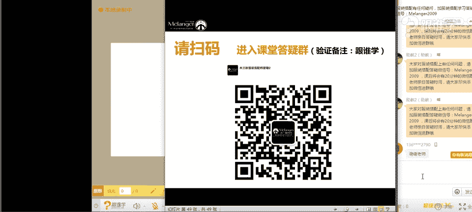
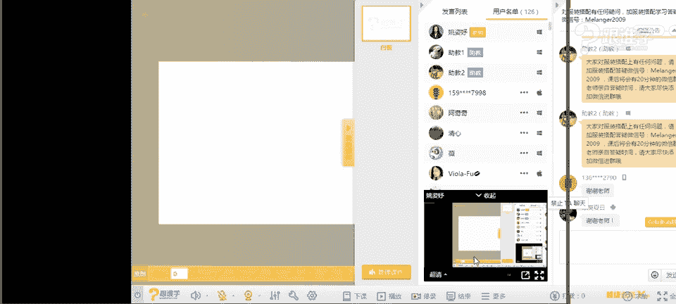

# 1、11服装《搭配秘笈之新版36计》：18牛仔裤100种可能_rec

🎼某天你会发现灯火阑珊。

あ。😮，hello，大家晚上好，现在同学们可以听得到我的声音吗？如果可以听得到的话，请打一。现在先来测试一下。OK好嗯，那我看到大家的这样的一个回复了。现在呃我们的这样的一个网络应该也是比较通畅的吧。

啊，那同学们呃谢谢看到有人夸我了啊，说老师好漂亮，谢谢你。嗯，好，那首先呢我想呃想问一下，咱们今天的教室里，有多少是新同学呢？有多少是第一次听老师的这样的一个课程的那我们的老同学的话呢，请打2。

新同学的话呢，请打一，我们来看一下今天有多少新同学，那也欢迎我们的这样的一个新同学。嗯。OK好，我看到这新同学和老同学还是交替的啊。那我发现呃这个有很多打二的同学，那应该也是之前有听过老师的课程。

但不是在咱们的这样的一个VIP的这样一个课程当中，对吗？好的啊，那既然同学们很多同学都有这个见过老师，那也听过老师的这样的一个授课，但是呢还是有一部分新同学是吗？

那今天呢啊首先老师要在这里做自我介绍一下啊，有同学说听不到看不见，嗯，那如果是比较卡的情况，或者是说听得到，但是看不见那样这个视频的话呢，可以请这些同学先退出去我们的直播房间。

然后再点进来就可以看得到了。嗯，OK好，化妆师菲菲同学说很卡。那其他同学听得到我们这边的这个呃网络是比较卡的吗？啊，如果要是不卡的话呢，大家请。打一。

然后老师现在确认一下咱们现在的这个课程是如果比较流畅的那我们就进入到我们这样的一个课程当中。其他同学听的卡不卡？如果不卡的话，请打一。好的啊，那我看到大多数同学的这样的一个回复还是比较流畅的对吗？

那我们接下来就进入到我们这样的一个课程当中了啊，OK首先呢我呃自我介绍。那我是姚姿宇老师。那同时呢是米兰欧国际时尚教育的高级讲师。那米兰欧国际时尚呢，它其实是一个呃专业从事服装搭配师的这样的一个学院。

那我们学院呢在广州啊，那我们不只是有线上的课堂。那现在大家听的课呢，其实就是属于我们所说的叫线上课堂。那么我们也有线下的这样的一个课堂。OK好。

那同时呢我也是都市丽人内衣发布会的这样的一个整体策划的呃这个策策划的这个整体视觉的秀场的这个策划搭配。那同时呢也是很多品牌的这样的一个陈列啊。然后这个整体视觉的这样的一个把控。

那包括呢也会为一些这样的杂志周刊。那包括一些明星艺人，他们这样的一些服装的造型等等啊。那接下来呢我今天就进入到我们的这样的一个课程当中了。OK好。那首先呢今天呢我们讲到的是呃这个单品片当中的牛仔裤。

那以往呢老师可能都会问，哎，同学们，你们在这个老师今今天讲的这个单品，你们有没有？那今天其实我想问一个问题？我们今天呃在我们房间当中有哪位同学是没有牛仔裤的同学们。呃，没有牛仔裤的同学，请打一。好。

我来看一下，如果没有牛仔裤的同学，请打一。有牛仔裤的同学请打2。好，其实我目前已经看到三位四位5位。嗯。好，那我们教室里现在有多少人？同学们。😊，🤧但是目前只有5位同学是没有牛仔裤的啊。

那当然还包括了这个我们的两位男同学，一为是一一切随风。那包括中有雄同学也是我们的专业的VIP课程的同学啊。OK好，那呃有同学说，唉我只有一条牛仔裤，很少穿。那么也有一些同学说我其实有很多牛仔裤。

而且刚才我看到有一位同学说我各种牛仔裤，那包括6679同学说我都不穿，那我想问大家啊，就是你们牛仔裤当品比较少的，或者说你们不穿的原因是什么？其实这一点我还蛮好奇的啊，因为其实在生活当中。

很多不管是男生还是女生，牛仔裤其实已经成了我们所说的人手必备的单品啊。OK啊。安娜同学说腿型不好看的原因是吗？OK啊，那4774同学也说腿型不好，那包括还有同学说身形不好，只穿裙子。

那包括呢有同学说腿粗的原因啊，OK那其实我看到了啊，基本上有两个原因，第一个就是腿粗的问题，对吗？那第二个就是腿型的问题，那其实还有一个问题，就是很多人不知道该怎么穿牛仔裤，或者说他选择的牛仔裤。

不是那么的合身啊，其实刚才我也有看到这样的一个同学。那呃这个是我们这个不穿牛仔裤的同学的这样的一个问题。那我想问一下，嗯，冯冯同学说，不知道该怎么搭。那我想问一下，咱们现在有牛仔裤的同学们。

你们对于穿牛仔的时候，有有有什么样的困惑呢？啊，这个潘家二小姐说大腿粗臀部大。没关系，今天你们这样的一个问题。在我们现在的这样的一个课堂当中，老师今天都会给到你们这样的一个解答嗯。好。

那既然说到这个牛仔裤的100种可能，那如果没有牛仔裤的同学，我相信听完这节课之后，应该会去买一条牛仔裤。那么我也觉得哎老师是不是要开一个淘宝店，因为我每次讲课的时候，都会有同学说，老师你的丝巾好漂亮。

老师你的配饰好漂亮。老师你的这个什么衣服很漂亮，能不能发链接给我，我觉得我可以兼职去做一个嗯这个卖卖卖卖衣服的啊之类的东西啊。好嗯，有同学开始已经提问了。那我们的问题呢，在我们今天课程之后呢。

我们会有一个专业的解答群，会给大家来这样提供这样的一个平台，让大家来进到我们的群里解答。那老师现在呢呃先进入到我们今天的课堂的这样的一个正题啦。OK好，那我们来看一下。首先呢我们先了解我们每天都在穿。

那包括其实我之前也在讲到，我们说我们现在穿的是中式呃，这个sorry穿的是。T恤的服装，不管是衬衫、T恤、牛仔，其实都是来自于西方国家。那么我们不会搭。

其实有很大一部分的原因是因为我们不了解这个单品的文化。OK那其实我们了解了单品文化之后，我们可搭性就会有很多。比如说我今天搭配的这一套服装，有没有人能看得出来，我今天穿的是哪种风格的服装呢？同学们。啊。

如果呢呃同学们现在可以在屏幕上去打，看一下有没有人能猜得出我今天穿的是什么风格。好，非常好啊，于妹妹也是我们的专业课程的同学啊，那包括阿麦仙夫人非常好啊，那这几位同学都回答对了，说西部牛仔。

恭喜那老师今天穿的的确是西部牛仔风。那我的这样的一个西部牛仔是怎么来的啊，或者说我的哪些元素是牛仔风呢？在我们接下来的课程当中呢，我会给大家来讲到啊，现在先不解答老师的这样的一套装装备了啊。

那我也是为了呃符合我们今天的主题专门穿了一套西部牛仔。OK好，那说到这个牛仔的话，那么首先我们来介绍牛仔的这样的一个由来。那大家可以通过屏幕上的这样一个字也看得到啊。那其实是在美国的这样的18世纪啊。

有一个这样的淘金潮。那有很多人呢去参与到了这样的一个淘金潮。😊，当中其实当时因为这样的一个淘金的工作，他是非常的辛苦的。那么经常会什么呢？涉及到这个磨损服装跟石头打交道。

那所以他的服装的磨损会非常的严重。那当时其实是没有牛仔裤这么一一件单品的，或者说没有这样的一个呃这种裤型的那大家穿的这样的一个裤子的话，经常会破掉和坏掉。那么其中在淘金潮当中有一个人。

那其实也是现在大家所熟悉的一个品牌的创始人，其实就是牛仔裤的一个非常知名的牛仔裤叫Lvis。我相信很多同学都有了解这个品牌。那么当时这位这位呃这个我们所说的老先生呢。

现在啊他已经是当时他也在这个淘金潮当中，那么他很快会发现唉工友们经常会因为这个裤子裤子磨损的这样的一个问题。所以呢他当时就用这样的一呃一开。开始还不是牛仔，用那种帆布类的这样的一个布料做成了一条裤子。

那呃这个其实一开始他是因为开了一个小商店，他不想去做淘金了，他觉得淘金太太过于这个辛苦，而且呢又赚不到钱。那么这些工友们经常买东西的时候不方便，他就开了一个小商店，开了小商店的时候。

他所有的物资特别容易卖，只有一件东西就是这个帆布不容易卖出去。那当时他为了把他这个滞销的产品卖出去，他会发现裤子容易破，他就把帆布做成了裤子，哎，真的当时就有人买了这条裤子之后，发现特别耐穿。啊。

那之后呢，他就开始起家来做什么呢？这种裤子了。那到后面才研发了我们所说的牛仔的这样的一个面料应用到牛仔裤当中，也其大家现在所看到的这样的一个牛仔裤的面料。

那这就是我们所说的levis先生他的这样的一个创始。那牛仔裤呢也是从他这里而来的那当时他还研发了这样的一。呃，现在所命名的这样的一个系列叫501系列。

也就是现在大家看到的这样的一个屏幕上的这样一条牛仔裤啊，那这种牛仔裤它是比较高腰和宽松版的。而且同学们现在可以看一下，你们会发现很多牛仔它都会在这种局部的位置加这样的铆钉作用。我想问一下同学们。

你们知道为什么牛仔裤上面会有这样的铆钉吗？有没有同学能够唉跟老师互动一下这样的一个问题呢？有没有同学知道？给大家这个10秒的时间，老师喝一口水啊。嗯。好。😊，哇哈，我发现同学们的答案都很可爱。

说点缀作用啊酷那发光固定非常好。有同学说到了啊，思雨同学，那包括呃这个韩呃这个这个呃对呃，这个很多同学啊这个屏幕刷的太快了，老师都没看到字呢。好，那大多数同学也有回答这样的一个问题，说装饰和固定非常好。

那其实他这样的一个铆钉也是levis先生为了什么呢？因为他们经常会往口袋里装一些东西，那会造成口袋容易破损。所以他就加了这种铆钉。

那这种铆钉也是第一款我们所说的裤子上会有这种这种呃为了这个固定服装的这样的一种铆钉的这样的一个装饰，而且这是已经他们的专利了OK好，那同学们都这个都回答对了啊。有时说这个防撕裂的结实的牢固的非常好啊。

同学们OK这就是我们所说的牛仔裤的这样的一个由来。那也就是说其实牛仔裤他一开始是给公。人去穿着的，也就是我们所说的蓝领。那今天老师穿的这样一套服装叫什么呢？也是属于工人穿着的，其实叫牛仔。那西部牛仔。

他们的工作是什么呢？西部牛仔他会把北北边的，我们说南部富北边穷，他会把北边的牛赶到南部去什么呢？卖掉。那在这样的一个这个很遥远的过程当中啊，那他们的服装经常也会这个骑马呀，会经常有磨损。

所以你会发现牛仔，他们特别爱穿这种牛仔裤，然后穿那种开裆的皮革其实是为了要什么呢？防磨，那包括呢他们会戴这种牛仔帽，其实老师今天这个还不是正儿正儿八经的牛仔帽。那正儿八经的牛仔帽。

它是两边卷翘起来的这种形态啊，我相信大家也看到就很熟悉了。那包括呢他们会搭配这种丝巾，但是他的丝巾佩戴方式，不是像老师这样啊，打一个非常优雅的蝴蝶结，而是以这样的一个三角形固定在这个位置，它是。

为了防风沙的这样一个作用。那包括他们的靴子的穿搭，也是为了这样的一个功能性和实用性出发。那所有的这样的一些我们所说的工作服一开始它都是有功能性的。包括现在大家所穿着的b布berry的风衣。

然后包括这种这个飞行员夹克等等。其实一开始都是功能性的产品。那只是因为大众觉得唉很好看。那所以呢被我们大众所使用了，那这就是我们所说的牛仔的这样的一个来源。OK那其实直到这个我们所说的18世纪牛仔裤。

牛仔发明以来，一开始我们所说的富贵的人家或者说贵族社会，他们其实是不穿着这一类的单品的但是在50世纪20年代50世纪的时候呢，啊sorry20世纪50年代反过来了啊。那奥黛丽赫本玛丽莲梦露等等。

这些名人和名流去穿着之后，哎，这件单品就在大众所推广起来了。直到我们所说的60年代其。年代80年代，他成为了这样的一个牛仔的发展的黄金时段。嗯，OK好啊，那接下来呢呃刚才我跟大家互动的时候，同学们说啊。

老师我觉得我腿特别粗，我不知道该怎么穿裤子啊，不知道该怎么选择牛仔裤，包括我说腿型不好，应该怎么去穿着。那今天呢这样的一个问题，老师都会在下面给大家来解答解答。那有同学说哎。

其实有很多刚才有同学说我不会搭牛仔裤，或者说我觉得我的风这个牛仔裤很多，但是我会发现有很多同学他买牛仔裤，他只是买一个款式和一个颜色，也就是说你经常会看到他穿牛仔裤，而且是这种同一个颜色和同一款式。

但是你问他我我这个之前有同学有一位这个学生在我们学校上课的时候，我就经常看到他穿一件那种浅蓝色的牛仔裤啊，那我就我就说你是不是唉我感觉你怎么这个这几天都没换过衣服呢。他说老师我有5条一模一样的牛仔裤。

我就。说哎，那你这条牛仔裤的意义在于哪里呢？他说我就是觉得它很舒服呀，所以我就买了5条一模一样了啊。那所以我说对于我来说，那你这条牛仔裤真的只有一个风格。

那因为他平时打扮的这样的或者说他的这样的一个搭配，就是同一种感觉。所以你就会觉得他每天都在穿同一条裤子。那么哎我今天想要反问大家一个问题，就是你们有可能会有很多种风格，比如说阔腿裤、窄脚裤、喇叭裤等等。

那从我们所说的品类的多元化上面，你们是可以分开的但是有很多同学他也会有这样的一个情况，我他就喜欢一款牛仔裤。那么我们如何能够把一款牛仔裤搭出100种可能呢？那就是今天啊我要给大家来重点去做的OK好。嗯。

我以为像上次的语音课啊，好可惜，在外面听不了啊。1755同学说，今天其实今天我我们今天是视频加PPT加这样的一个语音。OK好，那接下来呢今天给大家分享的是两个板块。

第一个针对于大家不知道腿粗啊、腿型问题啊，我们告诉呃这个要给大家重点分享的就是我们选择牛仔裤的这样的一个秘籍。那包括如何实现100种可能，也就是我们所说的多变和百变。OK好，那我们接下来看一下。

选择牛仔裤当中，那首先呢要给大家分享三个板块。那第一个是解析牛仔啊，那刚才我给大家介绍的牛仔裤的由来。但是呢我们还不是很了解牛仔裤，其实牛仔裤有很多的这样的版型工艺等等问题。

那包括我们不了解自己的体型问题，和我们的腿型问题，所以会造成很多人没有牛仔裤可穿，或者说他不知道选择什么样的牛仔裤。那。下来我们来看一下，那解析牛仔当中我们来看一下啊，有牛仔的话。

它有会会分为版型问题、工艺问题，包括高腰、中腰和低腰。那包括牛仔裤的口袋，这种细小的细节，它都会影响到我们所说所穿着的这样的一个美感问题。OK好，是不是同学们想哇，原来穿一条牛仔裤这么麻烦。

我考虑到这么多的问题。好，那接下来我们来看一下啊，牛仔裤的版型上，那首先呢我们有多少种裤型和大家可以来看一下啊，阔腿裤直筒裤、喇叭裤，微喇裤，紧身裤和锥形裤。那其实男士也是一样的啊。

有分为这种直筒裤和紧身的稍微紧身一点的对吗？那包括这种锥形裤。那有同学说老师。哎，你这里分了很多种，我想知道它的区别性在于哪里。例如说这种阔腿裤和直筒裤，我看它都是比较这种哎，好像一条线下去。

它的区别性在于哪里啊。那阔腿裤的话，它的这样的一个，它首先它也是直着这样的一个版型，但是它的腿会相对来说比较宽松。那我相信大家应该也有看到过这样的裤型啊，那直筒裤的话，它相对来说是比较窄。

但是它是从上到下都是一种宽度下来的那男士其实这种裤型会非常多。那包括喇叭裤啊，喇叭裤的话呢，这种是属于大喇叭裤，那这种呢其实就要微喇裤，那包括紧身裤和锥形裤可能有同学会困惑了。哎。

我看它好像都是一种的感觉。那紧身裤它相对来说它会比较的什么呢？贴身，而锥形裤它只是这种窄脚的形状，但是它是比较宽松的那这就是我们所说的牛仔裤的版型。那么你的腿型它会决定了。你需要穿着哪种阔腿裤。

包括你腿粗和腿细的问题，你比较适合穿着哪种呃这种版型的牛仔裤。OK那等下我们在下面就会给大家来介绍。那接下来我们来看一下，这是牛仔裤的版型。同学们记住了没有呢？嗯，好。

那接下来我们再来看牛仔裤的这样的一个工艺。那包括其实今年特别特别流行，这当中哪些牛仔裤啊，我想问一下大家，我把这个问题抛给你们，你们可以来讲一下，现在流行哪些牛仔裤啊，第一个是什么破洞亮片。

那第二个呢当中有这种我们所说的磨损啊磨白啊，那包括卷边哪流苏啊，好，我看到大家的这样的一个回复了啊，有一个同学说破洞还打了感叹号，就强调性的什么流苏啊，然后刺绣破洞流苏OK好，很多同学都会说啊。

破洞流苏渐变拼。好，那同学们你们是不是把这上面的都说完了呀？今年流行的每一个都在里面是吗？好。😊，那接下来呢我来给大家分享啊，其实今年特别流行刺绣啊。那今天有刚才有同学回答到这个问题了。

包括呃刺绣呃这种破洞，那包括流苏，或者说我们所说的那种破坏感的它可能并不是说这种流苏的这样的一个结构。但是它是那种就是好像没有这种我们所说没有锁边的这样的一个状态啊。

那就是前面短后面长的这样的一个感觉的裤脚，其实也有啊，那包括一些拼接感的这样的一些拼色和拼接的牛仔裤都有啊，O那其实今年它比较流行。刚才以上老师说到的这几款牛仔裤破洞啊，那包括这种流苏。

包括拼色拼接呃拼色和拼接，那包括这种卷边啊，渐变也有流行。那其他的啊，但包括刺绣啊，涂鸦呀、磨白呀、亮片。那啊这种元素其实相对来说还好啊，OK好，那呃有同学说老师，那我了解这些工艺是干什么呢？

我也看得出来呀，那那你为什么要跟我讲这些工艺呢？其实我们所说的这些工艺，它其实也会影响到我们在服装搭配当中的风格的导向。包括我们对于腿型的这样的一个修饰。那等一下在接下来的课程当中，我也会跟大家去分享。

OK好，那继续我们来看一下嗯。好，那这是我们所说的牛仔裤的这样的一个工艺。那接下来我们来看一下牛仔裤，它的腰线问题。牛仔裤的话它有分高腰、中腰和低腰。那以这个为标准啊，我们以这个呃呃没有所谓的标准。

我们就是以肚脐啊，来给大家来看一下这个标准啊，因为我现在怕这个这个一一说这个标准，大家又晕了，我们就以肚脐来看啊，那第一个叫什么呢？超高腰线，也就是说它都已经能到你的肚脐，这个问位都能包住你的肚脐了啊。

那而且是以上的这样的一个位置，那它就是属于超高腰线的那这个呢就叫高腰线啊这个呢就叫中腰线，这个是属于中低腰线。那这个呢就是属于我们所说这两款都是属于低腰线了，这款叫低腰线，这一款叫超低腰线。

你会发现这种其实今年啊它会比较流行哪一种。感觉的牛仔裤，哪一种腰线的牛仔裤？我想问大家，快速来，同学们来反映一下你今年流行哪一种腰线的牛仔裤。嗯。好啊，大多数同学回答的是高腰线。那也有同学说中啊非常好。

其实今年流行的就是中高腰线。也就是说我们所说的这个中呃这个中腰线也有，然后高腰线也有。那其实从这儿到这儿都比较流行。但是从这儿到这儿都不流行。那为什么呢？

因为今年它流行的或者说这两年它流行的叫70年代的这样的一个复复古风格。而70年代的特点。那它的这样的一个高腰的这样的一个特点也是比较明显的啊。那我们今天讲到牛仔裤。

那其实70年代它就特别特别流行高腰的阔腿的喇叭的牛仔裤。那等一下在接下来的课程当中我们也有给大家分享。嗯，OK好，那我们接下来看，那有同学会说到哎腰线会有产生什么样的问题呢？我们在这里给大家来讲一下。

那腰线它会有一个问题，就是如果你选择过低的腰线，它会。暴露了你的问题，就是比如说你的肚子如果特别大，包括你的肉肉很多的时候呢，那如果你选择低腰线的这样的牛仔裤。

它就对于你对于你个人来说没有一个非常好的这样的一个修饰作用。你会发现你的肉肉都在外面啊，而中高腰线，它能够对你你腹部的啊赘肉，它会很好的有一个包容性。那每次讲到我说的这种中低高腰线的时候呢。

我就会讲到一个问题，就是我们所这个每个人都会穿的小内内内裤的问题啊，那内裤问题我会发现在很多内衣品牌当中，你进到内衣品牌当中，你会发现有一类的那个小内裤啊，它是特别可爱的很卡哇伊的那种图案。

比如说有那种呃皮卡丘啊然后那种什么星星啊呃小蝴蝶结小蝴蝶结的内种内裤，它基本上都是属于中低腰线的而这种腰线，它都是给什么样的人穿着的，都是。给非常年轻的群体去穿着的。而你会发现。

中高腰线的人一般都是属属于这种30岁以后的女性，因为30以后岁以后的女性，她会面临的这样的一个就是我们所说的腹部啊，开始有赘肉了。那么低腰线的这样的底裤问题已经解决不了他们的这个这个这个赘肉问题。

所以他们要穿高腰线的这样的一个问题。所以其实同理这是一样的道理。如果肚子不大的人啊，那你如果身材非常好的，你穿这种牛仔裤，那么非常漂亮。可是如果你的肚子很大，你还穿这种低腰裤的话。

那么啊你的问题就会很明显的暴露在外面O那这就是我们所说的肚子大的，不穿低腰裤啊，那包括高腰线和高跟鞋，他能够形成什么样的一个作用，那我们来看一下啊，那就是长腿的作用。那首先我想问一下大家。

大家觉得啊同学们你们觉得这个博主他穿的这条牛仔裤怎么样啊，那对于他个人来说。有没有一个很好的修饰性呢？同学们，你们觉得一是好，二是不好，你们觉得好还是好还好还是不好呢？嗯，O有同学说嫌矮嗯。好。

OK那我大概了解同学们了哈。55分。是的，有同学已经意识到这样的一个问题了。那我们来看一下啊，那同学们是的，在我们所说的人的这样的一个深这个比例当中啊，人也是有黄金比例的。我们的头顶到肚脐肚脐到脚顶。

有一个叫黄金比例的这样的一个法则。那你的上半身跟你的下半身的比例是1。618的这样的一个比例。可是我们中国人或者我们亚洲人的比例一般都会在1。3到1。5之间。那么如果你是这种比例的话。

那么你应该如何把自己的比例调整到最完美呢？为什么我们会觉得比例这么重要，你会发现维纳斯他的是断臂的啊，它是一个断臂的标签啊，就或者说这个呃我们觉得它很美，那是为什么呢？那是因为它的比例很好。

那包括国外他们会非常显夸一个人的时候，他会夸啊，你的比。例很好啊，那我们国内都经常会夸嗯，你很漂亮，那是因为没得夸呀，夸比例，我们真的夸不过别人啊。O好。

那所以说如果我们国人是比较矮的那我们我们应该怎么去把我们的比例调整到最好呢？那就是我们所说的高腰线加高跟鞋，所以呢就等于大长腿啦啊，那我相信很多同学都想要拥有大长腿。

那么如果啊你是这种这个所以说在选择牛仔裤的时候，要选择高腰线的牛仔裤，不要选择这种低腰线牛仔裤。O那这是我们所说的牛仔的高腰中腰和低腰的这样的一个问题，那我们在选择牛仔裤的时候。

也会面临面临这样的一个问题。那接下来我们来再看一下，那牛仔裤当中，它还会有口袋的这样的一个问题。比如说其实牛仔裤它有4个口袋，对吗？啊，正确的说它有5个口袋。我想问大家啊，前面两个后面还有两个。

那另外一个在哪里呢？同学们。070714同学说，今天晚上听的不够全，老师被卡，那可能是你那边的网络不是特别好。因为我看到你好是好像是用手机登录的吗嗯。🤧好呃。

刚才有同学说前面口袋里的那个什么有一个特别小的口袋是吗？那大家都发现这个问题了。那我想问一下同学们，那前面那个特别小的口袋它是用来干什么的？好，有同学说3626同学说装打火机的，还有没有不同的答案？

同学们。嗯。好，这个小彩踩说藏钱的嗯呃装硬币的这儿藏能藏多少私房钱呢？是吧？装金子OK好，那我看到有一部分同学是有回答对的啊，那我们来看一下，那其实我们所说啊会超同学说没用过。

那其实牛仔裤前面的那个小兜，他其实一开始啊真的是用来藏怀表的啊，那我们其实很多同学都回答对了啊，那一开始是是用来藏怀表的，但是大家现在都不带怀表的，对吗？

所以呢现在是用来装硬币的OK那就是我们所说的那个小兜的作用。那我们会发现哎屁股后面会有两个兜，对吗？那大家可以看一下，那兜他也会有比较靠上的和比较靠下的问题。

那我想问同学们你们觉得如果一个人他的臀位线特别低，腿还特别短，他应该是。😊，选择哪种牛仔裤的都是上的还是下的呢？嗯。🤧。OK我看到大家同学都说的上ok那是不是反，那是不是从而也说明了一个问题。

如果我们想要显得腿长或者想要显得臀位线比较靠上啊，每个人都希望有一个翘臀，对吗？那么我们再选择牛仔裤的时候，是不是要选择都是要往上的，比如说图一的模特，它的这样的一个牛仔裤的这样的一个口袋。

它就是比较靠上面的位置的那啊这就从而说明了哎，这种牛仔裤它还会有翘臀的作用哦。可是如果你腿啊，我们说亚洲人本来比例就不好，你还选择这么低兜的这样的一个这样的一个口袋位置的话，那简直就没有腿了。

同学们来看一下啊，从这儿到这儿感觉你就是什么呢？真的变成小短腿了哈。所以说呢口袋的上与下，它也对于我们臀位线和腿的长短是有影响的。那接下来我们来看一下哎口袋的直于。

那有同学会对于这个概念不是特别的理解啊，说嗯有同学说啊这种裤兜有膨胀感非常好啊。那其实我们所说的，如果一个人。你的臀部特别丰满的时候啊，刚才有同学说，老师，我觉得我臀特别大。

那么我就建议你不要再选择牛仔裤带兜的这种了。而且你不要选择那种，比如说有的牛仔裤，它的兜会比较偏小。如果你是特别丰满的，你还选择一个特别小的兜，那一对比就显得你的臀部特别大啊。

那而且它如果你选择这种特别饱满的那种感觉的话，它会让你显得这种更加的丰满啊，也就是说其实更胖的感觉。所以你选择没有的那种还比较好一点啊？OK那如果相反想要显得臀部丰满的话。

那是不是就可以哎选择一些比如说这一类的，它其实就是有点膨胀感的这样的兜，但是这个兜，它其实是不是有点这种所说的臀位线往下走的同学们啊，那这个的话其实也会显得臀比较什么呢？往下移，而且的话会显得腿短。

那即使这个模特其实也还不错了哈。OK那其实这。这个我们是要说到是直和曲的问题啊，屁股扁平呢要选择比较丰满的这样的一个兜的这样的一个感觉。因为它有膨胀感OK好。那直和曲是什么样的概念呢？

其实也就是比如说屁股比较扁平的同学，那么你们可以选择这种曲线感的啊。如果你想要显得这种比较硬，就是例如说你太过于丰满，那么你可以选择这种直线感的，能理解吗？同学们，第一，如果你的臀部比较丰满的时候。

你在选择牛仔裤的兜的问题上。第一，你可以选择不要。第二，你选择这种我们所说的直线感的啊，那你需要回避的问题是什么呢？第一都过小。第二，都特别的这种膨胀感的而且这种是什么呢？

曲线感的都不太适合臀部比较丰满的这样的一个问题。那相反，如果你是扁平的，那你就可以往反方向去选择。那我这样讲，大家能理解吗？啊，如果理解的话呢，请打一，同学们好。啊，那这是我们所说的口袋的直和曲啊。

那包括上和下的这样的一个问题。那接下来呢嗯刚才这个讲到了这样的一个小兜，它是用来装硬币和装怀表的这样的一个问题啊，曲线感的口袋是什么意思？那我再给大家来解释一下曲线和直线的意思。

其实指的就是我们所说的线条的直和曲。你会发现这种线条它是比较偏直的感觉。而这种线条它是比较偏圆润感的感觉。那么这种它其实就是偏曲的，而这种就是偏直线感的。O好，那就解释到这里啊，先扶人。

那其实我们直这种其实都是比较专业的这样的一个理论了啊，那我们人其实也是分直和曲的感觉。那比如说同学们你们现在可以来形容一下老师，你们觉得老师是属于直线感的还是曲线感的呢？你们觉得是直的。

请打一曲的请打2，好，会上同学觉得值嗯，好，大多数同学都觉得老师比较直是吗？好吧，那老师嗯那真的是比较直的感觉。好，那其实我的这种整体的面部的特点。那包括我整个人的感觉，其实都是比较直的感觉。

那直的感觉，它给人感觉是比较硬朗的感觉。那你呃这你的气质决定了你的着装风格是什么样的，所以说人其实也是有直和曲之分的。所以在选择服装的时候，以服装也会有直和曲之分。

那么同学们啊其实有很多同学好像对于这个还蛮感兴趣呢。我在这里大概的跟大家来讲一下，那在我们今天我们讲到的是单品片，在我们的入门篇的VIP课程当中，我们会有讲到一个人的直和曲。

它分别适合驾驭什么样的服装感觉。如果同学们感兴趣的话呢，可以去了解一下我们这样的一个课程。那今天我们继续讲我们的单品问题。那刚才呢给大家解析的是我们所说的牛仔的细节问题。那对。😊。

对于这样的我们所说的工艺呀、版型啊啊它都会对于我们的腿型会有修饰作用。那包括一些这个口袋的直和取上与下，那对于我们的臀部会有这样的一个修饰作用。那包括高腰线和低腰线。

它对于我们的肚子会有这样的一个修饰作用。所以说呢同学们在这几点的话呢，自己要好好的审视一下你自己肚子大不大，那腿粗不粗这样的一个问题。好，那接下来呢我们就来了解自己的体型问题。

那其实为什么我们要了解体型，因为你的体型决定了你选择哪种牛仔裤啊，okK好，那我们来看一下。在我们这样的一个体型当中，我们把亚洲人的体型分为了4种啊XHT和A。那么这四种体型呢。

X体型它是属于比较标准的，而X体型它是属于腰比较粗的那T型它就是肩比较宽。A型是肩窄臀宽T型它其实相反是肩宽臀窄。那么每一个人都要了解自己的体型。因为你不了解自己的体型，那么你在选择服装的时候。

或者你在搭配的时候，你有可能就一出手就错了啊，因为比如说你是一个T型体型的人，你还选择一些垫肩的服装，肩章的服装，包括飞飞袖泡泡袖这样的服装，包括小领子，那么你就选择错了啊。

其实在生活当中很多人都不了解自己的体型。那你要了解自己的体型，你才知道你适合哪种领型，适合哪种廓型的服装。那包括你的体型问题，它决定了你的。下装应该选择膨胀感的还是收缩感的这样的一个问题。好。

那因为时间有限的问题呢，我们今天只给大家分享一个A型体型，它应该怎么去选择牛仔裤。那么也是刚才大家所这样的一个比较关注的一个问题。其实就是腿粗和臀大应该如何去选择牛仔裤。那其他的课程。

其他的体型如何去打造的话，我们在我们的专业课程当中会涉及到okK那接下来我们来看一下嗯。好，A型体型呢，它会有什么样的优点呢？我们来看一下上身比较瘦，腰身比较细，肩部比较窄。那大家现在可以看到啊。

这个就是A型体型的这样的一个感觉。那它的缺点就是腿比较粗壮，臀比较宽。那刚才有很多同学说，老师我觉得我腿特别粗，臀特别宽，那么你就有可能是A型体型，但是不代表你一定是一个A型体型的人。

有的人他的肩并不窄，但是他腿很粗，他有可能上跟下是平衡的，但是他的腿还是很粗。那么这即使你是这样的一个情况。那我今天在这里讲到的牛仔裤的这样的一个搭配，也是适用于你的啊。

只要你腿粗都可以运用这样的一个方法。OK好，那我们接下来嗯接下来来看一下啊，腿粗腰粗腿胖是什么样的体型。那这个2790同学，这个要经过专业的数据和测量。我们在这里是没有办法跟大家来展示的。

我们在这个专业的VIP课程当中。会给大家来一一的展示，你应该去量哪些位置。那包括怎么去计算你的体型，体型它其实是需要数据来计算出来的。OK好，那我们接下来看那这个我们所说的唉腿特别粗的。

和是这种所说臀比较宽的人，他在选择牛仔裤的时候，要选择下装相对来说要深沉一些的。因为他的肩很窄啊，他他如果这个上身穿的特别深色，下身穿的特别浅色，那他就重复了自己的体型，它看上去就更A了。

也就是说看上去就像一个梨子的感觉。那所以说他下装颜色要选择深沉一些，包括腿比较粗的人，也要选择下装颜色要深沉一点的啊。那比如说这位博主大家现在可以看一下，在屏幕当中，这位博主他的腿也不细啊。

同学们可以好好观察一下。比如说你看他穿浅色牛仔裤的这样的一个视觉效果，腿相对来说都还挺粗的那这位。博主呢其实也非常有名。那胜在什么地方呢？他其实就是被称为唉腿很粗的，但是非常会穿衣服的博主。

那大家可以看一下，当你会发现他穿这种高腰的牛仔裤，然后是深色的时候，包括他的尖头黑色高跟鞋也会给他起到一个拉长。它整体的腿部线条的问题，你会发现整体的比例会非常好，而且显得特别瘦，有木有啊。好。

我们继下来看那这两张的话，其实虽然这个颜色没有这个颜色深，但是他相对来说都是比较深色的感觉。所以说都会比他穿这种浅色牛仔裤啊，要显得比较瘦，对吗？同学们嗯，那所以说呢你会发现这种那这两条牛仔裤当中。

因为这条牛仔裤是比较低腰的中腰的啊，相对来说是说中低腰的感觉。那所以它就没有这种中高腰的穿起来第一要显得下半身的这种腿腿部线条显得比。比较好。那第二，它的颜色会有延伸感，所以它的什么呢？

这个视觉上没有被分割。你会发现这这这一身的话，它的呃第一次分割，第二次分割，它会有视觉分割感。而这个的话，它基本上从上到下都是一个颜色。你会发现哇又显得很高，又显得很瘦。所以说选对颜色非常非常重要。

那牛仔裤的话呢，如果下身比较胖的人选择深沉的色彩会比你选浅色的颜色要好OK好，那我们继续来看一下啊。那如果呢你想要穿浅色的牛仔裤怎么办？那我相信很多同学会说，老师，那难道我夏天也要穿黑色的吗？

难道我一辈子都只能穿一条黑色牛仔裤吗？或者深色牛仔裤吗？当然不是，那老师在这里要给大家来解决这个问题啊。如果你的腿是比较粗的。那么你选择这种浅色一点的牛仔裤的时候，应该要怎么选择。

这个就要涉及到我们所说的工艺问题了啊，那刚才我们所说的拼接呀，包括这种磨白呀，它的作用在于哪里？那比如说啊第一个这种拼接，你会发现这种深色和浅色的拼接手法。第一啊它又可以很时尚。

而且呢它还会有瘦身阴影的感觉。那瘦腿阴影的感觉啊，你会发现哎，好像他的腿部的线条就很瘦的感觉，你比这种啊这种这个纯浅色要来的好啊，那包括他的上妆又对他的腿有这样的一个遮盖作用。

那所以说他的腿的大腿很粗的这样的一个问题，就得到了。这样一个修饰和掩盖的作用。那第二个这种叫磨白的效果。那这种磨白效果呢，它会形成一个叫什么呢？你会发现白色的这一条磨白，它会往前走，而深色的往后走。

就有一种我们所说的叫前进和后退的感觉，你会发现他前进的这样这一面，你的视觉错觉就觉得啊他好像腿就这么瘦一样，他的深色的对他的腿来说是有修饰作用的。所以说呢这种瘦腿阴影的设计。

对于腿比较粗的人来说的话是非常非常适用的这样的一个工艺的这样的一个效果。那我相信呢有很多腿粗的同学可以去尝试一下这样的一个法则。那包括呢如果你腿真的很粗，你又想穿这种特别浅的颜色。

那我建议你可以使用这样的上装长一点的，来稍微修饰一下，那把你的脚踝再露出来，那么就非常完美了。OK好，那这是我们所说的密籍啊，瘦腿阴影的。这的一个设计。那包括秘籍3。那刚才我跟刚跟大家来提到。

我说把你的腿最瘦的位置露出来。那这是我们所说的什么呢？把你的优点暴露出来。比如说这条牛仔裤它其实就是把什么呢？哎同样一条是不是还是刚才那条磨白的，但是你会发现它是这种九分设计的。

今年其实特别流行这种九分啊，那这种牛仔裤的这样一个设计。那这种的话就是把你脚踝最最最瘦的位置，因为脚踝的这个位置其实是很难堆积脂肪的，所以这个位置的话，它相对来说是非常纤细感的。

你把这个位置一暴露出来的时候，你会觉得啊整个人看起来都很纤细感。而这条牛仔裤这种大的破洞的牛仔裤，它也会把你什么呢？就会有一种所说的这种也是叫视觉错觉。

它会把就会觉得哎你的腿好像只有你露出来的这种感觉这么瘦一样啊，那其实我见过很多相对来说比较丰满的人，他们会比较喜欢穿这种牛仔裤。那包括这种牛。

牛仔裤对于他们腿的这样的一个粗壮的这样的一个修饰作用也会非常好。那如果大腿比较粗的同学们，你们可以尝试一下这两种工艺啊，那包括这种设计的这样的一些单品。OK那在我们所说的这样的一个A型的腿粗的问题上呢。

给大家三个秘籍啊。那这个第呃第一个秘籍呢，是我们所说的这样的一个呃这个在选择牛仔裤的时候呢，要选择这种下装要深沉的颜色。那第二个的话就是我们所说的瘦腿阴影设计。

那第三个的话就是我们所说的这样的一个露最瘦的位置。同学们这个记住了没有？OK那继续呢我们来给大家啊。解答到这样的几呃几款版型的牛仔裤。那比如说这个腿这个腿型比较粗的和臀部比较大的。

那么你是有或者说你属于A型体型的啊，那么你就会比较适合穿哪几款牛仔裤呢？我打了叉的就是不太适合的啊，那你比较适合的就是直筒裤喇叭裤和什么呢？微喇裤这三款牛仔裤，那有同学说哎。

为什么我会比较适合这几款牛仔裤，其他的不能尝试。那第一个问题，如果你的腿特别粗，你还穿这种紧身裤会让你的小腿特别细，大腿特别粗，一对比就会显得你更粗了。那第二种这种锥形裤其实也是一样的道理啊，那第三种。

那有同学说哎，那这种阔腿裤把我的腿都盖住了呀。那为什么还会显得我腿粗呢？其实这一款牛仔裤的这样的一个问题呢？它是适用于腿粗，但是臀比较窄的人。那如果你的臀又很宽，腿又很粗，你穿这种直筒裤的话呢。

就会显得更胖。所以说呢如果你是这个腿比较粗的人呢，那你可以选择阔腿裤啊，直筒裤喇叭裤和微喇裤对你的修饰作用都会比较好。为什么？因为直筒裤它是对比不出来你的腿型问题，那喇叭裤的话，因为它下面的喇叭特别大。

它会对比的你的大腿特别瘦，那微喇裤其实也是一样的道理。这几款牛仔裤对于你的修饰作用都会非常好。而臀比较大的人呢，它是需要回避阔腿裤这一件单品的。因为这个问题的话，我就不在这里多重复了啊，OK好。

那接下来呢我来啊有同学回答这个问到说A型臀大啊，然后这个腿比较瘦适合穿哪种啊？那如果你大腿比较瘦的话呢，其实你应该很多的牛仔裤都会比较适合穿的那其实这个A型身材。

如果你的腰是比较细的那么你其实很多牛仔裤都可以穿。可是如果你的臀又大腿又粗，那么很多牛仔裤你都需要回避。OK红颜一笑同学嗯理解了吗？好，那这是荣总所说的要了解自己的体型问题。

那接下来呢刚才有同学说自己的腿型问题不了解，那我们来看一下腿型的这样的一个问题。那如果有的同学同学说哎我的腿其实并不粗，但是我的腿型不好，那其实就是这样的一个问题了啊。就比如说林允儿。

她呢韩国女明星她就是这样的一个问题，她她非常瘦，但是非常瘦穿牛仔裤就好看了吗？啊，那并不是说啊。牛仔裤不好看，而是你要选对牛仔裤，那他这种牛仔裤就很明显的暴露了他的这样的一个腿型问题。

其实它是有点O型腿的这样的一个问题。那接下来呢同学们你们现在可以低头来关注一下自己的腿型问题了啊，看一下自己是不是长了一双好腿啊，那我们来看一下腿型当中其实分了三种腿型，第一种是O型腿，第二种是X型腿。

那第三种是标准腿型。那这三种腿型呢，那大家可以对应一下啊，如果在身体放松站立的情况下，双脚可以并拢，但是膝盖和小腿包括大腿都不能并拢的话，那么就是属于O型腿。可是如果啊你是大腿可以并拢。

但是小腿和双脚都并不拢。那么你就是X腿型，那标准腿型呢，老师就不在这里多做多做这样的阐述了啊。那包括其实有很多同学还还会属于一种体型，叫什叫OX。X腿型，那比如说它这个地方是有点缝隙。

包括这个地方都是有点缝隙的。但是它的什么呢？膝盖和脚踝都是可以并得拢的。OK那这种腿型的话也是比较好穿这种这个这个裤装的啊，它选择裤装时也没有太大的问题。但是这两种腿型相对来说就会比较麻烦。

那我来看一下，那如果O型腿的话啊，时间问题，老师只在这里分享一种其他的这样的一个腿型，我们会在专业的VIP课程当中会跟大家去分享的那如果你是O型腿的这样的一个问题的话，那我么们来看一下如何选择牛仔裤。

那O型腿的腿型呢，它会比较适合直筒裤阔腿裤，包括喇叭裤。那这三种裤型的话呢，喇叭裤相对来说其实没有前面两种裤型要好。但是。它会比窄脚裤，就是那种紧身的窄脚裤效果要来的好。那包括O型腿。

它不太适合穿什么呢？裙装当中的话，它不太适合穿短裙，因为它也会暴露自己的这样的一个腿型问题啊。那所以如果刚才有同学说自己是不是这种O型腿呀啊，那包括有同学说老师我的这个腿型是OX的啊。

那有很多同学会说唉我是X腿型，那如果你是O型腿的话，可以参照这两种啊，穿这个这几条牛仔裤的这样的一个版型。嗯，好，那接下来我们来看一下啊，那在这样的一个嗯选择牛仔裤的秘籍当中。

我们给大家分享到三个版块啊，一个是牛仔裤的这样的一个版型。第二个的话是了解自己的体型。那第三个的话是了解自己的腿型。那同学们你们了解自己的体型和腿型吗？啊，如果要是不了解的话呢。

要好好的了解了解这个问题啊。OK好，那我们接下来看。看一下，那第二个就是如何实现100种可能了啊，也就是我们今天课程的这样的一个主题。那我有一条牛仔裤，那我怎么把它搭成100种效果呢？

当然老师在这里展现100种是不太可能的那我们会给大家展示多样化的这样的一个风格。那其实我们所说的这样的一个100种可能，它指的是一种风格的多变性。有很多同学他其实是属于所说的，唉，腿型长的也特别标准啊。

体型也很标准，但是它在搭配的时候，你会发现它的风格是非常的局限化的啊，那包括其他的着装风格也会比较局限，不只是牛仔裤的这样的一个问题。当然我们今天解决的是牛仔裤这样的一个风格的问题啊。

那比如说啊我们其实在牛仔裤的搭配当中会有非常非常多的这样的一个牛仔裤的风格。那我现在现在来给大家展示啊，第一种叫什么时尚运动风。那。我们来看一下啊，时尚运动的牛仔裤。那这里呢是一条牛仔的短裤。

那我们来看一下女生的啊男生的，上面是女生，下面是男生。它的这样的一个时尚运动感来来自于哪里呢？啊？比如说它的棒球帽啊、运动鞋呀，那包括这种卫衣呀，跟这种牛仔去做结合的时候，它产生了这种时尚运动感啊。

那就是我们被我们所说的叫时尚运动风。那包括西部牛仔风。那老师今天穿的就是西部牛仔啊，我可以给大家来展示一下我的这样的一个整体的效果啊，为了这样的一个呃为了我们这样的一个课程啊。

我还专门穿了这样一个牛仔的风格。那大家可以看一下，穿的是一条这种麂皮的短靴啊，那整体的话其实都是这种牛仔的风格。嗯，今天在课呃在我们的这样的一个课程当中，我还等一下会给同学们来变一个身啊。

那给大家来展示另外一种风格。那包括呢啊这是我们所说的西部牛仔。那包括机车风格。嗯，谢谢同学们啊，那包括这种机车风，那包括什么呢？混搭风格。那比如说这种什么呢。淑女装混搭这种牛仔裤啊啊一种是比较中性感的。

一种比较淑女感的。包括这种西装配牛仔裤啊。西装我们说是非常正式的这种感觉。那老师一站起来图太小了，老师能把PPT放大吗？那咱们这个PPT的话呢，呃只能控制到这么大，等一下我们在后面会给大家来展示图片啊。

不要着急好，那接下来我们来看一下啊，漆皮风格啊，那比如说这种运用很多这种流苏啊，那种民族图案呢，包括这种男士啊，他拿着这种花，其实我等一下再会跟大家详细的去介绍啊，这种漆皮的这样的一个风格。

那包括军旅风格。那你会发现，其实我们可以展示很多很多的牛仔的这样的一个着装风格。那它不只是我们平时所穿的一件T恤就搭配一个牛仔就结束了。我相信大多数人都是这样穿的对吗？

同学们那所以说呢嗯有同学说老师一站起来就觉得老师很高，嗯，老师的确很高1。7。嗯，好，那这就是我们所说的牛仔裤，它会有很多的风格。那今天课程时间的问题，我们给大家来详细的解析一种风格，就叫嬉皮风啊。

那这种风格也是非常今年特别特别流行的风格。因为今年是什么呢？我们所说的今年流行的这样的一个阔腿喇叭裤，包括这种牛仔这个这个阔腿裤。那其实它都是属于70年代的这样的一个嬉皮风。那这个风格呢。

它的这样的一个历史由来。那包括它的这样的一个文化。为什么会穿成这个样子呢？啊，接下来呢老师给大家来简单的这样的一个阐述啊，那在70年代的话，有这种这个我们所说的叫嬉皮式风格，它是来源于什么呢？

来源于美国在20世纪50年代之后呢？啊，在其实50年代之前，我们说40年的时候是这个二战时期，当二战已经结束了人们的这样。的一个物质水平已经慢慢的稳定了，经济也发展了，你会发现人们的生活越来越什么呢？

在60年代、70年代的时候，这这个年轻人啊，他们的父辈战斗，然后呢积累了财富之后呢啊到他们这一代的时候，他们就会觉得享受着很多的这样的一个。物质的享受，比如说什么车呀房子呀啊不用考虑这种战争问题了。

你会发现在那个年代精神上它会比较空虚了啊，物质满足的时候，人的精神就容易空虚。而这一代的年轻人呢？他们有着这样的一个主张，就是什么呢？在当时其实美国他参与到了一个越南的战争当中。

就是越南的战争是南越南的南部和北部的这样的一个战争。但是美国呢他支持了越南的南部。所以呢其实美国有很多人去什么呢？参与到这个当兵去这个打仗，而这一代的年轻人，他们是什么呢？反对暴力啊。

反对这样的一个什么这个这个战争，他们是这种想这个支持和平的啊，主张仁爱主义的那在那个时候呢，他们就以这样的一个方式是什么样的方式呢？

就是这种呃反当时的这种我们所说美国当时的穿着已经是非常简洁和干净的这种状态。而他们把自己打扮的好像是有点将其。的感觉啊，而且穿着着装一这种很奇异的服装。其实呢是因为他们的内心向往的是什么样的一个力量呢？

就是宗教力量。其实当时他们向往着东方的文化，所以他们会穿一些很有神秘的色彩的感觉，包括图案，比如说我们东方有很多的这样土耳其呃这种东方文化或者亚洲这种这种文化啊，它的这样的一个元素，比如说这种呃印度。

然后他会有这种这种这个袍子，那包括这种土耳其的袍子，包括很多民族元素，比如说这种呃波西米亚呀，然后非洲风情啊等等。那所以你会发现他们的着装当中有很多民族元素，比如说这种很很这个流苏啊，有流苏。

那包括羽毛，羽毛和流苏，其实就是来源于我们所说的印第安，因为你会发现印第安是不是特别喜欢在羽毛的那种头那种发饰啊，那包括流苏呢是因为当。哎，人们在跳舞的时候，这种流苏它会摆动啊，这种韵律感。

那当时呢这一批嬉皮士呢，他们就崇尚这样的一个文化。那他们也相信我们所说的这种爱的力量，他们会非常喜欢带那种呃有彩色的这种念珠或者是用这种珠子组成的这样的一些饰品啊，那为什么因为这种视品。

他是被我们所称为，你会发现我们信佛的人很喜欢带这种珠子。因为它是在这个蕴含了一种爱，他们也会称为叫爱蜘蛛啊，那包括呢他们也会称这种叫有一种呃这个嬉皮士也会称为叫什么呢？花的力量。为什么呢？

因为当时有一张图片对人的这样的一个影响特别深刻。就是呃嬉皮士，他们在这个美国军人的呃士兵的这样的一个枪口上插了一朵花，他们主上这样的一个和平主义OK啊，那这就是我们所说的嬉皮士当时的这样的一个文化。

其实嬉皮士他并不是我们所说的这样的一个一开始他并不是着装风格。它是一种运动，是由一批年轻人主张的这样的一个反战争的运动。但是他们这种反战争的这种运动的话，他们他是相对来说有点积极这种消极情绪的。

他们什么呢？崇尚这种群居生活，然后大家聚在一起呃，这种什么呃享受这种摇滚音乐，包括他们可能会吸食毒品。所以说啊那嬉皮式文化呢，当时而且他们会认为流长头发就是解放和自由的这样一个代表。

所以你会发现很多的嬉皮男士啊，比如说这种长发。那这个的话其实就是当时70年代的流行流影。那大家可以看一下，今年我们看当时的这样的一个打扮是不是觉得啊很时尚，一点都不low的感觉。

就觉得70年代那个时候都已经非常时髦了。那是因为今年的流行，它就什么呢？复古了那个年代，但是我们加入了新的这样的2016的元素。比如说这种什么他的牛仔裤是变短了的，而不是原原本本。

的复制了当时的这种长的喇叭裤。今年的喇叭裤，它是九分的喇叭裤啊，OK那这是我们所说的70年代的这样的一个装扮。那我们来看一下现代人是如何穿嬉皮式的。比如说他们经常会在这种音乐节当中去穿着这种服装啊。

那大家可以看一下啊，这种流苏啊，然后这种你看牛仔搭配各种啊，老师找的图片都是牛仔搭配各种这样的带有这种这种羽毛的元素，这种民族感的东西，那包括这种色彩，它其实都是有点这种自然感的。他们崇尚这种自然啊。

O好，那包括这种所说的这种自然这种这种民族感的配饰啊，好，那我今天也有准备一些配饰，等一下可以给大家来展现一下这套着装风格的时候啊，来给大家看一下嬉皮式是怎么样的穿着的那包括呢现代的都市穿搭当中。

有很多同学会说，哎老师我干嘛要非要穿成那个样子，我觉得不太好意思出去啊，风格太过于特别了。那其实我们可以运用其中的某一些元素，例如说这种有民族图案的呃民族感的配色感。那比如说这种麂皮跟牛仔的啊。

那它就是有这种自然做旧感。那包括这种帽子，其实它也是非常典型的这样的一个很多漆皮士都会去选择戴的这种帽子啊，那包括牛仔其实也是C皮当中非常非常重要的一个元素嗯。好，九上妹子说没有看出来嬉皮风格。

那是因为它只是运用了某一些嬉皮的元素。比如说这个帽子，那这一套服装风格当中，现代人他不会去完完全全照搬当时的嬉皮的感觉，理解吗？这就是很多人他去玩时尚的时候，他不会去把原本的东西搬到身上来。

它是运用某一些元素，比如说这种波西米亚的风格的内搭啊，包括这种牛仔裤，包括这种嬉皮帽子啊，它其实都是有一种嬉皮感的啊。那这是我们所说在现代的穿搭当中可以运用到的嬉皮元素。

那接下来我们来看一下经典的嬉皮元素有哪些呢？啊，比如说这种麂皮民族元素的饰品牛仔裤啊，那包括民族元素的图案，那包括流苏。那这就是我们所说，包括花，他也是非常你会发现很多参加音乐节的人。

会非常喜欢戴那种花环，那其实这都是我们所说的这样的一个嬉皮式的这样一个元素嗯。好，这帽子我感觉像西部牛仔帽，你是说老师头上的帽子吗？还是哪里的帽子啊？OK好，那呃我想问一下大家。

那现在我给大家展示的一系列的图片啊，都是关于西就都是关于牛仔的啊。那我想问一下同学们，你们能不能看出来哎，这些时尚达人，他们都是怎么去搭的这套风格它是什么风格呢？有没有人能够认出来。

第一套服装风格有没有人能够认得出来呢？啊，那包括这三套同学们都可以解答一下，你们发表一下这个123这三个服装风格，大家可以来发表一下，你们觉得是什么样的一个风格呢嗯。嗯，有同学说机车好，军旅。好。

只有三位同学回答了。那是其他同学回答不出来吗？还是不知道呢？好，那我来给大家来解答一下啊，刚才有同学说是机车风，其实这三套风格它都是有军旅的这样的一个痕迹载的。为什么呢？

啊因为这三件其实它都是有这种我们所说的呃军装元素啊，比如说第一件，它其实就是这种我们所说的飞行员夹克变异而来的第二件它的这样的一个军绿色的感觉。那包括这种呃这种这种这种我们所说的上装外套。

其实它都是有种军装感的那包括这一件这一件服装呢，它其实是来源于什么？我们所说的叫拿破仑时期的军装啊，那这种军装和我们现在所看到的很多军装的感觉还是不一样的。所以说那是因为大家为什么很多同学看不出来。

那是因为同学们你们对于风格的了解太过于少了。所以你们对于什么呢？在搭配的时候，哎，不知道该如何能够把它搭出彩啊，这就是我们要学习的东西。OK好，那下一套展示当中，我想问大家。

你们能够看出来这些风格是什么风格吗？123。呃，蓉蓉说怎么才能了解风格呢？蓉蓉同学不用着急，你已经呃呃现在你学的是咱们的入门班，对吗？

那我会在我们的单品的VIP课程当中会跟大家来讲到一些呃这样的像今天其实我就有给大家讲到的嬉皮，其实它就是风格呀，那今天老师就有给大家分享嬉皮风格。那么你们了解嬉皮风格之后，你们就知道。

哎原来以后牛仔还可以这么穿啊，那这三套我来给大家来讲一下啊，那包括有同又又有同学说啊，休闲自然街头前卫，那有同学说机车嬉皮风都不对啊。那当然有一位同学回答到了一个点，那第一套其实它叫我们所说的街头风。

为什么呢？这种我们所说的字母和这种这种涂鸦式的这种彩色图案，其实它就是一种街头的元素的。你会发现经常会在这种黑op当中会有运用这种图案，那这种就是属于我们所说的平民化的风格。那这种叫街。风格当中的一种。

那另外呢这两套呢，其实它就是我们所说的唉朋克风。有同学说，唉，机车风跟朋克风有什么区别呢？机车和朋克在本质上有很大的区别。那我们在我们的专业课当中跟大家会去详细的介绍啊，机车风它的这样的一个感觉。

它不会使用太多的这样的一个破坏元素。那这两个你会发现这种英伦的格子，它就是来源于英国，英国它有最正统的这样的一个着装，但是也有最叛逆的着装。在英国他们经常会使用格子。

而这种就是我们所说的在朋克风当风格风格当中也会经常使用这种格子。那包括这种破洞的牛仔，包括这种chocker，包括这种我们所说的马丁靴其实都是比较偏朋克感的啊。OK好。

那我发现大家对于这个街这个这个这个这个风格的了解真的太少了啊，同学们你们要多去学习，那包括这三套风格，我给大大家来解析一下第一套装性，第二套运动，第三套混。

混搭淑女和这样的一个这种中性感的这样的一个混搭。所以你会发现啊原来一条牛仔裤，它可以搭配这么多种风格啊。那接下来呢我给大家来展示一种其中的一种风格，也就是今天给大家详细的去讲解到的一种风格，叫漆皮风。

那同学们想不想看呢？啊，如果想看的话呢，把你们的小画画这个刷起来啊，好像咱们这里没有花，对吗？没有花也没有关系，啊，你们可以给这个给老师发一下表情。那我也就知道那同学们你们这个哎是不是很想看啊。

那首先我先把我的配饰先取掉啊。同学们给大家现场来变套变一套漆皮风。那因为我现在穿的是这种我们所说的叫鸡驰的这个牛仔风啊，那牛仔风当中我会用到这种牛仔帽啊，包括这种丝巾啊。

那包括我手上的这样的一个这种嗯皮革的这样的一个鸡皮感的这样的一个皮革，其实它都是属于牛仔牛仔风。但是。那我只需要呃把我的外套脱掉，然后呢简单的给大家来换一件这个马甲。

然后呢再加上一些配饰就能够表达我们所说的西皮风了啊。那同学们我先消失呃，10秒钟马上回来啊OK。Yeah。好啊，同学们我又回来了。好，那我现在呢加了一件这种极皮的流苏马甲。

那现在大家好像还看不太出来什么问题啊。那接下来呢我来一一的给大家来佩戴配饰啊，那现在给大家来展示一下，我们有很多的这样一个配饰。那我现在一一的来带上去啊，那我刚才说到嬉皮风格当中。

它会有很多的这样的叫什么呢？爱蜘蛛，也就是我们所说的这样的珠传珠串念珠的这样一个配饰。那这种配饰呢，它都是那同学们可以看一下，等一下我戴完整之后呢，它会有很多的这样的一个呃这种有点民族色彩。

比如说这种感觉呢，大家可以看一下啊。我会大量的去佩戴啊，那同学们肯定会觉得啊老师哇塞，你怎么这个有这么多这样的珠串呢？因为我们线下课程当中，其实我们会经常运用到很多的教具去做练习。

所以我们的这样的配饰会非常多啊。那现在呢我已经把这个配饰都基本上手上的配饰戴完了啊，那接下来我们来看一下，还是可以添加哪些配饰，增添我们的这样的一个民族感。

那比如说我现在带一串这样的一个这个民族感的这样的一个项链。嗯。好，那其实现在已经还挺有这种民族感的对吗？同学们，那接下来呢我再来一件单品啊，那这个单品的话就是非常非常容易出我们所说的叫风格和调性。

是一条羽毛的这样的一个头饰啊，我们来看一下。🤧那这种羽毛头饰呢，他我我现在还没戴好啊，同学们不准笑，老是把这个配饰修整一下啊。嗯，有同学说必须要戴这么多吗？啊，那这个根据你个人的喜好的问题。

老师只是把这个风格展现的是比较明显化的啊，如果你喜欢的话呢，那你就可以戴多一点。如果你不喜欢的话，那你就可以戴少一点啊。啊，这个这个头发有点难戴啊。好，那我现在大概给大家来展示一下，就是这个意思啊。好。

那这就是我们所说的这样的一个呃整体给人感觉，其实就完全变了一种感觉啊，就是我们所说的嬉皮式，那包括其实有同学他不想戴这种羽毛的吊带的话呢，还可以展现另外一种感觉，等一下我再给大家佩戴啊。

那同学们像民族风是吗？啊，那大家还可以再整体再来看一下，是不是不用刚才又变了一个人的感觉。那刚才呢其实就是我。我所说的这样的一个呃西部牛仔风。那现在的话呢我就是一个呃嬉皮士了啊，请教我嬉皮士。好。

那其实呢啊不一定是非要带这种羽毛，那还可以戴这种头饰啊。我给大家来展示一下。那这种的话也可以有这样的一个感觉。啊，像民族风啊哈那其实这个的话，刚才我给大家介绍了，我说嬉皮它的元素是什么呢？

它经常会运运用在这样的一个珠串这种麂皮牛仔。那包括他们还会运用这种帽子。那包括其实我戴这种帽子也可以啊，他也是这种嬉皮式的那样一个感觉。那其实我们所说的嬉皮式风，它是更加接近于中性化。

那民族风我想问艾瑞同学，民族风是哪一种风格呢？民族它包含很多包含日式，包含中式，包含印度包含各种各样的民族，那民族是一个大的概念啊？OK好，那今天这个风格就给大家来展现到这里啊。好。

🤧那所以说呢那今天呢同学们学到很多的干货知识啊，因为今天的课程呢真的是非常非常丰满的啊。所以说呢我们一直啊老师也一直给大家强调一个概念，就是我们所说的搭配是要学习出来的啊。那今天呢大家学到了哪些呢？

那同学们你们现在可以在屏幕上去打一下，你们觉得唉今天是比较有收获的点是哪些呢？今天老师给大家分享到好几个点啊，一个是我们所说的牛仔的选择秘籍，选择当中会涉及到体型啊，腿型问题，那包括呢牛仔裤的版型问题。

那包括很多的风格的这样一个问题啊。前行同学说西皮与波西米亚有什么共同点吗？当然有啊啊其实他呃他们之间有很多的这样一个共同点的啊。那等下呢如果大家有疑问的话，可以到我们的这样一个解答群里面啊。

是会回复的啊，那呃在我们这样的一个呃线上课堂中当中呢啊同学们这个问题真的。是很踊跃啊OK那呃首先呢再给大家来强调一下。那同学们既然已经听了很长时间课了。那同学们，你们对于米兰欧应该也大概有所了解了啊。

那我们线下的呢会做很多的这样的一个秀场的视觉策划搭配。那同时我们也会为这样的一个服装的企业培养专业的这样的一个人才。那包括呢我们很多学员学习完之后都会到这样的一个工这个这个平台当中去工作。

那呃今天呢我们给大家来介绍一下，我们接下来要开的这样的一个专业课程当中了啊。那如果同学们想要听我们更加专业的课程当课程的话，请可以可以到我们这样的一个平台当中啊。

去跟老师去了解一下我们的这样的一个专业课。那在单品课程当中呢，我们会分享到外套啊，内搭、裤装、鞋履裙装和特色篇。那大家可以看一下，我们会包含军旅大衣、机车夹克、双排扣风衣，包括时尚西装啊羽绒。

服那等等啊，那大家可以看一下，有很多的单品。那今天呢同老师只是给大家分享一种单品而已。那其实我们说了搭配是要靠学习出来的，而不是凭感觉去搭配的那你会发现老师其实刚才在搭配的时候。

我都是遵循了某一种原理啊，那或者说我了解了很多的这样的一个知识内容，我才能够搭配出来这种风格，你们为什么不了解，或者你们为什么搭配不出来，那是因为你们没有经过学习。OK好啊，最后放一个超级大招。

那在1月19号之前的同学报名呢？可以享受到我们现在这样的一个优惠的价格，叫4499啊，那在这个1月呃这个19号之前还可以享受到老师会为你这个通过不同的维度为你做这样的一个形象打造。

比如说这样的一个啊这样形象的这样的一个诊断。从我们的连气质，包括今天在课堂当中。涉及到的体型的问题，如何去测量啊，如何能够得到你的这样的一个体型问题。那这些都是同学们每一个人都必须要了解的。

因为你不了解自己的气质、体型和脸型的话，那么你在选择单品的时候，其实会有很多问题的啊。OK好，那刚才其实在课堂当中有很多同学有好多问题啊。那如果同学们啊老老师讲的好，谢谢分享。

那如果同学们觉得老师讲的好的话，请到我们的这个呃跟谁学去跟老师做一个好评啊，那OK那其实如果大家现在有问题的话呢，可以进到我们的这样的一个答疑群当中啊，我们的这样的一个答疑群的话。

现在大家可以拿出手机来扫我们屏幕上的这样的一个二维码。如果同学刚才因为在屏幕上有很多的问题，老师要讲课，其实是看不到屏幕上的一些问题的那同学们你们现在可以进入到我们的答疑群。

老师在10分钟之后会一一的跟老师来呃跟同学们来解答你们的这样的一个问题。比如说啊就milan2009。现在大家屏幕上看到的这样的一个二维码。那同学们如果有疑问的话，可以现在扫二维码进入到我们的群当中啦。

啊，那今天的这样的一个线上的课程就跟大家分享到这里。等一下十分钟之后，我们在我们的专业的啊课堂的答疑群当中去见面啦。同学们。嗯，好的，拜拜。嗯，嗯，好的，谢谢同学们，谢谢谢谢你们。嗯。好的啊。

如果要进的话，请扫我们的这样的一个屏幕上的二维码。如果你有疑问的话呢，可以在群当中跟老师这样的一个回应。OK好，拜拜同学们。

