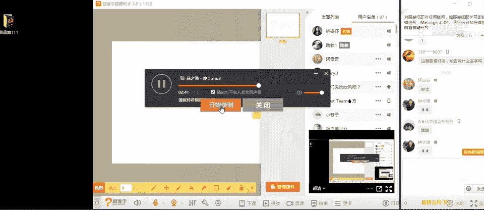
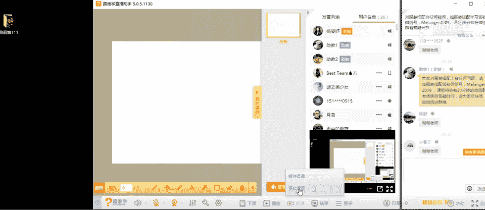

# 1、11服装《搭配秘笈之新版36计》：19飞行员夹克_rec

。

🎼风尘注定。hello，大家晚上好。呃，现在是试音阶段。那如果可以听得到的同学的话呢，请打一。😊，okK好，我看到我们的钟永雄同学特别积极啊，每次好嗯那。嗯，好的，雨中的下河，然后科梦流年似水呃。

2527啊，今天的话应该有很多新同学吧。啊，那个老师现在突然有点这个错乱了啊。我觉得哎一看到很多VIP的学员，我还以为现在是在专业的VIP课程的啊。

那今天呢给大家分享的是我们关于我们所说的飞行员夹课的这样的一个单品啊。我看到了同学们的这样的一个回复，谢谢你们。嗯，好，那呃看到刚才大家很踊跃的这个给老师回应。那现在我想了解一下我们有多少新同学。

今天第一次听课的同学有没有呢？如果有的话，请打一，如果是老同学的话呢，请打2啊，不管你是不是我们的专业的同学OK好嗯。还是很多呃新同学的第一次听课的同学是吗？嗯，好，OK啊，那我大概了解了啊。

那我是每次其实上我们的这样的一个公开课的时候，都会问一下大家，有多少是新同学，当会是老同学，那其实老师是想要知道有多少同学是不认识老师的那老师的话要呃自我介绍一下。

因为呃同学们来到我们这样的一个线上课堂来听课。那呃其实更多的当然是想要了解我们的这样的一个服装搭配的知识。那么对于服装搭配的这样的一个知识的传导者，包括这样的一个平台。

那我相信同学们应该也是要需要了解的。因为你不知道哎我听的今天晚上这样这堂课是由什么样的一个呃专业的系统或者什么样的一个机构啊，传递给我的这样的一个课程的系统呢？那接下来呢啊老师首先来自我介绍一下。呃。

看不到老。师的话呢可以先退出我们的这样的一个教室，然后再进来。谢谢阿亮同学。他说老师今天又变美了，那老师每天都挺好看的啊，又开始臭美了。每次上课的时候，我都先臭美一番啊。OK好。

那首先呢呃我如果我们这个第一次来上课的同学，不要在下面吐槽啊，老师这个这是老老师上课的这样的一个画风习惯就好了。好呃，那接下来呢我来正式正式的自我介绍。那我叫姚姿瑜啊。

那大家可以叫我姿雨老师或者叫icy老师。那我是米兰欧国际时尚教育的高级讲师。那米兰欧国际时尚呢是一家专门培训服装搭配师的这样的一个呃学院。那我们的学院呢在广州啊。

我们在线下呢经常会有呃我们线下其实就是专业的培养服装搭配师的那很多学员来我们线下的课堂课堂呢呃是希望能够。😊，进入这样的一个职业。那我们线上的同学，我相信嗯基本上都是为了想要自我提升为主。

或者说想要改变自己的这样的一个形象。我不知道有多少同学是这样的一个诉求呢，如果同学们你们有这样的诉求呢，请打一，看一下咱们有多少同学是抱着这样的一个目的而来的啊，O好啊。

那这是基本上我首先给大家来介绍米兰欧。那呃老师呢同时也是一些品牌。那包括一些秀场的这样的一个视觉策划的搭配的这样的一个顾问啊，那同时会为呃比如说都市丽人内衣啊，那包括很多的服装品牌。那包括一些杂志啊。

明星艺人等等。0816说你也想做搭配师是吗？嗯，如果想要做搭配师的话呢，可以呃了解一下我们的线上线下的课程。那我们线上主要是为了我。

我们想要自我提升的同学们的这样的一个课程而设置的OK那接下来呢就废话不多说了啊。那今天呢给大家讲到的是关于飞行员夹克的这样一个搭配。

那飞行员夹克它其实我们所说就是我们服装搭配当呃服装单品当中的外套类别当中的那其实外套有很多种啊，那不只是我们所说的飞行员夹克，那而且包括夹克它都有很多种，那都是我们今天会给大家来介绍的啊，OK好。嗯。

那呃有同学问咱们的这样的一个学校是在哪里？我们是在海珠区革新路啊，139号。好，其他同学如果要是想要想要来看老师的话呢，也欢迎你们来到我们的学校啊，OK好，那如果想要来学校的话呢。

可以呃咨询我们的这样的一个助教老师。那今天呢会为大家分享呃三个板块的这样的一个课程。第一个是我们所说的夹克的款式分类。那第二个呢是飞行员夹克的搭配。第三个是飞行员夹克的选择秘籍。

那接下来我们来先来看夹克的这样的一个搭配。那我们经常会说夹克衫夹克衫，其实很多同学对于单品啊，我在线下的时候呃经常在做一些呃课程练习的时候，让同学们去做一些单品的分类。

例如说啊我会让同学们把外套类放到一起，小衫类放到一起啊，开衫类T恤类等等啊。那让他们去做这样的分类，我发现很多同学是分不清楚的。那么我就觉得啊在就当时我发现这样的一个现象之后。

我觉得呃其实我们在做线上的课程的时候，我觉得应该有很多线上的课程呃课程的同学，对于一些单品类的认知，其实也是相对来说比较薄弱的。那么所以我们每次在做单品课的时候都会为大家来介绍这个单品的发展的历史。

那包括他的这样的一个文化等等啊，让大家能够更清晰的去了解我们现在选所穿着的服装，它是怎么来的啊，那这个是非常重要的啊，OK好，那夹克衫呢其实它就是指的是一种比较短的上装。那在呃1914世纪的时候呢。

其实是男士的着着男士的服装，其实我们说现在有很多的服装都是男士的服装演变而来的啊。我们女人我们女士现在穿着。一些单品都是男士啊掩面而来。那包括夹夹克衫其实也是一样的那夹克衫呢它有很多的品类。

那呃这样的一个特点有什么呢？外形轮廓适当的肩夸张的肩宽，因为它是被男士所穿着的。我们知道男装都是什么呢？我们说男士最漂亮的体型叫T型体型，我们认为T形体型的肩很宽，然后臀相对来说比较窄。

那我们认为男士的这样的一个呃形体是最有阳刚之气的啊，最帅的最man的这样的一种形体的特点。那所以说呢夹克衫的那这样的一个呃这个款式上来讲呢，它的肩部也会稍稍的有点夸张。

那呈现上宽下窄的这样的一个T字的体型。那一般夹克衫相对来说都是比较短的上衣。那比如呃例如说我们到虎口之下的一些服装啊，我们都是呃要么就是西装类，要么就是。大衣类了。

那么虎口之上的一些单品基本上都被我们称为叫夹克衫。嗯，好，那我相信现在大家对于夹克大概有这样的一个认知了。那夹克当中呢它有分为很多的款式。那例如说第一种叫艾森豪威尔夹克。那同学们肯定会觉得奇怪，哎。

这种夹克的名字怎么这么奇怪呢？啊，其他的夹克我好像都看得懂啊，呃包括这种飞行员夹克骑士夹克啊，棒球夹克，高高尔夫夹克我好像都看得懂，但是这种夹克我好像不太理解他的意思。

那这种夹克的名字其实它是来源于艾森呃艾艾森豪威尔，它其实是一位将军的名字，那这种款式的服装呢也是因为这位将军穿着而得名的那这个款式的特点是在哪里呢？在于他前面的啊这两个都这两个口袋，而且这两个口袋。

相对来说是比较大的，你会发现其他的夹克都没有这样的特点。而这一类的夹克就被我们称为叫IC豪威尔夹克啊。那第二种是飞行员夹克。

也是我们今天要重点给大家去介绍和搭这个呃包括它的这样的一个搭配方法的这样的一个呃单品。那这样的一个单品呢在稍后的课程当中啊，我会详细的为大家去解答。那猎装夹克呢它其实是来自于英国啊。

那这种夹克它其实是来自于美国。那这种夹克它是来自于英国的贵族。啊英国的贵族呢他们会经常喜欢穿着这种夹克去什么呢？打猎啊，而这种你会发现其实它是有一种这种呃这种帅气的感觉所在的啊。

然后呢它的功能性也比较多。比如说它上面有会有很多的口袋，而且这种夹克它会有一条这样的腰带，这个也是比较这个猎装夹克比较典型的这样的一个特点啊那。第四种的话就是骑士夹客啊。呃，第五种是棒球夹克。

天长妹子问的好啊，说为什么夹克比较短啊，因为夹克它其实就是一件比较方便人们穿着的这样的一件单品。如果它是大衣的话呢，那它相对来说就没有那么方便了。那夹克它的特点就是方便。

你会发现夹克其实它很多都是功能型的例如说飞行员夹克猎装夹克，骑士夹克，那包括棒球夹克，它都是以这种运动或者说这种舒适轻便的目的为主。那大衣或者是说这种皮革呃这种呃sorry皮革的它是有的啊。

那这种比较长的这种大衣的话，它是不方便行动的。所以说夹克衫它特别受到男士的喜爱的原因，也是因为它比较的方便啊。那我们现在经常会穿着一些夹克的原因，也是因为它是比较这种舒适，然后轻便的感觉。OK好啊。

那这种的话呢就。我们平时所看到我们所所称为叫皮夹克。那这种夹克也被称为叫骑士夹克。为什么叫骑士夹克呢？其实这种夹克它也可以称为叫飞行夹克。因为在我们说夹克它的发展历史啊。

那其实在空军的呃第一件飞行员夹克，等下我会详细的跟大家来介绍。那在飞行夹克当中，其实其这种皮夹克也是一个品类。那因为飞行这种皮夹克它太过于什么呢？笨拙。

所以后面延生了这种这种我们所说比较轻薄面料的飞行员夹克。那一开始它其实也是空军所穿着的。而我们会发现骑士夹克被我们称为叫机车夹克。现在。

那因为为什么很多唉叫很多这种我们所说的喜欢骑机车的人会穿着这一类的夹克呢？那是因为机车风格，它其实穿着这个或者是说这个骑机车的这样的一个群体，在实呃。在20世纪的时候，他是来自于一些退伍的军人。

而这些军人其实是因为这样我们所说的这样的一个呃在战争过后啊，生活已经平稳了。那这这些军军人呢，他们就开始退退伍了，退伍之后呢？呃会发现当时美国所倡导的这种生活。就是我们所说的呃要有车有房有妻子。

甚至你家里要有一只狗，那才叫标准的美国的这样的一个安宁的生活状态。那我们会发现，其实呃这个我们所说经历过大风大浪的军人们，他们已经感受过那种刺激，或者说这种生死的这样的一个场景之后。

他们会发现这样的生活太过于平淡了。而他们就会选择去骑机车。为什么骑这种机车呢，是因为他们想要找到在飞机上的这样的一个这种这种飞速的这样的一个快感。所以他。他们会选择这种骑去骑机车。

而他们的这样的一个机车的呃皮衣的单品，其实就是来自于他们当时退伍的时候，他们的军服。啊因这就是我们所说的机车风的这样的一个来源。那包括他的这样的一个群体。那这就是被我们所称为的叫骑士夹克。

那骑士夹克当中其实还有一类是这种赛车型的。比如说现在那种极那种极限运动的赛车啊，他那种就话就会更运动感一些，会有很多贴标的那种标志。那种也算是骑士夹克啊，那另外的话就是棒球夹克。

那大家都知道打棒球这一类运动的这样的一个夹克啊，那高尔夫夹克也是运动运动型的那香奈儿夹克啊，那包括牛仔夹克，这里就跟大家的一一的去阐述了啊。OK那这就是我们所说的在夹克当中，他也会有分很多的类别。

但是我们会发现，其实在生活当中很多同学他买。夹克的时候，比如说他可能不会买这么多品类，而是喜欢买某一品类的。就是可能买飞行员夹。今年流行飞行员夹克，我就买个10件8000的飞行员夹克哦。

可能没有那么夸张。但是我真的有见过呃，我身边有一位朋友，他就一年入了6件飞行员夹克。当然这个飞行员夹克它是呃有不同的做工的啊，但是我说你即使买这么多，但它还是一个品类啊。

那你能不能买点其他品类来这个扩充一下你的这样的一个风格的感觉呢？啊，那所以说同学们当大家了解了这样的一个夹克款式之后，那因为其实每种夹克，它演绎出来的风格是不同的。

所以我建议大家可以经常去买啊这种多品类的，而不是只买一种品类。那当然这种飞行员夹呃，这种高尔夫球呃，高尔夫夹克可能相对来说我们的使用频率不高啊，那除非是这种做这种运动的时候，那其他的夹克衫。

其实大家都是可以入手的。OK好，那这就是以上呢为大家介绍的这样的一个夹克的款式。好。啊，那今天呢就给大家分享的是飞行员夹克的这样的一个单品的这样的一个搭配。那首先呢我们来看一下飞行员夹克的由来。

它是怎么来的呢？啊，那飞行员夹克呢呃刚才大概的跟大家介绍了一下，他其实是因为一战时期的时候呢，飞行员也就是说空军。那空军的这样的一个机舱，其实他当时不是像我们现在所设置的，我们坐飞机的时候。

倒是到处都封的特别严实。那其实那个时候他们的这个座舱是不封闭的。所以就造成他们这个在高空当中的时候是比较冷的啊那所以呢当时就呃发明不是说发明了，就是设计了这样的一个呃比较保暖的这样的一个皮的夹克。

那为这样的一个空军所设计的那当时是这种我们所说的叫重型皮质的飞行员夹克。那第一款飞行员夹克，其实就是现在大家图片上看到的这样的一个感觉了啊。老师带动剁手的节奏那嗯O我刚刚看到PPT啊，不好意思。

同学们嗯。😊，呃，有同学说迟到了，然后呢没有看到前面的PPT是吗？那同学们老师在这里要批评你们了啊，那因为呃这个我们的课程时间是设定好的那如果你们没有看到的话呢。

可以去这个如果你们是这个VIP学员可以去看回放。在这里的话，老师没有办法一一的给大家往前去播放啊。OK好，那我们继续啊，那这就是我们所说的飞行员夹克的由来啊，那慢慢的呢飞行员夹克。

他发展了很多的这样一个品类。那接下来我们来看一下，那飞行员夹克，他为什么现在这么火，其实跟一部电影有关系，我不知道有没有同学看过这部电影啊。迷之美少女说，哇，好帅啊，我也觉得很帅啊，那有没有同学。

看过这部电影啊，我发现我这种这个在讲课的时候，这个手势啊，这个会经常这个有点洗脑。因为我们呃这个有有其他的这个老师看了我这个讲课视频的时候，他们在在这个这个这个就就经常会笑话，我说哎，你在干嘛呢？

你上课的时候手在干嘛呢？没有看过是吗？没有看过的话呢，我建议大家去看一下这部电影的话呢，叫壮志凌云啊，讲的其实就是飞行员啊，汤姆克鲁斯的嗯，这个大家应该有认识这位演员。

那呃太阳眼镜这种我们所说的蛤蟆镜啊，那其实他就是来自于这部电影也呃这这个这部电影捧火的两个单品，一个是飞行员夹客，一个是太阳眼镜啊，飞行员眼镜OK好，老师肢体语言丰富老师不光肢体语言丰富。

面部面部语言也挺丰富的啊。啊，面部语言。是的，OK好啊，那这部电影的话叫飞行。这个叫装智00，大家可以去看一下啊。好，那这个就是我们所说的这个比较早期的这样的一个飞行员夹克的这样的一个单品。

那慢慢的话呢，你会发现其实飞行员夹克它有很多种啊，那这就是它的演变，大家可以看一下，从30年40年、50年到70年，那你会发现304050好像特别密集。其实在这之间还有很多品类。

因为这个PPT的这样一个空间有限啊。那老师不能把每一款都放上来。那包括现在大家所穿着的那种有点羊羔毛的那一款皮质的这样的一个做工的那种夹克，它其实也是来自于飞行员夹克。那呃为什么30和40的时候。

飞行员夹克特别多呢，那是因为那个时候是处于在我们所说的一战二战的这样的一个时期。所以呢呃夹克的变化也会比较多一些。那现在呢其实我们21世纪所穿的所有的。

服装其实都是你会发现都会看到20世纪的服装的单品的影子。那我们的复古其实就是在复20世纪的古。那有同学会说，哎，老师我今天穿的是复古风。那复古其实它是一个非常大的概念。20世纪。

从1910年到19呃到到这个20世纪的时候，1990年，其实它中间有很多很多的风格，那我们经常所穿着的一些风格的话，其实我们经常会说复古，那我们复的是几十年代，同学们应该都不清晰。

那是因为大家对于很多年代的风格的单品，包括历史是不了解的。OK好，嗯，是的，壮志凌云。好，现在有同学说，可是感觉夹克有点显胖。那呃那我想问一下其他同学有这样的一个困惑吗？其实我们所说的夹克这个单品啊。

因为它的这个廓形的原因是这种宽松的感觉。那很多同学其实非常喜欢这件单品。那因为今年也特别流行。但是有很多人在穿的时候就会觉得有点犯畴了啊，就觉得这个衣服太太显胖了。

那其实今天显胖的这样的一个呃这个知识点呢，老师在课堂当中也会给大家去讲到的啊。因为我们每次在这个研发课件的时候呢，其实会考虑到大家的这样的一个问题。比如说呃有同学会觉得哎及这个穿飞行员夹克显胖。

或者是说呃总觉得穿飞行员夹克搭不出来味道。那其实老师在今天的课程当中呢，都会跟大家分享。OK好，那我们继续来看呃，那我们今天主要给大家介绍的是呃这一款夹克啊，叫MA杠1。那这一款夹克呢它的特点是什么呢？

我相信很多同学啊应该都见过这件单品，因为今年实在是太太太太太流行了。今天其实老师穿的也是一件飞行员夹克，但是因为它是黑色的。所以同学们呃基本上这个这个这个呃光他很难这个这个看得出来啊。

那所以说等那我站起来给大家来看一下啊，好，男夹克和女夹克一样吗。其实我刚才在呃3781同学刚才我在上面的那个夹克的品类当中，其实那个上面我们说女士夹克它就是来自于男士夹克，所以说啊男女都可以穿的夹克啊。

OK除了那件香奈儿的夹克，那女士特点比较明显，其实其他的单品都是男女可以共用的。但是香奈香奈儿夹克依然有男士去穿着。比如说权志龙啊，那权志龙在出席这个香奈儿秀场的时候，他当时就穿了飞行这个香奈儿夹克。

啊，他搭配的这种这种呃呃大这大的珍珠项链，但是穿的这个感觉还是权志龙。那大家可以去搜索看一下啊。OK好啊，那那我们接下来来看飞行员夹克的这件这件MA杠1，它的特点是什么？那我们会发现。

其实今年特别流行这件单品。而且现在我在图片当中呈现的这件单品呢，它是非常非常经典的也是非常基本的这样的一个款式。那你会发现它所有用的我们所说的这个从面料到这种拉链到它的口袋到它的色彩使用。

其实都是有功能性的。我们所说的所有的我们现在穿着的一些功能性的单品。比如说军装的设计，它基本上都是有功能的。比如说burberry的风衣，那那个巴urberry风衣其实它也是我们所说的军装啊。

那你会发现所有burberry风衣后面都会有一个一这个多一片，后面会多一片量的一个布。那大家知道这片布是用来。干什么呢吗？其实它就是为了防雨水的啊，就是这种为了让雨水能够顺滑下来。那所以都是有功能性的。

包括现在大家可可以看得到的啊，这种组合的口袋，它是为了方便放一些物品。比如说比啊，那包括它的这样的一个防风拉链啊，那包括这样的一个尼龙缎面的面料，它是更加的这种又结实。

而且它是又轻便的那比皮质要来的更加轻便。那为什么它会设计这样的一个色彩呢？同学们高可适度的橙色内衬，是为什么呢？🤧嗯。有没有同学知道为什么要设置这种橙色的内衬呢？如果有知道的同学呢。

可以在屏幕上啊去敲打一下。那大家可以看得到啊，它反过来的话，它的橙色基本上大面积都是这样的一个呃这个色彩，嗯，有有同学说安全报警求救显眼救援防风。林816同学说防风，那其实它最终的目的啊。

那同学们都已经回答了啊，其实最终的目的是为了我们所说的叫警示作用。这种颜色它是在生活当中或者在大自然当中，它是不可能出现的。所以说呢就起到了这种色彩叫人工化的色彩，极其的鲜艳。所以它会有一种警示感。

那包括我们说橙色黄色它其实都是有警示感的。你会发现在路边的时候，我们那种警这个这个路边的那种警示牌基本上都是黄色的那包括橙色，它其实。也是警示作用。OK好。

那这就是我们所说的飞行员夹克的这样的一个经典的单品。那接下来我们来看一下，那它呃飞行员夹克的这样的一个时尚的流行度，为什么那么高，其实还跟呃有一部电影也有关系。那这个这部电影就叫这个杀手不太冷。

那其实今年特别特别流行这件单品，它的来源啊，就是很嗯大家会发现今年还特别流行什么chlkcker这件单品，是不是？比如说现在老师手里拿的这件单品。那呃这个其实就是我们所说的紧贴颈部的警链。

那这种单品加上这个飞行员夹克在今年都特别流行。那他们的这样的一个形象，其实就是来自于这个杀手不太冷，在90年代的这样的一部电影。那大家感兴趣的话，也可以看一下啊。

那这就是我们所说的现在我们在复古复的其实就是90年代的布啊，那但而且今年的话呢，你会发现，但是它其实。是付了90年代的股，它会加入现代的一些流行的元素。

比如说这种叫oversize的这样的一个特别超大的款式。你会发现它是这样的一个经典的设计，但是它的马尺码做的非常大。那这种大廓型是不是今年特别流行呢？包括会在这种我们所说的夹克上做一些这种刺绣啊。

或者是说这种飘带的设计。那其实老师身上穿的这样的一件外套，它其实就是带有这种飘带设计的啊。那等下我可以给大家来展示看一下，那这就是我们所说的，即使复古，但是它会加入当代流行的一些元素进来。

那有可能在20年之后，它又可能会流行飞飞行员夹克。但是这种飞行员夹克又会结合20年之后的流行去生产出来。OK好，这就是我们所说的在这个流行呃流行的这样的一个角度上啊，去解析这个单品。

那呃我们说现在呃刚才我。给大家分享了，我说这个有流行这种大廓型，那包括其实面料上也会有所不同。比如说今年特别流行这种面这种亮面的夹克，其实今年流行的这种面料就叫发光面料。

因为例如说这种这种丝绸感的或者是说那种天鹅绒感的。其实老师身上穿的这样的，我今天穿的是一件叫睡衣款的这样的一个连衣裙，那包括这种夹克的搭配啊。

那这种这种呃天鹅绒面料它也是带有反光感的那所以今年它会流行这样的一个面料。那包括呢下面我现在这一款夹克叫横须鹤夹克。那我想问同学们，你们觉得这两件夹克有没有不同，有有什么样的一个不同点。

那大家可以现在来讲一下。嗯，蓉蓉同学，这这个课程VIP学员是可以看富播的呃，可以看富婆，可以看复播的哈。你怎么作为我们的老学员这么久还不知道嗯，好。嗯，有同学说袖子不一样啊，然后天朝妹子说好多刺绣啊。

材质不同，一个光板，一个是绣花的，好多图案，右边的是插肩袖啊，非常好啊。同学们，那大家讲的都是细节的问题。那其实从根本上来讲的话呢，大家呃可能还没看出来。那这一件夹克它叫飞行员夹克。

而这一件夹克叫棒球衫夹克，棒球夹克。那同学们呃很多人他是分不出来的啊，就就这个因为大家不了解这样的一个呃这个文化的单品的这样的一个历史。那其实。呃，或者说不了解版型。

那你会发现棒球夹克它的特点是在哪里呢？比如说在袖子和衣面的这个色彩上它是不同的。你会发现现在所有的这样的，大家现在在屏幕上看到的啊，基本上都是这种呃袖子会跟呃衣面是不同的这样的一个色彩。

那包括它是属于这种插肩袖的，呃，有同学说哎我看到有一样色彩的呀，但是它的设计是插肩袖的，而飞行员夹克一般都是这种装袖，大家可以看一下这种棒球衫夹克一般都会设置成插插肩袖，那这种插肩袖呢。

那包括从哪来分析它跟飞行员夹克最大的不同点在于哪里。就是它领口袖口包括下摆的位置，它会有什么呢？这种螺纹的横条纹的这样的一个设计。那这种的话，它就是带有很强烈的运动感。

而这种你会发现飞行员夹克上基本上是没有这样的一个装饰的。如果他有了，那么他有可能就是什么棒球夹克了。另外从。所以说这件单品跟这件单品其实不是一件单品啊，有很多同学是分不出来的，这个是飞行员夹克。

而这个叫横须鹤夹克。那有同学说，哎，老师你刚才介绍了半天，说这个是棒球单，这个棒球夹克，为什么又叫恒虚鹤夹克呢？其实横虚横虚鹤它是一个地名，是日本的这样的一个地名？那为什么会有这样的。

有刚才有同学说到了啊，是这个有刺绣？那为什么它带有这样的一个刺绣呢？你会发现这些刺绣它有什么样的特点呢？那现在同学们你们可以在评你们可以看看一下这这个恒虚鹤夹克这边的图片的这个图案在变动的当中。

你们能发现什么样的一个特点？它的图案是属于东方的感觉还是西方的感觉呢？啊，这个同学回答的特别可爱，有鱼啊，有鸟还有花，对吗？蓉蓉同学说是属于西方的那其实这件夹克，他给我们的感觉是更接近于东方的感觉。

为什么呢？恒须克其实是日本的一个地名，在二战时期，美国的什么呢？军人驻扎驻扎在恒须克的这样的一个地地区，那当时呢他们在回家的时候会带有带一些什么呢？当地的一些特产。

比如说我们现在旅游的时候经常会喜欢带一些手信和特产是吗？那其实那个时候这个美国的军人，他们也会带一些日本的当地的特色的一些守信。那比如说东方当中呃这个东方元素当中。

这种丝质的面料的服装就是属于我们所说的教育特产了啊，那因为西方它是比较少的。而我们说东方还是比较多的那包这个当时呢。这个日本的民间的这样的一个制衣厂啊，他们就发现了这种商机哦。

发现这个美国军人特别喜欢呃当地的一些这种丝质的做工的服装。所以呢他们就把美国军人特别喜欢的棒球夹克。然后呢换了一种面料就把它换成这种丝质的面料，并且绣上当地的特色的图案，比如说一些地标啊。

比如说一些呃这个海这个你你想一下，大家可以想一下，日本有什么样的特色，比如说樱花，对吗？你会发现这个上面是有樱花的粉色的那一件，同学们，你们可以看一下啊，那包括锦里呃鱼啊，还有龙啊、凤啊、虎啊啊。

那包括这种呃有东方元素的这样的一个图案在上面，所以呢呃当时这个美美国军人就特别喜欢啊，就把它就从此就作为什么呢？这种叫呃横须鹤夹克的由来就来了啊，那他们就会作为首信带回国。

那直到现在呢今年特别流行的其实就是这样的一个单品。那其实老师今天穿的这件衣服呢，我可以站起来给大家来看一下啊。那我穿的是一件这个呃绿色的，其实它是一件绿色的睡袍，只是大睡衣，只是大家现在看不太清楚。

那我给大家看一下这件这个飞行员夹克的背后。哦，大家能看得出来它的做工吗？或者他的图案吗？那第一它是有飘带设计的啊，同学们你们可以看一下，这种叫飘带设计。

那另外的话呢呃我这件衣服它在背后有也有做这样的一个这种类似于这种有点东方元素的这样的一个呃素描的画的画作的感觉啊，就是写意的这样的一个图案感啊。那其实它也有这种我们所说的横虚鹤夹克的特点。

但是它其实还是飞行员夹克跟横虚鹤图案的混搭。其实现在有很多的这样的一个单品，它会设它在设计的时候就会做一些呃这种混搭。比如说我身上这件衣服呃，传统的横虚鹤夹克，它会是用棒球衫刺这样的一个刺绣。

而我身上的这件呢，因为今年特别流行飞行员夹克，所以很多的品牌呢，它会配有这样的图案但是它又会结合今年秀场上特别流行的一个元素叫飘带设计啊。那所以我这件衣服上面会有飘带设计，会有这种。呃。

这种这种这种图案就有点这种百家汇的感觉哈。所以流行呢其实就是这个样子来的哈，那同学们其实。都是结合这种复古元素，加以现代的这样的一个元素啊。那呃其实当时这件服装，你会发现。

因为它还有很多的这种龙啊、凤啊、虎啊啊，那还被这个当时这个我们所说流行的流行之后，还被这种日本的黑帮呃，特别喜欢穿，还拿来当这种制服，就这种他的职业服装，因为它是左青龙右白虎的感觉啊。

O那这就是横虚鹤夹客的这样的一个这个故事的由来啊，O我不知道大家喜不喜欢听这样的一个知识和内容。但是我觉得呃我经常在每次的这样一个课程当中会跟大家去分享一些关于它的历史和文化。

因为呃我们说时尚它其实并不是肤浅的东西。我反复的我经常会在课堂当中去强调这一点。实际上他并不是我们所说的很浮躁的一件事情。它是非常的蕴含了很多的历史文化，他甚至跟电影电视呃这个。电影电视政治去结合的。

嗯，OK好。啊，那有同学说呃，这个恒旭鹤夹克是不是显的年轻，那呃也要看他的这样的一个色彩和你搭配的感觉。那例如说同学们，你们现在觉得我穿这件衣服的感觉是相对来说成熟的还是年轻的呢？

这是最终看你自己搭配的风格的导向。OK好啊，那这是我们现在当下流行的这样的一个飞行员夹克，包括最经典的夹克的这样的一个单品的状态是什么样子的那刚才呢给大家大概的去介绍了。

那接下来呢给大家来介绍的就是飞行员夹克的这样这样的一个搭配，嗯，挺呃有同学说妩媚的感觉。那其实它更多我今天这一套搭配的感觉是更加女人的和就是比较这种女性化元素比较强烈的。为什么呢？

因为这种连衣裙的包呃这种设计，包括这种蕾丝的啊，包括这种红唇和这种比较奢华感的红色的耳。团那其实它传递的是更加女人女性化元素更多的。虽然飞行员夹克它是一件非常帅气的单品。

但是呃你你这个我们说它可以演绎出不同的感觉。那比如说老师现在的这样的一个传递的感觉，它就是比较女人味的那等一下呢我会在接下来呢给大家来变装。啊，那会再做两个变装，给大家来呃这个简单的这样的一个变相啊。

让大家来看一下飞行员夹克，它可以演绎不同的感觉的OK好。嗯，好，那接下来呢嗯老师如果面部温柔，穿中性的衣服怎么调和呢？呃，面部温柔的人，穿中性的衣服怎么调和，面部很温柔的人。

其实相对来说呃它是比较好穿衣服的那如果面这个你的面部是比较温柔的。呃，你的身体是这个体这个我们所说的体型相对来说是比较平的，体脂是比较直的人的话，那你穿衣服的这样的一个空间是非常大的。

可是如果你面部看起来很温柔。但而且身材又非常的丰满。那你给人的感觉一定是非常女性化和这种呃成熟的感觉。那你如果穿这种女人味的东西比你穿中性感的东西会更好看。但是并不是说你不能去驾驭驾驭啊。

OK因为这个课程时间有限。呃，所以我们更多的内容的话，我们在我们的专业VIP课程当中会详细的去讲解到你的脸跟你的体型的这样的一个结合。OK那这位同学。你可以去了解一下我们这样的一个课程。好。

那接下来我们来看一下飞行员夹克的这样的一个搭配。那飞行员夹克。那他刚才老师说了，飞行员夹克他可以演绎帅气的这样的一个感觉。因为它本身就是男人的单品嘛啊，那另外他也可以演示什么，演绎这种什么呢？

女性化的感觉。当然啊这种女性化的感觉当中，它一定是带有一些我们所说的叫娘们平衡的感觉。就是哎又又有女人味，但是又很man的这样的一个感觉啊，那OK那接下来我们来看一下飞行员夹克如何把它搭配的。

非常的帅气。那如果你想要很帅气很帅气，那莫过于你就穿成呃飞行员的感觉了，我们说因为这种那其实这也这这也是非常传统的呃搭配方法，我相信在呃三年前或者说两年前的时候。

没有那么流行混搭的这样的一个搭配手法的时候，大部分人好像拿到一件军绿色的这个军装啊，我可能就要。搭配一件特别帅气的这种军绿色的裤子，然后再穿穿一双短靴，然后呢把头发剪的这个短短的哈。

看起来就像一个呃这个军人的感觉。那这是我们所说的最传统的这样的一个搭配方法。那呃我我我觉得这样的一个这个我我一直觉得军人的形象是非常的伟岸的哈，而且是非常的帅气的。但是在我们生活当中的话。

我们是不可能穿我可能有可能有同学是喜欢这样的一个感觉的。但是如果我们穿成这样的话，真的会让人觉得啊你是不是刚刚退伍回来呀哈，那如果想要跟时尚去结合的话呢，我们还是要加入一些时装的单品。

OK那我们接下来看一下嗯。那我在这里呢给大家这样的一个呃介绍的这样的一个搭配的这样的一个呃方法呢，基本上都是用公式的方法。因为我发现很多同学呃我们经常会在讲搭配的时候，给大家传导很多的概念。

或者说讲一件单品的文化。这个是非常非常的这样的一个呃因为这样的一个课程是很少在我们所说的呃现有的形象行业，或者是说呃时尚相关的这样的一个课程当中能够听得到的。因为这些课程的话。

它都是非常呃要么你就是必须在一些非常经典的西方的呃文化的书当中才去才能去看到啊，要么的话你就是在非常非常专业的大学的课堂当中才能听得到。

那在这样的基本上呃我们所说的社会当中的这样一个课堂当中是很难很少能听到的。所以我们在呃线下的课程是会收的这么贵。我们线下的课程一般都是一万多。那如果其实我们线下。

有很多同学也会上来我们线上的这样一个课程课程当中来听课。因为他们觉得哇老师线上线上的课才几百块钱，真的很便宜。线下的课他们来学一习学一次都是1万多。那呃在线上的时候，我们会经常讲这些文化历史。

那这种东西是要宣导给大家的。我觉得大家一定是要了解的。在我们这样的一个课堂当中，同学们一定要去了解。但是有很多同学还是会在群里去问到，哎，老师。嗯，我知道夹克的历史文化了，我也知道它的由来了。

但是我还是不知道该怎么搭配。那所以呢我们就做了这样的一个非常简单也比较好记的这样的一个搭配公式。那就会告诉大家，夹克搭配什么单品，什么单品，然后你怎么穿啊，然后就就会属于比较好看的这样一个状态啊。

那例如说呃今年它特别特别经典的这样一个搭配，就是什么样的一个搭配呢？啊，比如说啊上衣可以上身可以搭配卫衣，然后加黑色呃加牛仔加牛仔，那这样的一个色彩呢。

你不一定非要是黑色的那我写的是内搭一码黑的这样的一个方法，它是最能够显高和显瘦的这样的一个搭配方法。那如果同学们你们想要显高和显瘦的话呢，就可以用什么呢？内里一码黑或者是内里一码白也可以啊。

但是你可以搭配卫衣和牛仔，这个搭配方法，它是呃它也叫叠穿。那大家可以看到，比如说呃我们里面穿一件卫衣，然后外面再加一件这样的一个飞行员夹克。

它看起来就是层次感是比较丰富的那再加上这样的一个这种棒球帽的这样的一个搭配，就很帅气了啊，而且黑色搭配军绿色，它本来就是一种比较帅气的搭配的这样的一个色彩感觉嗯，OK那这是我们所说的经典搭配一啊。

那这是内里一码黑的搭配。那大家也还可以穿成外装一码黑。那这种搭配方法，它也是比较显高和显瘦的那这个时候呢你里面的色彩就可以更换一下。比如说这种白色呀呃绿色呀、黄色呀、红色呀等等都可以啊，红橙黄绿青蓝紫。

只要你喜欢你想搭配什么色彩都可以。但是最好不要再搭配黑色了啊。呃，如果你要是搭配黑色的话呢，我建议你的这个黑色的材质，一定要跟你的什么呢？这件呃这个这个飞行员夹克的材质要拉开距离。

就说你会发现我我虽然穿的也是黑色，其实呃我在镜头当中看起来是黑色的。其实在生活当中，在现实生活当中，我里面穿的是这种墨绿色啊，外面是黑色的啊，但是我在镜头当中会发大家可以看到哪个地方特别明显。

蕾丝会很明显。那所以说呢你的材质的丰富感越多越强烈。那么你整个人看起来的时尚度会越好啊，OK好。那这是我们所说的经典搭配的第二个啊黑呃夹克搭配卫衣加加牛仔，但是它是外装一麻色。

那包括其实我建议大家一定要多去佩戴买一些配饰。比如说这种这种墨镜啊啊，包包括这种针织帽啊、棒球帽啊等等啊。那搭配这一套的话，它给人感觉是有一种帅气啊，运动的这样的一个舒适的感觉。OK好。

皮肤不好怎么办啊，化妆老师的皮肤也不怎么好，你看现在还看可以看得出来有痘痘呢啊，那呃所以说我都是靠化妆啊，那呃这是我们所说的经典搭配2啊，那经典搭配三，大家可以呃，接下来我们来看一下夹克加T恤加牛仔啊。

那有刚才呃有同学说了，这个呃如果要是搭配这种这种卫衣的话，我就觉得好像更显胖，对吗？因为卫衣它里面是不收腰的啊，基本上那大家可以搭配这种轻薄的T恤的感觉，那它会更加的显瘦。

其实刚才有同学已经问到这个问题了，说这种嗯。这个怎么穿能够显得瘦？因为这个飞行员夹克看起来太显胖了。那么如果你里面换成这种紧身一些的服装，那它看起来会更加的显瘦。那如果要是这样的一个卫衣的搭配方法的话。

你本人一定要比较瘦才好。OK好，那T恤加牛仔啊，这也是我们所说的这样的一个搭配方法，而且你底下可以搭配这样的一个短靴，它给人感觉都是传递一种帅气的感觉。嗯，不管是白色的和黑色的T恤都是O的啊。好。

那这是我们所说的经典搭配。3啊，嗯天朝妹子说这个呃这种是混搭吗？这种的话，其实就是我们所说的这样的一个军装搭配休闲啊，但是它最终呈现的感觉还是比较帅气感的。因为它的面料即使这种面料。

它是这种呃牛仔的面料它是比较硬挺的感觉。所以它给人感觉。还是偏帅气感，包括这种短靴的搭配啊。好，嗯，有同学说老师很白，可是我皮肤很黄，其实老师也挺黄的哈。好了，咱们不纠结这个问题了。改变同学。

那如果你皮肤黄的话呢，老师建议你我们在专业的VIP课程当中有一节专门专针对于皮肤暗黄和黑怎么去穿搭的。因为今天是单品课，老师在这里就给你过多的去解释了啊。OK好嗯包括王灵娣同学。嗯，好。

那这是我们所说的经典搭配三夹克搭配T恤加牛仔啊。那呃这个是男士的啊，那我们男同学经常会说老师啊，你的课堂当中很多男生的这样的一个搭配比较少。那呃大家可以看一下，那这就是我们所这个男生的这样的一个搭配。

男生其实跟女生也可以呃经常我在搭配，是除了裙装以外啊，男生可能会觉得哈哈裙装是不可能穿的那基基本上裤装的搭配方法，其实男生都是可以运用的OK那呃夹克。T恤加牛仔，这是我们所说的男生的这样的一个感觉啊。

OK好，我们继续来看。蓝牛仔和黑短靴搭配会不会奇怪？呃，如呃这个来我再回给大家这个仔仔同学这样的一个问题啊，蓝牛仔加黑短靴呃，其实这个这个里面他运用的叫反复的这样的一个美学手法。那他的短靴跟他的什么呢？

内搭T恤，包括他的cholker是色反复叫黑色反复。那他的蓝色牛仔跟他的这样的一个墨镜其实形成了一个反复，你会发现这个墨镜是有点反蓝色的光的那其实很多达人或者说一些时尚造型师他们在给明星艺人搭配的时候。

都有考虑到我们所说的美学原理在的他绝对不是一种感觉和一种巧合。那很多同学在搭配的时候，其实都是在什么呢？凭感觉去搭配。我觉得哎我感觉这件衣服搭配这件衣服好看。那其实我们在看秀场也好，看街拍也好。

很多呃这种时尚达人，他们都是有这种我们所。说服装搭配的这样一个基础的啊，搭配它是可以学得出来的，它是一种体系，并且它是一个科学的方法。那包括我现在给大家来讲课的时候。

其实那我是不是教给大家就是一种方法呢？穿衣的方法呢？嗯，OK好，那我们继续来看。那刚才也给大家讲到的都是这种经典的搭配方法。那今年其实特别特别流行这样的一个搭配方法叫什么呢？上宽下紧法啊。

那大幂幂特别喜欢杨幂她就特别特别爱这种方法。比如他因为今年特别流行的这样的一个这个大廓型的这种夹克，那你会发现她特别喜欢穿这种大廓型夹克，然后搭配这种过膝靴啊，然后配上短裤，给人感觉就是非常非常时尚啊。

时尚感爆棚了，然后再搭配副墨镜。你看各种明星都去这样演绎。那这样的一个搭配手法也会非常呃这种给人感觉是非常的这个比较接近于现在的流行的这样一个感觉。OK好，那等一下的话老。

也可以给大家来演示一下这样的一个感觉。那这是我们所说的夹克加短裤加长靴。那虽然他这样，那冬天有同学说老师冬天这样穿好冷啊，这个肥腿的伤不起啊。那如果要是真的腿特别胖的话呢，我建议你可以搭什么呢？

裙装不要搭配短裤啊，裙短裙的话，把你大腿最粗的位置盖住，然后露一截这个这个大腿，它看起来就是你只露一点点，它看起来既有透气感又有时尚感啊，也会非常好看的。3626同学嗯，好嗯。

那这是我们所如果比较瘦的妹子可以搭配这样的一个感觉。如果比较胖的妹子，你可以搭配短短裙，它一样是可以适用这样的一个方法的啊。但是如果搭配裙装，它一定给人感觉会比较女人味儿一些啊。

这是我们所说的时尚的搭配方方法啊，夹克搭配短裤加长靴啊，好，我们继续来看。那男士的这样的一个时尚搭配，那其实有很多男生。他可能不太喜欢那种太过于这种休闲感。那其实呃我们所说的飞行员夹克。

他不只是可以演绎这种休闲感，他还可以演绎这种绅士感，就是这种有点这种哎小呃小这种正统的感觉。比如说夹克呃，比如这种领带啊，搭配马甲啊，搭配这种衬衫啊，这样这样搭配这种礼貌。

他其实就是运用他你他身上你从这套搭配当中就可以看得到这种哎呃这个男生给人感觉是有点儒雅感的。但是同时他又是非常的有点什么呢？有点小帅气。所以嗯我在生活当中从来没有看过有人这样穿。那可能是因为妹子啊。

你身边的时尚达人比较少。那呃老师身边太多太多这样的男生。那其实呃因为呃这个老师从事的就是服装搭配行业。那身边的圈子基本上都是时尚圈或者说比较。呃，时尚达人。

所以他们在穿衣的时候都是非常的呃时尚度非常的高的啊。那有同学说老师，你你是不是有点太夸张了，那我怎么一个都没见到呢？那你会发现啊如果要是这个学习过在我们线下的同学学习完的这样的一个课程的话呢。

他们经常会参加我们学校的这样一些时尚的活动，那包括前一段时间我们会举行的这样的一个模特大赛啊，那包括我们年后的话会举行很多很多这样的活动。那如果我们线上的同学啊呃我们的这样的一个VIP的同学。

我们也会给到我们这样的一个同学的这样的一些福利。那呃今后我们是有这样的很多很多大量的活动，比如说一些时尚派对啊，一些时尚活动，那一些这样的一些这个模特呃这种大赛的性质。

那都可以邀请大家来到我们的这样的一个活动当中来体验一下啊这样的一个呃时尚的这样的一个圈子，他到底是什么样的啊。好有同学说唉老师呃腿短穿长靴会显得。这个显得腿更短嘛。那呃这个的话呢一定要穿高腰的啊。

I丽同学，你如果要是腿短的话，那我建议穿高腰裤啊，等一下老师会给你们演示啊。好，这个就不在这里多做去回答了啊。好，那我们继续来看。呃，那最后一个呢时尚搭配当中叫有亮点。

你会发现刚才老师介绍的基本上都是黑色白色的这样的一个搭配。因为这样的话呢，我发现咱们线上的同学可能呃平时在这个时尚的搭配这一块的话，接触还是比较少的。所以这个眼光还是相对来说比较保守的。

那这种黑白灰基本上大众都可以接受。那我建议啊如果想要时尚感更强烈，那一定要加入一些这种有亮点的东西。比如说这一件飞行员夹克的这样的一个穿法啊，那他其实就是把肩露出来。

因为今年特别特别流行这样的一个露一字肩的这样的一个穿法。那或者是。可以在里面加入一些亮色啊，那包括你的夏装的这种这种呃单品的选择，可以结合一些这种所说有时尚感的元素。比如说今年特别流行这种呃这种。呃。

这种贴呃标贴标式的这样的图案啊，包括一些刺绣，那这都是今年比较大流行的这样的一个穿搭的手法。你会发现其实今年还特别流行什么呢？就是这种把呃带棒球帽，然后把这个帽子带上去。

其实它这这一套当中它运用了很多的这样的一个叠搭的这样的一个穿法。同学们可以看一下，那里面穿了一件亮色的这种打底，那加了一件卫衣啊，那这而且是这种呃这种呃开衫式的卫衣，那呃把帽子戴在头上之后。

再穿一件这种什么飞行员夹克，它的视觉层次感会非常的丰富。那我们说我经常会跟大家说时尚是怎么来的。大众跟这种我们所说的明星和艺人的区别在于哪里？就是他们特别的善于利用配饰。嗯，好。

那接下来啊以上呢就是给大家分享的关于一些时尚啊的这种帅气的搭配的这样的一个方法呢，有经典的搭配，也有时尚的搭配。那萝卜青菜各有所爱。同学们，你们就捡你们自己喜欢吃的去吃吧啊。

那呃刚才给大家讲到的我们所说的帅气的搭配手法是怎么穿来的呢？就是什么呢？飞行员夹克加裤装，他给人感觉传递的是更加帅气的感觉。那男生呢啊基本上选择这样的一个穿法啊，当然不是选择这两个人那这样去穿啊。

这两个的话，这两这两个这个我们所说的这个时尚达人，可不是他们的这样的一个搭配方法，可不是一般人能穿的，因为他们穿的就是打底裤啊。嗯，好，那男生的话呢就可以穿什么呢？T恤啊，然后这种卫衣啊。

然后加牛仔啊啊这样的一个搭配方法。那女生的选择呢他会更加的多，他可以穿裙装啊，那接下来呢我会给大家介绍裙装的这样一个搭配方法。那我们所说的它的搭配的效果就是帅气的利落的和中性感的。嗯，好。

那接下来我们来看飞行员夹克。啊。好呃，飞行员夹克加裤装的这样的一个搭配的雷区。那呃飞行员夹克搭配裤装的话呢，它系什么呢？同学们要这一点是非常重点的啊，刚才有同学说因为显瘦呃，显胖，飞行员夹克穿起来显胖。

它的原因是在于什么呢？你的下半身穿的太过于宽松呃，我们说这种飞行员夹克的话，如果你想要把它穿的显瘦的话，一定是什么呢？上面什么呢？比较宽松，它因为本身夹克它的廓形就是上面宽松。

然后你底下要搭配相对来说比较利落的一些单品，而这种搭配手法，它虽然也是层穿，但是它太过于复杂啊，看上去就会感觉有点邋遢的感觉，所以呢它就会整个人看起来很臃肿啊，OK这是我们所说的飞行员。

夹克加裤装的这样的一个搭配。那如果你要是穿靴子的话呢，也建议你穿比较紧贴于腿部的靴子，这种宽松感的靴子非常的呃什么呢？虽然这双靴子很帅，但是看起来会让人显矮。嗯。

OK这是我们所说的飞行员夹克搭配裤装的这样一个雷区，那么继续来看娘们搭配平衡的一个方法啊，那经典的搭配夹克呃夹克加短裙，我们说裙装的长度它有很多种，比如说到什么呢？这种长度叫迷你裙。

这种长度叫迷呃迷笛裙，就是这种在膝盖位置的啊。那之前的话我在这个呃短裙等于性感这堂课当中去给大家介绍过裙子的这样一个穿法啊，那我们说夹克搭配短裙，它给人感觉是更加什么样的呢？啊。

比较这种我们所说的唉甜美感或者年轻感可爱感。和俏比感会更加的强烈。比如说大家可以看一下angelababy啊，它里面搭配的这个叫学院风学这个这个百褶裙，搭配这种这种呃这个嗯过膝的这种袜子。

加上这种菱格纹的毛衫是非常典型的学院风的这样的一个搭配，加上这种飞行员夹克啊，其实他也是做了一个混搭OK好，那另外的话呢，这一套呢其实这个是马苏，他运用这样的一个搭配方法。

其实也是今年比较常见的T恤加高腰裙，然后加这样的一个呃飞行员夹克。那这刚才有同学说老师腿短的人怎么穿，那就是这种什么呢？高腰裙或者是高腰裤的这样的一个穿法啊。

好多顾客说呃一进店就说给我搭配一套适合我的衣服吧。可我就迷茫，还是想让他自己选8808同学那是因为你对于客户的体型不了解。那我们说其实瞅啥瞅说你需要米兰。是的，米兰欧的话呢会教教给大家什么呢？

就是呃我们说人的话它是有分很多种体型的啊，那等一下我在后面的课程当中也会给大家来介绍啊，880帽同学，那你要好好的来关注一下啊，好，那我们接下来看刚才是什么呢？短裙的这样的一个搭配方法。

那呃经典搭配二当中呢，大家可以看到的是夹克加迷笛裙的长度，也就是刚才我所说的膝盖的上下的这样的一个位置。那这样的一个裙装它给人感觉其实偏成熟和女人味要重一些。那刚才短裙它给人感觉是会更加活泼感。

而我们所说的这样的一个包身一点的裙装和这种A字白伞裙，它给人感觉传B的又不一样。这种女性化还是这种女性化更强烈。呢我想问大家，你们觉得是呃二和三哪个给人感觉会更加的女人。😊，嗯。😊，好。😊。

我看到有同学说二也有人说三啊呃瞅啥丑说更喜欢2啊，那我们不站在个人审美的角度上来讲哈，三它会更加女人。2它可能给人感觉会更加优雅啊。那刚才有一位同学是这样说的。我看到了啊，淑女感优雅感。

而这种给人感觉是会更加成熟，女人味更重，为什么呢？你会发现越能够勾勒曲线的单品，它越女人，也就是说我们说经常你会穿紧身的东西的时候，给人感觉是很性感的，那是因为它太过于女人感了。

所以说三它给人感觉是会更加女人。那呃依然是那句话，萝卜青菜各有所爱，你喜欢短裙还是喜欢淑女的感觉，优雅的感觉，还是喜欢女人味重一些的感觉。那大家可以自行去选择啊。我们男生的话，哎。

我想问一下咱们教室里的这个男同学，你们比较喜欢哪一种，是一2还是三是这种比较短的可爱的感觉，还是这种淑女优雅。的感觉还是这种成熟女人味的感觉更加强烈呢？你们喜欢哪一种呢？嗯，其他同学啊男的穿很紧，呃。

同学们可以这个自己在屏幕上打一下啊。男的穿很紧身裤会不会很娘，很娘炮。阿亮同学说啊，嗯，那如果是你比较瘦的话呢，你相对来说嗯可以穿一些紧身裤啊，如如果当然如果太瘦，我也不建议穿这种紧身裤啊。

穿起来跟牙签似的。如果要是紧身裤，其实很挑身材呃，这种第一，你要这个胖瘦适中，如果太胖的话，穿紧身裤绝对不好看，太瘦的话穿的也不太好看啊。OK好。啊，有同学说会比较喜欢第三种是吗？好啊，那我们来看一下。

那这种就是非常非常典型的这种第三种了啊，就是特别性感女人的感觉。那大家可以看到的是这种叫两件式的套装裙的穿法，它基本上就是属于包身这包身的这种感觉，他就特别的能够把你的这种曲线的感觉修饰出来啊。

那这种感觉呢，我相信可能国内的我们现在很多同学可能会接受不了。但是国外有很多女性她们会特别喜欢这种穿法。那是因为跟他们的身材又很大的关系。他们的身材是比较这种丰满型的。

会更加适合穿这种曲线的这种修饰曲线感的服装。嗯，那这种所说的裙装的这样的一个搭配的方法。那飞行员夹克搭配裙装，它给人感觉会非常的什么呢？女性化十足啊，那这种呃就有我们所说的又娘又man的感觉。

直取混搭啊，既有女人味又有帅。体感，那这是我们所说的飞行员加裙装的感觉。那下面呢嗯有同学说有肚子不敢穿啊，那我会记接下来呢给大家来变身两套啊，你们想不想看老师又变身了。

那现在呢呃老师现在穿的这样的一个感觉。刚才同学们也说了啊，说是比较女人的这样的一个感觉。那刚刚给大家讲的这种裙装和裤装的搭配方法。但是其实我们所说的搭配当中，它还会有风格所在。

刚才给大家讲的维度是按单品的维度来讲的那下面呢我给大家来展示这种呃不同风格的感觉好啊好，那接下呃那我现在只可以给大家来展示一下我现在的这套这整身的这样一个感觉。嗯，好，我先把这个椅子推过去。

那同学们现在可以看得到啊，我穿的是这种尖头的高跟鞋，那它整体的给人感觉呢其实是会更加的女人感的。因为它的我身上这件裙子呢，它就是属于睡衣啊然后呃我今其实今年特别特别流行这种睡衣款。

那大家现在可以看到屏幕上的这一套也是属于睡衣款，但是它是属于丝绸的，我是我穿的是这种天鹅绒的那它搭配的是靴子，我她搭配的是这种尖头的高跟鞋，所以我身上这一套它的女人味儿会更加的浓郁。

那呃这个我们所说的穿睡衣的时候需要注意哪些点呢？千万不要穿着拖鞋就出来了哈，那别人会以为你真的就是穿着睡衣出来了，穿睡衣款的时候，女生一定要注意，一定要搭配时装感的一些配饰。

那例如说这种嗯手我搭配的这种手环哪，这种耳环呢啊，那包括。我现在所穿的鞋子啊，如果你这是穿着这个今年很流行的靴靴子出来，那个拖鞋出来，那真的就像刚刚睡醒出来的啊。OK那好。

那我下面呢呃快速的来给大家来变装一套啊，这个呃给给给我110分钟啊，不不用10分钟啊，一分钟的时间吧，同学们老师先消失一分钟啊，OK好。嗯。好。好了，同学们，我现在又回来了啊。

那呃我现在呢基本上简单的把呃内搭，把裙装换掉了啊。我现在穿的是一个高腰的这种短短裙啊，对，这种短裤装裙，那里面条纹内搭，然后配上这种呃另外一件颜色的飞行员夹克。

那其实现在我的风格还不是特别的这样的一个明显。那现在呢我来简单的啊来换几个，加上几个配饰给大家来演演绎一下不同风格的这样的一个感觉。好，首先呢我要加上今年特别特别流行的什么呢？cholkca啊。

OK那继续呢我来看一下嗯，稍等一下，老同老师拿一件单品啊。这件这一顶帽子出现率非常高啊，那这顶帽子呢它叫这种这个爆臀帽啊，这种这种叫南瓜帽，也叫画家帽啊。就是它图它这个地方有一个小啾啾啊。

大家可以看一下，那它给人感觉是非常活泼俏皮感。那因为同同学们说啊，老师呃现在穿的是大老师大长腿，因为我穿的高跟鞋啊，那等一下我会整体的这样的一个着装之后呢，大家可以看一下我传递的是什么样的一个感觉啊。

好，我现在把帽子戴上啊，我照一下镜子啊，同学们。这个帽子它给人感觉是比较俏皮感的啊，但是一定要戴好，戴不好的话，给人感觉会很奇怪。好嗯，那接下来呢我戴好帽子了。哎，好，那最后呢我要加上一个配饰。

就是什么呢？复古的圆形眼镜。啊，那这个就是整体的这样的一个这个头面部的这样的一个造型感就出来了。但是呢刚才有同学说哇，老师大长腿那老师现在穿的是这种尖头高跟鞋。那如果想要我们所说的更加唉帅气感的话呢。

它其实可以搭配一双马丁靴，那我现在呢给大家这个换一下马丁靴给你们看一下这样的一个效果啊。好。😊，发现同学们很多问题啊，老师现在没有时间给给你们解答问题。因为等一下我们还有这个知识这个课程内容啊。

我们今天的课程也非常的丰满啊。好，稍等一下，同学们。戴个眼镜啥都看不着啊，来给你们看一下马丁靴啊。How。老师好帅气呀，老师是不是很少这么帅？好，那我整体给大家来看一下啊。😊，怎么样啊？同学们啊。

这个的话就是加了这个穿了马丁靴的这样一个效果。那这个就是是不是跟刚才就变了完全变了一个人啊。OK啊，那刚才有同学说老师，我如果个子矮的话怎么办呢？那我就建议你可以什么呢？

这个穿这种高腰的这样的一个裤装啊，那其实本身呢今天我还有这样的一个搭配的这样的一个感觉，可以给大家演示一下的。但是呢那顶帽子没有在啊。

我下面呢给大家再换一个这样的一个呃这种靴子给给大家来看一下这样一个感觉，稍等一下啊，同学们。Oh。好。🤧那同学们可以看一下啊，这一个双呢就是过膝靴了啊。好，我现在给大家来展示一下。好看吗？

如果好看的话呢，你们就好好学习啊，然后呢这个练就自己的搭配神功好。Oh。🤧咳。老师其实已经有很多年没有穿过短裤了。同学们，因为老师觉得自己的腿太粗了，哎呦好。😊，我的上装换了一件，你们没有发现吗？

稍等一下，我现在把靴子穿上去。腿不够长，从来不敢尝试过膝盖的靴子啊。好，那我现在简单的跟大家来发来来看一下啊。其实这是另外一种感觉。那呃其实这一套的话要配那种棒球帽会更好。

但是因为老师那顶棒球帽呢没有带，那给大家来展示一下配这种。🤧这种爆棚帽也可以啊，就是比较帅帅的这样的一个感觉。虽然两套都是有点帅，但是两套的感觉是不一样的。好。呃，同学们。哎呦。

换的我这个气喘吁吁的呀哈，通过呃我们所说的简单的这样的一个配饰的这样的一个改变，你会发现风格啊一件这个飞行员夹克，它原来可以这么多种风格啊。那其实配饰很重要。但是我觉得了解这种服装的单品。

包括你精准的去拿捏单品是更加重要的。包括搭配的方法啊哈。哎呀，这个太久没有运动过了，这个换了两件衣服都把老师给这个累着了啊。好嗯，那接下来呢我们继续来看啊，因为今天的这样的一个知识内容非常的多啊。呃。

有同学说老师好身材，那其实老师是全靠搭配啊，同学们你们呃其实没有发现我的腿其实是挺粗的。我是我穿的这条短裤，把腿最粗的位置给盖住了啊。OK好。😊，那这是我们所说的飞行员夹克搭配裙装的这样的一个感觉。

你会发现我其实换了呃这种呃短靴啊，但是我上面一套的感觉，它其实是有点帅气感。但是他同时是有点可爱的感觉。因为这种这种贝雷帽呃，这呃刚才那个抱呃画家帽，他其实是有点小俏皮感。呃，再加上我身上的这条裙子呢。

他其实是有点这种呃小A字摆的这种裙裤的感觉。那跟我刚刚坐在电脑面前的时候，给大家传达了这样的一个感觉是不一样的。现在同学们还记得我换没换装之前是什么样的感觉吗？啊。

所以呃每个人他其实可以驾驭不同的风格的。好，那搭配裙装的时候呢，呃飞行员夹克搭配裤装的时候，他是忌讳什么呢？下半身过于宽松感。那他在搭配裙装的时候，其实有很多的一些要点啊，那比如说。它的雷区是什么啊？

同学们好好看来看。第一，领口太高。第二，长裙配长夹克重心会下移。第三，裙子面料款式厚重。第四，鞋子过于笨重。我们来看一下这套服装的感觉。同学们它的这个领口是不是非呃是相对来说比较高的，再加上什么呢？

飞这件飞行员夹克它是比较长的那我建议如果这这个个子比较娇小的女生，你想要穿这种飞行员夹克啊，那你其实它里面已经做到高腰线的但是你的上身的夹克要短一些。这种长夹克配这种长裙的话，它给人感觉会什么呢？

过于的重了。那包括裙子的面料它也很厚重。那这种其实一看就是属于呢呢子面料的那本身上衣款式又长又是黑色的，然后再加上什么呢？裙装的面料又很厚重，鞋子又很笨重。所以整个人看起来都特别重。

那搭配的正确的方法呢大家可以。跟随老师来看啊，那第一点是什么呢？内搭的领口要低一些，显得脖子会比较修长。那第二呢短夹克搭配长裙拉高下半拉长下半身的比例。

而且她的裙子的面料是比较轻薄感的那其实夏天的裙子不要收起来，不要急着收起来，可以把它放到冬天来穿啊，同学们好，那另外的话就是把袖子什么呢？卷起来，它给人感觉会比较的精神。

这在我们所说的美学当中叫什么比例的调整的方法，那包括什么呢？她整体的这样的一个呃，有同学说老师，那很明显，其实她比她瘦或者是比她高的感觉呀，其实如果这个女生她换成这种面料比较轻盈的裙子的材质。

再加上什么呢？上装换成比较短的这样的一个材质，那她整个人看上去一定会比较修长的感觉。其实服装搭配的这样的一个比例的问题非常非常重要。包括选择。单品的问题OK这是我们所说的飞行员夹克搭配裙装。啊啊。

那同学们好多问题啊，我发现那同学们在呃今天的这样一个课程时间也非常有限。那在后面我们再有一个这样一个解疑答货的这样的一个专门的环节。同学们啊稍等一下，在我们这样的一个解疑答货的群里，再给老师提问好吗？

好，我们继续来看。那飞行员刚才给大家介绍了这种飞行员夹克搭配的这样的一个方法，一个人搭配裙装，一个就是搭配裤装，那飞行员选择怎么去选择呢？刚才有同学其实就问到说老师呃怎么穿才能够显瘦，对吗？

那其实我们所说的飞每个人他都会有体型。那包括刚才有一位同学说有顾客进到这个店里的时候，我不知道该怎么去给他选择服装，那么其实这都是根据什么呢？一个人的体型和气质去选择的那接下来我们来看一下体型。

在体型当中，我们分为了XHT和A。那呃在这四种体型当中，其实有一种。体型他在穿着飞行员夹克的时候不是特别好的。我们说虽然这件单品非常流行，但是并不是适合所有的人，或者是哎有同学会说。

那老师我是不是我如果是这种体型的话，就穿不了这种飞行员夹克了吗？其实T型体型的人，它本身就是肩宽臀窄。所以飞行员夹克它本身就是什么呢？肩很宽，你要再去穿这种T型的这样的一个搭这样的一个感觉的话。

就会显得整个人会更T，就看起来更是那种男性的身材的感觉会更加强烈。所以在选择和搭配的时候呢，要注意很多的技巧和问题。那今天呢就给大家来介绍T型体型的这样的一个搭配。那其他体型的搭配呢？

我们会在这个专业的课程当中啊，VIP课程当中会给大家去介绍。那接下来我们来看T型体型的这样的一个搭配。那想我想问一下大家大家觉得现在屏幕当中了，这一套是不适合给T型体型的人呢。あ？同学们。

你们觉得适合的话，请打一，不适合的话，请打2。好，有同学说适合，有同学不说不适合哈。好啊，有同学说不适合是吗？好，那我们继续来看。那这一件呢同学们你们觉得适合还是不适合呢？这一件适合的话，请打一。

不适合的话，请打2。嗯。好，OK那同学们啊这两件都不适合给T型体型。为什么呢？T型体型呢它是肩特别宽。刚才我看到有同学说老说我觉得我是T。那体型它其实是有经过专业的这种数据的测量的。

不是你觉得自己是就是的啊，那要我们在这样的一个专业的测量方法的话，在这里就呃因为时间关系就不能给大家去介绍了啊，好，那我们在专业课程当中会给大家去详细讲解那T型体型的话呢，它其实是什么呢？

这种肩比较宽臀比较窄，本身就肩宽了，你还穿一字领的话，那你是不是就告诉别人快来看我的肩有多宽大啊，如果你的肩本身就很宽，你内搭还穿这么膨胀感的啊。然后这个衣服看起来也是比较膨胀感的。

那你看起来就就是个男人了，就会很壮的感觉，很臃肿的感觉。所以这两。方法都不适合给体形体型的人穿。那接下来我们来看一下同学们，你们觉得这两个啊先说第一幅图啊，你们觉得适合还是不适合呢？

T形体型适合还是不适合呢？适合打一，不适合打2。适合的打一不适合的打2okK好啊，那这一套呢同学们适合的打一不适合的打2。好，同学们说老师，你这个是不是玩套路呢？啊，我要告诉同学们的是啊这两件当中啊。

有刚才有个同学非常聪明说左边的适合，右边的不适合。是的啊，为什么呢？你会发现这两件服装的特点是什么呢？啊，我们说T型体型它本身肩就特别宽了。那我们就不要让别人注意到你的肩部位置了。那在这套服装当中。

你会发现它的下半身运用了这种什么呢？😊，比较显眼的色彩，就比较吸引人的色彩。那包括它的下半身的这样的一个裤装，它是属于这种比较什么呢宽松感的，它会平衡我们的身材。T型体型的人他是上面宽下面窄。

所以它要上面收缩，下面膨胀，那他在视觉上起到了这样的一个平衡的作用的话，看起来就会非常的什么呢？舒适感了，因为人的眼睛追求的是这种平衡感。那有同学说老师，我觉得你刚才不是说了吗？

穿这个呃这个叫什么飞行员夹克要什么呢？要这种利落一点，那其实这一件它搭配的呃，看上去我们并不觉得它很臃肿，对吗？因为它上装是比较紧身的，包括它还有什么呢？这种露一截这个皮肤色。

它看上去给人感觉还是依然很清爽的感觉，而且它并不是并不会显得这个人很壮实，上下的平衡的感觉非常好，而这套就相反。看上去更壮啊，因为它上身本来就这种蓬这个壮，下身本来就瘦，而且他还下身穿这种紧身的。

所以这一套啊这不是这一套就不适合T形体型的人去穿着。那所以说我们在这个追流型的时候，一定要什么呢？谨慎的去选择，包括你要了解自己，你才知道什么呢？哪些单品是适合你的，哪些单品是不适合你的。

那我们来看一下同学们，你们觉得这两套当中哪一套适合给T形体型的人穿呢？一还是二呢？同学们一还是二，你们觉得适合给体型体型的人穿呢？嗯，非常好啊，同学们，那现在啊。😊，哦，有同学回答的。

我看大部分同学还是回答的啊，那这一套的话，其实是像刚才老师跟大家分享的上身收缩下身膨胀。那它的膨胀和收缩可以来自于色彩可以来自于什么呢？面料可以来自于款式。你会发现这一套服装当中，它的上身的。

从这种廓形上来讲，它是上身收下身放的啊，从色彩上面来讲，它上身收缩呃上身收缩下身膨胀，所以它都会更加的适合给到我们所说的T形体型的人穿啊，那这就是我们所说的T形体型的人需要去注意的这样的一个问题。

那T型体型在搭配的时候，它的秘积是什么呢？叫重复体型。那T我我们说T型体型因为上身宽下身窄。所以上身很宽，下身很窄的这样的一个搭配方法，重复了你自己的体型，所以不适合给T型。

体型的人去穿着OK那今天呢给大家这个呃分享了好几个知识板块啊。那第一个是飞行员夹克的这样的一个分类啊，夹克的分类，第二个是飞行员夹克的这样的一个搭配。

第三个是关于我们所说的体选择飞行员夹克的这样的一个秘籍。那它涉计到了什么呢？从单品到我们的这样的一个体型的这样的一个问题。那包括我们所说的夹克的这样的一个单品的文化和它的历史。那呃所以种种的话。

其实每天老师给大家分享的它都是什么呢？我们所说的专业和系统的这样的一个理论的知识。那所以说搭配它是要靠学习出来的，而不是靠我们自己去摸索，靠我们自己去感觉的那今天呢给大家分享的这样的一个课程。

它其实只是我们单品课当中的一个小小的部分。那在我们的专业的VIP课程当中呢，会更多的给大家去分享。不管是外套还是内搭还是裤装，包括学鞋侣和。

群中啊，那这样的一个单品那其实有很多同学会这个每次啊呃一讲到最后的时候，我要说一个问题啊，同学们你们都太没有良心了啊。每次我一讲到最后的时候，呃，我们的这个老师就说你每次一讲完这个专业理论知识啊。

所有的人唰都走了哈，那我要说的是同学们啊，你们每次这个来听我们的这样的一个免费公开课。当然你们来听课，老师是非常非常欢迎你们呢，我也是非常开心能够坐在这里跟大家来分享的。

那我也希望你们能够更快的去自我提升这样的一个形象。那一经我们所说的这样的一个更快的速度的哈，他是需要靠什么呢？学习和积累的。不是你每天这个这个来上一节公开课。

然后隔一个星期来上一节公开课就能够得到一个很好的提升。他一定是一个系统的理论和知识啊，好，那如果大家想要更快的提升自己的这样的一个自我形象呢？我建议大家可以去跟老我们的这样的一个助教老师啊，去这个了解。

我们的这样的一个专业的课程。嗯，那在我们这样的一个呃1月19号之前呢，这个课程的价格也会非常的优惠啊，只用499O那我刚才跟大家讲过，我们说线下的课程都要1万多块钱。所以线上的课程一定是非常非常优惠的。

而且在这样的一个课这个1月19号之前呢，我们的课程的话，还可以享受到老师专门为你去什么呢？诊断你的个人的这样的一个体质问题啊，体型气质的这样的一个特点，包括你自我形象的这样的一个定位。

那如果同学们想要了解自己的体型啊，面部气质，包括你适合什么样的这样的一个服装的这样的一个感觉，那都可以去这个帮我们这样的一个课程，会享受到这样的一个优惠。那其实在线下我们的课程当中的话。

老师都很少会为同学们亲自的去诊断啊，一般都是同学们自己为自己去诊断。因为我们会把方法教给大家。嗯，OK好，那如果刚才我看到课程当中有很多很多的同学呢呃这个。呃，有问到说哎老师怎么报名？

那其实呢可以这个咨询我们的助教老师。那刚才在课程当中有很多很多的这样的一个呃这个同学们在这个问这个老师的问题。因为这个时间的关系，所以同学们老师没有办法呢，一一的为大家来解答。

那同学们你们现在可以拿起你们的手机啊，然后呢扫描屏幕当中的二维码啊，然后呢就可以进入到我们的课堂答疑群，老师呢会在10分钟之后啊在这个群里为大家来解答你们刚刚的这样的一个疑问啊，请扫这个二维码。

然后进入到我们的课堂答疑群当中，那老师会给大家去这个解答你们刚才的疑问啊。那刚才有同学说啊，我们以前报的可都没有啊，那是因为啊当时我们的这样一个课程呢，你们当时在报的时候呢。

可能也会有当时的这样的一个优惠政策。但是这一次我们是专门的。呃，为我们这样的一个单品课的这样的一个同学啊，如果你报名单品课的话，就可以享受到这样的一个老师为你去诊断的这样的一个福利了啊。好嗯。

那这是听课是不是一定得下载APP啊，你可以在APP上听，也可以在我们的网页上去听课。那并且呢我们的这样的一个课程的话，是一年365天可以什么呢？反复的复听的，并且你可以听到回放。就比如说你之前的课程。

有同学说老师我之前的课程没有听到的话，如果你报了名的话，是可以享受到我们之前的这样的一个单品的公开课的这样的一个包括啊，所有的VIP的课程的这样的一个回放啊。

这样的一个视频都可以给到你你可以随时随地的去听课啊。那包括其实这个是非常好的，你就等于拿到了这样的一个学习资料，有很多呃这样的一个教育机构的话，他们是没有这样的一个福利和优。会的OK好啊。

那现在的话呢呃老师呢就要稍事的去休息一下。同学们如果这个有疑问的话，可以进到我们的答疑群。那我们在10分钟之后见面，同学们拜拜嗯嗯。

