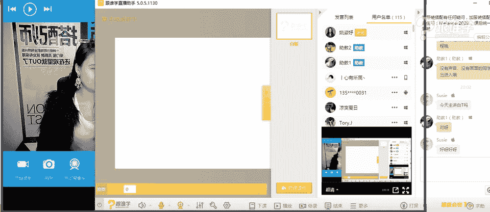
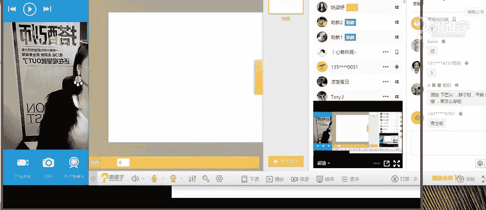
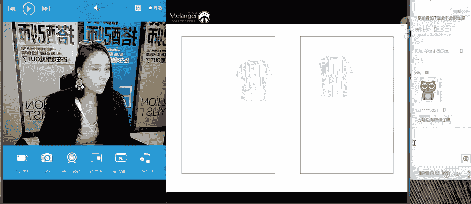
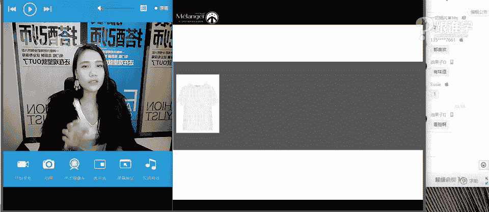
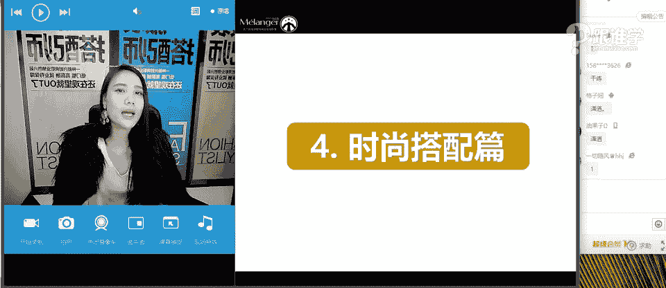
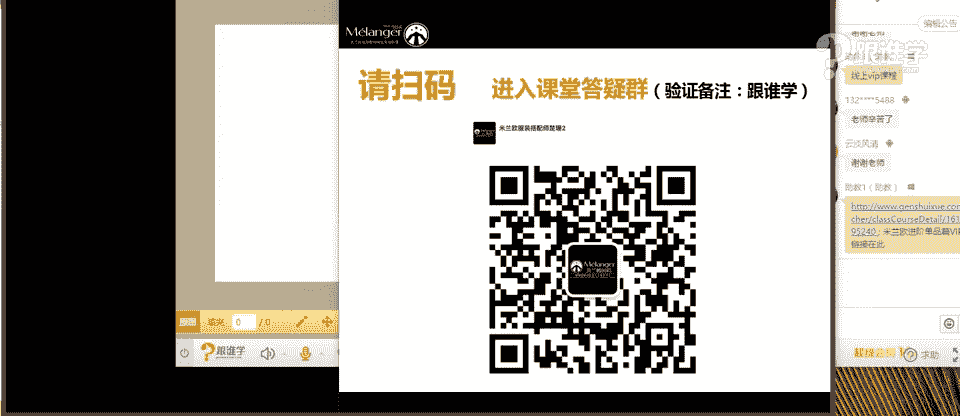
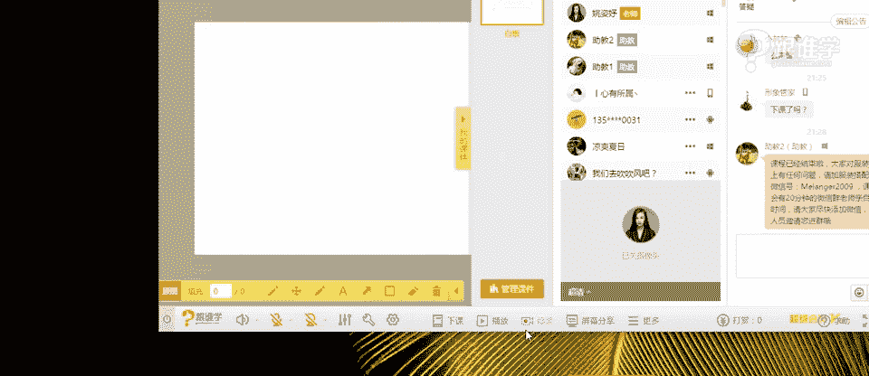

# 1、11服装《搭配秘笈之新版36计》：21为什么白衬衫充满性暗示_rec

Okay。Yeah。やと。1是点。Yeah。🤧。

OK同学们晚上好。嗯，现在是测试时间，如果可以听得到我的声音的同学请打一可以听得到吗？🤧嗯。😊，嗯。OK好好，谢谢同学们。嗯，目前为止看到三位同学。然后这三位同学好像之前一直都没有看到过你们的名字。嗯。

OK好，我看到大家的回应了，同学们可以听得到我的声音，不好意思呃，也不会卡是吗？网络还是比较清晰的。嗯，OK好的，呃，那接下来我还想了解一下，在我们房间里有多少是新同学，有有多少是老同学，新同学的话呢。

请打一老同学呢请打2啊，老师来认识一下我们的新同学。嗯，OK好。很多新同学今天啊那当然我们的老同学也依然还守候在我们的这样的一个学习的直播间。嗯，谢谢同学们。

那今天呢呃这个我们分享的课题是比较有意思的这样的一个课题，很多同学看到这样的一个课题的时候觉得很新鲜，很期待今天晚上的这样的一个课题。那呃为什么白T恤会充满性暗示。

看到老师这个讲话的语气有木有那今天这个课题呢呃我本人也觉得当时我们在呃这个研发这个课程的时候呢，觉得很有意思。所以呢也想要分享给大家。OK那我看到有很多的新同学。那首先呢老师正式做一下自我介绍。

那我是资宇老师啊，遥姿于那之前有同学调侃过老师说，老师你是不是命中缺女呀？为什么呢？因为老师的每一个名字里面。😊，那都有一个女字啊，那到底缺不缺女，这个事情还不知道啊。

因为老师还是未婚OK那同学们呢可以叫我资宇老师或者叫icy老师。那呃资雨老师呢是在米兰欧国际时尚教育，从事高级讲师。那米兰欧呢是在线下也就是在广州是有学学院的那同时呢我们也在线上跟谁学的平台啊。

会跟同学们来分享我们这样的一个课程。那我们线上线下都有学院。那线下呢我们基本上是以这样的一个职业培训服装搭配师为主。那线上大部分的同学呢，还是以自我提升啊，自己想要这个改造自己的这样的一个形象。

或者对于服装搭配，呃，觉得想要找一个这样的一个地方专门来学习。那所以我们的学院啊就诞生了。OK好，那资宇老师呢同时也会为一些。秀场呃，明星艺人做这样的一个整体的视觉的策划搭配。OK那简单的自我介绍。

那我们今天就开始唉比较有趣的这样的一个课题。嗯，好的，那有同学如果可以呃听不到声音的话呢，可以先退出我们的房间再进来。hello新同学大家晚上好啊，刚才看到说有同学说来了。嗯，呃。

mre同学老师呃广州的地址在哪里？广州在海珠区海珠区太古汇这边。嗯，核新路139号。如果要是在广州的同学或者是外地的同学想来看一下老师的话，那是双手欢迎哈。OK好，那接下来我们来讨论一下。

为什么白T恤会充满性暗示，先不说这个课题，我想先问一下大家，同学们，你们觉得现在我们穿白T恤的时候，我们想到白T恤的时候，他是一样是什么样。的一个形象呢。

一般你们觉得白T恤这件单品传递给你们的感觉是什么样子的？因为大家现在没有学习过专业的理论知识。那对于单品的这样的一个认知，相对来说还是不是那么的清晰。那我想问有同学说帅气。那还有没有其他的答案呢？嗯。

2365同学这个答案非常的犀利啊，老师都不好意思读出来了。好，简单随意，职业装床常用清爽干净纯洁OK好，我们经常一听到白T恤，大家有没有这样的一个脑脑补画面，就觉得啊白T恤配蓝色牛仔裤非常的清新啊。

然后这种清纯的感觉。和，我我记得在呃我20岁左右的时候啊，那时候呢我身边有三个好朋友。这三个好朋友呢都是男性啊，我之前就问过他们，唉，你们觉得什么样的女生或者这个女生穿什么样的服装。

你们觉得是非常呃清纯的。他们给我的答案啊，基本上都是很一致。就是说白T恤或者是白衬衫加牛仔裤啊，那说明其实我们现代人认为T恤它是一个非常清纯的这样的一个单品。但是啊为什么我我们今天要分享这样一个课题。

说它会充满性暗示呢？因为在古罗马时期啊，这个要要要追溯到比较远的这样一个历史啊，其实就是跟我们的这样的一个白T恤的单品的文化发展相关联的那在古罗马时期，人们穿着白白T，那个时候还不是真正的白T啊。

它只是白色的一件这样的一个还没有成型的这样的一个T恤，这样的一件单品。那他们穿着这样的一个单品的时候，是为了要阻隔盔甲跟皮肤之间。摩擦啊，穿着这样一件白色的这样的一个服装。

那真正的T恤的这样的一个时尚的这样的一个潮流啊单品建立啊，这个成成这样的一个单品的时候，是呃要追溯到100年前左右啊，那在呃我们说40年代20世纪40年代以前。

白T恤一直被作为我们所说的内衣穿着的所以同学们可以想象一下，哎，一个人都把内衣穿出来了，还不性感吗？啊，那这个就是简单的白T恤的由来。那在20世纪40年代之前，T恤一直是作为保暖和吸汗的作用啊。

而且美国的这个海军一直会让什么呢？他们的军队要求让士兵必须要穿着白T恤在里面啊，为了要遮住他们的什么呢？很发达的这种胸毛啊。那在20世纪50年代之后才被人们所穿着这件单品，是为什么会穿它呢？

那是因为当时啊对，是的，以前是内衣，当时呢有一部电影叫欲望号街车，有是也就是现在大家屏幕上看到的这张图片。啊，这个呃在欲望号街车当中呢，男演员马龙白兰度啊，当他在这个饰演影片的时候。

在里面饰演一个有点皮痞的这样的一个男性的形象啊，就穿着这样的一件白T恤出现在大荧幕当中啊，当时人们就觉得哇，原来这个T恤还可以穿的这么好看。原来T恤是可以穿的出来的啊，所以当时马龙白兰度还特别骄傲的说。

我可以把这件T恤生产我可以把这件T恤发挥他最大的价值，我可以把它卖到100万啊，那其实当时人们只是当内衣在穿着。而当他在荧幕上这。出现的时候，所以就成为了这种新青年的叛逆的这样的一个标志。

从那个时候白T恤才开始外穿了。这就是为什么说哎白T恤它会充满着这样的一个性暗示。因为大家可以想象一下，如果要是女生啊，现在只穿着内衣出来，是不是有一种我们所说的诱惑力呢？啊。

这就是我们的课题的这样的一个由来，也是什么呢？呃，反推了我们的这样的一个T恤的发展的历史。OK好，那这是简单的跟大家介绍我们T恤的这样的一个单品的由来。它的前世和今生啊。

那这是我呃我为什么每次都会在讲单品课的时候跟大家来强调每件单品的前世和今生，你搭出来的东西才会有灵魂。OK好好，那呃我想问大家，我们现在已经了解了我们所说的T恤啊，那同学们。

我相信应该是每个人都必备一件。T恤的，我们教室里有多少同学的T恤是呃是没有白T恤的，我相信应该几乎都有啊。那现在有白T恤的同学请打一啊，OK好，有白T恤的同学请打一。没有的，请打2。

看一下真的有没有没有白T恤嗯，白T恤的OK然后真的有啊，好OK那老师今天讲完白T恤之后呢，我觉得你们可以去买一件白T恤，为什么呢？因为他是我们衣橱当中非常非常重要的一个单品啊，那真的还有同学没有？

那老师要建议你们去买这件单品了。好，那我们有白T恤的同学，我想问的是你们在选T恤的时候，会有什么样的困惑呢？有没有什么样的困惑？你们在穿白T恤的时候，或者在搭配的时候，有没有遇到什么样的一个问题？果然。

穿黑色的同学都会觉得呃耐脏才穿的。这个不买白T恤的人的理由就是不耐脏，是吗？好，有同学说白色显得比较胖，然后比较透，搭配不出个性，OK还有没有其他答案呢？那有没有同学觉得在穿T恤衫的时候。

会有关于我们所说的体型的一些问题呢？基本上没有白的那个度板握不好。OK好，那呃其实在我们所说的在选择T恤的时候，有一部分的人是有这样的情况的啊呃有同学说了显腰肥。

还有比如说有的女生她的胸部特别丰满的时候，她在选白T恤的时候啊就会比较头痛啊，包括有的人脸特别大的时候，他在选择某一种T恤的领型的时候也会有问题。啊包括什么呢？你的肩宽也会有影响，你的脖子也会有影响啊。

当然这不止我们所说的脖子短呢，脸大呀，胸大呀啊这肩宽呢这些问题不只是在T恤衫上面会出现啊，你同学们有没有发现现在老师说的说的问题。脖子短，胸大脸大，肩宽都是我们所说的叫视觉。重点的区域三角区域。

那这个区域是我们所说的人的视觉重点。我们人与人见面的时候，我第一眼看到你的时候，永远看着对方的眼睛，或者看着对方的脸说啊我夸你或者说你好看还是不好看，我肯定会夸你你这个跟你客气一下，对不对啊？

比如说你长得真的很漂亮。说哇你好美啊啊。那如果你要是真的长得不好看的话，哇，你很有气质啊，那我一定是看着你的脸说看着你的眼睛说我不会盯着你的脚说嗯，你很美嗯，你好有气质啊。

那这就是我们所说的人的视觉重心都是在这个位置。所以说我们在穿T恤的时候，我基本上很多同学会问过我这样的一个问题，就说老师为什么我每次穿这个T恤的时候都会觉得我的脖子看起来很短啊。

我说那跟你的衣服的领型有很大的关系。那包括胸部很丰满的啊，脸很大的肩宽的等等这些问题。其实。我们在选选择T恤的时候都会遇到这样的一个问题。当然也包括刚才有同学说到啊，太透了啊，那搭配不好。

那这个都是我们今天在这节课当中要给大家解决的一些问题，OK好，那呃哎我想问一下，突然想问一下我们同学们啊，还没有开始。我们刚刚开始呢？这个课艾洛威同学OK好。

我想问问咱们在座的同学们有没有从事这几种行业的啊，听老师说第一种是服装行业的。第二种，不管你是品牌还是自己开店还是你是设计师，那第二种有没有从事跟美容啊，美发，或者是说化妆相关的，有没有这一类的同学呢？

如果有的话，请大一好吗？为什么我要问这个问题啊。如果我看到大家的回复之后，我会跟啊，或者是说有没有从事啊，还有一种啊，有没有从事跟形象相关的。形象行业相关的。比如说形象造型啊。

为什么要问大家这样的一个问题？因为这个问题就是所有的客户的问题。那我现在问一下同学们，你们有没有谁觉得自己的脸特别大的啊，有没有人觉得自己肩宽的，有没有人觉得自己脖子短的，有没有人觉得自己胸部很丰满的？

有有啊，所以说的话呢这既然是你们的问题。那这也代表了大部分的客户，所有的客人在进到店里的第一时间都会问啊，都会说一句话，就是我觉得我自己啊腿很粗啊，腰很粗啊等等，这些都是体态细节问题。

那今天我们在课堂上给大家解解决的是上半身的体态的细节问题。那我们在入门课当中啊，我们或者我们之前的有很多公开课，还有我们的专业课当中都会给大家去讲到一些关于呃这个体态，这个腿粗啊啊。

然后腰粗啊等等等这些体态细节问题。OK好，脖子短是吗？啊，胯宽好。看到你们的问题了。那我们今天主要解决上半身问题啊。好，那在今天的课程当中呢，会给大家来解决两个板块。第一个是什么呢？

白T恤选择的秘籍当然也包括了不只是白T恤，而是你上装的这样的一个单品的选择秘籍。那第二点就是白T恤百搭的秘籍O好啊，梦易同学说难脸缘脖子短是肚子大吗？嗯，好，那呃脸缘啊脖子短啊，今天老师都可以替你解决。

好，白T恤选择的秘籍，它会跟什么相关呢？刚才我们提到的我们所说的脖子长啊，脖子的长短问题。我们在选择T恤其实最大的问题就是跟我们的领子很大的关联。我们的领子啊可以修饰到你的这个位置。我们为什么穿衣服。

我们为什么要穿衣服呢？最终的问题其实我们就是想让别人看我们的脸，对不对？啊，那我们最终的目。都是为了修饰我们的颜值。那所以说呢我们今天解决的就是这个问题。那脖子的长短。

首先怎么去判断脖根到锁骨窝的这样的一个位置啊，那大家可以看一下啊。黑不好穿白T恤吗？等一下回答你这个问题啊，同学们来现在先解决同学们，你们现在可以自己拿一个皮尺，或者是说你那里有镜子的话。

你们自己对着镜子啊，脖子的长短怎么去测量啊，脖根首先从脖根的位置，然后到你的锁骨窝的位置，也就是锁骨窝这个中间的位置。那么你来丈量一下你的这样的一个长短。你的脖根到锁骨窝的这样的一个一节。

就是你脖子的长度，那么它是你脸的2分之1，同学们看到了吗？刚才老师测量出来的这个老师的脖子就是这么长，然后就是2分之1的这样的一个位置。那如果啊你这样一测量出来，哎，只有这么一点，你就只有这么一点啊。

那说明你的脖子短了啊，那如果哎你测量这么长，那恭喜你啊，那你真的是长颈度，那这就是我们所说的脖子长短。短的这样的一个标准啊，大家可以用皮尺去量一下。首先要量一下自己的脸长。

从发际线到下巴的这样的一个长度啊，然后量的时候呢，尽量不要皮尺贴着这样的一个鼻子下来，要把它这样这个从从垂直水平线拉下来，然后呢再去量脖子的这样的一个长短。那么你就得到你自己的脖子是否是长还是短了。

OK好，为什么要了解自己脖子长还是短，等一下在后面非常关键。这个同学们先要自己丈量好啊，偏短还是刚刚好呢？OK好，短是吗？短的话，那你们就要好好听课了啊。OK那接下来我们来看同学们。

我想问在这三位女明星当中啊，都认识吗？哎，这两位认识，但是这一位我也不认识啊。那这两位的话呢呃这个是在某一位明星的婚礼上啊，然后呢，同学们你们现在来观察一下123哪个人脖子比较偏短呢？😊，可以看出来吗？

123哪个人脖子变短？OK好，有人回答第三个那大部分其实都回答正确了啊，我们来看一下第二个偏短，对不对啊，老师画的这个线呢只是从他下巴画下来的。但是都可以看得出来什么呢？阿娇的脖子偏短。

那其实应该从他这个脖根底下去画的啊，但是还是很明显能够看得到阿娇的脖子是偏短的那这就是从视觉上去看上去的时候，如果你脖子偏短的话，那你给人的印象是什么样的同学们，你看你如果脖子偏短的时候，你在发型啊。

耳呃这个项链啊、领子啊，这个形状没有选对的时候，不能修饰到你的脸型的时候不能修饰到你这个位置的时候，你会感觉整个人是缩着的啊，缩头缩脑的，就觉得啊，就就就就就是那种不不挺拔的感觉啊。

所以说呢我们在穿衣服的时候，一定要回避这个问题。那接下来我们再来看一下脸大的这样一个问题。有没有人觉得自己脸大的。如果觉得自己脸大的话，请打一，看一下有多少同学觉得自己脸大嗯，还真有是吗？好，嗯。

那咱们有有这个觉得自己的这个呃这个脸大的话啊，你们现在可以判断一下，你们自己是什么脸型。那我们图片当中有椭圆形脸方形脸菱形脸圆形脸长形脸和倒三角形脸。那其实还有一种脸型叫梨形脸。

就像梨子的形状也叫正三角形脸。那我想问一下大家，你们觉得哪种脸型看起来从视觉上哎，有可能这种人的脸啊，他可能很小，就是你去用手去丈量的时候，你觉哦他的脸真的很小，一个把我们经常会说巴掌脸就是这么来的啊。

他的脸真的很小，但是总是从视觉上看上去就觉得他脸很大。我想问一下，你们觉得哪这这在这6张。点当中你们觉得哪个脸看起来大？123456快速抢答，同学们123456好。二和四是吗？OK好。

在刚刚我还没有问大家的时候，没有问大家这个问题的时候，我看到在屏幕上有很多同学说，老师我是方形脸，老师我是圆形脸。好，那同学们，那么是不是在这里大家可以想一下，圆形脸和方形脸，为什么它看起来大的原因。

那是因为我们说正常的标准的脸型的长和宽是4比3长四宽三，而方形脸和圆形脸脸，基本上就是我们所说的44比4的节奏啊，就是它宽也是那么宽，长也是那么长，就看上去方方正正，或者是看上去就是一个饼的形状。

我们经常会说啊，我是大饼脸，对吧？那就是这个原因。所以说从视觉上看上去的时候，方形脸和圆形脸，它都是什么呢？感觉比较大的那我们在穿在穿衣服的时候，那领型非常关键OK好，我们继续来看。

那这是我们所说的脸大。的问题，那有没有哎还有一种情况，比如说哎你看刘欢是不是可看起来脸就大，而且他脖子又短，有没有人是这样的，又综合了，脸很大，脖子又很短啊，然后胸又很上位，就胸又很丰满。

有没有这样的同学们，哎，有没有咱们教室里有没有？我想问一下？如果有的话，请勇敢的打一。好，那。😊，真的有这样的同学，因为老师在线下看太多了啊，真真的有这样的同学，他还还还这样形容了。

老师我觉得我个子又矮啊，然后又胖，腰又很粗，脖子又很短，脸又很大，手臂也很粗啊，胸还下位，你说我这怎么该穿，我这该怎么穿衣服老师说我也发愁，老师就觉都觉得有点头疼啊，但是没关系。

我们有可以一个大的方向去把握他啊，O在后面再跟大家给他介绍。那我们说呃刘欢他就属于脸特别圆的啊，方圆的，他应该说是那赵薇其实他就是一个方形脸，那同学们可以看一下赵薇的脸是不是看上去挺大的。

就觉得我们觉得看起来比他的身跟他的身体好像不匹配的感觉。他甚至看上去都有点头大的感觉了啊。那所以说脸大和脸圆的人在穿衣服的时候需要注意调整问题。那包括脸特别长的人也需要调整O。好，我们继续来看。

肩宽的标准肩宽的标准是什么呢？头长的1。5到1。7之间，什么意思呢？我们在测量的时候啊，来给大家看一下。うん。这张图片啊呃肩宽啊包括什么呢？头长。肩宽是头长的1。5到1。7，所以我们要什么呢？

我们要测量头长，然后呢还要再测量肩宽啊，不是nosorry，我们要先测量头长，然后你测量肩宽。这两个数据都测完之后呢，用头长乘以1。5。然后呢再乘以一个1。7得到的结果啊，就是你的这样的一个数据之间。

那因为这个操作起来比较麻烦。所以我们会在课后的就是我们今天这样的一个跟谁学结束之后，同学们现在可以扫码，你们现在可以提前进入到答疑群当中。

那等一下老师在跟谁学的这样的一个平台下课之后会立马到群里会以一个视频的方式并且会请到模特来给大家进行测量。因为这个操作特别麻烦。那因为第一需要模特，第二需要皮尺。第三还需要有有人来辅助老师啊。

帮老师来测量，那老师在旁边解答，还要录。下来视频。所以呢同学们现在可以扫码先进入到我们的答疑群。那给大家这个呃我数十个数啊，你们现在可以拿出来你们的手机来扫描一下啊，OK10。

987654321okK好，同学们如果扫如果已经在群里的话，没关系，没有在群里的话呢，就可以赶紧扫描。那接下来我们来继续来讲肩宽的标准啊，这是这个标准，那等一下我会在课后给大家来这个详细的解析。

那肩宽他会哪种体型或者是哪些人他也会有肩宽的情情况，我们来看啊，这是第一种情况啊，这是我们所说的肩宽的标准，我们首先要知道自己是不是肩宽啊，肩宽，那这跟头是有这样成一个比例的但是还有第二种情况。

我们来看一下啊，扫不了吗？啊，那你可以加那个milaner2009。刚才我们的助理老师发出来的这样的一个这个这个二维码啊，那第二种情况是什么呢？有的人他就真的是肩宽，头看起来特别小。

那我再给大家看一下张雨绮看到没有？他的头看起来特别小，但是他的肩看起来很宽，那这种人真的是肩宽，还有一种情况，就是我们现我现在要给大家看的头这个情况啊，来大家看一下测量头长。

包括嗯我这里我要跟大家强调一点啊，为什么我要说在这个这个呃客户给大家来解析这个测量头长和肩宽的位问题。因为肩宽很多人测量的方法是不对的。等一下老师会专门找模特，我要给你们去这个告诉你们怎么去测量肩宽。

在我们肩部后面有一个叫肩峰点的位置，你要找到那个位置再去测量，要不然所有人测量的结果都是错的。而且你一定是肩宽，你测出来的结果算出来。是错的。OK好，那这是我们所说的这个肩宽的测量的问题啊。

那呃第二种情况是什么样的呢？就是体型的问题。我们说传我们说我们正常人的审美的这样的一个标准是哪个体型，有同学知道吗？我相信我们的老同学都知道。同学们快速来作答一下。

你们知道哪一个是我们的审美标准的体型吗？OK是的，X第一个，那也就是说什么呢？你会发现X体型他的肩跟他的臀是相等的，是平衡的。但是在这四种体型当中，哪一种是不平衡的呢？是不是梯型是不平衡的啊。

那所以说啊那梯型体型的人他就是肩宽的问题，来给大家来看一下哪种人梯型体型会更多。比如说游泳运动员游泳运动员一定是梯型体型的这样的一个人啊，稍等一下同学们。来调整一下我们的这样的一个画面。嗯。OK好。

那呃有没有爱游游泳的同学们在咱们的这样的一个房间里，有没有同学喜欢游泳的？如果喜欢游泳的话，请打一有吗？啊？OK好，老师也特别喜欢这项运动。但是最近啊对这最近一年都没有去过了，为什么呢？

因为老师本来就肩宽。啊后我知道游泳这个运动，他会让肩并的更宽的时候，我就再也没有敢去过了那大家可以看一下，你们去观察一下，所有国家队的运动员，包括复原会那个表情包啊，也是什么呢？

所有的国家运动员游泳队的都肩特别宽女生啊，那包括大家可以看一下，我们现在图片当中的就是什么呢？肩宽的这样的一个体型。那我们说正常体型他的肩跟他的臀是要相等的同学们啊，我现在画的这样的一个矩型。

大家可以看一下肩的宽度跟他的臀的宽度是相等的。但是你会发现他的体型是成什么样的一个形状，肩刚刚好，但是臀的位置特别窄。所以说这种体型的人一定是。肩宽的那这种体型的人在穿衣服的时候是特别难穿的。

上装的选择尤为关键，穿不好的话，你就是熊，这个叫什么虎背熊腰啊。OK好，那这是第三种情况。第四种情况就是什么呢？胸大的好，有没有。有没有这个胸部比较偏丰满的女生，有没有同学们有的话，请打一。

不用不好意思啊。OK好嗯，没有是么？没有的话，请打2，自己挺主动的。OK好啊，那同学们啊有人说自己是A型体型。那你怎么知道你自己是什么体型的呢？有没有经过专业的测量呢？啊，好，那胸大的这个问题呢。

老师就不过多的阐述了啊，大家都知道应该自己是胸大还是胸小对吧？啊，男生就不用考虑这个问题了啊。OK好，哇，佳佳说嗯下垂那你下垂这个问题的话，要好好调整一下啊。好，那通过穿衣服是可以调整的啊。OK好。

那为什么给大家解释了半天，我们所说的脸大呀啊，脖子短了，然后这个胸部问题呀，那包括这个这个肩宽问题呀，因为他都会涉及到我们在选择T恤的时候，我们的这样的一个领型的选择，或者是说我们在选择。其他服装的。

只要是内搭类的，只要它是有领子的啊，上装都会有领子，对不对？只要它是有领子的那你都会涉及到这几个问题。那例如说白T恤啊，我们在这里做一个分类。白T恤的领型呢，它有分为这几种领型。

那大家现在可以看一下小圆领小V领大圆领大V领啊，一字领包括船领，那小圆领的话，这种就是特别小的啊，就直接卡在脖子上的那这个是稍微有一点点啊，有一点点的这样的一个领子小，但它还是比较小的啊。

那这种是小V领啊，这种是Y型的这种那大圆领啊，包括这种这种领型它就是中间状态不是特别大啊，也不是特别小。那这种就是大V领啊都可以叫深V了。这个那这个呢就是。大V啊，那包括一字领和船领。

那这这里面所有的领型同学们，你们都要记好了啊。你不管是脸大呀，脸小啊，你们在选择领型的时候都有需要注意的问题。哎，有同学说老师我脸小，我还需要注意问题吗？那如果你是一个长形脸，那你就需要考虑这个问题啊。

另外如果是长方形脸梨形脸圆形脸方形脸，方圆形脸，你们都需要考虑这个问题，除非你是哪几种脸型呢？第一啊，你是椭圆形脸。第二，你是菱形脸，你不需要考虑。哎，有同学说老师心形脸，为什么不用考虑呃，也要考虑吗？

也要考虑。因为心形脸，它的下巴特别的肩啊，那如果你在选择重复你的脸型的领型的话，那你看上去就会尤其的刻薄的感觉就真的很像。蛇精OK好，那接下来我们来看一下，那在这种在这呃在这几种领型当中。

我们要怎么去调整我们的这样的一个这个脸型的问题啊，我们来看一下从左至右。啊，一个比一个领子要低，说明什么问题呢？同学们，我们通过这三张，一个是高领，一个是小圆领啊，一个是大圆领。那这三个脸型呃。

三个领型。好，我现在问大家一个问题啊。第一个问题是哪一个看起来会拉长领，拉长脖子123哪一个看起来会拉长脖子。嗯。OK好，那现在第二个问题，哪一个看起来会显得脸小？一还是二还是3。一还是二还是3OK好。

哎，有人说第一个显得脸小啊，好。😊，现在答案不统一了啊，那如果因为这个人他是尖的脸，如果他要是一个方形脸，那你们看起来就会很明显啊。好，那我现在问哪一个看起来显得肩窄。一还是二还是3。

哪一个看起来显得肩窄？OK好，那接下来我不问了啊，再问下去，我发现同学们要疯了，这个答案都不统一啊。OK好，那我接下来来解析。第三个啊第三张图片它会什么呢？在我们所说的。

不管它是显得这个脸小啊还是脖子显长啊还是显瘦啊，第三个领型都会好啊，为什么呢？因为这三个领型，它第三个领型它是属于叫纵向线条的这样的一个方法。同学们纵向线条，那横向线条它其实会显得人什么呢？

这个地方宽啊，脸会显得大，那脖子会显得短，而第三个是属于叫纵向线条的，所以它会让脸看起来更小啊，而且还拉长了脖子，而且肩看起来更窄和更显瘦。那在图二当中是的竖线条。那么再再来看。😊，啊。

同学们这个和这个哪个显得脸这个哪个会显得这个更更小，脸显得会更小。更有这种修饰的作用，一还是2。好，刚才有同学说了，男生也穿成那种吗？等一下我又来给大家解答这个问题。OK好。嗯。好，是的。

相同程度的V领和圆绒比较V领会比什么呢？显得脸更小更瘦，效果会更加明显。原理是什么？我来给大家来解析一下。好，现在图片上横线条和竖线条。我想问同学们，你们觉得竖线条长还是横线条长？竖线调长还是横线调长？

竖的还是横的。很明显不是脑筋急转弯啊，有同学说一样长。好，那你很聪明啊，老师的确画的是一样长的，但是你们看起来会觉得竖线更长，还有同学回答。3，你在哪看到的啊好，你自己想象出来的第三条线是吧？啊。

老师都没看着，那竖线条会更加的显长，因为这就是我们所说的叫什么呢？横向拉宽显胖，纵向拉长显瘦，就是我们所说的横向和纵向的原理啊，我们经常会说哎横线条看起来显胖，竖线条看起来显瘦啊。

那这就是我们大家所认知的这样的一个道理。但是什么样的横线条看起来是显瘦的，什么样的竖线条看起来是显瘦的。那这个还有待研究啊，也因为老师这个做过大量的这样的一个实践。包括我们。

在课程当中有跟大家去分享我们VIP课程当中有跟大家去分享的，唉，到底什么样的横线条看起来显瘦，什么样的竖线条看起来显瘦。那大家的认知到底是不是正确的，这个是要考虑的啊。OK好，那接下来给大家来总结。

我们认识了那么多领型，小圆领、小V领、大圆领、大V领一字领和这种我们所说的船领。那到底哪种领型匹配哪种啊，或者是说哪种适合哪种体型，那我们来看一下啊，来小圆领和小V领的，适合什么样的体型特质的人。

第一比较偏瘦的。第二，小脸蛋的。第三，脖子长的？第四，平胸的？为什么因为这种小领型它会卡在脖子这里啊？老师来给大家来做一下示范啊，同学们，你们现在看到我的这样的一个呃这个呃脖子是比较修长的对吗？啊。

那包括脸看起来还好，没有那么大啊，那好，同学们，现在我把我的领子。遮住我的这样的一个脖子的位置。好，你们现在来看一下。第一，是不是我的脖子变短了啊。第二，我的脸是不是看起来会更大，因为底下又收缩。

上面就会显得更大，有没有这样的一个一个一个感觉啊，平胸大脸呢，老师刚刚在讲的啊，O好，那这就是我们所说的小圆领和小V领的人，它就适合给到什么呢？偏瘦的人小脸的，包包括脖子长的和平胸的。如果你的脸特大啊。

脖子还很短。然后这个这个胸还特大啊，然后这个你你这个整体看起来都很丰满的时候，你又穿了这样的一个高领，那么你看起来就像交通堵塞了一样，就就整个人是这样缩着的啊，所以说啊小圆领和小V领，尤其要注意啊。

如果你是反过来的，你不符合这样的一个情况的话啊，那你们就要谨慎考虑，选择这种领型OK好。第二种。啊，慢慢来不要着急，圆圆同学啊，脸大肩宽又平胸吗？啊，慢慢来哈。

大圆领和大V领的那刚才老师说到的这个脸小的对吗？那你反过来那种就不适合你了。那这种是不是大圆领和大V领就会适合给到脸大的人肩宽的人，啊，那平胸的人，这个等一下我们再考虑这个再说这个问题啊。

我现在先说大圆领和大V领他适合给到哪些人。第一，肩宽第二，肩平，第三，脸大，第四，胸部丰满，当然胸部平的人也可以穿。因为现在其实大部分的人都是平胸的人，但是胸部很丰满的人。

他在选择这种小领子和大领的这个这个这种T恤的时候，他肯定要穿大领的。因为小领子，你会发现我们穿高领的时候，会会发现很多女生觉得穿高领就找到自信了。为什么呢？啊？显胸很丰满。

那是因为我们的视觉点都注意在这儿了哈，这儿全都遮住了，所以你会显得大啊，那反过来是不是也说明这样的一个问题呢？啊，如果你想要显得胸小的人啊，因为他们胸部很丰满的人，有的人他其实是有这样的苦恼的。

想要显得小一点的时候，可以穿大圆领和大V领啊，那这就是我们所说的这样的一个脸大的人啊，肩宽的人，肩平的人适合穿的那有同学会说到，老师。那溜肩的人能不能穿呢？因为老师刚才说到是肩平的人呢或肩宽的人呢。

那有的人他是溜肩，他就不太适合穿这一种大领子的啊。那他领，而且他的这溜肩的人在穿这样的一个T恤的时候，一定要什么呢？有这种或者他直接穿那种带泡泡袖的啊，带垫就是那种有点飞领的这种感。

这种效果的这样的一个袖子啊，这种的话会显得他的肩更溜，所以他要带一点挺括感，面料太过于柔软的，不太适合给溜肩的人穿。O肩平的人老师的意思就是不是溜肩的人啊，就不是溜肩的人，肩部很平的。

溜肩的肩膀就是很往下的，往下走的，你们去看刘亦菲同学们，你们可以去搜刘亦菲，看一下刘亦菲的那个肩膀就知道了。肩特别的窄啊，往下溜啊，还有一种情况，我现在问你们。一个问题啊。

如果啊就就你们在上学的时候背书包的时候，单肩包会不会总往下掉，包括现在。背背单肩包的时候总往下掉的人啊，你们就有可能是溜肩啊，为什么呢？老师给你们展示一下不溜肩的人是什么样的啊，老师的肩就特别的平。

就是我的这个肩很平，那而且就是这个位置呢，它是有这种这种这种骨骼感的。所以呢它就不会这个包就不会这个溜下去。那就就就比较没有这种困惑啊，OK好。老师今天为了符合我们的这样的一个主题，所以特意穿了白T上。

因为呢等一下会给大家来便装两套啊。OK好，那接下来我们来看啊，那刚才给大家分享的是大圆领和大V领啊，那接下来我们来看一字领和船领啊。有同学说胸大大圆领，稍等一下啊。

同学们我来调整一下我们的这样的一个格式，我们看不到同学们的问题啊，稍等一下啊，来。嗯，这位同学说的是什么呢？老师没看着呢嗯。🤧老师现在在再稍等一下啊，同学们嗯哎呀，过去了，看不着这个问题了。

同学们那就只能等这个课下再回复你们了啊。OK好，没关系，来。

嗯。稍等一下啊，同学们。う。

男士男6761同学。6761同学，男士也是一样的道理啊，男士也是一样的道理。但是我要跟你们说的是什么呢？男士不存在什么问题呢？第一个肩宽，第二个胸部的问题啊。那男士只存在两个，一个是脸特别大的。

还有一个就是脖子比较短的人啊，脖子比较短的OK等一下我在后面会给大家来总结的同学们okK那我们继续来看一字领和船领。嗯，好的，一字领和船领会比较适合给到哪些人呢？第一，脸小第二，脖子长，第三，肩宽呃。

肩窄，第四，肩薄。第五平胸。我一一来给大家解释啊，为什么？因为一字领它属于横向扩张的这样的一个领型。如果你脸特别大的时候，你还横向扩张，你就会脸显得更大。包括你脖子短的人穿一字领也不好看。

那除非你往下拉的特别厉害，把你整个例如说这一张图片当中，他就把它往往下拉的特别厉害，那把整个脖子的线条都露出来。那相对来说会比较好。那如果你穿船领啊就不好看，脖子短的人穿船领不好看，那包括肩比较窄的人。

他可以穿一字领，为什么呢？包括溜肩的人也可以穿一字领，因为他们本来就肩窄，所以呢他们可以使用横向扩张，让自己的肩显得更宽，那如果肩宽的人还穿一字领，那就真的显得更宽了啊。OK好，那脖子长还要穿一字领。

脖子长才能穿一字领呢？为什么呢？我们以脖长为美，我们的审美是以脖长为美，而不是以脖短为美啊，能理解吗？喵喵喵同学啊，你这个名字真的很可爱啊。OK那我们脖子长的时候，其实我们可以重点在脖子这个位置装饰。

比如说我戴项链呢啊，戴这种丝巾呢等等啊，O好，那平胸就不用说了啊，如果要是胸部特大的人还穿这种领子，包括这种领型就会显得太过于丰满。所以说呢都不太适合。那接下来我给大家总结啊，那首先如果你是脸大的啊。

脖子短的肩宽的这几种情况，包括胸大的人，你们比较适合穿什么呢？大圆领和大V领。那如果啊你是都比较好的那种类型啊。比如说你脸。特别小，脖子又很长。那这个啊这个肩又比较窄啊，胸又比较平。

那相对来说你挑这种这种T恤的领型的时候就不是那么挑挑啊。如果以上四点脸大胸大呃，脖子短呃，肩宽这四种情况，只要你站的一样，你穿大圆领和大V领都会比较好。OK能理解吗？同学们，那另外一种情况。

就是刚才我跟到跟同学们提到，还有就是有的人他脸特别长，那包括如果你是这种下巴特别尖的人，就是那种心型脸啊，如果你是下这个脸很长的人，尽量不要再穿深的领型啊，不要穿深的领型。

穿那种相对来说小圆领船领一字领都可以，就是使用横向扩张的圆领，不要再让你的脸显得更长了。因为纵向他会延拉伸会让。你的脸显得更长OK好，那呃这个这就是我们所说的以上的问题。还有一个就是什么呢？

尖的这种就是脸特别尖的心型脸。如果你是心型脸的话呢，也要穿这种什么呢？呃，相对来说比较圆润的领型，不要再穿这种V的领型，它会让你的脸显得更尖OK以上呢就是刚才给大家讲到的这几种情况。

那现在呢我们来做一下判断OK胸部丰满，丰满的，适合穿哪一款123。胸部丰满的适合穿哪一款？123。好，我看到同学们的答案了，非常好啊。OK呃呃为什么呢？

为什么胸部来一一给大家来解释为什么胸部丰满的人不适合穿这两款。第一，第J胸部丰满的人尤其不适合穿第一款。第一款特别要注意。为什么呢？因为这种啊你的这个这个呃胸又特别大。然后你的衣服还很宽松。

而且最关键的是你的袖子还是这种比较张开型的。而且刚刚好在你胸部的这样的一个位置。袖子它形成了一个叫横向扩张，两点形成一线横向扩张，会显得你的胸部更丰满，那领型又很小啊，然后我们的注意力又会集中在这里。

包括你的胸很大的时候，你穿这种不收腰的T恤，它会让你整个什么呢？显得更胖。所以这种胸比较丰满的人。第一，你适合穿这种深的领子。第二，你适合穿紧身的，就是这种收腰的T恤。第三。

你的袖子的长度最好是在什么呢？胸部以下的位置，或者是以上的位置，不要刚刚好停留在这个位置能理解了吗？同学们啊，那所以说中间这一件是不是领子这个地方不是特别合适啊。虽然其他的地方都可以。

如果他的领型下来的话，那他就可以给到胸部丰满的人穿了。那OK123这一点胸部丰满的人为什么适合穿这一点，我跟大家解释清楚了吗？如果同学们理解的话，请打一好吗？好嗯。😊，OK好，那同学们理解了。

那我们就进行下一个知识点。好，继续啊。脖子短的人适合哪一款？一还是2，脖子短的人适合哪一款？一还是2okK这个大家都理解了啊，我们就直接过了好。脸大的适合哪一款？一还是2。一还是2。

脸大的人适合穿哪一款？好，非常好。同学们啊，那同学们都理解了，那我们继续啊。长脸型适合穿哪一款？刚才有同学一直问到说老师哎这个脸长的人怎么办？男生怎么办？那我们在这里跟大家来解析一下啊，123这三款。

如果你的脸特别长，那么你最不适合的就是穿这一种领子啊。那如果你的脸是比较长的，你最适合的穿这一种啊，这一种也还好，只要不是特别V特别深的。当然这种是最好的，能理解吗？同学们，因为这种它是属于圆领。

它不会让你的脸更尖了啊，这种它就是重复了你自己的脸型。但是如果想要显得比较，例如说这三种领型，那男同学们谨慎的来听好了，最后一种领型不要去选择为什么除非你有这个模特的身材，你有这么man。

这么有扬刚之气。啊，还有胸肌，你才选择这种，要不然你就会显得很娘啊。这么第一道这样的话，真的显得很娘嗯。好，脸长胸大的人。好，还真有这种同学们呢啊，还真有这种同学。那如果你是脸比较长的那可以选择大U领。

因为你的胸围要大，你可以选择大U领啊，就是那种你当然不用非得显得特别这特别低的那种U领啊，就是相对来说能够裸露你的皮肤多一点的啊，就脖子到这个这个这个这个胸部以上的这个位置露出来，比你包着要好啊。

因为你穿这种小圆领的话，就会显得特别的壮，显得很壮OK好，嗯，这就是。呃，这个关于这个脸型的选择的这样的一个问题啊，男生切记不要选择这种。那男生如果要是比较瘦的人，可以选择圆领的T恤。

让你看起来会更加的壮实啊，OK好，那这是以上关于脸型啊啊，肩宽哪，脖子短呢，胸大的这样的一个问题。同学们都理解了吗？如果理解的话呢，请打一嗯，O好，同学们的问题太多了啊。

现在老师还有很多还有一个板块的知识没有给大家回答呢。所以呢同学们如果你们有问题留到课后在答疑群里，老师再来给你们解答好吗？好，那我们继续啊白T恤百搭的秘籍啊。

那我们都已经了解了自己的身材的细节的特点跟我们的选择这种T恤的款式，领型已经了解了。那我们现在就是不是就涉及到搭配的问题了呢？刚才有同学就提到这个问题了。说老师啊，那我想要这个不知道这个。

这个T恤怎么能够把它搭好看？那接下来我们来看一下啊，那到底怎么去搭配白T恤。白T恤我们说它是一件非常非常基本的单品，它被我们称为叫基本款。在专业的这样的一个领域当中。我们说基本款和时尚款啊。

这是我们所说的在日常生活当中，我们衣橱当中会必备的这样的一些款式。那T恤就是属于叫基本款。那我们继续来看。好，同一件T恤衫，那有不同的搭配的方法，它的不同搭配方法会影响到什么问题呢？我们接下来看一下。

嗯，好，为啥没有图像了？有呢？好，那因为这个白色的T恤衫不是特别明显，同样T恤啊，它搭配不同的单品的时候，它呈现的效果也会不一样。现在我想问同学们，你们喜欢一还是喜欢二呢？啊，喜欢一的同学打一。

喜欢二的同学打2OK好。

好，呃，有同学我我发现喜欢一的同学是女同学还是男同学呢？同学们啊发现很多同学都选择了一，那说明什么问题呢？我们现在的女人都越来越汉子了。你会发现这一套服装，基本上人家就是男生的衣服呀。

你就就是你男朋友的衣服吧，你是不是很喜欢偷穿你男朋友的衣服？OK好，那有同学喜欢一，有同学喜欢二，我发现现在很多这个女同学的审美都变了啊，喜好也不一样了。OK有同学说两个都喜欢。那我想问一下男同学。

你们喜欢女生穿一还是二呢？男同学们可以出来跟老师回应一下，你们喜欢女生穿一还是二呢？😊，好，大部大部分同学都喜欢。2、为什么呢？看到没有？男生的审美还是希望女人你们啊柔美一点，不要那么man嘛啊。

你们都把我们的饭碗抢了是吧？OK好，我们继续来看。那所以说搭配它会涉及到什么问题，你选择了单品不同，你的配饰不同啊，你最后搭配出来的风格也会不同。那如果刚才有同学说到了啊。

他呃有刚才我们有很多同学说自己是服装店的啊，也有同学是有品有有呃或者做设计的，有品牌的啊包括啊有同学是做美容、美发、化妆等行业的，或者跟形象相关的行业的那如果。啊，你们是一个服装。

你例如说你开了一家服装店，那你这个时候就要考虑到的问题，你的店的风格的问题，你的店的消费的群体，你的客户来你店里，你会发现这些客户他是喜欢哪种感觉的比较多啊。如果他喜欢这种感觉啊。

那你就给他搭配这种感觉呀啊，如果他喜欢这种感觉，那你就给他搭配这种感觉，或者是说你要给你自己的品牌定位，你是走这种中性帅气风还是走这种淑女风，你的店要有风格，这就像我们人是一样的道理。

有很多同学他就这个就就会纠结呀啊，有的人他就不知道自己到底适合哪种风格。有的人他就穿这种帅帅的感觉，能穿出来味道，但是有的人他再怎么去老饬成这个样子，他也没有那种这种痞痞的帅帅的这种感觉出来。

他就适合这种很温柔很柔美，很有女人味的这样的一个着装风格啊所以说我们人要找到自己。的这样的一个定位啊，那我们的店也要找到自己这样的一个风格的定位。那你们啊对于客户的时候，也要了解客户的内心的诉求。

OK好，那这是我们所说的，在一件白T恤啊搭配不同的单品组合导向出来的风格是不一样的？所以这就是为什么我平时总是会和很头疼。同学们为什么呢？因为很多同学就会问老师啊他直接发了一张图片。

你看一下我这件衣服适合搭配什么，或者连图片都没有，就直接发了就发了一件衣服，就问老师，你你帮我看一下我这件衣服可以搭配什么？我想告诉大家的是一件白T恤，他可以从年龄的维度从身材的维度。

从风格的维度搭配出不同的，她有千万种可能性。例如说你想要中性的那我是不是这种感觉，想要女人的，是不是这种感觉，你是H体型T体型X体型A体型，那你有不同的搭配方法呀？如果你是这种。S型我肯定给你这样答。

如果你是H体型，我肯定给你这样搭。那你想要帅气风格，肯定是这种效果。你想要女人风格肯定是这种效果。所以说一件排T恤它有很多种方法，它有不同的维度的搭配方法。那所以说同学们，你们下次再问问题的时候。

你们想要什么？你告诉我，老师才能给你更加的精准的答案？OK好，那刚才跟大家说到，我们说白T恤它是这样的一个基本的款式。那基本款的这样的一个原则是什么呢？我想问一下大家，有没有人能够回答我。

那例如说啊在这四件都是白T恤，对不对？同学们好，我想问你们哪个是时尚款，哪个是基本款来现在回答我12345，哪个是时尚款，哪个是基本款。

OK继续啊，快速来，同学们。一是基本是吧？那大多数同学都知道一是基本。好，的确第一件是基本款，为什么呢？1234啊，这四件款式都有他们的不同的风格的导向。例如说第一件可爱的。

第二件有点小野性的第三件民族风，第四件朋克风。所以说不同的图案，它印在服装上的时候，它导向的风格也会不一样。那所以想要满足百搭的这样的一个情况是什么样的一个基础呢？就是什么呢？基本款。

那什么样的款式是基本款呢就是叫无任何风格导向的款式就叫基本款。比如说这件白T恤，它就是没有任何的基本导向。而这一件刚才我重复了，可爱小野性民族风，朋克风。那所以说大家要能够读懂每一件单品。

你们才能够知道怎么去搭配。哎，有同学说，老师，我今天想要穿的特别帅气。一点啊，好，你穿一个小大呃这个小泰迪啊，那你说你能帅吗？啊，我今天想要女人一点儿，你穿了一个骷髅头在身上，你能女人吗？

OK这就是我们所说的，你们要能够读懂单品的文化。OK继续来看啊，那必备的单基本款给大家介绍啊，呃在女生当中，这几款是我们所说的基本款。那女生们啊你们要好好看一下。那今天呢我们解析的是T恤。

那我们的这样的一个更多的基本款的解析会在我们的单品的VIP课程当中。那包括男生也是一样的啊，西装V领套头衫、衬衫，T恤深色牛仔OK那这是我们所说的基本的单品款。那继续来看啊。

那接下来呢给大家解析的就是我们所说的T恤怎么去搭配的啊，T恤加裤装。T恤加裤装呢，这里是不同的裤装的这样的一个搭配。那一件白T恤可以跟什么呢？背带裤搭，可以跟牛仔裤去搭啊，可以跟阔腿裤去搭。

可以跟西裤去搭。那它最终导向的搭配的风格是什么呢？干练和利落，我们搭配裤装的时候，T恤跟裤装搭配的时候，它一定给人感觉是比较干练的和利落的这样的一个状态。OK那这是我们所说的白T加裤装。

那同学们你们有没有这样搭配过呢？你们有白T恤，我认同我也知道，但是你们有没有搭配出来这么多的风格呢？那例如说这套其实它就有种什么呢？牛仔风啊，这种领巾啊帽子啊啊。

牛仔啊搭配叫西部牛仔这样的一个风格特点在啊，OK好嗯。不穿基本款呀啊好，男士也是一样的，可以什么呢？白T加牛仔，白T加西装，白T加休闲裤，白T加运动感的裤装。啊这就是我们所说的啊。

T恤加这样的一个呃这种这种裤装的时候，他一定给人感觉都是比较干练的潇洒的这样一个感觉。那男生肯定没得说了啊。男生基本上都是搭配裤装。OK好，我们继续来看白T加裙装啊，不同的裙装。

它可以组成的这样的一个导导向的风格也会不一样。感觉现在流行都是基本款也不是的啊，今年其实也流行很多的这样的一个时尚款的啊，啊，比如说这种刺绣啊啊，这就是属于时尚款哈。白T恤加A字裙。

我们说裙装它有不同长度的。有迷你裙，有迷迪裙，有到长的长到脚踝的裙子啊，迷你裙是到大腿中间啊，迷迪裙到膝盖，那到脚踝。白的裙子，那这是不同长度的裙装，不同长度的裙装它表达的风格也会不一样。

例如说它搭配A字裙，我想问大家，你们觉得搭配A字裙是比较女性化，还是比较啊这no应该是说性感女人呢还是活泼可爱的，一还是2性感女人的还是活泼可爱的一还是2OK好，是的。

白T恤加A字裙给我们的感觉是什么呢？年轻可爱和活泼。那所以说短裙啊，其实A字这种短裙它就这属于还没有到迷你的程度啊，但是它也是属于短裙。那这种短裙我们说了，在呃前面有堂课讲过短裙不等于性感。

它等于的是年轻。OK是的，活泼可爱啊，那白T恤可以加这种A字的波波裙呢，包括加这种A字的印花裙。啊，这就是我们所说的啊活泼可爱的这样的一个搭配效果。O继续你想要女人味和性感的时候，那么你要搭配什么呢？

包臀裙和这种我们所说的它啊这种也是包臀裙，但是它是带有流苏感的。但是它依然传递的是女性化的这样的一个元素，而且给人感觉是非常有点性感的女人味的这样的一个感觉。

但是这一种啊这种长度不建议个子特别矮的女生啊，那如果你个子特别矮的话，我建议不要长到这个小腿就在膝盖左右的位置。而且你的腰线一定要高。如果不高的话，就会显得你更矮。所以说如果个子比较娇小的女生。

你要想穿这种包臀裙的时候，第一，裙子长度到膝盖以上位置。第二高腰线OK好，那这是我们所说。白T加包臀。那第三种白T加飘逸的长裙。那加这种飘逸长裙的时候，它给人感觉是什么样的呢？比较仙气和成熟。

裙子一越长，它代表啊这种感觉。你的女人的这样一个成熟度也会越成熟。那裙子越短会越年轻啊，这是我们所说的裙子的长度决定了你想要表达的这样的一个年龄感啊，或者这种成熟度OK仙气啊成熟。

这种就是给我们感觉是比较飘逸的长裙的话，它给人感觉一定是自带仙气的啊。OK那这种的话其实有一点这种小礼服性质了。都嗯，没有发现啊，原来白T恤还能搭这种出席这种这个走红毯的时候还可以穿啊。

依然可以把它搭配出来。OK那这是我们所说的白T加裙装搭短裙啊，搭迷你裙给人感觉活泼，搭这种包臀裙给人感觉性。搭这种飘逸长裙给人感觉仙气啊，OK就是不同的裙子搭配白T的这样的一个搭配效果。

所以同学们为什么要给大家讲到搭配效果，搭配效果最终其实它就是我们所说的风格的导向，你想要表达什么？你比如说我今天想要表达女人，那你套老师的那个公式就可以了。为什么每次给大家这个套公式。

这就是最简单的方法，你想要表达什么感觉的时候，你就套老师的那个公式。那你一定就可以传递这样的一个感觉。OK好，外套偏白T加外套啊，那白T衫加短外套的时候，它给我们的感觉是什么的呢？利落精干和年轻感。

那我们来看一下这三件款式啊，这种短夹克，这种民族感夹克，那包括呢棒球啊，这种这种飞行员夹克啊，那包括呢这种什么机车皮衣，那这三件。都是属于我们所说的叫夹克款。那这种夹克款它都是比较短小的。

短小的这样的一个服装，给人感觉一定是比较偏利落感觉的啊，年轻感觉的依然是那个原则，越短的越年轻，包括上装也是一样的道理。OK好，那男装当中啊，大家可以看一下，也是一样的，短小的给人感觉都会比较利落。

那可以搭配什么呢？西装机车皮衣牛仔夹克是不是很帅气呢？这个机车皮衣啊。好，继续啊，白T恤加风衣给人感觉是什么样的呢？同学们，我想问大家，你们觉得是这种呃这个潇洒干练的，还是活泼可爱的啊。

是这种活泼可爱的还是潇洒干练的啊，潇洒感会更重。OK是的，它给人感觉潇洒的大气的，有气场的。所以你们想要表现这种潇洒大气，有气气场的时候，就可以T恤加长款的服装啊，OK非常好，谢谢同学们你们的回复。

谢谢。嗯，那接下来我们来看时尚的搭配片，时尚搭配片结合了我们当下流行的这样的一个搭配手法。那白T恤加吊带裙，也就是我们所说的内衣外穿的一种方法啊，我们经常把它当成睡，就其实就是睡衣外穿啊。

例如说啊蕾这种丝绸的吊带睡衣啊，然后这种丝这种这种有点这种我们所说的这个像内衣款的这种吊带背心，那包括最后一件这种丝绸的吊带裙。那这都是我们所说的叫内衣外穿法，今年特别特别流行。

那所啊另外其实还有一种搭配方法，就是。

抹胸裙，比如说你有这种抹胸的小小裙子，你可以留到这种你就留着这种这种叠穿的方式。这就像我们所说的叠穿。那这种方式也是今年比较流行的这样的一个搭配手法。而且呢它给人感觉是比较性感的和女人味的。

天朝妹子说一直觉得内衣外穿很俗气。但是它是今年特别特别流行的这样的一个搭配的这样的一个方法。嗯，OK好，那男生当中我们来看一下，那它可以有哪些搭配的方法呢？第一也是运用了叠穿，比如说你里面穿这种T恤。

外面穿一个圆领的什么呢？毛衫啊，那第二种就是搭配这种马甲款的啊，那第三啊，你可以什么呢？也是进行叠穿，甚至你里面的服装的，你可以穿衬衫，外面穿一个T恤。那包括最后这个什么里面穿T恤，外面穿衬衫。

这种叠穿的这样的。一个好处是什么？它会让我们的视觉丰富度很高，从而看起来时尚度很高。OK这是我们所说的男生的时尚的搭配的款式。那最后呢给大家看一下啊，白T恤的穿搭的禁忌啊，第一，搭配雷区是什么呢？

内衣鲜艳色。第二，劣质感。第三无装饰，为什么呢？因为内衣里面你这个就是呃这个呃一般我们穿白T恤的时候，刚才有同学说到这个问题啊，说里面特别透。那这个透的问题就说明什么呢？你在选内衣没有选好。

那你这种白T恤的时候，你里面基本上要配裸色的内衣，而且是那种没有那种太多的这这种这种装饰感的啊，很光滑的那种罩杯的啊O好，那第二个是什么呢？呃在面料上一定选择相对来说要比较精致的啊。

那第三种就是如果你穿白T恤啊，然后又毫无装饰。例如说图片当中的这样的一个女生的这样的一个形象。那你看起来就会很low啊，就你真的就把它穿成这种我们所说的像大妈一样的感觉了啊，所以说白T恤虽然它是基本。

同款它也很百搭，但是想要把它穿出彩，这还是需要花点心思的。OK好，那接下来呢给大家来变装了啊，给大家来变脑两套装，那现在呢老师穿的这样的一个感觉，其实是有一点点华丽丽的感觉，有没有啊，感觉我很有钱。

刚刚从迪拜回来的啊。那今天呢给大家变两套风格，看一下大家能不能猜得出来是什么风格啊，我就上装的简单的这样的一个变化就好了啊。你看现在我开始拆饰品了啊，你们会发现我没我没有饰品了之后，就感觉我很素了啊。

来。那包括我要把这个所有的我的这样的一个。这个这个彰显我的财富的东西都取掉了啊。好，那包括皮草，它其实也是比较什么呢？富华丽感的那第一第一套风格呢，我搭配的是这样的一个皮衣。同学们可以看一下啊。

很不灵不灵的很闪的这样的一个皮衣。好，那我现在穿上。那这一件衣服呢，同学们啊，你们可以看一下这一件可以搭配什么风格呢？你们觉得。你们觉得现在这一套可以搭配什么风格？你们现在可以在屏幕上打啊。

老师现在开始带配饰了。第一个呢我带的是chocker来okK有朋友说了，嗯，机车，也有同学说朋克好，那最后来看一下啊，有同学说帅气帅气是一定的啊。那到底是什么？最后我要给大家展示的时候。

你们就知道是什么风格了啊。但我的带带上这种这种这种这种华丽丽的饰品的时候，你们再来总结一下，我到底配的是什么风格啊。好。😊，摇滚吧。好，那我现在整体给大家来展示一下啊。那老师下身穿的就是这种呃牛仔。

然后呢加了这种马丁靴。嗯，好，看一下同学们觉得老师现在穿的是什么风格。😊，啊，来可以给你们近距离展示一下配饰啊。这种。机车还是朋克呢？あの。嗨，老师的那个帽子没有拿过来啊，其实我还有一顶帽子。

那我这一套对，偏朋克感。如果是机车的话，它没有这么复杂的这样的一个装饰。那包括呢呃还有那种呃老师本身还有一些戒指啊，没有拿过来。那呃在朋克风当中。

他经常会运用到这种很多这种华丽丽的这种这种金属的这样的一个配饰。嗯。皮衣很好看是吧？好，嗯，每次老师一一换装的时候，就有很多同学说，老师你的衣服在哪来的？脖子短的可以带狗带吗？脖子短的也可以带。

但是脖子短的人呢在挑这样的一个抽牌的时候要需要注意很多问题。第一，你可以选择那种细的，老师现在是三根，你可以选择一根来戴。来，同学们看一下啊，你选择带一根的时候，它对你的影响不是特别大。第二。

在黑色和浅色之间，你可以选择浅色的，越接近于肤色的越好嗯。😊，好，题一是zava的吗？老师不知道，哎，因为今天我我给我们我给你们看一下啊，这件皮衣呢是我们线下的电商班的同学，明天要拍摄。然后呢。

他们买的老师一看这些衣服挺好看的啊。然后说今天来给我们线上的同学展示展示啊，真的是zaara的这个皮衣啊。好，有同学感兴趣的话，你们可以去zaara买了那第二套我现在开始来变装了啊。😊，Yeah。

先把case取掉啊。O。好，同一件白T恤啊，它可以搭配不同的风格。那最终要看你自己想要的是什么样的一个感觉。那现在呢啊我来戴上华丽丽的珍珠。好，有同学说了时尚职业感哈，最后帽子。好，这样的樱套就完成了。

嗯，好。那我下面其实可以穿一个尖头的高跟鞋，但是呢老师在这里就不换了啊，白领丽人。其实啊同学们那老师这一套其实是香奈儿的这样的一个搭配的方法啊，小奈儿啊QQ。老师你好美老师知道老师很美。好。

我也不跟你们开玩笑了啊。每次老师都在这臭美。O每次呃那个变完妆之后，你们都猛夸我都都开都都太开心了啊，看过N次了是吗？那今天呢老师做的这样一个搭配是跟T恤的这样的一个结合啊，OK好。

那我们平时在做的这样一个搭配的时候，可能是跟其他的这样的一个风格相关的那因为还有很多老同学们都没有看到过。所以呢我们在这里给大家展示的是T恤加这种这种职业装，然后加这种珍珠项链，加这种礼帽啊，OK好。

香奈儿的帽子叫冠罐帽。但是我们说其实现在有很多的这样的一个服装风格，或者我们在搭配的时候都会有一些其他的这样的一个变革啊。OK那以上呢是我们给大家讲到的白T恤的这样一个搭配的方法。那在等一下我们的微。

😊，微信课堂当中呢，我会给大家去这个详细的解析怎么去量你的脸长和肩宽。那同学们现在可以等一下就扫我们的二维码。那呃接下来呢给大家给大家介绍的是我们的这样的一个单品片。那为什么老师可以搭配的那么好看。

那是因为老师对于单品的认知勾多。那同学们你们也需要学习，那在我们的这样的一个专业VIP课程当中呢，就会讲到很多的单品，外套当中有军装机车夹克双排扣风衣，包括西装啊，那内搭篇运动卫衣、白衬衫啊。

阔腿裤、窄脚裤等等。那这是我们所说的单品片，那在我们19号之前今天是16号了啊，19号之前报名的话呢，是499。那而且可以享受到老师会问你们一对一的个人诊断的这样的一个名额。

那如果同学们想要了解自己适合什么样的一个着装风格。包括你的脸型和体型，那么可以跟我们的班主任去联系啊，我们这样的一个课程的这样的一个名额。OK那在1月19号之前，所以同学们要把握这样的一个机会那。

刚才有同学们啊有很多同学们在这样的一个呃在在在这上面提问，那老师呢没有时间去给大家去解答。那现在呢同学们可以去扫码进入到我们的答疑群。那我首先进到群里之后。

先给大家来教大家测量脸长和肩宽的这样的一个方法。那接下来会为大家来答疑。那同学们在10分钟之后，我们在答疑群当中见OK同学们嗯啊拿你们的手机打开扫一扫微信的扫一扫，直接进入到我们的这样的一个答疑群当中。

我会跟群里的同学们啊，去这样的一个一这个去解答如何量脸长嗯。线上还是线下的学习？现在是我们的线上的学习OK嗯。那同学们啊可以打开你们手机上面有的微信，微信里有一个扫一扫，扫一扫之后就进入答疑群了。

OK好，嗯，好的，同学们，那等一下我们在群里见啦，谢谢，拜拜。

