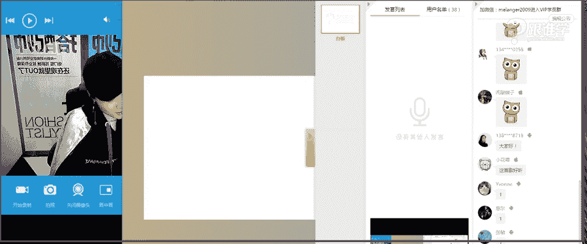

# 1、11服装《搭配秘笈之新版36计》：23羽绒服搭配秘籍

🎼有。🎼多少个晴天交换多少张。😔，你说吧。嗯。你要。hello，大家晚上好，同学们现在可以听得到我的声音吗？如果可以听得到的话呢，请打一。😊，稍等一下，同学们，我来调整一下我们的这个PPT啊。

OK好，呃，刚才还没有开始之前，我就已经看到同学们都在群里相互的问好。然后呃这也是2017年我们线上的VIP第一天上课，也是第一次上课。啊，同学们，然后呃现在再给大家拜年好像有点晚了啊。

但是还是要跟大家说一声，新年好啊，那新的一年的话，工作顺顺利利啊，那每天开开心心的哦，我我觉得开心最重要啊，身体也最重要。OK好的，嗯看到今天很多同学都在线。呃，那我想问一下。

咱们今天晚上的课堂当中呃有多少是老同学呃，就是以前听过咱们的这个VIP的第一天的课程的。如果是听过第一天的课程的呢，同学请打一。呃这个如果不是的，这这一次是新来的啊。

然后也就是第一次听我们的专业课的话呢，请打2。😊，ok好嗯。😊，有很多都是老同学，我看到啊，那也有一部分我们新进来的同学们。那不管是老同学还是新进来的同学呢，没关系，那在我们的单品课的话。

又是一个新的开始了，跟我们之前的课程呢呃虽然是有一些相关性的。我们说因为第一篇课程它是涉及到人的自身的，但是单品课它更多的讲的是搭配OK好，那刚才呢已经啊老同学应该都有认识我。

但是呢我还看到一部分同学说啊，又可以听到韩老师的声音了。那咱们的同学们可能记错人了啊，那我下面呢正式的来自我介绍啊，那同学们嗯。我呢是姚姚子宇老师啊子宇老师，那大家可以叫我姚老师或者子宇老师。

那我是米莱欧国际时尚教育的高级讲师。那米兰欧呢在线下也有我们的这样的一个学院。那我们线下学院是专门的培养职业服装搭配师的这样的一个学院。那在线上的课程呢。

我们一般呢都是以这样的像各位同学们以自呃自我提升为主的这样的一些呃课程。OK好的，周永雄同学新年好。那同学们新年好再次给大家到这样的呃对这个道好啊拜年，然后那个呃咱们这个同学们有刚刚进来是吗？好的，嗯。

那继续啊，那我是米莱欧国际讲师呃，国际教育的讲师。那同时呢也会为一些品牌。那包括秀场做这样的一些视觉策划的顾问。那同时呢也会为一些艺人啊，包括一些名流做这样的一个整体形象的造型。那今天呢很高很开心。😊。

啊，一激老师都有点小小激动了啊，因为是新年的第一堂课。然后呢呃这个这个又是讲的这个关于这个羽绒服的这样的一个搭配啊。那今天呢老师也特意的把家里最后的衣服穿上了，就是这件羽绒服啊。

那其实在广州的南方基本上是穿不到羽绒服的啊。同学们，那在北方的话呢，我相信其实现在应该还是穿着羽绒服的。但是呢刚刚好，广州这两天降温了。所以呢啊我今天在讲课之前，我说哎今天一定要穿穿一件厚一点的衣服。

来给大呃来给大家做这样的一个示范。OK好呃，那今天呢我的这样的一套搭配呢，等一下我会在课程当中也会跟大家去讲到。那包括我们课程当中的一些课程呢，跟我的这样一个搭配也非常的像啊。OK好。

那今天分享的课程就是关于羽绒服保暖又时尚的搭配秘籍。😊，那我想问咱们在座的同学们，有多少是南方人，就是你们平时穿羽绒服的机会是比较少的那有多少是北方的南方人请打一啊，北方的请打2。是的，嗯。

云妹妹同学嗯，今天的话是比较冷广州，我看到大街上有很多今天呢老师这个在街上走的时候，看到有很多呃很多人都穿羽绒服了啊，然后今天因为要讲羽绒服的课程，我也特别的格外的去关注了一些路人们的这样的一些穿搭。

那在呃我见到的今天我一路上应该见到穿羽绒服的人数不下于30个人。但是我觉得穿着让我觉得有印象的，或者我觉得很很fashion的，好像只有一个啊，那我我只看到一位。

那我不知道同学们的这样的一个呃同学们平时都是怎么搭配羽绒服的。但是呢因为有很多学生对于羽绒服的穿搭，不是特别会去搭配。那所以我们在这样的一个课程当中。

而且呢今天第一呃这个在VIP的课程第一次就给大家讲这样的一个课程。好，那我大概看到有很多同学是呃南方的，那也有一部分是北方的对吗？那我相信不管是南方还是北方，特别是现在天气冷的时候。

其实也会有穿到羽绒服，或者说今天的我们这样的一个羽绒服的搭配呢，它其实呃跟大衣啊，就是这种厚重的大衣或者是这种厚一些的外套的搭配方法，其实都可以共同去去使用的。OK好的，没有羽绒服飘过。

那微微同学说没有羽绒服飘过。那其实没有关系。因为刚才老师想到了这个羽绒服的穿搭，其实就是你可以呃把它跟大衣或者是说厚一些的外套的搭配方法是一样的？OK好啊，那接下来呢那我想问同学们。

你们在穿羽绒服的时候，遇到的最大的问题，是不是这个啊，就是比较显胖的这样的一个感觉？那我想问有没有在做有这样的困惑的同学呢。呃，例如说你们那大家现在可以这个在屏幕上去打字。

你们自己个人在选择羽绒服的时候，或者说在穿搭羽绒服的时候，你们有什么样的一个问题？同学们现在可以讲一下，呃，我刚才已经把大家的第一点啊。

就是羽绒服比较显胖的这样的一个这个这个从这个角度来给大家去解析了啊。OK啊宇和同学说显胖，那还有没有其他同学有其他的问题呢嗯。羽绒服其实是是不是比较难搭配？有很多同学他会觉得羽绒服太难搭配啊。

有同学说款式很丑啊，显得臃肿。然后青新同学说不时尚。是的啊，那问题一，其实大部分的同学。那其实我们每次在做这样的一个课程的时候，都会进行进行大量的这样的一个数据的调研。那刚才关于第一点呢。

我相信也是大多数同学的这样的一个问题，就是羽绒服显胖。那第二个就是羽绒服穿着不时髦。也就是说不知道怎么去搭配，把它搭配的好看。

那今天呢啊在这里在在这样的一个课程当课程当中呢啊我会针对于这两点都给大家去解决。在我们今天的课程当中。OK好，那在这个我们讲到羽绒服的搭配之前呢，首先我们先来了解啊羽绒服的这样的一个单品的历史。

我们说每次呢我们在讲单品的时候呢，都会跟大家来分享一些呃我们所说的单。的前世和今生啊，那其实羽绒服它也不是凭空出现的它也是有它的这样的一个发展历史的那在1940年以前。

其实那个时候都是没有羽绒服的那第一件羽绒服是在1940年，那在1940年之前呢，其实也有羽绒的这样的一些制品。但是它不会是以衣服的形式出现。它会用来做棉被啊会来用会用来做被子。

那因为当时的我们所说的这样的一个呃这个时尚的工艺还没有那么发达。那羽毛跟这样的一个羽绒很难剥离，所以都是靠人工去把它挑选出来。那就会造成什么呢？工序多的时候呢，人工贵的时候呢。

就会造成这个单品也会变得贵。那所以说呃在1940年以前，这样的一些羽绒制品都是给达官达官贵人去使用的。也就是说我们所说的啊贵族类的人去。使用的那在1940年之后啊，才有了羽绒服。这件单品的出现。

那这件单品的出现呢是一位叫edy board的这个呃大家现在可以看到左上角的这一这这个牌子上啊，这个品牌其实他也是一个人啊，人名那这位发明者，创造了羽绒服。那他的这样的一个其实说到他创造羽绒服。

还是有一个非常有趣的小故事。那当时大家现在可以看到左上角的这家店面啊，他是一家什么店面呢是一家体育用品卖户外这样的一些单品的啊这样的一个小店。

那当时这个店主也就是我们所说的eddie bird他呢是比较喜欢一项运动啊，捕鱼。当时呢他去捕鱼，在冬天的时候非常寒冷。那他有一次去捕鱼的时候呢，拉了100磅我们说非常重的。鱼回家走在路上的时候呢。

因为当时他穿的是羊毛的这样的一个外套和大衣啊，就是非常厚重的这样的一些质感的服装。那当时因为特别重啊，他就把这个呃把这个这个衣服脱掉了啊，脱掉之后呢呃放在外面，然后就一直走一直走。在行走的过程当中。

这个水啊，这个我们所说的，因为天气太过于寒冷。那他身上出的汗啊，瞬间就结冰了。那包括他的那个鱼的那些水的这些袋子啊，都已经结冰了，就造成他身体的温度越来越低。那当时都有一点点这个生命危险了。

幸好他带了一把左轮手枪啊，他当时就像前面的路人鸣了一下手枪，那才得到这个救援。那他救援之后呢，他会回家之后，他想到哎我不能放弃这个运动，我又非常喜欢捕鱼。那当时他因为听到呃他的一个俄罗斯的叔叔。

那在军队工作。那听到说当时的军。他会把羽绒放到外套里，那他就萌发了这样的一个想法，就做一件这样的羽绒服。那并且现在大家看到的右下角的这一张图片当中，我们现在是不是很眼熟。我们的很多的大衣啊。

外套棉服、羽绒服都会采用这样的一个工艺，在内胆，大家现在可以看到，如果你穿了很厚的呃外套的话，那大家现在可以打开你们的外套，看一下里面的内胆，有可能就是这种菱形格纹的绗缝工艺啊，绗缝工艺就是绗线工艺。

这种格纹型的，包括还有一种就平行的。那这种工艺呢就是当时的我们这个发明者创造的，并且在当年就申请了专利啊。

现在其实这个专利都是呃这个edy board的这样的一个品牌的那包括呢大家可以看到这个羽绒服制成之后呢，被很多军人去穿着。那有很多军人这个这个这个退伍了之后还会去找这个品牌。

那大家可以看到这件衣服上面就印的这个发明者的名字。那到现在其实这个品牌还依然存在。那也是非常有名的这样的一个羽绒服的品牌。那这就是简单的跟大家来介绍羽绒服的这样的一个单品的发展的由来。

那大家现在看到的这样的一个格纹，那包括灵文其实它的作用是什么呢？它的作用是为了让羽毛能够什么呢？不呃能够不往下滑落，其实就是均匀的覆盖在我们的衣服当中。那其实也是一个大家看起来是非常简单的工艺。

但是对于我们来说是非常非常实用性的OK好。那这就是羽绒服的这样的一个历史单品的由来。那接下来呢啊就跟大家来讲到搭配了。那大家可以看到这种就是平行的航线的工艺。那这种是菱形航线。

那有的时候呢他也会运用在服装外面。那包括其实这种工艺。现在羽绒服基本上都会有这样的一个做工，大家有见过吧啊，那包括我相信北方的同学应该现在也正在穿着这件单品，说不定啊，但是也有可能不会穿。

因为现在北方的房间里非常的暖和。okK好，那接下来呢啊我们就来讲到我们所说的羽绒服的这样的一个搭配。那今天呢会给大家分享三个板块，第一个就是如何去选择羽绒服啊，那第二个呢就是羽绒服内搭的选择。

那第三个板块是羽绒服穿搭的，需要注意的一些事项。OK好，那我想问大家第一个问题啊，如何选择羽绒服。那同学们你们在选择羽绒。服的标准是什么？我想问一下，咱们在座的同学们，你们在选择羽绒服的时候。

有什么样的一些诉求呢？嗯。例如说呃我想我选择羽绒服的时候，会考虑到的某一些问题，可能我会考虑是也呃色彩啊，可能我会考虑的是它是否是今年流行的款式。可能我会考虑它是否让我显瘦啊。

可能我还会考虑今年哎这个羽绒服的长呃，这个出的是长款的短款的还是中长款的这样的一个款式。嗯，好，我看到有同学的答案了啊，保暖的轻便的微微同学啊。

那娃娃同学说保暖收腰ok3090同学说流行款小花喵说保暖不跑毛好看OK好，大多数同学的诉求都还在我们所说的呃马斯诺诉求诉求当中的第一点啊，保暖，其实这也是我们人的最根本的需求。那刚才有人说到了。第二点。

就是我们所说的想要修身啊。那嗯OK我看到还有同学的答案说。说是耐脏那悠悠同学，那包括呃我相信如果悠悠同学你想要耐脏的话，基本上你的羽绒服选的都是黑色的吧啊因为黑色的你穿再久都看不出来它是这个脏了，对吧？

OK好，那同学们这个对于呃这些这个我们所说的选择羽绒服有很多的这样的一个诉求啊，那但是如果说到实际的这样的一个穿搭上来讲，我们今天呢讲到的就是羽绒服的这样的一个长度的问题。为什么呢？呃。

那其实选择羽绒服的时候，它更多的我刚才看到大家选择的都呃这个更多的考虑的都是这件衣服的问题。那么其实我们在选择单品，任何单品，我们其实需要考虑到我们自身的问题。同学们，我们的身材的问题啊。

以及我们的身高的问题。这都是我们在选择单品的时候需要考虑的一些问题。那例如。说啊。我们来看到啊，那羽绒服它有分啊，在女士的羽绒服当中，大家可以看到啊短款的中长款的和长款的啊，那包括男士其实也是一样。

有短款中长款以及长款。那么我们怎么去界定这件衣服的长短的的问题啊，那我们的这样的一个大概的界定的位置啊，就是臀部以上的位置。也就是说它遮不住臀部。那它是属于短款的一些呃这样的一个这个款式。

那中长款呢就是盖住臀部或者到大腿中间。那大腿中间以下的款式都被我们划分为长款。那包括男士的羽绒服也是一样的那大家可以看到图片当中的短款中长款以及长款。

那为什么要给大家这个介绍我们说羽绒服的长度的这样的一个问题呢。因为其实我们跟我们的这样的一个。体型和身高有关系。那例如说啊其实我们选择短款还是长款，那它跟体型相关的问题在于哪里呢？

例如说如果我选择短款的时候，你是这种呃X体体型或者是H体型okK没有问题。但是如果你是属于A型体型的人，你的腰是比较细的。但是你的臀部和你的大腿的位置是比较粗的啊，那或者是说T型体型的人。

在选择这些款式的时候也有需要它注要的一注意的问题，那首先我们先来说A型A型，如果你选择这种呃这个比较短款的，他会把你的这样的一个缺点很明显的暴露在外面啊。那如果你要是下面又穿的是牛仔呃这种裤装。

那就会完全没有修饰你的体型，那再来说T型的这个身形T型的体型呢，它不管是。选择短款啊中长款或者是长款，它都需要考虑的一个问题，就是这件衣服的尖领的这样的一个设置设计的这样一个问题啊，那因为T型体型的人。

它本来就肩非常的宽了。那如果你本身肩宽，你再穿这种特别夸张的大毛领啊，或者是领子这种这个羽绒服的这个领子特别大啊，它形成了一个横向纵拉伸的这样的一个效果，或者是说这件衣服的这样的一个廓形。

是今年特别流行的那种oversize的，也就是加大款式的这样的一个羽绒服，它都会让你的缺点更加的明显。就是你的上半身会显得更加的重视啊那这是对于女性来讲，那男性的话呢。

如果你的这样你选择T型当然是没有问题的那因为男士的话，我们本身就以T型为美。OK好，那所以说这是我们所说的短款的这样的一个问题。那他其实呃更多的还呃选择短款的时候，他还跟我们的身高有一定的关系。例如说。

如果你是个子比较这个高的啊，或者是你在驾驭各种款式，例如说短款、中长款或者是长款都没有太大的问题。但是如果你是个子相对来说比较娇小的那么如果你还选择特别长的款式。那你一定没有个子高的人穿着好看。

所以说呢身高身高比较娇小的人，更加适合短款的这样的一些羽绒服，或者是中长款的那如果你一定要穿长款的那在后面我会跟大家去分享怎么去穿啊。OK所以说我们在选择羽绒服的时候，其实我们首先要考虑的是。

你买的这件羽绒服啊，你要选择短款还是长款还是中长款。那么你选择这个款式的时候，它会跟你的体型有关系。如果你的你是个子比较娇小型的那我建议你选择短款的那如果你是身高比较高的那短款中长款以及长款。

你都可以去尝试。但是啊在选择短款中长款和长款的时候，它还会涉及到的一个问题，就是你的体型问题。如果你是腿比较粗的那你选择短款也不会特别好。OK好，或者是说你是臀部比较大的那选择短款也不是特别好。

那所以说现在大家对于选择短款中长款以及长款的这样的一个跟体型和身高相关的问题，大家现在清晰了吗？同学们如果清晰的话呢，请打一啊，那如果有不理解的同学呢，请打2。我再跟大家来这个针对于某些大家不了。

了解的一样呃这些问题再跟大家来讲解。OK好。我现在目前只看到一位同学的这样的一个答案。好嗯。嗯，我看到大多数同学啊都已经这个打了这样的一个嗯，好呃，微微同学说，如果又胖，然后又矮的同学呢。

那如果你是又胖又矮的。其实我依然建议你选择是短款为主，而且你选择的款式一定是要收身的那并且呢你的下半身的搭配，你可以不用搭配裤子啊，你可以搭配裙子这样的一个搭配方法。

那而且你的衣服的款式一定是比较合身的修身的合体的啊，不是说紧身啊。我们说胖人的话呢，你在选择服装的时候，一定不要选择特别紧或者是特别宽松的OK好。啊，有一位同学说没怎么听清楚嗯。好。

那我再一一的针对于两个问题来给大家讲解啊。第一个就是什么呢？我们在说呃选择短款中长款和长款的时候，那我们要根据自己的体型去选择。如果你是腿比较粗的这一类型的。

或者是你是臀部比较宽的这一类型的这两种类型的呢，选择短款不好，选择中长款或者是长款的都可以。那如果啊你是X体型或者你是H体型的人，那么你选择各种款式的问题都不是特别的大啊。那呃这如果你是T型体型的人。

你本身肩就特别宽。你在选择衣服的时候，需要注意的就不是长短的问题了啊。需要注意的就是什么呢？就是这个这个呃肩部的设计，以及这个领子的设计啊，这样的一个问题。一。呃，防止什么呢？我们所说的廓形过大。

让你的身这让你的上半身显得更加的壮。那这是体型的问题。那可能有很多同学不了解自己的体型。那呃我们今天在这个课堂当中呢，不给不给大家来重点讲体型，因为体型呢不是属于我们这个单品片的它在我们的入门篇当中。

okK好，那第二个就是什么呢？选择短款还是长款还是中长款跟你的身高相关。如果你是身材比较娇小型的，我建议选择短款。那如果你是属于哎1。6米啊，1。7米呀，那你这样这个这个款式的话呢，你都可以穿什么呢？

中长款长款以及短款都可以穿，简单来讲，如果你是身高比较高的，你可以驾驭各种。但是如果你是身高比较娇小的。那么你谨慎选择长款。如果选择长款的话，需要一些搭配的技巧。OK好。

那我不知道这样讲解大家有没有清晰，那给。大家小小总结一下，接下来呢我们进入到我们的这个搭配的这个环节了。OK好。那羽绒服显瘦的这样的一个搭配秘籍。那我们其实呃更多的是女性比较关注这样的一个显瘦的问题。

对吗？OK好，那我们来看一下显瘦的原理是什么？张弛有度，为什么呢？因为我们的羽绒服它本身的做工就已经是非常的膨胀了啊，非常的胖一显的。所以呢我们在搭配的时候，如果你的上半身也是非常宽松的。

下半身也是非常宽松的。我想问大家，你们觉得这个是显瘦还是显胖呢？如果你们觉得显瘦，请打一，显胖的话，请打2。🤧嗯。好，雨中的薄荷同学说，老师脖子短的如何选款，等一下我们会在后面跟大家去介绍夏河同学嗯。

好的啊，是的，我看到大多数同学的答案了啊，雨荷包括慧尔只爱百合3090流行的美。钟永雄同学张敏同学安洛呃安洛若同学那5021同学阿霞同学哈，目前为止，那我看到大家都已经回答了啊。

你们都觉得这种搭配的方法是比较显胖的，对吗？是的，非常明显，上面宽松，下面宽松的时候，它会让我们显胖。那也就是说什么意思呢？当你穿着裤装的时候，你的上身是松的那这是没有办法决定没有办法的事情了啊。

羽绒服它就是蓬松的。那么你在下身就一定要选择比较修身一些的款式啊，选择这种紧身的裤装啊，会比你选择这种宽松的裤装要显瘦，能理解吗？同学们啊，OK好，那这是选择裤装。那么继续来看，那羽绒服搭配裙装。

今年非常非常的流行，而且特别流行搭配那种纱质的裙装啊，为什么呢？因为这种一薄一厚的这样的一个面料的混搭，会让人的视觉非常的丰富啊。

OK这个也是我们后面在重点的去讲到的那你会发现这种宽松的裙装配这种宽松的羽绒服，她也会显胖，即使她是在秀场当中，你会发现模特本来身高就很高，而且本来就很瘦。但是她这样去穿着的时候依然物显得很胖。

那么我们应该去如何搭配呢？例如说你可以加一条腰带。啊，你选择这这种或者是说你的下半身的裙装相对来说是比较修身一些的。或者是说你把它敞开穿着的时候，如果你不加腰带啊，你穿的是裙装，你把它敞开穿的时候。

你可以在里面的裙装加一条腰带，也会显瘦，或者是说啊还有一种搭配方法是什么呢？你的上身穿的是呃打底衫毛衫啊，高领毛衫，针织毛衫还是衬衫，我不管啊，只要你下身的裙装它是比较什么呢？相对来说修身的。

或者是说它这个地方是有收腰效果的，它都会让你显得瘦，那这就是我们所说的叫张弛有度。总的来说，就是你在整一套搭配当中，不管你说是穿裙装还是穿裤装，你总是要有一个地方是比较什么呢？修身的。

要么呢你就是裤装比较修身。要么呢你就是这种这个用腰带。在腰部做这样的一个收身的效果，整体看起来就会比较显瘦了。那比如说老师今天穿着的话，其实整身其实我现大家现在要看我上半身就觉得很胖啊。

像一只这个这个北极熊似的啊，穿的这个又是银色的那那其实我的下半身还是比较紧的那我现在可以站起来给大家看一下我的这样的一个搭配。哦。Oh。啊，那大家可以看到。

其实我下半身我上半身穿的其实是这样的一个卫衣的款式。那搭配了这样的一个呃裤裙装，然后呢搭配了这样的一个紧身的高筒靴，配上这样的一一一双筒袜。那上半身非常的宽松，但是下半身它是比较紧的。

所以它看上去会比较显瘦啊，OK好。5。那我今天的这样的一个整体的搭配的这样的一个方法呢啊或者说风格呢，其实它是比较偏运动风的。OK那呃不知道大家有没有看到这呃我的这样的身上的这一套着装的时候呢。

其实它也是叫运用了叫张弛有度的这样的一个搭配方法。O是的，今年非常流行的这样的一个穿搭的方式。啊，那接下来我们来看到啊，那这是显瘦的原理，那我们一条一条来看。那例如说秘籍一羽绒服加紧身裤。

也就是说你上身不管你是穿短的啊，还是中长款的还是长款的那你都可以搭配什么呢？这种紧身裤。那例如说牛仔裤啊，或者是说这种这种靴子的搭配的方法，或者是说这种皮裤啊，都可以。只要它是紧身的就可以了。

而且其实特别流行的这样的一个搭配方法叫什么呢？敞开穿羽绒服啊，它为什么要。敞开穿呢，其实在冬天那大家可能会觉得很不实用，敞开穿会很冷在北方啊大家会觉得很冷，但是呢它会时尚度飙升啊，OK好。啊。

老师配的是高筒靴啊，老师配的是高筒靴，过膝靴OK好，那这是第一条法则，羽绒服加紧身裤。那第二条啊，羽绒服加直筒裤。那刚才有同学说，老师不是说要配相对来说比较修身的吗？那么其实直筒裤，它也是比较修身的啊。

也就是说它不会特别的宽松，它不会像阔腿裤一样。如果你的上半身穿的是这种很宽松的，你下半身又穿阔腿裤的话，那么你一定看起来就是毫无腰身的啊，或者说你你从上到下就是一个筒状的这样的一个状态。

所以说呢上半身穿羽绒服，下半身穿相对来说比较修身的直筒裤也是O的啊。那比如说这些街拍达人当中一些时尚博主他们的这样一个穿搭。那呃这种个子比较娇小的女生也可以借鉴这种穿搭的方法。

就是从上到下运用的都是一个色。就是比较连贯的这样的一个色彩搭配方法。那它看起来整个人都会非常的修长。那如果相对来说个子比较高挑的，就可以借鉴这样的一个穿搭方法啊。那例如说啊比如说这个上身和下身的色彩。

它都是尖断的那包括如果个子比较娇小的人，还可以利用这一套的穿搭方法就是什么呢？其实你把上里面的上装的色彩换成深色会更好。就说它的内搭叫一码色，从上到下啊都是一码色，那它也会让整个人看起来会非常的显高。

啊这种穿搭方法，我建议一定是个子比较高的同学去穿着。因为如果你的个子比较矮的话呢？这种五5的穿着方式会让你显得啊就就身材就变成5比5了啊，就是小短腿的这样的一个感觉。那如果穿着这样的一个搭配方法的时候。

一定要穿什么呢？高跟。鞋啊，它会拉长你的比例。那如果你有着逆天的大长腿，你也可以借鉴这样的穿平底鞋的这样一个方法。OK那这是羽绒服搭配直筒裤的这样的一个穿着方式嗯。好，老师过膝靴是可以是高跟的吗？嗯。

是呃我我没有看到的，就因为这个字幕有一点点挡啊，那哪位同学再打一个字，然后把他的这个字往这个往上，然后直就是往上一排ok好，是高跟吗？老师的这个鞋子呢是呃7。5公分的，嗯O但是它是坡跟鞋。

所以相对来说是比较舒适的。O好，那继续我们来看呃，这个刚才给大家介绍的是这个呃羽绒服加直筒裤。那么呢稍等啊，我说中间差了一个啊，羽绒服加喇叭裤啊，羽绒服加喇叭裤。那有同学说，哎，老师你不是说上身宽松。

下身要紧吗？那我觉得喇叭裤它也挺宽松的。但是喇叭裤它中间这一节是紧的，所以说呢啊也可以借鉴这样的。那大家可以看到的啊。这个博主的穿搭方式都是羽绒服加喇叭裤，但是羽绒。绒服加喇叭裤的时候。

你会发现他们的穿着都是短款的羽绒服。同学们123都是短款的羽绒服。也就是说他会把这一节相对来说比较修身的，都什么呢？暴露出来，他不会选择长款的到这个位置的。为什么？因为上从上到下都是长款都是蓬松的时候。

下面也是蓬松的时候，他就会显胖了。所以说他会选择这样的一个穿搭的方法。也就是说搭拉搭配喇叭裤的时候，尽量选择短款的羽绒服。那呃我相信咱们现在其实教室里还有很多男同学，对吗？嗯，有没有男同学同学们。

有男同学的话呃请出来啊，请打一。那除了钟永雄同学，因为我我认知道呃认识钟永雄同学啊，除了钟永雄同学哈。好，还有其他男同学吗？好，如果这个有其他男同学的话，也不要着急。

我们会在呃接下来的话就会给大家去介绍啊。这个都是女士的穿穿着的这样的一个方式。但是其实有很多的方法也是可以男士运用的。比如说想要显瘦的话，也可以上身穿宽松的，下身穿紧身的啊，OK好。

那我们下面会有一个专门针对于男士的板块的。好，那这是我们所说的秘籍三啊，羽绒服加喇叭裤。😊，依然是上面宽松下面紧身的这样的一个穿搭方式。那密籍式羽绒服加腰带。那刚才我在显瘦原则的时候。

其实就跟大家讲到了，想要显瘦的话呢，你要么呢就是下身紧身，要么呢就是你要一定有一个是把你的腰身显露出来的那它也会让你显瘦。例如说刚才我说到尽量宽松的服装不要搭配这种阔腿裤，但是你会发现哎这位博主啊。

他就是宽松的啊，然后搭配了这种这种阔腿裤，但是他运用了腰带啊，运用腰带，你会发现运用腰带之后，他会把他的整体的比例拉的特别好，就是你会认为从这儿到这儿都是腿，其实有可能他的腿只是在这儿而已啊。

那而且呢其实他运用的这个面料是非常轻薄的，今年会非常流行，或者说其实这样的一个呃厚与薄的搭配的美学法则，在所。有的秀场当中都会去运用。但是在日常生活当中，或者在我们大众的流行是在于这两年啊。

这两年的话大家才会这样去搭配。那这样的一个搭配的话，它也是比较时尚的。你的如果你下身搭配的也是非常这种我所说的非常厚重的那种面料的话，那么整体看起来都会太过于呃这种厚重感啊，它给人感觉不轻巧。

或者我们在冬天穿着的时候，其实我们是想要自己轻巧一点。OK好啊，那这是以上的三种，其实都是显瘦的这样的一个搭配的方法啊，那有同学说嗯瞅5021同学认为这样的一个搭配方法啊。

可能是呃你不是特别喜欢这种搭配方法，是吗？那所以说老师在我们的课件设置当中做了各种的搭配的方法。那大家可以根据自己的这样的一些呃需求。也就是说我们大家所认为的你认为的好看的呃这样的一些。搭配方法去借鉴。

那每个人的审美是不同的，有的人就能接受这样的一个搭配方法。那有的同学就接受不了。OK好，那不管你们啊想要这个喜欢裙装还是喜欢搭配裤装。

那呃最终呢都是要取决于你的羽绒服跟你的这个裙装和裤装之间的这样的一个松紧的关系。OK好。呃，微微同学说老师粉色搭配黑色会不会很突兀？那其实呃很多的嗯我知道你为什么可能微微同学问的这个问题，呃。

我在以前听听过一位我们国内的形象大师说过这样的一句话，但是我不认同，或者说我呃我们的这样的一个在时尚界当中也不会认同这样一个理论。为什么呢？他说到了一个理论呃，是他觉得黑色配粉色不好看啊。

或者是说他会认为黑色和粉色永远都不能很和谐的搭配到一起去。但是呃我相信在我以往的，如果大家有听过我的课程当中呢？我曾经搭配呃这个放过一张图片啊。

或者说我在以往在呃有一个课题当中做过一个粉色的这样的一个呃教案。那粉色的搭配呢，其实粉色它是非常温柔和稚嫩的色彩。但是我们说。粉色它适用于在职场当中去穿着吗？可是如果你有很多粉色的服装的时候。

或者说我就是喜欢粉色怎么办呢？那你想要显得稳重一些的时候，它的最佳配色的关系就是黑色。就是说粉色因为它太轻了，太过于稚嫩和甜美了，所以它要用黑色来把它什么呢？压一下。

用我们所说的大众的这样的一些说法把它来压一下。那其实粉色和黑色是可以搭配的啊，呃，只是你怎么去把它搭配好看，这个方法是非常重要的啊，那包括你的粉色和黑色在搭配的时候，你想要搭配传递什么样的一些信息。

OK好嗯，那微微同学不知道有没有解答清晰呢嗯。好，那这是我们所说的。以上呢刚才是给大家讲到的显瘦的搭配法则。那显瘦的搭配法则最重要的一个原理就是什么呢？要张弛有度。也就是说它要什么呢？有松的。

但是你一定要有一处是紧的，要么呢就是你的腰身啊是比较修身的，要么呢就是你的下半身是比较紧的那例如说羽绒服加什么呢？紧身裤啊，第一个，那或者是说羽绒服加直筒裤啊。

然后第三条是羽绒服加喇叭裤包括羽绒服加腰带，这四种搭配方法都会让你显瘦，不知道同学们有没有呃理解的清晰呢？嗯，好。有同学说感觉第三张显得胯宽什么？好啊，壁瓦同学说。

那第三张显得胯宽是刚才那个粉色搭配黑色的那张图片吗？那其实如果啊粉色，因为它是膨胀色，所以它会显得胯宽。那如果是A型体型的人，老师就不愿不建议这样去穿着。那刚才这这一套啊。

如果是A型体型的人就不建议这样穿着，因为上半身是收缩的，下半身是膨胀的。但是如果你是一个T型体型的人，那么你这样穿就会非常好。这个跟体型有很大的关系啊，因为T型体型的人是肩宽臀窄。

所以他可以穿浅色的膨胀，下半身OK好，那刚才讲到的是显瘦的这样的一个搭配密籍，那接下来我们来看羽绒服如何把它搭配的时尚。也就是说如何啊摆脱它这种我们所说的叫时尚灾难的这样比就穿这个这个这个呃魔咒。

有很多同学都会说羽绒服它就是一场时尚灾难，因为很多怎么穿都穿不好看。好，那我们来看如何把它穿好看。那呃秘籍一叫打破比例，什么意思呢？那例如说在这三张图片当中，那我们首先来看第一张图片。

那我们会认为首先我要给大家讲到的一个理论是比例的问题。那我们服装其实它也是有标准的比例的那我想问同学们，你们觉得是不是呃西装加西裤，包括西装加半裙，也就是我们所说的职场当中。

或者是说这种呃保险公司啊、地产公司啊，经常会穿着的西装西裤啊，那包括银行穿的这种呃这个西装加半裙的这样的一个搭配方式，会不会觉得很保守，会不会觉得太过于传统保守和老气。那我想问同学们，首先同学们。

你们先回答我这个问题。如果你们觉得相对来说是特比较保守的，请打一啊，如果你们觉得比较时尚的话，请打2OK好。嗯，好，我看到一位同学嗯。为什么这么说呢？啊，为什么这么说？因为他们的我们所说的西装和西裤。

那包括西装跟半裙，他们跟人体其实是有比例关系的啊，跟人体是有比例关系的那他他他们的那种比例其实就是属于最传统的比例啊，也就是我们所说的最稳重的比例啊，我们说保守和老气，其实它的正面的含义就是稳重感。

那呃在我们的我们所说的呃服装与身体比例的这样的一个关系当中，上身的上衣的长度，在胯的这样的一个位置，它是属于最什么呢？传统的比例。那西裤啊，我们说男士当中会有很多西裤，那包括女士也会穿裤装啊。

不管是男士和女士的裤装，在脚踝的位置，它是属于最保守的长度。那半裙啊西这种这种我们所说的西。装的这种半裙在膝盖位置啊，这个长这这个长度其实相对来说它是比较保守的啊。

那这几种这就是我所说的膝这个人体与服装的这样的一个比例。那例如说啊当一个人他穿了这种特别短的短裤的时候，你们会认为。它比较时尚，为什么呢？因为他打破了他原有的保守的比例。比如说我们认为裤装是到这个位置。

但是一个人他穿了非常短的裤装的时候，你会觉得他是时尚的啊，那包括裙装你把它本身它保守的位置是这个位置，但是你穿的特别短的时候，我们也会觉得特别时尚，或者是你把他穿的特别长的时候。

也是时尚的话也是时尚感的那是因为他都打破了我们人体的原有的比例啊，我们认为这种传统的比例所以他会有时尚感。那包括上装刚才我们说到的比较我想问同学们，现在一个问题，一和二的上装，你们会觉得哪个比较时尚。

一还是二内搭的啊，内搭就是里面的这件这个呃酒红色的这样的一件上衣跟一来比，你们觉得哪个上衣的长度是比较时尚的，一还是2。OK我看到有同学说一有同学觉得2好，那我们说从这种呃这个比例上来讲。

一肯定是比较时尚的。为什么呢？因为它的上衣特别的短，她已经打破了我们所说的这样的一个传统的这样的一个比例。它的上衣特别的短，已经到肚脐上方了。所以说啊这种衣服你会发现今年其实也特别流行露肚脐眼的啊。

或者是说这种呃短上衣，那这种长度的话，它一定给人感觉相对来说是比较年轻的啊，比较年轻的那这种因为它打服装的比例越短，你会发现很多少女她特别爱穿短裙，因为它很年轻啊，那裙子越长，其实它会越成熟。

那我们来看一下这一套的服装同学们，那为什么说这三套都是比较时尚的，而且它都是打破比例的。我们先来一一的分析，从第一套当中，我们说传统的比例上衣它是到什么呢？臀部位置，但是你会发现这个上衣它已经什么呢？

特别往上了啊，特别往上了，已经到肚脐上方了。那我们说传统的裙装的比例是在膝盖位置，但是你会发现这条裙子它已经到脚踝了。所以这种短上衣加长裙的这样的一个搭配方方法它是比较时尚的。

它是打破比例的这样的一个穿着方式。那第二套啊，我来一一解析，我们会认为上装跟下装的比例是什么呢？你会发现这个上装本身它应该是在这个位置的，但是它特别长啊，外这个外套的衣服特别长。

然后里面的这个这个裙装也就是我们所说的裙装特别短，也这种搭配方式，它也是打破了比例的。所以它也会比较时尚啊。那第三套我们来看一下，那几乎是什么呢？我们所说的这个上衣到什么呢？大腿位置那。

夏装叫这种搭配方法叫什么呢？夏装消失法啊，就是夏装今年特别流行的那那包括老师今天穿的其实也类似于这样的一个搭配方法。那这种搭配比例，鞋子的靴筒特别高，它也是非常时尚的这样的一个搭配的方法。

所以这三点都叫打破比例的搭配方法，OK好，那这一点大家有没有听清晰呢？同学们啊，如果听听懂的话呢，请打一啊，半裙在小腿肚的位置也算是打破比例，只要他过了什么呢？在膝盖位置是最保守的，往上走。

它是打破比例，往下走也是打破比例。但是啊我我要来强调一点，例如说这个裙装它往上走了一点点。那比如说两指或者三指，那同学们说那老师，那这个比例是成熟的啊，是是是呃时尚呢还是保守的。

其实相对来说是比较保守的。例如说它特别短，或者是。特别长都是比较时尚的那越接近于膝盖的这个位置，它越接近于传统的位置。OK好嗯。好，那我看到大多大多的同学都理解了是吗？

那这就是我们所说的啊时尚的搭配秘籍一叫打破比例的方法。OK那我们继续来看第二条。第二条叫叠穿法。我们来看一下同学们啊，那你会发现叠穿法的方式，其实它跟比例也有一定的关系啊。那呃在图片当中呢。

这三张图片其实大家可以发现，你们有没有发现一些规律呢？我想问同学们，你会发现它的叠穿的方法，要么就是里长外短或者是什么呢？里短外长啊，里长外短。首先从比例上。它是打破比例的那我们再来说这种叠穿的方法。

其实它就是使用了我们所说的叫视觉丰富啊，就是你会发现一层、两层三层啊，有有很多叠穿的时候，等一下我会给大家分享的男士的叠穿，它甚至都有四层的那这种这种呃穿着方式它就比较时尚。就是说它的单品运用的比较多。

但是这种叠穿的方法其实相对来说是比较考验搭配的功力的，叠穿它也需要掌握的一定的技巧。那么你的服装的比例以及色彩，包括风格其实都要进行很好的这样一个掌握啊，那不能去不能乱搭啊。

但是最好呢我们所说的叠穿要有一定的呃这种层次感。例如说里短外长或者是里长外短。如果你穿一层两层三层都是相同的长度，那就没有意义了啊，那就完全凸显不出来我们所说的这样的一个打破比例或者比较个性的。

这样的一个视觉关系。OK好，那第二条是叠穿法。那么继续来看秘籍三不好好穿衣。那今天啊如果有关注秀场的同学们呢，你们会发现其实在今年的秀场当中有很多的这样一些穿搭方式。

就是或者说现在今年啊就2016年啊就已经开始流行这种穿着方式了。比如说穿着这个服装的时候呢，啊老师的这种穿搭方法也叫不好好穿衣方法之一啊，那就比如说我就披着穿，我就不把它穿起来。

或者是说还有这种穿搭方式就是像图片当中那样去示意的穿一个袖子啊，然后另外一个袖子不穿，或者是说那我给大来示范一下啊。或者是说还有一种穿搭方式是什么呢？啊，就是故意把这个衣服呢把它抖得特别下啊。

就是要这样穿，就是感觉有点皮痞的那例如说在呃我给大家来展示一下啊。那例如说在有的时候我们呃其实老师有的时候出去的时候也会有一些拍摄或者街拍的时候，我们可能就会选择这种比较痞的这样一个穿衣方式。

那这种穿衣方式的话呢，它是今年呃比较新颖的这样的一个穿衣方式。OK好，那这就是我们所说的叫不好好穿衣。那但是有很多同学说了，老师我觉得这个不实用，在北方我不好好穿衣，会冻死的哈。

那所以说时尚他有的时候跟我们所说的人类的基本的需求是有相冲突性的那么如果你认为太冷的话，但是你又上很时尚的话，你可以里边穿厚一点。像老师今天穿的就运用了叠穿的方式啊，老师今天。里面穿了一件。

外面又穿了一件，那包括其实都套了三件啊，那这就是我们所说的不好好穿衣啊。但是在秀场当中，这种穿着方式呢，我们在生活当中可能觉得会很夸张。例如说在这个街拍当中啊，老师先把衣服放在一边。好，在街拍当中的话。

你看基本这些达人们就已经把衣服都脱下来了啊。那所以说完全就起不到我们所说的保暖作用。那包括啊这位博主里面完全没穿衣服啊，连内衣都没有穿。所以说这种穿着方式是太过于大胆了。那很多同学是接受不了。

那我们来看一下，给大家比较实用的一些穿搭方式，又可以让你时尚一些啊，又可以让你这个这个保暖的共存。OK好，我们来看一下啊。呃，卫衣夏装穿的是什么呢？嗯，这个薇薇安同学问老师卫衣夏装穿的是裙裤吗？是的啊。

我下面穿的是裙裤。嗯，OK好，那我们来看第一套，那其实它里面穿的也这个也也是有很多一一层两层既运用了叠搭，然后呢又运用了我们所说的不好好穿衣的方法啊，那第二套那大家可以看到。

其实这一套跟秀场的穿搭的方式非常的像，你会发现里面穿了一件非常亮片的上装，然后呢搭配了这样的一个羽绒服，用一条腰带啊，把这个把这个造型感系出来就可以了。那其实它是时尚兼保暖功能都在的啊。

那包括第三章大家可以看到的是什么呢？这种就是我所说的批搭的这样的一个方式去穿着。那这就是我们所说的叫密集三，不好好穿衣。这就是今年非常非常时尚的流行穿法。那同学们，你们能不能接受呢？我想问一下大家啊。

如果可以接受的话。请打一，如果接受不了的话，请打2。好，老师卫衣夏装穿的是裙裤吗？回答过这个问题了啊。于的梦同学说，那是在摆拍或者是在秀场才有的穿法。OK嗯，有呃薇安薇薇安说有双过膝靴一直没穿。

现在找到方法了啊。好，那刚才于的梦同学说，那是在摆拍或者在秀场才有的穿衣方法。的确啊，所以我告诉大家，这三种穿搭方式啊，那有很多同学可能接受不了这种穿搭方式。

但是这种和这种其实不一定是秀场或者是摆拍的时候才能这样去穿着，其实呃可能是因为老师的这样的一个职业关系吧。我们在呃我我在我们或者是我们学校的老师其实基本上这种穿搭方式都会运用啊。

但但是这种的话其实也会运用。我们其中有一位老师在夏天的时候就经常运用这种穿搭方式，而且夏天的时候大家可以想象，他都是穿搭呃一穿的一条吊带的睡衣裙，然后呢穿一件衬衣就。

就直接露小露相肩的这样的一个穿衣方式，非常的时尚。其实只是看我们个人的接受度能不能接受得到啊，OK好。啊，那有一部分同学可以接受啊，还是有一部分同学接受不了的。没关系，那同学们各俗各取所需。

那我在这里介绍的一些搭配方法，并不是说可能很多同学是接受不了的啊，或者说有有些同学觉得太过于新颖了。那呃大家可以选择自己能接受的这样一些方法。OK好密集式亮色搭配。那我相信这一点的话。

其实基本上大多数同学应该都是可以接受的啊。那我一定要建议大家在冬天的时候，其实买一件厚一呃这种亮色的大衣也好，或者是外套也好，或者说羽绒服也好。那因为在冬天的时候，你想大家全都穿的是乌鸦呀的一片啊。

那所以说你如果穿了一件亮色的羽绒服，那么搭配的又非常好看的话，其实是非常吸睛的那其实在亮色的搭配当中呢，可以这个借鉴。那在大众的穿搭当中，我相信大家能接受的就是第一套吧啊，那可能第二套相。对来说也还好。

那第三套和第四套大部分同学都接受不了啊，我认为可能我们的同学的接受度啊，相对来说这两套接受不了。但是我要还是要把这个图片拿出来给大家看，为什么呢？这就是我要让大家了解我们现在目前的时尚是什么啊。

或者说我们现在的这个穿搭的方式是什么样的？即使你接受不了，我也要传递给你啊，告诉你为什么呢？因为呃也许你不这样穿，可能过一段时间你的朋友就这样穿了。呃，我们说等下我在后面再跟大家去分享更多的吧。

我认为时尚其实呃有的时候就是要打破人们的这样的一个你的传统的想法啊，OK好，那亮色的搭配的话，其实相对来说是比较简单的这样的一个方式了。那如果在夏天啊在冬天呢，如果大家有一件亮色的，你啊。

如果有亮色的羽绒服，那也可以搭配一些相对来说比较中性色和基础色的。比如说藏蓝色黑色啊等等。那这种蓝色，我相信。可能很多同学都会觉得有点亮眼了啊，但是你的内搭和鞋子选择深色的就好了。

那包括第三种这样的一个穿着方式，可能大家接受不了。但是配色关系大家可以借用，非常的漂亮啊。O那最后一套，那这种从上到下一个颜色啊，而且都是鲜艳色，我相信可能很多同学接受不了。但是没关系啊。

那同学们可以欣赏一下。ok好，嗯，于丹梦同学说我自己能接受，只是我不是这样的风格。好，安若呃安若洛同学说不适合日常穿比较冷，是吗？好，那如果在北方的话可能会比较冷。那在南方的话，其实是可以这样穿的。

OK好，那呃刚才呢是给大家介绍的一些女生的这样的一些穿搭方式。那男生的话呢，我以另外的一个维度给大家去讲解，就是年轻的和想要成熟的这样的一个穿着穿着方式。为什么呢？因为男生的单品相对来说是比较少的。

另外男生其实。更多的想要注重的穿搭方式是怎么显得有品质，或者说想要显得年轻啊，显瘦的这样的一些诉求还是相对来说比较少的。但是男士的穿搭方式，女生也可以借鉴。同样的啊，OK好，我们来看一下啊。

第一点不好好穿衣，其实跟女生也是一样的啊，男生也可以这样穿。那只是我们国内的男生可能相对来说更加的保守，那呃依然是啊还是那句话，那大家可以去欣赏。那如果你借你你这个这个穿着不了这样的一个方式啊。

但是你最起码要懂得，或者说你学习到这样的一个新的这样的一个穿衣方式啊OK好，那不好好穿衣，123。那大家可以看到啊，那第三套其实也是运用的这种披搭的方式。🤧好，亮色搭配。

那跟女士的这个穿搭方式其实也是一样的那这种的话呢呃都是偏运动感的。你会发现年轻的搭配的话，它总是有一个什么呢？比较亮眼的东西。要么呢就是它比较出格，就是我们所说的不好好穿衣。

其实就是比较出格的一种穿衣方法。或者是说这种亮色它给人感觉是比较张扬的青春的活泼的。因为它的纯度非常的高这种色彩。那在我们的专业系统当中的话呢，它在处于我们所说的色调图当中的V微的区域。那微微区的话呢。

其实它就是属于纯度特别特别高。那这种呃色彩鲜艳的，或者是我们所说的纯度非常高的一些色彩，它要表达的一些情感，一般都是我们所说的华丽啊，活泼张扬感。那这都是我们所说的符合年轻人的特质。OK好，那运动风格。

那也是表现年轻的这样的一个穿着方式，那例如说我们会运用很多的运动的单品运动鞋啊，那包括这种真。针织帽包括卫衣，包括牛仔，它都是属于年轻的元素啊。从面料上来讲，牛仔啊会比我们所说的呢子的面料会更加的年轻。

那从风格上来讲，运动风一定比正装呢，我们所说的经典的英伦风要年轻。所以说如果你想要想年轻的话呢，就可以尝试一些运动风格。那另外大家可以看到，其实你呃我们所说的羽绒服当中还有这种马甲的款式。

那这种马甲的款式其实也非常的好搭配啊。那比如说搭配这样的牛仔，包括卫衣嗯。那呃这件衣服呢，它其实属于这种派克大衣的这样的一个款式。派克大衣羽绒服。那在我们后面的课程当中呢。

也会给大家介绍到大衣的这样的一个单品的穿搭。那今天呢不做重点的这样的一个呃授课。OK好，那以上呢其实是男生的呃比较年轻的这样的一个穿搭方式，比如说亮色搭配啊，那第二第二呃第一点呢是我们所说的不好好穿衣。

那包括最后一个的话是我们所说的叫运动风格。那这种年轻的风格的话，它会啊想要让让你显得更加的青春。那呃。不好意思，同学们啊，那这是我们所说的这个年轻的这样一个着装。那羽绒服成熟搭配的秘籍，我们来看一下。

🤧啊，那你会发现从上面的风格到下面的风格，这个一这个PPT一转换的时候，呃，虽然人都很年轻，但是服装风格它会相对来说是比较成熟的，它会让整个人看起来会更加的儒雅和沉稳感。那这种穿搭方式是什么呢？

其实它是运用了一种我们所说的叫混搭的方式。那例如说这种什么呢？不好意思啊，同学们嗓子有点不太舒服。那例如说他会运用一些这种针织的呃内搭啊，配这种我们所说的西裤和皮鞋啊。

那包括他们的这样的一些呃我们所说的羽绒服的这个单品啊，它会运用一些呢子的面料。啊，加强我们所说的这个羽绒服的质感，它也会让人显得更加的成熟。OK那这是其实是比较适合年轻的男士的这样的一个穿搭。

那想要更加成熟的一些穿搭，或者说更加稳重的穿搭的话，那大家可以借借鉴这几点搭配。那其实女生也是可以这样去穿着的啊，那秘籍衣就是什么呢？羽绒服加西装加大衣，这种其实也是属于我们所说的叫叠穿啊。

那这个穿搭方式大家可以看一下衬衫加领带加什么呢？这种薄款的，它是属于比较轻薄的这样的一些羽绒服，然后呢加西装外套，或者说加大衣外套。那为什么这种会显得比较成熟呢？因为这种服装的，我们所说的西装和大衣。

它其实都是比较偏正装，所以它给人感觉会更加的成熟感。那如果一些年轻的男士，你想要显得成。成熟的话也可以这样去穿着。我们所说所说的年轻和成熟，只是一种着装风格，不是规定你必须穿的年轻。

或者说你必须穿的成熟，而是你想要演绎成熟的时候，你可以穿着这种风格。你想要演绎年轻的时候就运用刚才上面的那三条法则OK好，那这是第一点，我们刚才所说的这个羽绒服，然后呢加西装或者是加大衣。

那大家可以看到这两张图片是我特意找给大家看一下啊，他们的微区就是我们所说的微曲是指我们所说的这个头面布这个位置啊，这个位置视觉人的视觉重心的这个微曲，它搭配的是非常的精彩的。大家可以看一下啊。

那我们所说的叠搭的方式，衬衫。🤧不好意思啊，同学们今天嗓子不太舒服啊。这种衬衫，然后加这种这种马甲，正装马甲，然后加羽绒服啊。呃，谁说红配绿不好看呢？大家可以看到啊那。

很多人会说红配绿在什么什么什么或者说红配绿穿起来就是非常俗的那大家可以看到啊，当红色和绿色以一以这种我们所说的小面积的搭配方式啊，包括把它的这种纯度降下来之后，我们所说的色彩的纯度降下来之后。

一样搭配的感觉是非常的雅致的。而且是有品味感的啊，那这就是我们所说的，其实也是涉及到我们所说的红配绿的搭配法则。红配绿怎么搭配好看呢？第一点其实是可以把它小面积的出现，大面积的绿色配小面积的红色啊。

那第二个方法就是什么呢？比如说啊降低这个呃某一个呃这个我们所说的红色或者绿色的纯度。比如说我这个绿色是非常鲜艳的。但是我把红色的纯度降下来，那它也会好看啊，或者是说两个艳度同这种纯度同。同时降下来。

它也会好看啊。OK并且呢它的这个大家可以看到，他用了口袋金跟他的这个羽绒服去这做这样的一个点缀和呼应啊，会非常的好看。好，那谢谢同学们。好，纯度是指饱和度。是的，惠耀同学。

纯度是指我们所说的色彩的饱和度。那色彩的话呢也会被我们所称为有三个维度，一个是纯度，一个叫饱和度，还有一个叫艳度。好，谢谢。嗯，好，那这是我们所说的第一套。

那第二套其实跟第一套的这样的一个搭配方法是非常相像的啊，衬衫加领带，但是它加的这种是这种所说的有点像呃看起来还是马这个有点像西装的款式啊。老师还是看不太清楚。但是它其实有一点点像西装的款式。

扣子是比较高啊，但是它的搭配方法其实是非常的像。那这两套的话其实都微曲这个位置搭配的都非常的精彩。大家可以去借鉴一下啊。那不管是男生还是女生，其实都可以用这种穿搭方式啊啊，那包括中间这一套的话，呢。

大家可以看到的是它的什么呢？搭配的下装其实是西裤和皮鞋啊。那上身的话其实是用。这种衬衫加这种圆领的针织啊，都会非常的好看。好，那这是呃这这三套的这样一个搭配方法。那我们来看一下秘籍2，大衣款的羽绒服。

刚才呢我们是说羽绒服跟大衣或者是西装去配搭。那第二个的话是什么呢？选择一些本身它就是大衣的设计的羽绒服。例如说大家可以看到图片当中的这两套，它其实都是属于这种我们所说的大衣款的羽绒服。

那我建议如果选择这个这种大衣款的羽绒服，尽量选择这种横平行的横线的设计啊，或者是这种格纹的，但是不要选择菱格纹的菱格纹的看起来就不好看啊。正格纹和平行的。

它给人感觉是比较稳重感的和沉稳感的那如果是菱格纹，它给人感觉会更加的活泼感和年轻感。那你会发现。在学院风当中，我们所说的在英伦的学院风当中，大家有没有发现就是有一个品牌，就是那只小熊的那个品牌呀啊。

你会发现他那个。它有很多针织的毛衫啊，会有那种菱形格纹，以蓝色和红色的配色关系，或者是有很多的袜子到膝盖的那种袜子啊，它是那种菱形格纹的这种设计。那菱形格纹，它更加适合于给年轻人去穿着。

或者是说你想要表达年轻感的时候去穿着。所以说那你想要表达成熟的时候，尽量选择这种正的格纹，包括这种横形呃这种平行的这种，它会给人感觉更加的稳重感。而斜线呢它给人感觉啊。

或者是我们所说这种啊更多的是我们所说菱格纹，它给人感觉会更加的这种活泼感。OK好，那这是大衣款的羽绒服嗯。好，呃，那第三条呢是有质感的面有质感的面料羽绒服。什么意思呢？你会发现这两件羽绒服的这个面料。

它跟刚才的不太一样。那比如说这一件的话，它其实是有这种反光感的那第二件的话，它其实就是呢子的面料，为什么我们经常会说羽绒服它看起来不高级，或者说羽绒服看起来很土的原因，是因为它的面料看起来不高级。

那么所以大家可以看一下，当你把面料设计成这个换调啊，换成这种比较有质感的，包括款式啊，做成这种比较稳重的时候，它的品质感都大大的提升了。所以说呃123这三条的话呢，都会让你看起来会更加的稳重和很成熟。

好，那呃第一条呢是刚才给大家介绍到的是呃我们所说的把羽绒服跟西装和大衣去搭配。那第二条呢是。选择大一款的羽绒服。那第三条呢是把我们所说的羽绒服的面料换成比较有质感的这种款式。好。

那这三条都会让你显得比较成熟和稳重感。那。啊，以上三点同学们都理解了吗？啊，好，那我们来看一下。那关于羽绒服的这样的一个呃选择和搭配啊，就是介绍到以上了啊。那接下来我们来看一下羽绒服的内搭的选择。

那我们说我们经常很多同学这个也会问到这个问题，老师我大衣里面应该搭配什么？我外套里面应该搭配什么啊，那今天其实老师介绍的羽绒服的内搭选择，其实都适用于我们所说的大衣啊，那包括这个这个厚重的外套，OK好。

我们来看一下啊，那刚才其实已经有同学问到这个问题了。说老师那我选择内搭的时候是不是领呃这个脸型啊，怎么这个或者是脖子短的，我应该怎么去选择。那我们来看一下，其实我们说内搭跟什么关系最大。

就是跟我们的脸型的关系最大。好，那我想现在问大家一个问题，你们知不知道自己是什么脸型的？同学们如果呃这个如果知道自己脸型的，请。打一不知道自己脸型的，请打2。好呃，3090同学，谢谢你啊。呃，这个是的。

讲课经常讲课的话是要多喝水，因为刚才没有拿水杯，然后我们的助理老师就把水杯拿给我了，谢谢。嗯，好，谢谢我们的助理老师。好。😊，看到很多同学的这样的一个答案了啊，嗯。

有很多同学回答自己知道是什么的脸型的人，我看到了都是我们以前的VIP学员，包括臭美猴啊啊臭美猴是我们的新学员，是吗？啊，那包括周永雄微微同学好啊，那么不确定自己脸型呢，我现在给大家大概的讲一下啊。

但是我们今天不讲的，我们说不管是体型还是脸型呃的关系的话，我们在这里不过多的去讲。那我们来看一下脸型标准的脸型是椭圆形和倒三角。那非标准的话是这种我们所说的叫正三角形也被称为叫梨型脸，比如说董卿的脸型。

那长形脸，比如说magicQ。那比如说这个呃林嘉欣啊，李嘉欣啊李嘉欣sorry也是比较长的脸型。那方形脸的话呢，比如说赵薇啊，比如说这个呃李宇春啊，那李宇春的话，它就属于方形脸啊。

那赵薇它是属于长方形脸方形脸的话其实有两种，一种是正方形脸，一种是长方形脸。那正方形脸它的比例呢其实就是相对来说比较的一比1的这样的一个这这种比例关系。那长方形脸其实就是我们。我说的呃。

椭圆形脸到三角形脸，它的这样的一个标准就是4比3，长是4宽是3。那长方形的话，它其实也是长是4，宽是3啊。OK只是它这个位置是比较宽的。其实老师的脸型就是长方形脸啊。

那同学我可以把帽子给大家来打开看一下啊好啊，那有同学说老师啊我觉得你的那个脸看起来其实挺小的。那我给大家看一下啊，老师的脸其实就是属于长方形脸的同学们看到没有？今天老师牺牲可大了啊，看一下啊。

那同学们可以看一下啊，其实老师属于长方形脸，只是我平时在搭配的时候呢，会比较注意，比如说发际线的分啊，那如果是长方形脸的话，它更加适合这种我所说的偏分。那同学们可以看一下，偏分的话，它会修饰你的脸型啊。

OK好。🤧嗯。呃，那包括菱型链啊。菱形脸的话呢，从正面看看不出来是吗？好的，因为从呃视频上看起来其实也不是特别清晰。OK好，那我们来看一下啊，呃，这是长方形脸。那菱形脸的，它的特点呢，就是什么呢？

上面是比较窄的，然后颧骨比较高，然后下面又特别尖，就是这样的啊，特别尖，那这种脸型的话呢，呃比如说林志玲，他其实就是菱形脸。那圆形脸的明星就比较多了啊，比如说李湘，比如说大S，比如说赵丽颖。

比如说这个陈妍希，他们都是比较典型的圆形脸。那以上呢就是我们所说的脸型啊，那如果你是标准的脸型的，恭喜你啊，你各种的这种呃这种关于领型，你都可以去尝试啊，那但是倒三角形脸其实有一种领型不要去选择。

就是我们所说的特别深这特别这种特别V的领型，因为它会让你的脸显呢会更加的尖。那么你。可以选择稍微柔和一点的线条。比如说呃心型的这种领型啊，或者说这种稍微圆润一点的领型，那会更加适合到三角形脸。

那其他的脸型其实对于领型上的选择都需要注意。那例如说啊比较。呃，圆脸比较圆的和比较方的这种脸型，它需要什么呢？这种拉长的效果。也就是说他要选择这种比较大领口的，会让你显得脸更加的长啊，脖子也会更加的长。

那刚才有同学说了，脖子比较短。那老师今天的这样的一个穿搭方式的话，第一不适合脸特别大的啊，那第二不太适合脖子短的，因为它会让你整个这个区域都看起来会非常的堵。嗯，OK啊，就交通堵塞的感觉了啊。好。

那如啊另外的话呢，如果你是长型脸的话，那你就不要选择过大的领型了啊，因为你本来脸就长，你还选择特别大的领型，那你的脸看起来就会更加的长。那大家可能听起来比较抽象，那给大家看一张图片啊，好。

以上我看一下同学们啊，以上123这三张图片，你们会觉得哪个脖子看起来最长？🤧嗯老师。田字脸怎么分？啊，其实你说的油字脸是吗？油字脸的话，其实你就是我们所说的梨型脸，就是上面比较窄，下面比较宽。

其实就要有点像董卿的发型。那其实如果你是这种发型，这种呃这种脸型的话呢，你最重要最注需要注意的不是发际线的问题，而是你需要把两边的头发蓬松起来，让你的整个脸看起来会接近于椭圆形的感觉。嗯，OK好好。

我看到大看到大家的答案了，123第三个看起来会更加的什么呢？显得脖子长，对吗？啊，而且的话呢它会显得脸小。那所以说如果啊同学们在我们教室的同学们，第一，如果你是属于圆形脸或者是方形脸啊。

梨型脸其实这种领型都不太适合啊，那如果你是长形脸，那么你可以选择这种领型或者是这种领型啊，那都可以选择。但是如。果啊你是圆脸啊方脸梨形脸都会更加适合这种领型，它会让你的脸看起来什么呢？

更加的这种有拉长效果，包括你的脖子看起来也会比较长。那么如果你的脖子很短的话，那刚才我们说的是脸型，那么如果你的脖子很短，那不要选择这种啊，这种会让你的显子就没有脖子了，所以选择这种是最好的。OK好。

那这种大的领型会让你脸看起来会更小。第二个就是拉长的脖颈，那这是我们所说的内搭跟我们的脸的关系。那刚才其实有同学会问到，哎，老师冬天那么冷，你让我穿这么大的领子呃，不行，透风，对吧？

有大多数大多数同学一定会有这样的一个疑问。好，那我们再来说，如果啊我要说的这个问题，大家要听好了。如果那大家不想选择那么低的领子，你可以选择接近于肤色的色彩比。比如说裸色它会让你的脖子看起来又长啊。

然后你的脸看起来也不会变得很也不会那么大啊。那这就是我们所尽量不要选的太深的。也就是说这种例如说我现在给大家看一下啊，我现在。穿白色的时候，同学们看起来你们有没有发现觉得还好啊。

就是我的脸看起来也不会特别大。但是你会发现我把这个领子全都遮上去的时候，你会发现，第一我没有脖子了。第二，我看起来脸会显大，所以就是越深的颜色，它跟你的皮肤的对比度特别大的时候。

所以就会让你看起来什么呢？脖子短脸也大，所以越接近于肤色的色彩，比如说浅一些的颜色啊，它会有拉长你的脸型的效果，以及拉拉长你脖子的效果，OK好，那这就是我们所说的关于色彩的选择啊。

那接下来我们就来看羽绒服应该搭配哪些单品，那第一个是衬衫。啊各种衬衫，比如说这种条纹衬衫，格子衬衫，印花衬衫，白衬衫，包括牛仔衬衫都可以搭配啊，只是你需要把握的是你什么呢？色彩的关。系以及你风格的关系。

比如说你想要搭配活泼一点的风格，那么你可以选择这种印花的那如果你想要搭配这种嗯想要这种，比如说你想要搭配英伦风啊，想要搭配朋克风，想要搭配牛仔风，那你可以选择格子啊。OK好。

那这是我们所说的这个衬衫的这样的一个搭配方法。那第二呃这个呃羽绒加针织衫或者是加什么呢？针织衫加衬衫，那针织衫有两种啊，第一种是这种低圆领的。第二种是这种高领的那从我们所说的领子上来讲。

有低圆领的和高领的那从面料上来讲呢，有这种精致的面料的，以及这种粗犷感的面料的那我要告诉大家的是越精致的，它越显成熟，越这种粗犷感的它越显得年轻。所以说这种粗棒针的毛衣它会显得比较年轻感。

这种精致面料的，它会显得比较成熟。那所以说大家可以自行去选择你想要成熟，你就选择细腻的。你想要年轻，你就选择粗棒织的okK好，那这是我们所说的，不管是低圆领的或者高领的都可以去搭配。

那包括还有这种搭配方法就是什么呢？衬衫加针织衫的叠穿的搭配方法，它看起来会比较有层次感。OK好，那有同学。哎，我想问大家一个问题，我一直在说层次感以及视觉丰富的。也就是我们所说的视觉丰富。

那我想问大家能不能理解这两个词语？如果可以理解的话，请打一，不能理解的话，请打2。🤧因为呃我在以往讲课的时候，有同学遇到过这样的一些问题。好。うん。好，还有其他同学理解吗？现在目前只有4位同学啊。

我想看一下咱们有多少同学能理解啊，没关系，不理解的话也没关系，不理解。等一下老师在后面的话要跟大家去详细的去讲解嗯。好的啊，那我大概看到有同学不理解，有同学理解哈，不理解的同学也有。

那我就等一下给大家来讲解啊。好，那我看推荐三啊，羽绒服加卫衣，羽绒服加卫衣这个店呃这个这个搭配方法，它会看起来会更加的年轻休闲啊，这种感觉。

那如果大家想要打造休闲风以及运动风以及年轻感的时候都可以搭配卫衣。那如果想要成熟的话，其实就可以搭配刚才上面的那种细腻的针织的面料。OK好。那男士一样的啊，有这种高领的，有这种叫轻薄领的。

有这种低低领的针织衫。那包括衬衫啊，这种也是属于高领的这种针织衫。那这几种的话呢，单品都可以作为羽绒服的内搭。那包括也可以作为大衣和厚重外套的内搭。OK好，那这是刚才我们所说的内搭。

那刚才我给大家讲到了，我说呃这种裸色的和这种深色的，或者说浅色和深色的这样的一个搭配的视觉效果。大家现可以看一下哪一种显得脖子长，哪一个显得脸短，脸长。同学们好，我想问大家这个问题。现在一还是2。

所以说在冬天的时候啊，你就可以选择这种越接近于皮肤的这种这种内搭啊，它会越越显显得你的脸小，那以及你的脖子会比较显长。OK方脸可以戴帽子吗？老师就是方脸呀。嗯，好，只是方脸戴这种。

其实老师戴这种棒球的这种针这种帽子，没有没有戴那种嗯。那种礼貌会更加的好看，为什么呢？因为这种帽子其实它更加适合给星星脸。比如说我的脸如果是这样，你会发现是不是更好看一点呢？啊，那因为这种帽子呢？

它是比较小的啊，他所以会显得你的脸比较大。但是如果比较大颜的那种，她就会出一对比就会显得你的脸很小OK好，一显长二显气质。悠悠同学OK好，那这两个人的气质是不一样的啊。

那刘诗诗本身她就是非常有气质的一位女明星。好，那这就是我们所说的在内搭的选择上，那内搭的话一共有几种呢？羽绒服，同学们羽绒服可以搭配几个内搭呢？哪几款内搭呢？你们现在可以打字。

我看一下同学们有没有掌握呀。好，快速的啊来抢答了123。好嗯。羽绒服可以搭配哪些内搭？羽绒服可以搭配哪些内搭呢？给大家呃30秒的时间。okK好，我看到答案了啊。嗯，衬衫针织衫、卫衣okK好。

那衬衫当中是不是分为哪几种啊？衬衫分为条纹的印花的格子的白衬衫，以及什么衬衫？还有没有同学记得牛仔是的啊，牛仔衬衫OK好，那针织衫当中有分为我们所说的圆领的以及高领的那从领型上来分这两种。从面料上来分。

有精致的和粗犷感的那精致的会更加的显得成熟。那粗犷呢会更加的显得年轻OK好，那这是针织衫的这样的一个呃搭配。那包括最后还有一种方法呢，其实是针织跟衬衫做叠穿。那包括还有卫衣ok好。

那以上呢就是羽绒服搭配内搭的这样的一个穿搭方式。那么来看一下穿着羽绒服的话，需要注意哪些搭配事项。那这几点大家要看好了。那第一点就是什么呢？

禁忌一就是今年秀场当中其实特别特别流行大廓形的这样的一些羽绒服。那这种大廓型，那刚才其实有同学说了，它就是适合秀场啊，那但是。有很多，比如说明星啊，他在穿着的时候。

例如说啊包括其实我在前段时间回北方的时候，见到很多人其实也有穿这种大廓形的羽绒服。那这种大廓型的羽绒服，它本身就是我们所说的啊，明星街拍的时候，或者说在秀场当中去穿着，会相对来说比较好看啊。

会比较出彩或者比较吸睛，或者说哪怕它不好看，但是它会比较出风头。那明星就达到他的目的了。那呃所以说这种廓形的，大家要谨慎去选择。因为你穿不好的话，就像呃披了床被子一样啊。所以说这种廓形的话呢。

如果大家想尝试这种大廓形的可以选择相对来说比较这种是这种这种短款的或者中长款的，但是廓形不要那么夸张的啊，小小的啊就可以了。OK好，那晋纪二是这种大毛毛领和轻薄领谨慎去选择。为什么呢？

如果我刚才其实这一点的话，跟你的领型有。很大的呃，跟你的脸型有很大的关系。如果你是一个小脸的人，那你可以选择这几种。但是如果你的脸是比较大的啊，那么尽量少选择这种轻国领，包括这种毛毛领。

包括这种鲜艳色在这个位置。因为它会把人的集中力和注意力都什么呢？集中到你的这样的一个位置，你就会什么呢？显就把其实简单来说就是暴露了自己的缺点。啊，我们所说的在人的自我形象提升当中。

或者人物形象造型当中，最重要的一点就叫扬长避短。那我们要发挥自己的优势啊，然后去掩盖自己的缺点。那如果我们的领这个脸是比较大的时候呢，就尽量少选择这种有这种重点这亮点装饰的OK好。

经济三长羽绒服加中童雪地靴啊，不管你是中童雪地靴，或者是这种短的雪地靴。当你穿着这种长款的羽绒服的时候，大家可以看一下啊，即使是明星他也是一种灾难啊，例如说舒淇，例如说范冰冰啊。

例如说这个呃绯闻女孩当中的女主角啊，那他们三位啊，你当她穿着了这种长款羽绒服的时候，再配上这种这种UJJ的时候，她看起来整个感觉都会非常的什么呢？膨胀感啊太过于肥胖的感觉。所以说这种搭配啊禁忌去搭配的。

okK好，这个不是宋茜嘛啊好。那以上呢其实就是给大家介绍的三个我们所说的在羽绒服的穿搭的这样的一些禁忌当中啊。第一个就是今年它虽然流行大廓形，但是大家谨慎去选择。第二个的话就是如果自己的脸比较大的话呢。

谨慎去选择一些大大的领子啊，或者是有亮点的领子。那第三个就是这种长款的羽绒服，再加这种雪地靴，它让你看起来整个人都会显得非常的臃肿，那如果大家又想要保暖，比如说穿这种长的款式的羽绒服。

那我建议你可以搭配紧一点的靴子，啊，哪怕你的靴子里面加了很多绒但是它依然从外观上看起来是比较紧致的那就会什么呢？整体看起来会比较的张弛有度啊，那比较这就看起来会比较瘦。

OK那以上呢其实就是今天给大家介绍到我们的羽绒服的这样的一个保暖又fashion的这样的一个穿搭秘籍。那先解答两个问。问题啊，刚才有同学其实刚才说到啊，说第一就是我刚才问大家这样一个问题。

就是视觉的层次感，或者说视觉丰富，或者是我们所说的这种这种层次感是什么意思啊？我找一张图片比较能够。🤧我看一下哪张图片会比较好解答一些啊，给大家看一下。OK就这张图片吧。好呃。

这张图片其实还不是特别引起。好，嗯，那下面我想问一下大家，那现在大家可以这个注意啊，我想问一下同学们，从这两张图片当中，一和二这两张图片当中哪一张看起来你会觉得比较有层次感的？一还是2。一还是2。嗯。

OK好的，我理解了。😊，嗯，周永雄说的周永雄同学说二比较有层次感吗？那这两张图片当中很明显，第一张会比较有层次感。那同学们那叠穿的方式，也就是说叠穿的方法，它就会看起来比较有层次感。比如说1234。

它运用了很多层的这样的一个穿搭方式，这就是我们所说的叫层次感。那现在我想问大家一个问题，第一个和第二张图片当中，你们会觉得哪一个视觉会更加的丰富。一还是2。同学们，视觉丰富程度一还是2？OK好。

那这就是我们所说的叫视觉丰富度以及层次，就是这个意思能理解了吗？啊，也就是说当运用了很多层的这样的一个穿搭方式的时候，他的层次感就会比较丰富。那当服装的搭配的时候，利用了很多层次的时候啊。

他的我们的视觉感看起来就会比较丰富。那这就是我们所说的叫什么呢？视觉层次和，这种视觉丰富度。OK好，悠悠同学说胖人适合叠穿的穿搭吗？啊，那其实我们所说的胖人，如果啊这个人特别胖的话啊。

那尽量其实选择简约的穿搭方式，能理解吗？悠悠同学如果这个人特别放胖的话，尽量选择简约的穿搭方式就好了啊。OK好，那呃这今天呢给大家介绍到的这样的一个我们所说。

羽绒服的保暖又时尚的穿搭。那其实呃刚才大家也都有这样的诉求。第一点就是保暖啊，那其实第二，有人想要显瘦。那第三呢其实就是想要时尚。其实从这三个角度上来讲，羽绒服保暖肯定是没有问题的。显瘦的角度上来讲。

那大家现在还记得这种我们所说的显瘦原理吗？显瘦原理其实就是我们所说的叫什么呢？张弛有度。那第一种方式就是上面宽松下面紧，也就是说你上面穿的很宽松，羽绒服本来就很宽松，那你下面尽量就收缩。

那还有一个就是我们所说的，当你穿裙装的时候，或者是你穿这种比较宽松的时候，但是你把腰线制造出来，它也会让你显瘦。那第三点就是刚才我们所说的叫时尚的穿搭方式，其实针对于这一点。

我想跟大家来做一些呃大概的一些分享。为什么呢？其实呃你会发。发现我在讲到的所有的时尚的穿搭方当中，其实它都是叫什么像我们所说的叫视呃这种视觉丰富啊，或者说叫打破常规的这样的一些方式。

那例如说第一点啊就是不好好穿衣啊，或者是说这种呃特别大的今年特别流行的这种呃oversize的这种踏大廓型，那其实它也是打破常规。那包括这种不好好穿衣方式。

其实它就是我们我们平时认为就是穿衣服你就好好穿嘛，对不对？你非得非得一边放下来，一边穿好的话，这就是打破常规的一种穿着方式。那所以说时尚其实它就是一个什么呢？创新。啊。

人们其实内心是追求一种我们所说的这种新鲜感的。所以时尚它其实就是一种创新，一种打破常规。那包括大家我想问同学们，今年大家都知道cci很火，对吗？

在2016年所有的一线品牌的业绩都不景气都下滑的这样一个阶段，只有cci这个品牌是直线上升的它的业绩，为什么那是因为在2016年它的设计师设计的那一个系列就是那种特别文艺风的啊，贝雷帽加这种圆眼镜啊。

那这种复古文艺风的这样的今年的这样的一个潮流，其实都是由cci掀起来的那cci也在很多人心中种草了。你会发现大家为什么喜欢guci，那是因为cci他创造了很多东西，例如说这种刺绣啊。

例如说这种呃这种呃中性的一些穿衣方式啊，那你我们很多人以往其。只是没有见过这样的一些穿搭方式，或者说没有见过这样的一个设计。所以说啊人们就会去选择它。所以他的业绩就直线上升。为什么一线的一些品牌。

那那么受到明星和艺人的喜欢，或者说那么受到人们的喜欢。那是因为一线品牌，它是特别有名气的原因吗？不是，那是因为一线品牌在每一年它都会有新颖的设计出来。

都会有一些你会在发现在秀场当中都会有一些我们以往没有见过的一些穿衣的设计或者是穿衣的方式。那这就是我们所说的不断的创新的这样的一个呃这个理念。

所以说时尚它其实就是要我们大胆的去尝试一些我们以往没有尝试过的东西。那这也是为什么我坐在这里来跟大家分享我们所说的这样的一个服装搭配的这样的一个穿衣呃。方法。那如果大家不想要追寻这种时尚感的这话。

我相我相信大家也不会坐在这样的一个教室里面来听我讲课。那是因为人们的这样的一个精神的追求，已经到了这样的一个境界。其实我们说从穿衣的角度上来讲，人的最基本的要求，其实就是保暖和遮体和必修。

那其实呃第二层次才是到我们所说的唉，想要这种美感和修身。那第三层次其实就是要自我表达，自我的这样的一个风格，以及我们所说的感官上的一个享受。就是我要美感。啊，那那我相信其实今天坐在我们教室里的同学。

那首先其实你们要给自己一个掌声啊为什么呢？因为你们其实都已经到了这样的一个境界，就是自我想要追求自我的美感了，想要自有自己的个性了。那这就是为什么同学们你们坐在这样的一个教室里面。

也就是为什么我要跟大家来分享时尚的这样。个观点实上它其实不是一个我们所说的这种非常浮夸的东西。你会发现我每次在讲这种单品的时候啊，每次在讲单品的时候，他其实都会涉及到非常庞大的一个知识体系。

实际上它是跟历史相关的？是跟人文相关呢？是跟这种我们所说的风堵风土民情相关的那你会发现我其实在这里很少跟大家去分享一些我们所说的呃这种着装逻辑。比如说我们说这种着装逻辑，中国跟这种中国人为什么穿秋裤啊。

那是因为呃为什么这个日本人他不穿秋裤。那日本人穿袜子。在在冬天的时候穿很多的袜子，那为什么这种我们所说的呃这个这个很多的这个国外嗯国外他们为什么会选择穿袜子的时候穿凉鞋，那你到底是冷还是热呢？

这种穿搭方式其实都是他们的这种着装逻辑所导致的那包括其实男装当中现在很流行那种。装搭配短裤。那这种着装方式其实就是我们所说的叫百慕大三角洲的这样的一个呃这个地域。因为那个地方特别热。

所以大家都是只穿着上身穿西装，下身穿短裤。那都是因为每一个地方的地域性的气候不同，所造成的他们的着装的逻辑不同。那我们为什么穿衣服穿不好，那是因为我们穿的是国外人的衣服，我们穿的是西方的服装。

我们穿的不是我们中国人的服装，我们中国的传统的服装其实已经隔断了，就是已经断层了。我们的文化已经断层了。那大家能够有记忆的，其实就是旗袍。但是你会发现现在如果在大街上有个人直接穿着这种汉服唐服出来。

你会觉得啊很夸张，你接受不了。但是在日本日本人穿着和服出来，大家没有觉得奇怪，那是因为日本人的着装的，他们的服饰的文化是没有断层的，而我们中国已经断层了。我们中国现在穿的全都是西式服。所以我们穿不好。

那也很正常。那是因为我们不了解他们的单品文化和历史。OK好，那其实今天呢呃想跟大家分享的就是这么多吧啊，OK好。那老师呃开始来说老师了是吧？老师帽子上有个夹子吗？是的，老师在这个帽子上是有个夹子。

其实今天我在上课之前，我就想我就说哎，我等一下上课的时候，肯定有很多同学会问老师你这个你是不是帽子上这个夹子后面取下来了，其实他就是这个呃这个这个这个棒球帽的这样的一个呃时尚的装饰。

那跟那个有没有喜欢权志龙的同学，就是Bb啊，喜欢他的同学应该知道权志龙同款OK好，阿霞同学说呃，张敏同学，我一个一个来看啊。那现在其实到我们的解答环节了。大家如果有问题的话呢。

呃给大家这个十0分钟的时间，然后大家可以提问好OK好。😊，那我现在看一下同学们的这样的一个问题。我从啊第一个问题开始啊。嗯。安若洛同学说，矮个子怎么穿长款？O刚才忘记跟大家分享这个点了啊。

那如果是个子矮的同学呢，首先你要把你的腰线啊，也就是我们所说的腰部的这样的一个线条，把它塑造出来。那不管你是敞开穿，还是把它拉起来穿的时候，一定要收腰或者是你加腰带，或者是说你有这种这种把它打造出腰线。

让你的比例看起来会很好，那这就是矮个子的穿衣的这样穿长款的这样的一个方法。如果你敞开穿，你里面也要打造腰线，比如说高腰裙或者是高腰裤来拉长你下半身的这样的一个比例。OK好，钟永雄同学说，呃穿短款啊。

你是回答上面一位同学的吗？那好我继续回答下面的同学的问题。呃，惠尔同学说这个夹子。是的啊，张敏有点难年纪的不好好穿衣方法合适吗？呃，如果有一点点年纪的这个。女性的话呢呃我是觉得啊其实不好好穿衣方法。

它就是一种时尚的穿搭方法。如果我不管你是其实同学们不要在乎自己的我们所说的年龄的这样一个阶层。当然你在出席某种场合的时候，你需要呃表现出来，你作为你这个年龄的这样的一个稳重和成熟。但是如果你自己喜欢。

而且你周围的群体它也是比较相对来说比较时尚的。那么这种穿衣方式是完全可以的。OK好，嗯，阿霞同学说个人觉得自己觉得适合，就没有什么年龄限制，非常好。嗯，好，我也想知道老师帽子上是什么是夹子OK好。

眼妆好看啊，谢谢同学谢谢英同学说呃，老师的眼妆好看是吗？老师今天特意，其实老师已经呃这一段时间因为没有上课啊，那所以的话都没有化妆。因为今天上课，我说要好好的化一个妆啊，因今天因为也是第一次跟大家见面。

希望呢呃这个在课堂当中呢，也能够跟大家一个呃好很好的这样的一个交流和互动，能够给大家留下一个好的印象吧。OK好，嗯，那继续啊。嗯。😊，羽绒服搭配裙子怎么搭配好看？呃，羽绒服搭配裙子其实有很多的搭配方法。

薇薇同学其实要看你想要塑造什么样的一个风格。那裙子其实更多的是表现的是淑女的风格。那呃淑女也有分不同的淑女，比如说少熟，比如说中淑，比如说大淑，也就是说其实你想要年轻的还是想要中间的这种状态。

或者说想要成熟稳重的这样的一些裙装的选择。那我在这里呢推荐三个长度。那例如说你想要年轻的话呢，可以搭配到大腿中部的这样的裙装，想要淑女一些的话呢，越成熟你的裙子长度越长就可以了啊，OK好。

那因为更多的一老师不太了解，你到底想要搭配什么风格啊，所以说而且从呃一条裙子，它可以从场合上来划分，从年龄上来搭配啊，从我们所说的风格上搭配，它可以搭配N种搭配方案。所以老师没有办法给你一个确。

定的答案OK好，嗯，薇薇安同学说，老师，请问像你这样的卫衣，下身靴子可以加细高跟的过膝靴吗？可以啊，但是呃如果你想要表达运动感更强烈的话呢。

那你可以呃搭配这种这种我们所说的马丁靴呀啊或者是说这种呃坡跟的就这种就是相对来说不是那么细跟的。但是如果你想要表现淑女味道的话，你可以搭配细跟的，并且是皮革的，而且相对来说是比较紧的这种靴子。

它会更加的有女人味。而且其实老师身上的这件卫衣，你还可以有另外一一种搭配方法。例如说你可以不像我这样去搭配这种裤裙，你可以搭配这种你的这种呃卫衣的面料买的稍微薄一点。

你可以把那种呃修身的这种到膝盖的这种裙装啊，把它穿到卫衣的外面，也如说把卫衣塞到裙子里面去穿。然后再配上那种高跟鞋，它会给人感觉非常的女人味儿，而且同时又有运动感，这种混搭的这种方式非常的时尚。

也非常好看。其实我平时也有这样搭配啊，OK好。嗯嗯，小资雅舍同学说，老师个子矮的女生要穿长款羽绒服怎么穿？刚才我已经回答过这个问题了，小资同学啊，不知道你有没有这个听到这个问题，那我再重复一遍。

如果个子矮的女生呢，你想要穿长款的记住一定要把腰线塑造出来。呃，腰线的塑造就是让你的比例看起来会更好。那不管你是敞开穿还是这种呃把它拉起来穿，一定要塑造腰线。如果你敞开穿的话，里面穿高腰裤或者高腰裙。

OK好，穿羽绒服搭配牛仔裤，穿什么鞋子合适运动鞋还是皮靴，看你想要表达什么风格，你想要运动休闲舒适一些，你可以搭配运动风。你想要这种我们所说的女人味先，你甚至可以搭配这种细跟的尖头的皮靴OK好。🤧好。

阿霞同学说同上，而且有肚子。呃，我不太理解阿霞的同学这个这个是什么意思。呃，就你的意思是说穿羽绒服搭配牛仔裤，然后呃有肚子吗？还是什么意思呢？如果有这个如果有肚子的话呢。

我建议你尽量选择里面深外面浅的搭配方式。例如说这张图片跟这张图啊，第一张和这两张图片，同学们可以看一下哪一张你会觉得里面的内搭会往前走呢？或者说说这一件会更加明显啊，内搭往前走的是哪一个？一还是2？

如果是一，那就代表什么呢？这种会显肚子大那2这种会显肚子小，也就是说里面深色，外面浅色它会显得肚子小，它会有收缩作用。OK好嗯。不想性感的感觉。薇薇安同学说嗯，好，我再看下你的答案。嗯嗯不想要性感的话。

那你就不要选择细跟的皮质的感觉。因为细跟的皮革的靴子穿起来会非常的性感，而且穿不好的话，他有的时候会有一点俗气的感觉。所以我其实建议你买那种极皮的这种面料，它看起来会更加的这种休闲和舒适感一些，OK好。

嗯，不客气。好，嗯，阿霞同学小资同学问的这个问题是吧？我刚才已经呃为大家解答了，嗯，好，悠悠同学说有肚子怎么打造腰线，那如果你的肚子特别大的时候呢，我就建议你就不要再塑造腰线了。啊。

那你在选择长款的时候，你可以选择这种里面深啊，就是你的内搭的这个款式的话，选择里面深外面浅的。🤧嗯。然后呢呃你的这个。嗯，我继续先把悠悠同学的这个问题回答完啊，我先悠悠同学，你的问题是。

有肚子怎么打造腰线是吧？如果有肚子的话呢，就尽量不要打造腰线了。好吧。嗯，好，老师亚荣同学说，老师我的个子比较高，不穿高跟鞋，那穿是平跟嗯，穿平跟鞋比较有女人味了啊。

平跟鞋的话选择尖头的平跟鞋会比你选择圆头的平跟鞋更加有女人味儿，圆头的平跟鞋的话，他更加的可爱的感觉，或者说他呃或者方圆头他会更加中性感。那如果你选择尖头会更加有女人味。

OK亚荣同学这个问题不知道有没有理解呢？嗯。好，那现在还有一分钟，同学们可以再提问一个问题。那如呃还有没有同学有问题的？う。好的啊。小花喵同学说，阔腿裤能配羽绒服吗？同嗯呃小花喵同学呃。

刚才其实我们在讲课的过程当中有跟大家去讲到啊，如果你要是穿阔腿裤的时候呢，我可以建议你如果真的喜欢这种穿搭方式。其实因为今年特别流行这种阔腿裤。那如果你穿阔腿裤加这种这种羽绒服的穿搭方式。

我建议你这个羽绒服选择短款的。另外一定上装里面的衣服要收腰啊，而且是敞开穿会更好。例如说你里面选择紧身的内搭啊，下面选择阔腿裤，然后呢，上面的衣服敞开穿，或者是说如果你穿阔腿裤，你可以把衣服系起来。

穿中长款或者是中长款的长度，其实我不建议因为有点尴尬啊。这个位置看起来不是特别好看。那你如果选择长款的。其实今年特别流行长配长的这样一个搭配方法。如果你穿长款的羽绒服。

把羽绒服拉上之后系上腰带会更加的适合。OK好。啊，小花喵同学不知道有没有解答到你这的有没有理解呢？这个问题好呃。长款裙子能搭配中长款羽绒服吗？个子不高。呃，还是这样的一个问题，长款的裙子。

你的裙子是飘逸的面料还是厚重的面料。如果是飘逸感的面料，我建议你可以去搭配。如果是厚重感的面料的话呢，我建议你一定要有腰身，就是你的裙子一定要有腰身，就是我建议啊不管是穿羽绒服，想要显瘦的话。

一定要有腰身。如果你搭配这种裙子。好的，嗯，毛呢的是吗？毛呢的呃这个面料它在我们所说想要时尚感的话，其实我建议你可以把夏天的裙子都拿出来穿，知道吗？就是它会这种厚和薄的这样的一个搭配层次感会更加丰富。

哪怕你里面穿两条毛裤也没人发现啊。但是你的裙子的面料跟你的大这种羽绒服的面料的这种层次感看起来会非常好。那并且呢如果你要是配这种长款的呢子的裙装，然后加上这种真中长款的羽绒服，那我建议你一定要束腰带。

把你的腰线制造出来啊，这样的话就可以了。OK好的，嗯。好的，那今天我们的这样的一个课程到这里就结束了啊，那也为大家解答了一些问题。呃，那如果在我们的这个课堂当中，大家如果还有问题。

或者说我们后面的同学今天没有参与到我们的课程当中看了我们这样的一些回放的这样的一个课程的同学。那我建议呢可以在我们的这样的一个下节课的VIP课程前会有半个小时30分钟的解答疑问的这样的一个时间。

那欢迎欢迎同学们如果有问题的话，可以到那个时候再跟大家来进行这样的一跟老师来进行这样的一个提问。那老师会在群里帮大家来解答这样的一个问题。好的啊，那呃希望今天的这样的一个课。因为今天是第一天上课。

那其实呃我们单品课的话，更多的，其实就是为了想要解答大家的这样的一个搭配的这样的一个问题。那呃希望今天的课程课程能够让大家有所收获。那我在这里呢就非常开心了。好的啊。那今天的课程就到这里了。OK好的。

同学们，嗯，谢谢你们也啊不辛苦，应该的。OK好，嗯，1846同学说，老师可以吃一下虫草，我妈妈就吃这个。好的，谢谢你啊。好的，谢谢谢谢同学们，拜拜。今天晚上的课程就到这里了，嗯，拜拜。😊。

