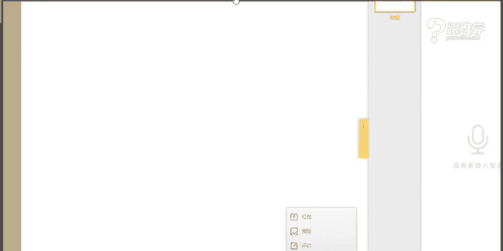
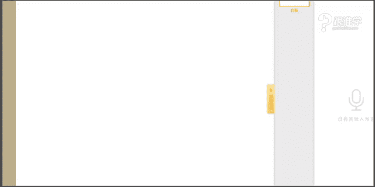

# 1、11服装《搭配秘笈之新版36计》：25卫衣

🎼感怯。🎼也配和你演出的。🎼你视而不见。🎼别逼。🎼的最爱。🎼即行表演。😊，🎼什么时候我们开始没有了底线？🎼顺着别人的谎言，被动就更显得可怜。🎼曾经难。🎼干马演出细节。🎼我该变成什么样子才能。

🎼何处演用来当爱放下放备后的这些那些。🎼有个期限。🎼即实台傻的观众就我一个。🎼其实我也看出你有点不舍。🎼场经也习惯我们来回拉扯。🎼还计较着什么。🤧OK好的，大家晚上好。同学们现在可以听得到我的声音吗？

如果可以听得到的话呢，请打一。OK好的，谢谢。😊，好的啊，那现在语音没有什么问题。那我们现在就正式开始了，谢谢同学们。嗯，那我看到很多同学都已经现在在我们的教室里了啊。

那相信呢其实等一下应该还会有一些学生学生也会断断续续的这个进来我们的教室。那今天呢给大家讲到的这样的一个课程，是关于卫衣运动卫衣的这样的一个单品的讲解。那老师呢今天也特意的又穿上了这个卫衣。

然然后来给大家这个这个演演绎我们这样的一个单品的搭配。那。OK好的，嗯，那稍等一下，咱们这边的话呃稍微调整一下我们的这样的一个设备。O。有呃有跟老师一样。而且的话现在应该是人手必备，你们有没有卫衣？

每次老师上完课之后呢，应该都会促使某一件单品的这样的一个这个销售量啊。OK好，我看到有同学大部分同学都有这样的一个单品，是吗？嗯，小花喵，然后和梅花香影同学没有啊，那3090同学说超级无敌喜欢卫衣。

是因为卫衣这件单品它比较舒适感吗？而且同时又是比较时尚的这样的一个单品。好的嗯。有卫衣，但是搭配的普通不好看是吗？好的，那你觉得。

菲二同学说有卫衣，但是搭配的比较普普通，是吗？好的啊，那其他同学呢对于这样的卫衣的这件单品有没有什么样的一个搭配上存在什么样的困惑？其实大家可以讲讲，然后老师可以在这里给大家做这样的一个解答。嗯，好的。

小花喵同学说觉得卫衣穿起来比较显胖。好，那呃现在同学们应该可以看得到老师了吧。嗯，现在可以看到这个我们的这样的一个视频了吗？好的，小花喵同学说呃显得比较丰满是吗？那可能是因为你本身就比较丰满。

再加上卫衣呢，它是一件比较不收腰不收腰的这样的一件单品。那如果在搭配上没有把握好呢，可能就会比较容易显得比较胖。但是呢正是因为它这种不收腰的款式。所以呢它给人感觉会比较的舒适感。OK好的嗯。

老师的项链很好看是吗？嗯，那其实这个项链也是呃它本身是比较宽松的这样的一个呃这个项链它是比较宽松的。其实这个如果完完全放下来的话，它应该会到这个位置。但是呢为了凹这个造型，老师在这个链子上加了一个皮筋。

所以呢把它固定在这个位置看起来会比较的紧致一些。OK好的，嗯，X身材怎么穿卫衣呢？怎么收腰。那其实X体型的话呢，其实可以呃可以用腰带的呀。啊，那等下我们的这样的一个课件当中呃，我当时在搜集图片的时候。

好像有一张是这样的一个搭配。但是我不知道有没有用啊，那等一下我们在后面的课程当中会给大家去讲到啊，小花喵同学说110斤嗯，然后1。62米是吗？好的。嗯，希望卫衣能够搭出更多的感觉是吗？

臭美猴同学说好的啊，那现在呢呃我也了解大家的这样的一个困惑了。那大家觉得卫衣这件单品，它穿起来会比较的显胖。好的，那等一下呢，我们在这样的一个课程课程当中呢，我也会穿插的来为大家去做这样的一个解答。呃。

有男士的呀，木易同学有男士的搭配。好的啊，那首先呢呃我们这个每次讲单品个之节呢都会跟大家去介绍单品的这样的一个由来。那单品的这样的一个起源其实发展的话相对来说还是比较的简单的那但呃这个卫衣呢。

它是在1930年左右啊，就已经有了这件单品。但是呢它的这样的一个呃一开始它是给冷酷的工人去穿着的。因为卫衣呢它比较的这样的一个保暖，以及它的这样的一个舒适感比较强。

所以呢一开始他其实是给冷酷的工人穿着的。但是呢呃在1936年左右，被美国的这样的一些队员啊，他们运动员参加柏林奥运会的时候啊去穿着了。那当他们穿着这件单品之后呢啊，就从此之后就开始我们所说的这样。

现在大家常见到了这样的一些搭配啊，所以其实很多的单品，它一开始都是以这样的功能性的为主。比如说牛仔，比如说飞行员夹克啊，比如说机车夹克，其实一开始并不是给我们大众去穿着的，都是有功能性的。

只是他慢慢的发展之后，那我们大众呢会认为唉这件单品它很好看，或者觉得它非常的实用，被我们所穿着。嗯，于丹梦同学说很卡。那其他同学听到老师的这样的一个授课现在是卡的吗？如果卡的话呢，请打一。

如果不卡的话呢，请打2好。啊，那如果是个别同学卡的话，可能是因为呃这个于的梦，你的这边的网络问题，我看你是用手机登录的，是吗？可能网络不是特别稳定。OK好的嗯。

那刚才给大家去介绍了我们这样的一个卫衣的这样的一个单品的由来啊。那卫衣的话，其实呃在被大家所熟知之后，其实在某一个年代，它是最受某一个群体欢迎的那呃在我们这样的一个简介当中呢，我们有看到啊。

70年代嘻哈文化的这样的一个兴起。卫衣成了亚文化叛逆的象征。那其实卫衣的话呢，它经常被嘻哈的这样的一个呃音乐人所去穿着，也是因为这样的一件单品，它是非常宽松和舒适的。而且呢他们在这样的一个演绎起来。

就演绎这个我们所说歌曲的时候啊，那这种皮痞的这样的一个气息就能释放出来。那大家其实呃所认知的嘻哈。在70年代它是刚刚兴起。但是我们说它真正的呃运用到被我们现代人所认知的话，其实是在90年代啊。

在90年代。O。好的啊，那现在的话呢这个就是我们所说的这样的一个单品的历史的发展。那接下来呢我们就给大家来讲到我们这样的一个卫衣的选择啊。那其实卫衣选择，我在之前的课程当中。

或者我在单品课当中一直跟大家强调我们所有的单品在选择的时候，其实都要有一个基准，那就是什么呢？我们要根据我们的身材去选择。那比如说刚才在课程之前就已经有同学说了。

老师我不我不穿卫衣的原因是因为比较的显胖啊，胸部比较丰满。所以呢我不选择穿卫衣，那其实呃除了这样的一个原因以外，有很多人呢也会因为是体型的原因，它会比较的显胖。那呃这个我们在说在例如说T型体型。

那我们把体型呢分为4种啊，四种体型。例如说T型体型的人呢，它本身肩就特别宽。那再加上卫衣它本身就是带有。膨胀感的这样的一个单品，它的款式以及它的面料都是有膨胀效果的。所以它看起来会更壮。

那这个时候如果我们想在穿着这件单品的时候，我们其实考虑的是什么问题呢？就是我们要考虑上和下的这样的一个平衡度。我们不能不能只是在上半身去考虑，哎，我应该把它怎么去收缩。

其实我们更多考虑的是整体的这样的一个协调性，那这就是我们所说的卫衣，其实它跟我们的身材有很大的关系。那刚才我只是讲到了体型的问题。那其实卫衣跟我们的这个在搭配上的时候，跟我们的身高也有关系啊。OK好。

魏兰同学怎么啦啊，秀丽同学说老是O型体型怎么没有。那么我们O型体型呢，在我们的这样的一个基础的体型当中，我们不大不把它列入到这样的一个板块，我们把它放到叫替态细节的这样的一个板块。

其实O型的人他就是肚子比较大啊，OK那等一下我会在下面的这个课程课程当中会跟大家去解释这样的一个点啊。那好，那刚才讲到的是我们所说的卫衣的这样的一个选择，它的细节的选择。

那其实我们在选择所有的单品的时候啊，例如说我要去购买某一件单品的时候，那我们要考虑的原因啊，或者考虑的因素有哪几个？那大家现在看到的这三个一、你喜欢的2、你适合的。3、你需要的。经常有同学会说。

老师我买了这样一件新衣服之后，商场里的时候会觉得挺好的啊，特别好看啊。但是回家之后不知道为什么就觉得它好像不好看了。或者说或者是说觉得自己穿起来好像哎没有自己想象中那那个效果啊，也不知道该怎么搭配了。

那其实都是因为我们自己的个人冲动消费啊，那其实在我们购物的时候，我们需要考虑的时候考虑这三点问题。那以后大家在购物的时候，你就要考虑一下，哎，这三个是否符合标准。第一，你喜欢的是不是你喜欢的。

第二是不是你适合的，第三是不是你需要的。如果他不满足这三点啊，其中某一个条件都不符合的话，那么你就不要买，为什么你买了就是浪费啊，从你喜欢的角度上来讲，也许你觉得啊你的朋友会说哇。

我觉得这件衣服特别适合你但是你。自己不是特别喜欢，你只是遵循了别人的意见。那你选择回去之后，你可能穿它的几率也会很少。那适合的这一点就不用说了啊。那其实在这个板块有很多人都拿捏不准。

不知道什么样的单品适合自己。那这个其实就是取决于我们自己对于自己的了解的这样的一个程度，你的个人气质，你的这个体态特征，你的体型，你的脸型等等啊，这些因素ok第三个就是你需要的这个也不用多说。

那大家应该都清晰。那这是我们选选择所有单品的共性。但是我们说有共性就有个性。那例如说在选择卫衣这件单品的时候，它其实会需要注意很多点啊O那接下来我们今天就讲的是卫衣这样的一个问题啊，卫衣的选择技巧。

那选择当我们在选择卫衣的时候，其实跟我们有两个板块非常的有大的有很大的关系啊。第一个就是我们所说的身材因素。第二个呢就是流行时尚的因素。OK身材因素其实我刚才已经跟大家去大概介绍了。

我们说我们的体型问题啊，我们的身材比例问题以及我们的体态细节问题。那。体型问题说的是什么呢？就是我们所说的HTAX那比例问题说的其实就是我们叫纵向的这样的一个呃这个体型啊。

就是我们纵向的这样的一个视觉效果，就是你的比例看起来是上半身长下半身短还是上半身短，下半身长，那这两个比例不同的话呢，你的视觉看上去显高的程度就不一样。比如说小S它看起来其实小S个子不高的啊。

可能只有不到1。6米或者只有1。6米啊，但是它比例非常好，所以它看起来非常的显高，它的腿特别的长。那它的比例就好。那比如说啊这个阿娇寸子里面的阿娇，它呢它的比例其实就特别不好。为什么呢？

大家可以去仔细观察一下啊，阿娇的比例就是55身上半身跟下半身是一样长的。但是。很不巧的是，我们亚洲人当中啊有70%的人啊，有可能70%的数据比例都不是特别的好啊，都不是特别的好。

所以呢我们就需要在穿着衣服装时，我们需要调整自己的比例。我经常在裙当在我们答疑裙当中跟大家去讲到高腰线这个概念，高腰线真的是非常非常非常的万能啊，就是你想要显高的话，那这个高腰线的手法。

一定要啊拿捏的这个多掌握多几个方法啊，比如说用腰带来制造高腰线用服装的设计来制造高腰线等等。OK这是身材的因素。那第二个流行时尚元素，这个是什么意思呢？我们在选择服装的时候。

其实老师并不是说要这个从推崇你去选择必须要选择今年特别流行的款式啊，不是这个概念，并不是说让你一定要去追时髦，而是说我们不能够落伍啊，那等一下我会用图片来给大家去展示这两个部分。好。

那我们首先来看身材的因素。那为什么刚才我反复的去强调这三点啊，体型身高比例以及体态细节。那体型其实就是指我们所说所说的叫横向的这样的一个维度。就是你在量的时候，你可能要你量你的这个围度啊。

肩围胸围腰围臀围。那你的身高呢啊和比例但身高大家都看得出来啊，你是比较矮的还是中等身材的还是比较高大的啊，那比例的话，就是刚才我给大家去讲到的啊，上半身跟下半身的这样的一个比例。那第三个就叫体态细节。

这个体。态细节其实是我们很多很多很多同学都在自己纠结的一个问题啊，我是不是腿很粗呃，腰很粗，脖子很短啊，还是胸部过于丰满等等啊，这些都是我们考虑到了这样的一个体态细节的问题啊。

但是其实我们在做服装搭配的时候，我们最重要最重要考虑的。首先是体型。第二个是比例的这样的一个问题。那第三个是体态细节的问题。好，那我们接下来首先来看体型体型它是决定了什么呢？

决定了你在选择服装的款式色彩材质的这样的一个搭配的关系啊，那我们首先来看体型有哪些体型啊，那我在这里有一张图片呢是同一个款式被不同身材的人去穿着的效果。好，那我想现在问大家。

你们啊我们现在男同学可以先来回答一下啊啊，不管是男女同学都可以来回答这个问题啊。同学们，你们喜欢第几位。的身材，你们喜欢第几位的身材？123456，你们喜欢第几个人的身材？好。

那同学们现在可以快速答一下啊，小花喵木鱼同学，包括钟永雄同学嗯，6941莹莹同学好。周永雄同学选择了一和2啊，目前为止大家选择的都是一啊啊，我看到还有部分女同学选择了第二个啊。

也有部分同学选择了第3个123好，都中标了啊，但是456好像没有人选择是吧？OK好的。😊，那为什么？同学们首先的审美趋势就是瘦在这里我先要讲一点的是瘦，你是是不是同学们从1到6后面三个为什么都没有选择？

那是因为后面三个都过于某一个部分选得太过于丰满了啊，那大家可能不喜欢，太过于胖的，或者太过于丰满的体型。那从123这三个体型都有人去选择啊，那当然啊有人重点选择了第二个胸部比较丰满的啊，那选择第二个的。

我看还不只是男同学，还有很多女同学有选择啊。那我可我觉得可能选择第二个的这个女同学们觉得自己可能是对于这种体型是可望而不可及的啊，O好，木怡同学说第四个也不错。嗯。

那木怡同学我要说的是你这个是兼具了婆婆的眼光啊，一般呢都是婆婆比较喜欢儿儿媳妇是这样的身材，为什么呢？这种身材嗯。一句话来讲，就是比较能生儿子的这样的一个体型啊。好，那呃这个这是我们所说的这几种体型。

大家的喜好是不同的。但是我们来看它的同一件服装，它穿着的效果啊，因为体型不同，穿着的就不一样的这样的一个效果。那第一个啊它是X体型，那大多数同学都选择了第一个，为什么？

那是因为人的视觉审美是喜欢平衡的那第二个它是肩宽臀窄，上半身比较宽，下半身它的这个地方比较窄，那这叫T型体型，那第三种是H体型，那这种体型也有很多同学选择了，对吗？那这种体型它其实也是平衡性身材。

它的肩跟它的臀跟它的腰啊都已经什么成成一条线了，它的束计是比较均衡的啊，那第四种身材，刚才木怡同学。说嗯这种也不错啊，它是什么呢？肩比较窄，臀部比较宽。

那么其实我要告诉大家的是这种身材在我们国内35岁以上的女性是比较多的。为什么呢？呃35岁以上的女性呢一般都是生了孩子，生了孩子之后呢，她的臀部啊会变宽。那再加上大家现在生活方式不同。

那有可能长期做办公室或者说某某种原因啊，等呃不同的原因造就了你的这个臀部的脂肪堆积的比较多的时候，那你就会呈现这种A型体型的特点啊。OK好，那O型体型，那还有这种叫大大A体型。那这个我们就不多说了啊。

好，1234这四种体型其实是我们比较常见的体型啊，那呃尖子同学说H驾驭的款式比较多。OK好，那其实我要告诉娟子的同学的是啊，其实不只是。H体型它驾驭的款式比较多，那有一种体型它其实驾驭款式是最多的。

超模一般都是那种体型，就是比较平胸的X体型它是最能驾驭服装款式的OK好，那关于我们所说的这样的一个体型啊，这样一个问题。那现在大家看到的H啊XHT和A，那现在大家才能看起来就比较清晰了。

那我们今天重点呢给大家来讲到一个体型，为什么呢？因为这个体型其实在穿卫衣的时候会存在一些问题。那是哪个体型呢？同学们1234。那刚才我其实在前面有跟大家去介绍到啊T型身材的人。

它其实穿卫衣的时候会需要注意的问题是比较多的。是的，林晶同学非常好。嗯，好的，那接下来呢我们来看T型体型。那T型体型，首先我们要说的是肩是比较宽的。比如说呃呃最近其实挺火的那个体。体育运动员游泳的那个。

表情包大家知道是谁吗？啊。知不知道是谁？我已经用了洪荒之力了给你们提示点了是的啊，傅原慧啊，那它其实就是一个非常典型的梯型。为什么呢？因为基本上游泳运动员都是T型体型。他们长期在做这样的一些运动。

所以造成肩部会很宽。那T型体型的人，他其实在穿衣服的时候呢，需要注意的问题是比较多的，并且T型体型的人他看起来会比较壮，就是有可能你可能只有100斤啊，但是你看起来像120斤这样的一个状态啊。

那所以是比较吃亏的OK那我们来看一下T型体型呢，他的裤装的搭配原则。好，那首先我想问一下大家，你们认为123这三种哪一种比较适合给到T型体型？男士男士不是这样的，木易同学，男士的话，我们是以七形为美啊。

如果你是七型的体型的话，男士的话，我们会认为这种体型是符合审美标准的啊。OK好的，嗯，男士如果你是七型，不需要注意这个问题啊。好的。啊，那大家有我看到大家的答案了啊，有同学回答第二个。

那也有同学回答23。嗯，好的，说呃，大部分同学回答的都是23，没有人选择第一个对吗？为什么呢？其实大家虽然这个原理，大家一看以前可能不清晰啊。但是我把图片放出来的时候。

大家其实可以自己在脑子里就已经在构思了啊，就在想，如果哎我如果是梯形体型的人，我还穿这件红色的上红色的上衣，那是不是会让别人注意到你的上半身呢？那这就是为什么T形体型的人不适合这种色彩的搭配的方法。

大家还记不记得我刚才说到的款式色彩以及材质这样的一个问题啊，那我们说本身这种呃卫衣，它基本上都是这种H体型了啊。所以这个H型的这种廓形，在款式上可能没有太多的这样的一个选择性。对吗？啊。

当然这种款式是比较特别的这种收腰的啊，然后比较紧身的这种卫衣款它是比较特别的。但是大部分的卫衣都是这两种款式。那从款式上我们既然已经不能够去做更多的选择。

那我们只能从什么色彩上以及我们这样的一个材质上去选择。那例如说色彩上比较膨胀的啊，有哪些呢？比如说很鲜艳的色彩啊，包括暖色啊，这些颜色呢啊，包括一些比较浅的颜色，它都会有膨胀的感觉。

为什么我们经常会说白色的显胖，那是因为白色它具有这样的一个膨胀感啊，并且呢我们说这种膨胀感啊，包括这种鲜艳的颜色啊，包括这呃它会有一种我们所说的叫前进和后退的感觉那我想问在这套服装搭配当中，同学们。

你们觉得哪个颜色是就这套红色跟黑色啊。这两个颜色哪个是让你第一眼就能看到的色彩，一定是红色，对吗？那是因为红色它有这种前进感，而黑色它有这种后退感。所以我们再选择啊梯形体型的人啊，如果在选择服装的时候。

他需要回避的就是上面用鲜应的颜色，下面呢啊下面用这种这种呃收缩的颜色。因为这样的话会更加什么呢？更加的显示它的肩部的这样的一个位置啊。O好呃，木一同学稍等一下，我再来回答你这个问题好吗？嗯。嗯。

那这是我们所说的这样的一个梯形的体型的问题啊。那从廓形上，它是上面宽松，下面紧身，从色彩上是上面前进，下面后退。那这一套从廓形到色彩都不适合给到梯形体型的人。那第二个上面什么廓形是上下平衡的。

你会发现这件这一件它是上面也宽松，下面也很宽松啊，甚至下面这种宽松度会更加比上面还要宽松啊。那从色彩上它是上面有后退感，下面有前进感。那我们第一眼看到的是下面这条裤子，所以它转移了我们的注意力。

那我们说扬长避短是什么样的过程，其实就是要转移我们的注意力嘛。这个其实叫什么呢？焦点转移法啊，它肩宽嘛，所以我们就不要注意它的上半身，我们就注意它下半身啊，那这是从这个我们所说色彩上。

那廓形上是向下平衡的。所以这一套是适合给。要梯形体型的人的，因为它达到了上下都平衡啊，那我们说所有不标准的体型，我们造型的方向是哪个体型呢？同学们，我想问大家。不标准的体型，比如说T型和A型。

我们想要把它造，我们要造型的时候，我们要把它往哪个体型去造型。OK尖子同学说X体型有没有其他答案呢？啊，大多数同学都说X体型对吗？其实H体型也是可以的啊因为H体型它也是属于上下都平衡的这样的一个关系。

所以人的视觉也是什么呢？也是认可的。所以不好意思，同学们啊，所以也是可以的。OK那那刘雯这一套服装是不是就符合了我们所说的H体型H廓形的这样的一个感觉呢？啊，好，那我们来看这一套。

那这一套是不是非常明显就是一个X体型，而且是上面紧身下面宽松上面是这种我们所说的收缩啊，下面这种这种膨胀啊，上面这个颜色是后退的，下面这个颜色是前进的。所以它这一套服装特别特别特别适合给到T型体型啊。

特别适合。所以呢小花喵同学说重音重音是什么意？意思呢啊那所以123这三套服装，第一套是不适合的，第二套和第三套都是适合的那啊来给大家总结一下T形体型的人呢，在选择不管是裙装还是裤装的时候。

它其实都是需要上面收缩，下面膨胀。那这种收缩和膨胀，它取决于三个，第一个是廓形，第二个是色彩，第三个是材质啊，那例如说很多这种有这种呃这种太空棉，它其实就是膨胀感的啊，那例如说这种精致一些的面料。

它其实就有收缩感。那色彩呢它是什么呢？我们所说的这种鲜艳的呀，亮色的呀啊，它都是有这种膨胀感的而这种深色的和着色的，它就是有收缩感的那包括廓形。啊，廓形的话有一些服装它是收腰的。

有一些是不是不收腰的对吗？那比如说这件它就是收腰的，这件就是不收腰的。所以从以上三点型色制啊，我们去选择上下搭配的这样一个原理。那梯形体型的人需要注意的问题，就是上身收缩，下身膨胀啊。

那这是它搭配裤装的这样的一个搭配原则。那我们基本上你大家可以发现它上半身选择的都是什么呢？收缩的下半身选择的是膨胀的廓形也可以大一些的。OK好，那我们再来看啊，T形体型选择裙装的搭配原则。

是不是跟刚才那个是一样的道理呢？同学们啊，那我们可以看一下第一套为什么是错误的。你会发现第一套它从什么肩部到什么呢？下半身的时候，我们会发现它就成了一个T形体型，它就成了一个T型的这样的一个状态。

所以你看上去就会觉得啊整个人看起来特别的壮实。所以这种搭配手法是错误的，它上半身啊，而且它还在上半身做了重点装饰，例如说它的这种字母以及它这种项链都叫什么呢？都是吸引了我们的注意力。

它其实应该在下半身啊来做这样的一个重点的修饰。这个人的体型其实就像就是T型体型，所以这种搭配方法是错误的。OK好，那这是我们所说的这个第一套，那第二套是不是H体型呃，H版型呢。

它的整体搭配的效果是H版型。那包括第三套上面收缩，下面膨胀。所以呢后面。第二套和第三套，一个是塑造了X的曲线感，一个是塑造了S的曲线感。所以这两套都是正确的搭配方法。并且啊虽然这一套的色彩它是膨胀的。

但是下面的色彩它也是膨胀的。所以它就不存在我们所说的，哎，上下是有这样的一个不平衡的关系啊，那呃我们第三套的话就是什么呢？上面收缩，下面膨胀。

所以啊那同学们能够理解这样的一个梯形体型在搭配的这样的一个原理了吗？啊，梯形体型需要注意的就是上半身收缩，下半身膨胀O好的啊，那这是梯形体型搭配裙装以及裤装的这样的一个搭配原则。那刚才木怡同学说。

这些原则不适合男士。那男士的梯形体型的裤装原则有哪些。那木怡同学首先呢呃我要在这里跟大家讲到这样的一个概念，就是本身T形体型。它在男士当中就是属于。标准型的它就像女士当中的X体型一样。

是大家认为的比较美好的这样的一个体型。或者我们认为这种体型它就是标准的。所以T型体型的人，你就把你的体型显现出来，这才是正确的搭配方法啊。那比如说你本身就是肩宽。

然后呢臀这个基本上男士都是肩宽和臀窄这样的一个体型的啊。当然有很多，比如说南方的一些男士啊就比较瘦。他们就比较瘦小，那看起来就像就就是可能肩也很窄呀，臀也很窄呀，就非常瘦，非常瘦。

但是一般呢呃这种我们所说的呃这个北方的哈，或者说这这些男性呢，它基本上都是肩比较宽臀比较窄这样的体型，所以呢不需要去修饰，你就把你原本的身材去呃显露出来就可以了。在着装的时候。

而且你甚至你在穿衣服的时候还需要一些修身效果，你不能够太宽松，你太宽松的时候，其实T型体型没有把你的优势显现出来啊，O好，那这是关于梯形体型男士的这样的一个服装的搭配效果。呃。

木一同学我不知道这样的一个解答啊，您现在清楚了吗？O好，那这我们继续我们下面下面下面的这样的一个课程啊。好的，嗯，好，那呃下面呢我想问大家考考大家了啊，梯型体型适合哪一个呢？一和2T型体型适合哪一个。

🤧同学们。一个是上半身。嗯，好的，还有没有其他答案呢？OK好的，那我看到大大多数的同学都已经回答正确了啊。那为什么一不对，那是因为它上半身色彩膨胀，廓形也膨胀，对吗？

所以整体看上去我们都会注意到它的上半身，而我们说了在服装造型的这样的一个扬长避短的原则上的话呢，我们其实是需要回避，别人注意我们的上半身的。

所以呢它这样的一个搭配的配色关系以及这样的一个廓形选择方法都是不对的。而第二个是正确的。那比如说它的上半身的色彩是收缩的，下半身是膨胀的。而且它上下身的廓形达到了一个平衡效果。虽然它不是特别紧身的X。

但是它其实也是接近于我们所说的H上下平衡这样的一个审美的这样的一个原则。OK所以啊第二个是正确的。好的啊，那恭喜同学们啊，对于这一个知识点已经掌握了。好的，那我们来。

看刚才这个是给大家介绍到的体型问题啊，那体型当中呢，我们刚才说了有4个，刚才给大家讲到的是梯型体型。那。下面呢给大家给大家介绍身高以及比例的这样的一个问题。那身高和比例的话。

它会决定了你在选择服装的这样的一个长度啊，以及在搭配手法上的一个问题。好，那我们首先来看身高身高呢，我们在其实呃有这种焦小型的中等型的和高大型的那娇小型的，大家觉得一般是一米几以下才叫娇小呢。

同学们一米几，你们认为一米几。好，K5杠呃KV杠5同学呃，我们这样的一个课程因为我们这个篇幅，我们的单品篇其实是不呃不细给大家去讲到体型的这样的一个板块的。因为我们这样的一个体型板块。

它是在呃我们的入门篇的课程当中去讲到的，以及啊比如说体型啊、脸型啊，个人气质啊等等啊，这个都是在入门篇的这样的一个篇幅当中去给大家讲到的那我为什么在单品篇去给大家去讲到一点。

那是因为我觉得要利用这样的一个呃体型的这样的一个维度，能够让大家更好的去理解我们在选择单品的时候，我们搭配的这样的一个问题啊，OK好的。啊，有同学说大多数同学都觉得1。6米是比较娇小的，1。6以下对吗？

是的啊，其实在1。6米以下啊，都是比较娇小的这样一些身材啊，那有同学说1。55米。好，那其实我们在这个中国人的这个审美当中啊，男士的审美当中，他们会认为1。6到1。65米之间的这样的一个身高。

是他们最喜欢的身高啊，我们的女生们听到了吗？如果你没有特别高的这样的一个身高啊，也不用也不用难过，因为其实我们说了男士审美的话，他其实希望女性能够。娇小一点，看起来会比较有保护欲。那老师这样的身高，1。

7米，基本上在南方啊放眼望去，再加上我们有的时候穿上高跟鞋，就基本上街上没有几个能够呃这个跟我这个这个相当水平的哈。因为老师穿了这个高跟鞋之后差不多可能也会有有到1。78这样的一个位置了啊。好啊。

娃娃同学说喜欢1。7高的是吗？娃娃同学是男生还是女生呢？啊，好的啊，那这是我们所说的娇小型的体型，1。6米以下的那1。6到1。7之间呢，其实它是属于中等的这样的一个身高。

那1米7到1米8米之间呢就是高大的了啊，比较高了。好，那每一个体型不同啊，我们说啊sorry身高不同。那对于服装驾驭的，我们所说的大气程度不一样。那例如说特别娇小的女生啊，那可能只有1米5几啊。

一米比如说1。58米1米55这个。这个55啊，你非要让他穿一件特别长的那种大衣款，那大家觉得能好看吗？那虽然我们可以通过一些造型的手法，让它的比例看上去会非常好，但是它没有这种我们说轻巧型的身材。

其实它驾驭我们所说的这种相对来说比较短款的一些服装款式，会更加符合他个人的气质，而且能发挥他个人的体型的优势。那比如说大家可以嗯大家知道都知道周迅，对吗？那周迅的话，他其实就作为香奈儿的中国区的代言人。

你会看你会发现他着装当中其实香奈儿这个呃我们所说这个品牌，其实是非常适合周迅的。因为香奈儿的这样的一个款式，以及他的这样的一个风格啊，其实就是一个女男孩的这样的一个感觉。

那我们说这个周迅她身上其实我们大家知道他周公子，她身上就是有这种帅帅的这样的一个感觉，但是他同时又具备这样古灵精怪的这样的一个气质。所以他在选择服装的时候，基本上都是短款，不会选择特别长的那种款式我。

记得有一次他参加一个活动的时候，就穿了一个比较长的那个款式啊，就是香奈儿的一套服装。那那一套服装的话，其实对于我们从造型角度上来讲，或者他个人的气质来讲的话，都没有让它凸显的更好啊。

所以说的话娇小一点的女生，他反而选择一些比较这种呃这种短款啊会更加的能够显示它的这样一个气质啊，那所以说如果你婴要去驾驭大廓型的。你会发现有一个品牌叫马丝菲尔啊，我不知道大家有没有了解一些服装品牌。

那如果大家有了解的话，那其实马丝菲尔这个品牌呢啊这个链子有点紧啊，老是要松一下好，那马丝菲尔这个品牌呢，它在南方卖的就不是特别好，他在北方卖的就特别好，为什么呢？因为北方的女生大多数身高都比较高啊。

都能够这个驾驭这种款式，但是你会发现他在南方的销售就没有北方的销售的业绩好。那这就是原因啊。OK好，那中等身材以及。高大型的身材的话，他们驾驭这种大廓型以及这种呃长长款的这种相对来说会更好一些啊。

那我刚才说过了，并不是说身高很娇小的人，他就一定不能驾驭一些比较大气的服装。那其实这不是绝对性的。但是我们从这种大多数的这样一个共性上来讲的话，是这样的一个问题啊。那比如说如果身材很娇小。

但是五官长得特别大气。比如说宁静。大家知道吗？宁静啊五官看起来特别大大气，但是她身高其实并不是特别高，所以他在驾驭一些服装的时候，他是可以稍微去驾驭一些比较大气的这样的一个服装的啊。

那这是都取决于个案的啊个案OK好，那这种所说的这样的一个身高的问题。那大家可以看到啊，呃我给大家找的这幅图片，我觉得真的很能够体现这样的一个问题啊。

那这个是刘雯以及那英在参加低速这个品牌的这样的一个活动的时候，他们俩穿的服装基本上都是相同的啊，那都是卫衣搭配这样的一个阔腿裤。那我想问大家，你们觉得啊哪一个穿着好看。

一一还是二哪一个看起来会觉得更加的这种哎比较大气的感觉啊，很很明显，其实刘雯穿起来会更加的帅气以及洒脱感，对吗？你会发现那英的这个搭配。你看他第一他搭配的失败的程。问题在于哪里啊？本来身高就不是特别高。

他还非要穿这种特别大廓形的这样的一个裤子啊，你就感觉他整个人都被这个不是人穿衣服的效果了，而是衣服穿人的效果的啊，所以说呢那第二他选他在搭配，我们说如果你的身高不够的话，那你需要塑造你的腰线，对吗？

把你的比例调整好，但是你会发现这一套衣服的比例是5比5啊，顶多是这种4比6了啊，但是看起来的这样的一个整体的视觉效果，我们不是觉得那么的美，对吗？所以说对腰线的问题，小花喵同学说的对了啊。

他需要的是什么呢？可以把衣服像刘雯这样啊，把它往上去收一下。那例如说今天其实老师搭配的这一套效果也是一个样子的啊。那等一下我可以啊，那我现在可以给大家来展示一下啊。好。🤧那同学们可以看一下。

那老师其实也是运用了这样的一个高腰线的手法啊。也是利用这样的一个这个我们所说的把卫衣塞到什么呢？裤子里面去穿啊，但是前提是你的卫衣不是特别厚。如果你的卫衣材质特别厚的话，那你的腰就会显得特别胖啊。

OK好，那这是我们所说的身高，它对于服装驾驭大气程度啊，是有一定的影响性的。好，那刚才说过了不绝对啊，不绝对啊，根据个人气质的问题。好，那么来看比例的问题。那刚才我一直跟大家强调比例比例就是什么呢？

那大家其实可以去这个自己测量一下啊，在这里呃一个人的比例怎么去测量呢？量你的头顶啊，你要量呃这个你要了解两个数据。第一个数据就是你的这个身高。第二个数据就是你的头顶到你肚脐之间的这个距离是多少厘米。

然后用你的下半身除以你的上半身得到了这样的一个数据啊，那就是越接近于1。618，那你的比例越好。那如果啊你看这个可能大多数人量出来之后都是1。3到1。5之间，不要难过啊我们亚洲人的比例啊，就只有1。

3到1。5。那一般黑人白人他们的比例啊，都会非常的好，可能都能达到1。618OK好。那这是我们所说的人的这样的一个比例啊，那有的人比例就天生就比较好。同样身高的人，他有的人呢看起来就会比较显高。

有的人看起来就会比较显短啊，显显矮。那是因为他的一个人腿很长，一个人腿很短，那这就是我们所说的比例的问题啊，那我们如果没有好的比例，我们应该怎么去搭配呢？同学们来看一下啊，同样的身高啊。

我选择的这这两张图片，其实大家可以看一下啊，基本上身高是相同的。但是你会发现亚洲人跟这个这个我们所说的这个欧美人，他们的这个。比例的问题啊，不管是身材比例以及头的这样的一个比例，大家可以看一下。

你会发现欧美人的头特别小，而我们亚洲人头基本上都会比较大啊，就是我们所说的叫大头娃娃我们呢而且我们的腿一般还都比较短，比例都没有那么好。那所以说我们你会发现欧美人穿这个普普通通的穿一个T恤。

穿一个牛仔裤，我们都觉得很好看。但是如果我们照搬人家穿一个T恤，穿一个牛仔裤，我们就觉得哦，你今天是去买菜吗？啊，你今天是去去这个做什么运动啊，就是觉得非常休闲的这样的一个装扮。

或者觉得呃你今天穿的不是特别注意自己的形象的这样的一个感觉O好，那这就是我们所说的比例对于我们的这样的一个影响。那如果你的比例不好的话，那你需要注意的问题，就是大家可以看到同样的黑色卫衣。

同样的这个短裙，但是因为比搭配的这个手法不一样，所以一个人会显得。比较矮，一个人会显得比较高，一个人会显得腿比较长，一个人会显得腿比较短，对吗？那这就是我们所说的搭配手法的这样的一个问题。

还是我们所说的高腰线啊，是不是高腰线是万能的老师没有骗你们吧。所以说呢那同学们需要注意啊，在搭我们说的为什么一直强调身材跟我们的所有的单品之间的关系。这就是原因啊，OK好，那给大家讲到的。

这个是我们所说的身高以及比例的这样一个原因啊。好，那我们再来看第三个体态细节，体态细节的话，就是我们所说的腰粗啊，臀宽啊等等啊，手臂粗啊，脖子短啊等等这样的一个问题啊。

它决定了我们的服装细节的选择以及搭配。那例如说我之前在讲过这个一件白T衫的这样的一个啊搭配当中呢，给大家去讲到啊，如果你的这个脸比较大，脖子也比较短。那你选择的领型应该是什么样的一个情况呢？

那今天其实有在这个。嗯，答疑群当中也有同学问到这样的一个问题。那我们需要选择的话就是比较大的一些领子。比如说大V领啊，大V领的它会更好。那如果啊冬天的时候，有很多同学说，老师我觉得冬天的时候。

我不想选择那么大的领子的时候，你可以选择越贴近于肤色其实就是越浅的颜色，它会越能够什么呢？让你的脖子得到这样一个延伸感。那越深的颜色，它得到这样一个效果越不好啊，就是它会让你的脸显得也很大呀。

脖子也显得很短。那如果冬天大家可以穿这种裸色的毛衣，肤色的就接近于脸色的这样一个肤色的这样的一个毛衣的选择啊，会更好。那能够有效的拉长你脖子的这样一个问题。那如果你选择的是黑色的毛衣怎么办呢？高领毛衣。

你可以选择一个什么呢？外套的颜色跟你这个黑色的色彩做一个什么呢？对比。然后呢，把你的这样制造一个我们所说的纵向线条来。拉长你的这样的一个脸部的这样的一个线条。OK好，那这是我们所说的某一个细节的问题啊。

那我们再来看一下以下我们所说的这样一个细节啊。那我想问一下大家同样的其实都是非常短款的碎花裙，长度也都是一样的，这种叫迷你裙啊，那这样的一个长度，那上身也都是比较短款的这种卫衣款，哪一个看起来腰细。

一还是二非常明显啊，我们有眼睛都看得出来，第二个会比较显瘦，对吗？是的，同学们，为什么第二个会比较显瘦，那就是因为它的款式，这就是我们所说的服装款式的细节问题，它的上身可能这个位置都是一样的。

只是在这个位置的时候，它没有收腰，所以它看起来就会比较显胖啊，那虽然它是H版型，但是你会觉得它看起来就唉没有旁边的这个看起来有美感，对吗？啊，所以说的话呢，这就是我们所说的。细节的选择问题啊。OK好。

如果你想要显瘦的话，那你就要记住收腰。嗯，那这是我们所说的显显腰细的这样的一个细节问题。好，哪一个适合臀部宽的朋学们，一还是2？🤧一还是2。哪一个比较适合臀部宽的？第一个？是的，为什么？

那是因为这个它使用了叫遮盖法啊，而第二个大家可以看一下啊。第二个第二个的话，它是什么呢？本身它的腿就比较粗，臀部就比较宽，它还把它的缺点暴露出来。所以说这个不适合啊，OK是的，嗯，那这就是我们所说的。

我们选择卫衣的时候跟我们体态细节之间的关系啊，跟我们身材之间的关系啊，那这是第一个那第二个啊跟流行相关。那我们来看一下啊，好，给大家来总结一下啊。所以说呢要告我要告诉大家的就是什么呢？一定要了解自己啊。

了解自己的身材的优劣势，才能够精准的去选择单品啊，注意细节的调整。OK好，那我们来看一下流行时尚的元素的这样一个问题了啊。那呃为什么我一直给大家去强调我们所说的要什么呢？呃，跟流行时尚相关，什么意思？

那我想问一下大家呃，有没有人是这个呃80年代的人啊，或者说有咱们课当课课堂当中有没有70和80后。有没有我知道90后肯定很多，但是我想看一下咱们有没有70后和80后的同学。如果有的话，请打一好吗？嗯。

好的，5021同学风林同学好的啊，永雄同学木怡OK好的，嗯，8155还挺多的呢？是吗？好的，那如果是70和80应该了解。那在那个年代是不是特别流行什么单品？同学们。特别流行什么单品。

是不是特别流行喇叭裤？那个反正我是有印象的啊，其实因为老师也是80后的啊，哇，宇和同学说60后，那你保养的真的挺好的啊，非常好啊。宇和同学看起来非常的年轻的哦同学们啊，因为他他有的时候会发相片的啊。好。

是的啊，特别流行喇叭裤同的孔同的这个喇叭裤啊。那呃那大家可以看到，很明显这一张你是看得出来哪个是即使我不写字，那大家也看得出来，左边的是70年代的，右边的是现代的啊，为什么看得出来呢？

为什么我们看这种就觉得它是一种过时的穿着方法，为什么我们看这一套我就觉得它是现代的这样的一个传这个这个这个这个现有现代感呢，那是因为我们所说的流行在变化，时尚在变化。那即使今年啊审美不同。

小画面同学说的嗯，审美不同。是的，跟我们的审美是有相关的啊，那我这就是为什么我刚才跟大家说啊，如果你不需要去紧追流行。但是如果你不追流行的话，你就会变得老土就会变得这种很很传统啊。

所以说呢如果啊那我们虽然今年特别流行复古。包括这几年。其实都特别流行复古风潮。那我们说复古，它其实是一个非常大的概念。那你复的是几十年代的古。我们说复古的话，它其实从10到990年代之间。

10203040506070之间所有的风格，我们其实都叫复古啊，那其实今年它流行的复古，就是流行的70年代的这样的一个复古的元素。那比如说在70年代就特别流行喇叭裤，对吗？

但是今年的喇叭裤跟那个年代的喇叭裤是一模一样的吗？不是所以说虽然流行复古，但是我们不是让大家去穿越啊，为什么呢？我们经常在线下的课堂当中啊，我们在这个上课的时候，然后会让同学们去做猎奇。

那很多同学搭配了之后呢，就会找一张啊这个年代的这样的一个感觉服装来啊，然后去找一套一模一样的搭配，然后穿上了我说唉这位同学你是穿越到了50年代了吗？啊。你是穿越到了60年代了吗？

因为它的所有搭配的细节啊，以及元素都是完全的去复制了那样的一个年代特点。啊所以说我们要告诉大家的是，其实复古它不是让你去穿越，它也不是让你去 copypy那个年代一模一样的搭配手法，而是我们用什么呢？

在那个年代的一些元素，但是要加入我们现代流行的一些服装，这才是时尚的真正的含义啊，所以说呢并不是说你越搭配的越复古越好啊，你要是这我们是特别是我们这是呃还好，我们穿的是西方服装啊。

我们要是真的复古这个我们中国的一些文化。那满大街都没眼看啊，感觉特别吓人。我觉得跟看鬼片似的啊好，O那这是我们所说的嗯小华喵同学说好优好幽默啊，那其实小花班的同学，你不知道老师在线上的这样的一个授课。

模式跟在线下的时候是不一样，那是因为你没有来线下。你在线下的时候见到老师呃，那老师对于你的这样的一个要求就不一样了啊。因为我们线下的同学呢，其实他是要以职业为导向的啊，所以呢他们在这个完成作业也好啊。

在做练习也好啊啊，他们这个这个会更加的这样的一个因为线下跟线上的话，咱们还是有这样的一个这个这个距离的关系啊，老师不能够很好的去监督到你们OK好的，嗯，惠尔同学说迟到了是吗？迟到了。

你是不是要打屁股了啊，如果你要是在线下的话，我就要骂人了啊，好的，嗯。呃，雨夫同学说，那个时候的喇叭裤都拖地，而且裤腿特别宽，越宽越美。是的啊，而且那个年代的不管男士还是女士啊。

都特别像那个拖地的感觉啊。OK好，用现在的审美去驾驭复古元素。嗯，是的，好的啊，那这是我们所说的流行的这样的一个问题啊，所以说同学们啊，那我们要把握现在的流行。那今年流行哪些卫衣的一些款式啊。

以及元素呢，下面就要给大家来介绍了啊。呃，稍等一下啊，同学们老是喝口水。好。我们继续啊，那我们说服装的话是由服装的廓形、色彩、材质啊等等一些元素去组成的。包括图案呢等等啊。那今年流行的廓形。

我们首先来看啊，那大家觉得今年流行哪个廓形123。呃，oversize包括合身款啊，包括短款的那我想问大家流行哪个款式？123。好啊，娟子同学说流行第一个啊。唉。时尚是要付出代价的。同学们。

老师戴这个链子虽然好看，但是有一种上教的感觉。你们知道。😊，OK好。😊，啊，大多数同学都回答了第一个啊，好，那我现在要否定一下你们啊。其实呃当然不只是第一个啊。第三个其实也流行，今年特别流行什么呢？

特别长的以及特别短的啊，那中间的这个合身的常规款的啊。sorry就不是特别的流行。但是你可以把它打造出这种什么呢？短款的效果，比如说老师今天穿的这一件其实是属于合身款的。

但是呢我把它打造成了短款的这样的一个效果啊，O所以从廓形上选择，大家可以选择这种越长越好，袖子越长越好啊，然后衣服廓形越大越好。但是如果个子稍微娇小的女生啊，谨慎去选择，包括男士也是一样的啊。

谨慎去选择。OK好的嗯。😊，第三个是吗？oh my god，什么意思呢？第三个不能接受吗？啊，都不喜欢是吧？第一个和第三个都不喜欢是吗？啊，那这个莹莹这个这个接受度相对来说还是比较差的啊。

但是这这第一个款式和第三个款式，今年都特别特别流行啊，不一定会说不一定说你非要穿这么短你可以穿稍微短一点的啊，不一定非要露肚脐ok好，那这是我们所说的廓形。那第二个我们说一下图案的问题啊，图案的话呢。

其实今年老师身上的这个这个这个这个logo呢已经不是特别的流行了啊，那为什么呢？其实今年不是特别流行这种特别这种大的图案，比如说这种大logo其实不是特别流行的，今年流行的是什么呢？这种特别小的。

以及这种有标语性质的啊，直接在服装上显示我的态度那这是我们所说的今年的流行的图案，这种特别大的动物的呀，卡通的呀。😊，大字母的呀，大logo的呀啊等等啊。比如说阿迪达斯啊，中间的这个款式。

男士有流行图案吗？一样的道理。木一同学男士也是一样的啊，男士也是一样的，流行趋势是一样的。O好，这个是我们所说的这样的一个图案的这样的一个流行度啊。那木一同学你可以去关注一下这个吴亦凡呢啊。

虽然他们是小鲜肉呃，你可能也是小鲜肉。那呃比如说这个吴亦凡啊，他其实就特别喜欢穿卫衣，他穿的卫衣的话，也都是今年特别流行的一些款式OK好啊，那这是我们所说的呃这个图案的问题。

那其实呃小字母的这样的一个图案的话呢，呃有很多同学说会觉得特别的这个没有特色，但是今年就流行这种小小的啊，而且的话我觉得这种小的字母其实不容易过时。因为它特别小，这种标识性不会特别大啊，不不会特别明显。

ok好，那这是我们所说的图案的这样的一个流行。那从设计工艺。上来讲这三个大家觉得哪个流行呢？123。123对，是的啊，娟子同学说类似于基本款。是的，有点这种感觉。嗯，好。

那慧雅同学说第二个啊莹莹同学说第一个好，那这三个款式啊都流行。好，你们又掉进老师设计的坑里去了啊。这三个其实都流行。123啊，第一个是拼色，第二个是这种织带，第三个是这种贴布。那这种这种贴布的话。

哎我上次穿的有一件呃有一件卫衣啊，就戴帽子的那一件的话，其实它就是有这种特贴布的这样的一个标识啊。那这三个都是比较流行的啊，ok那这种织带款，其实有很多同学接受不了，因为觉得特别夸张。

但是这一件织带其实它是有点夸张的这样这种元素，我说特意找这种相对来说夸张一点的。让大家来看一下啊。O好，那这是设计工艺的这样的一个角度上来讲，那大家如果选择卫衣的话，可以选择以上的这些流行元素。比如说。

拼接的织带的贴布的啊这种大廓形的或者是短款的啊，这种都是属于流行的这样的一个范围之内啊，这一两年都不会过时。好的，嗯，老师今天没扎小辫啊，老师哪扎小辫了，没有啊，好的嗯。

那呃这是为什么我一直跟大家强调流行的这样的一个问题啊。好，我们说了流行不不必狂着的去追赶，但是必须要与时恭进啊，复古不是穿越，更不是纯粹的模仿。一看这就是老师的这样的一个呃这个这个这个鞋子的这个画风啊。

O好，那这是我们所说的在选择这样的一个卫衣的这个问题上，我们需要注意两点，一个就是我们所说的叫身材的因素，身材当中，我们包含了体型包含了身高比例，包含了我们所说的体态细节的问题。那体态细节。

其实就是我们所说的腿粗啊，胳膊粗啊啊，脖子短啊等等这样的一个问题。那这个是需要大家自己去一定要了解自己。体材问题啊呃这个身材问题你才能够更精准的去把握单品。那第二个我们在选择的时候。

需要结合当下流行的一些元素，你才不至于看起来是老土的啊。OK那接下来我们来讲卫衣的这样的一个搭配嗯。好，那卫衣呢我会从三个维度。第一个是跟外套的搭配。第二个是跟夏装的搭配。

第三个是跟鞋袜的这样的一个搭配上来讲。那今天其实呃我们这个首先来讲外套啊，讲了外套的时候，今天是雨和同学发的这样的一个呃，它搭你搭配的这样的一个效果吗？是雨和同学吗？如果我没有记错的话。

应该是雨和同学啊，那我记得呃如果我记错的话呢，那不好意思啊，我不记得是是的是吗？好的，那宇和同学今天的搭配呢，我大家给给大家去讲一下啊，因为雨和同学的现在的头发的长度呢，刚刚好到这个这个位置啊。

到脖子的这样的一个位置，而且是做了很细的这样的一个小卷发啊，那他今天穿了一件带帽的这种卫衣啊，带帽就是我们所说的卫衣的话，他其实分我给大家来看一下啊，卫衣款式当中它分为两个款式。

比如说今天呃老师今天穿的就是这种圆领的款式。那第二个就是这种连帽。款啊，那今天的这个雨和呃雨荷同学，他穿的就是这样的一个连帽款。那大家可以想象一下这个效果啊，因为呢。啊。

它这个这个我们所说的头发又到这个位置，然后又穿了连帽款，而且它的领子是比较小的，它不是这种拉链式的，可以去去掌握这个就是你露出来的皮肤的这样一个这个这个呃长度啊，这样的一个露肤面积。

那它它的这样的一个领子是属于这种比较固定的死的啊。那所以呢它看起来就会很拘谨，整个人看起来这个这个位置是不不清爽的感觉。所以就造成它感觉自己呃而且它搭配了一个这个玫红色的外套，如果没记错的话。

而且是带领子的那所以种种细节堆积起来的时候，就会让你整个人这个位置看起来太过于繁琐，看起来就不够清爽。所以呢这就是我们所说的在搭配的时候去需要去注意的一些细节问题。那如果你选择了这种连帽衫的话。

那你的外套的领子就尽量要简洁。比如说老师现在选择的这样。一个领子的话，它其实属于无领的。给大家来看一下，它其实是没有翻领的啊。那呃如果如果你选择的是这种连帽衫的话，第一，注意领子的问题。

第二就是你这个领座的问题。如果特别高的话，也会让这个地方看起来堆积的很什么呢繁琐，再加上你的头发又堆积在这里，所以整个人看起来都不清爽啊。呃，今天我记得有一位同学给他了一个这样的一个方案。

说把头发扎起来啊，然后戴上帽子。那这是一个方案。那第二个的话就是你要把领子的这样一个这个问题调节一下啊。OK好，那这是我们所说的卫衣的款式上有两个，那我们在搭配外套的时候，可以怎么去搭配呢？

我们来看一下啊。呃，胸大穿卫衣显得好胖，是不是只能平胸的穿会更好看？那如果呃站在这样的一个角度上来讲的话，就其实卫衣这个款式啊站在你你所说的这样的一个问题上来讲的话，是这样的一个问题。但是啊还记不记得？

刚才我们先再来看一下啊，卫衣是不是有这种圆领的，但是也有这种拉链领的。如果胸比较丰满的女生的话，就比较适合这种拉链领的，能够更大面积的露出你脖子上脖脖子到这个位置的这样的一个线条会更好。

所以你的这个地方显得就不会那么丰满，能理解吗？啊，标榜同学好的，嗯。那么来看卫衣它可以搭配哪些外套啊。那第一个就是大衣的款式。那其实今天雨荷选择的就是大衣的这样一个款款式啊。

那你是不是搭配的效果看起来就像这个杨幂的啊，那所以我今天说到啊呃并不是这个样子的并卦同学脖子短的话呢，穿啊脖子短穿圆领的话就没有那么好你可以穿这个我们所说的这个卫衣的话，它有很多种领型嘛。

它有这种紧卡在脖子上的这样的一个问题。难道大家可以看一下，如果我起紧卡在脖子上是不是显得这个脖子啊又很短啊，然后还本身老师虽然胸部不是特别丰满啊，但是这样看起来是不是会比较显胖啊。

那所以如果我把领子往下放的时候，这个地方是不是显得通畅了啊，清爽一些了，是不是？所以这就是技巧啊，你尽量选择可以选择圆领，但是要稍微选择大一点的圆领，能理解了吗？啊，大圆领。和大V领都会比较好。当然。

卫衣V领的会比较少嗯。好，那我们继续啊卫衣加大衣款。那大衣的话有很多啊，比如说这种西装款式的大衣有这种军旅的款式，那包括这种呃有点这种皮草性质的这种款式的大衣啊。

那大家可以看到第一个和第三个相对来说看起来都会比第二个清爽，那是为什么？那是因为那他们本身啊他们知道这个领子本身就很小，就不要在这个位置过做过多的这种装饰了。而你会发现阳幂的这样的一个搭配的话。

它本身头发就在这个位置了啊，帽子又堆积在这儿，领子又有很多的细节，所以整个看起来都不清爽啊，虽然这样穿起来会很暖和啊，但是这个搭配方法一样可以啊，又暖和，而且看起来又很清爽这样的一个搭配方案。

所以说那北方的同学现在可以用这种搭配方式。而且呃如果啊你要是这个想要这种搭配方式的话，那我建议你的这个地方的细。稍微少一点啊，那这个头发如果能够这个清爽的这样的一个去整理一下会更好。

那其实现在南方已经很热了啊，这个我今天穿成这样，我都觉得有点热。OK好，那这是我们所说的卫衣加大衣的这样的一个搭配。那卫衣加大衣的话。

可以搭配这种军旅可以搭配这种皮草式的那包括这种西装式的男士也是一样的道理啊，那么来看一下男士也是一样的啊，为这种戴帽的这种连这个这个戴连帽的啊连帽衫，然后搭配这种这种我们所说的大衣啊。

那包括这种西这种西装款的大衣也是一样的啊，那我们很多男同学会比较关心，哎，男士应该怎么去搭配。其实男士也一样一样也可以，可以搭配夹克可以搭配西装外套可以搭配这种大衣。嗯，那接下来我们来给大家展示啊。

包括风衣。那大家可以看一下啊，那这三套其实搭配的都是风衣。那比如说这种这种比较经典的驼色的风衣啊，那第二个的话，其实这个的话呢，大家可以看到他的帽子啊，他的帽子应该不是它原本这个服装上的帽子。

有可能是他后面去加上去的啊，那。第二个搭配的效果它是偏什么呢？偏有点这种我们所说的未来主义的感觉。从哪看出来我们所说的有种未来感呢？第一，从它的面料，那第二，从它的墨镜上来讲。

木衣同学说风衣跟大衣的区别有点什么嗯，因为老师这个有点模糊啊，好，风衣的话其实就是比较偏薄的一些款式啊，比较适合春秋天穿。而大衣的话呢，它一般都是这种毛呢的材质。在这种这个冬天穿着的啊，嗯，毛呢的材质。

然后那种风衣的话，比如说burberry风衣其实就是特别经典的啊，OK。好啊，那这个这个款式的风衣的话呢，那我刚才讲到这个啊，讲到这个我们所说的有点未来主义感觉，从哪儿来的？第一它的面料的这种材质感。

这种反光感，它给我们感觉非常的现代以及未来感。那包括他这一副白色的墨镜，其实就是有点付我们所说的60年代的这种这种感觉。在60年代的时候呢，呃我们说这个未来主义，它其实是一种风格。在60年代的时候呢。

呃因为这个人类第一次登上了月球啊，就爆发了人们对于这种宇宙啊，未来的这种神秘的这种这种感觉啊。那当时呢就有一个品牌叫皮尔卡丹啊，设计了这样的一个叫宇宙风貌的这样的一个宇航风貌的服装。

在当时引起了很大的这样的一个热潮啊，那也应了当年的那个我们所说的宇航员登空登登月球了嘛。啊，所以那个这个大家都会非常喜欢这种着装风格啊。呃，那但是现在其实很少人去穿着。其实正好在那个年。年代的时候。

大家觉得对于未来呀啊有这样的一些向往。所以这个风格呢其实它也是一种我们所说的叫这个在那个年代就要被我们称为叫未来主义。嗯，但是现在其实也有很多未来主义的这样的一些装扮。

比如说呃很多那种科技的片子里面有很多女主角男主角他们穿的衣服啊，都是非常的这种具有现代的这种直线条的感觉啊，会用很多的塑料啊，这种高科技的面料啊等等啊，OK好，那这是我们所说的卫衣加风衣的搭配的方法啊。

那其实现在的天气就可以穿卫衣加风衣了，卫衣薄一点啊，然后加南方的同学是可以这样穿了啊。北方同学的话还是要穿大衣的嗯，OK好，那接下来我们来看一下卫衣加夹克，那夹克的话，我们上一节课已经去讲到了啊。

这种机车的这种感觉。那第二个的话就是飞行员夹克。那第三个是这种牛仔的夹克。那其实呃这个卫衣的，它搭配的这样的一个角度上来讲。可以搭可搭性会非常的强，跟一些休闲装都可以去组合和搭配。但是有个问题是什么呢？

卫衣我们今天的标题叫什么运动卫衣对吗？所以它会有一种我们所说的，不管你怎么去搭配，它都会有运动的感觉啊，都会有运动风的这样一个感觉。所以都会有一种休闲感。那如果你在特别特别正式的场合的时候。

其实去谨慎选择这样一件单品的，但是所有的休闲场合，你都可以去穿着OK好的，嗯，那呃男士也是一样啊，牛仔夹克加机车夹克加包括这种飞行员夹克啊，都可以去搭配。那相对来说还是比较百搭的啊。好。

那这是我们讲到的卫衣搭配我们所说的这样的一个上这个外套，那外套的话再给大家来总结一下，可以搭配大衣，可以搭配风衣，可以搭配各种夹克，这种机车夹克呀，棒球夹克呀啊，飞行员夹克呀，包括牛仔。夹克。

那并且我们说了运动的这样的一个单品啊，卫衣它搭配这些呃搭配这种这种我们所说的汽车夹克啊，包括这种这种棒球衫夹克，那包括这种大衣和风衣，它都会有运动感都会有休闲感，都不会特别正式的这样的一个感觉啊。

除非你在这个整体的搭配的时候啊，选择很多正装的单品，它会有一种正装的这样的一个感觉。OK好，那我们来看一下夏装应该怎么去搭配啊。🤧嗯。那卫衣加裤装的话，其实我们裤装的话无外乎哪些啊？

例如说紧身裤啊、阔腿裤、喇叭裤等等啊。那首先我们来看一下卫衣加锥形裤的这样的一个搭配效果。那卫衣它搭配这种锥形裤，它给我们的感觉会非常的比较偏利落的感觉。但是这种搭配方法不适合给到今天哪个体型。

我们今天讲到哪个体型不适合给到T形体型的人去穿。因为它这样子就看起来上身很宽，下身很窄，所以不适合给到T形体型的人去穿着OK好，那基本上呢呃那大家可以看到啊，这一套的话，呢给我们感觉就是什么呢？

它搭配了这种这种这种这种棒这种棒球夹克的感觉的话呢，它就有一种运动感。因为棒球夹克它也是运动单品。所以两个单品都是运动单品的时候，搭配起来会更加的运动感。那第二个的话，其实它有点这种休闲的感觉。

就是整体的话都是这种休闲感。第三个的话就是这种比较帅气的感觉，搭配这种机车夹克，包括这种短靴啊，黑色的短靴，整个一套的色彩，而且都是黑色的。本身我们说这种黑色它给我们感觉会比较硬的这样的一个感觉。

再加上皮革啊，然后这样这样相互去组合之后，给人给我们感觉就会非常的硬朗。所以这种硬朗的感觉，运用到女生身上的时候，它给人传递的这种信息就是比较帅气感的。OK好。

那这是我们所说的卫衣加锥形裤的这样的一个搭配。但是这种锥形裤的话，不仅限于黑色，你也可以搭配这种牛仔的这样牛仔蓝哪啊等等啊，只是我们所说的这种形状。OK好，那这是卫衣加这种锥形裤。

那卫衣还可以搭配这种阔腿裤啊，但是需要注意的某些细节，就是例如说你的如果你腰很粗啊，然后这种跨又很宽。今天其实也有同学问到这样一个问问题。如果你的腰特别粗胯也很宽的话，那就尽量不要去。

选择这种这种我们所说的阔腿裤，因为它会让你看起来像一个水桶，上面也很宽，下面也很宽。那你不就是一个可乐瓶子嘛？啊，所以看上去没有曲线感的时候，那女性就缺少了这种我们所说的你本身的特质的女性美。

看起来就会没有线条感OK啊，那这是我们所说的卫衣加阔腿裤。那它搭配不同的阔腿裤，它给我们的感觉也会不一样。那例如说啊这这个整个的组合搭配，它给我们感觉，就是摩登感。那这种摩登感的话。

其实也跟我们所说的这种未来主义也有一定的关系。刚才我跟大家就介绍到的这种数天数竖线条啊啊，包括这种白色的墨镜啊，它都会有这种我们所说的这种科技未来摩登的感觉。OK好。

那第二套的话是我们所说的这种它有很明显的。为什么哎有同学会问到老师，为什么你给这一套就叫这种摩登感，为什么给这一套就会有这种我们所说的时尚运动感呢？那是因为你会发现。当这种休闲的卫衣。

它跟字母的一些图案去结合的时候，它的运动感会非常的强烈。但是如果它是这种特别精致的面料，而且是非常简洁的款式的时候，它的风格就没有那么的明显化啊，它看起来就没有那么的像运动感的东西，能理解吗？同学们。

所以说你要能够看懂这件单品身上的信息啊。例如说这一套其实它是及这种我们所说的运动感啊，时尚感，包括它还有一点点优雅的感觉。那这种优雅感来自于哪里来自于它的丝巾的这样的一件单品。我们说丝质的东西啊。

它本身就有一种优雅感，包括丝巾，你会发现在50年代的时候，那个时候人们特别喜欢绑这种丝巾头戴，这种丝巾，那50年代它就有两个这样的我们所说的风格，一个是这种优雅的风格，一个是这种特别性感的风格，一个是。

呃，那优雅的风格的代表就是奥黛丽赫本。那性感的风格就是玛丽莲梦露。OK好，你们喜欢哪一个呀？你们喜欢优你们喜欢优雅的梦露呢？呃？优雅的赫本呢，还是喜欢火辣的梦露呢？好，林静同学说，优雅和运动会不会不搭。

那其实呃我们现代呃大多数人已经经常运用的都叫混搭的手法了。那如果你从头到脚都是优雅优雅优雅啊，从头到脚都是运动运动运动，那看起来会不会有点无趣感呢？那其实统一的这样的一个搭配效果的话。

在这个年代已经不流行了啊，在现在这样的一个已经不流行了。那在5年前可能大家还会那样去运这样去搭配。但是你会发现现在人们可能会穿着连衣裙的时候，搭配运动鞋，穿着那种非常精致的面料的这种这种大衣。

然后搭配运动鞋。可能在5年前之后，你会觉得哎搭配个什么，看不懂，或者现在大会大家会穿西裤搭配运动鞋。但是我记得在我小的时候，我们会觉得西裤搭运动鞋，觉得特。😊，特别土，但是你会去发现现在它是一种时髦。

那现在当下流行的就是这种混搭的手法。那说不定等十年之后，那如果再用西裤搭运动鞋的时候，我们又会觉得土了呢？那因为时尚它就是一个我们所说的轮回啊。好的，我们的审美也会根据时尚去变化。好的，啊。

那我们来继续看啊，那干练的搭配，我们来看一下它的特点是什么？因为它搭搭配的是灰色的西裤，你会发现它看起来啊灰色的毛呢裤，那这种毛呢的材质它本身就是有这种硬挺感，再加上它的这种精致感。

它看起来就会有这种干练的感觉啊，OK好，那这是我们所说的卫衣加阔腿裤。那不同的裤型，它传递的信息也会不一样。那包括你细节上的一些搭配也会不同。那例如说老师今天搭配的这样的一套。

你们觉得是偏什么样的感觉呢？考一考大家啊，看一下你能不能读得懂我这一套服装。🤧嗯。好，到目前为止还没有一个特别正确的答案。OK好啊，那我来给大家来解读一下老师今天搭配的这一套，它其实是有嘻哈的感觉。😊。

呃，为什么说有嘻哈呢？大家可以看一下，呃，嘻哈是不是喜欢用这种金属的链条？那我只是把这种金属的链条放在了这种就是把它变得比较紧了。你们就会觉得啊看起来是比较优雅的感觉了。

的确这种比较紧的这样的一个绑的这样的一个这种贴近颈部的这样的一个项链，她给人感觉是比较有优雅感的。其实在我们所说的这个是不是有点像choper的这样的一个戴法呢？

那 Choper她其实一开始的这样的一个发缘上来讲的话，她其实是给贵族去使用的。在现现呃这个我们说的呃现代的这样的一个英国女王，大家都知道吧？现任的英国女王的祖母，威尔是王妃。因为她脖子上呢有一条疤痕。

所以呢他为了遮住自己的疤痕的时候呢，就选用了一条天鹅绒的，她经常会带天鹅绒的这样的一个丝带绑在脖子上面。那在50年。在那个年代呢，就在宫廷当中得到了这样的一个流行。那直到啊到50年代。

我们所说的赫本娜曼木啊去演绎。到90年代的时候，有一部电影叫这个呃这个杀手不太冷啊，那包括今年特别流行的这种chocker，再加上飞行员夹克马丁靴的这样的一个形象，其实就来自于90年代。

这个杀手不太冷里面的女主角的这样的一个形象。啊所以说大家会认为这种捆绑的方式佩戴配饰的方式，大家会觉得比较优雅。但是其实它会有这种啊我的这样的一个金属的链条，配上这种运动的这样卫衣。

它其实是有嘻哈的这样的一个元素啊，有那个娟子同学说外套有优雅的感觉。是的，因为我的外套是偏西装，再加上我今天虽然大家看不到下面啊，穿了高跟鞋，其实我这种我这一套身上有三个元素啊。

一个是比较偏优雅的这个女人味的这样一个元素啊。那第二个的话呢其实。是这种嘻哈。那第三个就是运动的元素。OK好，那不管是嘻哈还是这样的一个运动，其实它都会被风。

就被归类为这种比较这种我们所说的休闲的这种感觉上的运动的感觉上的。因为我们说了，刚才在前面一开始我跟大家去介绍了嘻呃这个我们说卫衣被很多人认知，其实就是很多呃这个玩嘻哈音乐的这些人所去穿着的啊。

那包括大家其实现在看得到很多。他们都喜都喜欢穿卫衣。OK好。啊，那所以大家还对于这一块的话，要多去这个学习啊，才能够更加精准的去读懂某某些风格。OK好，那我们来看一下街头。那在男士的这样个大当中呢。

我们有运动呃，这个在运用裤装的这样的就后面这几个图片呢，啊给大家运用的是几个风格的这样的一个概念啊，那男士好好听的啊，那第一个是叫街头的这样的一个感觉。那例如说这种街头感怎么来的啊。

这种街头感其实就是一种街头是什么？街头其实就是一种平民的这样的一些文化。例如说呃这种这种休闲运动牛仔，那它其实都是这种平民感，那就是偏街头感。而且是很多年轻人喜欢的这样的一个着装风格啊。

那例如说这种运动鞋搭配这种卫衣呀，针织帽啊，再加上这种牛仔呀，那他就呃再加上这种涂鸦的感觉呀？它其实就有这种街头感。那这个就是吴亦凡啊，吴亦凡。あ。啊，这样时尚呢男士这样穿显得腿短。

的确啊这样的搭配的话，它其实是一种比较偏欧美的感觉，偏欧美的这样的一个感觉。那如果你不喜欢的话，我们下面还有其他的方案。OK那这种的话呢，其实是比较偏团呃，对，腿比较短啊。

但是你会发现吴亦凡这套其实还好啊，但是有一个细节注意的，你可以选择稍微不要那么长，其实这个款式你可以选择稍微短一点，但是袖子是比较长的，今年也是特别流行的啊。O好的，这样不显地位，男士最好少穿这个吧。

好呃，那木一同学说啊，那那那大家可以看一下，我们的女同学也可以来看一下啊，那其实男士她在着装的时候考虑的是什么身份地位的象征啊，他可能首先不考虑到美感的象征。我们我们这个女生穿衣服的时候。

我们只考虑美还是不美啊。管他什么身份地位的，这个先不考虑，先看好不好看，对吗？啊，男士的话其实更多的考虑的这种身份的地位的象征。OK好，那木怡同学说这呃这个这种风格的确它是比较平民和休闲化。

我刚才都运用到了平民的这样的一个概念啊，O好，那这种风格帅吗？那大家我们其他的女同学可以来回答一下木怡的这个这个问题。那大家觉得帅的话，请打一，不帅的话，请打2O好，8718同学说。

老师精准的读懂某种风格时，应该往哪方面去着手。呃，呃8718同学，那老师呢要给你讲到这样的一个概念，就是现在没有在市面上还某没有哪个哪哪一个什么书籍去把某把风格全都做一个归归纳和系统的这样的一个整合。

那现在老师在教的这样的一个课程。那我们线下的课程，其实就在教大家。关于更多的风格啊以及这样的一些呃这个搭配呀、文化历史啊等等啊，美学啊、美感啊等等历史的发展。我们的线下课程，因为是专门培养职业搭配师的。

所以我们在线下有开放这样的课程。我们线上的话更多的是针对于一些比较这样的一些大家感兴趣的一些东西啊，虽然风格大家也很感兴趣的。O好嗯，那有同学觉得好看，有同学觉得不好看。啊，人物课呃，人物课会教到的。

嗯，我们不同的板块的话，授课的这个这个内容是不一样的。O啊，8718同学如果你对这个比较感兴趣的话，可以了解我们的这样的一个可以跟我们的这个助教老师去联系我们的班主任去联系啊，更多的去咨询他。嗯，好的。

那我先继取我们下面的课程了。同学们好，那刚才有同学说有同学觉得好看，有同学觉得不好看是吗？那这种搭配方法的话，那看来。哎好呃，我们这个很多同学还不能去接受。那这种风格它其实是偏欧美的这样的一个感觉。

比较偏这种这种街头感。那大家喜欢这种吗？OK那这种偏韩系的喜不喜欢呢？你们是喜欢上衣的还是喜欢这个呢？一还是二呢？O云淡风轻喜欢是吗？嗯，娟子同学也喜欢好，那其他同学呢其他同学喜欢吗？如果喜欢的话。

请打一，不喜欢的话，请打2。好的啊，看来这个萝卜青菜各有所爱啊。好，那韩系的话呢，那你会发现同学们欧美跟韩系它的这样的一个特点是不同的。为什么呢？刚才欧美的时候，它更偏这种我所说的这种大廓形啊。

这种很皮痞的这种感觉呀，包括这种大分量感的鞋子啊，就是它的鞋子看起来都很都会很厚重啊，然后整呃然后会运用很多这种涂鸦呀啊这种感觉。那你会发现韩系它的特点是什么呢？

韩系的这个服装的从色彩上你会发现它特别的清新。比如说这种呃很很浅的这种蓝色呀、粉色呀、白色呀啊，这种搭配的色系感觉都会非常的清新。从款式。😊，上来讲，它相对来说是比较修身的，它没有那么的宽松。

所以它整体看起来会比较的显得什么呢？人比较修长一些。那所以说木一同学，你如果你觉得那个腿显得短的话，你可以尝试一下韩系的风格。嗯，风林同学说上一个颓废感，这个是阳光型啊，身材好就喜欢呃。

韩系更加适合亚洲男士吗？啊呃，其实我们说不管是这个嗯。不能用这样的一个概念去讲，因为亚洲男士当中也有长的是比较斯文的这种感觉啊，花美男的这种感觉，但是也有长的是那种比较粗犷感的，比较比较偏欧美的感觉。

那具体的话，其实还是要看你的个人的气质会比较适合哪种。但是我看你的现在的呃虽然你这个头像有点小，老是看不太清楚啊，但是感觉你好像个人的气质，呃，你可以去驾驭韩系的。但是你也可以去驾驭英国的感觉。

就是英系的感觉，就偏绅士感的。如果你比较喜欢偏绅士感的话，那你可能在着装的时候需要注意的就是偏合体的感觉。但是我要说的是什么呢？韩系，其实韩系的风格，它其实就是结合了英系和法系，但是用了英国的廓形。

用了法国的色彩，法国的色彩都是非常粉嫩的英国的这个廓形是非常修身的。而你会发现韩系。它是结合了清新的色彩以及修身的服饰廓形OK好，那这是我们所说的韩系啊。那接下来我们来看一下简约系。那这种简约系的话呢。

你会发现它从服装的廓形上来讲，它是比较修身的啊，从这样的一个色彩上来讲的话，它是比较成熟和稳重的色系，它不会运用很多很浅很很粉嫩的色彩呀啊也不会运用很夸张的廓形呢。那这种简约系呢它是比较偏成熟感的。

就是如果你选择这种感觉的话，它会有点偏成熟。嗯。OK那这是男士的不同的呃几个这样的一个风格。那第一个是欧美的啊，偏街头的这种感觉。

那第二个是比较偏韩系的那第三个是比较偏简约感的那我认为木一同学你可以尝试这种感觉啊，那这种感觉它其实看起来又是非常休闲感，但是同时也看起来比较舒适感觉。嗯，好的，那这三种的话。

呢我们说了人的审美是不同的那大家可以去各取所好。那包括我们不管是男生还是女生，我们今天所有的搭配呢，大家就可以选择自己喜欢的搭配的方式。那不一定非要去选择某一种嗯，O好，那这是卫衣加裤装。

那我们继续来讲卫衣加裙装啊，那男士的话就没有加这个裙装了啊。O那我们来看一下，那这个女士的卫衣加裙装。裙装的话，我们说有从长度上来讲，它有不同的长度。从款式来讲，面料上来讲，那就更多了啊。

那我们首先来看卫衣加裙装当中啊，卫衣加。裙装的话呢，那裙装有很多的面料。那在这里给大家推荐的这种面料呢，它是偏这种透视感的这种蕾丝的材质。那我想问大家，你们觉得蕾丝的这种透视感的这种材质。

它会带来什么样的感觉，给我们视觉上带来什么样的感觉？啊，尖子同学说好看啊，那。嗯，带来什么样的感觉？性感嗯，O是的，非常性感。那大家可以看到啊，第一套和第二套它给我们感觉这种透视感。

它都会有一种性感的感觉啊，那这一套的感觉是性感吗？同学们，那这一套的感觉，大家可以看到我写了字了，已经啊这一套的感觉，它其实是有一种清新感，再加上有一点小性感，对吗？啊，性感其实也有分不同的啊。

有玛丽男玛丽莲梦露这种非常这种这种这种呃肉蛋型的性感啊，那有也有那种非常这种含蓄的这种性感啊，那这种性感，它其实就是有点这种小清新的性感啊，那我不知道大家有没有看过男人装啊。

那大家去可以去看一下男人装啊，男人装是男人非常喜欢看的，但是我也经常看啊，为什么呢？上面其实有很多明星艺人，他们在演绎不同的他们的这样的一个状态。比如说他们非常性感的这样一个状态。那你会发现。

其实他们其实是。😊，性感，但是他们杂志在拍摄这个艺人的时候，他也会根据他们个人的气质去打造他们不同的性感的方向。比如说我看了最近的这个呃我今天在查阅网站的时候，看到王子纹的。

就是我们这个欢乐颂当中的这个呃曲潇潇啊，王子文，她的性感就是这种有点小叛逆的，然后身上有很多的纹身啊，然后有点像这种小野猫的感觉啊，她不是那种大野猫，她是非常这种这种古灵精怪的这种感觉啊。

那这个杨幂她就是这种非常唯美的清新的气质这种性感。那柳岩，她就是这种非常豪乳型的性感啊，所以说性感，她也会不分不同的这种感觉那同学们你们可以去根据自己个人的气质。

比如说有的女生她长的是非非常甜美可爱的那你可以走这种路线。那你长得是非常成熟妩媚的那你可以走这种路线啊，OK可以根据自己的去选择。X体型可以这样搭吗？X体型可以这样搭，其实。

我们说X体型它就不能穿这种不收腰的款式了吗？当然可以，它只是说穿收腰的款式，它展现的这种这种线条感会更好。但是我们说还要看整体的风格的感觉嘛，对不对啊？那所以说X体型呢，你如果胸部比较丰满的话。

那你需要考虑的就是领型的这个问题。如果你是X偏平胸型的那你完全可以照这样一个搭配。嗯，会非常好看的。O好，那这是我们所说卫衣加蕾丝啊，给我们感觉非常性感。那卫衣加百褶裙，它会有不同的感觉。

例如说你搭这种非常长的很飘逸的这种百褶裙，它给我们的感觉是非常的唯美的这种唯美感不只是来源于它这样的一个我们所说的这个材质，还来源于它这种色彩的配色。你会发现同样的色彩啊，是上衣的颜色。

其实它们会非常的相似的。但是只是因为下装的色彩不同，一个这就是偏优雅和。稳重感，一个就是比较偏清新和唯美感。那嗯娃娃同学说喜欢这样穿，你这个名字感觉就很娃娃，应该你就比较适合这种唯美的感觉啊。

那这种优雅的感觉，你会发现它你优雅感的这种我们所说这种着装的话，它其实都会有这种偏收腰效果的而这种非常轻松自然的这种感觉的话，它给我们感觉就更多的是这种洒脱的感觉啊。

比如说这种你会发现波西米亚呃波西米亚非常飘逸的那种长裙，它就给我们感觉是这种唯美的效果。O好，那大家自己去选择自己喜欢的搭配的方式好吗？嗯，好的，那我们来看啊这个百褶裙，那接下来我们来看特别设计的啊。

那这种特别设计的感觉。首先我想问大家，你们觉得这种特别设计，它传递出来的整体信息是什么？它是不是给我们感觉会非常的有个性啊，非常有个性。那比如说。第一套你会发现这一套其实它是简约优雅当中，带一点点个性。

而这种是帅气当中带一些个性，而这个就是趣味东当中带一点个性。为什么呢？这种特特别设计，它她是来自于她裙装当中的不同，她会跟我们所说的常见的裙装不一样。我们会认为常见的裙装，她就是包身修臀的这啊修身的。

然后呢，没有太多的我们所说这种开叉呀啊这种不对称的设计呀等等。那你会发现在这种裙装当中她做了这种特别设计的时候，她给人感觉就会有个性感。你会发现这种我们所说的传统的银行啊啊这个法律师啊啊。

这种行业的裙装，她们不可能选择这种为什么太过于个性。但是你会发现这种很年轻的一些女性啊，她会喜欢选择这种啊特别设计的这种感觉OK那包括很成熟的女性可能也会比较少这种特别个性的设计。OK好。

那这是我们所说不同的特别的设计的感觉。那第一个就是比较偏简约和个性感的那第二个的话，它其实这一套就有嘻哈的感觉。同学们啊，这种大的金属链条配上这种很宽松的这种这种卫衣。

那再加但是它这一套其实是嘻哈配这种优雅感啊，然后它整体传递出来的感觉，其实是有一些女人味，但是同时又很帅气。因为为什么呢？它这种皮革的硬朗感，它不是完全的那种很很女性化的蕾丝它给我们感觉会更加女性。

而这种皮革它给我们感觉会比较帅气。O好，那第三套它整体的感觉是比较偏趣味性的。它的趣味性来自于哪里呢？来自于它的这种服装的这种设计的感觉。比如说它用这种飘带，加上这种这种大圆扣的这种穿戴的设计。

包括这种字母啊啊，然后小碎花呀，这种这种整体的感觉，它给我们感觉非常非常的这种可爱的，然后有趣味感的。设计OK那这是卫衣加特别的这种设计的裙款。那你们喜欢哪种呢？喜欢这种性感女人味儿。

还是喜欢这种特别设计啊。O好，那我们继下来看嗯卫衣加迷你裙。那卫衣加迷你裙，我们说从裙子的长度上来讲啊，大家喜欢第一个是吗？好的啊，那卫衣加迷你裙的这样的一个长度上来讲呢。

我们说了迷你裙的长度在呃短短裙等于性感那一节课当中，我跟大家讲过啊，那迷裙装它有分不同的裙长度啊，迷你迷笛和西笛。也就是迷你的话，它其实到大腿中间的这样的一个位置比较短啊。

然后到膝盖位置叫被称为叫迷笛裙。那到这个位置脚踝的位置叫西笛裙。那不同的长度它表现的感觉也不同。那我们说短裙它等于性感吗？短裙它不是等于性感，它等于年轻啊，所以你会发现啊呃这种一般喜欢。

穿短裙的都是比较偏年轻的感觉的啊。虽然瑞han娜他不是特别年轻的哈，但是你会发现他穿的这种短裙。它传递出来的这种感觉，它是有一点性感的，但是同时有年轻的感觉啊，你会发现这个色彩，红色红色啊。

再加上它裙子的这种材质感，这种流苏的这种摆动的感觉，它会有这种性感的元素在啊。那第二套它给给我们的感觉是这种帅气的感觉，为什么呢？马丁靴加皮革短裙，再加上这种宽松的外套。

它给我们的感觉会更加的男孩的感觉就更加的帅气感。那这一套甜美可爱，为什么呢？因为这种小指这种小百褶的这种感觉，你会发现它它这种材质偏轻盈感啊，有可能是雪纺的，虽然看不太清楚，它要么就是雪纺的。

要么就是棉的，总之这种面料传递给我们的感觉不会特别的硬啊，所以说呢它给人感觉是比较偏柔软的那这种白色它给我们感觉也非常的甜美，所以整体看起来都会非常的甜美可爱。O那这是卫衣加迷你裙啊。那我们来看。あ？

卫衣加裙装当中呢，我们可以分给大家来总结一下啊，卫衣可以打出搭配不同的裙装。但是有个问题是什么呢？跟你的身材要去结合。那例如说你的腿很粗，那你就尽量选择到膝盖位置的裙装啊，你大腿很粗。

那你就尽量选择到膝盖位置的。如果你整条腿都粗，那你就选择长裙就好了啊。那如果你腿很美，那你就可以把你的腿部线条完全展露出来啊，那根据你自己的体态的细节的问题去做这样的一个搭配。那根据一些风格。

你个人的喜好去做一些搭配O那我们来看鞋袜片，那卫衣今年特别流行的搭配方式是哪种呢？就是长廓型，然后搭配这种过膝靴啊，当然这种过膝靴的这样的一个搭配细节上，它会有不同。那虽然大家现在看到的都是卫衣加靴子。

但是在我看来的话，其实它有很多的不同。比如说它第一个其实搭配的是有一点点小性感元素在的这种蕾丝的这样的一个短裤啊，它有可能穿的是蕾。短裤或者短裙，有可能是里面搭配了一个吊带的裙子都有可能啊。

那但因为细节看不清楚，总之它这种蕾丝感它是有一种性感的元素在的啊，那第二套的话，它其实给我们感觉它性感味道没有那么重，它给人感觉更多的是其实这种帅气感，同时有这种个性感。为什么呢？

因为这种特别长的这种卫衣的袖子，它给我们感觉，我们说打破原有比例的东西，它给我们感觉都会比较个性。那所以这种感觉它给我们感感觉也会比较个性。OK那第三套其实有这种也有性感的和女性的元素在来自于哪里呢？

来自于她脖子上的这一条choca。那这条choca的话，它是蕾丝的面料，所以它给我们感觉也会比较性感。而且这个廓形这两个这两个搭配方式都会比较适合个子娇小的女生去搭配。为什么？

因为个子比本身比较娇小的人，不太适合穿这种太过于大廓型的这种服装，所以这种相对来说有点修身的这种裙款的卫衣，啊会更加适合给个子比较偏娇小的女生。那比如说动马，它其实就很矮啊，它很矮的。

其实呢大大家我经常会举例，大家应该都知道啊，那它这一套其实在这种它其实这一套有一点这种适合感，来自于它的这种呃这个卫衣上的这种宝石的这样的一个点缀。嗯，O好。

那这几套的话呢是关于卫衣加这种长筒靴的这样的一个搭配。嗯，这种靴子显高嘛？这种搭。搭配手法其实是比较显高的。嗯，这种搭配手法比较显高，这个也被称为叫夏装消失法，就是它下装基本上看不见了。

你就只能看到靴子啊，那甚至有的搭配方式就是你直接穿一个卫衣加一双高跟鞋，不加过过膝靴就加一双高膝高跟鞋，但是前提是你的腿型要美，如果你的腿型不是特别好。那我建议搭配过膝靴。嗯，是的，好的。

那这是呃这个卫衣加过膝靴。那么们再来看卫衣加袜子啊，加袜子的话，其实可以加配不同的这样的长度的，比如说短袜啊，杨幂的这一款卖的特别的火热啊，它就是爆款爆款的这个这个这个个我发现它就是一个爆款的制造者啊。

那第二个就是什么呢？到膝盖位置。那第三个就是到这种过膝的到大腿的这样的一个位置，不同的长度啊，但是它传递的感觉都是有运动感。为什么这种这种条纹的这种感觉，再加上这种卫衣，它整体的感觉都是有运动的感觉。

那如果腿型不是特。特别完美的人，谨慎去选择这种搭配方式啊，因为这种搭配方式，它会让你的腿切成三段123啊，那看起来的话就不够修长啊，而且完会把你的问题全都暴露在外面。嗯，好，那其实如果腿型不是特别完美。

我不是特别建议搭配裤袜，搭配靴子会更好。OK那这是呃卫衣加这个我们所说的鞋袜片。那。以上呢其实就是今天给大家介绍到的卫衣的这样的一个搭配的这样的一个方法啊。那我们今天讲到卫衣搭配外套，卫衣加这种裤装。

卫衣加这种靴袜的这样的一个搭配。那不知道同学们有没有这个对于卫衣有一个新的搭配认知呢，有没有多了很多很多很多种这样的搭配方案。那如果那同学们想不起来的话，那可以去这个比如说你自己现在有卫衣啊。

你突然想不起来，应该怎么去搭配的话，那可以去看这个我们的这个回播的视频啊，我们这个回播的视频的话，那大家可以去看，甚至可以去呃看上面的这些图片的搭配方法。那因为老师其实我们开发这个课件的时候。

会需要花很多很多的心血。因为呃既要考虑到它的美感在又要考虑到它的实用性。所以呢呃又要考虑到图片的清晰度。那所以其实我们也是用了新的啊同学们，那希望呢能能够对大家有所这样的一个帮助啊。

在搭配上有所这样的一个。提升嗯。OK好的啊，好的，那呃既然有学到，就是就这个就就就非常好啊，学到就等于赚到。好了啊，那有同学其实会经常会问到一个问题，我今天该穿什么啊，或者是说我这个老师我学了。

因为你给我这么多搭配方案。但是我不知道到底该配哪个才是适合我的啊，那其实你就要问问自己几个问题啊，不管你是去哪个地方，你今天只要涉及到我要穿什么的时候，你都要问自己三个问题。

第一个就是我今天要去什么场合。那第二个就是我要去见什么人。第三个就是我要表达什么啊，举个例子，例如说啊我今天要去一个这种相对来说有点这种小奢华的啊，这种这种聚会的性质啊，还要穿的这种有点这种哎。

不能够穿过太过于普通和休闲。那你在搭配卫衣的时候，你可能就要选择那种宝石感的卫衣啊，上面有这种钻的卫衣呀啊，有亮片的这种卫衣啊，老师就有一片亮片的那种啊卫衣啊，然后你在搭配夏装的时候。

你可能就要搭配一些这种这种浓就偏正式感一些的裙装啊啊，然后搭配高跟鞋，再搭配一些比较奢华的配饰，对吗？那这是你所说的，你就要去什么场合，那你去这个场合见什么人，你想要吸引谁的注意力啊。

你比较注意你比较关注谁对于你穿衣服的看法啊，那例如说你想要去见男朋友。那你的穿着是你要考虑到你男朋友的喜好问题，对吗？啊，又要考虑到你自己的身材的问题。那你要考虑到你的这样的一个搭配的方法。

那另外的话就是你想要表达什么问题啊，你想要表达什么？比如说你你想要表达自己很甜美。那你的配色关系肯定是这种相对来说比较清新的感觉。你想要表现自己很性感，那你就可以用瑞han娜的那条搭搭配方法。

红色的高跟鞋红色的短裙啊，那你想表现自己很帅气，那可以搭配黑白灰啊，那这就是为什么啊我们所说很多人搭配不好。第一，你不了解自己，第二，你不了解单品，第三，你不清晰自己到底要表达什么东西。

所以很多人搭配不好的原因就在于这里。那今天的这样的一个课程呢，给大家讲到的更多的其实是关于单品，当然也会有涉及到一些体型的问题啊，但是它还是不够全面的O那呃。现在呢啊这个9点47分。

那我们就到了这个答疑的环节。那到9点57分10分钟。那如果同学们现在有什么问题的话呢，可以跟老师现在提出嗯。🤧嗯。好的。肩宽脖子短，怎么选择卫衣的款式和颜色？你的肩宽是怎么判定自己肩宽的莹莹同学。

你说如果说你自我感觉的，很多人自我感觉都是错误的。基本上在线下我这个上课的所有的学员了。老师我知道我自己的体型啊，那基本上测出来99%的都是错的啊。所以说呢嗯如果你的肩并不是说你所说的宽啊。

那你如果老师给你这个建议的话，你的搭配方法有可能是错的啊，O如果你是肩宽脖子短的话，刚才在课程当中其实老师已经说过了啊，如果肩宽脖子短的人尽量选择大圆领的大领子的，不要选择太短呃。

太紧脖子的这种领子理解了吗？啊，不要选择这卡脖子这选择这个稍微大领子一点的卫衣色彩上来讲的话，你上身跟下身的搭配关系是上面尽量让别人不要注意下面让别人注意到。那例如说你上半身的颜色可以是低调一点的。

下半身颜色可以是。醒目一点的上半身的面面料可以收缩一点的，下半身的面料可以是这种这种反光的呀，亮片的呀等等啊。廓形上来讲，上面收缩，下面膨胀啊，比如说这种A这种A字摆的裙子啊。

比如说这种阔腿裤okK好的，莹莹同学，这是呃我给到了您的这样的一个建议嗯。薇同学说，今年流行什么颜色？老师。呃，今年的流行色的话呢，其实在春夏的当中呢，它会非常流行这种草地绿啊。

那包括这个我们做这个春夏的色彩，一般都是流行的，是比较相对来说清浅一些的，不会这个特别的这种深重的色彩啊。好，嗯，老师线下人物造型班有讲女士八大风格和男士八大风格吗？嗯。小资雅舍同学。

我们的这样的一个课程的系统呢，跟您所了解的这样的一个系统是不同的那把人划分为某种风格啊，那我们在这样的一个我们的这样的一个课程当中不会给大家去划分。为什么呢？有很多人被划分之后。

他的着装风格就会非常的狭窄啊，他就会掉进那个坑子坑里面，我们更多的是讲到的服装的风格，为什么呢？人他的可塑性太强了，为什么我们叫造型，其实造型就是把一个人的这样的一个形象，要把它往一个美好的方向去塑造。

那这就是我们所说的，其实一个人他可以驾驭不同的风格，可以帅气可以性感，可以甜美，可以可爱，可以这种异域风情等等啊，只是只是你需要了解更多的服装风格，你才能够知道你自己能够去穿哪种风格，对吗？

那像现在很多同学只有两种风格，一个是休闲，一个是淑女。那我相信大多数同学可能是这样的一个情况，所以你没有这样这样的一个造型方向，你怎么去做这样的一个造型呢？啊，即使有很多同学了解了自己的风格。

但是搭配的时候其实还是找不到头这个这个思绪啊，还是没有方向。所以这是一个死胡同啊，能理解吗？好的啊，那我现在回答下一位同学。嗯，老师可以推推荐两本服装搭配的风格的这样的一个书籍吗。其实呃林灵静同学。

我们说了风格类的这个书籍的话，他其实现在目前没有某一个这个呃书籍把风格全都聚集到，没有一个这样的一个系统的整合啊，OK那我们在这个我们的这样的一个呃有有一个活动当中啊。

我们的一个活动当中好像也给大家去推推荐了呃这个这个书籍。然后呢，这个你可以去跟咱们的这个课程顾问老师去沟通。你的班主任去沟通一下这个问题，好吗嗯。木怡同学说，老师，我想买一件休闲西装。

有什么好的品牌推荐一下？嗯，一两千的不要太贵的。嗯。休闲西装是吗？其实我建议啊木易同学，你不一定说非要买品牌的啊。因为休闲西装的话，它的概念其实就是我们所说的休闲。

你可以这个在面料上以及色彩上相对说呃休闲一些就可以了。不需要这个你非要去买哪个品牌。那这个休闲这个男士的这个呃品牌的话呢，呃这个呢我可以可以这个在线下再给你推荐好吧，嗯。OK好，圆圆同学说。

卫衣如何选围巾？嗯，卫衣如何选围巾？根据你的整体的这个色彩，以及你的这个服装风格去选择围巾。例如说嗯围巾它的材质也很也会有很多，有丝绸的，有这种粗棒织的，有这种精致的这种材质的那你要看一下你喜欢哪种。

嗯，然后跟你的整体的风格也要这个有关系啊。好，莹莹同学说嗯，好，我看一下下个同学的问题啊。混搭风需要导向某一种风格，对吗？就看哪种风格的单品多少，对吗？混搭的风格其实呃看某种单品的多少是一个方面。

也要看你自己想表达哪种风格，这是一个方面。那还要看你的这个单品的风格出现的位置。比如说你全都出现在上半身呃，下半身，你出现在下半身的时候呢，我们的人的视觉中心是在上半身。

所以你可以多往上半身去堆积你想表达的这种风格。嗯，OK好，臭美侯同学说，老师腿粗腿型不好卫衣是不是搭配深色或者垂感的裙子。腿型不好。腿型不好的话，其实你在选择裤型上有一些问题。

并不是说黑色深色的就能够把你的这个腿型的问题修饰了。啊，你的腿型问题的话呢，你是哪个腿型，你知道吗？发现大家问到的很多问题，其实都是关于自己的体态细节问题啊。那如果没有学习过的话。

我建议可以去我们的那个入门片去学习一下。你你要了解你自己的腿型啊，是才能给你去推荐你是哪你适合哪种阔腿裤啊哦，适合哪种裤型。那你选择垂感的裙子肯定是没有问题的。因为它已经把你的腿全都遮住了，对吗？

那如果你的是O型腿呀和X腿型啦啊，他穿的这种裤型还不一样。嗯，那我只能说如果你腿比较粗的话呢，如果你的腰是比较细的那你可以选择这种阔腿裤啊，那如果你腰也粗，臀也宽，那这种阔腿裤还是要谨慎选择嗯。

或者是你可以用那种呃大廓型的上装，就是咱们那个经刚才不是介绍那种搭配长靴的时候，它是可以遮住你的这个呃臀部这样的一个位置啊，和腿部这样的一个位置好，回答下一个问题啊。今年男装流行哪些款式？

男装其实跟女装的这样的一个流行趋势基本上是相同的。5021啊，我今天讲到的那些元素以及这些这些呃这个廓形的这样一个板块，其实都跟是跟女装是一样的啊，比如说这种呃织带呀、大廓形啊、贴标啊、字母啊啊。

OK好，休闲风跟运动风是不是差不多？休闲风跟运动风不一样，休闲风是优衣库，运动风的话是这种阿迪达斯啊啊这种感觉。嗯，OK好，木易同学说，我朋友说我肤色偏暗黄，我的衣服适合暖色还是冷色。

选择什么颜色都比较适合我。肤色偏暗黄的是吗？嗯，肤色偏暗黄的这个呃板块呢，我们在这个入门篇的课程当中有跟大家去详细介绍，我不知道你有没有去看这个入门片的课程。木英同学啊。

嗯你可以去跟我们的这个班主任老师去沟通一下这个问题。我们在这个篇幅的话，会特别去讲到个人的这样的一个体态细节问题啊。体型问题的话，我们都在入门篇当中。好，青新同学老师越学的多，越不知道什么叫美了。

那是因为你一下子接受太多东西了，所以呢你这个这个这个你的现在思绪有点乱，你要静静，自己好好捋一下啊嗯。个子矮，臀宽，选择卫衣的款式。嗯，刚才我在讲课的时候，大家有没有认真听啊？我刚才不是说了吗？

个子比较矮的同学呢，可以选择一些给大给你们再看一下这个款式，看到没有？

个子比较娇小的同学，可以选择一些，相对来说不要那么大的廓形啊，不要这么宽松的，相对来说修身一点的廓形啊。然后既可以遮住你的臀部啊，又可以这个这个这个又可以修饰你的这样的一个体型问题啊。

嗯这样的一个搭配手法比较适合歌子的。好嗯。今年流行什么材质的衣服？今年特别流行那种呃这种天鹅绒面料的啊，包括今年呃这个春夏的时候，我一定会流行那种PVC材料的，就是那种塑料感的。嗯。

今年因为在很多的秀场当中都已经出现这种材质了嗯。好。😊，时尚杂志。嗯，时尚杂志的话，其实大家可以去看这个呃，我不知道大家平时有没有看log呀，然后这个时尚芭莎呀。

这种版本的话呢嗯它其实是太过于接近于这种。高级的这种感觉啊，他其实没有讲太多的这样的一个搭配。我建议其实最好还是去浏览网站。浏览网站会比较好一点，浏网站上现在都是比较新颖的一些资讯。

包括可以去关注一些公众号嗯。嗯，那包括这种时尚杂志的话呢嗯。🤧如果是意大利版的vogue，可以看一下。嗯，那包括这个我们所说的时尚的那些视，因为老师平时看的都是比较视觉类的。呃。

这种比较偏个性感觉的这种嗯还有就是这种流行趋势的这种这一类的那老师看的这种流行趋势都是从中国纺织这个。风中国纺织机构定的定的这样的一些流行趋势嗯。好。齐膝或者短靴的罗马带。个子不高的穿。会不会显腿短呢？

啊，那如果你是个子不高的话，那你在搭配的时候需要注意的就是呃如果你的腿是比较漂亮的啊，你既然能穿这种鞋子，可能你的腿型应该会比较好看。那你可以配短裤，那例如说配这种配这种短裤啊，然后这种搭配手法。

然后配这种靴子其实是可以的啊，其实是可以的。嗯，包括你的上装呢，衣服一定要收腰要短一些，才会让比例看起来好。

。好的嗯，说每次见到老师，每次听你讲课好享受，我不会我不久会去上人物班。嗯，有没有报名呢？有没有报名呢？咱们其实呃最近的话有很多我们线上的学员都到我们线下来上课。然后每次来来了之后，呃。

这个前几天其实我们在做开学典礼的时候，前几天我们的开学典礼有40多个呃，有将近有40个人。然后呢就有一部分同学说在自我介绍的时候，老师我见过你我听过你线上的课程。

然后现在有很多都是我们线上的同学来线下来学习了啊，我也特别期待见到你。然后呃来之前的话呢，这个可以给这个我们的这个呃这个我们的这个嗯班主任发个信息，嗯，老师的话就知道是你的啊。好的嗯。😊。

🤧推荐一下时尚杂志定全年的。呃，我我建议啊，其实这个时尚杂志当然也可以看一下，那那时尚芭莎呀、vogue啊，就国内都是这种ally呀，这种这种比较常见的一些杂志都是这些了。那这种是比较偏欧美的。

偏日韩的话，就有新V呀，coco啊、瑞丽呀，看你比较喜欢哪一种，喜欢日呃这个偏日系的，还是比较喜欢偏欧美的这种感觉的嗯。好，那我看一下下一个问题啊，老师我很想去线下学，但是线下学不像线上可以放回放。

担心自己线下课程自己完全吸收不了啊。艾丽同学呃，我们线下的课程的话可以复听。就是你可以复听一年的嗯，然后具体的这些东西的话，你都可以去跟我们的老师沟通。如果你要是报三个课程的话呢。

呃你可以跟课程老师去咨询这个问题啊。呃，臭美红同学，如果你是OX腿型的话，那你是比较百搭的。这个这个方面的话就不需要考虑太多了。嗯，好的。米娜米娜这个杂志我都感觉我好像很长时间没有看到了。米娜杂志。好。

同学们，老师这个问题可能一个一个看下来有点慢啊。好的嗯。电商班。电商班的话呢，老师没有授课，老师在人物班当中比较多。不过我们不管是每个班呢，我们的老师都是棒棒哒。为什么呢？我们电商班的老师呢。

其实呃经常会负责一些秀场的这样的一个视觉策划。那跟我们的这样的一个包括跟很多这样的一些平台。比如说这种呃呃摄影机构啊，然后这种这种新思路这种模特的这这种秀秀场啊，那经常会合作。

包括那其实现在如果同学们你们想报名的话，其实我建议你们现在赶紧报，为什么呢？呃不是老师推销课程啊，因为我们最近有一个活动是跟某知名品牌合作。然后呢，有很多明星会来的哦。比如说呃林志玲啊、黄晓明啊。

然后极克俊逸啊，马化腾都会来的哦。然后呢。嗯，这个名额也是比较有限的。我们目前的话可能呃名额还是比较少的。所以这次如果报名的一些学员的话，可能会有一些名额给到大家。但是具体的情况的话呢。

你可以去跟我们的这个课程老师去咨询嗯。西安开线下就好了啊，呃会开到西安去的，慢慢来啊，现在在广州。我也期待见到你。好的，嗯，那我们今天的这个现在10点04分了啊，同学们嗯。今天课程就到这里。然后呢。

如果同学们还有问题的话呢，在下一堂的这个答疑群当中呢，老师会给你们解答。那我发现同学们好像在这个答疑群的时间会比较少。呃，那我今天去这个答疑的时候，好像呃有有很多同学都没有看到。

是你是不是你们都在潜水呢？或者有很多同学是没有问题的。嗯，好呃，那依然啊还是要最后这个来一个这个这个这个叫什么这个小广告啊，不是说小广告。

那个老师呃跟麻烦各位同学到我们的这个跟谁学的首页上去帮老师做个好评。OK好。嗯，谢谢你周永雄同学。然后呃。不辛苦应该的啊，这个是应该的。嗯，谢谢你们。好的。那同学们呃，晚安啊。

今天的话我们的课程就到这里了，还是很开心的。然后看到其实我也希希望有更多的时间可以跟大家来这个哎做一这样的一些聊天呀，然后深入的跟大家去谈一下啊，因为呃可能时间的这样的课程时间的这样一个关系。然后呢。

没有更多的机会跟大家做这样的一个互动。那下次的话呢呃大家可以早一点来，然后呢，老师也可以早一点上线。然后比如说7点50分呢，然后我们就坐在电脑面前可以先这个跟大家来聊一聊。

你们这个你们是来自哪个城市啊啊，我其实也更多的想要了解大家啊，那大家也可以在这个平台上也跟同学多互动一下，然后我们都可以认识认识好吗？啊，然后可可以这个沟通一下自己是来自哪个城市。

说不定大家自己线下还可以去聚会，对吗？嗯。😊，老师不玩微博的，哎，怎么办？我是不是有点老土？因为我是80后的？嗯当然很多80后也玩微博哈，嗯，更多的其实是因为没有时间。嗯。

老师基本上白天其实很少会看手机，呃，因为这个太忙了工作嗯。😊，好的，可以可以去开一个。好的，我去开一个啊。我开了之后，你们都去加我的微博。然后呢呃我也可以在上面经常是不是要发一些我的动态。

你们才觉得有意思。OK好的，嗯，谢谢同学们。好的，那今天就到这里啦，拜拜，晚安。😊。

