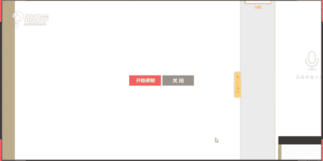

# 1、11服装《搭配秘笈之新版36计》：26军旅大衣

🎼即使说分不开的也不见得。🎼其实感情最怕的就是拖着。🎼越演到终场戏，越哭不出来。🎼是否还？

好。我了好。🤧嗯。OK大家晚上好，那同学们现在可以听得到我的声音吗？如果可以听得到的话呢，请打一。🤧嗯。😊，目前呢现在还没有看到很多同学好的嗯。🤧Yeah。OK晚上好，同学们。

那今天晚上呢又跟大家见面了啊，基本上最近几天好像都是这个经常在线上跟大家嗯在上课。那所以呢呃但是也也并不是说我们所有的都是单品片，有的时候会上一些公开课，那不知道同学们有没有去关注我们的这个公开课呢嗯。

😊，好的，晚上好，同学们，那今天呢给大家分享的课程是关于军旅大衣的这样的一个搭配。那呃其实军旅大衣它的这样的一个发展。那包括现在我们所穿的这样的一些军旅的一些单品，它其实都是来自于军装啊。

那我们既然说军旅了，那它其实都是来自于军装的这样的一个单品。那呃大家想想，其实我们在生活当中的话，有这个多少单品，我们被称为或者说跟军旅是有相关性质的呢？大家知不知道嗯可同学们可以这个自己先想一下。

有哪些单品是跟军旅相关的呢？其实之前的课程当中老师有跟大家分享过的。嗯。例如说飞行员夹克是不是我们之前其实已经跟大家分享过这样的一个课程了。那包括今天分享的课程和之后还有一节课啊。

也是关于这个跟军旅这样的一个单品是相关的那其实呃去准确的来说，很多的男装都是由军装发展而来的那所以呢今天这节课我觉得非常的重要。

因为呃给大家讲到的其实就是我们所说的这样的一个呃男装一开始的这样的一个形态啊。那包括当然不是所有的形态部分的啊，比如说这种大衣，其实现在我们所穿的这种呢子大衣啊，基本上都是来自于军装的形态。

那说到军装的话呢，呃我相信其实有一部分，咱们今天现在课堂上应该都是女同学比较多吧。那咱们的女同学有没有这种特别喜欢穿军装的男生啊，或者是说比较喜欢这种。穿这种制服感的这样的一个形象呢。

因为呃之前其实有这个我们在线上上在线下上课的时候啊，有一次讲到这个一一堂课影视造型这堂课当中呢，呃跟大家分享了一个这个太阳的后裔的这样的一张图片。哇，我一把图片放下来的时候，好多同学都疯了。

说哇老师我觉得那个宋仲基好帅呀。OK好，思雨说，我喜欢那种硬朗感。是的那穿上军装的男性啊，非常的帅气，英俊潇洒。我们觉得这种形象啊，那所以说呃很多呃我们所说的，现在大多人去穿军装的时候。

其实也是想要表现那种帅气和硬朗的这种感觉。那现在的军装啊，不只是男士去穿了，我们很多其实都是呃女士也会去穿着。那包括这种军旅大衣的单品。其实它已经蔓延到我们很多的生活当中的边边角角啊。

那军旅大衣当中其实有很多。比如说派克大衣啊，那比如说风衣，比如说这个飞行员夹克其实都是来源于军旅的这样的一个这个形态当中的那包括其实今天老师穿的这件衣服，它也跟军旅是有相关性质的啊。

那有同学们可能现在看不出来。那等一下呢我会跟大家来展示一下啊。OK好，那接下来呢我们就来进入到我们今天的课程当中啊，军旅大衣的这样的一个搭配。好，那呃这个图片有一点点动态的时候，好像有点模糊啊。

那我刚才跟大家讲到，我说不管是男士还是女士，其实我们都喜欢这种英姿飒爽的感觉啊，那呃比如说刚才在图片当中呢安吉丽娜朱莉，她扮演的这样的一个军军人的形象，就非常的让我们所说的哎。

不管是男性还是女性都觉得哇很火辣啊，O那我们来看一下，今天呢跟大家讲到的是军旅服饰的这样的一个历史发展。那包括呢军旅大衣的搭配。那军旅的这样的一个呃历史发展，我会从大的这样的一个脉络上先跟大家来分享啊。

那再到某一件单品的这样的一个这个分享OK那我们首先来看，从17世纪，那到现代其实我们说17世纪到现代的这样一个军装的发展，它是有两个这样的一个阶段的啊，确切的来说的话，如果更加准确的来说啊，那其实它是。

有三个阶段。那第一个阶段其实就是我们所说的17世纪以前。那17世纪以前的话，其实军人的这样的一个形象，他没有特别的这样的一个制服啊，去给到他们的。而在17世纪的这样的一个阶段，是法国法国人最先啊。

在他们的这样的一个军队当中实行了这样的一个制服的这样的一个机制。那在17世纪到19世纪，我们把它称为叫华丽繁复时期，为什么呢？在17世纪和19世纪之间啊，那等一下我会给大家分享到的。

以拿破仑为代表的这样的一个案例。那我们可以看到拿破仑的这样的一些军装，它的设计的这样的一个特点。那到19世纪到现代看我们的这样的一个军装就变得非常的实用性了啊，非常实用性。也是简约实用为主。

OK那我们先来看华丽繁复时期啊。OK那在华丽繁富时期呢，给大家分享的是两个国家的这样的一个军装。那从1899年啊，英国呃呃和这种我们所说的1914年的法国，他们这两个这两个国家的这样的一个军装。

现在大家可以看到啊，那在1899年的时候呢呃英国的军装全都是这样的一个形态，红色的上装，白色的裤子，黑色的帽子啊，那当时在英国时期，1899年这个阶段呢，英国人呢为了去寻找黄金和钻石就去到了南非。

那到了南非那个地方呢，他们跟当地的荷这个荷兰的后裔啊，布尔呃这个布达人他发生了这样的一些个战争。那当时呢我们说他跟这个荷兰人这个发生这个后裔发生战争的时候，因为大家可以想象，南非其实全都是热带啊。

以森林为主，那非常的。呃绿郁郁葱葱的啊，一片翠绿色。那大家可以想象一下，英国人他们的着装是什么样的红色的上装。那他们的服装到了那儿之后哈，本身他以为哎我到了这儿之后。

我的这场战争应该是非常轻松的就可以解决的，而且肯定是我战而且肯定是英国人认为他自己那一方会赢。那的确到最后他们也赢了，但是付出了非常惨痛的代价。为什么呢？当时他们的军力啊。

这个英国人跟荷兰人的后裔的军力啊是5比1，英国人是五，荷兰人是一5比1的这样的一个军人的比例。那当时呢这个英国人死了9万人才赢得了这场胜利，为什么呢？因为他们的服装是这种红色。

我们说红色跟绿色是什么样的一个关系，从色彩上来讲，有没有同学知道。红色跟绿色是什么样的一个关系？同学们虽然我们没有讲到色彩课啊，但是红配绿这样的一个色彩。是的啊，宇和同学说了，对比是的，他们是对比色。

而且是互补色180度的对比，非常非常的强烈。这就是为什么我们经常会说红配绿不好看，那是因为他两个颜色都非常的鲜艳，非常的醒目啊。那所以大家可以想象一下啊，这个荷兰人的后裔打打英国人打的跟玩似的啊。

一打一个准，因为他们的红色衣服在绿色的这个森林当中格外的醒目，所以他这9万人是怎么死的，全都是被突击啊，这个这个后裔这个荷兰人后裔呢？他们全都用这种游击游打游击战的形式呃选用选择这种突击呀。

然后包括这种这种远程射击啊。所以呢这个英国人当时就这个就这个就就就觉得啊原来他们的军装在这个年代啊已经不行了。所以呢当时呢他们回去之后就换了他们的服装啊，把他换成了这个我们所说的卡其色。

那随之从英国人把服装把他们的军装换成卡其色之后，其他的国家也都开始效仿那直到现在英国人其实还是没有摒弃他们这种军装。直到一些我们所说的，现在大家可以看到英国。

他其实是有皇家卫队的那这个其实就是现代的英国皇家卫队。比如说这个英国有一些重大的这些节日啊，凯特王妃跟威廉王子成婚的时候，那大家可以看到这些这个皇家卫队的人啊，都会这个这种仪仗阵队啊都会出来。

那包括呃那这是我们所说的英国人啊，在1899年，他们就换掉。他们的军装，那在呃这种军装它就变得色彩是比较这种我们所说的这个相对来说会比较低调啊。那1914年法国才开始换装，为什么呢？当时法国人啊。

大家可以看到，其实法国的服装是以这种深蓝色。当时他们的这个服装是深蓝色的上装，红色的裤装，那包括其实他们整个这个我们所说的这个呃军队其实都是以蓝白红为主。有没有人知道为什么？为什么是以蓝白红为主？

有没有同学知道？因为这是法国国旗的色彩啊，所以呢他们是的，国旗色。那所以呢他们的这些军队的服装是呼应了他们法国国旗的色彩。那当时呢。在这个战争过程当中呢，有一个这个这个我们所说的这个军官。

他发现他在跟对方对峙的时候，对方的人的服装色彩都是非常的这种把他把自己武装成这种我们所说的绿色啊，那他在这个战争过程当中，他会发现这个对方的这种命命中率是非常低的。所以呢他就提议我们把我们的衣服啊。

这个这个绿红色的裤子换掉，然后换成全都换成深蓝色啊，那就有一部分的军人呢会反对，为什么呢？他们认为这种红色的这个色彩，就是代表他们的法国，他们认为这个色彩不能被换掉。所以到在1914年这个阶段。

也就是一战时期的时候啊，那这个我们所说的军队的人吃了大亏，在战场上才发现啊，原来他们真的也需要换掉这个他们的所我们所说的这种服装的色彩。啊呃接下来他们就把他们的服装或色彩。换成了成套的蓝灰色。那为什么？

为什么我想我其实我想问大家，你们知道为什么？就是我们说在17世纪到19世纪之间，为什么在战场上他们用这样一些醒目的色彩，那个时候没有什么影响？但是到19世纪之后，为什么大家都换掉服装的色彩呢？

有没有人知道为什么啊我们说在19世纪之后，因为我们所说的科技的发展武器都非常先进了，那可能都不需要看到对方我们就可以这个这个就比如说投弹的方式。对，是的啊，投弹的方式。那可能对方就已经阵亡了啊。

但是在19世纪之前，他们所有的这些战争啊，我们说打仗这件事儿啊，全都是属于这种肉搏的形式。那在战场上的时候，其实他们的这种华美的军装。啊，并不是全呃完全来自于他们个人的这种虚荣心。那拿破拿破仑时期啊。

这个我们所说等一下我会给大家去介绍，以拿破仑这个为主的这样的一个军装的这样的一个形态啊，非常的华丽。那那个时候这个我们所说的战士们其实并不是说哎，我就是为了保持一颗虚荣心，我非要穿这么华丽的军装。

那是因为其实他们有是也是有这种实用性的这种鲜艳的色彩，可以让他们在战场上，因为当时使用的都是黑火药。当打起仗来的时候，全都是这种硝烟的时候呢，已经看不到对方的这个我不分敌我了。

所以他们要用这种鲜艳的色彩来标识自己的这样的一个这个部队的人啊，防止是误伤了这样的一个效果。那包括他们这种华美的服装啊，让对方的人，当大家可以想象一下，当所有的这种呃穿着这个整个军队集体作战的时候啊。

然后你们的军装是非常的威严于华美的，其实你就给到对方一个震慑力了。那所以呢他们认为穿上这种华美的军装的时候，其实是一种震慑力。包括他们认为这是一种国家对于他们的这样的一个荣誉的褒奖。所以很多。

人为了这一身军装呃，付出了自己生命的这样的一个代价啊那。在我们所说的这个华丽繁富的时期呢，也就是我们所说的法国啊法国的话19世纪之前，其实就是我们所说的拿破仑时期，拿破仑为代表的军装给大家来欣赏一下啊。

大家可以近距离的来观察一下他们的这样的一个军装。那这种军装，我们所说的123这些军装呢全都是属于那个拿破仑时期的。在拿破仑时期，拿破仑皇帝说过一句话。他说呃我要让我的战士们在战场的上的时候。

就像在一个重大的节日上一样。🤧嗯。是的，非常漂亮。他们会运用大量的金丝来做做成呃来做成这种服饰，包括会用这种我们所说的这种呃刺绣的工艺啊，那包括这种盘扣的这种工艺。

那这个已经非非常鲜明的形成了他们这样的一个军装的特色？那包括那大家可以看一下这一套军装上面有三颗扣子，那是不是大家可以想象一下呃，大家可以想一下，是不是我们现在西装上面都有三颗扣子，为什么有三颗扣子呢。

我今天又想问大家，我今天的问题好像也挺多的哈，我想问大家，为什么我们其实每个人都有穿西装，对吗？那为什么西装上有这三颗扣子，它们的功能性是什么呢？有没有同学知道大家可以来这个猜错也没关系啊。

🤧猜错也没关系，大家可以来讲一下，你们认为这三颗扣子的功能性在于哪里？Yeah。好，惠尔同学答对了。是的，防擦脾气。为什么这么说啊？在呃我们所说的这个拿破仑时期，其实这种军装我们说这个三颗纽扣。

就是在拿破仑时期的时候呃，这个有的这样的一个工艺啊，为什么呢？因为当时他们去这个作战的时候会去到一些非常严寒的地，不好意思，同学们啊。嗯，去到一些非常严寒的地带。

那么大家都知道我们去了非常冷的地方的时候，肯定就会一直狂流鼻涕。那所以就会造成很多这些呃战士们在这个这个在行走的过程当中啊哈，就会用一只用袖子来擦鼻涕，没没多长时间就他把他们的这个这个袖子啊擦的锃亮。

所以呢拿破拿破仑呢，他为了保持军纪啊，就为了保持他们的这样一个形象，就在他们的袖口上缝了三颗扣子，防止他们用来擦鼻涕啊，就是就是这个擦鼻涕擦的也没有那么方便了哈。

所以说呢这个就是我们所说的这样的一个功能性。其实放到现在来讲的话，其实它已经没有功能性了，全都是以装饰性为主了啊。那大家知道其实在呃为什么说他们的这样的一个呃装饰繁复，其实这种装饰繁复的这个军装。

它的费用是非常的高昂的那普通的一个步兵，他一套军装都需要200法琅。那大家知道法琅兑换人民币的这个这个兑会能兑换多少吗？大概是2300多啊，也就是说一个步兵，他一套服装就需要2300多。

在19世纪啊兑换人民币。那这只是一个普通的步兵。如果是一个重骑兵，就是从头到脚全都装饰下来的话，需要2000法郎。那也就是意味着一套服装需要2万多。那一一个我们所说的，当时就连一个步兵。

它都会有5套以上的服装，这5套服装有什么呢？礼服啊，有便服有作战服等等。啊，所以他们的这样的一个消这个花费是非常高昂的那呃所以在我们所说的这个在一战时期，二战时期之后呢，那他们的服装做的简约之后。

第一也节省了成本。第二又让他们这样的一个在作战时期的时候，不是那么的容易受到攻击。OK那这是我们所说的拿破仑时期的这样的一个军装特点。那大家可以看到，非常的华美。那其实呃今年在呃去年。

2016年在秀这个巴尔曼秀场上就有很多的这样的一个呃设计师呢，他们做这样呃这个设计的灵感就是来源于我们所说的拿破仑时期的这样的一个作品。那等一下来给大家欣赏一下啊，稍等一下会跟大家来欣赏。

那呃这个说到舞台这个呃比较爱这个拿破仑造型的这个明星。那迈克杰克逊就是一位啊。那我们会发现迈。michael呢他经常在舞台表演的时候，他会特别喜欢穿这个拿破仑造型的军装。那大家可以看到这种什么盘扣式。

包括他在舞台上，所以他会把他的工艺做的更加的夸张。比如说镶亮片，那包括大面积的运用这种金色去做这样的一个重工啊。

那包括这个是beyoncebeyonce在做这样的一些舞台造表演的时候也会运用这样一个造型。那这种造型的话呢，他其实就是有传递一种非常帅气硬朗的这种这样的一个感觉。

那同时beyonce他在搭这样的一个呃这个造型的时候，其实下面我们又给大家来截到。那大家可以看一下他后面的这样的一个舞蹈的演员，他的着装是什么样的一个形态。他是直接穿的一个什么呢？高腰复古。然后呢。

然后这个底下搭配的丝袜，它是用这种我们所说的非常性感的元素，跟军装元素去做一个混搭。那这种混搭，它就形成了一种视觉冲击力。为什么这么讲呢？因为我们认为军装它是非常有正义感正能量的这样一个单品啊。

或者是它这样的一个形象。而我们说这种非常性感的丝袜镂空的造型，它是属于一种我们所说的叫消极美感。那形成这种消极美，跟这种积极美相互去混搭的时候，就给我们形成了这种非常强烈的视觉刺激的感觉。

就会让人的什么呢？脑子容易留下印象。所以这就是为什么很多舞台造型的时候，他们会运用这样的一个搭配手法。那包括秀场上也是一样啊，那这是舞台造型。那在秀场当中啊，大家可以看到。

这个就是2016年这个巴尔曼的秋冬的男装。那它呢是来源于这样的一个呃拿破仑这样的一个军装的呃特色。那结合了现代时装的这样的一个造型。那大家可以看到的是，那你们你们觉得这样的一套服装。

他们的配色关系是不是像法国的这样的一个感觉啊，他其实这样的一个配色关系也都吸取了法国的这样的一个感觉，就是我们所说的国旗啊，蓝色红色白色。那当然这个里面没有大面积的出现白色啊，以蓝色和红色为主。

那其实都是呃吸取了那那个年代的这样的一个造型呃这样的一个灵感。OK好，那就是女男士的这样的一个着装。啊，我认为男士这样穿非常帅气，不知道咱们这个班上的女同学喜不喜欢这种造型呢？如果你这个男朋友啊。

呃穿成这样，你们能不能接受呢？嗯，我们的女同学可以出来发言一下啊，喜欢吗？OK好，那梅花香迎O好，我看到很多同学都可以接受是吗？是的啊，非常漂亮啊。我我个人是非常喜欢这种着装造型啊，那特别是第一套。

我特别喜欢。那我我也认为这种着装造型的话呢，呃它是这个非常能够显示出来男人的这种阳刚之气，包括这种细腻的美感啊。OK好啊，OK那这是男士的这样的一个着装效果。我们来看一下女士。😊，🤧好。

那我们现在呃我相信咱们的男士接受我们女生穿这种特别夸张的军装元素的时候，好像大多数人接受不了。嗯，现在来采访一下我们的男同学，今天有多少男同学在呀？有没有多少男同学，男同学在的话呢，出来冒个泡啊？

OK宇和同学说，只有有品位的男人才可以。是的啊，那那这种着装状态的话，其实很呃应该说很少有男生可以做得到啊，本身因为他的这种做工是非常华美的。我们中国人的话内心其实还是比较低调的。嗯。

O惠尔同学是男生是吗？那惠尔同学，那唯一的一个男生吗？那我们来采访一下惠尔同学，如果这个我们的这个女生穿成这种形态，你们能接受吗？那这种其实有点夸张啊，这种的话其实就是现在英国的这样的呃。

包法国其实现在不用这种帽子了啊，英国就会用这种帽子。啊，我们所说的皇家领队啊，他们会戴这种帽子，大家可以去观察一下，并且英国其实这这个配色的话，它是来自于英国红色配这种黑色。

底下是白色这样的一个配色关系。那包括其实呃在这个拿破仑时期，他们还会有这种非常夸张的这种吊穗的肩章，金色吊穗肩章啊，我可以翻回去给大家看一下。那包括大家可以看到这个吊穗肩章。

那其实这种吊穗肩章并不是说他们为了好看，其实它是有实用性的，有功能性的。他们的军装的话其实很多都是有功能性的这种这种设计是为了什么呢？防止被砍的很惨，这种是有功能性的。O好，嗯。

那包括现在他们的这个军装，那大家可以看到法国的这样的一个军装上面还保留着这样的一个吊穗啊，O好，还是夸张点好，秀场可以啊，第四套好看是吗？O那我。我认为也就你嗯咱们的男同学也就能接受第四套了啊。

把第四套的帽子取掉。其实这一套的话相对来说它是没有那么的夸张的。这种小面积的撞色啊，还大家还是可以接受的那这三套啊，这这一套是完全不能穿出去的啊，这一套是太夸张了。那123这几套的话。

其实在生活当中也都是不太实用的啊，为什么呢？这种搭配手法不实用，并不是说这件衣服不实用。因为这种在秀场上本身我们说在这个我们说在秀场其实秀场它有分不同的秀场，有这种成衣袖，有这种高定袖啊，有这种概念秀。

有这种概念秀。那我们说概念秀的话呢，比如说呃那个胡射光，大家知道吗？这个红射光这呃大家可能不知道胡射光。但是我我说一个人，你们肯定知道，就是张馨予参加戛纳红毯的时候穿的那一套花棉袄就是那套花裙子。

东北大棉袄的那样的一个配色关系啊，前面的头发弄了一个这种齐刘海啊，有点像那个九儿的那个造型，红高粱九儿里面的周迅演的那个造型啊，那包括这个还有一个人，你们肯定知道就是王德顺，就是那个大爷呀。

就在朋友圈里啊，有一段时间疯狂被我们刷屏的那个人，就是他一抬头说有人说我爆红啊，说这个有有人说我一夜爆红，其实你们不知道我在背后付出了多少的努力啊。这个大爷呢，其实他当时为什么那么红。

就是因为在胡射光的秀场上赤裸着上身，他已经有60多岁啊，六七十岁了啊，不对，80岁左右。啊，赤裸着上身非常这种健美的体型啊，然后一头银发，非常潇洒的走出来。大家会认为哇，我们中国有这样的大业。

简直是晒呆了。那所以说呢啊她就这个真的是爆红了。那胡射光她的秀呢一般都是非常非常夸张的那这种秀呢就被称为叫概念秀。那那种秀场的服装，它是完全不会穿的它就是一种商业的行为。而现在大家看到的这种秀。

它其实就是属于成衣秀。那包括还有一种秀叫高定秀。那高定秀的秀场的话，并不是所有的人都能进去的啊。高定秀的话呢，它是这种我们所说的它的每一件衣服的造价都在100万以上。而且都是全世界仅有一件。

非常这个独一无二的一件服装。连安娜温图尔这样的女魔头都不一定能进得去。我们所说的高定秀啊。当然如果她想进去还是比较容易的那安娜温图尔的话是。杂志的主编啊，O那这是我们所说的这几个秀场的这样的一个区别。

给大家来简单的这个做一个呃小小的分享啊。那我其实觉得大家不只是要平时呃每天老师跟大家分享的更多的是搭配的技巧。其实我们搭配的技巧。呃，包括我们的审美要多去看秀以及杂志啊，这个或者是多浏览网站。

那这样才能不断的提高我们的这样的一个审美，那并且呢要不断的去这个吸取一些新的一个知识，自己去做总结和消化。你们才有进步。O那呃其实有很多同学看不懂秀的原因，就是因为大家对于专业知识积累的太少了。

所以看不懂秀。那比如说如果我们有这个给大家来介绍这个比如说这套服装，它是来自于什么样的一个这样的一个着装形态。那大家可能会觉得为什么他戴这么夸张的帽子在秀场上，为什么有些衣服在秀场上。做的那么夸张，呃。

根本都不会穿。为什么这个这个这个这个设计师还把它做出来呢？其实有的时候设计师做这套衣服就是为了什么呢？为了展现他自己的灵感，传达他自己的这样的一个设计的理念。有可能这套衣服真的是不卖的啊。

有可能是这样的。但是这种成衣秀，大多数是呃这个是是有做大批量的生产的啊，那他这种搭配手法是比较夸张的。为什么这么说呢？因为我们所说的秀场，这种特别是成衣秀，他的观众跟舞台的距离是非常远的。

而只有这种我们所说的这种高定秀，观众跟模特的距离是非常近的，有可能都可以伸手摸到衣服，而这种我们所说的成衣秀距离非常远。那就意味着观众看到这套服装的时候，他的这样的一个呃如果视觉不够夸张的话。

就像这个我们所说的明星艺人在办演唱会的时候，或者在上舞台的时候，为什么要穿的这么闪亮，这么夸张。其实。就是为了要让大众看得到。而如果舞台越远，他们的服装越要夸张夸张，那我们才能够看得到他穿的是什么啊？

如果你在舞台上只是带一个特点，你带一个珍珠耳钉，那你完全是看不到的。所以说他们的这个搭配手法是运用的非常的夸张的那这种夸张的效果，他会让我们看秀的人觉得非常的新颖。

但是在生活当中的话是不实用的比如说这一套着装。那这一套着装，他们的头饰都相对来说比较繁繁这个华丽和繁琐啊，在生活当中我们不会这样去搭配的，除非是在舞台上做表演，O那就是我们所说的秀场的这样的一些展示啊。

跟大家来分享一下，那这两场那这两套呢其实是呃do克巴娜的这样的一个秀场啊，那这个的话是cci啊，ok那大家可以去多去关注一些秀场当当中的一些这种这个。新的这样一些资讯。OK好。我们继续来看。

那这是在秀场当中的这样的一个造型。那在日常当中的造型，大家可以看到是不是相对来说唉一下子就变得好像眼睛清爽了很多。因为刚才那些哇满满当中的非常的华丽，感觉都要亮瞎眼了。有木有啊，所以说在日常造型的时候。

我们的这样的一个穿搭的话，它的服装的选择，相对来说可能都没有那么夸张。你你会发现它的服装都是比较简洁的，或者是只是吸取了某一点啊，我们所说的这个拿破仑时期的这样的一个服装的这个特色，比如说它这种设计啊。

这个设计其实就有一点像我们所说的盘扣的这样的一个造型感，包括拿破仑的这样的一个军装的这个廓形，它一般都是比较短的。大家可以看到啊，都是以这种短装为主为主，它不会有特别长的。

比如说这种派克大衣或者说这种呃巴国仑的风衣，那也被称为叫战壕军装。那他们。服装都是这种我们所说的到这种中呃这个大腿啊，中长款的那或者说这种海军这个海军海军服装啊，海军大衣它都是比较长款的。

但是你会发现这个拿破仑的这个服装都是比较短款的那所以说这种短款，它给人感觉它是比较的利落和干练的啊，那他的这样的一个呃那相对来说其实呃小个子的同学，那就可以去尝试这种军装造型啊，那非常的帅气。

用这个非常适合比较娇小的一些女生的这样一个造型。那喜欢第三套是吗？OK好，那其实呃第三套它是比较这个显身材啊，而且呢看起来整体感觉没有那么的复杂，大家好像都比较能够接受这一套啊。

那1234okK我想问大家，你们觉得哪一套不好看。那我相信好看的大家啊一眼就这个能能从。从中挑出来自己喜欢的那肯定也能从中挑出来不喜欢的。你们认为1234哪一套你们觉得不好看？大家可以先来快速的敲一下。

🤧好，爱雨倩同学，包括张敏啊，6941同学嗯。不喜欢第二套OK好，嗯，那我看到大多数同学都不喜欢第四套是吗？是的啊，那我为什么放了这一套造型给到大家呢？就是因为啊我要告诉大家，你会发现在日常生活当中。

我们在这个挑选一些服装的时候，可能会更加简约的呃会更加适合我们。那包括其实这一套我们所说的这个拿破仑这个军装特点呢，或者我们所说的这一套造型这个军装它是带有宫廷感的啊。

其实现在很多呃这样的一个专业理论当中，他们会把这种服装叫做宫廷军装啊那但是以专业的这样的一个角度来讲的话，其实它就是拿破仑军装。那这种军装设计，你会发现它非常的复杂，有这种刺花啊，刺绣，那包括这种纽扣。

那包括这种盘扣设计。那本身都已经非常的繁琐了。所以它的下装。包括它所有的配饰都要变成一个什么呢？配角我们说你今天在搭服装的时候，其实你是需要考虑你想要凸显你身上的这一套这个你要凸显你的身上的这个单品。

哪一件单品。那你要考虑哎你是做主角还是做配角。例如说她这件衣服一定是主角。那你其他的单品就一定是配角就好了。例如说你的里面的内搭啊简约不要再选择这种带有波浪边蕾丝边的服装。

你的下装不要再选择带有这种亮片感的，选择这种简单的款式，那相对来说大众都是能够接受的很多同学会觉得这一样太复杂了，是吗？那就是因为我们其实本身这种搭配手法，它更加接近于在秀场的感觉或者是舞台的感觉。

在日常生活当中是非常不实用的那其实为什么这个我们所说的这一套这个模特他会这样去穿着呢？因为这个模特他其。其实也是一个时尚编辑。所以他认为呃他的这样的一个呃受众的群体，或者他身边的人是可以这样接受的啊。

OK好，那我要告诉大家的是，在这一套的话，在我们日常生活当中是不实用的。好，那继续来看啊，那呃三套呢分别传递不同的感觉，但是都是搭配的裙装。那我想问大家，你们喜欢哪一套呢？123看一下你们选择的单品。

我来猜一下你们的这样的一个个性啊，根据你们选择的单品。好，第三套okK呃，与呃下河选择的呃0714选择的是第三套啊，梦丽同学是第二套。好，夏河同学是第二套，菲二同学是第二套。好，嗯。

大多数同学选择的都是第二套和第三套。好，那我现在来解答一下啊。同学们，如果你们选择第一套的人，那你们本身可能自己就是比较这种看起来有点这种卡哇伊的感觉，或者看起来有点少女的感觉。

看起来非常这种年轻的感觉。而且你们的这个身高可能不是特别的高。相对来说可能是到一米呃，就是一。7以下的，一定是一米或者说1。65米以下的同学们。啊，呃，并且呢如果你第一你们有可能是这种情况。

那第二有可能呃你们是比较喜欢一些相对来说这种清新可爱的这种着装的风格的人。那就这两种情况，喜欢第一套的老师有没有说对呢？我不知道同学们啊，那喜欢第二套的人和喜欢第三套的人。

其实都是喜欢比较偏优雅和女性味道重的啊，那第二套，它其实更加的优雅感啊。那第而且它并更加的端庄感。那我其实已经猜到了大部分同学都会喜欢第二套，为什么呢？因为虽然第二套的色彩，它非常的鲜艳。

但是第二套的这样的一个整体的着装的感觉，它是最端庄和优雅的。而我们其实我们大多的中国女性的审美，是接近于这种我们所说的呃。积极审美的或者是说叫传统美的传统美呃是大多数人都可以接受的嗯。好，太对了是吗？

啊，那是不是老师像算命的，你们突然觉得那呃为什么老师能够猜对呢？啊，并不是说老师能够猜对，而是老师呃这个掌握的这样的一个这个专业技能啊，或者说我在生活这个在日常的授课当中，那包括在工作当中，呃。

对于人性的这样的一个把握，其实更多的是来自于你们对于服装的选择。所以说服装搭配是不是很神奇。你们通过一个人选择的服装，包括他穿的服装，你都能了解到他的个性是什么样子的呢。

他的内心喜好是什么样的那是因为呃我们都是经过这样的一个专业的这个学习的啊。那同学们你们这个经过这种专业的学习之后，相信不久的将来，你们也可以啊。但但但是如果想要更专业的，还是要来到我们线下去学习。哎好。

😊，啊，那刚才说到说到喜欢第二套啊，那孟丽同学说我喜欢大气夸张的，喜欢二的原因是因为腿粗O好，那呃这个也是啊这个也是O那我继续来讲啊，那第二套的话呢。

其实是是非常好能够我们所说的起到什么样的扬长避短的作用，如果腿粗的人啊，那第三套如果喜欢第三套的同学其实对自己还是呃相对来说比较自信的啊。因为第三套的话呢，它其实对于人的这样的一个整体要求还是比较高的。

比如说这个腿你不能太粗，对吗？同时呢你还不能太胖。如果你太胖的话，你穿这条裙子的话呢，呃穿起来的效果，一定这条裙子其实一定要瘦一点的人穿起来好看啊。

那包括呢其实这套服装它同时还有一点点小小的性感的元素在但是它同时都是有女人味的，第二套和第三套其实都是比较有女人味。那第一套其实它给人感觉是更加少女的感觉。OK好，那这是我们所说的呃这个不同的服装。

它传递的感觉是不同的啊。那同学们你们可以根据自己的喜好啊去选择。OK好，有和同学说，但是我穿不出来。呃，为什么呢？我今天看了你的相片我觉得还好吧，你的身材也不是特别的胖呢？好，在这里给大家来总结一下。

拿破仑军装的特点以及穿搭的注意事呃出注意事项。那拿破仑服装呢，它在制作的时候呢，需要大量的工艺，所以它的这样的一个这个我们所说的，比如说这种刺绣啊，然后金丝勾线呀，然后盘扣啊。

那所以它的而并且它的色彩相对来说也是比较艳丽的这种感觉。那在平时我们如果喜欢这件单品，我们在选择的时候，第一你可以选择一些不不用那么夸张和艳丽的那在日常生活当中比较经常用得到。

那第二个的话就是呃我们在搭配的时候一定要什么呢？选择好你的这样的一个单品之后，考虑它是主角还是配角。那如果这个拿破仑军装它已经是非常的华丽感的时候，你所有的单品都要做配角。

都要以简约低调为主来烘托这一件主角OK好，那这是拿破仑军装的特点以及穿搭的这样的一个注意事项。OK那我们继续来看。那这个是我们所说的17到19世纪之间的比较华丽和这种繁复的这样的一个军装时期的一个代表。

那就是法国的拿破仑时期，那我们继续来看第二个是什么呢？在19世纪到呃这个我们所说的一直到二战结束之前啊那节简约实用的这样的一个代表，就是德国。那德国的军装的话。

其实呃我们抛开我们所说的这个政治不谈纳粹啊，大家都知道。希特勒啊，那他呢其实是呃他的政治我们就不说了啊，他宠他他其实是主张这种种族的这样的一个歧视。他认为优越的人种就应该站起来，而消灭那些劣等的人种。

他把人分为什么呢？这种种族来区分。OK那当时呢所以这个呃包括在后期为这个希特勒做过军装的设计师，都不敢大声的宣扬自己为德国做过军装。那但是德国的军装在那个时期做的真的是非常非常的漂亮。漂亮到什么地步呢？

漂亮到很多的少年都不知道纳粹是什么，就是为了那一套军装而加入了那个团队啊，那个军队当中。那当时希特勒也说过这样的一句话，我要让德国的士兵看起来是最漂亮的那他的确也做到了。那但是在我们所说的。

在19世纪之后。一战和二战之间呃之间呢呃我们说所有的国家其实的军装都已经变得非常的简约化了，都已经变成这种形态了。但是在这所有的这种简约实用的形态当中，那他比较有代表性的，就是德国的军装。

那等一下呢会给大家来欣赏，大家可以看一下，这个是德国的士兵是不是还是非常的美男子呢？从现在到现在的角度上来讲的话，他看起来还是非常的帅气的和聚美的这样的一个感觉啊，OK好。

那为什么他们的这样的一个军装做的是非常的合体和精致的。为什么因为他们的军装全都是由设计师来为他们量身去定做的那大家可以看到，在这是一部电影，在电影当中呢？这个裁缝啊来给这个军装试服装。

这是初期做的样板的服装啊，那在这次样板之后呢，他们还会再拿回去修改，修改完之后才会做成这种真正的制服。OK那他们会使用这种我们所说的叫立体。剪裁，那其实我们现在所穿着的中国人穿着的服装都是平面剪裁。

就像纸片人一样，大家知不知道我们小的时候啊奶奶给我们做的衣服其实都是直接用什么？包括现在其实很多服装都是直接用剪刀画上白粉，直接就剪了，剪完之后就缝制了。那其实它是平面剪裁，它不是属于立体剪裁。

我们中国人的身材因为是比较扁平的，所以可以用这种剪裁的方法。但是欧美啊，他们这些人的身材是比较什么呢？凹凸有致哈，我们站在女性的角度上来讲啊，凹凸有致，所以他们需要这种立体剪裁，那立体剪裁是什么呢？

其实就就是他们他们会运用这种人模直接在人模身上进行这种这种画线呃画线和裁板。OK好，你就是为什么军装，他们的军装会做的那么的精美啊，那我么来欣赏一下德国当时的军装，大家觉得怎么样好看吗？

那其实当时德国的军装在全世界上来讲。啊，一战和二战之间，全世界上来讲做的都是最漂亮的军装啊。那当时其实他们的军装也是呃相对其他的军队来说，花费也是比较高昂的啊。

OK那这是我们所说的现代的一些这种呃军装的这个代表。那德国时期的军装其实做的也是非常的精美的啊。OK那我们继续来看，那这是在秀场当中的呃，现在有的一些军，它会设起的一些军装的元素。

那包括这个其实也是我们所说的这种现代军装的这样的一个版型了啊。其实。这些军装都已经接近于现代都已经是现代军装了啊，现代军装。只是呢呃我们这个每个国家不同，它的色彩也是不同的啊。

那包括等一下呢在接下来的课程当中，我会跟大家来详细的讲到军装的一些分类。OK那呃简单的给大家来介绍一下德国的这样的一个军装。那德式军装，它的特点是什么呢？立体剪裁合体的收腰，体现身体的力量感。

那包括它会运用很多的军章，其实现在有很多的这种军装设计的时候，或者服装设计，它会运用很多的军装，它也能够代表军装的元素啊，比如说这种佩戴的这种勋章啊，肩章啊啊等等。ok那这是德式军装的特点。

那其实现在的军装呢，它分很多类别。那接下来呢就会跟大家来介绍。啊，我们现在经常会穿到的一些军装，它会有哪些军装啊，那我们来看一下军装分类。从军装分类上来讲。其实有分海陆空，不管哪个国家都会有海陆空啊。

OK那啊sorry，同学们，这个错了啊，这个是空军。那第一张大家可以看到是海军，那第二张是空军，第三张是陆军。那这三套服装其实也都是现在我们经常会穿到的。呃，第一个海军的服装。

就是我们经常会说到深海军蓝的大衣，其实就是海军的这种服装，双排扣的这种大衣啊，那呃飞行员夹克是空军的服装。那这种burberry的风衣，这个就是b布berry的风秀场啊。

b布berry的风衣它就是来自于陆军啊，那接下来在呃20呃33月1号的课程当中就会给大家来讲到双排扣大衣的这样的一个搭配。那其实我们之前已经讲过飞行员夹克了。

那今天呢跟大家来讲到的就是海军的这样的一件海军式的军装大衣的这样一个搭配。那大家首先我们先来看一下海军大衣，它的特点是什么。那基。本上其实海军大衣它有很多的颜色啊，有黑色呀，然后有灰色呀，有蓝色。

包括可能现在还会有很多很多种其他的颜色。但是最最最最经典的其实莫过于这种海军蓝的色彩。那这种藏就也有的时候我们中国人会喜欢称为叫这种藏青色，对吗？啊，其实这种海军蓝的色彩呢。

它也是非常非常百搭的也是作为我们衣橱当中必备的色彩之一啊。O那从首先从色彩上来讲，它是非常的百搭。那并且呢这件这个呃深蓝色的大衣也是比较经典的那从这个其他的设计上来讲。

那接下来呢我会给大家来详细的剖析海军的这样的一个服装的这样的一个发展。O那么来看一下海军大衣，那其实海军大衣的话，它会有两种啊，那第一种的话，其实有一种叫牛角扣大衣，大家知道吧？啊，就是呃这个它的扣子。

呢扣子的那个眼特别大，然后呢扭纽扣就是那种牛角扣的牛角扣，大家知道吗？这件大衣应该知道吧。同学们啊，那这件大衣呢它其实是英国最早的嗯，是的，英国最早的这样的一个大衣。那现在大家看到的这件海军大衣呢。

其实是作为美国的海军制服嗯，okK啊那现在大家看到的这件大衣其实依然是海军制服啊，这个美国的海军制服。那呃这个就是美国的军人，大家可以看到啊，海军的制服。所以你们现在看到很多秀场。

刚才那件秀场上的那件设计，大家现在能看出来了吧？其实就是来自于什么呢？这种军装的设计，再给大家看一眼，是不是袖口的这样的一个金色的呃这种金色的这种条纹的设计啊，那包括这种金色纽扣OK好，我们来看一下啊。

那在海军的大海军大。衣的这样的一个款式上来讲，其实一开始啊海军大衣它的设计的话其实就是中长款，就是比较长款的。就像大家现在看到的这样的一个款式。

那其实它也是有这样的一个历史的发展的那一开始呢它最长的这样的一个款式，其实就是这种中长款啊，那呃在慢慢的这样的一个历史发展过程当中，它会改在二这个这个年代的这样的一个推进呢。

其实它有不这个在不同时期有做这样的一些变革。那首先先给大家来讲一下我们所说的海军大衣。它的这样的一个军装设计的时候，它为什么这样去设计。那首先为什么它要做成双排扣呢？

这种双排扣其实它是为了防止我们所说的体温的流失。因为在海上的时候，其实是非常寒冷的，而且他们很多人呃是几个月都不能这种去洗澡，然后头发也都是非常的这种凌乱的那种牛角扣的大于意，大家知道戴帽子的那种。

他们的最终的目的其实是为了什么呢？为什么牛角扣的扣子那么大，那是为了呃它是为了方便这些水兵们戴着手套也可以把扣子扣上去啊，那他们即使那个帽子做的那么大，为了什么呢？是为了防止几个月都没有洗头发。

还能把帽子戴上去，防防这个防这个保暖的作用，其实都是有功能性的那包括这个海军大衣也是一样的，它都是有功能性。这种双排扣，它是为了防止体温的流失。那这种比较宽大的领子，其实是为了竖起来的时候。

可以保护我们的。颈部，那包括它这种呃布兜的设计，其实为了这种有这种保暖的这样的一个功能，手可以插进兜里啊，都是有这样的一个保暖功能的。OK好，那这是我们所说的海军大衣的这样的一个设计的原因。

那我们来看一下，在呃海军大衣的这样的一个发展当中呢，有三个这样的一个阶段。那第一个的话就是19世纪30年代。那在30年代以前呢，军装大衣的话，大家可以看一下啊。

这个海军的大衣它基本上都是属于这种中长款和长款为主的啊，那在二战时期，这是我们所说的30年代，二战时期大家知道是哪个时期吗？啊。大家知道是哪个时期吗？在19。40年左右啊，这个左这个年代啊。

那其实在这个年代之后呢，他们的军装慢慢的就变短了啊，那这个军装呢，你会发现这个时期的军装它其实就已经变短了，并且它的纽这个我们说在细节上就会有一些设计的啊。那例如说这个第一代的1930年。

它是这个地方有兜啊，然后这个地方也有兜啊，那包括那在二战时期的时候呢，它把它的军装做短了之后啊，会取消，而且会把它这个什么呢兜给取消掉，就是它只有两个布兜了，以前是有4个，现在只有两个。

那在19世纪50年代以后，大家看到的啊，大家可以看得到，那它的服装就变短了，并且呢变成了8颗纽扣。啊，那以前的话，它的纽扣是比较多的啊，或者是比较少的但是在这个时期它就固定的变成了8颗纽扣。

那这是我们所说在物呃19世纪5。年代之后，这种海军大衣基本上我们说这种战争时期过去了啊，他就不会因为这种我们所说的功能性的需求再去做一些改革。那在50年之后就已经稳定了这样的一些版型。

他其实就跟我们现在看到的军装大衣没有什么区别性了。但是有的时候这些人他们在做呃一些设计师在做设计的时候呢，他会把这种塑料的纽扣换成这种金属感的，或者是铜质的那包括这个纽扣上。

其实它是有这种呃这个标识性的。大家可以看到是什么样的一个标识，能看得清楚吗？同学们。毛我们所说的那个毛的标志啊，OK好，那这就是我们所说的海军的这样的一个发展呃海军大衣的这样的一个发展。

OK那接下来呢给大家分享到的就是海军大衣的这样的一个搭配。那我们首先来看海军大衣的内搭如何去搭配。那我们今天因为讲的是外套嘛？那我们首先关心的是内搭的这样的一个搭配。首先第一选择就是条纹衫，为什么呢？

因为条纹衫它也是水兵的服装啊，也是我们所说的这样的一个制服之一，OK那其实我们今天一直在讲到制服，或者说这个军装，军装其实它就是属于制服类的。那大家知道制服是什么吗？制服它的作用是什么呢？制服的作用。

它其实就是用来制服你的啊，为什么这么说呢？在我们说人的穿衣阶段其实有三个阶层，一个是属于被迫啊，一个是属于就是这被迫其实就是属于。顺从的这样的一个服从啊，我是服从你的，我不是发自内心的这样的一个着装。

那其实军装就是一个。那包括校服，我们也是属于这种被迫才穿上的啊。那呃那这是这个第一个阶段人穿衣的阶段。那包括其实还有叫什么呢？内化阶段啊，那包括还有叫童化阶段等等啊，那那这个是我们专业课程当中的啊。

就不跟大家来分享太多了。那。🤧我们说这个这是我们线下的专业课程啊，同学们不是线上的专业课程。那同学们可能嗯这个别大家误会了说哎，老师我本来就在上专业课了，你为什么还不跟我分享呢啊？

因为这个的话对于大家来说的话，起不到这样的一个什么作用。因为这个的话，我们了解这个其实是为了了解客户的需求。比如说我们要了解一个客户，他穿衣服，这个在哪个状态啊。

比如说这个人他来到我的这个来找我为他做服务。那我要了解他是属于哪个阶段的。他是因为同朋友如果推荐而来的话，其实这叫童化。如果他自己来的话，那叫内化啊，如果是他父母让他来的话，那可能就是被迫，知道吗？啊。

O好，那其实我们说制服穿着制服的时候，就是属于服从了被迫的这样的一个状态。那好，但是我们现在很多人穿制服不是为了我们穿军装啊，我们现在穿军装的话，其实不是被迫的，我们是自愿的啊，我们是为了好看O那呃。

先给大家回到我们的课堂当中来啊，首先给大家推荐的是属于呃这个条纹衫。那因为条纹衫它也是海军的服装，所以相互去搭配的话，它本身就是一套的东西啊，所以它这样搭配的话就一定是好看的只是我们在搭配的时候。

需要考虑到的就是自己的身材的这样的一个结合。那例如说身材比较娇小的那你可能就会更加适合这种搭配方案，款式相对来说比较短啊，那这种这个呃里长外短的搭配方法，那是有一点点小个性。

但是同时又能够啊那把你的身材的这个我们所说的呃娇小的这种感觉体现出来。那如果今天哪位同学给我发了一个呃特别长特别大的粉色的大衣，嗯，跟我说说老师这个大衣太大了，我不知道该怎么搭。

是哪位同学发的这位同学在不在？啊，那我想说，如果你的身高好像这位同学说不到1。6米是吧？你如果身高不到1。6米，你买这么长款的大衣的时候，你驾驭驾驭起来一定是有一些困难的啊，小资雅设同学是吗？

O那所以说你们在搭配的时候是需要考虑到自己的身高和体型的问题呢。那另外的话其实很多海军大衣，它基本上都是H版型的所以如果你是X体型的话，那你在穿着的时候也需要一些问题。比如说你里面就要穿一些紧身的了。

如果你是X体型的话，那你里面也宽松，外面也宽松，那你整个人就是一个筒的，知道吗？啊，而且特别是胸部比较丰满的这种X体型，那你穿起来就像一个可乐瓶子一样，没有腰身啊，所以说的话呢如果你是X体型。

那你外面是H版型，你里面要收身O好，那这是我们所说的体型跟身高的这样的一个结合。那身材比较高挑的一些女生。了就可以选择一些长款的那并且其实在这套搭配当中，我建议把内搭塞到裤子里面。

会让你的体型显得更加的好看。OK好，那这是我们所说的呃海军大衣加条纹衫。那第二个搭配。海军大衣加衬衫，你们可以来看一下。同学们啊，你们来观察一下啊，等一下所有的服装搭配完之后，我要问你们一个问题。

你们现在可以想象啊，色彩上的问题。就是他们的内搭跟它的外套之间的色彩都是什么样的一个配色关系啊，我们来看一下海军大衣加衬衫啊，那前两套的话都是衬衫。也是一样的啊，不同的身高的人。

那你就选择的这个大衣的款式不一样。那其实这两款的话都是属于这种真中长款的那这一款的话就是属于这种偏叫长款大衣啊，一个样子，那同学们大家可以发现，你你们可以发现你们可以观察一下这三套全都是什么呢？

上装塞到裤子里面去穿，打造高腰线，并且还穿上高跟鞋。你看这个没有穿高跟鞋，连拍照都要点脚尖。为什么呢？他为了要塑造它线条，腿部线条的美感。如果他不点脚尖的话，会显得他的腿很粗。嗯，好的，okK嗯。

有同学已经说了是冷色调。okK好，那等一下我们看完之后再跟大家来分享，好吧。嗯，继续来看海军大衣加连衣裙。啊，下连衣裙。那呃你会发现海军大衣加连衣裙的时候，他们在搭配的时候的这样的一个呃。

大家可以看一下啊，这几套搭配它选择的都是这种长款大衣，一个是里面短外面长，一个是什么呢？这种呃这个呃相同的这样的一个长度啊，就是里面的这个裙子跟这个外面的外套是相同的长度。那呃最后一套呢是里面长外面短。

但是他们配的都是长款大衣。那我想问一下，你们认为你们觉得哪一个看起来会更加的有活力和个性的感觉。123。你们觉得哪个看起来会更加的有个性？和年轻感。嗯。第一套是的，为什么呢？

因为第一套的比例它是非常的个性的，它叫打破我们所说的传统比例啊。那第一套里面裙子长，它本呃里面的裙子比较短，外面的这个衣服比较长。

还呃同学们还记不记得我之前跟同学们分享过我们所说的呃人体的比例的这样的一个关系。那你里长外短搭配起来就本身它不符合我们传统的这样的一个搭配的比例啊，所以呢看起来本身就个性。

本身我们认为衣服的长度在腰间当它的衣服特别长的时候，裙子稍微向向上短一些的时候，我们就觉得是个性的。而这一套你会发现很成熟，这一套也非常的成熟啊。虽然这一件里面是长一点点，外面是短一点点。

但是它依然给我们感觉还是比较成熟的。所以从这三套搭配当中，大家可以选择一下，你们认为哪个比较适合你们搭配，你们个人的搭配方案啊，这一套一定是身材这种比较娇。小的看起来是比较这种可爱的年轻的，呃。

去会去选择这种搭配方法。而第二套和第三套大家要知道啊，长配长的搭配的廓形的方法，一定看起来都是非常成熟的。你会发现这种大叔，就是我们所说的35岁到55岁之间的女性。

她们的服装基本上都是呃这种这种长阔型配长廓型，比如说maxmara的这个服装，比如说这个马丝菲尔，比如说一些民族风的服装，它都是特别的长款，而且非常的潇洒的这样一个感觉。

那这种服装她搭配起来的感觉就是成熟。越长的大家要知道，裙子越长越成熟，裙子越短越年轻。OK好，呃，娃娃同学说你喜欢一，那你喜欢一就对了。因为你的名字都很娃娃，那你肯定也是适合第一套。

ok三个同学说第三套是吗？嗯，好，那真的同学们，你们自己在选择的时候，你们要考虑到自己个人的这样的一个体型的问题，以及你们个人气质的特点来选择不同的搭配方法啊，那呃我想告诉大家的是，在这三套搭配当中。

你会发现呃，你到目前为止还没有看到这样的一个感觉的。比如说它的裙子特别长，但他为什么不选择中长款的服装去搭配呢？中长款的他选择这种中这种特别长的款式，跟他的裙子去搭配。为什么没有选择这种中长款的？

因为这种中长款的比例它看起来会特别奇怪。那同学们呃一般我们在选择这种比如说长裙的时候，你选择的搭配方式，要么就是比较短的啊，到腰间的这个位置，要么就是比较长的那你的这样的一个这个感觉，美感都会比较好。

你半长不短的时候看起来就会很奇怪。这个比例啊，所以说大家在选择服装的时候，啊，你要么呢就跟你的裙子是一样的，要么就里面短外面长，要么呢就是这种我们所说的稍微长一点点也可以，不要什么呢？啊。

这个稍微短一点点也可以，不要短的太厉害，看起来就会很奇怪。那你要么就到这儿要么就到这儿好。那比如说我今天的搭配其实就是运用了这种呃里面长外面短的这样一个搭配啊。那我可以给大家来看一下啊。

我现在穿的其实就是一个短装的这样一个外套啊。好，同学们可以看一下我的外套呢，其实就是属于这种短款的。啊，短款的外套搭配的这样的一个呃睡衣的吊带睡衣裙。那呃其实我这一套也可以搭配两个方法。

要么要么就是这种短款，要么就是这种长款的遮住我的裙子的啊，如果半长不短的长度，就看起来非常的尴尬。O好，那这是我们所说的海军大衣加连衣裙的这样的一个搭配啊，男士也不用着急啊，马上来了啊。

那么来看一下男士的这样一个搭配。男士的大衣的话，我们选择的这个内搭呢，我们就没有给大家呃给大家来分开。那从搭配上来讲，其实它可以是一样的，跟女生也是一样的。那你可以选择这种横条纹的。

是第一个这样一个选择方案。那包括你可以选择不同的图案作为内搭。那女士也是一样，可以参考这样的男士的搭配方法啊，例如说这种这种这种呃正格纹，那这两套都是属于正格纹。那这个是属于什么呢？也是属于条纹。

但是它是衬衫款的条纹。而这个它是接近于这种有点T恤的这种感觉的这种条纹衫。好，那不同的这样的一个搭搭搭配的话，其实它传递的这种感觉也是不一样的。例如说这一套它给人感觉其实是一种美式的感觉。

就是美式的粗犷感，为什么它的粗犷感是来自于哪里呢？它的这种呃鞋子的色彩，包括它的呃这个裤装的色彩，包括它里面的内搭的这种格子，那它传呃包括它后面的这个木质的这样的一个感觉。它有一种比较粗犷的感觉啊。

它不像英式的那种非常精致的这种严谨的这种视觉效果。O好，那这是我们所说的这个男士的海军大衣加这种图案的内搭。那刚才我问的呃这个回到刚才我问大家的这样的一个问题当中啊，我问大家。

我说你会发现这个他们的配色关系是什么？有同学说是冷色调啊，那我想问这位同学，那这个是不是也是。暖色调和冷色调的这样的一个搭配呢，其实在很多从女士的这样的一个搭配当中啊。

你们会发现他们都是用的蓝色配的什么呢？白色。同学们发现没有？蓝色配白色特别多啊，为什么呢？因为本身蓝色和白色就是一个非常经典的配色关系。

那再加上本身其实这个白色是不是就像那个我们所说条纹衫当中的那个白呢，那所以他们会选择这种蓝白之间的配色。因为本身蓝白，它就是有一种我们所说的海军水手的感觉。所以他们会选择用白色来配搭。

或者是用这种什么呢？蓝色配蓝色，你会发现它里面是用的浅蓝色配这种深蓝色，它也会形成一种我们所说的这种色彩的这种渐变。OK好，那并不是说蓝色它就不能跟其他的色彩去配搭了。

只是这种蓝色跟这种白色去配搭的时候，它给人感觉是比较经典的这样的一个配色关系。那包括它想传递的这样的一个感觉，我们一眼就可以看得出来啊，它是表达的是一种军旅的这种这种这种风格。

它而且它是有一种清新感在的。嗯，好，那接下来我们继续来看。那海军大衣加夏装的这样的一个搭配。

好，那我们接下来看海军大衣加紧身裤，嗯，明暗对比配色是的，明暗对比配色。那我们看一下海军大衣加紧身裤。那其实这种均呃这种大衣加紧身裤的这样一个搭配方案的话呢，呃一直是我们所说的在这个呃女生当中啊。

不管是男士和女士的话，其实都可以这样去搭配。为什么呢？因为大衣的廓型它本身就是非常的宽松的那所以呢我们在搭配的时候呢，呃想要这种比较显身材的这样一个搭配方法。或者说想要显瘦的话呢。

一般都会选择这种相对来说比较修身的裤子。而且刚才我跟大家讲过了，我们说这种呃海军大衣，它就是这种H版型居多。所以呢它一定是不收腰的这种感觉偏多。所以我们在搭配的时候呢，就尽量选择一些这种深。

呃这种紧身的这样的一些廓形来搭配。那形成这种我们所说的叫节奏感，有宽有这种宽松的，然后有紧致的，它就形成了节奏感。如果你都是宽松的，你的节奏感看起来是没有那么好的，但是并不代表着它过时。

因为现在当下流行的就是阔腿裤，对吗？同学们就是阔腿，然后搭这种宽松的搭配这种宽松的搭配的方法，那其实从廓形上来讲的话，我们有叫宽松配宽松啊。

然后有叫有宽松配紧身的那同学们可以根据自己的身材体型的问题去搭配。例如说有的同学的话，它是属于这种腿比较粗的，那么你可以就选择这种有宽松的廓型，然后搭配这种呃短装，啊，搭配这种短款一点的这种海军大衣。

那或者是呃这种长款的搭配那种阔腿裤。那我不建议这种中长款。因为这种中长款的话一样还是回归到刚才那个问问题上，就是看起来比例会很奇怪。因为本身阔腿裤它看起来就已经让人显胖了。

你的这个上装的比例用这个就做成了一个5比5的分割，所以看起来整个人的比例看起来就没有那么好。所以呃如果想要穿阔腿裤的同学，你们可以选择短款一些的这种海军大衣来搭配。

那刚才一直跟大家强调海军大衣一般都是什么呢？选择这种深蓝色会比较经典，对吗？所以我在这个搭配的这个我们的这样的一个课件当中。

也都是以这种深蓝色去给大家来做案例的那当然其实同学们也自己也可以选择一些其他的色彩，比如说灰色啊，比如说这种黑色呀啊，都可以去选择的，只是你们在搭配的时候需要注意色彩的这样的一个关系。嗯，OK好。

那我们接下来看那第一套当中的话，它其实运用的是这种深海军蓝色，配这种暗红色。那大家知道这位这个女明星吗？啊，这个歌手的话，它叫tlor。那我们也经常叫他美眉，美眉的话，他其实他的个人标签就是什么呢？

复古这种复古来自于哪里呢？他会用色特别的复古。比如说他经常会运用到这种酒红色啊，然后这种墨绿色，那包括这种深海军蓝的颜色，那包括他选择黄色可能也是用的，就像我们现在这个课件上面的这种芥末黄。

就是他所有的色调都是偏暗沉的那个区域，也就被我们经常会称为叫自来旧的这种色调。那如果一个人他经常你可以观察一下你你们身边的朋友啊，如果一个人他经常喜欢选择这一类的颜色的话呢？

那一定是他的性格相对来说是不喜不太高调。啊，而且这这种比较低调的人，比较这种呃朴素的啊，那看起来也是比较有品位的人。但是前提是他的搭配的要好看。如果他买的衣服全都是这种朴素的色彩，但是搭配的又不好看。

那你给人的感觉，只是有朴素的感觉，质朴的感觉，没有这种品味的感觉。所以说一个人的色彩，其实他也是可以展展示他一个人的内心的那包括如果你身边有这样的朋友，选择的全都是鲜艳色。呃，今天我记得我有一个老师。

我们学院有一个老师在跟我讲说呃他在翻朋友圈的时候，突然看到一个那个呃他的朋友，这个朋友呢是一个设计师，他就说你看这个人每次出席活动的时候，穿的全都是非常鲜艳的颜色，而且都是非常纯度高的颜色。

就是看起来饱和度非常高，就像我老师后面的那个那个呃壁纸一样的颜色，就黄色特别黄啊。然后我蓝色特别蓝，红色特别红。这种颜色，那我就说这个人的话，他是不是那你有没有记住他。

我就跟这个老师就我就问了他一个问题。我说那你有没有记住他呢？然后他说记住了，嗯我说那他的目的已经达到了，就是当一个人他经常穿着某种服装特点的这种服饰的时候，他会形成他非常鲜明的个人特色。

那这种个人特色的话，其实就是别人没有的，就是你跟别人之间的差异。我昨天在讲公开课的时候，我不知道大家有没有听我的公开课啊，那我在公开课上的时候，跟大家来讲到一个概念，就是人与人之间的差异化。

其实我们我们说搭配分分几个不同的阶段，你是有的人是属于初阶，有的人是属于中阶，有的人是属于高阶。当你到高阶段的时候，其实高阶的人，他背后没有什么技巧。他的他的最关键的技巧就是什么呢？

他非常的清晰知道自己适合什么，不适合什么，他非常清晰自己他非常清晰的知道，哎，我跟你之间的差异是什么？我要能够打造我哪个优点。那例如说在明星当中，我给大家来举个例子，那这个其实是个人提升呃。

提升自我造型的时候，或者自我形象的时候，非常非常重要的一点就是什么呢？我虽然经常说叫扬长避短，其实这个就像我们所说的叫个人优点刻画。那么你如何去刻刻画自己的优点。那例如说明星当中。大家一想到杨幂。

我想问大家，你们想到杨幂身材当中她的哪一个特点是比较有优势的啊，你们不要那么肤浅的跟我说，她的丰胸部很丰满啊。O还有没有其他的优点。同学们，你们现在想一想，杨幂她的个人特点。OK惠尔同学说腿嗯。

慧尔同学是男生，对吧？观察的还是比较仔细的啊。是的，臭美猴同学那OK好，那其他同学都我看到了啊，都说回答的是腿是的。所以你会发现什么呢？呃，杨幂的街拍当中是不是全都是露腿呀？他的很多。

比如说飞行员的造型嗯，比如说这种这种呃夏天的时候，他也有很多造型全都是露腿的那为什么呢？好，最爱看女生的腿，是吗？好，那是因为她非常清楚自己的优点是腿，那他除了胸部以外，她的优点还是腿啊。

为什么这么说呢？在我们人体打造的这个个人形象打造的时候，其实我们氛围不同的两个部分，一个就是脸，一个就是这个身材。那在身材当中，有的人他会认为哎，我这个这个这个这个胸部很丰满。那这个就是我的优点。

但是你你你别忘了，在我们中国人的审美当中，我们认为呃并不是说胸丰满不好，而是这种胸部很丰满，非常好。但是不愿意被别人看到，或者是说不愿意那个你的老公不愿意。你太过于暴露的这样一个着装形态。

或者是你自己这样太暴露的时候，你自己会觉得不舒服。因为看起来会很呃，有的人这个穿不好的时候，看起来会有一点点太过于性感啊。那所以说我们要转移注意力嘛，你就可以打造你其他的优点。

那这就是我们所说的杨幂她身上的优点。他除了脸啊，胸还有她的腿，那他会认为她的腿更加的这种有吸引力，或者是他觉得他他想要更多的让别人关注到他的腿。那所以说他的造型基本上都是露腿的。好，那我再提到一个人呃。

这个赫本，我想问大家，你们认为赫本他的个人魅力在哪里？他的脸还是他的身材？嗯。好，有同学说平胸，然后也有同学说腰细好啊，思雨同学也说腰细好，有同学说气质。好，那首先我们来看一下回答脸的同学是比较多的啊。

那我们说他的高贵和他的气质来源于哪里，你不看一个人的脸，你看他的身材的时候，你觉得他有气质吗？你看他的身材，你觉得他这个呃这个这个高贵吗？啊，其实我们主要是看一个人的脸，我们觉得他的这个一个人的脸的气。

我们说一个人的气质他取决于哪里？我们就是看他的脸嘛，对不对？我们看一个人他是活泼的还是甜美的，还是这个这个硬朗的，其实看的都是一个人的脸。那所以说你会发现我们记住奥黛丽赫本的时候，其实是他那张脸。

我们会认为他很优雅很高贵。当然这也是他的行为举止所带来的啊，但是更多的时候，我们看到他那张脸的时候，我们就觉得他他的脸是被我们记住的，而且嗯在。😊，那个呃奥黛丽赫本他的造型师当时就说过一句话啊。

说他在给奥黛丽呃奥黛丽赫本造型的时候，经常会什么呢？经常会给他打造的是他的眼睛，就是他的脸当中的眼睛。所以你会发现呃直到现在我经常会在做一些这种素材的收集的时候，我一看到赫本的相片的时候。

你们大家同学们，你们可以去看一下，他有很多胸部以上的大头照，而且眼睛都特别有神，呃，重点的而且他永远都会有一个侧面的那种眼神看着你的那种感觉。就是他会重点打造他的脸，而且他会凸显他的眼部。

那所以说他会认为他的脸是他的优点，那所以他就重点的来刻画他的脸部。那包括范冰冰其实是不是也是一样的呢？范冰冰的身材很好吗？范冰冰她其实手臂很粗，腿也很粗，他的脸永远是他打造的亮点。你会发现不管是在红毯。

还是在平时的这样的一个呃活动和造型当中，他永远在他面部的位置做很多的造型。啊，比如说发型啊，比如说最近呃这近近一段时间的那个花仙子的造型非常的火爆，对吗？他会呃在他的头部啊做了很多的花儿。

然后发型做的非常的漂亮，妆化的特别精致，因为发现范冰冰的这个呃化妆师都特别有名啊，那这就是说明什么呢？他非常重视这个位置，那这就是我们所说的叫个人优点，刻画啊，那呃已经给大家举了好几个例子啊。

那其实我要告诉大家什么呢？告诉大家，就是你们先要看看你们自己先低头看一下你们自己啊，或者对着镜子看一下你们自己，你们觉得你们自己的优点是脸还是身材。你们觉得如果是脸的话，是脸上的哪一个部位。

你觉得是比较有魅力的，或者是说如果你们认为你们的身材有不哪个地哪个部位是有魅力的例如说身材其实有很多。身材当中你可以刻画的优点太多了。比如说有的人她天生脖子很漂亮。那比如说刘诗诗。

她本身我们先不说她的气质好啊，他个人气质是非常好。他经常在拍照的时候会展现他侧面的脖子的部位，为什么呢？因为他的颈部非常的漂亮。那比如说有的人的肩部很漂亮。你会发现倪妮他的肩他他永远在做造型的时候。

他都是露肩的，因为他知道他肩部的这个肩这个这个骨呃锁骨，包括他这种平肩非常的漂亮。那所以他经常经常装饰的都是他这个位置。那奥迪呃我们所说梦露，他知道他自己的身材凹凸有支是他的优点。

所以他永远展现的都是他这些优点。那所以同学们你们先首先要发现自己的美，那男士其实也是一个样子啊，男士可能会说哎老师我没有什么身材可以展现那你也要展现一下，你个人你也可以去。发现你的身材是好。

就有的男生他就是身材好的呀。比如说他是这个为什么有很多健身的这个呃这个这个叫什么健身教练，他就穿衣服的时候特别喜欢穿紧身的。因为他要展示的是他的身材的魅力。那有的人他就是脸特别有魅力啊。

所以他展示的都是他的脸OK那跟跟大家分享的很多这种个人打造或者自自我优点的这样的一个挖掘的过程。那你们要经常要这个这个发现自己的美啊，那其实在这个呃以往的造型过程当中，我经常会发现我们中国的很多。

不管是男性还是女性，他的自信是没有那么强烈的我现在敢打保证，没有一个同学可以站到镜子面前的时候，直接说一句啊，我觉得我自己好帅呀，就是我觉得我自己很美呀，没有基本上我们看对着镜子的时候。

永远都是在说自己的缺点啊，我觉得我的脸很大，我觉得我的腿很粗，我觉得我的腰很粗，所以同学们发现自己的优点，并且去。发掘它，放大它，这才是我们先要做的，而且是我们个人形象塑造的时候是最最最最重要的一点。

好，那跟大家分享这个呃这个这个板块呢，就到这里啊，我们继续来看啊，好，海军大衣加半裙啊，那刚才的话讲到的是这种紧身裤好，不知道刚才这个同呃现在最后一句啊，同学们呃，刚才对于同学们。

你们对于刚才老师说到的这样的一个观点有没有感觉呢？有没有点感觉呢？要给点回应，好不好？同学们啊，因为老师不知道你们现在在处于自我形象塑造的哪一个阶段。所以我经常你们再发一些问题的时候。

我没有办法给到你们更加全面的这样的一些意见。呃，那也是取决于我们这种我们说网络授课的话，它会有这样的一些因素。因为我看不到你如果你直接站在我面前，我可以直接告诉你啊，你的个人气质是什么样子的啊。

你可能会更加适合哪种感。觉得那等等啊，它都会更加的立体化。OK好，但是呢嗯依然其实我在这里也可以跟大家分享很多的观点啊。好。

其实我在线下的时候好像有的时候都没有呃因为在线下的时候这个分享的这个看到的人也很多，可能这个也不会对于某一个点讲的那么细致。我会发现我在线上讲课的时候可能经常会剖析某一个点。嗯，会把它做的很细致。

能够去讲的很细致。在线上的时候呢，因为课程很多啊，所以可能讲的呃深度没有那么够，但是也尽量的去挖掘，这个都是靠大家来挖掘。嗯，好的，嗯，O那我们继续好的，那如果你们有感觉的话呢。

那就发这个发现自己的优点就好了啊。下次这个我们的作业呃，就可以给大家来定一个，你们这个发现一下自己的美然后呢就按自己。的这样的一个优点来打造。好，我们下一次的主题有了啊。OK好。

那这是呃刚才讲到海军大衣加这种这个紧身裤。那我们先来看一下海军大衣加半裙。那呃加半裙的话呢，其实半裙的选择有很多有这种A字白的啊，然后有这种这种所说的这种铅笔裙啊，紧身的修身的这样的铅笔裙啊。

包括还有这种伞裙，那其实不同的裙装，它传递的这样一个感觉也不同。那比如说这种A字半裙，它其实给人感觉会更加的年轻和可爱的感觉。那但是它也会因为材质的不同，它传递的感觉也会不同。例如说这种印花感。

它其实没有呃这种印花这种黑白色的印花，其实没有特别明显的这样的一个特质啊。那如果这种印花换成这种比较这种呃有点民族感啊啊，那它再配上这种棕色的靴子，它可能整体传递出来的感觉，就有点偏这种民族风了啊。

那呃如果它是这种皮革的。材质那它整体传递出来可能给人感觉会更加的硬朗和帅气啊。那其实这一套的感觉当中，我觉得这一套女生她传递的感觉我不是特别的清晰，就是有有有时候我们在这个个人形象打造的时候。

我们经常会呃问到一个这个我经常会问我们线上线下的学生，你搭配这一套你想传递什么样的一个信息，或有的同学他就会说呃我想表达什么样的风格。那有的同学他就会说我好像不太特别清晰。

或者是说我经常会问她们一个问题，你搭配的这套衣服你自己会穿吗？如果你不会穿的话，那就是失败的啊，那所以我们自己在搭配的时候，我们也要考虑到这个问题。你今天想表达什么？嗯，O好，我们继续来看。

那第二套我们可以看到啊，他其实这个配的是宽松配宽松的这样一个搭配。同学们可以看得到啊，裙装也是比较宽松的那呃他的上衣也是比较宽松的那这种宽松配宽。的方法，它给我们感觉是更多的传递的是这种潇洒的感觉。

这种潇洒感的话，其实就是来源于这种廓形的搭配啊。我们刚才说到宽松配宽松，它给我们感觉会比较潇洒啊，那呃如果它的这个裙装会更长的话，那给人感觉会更加大气啊，好，那这是我们所说的第二套。

那第三套的话呢呃这种半裙，它的它其实在做一个面料上的搭配，它的上装的面料是比较硬朗的，下装的面料是比较柔软的那所以它其实就是我们所说的这种呃潇洒当中带有一些比较这种柔满柔美的感觉。

但是这种柔美感它不是特别强烈。为什么呢？如果它换成白色，它的柔美感会更加强烈。它的呃柔美感不强烈的原因是来源于这个整套的色彩都是深海蓝色，深海军蓝色这种蓝色它给我们感觉会有什么样。的感觉同学们。

蓝色的情感有什么样的感觉？蓝色的情感意义是什么？同学们。可以讲一下，你们可以讲一下蓝色的话，你会发现经常男士是的，会非常喜欢穿蓝色。那包括有一些女生她也特别喜欢穿蓝色，那穿蓝色的一些女生。

长期如果穿蓝色的这些女生，她一定是这种呃比较偏男性化的思维或者是比较偏理性的对，有同学说了深沉安静理智。是的啊，所以说呢她的这种理智感给我们感觉，其实没有那么的柔和和柔美啊，OK好，那菲尔同学说忧郁感。

是的。蓝色它不只是代表的这种理智的感觉，它同时也会传递。我们所他的负面情绪就是忧郁啊。所以说在心理学上来讲，如果一个小孩儿啊他天天画一些他天天用蓝色的画笔画画的话，那我们就要注意这个小宝宝了哈。

为什么呢？因为这个小宝宝他可能内心忧郁了哈。好，那我们继续来看啊，那这是呃这是我们所说的色彩，他传递这样的一个情感。好，我们继续来看。呃，海军蓝加丝袜。那其实我们说这种海军大衣的话。

它其实有的时候你底下呃可以换成里面可以穿成这种我们所说的紧身一些的连衣裙，然后下面搭丝袜就可以了。啊，或者是说你上呃里面搭配这种短裤啊，短裙，然后下面搭丝袜就可以了。然后再呃配上内搭啊。

就就这个也可以这样搭配。那它的夏装其实有几种搭法，搭裙装搭裤装搭丝袜。那搭裤装的话，其实可以搭配这种紧身裤，那包括也可以搭配这种阔腿裤，但是阔腿裤的话，它还是相对来说比较的这个呃挑身材的啊。

如果你要是个子比较娇小的话，我也不建议这样的一个搭配方法。因为个子很娇小，你还搭配这种宽松的阔腿裤再配宽松的大衣看起来会比较的矮，那所以说一定要调整好比例，配这种短款的海军蓝大衣会更好。

那呃这是我们所说的裤装。那裙装的话也可以搭配。不同的长度啊，有根据自己的风格来选择这种比较呃可爱感觉的还是优雅感觉，还是有点性感的感觉。那其实今天老师穿的是有一点比较偏成熟。

同时有一点点这种性感的元素所在啊，因为这种睡衣风再加上这种蕾丝的拼接，它有点性感的感觉。OK呃，所以同学们你们也可以发现老师经常穿的服装都是比较偏成熟化的那我也是根据我个人的气质去做这样的一个搭配的。

好，那这是裙装，那包括最后这样的一个跟夏装的搭配，它可以跟丝袜搭配啊，好，那我们来看一下男士啊，男士的话呢，呃可以做什么海军大衣跟牛仔去搭配。那海军大衣的这样的一个单品，其实它更多的呃。

你会发现他在搭配的时候，他很少会跟正装去搭配。所以它给人感觉其实是偏休闲化。那海军大衣它更多的话呢可以搭配。例如说他有的时候还可以跟这种叫学。院风搭配搭配。

比如说那种呃搭配那种那种呃菱格纹啊啊配上百褶裙，它给我们感觉就非常的学院风，非常的年轻感啊。那所以它还是比较少跟正装去搭配的。但是能不能配呢？一样也可以。那要看我们的搭配方法啊。

我们等一下会跟大家来分享。那另外的话就是海军大衣加休闲裤，那这种搭配方法的话，这两套它会给我们的感觉会更加成熟。为什么呢？因为它的色彩用的都太过于统一。那并且它的色彩的话是比较这种低调的感觉。

灰色那这套是从头到脚都是蓝色，那呃会更加的成熟和这种这种简约的感觉。那但是如果你想要搭配的这种跟休闲裤搭配的这种年轻感一些的话呢，你在色彩上可以做这样的一个选择。

比如说这种呃这种使用这种格纹的这种呃围巾然后做一些点缀。那包括它的围巾跟它的。鞋也起到了这样的一个相互呼应的这样的一个效果。OK那从色彩上做一些这样的提亮，它也会有年轻化的效果。

你会发现这两个人都带了围巾，但是一个带的是亮色的，一个带的是深色的，他的这种表现的成熟感是不同的。OK好，那我们的男同学呃咱们班上唯一的男同学惠儿同学，现在是唯一的男同学啊。

不知道今天其他的男生怎么没有来啊，那呃你比较喜欢哪一套呢？咱们这个呃关心关心咱们女同学关心关心这个咱们班上现在唯一的这位男同学啊，那呃你比较喜欢哪一种搭配方案呢？惠儿同学好，那我们先继续来看。

那可以跟牛仔裤搭配，也可以跟这种休闲裤搭配搭配。那包括可以跟西裤搭配。刚才我跟大家讲到了，我们说这种呃这种大衣的话呢，他呃偏休闲化女鞋，那他跟这种正装的搭配的这种是比较少的啊，那惠儿同学比较喜欢。

第一个和第二个是吧，就是刚才两个搭配方案你都喜欢嘛？那西装搭配呢西装搭配的话，它其实就是偏这种呃这种相对来说正装一些了啊，但是你会发现这种短款一些的这种呃外套，它跟这种我们所说的正装去搭配的时候。

它没有那么的正式感。其实它的这种感觉它没有搭配这种中长款的这种效果要显得正式感明显啊。OK好。那我们之后会跟大家分享这个呃军这个军旅的这样呃嗯呃战壕风衣的这样一个搭配啊，到时候会跟大家分享更多。

那今天呢主要跟大家分享的是海军的这样的一个搭配方法。那呃喜欢成熟的啊，我们的女同学也可以这个好好捋一下。呃，如果你喜欢你们的先生或者你们的男朋友成熟一点的话，那就可以按照这种搭配方法。

以及刚才上面一个搭配方法，它给我们感觉是更更加的这种成熟和稳重的那如果想要年轻化一些的话呢，就可以搭配牛仔裤啊，那这是男士的这种我们所说的海军大衣跟这个牛仔裤的这样的一个搭配方法啊。好，那我们继续来看。

那呃最后呢来给大家总结一下，我们说体型的话，它是有分四种体型的那我在这段时间讲课的时候，也一直在跟大家讲到，我们的体型啊，我们每个人有自己的脸型，体型个人气质。所以我们在搭配的时候。

一定要考虑到关于体型的问题。啊，那比如说今天我在举例的时候，有X体型啊、H体型啊等等啊。OK好，那也有这种我所说的身高上的一个变化，娇小的中等的和高大的那我们在搭配的时候需要注意的是。

如果你的身材是比较娇小的那么你选择这种短款的啊，身材这种比较中等的，选择这种中等和高大的其实都可以。那娇小的女生尽量不要选择这种高大的这样的一种就是特别长的这种款式。那这种的话反而会淹没你的优点啊。

OK好。那这是我们所说的呃这样的一个关于身高的问题。那给大家来总结一下啊，也是老师的个人的这样的一个观点。呃，刚才其实我跟大家已经分享过了，其实在课堂当中呢哈跟大家分享的这样的一个呃关于自我优点刻画。

其实就是在讲我的个人观点。也就是说如果你想要能够清楚自自身的特色了哈，你一定要了解自己的特征，也要了解服装的特征。那大家现在其实在学习的这样一个过程当中，就是在了解服装的这样一个特征了。OK好。

那今天呢跟大家分享的这个几个板块啊，一个是我们关于这个军旅这个服装的一个历史的变化啊，一历史的发展。那同时呢也跟大家分享了海军大衣的这样一个搭配。从历史上的这样的一个变化上来讲呢。

那么从17世纪到19世纪之间呢，它的这样的一个军装的特点是比较华丽感的精致感的和。装饰性为主的，非常的繁琐的。其实这在这个时期的话也被称我们叫也被我们称为叫浪漫主义时期。

那呃但是它不是运用到我们所说的军装的这样的一个发展上来讲的啊。同学们浪漫主义时期是指的是什么呢？就是巴洛克洛可可这样的一个年代啊。

那如果有学过关于服装发展的这样的一个一个呃阶段的这个同学呢应该有了解这样的一个时期啊，那浪漫主义时期也被称为叫这种叫装饰主义时期。这个时期呢人们的着装，就是它很繁琐，很华丽。

但是是无用的那这就是我们所说的在那个年代，其实它的军装特点也符合了那样的一个年代的特点。就是它的您会发现法国的这样的一个拿破仑时期的这样的一个军装，它是非常的华丽和精致，并且是做工非常的复杂的啊。

那在19世纪之后，因为我们所说的这个功能性的需求。所以军装做的这种。色彩上也做了一些变化。那款式上也变得都比较简洁了啊。那在这个怎么说19世纪在二战期间的这个一战和二战期间当中，那做的最漂亮的军装的话。

其实就是德国的军装。它是非常的这种精致合体，并且能够体现男士的这样的一个体型的美感，像雕塑一般O那这是我所说的德国的军装啊，那德国的军装它也有它的这样的一个特点。那到了现代的话呢。

其实我们所说的军装的话，它其实有分不同的这样的一个这个品类有海军啊空军和陆军。那么我们在单品课当中呢，其实会给大家讲到三个啊，一个是空军空军的话，其实就是飞行员夹克，已经跟大家讲过了。

那今天讲到的是海军。那在之后的课程呢会给大家去讲到呃这个风衣啊，战壕风衣，其实就是陆军的这样的一个。呃，搭配方法。那今天给大家分享到的海军的这样一个呃风衣的搭配呢，从选择上来讲。

我们选择这个海军风衣的话呢，呃有黑色灰色橄榄色。那包括这种海军蓝的色彩。那海军蓝其实是最最最最经典的这样的一个色彩了。那我建议大家去根据自己的身高和这个体型啊，来选择你适合的这样的不同的长度的款式。

那从搭配的角度上来讲，内搭，我们可以搭配衬衫，那包括条纹衫啊，那从夏装的角度上来讲，先从女生来讲啊，我们可以搭配这种紧身裤阔腿裤以及半裙啊，和这种丝袜。那男士的话一样可以搭配牛仔裤，休闲裤。

那以及这种我们所说的正装，那看你自己想表达成熟还是年轻化，年轻化，你就可以搭配牛仔裤那。想要成熟一些就可以搭配休闲长裤以及正装。从色彩到我们所说的这样的一个款式上的选择，都需要做到统一。

你才能传递出来你想要表达的这样的一个观点。OK那这就是以上就是今天跟大家分享到的海军蓝大衣的这样的一个搭配方法。那接下来呢呃现在是9点38分，我们有10分钟的答疑时间。

同学们现在可以这个有如果有问题的话呢，现在可以来提问了。那我现在为大家来解答。OK好。😊，🤧看到有这个好。嗯。对比色都是暗色系，对明亮色啊，不是呃，现在同学们没有打问题，对吧？啊，因为我刚才没有看屏幕。

我现在看一下屏幕。嗯。

奥。🤧OK好，同学们今天好像不是特别的活跃啊，发现如果同学们没有问题的话呢，那我们今天的课程就到这里结束了。那如果大家一时想不出来有什么问题的话呢，可以留到我们下一节的这样的1个VIP课程当中呃。

来进行这样的一个提问嗯。

到目前为止，我还没有看到大家这个有问题。那同学们今天。

🤧服装历史吗？服装历史的话呢，我推荐你一本呃书叫服装发展史，大家可以去看一下嗯。这本书就叫组装发展史。但是我要告诉同学们的是，有很多人看这本书看不下去，因为你自己去看的时候，你觉得非常的无趣。嗯。

所以很多人会选择这个呃因为每个人他学习的方法不一样，有的人是属于文字型的，有的人是属于视觉型的，有的人是属于听觉型的那所以比如说呃那其实我们现代人的这样的一个学习方法的话，他其实也也会分。

或者说人接受一些信息的这个呃次这个次这个叫什么顺序也是不同的啊。那基本上我们现在是这样的一个情况。我们是看视频的方式，比看比听语音的方式要好。听语音的方式，比看文字的方式要好啊。

那所以说大家可以自己去选择自己嗯比较喜欢的这样的一个学习方式。嗯，好，服装的色彩怎么去搭配。那我们之后的话，其实是会开关于服装色彩搭配的课程。那目前为止的话，我们还没有这个开这样的一个课呢？好。嗯。

主要是单品这方面没有。是的，于丹梦同学单品方面的话呢是没有专门这样的一本书去写。哎，嗯这个单品的发展是什么样啊？这个单品是是怎么发展而来的。他怎么去搭配。呃，目前其实市面上是没有这样书籍的。

如果有这样的书籍的话，那老师也不用呃这个这个这个为大家做课件的时候，或者研发的时候这么辛苦。因为我们在做这样的一个研发的过程当中，我们需要去呃查阅大量的资料来为大家做这样的一个呃专业的课程的体系。嗯。

OK好。怎么样去解读单品？那其实现现在老师就在帮你们解读单品呢呃你会发现你们学了一个单品之后，你们就懂这个单品应该怎么去搭配了，包括它的这样的一个起源。那。呵呵。😊，有卖嗯慧儿同学。

你是卖什么卖你你是开书屋的吗？卖书吗？看了几页就不想看了，是吗？嗯。怎么去学习单品？学习单品的这样的一个方法的话呢，其实呃我们开这样的一个单品课的话，其实为了就是为了解决现在大家的这样的问题。

为什么这么说呢？其实呃一开始我们在呃考虑开色彩课的时候和单品课的时候，我们会发现大多数同学，包括我们线下来学习的同学，其实都是对于单品不了解，所以我们才开这样的一个课程，而市面上又没有呃卖这样的一本书。

让大家来学习单品的。所以老师也只能告诉你这样的一个方法，就是来到米兰欧的课堂来学习，这真不是卖广告，而是真的是现在市面上没有专门某一本书籍，他是做这样的一个单品的这样的一个集锦的。

说不定呃等以后米兰欧做这样的一个课程做久了，我们就可以做这样的一个集锦的书籍。然后卖给同学们哈。如果要是报了我们专业课程的话，我们都可以送给同学们啊。好嗯。😊，🤧海军大衣适合红色鞋子吗？呃。

其实我给大家讲到的这个海军蓝搭配白色，只是它是最经典的这样的一个配色关系。它当然可以配红色的鞋子呀。你刚才忘记了没呃，这个我刚才跟大家讲到的呃tler的这样这样一个案例，就是梅眉。

它配的是呃酒红色的裤子，然后是绿色的鞋子。那其实你完全也可以反着过来搭配你配绿色的裤子搭配红色的鞋子也可以的。嗯OK。但是你的色彩不易太过鲜艳。那我建议的话，其实大家买红色的鞋子的时候。

一定不要买太过于鲜艳的。红色，别人还以为你是逃跑的新娘呢，如果你买的太过于鲜艳的话啊。ok。好嗯。再举例说明搭配所表达的意思吗？嗯，宇和同学就是嗯你你总现在老师你突然让老师来讲这个搭配所表达的意思。

你你是说从哪个维度上，刚才老师讲到了哪个维度，你你说的这个搭配所表达的含义，就是你所说的意思是从色彩上以及从这种单品的这样的传递的一个概念吗？全身是不是应该只围绕一个单品打造。

其他的都是为了陪衬这个单品。如果你的所有的嗯。其实在我们所说的服装的搭配当中，我们最终导向的导向的一个点叫风格。那其实呃有的时候他的风格，有的人他搭配出来的风格就特别的明显。

你就会发现这个人你就会一眼记住他。例如说刚才老师举的一个例子，就是说我呃今天另外一个老师就跟我说，我发现我的那个设计师朋友，呃，每天都穿特别鲜艳的颜色。但是他的这种鲜艳的色彩并不是说俗气。

而是他已经把这种鲜艳的色彩作为作为他的个人标签。他每天都会穿一个特别鲜艳的颜色。但是你会发现他这种鲜艳的搭配的话，他是有品位的。而且你会觉得他是有有这种特色的。呃，长期积累下来之后，大家会对于他有印象。

就知道哦，原来他是喜欢穿色彩的玩色套的。其实我们在很多服装搭我们圈子内的这些服装搭配的老师，他们每个人的特点是不一样的那例如说我们学。老师有特别喜欢穿这种叫暗黑风格的，就从头到脚穿的都是黑色的。

每天都很华丽丽的感觉啊。那有的老师他就喜欢玩色彩，他就是每天都是玩色块的这样的一些碰撞，但是他碰撞又非常的漂亮。那有的老师他就是走知性的路线。啊，这种传统美的路线。那大家都能够接受的这种。

那会其实每个人走什么样的风格。第一，取决于他的内心喜好。那第二取决于他在这样的一个嗯他自己在给自己做的这样一个定位。那就是他自己会给自己定位，我走哪个风格，或者说因为他的职业的关系。

他所走的风格也会有不同。那例如说老师现在做的这样的一个职位的话，那我必须要在线上给大家讲课，我还要在线下给其他的同学讲课，可能有的时候还会去接待客户。那所以说呢嗯这个嗯虽然都是在职场。

但是面对的客户不同的时候，我的着装也是不同的。所以呃但是我更多的以平时的一个造型的话，都是以这种大家平时看到的这样一个形象偏呃女性元素一些。那同时有一点点小帅气的感觉。但是还是大众审美的范围之内啊。

那为什么这么说呢？因为我们学校有的老师他就是走的非常的这种个性化的路线。那有很多人会认为哇，惊为天人。有的同学看到那个老师的时候就觉得看到明星的一样，嗯，觉得这个老师太特别了，太有个性了。

但有的同学呢他就不能接受。那所以说有的老师他走的过于个性的时候呢，有的人就接受不了。而我这种路线的呢，其实是大部分人是能够接受的。嗯，OK好。呃，我今天的这个外套其实也是属于军装的呃单品。

但是呢它是结合了这种它不是它看起来不是特别像这种拿破仑的军装。那其实它更多的像这种所说的这种近代的军装的这样的一个感觉嗯。那大家可以看一下啊，它的设计其实比较像这种这种近代的军装。

就是现代军装的这样一个设计的感觉嗯。经典的书籍或者网站呃，这个相应同学服装搭配它没有专门的书籍来提供给到大家。就搭配这门课程，在米兰欧是全国第一家做这样的一个系统的课程。那其他有一些系统的课程。

它是针对于人做一个风格的定向。然后告诉你你是什么风格，你必须要穿某种风格的。那我们服装搭配的话，米兰欧也是在全国是第一家做这样的一个搭配体系的。所以呢我们的系统，我们的学校的这样的一个系统。

是我们有我们专门的研发团队来做出来的。不是说根据哪个书籍来做出来的啊，OK好。嗯，但是我可以告诉你一些网站，这个就是例如说海报网啊，我相信其实大家很多时候都会关注一些公众号。这个海报网啊，那包括vog。

包括艾a，他们这些达这些网站上面定期都会更新一些街拍达人的图片。那包括一些最近秀场的一些图片。那大家可以去关注一下。嗯。😀哈哈哈。😊，好的，谢谢你。😊，🤧。嗯。好，呃。

那我看到今天的这个那大家现在还有没有问题呢？嗯，艾va同学，我看到你的这个问题了啊，你你说的老师，我喜欢你的风格，有女性的优雅美，也有帅气美啊。那其实本身老师的这个这个这张脸啊长得他就是有点硬的感觉。

那因为我们其实中国人传欣赏的美的话是其实是瓜子脸。因为我的脸的话它是比较硬朗的感觉。那如果你学我们的入门课程你就会知道我的这个脸型的话，它的轮廓是比较偏硬朗的。

所以我的个人气质传递出来的是有一点硬朗的感觉。啊，而呃有可能每个同学的气质是不一样的。你们的脸型不同，你们的这个气质不同，所以决定了你们的着装也会不同。

那我们在这个呃入门篇的课程当中会跟大家去系统的介绍你的气质应该如何去看。那如何跟你的服装风格去做结合。OK好，不知道有没有你呃不知道你有没有学我们的这。🤧入门课都报了是吗？好的。

谢谢你非常感谢大家的这样的一个认可以及支持。嗯，那同学们。😊，嗯。我一直感哈，我看到慧儿同学的这样的一个答案呃，问题啊，我一直感觉城市背景和色彩与穿衣有关系，是吗？嗯。你的这个问题很大，为什么这么说呢？

其实站在呃城市规划色彩的角度上来讲，每一个城市他们其实呃是有专门的这样的一个嗯。一个团队来做这件事情的那例如说。北京嗯。深圳啊这种这种上海，他们其实每个城市的因为气候的不同。

所以他们对于他们的这个城市建设会不同。那呃例如说我给大家举个最最最简单的例子吧，为什么希腊他们这个。房子都漆成那么鲜艳的颜色，不知为什么他们都漆成啊希腊，其实他都经经常漆成白色的色彩。

那是因为他们生活在海边，他们的白色的房子跟他们的海形成一个非常清新的这样的一个对比色。那其实这都大到我们所说的这种叫这种城市建设当中了啊，那我们穿衣服的色彩，其实还到不了这一步啊。

你你说的这个是更加深刻的了。那其实我们现在我们个人能够把我们自己打造好就已经非常不错了。那其实我们个人穿衣服的话，更多的我们不考虑不考虑到城市的背景色，我们考虑到的是我们个人的这样一个风格。

以及我们经常出席的场合为主啊，其实这个是最重要的嗯。🤧阿麦同学，你说的是呃，你把书封面发到群里。哦，呃，稍等一下啊，同学们那个书的话呢，因为我我不记得那本书是谁写的。

但是你就搜那个服装发展史应该是没错的。阿麦同学。啊，你就搜服装发展史上面嗯嗯嗯这个老师真的嗯没没怎么去看那个是谁写的，没关注这一点，好吧嗯。有独特的标签，在海边穿浅蓝色的就可以。呃。

在海边还可以穿白色的。在海。因为大海跟嗯我们说蓝天白云嘛，它本来就已经是大自然的这样的一个非常美好的配色关系了。其实我们经常在做呃色彩搭配的时候，刚才是不是有一个同学问到色彩搭配。呃，我要告诉大家的是。

其实我们要具备一双能够发现美的眼睛，其实这个也是我们能够提升自我审美的这样的一个非常重要的一点。为什么这么说呢？其实你经常去观察你身边的事物和你大自然当中的一些美好事物，你就能发现配色关系了。

那例如说我们经常我们其实呃现代人不喜欢红配绿，但是其实在古代的时候，古代的人们其实是非常喜欢红配绿的，要不然不会有那么多的诗词来歌颂红和绿之间的关系。比如说万花丛中一点绿。え？

或者是说我们所说的叫什么呃，绿肥呃，绿叫什么红肥绿瘦是吧？呃，这个经常会说到这个接天莲莲叶无穷碧，然后呃应是荷花别样红，其实古人非常喜欢红和绿之间的配色关系。因为我们中国人非常的务实。

我们认为绿色啊是代表这种这种生命的这样的一个色彩，红色是代表果实的颜色。所以说呢呃他们经常会用红绿来配色。那其实大自然当中还有很多的美好的配色关系。那比如说你看到桃花它的那种粉色跟树干的褐色。

那包括呃我们所说的这种嗯在像这个叫。快要日落的时候，你会发现那个天的那个颜色跟那个落日之间的那样的一个颜色，它形成了一种配色关系，叫夜配色。那种配过配色关系的话，它其实有一种叫异域风情的感觉。

它的这样的一个配色。你你你去观察一下它是这种叫我们所说的叫这种深褐色。然后配那种嗯高明度的冷色调，在很多的民族配色关系当中，它都会运用这种配色关系嗯。呃。

那包括很多生活当中的这种呃花呀啊然后这种就植物类的呀，或者动物类的身上的配色关系呀。那包括你看到，例如说你今天走在街上，你突然发现呃某一个事物很美好。那你先去看一下他们配色关系。

那你自己其实就是获取灵感的一种方式。那包括你看到某一些橱窗设计的很漂亮。那你也可以观察一下他们之间的配合配色关系，你下次就可以在搭配的时候运用一下这样的一个配色关系。嗯。好的，呃。

那今天的这样的一个课程呢呃9点56分了。那同学们如果没有问题的话呢，跟大家又叨叨了这么长时间啊。那因为呃老师在这个讲到一些东西的时候呢，可能需要去思考一下啊。那你们其实现在也在深挖一些点。

我发现了现在我们课堂当中，我们的很多同学都会都会来问老师一些问题，在深挖老师的一些东西啊。那其实是应该的，同学们给大家这样的一个时间的话，其实就是为了要让你们呃这个发掘你们自己这个这个问题。

然后呢来提问，那老师也可以帮你们去解答这样的一个问题。OK那今天呢呃课程就到这里了。那同学们呃将近10点钟了。所以呢呃课程结束之后，你们应该也要洗个脸啊，刷个牙呀，洗个澡啊，就赶紧去睡觉吧。好吧。

同学们OK好，那晚安同学们拜拜。嗯。拜拜。

啊。