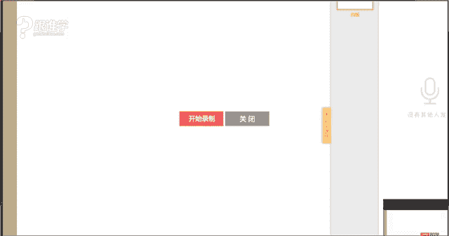
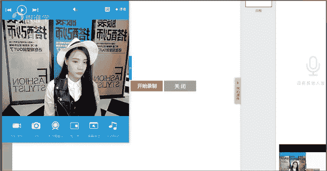

# 1、11服装《搭配秘笈之新版36计》：27百搭白衬衫

好。Yeah。

哦。

啊。OK hello，大家晚上好。😊，同学们现在可以听得到我的声音吗？嗯，谢谢钟永雄同学的花花。OK嗯，现在咱们呃有多少同学在呢？如果在的同学的话呢，呃这个可以出来啊，然后咱们来点个到吧。

从来好像没有点个到啊，来从这个报个报个到啊，来12345开始刷吧，好不好？😊，OK好。😊，那平时好像呃12。网络延迟的问题可能会呃看一下OK。🤧好，那在的同学呢可以就这个出来。然后呢。

我们这个在课堂当中多做一些互动，那也可以让老师认识下你们啊。好，那今天呢我们讲到的课程好的，第六个人了啊。那其他同学呢其他同学我看到咱们教室里现在有14个同学啊。

可能都是呃其他另外一些同学可能都有这个工作或者这个时间上不允许没有来到我们的这样的一个课堂。OK没关系。嗯，好，嗯，安若洛同学到安若洛第七个同学了。好的嗯，那如果其他同学没有出来的话。

那咱们现在开始我们的课堂吧。啊。那今天呢给大家分享的是关于白衬衫。那我相信这个同学们对于白衬衫这件单品一定是不通的对吗？那因为不管是在职场当中还是我们所说的日常休闲当中。

那白衬衫作为我们所说的呃衣橱当中必备的一件单品。为什么这么说呢？啊，其实呃在时尚这个时尚宣言当中，有一句话是这样说的，说没有白衬衫的衣橱是不完整的啊，那咱们教室里的同学有没有没有白衬衫的啊。

是不是应该所有的人都有白衬衫。如果有白衬衫的同学呢，请打一，如果没有衬衫的同学呢，请打2。okK好，基本上应该都有吧。嗯，还真的有没有白衬衫的呀嗯。好。真没有啊，那你如果没有白衬衫的话。

那我觉得呃就有点可惜，为什么呢？因为白衬衫它的可搭性非常的多啊，可这个不管是这个时尚还是休闲都可以的。而且呃我们说白衬衫非常非常经典。不管是男生还是女生都是必备的啊，O那今天呢我们就讲到的是白衬白衬衫。

那如果我我们有白衬衫的同学，在平时搭配白衬衫的时候，有没有什么样的一些困惑呢？同学们，你们平时在搭白衬衫的时候，会不会存在呃什么难题。比如说呃因为身材的原因，还是这个我们说搭配上的一些问题。

大家可以讲一讲。那老师呢可以为大家来做一些讲解啊。那包括等一下在课堂当中，我们也会给大家做一些分享。但是呢在这里还是想问一下我们的同学们，有没有什么样的一个困惑呢？好，咱。同学们如果现在有问题的话呢。

可以在屏幕上去答。有没有了？没有啊，同学们。嗯，菲尔说选择不好衬衣，那你选择不好衬衣的这个呃困困扰点在哪里？嗯，款式不好把握是吗？好的，嗯，跟款式有相关，嗯，更多的是款式吗？嗯好。有同学说太职业了。

扣子不敢开太多，可开太少，又胸太大还有溜肩啊。ok不知道怎么搭配，怕显得胖，是吗？好，那我看到大家的这样一个问题了啊，那有一个这个悠悠同学说的很很有意思啊，说扣子不敢开太多，开的太少吧，又显显得胸大啊。

还有溜肩。那你如果溜肩的话呢，那这个算是我们所说的体型当中的呃，有一个题态细节当中有一点小小的问题啊。那我们继续来看嗯搭不成搭不好就成工作服了。嗯。衬衣无领和有领领型的选择。啊。好的。

那我大概了解同学们的这样的一个问题了。那等一下呢我在课堂当中也会为大家啊做这样一些知识点的这样的一个讲解好吗？嗯，ok好，那我们继续来看白衬衫的搭配啊，那其实刚才有大部分同学说穿不好。

就像这个职业装的啊。那而且呢我刚才一开场就说了，白衬衫是时尚单品必备的这样的一件单品啊。那但是有的人他真的是能穿出时尚感，有的人穿出来就有一种我们所说的这个村干部的感觉啊。

那呃比如说其实在呃昨天课程当中啊，我记错了啊，我以为今天我们讲的是风衣，那今天其实讲的是白衬衫。那比如说张杰，我上我我在这个课程当中说到了啊，其实本人我是比较喜欢张杰的歌声的但是呢他的衣品。

有一点点我有有有所怀疑啊，那他在这个那天他唱的在我是歌手当中唱了一首歌。那他唱的那首歌呢非常好听啊，但是真的那天穿的衣服真的有点像业务员的感觉，所以说呢那对是的，他的他的整体造型。

有的时候会有点这种土气的感觉啊，那包括我们所说的这个呃郭德纲先生啊，他穿这个白衬衫白衬衫的时候，哎，感觉也好像看起来像村干部的感觉，是吗？好，那所以说呢。单品的衬衫的这样的一个搭配就尤其重要了啊。

那它跟我们的很多的因素是相关的。比如说跟体型相关啊，跟气质相关，气质会影响到你最后搭配的风格啊，ok那等一下在后面的课程当中再跟大家讲，嗯，搭不好夏装是吗？好的嗯，那我们等一下来看啊，那白衬衫呢。

其实它也有它的发展历史。那我们说第一件白衬衫。那这是欧洲的发展史，其实我们中国也有发展史。那我们中国的衬衫，其实以前也是作为内搭来穿的啊，那呃到后面呢我们说现在大家穿到的这种衬衫。

其实不是我们中国的这种中式衬衫。比如说中山装，其实它就是属于中式的那有一种真中山装的那种衬衫，它其实是我们传统的那种感觉的那我们现在穿的其实并不是我们现在穿的是从欧洲发展而来的。那欧洲呢。

我们说在16世纪的时候，大家可以看到图片当中，其实就已经有衬衫了。但是它的这种它的呃花像呃这个款式的设计，大家可以看到有这种刺绣啊，那在18世纪的时候呢，大家可以看到它是有有领有袖了。

但是依然也是作为内穿的单品。那包括1919世纪，整个19世纪，其实白衬衫都是作为内衣啊，藏在马甲和外套的下面。比如说女士会穿的这种叫什么羊腿袖的这种衬衫的这种这种袖童啊，那大家一般都不会作为外穿的单品。

那第一件白衬衫呢可以追溯到3000年前的古埃及了啊，那在第一王朝的铃墓当中就发现了啊，白衬衫这么早的历史就已经有了啊，那整个19世纪刚才跟大家讲到了欧洲的这样一个发展，那其实一直是作为内衣穿在里面的。

就像呃T恤是一样的。以前T恤其实也是穿在里面的啊。只是现在的话也被我们拿出来传到我们来了啊，那在呃我们说这样的一个立白衬衫呢，为什么能发展到现在这样的一个在时尚界占着这么重要的一个位置。

那其实跟上谁有关系，就是跟香奈儿有关系啊。那个不好意思啊，同学们，因为这个今天讲话讲的有点多啊，这个coco那香奈儿呢它赋予了白衬衫新的定义。为什么这么说呢？在1920年之前。

人们穿白衬衣也都是男士居多。而且这本来一直都是作为男人的单品。那在1920年的时候呢，我们说香奈儿呢它把它是第一位把衬衫啊，呃穿在身上的女士，而且把它用来搭配这种西装啊，然后这种毛呢外套等等。

那配上这种珍珠项链那这是它是带领了我们所所说的白衬衫的这样的一个时尚的位置啊，那在这之后呢，白衬衫就被人们所穿着。但是在1920年到1930年之间，它一直走都是都是这种中性的风格，大家可以看到。

都是偏男性化和中性感。那1930年工人阶级也会去穿着白衬衫，穿着的。感觉是比较干练和潇洒的感觉。那大家也可以看到啊，以中性为主。直到1940年之后，赫本。啊，他在罗马假日当中啊演的这样的一个角色。

当时呢他是怎么穿的这件白衬衫呢？他把白衬衫卷起到什么呢？手臂大大臂的这个位置。然后呢，配上这种丝巾啊，穿上那种伞裙，今年特这这两年特别流行的那种大的伞裙啊，她演绎了一种优雅的女性的这样的一个形象。

那从此之后呢，白衬衫又有了另外的一个这样的一个穿法，就是我们所说的他有赋予了她女性味道的这样感觉。以往因为他本身是男人单品。所以一开始我们女性演绎的时候，其实是往中性的感觉去演绎的那直到1940年。

我们说赫本的这样的一个电影当中的角色啊，演绎的这件白衬衫，他变得就融美起来了啊。是的，白衬衫搭大伞裙，非常好啊，那直到那到1994年包括。1994年的低俗小说这部电影当中，那包括安吉丽娜朱莉啊。

在史密斯夫妇的这部电影当中，他们配嗯他们演绎的这样的一些角色赋予了这个衬衫一种新时尚的姿态。那就是什么呢？性感。他们在剧当中的时候会把解开去穿啊那而且穿的是比较低胸的啊，所以她给人感觉。

包括大家可以看到安吉丽娜朱莉，她会把头发啊，我们这个呃这个发型往一边去放往一边放的时候，她给我们感觉会更加的妩媚感啊，然后衬衫的领子打开的又比较开。那再加上如果她衬衫比较大啊，不穿裤子的话。

那她给人感觉是非常非常性感的，是吗？那所以说那呃直到现在为止，你会发现白衬衫，他可以中性，可以浪漫和优雅，也可以性感那所以说。件白衬衫它可以演绎不同的风格。那只是要看我们怎么去把它搭配。

跟我们现在的一些时装去做这样的一个组合。根据您个人的气质去配搭出来，属于你的白衬衫啊。OK好，我们继续来看时尚啊这个白衬衫如何穿出时尚感，这是我们非常关键的问题呢，对吗？同学们，那因为刚才有同学说了。

不知道怎么搭配，搭配不好的话，它会显得比较什么呢？啊，显得太职业化了感觉啊，其实。今年流行的白衬衫有非常多的这样的一些新鲜的元素，它已经不像现在啊老师所穿着的这样一件白衬衫呃。

它的设计上其实在袖口上有一些特别点。那但是呢呃其他的设计跟这种白衬这个一般的白衬衫没有什么呃太大的区别性。但是今年的白衬衫设计的非常特别啊，那等下和在后面有图片给大家来展示。好，那我们继续来看。

那我们在选择白衬衫的时候呢，有哪些秘籍，那包括如何那省钱又好用的去穿着白衬衫。我们接下来来看选择白衬衫的这样的一个秘籍。那我们说选择白衬衫，刚才我跟大家讲过白衬衫，它其实跟我们的体型有很大的关系。

跟我们的个人气质也有很大的关系。那从选择白衬衫的时候，其实我们白衬衫它是有版型的对吗？那我们人也是有体型的所以我们要把版型啊。把白衬衫的所有的版型跟我们人的体型去做这样的一个结合。

那包括我们人体它还会有一些题态细节的问题。比如说脸型，比如说脖子的长短，比如说胸部的丰满的程度。那这个都是跟我们选择白衬衫有关系的OK那我们接下来来看。

那在之前的课程当中，其实有跟大家分享过关于我们所说的这样的一个脸的问题啊。那我想问大家，123。123456哪一个脸型看起来会比较偏大呢？同学们123456，哪个脸型看起来会比较偏大？嗯，好，2还有吗？

嗯，第二个啊，大部分同学都说是第二个是吗？嗯，是的，第四个你会发现123456这几张脸当中椭圆方形菱形啊，圆形长形倒三角形，你会发现第二个和第四个看起来会比较大。为什么呢？

因为第二个和第四个其实是属于我们所说的脸型当中在什么呢？下庭的下额骨这个位置它是比较偏大的。而这些椭圆形菱形长形倒三角，它这个位置都是比较什么呢？窄的肩下巴的感觉。所以呢它看起来脸好像更加瘦一些。

那其实啊我们说这个方形脸和圆形脸，它看起来就会比较什么呢？显得大。那所以说发错了是吗？没关系啊，没关系，二和四啊，那我大概了解，其实大概很多同学都会选择二和四，的确那所以说呃方形脸和圆形脸在穿着。

白衬衫的时候，它其实对于领型的选择是有所要求的。那么如果大家是椭圆形、菱形、长形倒三角，那你选择领型的时候相对来说是比较好选择的，能理解吗？同学们？好，那我们继续来看啊。唉，嗯好。

那继续来看脖子呃脖子的长短的这样的一个问题。那脖子脖长的标准它其实是脸长的2分之1。那我们在测量脖长的时候应该如何去测量呢？梨形脸嘛，梨形脸也是属于下面比较宽的。

所以选择白衬衫的领型的时候也是需要注意的。下颌同学。嗯，好，那我们继续来看，那脖子的这样的一个长度呢是我们脸型的一半，那脖子应该怎么去测量？那我现在教给大家方法。那我们从侧面来看，现在大家能看得到吗？

我们要从我们的脖根处在测量的时候呢，平视啊尽量不要抬头然后平视，然后直到你的锁骨窝啊，我现在给大家来看一下啊，直到我们在这个锁骨的位置，也其实就是指我们脖子结束的这样的一个位置。这个位置去测量。

测量完之后呢，然后。你用皮尺来测量是最好的。然后呢，然后在你的脸上啊做一个这样的一个呃也在这样的一个发际线啊，发际线到下巴做这样的一个测量。例如说你的发际线到下巴的长度是18厘米。

那么你的脖子的长是9厘米，恭喜你你的脖子长短是标准的。可是如果你是8厘米，7厘米的话，那就代表你的脖子偏短啊，OK好，那同学们自己下去可以去测量一下自己的脖子长的标准，好吗？嗯？

那么们继续来看123同学们来从目测当中，你们觉得哪一个人的脖子是偏短的呢？123哪一个人的脖子偏短？是的，那阿娇的脖子它其实是偏短的对吗？嗯，是的，那所以说啊脖子短的人，他从视觉上看上去呢？

它会有点拘谨感。所以呢我们在穿衣服的时候，领子的形状也是需要去考虑的。那例如说刚才老师把领子扣起来的时候，其实是不是会显得脖子比较短。那所以说其实打开领子会显得更加的什么呢？通畅的感觉O好。

那我们继续来看啊。这是我们所说的体态细节的第二个问题。那还有就是我们所说的，刚才有同学说了，哎，穿白衬衫的时候解开又觉得太暴露啊，不解开呀，又显得胸太大。那所以说胸部的丰满度。

跟我们选择服装这个衬衫的时候也有一定的关系。那其实呃最终的话，它考验的是我们所说的这样的一个选择的领型的问题。那以及你在穿着的时候，你的扣子打开的这样的一个配搭关系。

那包括如果是这种我们所说的呃单穿的时候呢，你应该是截几颗扣子啊，其实不管你是截几颗扣子，你可能胸部丰满的人，她都会有有所这种呃护体。那我建议胸部比较丰满的女生可以什么呢？把衬衫当外当做外搭外衣来穿。

里面可以搭配呃这个内搭，比如说搭配这种背心，搭配睡裙，今年特别流行的那种睡裙，搭配。么呃一些呃毛衫之类的那等一下我们会在课程当中跟大家来讲到这样的一个搭配的关系。OK好，那我们继续来看。

那这是我们所说的体态细节问题。那了解完我们人的体态细节问题，跟我们选择衬衫有什么样的一个关系之后，那我们来看一下，那我们在选择衬衫的时候，要根据哪几点去选择。那第一点就是我们所说的学会选面料。

那面料当中呢，其实会涉及到哪些面料呢？第一，棉麻的。第二，丝绸的。第三，雪纺的纱的那我们首先来看棉麻的。嗯，衬衫的面料来上嗯，这个从这个做工上来讲啊，和面料上来讲啊，它其实就是极其这种呃有讲究的啊。

那例如说棉，我们就说棉吧，棉它也会有不同地区的棉。比如说啊这个全世界的棉有三种哈，一种叫埃及棉，它就是来自于埃及的。那一种呢叫呃我们所说的海岛棉，它是来自于南北美海岛啊，以及澳洲。那还有一种呢叫皮毛棉。

那这种棉呢它是来自于美国和密鲁呃密呃密鲁，那这几种那包括我们中国新疆其实也产棉。那我们的棉的话也是埃及棉。那最好的棉，大家觉得应该是哪里的？同学们，你们认为最好的棉应该是哪里的。埃及棉啊。

最好的棉的话是棉。那它的棉的质量非常的好。那在我们织织织这种我们所说的这它形成面料的时候啊，那如果这种衬衫的这种呃我们所说的面呃棉的这种丝啊越细。那在这个我们所说的一个单位当中。

它达到100以上100只以上，那它这种做工越细致越好，对棉要求的越高。是的，嗯是的，纤维长是的啊，那这是我们所说的这个呃关于这种这个棉的这样的一个专系专业的这样的一个知识啊，但是并不是说越细。会越细腻。

织不出出来织出来的越薄，那么越薄的话呢，其实会越容易皱啊。OK那这是我们所说的这样的一个棉麻的面料。那棉麻的面料的话，它一般会带给我们什么样的感觉呢？同学们，你们认为棉麻的面料。

一般带给我们什么样的感觉呢？啊，那其实有两种情况，对吗？第一种就是我们所说的这种。嗯，好，优秀同学说的非常好，文艺自然。是的，那有一种棉麻感呢，它可以搭配出来这种。蓝的感觉，那纯棉的这种衬衫。

它其实更加的这种嗯有挺括感，对不对？那所以它可以在职场当中去正常的去穿着啊，那这是我们所说的这样的一个棉麻。那呃还有呢就是我们第二种叫丝绸的那丝绸的感觉呢，它给我们是的，棉它也会比较吸汗嗯。人们。😊。

嗯，丝绸大家可以看到丝绸它给我们什么样的感觉？丝绸它给我们的感觉是不是会更加的啊是的哈富贵感？莹莹同学是学习什么专业的呢？我发现莹莹同学好像这个对这种面料是不是呃是不是有所了解，是学服装专业的吗？嗯。

好的嗯，那有个同学其他同学也回答的非常好啊，羽荷包括悠有，包括思雨同学啊，讲到的都是我们所说的富贵啊优雅华美高级，的确丝绸的确给我们是这样的感觉，它给我们感觉是比较有富贵感啊。

就是我们所说的其实有华丽感，同时呢它是有女人味儿的同学们是吗？嗯，这种丝绸的面料它给人感觉是比柔软的。那现在呢其实非常流行的这样的一个配搭方式，是这种丝绸的配这种皮革的这种感觉。

因为丝绸它的面料是比较柔软的。那么它需要一些硬挺的面料，跟他去搭配的时候呢？它呈现出来的感觉就会别有一番风味啊。OK好，是的，嗯，细致的感觉。5021同学说的是的，非常好，细腻的感觉更加贴切。

细腻感华丽感，女人味优雅的感觉？OK好，那男士是不是也是一样的呢？如果一个男人每天都穿丝绸面料。我想问一下大家，你们觉得男人穿丝绸面料的话，那是什么样的感觉呢？会不会给我们感觉有点嗯洋气呢？是不是啊？

如果男士有一一个男士每天都穿丝绸，他给我们感觉一定是非常的洋气的啊。O所以丝绸面料，男士no男士谨慎去选择丝绸面料啊，在职场当中外穿的时候，一定要谨慎去选择，即使你穿丝绸男士穿丝绸的话。

那可能更多的是在家里可以穿丝绸的睡衣。嗯，O好，那我们继续来看雪纺和纱的面料，那雪纺和纱的面料它给我们感觉是有透视感的。所以呢它给我们感觉会比较的什么呢？性感啊，而它而且它是这种它它是疏通感的。

所以看上去它会有性感的感觉。O那以上的话就是我们一般在选择服装的时候，选择这个呃白衬衫的时候，这三种面料啊，一种是白这个棉麻啊，一种是这种我们所说的丝绸。一种是雪纺和纱啊，是的，娃娃同学说飘逸感是的。

是有飘逸感的嗯。好，那刚才呢是针对于面料的这样的一个选择。那同学们可以根据自己的这样的一些喜好，你比较喜欢舒适感的那你可以选择这种呃这种棉棉麻的，它会给人感觉比较舒适，吸汗透气。

那如果大家喜欢女人们一些的，那可以选华华丽感一点的啊，然后精致感的那可以选择丝绸的。如果你喜欢有点小性感的啊，那你可以选择透视的ok好，那我们继续来看选择的版型。那呃衬衫的版型其实现在是非常多。

但是呢我们在这里呢做一些基本的版型的介绍。那我们来看第一种叫经典的直筒款。那其实今天老师穿的是经典直筒款，只是因为呃我现在的搭配的方式基本上看不出来我的款式的这样的一个感觉了啊。

因为我是把这个衬衫全都塞到这个牛仔裤里面去穿了。嗯，所以呢看不太出来。那第二种呢是经典的修身型。修身行其是什么意思呢？就是它在这个我们所说的背面会做嗓，就是这种收，它会有做一些设计。

会把后面做这种收身的设计。那第三种呢就是这种宽版，就是它相对来说是比较宽松的这种版型。那基本上呢这个大多数啊比较经典的款式的白衬衫版型就分为这三种啊，经典的直筒经典的修身经典的宽版。

那这三种款型其实它对于身材是有所要求的那例如说如果一个女生她是X体型的话，那么我就会建议她选择这种修身的版型。因为X体型的女性，她的优点就在于她的腰。所以如果她选择这种宽版以及这种直筒版。

它其实会显得她整个人是比较胖的啊，会显得胖。所以我会建议X体型的人选择收身的款式。而这种H体型的人呢，她可以选择这种直筒的或者是宽。版的okK好，那我们继续来看。

那包括现在是不是有很多比较个性的一些版型呢？这种加长型，那包括今年特别流行这种缩短版那呃这种加长型，我相信我们大多数人都可以去接受100的人都可以接受，但是这种缩短型的啊。

因为它会涉及到一些太过于暴露和性感的这样的一些问题。那我觉得基本上99。9%的人不会选择这么短的版型啊，但是呢这种版型在欧美很多女性或者是时尚博主会去穿着啊，时尚达人等等。

那他们会去穿着这一些比较特别的这样的一个版型。O那我们继续来看。那现在呢还有一些这种设计呢，他会打破原有的廓形设计，大家可以看到啊，跟我们以往认知的衬衫不太一样了啊。

比如说这种衬衫它好像没有这种这个前襟的设门襟的设计，对吗啊？OK好，原来有这么多版型，难怪之前总是穿的不好看。是的，版型有很多，而且今年设计的衬衫，我建议同学们今年一定要去买衬衫穿。

为什么我看到都觉得很心动，那些衬衫真的设计的太美了啊，比如说它会加因为今年很流行这种浪漫主义时期的这种装饰感，所以会很流行这种波浪边哪啊，然后非常漂亮的。所以同学们好好去挑选一下衬衫啊，非常漂亮。

因为今年的衬衫，它已经不是我们呃以往想象到这种衬衫，它给人感觉很古板很传统不时尚。啊其实今年设计的衬衫，它还有很多的设计，比如说加有飘带啊，那你走路的时候，比如说它的这个呃这个大廓型长袖子，那等等。

它给人感觉都会非常的时髦。嗯，好，我们继续来看。那因为这个白衬衫的这种呃白里的图片呢，它看起来不是特别的清晰。那我同学们呃大概听老师跟同学们讲一下，然后呢再看到这个图片当中，你们大概就会有所认知了啊。

那包括等一下在后面的图片当中，我也会跟大家去介绍。那首先我们来看第一种V领，那这种V领的话呢，我相信大多都大多数同学都知道吧啊，这就是这种呃有一种叫无领的衬衫。那这种V领的话呢，它可能是这种无领的衬衫。

那我们说衬衫其实它有两种啊，一种是这种呃有有领的，一种是无领的。那么无领呢它也会有圆领的设计和V领的设计。那这种呢更加适合打底去穿，或者是你再穿这种V领，没有领子的衬衫的时候呢，需要佩戴一条丝巾啊。

或者在这个地方做一些装饰，要不然就会太空了，能明白吗？同学们啊，好，那我么们来看第二种叫直领。也被叫中叫立领。比如说中山装当中的领型，它就是这样设计的啊，立领。

那包括那当然还有一种它并不是说一定是中山装。那还有一种这种立领呢，它给人感觉会有文艺感啊，那第三种蝴蝶结领，也就是说这个地方呢，它有一个蝴蝶结的装饰。那第四种叫荷叶领。

就是有很多的荷叶边的这样的一个设计。第五种叫彼得潘领彼得潘领什么意思呢？就是指我们那种娃娃领很可爱的那种领型。那最新的概念的设计，背领，其实背领呢跟我们今年的这样的一个穿衣方法有关系。比如说今年穿衬衫。

我们可能可以使用的穿衣方法，把它倒过来穿，就是呃以往的门襟是在前面，对吗？我们把它穿到后面去。那这是一种今年特别流行的衬呃衬衣的穿搭方式。那同学们，你们可以。去呃尝试一下啊尝试一下，今年非常流行。

那不要担心啊，可能有同学会说，老师我走在。是不是又穿反了啊，有可能真的有人会有这样的顾虑，但是这的确是今年各大街拍博主嗯都在使用的这样的一个创意的方法。OK好，那我们继续来看。呃。

现金呢是打破传统设计的这样的一些领型。比如说这种多层领，大家可以看到啊，那比如说这种立领之间它只是加了一个什么呢？别针的这种领型。那这都是现有的这种传统的设计。OK好，那我们继续来看。

那一个一个来看我们说。老师现在穿的这种领型啊，那这种领型的话，那这种小这种比较传统的这种领型它给我们感觉其实比较的什么呢？同学们，你们看到这种衬衫，你们觉得它传递给我们的信息是什么样的。

现在我来呃跟呃问大家啊，同学们可以来回答一下。因为同学们总是听老师讲，老师平时也给大家分享了很多，我们所说的看到一件单品的时候，它的传达的这样的一个气质是什么样子的啊？那现在让大家来解答一下。好嗯。嗯。

我说职业帅气干练是的嗯，正规化。是的，那么的确这种领型它给我们感觉是比较什么呢？现代感的，而且呢是比较什么呢？硬朗的、中性感的、帅气的、职业感的严谨感的正式感的对吗？OK同学们解答的非常好。

我给你们一个掌声，OK是的，那这种领型它的确给我们感觉，他要是会比较这种干练啊，职业的这样的一个状态。所以同学们，那听到大家形容呢，其他同学如果没有出来发言的那其他同学现在可以听老师来讲啊。

如果那很多同学已经解析了这件单品，他给我们感觉是非常职业帅气的。那么如果你今天想要搭配这种职业帅气严谨正式的感觉，你是不是就可以选择这种经典领呢？OK那有同学可能会说，老师，我今天想打扮的可爱。一点。

那么你的领型应应该选择哪一种？你的领型应该选择叫彼得潘领。彼得潘领的话，那种娃娃领它给我们感觉会更加可爱。可是如果你想传递可爱的感觉，你选择这种领子，那么你就传递错误了啊，能理解吗？同学们嗯，OK好。

那我们继续来。V领啊，那这种V领的话，它给我们什么样的感觉呢？同学们，这种V领给我们什么样的感觉呢？继续啊，同学们优雅O好，还有吗？性感还有没有？女人味儿。嗯。OK好，那目前为止有三位同学说了答案。

优雅性感女人味儿。那它这种女人味是从哪来的呢？大家可能会觉得哎她这种简单的设计，再加上它这种就是V领，它可能给我们感觉好像大家觉得领子有点深的时候，好像有点性感了，再加上它这种V领是非常简洁的。

你会发现把女人的特质反而凸显的很明显，比如说女性的这种锁骨的美感，我们的注意力就在这个位置，对吗？所以我们会觉得啊这个地方好像如果这种锁骨非常明显的，我们就会觉得非常的这种有点小性感。

同时呢又有点这种优雅的感觉啊，那其实V领它传递给我们更最大的感觉，就是简约啊，简约，它给我们感觉，因为它这个地方完全没有特别的设计，对吗？而且这种呃这两件款式它是比较。种休闲感的同学们。

因为这两件款式它都是属于宽松的，宽松它一定给我们感觉是非常的随意的感觉。那V领这种V领没有领子的V领，它给我们的感觉一定是非常简洁的感觉，OK好，那你会发现，所以说这种V领，如果他脖子上不带东西。

你会觉得好像有点空，对吗？那所以我们在配搭的时候，为什么这一套服装，它这样就是在脖子上不做任何的装饰，因为他想凸显的就是这件衣服的这样的一个质感，这是在袖场当中的啊。

那包括它这件衣服本来设计的就非常特别。那再加上它的下身的服装是有亮点的。比如说他的这个腰带是一个非常的亮眼的这样的一个设计，所以说如果他在在这个地方做装饰的话，就反而抢了他这一套简约的感觉。

那么他想凸显的是这种简约的这种呃这种这种极简的风格的时候。他就不需要搭配更多的东西，能理解吗？同学们啊，那所以我们在搭配这种衬衫的时候，你要考虑好，你想搭配的是简约的感觉。

还是想要搭配这种什么呃有点小优雅呀啊，或者有点小性感的这种感觉。那你再去挑相对的单品。例如说我想性感。那我下面可以配蕾丝裙。我想要优雅。那我下面可以配一些这种铅笔裙啊等等。ok好。

那这是关于V领的那我们继续来看嗯。哎，好的嗯，直领也被称为叫立领。那这种小立领和直领的话，它给我们感觉会更加的文艺清新感啊，文艺感和清新感。OK好，那这是直领和立领。

那我们就不做不多呃不多做更多的解答了啊。那这种领型的话呢，如果大家想去穿的话，其实不只是可以配这种服装，它还可以配这种休闲的田园的服装风格。那你可以佩戴一个这种小的编织帽啊啊，然后给人感觉会非常清新。

OK好，那我们继续来看蝴蝶结领。那蝴蝶结领的话，同学们你们可来以来可以来讲一下，你们觉得这两种领型给呃这图片当中的这种领型，它给我们什么样的感觉呢？这种领型它给我们什么样的感觉？同学们。😊。

是不是非常的对，是的，女人味比较浪漫的感觉啊，它其实更多的会传递一些女性化的元素。也就是说它给我们感觉会更加女人味儿。那所以如果你想要表现女人味的时候，是不是可以选择这种带有蝴蝶结的这种衬衫呢？

那你想要表现帅气的时候，你是不是就要选择这种尖领的衬衫呢？啊，okK好，那我们继续来看。荷叶领，那我想问同学们，这种领型给我们什么样的感觉，是不是也是传递的给人感觉是比较女性化元素的，比较优雅的。

比较女人的这种感觉呢？啊，它其实也是传递了一种优雅感和女人味的感觉。OK那这就是我们所说的今年流行的款式。同学们啊，你会发现你看这种荷叶领，那包括这种荷叶的什么袖子都是今年流行的元素。

那包括它可能会在这种袖子上做这种荷叶边的设计，也是今年流行的元素。所以我说今年的衬衫很好看啊？同学们啊，你不知道大家有没有跟老师相同的感觉啊。那同学们也可以去选择一些这样衬衫穿。

O那我们继续来看彼得潘领，那彼得潘领的话就是这种小领子，大家可以看一下啊，这种啊小小的领子，它给我们感觉其实就是有一种可爱的感觉啊，甜美可爱可爱清新感。OK好，那这。种呢就是背领。

刚才我们在前面有给大家去介绍，比如说大把这种领子倒过来穿啊，把这种衣服倒过来穿。那包括你会发现这种倒过来穿的时候呢，它是会把你的美背露出来的时候，你可以戴什么呢？戴一个配饰在这个位置啊。

比如说你带一个珍珠的项链。那你的珍珠呢不是往前面掉，而是往后面掉。那往后面掉，它给我们的感觉是会更加的优雅感。那这种。倒带着吊这种戴这种珍珠项链的话，其实也是我们所说的呃20世纪当中的30年代。

它非常流行这样的一些露背装啊，它会把这种法式女人啊，法式法国女人也会这样去佩戴。因为她给我们感觉非常的优雅啊，法国女人非常喜欢这样的一个佩戴的方式。OK好，那我们继续来看法国女人。

她认为露背是非常性感的一件事情啊，好，那刚才呢给大家分析了种种的领型。那其实总结来说，我们所有的领型其实都是有一些它本身的风格的特征。例如说这里所有的领型都是这种小尖领，对吗？

所以她看起来会有一种我们所说的叫中性简约的感觉，给我们感觉是比较干练的感觉。那么继续来看这种，不管它是蝴蝶结，还是这种。啊，如果这种是尖领，但是因为它的服装的款式的面料做了一些特别的设计。

再加上它有这种什么呢？呃工艺的设计，所以它就会传递出来另外一种信息。那比如说就是。和优雅。那这种呃波这种叫什么呢？呃，蝴蝶结，那包括这种荷叶边，那包括这种有做这种工艺的啊，这种绣花的工艺啊。

透纱的它都会给我们感觉会比较浪漫和优雅OK那这就是我们所说的领型的这样的一些问题。那我们继续来看男士的领型。那男士当中呢也有分很多领型，在这里呢只给大家展示了6种领型，其实男士有很多。

那我们一一来看男士的领型。第一种宽脚领也叫微温纱领。那这种小的领这种领型呢，大家可以看左右领子的角度在120到180度之间啊，因温纱公爵喜爱这种领子而得名，适合系宽大的领带，相应的领带系法叫做温纱结啊。

是的，温纱结打起来有点复杂的哈。同学们如果不。的话呢可以其实可以去上网搜一下温莎节领带的打配方打打的方法啊，大家可以去看一下。那非常的好玩。我觉得我当时在学这种温莎节的时候，我觉得特别有意思。OK好。

那这是第一种男士的领型，温纱领配温莎节，记住了吗？同学们好，那我们来看第二种经典的领子。那你会发现这种温纱领它要比这种什么呢？经典的尖领要小。同学们啊，那么继下来看尖领顾名思义，最基本的领子。

这种领型呢是最常见也最实用的领型。大多数的这种量产衬衫都会有这种设计啊，ok那这是我们所说它比较适合什么呢？领带啊或者领结，其实这种就是属于正常的比较经典的这种领型。普通的领型。

那其实跟我们现在的领型没有太多的差异。好，那么看第三种纽扣领其实就是什么呢？在我们这个衬衫下面呢，它会有一个扣纽扣的这样的一个设计。两个这个衬衫呢，这个脚呢都可以把它扣起来。那呃在美式衬衫当中呢。

它会比较多，没有办法系领带。为什么呢？其实很多美式衬衫它就是休闲的这种代表的感觉啊，不是那么的正式的场合去着装的。所以格子衬衫它给我们感觉是有一种休闲感的啊。比如说这种美式的这种呃牛仔的风格。

它也会运用到这种呃格子衬衫啊。OK那这就是我们所说的这以上是三种领型，一个是温纱领，一个是经典领。那包括这种纽扣领。那我么来看第四种标准领中式立领比较文有文艺腔范儿。

那刚才其实我们在女士的领型当中也有跟大家去介绍这种领型啊，那在男士当中呢，这种领型的话，它是不需要啊佩戴领带的，所以呢它会比较少一些这个商务的气质，多一些。我们所说的这种斯文的啊。

然后这种这种呃儒雅的这种感觉啊，这种气质。O好，那我们呃继续来看领真领其实就是在领子的这个位置呢，它有一个装饰一起以前呢它其实是为了固定领子。但是现在已经作为装饰品在运用了。那这种领子呢。

其实它是非常严谨和正式感的。OK好，那我们再来看最后一种叫燕子领。那这种领型呢，其实它是非常非常重式的晚宴的场合当中会使用的领型。而且它是用来搭配领结的，它不是用来搭配领带的。OK好。

那以上呢就是男士的6种领型。那男同学的话呢可以这个去啊这个仔细的好好的来看一下这个领型。那平时你们在选择领型的时候，有没有选择错误呢？那我们继续来看。那包括女同学也是一样的。

替你们男朋友或者是老公选择领子的时候，以后就知道方向了。好。那为什么一直在给大家来讲到领型的问题？那因为那领形跟我们所说的脸、脖子以及胸部的丰满关系是有有有这样的一个关系的那例如刚才我们所说的这种呃我举个例子啊。

比如说这种嗯蝴蝶结领，包括荷叶领，那我想问一下同学们，这种领型，你们认为适不适合给到胸部比较丰满的人，如果适合的话，请打一，不适合的话，请打2。OK是的啊，本身胸部比较丰满的人，他其实就要简洁的款式。

那就不呃就不能再乎再用这种什么很复杂的这种堆堆积感的领型。所以呢其实那种比较微型的领型，是不是比较适合给到胸部比较丰满的同学呢，简单的设计，那它是比较适合给到微呃这种我们所说胸部叫较丰满的这种领型呃。

这种这种同同学来穿的那包括脸比较大，脖子比较短的人也都比较适合那种微型领。可是我们大多的经典的领型，都是这种，那怎么办呢？所以说那其实我们在选择领型的时候呢，其实是可以把纽扣打开的啊。

你的纽扣打开的刺这个这个克数越多。那么对于你的脖子的这样的一个呃这个长度拉伸的会越长。那要么呢你就不要选择那种比如说小立领。也不适合。那比如说脖子短的脸大的那就完全不要选择那种什么呢？小立领了。

因为那种小立领你把它解开又又不好看。所以说呢选择这种领子的话呢，可以把它打开。要么你就可以选择V领的这种领型。那同学们能理解吗？好，那为什么放这张图片呢？123大家可以看一下啊。

这三张图片当中哪一张你会觉得脖子会显长，哪一张你会觉得脸小呢？1233张图片当中，哪一张呢？同学们。是的，3。那所以说呢其实道理是相通的，虽然这个不是衬衫领，但是这个道理是相通的。

比如说那个我们所说的衬衫领当中是不是有小立领啊，然后有这种呃小小一点的这种小的领领型。那所以呢都不是特别适合给到这种脖子比较偏短的脸又比较偏大的，所以呢选择V领，或者是你在穿衬衫的时候，把它打开。

会更加的好。那其实老师也比较适合要把它去打开穿。但是因为我今天的搭配呢，它比较适合多扣一些啊，那如果打开穿的话，其实没有那么适合。反而那我今天可我可以给大家展示一下，老师今天的这样一个搭配啊。🤧嗯。

Yeah。那我今天的这样的一个搭配呢，搭配的是呃大家可以猜一下我的风格。好。同学们啊，看完了吗？那包括我的这个领呃这个服装的设计啊，大家可以看一下。🤧嗯。什么风格呢？Oh。朋学们。西裤牛仔呀。

西裤牛仔错了。😊，还有没有？啊，前卫。朋克。好的，靠边了啊。是的。朋克风从哪体现的呢？嘻哈没有没有嘻哈。今天的话是有朋克的这样的一个元素。啊，那同时呢混搭了一些这种有点这种呃英伦的这种感觉。

那偏英式的感觉。为什么呢？这个帽子，那包括我其实这个呃你们就看朋克就是看裤子破了，就是朋克是吧？O那的确也是它其实是有破坏感的那包括我在这个牛仔裤里面穿了一双网袜啊，那包括我的上装的这个呃衣服。

它其实也是有这种破坏感的啊，那大家可以看一下，它其实也是有包括我的皮带，它其实也是有朋克的感觉啊，OK好。啊，那至今天呢特别时髦配网袜。是的，今天我在线上上课的时候，那个我下课的时候。

因为上了呃到下午下课的时候，这个同学终于跑过来，忍不住来问了我一句，说老师你今天穿的是什么风格啊，我今天在上课的时候一直走神，我走熟走神的时候，其实就在是就在想你今天到底穿的是什么风格。

那因为很多同学学习完了之后，呃，对于风格的掌握也不是特别清晰。再加上呢我的搭配也不是这种特别呃这种符号化的朋克感。其实我又做了一些混搭，所以他们就看不出来了。OK好。

嗯那所以说呃白衬衫他并不是这种我们所说的呃职业的传统的那是不是他也可以搭配朋克呢？那我今天是不是就是一个朋克的感觉。但是我的朋克其实是带有一些女人味了。为什么呢？我配的是这种肩短靴啊。

那我包括我整体的这个。感觉它还是比较偏偏有一些女性化的。okK好嗯。那这就是我们所说的，哎，这个白衬衫，它的可搭性是非常多的啊。只要你掌握了搭配方法啊。O好，那我们继续来看啊，说到领型的这样的一个问题。

那所以说呢领形它跟我们的这个脸部啊啊，这个脖子啊包括胸部丰满的问题啊有很大的关系。那我在这里跟大家来总结一下。那如果你有脸大、脖子短以及胸。或者是肩宽的同学，这四种同学只。看一样。

那你们在选择领型的时候呢，都需要注意。第一，你可以选择刚才白衬衫当中的V领。第二，你可以选择这种领型，但是你要把扣子解开穿，能理解了吗？或者是说你在穿的时候，你不一定把它作为内搭或者是单穿。

你可以在里面配一个低胸的呃，这比例如说老师现在穿的这个背心，它是低胸的，对不对？那它是这种大U领的，但是我把衬衫穿在这个背心。这是不是也是一种配搭的方式呢？啊，那这就是我们所说的叠穿的方式嗯。

不解开饰品装饰可以吗？不解开的话，你在装饰这个位置它还是很堵的话，还是会显得脸大，还是会显得脖这个脖子短啊。ok所以悠悠同学还是要解开穿O好，那这是我们所说的关于呃题态细节跟我们的这个领型的结合。好。

那所以说这种为什么？那因为它这样看起来脸会比较小，脖子会比较长啊，ok好，那这是关于选择版型的时候，版型当中有一些细节问题，比如说领型，对吗？所以呢我们在选择这种的时候跟我们的这个这个什么呢？脸有关系。

那包括版型的话呢，它有3个，有一种叫修身型，有一种叫直筒型，有一种叫宽松型。那么如果你是X体型的话，那你可以选择这种修身的款式。O那我们来看一下，学会修饰体型，应该是怎么修饰体型呢，在。

搭配的过程当中，那我们说体型呢有4种沙漏H三角梨形。其实三角形就是指我们所说的T形。梨形就是我们所说的A型。好，那我们来看一下，那A型体型我们来重点介绍A型体型啊，今天在这里。

那A型体型呢它的上它的优势是上半身较瘦腰身比较细，肩部比较窄。那它的缺点呢就是腿比较宽啊，臀部比较宽。那大啊大家可以看到在这个图片当中。那。😊，那sorry啊，同学们，那在这张图片当中，我想问大家。

你们觉得高圆圆这样去穿着适合A型体型吗？是不是当这条裙子塑造出来的感觉就像一个A字，那你们觉得适合还是不适合呢？同学们。为什么不适合呢？是的，不适合。因为A型体型的装饰比较少。

对悠悠同学回答回答的非常好。A型体型它本身它的缺点就是什么呢？肩窄臀宽，所以说呢它在穿衣服的时候，它其实需要膨胀它的上半身，而收缩它的下半身，所以说呢其实就叫反向弥补原则，你的这个地方瘦。

你就需要加大这个地方的量感。而你下半下半身胖，所以你就需要收缩它。来达到这种叫X体型的这样的一个效果。OK好，那这就是我们所说的A型体型的造型的这样的一个方法，以及它的原则啊。

那接下来我们来看一下如何在这个我们所说搭配当中的话，怎么去使用白衬衫，那么们在穿白衬衫的时候如何去搭配，那比如说第一种方法方法哈，叫遮盖法。那我么们可以看到的是，那这个白衬衫是本来就是什么呢？亮色了。

对不对？那白A型体型的人，它本身就适合上身穿这种亮色下身穿这种收缩色，那包括它的外套其实也有这种我们所说的叫遮盖的作用。那所以说呢这就起待了起到了一个叫扬长避短。那其实它的短是哪儿呢？

就是他的腿比较粗啊，那其实有更好的配搭方法，就是它把。他的衬衫塞到他的裤子里。那这样呢其实会显得他的什么呢？腰比较细，腿比较长，这是比例会更加的好。这是我们所说的，从视觉上显高显瘦的法则之一，叫高腰线。

OK好，那我们看第二套。那第二套也是一样，用了遮盖法，就是我们所说的把它的臀部和大腿最宽的地方遮住，那这叫遮盖法，能理解吗？同学们如果理解的话呢，请打一。理解了吗？OK好的，嗯。

那这是我们所说的第一个方法。那第二个方法叫加强肩部的线条，上下平衡。那刚才我跟大家讲过了，我们说A型体型的人，他的缺点就是上半身比较窄，但是A型体型的人，他其实也有优势，他的优势是什么呢？

就是他穿旗袍的时候非常好看。因为我们中国人的什么气质是比较攀内敛的，而旗袍他表现的感觉也是比较内敛的那所以说这种肩瘦弱的人，他穿旗袍会非常的好看啊，那你会发现西方人穿旗袍就没那么没那么好看。

那是因为他们人高马大，你破坏到了我们所说的旗袍的这种韵味的感觉。那但是A型体型在平时生活当中啊，他其实也是有他的这个还有一个优点是什么呢？他看上去其实很瘦啊，但是一上称有可能是120斤。

看上去可能只有100斤。啊为什么呢？因为它的肉全都藏在了它的下半身，那它的上半身因为很瘦嘛，看起来就会比较的呃这种柔弱感。O好，那同时它这它的缺点也就是我们所说的这个啊这个臀部比较宽。

那所以造成它的上下是不平衡的。所以我们在刚才我跟大家讲到了叫反向弥补原则。所以我们可以在它的肩部做这样的一个什么呢线条的装饰，就是在这个地方做垫肩的选择啊，或者在这个位置选择一些泡泡袖啊。

或者是这种飞领或者是这种一字领或者是这种荷叶边的领袖子啊等等啊，羊腿袖都可以形成我们所说的叫加强线条的这样的一个呃作用。那就使得上下平衡了。能理解吗？同学们这一点好理解吗？那并且它尽量上面。是浅色。

下面是深色啊。okK好，这是第二个方法嗯。好的，那我们继续来看第三个方法啊，叫上浅下深法。那刚才老师已经跟大家强调了啊，上浅下深其实就是上面的颜色是什么呢？高明度的。

下面的颜色呢可以是低明度的那简单来说，在同一套搭配的当中啊，上下装的搭配当中，并不是一定说上面浅色就要穿白色，下面深色就要穿黑色。那其实可以理解成同一套单品，同一套搭配。

只要你的上面的颜色是比较引人夺目的，就是比较吸睛的啊，下面的颜色是比较收缩的，就是不引人注意的就可以了。效果就已经达到了啊，为什么呢？因为我们第一视觉集中在了它的上半身，那我们有没有集中在它的下半身。

那这就是我们所说的叫扬长避短焦点。转移法，那这就是我们所说的上浅下深OK好，那这种也是适合给到A型体型的人。好，我们继续来看男士的体型、T型以及均衡的H型，包括O型，那以及这种瘦弱的H型。

那其实我们说瘦弱的H型在广东的男性比较多。那我给大家举个例子，比如说何炅，他其实就有这种瘦弱的H的这样一个特点啊，那这种均衡的H体型，其实就是我们说看起来比较儒雅的一些男性。

就是看上去没有那么强壮的一些男性，为什么呢？这种肩比较这种挺括的男性，他看起来会比较的man啊比较比较这种男性气息会比较重一些啊，那这种我们所说的这种呃均衡的H体型呢。

他的肩跟他的臀基本上是相等的而T型体型的人。他一定是肩大于他的臀10厘米以上啊，所以他才是标准的这种梯型，才能构成这种标准的体型。O那这是我们所说的男士体型当中的那瘦弱的H型。

其实他的肩跟他的臀也是一样，只是他更加的瘦。O型体型大家都很好判断O型体型的话，其实就是肚子比较大的一些男性啊，肚子比较大的一些男性，其实很多男士都是这种体型，对吗？喝啤酒啊，啤酒肚就形成了这种体型。

好，那我们来看。T型体型的优点，那就是什么呢？上身比较健硕，腰身比较细。那它的缺点就是不适合过于宽松的这样的一些啊，就不适合不适于过于松身。那其实我们说这种呃男士的T型体型的缺。还有一个就是什么呢？

如果这个人太过于强壮，他看上去会给人感觉太有有点这种攻击力的感觉哈，太过于凶猛了。啊，你是T身是吗？嗯，好的啊，男士T身的话，其实我们是呃认为这是审美的标准。那其实就像我们女士的X体型。

也是我们的审美标准。好，那我们继续来看嗯。嗯，是的，嗯，好，那如果是梯形体型的人呢，在选择白衬衫的时候，大家可以看到注意修腰型修哦，注意修腰线。那我们来看一下啊，什么意思呢？修腰线。

所说的叫修身或者是叫合体。那今天在群里有一个同学说了，老师呃我本来就什么肚子呃就呃在我的诊断书当中是这样写的，说要让我穿修身的服装。那本身我肚子上有肉，我圈穿修身的不就会显得呃这个肉会更明显吗？

其实我要强调这一点，修身的合体的不代表叫紧身的同学们啊，这个概念大家要清楚，那不代表是紧身的，其实只是合体就好啊。O好，那注意修身款。那比如说这种你把这什么呢？服装扎进这种这种呃这个夏装当中去穿着。

而这种太过于宽松的，不是特别适合体型体型。为什么呢？因为T型体型它的优势就是肩宽啊。然后这个呃腰也比较这种细啊，比较窄。那所以你其实修身。去穿着显现出来你的体型的美感是最佳的这样的一个着装状态。OK好。

那这是我们所说的男士啊在在穿着白衬衫的需要注意的点啊，那其实就需要注意这个点就可以了。OK好，那这是以上就是关于我们如何去选择白衬衫的这样的一些方法。O那给大家介绍到了几个。第一个是我们我们要什么呢？

学会选择去选择这种版型。那学学会选择面料，学会选呃选择修饰体型。那从面料上来讲呢，有这种棉麻的啊，有这种雪纺的，包括纱的以及丝绸的那这是三种面料。那学会选版型，版型当中有三种，一种是这种经典的直筒款啊。

一种是经典的修身款。一种是经典的宽松款。OK那这是我们所说的。版型的问题。那包括版型跟我们的体型其实有一定的关系。那包括领型跟我们的体态的细节有关系。

比如说我们的脸脖子以及胸部的丰满程度以及肩的宽窄程度。那么如果有脸比较大的脖子比较长的啊，肩比较宽的胸部比较丰满的同学，在选择领型的时候，选择这种深V领或者是说这种领子可以打开去穿着的这种方法，啊。

那这就是我们选择呃这种衬衫版型的方法。那包括我们所说的修饰体型当中，我们说体型有不同的女士呢有什么呢？HXT和A。那男士呢也有什么呢？唉呃这种H啊这种均衡的H啊，包括这种瘦弱的H以及T型和O型。

那我们在上节呃我们在以上的课堂当中给大家介绍了一种是A型体型的穿着方法，一种是T型体型的穿着方法。OK好，那以上呢就是关于我们选择版型的这样的一个问题。那同学们有没有不解不理解的地方呢？

如果有不理解的地方的话，可以在这个呃这个屏屏幕上去打修身是不是指比自身维度加2到5厘米啊。好。其实修身的概念只是你不要紧身就可以了啊。那我举个例子来讲，悠悠同学比如说啊紧身牛仔裤。

你会发现紧身牛仔裤它一般都是带有弹性的感觉，对吗？那种弹性它会才会贴着腿部的线条去走，才会把我们腿部的线条显示的很什么呢？清晰啊，显示的很紧，所以说修身一般它其实不会带有特别的有弹性。

它基本上只是什么呢？在这种腰的这个后面的位置做一些伞道线的设计，叫收嗓，其实意思就是收腰，就是把多余的面料把它给收起来，那就是基呃修身的概念。另外。修身它其实给我们所说的面料也有一定的关系啊。

例如说莫代尔棉，它其实就是特别薄的。我们穿着莫莫代尔棉的时候是不是比较修身？有的服装它是比较修身的啊。那比较薄的，而且穿着莫代尔棉的人，即使再瘦的人，你穿它的时候穿不好，都会显得有肉，那是因为莫代尔棉。

它非常的薄。所以我们在选择一些服装的时候，需要注意的是什么呢？你选择垂感的面料，但是不一定要选择那种那么薄的适中的这样的一个问题就可以了。嗯，好。女士体型也是选择修身的就可以了吗？是这样的一个问题吗？

不是的，女士体型的话，它需要往X体型去塑造。所以女士的话呢，它需要收缩上半身膨胀下半身，它跟A型是相反的。嗯，ok好，呃，因为我们这个课程呢是关于单品片，所以没有给很详细的给大家去讲到呃。

我们入门篇当中关于体型细节的种种问题。那这就是我们单品片的课程啊，我们更多的为什么讲这个东西其实是为为了更好的让大家能够了解体型跟服装单品之间的结合的关系？O好的，那我们继续来看省钱好用的穿着指南。呃。

我认为啊其实我们说时尚的话，有的时候它必需要很费钱。只要你的搭配功力好。其实你的呃一件单品可以搭配。出来N多种的方法，只是你看你要运用哪一些时尚的手法以及一些配饰啊，其实配饰非常重要。

那例如说老师今天很多配饰，比如说这种啊戒指，比如说耳环，比如说帽子都是属于配饰，对吗？嗯，OK好。包括我今天穿的丝袜，它其实都是袜子的，都是属于这种配饰之一的啊。okK好嗯。

阿迈同学很期待期待单品片是吗？好，那我们这个呃在下次开课的时候会争取大家的意见。我们会给我们的专业的VIP同学做这样的一个回访。看一下大家希望听哪个板块的课程。那我们会针对于大家的这样的一个嗯好的。

OK好，那么说白衬衫怎么穿。其实刚才我们一直在讲白衬衫该怎么穿，对吗？嗯，那其实不管是男士还是女士。啊，对于白衬衫都是非常的有这种我们所说的需求性的啊。

因为我们在职场当中其实之基本上在职场当中的人啊都会有白衬衫。好，那白衬衫的话呢，它的可搭性太多了。那很造成很多人反而好像不会搭白衬衫了。那我们首先来看女士应该怎么去搭白衬衫呢啊。时尚搭配一。

今年非常流行的这样的一个搭配方法，就是白衬衫加高领毛衣。刚才我有跟同学们说啊，就这个这个白衬衫你不一定非要单穿，你可以作为什么呢？外衣来穿。比如说是不是今年特别流行这种搭配方法。

我认为这种搭配方法非常的时髦。我认为时尚已经非常非常的人性化了。为什么这么说呢？啊，这是我的个人观点啊，那在呃我记得我的小我小的时候啊，我们这个穿西装呃，穿西裤的时候，如果搭配运动鞋。

我们会认为这个人很老土但是你会发现现在很多人都是在穿着西裤搭运动鞋，那是为什么因为人们对于舒适度要求高了。我们不是我们虽然希望时尚，但是我们写也想要舒服，所以有了这种运动鞋的这种搭配方法。

那在冬天的时候我。我们希望暖和啊，但是我们又想要时尚。那么所以有了这种高领毛衫加这种白衬衣的搭配方法。OK好。脖子短的人也适合这样穿吗？脖子短的人尽量选择这种搭配方法啊，敷这种接就这种呃色彩比较浅的。

会更加适合脖子短的人。这种黑色的它的截段感。你会发现这种和这种来比哈这种延伸感会更好，对吗？同学们，所以说这种它会更加适合脖子短的人去穿OK啊，有的啊有点接受不了是吗？莹莹同学啊。

那可能你对于时尚的这样的一个接受程度啊，相对来说还需要这个这个呃再去提升一下那因为呃可能也是跟我们说个人这个身边的周围的环境也有一定的关系。如果你周围的环境的人，她接受不了这种穿法。

那么你接受不了这种穿法也是自然而然的。但是如果你身边的人都是这样穿的话，那你就一定可以接受了，对吗？好的，啊，那天其实在我们群里，我记得有一个同学好像发过这样的一套搭配。

她自己就是在搭配的白衬衫加这种毛领呃呃这种高领毛衣去穿着的今年非常流行这样穿着的，我建议我们的女同学们好好的去尝试一下啊。因为那老师这个城市不是。特别冷，现在呃就是呃虽然这两天比较冷啊。

但是我们常态之下很少会穿这种高领的毛衣。在北方的话其实比较适合嗯。OK胸大是不是这两种都穿不了？其实胸大的人我认为还好，为什么呢？因为胸大的人呢，他其实是需要收腰。收腰的穿法。

它其实是比较适合给到胸大的人穿。okK好的，嗯，那其实你可以这样穿嘛，里面穿这种深色的高领啊，外面穿这种白色的，为什么呢？白色的可以给它形成一个叫纵向拉伸的里面的深色它也其实又可以起到收缩作用。

它不会让你有膨胀感，比你里面穿浅色，外面穿深色要好。如果你胸部比较丰满的话，大家可以想象一下，里面白色会比较低眼，你就会注意到里面。所以的话这种搭配方法会更加适合你嗯。这种穿法A字裙可以搭配吗？

让我想想呃，A字裙，我觉得这种铅笔裙会更加好看，它会更加的有女人味儿的感觉。嗯，OK好，那具体的话呢呃我还没有去尝试过，那呃那不是说我老师一定要去尝试啊，都是我现在有点想象不出来，我要看到那种感觉。

我才知道这种搭配的感觉好不好看，你可以搭配试一下，然后发给发到我们群里，然后呢，老师可以看一下好吗？嗯。OK好，那我们来看时尚搭配2啊，白衬衫加这种什么呢？白色裙子。那这种搭配方法呢。

其实它是有一点点这种挑身材的。为什么呢？因为它整体都是膨胀的感觉。那包括啊它的这种如果你是这个底下它也是这种膨胀感的，上面它是也是这种膨胀感的这种款型，它会有一点点挑体型啊，这种呢我建议身材比较高挑的。

比较瘦的人去这样穿着，会更加适合啊，好，那如果啊你的你是身材比较高挑。但是如果你的手臂比较粗，大腿比较粗，腰比较细。那么你也可以去这样尝试。嗯，OK好。那这是时尚搭配2啊，时尚搭配3白衬衫打底穿法啊。

那我相信这种穿法是不是很少有同有同学能接受呢？同学们，那么来看一下这种穿法，谁能接受呃，能接受的请打一，不能接受的请打2。呃，老师呃老师的话其实就就就呃能接受的请打一，不能接受的请打2。好，嗯，哎。

还挺多同学能接受这种看法的，是吗？好嗯。OK好，没关系啊，接受不了也比较正常。好，那我们来看啊。那第一套的穿法呢，其实呃我们学校的老师经常会这样去穿叫内衣外穿法。就比如说那种呃那种呃背心款的内衣啊。

上次我其实有给大家做过一个示范，就是把那种呃背心款的蕾丝的背心款穿在这个衬衣的外面啊，那包括这种其实它就有点太过于这种太过于像内衣了，胸衣的感觉，所以很多同学接受不了，对吗？嗯。好。

那这种这种穿搭方法大家都能够接受吧。啊，那其实这种穿搭方法我觉得呃非常棒，为什么呢？因为这种小礼裙其实说白了这种呃如果它要是这种露肩类露肩的这种小礼服，我们穿着的拘击率相对来说是比较少的。

因为它的隆重度比较高，所以呢这种裙子基本上我们很少穿出门，但是你会发现很神奇，它跟这种白衬衫去搭配之后，它它就有了这种我们所说的叫休闲感。呃，有这种隆重度减低平，并且呢它又有时尚感啊，又有一些女人味儿。

所以呢其实我觉得这种穿法非常好。啊。我如果要是这种娇小可爱一点的女生，我会尝试这种穿法。但是我不是所以呢我的尝试的方法是什么呢？我把那种蕾丝的长裙套在这种衬衣的外面去穿着啊。这样也是可以的。呃。

那我那条蕾丝的长裙，它也是属于晚宴款，就是有点性感的这种呃单就是那种系带的那种感觉。OK好。那如果同学们，你们呃衣橱当中也有这种裙装的话，其可以去尝试一下这种搭配方法，也会非常漂亮。O好。

那我们继下来看时尚搭配四白衬衫扎下摆穿法啊，那我相信这种穿法的话，大多数同学都已经在做这件事儿了啊，那这种穿搭方法为什么还要推荐大家穿呢，因为这个穿搭方法非常的显高，并且会显得腿长。

所以我强烈的建议大家啊可以把白衬衫扎到下摆里面去穿啊，那当然我们的这样的一个呃搭配效果，它有很多种，比如说这种非常什么有女人味的这种围裹式的，其实它这种感觉有点像什么呢？呃，就是衬衫不扣扣子。

然后把它交叉的去放到衣呃这种裤装当中，那这种围裹裙它其实是非常具有女人味的那包括这种和这种。是不是其实都很像我们所说的有种裙装叫围裹裙的这种裙装的感觉呢？其实它就是这种衬衫。

把它这种交叉去放到这种夏装当当中去搭配。嗯，好，呃有没有喜欢这种穿法的同学能不能接受这种穿法吗？同学同学们能接受的话，请打一，不能接受的话，请打2，其实这种应该90%的都可以接受。O好。

我觉得这种还是比较比较保险的啊，比较安全感的穿法。好，那我们继续来看嗯，O好，时尚穿搭5白衬衫打结法，那这种打结可能有点夸张啊，那这种打结基本上大家都可以接受的啊，为什么？

因为这种的话就是在腰间打一个结，只是大家把需要把什么呢？衬衫的扣子同学们可能没有那么open，把它全都扣好，在腰上打一个结就可以了。那这种其实也是什么呢？打呃这种。呃，显示这种叫什么呢？高腰线的方法。

那包括这种也是拉长腿部线条，拉长整个比例的方法。嗯，okK好，那以上呢5种都是关于时呃女士的这种时尚搭配的法则。那我们继续来看。好，那一这个我们所说的不同的白衬衫，大家可以看一下啊。

这是赫本的搭配方法啊，那这是我们所说的秀场当中的文艺的搭配方法，这种是小立领。那这种是属于干练的感觉。那这种也是有点微微的中性感啊，然后呢又有点这种这种休闲感。那这种搭配方法。

其实它也会偏男性化、中性化中性化文艺感优雅感。所以说同学们啊，那一件衬衫它其实可以打造不同的这种感觉。那你们可以根据自己的喜好，以及今天老师给大家介绍的不同的这种种搭搭配方法啊。

去尝试自己的这种呃白衬衫啊，重新把它搭配一下啊，OK好，那以上给大家介绍的是男女士，我们来看一下男士，男士的话呢其实经典搭配莫过于这种正装的搭配方法了啊，这一定是男士必备的白衬衫啊，白衬衫黑。

黑西装啊以及这种黑色的领带，那呃还可以这种呃拆分式的这种穿搭方法啊，或者是单穿也可以。okK好，那们来看呃，时尚搭配衣白衬衫加小马甲。那一般的话呢其实生活当中可能很多男士呃，基本上他们的配备的话。

只是西装，但是没有衬呃，没有马甲。那我认为马甲是必备的单品之一，男士必备的单品之一，女士也可以备啊，但是我觉得男士是一定要有的，为什么呢？男士穿上马甲的话，它给人感觉会非常的绅士感啊。

你可以不需要三件套这样的穿法。比如说三件套你肯定就是这种呃衬衫呃，这种马甲西装西裤。那这种太过于正式了。其实完全可以把它拆套来穿衬衫加马甲啊，然后加上这种牛仔裤呃，加上休闲的这种这种呃牛津鞋啊。

它其实也会非常好。看那包括这种搭配领结的方法，或者领带的方法，你的领带不一定要搭配的那么严谨的感觉，可以这种松松散散的，有一点点小痞气的感觉，也会给人感觉非常的性感啊，有点性感的味道。

OK那男士必备小马甲啊。然后呢跟这种白衬衫去搭配，搭配领结以及领带都可以。OK好，那我们继续来看哎，女生们喜不喜欢男生这样去穿着呢。同学们喜欢的话请打一，不喜欢的话，请打2。🤧嗯。喜欢是吧。

那其他同学不喜欢吗？我们其他女同学呢好，那周永雄同学自己都出来了啊。那周永雄同学喜欢这种搭配方法是吗？好，那我们接着来看嗯，白衬衫加背带裤啊，但是我觉得这种这种的话可能有很多同学接受不了。

但是依然要拿出来跟大家来分享，为什么呢？呃，时尚就是要不断的给你们去做引导。如果没有人去教你们这种时尚的搭配方法的话，那你们可能不会想到，那其实白衬衫呃，不光是。😊，去搭配，女士也可以这样搭配。

女士搭配也会非常帅气。那我建议其实男士搭配这种白衬衫，背带裤的时候，还可以戴一顶我这样的帽子，很好看的啊，非常好看。是的，嗯，很好看。但是男生不一定能够接受，要不然我们不就有眼福了吗？

如果要是男生可以接受的话，现在大街上应该有很多都会这样去穿着。好。嗯，那我们继续来看啊，白衬衫加背带裤，这是时尚搭配2啊，时尚搭配3，白衬衫加迷你短裤啊，就不说迷你小短裤了啊。迷你短裤就好了。

就是或者说五分裤，其实也可以啊，但是这种其实还挺挑战男人的身材的，为什么呢？如果你要是太胖啊，或者个子很矮的话，其实穿这种白衬衫加这种短裤就不是特别好看，所以说男生啊也要这种瘦啊，女生的话。

我们说瘦是王道。男生其实也不要太肥啊，但是也不能过瘦啊，所以其实我们是不是有点挑剔啊。O好的啊，中英雄同学说你有这样去穿着是吗？嗯，好的啊，那但是不知道穿着的效果如何？你下次可以可以把你穿着的效果。

发到群里供我们女同学们来欣赏一下啊OK好。啊，那以上呢就是我们给男士的介绍的时尚搭配。所以说想要有女朋友要有白衬衫。那包括男我们的女同学啊，想要有男朋友啊要有白衬衫。

我感觉我突然像是那个做白衬衫销售的感觉我自己突然变成传销的传销组织的了啊，O那其实呢今天给大家分享的就是关于白衬衫的这样的一个穿穿搭的方法。那其实呃我们说白衬衫它是非常简单的一件单品。

而且价格也是非常的呃平价的也不贵。啊，各种其实这种呃简约的白衬衫，你买了几百块钱的，质感已经非常好了。但是它的搭配效果其实有很多种方法。那么不管是男士还是女士，我建议同学们多去尝试当下流行的穿搭方法。

以及什么呢？多去采购一些配饰。那就能够增加你的时尚感了。那例如说白衬衫现在怎么流行流行怎么穿法，比如说倒背这种背带呃，就这这种背背领式的穿法，对吗？就是倒着穿，对不对？啊？然后你买一个这种珍珠项链。

然后把珍珠项链放在后面。然后呢或者是你买一些这种呃流行款的特点的啊，就比如说这种有飘带设计的啊，有这种泡泡袖设计的等等，那这种的话都是属于时尚款，如果是经典款的话，你可以选择把它怎么去穿呃拆分去穿呢。

比如说在腰部打一个结，比如说在这个呃呃这个脖子上系一个丝巾啊，戴一顶帽子，那你的时尚感就自然而然塑造出来了。其实跟我们搭配还是有更大的宽系，对吗？同学们不管是经典款还是时尚款，时尚款。

你可能不需要花费太多的心思，它就时尚了。已经因为它款式本来设计的就很特别。但是。如果是经典款的话，大家就要好好的去琢磨一下，怎么才能穿出时尚感了。因为经典款它的给我们的感觉就是相对来说比较的传统啊。

穿不好的话就容易像这种我们所说的业务员啊，然后卖保险的啊，然后房地产的等等啊，我们当然不是攻击这些职业的同事们啊，如果有这些同学们是做这样的一些这种工种的。只是呢这种穿法给我们感觉太过于职业感。

没有时尚度，没有时髦感是吗？同学们好嗯，那接下来呢是答疑环节，同学们啊，那今天呢给大家分享的关于怎么去选白衬衫啊，版型问题、面料问题、领形问题，那包括一些搭配问题。那同学们在这几个板块。

如果有问题的话呢，我们现在是9点26分那同学们有问题的话，可以到9点36分之前啊，我来为大家解疑。好，同学们现在可以开始了嗯。好，现在39个人，刚刚我看了一眼是40个人，我就说开始答疑了。

那同学们就感觉呃就知道下课了是吧？嗯，好嗯。那如果同学们有问题的话呢，就可以提问啊。好，那我为了防止其他的同学跑掉，现在赶紧讲一句同学们给去主页给老师点个好评。O好，那如果等于现在有有有同学走的话。

那赶紧先去主页啊，去跟随学的首页给老师点一个好评啊。好，白衬衫怎么搭配出雅痞风格。OK莹莹的同学的问题，白衬衫比如说你可以搭配马甲，穿上西裤，戴上这种帽子，然后系一个这种在脖子这个位置系一个领巾。

那穿一双这种呃棕色的呃穿一双彩色袜子，你下面的这个呃你下面的这个裤子可以换成牛仔裤。那你的牛仔裤下面可以穿一双彩色袜子。袜子呃你的鞋子可以换成一双这种牛津鞋。那你的牙痞感就出来了嗯。好呃，莹莹同学呃。

你这个问题我不知道有没有解释清楚呢？第一，比如说你的牛仔的，为什么我们说白衬衫搭配雅痞风一定要搭配一些正装的单品。那第一，我建议你的白衬衫加一个马甲啊，然后再加一个西装，然后呢，你下面可以穿牛仔裤。

然后牛仔裤下面可以穿一个彩色袜子啊，袜子袜子之后呢再加一个牛津鞋，然后呢，你可以搭一呃你的这个衬衫上面还可以加一个小领结，那你的雅痞风就出来了。嗯，好。2331同学说，脖子短可以穿蝴蝶结和荷叶领吗？嗯。

脖子短的同学，我不建议穿这种蝴蝶结和荷叶领啊，为什么呢？因为这个领子是偏高的，所以呢但是如果呃带荷叶领的或者是这种蝴蝶结的把它解开穿。解开穿之后呢，你的这个蝴蝶结垂下来不要系起来，因为你把它扣起来。

然后再系起来就会显得脖子短。嗯，是的。好，老师的帽子。老师的帽子对，是脚不宽檐帽。是的，嗯，其实我这是编织感的款眼毛。好嗯，白衬衫搭蕾丝长裙。好，下一个问题啊，莹莹同学白衬衫搭蕾丝长裙适合瘦小女生吗？

呃，适合，但是一定要把白衬衫扎进蕾丝长裙里面去穿。搭配雅痞风格，彼得潘领是不是不如职业领好？是的，嗯，因为彼得潘领它给人感觉太过于可爱。雅痞它其实还是男性的服装风格嘛，我们还是要有点中性感嗯。呃。

雅痞风格它其实更多的就是我们所说，它其实没有固定你需要搭配哪几样东西，它就是要有一种我们所说的正装的单品跟休闲的单品去组合，搭配出来你自己的风格就好了。啊。那我建议你可以多去看一些呃吴秀波的搭配啊。

我们中国的话是吴秀波的搭配。啊，国外的话是尼克大叔啊，包括前一段时间朋友圈疯狂刷屏的那个老爷爷就是那个孙子给那个爷爷搭配的那个感觉。那其实你只要靠配他的单品，换成那夏装，你再换成呃牛仔裤。

换成一些女士的单品就可以了。啊，OK好。ever说是我是小个子，每次单穿白衬衫都显得很瘦。嗯，所以你需要层次感啊，你可以把衬衫啊，你可以里面这种穿背心，外面穿白衬衫。然后呢嗯或者是你穿白衬衫的时候。

选择一些叠搭的方式。比如说老师今天其实穿好几层，同学们看出来了没有啊，穿了呃白衬衫，穿了这种布ling不灵的背心亮片啊，又穿了一个马甲。层叠层次感穿法。呃，搭配风格的时候，是不是饰品的风格很重要？是的。

饰品的话它其实可以主导一个服装风格，它也可以呃强化一个服装风格啊。那例如说我今天的着装啊，如果呢我嗯。把它换成这种非常优雅的珍珠感的耳环啊，然后呢，我我再把这个我的头发做的非常的这种淑女的感觉，有点卷。

那我整体感觉可能就会偏有女性化元素。那我现在其实给大家的感觉还是有点帅的和硬朗的感觉，对吗嗯。嗯，衣服和饰品不搭配，什么意思呢？嗯。好的嗯。O好，那其他同学还有问题吗？对。明天星。啊。

然后明天老师可以休息了，一呃这个一个星期休息一次。然后明天早上可以睡懒觉了。因为因为呃每天呢都是从星期一到星期六都是要9点起床，然后呢，基本上都是要给大家上完课之后，可能就会10点半11点钟左右啦。啊。

没有不辛苦，应该的，因为这是我喜欢的职业嘛，所以的话不会觉得累，或者是说就呃累，但是病快乐着哦，叫痛并快乐着。okK好，编网同学说怎么判断饰品的风格啊嗯。怎么判断饰品的风格？

其实所有的饰频它其实的确是有风格的。但是前提是你要对于风格有所了解。如果你不了解风格，就是比如说呃牛仔啊西部牛仔，对吗？西部牛仔的整体打造，它搭配完之后是什么样的形态，它才能会形成西部牛仔的感觉啊。

那这个时候其实就要考虑，比如说一条丝巾，它其实是没有风格的，但是一条丝巾它跟帽子搭在一块的时候，它就形成了这种西部牛仔的风格啊，那珍珠耳环。它其实更多的展现的就是女性的女性化的感觉。

或者说这种呃念珠编织呃这种彩色念珠就是这种民族感的那它一眼看上去就是有民族气息的啊，那包括我的这个耳环，它是木质结构的，然后呢带有点新星呃，这种有点这种心星啊和方形的这种感觉。

它其实是有一点点这种小文艺感的，包括复古感的但是我就跟它我就把它用来搭配我身上这一套服装。那其实是因为它的色彩是跟我服装可以去匹配。再加上呢这个耳环它有点小可爱。

可以跟我的衣服上的这个love新星去做一个呼应的感觉啊，那所以我考虑到的时候，其实跟呃色彩啊呃跟这个形啊都有一定的关系。花小蜜语说，怎么才能知道服装具体的风格导向？唉。其实这个东西呢还是涉及到风格。

大家对于风格知识的把握。呃，我们线下课程当中会教给大家，呃，我并不是花小蜜语同学，并不是向你推销我们线下课程，我也不是在向大家来推销我们下线下的课程。其实这个就是源于我们要对于服装风格的把握。

那其实我现在已经在课堂当中跟每次跟大家都会去介绍一些服装的风格。嗯，但是我们呃线下的话，它会是更加因为我们是针对于呃职业搭配师的这样的一个培训。所以我们会是有这种系统的呃。

我们一开始的课程就会从这种呃嗯。服装的发展史开始讲每一件的这种呃这每一个风格的发展的年代，以及它发展的背景。这个社会当时是什么样的事件啊，什么样的设计师啊，它造成它影响了现在的这样的一个风格。

我举个例子，比如说60年代啊，有一种风格叫未来主义。我之前其实跟大家应该是有讲过啊，未来主义。那为什么会有未来主义这个风格呢？那是因为当时人们对人呃这个60年呃60年代的时候，人类第一次上月球了啊。

登空了，所以呢就发掘了人类对于未来的这种向往。就觉得我们应该是有这种科技感和未来感以及对未来的这种憧憬感。所以当时就有一个服装品牌叫皮尔卡丹。他就根据这个太空员的这种造型，设计了很多这种服装。

它的这种服装的。型就是这种直线感很硬朗的感觉呃，运运用很多几何的形状啊，比如说这种线条啊，圆形等等三角形等等，很硬朗的感觉，所以就有了未来主义这个风格，就这也是一种服装风格。

那所以说同学们你们要了解一个呃我们所说的历史的背景，然后事件，啊以及人物。比如说香奈儿。香奈儿就是一个设计师呀，coco香奈儿，coco小奈儿啊，他为什么会设计这样的一些服装？

或那是根据那是因为她本人她的性格的原因啊，她就喜欢这种，她不想要跟随潮流。啊因为当时再加上20年代也是属于叫一站时期，所有的女性那个时候穿着衣服都是特别的复杂繁琐，全都是那种收腰，就是X廓型的呃。

还穿着塑身内衣，只有香奈儿做了这样的一个大版的尝试，所以就有了现代的香奈儿的这样的一些这个品牌。那包括香奈儿其实她是引领了女士们的这样的着装啊，她让女性得到了解放，从塑身内衣当中解放出来啊，OK好。

那这是关于服装风格的这样的一些呃发展啊，那所以说其实这些东西都是要专经经过专业的学习的。嗯，白衬衫搭红色的长裙是不是显得比较成熟呢？这个红色的长裙它的款式是什么样的呢？

如果它是A字版的那它其实会有可爱的感觉。如果它是蕾丝的包臀裙，它会给人感觉很性感。那如果它是红色的飘逸的纱裙，那搭配起来它的又是一种效果能理解吗啊。陶同学嗯，所以我不太了解呃。

你的这个红色长裙是什么样的面料，是什么样的款式嗯。好的，嗯，云乐同学说呃，戴耳环再戴项链是不是会显得繁琐？戴耳环再戴项链。嗯，这个要看你自己有没有把美学原理把握好。

例如说你的耳环跟你的项链材质是相同的那你戴呃或者说你的耳环的色彩跟你的项链的色彩，一个属于前进的，一个属于后退的，一个属于虚的，一个属于属于实的。那么它戴起来可能相对来说就没有那么繁琐。

它是有方法和蹊巧的雨诺同学啊，并不是说不可以戴，一定是可以的，又可以戴耳环，又可以戴项链，只是它是有方法的。嗯，OK好的。嗯。好，嗯，好的，那到目前为止呢呃9点38分。那如果大家没有太多的问题了。

那如果在现在在课堂当中没有问题了，那我们就结束今天晚上的课程。那另外呢呃如果大家有问题的话呢，在我们每次开课前的半个小时，我们有一个答疑环节。那同学们可以在这个呃答疑群当中跟老师来提问。

那其实在答疑答疑群的时候，我发现同学们的问题还是比较少的啊。那同学们其实有什么问题的话，都可以在群里去跟老老师去提出嗯。OK好的，呃，不辛苦啊，谢谢你们同学们啊。好，那我们今天的课程就到这里了。

同学们拜拜啊，给好评到首页去。O好，拜拜，同学们，晚安晚安，早点休息啊，祝你们明天有一个愉快的周末。😊。

