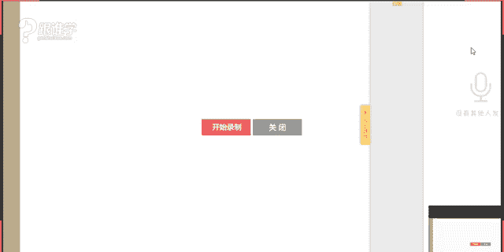
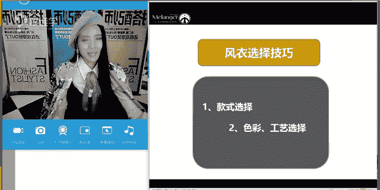
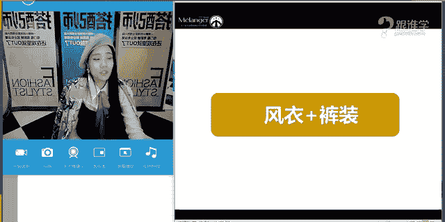
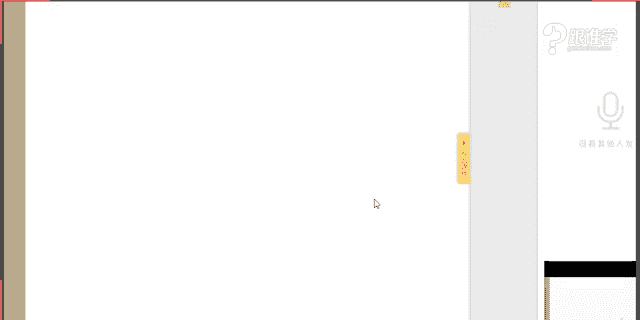

# 1、11服装《搭配秘笈之新版36计》：28双排扣风衣

🎼来当爱放下放背后的这些那些。🎼即实台下的观众就我一个。🎼其实我也看出你有点不舍。🎼场景也习惯我们来回拉扯。🎼还计较着什。🎼即使说分不开的也不见得。🎼其实感情最怕的就是拖着。🎼越演到终场戏，越哭不出来。

🎼是否还知？🎼あ。🎼该配合你演出的。🎼握请你在表演。🎼像情感节目里的嘉宾缘。🎼挑选。🎼如果还能看出我。🎼爱你的那免。🎼请剪掉那些信结，让我看上躯体。🎼曾静的。🎼我敢。🎼演出世界。🎼一的样。🎼的表演。

🎼是因为爱你我才选择表演。🎼这种成全。🎼，🎼甜淡点。🎼说话的方式简单。😔，🎼递经的情绪请省略，你又不是个演员，别涉及那些情节。🎼每一天。🎼我只想看看你怎么。😔，🎼你难过的太表。😔，🎼像你天赋的眼。

🎼观众一眼能看见。🎼当初的。🎼视而不见。🎼在给。🎼最爱你的人即兴表演。🎼什么时候我们开始收集了底线，顺应时代的改变，看那些拙劣的表。🎼可你曾经那。🎼我看嘛演出细节。🎼我该变成什么样子才能眼缓厌倦？

🎼原来当爱放下放背后的这些那些。🎼才是考验。🎼每一天。🎼你想怎样，我都碎了。😔，🎼你演技也有限。🎼不用说感言分开就定淡谢。🎼可配合你演出的我已视而不见。🎼别逼。🎼的最爱。🎼即行表演。

什么时候我们开始没有了底线。😊，🎼顺着别人的谎言被动就不显得可怜。🎼曾经那么。🎼我干马演出细节。🎼我该变成什么样子才能。🎼何处演原来当爱放下防背后的这些那些。🎼与期限。🎼即实台下的观众就我一个。

🎼其实我也看出你有点不舍。🎼场景也习惯我们来回拉扯。🎼还计较着什。🎼即使说分不开的也不简单。🎼其实感情最怕的就是拖着。🎼越演到终场戏，越哭不出来。🎼是否还知？🎼あ。🎼该配合你演出的。🎼我请你在表演。

🎼像情感节目里的嘉宾任人挑选。🎼如果还能看出我有爱你的那面。🎼请剪掉那些情节，让我看上具体。😊，🎼曾经的。🎼我更。🎼演出世节。🎼你的样子是我最好。🎼的表演。🎼是因。🎼爱你我才选择表演。🎼这种成全。🎼。

🎼天看甜。😔，🎼说话的方式简单。😔，🎼递经的情绪请省略，你又不是个演员，别涉及那些情节。😔，🎼每一天。我。我。Yeah。🤧嗯。嗯。😊。

Oh。🤧hello，大家晚上好，是不是其实我们在调设备的时候，同学们就可以听得到我们的声音了呢？嗯，因为呃我我不太清楚这个就是我们每次在调这个屏幕的时候，是不是大家就可以听到声音了。好。

如果以后要是是这种情况可以听到是吗？哦，那以后不能说悄悄话了。因为我每次在调设备的时候，呃，我都会跟我们的这个这个呃老师在这个对，是的，在沟通这个屏幕的问题啊等等啊。

老师还没没今天没有这个这个看这自己的造型啊，来好。嗯，今天也好美是吗？好，不要再夸我了，你们每次夸我，我都不知道东南西北了，上课也上不好了是吧？啊，开玩笑啊。O好，嗯。

那今天呢跟大家分享的是关于呃双排扣风衣的这样的一个搭配。那呃在刚才在答疑群里的时候呢，有很多同学说老师你怎么减肥的，这个问题转的有点快是吧？我刚刚想到这个点了啊。呃，那如果同学们。

你们每天要是工作10个小时以上，呃你们就可以减肥了，O那是因为我平时的这个呃工作是我最好的减肥药了，只能这么说，明天早上起床之后呢，呃就会一直忙，然后一直忙到晚上。好，嗯，那这个呢就不多说了啊。

那今天呢给大家分享的是于呃双排扣风衣的这样的一个搭配。那哎刚才其实本身我今天是带了一件风衣。然后是为了要这个配合我今天的。😊，造型，但是我发现我今天的这个外套好像更配我这一套服装。所以呢嗯。

带着不容易掉的啊，所以呢还是穿这件衣服啊。okK好，嗯，呃，那其实我这一套搭配的话，呃，可以这个保留里面所有的搭配，但是我外套可以换成呃这个风衣外套。那。我们的助教老师，如果我们助教老师可以听到的话呢。

麻烦帮我拿一下我们的风衣，找我们的李老师，帮我们把风衣拿过来好吗？等一下我在讲课的过程当中呢，可以跟大家来这个示范一下啊。其实我这套服装穿风衣也是可以的。嗯，OK好呃。

那每次其实上课我都能呃都希望呃这个挑我们上课当中的单品来给大家做一些示范啊。O那因为穿这件外套是因为今天在线呃线上要讲课。呃呃可能。需要气场一点，因为这件服装的这个量感会更大啊。OK好。

那首先呢呃就先不讲到我这个造型了啊。好，那今天跟大家讲到的是关于风衣的这样的一个搭配。那之前其实在呃讲课的过程当中跟大家分享过，我们说其实现代时装有很多都是从呃军装当中演变而来的。

那么其实风衣也是一样的，它也是一件从这种军装演变而来的这样的一个时装OK那我们啊。好，双排扣风衣，军装蜕变时装的单品。我们来看一下。下课时可以分享一下今天的造型吗？可以呀。嗯，OK好，嗯。

那我们继续来看军装蜕变时装的单品有哪些呢？同学们，你们可以先讲一下你们知道的军装蜕变而来的单品。其实在我们之前的过程当中也是不是跟大家分享过呢？嗯，大家这个想想现在有哪些单品是军装蜕变而来的呢？嗯。

🤧是的啊，雨和同学回答飞行员夹克还有没有呢？好，大家都知道飞行员夹克这件单品还有没有？双排扣大衣的确是的嗯，还有没有呢？飞行员夹克军旅大衣。上次跟大家讲到的那件那个军旅大衣是。哪一件呢？棒球夹克。

不是棒球夹克，不是这种军装单品嗯，飞行员夹克是好，那是不是呃上次呃，当然这个棒球夹克也都是从这种很呃军装的夹克当中演也。A一的确是的，嗯，海军大衣也是是的，所以大家会发现。

其实现在有很多的服装都是从军装演变而来，对吗？同学们啊，那例如说其实我们现在穿的大衣啊，那包括现在的风衣，包括飞行员夹克包括皮衣。那所以其实我们呃对于一战到二战时期的这样的一些历史发展。我们要多去了解。

其实我们真正的想要把所有的单品学习哈，那包括想要把风格学习好，我们其实是要熟读西方历史的20世纪的这样的一个历史。为什么呢？因为在呃我们现在所有的服装其实复古都是在赴20世纪的古。

所以说其实在大家需要把这个之前不是跟大家推荐了一本书吗？这本诗是呃这本书是中西呃这个中西服装发展史。啊同学们可以去好好看一下啊，对于。历史的这样的一些了解啊，OK好，那我们来看军装蜕变时装的单品。

那从军装的意义上来讲，其实我们之前给大家讲过这三件对吗？那包括皮衣啊，海军大衣战好风衣以及飞行员夹克。那这三件其实都是属于我们所说的叫现代军装。啊，在上节课当中，我跟大家介绍过，在17到19世纪之间。

大家还记不记得呢？这时期的军装都是有这种奢华的装饰的为主的这样的一些军装。那到19世纪之后，因为我们说这种世界大战的爆发。那人们为了什么呢？这种这个战争时期啊，从这个我们所说的这种面料来讲啊。

或者说从从这种方面程度上来讲啊，那都需要现代的这种简约的军装款。那所以呢就有了我们所说的大家现在看到的海军大衣战好风衣以及飞行员夹克啊，那。他们所有的设计其实一切都是以功能性为主。

包括我们所说的今天的这件今天要讲到的就是战壕风衣这件单品，它其实也是什么呢？以功能性出发的啊，okK好，那海军大一和飞行员侠给我们已经介绍完了，今天呢来讲战壕风衣。嗯，好，那呃我说到的战壕风衣。

那大家知道战壕是什么吗？就是其实他直译过这个我们所说战壕夫也叫呃这个叫壕沟风衣为什么这么说呢？其实在战争时期的时候，对啊，是的，啊，臭美猴猴这个这个这个词非常贴切啊，就是个坑。

的确那这个坑的功能性是干什么呢？就是让这个我们所说的军人们啊，在坑里面为了什么防御，对吗？啊防敌。好，我觉得这个这个答案非常有意思啊，特别简单，但是特别容易理解。OK那这个件这件风衣的设计是为了什么？

其实是因为英国它本身就是一个非常什么呢？语气很多的这样的一个国家。那风呃在一战时期正确的来说，在18呃89年时期，那就说将呃1889年时期，1890年的这个时期左右。那大家现在呃经常听到的一个品牌。

就是burberry啊这个品牌呢呃他当时的这个托马斯burberry呢，其实他就是这个嗯品牌的创始人。那当时他在19呃1889年时期，他就发明了这个我们所说的风衣的嗯面料。叫华达尼面料。

有很我上次记得有有一位同学说，老师风衣是什么？呃，是属是属于什么呃单品？那风衣其实简单来说就是为了防风防雨的这样的一件单品啊，那它不是做它不是大意啊，那我们所说的它这种防风和防雨怎么来的。

其实就是我们所说从这个一战时期开始的啊，那因为当时战争的这样的一些需求啊。那呃这个军人们在这种壕沟里面战争在在在这。迪的时候呢，御敌的时候呢，那因为这种呃沟里面呢又很什么呢？很潮湿泥泞，天气又很恶劣。

所以呢呃没有这种没有一件可以让他们能够有防雨功能的服装，他们经常会被雨淋，从而会经常生病。那所以呢呃在这个一战时期，这个军官就下达了一个命令，说哎一定要设计一款这样的一个这个功能性的服装。

那当时呢巴布berry它就设计了这样的一个面料。这个面料它为什么能够呃防风和防雨，那是因为它本还没有织成布以前它呃还是纱线的时候，我们说面料都是由纤维组成呢，是吗？

都是由这种纱线一根一根编织而成的那它的这种纱线在没有织成布以前就已经做了防水的这样的一些处理。所以当它织成了这种面料之后就形成了这种防水功能啊，防风功能嗯，它的。

这种防水功能就像我们所说的这个露水打到这种荷叶上的时候，会顺着荷叶滑下来。那风衣也是一样的那这种风衣的话，其实雨水打到上面也是会滑落下来。所以他就是有这种我们所说的叫防水的功能。那这种防水功能呢。

在这个我们所用到这个军队当中之后，特别的受到这些士兵呢喜爱。因为他们能够什么呢？有这样的一件服装啊，让他们不再受到雨水的折磨啊，从而生病。O这就是我们所说的burberry风衣。

他的这样的历史的这样的一个发展。嗯。好，那大家现在看到的图片其实都是呃来源于那个年代啊，军人们穿着风衣的这样的一个形象。嗯，那这个是burberry风衣的这样的一个标识。那包括啊。啊。

雅阁诗丹啊雅格诗丹这件单这个品牌，它也是呃风衣的这样的一个非常有名的品牌嗯。好，那我们来看那这是这个这个一战时期的战壕。那么大家可以看到，呃，相对来说环境是非常的艰苦的啊。okK啊。

那我们说刚才其实一开始就跟大家讲到，我们说风D啊海军大衣，那包括飞行员夹克，它其实所有的设计都是以功能性为主。那这种功能性，大家在现代。他依然还是存在的。burberry的这个呃老总啊总监创意总监。

他说过一句话，他说呃为什么b布berry风衣它那么的经典，或者说风衣。为什么那么的经典。那是因为呃这件风衣它是起源于战争时期。它的每一个细节的设计都是有功能性的，都有它能够设计的理由。

所以它是非常的非常经典的啊，也是非常的耐看的这样的一个单品。那。我们现在来解析一下burberry风衣的这样的一些细节。那例如说现在我们经常会看到风衣上会有这样的一个肩章的代扣，对吗？那同学们。

我想问大家有没有人知道为什么要有这样的一个肩章，有没有同学知道呢？同学们如果知道的话呢，可以快快速的在我们屏幕上去打一下啊。防帽子的嗯。🤧うん。好，嗯，5021同学说分别分辨级别。嗯。

钟永生同学说代表申位非常好。其实他们俩都有一个这种呃表达了一个意思。其实他们这种肩章设计有功能。第一个功能就是为了区分军衔。大家知道现在的军装是不是还有这种我们所说的在这个肩章上面来表示你的军，嗯。

这是第一个。这功能其实它是为了固定防毒面具。那包括呢它可以用来夹手套，就是放这种固定手套。那这是它最初的这样的一个功能的设计。OK那第二个大家可以看到的是啊，那我这里有一些细节图可以给大家看到啊。

那我现在大概的先给大家讲到风衣的这样的一个设计点有哪些。那我们现在可以看到的有这种肩章啊，那包括这种枪托垫啊，包括这种什么拿过仑领啊，那包括双排扣，大家现在看到的这种双排扣，那包括这种搭扣腰带啊。

带呃带扣防雨兜啊，那包括防雨腕带啊，它的在我们再来看这是正面，对吗？我们来看一下背面背面有这种颈部扣环啊，后腹这种其实叫防风片，那腰环腰带环。那大家现在看到的这个啊，然后腰带上的第型扣。

其实这个地方有一个低型扣，大家可以看到很小。大家后面有一个细节图给大家看到啊，呃，长度过膝，带扣片的这种呃器型开叉。那其实它所有的设计都是有功能性的。那我们来一一的看。啊，那为什么我们从头从上到下来看。

那这种这种呃我们所这这种立领设计是为了什么呢？呃，当有风的时候，它把领子竖起来的时候，它可以起到很好的这样的一个防风的这样的一个作用啊，防寒防风防雨水的这样的一个作用好，那我们继续来看，那包括肩章。

刚才有跟大家去分析它是为了什么呢？呃，第一区分菌衔。第二，它是为了这种呃固定防毒面罩啊，以及为了放手套。那第三，我们来看一下它这种叫枪托片。这种枪托片是为了什么呢？在下雨的时候啊。

可以把用这种枪托片盖住枪口。为什么呢？用来防潮啊，防潮就是防止这个枪这种枪呃枪支的这种火药的这样的一个受潮。那其实它也是有功能的那我们继续来看那这种背面设计的话，其实它是为了防雨水。啊，防屋雨水。

那包括其实这种背面设计运用到现代来讲的话，它是可以修饰身形的。好，那我们继续来看，那这种叫什么呢？这种叫它呃我们所说的这个手臂呃手肘的这样的一个扣环。那它这种松紧，其实设计也是为了什么呢？防风的作用。

那呃我们说在选风衣其实有一个非常重要的一个标准，就是风衣的这样的一个手呃，这个呃袖口的位置，到我们拇指的根部，其实也就是说到我们的虎口处啊，到虎口处这个位置。O好，那这是袖子的这样的一个细节设计。

那包括它的腰腰上，它有刚才我有提到的这两个扣环，对吗？叫D型扣环。那这两个扣环，它其实当时是为了方便给士兵用来放什么呢？比如说配呃挂一些短剑啊，挂水壶等等啊，其实它的这样一个最初的作用，是这样的啊。

那不过如果大家现在。那大家觉得现在我们这个第字环可以用来干什么呢？🤧同学们，你们觉得现在这个D字环可以用来干什么啊？就ABCD的D，它现在可以用来干什么？嗯，可以用来呃固定腰带，对不对？啊？

那包括是不是有同学想要用来挂钥匙，这个给大家开个玩笑啊，那我看到有一些男士他在有这样的一些习惯性，就是把钥匙挂在腰间，挂在皮带的这个这个这个上这个上面啊，我我建议咱们教室里的男生啊。

就不要做这样的一个举动了啊，这样的一个举动，现在看起来是非常low的。OK好，那这是我们所说的这个低字环的这样的一个作用。那么继续来看啊，那这样的一个开叉背后的这样的一个开叉，他其实是为了什么呢？

方便骑马啊，就比如说这这个他们在战争的时候经常会骑马啊，方便骑马。那现在其实就是为了这种我们所说的透气性为主。那包括最后我们来看那风衣呢一般他会有10颗扣子。那大家可以看到24680。

一般这呃经典的风衣他是有1颗扣的。并且呢经典的经呃经典的风衣，它一般都是这种什么呢？呃，这种相对来说它一开始它是做的这种过膝长度。但是现在呢我们因为现代人的这样的一些审美以及需求。

所以它的长度从短啊从这种我们所说的中长款啊，到短款都有去设计。那这就是我们所说的风衣的一些细节的设计，其实它都是有功能性的。但是我们以往是不是在使用的时候，好像不知道它为什么哎风衣为什么要有这些设计呢？

好像我们不是特别的清晰，对吗？那以后大家在穿风衣的时候，呃，你们就可以想象一下，哎，原来这件风衣在战争时期，它的每一个细节好像都是有功能性的。好像我觉得你在穿这件单品的时候会有一些想象力哈。好。

那这是我们所说的风衣的这样的一个设计的啊这样的一个设计细节点。那包括它的这样的一个历史的发源。那现在大家看到。

这个呃这件风衣呢就是呃吴亦凡在burberry秀场的时候呢去这个穿着的那当然这场秀也是吴亦凡的第一场秀，他是呃burberry风衣的。现在的呃这个burberry品牌的代言人。啊以呢他在这个秀场当中啊。

穿了这样的一件服装啊，当时呢也是非常的惊艳的啊，可以这么说OK好。大家去呃购买风衣的话呢，我建议大家其实可以买一件这种经典款的风衣。那它呃价钱的话，我觉得买这种呃两三千0块钱的就可以了。呃。

因为这种经典款式的，它是非常非常耐穿的，你穿很多年他都不会过时。嗯，那刚才我们说到这个经典风衣呃，这个风衣呢，它的这样的一个来源。那在呃我们说在一战时期它就已经啊一战二战时期，它一直在这种军人呃。

在军队当中被军人所使用。那在1940年之后，是不是就没有人在穿这件单品了吗？当然不是，那其实在1920年到1930年之间啊呃在1940年之间，在30年代的时候，这件风衣当时其实是风靡。

我们所说的这个欧美，为什么呢？呃，因为当时在这个很多的电影形象当中就会有很多男明星啊啊男艺人呃女艺人都。有去穿着这件风衣啊，不管是真正的扮演军人形象的这个呃男男衣男主角。

还是我们所说的这种扮演呃芭蕾舞者的这样的女主角。他们都有去穿着这件风衣，包括在这个这部电影叫魂断蓝桥啊，那这部电影那这部呢叫tiffany的早餐，那这两个当中呢其实都有非常经典的一些这种风衣的形象。嗯。

在这个tiffany的早餐当中呢，呃赫本就有去穿着这样的一件风衣，包括他的这样的一个丝巾的造型也是非常非常经典的啊。那说到赫本呢给大家来展示一张照片啊。

那这张照片呢如果关注我们呃米兰欧的一些同学呢可能有看过。那这一张照片我觉得哎以前我们用的时候跟现在用的时候意义好像不太一样。那以前我们会认为唉我头金有人觉得它是这种非常优雅的感觉，对吗？那是不是我们。

中国裹好像是这种形象，对吗？巩俐啊啊，他的这种为什么他们的裹头巾同样是裹头巾，为什么呈现的这种效果是不一样的呢？啊，那我们来分析一下，例如说巩俐呃，有人说是因为巩这个赫本长得好看啊，巩俐长得不好看。

是吗？当然不是巩俐的话，其实她也是站在欧美，不管是我们中国人的审美还是西方人的审美。嗯，巩俐其实都是大家共同认为非常有气质的啊这样的一位女明星。啊站在我们的这样的一个中国人的角度来看巩俐。

我们觉得她非常的有气场啊，非常的有韵味儿。那正因为她这种味道，所以能够代表我们中国啊，那西方人其实在呃西方人眼中，中国的女明星知名的女明星没有几个人的除了一开一开始其实范冰冰呃，走到戛纳的红毯当。

当中的时候。那个时候大家只知道巩俐哈，那但是只是因为这个我们说范冰冰啊，她这个因为接连征战戛纳红毯，所以有了一些名气啊。那其实巩俐是一开始走出国人啊，这个走到这个西方人世界当中的女艺人。

那其实她也非常漂亮。但是为什么她这样的一个形象，我们不觉得她非常的优雅的，那是因为她扮演的本身就是我们呃西北的这样的一些呃这个嗯这种怎么说呢？这个中年妇女的这样的一个形象啊，在那样的一个年代，在80。

啊，那它的这样的一个配关系也让我们觉得不是特别优雅。那呃所以说呃这种裹头巾如何能够把它搭配的好看？那其实如果大家想要把裹头巾搭配的好看。那么风衣一定是独二的这个单品选择。

那刚才其实包括我们呃有一位同学在打衣裙当中发了一件大衣呃，配这个白色衬呃，蓝色大衣，白色衬衫，黑色的高腰裤，卡其色的这种呃高跟鞋，对吗？是丝语吗？啊，那我建议嗯搭一条丝巾，为什么呢？

可以增添它的这样的优雅的程度，所以这种裹头巾加风衣的这样的一个搭配，它是非常非常经典的那我也建议如果我们同学我们女同学当中啊，有这种有一有风衣单品的那么我建议可以搭配一件丝巾搭配一条丝巾。

但是你的丝巾的搭法不一定是。这样裹起来戴啊，因为有很多人好像这样裹起来戴不太好意思。但是如果为什么裹这个我们说这个赫本它可以这样戴呢？因有跟那个城市的这样的一个呃气候也有关系，风很大嘛？啊。

这种头巾的话，它裹上去既优雅。然后你会发现戴上墨镜之后啊非常的这种有味道啊。O好，那这是我们所说的裹头巾啊，加丝巾真呃加风衣是一个真的非常好的拍档啊。好，那我们说在搭配过程当中穿风衣的时候。

他需要注意哪些问题呢？啊，那禁忌一，我们可以看到的是啊包的太严实，你就真的成了战壕啊，那大家可以看到你们觉得第一个和第二个哪一个看起来呃让我们觉得真的像战壕呢？

一和二就感觉真的是要去从军了一和二哪一个像嗯。是的，第二个是吗？嗯嗯。好，那我看到哎呃好像妮克很少看到你在线上听课是吗？那包括阿瑞啊、思雨啊、钟永雄同学呀，包括娟子啊、雨荷呀，都经常看到啊。

那好像呃这个尼克好像啊你是你之前是什么名字，改名字了是吧？好的嗯，OK啊，嗯那我们说第二个看起来啊真的像这好的感觉。那所以说其实现在我们在穿着风衣的时候啊，不用包的这么严实。

但是或者是如果你包的这么严实的时候，要有你我们所说的美感，就是要有时尚度要有美感。那有的人他可能穿成这样的时候，我们觉得是好看的但是你会发现哎这一套当中，我们觉得好像美感不够的原因是什么呢？第一。

他的这种呃发型啊，跟他的这种帽子的配搭，那包括他的这个风衣的这个腰带系的啊，那我感觉这这位这个呃街拍的模特啊。看起来腰好像有点粗啊，那如果腰很粗的人，其实我就不建议。把腰带系的这么紧啊，那呃另外的话呢。

其实我们一定要这个找到自己腰最细的位置去系，要不然的话反而会呈现反向效果。本身如果你的腰很粗，你再系一条腰带，那就显得腰会更粗。那我建议其实如果腰粗的人，他可以敞开来穿这件风衣。那包括他的下装上来讲。

他的裤子跟它的短靴的这个位置，看起来也是非常的不清爽的感觉。嗯，你会发现他的裤子的裤脚堆积在这个位置，显得很膨胀啊。嗯，那可以换成这种相对来说简约的紧身的裤装，配上这种马丁靴会更好看。

就不要有太多的这种堆积的这种多余的面料在外面O好嗯，好的，那我知道了。你看啊OK好。嗯，那我们继续来看，这是竞忌一嗯，一可以借鉴，太有感觉了，是吗？是的嗯，嗯，的确那第一个是非常漂亮的。嗯，好的，嗯。

那么继续来看啊，那第二套第一套为什么我们觉得很好看的同学们啊，第一套我再来解答一下第一套它的搭配的比例非常的好看。你会发现它里面是短的那这这种搭配手法我也经常会强调这种搭配手法它是非常个性的嗯，衬衫。

然后呢你穿衬衫的时候，还不能把这个领子扣的太严，太严的话就没有这种自由的这种洒脱感了啊，然后呢把袖子卷起来，然后这种潇洒感会演绎的非常好。那包括这种短裤啊，然后配搭这种里短外长的这种搭配效果。

它的这种视觉丰富层层次是非常高的啊，那这就是我们所说的比例的问题啊。O好，那我们继续来看竞忌二是什么呢？就是。裙长比风衣长，你会发现第一套和第二套，它们两人的长度其实基本上是相等的啊。同学们可以看到啊。

这种呃风衣的长度都是基本上在这个膝盖下一点点这样的一个位置。那你会发现为什么霍思燕穿着这一套的时候，感觉会很奇怪？因为它里面的裙装太长了啊，那其实我们说这种长度是比较尴尬的这样的一个位置。

那它可以搭配的裙装到哪个位置呢？例如说就到它的这个呃风衣的这样的一个长度，或者是在下面一点点也可以，但是太长的时候，你会显得太邋遢了，而且这个比例看起来会很奇怪啊，腰这里一截，然后这个地方有一截。

然后这个地方有一截看起来比例会很奇怪。这种配色关系我认为也不是特别漂亮。嗯，白色配这种红色这种感觉配色效果感觉有点飘，其实红色我认为配黑色会更加漂亮啊，O当然最终我们说搭配的话，其实它有很多的方案。

嗯你这种大面积的配搭的时候其实没有那么漂亮，可以小面积去呈现也是可以的啊。当然最终还是要看你的搭配的效果是如何的。那我认为这套的白色和红色的搭配效果不是特别理想好。那么继续来看啊。

裙子的长度大家记道记住。就如果你穿风衣的时候，你可以短，就是里面可以短一些到大腿中间的这样的一个位置，也可以到膝盖位置也可以，就是跟你的风衣长度基本相等也可以。那再长一点点也是可以的。

比如说今年是不是特别流行呃，就是这种呃外套的下面多一点点飘逸感的面料。但是这种长度会很奇怪。OK好，那就是我们所说的呃竞忌一和禁忌2啊。好，那我来看一下呃，如何去选择风衣。

那包括风衣的这样的一个搭配秘籍，也是大家比较单呃比较关注的这样的一个问题啊啊，那在呃讲这个问题之前，我想问大家，你们在选择风衣的时候，有什么样的困惑呢？或者在搭配风衣的时候，有什么样的困惑呢？好。

同学们可以这个你们可以这个呃在屏幕上来打一下。有没有什么样的困惑呢？在搭配风衣的时候。还是大家觉得风衣其实挺好搭配的，是一个比较嗯常见的这样的一个款式。嗯，okK。

show love说不知道鞋子不知道该怎么搭配是吗？那还有没有呢？嗯。好，其他同学是不是去谈恋爱了？你们这这这你们是在谈恋爱吗？这这打字的速度有点太慢了啊。好。呃，词语说配饰比较难选择是吗？

风衣里面可以搭配连衣裙吗？当然可以，艾瑞同学嗯。等一下呢会在后面跟大家来分享帽子是吗？嗯。好的啊，那O大家说到的就是呃配饰的问题啊，鞋子其实也是配饰的问。好的，帽子也是配饰的问题，首饰也是配饰的问题。

好的，那等一下呢呃来我会针对于怎么去选择风衣以及风衣的搭配的这样的一些单品跟大家来讲到。那配饰的问题呢，我会在后面来跟大家讲好吗？嗯，OK好。那我知道大家的这样的一些困惑了。

那下次在呃针对于我们这个课件的时候呢，给大家再增加一些呃关于配饰的这样的一个问题。好吧。嗯，好，那我们首先来看如何选择风衣的这样的一个问题啊，那风衣的话，其实款式上呃，因为我们说最经典的款式。

其实莫过于这种呃这种经典款。但是现在因为我们说时尚的这样的一个呃潮流趋势。那包括每一年它流行的这样的一些趋势不同。那你会发现它的设计点会有很多的不同。比如说今年其实特别流行这种叫PVC材质的面料。

那包括其实在巴布berry风衣呃呃巴布berry秀场当中，我之前看过一次，呃，他们有一套风衣呢，做的是这种就是塑料材质的。其实说简单这种PVC就是塑料材质的这样的一件风衣的款式。

其实今年秀场当中也非常流行这种塑胶材质啊，那你会发现其实每年流行趋势不同，它设计点不一样，所以现在就有我们很多的风衣的选择的款式。那很多人可能就不知道该怎如何去选择风衣了啊。那我们接下来看嗯。好呃。

长度上也会不一样啊。那刚呃雨和说的意思是长度，不知道该如何去选择吗？嗯，好的，那其实我们说风衣的款式呢，它也是分几个不同的长度啊。那第一个长度呢就是我们所说的这种短款啊，短款就是臀。短款。

那包括这一件也是短款。对。那就是什么呢？中长款，那大家现在看到的这一件其实就是属于中长款，它到这个大腿的中间的这样的一个位置啊，基本上在大腿中间，包括这一件这一件也是。那这两件呢？

她相对来说都是比较长款的，她应该是在大腿以下的这样的一个呃款式啊，那她看起来就是比较什么呢？偏长款的那这种款式呢呃我们说长度呃关系跟我们的身高有一定的关系。啊个子比较娇小的女生。

那我建议穿这种什么呢相对来说比较短款的那今天有同学又问到说老师不好意思啊，同学们说老师我的身高不是特别高。哎，那是咱们哪位同学发了一个阔腿裤呃，云妹妹同学好像是啊，不知道云妹妹云妹妹同学有没有在呢？啊。

云妹妹同学画发了一条呃特别呃这个特别呃宽呃大廓型的伞裙啊，伞裙。那。她的这个伞裙，她说她的身高是一米五几，这个伞裙是不是太大了呢？的确其实那个长度对于云妹妹同学来说呃。

那个长度其实是有这个长度上的还属还好说，就是这个廓型的呃夸张程度有点太夸张了啊，那所以说我还是建议啊裙子是吗？那我还是建议如果个子较小的一些女生呢，还是选择这种短款以及这种中长款的为好。

那如果你要是穿这种长款的啊，再来讲，如果这种个子较小的，你们买长款的衣服，那我建议你就直接当裙子穿就好了，知道吗？就不要再搭配一些这种呃裤装啊呃阔腿裤啊，相对来说比较这种呃，你当裙子穿。

可能就就是这种因为它是有腰线的，她把你的比例调整的也会非常的好嗯。OK好，那当然最佳的我认为最佳的这样的一个长度，我还是推荐大家选择短款以及中长中长款，它会让你看起来会会更加的有精神。OK好。

那我们继续来看这么多款式那么我们如何去选择呢？其实它都是有它的实用性啊，以及我们所说的这样的一个基准的啊。那好，我们继续来看嗯嗯。那在选择款式上的款式上来讲呢，我们刚才说到长度的问题。

那其实长度它跟你的身高有关系。那你的这样的一个长度的选择，它其实还决定了你的成熟的程度。例如说这种短款的话，本身呃我们说个子娇小的女生，其实反推来讲，是不是个子娇小的女生选择短款会更好？

那是不是这样的一个道理也是一样的。短款呢会更加的显年轻，是不是这样的呢？那长款呢会更加显成熟。那我们来看一下这两张图片，哪个显得成熟，哪个显得年轻。同学们，嗯。😊，一和二当中，你们认为哪个显得这种成熟。

哪个显得年轻呢？啊？是的，第一个显得略成熟，第二个显得年轻，为什么呢？因为这个我们所说的服装的裙长也是一样的道理。衣服的长度也是一样的道理，越长，它会越成熟，越短，它会越年轻。所以线条上扬的呃这种单品。

就是往上走的单品，你会发现它的年轻程度是不一样的啊。O好，那所以呃那包括这种呃越是大廓型的服装，它给我们的感觉它会越什么呢？潇洒以及大气的感觉。那呃短小的这种服装，它给我们感觉是年轻感啊。

精干的这样的一个感觉。O好，那这是我们所说的款式上的选择。所以说呢如果同学们你们想要显得年轻的啊，那你可以选择这种短款。那如果想要成熟大气一些的那你们可以选择这种长款。嗯，O。好，我们来看嗯。

那在这两款当中是不是很明显呢？那赵薇跟梅梅teller他们两个人穿的也是一呃，也是属于一个叫中长款啊，一个是长款的，一个是中长款的那相对来说是不是第二张会更加的显年轻呃显年轻呢？

那第一张是不是更加的显成熟呢？嗯，我们来看一下是不是呢？同学们赞同吗？如果赞同的话呢，请打一啊，好嗯。嗯，好的，那我们接下来看嗯ok。😊，第一件比较显得成熟。嗯，我们看第二个啊。

第二呃这个在选择款式的第二个秘籍啊，我们来看一下技巧2，色彩工艺的选择决定了实用性啊，那我们来看一下一组图片，呃，从左到右，我们来看一下呃。

第一个是这种色彩呃简约简约设计的然后呢包括它是低彩度的那我们说这种卡其色它其实是橙色相当中的啊，橙色相当中的但是它的这种彩度相对来说是不是极其的低呢？也就它的橙色的感觉没有那么明显。

你就发现老师身上的这个呃这个丝巾相对来说是不是就很鲜艳啊，饱和度就是不是很高啊，那所以说呢这种就叫高饱和度的那包括这件绿色的风衣，它也是属于高饱和度的，能看出来吗？就是高彩色的啊。

高艳色的其实都是一个样子啊，一个意思。那包括我们生活当中还会说。

这种叫什么呢？啊，亮色的对吗？啊，okK好，那包括这种复杂设计的啊复杂设计的。好，那我们来看一下，在这三款当中，同学们，你们觉得哪一款看上去它是比较百搭的呃，比较实用性的。

哪一款看上去相对来说没有那么实用的。一。123。123，那大家都赞同第一款是相对来说是比较实用的吗嗯。好的，我看到大家的答案了啊。雨和思雨，包括收lo，包括娃娃同学啊。那呃是的啊。

这一系列看起来呢都是什么呢？都是比较简约的感觉。那相对来说它也是比较实用的感觉。好，那我们来看一下第二个和第三个嗯，好，有同学说啊第二个我觉得最不实用。嗯，那还有没有呢？嗯，米娜同学好像很少也看到你哦。

那你是不是也是很少呃这个在咱们这个直播当中听课呢？OK好，那我看到答案了啊。那第二个以及第三个大家都觉得不是很实用是吗？为什么呢？第二个是不是因为它的色彩是不是相对来说比较饱和？

那第三个看起来是不是复杂是非常的这个设计是非常复杂的。所以嗯怪不得呢啊，所以我看你的名字是有点陌生的啊。O好，那我们继续来看。那欢迎你呃也希望你以后可以跟我们的这个在我们的直播间啊。

直播的课程当中更多的出现啊，那也可以跟我们其他的同学呃多做一些互动。嗯，OK好嗯。那我们继续来看啊，那第一呃从左至右，我们会觉得第一个是比较容易搭配的啊。啊难的，为什么呢？

这一件衣服它即使它的色彩是很鲜艳。我们觉得它还是可以搭配的，对不对啊？比如说它搭配这种黑色的裤子啊啊，它还是比较好搭配的。但是你会发现这件衣服它的搭配的程度相对来说是比较难的。它的设计是比较特别的啊。

特别是它这种薄纱感的这种感觉。OK好，那这是我们所说的这种在风衣的选择的搭配实用性的强与弱来讲，那这种卡其色的款式相对来说它是比较容易的啊，也是最佳经典的这样一个款式，那我们继续来看啊。

那从左至右都是红色项的对吗？啊，那我想问大家，你们觉得这123从左只右123，哪一件相对来说更加的实用性呢。都是红色项。嗯，ok。嗯。嗯。好，那我看到大家答案了啊，都觉得第一个看起来比较实用是吗？

那是为什么呢？第一个是不是都是属于这种像我们所说的，刚才说到的叫低彩度，对吗？它虽然是红色，但是在这三件红色当中，它是属于叫低彩色的那它就是属于我们平时经常会使用的暗红色啊，这种呃叫呃博艮蒂酒红。

那其实都是说这种酒红色啊，就这种暗红色。那所以相对来说它的这种低彩度呃，相对来说它是比较容易搭配的啊，容易搭配的O那这两件啊，这两件是不是相对来说就比较难搭配呢？那其实它们并不是说难搭配。

而是因为我们大众很多时候在配色的时候它配不好，就是呃比如说这种特别鲜红的这种色彩，那很多大部分人可能都会配黑色，对吗？那黑色也是最保险的。当然啊这是最容易搭配。这样的一个色彩。

那其实也有人能够把这个红色搭配出不同的感觉。比如说可能我搭配红色啊，搭配这件粉红色的大衣，我可能会选择这种啊像这种蓝色的牛仔裤，那包括我可能会用一个这种黄色的小面积的包包来点缀。

那我们所说的它身上就出现了三原色红黄蓝。啊，那呃小面积出现的话，其实它给我们的感觉不会特别的夸张。那包括这种搭配色彩的感觉，它会更加的有这种活力感啊，有活力感。

就是它更加的这种这种感觉就有点叫波普的感觉。那包括这个包包上面还可以有一些趣味性的设计。那它的整体感觉又是撞色的这种感觉。那就是我们所说的呃波普它是属于60年代这样的一个风着装风格啊。

它给我们感觉呢它是比较有这种呃撞色的这样的一个感觉。那同时它会运用一些趣味性的一些图案啊等等一些问这些呃元素。O好，那这是我们所说的在呃大众这个来搭配上来讲，我们会认为这种低彩度的，更加实用。

但是其实呃如果搭配功力好的话，其他的也是可以使用的。OK那从这张图片上来讲，那其实这同一件风衣，同一个色彩啊，我们说同一色相的色彩，它的材。上也会有所不一样，对吗？同学们啊。

第一个是麂皮的那第二个是这种普通的这种面料啊，那第三个是这种皮革感的那所以你会发现这种不同的面料，其实对于每个人它的这种选择也会不一样。为什么呢？那这种麂皮的以及这种普通的面料。

它是不带这种我们所说的光泽感的那它其实没有那么容易显胖。那这种光泽感的面料，它其实再加上呢这个我们说服装廓形是比较挺括的它其实是比较容易显胖的。所以这种服装不是特别适合给一些丰满的人去穿。

太胖的人不适合这种皮革的服装，能理解吗？太胖的人，这种比较贴身的这种面料反而会更好。OK好，那这是我们所说的从它的色彩还是来讲啊，这种低饱和度的大众会更加容易接受，也更加容易搭配。那从材质上来讲。

那这种。皮皮以及这种我们所说的这种呃普通的材质啊，它也相对来说是比较好搭配的那皮革啊它相对来说是比较难搭配的啊。okK好，那么继续来看，那在这三件服装当中，123这三件服装当中，我想问大家。

你们觉得哪一件是比较实用性的？嗯。哈哈。😊，嗯。🤧嗯，好。看到大家的答案了啊，这个答案好像这次有点冲突。啊，有同学回答第三个，啊有同学回答第二个OK好，那这三件我们来看一下啊。

那大首先大家都排除了第一件，对吗？呃，因为第一件它是这种什么玫特别鲜艳的玫红色，我们都觉得不实用。嗯，都觉得不实用。OK好，那我们来看第二件和第三件那从这三件上来讲，大家好像觉得第二件更加实用是吗？

也有同学说第三件。为什么呢？第二件的话，因为它是纯色的设计，它的这种呃色彩虽然鲜艳，但是它没有做这样的拼接是有效果。那第三件的话呢，其实它的色彩因为又用了白色跟蓝色去拼接。

所以好像大家觉得这种白色和蓝色大家都是浓容易接受的这种色彩，同时它的这种蓝色也不是特别鲜艳。好像我们觉得它更加百搭，其实呃我要告诉大家的是，这三件都不是特别的百搭，就是它的实用性都不是特别的强。

那么呃所以同学们又掉进沟里去了啊。那如果要是硬在这三件当中去挑选的话，那可能同学们会觉得第二件和第三件相对来说比较实用，对吗？嗯，是的，比较好搭配的功力，O三风铃同学你好啊，也很久没有看到风铃啊，好。

那么们来看那这三件其实我们来一一的来分析。第一件因为太过于鲜艳，这种玫红色其实不实用。第二件饱和度。也是比较高的那第三件拼色的设计其实也是比较难搭配的啊。那所以这三件上来讲呃，如果他们跟卡其色比呃。

跟黑色比跟深海军蓝比。其实他们都不是那么的容易搭配啊，那只是因为我没有放图片，大家就掉到坑里去了啊。好，那如果这三件来比的话，那我们会觉得第二件和第三件相对来说比较容易，对吗？嗯，ok好。

那我们继续来看啊，那所以风衣的选择的技巧。第一跟款式上有关系。那我给大家来总结一下。那我们说风衣的这种从长度上来讲啊，她其实有这种我们所说的短款中长款以及长款。那么短款呢更加适合给个子偏娇小一些的女性。

那中长款以及长款呢更加适合高挑一些的女性。那从另外一个角度上来讲，如果你想要显得年轻，你可以选择短款。如果你想要选显得成熟，你可以选择长款。那根据你自己想要达到的搭配的效果。

例如说这个女生她说她个子不是特别高。但是她说我就想要大气潇洒的感觉，那么你可以选择长款啊，这这是我给大家的这样的一个建议啊，那这是我们所说的从长度上来讲，那从呃这个色彩的工艺上啊。

色彩的色彩和工艺上来讲。那其实我们说色彩它有什么呢？分有彩色叫无彩色。那我们说无彩色肯定是相对来说是更加百搭的对吗？或者是叫低彩色油彩五彩色当中，它会包含什么呢？黑色啊，然后包括这种呃灰色的对吗？

那包括低彩度当中的卡其色以及深海军蓝啊，墨绿呃这种暗红色，那这种都叫低彩度的色彩啊，这种颜色的风衣。那包括这种无彩色的，它都是更加容易比较有实用性的，比较百搭的。从工艺上来讲呢。

我们建议大家选择这种经典的款式的风衣，不要选择太多有设计细节的O刚才我们的老师呢帮我把风衣拿过来了啊。我可以给大家来看一下，那其实这一件就是我们所说的比较经典的这件burberry呃这种款式的风衣啊。

那这种风衣呢它就是比较呃这种色彩以及这种款式相对来说也都是比较实用性的啊。OK好。哦，大家好像觉得挡住了是吧？来呃，我我先给大家来看一下我今天穿的这一套服装吧啊。好嗯。😊。

那我今天穿的这一套呢呃它是比较大廓形的这件大衣啊。那刚才我说这个其实我我我最终想要给大家这个今天晚上本来想展示的是这个。来，我们来看一下啊，其实风衣它也可以搭配我今天的这一套服装啊，只是呢。嗯。对。好。

我们来看一下啊。来，同学们啊，那是不是也可以呢？但是这件衣服色彩上其实是更加的白呃，就更加能呼应我今天的这套服装。比如说蓝色可以跟我们los呼应，然后玫红色可以跟这个领金去呼应啊，所以我是。可以嗯好。

那这件服装呢就是比较经典款的风衣了啊。那我建议呢大家去买一件这种经典款式的风衣。这种风衣的话，你穿十年穿20年都不过时啊。OK好。🤧嗯，我就放到一边啊嗯。🤧嗯好。🤧和这个地面有点这种摩擦啊。

不知道会不会太吵。同学们啊。okK好，嗯，下次让他们换一张凳子。好，那我们继续来看嗯，双排扣不是显胖吗？嗯，是的，于妹妹如果要是一个人她特别胖的话呢，双排扣其实是相对来说不好意思啊。

同学们双排扣呢它是比较容易显胖的。但是呢嗯。我是建议，如果你这个人特别胖的时候，你就不要选择选双排扣了。呃，一般的这种身材我觉得还是可以买一件这种双排扣的那包括其实风衣它也有单。

今天讲到的是双排扣okK好，那还有一些风衣呢，它的纽扣不是特别明显的。为什么我们会说双排扣它会显胖？那是因为双排扣的。扣子的色彩它如果很明显，例如说我我的这个我的这件风衣啊，它的纽扣如果做成。黑色的啊。

我们来给大家看一下，如果它的纽扣做成这种纯黑色的，那么那是不是有的纽扣它就是这种上面这种裸色的，它跟这个风衣的颜色一模一样。如果它做成黑色的时候呢，它就会你会发现两颗纽扣之间，它就。

关系我们经常会说叫两点形成一线嘛啊，那同学们来看一下，如果它做成黑色，它就会形成叫两点形成一线的这样的一个关系，所以才会显胖。这就是原因啊。那如果它是驼色的。

或者它的纽扣的颜色跟它的风衣的颜色一模一样的话，那就不存在特别显胖的这样的一个问题了啊。O是的，横向拉伸感。是的，宇和同学啊，非常好。好，那我们继续来看啊。那刚才呢给大家总结了风衣的这样的一个选择技巧。

从款式的长短上来讲，从色彩以及工艺上来讲啊。O好，那我们来看风衣的这样的一个搭配啊，那风衣的搭配呢，首先我们有两跟大家今天分享两个维度，一个是从风格上来讲这样的一个维度啊。

那另外的话是从单品的角度上来讲，那首先我们来看一下风格搭配的这样的一个原则。那么来看一下呃我们说风衣因为它本身就是属于军旅的单品啊，那所以它搭军装风是没有问题的那大家现在看到的就是军旅风啊。

这样这样的一个风格。那军旅风呢它经常会运运用到的一些单品，就是我们所说的这种叫双排扣的风衣呀，那包括呃这种军绿色的色彩呀，啊，包括这种比较宽的腰带呀，那包括这种呃短靴呀啊，包括这种徽章啊等等。

那这都是军装当中会运用的。

的一个元素啊，那我们来看一下刚才这以上是不是我刚才跟大家讲到的，比如说这种双排扣风衣，而且是军绿色的，包括这种什么呢？虽然是露脚趾的，但是看起来依然有靴子的这种感觉的呃这种及踝靴啊，漏脚趾的及踝靴。

那其实。这种短靴它给人感觉是有一种帅气感的。你会发现它有点像这种军靴的这种感觉。那包括这一套刘雯穿的这一套，它就是彻彻底底的这种非常军旅的感觉。那这一套服装风格呢。

它其实是这种军旅跟这种女人味的一些混搭啊，因为它还有涂了一些涂涂了一抹红唇，你会觉得哎他虽然穿的是军旅风，但是它还是有这种小小性感的感觉在为什么呢？它这种比较短的裙装啊，露脚趾的这种呃短靴。

那你会发现呃这个刘雯它的这一套就是从头到脚包裹的非常严实啊，非非常严实。然后从头到脚都是军绿色，然后底下搭配的这种卷短靴呃，短靴，所以他给我们感觉会更加帅气啊。那这个时候如果他在带一顶军帽。

我都觉得它可以上战场了。ok好，那这是我们所说的军旅风它其实实用搭配效果当中，我们是经常会做一些混搭，那同时也会从头到脚的。做这样的一个调和的搭配。好，我们继续来看。那在男士的秀场当中。

你会发现呃在军旅风，你会呃这个男士搭配的话，它一般会有这种不同的这样的一些呃搭配维度。那例如说它跟一些比较正装的单品去搭配。那大家可以看到这种西裤啊，以及这种皮鞋。

那包括它还会搭配这种这种就是单排扣的风衣，大家看到没有？这种是属于双排扣，这种是属于单排扣风衣啊，这种单排扣风衣配上这种什么呢？卡其色的裤子，再配上这种这种切尔西短靴啊。

它给我们感觉虽然一这因为它是属于这种驼色大自然的色系，它给我们感觉依然是有这种呃这种军旅的这种帅气感啊，但是它同时又多了一些休闲感啊，因为它的这种鞋子的这样的一个感觉O好，这是男士的这样的一个搭配。

那咱们的男同学如果在的话呢，我建议啊可以考虑，当然这一套的话，可能男同学不太能接受的问题，就是丝巾。那你们可以不用搭配丝巾啊。ok好，我们继续来看，那风旅呃军旅风当中呢，他经常会用到的一些元素。

刚才我也有跟大家来讲到，例如说这种军帽啊，然后这种宽的腰带，那这一套其实它是有点性感的，然后跟这种军旅风的混搭嗯。深圳比较热是吗？OK那现在这个季节可以穿啊啊，现在这个季节，广州跟深圳好像没有差多少。

现反正反正广州现在是可以穿的啊。O好，那我们继续来看啊，刚才讲到我们说军旅风当中会用到哪些元松呢？第一军帽军帽，你会发现有军帽，对吗？还有这种这种鞋呃这种军包啊。

你会发现这种包包用到这个当兵中觉得非常的哎有意思的这样的一个搭配，包括这种比较宽的腰带啊以及这种也是比较宽的这种腰带，就是男性化。其实说白了就是男性化啊，那包括这种呃军装的这种外套啊，军旅的短裤。

军绿色的短裤。但这种是时装化过后的军装啊，这种搭配其实都是跟这种呃时装化，有点创意的这样的一个感觉。例如说这一套搭配，它其实就是一个呃性感的风格跟这种正装的军装去搭配。为什么他们？做这样的一个搭配呢？

因为这种搭配，这个很明显是一组画报的搭配啊。当然在生活当中，我们不可能穿成这样和这样。可是这两套我们还是可以借鉴的，非常的帅气。那这一套呢和这一套，我觉得大家其实要学会去欣赏一些呃。

我们所说的大片呢画报啊呃等等一些这种这种图片当中，他们想要表现什么样的感觉？那其实这些是呃我们说经常去看这些图片其实为了提高我们的审美。那从这两套服装当中，为什么他要去这样搭配。

你会发现这种非常我们说军装，它代表了一种正义的象征，但是你会发现他运用这种非常性感的蕾丝啊，以及这种高腰的这种呃像是这种比基尼的这样的一个款式来搭配这种正我们在我们认为它是正义的，代表的军装的时候。

它的视觉的刺销这种叫什么呢？呃，视觉的这种冲击感是非常强的。我们会觉得哇怎么可以这么。性感啊，所以说呢啊经常在一些画这个呃广告啊、杂志啊、画册啊，他们拍摄的时候会运用这种搭配的手法啊。

它其实是非常有创意感的这种搭配。啊这种搭配，其实就是我们所说的大众比较调和的搭配，这种也都是大众可以接受的，也是我们大家可以接受的对吗？同学们啊，我相信咱们教室里90%的人是可以接受这种穿法的啊，O好。

那么继续来看啊，那呃在日常生活当中我们就可以这样去搭配，对吗？比如说这种呃军绿色这种橄榄色跟这种呃这种呃阔腿裤啊，然后它是你会发现它其实是用了小面积的这种配色关系。啊，红色跟绿色本来就是一个对比色。

但是它这种红色，而且它这种红色是非常鲜艳的红色啊，那它运用了蓝色其实呃这种搭配的原理的话呢，也非常有意思啊，红色跟蓝色也是非常有这种冲击力的，但是呢。呃。

他们红这个绿色和红色都是呃绿色跟蓝色都是属于叫低饱和度，所以它不会特别强。因为他们身上所有的颜色，这三一白色2、绿色三蓝色都不是特别什么呢？抢眼的色彩。所以这个红色它就可以配。

因为它是属于小面积点缀它的啊，所以你会发现一个人他身上出现四种颜色也不会过分，对吗？我们以往经常会说啊，一个人身上不能超过三种颜色，但是我们看到这个人身上那到目前为止，虽然没有看到他的鞋子是什么颜色。

但是你会发现它出现了四种颜色，我们也不觉得奇怪，我们也认为它是好看的啊，ok好，那这就是我们所说的军旅风的元素。刚才给大家介绍到，那我再给大家来总结一下，军旅风呢，它一般会运用到这种宽的这种腰带。

包括这种什么呢？带这种金属纽带这种纽扣的军绿色的军装的款式，那包括呢这种衬衫，你包你会发现他这种衬衫还带有这种呢灰标，啊，包括还有一些这种灰。章的设计也是呃军旅元素啊，那包括这种军帽以及这种什么呢？

这种军包啊，你会发现很多带军绿色的颜色，或者说这种橄榄绿，它其实就有。嗯，ok好，那这是我们所说军旅风的元素。那我们继续来看嗯。🤧那这是第一个风格啊。那第二个风格我们来看OL风。

那OFOL风其实简单来说呃，我们大家怎么理解OF风呢？同学们。嗯嗯，大家怎么理解OL风呢？可以，大家来可以来表述一下自己的意见。嗯。嗯。好。😊，大家觉得是办公室风格，职场风通勤风啊，是的啊。

其实就是通勤风OL风啊。那通勤指的其实也就是我们说家里到办公地点的这样的一个来回，它这样的一个路程，对吗？那其实也就是说我们从呃在职场当中是可以出现的一些这样的一些风格。那呃可以叫时尚职场。L尔风的话。

其实风衣的话，它经常可以使用在时尚职场。那我们说职场当中是不是有两个职场，一个是严肃职场，一个是时尚职场。那么一般除了这种我们所说的公务员啊啊然后这种金融啊呃法律呀呃政策呀，那这一系列的人呢。

他们都是属于严肃职场。咱们教室里有没有呢？有没有这种严肃职场的人啊，那除了这一类的话呢，其实都是属于叫时尚职场的啊。呃，其他的这种嗯这种这种职场的话，一般都是我们所说带有时尚职场的这样。

其实时尚职场它并不是说你一定要穿的特别特别fashion啊，当然它是可以加入一些时尚的元素的啊，那例如说我们现在穿着的这种巴贝berry风衣，它其实就是时装化的okK那我们来看如何去搭配OL风啊。

那男士嗯也不用着急啊，我们后面的图片好。我们来看一下，那OL风其实说白了就是职场这种风格的话呢，它可以搭配哪些单品呢？啊，刚才有说到的，比如说这种风衣啊，那这件其实它是特别设计的款式的风衣。

啊这件呢是单排的这样的一个风衣款式。那包括这件的话，它其实是属于这种连衣裙的风衣款式。啊你会发现其实在职场当中，我们可以啊运用这种职场这种相对来说它是有挺阔感的设计简洁的啊，这种款式的风衣啊。

那它可以搭配哪些单品，它其他可以组的单品。比如说这种阔腿裤衬衫马甲毛呢大这种挺阔感的毛呢大衣、小衫连衣裙它都可以出现在我们所说的叫OL风时尚职场当中啊，二瑞同学说比较适合你这种做办公式的风格啊。

做办公室。呃，不知道您从事是哪个行业呢？二瑞同学嗯，好，那其实我们现在教室里的同学呢也可以讲一下，你们都是从事哪个职场的呃，哪个职场的这样的一个行业的啊，哪个行业的。嗯，OK好，那我们继续来看。

那这个是我们所说的叫OL风。那我们继续来看啊，那刚才有给大家讲到呃OL风当中有哪些单品可以出现。衬衫、小衫、连衣裙、马甲、阔腿裤啊，包括这种西裤、半裙啊，大家要记好了啊，这些单品你们都可以使用的。

只是在搭配上的时候，其实是呃以及色彩上不要选择太鲜艳的。嗯，好，那我们继续来看啊，那男士呢我们来看一下它的OL风格有哪些啊，那男士的OL风怎么可以搭配呢？我们来看一下第一套啊，一般你会发现男士的OL风。

它跟风衣去做组合的时候会选择这种比较正装的款式。比如说马甲以及西装啊，然后然后皮鞋包括这种领带啊，大家发现没有？非常重要的一一个元素，就是衬衫领带、衬衫领带、衬衫和领带啊，那包括这种西装的套装穿法。

它都会非常的什么呢？适合OL风。う。好，嗯，不知道咱们女生喜不喜欢这种感觉的啊，就是你们喜不喜欢男生穿成这种感觉的呢？嗯，如果喜欢的话呢，请打一，我们可以看一下我们女生的审美。

能不能是不是能够接受这种的啊。OK好。😊，嗯，喜欢是吗？莹莹同学喜欢其他同学呢？你们比较喜欢哪一个呢？第一个第二个还是第三个搭配，其实第二个搭配没有太大的区，二和三没有太大的搭配呃区别啊。好嗯。

有人喜欢23那。你们是不是凭颜值来判断的哈，是不是有的人喜欢这种大书型的，有的人相对来说没有喜欢呃这个稍微嫩一点的啊。好，更喜欢休闲一点的是吗？5021同学。嗯，OK好，看到了啊，那钟永雄同学比较喜欢。

第二个和第三个。好，那第二个和第三个是的，的确他相对来说比较正式一点。那嗯。然，惠儿同学说第一个太拘谨啊，其实这这三套服装当中啊，如果说到正式度的话，其实第二个和第三个会更加正式哦。嗯，为什么呢？

因为它里面穿的就除了我们所说的呃，如果他要是换上一个外套的话，换上西装外套的话，它就叫什么呢？三件套了啊，三件套套装其实是非常正式的啊，那因为它你会发现它从上到下都是同一色彩啊。

面料也是相同的那包括它马甲跟西裤的这样的一个搭配啊，然后这个衬衫和领带，整一套其实它是相对来说比较正式的。啊呃第一套的话，你会发现其实它是运用了西呃休闲西裤哦，休闲裤可以这么说啊，休闲裤。

而且它穿的是便式鞋，大家看到没有？这种流苏便式式鞋。这种便式鞋，它本身就带有这种我们所说的叫一脚蹬，这种鞋子它本身就带有休闲。的感觉再背上这种休闲裤，其实它有很重的休闲感啊。

二和三其实相对来说是非常的什么呢？成呃这种呃正式是的，正式ok好，也相对来说比较成熟。那如果喜欢成熟的也可以选择这两套。嗯，好，那这是男士的这样的一个搭配啊。好，那我们来看一下时尚的呃。

刚才呢给大家介绍到的。第二点啊，就是这种风格上来讲的话，叫OL风。那么也就是说这种风衣它其实第一可以搭配追美风，第二可以搭配这种呃这个叫什么OL风啊。那第三个呢叫时尚混搭风格。

那混搭风格其实就是我们所说的这种正装的款式跟我们生活当中经常会使用的一些呃常用单品去搭配。那我们来看一下啊，那这张估计呃男士都接受接受不了吧。很透视的这样的一个呃这种内搭啊，非常性感啊，网状的。好。

那这。是出现在秀场当中了。在生活当中的话，那呃如果这个男士你们想表现一下你们自己性性感的啊非常好的身材的时候，也可以这么穿一下啊。我们女士不介意的OK好。

那我们来看一下呃风衣跟这种时装可以搭配哪种感觉呢？啊，第一类是帅气的感觉，风铃说读不懂啊，的确秀场当中其实他们为什么那样那样去搭配，其实为的是一种视觉效果啊，因为是风冲击力嘛啊。

那这种搭配它其实不适用于刚才我们所说的在生活当中去使用。那下面我们来看一下这一类的啊，风衣加帅气类的啊，这种搭配嗯。好，那第一个是叫街头流行。那你会发现，其实他们搭配的都是当下非常流行的一些款式。

那例如说第一套啊，它的风衣搭配了什么呢？现在当下比较流行的这种大廓型的over。衬衫啊，那包括小衫，包括这种阔腿裤啊，那这种搭配，这个是美国名媛奥利维亚啊，那这种搭配的话呢。

其实我们生活当中如果他的个子也是比较娇小的啊。同学们，如果你的个子是比较娇小的那我建议你一定要像奥利维亚的这样的一个搭配的方法一样啊，要把这一边收不进什么呢？裤子里面去，也就是说把你的腰线露出来。

要不然这一套穿起来会非常的显矮，看起来会很压个，就是我们所所说的压。好，那我们继续来看第二套。那第二套呢，其实它运用的就是也是当下比较流行的搭配呃，就是选择的单品，也是当下比较流行的，是这种什么呢？

九分的牛仔裤。本这种短的牛仔裤也是今年比较流行的这样的一个单品啊，那包括它的风衣选择的是这种呃有光泽感的黑色皮革感的。嗯，好，那第三套它的设计。风衣的款式本身就已经非常时尚了啊，就这种竖条纹的风衣。

它其实是属于叫时尚款式的那这种款式的话呢，它相对来说呃。度是略低的。也就是说它现在是比较流行的，但是呢可能过了这两年之后，它就不流行了。可是这个款式比较容易出彩。

你会发现就有的时候你穿一件这种呃醒目的或者是说夸张一点的这种呃服装。那你其他的搭配就可以弱化了，就可以简约一点跟它去搭配。因为这件衣服就足够了。它本来就是一个亮点了，所以就够了啊。那这一类型的呢。

它都是运用一些时尚的元素啊，跟风衣去做的这样的一个搭配，所以它看起来是非常的时髦的，以及和流行感的。嗯，好，那我们继续来看，那这三套当中同学们你们能够接绍哪一套哪一套呢？123是不是大多可以接受第二套。

🤧。123当中，你们比较能够接受哪一套呢？嗯嗯，是的，菲尔包括尼克啊，红同学说更喜欢一，莹莹同学也喜欢一是吗？嗯。哈哈同学说都可以接受啊，这个你也可以接受吗？这么低V呢嗯，okK好。😊。

那如果这么低的话，那我们是不是基本上如果你穿的话，估计就在里边加一个抹胸，对不对？好，那看来大家接受度还挺高的啊。好，第一个同学也有第一张也有很多同学喜欢是吗？呃，第一张的话呢。

它的配色关系其实很很微妙。那来给大家大家解析一下啊，你会发现它一身出现了，从色彩上来讲，其实它是出现了两个颜色。第一个是。浅蓝色啊，第二个是深蓝色，它上下装的关系属于叫什么呢？叫同色相的用色。

一个深一个浅。而这个里面和外面的配搭，它是属于叫什么对比的配色，外面是橙色，里面是蓝色。所以唉你会觉得里面是这个先说里面这一套的色彩搭配啊，上面浅下面深的这种同色系的搭配方法。

其实是大多数人都可以接受的。这种搭配的话，它其实是属于比较传统的啊，比较调和的搭配，就是大众都可以接受的。但是里面跟外面的搭配关系，不管是上装和下装，他们里外之间的色彩关系都是属于叫对比的搭配关系啊。

所以呢其实大多数人会觉得太过于对比的时候，他们是接受不了的。但是所以说这些博主啊，一些时尚。达人呢他们的搭配功力强强在哪里呢？你会发现他们的度把握的会非常好。他当他使用了这一件非常鲜艳的橙色的时候。

他没有选择特别鲜艳的蓝色，他选择的两个蓝色都是一个高饱和度的啊，就是啊sorry两个都是属于叫低彩度的颜色。你会发现这个它也不是特别鲜艳，这个也不是特别鲜艳啊，大众都能够接受的这样的一个鲜艳程度。

再配一个鲜艳的色彩，既有层次感。看上去又很时髦啊，这就是我们所说的搭配它当中要掌握的细节会非常多的啊。第一，你考虑色彩。第二，你要考虑到这个我们所说的服装的比例问题。第三。

你还要考虑到你的人跟服装的结合的问题等等啊，是的，对比色是会更加时尚的啊，它也会更加的出彩。嗯，ok好，那我们来看一下，继续来看啊，嗯，重点还是要考功略。是的嗯，好，那我们来看第二套呃第二个风格休闲风。

那不管是男士和女士，其实都可以用风衣跟这种休闲的单品去组合，例如说牛仔裤啊，但是你会发现它上装里面也都是配了白衬衣。但是它的白衬衣，我们说女士的这个白衬衣它是解开穿的对吗？啊。

然后的这种就是有点这种潇洒感啊。我认为白衬衫搭配风衣非常好看啊。好，那第二套我们来看一下男士里面加了一件鸡心领的毛衫，配上。这种呃领带呃，既有这种呃稍微有点正式感。

但是同时又有这种休闲的这种元素在我认为男士这么大还是非常好看的啊。OK好，这是休闲的这样的一个搭配。那我们继下来看运动啊这种风衣跟这种运动的裤装，以及这种运动感的鞋子去搭配，整体就呈现了运动风啊。

那男士也是一样啊，跟运动的这种单品。比如说牛仔裤呃，牛仔是休闲的啊，它的运动风来自于哪里呢？第一，来自它的鞋子啊，第二，来自于它的帽子。那它的包包也非常休闲。所以你会发现它整套呢。

其实都是这种休闲的运动风的感觉啊，那我们来看一下第二套男士也是一样的。搭配了运动单品卫衣，包括这种带有字母的运动裤。所以呢它整体呈现了就是运动风。所以同学们在做混搭的时候。

你就要考虑的问题是你想表现哪个风格。呃，当围绕这一件单品去搭配的时候，你最多要考虑的是，你要搭配什么风格。那如果你要想要搭配运动风，那你就要多使用运动单品。想要搭配这种时尚风。

你就要多使用时尚的一些配饰。那想要搭配这种所说的正装的感觉，那你就要多运用正装的单品。比如说衬。衫呃，领带、夹克呃，这种马甲、西裤等等。嗯，OK好，我们继续来看啊。

那刚才给大家讲到的是风衣加这种中帅气的感觉。那在帅气当中，你会发现它可以有休闲风啊，然后有这种刚才我们所说的运动风啊，那这样的一系列的这样的一个风格。好，我们继续来看。拍pose不好看啊。

不知道平时什么呢？啊，你在网上刷一下莹莹同学魏老师这里有字，有有字母挡住啊，有这种提示条挡住，所以看不到啊，好，我们继续来看风衣加女人味的一些搭配。那男性的话肯定在女人味的个版版块就没有了啊。好。

嗯拍摆bo呃拍pos好看，但是不知道平时穿着如何是吗？那你平时呢就你就可以试试一下这种搭配的方法嘛？嗯，O好，那第一个我们说女人味的一些单品的话，它基本上其实会使用一些什么呢？裙装去搭配，对不对？啊。

帅气的，我们基本上都会使用裤装去搭配。因为发现呃裙装它会更加能够传递女人味儿。那我们说在女人味当中其实也有不同的感觉。比如说这一套它就就是偏这两套，它其实都是偏这种复古的感觉。那第。

一套它复古的味道会更浓，为什么呢？因为它这种色彩都是呈现这种低饱和度的啊，这种花型它也非常有复古的味道。那第二套也是一样，它的外套以及它的鞋子也是有这种复古的感觉，包括包包。那虽然里面的这种嗯。

这种裙装它带带有这种印花感啊，包括它的袜子，但是它其实那它的袜子的高度我觉得都是非常有复古感的啊。这一整套其实还是有点这种文艺复古范儿的感觉。嗯，ok好，我们来看呃，在女人味当中还可以来那搭配哪一些呃。

例如说这一套它其实就是给我们的感觉是有女人味，但是同时又是非常潇洒和自然感的。为什么呢？呃这个它里面搭配的是一件连衣裙。那它的这种连衣裙的面料相对来说是比较柔软的啊，它是有女人味的这样这种感觉。

但是它同时搭配了一双这种有点像马纺的这种自然质朴的这种材质的呃鞋子，那这种鞋子它其实是有这种民族感的那包括它的丝巾也是有民族感。所以它整体传递出来的感觉，是有一种潇洒和自然感。嗯，O好。

那这是我们所说的自然风啊，那么来看一下休闲风，休闲风怎么去搭呢？啊，你会发。发现他的休闲来自于什么呢？它的这种呃基本款的针呃这种高领的针织毛衫啊，这种呃打底衫。那包括她的裙装，其实依然还是休闲的女人。

展现他的休闲的这样的一个感觉嗯。更喜欢休闲风是吗？啊，那每个人审美不一样，其实我还蛮蛮喜欢自然风的啊那其实这套我也喜欢啊，因为我穿这套也好看。O为什么呢？因为其实我穿风衣还是属于好看的。

我穿这种直线感的衣服都还可以。但是我穿那种特别柔软的那种面料就不会特别好看。嗯，ok好，那刚才那套呢呃刚才那两个呢呃也是不同的感觉啊，那一个是这种呃自然一些的，一个是这种这种相对来说比较休闲的。

那么来看一下这两套传递给我们感觉都是优雅感。那这套呃以及这两套你会发现大家会发现，其实里面穿裙装之后啊，然后这种发型做的微微的波浪感觉配上高跟鞋之后。

它给我们感觉特别是以这种就是好像里面的裙装就要么就短一点，要么就长一点，但是跟这个风衣的长度没有太多差距的时候，它给我们感觉都会非常优雅。嗯，O。嗯。好，莹莹同学说高个穿什么都好看是吗？好的，嗯。

那阿瑞是比较喜欢这一套还。😊，啊，这两套当中的话，你们喜欢哪一套呢？嗯，我更喜欢这一套，因为这一套呢更加的显年轻。这一套的话相对来说比较优雅，但是相对来说也会比较呃成熟一些啊。OK好。是的啊，第一套好。

那我们继续来看性感风啊，性感风的话，大家可以看到啊，要么呢就是露胸，要么呢就是露腿，就总之你要露点什么才有点小性感，对不对啊？那O那同学们如果你们想要表演绎性感风的时候，要考虑好露哪儿啊。

但是我不建议大家露太多，我们说露的话，露肤的程度40%就好了啊，露太多的话，会给我们感觉太过于性感的感觉。嗯，好，那么继续来看啊，那刚才给大家介绍的呢都是关于风格的搭配组合。

那你会发现风格的搭配组合当中，它都基于两点。一个就是风衣的帅气的搭配方法。那第二个就是风衣。那在帅气当中和女人味当中，我们又可以有不同的感觉。啊，比如说帅气当中它可以跟这种运动啊啊。

然后这种呃相对来说它都是以裤装来结合的单品。那这种女人味的话，它就可以搭配很多裙装，对吗？啊，那刚才我们有细细的给大家来解剖，到底可以搭配哪些单品。那基本上刚才是以风格的维度来给大家分析。好。

那我们来看那在呃我们所说以单品的维度的话，应该怎么去搭配。嗯。风衣加裤装，我们来看一下，那风衣加裤装的话呢，大家可以看到我们说裤装有很多种，对吗？啊，有这种牛仔裤啊，有这种紧身裤啊，有这种锥形裤。

有这种呃烟筒裤有这种阔腿裤。那我们来看一下，就一条牛仔裤，它有多少种可能。大家现在看到的啊，从左至右不同的牛仔裤，例如说紧身的牛仔裤，破洞的牛仔裤，锥形的牛仔裤，喇叭的牛仔裤。

以及这种七呃七分九分偏九分的这样的一个呃呃七分的这个还是偏七分的啊，偏七分的这种阔腿牛仔裤。啊么一条风衣它的搭配性跟牛仔裤它就可以搭配出这么多花样啊，同学们，所以呢啊你们可以根据自己的喜好去选择。

或者是你当下有哪一件单品，你可以去什么呢？来模仿一下我们所说的模特他们。怎么去搭配的啊？这些街拍达人他们怎么去搭配的那你会发现他所有的模特在搭配的时候都有一条法则，就是什么呢？

上衣塞到裤子里显得比例会更好。那如果他选择的是这种阔腿裤的话，你会发现他也会什么提高他的腰线啊，OK好，那这是搭配牛仔裤的这样的一个单品呃，那你们喜欢哪一套呢？同学们12345啊。一肯定是你们都会有的。

对不对？每个人都会有紧身牛仔裤的，对不对啊？那第二条可能没有人有有的人不会有那么夸张的破洞，但是还是有破洞牛仔裤的，对不对啊？那包括第四套，我相信也有很多人喜欢啊，哇，很多人还喜欢第二套呢。

看来你们都有点小性感的趋向啊，你们还都能挺喜，都挺喜欢小性感的啊。OK好，1234都有，没有人喜欢第五套呀。嗯。好，那第五套呃大众的接受率不是那么高是吗？好的，嗯，都喜欢O好嗯。

那我看又看到很多这个陆陆续续进来的新同学啊，那包括标榜啊，木一同学OK好，怎么来这么晚呢？你们刚刚下班呢嗯还是刚刚有时间才进进到教室里面。OK好呃，那我们的课程都已经快结束了，你们才进来啊。

下次的话要早一点进来啊。好，那我们继续来看。那风衣的话呢，他搭配呃牛仔裤都有这么多的选择啊。那其实男士也是一样的啊。那木一同学进来了，我们来讲一下男生，那男生其实也是一样啊，男生的话他搭一条牛仔裤。

其实男生的牛仔裤也有很多种。也有这种破洞的牛仔裤啊，也有这种紧身的牛仔裤，那也有呃阔腿的，他们比较少啊，他们没有阔腿牛仔裤。但是呢有这种呃锥形的第三条。嗯。

锥形的那呃还有这种修身款的就是这种不是紧身款的，是修身款的牛仔裤。那所以说你们也可男生也可以风衣搭配牛仔裤。嗯，okK好，那好，那刚才呢是一条牛仔裤的搭配。那我们来看一下不同的裤子啊。

我刚才给大家形容过了，有这种紧身的啊，然后这种烟管裤直筒裤以及阔腿裤，那这都是风衣搭配各种裤子的这样一个搭配方法。那同学们你们可以各取所好各自去选择你们喜欢的搭配的感觉啊，呃。

我最近特别喜欢这种垮垮的做派。就是这种有点垮的这种感觉，其实我今天穿的也是有点这种感觉，就是这种低腰线的。然后我的裤子也是这种直筒裤的这种感觉。而且我底下穿的是一种拖鞋。大家看到大家可能看不太清楚啊。

我底下穿的是一双毛毛拖鞋，啊穿的不是运动鞋啊。呃，今天在线上上课的时候，很多同学说老师看不懂你穿的什么。那我我相信很多同学估计也看不懂老师穿的什么啊。嗯，呃，今天其实我穿的是有点酷ci的风格。同学们。

呃，如果大家有关注ccci风的话呢，大家可以看到啊，就是我的贝雷帽啊、蝴蝶结呀、花衣服呀，包括这种呃这种这这种呃荷叶边的袖子其实都是有酷ci感的。嗯，好，包括我的我搭配的这种直筒裤，它是有点垮的。

有点阔腿的，其实也是偏男性化的感觉。嗯，O好，包括拖鞋是不是在酷cci的袖场当中也很多呢？嗯，O刚才以上呢是给大家讲到的风衣，它跟呃夏装的这样的一个搭配。那跟内搭的这样的一个搭配关系的话呢。

我给大家来讲一下，其实有很多啊？比如说跟衬衫是不是可以搭配跟T恤也可以搭配。你想要休闲一点的时候可以搭配T恤，想要正式一点的时候可以搭配呃这种衬衫。但是如果你想要更正式就扣起来，想要潇洒感一点就可以。

解开啊，那包括衬衫也可以很多种款式，比如说白衬衫呃格子衬衫等等都可以去搭配啊。那就是我们所说跟内搭的关系，跟夏装就有很多啦，牛仔裤、阔腿裤、喇叭裤、烟筒裤呃，直筒裤等等啊。okK好。

那刚才那个呢其实也是适用于男士的啊。刚才我讲到的那个也是适用于男士，只是没有跟大家用图片展示，那我们继续来看啊，那风衣加裙装的话，男士肯定就穿不了了啊。那我们继续来看嗯。呃，风衣呃，木一同学说。

风衣军绿休闲裤，白衬衫加马靴，我想打造军旅风可以的呀。嗯，很好看的。是的，军旅风很好看。嗯，风衣加这种军绿色的休闲裤，白衬衫加马丁靴。呃，可以的。啊。

我脑子里已经够思过了就是我想象了一下这个画面感是可以的啊，OK好，嗯，哈哈同学说就喜欢懒懒的垮垮的感觉是吗？嗯，好嗯。腿不长，换黑色的裤子可以吗？是吗？你是你是写的灰黑色的鞋还是裤子？

因为呃你们可以再打一下字啊，把木怡同学的这行字这个对。换黑色裤子可以的。嗯，就是你你可以这个就是如果说腿不长的话，可以这个内里一码色，然后把它整体的这个比例调整好是可以的。嗯，OK好。嗯。啊。

要时尚有型是吧？把我吓了一跳。我说咱们木鱼同学怎么这么自信呢？我时尚有型。我今天其实我还讲了一个非常有意思的事儿啊，就是说我们男生跟女女女生的这样的一个区别性是什么啊？呃，跟大吉大家这个。😊。

不一定是针不是针对于你的啊。莫怡同学，就是呃你会发现，其实最近是不是网络上流行一张图片，这个图片是这样的，男生长得特别干瘪照镜子的时候呢，他觉得自己镜子里很man很帅呃，内心有这个无数次这种什么我好棒。

我最棒等等这样的一些标语性的东西啊，估计他心里的OS就是这样，我怎么这么棒呢，我怎么这么强壮的啊，然后呢呃但是实际看起来很扁，从镜子里他自己看到的时候非常。

但是女生呢他其实从外表就是我们从现实生活当中看起来是非常的完美的，身材也很好也很瘦啊，线条也很好。但是他看镜子里的自己的时候，是那种什么呢？特别胖的这种感觉啊。

那所以从这一点就能很好的来来展现男人跟女人的这样的自我的价值。主管肯定是不同的。你会发现男人他是莫名的自信感，女人是莫名的自卑感，对吗？啊，所以说嗯我们女生要自信起来，好不好？嗯，O好，呃。

思雨同学说自信没什么不好。是的，自信非常好。我一直呃我们在先上课堂的时候，我一直跟今天上课的时候，还做了一个小的这样的一个呃试验是什么呢？让同学们两位同学就是他们的同桌相互来讲对方的优点，你会发现哇。

就是他的同桌讲他的优点的时候，讲这位同学的优点的时候，他可以讲出无数种。然后我说你既然可以讲你的同桌这么多优点。来说一说你自己的优点吧。他思考了很久呃，还没有讲出来。我说那你说一下你自己的缺点哈。

不加思索，两秒钟就出来了。就讲优点的时候怎么都讲不出来嗯。好，那这是我们女生的，我觉得算是一个弊端啊，就是我们女生要多有自信，要要多建立一下自己的自信心。好嗯，男人的优点是自信，缺点是太自信。

木雨同学说每天不。完了你女朋友的话，估计那每天会被你帅醒是吧？好，嗯，OK好，那这个不多说了啊，发现这个那从这个咱们的这个这个木一同学一个错别字引发了一场战争。😊，好，那我们继续来看啊。嗯。

那刚才讲到的是风衣加裙装啊，我们来看一下风衣加裙装呢，首先我推荐的大家是这种one piece的一件式的这种裙装。那例如说啊大家可以看到的非常经典的小白裙以及非常经典的小黑裙。

那大家有没有看到这个低循环。同学们啊，这种这个低循环是不是就有点像刚才我一开始跟大家在开场的时候介绍到的呃服装当中的那个D字环。啊，但是它现在会经常运用到这种腰带的设计当中啊，那我们来看一下。

那这种小白裙和小黑裙呃，非常的经典，非常的百搭啊，那基本上我们每个女生其实都可以驾驭。只是你要找一条适合你自己的小白裙和小黑裙。那例如说你的气质是偏清新感的那你就可以选择一条这种什么呢？A字摆的。

然后这种比较清新的蕾丝感。这种小白裙。那如果你的气质是比较偏成熟的精致的优雅的这种感觉，那你就可以选择一条这种包身的呃黑色的或者是深沉这种色系的这种裙装。为什么呢？白色更加能够凸显清新感。嗯。

黑色或者是一些深沉的颜色，更加能体现一个人的成熟稳重的这种魅力。嗯，O好，这是我们所说的搭配裙装上来讲，那可以搭配一件式的那同时呢还可以搭配这种半裙。我们说半裙它其实有很多种。

比如说这种呃这种到膝盖位置的铅笔的这种紧身的牛仔裙。那包括是不是也有这种A字版的短裙，那包括有这种百就是我们所说到这个脚踝小腿位置的这种呃蕾丝感的裙子，今年其实还很流行到小腿位置的百褶裙啊。

就是到这个位置的百褶裙，带有这种光泽感的金色的呀，银色的呀呃，酷奇。酷酷奇秀场当中经常会出现的那条裙子，我相信现在已经成为爆款了。

基本上是不是每位同学人手必备一条啊ok那其实他也可以搭配这种呃到这个位置的裙装。其实我依然还强调那个观点观点。如果搭配裙子的话呢，你可以搭配短一些的也可以搭配跟你的风衣长度相等的那也可以搭配长一点点的。

但是不要特别长长度，要要不然会很尴尬啊，这个长度OK好，那这是我们所说的搭配一件式的以及半裙的这样的一个搭配方法。那么继续来看。那最后呢呃我们大家现在看到的一23这三张图片全都是这种叫什么呢？呃。

把风衣当成裙子去穿的这样的一个方法。那其实我认为这种穿法也非常的优雅。呃，也非常的这种女人女人的味道。那其实刚才有同学呃说到说不知道如何去配什么鞋子，那同学们你们来观察。

下你会发现呃很多女明星她们在搭配风衣的时候都会配这种什么呢？高跟鞋是一定的，而且配这种船鞋，就是我们所说的露脚面的尖头鞋，呃，相对来说是非常的优雅，以及百搭。如果你有这种尖头鞋的话，那是非常百搭的啊。

OK那这种一字带的鞋子，它对于呃这种腿型要求是比较高的。比如说你的小腿很粗的话呢，你穿这种就没有那么好，延伸感没有那么好。所以说呢这种鞋子相对来说是比较百搭的啊。那这是刚才有同学说到鞋子的问题。

那我在这里给大家来讲一下，那如果冬天现在北方的同学比较冷的话，你可以穿紧身呃，就是这种紧腿的尖头尖头的短靴或者是长靴都可以啊。OK那这是关于鞋子问题。那帽子的问题，我们来讲一下啊。

其实呃风衣搭配贝雷帽也是一个非常经典的这样的一个搭配。那在雌雄大道，这部电影当中30年代左右的啊，就是它呃是这呃当中呢这个女主角她的这样的一个形象，就是呃拿着一把枪，然后呢带了一个贝雷帽，穿着风衣。

系了一条三角丝巾在胸前穿了一件针织的这种背心。那所以她的那个形象也是非常经典的啊，那风衣其实也可以搭配这种贝雷帽也会非常好看。那这是我们所说的帽子的这样的一个饰品。那包括其实一开场的时候。

呃在答疑节呃这个答疑裙当中，我有跟大家讲到，其实可以多多运用丝巾这件单品。那风衣跟丝巾的话也是一个非常好的这样的一个搭配关系。那同学们其实风衣可以多配几件单品的第衣丝巾。第二，你的鞋子选择尖头高跟鞋。

第二呃，第三，你的这个帽子可以选择贝雷帽。ok那这是关于配饰的这样的一个问题。那呃其他的配饰呢呃我们就在这里就不多说了。OK那这是。以上呢跟大家分享的这个就是我们今天啊讲到的双排扣风衣的这样的一个搭配。

那双排扣风衣呢从历史的角度上来讲啊，那也有给大家去介绍。那双排扣风衣做的最经典的，其实就是burberry风衣。那已经有100多呃100多年历史啊，burberry这个品牌，已经有100多年历史了。

那呃我们说这个发展的这样的一个来由呢以及它的起源呢都在我们的这个开始之前啊，开课之前跟大家就讲到了。如果后面进来的同学呢没有听到，可以回到我们的这个课堂之前呃，这个开课的前面篇幅去把它补上看回放啊。

那呃从这个色彩呃以及工艺以及款式的选择。那包括呃从风格以及单品的搭配的手法，就是我们今天在课堂当中跟大家分享的这样的一个知识点。那从呃一个一个再来给大家总结一下，从我们所说的风衣的款式上来讲，它有分这。

长款中长款以及短款。那个子娇小的一些女生可以选择短款以及中长款。那如果个子高一些的女生可以选择中长款或者是长款，所以你会发现中长款是不是比较百搭啊。

那所以说中长款的这样的一个长度也是非常经典的那呃如果你想要成熟一些，可以选择大气一些的，想要年轻选择短一些的那这是我们所说的款式的长度上的选择。那从这个风衣的选择上来讲，有色彩和工艺。

那burberry的这样的卡其色经典的这样的一个呃色彩其实是最最最能够穿的时间最长的，你可以穿1年20年它都不会过时。那色彩上来讲，基本上我们选择一些低饱和度的也会更好啊。

那这是选择风衣的这样的一个技巧。那呃从搭配的角度上来讲，它可以分风衣，它本来就是属于军装。所以第一，它可以搭配军旅风，第二，它可以搭配OL风，也就是我们所说的职场的这样的一个风格。那第三它可。

跟一些时尚的一些元素做混搭啊，那时尚混搭的当中它有分很多的这样的一些风格，就不做这样的一个在这里就不做简单简总结了啊。那同学们自己去看回放。那另外的话呢，风衣它可以跟这种夏装搭配上来讲。

它可以跟裤装搭配裤装呢它可以有很多牛仔裤啊，烟筒裤喇叭裤、阔腿裤等等。那可以跟裙装搭配，裙装有这种连衣裙半裙，那连衣裙的话首推的是这种小黑裙和小白裙。那包括这种半裙也会有短裙啊，然后膝盖的以及长裙。

那裙子的搭配跟风衣的搭配当中，它的原则就是什么呢？就是尽量啊要么你就是比风衣的款式短。要么你就是跟风衣的长度是相等的那最后呢你可以多风衣一点点长度，但是不要过长会显得比例很奇怪，很邋遢啊。

那从而它的这个美感就没有那么好。哦，那以上呢就给大家来总结完了，这就是我们今天的关于飞行呃这个sorry双排扣风衣的搭配的秘籍。好，那同学们是。接下我们来看一下大家的问题是什么。嗯，好，我们来看一下啊。

😊，呃，第一个问题，男人呃，就是这个怎么又回到这儿了呢？啊，好，我们来看一下啊。当成裙子穿的话，里面穿什么？老师就是你的意思是说呃，如果当成就是风衣当成裙子穿的话，里面穿成什么吗？呃。

如果你的风衣扣子的话，它是很密实的。你可以里面什么都不穿，穿个背心就可以了。那如果你会怕担心走光的话，那我建议你就可以穿一条连衣裙啊，就是为什么呢？就是你里面你穿上连衣裙的时候，你把。

看起来就像裙子穿的一样啊，像裙子一样。那你把它打开的时候，或者是呃想要这种方便做事的时候，你就可以脱下来。嗯，OK好，男士军旅风选什么帽子呢？男士的话可以选择军帽啊，军帽。你去网上搜有军帽嗯。好的嗯。

莹莹同学说今天没有买贝雷帽，嗯，那就买一顶吧。嗯，好，s love同学说，老师风衣是不是比较适合链条小包，这个没有特定的规定啊，那看你搭配什么风格，看你搭配。亮一点的那你可以配这种链条的小包。好。嗯。

风铃也说，我想问搭配包的问题，搭配包的问题最终跟你的风格有关系。我想要配休闲风的时候，我是不是可以背一个这种呃这种叫什么呃大的休闲包。我想要配运动风的时候，我是不是可以换一个运动包啊。

我想要配精致的女人味的优雅的淑女的风格的时候，我是不是可以背一个相对来说比较精致的这样的一个小包包呢？时装包呢？OK好，那么继续来看啊呃安若洛同学说黄色荷叶领风衣肤色比较黄，搭配甜美风。

买什什么样里面的服装会比较合适，黄色的荷叶风，肤色比较暗黄，搭配甜美风呃，白色的吧嗯。白色的跟黄色的搭配会非常漂亮，而且会比较甜美的感觉。嗯，okK好，那么继续来看嗯。有个细节。

老师马丁啊木怡同学的问题，马丁靴被军旅休闲裤。裤腿是折起来还是塞到鞋子里？呃。如果你的裤子是比较紧的，是可以塞到裤子里的。嗯，如果你的腿不是特别长，我建议你还是塞到裤子里面去。呃。

虽然折起来会比较时尚一点，但是放进去它会加更加的显身高。okK好，s love的同学呃，同学的问题，风衣是不是比较适合链条小包？这个我已经回答过了啊，应该不适合大包。呃。

刚才有有没有看到刚才咱们不是有一张图片里面是搭配的运动鞋吗？然后运动裤有没有看到呢？如果你想要配很休闲的着装，你就可以配运动包啊啊，我再来给大家看一下，刚才有一个男士的运动装。

那大家可以看到精致的优雅的啊，优雅的你就可以配这种感觉的。我们继续来看啊。是不是休闲风运动风是不是就可以配这种包？是不是运动风休闲风，是不是就可以配这种包？看到没有？啊，根据你的服装风格来好。

风衣的腰带怎么系好看？呃，风衣的腰带你可以选择系呃，其实有两种吧，一种就是你系到腰后面，你就不把它系起来。那一种的话就是你按照呃本身的这种传统的系法就可以了。如果你敞开穿就系到后边去。

在背后打一个蝴蝶结。如果你系到这个，或者是说如果你要是想要把它系系死的话，基于很多种打结的方式啊，比如说这种打结方式，那包括这种就是比较随意的去把它系好啊，就是看你想要表现正装的感觉。

还是有点这种休闲感嗯。

ok好，我看一下下一个问题嗯。内搭的长度把握是不是同样运用运用于羽绒服。嗯，是的。是的，收拉拢嗯。现在北方还穿羽绒服吗？还是很冷吗？

哦，那可以啊，一样的一样的道理。今天风很大是吗？哦，怪不得南方也有点冷了，今天其实本来出门的时候，我想穿薄一点的，然后往阳台上一站的时候，感觉很冷，所以我就选择厚一点的服装啊，OK好。嗯，雨和说。

我的四件风衣里面几乎都是带有花色的，里面的内搭是不是好，简洁一点？嗯，是的，相对来说简洁一点会更好。因为如果大家现在搭配的技巧不是特别好的话呢，呃搭配这种比较简洁的是比较保险的搭配方法嗯。O。好。

郑州今天五级风还要穿羽绒服，风这么大呢，哇人有如果你要是够瘦的话，是不是都被吹跑了？好，莹莹同学的问题，短款风衣刚好到臀部以下，怎么搭配夏装合适，上衣内搭可以穿的比风衣长吗？如果你是配呃，我想想啊嗯。

如果你是刚好到臀部以下短款的风衣，我建议呃有两个搭配方法。第一个，你穿这种紧身的铅笔裙到膝盖位置。然后你的短款的这个风衣呃，前提是它是有腰带的。这样的话，那我给大家举个例子啊，是在这个位置啊，来看一下。

看到没有？这一款风衣。你的风衣大概是这样的长度吗？呃，还是什么样的长度？还是。这个长度。这个还是刚才上面那个系带的，如果是系腰带的，我建议你搭这种呃就是到到膝盖位置的这种紧一点的裙子，然后既有腰线。

然后呢又选得比较有女人味儿。那第二种方法的话呢，呃还要根据你的腿呃粗细呃，以及你的腿型问题。如果你的腿型是非常好的。然后腿也比较瘦的，你就可以搭配牛仔裤啊呃阔腿裤啊，但是还是要系腰带啊这个问题呃。

那如果你是腿比较粗的话呢，腰比较细的，我建议你不要搭配紧身裤就搭配这种微喇裤直筒裤以及这种呃这种阔腿裤，嗯，是可以的。OK这个吗？是这个是吗？啊，如果是这种长度的话，你敢这样穿吗？啊。

这种这种穿法也挺好的呀。啊，不过北方现在有点冷是吧？啊，呃那你就可以配这种嗯紧身裤配靴子。如果北方冷的话，紧身裤配靴子也可以。好。嗯。嗯。上如果你如果按照我刚才说的那个方法，内搭。

就把它塞到裙子或者是裤子里面拉高你的比例。好，我继续看下一个问题啊嗯。尼可说中长卡其色大衣显成熟里面搭配什么款式和颜色的上衣和裤子可以看起来年轻一些。中长款的显成熟里面搭配什么款式？呃。

当下流行的一些款式的服装，你有吗？看一下我们这里面的图片有没有可以给你选择的啊。嗯，首先你的内搭的款式呢可以选择衬衣。我认为啊呃衬衣，但是你的裙如果你是搭配裤装是吧，搭配裤装。你考虑裙装吗？

如果年轻程度的话，其实我觉得搭配裙装也可以，就是这种短一点的裙子。看一下这里有没有短短一点的裙子。没有哦。这种例如说你的上衣搭配这种衬衫款，那你的衬衫款呢可以是带有一些呃当下比较流行的一些时尚的款式。

这些款式它会比较显年轻啊，它是结合当下趋势的那另二另外你的裙子的长度可以穿到膝盖呃到这种大腿位置的，就是它的年轻感会更加强。那如果你穿裤子的话，也是可以的。比如说牛仔裤，你穿九分裤到这个位置。啊。

轻量你例如说这种款式也可以呃，一条连衣裙也可以配，也会显年轻啊。但是是这种A字版的，不要选的这种紧身的包臀的，它会显成熟。彼得潘ing可以可以，彼得潘ing会显年轻。嗯。包括现在流行的那种荷叶边。

也会显年轻。嗯，比较淑女的感觉。哦，你是要显成熟是吧？啊，sorry。哦哦，不是不是不是啊，你还是要显年轻啊，还是要显年轻嗯。脖子短的话呢，其丝已巾不是特别好看。悠悠同学。嗯，谢谢莹莹同学嗯。

也祝也祝福我们群里的呃女同学们。三八节快乐啊。😊，快要到三八了是吗？啊，是的，明天3月2号，3月3号呢呃要去一个讲座去跟给一个呃这个记这个单位去做这样的一个三八妇女节的福利讲座。好，尼个同学说。

我发现个子高的人穿九分裤，我们个子不高的穿成长裤了哦，那穿七分可以吗？可以呀，可以。嗯，OK那怎么在脖子上加亮点？又有同学的这个问题啊，那你可不可以选不不要在脖子上加亮点呢？如果脖子短的话。

我认为呃你第一可以选择一些锁骨链，就是很细的那种锁骨链，它就不会太影响到你的这个呃脖子长短问题。那第二，你可以选择耳环。那例如说其实今天老师的这样的一个装扮呢，你会发现它其实是显脖子短的。

我就不会在脖子里面再戴项链了，对不对啊，那我就会戴耳环，那你其实可以戴耳环。啊。或者是你脖子短的话，你可以选择大家看到没有？这里面是不是有一个cholkcker。这种cholkcker的话。

你可以带裸色的裸色的过敏是吗？那你买那种我我前两天在刻上的时候，哎，比如说这种感觉的，就是这种金属色的呀，金色的呀，银色的呀，戴在这儿看一下啊。假如这个是假如这个是cholkca的话，你可以看一下。

这种银色的，它的截断感没有那么强烈，就是它跟你的肤色会比较贴近。但是我建议你不要带这么粗的，你带窄一点的，很细的那种感觉的啊，把它换成金色会更好。因为金色跟你的肤色会更搭嗯。哎。

我发现这样戴也挺好看的啊，但是这个是手镯。好嗯，老师是劳模，老师是什么劳模呀？是的，想显高的话呢，尽量装饰点放在这个位置嗯。看老师每天都虽然已经很高了，我都这个地方还布灵不灵的呢。

耳环呢呃丝巾呢、帽子啊，都是在这个头面部去做装饰。对金属过敏，好多装饰性的首饰戴不了是吧？那说明你是富贵命啊，你就只能带真金白银呢，你就比较费钱一点，说白了。OK好，木怡同学说老师。

我看大街上有男士穿短款大衣，下面是紧身裤加系带皮鞋，看起来蛮时尚的这是寒风。没有嗯嗯嗯。穿皮鞋。紧身的。韩式风格还要从色彩上来讲，如果它整身的色调偏暗沉感，比如说偏这种卡其色的感觉。

那呃它可能更加偏英伦感。那如果它的色彩是非常清浅的，那他就偏这种韩式的感觉。那包括紧身裤这件单品呃，我建议不要穿紧身的，很紧身的木怡同学，你穿修身的是可以的。呃，紧身的裤子。

男士还是紧身选择紧身裤看起来会有点娘。嗯。好。😊，分析一下今天的穿搭风格呀。今天好，那我最后再分析一下我的自己的穿搭风格。然后我们今天的这样的一个课程就到这里了啊。

那其实呃老师刚才已经在课堂上分析过了啊。那我今天首先呢我穿的是一件这种带有荷叶边的衬衫，大家看到没有啊？荷叶边的衬衫。那再加上这种呃丝巾的佩戴，包括这个贝雷帽，这几个元素呢就构成了今年酷奇秀场。

那大家可以去看一下酷奇秀场呃的这样的一个文艺女青年的气息，今天有没有一点文艺范呢？当然我的这个其实不是特别文艺感，我还是有点小奢华感的啊，比如说我带了很多这种奢华的配饰。

那再加上我这个花其实也是有点今年酷ci风的这种感觉花啊，然后呢。对我的裤装选择的是这种。来啊。我的裤装选择的是宽松的这种。直筒裤，然后我穿了一双拖鞋给大家看一下啊，拖鞋。就是有点。

就是今年你会发现呃其实很流行拖鞋，对吗？那包括guci在秀场当中的话，它其实今年就很流行，它的有一套搭配是衬衫加这种低腰的阔腿裤，它会就会它就会非常的男性化。其实酷奇她现在走的中性，他走的叫中性路线。

你会发现男生也变得有点文艺的小骚气的青年的这种感觉。女生她既有这种呃有这种文艺青有这种文艺女青年的气质。呃，也有这种呃这种衬衫，然后加这种这种阔腿的西裤的这种感觉，他就会往中性化去走。

所以酷奇她现在的这种感觉越来越中性化，就是性别模糊。你会发现李宇川，是不是他就他她也会穿这种这种花的夹克，然后男士有一些男士是不是也穿这种花夹克嗯。所以我这今天这一套其实蛮酷奇的啊。OK好，嗯。

那同学们其实也可以去关注一些秀场。那秀场当中也有很多值得我们借鉴去搭配的一些服装感觉。那比如说其实我今天这一套风格没有从我们服装风格上来讲的话，它不是属于什么西部牛仔风啊，汽车风啊等等。

那其实我这一套就是叫c奇风，就是酷奇秀场的酷奇品牌的感觉。那当然香奈儿也有香奈儿的感觉，是不是我之前在呃课堂当中也为大家去搭配过香奈儿的感觉。珍珠项链加花粗花呢的这种呃这种这种外套等等。啊，O好。

那今天的这样的一个呃课程的时间呢，将近10点钟了啊，那我们的同学们也都很踊跃啊，也都很有很有很多的也很热情，有很多的问题啊。但是因为时间的关系呢，我们今天就到这里了啊，那同学们如果有问题的话呢，可以。

留到我们下一次的答疑群当中去来跟老师做这样的一个呃这个提问。那我会在群里给大家来解答好吗？嗯，好的，呃，那同学们也辛苦了。那呃今天晚上的课就到这就到这里了啊。拜拜，同学们。嗯，好，记得好评，好评嗯。

给好评，OK拜拜晚安。