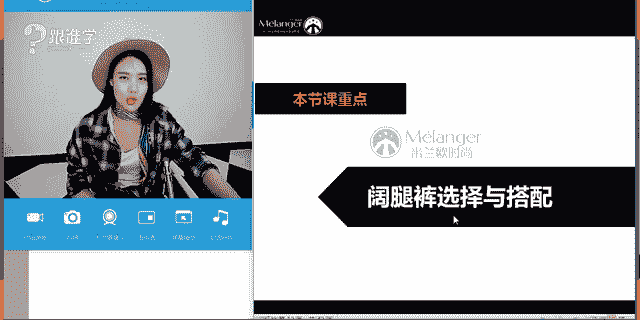
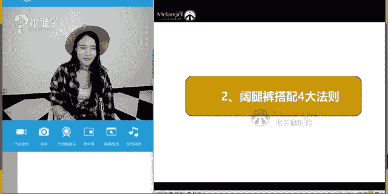
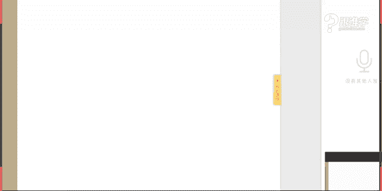

# 1、11服装《搭配秘笈之新版36计》：29阔腿裤秘笈

🎼吃一人分的饭案，下一人分的饭案，真的我并没有恰到。🎼啊啊，逛一人分的街满一人分的答案，真的我没有觉得。🎼我相起你站在与我相遇的路上，马不停蹄。🎼所以当我拥抱整个世界的孤寂也相拥，抱着你一。

🎼我不介意你们动作，也不介意这次肩擦肩而过。某天我们总会遇到对方，然后说，原来爱是你哦，我不介意。🎼弥慢动作。🎼也不介意这次见擦肩而过，某天，你会发现灯火阑珊处的我，等了你好久哦。🎼我也的。

🎼笑马不停蹄。🎼等着你。🎼踏天而倒。🎼整个世界的孤寂也想理由。🎼我不介意弥慢动作，也不介意这思线擦肩而过。🎼有前我们总会遇到对方。🎼说。🎼好想饿。🎼，🎼The。🎼的我。🎼管他会走。🎼不会等。🎼的我。

🎼不会的。🎼我不介意你慢动作。😔，🎼也不介意这次线擦肩而过。😔，🎼吃一人分的饭，杀一人份的饭案，趁的我并没有缺得。🎼啊啊。🎼逛一人分的街买1人分的答案，真的我并没有觉得孤单。

我相信你站在与我相遇的路上马不停蹄。🎼所以怎默拥抱整个世界的孤寂也相拥，抱着你，我不介意。🎼一般动作也不介意这次线擦肩。🎼如果某天我们总会遇到对方，然后受。🎼原来爱是你哦，我不介意你慢动作。

🎼也不介意切。🎼视线擦肩而过。🎼天你会发现灯火阑珊处的我原来你好久傲。🎼吃一人分的饭案，下一人分的饭案，真的我并没有恰到。🎼孤单。🎼逛一人分的节满一人分的答案，真的我没有觉得。

🎼我相信你站在与我相遇的路上，马不停蹄。🎼所以当我拥抱整个世界的孤寂也相拥，抱着你一。🎼我不介意你们动作，也不介意这次线擦肩而过。某天我们总会遇到对方，然后受哦，原来爱是你哦，我不介意。🎼弥慢动作。

🎼也不介意。🎼这次见擦肩，而过某天，你会发现灯火阑珊处的我。🎼等了你好久。😊，🎼飘跃的。🎼话不停气的等着。😊，🎼踏天而。🎼整个世界的孤寂也想理由。🎼我不介意弥们动作，也不介意假思线擦肩而过。

🎼有天我们总会遇到对方。🎼说。🎼好骄傲。😊。

はい。Yeah。Yeah。hello，大家晚上好。呃，同学们现在可以听得到我的声音吗？如果可以听得到呢，请打一。好的嗯。😊，看到很多同学的回复了啊。

那今天我们课堂当中还有不少同学来这个这个在我们直播时间就进来了哈。因为我们平时很学上课的时候呢，一开始呃人数比较少，那慢慢的同学们都进来。那有很多同学也会说，哎这个前面的课程没有听到。

没有及时的进到我们这样的一个直播间。嗯，好，那今天同学们都非常好啊。好的，那看到这个很多熟悉的这个同学们的名字啊，我在这里就不一一去念了。那今天呢给大家分享到的是关于呃阔腿裤的穿搭秘籍。

那我首先想问一下这个咱们教室里的同学们，你们在平时穿阔腿裤的时候，有没有遇到什么样的一些问题呢？比如说嗯好的，看到林玉同学说第一次有时间听课是吗？第一次赶到直播时间。是吗？嗯。

以后希望你可以多多来到我们的直播时间听课。好的，嗯，那刚才呢跟大家说到这个呃其实很多人在穿阔腿裤的时候有遇到一些问题。那不知道咱们教室里的同学有没有这样的一个问题呢？同学们，你们现在可以提出看一下呢？

老师今天能不能在课堂当中帮大家去解决你们这样的一个穿搭的困惑。那其实在呃还没有开始这节课之前，呃，我经常会收到很多同学的这样的一些问题。啊，就比如说老师到底呃胖的人能不能穿阔腿裤。

或者是说老师我觉得我的屁股很大，臀部很宽，腿特别粗，那能不能穿阔腿裤。那首先我。在咱们这个直播的同学，听听这个课程课程的同学，现在有没有这样的一些情况的，就有没有觉得自己臀部很宽的，然后腿很粗的。

有没有？如果有的话，请打一。啊，思雨说我就是嗯，那林玉同学也是这样的那其他同学呢有没有呢？嗯，好，那这是一种情况啊，江水同学也有啊，那这是第一种情况。那包括其实还有一种情况是什么呢？说我个子比较娇小？

那到底能不能穿阔腿裤啊，还有也有人问我这样的一个问题啊，OK5021同学说腿短还粗是吗？没关系啊，好的，那今天呢老师都会帮大家去解决这些问题。那刚才我讲到的一些问题呢，都会在我们课程当中去给大家解答。

那第一个呃穿大困惑，我们所说的阔腿裤到底是显瘦还是显胖。那刚才说到很多同学问我说这个胖人能不能穿啊，那其实也会有人问说老师这个阔腿裤到底是显瘦的还是显胖的，因为我们在之前分享课程当中的时候。

有这样的一个概念说嗯，我们在穿服装的时候，一般是以合体为主着装，对吗？才会显得显瘦。但是阔腿裤他的腿的这样的一个宽度是非常大的那他到底是显胖还是显瘦呢？嗯。

OK那这个是我们接下来要研究的这样的一个问题啊，好，那第二个就是刚才跟大家分享到的说小个子到底能不能穿阔腿裤。那其实我在课程课程当中经常会跟大家分享这两。位啊，这一位可能大家比较少看到。

那第一位呢是杜马。那第二位呢是wey。那他们两个人呢个子都是非常的娇小的那今天我还特意查了一下杜马的身高到底是多少啊，那我看了一下答案，最多说她是有1。55米的啊，那也有人说她只有1。52米。

那温y呢她也是这是一位时尚博主啊，她是越南极的时尚博主，在美国啊，那这两位呢其实身高都不超过1。55米，个子是非常的娇小。那这种个子娇小到底能不能穿阔腿裤，这也是很多人会问到我的这样的一个问题。

那包括还有哪些问题呢？阔腿裤到底能不能配平底鞋。因为我们其实内心啊女人虽然这个在呃很爱美。那穿高跟鞋，其实也能让我们很漂亮。但是其实大家现在看到。图片当中的这个呃OS哈，我们每次穿这个高跟鞋的时候。

其实心里都会有一种想法，就说哎，高跟鞋太累了。呃，我能不能穿平底鞋呀？平底平底鞋会比较舒服啊，然后穿着高跟鞋，特别是有一些女生不太会穿高跟鞋，每走一步选的鞋子又不合脚。然后那个内心很尖熬。

那曾经老师也度过那样一段时间。那是因为那时候其实我不了解自己的脚型，所以选择的鞋子都会磨脚啊，不管是前面还是后面都会磨脚，所以造成很不舒适的这样一种感觉。

OK那其实呢这就是我们在生活当中基本上呃大家这个都会遇到的这样的一些穿搭困惑，那就是阔腿裤，他到底能不能配平底鞋。那他到底是显胖还是显瘦的，腿粗比屁股大的人到底能不能穿的那包括个子娇小的人能不能。

那今天呢我们就会以这三个问题啊。一个维度来跟大家分享到底阔腿裤应该如何去穿搭。那首先呢今天呢课程呢给大家分享到的是两个大的板块。那第一个是关于阔腿裤的这样的一个历史的发展啊，百年的历史演变。

那第二个呢就是关于阔腿裤的选择以及搭配。那首先我们先看阔腿裤百年历史的演变。那我们说现在是嗯。

2017年了啊，那其实在19世纪呃，19。1910年左右啊1910年左右，其实到现在为止的话有100年了啊。那在100年前呃，我们说这些女性西方的，因为现在我们穿的都是西方的服装。

那在100年前西方的女性穿的都是什么呢？他们是穿裤子吗？不是，那大家现在看到图片当中的第一位啊，这这个廓形这样的一个剪影，其实是在服装发展史上的这样的一个剪影。那在1900年的时候。

这是1900年的时候的那个时候的女性的服装廓形。那大家可以看到，通过这个线条可以看到，那个时候女性的着装是以裙装为主，并且是非常的凹凸有致的线条。那是为什么呢？因为他们穿着紧身的塑身内衣啊。

那所以呢他们的这个身体的线条非常的有曲线的美感。并且那个时候所有的女性。都是这样的一个着装。那到了1910年的时候，大家可以看到啊，依然还是以这样的繁琐的这样的一个群束的着装为主啊。

那个时候女性也是以这样的一个着装为主。那直到1920年时期，女性的着装才开始发生变化。在1920年整个时期呢，我们称她为叫女男孩时期，为什么呢？我们说在1913年的时候。

1914年其实是呃这个世界大战啊，第一次世界大战，那个时候其实人们的这个我们说女性她也需要参与到工作当中。如果她在穿着这种繁琐这种繁琐的裙装的时候。

其实是不方便运动的那所以说呢呃也是因为这样的一个社会历史的背景和发展。所以人们的穿衣的这样的一个观念，诉求会有所不同。那在那个时候我们说现在的女人穿裤装都是呃来。源于一个女人的这样的一个启发。那是谁呢？

就是coco香奈儿。那因为在1913年的时候，coco香奈儿呢，她这个她非常喜欢呃，她不是很喜欢那种很繁琐的女装。所以呢她就以呃这个穿了自己男朋友，大家可以看到啊这个条纹衫。这位就是啊coco香奈儿。

她穿了这种条纹衫，以及这种阔腿裤的这样的一个搭配方式，就是她自己在当时她是我们所称为叫欧洲第一个女呃，欧洲第一位穿裤装的女人。啊在当时的社会背景之下，女性的着装形态都是这种。那她穿成这个样子的时候。

其实一开始是被很多人不接受的。但是也有一部分的体啊，就会觉得哇很时尚这样啊。那当时呢coco香奈儿呢，也因为这种水手服啊，其实她身上穿的这种条纹衫为灵感，推出了水手衫以及这种条纹水手衫以及水手长。

也就是现在大家看到的这样的一个形态。那大家可以看到这一系列的这样的一个服装啊，全都是有这种水手海军的这样的一个特点。那我们说到这种条纹衫啊，那条纹衫的话，它其实也是呃有它的这样的一个历史的发展背景。

那当时我们说这个条纹衫其实并不是香奈儿发明的这个条纹衫就是当时。一个呃军装。那我们说这个条纹衫，其实大家可能每个人都有条纹衫，但是大家有没有数过条纹衫上面有多少个条纹呢？有多少条纹。

有没有人去很无聊的做这件事，去数一次这个条纹上面条纹衫到底有多少多少条纹呢？有没有人知道嗯。那其实呃咱们教室里有没有人知道呢？嗯，那其实条纹衫呢它上面有21条条纹，为什么呢？其实是因为在拿拿破仑时期。

法国人呢这个拿破仑呢为了纪念。英国人那所以呢他他打败了21次，她就在他们的这个条纹衫上面设计了21个条纹，这就是我们所说的水手条纹的这样的一个发展啊，那香奈儿呢她其实呃这个当时推出了这样的一个概念之后。

就是她自己去这样穿着之后，就受到慢慢的受到这个女性的这样的一些喜爱，从而流行开来。但是并不是一开始就所有人都去接受的那大家可以看到，在1920年到1930年期间。

其实这时候呢呃很多女性呢她们会呃穿着这种阔腿裤，那其实这是我们所说的阔腿裤最早的形态。可是她们不会把它当成这种正装去穿着。她们把它当成泳装来穿着啊，其实当时她只是泳装当中的一个呃这个我们所说的单品。

她会穿在什么呢？这个下下半身啊很。多女性呢她会穿在下半身当做泳装来穿着。那这是一开始在20年期间呃阔腿裤这样的一个形态。那我们继续往下看。那直到1966年啊，伊芙圣罗朗。

那其实间呢也就是大家知道的这样的一个呃这个品牌就是伊芙圣罗兰也称为啊那个这个品牌呢呃当时呢呃伊芙圣罗朗先生呢就设计了吸烟装。它是从大家可以看到啊，这张图片是非常非常经典的。

也是呃现代时装只时装史上可以说是非常经典的中性的造型之一啊。那当时呢它是以男性的晚礼服为灵感，设计了这样的吸烟装啊，这称为叫吸烟装。那但是当时这种吸烟装的设计，它其实没有做太多的改革。

基本上还是以男士的这样剪裁为主。直到什么呢？呃，这个1980年之后啊，呃我们所说的乔治阿玛尼设置了呃看大家看到的这样的一张图片。他所设计的这样的一个服装，就会发现有一种柔美的状态的感觉。

那是因为呃阿玛尼先生呢，他在设计这些服装的时候，他其实是运用了一些虽然他保持了阔腿裤，原本应该有了这种简约的线条。可是你会发现他有一种呃非常轻柔的呃很流畅的这样的一种姿态。

像人的第二种第二个皮肤一样的这种感觉呃，这种行行云流水的这样这样的一个姿态啊。那这是阿玛尼服装的这样的一个特点。那当时呢呃在这个我们所说的直到1980年这个阔腿裤。才真正的有了女性的信息。

那在1980年以前，其实它依然是男装的形态，只是在尺码上会有所不同而已。嗯，好，那这就是大概我们所说到的阔腿裤的这样的一个发展的历史。那呃。其实每次给大家讲了这样的一个发展历史的时候。

我自己都觉得很有感触啊。我们身上穿的这些衣服都这么有故事啊。那比如说我今天穿的格纹啊呃格纹衬衫啊，包括我今天其实也穿了呃牛仔的阔腿裤。我觉得都呃学习这种这样的知识，我觉得也是非常有意思的啊。

我不知道大家有没有这样的一个感觉啊。OK好，那呃这是给大家这是我们所说的本节课的第一个重点，给大家讲到的关于呃阔腿裤的历史的这样的一个发展演变，百年历史发展演变啊。好，那我们来看第二个呃知识重点。

的就是阔腿裤，如何去选择以及搭配嗯。

好，那我们接下来看，那我们在选择阔腿裤的时候，我们第一步要做的是什么呢？我们第一步要做的就是要什么看到我们这个动图了没有？非常什么呢？我觉得这个动图是非常的棒的啊，让我们感觉视觉感觉很新鲜。

那就是要选退选对阔腿裤的款式啊，那我们来看一下阔腿裤，它的款式是非常多的啊，虽然它只是一种形态，就是裤腿啊非常的大，但是从呃面料上长度上包括裤腿的宽窄上，那包括长短上它都会有所不同，对吗？啊。

那我不知道咱们这个教室里的女同学们，那因为我觉得女同学肯定都是有阔腿裤的，男生肯定是很少啊，那我不知道咱们教室里的女同学呃，有没有今年或者是在这两年有没有买阔腿裤来穿呢？那如果你们买的阔腿裤。

你们买的是长的。还是短的呢？同学们。有梅花香你说有是吗？你可说还没有买。好，那要去买一条穿。因为这个阔腿裤还是这当下还是非常流行的啊，今年还是不会过时的。OK好的啊，我看到大家的答案了，菲二说买的长款。

那包括风铃说买的9分啊，雨和同学长短都有啊，那思雨买的是8分的基础款。那你对基础款的概念是什么呢？是这一种吗？OK好的好啊，那我看到大家这个都有，好像都都有这个我们所说的这个阔腿裤是吗？好。

打算上完课以后再买。好，没错，好的啊，O那我看到大家的答案了啊，都有。那我们来看一下，那阔腿裤从风格上来讲，其实确切的来讲呢，它并不是说我们所说的风格。嗯，那只是让大家更好的去理解这样的一个概念啊。

其实风格的话呢，它会更多的涉及到我们整体穿搭的这样的一种感觉。当然一件单品，如果它只是一件单品的时候，它可能是没有太多风格的那例如说大家现在看到的这个基础款，它其实就没有太多风格。

只是说裤装它给我们的感觉是很帅气很中性的感觉，或者是说呃利落的这样的一个感觉。但是它没有形成一个服装的风格。那什么是服装风格呢？那么例如。例如我啊老师今天穿的这个牛仔的阔腿裤，我通过整体的搭配之后。

呈现了有一种风格叫什么呢风格？同学们，你们呃应该都对这个老师在课堂的当中都讲过的什么风格？有没有人知道我今天这一套服装其实之前也有穿过啊，这一套的话是不是叫西部牛仔风？嗯？是的，西部牛仔风你好。

仙人掌嗯，刚刚进来是吗？好的，我看到大家的答案了啊，思语雨和包括5021同学非常好。那我今天嗯穿到的我今天通过搭配之后呈现了一种服装风格，叫西部牛仔风。所以如果一条阔腿裤放在你面前的时候。

可能它没有例如说现在大家看到的屏幕上的这条阔腿裤，它可能没有太多的风格的啊，OK好，那呃当然有某一些单品，它可能是经过这种设计之后，或者说工艺之后，在原本的这种设计的基础上，它就有一些很明显的一些风格。

那例如说其实这两条它就有一些风格的那例如说这一条印花图案的这一条阔腿裤，它可。可以搭配呃很多的这种民族性的这种感觉。那包括它可以搭配嬉皮感觉啊，那它还会可以搭配一种度假的风格。那包括第二款。

我们说叫海军款啊，它的这种纽扣以组合方式的这样的一个排列的这种特点。就是在裤装上有这种纽扣排列的这样一个状态。那在搭配上这种条纹衫就有非常的明显的风格的点了。可是如果当一条裤子，例如说这件这件基础款。

以及这件摆在我们面前的时候，它是没有太多的风格的啊，ok好，那刚才给大家讲到的这个是我们所说的单品跟这个经过组合之后，它能够呈现什么样的一个风格。那在后面等一下我会我也会给大家去展示一些啊，好。

那我们首先来看阔腿裤它有哪些。那例如说大家现在看到的第一个基础款。那这种基础款的话，大发现非常。的线条有什么样的特点呢？同学们。同学们，你们觉得这个基础款它有什么样的一个特点，还是说它就完全没有特点呢？

啊，那我们看到基础款的话，它基本上其实就是设计非常的绝简约啊，很简洁，现没有太多的这种装饰性是的，简单纯色嗯，大气基础款。好的，非常好啊。那所以说呢这种阔腿裤啊。

一般都是比较容易搭配的那其实阔腿裤它本身就是一个。可以用几个词语来形容阔腿裤。比如说。啊，经典包括好搭配啊，那这都是形容阔腿裤的这样的一个感觉的那刚才有同学说到啊，非常的大气啊，基础。是的。

那第一条它给我们感觉就是非常的大气和基础款。那第二条就是印花图案的感觉，它会有民族感和度假风的感觉。那第三条海军款，它其实就可以搭配很多的海军风。那第四牛仔。那这几条呢，我建议大家都可以去备一条。

来很多的风格。OK好，那我们继续来看，这是阔腿裤的这样的一个分类。那我们来看一下。首先第一个基础款。那在基础款当中呢，其实我们买基础款的时候，最好也要买基础色。那有刚才有同呃这个思雨同学说到了啊。

简单纯色。那其实基础款是什么样的概念呢？基础款就像我身上穿的这样这样的一件白T恤一样，它没有太多的设计，非常的简约，它没有任何的风格的。基础色跟基础款的概念是不一样的。同学们。

例如说这件裤子它是属于基础款的。但是如果它做成了非常鲜艳的颜色，那它还是不是基础款呢？它依然是因为它的款式没有发生改变，只是它的色彩发生改变了，所以它不是属于基础色了。

而我们买基础款的时候最好也要买基础色，那它搭配的可能性会更加的丰富。那我这样讲，同学们你们能理解吗？啊，基础款加基础色。那例如说哪些。础色呢比如说黑色、白色、灰色、卡其色等等。

深海军蓝这些颜色它都可以称为叫基础色。因为它们没有太多的这种什么呢？啊，色彩的饱和度不会过高啊。OK好，如果长度改变还是属于基础款吗？是的，它还是依然是属于基础款的愈合啊。O好，我呢再给大家捋一下。

在这个基础这个知识点上啊，我们说了基础款只是讲到它的款式非常的简约简洁，设计没有太多复杂的这样的一个感觉。那包括它的没有太多的风格导向啊，就特别百搭，可以用这两个字来形容。

那第二个就是我们所说的叫基础色，基础色是以这种黑白灰五彩色啊，包括这种呃深海军蓝、卡其色、驼色等等这样的一些颜色叫基础色。那我们在买的时候最好是买基础款加基础色。好的，那这个同这个知识点大家理解了吗？

如果理解的话呢，请打一。嗯。如果理解了呢，我们就过了这个知识点。好的，嗯，看到大家的这样的一个答案了。🤧好，那我们来看第二个啊第二点。印花图案。那刚才跟大家讲到了，我们说印花图案它可以演绎不同的感觉。

那例如说大家现在看到的第一张图片啊，那这种感觉呢其实它就是非常嬉皮的感觉啊，这种印花的阔腿裤，加上这种呃比背心款的上装，那配上这种有民族感的这种配饰项链以及什么呢？它头上戴的这样的一个饰品。

大家可以看到了吗？发带啊这个地方那其实这个发带有的时候它是有一种意呃我们所说的呃意义的。为什么这么说呢？其实它就是一个花环的简化。因为我们说嬉皮的话也会呃有这样的一个在嬉皮搭配当中呢？

它会有一个非常经典的元素，就是一个花环啊，嬉皮士呢他们心中是热爱和平的所以大家也会称它为叫花孩子啊，那他们会经常带花环。那所以他们也非常的。喜欢穿花。

那你会发现这种印花图案是嬉皮们非常热爱的这样的一些图案元素啊，他们会认为花朵是非常的纯洁的啊，这样的一个象征。因为他们自己心中有这样的一个乌托邦啊，纯净的天堂啊，好，是的，那这是4条没有一条基础款。

是吗？雨和同学说好，那你要去买一条基础款的那首先我们看到的第一个感觉叫嬉皮。那第二个它其实给我们的感觉就是更加的休闲以及度假感，比如说我们是不是可以穿这一套去海边呢？啊，去郊游呢等等啊这样的一些场合。

那第三套啊，我们说并不是说印花它就一定要是这一种形态的，或者是这一种形态的那其实印花它也可以优雅。那例如说大家现在看到的这一套服装的感觉，是不是给我们觉得这种优雅，同时有这种温婉的女性的这种气质呢。

那是因为花它本身就是比较柔美的图案。你会发现，如果这条裤子它做成了几何条纹的图案，那它身上的这种我们所说的这种女人味的气息就会减少很多。那是因为本来格子几何这种呃波点，它其实都是属于叫什么呢？

几何性图案，它给我们感觉相对来说比花朵要硬朗很多。那所以说我们现在看到这一幅图片当中给我们的感觉是比较有女性化气息的，都是因为来自于它的图案的设计，所以说每一个我们说服装设计当中。

我们要能够读懂每个单品和每个单品，它是它的这样的本身带有的一些意义和元素，其实我们都是要画一些下一些功夫的啊。同学们好，我们要分析这些单品，你才能够把它精准的去搭配。好嗯。

那刚才这个仙人掌说你都是基础款，是吗？嗯。很喜欢最后一套。那其实很多呃我们觉得很多女性吧，我们很多女生都非常爱最后一套。那是因为呃大家的审美的话。

其实更加接近于这种优雅的呃传统的这样的一些这种积极美好象征的这种审美感感觉嗯，OK好，那就是我们所说的印花图案，它可以给我们传递的呃等等这样的一系列的风格，可以搭配漆皮度假以及优雅感。

当然还有更多的可能性。我在这里呢就没有给大家来一一的展示。它它其实印花也可以搭配出来很多不同的感觉。比如说印花也可以运动，那它上衣可以搭配运动感的服装，穿运动鞋。那它是不是就是运动感了呢？嗯，OK好。

那我们继续来看。第三个就是刚才我们说到的海军啊，海军风。那你会发现非常非常经典的，就莫过于这种海军的阔腿裤，加这种条纹衫啊。那其实它就是一套海军的风格。那如果我们去海边的时候。

其实我建议大家可以搭配这样的一套服装。或者是你用白色的T恤来搭配这种蓝色的海军的这种款式的阔腿裤也会非常漂亮啊？因为白色配蓝色，它本身就是这种呃我们就经常去到海边蓝天啊，白云，然后你会想到这种配色。

对不对？那其实我们到海边的时候，是不是也有白云和蓝呃这个海水形成的这样的一个对比。所以去海边的时候穿白色也会非常的漂亮。我不知道大家有没有看太阳的后裔。太阳的后裔当中就有这么的就有这样的一个镜头。

宋仲基和这个呃桥妹两个人就穿着白色的这个上。一然后呢呃在一在那个小岛上的时候，坐在那个很破的那个船上，但是那个画面是非常非常的唯美的啊，非常漂亮。所以白色跟蓝色也是非常好看的一个配色。

非常经典的这样的一个配色，大家可以多去尝试。但是在夏天其实是最最适合的。应为该给我们感觉是非常清新的。可是在冬天一样可以搭配的啊。OK好，比如说你里面可以搭配这种呃，现在广州其实就可以这样搭配了。

比如说里面搭配这样的一个呃呃依然搭配这个蓝色的条纹衫，下面配这种蓝色的海军裤，然后搭配一个白色的西装给我们感觉它既干练，然后又有这种很清新的这种感觉，又有点这种这种知性的感觉，职职业人的这样的一个状态。

都可以去穿着。OK好，那这是我们所说的海军风。那第二套呢，大家可以看到。呃，从它的配色关系，到它整体搭配的这样的一个感觉。它其实。偏偏英伦感的。我们说英伦啊，为什么说这套其实它更加浪漫感啊。

这一套呢它其实更加那种英伦的这种感觉。为什么呢？这套非常法式，这一套非常英驰。英国的配色非常的什么呢？暗沉，那这种驼色呀，卡其色呀啊，铁锈红啊，都是英国人非常喜欢的这样的一个色彩。嗯。

你会发现呃英国人他们穿衣服的时候非常喜欢用那种卡其色的那种格子的呃外套啊，或者是这种西装啊，或者是格子大衣呀等等西裤等等都会出现在这种呃他们的这种服装当中，英国人的格子也是非常有名的啊。好。

那我们来看一下，那它的这样的一个英伦感，其实还有带一点点学院风。从哪看出来算呃从哪看出来的呢？其实今天是不是呃是夏是雨荷，对吗？啊，羽荷啊，你们这个又叫。咱们教室里的名字真真真的挺奇葩的啊。

一个叫雨中的夏荷，一个叫雨荷，你们俩弄得我都有点晕乎了啊，是雨荷今天在这个答疑群当中呃，解答群当中发了一个呃学院风的服装吗？就是你你问我说老师这个是不是学院风，是不是雨荷呢？是的是吗？啊。

那雨荷发的那一套服装，它的配色关系是不是跟这套服装特别的像？但是有一个问题是什么呢？我为什么说你的那套服装，它的这种呃学院风的元素不够强烈。其实你的这个呃整体搭配除了那顶帽子以外，包括你的用色以外。

偏英伦感，其他的都没有太多英伦的这样的一个感觉，所以我建议你搭这种衬衫，加上这种领带嗯，加上这样的一个蝴蝶结，然后穿一个这种针织毛领呃毛衫。种A字摆裙会更加的明显啊。当然那那条包身裙也可以啊。

它会更加的有女人味儿。那再配上这种英伦鞋，配上小短袜，配上这种呃双排扣海军蓝大衣，那你就是一个呃大学生了啊，可以这么说，你就是牛津大学的大学生了。那它其实就是非常的有英伦的这种呃这种学院风的感觉。

那其实这一套也有英伦学院风的感觉。它的学院风来自于哪里呢？比如说它的衬衫配这种蝴蝶结，包括这种配色关系等等啊，ok好，那这是我们所说的海军的款式，它可以搭配出来的这样一个感觉。嗯，好，我们继续来看。

那牛仔牛仔当中呢，我们会发现，其实牛仔它虽然出身非常卑微啊，牛仔这件单品它一开始是给什么呢？工人去使用的淘金的工人。但是他现在依然可以搭配的非常的高雅。那例如说我们现在经常嗯在任何场合。

当中都会出现这种牛仔。那比如说在这种嗯我们把这种牛仔跟这种军装去搭配。有这种知性的感觉，干练的简约的这样的一个感觉。那呃第二套当中大家可以看到的是跟这种机车夹克去搭配。

它给我们感觉就有帅气的硬朗的机车的这种风格的这样的一个特点嗯。好。😊，可是学院风年龄要小点吧。仙人掌同学说好，呃，那个仙人掌同学，刚才您说的这个个子矮的女生穿不了，是说的哪套服装呢？

是说的刚才前面那一套，我说的这个英伦风的这个感觉吗？这个概念是错的啊，仙人掌，因为仙人掌是不是进来的比较晚，刚才老师在前面已经跟大家讲过了，我们说并不是说个子矮就不能穿阔腿裤啊啊嗯，O好。

那包括呢学院风只是一学院风这个风格它是什么呢？一开始她是在这个我们所说的这个学校里出来的，就是学学生穿的这样的一个着装风格，但是其实在现代当中也被很多人去穿着，并不是说一定要年龄小而去穿。

年龄大的人也可以穿学院风格。例如说他的内心诉求想要年轻化的时候，他就可以穿学院风格，为什么不可以穿呢？每个人心里都可以住一个学生啊O只是看他要怎么去。搭配属于它的这样的一个学院风特点。那例如说呃雨荷呢。

它搭配的这样的一个感觉，其实就搭配了这种包身的这种裙子。那这种包身裙其实就已经有这种女人的这种特点了。属于它的年龄阶段的这样的一个特点了。嗯，OK好，我们继续来看。那刚才讲到的是啊说的是这个你自己是吗？

啊，那好的，可能是这个老师理解错误了啊。好，嗯没关系啊，那我们再来看第三套淑女风，那你会发现这种呃硬朗的牛仔跟这种比较柔软的蕾丝碰撞的时候啊，包括它的配色关系是不是白色配蓝色非常的漂亮。

那包括啊其实这一整套的服装的感觉，给我们感觉是有这种淑女感的女性的气息。因为它这种一字肩呢，包括这种蕾丝感觉呀，其实都会非常女性化。但是唯一它不女性的感觉的，就是这个模特的。这张脸表情非常的帅气啊。

就是非常的严肃啊。那如果这一套换成一个长相非常甜美的人去穿着，我觉得效果会更好。因为什么呢？你会发现呃这套服装它其实是非常淑女的感觉，可是这个人跟这个服装的气质好像不是特别的匹配啊。

O当然想要这种演绎我们说这种可爱的感觉的时候，它可以展现这种味道，只是他这种表他现在的表情是比较严肃的而已啊。O好，那我们继续来看。嗯，那刚才给大家讲到的呢，就是关于阔腿裤的这样的一个风格啊。

它可以一条阔腿裤，他可以因为材质的不同。因为款式的不同，他可以演绎不同的风格啊，可以演绎不同的风格。那同学们你们有没有尝试过刚才老师给大家讲到的一些风格呢？有没有嗯如果没有去这样搭配过的人呃。

同学们呢你们可以去。尝试一下啊，换一个搭配的方法，你会多很多的新鲜感，也会有很多的乐趣。那其实我会经常在生活当中把我以前搭配过的搭配好的服装，成套的服装，把它重新的去搭配一次。

啊例如说我可能明天就会做这件事情，我就要再做一次重新的搭配。呃，其实我会定期的把本身搭好的这种服装全都把它摆出来。摆出来之后呢，把这些服装全都打乱，重新组合，重新去穿着，你会觉得非常有新鲜感。

其实我们女人并不是说缺一件衣服，其实你缺的是新鲜感，对吗？同学们啊，我们缺的是新鲜感，OK所以如果你们掌握了搭配技巧，那么你们这既可以省钱啊，又可以有新鲜感啊，但是呢其实我觉得前提是大家可以配一些配饰。

啊，多去买一些配饰，你的这些配饰的话，你可以这个呃把它这个通过不同的组合和搭配呈现。同的感觉。好的，嗯，那我们继续来看，刚才给大家讲到的是风格的问题。那我们继续来看阔腿裤。

它其实在材质上也会有不同的这样的一个分别的啊。那例如说大家现在看到的第一个叫毛呢材质。那这种毛呢材质的话，其实适用于也适用于现在的季节。那南方可能呃穿着穿着的时候，我觉可能还会有点热的啊。那北方的话呢。

其实现在就可以买这种毛呢毛呢感的这种材质。那这种材质的话，它其实是比较挺迫感的，也比较厚重，穿起来的话会比较保暖。那第二种呢就是我们所说的叫西装面料，其实它就是跟我们的这个西装啊。

西裤的这种材质是一样的啊，那呃包括它的这个款式，大家可以看到这种竖条纹的感觉，是不是也比较像西装，只是它把它做成了阔腿裤的这样的一个款式啊，那第三个天鹅绒。今年。非常非常流行的面料。但是呃慎重去选择。

为什么呢？因为这个天鹅绒的面料，它其实相对来说比较挑人的，而且穿不好的话，会有一种比较这个low的感觉，就是看起来虽然天鹅绒这个面料很高级。可是有很多人穿出来的感觉是不高级的。嗯，好。

平萍说搭配什么鞋子呢？等一下在我们后面的课程当中会给会给大家去分享的，不要着急啊，萍平好，我们继续来看，那这是天鹅绒面料。那第四种是真丝面料，第五种是雪纺面料。那这两种更适合春夏的时候去穿着啊。

比较清爽的这样的一个感觉。那以上三种可以在给秋冬的季节当中去使用。那包括真丝和雪纺的这种面料呢？它给我们感觉会更加的飘逸感。所以我就我觉得大家其实在夏天的时候可以买这样的一些真丝以及雪纺的这样的一个面。

料穿起来既清凉啊，又飘逸的这就非常仙儿的这样的一个感觉。OK好，那我们接下来看这个是关于阔腿裤的材质啊。好，那阔腿裤阔腿裤那它到底是多阔呢？嗯，其实经常会有。

因为它如果你们在选择这个阔腿裤的这个宽度掌握不好的时候，非常容易的显得个子矮啊，这是非常重要的一点，而且还会显得特别胖。啊，好，那我们来看一下，那在这三个宽度上来讲，你们觉得哪一个穿起来会比较显高呢？

同学们一2。哪一个会比较显高？第3个嗯。好的，林玉觉得第一个吗？😊，啊，也有人说第二个okK好的，我们来看一下啊。那大家不要凭感觉去看。其实我们要去分析啊。

那其实之前大我给大家分享过的这个原理依然是存在的，就是什么呢？横向扩张，竖纵向这种什么呢？拉伸变窄，它就会显高和显瘦。那例如说最后一套。其实度码只有并。最多不超过1。55米。

你会发现他穿这一套的时候是不是特别的高挑，感觉一。7都有了吧？啊，这种视觉感觉的一。7都有了啊。风铃风铃是呃风铃同学说三个都可以，那其实第一套它的显高的效果不是特别明显的啊。

这就是我我们说到的阔腿裤的这样的一个宽度的选择的问题。那我建议大家在买阔腿裤的时候不要选择第一种就是过宽的这种阔腿裤，它不是特别的显高。第二第二点。

你会发现这条阔腿裤它的腰线的位置是非常低的那这种中腰的阔腿裤，阔腿腿呃裤管的宽度又特别粗，再加上这个模特在演绎的时候，它没有穿高跟鞋。并且它的上装跟她的下装的比例。啊，调整的也不好。

所以整个人看起来会有点这种邋遢的感觉。所以呢我建议大。家。在买什么呢？阔腿裤的时候，选择第二种的宽度，以及第三种的宽度嗯。嗯，米娜说第三套同色系又是直筒裤吗？啊，所以看起来会比较显高。是的，米娜同学。

那第三套因为它本身从上到下都有一个色彩的延伸感，所以它会比较显瘦啊。那但是站在如果它即使不穿上面的西装的外套，这种相对来说比较合体的直筒的这种阔腿裤，它也会最显瘦啊，以及最显高的特点。OK好的啊。

那这是我们所说的关于阔腿裤的这样的一个裤管的宽度选择。啊，第三裤第三条像喇叭裤吗？嗯，它有一点点微喇的这种状态，但是它还没有到喇叭裤的这种状态啊，它其实还是偏直筒的这种感觉。嗯，你也觉得是那样的是吗？

好的嗯，那么继续来看啊，那第二条以及四第三条是我推荐的啊推荐给大家买的这样的一个宽度。第一条的话呢。谨慎去选择。那第一条如果想穿的话，能不能穿的好，有有方法啊。

等一下我在后面会跟大家来这个分享怎么去把它穿好好，我们继续来看。那刚才说到的是宽度，现在来说长度的这样的一个问题啊，那刚才有同学们说了啊，我买了七分裤，八分裤，9分九分裤啊，那包括这种盖脚面的好。

那我们来看一下7分8分9分，盖脚面的长度，哪一个最显高呢？同学们哪一个最显高。1234。七分裤最显高。好，OK我看到大家的答案了啊。那大家觉得那我来给大家来讲一下啊，那有思雨同学和胡娇同学啊。

这个名字很可爱啊，说呃七分裤最显高，七分裤最显高的很大的一个原因，是不是刚才跟上面那一套黄色的道理是相通的，就是什么呢？色彩连贯，它从上到下色彩都是用的非常连贯的，所以它会显高啊。

那你会发现这就是杜马的搭配的这样的一个手段的高超了啊，为什么呢？其实我要告诉大家的是七分裤是最难穿的，而且它是最不显高的裤子的长度，为什么这么说呢？因为七分裤它其实刚刚好会到我们小腿的它这个裤子还好啊。

你再上来一点点，它会到我们小腿最粗的位置，所以它其实是最不显高的这样的一个裤子的长度。那八分裤九分裤以及盖。脚面的裤子其实都比七分裤要好搭配啊，它会更加好搭配这三个裤子的长度。

因为它都是漏了我们脚踝最细的位置啊要么就是盖住我们这个脚面的这个位置，你会发现你底下穿10厘米的高跟鞋都没人发现发现你，所以你就可以增高很多啊，那这一种的话，其实它色彩，它的这样的一个延伸感会更好。

所以其实盖脚面呢它会更加的显高啊，以及显瘦的这样的一个效果啊，当然显瘦和显高的这样一个问题，不只是我们所说的裤子的长度去决定的。它取决于好几个问题。比如说宽度它也决定啊。

ok材质它也决定等一下我也会跟大家来分享。那例如说材质刚才其实跟大家已经分享了一些啊，那我在所有的材质当中跟大家分享一个点，就是尽量少买棉麻材质的棉麻材质的话，因为它的这种第一，它容易皱。第二。

它它的这种这种挺迫感不好。垂坠感不好，所以呢它就会显得最胖啊。OK好，那尽量不要买这种这种棉麻材质的啊，没有效果没有那么好。好，我们继续来看啊，阔腿裤的长度的这样的一个问题。那只有七分裤。

其实是最不好搭配的。但是我们依然有方法可以把它搭配好。所以说如果同学们你们有买七分裤的话，也不用担心啊。好，那我们继续来看嗯。那每一个长度呢呃其实我们说了时尚它记录就是一个轮回。

你会发现在呃70年代也特别流行一个阔腿裤。在那个时候其实流行的就是这种盖到脚面的这样的一个位置。但是到什么呢？现在你会发现阔腿裤它以以一种新的面貌回来了。它新的面貌是什么呢？就是它的裤子的长度变短了。

嗯，OK好，那我们继续来看。那以上呢是给大家分享到的是我们怎么去选择阔腿裤的这样的一个问问题。那我们从面料到长度到我们所说的阔腿裤的这样的一个宽度到风格的这样的一个问题，给大家一一的去介绍了。

那我们接下来呢就来看怎么去搭配阔腿裤的这样的一个问题啦啊，那首先来看一下第一点啊，学我们如何去我们学会搭阔腿裤要掌握两点啊。第一阔腿裤加上装以及学鞋履的搭配。

那等一下呢是老师会跟大家分享的那第二个呢是关于阔腿裤搭配的四大原则。那这四大原则呢，就是我对于今天这样的一个课程的总结好，那我们首先来看阔腿裤。因为它本身就是属于下装了。

是不是我们要考虑的就是上装的问题。啊，那在上装当中会有哪些呢？会有内搭的问题，对不对？也会有外套的问题，对不对。那以及裤子它要跟鞋子要怎么去搭配，是不是刚才已经有同学提到这个问题了。嗯。

那我们接下来来看第一点啊，阔腿裤加上装的这样的一个搭配。那我们来看一下阔腿裤加毛衣，我们说毛衣它其实是属于叫内搭类的啊，内搭类。那当然它也可以外穿。在冬天的时候呢，我们其实是更多的作为内搭来穿着的啊。

那外穿的话呢，我们也可以选择一些比较新颖的一些款式。那首先我们来看一下毛衣的话，它其实会涉及到的就是关于我们所说的领型的选择的问题。那包括跟阔腿裤去搭配的时候，毛衣的长度跟阔腿裤也会有一个比例的关系。

那我们先来看第一点啊，那首先我们说到是领型的问题。那在冬天当中，我们穿哪种领型比较多。是不是第一种同学。ま？高领的这种是不是最多？那高领毛衫的话，其实是我们冬天必备的这样的一件单品。

而且今年也特别的流行啊。那第二种就属属于这种圆领啊，然后呢，它还有点这种一字领的这种小船领的这种感觉啊，但是它还是属于这种圆领的感觉。那我来看一下第三种就是属于什么呢？大的V领的感觉？

那我们说了仙人掌同学已经大三了，你是不是知道老师要问什么问题了呀？嗯，那是不是要我你是不是知道老师要问啊，下一个问题就是要问哪一个最显脖子长会脸脸小吗？嗯，好，那我们来看一下，在12三当中啊。

第三个它是不是会显得脸最小脖子会显得最长啊，但是在冬天的时候，我们这样穿会不会冷呢？冬天这样穿会不会很冷啊，因为你都是这样穿是吗？好的，嗯，那你这样穿的话，它的确会显得脖子长，并且显得脸小。

但是一呃在在冬天的时候会不会有点冷。那所以呢其实我也建议大家可以选择第二款啊，也可以选择第一款，那但是前提是什么呢？就是你的这个头发啊，如果你选择这一款，如果你的脸特别大啊，脖子比较短的时候。

那你就选择什么呢？把头发。更爽一些。比如说把它扎起来啊，或者是说你如果是短发的话，那也很好，选择这个款式，因为它看起来也会比较清爽啊。那这是我们所说的，选择这个款式的这样的一个问题。

那第一个选择呃选择高领的话，应该怎么选择呢？那我之前其实已经跟大家分享过很多这样的一个问题啊，就是可以把这个领子的颜色啊，或者说把高领衫的这个颜色选为裸色或者是接近于你肤色的颜色的色彩。

比如说浅色的这样的色彩都可以啊，白色呀啊。这种饱和度过低呃饱和度低的，然后明度比较高的这样的一系列的色彩。比如说马卡龙色系都适用于我们所说的毛衣啊这样的一个选择当中。好。

那这是我们所说的毛衣的关于脸型啊结合的这样的一个问题。包括你如果脖子短的这样的一个结合的问题。好，那我们再来看呃毛衣它还会有长度的问题啊，我们说过有长度的问题。那我们来看一下。

如果我们在搭毛衣跟阔腿裤的时候，应该怎么去搭配。那例如说我们的毛衣的长度应该怎么去选择？大家觉得这个长度好不好？你们觉得12345当中哪一个最显得个子矮，哪一个最显得个子矮？12345。哪个会显得色仔？

嗯。好，第一个和第二个是吗？还有没有呢？嗯。好，大多数同学都回答的第一个。其实我们选毛衣的时候，它的长度的问题上啊，有一个问题就是你以后在选择毛衣的时候，尽量选择腰带以上的位置，腰带以上的位置啊。

或者是说如果你有这么长的毛衣，那么应该怎么穿着，就是像小宋家这样穿，把毛衣塞到裤子里面去啊。但是小宋家这条裤子其实不是特别好，为什么呢？因为它的这个设计呢。

包括它这种今年其实特别流行这种抽绳的这种就是有这种束腰的这种感觉的这种裤装。但是这种它会显得腰粗。所以说呢我建议啊买那种带拉链的高腰的那种设计，同时你的上衣的毛衣面料比较薄一些会更好。

因为你把它塞进去的时候，这个地方它会有膨胀感，反而会显得你这个地方肚子很大。那所以我建议呢大家在选择毛衣的款式上，第一，选择薄一些的。第二，选择裤子的时候呢，这个地方不要有太多复杂的设计。

简约的简单的设计就好了，会更好O好，那第一个和第二个的话，很明显，它其实是不显高的。因为它的比例调整不好，那第三个啊是ok的，它的比例是可以的。四个什么呢？那例如说我们有毛衣，对不对？

我们不想全都把它塞进去的时候，你可以前面把它塞进去一点啊，把它塞进去一点。然后其实也是拉长我们下半身的这样的一个比例啊，也会非常好。那包括最后一个，那如果要选毛衣长毛衣，那干脆就长到脚下吧。

那这个场这今年也特别流行这种侧开叉的这种长毛衣跟阔腿裤去搭配也会非常的漂亮啊，OK好。最后一套非常爱是吗？呃，我也非常喜欢最后一套啊，那所以说呢大家可以其其实可以去买一件这样的毛衣来搭配阔腿裤嗯。好。

林玉同学说肚子大了怎么办？啊？如果你要是肚子大的话呢？如果臀部又很宽呢，然后屁股也很大呢，其实我是不太建议你穿阔腿裤的啊。因为如果你肚子又很大，这个一嗯很很显然你的腰可能就会粗。那如果你的屁股就很粗。

那你会发现从你的腰到你的这个什么呢？屁股的位置全都是一个筒状，所以说呢我不太建议，那如果你特别大啊，但是如果你是有腰的，只要你的腰跟你的臀部是有差的也就是什么意思呢？就是例如说啊如果你的腰真的这么粗。

臀部这么粗，它就是没有腰叉腰叉的这样的一个差距的啊。那所以穿起来就会显胖。如果你的腰是细的，臀是宽的，你依然是有曲线的，那么你会显瘦。O好，那就说到这儿啊，这这个知识点，那这是关于毛衣的选择。

毛衣的选择呢有两点问题需要注意的啊。第一点。话就是我们所说的跟我们的脖子的啊脸的这样的一个搭配。第二个的话就是长度的这样的一个问题。好，我们继续来看阔腿裤加衬衫。衬衫呢也是属于我们所说的叫内搭类的单品。

那你会发现，其实衬衫有很多种，比如说有这种白衬衫啊，白衬衫、格子衬衫带这种呃蝴蝶结的荷叶边的设计，包括这种条纹类的这种蓝色的衬衫啊，这件是好是有条纹的，其实大家看不太清楚啊，那这种细密的条纹衫。

包括带有一些特别设计的。今年特别流行，带有特别设计的款式，比如说这种在袖子上面有一个荷叶边啊，在衣服上做一些飘带设计的这种衬衫，非常的时尚。我建议大家可以去买一件。

因为在今年夏天的时候一定会非常流行的啊，春天秋天一定会非常流行。那包括你会发现这条阔腿裤，它是非常特别的。它是在什么呢？侧开叉的这样的一个设计就会非常性感啊，它是有有个性的这样的一个设计的款式。OK好。

那这是我们所说的衬衫的款式，它有不同啊。但是其实衬衫。依然也是选择的时候，跟我们的脸型也是有关系的那例如说脖子短的，脸大的，我就比较建议第一件和第四件啊，第一件和第四件蓝色的天蓝色的和这种白色的。

为什么呢？它的脖子它的领它的这个扣子是打开的。例如说老师今天穿的这个也是一样的道理啊，当我扣紧它的时候也会显脖子短，打开它的时候就会显得脖子长。所以说呢我建议大家可以选择第一个和第二个。

那第呃呃第四个啊，第二个和第三个的话，它对于脸型和这个脖子的长度相相对来说是有要求的那例如说大家可以看一下，你会发现第二件和第三件模特在穿着的，它的时候，它的发型都是把它做的非常的清爽的。为什么呢？

因为你会发现这种领型它本身就会显得脸大，脖子短。如果他这个地方在头发覆盖在这个地方的话，就会显得非常的呃拥堵的感觉，就像交通堵塞。做了一样的感觉。所以说呢啊如果想要选择这种带有特别设计的。

有这种繁琐的这样的一些装饰的时候呢，尽量让这个地方就清爽了，就不要有太多的装饰啊，不要戴太大的耳环呢啊再带点项链啊什么的那就不太好了啊。O好，那这是我们所说的阔腿裤跟衬衫的这样的一个搭配。

那这这两件呢都属属于内搭类的这样的一个问题。那我们来看一下外套如何去选择。那外套类呢其实它会涉及的款式就非常的多元化了。那例如例如说第一个啊皮夹克。那第二个也是属于叫夹克类的臀部以上的短装。

它其实都是属于叫夹克类的那当然第这一件和第这一件大家都可以看到啊，这个是属于叫西装类的那除了夹克类的单外套西装类的外套。那包括大衣都可以跟阔腿裤去搭配。那首先我们看一下。

这一套啊这一这一张图片当中的这一排的服装特点，它有什么样的服装特点？同学们。有没有发现这些外套的长度相对来说都是比较短的。例如说第一套和第二套它都是比较短的上装。那第三套呃也是相对来说比较短的。

跟正常正常的。我们所说的西装来比，它也是属于短款的那第四套长款。但是它是属于收身，它做了一个什么呢？收腰设计，就是这个收腰的搭配，这个模特呢在搭配这套服装的时候，他选择了用腰带来提高它的腰线。

所以说如果选择特别宽松的上衣的时候，可以用腰带来匹配啊，来搭配，让它整体的线条显得比例会更加的好O那这是我们所说的阔腿裤跟外套的这样的一个搭配。那接下来我们来看啊外套当中还有哪个呢？有大衣。

那大衣当中其实有不同的款式。例如说这种S版型的，包括这种睡袍式的。那包括这种叫斗斗篷款的，它其实都可以跟阔腿裤居搭配，但是依然是有诀窍的。也就是说，当你敞开穿的时候，你的上装内搭的上装一定也是短的。

这样才会显得你的比例比较好，大家可以看到第一套和第三套它都是敞开穿的。但是它都是什么呢？上装塞到裤装里面去的，所以你会发现它的腿部的线条是比较长的那包括第二套也是一样的道理，它又用什么呢？

腰带做了这样的一个比例的拉伸，所以它看起来比例也是比较好的。OK那这是我们所说的阔腿裤跟大衣的这样的一个搭配，并不。长款大衣可以穿，但是也一定要有腰线。好的。

那这是我们所说的阔腿裤跟外套的这样的一个搭配。那我们继续来看啊，刚才是不是有同学已经问到了，阔腿裤跟鞋子怎么去搭配，对不对啊？那我们来看一下，那阔腿裤它可以搭配哪些鞋子呢？大家可以看到啊。

第一个是什么鞋子，同学们。是不是露脚面的这种尖头高跟鞋？那今天其实这个。在搭配那双鞋子的时候，我也跟他讲到，我说配尖头高跟鞋，它会更加的有女人味，而且它会显得你更显得什么呢？整个人线条显得会更高。

因为尖头它是有纵向拉伸的感觉。所以它其实尖头鞋要比圆头鞋会显高？嗯，好的，那第一套呢，其实这个是属于8分还是9分啊？同学们这个裤子是属于8分还是9分。九分裤啊，九分裤，然后呢可以配这种裸这种叫船鞋啊。

尖头高跟鞋。那第二条也是一样的。今年特别流行这个长度的，所以说呢第二个你可以配这种短靴。那第三个是什么呢？叫绑带靴，是不是这类似于这种罗马绑的这种鞋子。那其实我建议同学们可以买这一款鞋子来搭配。

因为在什么呢？今年依然春夏依然流行这个款式的鞋子，并且这个鞋子搭配起来，它更加的有疏通感，就是整体看起来会更加的时尚，有亮点啊，okK好，婷婷说尖头穿呃脚大穿尖头鞋，是不是显得脚会更大。

的确会啊的确会平平平平。嗯，脚大的话呢，穿尖头鞋的确会有这样的一个效果。但是我建议例如说尖头鞋它其实也有两种情况。第一种就是他的这个脚面露的面积会比较多，你会发现这个地方它会露的脚面的面积比较多。

有一种他会露脚面露的比较少，所以呢我建议如果你要是买尖头高跟鞋的话，你就买那种露脚面比较小的，他就没有显得那么大。啊？并且我认为啊其实平萍同学不用在意脚大的问题。为什么？

因为你的一般人的脚跟你的身材比例都是均衡的。除非你一米5几，你长了1个38啊，39码的鞋子，穿39码的，穿40码的鞋子的脚，那你就会显得很突兀，一般人不会的，比如说老师其实是一米7米。

我就穿39码的鞋子。我发现我一点隐私都没有了哈，连这个都都说出来了。那其实我穿的就是39码的鞋子，因为我的身高在这里，所以看起来也不会奇怪啊。我不知道平平你穿多大的鞋子呢？好的，嗯。

那这个问题就解答的解答到这里啊。啊，那我们刚才看到这三双一23啊，仙人掌说绑鞋个矮，不是不能穿吗？你是是呃是这个问题吗？嗯，仙人掌同学嗯，你是不是个子相对来说比较娇小呢？如果你的个子比较娇小啊。

你的个子比较娇小似的，O好，那我知道了啊，等一下呢我会在最后给大家总结的时候来讲啊，个子娇小的到底怎么穿啊，不管你是不是个子娇小的，只要你运用了那四大原则，你的呃穿阔腿裤都会没有问题了啊，OK好。

那我们来继续来看啊。好，那刚才12三说到了呢，其实都。试穿高跟鞋。那另外最后一套大家可以看到啊，最后一个就是平底鞋，这个就很多人会有争议了啊，说老师个子矮，然后呢呃能不能穿这个平底鞋配阔腿裤。

那其实完全可以，我可以这么告诉大家。但是你在穿着的时候需要注意以下几个问题。第一，你的裤腿不能过宽。第二，最好选择盖脚面的鞋子，不要选择七分的。那这就是我们所说的什么呢？关于如果你个子比较娇小啊。

或者是说不管你个子娇不娇小，你都想要穿平底鞋的话，那你就要记住这几点。第一，裤腿不能过宽。第二，最好选择七分裤，第三还要高腰线，那么你就可以穿平底鞋了，因为你的比例依然是好的，依然是ok的啊。好的，嗯。

那仙人掌同学说呃，1米5六98斤是吗？那就是1。6米左右。好的，那1米611。6米你是完全可以穿的了啊。肚码其实只有1。52米啊，最多1。55米。那包括美国名媛奥利维亚只有1。62米。

那所以他他也是经常穿阔腿裤的，而且他也穿的特别好看。等一下我也会跟大家来分享他的图片，好的，那我们继续来看，婷萍说1。6438，那你不大，那你的脚不大的啊，不用担心这个问题。好，那我们继续来看。

那刚才给大家讲到呢就是关于阔腿裤跟上装的搭配啊，以及跟鞋子的搭配。我们说阔腿裤，因为它是属于下装，所以我们更多考虑的就是跟我们上装的这样一个搭配关系。那在搭配过程当中呢，我们会考虑到内搭以及外套的问题。

那内搭其实我们可以搭配什么呢？第一个单品是什么？大家还记得吗？内搭当中的第一个单品是毛衣，对不对？现在这个季节一定是穿毛衣，那第二个是衬衫，对不对？

那这是我们所说的在呃秋这个秋冬的季节是可以穿这两个单品的啊。那如果到了春夏的时候，其实第一你可以配背心款啊，那背心款以及马甲都可以去搭配。那包括那种雪纺的小衫都可以跟阔腿裤去搭配，包括T恤。

那到了春夏可以配T恤，可以配背心啊，那可以配呃小衫还可以配这个衬衫。那只除了毛衣不能配，其他都可以配啊。okK好的，嗯，那这是我们所说的内搭类的单品。那外套的话，现在这个季节，我们可以配什么呢？

这种机车夹克啊，包括这种夹克款式的外套啊，比如说牛仔夹克啊，然后这种。呃，这种休闲夹克、香奈儿夹克等等，它都可以去搭配啊。那呃包括还可以配什么呢？西装啊，刚才也讲到了外套当中还有西装。

那包括最后一个单品。一、那阔腿裤它的上方的关系就这么多了啊，那我们说它配鞋子的时候可以配哪些呢？第一，高跟鞋肯定是没有问题的啊，那第二就是我们所说的这个关呃这个靴子啊，短靴及踝靴。第三个就是罗马绑。

第四个就是平底鞋。那这个平底鞋可以是这种小白鞋啊，也可以是匡威啊，也可以是运动鞋，只是我们要把比例去调整好。那到底怎么去调整。那接下来呢我就给大家来讲到阔腿裤搭配的四大法则啊。

不管你是不是个子小小的还是胖的人，你都可以用这四大法则，只要你用了这四大法则，你就一定可以有美感。怎么感觉突然我像卖掉的啊。好，来我们来看一下啊，阔腿裤搭配的四大法则，我们来看一下第一个叫上身剪。

鞋修身。第二个叫高腰线。第三个高跟鞋。第四个贴合臀部胯部的曲线。那首先呢大家先看到的是关于小个子的搭配效果。那大家可以看到这个呢就是wey啊，那温ndy呢她的个子也是非常娇小的，她也是只有1。55米。

你会发现她当她的这个上装的比例是非常的简约的，短款的修身的，而且她的裤子选择的是高腰线的，再加上她又穿了高跟鞋，所以她驾驭起来这样的装饰完全没有问题呢。啊，那而且她呈现的视觉效果还非常好。

那么再来看腿粗和臀大的搭配的效果。那如果说到这个这个腿粗和臀大。我相信没有人能比得过这一位女人，这个女人，这个女人是谁呢？卡在金卡戴珊对吗？啊，它的臀部那真的是无敌了。

那大家可以看到这两套服装当中色彩基本上是相似的。第四条不懂怎么理解，等一下，我在后面会有图片展示的啊。仙人掌，那我们来看一下上装它的内搭其实都是白色，对吗？那它的下装的色彩都是这种呃以这种橙色为主。

但是你会发现穿这种锥形裤，紧身裤的时候，反而没有让他显得什么呢？很瘦。那反而这种宽的阔腿裤，这种高腰线让他显得腿没有那么粗了。所以说即使你就是腿粗和臀大的人，也可以穿阔腿裤。

但是有一个前提就是我再一次强调你的腰是细的，你是有曲线的，你才能够穿这种，如果你是没有的，那么不要穿着这种阔腿裤啊，除了没有的人，我认为不能穿阔腿裤以外，其他人都可以穿。好。

那那就会涉及到有的人呢其实还会涉及到一个面料的选择。比如说卡戴衫，他穿的这个面料就是非常垂坠感的面料。那如果腿粗屁股大的人仅是。去选择太紧的面料啊，太挺的这种面料，那你穿着起来的这种视觉效果就不太好。

嗯，林玉同学是肚子比较大呢？嗯，好，那就减肥吧，好吗？嗯，好，那我们继续来看。那关于刚才大家说到第四点不带动。我来一一的给大家来以图片的方式去展现。那首先我们来看第一点啊，上身简洁修身。

你会发现第一张图片跟第二张图片其实只是色彩倒过来穿了，对不对？色彩没有关系。那我们来看一下，那第一张跟第二张的区别在于哪里，是不是第一张他的上身的服装也是非常的宽松的，再加上她下身的服装也非常宽松。

其实就是什么呢？上松下松不好，那我我们这是我们需要回避的上松下松需要回避。那也就是说你需要上身简洁，下身宽松是可以的啊。OK好，那这就是。我们所说的上身简洁修身，能够让你的比例看起来会比较好。

那这一点大家理解了吗？嗯。好，那我们来看第二条高腰线。那高腰线其实刚才我在课程当中呢，一直跟大家贯穿在讲到这样的一个问题。你会发现这两套服装奥利维亚一条是什么呢？有腰带的，一条是没有腰带的。

那哪一个看起来会更加显高呢？其实它这两套搭配都不错。其实就是两它其实就是一套服装，我们通过PS手段把腰带P掉了啊。那这一条阔腿裤。

它选择的其实是非常好的那只是因为我们说加了一条腰带会让它看起来比例会更加的好。所以腰线的制造不代表你一定要穿高腰裤啊，就一定要把衣服塞进去，其实你可以用腰带来制造。包括你可以用短夹克来制造。OK好。

那这两条这两套服装当中，那大家也非常的能够清晰的看到第一套服装它呈现的比例是什么？叫5比5。那大家例如说大如果这里有一条线，大家可以看到，从上面到下面他的比例是5比5，再加上这个接这个达人。

他还没有穿高跟鞋，所以他的比例看起来不好看。那所以这种高腰线，加上高跟鞋，会让你的整体比例看起来会更好。OK那这是关于腰带不好选是吗？尼可同学腰带的话，其实呃要看你搭配什么服装的问题。

是第二条我们继续来看第三条高跟鞋啊，这个已经是嗯不用太详细的去讲。我相信大家都能够理解这个问题啊。那例如说大家现在看到的呃，图片当中这两套服装其实是一样的，她是一个品牌的服装啊。

你会发现这套服装当中配的这种平底鞋，然后这种七分的很宽的这种阔腿裤，看起来视觉效果不太好啊，而且显得太过于中性了，呃，一般我们女生如果真的搭配这种搭配成这种效果。那我建议一定是长得相对来说比较瘦的人。

那包括呢脸看起来是线条也会比较硬朗的人这样去穿着会更加好看，你会发现这个模特是韩国的女明星，对不对？叫朴什会呀，呃，老师突然想起来了，她叫就是演那个哎呀，这个脑子突然卡了啊那。他的普幸会哎，忘记了啊。

好，那你会发现他的脸是非常的圆润的，非常的有这种曲线的感觉。就是他看上去跟这套服装的感觉不是特别的匹配。那你会发现小宋家它本身看起来就有点硬朗感。再加上他下身配了这种高跟鞋，整体看起来就会非常的协调。

美感也会非常的好。那这就是我们所说到的，你在搭配的时候，虽然要考虑到搭配的技巧，其实也需要考虑到服装与人之间的关系，这套服装跟你的气质是否是匹配的那例如说这套服装，如果我在给他做搭配的时候。

我上衣一定会给他选择这种嗯硬朗的这种线条的领子，我可能会给他选一个叫彼得潘领。那这种线条是比较圆润的，跟他的气质会更加的符合。那有可能还可以给他选择这种带有这种呃蝴蝶结的，或者是有。

荷叶边的那它的整体的效果一定比这件衬衫穿上去的效果要好。OK好，呃，那这是我们所说的第三条高跟鞋的这样的一个问题啊。好，那呃仙人掌说高跟鞋要多高呢？那当然是越高越好啊，越高的话会显得你的比例越好。

OK看你自己能够接受的高度。嗯，那我们继续来看第四条，那刚才有同学说第四条不太理解。那我们来看一下第四条，那第四条呢就是关于贴合臀部胯部的曲线。那我们来看一下这两张图片当中。

这个位置你会发现这条裤子它从什么呢？臀部胯部它的这个位置比较宽松的。也就是说它除了腰部以外是勒在你的腰上的，其他的位置它都没有贴合到你的身体上，它都会是整体都会非常的宽松。

所以这样看起来就会显得你的人是没有曲线感的。啊，没有曲线感的。而这条裤子大家可以看到，这个也是度码。你会发现它的裤腿虽然是非常宽的，但是它臀部和胯部的这个位置是比较合体的，所以它整体看起来曲线更好。

而且它穿的这种什么呢？衣服也是比较简洁的，显得非常的腰肢非常的纤细，美感都会非常的好，比例看起来也会非常的好，能理解了吗？这一点嗯，法则四嗯，刚才仙人掌同学说不理解，那包括其他同学这一点能理解了吗？

如果可以理解的话呢，同学们请打一好的。O我看到大家的这样的一个回复了。好的，嗯，那以上呢就是关于我们所说的搭配的四大法则啊，搭配的四大法则。那这四大法则呢，我再一一的来给大家总结一下啊。

呃总结完了之后呢，来给大家讲到男士的这样一个问题。那我们的惠尔同学还在不在呢？惠尔同学说啊，每次这个男士的这个问题可能太少了。那关于阔腿裤的搭配，其实男士呢现代男士穿的会比较少一些。

那等一下我来给大家解析，为什么男士穿的会比较少。那么再来看一下阔腿裤的搭配的四大法则，其实在我刚才给大家讲到呃阔腿裤与上装啊呃，那包括跟这个鞋子的搭配当中呢，呃其实总结下来就是这么4件啊，四个法则。

第一个就是上身简洁款式修身。第二个就是高腰线。那第三个就是高跟鞋。第四个就是贴合臀部跨部的曲线。你会发现当你所。有的搭配啊，只要符合了这四点之后，不管你是个子矮的还是比较胖的，你都可以去穿着。

那比如说维多利亚也经常特别喜欢穿阔腿裤。你会发现他所有的搭配基本上都是符合这四条的，所以以后同学们不要再问我了啊，老师我个子矮能不能穿阔腿裤，我腿粗能不能穿。我屁股大能不能穿，都可以穿。

但是你要需要去搭配和调整比例的这样的一个问题。OK好，那这是关于阔腿裤的搭配的四大法则。那这是女士的啊，我们来看一下男士的这样的一个问题。那男士其实呢现代男士很少会穿阔腿裤。

但是如果说到阔腿裤的这样的一个说到阔腿裤的发展，其实我刚才跟大家讲到了啊，阔腿裤它本身其实就是男人的单品。那男人的单品，为什么现在男人不穿了呢？因为在这呃几十年。间啊。

在这个从我们所说的是这个20年20世纪整个世纪到现在以来，都是女人在演绎阔腿裤了。所以呢大家会发现，好像对于阔腿裤，如果男士去穿着的时候，它会觉得它是很娘的感觉。

那其实阔腿裤并不一定穿出来就是非常娘的感觉。那给大家来展示一下，那阔腿裤，男士的阔腿裤应该怎么去穿着。其实今年啊从2016年的cci的秀场开始，就已经开始流行阔腿裤了。那在酷cci的秀场当中。

其实就已经有了一个概念叫做无性别划分的概念。那其实在秀场当中，你会发现，不管是男生还是女生都在穿阔腿裤。那这说明什么问题呢？包括这个流行趋势也一直会在这两年啊延伸，所以说男士的阔腿裤也一直会在流行。

那现在大家看到的这个秀场呢是d home。那这个品牌呢，你会发现在201。的绣法当中，它依然运用到了这种高腰的阔腿裤的设计。所以男士其实也可以穿阔腿裤，不是男士不可以穿的啊。

那如果呃咱们教室里有男同学现在在的话呢，我建议你们可以去尝试一下，不要这个害怕啊，大胆的去尝试。okK好，我们继续来看。那男士呢在穿阔腿裤的时候，可能大家会遇到一个问题。

会觉得呃男士穿这种高腰的阔腿裤会不会很奇怪。那如果有这样的一个大家有这样的想法，那我建议其实可以这样去搭配。好了，这样例如说搭配这种休闲的呃这种这种感觉啊，休闲的单品跟这种我们所说的阔腿裤去搭配的话。

完全可以的啊，穿起来它会有不种不一样的味道啊，好，那我们继续来看。那在呃其实不管是在这个欧美的时尚这个街拍当中。那包括我们中国的明星。那比如说吴秀波，大家可以看到，都有演绎果阔腿裤。那在第一张图片当中。

大家可以看到的是这个是英国的一位男士啊，他也是非常有名的一个模特。那他就特别喜欢穿这种里面穿这种马甲，下面搭配阔腿裤，外面搭配大衣的这样一个套这个这个这种形象，经常会出现在街拍当中。

那包括呃他的这种感觉，其实整体的话是偏正装的感觉。那包括吴秀波它的搭配这一套呢其实就是在阿玛尼的秀场当中啊，吴秀波去这样演绎。当时他一出场的时候，媒体一阵空乱啊，就各种拍照啊。

就觉得他这样搭配非常好看嗯。是的，下面是男士的阔腿裤的这样一个搭配啊。那OK好，那这是第二套的呃无袖波的这样的一个雅痞的这样的一个搭配。那我们来看一下第三套，那第三套是罗晋啊。

第四套呢其实大家可以看到这一套服装的话，它是中国蝉元素的这样的一个感觉。我们说中国蝉的话，它运用哪些元素，大家可以看到，比如说这种盘扣设计啊，这种小立领包括这种棉麻的感觉。

那这种搭配其实男士穿起来也会非常的好看，但是前提是男士要比较瘦一些，然后比较高挑一些。那它穿起来会更加有文艺范儿的这种感觉。那其实罗晋的这一套它也有这种中国传，这种有点这种中国蝉的味道啊。

就是有一种飘逸感。那我们继续来看，这是男士呃阔腿裤这种长款的这种阔腿裤的这种搭配方法。那其实在时尚的街拍当中呃，宁克大叔也是一个非常的喜欢。演绎阔腿裤的这样的一个男士，我们来看一下啊。

那这个就是尼可大叔，他在呃搭配这种他自己在演绎阔腿裤的这样的一些接拍当中。那其实他的身高也不是特别高。所以你会发现他的阔腿裤选择的都是九分的那男士其实一样可以穿这种。

我们所说不管是长的还是九分的都可以啊。OK好，那以上呢就是今天给大家。关于阔腿裤的这样的一个搭配。那阔腿裤呢呃今天给大家这样的一个板块呢，一个是关于阔腿裤的发展的这样一个历史。

那包括呢第二个就是我们如何去搭配阔腿裤，那阔腿选择这个在阔腿裤搭配当当中呢，其实我们会涉及到选择阔腿裤的问题。那因为阔腿裤它的这样的一个从材质上到款式上，也就是我们所说的风格上啊。

到长度啊长度以及我们所说的阔腿裤的裤管的宽度上都会有所要求。啊，那例如说呃七分八分九分和盖脚那七分呢它是比较显得这种短的啊，就是比较显矮的。所以呢建议大家买这种像呃如果穿七分的话，要穿高跟鞋。

然后制造高腰线上装比较修身。那更加好。那其他的裤装呢也要遵循这四点法则。啊，那这是我们所说在选择阔腿裤的这样的一个问题上。那到了我们所说的搭配阔腿裤当中呢，我们又会涉及到内搭以及外套的问题。

刚才也给大家来总结了，在这里呢就不说了啊。那包括我们跟鞋子的这样一个搭配。最后呢是关于阔腿裤的四大法则。那就是我们所说的搭。那只要不管你是什么样的一个情况，只要你运用这四大法则搭配都没有问题啊。

那这是我们所说的关于阔腿裤的搭配OK那同学们现在呢到我们这样一个答疑的环节了啊，那如果大家有问题呢，可以现在提出啊。🤧ok同学们啊。😊，今天呢刚刚呃为了同学们，你们这个13号的课程啊，我已经在在这个。

我在我。哦哦，这个是在13号入门篇的课程当中啊。因为在入门篇的课程当中呢，我们邀请到了一位华南区域非常厉害的发型师来给大家做分享啊，分享我们关于这个发型与脸型的搭配啊，那其实之前好像有同学问过。

我不知道咱们现在教室里有没有报过入门班的同学们呢？有没有呢。啊，如果有的话，请打一之前有一个同学抱我，然后他就说老师为什么我之前上课的时候没有关于脸型和发型的这样的一个课程啊。

那是因为我们那个时候给大家分享的是关于脸型与眼镜的这样的一个搭配啊，那这一次我们的入门篇呢，其实就把这个课程换成了这个脸型与发型的搭配。

那当天呢我们会请到发型师来给我们现场做这样的一个发型的这样的一个呃塑造。那以及呢会给大家分享每一种脸型，应该怎么去选择发型啊，今天在才跟这个我们的这个发型老师啊见面。

然后聊了我们这样的一个关于课程这样一个问题。嗯，好的，啊你可报了两名呃两门是吗？啊，那我也看到其他同学的这样的一些问题了啊。花小蜜语式的非常花小蜜语是很早之前我们的老学员了啊，好像好像很久没有看到你啊。

好的，嗯，包括艾米斯与雨荷都有报了是吗？好，那我看到了啊，那到时候呢呃你们如果是这一次报的，应该是都可以听到的这个课程。好，那呃首先呢。我先回答一下大家的这个问题吧嗯。呃，第一个问题是，阿迈同学说1。

59米能穿阔腿裤吗？阿迈同学，我刚刚在讲课的时候，你是不是去谈恋爱了啊，你你怎么没有听到呢？我刚才都说了，肚码只有1。52米，人家都可以穿高跟鞋呃，穿阔腿裤。那如果你只有1。59米的话。

你穿阔腿裤的时候只需要掌握那4点就可以了。第一点是什么呢？高腰裤高跟鞋这两点了啊，那包括还要选择什么呢？啊。是不是。裤腿不要过宽，然后选择稍微窄一点的，其实会相对来说能够更加的修身啊。

OK这是这是三点了啊，还有还有哪一点？嗯。去根据呢以上4条法则穿准没错嗯。🤧好，那我继续来看啊。嗯，乖乖女说，老师要怎样才能听呢？发型于脸型的。呃，乖乖女，这个课程的话是在入门篇的课程当中。呃。

你现在听的是单品的VIP课。那那个是入门篇的VIP课。嗯啊，林静说想看一下老师搭配的裤子呀。好，等一下我站起来给你看好吗？嗯，好，那萍萍说屁股比较扁，穿阔腿裤怎么避免更塌。嗯，哎。

我教你一个特别好的方法，就是你穿塑身裤嘛。塑身裤可以提臀的啊，那如果其实如果你臀部比较扁的问题呢，我建议你在选择阔腿裤的时候，你可以选择这种带口袋的这种牛呃这个牛仔阔腿裤。

例如说我今天穿的其实就是牛仔阔腿裤，但是我这个不带口袋，你可以选择带口袋的。而且你那个口袋的选择呢往上走，不要往下走，那样会显得你的腿会比例更好。嗯，OK好，那我继续来看啊。嗯，平萍。萍萍说。

像我是服装店主，想快速学会搭配，要报什么班才好呢？嗯，萍萍呃，因为呢服装呃其实服装店的这个问题呢，它会涉及到有两个。它不只涉及两个问题了啊，我来先给你讲一下你的这个服装店，首先你是不是会涉及到组货问题。

你是不是自己拿货？你在拿货的时候，你是不是要自己这个我们所说的进行这个盘货，就这一盘货，你都要形成一个呃做这个组一盘好货，你这一盘货都要形成关系，你才能把你的所有的货品相互组合才能卖出去。啊。

那第二个的话就是你你在这个呃服务顾客的时候，顾客会有很多体型的问题，脸型的问题，体态细节的问题。所以你你首先要学的是我们入门篇当中认识自己这个篇幅。为什么呢？在那个篇幅当中呢。

我们会详细的介绍到如何去什么呢？看一个人的题。脖子的长短，然后腿粗、腰粗、手臂粗等等这些问题应该怎么去搭配，腿型不好，皮肤暗黄黑应该怎么去搭配？这个都是在入门篇的VIP课程当中的这样一课，那这是第二点。

那是你要涉及到呃，这个我们所说的顾客的这样一个问题。那第三点就是服装单品的问题了，对不对？其实我们说人与服装的关系。那其实你就是需要了解两个关系，对不对？第一个是关于人。第二个就是关于单品，就是服装。

那所以说其实你都要学习，嗯，OK好。什么面料阔腿裤比较好，没有说哪个面料的阔腿裤会比较好。米娜同学嗯，都挺好的。只是我刚才已经建议了，我们如果在秋春呃。

秋冬的时候可以买毛呢的西装裤型的那包括这种比较挺括感的这种裤型啊，都可以。那如果在这种春夏的时候呢，可以选择这种呃丝的啊，以及雪纺的。OK好。😊，雨合A型体型。

下面阔腿裤上下面阔腿裤上衣它修身会不会重复体型呢？上衣是不是可以选择肩部有修饰的，上衣是可以选择肩部有修饰的，只要你在腰部的这个位置有收缩就好了。而且款式简约就可以了，上身是可以有装饰的嗯。

关于基础入门篇脸型与发型是在哪一个篇幅上课？🤧3月13号这个月的3月13号就是在入门篇的典型与发情嗯。就是脸型的脸型与本身是本来它是脸型与配饰的这个课。我们现在已经把脸型与配饰这个取消了。

换成脸型与发型了嗯。OK好，那其他同学还有没有问题呢？刚才这个呃林静同学说想看一下我今天的这样的一个搭配。那我给大家来看一下，我今天穿的其实就是阔腿裤啊，牛仔阔腿裤。

那大家可以看到的是啊就是这个搭配了一双这种跟我的帽子以及丝巾色彩差不多的这种呃极皮的短靴啊。O。好了啊，这就是今的这套啊。🤧嗯，萍萍同学说，呃，所有的入门篇和单柄篇都要学，有教组货的吗？组货的话。

我们只在线下教平平。呃，我们这个组货的课程呢是我们线下的终端营销的课程嗯。入门篇能听到脸型与发型的课吗？上期入门篇的学员的话呢，心怡同学，这个你要去问你的呃这个课程老师啊，因为我这个只负责授课这一块。

然后这个呃到底能不能听到这个课。那包括呃怎么去操作这个事情的话呢，你可以问我们的这个助教老师。嗯，你可以跟他沟通。好吗？或者是等一下呢，我这个下课之后跟我们的这个助教老师去沟通一下这个问题。

我帮你问一下嗯。🤧嗯。人物班会不会也包括线上的这些内容。我们人物班的课程，因为也是针对于人嘛，我们说人物班的学习的这个课程肯定是针对于人的那但是我们在人物班的前面的公开这个叫公共课当中会大量的讲到关于一些历史的发展。

整个20世纪的每一个年代当中会出现哪些风格。然后呢呃这个是我们公共课啊，当然是要报读的才会有了这样的一个课程。那人物班当中，我们也会讲到关于这种类型体型呃这样的一些课程。但是我们的课程是会更加的细致的。

包括会更加的这个嗯系统的那大家当然大家可以想象一下，其实我们线上的课程的话是每天一个半小时，对不对？那我们线下的课程的话是一天6个小时。那所以大家可以想象一下啊，那这个课程的这个专业这个线。

线下跟线上的课程肯定是有所不同的。但是我们线上的课程的话呢，依然是针对于大众大家想要需求的这样的一个点去讲到的啊，去设置的嗯。OK好的，嗯，心怡同学，我建议你可以直接去联系你的课程老师。

那你的课程老师是哪位呢？🤧嗯。好的，不客气啊。🤧那大家这边还有没有问题呢？如果要是没有问题呢，我们今天的这个课程就到这里了。🤧嗯。好，那如果同学们没有问题呢，那我们今天课程就到这里结束了。然后呢。

同学们如果有问题的话呢，可以到我们下一次的专业课程当中，提前半个小时，我们会有一个关于答疑的这样的一个板块。那同学们晚安，拜拜。🤧嗯。

