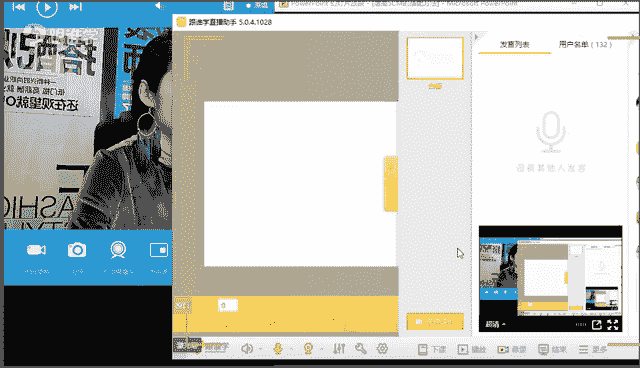
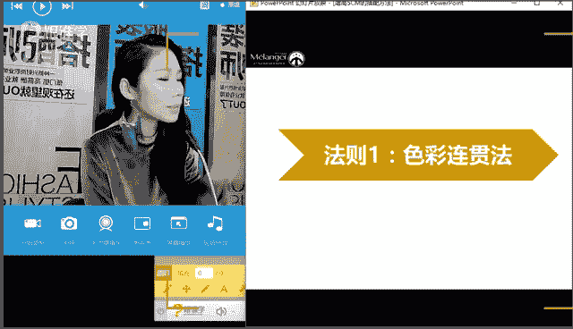
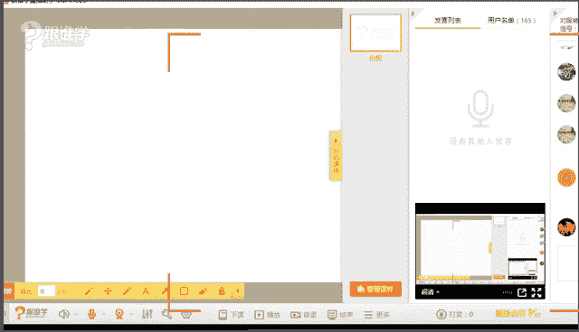
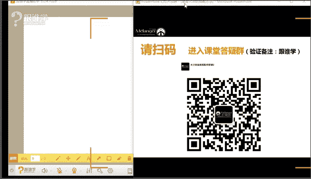
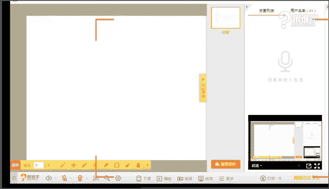
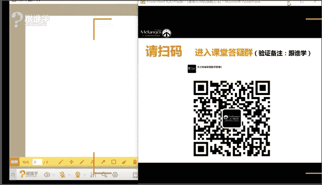

# 1、11服装《搭配秘笈之新版36计》：2增高5cm的搭配方法_rec

非常高兴呢今天能够在这儿来跟大家再次去呃一起学习关于服装搭配的知识。好，我先看一下我们来的有多少位同学好吗？😊，哦，有很多同学是已经是我们的VIP学员是吧？好，左贺车独立，您好，给自己一个未来。您好。

啊，谢谢好的。😊，谢谢你的夸奖。😊，我会更加努力的。呃，空啊，这位同学叫彭颖是吗？嗯，还有一个同学叫你傻不傻，我不太好意思念您的名字啊，因为一念好像跟骂人似的，哦，好的。😊，谢谢包春娇。好，谢谢你。

estther。好，我们又见面了。😊，谢谢大家。好，那今天呢韩老师依然给大家带来的是关于服装搭配的一些知识技巧以及专业。那不知道大家有没有准备好啊。好，稍等一下，我调整一下。好的，那呃。😊，呵呵。😊。

好，呃，那今天呢我给大家带来的依然是关于啊服装搭配的一些知识干货啊。那在这儿呢呃我相信大家呢一定在上一次我们的课程内容当中有所展破啊，金朱浩啊，同学你好，霞同学你好嗯。啊，那呃我叫韩托。

我再次给大家介绍一下自己啊。呃我本身呢是本呃就是做这个服装搭配呃，职业人才教育为主。同时呢也是为国内呃部分的像中国国际时装周、澳门时装周等一些时装周做总体的这个视觉搭配策划。嗯。

呃那呃在这儿呢我还是要介绍一下自己。我看方鸿建同学，您等不及了，说直接正题吧。好吧，那韩老师也希望喜欢你这种耿直啊，啊，那我们。开始我们今天给大家讲的内容呢。

其实是很多同学非常关心的一个主题叫增高5厘米的搭配方法哈。现在马老师想问一下，谁有这样的问题呢？就是在增高方面，谁有这样的问题呢？好。调一下几个镜头啊不太舒服。我大家已经看到了。啊，那今天呢呃不到1。

550是吗？啊，增高5厘米的搭配方法。其实呢我们在这儿说的是关于如何能够通过服装搭配来增高。韩韩老师当然没有办法说让大家这个这个这个这个我今天的方法也不是说让大家穿一双高跟鞋来增高。

那今天主要的还是让大家去通过这个增高的一个嗯。对，通过增高的一些服饰类的搭配方法来进行增高啊，OK呃，那男生肯定不行啊，比方说通过增高这个呃这个这个通过穿高跟鞋，这个方法肯定对于男生来讲是不奏效的啊。

好那呃。是的，1。68米的女生都来听。好的，那么在这儿呢，首先呢我想跟大家讲的一个问题是与一群高富美啊不输的秘籍。比方说我们看到中间这位俄罗斯这个非常知名的一个名媛啊。

那么她和一群非常高挑身材的女模站在一起呢，也有一种我不输的这样的一种感觉，这种自信。那其实呢韩老师经常会碰到这种情况。因为我本人呢只有1。64。然后呢我经常会和很多的这个模特呢。

经常会有一个工作上的一些接触。嗯，那所以有时候呢真的站在模特堆比的时候，其实我本人呢是非常非常的觉得自己真的特别的矮。然后呃所以呢当时就恨不得希望这个呃能马上能够变高啊，所以说呢。呃。

所以呢我们就有一个特别强烈的愿望，有没有什么办法能让我看上去更高，甚至让我在上镜的时候更高呢？这个其实也是一个非常重要的一个呃这个搭配的原则，看怎不能够从服装的角度能提高自己的一个身高的效果。

那今天呢韩老师先做一下课程的预告。那今天呢韩老师如果先呃5如何增高5厘米。那么我们接实5到10厘米都ok。我觉得是啊再一个呢就是呃今天呢我给大家带来。

就是我们有一个在线上有一个面对面交流的这样的一个呃这个通过电话，通过沟通的方式。然后有会一位同学在现场我们会有一个这个通话啊，直接我们一起通话，然后你可以提出你所有想要问的问题。韩老师现场来给你回答。

第二1个呢就是我们现场依然韩老师还是给大家准备的这个变身这样的一个环节。嗯，今天呢当然不是我来变身。因为我今天穿的这个衣服不太方便脱啊。那所以说呢。我今天会呃通过我们今天我请了一个我的一个学生。

然后让他呢来穿上一套服装来给大家做一个变身。有没有同学特别期待呢？如果特别期待的话，那我们就呃一起来关注一下。嗯，好，那呃再一个呢，我们首先来看一下。嗯。我们看到这个名媛呢，他本身呢他身高只有1。

50米。那么但是呢他特别会穿，怎么穿呢？也就是说他特别会把自己的这个优势呈现出来。你比方说他第一套我们看到他可以通过这个呃长筒靴的这样的一种形式。然后呢啊这个把上装的比例拉短。

然后呢把腿长给他呈现出来之后呢，他的个头呢显得非常的高挑。那么第二套呢也是通过这样的一种高腰线的提法，然后把那个身高呢也提的很高。那么在这儿的话呢，我相信我们很多同学在身高的这个搭配的问题下呢。

有很多同学有很多自己的技巧。那么在这儿有没有同学有自己的技巧，我们可以在我们的群里先来分享一下啊，你有什么样的变高的搭配技巧呢？好，那么可以在群里面来分享一下，大家可以快速的来答一下这样的一个问题。好。

有吗？来，同学们一起来回答啊。OK艾同学说高腰线非常好。

好，制造高腰线裤带方鸿建同学说裤带裤带是什么意思呢？好，不过膝的裙裙子穿短一点，对吗？还有同学说穿短上衣啊啊，上衣要短，呃，过膝长靴啊，靴子要长，为什么靴子要长呢？啊，好好，林妹妹。好的。

那大家有很多很多方法看得出来哈。😊，OK好。😊，好的好的，细高跟鞋是吧？好的，那其实这些都是变高的方法。那我们现在来看一下韩老师给大家带来几种方法。首先呢我们想要变高。

我们首先要理解一个搭配上的一个原理，叫视觉线条拉伸的原则啊，那么嗯那同学们就会有很多问题，像这个185这位同学10208这位同学说个矮的不能穿长靴吧。其实呢这个是一个误区啊，是可以穿长靴的。

只是说要看怎么穿。那接下来我先给大家讲一个原则，就是视觉线条拉伸的原则。那么视觉线条拉伸呢，其实呢我们看到好。大家来看一下，在这两个线条当中啊，大家一起来判断一下，一个是横向线条，一个是纵向线条。

那么大家看一下哪个线条视觉上感觉更高呢，更长啊。好，同学们先来一起跟着老师的这个思维一起来走啊。这两条线，哪个给人感觉更高挑呢？嗯。好，其实这两个是一样长的，我先说一下啊，我们在画的时候是一样长的嗯。

好了，同学说纵向啊基本上都说纵向的啊，永远的什么这位同学说右啊，哪有个右啊啊。好，你看到的页面和我看到的页面是一个页面吗？啊，永远的可心啊可信是吧？啊啊，那么这个图当中大家看到有一个纵线，有一个竖线。

有一个横线。那么在这儿呢，我们看一下，很多同学说唉竖线显得更长，那么这个大家要尊重我们自己本人的一个呃非常直观的一种感觉，纵线更长，那么其实这个就是我们人类最直观的一种感觉。

那么我们要尊重这样的一种感觉，也就是说我们看上去竖线会有特别拉长的感觉，对吗？回答正确，那所以呢我们从这张图当中看得出来，其实在所有的服装搭配的线条当中，你比方说我们有一字领啊，一字领，那么一字领的话。

它其实是一个横线的拉伸，那么横线拉伸呢很明确，就会让我们变得更宽，而变得更宽，从视觉上就不够高挑啊，那么纵线拉伸指指的并不是说你身上有一条竖线，而是。说你的服装的线条尽量少往两边去扩张，而往中间去集中。

同时呢要让线条显得更加的长。那么这种情况下，我们的身高呢就会显得高。好，这个叫显高的最重要的也叫最简单的原理。但是大家会发现往往大到至简，你发现最简单的原理其实就是最。什么呢？最有是所有问题的核心啊。

所以大家记住这一条叫纵线使人拉高，而横线使人变宽。那么显瘦显高，最重要的原理就是让我们的体积变得更小啊，体积变得更小那么体积越小，那我们的身高呢啊我们就会变得越瘦。那么线条拉的越长。

我们就会显得越高挑啊，天长妹子这位同学呢一直是我课堂上的这个老学员了啊，那么他问了一个问题非常好，叫竖条纹不是显胖吗？啊，竖条纹是不是显胖啊，那么首先韩老师来回答，这里呢我们认为的横条纹能显胖。

竖条纹能显瘦，就是大家共同认知的一个基本原理啊。那么所以呢我们知道大部分的竖条纹还是显瘦的啊，大就大部分竖条纹还是显瘦的。这个我们要明白这个概概念啊，那如果竖条纹特别特别的密集，排列的又特别的多。

这个时候就会反向线条就会显胖。也就是说排列的很密集的竖条纹就会显胖。嗯，好，那么嗯这个有一位同学叫你傻不傻？这位同学好，但是我的肉把我整个人都横向拉伸了，怎么办？哎，韩老师讲的就是这个问题。

如果你的身材本身长了肉之后呢，就一定会横向拉伸。那么这个时候我们就要通过服装来将我们的比例拉的更加的长哎。我不知我给您说明白了吗？嗯，好。那么所以呢韩老师通过这样的一个原理给大家带来一个增高的四大法则。

那么这四个法则呢跟大家可能认为的很多法则呢是有一个非常清晰的一个作用。来韩老师帮大家来一起来讲一下第一个法则，大家记清楚。如果我们想让我们显高跟韩老师的愿景是一样的。

那么请大家先和首先第一个法则叫色彩的连贯法。嗯，好，这里有一个叫AK同学说通过什么拉长呀？好，那所以呢韩老师这样给你讲这样的一个法则，你先听一下。如果说待会有什么样的问题，我再具体跟你来讲。

因为刚才没有例子，那么你就可能感觉到非常的抽象，对吧？可能我们很多同学也有这样的一种感觉啊。好，那么通过什么拉长呢？好，我们来看一下第一个方法叫色彩连贯法。首先呢什么叫色彩连贯，大家看这两位先生啊。

他们的着装当中我们发现第一套来看一下我的鼠标。

指的位置。第一套我们发现它的上下装是分身的啊，上下装呢我们看到它是一个完全五五分开的作用，上身颜色较深，下装的颜色呢较浅。所以有一种上下分身的这样的一种截断感。

那这样的截断感呢其实就会把人的整体的线条呢它会有这种什么变短的效果，所以它没有这种纵向的连贯性。所以他就叫什么呢？没有。🤧。🤧。🤧Yeah。🤧啊，最近呢就是咽炎有点严重啊，不好意思啊。好。

我们继续再看啊。那么我们来看一下第一套呢，我们看到它是一个有。纵向的呃分割线又横向拉伸。那么这个时候呢，我们看到它的这个整个的横向拉伸啊，其实呢会让他整个人会有一个呃截断感。那么它就有种五五升的感觉。

就会没有。哦不好意思啊，我喝点酒。都め走。Oh。Yeah。哦。Oh。哎呀，不好意思，最近那个天气干燥，然后那个那个那个比岛可能所以天气比较干燥，然后就会有烟严重，比较严重啊，职业病，谢谢大家的理解啊。

不好意思。好嗯，那刚才呢我们看到这一页的时候呢，呃就被喊老声的这个咳嗽给截断了哈。那好，我们继续来开始。我们看到右边这一套呢就会有这种连贯性，它就没有截断感。

所以右边这一套呢我们发现它都是深色的色彩连贯性。所以呢它整个呢就给人感觉比较拉长啊，拉长的效果哈。那么我们再来看一下，所以我们在这儿讲的是这样的一种左边的这个效果呢，其实就是我们叫什么呢？

叫横线的截断感，而右边呢其实是一个什么纵向的拉长效果。所以右边显得比较高，而左边呢它会给人感觉显矮，不知道大家有没有这样的感觉啊，看到这张图的时候嗯。

所以我们经常说色彩本身就会给人有一种延伸的纵向拉长感。所以刚才有位同学问说，哎，可以问我说，哎，老师什么叫拉长感啊？那么大家看色彩本身就会带来拉长感啊，那么我们有时候在穿衣服的时候会有一个误区。

比方说我们的上身是一件衣服，那上身呢是一个色彩，然后呢，我们的下装裤装又是一个色彩，然后我们的鞋又是一个色彩，那么有的女生呢是短裙啊或者短裤，然后再配上不同色彩的袜子。然后呢这些几个色彩呢都是不一样的。

在这种情况下呢，我们会发现当你的身上的色彩分割的越多的时候，那么这种情况下就会有一个整体的一个什么呢？这种我们叫分割的啊这样的一个横线截段感，所以人就会变得更矮啊。好，这是我们说到的。好，谢谢啊。

黑酒的同学，你又来了。欢迎你啊。好，那么我们再来看一下内里一码色更好啊。这个概念大家看啊，什么叫内里指的是我们的着装分为上装和下装啊这样的一个关系。也就是说我们在搭配的时候呢，大家听清楚啊。

我们在搭配的时候，其实分为两个关系。第一个关系呢叫上下装关系。第二个关系呢就是叫什么呢？叫这个里外装的关系。那所以我们会发现。😊，当上下装可以形成一码色啊，那么当里外装和外面的着装。

也可以形成什么对比色。也就是说上下装和里外装，所以同学们来看一下左边这一套呢？我们看一下左右两套大家发现右边这一套啊，这个整体显高啊，程度会更好。那么左边会更差，为什么呢？

我们看到左边呢它的我们看上下装，上下装是两个色彩，一个白色，一个驼色。所以它会有截断感。对，那么内里也就是说里面的内搭和裤装也是黑白两个色。那么所以在它身上会有三条横线，第一条横线在这里啊。

那么第二条横线在上下装的位置。第一啊那么第一条横线在里外装的位置，第二条横线在上下装，也就是说这个人从视觉上看起来它有三条横线在截断，第一条看我鼠标的位置，然后第二条啊，第三条，所以说呢。

就会把这个人横向分割了三条线嗯。好好，那么接下来的话呢，我们稍微给大家，那我们再来看一下右边啊。那么右边呢我们看到它的外套虽然和下装呢是两个色彩，但是呢我们会发现李妆它整个是一个色调延伸下来的。

所以我们会发现右边显得人怎么样更加的高挑。嗯，好，那么韩老师稍微调节一下设备，有同学说好像有点听不清，还是说这个画面不好。那大家稍等一下，我调一下设备啊好。

所以大家通过我们的整体的一个视觉的感觉来调整这个色彩是非常重要的啊。所以呢同学们可以通过刚才韩老师讲的第一个法则叫什么呢？色彩的提升法，色彩的延伸法，那么叫里外内里啊，内里里外一码色。

也就是上下一码色会带来更加高挑的感觉。嗯，好。

好，可以了。嗯，好，谢谢。好，那我们再来看一下。😊，下一张嗯。所以呢第一个就不太好。那第二个呢就非常好啊。那这个叫什么？同学们记住叫内里一码色更好。来，我们再来看一下第二个啊。那么同学们再看哈。

这个又是一个对比啊，这个很有意思。我们看一下左边这一套显得更加高挑呢。而右边这一套呢，大家看一下这个时候啊，我们发现左边呢只是里装一码色。而外套呢它是什么？它是分开两个色彩的。

就是上装和下装却是两个色彩啊。那么我们看到右边呢是上下装，整个里外装叫上下里外整个是一个色系。那么所以这个时候我们看到右边显得其实更加的什么高挑啊，一定会右边更加高挑。

只是说这个model它的这个迈步的姿势，好像显得这个没有一个很长的一个这样的一个很强的表现。那么其实右边它显得更加高挑好，AK同学。啊，天朝妹子同学说，哎，不对呀，我觉得右边的色彩很单调。

那么在这儿呢韩老师想跟你说一个问题啊，我们在讲到搭配的时候，其实不是说只有色彩搭配，而是说还有面料的搭配啊，廓形的搭配材质的搭配。那么虽然右边的色彩是一个色彩。但是呢我们会发现。还能叫什么嗯。

哦，看不到了是吧，稍等一下啊嗯。

好。好，可以看到了啊。那右边呢它其实用的是一种方法啊，这个天朝妹子可以听一下啊，叫同色益制版。红色抑制法什么叫同色抑制法呢？其实就是我们说到的同样的色彩，不同的材质啊所带来的这种变化感。

不是说搭配的时候必须要色彩变化的啊，它用的是同样的色彩不同的材质。你比如外面外套是羊绒的这样的哑光材质，而里面的内搭有一点点丝质光泽的微弱光泽的材质，所以搭出来呢，而且外套比较厚，而内搭呢特别飘逸啊。

特别的柔软，所以说呢它整个搭出来你发现有柔啊，有硬朗，然后呢有这个光泽有哑光，所以这一套的搭配呢给人的感觉呢，其实是非常有层次的啊，这个在国际上非常的流行，而且这样搭出来是很高级的一种感觉啊。

所以我们有很多同学总跟我讲，老师搭配呢只有色彩搭配，其实这个概念韩老师是不太同意的。因为色彩搭配固然有吸引力。但。但是色彩出现的很多的时候，如果你调控不好，反倒我们感觉到品质感会很低。嗯，好。

那么我们在这儿呢我们不说呃其他的问题。刚才我说的问题会在我们的VIP课程当中会给大家讲到专业方面的东西啊。那么请大家来左右对比一下，是左边显得更加高挑呢，还是右边显得更加高挑呢？OK那毋庸置疑。

是右边好，那么所以呢我们来看一下。在这三套当中，大家发现没有？都是金色啊，金色橙金色来搭配的。那么我们看这三套哪个显得最为的高挑呢？啊，哪个显得最为高挑呢嗯。123哪个视觉上感觉最高挑？好。

大家有没有看出来是三个方法。第一个呢叫上下装，里外装都是不同的色彩。那么这个时候呢，这个人呢就被横向分割开，感觉这个人呢最矮非常好啊，那么大家回答正确，非常好啊，那我觉得大家呢有机会可以做搭配师的啊。

悟性很好。那么我们再来看中间这一套中间这一套呢叫里装是一码色，可是上下装外装却不是一码色，所以它的腰系这个位置又有分割感啊。那么第三套为什么感觉最为显高呢。那我们看到它的上下装其实都是一个色系的。

而且呢它提高了腰线，所以最右边第三套呢最显高挑。所以大家发现。一码色是有三个方法的啊是有三个形式的。第一个形式呢就是我们说到的上下里外装全都不是一码色，显得是最矮的。

那么第二个呢稍微高挑的是外套和下装不是一码色，但是内搭是一码色啊，内搭是一个色系啊。那么所以显得呢啊也是相对来讲居中的高挑程度啊，那么第三个我们发现呃上下装同色系，并且有渐变的感觉。

那么这个情况下呢是显得最为高挑的，大家记住了吗？嗯，好，那么林妹妹carvin说中间换一个黄色鞋怎么样呢？嗯，是问的好，中间换一双黄色的鞋子，它和肤色和这个裙装都会有一个延伸感会更好，非常好啊。

那么还有同学说，那要都是黑色呢啊都是黑色，那还不用讲了，那肯定都是什么一码色啊。好。我不知道我讲这个大家有没有听明白，刚才韩老师给大家讲上下装一码色。其实呢我们有三个问题，大家平常在搭配的时候要注意。

第一个呢就是我们说到的啊，上下装图是同一个色彩啊，那么最矮。那么第二个呢是上下装是同不同的色彩，但是里外里面的这个装束和下装是同一个色彩居中啊，那么第三个是最好是上下装是同一个色系。

那么同时呢有渐变的效果，那么身高显得是最为高挑的嗯。啊，畅林娅的同学啊，不是说以后买套装啊，而是说套装穿起来其实很沉闷的。那么其实我说的是同色系也可以。第21个呢，关键除了色彩的显高。

我待会儿还会介绍三个其他显高的方法。所以韩老师讲完这个不是让大家都去买套装。那么还有第31个就是说如果你个头本身很高挑，那你就可以穿第一种啊。啊，那你就可以穿第一种啊。啊，那么1370816这位同学呢。

我可能喜欢第二套啊，那在这韩老师想跟你说一个问题，喜欢和我们想要达到的目的有时候是不一样的。你比方说你虽然喜欢，那么但是你170，你自然而然你可以去穿啊。那么如果你喜欢，但是我们只有150。

那韩老师就不建议你这样穿啊。那么喜欢和适合自己，其实是两回事。我不知道我这样讲啊，能不能给您解释明白这个问题啊。好，那么这里面呢我们说再说一下，再强调一下，韩老师特别看讲完这个之后呢，大家有一个状态是。

哎呀，我们以后都买红色系的，不是这个意思啊。第一，你身高在163以上，你就不用这么穿啊，你从第二种效果穿起说明白没？163是一个中等个头，那么第二种效果啊，163啊，比如说150到163。

你就是选23搭配吧。如果。到165167，然后170175，那你就可以选第一种搭配吧，听明白了吗？嗯。好，第二个呢就是我说的中间这一套是中间效果也会显高，但是没到最高。嗯，好。

那么这个呢150以下那就不用讲了，一定是这一套的效果啊，一定用色是这种效果啊，用色啊好。啊啊，还有一个，大家千万不要认为韩老师只让你们用驼色啊，你可以一身都是黑色，或者一身也都是白色。总而言之呢。

你的整个色系是有连贯性的，有连贯性，或者是白上身白，下身是浅灰，那么也可以形成连贯的效果。我说明白了吗？嗯？方文轩同学，你是讽刺我讲的真仔细，还是说你嫌我啰嗦呀，还是觉得我讲的特别仔细，在夸我呀。不错。

太可爱了啊。都是我的老学员了。嗯，好好好，谢谢啊好，那么接下来呢因为这这儿我想说一下，我们有很多同学啊，其实对色彩啊，或者有时候真的是第一次来听课。所以韩老师真的给大家要呃讲的那个要精致精细一点。

因为有的同学呢他一旦发生这个错误的理解，他有时候出去之后啊，他穿衣服会特别的这个这个这个走右误区，所以韩老师不希望你们来错衣服啊，所以说呢才给大家讲的更细一点啊。那么比方说你听过我的课。

可能你一下都听明白了，每个同学他的接受度不一样。而且我个人呢上课尤其上这种线上教育课，我有一点不安全感，就是你们没有坐在我的对面，我看不到你们的眼神给我告诉我的是明白了还是没明白，所以特别容易重复啊。

所以希望大家呢能够谅解韩老师的这个心情啊啊，谢谢。嗯，好，那么我们再来看一下男装啊，男装的话，我们看一下这两个很明显也是右边。高挑是吧？那刚才我把这个方法讲完，大家一眼就看明白了，右边显得更高挑。

左边不高挑的原因是他身上有3条横线分割。第一个是里呃里装和下装啊，第二个是外装啊，上装和下装。那么所以你会发现有一条横线，一条横线，所以分割感觉特别强。那么矮个子的同学呢尽量不要去穿左边这种效果。

尽量去穿右边这种效果。嗯，好。啊，那么我们再来看一下啊，这里啊全身色彩连贯。那么我们再来看一下这边呢其实也是我们说外套色彩连贯，这个是内搭色彩连贯。其实这两个效果是什么呀？是比较类似的啊。

那么但是呢外套连贯性。搭配的色彩接近它的显高程度会更好一些啊，显高程度会更小。我说的都是一个和一个的对比感啊，一个和一个的对比感好嗯，左边感觉好。

林妹妹主要是源于左边的这个模特本来就瘦右边这个模特你看起来没本来就有点壮啊好，左边是专业模特来着，右边一看就是什么？就是街拍达人这种的啊对对对，大家现在对颜值啊要求更高一些啊。好，那我们来看一下同学们。

大家看这三套男装啊，男同学可以看一下啊，我这三套当中大家发现哪个会显得更为高挑呢？啊，123大家来这个看一下哪个显得更高挑？嗯，非常好。好，第三套显得更高挑是吧？非常好，那大家一眼就看出来了啊。

那么我们在这儿呢我们来解释一下，第一套显得不高挑的原因是上下两个色啊，里外也是两个色啊，呃里面和下装也是两个色，所以它分割性很强啊。那么第21个呢大家发现虽然外套和下装不是一个色，但是里面是一麻色。

所以第二套居中第三套上下装啊，里外装全部是类似色。所以说呢第三套显得更高挑嗯。好啊，谢谢林妹妹啊，是的，因为有很多男同学经常跟我说，老师，你也讲讲我们吧。啊，因为韩老师是讲男装出身的。

所以韩老师也特别愿意讲一些男装的这个呃这个这个内容啊。呃，因为韩老师也喜欢这个看着你很帅帅的男生嘛，是不是？所以说也多讲一些男装嘛，大家看。样的高兴啊。好。😊，那么所以我们在这看一下啊。在这三套当中。

右边显得最高挑。对，那么主要的方法好呃，ruruti啊是吗？啊，这位同学说老师大肚子男生呢，那韩老师回答一下大家啊。很简单，大肚子男生韩老师给大家说两点。第一点呢，首先不要穿双排扣啊。

就是比方说我选这种正装的时候，不要穿双排扣。因为双排扣显得我们横线拉伸会显得更胖。这第一条第二条在这三套当中，我们会发现叫外前里深搭配法，里面局部，因为他肚子大，只需要局部收缩。所以我们在里妆怎么样。

里妆用深色，那么就会离远看，肚子就会怎么样收缩回去啊？那么再说一个问题。呃，这个如果有同学觉得老师我可能只我我作为一个男士哈，我并不高。然后呢，而且我的肚子还特别大，有这样的男生吗？嗯。好。

我们今天听课的有这样的同学吗？就是我身高并不高，但是呢我的肚子还特别大。那么这个时候第二套是你最好的选择啊，为什么第二套最好的选择呢？因为我们知道外外面用浅色显得你整个人比较轻盈。

里面用深色正好把局部把肚子给收缩回去了，所以我们把这种叫外浅里深搭配法，说明白了吗？嗯，好。那么第三套呢就适合肚子也大，唉，但是人家有点身高的啊，那么穿第三套显得高高挑。说明白了啊。好。

那么这是我们说到的第一个方法，大家记住了吗？这个叫色彩的什么延伸搭配法啊？好，那我们来看一下法则2嗯，法则二，大家总觉得非常好法则2法则二叫腰线提高法啊，腰线提高法。那么这个呢刚才我听很多同学都讲。

那么在过去的古希腊的时期呢，腰线提高，我们把这种叫地正式高腰线。也就是说过去的女士她会把腰线提的在胸部以下，那么提高胸部以下呢，她会有一种把腰线隐藏起来的效果啊，那么所以在大家她穿成这样之后。

我们发现唉这个人好像变高挑了，为什么感觉上身很短，下身特别长。所以呢这个叫地震式的这个叫复古的高腰线法嗯。好，那么我们再来看一下希腊式高腰线。我们发现在古希腊的这个呃褶皱长裙当中，当腰线呢提高之后呢。

哎我们会发现感觉是不是上身就变短了，而下半身变长了。所以这个比例就会变得更加的完美。那么上短下长，显得我们整个的身高也会加高啊，这个就是我们说到的。嗯，好，当然了啊，这个这个希腊的经典款。

可以说是一个非常叫我们叫古典主义，那么到现在包括纽约的大都会博物馆啊，到现在呢还有珍藏这个古希腊的这种款式，非常经典是valentino啊，还有这个valentino。

它是做经典的这种古希腊式的这种避震式腰线的嗯。法则二是吧？好，我们看一下啊，叫腰线皮方法永远的可期，记住了吗？嗯，好。好，那么在这儿呢我们来看一下。那么接下来的话，我们怎么去提高腰线呢？

我们来看一下第一个就是我们可以通过这个叫什么腰带来提高腰线啊，提高腰线。嗯啊地震地正是我在我的这个课件里有。帝王的帝啊帝王的帝，然后政要的政政客的政政治的政地政啊地政是。帝王的帝啊政治的政帝政是啊。好。

那么呃腰带。塑造高腰线啊，所以呢同学们大家注意，刚才对地震是不太听没有听明白的。说明同这函盖也可以看得出来，同学们对服装的专业呀还是比较欠缺的啊。呃，对这个空。这个KONQ这位同学答对了，你傻不傻。

答对了啊，AK答对了。对对对嗯。🤧好。😊，那么我们来看叫制造高腰线。那么大家看一下，通过腰带将服装当宽宽的服装的这个腰带呢我们拉高一点。那么这个就叫避震式啊制造高腰线法。

高腰线最重要的一个方式是让上半身看的很短，让下半身看的很长，来，同学们看一下啊，呃左右两边啊都是明模。那么我们看到他们的腰线放的位置让我们看起来身高是不一样的，对吗？好。

那么大家感觉哪个是显得更加高挑呢。好，第二个非常好。那么很明显。第一个呢大家看到它上装偏长啊，而这个裤装呢呃这个裤的这个腰部呢就非常的下移啊，那么这种情况下呢，显得整个人呢这个比例就会向下走。

显得腿会短，上身会长。所以呢它就显得不够高挑。而第二个呢大家发现啊这个上装呢特别的短款，而裤装呢它是高腰线过了这个肚脐，在腰最细的位置。那么这种比例呢叫提高腰线，让我们看上去更加的修长。

所以刚才韩老师讲的提高腰线法呢里面具体讲到有什么呢？有这个叫呃把腰线提高啊，那么同时呢我们可以通过这个比例的调节法，让我们看上去上身更短，下身更长，显得更加高挑嗯。嗯，这个那我们接着再来看一下啊。好。

那么我们来看一下，第31个就是服装本身设计提高腰线。来，同学们看一下啊，左边这一套呢，我们看到它的这个腰线位置特别的下移。那么这个款式是很明显。上世纪20年代的这个叫什么腰线放低的这样的一种款式。

那么当腰线放的比较低的时候呢，那我们整个的线条呢会往下走啊，整个的人的比例呢也会往下走，所以会显得身长腿短啊，那么我们再来看到右边右边的话呢我们很明显，它的收腰的位置呢会比较高啊，收腰的位置高。

那么就会把我们整个下身的比例会拉长啊，而上身的比例会感觉视觉上从这儿开始就是上半身下身的比例拉长，所以感觉呢整个人穿起来呢显得上短下长显得特显得整个人的形象呢啊比较呃身长呢会比较高挑。嗯。嗯。

会总结是吧嗯。啊，有同学说我有小肚子是吧，都没腰了，用不了啊，你放心啊，郝老师跟你说一个概念，6679这位同学，你有小肚子，其实这种的你没有腰，其实呢你穿这个是最好的。为什么啊？我跟你讲。

因为我们在搭配上有一个叫对比法，你有没有发现当裙摆越大，其实你的腰线呢？你的腰显得越细呢？就像什么意思呢？你呢本身可能比如我比较胖，然后呢，我身边站一个比我还胖的人，那就显得我特别瘦。

你比方说当裙摆越大的时候，那我们的腰线就会显得怎么样越细。所以反倒你有小肚子，没有腰，你穿右边这个款式是OK的。啊。好，不信下一次可以尝试一下。嗯，天朝妹子同学说老师一码色还要腰带吗？呃，可以有腰带。

因为腰带是可以把腰线勒出来的，就是腰有多细啊。比如有的一码色很宽阔。比如说今天韩老师这件衣服，那你看一下啊，今天我这件衣服呢，它本身大家看一下就是一码色。但是呢我有了腰带之后呢。

就可以展现我的腰的位置就会让我上半身显得更短，而下半身显得更长。我说明白了吗？那你可以选择同色系的腰带，同色系的腰带啊，所以说呢这个时候有了腰带也不用担心。嗯。好，同学们的问题特别多，都是关于体型问题。

那么在这儿呢，韩老师呢因为时间关系我没有办法一一给大家回答啊，那体型问题如果比较大的话，建议大家可以关注一下我们其他的这个呃这个这个像我们的VIP里面的课程里面就有全面的体型调整的问题。

其实我说了每一个人在穿搭的时候，第一个不是风格，而是如何让自己的体型看上去更加完美。嗯，所以我相信大家有脖子短啊、肩宽呀、肩厚啊、手臂粗啊、腰粗啊、胸围比较平或者胸扩大呀，或者这个大腿粗啊。

小腿粗啊、臀大呀啊，然后呢这个脚也大呀。然后整个人长得厚啊，个儿不高啊，个矮呀，肚子大呀等等等等。我知道新发型的问题特别多啊，那么这个恰恰就是我们在我们的VIP课程当中会给大家讲到的。

就是第一节课做服装搭配之前给自己穿搭之前，第一件事就是了解你自己的体型。而且很多同学有很多那个呃这个。对自己过分的呃判断是错的。比方说他觉得自己脖子特短，其实呢在我看来不短。啊，在我看来是不短的。

那么还有就是有的同学觉得自己的这个腿特别粗。那么其实我通过皮尺一量，我发现你腿并不粗啊。那么还有的同学说老师我觉得我腰特别粗，或者觉得我腿特别短。其实呢我们我我知道大家呢其实并没有这样的问题。

只是你拿放大镜经常看自己。嗯，啊，那么在这儿的话呢，呃因为在这儿我们这次的这个课程里主要给大家讲如何显高嘛，其实就带出了大家很多问题。我看很多同学问说哎呀我的身材各方面的问题特别多。

那么所以呢我们在我们的V再说一遍啊，有同学问在VIP课程当中，大家可以来呃首先第一节课就是教大家如何来量体啊，如何来通过尺子来知道自己脖子长啊，脖子短呀啊来知道你自己到底是沙漏型啊还是香蕉型啊啊。

还是梨形的呀啊，你还是倒三角形，你先对自己有一个判断才能说到搭配服装啊或。否则你不知道自己的优缺点，你很难穿的很漂亮。嗯，好。那么接下来我们再来看一下。好，第三个法则叫焦点上移法。

待会儿我会给大家整体总结一下啊，焦点上移法我们来看一下啊嗯。焦点上移呢其实指的是一个人在穿搭的时候，今天其实韩老师用了这样的一个效果给大家看一下啊。好，那我今天不好意思了啊啊。大家看一下啊。

首先呢我今天用到的是一码色的方式啊，用的是一码色的方式啊，今年流行的这种天鹅绒的这种服装款式一码色。然后呢我又用了一个亮色的耳耳饰耳环呢，这个叫焦点法，再把焦点往上移，同时呢我又用了腰线提高法。

比方说我用个腰线，大家看一下腰线系得很高的时候，这个时候呢，你会发现我上身短下身长啊，那么就会有增高升高的效果了，这件衣服唯一不足的就是我觉得啊如果这件衣服如果能是一个V领，我觉得它更。啊。

如果是个V领会更加好看，会更加显得脖子会收长啊。那么所以呢因为冬天嘛，所以它有一个高领，所以这里呢我们尽量让头发呢显得更加的简约。比如说把头发扎起来，待会儿我准备想给大家演示一下。比方说我把头发扎起来。

这个时候你就觉得我们这里呢会非常的什么非常的轻松，非常的这个叫呃轻爽，所以我写的脖子也会怎么样长一点啊。好，所以韩老师是给大家呢呃去呃给大家演示一下，就是我今天的这个着装里面其实用了这个叫什么呢？

用了焦点款耳环的焦点款在上面同时用了什么提高腰线款，同同时有个文艺马测啊。所以呢今天也是配合我们今天的这个搭配啊的主题来讲的啊，那这接下来呢韩老师把这个头发扎起来。

那待会呢我们会请我们的呃模特来专门给大家呢来讲一下搭配。那么接下来我把头发扎起来，大家看上去会搓的更加的轻爽。其实我。刚才呢是给大家大家看一下啊。啊，是不是更加清爽。

因为这个领子呢它是一个这个这个这个高领。所以说呢如果低领的话呢，它会显得脖子更长，那么这里呢头发再堆过来，那么整个人显得会比较臃肿。那么这样的话，我把它扎起来，然后把这个叫什么焦点移高。

然后高腰线啊一码色，那么整体呢就会显得高挑很多。嗯，好，那么我们再来看一下这个里面我们看到他的项链是不是在呃这个这个高腰线呢，我们看一下项链呢它是不是一个焦点法在上面啊，那么所以他戴这个项链的时候。

其实心机很重，其实就是想把焦点上移。嗯，好，我们再来看一下，那么这个男生的搭配的时候，其实我们完全可以用什么呢？可以用这个叫帽子啊，可以用身用一个非常跳跃的色彩，让整体的视觉呢往上移。

那么就会有种什么加高的效果，嗯，弯高的效果。所以如果同学们想在这个焦点把在用的时候，尽量在什么？在上半身尤其在头部啊去做这样的。一个啊这个这个呃这个搭配呢啊把焦点往上移会更好。那么这个男士呢就心机更重。

比方说他的眼镜啊颜色非常的鲜艳啊，那么呃他的整个的眼镜呢它往上啊在面部，那么整个的视觉呢会拉高啊，那么加上她今天穿的这个色彩呢又是一码色，所以说呢她在她原有的这个呃体型之上呢已经显得相当高挑了啊。好。

那么对的，那么们再来看这个女生，她在细节上，比方说帽子围巾，那么都会眼镜都会有这种焦点上移法的效果啊，那么所以呢他这个焦点呢整个向上走，那么就会有拉高线条的效果。嗯，不知道大家有没有感觉到呢嗯。好。

那么刚才呢韩老师给大家讲了三个方法，接下来最后一个方法叫鞋履拉长腿部线条。好了，那韩老师的这个模特呢也到场了啊，那待会儿呢我们给大家来演示，那我们讲完法则四之后呢，我们请我们的模特啊来再来给大家演示。

然后韩老师给大家我们现场演示一下啊啊，鞋履拉长腿部线条鞋很重要。来大家看一下平跟鞋高跟鞋大家发现高跟鞋更好，为什么呢？我们看一下啊呃我我说的模特啊，大家是我们的这个呃我们通常我们自己身边的朋友啊。

我说的不是那个这个呃175的这个大家说的T台模特啊，为什么呢？因为呃这类的模特本身身材就很好，它没有调整的这个空间。所以说呢我们请的是我们身边都能看到的好朋友的啊这样的一个。

大众朋友的这样的一个形象的模特啊。好，我们来看一下。那么呃这个呢这两件衣服呢，我们这两条这两双鞋啊，我们看到了平跟鞋大家看到没有？小腿变得很短，而高跟鞋呢显得小腿很长。原因是脚面高跟鞋。

把我们的脚面也变成了小腿的一部分，所以显得非常的修长，所以爱穿平跟鞋特别喜欢舒服的妹子们啊，你们尽量去怎么样选择高跟鞋吧。好，这是第一个。高跟鞋好与平跟鞋大家应该可以看得出来啊，法则次叫通过什么呢？

通过鞋子拉长腿部线条，待会儿我会总结的啊啊，我们继续。好，我们再来看一下不带不带扣的鞋，比带扣的鞋好。大家看一下不带扣的高跟鞋和带扣的高跟鞋。那么大家发现哪个显得更好呢？右边还是左边呢？好，右边非常好。

右边更好。左边呢。啊，左边它在对腿部是有什么是有腿到此为止的截断感的。大家看我鼠标指的位置啊，而右边呢他其实穿上高跟鞋之后，把脚面的一部分变成了小腿长的一部分。好，那么不带套的鞋比带套的鞋好。

所以同学们当我们的腿并不长。然后你想穿罗马绑的时候啊，你尽量穿什么呢？和腿的色彩接近的，尽量不要穿和腿部的色彩有分割太强烈的OK好，很多同学都说男生呢男生呢那，那待会我说到色彩来说一下男生。好。

我们来看一下啊，带套鞋里面大家发现有一个浅色，有一个深色，大家发现哪个更好呢？是右边更好还是左边更好，都是这回都是带块的了。大家发现右边更好，左边更好。哎，非常好。

大家发现带派儿的鞋里面呢就是有扣盼鞋里面，你发现浅色的好像又更好。那大家发现哦，那我们有几个逻辑。第一，高跟鞋比平跟鞋好啊，那么高跟鞋比带派鞋好。在带牌鞋里面。和腿部色彩越接近的。越显得腿长啊。

和腿部色彩分割越明显的越显得腿短，所以再看鞋里面浅色更好，绕不绕大家听明白了没？啊，好。再来看一下啊。好，那我们来发现高跟鞋当中，我们发现裸色更好呢，接近腿的肤色更好呢？

还是说你发现和腿部有一点点分割效果呢，效果更这个腿显得更长呢？右边好还是左边好嗯嗯。盼够扣盼没看啊，这上面有单子啊，无盼有盼啊好。右边更好对吧？所以你会发现同样是高跟鞋，你发现怎么样。

右边的怎么样又更好。所以你发现跟腿的色彩，这个什么肤色越靠近，显得腿就更长，显得个儿就更高。说明白了没？所以大家发现啊哪个和哪个相比，哪个更好啊，这个是非常有讲究的。好。

所以呢我们发现你会发现深色高跟鞋啊，它会在腿部是有截断感。大家看啊它在我的画的横线，它会有截断感，这里截断这里截断，所以感觉腿呢啊也是长度有限，到这里就截止了。而浅色你会发现它有整个是什么呀？

整个把腿的比例一下子都拉长了啊，所以说呢这个是我们说到的天朝妹子又话问了，老师也不能一直穿裸色鞋问的好，你记住，如果你穿一双黑色的丝袜。那么你再穿黑色的高跟鞋，那就叫什么延伸感。听明白了没？

我这只是举个例子，你要什么，你要举一反三啊。好，举一反三，听明白了吗？也就是说，其实我们只要不是说非得穿裸色，而是说保持你腿的什么色彩和你鞋的色彩一致就好了啊，一致就好了，明白了吗？啊啊。

其实这个很多我我专业课的同学也会问我，所以你问的问题，基本上我们专业课的同学也会问他。所以说明你问的很专业呀啊好嗯。好，也就是说你鞋的，比如说我穿的是黑色的皮鞋，对不对？那么我穿黑丝袜就好了啊啊对。

只要有连贯性就好，就是不要有分割感，还是那个意思，不要有分割感。明白了吗？只要有连续性就好。嗯。明白了啊。好好的嗯。😊，不是说穿个裸色鞋，只要有连贯性，连续性。其实归根结底，大家有没有明白一个道理？

归根结底用的其实还是纵线线条拉长。横线线条有截断感穿明到了吗？也就是说，你发现你穿裸色的鞋其实和腿部的色彩是有延伸感的。你穿黑丝袜，穿黑色的鞋还是有延伸感。只要没有截断感，只要没有横线截断感都会显长的。

大家有没有悟出这个道理呢？嗯。好的，所以最后呢我给大家总结一下啊，那么总结完马上我们要看我们的同学来换装了啊。那么第一啊这个法则一色彩连贯法法则二、腰线提高法，法则三焦点上衣法，法则四。

鞋里拉长腿部线条法。方鸿渐说，讲讲男生吧，那么男生的鞋其实也是同一个道理啊，如果你污透了这个概念，你会有一个感觉说男生的鞋，比方说男生主要在袜子鞋和裤子的线条上做。比方说你想显高。

那你就是深色的鞋深色的袜子和深色的什么裤装啊。因为男生没有办法去穿这个丝袜嘛，对不对？那么所以呢呃这个在裤装、袜子和鞋的颜色上尽可能的怎么样去拉伸啊。天堂妹子说，V领是不是显高yes。

因为一字领会显得横向拉伸，显得脖子短。那么V领呢大家会发现啊，那么它会显得怎么样，会有纵向的拉伸线条，所以显得脖子会长。嗯，V领也叫纵向线条拉伸。其实我今天讲的大家明白一个道理。

叫我讲的全部是横线和纵线的概念啊，不管是腰线提高法焦点上衣法，鞋履拉长法、色彩连贯法其实都是什么横线和竖线的效果。那么大家如果听的说，哎呀，老师你给的内容太多太多了，太密实了啊，然后我还没有了解。

还没有明白，那就说明两个情况。第一，你对自己特别不了解啊，第二1个呢，你对服装里面的一些美学的以及线条的基本的原理不太了解。所以现。那为什么那么多人穿不明白，主要的原因是第一你不了解自己，第二。

你不了解服装嗯。啊，当然不止四个方法，平常妹子当然不止四个方法，这里面的方法还有很多啊。那今天的内容老师只能讲到这里。那么我们在我们的VIP课程当中，那我们在整个权限的三十6计课程当中呢。

前六季我给大家呢让大家来感受一下。那么我们在三十六计后十季里面是给大家给到非常非常专业的方法的。那么这里有很多同学没有基础，所以你你能掌握这四个方法，我觉得对你的服装搭配已经有很大帮助了，不要求多啊。

求精讲那个身材是吧？那我们助教老师可以跟我们这个。spy卡这位同学可以说一下，我们的在我们的36计课程当中，哪一哪一节课是专门讲身材的啊，赶紧跟我们的这个呃跟我们这个助教老师呃。

助教老师跟我们这位同学说一下。好了，那接下来大家期不期待啊，我们的付费课程就是呃待会儿呢我给大家说一下啊，嗯再看一下啊，呃我们的付费课程在这里就是三六计看大家问的特别多啊。那么服装搭配嗯三十六计。

我今天讲的是这个今天讲的是增高5厘米。下一节课我给大家讲5分钟出门的搭配方法，下一节课程全变身课程，啊，全变身课程，也就是下一季下一节课也就是在周三的晚上，我们我给大家呢叫全变身课程给大家来体验。

我们会让我们的所有的搭配的效果全部都能给大家看一下。所以下周三我们要期待一下啊，那么三十六计当中呢，我们后十季啊是给大家是我们的付费课程。那么这后。

实际呢其实呢我们是给大家给到从身材啊到配饰到很多的专业的方法，会给到大家。好了，那接下来邀请一下我们的模特啊啊，本周三sorry，本周三本周三sorry啊，本周三啊好，那么这个课程我要说一下啊。

那么呃我们这个课程，因为我们线下的我们线下米兰欧是一个专业教服装搭配的一个学院。那么我们线下的专业课程呢，大概都是在一万多是专业培养搭配师的一个学校。那么我们的搭配师基本上都在时尚圈和服装行业在工作。

那么我们线上的课程呢，就这个。399这个课程可以说是我们呃属于应该相当于从价值上来讲是白送型的课程。因为这个课程呢我们会涉及到我们的这个搭配当中的一些密集的方法啊，那么而且专业的方法。

那所以呢这个课程呢，其实是让大家能够快速的让，其实也是回报我们李敖长期来的粉丝的，所以说呢采用到这样的一个线上远程学习的这样的一个方法啊，啊，那么我们在三十六计。那么我们前面十六计啊。

我们第前六季是送给大家。那么中间的十际，我们是通过这样的一个方式给专业的内容给到大家，比方说体型啊啊，配饰啊全部都有带大家看下里面的内容啊大家参加肤色黑黄脸型和眼镜体型搭配三0篇衣橱规划。

体型循环显瘦等等等等啊，那么这个是结合了肤色片生材片给大家呢是给了非常非常专业的内容。嗯，好，其实这个是回报我们的这个呃粉丝的一个价格。啊，那所以同学们感兴趣，今天无论如何尽快的加到我们的群里面啊。

那这个是我们学校给各专各大秀场做的搭配，这是我们的学员在香港在澳门各种秀场时装周上做搭配。这是我们老师带的学员。所以我想告诉大家，光说不练假法式。那么接下来的话呢，同学们OK嗯，如果要报名的话呢。

直接可以在我们的平台报名，或者现在待会儿呢我们有呃15分钟，我给大家用来解答大家刚才课程课程上的问题以及报名的问题。大家现在扫一下码，然后可以进入到我们的群里面啊，然后我们进行这个待会呢给大家答疑。好。

好的，嗯。是的，如果付费的话，前六节是可以回看的。是的是的嗯。是的，嗯，好呃，线下学习大概是需要呃20多天到一个月的时间。对，那么大家扫这个码，然后可以进入我们群里。好，那接下来的话呢，大家边扫码。

然后有请我们的今天的搭配模特。好，谢谢来，我们欢迎一下。嗯，OK好好，你好，也是美女一枚哈。她的名字呃，叫我们叫小颖啊，叫小颖。好，我们来看一下小颖啊，小颖你好啊，那今天呢好韩老师也站起来啊。好。

那么小颖呢今天呢这是她平常的一个着装的一个习惯。对。😊，啊，然后你平条呢这套呢，其实是你今天来的时候。好装，那么好我们讲你我往前松来一点让大家可以看看。所收好。嗯，现价没有转了。好，大家可以看到吗？嗯。

😊，好，来看一下啊。那么小颖呢今天她穿的这个衣服呢，我们会感觉到他这个里面的色彩有点膨胀，会显得他的这个跨这个空呢然正T须点短。那么会显到他这个胯这个地方会显得有点宽，会道大家也能感觉得到啊。

胯这个地方有点宽。那么他这个也是分色，但是一码侧一个侧一个色，所以这三个色呢分割的特别明显。大家看他身上有三条线，一条线分割。另外一条线分割，那么他身上有三条线分割，把它人分成了三段。

那么这种分色的效果呢会给人的感觉呢啊，没关题。有点紧张啊，那么这个分色款呢会把人呢会呵割的比较矮。所以说呢接下来的话呢我们给它通过搭配来，我们看一下如何显得它更加的高挑啊。OK好。

那么首先呢我给大家拿一下服装。当然了，今天韩老师还是要给他搭出这种有风格感的感觉啊。好，嗯，我们来看一下啊，首先呢我拿一件特别基本款的白衬衫大家看一下啊，白衬衫来小礼帮我们拿一下。

大家家里自己有没有这样的？有没有自己的白衬衫嗯。有没有这样的白衬衫大？看一下这个其实特别好买啊，也比较容易整合到歉的款式啊，这是一件白衬衫，它有大用处哦。

待会我们看一下这件白衬衫能搭出特别不一样的感觉啊。然后我们再来看一下老乔你帮我拿一下。然后这种裙装呢，其实在很多今年的这种刺绣裙啊，在很多人眼里哇，这种裙子太可怕了，怎么穿呢哈。

我觉得这个里面又有一绣花，然后就会觉有像缎面一样这种效果。很多人会觉得特别的老气，越老气，相信你有这种感觉。就说如果你自己去买，你会觉得这件。驾驭不了啊，就觉得很老气。很多同学看到你个哇，太可怕了啊。

所以能待会儿呢我想给大家看一下我们怎么来搭配这套衣服好吗？那接下来我们请小雨在旁边换一下衣服啊，换一下衣服。好，那么我再给呃在我们接下来给小雨换装的那个过程呢。那我们来给大家说一下。

就是刚才呢同学们呢可能现在有同学已经在扫码进群了啊。好。😊，那么我们看一下扫码进群了，那同学们呢可以进行这个在群里面和我们的老师互动，但是不要着急互动。韩老师待会儿啊1510分钟以后。

我会去群里去给大家做这个问题的解答。那么我们来等一下我们的模特，让他来换一下妆，看看搭完之后的效果啊，来韩老师给大家来讲解一下嗯。好，接下来带大家有一些呃线上正好呢有一些问题呢可以给大家来回顾一下。唉。

可以说所以我们的衣服就要按色彩渐变来穿哦。啊，AK你刚才有没有听韩老师在讲，其实呢如果第一你没有身高问题的话，你就不用一码色去穿，否则这样太无聊了，对吗？啊，那么第二1个呢就是呃一码色除了色彩。

我刚才说还可以有什么提高腰线吧，就不一定非得通过色彩。刚才韩老师讲的那四个方法都可以用腰线提高码呀啊，包括这个呃鞋子的色彩呀等等啊。那么所以呢这个呢大家。一定要去呃这四个方法用一个都行啊。

不是说嗯这个这个必须是一个色彩，所以说不要呃这个钻刺活动啊，就是钻领了肩这样的一个想法啊。那么所以不是说让你们非得立码色。嗯，好，那刚才呢嗯呃穿呢不是我穿，是模特穿啊。韩老师这个已经呃上回穿完之后。

很多同学说韩老师你是网红，所以我有点害怕哈，所以今天呢我们请了一个模特来穿啊。嗯。嗯，模特还没换双前那套衣服嫌矮。是的是的是的，很多人都这样穿。没错，就是说大家只是找了一个内搭，找了一个外套。

然后呢又找了一条裤子，然后三个颜色，然后很多人显得特别的感。不高吧，所以说这个就是一个问题嗯。好，那接下来的话呢这样子那正好呢我们有一个举手环节，趁模特去换装的时候有一个举手环节啊。那接下来的话呢。

韩老师来看一下刚才哪位同学举手了。然后呢，我们来看一下。嗯。新系陈同学你好。谢谢陈同学你好。可以听到我讲话吗？好，谢谢成同学嗯。嗯，可以听到吗？听得到哈。😊，好，那你有什么样的问题可以和韩老师直接沟通？

是的，可以对话。我今天有一个。😊，对话环节。好，我们来调试一下啊。啊，留个对话环节。谢谢陈同学，你记得啊，我说话的时候呢，呃你这边要关麦啊，然后你说呃你说话的时候呢，我这边要关麦，否则我们俩是听不到的。

OK好，接下来你来呃提问。对，今天活动是连麦。是的是的嗯。Oh。Yes。好，我很高兴在这儿能听到你的声音。首先呢我觉得好久没见你了。你一说话，我就记得你是谁啊。呃，非常高兴。然后呢，在这儿呢。

其实我们呃在这儿呢？首先我们要说一下，学习服装搭配有一个很重要的一个问题，就是我们一定要这个多练习。所以说呢我们在课堂里面的设置呢。

其实都是让大家至少要搭专业课里面至少要搭400套的服装才能够真正的能够毕业。那么在这儿的话呢，我想说你这边呢其实因为你现在工作关系，首先呢没有自信，其实韩老师想告诉你，越学的越多，其实自信感会越差。

为什么呢？因为你会发现你知道的很多，你为让你自信呢啊，就就就啊。😊，没有关卖页吗？啊，没有关麦，那位同学没有关麦啊，那个崔西晨，你把麦关一下，刚那同学都听不到嗯。好，那其实在这儿呢韩老师想跟大家讲。

就是说呃想跟你回答，就是说首先呢搭配第一条一定要多练习。那么多练习的话呢，首先要至少韩老师讲在课堂里面至少大400套以上。那么你平常也要叫量变产生质变是非常重要的啊。

这是第一个第二1个呢就是你现在的这个工作呢啊，你在想自己开个店啊或者什么的。那么其实很多同学反馈刚学完的时候呢，其实他都是没有太大自信。因为这里面有一个很重要的问题，就是你越知道越多。

你会发现你越不懂的原因是因为你懂多了，所以你发现还有那么多不懂的。其实很多人在不懂的时候，反倒觉得自己挺懂的啊。所以说你一定要有自信啊。好啊，我知道你是哪位同学。

我相信你在这儿呢还没有说清楚你具体的问题。那么你接下来的话可以直接连络韩老师。韩老师这边呢可以单独对你来单独对你的现在目前的事业，给你给一个建议。好吗？嗯，好，谢谢。😊，好。那么我们再来看一下。

我们啊还有还有一个名额呢？啊，没有了是吗？嗯，啊，那这样吧啊，我刚才因为这个同学大家反映黑酒同学说这个问题好像跟我们本次课堂好像没什么关系啊。好，那么这样吧。

我再给大家一个呃回答的一个举手回答的一个过程。然后呢，同学们来再次我们来对话一下啊，连麦一下好。还有同学有问题吗？嗯，刚才我看有同学有发过来。

因为CG城呢它是呃这个目前今天的问题可能没有呃跟我们课程关系不大。所以说同学们觉得好像嗯。如果没有的话，那韩老师呢这边呢就要这个这视记要结束了哈。哦，有两位同学是吧？嗯，好，这个我我这样吧。

两位同学举手，那么我们选一位好吧，我们点兵点赞点兵点将选哪位呢？啊，terry的话呢，是不是你们俩谁第一次听课呀？啊，那我们就这样吧点兵点将然后点到terry好吧，那terry吧，谢谢嗯嗯。好。

啊去发问。Okay。可。あか。到。以。请讲。是贴课啊然后。😊，Yeah。我我。不要生。嗯但是我比较瘦嗯。Yeah。啊，我也怎么。第。跟那个。这个怎么协调？Yeah。哎，好，OK我来回答嗯。😊。

大家可以听到吗？OK吗？好，呃，在这儿呢韩老师来回答一下您的问题，其实你属于比较瘦的那类型是吧？嗯，瘦的那类型呢，那其实呢你记住哈，你正好要是如果你是瘦高呢，那你要横向拉伸。为什么这么说呢？

你整个的一个身材呢？如果你是又瘦又高，说明你整个的线条是长的。那么这个时候你反倒要横向拉伸。比方说你可以多穿今年流行的一字肩啊，泡泡袖啊，或者大翻宽领啊，包括今年的这种军旅风的那种宽翻领啊，双材扣啊啊。

总而言之呢，对于你来讲，其实不用担心刚才我今天讲到的其他的问题啊，那么如果你是瘦高型。如果呢你只是瘦，但是你不高啊。哦，问的什么问题没听到哈。OK好，那我把问题重复一下。

这位同学问的问题是老师我只是瘦啊，但是他没有说他高不高啊，carry你163是吧？OK那么就很好解决。就是说那你就可以加宽去穿，你不用特别强调变高的问题啊，因为你太瘦了，所以你其实特别好穿衣服。

像你穿一字肩啊，泡泡袖啊，大宽翻领啊啊，双排扣的派克大衣啊，其实都是非常好的。嗯嗯，对，其实你163又很瘦，其实你不用担忧我今天说的问题，今天这个内容对于你来讲不是问题。OK好好好。

那刚才呢我们已经给大家回答了几个问题，连了麦啊，那么待会儿呢大家有任何问题，我们先进群啊。然后呢，接下来我们再有请我们的这位啊这个我们的model啊，然后我们来给他搭配吧。好，谢谢。😊，嗯，好。好。

我们来看一下okK哇，这样一搭的话呢，会不会有点公主的感觉呢？好，那么接下来的话呢，我们发现这样搭完之后，好像有很多细节还没有做好。那接下来韩老师开始给大家来调整了哈。我，们稍稍往前拉一点点。很。

首先呢我觉得他的头发是比较厚的。那么这个时候呢，我就要把他的领子尽可的往下翻。大家看一下，如果领子很高的话，会选的人呢会比较。会显得人呢会比较脖子上会比较短，所以呢我把这个领子呢一定要修饰下来。

放下来啊，这样的话我们会发现脖子呢会比较加长。然后呢，这个时候呢我们发现这套搭配呢本来就很复古，其实很多女生呢穿这个时候会很担心。那么这个时候呢我们来看一下，接下来我们会用到这个。啊。

我们在今年的流行的搭配当中呢，我们看一下，就是呃这个首先呢我们用到这个类似于今年的这种复古的小领子。啊。好，我们用到这样的一个小领结OK小领巾。然后呢这个时候呢一定要把领个翻下来，就个根据个人情况不同。

比如每个人呢，比如说我脖子本来就比较长，那我就O可以这样子去呃叫这个拉高OK那么接下来的话呢，我们发现唉我们今天可以考一点点这种叫什么叫这种类似于这个60年代的这个呃叫这种马德琳的这种复古的文艺风啊。

那我这个时候呢，我怎么给它带合。把它叫做南瓜哈，然时间。😊，可以。🤧那么你记住，如果你的脸型偏宽的话呢，这个帽子越企也好看。🤧嗯。好，你看看啊，帽子越斜越好看。好，为什么呢？因为这样可以把脸型修饰。

那这个时候。Yeah。

好，那么这个帽子大家看一下啊，比方说我刚才戴的时候，大家注意啊，注意这个细节。嗯，我们那个小颖呢她的脸型其实有点偏圆。那么这个时候我们在戴这个帽子的时候呢，如果我戴的很正。很奇怪，看到没有？

这个脸呢更加的圆，两面更宽。但如果说我这帽子戴的比较斜的时候呢，大家会发现这个时候脸型会有这样斜线拉伸啊，就显得脸型偏长一点斜一点点。然后呢，同时呢用头发，这边的头发呢把脸呢遮住一边好遮一点点。

这时候可遮住话呢，你会发现这边的画型呢要往后画，好这样会比较轻楚。好，大这样追入一边的话，大家会发现哎也行，马上就有瘦的感觉。有没有？好，那么这样的感觉好了，那这种感觉呢。

其实呢我这个领巾呢和它这个绿色呢其实是有渐变色蓝绿色啊，蓝绿色。那么它是为了这种复古的风情好了，脸型大家看到了吗？嗯，好，接下来的话呢，因为是60年代，所以呢我要给它配上一个什么？

60年代的复古的眼睛啊，那么这个大家看一下。嗯。嗯，好，那么这个就是我们说的60年代的特点啊。那么这个呢首先我们来看一下，呃，因为如果说脖子比比较短的话。依法投案。所以稍再给自己个收一下。

所以把这边只用一点点用来装用来遮脸的油排。好，把这样收起来的话？整个的感觉就。啊，这个他。好，那么这个就是我们说到的打造优款关。拿到这种60年代的这种复古风的感觉哈，好多同学哇这个不敢出门啊，太隆重了。

OK那么其实呢韩老师搭的这个呢，其实给大家是一个风格的一个什么演示，也就是说跟大家讲一下这种款式应该怎么去搭配啊，那同时呢它这个花型呢又提高了腰线，那么其实呢显得上半身比较短啊，下半身这个样比较长的。

嗯，啊头发绑起来是不是显高。其实不是这样的，头发绑起来的话呢，为什么会显高呢？啊，其实呢我们说头发绑起来也要看它的这个整体的造型，那么这套把头发绑起来的话，其实呢不是很好啊，为什么呢？

因为头发绑起来的话，这里就简单。因为这是一有点用法是浪漫多行的，如果绑起来的话，就没有那么好看。O啊，其实同学们呢经常鞋穿什么色啊，那来大家看一下它的鞋其实蛮有细节的，看一下啊。

我们鞋跟呢这个腿的这个呃皮肤的色彩配的是比较香类色，大家看一下。好，大家看到的呢是旁边这种花朵的，然后是这种天鹅绒的这种裸色款的啊，和它肤色比较接近。O大家看到了吗？O好。

在这儿马老师想跟大家讲一下搭配呢，其实呢呃大家有时候觉得哎呀过于隆重啊，过于怎么样，但是我们又经常看别人穿起来又很好看啊。所以说呢我觉得大家呢要慢慢慢慢学着去打开自己的喜好啊，打开这个新闻。

然后慢慢的去接受更多的东西啊。好嗯，我不是卖衣服的。啊我不是。我卖衣服啊，我们各搭配。好，那么这一套呢，其实我们通过的这个，当然我这套给他设定的场合，我再说一下，很多同学第一次听我的课啊。

我说一下我这套设定的场合是什么呢？就是去参加某个呃晚上的一个小型的聚会啊，这样的一个场合的一个搭配搭配，或者是参加一个秀场。我今天这个搭配不是给大家搭的这种日常着装，那么日常着装，其实我想告诉大家。

很多朋经常老师你要搭配日常着装OK没问题，日常着装就把这些都带掉，配饰都摘掉，那么就很日常了，什么叫日常，就是大家觉得没有风格叫日常，所以说当我搭了有风格让大家得哎呀，是不是有点太浓厚吗？哎呀。

那个我也不敢穿，这个我也不敢穿，告诉大家，这个就是现在很多很多人的问题，不敢于去穿搭啊。然后从自己要首先突破不了，那么其实韩老师以前跟大家一样，也是很多时候不敢穿搭。但是我发现其实我穿很多也是很好看。

OK好了，那今天呢我们就讲到这里，然后呢，大家没有进群的同学，谢谢我们的莫头，谢谢雨宁，谢谢。好。😊，如果大家刚才还没有进群的同学们，好，请现在呢可以尽快入一下群。然后呢。

我现在去群里为大家解答回答大家的问题。OK回答大家的问题。好，谢谢大家谢谢大家。好，大家没有进群的同学尽快入群。好，就是这个二维码，大家可以扫一下啊，尽快入一下群。好好。😊，好，大家记住哦。

大家一定在我关掉之后给我呃给我们这个课程一个评价好吗？啊，在课程的后面给一个评价，谢谢颖儿啊，在课程的后面给我们一个写一个评价。如果大家觉得还不错的话，课程啊，那么大家写一个评价。好啊。

今天会有一点点就是说说这个设备啊，我们会在努力的去呃修缮。但是呢下次我们争取给大家演示更好的。那在我们的VIP课程当中呢，我们会给大家呈现出更多更多搭配。这周三晚上还是8点钟。

我和我们另外一个老师的团队一起给大家做变身变身变身变身变身。那我觉得你真的有没有搭配功底，你的搭配到底有没有专业的方法，那么就是看你出来的作品好不好啊，而不是天天跟大家讲啊讲啊这样子啊，其实我是不喜欢。

跟大家讲太多的。所以说呢我希望下一次啊这个下一次周三的时候给大家全面做这织搭配。OK周三依旧补课。如果大家呢特别想学习后实际专业的话呢，那么大家呢请进入我们的这个VIP报名去。

然后也可以进入我们的全新为我们的老师聊一下。是呃，现在马上啊两分钟后，我就到那个呃这个这个群里去给大家回答问题啊。好，下次争取满足大家什么男模呀、女模呀什么什么的啊。好的，谢谢大家，别忘了给评论呢。好。

谢谢大家继续关注。谢谢。哦。

