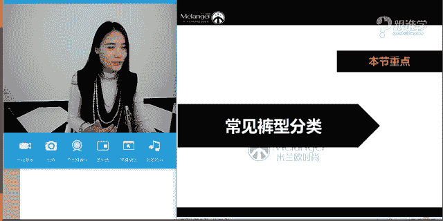
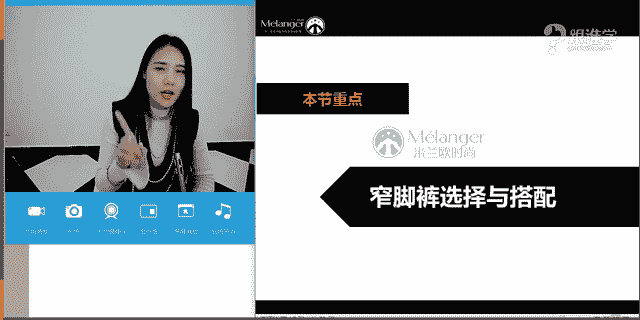
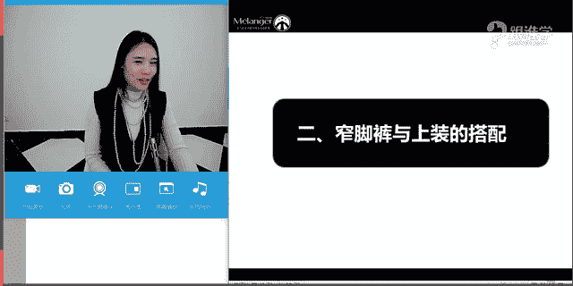
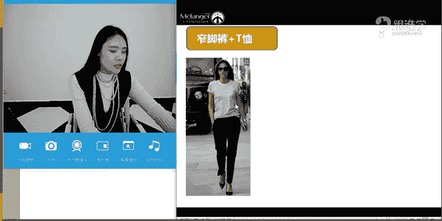
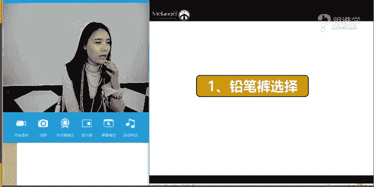

# 1、11服装《搭配秘笈之新版36计》：30裤装与鞋吕

🎼，🎼每一天。🎼你想怎样，我都碎了。😔，🎼你演技也有限。🎼不用说感。🎼分开就平淡怯。ゆべは。🎼演出的我已视而不见。🎼别逼。🎼的最爱。🎼剧心表演。😊，🎼什么时候我们开始没有了底线。

顺着别人的谎言被动就不显了歌。🎼曾经那么。🎼我看马演出细节。🎼我该变成什么样子才能。🎼何处演原来当爱放下放背后的这些那些。🎼有个期限。🎼即实台傻的观众就我一个。🎼其实我也看出你有点不舍。

🎼场景也习惯我们来回拉扯。🎼还计较着剩。Oh。

hello，大家晚上好。😊，同学们现在可以听得到我的声音吗？如果可以听得到呢，请打一。Yeah。好的嗯，那。看到了同学们很开心啊，依然是这么几位熟悉的名字。OK好，那呃我看到了同学们。

那今天呢给大家分享的这样的一个课程呢，呃我们原本上的课表是写的鞋子与裤装的搭配关系。但是呢因为我们上节课当时讲到的是阔腿裤。然后呢，我们把这个零时呢把这节课调整了一下。这一节课呢就给大家来讲窄脚裤。

然后呢在呃再往下推一节课的时候呢，我们再给大家来总结鞋子与这个裤子的这样的一个搭配关系啊，这样的话它的顺序会更加的连贯。那另外呢我们的这个呃今天的这节课当中呢。

也会给大家去讲到裤子以与鞋子的这样的一个搭配啊。OK那今天呢呃这个这个课程的时间稍稍的晚了几分钟啊，不好意思，同学们是老师这个呃我们的这个这个。😊，老师迟到了啊，首先在这里要跟大家来道歉。好的，嗯。

那就直接进入到我们的这样的一个主题。嗯，在平时穿窄脚裤，我相信这是应该是了啊。因为我每次都说我相信每个同学都应该有这件单品。但是好像同学们有的时候并没有啊。但是我觉得窄脚裤，大家应该都有吧。同学们。

如果有窄脚裤的同学呢，请打一，没有窄脚裤的同学请打2。好的啊，不管是男生和女生，我看到都有窄脚裤，对吗？嗯。好。那目前看到的都是一，那说明这件单品哎真的有一个特殊情况啊，羽荷没有窄角裤吗？

我觉得窄角裤应该是人手必备的，怎么会没有呢？可以讲讲嗯，你没有的原因吗？OK好，木怡同学说问到窄脚裤是锥形裤吗？等一下呢我来给大家讲道理窄脚裤跟锥形裤之间跟紧身裤之间跟这个呃还有铅笔裤之间。

他们到底是什么样的关系啊？好的嗯，那雨和同学说因为我是A型，所以没有窄脚裤吗？呃，不是这个样子的啊。雨荷，即使你是A型，你也可以穿窄脚裤。而且窄角裤真的是一个非常非常好用的单品。

它可以说是呃经典必备单品之一啊。OK好，嗯，雨思雨同学说呃我很多不过黑色占占80%啊，那如果要是黑色占80%，我认为啊就是我们说买买这个窄脚裤，不管你是买什么裤子或者什么单品，我们服装当中所有的单品。

你应该都要买的叫款式多元化6。说窄脚裤它可能色彩会不一样啊，会有图案的这样的一个不同。那包括材质的不同。所以你应该多元化去买你所搭配出来的风格会更加的多元化。而不是如果你要是80%都是黑色的话。

那你搭出来的感觉基本上就是类似的。啊，而且如果一条黑色的这个窄角裤的话，对于呃搭配式的角度上来讲，对于老师来说的话，我觉得没有太多的差别性。因为我认为他就是一条黑裤子。

那呃我记我记得之前有一个印象特别深刻的这样的一个朋友，他跟我讲过，他说呃，他说我有10条牛这个牛仔裤有8条都是黑的，我说你其实这8条就是一条的作用，为什么呢？他说没有啊，我觉得我这个挺好的呀。

你看我这我这儿有个拉链啊，我这儿有个金属扣完全不一样的。我说在我看来他就是一条黑裤子，没什么不同。OK好，那这就是跟大家讲到的就是大家要所。具备的单品是要多元化的，不能太过于单一啊。好。

那继续臭美和说腿粗，但是好喜欢窄脚裤是吗？好，那等一下呢老师在课堂当中也会跟大家来分享腿粗的这样的一个搭配的方法。OK好的，嗯雨荷说几乎不穿裤子，几乎都是裙子。那么呃很明显。

大概知道雨和同学的这样的一个气质和感觉，就是穿裙子基本上女性化的感觉会更加的重。嗯，好。OK好，今天过后应该就会改了，是吗？老师没有说要让你们必须要呃尊照老师的这个这样的一个说法啊。

但是呢希望同学们可以去多买一些单品。好的嗯，那今天呢给大家讲到的就是窄脚裤啊。那突然讲到这个单品，大家会觉得是不是哎有点这个有点小小小好奇了。到底这个窄脚裤，它到底能搭出来什么样的花样啊，好。

那呃今天呢给大家来介绍到我们的窄脚裤当中呢，其实它有很多的这样的一个品类。窄脚裤它其实是一个大的概念，也就是说所有成窄脚的这种形状的裤型，我们把它统一称为叫窄脚裤。但是其实窄脚裤当中也会有很多的类别。

那么今天呢啊给大家分享的就是这些类别当中的重要的给大家给大家讲到两个，因为这两个非常非常百搭啊，也非常的好穿。OK好，那刚才其实也已经跟大家提过了我们所说的腿部的这样的。😊，问题。那其实说到这种窄角裤。

可能大多人脑子里第一反应是不是。紧身的窄脚裤，我想问大家是不是这样的一个想法啊，那如果大家认为这是紧身的窄脚裤的话，那很明显腿不直的人可能穿那种紧身的窄脚裤效果就不是特别好。嗯，OK好，妮娜说不是是吗？

好，嗯，那腿不直的人，他能够穿哪种窄脚裤呢？那今天呢老师在课堂当中也会为大家去解答。嗯。呃，这个不是打底裤吗？是的，这条裤子是打底裤。呃，我只是想在这里呢呈现的是她的腿型5021同学。

那我们的模特她的腿型就是一个O型腿。嗯，O好，我们继续来看啊，呃，腿粗的能不能穿窄脚裤，刚才其实也已经讲过这个问题了。那包括腿短的人怎么去穿窄脚裤。那其实刚才5021同学说到这个打底裤啊。

我记得在呃很在应该有一个月之前了吧。呃，还是过年哦，过年之前给大家分享过一个课程叫打底裤，不是裤子。那今天呢我也要再次在这里强调打底裤，她真的不是裤子。而我们今天讲到的窄脚裤的铅笔裤也好。

或者是说锥锥形裤也好，它也不是属于这种打底裤啊，也不是属于这种打底裤。那这个概念一定要清晰，嗯，我在这里还是要强调那一点，打底裤，不要。穿出门，因为穿出去真的很难看。好，那我们继续来看。

那今天呢给大家分享的这个课程当中呢，两个重点，一个是关于裤型的分类。那包括窄脚裤的选择与搭配。虽然只是两个大的标题，但是我们今天的知识点非常的多。那大家要好好的听哦。嗯，OK好。

那首先我们来看常见裤型的这样的一个分类。那大家现在看到的在图片当中呢，这就是我们经常会看到的一些裤型，那第一个是喇叭裤，第二个是直筒裤，第三个是阔腿裤，那也在我们上一节课当中去讲过啊。

那第四个呢就叫锥形裤。刚才木易同学说窄脚裤是锥形裤吗？其实不是的啊，呃窄脚裤是大概念，而锥形裤只属于窄脚裤当中的一个品类。那我们继续来看第五个叫烟管裤。第六个叫铅笔裤。第七个。

叫哈伦裤。那同学们，我想问，1234567，这当中哪些是窄脚裤？现在回答我啊，快速在屏幕上打，哪个是窄脚裤呢？好，思雨同学说六和7还有没有不同答案啊？尼克同学说后4个4567ok非常好啊，木伊同学米娜。

然后菲尔好，基本上大多数同学都答了4567。是的，没错，4567都是属于叫窄脚裤的这样的一个范围啊。因为他们的这种裤型呢都是从宽到窄的这样的一个形状。所以他们都是窄脚裤。但是每一个裤型呢。

它的这样的一个发展，以及呢他我们现在所穿着的这样的一个。其实还是有细节上不一样的啊。那接下来呢老师就会针对于这窄脚裤当中的两种这两种来今天做重点的讲解。那其实讲了这两种。

那其他的搭配方法其实都是基本相似的。但是有一个问题是什么呢？就是哈伦裤，哈伦裤呢，其实呃在我看来啊，或者我一直呃不是特别的推荐大家去买这种裤型。因为这种裤型的话，第一，你穿不好的话会不时尚。第二的话呢。

它其实好搭配。那第三就是关于腿型的问题，腿粗的有这样的一个说法啊，有人会说唉腿粗的人适合穿哈伦裤。但是也有人说腿粗的不适合穿哈伦裤。那我想问同学们，你们觉得适合还是不适合适合的，请打一，不适合的。

请打2。好，梦怡同学说，烟管裤是锥形裤的九分裤吗？稍等一下，我会给大。大家来解答嗯。🤧嗯。好，不适合有同学也觉得适合是吗？好，那我来跟大家来分析这一点啊。那如是腿粗的人。

他的腿啊就是这种微胖型的那呃再加上这种哈伦裤的裤型，就是现在图片当中大家现在看到的这种裤型，那么他就可以穿。可是如果那个人的就是我们所说的这个模特，他的腿特别粗。

然后再加上这个哈伦裤这个哈伦裤其实是属于这种比较小的哈伦，是不是有一种我们所说的这种哈伦裤就是特别裆部特别深的那种啊，就我们所说的吊裆裤。那那种的话呢，再加上如果他两边的很多很膨胀。

就不适合给到腿粗的人。但是这一种哈伦裤其实是可以给到腿粗的人去穿的。所以说呢具体啊就就很复杂，这个事情，你知道吗？同学们啊，就是第一，如果你要是腿特别粗啊，你就不太。适合穿哈伦裤。第二就是如果你腿啊。

就是第二的话就是这个哈伦裤的这个两边的布料特别多，特别膨胀，也不太适合穿。所以说哈伦裤它比较难驾驭。OK好。哈伦裤呢，其实我们今天不做重点讲解。

但是我大概给大家讲到一下哈伦裤其实它呃有它有一种异虑风情感和民族感。那是因为它是来自于某一个民族的这种裤型啊，OK好，嗯，我就喜欢买垂感的哈伦裤，思雨同学说是吗？嗯，那不知道你搭配的效果如何呢？啊。

那如果要是你能把哈伦裤搭配的好的话，那你的这个搭配功力就不错了啊。ok好，臀大也不太适合穿哈伦裤吧，臀部特别丰满的也不太适合。对，是的，嗯，O好，那我们这个就给大家这个介绍到这里，哈伦裤啊。

那我们继续来看。那呃这个锥形裤的话呢，其实它就是从上至下的这样的一个形状啊，就是从上从宽到窄的这样的一个形状，那锥形裤它其实没有特别的这样的一个历史。那烟管裤以及铅笔裤。这两个呢。

因为它有一些发展的历史，包括它现在穿来的话也是比较这种实用和百搭的。所以呢今天给大家来重点介绍这两个裤型。嗯，O好，我们继续来看。那首先呢给大家讲到的就是铅笔裤。那铅笔裤啊。

今天给大家这个呃做的这样的一个课题叫前世今生啊，其实我认为每一个单品它都是有前世今生的那它的这个今生的话其实就是指我们所说的现代。那它的前世就是指它的发展的这样一个来源啊，ok那我们首先来看这一排字啊。

那铅笔裤是由于外形像铅笔型，所以称为铅笔裤。那其实铅笔裤呢它是一种紧身的裤型。那现在大家理解这个概念啊，铅笔裤它其实相对来来说是比较紧身的啊，那这种紧身的裤子，其实并不是一开始。

大家会发现现在紧身裤都是女士在穿。那是其实铅笔裤它在。其实是由男士先穿起来的啊，在欧洲中世纪文艺复兴时期，在那个时候啊，拿破仑他特别爱穿那种什么呢？马裤啊，现在就是大家看到的这种裤型。

那个时候的人们的审美，是认为男士的腿才是整个人的魅力所在。所以那个时候的男士他们特别喜欢去呃做各种运动呃这种健身，要把自己的腿部的线条建得非常的漂亮啊，然后这个种非常有魅力啊。

那呃所以说那个时候呢他们会展露自己的腿部的线条，就会穿这种紧身的马裤，包括穿那种长袜，把他整个腿部的线条全都展露出来啊，咱才能表示他的这种力量和这种稳重的美感啊。O那这个其实就是呃健美裤的呃。

这个sorry哈铅笔裤的这样的一个在那个时候的这样一个历史。其实。有男士所去穿着的那他是怎么被我们女士啊穿着的呢？那我们继续来看啊。O那男士的铅笔裤的这样的一个历史呢，大概得给大家先讲一下啊。

那男士铅笔裤其实在50年代的时候呢，被猫王所穿着。但是那个时候呢不是特别的呃可以这么说，而且在这个时期的话，不管是男士和还是女士去穿着的时候，他都是带有一种叛逆的色彩。那直到呃80年代啊。

这个摇滚这样的一个兴起。那大家可以看到这种彩色的铅笔裤，被这种我们说经常这种玩摇滚的这种音乐人，他们在舞台当中去展现啊，那这这个是peto乐队啊，理解成打底裤了。好的OK好木怡同学说理解成打底裤了啊。

好，那打底裤，不是这个铅笔裤啊。OK好，那我们继续来看，那这个是我们所说的男士的这样的一个发展。那呃直到呃那近近年来它是。什么时候才开始兴起的呢？其实直到20呃03年的这样的一个DOhomes。

它的这样的一个男装秀场秀场当中啊，出现了这样的一个设计。然后呢，男士才开始去穿着这种铅笔裤的啊。OK好，那我们继续来看，这是男士的这样的一个发展。那我们继续来看啊，女士的这样的一个铅笔裤的历史啊。

那女士铅笔裤的话呢，大家可以看到在50年代的时候呃赫本啊呃这个有去穿着。那当时她的这样的一个这个照片的话，应该是在一个这样的这个呃舞蹈教室里啊，他在展现这样的一个动作。

那依然是在50年代穿着这种呃铅笔裤的时候，其实他还是带有这种呃叛逆色彩的。而且那个时候虽被一些人接受，但是不是被大多数人接受。那大家可以看到到65年的时候呢。

其实那个时候呢依然不是特别的呃受到人们的这样的一个这个追捧。啊，在那个年代的话，会有一些工人去穿着。那直到81年的时候，大家看到啊，这个是一个什么呢？健美的啊，那那个时候呢人们开始这种做这种有氧运动啊。

健美啊啊去穿着这种铅笔裤。那到85年，大家看到的1985年。那在那个。这是被时装界所接受。那大家可以看到，在1985年这样的一个形象，紧身打底裤，这种大外套的这样的一个穿法一直风靡了10年左右。

那直到2003年巴黎世家设计师啊，她因为她个人非常喜欢打底这种铅笔裤。所以呢做了这样的一个复古的设计啊，直到那个时候打底裤才开始进入到我们大众的这样的一个视野当中，那2006年大家可以看到这条牛仔裤啊。

在200606年的时候，有一条牛仔裤特别的风靡。就是牛仔裤上面带了一条拉链的那个就是脚啊，就一个这个就是脚踝的位置带了一条拉链那那一条牛仔裤在当时是275美金。啊1700呃人民币大概左右啊。

成为了当时的销售冠军。那这就是女士的打这个铅笔裤的这样的一个发展的历史。那直到现在我们所穿着打底。铅笔裤的时候，其实我们不会想到啊，它原来过往有这么多这样的一个历史。我们穿着它的时候。

可能就是觉得它是非常的实用性的以及百搭的这样的一个单品。那到底它呃它的这种我们所说的实用以及百搭。呃，就是因为它太过于实用和百搭了。所以让我们在穿着的时候其实不会想到有它能够去演绎某种风格。

那今天呢我也会给大家来去讲到，其实打底裤的话啊，这种铅笔裤它在穿着的时候，它也可以驾驭不同的这样的一些风格啊。OK好，那这是铅笔裤的这样的一个前世今生。那我们继续来看第二个裤子啊，就是烟管裤。

无管裤呢我们来看一下，它是介于大家现在可以看到这个裤型啊，它是介于直筒裤以及铅笔裤之间的这种裤型。那直筒裤它其实相对来说是比较从上到下都是直筒形状的，而且不怎么贴腿的啊。那同同学们这个要记住这个概念啊。

不怎么贴腿的那紧身裤是非常的贴腿的。也就是说而且是带有弹性的这一类型的这种裤型啊，当然现在也有的裤子做的弹性没有那么好，它依然是贴腿的，就是特别的紧，会把你的这个腿部线条勾勒的特别的清。

就像木易刚才说到，我以为是打底裤，那是因为这种铅笔裤。它做的特别的贴腿。所以呢嗯那大家有的时候会分不清楚打底裤跟铅笔裤之间到底有什么样的一个差别性。那如果大家分不清楚的话，你问你一个问题。

问大家问你自己一个问题，在出门的时候，第一，你的打底裤，它有没有口袋。第二，你的打底裤会不会让你的身体的曲线暴露的太过于清晰而修饰不了你的这样的一个身材的这样的一个这个问题啊，那我们说所有的裤子。

我们为什么要穿着裤型，我们为什么要穿着裤子。其实我们更多的时候会希望这种裤子能够修饰到我们腿部的这样的一个问题。那这就是为什么我一直推荐大家买这种好的牛仔裤的时候，一定要去线下去买，为什么呢？

你只有在线下去买的时候，你才能够去试很多条牛仔裤，你才能找到那一条属于你自己的牛仔裤。属于你自己的牛仔裤的时候，他会把你的腿部的线条修饰的非常的完美啊，那除非是你的这个真的是真的是这个这个腿型。

太不好看，或者是你太过于丰满了啊。那基本上大多数人其实都是有自己的一条牛仔裤的啊。O好，那在选择牛仔裤的时候，一定要要记住这个我们所说的这个呃呃这个口袋的位置啊，就是我们所说的裤子的口袋的位置啊。

那包括裤子的这种这种裤型的问题等等。嗯，ok好，那这个就跟大家讲到这儿，那我们继续来说烟管裤这样的一个问题。那烟管裤呢，它就是直筒裤与铅笔裤之间的这样的一个裤型。

那它其实是包裹着你的臀部的但是呢它不会去紧包你的腿部。它的这样的一个腿的这样腿部的这样的一个线条设计是非常笔直的。所以。它的修饰性非常非常的好。烟管裤的同学，我建议同学们一定要去买一条。

这是我推荐大家去买的啊。那不管是男士还是女士都要去买一条。因为这条裤子太好穿了啊。ok好，那这就是烟管裤的这样的一个呃这个概念是什么样的啊，先大家大概跟大家来普及一下。好。

那么继续来看烟管裤呢它是流行于20世纪50年代。那其实烟管裤也有人叫它是这种什么呢？烟筒裤啊，或者说叫它吸烟裤啊，都有这样的一个称号啊，OK那包括大家如果去买的时候搜不到，你可以搜这种小直筒。

那其实百度上也有很这个淘宝上也有很多。因为大家其实有的时候对于这种裤型，它的这样的一个名称，它不会那么的清晰，大众没有专业学习的时候，不会那么清晰。所以大家去搜索关键词的时候，可以搜索这几个词。

第一个是烟烟管裤，第二个是吸烟裤，第三个是小直筒啊，这都是。呃，应该是很多呃这种裤型都会呈现出来的嗯。好，悠悠说小腿粗可以穿吗？啊，这个就是我等一下要跟大家去讲。看那在20世纪50年代。

我的裤这种呃这种烟管裤呢，它一般都是以黑色为主，没有太多的这样的一个色彩啊。那呃大家可以可以看到，玛丽莲梦露其实在我们的印象当中一直都是以裙装为主啊，裙装示人，而且呢它的这样的一个曲线感。

他一直都不会呃去穿这个他很少会去穿着这种裤装。那但是他也非常的爱烟管裤。大家可以看到啊，那其实他也会穿这种烟管裤，他穿烟管裤是一个例外啊。OK那包括呃赫本他穿着这种他赫本也非常爱烟管裤，各种裤型都有。

那这个呢也是这个赫本在演这个电影的时候当中的这样的一个角色啊，所穿着的这样的一个裤型啊。那包括烟管裤他有一个什么样的特点呢？就是他一般都是属于这种中高腰，大家可以看到他的腰线都是比较高的中高腰为主。

那一开始呢呃。这个中这种这种烟管裤，它的拉链一般都是设计在侧面或者是背面，它没有设计在这种我们所说的这个呃正面的门襟的位置。那个那那个设计其其实是源于一开始人们不接受裤装。

或者是说没有这样的一个技术让这种门襟这个拉链很保险。其实一开始人们所穿着的这个裤子的，没有拉都是没有拉链的，都是一种用扣子，把它给扣起来的啊。那直到呃这个呃拉链设计出来之后呢，它把它用到门襟上的时候。

其实一开始它的技术也不是那么的好。为什么呢？这种门襟的设计，它有的时候会划下来，大家有的时候穿拉链也知道啊，就是这种门襟的时候就说会滑下来都会比较尴尬。

所以呢它一般会涉及到侧面或者是背面的这样的一个位置啊，不会设计在前面。那呃一般呢大家可以看到，这是我们所说的中。是它的特特色，侧面或者是背面的拉链。那包括现在呢他们的裤型也基本上都是在脚踝上方。

也就是现在大家知道的，我们所谓的九分裤的这样的一个位置的，大概大概就是这个位置左右啊，OK那这就是我们所说的烟管库的这样的一个形状。那包括它的这样的一个历史的这样的一个发展嗯。好，呃，那我们继续来看啊。

那接下呃刚才呢给大家介绍到的是两种。那第一种呢就是关于这种我们所说的呃这个呃呃这个唉老师有点卡壳了哈。第一个给大家说到的是什么裤型，铅笔裤哈，第二个的话就是这个烟管裤啊，ok好。

那这两个裤子的这样的一个历史，以及裤型，大家现在了解了吗？铅笔裤呢是一般以这种紧的啊紧贴腿部的这样的一个裤型为主的那烟管裤呢它是高腰的侧拉链啊，一般在侧面或者在背面，当然现代的设计。

也有可能是在正面的啊，不排除这样的一个这样的一个设计的。因为现在的设计是种这个形形色色有很多种啊，那它的这样的一个裤脚裤长的位置一般是在脚踝的九分的这样的一个位置。O好。

那就是这两关于这两种裤型的这样的一个问题。那接下来我们来看窄脚裤的。选择于搭配。那我在这里讲到的窄角裤呢就以两种。第一种就是铅笔裤。第二种呢就是呃我们所说的这个烟筒裤。okK好，那我们继续来看。

🤧那。给大家去讲到的是关于烟管裤铅笔裤的选择，包括鞋履的搭配啊。那第二个呢就是关于烟管裤和铅笔裤。那呃这里所说的窄脚裤就包含了，其实所有类型呃，包括锥形裤啊，哈伦裤与上装的搭配的原理，其实都是相同的啊。

那第三个就是腿部粗呃腿不直腿短的呃与窄脚裤的这样的一个搭配。刚才呃有同学提出到的这样的一个腿粗的问题。那等一下呢老师也会给大家去解答。嗯，好，那我们继续来看第一个就是烟管裤的这样的一个选择与搭配啊。

那呃好sorry铅笔裤，那我么们来看铅笔裤的选择啊。那铅笔裤的话呢，刚才有同学已经说到了啊，呃，这个10条80%都是以黑色为主。那黑色呢的确是非常经典的，也是必备的基础款。那基本上是不是同学们你们的。

呃，铅笔裤都是以黑色为主呢。如果是的话，请打一。不是的话呢，请打2。那呃你呃同学们可以先答这个好嗯。不是啊不是的同学有一位。等一下我会跟呃木易同学，等一下我会来讲这个问题嗯。好嗯。

OK那我看到大家的答案了，基本上都是以黑色为主是吗？啊，基本上好，那我看到了啊，同学得那包括今天老师穿的是灰色，就是接近于深色的这样的一个感觉啊，那这是呃黑色的基础款是必呃是必备的啊，它是非常经典的。

那家大家可以看到拥有指数五颗星啊，也就是说它真真的是非常的经典和百搭。那即使它是黑色的打底裤。但是它其实也可呃黑色的铅笔裤。但是它也可以通过不同的这样的一个搭配，产呈现不同的这样的一个风格。

那刚才其实在呃群里的时候，有同学呃是雨和同学是吗？发的它的这两条阔腿裤的这样的一个搭配啊。那其实它的这两个呃搭配方案呈现出来的感觉，都没有太多的风格的这样的一个这种调性所在。也就是说其实搭配出来。

我看不出来它有。什么风格，而且搭配的美感以及搭配手法还是需要很多的调提调整。那包括它的这样的一个呃时尚度也需要去调整。OK好，那我们继续来看，那首先呢看到的第一套和第二套。

那大家可以看到下装都是以黑色的为主，对吗？但是它的上身都是什么呢？其实它的整体的配色都是以黑白色为基调。那但是第一套和第二套同学们，你们能够跟我讲一下第一套和第二套。

它呈呈现的这种风格的这种感觉有什么不一样吗？就是大家可能对于风格不是特别了解，但是你们可以讲一下第一套是什么样的一个感觉，第二套可以是什么样的感觉。就如果啊你穿这第一套和第二套的时候。

你觉得这两套服装风格是什么样的感觉？🤧大家可以先来解析一下啊。好，嗯，我看到了啊。第一，干练，第二，休闲。好，雨后同学说一帅气二小性感嗯。好，娃娃同学说第二套比较休闲，那看来大家真的对于。好。

🤧说明大家对于这个这个这个风格概概念不是特别清晰。好吧。好，那我现在给大家来解析一下，那套其实它是中性风。啊，第一套是中性风，中什么风格呢？不好意思，同学们啊，第一套是中性风。

为什么它所有的单品选择基本上全都是中性。那大家可以看呃，全全都是这种中性的单品。第一，它是衬衫。第二，它的这个马甲也都是以这种直线感为主的。而且马甲以前呃我们说马甲其实也是来自于男生的男人的单品。

男士的这样的一个单品，那包括这种裤子其实以前也是我们所说的男士的单品，对不对？我们一直认为穿裤子它是给人感觉是比较中性化或者男性化的啊，那那穿裙装它会比较女性化。

那再加上它身上所有的单品都是以男士的这样的一个呃就是中性的这样的一个单品搭配的这样的一个感觉。所以它第一套看起来是非常的中性。那第一套其实我们叫中性风。那其实大家刚才所说的叫干练呀帅气呀。

那都不是一种风格，它是一种感觉那。其实我知道大家就是因为我了解大家不了解风格，所以呢我让大家来讲感觉。那其实大家讲到的感觉是没有错误的，只是大家对于风格没有太大的这样的一个理解。

那基本中性风中性风会以哪些单品为主呢？例如说西装、西裤、马甲、衬衫。啊，那包括这个鞋子当中啊，可能会有马丁靴，啊，这种的话呢工呃这种工装靴啊，都是比较帅气的这种感觉，都是以男士的这样的一个单品来搭配。

所以它会呈现这种中性的感觉。那这一套是中性风。那第二套呢，大家刚才刚才说到的休闲。其实说到休闲也没错啊，但是其实它这一套的话还呈现了一种这种民族感。那包括它的这种民族感其实来源于哪里呢？

就是来源于它这条皮带，它还有一种这种我们所说的这种粗犷感啊，这种呃美式的这种感觉。它的这条牛仔它其实是这种磨砂感的那包括它的这个皮带呢，它有一种民族感，其实这条皮带，它上面的这种呃做旧感。

那那呃这种做旧感其实就是呃来源于一种自然的感觉，民族的感觉。嗯，OK好，那大家说到的性感也没错，是有一点小性感。因为它是DV的这种。感觉嗯，好，那第三套呢其实没有太多的这样的一个风格在里面了啊。

第三套那第三套的话它玩的是一个配色的关系。大家可以看到它的毛衣的这样一个色彩跟它的切尔西短靴，做了这样的一个呼应啊。那包括它的外套也跟它的毛衫也做了这样的一个呼应。大家可以看到蓝色蓝色啊。

然后紫色紫色黑色，那跟它的这样的一个毛衣的这样的一个呃领口也会有一个呼应啊。O它这一套的话其实没有太多风格。它它基本上就是玩的这样的一个色彩的这样的一个配色。那第四套大家可以看到啊。

第四套有没有同学喜欢呢？啊，第四套其实它也是走这样的一个中性风啊，也是走这样的一个中性风，大家可以看到鞋子的搭配。外套的搭配，包括这种帽子啊，它这种帽子的话，其实它是中性的帽子这种感觉。

不是那种50年代的特别优雅的那种大宽颜。哦，那这种帽子它其实有男性的这种感觉比较硬朗。那大家可以看到，这四套虽然都是用一件单品，但是它搭配出来的视觉感是不同的。它给人呈现的风格的感觉也是不一样的。

其实这几套的话没有特别特别的这种呃很鲜明和个性的这种风格。例如说这种很多时候大家可能会看到一种风格会觉得很明显。那是因为这几套风格呢它不是特别明显，所以大家看不太出来。但是如果你懂得风格。

懂得服装的时候，你就能够看出来哦，他是这样的一个感觉。那呃比如说同学们啊，我要给大家讲，为什么要给大家不断的讲到这种风格的这种概念呢，那是因为每个人其实跟我们所说的服装风格。

你个人跟服装风格也会有这样的一个联系，就是你的个人气质跟服装风格也会有一种匹配性。那例如说呃如果李宇春他穿这种大家觉得李宇春穿。这几套当中哪一套最好看？1234。你们觉得李宇春穿哪一套好看？嗯。

思雨说喜欢四是吗？O好，李宇春比较适合第一个和第四个是吗？嗯，O好，那是说嗯对了啊，那就就是我们所说一个人她的风格的气质特点，其实要跟服装风格也要去匹配的那他还可以刚才有有同学说到了。

第一个和第四个都比较适合李宇春，那是为什么呢？因为第一个和第四个都是中性风，对不对？刚才我已经跟大家去讲到了，那你会发现第二个她给我们感觉是特有一点小性感的而且第二呃第三个她虽然这种不是特别的性感。

但是她给我们感觉也不是特别帅气，她其实就是这种休闲的这种感觉。那呃所以说呢再加上这个女性的这样演绎的这种感觉，给我们感觉她是比较柔和的啊，那第二个是有点小性感的第一个和第四个都是这种帅气的感觉。

所以大家会觉得更加适合李宇春。那所以同学们你们也要自己去思考一下。那我。让大家来分析图片的时候，同学们可以分析，那你自己在穿衣服的时候，你有没有分析呢？你自己在穿衣服的时候。

你有没有想今天我穿的这一套是否符合我个人的气质呢？啊，O刚才有同学问到说老师，你今天搭配的是属于什么风格。今天老师做的是一个香奈儿的这样的一个风格的搭配。那呃但是我呢我的夏装呢也配了这样的一个呃窄脚裤。

就是我为了要给大家做这样的一个一这个这个怎么说呢？每天都给大家一个这样的一个新鲜感嘛？包括要符合今天的课题嘛？啊，那我夏装的话，其实配的是一个裙装跟裤装的这样的一个搭配。

因为今年其实是流行裙装和裤装的搭配的。嗯，O好啊，幸会同学说可以通过什么途径去学风格是吗？老师现在不是在给你们讲吗？你们现在不就在通通过跟谁学平台，通过米来欧在学习吗？

啊那其实呃专业学习服装风格的这样的一个系统以及书籍还是没有的。那我可以这样告诉星辉同学啊，因为呃米兰欧是国内第一家做服装搭配学习的这样的一个学院。嗯，OK好，老师可以看一下你的下半身。

晚一点再给大家看好吗？嗯，OK好，今天是属于混搭吗？是的，嗯，好，那我们继续来看啊，今天是也有点小华丽嗯，好。那给大家推荐的第一个黑色基础款啊，那一条黑色裤子它其实也可以演绎不同的风格。

那我们继续来看啊，铅笔皮裤啊，那什么意思呢？这个黑色的皮裤其实大家都有啊。那这种黑色皮裤的话呢，首先我想问同学们，你们觉得适合腿粗的人穿吗？铅笔皮裤这条黑色的皮裤，你们觉得适合腿粗的人穿吗？嗯。

为什么不适合呢？好，大家都觉得不适合。嗯，OK好的，我看到了啊，不适合有膨胀感非常好。啊。同学们，那之前呢其实我有跟大家分享过，呃，的确黑色的这种皮革的这样的一个面料。

那它其实是有膨胀感的所以呢不太适合给到这种腿粗的人看去穿着。那比如说在最后一张图片，大家可以看到这一位模特。嗯，这个模特她穿的是一种哑光的，没有光泽感的。他其实就什么呢？会比较显瘦。

而这种而他旁边的这两个模特穿的都是这种反光感的皮革面料，所以就会显得有膨胀感会显得腿粗啊。OK好，我看到大家的这样一个呃问题了啊。腿粗腿呃木怡同学说腿部匀称的话，胖点也可以吧。啊。

那其实呃这个铅笔皮裤呢，如果你的腿型是属于比较瘦的那包括你的腿是比较直的。而且不是特别粗的，我认为才能就把皮裤穿好看，要么呢大家就不要去尝试，你会发现，其实在演绎这些皮裤的模特们，他们的腿是不是都不粗。

但是你会觉得好像看起来还是有一种略粗的感觉，对吗？那是因为他们都有这种皮革的膨胀感真的非常强烈，反光感很强烈。所以说如果腿粗的人真的要谨慎的去选择。嗯，O好，那其实有很多人。

那这现在我在图片上展示的基本上都是属于这种铅笔。也就是说它其实是一条裤子，它不是打底裤。你会发现有的打底裤的话，它设计的基本上是没有这种门襟的设计，也没有口袋。那种的话就叫打底裤。

那种的话呢千万不要这样穿出来，这样穿出来会很丑啊。同学们，我再次强调这一点。OK好，那这是关于铅笔皮裤的这样的一个呃这样的一个问题。那其实铅笔皮裤的话呢，如果瘦的人他穿起来时髦度是非常好的，非常好看。

很时髦，但是他就是有点挑挑腿型，也挑这个腿的粗细的这样的一个问题。嗯，OK好。那咱们教室里的同学有都有这呃有这种呃铅笔皮裤吗？老师是没有买，老师的小老师的腿是有点粗的哈，大腿略粗。

所以呢我平时呃这个穿这种浅色的牛仔裤也是比较少的。嗯，好，5021同学说天天穿是不是因为5021同学的腿型是不是挺好的，或者你的腿也是比较瘦的，是吗？嗯，O好，如果有的同学。

那真的对于自己的腿是比较有自信的啊，那我们继续来看牛仔铅笔裤啊，牛仔铅笔裤的话呢，大家我相信应该是呃基本上也都是。裤子啊牛仔铅笔裤呢呃不用说太多了啊，因为大家基本上其实都有这件单品。

而且这件单品呢也非常的百搭。但是我要说一个问题是什么呢？呃，如果你的腿粗的话呢，尽量选择这种深色的，以深色简洁为主的。并且呢呃这种大家可以看到这条裤子上它是有磨砂的对吗？这种呃水洗磨白的这样的一个部分。

那如果腿粗的人其实是可以穿这种磨白的，然后你会发现它前面是浅色，然后两边的这个阴影部分是深色，它其实起到一个叫瘦身阴影的效果。所以它就是从视觉上看上去啊，这种叫试错觉，你从视觉。

就是这个位置就是收缩的那个位置，大家就觉得好像忽略到了，就有这种瘦腿的效果。OK好，那你会发现这条牛仔裤就是完全把你的腿部的这样的一个细节问题全都暴露了。

所以如果买这种呃腿粗的人说买牛仔裤也买深色的较好。嗯，OK那腿这个比较细的呢，你看这种浅色的呀，都可以去穿着啊，那我们继续来看第四个破洞铅笔裤。那破洞铅笔裤呢也是这两年非常非常流行的单品。

但是我建议大家去买这种破洞破洞铅的时候呢，其实是需要注意一些问题的那第一个就是腿部有凹太多的，就没们要不要买这种过紧的，因为这种过紧，它会把你的肉反而勒出来。包括其实这种叫一刀切的这种牛仔裤。

那就是它看上去好像就是一条就是就是刀划破的这种感觉。那你会发现现在有很多牛仔裤，它上面还会有呃这种这个破洞呢，其实就是有点。夸张了啊，我是给大家拿出来做示范。

就是如果腿粗的人就不要买这种来穿了啊那包括还有一种效果的就是什么呢？你会发现他做了那种破洞效果，但是上面还有很多的这种纤维啊，纤维覆盖在上面的，而且它是没有断的，对吗？

其实就是这种纤维同学们就一条一条在上面。那如果腿粗的人去买了那种带纤维的。那你看起来的腿部也是都勒的一条一条的，我是真的有在大街上有看过，所以呢我才在课堂当中跟大家去分享啊。O是的。

今年流行这种配黑网袜。对的啊，前段时间老师也这样穿过啊，做这种里面穿网袜，然后配这种破洞好的，嗯，像粽子哈是的有雨何同学说的啊，是有点啊O好，那这是破洞铅笔裤的这样的一个搭配。那包括呢其实破洞铅笔裤呢。

我建议大家也就可以买一条穿，但是一定要根据自己的这样的一个腿型的问题啊，适可而止的。去选择啊。好，等一下，我在后面也会给大家去讲到腿型的问题，所以不要着急。今天呢听完这节课之后就可以买裤子去了啊。好。

我们继续来看啊。那包括男士其实也可以穿着这种呃破洞牛仔裤，对不对？男士今年是不是也很也流行这种？那大家现在看到的这个是JD啊，那JD的话，它的这种着装风格，大家可以看一下。

非常的这种它是有这种嘻哈的感觉。那包括呢它还有一种这种色彩运动的这种波普的效果所在，就是这种大面积的撞色啊，那这种配色效果，我相信咱们这个教室里的这个木同学应该是接受不了的啊。

但是这种它穿起来会非常的年轻化，也就是说这种运动感，这种色彩感去碰撞的时候呃，它有有一种这种街头的流行的这样的一个效果在那呃刚才木伊同学问到说男士可不可以穿牛仔呃，这种铅笔裤，男士可以穿着这种窄脚裤。

但是男士不要穿特紧的裤子，等一下我也在后面会有图片给大家去示范的啊，不用着急好，那我们继续来看啊，那这是我们所说的男士的这样的一个破腿。破这种破洞的这种牛仔裤啊，也可以去选择，不要选择过紧的就可以了。

那我们继续来看那女士的印花的铅笔裤啊，那这种印花铅笔裤呢，它的时尚指数也非常的高。但是呢它也会比较的挑人。那大家可以看到这种迷彩的啊，以及这种小面积的规规则感的这种排列的这种呃印花啊。

其实它这种是属于这种比较隐性的印花它没有那么明显。这种印花呢是由这种面料带来的啊。ok好，那我们来看一下，那这种大家会发现它其实也是带有反光感，而且它的这种材质也是有反光感的。

所以呢相对来说也会比较挑人啊，那包括这种印花。那这种几种印花它的确是非常时髦。这种印花的话，它是会比较时尚感。嗯，大家大家可以想象一下，满大街都穿黑色，只有你穿了一个印花的话。

其实视觉冲击力效果是比较强的。但是如果腿粗的人啊谨慎去选择这种印花的铅笔裤。但是如果腿瘦的人，那你们就大胆的去选择吧啊。那包括其实不同的印花，它传递出来的效果也会不一样。

那例如说他例如说大家现在看到的这种迷彩的这种呃印花的铅笔裤，那他传递给我们的感觉，为什么他会搭配这种机车皮衣去搭配，那是因为他会有一种啊包括这种嗯巴黎世家的这种机车包，因为他给我们的感觉是非常的帅气的。

本身迷彩，他也是属于军装啊，那机车皮之前跟大家分享过，他也是属于军装延身而来的。其实他们都是有这种男性的帅气的感觉，所以搭配到一起的时候，你会发现他是非常的和谐的，也非常的帅气。

那他其实也做了一个混搭的效果，混搭在哪里，就是他的鞋子。那他没有去搭配那种就是一帅到底的这种造型感。就例如说有的人他可能会穿这种呃穿这个皮衣搭。搭配T恤，再加上这个迷彩的时候。

它底下可能会搭配一双马丁靴。那如果它搭配马丁靴的话，那它整套的感觉一定都是非常的帅气，中性感。那这一套就可以较为中性感了，就是中性风格了。为什么加了一双高跟鞋，它就做了混搭了。

因为这种高跟鞋是女性的代表。所以如果呃有同学说老师我想帅，但是我也不想太帅帅气过头了。那你就可以搭配一双什么呢？就穿着整身很帅气，但是配一双尖头高跟鞋，非常女人味的这种感觉，包括他还画了这种红唇。

其实它就是做了一个混搭的这样的一个效果。那这种混搭，其实现在时尚街拍当中或者说明星艺人的造型当中，我们经常也会去做这样的一个造型，给到一些艺人。那其实是现在大众也比较喜欢的这种着装风格。嗯，OK好。

那我们再看第二套。那第二套的话呢，它其实就是一种比较简约的这样的一个搭配。但是它的上身其实也是做了混搭呃，也是做了什么样的混搭呢？休闲的运动的这种感觉，它上身是搭配了卫衣。

其实它是运动跟这种女性化的这样的一个元素去做的混搭啊，为什么呢？它的发型啊，这种卷这种微卷的这种卷发感，包括它的尖头高跟鞋，其实都是传递了一种女人味的这种感觉。简约的啊这种这种女人的这种感觉。O好。

那第三套第三套的话，它其实相这几套来讲的话，如果它的下半身换成尖头高跟鞋，它也会比较有女人味。为什么呢？因为它的裤子的花纹是非常的曲线感的。所以它给我们感觉其实会女人味啊，O好。

那不同的印花它传递的感觉也会不一样。我之前跟大家分享过呃，我们说印花格子那哪种它给人感觉会更加硬朗，一定。是这种格子的几何图案呢会更加硬朗啊，那曲线感它会更加的呃这种印花它是呈曲线感的。

所以它给我们感觉会更加的女人味。那如果男生如果穿天天穿这个印花的话，我们经常会就会说男生很很娘的感觉，就会闷骚的感觉，那其实就是因为男生他穿这种花型，它会呈现一种柔美的状态。嗯，O好。

那这是关于印花的铅笔裤。那如果大家想要表现帅气的感觉，你就可以选择干练帅气的，就可以选择几何图案以及这种呃迷彩都可以。那如果想要表现女性化元素更强的时候。

就可以选择这种印花为主的那今年其实也特别流行印花啊，O好，那我们继续来看第六个白色基础款，那白色的其实呃他是非常非常百搭的一个色彩，但是它是真的适合我们每个人吗？不是的，啊。

因为白色它也是有膨胀感的所以。说呢啊也是这种腿粗的人啊，腿型不好的人谨慎去选择。OK好，那白色的话，那大家会发现，如果啊咱们这个教室里同学腿型是比较细的，然后腿型也比较漂亮的啊。

那在穿着这种白色的时候呢，尽量跟它你要么就用黑白色去配，要么呢就用这种高明度的颜色去配它，不要用那种什么呢？就是这种高明度的颜色去配它的时候，它看起来会比较的和谐和舒适感一些啊。OK好，呃。

您可以感觉非常的清新感，白色配这种蓝色。那包括它的这个颜色也不会特别的这种我们所说的这种呃暗这种暗的这种感觉啊，用我们这个大众来讲的话，就比较暗的，就是饱和度过低的感觉OK好。

那就是我们所说的白色的基础款嗯。彩色糖果色的铅笔裤啊，那其实彩色你和糖果色说的就是一个意思啊，就是这种这种彩色的铅笔裤好不好？看你们认为同学们。其实这种彩色的铅笔裤呢，它搭配好了也好看。

但是呢它会比较的难搭配。是的，比较难搭配。宁可同学说的啊，呃，那这种这种彩色的铅笔裤，你会发现在更加适用于夏天。在夏天的时候，你穿起来的时候感觉真的是非常的清新感啊，然后也看起来非常舒适感。

那但是你在这个冬天的时候呢去穿着的时候，呃，特别是这种荧光黄啊，荧光粉哪，包括这种很亮的这种色彩的时候，它相对来说比较难搭配啊，但是它可以搭配一些比较运动的时尚的那包括街头的这种这一类的感觉啊。O好。

那我们继体来看。那这以上呢其实就是我们给大家介绍几种这种铅笔裤的这样的一个选择啊。那好，那首先我在这里问大家了。大家可以看到白色、黑色、糖果色、牛仔啊，包。印花刚才给大家介绍了这么多啊。

那哪条铅笔裤是不好搭配的呢？1234567同学们来回答我一下，哪条铅笔裤是不好搭配的呢？第四条嗯，还有没有呢？有同学说，第三条和第七条。1234567。好嗯，尼可同学说的三就是糖果色是吗？147。好。

我再继续来讲啊。😊，白色它虽然是浅色的，但是不代表它不好搭配。嗯。好。我看到大家的答案了哈。好，还有的这个是有有点不一样的。这个答案。嗯，好，那我再问大家哪条牛仔裤比较显胖呢？好。

我们先来公布第一个哪个牛仔裤不好搭配。来看一下啊，糖果色和印花的不好搭配啊，这两个色彩的话，它相对来说要搭这种我们说搭配上来讲的话呢，考验大家的搭配水平啊，但是我认为同学们。

只要你们这个掌握了一些搭配技巧之后，还是可以去搭配的。例如说糖果色，你就选择什么呢？你不要按照这种街拍达人的这种穿法去搭配。那如果最简单的方法就是它是有彩色的，你就选一个无彩色的去搭配啊。

那如果你的搭配技巧再高一点的时候，你可以用面积法去搭配。就是一个大面积一个小面积的这样一个搭配方法。例如说它的黄色的包包跟它的这种橘色的裤子，其实就是属于这种小面积的这样的一个碰撞。

那这个绿色跟它的这种橙色，就大面积的碰撞，你穿不好这一套的话，看起来就会像调色盘行走的彩虹。一样的这种感觉。所以说呢就是看起来它的质感不好，就是你看起来没有质感。那所以说我建议啊这种橘色的牛仔。

这个颜色要用黑色的去压它。这种橘色它特别的什么呢？鲜艳，你用黑色的去压它，黑色去配搭会非常的好看。再用一个黄色的包包去做一个这样的一个提亮。那整套它既有这种质感，又有色彩感，就非常漂亮了啊。OK好嗯嗯。

白色的上衣吗？呃，第四个其实也可以用白色的上衣。在夏天的时候，嗯，但是这种白色的跟橙色的去配的时候，它有点飘的这种感觉。那我建议皮肤白皙的人去穿着。就看呃如果要是这个呃皮肤相对来说比较暗沉的人。

他穿这套衣服的时候，因为这套颜色太轻，太飘，太艳，可能他不太能压得住啊。OK好。那么继续来看啊，那呃。七套啊，大家刚才说这一套是第七套的这一套这一套其实也好搭配。只是如大家掌握到方法就非常好搭配了。

那有很多同学说，老师那是不是上面搭黑色白色就可以了，我也会搭配啊，那其实我给大家另外一个方法就是什么呢？按照这条裤子上面的色彩去选择。例如说你现在可以看到这条裤子上有哪些颜色，有这种玫红色的对吗？啊。

然后有这种黄色的对吗？那包括有这种紫色的啊，蓝色的这种色调为主。那包。那如果想要更张，就是你这个人你想要表现我我想要表现非常张扬的华丽的这种感觉，那你就可以配这种玫红色为主。就是我想要女人味更重一点。

我想要这种张扬感，那你就可以配这种玫红色的色彩，可是如果你想要低调的感觉，你可以选择什么呢？蓝色就是这种深蓝色跟这条裤子去配，就是因为我们说了色彩它也是代表一个人的情感，所以你自己要考虑哈。

你到底想要表达什么，再去选择它的上衣的配色的关系。OK好，黄色的蓝色的。嗯，选到花里的一种色彩。是的啊，选到花里的色一种色彩。那大家都虽然都知道这个方法了啊，但是我还是要强调一点。

就是你们在选择这个色彩的时候，其实要考虑到你们自己想要表达什么。比如说玫红色它就会给人感觉很艳丽，很妩媚感。那蓝色它相。来说其实是稳重的感觉，黄色它给人感觉非。阳光明媚，年轻感好嗯。

那这就是我们所说的这种不同的色彩，它传递的不同的心理的这样的一个感受。嗯，那你们要根据自己的这个选择，那我们接下来看，刚才说到这个两条不好搭啊。

那其他其实相对来说都是比较好搭的那刚才有同学说第一条不好搭。第一条其实好搭，只是它会比较挑人。好，那我们再来看哪条牛仔裤显胖，同学们再来快速回答一下，1234567，哪条牛仔裤显胖。第二条。还有没有？

12。🤧4。🤧7。有多少同学回答对了。好，我看到有同学说125127。好，那看到大家的答案了。那我们来看一下啊，第一条、第二条、第四条以及T七条是的啊，臭眉猴同学回答完全正确？是的，1247它都会显胖。

为什么第一条白色的膨胀感。第二条光泽感膨胀感，第三条鲜艳的膨胀感，第四条印花的膨胀感啊，这种鲜艳这种颜色它是鲜艳的印花，所以它也会有膨胀感。那如果它是深色的那它可能就会有收缩感。

所以从这图片当中大家要了解啊呃色彩呀、材质啊都会对我们所说的人的视觉会产生这种膨胀和收缩的效果。所以说深色它会有收缩浅色它会有膨胀。那包括大家刚才看到的哪些是深色呢，第二条第三条。它其实是深色的。

但是第二条，因为它的材质会有膨胀感，所以它也会有这种膨胀。那再来给大家捋一下。第一条是什么呢？深色收缩，浅色膨胀，所以黑色收缩，白色是膨胀的啊。那第二，材质上精致的收缩，光泽的膨胀。那这一条是精致的。

这一条是光泽的，所以它会有膨胀感啊，O那这是我们所说的材质。那刚才其实说到色彩上面的话，它还会有一个叫艳度的这样的一个问题啊，就是我们所说的饱和度高和低，饱和度高的话就是非常鲜艳的，饱和度低的话。

它就是没有那么鲜艳。也就是说这种着色的为主的这种感觉。那这一条它很明显就是非常鲜艳，所以它会有膨胀感。那包括这条它上面也有这这种鲜艳色，所以也会有膨胀感O那这就是我们所说到的色彩呀材。质啊图案呢。

它会对于我们所说的裤子的这样的一个设计上啊，它本身带有这样的一些设计的话，它会有一些呃这种我们所对于人的体型会有一个匹配的问题。好，嗯，那关于这一点，大家现在清晰了吗？哪个显哪个会胖，哪个会瘦。

哪个好搭，哪个不好搭，都了解了吗？如果了解的话呢，请打一，不了解的话呢，请打2。好的嗯。啊，那大家都清晰了是吗？这个知识知识点嗯，橘色和白色哪个碰会更膨胀？木易同学问的好啊。

他问到的这个问题是说色彩上的白色跟橘色哪个会更膨胀。这两个问题呢，其实他们是一个都是都膨胀。这两个没有说哪个会更膨胀，因为一个是属于浅色的，一个是属于艳色的，所以这两个都会膨胀。嗯，OK好。

那我们继续来看木易同学清晰了吗？嗯，好。那刚才给大家讲到的是铅笔裤的这样的一个选择。那我们继续来看铅笔裤的搭配啊。那在这里讲的是呢那大家可以看到的是啊在屏幕上当中的字。那我们先来看一下搭配的关键词。

时尚减龄性感和百搭。那铅笔裤它站在如果我们所说的这个色彩啊啊，然后材质啊，包括图案啊，那我们不选择那么复杂的时候，它其实是比较百搭的那但是有一个问题啊，等一下我会讲到就是对于腿粗细的这样的一个问题。

以及腿型的这样的一个问题。在单品组合的角度上来讲，它其实是比较百搭的但是对于人的这样的一个匹配的人的体型与裤子的去选择的时候，他其实是需要注意一些问题的啊。O好，那如果腿型比较好的。

大家可以大家可以看屏幕上的字啊，腿型比较好的，腿较细的上装搭配无要求。但是腿粗的腿型不好的人，那它可以通过长衫或者长袜。外套来掩盖秀出小腿。

那刚才有同学说老师小腿粗的人应该怎么搭配是是有这样的问这样的一个问题吗？好，那小腿粗的人，我在这里先解答这个问题吧。如果小腿特别粗的话呢，我就建议不要穿铅笔裤了啊。

那等一下呢我们会说到烟管裤的这样的一个问题。烟管裤会更加适合给到小腿粗啊，小腿粗大腿粗的人也都比较适合。嗯，好，那我们继续来看啊，那呃铅笔裤的这样跟鞋子的这样的一个搭配。那铅笔裤等一下跟上装的搭配呢。

我会在后面的这个蝙幅当中会跟大家来介绍。那我们先来看铅笔裤与鞋鞋履的这样的一个搭配。那在春夏来的时候呢，大家可以看到的啊，铅笔裤搭配单鞋或者是凉鞋的穿法啊，微微卷起裤脚露出脚踝。

在裤脚边和鞋子间打造一定的空档区域，其实也是我们所说的透气感。从。视觉上能够显腿伤，从而显高和显瘦。那在春夏的时候呢，其实我们经常会配的，也就是凉鞋啊呢或者是单鞋。那大家可以看到图片当中的12。

最后一张啊，这个12。789这几个的话呢，基本上都是在夏天的时候，我们会运用的这样的一个搭配的方法啊。那在夏天的时候，其实呃穿着铅笔裤的时候，现在把它卷边是比较时尚的这样的一个做法。那在冬天的时候呢。

大家可以看到啊，冬天的时候我们就会觉得哎露出来脚踝有点冷，对吧？那其实我们可以选择这种靴子，比如说这种切尔西短靴啊，包括这种到。这种中长的这种脚踝靴，那包括这种什么呢？运动鞋卷一点点裤边啊。

其实也是O的。但是忌会呢就是这两种穿法，大家现在可以看到的。第一个就是什么呢？这种把这个在呃这个位置堆砌很多的面料啊，堆砌很多布料这种穿法。这种穿法看起来会很邋遢，而且呢就是不时尚的这种感觉。

所以呢我建议每个同学都要去学会卷裤脚啊，卷裤脚，而且这个裤脚不要卷的跟农民工啊，当然不是攻击这个农民工的问题啊，就是我的意思说什么呢？不要把它卷的太宽，一定要卷窄一点啊，不要卷的过宽。

就就好像你要下地去干活去插秧的感觉一样啊。那我真的是看同学卷裤卷裤脚的时候，真的卷出来这种这样要去干活的感觉啊。OK好，那这是我们所说的春夏以及秋冬的这样的一个跟鞋履的这样的一个搭配。啊，可以示范一吗？

一下吗？因为这个同学们，因为这个呃老师的这个视频跟那个地面的那个融融合，看看起来会有一点点，就是这个经常会看不清楚。那下次老师这个在上课的时候帮大家来示范嘛。我会拿一条裤子来示示范。

现在没有准备这个裤子啊。O好啊，裤脚的时候呢，你大概卷2厘米就可以了啊。同学们卷卷2厘米就可以了。但是今年也会比较流行卷这么宽的，但是它是对于裤型是有要求的。那种特别宽的那种。

今年流行的那种特别宽的那种，它是直筒裤，它是直筒裤卷起来那么长。而且包括它本身的设计，有的它卷起来就会上面钉扣子，它就是那样的一个设计。它不是用那种铅笔裤卷这么宽啊。OK好。

嗯O那这是关于铅笔裤与雪鞋履的大。那铅笔裤与鞋子的这样的一个搭配，其实铅笔裤不是特别的挑什么鞋子，但是需要注意的问题的话就是这个问题，就是你的脚这个鞋这个裤长跟脚这个鞋子的这个脚鞋面的时候，要什么呢？

要有这样的一个空间感，透气感不要堆砌在鞋面上。OK好，那这个铅笔裤与鞋履的搭配呢，就跟大家讲到这里。那我们继续来看。好，男士的这样一鞋子搭配。那男士呢没有什么呃凉鞋呀啊凉鞋当然也有哈，凉鞋也有。

但是没有女士那么丰富。那鞋子的款式也没有那么多。那在这里呢给大家看到的这几张呢，基本上已经涵盖了男士的一些鞋子，就是我们所说的铅笔裤的这种休闲的这种感觉搭配的这样的一个效果啊。那第一个是板鞋运动板鞋。

第二个是工装鞋，第三个是切尔西短靴。那第四个是马丁靴。那包括最后一个是这种系带的皮鞋，这种休闲类的皮鞋，黑色破筒黑色破洞牛仔裤怎么搭配。等一下我在后面会有关于这个呃上装的这样的一个搭配的问题的。

木怡同学，你说的是跟鞋子的搭配，还是跟这种上装的搭配呢。上装的搭配，等一下老师会在后面去讲到的。嗯，O好，这是男士的裤子与鞋子的这样的一个搭配。上装的话，等一下在后面会讲到。好，我们继续来看烟管裤。

那烟管裤呢刚才已经跟大家介绍了，她大概的这样的一个裤型。那现在我们来看一下烟管裤的选择。那我建议大家选择烟管裤的时候呢，选择以下这几种白色蓝色灰色黑色。那这几种呢是比较经典的颜色。

那而且鉴于烟管裤的裤型，它本身的这种感觉，它会更加的成熟，它会有一种清熟的感觉，不太适合特别这种年轻的这种呃人群去穿着，就是比如说比较萌的这种妹子呀，或者比较柔美的这种女生啊，如果在穿着这种裤子的时候。

他们是可以穿着的。只是在穿着的时候，搭配上需要注意一些问题。因为这个裤子它给人感觉会有点硬朗的这种感觉。偏这种中中性感啊。好，那等一下我会给大家来讲，如果要是比较柔美的这种女生。

她们应该怎么去搭配这样的一个烟管裤的这样的一个问题。那在选择色彩上，一般以这几种色彩是比较经典的了啊。O好，那我们接着来看四显得脚好大？5021同学5021同学你是不是比较关心脚的这样的一个问题啊。

那因为有很多同学就是是这样的，我记得是上次谁在群里问说，老师这个这个尖头高跟鞋是不是穿了脚会显得很大，那的确会有这样的一个问题。尖头他的确有他因为有延伸感，他的确会显得脚大啊。

但是尖头高跟鞋它的确是比较性感的女人的这样的一个鞋子的款式。那大家不相信的话，可以问问我们的木一同学，木一同学现在做一下采访，你认为圆头鞋，尖头鞋，平底鞋啊，尖头高跟鞋，那这几种鞋型当中。

你认为哪一种鞋是更加有女人味的，是最有女人味的，快速抢答一下啊，我们都等着你的答案呢。あ。啊。好，尖头高跟，那OK这是尖头高跟鞋，对吧？好，黑色白色、金色、银色、红色选择一下哪一个最有女人味儿啊。

基本上你肯定会选红色，红色的话它是最有女人味的，但是你不一定喜欢我知道这个问题啊，那基本上大多数男生都会认为红色的高跟鞋，它非常代表这种有诱惑感啊，然后木鱼同学说裸色啊。

红色黑色你的在心目当中的这种呃这个颜色的排名第排名了？性感的排名吗？好，那我现在又得到了一个答案，裸色裸色的确也是比较性感的这样的一个色彩。因为它更加接近于肤色。因为有的时候那种裸色跟肤色的这种对比。

会非常的就是有一种裸色，就特别是皮肤比较白皙的人去穿着那种裸色，看起来会非常的漂亮。嗯，OK好，黑色最性感是吧？OK好，那大概知道你的。😊，好，那这是我们所说的这个色彩的这样的一个选择啊。

小调查就到这里了。那我们继续来看。嗯，好，烟管裤以笑文场是男生还是女生呢？那你也可以发表一下你的意见啊，感觉你像是男生的这个名字。好，铅笔裤的风格的这样的一个搭配。那么来看一下铅笔裤呢它给我们的感啊。

sorry哈，烟管裤烟管裤啊，呃，那你可以啊好，以笑文场也是男男同学是吗？那你可以讲一下呃，你认为哪种色彩的尖头高跟鞋最近最性感。我们做一个小调查，没有说没有什么什么特定的这样的一个问题啊。好。

那我们继续来看啊，你你可以在屏幕上打字，老师现在继续来讲烟管裤呢，它搭配的这样的一个感觉是简洁干练知性清熟优雅的这样的一个感觉。那黑色纯色的这种基本色，它给我们感觉会更加的成熟。

所以呢它会比较适合在职场的这样的一个效果。那它给我们感觉也会比较干练。那如果比较萌的这种。😊，妹子或者说比较柔美的女生，你可以选择一些这种相对来说色彩的呃比较艳丽一些的，或者选择一些带有印花的这种感觉。

它会传递一种柔美感。但是烟管裤的经典，基本上就是刚才老师给大家介绍的那4种，它是非常非常非常经典的啊。好，而且呢我为了推荐这个烟管裤，我今天还去淘宝上去搜一下啊，那大家可以看到啊，网上卖的非常的便宜啊。

那大家可以看到我们的女同学啊看一下啊，不要那个嗯看到这个衣服就那个这个亮点了，就不不记得听课了啊。好，啊看到以笑以笑文场的同学的答案了啊，说红色，然后金色啊，中药型同学说黑色红色好，今天黑色获胜啊。

下次老师就知道了，原来黑色在你们心装目当中也是最性感的这样的一个颜色代表啊。好，那我们来看一下啊，在屏幕当中呢，大家看到的这个6988的这个两条裤子呢都是。属于这种烟管裤，大家可以看一下它的这个关键词。

同学们，你们可以看一下啊。所以说很多不没有学过专业的人，他就会认为这种叫哈伦裤。你看他的标词是显瘦哈伦裤，女学生宽松休闲西裤。看到没有？就很多人他们对于这个裤型不了解的话，他就会会这样去定位啊。

那包括大家可以看一下这一条也是休闲裤，白色西装裤。那其实他的正确的学名叫烟管裤啊，烟管裤O那它的搭配出来的效果，大家可以看到啊，可以配这种休闲的运动感也可以配这种优雅的女人味的这样的一个效果。

但是我认为他们搭配出来的这种感觉，其实都不是特别的高级感啊。以像文讲说这是标题为了流量，我了解嗯。好，呃，我我那个以笑文唐的同学，我也知道啊，因为正是因为大众它对于这样的一个知识点是比较模糊的。

所以您会发现为什么他们为了流量？那是因为他们知道大众不了解烟管裤是什么裤型。大众在搜搜索裤子的时候，只会搜休闲裤，或者是搜索九分裤或者是西分西裤，所以他们才这样去命名，对吗？嗯，是的，没错。

这就是为了流量啊，而且他们会做多个标签。好，那我们继续来看啊，那呃这种呃我们所说的这种烟管裤，它搭配出来的视觉效果其实可以更加的多元化。我们来看一下啊。好，那第一种呢就是这种优雅女人的搭配方案。

大家可以看一下啊，那这个是米兰达可儿。那米兰达可儿呢，他一直都是他的脸其实长得是有点这种可爱的感觉。因为它是圆领，她身上是有这种呃甜美女人的这种感觉。我们今。很多人呃非常喜欢女兰娜可儿的这种呃。

个人的感觉是因为取决于他身上的这种气质是比较奇怪的，他长了一张非常甜美的这种脸。但是呢他整体的身材以及她的这个气质又透露出来这种优雅的女人的这种味道。所以很多人就会喜欢米兰达可儿啊。

但是我不知道咱们教室里的同学对于这位呃这个嗯模特了不了解啊，她是也也会走维多利亚的秘密啊。那他呢身材非常棒，所以呢他这也是可能也是因为我们认为她身上有这种非常优雅。元这种元素的这样的一个感觉啊。

那呃我们期的话呢在4月份左右也会做这样一场呃关于内衣秀的这样的一个秀场。那也欢迎我们呃我们的这个VIP学员可以来到我们这样的一个现场。因为我们这一次呃好像是有一些名额给到我们线上的一些这种学员。

但是现在我也不太清楚这种呃筛选的条件现在是什么样的啊，但是我们这一次会请到一些明星。比如说呃这个林志玲，黄晓明呃，吉克隽逸，包括萧敬腾都会来到秀场当中啊，那也欢迎同学们。

你们可以去咨询一下这个我们的这个课程老师，现在是什么样的一个情况啊，可以给到大家这样的一个名额嗯。女生福利是吗？啊，那包括嗯这个男生男生福利啊，因为在现场当中的话，有很多的呃都是女模特走秀。

大家可以想象一下是内衣秀啊，内衣秀的话全都是。是吧但是我们其实线下有很多学员，每次去看秀的时候，特因为我们的女学员比较多啊，每次去看秀的时候，他们都说老师我要去这个给男模特换衣服啊。

因为其实我们在现场当中也会请到的男模特啊，然后呢大家都知道的啦，走内衣秀的话都是不怎么穿衣服的啊。所以的话进去呢都是嗯就就就是就很赤裸裸的了啊，都很开心特别是女同学看到男模特的时候。

那口水都哗啦哗啦的往下流啊。但是男同学的话就有一点害羞。男同。😊，有的时候都是这样换衣服的，都是一开始进去的时候都敢都不敢看那个女模特，因为女模特，因为而且本身外模呃都都都是非常open的啊。

就是换衣服的时候都基本上没有什么顾忌的。然后男同学一开始进去的时候特别害羞，而那个表情啊，动作整体传传递出来的感觉就是很不自然啊。但是看到那个模特都很大大方方的啊，慢慢的他们也会变得自然起来了。

OK好啊还是比较有意思的啊，如果大家有这样一个机会的话呢，也建议大家能够来到现场。因为这个呃名额也是非常难得。那包括呢这种秀场的话，基本上呃她是门票也是比较贵的啊，对对外。😊。

学校的话有这样的一些呃机会的话，也希望能够跟我们这个线上的一些学员，包括我们线下的一些学员给到大家这样的一个福利。然后让大家来感受一下这种呃这种秀场的这样的一个氛围，然后提高我们这样的一个审美。OK好。

嗯，模特高有压力是吗？好嗯，没关系我咱们是去看模特的哈，反正我们又不去做模特，对吧？好，你又不找模特，当男朋友还是当女朋友，嗯。在深圳离得比较近是吗？啊。

那你可以去问一下我们的课程老师现在是什么样的一个那我是听说是有这样的一个呃名额，但是现在不太清楚这个名额是怎么样去分派的这样的一个问题。好，嗯，那我们继续来看啊，优雅女人的这样一个搭配方案。

那如果我们的女生喜欢的话呢，大家可以看到它的这样的一个优搭配当中的话，它基本上都是以尖头高跟鞋或者是平底尖头鞋来配这种烟管裤。那它的上身呢都会有一点点小性感的元素，或者说优雅的女性化的元素。

所以它整体才会传递女人味的这样的一个气息。那大家可以看到，我们来分析它的这样的一个问题啊。第一就是它的鞋子传递出来的。第二就是它所有的服装，你会发现嗯，第一件它是带有印花的这种柔美的图案。第二。

透视的这种感觉。第三，DV领。第四，这种什么呢？这种有点小圆领。你的泡泡袖的风衣，它给我们感觉也是比较可爱的那所以说呢它整体传递出来不会过于硬朗，它一定是女人味的这样的一个体现。那这都是我们所说的。

从服装呃，它的这样的一个整体搭配造型。视觉的这样一个效果啊。OK好，那我们继续来看。那我经常跟同学们说，我们不光要了解自己，那我们不光要了解服装单品，也要了解自己。

我们才能够精准精准的去把握呃这个服装与我们之间的这样的一个关系。好，那么接下来看第二个啊，复古成熟的搭配方案。那你会发现复古成熟的搭配方案，他的特点是在于哪里呢？第一，她的在生活当中。

我们虽然不可能把头发要做成这个样子啊，但是这种参这种搭配方案还是可以。对，是的啊，惠尔同学非常好啊，说发型是的，她的发型啊说是带有这种50年代的这种复古的手推波纹的这种感觉。

那包括这个模特的妆容以及她的身材其实都带有那种特点，那就是什么呢？收这种风这种肉蛋型的身材，就是我们所说的非常的凹凸有致啊，X体型的这种感觉。那来大家看到他就会想到梦露，对吗？

她的这种感觉就非常像50年代的这种性感的。美式性感的这种感觉。那它的这种复古的感觉其实就来来源于他的这种妆容以及他的发型。那它的这样的一个整体的呃复古感和成熟感，其实还体现在一个什么呢？就是它的曲线感。

它的这种。现的特别明显的这种感觉。其实它就带有这种成熟的这种韵味。所以说的话呢呃如果如果这个年龄特别小的女生，然后你的身材又很性感的话呢，其实呃不要去做这样的一个打扮，因为它会太过于成熟感。

那这种这种成熟的感觉。我建议啊就是呃最少要28岁以以上的女性才去这样去打扮，才会有这种韵味儿。就是你太小的女生去把自己的这种线条衬托出来的时候，呃，好像有点太过于性感啊和成熟的这种感觉。

除非你是想要表达这种。打造嗯，好，那我们继续来，那但是这种复古的手法，它其实为什么复古就是也是来源于它的高腰线，这种特别高的这种高腰线也是呃这种复古的这样的一个体验。

也是在50年代非常经典的这样的一个代表，就这种高腰线的这种裤装啊。你会发现在那个时候，不管是高腰短裤也好，还是长裤也好，它都是非常高的腰线啊，我们继续来看啊，中性帅气的感觉？

那这三套其实刚才我已经跟大家讲过中性的单品有哪些了？比如说这种西装款夹克款，然后这种西裤啊，在这种的话，其实大家看起来是不是有点像修这种西裤。那还叫吸烟装嘛。吸烟装的话。

其实也是这种整体的这种这种我之前在讲阔腿裤的时候，跟大家来大概的去介绍过这种吸烟装，其实它也是一开始来源于男士的晚礼服的设计啊。从男士。晚礼服得到的灵感，伊芙圣罗朗先生。

他是从男士晚礼服当中得到的灵感做了这样的一个吸烟状的设计，所以他整体表现的还是中性的这样的一个效果。那所以说那大家可以包括他的鞋子的配搭，也都是非常的中性感。这种便识鞋。

那包括约他给我们感觉都是非常的帅气的感觉。所以说呢夹克再加上这种裤子，这种简约的干练的造型整体都是比较帅气的那所以如果你们想要这种帅气的感觉，就可以照着这个去copy。但是有个问题是什么呢？

就是你会发现第一个和第三个他们的感觉就是非常的匹配的。就是她的脸，包括她的内心的这种表达的这种感觉和她的气质跟服装的感觉是匹配的。而第二套，你会觉得这个女生的话，她其实是有这种女性的味道，对吗？

就是女性柔美的感觉在里面。所以你会发现她跟这一套服装的这种整体的气质不是特别的吻合和匹配。但是如果那我在这里说两个问题。第一就是你就想要表现这种帅气的感觉，那么你就可以这样穿。那第二。

如果你想要其实我认为这个女生的话，她的夏装可以换成这种裙装啊，会更加适合她个人的这样一个气质，再配上这种尖头高跟鞋，更加符合她的气质。呃，既有女人味，然后又有这种帅气的感觉。

那又跟她个人的这种气质去匹配。那所以我们在搭配的时候，我们虽然我老师经常会给大家提供很多的搭配方案，但是这个的话要大家要按照自己的气质去跟她匹配。那例如说李宇春她穿这两套肯定就非常好看。但是我。

穿这两套就不一定好看。为什么？因为我身上的气质，我虽然有硬朗硬朗和干练的感觉，但是我很多人见到我第一眼的时候，或者大家其实跟我相处那么久，也有人会说我看起来是有一些女人味的感觉的。

所以呢我如果穿这个感觉的时候，其实我的下半身也是配这种裙装，看起来会更加符合我的气质。OK那这就是我们所说的中性和帅气，它其实有不同的中性和帅气。你要匹配你自己的个人的气质，表达自我。

那呈现出来的才是你啊，你完全去copy他们的话，那不一定是你O好，嗯，那这是给大家讲到的个人的气质与服装风格的这样的一个匹配的问题。嗯，好，那我们继续来看简约知性的搭配方案。

那其实刚才我在刚才呃一开始跟大家来介绍这个烟管裤的时候，就有讲到烟管裤的话，它其实有这种职场的这种OROL的这种效果啊。就是如果你搭配出来的这种感觉。其实它是很好的这样的一个职场用的单品。

那所以说如果同学们你们这个是有这个经常需要职场当中需要穿着这种呃这个干练的服装的时候，其实可以去入一条这种裤子啊。那大家可以看到刘雯它的这两套造型都给我们感觉是比较简约的。

同时呢又这又有这种知性感的这种感觉。OK第一这个没有太多的这样的一个。的呃它就是特别适合适用于职场这两套服装。好。我么继续来看啊，那呃我给到了这样的一个呃这个风格的定义，叫霸道霸道女总裁哈那为什么呢？

大家可以看到这三套其实都是以这种西装搭配这种烟管裤整体呈现的效果就是非常的干练的。然后这种效果。但是西呃西方的这种搭配方法，基本上他们都会用这种特别性感的跟这种这种特别硬朗的东西去匹配。为什么呢？

因为他们要打造这种视觉冲击力。你会发现两个特别极端的东西碰撞到一起的时候，你的印象都会非常的深刻，形成的视觉的刺激的效果也会特别的鲜明。所以很多在玩创意的这种搭配手法的时候，他们会拿一个特别的呃。

例如说我们平时在生活当中我们穿这种婚纱的时候，我们一定是配上非常柔美的这种头纱呀，然后这种非常鲜的这种妆容啊，然后这种非常飘逸的这个非常漂亮的这种唯美的这种婚纱。但是其是在我们生活当中去穿。

多的可是如果在这种杂志当中去拍摄这种杂志大片的时候，他们可能就会用这种非常正统的军装来配这种非常柔美的纱裙。那也是拿一个特别硬朗的东西，跟一个特别柔美的东西去碰撞。所以你会发现，其实如果想要个性化的。

特别是想要这种视觉冲击力强的那你就可以拿一个呃两个特别极端的单品去碰撞。那例如说这种就是拿这种特别女性化的内衣啊，跟这种非常帅气的这种正装的这种感觉的西装去配搭的时候，你也会觉得嗯很个性，然后很时尚。

那然后可能我们都接受不了，对吗？就是我们很多女性都接受不了这两种穿法，那可能这种穿法都是比较适合我们的啊，因为这种穿法其实也也有人能够接受，但是呃基本上都是不透视的这种的话呢，因为它是透视的。

她的接受度也会比较低一些。OK好，那就是霸道女总团的搭配方案但是我们基本上可能能接受的，就是这种对吗？嗯，那如果想要这种呃是这种能够接受这种非常时尚的穿法的话，我建议大家可以去试一下这一套啊，呃。

如果是这种晚宴当中或者是派对当中可以去去这样穿着，也会非常漂亮。好，那我们继续来看啊，休闲舒适搭配方案，那这两套的话，其实就是他会用一些休闲的单品。例如说卫衣，例如说毛衫。然。搭配这种休闲运动鞋。

它传递整体传递出来给我们感觉就是非常的运动和休闲化了啊。那如果大家想要舒适感一些的时候，可以去这么穿着。O好，那么继续来看烟管裤跟鞋子的这样的一个搭配。烟管裤我认为是非常神奇的这样的一件单品。

你会发现呃这种非常显腿短的一字的这种带一字扣袢的这种高跟鞋，它也可以配这种烟管裤，而且它配烟管裤也会非常漂亮。因为它基本上烟管裤都是以九分为主。所以它可以配这种啊。

那包括我我还可以建议大家去配那种今年特别流行的那种绑带的马丁靴也会非常漂亮啊，它可以跟各种鞋子去配搭。但是有一个问题就是它不能跟这种呃这种叫什么这种嗯深一些的靴子去配搭，就是马丁靴那种高度。

它就不能配搭。因为这种裤子的话，它就是在脚踝的这样的一个位置嘛。你配那种靴子会看起来有点尴尬。而且它的小腿没有那么紧。一般马丁靴配这种非常。的铅笔裤会比较好看。

而且这种经典的搭配方法为什么会有这样一个搭配？其实它是来自于这个薇薇安维斯伍德，就是摇滚酵母的这样一个搭配啊，OK好，要修炼是吗？要修炼什么呢？嗯，好，那我们来看一下烟晚舞会它可以跟短靴，跟这种凉鞋呃。

这种这种匡威运动鞋啊，帆布鞋，包括运动鞋、一字扣袢鞋啊，这种叫玛丽珍鞋，包括平底鞋。搭配非常的百搭，也非常好搭啊非常好搭。那烟管裤我也在强调，我还是要推荐大家可以去买一条要烟管裤穿。啊。

那为什么等一下在后面跟大家去讲啊，那么继续来看窄脚裤与上装的搭配啊。那窄脚裤与上装的搭配，它就包含了铅笔裤啊，然后烟管裤，然后锥形裤，那包括这个嗯这个最后一个哈伦裤，这四种裤子啊。

这四种裤型都可以跟这种上装去搭配搭配方法都是一样的啊。好，我们继续来看呃，这里说的是女士的风格。木鱼同学好。

很相通的。啊，那我们来看一下搭配的问题啊，窄脚裤加这种针织衫啊。那我们来看一下第一套。第一套的话呢，它其实就是这种烟管裤，大家看到了吧。高中高腰啊，然后基本上还有一个啊烟管裤。

它基本上这两边都会有这种裤兜啊，都会有这种裤兜，男士也是有烟烟管裤的木易同学，男士也是有烟管裤的，它的搭配方案跟这个也是一样的，后面会有图片去展示啊。O好，我们来看一下窄脚裤加加针织衫。

它其实传递出来这种有点小优雅的感觉。那平时我们在现在这个季节的话呢，北方可能会有点冷，但是南方都可以直接套针针织衫去穿着了啊。那包括它可还可以有另外一种搭法呢，就是可以在针织衫里面套一个衬衫。

那再配上这种平底的这种呃便式鞋，它就有一种包括这种色彩，它其实是有一种复古感的那它整体出来的感觉，其实就有有一种叫学院。风的这样的一个感觉啊，学院风的这样的一个风格。好，那么们继续来看最后一套啊。

那第三套的话呢，它是搭配了这种针织衫里面还可以搭配外套。然后呢，它这条针它这一条的这个呃呃窄脚裤它其实是比较特别。非常的不ling不灵的啊，很有闪光感的。其实如果腿瘦的人这样就是穿着真的非常好看啊。

非常好看。很好奇他们是怎么把这种休闲上衣扎到裤子里面去的，扎不好有点乱其实呃这个还是比较容易的呀，你是不是平时不怎么经常把这个衣服扎到裤子里去穿着呀，就是很简单呀，就放进去就好了啊，OK好。

但是嗯你因为如果你外面的单品运用就是你这个地方要是太乱，因为这个地方它是非常简洁的嘛，所以就不会有太多的问题。如果你这个位置又扎皮带什么的，就很乱的话，那看起来就不好看了啊。OK好。

那这是窄脚裤加针织衫的这样的一个搭配。衫，那包括你还可以搭配西装啊，我们继续来看。第二个男士的啊，男士的呢也是一样，可以搭配这种针织衫啊，可以搭配针织衫。第二个是什么？也是一样，针织衫。

它这种是带有纯色的，这个是印花的啊，也是今年比较流行和guci的这种感觉。那第三个就是什么呢？针织衫加机车夹克。所以呃第一个搭配方法，就是这种窄脚裤跟什么呢？针织衫去搭配。嗯，OK正装衬衫才扎裤子里。

没有，现在其实有很多为了显它为什么要扎到裤子里呢？是因为要显得腿部的曲线比较长。好，我们继续来看。那第二个。窄脚裤加衬衫啊，窄脚裤加衬加衬衫的话呢，大家可以看到第一套非常经典的也是米兰娜米兰达可儿啊。

他经常会喜欢穿白衬衫，加蓝色的牛仔裤，也是非常经典的这样的一个呃色彩的搭配。而且它这一套其实是有牛仔的这种感觉，这种极皮的帽子，加上这种这种呃极皮的切尔西短靴啊，都会有这种牛仔感啊。

那今天的话我在群里也给大家说到有一位同学发了那个阔腿牛仔，阔腿的那个呃阔腿裤啊，我就建议他这样去搭配，在这里加一条丝巾会非常的这种帅气啊。然后嗯是的嗯，好，那我们继续来看。第二套依然也是衬衫。

但是你会发现它这条衬衫的话，它这件衬衫的话呃就是扎到腰里面去的。而且它这条这一条的话是属于什么什么裤子，烟管裤中高腰为主，而且在什么呢？九分位置嗯。好，第三条这种什么呢？低腰的牛仔呃。

低这种是属于低中低腰啊，中低腰的这种窄脚裤啊，中低腰窄脚裤，然后加这种牛仔上衣，就是牛仔衬衫，所以说有这种纯色的牛仔衬衫，有这种图案的牛仔呃牛呃有这种图案衬衫，那包括这种牛仔衬衫。

所以呢衬衫它还有很多的品类可以去搭配的。那我们也要去多买一些品类。那最后呢大家可以看到衬衫外面也可以套外套去穿着啊，那包括现在还有一种搭配方法，就是衬衫里面再套什么呢？套T恤套呃毛衣之类的啊，ok好。

我们继续来看男士的啊，男士也是一样的。刚才呃我们说了男士这个正装衬衫才扎到裤子里，其实它这一条就不是正装衬衫哦，它是属于休闲衬衫，是不是也可以扎到裤子里面去穿着呢？啊，吊带跟鞋子的色彩呼应。

然后有这种小呃这种。旧旧的做旧感的这种复古的这种感觉。英伦感。嗯，好，那第二套也是格子的上衣。你它这套其实也是西部牛仔的这样的一个打法搭法啊。为什么说西部牛仔的搭配方法呢？

因为它的格子衬衫配了这种极皮的齐尔西短靴，也是非常经典的牛仔的这样的一个单品啊。okK好，我们继续来看。第三套就是我们现在当下特别流行的就是什么呢？就是这个衬衫里面套毛衣啊，它还配了这样的一个这种。

鸭舌帽啊，那这种帽子它也会看起来有点点小英伦感。那包括它的这种穿法，其实也会比较显腿长。这三个是不是都是把衬衫扎到裤子里面去穿的呢？啊，木鱼同学嗯，那包括以笑文场同学，那这种穿法的话，它会显得腿长。好。

我们继续来看啊，窄小裤加低上。T恤就不用说了，非常简单的这样的一个单品啊。那第二个就是什么呢？窄脚裤的T恤加马甲可以去搭配。那大家现在注意了啊，这一条就是打底裤，这一条就是打底裤。

大家现在能看出来区别了吧啊，打底裤都是看起来很光溜溜的哈。但是我不建议大家就这样去穿着。好，第3个。

T恤加西装啊，所以你会发现，其实所有的上装它都可以形成关系。那我也会在我们的单品课的最后一节课当中给大家来总结我们之前所有讲过的这样的一个单品，它们之间的搭配关系。好，我们来看继续啊。

男士的T恤加这种窄脚裤啊，那你会发现是不是单穿T恤，然后纯色T恤印花T恤以及这种T恤加这种外套夹克的这样的一个穿法。嗯，好，窄脚裤加西装有这种比较特别的一点的这种特别设计的小西装，那包括这种什么呢？

呃配色关系非常漂亮。那这种衬衫的啊这种西装的搭配方法和整体的用色，值得大家去借鉴。这种小面积的撞色，包括这种呼应的手法做的非常的漂亮啊，你会觉得既时尚。

然后又不是特别的哎我们所说的就像行走的调色盘一样的这种感觉。我们的女同学还在不在啊？女同。同学们啊，如果大家在的话呢，我建议大家可以去多借鉴这一类的呃这种色彩搭配方法。而且在冬天。

因为冬天我们大多数的衣服呢都是属于这种特别暗沉的色彩，所以这种亮色的点缀法会非常的漂亮。好，我们继续来看第三套啊，这种是什么呢？波点的衬衫，然后配这种西装加窄脚裤。嗯。我们女同学是不是都去谈恋爱了呀？

都没反应了啊。好，那窄脚裤加外套，我们看一下男同学的这样的一个呃搭配啊，大家可以选择什么呢？上装你会发现它的外套选择还是非常多的。这种机车夹克，棒球衫、牛仔夹克牛仔夹克啊。

那包括这种西装西装款的大衣西装啊，这是我们所说的窄脚裤加上装的这种外套这样的一个搭配啊，好，那以上呢就是我们关于这种窄脚裤跟这个上装的搭配，那可以跟什么搭配啊，可以跟衬衫，可以跟毛衣。

可以跟T恤可以跟各种外套去搭配。ok那这是窄脚裤的这样的一个搭配的上装的一个关系，其实非常的好搭啊。那么继续来看第三个啊，腿不直，腿短与窄脚裤的这样的一个搭配。那包括腿粗的这样的一个问题。你继续来看。

那首先呢腿短的这样的一个选择。我们来看一下，呃，我们可先看一下。

呃，我们所说的这个呃裤子当中的低腰啊，这个中腰和高腰的这样一个问题啊，那大家可以看到到高腰位置的话，基本上就让你到肚脐沿这个位置了啊，肚脐的这样的一个位置了。中高腰呢在肚脐以下的两寸的位置。

那低腰的话呢，基也就依次大家可以看到啊，那这是我们所说的腰线的位置。那男士男同学们可以好好来看一下啊，其实现在也开始男生也流行穿高腰了啊，那这是我一直所说的多呃这个腿短的。

不管是男男生还是女生都要去运用的这样的一个法则，就是什么呢？够很好的拉高你的下半身的这样的一个比例。那所以说男同学啊，木怡以及这个以校文场同学啊，那你们两个人呢也可以多去运用这样的一个法则。

包括你看第一套的这样一个搭配，为什么啊？包括周永雄同学啊，你们三个男同学可以借鉴这种搭配方法啊，你会发现这个第一套的话，你看他的鞋子的脚面的呃布料堆积会显得很邋遢。再加上他的什么呢？

腰间的这个比例做的又不好，所以整个人看起来就是55身的这种感觉。所以呢第二套你会发现第一比例看起来好了，对不对？其实本身亚洲人跟呃西方人相比的话，我们的比例是没有他们的好的。

但是你会发现他的这种搭配方法看起来好像还没有我们的比例好，对吗？嗯，OK好，那这之前我给大家讲过比例啊，上半身是一下半身是1比1。618，才能形成我们所说的人的视觉的神。美的这样的一个标准比例啊。好。

我们继续来看，这是腿短的选择，尽量选择高腰线裤。好，第二，腿不直的选择。那腿不直的话，大家可以看到，在这里面有4种腿型，正常的腿型X腿型O型XO腿型。那大家可以去自己检验一下，你们属于哪种腿型啊。

那我在这里给大家重点讲到的就是这种O型腿。那大家可以发现这个呃李敏呃，你这个是李敏镐吧哈，李敏镐欧巴，就是我们所说的长腿欧巴啊，你会发现他的腿虽然很长，但是其实他也有一点点问题。

就是他的腿型是有一点点这种O的感觉啊，有一点点O的感觉。那你会发现他穿这种很紧的这种裤子的时候，他的视觉效果看起来就没有那么好。那我们来看一下下一张图片啊，这个就是为什么我推荐。烟管裤的原因。

那包括其实这条裤子是不是特别像烟管裤。那所以我在这里要给大家强调的就是男生可以去选择窄脚裤，但是不要选择紧身的窄脚裤。你们选择修身的就可以了。就是我之前跟大家讲过这个概念，修身跟紧身不是一个概念。

紧身的话，它是紧贴腿部的这样的一些裤型，能够把你的身体曲线完全展现出来的。而修身它只是什么呢？你会发现烟管裤就符合这个特点。所以它穿起来看起来就会非常的腿型会特别的直啊，也会显得很长，而且腰线也很高。

所以对你的比例塑造的感觉都会非常的好啊。O好，那再来给大家看一下一张图片啊，宽。身的以及紧身的视觉效果，大家能看明白了吗？啊，那这就是我们所说的裤型的这样的一个感觉。

所以男生谨慎去选择这种紧身裤，那穿起来的视觉效果就是这个样子的啊，就会非常的呃看起来就会比较阴柔感啊。所以说男生们啊就谨慎去选择这种裤型。那选择修身为主就好了。OK好，那么们继续来看腿粗的遮盖方。

腿粗的搭配啊，我们女同学还在吗？谁腿粗来谁腿粗腿粗的请打一。周永雄同学，你也腿粗吗？😊，我看到了啊，悠悠同学，然后呃莹同学，包括臭美红、幸慧啊，思雨同学宇和同学菲儿同学，你们都觉得自己腿粗啊。啊啊。

O那腿粗的话呢，那么来看一下，有两种方法。第一个就是什么呢？遮盖法啊，就是你选择的外套，如果你要穿这种窄脚裤的话，你要选择这种什么呢？就第一可以是遮盖的就是这种呃用外套遮盖。

或者是用这种毛衣长的毛衣去遮盖。那这个就是属于叫遮盖法。那第二个呢就是选择烟管裤啊，O就这两种方法。那同学们可以根据自己的这个问这个你个人的喜好啊，你可以去选择。那如果你们选择这种紧身的铅笔裤的时候呢。

你们就可以选择这种遮盖法。那如果腿特粗的人，我建议是可以这样选这种搭配啊。如果一般的话，我觉得没有必要啊选择遮盖是吗？子女同学为什么呢？你不喜欢烟管裤吗？其实这两条烟管裤它的比例看它是宽松的嘛。

就特别宽松。但是之前呃以上的图片呃给大家去讲的时候，那种烟管裤它其实是没有那么粗的。啊，烟管裤其实很多女生是可以选择的，不管是大腿粗还是小腿粗的人。烟管裤没有牛仔材质的。是的。

烟管裤一般都是以这种材质为主的，就有点像西裤的这种材质，没有牛仔的材质啊，但是牛仔当中会有直筒的啊，就或是或者是锥形的。啊，来，我给大家你选择好，大家选择的这个方向不一样啊，来我给大家讲一个概念啊。

就是我回到第一点呃，回到第一后面的是讲完了的啊。来，我回到第一呃，我们第一个这个锥形裤的裤型上来给大家讲一下啊。好，在这里啊来，同学们，大家可以看一下啊，这些腿这些裤型当中你会发现喇叭裤也有牛呃牛仔的。

直筒也有牛仔的，阔腿也有牛仔的锥形也有牛仔的，那只有这种烟管裤子，其实这种裤型的话呢，只是我们说这种经典的，它是这种细裤的材质。但是牛仔的它也有出这种感觉的，其实就是我们所说的九分牛仔裤，对不对？

那包括现在有一种九分的直筒裤。嗯，那包括那种呃还有那种就是牛仔裤当中它还会有这种锥形的，就是大家现在看到的这种形状。那其实牛仔裤已经有各种，除了哈伦裤，好像没有牛仔的吧。嗯，好像是呃有，但是也比较少。

基本上都是这些裤型全都是有牛仔的，所以呢大家可以去选择这种牛仔的直筒的裤子。那我建议直筒的牛仔裤其实特别好穿，非常好穿，也会适合很多的腿型，小腿粗的人。人大腿粗的人，腿型不好的人都可以去选择。

你如果是O的或者是X的，都可以去选择。所以说不一定非要选择裙子的啊，有更多的去选择的。好啊，那以上呢其实就是今天跟大家分享到的一些知识点啊，那今天呢给大家分享的几个板块的知识。

一个是关于我们所说的这个窄脚裤的啊，就裤型的分类。那包括各种这个牛牛仔裤，牛仔裤、铅笔裤和这个窄呃这个这个这个烟管裤的这样的一个搭配啊，那从搭配角度上来讲啊，它其实可以跟上装搭配的空间还是比较多的啊。

毛衣呀、衬衫啊、外套啊等等啊，那就是选择的问题呢也一一的给大家来做这样的一个呃解答了。所以呢在这里呢老师呢就不一一的再去给大家去做这样的一个呃几个一一去讲了啊。

那同学们可以如果要是对于这个课程有什么样的一些不了解的话，可以去看回放那。

包括现在呢同学们到了我们的这个解答时间了，你们可以这个有什么问题的话呢，现在可以问了。嗯。😊，同学们有没有什么问题呢？目前也没有人，是不是你们在敲字儿呢？嗯。好。

反光的皮鞋和不反光的皮鞋在搭配上有什么样的一个区别？这个还没有什么呃皮鞋的反光与不反光，嗯，跟裤子的搭配没有什么太多的区别。木怡同学其实我们说呃反光的看起来的话，它的这种。嗯。我觉得男士。

选择一些反光的皮鞋，就是太哑光的皮鞋，它看起来有点旧旧的这种感觉。展示一下老呃老师的搭配呀，反光的蛮亮眼的。是的，下装紧上装就宽松点。以像文场同学呃，下装紧上装就宽松点。嗯，谢谢show love啊。

那下装紧，上装就宽松。呃，按道理来说的话，其实我们在搭配的角度上呃是较有有节奏感。那例如说我们上装是松的，下装是紧的，它看上去就有节奏的变化，就是一松。也就是说有韵律感的，有动感的。可是如果上装也松。

下装也松的话，看上去就比较的统一和这种传统的这样的一个感觉。但是并不是说一定上装紧啊，上装宽松，下装也宽松呃，上装宽松，下装就紧。那例如说你会发现很多民族风当中或者是现在很多的流行搭配。

特别是今年特别流行这种宽松的大衣配这种阔腿裤，这种也是属于宽松配宽松。但是对于身材上其实是有一定的要求性的。例如说如看起来比较苗条一些，比较瘦一些。那你就上装宽松，下装紧一些。

那包括今天在群里也有人问我说呃这个呃那个呃蝙蝠袖的衣服怎么搭配？所以我跟他说，下装建议搭这种宽松的，因为你上装也宽松，下装也搭配很宽松的裙装啊，搭配宽松的裤装啊，看起来就没有曲线感的。

就是你会发现没有曲线感的时候，人看起来第一，她是比较懒散的感觉。第二，她没有这种美就是身材的这种修，我们会认为修身啊，然后这种女性展现自己的曲线的时候，她是有美感的，然后也比较显瘦的这种感觉。

上装宽松下装。比较显胖。好嗯，以像文闯这个问题就回答到这儿了啊。好，呃，就是担心会不会太张扬，不会木怡同学哈不会好。老师牵烟管裤是萝卜裤吗？呃，萝卜裤的话，其实很多人会把它称为叫锥形裤，以及这种哈伦裤。

那但是其实萝卜裤的话呢，它不是烟管裤。只是萝卜裤的话，其实萝卜的它也是一个大概念。大家就是把这个想象力停留在萝卜嘛，它是从宽到窄的这样一个概念嘛。所以他们大家大家。从宽到窄的裤子都是属于这种萝卜裤。

其实不是的啊。O芳欢同学。嗯，好嗯，那其他同学还有问题吗？给大家来展示一下我今天的搭配吧。其实我今天会有下半身应该换一个尖头高跟鞋，但是我没有找到尖头高跟。来给大家看一下啊。其实下半身应该换。

我是穿的是窄脚裤啊，然后应该换一个呃露脚面的接头。看起来会更加有透气感嗯。然后以今年的这种就是裙裙装配裤装的这样一个搭配。嗯，OK。女生的话，其实今年很流行裙装配裤装。然后呃而且我是以黑白色为主。

然后又加了很多这种呃这种珠宝啊，然后珍珠啊这样一个配搭，其实是有这种香奈儿的这种感觉。因为香奈儿它本身其实就是黑白色，非常经典，再加上这种时尚假珠宝的这样的一个感觉。嗯，本身我还戴了一顶帽子。

就是那种香奈儿的帽子，黑白色，但是那个帽子忘记拿了。所以就不能给大家展示这种整体的这种效果啊。OK好，谢谢同学们啊。配锥形裤，不要配烟管裤是吧？刚才好像听到是的，马丁裤呃。

马丁靴配这种紧身的这种呃这种就是比较紧一点的裤子，然后呢会比较好看一点。那比如说我今天穿的这条裤子，它其实是可以配马丁靴的啊，但是呢烟管裤，因为为什么呢？你会发现烟管裤来，我给大家展看一下烟管裤。

它有一点这个位置它是。找一张现在的这种烟管柜给大家看一下啊。嗯。😊，太大了。稍等一下，同学们啊。嗯。嗯嗯。那大家现在就就就这个小屏幕看一下吧，你发现烟管裤它下面是宽松的，而且它的面料不贴它的面料。

它的它整个面料不会不会紧贴腿部，所以它上面是宽松的，下面也宽松，看起来没有那么好看。为什么马丁靴配紧身裤会比较好看。因为上面比较紧，下面比较松啊？检策啊，O。Yeah。男士复古风格。

英伦风格的时装品牌对荐一下木怡同学，你在网上购物购物吗？网上有一家专门做英伦风格的这个店，但是我要去看一下，我现在有点忘记了啊。好嗯。我继续来看一下大家的这个。哎。稍等一下啊，同学们。好，嗯，你要是吗？

如果你要的话，等一下呃，我去那个哎那个。等一下吧啊等一下吧，我本来想让我们那个老师帮我拿一下手机来看一下的。呃，我我怕找手机的要找半天。好，烟管裤和烟管裤都是西装面料吗？

一般他会用运运用这种面料去做牛仔面料是比较少的。菲儿。嗯，烟管裤一般会用西装西裤面料来做。🤧。太平鸟不错，男装啊。但然嗯太平鸟太平鸟它比较简约的这种感觉，但是它它一般不是这种嗯不是这种不是这种英文感。

它有这种简约感，不是英文感。嗯，好，干货，期待老师推荐。你是推荐你你你也要这个复古的男装的店吗？好，长方形脸选择哪种帽子比较好？呃，悠悠同学其实帽子的选择性可以有很多，各种帽子都可以选择。

但是呢需要注意一个问题的就是什么呢？就是你佩戴帽子的角度的问题。之前我在课堂当中其实也有跟大家分享过，今天这里没有帽子，所以老师也没有办法给你去试验啊。长方形呢，其实我们需要做的就是要把你的这个脸部。

这个首先你要用戴帽子其实要有个问题，就是你要用你的发型跟你的脸型去修饰，然后再配合戴帽子。例如说中情帽，20年代的那种复古的中庭帽，就是我今天佩戴的这种珍珠项链。

然后戴一个那种特别低眼的到这儿的那种帽子，然后就会把头发全都扎起来。因为那个年代是女男孩的感觉。所以呢他们都是以短发为主，或者是把头发扎起来之后塞到帽子里面戴一个那种很那种。就是那种很小檐儿的那种帽子。

然后盖到这个这个这个位置，就很优雅的这种感觉啊，那你要配合你的发型。那如果你的脸是长方形脸，那平时戴帽子的时候，其实需要修饰你的这个这个位置。然后把帽子呢往后戴，然后就是修饰你的这个拉长你的脸型。

如果你戴那种呃这种呃这个贝雷帽的话呢，那你就可以斜着角度戴，也是要拉长你的脸部的这样的一个位置。脸部的问题。嗯。好的，以后多穿这种裤子是吗？嗯。好，可以去买吧。感觉我特别像做淘宝的。

我觉得我应该开个微商，然后呢，我就各种可以那个卖货了，是吗？啊，长袖紧身T恤配短裤，长袖紧身T恤配短裤，长裤还是半裙比较好，长袖紧身T恤呃，短裤长裤还是半裙都可以配呀。妮可都可以配。

就是看你想要什么样的感觉。这这三个都可以配。T恤长袖配半裙不太协调。腿部和谐之间颜色不和谐，要连要穿连体连裤袜吗？还是短袜呢？嗯。尼克同学，你可以把你的长袖的T恤发到群里，我看一下你的T恤是什么感觉。

因为我不了解你的T恤的面料啊、材质啊、款式啊，呃，这个色彩呀，那包括我也不知道你长什么样子，我也不知道你整体我所以我没有办法给你一个具体的这样的一个搭配方案。例如说如果我了解你的气质，呃。

我这个看到那件衣服，然后你再跟我讲你的年龄是多大，你的体型是什么，你想要什么样的一个风格的感觉。那我可以精准的给你一个答案。那例如说我们经常在这个搭衣群里的时候，很多同学直。

就更加精准的给到他一个解决方案嗯。今天复习了脸型判断的章节，其中有偏。其中有偏性判断的三个参数，不同脸型之间有没有三个参数的具体数据来判断体型。木易同学，我觉得你应该是学这个理科出身的。

是不是你是不是理科难。那其实我们所说的这个脸型，他没有具体的数字来判断。但是他会有关于脸的长宽的这样的一个问题的这个这个呃大概的一个数据啊，就是大概的这样的一个长宽度啊。

那我们之前的课程的这样的一个脸型呢，我现在也不太记得之前是怎么讲的了哈。但是呢我在下次讲课的时候呢，会重点的跟大家来再呃再重重新的再给大家来捋捋一下这个逻辑。

那会更加详细的跟大家来讲一下这个到底怎么去判断脸型。那如果呃你是抱有了我们的这个专业课程的对吗？如果报的话呢，你是报了我们的入门培训的专业课程。那如果你报的话，能不能听这次的直播课呢？呃。

这个我不太清楚啊，你可以问一下我们的这个助教老师，然后呢，你可以跟你的这个班主任联系。然后下次我再讲这节课的时候，你可以来听。好的，嗯，4比3式的，长是宽4呃，长是长是4，宽是3。

但是我们没有说具体的去量某一个数字，就是我们看起来的感觉，你就会看我的脸它是比较长的嘛，我的脸宽没有我的脸要长嘛，对不对？所以我是属于长方形脸嘛。那如果我的脸的长度跟宽度是一样的那就说明我是正方形脸。

好的。嗯。我。好，那同学们还有没有问题呢？嗯，在这在哪？我想看一下，咱们现在教室里有多少是报了我们入门篇的课程的，就是你们已经报了的。没关系啊，同学们，现在老师不是让你们报课啊，我看一下有有多少。

到时候如果你们有这样的一个问题的话呢，我会在入门篇当中的话呢，可以跟大家这个更加详细的去分析一下啊。嗯，上下篇都办报了，是吗？好的嗯，好，那欢迎你们啊，在入门篇当中依然是由我来代课。好。

那可能到时候呢我们也会呃我我们也会有一个新的老师来给我们讲课啊，那我。长得是非常娇小甜美型的啊，你们可以期待一下啊。上下都爆了是吗？好的，嗯，欢迎你们。😊，OK好，那嗯是的，36计上篇。是的。

这次我们要重新就是我们三6计上篇又要重新开讲了嘛。那如果大家我我因为不太清楚是怎样的一个方式啊。那如果大家这个对这个新版的是的新版的嗯，OK好，那同学们新版的，我们13号的时候会请发型老师啊。

发型老师是还还是非常非常有名的在华南区域做一个发型好贵的呢啊。所以嗯这个你们那天过来的话，就是可以给给大家来展示一下。我会在课堂当中，首先跟大家来讲各种脸型与发型之间的关系啊。

那我们的这个呃这个我们这个发型老师呢会给大家来做一个变身啊，现场做这样的一个脸型的这样的一个与发型的呃塑造嗯。下次请那个老师给你设计发型是吧？你是在广州吗？如果你是在你是你是在广州的话，你可以过来。

东莞是吗？啊，好，那也不是特别远啊，可以来广州可以来广州。好的嗯，OK嗯。好，今天10点04分了啊，你们也辛苦了。同学们，其实我还蛮希望就是有一些多的时间跟大家可以聊聊天啊。

然后呃这个就是多分享多分享一些这种就是不只是课程，也可以分享一下你们的这种你们的生活呀，你们的这样的一些身边的一些趣事啊，但是因为这个时间真的是有限。再加上老师也平时太忙了哈。

所以没有太多时间跟大家来分享。那也希望其实呃我们同学们可以在群里多互动嘛。因为老师也在群里呀，你们也在这个这个答疑群里，所以你们可以多出来跟我聊聊天啊。那包括这个答疑的时候，你们也可以出来嘛。

就算没有什么问题的话，呃也可以在群里，我们可以多。嗯。O好的，A型身材上衣可以塞进裤子里面吗？A型身材可以呀，但是你在选择下装的时候，你是小A还是大A？你如果你的是小A的话呢。

其实我建议啊就是你的上装的色彩选择膨胀的，就是下装是深色，你上装选选择浅色的，然后呢你再塞进裤子里面，然后呢再配上一个外套。如果你要是很明显的话，胖。就是如果你很明显的话，你就可以配一个外。

如果你不明显，你就上身选择浅色，下身选择深色，然后塞进裤子里面也可以，我们去吹吹风吧。同学O好嗯。干练型我还是有温和的一边。我感觉啊OK好，那那那那可能是每个人的内心跟这个呃这个外形的话是不太一样的啊。

大A怎么办？又有同学说，如果大A的话呢，呃用遮盖法吧。哦，OK好，想打造成暖男，你可以打造成暖男的木一同学啊，OK好，那以下文场同学好像是新同学吗？好像没有怎么看过你的名字呢？嗯。😊，好的。

谢谢阿麦的关心啊，谢谢阿麦同学。那同学们这个这么晚了啊，然后咱们都回家睡觉吧，就是晚安了啊。那然后这个同学们可以那个给给给老师去首页弄个好这个这个写个好评啊。OK好嗯，晚安。😊，以前上课少是吗？

以笑文长。好，嗯，好的，那拜拜。嗯晚安晚安嗯。那欢迎你以笑文场以后多来听直播课啊。

