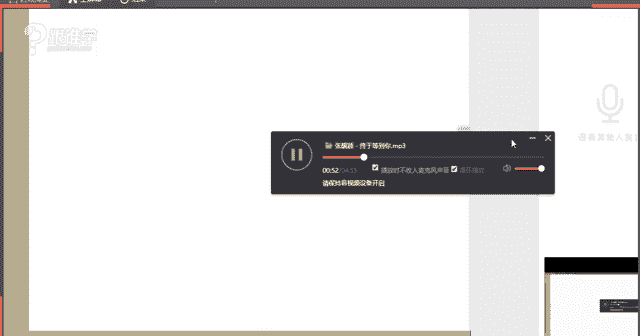
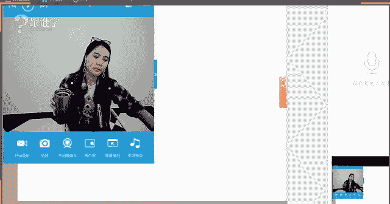
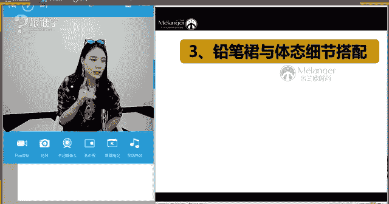
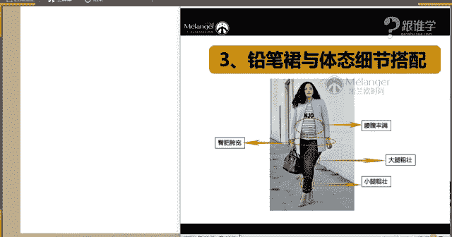
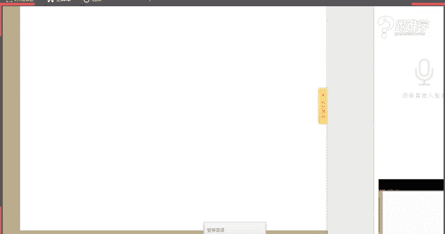

# 1、11服装《搭配秘笈之新版36计》：31性感铅笔裙

🎼让人更加珍惜着。😊，🎼看到你。🎼差点要做。😊，🎼Yeah。🎼在最好的。🎼天气遇到你，还算没有。🎼不负自己。🎼终于。😔，等到你。😔，🎼到了某个年纪，你就会知道。😔，🎼一个人的日子。😔，🎼真的难熬。😔。

🎼渐渐开始尝到孤单的味道。😔，🎼时间在敲打着。😔，🎼你的骄傲。😔，🎼过了。🎼某个路口，你就会感到。🎼彻夜陪你聊天的。🎼越来越少。🎼厌倦了北寂寞。🎼追。🎼只怕。🎼找个爱你的人。🎼就像托付重浪。😔，🎼能。

🎼陪我走一程。🎼能有多少？🎼愿意走完一生，它更是亮。😊，🎼是否刻骨铭心，并没那么重要。🎼只想在平淡中。😔，🎼体会爱。🎼你的。🎼回答。😊，🎼这。🎼你还好。😊，🎼没放弃。🎼幸福来的好不容易。😊，🎼才会让人。

🎼更加珍惜真。🎼看到你。🎼差点要错。😊，🎼在最好的。🎼气遇到你，才算没有辜负自己。😊，🎼终于等到你。😔，🎼は。🎼能陪我走一程的人有多少？😔，🎼愿意走爱一生。🎼的更是寥寥。😊，🎼是否刻骨铭心。

并没那么重要。🎼只是在平淡中。🎼体会爱的。😊，🎼啊。🎼回的。😊，🎼这。🎼等到你。🎼还好我没。😊，🎼感情。🎼幸福来的。😊，🎼不容易。🎼才会让人。😊，🎼更加珍惜终。😊，🎼看到你。🎼差点。🎼在最后。😊。

🎼感情。だ。🎼才算没有辜负自己。终。😊，🎼等到。🎼终于等到你，还好我没放弃。😊，🎼幸福来得好不容易。😊，🎼才会让人更加珍惜终。😊，🎼到你。🎼要做。🎼在最好的。🎼年轻遇到你，才算没有辜负自己。😔，🎼终于。

😔，🎼等到你。😔，🎼到了某个年纪，你就会知道。😔，🎼一个人的日子。😔，🎼真的难熬。😔，🎼渐渐开始尝到孤单的味道。😔，🎼时间在敲打着。😔，🎼你的骄傲。😔，🎼过了。🎼某个路口，你就会感到。

🤧No。あ。那个。嗯。hello，大家晚上好，同学们看见现在可以听得到我的声音吗？嗯，如果可以听得到呢，请回应。😊，OK好的，谢谢阿麦嗯，悠悠O好，那大家可以听得到我呃我的声音。

OK那我们的设备没有问题。好的，那今天呢给大家分享的课程呢是关于铅笔群啊，铅笔群的性感铅笔裙的搭配。那呃应该今天好像我觉得好像男同学没有来是吧？男同学一看到这个名字，觉得嗯不是我感兴趣的课题。

但是我觉得呃性感铅笔群，这个名字还是非常有吸引力的啊。OK好，那我们都是女同学吗？现在在呃阿麦，然后悠悠3964同学都是女同学是吗？那如果这三位同学在的话呢，我想问啊，那包括我们其他的这些同学们啊。

如果听得到呢，可以跟老师来做一下这样的一个回应，那你们有没有铅笔群啊，因为我每次在上单笔课的时候都会问大家有没有这件单品。那因为如果你们有的话，可能听起来会觉得更加的有意思。因为你们会想哎我的这件单。

😊，你原来还有这么多的搭配方法。OK好，那阿麦悠悠3964同学，你们有没有铅笔群呢嗯？好的，那我们说到铅笔裙的这样的一个单品呢，其实现代人呢在穿着这种裙装的时候，可能会想到呃比较经典的这样的一个形象。

可能就是玛丽莲梦露。因为大家知道玛丽莲梦露的这样的一个形象，都是一直都是非常的性感的。而且呢他的这种身材是非常的这种凹凸有致的这样一个感觉啊。哎，好，那我看到大家的这样的一个回应了啊。呃。

臭美猴说没有大腿太粗了。好，那这个也是我们的同学们的这样的一个新生。那今天呢老师在课堂当中也会为大家来解答这样的一个问题。那臭美猴同学不用担心啊，大腿粗也一样可以穿裙装。好的，阿迈同学没有张敏也没有吗？

好，那同学们如果你们没有的话呢，我相信你们在听完铅笔裙的课程之后，应该会买的啊，那包括前两天我讲的这个烟管裤，我今天看到这个答疑裙。当中就有一位同学莹莹同学，然后就这个问到铅这个这个英文裤如何搭配。

好的，嗯，好，今天好好学习一下铅笔裙应该怎么去搭配。如果呃想要展现你的女性魅力。我想应该没有任何一件单品能比铅笔裙，让你展现你的女性气质更加的明显了啊。OK好。

那我们今天呢就给大家来讲到铅笔裙的这样的一个搭配嗯。好的，那铅笔裙呢，我们说它的发展也是有非常漫长的这样的一个时期的那今天呢依然会跟大家来分享铅笔裙的这样的一个发展。嗯，hello呃收纳呃，欢迎你。

那包括铅笔裙的选择与搭配。那我们继续来看。第一点先给大家讲到的就是铅笔裙的历史发展啊，那其实说到铅笔裙的这样的一个发展呢，它在1910年就已经出现了啊。

但是呢他们那个时候的这种呃形态并不是大家现在看到的铅笔裙的这样的一个形态。它的前身叫蹒跚裙，那大家从这个字面上来听，你就可以感受到啊。

它的这个形象好像那大家再看一下图片当中的这样的一个裙装的这样的一个状这个形态。那其实说到这个蹒跚裙呢，它的这样的一个呃这个发展啊，灵感的设计还是比较有意思的一件事儿。那莱特兄弟，大家知道莱特兄弟吗？

也就是。飞机的发明者啊，莱特兄弟呢，因为有一位女士在坐乘坐飞机的时候呢，怕她的就我们知道在1910年以前，那女性的这种裙装都是非常的繁琐的。

而且是非常的大的长的那这种裙装其实是不便于行动的那他在乘坐飞机的时候呢，莱特兄弟怕他们的这个裙裙装夹到机器里，就用一根绳把他的裙子给系起来了。那这个就是蹒跚裙的灵感的设计的来源。

那么在呃保罗卜列把这个蹒跚裙设计出来之后，同时又风靡了我们所说的法国街头啊，那当时在法国的街头上就有这样的一个情景，大家可以想象一下。

那经常会有人听到一声叫呼然后就看到一个特别时髦的女子摔倒在这个这个法国大街上了。为什么呢？因为这种蹒跚裙，她在行走的时候，其实是非常不便的那大家可以听到这个。这个字啊字面上传达的这样的一个含义就是盘跚。

我们说老人家走路才是盘跚的步伐，对吗？那盘山群其实它的这种为什么人们会爱它这样的一个形态。那也是因为她跟我们中国的旗袍，是有异曲同工之妙的那我们中国女性穿着情旗袍的时候。

是不是身姿也是非常的摇曳的那盘跚群其实也有这样的一个啊一种感觉。所以那个时候的女性他们觉得即使是痛苦的，为什么说痛苦呢？因为穿着盘山裙的时候，她在上这个马车的时候是非常的不方便的。

那个时候的交通工具就是马车啊，他们在上马车的时候其实非常不棒方便。大家现在知道我们在学习这种呃女性的礼仪姿态的时候有这样的一节课程。那就是关于我们应该如何上车。那我想问大家，你们是平时在上这种交通工具。

就是呃轿车啊，不管你上什么车的时候，这个你坐下的时候应该是怎么坐的那最简单的我们从这个轿车轿车上来讲，我们一般都是把门打开啊，然后这个右脚进去，然后这个钻进去之后，然后就就就进来了，对吗？好。

那其实我们正确的在这种礼仪的这样的一个标准当中，你会发现所有的明星鸣人，那他们在坐轿车的时候，其实都是先把屁股坐下去，也就是说你先把身姿啊，先坐到车子里面，然后再把脚放进来。

那那个时候蹒跚群其实就是这样的一个坐姿。那其实呃是非常的不变的啊，可是我们说女性是为了爱美可以牺牲很多啊，那那个时候蹒跚群其实就已经出现了，这个就是我们所说的铅笔群的这样的一个前身。

那我们继续来看铅笔群什么时候才发展到我们现在的这样的一个形态的呢？哦，在二战时期。战争的原因，所以物资紧缺，物资紧缺之后就会导导致我们的服装的面料也要什么呢？变得少。那所以在那个时候铅笔裙的这样的一些。

不管是长度上来讲或者是宽度上来讲，它都会有所这个呃精简。那其实我们所说。在用料上面料上都要精简。那因为战争物资的缺乏啊。

这是我们所说的这因为这个客观的原因导致的那呃在直到我们所说的这个1947年迪奥先生。那现在大家知道迪奥这个品牌啊，其实就是迪奥先生创立的那在1947年的时候呢。

迪奥先生就创立了我们这个设计了我们现在大家见到的铅笔裙，以这种H廓形为主。那也就是说其实铅笔裙它是以这种弹性的包身的这样的一个形态的啊，那这种铅笔的形状，也就我们为什么叫它铅笔裙。

就是因为它像一个铅笔的形状，所以而得名而来的啊，那这就是我们一开始的迪奥先生设计的这样的一个铅笔裙的这样一个形态。可是呃我们说在一这个二战这个之期间的时候，女性穿着铅笔裙。

那是因为面料的这样一个缺乏的原因。在二战之。之后我们说这个战争结束之后，女性穿着铅笔裙的最大的原因是因为他们也想像男人一样，什么呢？出去工作。而铅笔裙他就是既正式又能展现女性的美感的这样的一个裙装。

所以被大量的去穿着。那并且大家可以想象一下，现在啊在银行啊包括空姐是不是这种相对来说比较严肃的职场当中，他们的着装者啊，职业这个职员的着装，是不是都是以铅笔群为主？

那我想问一下咱们群里现在有没有呃哪位同学是在这种呃银行啊，然后做法律啊，然后这种政府啊，或者是机机关单位工作的，有没有如果有的话，请打一啊。如果你们是在这种或者是如果你即使大家这个没有在这个场合工作啊。

没有在这个职职业当中工作。那我们平时应该也有看到。那其实大代左右的这样的一个铅笔裙，它是最最最最传统的平的，而且它是相对来说比较正式的这样的一个裙装OK那这是我们所说的，在二战时期啊。

以及二战之后的这样的一些卓卓裙者的这样的一些这种内心的这样一个诉求。那么继续来看，那在50年代一些比较经典的一些款式就什么呢？已经出现了。例如说这种格子的，包括现在大家了解的这种鱼尾裙的样式。

那其实在50年代的时候就已经出现了啊，那包括在什么呢？50年代的时候，玛丽莲梦露以及二代课本大家都知道这两50年代可以说是最经典的两位女明星啊，一位是走性感路线的，一位是走优雅路线的啊。

他们都分别演绎过这种铅笔裙的这样的一个形象，特别是呃梦露的这样的一个铅笔裙形象，可以说是让这个万千男性啊，都这个。动不了的这样的一个荧物形象。OK好，那我们继续来看。那如果说在20世纪50年代以前。呃。

我们所说的这种时装的流行也好，或者是这个呃这种呃着人们的着装的这样的一些潮流趋式，都是在上流社会引起的，都是由上流社会的人群引起的。例如说名媛名人啊，包括明星啊，包括贵族他们来带领这样的一个时尚。

而在220年代啊，呃这个20世纪50年代之后，那也就是60年代70年代、80年代，那这些都是由什么呢？其实这个时候平民已经能够来掀起我们说时尚的风潮了。例如说这样的一些朋克风啊，机车风、摇滚风嬉皮士啊。

都是在60年代、70年代80年代之后出现的那这个时候你会发现这些年轻的群体，他们认为什么呢？铅笔群会比较的老气横秋。因为铅笔裙它的这样的一些形象是非常的女性化的啊。

因为它的裙子的长度也给我们感觉是不是特别的短啊，又不性感然后又不是特别的个性。所以呢他们会觉得非常的老气啊，那直到什么呢？80年代，铅笔裙才来到人们的视线当中，为什么呢？

因为呃在这个时候其实女性她是特别是想要什么呢？呃，在这个社其实这个时候又掀起了一阵叫女性独立自主的这样的一个风潮。那么呃这个时候但是这个时候的铅笔裙它会这个在搭配上发生一些变化。例如说在50年代以前。

铅笔裙一般都是这种非常能够彰显曲线感的这样的一个形象啊，然后是上身也是紧身了，下身也是紧身了。但是大家可以看到，在80。铅笔之它的形态发生了这个搭配上发生了变化，它会搭配这种大垫肩。

非常能够展示这种男性或者说这种中性的这样的一个感觉啊，要展示我们女性的这样的一个力量的美感。因为我们要跟男人争在这个社会上的地位啊，并不是说要跟他们争地位，而是我们要什么呢？

在这个社会确定确立我们女性也可以什么呢？有所这个贡献的啊？O这是我们所说的20世纪80年代。那其实到这儿啊，到20这到80年代的时候，你的这样的一个形态，基本上就已经确定了。

跟我们现在没有太大的这样的一个区别了啊。那大家可以看到现在的名人的一些演绎。其实有很多名人明星都非常爱铅笔裙的这件单品。那所以说呃同学们如果你们没有铅笔裙的呢，可以去买一条铅笔裙啊。

我觉得我好像每次上课都在做直销或者传销的感觉啊。那呃因为铅笔群它也是那我们在单品片的课程当中，跟大家介绍的所有的单品。基本上都是非常实用性的。所以我们才会在单品课程当中跟大家来分享。OK好。

那我们继续来看。那铅笔裙的选择与搭配。那以上呢其实刚才给大家介绍介绍的，就是关于铅笔裙的这样的一个发展。为什么要给大家来介绍铅笔裙的这样的一个发展。

那是因为呃其实铅笔群你会发现从呃100年的这样的一个历史的过程这个发展当中，它一直都是演绎着非常女性的这样的一个形象。其实它是一个标签。啊，那我们说了在呃这个裙装的话。

它是最能够彰显我们女性曲线美的这样的一个状态。那裙装的话，其实也是我们所说在这个呃这个这个特别是50年代之前啊，我们是女性的这样的一个形象，都是以取悦于男性的这样的一个为为标准的啊，那直到50年代之后。

我们才会开始有了自我想要表达的东。那其实对于现在来讲，我觉得我们非常幸福。为什么呢？我们可以想穿什么就穿什么啊，那这都是我们非常可以这个自由去做主的啊，不会像这个我们所说的以前封建主义，人们都要裹小脚。

那在古代的时候呃，这种我们中国的古代啊，那女人都要什么呢？戴护窑，或者是说戴这种嗯戴这种叫什么就是那种非常长的那种护甲啊，那都是为什么呢？其实都是为了要约束我们女人的行为啊。

那包括穿这种这种戴旗头穿花盆底，都是为了让让我们女性的姿态变得更加的能够让男性觉得是有一种美感的那例如说为什么说戴护甲，其实也是约束我们的行为。那大家如果现在手边有杯子，你们可以拿起你们的杯子来。

你们想象一下，如果你们手上戴了护甲，你们是怎么拿杯子的啊，例如说我现在举个例子哈，同学们，如果要。我手上戴了护甲的话，我拿杯子肯定是这样的一个形态，对吗？就是套兰花指。那其实这种形态就是为了什么呢？

男人会觉得我们女人这样做的时候是非常优雅的啊。那包括我们戴旗头，大家可以想象一下，如果你们在齐头，你们走路为了不让这个旗头掉下来。或者是说呃那大家发现旗头上面还有很多碎穗，那种流苏状的那种碎穗。

那种他们在里这个清朝的礼仪当中，他都会讲到你走路的时候，你的这个两边的这个穗子不能摆动的太厉害，那就说明什么说明颈一定是头颈颈部非常的笔直啊，身姿一定是非常笔直的。然后呢，你走路还不能有太大的动作。

所以这个时候姿态一定是非常非常端庄典雅优雅的这样的一个状态。那其实这个也都是为约束我们的女性啊，那包括花盆底等等，都是为了要约约束我们女性的这样的一个行为。好，那这个。这个话题虽然有点远啊。

那今要告诉大家的是，其实我们现在真的非常幸福啊。OK好，那这是我们所说的铅笔裙的这样的一个发展啊。是的，另外同学你好嗯，那接下来我们来看铅笔裙的选择与搭配。那铅笔裙的这个款式其实是非常多的啊。

因为现在的一些品牌呀、设计师啊，每个品牌设计师想要传达的理念是不同的。所以呢其实虽然铅笔裙很经典。但是在每一季它其实都会有特别的一些设计。那你好啊，那所以说其实我们在选择铅笔裙的时候。

很多人不知道如何去选。😊，它跟我们的体型也有一定的关系。刚才呃臭美红同学都说了，因为大腿太粗了，所以不知道该怎么去选择铅笔裙。OK好，那我们来看一下。

等一下呢我们会在课程当中给大家来介绍如何去选择铅笔裙，腿粗的啊，然后这个臀这个臀部这个胯部比较大的啊等等。那都有关于这样的一个搭配与选择好，我们继续来看那铅笔裙呢，我们刚才讲到，我们说因为它的款。

非常的多元化的那但是最最最经典的一个款式。经典款这个经典款就是黑色的经典款，就是因为它很经典，同时它也给我们感觉有一点点老气啊。那大家我不知道同学们在平时生活当中呃。

有没有看到有一些这种特别是职场当中啊，或者说这种餐厅当中，那他们的这种啊还还有一些美容的机构啊等等。他们的一些工作都会以这种黑色的铅笔裙为主。所以其实这种。那感觉是有一点点老气的感觉。

因为本身的款式就太过于正式了啊，长度也是刚刚好在膝盖。那我们说这个裙装的长度有到这种呃大腿中间的，有到膝盖的啊，有到膝小腿位置的那那包括到脚踝位置的裙装的长度不同。

表现的这样的一个呃这种说表达的感觉也是不一样的那么到膝盖的位置，它属于最传统的这样一个位置。包括今天老师穿了一条裙。也是呃我穿的这条铅笔裙，也是刚刚好到膝盖。

那为了让这种呃这种我所我们所说的这种长度上的这种保守的感觉把它破坏掉，所以我会在款式上，也就是说它的面料上以及它的特别设计上做一些呃比较特别的选择啊，那等一下呢我可以给大家来展示一下。嗯。

今天的同学们好像不是太有这个太有激情，我发现同学们啊，那是因为这个太晚了，你们都想睡觉了吗？啊，O好，那呃我首先来看这个铅笔裙的一个款式的问题。那首先我们刚才讲到的是经典款。那来看一下第二款。

第二款呢就是我们所说的皮革款啊，就是这种材这种这种从材质上的一些区别。皮革的这样的一个材质ok好的，那后机会同学一直默默的听着好吗？嗯，好的好的好的啊，ok好，那这种皮革款呢。

我们说皮革其实它有不同颜色。对吗？那例如说我现在在在这个屏幕上展示的这一件皮革款，它其实给我们的感觉。大家觉得这种皮革款。感觉你们觉得这件皮革的裙装给表现出来是什么样的感觉，只看这件单品。

我们还没有讲到搭配的问题。好，同学们，防止你们睡着嗯，我要这个给你们抛个问题。你们如果在线下这样，这个就是在线下的同学们哈，要是要是一直默默无声的时候，我有的时候就会怕他们睡着，所以我怕你们也睡着了。

OK好，星慧同学说优雅，嗯，5021同学觉得比较什么呢？哦，性感啊，性感啊，星会同学觉得性感好，优雅女人啊，慧尔同学你好，这个我们的男同学都这么积极来听这节课的。嗯，好的，相对年轻化啊，相对年轻女性化。

尼克同学觉得成熟。同学觉得酷啊，菲尔同学觉得酷ok好的，那同学们已经表达了自己对这件裙装的这样的一个感受啊。那首先呢刚才幸慧同学讲到的性感没错啊，我们说皮革它是来自于哪里。

来自于动物身上的这样的一个皮皮革，对不对？那其实皮革这种感，其实它给我们感觉的确是会传递这种野性的感觉啊，所以它会有一种性感的感觉在那优雅也没错。因为这个颜色它其实相对来说是比较优雅的啊。

这种棕色系的感觉，它给我们感觉是非常知性优雅的女人呃惠尔同学说女人站在男性的角度上来讲，我觉得男人的眼中只有女人这一个裙装和裤装的这样的一个概念吧啊，惠尔同学。裙子的长度以及他的学名呢啊好。

并瓦同学觉得呃相对年轻女性化。O好，这个答案我保留啊，那尼可也觉得是比较成熟的酷尔同学觉得酷啊，菲尔同学觉得酷啊，好，slog觉得比较时髦。好的，那这是大家的一个答案啊，那的确时髦酷啊，优雅呃。

女人呃都有。那其实年轻也会有，为什么呢？呃成熟其实呃相对来说还好，这件裙子的成熟度相对来说还好啊，不会觉得它没有黑色给人感觉成熟。那其实它是有一定的年轻化的。因为我们说这种皮革它也给我们感觉会有年轻感。

O好的，颜色的问题是吗？是的，颜色它的确嗯okK好，那我们继续来看，那这是大家对于皮革的这样的一个感受。那等一下我们会在后面给大家来分享皮革。它搭配出来的呈现的这样的一个效果。好，那我们接下来看牛仔。

牛仔的话毫无疑问，它一定是非常。年轻以及休闲感为主的啊。okK好，那包括蕾丝，那蕾丝其实它也有不同的蕾丝的这样的一个感受。那例如说有那种大的那种呃大花形成的那种镂空的那种蕾丝感啊，那包括有了蕾丝。

它给人感是非常轻薄的。有的蕾丝就像大家现在看到图片上这种非常精致的啊，然后有一点小优雅的那你会发现蕾丝它它的这种形状不同，它产生的这样一个视觉效果也会不一样。例如。

的裙子它一定是给非常的什么呢淑女的温柔的呃，这种精致的优雅的女性去穿的。你会发现这条裙子如果她给太过于年轻可爱的女性去穿，感觉不是特别的好啊，那当然它是属于你颜色是属于年轻的那大家可以想象一下啊。

那包括如果她给这种所说长得特别的性感的，妩媚大气的女性去穿着，好像效果也不是特么好。所以你会发现她其实特别适合韩式的这种女性，那她不太适，她不嗯不是那么的能够表现欧美的这种女性的美感。

那包括日本的也不能表现。因为日本的女生都是可爱的感觉，对吗？啊，那所以说从呃第一条到第四条，我想问同学们，你们比较喜。铅笔裙的款式呢啊，那我刚才都已经给大家来一一的表达了这个铅笔裙。

它有不同的这样一个传递的感觉啊，从面从色彩上从面料上。OK好。😊，喜欢第三个和第四个丁娃比较喜欢第三个幸会第二个菲尔第四个啊，没有人喜欢第一条，毫无疑问啊。好的，那你们不喜欢第一条。

那等一下老师会给这个大家重点来介绍第一条到到底该如何去搭配啊。好，那我们来看一下，那呃第五条是印花感的那这种印花的面料，你会发现它成这效果是什么样的呢？同学们印花它传递给我们第一，它有一种非常什么呢？

女性的这种元素在，而且它一定是成熟的感觉啊，那波这个惠尔同学说波西米亚，其实这条裙子它有有一点民族感，但是它不是这种特别波西米亚的波西米亚的这种一般都会以这种特别飘逸的大裙装为主。嗯，OK好的，啊。

那看来惠尔同学还是有认真听课啊，但是他你是了解到这个有有感觉这条裙装它是有一定的这种异郁风。性感的嗯，非常好啊。那包括冰马同学说民族是的，没错啊，有这样的一个感觉。好的。

那最后我们看到的是铅笔裙的款式当中有一个开叉的设计。那以上呢就是给大家介绍的一部分的铅笔裙的这样的一个款式啊，那基本上其实已经能涵盖大部分的这样的一个款式的那第一条呢是这种比较经典的款式，黑色的铅笔裙。

第二个是以皮革材质的，第三个是牛仔材质，第四个是蕾丝材质，第五个是印花的图案的啊，那第六个是开叉。那以上我给大家介绍到的这些裙装，你会发现，其实它包含了什么呢？其实就比是我们所说的服装当中的从色彩啊。

服装是由色彩，然后材质图案以及工艺组组合而成的啊，那你会发现嗯稍等一下啊，好的，老师印花的记忆度是不是比较高。穿几次就容易腻了啊，呃，勿忘我同学说老师鱼尾裙算铅笔裙吗？呃，我们说的这个铅笔裙的话。

其实这种形态呈排斥形状的，这种是最典型的铅笔裙。那么鱼尾裙的话呢，它其实曾经是在50年代的时候出现过。它是在铅笔裙原有的设计上做了这样的一个改变。也就是它加了这样的一个特别的设计的鱼尾裙。

那但是现在其实鱼尾裙跟铅笔裙它是有差异化的啊。O鱼尾裙它给我们感觉其实更加女性化，鱼尾裙会更加女性化。而铅笔裙它给我们的感觉它是基干练。话的OK好呃，勿忘勿忘我同学理解了吗？好的，那我们继续来看啊。

刚才那个臭美猴同学问到的印花。好，那为什么说臭美臭美猴同学问到的这个呃问题特别好啊。这个呃印花的记忆度是不是特别高，因因为它因为感觉穿几次就腻腻了。为什么这么说呢？因为你会发现这种款式它是属于叫时尚款。

而这种款式叫基本款，基本款基本款。这三个都是属于时尚款。所以。这种款式的衣服，你跟各种单品组合的时候都没有太大的问题。不管我跟衬衫哪、T恤啊啊，只要它的这个因为它款式特别的简约。

所以它跟各种的服装搭配都是没有太大的问题的啊，而蕾丝的，你会发现其实它是有风格在的，它会偏啊。那印花的它也有风格在，它会偏这种有点民族意域的感觉。而这种开叉的，它其实也有点小个性小性感在里面。

特别是这种侧开叉开叉它也会分什么呢？呃两边开叉，那包括后开叉，那这种其实侧开叉它一定有了这种有点女性花元素的感觉在了啊。所以同学们你们其实在选择铅笔裙的时候，就虽然老师你会发现同学们有同学这样说。

老师我觉得单品课好像这个知识量没有入门篇的知识量大。其实同学们你们自己细细去体会的哈，你会听到我每次给大家去讲到铅笔裙的时候，它会经这呃每次讲到单。品的时候，其实每一个单品会因为它细微的变化。

就会在你你在表达上的时候，其实就会呈现不同的感觉。例如说皮革它一定给我们感觉是比较力量感的硬朗的感觉的，性感的感觉的啊。那牛牛仔它一定给我们感觉年轻化啊，那这种一定是成熟化，经典的黑色一定是成熟的感觉。

蕾丝的一定给我们感觉是非常的女性化的印花的给我们的感觉是比较时尚的，并且这种印花它是有这种民族感的那开叉的它也是有个性感的，有女，特别是玫红色的玫红色它给我们传递的印象是什么样的呢？它的情感表达的意义。

或者它的心里这个这个呃这个玫红色，它的这样的一个情感代表啊，它是妩媚的女人的，相对来说比较这种有点小妖气的那加上它侧开叉它给人感觉会更加妩媚性感OK好的嗯。嗯。那我继续来回答大家问题啊。

另华同学说铅笔裙在长度上和其他裙装有明确的范围界定吗？那脚踝的这种版型也是属于铅笔裙吗？好的，另华同学，你这个问题呢等一下我会留在后面去解答好吗？因为我们在体型搭配的时候。

其实是有关于这样的一个板块的啊，好的嗯。okK那基本上给大家已经介绍了铅笔裙的这样一个款式。那我。那同学们在这样的一个板块当中，我给大家介绍到了，因为我们所说的铅笔裙的色彩款式呃。

色彩材质图案呃工艺的变化，所以它会产生不同的感觉。你们在搭配的时候，你们在选择的时候，你们就要清晰你自己想表达什么样的感觉？包括你个人适合什么样的一个感觉啊，例如说如果是一个女性，她长相特别硬朗。

就是长得特别硬。那她看起来气质是比较偏干练的啊那那她一定非常适合皮革版皮革的这种裙装。那么如果一个女性，她长起来长得感觉特别的精致的柔美的。比如说高圆圆这种这一类型的唐嫣的啊啊，唐嫣还好啊。

这种这个杨幂的啊，就是她看起来非常柔美的感觉，那她穿这种裙装一定没错啊，那你会发现这种印花这个宁静穿着一定会好看。为什么？因为这种印花非常的大气，非常的浪漫的感觉OK好，那这就是关于裙装，它展它。

不同的感觉传递给我们的情绪是不一样的啊。OK好，那我们继续来看。那讲到第一个啊铅笔裙，黑色经典款。我们来看一下黑色经典的铅笔裙。刚才我已经强调了黑色铅笔裙，因为它本身就太过于保守。在选择的时候呢。

你可以在在搭配上啊，在搭配上。那例如说这种款式它太过于老气的时候啊，你可以选择什么呢？比如说特别休闲的以及特别时髦感的这种T恤。为什么这么说呢？你会发现这一件白色的T恤，它是它不是普通的白衬衫。

它是带有这种印花的这种这种感呃这种这种字母以及这种涂鸦感，这种涂鸦感以及这种纯棉的面料，它会带给我休闲的年轻的感觉啊，再加上这个博主，他这个还佩戴了这种时尚的项链，所以它传递给我们的感觉是非常的什么呢？

既有女性化的这种性感感觉在那包又有这种休闲感。包括它的这种项链的。表现了女性的元素更多，包括它的高跟鞋。那大家可以来看123它有三件单品都在传递女性化元素。所以经常有同学问老师到底应该怎么混搭，混搭。

其实就是你想要表现哪个为主风格，你就要去搭配的感觉的。例如说这一套当中，我想表现女人味的时候，我一定是高跟鞋加这种非常柔这种女性化的这种这种曲线感的项链啊，然后呢，我的头发是这种侧分的。

你会你会发现这种这个博主他的发型是这种偏分过来的那如果他整体展现的都是女性化的感觉。包括它的这个呃裙装的面料的选择是这种非常紧身的。那这种铅笔裙的面料，一般我们会选择这种莱卡的面料或者是纯棉的面料啊。

他给我们的感觉都会比较这种有有弹性感啊，不要选择这种这种棉麻的。为什么呢？丝绸的也不要选择不好打理，容易皱啊，O。好，那刚才说到这个搭配的问题啊，混搭的问题。那么如果你想传递女性化元素的时候。

你一定全身每一个细节都在展现女人味儿。如果你想要表现这种休闲化的时候，应该怎么搭配。例如说我可能头上戴一个棒球帽，然后我的脚上穿一双运动鞋。那我的外套就穿一个棒球衫，那么它的整一套的感觉就偏运动感觉了。

能理解吗？同学们，我我刚才讲到的混搭的这个两种的风格能理解吗？同学们通过这一件黑色的铅笔裙，我给大家呃也这个解这个叫什么解释了两种搭配的方案啊，如果理解的同学呢，请打一。好的啊，那我。同学们啊。

那这就是搭配的技巧，混搭的技巧，missmat的技巧非常非常重要。为什么呢？这个在我们线下的课程当中，我们都是收非常高的费用的啊。同学们，你们好了。

我经了一个非常经典精精这个呃非常有含金量的这样的一个搭配方法啊。OK那其实呃我再来给大家来总结一下，在一套服装风格当中，如果你搭配了两个不同的元素。搭配这条铅笔裙，它给我们感觉是女性化的。

而这件T恤它给我们感觉是休闲运动化的。如果你在搭配这套服装的时候，你首先要想好，我今天去哪。我想要去我想要表现什么？例如说我今天想要表现女人味儿，我想要去一个比较这种这种呃相对来说有一点点小正式的场合。

那么你的上方的选择，你可能不能选择这件T恤，你可能选择的T恤是白T啊，简约款的白T，然后配上这套西装，配上这件对这条铅笔裙，然后配上这双高跟鞋啊，然后不要你带上精致的耳环，拿一个手拿包。

那这个时候你的整体展现的感觉一定是非常干练的，然后女性化的有正式感的。那么如果你今天想去的是休闲的场合，你想表现的是舒状态，那你可能是带的棒球帽，穿的这种运动的棒球衫搭的是运动鞋。

那么你的单品的数量很多，你传递出来的信息，就是那个感觉。OK那这就是我们所说混搭的技巧。同学们啊。好，那通过这一套的搭配呢，大家对。铅笔裙是不是已经有了一个新的概念呢？好，我们继续来看第二套。

那第二套你会发现这个模特她是怎么黑色铅笔裙演绎的不同的。首先它在色彩上其实没有太大的。我们说它的上衣的颜色，裙装的颜色。没有太多的亮点，那因为都是以灰色黑色为主啊，我们在生活当中经常穿这些颜色。是的。

惠尔同学非常好，包包是一个亮点，但是还有一个亮点是哪儿呢？就是它的这件衣服的设计，它的这件衣服的设计，你会发现这种纽扣的这种。也非常有设计感，包括它的眼镜的配搭，为它整体增加了很多时髦元素。

包括它的高跟鞋是以银色的选择，他没有选择黑色。如果他选择的是黑色，你会发现这一套它给我们感觉不会那么的时。指择的是银色，那银色它的时尚感是呃银色它给我们感觉是非常时尚的。因为它是有未来主义的感觉。

OK好，这是第二套的这样的一个配搭。那第三套大家可以看到的是什么呢？它选择的是一个后开叉的铅笔裙，如果他选择不是后开叉，它这个地方跨的。那那么开同学们，你们知道吗？

所以它第一这种后开叉扎呃后后开叉的铅笔裙，加上它的这种什么呢？呃，带就这种绑带式的高跟鞋也是今年特别流行的，再加上它穿着的这种有点内衣外高腰的短上装啊，整体传递就是性感的女人的这种感觉。

那所以说想要把黑色经典的这种铅笔呃，这种铅笔裙搭配的不那么老气的话，你首先要在什么呢？呃，我们说第一，你可以从款式上做突破。例如说你选择一些。这种相对来说比较时装款的啊。

比如说这种什么休闲的这种呃这种有设特别设计的这种呃上装这种T恤啊，包括这种有这种有点小性感的设计元素的这种上装来打破本来铅笔裙的这种老气的感觉。那在进行配饰的组合的搭配，这个是非常重要的啊。

那你会发现呃老师今天其实穿的也不是特别的这种这种这设计，服装设计上来讲不是特别的特别的有型。但是我会搭配很多配饰，比如说我的戒指啊，那我的戒指其实是跟我的衣服上的这种配色是吻合的。

比如说我的耳环跟我的腰带是这样的一个配搭关系，包括我的眼镜，其实它每一个细节都在强调我的服装的时尚素时尚度啊，OK好。老师第二套适合A型身材吗？适合的啊，第二套适合A型身材非常好。

而且它既可以遮住这种A型身材，这个地方很胖的问题啊，而且它还是上身浅下身深的问题。啊，呃让我们去吹吹风吧，同学啊感觉每次叫你名字，我都好像跟你约会了一次。好像我去约你去吹风去逛街的感觉。OK好。

那这是我们所说的黑色铅笔裙的这样的一个搭配方法。那我们继续来看啊，好。😊，啊，第二个就是我们所说的铅笔裙的皮革款。那皮革刚才其实我已经给大家讲过皮革的，但刚才大家同学们已经自由回答了。

说皮革她给我们感觉是这种呃这种这种性感的啊，同时呢它还感的感觉。其实皮革的话，它更多是展示野性的性感的干练的硬朗的为主啊，那首先给大家讲的是皮革我要选择过短的裙装啊。

例如说啊有一些女性你会发现她选择皮裙到这个为止好，再穿上一双黑丝啊，而且或者是穿上一双网袜，虽然今年特别流行网袜，但是千万不要用这种皮革配上这种网袜，再穿这么短的裙子啊。嗯你要是真的走在街上。

别人还有这个晚上要去夜店的感觉啊，那这种着装，她给我们感觉太过于性感化，就是太过于这种太过于性感了嗯。好。各位同学，那你的这条短的皮革的裙装一定要想想怎么去搭配。那我建议如果你穿这条短的皮革裙的时候。

不要搭太过于紧身的服装啊因为本身露肤面积比较大。再加上你过于紧身的时候就会给人感觉太过于性感。我建议你可以搭配这种什么呢？呃，宽宽松的上装啊，O好，宽松的这种毛衣啊，然后包括这种卫衣。

因为今年其实特别流行这种oversize的，你可以穿这种大廓形的ok啊，并且下身选择搭配什么黑丝啊，你可以直接搭配一双啊，这种这种如果你要是呃这个叫什么？今年不是特别流行这种运动鞋，搭配袜子的穿法嘛。

你可以穿大毛衫搭运动的这种oversize的卫衣，然后搭配这种堆袜啊，然后穿上运动鞋，或者是穿上这种堆袜之后穿高跟鞋啊，它也会非常漂亮，而且时尚度。的好OK好，星辉同学，这是你的这个搭配的建议啊。

那么继续来看第一套的搭配，它其实不太适用于我们在生活当中的着装。那因为这着装给人感觉太过于性感啊。那第二套其实非常的适用。因为这种什么呢？它给我们感觉这种颜色上来讲啊呃，第一。

其实皮革它有很多的这种颜色，皮革它只是一种材质，并不是只有黑色，它可以有这种暗红色，包括刚才我在前面给大家展示的那件卡其色。那个卡其色的这种面料，它一定会传递一种复古感。大家可以搭配一些民族感。

那呃包括它可以搭配一些比较知性和优雅的这种感觉。而这种暗红色它其实也是给我比较雅致，同时它是有女人味的。为什么呢？因为红色它本身即使是暗红色，它也是从红色加了黑才变成了这种暗红色。

红色它一定是一个能够彰显女彰显女性的这样的一个美感的色彩啊，就是女性味儿，这种比较浓浓重的这样一个色彩。那包括这种博根第酒红，它其实一定是给我们感觉非常的雅致的啊，O非常的有品味感的。

那么如果呃我建议这种打扮的话，建议在30岁以上的女性穿着这种感觉。所以它会比较成熟啊，比较成熟的感觉。OK好，那这是这一套的搭配。那你会发现其实这一套呃，这个模特的展示它的妙点在哪里呢？在于它的包包。

你会发现它的包包的图案。跟它的衣服的图案是叫什么呢？重复的这个叫我们所说的叫什么呢？同一图案的搭配。啊，有的时候其实我们都会觉得唉我已经这个身上有图案了。

那我是不是应该拿一个这种相对来说呃比较没有那么复杂的包包呢？款式简约的包包呢，其实我们是可以图案搭配图案的。但是你会发现它的点是在于哪里呢？都是新星的图案，这叫同一图案的搭配。

那在我们服装的美学课程上来讲的话，其实我们是有叫同类图案，同一图案，不同类的图案的搭配。OK好，这叫同搭配。那么继续来看第三套。那第三套呢是美国名媛奥利维亚。

那它的其实这一套搭配呢不太适用于腰比较粗的胯比较宽的，为什么呢？因为本身胯就宽，在这个地方加这种什么呢？荷叶边的设计，就会显得你胯更宽，所以会比较适合比较瘦的人。OK好，那这是皮革款的这样的一个搭配。

那第一款它会给我们感觉过于呃比较性感。第二，它给我们感觉是优雅的那第三套它给我们感觉依然也是优雅的女性的这样的一个形象啊。好，这是皮革的这样的一个款式。那么同学们有没有皮革的。

同学其他同学有没有皮革的裙装？好，那没有是吗？没有的话，我建议啊，我不建议啊，反得你们的钱包这个空的太快，每次上完课都要这个买东西。ok好，思雨同学是有的是吗？有的话呢，你可以下次在我们上课的时候。

你搭配一套这个皮革的裙装给老师帮你参考一下。嗯，好的，皮短裤皮短裤跟皮裙感觉是不一样的。皮短裤他给我们感觉更加帅。菲尔同学嗯，好，胡娇同学。A字版型的那幸会说每次上完课都想买买买，那买吧ok好。

想模仿图二是吗？啊，那就可以模仿图二，那就嗯ok好的，胡娇同学说不呃这种什么呢？我看一下啊，A字版的裙装不会搭配吗？其实A字版的这种裙装呢，因为它是已经呈现A型的，它是有扩张感的。

我建议你上身呢搭配一件这种不要太过于宽松的搭配相对来说修身的款式为好嗯。😊，好，皮革搭大毛衣可以的啊，皮裙搭大毛衣可以的。好，那我们继续来看啊，铅笔裙跟你呃铅笔裙牛仔款。

那牛仔呢因为它本身就已经是一个非常年轻化的这样的一个单品啊。那我们说呃面面料，因为牛仔它是比较年轻的面料，但是它把它设成这种设计成这种铅笔裙的款式的时候，它就让这种牛仔的年轻感减弱了。你会发现啊。

那你会发现比如说这种牛仔的A字裙呢，然后今年不是特别流行那种牛仔的A里面有一排的扣子，那种款式你会觉得哎好像很年轻化，但是你会发现设计成铅笔裙之后，它就会变得女性化了。那但是在所有的铅笔裙当中。

牛仔的面料依然是最年轻的啊，最年轻，因为它特别的休闲化的感觉。那在牛仔的这样的一个款式当中，如果你想把它。搭了女人味儿的时候，其实你可以把它搭配成这种，比如说有点DV的这种感觉嗯。好的啊，思雨同学说。

今天想给你看上一次那件豹纹的皮衣，没办法错过了答疑时间，那就下次吧。嗯，O好，来看牛仔的经典的这种这种经这种其实是属于叫经典款的牛仔，它搭配了一件黑色的上装其实这个太搭配的就没有太多的亮点。

也就是说它的上装跟它的下装，其实它的时尚感是不够的。所以它在什么呢？它的包包上做了这样的一个时尚元素。那它的包用的是什么呢？豹纹啊，你会发现豹纹其实是特别难搭配的这样的一个单品。那例如说豹纹的鞋子啊。

豹纹的包包啊啊，然后这种单品其实相对来说呢？它比较难搭配，大众会认为它难搭配。但是其实我告诉大家一个诀窍，就是什么呢？豹纹的鞋子其实它也非常的经典，如果你的服装当中基本上都是以暗色为主的。而且。

款式都是非常简约的那我建议你可以买一个豹纹的鞋子，为什么呢？豹纹的鞋子它可以增添你的每套服装的这样的一个时尚度。因为你本身服装的亮点不多，那你豹纹就成了你整套装的这样一个亮点。

但是我不建议豹纹大面积去穿着，包括思雨上次买的那个豹纹的皮衣，是吗？我建议哈以后少买那种大面积的豹纹，因为穿不好的话，如果你的那件皮衣的质感还是非常好的那有的豹纹它看起来质感会非常不好。

包括豹纹大面积去使用的时候，它总会有一种。太过于野性的，包括它就是穿不好，会给人感觉非常俗气。所以其实但是我建议小面积的去使用也是非常棒的。就是比如说用在配饰上鞋子啊，然后我建议大家可以买的。嗯，O好。

那第一套的这个服装，它的豹纹，其实套服装的这样一个亮点。那这种搭配方式，我建议同学们也可以经常去使用。比如说你的成整套服装当中没有亮点的时候，你就使用一个亮色去搭配。

或者是说使用一个有设计感的包包去搭配啊，O比如说今年是不是特别流行那种刺绣的这种宽带的刺绣背带的那个包包，包括包包上面有很多的刺绣，那个其实如果你穿穿着服装非常简约的时候。

你背一个那个包就足够抓眼力的啊，就很吸睛。好，那么。牛仔上衣加牛仔裙装啊，那这一套的话其实呃非常时尚。怎么说呢？其实这种牛仔上衣跟牛仔夏装的一个搭配的话，没有几个人呃，其实生活当中很少有人会去这样搭配。

因为很多人会觉得牛仔牛仔上装跟牛仔夏装去搭配的时候，好像太过于统一，没有时尚感了。其实牛仔。这的时候一样也可以把它搭配的好看好看的。但是其实我建议这一套服装还可以什么呢？加一条小丝巾。

就例如说在脖子这个这个位置加一条那种小小的细的丝巾，就是以前我。很土气，但是其实今年特别流行，然后再配一顶这种帽子，极皮的帽子，看起来它就是一个你就是一个呃西部牛仔女郎的这种感觉了啊。

那这是这个风格话就会非常的明显了。OK好，那如果你不想系在脖子上这个位置，有同学说，老师我觉得脖子短不太适合待在这儿，那你就可以系在什么呢？手腕上，或者你可以把它系在腰间，都是一个亮点。O好。

那这是第二套。第三套今年特别流行的这种破洞的牛仔，我们设计师太了不起了哈，已经把它运用到这种牛仔裙里面啊，这种牛仔裙，它给人感觉做了这种破坏感的牛仔裙，它其实是非常时髦，而且我认为非常性感。

我都想去买一条这样的牛仔裙了啊，我觉得挺好看的。呃，也去找找一件这样的牛仔裙穿。那你会发现其实如果在搭配的时候，有一个诀窍是什么呢？如果你的夏装是非常性感的时候。那么你的上装就保守起来了。你会发现呃。

你你同学们，你们看到这条牛仔裙，它是不是款式比较保守，所以它的这个它的这个。比较低。那包括这一件这一件其实它是上面也开叉，下面也开叉了啊。那这一件我们来看一下啊，下面它是做了这种性感的设计。

它上面就做的比较保守。那这种上下开叉，因为奥利维亚的胸部不是非常的丰满，所以她敢这样穿，我敢给大家打整，如果一个胸部非常丰满的女性，她如果这样去穿着的时候，你会觉得很俗气啊，那是因为什么呢？太过于暴露。

太过于性感。那因为它上面也开叉，下面也开叉，它给我们展现的感觉是过于性感的时候，个度把握不好的时候，我们就觉得俗气了。O好，那破洞牛仔裙是吗？啊，是这种破洞牛仔裙吗？

我认为这种破洞牛仔裙还是非常性感的啊。O好，那这是关于牛仔的这样的一个款式，那么继续来看蕾丝啊，铅笔裙蕾丝啊，如果说铅笔非常性感的一件单品。那我认为蕾丝的铅笔裙。

其实是更加能够展现女性魅力的这样的一个单品了啊。那当然蕾丝刚才其实我有跟大家讲到过蕾丝它也会有不同的丝的花朵的图案，所以它呈现出来的感觉也会不一样。你会发现这个蕾丝它是属于大片的花朵组成的。

它会感觉特别的大女人的感觉。而这一件你会发现它是小清新的感觉。它的花，这种感觉是比较碎的啊，就是比较缝隙也是这种这种花的这种间隙也很小啊，它看起来是比较碎的这种花朵。那么它给人感觉是清新感。

你会发现这个呃这个明星在搭配的时候，它是搭配了一个清新，一身白色的蕾丝配了一个这样的这种什么呢？这种小小野花，你会觉得好像有一种度假感。我觉得这一套裙装会更加适合度假的这样的一个感觉啊。

郊游的这样的一个感觉呃，非常的清新啊。那例如说其实。海边也可以这样搭配。okK好，那这一套呢其实它是在什么呢？中。你会发现蕾丝，因为它本身就是非常女性化的。所以如果中性的女生或者长得比较硬朗的女生。

你想把自己变得这种这种这个什么呢？呃，心赏有女人味儿，又想要这种硬朗的一面的时候，我就建议这样的一个搭配方法。例如说呃我们有没有入门班的同学呀？咱们现在有没有入门课的同学们，如果学过入门课的同学请打一。

😀Yeah。好，咱们挺多的啊，尼可幸会有熊同学并娃同学都在是吗？好的，收lo好，惠尔同学都在。那那你们应该都知道，我们刚才讲到的硬朗跟柔美的概念，对吗？那如果这一套服装的话。

那其实就比较适合长相非常硬朗呃，长相硬朗的人，但是他想要表现柔美的这样一个搭配方法。我我之前在课堂上跟大家讲到过一个这个观念就是什么呢？如果一个人他长相的特别硬。

那他上身的服装其实应该是直线条的服装就是偏直线感的服装，更加符合他这种直线感的轮廓。那么他的裙装他的这种下半身选择的是这种蕾丝的柔美的裙装，运用到下半身。那他其实是远离你的脸部的。

所以他不会有对你有太大的影响。那所以说可以这么理解，适合你的放在上半身，不适合你的放到下半身。啊，或者说相对来说没有。适合你那么适合你的放到下半身，这种搭配的方法就非常能够给到你。

就非常适合到一些呃这种非常这种感觉，很硬朗的人，又想变得女性化就很适合。那同样的道理，长得特别的这种女性化的人，他想硬朗一点。那他是不是就反过来穿上半身穿蕾丝，下半身圈穿皮裙。

一样能够达到这种又有这种硬朗的感觉又帅气啊，叫娘蛮平衡这样的一个词语。OK好。🤧这个就讲到这儿啊，那第三套非常适合去约会啊，为什么呢？白色配粉色，它给我们的感觉是非常清新感的。

我觉得男生应该都喜欢这样的一个配色关系。你们说呢钟永雄同学，包括慧儿同学，你们喜欢女生这种形态吗？啊，这种这哎，我想问一下123，你们喜欢哪种感觉？男生回答啊，123，你们喜欢哪种感觉？嗯。

会尔同学说是的，三周永同同学说一和三不喜欢什么？O胡桥同学比较喜欢第三个吗？并娃也喜欢一3OK好，为什么你们不喜欢第二个呢？哎，有点奇怪啊。好像大家现在都不太喜欢这种哎呃长得不好看的原因吗？好。

其实如果从场合场合出发的话呢？其实这个它会更加适合这种度假感觉的嗯，O好，我看到大家的答案了啊，有喜欢第一个的也会喜第三个的，你会发现第一个它其实现在偏欧美，我说明什么问题。

我们大家现在的审美都比较偏欧美了啊，O好，那第三个它其实虽然非常女性化，但是它款式非常简约啊。好，那这是关于蕾丝的这样的一个问题。那我们继续来看。那呃在这在这张PPT当中呢，给大家讲到的一个知识点。

是关于呃，例如说你想要把自己打扮的女性。😊，化的时候你就可以加入蕾丝的元素。那么如果你长相是比较硬朗的感觉，偏直线感的那你可以上身穿硬朗的啊，它是柔美的单品。那么如果你长得是比较柔美的那你就上身蕾丝。

下身穿这种皮革的感觉，就比较能够适合你个人的气质了。OK好，那我们继续来看铅笔裙开叉的这样的一个设计啊，那铅笔裙开叉设计呢，其实也是在呃50年代左右就已经有了这样的一个设计。

那它在会在两边开叉或者是后开叉，为什么呢？因为这种两边开叉以及后开叉，它会给女性更多的自由。以前你会发现这种没有开叉的裙装，走路还是相对来说太过于拘谨的感觉我虽然很爱铅笔裙。其实我有很多铅笔。

有有一条就有一条铅笔裙就很少会穿，因为那条铅笔裙它是后面开叉的，但是只开了一点点缝隙。我每次穿那种铅笔裙的时候，感觉言行举止都会受到约束。你们都知道了，老师的性格也是比较呃这个这个这个大大咧咧的啊。

所以呢不太喜欢太过于受约束，所以说这种开叉设计，它其实给我们感觉会更加的这种呃有这种自由感。但是开叉的不同的位置，它给我们呈现的感觉也会不一样。你会发现现在有这种侧开叉，侧开叉后开叉前开叉。

那这种你们认为哪一个最性感。我想问同学们，123你们认为哪一个开叉最性感。めめ。好，男同学认为侧开他最性感。尼克同学也觉得侧开叉性感啊，莹莹同学也觉得侧开叉性感是吧？好，我看到了啊。

有人觉得前面有人觉得侧面啊认为侧开叉性感的人啊，你们都属于闷骚型的，为什么这么说呢？这种侧开叉它是隐隐约约的暴露，然后你会觉得啊一点点小小的性感，好像不是那么赤裸裸的这种性感的感觉啊，那这种后开叉。

因为它这种开叉度非常的小，而且它在后面我们基本上看到对不对？啊，那这种前开叉其实它给我们的感觉会比较的这种性感的感觉。但是侧开叉的这种设计，它会比较的有个性感。侧开叉它其实是比较有个性感的啊。

因为为什么呢？我们说这种人的这种传统面和这种叫什么呢？个性面一般往往是在侧面或者是背面设计的时候，你会发现所有的服装如果是侧面设计，是背面设计的时候，它会给人感觉会更加的个性感。而如果在正面的时候。

其实。它其实没有那么的个性啊。OK好，那例如说我们的衣服，我们一般都是前开襟，对不对？那如果有一件衣服是从侧面打开的啊，比如说这种这种有侧面拉链的，你会觉得这种就给人感觉是个性的啊。OK好。

那这是我们所说的开叉的这样一个问题啊。那其实今年呢我建议大家可以买哪种开叉呢？就是这个位置是侧开叉。但是这个侧开叉上面有绑带。流行。那这种因为今年其实特别流行运动风，那这种侧。

本身的铅笔裙带有侧开叉的时候，它是结合了这种叫时尚运动感，既有女人味，又有运动感。所以那种裙撑它其实又性感，然后又有这种运动的这种感觉，其实非常好看。那我都想买一条，因为我的铅笔裙其实有点太多了哈。

那但是我依然想买一条这样的铅笔裙啊，O好，那这是我们所说的开叉的这样的一个前后侧它呈现给我们的感觉的不同。当然它给它在搭配的时候，呃，你搭配的这样的一些元素，它也会影响到你的最最后啊最后你搭配的效果。

它也会影响到我们的视觉感。那例如说这一条这一件衣服它其实搭配的就没有太多的。我们从背面看上啊，从背面看，因为看不到它正面感觉，其实相对来说是有一定的时尚度的。因为它本身什么呢？这件衣服的这种黑白拼色。

再加上印花的感觉设计，再加上它穿上这种公字背心，它其实是有点小性感的，然后又有点这种休闲。又有点这种时装感，叫时尚休闲的这样的一个造型啊。那包括这个其实运动感比较强烈，运动加上这种性感的元素在啊。

这个就是非常的什么呢？是这种有点小性感。因为本身我们说红色，它其实就是女性化的这种代表。再加上呢开叉。那包括它这种绑带的设计。

其实它是传递了一种女性的性感的这种味道在那包括最后一套tor的这样的一套感觉。tor的话，因为它本身的气质呢，其实就偏这种甜美的感觉，所以你会发现它的裙装选择的都是这种小碎花。

它不喜欢选就是这种小小的图案，小小的格子，它不太适用于太过于什么呢？大的感觉啊，OK好，喜欢二是吗？嗯，第二套它给我们感觉比较符合这种当下人的需求，因为又舒适，然后又好看。但是你能接受这个问题吗？

就是这个位置的地方。嗯，好。这是我们所说的铅笔裙的开叉的这样的一个设计。好，那我们继续来看。铅笔裙印花啊，印花呢其实之前跟大家讲过，印花它有分不同的这样的一种感觉。例如说第一套和第三套叫自然类的图案。

为什么叫自然类呢？这个是属于大自然的什么呢？花鸟这种鱼虫，它都是属于大自然当中的那这种这种蛇纹的这种感觉，它其实是属于什么呢？虫类，对不对？也就是叫自然类的这种感觉，而这种格子它是属于叫人工化的图案啊。

这种呢你会发现自自然界当中没有那么这种什么特别工整的东西，对不对？所以它是都是属于叫人工化的那这种自然类的图案，它给我们传递的，一定相对来说其实都是有点什么呢？就是这种呃自然感。

那例如说呃相对来说它也会柔和一些。肯定传递给我们的感觉会过于就是有一种硬朗的感觉。因为格子啊、条纹呢，它都给我们感觉是比较硬朗的。而这一套给我们感觉相对来说柔和这一套野性就是有野性的这种女性的美感美感。

因为裙子当中的这种蛇纹蛇，它也是来自于动物身上的，对不对？而且它是有攻击力的这种动物，所以它给我们感觉是有野性感的，包括豹纹蛇纹鳄鱼纹，你会发现这种带有攻击性动物的图案，它看起来都会有野性的美感。

OK好，你会发现这种花花草草啊，看起来就会非常的唉柔美的感觉。OK那今年非常流行刺绣，那所以每个人看起来都很柔美。啊，包括这个男生都变得柔美起来了。那这是我们所说的印花印花的话呢，大家可以想象一下啊。

如果你是一个长得比较柔美的。那么我建议你可以选择这种就是相对来说比较柔和的图案，以花呀，然后这种柔和的写意的。这种感觉啊，那这种它相对来说特别适合给到长得比较硬朗的人去穿着啊。

包括这种搭配手法也是什么性感，有这种机车皮衣的搭配嘛，看起来有呃这种呃红唇的配搭，哎，既性感，然后又有硬朗的感觉。那这一套其实是这种这种相对来说比较休闲的这样的一个状态嗯。

okK第三呢有点小野性O那以下以上呢就是关于我们所有的铅笔裙的款式的这样一个搭配的问题了啊。铅笔裙的话它有多少，刚才给大家介绍了多少个款式。第一个叫黑色的经典款。那我建议黑色经典款呢。

大家可以打破这种什么呢？不要再选择过于保守的单品，就要选择个性和时尚的一些单品。那第二个就是皮革，皮革它给我们感觉是非常性感的啊，包括硬朗的这种感觉。所以大家可以这个根据自己的个人的气质去选择。

那第三个是什么呢？同学们老师这讲着讲着讲太多了啊。来，我来看一下啊，第三个是牛仔款啊，是的，谢谢啊。幸辉同学。牛仔它给我们感觉是休闲的这样的一个感觉啊。那第四个呢就蕾丝款啊。

蕾丝它给我们比较女性化的感觉。O第五个开叉的款式，开叉款式它给我们感觉也会比较个性时尚啊，然后性感ok好，还有印花的款式。那以上呢就是给大家介绍到的几种铅笔裙的这样的一个款式，以及它们的这样的一个配搭。

那接下来呢我们来看一下铅笔裙的进界的搭配。那刚才我们一直都会反复的强调铅笔裙，它是有性感的感觉在的，对不对？那铅笔裙它就只能搭配性感了吗？它不能传递其他的感觉了吗？当然可以。

其实刚才我们已经大概给大家介绍到，比如说铅笔裙，它可以印了。可以搭配一些休闲的感觉啊，那它也可以搭配一些柔美的感觉。那我们来看一下它还能搭配哪种感觉呢？啊，OK好，比如运动感跟这种运动卫衣去搭配。

那搭配这种运动鞋，那包括帅气感，帅气，它是因为它跟这种什么呢牛仔夹克的搭配，它包括这一套的这一件单品的这个格子，你为这种呃这个铅笔裙它的这种设计啊，因为它这种格子的硬朗的感觉，再配上这种牛仔外套。

所以它整身传递会比较硬朗感啊，所以它会有种帅气感。那包括第三套淑女的感觉，这种有点什么一字肩小淑女的这种感觉。那么来看一下最后一套优雅感。这一套它其实非常有这种50年代复古的感觉。

你会发现它话好像看起来有点这种像梦露的这种感觉。虽然它的身材没有那么性感啊，但是它是带有那个50年代的这种味道，这种复古的包头巾的这样的一个造型。

呃，还有点像剧，但大家如果看过的话，50年代当中赫本也有做过这类型的这样一个感觉。OK那所以说铅笔裙它不只是只能驾驭这种性感的呃，演绎这种性感的fe，它也可以运动帅气淑女和优雅啊。

只是看我们要怎么去搭配。那我们来看一下啊，去搭配它呢？那第一个就是什么呢？铅笔裙加这种休闲T恤。那刚才其实刚才有跟大家在黑色铅笔裙当中跟大家去介绍到，本身黑色的这种单品它太过于老气。

所以你会发现加这种休闲的款式的时候，就能够缓解它这种过于老气的这种感觉，把年龄感降下来。那所以说休闲T恤其实也有很多的款式。那么大家可以根据自己的这件铅笔裙来做一些相对来说比较这种搭配的组合。

那例如说这一件单品搭配的啊。或这么简单的白衬衫，我想问大家，有没有人能够告诉我为什么他要搭配这么简单的白衬衫？同学们快速来回答我一下啊。有没有人知道原因呢？好，我来看一下大大家的这个文字啊。迪迪好。

我先把PVT打开。

好。好。😊，给你们一个掌声。😊，非常好，同学们啊。😊，因为你会发现这条裙子，它的这种不lingbling的感觉嗯非常好，因为它本身就已经非常有亮就是亮点了。裙子已经非常有特色了。

所以它的上装尽量选择简约的款式来衬托这件裙子。因为这件裙子是主角。你会发现这件裙子它非常的什么呢吸睛。所以它的上装的款式想选择的相对来说是比较简约的。嗯，非常好啊。

同学们发现你们现在对于这个搭配已经非常有这种你们自己的见解了啊。好，那第二件我们来看一下，依然是选择的这种什么呢？简约的款式，但是它的色彩觉。好，收纳非常的回答的也非常好啊，降低整体的华丽度。好的，嗯。

非常好。那第二套为什么它选择这一件单品呢？同学们有没有人能告诉我。嗯。解析一下啊，我天天为大家来解析他们的搭配。那同学们，你们现在呃这个来解析一下第二套的这样一个搭配。🤧嗯。

有没有人能回答老师这个问题呢？是不是你们都在打字，都在思考嗯。好，我想问大家，你们觉得第二套当中的这个单品有什么样的一个感觉？嗯，OK好，刚才尼可同学回答的说上衣有红色的元素可以呼应颜色对比。嗯。

然后这个臭美红说印花突出风格感。嗯，印花这个突出什么风格的感觉？好，我继续来看啊，上衣上衣降度降低成熟度。悠悠同学朋克降低色彩纯度，印花非常好。同学们啊，你们把你们的答案综合起来就对了。O好。

那刚才有同学说到的这个红色可以跟裙装去呼应，这是第一点，为什么他选择这个原因啊，这件衣服的原因。第二点就是什么呢？有人回答了，上衣降低成熟度呃，成熟度没错，是的，因为这条裙子太过于成熟了。

而且它是红色的，你会发现它的上衣悠悠同学回答的也非常好？朋克他选择的是一件朋克的单品，因为这件朋克的休闲的T恤它会中合。和掉这种过于成熟和女性化的这样的一个感觉。而且朋克他是非常非常年轻的风格。

我们经常都会说，每个人心里都住了一个朋克，那因为朋克他其实心里代表的是一种叛逆感，而这种叛逆感，其实是我们说成熟的人身上会出现吗？不会一定是非常年轻的青少年的群体身上会出现的这样的一个风格。

那么这种风格单品，所以他会中和掉这种红色的裙装，紧身铅笔裙的这样的一个成熟度嗯。好，那包括刚才幸会同学到说到的撞色也有，那就是什么呢？他的身上的这种黄色的字母形成了这种小面积的撞色。

跟红色形成了这样的一个撞色关系。红黄蓝它是属于什么呢？色彩的三原色，而红色和黄色的配搭的关系也会非常的漂亮。但是其实是谨慎去选择大面积的碰撞。因为大面积配碰撞的话，你就变成麦当劳叔叔了啊。

所以小面积的配搭是非常好的。OK那同学们啊，恭喜大家，大家现在对于这个单品的这样的一些解析能力已经非常强了啊，把你们答案综合起来之后，就构成了刚才啊老师其实刚才不是老习老师解析的。

是你们来解析了这样的一套的搭配。那如果你们以后在搭配服装的时候，你们都去考虑到这么多问题的话，那么你们的搭配一定会有非常大的这样。一个提升的这个空间了啊。OK好，那第三套我们再来分析一下同学们啊。

我发现大家还是非常的这个这个这个享受分析的这样的一个过程啊，我也非常的开心看到大家对于这种解析的这样的一个能力啊。OK好，第三套，我们再来解析一下他为什么会选择他身上的这些单品，他为什么会选择这件上衣。

嗯。嗯。好，有没有同学回答呢？我来看一下大家的这个。😊，好嗯。😊，依然有同学说夏装比较华丽，裙装太女人。好的，那刚才这件衣服跟这件衣服的原理是不是非常的相像呢？夏装的色彩这种这种面料的华丽感都非常的强。

所以他们都选择了这种相对来说比较简约的质朴的这样的纯棉的单品来跟它做呼应。而且因为这个裙给人感觉太过于女人，所以他们选择一些运动休闲感的单品来搭配。这一套叫时尚运动的搭配方法。嗯。好嗯这个。

惠儿同学说呃，这个优悠同学说，裙状态女人，惠儿同学说上下色彩呼应，银色有未来感非常好，上下色彩呼应非常好。是的，它这种统一的贯穿色彩的感觉，它会什么呢？拉伸一个人的比例显高。好的。

那我继续来看大家的答案啊，那臭美红同学全身同色拉长材质对比，鞋子制造焦点O非常好，全身同色长呃，对，拉长就是显瘦显高没错，材质对比也没错，鞋子制造焦点，其实鞋子还有一个作用就是什么呢？

鞋子跟它的眼镜的边框呼应，跟它的口红色彩是呼应的非常好。同学们啊，来尼可同学说直线型人想表达性感。这个其实还不是特别的直，就是它的它的这个单品虽然是直线型，就是直线的感觉。

但是它其实依然可以选择更挺阔一点的面料。比如说它外面加一个这种呃西装外套，那它会给人。感觉更直会更加适合这种比较直的这种感觉的人啊。O好，那幸会同学说上衣颜色呃跟下装色彩属于同色系，下装有亮片。

所以想上衣衣选择比较简单的。好的，非常好，同学们啊，收纳属于混搭，直取结合，没错，直线型人，色彩呼应，前襟后上面的字母和包包呼应好，非常好啊。胡同呃这个这个标榜同学提到了一点是刚才大家没有提到的啊。

就是它的字母的色彩跟它的包包是呼应的。那我再来为大家整体的来总结一下，同学们回答的都没错啊。来上装跟下装是属于同色它会有显高和显瘦的这样的一个作用。那上装跟下装的这种材质的这样的一个区分。

就是下装太过于华丽，上身选择这种普通的面料，精致的面料，让它的这种面料呃让它整身不要太过于隆重度，包括它的风格也会年轻化，减弱它的成熟感和。女性化的这样的一个感觉，包括它的色彩。

从整身的色彩上来分析鞋子什么呢？眼镜的边框和口红的颜色是呼应的，眼镜的镜片与包包与字母与手上的珠串是呼应的。它的宝呃它的表以及它的这样的一个饰品，与它的裙子的亮点是呼应的。

所以没有无缘无故出现在他身上的任何一件单品，它所有的身上所有出现的单品都形成了这样的一个连贯性。它跟他身上的服装都有关系。那所以说我们在穿衣服的时候，是不是也就是这个这里呢。

你要让你身上所有的单品跟你身上的品都形成关系。那例如说我来给大家解析一下我身上的这样的一个整体的单品的关系啊，来我站起来给大家来展示一下。错。🤧好，同学们来看一下我今天穿的三件单品啊。第一件呢是T恤。

第二件是这种呃格子的这个格子的这个这个衬衣，第三件是马甲。好，那来看一下，你们来分析一下我分析一下我的这个身上的这些单品有什么关系啊。好，我就站在这里来，大家帮我分析一下吧啊。你们现在看完了吗？

看完了我要做出来了啊。😊，好。你们先分析一下我身上的这些呃这些元素啊，来有第一个同学开始会会二同学说。还有没有其他答案呢？嗯嗯嗯嗯。只有慧儿同学看到老师穿的衣服了，其他同学都没看着是吧？好。

那我来给大家来从帅气嗯，你们的都你们刚才你们那些词语都都都都你们现在都是那个不会表达了吗？怎么都只用两个字来形容考诗啊啊，词法了是吧？好，那我来看一下啊，呃第一个同学说朋克。然后5021说帅嗯。

然后尼克同学说T恤和裙子的红色呼应，眼镜戒指和T恤呼应，皮带戒指呼应。OK好，休闲女人味儿菲尔同学说的啊，有有同学说汽车啊，然后帅气加女人味，眼镜颜色和戒指颜色呼应，混搭风风格属于混搭，直取结合。

配饰的颜色和T恤图案颜色啊。这个这个这个是什么呀？汉字呼应。好，来。😊，啊，我我理解你的意思了啊，收 love了。好，那我来看下啊。那首先呢刚才大家解析了我这个整套的这样一个搭配啊。

那首先我的戒指的颜色跟我的这个图案，衣服图案上。😊，眼镜跟我的戒指以及我的图案的配色关系也没错。然后我的衣服的衬衫，跟我的这个呃这个这个T恤和我的皮衣，以及我的靴子形成了一个叫什么呢？色彩的呃整合啊。

那其实你会发现我身上所有的颜色的单品，它其实都在做整合。我的这件。我的戒指，我的眼镜，然后我的裙子的色彩都做了一个整合。那我的格子的衬衫，把我的T恤又跟我的马甲和我的鞋子又做整合。

所以你会发现其实他们都相互之间都是有的。我这一套其实就是偏什么呢？有这种有点这种波普感。同学们什么叫波普，就是这种碰碰撞的这样的一个色彩。那其实我身上这一套的话，今天它们有特别属于哪一类风格。

我运用的是就是这种休闲的，然后加这种女人味的这样的一个搭配。啊，他。🤧风不是特别的强烈，机车风也不是特别强烈啊。因为我我身上的这个是属是属于机车马甲。没错啊，但是其实大家说的这个也都没错。

但是就是属于我没有特别明显的去凸显某一的风格。那这个就是我们平时在搭配的时候呃，总的来说，我这一套叫时尚运动风啊，可以这么说。好，T恤衬衫啊，减弱成熟度单位多次忽悠。好的，常啊，谢谢同学们。

你们对于我今天的这样的一个搭配的解答啊。好，那我继续来给大家来做这样的一个分享嗯。休闲T恤刚才我们讲到第一个搭配，休闲T恤加铅笔裙。我们来看衬衫加铅笔裙，衬衫加铅笔裙。衬衫它有很多的款式。

比如说这种什么呢？有点这种丝绸感的啊，包括格子的，包括牛仔的衬衫，那都可以跟这种铅笔裙去做这样的一个搭配啊。那你会发现刚才是不是都属于了我们刚才讲到的，比如说简单的跟复杂的复杂的跟简约的，然后什么呢？

这件也是属于牛仔加这种什么仔的这样的一个搭配啊，那其实这个牛仔你会发现它就比刚才奥利维亚穿的那个牛仔来的性感，对不对？所以它的身材其实非常性感的，所以你会觉得它这种感觉有点太过于饱满了。

你会发现奥利维亚的那种感觉，它是属于有点优雅的，然后又有点休闲的这种感觉。但是我觉得这种感觉，男人应该会比较喜欢我们的男同学应该是比较喜欢的哈。OK好，那这是衬衫加铅笔裙的这样的一个搭配。

那我们其实都有衬衫，我们也都有铅笔裙，只是我们平时在。搭配的时候其是没有呃使用更多的这样的一个我们没有更多的在如何去搭配。其实同学们，你们要想一下，你们现在的单品应该重新去思考一下。

他们怎么可以形成一个新的关系啊，我们经常会觉得穿腻了的原因是因为我们没有重新去做组合。好，那我们来看一下卫衣加铅笔裙。刚才我们讲到了什么上装跟铅笔裙当中的呃这个T恤和衬衫。

那其实卫衣也依然跟铅笔裙可以做搭配，而且今年其实特别流行卫衣，但是卫衣跟铅笔裙做搭配的时候有一个问题啊，就是其实老师也买了很多的卫衣，我也有很多的铅笔裙。其实我在搭配的过程当中也有这样的一个问题。

就是什么呢？卫衣太厚了，这个太厚的卫衣吧，你把它塞到裙装当中的时候，就会显显得你的腰特别的粗。所以呢你们在选择卫衣的时候，要么就选择薄一点的款式啊。

要么呢就选择这种底下它是有这种可以把这个衣服往上调整的，或者你可以塞一个边角到到这个这个铅笔裙当中，要不然你会显得比例会很不好。那这就是关于卫衣加铅笔裙搭配的时候会有这样的一个问题啊。

而且这种卫衣如果搭铅笔裙的人，它不是特别如果给到T形体型的人穿的话，其实。会有一些难领调整，因为T型的话本身上身就宽松，铅笔裙又比较窄。那有一点问题，但是其实等一下我在后面可以给大家讲到怎么去。

如果体形体型的人怎么去穿它啊。好，老师您的衬衫是是塞到裙子里的，然后敞开衫的。没错，小敏同学嗯。来给你看一下啊，是塞到裙子里，然后呢敞开穿的啊。ok好，这是关于呃层就是这样的话。

你的层次感就会比较丰富一些啊。那我其实平时在搭配的时候就没有想这么多层层次感。我们可能就是一个T恤加一个这种什么呃这个这个裙装，或者说一件衬衫加一个裙装OOK好，其实可以用这种多层次的搭配的方法。

那我们继续来看嗯。针织衫加铅笔裙，套头针织衫加铅笔裙的话，你会发现针织衫它有不同的感觉。那其实刚才我也有建议啊，你会发现针织衫加针，因为针织衫它是非常温暖的这样的一个单品，非常柔和的这样的一个单品。

所以你会你发现它会搭配任何单品的时候，它都会有一种温柔感。就是你它搭配这种铅笔裙都会有一种温柔的这种感觉。那当然啊这种针织它会有不同的针织，有精致和细腻的针织，包括粗棒织的针织。那么粗棒针的织针织的话。

就是那种伦那个伦理理肌理感看起来特别粗犷粗犷的那种感觉啊，就是针棒织特别大的那种感觉。那那种针织的话，看上去会更加休闲感，而这种精致一些的细腻一些的。你会发现这种细腻感，它会有成熟度。

那所以如果想要成熟感的人就选择细腻的。如果想要这种年轻感，就选择那种粗。这种感觉的OK好，那这是关于套头针织衫加铅笔裙的这样的一个搭配。那我们继续来看吊带加铅笔裙的搭配。

那吊带加铅笔裙的话比较适用于夏天，但是现在应该怎么去搭配呢？例如说衬衫外面啊衬衫外面条套这种吊带可不可以搭配呢？也是现在比较流行的这样的一个搭配的方法，就是用这种呃这种背心款，然后搭配在衬衫啊。

或者是里面穿这种高领的毛衫，外面搭配这种呃这种背心款，那其实现在这个季年就可以穿了啊。当然如果在夏天的话也可以穿，在夏天的话，这种什么铅笔裙配这种呃吊带的这样的一个感觉，它是有比较性感的这样的一个感觉。

非常的女人，大家可以看到啊，那你会发现其实所有的搭配他们都在使用这种整合的原理，也就是我们所说的色彩整合。那红色黑色红色黑色啊，你会发现，其实它都在做一个什么呢。呃反复交替反复交替。

那他没有使用这样的一个搭配方法。我来给大家讲一下，同学们要看好这一点啊，你会发现我的鼠标处这个位置啊，上面是黑色，中间是红色，这里是黑色，这里是红色。搭配方法就是这里比如说有的人可能是这样搭配的。

不是说要相互呼应吗？好，那我是黑色加红色，然后红色加黑色那样看起来绝对没有这样看起来它看起来会更加的和谐。因为它这个是有秩序感的。你会发现黑色红色、黑色红色，它是有叫反复替的这样的一个原理在的。

所以它看上去更加的有这种美感啊，这就是我们所说的在搭配当中的美学的原理。OK好，那我们继续来看。露妇短上衣加铅笔裙。那这种搭配方法比较适用于什么呢？小个子的人。那小个子的人如果想要显高的话。

就一定要用短上衣加这种高腰的铅笔裙，它会非常的适用比较娇小的女生啊。那如果咱们教室里有比较娇小的一些女生可以使用这样的一个搭配方法，而且同色同色它是有这种显高和显瘦的这样一个作用。包括这种开叉。

它就叫线条拉伸，她也会显高显瘦。O那如果同学们你们接受不了，有的人说我接受不了这种太过于短了。你可以选择把上衣塞到裙装当中，就像老师今天穿的，把上衣塞到裙装当，我可以选择高的这样的一个。

那这种款式它会显就是矮个子的就会非常适用了。你会发现奥利薇呀肚码，他们都会经常这样穿着。好，那我们继续来看oversize的铅笔裙。那这种你会发现呢。它就是特别的舒适感。特别是第一套大家可以看一下啊。

铅笔裙。刚才有同学问到了铅笔裙的长度是不是有一些变化。那长度其实铅铅笔裙的话，一般也会在这种膝盖上方位置，膝盖下方位置呃，这种小腿肚的这样一个位置，包括啊基本上到这个位置就差不多了啊，这就是铅笔裙。

而且它的形状是属于这种什呢笔直的这种感觉H的这样的一个版型。那如果它外扩了，它就变成伞裙了，或者它特别飘逸的话，它也变成那种什么呢？大的这种及踝这种及踝的裙装了，它就铅笔形状了。

铅笔裙的形状一般就是以这种什么这种直线条下来的啊，O好，这是我们所说的铅笔裙加oversize的这样一那这种的话是今年比较流行的搭配方法，它给我们感觉会比较舒适休闲感会比较重。那但是如果你想要什么呢？

搭配了这种oversize的这种这种上装，一定要穿高跟鞋为。什么如果不穿高跟鞋，看起来比例会不好。所以同学们如果选择这种搭配方法，一定要穿高跟鞋。OK好，那这是我们关于这种。

关于几件这种这种上衣加铅笔裙的这样的一个搭配啊。那刚呃包括这种短装外套，我们继续来看啊，短装外套加这种铅笔裙的话呢，它也是显高和显瘦的这样的一个搭配方法。但是这种和这种我建议同学们啊。

尽量少选择这种高饱和度的单品。当然如果你的皮肤是配非常白皙的，包括你想要尝试一些鲜艳的这种颜色，那么你可以去买一些，不建议你的衣橱当中太多这种高饱和度的单品。因为这种太过于包高饱和度的这种色彩的单品。

它从搭配的角度上来讲，从我们所说的人的驾驭能力上来讲，包括它的质感上看起来没有那么的强烈啊，就是你可以买这种就这种呃叫低饱和度。比如说这种颜色特别暗沉的绿色，或者说比较浅的。

绿色那这种太过于鲜艳的绿色的话，那我建议可以什么呢？少去购买一些，不要太多啊，不要一打开你的衣橱跟彩虹似的，跟那种调色盘似的啊。好，那这是我们所说的这种短外套加这种铅笔裙的这样一种搭法。

那这种搭配方法呢，它也是什么呢？显高和显瘦。包括这种因为它也是属于短装加这种下面的长装的比例啊，高腰系都会显高和显瘦。特别是第一套从外到内，从上到下都是同色系的这种感觉。OK好，那我们继续来看。

长款外套加这种铅笔裙，那你会发现长款外套它的内搭依然都是选择了短款。这是啊这个叫什么呢？万年真理，我已经强调了很多遍。高腰线是万能的。所以一定要什么呢？短装一定要选择衣服的时候。

要么就是把内搭塞到裙装当中，它会让你显高显瘦比例在这里就不做强调了啊，外套的这样的一个搭配，衣西装等等都可以去搭配。好，那我们继续来看。🤧Yeah。好，那在整一套搭配当中，这几待会搭配。

你会发现它全都是非常休闲的啊。同学们，那这种休闲的这样的一些搭配的话呢，我建议个子比较娇小的那如果你的身材比例不是特别好的那少穿这种搭配方为什么呢？你会发现这种的话呢，第一，你穿平底鞋的时候。

你的臀部的线条，再加上这种包臀裙，它的这种它会非常轻能够把你的臀位线勾勒出来。所以你再加上穿了平底鞋之后，看起来呢你的这样的一个比例就没有那么好。OK好，那我们继续来看。啊。

那以上呢给大家讲到的是关于关于铅笔裙离上装的这样的一个搭配。上装当中你会发现几乎所有的上装都可以跟搭配。比如说T恤啊，然后衬衫短的外套啊，那包括这种呃这个这个好多这些单品啊，老师都一下子数不过来了哈。

那基本上毛衣啊等等。脸上所有内上装类内搭类的这些单品都可以跟铅笔裙去组合和搭配啊，那我们只需要遵守一点，就是一定要什么呢？上装短下装长，也就是说你使用高腰线的原理啊，这样的话会要提升你的比例问题啊。

然后你能够显高和显瘦好，那这是关于铅笔裙与上装的搭配，那我们再来看一下铅笔裙跟体态细节的这样的一个搭配关系。好，刚才是不是有同学说到这样的一个什么腿粗啊啊，然后这个问题好，我们来看一下啊。

那基本上体态细节会关于哪几点呢？比如说腰腹特别丰满的，肚子大，那包括什么呢？胯部非常宽，然后包括大腿比较粗，包括小腿粗壮的那我们来看一下怎么搭配啊，体态问题，腰腹丰满的，我们来看一下，那腰腹丰满的人呢。

你会发现他穿着这种铅笔裙的时候呢，啊，这个位置它相对来说是比较明显的那我们。

应该怎么去搭配？我们来看一下嗯。好，不好意思啊，同学们，那我们来看一下腰腹丰满的搭配秘籍。从这三套搭配当中，你发现什么问题？同学们。同学们，你们来解析一下，从这三套搭配当中，你们能发现什么啊？

它有相同的这样的一个原理，腰腹丰满的人不要穿什么呢？太过于紧身的，或者是露小腹的这样的一些上装，那一般可以选择这种H廓形的，或者这种什么呢？用衬衫打结的方式也是制造了这种H感觉的，既有腰线。

但是同时不会让它肚显露出来。那另外这种什么呢？oversize的大廓型的服装把它的腰腹的位置都遮盖住了，所以那腰腹比较丰满的人比较适用于这几种搭配方法。例如说卫衣的这样的一个款式搭配。

例如说衬衫把它打结的这种方法，例如说这种大廓型的服装遮住你的腰腹的这样的一个问题。OK这是关于腰腹丰满的这样的一个大。那我们继续来看题态问题，题态问题，大腿粗壮。

是不是刚才有同学说到大腿粗壮的这个问题了，那我们来看一下啊。因为什么呢？铅笔裙因为它本身这个地方是包裹性的，所以会显得你的腿看起来比较粗壮。那么我们应该如何去穿着呢？

例如说选择这种相对来说没有那么包的裙装，这个地方是开叉的裙装，下半身下面比较宽松的这种裙装，它会更加适用于给到大腿粗壮的人。那看到没有？同学们啊，这种廓形的这种款式的铅笔裙，更加适合给到大腿粗壮的人。

那比如说它的这种面料，一般都是比较挺的，没有太多的这种弹性的感觉啊，比较适用于大腿粗壮。那包括刚才我们提到过T形体型的人，如何穿铅笔裙，T形体型的人就可以选择这种搭配方法，下面不要太包。

有一定的宽松的程度能够让你上下的感觉是比较平衡的。所以更加适用于给T形体型的人的穿着方法，包括。适合给到大腿粗壮的人。那么这一套就非常好给到梯形体型的人去穿着。为什么？因为它的下半身的这种格子。

它的色彩是比较浅的。所以我们第一眼会注意到这种格子的位置，所以而且它的上半身的这种低V领，它会让它的肩显得窄，脖子显得长，非常非常适合给到T形体型的人。那如果是梯形的人借鉴于这一套啊，同学们好。

那我们继续来看小腿粗壮的这样的一个问题。那么小腿粗壮的人其实很多时候都会遇到哎，穿裙子的时候，到底该怎么？那其实我们可以选择这种铅笔裙，比如说它的长度在小腿以下，那把你的把你的脚踝的部分露出来。

也就是你腿最细的部分露出来。那这种是非常适合给到小腿粗壮的人。那么有一种情况，有的裙装它的长度刚刚好卡在小腿的位置。那么这种裙装谨慎的去。选择。因为如果你的小我们亚洲人的比例。

小腿的部分的比例是最不好的，也就是最短的看起来。所以如果你的裙装刚刚好又选择想在小腿的部分的话，那么你的比例看起来很不好，而且还会显得腿粗。所以说小腿粗壮的人一定要选择在脚踝的这样的一个位置。

就是小腿以下露出脚踝这样的一个位置的铅笔裙OK好，那我们来看体态问题啊，臀肥胯宽的人，那你会发现卡在卡带衫啊，金卡带衫，他就会经常穿这种什么非常紧的铅笔裙就完全把它这种臀肥。

然后跨又很宽的这样的一个问题包露出来。那有的人他会觉得非常的性感。但是我们中人的话，其实相对来说是比较保守的。我们觉得那样穿着的话，太过于性感的味道了。所以呢我们可以选择这种让什么呢？

外套搭配的这样的一个方法。就是你使用这种外套来遮盖住你的这样的。一个臀部过宽的位置，你会发现这样披住之后就会显得你这个地方没有那么宽了。啊么把你这个什么了，而且知造了这种叫纵向线条的这个作用。

你看起来整个瘦一圈，一定要敞开穿它啊，在选择外套的时候，一定要敞开穿它。这就是能够遮住你臀肥胯宽的这样的一个问题。继续来看，既然有胯宽的人，那么就有胯窄的人。那么胯窄的人的话，其实会这个有一个问题。

就是这个圈穿裙子的时候显得不会女性化，显得不太女性化的那种感觉。所以如果胯窄的人不要选择那种紧身的铅笔裙，反而要选择这种相对来说下半比较宽的，或者是这个位置，它是有这种。设计的这种感觉。

比如说它这个地方有一些裙装，它在这个地方会有一些弧度的啊，这种这种叫什么荷叶边的这种设计。那那种裙装会更加适合给到胯部比较窄小的人去穿着。OK好，这是关于胯部窄小的人的这样的一个穿着的方法。

那大家也可以看一下，包括选择什么呢？这种面料比较膨胀感的，例如说这种面料就是带这种棉的感觉。那这种面料它也是带这种什么膨胀感的光泽感的肌理感的那包括这一套它看起来也是有这种什么呢？呃。

这种里面选择这种衬衫款，外面加一条这种裙，这种铅笔裙的这种感觉，也会比较适合给到我们所说的胯部比较窄小的人去穿着O那这是关于体态细节的这样的一些问题。那刚才我们给大家讲到了胯宽胯宽呢胯窄呀。

然后关于这种小腿粗壮大腿粗壮的这种解决的方案。那同学们，嗯你们现在有没有关于现在还有没有关于这种体态细节的问题，需要去解的，或者是你们想要听这样的一个解答的方案的那老师现在可以给大家来答疑了啊。

现在是9点40分，同学们，你们可以现在来提问到9点50分ok。🤧。好，关于体态细节的问题。那今天呢老师给大家分享了三个板块，同学，你们请你同学们你们可以在先打字啊。那老师在这里给大家来总结。

今天呢给大家讲到了铅笔裙的这样的一个百年的演变啊，那包括铅笔裙它的这样的一些选择以及搭配选择当中呢，我们铅笔裙的话，它有很多的款式，有这种经典，然后有这种牛仔，有这种皮革蕾丝啊。

那包括这种开叉设计的那大家呢可以根据字。去选择这样的一个款式。那在跟上装的搭配当中呢，有这种T恤啊，衬衫，包括外套、短上装，然后长外套、短外套这样的一个搭配方法。

那呃同学们可以根据自己的现在的衣橱当中的情况相互去组合，你们有什么样的单品，就按照这样的一个方法去组合就可以了啊。不需要重新去再去买，只需要什么再做一些层次感，一些细节的处理。

包括一些配饰的处理就可以了。那包括刚才给大家讲到了你。铅笔裙的这样的一个搭配。那包括什么呢？腹部比较丰满的，大腿粗壮的，小腿粗壮的，胯部比较宽的，比较窄的都给大家解答了。那同学们来选。嗯，好。

那你们根据自己的这样的一个情况在这里提问啊，那我现在开始来给大家来解答啊。银色的鞋子哪种更百搭？这个要根据你自己现在衣橱当中的服饰以及你的配饰。例如说你的银色，你有很多银色的包包，银色的戒指。

银色的耳环，银色的项链。那么我建议你选择银色的鞋子。如果你有很多金色的食品，那我建议你选择金色的鞋子，那我再告诉你一点，金色会更加适合于亚洲人的肤色。

银色皮肤暗黄和黑的人戴起来可能看起来质感没有那么好ok好，老师T型身材是不是不适紧身铅笔裤呢？紧身铅笔裙还是裤呢？收纳了的同学，那如果是呃T形身材的话呢，其实你需要调整的问题，不光是这种款式的问题啊。

裤子问题是吧？呃，T型身材是不是不适合穿铅笔紧身铅笔裤，呃，不是这个道理啊，你可以穿紧身的铅笔裤。如果你的腿特别的细的话，那其实。你是可以穿的。例如说你下身穿这种这种有印花的。

然后这种蓬场的色彩的鲜艳的色彩，上身穿这种收缩的这种黑色呀、深蓝色呀、暗红色呀、收缩感的下身的这种面料也可以选择光泽感的，上身选择这种精致感的面料的。OK好。怎么挑选怎么挑选什么呢？胡叫同学。挑选什么？

你的意思说怎么挑选这个呃铅笔裙吗？铅笔裙的款式老师已经给大家介绍了眼镜眼镜的话，我们在这个课堂当中没有设计啊，胡娇同学啊，你眼镜其实呃胡娇同学，你有没有报入门课，入门课当中我们会讲到脸型的问题啊。

那其实眼镜跟你的脸型有最大的关系？跟练有关系嗯，我在这个课当中讲的是单品好吗？嗯，好，我们继续来看裤子的问题啊。老师一般基础款与时尚款的比例多还是比较呃呃多少比较好。经呃时尚款跟基础款的比例。

我建议是3比7，基基础款占7，时尚款占3。ok呃，基础款过多的呃，我时尚款过多的话，你会造成你明年没有衣服穿了。因为你今年都是时尚款，你明年流行过了的时候，你会觉得没有衣服穿了。嗯，好的。

及踝开叉灰色的，你应该如何搭配呢？莹莹同学及踝开叉灰色长裙应该如何如如何搭配，你想搭配什么风格，你的年龄层是多大，你的这个身材比例是怎么样的？你的体型是什么样的莹同学，如果你不告诉我这些信息。

我给到你的答案是不准确的啊，你想你想搭配什么样的风格，休闲的成熟的，职场的，你想去什么场合去穿着。ok好呃。😊，我看莹莹同学的优雅30多岁。灰色的呢子长裙。那你的上身如果你想要优雅一些。

你可以搭配你的面部的感觉是柔和的还是硬朗的。如果你是柔和的，那么你可以这种丝绸的，带有蝴蝶结的或者带有褶皱感的这种衬衫啊。因为你的这个呢子的面料相对来说是比较硬挺的对吗？那你长得是比较柔美的感觉的话。

那你就可以按照这种搭配方法。如果你长得也是比较硬朗的感觉。那你上身就可以搭配这种什么呃这种面料比较挺括的这种衬衫啊，那包括也可以搭配T恤。如果要是T恤的话，它我比较休闲的话，衬衫它会更加优雅的感觉。

包括雪纺雪纺的小衫，这种小衫它给我们感觉也会比较优雅感OK好。嗯，娇小型的是吗？娇小型的硬朗的感觉。那么你的上装一定要塞到你的裙装当中去，你的衬衫的面料选择也要选择一些呃，相对来说比较这种挺阔的感觉。

不要过于柔软。比如说雪纺的感觉，或者说蕾丝呃这种这种呢丝丝丝绸的感觉，不太适合你。那如果你选择这种款式了。那我建议你的外套选择这种硬朗的这种西装款啊，机车款啊，皮衣款啊，那包括这种牛仔呀啊。

它来综和你的柔软的感觉。嗯，OK好，这个是给到你的答案，莹莹同学，那我继续来看。嗯，胡娇同学，那如果你有报的话，那下次在这个呃丹米课呃这个入门课当中，我来帮你解答这个答案好吗？嗯，好，我们继续来看。

如果尼可同学说，如果项链耳环，手指手指、戒指、鞋子全部都穿金色会不会显得足。比如说粗的金色链子粗的这样的一个手镯。呃，当然会如果你的的这种金色的感觉太多的时候，其实也会有点俗气。

所以常会运用这种金色和银色的撞色的搭配方法，就是我不会选择太过于统色统一的这样一个搭配。但是按照这种所说的，如果你要是全身戴那么多金色的戒指、耳环、项链的话，好像有点太满了，对不对？

你可以嗯你可以不用戴那么多金色，你可以戴其他材质的呀？嗯，OK好，那我建议如果你的金色的鞋子是比呃如果你金色的饰品多的话，我还是建议你买金色的。嗯。好，那我继续来看豹纹鞋子有没有什么样的品牌推荐。

我一直想买，都没有看到合适的品牌的话，其实我呃现在没有没有没有这种。好的这个品牌去推荐啊，因为我觉得这个豹纹的鞋子的话，我只在于它的款式的问题啊。

那呃我觉得好像呃我之前看到有一本书上有推荐一个豹纹的鞋子的款式，这样吧嗯呃，你这个跟你的这个助教老师联系，然后跟班跟咱们的班主任联系，然后呢，明天或者是呃这个我明天吧。

明天我可以发给这个助教老师让他发给你好吗？这个鞋子的品牌的话呢，我大概想在一本书上看到过，但是我要回去找一下，好吗？嗯。O好。😊，那我继续来看大家的这个问题。

冬天百褶裙配大衣的时候配什么鞋子可以配靴子呀，配靴子也可以配运动鞋啊，今年比较流行运动鞋的搭配，那你想要时尚一点，就或者说想要显高一点，或者是时装感更强，可以配这种，而且是高跟靴子。

胡椒黑色蕾丝铅笔裙怎么搭配上装到小腿的位置，走路有点迈不开的那种黑色蕾丝铅笔裙怎么搭配上装？胡娇同学嗯，你的这个身高是多少？你是比较娇小的，呃，还是这种比较呃这种高大的，你长相是柔美的，还是比较硬朗的？

呃，你的这个经常你想要搭配什么样的感觉？好，雪纺衬衫，T恤硬朗的外套。是的，莹莹同学是的，刚才我给到你的这个答案。🤧如果项内耳环全都系。刚刚看到过了吗？这个问题，尼可同学。嗯。好的嗯。这个嗯胡娇同学。

你的这个问题啊，你的这个问题的话，你想要搭配什么样的感觉呢？场合是什么样的嗯，什么样的一个，你什么样的feO是优雅的，还是这种休闲的还是时尚运动的，还是这种这种这这种帅气的啊。

然后包括你的这个年龄层在多少，我要了解你这些信息，你长得是硬朗的还是柔美的。呃，柔美型的1。6米柔美型。然后你想搭配什么样的感觉啊？如果你长得是比较偏柔美，30岁左右是吗？好，呃。

这种我看一下黑色蕾丝裙。黑色蕾丝裙，如果你长得是比较柔美的那我建议你的黑色本身其实它就有已经有这种什么这种硬朗的感觉了。如果你是黑白配的话呢，它会给人就是如果你上身搭配白色。

它给你感它给人感觉是比较这种干练的，就是这种有这种呃时尚感，然后它同时会有一种这种干练的感觉。因为黑白色对比非常的鲜明。那么如果你想要柔美一点，你可以搭配这种呃粉色啊，或者是说这种这种玫红色啊。

它给人感觉会更加的这种柔美感。那包括如果你长得柔美型的话，你的上装的款式啊。本身其实你的夏装的款式已经是属于蕾丝的，它已经本来就是属于柔美的感觉了。那我建议你上装的款式呢呃可以不要再选择这么柔了。

因为你上装款式如果选择太过于柔美的话，就是太过于统一，就没有那么好看。那么如果呃我建议你的款式选择是比较简约的款式，或者是你选择这种柔美的面料，就是柔软的面料，比如说这种雪纺的小衫呃，雪纺的这种上装。

但是你的这种小衫的款式一定是要简约的。因为你的蕾丝的面料杂的了。你如果上面再选择蕾丝看起来就太过于复杂，那就感觉不够大气和简约。嗯，ok好，可以选择雪纺。约的款式，白色的、粉色的、玫红的都可以。OK好。

不知道这个呃，你你喜不喜欢这种搭配方案。那如果你可以更加清晰的跟我讲，你要去出席哪种场合，可能我会给你更加的这样的一个全面的建议。好，呃，那我现在在回答完雨和同学的这样的一个问题呢。

呃我们这个课程今天就到这里了啊，同学们蓝色鸡皮绒。蓝色鸡皮绒到脚踝的铅笔裙，上衣搭配什么比较好？白色的呀嗯白色的它会白跟蓝配色关系本来就很好看。嗯，OK好的。嗯，宇和同学，那我已经给到你答案了啊。

那呃这个当然其实还是要涉及到你的。うんうんうんうんうん。好，因为你本身是麂皮的这样的一个面料。其实我建议你的一个款式，比如说你这个白色的衬衫上面还可以带有一些这种云呃民族感的这样的一个设计。

因为你的麂皮，它其实非常容易打造民族感的这种服装，或者说种异域风情的服装，所以你可以带有一些民族感的这种设计，材质上其实没有太大的这样一个要求。但是你带有一些风格特点会更好。

那你再佩戴这种有呃比如说带一些羽毛的耳环呢，然后这种呃这种编织感的项链啊，呃这种珠串啊，它整体感觉其实会有一种民族感。OK好嗯，那不知道宇和同学你有没有理解呢？嗯，好的啊。

那今天的这样的一个课程呢就到这里了啊，同学们，那现在已经9点53分了，将近这个10点钟。那明天呢我们就休息了啊，老师明天也休息。那也同学们这个呃如果你们是上班的那明天的话呢，就好好玩。

所以呢这个节日快乐啊，同学们嗯，拜拜。今天课程就到这里啦，晚安。😊。

