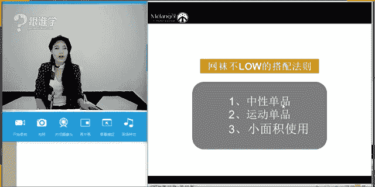
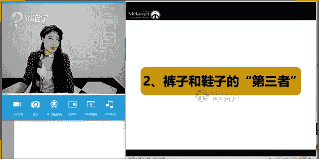
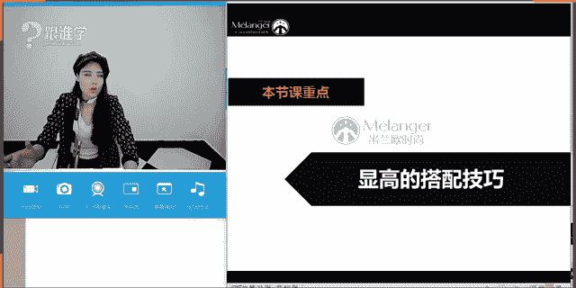
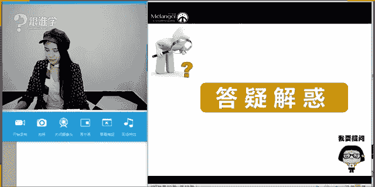

# 1、11服装《搭配秘笈之新版36计》：32裤装鞋吕

🎼到了某个年纪，你就会知道。😔，🎼一个人的日子。😔，🎼真的难熬。😔。

🤧嗯嗯嗯。好？hello，大家晚上好，同学们。😊，可以听得到老师的声音吗？如果可以听听得到的话呢，请打一。OK好的，嗯，你好，悠悠同学，那包括尼可同学，你没有迟到。那今天呢呃非常抱歉同学们啊。

首先呢因为我们的这样的一个课程时间设备的原因啊，所以呢8点10分才开始给大家来讲课。那么等一下呢我的课程一定会把这大家的这10分钟补回来好吗？啊，非常抱歉，同学们，因为今天的设备的原因。

所以导致了我们这个课程延时了啊。好的，嗯，开着电脑洗澡洗衣服就等着老师呢，是吗？老师来了。O好的，嗯，非常呃感谢同学们的理解啊，非常抱歉。同学们好的，那首先呢今天呢给大家依然是由来授课啊。

那今天呢给大家授呃这个讲到的课程是关于鞋履与裤装的这样的一个搭配关系。那其实之前我们一直跟大家分享了很多关于裤装啊与上装之间的搭配。比如说阔腿裤。那或者说这个呃这个裙装与上装之间的这样的一个搭配。

那一直没有给大家讲到的就是关于夏装啊，我们所说的裤装也好，或者裙装也好，对于这样的一个搭配的关系。那其实呃有很多同学之前也有问过我这样的一些问题。啊，例如说老师我觉得你看我这条裤子可以搭配高跟鞋吗？啊。

你看我这条裤子可以搭配这个运动鞋吗？等等这样的一些问题。那咱们现在这个31位同学呃，咱们教室里现在有31位同学，那同学们你们有没有这样的一些困惑，或者说你们在平时搭配的时候，呃。

会考虑到呃什么鞋子搭配裤子的这样的一个问题吗？嗯，因为呃也是有一部分的人会问到，但是嗯好的，那尼可同学你的问题是什么呢？你会思考到的是什么样的一个问题。想看看大家的这样的一些疑问啊，那如果要是时间允许。

等一下呢，在课堂当中也会为大家来解疑，或者是说我们的这个呃屏幕的话可以。发送图片吗？如果是可以发送图片的话呢，那大家可以等一下直接拍下你拍下来你们的裤子，或者是说你们的鞋子，老师呢可以给大家一些建议。

OK好的，尼克同学说裤子和鞋子的搭配，还有色彩的这样的一个搭配的关系是吗？嗯，OK好的，那其他同学呢范尔同学会考虑到什么样的一些问题呢？发不了图片是吗？OK好的，那有点可惜啊，那没关没关系。

那我们下次在我们的这个VIP开课之前，同学们可以在群里去发图片，那可以呃咨询相关的这样的一个课程的问题。好的啊，那如果同学们现在一时想不起来，你们这样的关于鞋子和呃这个裤装的搭配的关系的话呢。

那之后如果大家有问题可以继续来咨询。那今天呢我们就进入到我们的课课堂的这样的一个主题嗯。好，那裤装与鞋履的搭配关系，今天呢依然也是给大家分享到两个板块。第一个呢是裤装以与鞋履的时尚搭配。

那第二个是显高的搭配技巧。那在显高的搭配技巧当中，其实我们在入门片当中有一有一节课是专门给大家介绍这个显高和显瘦的这样一个搭配法则。不过那个是通过我们所说的穿衣的这样的一个方法。那其实显高和显瘦。

它跟鞋子也有一定的关系啊，我们所说高跟鞋是不是就可以让我们显高，这是最基础的我们脑子的一些想法。那当然有没有其他的方法。那在对于鞋子的选择上有没有一些注意的事项呢？那在今天的这样的一个课程当中。

老师都会为大家来解答。OK那首先我们来看第一个板块，裤装与鞋履的时尚搭配。嗯，好的，嗯，那首先呢给大家介绍到的是关于最近比较热门的一些裤装以及鞋履。那我们说我们想要跟得上流行的脚步的话。

我们一定要这个要关注当下的这样的一个流行趋势。那大家可以讲讲你们认为现在当下比较流行的裤装有哪些裤装呢？同学们，你们可以讲讲你们当下认为比较流行的裤装有哪些？包括你们认为比较流行的鞋履有哪些呢？嗯。

新位同学说喇叭裤还有吗？其他同学有没有不同答案呢？嗯，尼克同学说喇叭裤、破洞牛仔，O菲尔同学说阔腿裤喇叭裤，臭美猴同学啊喇叭裤、阔腿裤，你们俩是反过来的ok好，我看大家大家的答案了啊。

思雨同学说阔腿裤加牛仔裤啊，包括烟管裤。嗯，那大家的答案基本上呢都是呃这个跟喇叭裤啊，阔腿裤、破洞有相关的。没错，啊，那包括张敏同学说收脚裤的确但是还有没有其他的答案呢？啊，那我们来看一下。

那今年他还流行哪些裤装，当然也包含了大家刚才所说的这些裤子啊，这些裤装，那我们一一来看。那第一个呢其实就是我们所说到的叫破洞牛仔。啊，那刚才大家都已经说了呃，流行破洞牛仔。那么破洞牛仔的话，我想问大家。

你们觉得破洞牛仔它可以演绎哪些风格呢？同学们破洞牛仔这件单品它可以演绎哪些风格呢？首先啊我们说牛仔这件单品，它本身就是属于叫休闲的这样的一个单品。那而且呢它是属于比较中性化的这样的一个单品啊。

我们说女生如果穿牛仔的话，她一定给我们感觉是相对来说比较硬朗的啊这样的一个感觉，即使它是破洞的牛仔裤，即使它是露肤的这样的一个牛仔裤，但是依然它还是展现的是硬朗的这样的一个特点。

我们说裤装它本身就比裙装要来的硬朗。OK好，那我看到大家的这样一些答案啊啊，同学们非常好啊，那新位同学说朋克风啊，那包括尼可同学说西部牛仔风。那于妹妹同学说朋克嗯贝尔西部牛仔啊，西部牛仔贝尔同学打的啊。

拥有说嬉皮朋克牛仔啊，没错啊，这个思雨也说到休闲朋克嬉皮嗯。好的啊，惠尔同学的这个答案，漆皮时尚休闲民族民族还是民族呢？啊，摇滚O惠尔同学的这个答案呢是非常全面的啊，那他集合了大家的这样的一个答案。

没错，那其实惠尔同学这里还少了一个叫牛仔，对吗？嗯，那同学们看来这一段时间听课真的没有白听啊，为什么呢？其实基本上我想问大家，你们如果没有听课之前，你们会认为牛仔裤，它能搭配什么风格。

基本上你们可能就会认为牛仔裤牛仔裤它可以搭配休闲风，对吗？那大家其实对于我们所说的服装的风格相对来说是比较的模糊的，没有太多的这样的一些概念。那么在这段时间听课之后。

大家对于风格其实有了比较清晰的这些认知。那例如说大家已经非常能够清这个清晰的讲到说，哎有朋克风啊，有嬉皮风，有西部牛仔。百风啊，那我今天听到这样的一些答案，我特别开心。同学们啊。

那说明我之前的课没有白讲。那你们真的都已经听到脑子里去了。好的啊，那我们刚才说到牛仔这件单品呢，破洞牛仔，他其实首选的话，我们要给到的叫朋克峰。没错，我们说朋克他的核心神就是什么呢？破坏性啊。

他因为朋克的朋克人呢，他心中有一种叛逆的情绪。他要用这种破坏的行为来宣泄他内心的不满，以及对社会的这样的一个不满，所以他们会做一这样的一些破坏的行为。那例如说他会把他的T恤啊。

然后这种牛仔啊故意把他扯烂撕烂。那这种我们所说的破洞牛仔的话，他的确是非常的能够彰显朋克的这样的一个精神。😊，OK那为什么我们说给到西部牛仔，或者是其实西呃这个刚才大家少说了一个风格，那就是牛仔风。

它还可以搭机车风，对吗？那机车风的话，你会发现他就不会运用这种破洞牛仔，包括西部牛仔啊，它也不会用这种破洞牛仔。我们说典型的啊或者说经典的这种西部牛仔的这样的一个风格。相反，西部牛仔的牛仔们。

他们为了不让什么呢？裤子磨损，反而要做很多的工作，这就是我们所说的风格的这个呃核心文化当中的一些体现，你会发现非常有趣。那当同学们，你们对于这种风格的这服装风格了解之后，呃，了解了他们的核心文化之后。

你会觉得真的是一件非常有趣的事情。那刚才我给大家讲到朋克他的这种核心文化就是破坏。而西部牛仔，他穿牛仔裤是为了什么呢？就是因为它的耐磨性。那以及西部牛仔牛仔们，它在真正的。赶着马儿啊。

我们说牛仔它不是赶牛的，它是赶着马去去卖的啊。那所以说呢因为长时间的这样的一个迁徙的过程。那所以他们对于裤装的要求一定是要耐磨性。包括他们为了保护裤子啊，保护这种磨损，他们还会在外面穿一层皮革。

那大家有没有看过这个西部牛仔的电影，或者是经典的西部牛仔的这种形象，他们会在这种牛仔裤外面再套一个这个在呃开就是我们所说的大腿根部的这个位置是开叉的，就是他不会做做成裤裤子的形式。

就像小孩子穿的开裆裤一样啊，为什么呢？那方便骑马啊，那包括他会用这种皮革来再一次的保护到他这样的一个牛仔裤。那并且呢是为了防止磨损的这样的一个功能。所以说啊他们当核心文化不同的时候。

他们对于着装的要求是不一样的。而破洞牛仔，它其实是一个特别能。体现朋克的这样的一个风格。OK啊，那刚才说到这样的一个风格的这个板块。那呃其他的风格呢，老师就不在这里一一的给大家来介绍了啊。

我们今天的这个核心的课程呢不是讲到风格，那我们继续来看破洞牛仔裤。那破洞牛仔裤呢，它当下其实破洞的形式也有很多种，对吗？同学们我们都说到破洞牛仔。

但是你会发现今年它的破洞牛仔是非常多样化的那例如说这种破洞牛仔，它这种破洞的这种破坏力相对来说是非常大的啊。

那例如说我认为它前面的这种呃大家可以看到它前面的这一块这个这个呃可以说这块面料啊基本上上下已经分开了，只有后面是连接的那这条裤子的话，如果把它后面剪掉的话，那就可以变成比条短裤了啊。

那它的破它的这种破洞的面积是相对来说比较大的啊。那第二条它其实是属于微微的这种破损的这。效果啊，那我要告诉大家的是，如果大腿比较粗的人，你们认为适合穿这一种吗？同学们，我想问大家。啊，ok好，同学们。

你们认为大腿比较粗的人，他们适合穿这种吗？为什么不适合呢？思雨同学，包括尼克同学，为什么不适合啊陈伟红同学？因为你会发现这种裤子？你看这个模特她的腿本身不是特别粗，对吗？是的，暴露缺点的缺点没错。

会把肉肉挤出来啊，那个肉的那个痕迹勒的很明显。所以那这个腿比较粗的模特，他会穿的一种中间的这一条微微有点透肉，反而能够起到这种什么呢？轻薄的感觉，有一种轻盈感。所以腿其实比较粗的人。

他其实是可以穿牛仔裤的。而且他也可以穿破洞牛仔裤，但是她穿的破洞牛仔裤，一定不是这种大面积的把肉露出来的啊，他一定是有一点有一点点这种破损的啊，这种轻微的透肉的这种效果。因为这种透肉效果。

他反而起到了一个什么作用呢？叫视错觉。你会认为哎她好像透肉的这样的一个地方，就是她的大腿的粗的这样的一个维度，其实他起到了叫。是错觉的这样一个作用啊，就是这有一种叫前进和后退的这样的一个错觉感。

所以大腿粗的人穿这种裤子。第一，它可以有起到这种显瘦的功能。第二，它降这个从视觉上看起来他是有这种我们所说的呃轻盈感。当一个人轻的时候，他看起来是不是就瘦了呢？啊，OK好，这是我们所说到的破洞牛仔。

那么今年呢比较流行的，这是非常非常火的这样一条牛仔裤。那同学们你们都有没有这个破洞牛仔呢？啊，有没有破洞牛仔，如果没有的话呢，哎，今天有没有男同学进到教室里呃。

我觉得男同学穿破洞牛仔的相对来说好像是比较少的啊？那我们女同学呃还是非常能跟得上时尚的潮流的啊，好的嗯。呃，里面搭配白色网袜可以吗？都是黑色的尼可同学说到这个问题。呃，如果是白色网袜的话呢。

因为我们说牛仔裤的色彩，它因为是比较浅色的啊，那尼可同学牛仔裤它是比较浅色的那如果它搭配这种呃白色的牛仔呃，这种网袜的话，它的视觉感层次感没有那么的凸显，因为这种牛仔也浅，白色的丝袜也浅。

它的视觉冲击力相对来说没有那么的深。那包括这种黑丝配这种中性的感觉，那等一下我会在后面给大家来解答啊，O好，尼可同学这个等一下再再说这个问题，嗯，还不知道选哪个款式好是吗？不知道选哪个款式。

等一下老师讲完了之后，你就可以知道选哪个款式了啊，好的，那这是当下比较流行的呃比较热门的第一条第一种裤子，那么来看第二种裤子是什么呢？毛边牛仔裤。那其实依然还是牛仔裤，但是你会发现牛仔的可变性太。

太多了啊，比如说从牛仔的版型上来说都已经分了很多。那再加上牛仔的工艺上来讲，比如说有拼接的、水洗的、贴钻的、刺绣的，包括破洞的，还有这种毛边的牛仔裤。那今年真的是非常流行这种毛边牛仔裤。

那这种毛边毛边牛仔裤呢，它是比较符合当下的这样的一个流行的趋势啊，那我建议其实大家买一条买两条穿就可以了。为什么呢？因为你买太多的话，这种牛仔裤它一定会过时的。它的这种流行的这个时间啊。

它的生命力相对来说是比较短的。我们说所有的流行它都不会超过3年，不会超过三年，同学们放心吧，三年你只有三年之后，你再去拿这条牛仔裤出来穿的时候，有可能就会过时的这种感觉。等你十年之后可能再拿出来穿。

有可能又时尚了。因为我们说时尚就是一场轮回。OK好，那我们看到的这条叫毛边牛仔裤，基本上它会。在什么呢？裤脚的位置做这样的一些特殊的工艺啊，例如说这种扯毛的这样的一些工艺。好的，那我们继续来看。

那运动裤刚才运动裤大家没有讲到，对不对？啊？那你会发现今年特别流行运动裤让我们好像回到了校园时代。我们希望这就是我们所说的，我们把校服拿出来穿了，对吗？同学们呃。

我不知道你大家的这个这个在学生时代的时候有没有穿过校服，我相信我们中国校服，呃，是我们中国的学生基本上都穿过，为什么这么说呢？我们中国的校服其实说简单一点，它就叫运动装啊。

但是你会发现我们呃这个西方的这个校服就不一样。西方的校服被我们称为叫什么呢？同学们，你们知道现在有哪种着装风格是来自于西方的校服的吗？同学们。有没有人知道有哪种服装是来自于西方的校服的礼服不对？

还有没有呢？校园风好，阿瑞同学说西装学院风，英伦风okK好的，同学们老师喝口水啊哈。Okay。刚才有一位同学回答对了，贝尔同学学院风，其他的答案都错。好，臭美猴的也对了，学院英伦风没错，学院风。

英伦风同学们，英伦风是一个大的概念啊，英伦风它是一个非常大的概念。呃，朋克也是英伦的经典的这种burberry风衣，它也是英伦风。那包括学院风，它也是英伦风。所以英伦是一个大的概念。

而我刚才说到的校服的这样的一个形式。那其实被西方的校服被我们现在经常拿来什么呢？当这种我们所说的叫典型的学院风来穿着。没错，那大家看到的那种什么呢？衬衫领带领结、针织啊。

这种清新毛衫、背心马甲、小西装啊，然后这种呃这个短裙，女生穿的这种百褶裙，格子的这种图案。那特别是菱形的这种格纹，那特别特别能够代表学院风的这样的一个形象。那没错，其实呃我们所说的西方的校服。

它是一种叫制服。啊，叫制服。其实我们说什么叫制服呢？就是用来制服。你的衣服就叫制服啊，为什么这么说呢？本身这种制呃，我们说制服的性质，它是什么意思呢？就是要约束你的行为。那比如说老师今天穿的西装。

其实他就是有一定约束我行为的这样的一个感觉。我今天这样这这这这样讲话的时候，我就特别不舒服。所以我就把袖子给捋上来，他就感觉会舒适一些自由一些。那呃西方的服装的话呢。

他们对于为什么他会要求穿着这种制服的这样的一些着装，因为他们从小其实就开始抓什么呢？小孩子的这些礼仪形态。而我们中国没有你会发现我们中国的小孩啊。

或者家长他会要求这个小这个小学生啊在买买校服的时候说不要买太小的啊，买大一码，为什么呢？就是你从恨不得你在一年级的时候，你买一个五年级的校服，也也就是说你这五年都不用换校服了啊，那其实呃我们第一为。

么我们中国要做成这种运动装的这种校服，特别宽宽松松垮垮的这种。其实这种服装它会让让人穿着没有精神。所以你会发现我们中国学生的这样的一个面貌相对来说都是比较松垮的。而西方看起来非常有精神的。

或者说日本韩国，他们的这种服装也是属于这种叫制式的服装OK好，那刚才这个给大家延伸的有点远好，为什么我们中国人要穿这种运动装呢？因为他要保证我们中国13亿人口的呃，这样的一个这个这么庞大的人口。

那他要保证每一个学生都能消费得起，都能买得起校服。所以他的这样的一个什么呢？价格相对来说是比较低廉的啊，那他为了让每个人都能穿得起呃，这个校服啊，所以说的话呢，他会把它做成这种运动装。

那今年呢特别流行我们所说的校服裤，就是什么在这个酷缝的这样的一个侧边，他会有一这样的一些装饰。比如说用。这种什么呢？条纹以及这种字母来做这样的一个装饰。一开始这种裤子出来的时候，我就觉得啊很丑啊。

很不好看啊。但是你会发现当时尚呃这个慢漫这个这个潮流过来的时候，你会发现再土的东西你都觉得在当下的时候是时髦的那所以说运动裤也是今年非常流行的这样的一件单品。在前两天我在线下做练习的时候。

还有一位同学拿了一条运动裤过来，说老师你看我这条运动裤，经珍藏了1年，它的那条运动裤是什么样的？我给大家来讲一下阿迪达斯的品牌。但是它是高腰的一个设计，并且呢它是非常经典的黑色的款式。

然后侧缝啊有两条白杠啊，它是非常经典的阿迪达斯的这个款式。所以它留了1年，现在拿出来穿的时候，依然非常的时髦，非常的好看啊，那等一下我可以在群里把这张啊，当时呢当天我们还做了一次搭配，我等一下可以把。

张图片发给同学们，你们来看一下它搭配的这样的一个个叫时尚运动风。OK好，那呃运动裤呢就给大家来介绍到这里。那我们继续来看啊，今年特别流行的喇叭裤，刚才有很多同学都提到了，说今年特别流行的喇叭裤。没错。

但是今年的喇叭裤是不是跟我们所说的70年代的喇叭裤有很大的不同呢？那70年代的喇叭裤它就是行走的拖把可以怎么说啊，就是你走在街上都不用拖地了。那个裤脚特别的喇特别的长，而今年的喇叭裤。

它基本上都是什么呢？露脚踝的，或者是说比较短的七分的九分的这样的一个喇叭裤。那我们说时尚它即使是一场什么呃潮流，即使它是一场复古呃，这个这个叫什么轮回，但是它轮回过来的时候。

它其实是以一种新的面貌回来的，它并不是照搬70年的那样的一个形象出来的。它今年的形象就是什么呢变。短了，今年的喇叭裤它就变短了。OK好，那这是我们所说的今年大热单品的裤装当中，包含了喇叭裤这件单品。

那我们继续来看阔腿裤。那前几天呢我们才分享了这个关于在单品课当中，我们的这个阔腿裤的这样的一个搭配。那大家也也已经对于阔腿裤也非常了解了。那我现在还我想问问大家现在对于阔腿裤的知识点，还记得多少呢？

阔腿裤是谁设计的呢？阔腿裤是什么时候有了这样的一个形态呢？啊，我相信同学们看一下，我我等大家大概5秒钟，有没有同同学有没有同学能回回答出来。第一条阔腿裤的形态是在哪个年代出来的。是在我可以提示大家一下。

在20世纪哪一个年代呢？是哪一个名人设计出来的呢？OK思雨同学说，1913年啊，有没有其他同学有答案呢？好的，那我看到思雨同学的这个答案了，非常好啊。思雨同学。

那还记得我们这样的一个这个记这个这个这个里论知识点啊，那没错，1913年的时候呢，是由香奈儿设计了这样的一个水手服水手裤啊，那大家现在在在努力的回想一下啊，同学们，那在1913年的时候呢。

其实有有这个我们所说的阔腿裤的这样的一个出行啊，coco香奈儿没错，是的啊，那这是我们所说的呃，她是第一位把裤装啊给到我们女性去穿着的。然后呢，让我们女性从这种繁琐的这种裙装当中解脱出来的。

所以呃香奈儿是有一个非常非常我们就她可以说是非常非常的呃我们女性应该是非常尊重她的这样一个女性，也为什么这么说？因为它让我们的女性解放了啊。好，那这是我们所说的呃阔腿裤在1913年，那到什么时候。

那刚好有笔记是吗？啊，翻笔记了。哇，思雨同学非常好啊，还有记笔记是吗？非常好啊，那并且呢我们说它在什么时候有了女性的形态呢？那其实在1940年，它中间有几个比较重要的时期。

那例如说194040年时期的时候呢，呃伊芙圣罗兰设计的阔腿裤，但是这个时候的阔腿啊，这个时候的阔腿裤，它其实是以这种晚理的这个伊芙圣罗兰它是从男装的晚礼服当中啊，获取了这样的一个灵感，它做了吸烟装。

但是吸烟装的设计它依然都是什么呢？还是以男性的剪裁为主，只是他把它什么呢？做的变短了啊，尺寸可能变小了，它的女性化其息相对来说还是比较少的那直到阿玛尼的出现。那我们所说的真正的阔腿裤，它才有了。

我们女性的这样的一个形象啊，那阿玛尼她把这种阔腿裤设计的是非常的柔美。那大家现在现在可以看到，在123这三张图片当中，阔腿裤它虽然是什么呢？阔腿裤，但是它其实相对来说比较硬朗嘛。大家能看到吗？啊。

比如说这几条，它其实相比来说是比较硬朗的。那阿玛尼设计的那条阔腿裤呢，它是非常飘逸和柔软的这样的一个面料。但是同时它的线条也是非常的简约和简洁的。所以在那个时候啊。

我们说阔腿裤它才真正的变成我们现在大家所认识到这样的一个形态，成为我们女性经常会使用到的这样的一件单品。O好，那同学们真的要好好的去复习一下我们之前的这样的一个课程了啊，O不要学了。

现在就忘我前面的课程要温固而知心啊，我们说了学习学习是什么了？学你可能在课堂当中只能学到三分，但是你更多的是要靠你们大家靠大家自己在课下要。不断的去复习和学习才能得到的。

你在课下的学习跟课上的学习是不一样的。为什么这么说呢？我在课堂当中给大家分享的知识点，或者是我们所有我们说所有的培训以及教育，给到大家的只是一个方向上的指引。那同学们你们要做的是什么呢？

根据这个方向不断的去钻研和前进，你们才能过获得更多的这样的一个知识点。因为老师给大家分享课程的时间是有限的。所以同学们嗯我教给大家一个方法。那例如说呢例如说我们今天讲到了这个某一件单品。

那同学们你们就可以去自己去查询查询一些这种这件单品的相关资料，能够让你更加有印象的记忆在这样的一个脑海当中。OK好，那这是我们所说的阔腿裤。那我们继续来看啊。

刚才呢以上呢给大家介绍的的都是当下比较流行的这样的一个阔腿裤啊，那阔腿裤的话呢，我们刚才说到啊，它可以跟哪些。单品搭配呢？那当下又流行哪些鞋子呢？

那我现在呢再以这样的反这样的一个反转的方式再给大家一一来来呈现。那例如说阔腿裤它可以搭配什么鞋子，大家可以看到，在屏幕当中，第一，她比较流呃，她可以跟这种什么呢？运动鞋去搭配，对吗？第二。

它可以跟这种短靴去搭配。那第三，它可以跟这种一字绑带的高跟鞋去搭配。但是需要注意的这样的一个问题，就是如果你要搭配这种呃平底的运动鞋的时候。

需要注意你的身高的问题以及这个裤子的高腰线的问题和它的宽度问题。那例如说同学们如果一个女生她个子是非常娇小的那么它一定不太适合太过于宽的阔腿裤以及这种平底鞋的搭配方式。那如果个子比较娇小的女生。

我建议一定要什么呢？第一。高腰线。第二，裤子的这样的一个宽度略合体，那接近于直筒会更好，它更加能够适合给到个子较小的女生提升你们的这样的一个身材的比例。那包括搭配这种平底鞋的话呢。

一定是相对来说身高比较高挑的。然后呢，你经过这种我们所说的比例的调整之后，才能更好的呈现一个视觉效果。那这种视觉效果一定是我们所说的叫比例的问题。那一个人身高不是最关键的比例是最关键的。

比例是让我们看起来你显高和显瘦的最重要的一个因素。O好，那这是我们所说的平底鞋的这样的一个问题。那么短靴的问题呢，我们继续来看同学们啊，你会发现这个阔腿裤，它搭的这双这双短靴。

它为什么能够搭靴子的原因是因为它是属于叫七分的阔腿裤啊，如果这条阔腿裤到九分。如果他再来搭配这。这双短靴的话，它的视觉效果看起来一定会不好，而且会显得非常土气啊，这个老师是真心实练过的。

因为老师就有这种裤裤子啊，然后我就搭配过这种靴子，看上去视觉效果一定是不好的。所以如果你的裤子是什么呢？七分的，那么你搭配这种短靴相对来说会比较好看。或者是说你的裤子如果是九分的呢？搭及踝靴。

就不要感到搭这么高的筒，就一定不要让你的什么呢？裤子盖住了你的靴口的这个位置，看起来就非常的土气啊，看起来就非常土气。OK好，那我们看第三个，那第三个的话呢，也是这种8分左右的这样的一个裤型。

搭配这种一字带。也就是说它跟鞋子要形成一个叫什么呢？衔接的作用，不要过高不要过高，或者也不要过长，盖住你的鞋子的这样的一个问题。同学们，这一点能理解吗？我们说阔腿裤它可以搭配的这样的一些。

鞋子啊有运动鞋以及靴子以及这种什么呢？一字带的高跟鞋。那包括并不是一字带也可以啊，但是一定要注意衔接的问题。也就是说你的裤子跟你的鞋子的话呢，不要超过我们所说的两指或者三指的距离。

尽量不要超过这样的一个距离。就它最好是有一个衔接的空间。ok好的，嗯，谢谢新辉同学的这样的一个回应。那我们继续来看，这个是关于阔腿裤搭配各种鞋子的这样的一个关键点，也就是说一定要无缝衔接啊。好。

那我来看一下喇叭裤，那喇叭裤也是一样的。你会发现其实今年喇叭裤它非常的火热。而今年其实当下会比较流行的鞋子有哪几种呢？同学们，我想问大家。你们知道今年会比较流行的一些这种鞋子吗？

例如说这种小白鞋是不是非常流行？那包括这种呢有民族感的系带的这种呃鞋子，它也会非常是是这个流行。那比如说这种绑带的啊，或者这种就例如说这种在腿部交叉的这种绑带的鞋子，它非常的流行。

那这种绑带子它可以在你的腿部形成这种疏通的感觉。OK嗯，看新闻说的是吗？猫跟鞋O好，那猫跟鞋其实呃今年的确也很流行这种猫跟鞋。其实猫跟鞋的话呢呃还有一种称法叫这种逗号鞋。它的为什么这么说呢？

它的那个鞋跟其实有点像逗号的感觉嗯。🤧绑带鞋显腿短吗？绑带鞋的问题，等一下我再来给悠悠同学来解答这个问题。显腿短和显腿长呢，我们在后面下面会有一个板块讲到这个问题。O好，那我们继续来看。

那喇叭裤呢它其实也可以搭配这种呃板鞋啊，包括这种我们所说的呃这种夹脚拖鞋，那包括这种系带的凉鞋啊，系带凉鞋。那现在如果这种天气大家觉得哎冷的话，那可以配这种绑这种我们所说的运动鞋。

但是等一下我还会教给大家一个方法，如何去穿这种鞋子。那在南方的天气，其实现在也已经可以这样穿了啊。好，那我们继续来看运动鞋。那运动鞋的话呢，搭配运动裤已经说可以说是非常的天这个叫什么呢？呃。

天生一对为什么本身它们都是属于运动单品，所以它搭配这种运动鞋一定是没有问题的。但是我建议大家搭配板鞋为主。那这例如说这种运动裤，它是笔直的这种线条搭配这种什么呢？板鞋它会比较好看。如果你搭配那种。

例如说这种跑步的那种运动鞋，其实相对来说没有那么好看啊，没有那么的时尚的这种感觉。所以搭配板鞋会比较好看。O那如果你的运动裤是比较窄的，包括它是属于这种什么呢？比较短的七分的这样的一个高度。

那你依然可以搭配这种什么呢？坡跟的这种短靴，那包括不是坡跟的，也可以，但是一定是这种及踝的短靴跟它还是形成一个衔接的这样的一个问题，不要让你的什么呢？刚才我给大家讲到的这样的一个问题。

不要让裤脚盖住你的缺口，也不要让它太高这样的一个问题。好的，嗯，那这是我们所说的运动鞋搭配呃运动裤搭配的那关于毛边的牛仔裤，以及我们所说的这种破洞的牛仔裤。那它其实可搭配的空间也是一样的啊。

我在这里给大家介绍的几种。第一种就是关于这种什么呢？板鞋和运动鞋。第二就是什么呢？及踝靴。那第三就是绑带的这这这一套搭配，其实我不。建议大家这样去搭配啊，那大家可以看到这一双这个呃这个毛边的牛仔裤。

它其实就盖住了靴筒的位置。那么盖住靴筒位置的时候，其实它整个人对于你的比例以及这种美美感上来讲没有那么好。那等一下我会教大家如何去把它进行调整啊，O好，那我们继续来看破洞牛仔裤是不是一样的呢？啊。

一一个是运动鞋，一个是及踝靴啊，就是这种短靴。那包括这种高跟凉鞋等等啊，那这是我们所说的各种裤子如何去搭配这种鞋子。那其实在现在的这个季节的话呢，搭配这种我们所说的运呃运动鞋以及这种短靴。

它会比较适用于现在这种天气。那么在南方啊，我刚才已经已经讲了啊，南方其实他可以穿什么呢？已经可以穿凉鞋了啊，因为老师呢现在在广州呃，不知道有没有广州的同学，你们有没有穿凉鞋。今天老师穿的就是凉鞋。

但是呢一呃这个穿凉鞋，我们说有一点点凉嘛。我就配了我们所说的鞋子和裤子中间的第三者，他是谁呢？同学们，他是谁呢？裤子和鞋子的第三者，他是谁呢？有有回答我这个问题。好，嗯，呃。

这个悠悠同学说绑带鞋显腿短吗？悠悠同学等一下，我再来跟大家跟你来解答这个问题好吗？钟永雄同学，你也太有趣了吧。啊，裤子跟鞋子之间的第三者怎么可能是腰带呢？这个第三者坐的有点远吧。好。

那其他同学回答的袜子，没错，是的，袜子啊，这个中永型同学太可爱了啊。OK好，同学们都回答正确了啊，只有一位同学就是我们的中永型同学，这男同学对于时尚直男啊，对于时尚还是需要去熏陶一下的啊。O好。

那我们来看一下啊，裤子跟鞋子之间的第三者，他是袜子啊。这个点真的有点好笑好吗？老师真的止不住了啊，O好。😊，是的，没错，阿瑞同学呃跟老师有同感是吗？啊，腰带真可爱的回大。好的，啊，那我们来首先来看一下。

那第一个第三者是谁呢？第一个第三者就是网袜。那大家呃会认为昔日我们会认为哎这个网袜它是特别俗气的，对不对？刚才其实有同学已经提到了阿瑞同学已经说了，哎，牛仔裤跟这个网袜搭配特别的时尚，的确没错。

这是当下它在流行，包括我们现在看到哎觉得很时尚的这样一个搭配。但是大家不要忘了网袜还有很多的黑历史的。比如说这些都是它过往的黑历史。你们觉得现在这这种着装的网袜的感觉，它是时尚的吗？同学们。

你们觉得这几张图片，你们觉得时尚吗？如果你们觉得时尚请打一，不时尚，请打2。ok好嗯。Yes。好的，谢谢大家的这样的一个回应啊。我看到同学们的答，看到同学们的答案了啊。那同学们都说丑俗低俗。

那为什么我们会有这样的一个感觉呢？那首先我在这里先给大家来强调这样的一个观念，就是什么呢？网袜它虽然当下非常的流行。但是网袜它既会跟两个这个元素去搭配。那第一个呢就是极短的裙装或者是裤装。

那大家现在在屏幕当中看到的其实就是属于叫极短的裙裙装或者是裤装。第二就是它过于紧身的这种感觉啊，过于紧身感觉。那其实还有一点就是第三，它既会尽量不要根据皮革的裙装去搭配。那而且如果这种皮革的裙装。

它也是极短的那大家可以现在可以脑子里想想这种画面感啊，你们可以总结一下，一个女生穿着。极紧的，然后极短的，然后还是皮革的，然后配着网袜，你们现在脑子里可以自动脑补一下，这是什么样的一个形象啊？

O那所以说呢这是我们所说网袜它即使在当下很流行，但是也需要回避这三种啊，我刚才跟大家讲到的，第一就是什么呢？极锦第二极短，第三皮革的这样的一个感觉。所以当这种元素组合到一起的时候。

它就形成了大家刚才看到的，你们形容的这些词语，比如说低俗，比如说俗气，比如说很丑啊，O啊风铃女郎风铃风铃的这个答案非常犀利啊。是的，没错啊，它会给我们一种不太好的这样的一个印象。没错，那么继续来看一下。

那如何把网袜能够把它搭配的非常的有高级感时尚感呢？那我们来看一下啊，O第一种就是什么呢？牛仔裤加网袜啊，我们说全新牛仔。说说全新牛仔，其实这是一种我们前所未有尝试过的这样一个搭配方式，对吗？

同学们牛仔裤加网袜，老师之前其实就搭配过啊，搭配过一次。然后呢呃当时呃搭配的时候还是获得好评的啊，他们就说啊，好好看啊，老师，因为我当时是去线下上课。然后他们就觉得嗯非常时髦，非常好看。

从那之后班上的人全都买了网袜，每一个女同学因为这一期的这个线下的同学又特别多20多个人啊，都买了网袜来，然后在接下来的几天课程当中都经常看到有网袜搭配牛仔的啊，我一看这么多人跟我撞衫了，我就算了。

我就不穿了吧啊，O好，但是我平时还是会穿一下的啊。因为他还是比较时尚的这样的一个搭配方法。那大家可以看到的是，其实她比较有趣的方式，有很多种很很多种啊，那例如说这种没有破洞的。

但是呢她会在哪个脚踝的位置把它露出来这种网袜的这样的一个搭配。那包括这种什么呢？特别的破洞。方式啊，例如说这种星星啊有这种新新切割的这样的一个效果。我觉得这条牛仔裤透露着一颗少女心。

这个牛仔裤真的有一颗少女心，非常可爱啊。那包括第三种这种叫什么呢？一一刀切啊，它不是属于一刀切了，它一刀切之后再扯破的这样的一个破洞牛仔方式啊，那以上这三种呢，其实第一你露着脚踝。比如说你穿着牛仔裤。

然后呢，呃没有是破洞的，但是你是露脚踝的方式把它露出来。第二就是什么呢？这种有特别工艺的这种破洞的设计。那第三啊，它是这种比较暴力的这种破坏行为的这种这个这个破洞牛仔搭配网袜。

那其实还有一个问题就是什么呢？大家能看到这三种网袜，它的不同点在于哪里哈？同学们这三种网袜的不同点在于哪里。第一。第一种它是属于什么格纹？第二种它是属于什么格纹？第三种它是属于什么格纹。

其实啊它们三个都是属于零格纹，但是呢它是分了小的。对，是的，格纹大小不一样，没错啊，这个是属于极密的，这个是属于中间的这个是属于大的，没错啊，同学们是的，大中小这样的一个感觉。

那有同学问过我说老师那这个大中小在学网袜的时候有什么特别要求吗？其实大中小没有太大的要求，但是有一个问题啊，就是如果这个女生她看起来是比较娇小的那我觉得还是要选择这种相对来说中格的这种感觉比较好。

太大的这种格子的话，其实跟她的这个整体的这种量感来讲的话，没有那么的和谐。选择中格会比较好。那另外还有一个问题啊，就是这种呃大的网袜，我在穿着的时候有一种困惑，因为老师也买的大的和中的这种极密的。

我就没有买，然后我买的这种大的时候，我在穿着的时候，每次穿都特费劲儿，所以就是经常会穿到那个窟窿里面去啊，那所以说同学们买中的，我我认为是比较好穿的，你们也可以去买中的啊，中的会比较好穿。OK好。

那这是关于第一种搭配方式，牛仔加老袜。那我们来看第二种。运动鞋加网袜啊，那运动鞋加网袜其实呃当下也特别特别流行运动鞋。那运动鞋加网袜呢也是一个比较什么呢？呃，这种看起来有点小性感。

但是呢又不会过于性感的这种方式啊，那买的也是中是吗？你可也说他买的也是中号的。ok好，那同学们啊，那那我呃首先刚才给大家讲到，我所说的是裤子与网袜的结合，现在要给大家讲到的是鞋子与网袜的结合啊。

鞋子与网袜的结合。O那基本上大家可以看一下啊，基本上这种运动鞋搭配的网袜的方式都是这种比较密集的格子啊，都是比较密集的格子。而且它其实这种有他有卖这种短袜的啊，有卖这种短袜的。

包括大家可以看到这幅也是短袜啊，O那这是我们所说的运动鞋加网袜，买这种密集的格子。好，那么们举下来看高跟鞋加网袜。那高跟鞋加网袜其实有两种啊。第一，你可以穿这种连裤的。第二，你可以穿这种短的。

为什么我们现在会把会用这种网袜来加这种高跟鞋，然后再加这种我所说的这种裤装呢？其实我们穿这种网袜加这种运动鞋或者是加这种高跟鞋的时候，它其实形成了一种叫视觉感，就这种视觉的层次感。

你会发现有了这种呃格纹的时候，他它增加了丰富的程度，就增加了我们整体造型的丰富程度啊，okK那这是我们所说的高跟鞋加网袜啊，尼克同学还差裤子是吗？好的，去买一条啊，OK。好。

那其实我们可以看到它可以搭配的裤子有很多种。比如说这种直直接这种九分的，包括这种这种毛边的啊，以及这种特殊，它也是带有毛边的，但是它没有像这个那么细碎的这样的一种感觉，而且加了珍珠的装饰效果。

它的整个亮点，它这一整套的服装亮点在它这个位置做的非常重要的这样的一个点缀，你会发现它的牛仔裤本身就已经有亮点了，再加上它的也非常的啊鞋子跟袜子的这样一个搭配也非常有亮点，所以它的这样的一个装。

它整套它的亮点在这个位置，以及它的亮色的包包嗯，O它的重它的亮点放在了下半身。嗯，好，那我们继续来看就是高跟鞋加网袜的这样的一个视觉效果。嗯，那么们继续来看皮鞋加网袜啊，皮鞋加网袜。

那皮鞋当中其实有很多种，对不对？比如说这种一字的一呃一脚蹬的啊，在我们所说的叫一脚蹬，那包括这种短靴，那其实都是属于。啊，就皮鞋当中啊这这样的一个品类。那么其实当下比较流行的是这种一脚蹬啊。

漏把这种格子露暴露出来啊，那包括这种短靴，它这种短靴的话，那可能你还可以穿什么呢？穿这种长的这种网袜，它看起来会更加的。啊，老师视觉错误了啊，这张的话它原本就是一个非常密集的网袜。同学们啊。

同学们啊这张其实它本身就是一个非常密集的，但是不注意看，感觉好像是它的腿毛一样。同学们能看得出来吗？啊，那其实他穿的是比较密集的网袜。嗯，OK好，那123，如果啊他穿的是短靴的话。

他就可以穿这种密集网袜。刚才老师还说呢，哎，他应该穿密集，他应该穿网袜的这样的一个效果搭配这种靴子会更好呢。啊，他其实穿的就是密集网袜。okK好，那以上呢给大家介绍到的几种就是鞋子啊，跟这种网袜的搭配。

有哪几种呢？同学们来回顾一下，第一种是皮鞋。第二种是什么鞋子呢？同学们。还记得吗？刚刚讲完的，你们来回应一下我啊，同学们。现在我们看到的是皮鞋，是的，第二种是运动鞋啊，以及高跟鞋。没错啊。

那刚才我们裤子推荐大家搭配的哪种呢？是不是叫破洞牛仔裤呢？啊，是的，没错，嗯，好的，那我们给大家介绍的第一种热门的这样的一个搭配就是什么呢？就是我们所说的哎裤子跟鞋子之间的第三者袜子。

袜子当中的第一件单品叫网袜啊，那网袜呢它本身有这种大格子，中格子以及小格子。那对为格子上来讲其实没有过多的这样的一些要求。那如果大家想要真的找到哎特别适合自己的话呢。

我建议个子娇小的女生选择这种格纹的密度呢，就选择中或者偏小啊。那相对来说更更加适合你。O好，那给大家介绍的搭配的方法呢，有什么呢？比如说这种裤子跟这种网袜的这样的一个结合。

就是破洞牛仔与网袜的这样的一个结合。那包括网袜它可以搭配几种鞋子。刚才大家也已经回顾了啊，运动鞋没错，高跟鞋以及皮鞋这三种搭配方法。

那我们说呃刚才给大家讲到了说则如何能够把这种网袜它搭配的不俗气的这样的一个密集在于哪里？那？来给大家来总结一下啊，那大家会发现网袜不low的搭配原则当中，第一个就是什么呢？叫中性单品？

那其实我们所说的牛仔裤是不是属于中性的单品呢？啊，那第二种叫运动单品。第三种叫小面积使用的法则啊，为什么这么说呢？大家可以想象一下，我们认为网袜给我们的感觉是什么样的。大家现在可以想一下。

发表一下你们的这样的一个心理想法。你们想到第你们第一次你们就是猛的一想到网袜的时候，你们觉得它是什么样的一个感觉，它传递给我们是什么样的感觉。OK好的，星会同学说性感。其他同学呢有没有不同的答案呢？

你们想到网袜的时候，你们觉得网袜给我们什么样的感觉？嗯，O风林同学说，以前觉得很low哦。云淡风轻同学说觉得性感啊，尼克同学觉得个性。阿瑞同学也说的啊，没错，是性感悠悠同学说神秘SM没错。

那SM其实它也表示的是一种性感的这样的一个感受，对吗？O那同学们的答案，我的我已经都看到了啊，那大家都回答的说是比较性感的这样的一个感觉。没错，那所以说我们如何能够把它搭配的什么呢？不不过于性感呢？

第一，就是我们其实我们就是做什么呢？混搭的手法。那也就是说我们可以运用中性单品以及运动单品来中合它的性感的味道。没错啊，一看就是幸会同学经常听我们的课程了，把老师的求词都抢了啊，老师经常。

喜欢说这个词儿叫中和。没错，是的啊，那中性单品和运动单品，它会有这种这种。我们说第一就是中性的话，它非太偏男性化。而运动的话它是不过于性感的这样的一个感觉。所以它会中和这样的一个性感的味道。

那第三小面积使用的时候，当一个我们所说的所有的一些单品，当你小面积使用的时候，它只能起到点缀的效果，它影响不了你整体的这样的一个视觉效果，所以它可以给到什么呢？用到这样的一些混搭当中。

所以它看起来就会高级了。这就是为什么刚才我一开篇的时候给大家讲到的，不要用网袜跟这种极短极紧和什么呢？皮革去混搭。因为第一极紧和极短，它给我们传递的感觉也是性感。所以性感加性感的时候。

它给人感觉就是太过于性感。那么太过于性感的时候，我们会觉得嗯有点low。那第二，为什么不要跟皮革搭配。刚才我们有一位同学说到了SM有有同学说的没错。是的，当网袜加皮革的时候，它有一种SM的这种感觉。

所以啊有同学可能说老是SM是什么东西。那我相信大家应该都知到的，它叫呃这个这个虐烈的这样的一个感觉O好，那我们刚才呢给大家讲到的就是网袜啊，以及这个它的搭配的这样的一个方法，怎么能够把它搭配的不low。

好，那我们继续来看啊，那第二种就是我们所说给大家介绍的是袜子跟这个这个当下比较流行的鞋子的这样的一个搭配方法啊。那么继续来看，那袜子加凉鞋，老师今天穿的就是袜子加凉鞋。那现在呢我给大家来展示一下。

老师穿的袜子加凉鞋的这样的一个效果啊，不知道大家能不能看到整体的这样的一个效果。O好。

嗯，来，同学们，我今天呢穿的是一双一字带的这样的一个绑带绑带凉鞋。那因为我今天整体的配色呢是白色，然后这种红色的这样的一个这个格纹啊，然后白色的这样的一个配色。那底下呢我穿的是蓝色的牛仔裤。

所以呢那大家可以看一下，我穿了一双绑带的高跟鞋。所以我配了一双白色蓝色和红色相间的袜子，来把我整体的这样的一个色彩，把它形成了一个呼应和整合啊，ok。好的啊，那今天呢老师呢也是做了因为讲了一个课程。

所以呢老师也这个应景的搭配了一下啊凉鞋加袜子的这样的一个搭配方法。嗯，好，那下面呢来给大家介绍如何去搭配啊，那我们来看到呃，老师今天运用的是色彩的这样的一个呼应的这样的一个法则。

那其实同学们你们在搭配的时候也一样可以运用这样的一个色彩的搭配方子。那我们继续来看啊，第二就是袜子加凉鞋。那其实现在这个季节呢，同学们可能会觉得老师现在好像穿袜子和凉鞋不太合适。那么刚才我已经说了。

南方比较适合啊，来南方吧，同学们O好，我现在看一下大家的消息，点一下我们的屏幕啊，OK好。

看到大家记个答案。新慧同学说什么是不适合呢？嗯，好，那我们继续来看。嗯，袜子加凉鞋。那第一种袜子他可以选择这种什么呢？这种几何图案的啊，那第二种是这种透明的。

那这种透明的也是今年在酷泣秀场当中非常非常流行的这种刺绣透明的这样的一个感觉啊，那其实在小的时候我们是不是穿过这种透明的袜子，那个时候觉得透明袜子就有一段时间觉得好土啊？但是现在他又回来了啊，没错。

新会同学说接受不了袜子加凉鞋是吗？好，那如果你接受不了，可能是还是有这样的一个想法。比如说有很多同学有很多人会说，哎，你穿这个袜子加凉鞋，你到底是冷还是热是吗？嗯，如果你冷的话，你为什么要穿这个凉鞋。

如果你热的话，你为什么要穿了凉鞋之后又穿袜子啊，那这个郑州今天还是要穿羽绒服是吗？那北方的话，可能相对来说比较冷，那南方这是O了啊，O好，那继续回到我们这课程当中。那今年还。其实特别流行这种运动鞋啊。

这种凉鞋，这种平跟的这个凉鞋。我在我的印象当中很小的时候穿过这种，我认为它特别的中性化。那其实这种运动鞋没这种凉鞋没错，它给我们感觉是非常的中性化的。以前这是男士的凉鞋的这样的一个感觉。

但是现在被我们女生所运用到啊。OK好，那我们再来看一下。那如果大家不喜欢袜子加凉鞋的话，那么您可以用什么呢？呃，袜子这种靴子来加袜子啊，那等一下再给大家来这个展示。好，那以上的图片呢。

大家可以看到秀场当中的这样一个搭配，非常非常流行加袜子的这样一个搭配。同学们，其实我建议大家可以多去尝尝靴嗯，不要因为心理这一端过不去，你们就不去穿。但是其实它搭配出来的效果非常的漂亮的啊。O好。

我们继续来看今年是不是特别流行这种亮丝袜，呃，在这个丝袜当中加入这种金丝的元素。那也是因为跟今年的这个流行有关。因为今年它附的是80年代，80年代的时候，其实特别流行。

在服装当中它流行这种有亮丝的这种感觉。也就是说在面料当中，今年其实流行的叫发光的面料。比如说天鹅绒，它是发光面料。比如说这种亮丝的东西，它也是发光的面料。比如说漆皮，它也是发光的面料。

所以今年今年大家去买发光面料就没错了啊，O这种亮。丝袜加这种高跟鞋。那包括其实今年是不是呃在我在网上看了一个特别恶搞的视频，因为今年是不是特别流行哪种靴子呢？我给大家来展示看一下啊。嗯。

有一种靴子特别流行，在前面刚才我们有出现过啊，来给大家看看。嗯，类似于这种感觉的，就是嗯特别特别什么呢？就是它的鞋子看起来就像一双袜子的感觉。然后细细的跟。然后呢。

这视频当中呢就有一呃当时呢就有一个这样的视频，他们就用那种亮丝袜，然后穿到凉鞋外面，然后呢啊对，是的，靴这个袜子靴没错，是的，他们就把那种亮丝袜呢穿到凉鞋外面，然后呢。

把那个亮丝袜的那个脚跟的地方剪一个洞啊，从这个脚跟的这个地方穿过去。啊，然后他们就说哇这种靴这个这个袜子靴那么贵，正品的话非常的贵的啊，说2块钱就教你搞定了，把这个如何呃做一双这个袜子靴子袜子靴出来啊。

那当时其实是一个比较恶搞的视频，但是那个还是不使用的哈。为什么？因为那种袜子你如果穿到外面的话，他直接走出去的话，第一很快就会磨破了，对不对？那第二，你的这个就磨破了之后是不是就很丑啊。

okK那其实只是作于恶搞的视频，不能真正的用到我们的这样的一个时尚当中。好，那我们继起来看。

好，刚才呢给大家看到的是这个亮丝袜加高跟鞋，这种搭配方法相对来说能够接受吗？相信呃这个幸会同学啊。好，那么来看一下第三种百分之百的人都能接受了吧。啊，那第三种呢是其实今年特别流行这种运动袜。

那这种运动袜的话，可以是这种短袜的方式，或者是到这种中筒的方式。并且上面如果带有那种螺旋纹条纹的装饰会更加的明显。它更加能够彰显运动风格。因为今年特别流行这种时尚运动的这样的一个搭配效果。

也就是说运用很多那种运动的单品跟一些时装化的单品去组合，就形成了这种时装的运动感。OK那这是我们所说的运动袜加运动鞋。例如说这种什么呢匡威的帆布鞋。那或者是一些板鞋都比较适合今年的这样一个搭配嗯。好。

那包括什么呢？这种袜子加牛津鞋。那牛津鞋的话呢，那本身它其实具有什么样的一个风格特点呢？我想问大家，你们觉得牛津鞋它适合给到哪个风格呢？同学们牛津鞋适合给到哪个风格特点呢？没错啊，新会同学。

包括尼克同学回答的非常好，学院风。是的，所以你会发现，如果呃你穿了这种牛津鞋之后，再加上这种复古的配色关系。比如说这种酒红色墨绿色芥末黄等它形成了这样的一个配色的感觉，它就传递一种复古的这种感觉。

比如说眉眉tylor就是这个歌手，那大大家都我之前在这个呃PPT当中也经常会给大家去介绍到他他就特别喜欢用这种呢，他就喜欢穿牛津鞋，然后喜欢穿英英伦风，特别喜欢用这种复古的色调O好。

那这是我们所说的袜子加牛津鞋的这样的一个搭配方法。啊，那刚才呢给大家介绍到的，我们所说的在呃裤子与这个鞋子之间的第三者袜子，那刚才给大家介绍的袜子呢有网袜啊，那包括有这种运动袜以及这种亮丝袜。

那这这几种袜子呢，它其实搭配的方式会非常的多元化，不一定。说老师今天给大家介绍的这样的一个搭配，你们喜你可能可能不喜欢嗯，也有可能你们是喜欢的啊。如果不喜欢的同学呢。

其实你可以尝试其其他的不同的组合方式。比如说这种袜子它也可以跟运动鞋去搭配。只是最终呢决定你的这样的一个搭配效果，还要看他跟你的服装的风格的去搭配。那例如说这种服装风格组合起来的感觉。

他就为什么他选择这种这种颜色的袜子，那是因为它要呼应它整体的这样的一个着装效果。其实他这套服装的话，就有一种学院风的这样的一个感觉。所以他为什么不穿白色的这种运动袜，那是因为它穿这种色彩袜子。

它更能够点缀它整体这样的一个着装风格。O那这是我们所说的在袜子的这样的一个搭配当中，其实我们也需要考虑到服装风格的这样的一个问题的啊。好，那我们继续来看男生的这样的一个袜子的搭配方法。那。

🤧男生在不在呢？我们的这个钟有雄同学在在是吗？是的，嗯，袜子要加一码吗？不用啊，悠有同学袜子要加码干什么呀？不用啊，ok好，那我们继续来看。那男生的话呢。

其实呃穿我们所说所说运用到时装当中的这样的一个搭配的时候，可能相对来说是比较少的。但是男生穿西装的时候，穿皮鞋的时候，是不是一定会穿到袜子啊，那永熊同学在是的，没嗯，我看到你了啊。

那其实男生他会更注重于什么呢？鞋子裤子和袜子的这样的一个搭配。那大家可以看到这种西裤，他一般会搭配什么样的这种袜子呢？啊，包括鞋子大家能不能看出他们的规律呢？同学们。嗯，有没有同学能够回答我的。

有没有同学能够回答我这个问题，这种西裤它搭配什么样的袜子以及什么样的鞋子，它们的规律是什么呢？嗯，好呃，有些同学说黑袜子。好，是黑袜子吗？我看到这也有蓝的袜子呀，也有看到绿袜子。

好像这一双这双是棕呃棕色的蓝色的好的，黑黑黑没有没错。呃，那错了，并不是黑黑黑啊，没错，思雨同学回答的正确，深色是的，搭长款袜子，深色菲尔同学也也回答对了啊，尼可同学幸会同学没错，非常好，谢谢啊。

谢谢你们的这样的一个回答。那呃谢谢你们给大给老师的这样的一个回应。好的，那我们来看一下，那正式你会发现在正式西裤当中，其实这一种就是相对来说它是比较正式的西装。为什么说它是正式西装。

因为它色彩是比较深的。那特别是以这种套装式的穿法的时候，那如果。你要出席一些比较重要的场合的时候，一定配的袜子是比较什么呢？深色的，并且袜子要比较长。为什么呢？因为如果你袜子不够长的话。

你坐下去就会很尴尬。那等一下我再给大家来讲这样的一个板块，那长裤我们继续来看啊，那长裤的话，其实它也有了长裤的概念是比较大的啊，当然它其实有这种休闲的西裤啊，也有这种这种我们所说的牛仔裤。

那其实这种裤子的话，它可以搭配什么呢？比如说这种休闲的西裤，它其实可以搭配。他依然是可以穿这种正装的皮鞋啊，相对来说它还是相对来说比较正式的那这一排鞋子一定是非常正式的鞋子，为什么呢？第一。

他们都是系带鞋，系带鞋一定要比没有带子的鞋子要来的正式感OK好，那我们来继续回答回到这这样的这样的一个搭配关系当中，你会发现这种裤子，他搭配这种相对来说有一些正式既可正式又可休闲的鞋子的时候。

他可以搭配这种彩色的袜子。那这种彩袜，它形成的这样的一个视觉效果是什么样的一个感受呢？比如说大家特别喜欢的一个人，比如说吴秀波，那吴秀波，它的这样的一个风格，经常大家都知道的叫雅痞风。没错。

那包括尼克大叔啊，包括国外的很多的时装周当中的一些男士它的着装效果基本上现在很多人都会喜欢穿这种什么呢？长裤加皮鞋加彩色的袜子去搭配。那这种。搭配效果它其实是既时尚。

但是同时又有正统的这样的一个感觉在不会过于休闲，但是它又不会过于的这种正统。O好，那么继续来看斜纹布裤啊，那这种休闲裤的话，其实相对来说它就比较休闲。那它就可以搭配这种什么呢？休闲的袜子。

以及这种休闲的鞋子，这种一脚蹬式的这种鞋子啊，那这种鞋子一定是给我们感觉是非常休闲化的。同时它们除了可以搭配这种袜子以外，它还可以搭配这种什么呢？彩色的袜子啊，ok好，那这是我们所说的这种休闲的袜。

这种休闲的裤子跟它的鞋子的关系，以及袜子的关系。那么继续来看牛仔裤。那牛仔裤呢，它其实搭配这种鞋子的时候，一般搭配短袜，为什么呢？其实我们穿牛仔裤的时候不需要穿这么长的袜子。那比如说你坐下来的时候。

可能这个袜子露出来这个感觉，其实看起来没有那么时尚。而且当下其实比较流行卷裤脚的这样的一个方法。那它会让整个人看起来比较精神。那等一下呢我们今天也会特别的给大家来介绍到卷裤脚的这样的一个问题。

因为这也是大家非常关心的这样的一个问题。好的，那我们继续来看，最后一个是短裤加短袜以及这种休闲和运动的鞋款ok好，那这就以上呢是给大家介绍到的是各种的裤子袜子以及鞋子的这样的一个关系。

同学学们现在能够理解了吗？如果你们可以理解的话，那，请打一啊，如果有人不理解，请打2，那我再给大家来总结一下西裤。那么正式的西装当中一定是加深色的袜子搭正装皮鞋。那这种相对来说休闲一些的。

这种西裤它可以搭配彩色袜子，搭配这种西装啊，这种这种皮鞋。那这种皮鞋呢它是既可以这种正装又可以休闲的这样的一个视觉效果。那同时呢它给人的感觉一定是非常的这种有时尚度的。但是它不适用于特别正式的场合当中。

因为这种彩色的丝袜，它有童趣感，太过于时尚，太过于鲜艳的这种感觉，不适合非常正式的场合当中，特别是商务社交，不适合ok好，那我么们继续来看这种休闲的裤子，搭配休闲袜以及一脚蹬式的这种休闲鞋。

以及这种短靴，那包括牛仔裤啊，短裤他们都要搭配短袜或者是搭配这种运动鞋或者休闲鞋，以及这种短靴等等啊。那以上呢是给大家介绍到的男士的这个裤子鞋子以及袜子的这样的一个搭配方法啊。好。

那我们继续来看一一的来给大家解析一下啊。那么继续来看。那呃在我们这个这个生活当中，我相信到现在为止啊，即使说我太小的时候可能看到这样的一个情况是比较多的。很多男士呢是穿着黑皮鞋加黑这个白袜子，对吗？

同学们，那其实黑皮鞋加白袜子，有一个人穿的好看，那就是迈克杰克逊，如果你是迈克杰克逊，你就这样穿，如果你不是请放弃这种穿着的方法，为什么呢？当你会发现你坐下来的时候，你穿着这种黑色的西裤。

然后黑色的皮鞋，中间露着中间露着这一截白的时候，特别的难看，而且关键的问题是你的裤子坐下来的时候，他还露着你的腿，那这个时候你的腿上又有很多腿毛，那是不是非常的不雅观呢？啊。

那这就是为什么我们说袜子要长一些，所以说既会用黑色的皮鞋来搭配这种白色的袜子组合方式啊，那怎么搭配呢？大家觉得这种搭配方法可以吗？啊，那比如说穿这种黑色的皮鞋加。

种深色的或者我们说黑色的这种袜子或者是深色的袜子，并且你坐下来的时候，它的视觉效果一定是这个样子的，不能露不能露腿，不能露腿。所以一定是相对来说比较长的袜子，它才适用于正式的这样的一些场合当中。

那这种方法是错误的，做下来的时候，你会露腿的这样的一视觉效果一定是错误的。OK好，那这是我们所说的黑皮鞋加这种深色袜子，它才是我们正式的这样的一些场合当中，并且这个袜子一定要长不能露出你的腿啊。

这样的一个问题。好，那我们继续来看，那除了这样的一个搭配方法呢。其实我们说男士现在比较流行的就是这刚才给大家介绍到的一种彩色袜子，搭正方皮鞋。

然后呢搭配这种休闲的这种相对来说休闲的西裤以及牛仔裤的这样的一个搭配方法。那给大家看到的第一个就是什么呢？基础色加这种。皮鞋的这样一个搭配。那大家现在可以看到屏幕当中呢，这三双鞋。

其实它们都有一种共同的特点。那就是它带有这种雕花的工艺。那这种雕花工艺呢被我们大家经常会叫为叫布洛克鞋，是吗？其实布洛克它是一种雕花工艺，它不是一种鞋型同学们啊，我再次强调一下布洛克。

它其实是一种雕花工艺。现在大家看到了这种雕花的工艺，它是来自于英国苏格兰的这样的一个这个在很早时期爱爱尔兰啊，是这个啊爱尔兰人啊，以及苏格兰人，他们在这个做工的时候，在乡间的路上会什么呢？鞋子会失掉。

所以他们会用会在鞋子上打孔来排除它的这样的一个什么呢？湿气。所以说呢这是我们所说的一开始的这样的一个鞋型的发源，它的这种雕花工艺的来源啊，那最后呢其实被应应用到我们所说的正式的这种。族当中。

其实是来源于在呃一开始我们所说的英国的这样一个贵族时期，他们会觉得哎这种鞋子很好看啊，这种雕花工艺很好看，所以就被运用到了这种这种呃贵族当中。

当然啊还有很多人呢他会把它运用到这种你这个我们所说的大学当中啊，大学生也会穿着这种鞋子。OK好，那就是大家看到的第一种，相对来说呢，它其实没有那么的鲜艳，只是做了小小的这样的一个变化。

比如说有很多的波点，那包括这种什么呢？条纹，但是它都是是属于这种很小面积的这种感觉，包括色彩也不会特别的鲜艳。那么们再来看第二种就是彩色袜子加皮鞋。那同学们你们能告诉我这种彩色袜子啊，然后配皮鞋的时候。

你们的感觉是什么样的吗？能够告诉我这样的一个感受吗？同学们，那刚才大家看到的是基础色的这样的一个袜子加这种皮鞋的视觉效果。那下面呢它是这种彩色袜子加皮鞋是什么样的一个视觉效果呢？同学们快速来回答一下我。

🤧嗯。时尚活泼有活力。嗯，OK好的，没错，雅痞。是的没错，同学们啊，嗯，那这就是我们所说的这种非常雅痞的这样的一个形象。吸惊是的，那你们能够接受你们的先生去这样着装吗？

你们能够接受你们的先生去这样着装吗？如果你们现在学习完了，你们会给你先生这样着装吗？好，新会同学说不嗯，虽然很时尚，但是我们不接受ok那中有型同学也说不是吗？那就是我们呃那说明什么呢？

我们国人还没有达到这样的一个呃这种是这种审美的这样的一个效果，所以大家都不敢穿，对吗？嗯，O是的，没错，比较时尚的一些男士，他会比较时敢去穿，那娃娃同学就说会在这么多答案当中，只有一个同学会。

其他同学都不会是吗？啊，hello你好，木伊同学啊，木易同学刚刚过来是吗？好，那木易同学说我可以这样穿。没错，嗯，从你的头像看上。去这种感觉，你可能也会比较适合雅痞的这样的一个形象。OK好。

娃娃同学也说我家就是这样穿的啊，那非常好啊，那你们的这个接受时尚度还是比较高的。O好啊，那做了这样的一个小小的测验。没想到大家的这样的一个结果，不是不是我我预想到的啊。

我觉得好像来听我们课程的这些同学们，你们的这个你们的先生可能也会相对来说比较时尚一些啊，O没关系，没关系，同学们这个要靠你们去影响他们的啊，那如果你的时尚品会变好了。

那你也去让他去尝试一些这种比较时尚的这种搭配方法的时候，有可能他们会去接受的啊，好，那我们继续来看啊，那彩色袜加皮鞋。那继续来看彩色袜加短靴啊可以试着这样穿什么文熊同学那你就去尝试啊。

可以尝试去这样穿着。好的啊，那我们继续来看。那刚才其实给大家介绍到的是这种皮鞋配这种袜子的这样一个搭配方法。啊，那其实短靴。😊，也可以配这种彩色的袜子。那比如说大家现在看到的这种条纹的这种袜子啊。

包括这种有特殊图案的这种花型。那这种袜子其实它有一种什么呢？大家有没有感觉它有点像这种呃这个呃这个叫什么圣诞老人，身诞的那种图案。啊，那包括这种我们经常过这个有很多这种在过年的时候啊。

不是过圣诞节的时候啊，过年的时候，过圣诞节的时候，你会发现很多毛衣上面是不是也有这种图案啊，那这种图案的话呢，其实它就有一种我们所说的这种圣诞的气息的这种感觉。嗯，O好嗯民族风嘛。又悠同学说。

其实这个不是很民族，它有一种这种这种呃我们所说的北欧的这种感觉？北欧O好，那我们继续来看啊，那彩色袜呢，其实袜子呢男士的袜子当中啊，它可以搭配这种正装皮鞋，那包括它还可以搭配这种短靴啊。

O那刚才其实在这里给大家分享最重点的这样一个知识呢，就是建议同学们，那有这个咱们咱们的这个同学们，你们都说接受不了这种彩色的这种袜子穿法。那么你们一定是相对来说比较传统的这种穿法，对吗？

如果是比较传统的这样的一个穿法的话，那我建议大家那一定是你们的袜子啊，你们的你们先生的这个。袜或者你们本人袜子相对来说要长，并且呢跟你们皮皮鞋的这样的一个色调相对来说是比较统一的这样的一个关系。

那例如说你穿黑色的皮鞋，那你穿这种黑色的袜子会较好。蓝色的皮鞋，穿蓝色的袜子。当然蓝色的皮鞋是比较少的啊，那棕色的皮鞋也穿这种什么呢？棕色或者是深蓝色这种袜子为好，不要穿这种太浅的OK好。

那这是我们关于鞋子和袜子的这样的一个搭配关系，在男士的这样的一个板块。那我么继续来看。那刚才呢以上呢给大家介绍的都是我们所说的这个袜子鞋子和裤子他们之间的相互的这样的一个关系啊。

那我们再来看第二个知识点，就是显高的搭配技巧。那在显高的技巧当中当中呢，我们来看一下袜子和鞋子啊，包括这个裤子他们之间有没有这样的一个关系呢？当然有啊。

那我们首先来看的是呃裤子和鞋子同色搭配的这样的一个关系。那裤子和鞋子这样同色搭配的时候，它会显得腿比较长。那其实我们之前在我们的入门片当中会跟大家来经常分享呃，这个关于这个如何显瘦和显高。

那其实我在这样的咱们这个入呃这个单品片当中也跟大家来分享过啊，这样的一个关于显高和显瘦如何去做比例的这样的一个问题啊。那其实这个其实跟我们的这个知识点是有相通的关系。那例如说大家在屏幕当中。

你们看到的左边和右边你们觉得哪个都会更加显高呢？嗯，一和。

2、很明显。第二个它会比较显高，对吗？为什么？因为裤子、袜子以及鞋子形成了这样的一个什么呢？色彩连贯的这样的一个关系。他没有在什么呢？做分割。比如说这一套大家可以看到白色上衣，黑色裤子，再加上什么呢？

漏了一截皮肤的啊棕色的靴子，所以给他什么呢？腿部的这个位置做了几次分割，所以它看起来就没有那么的显高。没错是的，同色的这样的一个贯穿的作用。所以它形成了视觉的延伸感，嗯，非常好，同学们啊。

那这是我们所说的裤子跟鞋子之间的关系。如果你做到同色的话呢，它是会有显高的这样的一个作用。这是第一点呢我们来看一下。第二点，裤腿高于靴口。那这一点，其实我们今天给大家介绍到的都是关于一些细节的问题。

细节处理的问题啊，那么来看一下裤腿高于靴口的什么意思呢？其实刚才我已经大家跟大家来讲过这一点知识，什么意思？就例如说其实很多男生他们在穿靴子的时候，特别是男生不会注意到这一点。

那女生相对来说还会好一些啊。那当然也有一些女生其实处理。这个细节就特别的好。那呃为什么我们说裤腿的这样的一个高度要大于靴筒。你你会发现在左边这张图片当中，因为它的裤子的这样的一个堆积感。

会显得它整个人看起来什么呢？显得不什么？有点邋遢的感觉不干练的感觉不利索的这样的一个感觉。所以呢我们建议它的靴子的这样的一个什么呢？靴筒的这个位置，它的裤脚一定要把它卷起来。

或者是你干脆在选择裤子的时候，就把它选择什么呢？九分裤短一些。所以呢那这种方法是建议给到大家的。所以这种它其实看起来会更加的利，就我们所说的利利落，它所以看起来线条也会更加的顺顺畅的时候。

它看起来整个人也会会比较显高啊，那这是我们所说的原理。OK好，那我们继续来看。那第三个斜履拉长腿部线条。那斜履拉长腿部线条呢，大家可以看到的是什么呢？一点高跟比平跟小平跟好。那刚才其实已经有同学问到了。

说这种系带的靴子呃，鞋子会不会显得比较什么呢？腿短。那等一下呢，在这个知识点，那我们就要好好听的啊。第一个就是高跟比平跟好。那比如说大家现在可以看到的，左边和右边其实它都是穿的这种什么呢？这种船鞋。

但是如果你的腿部线条够细的话，你穿平跟鞋没有问题。可是如果你的腿部线条是比较粗的那么一定建议大家要穿这种高跟的船鞋它会比较好。那这是第一种，那我们来看一下。第二个，不带盼的鞋子比太带盼的鞋子要好。

那这就是刚才我们有一位同学悠悠同学提到的这个问题，说这种系带的会不会显腿短会没错，她是会显得腿短。但是她会因为色彩的原因，她可以进行调整。那比如说在这种搭这种搭配关系当中，我们会推荐大家选择这种什么呢？

不带盼的要比带盼的这种什么呢？鞋子要好。因为这种带盼她会在脚踝处形成一个分割的感觉，从而让你的视觉断层。所以她会显得什么呢？腿短，那我们再来看一下，那如何穿这种带盼的鞋子，或者说如何穿这种什么呢？

系盼的这种鞋子。那包括其实还有一种情况就是什么呢？现在这位女生她穿的是叫一字带，这种一字带，它有很强烈的这种分割的这种截断感。那如果这个鞋子它是属于纵向交叉的这样的一个效果，大家可以想象一下啊。

纵差纵向交叉的这样的一个效果。那么它的延伸感一定比这双鞋子要好，即使它是黑色的，它依然有什么呢？纵向延伸的效果。那比如说大家可以想象一下，在这双鞋子上面有两个黑色的绑带，但是它是属于交叉的效果。

它依然有纵向延伸，他没有这种我们所谓的横向分割的这种感觉，要来的强烈。所以那悠悠同学你可以选择交叉绑带的，不要选择一字绑带的。那么如果要选择一字绑带的鞋子，你们要怎么去选择，那么来看一下，那带什么呢？

带判鞋，浅色的会更好。那如果它是裸色的会更好。裸色的比这种黑色的什么呢？我们的视觉分割感的这样的一个强烈程度没有那么强，所以它会更加适合给到腿短的啊，腿粗的想要穿这种什么呢一字带判鞋子的时候。

你可以选择这种裸色的鞋子。因为它对于我们的它跟我们的肤色融为一体了，所以会更好。那么继续来看啊，裸色无判高跟鞋。最好，那在所有的鞋子当中，不管你是带胖还是不带判，是黑色的还是是彩色的啊。

那或者裸色的那最终我们的答案就是什么呢？裸色的不带看的鞋子，它是宇宙无敌最显高的鞋子的款式。那么因为它接近于我们的皮肤的色调，所以你会把我们的脚都看成了我们的腿，所以呢它是最显高的这样的一个效果了。嗯。

O那这是我们所说的关于鞋子，它如何能够拉长我们腿部显小的这样的一个问题。那刚才有同有同学可能会想到是你今天不是说裤子吗？那其实我们今天讲到的是夏装，夏装就是我们所说的夏装。

例如说这种刚才其实一直跟大家讲到的裤子。现在其实大家可以想象一下，这个是关于这种裙子的这样的一个着装的效果，与我们的鞋子的这样的一个搭配关系。OK好，那么们继续来看。那呃以上呢给大家总结了三条。

就是我们所说的显高的搭配法则。第一个就是什么呢？鞋裤同色搭配，显腿长。第二个裤腿高于靴靴口。第三个鞋履拉长腿部线条。那这三个大家有没有理解呢？如果掌握了话呢，请打一同学们啊。

那我们继续看下面的这样的一个知识点。好，那刚才呢给大家讲到了我们所说的这个卷裤脚的这样的一个攻略。今天也会跟大家来分享，那我们继续来看如何去卷裤脚。

那卷裤脚它其实也是能够让我们整个人看起来显高的这样的一个效果啊。好，我们来看一下如何卷裤腿呢，其实这是之前有同学会有同学说过，老师，你们给你给我示范一下，怎么去卷裤腿吧啊。

因为我们说视觉的这样视频的这样的一个效果，它看起来卷裤腿的时候，对于我们的服装色彩呈现的不是特别好。那所以我以图片的这个方式来给大家来讲。那一般我们说卷裤腿，其实它也有这么多的方法哈，那它跟什么关系。

呃，跟什么有相关，比如说跟裤型跟鞋子的款式以及卷裤腿的时候，其实它还有什么呢？我们所说的高度的问题。那包括卷裤腿，它也有方法的那我们一一来看如何是去卷裤腿啊，好。论卷裤脚的重要性。

其实刚才已经跟大家分享了啊，说到这样的一个裤脚跟靴子的这样一个关系。你会发现这个靴子它即使啊这个裤子它即使是紧身裤，它没有太过于堆积在这样的一个位置，但是依然你会发现它卷在裤腿里的时候。

看起来美感是没有这种卷起来的视觉效果要好，为什么呢？因为这种卷法它会把你的脚踝处最细的部分露出来。我们说脚踝其实是我们腿部线条最细的这样的一个地方。当你把裤子放下来的时候。

反而它遮住了你的腿部线条最细的地方，会显得你的整个腿好像都很粗，并且没有透气感。在冬天穿着的时候，会显得非常的笨重和厚重感。那所以卷裤脚的时候，它把你脚踝最细的地方露出来的时候。

会显得你整个人比较轻盈感，那比较透气的这种感觉，同时也会显得你比较瘦，能理解这个概念吗？所以这就是为什么我们要。学习卷裤脚的原因。那包括当下它现在其实比较流行卷裤脚，卷裤脚。

因为它也会给我们感觉比较时尚。O那我们继续来看。那卷裤腿呢它要先看裤型是哪一种，什么意思呢？那大家可以现在看一下图片当中的这个这两行字。第一，裤腿越紧，卷的薄而齐。那大家现在可以看一下左边的这张图片。

裤腿是比较紧的那么你卷的这个裤脚呢一定是要比较薄的，不要过厚，就是你可能卷一层两层就可以了。而且你卷的这个度是比较卷的这个裤脚的感觉也是比较整齐的。啊，不要卷的这个毫无规则。

看起来或者卷的很鼓囊的这种感觉就不美观。ok好，这是我们所说的裤腿如果紧卷的薄而齐，能理解这个概念吗？同学们。如果可以理解的话，请打一好吗？O那么们继续来看啊，那裤腿比较松的话，那就可以卷的比较厚啊。

卷的比较厚。那这就是什么呢？刚才我给大家讲到了，说可以卷的厚一点，并且呢你还可以卷的无规则感一点。因为无则无规则感，他反而会有一种时尚感。当你卷的太齐的时候，所有整齐的东西，所有对称的东西。

所有均衡的东西，他其实都是有一种保守的这种感觉。而你卷的是无规则的时候，啊，我们说这种没有规矩的时候，其实他是比较个性的这种感觉，就像我们平时在说一句话，你这个小孩怎么这么调皮啊，调皮是什么意思呢？

说明他不守规矩，对吗？不守规矩的人其实他往往给我们的感觉是比较活泼的这种感觉，个性的这种感觉。O那这是我们所说的卷裤脚，首先我们要看裤型。那你的裤型如果是紧的，那你就要卷的薄一点齐一点。

如果是松的那你就可以卷的厚一点好，嗯们看一下第二条，那呃有同学又说到了。老师，他到底是卷多宽啊，卷多窄的问题。为什么说这个问题呢？其实有的同学他卷裤脚的时候卷出了一种要下地插秧的感觉。

就好像觉得他随时要撩着裤子去干农活了啊，当然那我们并不是说干农活有多不好，只是它看起来没有那么的时尚的这种感觉。那所以说呢那同学们可以来看一下啊，鞋子越单薄，裤腿卷的越单薄，鞋子越有存在感。

裤腿卷的越有存在感啊。这是我们所说的这个这个虽然是跟这个宽窄没有关系啊，等一下，我在下面再给大家分享，那这个点是什么意思呢？同学们来，你们先告诉我一和二，你们觉得哪双鞋子它更加的醒目。

一和二哪双鞋子它更加的醒目。同学们一还是2。嗯。好，我看到大家这样一个答案了啊。😊，嗯，好，那大家都觉得第一张第一双比较醒目是吗？嗯，没错，是的，如果你会发现第一张它的鞋子看起来比较醒目。

比较有存在感的时候，那么你的裤脚其实也相对来说可以卷的略宽，比较的什么呢？醒目的感觉。那如果你的鞋子它看起来是比较存在感较弱的。例如说这双鞋子看起来就什么呢？暗色的着色的存在感较弱的。

那么你的裤脚就可以卷的比较细能理解这个概念吗？同学们能理解这个概念吗？同学们啊，如果可以理解的话，请打一好吗？嗯。如果你的鞋子是比较吸睛的，比较夸张的，那么你的裤脚相对来说可以卷的宽一点。

如果你的鞋子是比较什么呢？比较存在感较弱的，不醒目的那么你的裤脚可以卷窄一点。O好，那同学们都理解了。那我们继续来看啊，单折裤腿好，宽与窄的问题。是的，没错，宽与窄的问题啊。好，那回去的话。

我们这个知识点再去把它精简一下啊，让同学们更加容易理解。好，那其实就是宽于窄的问题。那我们继续来看啊，单折裤腿加尖头高跟鞋。那呃在这两张图片，我想我想问大家，你们觉得哪张图片看起来会比较舒适一点。

一还是2。一还是二，哪一双你们看起来觉得会更加舒适感。嗯，OK好，我看到大来大家的答案了，是不是同样觉得那我们都有相同的感觉，觉得第一张会比较舒适，为什么呢？其实是不是刚才跟我们的这个道理是相通的？

第一张，你会发现鞋子也是比较单薄的感觉，而且它是这种尖头的这种高跟鞋，它给我们感觉是非常的女人味儿的。所以你会发现它的这种裤脚卷得过于厚重的时候，它会什么呢？把你的女性的这种味道这个这个弱化掉啊弱化掉。

所以薄薄的卷一层就好了啊，薄薄的卷一层就好了。O幸会同学说第二张好像要去干活的样子啊，第二张就是我刚才跟大家说到的，就是就是把这个裤子卷好了之后就准备要下地去插秧了的感觉啊。O好。

那这是我们所说的单折裤腿加尖头高跟鞋，没错，那我们继续来看啊，好，双折平卷加系带凉鞋啊，什么意思呢？其实就是你要卷的厚一点，对不对？刚才那个卷的一层就会比较薄，那你卷两层的时候呢，它会比较厚。

那哪种情况下，它比较适合卷厚一点，或者说无规则的感觉呢？啊，同学们你们来先观察一下啊。这张图它其实比较难盖的掉，盖得到那个点啊，我先来给大家来讲一下啊。例如说在这两张图片，那我首先。来问大家。

第一章和第二章，你们觉得哪一个看起来它是比较整齐的，一和21和2哪个看起来比较整齐嗯。一对吗？那你们觉得哪个看起来会比较的帅气和有趣一点呢？一和2。🤧嗯，没错，是的，那他们的规则是什么呢？

你会发现它跟这双鞋子的这个差别性在于哪里？二和三的差别性在于哪里？二和三的差别性在于哪里？是不是这一双鞋子，虽然他们都是黑色的，但是第一双鞋子它看起来是比较简约的款式，能理解吗？

同学们第二双鞋子它们虽然都是绑带，但是第二双鞋子它看起来比较简约一字的。是的，所以他可以系这种看起来无规则的，并且比较厚的，看起来比较个性的这样的一个卷边的这种效果。而第三张图片。

刚才阿瑞同学回答的非常好说看起来有点繁琐。没错，因为它看起来有点繁琐的时候，那么它的裤脚这个时候就不要过于繁琐了。它的裤脚就要相对来说卷什么平整而整齐的这种感觉。例如说这一张的话其实还是不够整齐。

它可以折到这种效果。也就是说鞋子复杂的时候，你的裤脚卷的就相对来说简约。鞋子简约的时候，你的裤脚就可以卷的什么呢？复杂，能理解这个概念吗？同学们。🤧好，同学们如果可以理解的话，请打一好吗？嗯？OK好的。

那同学们都理解了是吗？好，那我们继续来看双折细卷加乐福鞋，什么意思呢？双折细卷加乐福鞋，你们觉得哪一双比较好呢？一还是二呢？同学们一还是二呢？第二个看起来会更加的舒适感，是吗？

那这种宽度也是我们所说的啊，要去干活了。是的，那所以说呢如果你穿乐福鞋的时候呢，你的鞋子的宽度也要窄一点，略窄一点，它看起来时髦度会更高。没错啊，好，同学们的答案都对了啊。好的，那我们继续来看啊。

那以上呢给大家介绍到了几种不同的卷边的这样的一个方式啊，其实这个卷边方式还挺复杂的是吗？同学们好像平时我们卷裤脚的时候就没有想那么多。那其实卷这个卷裤脚的时候，它有分双折单折啊，那我们再来回顾一下啊。

双折当中呢其实它有卷的复杂的和卷的简约的那它卷复杂还是卷简约，决定于你鞋子的款式。如果你的鞋子款式是简约的。那么你可以卷的复杂一点。如果你的鞋子是复杂的那你们要卷的整齐一点。那这是我们所说的双折。

那单折的话呢，其实它比较适合用于什么呢？这种尖头。🤧高跟鞋啊，它会相对来说更加的凸显这种女人味儿的这种感觉。如果你穿这种尖头高跟鞋的时候，就尽量回避双折，因为它看起来太过于厚重感，太过于不清爽。

那么女人味的感觉也会被中和掉。那这是我们所说的这个卷裤脚的双折和单折。那刚才还给大家讲到宽窄的问题，对吗？宽窄的问题，现在大家还记得吗？宽窄的问题啊，好，那我们来回顾一下啊。嗯。那宽窄的问题呢。

我们说大家看鞋子的款式。鞋子的款式它如果是比较醒目的，存在感比较强的啊。是的，没错，要看鞋款。那如果它是比较醒目的，然后呢，存在感比较强的那我们要什么呢？卷的可以适当的加宽。

如果它鞋子的款式是比较低调的那么它就可以卷得略窄O那这是我们所说的卷的宽窄的这样的一个问题，要看鞋子的款式，那是不是还有什么呢？卷裤脚的问题，要看裤子的形状，那么说如果裤子的腿是比较紧的。

那么你要卷的比较薄和起，如果裤腿是比较松的那就要卷的比较厚啊，就可以卷的比较厚。那这是我们所说的关于卷裤脚的这样的一个问题。那卷裤脚的最终的目的是为了什么？为什么要在这里给大家来讲，卷裤脚。

那是因为卷裤脚它可以显得人高显得人瘦，显得人比较时尚。那这是我们为什么要给大家分享到这样的一个知识点的这样的一个问题。啊，ok那以上呢其实就是今天给大家讲到的关于鞋子啊，裤子的这样的一个搭配法则。

那包括呢鞋子、裤子和袜子之间的这样的一个复杂的关系啊，可以这么说啊。OK那同学们现在有没有问题呢？如果你们有问题的话呢，老师现在可以哎替大家来做解答了啊，那现在是9点41分。

那我们可以给大家解答到9点50分嗯。🤧ok同学们有问题的话呢，现在可以抛出来啦。🤧。好的啊，思雨同学说，老师1。6米高，A型身材，想穿红色亮丝面的短靴，又怕焦点下移，怎么规避呢？嗯，红色亮丝面。

那你的上面的颜色穿的更加鲜艳就可以了呀嗯。🤧。思雨同学，你的上装可以穿亮一点就可以了。比如说你上装，你你可以在这个地方做一些装饰啊，而且你的上装的色彩款式以及面料，它可以相对来说属于膨胀的这种感觉。

例如说你的这个上身的领型可以大一些。面料的色彩可以呃面呃款式这个色彩可以鲜艳一些，或者说你的面料是属于这种光泽感的，那么都可以。嗯，O好，那思雨同学不知道有没有这个解答到你的这样的一个问题呢？啊。

尼可同学说白色高跟鞋搭配什么样的颜色的厚底的袜子呢？厚度的袜子是吗？呃，白色高跟鞋搭配什么颜色，厚度的袜子。那我建议尼可同学呃，你要先把你整套的搭配给大概大家呃给大概给老师讲一下。

你想搭配什么样的一个效果。那白色高跟鞋它其实就是一双非常基本的这样的一个鞋子，它跟袜子的组合方式的话，它其实可以呈现很多。那但是首先我要告诉你的，白色的高跟鞋，它肯定是女人的这种感觉。它加上袜子之后。

它一定会呈现一种休闲的效果。那比如说我建议你其实可以搭配这种牛仔裤啊，那包括你还可以搭配裙装，但是这个裙装呢可以是这种比如说呃这个裙装是这种牛仔的。啊，那或者是说这个裙子它相对来说也会有一种时装感，嗯。

不要太过于淑女的这种感觉啊。那其实更嗯更更更加精准的这样的一个答案，其实我希望你可以在下一堂课当中呢，就我们的VIP的时候，你可以把你的衣服拍出来。然后你想搭配什么样的效果，老师再帮你解答好吗？嗯。

ok木易同学说老师上次求复古风啊，那个那老师呃这个木易同学，那个今天我才讲的这堂课叫呃呃在淘宝上有这个品牌的啊，嗯。叫EN什么？哎呀，突然想不起来了，我今天才讲的那个品牌，就是英伦风。

等一下我一定给到你好吗？啊，这个我等一下一定给到你啊，因为老师这个脑子现在有点这个这个这个不太好使了啊，年龄有点大了。好，等一下我给到你好吧。嗯，OK好嗯。OK好，阿瑞同学说，我X身材。

现在北方这个乱穿衣的季节都不知道穿什么好啊。哎，老师吃K8位同学，你这个问题弄得老师都不知道该该怎么回答你了啊。北方的天气现在是属于什么样的一个阶段呢？那穿衣服的这样的一个问题的话呢。

其实它是太大而广的这样的一个范围了啊。那比如说呃冬天现你们现在是穿羽绒服吗？冷嗯，嗯的，收 love。嗯，今天的话好像没有看你怎么说话呢。嗯，嗯安瑞同学，你可你这个问题太广泛了。

老师真的不知道该怎么回答你，你可以从中，然后拿几套，然后下次拍上来，老师可以帮你这个解析一下你的搭配，以及我可以给你更多意见，怎么把它搭配的更时尚。嗯，好的，嗯，以像文场你好，以像文场是男同学是吗？

好像我们这个男同学也越来越多了，但是男同学都不怎么出来说话啊。好嗯。ok好的嗯。😊，呃，其他同学还有问题吗？嗯。悠悠同学说叠穿的啊，叠穿是的也没错啊。悠悠同学回答这个也挺好的。

叠穿的话是比较时尚的那包括现在如果是比较冷的话，还是比较适合叠穿的，穿的越多越暖和嘛。但是一定叠穿它不等于乱穿，一定是要有层次感的啊。你可以什么呢？基本上其实遵循的法则都是里面短，外面长啊。

如果你要是穿里面长，外面短的话，它是需要一定的搭配技巧的嗯。好的。😊，比如说叠穿的话，你可以是现在啊可以这种T恤加衬衫加针织毛衫。啊，那你这针织毛衫可能就盖住了，你可以T恤加衬衫加皮衣啊，就是加夹克。

然后再加大衣啊，这是一种方法。那第二种方法就是你衬衫加夹克加羽绒服嗯。云诺同学，香奈儿风格有什么特点，有什么单品比较能够体现呢？香奈儿风格的话呢，香奈儿它更多的其实它是一个品牌。云诺同学啊。

那呃所以说香奈儿品牌的话就只能用香奈儿的单品更好的能够演绎了。但是如我们平时在演绎的时候可以用黑白配色关系，包括粗花呢的这种感觉。啊，包括这种小黑裙配珍珠项链啊，它也能够呈现比较这种经典的香奈儿的风格。

那么如果你想要搭配香奈儿风格的话，有两种方法。第一就是粗花呢的这种单品，它一般都会带有香奈儿的效果。第二，就是什么呢？珍珠项链搭配这种黑白配色的这样的一个裙装啊，或者说这种呃这种成套的服装。

它也够也也能够展现这种香奈儿风。因为香奈儿经典的元素，就是黑白色配色以及珍珠项链。那这种珍珠项链，一般你要多带几条，显得非常有钱。样子啊感觉你很富有的样子。但是其实呃你可以用这种假的珍珠。因为我们说了。

本身呃香奈儿它就推崇的叫时尚假珠宝的这个概念，它不一定你非要用真的珍珠项链。嗯，OK是的嗯。没错啊，呃，有什么不显胖的夹克款式吗？收腰的款式都不显胖，收腰的款式，比如说皮衣它也有收腰的皮衣。

那夹克它也有收腰的夹克，并不是我们说飞行员夹克才是我们唯一的选择啊。okK好，一位同学理解了吗？嗯。但是香奈儿夹克就会显胖，因为香奈儿就是呈H廓形的。如果想要显瘦的话，一定要选择那种什么呢？

这种叫收伞的这样的一个效果。也就是说背后它是有收腰设计的，不要选择H廓形的。嗯，怎么进入误区了呢？悠悠同学。有什么问题呃，现在体柱老师来帮你解答一下，进入什么误区误区了。啊，没有没有没有，以为夹克都胖。

当然不是这样的啊。比如说之前我有次跟大家分享的这个机车夹克当中是不是有这种中长款的，比较英英国人喜欢穿的那种夹克，它是带有收腰效效果的那种夹克的话，它其实又很帅气。然后呢，它还带有收腰效果。好的嗯。

那悠悠同学呃检答你这个问题了吗？嗯，ok你可能同学说小小个子选择哪种？款式破洞牛仔裤合适呃，尼可同学，你这个问题问的有点呃，没有说特定哪个款式，但是我建议不要选择呃这种特别阔腿的阔腿的话呢。

特别是那个腿特别宽的，不不太建议，它会显得整个人比较矮，会压迫，因为它是横向扩张啊，相对来说你比较适合这种合体的直筒的呃，喇叭裤都可以。但是喇叭也不要太大。嗯，好的，尼可同学。🤧。不客气啊。

我趁着你们还没有走的同学，赶紧去给我呃赶紧去帮老师跟谁学的平台上好评我看大家都已经走的差不多了啊，32个学生了，现在好嗯。好，谢谢同学们。嗯，那如果大家还有没有问题呢嗯。😊，ううん。嗯。好的啊。

云云的同学说呃老师刚才看到图片当中感觉双折裤脚比较宽的那种显得腿短。呃，云的同学没错，双折裤脚的那种比较宽的，它的确其实会显得比较腿短啊，那所以说这种的话，它相对来说是比比较挑人呢。所以这种的话。

这种折裤脚的方法，它就要适合比较给给到比较长腿的人去穿，而且会比较适合给到这种相对来说呃这种腿比较瘦的人去穿它嗯，能理解吗？云乐同学嗯有的时候时尚就是这个样子，你会发现所有的呃秀场，有很多秀场的服装。

嗯设计的都是特别的瘦，然后款式还设计，要么就是设计的那种特别的宽松的，就是这种横向扩张，特别厉害的。我我们在我经常在分析图片的时候，就经常会告诉我们线下的同学会说这种图片不适合给到比较胖的人。

这种图片不适合给到比较什么呢什么体型的人。为什么呢？那有同学就会说，老师，他这种衣服设计出来干什么呢？啊，我就会告诉他们，这种衣服设计出来就是给瘦子穿的，就是给瘦子穿的。设计师就是这种任性啊。

他不是为了他有的时候为了传递自己的理念，他就会说哎，我就是设计给瘦的人穿的胖的人你就不要来穿它好。OK好的啊，那同学们啊，今天今天的这个解答环节呢也到这里了啊。那如果同学们还有问题的话呢。

下次可以尽早不要错过我们的这样一个答疑的时间。嗯，好的，嗯，谢谢你周永雄同学啊，谢谢你们啊，谢谢同学们。那今天呢我们的这样一个课程就到这里啦。啊。那同学们，晚安，拜拜晚安嗯。嗯，好的。

悠悠同学其实也有一些设计师的服装给胖的人穿的啊。好，那呃比如说这个有一个呃设计师，他设计的服装，我在这里再补充一下吧啊。有一个设计师，他设计的服装呢就是这种收身效果的，叫瘦身阴影线条的这种感觉。

那其实我之前在显瘦显高和显瘦的这样课程当中，入门篇当中经常会跟大家来讲这个的话就是什么？这个设计师，他就大家都会说他是最懂女人心的小胖子啊，OK好的，啊，悠悠同学拜拜，晚安，同学们晚晚安。

