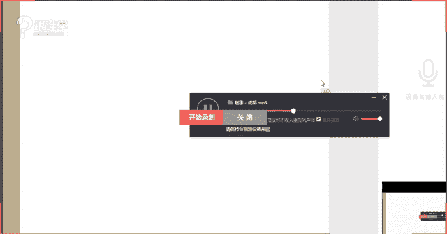
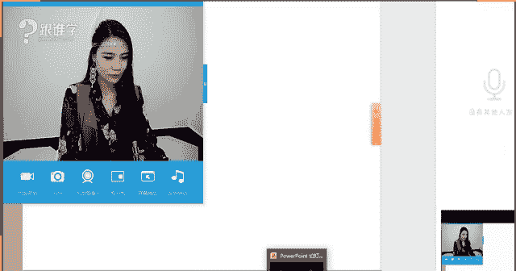
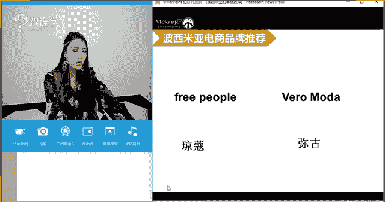
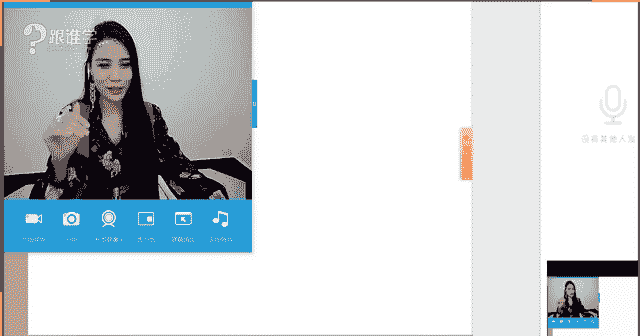

# 1、11服装《搭配秘笈之新版36计》：33波西米亚单品

🤧。

hello同学们晚上好。嗯，刚才看大家这个屏幕上聊天呢啊聊的挺火热的。成都这首歌是吗？嗯，老师也非常喜欢这首歌，听到这个赵磊唱歌的时候，我总觉得因为我本身比较喜欢的这种音乐风格啊，我比较偏爱民谣啊。

然后这种爵士啊，包括bl啊这种乡村音乐啊等等啊，那所以我本人还蛮喜欢赵磊的那赵磊的话，是不是我们很多同学也都挺喜欢他的呢？嗯他的这个成都也特别的火。嗯。是的，呃，听着有一种就是感觉很很舒服的感觉啊。

他的歌声总是能带给我们这种感受。OK好的，嗯，那呃大家平时的话都听哪种音乐的这种元素比较多呢。想到大学时光了是吗？臭美红同学嗯，那呃现在咱们呃的确因为我们都毕业很久了啊，然后听到这种歌的时候。

总感觉好像呃想要回到这种青春时代。啊，那今天呢呃这个就不不跟大家来多分享了。关于这个音乐的事情。那今天给大家分享到的风格啊，我一坐在这里的时候，其实同学们就已经能看到了啊，这个惠尔同学说吉普赛女郎。

没错，我今天呢呃就是波西米亚风格的代表吉普赛吉普赛人的话呢呃等一下我们在后面也会给大家来介绍。OK好。😊，今天的耳环很漂亮是吗？嗯，因为它也是比较有这种民族感的这种元素。那包括我的今天的整套搭配。

包括头上的这根羽毛啊，它也是比较有这种呃民族元素的这种感觉。OK好，那其实平时啊在以往呢，我们给大家分享的是关于单品比较多的，那今天呢给大家分享到的就是风格的这样的一个板块。

那比如说这种风格它应该怎么样去选择这种单哪种单品。那包括呃可以运用哪些配饰来强化这种风格。嗯，OK郑美侯也买了很多这种耳环是吗？呃，这种大耳环能够接受吗？因为我平时戴这种大耳环的话。

很多同学同学都会说呃这个看起来感觉很重，然后呃戴着好像很累的样子。那我这副耳环其实还是比较轻的啊，没戴就不会搭配吗？没戴不会搭配。那今天就可以尝试一下这种搭。的感觉。

那我今天为了搭配出这种波西米亚的感觉，那除了头饰配饰，包括服饰呢啊还有这个妆容也要配合上。因为波西米亚给我的感觉其实是有这种颓废感的颓废感嗯，OK好。

那今天呢呃给大家分享到就是关关于波西米亚的这样的一个单品的选择。啊在一想到波西米亚啊，我相信同学们你们都应该能够想到一个场景。那这种场景是哪里呢？比如说度假休闲的这种感觉，对吗？嗯。

菲尔很喜欢波西米亚是吗？嗯，那是因为我们现在总是一想到波西米亚的时候，我们的身心是比较愉悦感的，因为我们觉得好像啊又要去这个度假了的感觉，然后又要呃这个过上一种很很享受的这种生活状态，很舒适的。

很忘我的，不用想工作的这些事情的这种状态，那可能也是我们很喜欢波西米亚的这样的一个原因。那包括啊那喜欢这种颓废感嗯。流浪大瓶车慧尔同学呃对于这个风格的这个这个呃掌控还是挺多的，是吗？

那以前是有听过关于波西米亚的这样的一个风格的介绍吗？OK好嗯，那我们继续来看，那大家刚才讲到了说哎有喜欢度假的这种感觉，或者说喜欢颓废感的这种感觉。

当然他都是跟波西米亚相关的那在我们很多人一想到波西米亚估计就会想到某一个场景。那比如说蓝天白云等等沙滩。啊，那其实波西米亚它到底是什么呢？啊。

它到底是什么样的一个原这个这个原因形成了现在当下的这样的一种风格呢？那其实现在在都市当中也会有人穿着波西米亚，比如说我平时可能不会这么夸张带这种呃这种发饰。

但是平时的话这种呃连衣裙包括耳环以及这种马甲的这种穿搭，我。经常会穿出去的啊，那包括呃这种被配搭上这种关于民族感的这种包包等等。

那这种风格还是呃很多人去能够接受也喜欢的这种风格的原因是因为他总是有一种神秘感，他跟我们常人平时的这种休闲的这种着装好像有很大的差异化。OK好，那刚才给大家讲到，我们说我们的这个认知当中。

或者说我们一起到波西米亚可能就会想到呃度假的这种场景。那其实波西米亚，他也有他的这样的一个文化的发展。那我们来看一下那波西米亚他到底是怎么来的啊，那波西米亚呢，他是其实波西米亚，他是一个地名。

是中欧杰克布拉格的这样的一个地名啊，那在公元5世纪的时候呢，斯拉夫人建立了波西米亚王国。那为什么说像波西米亚王国，其实呃在这个王国当中呢，因为当时有很多以游牧生活为主的吉普赛人。他们其实。

非常的爱这种着装风格。大家可以看到啊，这个这张图片当中其实就是吉品吉普赛人啊，这种载歌载舞，非常这种自由浪漫的这样的一个生活的场景。那其实波西米亚为什么它会有很多这种呃民族的元素。

包括他会有很多这种呃大家经常会看到他们会喜欢用流苏啊，那包括他身上有一种颓废感，其实他们并不是刻意的去制造出来的那是因为他们本身的天生的这种气质，或者说因为长期的这种游牧的生活。大家可以想象一下。

如果让你一个月不洗澡啊，然后你的衣服也是这种可能一开始你穿的是一件非常的精致的服装。但是如果你一个月不洗澡。然后这个长期衣服也不换。那长期都在过这种游牧生活的这样的一个状态的话。

你看一下你的衣服能不能这个变成一条一条的这种状态啊。那呃我们。说怎么了？臭美红。那所以说其实我们所说的波西米亚身上的这种风情，他并不是刻意去制造出来的，是因为生活的原因。那例如说这种燕熏风。

肯定是因为长期呃没有去这个我们所说精轻的去打理自己。那留下来的这样的一个痕迹啊，无法接受不洗澡的这种感觉，是吗？啊，那刚才我们说到这个在波西米亚人起呃在波西米亚这个地区。

当时有很多的这种吉普赛人涌入到这样的一个王国，所以给这个王国带来很多的这样的一个艺术风格，但是因为当时的这种我们所说的帝国的叠呃更迭呀，包括这种历史的变迁呀，然后这个势力的变化呀。

波西米亚呢呃吉普赛人他就开始往什么呢？法国以及各个欧洲地区过上这样的一个流量，流流浪千徙的生活。那其实在很多人眼中啊，比如说在美国人眼中，那包括在法国人眼中，他们心。

现在的我们所说的波西米亚人的这样的一个眼光是不同的那例如说呃美国人，他们会认为波西米亚呃代表的是一种贫穷或者说这种落魄的感觉。并且他会跟他呃跟吸毒会有联系感啊，那帮那呃因为什么跟吸毒有联系感。

其实还是源于一个一个风格呢？就是嬉皮士西皮士的话，他们其实就是以西食这种大麻啊，来什么创建他们自己心幻想啊迷幻的这种生活当中幻想自己心中的乌托邦。那其实跟这个有一定的原因。啊。

那美法国人的想法就不一样了。法国人呢他们会认为呃波西吉皮西普赛人或者说波西米亚人他们天生就是一种艺术家，只是这种艺术家在无时无刻的流浪而已啊。那总是在这种四处漂泊的这样的一个状态当中。

那大家其实可以看到，为什么说法国人认为波西米亚人，他们有艺术感。那其实呃大家会发现这个波西米亚的人身上啊，就穿着波西米亚。其实现在我们定义波西米亚有两种情况，一种就是只是吉普赛人。

一种就是我们所说的颓废派的文化啊颓废派的文化，就是你的这样的你的着装，其实就是很很波西米亚，或者你整个状态有这种颓废的气质，这这就是我们所说的波西米亚的这样的一个核心。

那嗯法国人为什么说波西米亚他们身上有艺术感。你会发现波西米亚，他们身上有很多的这种呃这种刺绣啊，手工啊等等。

我们说这种印花以及这种刺绣以及这种美好的这种我们认为非常漂亮的这种呃不管是饰品也好或者服饰也好，它其实都是需要一种想象力来把它呃制作而成的那比如说某些刺绣和印花啊。

那这也是为什么法国人认为他们是非常浪漫，以及是非常的有艺术的这样的一个气。OK那这就是我们所说的波西米亚，它到底是怎么来的，它到底是什么？

那么今天呢我们主要给大家讲到的就是关于波西米亚的单品的这样的一些这这个选择。那如何能够搭配出波西米亚啊，OK那我们来看一下，今天呢给大家讲到的两个重点，一个就是波西米亚的单品选择。

另外一个呢就是关于度假穿搭的秘籍。那因为刚才一开篇我已经跟大家这个提到呃，其实很多人一想到波西米亚的时候，那我想问一下大家，你们想到波西米亚的时候，会想到什么呢？除了刚才老师说到的这种度假感以外。

那你们脑子里还会有有什么样的一个联想呢？想问一下我们同学们，你们对于波西米亚的这样的一个理解。OK好，同学们，你们现在可以在屏幕上去打字了啊，那呃臭美猴比较喜欢波西米亚啊，那个菲尔也很喜欢波西米亚啊。

那你为什么喜欢波西米亚呢嗯。尼克同学说想到吉普赛美女的大摆裙OK呃，没错，大摆裙的话是非常能够代表波西米亚的这样的一个元素。啊，那新会同学也说飘飘的长裙啊，收纳的说流苏啊，然后这种羽毛等等。啊。

那惠尔同学说于大自然融洽，没错啊，那大家刚才形容的这样的一系列词语呢，今天都出现在老师身上的，比如说流苏，比如说羽毛啊，比如说这种呃这种大裙摆，虽然我今天穿的不是特别大的裙摆。

但是它也是一个呃这个长裙啊，中中长的这种裙装啊，抽美后说我喜欢丰富的视觉感是吗？那你一定是非常喜，那你应该是比较喜欢饰品，对吗？因为如果没有饰品的话，一个人的形象。

它一定不是特别的这种立体化或丰富的这种感觉。嗯，好的，那个标榜同学说我喜欢饰品啊，你是比。喜欢波西米亚的视频吗。嗯，OK好，那我看到大家这样的一个答案了。

看来大家其实对于波西米亚是有一定的这样的一个认知的对吗？但是我们说如何能够把波西米亚它搭的呃有这种经典的，有有其实波西米亚现在有两种这样的一个呃派系啊，一种就是我们所说的非常经典的这种波西米亚。

其实比如说老师今天穿的相对来说是比较经典的这种感觉。那当然呢还有一种就是我们所说的现代的这种波西米亚，有一个族群有一个群体叫波波族。那这个族的人呢叫呃就我们并不是说他是一个族，并不是说他也是一个民族。

而是这样的一个群体。那这样的一个群体呢，它其实跟波西米亚原本的这样的一个经典的波西米亚有着一些本质上的区别。那等一下我在后面会给大家来介绍OK好，那威尔同学也说到夸张的长裙，啊，包括这种呃飘逸的长裙。

夸张的耳环，抑域的风景的这种感觉啊。于的梦说我喜欢这种感觉，但是我的身材气质穿不出这种感觉。嗯，于的梦同学，我想说的是，其实每个人都可以。穿着波西米亚，只是你在选择的波西米亚的时候。

可能要结合你个人的气质啊。那等下呢我会给大家来讲如何去结结合你们个人的这样的一个气质的呃这个维度啊，来打造属于你的波西米亚，我一直在课堂当中强调同学们，我们每个人其实都可以穿各种风服装风格。

并不是说哎有的服装风格好像不适合我的气质，我就不能穿着了。其实你有专属你的波西米亚啊。OK好，那老师今天的波西米亚其实就真的一直有这种颓废感，颓废气息是比较重的。包括这种呃非常浓郁的这种色彩。

那其实有的人的话呢，他可能会驾可以驾驭一些比较精致的这种波西米亚的这种风格。O好，那我们继续来看，今天呢首先给大家分享的就是关于波西米亚的单领的选择。那关于单领选择，其实我们更多的需要认识波西米亚。

他有哪些元素可以构成。但这些波西米亚的风。那所以呢他会一个一个板块来给大家来介绍。那包括呢第一个经典的波西米啊，它是什么样子的啊，那现在的波西米啊，它又是什么样子的，包括波西这种搭配OK。好。

那我们首先来看经典的波西米亚。那大家现在可以看到在屏幕当中呢，有很多的关键词。那这个关键词呢就是全都是我们所说的波西米亚风格当中会出现的一些呃这种元素。那例如说编织感的啊，是编织感的这种。

比如说包包啊啊，然后包括鞋子啊，包括皮带啊等等。那包括珠袖、亮片、亚麻大裙摆、露背、系带、系带、凉鞋、羽毛耳环大染多层缠绕珠串、图腾、马甲、披肩啊，踝靴、拖地长裙。呃，可以听到声音吗？

同学们如果可以听得到的话，请打一。我看到会有同学说听不到声音了。OK好，可以是吗？那我这里就没有问题。好的啊，那这一系列呢都是关于波西米亚的这样的一个经典的元素。大家要好好记住这些关键词啊。

因为这些关键词它就可以组合出波西米亚的风格。那比如说大家现在看到在我们的右手边啊这样的一系列图片，是不是就带有波西米亚的这些元素呢？比如说大家看到的羽毛耳环啊。

包括这种带有流苏状的这种波呃这种波西米亚的配饰，包括这种珠串啊等等，包括这种流苏的短靴麂皮的麂皮材质的靴子啊，这种凉拖，那包括这种民族感的长装包包亮片这种呃珠串啊，这种这种珠片的上衣。

那它们都是能够组合成波西米亚的这样的一个经典元素。OK好，那我们继续来看。当我们认识了这些经典元素之后呢，我会一一的来给大家怎。分析呃来分析它如何运用到我们的身上。好，那么首先来看在呃波西米亚当中。

今天呢我们会以这样的一个维度来给大家讲解。我们说构成一件服装的话，它会有什么关系呢？有哪些元素呢？同学们记不记得构成一件服装，它会有哪些元素。那现在大家可以看到在屏幕当中，我们所说的廓形。

那还有没有其他的元素呢？同学们啊是不是构成一件服装，它会有形色材质图案啊，那这些没错啊，臭美头同学包括尼克同学惠尔同学雨和同学回答的非常好。是的啊，那这些材质呢啊这些这些元素呢。

它就构成了我们所说的服装的这样的一个呃这个单品的这样的一个构成。那例如说那比如说在我们首先会给大家来介绍到廓形的这样的一个问题。那在波西尼亚当中经常会运用到的这种廓形叫什么呢？柔美浪漫感。

那比如说大家现在可以看到在屏幕当中的这种大裙摆啊，这种比较飘逸的，然后比较轻薄的柔美的这样的一个裙装。那包括这种层叠的波浪感的裙装。那以及收腰长裙。那在这里我要给大家强。强调一点。

那我们说这种收腰的这种设计，它会强调我们所说的女性化的这种元素。所以说我们今要强调叫收腰长裙。因为呢其实很多同学会对于波西米亚和嬉皮士是分不清楚的啊，那等一下我会给大家来讲，他们之间有什么样的一个区别。

那我们说波西米亚它的核心的这样的一个表示呃表达的这样的一个感受，就是它是柔美的，它是浪漫的，它是柔和的，它是女性化元素非常强烈的那西皮士的话呢，它表达的会更加的硬朗。OK好，那我们说那在裙装和裤装当中。

我想问大家，哪一种能够更加表现女性化元素呢？同学们。裙装和裤装当中是不是裙子啊？对尼可同学，包括我们的惠尔雨诺臭美侯同学说到了啊，雨和同学菲尔同学幸惠同学没错，收纳啊。是的，裙装它能够更好的什么呢？

代表我们女性化的这种柔美的气质。所以说在波西米亚的这样的一个风格搭配当中，最经常用的就是裙装啊，非常非常的典型的代表就是裙装为主。O好，这是我们所说的波西米亚的这样的一个廓形上来讲，那我们继续来看。好。

那波西米亚的色彩，它基本上经典的波西米亚啊。我们说到的这种经典的波西米亚。那一般会以这种着色，包括明度较低的这一类的色彩。那什么是着色呢？比如说老师今天穿的这种颜色啊，包括我们图片当中的这种呃这种这种。

所说看起来不是极为鲜艳的色彩，加了灰的色彩，看起来就有一种叫自来旧的这种感觉。包括我们说这种大自然的这种感觉。它其实都是有这种着色的这种特点的啊。那包括呢他们的这样的一个色彩当中。

它一定不是特呃当然现在也会有一些我们所说的在现代经典波西米亚当中，也会有明度偏高的一些色彩。但是我们说经典的波西米亚，它传递给我们感觉，就是以这种大自然色棕色系为主。

并且带有民族感的异律风情的这种配色的关系。那比如说现在大家看到的屏铺当中呢，这张这一件图片啊，这张图片当中，你会发现这个整一套的感觉，它其实是比较什么呢？啊，这种比较明度偏低的。

只有这种小面积的点缀的这种亮色。那这种配色关系，它其实包括这种图案的配色，它就。形成了这种波西米亚的这种感觉。那这是我们所说的非常经典的波西米亚。那经典的波西米亚的话呢。

一定比如说老师今天穿的这种极体的这种感觉，包括棕色系的这种感觉，就非常非常的能够代表波西米亚的这样的一个色彩，它的色块的用色OK好，那到底明度高的能不能穿啊，鲜艳的能那能不能表达波西米亚，当然可以。

那我们在后面会给大家来介绍到OK好的，惠尔同学说耐脏啊没错啊，那呃这个臭美猴同学也说的没错啊，是的，这种波西米亚的这种色彩，它看起来好像就比较耐脏，就是这种规规就就灼灼的这种感觉。是的，嗯，好。

那么就是继续来看，那么在波西米亚当中的材质啊？也就是说能够构成波西米亚的这种服装风格的特点的材质，它有哪一类呢？有哪些呢？它基本上都会以这种天然材质的这种感觉为主。

那例如说比如说他们会经常运用到这种棉麻的。这种效果啊，那这种棉麻感本身我们就会说它是接近于自然的这种感觉。所以呢棉麻非常的能够代表波西米亚的这样的一个特点。那包括这种蕾丝感。哎。

有同学说老师蕾丝它并不是特别天然的这种感觉呀。那当不要忘记了，同学们刚才我们说到这种什么呢？波西米亚它是柔美的浪漫的这种感觉。所以这种蕾丝的感觉呢，它是不是给我们感觉是比较柔美的啊，比较有女性化气息的。

包括它是比较浪漫的这种感觉。所以呢它也能够代表不在波西米亚当中也会经常出现这种蕾丝的这样的一个材质，那包括这种编织感。那大家可以看到这种手工编织的包包，以及这种手工编织的皮带啊。

包括这一条也看起来有这种旧旧的这种感觉。那这种麂皮的粗犷感的，带有粗犷肌理感的材质啊，它其实都能够代表我们所说的天然材质。那这种编织感的话呢，因为它是极其其实这种编织感它的这种感觉是非常粗犷感的。

包括它是比较厚重感的。其实它不太适合在波西米亚当中大面积的出现。什么意思呢？就是说它其实可以作为包包或者是作为皮带，小面积的出现，作为点缀就够了。因为如果大面积出现的时候，它是给人感觉太过于厚重了。

它就会呃不能够就我们所说波西米亚，它给人感觉就是柔美的飘逸感的轻盈感为主。所以这种太过于厚重的时候，它会什么呢？破坏掉我们所说的波西米亚这种柔美浪漫和轻盈的这种氛围。OK好，那这是我们所说的编织的材质。

那我们接下来看珠片啊，珠绣亮片。那这种珠绣亮片，因为它是手工制作而成。啊，包括呢它没有这个我们说一定是这种非常是属于手工系列的这种感觉。他不是说这种大面大量商产的这种感觉。

当然我们说为什么说这个珠绣和亮片，它的造这个呃价值会比较高昂，就是因为它经常它需要涉及到这种比较繁琐的这样的一个做工。那包括刚才我们说到波西米亚人，它有一种艺术家的气息啊。

那其实大家会发现你做成这样一件珠绣亮片的服装，其实也是需要极为极有要需要考验到你的想象力的啊，包括你的这样的一个天生的艺术感，你的美感等等。那这种珠绣亮片，它其实也是比较能够代表民族化的这样的一个特点。

所以呢它也会出现在波西米亚当中，但是它的亮变跟我们经常看到的那种夜店的啊，或者说舞台上的dico的这种亮片相同啊。同学们，你们觉得它跟这种disco的，或者是夜店的啊这种亮片感是相同的吗。这种亮变感。

它一定传递给我们啊，我们说。带有波西米亚特点的珠绣亮片，它一定是有这种民族的啊，有这种自然感的，而不是那种看起来非常的这种什么很很很这种性感的这种气息的这种氛围。OK好。

那这以上呢就是给大家介绍到的波西米亚的这样的一个风格当中，它经常会用到的一些材质。那这种材质呢就是呃第一它是属这种棉麻的，比较天然的。第二是代表女性化气息的这种蕾丝的那第三就是这种编织感的那这种编织感。

我们建议小面积的去使用包包或者说这种皮带当中，那包括珠绣和亮片啊，珠袖亮片。那这些呢都是非常能够代表波西米亚的这样的一个元素。OK那我们继续来看。那在波西刚才我们讲到了这种型啊，包括色彩以及材质。

那现在呢我们看到的就是图案。那在波西米亚当中，它经常会出现的两种啊图案就是第一就是这种民族印花。那大家可以看到在左图当中，那模特身上的这种着装的这种感觉，包括它的这种什么呢？背景，大家有没有看到。

是不是就是属于非常这种游牧感的这种特色呢？大家可以看到它是在那你在帐篷里的感觉，对不对？所以你会发现啊波西波斯其实你会发现我们在波斯的这种图案当中经常也会出现一些这种民族感的这样的一个特色啊，波斯图案。

它其实也带有这种民族感，包括一些这种呃有很多这种非洲风情啊，其实这都是我们所说的叫民族感的，包括中东啊，然后我们这种中国的这种图案，其实它也是带有民族感的啊，那这种民族印花它经。

常都可以使用在波西米亚图案当中。那其实我们中国啊的扎染，比如说你去百度上一搜扎染，就出现我们中国的那种扎染的这种色彩，就是蓝底，然后上面会带有那种白色的那种扎染的这种效果视觉效果啊。

那包括我相信大家经常去旅游的话，有没有去过丽江的有没有去过这种什么桂林阳朔的，有没有同学去过啊，那包括去一些比较这种呃这种呃少数民族的度假的这样的一些村落当中，啊你们都会看到很多这种呃刺绣啊。

然后这种印花呀啊，那这种其实它也会有什么呢？因为它具有民族感，所以它在搭配当中也可以运用到给这种波西米亚的风风格当中啊，OK那其实在现在搭配当中，它可以运用到波西米亚当中的啊。

那比如说其实我呃这个前天啊就拿了一个包包，今天没有带啊，老师我前天拿了一个包包呢，它就是这种我们朱片。做成了这种小的手拿包，但是上面就这个对这个图案的组成，就像一只凤凰的种感觉。

那当时我记得我买这个包的时候，其实已经是在5年前了，5年前我买的这个包，我当时拿到的时候，就觉得啊这个包怎么那么土啊，就觉得很土气，然后就因为它太中国化的这种气息，并不是说我们中国图啊。

老师说的并不是说中国图，而是说当时的那种呃审美眼光包括自己个人对于这种呃服装搭配的鉴赏能力还没有到达一定的高度啊，我会认为哎好像这件单品不够这种出彩。然后呢，好像呃它太过于这种民族化了。

好像我不太能搭配的好，然后就觉得觉得它不是好看的。呃，在前一段时间我这个因为我虽然这个买了之后没有用它，但是我一直把它收藏起来。前一件前一段时间在整理房间的时候，就把它拿出来了，我一拿出来的时候。

当时就特别的惊艳，我就觉得哇，我当时的眼光怎么这么好呀，我怎么买了一件这么漂。单品啊，当时就觉得啊今年因为特别流行又很流行这种民族感的东西，又很流行这种珠片感的东西。所以就觉得嗯这个包包真好看。

所以我连续几天都会一直提着那个包包。然后很多朋友也也会说包括我们米兰欧的其他老师也会说哎这个包包挺好看的啊，我说嗯我眼光好，在5年前就买的。但是一直没有用过。啊。

那其实我们会发现人的审美也会根据你当下的这样的一个呃，你对于这种这种我们所说艺术的欣赏也好，或者你的审美眼光发生了变化也好，你的美审美的眼光就会发生改变啊。你对于美的理解会不同。

那我相信可能有很多同学在呃一开始进到我们的这样的一个课堂当中的时候，会认为老师有的时候会穿着特特别奇怪啊，因为好像这个呃今天我们有一个新老师还说呢，说这个说你今天怎么穿的这么这个这个这种感觉呢？😊。

我说我今天要给我们线上的同学讲波西米亚啊，然后呢他就没说话了，我说是不是感觉有点太个性了呢？他说是的，嗯，这个我觉得你走在街上感觉别人都会觉得你是神经病，然后穿来好像有点破破烂烂的这种感觉。

我说你是懂得欣赏OK好嗯，现在眼光变化了很多，是吗？嗯。好的啊，新慧同学。那其实我记得好像新慧同学前一段时间，我好像说到了某一个单品，然后你也说你不能不太能接受。但是相信相信我啊，新慧同学呃。

只要你呃并不说你一定要每天跟跟随着老师来学习。那只要你的这种审美，或者说对于你的这种呃这种这种对于时尚的这样的一个把握越来越多的时候啊，那你的审美眼光也一定会发生变化啊，O好，对，是的。

好像是袜子配凉鞋，你到现在还接受不了，对吗？那臭美红同学能接受吗？比如说袜子配凉鞋的这种搭配方法啊，那什么风格都喜欢是吗？臭美红同学啊，如果你什么风格都喜欢的话，那说明你本身的接露度就比较广。

那其实这一类型人，反而他其实更加能够快速的成长啊，我在这里要讲一下这一点啊，新慧同学你要多敢于尝试。我记得我们这个今天在答疑题当中是哪一位呀？是。思雨同学吗？思雨同学可能今天没有到哦，对。

思雨同学说他要跟朋友去吃饭啊，那思雨同学呢，他就这个这个经这前一段时间他问问了我一下他那套衣服该怎么搭配啊，然后我给了他一些建议。然后呢，那今天就搭配出来了，是不是大家也在群里呢？呃。

你们有没有看到思雨同学的那个搭配，我就觉得啊我很开心。我看到他呃这个就是我给他的建议，然后他去使用了，并且搭配的还挺好看的啊，我觉得特别开心，就很有成就感的这种感觉。这种成就感是在于什么呢？

就在于我觉得啊同学们能够呃这么快速的接受这种时尚的讯息啊，并且敢于去尝试。然后你们的形象就发生了一个变化。其实呃我们说思雨同学那天我给他只是一个小小的建议，就让他在配饰上做一些调整。

比如说加一个帽子和眼镜。但是你会发现他的时尚度就拓宽了很多，大家有没有感受到呢？O好嗯，臭臭美国同学说思雨是百变女王是吗？😊，啊，没错，他经常会在群里发一些图片，然后呃来来来给大家来分享啊。

那我觉得这是非常好的。其实我建议咱们的同学们，你们也可以这个经常在群里发一些图片啊。当然呃我们要这个其他同学也不能随便保保留我们这些同学们的相片啊好嗯啊，你们两人本来在网上就认识是吗？哇。

那那是因为怎么认识呢？是在跟谁学平台上认识的吗？嗯。好呃，百草园也说，我今天也给朋友搭配了几套自我感觉良好，那到底好不好？那你首先是自我感觉已经非常良好了是吗？勿忘我那你其实也可以发出来给我们分享一下。

对不对？我们同学们啊来给大家来分享一下，或者是说让同学们也帮你呃这个来来这个调整一下，看一下有没有更加能够呃提升了这样的一个空间，或者说老师看到了也会给你做这样的一些搭配的意见或者是建议。嗯，O好啊。

创美鹏同学说在其他的课上认识了是吗？O那看来你们两人都是非常爱学习的啊，那这种精神是非常值得鼓励的啊，给你们一个掌声，OK好啊，那呃刚才呢给大家讲到，那我们回到我们的这个课堂当中来啊。

刚才给大家讲到了波西米亚的图案。那这种民族印花以及这种扎染的这种工艺。那这种扎染的这种工艺呢，它的染法呢其实是比较特别的啊。那就比如说把布啊在这个旅程。😊，这个一个有的时候他们是打一个结。

或者是说呢这种直接把它捋成一条啊，放到这种染缸当中提出来，它的这种扎染的这种这种色彩就出来了啊。那扎染的话，它强调的就是一定是不均匀的，就不会说是整块都是一一模一样的这样的一个色彩啊。

它可能它肯定会有一些变化性，所以扎染的这样的一个工艺啊，它是世界上这种无所谓每个人穿的图案都是独一无二的啊。OK好嗯。惠尔同学说，在街上随时都在给人建议练习，当然是在心里哦，我还以为你这么大胆呢。

惠尔同学，我还以为你真的在街上的时候看到别人穿的不太好看，你就走上去给人家说，哎，你应该怎么搭怎么怎么搭配啊，嗯，那勿问我说忙死了，感觉这段时间啊没有来是吗？这段时间太忙了，是吗？

那我建议你还是要多来线上跟我们这个同学们都互动一下啊，那其实惠尔同学刚才提到的这一点，我我是深深有体会的啊，不知道同学们你们有没有这样的一个体会。我经常在呃我们线下的课程当中也会跟大家来分享。

比如说因为我们在线下课程当中，呃，在线上也会讲到对在入门片当中，我们是不是经常给大家讲到体型的问题，体型应该怎么去搭配，那包括这个腿型包括一个人的这个比例应该如何去调整，然后我经常会有一种职业病。

就是我的眼睛就好像是一个X攻击。我走在街上的时候，只要我前面有人我就会自动去扫描它嗯。😊，这个人的比例挺好的啊，或者说这个人的比例不好，五五分，他不应该这样穿衣服，他应该穿高腰裤啊。

然后应该穿高跟鞋来调整他的比例啊，然后就觉得啊这个这个就就觉得自己有这种职业病的这种感觉。包括看到一个人特别胖，他还穿特别紧的裤子的时候，我就想告诉他啊，你不要穿这么紧了，你应该穿合体一点的啊。

就就就是有这种冲动，或者有的时候看到一个人的这个呃这个某一件衣服的单品，比如说可以调整一些细节问题，就能搭配很好的时候，我就特想走上去给他做一些建议啊。那惠尔同学，我觉得他作为男同学。

他在心里都有这样的一个想法的话，我觉得也是挺挺挺有意思的一件事啊，那说明你一般慢的有这种职业的职业病的特点嘛。虽然你不是做这样的一个职业啊。OK好惠尔同学是做什么行业的呢，可以跟我们大家分享一下嘛？啊。

那同学们其实你们也可以在这个平台上跟大家来分享一下，你们都是做什么样的。😊，职业当做什么样的一个职业的？然后呢，哎怎么来到这样一个平台当中跟大家来学习？OK好，嗯，呃，这个我看到大家的这样的一个聊天啊。

说看直播跟看回放的感觉不一样，看直播有交流学到的更多。那当然啦啊那包括风林同学说嗯，没看到一个人都会从头到脚的去打量穿衣啊，衣服好不好看，颜色适不适合发型怎么样。嗯，啊。

慧尔同学说以后以前是感觉应该怎么穿着，现在可以说出道理了。没错啊，找到依据了，那就是我们所说的科学的方法啊，那云诺同学说，现在和同朋友分享啊，感觉很好啊，嗯啊这个慧尔同学就是做服装这个相关的生意的是吗？

啊，那挺好的啊，OK好，臭美国同学说从小就喜欢看女生穿衣服，喜欢美女多的地方哇塞那看来我我都有点害怕你的性取向的问题了啊，天天看女孩。干嘛呀？你要多看一点男孩好吗？OK好，那这个话话题就过了啊，同学们。

那我们继续来看。嗯，那刚才给大家讲到的是关于波西米亚的图案的这样的一个问题啊，那他经常会使用到的就是民族印花以及扎染。那么继续来看嗯。😊，那波西米亚当中呢，它的配饰的应用啊。

我我来给大家看一下有没有跳过呢？啊。OK好，那我们继续来看。那波西米亚的配饰它其实会运用到很多种。那同学们可以来列举一下，你们觉得呃有波西米亚风格的这种配饰有哪些？

比如说其实现在大家呃大家可以看到在屏目当中，老师已经给同学们举例了啊？比如说这种坡跟鞋，并且它这种鞋子是带有这种编织袋的那这种麂皮的流苏的靴子，包括这种麂皮的这种中长靴啊，包括这种夹脚的拖鞋啊等等。

那它其实有很我们所说的有很都可以搭配这种呃波西米亚的这种服装风格。那其实还有哪些配饰，它能够搭配出波西米亚的这种感觉呢？同学们呃，你们想想，刚才是不是刚才在前面我们说关键词当中是不是就有关于流苏耳环。

还有没有呢？嗯，比如说这种绑带的头绳是不是也可以打造出波西米亚。的感觉呢啊羽毛的项链没错，羽豪羽和同学说的啊，羽毛啊，那看来大家就是这个对于羽毛是很有印象的啊，包括珠串啊，安若洛同学说手编手链啊。

就是这种编织感的手链是吗？啊，那包括草帽啊，会尔同学说草帽非常好啊，编织感的包包ok没错，是的，那这些呢都是属于叫配饰类的那我们继续来看，刚才给大家看到的是关于鞋子。那比如说这种坡跟鞋。

现在这种季节可以穿到的吉利短靴，包括这种中长的麂皮靴。那夏天我们经常会穿的这种拖鞋啊，那它其实都会有这种波西米亚的感觉，它都可以搭配波西米亚ok好，那是关于鞋子的选择。

那同学们现在可以把这个好好系一下啊。好，那么继续来看。是的啊，取自大自然的手工感。没错，是的，它都会有带有一种编织的这种感觉，自然的这种感觉啊，质朴的这种感觉。

那我们说波西米亚它其实本身的风格它就带有一定的这种质朴感。OK好，我们可以来看配饰当中的包包。那大家可以看到123这三款包包，它其实都是属于这种手工的这种感觉啊，手工的这种感觉都非常的重。

比如说这种珠片啊，包括这包括这种有这种刺绣，包括这种手工的流苏的这种感觉。那包括这件也是穿了很多的这种什么呢？这种珠片啊等等。它其实都带有这种手工感，并且它的这种配色。

包括它的图案的这种感觉都有一种民族元素啊，给我们感觉都会有一种异域风情。OK那其实那包括刚才这两款包包，我们没有讲到。您发现这两款包包，它其实是什么样的一个做做工呢。

是不是这种我们所说的叫皮革的这种感觉。那这种粗犷感的皮革，包括这种什么呢？流苏的这种感觉啊，那这种编织的这种感觉，它其实都能够什么呢？代表波西米亚的元素。OK好，那我们继续来看。那刚才讲到的是包包。

我们来看一下配饰的首饰以及首饰啊，那大家可以看到在屏幕当中，你会发现在波西米亚当中经常会运用到运用到的。刚才我们同学们也说到了啊这种珠串。

包括这种手工编织的这种手链以及项链或者是说这种皮带或者是说这种头绳，那其实他们都会带有这种民族的这种感觉。所以他们都可以运用到波西米亚的这样的一个风格当中。那比如说刚才也同有同学们也说到了这种羽毛。

是不是这在这里也出现了呢？啊，那包括这种流苏珠串等等。那其实他们都会带有这种民族感。那今天其实老师也带了这种呃这种戒指。啊，但是我戴的呢其实他的民族感没有那么的重。所如果想要更重的话。

其实可以有一些色彩的感觉啊。我戴的今天其实是以这种金属色为主啊。O好，那包括这种藏银的感觉，绿松石的这种感觉，它其实都能够代表我们所说的波西米亚的民族的这样的一个元素。O好，那我们继续来看。

就是关于波西米亚配饰当中的首饰啊，以及首饰，那包括什么呢？刚才我们所说的鞋履以及包包，那哪一种鞋履，哪一种包包它能够代表波西米亚，刚才已经跟大家来分享了。那我们继续来看波西米亚的妆容和发型。

那刚才呢你会发现，唉，同学们，你们觉得老师今天画的这个妆容有点像哪个妆容呢？其实我今天也画了有点这种小烟熏的这种视觉效果。虽然没有我们右边图片的这种烟熏感这么重啊。

但是其实我的左这个眼睛是不是有点像今天这位这个。我们这个图片当中的这个模特的这种妆容感呢啊那只是我的眉毛，其实稍微比她在棱角分明这种感觉啊。

那我画的小烟熏其实也是比较典型的波波西米亚的这样这种妆容的效果啊，大地色系，没错，是用的大地色系啊。OK好，那刚才呢其实我在上课之前有一个有一个我们的老师说了，说哎，你的这个头发怎么这么乱呢？

我说不要动我的头发，今天我要讲波西米亚，波西米亚就要一种颓废感流量感然后我说不用动，没关系的哈，就这样呢才能代表我的今天的主题啊，那的确其实波西米亚的这样的一个造型当中呢，妆发的这种感觉。

妆容首先它是其实有这种小烟熏效果，有这种颓废感的这种感觉。那它的发型其实以这种什么呢？慵懒的自然的，呃也稍微有一点凌乱感的这种视视觉感。它其实更加能够。代表波西米亚。

那你会发现如果波你做波西米亚的这种着装风格，但是你把你们的头发盘的特精致，然后梳的油光锃亮的这种感觉。那么他一定不是波西米亚，因为他缺少了这种自然洒脱的这种浪漫感。OK好。

那就是我们所说的波西米亚的妆容，包括你会发现他会在什么呢？在脸上做一些这种什么呢？这种贴片的这种装饰，甚至呢有的人他会把这种你看这这张图片当中，他这种烟熏膏处理的特别的极致，包括现在其实还有一种纹身贴。

大家有没有看到那种纹身贴，它其实就有一种呃这种自然的这种感觉。就是上面有这种从这儿从整个手它贴的都是这种纹身的感觉，包括背部啊，腿上啊都可以贴那种纹身贴，他都会有很强烈的这种民族感。

那其实那种我觉得还挺好的。同学们，你们想有的时候想要达到这种风格的时候，就可以买一点回来贴，就很有有很强的这种。民族的这种感觉OK好，会让同学说半年不洗头的蓬松感。没错，我们说这种游牧民族。

它本身经典的这种波西米亚的话，它其实就是具备具有这样的一个感觉。OK什么样花花纹的纹身贴好呢？尼可同学说到这个问题啊。😊，好呃，那其实这个呃什么样花纹的纹身贴，你去搜那个有一个叫什么缇娜纹身啊。

你去大概搜一下，应该是叫这个汉娜啊。叫汉娜纹身天尼克同学就是汗水的汗。然后呢呃这个女字堂一个娜啊，一如果我老师没记错的话，应该学身那种纹身的话，它有金色的，有银色的那我建议可以买一些啊，在手上啊。

然后在这种背上啊，包括腿上啊，可以贴一些，非常漂亮的啊，喜欢老师的手饰什么？那送给你吧。如果你要是来学校的话，我就送给你啊。OK好，那这是我们所说的波西米亚的这样的一个妆容以及发型的这样的一个感觉。

那我继续来看嗯。好，那其实在昨天我记得呃有一节课程当中，好像是做在昨天还是在前天呢？呃，老师因为每天上课有点忘了啊，那在昨天还是在前天，有人就提出这个问题了，说西皮和波西米亚有什么样的一个区别啊。

因为他们都会有这种什么流苏啊，羽毛啊、麂皮呀、民族啊这种特点和元素。那包括他们的妆容和发型，有的时候甚至都会特别像。那有同学就提出这样的一个质疑了。那我想问同学们，你们可以先回答我一下。

在刚才我们已经浏览了大量的波西米亚之后，嗯，你们能够告诉我，你们觉得哪边的啊左边和右边你们觉得哪边是西皮，哪边是波西米亚呢？啊，如果你们觉得这边是波西米亚的，请打一，如果你们觉得这边是西皮的，请打2。

嗯，羽和问的什吗？嗯，星伟同学的这个这个这个。你真好啊。好的嗯，霍尔同学说左边西皮是吗？那是不是呃大呃很多同学也都回答了啊，娃娃包括收纳雨盒啊，那雨盒昨天是不是就问到了西皮和波西米亚的这样一个区别？

那包括雨诺啊，幸会同学，还有我们的这个俏什么呢？俏妹啊，5021同学标啊，包括嗯ever啊，然后臭美猴都回答了这样的一个问题啊？那大家都觉得这个是西皮士是吗？没错啊，这边是西皮，这边是波西米亚啊。

钟永琼同学也来了是吗？今天迟到了是不是嗯，O还是一开始就没说话，好的，那我看到大家这样的一个答案了？没错，那同学们，你们现在能发现西皮跟波西米亚的区别了吗？那西皮他给我们的感觉会更加的什么呢？

刚才其实我在前面的课程当中已经跟大家来预告一点点了啊，我们说西皮，他其实给我们感觉会。🤧更加的硬朗。是的，没错，西皮给我们感觉是更加硬朗以及帅气和中性的这样的一个感觉。呃，5022同学说叛逆是的。

也没错。因为我们说呃其实波西米啊西皮呢其实它表达的精神文化是不同的啊。西皮的话，它其实心中有一种我们所说的叫反对什么呢？无政府，他要反对政府，那反就心中呢其实也有这种有一点点这种小叛逆。

那心中呢其实是向往和平和爱，但是他们表现的方式是不一样的。他们是有追求的。他们的他们其实是一种政治的这样的一个性质。而我们说波西米亚其实它就完全跟政治无关，甚至他们其实就是过自己的生活。

就是一种自然流浪的这样的一个生活状态。他们对于生活也是充满了这种什么呢浪漫的这种感觉。所以你会发现波西米亚，他给我们的感觉是会更加柔和一点的，会更加柔美一些。

而西皮他给我们感觉是有点这种中性感、帅气感和硬朗感。那包括其实。西皮它会运用裤装会比较多啊，就这种裤装，比如说喇叭裤啊、阔腿裤啊，或者是说厚重感的硬朗感的这种感觉，它其实更加偏西皮。

而你会发现柔美的柔和的浪漫的女性化比较重的，它轻盈的这一点也非常重要，轻盈感的。它其实更加偏波西米亚OK啊，这就是我们所说的西皮和波西米亚的这样一个区别。那我们继续来看啊。

那现刚才给大家介绍到的就是关于经典的波西米亚。那经典的波西米亚呢，呃也就是我们说其实一开始的这种呃从文化开始到这种经典的波西米亚，它们的形色制图案和配饰都会运用到哪一些。那我们再来看一下现代的波西米亚。

它都是什么样的一个感觉呢？那比如说你会发现在现代的秀场当中，它并不是刚才一开始我在介绍经典波西米亚的时候，它会以什么样的一。颜色为主呢，比如说叫低饱和度或者是着色或者叫大自然的这种色系，棕色的这种感觉。

那你会发现在现代的很多秀场当中，波西米亚它依然是柔美的这样一个表现方式。但是它会什么呢？它的色彩上其实会有极大的这样的一个差别。比如说它也会运用这种什么黑白呀，或者是这种鲜艳的色彩呀等等。

但是它从廓形上来讲，包括元素上来讲，它是不是还是非常的具有波西米亚的特点。比如说这种柔美，这种波浪的层叠的这种荷叶边那等等。那流苏啊，包括这种烟熏妆容啊，这种发带的这种感觉编织感。

那大家还可以看到它手里还拿了一瓶酒，是不是这种非常有这种流浪的这种这种这种颓废感的这种感觉呢？这这都是我们所说的波西米亚，只是它是属于现代的这种波西米亚的。那其实刚才我也给大家讲到了这种波波族。

那其实波波族呢。他们其实是一种我们所说的非常的有文化高水高学历的这样的一个群体。他们的精他们在这种我们说生活上和物质上其实是非常的富裕的。只是他们精神上追求的是一种向往自由。

向往这种流浪的这种这种着装的这种感觉，心里是这样的一个感觉。那所以他们其实也爱波西米亚，可是他们的波西米亚的这样的一个感觉是更加的有质感。例如说他可能会用运用很多这种布灵不灵很闪亮的这种或者是皮草。

或者是说这种珠宝的这种感觉，或者是说非常的奢华的这种感觉。总之他的品质感看起来是极好的那这就是我们所说的最新的现在的这样的一个群体，叫波波族，他们爱波西米亚。但是他们的物质生活水平是非常富裕的。

他们也是高水平高学历的这样的一个群体，只是他们的精神上其实向往这样的一个精神。所以他们在着装上既有波西米亚的一些元素，但是他们会加。加入自己这样的一个高品质的这样的一个感觉的元素在里面。

那比如它表现形式就是在于品质感的追求。OK这是我们所说的现代的这样的一个秀场当中的这样的一个体现。那现在当中我们看一些达人，他们是怎么去穿搭的呢？那包括啊在这一趴当中。

大家也看看到2015年维多利亚的秘密的内衣袖，也是波西米亚。那大家可以看到会运用这种非常鲜艳的色彩。那大家可以看到种什么呢？有种霓虹感，那包括这种流苏，包括这种大摆，其实都是有这种波西米亚的这种感觉啊。

这一期的话就是波西米亚。那我们继续来看，在现在的街拍当中，你会发现，其实呢他会运用什么呢？你会发现它的背景是在哪里？这种非常街头的非常鲜艳的这种背景下。

然后这个街拍的这种我们所说时尚的达人穿着的一身啊红色的针织的这种做工的这种感觉的波西米亚裙。那其实现在在。呃，都市当中也有人会这样穿着。那我不知道同学们，如果呃你们是会在生活当中这样去着装吗？

比如说今天听了这样的一节课之后，你们知道啊，原来恭喜米啊可以这样去搭配，你们在生活当中会去这样穿着吗？同学们，如果你们会的话，请打一啊。如果你们不会的话，请打2，看一下大家大家对于这种风格的接受度。

OK好的嗯。可以尝试一下是吗？好，7位同学可以好好去尝试一下啊，那其他同学都可以接受是吗？5026同学不能接受是吗？那你是为什么不能接受这样的一个感觉呢？嗯，可以跟大家来分享一下。

之前没有这样的一个单品是吗？那可以过去购买一些ok好，那这我们看到的现代的这样的一个街拍啊，那唉我们继续来看啊，呃这张图片好像显示不出来的。同学们，那我们在呃这个之后的话会给大家来调整一下这个单品。

O好，那我们继续来看嗯，之前有一条大裙子，大家说你要去打猎吗？好，臭美猴同学啊，那你你要告诉那有可能有一个原因就是你搭配的是太过于波西米亚的这种感觉了吗？

所以他们说你要去打猎的这种感觉啊那我们继续来看啊，那你这些同学你们这你这些朋友还真的挺损的，都啊O好，那刚才呢给大家讲到了这种经典的波西米亚以及我们说现在的波西米亚的这样一个表现方式。😊。

那我们来看一下波西米亚它今天到底如何去搭配。好，那我们看一下那波西米亚。因为我们说了它非常典型的单品，就是这种大长裙啊，或者说这种大摆裙。那其实在波西米亚当中的话呢，在现代的这种着装当中。

它经常会跟这种帽子去搭配。嗯，那大家可以看到这种什么呢？宽檐帽。为什么这种裙子会跟这种大帽子去搭配呢？我想问同学们，哎，你们能告诉我为什么吗？如果在现在的着装当中，你会发现其实原始的波西米亚人。

他们可能不会搭配这种大帽子。但是到现在当中之后，为什么他们会搭配这种帽子幸会同学说度假的感觉。海边的感觉啊，量感匹配遮太阳ok好，勿问我只有勿问我回答的是比较非常呃怎么说呢？啊。

5021同学也回答对了啊，那其实这是站在实用的角度上来讲啊，为什么刚才其实幸会同学，包括海边啊，包括标榜，包括尼克同学，那其实你们说的都是度假以及海边以及浪漫的这种度假感，说的都没错。

但是因为我们在这种场合当中经常看到，对不对？所以我们经常会觉得哦一看到这种帽子加上这种大上裙就好像来到海边的这种感觉。其实他们是有实用性功能的，那他们的实用性功能就是什么呢？啊遮阳。为主。

你会发现海边是不是太阳很大啊，或者说我们在夏天的时候，是不是经常穿着波西米亚，那是不是也是太阳很大，所以我们会戴帽子来搭配。所以这就是我们所说的叫什么呢？穿着的实用性。其实它再漂亮啊，它是非常的漂亮。

但是我们在着装的时候，是不是想要唉在夏天的时候想要这种这种这种不要那么晒，我们就会搭搭配一顶帽子。其实这种帽子，那你们在选择帽子的时候，尽量选择这种什么呢？以皮以麂皮的这种感质感为主啊。

或者是需要选择这种草编的这种感觉为主。那它就能够非常原原本本的把波西米亚的这种元素啊，进行了这种释放出来。那大家可以看到啊，波西米亚加帽子其实它也是一个非常经典的这样的一个搭配。

那我们继续来看波西米亚的裙子，它还可以搭配什么呢？从配置上来讲，我们可以怎么去搭配它啊，O好，那我们来看一下波西米亚它加各种的鞋履。

那其实刚才我们已经给大家介绍到这种比如说鞋履的这样的一些呃这种单品的呃在波西米亚当中可以运用哪些鞋履。那大家呢可以再看一遍啊，那么在这里会运用到什么呢？罗马。绑靴那大家可以看到。

今年其实特别特别流行这种罗马绑靴。那刚才其实就有同学说到了，说呃我觉得我的气质好像不是特别适合波西米亚风格。那我在这里其实就要跟大家来分享一下啊，那我们说波西米亚。

因为它本身其实是带有一种民族感、抑郁感、浪漫感、柔美感、女性化的这样的一个视觉的这种感觉。呃，但是如果我们在搭配这种，比如说。我想要这种变得穿波西米亚的这种风服装风格的时候。

但是我整个人长得可能是比较硬朗的。那么我建议你其实就是不是可以搭配一件老师今天穿着的这种有点这种呃鸡皮的这种感觉。其实麂皮的话，它是不是有一种硬朗感。

包括你是不是还可以穿着一些相对来说比这个更加硬朗的马甲去搭配它，或者是说这种夹克去搭配它，那其实既还是有这种柔美浪漫的感觉。但是同时这种硬朗的这种单品，它又可以什么呢？匹配给你的气质。

那这是我们所说从气质上来讲啊，你想要硬朗的话，这种你可以搭配这种单品。那如果你想要年轻啊，或者说想要这种更加显得这种比比如说一些比较娇小的女生。那我们说这种波西米亚的长裙。

它其实它会给我们感觉是比较成熟的那其实波西米亚你也可以穿着的是非常清新的感觉。那例如说在第一张图片当中，那大家是不是就觉得第一张图片和第二张图片，我想问。学们，你们觉得哪个会更加的性感成熟和浪漫？

是不是第二张图片它给我们感觉是女性化气息更重啊，更加的浪漫的感觉，更加的女人味儿。那是因为它的裙装这种大开叉以及这种低胸的设计，包括这种大花的这样的一个元素，它传递给我们感觉都是比较什么呢？

性感女人的这种信息。那你会发现在这张图片当中是不是清新感很多。那这种色彩以及什么呢？它的裙子的款式，这种A字摆的娃娃裙白色的这种设计，并且它的裙装是到什么呢？大腿中间，我们说裙装越短。

它给我们的感觉是不是越年轻感呢？所以娇小的女生，你们就可以穿着这种着装方式。能理解吗？同学们，如果你是比较娇小的这种女生，你就可以穿这种波西米亚。那同样它也是波西米亚风格啊。

当然这种大裙摆的它是更加典型的。可是如果我们想要穿这种波西米亚的时候，我们就一定要穿这种吗？当然不是这种裙装，它依然也是波西米亚的这种感觉。那它靠什么呢？配饰来支撑。比如说这种什么呢？

这种珠串这种流苏这种麂皮的罗马那种绑靴，它都可以营造出波西米亚的这种感觉。O好，嗯，尼可同学说之前买了波大波西米亚长裙是吗？你的身高还是可以驾驭的，你不是一。58米吗？所以你其实穿了这种波西米亚长裙。

只要你的裙装的比例好，就是它属于高腰线的那你其然其实也可以穿着的那包括如果你的身高比较娇小的话，在现在这种天气当中穿的话，你是不是可以搭配这种像模特当中的这个麂皮的这种长靴呢？包括它是有一点跟的。

是不是就可以增加了你的高度呢？然后配上。现在这种天气啊，这种波西米亚长裙我建议可以拿出来穿了，不用再放在箱子里了啊，搭配一件厚一点的夹克，它依然可以穿着的非常好看的啊。

这种为什么冬天尽量不要把夏天的裙子收起来。因为在冬天的时候，你会发现我们的衣服都是特别厚重的那这个时候你再加上一件非常轻薄的飘逸感的裙装，它其实形成了一种极其强烈的这种视觉的对对比感，以及它的丰富度。

刚才我们臭美猴同学就说到了，我喜欢视觉丰富的这样的一些搭配，那这种搭配，它其实给我们感觉就是视觉丰富的厚重的特特呃配这种轻薄的飘逸的，配这种垂坠的，它都会有一种视觉强烈的这种视觉效果。OK好嗯。

那这件白裙是要棉麻面料的吗？呃，不一定说非要是棉麻面料的，你也可以是蕾丝的啊，也可以是雪纺的。但是只要它的款式是这种带有这种我们说的所说的这种浪漫的感觉，包括你在运用这种配饰来搭配，就带有民族感的配饰。

它既然其实依然你会发现这套裙装，它其实全是靠配饰来堆积出这种波西比亚感的，它靠的是流苏的包包，以及它的这种罗马罗马的这种绑靴，包括它的这种什么呢？带有这种手工制品的项链。O好。

那这是我们所说的娇小的女生可以这样穿，清新可爱的女生可以这样穿。那浪漫成熟的，可以这样穿，能理解吗？嗯，O好，那你会发现这条裙子其实它对于体型上要求是比较高的。

比如说这条裙子它其实就特别的适合给到这种X体型的啊，X体型的也可以，但是就不特不是特别适合给到A型。体型的人，你会发现A型体型的人，他因为他本身比如说这种臀部特别宽。如果肩部特别窄的话。

那你如果还这样穿的话，你就会显得臀更宽，肩更窄。所以这种什么呢？这是我们所说的体型的搭配。那在这样的一个呃，我们继续来讲啊，波西米亚加裙子的加鞋履的这样的一个搭配当中。那比如说可以搭配罗马绑麂皮长靴。

包括一字摆绑带凉鞋，包括人字拖凉鞋。ok好，那大家可以看到最后一套，其实呃他的手上好像就有呃有贴这种纹身的这种感觉啊，看起来不是特别明显。手上还放了一只小狗狗，很可爱啊。

那这是我们所说的这种波西米亚的跟鞋履的这样的一个搭配。在夏天的时候我们可以搭配人字拖一字绑带凉鞋，那包括罗马绑带靴。到现在这种季节呢，我们其实可以穿着这种什么呢？麂皮的长靴。OK好嗯。呃，学了课程之后。

发现配饰真的很重要是吧？没错，的确啊，那老师如果现在把羽毛取掉，把耳环取掉，把手串手串取掉，基本上其实就没有太多的亮点了啊。我我这个也是靠配饰支撑整体造型啊。O好，那我们继续来看。

那这是我们所说的罗马啊这个呃波西米亚的裙装，它可以跟这种什么呢？跟鞋履的搭配，ok那我们继续来看，那波西米亚裙装跟流苏包的搭配。那其实它都是刚才给大家讲到的，都是属于这种配饰类的搭配。

从帽子到鞋子到包包，你会发现这种流苏的包包，包括这种麂皮的靴子啊，它其实真的非常的有这种民族感，所以你会发现它既可以给嬉皮式搭配，也可以给波西米亚搭配。那这种麂皮包和麂皮的靴子的感觉。

它其实都会有这种粗犷感的原因，所以它可以给这种风服装风格搭配。那包括麂皮的靴子它还可以跟这种什么呢？西布。牛仔去搭配。嗯，OK好，那在大家可以看到在这个场景当中，它其实大家知道能看出来它是在哪里吗？

这个场景就是在音乐节当中。所以你会发现音乐节当中，其实他们经常会穿着这种什么呢？呃，所以说西皮啊跟这种服装跟音乐风格有关系的这种服装风格啊，跟其实就比如说西皮啊，比如说波西米亚。

其实波西米亚泰会也有波西米亚的音乐哦。那包括朋克摇滚dico，他们其实都是跟音乐相关的这样的一个呃这个当时那个年代当中其实有这样的一个音乐类型。所以呢一直这个喜欢玩这种音乐类型的人，喜欢穿着这种服装。

他也就形成了我们现在所认知到的这种服装的风格。OK好，那我们继续来看。波西米亚裙子加民族感的配饰。那其实刚才在前面也已经跟大家介绍到哪些配饰可以加代表这种民族感。那比如说大家可以看到这种手串。

其实刚才给大家也看到了啊，包括这种什么呢？脖子上的这种项链。那这种什么呢？粗犷感的这种腰带啊包包，大家可以看到，其实这些都是属于配饰类的O好，那现在大家对于波西米亚的风格清晰了吗？同学们。

那如果你们清晰的话呢，请打一。那如果还有疑问的话呢，可以打2，老师可以给你们看一下你们还有哪些疑问。O好，那大家可以看到波西米亚的单品的推荐。那大家可以看到啊，波西米亚的一些单品，它都带有这种什么呢？

浪漫的呃唯美的柔美的这种感觉，并且是轻盈感为主的。不管是色彩啊啊款式啊等等啊，那大家可以看到呃，其实呃这种色彩。那刚才我们是不是在。经典的波西米亚当中给大家介绍到我们说这种低饱和度的。

比如说这种或者着色的这种色彩，它其实是最经典的。但是你会发现在现在的服装当中，有很多这种清浅的色彩做的很多这种波西米亚的这种清浅色彩，它依然也是波西米亚单品。

那你会发现这种是不是它其实也带有波西米亚的这种感觉呢？比如说这种荷叶边啊，荷叶边蕾丝啊，这种长裙大摆长裙，它其实都是可以给到波西米亚当中去运用的。包括如果你买了一件特别简约的服装。

或者说这件衣服它可能呃试大裙是是这种裙装，但是你觉得这件这种裙装它可能波西米亚的元素不够重。那其实你可以靠配饰来搭配。比如说用运用这种什么包包啊、耳环啊、项链啊，去增加它这种波西米亚的这种感觉。

OK那这是我们所说的波西米亚的单品的推荐，大家可以好好看一下。好，那我们继续来看。那有很多同学。之前有提到啊，说老师，我想要这个知道你介绍的一些风格的服装在哪里买。所以呢我今天呢给大家介绍这几个品牌。

都是在网上可以买得到的啊。那大家看到第一个呢是free people。那这个呢其实它是一个电商的这样的一个平台。嗯，叫自由人，那大家可以去搜索一下啊，那包括very moda啊琼寇。

那包括呃这个咪咕这几个品牌呢，它其实都是这种呃波西米亚的这样的一个风格。那大家可以去这种APP上去搜索一下，或者说去这种网站上去搜索一下。那么他们都会有波西米亚的这种服装风格在。嗯，O好。

那我们继续来看啊，刚才给大家讲到的就是说关于波西米亚的这样的一个单品的选择。那我们接下来来看度假穿搭的这样的一个秘籍嗯。

好，老师这个凳子有点远啊，往前拉一下。嗯，那同学们老师喝口水好吗？嗯。Okay个。哎。每次讲课的时候，都觉得好像是运用了很多蒸汽的这样的一个感觉啊。好，那我们继续来看啊度假穿搭秘籍。

那刚才其实我们在课堂当前就已经跟大家分享了，我们说哎呃一看到波西米亚，其实就会想到度假的这种感觉，对不对？那其实刚才给大家介绍的就是关于波西米亚的这样的一个单品的选择。

那以后大家去度假的时候就可以穿的不要在我认为就是我们国内的很多的这种穿搭的波西米亚的这种感觉，其实看起来不是特别的高级，为什么会这么说呢？你会发现有一些女生他们选择的这种波西米亚长裙。

就会特别的呃太大众化了，或者说太过于爆款的感觉，就是他们搭配的这种比如说选择的这种就特别鲜艳的这种。然后有很大的一朵一朵的花，然后在那种裙装当中，或者是说她们买的那种就是这种度假的帽子。

然后可能度假的帽子上。多了很多的花，或者是说就直接带了在头上带一个大花就出去了啊。那我相信有可能我们这个在这个教室里的同学哈，或者或者是说来听课的同学们，呃，你们在穿度假的时候。

有可能也会做这样一个装扮。但是我想说的，其实是波西米亚呢，它其实可以搭配的更加的时尚的这样的一个视觉效果。那大家现在搭配的，其实我见过很多很多的这样一个度假的穿搭当中搭配的这种波西米亚的感觉。

或者这种度假的感觉，看起来就是有点太爆款的这种感觉。所以你会发现很多人都是这样穿的。所以你们可以选择跟你们呃你们可以尝试一下其他的新鲜的搭配的这样的一个方法。比如说今天的这样一个课程当中。

那大家可以运用老师给大家讲到的这样的一个配饰啊，然后呢增添你们跟其他的度假呃度假或者跟其他游人游客的这样的一个呃波西米亚的这种这种感觉是不同的。O好，那我们继续来看，那除了我们在这个我们所说度假当中。

我们会穿到波西米亚风格，那是不是我们还会穿着呃本很很多这种带有印花感的裙子。它有可能你可能带有这种运印花版的裙子，或者这种蕾似感的裙子，那你可能就不会搭配这种波西米亚。

有的人他就可能想要简简单单的这样一个搭配，当然也是可以的那其实我们是不是在度假的时候，经常还会穿着什么呢？经常会穿着泳装。那今天呢我们在课程当中也会给大家来介绍各个体型应该怎么去。

穿着泳装的这样的一个问题。好的，那我们继续来看。嗯，那在海边度假的时候，他的穿搭可以有哪些啊。那大家可以看到在这个呃2017年的这样的一个品牌当中啊，你会发现呃，今年它依然还是非常流行民族元素。

大家可以看到在什么海边的这个刚才其实这些都是属于波西米亚的这样的一个单品，对不对？这种带有民族感的这样的一个图案啊，包括这种飘逸感的裙装大裙摆啊，它其实都是有这种民族感啊，有这种波西米亚的这种感觉。

包括这种什么呢层叠感啊，非常漂亮啊，好繁复式的，没错，这个品牌的确很繁复啊。好，那我们继续来看。那在海边刚才也给大家介绍了啊，可以穿着这种印花的蕾丝的啊，那这种裙装，那我们来看一下，这是女装啊，呃。

女装的话呢，它的选择性可能是非常非常多的。那我们男生的话是不是去海边的时候，应该也会去选择一些。

服装单品，但是他可能不能穿这么漂亮的裙装，对不对？男生，那他们可以穿着哪些单品？那基本上呢比如说我建议男生去海边可以穿这种感觉，那这种感觉其实看起来也会比较的时尚和高级感。

那呃比如说这种什么蓝白条纹的T恤，其实它就是海军的这种着装风格。那呃背心呢以及这种印花的衬衫呢，我建议啊如果你的身材真的可以像模特这样的话，那你就可以这样穿。如果你的身材是肚子特别大啊。

然后呢我建议你穿的还是要相对来说不要这么的露啊，因为你会让别人就会直接注意到你的身材问题。那包括这种印花的这种衬衬衫，其实也是蛮挑人的如果你的长相是特别端正的气息。就比如说你长得跟新闻主持人似的。

脸长得非常的端正，看起来特正正人君子的感觉啊。那我建议还是少选一。印花的衬衫，因为这种长相气质特别端正的人，你会发现他们穿印印花衬衫的时候，有一种视觉感就叫耍流氓啊，或者这种衬衫呢这种印花衬衫呢。

其实它比较适合哪一类的人穿呢？就比如说长得特别柔美的人，你会发现韩国的有很多男生或者是日本的很多男生，他们就会穿着这种印花衬衫啊，那那当因为他们本身的气质，其实相对来说是比较柔和的啊。

那我们中国男人的这样一个气质，还是比较端正的这种感觉。所以呢我建议穿着的相对来说是比较简约的啊，比如说这种蓝白条纹，我就非常推荐男士去这样穿着O好，那我们继续来看。那在上装当中，我们可以这样去选择。

那在下装当中呢，我建议男士可以选择这种什么呢？百慕大短裤啊，括这种棉麻的短裤。这种百慕大短裤的话，其实就是这种什么呢？古分啊，那没有那么的短啊，或者说这个33。啊，我不建议穿极短的短裤啊。

那穿极短的短裤的话，你们就是下面去游泳的时候的这样一个着装。那包括棉麻的这样的一个材质的短裤。那这都是我们男生可以在这种这种我们所说的海边度假的时候的这样的一个穿着。大家可以看到。

其实这两张图片是不是呃这种度假感穿着就很好看呢。那比如说这种简约的这种衬衫，加上这种巴拿马巴拿马帽啊，那这套的话，它其实是运动感的这样的一个搭配，这种这种条纹衫，那加这种这种我们所说的这种棒球帽啊。

有点像嘻哈的这种帽子，它其实更多的是这种运动感。O好，这是我们所说的男士在海边的这样的一个穿搭那我们继续来看，那我们女生在海边的时候经常还会涉及到选泳装的这样的一个问题，对不对？

那么来看一下那各种体型其实那大家我经常在课堂当中也经常会跟同学们去讲到，其实我们每个人的体型都不同的。所以我们在着装当中的话呢，我们会。需要注意到选择的这样的一个款式是否跟我们的体型搭配啊。

那我们说最起码我们人穿衣服的话，衣服是穿在哪里，是不是穿在身体上？那是不是你最先要考虑的就是这个尺码，这个size是不是合适。这个服装跟你的身材体型是不是匹配。OK好，男士这样穿不是波西米亚啊。

贝尔同学，因为男士的波西米亚的话呢，我们说波西米亚风格主要是指女生身上它会有比较强烈的这样的一个色彩啊。男士的话呢，他那样穿着的话，就只是度假的这种感觉休闲的这种感觉？OK好。

那我们继续来看那波西米亚呢呃刚才已经介绍完了。那我们现在来看泳装啊，我们说泳装的话，它其实也可以穿的非常的时尚的。有很多人会认为哎我穿着有很多人会认为啊就是我身材不好的话呢，我就少穿泳装吧。

那其实每个人身材不同。其实你们选择的泳装的款式有。会不一样。这个也是涉及到什么体型的这样的一个问题。那么们来看一下泳装的话，对于每个体型他应该怎么去选择啊。那包括我们首先要来了解的就是泳装它有哪些款式？

好，那我们来看一下同学们啊，在泳装当中，你会发现有什么呢？各种比如说裙摆式的泳装，平角式的泳衣，分体式的泳衣，高腰式的泳衣，连体式的泳衣啊，看到这里是不是男同学就已经流口水了。好，那我们接续来看啊。

女女生的话，哎就是我们在4月份咱就要开始这个内衣秀了啊。就是我们在学校现在在准备的一场内衣大秀啊，那在这个秀场当中的话，就有很多这样的模特全都是穿着内衣出来的啊。好，那我们继续来看啊。

当然也会包括一些裸男啊，那男士呢她的泳装的分类相对来说就比较少了啊。比如男士的话，他的夏这个我们所说的泳装，其实就只有泳裤，对不对？那比如。说这种三角的平角的以及连体的五分的泳装。

那男士我觉得有的时候还是蛮可怜的。因为他们可以选择的空间真的是太少了啊。好，那我们来看一下啊，首先这是我们所说的款式上的这样的一个分类。那么来看一下，那我们应该如何去选择泳装呢，那在女生当中啊。

我们来看一下泳装与体型的这样一个搭配啊，那泳装的话有泳装的款式，体型也有我们说体型的这样的一个分类。XHATO我相信大家已经非常熟悉了。因为我在以前的课程当中也会跟大家讲到关于体型的这样的一个分类。

那X呢它是属于标准型的体型，X呢是属于这种什么呢？平衡型的啊，X也是属于平衡型的，但是X它的腰没有那么的细。那A型呢是肩窄臀宽，T型是纤肩宽臀窄。那包括O型是这种肚子大的这样的一个体型。我们来看一下。

那他们应该去如何。选择款式。那首先呢是X这样的一个体型。那X体型呢它比较适合的这种泳装款式。大家可以看到啊，那上下都是什么呢？你会发现其实X体型，因为它身材本身就好，其实它可以驾驭什么呢？这种三角式的。

就我们所说比基尼式的这种啊泳装，那大胆的去尝试就好了。但是它需要比如说在夏装的泳裤当中呢需要回避的问题是什么呢？因为我们说X体型它本身就已经非常占优势了。它的体型。

就是你去这个尽量的展示你的身材就可以了啊，那其实这种你会发现X体型它其实臀部是也是比较丰满的，而穿着穿着这种平角的泳裤的时候，反而会显得什么呢？不能让它的美感释放出来。

反而会显得它的腿腿腿上可能会有肉肉啊啊，然后把它的臀部的这个肉也会勒的有点这种痕迹啊，所以穿起来没有。的好，那包括这种什么呢？叫丁字式的这种泳裤，其实也不是特别的好，就是极细的那种感觉。

那也不是特别适合X体型。OK那我们来看一下，在泳装的这样的一个选择当中，X体型，我们说了，你就尽量的去展示你的身材。比如说这种呃比基尼式的或者是说这种泳装它是带有这种收腰的这种款式的。

也非常适合给到X体型。那么来看一下啊，胸小的幸会同学说胸小的呢，胸小女士在里面穿bro，你穿一层不够，你穿两层好不好？OK好，那我们来看一下啊，那是呃那首先在图片当中我想问大家。那这两个款式。

你们觉得适合给到X体型吗？同学们嗯。你们觉得这两种款式适合给到X体型的人去穿着吗？OK好，嗯，那5021同学说适合对吗？尼可同学也觉得适合，那嗯是的，没错，大家会发现什么呢？你会发现这种款式。

它是不是属于这种收腰的这种感觉，完全的把它的曲线的这种感觉释放出来，有一点像梦露的这种感觉，对不对？那包括这个款式是不是也是我说X体型非常适合的。刚才在前面也已经跟大家讲过了啊。

那为什么他们适合其实它就是尽量展现它的曲线的美感就好了哈，好，那我们继续来看哎哦，sorry同学们啊，这张图片的话是正确的啊，那我们这张这个标识，我们助助理老师没有把它放对啊。

O同学们这种的话其实也适合的啊，也适合嗯，好，那我继续来看，那H适合的这样的一个泳装的款式有哪些呢？同学们。那么首先来看H体型的话呢，因为它本身腰就比较粗，对不对？腰很粗。

那所以说呢你会发现X的呃H的这样的一个体型，它在选择一些款式的时候呢，它需要什么呢？展示它的腰线。那它尽量选择一些这种什么呢？有曲线感的泳装，这种曲线感体现在哪里呢？比如它的这种线条的设计啊。

大家可以发现它是什么呢？这种有曲线感的，你会发现这种是什么呢？特别平的这种平的这种款式的话，它会让你看起来就像一个可乐瓶子，外面又裹了一层布一样，就没有对于你的体型有所修饰。它没有这种曲线感。

让让你的身材线条也变得柔和起来。所以这种我们所说的H款式的话，它其实是需要一些曲线感的元素来什么呢？让它变得有女性化的这种感觉。包括你会发现在腰线的这个位。个设置大家可以看到啊。

那这件服装的款式设置的是非常的有新机的，它的新机遇在于哪里呢？你会发现它的款式在这个位置做了这样的一个这种叫什么呢？镂空式的，这种镂空看起来就有点像瘦身硬硬的感觉。就我们所说的腰就变细了啊。

OK这是我们所说的H的这样的一个是这个款式的适合的有呃有泳装适合的款式。那我们继续来看，那同学们你们觉得在这两张图片，是的，没错是破觉。在这两两张图片当中，你们觉得哪张比较适合给到我们所说的H的体型呢？

同学们嗯，一还是二呢？嗯，好，我看到下大家我看到大家的这样一个答案了啊。没错，是的，我们是不是觉得第二种会更加的适合给到这种呃H型呢，对不对？因为这种感觉它非常的有曲线的这种美感。

那其实你会发现这一张图片，它的泳装其实嗯设计的也是不错的。但是它其实需要有一个问题啊，就是同学们你们细细看这个位置，它有一些纹理的设计，但是它这个纹理不是特别的凸显。其实如果我建议这种这件泳装。

H体型的人，你们在选择的时候，你们选择这一块它是有拼色的，就是有鲜艳的色彩的话，它其实反而能够什么呢？能够让这件泳装变得适合你了。对，是的，换颜色鲜艳一点的颜色，或者说把这种明这种从明度上啊。

从艳度上啊拉开距离，形成一个前进和后退的这样一个视觉效果。那么这件泳衣其实也可以给到H体型的人去穿。所以同学们。啊，现在都变得非常的聪明了啊，这种也可以给到X体型的去穿的X体型的人也可以穿的啊。O好。

那我们继续来看那X体型其实我们需要注意的问题就是不要选择那种太过于平的款式。因为太平的款式，它凸显不出来它身材的优势啊，风林同学理解了吗？好，那我们继续来看啊。那呃在刚才我们分析了好几两张图片。

在这里我想问一下，你们觉得哪个比较适合给到H题型呢？同学们123哪个比较适合给到H体型呢？是。好，看到外的答案了啊。有的说是第二个，有的说是第三个啊，没错，是的，第二个其实和第三个它是不是都可以呢？

同学们好喜欢我的杯子啊，你们都怎么了？呃每天都喜欢我这个喜欢我那个你们这个不是让我那个有点难看吗？关于你们到时候都来线下的话，我是不是要把我的东西都送给你们了。好嗯O好，那这个我们先不讲这个问题了啊。

那么回到我们这个课堂当中来，我们说H体型和X，我们说这两种款式啊，这两种款式你会发现其实这两种穿着出来的效果，它是不是有这种有这种收腰的这种感觉，其实它就是往把它往X的这种感觉去塑造。

所以它可以给到H体型的人去穿。而这一件衣服，你会发现从上到下都是直筒的，所以它不适合给到H体型去穿着。能理解吗？同学们嗯，O好，这是我们所说。H体型的这样的一个穿着。那我们继续来看A型体型。那A型体型。

它的款式呢，A型身材它就是肩窄臀宽，对不对？那所以它比较适合的款式，你会发现什么呢？第一，它在上装当中可以选择这种花型的图案。在下装当中呢，它选择的这种款式，你会发现它是比较简约的啊，简约的同学们。

那所以说这是我们所说的A型它比较适合的泳装的款式。那它不适合哪种款式呢？第一就是繁琐的。第二就是这种大的这种平角的短裤，因为这种平角短裤的话，依然也是刚才我讲到的那样的一个问题。第一。

它可以让你腿部和臀部看起来量感都比较大，所以它不太适合给到A型的这样的一个体型去穿着。那我们继续来看，那在这图片当中，我想问同学们，你们觉得啊第一套和第二套哪一套会更加适合给到A型体型的。去穿着呢。

同学们嗯。OK阿麦同学，那惠尔同学，包括尼克同学菲尔同学嗯，还有没有其他同学，那你们都认为第一件会更加适合，对吗？嗯，没错，是的，第一件会更加适合啊第二件你会发现是不是就刚才像老师所说的，加大了。

加大了他下半身的量感。那我们的视觉感就会注意在这个位位置，对不对？那这一件服装我们会发现它是强调了上身这种一字肩的款式就特别适合给到A型体型的人啊，502要说喜欢二是吗？

那可以遇见你的内心是一个非常野性的有点小野性的这样的一个向往啊，如果你不是男生的话，你是女生啊，我这我觉得你应该是502丫同学应该是女生啊，如果我记得没错的话，哎，我想想啊，那么感觉你这么熟。

但是看你这个头像啊，我有点忘记了啊，但是我觉得你好像是女生啊嗯，O好，你看。我建议同学们，你们还是把你们的电话号码改过来吧，你们改一个名字好不好呀？就是因为你们老师电话号码。

老师就记不住你们的这个电话号码啊吧，记你们的名字比较能够记得清楚啊。那比如说风铃啊，菲尔啊标榜啊，你惠尔啊阿麦呀，你们的名字我都已经非常熟悉了啊。好，那我记得前一段时间线下的同学。

有一个同学跑过来说老师我就是那个是那个什么几几挤挤也说的是阿拉伯数字，就是说他自己的电话号码，他说我就是那个什么什么什么的号码的那个女生，我说老师真的是没有印象，所以为了防止这种结局。

就比如说你们以后来线下，你们希望呢就是我能够第一眼啊，或者一下子就知道你是你的话，那你们就把名字把名字改成你们的名字吧，就不要用电话号码了啊。O好，那刚才说了这个呃这个问题就不多说了啊。

那我们再继续回到我们的体型上来讲啊，那我们说体型的话，A型体型它比较适合第一件不太适合第二件。那你会发现。😊，呃，刚才有同学说喜欢这一件的啊，我说了为什么说你喜你有点小野性，因为这种豹纹。

包括这种绑带的这种感觉，它其实都有点小野性的这种视觉效果啊。OK好，那其实嗯我我发现我找的这些泳装，我都个人蛮喜欢的。但是我的身材没有那么好嗯，所以没有办法去穿啊，okK好，那我们继续来看啊，嗯。

那这是我们所说的A型体型的这样的一个穿着。那在这两张图片当中，我想问同学们，你们觉得哪一个适合给到A型体型呢？啊，一还是二呢？好的嗯。A哪个适合给到A型A型体型的人呢？现在同学有有的同学有点懵了啊。好。

那我们来看一下啊，有的人回答的是一，有的人回答的是2好，我现在就问啊，我现在就问一个问题，就是问回答一的同学的啊，你在看上装和下装的时候，你第一眼注意到上装还是下装，就这一件单品。

你第一眼注意到上装还是下装，如果你的第一眼注意到的是下装，那么啊有同学说上有同学说下啊，那反正老师看到第一眼，我我就我注意到的就是下装的问题啊，为什么呢？因为你会发现这个是带有图案的。

而且这种黑白配色的这种关系，他会给人感觉是非常醒目的。所以我第一眼看到的是下装。那么我要告诉你，如果你的体型是属于这种A型体型的人，你需要注意的问题就是什么呢？让别人不要注意你的下身。

因为你的下身跟你的上身是不平衡的，你的下身过于丰满，你的上身过于纤弱啊，所以其实你应该把你的正装饰点在上半身。比如说这一件是不是它我们第一眼就看到上半身，所以这一件会更加适合给到A型体型的人。嗯，O好。

大家已经发现了是吗？说下装好像有前进感没错，是的啊，那风铃同学说量感提高，那其实量感提高的话，那我建议啊也是呃还是那个问题就是我们所说的，不管是量感的原则也好，或者说我们所说的色彩的原则也好。

这个我们最重要的一个目的就是什么呢？我们从形色制，我们希望上身膨胀下身收缩来调整A型体型的目的是我们让别人注意到我们的什么呢？上半身不要注意我们的下半身，但是你会发现这一套它虽然上身量感比较大。

但是它的下身量感是比较小的，对不对？但是我们第一眼。是不是还是依然注意到它的下半身了？那么你的调整的方法就错了。啊。okK好，那在这里就不不多讲这一个问题了啊。同学们好。

那所以说我认为第二节会更加适合给到A型体型的人。嗯，好，那我们继续来看。那现在呢我们讲到的就是T型体型，那T型体型其实是不是不是跟A型体型就相反的这样的一个原则呢？

那刚才我们说了T型体型不是A型体型不适合的单品就可以运用到T型体型上去运用。OK好，那我们来看一下是不是下半身加大量感，包括上身简约的款式，那它都会比较适合给到T型体型的人去穿着。那包括这种什么呢？

深V的这种款式。那包括下就是注装饰点在下半身都会比较适合给到T型体型的人去穿。好，那我们继续来看那在这两件单品当中，哪一件适合给到T型体型的人。那同学们哪一件适合给到T型体型的人呢？一还是2一还是2嗯。

OK好，嗯看到大家的答案了啊，是不是这件会更加适合。因为我们说T型体型的人肩宽，所以我们不要让他在么呢注意到上半身呢，你会发现这件衣服，我们的注意力是不是会注意到。它的这个什么呢？

这个因为白色它会什么呢？让它的上身显得会更膨胀，所以那不太适合给到T。而这种你会发现它的装饰点在下半身是不是？所以我们会注意到它的下半身没错啊，那我来看一下这一件会更加适合好的，那我们继续来看。

刚才讲到的就是T型体型。那我们接下来看O型体型的人啊，那O型体型我相信可能有很多同学都是这种情况。那当然如果我们教室里的女性是比较偏年轻感的，可能这种体型的人还是比较少的。

但是其实有呃35岁以上的女性或者40岁以上的女性，她其实就会有可能会有O型体型的这样的一个特点，那是因为什么呢？你会发现哎年龄大了不愿意运动了，她在这个地方堆积的脂肪就会越来越多。所以AO型体型呢。

她比较适合的泳装款式就是尽量什么呢？遮住她的肚子吧。好，那我们来看一下同学们啊，那所以O型体型的人呢不太适宜露肚子，所以这种连体式的泳装会更加。适合给到O型体型。是的，没错啊，同学们。

那这就是我们今天给大家讲到的关于这种什么呢？体型啊，与这个呃这个泳装的结合。那今天其实给大家分享了两个大的板块啊，那第一个就是关于波西米亚的单品的选择。

第二个呢就是关于我们所说的泳装跟体型的这样的一个结合啊，不知道大家对于这两个板块有没有掌握呢？同学们，那如果你们现在有疑问的话呢，针对于这节课有疑问，现在可以提问了啊，现在是9点34分。

那我会给大家10分钟的时间，我们到9点44分就下课。同学们好的，那如果大家现在有问题的话，就可以提问啦嗯。好，那现在还记得同学们，你们现在可以打字啊。

那老师可以在这里给大家来总结总结一下今天的这样的一个课程。那第一个呢我们给大家讲到的波西米亚。那波西米亚从我们所说的经典的波西米亚，现代的波西米亚啊，以及波西米亚的这样一个单品和搭配。

那我们说到经典波西米亚当中，其实我们从形色制图案配饰给大家来一一的分析了。从波西米亚的款式上来讲，它比较适合什么呢？你会发现波西米亚的款式它都是非常的女性化的。比如说这种大长裙大摆裙露背装。

其实露背的裙装也会特别适合给到波西米亚，为什么呢？你会发现在海滩我们经常会穿露背装，对不对？所以这种露背的服装也可以给到波西米亚，那包括什么呢？呃，这是我们所说的从款式上来讲啊，从款式上来讲。

那从色彩上来讲，经典的波西米亚，它给我们的它给我们的感觉，其实一般是以这种着色低饱和度为主。但是现代的波西米亚。发现它的色彩也是多元化的，有鲜艳的色彩，也可以有这种高明度的色彩啊。

那只要它能够组合出现在的呃组合出波西米亚的这种感觉就可以了啊。那从呃这个材质上来讲，哪些材质可以给到波西米亚呢？比如说这种有麂皮的这种材质，其实也可以给到波西米亚，包括编织的棉麻的啊，包括这个什么呢？

呃，刚才我们还讲到了蕾丝的以及珠片的这种材质都可以给到波西米亚的材质上啊，都可以给到。那包括配饰当中，我们说了这种什么呢？手这种珠串感的首饰啊，以及配饰，那包括羽毛啊，今天老师戴的羽毛。

这种手工的编织袋，这种什么羽毛的耳环，流苏等等啊，包括编织感的包包、皮带、流苏的马甲啊，帽子啊，流苏的这种包包啊，都可以给到波西米亚。那这是我们所说的从波西米亚的这样的一个款。

款式上啊它的单品的选择上来讲。那包括今天还给大家分享的只有关于四个体型，它可以选择的泳装的这样的一个呃板块。那同学们啊，我刚才看到大家的这样的一个提问了。那我现在就要给大家总结就到这里啊。

来看一下同学们这样的一个问题。好，那第一个同学说5021同学说老师胖人适合穿深色还是浅色，那如果你是比较胖的那我当然是建议你穿深色。因为我说深色它是有收缩感，可是你要注意一个问题，如果你穿深色的。

你需要在材质上和款式上也要做收缩，你才能得得到这种瘦的感觉。比如说你虽然穿的是深色，可是你的衣服的款式是这种不收腰的O型的款式，那么它依然会显胖。或者是说你的这样的一个面料上是特别的厚重。

比如说你用的这种特别厚重的皮革啊，然后包括这种皮草。那它依然会有膨胀感。那所以那如果你要穿深。色那你第一在面料上选择轻盈感为主。那第二，你的款式以合体为主，就会让你达到比较显瘦的效果。OK好。

那安若洛同学说，除了裙装，其他类别上衣和裤装有能体现波西米亚的风格吗？那其实刚才呃洛洛同学，我们刚才给大家分享了，我们说西皮士跟波西米亚的区别，对不对？

那其实呃波西米亚比较经典的波西米亚能够代表波西米亚的这样的一个单品的话，就是裙装为主啊，那但是有一些裤装，比如说那种特别宽松的那种呃这种这种松叫什么特别宽松的裤子，但是就是整身都很松。

而且它的面料一定是要非常的轻盈感的为主的这样的一个单品。那如果你再加上这种什么呢？柔软的上身的面料雪纺的这种上装蕾丝的这种上装啊，比如说你用夏装搭配这种什么呃非常呃。呃柔和的。

比如说这种面料是这种雪纺的面料，或者是说这种面料是棉麻的面料，总之它看起来非常柔软和柔美，那轻盈很重要。那再加上你用这种配饰去配搭，那你的妆容也是比较女人的这种感觉。那你的发型也是以这种大波浪为主。

也很女性化。那么其实它也会有这种波西米亚的这种感觉啊，也会有波西米亚的感觉。但是这种以裙装为主，它还是最经典的。好，那就是我们所说的这个呃。安若洛同学的这样的一个问题啊，那娃娃同学说。

大裙摆上衣穿皮衣是不是就不柔美了？那其实呃娃娃同学大裙摆上衣穿皮衣，它有硬朗的感觉。但是如果你想搭波西米亚。比如说你想用皮衣搭配这种大大裙摆的裙装。它其实也可以有这种波西米亚的感觉。

比如说你可以戴这种波西米亚的极皮帽子，或者说你搭配一个像老师这样的，你可以不用这个羽毛啊，你就用这根头发带，或者说你戴这种波西米亚的这种呃民族感的耳环，包括羽毛的这种耳环。

那么你就可以强调这种波西米亚的感觉。所以你搭配皮衣也是O的。而且现在其实很多混搭的当中，它也会运用皮衣搭配这种波西米亚的长裙。因为它会形成一种新的这种视觉效果。那就是它不是那么的传统的波西米亚。嗯。

O好，枫林同学说波西米亚混搭，可以怎么混搭。那刚才其实娃娃。同学这个提的问题就是混搭呀，就是他穿着皮衣就是混搭，嗯，可以给几个方案吗？陈托西米亚风格当中有点太另类。那刚才呃这个。

娃娃说到的皮衣加波西米亚的长裙，它其实就是属于这种混搭的这种视觉效果。那包括其实我今天来的时候，我穿着了一件运动卫衣。那我的运动卫衣是拉链式的。那我的运动卫衣的色彩的拼色是这种白色和这种橘色。

所以其实我今天早上来的时候，我搭的是运动会不呃这个混波西米亚，只是我今天晚上上课的时候让大家能够更加明显的感觉到波西米亚的这种视觉效果，所以我会更加搭的比较有风格一些啊。

那枫林同学其实波西米亚还可以搭配这种可以跟皮衣搭配，可以跟牛仔夹克搭配，可以跟这种呃马甲搭配啊。就比如说机车的那种皮夹克也可以搭配，可以跟运动卫衣搭配啊，都可以的。OK好，嗯。

那5021同学说颜色深有收缩感显瘦，可是有的颜色轻，可是有的说颜色有轻盈感。没错。浅色的确有轻盈感。我就问你一个问题，就说黑色和白色你会提哪个箱子。例例如说两个箱子，一个黑色的箱子，一个白色箱子。

你一定会提白色的箱子，对不对？那是因为白色有轻盈感啊呃，我说到了啊，就刚才我给你的这样的一个建议当中，如果你是比较比较重，就是很丰满的话，那我建议其实你有的时候穿这种什么呢？合体的浅色。

它其实也一样能够起到显瘦的效果的啊。OK好嗯。菲尔同学说，我有一件红色的波西米亚半长裙，现在这个有点零凉的季节，怎么穿可以搭配出特色不胖不不瘦是吗？

那如果其实这个呃菲尔同学刚才我跟呃跟这个5021同学介绍的这几个搭配方案，你也可以搭配。比如说夏装搭配这条长裙，但是你的上身搭配这种什么呢？这种夹克，牛仔夹克，机车夹克都可以搭配啊。然后呢。

你的下装你的鞋子可以搭配这种及踝的短靴，就这种麂皮鸡麂皮感的这种及踝短靴啊，那包括你再配一点这种民族感的配饰，其实也可以能够体现波西米亚的这种风格。嗯，OK好。

那尼克同学说花的这种波西米亚裙子和黑色机车皮衣混搭。穿机车的皮鞋还是波西米亚的鞋子合适呢？帽子呢？那其实呃我来给大家展示一下我穿的是什么鞋子好。呃，那同学们不知道同学们能不能看得到啊。

我穿的其实是一条绑带靴，就是这种机车机机车的这种呃绑带靴。因为这个是黑色的，所以看起来不是别明显啊。我穿的就是马丁靴啊。那如果你想要帅气一点，其实你可以搭配马丁靴。

那如果你想要更加典型的这种波西米亚的话，那你其实就可以搭配这种波西米亚的这种绑带靴呀，然后麂皮的这种短靴呀啊，都可以。然后这种帽子的话呢，你要是想要波西米亚风格明显，那我就建议你就可以搭配波西米亚。

就是搭配这种帽子，如果你想要机车的这种感觉更明显，你其实可以不用搭配帽子的啊。O好，那阿瑞同学说个子不高的X体型身穿波西米亚长裙啊，能hold住吗？能穿高跟鞋吗？那你可以短靴短一点的呀。

其实老师今天选择的这条波西米亚的裙子，就不是特别的长。我没有选择那种极长的裙子。因为我觉得极长的裙子。是有点不太方便，所以我选择的是到小腿位置的这种裙子。但是它的印花是非常波西米亚，大家可以看到啊。

那然后再加上用这种配饰来配搭，其实它就有波西米亚的这种感觉了。嗯，OK好，那我们继续来看枫林同学说运动卫衣会配波西米亚。嗯，好期待效果嗯，因为老师的衣服放在外面，所以呢没有现在没有办法给大家来展示啊。

那其实也可以配的啊，也可以也可以配的。OK好。

嗯，那我继续来看同学们的问题啊，说老师想看看你的全身造型，刚才我已经给你看了。嗯，好嗯，老师下次会不会讲英文和雅痞的区别。波西米亚和漆皮今天终于懂了，谢谢老师啊，那我们在这样的一个课程当中。

其实我们这个单顶课的话，没有在课表当中，我们没有设置这样的一个呃环节。那如果以后我们在这个做课程表调整的话，那我们也要跟呃这个我们线上的其他的同学可能也会做一个调研啊啊，包括大家想听什么样的课程啊。

那我们之后的调整方向啊，有可能会改变啊。O好，在但是这一期的话是暂时没有。嗯，好，菲尔同学说，去年冬天买的到现在都没穿，很好看。裙子上有印花不是大大长摆的裙子修身那就可以穿啊啊，那就可以穿。嗯，好。

宇和同学说很很多棉麻材质上带刺绣的都是民族感的，可以搭配波西米亚的风格呢？可以的。嗯，宇和同学可以的。那我其实我觉得宇和同学的。

呃，搭配啊，我好像看这个头像呃，应该是你你经常是不是喜欢你经常会在群里发一些你个人的相片给给给老师分享，就是然后让老师来帮你看一下这个搭配的问题，是不是啊？那我建议其实雨和同学你在选择单品的时候呢。

可以选择一些当下流行的一些款式。呃，我感觉其实你的时尚度可以再提升，你还是有非常大的提升的空间的啊，非常大的提升空间。嗯，OK好。嗯，好，那同学们现在还有没有问题呢？🤧其他同学有没有问题呢？呃。

那如果同学们你们今天没有问题的话呢，那我们的这个解答环节都就就到这里了啊。同学们，那呃今天呢给大家分享到的这个波西米亚。那希望呢同学们你们好好的运用这个我们在课堂当中学习的知识。然后呢好好的改变自己。

好好的提升自己。那老师们也希望你们在讲完单题课之后，嗯，有一个很大很大的这样一个提升。嗯，好的，嗯，不客气，同学们晚安，明天星期天，然后休息啊，都好好休息吧。同学们嗯，拜拜拜拜同学们好的，晚安啊。

然后还有一件事儿去跟谁学首页，帮老师点评啊。好的，拜拜晚安，谢谢你们啊。

