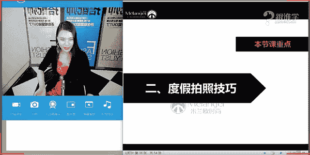
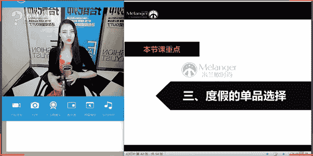
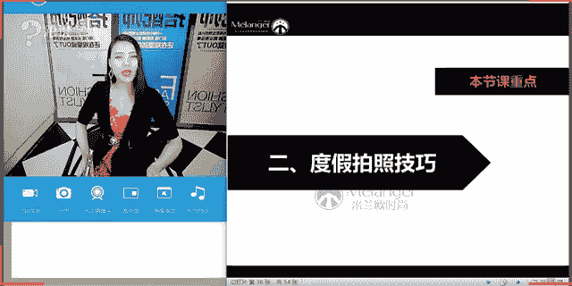

# 1、11服装《搭配秘笈之新版36计》：34海滩情侣度假

🎼そて。🎼总是在9月。🎼回忆是思念的愁。Yeah。hello，大家晚上好。😊，嗯，同学们可以听得到我的声音吗？嗯，OK好，嗯，一克同学已经跟老师回复了。嗯，谢谢同学们的回应。

那大家都可以听得到我的声音的话呢，那在表我这边网络那有问题，那呃非常抱歉，同学们老师迟到了7分钟啊，因为这个设备的一些原因啊等等。那呃还是这个迟到了一定会把这个课程的时间给大家来补事。

O嗯今天看到那个比赛直播啊呃，新会同学也看直播了是吗？是不是觉得老师在这个直播的时候呃很严厉，然后很严格，问的问题都特别的犀利。OK那我们今天下午做了这样的一个我是服装搭配师的直播啊，是看不了直播。

所以看回放是吗？好严肃啊，是的，因为今天呃我们线下的课堂开课那我要主持开学典礼，这一次呢由我来主持的开学典礼。😊，所以呢要穿的比较的这个正式一点啊，那再加上下呃下这个下午的这样的一个直播。

因为我是不伦搭配师的这样的一个直播和面试。那。所以呢也以这种场合也是需要要严肃一点的啊，好严肃的子语老师平时是不是没有见过自语老师这么严肃？平时在呃线下上课的时候，你们都觉得我看起来特轻松。

跟大家交流的时候也很很很这种呃比较这种逗逼的这种形象是什吗？但是如果你们要是来线下的时候，你们就可以感受到我的这样的一个严厉程度了啊，因为我在课堂当中是非常的严厉的。在线下的课堂当中啊，为什么呢？

因为线下的很很多学员，他跟大家现在的这样的一个目的不同。那很多线下的学员他们为了想要呃进入到这样的一个职业当中，想要在这个行业当中，呃从事这份工作。那所以我对他们的要求可能会更加严格。

那同学们呃那你们在线上学习的话，更多是想要提升自我为主，对吗？那当然也有一部分的同学可能是想要呃了解一下我们的课堂，然后呢，之后有可能会从事这个服装搭配师，所以大家的这样的一个目的，可能会不。呀嗯。

OK好呃，那这个呃简单的跟大家来介绍了一下我今天的行程的安排啊。那接下来呢呃就跟大家来分享今天晚上的这样的一个课程。那今天晚上的课程是关于我们所说的海滩度假，然后情侣穿搭秘籍啊。

那在上一堂课当中跟大家讲到了波西米亚的这个风格。那波西米亚的话，老师有海滩单身狗度假单品吗？当然有因为老师就是一个单身啊，那所以你们要知你们知道我做这两节课的时候，我心里有多纠结吗？

就是我在给大家在呃在研发我们的这样的一个课程的时候啊，然后就会阅览大量的一些关于度假的图片，然后关于这种呃这种情侣的图片，然后心里就跟插了一把刀子似的，因为觉得哎呀好苦逼呀。我在这里这个拼命的工作。

当然拼命工作也是为。😊，能够有更好的生活。那包括其实本人本身做这份工作也是有非常喜爱的工作，所以才会那么的有动力去做这件事情啊。那呃那再加上这个呃唉稍等一下，我们题目有点抖啊。那再加上呢老师又是单身。

所以呢心里唉真的是有说不出的这样的一个感受啊，然后呃但是还是很开心。因为为什么这么说呢？呃，这个做了很多度假呃，看了很多度假的这样的一些穿搭图片，然后对于我自己的这个灵感。

在我自己对于穿这个度假的这个搭配上也有很多的灵感。那下次我们去度假的时候啊，那我们都可以相约好啊，老师可能过年的时候要去度假，那我们可以相约去哪个地方去度假，那大家都可以穿的美美的去度假了。嗯，好。

老师图书可以去哪个渠渠道找啊，图片的话，因为呃我找的图片的话，其实就是浏览各大网站。😊，啊，那他的这样的一个这个图片图片的渠道没有特定的啊没有特定的OK好。嗯。

那接下来呢就跟大家来进入到我们的课堂当中啊，刚才跟大家讲到了，我们说这个波西米亚。那其实波西米亚的话呢，它也是属于度假当中的。我们说的这种着装的风格啊，这样的一种着装风格。那其实在度假当中。

它还有很多的风格。那今天呢我们也会跟大家来讲到度假，其实他还有哪些风格，哪些度假地，他其实跟服装风格也有很大的关系啊，那呃如果是这样的话，那其实我应该先问一下同学们啊，刚才我看到臭美红的这个问题。

我就在想呃咱们教室里有多少是单身的单身的情感一不是单身的情感2，那不是单身的，不管你是呃这种结了婚也好，或者说有男朋友也好啊，那呃都可以这种以情侣的这样的一个着装去这个度假啊，那如果没有结婚的话呢。

那你们也可以穿的美美的，然后去度假啊，说不定就来了一个艳遇呢，对吗？嗯。好，我看到这个有一部分同学是单身啊，尼可，然后幸运草啊，这个哦尼可同学是单身，幸运草结婚了还是这个有男朋友的这样的一个情况，是吗？

啊，那包括娃娃啊，这个安瑞嗯，那包括这个呃这个幸会夏和啊好，那我看到大家是这样的一个答案了啊，那呃不是单身的，也还有，对吧？那所以呢呃没关系，今天在课堂当中，我们有这种单身的啊。

也有这种情侣的这样的一个搭配的方法。OK好，我们继续来看嗯。😊，在今天的这节课当中呢，会给大家分享三个板块的知识啊。那第一个呢就是关于度假服装的8秘籍。那第二个啊也是我们女生非常非常感兴趣的啊。同学们。

你们看到我现在这个镜头会不会有点晃啊，因为我这个可能会动到桌子的时候会有点晃。嗯，那好，那继续啊，那关于我们所说的这个哎，稍等一下，同学我们再看一下大家的这样的一个啊屏幕。嗯。

哎，好嗯，那第二个板块就是度假拍照技巧啊。度假拍照技巧的话呢，我相信女生啊一定是免不了的。这个不管是不是度假，我们都是这个全程都在拍照啊，只要这个今天画了一个特别漂亮的妆啊。

或者今天要去哪个地方去呃吃饭啊，然后跟朋友见面聚会，都少不了拍照的这样的一个问题。那所以今天在这个度假的这样的一个板块呢，我们也有一些拍照技巧，怎么能拍一些美美的相片啊，好。

那第三个就是关于单品的这样的一个选择。OK那我们首先来看第一个板块。第一个板块呢就是关于度假服装的搭配秘籍。嗯。好，那在这个我们说首先呢呃再给大家来首先来补及一个概念，补及一个概念。什么概念呢？

就是其实我们平时生活当中中当中在着装的时候啊，呃，我们一般其实都会依照场合来着装。这个其实我在以往的课程当中也给大家讲过这样的一个概念。那我现在来考考大家，我们的场合分类当中有哪些场合呢？啊。

同学们在场合着装，我们说我们穿衣服其实首先我们要考虑，例如说我今天穿衣服，我首先考虑的是我今天要去哪里，我要去做什么事情啊，我扮演的是什么样的一个角色。那我在考虑我穿什么样的一个服装。那我们说场合的话。

它会有哪些分类呢？同学们有没有人知道的。我看到大家现在还没有打打字，那是不是因为同学们对于这个场合的概念不是特别的清晰呢？OK好，风林同学非常好啊，那呃职业社交休闲。没错啊，包括臭美红也说了啊，休闲啊。

通勤上班、宴会、晚宴，那包括和职业休闲运动，木林同学社交休闲约会职场啊，职场休闲社交啊，我看到大家的这样的一个这个答案了啊，是的，没错，大多数同学都已经回答正确了啊，那我们说到其实我们在场合分类当中呢。

分为这三个。第一个就是社交场合。那刚才有同学说到了啊，这种宴会呀，然后这种聚会呀，包括一些小型的派对啊，其实这些都是属于叫社交场合。那包括夜店夜店其实也是属于社交场合啊。

那我们有的时候去夜店其实有的人去夜店，它是带有某种运意意义的对吗？啊，或者说他带着。有目的性。那其实都是在做这样的一个社交的活动。OK好，那第二个我们来看一下，就是我们所说的职场。那在职场当中。

我们又分为了这种严肃的职场以及这种时尚的职场啊，那第三个就是我们的休闲的场合啊，那在场合分类当中，其实我们基本上就分为这三种。那比如说在这个休闲场合当中，大家都说到了啊。

日常休闲那其实休闲它包含的板块是非常的大的啊，包括的范范畴应该就非常大。那例如说我们说的约会，其实它也是属于我们的休闲当中，对不对啊？那包括我们出去这个呃这种叫什么运动啊，爬山啊，等等。

其实这些都是属于休闲的行为。也就是说我们自己可以支支自由的支配我们的这样的一个时间啊，那包括你可以不用呃可能不用太用心的去跟某些人去呃这种做一些这个沟通啊，那那这种行为。

的话其实都是属于我们叫休闲的这样的一种场合。那其实也就是说我们在着装的时候，我们需要考虑叫4W什么意思啊？我们来看一下啊，同学们，嗯那我们刚才呃那大家现在可以看到一个圈，对吗？这个圈是什么意思呢？

也就是说啊休闲的话，我们度假是不是也是属于在休闲的这样一个场合当中啊，那所以呢其实我们说度假它是属于休闲场合。那大家要对于这些场合的这样的一些分类要清洗啊，那我们说场合着装叫4W原则啊。

分别是你的身份以及出席的时间以及出席的场合地点。那包括你要去做什么事情啊，顾问where what那这个的话就是我们所说的呃，在我们着装的时候需要遵守的叫4W原则。那所以以后同学们。

你们在呃出门之前就需要考虑到这些问题啊啊，那比如说你今天即使是去社交。那你也要考虑到你去社交的这样的一个身份是什么啊？你去你去社交的这样的一个时间啊，出席的时间是什么时候？

那例如说社交他有这种日常的社交啊，下午3点钟到6点钟属于小型的这种我们着装的要求是叫小礼服。那下午6点钟之后啊，那我们这种社交就属于叫晚宴，那我们就要穿大礼服啊，所以说时间也非常的重要。

那包括你出席的场合的地点，那也包括你要去做什么事情，这都是跟我们的着装息息相关的啊，那所以同学们对于这样的一个4W原则啊，要好好的去把握OK好，那这首先呢跟大家来普及我们所说的场合的这样的一个概念。

那我们的度假啊，我们的海滩其实就是属于在休闲的这样一个场合当中。那也就是说其实我们是可以自由的去什么呢？选择我们想要穿什么样的一个服装。你只需要考虑的就是你想要表达的是什么样的一个呃你的形态，你的。

内心的我们说外在的形态表达的是你内心的这样的一个诉求。你只需要表达你的内心诉求就可以了啊。OK好，那我们来看一下。那在这样的一个板块当中呢，会跟大家来分享三点。第一个就是度假着装的纠错穿搭。

那第二个就是度假地的服装风格。那包括情侣穿搭的秘籍啊，那我们接下来看度假着装的纠错秘诀啊，纠错穿搭啊，什么意思呢？其实我们在度假的时候呃，有有很多误区可以这么说。

有的人呢他会认为呃比如说啊就只要我去度假，那我就一定是大长裙啊，我相信有很多呃这个我们的女生可能会有这样的一个概念。度假嘛啊脑子里第一反应一定是大长裙，然后在淘宝上搜索的这个呃类目啊。

有可能就这些关字关键词有可能就是呃印花长裙啊，飘逸长裙等等啊，那所以说其实我们在度假的时候，她有没有更多的选择呢。当。有啊，那这跟我们的对于自己的这种搭配上来讲的话，它其实是考验大家的这样一个水平的。

而搭我而我们所说的这种长裙的话，它就其实就特别简单啊，那你就可以直接一条长裙就可以搞定所有的一切了。那我们想要真正的丰富我们自己的这样的一个形象的话啊，那其实我们需要有更多的这样一个搭配的方法。OK好。

我们继续来看，那在度假着装当中有哪些错误啊，那第一个啊就是什么呢？呃，不管去哪永远脚蹬高跟鞋。其实是有这样的一些情况的啊，那包括老师呃，本我自己在生活当中就有见过很多。

那例如说有可能啊王老同学说我朋友就这样是吗？没错啊，就是因为大家身边其实有很多这样的一些朋友啊，可能会做这样的一些事情。为什么说这件事情会给我们带来一些困扰。

为什么叫他叫我们所说的叫错误的这样的一个穿搭，或者我们叫纠错穿搭。那是因为你会发现如果你身边有一个永远跟你出去度假的时候，穿着高跟鞋的朋友，那你就会觉得你这次度假，相对来说你有这么愉快。

为什么因为走着走着，他的脚就会痛。然后呢，你就不能尽情的去释放你心中的热情啊，想跑就跑，想跳就跳，想去哪玩就去哪玩，然后你就会要迁就你的朋友，你就会觉得啊他的脚痛，我是不是要走慢一点呢？他的脚痛。

我是不是要照顾他一下呢？甚至有很多这个男朋友啊，他会他会这个这个什么背着女朋友啊，或者是帮他拎着拎着。当然这也是男生该干的事儿啊。在我们中国人的传统上来讲，男生就应帮女生拎包拎包。但是在国外其实很少。

这样。唉OK好，嗯，那这就是我们所说的那其实我个人也也有领教过这样的一些问题啊，那所以给我的印象是非常深刻的。我记得有一次我们去爬山啊，那先不说他去哪里，其实都是属于这种叫郊游啊。

踏青啊、度假呀这样的一个性质。那其实这种度假场合的时候，我们的着装的话一定相对来说要是舒适为主，不能再为了我们所谓的这种啊要高挑啊，要显高啊等等。那其实想要美那是没有错误的。

但是我们美是不是真的要这么痛苦呢？啊，美是不是真的要这个要付出穿着高跟鞋的这样的一种代价呢？然后呃我觉得是不一定的啊，那当时其实我的印象很深刻，是为什么呢？因为我我们有一次去这个也是爬一个很高的山。

那这个山的话，爬上去将近要4个小时啊。有一个朋友就穿了高跟鞋，然后呢整个旅程我们都很痛苦，因为呃各种脚痛，然后半路的话就是有的时候就要脱了鞋子去走。但是脱了鞋子之后又会觉得因为山路嘛。

又不是特别的这个呃这个这今年又不会特别的安全。所以呢穿着鞋子走非常痛苦，让他放弃吧，她也不愿意放弃。然后就大家一行人都觉得啊整个旅程不是特别的愉快啊。OK好嗯，那这就是我们所说的第一点。

所以说呢第一个啊，那如果我们的女女性的同学在这里的话，那以后要记住啊，永远在度假的时候，不要选择高跟鞋，那高跟鞋你可以带一双啊，等一下告诉大家，为什么你要带这双高跟鞋啊。好，那我们继续来看。第二点。

户外一身冲锋衣就什么呢？不完一事大吉啊，那大家可以看到在这张屏幕当中的这个。两位明星啊，这个是金，这个叫什么都都敏俊是吧？好像是这样的啊，忘记了啊，老师就是来自星星，你来自星星的你你们的男主角啊。

其实这种度假的话，我们说这种它相对来说是比较休闲的这种度假感。但是这种冲锋衣是否适合在这种场合当中出现呢？那你会发现其实它带有野餐的性质，对吗？大家可以看到啊，或着这种地毯啊，在草坪上啊。

非常这种呃这种这种愉悦的啊非常轻松的这样的一个氛围，但是这两个情侣穿的却是冲锋衣。冲锋衣的话呢，真的不要随便穿啊，要不然的话，别人就以为你要去爬山了，因为冲锋衣的话，其实它虽然是有这样的一个功能性。

防风啊、防雨啊等等。但是在这种度假场合之下的话，我建议还是尽量选择以这种休闲舒适的这种我们所说的这种休闲装为主啊，休闲装跟运动装它有着很大的差别。同学。冲锋衣它完全是属于功能性的运动装啊。OK好。

那是的，没是的，没错啊，感觉冲锋衣就是爬雪山的时候穿的。还有一些这种比较比如说驴友啊，他们要这种长途的徒步的这样的一些旅行的时候，也需要穿冲锋衣啊，那其实都是以安全安全性为主的啊。OK好，对，是的。

旅友旅行。没错啊，枫林同学说的没错。好，那我们继续来看，那这是第二点啊，所以冲锋衣不等于休闲装啊，同学们，那我们继续来看第三点，那就是什么呢？郁域风情只知道鲜艳撞色。那我相信大家看到这张图片的时候。

有可能会有的时候就觉得哎蛮惊艳的呀，蛮好看的呀。我觉得啊那其实老师也认为这种搭配的风格肯定是有很多人喜欢的但是你会发现，只要我们一想到西藏一想到云南，好像你的脑子里的印象就是这种形象，对吗？

就是用运用这种大面积的这种鲜艳的撞色，那这种异域风情，其实我们说异域风情，它指的概念是非常大的那包括一些民族性的东西，它都会带有一些异域风情。

那不同的民族他想要表现的这种异域风情也是不一样的那例如说我们要去这种日本啊，我们要去尼泊尔，我们要去柬埔寨，我们要去越南啊。

那当然就是那包括你要去这种我们所说的更加偏远的一些地方的这种呃带有这种民族特色的这种地方的时候，其实我们的着装是可以根据当地的这样的一个有特色的着装，有特色的服装，民族服饰进行穿搭的。

是永远都是这种什么呢？呃，这种什么蓝色配红色，绿色配红色，就是我们其实中国人我们中国人是属于这种叫积极的这种审美的这种美感。我们特别喜欢大红大绿的，因为看起来心情特别舒适。但是这种大面积撞色的时候。

搭配不好。其实这这一套搭配的是属于好看的啊，那你搭配不好的时候，大家又会发现哇，看起来就像一个调色盘一样行走在这个旅途当中。OK那这就是我们所说的在度假的一些呃这个场这个我们说根据度假地。

你可以选择不同的这种异域风情的着装，而不是只是一味的进行这种鲜艳的配色。OK那我们继续来看啊，第四点，那就是什么呢？刚才我在前面跟大家提过了，我们说阳光沙滩，就等于飘逸长裙啊。

就很多人会认为啊我要去海边了，我要去沙滩上了，那我都要穿上一一条大长裙啊，那这条长裙的话呃，到底它是什么样的花色是什么样的一个图案，那包括它。是什么样的这个色彩？

其实我们在选择上的时候都会有一些讲究的啊，我为什么呢？你会发现这种呃印花长裙加上这个宽檐帽，加上太阳花已经成为海滩度假的三个就就就标识性的三点了啊，那所以如果想要穿的与众不同的时候。

你不一定要用这种搭配方法来搭啊，那等一下在家下面会给大家介绍更多的这样的一个搭配。OK那这就是我们所说的在度假当中的要需要啊，就是我们并不说一定是错误的这样的一个搭配。

但是呢其实我们希望大家能够去避免这样的一个问题啊，让自己穿的更加的有特色，然后也更加的fashionO那刚才给大家这个讲到的几点，现在同学们记得吗？第一点就是什么呢？第一点是不是高跟鞋的问题。

第二点是不是冲锋衣的问题。那第三点就是我们所说的鲜艳撞色。第四点就是飘逸长裙。OK那同学们这就是我们所说的纠侧四点，那我们继续来看啊，那第二个要跟大家分享的这样。一个板块就是什么呢？

度假地与服装风格这个非常的重要啊，同学们好好的听这个板块。那因为我们以往会认为度假嘛啊就永远就是我只要穿着休闲装，穿着运动装出去就可以了。那其实完全不是这样的一个概念，你要根据你自己去的地方。

然后来什么呢？演绎不同的服装。那例如说我在这里给大家看到一张图片啊，那你会发现哇，原来服装风格，跟这个我们所说的度假地有这么多的这样的一些分类啊，有这么多的讲究呢。那我来看一下同学们啊。

那第一个服装风格它会有什么呢？跟你的度假地相关的第一个度假地就是海岛。就是说我们不管你去哪种海岛啊，只要它是海岛的这样的一个风情。那其实海岛风情当中也有分两派。那第一个就是我们所说的唯美沙滩。

那例如说大家经常去的这种三亚呀，然后沙发呀啊，那这种都是属于这种唯美的沙滩的，就是你看到就是蓝天白云这么这样的一种感受啊，它叫唯美的这样的一个沙滩的这样的一个感觉。那你的着装是另外一种形象。

那等一下再给大家来剖析，那这种唯美沙滩，它应该怎么穿。那包括第二个呃这种悬崖礁石啊，那这个冰岛它是一个代表啊，那这种它应该怎么穿呢？O那包括民族风，大家可以看到啊。

刚才我也给大家来列举了一部分民族风有哪些，比如说尼泊尔斯里兰卡泰国日本青海湖啊，那这就是属于民族的这样的一个风格。那我们其实在着装的时候，其实都是要跟当地的一些有特色的服装去做结合。那包括复古风。

比如说台湾的。这种花莲呢啊台南呢呃清新风、北海道、欧洲乡村、冰岛呃，呼伦贝勒啊，对呼伦贝尔，那包括休闲风以及街拍风啊，那这个的话呢就不不多做介绍了啊。那我们今天呢主要给大家介绍的是这个。海岛风。

那因为呢在我们这样的一个课程当中，主要就是讲到的这种海滩的这样一个搭配。好，那我们继续来看关于海岛风的这样的一个搭配。那海岛风呢刚才跟大家来介绍了啊，呃正好下个月去台湾是吗？

那今天周美我同学老师今天不主要讲这个板块啊，我们今天主要讲的是关于海岛风。那海岛风呢它分为两个啊，第一个就叫唯美沙滩型的第二个叫悬崖礁石。那大家可以看到啊，这种唯美沙滩，它的着装的特点是什么呢？同学们。

你们能帮老师来分析一下吗。这种唯美沙滩的着它的着装的特点是什么？嗯嗯。嗯。好，同学同学们，你们可以快速来打字啊。嗯，从这个图片当中，你们能不能区分开嗯，甜美性感啊，然后呃这个轻盈柔美飘逸。

色彩偏明亮柔和，OK非常好。同学们没错啊，那说这种唯美的沙滩的这样的一个搭配的话呢，色彩基本上是可以选择这种看起来非常清新的。当然并不是一定是非常清新的。但是它们的服装风格其实是有差异化的。

大家可以来看一下啊，那第一套的话，你会感觉非常明媚的这样的一个一种感受啊，非常的柔美啊啊，然后呢这种面料它相对来说也是比较轻盈感的。总之就是用这种我所说的柔美的气质就可以去形容了形容。

而第二个这种这种我们所说的悬崖礁石的这种感觉呢。那其实呃例如说这种海边的话，它可能会给我们一种呃有一种叫什么消极的美感。就说这种消极美就。比如说你可能会感到孤独啊啊然后可能会有一种忧郁的这种心情啊。

那所以你的着装可能相对来说也是比较会暗沉下来。并且的话它会带有一点点这种抑郁的这种感觉。就是这种也会有一点也会有一点这种民族的这种感觉。那这种服装风格跟我们所说的唯美沙滩，它其实感受是不同的啊。

那这两种的这种感受是不一样的。OK好，那我们继下来看，那我们今天呢也主要给大家讲的就是关于海滩的这样的一个搭配啊，海滩的搭配OK那我们继续来看，那我想问同学们，我们如果去度假的啊，我们如何去度假的。

比如说我现在再给大家画地图。啊，木云同学等一下，我们会讲到一些男士的这种上装啊，然后以及这种下装的这种单品选择。那因为本身男士的这样一个风格就比较少。那包括情侣装营，我们给大家来展示男士的图片。OK好。

那我们继续来看，那例如说我们在这个浪漫海岛行的时候啊，比如说我们要去这种海岛了。我们去旅行的时候，那大家可以来计划一下，我们会有什么呢？第一是不是机场，对不对？我们会有去机场的这样的一个路线。

那我们去了机场之后，我们是不是到了当地啊，到了当地之后，我们会有什么呢？如果去海岛的话，我们会去做什么事情，同学们，如果你们现在设想一下，现在我们去旅游了，那我们第一个会有机场的这样一个场场合。

那第二个我们会有什么样的场合。同学们来快速啊，我们在我们再把这个场合细分。例如说我们这次去海边度假了，那我们去海边度假，它还会有很多的场合。嗯，好，尼可同学说购物啊，风林同学说酒店啊。

还有没有就是我们到了酒店之后呢，我们已经这个已经这个到酒店了之后，到酒店之后，你不需要用心的去穿着，对不对？啊，云妹妹同学说的没错，海边，我们回到酒店，我们一般就穿着睡袍就好了，对不对？

我们不需要再去哎去打扮自己了啊，那去海边是没错的。那我们除了去海边，我们会不会去游海呢？比如说啊我们去海边海滩是没错的，对不对？啊？我发现大家可能对于这个现在还没有思路。

那我来给大家来一一的来这个捋一下啊，第一，我们要去机场。第二，我们要去海滩，没错，云梅同云妹妹同学非常好啊，第三，我们要出海啊，第四，我们继续看啊，是不是要去购物啊，要去逛街。没错，潜水的话呢。

我们也有专业的装备啊，穿潜水我们只需要穿这种潜水的装备就好了。我们也不需要做凹造型啊。那所以在这里也不跟大家分享啊，坐船那坐船其实就是出海啊，会尔同学OK好，那我们讲到了逛街，那我们会不会有这种什么呢？

饭局有可能你去了这个地方，当地有朋友啊，然后你们可能要一起去这个饭局当中一起去吃饭。那包括最后我们还会有什么呢？有可能会有派对啊，派对。OK这就是为什么刚才我们讲到派对的问题。

这就为什么刚才要告诉大家说要带一双高跟鞋，那在高跟鞋呃，这个派对当中，高跟鞋就可以用到了啊，那在其他的这样的一些场合当中。我想问同学们，机场海滩出海、逛街、饭局，那包括派对哪些场合它是能够穿高跟鞋的。

哪些场合是需要穿平底鞋的？是不是1234，这个我们穿平底鞋就好了。这两个的话可以什么呢？适度，对不对？OK那根据个人的情况来看，例如说你的饭局当中可能有一些重要的朋友啊。

那包括派对当中可能你想要展示更加的展示你的这种哎这种呃窈窕的身姿啊，那你可以穿这种高跟鞋？啊这就是我们所说的海岛的这样浪漫海岛型啊，突然感觉好像这是要去旅游了，我就觉得好像自己突然化身旅行社模板了。

来给大家做这样的一个介绍了啊，为什么跟大家来详细的介绍这样的一个我们的旅行路线。那是因为我们在每一个呃这个出席的场合当中，我们都需要凹造型。那所以呢我们接下来来看，那在机场的时候，我们应该是怎么穿着了。

啊，那在机场当中，其实就机场look可。在机场当中呢，我们以舒适度为主，并且你会发现在坐飞机的时候，有的时候可能空调会有点冷啊，当然空调这个飞机上会有这种毛毯的这样一个配置啊。

但是有的人呢他会你会发现有这样一个情况，比如说北方的朋友。要来南方啊，或者说我们本身在一个比较冷的这样的一个时段，要去很炎热的这样的一个地方的时候，我们一般都会唉看一开始可能会穿很带着很厚的服装。

其实呢我们没有必要，为什么这么说呢？那我只呃告诉大家，就只需要你只要上身啊，穿着长袖，下身穿着裤子，穿裤装为主啊，尽量不要穿裙装，在这种机场的时候，尽量穿裤装为主啊，然后呢。

你只要穿一双这种舒适的运动休闲鞋就可以了。然后你可以带一个大的厚的外套，到了那边之后直接脱下来就可以了。那这个你就相对来说会比较的方便。那你会发现如果有的朋友带了这种什么呢？呃穿的很厚的话。

它就特别的不方便。那这是我们所说的机场的look克啊，我们可以以这种什么呢休闲舒适的这样的一个着装为主，一般以裤装就好了啊，带一个薄薄的针织衫也可以，那就是我们所说的机场look克。那么继续来看。

那么到海边了之后啊，那我们是不是就一般都会以这种比基尼为主。啊，男士的话就以也一般也都会以这个泳裤为主，对不对啊？OK那在这样的一个这个板块的话。

其实我们在之前度假当中也有给大家来介绍过关于比基尼的这样的一个分类，包括男士的泳裤的这样的一个分类。啊，那这是我们所说的。第二个啊到海边的这样的一个着装啊。那第三个就是出海的这样的一个着装。

那在出海的着装当中，其实我们女生的选择空间会更大。比如说我们可以选择各种什么裙装啊，大家可以看到啊非常飘逸的这种呃纱质感的啊，那包括这种T恤加牛仔，那么也包括这种什么呢衬衫长裙啊。

这种衬衫裙的这样的一些装单品的选择，它会呃很没有局限性，很相对来说选择空间很大，但是男士呢我建议呢就可以穿着这种什么呢海回海魂衫啊，那这种航海风短裤，加上这种帆船鞋就可以了啊。那在后面会给大家来展示。

那这是我们所说的出海的女生的这样的一些装备啊，那我们继续来看，那在逛街的时候，我们的这样的一个着装，它又有什么样的一个区别性呢？其实逛街的话呢，我们一般就以这种平底鞋为主啊。

然后呢着装也不能太过于暴露了啊，因为即使他有可能是这种海峡城市啊，海边城市。但是你会发现你如果要是在街上穿的很暴露，也会。有点奇怪哈，穿有点奇怪，特别呃我们中国人的话其实还是有点保守啊。

当然这种露背装其实没有太大的问题。但是如果你让你直接穿着比基尼上街的话，可能还是没有不是特别有安全感。OK那这是我们所说的逛街的这样的一个着装。逛街的话一般也是以是种舒适休闲。然后平底鞋为主啊。

千万不要穿高跟鞋，要不然就会很惨的啊。好，那我们继续来看。饭局look啊，那饭局当中呢，其实我在这里给大家做了三种方案。第一种呢就是这种拖鞋。如果呢你是这种比如说没有重要的朋友啊。

相对来说就是自己的朋友一起吃吃饭，然后聊聊天啊，感受一下当地的这样的一些美味美食。那我们就可以以这种休闲舒适的这样的一个感觉为主。短裤啊，在这种针织衫啊啊，然后拖鞋这种舒适感为主。

那第二种呢就是如果你有一些这种什么呢？相对来说可能哎有朋友啊，当地的朋友，那你可能就相对来说需要注意一下这样的一个形象，不能太过于休闲。那你可以以这种什么呢？印花长裙。

那其实这种印花长裙它是有一定的这种小小的呃这种正式感。那同时那我们也不会太过于休闲啊，不会太过于休闲。所以的话呢这种着装也非常的适合去到旅游的时候，咱们朋友去吃饭的时候，这样的一个装备。

那包括这一套服装当中，大家会发现哎好像就是。使用到高跟鞋的，对不对？那这种的话呢，我建议是什么样的一个情况下去去使用啊？

如果你当地有一些比如说呃可能会有一些生意的这样的一些这呃跟商业性质相关的一些社交啊，有一些朋友可能到了这个地方之后，会有一些社交的这样的一些行为。那包括如果你可能想要美美的去见你男朋友啊。

就是可能两个人去度假，但是还是非要要一定要注意这样的一个形象的时候，那么你也可以穿着高跟鞋。然后这种感觉包括这种印花啊，然后这种大的这种廓形的上衣，它其实舒适感也非常强烈，又有这种度假感又非常的清新。

那又非常的这个女人味十足。所以呢这种装备也非常的实用啊。OK好，那这是我们所说的饭局的look啊，那我们继续来看在派对当中，我们应该怎么去穿着。其实今年特别流行这种呃这种这个丝绸的睡裙啊。

那我们说这种丝绸睡裙的话，其实特别的轻薄。然后呢呃如果同学们你们在这样的一些这个呃度假过程当中可能要去参加一些派对，我建议今年其实就可以带一件这样的丝绸的睡裙过去就可以了啊。为什么呢？

因为这种睡裙它虽然容易皱。可是你只要准备一个小水壶，然后呢把这个丝绸一喷。然后这个这个褶皱这个皱感的话，它就会被浮平了啊，非常容易打理。那包括又非常的不占行李箱。

你会发现我们平时在这个度假的时候会考虑到的一个问题，就是啊行李箱好重啊，不想带这么多东西，尽量的去缩减自己的这样的一些带的这样的一些产单品啊，可是又会觉得啊如果带的太少的话。

没有没有很漂亮的衣服拍照怎么办？心里就会很纠结。那这样的一条睡袍裙其实就可以解决大家对于社交的这样的一个派对的这样的一个需求了啊，那这种它的感觉又非常舒适，又非常的女人，那又又有点这种小奢华的这种质感。

所以啊完全可以使用在这种。派对当中啊，那你相信也相信非常的出彩。那包括这种高跟鞋也可以在派对的这样一个look当中啊去出现了。OK这是我们所说的。

在我们整个度假当中可能会需要到了一些出席的这样的一个细节的场合当中，是不是同学们呃平时在这个度假的时候，没有做过这样的一个规划，我想看一下同学们，你们在自己出席度假在自己度假的时候，有没有想过，哎。

我好像要出席这么多的这样一些场合。我好像要准备这么多这样的一些单品，有没有这样的同学们吗？有有没有这样的同学，如果有的话，请打一没有的话，请打2，OK好，A尔同学说有想过啊。

那你可包括永雄同学就就就是完全没有想过是吗？嗯，OK好。没有想过是吗？没有想过的话呢，那以后我们在出席的在在特别是跟男朋友去度假的时候，就应该有这样的一个概念了啊。OK好。

那同学们那在这里呢详细以后会想是吗？嗯，O好的啊，那在这里呢给大家来呃普及了。可以说啊，这是一个普及的概念。那在这里给大家普及了这样的一关于我们说度假当中，他也会有很多细节的这样一个场合。

那我们应该怎么去着装，应该怎么能够更加舒适，怎么能够更加的fashion啊，怎么能够更加的出彩。那这就是我们在着装当中需要去注意的问题。好的，嗯，那我们继续来看我们这样的一个课程。😊，情侣装穿搭秘籍啊。

那今天呢我们的主题本来就是关于海滩啊，然后度假的时候，情侣应该怎么去穿着。那其实呢我们说情侣穿搭的话，在我们国内现在基本上都是一种呃有有可能啊现在我相信还是有一部分这样的情侣在是这样的一个着装的现象啊。

可以给大家来看一下。那例如说啊我只要我我搜到的图片，就是我我搜的关键词就是这个呃度假海滩情侣。那出来一些图片基本上都是这样的一个图片。那我相信如果卖家他他在视觉营销的时候。

他做的就是这样的一个图片的视觉效果。那大部分的同学们，你们可能买的单品。因为你们可能不会自己去思考，哎，我要怎么去跟我的男朋友或者跟我的女朋友，特别是男生压根就不会想这件事儿啊，那可能女生还会想一下啊。

我们要穿一下情侣装嘛，对不对啊？那我们穿情侣装是不是要怎么去搭配一下呢？那如果唉可能在购买的时候，网上就已经给你配好了，那你就。

可能就直接买这样的一模一样的回去就穿了。那我想说这种一模一样的款式，它其实是完全凸显不了我们的这样的一个品味啊，以及我们的时尚感的那你会发现，其实在我们国内的话。

因为我们大家的搭配水平可能相对来说较弱啊，那我们的这样的一个搭配的选择性上来也比较少。那我来给大家分享一张国外的这样的一个搭配组图片啊。OK好，那我们继续来看啊如何将品味与感情二者兼得。那看到这张图片。

呃，这张图片是我特别喜欢的啊。那因为看到这张图片的感整个人啊特别的舒适感，就会觉得啊也想象一下自己躺在这个这个这个沙滩椅当中嗯，O好，那我们继续来看。

那给大刚才讲到的说给大家分享的这样的一个关于国外他们这样的一个搭配OK好，那同学们呃那在四个人的这样的一个搭配当中，你会发现这是一个什么样的场合。同学们是不是在度假啊。

是不是在这种这种例如说海滩的这样的一个这个呃场景当中啊，那你会发现在这样的一个场景当中，其实他们是不是这种情侣装的穿法。同学们啊，那并且呢他们都是属于情侣，而且还是属于朋友的关系。

那他们四个人的搭配其实都是有相关性的啊，就这里都不是说两个人的事儿了，这是四个人的事儿了啊，你会发现我们在搭配的时候，我们就选。啊一模一样的衣服就解决了所有的问题。

但是其实搭配它不是这么单一的它其实有很多的关系，例如说形色。啊，那在这个地方材质的话，它不会特别的这个我们所说的去要求。但是形以及色彩形式指什么呢？就是我们所说的款式。这里的款式它是非常的元化的。

而色彩它也不是特别的单一的那你会发现在这当中，他出现了什么色彩，是不是以这种我们所说的粉红色和蓝色为主色调。那包括这种什么呢？呃，我们所说的米色啊，白色接近于白色和米色的这样的一个色调为这种点缀啊。

那你会发现这一位和这位啊应该是一个情侣关系啊，他们两个人做到了什么呢？色彩上的一些呼应。那同时他们四个人虽然全都是穿的度假的服装，但是你会发现度假的服装，原来啊原来有这么多的选择性。

男生他并不是只有T恤可以选择，男生也可以穿polo衫，男生并不是只有花裤衩，就是我们所说的印花裤衩的选择，他其实也可以穿这种。百慕大的这种大短裤，那包括这种什么呢？这种三分短裤。

那这都是我们所说的男生他可以去选择的一些单品啊，并不是说一定是只能选择这种背心啊，然后还有这种花裤衩。那女士的话并不是只有比基尼啊，大家可以看到比基尼的话虽然都是相都是比基尼的款式，但是它会有所不同。

比如说它的上装当中加了一个背心的款式。啊，那他的整套呢就是比基尼的款式。那他们既做到了色彩的呼应，蓝色跟蓝色呼应，然后米色跟他身上的米色白色的这样的一个感觉去呼应。那你会发现这对情侣就是粉色粉色呼应。

对不对？那他的裤子跟他的服装跟他的上衣又做了这样的一个呼应。所以你会发现啊，原来在搭配当中，他其实可以做到这么多的丰富化。而且你会发现国外他们的搭配的话，会想到很多的问题。

那所以同学们学习了这样的一个啊，今天跟大家分享的这样一个知识点之后，你们以后希望对于你们以后在于搭配上会有更多上的这个思路上的这样的一些拓展啊，OK好。

那所以说其实我们在搭配的时候要考虑到我们所说的叫多元化的单品的选择啊，那并不要不要穿一模一样的款式，穿一模一样的款式，真的会给人家感觉有点low啊。

那有的人甚至会在这个服装上面文字说明老公啊老婆然后两个人穿的情侣装。那这就有点尴尬了，我觉得啊OK好，那我们继续来看那。😊，那接下面呢就给大家来讲到具体的应该怎么去做这样的情侣装的这样的一个搭配啊。

那第一点叫法则一色彩呼应啊，那色彩呼应大家可以看到，在这两张图片当中，他们的色彩呼应是怎么呼应的呢？同学们好，霍尔同学说穿成旅行团了。那我觉得这个可以这个呃两对情侣的时候完全可以这样穿，没有什么问题啊。

那如果一对情侣也可这个一对情侣自己的话，你我们也可以是不是不是可以考虑这样一个配色关系啊，是不是不用穿一模一样的服装OK好，我看到大家的这个答案了。说粉色玫红色都没错，是的，那你会发现什么呢？

这位的呃明星啊，他的这个他的这个呃比基尼的玫红色跟什么呢？这一位大家认识吗？啊。这个这位歌手大家认识吗？嗯。OK是的，没错啊，加丝丁啊，那这是我们所说的这样的一个他的比基尼的色彩。

跟他的服装的短裤的色彩去呼应了啊，那这就是我们所说的色彩呼应啊，色彩呼应。那当然他们两人现在已经分手了？老师是不是说到这个，是不是有点尴尬了啊，说啊老师你现在在讲的情侣装，怎么说到他们俩分手了啊。

的确他们俩现在已经分手了。但是呢我还是希望把这个图片拿出来给大家来分享一下啊，那第一点叫色彩呼应。那我们继续来看，也就是说其实你可以选择什么呢？

你可以选择你男朋友身上的某这个单品上的一些色彩去作为你的比基尼的色彩啊，那其实他们一定是有用心去搭配过的同学们啊，你们不用考虑这个问题，说有可能是巧合吧，绝对不是巧合。

他们一定是有用心搭配过的那我们继续来看啊，第二套，那这两个的这样的一个色彩是不是也有呼应呢？那同学们可能会说哎老师我觉得他们的色彩呼应。不是特别明显。

那其实你会发现它的蓝色是不是它的它的整身都是在用蓝色调，而它的服装当中也是不是有这种蓝绿的这种色彩的感觉啊，那包括其实他们两个人身上的色彩还会有一种叫冷色调的感觉。冷色调啊，同色系没错是的。

他们两个人色彩的话还有一种叫冷色调。玫红色和蓝色都是属于叫冷色调这样的一个搭配，所以他们也是非常的协调的。OK那我们继续来看。那这两个更是用心去搭配了啊，同学们虽然这两位颜值啊看不太出来啊。

但是你会发现他们两人的色彩搭配的非常的巧妙。像这个男士的上装跟下装完全都是什么呢？蓝色跟橙色的呼应啊，那你会发现他跟旁边的这位女士，他们的着装也是什么呢？蓝色和橙色的这样的一个呼应。

两个人的色彩完全呼应了啊。所以说你会发现，但是他的款他们的款式不一样。那他们在做的就是色彩的呼应啊，所以说情侣装在穿着的时候，我们可以做色彩呼应。O那么继续来看啊。

那呃如果我们在这种并不是在海滩的时候啊，可能去逛街是不是我们在度假的逛街当中，男生跟女生就可以这样去穿着呢，男生就可以穿着这种休闲的T恤牛仔，然后呢橙色的墨镜啊，你会发现他自己本身就已经在做配色关系。

橙色的墨镜跟他自己的服装做呼应。另外呢女生的话呢以。这种橙色的耳环跟男生来做这样的一个点缀的呼应就可以了啊，不需要我们所说的大面积的呼应，你只需要一点点小心机啊就可以了。那这就是我们所说的情侣装啊。

既让别人能看出来你们两人是情侣。但是又不是那么刻意的这种感觉。OK好，那这是我们所说的第一点，情侣穿搭密籍当中的色彩呼应。那么继续来看。第二点，那刚才讲到的色彩呼应呢。

那他们其实属于这种就是意思就是说你中有我我中有你就一定会有某一个点啊，色彩上某一个这样的一个相互的整合和呼应。而第二点叫色彩对比，色彩对比什么意思呢？嗯。慧雅同学说啊包包跟裤子呼应哈，没错，是的啊。

刚才那套是的没错，那我继续来看啊，那在这一套服装当中，你会发现啊这个我就是我经常给跟大家分享的这个美国的名媛奥利维亚啊，那奥利维亚跟她男朋友这位男模。其实奥利维亚本人自己其实是比较低调的。

他很少在自己的这样的一个微这个公众的这这些这种账号上去剖她跟她男朋友的相片啊，都是她男朋友自己秀恩爱，就是经常会发两个人的这种恩爱照出来啊，你会发现他们两个人的这样的一个着装是什么呢？

蓝色跟黄色这样的一个是的，没错，对比的这样的一个搭配啊，那宇和同学讲到的非常好啊，蓝色跟什么蓝色跟黄色的这样的一个对比撞色，白色跟白色要去呼应啊，那所以说这个搭配也非常的妙啊。

那这就是我们所说的色彩他不一定是要应，就非要是呼应的啊，你们也可以做对比啊。例如说是不是还有什么还有什么色彩是对比的，同学们。除了蓝色跟黄色是对比的，还有没有？比如说紫色跟什么颜色是对比的。

跟黄色是不是也对比的啊，红色跟绿色也是对比的。没错，蓝色跟橙色是不是也是对比的？嗯，OK好，所以这都是我们所说的叫对比色的这样的一个关系。那这种对比色的搭配的话。

它其实给我们的感觉会视觉上会更加的丰富啊，视觉的这种感受会更加的丰富。紫色跟黄色紫色跟黄色它也是对比的。紫色跟红色它们不属于对比，它们属于相相邻色啊，OK好，那这是我们所说的法则二，色彩对比啊，好。

那法则三图案呼应啊，那大家看到了这个左手边的这个依然是两个人秀恩爱的这两位啊，那这两位你会发现他们的这样的一个图案的呼应是叫什么意思呢？啊，有同学说老师他们两人图案好像不一样啊，怎么能叫图案呼应。

他们两人的图案虽然不一样，一个是条纹，一个是格子，但是他们属于叫同类图案的呼应法则。那同类图案什么意思呢？就是指几何类的，或者是说我们所说的这种自然类的嗯。没错啊。

这一组都是属于几何类的那是不是还有这种我们所说的叫自然类的这种图案呼应。那例如说哎你穿的是花纹，那我穿的这种全是叶子的这种搭配可不可以呢？当然可以啊，那这是我们所说的图案呼应。

那包括这两位情侣是不是也是选择了相同的这样的一个搭配的方法。格子跟条纹的这样的一个搭配O好，那我们继续来看啊，这个讲到的是条纹跟几何啊，跟啊条纹啊，就我们所说的图案的这样的一个呼应。那图案呼应当中。

其实有这种几何图案也有这种自然类的图案。那在这两套当中大家可以看到啊，那我们说男士的都是什么呢？这种条纹衫，然后百分大短裤啊，然后这种帆船鞋。那女士也可以是这种相同的这样的一个感觉的搭配。

那其实这两套的话，它其实属于叫航海风。那比如说出海的时候，那你们完全就可以以这样的一个方法去搭配啊，这既是既是情侣装又。符合了我们所说的场景的这样的一个需求啊，OK好，那包括印花。

那刚才这种印花的话它是不是就叫自然类图案的呼应呢？虽然花纹不是一模一样，但是它们都是属于叫花纹，所以呢也可以去搭配啊，也可以去呼应。OK好，那这是我们所说的叫图案的呼应的法则。那我们继续来看同一风格。

什么意思呢？你会发现这一套是什么风格？同学们还记得吗？我之前跟大家分享过这一套叫什么风格呢？我们之前有讲过的啊，看同学们能不能看得出来。好的，嗯，给你们补鼓掌非常好啊。

同学们看来真的每次我我这个一看到这个你们回答正确的时候，我都很都很开心。😊，啊，这个木毅同学说帽子跟牛仔没错，是的，是属于叫西部牛仔风啊，你会发现他们俩人是不是同一风格，虽然不是一样的单品。

但是完全都是在演绎同一种风格，所以也是情侣的感觉，对不对？那包括这个是什么样的感觉呢？是不是带有这种我们所说的波西米亚的异域风情的这样的一感觉呢？啊，那包括其实我们可以叫它叫民族风的这样的一个感觉啊？

那包括我们所说的这一套什么感觉？这一套服装是什么搭配？同学们。这套有没有人能够这个说出来他是什么搭配呢？有同学木鱼同学说那个男的唇膏涂的好吓人啊，有可能是他们P图P的有点过火啊。好嗯。

尼可同学这个答案有点可爱，说海盗吧啊，海盗穿成这个样子也不像海盗海盗一般他们会戴一个海盗的帽子，在再把什么头发全都以那种小便的方式啊，那其实这个是西皮风。没错啊，没错，你会发现他的这种西皮风来自于哪里。

这种感觉来自于哪里？😊，是不是绑带，包括这个羽毛的项链的装饰，包括这个男士手上，还有什么呢？珠穿的这样的一个佩戴。没错，是的啊，非常好。同学们，嗯，那这就是我们所说的同一风格啊，同一风格。

所以你会发现啊，原来情侣装不是一定非要穿的一模一样。我现在在给大家看一下我们这个传统的这样的一个搭配的方法啊？同学们再来看一下这样的一模一样的款式的搭配，你是不是觉得很无趣，对不对？啊？

那所以说其实我们想要把这样的一个搭配啊，想要把它搭配好，它是其实我们说我一直在跟大家讲到一个概念搭配，它其实是可以通过学习啊，通过科学的方法能够掌握的，而不是凭感觉去搭配的那现在大家有没有感觉到，哎。

自己好像已经变得有点小专业了啊，我也可以把这个情侣装穿的这个可以多元化视觉也可以丰富化了啊，你们可以选择同一色彩啊，也可以选择。对比色彩也可以选择这种什么呢？同一风格。那包括图案上的呼应啊。

OK风林同学说紫色这套忠贞新丑，但是我看到人家的销量还是不错的好，那说明现在中国还有很多人在这样穿着情侣装。啊，好，那我们继续来看啊。

那就是呃那就是这个那接下来呢啊以上呢是给大家分享到关于情侣装的这样的一个搭配的秘籍啊，那呃这个法则一色彩呼应，法则二色彩对比法则3图案呼应法则四同一风格啊，现在穿衣服以后可以啊，现在新会同学说。

现在穿衣服可以依据专业知识来搭配的。没错啊，棒棒哒。嗯好，给老师手动点赞啊，好，那刚才呢给大家分享到的就是关于那再回到我们的这个课程之前，大家现在记不记得我们刚才讲到的度假地与服装风格的分类。

其实刚才我们一直在给大家讲到的是海岛风。那我在这里呢再给大家来普及一个叫民族风的这样的一个概念。但是民族风。那我们只是给大家举个例子啊，那告诉大家啊，什么是这样的。

就是你们可以根据什么各个场这个呃这个地域的这样的一个问题啊来做这样的一个搭配。那在这里呢给大家展示了两个地方，一个就是日本，那一个是斯里兰卡。那我们到日本的话，大家会发现啊，到日本的时候。

你会不可能再穿着这种民族的这种波西米亚的这种感觉了，对不对？啊？那其实我们就可以穿当地的这样的一个和服的这样的一个感觉。比如说你去看樱花的时候，穿成这样是不是非常的美啊？那包括。

我们在这里不讲政治问题啊，同学们有同学可能心里有抗日情节，说老师我不要去日本，我也不要穿和服啊。那我们在这里讲的只是一种时尚啊，只是一种穿衣的方法。那我们在这里不讲政治。嗯。

那包括其实老师也认为日本的时尚的这样的一个趋势是不可小窥的啊，其实我们是需要向人家日本人学习，他们的这样一些时尚和流行的，可以借鉴他们这样的一些某些东西，但是不能完全的套用。

因为我们亚洲人的思想是相对来比较保守的。我们接受能够接受韩风，但是日风相对来说有点夸张啊，你会发现他们这种化黑黑的眼线红这种紫红的嘴唇，非常这种暗黑的这种感觉，非常这种呃有点这种小小什么呢，怎么说呢？

呃，消极的那种感觉啊，叫消极美OK好，那我们继续来看，那刚才讲到的是日本。那么再来看斯里兰卡。那你会发现每一个地方是不是有当地的特色的服装，比如说泰国也有，对不对？那我到了泰国之后，是不是。

会穿泰国当地的这样的一些有特色的服装。那么斯里兰卡大家现在看到的这个。叫什么呢？莎莉，那这种女这种传统的服装不管是女士也有啊，男士也有，我特意找了这个男士的图片出来。那男男同学们你们可以到了当地之后。

不一定要穿的这么全套。我认为啊，但是我觉得他们的服上衣非常的好看。上衣非常的好看。我觉得男同学都可以买一件这样的上衣回来做这样的一个守信，以后的话自己都可以这个偶尔拿出来哎欣赏一下，也是一种这个回忆。

我觉得非常的好啊。那包括女士我们买一件这样的一个服装回来也会非常的有感觉啊。你在当地穿着的时候去呃，这个在当地有这个旅游的时候啊，我觉得还是非常好的。嗯，O好。

风林同学说去青海甘肃怎么搭才和当地的元素融合啊。中国风个人hold不住。那其实其实去青海和甘肃的话呢，还真的是穿的要比较有这种嗯中国的这种浓郁感。但是我想告诉你的是风林同学中国风他也有分。很多种。

比如说中国风它有这种大面积的撞色，也有这种纯棉麻的，也有这种我们所说的这种什么呃嗯中国禅的这种感觉。所以它又是一个大的概念啊。我们今天在这里不讲这个问题。好。

那我们继续来看木依同学说青色和这种绛红色是他们民族经常用的颜色吗？啊，不一定是啊，这只是个暗而已，个案而已。那其实他们还有很多的颜色，比如说蓝色呀、玫红色呀等等。嗯，OK好，那我们继续来看。

那这个是关于日本和斯里兰卡，我在这里给大家普及的这样的一个概念。也就是说我们其实如果同学们你们对于这个是比较感兴趣的。你们可以比如说啊有同学要去这个呃某一个地区了。

那你们可以先上网去查一下当地的民族特色的服装是什么，对不对啊？然后呢可以大概的做这样的一个简单的了解那你们到了那儿之后就可以不要呃就可以做一下攻略啊，不要到那什么都不懂啊，也不知道该怎么穿。

也不知道怎怎么去搭配。那其实你可以可以在去之前就想想啊，你的造型应该怎么去做啊，还可以买一些配饰，对不对？比如说女生你会发现他们头上都带都会带很多漂亮的配饰，是不是OK好，那这是关于民族风。

那到这里呢就给大家讲到的就是我们所说的服装的风格与度假地，它其实有很大的这样的一个关联性的那除了刚才我们给大家讲到的海岛风。那包括民族风。那包括大家可以看到，其实还有很多的风格啊。因为时间的关系。

同学们啊是不能一一的跟大家。来讲解啊，那今天呢就到这里啊，有机会的话再给大家来做这样更多的这样一个分享。OK好，那我们继续来看。那呃刚才以上呢都跟大家讲到的就是关于搭配的这样一个秘籍啊。

在度假当中我们需要搭配的这样的一个秘籍。那我们搭配当中它会涉及到第一我们所说度假地与我们的服装风格的这样一个搭配。那包括我们所说的情侣之间，他应该怎么搭配。

那给大家讲到的主要这次讲到的就是关于海边的海滩的这样的一个搭配。那以及我们去各种啊度假海滩的时候可能会涉及到啊并不是一定要去海边才会涉及到的各种场合场合场合。比如说机场啊吃范啊，然后逛街啊。

而是这是属于我们所说的所有度假，他必定要经过的这样的一些，他必一定会有了这样的一些场合的设计。所以同学们以后在度假的时候都要有这样的一个概念。OK好，那接下来呢我们来看度假拍照的技巧啊，度假拍照技巧。

我相信女同学非常的感兴趣。不知道我们的男同学啊，对感不感兴趣。但是我相信女女生一定会非常感兴趣。感兴趣。什么呢？怎么才能拍出好看的相片。OK好，我们来看一下啊。第一就是什么呢？你一定要有道具。

这个道具就是什么呢？墨镜啊，那大家可以看到啊，第一个叫什么呢？戴上墨镜，不看镜头。那其实还有一个就是我们第一个，例如说你们要去拍照的时候，第一个pos叫看镜头。但是你看镜头的时候。

你们的眼神一定要有情绪，而不是直直耿更的就盯着镜头，我看起来傻傻呆呆的啊，你们眼眼中要有情绪的，你可以表示一下，你是想要表现什么呢？性感啊，妩媚呀，还是清新啊，你的眼神传递的这种感觉也是不一样的。

大家可以自己好好练习一下啊，自己对着镜子练习一下，我想表现清新的时候应该是什么样的眼神啊，想表现这种妩媚的时候应该是什么眼神。那我们男同学你们可以自己练习一下，你们想表现什么啊？

男同学我不知道想表现什么？男同学想表现的是我很man啊，我很帅还是什么啊，那那男同学也男同学可以发言。😊。

老师不太了解男同学到底想表现什么。嗯，OK好，那这是第一个。那其实我们第二个的话应该是什么呢？我们看完镜头了，是不是就该不看镜头了啊？不看镜头的时候，你就可以戴上墨镜，不看镜头。那你不看镜。

不看镜头的时候，其实你们不一定啊，非要说我一定是侧面的，你也可以是低头的，也可以是抬头的啊，总之你可以多角度的去展示你的这样的一个呃这个面部的这样的一个角度的美感。OK好，钟永钟永雄同学说。

想表现酷O好，那比如说这一位男士是不是就在表现酷的这种感觉啊，景色都差不多，没什么情绪啊，景色差不多，没什么情绪。那你总要看女朋友的时候，应该有点情绪吧啊，那你下次在盯着镜头的时候。

你就会想嗯呃对着你女朋友想要表达什么的时候，你就可以看着镜头啊，来表达一下。OK好，这个就不多说了啊。好，那我们继续来看啊。😊，那刚才讲到的是戴上墨镜，不看镜头。但是这个时候呢，你其实可以做多角度的。

可以低头可以抬头，可以侧脸啊等等。好，那我们继续来看啊。那美美的照片就出来了啊。第二就是什么呢？只拍背影留下遐想感，什么意思呢？呃你会发现有的时候往往呃你总是这个直愣愣的看着镜头的时候。

然后你整个人站在井里面的时候，好像并没有那种我们所说的让人看着很惊艳的感觉。而这种我们说只留下背影，然后呢，我们总说什么呢？得不到的，是不是才是最好的，或者是说呃这种遐想感是你对他的这种幻想也好。

好奇也好，那你总会觉得啊我好想看下的正面到底是什么样的，或者你走在街上的时候，你会发现有的人是这样的。比如说你看到前面有位身材非常姣好的女朋女女性，不管是男生还是女生，你只要看到前面有美女啊。

我们女生也会心里会想啊好想看一下的正面，到底到底长得好不好看。😊，对不对？那其实拍照也是这个样子的，我们可以只留下背影啊，留下遐想感觉OK好，那这是我们所说。那希望看到正面的时候不要太吓人啊。好。

那这是我们所说的拍背影，那拍背影的时候，其实你可以在背影做一些造型，对不对？例如说啊这种什么呢？跑步，然后甩发的这样的一个动作，包括你可以戴一顶特别有特色的这种帽子，然后穿着大背的啊大露背。

这张到照片我个人非常的喜欢，是不是觉得很美呢？啊，那包括这种有点一定要有亮点啊，不要光秃秃的给别人也没什么好看呢？啊，头发也没洗，看起来油乎乎的，然后衣服也没什么亮点。

你会发现这张的亮点其实是它什么包包，对不对啊，OK好，会有同学说转过来是如花，那可说不好啊，真有可能是这样的啊，那么继续来看啊，这个是只拍背影留下遐想感。那第三个是什么呢？留下你的啊留意你的脚下。😊。

也许也很美。那比如说啊我们在拍照的时候，有很多人呢他会拍一些什么呢？周围的风景，那这种周围的风景你可以通过比如说地下的这种风景，你就可以留下自己的脚印啊。

然后呢用你的这个啊你的人啊依然跟这个景是做融合的，但是你会发现这这种角度是不是也特别有有特别的这种美感。例如说你会发现我我认为这个感觉，我个人是比较喜欢的。为什么呢？

因为这种绿色跟黄色的配色的关系是非常的美的啊，非常美。O好，那这是我们所说的拍照的第三点啊，好，不要总拍自己，对不对？你会发现，因为总拍自己的话，你的照片会太太过于单一，没有什么丰富的感觉啊。

当你从一个这个我们所说的旅行地回来之后，发现啊满镜头都是自己的大头照的时候，你会有点后悔啊，为什么没有多拍一点景色，或者没有为什么没有拍一点好看的相片啊，OK好，那老师在这。

其实简单的跟大家做做一些这种拍照的小技巧的分享。那更多专业的当然是有如果有这种摄影的技巧会更好啊。如果你不会可以带上你的男朋友帮你拍照，当然这个男朋友是学过拍照的。如果她没有学过拍照，真的不要找她拍照。

为什么男朋友或者说直男的审美的眼光真的很可怕。有的时候他们拍下来的照片永远都抓不到你最美好的样子，有可能就是永远你是在翻白眼，或者说你是演斜嘴歪的那种相片OK好，那我们继续来看啊。

那其实在拍照这件事情上，你可以找你的闺蜜啊，那女朋友拍照的话，其实还是有技巧的。因为天天自拍，对不对？总有点经验了啊？OK好，那我们继续来看，那除了跟我们所说的男朋友出去度假。

我们是不是经常也会跟自己的好朋友去度假，跟自己的闺蜜去度假，那所以也可以留下一些美好的回忆，例如说这种什么呢？啊，这种冲浪的这种感觉。那包括这种啊有点小童趣的感觉啊，那包括这种。非常性感的背影啊。

那穿着性感的比基尼，然后留下自己的背影。那我觉得也是非常有意思的一件事情。OK那这是关于拍照的一些角度的取景啊，一些小的技巧啊，跟大家来分享的啊，那呃希望能够呃对家在对大家有所帮助啊。

同学们你们喜欢这样的课吗？我想问就是呃跟虽然跟服装没有太大的关系。但是我觉得也是我们在呃生活当中，其实会经常用到的啊，OK好，那我们继续来看啊，那善用你手里的美食。也就是说我们经常去度假的时候。

是不是经常会涉及到我们要吃一些好吃的啊，比如说我们在国内的时候，其实现在大家好像这种呃现象也比较少了。一开始你会发现微信刚出这个朋友圈的时候，刚出视频的时候，我跟朋友吃吃饭的时候，我就我就觉得很累。

因为永远都是要等着他们拿手机来消完这消完毒之后才能开始动筷子，你每次想动筷子的时候，就说等一下。等菜上齐了，我们再拍一张照片，拍完照片才可以吃啊，会觉得有点累。但是在这个度假旅行的时候。

我觉得还是可以做这件事情的啊。就是因为在你会发现国外或者是说一些度假的地方，它又会有一些有特色的这种美食，我们还是可以拍下来的啊。OK好的嗯。😊，善用你手里的美食，比如说冰淇淋。

比如说这种可呃这种这种饮料啊那等等。其实还是呃还有其他的选择哈，当然还有其他选择，并不是只有冰淇淋啊，那也可以拍一些，比如说好看的一些我认为善用你手中的美食，它只是一个概念。

你可以把任何东西当成是你手中的这样的一个道具，例如说啊比如说老师给你举个例子啊，比如说你可以拿一下你手中的这个杯子啊，然后做一个特写，或者说拿一朵花，然后不拍你本人也是只拍花和你的手。

然后和当地的一些美景，或者是你认为这件东西它是一个艺术品艺术品，总之它是带来美感的这样的一件单品。那么就可以拍下来啊，不一定非常是这种美食类的东西。OK好。

那这是我们所说的关于呃善用善用你手中的这个道具的这样的一个拍照的技巧。OK那以上呢给大家介绍到了几个这个拍。照的这样的一个小技巧啊，不管是从我们所说的个人的这样的一个取景的角度。

还是跟你身边的朋友合照的这样的一些角度，还是利用你身边的这样的一些道具。这样有这种角度能希望能够带来呃给大家带来这样一点这种思维上的一些拓展。那以后你们去呃这个刚才是哪位同学说要去台湾去旅行的啊。

那希望到时候你可以多拍一些美照在群里跟大家来分享一下啊。好，臭美猴同学说姐姐呃我我姐说她带她弟弟去旅行唯一的原因，就是拍照构图还不错。那我能说这个姐姐也真是够了啊，就是呃好吧，那我觉得我拍照技术也不错。

下次你姐姐旅行的时候可以带上我啊，省了机票钱，然后又可以去这个各种各种这个度假也是非常高兴的一件事情啊。嗯，嗯O你可同学说我拍的也不错。好，那以后我们都找臭美猴同学啊，就是说我要去旅行了，你姐姐现在。

缺拍照的人吗？好，那我们继续来看OK好，那第三个就是关于度假单品的选择啊，度假单品的选择。好，那我那这样吧，同学们既然都说啊带上我，我可以提醒你。那以后我们这个现在我们教室里有32个同学，33个同学啊。

我看刚刚进来了一位同学，不知道这位同学是谁。那以后我们可以来一个我们线上学员的旅行团旅行团由我们米兰欧来这个举办。就是说哎我们可以是这个不管是线下还是线上，我们可以来一个旅行的这样的一个场合啊。

OK好嗯。😊，思雨同学说我刚到家是吗？好的啊，那思雨同学上次这个这个在直播课上的时候，就说跟朋友去吃饭，这次又去干什么了？啊，是不是跟这个男朋友约会去了？我们今天讲到的是情侣的穿搭技巧啊。OK好。

那我们继续来看啊，度假的单品选择，那度假单品的话呢，除了之前其实老师给大家讲过的一些波西米亚的风格当中，那其实我们还有很多的单品去选择。那我们来看一下。嗯，好。

那从我们今天呢给大家以这种不以风格的这样一个角度来讲，我们以这种我们所说的上装下装以及单品的这样一个角度上来讲。好，那么继续来看，那在上装的话，其实我们去度假啊，那你可以选择的单品有哪些？

例如说条纹衫啊，比如说我们要去这个度假的时候，一定就特别是海边一定要在条纹衫。为什么呢？蓝天白云配上条纹衫是非常非常美好的一件事情啊O。😊，那如果你可以再戴一个白色的大眼帽嗯。

也会呃这种穿上白色的阔腿裤啊，一定会非常的漂亮。那你的这个我还建议条纹衫选择短一点的，不要选择这么长的。你这么长的话呢，可能呃没有呃没有这个太性感的元素。我们说去海边可以性感一点。白色的条呃。

我们就呃蓝白相间的条纹衫，配上白色的阔腿裤，带上一顶大檐帽，非常漂亮啊，非常漂亮。OK好，那我们继续来看一字肩的上装。那一字肩的上装呢，你可以选择的可能性会更多。比如说这种带有荷叶边的啊。

或者说带有这种V的这种，比如说它是这种纵向的这种V领的啊。只要它是呃小露相间的款式就可以了啊。要记住我们去度假的时候，就不要那么保守，就是要穿你平时不敢穿的衣服，那才叫度假好吗？因为你会发现度假的时候。

我们的心情是比较这种愉悦的，然后也是比较的这种放松的，所以呢我们要。穿一些平时这种没有穿过的，也不敢穿的一些单品啊。OK好嗯。这个一字肩不好穿内衣啊。

那你去度假的时候就不用考虑去海边的时候就可以比较少去考虑这个问题了啊，就带这种隐形隐形的bra就好了啊。OK好嗯，那我们继续来看。嗯，好，那第三个就是背心。如果你不想选择一字肩的话。

其实可以选择背心的款式啊，背心款式，当然背心款式的话可以更加多元化。比如说那种什么呢？呃胸衣的那种感觉的款式，今年非常的流行啊，那包括你会发现这种印花的这种下装搭配是不是非常的有这种度假感呢？嗯，好。

那这是我们所说的女生的上装的选择。那男生的上装我们来看一下啊，男生的上装其实相对来说选择性较少。你会发现我们女生可以穿背心啊啊，然后什么各种吊带背心啊，各种这种一字肩荷叶边，然后各种这种什么T恤等等。

啊，男生的话相对来说真的是很少啊。男生的话其实。呃，有这种我们所说的衬衫啊，这种衬衫你可以选择这种棉麻感的那包括这种牛仔类的啊，那包括T恤啊，那也包括polo衫。polo衫当然可以穿出时尚感啊。

那polo衫也依然会什么呢？它不一定是非常老气的感觉。你在搭配上要做一些选择。例如说啊这一件polo衫搭配这个颜色的裤子，它肯定会老气。但是如果你用这个蓝色的跑呃，这个polo衫搭配这种白色的短裤。

那它一定会非常的年轻。而且你底下穿一双这种什么呢？豆豆鞋，那一定非常的年轻化的啊，一定是没有问题的。OK好，那就是我们所说的男生的单品的选择。那我还建议男生可以一定要选择这种棉麻质感的服装。

当然可以穿出时尚感。嗯，好，我们继续来看那女生的夏装上的选择，依然是比男生要多啊。那我们来看一下，那比如说牛仔短裤啊，比如说阔腿裤，那比如说半身裙啊，那这种半身裙的话是这种飘逸的这种半身裙为主。

并且其实还有这种裤子叫灯笼裤，这种灯笼裤的话，其实就是我之我记得之前是有哪位同学给我发过啊，就是那条灯笼裤是牛仔的灯笼裤。但是我建议。如果是去海边度假的话，就不要选择牛仔的，质地太厚，不太舒服。

可以选择相对来说比较轻薄的。比如说这种雪纺的啊，然后纱的，然后这种丝绸的这种做工，它会相对来说更加的舒适舒适感很强烈。并且那种灯笼裤，如果带有印花的灯笼裤。它会有一种中东的民族感。OK好，我们继续来看。

这是女士的夏装的选择。那男士的下装我们来看一下啊。那例如说大家可以看到啊，呃在这里给大家举的例子呢，其实是为了让同学们也能看到上装。那比如说我刚才跟大家介绍的这种棉麻的衬衫其实也可以男生也可以选择。

包括条纹衫，男士不是男士也可以选择，包括白T恤啊，那男士的话它选择这种什么百慕大短裤，包括沙滩裤。男士的夏装真的相对来说是比较少的啊。那包括休闲的长裤也可以，其实休闲长裤包括棉麻的这种呃长裤啊。

休闲长裤也可以。那男士的品类本来就比较少啊。O好，那我们继续来看男士记住了吗？你们可以选择的上衣的款式，其实有牛仔衬衫，棉麻衬衫，呃，这种白T恤以及条纹T恤，包括什么呢？针织衫啊。

包括刚才我们看到的那个嗯polo衫，那都是我们男生可以在度假的时候去选择的一些单品上装上来讲，那夏装我们一般都会以这种。百慕大短裤，包括这种沙滩裤，也就是说这种印花的这种裤子啊，那包括这种什么呢？

棉麻的这种长裤。OK好，那我们继续来看女生的啊还有选择的就是连衣裙，那这个连衣裙的话呢，不一定是我们所说的飘逸大长裙，你可以是这种直筒式的印花长裙，包括叫围裹裙。围裹裙什么意思呢？

其实就是老师今天穿的这个外套的款式，它其实本身是一个围围裹裙的设计。那比如说啊它是怎么样的一个设计呢？是这样的，同学们来看一下啊，形成一个这种围裹的效效果。那这种围裹裙的话呢，它给人感觉会比较女人味啊。

女性化元素非常的强。那包括小白裙。我一定要推荐大家买一条小白裙去度假，为什么呢？小白裙的话真的非常非常的百搭，而且在海边的话，你不穿白色真的有点可惜。因为在海边的话，我们所穿蓝色的背景。

配上你白色的裙子。那如果是白。飘逸的裙装啊，就比如说刚才在呃我们出海当中有一条那个纱质的白色长裙，我不知道大家还记不记得。那老师本人就非常非常喜欢那条裙子啊，非常的漂亮。

我认为那呃也可以根据个人的这些身高的问题，以及你们个人气质的问题来选择一些小白裙。那比如说个子比较娇小的女生，你们可以选择一些可爱一点的裙装啊，比较短一些的裙装。那这件其实它是比较优雅的这种感觉。

当然也不要包括这种可以选择这种特别长的这种飘逸感的啊，OK这是我们所所说的关于连衣裙的选择。那么继续来看。那刚才呢呃介绍的都是关于服装的单品选择。那我们来看一下配饰。那其实去海边的话。

一定少不了我们所说的配饰。那配饰当中有什么呢？包包对不对啊？包包的话，其实大家可以选择的可能性也会非常的多。比如说这种编织包，流苏的这种大的休闲包，包括这种这种要斜挎包，为什么一定要拎包。

为了我要解放我们的双手。香奈儿女士她第一她在设计了这种这个我们所说的2。55的时候是有链条的那这种链条她就是为了解放我们女性的双手。那你会发现其实我们在度假的时候，我们不想带太多的东西。

但是有的时候你去海边玩的时候，可能没有办法，或者说有一些妈妈们啊，那有一些妈妈们她们一定是去海边的时候，可能会带一些宝宝的用品，所以会带一些相对来说比较大的这种休闲包。

那呃那我建议其实还可以有一种选择叫帆布包。那这种帆布包的话，它的这种容载量也。会非常的大，又可以放很多的东西。那比如说放泳衣呀，放浴巾啊，放洗浴的一些用品啊等等。OK好，那这三款包包呢。

其实呃为什么给大家推荐这种斜挎包，斜挎包的话它比较的小啊，比较小巧。那你可能没有太多东西的时候，就可以选择这种包包。那如果有很多东西的话，就选择大一些的这种包包。

但是这三款这两款包它的度假的感觉会非常的强烈。因为这种流苏包括这种编织感啊，一定会有度假的感觉。那这一款的话，其实它稍微有点小时装的这种感觉。但是也没有关系。因为它整套其实都是度假感？嗯，OK好。

那是关于配饰包包的选择。那我们继续来看鞋履的选择啊，那我们说鞋履选择当中的话，其实有很多的这这样的一个选择了啊，女生比如说凉鞋拖鞋、运动鞋啊，包括这种一脚蹬。那这是我们所说的。

其实都是以休闲舒适为主就可以了啊，休闲舒适为主。比如说这种夹脚。凉鞋，那包括是不是还有一种叫罗马榜啊，然后就这种罗马榜的话，它也是非常有度假感。那包括这种拖鞋是不是也有人字拖。那男士啊。

我们说你看男士男士的话选择人字拖和这种拖鞋就好了啊，懒人拖。但是我建议同学们对于拖鞋的选择，也千万不能轻新大意，为什么呢？有很多的同学真的就穿的像家里的那种冲凉的拖鞋就出来了啊。

我想说那种拖鞋真的是完全没有时尚感，你一定要穿一些时装感的拖鞋再出来好吗？即使我们去度假，即使我们下楼去买菜，也没要放弃自己的形象啊。OK好，那这是我们所说的关于鞋子的选择啊。那配饰当中的鞋履嗯。好。

那我来看一下，呃，在去度假的时候，一定不能少这样的一个单品，就是丝巾。为什么呢？因为丝巾它太实用了。它不只是大家现在可以看到的这种时装的这样的一个装扮。比如说她可以用来绑头巾，用来当这种什么呢？

呃这种这种装饰的这样的一个效果。那包括这种腰带，它还可以用来比如说我们在海边的时候，是不是经常会用丝巾来遮盖，就有很多女生可能不太好意思，也没有带这种小罩衫之类的，也没有带呃这种这种裙装。

可能就会用丝巾来围裹这样一下。但是其实丝巾她可以做出各种不同的沙滩的造型。如果下次有机会的话呢，啊，可以给大家来这个呃简单的做几款这种丝巾的，这样在海边的搭配啊，也很有有很多的这种系法，非常的漂亮啊？

好嗯，那个尼可同学说用来遮阳。没错，是的，还可以用来遮阳啊，还可以用来包造型，比如说你拿着丝巾拍一张照片，是不是也很美。好嗯。😊，那我们继续来看啊，那去海边的话也不能少这样一件单品，就是墨镜，对不对？

因为本身太阳很大，那我们需要墨镜来这个呃遮光。那更好的一个作用就是为了凹造型。那墨镜已经现在成为我们这个我们所说的日常凹造型当中必不可少必不可少的这样一个单品啊，对于我来说是这样的啊。

不知道同学们对于你们来说是什么样的啊，那对于我来说墨镜非常非常的重要。那比如说可能现在这样的一个季节不需要戴墨镜。但是我有的时候你会发现在我直播的时候。

我可能会用一个墨镜戴在这个里做一个装饰的这样一个效果。嗯，OK好，那墨镜的话呢，呃大家可以根据自己的脸型去选择。那包括根据你自己的服装的风格去选择。那这个的话其实我们如果有学过我们VIP入门片当中啊。

如果是第一批同学的话呢，应该有学过我们这样的一个课程，就是关于脸型与眼镜的这样的一个搭配啊。那我们上一次的这个入门片当中呢，我们就。这样一个课程就是脸型与发型的搭配。

其实选择的原理啊就是原理上基本上其实都是大致相同相同的。但眼镜墨镜不好看，那是因为你没有选对你的墨镜啊，臭美红，每个人都有自己选适合的墨镜。OK好嗯。那你可以选择小一点的墨镜啊，嗯，遮住眉毛。

可以想选择小一点的墨镜。OK好，嗯，你可以戴童装款。我突然想到了，如果你脸特别小，你可以戴童装款啊。ok好，那我们继续来看配饰帽子，那帽子的话，它也一定是必不可少的，去海边度假的话，要遮阳，对不对？

那刚才大家也可以也看到了，还可以用来凹造型，比如说拍背影的那张相片，是不是就是那个大帽子，它就是非常好的这样的一个造型感。那帽子的话也是我们在造型当中必不可少的啊，也会非常非常的实用啊？

而且我认为戴帽子，然后穿着这种露背装非常的美啊？那男士的话呢，其实也可以什么呢？戴帽子，那男女呃一这个两个人可以甚至可以用同款的这种巴拿马帽啊，也会非常的漂亮。O好，那这是我们所说的配饰当中呢。

帽子的选择。那我们继续来看。嗯，OK好，那是关于我们所说的这样的一个配饰的选择以及。单名的选择。那今天的这个课堂当中呢给大家介绍了三个大的板块啊，第一个是度假着装的纠错穿搭啊。

那第二个是度假地的服装风格。那第三个是情侣穿搭的这样的一个秘籍。唉，OK好，同学们啊，这个地方弄错了啊，那给给大家讲到的呃，我读的是这几个啊，那弄错了。那我们今天呢给大家分享的是三个大的板块。

但是不是这三个大板块，这三个大板块同属于我们穿搭度假穿搭当中的一个板块，对不对？嗯。OK好，那我们第一个大的板块给大家讲到的就是度假穿搭的这样的一个秘籍。那度假度假穿搭秘籍当中给大家分享了3个。

一个是关于度假着装的纠错穿搭，一个是度假地的服装风格，一个是情侣穿搭的这样的一个秘籍啊。那我们第二个大的板块，我们来看一下啊，同学们。好，我一看到这个我们时间课程时间快结束了。

我们的同学们有的就已经开始走了。好，那如果你们要走的同学，可以先去给老师的页面上点个好评啊。OK好，刚才给大家这个回顾的就是我们说关于穿搭的这样的一个秘籍啊。

那第二个板块呢就是给大家介绍到的关于度假拍照的这样的一个技巧。那拍照技巧当中给大家分享的几点呢，四点啊，4点，一个是什么呢？我们。😊，我还是不看镜头，对不对？你可以选择看镜头，也可以选择不看镜头。

那包括我们还可以呃拍自己周围脚下的风景，包括我们可以拍背影，那以及你拿着手上的东西做道具。那是在关关于这个度假拍上的技巧当中的这样的一个板块分享。那刚才呢呃刚刚这个分享完的就是关于单品的选择。

单品的选择，我们分为上装以及下装以及连衣裙，包括配饰。那女士的这样的一个单品选择，它会范围比较广。男生的话，相对来说会比较少一点。嗯，OK好，那以上呢就是今天的这样的一个课程。

那同学们如果现在有问题的话呢，可以现在提出，现在是9点31分，同学们，你们可以现在提问了啊，那我们的这样的一个答疑时间到9点41分嗯。

🤧好的嗯。😊，哦好。同学们有没有问题呢？关于今天的课堂的问题。🤧嗯。好，我看一下木怡同学的问题啊。西部牛仔风带牛仔，带牛仔帽，牛仔裤，下面是不是应该穿切尔西啊？如果是非常经典的搭配的话，是的，嗯。

就是比如说牛仔风它可以带牛仔帽，穿牛仔裤，穿衬衫啊，然后下面可以穿切尔西短靴嗯。切尔西短靴呢我建议一定要什么呢？一定要这个呃就就是现在在穿搭的话，如果你要穿了切尔西短靴，要么连起裤脚，嗯。

尽量穿不要太宽松的裤子，呃，合体的裤子，然后卷起裤脚。嗯，OK好，嗯，我们去吹吹风吧。同学说老师看看你的搭配好吗？嗯，好的，嗯，好，那我先这个回答完妮可同学的问题说穿一字肩裙子，如果不穿隐形的内衣。

哪种内衣合适哈。好，如果你要是不穿呃隐形的内衣的话，其实现在有一种内衣是抹胸式的，就是它是不带肩带的啊。尼可同学，你去网上就可以买得到，就是不带肩带的那种抹胸式的那种内衣啊，它依然还是有效果的。好。

议会就可以了啊。OK好，那我现在给大家来看一下呃，今天的这样的一个搭配效果啊。好。😊，呃，那老师今天呢其实是因为本身我是穿的高跟鞋啊，但是因为穿了一件高跟鞋有点累，所以我换了一双平底鞋。

那还是比较舒适的啊。但是呢呃我里面穿的是一个连衣裙，外面搭配了一条这种围果的这样的一个裙装。但是我把它呃当做外套来穿，然后系上皮带拉高我的腿部的线条的这样的一个问题。OK好嗯。今天直播的时候看到了是吗？

好，谢谢你们嗯。😊，腰带好漂亮是吗？我把我的东西都送给你们了。上次我在课堂当中，我记得有同学说老师啊，你的东西好漂亮。我说你们来学校的话就送给你们了啊。OK好，那我继续来看木怡同学的问题啊。

说呃长方脸脸显得有点宽，除了带宽颜帽，还有什么方法可以让脸看起来窄一点吗？或者我不用顾虑这个呃，木依同学你不用顾意顾虑这个是真的不用顾虑这个。因为男士的话，男士的标准的脸型就是方形脸呀。😊。

我们说女士标准脸型是倒三角形脸或者是椭圆形脸，但是男士的标准型脸型就是方脸。所以你不需要顾虑这个问题啊，那如果你想选择帽子的话，其实戴宽沿帽可以往后戴，那可以会让你的整个脸会拉长一些。

那包括你在这个我们所说的这个呃嗯发型上呢，其实可以这个做这种两边啊把它剃掉，然后中间拉高的这样的一个造型。OK好，头发垂下来就是方脸了。是的啊，那你可以其实你现嗯老师虽然看不太清楚你的头像啊。

但感觉你的这个这个发型应该是没有问题的那包括其实本身男士我说了方形脸就是标准型脸，不用顾忌这么多。嗯，好。尼可同学，刚才你说的这个问题，老师已经回答了呀，你还没有你刚才没有听到吗？啊。

那这个我你你问到的是一字肩裙子，如果不穿隐形的内衣，穿哪种内衣合适。那呃如果不穿隐形的braright的话，你可以穿那种抹胸式的那种抹胸式的，它就是不带肩带的设计。但是它依然有效果啊。

依然有这种这种效果，所以呢也是可以穿的啊。可以穿不带那种背带的啊，不带那种带子的okK好。怎么测量自己的臀位线高低呀？呃没有呃，我们说这个臀位线的高低的话，其实它是没有标准的。啊。

我们只是讲到的是比例的高低问题。嗯。😊，艾玛同学，我们讲到的是什么比例的这样的一个问题啊。好，宇和同学说问到这个棒球帽可以搭配什么风格，那棒球帽它本身的风格是一件运动单品。所以首先呢它搭配的是运动风。

可是我们它它就是代表运动风，棒球帽它就是运动风这样的一个服装风格。但是我们平时其实在做搭配的时候，我们会呃做一些混搭，嗯，有可能你的运动风跟这种牛仔风去混搭，有可能你的运动风会跟这种淑女风混搭等等啊。

都可以做混搭的。OK嗯，好。木易同学说，关于男士如何时尚，我还是比较模糊。老师我应该看起来怎么会比较时尚，应该呃注意细节。没错，其实你说到的这个问题，的确男士它本身在单品的选择上较少。

所以男士一定要注意的就是关于细节上的一些搭配的问题啊。OK。嗯。就例如说男生的话，他可能会有一些，比如说你在日常生活中在搭配的时候，你可能也需要去调整一下你的这种裤脚的这样的一个位置呀。

然后你单品的选择呀，然后你的这种呃，我们所说的整体的这样的一个服装风格的搭配的感觉呃，等等。它其实都是有相关性的啊。不知道什么细节呀。那因为你也因为老师也没有看到你的相片，我也不太清楚你在日常生活当中。

你的搭配的现状。其实我建议你可以这样，就是你可以多嗯比如说你每天出门的时候，你可以把你今天当天出门的相片发给我啊这发给这个我们的助教老师。然后呢助教老师呢可以呃跟这个可以跟我来沟通。

或者说在答疑群的时候，我们每天公开课的时候，不是有答疑群吗？然后你可以在答疑群当中把你的相片发出来。我可以帮你来做一些建议，例如说你这套服装怎么能够把它搭配的更加时尚，或者在哪个细节上去需要调调整呃。

或者需要添加什么样的一个配饰，其实男士也是一样的，一定要有这种配饰。所以嗯他才会有这种时尚感的这样的一个感觉。嗯，如果要是呃你不介意自己能够把自己的相片发出来的话，木易同学，我建议你这样去做。

才能呃得到一些好的提升吧。啊。因为目前的话其实老师不太清楚你有什么样的一个问题。啊，那包括我也不太了解你的搭配水平到哪里了。你对于时尚的把握到哪里了。嗯，好，那其实我们在群里的话。

经常有很多女同学会发单品上来啊，问我怎么去搭配，或者我今天这一套应该怎么能够把它搭配的更加时尚嗯。好的，不客气啊。那枫林同学说，呃，这几年有空喜欢去西北，中国风hold不住，很郁闷，时尚款格格不入。

棉麻穿不出感觉，蝉意的也感觉撑不出来。不知道穿什么好啊，那你的个人的这个嗯形象呢，我其实这个枫林同学，我知道你以前发过相片啊，但是因为老师太久没有看过你了，所以现在也已经忘记呃，你的脸长什么样子啊。

其实你一定可以穿中国风的服装。你不是说你穿不了中国风的服装。而你在单品的选择上以及你整体的搭配上一定没有把握好，每一个人都可以穿中国风都可以穿时尚款都可以穿棉麻风以及禅艺的感觉。

只是你自己没有搭配好的问题，包括你在搭配的时候，你可能会有一个问题，就是比如说你穿过中国风的时候，你可能全都是穿的这种中国风的这种单品的搭配。比如说你是这样穿的啊，我给你大家举个例子。啊。

这种鲜艳的中国风的长装，再配一个流苏耳环啊，然后再配一双特别这种这种这种非常统一呃这种刺绣的包包，刺绣的鞋子。如果你这样去搭配的话，那其实很少有人能够把它穿的时尚的，就太民族了。

那其实我们说民族风也要跟当下的一些时装款去结合的。呃，没有嗯并不是让你去复古啊，能理解这个概念吗？就是我们中国风的话，其实我们现在穿着想要有时尚感，一定要跟当下的一些流行的单品去搭配。

而且要结合你个人的气质去搭配嗯。嗯，好的嗯，那我看一下这个。艾va同学这个说啊师我去听人物班需要提前准备什么？好期待呀。你是在3月29号要过来上课吗？啊，那如果来人物班的话呢嗯。你需要准备一些杂志啊。

需要准备三本杂志，包括素描本啊，素描本。那其实呃这个的话呢，我们在哦那有可能我是这个呃这个人物班的话可能不需要准备啊，但是你我建议因为是公共班，可能是你没有上公公共班，对吗？

我们本身有一个人物班之前有一个公共班。现在大家今天开课嘛，呃，今天是这个公共班开课，7天之后结束了就该上人物班了。为什么你没有来听公共班呢？公共班很重要的哎。

公共班讲到的大多数都是关于呃服装的这样的一个历史的发展以及一些风格以及单品呃以及行色制组和美学原理，很多核心的课程都在这个板块里面。很重要啊，那人物班的话，它主要是针对于讲这个我们会做大量的练习啊。

当然也会讲到人的这样一些专业。上过商业班是吗？OK好哦，那我就知道了，明白了啊，如果你上过商业班的话，那那就那就没有问题的。嗯，好那您以前来过敏了，哦上过课是吗？那现在就是只是在线上学习，嗯，好。

臭美猴同学也是下个月来公共班和电商班，有点小紧张是吧？不用紧张啊，没有见过我是吗？嗯，没关系，啊，现在见到了也不晚OK好嗯，那臭美猴包括嗯。这个艾va同学不用紧张啊。

老师你们在这个网上看到看老师看了这么长时间了。包括昨天在我们课堂当中的那位同学呃，凯伦啊，他是不是也在昨天在线上的时候，还说到说哎明天要来上课了啊，有点小紧张。今天就见到他本人了啊。

长得是非常的有气质的这样一个感觉，感觉跟网上我觉得好像我们线下看到大家的本人的时候，跟网上的这种感觉好像不太像啊，可能是因为在网上的话，你们能看到我。

但是老师看不到你们只能凭你们打字出来的这种感觉来想象你们的这样一个个人形象。但是往往发现好像你们这个想象出来的，跟本人有所差距。我本来会认为那个呃凯伦的话，他长得会是比较这种清新可爱型的。

但是嗯他过来之后，我发现他长得是比较偏优雅感的啊，OK好留下遐想。没错，是的啊嗯，好，那幸会同学，你还要让老师留下多长时间的遐。😊，你才来线下见我呢。好，那同学们今天的呢这个课堂呢是到9点44分了啊。

那同学们有没有其他的关于课堂的问题呢嗯。好，嗯，娇小型的好吧，嗯，那我就想想你是娇小型的这种感觉。嗯，我反正是人高马大型的啊，老师反正是人高马大型的这种形象啊，就是你们来了之后不要被我吓到。呃。

因为在线上看跟在线下看还是有点差别的，为什么呢？因为老师在现在上课的时候，旁边有两盏灯照着我啊，这两盏灯叫美颜灯，那这个美颜灯的话，它就是有着美颜效果，所以你们来线下建我的时候，你们肯定会被我吓啊。

基本上会有比较大的差距。嗯，OK反正下个月就见到你们啊，见到你们的时候，我可以问问你们的感受，啊，好嗯。好，新慧同学说嗯，开个个人形象设计工作是需要学线下的什么课程？呃，新会同学。

那其实线下的这样的一个形象工作室呃，工作室的话，一般以人物班为主啊，人物班。人物班当中，我们会给大家讲到整体的服务流程啊啊，那包括我们一些服务，它可以做哪些服务，比如说衣橱整理啊，陪同购物。

包括个人形象的这样的一个诊断。OK好，风林同学啊，拜拜风林同学已经走了吗？嗯，好，那同学们呃如果要是没有关于课堂的这样的一个问题的话呢，那我们今天的课程就到这里了。那同学们可以这个早点休息啊。

今天这个下课时间也比较早，9点45分啊。OK好，那同学们嗯没有问题的话，那我们就再见啦啊，拜拜拜拜不辛苦啊，应该的。

