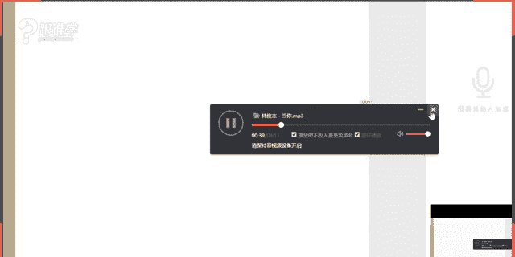
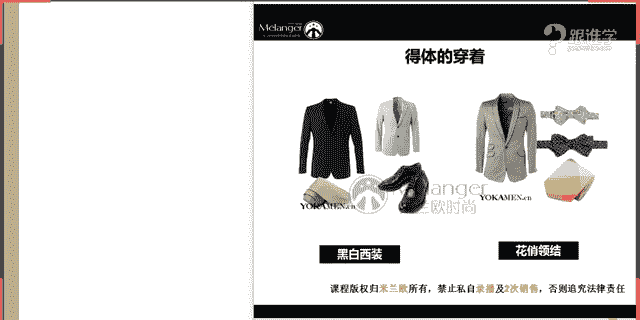

# 1、11服装《搭配秘笈之新版36计》：35婚礼服单品选择

🎼Yeah。🎼在。🎼如果有一天我回到从前。🎼回到最原始的我。🎼你是否会觉得我不错？🎼如果有一天我离你遥远。🎼不能再和你。🎼正月。🎼你是我。

hello，同学们，晚上好。😊，同学们现在可以听到呃声音吗？如果可以听得到的话呢，请打一。嗯，好的嗯，看到阿麦同学和悠悠同学都在。嗯，那其他同学呢是不是刚刚进来，然后那个还没有来得及嗯，好的，嗯。

于当你好，包括哈哈同学，那大家晚上好。那今天呢给大家分享的课程呢是关于这个婚礼的单品选择。啊，好像好像很久没有见一切随风啊，OK好，那呃关于婚礼的这样的一个课程呢？

我相信在我们说其实之前有很多的朋友让我去呃问过我啊，就说他们在这个呃婚礼的时候，不知道应该怎么去穿。那其实婚礼，我们说他是属于一个场合。那他会涉及到哪些人物呢？嗯，例如说会有新郎新娘啊。

伴郎伴娘以及一些宾客。那有的时候我们可能会以不同的这样的一个身份去出席这样的一个婚礼。那我想问一下，咱们现在教室里有多少。是已婚的，然后有多少是未婚的，已婚的请打一，未婚的请打2。好。

悠悠同学是已婚的非2，然后未婚是吗？啊，那看来已婚的同学现在目前有两位啊，然后这其他同学呢其他同学是已婚还是未婚呢？还是属于呃什么样的一个状态？我看到有那么多同学在呢啊。

那已婚的同学请打已未婚的同学请打2。好，那同学们，既然我这个于的梦是什么意思呢？又是一又是二了。好，嗯，那我看到大家的这个这个答案了啊。那我们说这个嗯刚才跟大家讲到了，我们所说的这样的一个关于关于婚礼。

他其实会涉及到不同的这样的一个角色去出席婚礼。那特别是我们说这种呃比较一到这种节假日五一啊，十一呀啊，马上就要来临了。那这种日子的话，基本上可能呃结婚的朋友啊，或者说这个同学都会比较多。

那就会涉及到我们可能不要出席婚礼啊。那如果没有结婚呢，那更要好好听。今天呢就会给大家给大家讲到关于我们所说的这个嗯婚纱如何去选择啊，那男士的话也会有关于礼服如何去选择。包括如果我们作为宾客的话。

那应该怎么去选择服装，作为伴郎和伴娘，当然这个服装不是由你来选择，而是由新郎和新娘来选择，对不对？OK好嗯。于的梦同学说，离婚了，还有机会结婚啊，非常好OK啊，那我现在理解你这个一和二的意思啊。好的。

嗯，那我们今天来看，就是关今天的课程，就是关于婚礼服的单品的选择。那呃说到这个婚礼服的话，其实我们中国的话，也有我们中国的这样的一些呃特色的礼服可以这么说。在后面我会给大家去介绍。那么现在来讲的话。

我们大多数人在结婚的时候啊，其实都是以这种西式的婚服为主。那所以呢在这里给大家来介绍西式的这样的一个婚服的由来啊，那西式婚服呢，我们说这个婚纱的礼服的出行，大家可以看到这张图片。

那这个图片呢其实是呃在古希腊时期啊，那这是我们所说的婚纱的出行，比如说这种袒胸露乳。然后这种礼服，现在有很多的礼服，其实都是来自于那那个年代啊，那这是我们所说的。婚纱的出行。那直到什么时候。

婚纱它真的成为了我们现在结婚的标配呢？其实从古至今或者说全世界的呃人们在结婚的时候都会举行这样的一个呃婚婚礼的仪式。那人们穿着婚纱其实却只有200年的这样的一个历史啊。

那其实穿穿着婚纱只有200年的历史。那穿着婚纱是从什么时候开始的呢？其实是源于欧洲的一些地区。那我们说欧洲地区的话。

他有的是政治和宗教是合二为一的那在这些国家呢呃他们在结婚的时候必须要到教堂让神父和牧师给予他们这样的一个什么呢？呃，这样的一个仪式啊，并且呃为他祈祷呃，给他们祝福。

那他们才算是这种合理的我们所说的婚姻或者合法的婚姻。那他们必须。要走这样的一道程序啊，那大家现现在可以看到，天主教徒的典礼服。那其实这个就是当时欧洲的1615世纪16世纪的时候。

人们就会去着这样的一些典礼服啊，然后来完成自己的这样的一个婚礼。但是其实那个时候并不是说一定是以白色为主。那直到19世纪以前其实还有很多的人们在着婚纱的时候，呃，可能会着其他的鲜艳的颜色。

但是呃我们所说澄亲的时候啊，或者结婚的时候，他们会着其他的鲜艳颜色并不是只以白色为主。那直到呃维多利亚时期，维多利亚王女王啊，在维多不好意思，同学们维多利呃维多利亚女王呢在婚礼上穿了一条白色的婚纱。

那从那儿开始，人们在结婚的时候，就会选择白色的婚纱，其实那个时候才成为了我们所说的。标配啊，在那个时候才成为了标标配。所以从那之后呢，到现在的话呢，一直有这样的一个习惯。就是初婚的时候。

我们说初婚的女士都会着白色的纯白的婚纱，那只有再婚的女士才能够选择粉红色、湖蓝色等等一些油彩色的这样的一些色调啊，那如果现在可能有一些女呃这个年轻的女士或者说比较个性的一些群体的人。

他们可能没有那么的去在意这件事情的时候，也有可能会选择一些这种粉色蓝色，当然前提是家长啊，要表示这样的一些什么呢？理解，因为呃老人家嘛，他们的思想是相对来说比较传统的。

OK那这就是我们所说的西式婚服的这样的一个由来。OK好，收纳的同学，谢谢你啊，我的衬衫很好看是吗？嗯，你来了就送给你啊。OK好，那今天呢给大家分享的是关于。场景与服装的选择。

那第二个的话就是婚礼服的单品的选择。那我们说到场景与服装的选择。那大家可能觉得奇怪，哎，结婚不就是这种呃婚礼现场呢？还有什么样的一些场景吗？

当然我们说结婚他其实也会有在不同的这样的一些场景当中去举办婚礼。那包括呃婚礼我们说礼服的这样的一些选择还是非常的多的那我们应该怎么去选择适合自己的这样的一些礼服。那包括我们作为宾客的时候。

应该去如何穿着才能够呃这个既让宾客觉得被受到尊重。但是又不会过于的这样的一些夸张的这样的一些服装。OK好，那么继续来看嗯，好，婚礼同学说长见识了是吗？那呃之前是没有听过这样的一些典故，是吗？

OK那其实这只是一个说法啊，说我们说这个婚礼的由来，其实还有一个呃是关于我们所说的小呃没有说。特别的是有依据型的，但是它也是一个我就把它当成故事来讲给大家听啊。那其实在呃我们说爱爱尔兰时期有一个伯爵。

那这个伯爵呢有一次去打猎的时候呢，在这个湖边看到了一位呃叫rose的这个女生啊女士。那当时呢两个人就这个一见钟情了，但是介于什么呢？门第之间的这样的一个距离，我们说贵族跟平民之间。

他们是有着我所说的门不当户不对，对不对？但是因为两个人实在是太相爱了啊，然后这个伯爵呢就跟这个家庭家族就提出啊，我要娶这位这个女子为妻。那当时呢这个贵族的这个家长们是不同意的。

就是说就给他们出了一个难题，就是说让他一夜之间必须缝制一条。呃，我他们的贵族经常会在这种正式的皇家的这种教堂当中穿着的白色圣陶。那这种白色圣陶的话是要16米。16米，并且在一夜之间把她缝制而成。

其实说白了呢，这就是在为难这个女子。那当时这个女孩呢啊她就呃很很很淡定啊，为什么这么说呢？她当时就动员了小镇所有的村村民，就帮她缝制了一件16米的白色圣袍。那贵族的这些家长们哎看到这个小女生这么用心。

那就同意了他们两个人这样的一个爱情。呃，也有说法是说，这是第一件婚纱的这样的一个由来。但是我觉得她可能我会把她当成一个故事来讲给大家听，并不把她作为重要的这样的一个服装的发展史来讲啊。

ok那大家听听就好了。O那我们继续来看那场景与服饰的匹配的原则。那也就是我们所说的场景与服饰的搭配。那首先呢我们说呃在婚礼的这样的一个当天是不是呃新郎和新娘的话，一定是主角。那我们在这里的话。

以场景的角度的话，也是在讲。新郎和新娘的这样的一个场景。那首先的话我们说新郎和新娘在没有结婚的时候，其实已经穿过一次婚纱了，也已经穿过一次礼服了。那就是在拍摄婚纱照的时候，对不对？其实拍摄婚纱照。

也真的只有我们中国人才有这样的习俗。在西方的时候呢，其实这人们在结婚的时候，只有在真的是在结婚当天才会穿上这种婚纱。那当然在前期也会去试婚纱。

可是他们不会有专门去呃做这样的一个拍摄婚纱的这样的一个行动和行为。那我们国人的话，其实有这样的一个啊习惯。那所以其实我们在结婚之前就已经穿了一次婚纱了。那我们在拍摄婚纱的时候。

也会去到不同的这样的一些场景当中，比如说这种欧式的建筑，比如说在这种湖边海边，总之是一切让我们觉得非常美好的这样的一些场景当中。那我们来看一下，那如果我们在拍摄婚纱的时候，应该如何。

去选择我们的这样的一个礼服。那首先啊我给大家看到了这两张图片呢，呃同学们，我想问你们觉得这两套的婚纱跟这样的一个场景是否是匹配的，你们觉得匹配的请打一，不匹配的话，请打2。同学们，如果你们觉得匹配的。

请打一，不匹配的，请打2。今天老师这个帽子有点大啊，总是会往下掉。🤧嗯嗯嗯。好，呃，有同学觉得是不匹配的是吗？幸运草同学觉得不匹配，那其他同学觉得还是匹配的，是吗？好的嗯，那我来给大家来分析一下啊。

那我们说第三，你会发现这种呃这种呃类似于这种说大裙摆的这种婚纱。那其实它要出现的场景一般都会是以什么样的场景为主呢，就是看起来它是属于这种高级的啊，然后有这种呃对我们所说的这种奢华的这种场景当中。

比如说这种宫廷感的呃庄园，那包括这种都市化的这样的一些场景当中，它其实都是适合的都是匹配的啊，那因为这种相对来说比较大摆的裙装，它其实跟这种场景的话。

是相对来说是比比较吻合的那例如说啊那我再给大家看一组图片，那你会发现如果在刚才的那样的一个场景当中，它们适合穿这两套裙装呢？同学们啊，例如说这种非常轻薄和飘逸感的啊，以及这种相对来说它更加。

它的这种简约的那更加质朴的这样的一个整个的造型。那它并不适用于我们所说的这种宫廷感的，或者说看起来非常奢华和高级的这样的一些场景当中。那也就是说其实我们在拍摄婚纱照的时候，那我们例如经常会去到海滩啊。

例如经常会去到户外以及一些风景名地。那这些在户外的拍摄的时候呢，其实我们要选择的这种婚纱的礼服，一般都要以这种飘逸型的啊，或者说这种简约的，然后方便于行走的这样的一些礼服为主。那第一。

你会发现来到户外的时候，你的裙装，它带有这种飘逸感的时候，那它的相嗯你拍出来的相片也会感觉非常的唯美。但是如果你穿着非常夸张的这种大裙牌，出现在户外当中去拍摄的话，那看起来相对来说没有那么的吻合。

那所以说我在这里要给大家强调一个概念啊，那其实我在之前嗯是真的有见过呃，并且我去在呃做这样的一个是是一位非常呃怎么说呢？一个高官啊一个高官的这样的一个婚礼啊。那在这样的一个婚礼当中呢。

其实我当时就帮他们去做这样的一些参考。那一开始的时候呢，这个太太啊，我们所说的这个结婚的女主角新娘那新娘呢她在选择婚纱的时候，她就特别的喜欢那种特别夸张的大裙摆。啊，她就说我我就想穿这种特别大的裙摆。

然后到那种风景名胜景地呀，或者说这种非常户外的这种呃郊外的这种感觉去拍摄。那当时呢其实我就持了这样的反对意见哈。那以专业的角度上来讲，那我肯定是非常清晰。如果她穿着那种裙装的话。

拍出来的效果一定没有穿着这种相对来说比较这种浪漫的唯美的。飘逸的柔美的这种感觉的裙装要好。那所以的话呢其实一开始他不是特别的乐意。那我就给他看了大量的一些穿着夸张裙装的这种呃这种这种拍摄的效果。

O给他看到之后，他他就自己就有感受了啊，那所以说呢那这也是我呃自己身上的这样的一个经验，那分享给大家。那在这里呢再给大家来强调一点啊，那我们如果在这个拍摄婚纱照的时候，其实应该在户外的时候。

尽量以选择柔美的飘逸的简约的方便行动的这样的一些裙装为主。那例如说在这样的户外型的这种郊外。那你会发现他的裙装就是属于这种非常的唯美感的。而在这种呃有点这种荒芜感的。

我们所说的类似于全都是沙滩的这种感觉，或者说沙漠的这种感觉。它其实可以拍摄一些有这种有点呃小个性的这样的，或者说带有异域风情的民族的这样的一点呃这种这种婚纱照啊，那包括其实婚纱照现在也会有不同的主题。

比如说你可能去日本啊，或者说去这个印度拍摄不同的这样的一个新娘的造型啊，那都都是可以的那这是我们讲到的在户外的拍摄啊，那在就这个我们所说的室内或者说一些比较这种高级的建筑的时候。

我们一般是以奢华的这种大裙摆为主。OK那这是我们所说的场景啊，这是拍摄婚纱照这婚纱照的这样的一个场景的技巧啊，在它的单品的选择，那包括大家还还可以看到这组图片当中。

你会发现它的景跟它的裙装都是相互吻合的。什么意思呢？你会发现你想到呃游泳池想到呃海水，你会你就会想呃或者说这种礁石，你就会想到美人鱼那。

所以他的这样的一个裙装的选择就是美人鱼的什么鱼尾裙的这样的一个感觉。那包括整个人呈现的这样的一些姿态，也特别像一条美人鱼啊，是不是非常的美啊，那风林同学说好仙，没错啊，那这样的一个造型的话。

再配上一些烟雾感。那特别是其实这一套服装的话，它是在这样的一个场景当中，他的旁边一定是有用烟饼。就是如果我不知道大家有没有呃有的同学如果你们在拍结婚照的时候，有没有用过这种道具啊，那老师是没有结婚的。

所以呢老师呃虽然老师没有结婚，但是老师参与这样的一些拍摄的话是非常多的啊。那比如说一些创意片啊，一些这种呃这种形象品牌的大片，那经常会涉及到我们会使用这种烟雾机啊，包括烟雾饼，所以这种很仙的这种效果。

它其实全都是用烟雾机来喷出来的。但是同学们，你们要知道，虽然成片我们觉得哇非常的漂亮。可是呃要知道我们当时在拍摄这种婚纱照的时候，或者说这种做这种呃做这种这个形象大片的时候。

当时那个烟雾是非常的熏眼睛啊，或是整个人的状态都都都熏的就就要流眼泪的感觉啊。OK好，谢谢修丽同学啊，那修丽同学的话也是我们线下的人物班的学员啊，那修丽同学也祝你早日穿上会啊，修丽同学已经结婚了哈。

O好，是的，呛的很厉害。没错嗯。好，那我们继续来看。那刚才呢给大家看到的都是一些我们所说的这种婚纱跟这种场景，它都是相互匹配和吻合的这样的一些场景。那是不是在生活当中。

我们还会拍摄一些这种比较有对比感的，或者说让我们觉得印象很深刻的这种婚纱的相片呢？那那例如说你会发现让你印象深刻的相片，它一定都是比较呃对比的，什么叫对比呢？你会发现这种呃本来这种这种嗯。礼服裙。

我们所说的这种晚礼裙，它其实是属于西式的裙装。可是你会发现它出现在这种中式的建筑当中，配上我们中国的这种呃这个这种比较有古色古香的这种呃建筑，包括这种植物花等等啊。

就让我们感觉它是非常的有个性的这样的一个状态。它所成成片它的成片看起来是非常的有个性的那这个是水果水果节啊，这位是水果节。那它为什么穿了红色呢？那是因为红色是我们的中国红啊，这样的一个比较代表的色彩。

所以呢它是用这样的一个非常西方的人物啊，配合这样的一个中式的场景，它形成了一种视觉强烈的对比感。那包括这张图片啊，也是运用了同样的这样的一些手法。那例如说刚才的所有的白色婚纱。

它都会出现在这种西式的建筑当中。而你会发现这一条白色的婚纱，它出现在了这种。也是我们中国特有的这种竹林的场景当中，你也会让觉得印象非常深刻。那这种印象深刻的话，有可能是来自于一种不理解。

有的人会认为哎为什么他穿着这套衣服跟这在这样的一个场景当中去拍摄，我觉得不是特别的匹配。那其实如果大家没有学过这样的一些专业的话，那一定会有这样的一些想法。那其实这就是我们所说的叫对比的搭配手法啊。

对比的搭配手法，那我们经常在创意的这样的一些拍摄当中经常会用这样的一些手法。OK嗯，好很好看是吗？OK那所以我把这些呃这个图片拿出来跟大家分享，我也认为这种图片是非常美的啊。

那呃也让同学们一起来提高我们的这样的一个审美和品味。那包括这组图片，你会发现呃，这组图片的婚纱依然是非常的唯美的。可是在这样的一个场景当中，它是非常的什么呢？同学们相对刚才那种非常高级奢华感的。其实这。

这种建筑它依然是高级和奢法的，它它的这种建筑感其实是高级感的，只是它有一种做旧感，或者说有有一种这种消极的这种情绪所在。它的给给我们传递一种什么样的一个情绪，没错，颓废和沧桑感啊，惠尔同学说的很好啊。

是的，那这就是我们所呃刚才那一组嗯那慧尔同学总结的非常好啊，说文化的对比，没错，那其实刚才我们所说的那个也叫场景的对比啊。

那我们说有的场景它是属于调和的而刚才那个场景它是属于对比的那这样的那在这一组图片当中，其实也是属于一种对比的手法。也就说我们所说的这种颓废感跟这种我们所认为的唯美的这样的一个呃图片。

或者说美好的一些事物做这样的一个对比的手法拍摄。那其实呃你会发现嗯在有一些这种嗯MV我不知道大家有没有看过张惠妹的黑吃黑这个MV当中。那当时这个造型的嗯他这个MV。被封杀了，为什么呢？

因为里面有很多血腥的这种呃搭配，以及他的这种拍摄的创意。那比如说呃里面有一对是僵尸新娘，那就是穿着这种雪白的婚纱，然后画着非常的颓废的这种这种这种眼妆。

那包括有着这样的非常呃这个白雪吸血鬼的那样的一种牙齿。那两个人的话，他的这种形象也是非常的鲜明。OK。没有看过的话，可以去搜索看一下，应该是搜索到但呃搜索得到的。

因为我前几天前一段时间还看过叫黑吃黑这个片子啊，有一点小小呃怎么说呢？因为这个镜头一开始的时候，是一对西方的夫妇，但是这个老呃这个夫妇是什么呢？他的先生去世了。然后呢。

这个太太呢呃扮演的一个角色是一个非常这种贵族感的西西方的贵族的这样的一个形象。而且两个人都已经非常老了。那这个太太在干什么呢？在亲吻着他先生的尸体啊，所以有点重口味。那大家自己谨慎去选择。好。

那我们继续来看啊，那在这一组图片当中，其实也是运用了这样的一个手法啊。我们刚才所说到的这样的一种颓废感，沧桑感和这种唯美的这样的一些呃对比。那这就是我们所说的对比的拍摄手法。那在拍摄当中。

那现在大家是不是就已经有呃一个新鲜的这种感受了啊，或者说有一种新的。法了那呃在生活当中，我们在拍摄的时候，大多是以这种唯美的拍摄手法。那其实我们还可以玩讲小个性。只是可能同学们会接受不了啊。

太过于个性的这样的一些创作的话，其实你们可以呃例如说刚才那一组穿着这种呃中国这种非常典型的西式的婚纱。在这种竹林当中，我觉得也是非常的唯美的。而且同时大家都能够接受这种美感。那大家可以去尝试一下。

没有结婚的同学。OK好，那我继续来看，那刚才讲到的是场景一就是我们所说的拍摄婚纱。那我们来看一下场景2婚礼当天啊那在婚礼当天的话呢，我们来看一下，那在呃刚才其实跟大家讲过啊，我们说拍摄的时候呢。

它其实是有户外啊，或者和和室内或者说在这种比较高级的进入当中。那其实我们说婚礼当天，我们所所选择的这样的一个举办的举办婚礼的场景，是不是也有有所不同。那例如说以这种草坪式的婚礼现场啊。包括以什么呢？

海滩式的这种婚礼都有啊，那老师也曾经参与过这样的一些参加过这样的一些婚礼。那比如说海滩式的这样的一些婚礼现场。那在这样的一个婚礼现场的话，那我们的着装其实相对来说它就可以很清新的这种感觉。

就不用以这种非常奢华的。这种大礼裙为主就可以以这种非常自然的这种造型感。比如说花环啊，然后非常清新的这样的一个感受。OK那包括我们所说的也啊那这一套也是这个户外的这样的一个场景当中。

我认为这张图片也非常的可爱啊，所以跟大家来分享。那包括你会发现刚才那一组是在户外，那这一组是在这种我们所说的高级场所当中，或者说这种呃酒店或者教堂呢你会发现它的着装都是以这种隆重感的服装为主。

那这就是我们所说的在婚礼当天的场景与服饰的这样的一个搭配。那为什么要先给大家来介绍场景和服饰的搭配。那其实我们所有的那婚纱虽然它有很多的款式，那礼服也有很多的款式。我们说男士的礼服也有很多的款式。

那包括宾客们，你去参加呃这个呃这些婚礼的时候，你们的服装也有很多的选择性。可是我们首先要搞清楚的事情是什么呢？就是我们去的这个婚礼，它是在哪。

地方去举行的在什么样的一个场景当中发生的那我们再去选择我们这样的一些服装。例如说在海滩海滩当中去这个呃你参加这种海滩，或者是追种草坪的婚礼的时候，那你的你们的着装一定不能穿的太过于什么这种奢华感。

不灵不灵的这种感觉。那或者说你穿着极高的高跟鞋，走到这种草坪当中，走到这种嗯沙滩当中，你会发现非常的尴尬。为什么呢？你的鞋子会不断的现到沙子里，或者说现到草坪当中。啊，那这都是我们需要去注意的一些事项。

那这就是第一个板块来跟大家分享到的场景与婚礼呃于这种服饰的这样的一个选择。那第二个板块就是婚礼服的单品选择。那接下来我们继续来看。嗯，好。

那在这里的话呢呃大家可以看到我们现在这个图片当中都会加了一排这个特程版权归你呢哦所有禁止私自路播以及二次销售，否则追究法律责任。为什么呢？其实我们现在已经发现。很多的这样的一些这种机构或者个人。

然后呢呃盗用我们的这样的米兰欧的一些图片，以及录制视频，在二手2二次去销售。那么对于这样的一定些行为的话呢，呃我们说这个米兰欧的话，一定会采取一些行动啊。

或者是说我们也希望同学们既然你们来到我们这里去学习的话，也能够尊重老师们的呃或者说学校的这样的一些这种呃文化的这样的一个呃这个文化的这样的一个成果啊。那谢谢同学们啊，O好，那我们继续来看。

那刚才给大家讲到的这样的一个我们所说的是婚礼单品的选择。那在这里呢给大家介绍三个板块。第一个呢是新人礼服的选择啊，那第二个的话就是伴娘和伴郎的礼服选择。第三个就是宾客礼服选择。那这三个板块呢。

都是我们去参加这个朋友婚礼的时候，我们会扮演到的这样的一些角色。比如说今天呢。我们的这个米兰欧的一位老师呢就去到他的朋友的这样的一个婚礼现场了啊。那今天就去到在深圳啊，就去参加他这个朋友的婚礼了。

那今天也是极其的隆重。OK那我们继续来看嗯新人礼服的这样的一个选择性。那首先呢呃刚才其实已经跟大家介绍到，我们说我们中国其实也有我们中国的这样的一个这种婚纱的这种服饰。那在现在我们中国人结婚的时候。

其实我们的新娘是不是也会去着一些中式礼服呢啊，那其实我们会以在某一个环节当中选择中式礼服。那等一下我在后面会给大家来分享。那首先呢在这里先给大家介绍的我们所说的中式礼服的婚礼服。

那他是呃什么样的一些单品啊，那例如现在大家所看到的图片当中的第一款服装叫秀禾服。那基本上其实有很多人呢？他是分不清楚嗯，还有一种。服装叫龙凤褂啊，这两种服装呢，一个叫秀禾服，一个叫龙凤褂。

那其实它们是不同的这样的一个单品的啊。那呃我来给大家首先来分析一下他们的不同点在于哪里？首先我们先来看秀禾服。那大家知道秀禾服她是怎么来的吗？那有没有人看过橘子红了这部电视剧，同学们有没有人看过。

如果你们有看过的话，那我相信你们对于橘子红了里面的周迅的扮银啊，周迅来呃来主演的这部剧啊，里面的女主人是不是就叫秀禾呢？那她当时是不是就是这样的一个形象呢？啊，她的这个头发啊，那包括她整个服装的感觉？

没错啊，那其实秀禾服就是来自她的这个我们所说现在很多人去穿着，就是因为当时橘子红了这部电视剧的秀禾的形象。所以我们中国的这个。女士现在很多都会去做这种服装。那这个服装呢。

它其实是属于清末明初的这样的一个呃女子的呃袄裙。在清末明初女子的这样的一个着装啊，还有九儿，没错啊，是的，九儿也是这样的一个形象。那这种秀禾服呢，它的设计一般会以这种立领或者是圆领为主。

或者说以斜襟或者是对襟为主，有这种斜襟的也有对襟的。但是它的一她的款式一般是以宽松的这样的一些服饰为主啊，那包括大家可以看到这边的这张图片，其实也是秀禾服。

那男士在与女士在我们说新郎和新娘的这样的一些搭配的过程当中呢，或者他们在搭配的时候，其实男士可以选择除了这种长袍马褂装以外，还可以配中山装啊，还可以配中山装，那这这两个搭配的话都是OK的。

秀禾服加马褂装，或者说秀。复和服加中山装都是可以搭配的嗯。是的，中立体没错是的啊，那呃大家可以看到，这个就是我们所说的叫绣禾服。那接下来呢再给大家展示的就是龙凤褂。那刚才有给大家讲到龙凤褂这件单呃。

这个我们所说的礼服。那龙凤褂有很多人其实分不清楚这两个单品这个两个礼服到底有什么区别。龙凤褂其实它是在绣禾服的基础上去加以改良的那它的改良点在于哪里。那就是什么呢？

它会做收腰放摆以及袖口的这样的一些收紧的设计，它会更加的展现女性的曲线美感，那一般在广东呃和香港南方的地区的话是比较多的这样的一些造型，那会以配这种金色的首饰为主，为什么呢？

我们说这个呃这在他们在这个礼服上会有镶很多的这种金色以这种金线银线袖质的很多吉祥的图案。比如说龙凤成呃，龙凤呈祥啊，然后代表着新人成双成对，那包括会绣上这样的祥云图案，代表着这种一团和气。

包括还会绣蝙蝠啊，代表福气以及石榴啊，多子多孙的这样的一些寓意。也就是说其实龙凤画的话，它会绣上很多的吉祥图案，而绣和服的话，它其实跟龙凤褂是有不同的这样的一个从设计上以及图案上都会有所不同。

OK那包括男我们说这个女士着这种啊这个这个中国中呃中式旗袍，其实它这个也是这种龙凤的这种形这个款式的这种效果。那加上这种龙凤褂男士也可以去匹配啊，OK那这是我们所说的中式的礼服当中。

那有同学刚才其实说过了啊，叫敬酒符。那其实我们说它不一定会出现啊，那不一定是一定在敬酒服当中去出现的啊。OK好，那我们继续来看。这是我们所说的中式的这样的一个礼服。那我们来看一下西式的男士的礼服。

也就是我们所说的新郎的礼服啊。那西式的婚礼服。新郎当中呢，它其实礼服它会有很多的款式。那我们来看一下，那同学们可能会说哎老师我在见到朋友结婚，或者我在自己的婚礼上，其实我的先生只穿了这件服装。

这很正常啊，那这件我们在我们中国人对于这个概念的话，其实相对来说没有那么的注重啊，但是在正式的西方的婚礼当中，他们的着装就会以这这呃这样的一个方式来出现啊，那例如说军礼服大家可以看到啊，那军礼服的话。

它一定是相对来说有关有这种军衔，那包括是什么呢？贵族或者说我们所说的这种有爵位，或者说在这个呃以这种国家首领级别的人去穿着。那比如说这个凯特王妃跟威廉王子，他们在大。婚的时候呢。

那威廉王子着的就是什么服装呢？大家可以看到法国的呃仪仗队的啊法国呃法国共和队的这样的一些服呃这种服装。那你会发现，其实呃我之前在讲单品客的呃军装当中啊有给大家分享过。

我们说法国其实在17世纪到19世纪是属于叫拿破仑时期。那在那个时期的话，嗯，在那个年代在打仗的时候，法国还曾因为这样的一个红色的军装被什么呢？被敌人啊消灭多少万人啊。嗯。啊，对对对啊。

sorry同学们啊，秀丽同学提醒了老师啊，他是英国人。没错啊，老老师这个有点晕估了啊。同学们是的啊，那没错没错没错啊。O好嗯，他是他是他是这个他是英国人啊，这是英国的礼服啊，老师讲着讲着有点晕了啊。

OK好，那我们继续来看，那这是军礼服啊，那是英国皇家仪仗队，英国皇家仪仗队。其实英国和法国，他们在婚礼的时候都会选择这种军礼服。那法国也会选择他们的这种礼服。那英国的话也会选择他们的这样的一个礼服啊。

那他们呃法国的话一呃英国的话以这样的一个色彩为主。OK好，那我们继续来看这是军礼服啊，那宴尾服，大家可以看到啊，宴尾服的话呢，一般在这种白色的领结出现的时候呢。

呃我们说在中国的男士有可能一辈子都不会出现过一次啊，或者说啊这在。或者说在国外呃这种男士当中，有可能一辈子也不会去穿着宴这种白色的燕尾服，就是他的这种白色领节的宴尾服的着装标准。为什么这么说呢？

因为呃白色领节的话，一般会出现在国宴上。也就是说一定是非常非常正式的这样的一个场合当中。那么有的人他会认为他的婚礼是最为隆重的这样的一个节日，有可能也会着白色的领节的宴尾服。

那这个一般我们说在很多的这种呃西方在这个宴举办宴会的时候，他会发给宾客的这个邀请函上就会去注明，你是穿你是什么呢？有以白色领结来还是以黑色领结来。但是基本上其实都是以白色领呃黑色领节。那白色领节的话。

我刚刚给大家讲过，其实一般都会出现在国宴上面。嗯，那我们在国内的话，其实近期是不是近几年有很多的明星结婚。那比如说黄晓明和angelababy。

那黄晓明在他自己的婚礼上就选择了白色领结的这样的一个燕尾服。那么说明什么呢？他认为自己的这样的一个婚礼是他人生当中最重要的事情。所以他选择了白色的燕尾服啊。

那同学们如果你们结婚的时候也可以选择男同学啊或者女同这个女同学们，你们如果想要提个这个在结婚的时候，让你的先生或者你认为自己这是一辈子最重要的时候，你就可以选择白色的领结。因为如果你在这一天不穿的话。

以后你有可能就没有机会穿了。OK好，那么继续来看，那包括什么呢？便礼服便礼服的话呢，是我们所说的男士的这样的呃经常会着装的这样的一个礼服。那在这样的一个便礼服当中，他其实也有跟平时的西装不同。

那大家可能会觉得哎，这好像就是我们所穿的西装啊，那如果他作为我们说礼服的这样的一个西装款式的时候，他的领子一般会以。国领啊，或者说什么呢？叫枪国领为主，而且并且会以这种光泽感、丝绸感的领型为主。

那最后大家看到的在婚礼当天的话，如果选择这样的一些礼服的话，一定是正么相对来说比较正式和奢侈的这样呃奢华感的这种礼服。那包括天鹅绒礼服。

这些的话都是我们所说的在西式的呃婚礼当中新郎会着的这样的一个礼服的款式。OK那我们继续来看。那新娘的这样的一个婚礼服啊，那我们来看一下，那新娘的款式呢，它有公主款、拖尾款以及鱼尾款。

那它在肩固的设计上它会更加的繁琐啊？例如说深V款的抹胸款的船领款的单肩款的以及令领款的那这是我们所说的新娘的礼服的款式是不是相对来说比男士都又要复杂了啊。那我们继续来看啊，那款式分类当中。

那大家可以看到123拖尾款舞会款。那其实舞舞会款也被称为叫公主款。刚才大家看到的这个公主款。那包括鱼尾款。那其实这种款式它会称为舞会款公主款以及以及什么呢？大A或者说蓬蓬的这种款式。

其实我们大家可能会说唉那种蓬蓬裙其实都是指的这种款式。那拖尾款的话呢，其实是指我们所说的这种嗯这个。婚纱的这种尾特别长。那一般的话它其实有不同的，有小托、中托和大托这样的一个礼服的款式啊。

那它会呃如果有的同学会觉得哎我不想选择太大拖。因为大托的话，它呃你你可能就可能需要找伴娘来帮你脱裙子，而不是找这个我们所说的花童啊，大不脱的话，它太重了。那中托和小拖的话，它会更加方便于行走。

OK那我们说的这是三这是这是两呃这两种的这个婚纱的款式。那以及第三种是鱼尾裙，嗯，脱的来源。嗯慧儿同学什么意思呢？托的来源嗯，好，那这是我们所说的这三款服装啊，这三款里呃鱼尾裙的这样的一个款式啊。

这三款婚纱的这个款式啊，那其实还有型嗯还有不同的一些款式。那这几个款式的话是比较常见的那等一下在后面的话呢，也会给大家分享一些其他的这个款式。那我们继续来看在肩部的设计上啊，肩部的设计呢。

它有这种一字抹胸款啊，大家可以看到这种一字抹胸款。那是不是这种款式大家就会觉得它没有那么的嗯没有像刚才的这种呃我们所说的鱼尾款啊，或者说蓬蓬款啊这种公主款啊，舞会款啊，或者说像大托。

那其实这种的话它是微微的有点小托，并且它的这种款式是以小A版为主，小A为主。OK好，那们继续来看深V款啊，深V款。那包括第三个款式叫新型抹胸款。那其实。这两款的话都是属于叫抹胸款。

但是你会发现这个抹胸的话，它是带有这种弧线的这种款式的这种效果。它穿起来的话会更加的唯美感啊。而这个款式这种一字感的抹胸，其实它看它看上去会有硬朗的感觉。

那虽然都是抹胸款虽然都是我们所说的婚纱的这种礼服啊，那虽然他们都是非常能够彰显女性曲线美感的，但是因为款式的设计不同，所以给到的我们所说的气质，着装人的气质也会不一样。

那例如说这种裙装它一定是给这种长相非常柔美的这种感觉。那比如说这种裙装的话，它一定是身上有一些硬朗的这种特质，穿这种裙装才会好看啊，那包括这一款裙装也是一定要长得比较柔美感的。为什么？因为这种蕾丝感。

以及这种DV，而且要求身材，一定要非常的好啊，那着这的一些款式会比较的好看OK那我们来继续看。肩部的设计啊，那肩部的设计除了刚才那几个款式以外，包括还有船领款，那船领款是什么意思呢？

它跟一字肩不是一样的道理啊。有同学说老师那么不是一字肩吗？看起来那其实一字肩的话呢，它会更加的呃拉伸露肩啊。而这种穿就是以这种小的这种一字感，而且并且它没有露肩的这种这种领型，它叫船领啊。

船领的款式ok那么就它就像船的那种感觉啊，OK那么接下来看单肩款，那包括立领款，那其实立领款的话呢，呃我认为立领款是比较难穿的，为什么这么说呢？立领款它其实非常的挑人。第一，如果你的脖子其是比较短的。

包括你的脸比较的大啊。那你穿着这种款式的话，相对来说都比较没有那么的好看，而且的话在结婚当天我认为可以小露一下啊，就是你可以。露一下肩，或者说啊露这个DV一点点哈，那或者是说我们所说的这个露一下手臂。

但是你会发现这种款式相对来说它是比较保守的这种感觉。OK那这是我们所说的不同的这样的一个领型的选择。那不同的领型的话，它其实又涉及到就跟我们所说的脸型啊，然后脖子啊，以及这种什么呢？

肩宽啊是有关系的那比如说刚才我给大家举例的这种这种款式就不适合脸大的脖子短的啊，那这种款式，大家认为它适合给到哪些这种体型的人呢？同学们或者说你们觉得呃符合哪种特质的人可以穿这种款式。

那我来给大家讲一下啊，第一，这个人必须要肩部很薄。第二，她的手臂不能过粗啊。好，枫林同学说，记得金粉世家里面的女主穿女主角穿高领好唯美是吗？那呃老师并不是说这个这条裙子穿着就没有人穿着好看的意思啊。

就是我们说金粉饰家里面的那个女主角是懂结眼的吗？嗯，你会发现董结的话，她其实本身的气质就非常的甜美啊，OK好，嗯，那我们继续来看啊，那其实这种款式它给人感觉是有带有这种甜美的这种感觉。好。

那我们继续来看同学们，那刚才给大家讲到，我们说这个款式啊如何去选择。那第一就是这个人必须要肩部较薄，就是她的锁骨啊，肩啊一定要很平，穿着才会好看。那如果你是溜肩的可能穿着也不会特别好看。

溜肩的人穿着也不会特别好看啊，包括手臂很粗的，穿着也不会。好看，并且这种鱼尾裙它其实是非常挑身材的那基本上这种X体型啊啊穿着都会比较漂亮。O脖子长一点瘦一点的人，古典美的，O好，那我们继续来看。嗯。

你说的于的梦同学说的是这呃这个礼服是吗？没错嗯，是的，好，那么继续来看穿领款穿领款这个款式呢，其实呃它的款式的设计相对来说其实没有那么的挑人，它跟我们日常的传领款还不太一样。为什么这么说呢？

你会发现日常的传领款的话，它是不透不透视的，而这个款式它其实是透视感的，所以它其实是可以给到一些我们所说的呃这个脖子比较短的人呢还是可以穿的啊，还是可以穿的。因为它这个地方其实都是以透视为主。

那包括脸部如果要是脸比较大的人。那你会发现哎做了这样的一个设计的话，那他的发型一去修饰，那也还什么呢？还能够去穿这样的一。服装OK那这是我们所说的传领款。那这种款式的话。

那大家要记住传领款它能够穿的原因是因为它是透视的。如果它不是透视的话，那他的脖子较短，脸也较大的时候穿着就没有那么的好看。好，我们继续来看嗯。

那刚才给大家讲到的是我们所说的礼服跟呃这个这个领子的啊这样的一些这个与脸的结合。那么再来看一下礼服与体型的这样的一个搭配。那礼服与体型大家可以现在看到这个上面有5款裙装。第一款叫高腰裙。

其实也被称为我们所说的叫地正式，其实它这个是属于叫地正高腰裙啊，那第二个款式叫A字裙。那第三个款式叫鱼尾裙，第四个款式叫舞会裙，也就是说是极大的这种蓬蓬的这种裙装啊，那呃第呃第五个款式是紧身裙。

那这几个裙装呢，它的这样的一个款式都会有所不同。刚才呢我们给大家介绍到了这种鱼尾以及舞会。那包括其实也有展示一些A字的裙装。那呃这这个呢是另外的这样的一个裙装的款式。大家可以好好看一下啊。

高腰A字鱼尾舞会以及紧身。那它跟体型的这样的一个搭配的原则。我们来看看同学们啊。首先第一个是X体型，也就是我们所说的沙漏型。第二种是叫H体型。第三种是梨形，也是我们所说的什么呢？A型身材。

第四种叫倒三角体型也是我们所说的T型体型。那最后一个就是O型体型，也就是我们所说的苹果型。那这个这5个体型，他们在选择婚纱的时候应该怎么去选择。我们首先来看高腰裙也就是这个款式啊。

这个款式同学们看到了高腰裙它可以给哪一种体型的人穿呢？第一，H体型的。第二是什么呢？梨形体型的，它可以给这两种款式的人去穿，你会发现这个什么呢？放摆，然后呢，H体型它是不是就有腰了啊。

那包括这种梨形体型的人臀是比较大的，而这种A字摆是可以去遮盖的。所以啊这个D正式的高腰裙它是可以穿着的啊，那包括其实O型体型的人。如果你的肚子不是什么，我们所说真的非常的夸张的那种大的话呃。

或者说其实你的这种高呃地重的这地震的这种款式还可以再大一点，也是可以给到O型体型的人去穿着的。那包括大家可以看到是不是这里有A字裙，那这个A字裙也适合给到O型体型的人去穿着。那为什么我多你讲这个体型呢？

这个体型其实在挑挑选礼服的时候，还真的说没有那么的容易啊，那我们继续来看啊。嗯，那这个是我们介绍的第一款高腰裙，它可以给这个H体型梨形以及O型的人去穿着。那第二种我们来看一下A字裙它可以给什么呢？

依然是我们所说的H体型，梨形以及O型体型去穿着。那你会发现它的特点都是什么呢？都是在胸部以下就放白，所以它会遮住它的优点啊，在会遮住它的缺点啊，同学们老师口误啊，今天晚上不知道怎么了，一直口误。好。

那这是我们所说的它的它的这个总结了一下啊，它的这样的一个呃原理就是它会在胸部以下就放白。所以它会演示住它的缺点。OK那么继续来看第三个鱼尾裙。那鱼尾裙的话，首先我刚才已经跟大家讲到啊。

说鱼尾裙它其实是比较挑体型的。就是我们所说的，如果你的身材不是特别好的话，那你可能穿鱼尾裙的话是有一定的难度的啊。O那我们来看一下鱼尾裙它首先可以给什么呢？X体型去穿着。也就是我们所说的沙漏型。

那包括我们所说的什么呢？呃T形体型的人去穿着啊，T形体型的人去穿着。因为我们所说的这种鱼尾它会在下半身放大量感，所以T形体型的人也可以穿着。

但是呢我建议T形体型的人这个位置它虽然是因为这个地方它是没有收缩啊，没有没有面料，它是有这种什么呢？收缩效果的啊，也就是它呈裸肤的裸肤色的这种感觉。所以的话它是T型体型它是可以穿着这种服装的。

但是我建议T形体型的人的这个两边的这个摆，也就是说袖子这个地方设计的不要太夸张。如果设计。太夸张的话，也依然会显得肩固很壮实的这种感受啊，以简约的设计款式为主。比如说这种呃这种什么呢？

宽带的这种设计下来，那它会更加适合给到这种体型体型的人，或者说吊脖式。这种吊脖式就是我们所说的削肩款的，它也可以给到T形体型的人去穿着。那这就是我们所说的T型体型的婚纱的选择。

那我们继续来看第四款舞会裙，那这个款式大家可以看到，那是不是在日常生活当中，我们见到这种款式的礼服是最多的呢？我们在呃不管是在这个电视屏幕当中也好，或者说在日常的参加朋友的这样一个婚礼当中也好。

那这种款式我到目前为止见过是最多的啊，为什么这么说呢？因为这种款式它的包容性非常的强。我之前跟大家讲过啊，我说这种你会发现为什么婚纱要做这么大的裙摆，它的目的其实就是为了衬托女生啊。

我们所说的女士在结婚当天啊显得非常的腰也非常的纤细，整个人身材也会非常的好，这种裙摆它第一可以把你下半身所有的缺点全都遮盖啊，而上半身呢如果你不选择这种我们所说的抹胸款。

比如说你可以选择一些带这种袖子的这种款式，那基本上你身材有什么样的一些缺点都被掩饰住了。所以这种裙装的话呢，你会发现它可以供给哪种体型的人去穿着这五种体型当中有4种都可以穿着，除了H型。

那我在这里强调一点啊，其实H体型的人也可以穿着这种舞会裙，但是前提是什么呢？这个H体型它是属于我们所说的叫瘦H是比较瘦的这种H体型。那如果你从上到下，比如说有的有女性是这样的啊，胸特大，然后腰还特粗。

然后从上到下就跟一个桶一样，那种像我们所说的胖H体型，这种胖H体型是全可以说是所有体型当中最难穿服装的体型。那大家可以想象一下，她本身上面就很胖，腰也特粗，她在穿上这种横向扩张的裙摆。

我记得我上次在讲一个课程当中讲过，我们所说的横向扩。纵向延伸的这样的一个道理，对不对？当特别胖的人的话，他一定要穿合体的服装，反而会显得瘦。那这个原理就在这儿了。同学们啊，那所以说这种舞会裙的话。

它其实是最百搭的，5种体型都可以穿，但是唯一就是胖S体型穿着不是那么的好OK好，那这就是我们所说的关于这四款裙子啊，婚礼呃，婚纱的这样的一个搭配，那第五款我们来看一下紧身裙，那紧身裙的话。

那大家可以听到紧身裙是不是？那它对于身材的要求是不是会更高呢？那比如说在这里大家可以看到紧身裙只有一种体型可以去穿着，比如说X体型啊，OK那以上呢就是给大家介绍到的5款礼服裙与体型的这样的一个搭配。

那这就是我经常会跟大家讲到的，我们不只要了解单品的这样的一个选择和搭配。我们还要了解我们自己啊，因为你只有了解你自己了啊，你自。结婚的这一天才能够选到最美的婚纱。OK好，那我们继续来看啊。

刚才呢给大家介绍到的是关于这个体型和礼服的这样的一个搭配，以及礼服的这样的一些款式。那我们继续来看。那新娘在当天结婚的时候，他应该选择啊什么样的一些礼服。那他比如说当天他要穿多少套礼服。

那我们一般的话其实三套礼服就够了，对不对？那一般新娘三套就就够了。比如说第一套叫主婚纱，第二套叫敬酒服，第三套就是我们所说的这个敬酒之后，然后就是送客的这种礼服，那呃以这种晚礼服为主啊。

O那我们继续来看，那其实如果在正式的我们说西方的这样的一个呃这个婚礼当中啊，那新娘可能会这个着装的礼服的款式会更多，以及他的套数。那比如说什么叫出门纱，就是早晨啊从家里被新郎。

接出来的那套服装一般会以什么呢？比较短的礼服为主，及踝的礼服为主，它会比较方便出门啊，那这是我们所说的叫出门婚纱。那大家可以看到第二套叫主婚纱。那主婚纱一般都是在什么样的一个情况下是着装的呢？

比如说在我们所说的在举行仪式的时候，比如说在播放着什么呢？啊，婚礼进行曲的时候啊，然后有这个司仪在主持的时候，那这个时候我们所说的主婚纱就是以这种非常的大气奢华的这样的一个着装效果为主啊。

那这样的一个款式为主，那么继续来看那敬酒礼服。那大家可以看到啊，是不是这种款式，就是刚才我们介绍到的龙凤褂啊，龙凤褂中式的礼服啊，那包括有的时候敬酒礼服，有的人不一定会选择我们所说的中式的礼服为主。

有可能会选择什么呢？这种礼服为主，对不对？啊，那包括我们所说的龙凤呃龙凤褂的或者说中式的礼服，有的人他可能会全程穿着，他有可能不是说只在这种敬酒服当中去选择的啊，那么继续来看。

那有可能他们还会选择的敬酒礼服，是以这种红色的。但是呢是以这种西式晚礼为主的这种礼服。那包括最后一套是比较相对来说比较简约的这种叫送客礼服。那这种礼服为什么要穿着这种。

因为它是比较的方便的那相比我们所说的这种太过于隆重。那包括那种大的礼服的话，它又太过于不便于行走，所以以这种简约的小礼服啊，当然不是说简约的小礼服，这种其实依然是属于隆重的晚礼服。

只是它比婚纱要来的轻便和方便一些。OK好，那这是我们所说的女士的呃，在当天的时候所要去准备的一些服装啊，以及那同学们可以自行筛剪啊，你如果觉得啊太。麻烦了，可以筛剪一些。好，那么继续来看。

那在结婚当天的妆发的这样的一个选择上，基本上化妆师啊都会为大家来做什么呢？礼服与发型的这样的一个设计。比如说头纱呀啊，然后一些这种呃这种发型设计妆容的这种试装。

那其实在结婚的呃前一前几天那大家应该就会做这样的一个呃这个我们所说这样的一个过程啊，那你会发现其实不同的发型啊，不同的发型它呈现的效果也会不一样。例如说这种它其实就带有这种复古感，就这种手推波纹。

它一定是非常的复古的感觉。而这种的话就是我们所说到的这种户外呀，沙滩呢，然后这种草坪啊非常适合的呃这种发型以这种自然的微卷的这种散发啊。

或者带有一点点这种虽然不是特别的这种呃我们所呃这盘的不是特别的规整，可能会有点凌乱感啊。是故意制造出这种慵懒的这种效果。OK好，那我们继续来看。那包括这种感觉的话。

它其实是属于这种呃韩系的这种唯美的妆感以及发型的这样的一个效果。那包括啊这种的话，它其实相对来说比较清新的这样的一个效果。那包括这是我们所说的中式的婚礼服当中经常会运用到运用到的妆发。

O那我们继续来看不同的妆啥妆发，它跟呃礼服的这样的一个设计和结合。那我们再来看一下，那呃男士也就是我们所说的新郎在当天应该准备哪些礼服。那新郎的话其实就没有那么复杂了哈。

那其实在我们中国的男士结婚的时候，呃，基本上我相信应该就是准备一套服装就够了。那其实在正式的这种呃我们所西方的这种结婚的这种礼仪当中，男士其实跟女士是一样的。着装的这样的一个繁琐程度。

那比如说第一套叫迎亲服。啊，以便礼服为主。那大家可以看到这种我们所说的啊西装的款式啊，它是但是它是带有奢华感的，叫便礼服啊。那第二种叫迎亲服啊，以这种宴尾服礼为主，是比较正式的礼服啊，那第三种敬酒服。

以便礼服或者是天鹅绒礼服，也就是说这种天鹅绒或者说这种便礼服都是OK的。但是在我们中国基本上就以这种便礼服就结束了啊，就完全可能没有这种我们所所谓的宴礼服。嗯，好。

那这是男士的呃在新郎在当天准备的礼服当中的这样的一些款式。那么继续来看。那刚才呢给大家分享到的就是这个我们所说的新郎和新娘在这个准备服饰的或者在准备婚礼的，在婚礼的过程当中啊。

需要去这个着装的一些款式和套数，包括我们所说如。这个婚礼的礼服的呃婚纱的这样的一些款式。那以及新郎的礼服的一些款式。那么继续来看伴娘和伴郎的单品的选择啊。好。

那因为伴娘和伴郎的礼服其实也不需要伴娘自己去准备，对不对？也不需要伴郎自己去准备，其实也是由我们所说的新娘和新郎去准备。那在伴娘的这个礼服准备的这个过程当中呢，其实他们选择的标准有一个。

那就是一定不要什么呢？太过于抢了新郎和新娘的风头，也就是说他们的礼服其实一定都是这种陪衬的这种作用。例如说啊以这种呃晚礼服大一点的晚礼服，或者说这种小晚礼服为主就可以了啊。

那他们的颜色基本上可以就做这种统一色调为主，那看起来也会比较的整洁啊，那包括这。这套它还是比较特别的，就是我们所说的中式裙套装啊，那如果呃有人想要专做这种中式的婚礼主题，那么你的伴娘和伴娘的话。

是不是这种裙装也会不一样呢？那他如果做中式的主题，可能伴郎和伴娘穿着这种西式的服装出现，对不对？那所以伴郎和伴娘也会随之换成中式的裙套装，或者是说中山装男士的话啊，那就是我们所说伴娘礼服。

那么接续来看伴娘不同的风格礼服。那除了刚才的那种呃比较我们所说的。比较大量的去穿着的这种礼服，或者说大量生产的这种礼服以外。那我们经常看到的这种礼服效果以外。

那其实有很多新娘他们在结婚的时候有自己的这样的一个呃小的这种小小的个性在里面。那他们在选择这种礼服的时候，可能为伴娘或者伴郎选择的礼服也会精心设计过。那我们来看一下，那还有哪些风格的礼服。

那例如说可以通过搭配的手法，可以呈现不同的这种感觉啊，第一个叫娇俏公主风，第二个叫复古美人。第三个叫时髦女郎，第四个叫干练优雅啊，那我们继续来看，那呃娇俏公主风，大家可以看到。

其实就是比较甜美的这种着着装效果，但是依然还是以这种小礼服为主。那以这种粉色的呃粉色以及这种白色的手套配色关系。那她看起来的话，他就呈现一种非常可爱的甜美的清新的这样的一个。质。

那他可以需他需要到的一些配饰。比如说其实我们一般是不是新郎和新娘在给伴娘选择服装的时候，就选择一条简单的礼服就可以了，对不对？那如果你想让你的伴娘团看起来会更加的有这种特色的话，可以选择这种小手套。

其实这种单品非常的好选择。而且又又不贵，就能够让你的伴娘团很很出彩，那其实我觉得大家还是可以花一些心思去做这样的一些搭配的啊，那比如说这种短手套，以及这种呃粉色系的高跟鞋。

就整个呈现的这种风格特质就非常的明显了。那我们继续来看。复古美人啊，那复古美人的话，这样的一个搭配效果，大家可以看到它的配饰的使用。第一个叫复古小圆帽啊，大家可以看到这种复古小圆小圆帽带有这种面纱的。

那么这种面纱其实我建议在新呃在结婚当天的话，可以把面纱取掉。就以这种小圆帽的这种造型效果就可以啊，因为这种面纱的这种效果的话，相对来说有点这种繁琐。那包括佩戴这种什么呢？耳古典的这种耳环。

包括这种珍珠项链，那其实这种这如果戴了耳环的话，那么你的这呃如果你戴的是这种珍珠项链的话，那你的耳环就可以相对来说也比较简约一点，以这种小的珍珠就可以了啊，就是我们所说的耳钉就可以了。

那它呈现的整个状态就有点像什么呢？是不是有点像这种法式优雅的这种着装效果呢？其实这种搭配的话，它也可以使用手套，如果它再戴一副白色的手套的话，那它整个感觉的话，就会更加的。舒服，也就是说附了什么呢？

附了50年代的这种法式优雅的这种着装着装效果。今天我记得是谁在群里发了一个呃它的搭配图，是这种贝雷帽，然后加这种牛仔上衣配的一条红色的裙摆的裙装，好像是梦丽同学，对不对？梦丽同学现在没有到是吗？嗯。

好像是梦丽同学，那它的那个搭配的话就是一个整个一套就是是不是跟这种服装特别的像同学们，那就是这种大的裙摆，它其实就是有这种赫本的感觉。那我们说赫本的话，它本来就是法式优雅的这样的一个代表人物。O好。

那我们继续来看，就是复古美人的这样的一个礼服效果。那包括时髦女郎，那这种效果的话，它其实更加接近于现代的这种嗯女这个女性的这种效果，她可能会更加的时髦化。

那他们不会说像刚才的那种非常的复古和优雅的这种着装效果。那这种的话呢，它是呃比较的我。我认为是比较考验这种呃伴娘们的气质的。如果要是气质不是特别好的话，那你这样去着装看起来会有一点这种呃怎么说呢？

就看起来有点不太正经的这种效果啊。嗯，那我建议其实大家在选择这种嗯时髦女郎的这种搭配的效果的时候，呃，礼服的裙装的话呢可以不用选择这么的紧啊，然后包括它的材质其实可以再质朴一些啊。

这么不灵布灵的这种感觉。OK好，那这种所说的时髦女郎的这样的一个着装效果啊，蕾丝手套加上水钻的配饰，整个都会有一种奢华感。好，那我么继续来看。干练优雅啊干练优雅的话呢，其实呃我们说这个礼服当中的话。

其实还是有一种非常简约的礼服的啊。那例如说其实我们中国人在参加这种嗯朋友的婚礼当中或者朋友的婚礼当中，我们其实拿捏不好一个度。那这个度是什么呢？就是我们拿拿捏不好，他的隆重感的问题。

你会发现有的时候你去参加朋友的婚礼的时候，呃，可能他去邀他邀请你的地点，他也是非常高级的这种五星级酒店。呃，你你的着装你就会觉得啊在五星级酒店应该穿的是比较这种相对来说有一点点这种隆重度。

那可能你着装的这种感觉就会非常的这种呃高级奢华隆重感。可是你到那儿之后，你发现所有的人都穿都在穿着这种休闲牛仔T恤的时候，就感觉你自己是被什么呢孤立感了。那所以说我们要了解清晰。呃。

不光是我们要了解这个这个我们所说的新娘新郎。结婚的地点，我们还要了解到他身边的朋友圈是什么样的那可以你其实可以跟你的这个嗯新娘朋友或者新郎朋友了解清楚他他的这样的一个着装的要求是什么样的。嗯。

为了让自己这个避免这样的一个情况，就是太过于有点小尴尬啊，就穿的太过于正式的时候，OK枫林同学说就是啊嗯，那这这个是比较正常的这样的一个现象。那是因为本身我们说我刚才一开篇其实就跟大家讲到了。

我们中国呃中国人在出席一些场合的时候，不太注重于着装的这样的一个问题啊，就是我们所说的这种场合的问题。嗯，大家的概念还不是那么的清晰，所以有的时候这种嗯着装都可能会太过于休闲呀，太过于不正式啊。

太过于邋遢呀。嗯，那这个其实都是不是特别尊重主人的这样的一个着装效果。但是中国人不太在乎，那就没有办法了啊。好那么。继续来看啊，那刚才讲到的是干练优雅的那这种干练优雅感的话。

其实你会发现它就是带有小奢华的这种效果。那包括其实还有一种连衣裙。呃，那我建议如果大家觉得掌握不好这样的一个奢华程度的话，那你就备一条小黑裙啊。但是这个小黑裙的话，它是有讲究的啊。

你不能真的是黑的呃就是如果大你你同学们你们可以想象一下，去朋友的婚礼上，你如果穿的从头到脚黑妈妈的话，那看起来的话就会有点呃太过于不吉利啊，等一下我也会跟大家讲到全黑的这样的一个着装的话。

它其实也不是特别的适合在婚礼当中出现。但是如果你要是想想选择这种呃穿黑色的话呢，你可以搭配其他的艳色啊，来弥补它这样的一种感觉。那如果大家觉得掌握不好，可以买一条这种简约的连衣裙。那它的饱和的度。

就是我们所说的色彩的饱和度，不要太过于鲜艳。这个度就可以了，或者说你是柔和一点的色彩，比如说马卡龙色系，或者说大家觉得买这种马卡其色香槟色，它也是比较经典的。嗯，好，那我继续来看，这是新呃。

这是我们所说的这个伴娘的礼服的风格，他还可以有这么多种啊，除了我们所说的那种小这个比较正式的礼服裙以外，还有这种那大家其实可以自己那因为是不是有的我觉得好像是有的新娘没有给伴娘买礼服的。

我我记得好像是有这样的一回事啊。我之前听谁跟我讲过。那如果是这种情况的话，那大家可以自己去搭配一下啊，好，那我继续来看那伴娘的这样的一个妆扮的话，相对来说他其实就要比较的清新和自然感为主。

不要太过于浓烈。因为你始终是配角的这样的一个角色啊，那呃同学们还记不记得我之前我记得我经常跟大家讲到一个问题。就是说呃在这个婚礼当天，如果要是别人请你去当伴娘了那。你要记住啊，有可能你就是去陪衬的。

有可能你就是去做对比的啊，有可能人家新娘就会想嗯你长得没有我漂亮，所以我请你来了啊。如果你长得很漂亮的话，如果你去当伴娘是不是就抢了新娘的风口呢？啊。好，OK那我们继续来看。那呃刚才讲到的是伴娘。

那我们再来看一下伴郎的礼服，他应该怎么去搭配啊和选择。那第一，首先呢是与新郎服装协调。那也就是说他其实呃伴郎的礼服，他是可以与新郎的礼服也做这样的一个对呃或做这样的一个组合搭配。

那例如说在这样的一个搭配当中，新郎就是以西装为主，而伴郎是以马甲为主啊，他的色彩上是非常的呃这种我们所说和谐的这种感觉。那包括这个服装也是一样啊，与新郎的服装协调。那我们继续来看，那这个服装的话。

它的特点在于哪里呢？的领结和衬衫是不是都是跟都是和新娘是相同的嗯。嗯，那我们继续来看。那第二个的话就是与半娘服装颜色协调。它除了可以跟我们所说的新郎的服装去搭配。

那么他们也可以与半娘的服装的颜色去做这样的一个协调和搭配啊，OK那包括什么呢？大家可以看到这个是属于全白啊，这边是属于全黑啊，那他们其实是有这样的一个颜色的协调的嗯，那我们继续来看。

那第三个其实也是与新郎的配饰搭配协调。大家可以看到什么呢？领带啊，与它的这样的一个领结的色彩是颜色呼应的啊，那包括大家可以看到这组这幅图片当中也非常有意思啊。

这个就是我们比较这个中国式的这样的一个服装的选择啊，这种长啊啊啊长袍衫为主。那包括他们的这种配饰，就是这种复古小圆眼镜啊，跟新郎的这种眼镜是呼应的。好，那这是伴郎的这样的一个服装的选择。那我们继续来看。

那刚才呢给大家讲到的就是新啊伴郎和伴娘的这样的一个礼服选择。那作为宾客的你们应该去如何选择服装呢？那我们继续来看。首先女士出席婚礼的着装禁忌啊，那其实刚才我已经跟大家讲到过一点。

那除了我刚才给大家讲到的是全黑啊，就是我们在着这种我们在参加朋友的婚礼的时候，尽量不要选择全黑的这样的一个裙装啊或服装，那裤装也是一样的道理啊。那或者是说全白的也不是特别好。

那你会发现我们中国人他比较什么呢？我们说红白喜事，对不对？那我们觉得白色不是在参加婚礼的时候不是特别的吉利，所以呢竞忌选择全白的服装去出席婚礼。那应该怎么去选择呢？那例如说如果你想选。

白色你可以与这种鲜艳的色调去搭配。那在这里举的一些颜色，它是以这种黄绿色为主啊，那如果同学们其实可以选择一些其他的这种红橙黄绿青蓝紫，你们都可以去选择搭配。那但是一定是要带一些色彩感的。

不要以全白色为主，那这是我们所说的禁忌。一，那禁忌2，我们来看一下。就是什么呢？全黑色，那全黑的裙装以及全黑的裤装都不是那么的好。那我们继续来看啊，全红色，为什么说非要选择全红色呢？因为全红色的话呢。

是在呃这个新娘的这个婚礼上的话，我们说新娘才会穿红色，对不对？那如果我们作为宾客的话，你也穿的大红色，那别人可能搞不清楚，哎，到底谁是新娘了，肯定会有这样的一个疑问啊。

那如果我们想要穿全红我们想要穿红色的话，应该怎么去选择，那么们继续来看。那例如说你们可以选择这种什么呢？红色的单品，那可以是上衣也可以是裙装，也可以是配饰什么意思呢？就是你可以选的是包包为主的。

或者是鞋子是红色的。但是一定不是要全身红色出现。那其实也就是我们所说的叫拆套式穿法，就是你要打破它。原来的这种隆重度。嗯，好，那这是我们所说的权红经忌三。那经济四就是什么呢？过于暴露或者是邋遢。

那大家可以看到，在左边的图片当中基本上全都是过于性感的这样的一个感受。那这种过于性感的话，在这种婚礼上出现的话，特别是对于家长们来说，因为这几天的话会出现很多的老人家。

那老人家会觉得嗯有点受不了这小心脏哈，那么继续来看邋遢。那邋遢的话就是刚才记住我跟大家讲过啊，我们说太过于休闲啊啊太过于这种呃这种不收拾啊。那个有的人可能甚至穿着拖鞋呀。呃，可能现在是比较少了。

但是以前我们国人不是那么重视。那其实现在还是有特别是呃广广东人我们所说的广州人，其实老师虽然是在广州啊，那如果我们有广州的同学的话呢，听到了之后也不要生气。那有一部分广州人。特别爱穿拖鞋。

就我的印象是非常深刻的。在夏天的时候特别爱穿拖鞋，不管去哪都穿着拖鞋。那所以说我认为啊那如果真的是参加正式的这种场合的话，千万不要穿着拖鞋就去了。同学们。嗯，好，那我们继续来看啊。

那这是我们所谓的晋技四暴露或者是拉卡。都不适合啊。那女士她应该出席婚礼的时候，适合的着装是什么样的呢？我们来看一下，那第一就是印花感。那这种印花的款式呢，这种连衣裙它是带有一种浪漫感的。

所以呃而且你的色彩又不是那么的极为饱和和鲜艳的时候，穿戴有这种印花感的话，它会呃给整个婚的也带会带来一种浪漫的清新的这种感觉啊，那你也可以成为我们所说的这种人群中的亮点啊。

但是又不会过于强的新娘的这样的一个风头。那第二种就是我们所说的糖果色，但是老师在这里要做一个建议，也就是说这种糖果色呢，你一定不要穿的过于饱和，就是极鲜艳，然后成套的去穿着。

也不是特别看起来也不会特别高级。那所以还是可以去结合一些中性的颜色，基础的颜色去穿着。比如说呃这种以黑白灰深蓝卡其色去做这样一个配色关系。或者是把你的饱和度降下来，比如说马卡龙色系，那它的这种呃色彩感。

它的饱和度没有那么高的时候，明度也偏高的时候，看起来就不会那么的抓眼球。O好，这是我们所说的糖果色，那大家还记不记得我说跟大家讲过啊，极为饱和的色彩色彩的时候，它也会有一种张扬的这种视觉效果。

也会带来一种华丽感。所以呢呃也不太适宜在这种婚礼当中去出现。OK好，那么继续来看，那还可以穿着哪种服装呢？那刚才记术老师有给大家去呃简单的去讲过，比如说什么呢？这套服装其实不是那么的合适啊。

但是它是这种款式是OK的。同学们就是这种简约的这种连衣裙的款式。那包括这种色彩也是非常的简约啊，看起来又很什么呢？简这种清新感啊，那包括这种什么呢？低纯度的这种色彩。那它们都可以出现在这种呃我们所说。

说的这个去参加婚礼或者是参加正式的场合，可以去穿着的服装。OK好，那包括其实我们不一定说非要穿连衣裙去参加正式的这样的一些场合。那包括套装裤装其实也可以出现在这种正式场合以及婚礼当中的啊。

那例如说大家可以看到这种西装啊，西裤款啊，西裤款。那么说西裤它本来就是看起来是比较干练的这样的一个单品。那如果不想太过于干练的话，大家就可以搭配这种嗯比较有这种时尚的印花的这样的一个感觉啊，去搭配。

那包括这种阔腿裤啊，阔腿裤因为它本身我们说裤装它就带有这种干练的视觉效果。所以呢它有呃呃色彩就不会特别的这种饱和，还是可以出现在这种正式的场合当中的。O那这呃以上呢就是给大家介绍到关于女士啊应该去。

着哪些服装在这样的一个婚礼当中啊，那包括它的这种着装的禁忌。那比如说全红全白全黑啊，那包括包高饱和度的这种鲜艳的色彩，以及过于暴露的和这种过于邋遢的都不太适合出现在婚礼当中。

那么适合出现在婚礼当中的图片，刚才也一一给大家去展示了。比如说这种印花，比如说这种款式简约的连衣裙，比如说糖果色，那包括这种西裤以及阔腿裤啊，这样的一个搭配。

包括套装的搭配也比较适合到这样的一个正式场合当中。那这是女士的这样的一个搭配。那女士的这样的一个妆法，我们来看一下宾客的妆法，一定要什么呢？非。嗯，幸运草说系黄色的服装啊哦那我我我知道了啊。

这个呃幸运草的这个意思是说怕把人家的事儿给黄了是吗？嗯呃呃好，你这个是有这样的一个说法的啊，在我们的这样的一个日常生活当中是有这样的一个说法，就是说他把人这个这个事儿给弄黄了，是吧？嗯，OK好。

那呃还是比较有意思的说法啊。好，那么们继续来看，那宾客女士的这样的一个呃妆容的效果啊，一般也是以比较自然的这样的一个这种妆容效果，其实跟这种伴娘的话呢，相对起来的话，她还是要更加的自然。伴娘的话。

她其实可以她是介于什么呢？介于我们所说新娘和宾客之间的。就是她不要过于浓烈。但是呢她又不能太过于这种清新和这种太过于日常裸妆的这种这种效果。因为她毕竟做伴娘的话。呃。

如果他是需要到这个我们所说的舞台上的时候，妆感还是要重一点。因为伴娘的话，他是不是要给伴呃给新娘做一些这种呃这种这种这种嗯裙摆的整理呀那包括递戒指啊等等啊这样的一个行为，他还是需要去上舞台。

那舞台上的话，它是比较出吃装的啊，吃装OK那这是我们所说的宾客女士的这样的一个着装。那我们继续来看男士在出戏婚呃出席这种婚礼的时候的注意事项。那男士在出戏婚礼的注意事项当中。第一，我们要得体的穿着啊。

第二，不要抢新郎的婚风头，其实跟伴娘也是一样的道理啊，那第三，切勿穿的太花哨。第四，打破正装格局。那么一一来看啊，好，那得体的着装什么意思呢？那我们其实就以这种呃西装为主。那我们所说的西装的话。

其实我们不需要穿的那。那么像新郎一样那么的正式，比如说这种天鹅绒的这种礼服啊，或者说这种轻薄青薄领，然后带着这种丝绸的这种质质感的。其实宾客的话只要穿着这种得体的就可以了啊。

就不要太过于这种所说的抢新郎的风头啊，其实所有的目的都是第一，为了要尊重新郎和新娘。第二，不要过于抢别人的风头啊。第三，不要给人家带来不好的寓意，这就是我们所说的宾客的这样的一个着装。

需要注意的一个事项。OK好，那我们继续来看啊，那大家可以看到在参加海滩和草坪的婚礼的时候，他其实是不是更加的这种相对来说比较休闲和随意一些。那例如说大家可以看到以这种短裤啊，然后脱鞋为主。

那刚才老师有在跟同学们讲到说呃，我们在着装的时候，在这种正式的婚礼当中，一定不要太过于邋遢，不要穿。拖鞋。但是如果我们是在沙滩上或者在这种草坪当中去举行的话，那其实是可以穿拖鞋的啊，这种夹脚拖鞋等等。

那都是可以穿着的。因为你就符合了海滩的着装要求了，对不对？因为本身刚才我有讲过啊，就是如果在这个沙滩上在草坪上穿这种极细极高的高跟鞋，其实他们都不会特别的舒适，并且它会抑直灌沙子。

所以在海滩和草坪上的话，我们可以这种休闲的着装为主。OK好，那刚才给大家分享到的是关于我们所说的宾客的这样的一个着装啊，那我也给大家总结了一下。我们说这个宾客的其实着装的要求，就是有三条。

第一条就是我们不要我们不能太过于邋遢。第二的话就是不能够什么呢？太过于抢这种新郎和新娘的造型。那第三就是不要带给别人不好的寓意。比如说刚才幸运草啊，说到了这一点叫既黄色服装或。说系白色服装。

这个其实或系黑色服装是不是都是我们所说的呃不好的寓意呢？因为呃黑色的话，它其实是西方人在参加这种呃这种我们所说的这种爱悼会的时候，会去选择的这种服装，以全黑的造型为主。所以一个是中国的这样的不吉的颜色。

一个是国外的不太吉利的颜色，以及我们中国人特有的，我们所说的黄了的这个颜色啊。嗯，那这就是我们所说宾客去去需要注意的这样的一个问题。那伴郎和伴娘的话呢。

其实他们的服装也都会以都是新郎和新娘给设计好的那如果大家想让自己的伴郎和伴娘比较出彩的话，那其实可以做一些小小的这种呃搭配啊。那比如说用帽子啊、手套啊呃等等手呃就这呃项链啊、耳环啊。

做一些其实我觉得大家还可以做一些呃比较有这种主题感的婚礼。那例如说。其实我们可以把婚礼现在玩的有点特色，不一定要这么正儿八经的啊。那呃老师虽然现在还没有结婚啊，我也没有太多的去想象过自己的婚礼。

但是我如果结婚的话，我可能就会呃不会以特别正式的这样的一个这种啊教堂式的呀，或者说一定要在酒店去举办这样的一个仪式，可能我就会请家人啊，请朋友然后一起吃一下饭，那可能会以这种旅行式的婚礼为主。

然后去各个呃各个场地呃各个这个旅行地的话呢，可能会带一名摄影师，然后呢到那个地方去拍就每个地方都可以拍一组相边啊，然后每一个地方去到了每一个地方都拍一呃拍一组当地比较有特色的这种民族的服饰啊。

我目前其实是有这样的想法。虽然老师还没有男朋友，好像想的有点多啊，好像想的有点多。但是我觉得其。现在的话嗯啊可以做这样的一些想象的哈OK嗯。好嗯，秀秀丽同学，谢谢你啊，OK好，那同学们嗯。

谢谢你们的倾听啊。那今天呢啊包括其实刚才给大家讲到这个伴郎伴娘啊，那最后的话就是新郎和新娘的，对不对？新郎和新娘的礼服。那其实款式有很多种。那我们最重要的第一，我们需要跟场景去结合。第二。

其实就是我们的体型的问题啊，就是我们要跟自己的体型和气质以及我们的体态细节去做结合，比如说脸啊、脖子啊、肩部啊等等啊，这样的一些问题。OK好，那同学们现在有没有问题呢？

我们今天的话呢就是呃现在是9点5分，那给大家留10分钟的答疑时间啊，风铃同学说看到别人有发这样的旅行结婚贴啊，把我美的眉边是吧？啊，那那那我也这个幻想一下吧啊。

希望以后的话我也可以派一组这样的旅行结婚帖吧嗯。😊，啊，其实是不是之前就有一个呃有一组特别有名的图片，就是那组图片，大家记不记得？就是那个新娘永远都是露着一个后背。然后新呃不是那个女朋友啊。

就是男朋友给女朋友拍的那个女朋友永远都是露着一个后背，然后一只手背男朋友牵着，然后拍的在各个旅行的地方拍的背影的照片，嗯，非常的美。是的，没错啊，那呃以后我我如那我就想到了，我的灵感就是这样的。

如果以后老师结婚了啊，那老师的话就是去各个地方，然后穿着当地的民族特色的服装，拍一张背影照。好嗯，好，那同学们现在呃有没有问题呢？关于今天的这样的一个课程当中，有没有一些问题，或者说之前的课程。

大家有没有什么样的问题，想要呃这个有疑问都可以在这里嗯。给嗯来提问哈。🤧哎，老师。老师没有男朋友啊，说明老师还不够漂亮啊，所以还没有男朋友啊。看今天戴的这个帽子有点大，所以就会显得脸有点大啊。

同学们看到没有？那所以其实帽子还是要这样往后戴。往后带才会显得脸长。来嗯，好，谢谢你秀丽同学。秀丽同学现在最最近在忙什么呢？啊，又看我今天的搭配呀，我发现咱们同学们现在都都已经开始这个呃。😊。

🤧这这这个这个每天都都要那个抓抓一下老师的搭配啊。好，来给大家展示一下啊，练审美。今天天气有点凉啊，今天穿了一个。🤧有一点点性感的小元素，就是高腰裙，然后搭配了一个高筒靴。然后再加上这种呃花衬衫。

Yeah。今天是什么风格呀？今天其实是偏淑女风，只是如果我不戴这顶帽子的话，其实淑女风会更加的强烈。呃，什么风格大家可以想象一下，你会发现裙装其实一般它都是比较偏淑女。然后的话我今天的这个裙呃。

我今天的这个淑女风呢，它其实带有一点自然感。为什么这么说呢？因为我的这个呃今年特别流行刺绣，对不对？那包括我的搭配的话，这种嗯这种绿色的这种裙装跟我的这个刺绣是去结合，然后整体看起来的话。

它其实都有这种这种自然界当中的这种淑女感啊。How。嗯，风林同学说。好，我我先一个一个同学来看啊，大家的问题，老师脖子短的人戴帽子是不是要让发型清爽？脖子短的人戴帽子是不是要让发型清爽？

其实脖子短的人戴帽子最重要的是什么呢？发型这个位置的话，你不要嗯还有就是除了发型以外，你需要跟领子去做一些结合。如果你的发型不是那么的清爽的话。

那你的领子一定要选择的是比较简约的那比如说你选择的领子可能就是这种呃这种低就是这种大V口的这样的一个形状。嗯，那如果你的领子是比较复杂的那你的发型就一定要比较的清爽一些，看起来。🤧啊。嗯。好。

枫林同学说像那件呃像之前一样交作业才会实在进步，是吗？啊？呃我们之后的话呢会给大家来做这样的一些课程的设计啊。枫林同学嗯，谢谢你好，那我们来看啊，大脸的人，什么样的帽型合适。呃，悠悠同学大脸的人呢。

我建议不要像老师这样戴帽子就是如果你的脸特别大的话，你一定要把帽子往后戴，就是因为老师今天的帽子有点大啊，所以他会一直往下压。那其实如果呃大脸的人的话，戴帽子，首先你的角度要调整好。

那第二的话就是你的发型其实要跟你的帽子去做结合。就呃跟你的跟你的脸型去做结合。比如说我如果把头发撩起来，可能我脸看起来会更大，而且是完全没有修饰的。那么我用头发去修饰了我的脸型之后，我再去戴帽子的话。

那其实他看起来就没有显得脸那么大了，对不对？那第二的话就是你的帽子的颜一定。如果戴这种大款，就是戴这种宽檐帽的话，就是带檐的帽子。凡是涉及到带檐的帽子。如果你的脸是比较大的那你一定要大颜的，不要太小的。

有一种沿的话，它就会特别窄，这么窄的这种檐的话，他戴着就会显得人脸大。那大脸的人要戴宽檐帽，它会更加的好。OK好，悠悠同学不知道呃，你理解了没有呢？好，其他同学呢戴大檐帽会压低升高吗？嗯，好。

又的同学说戴大檐帽会压低身高，你多高呢？惠尔同学说的没错，用的是对比法。嗯，158是吗？那你158也不是特别矮呀啊，再加上如果你穿了这个呃三公分的高跟鞋，5公分的高跟鞋，其实也有一米六几了啊。

而且的话其实最重要的还是要靠搭配。只要你不是戴特别夸张的帽子啊，你的整身的搭配的话，一定要比例好。其实我们说显高的话，我之前已经跟大家分享过显高和显瘦的法则，对不对？显高的法则的话。

它可以运用服饰来搭配，对不对？我们只要把比例调整好，就可以让身高显得高了。嗯，并且让你显瘦。🤧好。好，嗯，不客气，悠悠同学。🤧其他同学还有问题吗？同学们。🤧。嗯，如果同学们今天没有问题的话，呢。

那我们的课程就到这里了。那如果同学们你们对于课程呃今天的课程，或者是说呃这个以前的课程有什么样的问题的话，都可以在课堂当中去提出。那如果大家一是想不出的话呢，就可以在下一节的VIP课程当中啊。

然后呢大家可以来提出你们的这个问题在啊下一节的这个VIP课程之前，有半个小时的答疑时间在我们的6点钟到6点半这样的一个时间之内。大家都可以在里面去问问题啊。好，那同学们如果没有问题的话。

那我们的课程就到这里啦啊，同学们晚安，拜拜。🤧嗯。嗯，慧尔同学说一直没找到在哪里打好评是吗？嗯，就在跟谁学的这个课程首页吧。啊就是你你可能要搜一下，还是怎样去操作一下啊。

我们的助教老师可以给我们的慧尔同学发一下啊。好，顺便打一下，就是说同学们可以帮老师去首页去写个好评，谢谢你们。嗯，晚安，同学们嗯拜拜。明天星明天星期天休息。老师适合胖人的服装品牌。悠悠同学呃。

适合胖人的服装品牌。我们说每个服装其实呃。都有一些适合胖人的服装单品的，你要去选就去找一些啊胖人的真专针对于服装品牌的这样的一些这个胖人设计的还是比较少的。嗯，悠悠同学啊。

那老师给你的意见是你可以去什么呢？品牌当中去找一些适合你的单品啊，而不是应该去呃专门去找这种给胖人去设计的服装品牌啊。OK好。sh。嗯，晚安，同学们，一切随风，晚安，拜拜。

