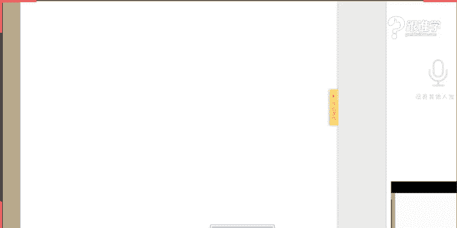

# 1、11服装《搭配秘笈之新版36计》：36时尚西装

🎼盖弥章。🎼自我梦境。🎼赐我怀头倾心与我沉睡。🎼与我蹉作无私悲爱破蠢。🎼我失落，不必对翻。🎼单子伤爱他。😊，小。hello，同学们晚上好OK呃，那如果可以听得到我的声音的话呢，同学们请打一啊。

我来确认一下我们的这样的一个设备有没有问题。好的，嗯，你好，阿迈同学。嗯，优悠同学，那包括呃其他同学可能应该也可以听得到啊。那我们的这个麦克风是没有问题的。OK好。

那同学我们的这个这今天的课程就开始了啊。那今天呢给大家分享到的是关于西装的这样的一件单品。呃，那我们说西装他可以呃说是作为我们每个人进入到社会当中啊，从大学毕业之后，我们即将要工作了。

那么我们每个人都需要去穿到的这样的一件单品。那可以说他现在是属于叫全世界的职业标准。那他到底是怎么从我们所说的古典主义的时装演变到现在的这样的一个呃能够代表一个人的社会地位的这样的一件单品。

那也是今天在课堂当中老是要跟大家来分享到的那包括我们说时尚的这样的一些穿法，怎么去穿着。那我相信其实同学们在生活当中应该会有遇到呢。某一种情况，那比如说有的人会觉得穿西装的时候给人感觉太过于正式。

那我们日常穿西装的时候啊，例如说我们不上班了，我们在日常当中，我们生活当中想要穿着西装出去的时候，有很多人就会有这样的一个困惑，就觉得穿着不够时尚，不够什么呢？嗯，或者太过于职业化。

那或者说有的人会这样呃，我记得在看我是歌手的时候，这一期节目当中，这个张杰穿的西装，然后所有的人评论就是说他特别像平安保险的业务员。那所以其实这个西装的这个呃穿法，那以及搭配的话。

还要跟每个人的这样的一个气质去匹配的OK那我们今天呢就进入到我们现在的这个时尚西装的这个这个搭配当中来了。OK好，那我们继续来看，那为什么我们说西装他是这样的一个必备的单品啊，可以这么说。

那其实不管是站在男生的角度还是女生的角度。那。今天的话我们男同学啊应该感到开心，为什么呢？因为我们今天的课程会呃讲到很多关于男生啊，应该怎么去穿西装以及很多的这样的一些细节。

那也会讲到我们女生怎么去做这样的一个时尚的搭配。那为什么说西装它是必备的单品。大家可能在生活当中也会就就会觉得这就是一件应该应该有了这样的一件衣服。可是我们没有想过，哎。

西装它呃能够能够给我们带来从体态和美感上它是怎么去呈现的啊。OK呃首先呢给大家来讲到的就是西装其实这件单品啊，它是修饰体型最佳的单品。为什么这么说呢？那大家可以看到在我们图片当中第一张图片和第二张图啊。

这两张图片，那我们来看首先我们说西装它修饰体型当中的第一个部位是哪里？就是胸肌的力量感，就是塑造胸肌的。量感从男生的角度上来讲，那我们说本身西装就是男士的单品啊，被我们女生所穿了。那所以好的西装啊。

我在这里讲的前提是比较好的西装，它在呃做工的时候，大家现在可以看到，在前片的胸部的这样的一个设计的话，它会有五层的这样的一个构造。那每一个构造它都会起到一定的作用。那例如说它会在某一层加入一个叫什么呢？

弹力的这样的一个面料。那为了要什么呢？塑造出这样的一个鼓专业术于叫鼓，就是鼓出来鼓这样的一个空间感，从而塑造出来这种好像唉这个人的这个胸部的这样的一个位置很有这种胸肌的这种状态。

那大家可以看到它的这样的一个线条，其实带有这种鼓的这种感觉。那这是说好的西装。可如果在呃平时同学们如果买的一些不是。特大批量生产的，或者说没有经过这种精致加工的呃加做做出来的西装的话。

那他可能会没有这样的一个效果。那这是我们所说的第一个叫塑造胸肌的力量感。那所以说啊那如果有的同学他觉得自己太过于弱弱小的时候，想要呈现男性的这种形状感的时候，那你呢你那你就要需要一件好西装了啊。

那第二点我们再来看增强嗯增强肩肩部的厚实感。那我们之前如果有听过我们体型课的同学们应该有了解到，我们说男士的体型以T型为美。那么也就是说在有一些肩部比较窄的男生啊。

或者是说女生肩部比较窄以及溜肩的这样的一种情况。那在肩部的时候，一定需要做一些修饰。那比如说买垫肩款的这种西装以及这种垫肩款的外套。啊，包括我们所说的有这种肩部修饰。是挺括感的这样的一些服装。

从而让你的肩部啊拢起来。那这样的话，对于男生来讲的话，那他就有这种厚实感。那女生来言而言的话，那其实就是修饰到了我们所说的体态细节的问题。那如果男生过过过于瘦小的时候。

他其实女生看起来是没有安全感的那女生肩部过窄的时候，它其实或者是溜肩的时候，它会有一种不精神的这种感觉。所以说啊那其实西装在肩部的这个位置，它是有这样的一个叫厚实感的这样的一个修饰啊，对于我们体型来讲。

那刚才讲到的是关于胸肌以及肩部的这样的一个修饰。那其实西装它还是最好能够塑造腰线的这样的一件单品。那我们来看一下，特别是针对于胖子啊就是男士比较胖的这样的一些情况。OK好。

悠悠同学说到买西装肩宽和适胸围紧怎么办？那我在这里讲。一点啊，那么刚才讲到的肩部的这样的一个比较夸张的问题。那呃肩男生特别是男生，如果你是肩部过窄的时候啊，或者过于瘦小的时候。

那么你应该要选择这种有垫肩款的但是如果你过于雄壮的时候，比如说健身教练，比如说运动员，如果你本身的肌肉已经非常的发达了。那你反而在肩部在买服装，买西装的时候，这个地方一定要薄这个地方一定要薄啊。

那刚才这个我们呃悠悠同学说到肩宽合适胸围型怎么办，那你是因为胸部太过于丰满的这样的一个问题吗？那如果你是这种情况，那我建议你里面的这个bra或者内衣，你这个内衣，你要变把它换成薄款的OK啊。

那甚至你可以穿隐形的bra这样的一个效果。O那我们继续来看刚才讲到你所说的这个胸肌和肩的问题啊，那我刚才也。跟大家提到了说西装它是能够制造腰线的，特别是对于微胖的。

和我们中国男士有很多比较肚子比较大的男生啊，那其实有人会觉得唉西装它特正经或者特硬朗或特挺括，他怎么能够修饰到一个人的这个或者大家会觉得它太贴身，怎么能修饰一个人的体型呢。

那我们说男生不管是男生还是女生，你是肚子大啊，但是不代表你的肋骨，他是胖的。所以啊一件好的西装，如果你去定制的话，特别是胖一点的同学们，你们要去定男士啊去定制西装的时候。

那可以跟给这个定制的师傅讲讲怎么去定制呢？就是你的腰线要提到从肋骨就开始就是叫高腰线的这样一个做法。那你的腰线就出来了。啊，那从而其实就能够显瘦。那我们说如果你具有腰线的，那么你其实看。

看起来就会有显瘦的效果。OK那包括你的肩部的这样的一个呃厚实感以及胸肌的这样的一个挺阔感啊，挺这个形状感。那再加上这种腰线一收，下摆一放，那么你整个人的腰线就出来了。OK这是我们所说到的西装。

它其实第一点是能够修饰人的体型的那它可以修饰到哪个体型呢？第一就是我们所说的胸肌，第二就是肩部，第三就是腰线的这样一个问题。OK好，那我们继续来看，那西装它还能够给我们带来什么？唉。

同学们这里呃老师这里呢现在稍微有一点点卡，请稍等一下啊。那我们的这个网络稍微有点卡啊，我在按图片的时候按不出来嗯。🤧可能需要调整一下，那同学们要稍等一下。嗯，那麻烦我们的技术顾问老师啊过来一下。

然后来帮我们调整一下这个屏幕。好，那我现在这个以口述的这样的一个方式啊来给大家讲。那我们刚才讲到的是关于我们所说的西装，它对于修饰体型。那西装其实它还可以怎么样呢？

对于我们所说的人的这样的一个叫视觉中心，起到一个塑造的和装饰的效果。为什么这么说呢？那大家现在可以想象一下嗯，那同学们稍等一下，我们来调一下这个PPT啊，来给大家看会更加的具象化一些。能不能先把它关掉。

然后我们再打开。嗯。😊，好，那同学们稍等一下嗯。

🤧嗯，好的嗯，那同学们现在可以听得到我的声音吗？如果可以听得到的话，请打一。OK好的，嗯，那我们继续。那刚才呢给大家讲到，我们说这个西装它可以对于人它有塑形的作用。那第二。

我们说它有强化和装饰一个人的视觉中心，什么是视觉中心，就是我们什么呢？这个三角区域，头面部胸部以上的这样的一个位置，叫三角区域，它其实是就是我们人的视觉中心。那大家可以看到啊。

我们中国的中山装以及西方的这样的一个西装的款式。那我们先看左边的这张图片。那刘德华先生穿着穿着这件中山装的这样的一个视觉效果，大家可以看到，它相对来说是比较沉闷啊，没有变化性的，可以这么说。

那我们再来看在左边的图片当中啊，那你会发现在什么呢？颈部以及胸部的这样的一个由衬衫的白色和领带的黑色构成的这样的一个倒三角的结构。那你会发现这个结构的话，它其实是有这样的一个让人这个注意力。

会集中在你的这样一个位置，从而让整个人他看起来都会比较有精神，他是有变化的，他能够强化和装饰一个人的这样一个视觉中心。那这是我们所说的西装，它其实有这样的一个作用。那大家可以看到，当我们打开西装的时候。

当西装它其实在你的这个衬衫啊，以及这个这个领带形成了一个两白一黑的这样的一个平行效果，它其实也是有美感的所以说整个配色上来讲，以及它的结构上来讲，它都是有这样的一个装饰作用。

那所以其实我们唐装虽然我们唐装的话其实是比较内敛的这样的一个穿法啊，那可能有男士不喜欢太过于这种啊有有很多男士其实是特别喜欢穿唐装的，特别喜欢穿上唐装，然后带这种珠串。

那其实是比较具有我们中国的男士的这样的一个美感的那我们说这是另外一种味道。OK那这是我们所说的第二强化和装饰一个人的视觉。中心。那么来看一下第三点。那第三点是什么呢？其实我们说西装的这样的一个穿着。

它其实可以表现一个人的社会地位。那刚才我也跟大家讲到了，我们说我们在出入职场之后，或者说呃我们每个人都会要必备一件这个西装。但是你会发现某些社会阶层的人，比如说经常会干这种啊这种苦力活的啊，或者说这种。

呃，需要长期去这种呃运动的这种的话，他们就不会去选择穿西装。那西装为什么说他能够表现社会地位，其实也是跟他的历史有相关性。那在西装的百年发展的这样一个历史过程当中。

其实一开始西装他就是给一些贵族去穿着的那直到现在他已经形成了我们所说的，在呃成为了这样的一个职业装。那在职业装的这个着装着装当中，我们穿着西装的时候，就会有一种庄重感和这种权威感。

那所以说呢他是表现社会地位的那我们的男生也好啊，那特别是男士在职场当中，如果你穿不好西装的话，那其实是被人家笑话的啊。为什么这么说呢？其实男士的西装他有着严格的这样的一个着装细节的要求。

那我认为如果一个也也有这样的一句话是这样说的啊，说一个能够把西装穿好的男人。那么他在事业上一定也会做的不错啊，那如果在我们说这个是除了。职场之之外的啊，那在生活当中。

如果一个男士他是特别的能够把西装穿出这样的一种美感的时候，那说明什么呢？他对于生活是热爱的啊。第一，那第二的话，它其实是有这种品味上的要求的。OK那这就是我们说到的关于西装啊。

为什么我们每个人都要去必备的这样的一个问题。那其实他不管是对于我们的人体，还是对于你个人来而言，在我们的这个社会角色当中的扮演，它其实都发挥着重要的这样的一个作用。那我们接下来看，今天呢要给大家讲到的。

所以我们要这个认识西装啊，那包括我们认识之后，我们要去学会去穿西装。那今天呢呃给大家讲到认识西装的这样的一个板块的话，也是非常非常的丰富啊。好，我们继续来看，那在西装的这样从西装的发展史上来讲啊。

那大家可以看到，其实第一个阶段叫古典主义。为什么这么说呢？大家可以看到在西服之组啊，那现在大家看看到的图片上的这样的一些服装。其实它就是现代服装的三件套的这样的一个原始的出行。可以这么说。

那大家现在可以看到，从这件上衣它大概到什么呢？西长及长衣及西的这件服装叫鸠斯特科尔啊，那它的名字是比较二澳口的那大家可以看到，这是我们所说的它的外套啊，那它的其实比其略短的叫贝斯特。

那这件贝斯特其实就是我们现在会穿到的马甲啊。那这个的话其实就是我们所说的西装。那包括到什么呢？呃，紧身合体的半截裤，科优罗特其实就是我们所说的西裤啊，那他这就是我们所说的现在的三件套的出行。

那现在大家会发现我们在穿单排扣的时候，有的时候指挥扣一颗扣子，或者说不扣扣子其实都是来源于什么呢？鸠斯特科尔前门襟啊扣子它一般是不扣的，其实都是由。这样的一个呃历史的这样的一个过程。

服装的这样的一个呃过程来演变而来的。OK这是我们所说的他的第一个阶段。在路易十4这样的一个时期。那我们继续来看，那在维多利亚时期啊，那么刚才我们讲到的是他的第一个阶段。那在维多利亚时期的时候。

也是我们所说的是1853年，大家现在可以看到。诞生于什么休息式的现代服装叫拉翁鸡夹克。那这种拉蒙机夹克都是怎么来的呢？其实在那个时候啊，维多利亚时期，人们的这样的可以说是英国史上最辉煌的这样的一个时代。

那那个时候的贵族，他们的生活基本上都是在什么夜宴呃，就是非常的可以说是有奢靡的这样的一个这样的一个啊状态啊，那当这些贵族们，他们晚上啊晚宴之后，他们在晚宴的时候，他们一定会穿呃，这种叫宴尾服的礼服啊。

也是我们所说的夜间第一大礼服。等一下在后面也会给大家去看到。那他。在晚宴的时候一定会着宴尾服。但是呃他们会发现在晚宴之后，那这些男人呢就会去到休息间去什么呢？吸烟啊。

因为他们在这个宴会当中的话是不能吸烟的。那他们会到休息室去吸烟啊、谈笑啊啊，或者说抽抽雪茄呀啊，聊喝喝酒啊，聊聊政治啊，开开玩笑。在这样的一个阶段的时候，你会发现。他们觉得这个呃燕尾服就太难以什么呢？

就坐着极为不舒服。他们有在休息间的时候，其实甚至是可以躺在这个沙发上的。但是因为穿着这种过于紧身的服装，过于贴合于身体的这样一些服装的时候，人是难以运动的是极为不舒适感的。所以他们就有了什么呢？

在夜宴之后，晚宴之后，他们到休息室的时候就会去换上一件衣服。那这件衣服就叫拉风机甲夹克。那这件夹克的话，其实一直在当时那个年代都是不能登大雅之堂的，就只能用于什么呢？这种散步啊，然后这种郊游啊去穿着。

也就是说它不能穿到正常的这样的一个呃重要的这样的一个场合当中。那这是我们所说的在第二个这样的一个阶段，其实我们第二个阶段叫礼服阶段。OK好，那么接下来看，那呃这个我们所说的西服的这样的一个发展史的话。

他其实还有什么呢？跟英伦绅士文化。影响甚远的啊，那在这里其实有一个笑话，我们说英伦绅士，大家都知道英伦绅士的这样的一个呃这个title啊，我们可能就会经常都会说绅士绅士，那到底何为绅士呢？

那在这个拿破仑时呃，这个sorry，同学们啊，在这个我们说美国啊，有一有人有一任总统啊，他就会他克林顿，他就有一天他就很好奇，他就问到他的秘书，他说为什么英国的这个绅士啊，嗯，那就各个阶层都有绅士。

从贵族到律师到医生，然后到马夫啊，甚至到平民他们都被称为叫绅士，这是为什么呢？那到底何为绅士啊，然后他的秘书呢？在两个小时之后回来了啊，就告诉他一句话说啊，不给别人造成麻烦的，不给别人带来麻烦的人。

就是绅士啊，那为什么这么说，其实绅士。概念一开始的时候，它其实只存在于贵族的这样的一个阶层当中。但是当我们说时代的发展，你会发现中层阶级的人，因为工业工业革命的这样的一个发展啊，历史在前进。

那这一批人富亲来了之后，他们也想要进入到绅士的这样的一个群体当中。所以啊到后面的时候慢慢发展，你会发现啊绅士的概念它就变了，绅士的这样的一个概念就是你只要什么呢？不给别人带来麻烦是什么意思？第一。

其实你是需要有着什么呢？非常的严格的行为举止的规范。那第二就是你的姿态要是非常不管是男特别是男士绅上，你的姿态一定是文质彬彬，非常的优雅，非常的有礼貌。那带给别人是这种贵这种非常的舒适的这样的一种感受。

那而且在贵族的制度绅士的制度当中有这么一条，就是第一，永远是女士优先啊。第二，一定是什么呢？服装一定要。合体。那所以说同学们他们为什么要合体？合体，其实就是为了要制约他们的行为。

那等一下我会再跟再跟大家讲到怎么去制约他们的行为的啊，通过服装去制约他们的行为。OK好，那我们说在其实200年前英国的这样的一个服装就已经影响到我们全世界的服装。那直至现在为止。

现代人去穿着服装的这样的一个领仪标准，其实都是从英国那边传来的。OK好，那这是我们所说的西服的这样的一个发展史，那我们继续来看啊，那西服刚才我有跟大家提到有哪些啊，他这我们所说的分类啊，那第一叫宴尾服。

那大家可以看到，别名夜间第一大礼服，也就是说非常隆重的晚宴当中的时候会去穿着的。那它起源于英国的18到19世纪，它的领口大家可以看到啊，呃，一般是以羌国头为主。什么叫枪火头，就是这个地方呢，它是呃。

是间的啊，那等一下我会给大家看另外一个呃一件单品，那它是属于叫平脖头。OK它的脖头是尖锐的啊，并且是往上走的。那么接下来而且它的脖头的这样的一个做面料一定是这种卷绒啊，丝这种真丝的。

或者说缎面的这样的一个做工，它的这样的一个脖头跟它的前片的面料啊是不一样的，它是带有光泽感的。可以这么说，那色彩一般一般是以黑色和蓝蓝黑为主。面料一般都是比较高级的羊毛。O这是我们所说的叫夜间大礼服。

那我们继续来看燕尾服，前短后长。好，那到了吸烟装。那其实现代的吸烟装呢就是来源于刚才我跟大家讲到的。我们说燕尾服之后啊，人们要换上那种比较舒适的这样的一些服装啊，那么慢慢其实发展出来，它就叫一吸烟服。

那吸烟装的话，它的这样的一些领型，大家可以看到它属于叫轻薄领，也就是说它是属于这种椭圆的这种领型，并且轻果领的面料。也是带有这种丝呃真丝的面料，或者是说这种缎面的，带有反光感的。

跟服装的这种什么面料是不一样的。OK好，那它的起源于美国，包括它的领口是青国领丝娟波头啊，丝娟脖头，那色彩是以黑色和蓝黑色为主。那它的面料其实有的时候会做成这种所说的叫天鹅绒。嗯，好。

那面料的话还会有羊毛啊，那这是我们所说的吸烟装。那我们继续来看呃西服当中的晨礼服啊，晨礼服的话，它跟夜大礼服，我们说夜间第一大礼服，它有什么样的一个区别。那第一它在搭配上其实是有区别的。

大家可以看到夜间大礼服它一般是以领结为主啊，那而晨礼服的话，它可以用领带的啊，它是以领带为主，并且它的前片这个设计，它是比什么呢？燕尾服多了两片，大家可以看到啊，这是晨礼服的这样的一个款式。那么继续来。

来看那刚才跟大家讲到了，我们说平国头和跟敲国头的这样的一个问题。那现在其实我们在正式的职场当中，其实我们经常会穿着的呃服装一般都是以黑色为主。因为黑色的话，它其实非常的万能可以这么说啊。

一般比较重要的场合的话，我们都可以穿着黑色的这样的一件单品。那黑色的套装我们大家可以看到啊，一般现在呢呃这个从扣子开始说，从扣子开始说的话，一般它会有单排扣和双排扣之分。那么单排扣的话。

它一般是有一颗两颗三颗扣。那么如果有可以不扣。但是如果你去参加一些我们所说的这种正式的场合的时候，你坐下的时候是把可以把扣子解开。但是你站起来的时候是需要扣起来一颗扣子，以表示对对方的这样的一个尊重。

那在生活当中的话，其实我们是可以不用去扣它的啊。那刚才也跟大家讲到了是古典的主义的那个阶段啊。那这是我们所说的单排扣跟双排扣。那刚刚才讲讲到单排扣，单排扣的话一般也只扣一颗扣子啊，3三颗扣子的话。

扣中间两颗扣子扣上面这一颗扣子。那双排扣的话，一般有什么呢？四颗扣和6颗扣。那四颗扣的话，一般啊我们会扣这样，这中间的这个扣子也可以全扣啊，但是不会扣到上面的两颗，包括啊我们不会把它敞开去穿着。双排扣。

大家要记住啊，一定会扣起来的，不会是把它敞开去穿着的。这是我们所说的单排扣跟双排扣的这样一个区别。那从脖头上大家可以看到啊。枪脖头的话呢，它的这样的一个脖头的话是往上啊，并且它是尖头的，而平脖头的话。

大家可以看到这个锐角它是比较平缓的啊，那它的角度是没有往上挑的。并且啊一般这种单排扣它都会配配有平脖领。而双排扣的话，一般都会配有枪脖领啊。那这是我们所说的西装的这样的一个款式上的区别。

那包括其实脖头啊我们所说的脖头的宽度跟我们在平时带领带的宽度，它其实是存在这样一个搭配的关系。脖头越窄，那么你的领带越窄，脖头越宽，你的领带越宽。那如果你想要年轻感的话，那你的脖头是较窄的领带是较细的。

它会有时尚感和年轻感。而较宽的脖头和较宽的领带，它会有一种传统老派的这种感觉。OK这是我们所说的脖头跟领带的这样的一个搭配，那在这里先不多说啊，我们在后面再慢慢的去讲到，那这是。所说的西装的黑色套装。

它是比较正式的这样的一个服装。在正式的这个场合当中去穿着的那我们继续来看啊，那西服当中它还会有这种商务休闲西装。那商务休闲西装，大家可以看到啊，那一般它的款版型一般是以H和O型的同学们可能不了解。

等一下，我在后面会跟大家来讲到版型的这样的一个划分。那它的面料H型和O型，说明什么问题呢？其实它是属于比较休这种舒适感的为主啊，那面料一般都会有羊毛或者是混纺的面料。那其实从色彩上来讲的话呢。

它会有多元化的啊。但是你会发现，其实我们说男士的这样的一个正式和休闲的这样的一个感觉。它在哪里。第一，从这种色彩上来讲的话，正式一定是相对来说比较稳重感的，就是以黑色呀、深蓝色为主啊。

那呃而且以套装为主，但是在休闲西装当中的话，它的色彩是可以多样化的，可以是鲜艳色的。可以是什么呢？带有这种什么呃这种呃，甚至它可以是带有图案的，大家可以看到啊，大的或者是不灰则的。

比如说这种格子格子的图案条纹的图案，这种相对来说都是比较休闲的。并且它的服装也是相对来说比较宽松的那它的大家可以看到一个细节叫贴在拼接设计。

这是在休闲西装当中才会出现的如果呃我们说不可能在正式是西装当中出现叫明线的做工，这种明线做工一般就是大家可以看到，一般我们的西装它都是你在表面上是看不到很这种明线，大家能理解吗？啊。

就是有线扎过的痕迹啊，走过的痕迹。那这种明线的话，它一定是出现在休闲装当中。而且呃正式西装一般都是挖带，它不会是做这种贴带设计啊，那这是我们所说的正式跟休闲的这样的一个区别。那呃我们继续来看。

这是西装的这样的一些分类。那么继续看西装的版型它有哪些，那版型的。大家可以看到英式意式美式和日式啊，那我们首先来看英式。那英式的话呢，我们说英国的男人，他一般都是非常的注重礼仪。刚才也有讲到啊。

英国的呃这个礼仪是非常注重的那所以我刚才也讲到一个问题叫什么呢？用服装来制约他们的行为，所以他们的服装是比较修身的大家可以看到，呈现这种叫X的形状，腰这个地方特别的收啊，然后呢呈现什么呢？

上面它是这我们所说的这个胸胸部位置他是鼓起的啊，然后下摆它是有放的，呈X这样一个线条，那这种服装它其实这种款式他更加适合给到男方的一些男生去穿着。那因为他是比较相对来说比较修身。

那男方的男生的话可能相对来说比较这种纤弱一些。那北方的男生的话，一般都会选择叫日式呃，意意式西装。那意意好老师这个口误啊，意式西装他的这样的一个。呃款式上的区别，那它是会在肩部做这样的一个加宽啊。

看起来是比较雄壮感的，比较man的这样的一个版型。那一般是以T字型或者是Y型为主。那我们说了西装但是X型和Y型，它其实都是有这样的一个收腰的效果在的。其实它这个地方会有加宽，所以它整体呈现的话。

还是T的这样的一个特点为主。那我们继续来看美式和日式。那美式和日式的话，它就不收腰，就是以S版型为主。那我们说英式它是比较适合给南方比较娇小的美意式它适合给北方比较北高大的那美式它其实就是什么呢？

给到因为美国人他会认为啊这个我们所说的嗯西装它是平民化的，时尚它是平民化的，可以这么说啊，他不会认为是说只是给贵族去使用的那美国人它本身就非常的爱自由，非常的随意追求舒适度为主，做成这么紧的款。

的时候他们会认为非常的不舒适。所以他们的服装一般是以这样的H型版型为主，也是比较宽松的这种感觉。那日式跟美式它到底区别性在于哪里？那我们知道服装西装当中它会有后开叉啊，有双开叉。

那呃在日式的服装当中它是两边也不开叉，后面也不开叉，这是为什么呢？我想问同学们有没有人知道这个。问题啊，你说所有的西装它都开叉，但是为什么到了日本之后。

日本的西装它做成不开叉的那其实啊那这个问题可能相对来说，同学们也没有听过啊，可能是比较难回答的那是因为跟什么呢？日本人的身高有一定的关系。我们说这种西装开叉，它的目的性。好。

这个阿瑞同学说日本人个子矮啊好，非常聪明啊，那我们说西装它的作用开叉的作用其实是为了方便行动啊，那他日本人相对来说个子比较矮一点，他们坐下来的时候啊，西装它本身就做的是比较大的了。

然后也是比较宽松的这样的一个感觉，所以他们不需要啊开叉，然后就已经能够比较自如了。所以这是为什么他们不开叉的这样的一个原因啊，那所以西服当中呢它的版型分类分为英式与日式啊，意式美式和日式四种版型。

那同学们男同学可以根据自己的这样的一个身材体型的特点去选择一些。版型，那包括你自己个人能够适用于哪种。比如说有的人他就是想要舒适感为主，那么可能就会去买美式啊。但是我想跟大家强调一个概念。

就是英式和意式的西装非常非常的漂亮，每个男人都要备一件。这是必须要有的。而且每个男人一定要给自己去定制一款西装。当你穿了定制款的西装之后，你就知道啊，你以前穿的那些西装的话。

它其实看起来没有让你那么的美好，可以这么说，okK好，那以上呢给大家介绍的就是国关于我们所说的西装的发展以及西装的这些分类，那包括西装的这样的一个版型的问题。那从发展上来讲。

其实我们说西装它可以有四个阶段，第一个叫古典主义阶段啊，那第二个阶段其实就是属于我们相对来说它快要到了叫礼服阶段啊，第一个叫古典主义。第二个叫礼服阶段。第三个叫标准阶段。

就是它已经接近于我们现代的这样的一个西装的标准的那第四个叫什么呢？休闲西装。其实它的发展上可以有这样的一个四个阶段构成。那从款式上来讲，那呃分类款式分类的话，它有大礼服。也就是我们所说的燕尾服。啊。

然后有这种陈礼服，有吸烟装。那包括我们所说的这种休闲的这样的一些西装。那版型大家可以看到有英式、意式、意式、美式和日式O这是关于西装的这样的一个识别。那接下来我们来看啊。

每个人都知道哎西装分了这么多版类。那其实我们女士的西装全都是根据男士的西装演变而来的啊，同学们，所以我们女生的西装其实不用那么的详细的去讲到这个问题。那么继续来看啊，那如何去穿西装，穿西装的话。

对于男人男人来说非常非常的重要啊。好，那我们继续来看，那西装当中呢给大家穿西装给大家介绍两个板块。第一个是西装穿搭必知的7个细节。第二个就是时尚西装穿搭的秘集。那么首先来看哪7个细节是我们必须要知道的。

特别是男同学啊。好，那我们首先来看第一个细节叫确认肩部。那呃从肩部的这样的一个。位置上来看，我们看到这个图片当中有三这三个图片啊，这个屏幕当中有三个图片。第一个它是属于叫刚刚好啊。

就是我们所说的叫合体合适的这样的一个问题啊，图片。那第二个的话，它就是太小了。第三个就是太大了。那到底怎么去确认它到底是正好啊，还是这种我们所说的太大还是在太小。

那我们说这种嗯肩宽的这个肩部刚刚好的这样的一个位置的时候，我们的服装它不会有太多的褶皱，也就是说你的衣服上从背后到你的这个肩部的这个位置，它不会有太多的褶皱。如果太小的时候。

特别是前胸的这个位置以及肩部的这个位置，它都会有褶皱感。那如果太大，那就看起来是极位，那大家可以看得到啊，就是它看就没有形，对于你肩部的这个位置没有太多的这样的一个修饰作用。那所以说我们在穿西装的时候。

一定要注意肩部的这样肩宽的这样的一个问题。OK好，我们继续来看第二个。那第二个叫衬衫与西装的高度。那大家可以看到衬衫与西装的高度有这样的一个说法啊，那大多数人可能平时不会太去注意这个问题。

有一种说法就是说衬衫与西装的高度就是衬衫比西装高1厘米就可以了。那其实在我们的什么呢？严格的这样一个规范当中，衬衫它要比西装高2。5厘米才是属于相对来说比较标准的这样的一个状态。而且衬衫领一定要高。

不能低。就是你必须要高一定不能低。为什么这么说呢？在领仪上来讲，为什么你会发现在这张图片当中，这个衬衫领是极高的，对不对？那在礼仪当中，我们说人为了要保持它高贵的头颅。那它一定又需要什么呢？

用一种东西来素制约着它。那刚才也有跟大家去讲到，什么叫制约行为。这个其实就是属于叫一种制约行为。你会发现你如果脖子上。那老师今天脖子上带了东西，我就会一直有这种就是有有紧箍感，你就会不自觉的去挺起来。

那穿西装的这种穿衬衫的领子高也是一样的道理。当你高的时候，你往下这个往下走的时候，你是不舒服的，所以你一定要挺起来。那这就是我们所说的衬衫，它与西装的这样的一个高度的问题，一定要可高不可低啊。

这是我们所说的衬衫与西装高度。那么继续来看细节3，胸部周围是否合体啊，胸部周围是否合体，大家可以看到，那胸部的这样的一个位置，如果是合体的话，不管你是从正面看还是从侧面看，当你的衣服扣起来的时候。

它是没有站立啊，一定是站立，它是没有太多的褶皱的，就是你从前面看，从后侧面看它都没有太多的褶褶皱。但是如果它极小的话，大家可以看到非常紧绷的这样一个效果。如果它过于宽松，那也呃太过于宽松了。

那有一个方法怎么去丈量呢？就是胸部周围是否合体，就是当你扣上衣服之后，即使是当下比较流行的紧身的西装的款式也是一样的道理。就是你的拳头跟你的西装是可以跟你的身体可以插近一个拳头的距离。

如果你发现你的手伸不进去，那就代表的太紧了。如果你发现啊手非常轻松插进去了，而且可能有两个拳头，三个拳头，那说明你的衣服太宽松了啊，这就是我们所说的胸部周围是否合体的这样的一个问题。

那一定要注意这个细节。OK那我么继续来看细节四，袖子的长度，那袖子的长度呢在手臂下垂的这样的一个状态的状态的时候，我们西装的袖子的长度刚刚好过过到什么呢？手腕的骨头的隆起处，大家可以看到这个位置啊。

那老师可以给大家来示范一下，那我的这个西装，当我呃我如果哈是这种我们所说的呃这个站立的姿势，然后手臂下垂的时候，我的西装的位置刚刚好过这个位置就对了啊，那如果它太短，比如说到这儿了啊。

那或者是说到这个位置了都是属于太长了，它一定是刚刚好过这个位置。那包括它只是袖子跟什么呢？袖子跟。衬衫的长度还有一个讲究，那它的距离一般是1到1。3厘米，也有一种说法叫1到1。5厘米。

但是呢我们最多就到1。5厘米啊，这是我们所说的衬衫，它比袖子要长1到1。5厘米这样的一个长宽度。什么意思？那也就是说，如果你的袖子过长的时候，把你的衬衫全都盖住了。那那这样呢是不符合理仪的啊。

那有的西你会发现有的衬衫，正式的衬衫，它的长度一定会做的比较长一些。为什么呢？你会发现当你穿了衬衫之后，穿了西装之后，你的这个位置是往上收的。如果你买的是日常的那种西休闲的那种衬衫，它的袖子会过短。

那所以说正式西装它一定会过长一些的那这样的一个长度是刚刚好能够保持你袖口的这样的一个干净整洁的程度，同时又是比较美观的这样的一个程度，所以袖子的长度它也是非常的讲究的。OK好，那同学们要记住啊。

一定是站立之后，手臂下垂啊，那老师。啊，站立之后，手臂下垂，然后你的袖子呢刚刚好过到手手腕的这个位置。就如我们所说的骨头的这个位置啊，那如果极短和极长都是不对的。OK好，那我们继续来看啊。

那这是关于细节是袖子的长度？那么们继续来看上衣的长度啊，那同学们你们在买这个呃西装的时候，你们认为上衣的长度到哪个地方合适。你们认为上衣的长度到哪个地方合适？我给大家一个答案啊，给你们几个选项。

第一叫臀部以上。第二，臀部中间第三，臀部以下哪一个比较正确？上中下。嗯。有没有同学知道？🤧中好，悠悠同学中，那有没有男同学啊？我们男同学对于这个有没有概念？好，嗯，那我来给大家讲这个问题啊。

那我们说标准的上衣的长度啊，第一个是最标准的，它在臀部以下一定要盖住你的臀部，或者是说至少要盖住你臀部80%。那么现在当下比较流行的那种很短的款式，那它是属于叫时尚款。

如果在正式的这样的一个职场当中或者正式的场合当中标准的长度啊，它是属于叫臀部，盖住臀部的这样的一个问题啊，那这是以第一个判断标准。等一下我再给大家看图片的时候，再讲第二个判判断标准啊。那我们继续来看。

这个就是过短，这个就是过长。那我们来看一张图片。那同学们在这三张图片当中，你们认为哪1个123哪一个是正确的长度？同学们，123，你们认为哪一个是正确的长度？🤧嗯。OK好，有同学说第一个啊。

那我们来看一下啊，中间这个最正确。为什么呢？有一个标准就是我们所说的衣长要跟你的虎口或者说跟你的什么呢？前裆的这个位置是齐平的啊，如果它过长或者是过短，你会发现记这个是有点过短了。

它都是不是特别的正式啊，O好，那如果这个款式，它现在是比较时尚的款式。这样去穿着很老气。O这是我们所说的关于衣长的长度，同学们记住了吗？啊，第一个盖住那有两个标准啊。

第一个就是就是盖住你的臀部或者是至少盖住臀部80%。那第二个大家可以根据什么去判断呢？啊，到你的手臂的虎口的这个位置，你会发现如果衣服过短了，或者是过长了啊，然后都不是特别合适。

或者说我们所说的叫裆部齐平的水平线上O。好，那就是我们所说的叫长度的问题啊，那么继下来看细节6，臀部线条啊，那我们在买裤子的时候，我想问同学们，你们是以腰围为主，还是以臀部合适为主。

一还是2腰围为主还是臀部合适为主？同学们一还是2。没有人知道这个答案，还是老师这儿延迟比较慢。好，臀部啊也有也有人同学说到这个这个是腰部啊。好，那么继续来看。那其实我们在买裤子的时候。

我们首先要以什么呢？你买裤子的时候，其实是你以臀部和腿部合适为主。腿臀部和腿部合适为主。那你西裤的合适怎么去判断，也就是说当你拉起你的裤腿从后侧去拉的时候。

它的你的裤腿跟你的腿之间宽2到3厘米的这样的一个空间，那么就可以了啊，不并不能说腰可以插腰带啊，这个的话呃我来讲一下啊，其实一般西裤它都会可以去什么呢？改大或者改小的这样的一个设计的。

所以我们一般是买以臀部和腿部合适的为主。然后如果过大或者过小的时候，你们拿去改腰部，这个是最正确的方法啊。那再记住一个问题，就是什么呢？我们说臀部和腿部的这样一个在选择的时候。

你的腿部的裤裤的宽度是2到3公分啊，那这样的一个空间就可以了。那你会发现如果过紧的话，你整个裤子它都会有褶皱感，太松的话就空荡荡的啊，那有人是这样选裤子。啊。

就是说蹲下来试一下有没有同学们就他们在选选完裤子时候，我穿上裤子之后，嗯，我来蹲下试一下它到底紧还是松。这个方法是错误的，绅士它是不会蹲下来的。所以我们在买西装的时候，我们买裤西裤的时候，试西裤的时候。

我们的标准是站立起来的时候，你不会有太多的褶皱为主。OK好，这是我们所说的臀部线条的这样一个选择，叫细节六。我们继续来看细节7。细节期，我们裤子的长度大家可以看到啊。

那裤子后面的这样的一个长度一般以什么呢？露出鞋跟为主。那前面盖住脚面就可以了，不要有过于堆积的这样的一个面料啊，或者是过短。那当然现在特别短，有的人是把这个裤子拿去改，对不对啊，改短，然后改窄改紧。

那这个都是比较当下时尚的这样的一个穿法。那如果标准上来讲的话，这种是最正确的。O好，那我现在给大家讲到的这7个细节都是我们男士，你们在职场当中去穿着西装。

或者说在正式场合当中穿着西穿着西装的时候需要注意的一些细节问题。那包括刚才我跟大家讲到的脖头的问题，跟你的领带搭配的问题。以及其实我们在选择脖头的时候还有一个问题，我再给大家讲一下啊。

那我翻到一个有脖头的。好，那同学们可以看啊。那虽然老师这张图片当中没有这个脖头的高T的问题。那我现在大概给大家来讲一下，我们说在选择薄头的时候，有的西装泊头它是往下走的，这个其实是比较高的。

大家可以看到啊，这个是比较高的。有的西装泊头它是坐在这个位置的那我们在选择西装泊头的时候，一般要选择往上走的。因为往上走的话，它会让你整个人的焦点都会这个视觉注意力会往上走。

从而让你看起来也会有焦点感显高啊，如果你往下走的话，它就会有下坠感。OK这是我们所说的博头的一些的细节问题啊。好，那刚才讲到的就是我们穿西装的几个细节。那么们现在来看如何去搭配的这样的一个问题啊。

时尚西装搭配的秘籍。那第一啊今天呢老师会从三个角度来讲，第一个叫单品的选择与搭配。那第二个叫不同风格派系的演绎方法。第三啊西装的。配色法则。那我们首先来看单品的选择与搭配。那单品的选择与搭配当中呢。

我们来看一下有哪些啊，那第一条叫打破正式化。我们来看一下，那刚才呢在一开始我们说古典的古典主义的那个时候，我就跟大家讲到过叫三件三件套的这样的一个概念。那三件套是什么呢？就是马甲西装和西裤。

那这三件套它是同色和同质的啊，它一定是同色和同质的。在正式的这样的一个着装当中，西装马甲和西裤它是同色和同质的那如果我们想要把它穿的时尚的时候，我们应该怎么去穿着啊，那我的标题就是像打破正式化。

那我们来看一下如何去打破正式化。那第一，例如说我们可以使用什么呢？叫两件套同制和同色的搭配的方法。那这两件套，它可以怎。去组合。那刚才其实我们说了西裤马甲和西装它可以构成三件套。而在这里你会发现什么呢？

马甲跟西装是同色和同质的。但是西裤啊，他是不是同色的，也不是同质的那这个时候你就会发现什么呢？他是有变化性的，其实这两个人都是同一个模特啊，那这个也是在呃这也是非常有名的一个模特啊。

那他是一直走的是大叔的这样的一个感觉啊，他的所有他是一位模特，他所有的这样的一个造型感，都是以这种绅士熟男的这样一个形象啊，那你会发现当他这样一个穿着的时候，他的时尚感其实是有变化的啊。

包括他的配饰的去配搭啊，那包括他的这种色彩的这样的一个拉开啊，都会有一些时尚度。那这是我们所说的第一个方法，就是你的可以用马甲跟西装做同色同制的这样的一个搭配。那第二我们来看一下啊，就是呃还依然是。

叫什么呢？两件同色和同质。那但是它是什么呢？西装跟西裤属于同色和同质，它的马甲可以不用同色和同质。那这也是我们所说叫打破正式的第二种方法。那么继续来看，那第三个就是什么呢？

你的马甲可以跟你的裤子是同色同制的。而你的西装可以是另外的色彩。那这三个搭配的方法，它都叫两件同色同质，只是他的组合方式是不一样的。第一个是马甲跟西装，第二个是外套与西裤，第三个是马甲与西裤。

那这个就是我们所说的，根据如果你不想穿三件套穿的这么正统的时候，那么你可以去这样穿着。那我想问咱们呃现在教室里的同学们，你们先生或者说咱们教室里的男同学，你们有没有人在穿西装的时候穿马甲的，有没有？

如果有的话，请打一。啊，可以看一下我为什么我一定要强调这一点呢？其实我认为每个中国的男士，你们都要有一套，就是这种我们所说的马甲、西装啊和西裤这种三件套的这样的一个搭配的西装啊，为什么这么说？

因为这种西装它其实是最能够表现男人的这样的一个绅士度的啊。这是在我们所说的英国绅士，它基本上都是以这种叫英式三件套，非常非常的有名啊。OK好，我看到咱们这个屏幕上还没有大衣的。那就说明什么呢？好。

我只看菲尔同学说只看过对象的朋友穿马甲帅死了。好，那说明那我们的女同学还是比较喜欢男生啊，这种这种比较绅士的这样一个形象。OK好，那这是第一个方法叫打破正式化单品当中啊，我们如何去进行重新的组合。

那么继续来看啊，那在女士的这样的一个搭配当中，你会发现嗯这张搭配大家觉得怎么样呢？啊，这张图片你们觉得怎么样好还是不好？一是好二是不好，你们觉得好还是不好呢？🤧同学们。好。😊。

那你会发现我们讲到的是叫什么呢？时尚的西装搭配方法，对不对？但是你会发现这套服装的话，它的穿法真的很很像房地产啊。

当然没有攻击我们这个房地产的这样的一个这个这个这个老师没有这样的一个这个表达方式呃意思啊，只是它真的是特别的正式化的这种感觉。那所以说如果我们要想把西装穿的时尚的话，那其实他可以怎么去做啊？

有同学说到上装太长。那其实比本比如说它可以把西装裤打开啊，不用记得这么延实啊，因为你不是在上班。那第二，你可以把袖子往上拉。那我在这里要给大家强调一点，我们在就是拉袖子的时候啊，不是卷起来。

而是直接把它给什么呢？往上拉，不是卷起来。同学们啊，O那这是我们所说的第二点，你可以把这个袖子拉起来啊，那第三，你是不是还可以把你的裤脚往上免呢，那这就是我们调整的，我们说如果有这样的一条西装。

我们如何把它变得时尚化，其实就要靠我们所谓的叫比例的调整细节的调调整。那比如说老师的这个衣服也是一样的道理啊。如果我把这个袖子往下走的话，放下来的话，那看起来就太过于这种有点老气的感觉。所以一。

定要把它拉起来，看起来才有这种干练的这种感觉。OK好，那我们来看一下。那如果我们在穿选择这个，如果我们在搭配的时候，其实不用搭配它这么正经，我们应该去怎么去选择一些单品来进行组合和搭配。

比如说你在呃选择单品的时候，就已经在做一个时尚款的挑选了。今年特别流行这种oversize的大衬衣。那比如说你是不是就可以选择一件比较大廓形的衬衫，然后呢不把它穿进去，特别是这种黑白色的配色。

它极容易显得很正式，而且显得特别老气的这种感觉。所以我们在穿着的时候，你就可以以这种叫不好好的穿西装啊，就不好好穿法，你就把它披着去穿着，那包括你的裤子的长度可以什么呢？这个露出脚踝。

选择这种当下比较流行的这种鞋子的款式啊，那嗯所以整个人看起来是不是都会比左边的这张图片要时尚感很强呢？啊，强烈很多，那包括你会发现它的腰线是露出来的。所以对于整个人的比例看起来也比较好啊。

从这儿到这儿然它会显得比较的什么呢？下半身脚比较长。O这是我们所说的，在正在在黑白西装搭配的时候，我们应该如何去选择单品以及。些搭配的这些方法。那同学们那谨慎的去这样穿着，这样穿着的话。

太过于正式和老气。那包括我们说打破正式化嘛，那我们是不是女士其实本身的话它是会穿短裙的。我们在正式的西装当中，其实我们是穿套裙的，对不对？那我们应该怎么去穿着。那我们穿套裙的时候，其实可以怎么搭配。

那大家可以看到啊，第一，我们可以把什么呢？啊，这个服装敞开。第二，我们的内搭要做一些变化。那你会发现刚才老师讲到的这个技巧，比如说叫什么呢？把袖子勒起来，你会发现在很多的时尚博主以及一些名人的街拍当中。

他们都会去这样做啊，都会去这样做。那其实我觉得啊同学们经常可能会关注很多的这种时尚的博主的这些图文啊，以及他们的这样的一些搭配的心得。那但是嗯他们的这些东西大家在吸收起来会太过于碎片化。

就是说它是没有系统。统的，所以我们在这里呢给大家提供这样的一个课程，就是为了让大家能够把系统的这些知识，把它整合到一起，让你们从而在穿衣搭配的时候是有方法可循的，有技巧是可以去搭配的啊。OK好。

那么继续来看嗯，那刚才讲到我们说套装的搭配，其实是可以把它在内搭上做一些选择。比如说这种就是背心款的那其实我们甚至还可以换成很多的这种T恤啊啊，然后有特色的这种衬衫啊等等。在后面会跟大家去讲到啊。

那包括这条搭配的话，其实它搭配的很妙的，就是什么呢？就是它的鞋子跟它的衬衫的选择。同一色彩第一延长了它的腿部的线条啊，那然后又做到了做到了一个叫美学这做到了一个美学原则，叫反复啊，OK好。

那么继续来看这个就是我们所说的叫打破常规啊，打破正式化的这样的一个穿法。那第二个就是我们在选择单品的时候，应该是怎么选择了啊？那西装加针织套头衫加衬衫。那我们平时在穿着衬衫的时候，再加上西装的时候。

可能就会给人感觉太过于正式化啊，例如说上次老师要出门，星期天的时候啊，然后要出门的时候，我当时就穿他不是我星期天不是属于上课时间啊，是比较休闲的时间。因为当时出去见一个朋友。然后呢。

我穿了一个这种衬衫加了一个西装的外套，加了一个半军就准备出门了啊，那老师的朋友就说你这是去干什么呀？怎么感觉要去上班了，就给人感觉太过于正式了。那所以我们想要把这种正式感去削弱的时候。

我们其实是需要选择一些比较休闲化的一些单品。或者说相对来说比较柔和的一些单品来削弱你的这种硬朗感觉。那针织套头衫，它其实就是一个很好的单品。套头衫或者说针织衫啊，那不管是它以什么样的衫为主。

它只要是针织的这样的一个毛衫，它看起来就会有休闲效果。OK好，那大家可以看到在左边这张图片当中，它就搭配了这种西装啊，然后衬衫加针织衫的这样的一个搭配效果。那它整个人是不是看起来就没有那么的正式感的呢。

就加入了这种柔和的感觉。OK那么们继续来看，那针织衫的话呢，其实它是有这种不同的面料肌理感的那比如说我们生活当中可能经常会选择的就是那种精细的那种羊绒的面料。那我要跟大家讲到的就是什么呢？

那种精细啊羊绒面料呢，它是比较的成熟感啊，凡是精致的东西，它一定会给人感觉是比较高贵的啊，然后比较成熟的这种感觉？那么我们在选择的时候，其实是选择可以选择一些。比如说这种粗犷感的。

肌理感很明显的这种毛衫？那这种套头毛衫，它给人感觉会有年轻感。比如说你看到这一套的时候会想到什么呢？想到学院风当中的这种针织衫，是不是同学们，那如果你想要年轻感的话。

那建议同学们你们选择这种肌理感比较明显的套头衫啊，那么继续来看，那我们说如果有同学说了，哎，那我穿着套头衫又穿着西装很热怎么办？那其实穿着套头衫，我们还可以做这样的一个搭配。

那你脱了西装之后也依然是很好看的。你就只需要把衬衫什么呢？把它拉出来啊，然后穿相对来说比较合体的这种裤子，然后穿着这种修饰的。这种运动鞋，那么整个造型也非常的好看。

那这是我们所说的西装加针织套头衫加衬衫的这样的一个搭法啊，既可以单穿，也可以啊，然后相互组合和搭配。那这样组合和搭配之后的这样一个视觉效果，它就形成了一个叫丰富度。那它看起来就叠穿的这样一个效果。

OK好，那么继续来看。那刚才讲到的是针织的套头衫。那有同学他会存在这样一个问题，就是什么呢？脖子短啊，然后或者脸特别大，那我建议如果是这类的同学的话。

那你们其实就可以选择这种叫西装加针织开衫的这种搭配方法加衬衫的这种搭搭配方法。因为这种针织开衫，它的这种什么呢？形成了纵向线条，是不至我们讲到的叫大V领的感觉，或者大U领的感觉。

或者说我们所说的叫纵向拉伸法。比如说我们用配饰去拉伸这个位置。那其实它都是延伸了的效果都会。形成脖子拉长，脸会变小啊，肩会变窄这样一个效果。那当然在这样去穿着的时候，它肩加上西装之后，它绝对不会肩小。

因为西装它本身有垫肩的这样的一个效果。OK那这是针对于如果脖子比较短的脸又比较大的男士，你们可以选择这种叫针织开衫加衬衫的这样一个搭配。那我认为的话相当精彩啊，这几套搭配来还是非常精彩的。

比如说第一套大家可以看到啊，它的针织开衫跟它的裤装的色彩是一样的啊，那其实这种也叫三件套的穿法，对不对？那这种三件的话，你会发现它不是马甲的这种效果，但是它却有层次感啊，那如果但是我建议什么呢？

如果肚子大的男士的话呢，尽量不要选择这种就是里面鲜艳的颜色，外面是浅颜色啊，那大家都呃外面深里面鲜艳，那大家这个圆领我之前也已经跟大家讲过啊，我们在单品片当中啊，老师这个是在单品片啊。

那其实在单品片我也可以来跟大家讲一下。就是我们所说关于题材细节的问题。那如果一个人肚子比较大的时候，他不太适合穿里面鲜艳啊，里面鲜艳的，或者说这个地方有特别的吸睛效果，反光感的面料。

有图案都不太适合运用在这个位置啊，因为这个位置的话，它会让我们的眼睛第一注意力就注意到这儿了。那所以如果你选择的话，你应该里面选择。比如说肚子大的人，他这个可能要用黑色的。黑色的它有这种收缩效果。

看起来会更加的好。OK那这是我们所说的西装加针织开衫加衬衫的这样一个搭配。那我建议在单排扣和双排扣之间。那同学们，你们觉得男士应该选择单排扣好还是双排扣好。同学们，男士应该选择单排扣好还是双排扣好？呃。

如果说论这种实用程度的话，单还是双好？好，单排扣是吗？嗯，为什么呢？是不是嗯？因为单排扣它其实是可以敞开穿的，所以说它的可变化的这样的一个空间会更大。你会发现双排扣，它永远都要扣起来，对不对？

那你能做造型的地方就只能在这个位置啊，就只能在这个位置，也就是我们所说的微区这个位置。而你会发现敞开穿这个这种单排扣它可以敞敞开穿。敞开穿，你还可以在这个地方做那种搭配效果啊。

那包括刚才思雨同学说到的显瘦。没错，是的，单排扣它还有显瘦的效果，而双排扣，我们说两颗扣子，它其实就形成了叫什么呢？两点一线的这样的一个效果，所以它看起来会比较的显胖啊，肚子大的人是不要穿着这种西装。

但是如果比较瘦弱的男士，我建议选择双排扣西装，因为双在男方啊，其实很多的广东的男士，或者说香港的很多男生。都叫悦感文化啊，他们其实都爱穿这种双排扣的西装。那这种双排扣西装的话。

在北方呃男士可能相对来说就不是那么的适用了。那除非是他的身材看起来也比较纤薄。OK好，那这是我们所说的西装加针织开衫加衬衫的搭配的方法。那么继续来看西装加T恤。那其实就是什么呢？

我们要想要打破这种正式感，可以，其实这也是我们所说叫打破正式感的一种方法。那就是我们要把衬衫给换掉，我们在正式的着装当中，是不是就穿着衬衫加西装加西裤。

那么我们刚才其实已经在做一步一步的这样的一个打破了啊，第一，我们是把这个从三件变成两件。第二，我们把这种马甲，它变成了这种我们所说的呃换成这种针织衫可以去穿着啊，那也是削售它的一种正式感。那T3。

我们甚至可以就把衬衫换掉，换成T恤。那这种T恤的话，它本身就是休闲的这种单配。啊，那大家可以看到看到啊，这种白T啊、黑T啊以及这种呃条纹的这种T恤，它都带有这种休闲效果和时尚的这样的一个效果。

所以就会让你穿着西装的时候，它看起来是比较年轻化的。但是我要在这里讲到一点，你们在搭配西装加T恤或者西装搭配休闲装的时候啊，搭配这种休闲效果的时候，它其实是有某种共性的，一定要做这样的一个。

你会发现如果你穿的特正经啊，就比如说你穿着这种衬衫，打着领带穿着这种一套式的西装，可是你穿了一个运动鞋。那么如果你这样，而且你那个裤腿，你的西西裤的裤腿还是宽松的特正式的那种直筒的那这样去穿着的话。

一定不好看。为什么呢？因为你的运动鞋太孤立了。它没有在你整套装备当中找到一个某跟它相同共性的单品。那比如说你把这件什么呢？它这个服装是不是也是一套式的？同学们。

那比如说我现在把里面的这件单品换成把衬衫换成T恤了。那么这件T恤跟这件跟这条跟这个这双鞋子它们就叫同一属性，同一共性，你会发现当同一共性略多，那它看起来就是极为和谐和舒适的啊，OK那这就是我们所说。

那包括这套也是一样的啊，条纹衫加运动鞋。所以它看起来是比较舒适感的那这就是我们所说的休闲搭配西装想要把它的休呃把搭配的休闲感和时尚感的时候，一定要遵守一条法则，就是你身上出现的这个单品。

它要找到一个共性跟它相互去协调和匹配。那么你这样的一套服装看起来才会协调感。OK好，这是我们所说的西装加T恤的这样的一个呃搭配方法。那么继续来看。那女士当中也是一样啊，西装加T恤，西装加T恤。

那加这种字母T啊，包括条纹T。那包括我们说其实还可以运用很多的配饰。那你会发现在女士身上配饰出现的就会非常的丰富。比如说今年特别流行的这种什么呢？就是这种像啊丝丝窄丝巾的这样的一个款式啊。

那这个全职贤姐姐啊就带着这样的一条丝巾。那第二个，比如说她用这种什么配饰耳环。那第三帽子，那等等这些单品，其实你会发现T恤加牛仔T恤加牛仔T恤加牛仔，她都已经大大的弱化了这个西装的正式感觉。

所以啊他们都是属于叫时装款休闲款，所以看起来都会比较时尚感了。OK好，那刚才讲到的是西装加T恤，那么继续来看西装加时尚下装啊，我们已经把上装都给换的差不多了，对不对？我们把衬衫也换掉。

那这个时候我们开始换下。啊，我们还可以这样去穿着。比如说我们把西装衬衫和西装保留，那包括领带也保留。但是我的夏装换成是比较时尚的这样的一个单品。比如说牛仔裤，那大家可以看到啊，牛仔裤。

那包括那刚才我讲到一个概念，就是你一定这条牛仔裤它要在它的身上找到跟它相同属性的这样的一件单品。那它相同属性的单品，就是这双鞋子，你会发现这双鞋子它是属于叫棕色系的。

而且它是极体感的这种极皮棕色系的鞋子，它一定是相对来说是比较修饰休闲的，一定不能用到正式的场合当中。OK那这就是我们所说的共性。那第二，我们看到啊时尚的这种夏装，它的时尚度在哪里？

比如说它是属于叫九分的款式啊，同学们可以看到，那包括它搭配的鞋子也是属于叫什么呢？无袋儿的，而且搭配的这种袜子，那它整体，而且包括它的衬衫都是敞开解开两颗扣的去穿着，敞开去穿着都会削弱它的正式感。

O那这就是我们所说的西装加时尚下装怎么去搭配。那我们到目前为止是不是已经把他们所有身上的单品都基本上换了一遍，那你会发现其实西装想要把它搭的时尚化，它要做到的哪一点呢？啊，比如说我们叫打破正式。

打破正式怎么可以自己打破。第一，你可以什么呢？去这种拆分式的穿法，可以怎么说。对一套服装我可以把它拆分成什么呢？几套去穿着，比如说我穿着上装是统一的，下装我换一个单品，对不对啊，这叫拆分式穿法。

那第二就是我们所说的。去换一些单品，把衬衫换成T恤，把西裤换成牛仔裤，换成九分的这种短短一些的西裤啊，换成这种窄脚合体的这种裤子都可以啊，OK那这就是我们所说的男士的啊。

包括女士也给大家去演这个这个去呃看到一些这样的一个单品的搭配，那么继续来看好，女士搭配这种呃夏装当中可以搭配这种紧身的牛仔裤，包括啊这种什么呢？阔腿破洞的这种牛仔裤，那它带有这种非常不羁感。

可以这么说哈，这种潇洒的不羁的这种感觉。那包括这种宽松的阔腿裤啊，你这种格纹格纹为主啊，它带有很多呃带有很强烈的这种时尚感元素。那这就是我们所说的打破时尚的穿法。那我们继续来看啊，那女士的话呢。

它同时在换夏装的时候，它还可以换成包裙，对不对？那本身我们说女士的这样的一个搭。这个女士在正式职场当中穿裙装一定比穿裤装要来的，我们所说的严谨啊更加严谨。但是它的裙装是不是有所变化？第一。

你会发现它的材质就是有所变化的那它的这种流苏感，它其实带有这种什么律动感啊，带有这种野性的这种感觉，性感的这种感觉。那这种就是什么呢？就是带有图案的这种感觉，它一定也是比较时尚的那第三啊，它的裙子极短。

那我么说在职场当中裙子啊，一定不能超过15公分以上。那其实我们说这个裙长的这样的一个说法有很多啊，有说到3到6厘米的啊，有说10公分的，也有说15公分的那我在这里给大家做一个总结，那就是。

不管是3到15之间的这个数据都好，它的最大的原则其实就是不能过短。那这种过短的感觉，它是给人感觉太性感了。那你能你还能让人家其他的男同事好好干活吗？就所以说就在职场当中啊，是不是特别好的这样的一个做法。

那所以说这种极短的裙子，他其实就是打破的比例。那她看起来就会给人感觉过于的性感啊，所以它就会有时尚感。OK好，那我们说这个是裙子的这个长裤上的一些变化啊，那包括这种裙子的搭配。

是不是它的面料是非常的时尚感的，带有这种光泽度的啊，那包括其实奥利V啊是最喜欢这样去穿着的。他特别喜欢西装外面加一根腰带，那作用是什么呢？就是为了要拉高腰线，让他的整个比例看起来会更加的好啊。

达到这样的一个标准的这样的一个比例。OK好，那这是我们所说的女士她还可以换什么呢？裙装并。且裙装可以有更多的这种多变性。那包括我们说这是属于叫半裙。那么们女士是不是还有连衣裙？那连衣裙我们怎么去搭配？

大家可以看一下。第一针织的这样的一个什么呢？连衣裙搭配，那非常简约的这种针织衫款式啊。那大家可以看到第二条是皮裙，那你会发现皮裙它本身给我们的感觉是非常的性感的，可以这么说啊，皮革它是来自于动物。

而动物它动物它就带有野性。那所以这种皮革感它就给我们感觉会很性感。那你如何去削弱它的性感，其实就是可以加入这种叫中性单品。那第三条裙子非常清新飘逸感的唯美的这样的一种裙装。

那我相信直男都会很喜欢这样的一个打扮。那同学们啊不呃女同学们你们可以放心的去这样穿着，这是百分之百的男士都爱的这样的一个搭配方法，就是非常的柔美啊，但是同时你不会过于的这种。美感啊，因为你是有用什么呢？

你想要不那么柔美的时候，就用这种硬朗的单品去把它中和掉。这个感觉。OK好，这是我们所说的女士的这样的一个选择性，它会更加的广泛。因为女士本身单品就多元化。那我们说男士那是不是就没有其他方法了呢？

除了刚才把单品换掉之外，我们还可以怎么去做啊？我们来看一下。那男士其实就可以什么呢？换配饰，对不对？鞋履它也是属于我们配饰当中的这样的一个部分。那们来看一下啊，那比如说我们在正式西装当中。

我们一般搭的是系带皮鞋。那这种系带皮鞋。比如说这种叫牛津鞋啊，德米鞋啊，那它看起来都是比较正式的这种感觉。可是你会发现如果今年啊其实这两年都会特别流行西装加休闲鞋履这样的一个穿法。那休闲鞋女的话。

它其实包括运动鞋啊，一脚蹬包括这种叫船这种穿便式鞋啊，就我们所说的船鞋也好啊，帆船鞋也好啊，豆豆鞋也好啊，它其实都叫便式鞋这样的一个品类当中，那你会发现当它去搭配休闲鞋的时候，依然还是那个共性。

就是我跟大家讲到的共性共性原则是什么呢？你会发现这种运动鞋加什么休闲的针织衫，运动鞋加合体的短呃这种这种什么。分的这种呃西裤啊，然后是免裤脚的那其实我认为这个男士的裤脚略高了一点。

其实他应该再往下放一点点，为什么呢？你会发现他这个裤脚撩到了撩就卷到了看起来让他觉得小腿略粗的地方了。我们说为什么要选裤脚其实就是应该把我们脚踝最细的位置露出来就好了，这样会显得你很瘦啊，OK好。

那你会发现这一条其这个其实就刚刚好这个位置啊，这条裤子刚刚好这个位置。那这种电式鞋跟什么去搭配休闲感呢？它的共性是在哪里呢？它的共性是在牛仔衬衫身上，包括这条裤子也是属于极短的啊，时尚的款式。

那包括我们发现第四个第四套它的共性在于哪里，就是跟这条围巾它形成了我们所说的共性的这样的一个原则啊，OK。好，这就是我们所说的西装加休闲鞋履的这样一个搭配啊。那刚才我跟大家讲过了，我们说休闲鞋履。

它不只是运动鞋，它还包括了电视鞋啊，呃包括一脚蹬等等。那我们再来看女士当中，那女士依然也是什么呢？极为性感的这样的一个搭配方法。然后跟这种什么呢？运动鞋的这样一个结合。

并且它的服装跟运动鞋的色彩形成了这样一个呼应的效果啊。那那小宋家啊，我们会发现平时我们在穿西装的时候，其实怎么穿。它这套西装是不是这种款裤子的款式，它其实就带有运动感了。

我们平时的西装是相对来说比较合体啊，那这条这套运动这一套西装它其实就带有运动感，从它的设计的原则上来讲，从这种荧光的配色到这种拼接的这种设计，到它的这种西裤，它其实已经做成运动裤的这种效果。

所以它的共性就在这在于这里下半身都是它的共性，包括这个地方的设计。O好，那第三套啊，它的本身这件西装就已经是休闲西装了。那同时它在共性在韵哪里牛仔裤啊，以及它的这样的一个呃内搭。那这就是我们所说的。

换掉正式的鞋履啊，把它换成休闲的鞋侣。那么你也可以变得时尚起来。OK那么继续来看刚才是讲到的鞋履的这样的一个这个搭配。那我们刚才说了啊，男士它其实还可以有更多的配饰的细节的选择。

那我们女士可变化的太多啊，单品也很多，配饰也很多，那都说不完了啊。那我们看一下男士啊男士的话本身它的单品可变性比较小。那它其实就需要在细节去花一些功夫。那在哪些细节其实都是可以展示我们说一个人的品味。

特别是V字区这个区域特别能彰显一个男士的这样的一个品味感啊，那我们说在呃领襟啊，那包口袋襟啊，口口口袋襟包括领带啊，以及衬衫西装的这样一个搭配当中，它其实有很多这样的一个搭配关系。那例如说这个口袋襟。

它就是跟衬衫。形成了一个配色关系。那有的时候你的口袋襟其实还可以做到跟你的领带形成一个配色关系啊，或者是说你的你会发现这一套当中是不是它的领带跟它的衬衫好像没有呃他的领带跟他的口袋金也没有关系。

他的口袋襟跟他的西装也没有什么关系。那其实它就是一个单独啊叫单重点的这样一个搭配啊，它是属于这样一个焦点的搭配O那它其实既可以作为呼应的法则去搭配。那又可以形成单重点的这样一个去搭配焦点法这样去搭配。

那他们在搭配的时候，那特别是这一套是非常的讲就搭配功力的。为什么这么说呢？你会发现这种条纹啊，加上这种格纹的搭配方法，呃，很少出现在这种我们就是说正式的这样一个职场当中。

或者说很多男士他不敢这这样去搭配，为什么呢？因为这样搭配的话，他会觉得太过于花哨，但是其实他的这样一个搭配法则叫什么呢？同类。图案因为他们都是属于叫几何形图案，所以即使他们都是属于有图案的。

可是你看起来也不会觉得很什么呢？很夸很很觉得很另类啊，或者觉得它是不融合的呀。因为他们既做到了色彩的呼应，又做到了图案的这样的一个同属性，所以他们在搭配上来讲的话，也是非常好的搭配的教案OK好。

那同学们那这是关于我们所说的口袋金的搭配。我们继体来看手表我们说可以说是男人必备的极宝啊，就是什么呢？手表啊，然后皮带呀，还有什么呢？包包对不对？那手表的话呢也是作为男士非常重要的这样的一个配饰。

那其实也可以把它搭配的很精彩。但是一般的男士可能会选择这样的一个佩戴方式。就比如说我就直接带一个款带一个表跟我的西装和衬衫去搭配。那呃代表也可能带的是相对来说比较简约的款式。那这种其实时尚感的款式的话。

大家可能选择的会比较。少但是如果你想要凸显时尚味道的时候，你可以选择一些特别的表的款式。那包括我们在搭配的时候可以做什么呢？这种用配饰组合跟你的表去做这样一个搭配。比如说呃这种珠练式的这种这种搭配。

可能有会有有很多人搭配不好的话，会比较土气，所以这个就要讲究搭配的工艺的啊。同学们，那我们继续来看，这是关于表跟我们所说的西装的搭配。那么继续来看，那是不是男士其实也一样有眼镜啊。

大家可以看到有眼镜有帽子啊，有领带包括有什么呢？啊，这个领巾啊，包括有什么呢？围巾啊，然后腰带其实都是属于我们的配饰。那男士其实也依然可以非常的精彩。那呃我们男同学如果这个后期再听我们的回播课程的话。

好好研究一下这节课程啊，那我认为可以对你们的形象有一个很大的提升。好，那刚才呢是给大家讲到的，我们说西装跟单品的这样的一个搭配。那它可以怎么搭配的时尚啊，其实最重要的一套法则，就叫打破正式感。

那这种正式感就是从你是开始换你身上的这些单品开始OK好，那么继续来看，那这是单品的这样的一个搭配方法。那么看不同的派系的演绎方法，可以什么意思呢？其实不同派系，它跟风格有这样的一个类似的观念。

但是它并不是完全在说风格。那么们继续来看一下啊，第一叫绅士大叔派，大家可以看到啊，经典绅士大叔派。那这种的话都是比较什么呢？看起来是我们所说的老腊肉那这种形象呢。

它是比较成熟的这种男士的这种啊搭这种这种这个我们所说穿西装的这种效果，在国内是不是有吴秀波啊，那它看起来也是这种大叔的这种感觉。那这是绅士大叔派。那么继续来看啊，嗯，有有很多同学他会比较。

喜欢这种绅士大叔派啊，觉得非常的man啊，有男人味。但是有的人就会觉得这种派过于成熟。那另外一种就叫什么呢？经典英伦绅士派。那刚才那个可以去讲到什么呢？从我们所说的感官的一个人的五官的这种效果上来讲。

那如果你长得是比较成熟的这种感觉。你就大气的这种感觉。你们就可以去驾驭那种英伦的这种大叔的这种绅士派的这种感觉。可是如果你本人长得是比较呃秀气的，然后呢比较纤弱的，那么你就非常适合经典的英伦绅士派。

那我们说了经典的英伦的风格。那它本身就是非常的注重于服装的这种收腰的设计，那么男方的很多男士，你们可以去选择这样的一个搭配方法，整个人长得是比较秀气的话，那你们可以运用这样一个搭配方法。

那其实韩国的男士基本上都在运用什么呢？英国的版型呃，法国的色彩。你会发现韩国的男生是不是穿衣服的色彩是非常的高明度的，但是他们在款式上选择的是较为和平的那他其实其实是结合了两个国家的这种穿着方法。

一个是英国，一个是法国法国的色彩，英国的版型。OK好，那我们继续来看，这是经典英伦的绅士派。那他们的单品其实选择基本上都是比较保守的，可以这么说啊，没有太多的就是经典的这种搭配。

比如说比较正统的严格严格的这种搭配方法啊，没有太多的这种花里胡哨的东西。那么继续来看啊，那包括女士也有经典的英伦风，从用色上，我如说经典英伦风的话，从硬色用色上一定相对来说都是比较暗沉的。

不是那种特别高薄和度的那种非常的这种鲜艳的色彩，或者说那种非常马卡龙的色系。那他们的用色相对来说是比较传统暗沉啊，搭配方法上来讲的话，也是比较的保守正统这种感严谨这种感觉。那包括女士也是一样的。

大家可以看到啊，那么们继续来看英伦复古学院风。那我们说英伦风，英伦风其实它是属于一个大的概念，很多服装风格都是属于叫英伦风。刚才的那种叫经典英伦风，这种叫经啊英伦学院风，那包括朋克风。

它其实也是属于叫英伦风啊，那所以现在大家要清楚一个概念啊啊，我们说英伦风，大家很每个人都说英伦风，那英伦风你到底指的是哪一种英伦风呢？英伦风有朋克，有学院，以及我们说经典英伦这样的一个风格。OK好。

那我们说英伦复古学院派的话呢，它其实看起来从单品上的选择啊，从搭配手法上来讲，它其实看起来都会有稚嫩感。那同学们会发现，比如说这种什么呢？圆框的透明的很斯文的这种眼镜，包括这种针织衫的选择，双排扣。

类似于海军啊，海军大衣的这种双排扣的这种。西装款式，那包括这种什么呢？便式鞋啊，从用色上来讲，它也是非常的偏这种暗沉感，它不会特别鲜艳。那包括他们的这种短裤的搭配方法啊，它这种什么呢？牛津鞋。

加上这种牛津包啊，都是属于比较学院派的这种搭配方法。嗯，好，那这是我们所说的英伦学院派的男士。那我们来看一下女士，那女士它一样可以选择这种什么呢？小西装。

那这种小西装它可以选择这种我们所说的带有徽章效果的。你会发现其实它就是带有校徽的啊，包括这件也是一样，那虽然啊这一套穿着的是裤装，但是你会发现它其实是模仿男士的这种搭配的感觉。

所以那包括它这种眼镜的选择，也依然包括这个背景就像在学院一样。所以它这个也是属于叫学院风。那包括这一套其实就是比较典型的学院风了啊，这种百褶裙或者是搭配这种带有格子的裙装，或者是搭配什么呢？比如说这种。

呃，半呃这种半筒袜啊，就是半到膝盖的这种袜子，然后带有这种格离的这种袜子，再加上这种牛津鞋。那再加上这种牛津包啊，斜背的这种方式，复古的色彩，它全都是呈现了这种英伦学院派的这种感觉。

OK这是女士的这样的一个搭配方法。那这套其实是极为的时尚的这样的一个学院风搭配。那这位也是非常这个时尚的这样的一位有名的这样的一个博主啊，你会发现它搭配的这样的一个是属于叫里长外短的这样一个搭配原则。

但是我建议啊女生们你们再搭配这样的一个嗯。这种方法的时候，一定要注意腰线的位置啊，还有你比例的问题，你调整不好的话，就会让整个人看起来特别的邋遢，还显矮。OK好，那我们继续来看。

那刚才讲到的是英伦复古学院风。那刚才我也讲到了，我们说很花哨色彩呀，很鲜艳的色彩呀，它这个就是属于叫新潮色彩时尚派。你会发现在很多的时装周当中，特别是男这个我们所说的男士的时装周的时候啊。

男装时装周的时候，那时装周门外全都是这种骚大叔或者是骚青年。那这种色彩它非常的高饱和度非常的鲜艳。那我们国内的男生，我建议啊谨慎选择。为什么穿不好的话，你真的就穿成了。理发师啊啊。

那因为有很多我们说这个有很多理发师特别爱穿这种包高饱和度的这种呃这种西装。那当然也不排除有很多的我们所说的理发师，他们其实也有非常良好的这种审美。但是那天我去上网搜了一下这个关键词。

我只要我我搜了这种理发师西装，然后出来的全是花了啊，要么就是全都是这种高饱和度，非常鲜艳的这种色彩啊。那所以因为我们国内的男士她长的是比较偏正气的。并且我们的五官是比较典型的。

你在驾驭这种特别鲜艳的色彩的时候，我们的驾驭能力没有那么强。西方人为什么他们可以驾驭。因为他们的五官立体感特别的强啊，而且长得是凹凸有致的，所以他们驾驭这种色彩的能力要比我们来的强。

OK那所以为什么女生我们就强调哎，女生化了妆之后，他可驾驭服装的色彩空间就会广了。因为女生化了妆之后，你会发现你的五官的立体感就会强烈了。包括你比如说眼线的加深，眉毛的加深。

眼影的描画都是使用叫了什么呢？从美术上来讲，或者从素描的方法，就是从我们所说的这种这个画画的这样的一个方法上来讲，其实就是什么呢？明暗面的对比，对不对？我们用这种扫阴影是为了什么？扫鼻影是为了什么呢？

不就是为了要突出我们呢？我们在这个鼻子上打高光，就是为了想要突出我们鼻梁高，对不对？啊？在这个位置CCTV的地方打高光，都是为了要显得我们的这个地方是有突出感的啊，该凹的地方凹该凸的地方凸。

那你的立体感就出来了。你的立体感出来之后，你驾驭色彩的能力，驾驭服装风格的能力都会比较强。但是男士没有办法呀？男士你不可能让他画的非常浓艳的妆容，对不对？O好，所以说男士谨慎去选择嗯。好。

那么继续来看啊。那呃女士当中也有非常鲜艳的这样的一些套装的搭配。大家可以看到啊，那有很多时尚的达人都会去选择这种比较鲜艳的这种搭配方法，那这种鲜艳的搭配方法的话呢。

其实还是比较考嗯一个人的这种搭配的能力啊，为什么这么说呢？你会发现其实每个人的特别是这个我们所说的，我经常会给大家来这个举例不嘛啊，呃俄罗斯名媛，你会发现她的话，每次她经常会穿这种成套式的西装。

但是他一定会注意一个问题。第一就是我们所说的高腰线。第二就是它是比较合体和收腰的，他不会选择特别宽松的裤子啊，然后特别宽松的上装，那包括他不会把里面的内搭露出来。那这就是我们所说的搭配的方法。OK好。

那我们继续来看。那这种鲜艳的套装的色彩，我们女生还是可以选择的啊。那比如说老师就有一套鲜红色的西装。那我经常就会。用这种黑色跟红色去配色。OK好。

那上次我记得在选呃我们的这个入门片当中有一节西装和脸型的搭配啊，那天我就穿了一套红色的这样一个西装。OKO好，那刚才呢我们讲到了这样的一个不同的这个派系啊，有这种绅士的这种复古的老男人。

也有这种英伦经典呃，就是这种比较有经典的这种复古英伦的这种经典的搭配方法啊。那包括有刚才我们所说的非常鲜艳的花哨的这样一个搭配方法。那包括有这种非常年轻的学院风啊，那我们再来看。

这是我们所说的男士和女士当中，刚才都有给大家来举例，那我们说女士其实还有一个派派系就叫什么呢吸烟装派系。那你会发现，其实呃这两张图片，那就是在呃我们所说的叫伊芙圣罗兰式个品牌。

他们创呃这个创始人圣罗兰先生，他就创立了什么呢？呃这个吸烟装。啊，在西女士在那个时候穿这种西，这个这是我们女士拥有的第一套西装，可以这么说。因为以往的服装的话，它做的其实都是只是我们把男士的服装改小了。

没有专门为女士去设计西装。而在这样的一次这个时装的改革当中，那圣罗衣服圣罗朗先生呢，她就呃专门为女士不管是在这个做了这种收腰的设计啊，然后以及这种裤子的这种呃贴合程度等等都有去改良。

那所以当女士穿第一次穿着这样的吸烟装之后就一发不可收拾的爱上了吸烟装啊，在从那个年代开始。那包括现在有很多的这种正式场合当中，其实很多的女明星都会非常喜欢穿吸烟装。

因为吸烟装她也是比较正式的这样的一个呃这种我们所说的西装的这种款式。但是同时女性在穿着的时候，她是非常的有时尚感的。比如说她们会经过不同的搭配。比那现在的吸烟装，她在设计的时候会有一个。这样的一个细节。

就是一般会做相对来说比较呃这种有收口的裤型，当然也不排除那种宽腿的啊。但是现在有很多的西装，吸烟装它都会做成这种有收腿的这样这种系这种西裤。为什么呢？因为它能够更好的这种展现女性的腿部线条的这种美感啊。

那包括其实在搭配的时候，他们很多人会搭配那种直接真空去穿，里面不穿衬衫啊，然后直接去真空去穿着，那也会非常的时尚这样一个搭配效果。那包括那大家现在可以看到啊，这个就是给呃我们周迅啊国内的明星周迅。

包括凯特啊，包括艾莉啊，那这三位女明星在演绎吸烟装的这样一个效果，是不是非常非常的帅气啊，撩了一就把女把女生都撩了啊，你会发现呃女生穿着这种我们说男士的这种服装的时候表现出这种帅气的姿态的时候。

一样是一样是非常的迷人的啊。好，那这就是吸烟装啊，吸烟装。那我们女士的话，其实还。可以穿奇缘装的OK好，那木怡同学说怎么算复古啊。那我们在这里讲到的这样的一个复古感的话，其实从专业的角度上来讲，我复古。

其实它是有不同的年代的复古。但是刚才老师讲到的复古的这样的一个派系上来讲的话，它其实是算是这种色彩上它是偏雅致感的，偏暗沉感的那如果按照专业的角度上来讲，比如说今年流行的这种呃喇叭裤啊。

那其实它就是复70年代的古啊，那比如说倒三角服装啊，就是特肩特宽，它就它就是复80年代的古。因为那个时候流行叫孟非式倒三角服装啊，我不知道大家有没有看过毛阿敏唱的那个上春节联晚晚会的时候。

那套服装就是穿的好像是金色的套装，然后肩部特别挺啊，那套服装，那个那个服装就叫孟非式倒三角，其实那个就是也是在复古。那包括。可能没准啊哪天就流行呃，包括军装风，军装风其实它也是在复40年代的鼓啊。

我们说40年代的话，它就其实就流行这种军装风。因为二战啊，女性这个要投入到战争当中啊，那有可能说不定下一次的这种时尚的潮流，它就会富20年代的鼓，那20年代是哪种呢？

比如说这种叫女男孩的形象带着这种中型帽，然后带着这种说珍珠项链，但是它的腰线是极低的，它不是说腰线，我们现在都在提倡我们要高腰线高腰线啊，因为我们现在的审美是以高线高腰线为美，我们觉得比例会非常好。

说不定啊在10年后或者20年后或者说几年后它就流行低腰线为美了。而那个低腰线，它其实就是在付20年代的鼓。那复古，其实它是个大概念，它是不同年代的鼓。但是刚才老师讲到的复古，其实是从色彩上讲。

它是比较暗沉的，比较雅致的这样一个感觉啊，它是带有一种。复古感啊，OK能理解吗？某毅同学好，那刚才讲到的是单品的问题啊。那么们继续来啊，从这个这个我们所说的派系的问题。那我们继续来看西装的配色法则啊。

那西装的配色法则呢，在这里给大家讲几个比较经典的案例。那第一个就是经典蓝色的西装搭配，那经典蓝色西装搭配，那我推荐大大家一定要搭配白色。

从内搭上就比如说啊衬如果你的这个西装是蓝色的那你在衬衫的选择一定选择白色的，因为这种配色关系，它实在是太漂亮了啊。白配蓝是极为漂亮极为经典的这样的一个搭配啊，那它会带有一种这种我们所说的水冰的这种感觉。

或者说这种海军啊，这种感觉。那大家也可以看到，除了可以用什么呢？你的衬衫变成白色也可以裤子换成白色的啊，那这种就是我们所说的经典的蓝白配色。那我建议男士一定要去买一套深海军蓝的西装。

去穿一下啊，因为非常的好看，配白色的这种我们所说这个这个衬衫也好啊，总之是白蓝配色非常好看啊。OK那我们看女士其实也是一样的啊，女士也是可以用这种白色跟这种蓝色去配色啊，那我们女士其实还可以用什么呢？

蓝色跟黄色小面积的去撞色配色，不要用大面积的啊。那大家可以看到这种什么略浅的蓝色略深的，以及这种极深的海军蓝的这种色彩啊，OK白配蓝。那我们继续来看啊，那呃在这。😊，OK好。

那在这里呢给大家讲到的是什么问题呢？你会发现这两套服装当中，同学没有发现这套它是深海蓝，的这两个蓝，其实基本上差度不是特别的大，都是以蓝色上装为主啊，浅色的内搭，但是它们的下装的色彩是不是不一样呢？

你会发现这个下装艳色，它是用的深色，那其实是比较我们国内比较保守的叫上浅下深的这样的一个配色关系。为什么我们喜欢上面浅下半身的这样的一个配色关系。因为我们觉得下面深色它是有稳重感的。这样的一个配色。

它一定是比比较传统和端庄的保守的这样一个配色关系。但是你会发现，如果你想要时尚和年轻起来的时候，其实要用上身下浅的这样的一个配色关系。那大家可以看到在一和2这两张图片当中。

我们是不是明显感觉到第二张的这样的一个搭配效果，它更加的年轻化，更加的活泼感啊，因为它打破了我们所说的人们的。不有观念，我们认我们认为就应该浅色的在上面，深色的在下面。但是当你打破了传统的时候。

你会发现它就会有另外一种新鲜感的视觉呈现了。OK好。下身卡其裤吗？啊，上上深下浅适合大A型吗？上深下浅不是特别适合给到大A型的同学。嗯，悠悠同学OK好，那我们继续来看。啊，那现在我们来看一下这一套啊。

儒雅灰色搭配。那刚才呢我们讲到的是蓝色。那灰色的话呢其实它是比较儒雅的这样的一个搭配效果啊。你刚才呃木怡同学说上身蓝下身卡其裤。你是说刚才那条裤子是下身是卡其色的裤子吗？啊，不太能理解你的意思啊。

没理解，但是不管它是卡其色啊，还是这种嗯我们所说的，它只要是浅色，遵循了上面深下面浅，那它就一定是年轻感的了。嗯，OK好，那么继下来看儒雅灰色搭配啊，那灰色的话呢，男士呃其实在西装当中一般都会有什么呢？

黑色白呃，黑色灰色深蓝色这三个色相是男士一定要去选择的啊，因为你会在不同的场合可能会需要不同的这样的一个呃这个色彩的西装，比如说灰色，它给人感觉，整个视觉感就会非常的儒雅感。那同时它是比较低调的这种感。

灰色它不会显得特别的这种张扬。你会发现如果你进入到一个职场当中，你可能一开始不想那么的张扬啊，不想让别人注意到你，那你们就可以选择一个灰色的。为什么呢？灰色它是属于一个叫中庸的色彩。

它是属于叫黑和白之间，它不会那么两极分化，一个那么的重，一个那么的浅，而灰色它是属于中庸的这样的一个状态，所以它它就有一种低调感，那从而他其实我们说一个人低调的话，他其实就带有儒雅感。

那如果一个人很张扬的话，我们还会说他乳吗？还会说他哑吗？对不对啊？O所以说灰色的话呢，它其实搭配上来讲的话，也非常的好搭配。比如说这种黑色跟灰色的搭配，黑灰色跟白色的搭配，以及什么呢？

灰色跟灰色的这样一个配色关系，就是浅灰色和深灰色啊，总之其实我们在搭配的时候要遵遵循。就是你想要时尚的时候，你需要需要遵循一个原则，就是你总你需要把这种色差去拉开，或者色相去转换。

那例如说有同学说老师我就是想要穿一套灰色的那我又想时尚感。那我就建议你是什么呢？浅灰跟深灰去搭配。那不要说从头到脚都是一生，就是同一明度的灰。那那样的话，你的色差没有搭搭拉开的话。

你的这种视觉丰富感没有那么强烈，你的时尚感就不够强。OK好，这是我们所说的灰色的这样一个搭配。想这样去搭配是吗？嗯，那可能你个人会比较喜欢这样的一个搭配效果。嗯，好。

那他还是的确比较儒雅的那我们女士也一样可以选择灰色跟黑色灰色跟白色这样的一个搭配效果。OK好，那我么继续来看啊，刚才跟大家讲到了深浅的搭配，其实我刚才讲到了一个什么的概念。

就是我们所说的上身下浅和上浅下深的这样一个搭配效果，对不对？那么们来看一下啊，那在这两套搭配当中，那同样啊他们其实都是属于叫蓝色西装，对不对？同学们。

那男士你会发现上面浅下面深是不是给我们感觉就是非常稳重的感觉，那你会发现哎上面相对来说比较深一些。下面更浅的时候，它给我们的感觉就会非常的有一种浪漫的这种感觉啊，然后有一种这种就是相对来说。

它是它是比较时尚的，比较活跃。😊，的这种感觉。那所以如果你们想要时尚感的时候，就可以搭配成这种效果。同学们啊，那如果想要更加稳重的时候呢，就可以搭配成这种效果。

但是我建议这一套男士的这种鞋子跟他鞋履的这样的一个搭配关系不是特别好。比如说它可以把脚踝这个位置卷起来。那么它看起来会更加的清爽，时尚感会更加的好。OK好。

那刚才呢给大家讲到的就是深浅的这样的一个搭配啊，把它反过来，也就是我们所说的上下调换去穿着的时候，它就会带来不同的这样的一个视觉效果。那我们现在看到的是西装加西裤的色彩搭配。

刚才给大家讲到了几个比较经典的这样的一个搭配方法。那么再来看一下，那如果我们在拆套穿西装的时候，我们说成套穿西装一定是非常成熟的那如果你在拆套穿的时候，你的色彩可以怎么去搭配。那大家可以看到。

如果是黑色灰色啊，以及这种浅灰色的时候，我们可以搭配哪些颜色的裤子啊。第一灰色。第二，黑色第三，浅灰色，第四，深蓝色这样的一些裤子都可以去搭配。那你会发现灰色跟浅灰色都可以搭深海蓝色。

但是黑色好像就没有搭配深海蓝色，那是为什么呢？因为深海蓝色跟黑色去搭配的时候，它们两个颜色的色度太接近了，看起来的话整个其实还是比较暗沉的这种感觉，所以整体视觉效果看起来没有那么好。

那同学们在这里需要注意一下这个问题。那黑色尽量尽量不要跟深海蓝色去搭配，它的视觉效果不是特别好。那女士也是一样的道理啊。嗯，那我们继续来看，那刚才讲的其实都是比较经典的这样的一个色彩啊。

那在休闲的服装色彩当中，比如说叫棕色系系列的褐色的这种感觉。那其实它都有带有休闲感。那你会发现哎深海军蓝，然后棕色啊卡可以说是卡其色包。这种褐色的西装它可以搭配哪些颜色呢？

那你会发现其实它们就可以相互去走组合深海蓝色它可以配这种卡其色啊，浅灰色，然后深海蓝色和灰色。那包括卡其色它也可以搭配什么呢？黑色啊，然后这种浅灰色，包括本身跟它色调一致的这种色彩以及蓝色。

那我建议其实蓝色跟卡其色搭配是一个非常漂亮的一个配色关系。我在这里也给大家强烈的去推荐一下啊，但是如果你在正式场合当中尽量去回避这种什么呢？深海军蓝色彩呀或者这种黑色呀，就跟这种卡其色去搭配不配啊。

就是配起来没有那么好看，你会发现黑色，它跟卡其色搭配也不好看，一定是深蓝色啊就是蓝色，它跟卡其色棕色系可以这么说，棕色系的色彩去搭配都会极为好看。那我在这里给大家展示的是西装和西裤的这样的一个色彩搭配。

那在休闲装。当中可以这么搭。但是在正式场职场当中的话，谨慎去这样搭配啊，正式职场当中谨慎去这样搭配。但是商务休闲就是半商务半休闲半休闲的时候可以去这样搭配的。O好，我们继续来看西装加鞋履的色彩搭配。

刚才讲到是西装跟西裤，那学么现在看一下西装跟鞋履的这样的一个配色关系。那依然你会发现黑色的西装，它还是配黑色的最好看啊，配黑色的最好看，那它配这种棕色系的话也不好看。同学们啊。

棕色系的系列都不要给到黑色的西装去搭配。不管是裤子还是鞋子，那你会发现相对来说越浅的色彩，我们在这里可以发现一个规律啊。同学们越重的色彩，你会发现它鞋子的颜色也要相对来说重一些。那么越浅的服装。

那它在搭配的时候，它的色彩是不是可以越浅，你会发现白色，它最后从黑色啊到深棕色，然后到浅卡其色，然后甚至到。白色它都可以去搭配，也就是说越浅的这样的一些西装色彩。那么它可以搭配的鞋子的色度也可以越浅。

能理解这个概念吗？同学们如果可以理理解的话呢，请打一啊好。那包括大家可以看发现啊，所有棕色系的服装都可以搭棕色系的皮鞋。那包括蓝色的服装也可以搭棕色系的皮鞋。

所以棕色其实它也是用色范围非常广的这样的一双鞋子。那同学们你们可以去买一双棕色的鞋子，特别是男士啊，男士你们可以去选择一双棕色系的鞋子。那包括大家可以看到，是不是黑色出现的频率也特别的高。

那么是不是男士比较百搭的鞋子就是黑色以及棕色呢？啊，那在这里再做一下总结，棕色一定不要出现在正式职场当中，半商务半生半休闲的时候，可以去这样搭配。OK好，那这是给大家讲到的西装跟鞋履的色彩搭配。

那在色彩的板块呢，跟大家分享的几个经典的色彩，白加蓝。然后灰色啊，灰色可以跟黑色白色以及深。黑色搭配，那包括叫深浅搭配，那深浅搭配，想要稳重一点，上面浅下半深，想要时尚一点，休闲一点啊，活泼一点。

可以上面深下面浅。那刚才也给大家分享到西装加西裤的配色啊，然后以及西装加鞋履的这样的一个配色。那在这里呢给大家展示了一张图片啊，那不同的男士在穿这种西装的这样一个着装效果。

那包括不同的搭配的这样一个感觉。那是不是都很帅帅的同学们，那所以啊我建议我们的男士一定可以去呃多这个多尝是不同的搭配的方法，西装它远远没有大家想象的那么的枯燥和无味。

那通通过我们专业的这样的一个学习之后呢，其实我们可以掌握更多的这样的一个搭配方法。那么在这里给大家给大家来总结一下。那男士西装的时尚搭配秘籍。第一，我们要打破正式感。

那我就刚才已经不断不断的再给大家总结打破正式感，它其实就是可以什么呢？换掉你的衬衫，换掉你的裤子换掉你。你的鞋履换掉你的马甲啊，那包括马甲当中，你也可以选择两件同色同质去搭配。

那这是我们所说的打破政治感。那第二，充分利用各种配饰。比如说这种我们所说的领襟呢啊，口袋襟啊，包括帽子啊、眼镜啊、袖扣啊，呃包括手套，啊，包括雨伞，那在雅痞风格当中，那么经常会运用到这种配饰啊。

那包括彩色的袜子，它都是让你时髦起来的利器。那这是我们所说的配饰。那第三点卷起裤脚合体的裤装会更加年轻。我在这里强调的这个问题，其实就是我们现在当下比较流行的这样的一个穿着的方法啊，ok好。

这是我们所说的男士西装的这样一个搭配，时尚搭配秘籍。我们再来看一下女士，那女士西装的这样的一个搭配秘籍。第一不经意的挽起袖口，让你看起来不会太过于正式和古板。

那我刚才在课程当中也不断的在跟大家强调一点啊，就是我们在我们的西装啊。尽量可以把它拉起来去穿着，看起来会更加的时尚感一些啊，不会太正式合古板。第二，搭配衬衫的时候不要扣的太紧。

要把它解开两个扣子看起来会更加的有随意感，甚至你可以用什么当下比较流行的这种扎这种衬衫的方法。比如说一半插一半扎进去，一半放下来，这种搭配方法也会非常的时尚。那包括第三啊小西装外面加一条腰带打造高腰线。

也有一番风味。刚才也跟大家讲到了，奥利维亚啊，那她特别喜欢的用这样的一个法则，包括个子比较娇小的女生，那你们也比较适用于这种在西装外面加一条高腰线的这样的一个腰带啊。

能让你整体的比例看起来会更加的好O不好意思，同学们，那第四点就是说小西装的混搭。那什么是混搭的概念呢？其实我们就是要运用各种什么呢？看起来这种呃休闲的运动。

的性感的、中性的野性的柔美的这样的一系列的单品来什么呢？来弱化你的小西装的正式感。这就是我们所说的叫混搭的概念。当然混搭的话，你是需要去掌握一定的，我依然在这里强调啊混搭，它是有方法的。

它不是你你就就这个直接乱搭啊，我想要嗯有同学说了，老师你不是说混搭吗？啊，可以加运动的，可以加性感的好，那我来一个这种什么非常运动的这种什么呢？呃，这种T恤，然后呢，我再大家加一个特别性感的皮革啊。

然后我再穿一个这种特别这种这个马丁靴，很帅气的马丁靴，那你整个看起来就会非常的乱。为什么说呢？因为你的单品它没有共性，所以即使你再用其他元素来弱化西装啊，让这种正式感的时候，你依然要掌握某种规律。

OK好，那以上呢就是今天给大家讲到的关于。时尚西装的这样的一个搭配秘籍啊，今天的课程的话也拖堂了啊，同学们9点50分。那同学们如果现在有问题的话呢，呃还有10分钟可以为大家来答疑啊。

OK同学们现在可以提问了。😊，🤧。好。😊，同学们有没有问题呢？关于今天的这样的一个课程当中。🤧如果有问题的话呢，现在可以开始打字了啊，老师现在会帮大家来答疑。🤧好，哎，怎么到现在还没有人问问题。

是不是同学们我发现了同学们今天都很呃安静，可能也是因为老师。好，来，小资请调说老师青国领是什么啊？看看我们这里有没有啊来。好，那我先给大家来看一下啊，这一件叫枪国领啊，这个不是特别清晰。

能够翻翻上去给大家看吧。来，同学们。刚才我们讲到啊枪脖领跟苹果领的概念，你会发现苹果领它这个地方是没有带尖锐的角度的啊，并且没有往上扬。苹果领尖果领它是什么呢？呃？枪脖领它是往上挑的，并且它有带着尖角。

那么再来看一下，这是这两种领型啊。那领型当中它一定有一一共有三种，一种叫苹果，一种叫枪脖，一种叫轻果领。那么来看一下轻果领。老师这里翻PPT会比较麻烦啊。好，大家看到没有？轻果领指这种什么呢？椭圆形的。

看到没有？同学们线条非常的流畅的这种领型，并且这种轻果领运用在西装当中，它一定都是这种真丝的啊，或者是说这种缎面的，就总之它要跟它身上的服装的这样的一个面料形成一个对比，它是有反光感的。

有光泽感的这样的一个领型。嗯，好，小资行跳同学有没有理解呢？那么再来强调一遍，青国领它是以这种椭圆形的线条极为流畅的这样一个领型啊，它在这个地方它是没有多余的尖锐的这种角度的设计。

那所以这种的话叫青果领。OK好。😊，那其他同学还有没有问题呢？小资同学有没有理解呢？嗯，如果理解的话呢，请打一。好的，嗯，那其他同学还有没有问题呢？嗯，好，菲尔同学说暂时没有是吗？

那同学们如果暂时没有问题的话呢，那你们可以这个嗯老师混搭一定要有同类混搭。那最好是这样的啊，就是你你要找到跟它相同属性的，就是相同属性的。如果它无缘无故的出来就会很很奇怪。那例如说啊那刚才我跟大家举例。

就比如说我穿着特别正式的西装的衬衫，然后打着领带，然后穿着这种西装外套，穿着裤装，突然出现一双运动鞋，你说会不会很奇怪呢？啊，那这个就是我们所说的混，那但是我如果把衬衫换成T恤了。

那是不是看起来它就是叫有相同属性了。运动鞋跟T恤，它都是属于叫休闲的单品，那这个时候是不是就在做混搭，也就是做休闲跟我们这种正式的服装的混搭，能理解这个概念吗？嗯，好，思雨同学说，今天有事儿哈。

断断续续的看回放，有有问题再请教老师。OK没问题啊。那同学们，你们如果呃小资情教同学有没有理解这个概念呢？那如果同学们你们呃你暂时没有问题的话，那可以这个呃回去在实这个实践的过程当中，如果有问题的话呢。

那可以跟老师来提问啊，那老师也会帮你来啊这个解答这个问题，好的，面部直线型可以卷发吗？当然可以，但是你的卷发不要做的过卷，你可以做这种微卷的这种感觉，能理解吗？

就比如说你的卷它不是要特别比嗯那种卷的感觉就特别的圆润，或者特别的小卷啊，那种就不太适合你。你可能要做的话，也要做一些比较这种自然的这种感觉。嗯，OK好，宇涛同学说女士比较选择比较西装。

是选择裙装裙装的长。度啊，女士正式的裙装长度啊，正式在职场当中一定不能超过15厘米，膝盖以上的15厘米。那现在有不同有很多的系统它会有不同的说法啊，有说3到5厘米的啊，也有说10厘米的。

也有说15厘米的那我在这里给大家来强调一下这个概念。不管是3到15厘米之间，它其实想要强调的最终的目的是什么？就是为了不要太过于性感和暴露。那么也就是说我们在选择裙装的时候，最极致的呃裙子的长度。

也就是说15厘米，不能再高了啊。OK好，云涛同学理解了吗？那有的同学可能会觉得嗯好的啊有的同学可能会觉得哎我如果觉得15厘米好像还有点高。那么你其实还可以再选择低一些的。我们说越是在职场当中。

你比较这种正式合这种传传统一些会更加的好。那例如说在膝盖上或者膝盖以下一点点，它都是比较呃传统的这样的一个比例，裙装的比例都会更好，更加适用于职场当中或者说比较实用型。那如果裙子过短的话。

在平时穿着的时候也不太方便。嗯。OK好。😊，🤧那其他同学呢嗯不客气，云诺同学。好，其他同学有没有问题呢？我们还有3分钟的时间啊，同学们好。OK如果没有问题的同学们，那你们可以回去在实践的过程当中。

我在这里强调一点啊。回去实践的过程当中，如果有问题的话呢，可以再问到老师啊。好，黑色皮衣可以搭配牛仔裙吗？当然可以啊。嗯，小思请教同学黑色皮衣可以配牛仔裙啊，只是看你想要配什么样的一个效果。

蓝色的可以没问题的。啊，比如说你配这种白色的衬衫，然后配蓝色的这种牛仔裙，然后配一个小皮衣也非常好看啊，O好的，如果想要更修饰呃更舒适一些，你可以如果你的腿部线条也比较好看。那么你可以选择。

但是你一定要把呃裙子的腰线拉起来，然后穿平底鞋。可是如果你想要穿你想要淑女一点的话呢，那你可以呃里面的衬衫换成更加的或者里面的内搭换成更加呃柔美感觉的衬衫，或者说有点这种嗯柔美柔软的呃这种以雪纺为主的。

然后换成。这种牛仔裙，再加上一双高跟鞋，再配上这种皮衣。那它既有柔美感，同时它又可以很帅气这种感觉嗯。根据你自己个人的喜好去选择。🤧嗯好嗯ok好的。😊，🤧那我们剩下的25个同学都没有问题了吗？

我看到咱们现在还有同学在呢啊。好OK嗯，不辛苦，应该的啊，小子同学。🤧Yes。老师喝口水啊。Yeah。好的。😊，那如果同学们没有问题的话，那我们今天的课程就到这里了。同学们如果有问题的话呢。

在我们下一次的这样的一个呃VIP开课之前，那同学们准备好自己的这样的一个问题。在6点钟到6点半是一个答疑的时间。OK同学们，拜拜。🤧Yeah。

