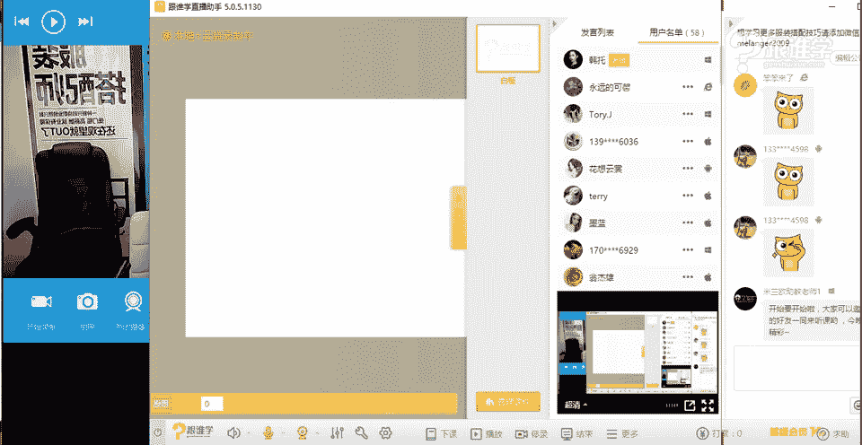
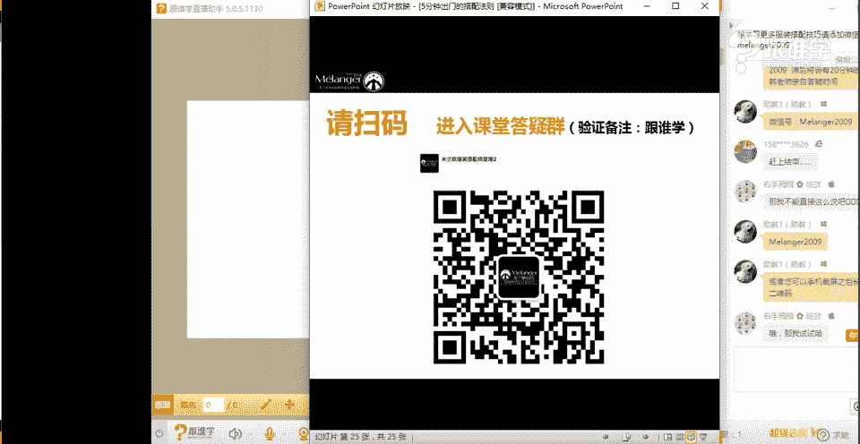
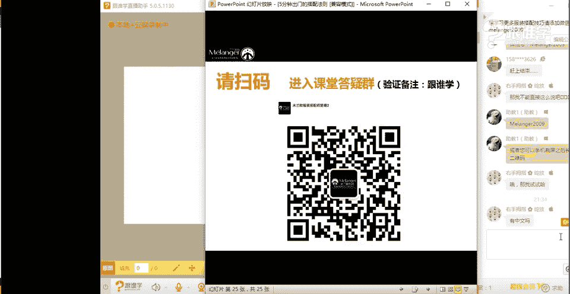

# 1、11服装《搭配秘笈之新版36计》：3五分钟出门的搭配法则_rec

🎼让暧昧变成电影。🎼一定要在暖下。😊，🎼沙滩上有。🎼你的脚印是一辈子累积。😊，🎼幻下。🎼那无可理由。🎼寻找着你。🎼还没变成电影，浪漫不一定要在那笑。😊，🎼沙滩上有你的脚印是一辈子美景。

🎼你就是海滩下的那无克里丽寻找着你光荣。😔，🎼还没变成剪影，浪漫不一定要在那夏尾夷沙滩上有你的脚印，是一辈子美景。😔，🎼中华的闪腰飞上一把无克里里，忽然看起来，回想流氓兄弟穿西装要记得带个带给你吧。

忽然看起来回想把这小姐一般我是不会随便就在这花瓶兜风。我不是说你是个花边里，你别发疯，你说你很容易 say。🎼让我来把婚。hello，大家好，我是今天课程的主持人。能听得到我说话吗？大家。呃。

请听到我说话的，请打一。对呀，我是今天课程的主持人龙飞。啊总多只有一个呀啊，两个啊，3个。哦，看来大家对我们课程都是比较期待的。好，那么这嗯。嗯，我今天介绍一下我今天的课程啊。

今天的课程是5分钟出门的搭配法则。呃，以及会讲到呃为什么会讲这个课程？因为呃很多人对自己的这个身高会有困扰，对吧？没有声音吗？那个好姑娘，能听到我说话吗？

啊，能听到就好。啊，那么下面首先介绍一下我们的韩拓老师。好，那么韩老师是我们米兰欧国际时尚教育技术总监，也是中国服饰搭配营销创始人啊，中国纺织信息中心资深顾问。

也是这个中国国际模特大赛服饰视觉搭配总负责人。啊，能听到我说话就好啊。呃，那么今天晚上我们的课堂会有一个小惊喜，我们会同时有两位老师同时进行授课。大家期待吗？哦，能听到就好。呃。

那么介绍一下另外一个老师，另外一个老师是我们南欧国际时尚教育的高级导师自宇老师，他是有着非常丰富的整体造型策划经验。啊，声音就好。

呃，那么同时今天两位老师会变身四套造型哦。而且是亲自给大家示范，就是这个5分钟。出门搭配的打折。我相信大家会对这个就是每天上班的时候会不会比较纠结，就是上班不知道穿什么。

比如说有的女性朋友们啊光是那个啊换衣服，或者就是在选择在这个穿着打扮的时候，恐怕要耽搁一些时间。所以这也是我们就是经常会迟到的一些原因，对吧？哦，我声音就好了。啊，不光是不光是那个女性朋友啊。

像我们男性朋友，有时候也是。哦，那么大家再稍等一会儿可，还有一分钟，一分钟结束以后，我们这两位老师都会进场。两位都是非常的嗯漂亮，而且都是大美女级别的哟。都是特别有气质的。啊，怎么是断断续续的？喂。

能听到我说话吗？呃，遇见你还能听得到吗？哦，刚刚进来信号改善。那你还是比较及时的。还有一分钟就要开始了。那么大家现在可以想一想啊，就是自己在这个看发方面有什么疑问。嗯。

待会儿我们的两位老师都会进行一个解答。🤧好了，现在时间已经到点了。现下面欢迎我们的两位老师进场，请大家多刷点花哦。So。大家稍等片刻，马上就来喽。是。

大家稍等片刻，我们的两位老师马上就进来了。Hello。hel大家好，先打个招呼lo大家晚上好嗯。😊，大家好，呃，首先呢我先做一个自我介绍，我叫韩坡。然后呢听我课的同学一定不陌生。

那今天呢在我身边的这位美女老师，很多同学都觉得我们俩长得挺像我的，大家有没有。然后呢，今天为了和美女老师区别开呢，然后韩老师今天穿的是一个比较带有嘻哈风格的这样的一个服装的特点。

我觉得好像没有把特色都表现出来，这里是容的，左青龙右白活今前很漂亮的刺做的这样的一个工艺。然后呢，这位老师呢叫姚姿宇老师啊，姚老师。然后资宇呢就是这个姿是金色的。然后呢，鱼呢是这个结结鱼的鱼。对。

是美女的意思。好，那么自宇老师跟大家打个招呼吧。hello，大家好啊，那前段时间呢一直是韩老师在给大家去直播。那今天呢我跟韩老师说一起跟大家来。课程嗯。好啊。

子宇老师呢也是我们米兰欧学院的这个呃专业的呃人物造型搭配课程的这个专业的老师。那么资宇老师呢也会很多很多的这个。服装呃服装行业更多的是为时尚领域的这个明星啊、造型啊啊这个做了很多的这样的一个工作OK。

完了我们要把它离定。好的，嗯我看到有同学说老师视频好小啊，是不是想要看清楚老师的脸。的很ok好了吗？可以听到吗？😊，可以听到吗？OK如果可以听得到的话，同学们先打一。好。哦，OK得到OK可以听到啊。

那接着我们继续。那其实呢刚才呢我把姚老师介绍了一下。那今天我们马上进入我们的课题，呃，看一下有多少同学会比较期待我们今天的课题呢？大家应该都知道我们今天的内容呢是以这个叫呃5分钟出门的啊搭配打折，是的。

嗯，也就是说我们如何在5分钟之内呢做到快速的出门啊，那么这个是很多同学的一个非常呃可以说是一很多的痛点，对吧？对，是的，其实呃在以往的很多同学在这我们课程当中，各空的同学们你们搭配有什大的问题。

那么经常会说老师我觉得我好像每次这个9点钟上班，8点钟起床。但是我觉得好像每次都要这个拖延很长时间才能出门。嗯，是，然后就有一种呃起一个早什么就是呃起一大早赶一0足。对，是没错啊。

多少同学有这样的问题呀啊，多少同学。会有存在这样的一种一种那种这个这个出门前的这个困扰呢？嗯，有多少同学有呢？如果有的话呢，这个韩老师和自老师送一朵鲜花，我们就知道你有多急了啊。同学们。

你们呃有这样的困惑的话，那我们今天的。当中会好好的跟大家来剖析，你如何能够快速的出网啊。是的，好，那今天呢也是非常呃特别的一场这个课程。也是我们呃李老呢用了我们两位老师来一起为大家呢这个讲这个课程。

那我们两人今天呢我们有两个业务先跟大家说两。啊好，那今天呢我们两个人我们首先我和资宇老师呢，我们会放会为大家亲自换装，就是说我个人，然后包括资宇老师。

我们两个人会为大家换装来表现我们今天的这个这个这个这个今天我们想告诉大家这个知识点。那么第二一个呢就是呃这个我们今天呢依然会为大家放送出最好的我们的一些专业的课程。然后给到大家同时低一年的价格给到大家。

这个也算是比我也算是一个非常大的福利哈。嗯，好，呃，那么再一次我看有的同学进来的比较晚。那我们再次介绍一下，我叫韩托啊，是呃前两次我们主要课程的授课老师。那么这位资宇老师OK大家好啊，我叫资宇老师。

那同学们可能有我看我也看到有很多同学刚才进来啊，两个老师好美啊，谢谢谢谢谢谢我们俩今天故意做的风格不一样。很的其葩性对，那大家有看到我今天穿的是什么样的一种风格呢？啊，于老师啊，对，金色的姿啊。

然后呢结余的于啊对这个名字很多人这个自愈老师说自玉老师。呃，这个其实我在介绍有一次我介绍名字的时候同学说老师，我觉得你命中缺女。因为因为每一个名字都喊女字啊，知。对对对，是的，哎非常好啊。

谢谢有想来好OK呃，我今天穿的是嘻哈，谢谢嗯对的，然后今天用了今年比较流行的一个元素叫龙的这样的一个元素。所以我个人呢非常喜欢。而且今天呢我也用到了前面我们学习到的那个内容，就是。😊，叫呼应法则。

就是帽子上的这种金色的元素和这种龙的这种元素结合然我觉得像母色。对，是，这样很漂亮。这个这个色在这个灯光的这样照射下的话，有一种金色的反光感。是然后思宇老师今天穿的呢其实比较淑女一点啊，有人那御姐风格。

这种其他风格，好吧。我今天就是要扮演这个角色。OK那么我们啊我自我介绍一下吧。然后刚才介绍半天，我叫韩托，大家记住这一点就OK了啊。然后我是米兰欧国际时尚教育的技术总监，然后教育从事教育行业呢啊13年。

那么同时也为男人装挨杂志以及中国纺织信息中心以及中国模特大赛，中国国际时装周澳门时装车，然后很多很多的品牌做这个专业的服装搭配人才的培养啊，OK有人一看到我的名字经常会想起托啊这个词，没错。

我就是要托起大家啊，但不是什么半托主托之类的好OK谢谢。然后呢今天我们的内容叫5分钟出门的搭配法则。那么刚才也跟大家沟通过，说的是。我们每天早上起来最痛苦的根本不可能用5分钟来。对，是的，你用钟。呃。

我觉得因为老师本身就是我们都是本身就是从事服装搭配的。所以其实我们对于我们自己的衣橱是有多。哦，或者服装的话也都会有这样的一个基础。对，有规划。对，有搭配好，提前有搭调。但是其实依然还是收到一样的困惑。

因为太多的选择性不知道该怎么去选择。对，就一个太多。对，但是我相信应该其实呃我们有很多同学或者有很多同学。老师我觉得我衣服特别多，每次一打开衣服的时候，觉得衣服都要往外推。对，啊。

但是依然出门的时候还要用很长很长的时间。😊，其实我觉得这个问题的主要原因。而且很多人还总觉得缺意感。对，是的是的是的，其实有没有这样的问题。对，如果有的话，大家可以打一哈。其实我是有这样的感觉。

就是呃很多同学说衣服特别多出门就翻嗯，然后呢呃还总抱怨说我总没有艺术团啊，那这个就是一个我觉得是一个很大的问题。啊，那所以呢我们在这儿呢，我们想跟大家讲的，今天的内容就是告诉大家5分钟怎么样门的对。

快速推门对吧？5分钟内快速出门啊，OK好嗯我们两个人今天特别像那个叫什么说黄的讲一个啊，可能大家还可能不适应这种两个老师一起来上课的这样的一个风格，主持家聊天的这种授课风格。

但是我觉得这样应该是比较比较同学们你们喜不喜欢这样的授课风格呢？如果喜欢的话，可以给给我们一人刷一朵小花花啊，OK其实呢于老师。😊，今天呢我们来之后有有沟通过说子宇老师今天一定要变成同学们的角色。

一定呢要以同学们最担忧的问题。对，是的我是要挑战我。对对对，我要站在同学们你们的这样的一个立场上来来一直跟这个韩老师沟通，哎，你们想要获得的这样一个知识啊，或者你们想要得到的这样一个知识点。

那其实我们俩今天有点并不说对立啊，可能是我更多的站在同学们这样一个是的，向韩老师起经啊，应该是挑战吧。啊，我尽情挑战OK好，我们来看一下，那么首先呢第一个大家来看一下我们的课程面，就是叫每次打开衣橱。

其实有很多女生打开衣橱简直就是一场灾难啊，或者说其实前一段时间一直在发刷朋友圈，有人是这样说的，说呃每次站在衣橱面前的时候，我觉得我特别说皇帝啊，OK完了之后，当搭配的时候，觉得自己像乞丐。

因为不是因为他觉得他自己。的时候，他觉得他每一件衣服都是他的妃子，哎，左右为难，不知道该选择哪个。那其实OK呃这个声音不是特别大是小是吗？我们往中间隔OK啊，现在可以听得清晰吗？😊，好。

那么所以呢呃打开衣橱，我觉得有几个困扰总结一下。第一呢，我觉得很多时候呢，其实说实话衣服很多，但是真挑不出来。对啊，有可能你选择的都不是特别适合你。没错，就是说我们其实在选的时候呢。

首先我不知道今天该穿什么。第二个呢，我觉得在穿的时候呢，呃我们又找不到和他们搭配的服装，所以说呢就导致有很多服装，有的女生根本就没有摘过吊牌，有这衣服。有有啊就没有摘过吊牌。

其实在在呃这也是在我没有进入到搭配行业之前学的。就比如说我可能买了一件衣服，特别喜欢，但是回到家的时候，我觉得好像唉怎么没有那种感觉了？好像可能后来才知道哦，原来是因为灯光的问题呀，但是被营销了。

对对对，销售人员的问题呀，就拼命的夸你哇，你看着衣服好美。其实回到家的时候发现屁股里有哦嗯，一个是当时不是特别的理性在购买的时候冲动购物。对，第二一个呢。

其实在买的时候并没有和自己家里的服装呢嗯去到一个搭配这样的一个唉，他没有去思考这个问题，所以买出来的服装，你发现它的可利用价值。嗯，OK那么所以呢当我们每次打开衣橱，尤其是在早上，我就我其实有用候态。

你别跟我讲这个课程，有时候嗯衣服一多呢，确实如果你远了困难症。对，就选择困难症。而且呢你觉得你想穿的挺多的。可是呢你一着急，你就找不到下面一种。啊，所以说呢也会有这样的困扰啊，同学们呢也会嗯啊好的啊。

所以老师，那我们就慢一点好吧？然后呢我们把声音大一点啊。好好，那所以呢我们在这儿呢，我们就有一个概念，就是说第一呢，首先我们觉得好的搭配应该是你的衣橱首先要排列整齐。啊。

那么这个这一点我觉得戳动了很多对，戳动了很多的这个我们很多同学的这个心，就是说我的衣橱有时候真的很乱。我连衣服都找不着不谈搭配呢？对，是不是嗯，第二个问题呢。

其实就是你要解释一下你的衣橱里是否能够满足各类场合的需求。对，是的，那至于老师你的衣服你的服装到底就是满足了多少个场合。你觉得呃其实我们站在这个场合的角度上来讲啊，现在大家能听得清楚吗？

嗯嗯站在场场合的角度上来讲。我们有分这种呃职场啊啊，比如说其实我现在也是属于一种职场状。啊，虽然老师是做时尚行业的，但是我们也是有职场之分的啊。嗯那比如说社交场合，那我们经常因为有秀场啊。

或者说参加一些活动啊，我们经常说老师对一起参加的活动，那这种又属于社交场合。那当然还有我们平时的休闲场合，对吗？好的，所以说的话，其实同学们你们也要想一下，呃你们自己对于场合的这样的一个概念。

比如说你经常会出行哪些场合。那你在这个场合呢当中的话，这个服装的比例是不是要大一点。嗯，嗯没错，我同意的啊。嗯，其实呢呃我觉得衣服当中啊首先的规划就是对场合的一个规划。对。

比方说我发现很多同学呢有很多衣服，然后到正经的时候没有衣服场合明白，就是你会发现我要参加别人的婚礼，没有衣服穿来。我要上班，然后突然公司呢有个活动要出席，我还是没有衣服款聚会聚会。对。

那么有时候呢你会发现当你去相清一下，也没有衣服款。然后你发现你拎出来的衣服都是可能都是平常你喜欢的。但是你发现场合并不合适。场合并不合适啊。嗯好嗯O好，那就是我们说到的格场格的问题。对。

我看到有同学说啊，老师说出了我们的新生O好，那么你的衣橱上下装比例是否合理，这个问题很奇怪啊，你的衣服上下装比例是否合理。那么这个我觉得是很多人都不会去待用的一个问题。对，但是其实是非常非常重要的意见。

对，什么叫上下装比例呢？来韩老师跟大家讲一下。上下装比例呢，它指的都是其实我们在搭配的时候，我们有两个关系。第一个关系呢叫上下装。嗯，第二个关系呢叫。里外装。对，没错，这两个关系不知道大家有没有听到啊。

上下装里外装。那么在这种情况下呢，我们要注意我们的上装的总数量一定要你的是大于还是小于。大于下装。嗯，对，上装的话一定是要大于下装的。为什么？因为呃我们说这个人的视频动心的话，永远能在上半程中呢？是对。

所以说这个其实就有一就有趣的一件事儿啊。如果你连着三天穿着头一条裤子。但是你比如说你今天穿白色的上衣，明天穿红色的，后天穿蓝色的啊，可能是那大家会发现你好像。是的。

但是如果你要是每天这个只上就只放下半身，穿了同一件衣服就会有什么样的效果。来换衣服，对对对，比方说我每天穿着这件衣服，对，别人就觉韩老师如果每天只是上半身，因为你韩老师三天啊是这个三次特程啊。

如果都穿上这件衣服，那大家肯定会觉得哇听韩老师怎么还是做时尚行业的，为什么每次都没换衣服吗？对对，就是永远没有换衣服的感觉。对，所以说呢这个比例应该是多少呢？来听清楚啊，韩老师跟大家讲一下。

上下装的比例总数量应该达到3比1或5比1，大家听清楚了吗？也就是说至少要三件上衣或者是5件上衣来搭配一一件下装。那是不是说3比14比15比1都可以。是的，也就是说三件上装4件上装，5件上装搭配一件夏装。

就是最合理的比例。嗯，这个夏装你可以是裙子可以是裤。啊都可以，但是必须是上下装的比例应该是合理的。你比方说刚才有天朝妹子同学说裤裤子太多了是吧？那么裤子多就说明你这个衣橱啊。

这个上下装比例不合理你花的太多的钱在裤装上面，反而最后的什么搭配的效果和雪果来的是不好的。对，嗯，OK好好，那还有同学说我差不多是一比1啊，天朝妹子说你差不多是一比1的这样的一个服装比例是吗？啊。

那如果你是一比1的话，那就是相对来说是非常不合理的了啊。的，现在就要开始调整了。OK有的同学说我的天了，我的裤子比上衣更多，笨笨来的说的好OK嗯，那么还有呃在。我传统他不会读你名字CP。

okK这位同学说我的毛衣就很多。这位同学你又反映出了另外一个问题，就是你的单品的重复率很高。什么意思呢？有的同学就是牛仔裤多。有的同学呢就是连衣裙不多。对，其现呢是因为他比较爱某一种风格的原因。没错。

同学们我相信应该有很多人有这样的一个问题。就比如说你有吗？有有的时候我比较爱某一类风格的时候，我去逛街的时候，我就会挑那一类的。对吗？啊它同一种风格。对啊，所以你的形象就会比较固有，固有。对。

风格也会比较局限。嗯嗯嗯，好，那么这个里面反映出一个问题，就是说如果你的单品的重复率太高，比方是家家里的这个衣橱。嗯，牛仔裤特多，连衣裙特多。然后呢，比方说猫猫巾服服说我内搭数特别少，天天买外套。

然后你就发现其实你搭配起来也很困。对，是的，O内搭也多。是的，所以说呢这个叫什么？首先你的衣橱的这个我们把它叫衣橱的服装的这个叫比例，上下装对，叫品类也叫比例是否合理呢？所以说如果不合理，同学们。

你们记住，你们这这个衣橱也是一个不是高效的衣橱也是一个搭不出好看服装的衣橱，也是不完美的衣橱OK好。啊，确实很爱很爱买职业装嗯，到了周末就觉得没有衣服可穿是吗？确实这这这这这是一定的啊。

因为你天天穿职业装，你到了周末休闲的时候，可能就会觉得没衣服穿了吗？啊，所以你要添置的是你休闲的这样的一个版块的服装。OK天朝妹子问夏装包括裤子和裙子吗？单款包括夏装，我想问天朝妹子除了裤子和裙子之外。

还有其他的吗？难道你要穿打底裤什么吗？OK没错，夏装包含两个最重要的品类，一个就是裤子，还有一就是裙子OK那现在韩老师有问题要问你的连衣裙。😊，应该放在上装区还是放在下装区呢？好。

同学们可以快速回答一下，觉得是上装区的打一，觉得是下装区的打2。其实我觉得应该很多同学的连衣裙也蛮多的。因为很多女生公是对，因为他觉得懒得搭配嗯，或者说不会搭配。好。

我们说一下穿连衣裙的人一般有几种类型的人。来金宇老师，你来估计一下。呃，比较懒的嗯嗯对他不想搭就是懒得去搭配。还有一种的话就是不会搭配的。我觉得。是的是的是的，嗯嗯，或者是说呃他偏爱这种风格的。

比较淑女的这样一个风格，对吗？嗯，我能想到的是这这这几个方面，完全O完全正确。啊，那也是裙全是裙子，好多连衣裙，没有显人显身材啊。那我突然想到一点啊，呃还有的同学比较喜欢穿连衣裙。

可能是因为男朋友喜欢或者是自己的先生喜欢啊，有没有这样的一个情况啊，不知道咱们这个教室的同学有没有啊，是的，那么所以呢你看有的同学就很明显，他说他买连衣裙是因为下半身胖。嗯啊。

那那那可能他想遮身材的问题，身材再来造应。嗯嗯OK好了，那我们继续刚才呢我们这个问题要回答一下大家是不是嗯下装还是下装。嗯，嗯很多同学都打了一。😊，对还是不对？嗯，这个是韩老师来解答，对是不对？

我都忘了刚才问什么问题了。连衣裙是属于上装还是下装呢？OK嗯，那么大家挺听答案，上装。对了嗯，O连衣裙应该放在上装区同学们啊连衣裙应该放在上装去。那大家都认为啊，对的，对的，他说好哈哈哈哈什么呢？

哈哈哈笑我刚才把问题。因为大家一扯一扯，然后就得裙子裤子腿出的问题上发现两个人这个讲课的话就会延伸性更广一些。O，我们还是言归正传啊。嗯，OK好，那么接下来下面的问题就是你的衣橱单品是否具有多搭性。

这个就是我们刚才讲到的品类的这样的一个问题。就非常重要嗯，O非常好，也就是说呃这个衣橱的多搭性的话呢，其实我觉得是你的单品的品类要多，还有。😊，衣础啊有没有这样的可能，就主要那那个流行款特别多的话。

应该搭配出来的感觉可能也会没有那么百搭。流行款还很容易过时。对，是的，我觉得有这样的一个。如果有同学你的衣橱里有60%以上都是今年特别流行的款式，没有一点点基本款。嗯。

我说的基本款就是优衣库里卖的那种基本的打底裤啊，嗯，然后基本的一些很百搭的一些款式，如果你家里都是一种潮流款。比方说我这种衣服其实都是潮流款，需到明年就过时了。嗯。

所以说如果我的衣橱里全部是种时尚款潮流款的话，就会很容易过时，明年就潮。为呃同学们，你们想不想听韩老师解析一下，为什么他这件衣服呃明年会过时。其实他这件衣服是黑色的，第，我们看色彩还是黑色的，比较百搭。

对吗？嗯，那为什么他会过时呢？好啊，这个我觉得同学们应该很有就应该有想法。因为这件衣服呢如果没有这样的一个设计啊，如果这样的一个图案的设计，它可能能穿的时间更久一点。

因为它没有一个是你今年买的还是去年买的。但是如果说这个很明显的这种造型和设计，还有今年流行的这种就是要把手臂搭盖起来的，一定要把手盖起来的这种袖容，嗯，它就很明显的表达了今年潮流。

那么所以说呢这个衣服呢就会明年有做过时的感觉过时。对，所以说我就要把它抛弃，那一抛弃就要买新的。所以我们这有一个结论掉，如果你的衣橱理啊，如果你的衣服里60%以上都是流行款。嗯。

那么你就是一个非常费钱的人时的看完韩老师就是一个非常费钱。我这个流行款也做不多已其实流行款的话，它是容易穿的出彩。是的，对，但是它会比较费钱。所以。妹子们或者是呃那个那个屌丝屌丝们，男士们啊。

你们要考虑一下，你们是要买流行款还是基本。对我觉得我的基本款和流行款是搭过来的。嗯，就是我一定会买高品质的基本款。嗯，但是我的流行款，韩老师买的流行款其实都不贵。因为他我知道这是用来搭的。

而且肯定明年差不多穿一段时间就不能再出现在镜头上，或者不能再去出镜动了。所以说我基本上我就会买买一些基本款，再买一些这流新款品来搭配。

嗯嗯看这个这个问题好像很多同学都有都有这样一个这个这里有一个同学叫郝立坤是吧？这位同学说我是基本款多嗯，那会有一个什么样的问题不出彩，对，是O对所以说呢如果说你的基本款特别多的话，搭出来又不出彩。

就是优衣库的感觉啊就是就是就是优衣库广告的感觉，嗯没错嗯啊OK好了，那我们这里就开始我们往下，那接下来的话呢，我们想给大家说我们衣橱里到底什么叫经典款。刚才我们说的流行款对吧？

流行款的意思就是说有什么大年流行的一些元素有流行元素比如说韩老师今天这件衣服就是今年特别流行大个性，袖子特别长，衣服特别大的这样一个个性。嗯，那那就是属于流行的这样一个款。是是的。

那其实呢我们在这说衣橱的时大。那那经典款到底指的是什么？来，我们给大家一起看一下啊一个。那大家看一下，像品类上来讲的话呢，它有这种西装嗯，基本款的西装。嗯，那这个我们的像我们做我们这行业，家里的衣服。

啊，那第二个就是夹克夹克。那今年如果说你想买流行夹克，可以买飞行的夹克。但是如果你想买一个基本款夹克，比如说那种棒球夹克呀或者那种连帽夹克呀，唉，那都是非常非常基本的。

那么风衣这块它很明显是巴国人那种战壕风衣双排扣经典风衣，我们拿鼠标给大家看一下，我们大家看不到。嗯啊，这个叫战壕风衣来自于b布啊。O老师我就看你有过是吧？对我也有一款这个呃颜色比这个浅一点。

这个很好搭非常好看啊，就嗯穿起来很知性的感。是的，嗯，那么还有就是针织开衫，针织开衫呢别看这种很基本。就实优衣库很多连zaara都有卖。那么这种款式它你会发现它可搭的这个可能性太多了。

对他可以去搭蓬蓬裙啊，他也可以去搭牛仔呀，还可以去搭一些非常基本的这种运动风啊啊O双排扣。显胖嗯，这个得看是给时家人去穿。对，双排扣他会显肚子大。但是呢这个呢呃如果你肚子不是很大，绝部不是很大就可以穿。

嗯嗯啊。这个T恤就不用说了哈。那么这个衬衫白衬衫、皮衣九分裤，铅笔裙很经典的叫短靴。嗯，啊，那么这个呢其实都是我们说到的衣橱女装的十大经典。那你们有吗？你们占几个呀？啊。

那么在这韩老师要就是要跟大家提示一下，也就是说衣橱经典款，思雨老师，你觉得应该花更多的钱去买去购置这个经典款还是购置时尚款女呃当我建议大家当然是买经典款，花更多的钱去买。因为经典款的话。

它其实经典款它是有特色的，就是它没有任何导向的这样的一个单品。比就是说它的这样的一个服装。例如说这个西装啊，它没有过多的这样的一些装饰性啊，没有太多的这种啊，重工啊、工艺啊等等，它都是非常简约和基本的。

就是说它才能够形成百搭，这个跟我们所说经典款。刚才我有我有有看到有同学提问说职业装是属于经典款的。韩老师嗯职业装啊，职业装其实它的款式是经典的呀。比方说它有西装啊，衬衫。

衬衫啊嗯啊这个裙装啊等等这样的一些啊也是啊，那么经典款陈列说对了，就是黑白灰。嗯，啊黑白灰呢它本身就是百搭，什么叫经典款，就是你什么你同学们有一个特点，你发现啊，你注意一下。

就是这些款式我什么时候穿出来，你都觉得跟时代这种对，不过时代。就是说它没有特别强调某个时代的印记。对，装就。例如说你今年买一款这样的一个berry风衣，你可能1年后再穿它依然是拿出来可以穿的。

就像小黑裙，为什么那么经典？也就是因为它没有过多的这样一个装饰，然后它特别特别经典啊。刚才有同学说有男的吗？

不要着急马上就来笨笨来了问了一个问题说黑白灰是什么性冷淡风O那么其实上一次课有同学就有问我这个问题，其实时尚圈他总是会给你制造一些很特别的名词，让你来注意啊，嗯就是说什么这个性冷淡风啊。

其实性冷淡风严格意义上来讲就是我认为中性风，对，就是很中性，看上去很没有情感的感觉啊，而且是比较就是特别基本和特别简单的简约的款式。对，所以叫性冷淡风，其实这是一种包装。嗯。

他是为了让公众更加的对注意注意到有可能是某一个品牌就出的这样的一个概念。嗯。那么男装来了，那我们来看一下，那男装的款式，你会发现几乎怎么和女装很像。嗯啊，其实是经典款的话，基本上都有很多相同的品类的。

嗯嗯，对，经典款它有一个特点，就是简约。对啊，然后百搭。那么其实呢我们在这说一个问题，你发现啊在近200年来，男装的服饰文化都是受到英伦文化的影响。啊，那么男装的大部分的款式也都延伸到了女装。

比方说西装就是从男装延伸过来的。啊，比如说现在这别流行的是男朋友风然后，男朋友风。经常我们说他宽宽大大的，也就是比如说就像你偷穿了你男朋友的衣服一样哈。是那再一个呢就是啊我们发现这个衬衫嗯。

而而且还有T恤，T恤原来是男装的内衣，然后最后演变成了一种时尚的男女都共穿的一个款式。那么所以呢之前最早的女装，它只有连衣裙装。啊，所以呢我们在这儿我们会发现很多女装的款式，其实是来源于男装的。

所以我们看上去好像很类似。那么一个个说一下，第一个叫中性色的服装套装。第二个呢叫ja克夹克啊，第三个叫co就是风衣。第四个呢是V领套头衫，这款带女装没有女装是开衫。那么V领套头衫本身它来自于男装当中。

它可以去搭配这个叫什么正装西装去穿的啊，那么同时在学院风当中V领套头衫是最多见的。那么再一个呢就是T恤啊，那么还有就是我们说的衬衫，皮衣基础的皮衣款式，还有西裤。然后包括我们看到的这个乐福鞋。

还有这个叫绑带的布洛克皮鞋。嗯嗯OKOK啊还性色例如UN两就是说中性色，例如中性色。其实刚才我们讲了好长时间说的黑白灰呀，就是属于中性色呀。那包括其实没有太多的这样的一些低彩度，低纯度的一些色彩。

其实也可以算到中性色。比如说这种呃驼色呀、咖啡色呀，那包括一些呃特别特别暗的那种墨绿色，其实也可以算到中黑色当中。其实呢韩老师用一个大家觉得特别好理解的一句话。俗话来说，这个至于老师讲的是专业的。

那韩老师用一句俗话来讲，就是你们看上去那个色彩它没有强烈的男女性的嗯，性别特征啊，你比方说我们一说到粉色，我们就会觉得很女性化。嗯，我们一说到淡紫色，这个薰衣草组，我们就会讲到非常的女性的，很软的色彩。

但是中性色，就是你会发现它就是饱和度不是很高，不艳啊，然后呢它又非常的好搭中性色。嗯，因为说蓝色也是男士经常会用到的。嗯嗯。深蓝色O不K。极简主义你要回答一下，极简主义就是其实CK就做极简主义的对。

就是极简主义指的是什么意思呢？来跟大家说一下，极简主义它指的就是在服装上面只留下了功能性的作用。任何的修饰装饰，像抛lo袖这种元素全部没有用的元素全部都要去掉。所以极简主义它和浪漫主义是一个反义词。

浪漫主义强调奢侈浪费，没有用。比方说你身上的泡泡袖啊，嗯然后那个小花边顶啊，那么这种呢在极简主义人看来是非常的什么没有用的东西，而且很复杂。所以极简主义就是强调实用性。用性还有同学问，哎呀。

老师阔腿裤会流行多久呢？那这就涉及到了流行预测的问题了。涉及到我的本职工作了哈，那流行预测呢这个问题我想跟大家说一个基本的概念，就是流行的元素有可能只流行一季，也就是说半年啊，最短的是半年的生命力。

那么最长的是多少年呢？三年三年 yes嗯三年就是一个流行元素的最长的寿命啊，三年之后必定要变啊，所以说呢阔腿裤能流行多久，这个取决于比方说它在欧洲可能流行的时间会长。因为欧洲人的身材和时穿性就比较长。

那么到中国阔腿裤，我估计不会流行太长的时间，为什么中国人的身材还是怎么样？他是比较相对来说比较扁平的，也是对，其实自玉老师在身材这块研究的非常透彻的。也就你就是思玉老师也来预测一下。

你觉得像流行呃像阔腿裤在中国，你觉得大部分的女性她能不能去穿的很好。呃，其实我们说这个阔腿裤的话，因为它对于身高还是有一定的要求。是的，你比如说刚才有同学说我有一条阔腿裤穿十年了，被夸帅气大长腿。

我相信这位同学你的身高应该不会特别矮，对吗？你不可能是一。5米，如果你一米5米的话，我相信你穿这条裤子不会被人家夸成帅气大长腿，是吗？啊，所以说对于身高哈是是有一定的这样要求性的啊，那我们亚洲女性的话。

相对来说身高都会比较呃相对来说比较娇小一点。然后身材曲线也会比较娇小一点。那呃穿起来可能就没有欧美的人穿起来特别的帅气呀，啊，然后这种这种感觉特别好。那其实亚洲人穿阔腿裤的话，相对来说身材高挑一点的。

会更好看。嗯，那所以说它的流行的话，那阔腿裤已经流行了其实大概有两年时间了，对吗？啊，那包括喇叭裤其实也已经流行很长时间了。那你现在其实再来穿那个喇叭裤，就感觉好像有一点点不是那么的时尚了啊，是的，对。

刚才其实前一段时间我还看到流行了那个健美裤啊，也就是说那个脚蹬子有这个这个这个鞋底下啊加了一个那个脚蹬子，其实可能有可能这个也会变成一种潮流趋势啊，同学们你们可以多关注一下啊，是OK啊。

刚才有同学问了一个，我觉得呃不是很这个问了一个问题，刚才那个问题飘过去了。就是它是这样的，有的同学说哎呀，阔腿裤已经流行十年了，这个说法不对。嗯，对，这个从我们专业的流行趋势。因为韩老师本人介绍一下。

我个人也是流行趋势预测啊，包括服务于流行专业的流行趋势的这个平台和网站，还有这个杂志的。那么在这儿我很清楚一个流行。趋势也许你在10年前见过，但是你发现现在回来了，但他现在回来的形式是完全不一样。是的。

所以说你把你10年前20年前的大喇叭裤，你现在拿出来穿可不一定好看。因为今年的喇叭裤已经变形了。它已经变成了短款，已经变成了7分9分，他同时拉毛了这个喇叭裤的边角，有流星。是的，OK好了。

那么大家的问题要说也说不完。那么接下来我们还是以我们自己的这个流程为主吧。对啊，大家有任何问题，我们待会会有一个群给大家发一个微信O好，然后大家可以扫描进来，我们可以跟大家一一来解答。嗯，OK。好了。

那么在这呢，我们知道在刚才我们的衣服当中有一款叫白衬衫是吧？那么白衬衫大家一般想到的是什么啊？其中上班这位同学名字，我想回答你题啊，待会儿呢我会给大家把我们的二维码会抠出来，大家要耐心等待啊。

学习呢就要有什么耐心啊。OKOK好，一件衣服穿十年嗯，这个这个这个因为经典款其实还是可以穿十年的啊，刚才我们说到白衬衫，那我相信很多同学都会有一件白衬衫，不管是男生还是女士，那大家可以考虑一下。

你们第一反应的话，白衬衫是搭什么夏装呢？同学们可以来抢答了啊，OK好嗯，韩老师一般穿白衬衫的时候。我啊，那我待会我就过了。嗯，我觉得我可以搭我的皮裙呢嗯。我说的皮就是那种皮U很闪光的那种漆皮感，漆皮。

对不对？今年流行的面料叫会发光的面料。那漆皮也是一种流行面料。是的，OK然后还有可能会发很。比方说我可以搭的很男童友装啊，嗯，然后我还可以搭的很。呃，搭种高腰复古的那种牛仔短裤。嗯，OK好。

最好是能露半的臀步的那种。那我看就特别的然后再配罗马马带鞋，我觉得就会看上去非常的有青春的青春。嗯，嗯纠点美国那种guesOK好，刚才我已经看到大家的答案了。

基本上韩老师讲的那两种搭配方法在这上面都没有呈现过一种说是搭配紧身的这个黑色的紧身裤，还有一种说搭配牛仔裤是吗？嗯，其实我知道大家要答。以我的经验，大家基本上搭的第一个就是牛仔。OK还好，果然啊牛仔裤。

对，第二个呃黑色西裤。嗯嗯第二个就是搭的很上班。对，是的，所以说呢这个是大家的一个正常的一个反应。这就是我昨天有一个课叫搭配逻辑。嗯，就是我们很多人对于搭配，它其实是一种常态逻辑。

他没有想过你把白衬衫能发出，其他的一种样貌。嗯，所以呢今天我们和自宇老师呢就给大家带来一个什么呢？大家看啊，叫变装衫对，一件白衬衫，他到底能搭出三7天还看不出来。嗯。

O那接下来的话我和自宇老师呢就开始给大家来演示一下时间关系我们俩一人演示两套。嗯，好，OK其实呃那我们一人演示两套。那在这里其实现在可以给大家看一下呃，这个白衬衫的变化。对，职场当中的话啊。

一件白衬衫如何搭配。在职场当中呢，大家可以看一下，那其实呃这个星期一到星期五是属于职场的啊，那星期六和星期天我们既然说是7天了嘛？那星期六星期天也不让不要放过白衬衫白衬衫。好忙啊。

OK那其实星期六和星期天我们大家可能可以相对于休息一些嗯，起，那星期一到星期五的话就是职场的这样的一个感觉。那韩老师，你觉得这5套的职场服装当中有没有不一样的？啊，我们先来看一下啊。

每套的职场服装当中有什么不一样。嗯，主要想问你们呢？啊，我觉得是不是这一套特别出彩哦，你说哪个看上去更出彩是吧？对，那肯定是第二套星期二的吗。嗯，嗯OK好，那其实星期二的这一套这个服装。

在职场当中到底是不是用其实有同学问过这样的一个时尚职场哦？对，是的，那其实职场当中我们分了两个概念，对吧？嗯，OK那第一个的话其实叫时尚职场，第二个的话就是严肃职场。OK好，那其实职场他也有分类的啊。

那大家只是知道职场。那比如说我跟韩老师这样的一个职业，就是属于时尚职场。OK嗯好，那其实这就是我们所说的职场的这样的一个白衬衫搭配。下面呢对啊下面呢我们就我跟韩老师就会跟大家来演示。

那首先我来跟大家来演示吧啊，那我在这里就我们以上装为主，跟大家来演示这样的一个这个白衬衫的这样一个搭配方法。OO好，我们快速嗯ok对我来快速的跟大家来换一下装啊，好，我也穿穿装好。

那大家的话呢我们先由我们的资雨老师呢啊把这个整体的这个服装啊，啊姿宇老师先由资雨老师把他的服装呢来搭配一下，然后呢给大家看一下他是怎么一步步的呈现这个白衬衫的这个搭配的方式吧。

然后我们掌声欢迎OK大家想看吗？啊，让大家知道哇，今天保证讲完之后，大家都特想买一件白衬。😊，啊，我今天应该把白衬衫准备好都卖给大家啊，OKO好。

那我现在呢就是呃一件白衬衫的这样的一个单品出现在大家面前啊。好啊，那呃我刚才呢大家可以看得到，穿的都是这个毛毛啊，然后这个呃帽子啊，然后包括耳环我还没有取掉啊，现在突然这个裸着出来了。

突然觉得穿一件白衬衫就觉得完全没有那个时尚的感觉感觉没有安全感。好，那其实我这件白衬衫呢有一个特别的点啊，那就是他的这个这个白衬衫。😊，装饰性和大家可以忽略这些地方啊。

因为其实你们可以买一件这种呃没有这样的一个装饰性的这样一个衬衫啊。那下面呢我会一件一件一件的往我身上来添加单品。那我现在来给大家来演示一下啊，首先呢其实这种白衬衫。

我们说有很多人他会穿这种职场当中的这样一个着装，对吗？那如何在职场当中能够这样的出彩的话，那我们下面来给大家搭配一下。那先给大家来看一下这样的一个西装。啊，这件西装呢其实它呢相对来说是有一点点时尚感的。

我现下来给大家这个呃这个穿在身上来试看一下效果啊，OK。它是一件不对称的这样的一个设计。啊，有同学说老师的是时尚白衬衫吗？有一点点时尚元素啊。好，现在可以听得到吗？同学们声音还会特别小吗？啊。好。

特别的外套是吗？嗯，OK。😊，好，那我先把这个外套给大家来穿上啊。还还没还没穿完呢，就好看了啊。好。稍等一下啊。那这样的一个西装呢，我站起来给大家来展示一下啊，这件西装它的特别之处在于哪里呢？

它是这样的一个不对称的这样的一个设计。O。不戴帽子好看是吗？那我下面还要戴帽子怎么办？好嗯，那这是我这个穿上这个西装的这样的一个效果了啊。那接下来呢我来添加视频了啊，其实没有视频的话，还是呃怎么说呢。

😊，那。首先呢来给大家展示一下。耳环黑白的这样的一个极点的这样的一个耳环啊。看完想搜同款是吗？啊，OK。😊，袖子好短是吗？好，呃，有同学说老师如果造型中性一点。怎么了？中性一点的啊。😊，啊。

耳环漂亮是吗？好，今天你们是呃不只是想买一件白衬衫了，估计这个这个耳环啊，配饰这。好。呃，有有有有OK好，那同学们。😊，可以看到我拿了一串珍珠项链出来。😊，同学们，你们穿衬衫呃，穿这个衬衫西装的时候。

我相信应该没有没有人去搭配珍珠项链的对吗？啊，应该说很少有人会搭配珍珠项链。但是呃我今天呢就给大家来做这样的一个这样的一个搭配啊。那让你们来看一下西装搭配珍珠项链的时候，会有什么样的一个化学反应。好。

OK那这种珍珠项链其实很多地方都有卖的啊，同学们你就买这种。如果你们想买同款，就买一条比较简单的啊。OK好，娜子嗯娜子说为什么要这样搭配？那等一下呢我就来给大家来解析为什么要去这样搭配啊，那其实这个呃。

这个是什么风格吗？好，那稍等一下啊，我来给大家搭配完了。那接下来呢一一串银色的这样的一个珠子啊，增加时尚感觉素。好。接下来呢呃这是珍珠项链啊，珍珠项链。为什么要搭配珍珠项链？

其实它是有这样的一个呃讲究的。为什么呢？呃大家有没有看过香奈儿女士啊，那香奈女香奈儿女士呢它也是第一个呃提倡时尚假珠宝这样一个概念的啊，那呃它的最经典。我们说香奈儿风最经典就是什么呢？

珍珠就是它最经典的这样的一个单品之一，包括黑白色那珍珠项链加这样的一个西装，那包括再来一顶这样的一个爵士帽啊，就是黑色这样黑白色的这样的一个礼帽啊，搭配出来之后呢，就会非常的有风格带了啊。OK啊。

那大家可以看一下，那这是我这样的一个整体的这样的一个感觉啊，那跟这个的刚才有同学说老师不戴帽子好看。那现在是不是加了这顶帽子会比较这样的这个这套搭配是不是会比较有趣一点。那我现在可以整套来给大家。

这样的展示一下啊。那我下面穿的是一条黑色的反光感的面料啊，大家可以看一下。那如果搭配这样的一个高跟鞋会更好。那是因为今天老师没有穿高跟鞋啊，那戴帽子也好看是吧？好，这个风格喜欢吗？

你们啊那平时的话其实很少有同学会这样去搭配珍珠项链，然后礼帽，然后西装是吗？那其实这样的一个搭配的话，我们说唉刚才呃韩老师昨天有讲过着装逻逻辑这样的一个故事，对吗？啊，课程着装逻辑这样的一个课程。

那刚才就有同学说了，为什么要这样搭配，韩老师可以给我们来解析一下，为什么呢嗯。😊，好，那个既然咨雨老师让我来解析呢，那我就来说一下。

其实它这一套呢是来自于有点20年代的这样的一种香奈儿式的这样的有点中性元素的。因为香奈儿其实它虽然做古典主义经典款。我们现在把它叫经典款，但是在当年20年代的时候。

大家却认为这种搭配呢是非常的冲出传统的。因为当时的女性还裹着束腰。嗯啊，然后呢还穿成那种蓬中裙，法式的那种。呃，那当时呢香奈儿就把男装穿上穿成了这样的一种把男装穿在了女装身上。因为当时正好是一站期间。

所以说呢它这种服装呢把把束腰扔掉，然后就穿成这样的一种感觉。因为在香奈儿当时呢一种很经典的标志，就是我们叫时尚假时尚假珠宝这个概念。对，那么时尚假珠宝呢，其实就是用多串的珍珠。

然后来把这种服装的整个的那种男装的感觉，然后可以把它给提升起来。O好，那这样的话，我觉得金老师今天的搭配呢也非常吻合他个人的气质。嗯，好O其实说到这个呃呃说到这个时尚假珠宝这样一个概念的话。

香奈儿女士其实她当时还认为呃如果你真的因为他们他会觉得这样的一个真金白银是真的有点这如果你只是戴真金白银的话，会好像缺少一些品位啊，所以他创造了这样的一个我们说时尚假珠宝的概念。

其实假珠宝的话也可以一样把它带出品味感，对吗？那但刚才有同学说老师我觉得香奈儿太贵了，买不起。那这样的一个搭配，其实特别特别的这样从头到假这样一个搭配的话。

我觉得应该不超过我我预估啊那个这个珍珠项链的话，其实很便宜，你可以买一一条假的啊，那网上十几二十块钱就可以买到了。那这个帽子啊，几10块钱就可以买得到了。其实我觉得其实我觉得时尚不一定是最贵的。对是的。

嗯好。😊，那自宇老师这一套看来大家这么喜欢那，接下来韩老师给大家演示第二套，然后自宇老师准备下一套。OK好嗯啊，其实我可以在这里给大家唉这个这个我是一步一步添加上来的啊，我可举个反好谢谢韩老师。

那我其实可以给大家来看一下我们这样的一个反差啊，你把这个所有的饰品全都取掉的话，那时尚展会削弱很多。嗯好，OK好，那其实这样就已经有一个反杀性了，是吗？好，那同学们我现在开始去放另外一套了。

那下面有韩老师来给大家来做展示了。回一下。😊，🤧。啊，不好意思，最近韩老师身体不是很好。好嗯。😊，呃，刚才呢大家说有大学生课程吗？其实我觉得美跟大学不大学没有关系哈。

我觉得大学生可能穿起来没有像刚才那么隆重啊。嗯，谢谢大家谢谢大家。那接下呢韩老师给大家准备出另外一套吗？首先呢我准备了一个什个发带。然后呢，我其实大家看一下，你们猜一下韩老师想打扮什么样的感觉啊。好。

那么我先把这个发带呢先系起来。对对你。对。啊，因为我的头比较尖，所以我就不分中分去做这个了啊。我不做中分了，然后呢，我会采用这样的一种形式啊，然后OK然后呢接下来的话呢，我会考虑带一个。

因为这种十字架这种项链，就是平常带一下，当时尚款戴。那么。韩老师今天把自己私藏的从欧洲买回来的一条这种呃项链，大家看一下。就是很有这个色彩是他老师非常喜欢的。然后这样的一条产品。这样一条下面呢。啊。

就是非常具有这个民族的感觉是吧？啊，同学们已经我刚上一个单品，大家就看出才到okK非常厉害啊。啊，然后呢我就戴上了这样的项链嗯。嗯然后呢，在这种项面的时候，其实可以把衣领的口开的更低一点啊。然后呢。

这样去。这样去把它给首先先把这些细节先调整好把细节调整好。你么不聊天。他们要。啊，就这样随意就最好，随意就更好啊。好，那么这样的话呢，大家已经看出来了，已经有一点点这种什么风格呢？唉。

大家给您看出来了啊。好，那么接下来的话呢，我会把这个叫什么呢？就是大家看有一个带有流苏款式的这种很好找到的这个马甲，然后呢把它穿在身上。对对对。啊，卖配是吗？不卖，这是我个人的。😊。

其实我觉得我应该去卖卖fish哈。好好，那么这个呢是我这个我们看到啊。好，这样的一个特点。然后呢，我把这个流通的。あ回事。有如苏马甲换上之后呢，我把这些这么调整一下啊。呃，我里面是有配内搭的啊。

配内搭的。那么。啊，这样的话呢，就是我们有一个这样的一个呃。这样的一个流苏的一个款式，就让它随性就好了啊。然后呢非常好啊，有点这种漆皮的感觉。最后呢呃其实呢我想带一个比较带有那种60年代的那种酷。

ま好睇。OK然后戴上个酷度的眼睛。OK好啦，这一套呢那那因为今天没有办法给大家把夏装穿出来，所以说呢就会直接这样去展示一下啊，这样展示一下。到。然后大家会看到这一套呢其实是有一点点这个啊什么风泽呢？

刚才很多同学也都说了啊，就是有一点这种漆皮的这样的一种效果哈。那底下其实配这种喇叭牛仔裤啊，或者呢韩老师其实今天呢准备是想配这个。时装就是。啊。

这种带有种喇叭款式的啊喇叭款式的像样那种带有民族印花的裤装，然后佩戴夏装的话呢会非常的完美。我这个吃间也。非常这样的一个。OK那么裤装呢韩老师就不换了，因为现场呢没办法给大家很快的去换一下。

那这一套呢其实呢是有点这种波西米亚啊和这种漆皮，严格意义上来讲是西皮风西级尘啊，真的是没有白学哈，西皮风，那么从这个发带，然后其实这个耳钉呢，我觉得是不对的。

耳钉呢其实要配上那种很民族的那种耳钉比比较好，就是那种民族的那种嗯珠串啊啊，就羽毛也可以对对对，羽毛啊，珠串呀，然后这种民族的耳环。然后呢，这个时候呢就非常的非常的帅气就可以了，其实没有那么多的呃讲究。

比如说这个时候一定要留长发啊，如果你没有长发可以稍微呃接一下或者怎么样啊，然后把这个感。那么再再带一个耳环，羽毛耳环会更好，对吧？嗯有准备到嗯，这样呢就是有嬉皮风，那这种风格稍微会夸张了一点。

那有的同学可能会接受不了。但是嗯现在比方说我看到很多迷笛音乐节啊，嗯包括那种。啊，眼镜歪了我看是摄像头歪了。好啊好，OK可以。😊，那么其实像有些迷笛音乐节呀，包括像一些那种呃草莓草莓音乐节呀。

其实有很多呃这个韩老师的这一套打扮的话，其实有很多音乐节。那包括其实这两年也特别流行气是风格。那所以说这一套服光大众的接受度其实还是蛮高的啊。同学们你们能不能接受了。如果你们可以接受的话。

那可以打一个一，我们来看一下好不好？不跟选美一样O好，那接下来再交给自宇老师那再用白衬上的电影O啊，那我现在坐的大家这个这个电脑面前的时候，刚才韩老师说在这，我觉得我自己黑成一坨。那为什么呢？

因为黑色的话，在这样的一个视频当中其实不是特别明显的但是我觉得黑色呢又是大众其实经常会穿到的一些色彩。那包括黑白灰啊刚才那个韩老师的搭配，有很多同学都是哇超漂亮，超喜欢是吗？好啊，那你们喜欢就好啊。

OK那我现在穿的这一套的话，啊，穿的这一件。😊，啊，那我现在其实为什么要先坐下来给大家看一下啊，那你们现在看得到看不到看不太清楚啊。我今天穿的这样的一呃这样的一个黑色打底的。

它是今年比较流行的这样的一个天鹅绒面料，其实是有一点反光感的。因为在这样的一个这个灯光下的话，它看起来不是特别明显啊，有同学说老师学习服装搭配需要多少钱啊。

那其实呃这个我们线上的课程呢是非常非常优惠的那我们因为我们其实有开设线下的课程。我们线下的课程的话呢，每一个专业的课程要1万多啊，那我们今天啊我们线上的这样的一个课程会有这样的一个优惠。

那等一下呢可以咨询一下我们的助教老师啊，OK好，那现在大家看到我这一套应该是比较不普通的啊。那其实我包括我下身穿了一个流苏的裙子给大家展示一下啊，那呃我觉得冬天了。

其实我们经常会呃把这个白衬衫呢会收起来了，对吗？那其实我。😊，大家不用收起来，为什么呢？因为在冬天的时候，我们可以使用一个搭配方法叫别穿的这样的一个手法。那其实我现在穿的这样一件黑色的打底。

我相信很多同学都会有这样的一个黑色打底。那么接下来那如果你们觉得现在就是一个亮眼的时刻。那错了，我下面下面呢来给大家来展示一下我这样的一个搭配啊，OK好。那我们来看一下啊。

我现在呢给大家拿到的这样的一个呃这个呃单品呢是一件白色的马甲。那这件马甲的话呢它会比较大大长一些啊，比较长一些。那我下面呢给大家来上身试一下效果啊。好。😊，O。

那是不是其实还是有点缺少呃缺少一些亮眼的东西呢？下面呢要用一条金色的腰带来增加这个时尚感啊。OK。好，那大家可以看一下金色的细腰带就可以了啊。嗯。会呃这种腰带加起来了之后。

它会有这种所说的呃这种时髦感觉啊，时增加增加一些时尚的元素。那其实这个腰带可以有两种带化，你第一可以把它呃搭配到这个我们所说的这个衣服里面。那第二的话其实可以搭配到马马甲上面啊，来。

这是第一种搭配方法啊。那下面呢我还要配上一对。耳环。来，同学们，这对呢还是黑黑呃黑色和金色的这样的一个耳环。嗯。好，呃，有同学问说老师十节课程表什么样的一个内容？等一下呢。

我们这样的一个课程当中呢会有一个课程预告啊，你可以看一下。老师的这个马甲是时尚款嘛？其实我这个马甲还相对来说比较简单的啊。那有同学问说有就业安排吗？如果我们线下的课程的话。

是有这样的一个就业的辅导和安排的啊。OK好，呃那同学们我现在加了耳环，然后加了金色的这样的一个腰带，它是不是时尚感觉会比较强烈一点。那有同学如果你的腰特别粗的话啊，有同学说老师你的腰比较细。

那如果你的腰比较粗的话，那你就不要把腰带收到这个马甲上，那你可以搭在里面啊，来给大家看一下。这样的一个搭配方法啊。好。😊，来给大家来卷。远距离的观看一下。

那包括呢可以啊我这里有有一副特别特别闪的这样一副墨镜。那这个墨镜呢啊大家可以把它当成这种这个这个时尚的单品来戴。那有很多同学他会觉得接受不了。那你可以作为这个配饰呃，怎么搭配呢？戴在头上。O。😊，好。

同学们好多问题说啊。太长了，个子不高的可以穿吗？这一件马甲的话呢，它是相对来说款式是有一点点长的，但是呃身高有1。6的就可以穿了。你穿上高跟鞋就可以穿。那我的这两套搭配呢，都是以黑白色为主。

也是大家比较经常会穿到的一些色彩。那也是很多人唉不知道怎么去搭出彩的这样一个单品。其实白衬衫包括黑色打底，包括这种白色的马甲都是非常基非常基础的一些单品啊。OK。prada的女模头机视感OK啊。

那韩老师也过来了。啊，那刚才同学们都说哇，老师你的这个搭配的话太时尚了啊哦，okK对，好，很时尚是吗？嗯，搭配什么样的鞋子。那同学们，你们来想一下，我这一套应该搭配。😊，吗？

其实我这套身上出现了几个色彩，黑色的白色的、金色的。嗯啊，那如果搭配鞋子的话，其实我们有很多种选择。那比如说黑色，比如说金色啊，金色会时尚感会会好更好一点。OK啊，有同学说金色或裸色的续航吗？可以的嗯。

OK那下面呢啊我这一套的话呢就到这里了。啊，如果同学们你们喜欢的话，呢，自己也可以回去这个做这样的一个搭配尝试。那韩老师呢下面呢也要来展示另外一套搭配了，那我们现在来看一下韩老师的搭配OK。好。

谢谢思雨老师。思宇老师。其实这套搭配刚才补充一点，就是有的同学呢觉得个自里个头不高。那在搭配的时候，其实只要注意一个问题，调整一下就可以了。就是在夏装搭的可以更短款的一些。比方说不要搭那种长裙。

嗯啊不要搭那么长的长裙，你可以搭这种裤，就是这种短一点的那种短款的短裙，或者是高腰那种复古一点的那种短裤，然后再去配靴子啊，这样去穿的话呢，其实对于身高不是很高的女生来讲，是一个服以。

对O大家在像思雨老师这个搭配的时候呢，一定要注意这个领口的部分。对，因为嗯这个位置嗯因为领口这个部分呢，他首先呢自己是比较呃庸的，就是说他这个位置比较高。那么这个时候大家要注意，如果说脖子比较长的人呢。

那就没有关系，你可以完全扣住。看那思雨老师的脖子的长短。它扣住的话，你也不会觉得脖子很短。那么。如果他打开的话呢，大家会发现唉脖子一下子就变长了。啊，因为他这个领口略微内搭这个黑色，领头越高。对，是。

那所以如果脖子短的同学可以搭这个叫V领。嗯，V领的黑色。对，是的，嗯，如果我因为这个是圆领，如果搭配V领会更好。嗯，OK好，那其实呢资宇老师是按照了人体的这个比例去做的调整。那么我们每一个同学。

你们自己的一个体型状态就一样。那大家在搭的时候要注意这些细节。O那好，那接下来的话呢，由我来给大家演示下一套搭配。今天呢我们搭配的这几套呢，其实我发现资宇老师都把鲜艳的颜色都留给了我。

然后呢呃其实韩老师平常穿鲜艳的颜色呢也是有很多，所以说呢今天呢我再给大家搭一套特别减龄的搭配。因为我个人来讲的话，已经30多岁。那么这个时候呢，其实我个人也希望特别出动的年轻。嗯。

所以说呢我就挑了一条这个挑了一件这个。今年流行的这种印花呀、牛仔外套这样的一个款式。OK那我先把它给穿上。那么这个牛仔外套呢廓形也比较大一点啊，然后还有这种灰标，就是大家看到这种对啊彩色的这样的一个标。

其实它今年这个流行的元素嗯啊，叫这个赛车灰标嗯啊赛车灰标，那么这个时候呢还有笑脸。然后呢，这种配色的蓝配啊黄蓝配黄对对对，那么这种配色的方法呢，其实我个人也很喜欢。这时候我的衣领就不用这么打了啊。

我觉得可以稍微扣一点点。嗯，好，呃，今天这个衬衫领呢不是特别拼花啊。嗯，因为我这个衬衫是一件休闲衬衫。如果可以的话，大家可以选一个更加合身一点的衬衫会更好。这个领口会更加的漂亮。嗯啊好。然后呢。

OK然后呢，我这样搭完之后呢，大家看一下，唉，马上好像年轻了一点。然后继续年轻。然后呢，这个这个这个现在呢就是把这个搭起来之后呢，接下来的话我想呃因为要挺大的跳皮一点。

所以我就想要不然来个南方号什么的吧啊，然后因为这个廓型，大家看一下这个尖这个地方叫自然落肩，它多少有今年飞行员的感觉。嗯，所以说呢对，那这个飞行员夹克的感觉的话。

那我就觉得我可以搭的更加具有飞行员那种法式一点的那种小浪漫主义情节的东西。O那么所以呢我就把这个叫什么呢，我就搭了一点。变利一号啊，就是他的这种小爱的感觉的。对对对那种。然后呢呃搭飞雷帽。

然后可以比方说当我们脸盘比较宽的时候，我戴这个帽子的时候可以斜一点啊，越斜越好看。然后呢，如果我的脸还画的话呢，那我就用我的头发来盖这一边。那比方说大家发现当我把头发。放到后面的时候。

你会发现一脸哇这么宽啊，有这种感觉。对，那么你看如果说我要是盖住一边的话呢，其实你会发现我的脸型看上去更加的消瘦，对，变成瓜子脸了。对，瓜子脸的感觉啊。好好，那么这个时候呢大家发现这个帽子一上来。

整个的感觉呢都变得很俏皮。对，然后呢这个时候我觉得还不够。因为我想找这个跟这个黄色有一个渐变的这种效果的这种耳环。嗯，那么这个呢我们经常说少女无敌甲，其实呢用的就是这种叫塑料的材质。嗯，所以说呢很。

对啊然后很可爱，感觉圆圆的啊感觉圆圆的啊。那么有这种，而且你觉得这个橙色和这个黄色，还有一点这个叫红橙黄绿。😊，蓝电。然后你发现这个黄和橙呢，它其实是一个叫渐变色。对啊，那么这个时候呢，其实大家会发现。

唉好像其实这边没有必要戴耳环了嘛，因为已经都盖上了啊。那么这个时候大家发现唉这个像好像看上去会比较年轻一点，对吗？啊，蓉蓉说老师这衣服真是不适合你那其实偶尔换一下风格也是可以的啊。

你你丫让韩老师永远穿的都是那么嘻哈嘛，或者是说淑女嘛，那其实这样的感觉会。活泼和年轻。嗯，好，韩老师有话讲啊，就是说其实呢我想跟大家讲的一个问题是啊，首先呢很多人追求百变，对吧？

但是我觉得真的要适合个人。嗯嗯，但是呢我想告诉大家，其实很多同学对于审美的倾向是不同的。嗯，比方说同样是范冰冰在穿衣服，有人就觉得。有人会觉得特别不好看，这个取决于你对审美的方向。嗯。

其实很多人的审美是取决于自己的这个自己的一个喜好。对，还有常年养成的习惯。嗯啊，也就是说你比方说我经常讲一个头巾的故事，这个头巾呢，你发现和赫本的那种风格搭配起来，你觉得特别的高大上。嗯。

但是你要是裹在这个秋菊打官司里面，这种西北民俗的这种头巾的话，你就觉得和红底花棉袄一搭配。你又觉得显得特别的不高大上。嗯，那么所以很多人告诉我，老师他这个。他说呃这个这个这个呃这个头巾呢啊我觉得很土。

就是他从小就会觉得这个头巾土，因为他一直以来看到的就是那种比较带有这种。绿头巾绿头巾或者配上那个叫什么那个红底花面啊，所以很多同学会对这个呃这种搭配呢，它会形成一种固定的这个心理的一个印象啊。

所以在这儿呢，其实我想告诉大家，今天呢我穿的这个衣服未必是给我自己这么。其实我想展示给其实我们两个人今天搭的呢，不是按照我们自己的体型风格来搭配的。其实我们今天搭的这个都是给大家来展示的。嗯。

其实我们想表现的是一件白衬衫它可以变化出多少种啊，所以说呢嗯我们今天不是给自己在做形象的一个变身。其实韩老师平常真的不这么穿。啊，但是呢我觉得偶尔但是我能接受，就是我偶尔也想这么俏皮吧。啊。

所以说呢其实不管大家觉得好看是不好看，这个不是我们课堂主要论点，因为好看不好看这个问题，很难界定。对每个人的审美会不同是的，所以在这儿呢我特别建议刚才那位同学呢可以去看一下我们那个呃这个叫什么。

就是我们的VIP课程里面有一个关于审美眼光的一个塑造之，美手之分。对，审美眼光的塑造。然后你听完这个我或许你会明白一点点这样的一个概念啊，其实我觉得我都能接。大家说的话，为什么呢？

因为其实韩老师教了我我教了13年，基于老师教了很多年。其实我们每一个人对于审美都是有自己的一个什么认知体系的。你你的表达也没有错啊，只是你对这种感觉和穿在我身上。

或者说你自己的喜好形成一种非常矛盾的感觉，所以你觉得可能更好看，这个没有关系啊。好，好多同学问哇，你的衣服在哪里买的，我觉得我们能开淘宝店是，我们下次就这个这个每次的话。

我们这个佩戴过的配饰都准备十对八对的，直接拍卖同学？OK好的好的啊，好嗯那没有关系啊，那位同学我特别喜我想呃特别希望邀请你来听一下我们那个叫审美的眼光美丑的原则，对吧？美丑之分。OK好，那么5分钟变身。

那我们俩尽量的在5分钟之内呢。那我们这个变身完毕啊。那么我们来看一下啊，接下来的话呢，那我们要知道，其实我们一个人的搭配维度。其实刚才很多同学有问是吧？是的，那么搭配维度有哪些呢？第一着装场合。对。

其实我们的衣橱里的服装首先跟我们的什么场合对有很大的关系。第二1个呢，和我们的什么身材。对，其实很多同学呢刚才讲到，比如说老师你穿这个衣服跟你身材是不兼容啊。嗯啊，跟你的长相不兼容啊啊。

那大家会考虑到这个问题，所以说他跟身材有关系，还跟我们的什么年龄对啊，所以说呢韩老师其实比自宇老师大很多的，那么在这儿的话呢，我觉得年龄首先是一个要考虑的问题。比方说我二比如说我35岁。

那么这个时候我特别想穿出28岁的感觉，其实我们穿的衣服的年龄叫心理年龄没错啊，其实我们每个人其实期待的是心理年龄的着装的一个方向。是的嗯，好，那我们举个例子，比方说同学们看其实我们不同体型的人。

他的着装差异。是不一样的啊，在这儿呢我们有男生吗？那男生可以告诉我们，你们喜欢123从左往右数这6种身材当中的第几种。好呢？我们女生啊那你看一下，我们女生可以看看男生是怎么样去呃。

这个这个去表示去去去选择的啊。男生快点来选一下OK好，男生说来了。阿瑞说喜欢第一个是吗？啊，其中上班说喜欢第三个okK第一个第第一个第三个比中标的几率比较高。嗯，是OK第二个也有啊。

那我们来看一下猜测一下喜欢第二个人的心理。嗯啊，第二个好像胸围比较大要丰满啊。OK好，69唉，就是呃这个5642是吗？这个同学会喜欢第二个嗯，OK好，那你学女朋友的标准，是不是也是这种好，12三都有。

嗯，好，其实呢我们的经验是呃123现在是男生选的最多的体型。嗯，我很高兴看到男生选到第三种，对我们女生是一个莫大的鼓励啊，也就是说我腰不是特别细的女生，你不用再担心说找不到男朋友了。

现在男生的审美开始真的变化了啊，他们也欣赏这种比较帅帅的这种身材。嗯啊，那么喜欢第二种的男生，我知道其实你喜欢他现在是胸部更大一点动性对共性对，然后喜欢第一种的一般是绝大部分人会选择的。

因为这种我们叫沙漏型身材。嗯，这种身材腰很细，肩围和臀围一样宽，非常的均衡。那么这种身材呢，它就有一个什么特。😊，真的非常那一个什么啊体型呢，它有一个非常均衡的这样的一个。其实梦露也是这种身材。啊。

那么还有钟永雄同学，我知道你不会认识你那么他说了一个第四种，那么第四种呢，可见我们经常开玩笑说第四种是谁喜欢的。婆婆喜欢嗯OK婆婆们特别喜欢的身材，就是呃男朋友的妈妈喜欢的身材啊，腰很细，屁股很大。

然后呃臀看上去呢就很想这个很能生儿子的感确实卡带衫，没错没错啊，是啊，那所以说呢其实我们不同的身材，对于服装的选择是完全不同的。比方对于老师他的身材就特别好，1米7几。然后呢又是X体型就是第一种这种的。

嗯然后我呢其实属于X，然后呢偏一点点第四种，就臀活腿会稍微粗大一点。嗯，但是我上身比较瘦啊。嗯，所以说呢我我们的身材都是不一样的。那么刚才有一个1505643这位同学说2号感觉偏欧美回答特别正确。

2号体型就是那种欧美女生特别多，肩宽胸大。所以他们穿旗袍就特别难看。是的，啊，你今天他们穿旗袍特别。就是壮对，很壮的感觉。其实旗袍的话，我觉得东方的东方人穿起来会比较有韵味的感。

我们会说这个东方人穿起来很感啊让人感觉好像很柔美啊，但是欧美人他很壮实，穿上去感觉哦好像我不想保护他了啊，对，其实欧美人穿旗袍会有一种显得脖子就是因为欧美人胸部大嘛。我们的旗袍是立领，所以显得胸部更大。

人显得很壮，完了之后肩又宽。那么我们东方人其实是小溜肩，嗯，然后呢纤细的薄薄的这种身材，所以穿着旗袍来才好看。这个身材6是吗？这个6是A加是吧？那如果大家真的想知道身材怎么来选款的话。

那么大家一定要继续关注我们的课程，以及我们的VIP课程。啊的，因为身材这块呢，韩老师今天呢因为今天重点是讲衣橱，不是讲身材，其实这一块给大家拿出来告诉大家，其实在衣橱的搭配当中。

跟我们的身材是有很大关系的。啊好，那么既然笨笨来了，问了第六种身材，这第六种身材，你记住，首先有一点就是不要横向扩张。嗯，啊，如果想显瘦的话呢，不能啊如果想要显瘦的话呢，这种体型真的是只能要显瘦的感觉。

合体的服装会比较好。是的，是的，嗯OK好，那么呃刚才有位同学说我母上大人的身材，就是笨笨来了，同学说的啊好，所以你会发现一件白色的外套它可以搭出年轻感和成熟感，这里面搭配的秘诀在哪里，就怎么搭能凝居。

怎么搭能成熟呢？这个是有一定的。秘密的其思云老师愿意给大家透露一点点嘛就是说年轻和成熟，他其实有很多的搭配秘诀。那么其实很多人是抓不住这个点的，明明想穿出25岁的感觉，但是穿完之后给人感觉45。

那么这个里面其实有我记得是有5个知识点的。那么能不能透露一个很重要的知识点给大家。那其实从服装的这样的一个呃款型上来说的话呢，那有很多同学他不知道应该选。那服装风格也有关系啊。那韩老师刚才说有5个。

那我只透露其中的一个啊啊，因为我们更多因为今天时间的关系，那其实从大家可以去看一下这两套服装的这样的长短的这样一个关系。那越年轻的这样的一个服装的话，她的这样的一个长短的，她会偏短还是偏长的同学们。

你们觉得偏短还是偏长。例如说这种百褶裙和那种A4百的裙子，你会发现她其实都是比较偏偏短的，而且一些这种学生类呀，包括比较年龄比较呃年龄感比较偏小的女生她会喜欢穿迷你裙。

而成熟的女性她一般都会穿包臀裙是及膝裙，或者是甚至膝盖以下的裙装。那对于我们服装廓型上来讲的话，如果你想要年轻感，那越短越好，如果想要成熟的话，那就是越长越好。OK好，那这是我们的服装搭配。

当中的非常重要的一点啊。那同学们在选择这样的一个服装款式的时候，你们要注意啊。对，那就是子雨老师讲的就是短款搭配会更加有效。嗯嗯，OK好，那接下来的话呢，那我们再来看一下，其实男生也是一样的。

你发现左边就更年轻而右边更成熟啊，这个那么很。对，刚才其实有一个资雨老师又给大家不小心透露的一点叫风格。嗯，那么左边呢他是有这种航海啊，休闲这样的一种风格。而右边呢它是比较商务的。

所以说呢他会有风格上的年轻。所以说呢大家看我今天你们觉得年轻的主要因素是我的风格，比较俏皮的风格，让我年轻了很多。嗯啊，而我这个看起来比韩老师就要成熟，是，嗯，我很高兴OK好。

那么最后呢我们给大家呃讲一下，就是总结一下，我们今天快速出门啊，就是说我们快速想要出家门的搭配秘诀是什么呢？第一一定要掌握相关的搭配技巧。让我们的衣橱的服装都能够互相搭配起来，合到一起非常重要。对。

而不是让它单品就是单品，没有任何的关联性，一定要所有的单品一定它是有关联性的是说你去买衣服的时候，你要考虑到你家里的哪些服装可以与之相匹配相搭配啊，这是非常重要的一点。那第二点的话，合理的规划衣橱。嗯。

O合理的规划衣橱，也就是说我们的上下装比例呀，包括我们衣橱里的场合的规划呀，包括尽量少一点这种啊这个这个时尚款啊，少一点时尚款，多一点经典款。

然后呢尽量少一点这个鲜艳色鲜艳色等等这样的一些多一些基础色啊，同时呢尽量要再少一些这种独立的就是这种一件式的款式，那么这样的话，我们的衣橱规划起来，才会让我们美美的一备。那么我们在我们的VIP课程当中。

专门有这种衣橱规划的课程啊，那么大家下期一定要关注。那第三。根据场合一定要提前准备好服装，这一点特别重要哈。是的特别特别重要。你记住，明天你有重要的场合，一定要在第一天晚上办好。这是我个人习惯。

其实我个人有这样一个习惯了。例如说我可能出差，那我要提前准备好三天的衣服，而不是出差那一天才去找衣服。嗯，明天呢我就和自宇老师呢，我们两个人就分个飞杭州去给品牌去上课。

那么我们两个人以其实今天晚上我估计自宇老师已经把这个箱子都准备好了。嗯，是的，其实我今晚上会提前把所有服装都搭配好OK那呃这个我们后期在这个上课的时候也会跟大家去直播啊，那如果感兴趣的同学呢。

可以关注一下我们的这样的一个二维码啊，微信，那大家可以去看一下。嗯，OK好，那所以说呢这个就是我们说到的快速出门秘绝，大家记住了吗？嗯，好，那么我们最后给大家说什么叫搭配搭配等于组合技巧。

那么很多同学不会搭，那么我们要知道搭配当中不仅有单品和单品的色彩搭配做型搭配，面料搭配不按搭配，甚至配饰搭配。刚才在讲课的过程当中，有很多同学会问到，老师不按怎么办？老师面料怎么办？老师配饰怎么办。

那么这些都是我们在我们的呃搭配的里面会给大家所涉及到的内容啊。那这个也是我们米兰欧专业教授这个搭配师的时候所一定要学习到的一个专业的搭配知识。嗯，好，所以呢我们在这有一个很重要的观点。

就是服装搭配其实是什么理性的啊，也是有方法论的，而不是凭感觉，你感觉这件衣服搭然这件衣服好看的时候，那一定是有的时候你感觉往往不错。嗯，OK其实你看再多的杂志，不如你去掌握你们专业的方法。

这个是更重要的。的，韩老师从业13年有一个很重要的一个点，就是说我们给很多很多的品牌。其实我们两个人是给品牌讲课是很多的。咨于老师服务明星一人多。嗯，那么我们再去给品牌服装品牌的高管去讲课的时候呢。

其实品牌他们本身对于搭配呢也是有一个很正确的认知。最开始是没有正确认知。他们总觉得搭配靠感子。是的，而且我们群里面有很多同学是开店的。你们发现店铺如果搭配没有方法，你会发现销售价值不可。啊。

所以说呢我们在这儿呢给大家想说的是，我们的线上课堂终于在两周前正式开始啊。那么其实因为我们学院呢从来没有这样的一种线课线上课程，就线上是那种收费的相对来讲能够改变你个人形象的一个课程。

也从来没有这样的一个系统性的去给大家，因为我们主要是上这个线下的课专业的人才培养课堂的。所以说呢这次的这个课程呢，我们也是经入精心设计啊，那么所以呢有这个36G。

那么大家赶紧把36G能入你们的什么口袋中啊，然后尽快的来和我们一起成长啊，那么今天其实只是一个体验课，让我们大家感受到搭配的一些这个方法啊，以及搭配的乐趣。对，的，那么如果你喜欢，请加入我们。

那么这个课程有一个最大的。我说了今天还有一个精体就是价格啊，那么原来呢我们是2980。然后呢，现在呢我们按在。

就是在我们大概是在一个时间段内，我忘了是在这个时间段啊，那么它是只需要399的，而且还有精美礼品赠送啊，而且25号之前哦12月12月112月5号哦12月5号，那就没几天了，今天是30号，明天我们也出差。

对，然后等我们俩出差回来回来也就是5号了啊，那基本上就是大家就要报完了。是的啊，否则的话就没有这样的价格了啊，那么这个课程呢也是我们呃会比我们的体验课后更加的精彩，会更加的专业啊。

那么在这儿呢大家如果说对这个感兴趣啊，那么可以报给我们网络的这种远程课程。那么如果大家对于我们这个叫什么？对于我们这个这个这个什么感兴趣。对于我们这个线下的想成为一名专业的搭配师感兴趣。

那必须来我们广州的学院来学习。我们广州学院的话呢，如果要是呃我们线下的课程要1万多块钱啊，我们的这样的一个职业课程。那所以说。今天线上的这样一个课程的话是非常非常优惠的。那如果同学们可以算一下这笔账。

你在冬天买一件衣服，399可能能买一件大衣啊，大衣买不了，对吧？啊，而且我们这样的一个课程的话，它是一年的话都可以重复的去听啊，那399这个十节课啊，那你一节课的话，可能才30个课钱啊。

那非常非常的划算。那如果同学们在12月5号之前还会有个性的时尚礼品去赠送给大家太低了。那我们线下的课程，我们线下的同学听到这样的一个这个这个优惠的话，就估计要疯了啊，OK好。

那就是我们现在这样的一个VIP的这样的一个课程给到大家。对，然后这个课程的话呢，其实12月5号之前还有精美礼品关键还是可以把前六节我们会给我们凡是报名的同学，就是我们前六年会给大家给这个回攻入径啊。

也就是说大家可以听到我们前六节的课程。嗯，那么同时呢那么这个还能在后面的课。和我们一起来学习。有的就是其实搭配它是可以覆盖到春夏秋冬啊，四个季节的装束，包括配饰啊，包括衣橱啊，包括你的体型啊，都有。

大家可以看一下内容，大家看有什么嗯人鱼服饰的搭配30天的衣服规，然后体型判断款是选择对啊显瘦搭配脖子短腿粗度不大。啊，肤色的，包括其实每一个都有啊鞋子配饰职场对这个职业呀约会呀，派对呀。

其实都是跟我们的场合相关的啊，那到最后的话，我们会有整体造型这样一个搭配思路点评，还有脸型和眼镜是的因为韩老师一直都是呃呃我本人是给原来新微去公保的新微公保的专栏就是眼镜搭配。

所以说呢同时也是很多品牌的培训师像这个亮式点啊，眼镜品牌，就是我我的这个客户啊，那么所以说我们这会专门有脸型和眼镜的搭配。打卡。所以说这个呢就不用说了。其实这个是回馈我们粉丝的。是的是的，嗯非常优惠。

那同学们你们要多去这个关注一下。那呃下面的话呢呃如果同学们你们这个对于课程的话比较感兴趣，那马上去找到我们这样的一个助教啊，那包括等一下你们可以加一下微信。那其实啊不给大家做这样的态多介绍了啊。

因为我们米南欧的话一直在线下从事的是这样的一个呃给很多的秀场去策划和搭配。那包括呢米南欧线上的话，因为我们线下的这样的一个课程的话呢。

有很多的学员所所以呢我们跟很多的这样一个平台都搭入了这样一个合作的关系。嗯啊，那会给他们这样的一个就业的机会。那刚才其实就有同学问到说呃这个学完了有就业嘛。那在我们线下的话。

会给这样一个就业的这样的一个工作推荐的啊，OK好啊，那下面的话有一个答疑的这样的一个环节啊嗯，好，那刚才呢呃于老师给大家看到的是我们米南欧的专业班的学员搭配师们在各种时装周。去做搭配。那么今年年底呢。

在中国南方时尚盛典，然后我们会带着我们的学员一起去秀场做这个搭配。嗯，好，那么最后呢我们答疑解惑。那么时间关系呢，大家马上扫描这个二维码进我们的群。然后呢我们呢在群里面等大家一一的去解答。对。

在群里面去给大家做这个解答。是的，嗯啊，因为我今天这样的一个课程时间也已经到了啊，那我们这个教室马上就要关闭了。那大家呢现在就扫码，扫我这样的一个这个码啊，那我们的这样的一个。呃。

这个同学们现在呢你们可以拿出来你们的手机啊，然后呢去什么呢？添加我们的这样的一个二维码啊啊，OK怎么扫码是吗？有同学们那同学们来看一下啊，现在你们打开你们的微信，这里有一个识字，看到没有？然后呢扫一扫。

啊，扫一扫，直接呢对着这个二维码就可以了。然后呢就添加到米兰欧服装搭配楚山米兰欧啊，大家可能看不太清楚是吧？那你们直接跟着这个gle去扫就可以了啊，直接就可以添加到楚山。

那直接呢等一下呢我们的呃老师呢会在这个群里给大家一一去做这样的一个解答。那现在大家就去扫码，扫了码之后呢，大概5分钟之后呢，老师就会进到群里去给同学们做这样的一个一一的这样的一个解答。嗯，回放的话呢。

对于我们这样一个回放呢，其实我们是针对于我们的VIP的这样的一个课程的同学去做这样的一个课程回放的。嗯，那么呃如果其他是呃同学是体舰式的，那你只能听这样的一个直播。嗯嗯O因为直播的内容是有限的。是的。

所以说呢我们在我们的VIP课程里面会涉及到非常专业的内容。嗯，那如果说有同学扫不上的话呢，除我们的班主任加班主任上面有一个。米欧2009你只要呃加这个号，那班主任给给这位同学再发一下。

然后扫码扫不上的同学可以直接在这个加入这个找新朋友这一块啊，米2009对或者是你可以截图这样的一个屏幕。然后呢你等一下去扫一下这个就可以了，加不上吗？啊直接加这个微信米2009就可以了。嗯，嗯O好。

那同学们嗯大家不要忘了给我们做点评呢。对那我们好评哦。O那我们下课之后请大家给好评。我们妈啊然后大家如果觉得真的有帮助，其实呃也不用需要什么好评了。主要大家呢真的觉得帮助就ok啊嗯好。

那如果大家觉得我们家样的一个课程啊，如果大家对于我们今天的这样一个课程分享呢，大家觉得是有所收获的。而且你们是觉得非常喜欢这样的一个课程的话。

那麻烦同学们可以去一下我们的这样的一个课程的页面给一个好评啊，我还是要。好评好OK大家如果真的对米兰欧比较感兴趣的话，大家也可以上我们的米兰欧的官网。因为我们是国内啊专注做服装搭配师职业人才教育的。

嗯啊，那么叫明，我们这有很多很多大学生，我们是大二大三就来学习学完之后还没毕业的时候做，我们已经我们已经推荐就业了。而且薪资一般都是在5000块以上。是的啊，那所以说呢呃今年年底的话。

如果来我们线下专业课上学的上课的话呢，那么我们会带大家到年底的中国南方时尚盛一点的秀场，带大家去秀场去专门去做秀场的搭配。嗯，O好，那大家其实可以去前台去体验。那当然如果报了名的话。

可以跟我们到后来去体验一下搭配这样一个乐趣啊OK那中呃那我们年底其实有好几场大秀。那其实有很多很多很多同学会觉得哇，天哪秀场离我们好远。那只要只要你进入米兰欧的这样一个课程，那其实秀场。

啊都是非常非常简单的事情啊，而且秀场其实有很多的这样的一个美女和帅哥了啊OK好，那同学们现在已经扫完码了吗？如果扫完码的话，那那下面呢我们呃这个就跟同学们到群里去见面了啊。

那那那同学们做一一的这样一个解答。刚才我看到有很多同学在屏幕上刷刷这样的一个问题。OK好，那同学们啊微信还是加不上吗？呃，如果你加这样的一个现在屏幕上的这样的一个呃微信的话，应该是可以加得到的啊。嗯嗯。

好，右手拇指这位同学哈。嗯嗯，好的，那今天呢我们的课程就到这儿了啊，希望大家喜欢我们的这个授课形式，希望能给大家带来帮助。那么大家不要忘了之后翻屏幕的时候来点评一下哦。O好的好，拜拜拜拜。😊，Bye。

Yeah。お。就这样。嗯。Yeah。嗯。🤧。Yes。好了，今天的课程到这里就结束了。大家如果有任何疑问，老师在课堂上没有及时解决的话，请添加我们屏幕上的二维码，工作人员会拉进群的。十分重后。

十0分钟以后，韩多老师将会在群里为大家解决答疑。呃，大家你搜一下这个米兰2009。嗯，好的，这个右手拇指再放头试一下。呃，就是你扫码会找到一个。重身。

那么现在大家还是一问钟。主持微现过来。中文的。你就说那个ME还有ANZM2009。Yeah。

Oh。

