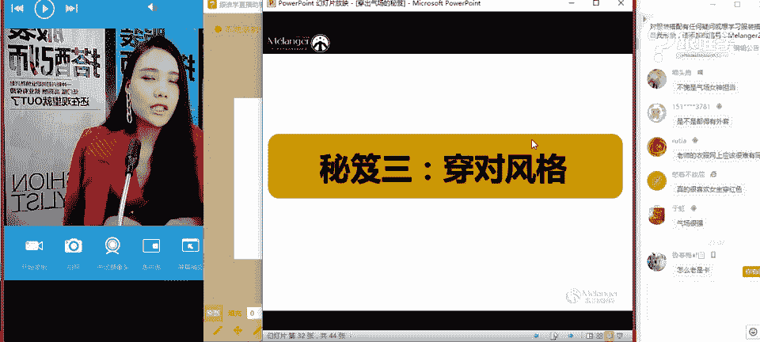
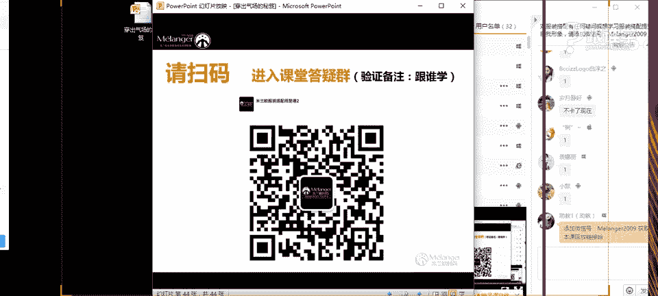

# 1、11服装《搭配秘笈之新版36计》：4穿出气场的搭配秘笈_rec

Okay。No。

包我。我好。呃，现在还能听到我说话吗？啊，我是今天课程的主持人冯飞。我靠，刚刚那道已经看到我了。我是今天课程的主持人龙飞啊，那么今天我们的内容是穿珠气场的秘籍。谢谢夸奖，谢谢。😊，啊。

那么今天就是我们的主导老师是自宇老师。哦，思玉老师是米兰欧国际时尚教育高级导师，有着非常丰富的整体造型、策画经验。啊，你好你好你好。😊，呃，相信大家之前都有看到过我们的英语老师也是一个非常漂亮。

非常甜美的一个大树。有杂音吗？喂。我看一下。现在现在还能听到吗？好，那现在还有一分钟就开始了。你这。喂。喂，现在还能听到吗？好的好的好的，啊，能听到就好。😊，好，那么现在大家有请我们的初一老师吧。

我の好。OK大家晚上好。嗯，那。😊，呃，我刚才看呃听到主持人在介绍说呃，那个吴京老师是一个长得特别甜美的老师，但是好像第一次有那个有人说我是甜美派的啊，那呃大部分的人呢都会说老师你是属于御姐派的。

然后呢是比较有气场的这样的一个感觉。所以呢今天呢我就来跟大家分享穿出气场的秘籍。那现在我的着装呢，今天呃现在大家看到的这样一个着装状态，好像并不是说觉得唉很有气场的感觉。

那因为呢今天呃老师呢为了让大家感受到一个比如说气场的变化。所以呢我在今天呢这个开场的着装当中呢，是这样的一个休闲的状态。那在我们课程大半场的时候呢，会给大家来演示一下如何穿出有气场的这样的一个感觉嗯。

嗯，猫猫呃这个说这个杂音有一点大是吗？那这个现在还是感觉杂音有一点大吗？刚才我好像听到的音效效效呃，音效效果好像还好。嗯，那呃在之前的课。吗？没有杂音是吗？谢谢啊，比较拉力的同学。OK好，呃。

那刚才呃在上一次的课程当中，其实我已经出来跟大家见过面了，不知道呃有没有同学有看到过我呢？呃，如果是今天第一次听我讲课的同学们请打个一，那在上一次课程当中，如果有看到的话呢，呃请打2呃很卡是吗？呃。

有可能是不是你那边网络的问题呢？😊，嗯，好，我看到有同学打一，有同学打2，那大部分同学还是没有看到过我上课的，是吗？OK好嗯，那首先呢我还是来自我介绍一下。那因为很多同学都没有听过我讲课啊，OK好。😊。

稍等一下啊。好，谢谢。OK好啊，那接下来呢我来正式的自我介绍一下。那我呢叫姚自瑜。那大家呢可以叫我自语老师。那其实很多同学看到我这个名字的时候，第一页他们就会说老师，我觉得你好像命中缺女啊。

是不是你为什么每一个字里面都有一个女字啊，那其实这个我觉得是一种巧合吧啊，好像当时这个取名字的时候并没有想那么多啊，那后面发现哎好像这的每一个这个字里面都有名字。那到底是不是命中缺女这边上海未知啊。

因为那老师现在还没有结婚？OK好呃，那呃我是米莱欧国际时尚的高级讲师，同时呢啊也会为一些秀场做这样的一个视觉搭配。那包括呢也会为一些杂志啊，周刊啊啊等等。那也会为一些明星艺人做这样的一个整体形象造型啊。

OK那接下来呢就跟大家来进入。😊，今天我们的这样的一个课程当中。好，那我们经常会说穿出气场。那这件事情好像很多人唉都会问过我，老师唉，怎么才能把自己穿的很有气场的感觉呢？那其实我就会第一时间反问他。

你觉得气场是什么？或者说今天我也想问一下，大家，你们觉得或者说气场他会跟哪些元素有关系。同学们啊赶紧来抢答一下什么是气场，你们觉得或者说什么样的表现方式啊，或者哪些元素，他会影响到一个人的气场呢？啊。

表丽娜同学说大气啊，OK皮衣这个这个这个名字啊，真的真的很特别。OK啊，还说高冷，包括气质啊，那还有其他的答案吗？嗯，个子高的人阿瑞说个子高的人比较强大啊，那其实我现在这个PPT上大家可以看得到啊。

那这位男明星不知道大家有没有呃有没有人认识的，叫靳东嗯，3781说自信。😊，OK我发现呃大家每个人的答案都不一样，说说明什么问题呢？好像强呃气场这件事情跟很多元素是有关系的，是吗？嗯呃表一亚同学说。

我超喜欢靳东，我也挺喜欢的，所以我才把他的相片放上来啊，那他在呃饰演伪装者当中的话呢，我觉得他们这个娄斯呃这个三兄弟当中他是最有气场的啊，他是这有气场OK呃，那呃韩夏还说跟影响力有关系吗？好。😊。

那看来每个人对于气场的这样一个定义都不同。那也就是说明什么问题。其实我们可以这样理解吗？气场的话，它是跟一个人的呃长相或者跟一个人的性格，包括他的行为。那最重要的是我们今天要讲到的跟一个人的着装的形态。

都有很大的一个关系。那也就是说呃那这些元元素呢，他会影响到一个人的气场。那气场为什么大家都那么想要拥有这一件事，拥有这一个强大的武器呢？因为我们会认为有气场的人，他给我们一种非常有自信的感觉。

那这种有自信的感觉，会让人觉得哎他是非常的有这种呃强大的power的这种感觉。所以我们每个人哎都想要拥有气场，对吗？那曾平说人群中特别引人注意的啊，很有魄立感的OK。好。

我看到很多同学都都这个对气场很有感受是吗？那你们想不想拥有气场的？同学们，如果想要拥有气场的话呢，那请打一，让我看一下有多少同学想要拥有气场。

那我今天就要好好的来跟大家来剖析剖析这个如何穿出气场这件事情。OK好嗯，那么多同学都想要拥有气场是吧？OK好啊，那已经有了陈练同学说已经有了啊，那说明什么问题呢？呃，那有同学说特别卡。如果特别卡的话呢。

同学们你们可以先退出，然后再点进来看一下会不会好一些。啊，那老师这边的话其实是不卡的。我们的网络是不是有太大的问题的。OK更更有气场。好的嗯。😊，那说到气场这件事呢，其实有很多人啊。

那你看曾婷马上就说了这个问题，说个子小，好难拥有气场。那曾婷同学老师今天要受到错误的认识当中呢，就包过了这个观点啊，是不是很多很多人会认为哎个子比较娇小，就是没有气场的这样一个表现。

那其实我们学院呢也有一位老师，我们啊我们其实呃不光是有线上的这样一个课堂。我们在线下的话呢也是有学校的啊，那我学校的话在广州那在学校呢有一位老师啊，我们的班主任，那我们这位班主任呢。

他的个子就是比较娇小的。他每次看到我的时候都会说老师我好羡慕你啊，哇你的大高个啊，因为老师呢嗯个子不是特别高，只有一米7而已啊，不穿高跟鞋。OK所以说呢他每次都会说啊啊我好羡慕你的这个这个大高个。

说你不用穿高跟鞋都非常有气场。那我经常会告诉。他。其实个子小也一样可以穿出气场的啊，那雨后的太阳说怎么才能有气场。那接下来呢嗯在今天的课程当中中老师就会跟大家分享，怎么才能穿出气场。啊。好。

3781同学说用别的优势去弥补啊，那呃1929说，你觉得郭德纲没气场吗？好呃，这个192同29同学是针对于上这个跟上一位同学做互动了，是吗？好嗯。😊，嗯，玫瑰百合说老师你属于个性型吗？

你觉得哎呃你们怎么理解个性这个问题呢？你们觉得王菲是不是很个性，觉得李宇春是不是很个性，觉得我是不是很个性。那其实我们说每个人对个性的理解不同。那有的人呢会看到哎打到的比较时尚的人。

他就会觉得这是一种个性。那其实我们说个性的话，个性的呃个性类的风格当中有很多的啊，那OK好，那接下来呢这是第一个观点，对吗？小个子没有气场。

那接下来老师就给你们看一下这一个小个子他是怎么通过穿衣把自己穿成气场来的啊，OK好，那这位同学知道啊这个同学们有没有人认识这一位街拍达人啊这个有同学说老师你的微信号是多少？那个同学呃这这位同学。

那老师的这个微信号你是想要了解什么痕题呢？啊，如果有打有这个疑问的话，我们等下在课后的话呢，会有这个。😊，微信号给到你，然后你去扫。嗯，好给自己一个未来同学非常好啊，说俄罗斯名媛。

那包括阿瑞也认识这一位呃啊好像很多同学啊都认都认识这一位呃这个街拍达人啊，那其实呢他就是俄罗斯的名媛祖玛啊，那多马呢他其实只有1。53米的身高同学们啊，那我相信应该在我们现在教室里的同学们。

应该呃没有几个是1。53米的吧。我觉得你们的身高应该都不会特别娇小吧。那如果有的话也没有关系。那你们可以来参考一下这一位时尚达人，他是怎么穿衣的啊。那很多同学。会说老师啊。

那那其实这个我我我看着他穿着挺好的，但是我自己穿的时候，我觉得好像就不是那么回事儿。啊。嗯，OK好像每个每个人会认为这个有这个明星，每个明星的气场是不同的啊那嗯。刚才有同学说自己1。6是吧？

那如果你是1。6米的话，那你穿的出气场，那就更容易了啊。我们说杜马的话只有1。53米。那同学呢我们来看一下杜马他为什么能够穿出气场。那是因为你会发现他的每一套服装的色彩，都是非常的有连贯性的对吗？啊。

那这种那那我们说如果一个人他个别娇小的时候，他呃我们既然说高个子的有气场，那是不是小个子的人就要把自己往高个子的感觉去塑造呢？而他身上的这种这种色彩的搭配方法，其实都是色彩的连贯性。

那也就是说他的每一套搭配，大家可以看一下，他的服装当中都是运用了色彩的连贯性啊，然后呢让他整个人看起来都是比较高挑。也就是说因为他没有身上没有太多的色彩的时候，他是没有分割感的。

我们的视觉层次他是统一的。所以他看起来就会比较高挑，那也就是会比较有气场的这样的一种感觉。那这是我们所说的，唉，通过色彩连贯，才可以让一个人看起来会比较有气场。那小个子的同学，你们就可以借借这种方法啊。

OK安瑞同学说高腰线啊，高腰线的话呢，他只是表达啊，我们说这个拉长腿型的这种方法。那其实呃我们说要想让人变高的话，还有很多的方法啊，OK那这个变高的这样的一个课程的话呢。

我们在后面的专业课程当中会跟大家会跟大家来这个分享。那我们的这个呃这个公开课的话就不讲太多了啊，今天的话因为去讲到气场的问题。OK好嗯，那这是第一点，那很多同学会说啊，这个这个是小个子的问题是吧？

那有没有人是这样的一个情况，他自己长的是这种特别可爱的感觉。那咱们今天课堂当中有没有这样的情况呢？有没有觉得自己讲的特别的可爱甜。😊，但是想要把自己往成熟的感觉去塑造的。我看一下咱们有没有同学是这样的。

或者说你们身边有没有这样的一类。你会觉得他其实已经30岁了，但是他看起来还是特别的显得很年轻，或者说显得很可爱很甜美的这样的一种感觉。OK好，那咱们课堂当中怎么会这样的同学呢？啊。啊。

阿K说自己就是这样的是吗？好姑娘说断开了吗？啊，什么意思呢？OK好，那其他同学呢有没有这样的一个问题？好，那老师身边其实就有很多这样的一个问题了。

他会呃有有同学他们很多同学来上课的时候都会跟老师提到这样的一个呃诉求，说老师啊那我们这个同学们当中也有是吗？好，那经常会说老师我想让自己穿的很成熟，想把自己穿成熟一点，或者说我如何能够把自己穿成熟一点。

但是其实呃呃我我一听到这个问题的时候，再看他那张脸啊，准是那种看起来娃哇脸的感觉啊，O谢谢这个这个这位同学啊，你这名字太有特色了。说老师你也很童年，谢谢啊。那其实老师不童年。

老师知道自己的这这个长相是什么样的感觉的啊OK好，那我们说童年是什么样一个概念。童年的话其实就是指一个人他看起来很清。😊，然后看起来很可爱，很年轻，一直很显年轻的这样一个状态，对吗？

那在明星当中就有这样的一位人啊，那刘亦菲，那大家可以看一下，刘亦菲这已经三十了啊，三十几了，我觉得他应该是，但是大家看一下他这张穿这个校服照的这张相片啊，是不是看起来真的很像一位学生。😊，啊。

那这个刘亦菲呢，他也是呃我记得他是演小龙女出道的啊，那种很仙气的这种造型的话，让我们很多人都留下很深刻的印象。那呃近期的话呢，其实现在有一个词语叫天仙宫，我不知道大家有没有听过天仙宫啊。

那天仙宫呢我们说是什么样的一个状态呢？就是长得呃他看起来是又仙气又甜美，但是又帅气的感觉啊。对，是的，嗯，这位同学打出来的这个字就是天仙宫，那我们来看一下让你们来感受一下天仙宫是什么样的啊。OK好。

那大家可以看看到现在呃刘亦菲的这样一个造型，从刚才那个穿着校服古夜的这样一个感觉。然后到这种非常的这种呃帅气的这样一个这种造型啊，很有气场。那他这样一个造型加上他这样的一个我们所说的这种表现力啊。

那看起来就会非常的有气场。那天仙风这个词语，词语也是专门啊这个也就是刘亦菲啊做了这样的一个造型之后，然后就火了。啊，这个词语就是为他而定做的OK好，那所以说呃个子娇小，或者说你长得很童颜。

这都不是让我们能够气场不强大的这样的一个员工。所以相对来说我们可能会觉得个子比较高一些的啊，长相会比较御见范儿的人，他更能够有气场。但是并不是说小个子的人或者说长得很可爱的人，是不能有气场的哦。啊。

那今天呢下面呢。😊，老师会来跟你们一一的剖析啊，如何能够穿出气场。那今天有三大秘籍要交给同学们啊。OK好，那接下来我们来看一下秘籍一。选对色彩。那我们经常会说1米看色彩，5米看款式，3米看面料。

那是什么意思呢？也就是说我们人在穿衣啊，造型的时候，那色彩是我们的第一视觉。但是并不代表色彩就是我们所说的服装搭配的全部。那其实服装搭配它包含了色彩啊，款式那包括面料配饰和图案啊，那这几个元素都包含。

只是我们说在色彩的话，它是我们的第一视觉。那也就是说色彩其实对于我们来说的话呢，是很能够让我们有气场的一个手段。那接下来我们来看一下啊，嗯，吸烟中很有气场。我选择色彩很瞎啊，他好，他说好。

这位同学说我选择色彩很瞎是吗？那你的意思是说你不太会服装搭配，或者说不太会色彩搭配吗？OK好，我们来看一下，那色彩当中呢有很多颜色，对不对？红橙黄绿青蓝紫。

那我们的眼睛可以看到的色彩有7待150万到1000万种。那同学们那现在我们这个图片当中的色彩，你们可以来告诉我，你们比较喜欢哪一种色彩吗？好嗯，红色粉色、橙色、黄色、绿色。

包括蓝色、紫色、黑色、白色灰色啊，OK好，有同学说我喜欢黄色啊，呃这个橙曦柚子，哎，柚子你应该选择黄色呀啊，柚子皮肤是黄色的吗？所以说你喜欢蓝色是吗？OK好，红色，我看到有很多人都喜欢红色啊。

那阿K是喜欢红黑白灰OK好，我看到很多很多同学的答案。那你们的答案太多了，我不知道这个如何下手啊，那我就挑几个来讲吧。😊，那我看到1863620呃20这位同学，那呃他选的这两个色彩是蓝色和灰损。啊。

然后有一位同学说我是男生，但是我也喜欢红色。那这位同学呢代表着什么呢？代表着你这个人呢是比较积极向善和活泼的。我们说红色它其实是有我们说色彩它其实是有性格的你喜欢的色彩，它就代表着你性格当中的某一部分。

那例如说啊。一切随风说，韩老师今天这身打这身打扮。我呃我想说的是一切随风同学，我不是韩老师啊，那我是资宇老师。那嗯对，是的，好嗯。那呃继续回到刚才的这样一个问题。我们说色彩的话呢。

其实它是代表着你的性格当中的某一个特点啊，那比较喜欢红色的人呢，刚才我看到有很多同学选红色，那如果你比较喜欢红色的话，那代表着你的内心的话啊。

一定是非常积极向上活泼的那你做事情是非常的这样有有活力的这样一个感觉。那其实我们说红色的话呢，他呃在这个中国的话，那他也是我们经常叫中国红，对吗？那其实也可以从这反映到我们中国文化。

我们中国人其实是比较积极的，对吗？OK好，嗯，那刚才看到有同学啊还选择了蓝色和灰色，那我不知道这个同学呢是你如果是男生的话哦，那你选择蓝色和灰色灰色的话呢，呃相对来说是比较正常的但是如果你是女生啊。

你又选择了蓝色，你还选择了灰色。那我要。告诉你的是，那这位同学你可能是一个非常理智的女生。而且呢我们说如果你是女生的话，你选择蓝色，那代表着你可能是个彩礼哦。因为选择蓝色的人。

那他的思维逻辑是比较清晰的，做事也是比较严谨的啊，那包括喜欢灰色的话，其实灰色它是比较低调的，就比较内敛的一个色彩。而且呢灰色其实它是一个叫我们所说的无性格的色彩。他会他跟什么颜色配在一起的时候。

他都是成就了对方。啊，好，那呃我们说这个色彩的话呢，其实它就代表了每个人啊，你的性格当中的一部分。那包括这个我经这个刚才有很多同学都选择了。因为我们这个时间的关系呢啊，不能跟大家来分享太多。

那其实我们这样的一个专业的色彩呢嗯我觉得学习色彩其实是有必要的哈，为什么呢？因为在社交当中，如果你把色彩心理学都学习了。那其实在呃这个社交当中的话会非常的轻松和容易。哎，一见面的时候。

你就可以先跟他做个小游戏，说哎你喜欢什么样什么样的色彩，然后呢哎去猜一下他的个性当中是什么样的感觉，对吗？OK好呃。😊，有同学说红色不知道什么样的场合穿啊，那红色的话因为它是一个非常的无数。

因为红色它这个色彩的光波是非常长的，它这个颜色是特别鲜艳的那一般呢我建议红色的话呢，不要在职场当中去穿着。因为红色它有一部分的个性，它给人感觉是非常的性感的，而且是非常的张扬的。

如果你在职场当中去说穿这穿着这个色彩的话呢，它会给人感觉唉这种性息不太好哦，比如说你会用这种红色的指甲油，红色的高跟鞋，那给人感觉太过于性感。你说在职场当中的话其实是要回避，太过于性感和女性化元素的。

在职场当中，我们要隐藏自己的性别OK好呃那。啊，有很多看来这个色彩的这个板块，大家都很这个热情啊。那今天时间关系的呢就跟大家分享太多。那更多的这样的一个信息呢，我们会在专业的课程当中，大家课程。

就跟大家分享。那包括呢配色啊，那下面呢我们就来讲配色的这样一个关系了啊。好，那在这个我们所说的呃，今天是讲气场嘛。那么如何配色能够显得有气场，也是我们本台要讲的内容。那在这张图片当中，那大家现在看到的。

你们觉得哪一个更品气场呢？是图片一还是图片2呢？啊，那顾里的话呢，这部剧，我相信大家都有看过，对吗？这部电影叫小时代啊，这一位呢是电影当中呢，女主角顾里。那顾里的扮演者呢叫郭采洁。

郭采洁在没有演小时代之前，他一直给人的形象是非常的天真可爱甜美的这样的一个形形象，那在他演了这部剧之后就转型了，就是这个成功的转型了。为什么呢？因为在这部剧当中没关系，没看过的话呢。

天朝内景没看过没关系了。现在就来给你们讲了啊。好，那在这部剧当中呢，她饰演的是一位富家女，而且呢她虽然个子非常的娇小，但是因为她的这样的一个整体造型，让她在这部剧当中都是非常非常的有气场。

那你会发现他在这场戏当中，他在这部剧当中的形象永远都是抬头挺胸。然后呢，红唇啊，那像这张图片当中的啊，她还会泛红的那种红唇，包括用色的色彩，他永远用的都是非常深沉和庄重的色彩，什么意思是深沉和庄重呢？

也就是说啊在白色和黑色当中，我们会觉得哪一个色彩会给我们感觉会更加的稳重呢，同学们。是不是黑色给我们的感觉更稳重？刚才我都看到同学们都一直在打2对吗？

那也就是说你们都认为这一张它的感觉是会更加有气场的那所以说黑色的话呢，他其实是气场之王。可以这么说，你会发现所有的呃这个国家领导人。他们在出席重要场合和会议的时候，永远穿着的色彩都是黑色。

没有其他的选择。那因为那是因为黑色这个色彩它是最稳重的，也是最有气场的，也是最正常的这样的一个色彩。所以啊黑色呢它是非常非常的这个在我们所说所有的颜色当中，最能够彰显气场的色彩。

但是呃呃是不是只有黑色只能穿出气场呢？当然不是啊，那其他的色彩。那接下来我们来看一下哪些色彩啊，它还可以给我们感觉是比较稳重的感觉。OK。好呃，6679说老师。

你上次穿的那个袖口有有有那个呃宝石钻石的感觉的那个衬衫没买到是吗？哦，那件衬衫的话是我在一家嗯买手店里买的6679同学啊，OK好嗯那。好，我们接下来来看一下红橙黄绿绿蓝紫。那在这两排色彩当中。

我想问大家，你们觉得上面一排更有稳重感，还是下面一排色彩更加有稳重感？O。😊，好呃，晨曦柚子，包括2K金色秋天啊，都会都说嗯2。那到时候大家同学都会觉得是下面一排会更加有稳重感是吗？好，OK好。

非常好啊，同学们，那嗯很明显我们都会觉得这一排的色彩，它给我们感觉是更活泼的感觉，或者说更加呃清这个清新的感觉。那下面的一排色彩，我们会觉得哇很很稳重的感觉啊，那有一位同学说上面的色彩给我们感觉很稳重。

是吗？好，那我想问一下雨后太阳这位同学如果你今天。😊，是去面试啊，你你去一个职场当中去面试，你会选择上面的这一排色彩吗？如果你选择了上面这一台色彩。那老师要跟你说的是。

你的这个面试的成功率相对来说会下降。为什么呢？因为这一台的色彩它给人感觉是非常清新和稚嫩感的，而这种稚嫩感会让人传达一种你没有你的工作能力相对来说比较弱。这是我们在职场当中非常禁忌的。

当你看到这样的一款啊，满身粉红色或者是满身粉蓝色的这样的一个女生站在你面前的。只想跟他说，哎，孩子回去玩吧啊，这个过两年再来工作吧。嗯，你会有这样的一个感觉。因为我们说这种马卡龙色系的话呢。

它是非常它是加了白的色彩。刚才有同学说非常好啊。晨曦又是说下面一排加了黑色。是的，因为上面一排色彩的话，它是特别清浅这种色彩，它是没有太多的力量感的。也就是说所以说我们说在呃你想要选这个稳重感的时候。

想要有气场的时候，你选择下面一排色彩会更加的能够凸显出什么呢？你的气场，但是上面一排色彩，刚才就像很多同学会也也很喜欢上面一台一一排色彩，对吗？那么我们要讲到的就是。😊，如何通过搭配，能够把这一排色彩。

啊，穿出稳重感和气场的感觉。因为下面一般色彩的话很明显，大家都觉得它是非常稳重的，对不对？那很容易就穿出我们所说的气场感。那呃如果在这里再跟大家来讲这一排唉，如何去配色的话。

那大家好像觉得呃好像这种感觉我们也会搭配。那呃今天呢老师要跟大家分享的就是如何把这一排比较活泼的色彩能够把它穿出气场和稳重的感觉来好吗？嗯，OK好。😊，钟永雄同学说上下搭配OK好。

那这个我们刚才看到啊这个红橙黄绿蓝紫。那这几个色项当中，我们说同这个同一个色相当中啊，你会发现有的这个有浅粉色和暗红色，然后浅橙色和呃这个赤这叫呃赤褐色啊，比较深动的赤褐色。那芥模色和这种鹅黄色OK好。

当然不是啊，这节课的话，我们要讲到很多内容呢？色彩只是我们所说的穿透气场的一个点。OK那接下来我们来继续看啊，刚才有同学说呃，下面会不会让人觉得太成熟，显得老气。那这就是我们所说的你想要表达一种感觉了。

OK那接下来我们来看一下，那在所有的活泼色当中，我们说粉色已经是凭我的感觉是非常非常年轻啊，浅美的感觉，对吗？那我们说粉色的这样的一个感觉的哈，有很多人。😊，有的那接下来呢就让这个老师呃给你们讲一下。

如何能够把粉色做出气场。那么说粉色它给我感觉是比较甜美，清新稚嫩柔软啊，包括这种可爱浪漫的感觉。那最后前面大家都很好理解。那最后一点是什么意思呢？法式洛可可。好呃，这节课可以看回看吗？西西说。

那其实我们这个所有的直播课程的话呢，是呃看不了回放的那我们只对于我们的呃VIP的学员呢可以给到他的回呃回放这样的一个视频。OK好，那我们来看一下法式洛可可是什么意思？

法士洛可可他其实指的是在1819世纪啊，这个浪漫主题时期。那在那个时期呢呃贵族们非常喜欢穿着一些啊粉色粉蓝色包括老师今天穿的这种粉蓝色啊，天蓝色。那这一系列的色彩就给人感觉很甜美和清新的色彩。

包括他们会非常喜欢用这种蕾丝啊，包括珍珠蝴蝶结这样的一些元素，给人感觉就非常细腻清新的啊甜美的这样的一个感觉。所以说那法师洛可可当中呢，其实有一部电影叫呃绝代艳后。那大家也可以看一下。

那个就是非常非常典型的我们所说。的洛可可风格。嗯，OK。看不到图片是吗？如果看不到图片的话呢，可以退出去，然后再进来。嗯。OK好，对，是的，绝代艳后。好。

那我们说很多人他会觉得粉色他给我们的感觉更加接近于这种感觉，对吗？同学们啊，比如说我们在穿粉色的时候，我们经常会配白色。那它给我们的感觉一定是非常甜美和不泼的那因为粉色本来就很清新了。那你再加上白色。

白色是非常清纯的感觉。所以它组合到一种感觉的话，一定是非常甜美和可爱的那我们说在呃在配色当中，其实配色的话，他有很多很多的这样一个学问的啊，那如何能够把粉色穿出稳重感。我们来看一下。

那粉色它可以配什么呢？黑色。😊，它给我们的感觉就会非常的稳重和气场了。那呃我们说在配色的话呢，它不只只是色彩与色彩的搭配，它其实还会关顾到我们所说的色彩的比例搭配。那例如说在这一张图片当中。

我们会看到哪一个色彩比例占的比较大。同学们是黑色还是粉色。你们觉得是黑色还是粉色？在这张图片当中，OK天堂面子说黑色是的，那在这张图片当中的话哦，黑色占的是大面积的。那么也就是是说什么意思呢？

在一套服装当中，哪一个色彩的主色占的面积是比较大的。那么你这一套服装给人的感觉就会呈现主色的色彩。那在这一套图图片当中的话呢呃黑色占的是大面积，那黑色我们说是一种稳重的色彩的感觉，对吗？

那粉色作为点缀的时候，那我们只会觉得哎这一套服装它是非常有气场的，但是同时它是有一点点女人味的啊，是给我们这样的一个感觉，对吗？OK好啊，有同学说老师这样适合职场吗？

这种着装的话其实是职场当中可以穿到的啊，可以穿到的。那呃男生杨生同学说男生呃类似这样搭可以吗？当然可以啊啊，男生也可以这样搭配的。但是呢男生需要注意的是什么呢？粉色这个色彩的话呢，你要谨慎使用。

因为这个色彩它会给人感觉是比较稚嫩的感觉，那男生穿起来的话就会有一点点我们就说的小骚气哦。OK好，那我们说这一套的话，他给我们的感觉是黑色主面积。那我们来看一下。粉色占主面积的时候给我们的什么样的感觉。

那在这一套，刘亦菲他就是搭搭配了我们所说大面积的粉色和小面积的黑色，其实他的黑色占比并不小，只是因为他的大衣全身遮住了。那依然还是黑色加粉色。

他但是我们说这样的一个配色关系他会让我们感觉已经是非常的有气场的，对吗？他让黑呃他让粉色变得不再那么柔软了，他是有硬朗的感觉存在，那只是我们在这里要表达的是我们在平时的配色当中。

同学们你们需要注意的问题就是在这儿了啊，那这点非常非常重要。你想要表达哪种情感。例如说你想要表达你更加稳重的时候，你可能在配色的时候，你的黑色面积是要占大部分的。而你想要表现的是。

哎我还是想要甜美的一面，但是同时不想那么稚嫩。那这一套就可以了。啊，在生活当中休闲当中。我们是可以这样看的。啊，你在比如说你去约会的时候，你穿的这种呃粉色配黑色，它会给人感觉。如果只穿粉色的话。

它会给人感觉太过于甜美啊。那如果你想要表达一丝丝这样的硬朗的感觉，是可以加黑色的OK好，那嗯清新可爱，但着不失稳重。呃，黑色外穿内搭是红色的适合职场吗？OK好，天堂妹子的这个问题问的好啊。

那我刚才其实已经在呃开场的时候跟大家分享了。我说红色的话呢，它其实太过于张扬，在职场当中的话，要少去使用。那红色的话，因为这种色彩的话，它会带入性感的元素感，包括它会太过于女人味儿。嗯。

O所以在职场当中慎用。但嗯但是在生活当中的话，你可以去使用。嗯，OK好呃，这样搭还需要很多配饰吗？它的配饰也很重要。它的配饰其实只是一副墨镜对吗？这副墨镜的话，我相信呃很多同学的话都会有的。😊，啊。

OK那其实配饰的话真的是必不可少的这样我们所说的时尚的单品之一。那我建议大家要多去购买一些配饰。嗯，OK好，那所以说呃那你我们会发现在粉色加白色的时候，它给我们感觉会比较的甜美和一可爱的感觉。

而粉色加黑色的感觉的时候，它给我们感觉会变得稳重。那是不是在所有的色彩当中，其实就可以通用这个法则了呢？啊，也就是说如果呃呃红橙黄绿蓝紫，你想要把它变得清新的时候，你可以配白色使用。

如果你想要变得稳重的时候，你就可以用黑色来去配色。那就是我们所说的配色的这样的一个关系。那今天呢其实老师只是讲到了一点点这样的一个配色的原理啊。

那在我们这样的一个专业的课程当中会有更多的这样一个配色会挑到给大家。嗯，职场当中不用红色。😊，呃，有唉，我看不清楚啊，看不清这个天堂妹子你可以再打一下，因为现在刚好有这个字挡住了啊，OK好嗯。

你看我们来看一下，那这是我们所说的这个呃。配色啊，那接下来呢我们来看一下穿出气场色的这样的一个搭配。好，那穿出气场色的色彩啊。OK好，那在这一幅图片当中呢，我们来看一下啊上面的色彩呢。

它给我们感觉是非常的清浅的下面的颜色它给我们感觉是非常的什么呢？看起来是比较重的那这张图它是在我们专业的课程当中会用到的叫色调出，我们就用这张图来进行配色啊，呃，不管是两色配色，单色配色还是三色配色。

我们用这张图就可以把它全都搞定啊，OK那大家可以看得到，那在这个呃我们所我标记的这种气场色当中，你会发现这一类的颜色，它看起来都是比较稳重感的那所以说唉同学们你们想要穿出气场的时候。

你就可以多去使用这一类的色彩啊。那如果你在这个搭配配。配色的技巧不是特别稳妥的时候呢，你就用这一类的色彩啊，它是比较安全的。但是如果你你们想要更高的提升自己的这样一个搭配水平的话，就要多多的去学习啦。

嗯，OK好，那我们来看一下，这是刚才讲到的，我们所说的呃，这个穿出立场的这个气场的秘籍一。那秘籍二呢就是我们所说的选对款式。那我们既然说了，刚才我说十米看色彩，5米看廓形，对吗？也就是我们的款式。

其实就是我指我们的服装款式，那服装款式的话，其实它我们说有很多种，那如何能够从这当中选出一些比较有气场的款式。OK好，我们来看一下，那依然还是这部电影当中的一个人物形象。那我来给大家来解析一下同学们。

你们来看一下啊，12345，你们觉得在这这个5个人当中，哪一个人看起来相对来说是比较有气场的？12345。嗯。杨幂是吗？OK。好。嗯。艾米说是4啊，然后有人说是。有人说是4哈，那每个人答案不一样。

那我发现了两个规律。😊，第一个规律呢就是大家觉得个子高的人还是依然是这个问题。你们会觉得个子高的人看起来是比较有气场，对吗？好，那也有同学回答第四个，那说明什么问题呢？这一点是不否认的。

第呃个子高的人他看起来会比较有气场，这一点我们是不否认的对吗？那在这一在一张在这一张图片当中，有的人也会觉得第四个看起来是比较有气场的。为什么？那是因为啊有同学说上衣是比较有气场的。

我那在这一张呃这个我们所说这张图片当中，第四个看起来比较有气场的原因是因为他的这一套服装是最简洁的线条。呃，晨曦柚子说衣服呃，四衣服整体呈现直线感OK好，那这就是我们所说非常好啊。柚子同学。

那在这几呃在这几套造型当中，郭采洁的这样一个造型，他是最简洁的。其实这是他们在开发布会的时候的这样的一个呃这个形象造型。那我们说开发布会的时候，他们一般都会比较吻合他们剧中的形象的人物的造型。

你会发现啊这几个人的话，其实他们的穿着是跟他们剧中的这样的一个人物形象匹配的。因为为什么郭采洁他穿这么简洁的款式呢？那是因为他想要表达他在剧中人物的这样一个形象。

他剧中人物就是比较有气场的这样一个感觉感觉。那么也就是说其实这种服装廓型简约的，越是简单的越显得高级越高级越显的。有气场啊，我们说大减至上就是这个道理啊，OK好。嗯，有同学说气场是给人的感觉。

其实气场的确是给人的这样的一个感觉，它是比较抽象化的啊。那在这里呢老师把它具象化的教给大家。那通过服装的这样的一个搭配和选择的话，它其实气场这件事情是可以营造出来的。OK好。😊，那我们来看一下。

那既然说款式简约的啊比较有气场，那包括不好意思同学们。包括这个我们所说的服装造型比较挺括感的。也就是说，刚才有同学说直线感的这样的一个感觉，它给人感觉会比较有气场。那我们来看一下，那这位博主有人认识吗？

这一位博主他是瑞士的一位博主叫巴桑。那大家可以看一下，其实这位博主呢他的身材啊不是那么完美的，他的这个臀部和腿部是比较偏这个偏宽的啊，比较壮的。那我们来看一下，其实他在他的这个整套当中。

你们好像发现他的身材挺好的，对吗？嗯，OK好，那我们来看一下在这两套服装当中，同学你们同学们，你们觉得哪一套看起来会更加有气场啊，是这一套呢，还是这一套呢？一还是二呢？小布的甲壳虫说不认识是吗？嗯。

OK好，那我看到大部分同学都回答2，对吗？嗯，老师他穿什么衣服都敢穿。好，嗯，一感觉有点臃肿。OK好，那这就是呃老师要跟大家来讲的了。我们说衣服的款式这么多，对吧？上装下装里装外装，然后裙装裤装等等。

那么我们如何从这万千服装当中挑出有气场的服装廓型和服装款式，OK好，那首先我们来看一下，在这两套服装当中，哪一套给我们的感觉，线条是会更加简约的。有人会说哎老师我觉得这是一条连衣裙它好像更加简单啊。

这并不是这错了啊，为什么呢？其实这套虽然是一套连衣裙，但是你会发现这一套连衣裙当中，他的这个面料是在这种所说的。镂空的蕾丝面料，这种镂空蕾丝面料，它给我们感觉是比较柔软的。比较柔软。

它是没有这种挺迫感的，面料也比较柔软。那我们说呃想要穿出挺括感的话，一定是呃想要穿出气场的话，一定是要比较挺迫的感觉。比如说什么样的是挺迫感，迷人。他们穿的军装。

大家会不会呃这个前一段时间热播的那部剧叫什么太阳的后裔，对吗？宋仲基啊，非常帅，我们会觉得哇，这东可以这么帅。那是因为他穿穿军装的时候，他应该是一种特别挺拔的这样的一个状态。包括我们国家的军人啊，军人。

他们在穿军装的时候啊，也是非常挺拔的这样一个状态。你会觉得这样的一个挺阔的服装，他穿起来会让人显得更加有精神。而一个人看起来比较有精神的时候，他会比较有自信啊，看起来就会比较气场强大啊。

OK那这是啊当一个人这个我们说挺阔的服装，他也会约束人的行为。你会发现我们在穿西装的时候，会怎么去看手脚，同学得。啊，如果你们去这个呃如果穿西装的时候看手表是怎么看手表的，咱们这儿有男同学，对吗？好。

我想问一下呃，咱们这个男同学，你们在你们现在可以做一下示范啊，你们现在可以想象一下，如果你们穿着西装，你们会怎么去看手表。好，那我来给大家做一下示范。😊，我们一般穿的西装的时候。

看手表基本上会有这样的一个动作啊。好，假设我现的穿的是西装，你们想象一下，那基本上呢男生在看手表的时候，伸抬手伸手。还去看到对吗？为什么会有这样的一个动作？同学们。因为西装它是比较拘谨的啊。

那它会让我们感觉有这种这种约束感。也就是说你在看手表的时候，你可能不会这样一下看过来，你会觉得衣服有点紧绷，对吗？所以你要伸一下袖子，哎，把这个衣服的空把这个空间啊，然后这个这个弄开了之后。

你再抬起来看手表。那说明这种挺迫感的服装它有约束感，所以它让我们看起来比较有精神，所以看起来比较有气场。OK好，我不知道这一点有没跟大家讲清楚吗？那所以说啊相对来说比较复杂的款式。

服装的这种面料太过于繁琐，款式太过于细节的话，那包括面料比较软的，它看起来都会相对来说没有那么的有气场。OK好，那在这呃在这两张图片当中呢呈现的就是这样的一个状态。好，那我们接下来看啊胸。

钱他给我的感觉会不会也是比较这个我们相对来说是比较没有那么有气场的呢？是的，表表纳丽同学说休闲。好，那我们来看一下尼克大叔，这一位不知道大家有没有人认识。那尼克大叔的话，他其实身高也不高的啊。

他也是非常这个个子好像还没有1。7米，但是他在穿衣服的时候呢，他成了很多街拍达人的这样一个范本。为什么他身材很矮，但是他穿衣服非常的有型帅气有气场啊，就穿出了一种我所说的呃1。8的记视感呢。

那其实他只有1。68米。那我们来看一下。啊，那呃你可看出在左边图片当中和右边图片当中，同学们你们觉得哪一个看起来会更加有气场呢？啊，一还是2，你们觉得一还是2？这个大花臂很有气场是吗？是的，嗯。

花地很漂亮。OK好，那呃我看到大部分的同学，包括这个梁叔，然后文清、阿瑞、艾里克呃艾克里里啊，好姑娘都说第二个看起来是比较有气场的，是吗？OK好，那第一点，刚才有同学说了，因为他穿的是运动衫比较休闲。

那说明什么问题呢？休闲的面料，他是不是相对来说比较有柔软，柔软的面料，他才会有舒适感嘛，对不对？那他看起来就是一种没有那么有精神的这种感觉。那或者说这种呃包括他的这样的一个裤子上的这个花朵。啊。

然后他鞋子上的这样的一个图案，会让他整身看起来太过于繁琐，也就是我们所说的看起来没有那么简洁，而这一套服装当中你会发现，首先面料特别的挺阔。而且他的服装是特别的这种有。型和简约的这样的一个状态。

那包括他这样的一个领子，也看起来特别的大气啊，一竖竖起来的立领，包括墨镜，整体造型给我感觉都非常的有气场。那所以说呃不只是衣服的色彩，它可以带来气场。那么衣服的款式它同样也可以带来气场。

比如说这样的挺阔的面料啊，也这种挺括的款式，挺阔的款式，包括这样的一个呃相对来说比较简约的这样的一个款式的服装，它看起来都会比较有气场。那我们经常会说唉其实在前面一两年的时候，两年之前吧。

两年前大多数人的话都是比较喜欢什么呢？寒风对吗？但是这两年其实有很多人都比较喜欢欧美的感觉了。那我想问一下大家，啊，那在我们教室的同学们，你们喜欢寒风的打一，喜欢欧美的打2好吗？我来看一下。

其实这个是没有关系的啊，老师只是做一个小调查，然后你们喜欢哪个就说哪个就可以了啊，OK好哦大多数同学都打2，你们怎么了？这是怎么了？啊，那蓉蓉同学喜欢寒风是吗？花春如故同学啊，这屏刷的太快了啊，没看着。

然后呢喜欢一啊是吧？艾米同学也比较喜欢寒风，那包括8039也比较喜欢寒风。OK好。😊，那么我看到大家的答案了啊，那其实我来说站在男生的角度上，我觉得男生大多数是比较喜欢韩冬的女生，就是日韩的那种感觉。

为什么呢？因为看起来很软啊，很甜美呀，很可爱呀，然后呢呃就会让人有保护欲呀，但是欧美的这样一个感觉。但是我今天看出大多数同学都喜欢欧美的感觉啊，呃艾妮同学说欧美风穿不出来，个子矮啊，那刚才我我要打你了。

艾妮同学啊都都都都听了这么长时间课。刚才我们讲过了，第一点，个子小并不能形成，你穿并不能这个构成你穿的没有气场的这样一个原因啊，OK好。😊，那呃我们说这个欧美风。

因为他给人感觉是比较硬朗的那比较强悍的这样一个状态。所以说呢男生可能相对来说呃更喜欢女生，小鸟依人一点啊那呃呃梁叔同学说，你就是韩风。那等一下梁舒同学老师可以给你们变化。

给给大家变换一个欧美风来看一下啊。那呃其实呢。我们说这个近两年特别多人喜欢欧美风，那就是因为欧美风，他给我们的感觉现在是比较有气场的啊。OK好，那呃这就是为什么今天老师讲这堂课的原因。

那接下来我们来看一下啊，那气场必备的单品。那比如说大衣阔腿裤、过膝靴、阔形感连衣裙和皮衣，那所有的单品当中，那会会有一个共同的元素。同学们在气场必呃必备单品当中，你会发现他们有共同的元素。

就是它的衣服款式都是比较简洁的包括它是比较有阔形感的面料是比较硬挺的那太过于柔软的面料，它给你感觉会很柔软很柔美啊。那我们说硬挺的面料，它给我们感。比较有气场OK那你们想听哪一个单品呢？

今天老师可以给大家分享一个。欧美女性也穿成这样吗？欧美女性的话一般穿的款式都是比较简约的款式。呃，日韩的女生呢就是在穿衣的话相对来说会比较这个复杂一点啊，繁琐一点。OK好。

那呃阔腿裤有有同学说想听阔腿裤是吗？好，那其他同学呢嗯大衣。好。😊，呃，想听第四个阔型感连衣裙。都是好，那今天呢老师只能讲一个啊，而且老师的课件是已经做好的。我只是想看一下大家对于哪个感兴趣啊。

那如果你们比较感兴趣的板块呢，就进我们的VIP客厅吧。那老师呢今天只分享一个就是大衣OK好，那我们来看一下大衣。那大衣的话呢，很多易同学不用这个伤心啊，持续关注我们的平台。好。

那我们来看一下大衣大衣的话呢，它我们说冬天嘛大衣的话是我们的B类单品，对不对？那如何通过一件大衣能够让让你穿出气场感，那我们来看一下。首先呢我们要先了解大衣的这样的一个款式，对吗？😊。

大衣它其实是有分不同的廓形。那我们来看一下啊，这个呢是maxmara的这样一个秀场的大衣。那其实驼色大衣也是这两年特别特别流行的那其实驼色大衣当中。

好像唉很很多同学会经常问我老师呃这个驼色大衣应该搭配怎么什么颜色，或者说怎么搭，那我就会告诉他啊，你的体你这个呃怎么搭这个概念太大了，因为它会涉及到你的体型啊，你的这个我所说的身高体重，你的内心喜好啊。

你的面貌这个面部特点长相都会有关系。所以说呢我们要了解的信息很多。那我们首先那当然我们在选择服装廓形的时候，我这边会告诉他哎有哪几种廓形的款式。那我们先来看一下呃服装的这样的一个大衣的廓形当中呢。

它分为了这样的O型。那大家可以看一下O型的廓形服装呢，它是在腰部。的那个位置，它是成这种所说的圆弧的形状，也就像一个呃也也被称为茧型。那减型呢什么意思呢？就我们所说的化简成蝶。那个减的话，它是一个主。

那这样的一个O型服装，其实它就是一个茧型的这样一个形状。那X型呢它就是直板型的这样的一个廓形。那X型呢其实它就是收腰的，看起来是比较有腰线的，收腰放白的这样的一个廓形。那A型呢？

就是大家现在看得到的上面窄，下面宽的这样的一个廓形。为什么我们要了解服装的廓形。你会发现有很多这样的一个问题。有同学唉看别人穿了一件阔形大衣，挺好看的，自己也买了一件。但是你会发现有一些问题。

你明明挺瘦的，但是你穿了这件衣服之后看起来特别胖，巨胖无比。啊，那这是什么问题呢？你选了服装的廓形，但是你不了解。身材有的人呢他会这个呃就就会呈呈现这样的一个状态。唉，穿上了这个阔形大衣。

但是自己的身材没有了。有的想要穿的这个显身材的时候呢，不知道怎么挑这样一个大衣。好，那我们来看一下呃，里面内搭也是这么穿吗？啊，那接下来我们就来我们先不讲这个我们所做的搭配关系。

你要先了解你自己适合穿哪种廓形的服装，这才是重点OK好，我们来看一下，你究竟适合哪几件哪一件廓型大衣。那我们说人的体型呢？它其实是分为了4种，分别是X体型H体型T型和A型。那刚才我听到有同学说。

老师A型的话应该选择哪一种。好，那T型H型X型。我说这四种体型的话呢？哎，你们怎么知道自己是A型体型的呢？我想问一下这位同学，那因为我们所说的体型其实它是有测量方法的。😊。

那你到底是这四种体型呃当中的哪一种体型是要经过专业的数据测量的那基本上你认为你自己是那种体型的人，一般你都不是我们这儿因为我们这儿有太多的案例了。我们基本上来线下的我们的学员啊来学习的时候呢。

我们都会叫他们做做这样的专业的测量体。那呃基本上10个量完之后呢，是不末天呢我就么跟我想象当中不一样啊，基本上都会这么说啊，那我们来看一下X体型呢。

其实它就是上下平衡的肩和臀是相等的那X体型呢它是腰比较细的啊，X体型？那玛丽莲梦露就是这样的一个体型。那H体型呢，它就是腰线没有浓显，T型呢它就是肩部比较壮，臀部比较窄。那A型体型呢它是肩特别窄。

臀特别宽。那刚才有同学就说了，老师A型我应该选择哪种不状廓形。那我要告诉你的是同学们啊，那A型体型的话，那你就不要再选择A型款式的服装了。那呃为什么呢？因为你自己本来肩就很窄了呀？

你再选择这样的一个廓形的话，那是不是就重复了你自己的体型，你就完全的没有修饰到自己的体型呢？那A型体型的人呢。一般建议在上半身的服装廓型不要选择太窄的啊，不要选择太窄的。

因为而且你一定不要选择溜肩的款式。因为你的肩本来就很窄，你还选择溜肩的款式的话呢，看起来更溜。你一定要选择有一有肩线的款式。OK好。

那因为是个时间关系老师只能跟大家讲一种啊就是A型体型的那因为刚才我看到很多同学在打A型体型。那呃更多的这样的一个体型的话呢，呃同学们专注专业的课程。好，那么来看一下。

那这是我们所说的女女生的这样的一个这个呃体型。那男生的话也有男生的话有分TH和O。那T型的话呢也是一样的，肩宽很窄H型呢肩跟臀相等O型呢就是肚子特别大啊，肚子特别大的OK那这种体型呢。

它的特点呢就是呃包括O型体型呢。sorry好，我们来继。起来看一下嗯。稍等一下啊，同学们。呃，O型体型呢，它就是其实是我们国内很多男生会有的这样的一种体型。那这种体型的话，其实它会特别的嫌劳太。

比就是说有的人他可能才二十几岁，但是他是大肚子了，那我建议这种男生，你们一定一定要去律动啊，一定一定要去这个减肥，要不然你们就找不到男朋找不到女朋友了。OK好啊，那这是我们所说的体型的分类，男生和女生。

那体型测量的话呢，呃怎么去测量呢？时间关系不跟他家讲太多了啊，那我们在测量的时候呢，一般会量肩胸腰和臀，但是呢不是大家从这边量到这边啊，那因为这个课，因为这个体型测量的话呢，他是比较复杂的啊。

他是需要这个我们所说的这样的一个专业的测量手法的，包括哪个点位呀啊都要专业的去测量OK那呃测量课呢，我们会针对于我们。详细的去讲解。好。

那在H体这个我们所说的这么多体型当中跟大家分享H体型是怎么去选择大衣。那刚才我看到也有XX体型啊，H体型的人，对吗？那H体型的话呢。啊，如果你是腰比较细的H体型啊，sorry，你的是瘦瘦的H体型。

那我建议你可以选择这两种款式。但是如果你特别胖啊。然后这种H体型的人呢，你在选择服装的时候，就不能选择这种收腰的款式了。如果你是一个瘦H型的人，这两种款式你都可以选。第一种就是收腰放摆的。

第二种就是H版型的这种款式。可是如果你特别胖的话，这种款式就不能选择。OK好，那这是我们所说的H体型的这样的一个选择大衣啊。那。大家可以看一下啊，这叫这个就是收腰放胆的，它成一个沙漏型。那H体型的话。

它就是一个巨型的这样的一个形状。好，那我们来看一下H体型男士的大衣如何选择？那我们现在有没有男生呢？男生出来冒个泡。然后我来跟大家来讲解一下这个H体型应该怎么去选择啊，男生的话，那女生的话其实也要了解。

因为自己这个有男朋友是不是啊？OK好，那我们来看一下H体型的男生再选择大衣，这三种大衣，他的穿搭方法，哎，大家冷的一看好像没有什么区别性吗？啊，有什么样的区别吗？

大家觉得你们觉得这这这三件大衣有什么区别吗？细细的观察啊。好，第一件大衣，同友们啊，他就是一件H体型。H就是一个H款。那第二件大衣，我们来看一下他的领子是相对来说比较宽的，领子比较宽的人呢，为什么适合。

H体型，因为我们说H体型的身材的话，它是肩跟臀比较相相等的。而我们认为男士的审美当中，我们觉得啊这种T型的身材它会更加的帅气啊，T型身材它会更加帅气。所以H体型的人。

你们就可以穿这种肩相对来说是比较宽的那这种体型呢它看上去会更加健美和帅气。那包括第三种这样的一个穿着方式，其实就是为了什么呢？为让他显得就是不穿不把袖都穿进去，显得更加的帅气啊，显得更加帅气。

也就是说显得更加魁梧这样的一个感觉。OK好，那这是我们所说的男生啊H体型在选择大衣上面的一个方法啊。OK好，那刚才呢给大家示范了呃给大家讲到了密籍一和密集二的这样的一个我们所说的呃搭配。

那接下来呢老师呢就来给大家示范一下如何通过我们所说的这样的一个这个方法啊，让让自己穿的有气场。那接下来呢我来换一套服装啊，同学们，你们是不是要给我刷花了啊，那这个我现在就来这个慢一一的啊。

那同学们也可以这个看一下，我们在这个我们所说的人物造型的时候需要哪些需要哪些去注意的啊，那我们来看一下，我现在先把饰品摘了啊，那你们会发现我饰品摘了之后。

我的这个呃这个我们所说的整体造型是不是就比较没有那么的有亮点啊？那包括老师现在把帽子也摘了啊。😊，没有花呀，没有花，那你们能不能那个。😊，有没有那种小花呢？🤧那我下面呢来换衣服了，同学们啊。

那接下来呢稍等呃10秒钟啊，okK。😊，懂。我就在旁边换衣服呢。Yeah。Yeah。对。感觉有点尴尬呀，同学们，你们现在在说什么，我是看不到的啊。OK啊。

那下面呢我我就我相信有很多同学应该已经知道我穿的这个衣服的色彩了啊，因为我刚才看到呃那个我刚才的这个椅子呢，它有这个。😊，有搭到这个衣服，对不对？OK好，那接下来呢我换好了啊，换好了之后呢。

我现在出来了，你们时不要给我们刷花啊，这个这个这个来同学们。😊，嗯。点击图像。好OK。啊，同学们，那我现在呢已经把移服官网了啊，都可以佩戴一下配饰给大家来看一下。那我选择的这一对耳环呢。

它是一个链条的金属耳环啊OK。好，胖胖的H体型穿风衣。🤧扣还是敞呃扣起来好还是敞开好是吗？好，那等一下再来回答你这个问题啊。😊，那我接下来呢给大家这个换的这一套呢。

大家可以看到啊嗯是比较那个我们所说的有气场的这样的一个感觉啊。那这种着装的话呢，我们说从呃那大家可以来解析一下我这一套着装当中，它运用了哪个。刚才我们讲到的哪哪两点？第一点的话是不是色彩？

那这种色彩的话，它虽然不是我们所说的中重版，但是这种色彩它特别张扬啊，那呃包括呢我的这个其实我的为什么这一套服装呢这个看起来比较有气场，跟我的服装廓形有非常大的这样的一个款式呃，有这样的是一个关系。嗯。

我刚才也看到同学说款式的问题，衣服比较挺括。是的，那老师的这一套服装呢跟刚才那套服装比呢，刚才那套是特别休闲的感觉。而这一套服装它给我的感觉是比较挺括的感觉，所以看起来会更加的有气场，对吗？OK好。

是不是因为红色红色呢它虽然是它是比较张扬的一个色彩啊，那其实我们说在这个用色当中的话呢，一般很少有人啊会敢这么穿。那因为这个色彩它会特别性感啊，也会比较。但是因为这个服装的款式削弱了它的性感。

那大家可以想象一下，一条包身修臀啊，这个包身修这个修身的这样的一个蕾丝的红色连衣裙啊，和这一套这个我所说的呃比较比挺的这种军装款的服装，哪一个更加性感肯定是裙装更加性感，对吗？嗯。OK好呃。

那接下来呢我们继续来看一下，给大家做了一个小变身啊。接下来我们看一下穿对风格。那服装风格也很重要。为什么这么说呢？有很多人说老师我选对了色彩，选对了款式。但是我好像最后穿出来的感觉，还是不够有气场啊。

那是因为呃我们所说的呃，在服装搭配当中，或者说我们说人物整体形象造型当中，你的最终的这样的一个呃想表现你内心的想法的这样的一个状态，它其实是外化到你的服装上的。也就是说你的服装其实表现了你的内心想法。

那你的服装的风格其实也就表现了你的内在的需求哈，那有的人呢。

他穿衣服永远都是特别可爱的价格。那有的人他穿衣服永远都是特别成熟的这样的一个感。🤧那如果说在想要穿出气场的角度上来讲的话，那成熟的相对来说他是比较能够显气场的。可以这么理解啊。好，那我们来看一下在。呃。

这件皮衣的话，我相信有很多同学都有，对吗？啊，那为什么啊？那我会拿这件皮衣来给大家来讲解。那我因为我相信很多同学都会有这件皮衣。但是你们搭配的时候，或者说这件皮衣它会在哪些风格当中是出现呢？

你搭配的皮衣它有什么样的一个风格导向呢？好，呃，有同学说嗯机车风okK好，是的，他在机车风当当中出现过。那他在其他的风格当中也出现过。那我们来看一下第一套的话呢，大家有没有人能够知道这套服装风格是什么？

什么方格。这一套呢啊两件都是机这个这个我们所说的皮衣。好，那第一套呢，它看起来是更加的嗯有同学说猫精呃猫精不副同学说朋克非常好。那这一套是朋克的感觉。这一套它是机车的感觉，嗯，很好啊。

同学们320说机车朋克中性粉OK我们来我们来看一下左边跟右边的这样一个区别性。如果你想要穿出气场的时候，你要选择哪一套？同学们。选朋克还是选择机车啊？OK好，钟钟永雄同学说选2。好嗯，好。

那同学们都选择2。为什么呢？啊，但是有的人呢他就看不懂看不懂这两套当中，为什么有有这样的一个差别性？我们说呃这两套服装风格，他的文化是不一样的。那个虽然他们都会使用皮衣。

但是机车风跟朋克风他从呃我们所说根本上的这样的一个穿着群体，他是有学差性的那例如说朋克风他是在70年代这样的。我们说50年代之前是贵族引领潮流的话，那在50年代之后都是由平民来引领潮流的。

也就是说年轻人来也很潮流。那在50年代之后，其实慢慢的就有这个我们所说的呃这个朋克风的出现。那朋克的这样的一个着装群体嘛，他们是非常叛逆的青少年。那也就是说他们其实有一个我们所说的。

朋克有非常关键的一个两个词语。第一个是我所说的破坏。那这就是为什么很多朋客他们会穿这种破洞的牛仔裤啊，牛仔裤，他们有破坏的这样一个我们所说的反叛心理啊心灵，他就会什么呢？有这种破坏的情绪。

那他可能会在衣服上啊这个好好的一件衣服啊，非要把他扯烂，或者说这种破洞牛仔啊，那这都是他们的表现形态，表现他内心的这样的一个情绪。那包括他们会使用很多这种铆钉的元素。铆钉的话。

他是有这种比较尖的这样的有像刺一样的这样一种感觉，对吗？那他其实是有所说的这种呃这种攻击的啊攻击。那包括呃这个我们说朋克的话，他有一个英文单词叫。当啊。

其实他就是说我们所说的呃这个呃脏的话为什么会当了当文化啊，也是朋克的这样一个核心。因为我说这个朋克的这个青少年呢，他们一般这个呃呃相对来说他们生活啊是比较这种喜欢夜生活啊，什么这个这个这个大麻呀等等。

那在他们经常喝酒啊，宿醉呀，那当他们宿醉之后啊，眼睛基本上我们大家可以想象一下。如果一个人他们化了妆之后没有卸妆。那他第二天早上起来的时候，是不是眼睛就已经下面黑眼圈很重。

那这就是为什么很多朋克当中会使用烟熏装的原因。那这就是我们所说的脏文化，朋克的文化。而机车风呢，他的文化的话，其实是会意的军人，他们会去穿着这样的一个着装形态。为什么呢？

嗯这个皮衣夹克其实他以前是属于军装。那所以说他们退役之后呢，他们会因为军装呃这个皮衣呢，他非常的薄。保暖防风。那他们在骑机车的时候，骑摩托车的时候呢，就会选择啊这个机车皮衣。

然后带上这种这个我们所说的这个防纱的这样的一个呃丝巾。那包括这样的一个皮裤和这种机车的靴子啊，那这就是我们所说的机车和朋克的这样的一个在穿着群体上，它有很大的不同。而机车风他给我们感觉。

其实相对来说朋客。他有稳重感啊，OK。啊，那我看有很多同学说啊在在这一直在积极的这个响应啊买了一件短款啊，怕蹲下来还什么啊看不到啊。okK好，呃，那这是我们所说的机车的这样的一个呃文化啊。

就这个皮皮衣的这样的一个文化。所以说呢呃我们说服装风格的话，其实它是有这种呃文化的其实服饰的话呢，我们所说它是有这样的一个历史发展的那在我们的这样的一个专业课程当中，我们会跟大家去讲到服装的发展史。

那包括很多的服装风格。那其实我们人在穿衣服的时候，你喜欢穿淑女的，还是这喜欢穿中性和帅气的那其实都是跟你的内心诉求相关的那也就是说我们所说的服装的这个这种形态，它其实是表现你内心的这样的一个诉求。

那其实我们说到服饰的话。😊，他跟很多有相关性。那很多同学来到学下的时候都说老师我觉得啊时尚是挺嗯挺好的。但是呢嗯好像就挺肤浅的，好像每天都跟这些什么就是流追流行趋势呀，然后等等啊。

那其实我要告诉大家的是嗯。服装它其实就是一个我们所说的时尚并不是我们所说肤浅的这样的一个东西啊，它是跟历史跟文化跟人文情怀相关的那所以说想要把衣服穿好，那我们就要学习我们所说的服装的背后的文化。

OK好啊，今天的这样的一个时间关系呢，就不能跟大家分享太多了啊，那刚才有同学说老师说过皮草吧，3781同学很很抱歉因为我们的这个课堂时间有限。那因为老师还要接下来继续分享啊。

那就在这里不光你讲到这个皮草的问题了啊，那你可以去跟我们教老师沟通呃，这个课程当中有哪个板块是关于这个的啊。OK好，那我们说这个嗯刚才说到的是朋客风和这个机车风。

那其实呃在我们的服装当中是不是也有分其他的风格。那在这两套服装当中呢，大家可以看一下，你们觉得哪一套会更加能够。穿出呃实时或者说气场的感觉，第一套还是第二套嗯，第二套。是的，为什么呢？

这一套给人感觉特别的什么呢？少女的感觉，对吗？而这一套给我的感觉是比较干练的啊，有气场的。这一套叫中性风，这一套叫少书风啊，少书风它其实指的是一种它指的是18到25岁之间喜欢穿着的风格。而中性风的话。

它其实就是我们所做的无性别的这样的一个风格啊，OK好，那今天呢跟大家分享的秘籍呢有三大招式啊，第一个就是色彩稳重，它会比较显得有气场。那第二个的话是款式简约的啊，比较挺括的，比较显气场。

那第三个呢是穿对风格比较显气场。那哪些风格它是比较有气场呢？哪些风格又是比较看起来没有气场的呢？那在我们的专业课程当中会跟大家分享更多。那因为课程时间呢9点15分了啊，不能跟大家分享太多的这样一个理。

支持OK好，那刚才呢跟大家这个强调我们做这个时尚的话，其实它是不是一个不浅的东西哈，它是跟很多很多我们所说的呃，我们经常其实在做造型的时候，我们会查阅很多很多资料，经常会看电影看书，然后了解历史文化。

所以说呃我们的这个工作还挺挺有乐趣的啊。因为经常我们看电影就会能学习到很多东西啊，那所以说不饰的话，他其实就是人内在的这样的一个这个外化的形态啊，也就是说如果你喜欢穿上书装的话。

那其实可能你的内心是比较年轻化的啊，那如果你特别想要穿的成熟，其实跟你的内心需求是有关系的。有可能你看起来讲的就特别年轻的这样的一个感觉啊。

不知道我有没有跟大家有没有说中某些同学的这样的一个呃心理状态呢？啊OK啊，那接下来呢跟大家来介绍一下我们米兰欧，那有很多同学呢啊可能在线。😊，线上经常听到老师跟大家分享课程。

但是呃同学们都知道我们线下其实也有这样的一个学院。我们呃不只是有这个线上的学院，我们也有线下的学院。我们线下呢是在广州。那我们经常会为一些秀场啊，包括这样的一个杂志啊，然后呃。去提供这样的一个视觉策划。

那包括很多服装品牌也都会请到学校，请到我们去跟他们做做这样的一个大秀。啊，那比如说现在大家可以看得到的，其实就是我们呃之前跟这个中国模特大赛，那包括呃都市丽人的这样的一个呃发布会。

那都是有我们学校去策划的那包括呢我们学校呢因为有跟很多的这样一些平台合作。所以说呢我们的学员在呃就业这方面的话，也相对来说是没有什么太大的问题的啊。OK好。啊。

那接下来呢啊跟大家来介绍一下我们这样的一个专业的这样一个课程。啊，那我们专业课程当中呢，有很多同学刚才都有问老师这个应该怎么搭配老师那个应该怎么搭配？那在我因为时间的关系真的不该不能给大家分享过太多啊。

那其实呢我们在专业课程当中都会涉及到很多的。比如说人与服装的这样一个搭配法法则。那其实呃包括衣橱管理，那怎么去选择单品，你应该选择什么样的单品都会在我们的课程当中去呈现。那包括体型问题。

今天我们有讲到体型的这样的一个问题，对吗？那体型如何判断啊，包括你的体型如何去选择服装。那包括呢想要显瘦的同学，那我相信想要显瘦的同学有很多啊，那包括呢脖子短的啊腰粗的肚子大的这样的一个搭配法则。

肤色的然后呢呃包括饰品的那也就是我们鞋。4那脸型与眼镜的脸型与帽子的脸型与你周边饰品的这样一个关系，都会在我们的这样的一个专业课程当中去讲解到嗯。嗯，为什么36G只有16G呀？

因为我们在后面还会有我们的16G，我们会推出我们的单品课程配饰课程啊等等。那这个的话只是我们啊这一段时间开的课。那呃要在这里要告诉大家的是我们这个VIP课呢，在呃接下来的12月13号就要开始了。

那我们所以说如果感兴趣的同学呢要马上的去啊这个找到我们助教可以去咨询一下我们的课程。那我们呢这样的一个课程的话呢，啊原价的话是2002980。那现在呢只需要399，的同学你们可以自己算一下，399号。

我相信可能只能买老师这样的一件衣服。那所以说如果你们学的这样一个课程的话，你们会呃为自己节约很多钱。因为有很多同学他不了解这样的自己的体型，不了解你自己的风格，那你们自己在买衣服的时候。

可能一出手就错了啊，你买一件衣。不可能你看别人买的挺穿着挺好看的，但是到你这儿哎，好像就不那么好看了。那其实是因为你自己对自己了解的太少了。OK好，那嗯。呃，同学们啊。

那接下来呢我们会有一个这样的一个答疑的解惑的这样的一个环节。那如果呢有同学有疑问的话呢，现在呢请扫我们的这样的一个二维码啊，扫一个二维码进到我们的这样的一个专业的这样的一个群里去。

老师呢会一一的跟大家来解答啊，OK好。啊。老师夏天的衣服软趴趴的那我在这里呢回答两个同学的问题啊，我在这里回答两个同学的问题啊。好，那其他同学呢现在请扫码进入到我们的课堂的答疑解惑群。

那在答疑解惑群呢老师会一一的去解答的啊，在十分钟之后，我会一一的去群里跟大家去解答你们的问题。那我在这里呢只回答同学两呃同有一个天朝妹子的这样一个问题是吗？还有嗯我们来看一下啊。嗯。呃。天堂妹子说。

老师夏天的衣服都软塌塌的，浅色的衣服又多，要怎么能够穿出气场。那其实夏天的衣服，我们所说的呃廓形感啊，和这种我们所说的这种面料这个硬挺的感觉。其实夏天的衣服也是有的啊。

并不是说夏天所有的衣服都是面料柔软的，其实老师夏天依然穿的服装都是有廓形感的啊，那其实这就是在于你可能对于面料的不了解，对吗？啊，那我建议你要多去这个呃看一些服装的款式。

啊包括面料它都会影响到我们所说的服装廓形。那呃。夏天的衣服颜色比较浅，这个都没关系。那在于你在选择服装的款式上也有很大的这样的一个问题。包括跟你自己的体型是不是能够搭配呢？啊，你的身高是多少呢？

你的身高，他可能在你你在穿衣服的时候，包括你的体型也要贴合你的这样的一个服装款式嗯。有没有图片可以参考呢？啊，我们今天的话因为课程到这里了。所以呢我们的这个呃图片的话。

现在也暂时没有办法给大家去这个找到啊。那在嗯那我建议呢那同学们，你们现在可以先扫码，扫码之后呢，进入到我们的课堂答疑群当中，我会在答疑群当中会跟大家一一的去解答。那我们现在呃这个课堂的时间差不多了。

可能我们这我们这个教室马上要关闭了啊，OK那在这个二维码，大家可以现在扫一下这个二维码。那刚才呢我看呃这个回答了一个同学的问题。那还有一个同学的问题。老师皮衣怎么搭配出御姐范儿，皮衣非常非常好。

搭配出御姐范啊，那呃在你的这样的一个客这在你的这个服装单品当中，你可以去选择一些。你如果你的皮衣是短廓形的话，那你的下装可以选择长一些的这样的一个廓形。

那包括其实你下面选择一个呃我们所说的面料的混搭方法，皮衣因为它是比较硬挺的。那你其实可以选择一个比较柔软的纱质的面料，但是廓形要大一点的这样的一个面料啊，比如说到脚踝位置会非常非常漂亮，又什么呢？

又硬朗，然后呢，又帅气，同时又有一些比较纤的这种女人的这样的感觉啊，也会非常漂亮。OK好。呃，那我看到呃。现在呢啊有同学在问有报名链接吗？

那同学们你们可以这个点击呃这个在点击到这个这个跟程学的页面上去可以报名。那现在呢大家可以先去好评如果呢同学们你们觉得老师的今天的这样一个课程，对于你们有所帮助的话呢。

那你们呢现在可以去帮老师去做这样的一个好评哦啊，要给好评了啊，那包括呢那现在大家可以先扫码进入到我们的这样的一个专业的课程解答群去啊，那我会在课堂当中一一的来给老师去呃来给同学们去解答。嗯。

好姑娘同学们客气。那。呃，我们的课堂的话，我们的课是有专业的课的话，是有十节的VIP课程。嗯，好，那同学们现在可以去扫码。那接下来呢呃1分20分钟之后啊，我会在群里跟大家来见面啦，拜拜。好。好。嗯。好。

我。好的今天的课程到这里就结束了。大家如果有任多问题，导师在课堂上没有及时解决的话，请添加我们钉幕上的二维码，工作人员会拉你们。呃，10分钟后，刘老师会会会在群里给大家拿一起过来。他那个空单号为什。

稍微下。哦。好。好的。

