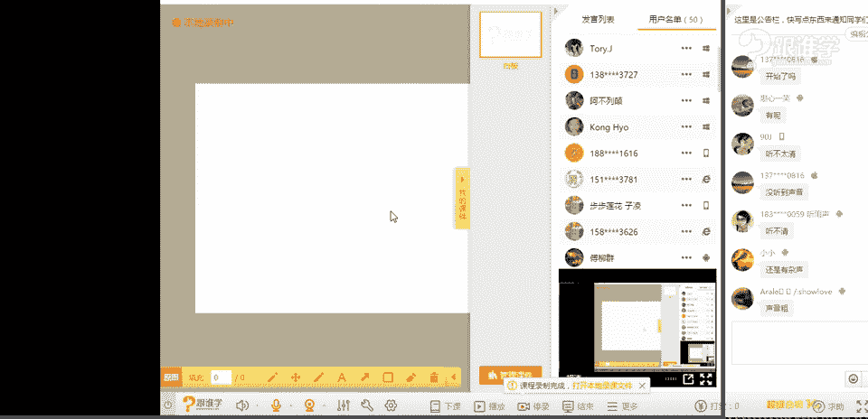

# 1、11服装《搭配秘笈之新版36计》：5包与服饰的搭配法则_rec

还有招商。我已经把小红拿走了。是音指挥。因这来说可能要好。Yeah。

我们的杨老师已经来了，会以为大家讲课，大家掌声欢迎。😊，我是不是要要先自己给自己一个掌声呢？OK。😊。

好，呃，大家晚上好。呃，那刚才我们的主持人说，大家掌声欢迎吧，但是我发现呃线上教育可能就是这样啊。那我们在这个教室里的时候，在线下教育的时候。😊，啊，经常会听到一些掌声。那老师的话也会特别受鼓舞。

但是在呃线上教育的话，好像大家表达呃，我们所说爱的方式的话，可能就是嗯刷花，但是好像跟谁学，好像是没有刷花的这样的一个功能，对吗？嗯，我看到有同学说有杂音，现在呃大家听得清楚吗？还是有杂音吗？嗯为。

如果有杂音的话呢，呃我看一下有多少同学现在听的是比较清晰的。然后如果你们觉得清晰的话呢，请打一啊。如果听的不清晰的话，请打2。我来看一下呃，是因为我们的这样的1个okK。我看到好像都觉得挺清晰的，是吗？

啊，那如果刚才有同学觉得不清晰的话，那可能是你个人的这样的一个呃这个这个电脑问题啊，或者是说系统问题，你可以退出去之后再进来啊，那可能相对来说就比较清晰了。OK我刚才看到很多熟悉的名字啊。

那呃今天有多少新同学呢？如果是新同学呃，新同学的话呢，请打一啊，如果是老同学的话呢，请打2，我看一下咱们有多少新同学，那有可能这个新同学并不是说呃是第一次来我们这儿听课，有可能是没有听过我讲课，对吗？

嗯。哇，这么多新同学呢OK好啊，那既然有这么多新同学，那我还是来做我介绍一下啊，那我是思雨老师呃，同时呢是米莱欧国际时尚教育的高级讲师啊，也为许多的品牌，包括杂志啊。

那包括这个私人名流做这样的一个整体形象的造型策划。那包括也会为一些秀场去做这样的一个视觉的搭配。那比如说在今年呃我们在5月份左右的时候有一个都市丽人呃内衣大秀。那同时当时也请来了林志玲啊。

黄晓明啊、黄致烈啊等等啊，这些明星。那在那场秀呃当中呢，我们也有为这些呃明星和艺人啊，做他们这样的一个形象打造嗯。好，现在明媛说开始了吗？我们现在的课程刚刚开始啊。

OK那接下来呢我们就开始我们今天的这样一个课程啊。那我们今天的这样的一个课程呢，是关于包的这样的一个课程。啊，那我想问一下大家，呃，首先你们对于选择包包的时候有没有什么样的一个困惑。

或者是说你们选择包包的这样的一个标准是什么？啊呃我今天呢在问同学的时候啊，我今呃今天在问到我们一个同事。我说你对于包包选择的时候有什么样的困惑吗？因为呃我知道晚上要讲这堂课，所以呢我想听一下。

哎咱们的这样的一些同学们，你们有什么样的一些这样的一个关于包的这样的一个困惑。那同学们你们如果对于选择包，或者说选择这个嗯这个这个这个包的标准的话，你们有这样的一个自己衡量标包标准。

你们可以在这个这个公屏上打啊，我来看一下。那当时呢我们这位同事说呃这个呃我。包的选择呀，还好啊嗯我没有太多的困惑呀。好，我说呃那你平时选择的包都是什么样的？他说我的包包其实挺少的，只有一两个包包。嗯。

但是我的包包呢都是比较经典的啊，然后比较百搭的包包。然后呢，接下来我听他讲了这句话之后，我就会我又问到他，我说你为什么选择经典的包包。那你没有时装包呢？嗯，他说时装包比较少，那说明什么原因呢？

我问为什么你不买时装包呢？他说我不会搭配嗯，okK所以说。那其实你并不是说没有困惑，而是呃你你把自己的困惑隐藏起来了。那其实就像我相信我们教室里应该也有很多同学应该也都有这样的一个困惑。

可能平时在买包的时候买的都是经典款，或者是百搭款。那对于一些时装款，或者是说呃在这个包与服饰搭配的时候，不知道怎么去做这样的一个组合。那今天的这样的一个课程呢，就为大家来分享我们包与服饰的搭配。

而且是非常非常多的干货啊，那今天的同学的话，你们有不啦OK好呃，天朝妹子说老师在哪里没看到老师在这了。OK好呃，3163同学说不敢买太量的包。那OK等一下呢呃我们会讲到这个包包的这样的一个选择。

包括呢包包的这样的一个搭配的方法，不要着急。嗯，OK好，那说到包包呢，其实呃我们说这。包的话，它的选择性是特别多的对吗？那我们女人对于包这件事情的话，是没有这个止性的，就是需求性很多，见到就想买。

但是有一类的同学他当然可能是因为经济问题啊，那也可能是真的觉得自己这个这个不太会搭配，所以买包的时候呢，他会有一些这个呃选择困难症啊。但是呃在这个我前一段时间看了这样的一个。视频特别有意思啊。

是张智玲跟他的呃呃太太袁永仪啊，我不知道有没有人呃关注他们两个人。那我当时看了一段视频，就是这个袁永仪他特别特别爱包，而张智玲呢他就特别宠着他就就给他买包啊，而且他买的包的话都是呃这个奢侈品。

那呃当时我记得这个有有一段视频是这样做，他们两人在参加活动的时候，这个袁袁咏仪啊，他们在那个街上坐着，然后旁边做了两个路人。呃，那个他们就聊起天来，然后呢，他们就说嗯这个袁咏仪就问这一对夫妇。

这一对这一对夫妇是比较年龄大的。他说你们要去哪里呀？他说我们要去巴黎，然后呢袁咏仪说哇，巴黎呀，我爱巴黎他说因为那里有爱马仕，那所以说袁永仪对于包这件事情，他是非常非常的这样的一个呃这个就爱包狂魔啊。

那我觉得那个那那个视频也比较有意思，但是。这其实我们买那么多包，那这些包对于在男人眼中，这些包的价值在于哪里，他们都不了解。他们觉得包不就是用来装东西的吗？为什么要买那么多呢？嗯。

前段时间我看了一张帖子，那在这里跟大家来分享一下啊。同学们，我想问一下，你们觉得这个包好不好看？嗯，你觉得好看呢，请打一，觉得不好看的话呢，你们打2。嗯，宣文芳同学，如果你看不到老师，你可以先退出去。

然后再进来嗯。🤧好看啊不好看okK嗯。😊，好，觉得好看的打一，觉得不好看的打2嗯。OK好，那我看到有同学是觉得好看的，有同学觉得不好看的啊。那在这里的话，对于这款包。

我看好像觉得大家觉得不好看的这样的一个比例还是占的比较多的啊，OK那我想告诉大家，这款包是芬迪的包包，很多的明星艺人都去买了。而且这款猫的话，价值很贵上万块。那呃这个当时对是的，嗯家佳佳同学说嗯是芬迪。

是的，这款包是非常可爱的给人的感觉。那我相信可能有一些不太喜欢可爱的这些感觉的女生的话会拒绝它。那包括男生，他们对于这款包的这样的一个评价。我来给大家看一下啊，说这是杀了家里的猫的话。

装在包上太残忍了啊，然后呢最后还把这个猫咪的这个照片抠出来。然后呢做了这样一个对比。我当时看了之后，我也觉得哇真的很像啊，那其实呃。😊，我们所说的，站在男人的角度，他有的时候看不懂很多东西。

那当然我们刚才也有很多女生觉得这款包不好看，对吧？那呃所以说的话，那人的这样的一个神秘眼光是不同的啊，那我们但是女人的话它是爱这款包的话，它就是非常非常爱的，因为它给人感觉非常活泼可爱啊，OK好。

那这是我们所说的关于包的这样的一个问题。那其实为什么在这里今天要专门拿一节课来给大家讲到包的这样一个问题。为什么呢？因为在一个人的整体形象造型当中，我们说呃构成一个人的完整形象的话。

它有三个板块板块来组成的那第一个板块呢？就是我们所说的服装饰品。啊，那第二个板块呢是同学们，你们要好好听清楚了哦，第一个板块是服装饰品，等下你们要来做选择题了。第二个板块是妆容和发型。

那第三个板块是气质和你的举止。我想问。大家啊下面来抢答了，你们觉得在我们这样的一个这个整体造程当中，哪一个板套最重要，一还是二还是3？还有人沉醉在这个消防这个这个这个。好，我看到。😊，只有123。

哪来的4呀。对对。😊，OK好，我看到很多同学的答案都是三啊，有人甚至说12三都重要，那就是单选题啊，只能选一个OK好，选择三的同学啊，或者选择二的同学，我要问我要告诉我要问你们嗯。

你们能做到这个不穿衣服，然后只化妆只把头发做的很帅，或者是很美就出门吗？嗯，或者有的同学你们能够做到啊，比如说我这个我刚才说的是气质举止，对吗？啊，你能保持这个气质特别好。然后呢，姿态特姿态特别优雅。

但是你不穿衣服出门吗？啊，OK那如果你做不到的话，那就说明什么呢？😊，你们选错你们选错了，在一个人，我们说从出生啊，到这个这个这个人的一生当中，我们你想一下，你们是在哪一个板块消费最多，肯定是服装饰品。

对不对？那饰品的话呢，其实包包对于我们来说已经作为这个成为刚需了，应该说是比较重要的这样一个板块啊，所以说的话呢那同学们你们选择二和三的同学都错了。

那这就是为什么今天要专门拿一堂课来给大家来讲到包的这样的一个板块。那其实有很多同学经常会问到我，老师，我觉得唉包括刚才有同学说不敢买亮色的包包，对吗？嗯。

OK那今天呢我们就来给大家讲到这样的一个包的问题。好，包那么多。我想问大家，你们选择包的时候怎么选的？🤧选择包的时候。嗯，不好意思，同学们啊，今天咱因为因为今天吃了太多的辣的东西，所以嗓子不太舒服。

OK好，天堂妹子说天天给你一个包。嗯，3163说质量OK妹妹说实用款嗯。还有其他答案吗？看到喜欢的就买就接场啊。同学，那你这是土豪啊。OK搭配结实颜值。嗯，颜值很重要。OK色彩嗯，百搭款黑色色彩。好嗯。

我大概都已经了解了啊，那同学们有有喜欢这种百搭款的啊，那有喜欢这种这个这个嗯这个色彩较鲜艳的是吗？啊，然后呢其实很多人对于包的这样的一个需求性的话是实用。还有同学说便宜啊。

那好像没有同学回答这个回答这个答案经典，嗯，于红同学。非常好嗯，OK那我看到于红同学写的经典啊。那接下来呢呃为什么今天我要说到这个问题，其实很多人呢呃我们作为不管是男生还是女生。

我觉得一辈子一定要拥有一款经典包。那这个经典包的话呢，他会呃比如说他价钱可能会昂贵一点啊，品质，但是品质感会非常好。那很多在我们说经典经典款的包包当中，等一下呢我们会给大家分享经典经典包。

那在经典款的包包当中呢，基本上都是呃有一些奢侈品。因为呃之前有很多的同学会问到，我说老师呃我不知道我怎么选一些奢侈品。或者说我想要选择一些有收藏价值的包包。那今天呢我们就来跟大家分享两个板块啊。

第一个板块呢就是这个经典包包的这样的一个选择啊那十大经典包包。😊，经典包包OK那第二个板块的话就是包与服饰的搭配法则。OK好，那我们接下来来看一下十大具有收藏价值的包包。呃。

为什么要给大家推荐推荐我们所说的有收藏价值的包包？其实这些包的话，你这个现在大家屏幕上看到的这些包。🤧啊，你们买了它之后，它即使你用成二手的了，你把它卖掉。

它还是有这个价值的那或者是说有些包甚至都是绝版包了啊，那它可能价钱还会翻倍啊，OK好，所以说呢在这里跟大家分享10款经典的包包，那大家现在可以看一下啊，okK第一款就是LV的包包。

那很多人这款为什么给大家来推荐这一款包呢？为什么说这一款包比较经典嗯，有的同学说嗯，我妈有第一个OK那说明什么问题，这个包的颜色其实相对来说它是比较成熟的对吗？那呃咖啡色的这个颜色真的用不好的话。

会非常的显老气。但是路易菲这的这个包包的话，那大家都知道那这个在以前呃前一段时间我记得前。两三年前吧，三年之前很多人都喜欢背路易威动的包包，但是现在很多人不去背它了啊。但是这个呃FLV的这款包的话。

它在我们所说的这个经典包当中，它还是非常非常具有收藏价值的那包括这款包为什么给他给大家来分享，因为这款包包呢，它是有一些故事的啊，那呃这款包的话，其实是我们所说的这个路易威动。

因为它大家了解这个品牌的话呢，大家应该知道这个品牌它一直是做旅行箱出名的。啊，比如说这个我就是我们所说的这种呃这个旅行箱啊，收纳衣物的这种旅行箱。那一开始的时候。

他们其实是不做这样的一个我们所说的手包的那为什么这款包经典，是因为当时奥黛丽赫本啊，他要求用这个这个他委托路易威的先生啊，那帮他定制一款比较小巧的旅行包，那这一款就是奥黛丽赫本啊。

在这个这个呃独一无二的这样的一个款式，那其实这款包也是因为澳黛丽赫本而风靡全球。所以说它是比较具有这样的一个意义的那它也是具有一定的这样的一个收藏价值。那包括呢这款包其实他相对来说还是比较实用性的。

OK那第二款包的话呃，第二款包的话是香奈嗯那我相信不用说太多那这款包的话，大家都知道啊，很多呃我说名媛啊艺人啊明星啊都会使用这款包，而且。这款包的话，它不管是休闲场合还是社交场合啊，它都可以。

它这个或者说职业场合都可以用非常的百搭啊。那包括呃第三款是我们所说的迪奥啊。那第四款是巴黎世家的机车包。第五款啊有人说机车包呢是好像自己的男朋友一样，男朋友一样，为什么这么说呢？因为这款包的话。

它给人感觉是比较粗放的感觉啊，那这款包其实到现在也没有很多的这样的一些大牌出这样的机车款的这样呃机车包。那这种包包的话，它搭配机车风格是非常好看的那第五款的话呢是guucci酷ci的这款包呢。

为什么给大家再推荐。因为它的这样的一个设计是有中国的元素的这种竹节的手柄是非常的有特色的。🤧那第六款包呢呃可乐可乐sorry。clolo这款包的话呢，因为它的这个款式。

其实这款包的这个是在2013年左右出的啊，但是它很快就被呃这个呃这个纳为经典包。为什么呢？因为这款包的话特别的小巧，特别的这个呃经典，它的款式相对来说也比较简约时尚，所以很多人都会喜欢。嗯，OK好嗯。

天朝妹子说，我怎么知道它是经典包和时尚包啊，现在还能买吗？那其实有很多包包的话呢都可以买得到的啊，我现在给大家推荐的包包的话。OKDNJ的包包经然没友纳入经典款。

那其实老师在这里只是给大家做了十大经典包包的这样的一个汇集。其实有很多品牌，他们也会有呃比较经典的一些款式的包包。那因为没有这个罗列的太多啊，那因为我们这样的一个课程时间有限。

所以不能给大家呃给大家分享的太多。okK那第七款的话是粉底。那第七款包包的话，它的的特别之处在于哪里啊？我们说这款包的话，它从外形上来看，它是比较的这样的一个。呃，这个如果他把这边的这个手柄提上去。

它看起来是比较的简约的啊，成熟的。但是你把它打开之后，会发现啊里面有一个小莫小恶魔看着你okK那第八款包包的话呢，这款包它其实是有一种学院风的感觉。那给人感觉是相对来说比较有年轻感啊，复古感。

那呃第九款包包是爱马仕第十0款包包是pro的OK那简单的跟大家来介绍了一下这十10款的经典的包包。好，那同学们我想问一下呃，你们喜欢哪一款包呢？

那呃这个我看比较喜欢这个这个这个呃如果在这十大经典包包当中选择的人是比较多的，可以跟大家来详细的来剖析一下啊。有人说127好，1还有没有？1啊1262看来香奈儿还是比较有呃很很多人喜欢的啊。

O一六容十啊，第十款包包我没想到有这么多人都喜欢的啊，因为第十款包包的话，它看起来要更加粗犷感啊，然后这种流苏的设计啊啊，我我没想到还有这么多人喜欢OK好，嗯，嗯我看到大大家的答案都挺多的啊。

那因为时间游戏也老是不能把所有的包包都跟大家来分享。简单的跟大家来分享两款OK好，呃为什么我们说这个呃分享这两款包包呢？因为这两款包包，它是非常非常的有故事性的啊，OK那这一款包包。

我相信刚才其实有蛮多人都打了这款包包的，对不对？香奈儿。😊，有人可能会说，老师，你怎么那么俗气呀？香奈儿这款包包满大街都是有什么好分享的？嗯，他怎么这个这个这个哪里还经典了，因为那么多人都背的话。

大家会觉得呃不想这个不想要这个我们所说的这个。跟别人撞包啊，对吧？那其实嗯这款包为什么要拿出来跟他来分享？呃，就是因为他有那么多人背，但是这么多人背的时候。

他了不了解自己在背的这款包有什么样的一个文化啊，那其实这是我想问大家的。嗯，那我想问一下同学们，你们知不知道这款包包为什么叫2。55呢？声音听着有回音呢，其他同学听着有回音吗？

如果呃其他同学听着没有回音的话，请打个一好吗嗯？好。有同学有回音，没有OK嗯，那那我我我好多人这个这个答案不一样啊，就是没有大图看。好嗯，谢谢。呃，2。55佳佳说呃。

我想问大家有没有人知道这个包包为什么叫2。55？好，他生日555年2月。调转2。55。嗯，其实我这我这个上面已经写了，对吧？我已经告诉大家了，那并不是说香奈儿的这样嗯呃大家说的是这个这个包包的生日是吗？

OK。是的。不是香奈儿女士的生日啊，那这款包包的话，因为它是诞生于1955年2月份，所以呢它叫2。55，就是这么简单啊，没有不是不是尺寸。那有很多同学都会会认为这个是不是尺寸，这个不是尺寸。

是它的诞生的这样的一个日期。OK那首先呢我们先从它的这样的一个呃，我们所说的这样的1个2。55，它的名字开始OK呃，那接下来呢我想问大家的是，为什么香奈儿的这样的一个黑色款式那么经典。

他为什么要用这种我们所说的链条呢？为什么他又用要用这样的一个呃这个格纹呢？为什么包里面用红色的里布，不用我们所说黑色的里布，白色的礼布，为什么包包里面做了这样的一个内格？

就是他有他有几个这样的一个类似于可以放钥匙啊啊就这种感觉的这样的一个内阁呢？有没有人知道？有有人知道的话请打一，没有人知道的话，请打2好不好嗯。不知道的应该说不知道的请打2嗯，知道的请打一。

不知道的请打2，不知道的。嗯，怎么老是听不清楚，听不清楚的同学的话呢，可以退出去，然后再进来。老师写的很清楚是吗？好。那呃我在这里的话呢，简单的再跟大家介绍一遍啊。

那我在这个这个板块其实有已已经写这个跟大家写了一些啊。那呃在用黑色这个原因，其实是因为黑白色为什么那么经典？香奈儿女士呢她是在孤儿院长大的那这款包包的话呢，孤儿院的这样的一个管理者的话呢。

他们穿着的服装就是以黑白色为主。啊呃他们孤儿院这些小孩子穿的是紫色的紫红色的这样的一个服装，所以他的灵感来源于这里。那来源于他的童年的这样的一个记忆。那为什么说这款包包就解放女性的双手。

因为在呃那个年代1955年的这样一个年代的话，呃，在二战时期，他也是属于二战时期啊，那二战时期呃这个前呃二战时期厚一点点啊，那在这个时期的时候呢，其实大多数女性，他们的这个拿包包呢都。不需要手拿的。

都是这样我拿，所有的包包都是手拿包啊，那呃对于很多女性来说，包包对于他们来说是一种我所说的一个负担。我会觉得就是我如果这个这个大家我相信有很多朋友都会有这样一个感觉。你经常说你出门的时候。

如果手里老老拿着包的话，你就特别烦啊，那其实在那个年代的话，她没有办法，所有女士所有的女性都是这样拿包的。而在这个呃而那个时候呢，香奈儿女士呢，她就设计了这一款肩背包啊，肩带包。那这个肩带的话。

她的灵感是来源于军装的这样的一个背包。那包括她自己的望远镜的这样的一个肩带的这样的一个设计。嗯，那她的这样的一个我们所说的呃背带是来源于这样的一个灵感。为什么她要用链条呢？在195年二战之后。

因为物资特别匮乏。所以香奈儿女士就干脆你为了节省皮革带呃包的袋子也要用到。皮革她为了节省皮革，就直接从他的服装当中啊，香奈儿的这个套装它是有链条的，她就直接从服装当中的这个链条取下来，然后用皮革缠绕。

就形成了这样的一个链条的这样的一个包包。那我们刚才说到从外到内啊，都有她她的这样的一个故事。那为什么内层她要做她这样要做这样的一个隔离。因为呃香奈儿女士呢，她觉得为了方便放什么呢？

她的口红第一放口红最小的那样的一个呃缝隙，她是为了要放口红。第二个的话呢是为了放自己个情书。然后它呃这个内层里面还有一个袋子箱量就是比较大的，它是为了放零钱。

所以说同学们啊那呃看起来这样的这样的一款包特别简单，其实它是有很多的这样的一个故事的啊，那2。55的这样的一个包包的话，它的故事其实就是我刚才跟大家介绍的这样的一个呃典故。那接下来呢嗯。是的。

是香奈儿女士发明的这款包包。嗯，所以说它是什么称为解放女性双手的这样的一款包包啊，那它当时的意义其实对于很多女性女性来说是非常的这个有意义的，为什么呢？

因为很多女性她她呃香奈儿女士的套装解放了女性的身体，她的包包解放了女性的双手。嗯，OK这是香奈这个香奈儿的包包的这样一个典故。接下来给大家介绍的是迪奥，那迪奥这款包呢也叫lady迪奥。

为什么它也叫戴飞包呢？其实它也叫带飞包啊，那因为呢当时这款包包呃，在这个呃我们所说的这个。戴安娜王菲，他去法国参加一个这样的一个活动的时候，法国的夫人啊送了他一款迪奥。

那当时戴安娜王菲他就特别喜欢这款包包，所以就把迪奥迪奥的所有的包包都买了。买了之后呢，大家就会经常看到戴安娜王菲在各种场合拎着各种款式的迪奥包包。那所以这个我所说这个呃迪奥这个这个呃迪奥这个品牌呢。

他也经过呃戴安娜王菲的同意之后，就把这款包命名为叫戴呃戴飞包。那呃这款包的话，其实大家看起来觉得特别的这样的一个简约，对不对？那因为也因为他这样的一个简约，所以特别受到很多女士的欢迎。

那其实他的这样的一个包包的制作的工艺，需要95道工艺。啊，并且要经过4个工人师傅花一天的时间才能够完成。那这个包包上面的菱格纹。它是什么呢？它的经典之处，其实这款包包的经典也是它的菱格纹也非常经典。

那这个包包它的菱格纹的灵感来源于这个呃这个呃呃。突然想不起来了，拿破仑三世拿破仑三世的这坐过的这样的一张凳子，凳子上面的这样的一个座背，它是有这样的一个菱格伦的啊，所以说它就灵感是来源于这里啊。

那包括呢呃单这这款包包上面我们所说的迪奥呃DODIOR这四个字母也一直会在这个迪奥包包上做这样的一个吊坠。那有同学说哇，对一这个包包这么复杂吗？是的，迪奥的这个包包，它只需要95道工艺。

香香奈儿的这样的一个包包，它需要108。到工艺，而且呢香奈儿的包包它是在呃巴黎的这样的呃离巴黎的车程有大概一个小时。这样只有3000个人的这样一个小镇上啊，从1955年到现在。

一直都是在那个小镇小镇上这样的一个基地生产出来的。他要经过108道工具，然后6个师傅啊，才能去做完这款包包？而且他做完这款包包之后呢？要把它成品送到这样的一个检验车厢啊送进去之后。

他要把里面的温度开到60摄氏度啊，包括他还会用用啊还会用呃95度的这样的一个湿度去呃这个在把这个包放72小时之后才会把它拿出来。如果这款包包没有问题的话，才会打包。然后呢再送到这样的一个卖场去。

所以为什么经典包啊，为什么经为什么要给大家推进经典包，为什么经典包能够成为经典包。那是因为我们所说的嗯。经典包，它其实并不是卖我们所说的广告而成名的，他并不是说做了很多的宣传才成名的。

他是因为呃他的这样的一个故事啊，比如说我刚才给大家介绍的迪奥，包括香奈儿这两款包包，它的每一个部件，每一个设计工艺，都是蕴含了设计师的思想，他的感情，他的故事。

然后呢他才呃他的这他的包包已经不能说嗯不能是我们所说的这样的就是用来装募这样的一个工具了，他是蕴含了感情的。所以很多的消费者，他是有接纳的到设计师的这样的一个思想啊，他才会去接纳这样的一个包包。

那有很多人就是因为香奈儿的这种精神。香奈儿的品牌的这样的一个核心精神，其实是给一些独立的啊一些女性啊，然后向往自由的这样的一个女性去使用的那迪奥的。包包相对来说，它就更加具有女性化。

那包括迪奥的包包的话呢，他是给一些名媛啊名流哈，他们特别喜欢。所以说为什么我要给大家来介绍经典包啊，他的这样的一个背后的故事？因为我们有很多人在选择一些包包的时候，你不了你不了解他的品牌文化。

你都不了解这款包包的这样的一个故事和文化的话，你在选择它的时候，他是否能够代表你个人，想要传递出来的这样的一个情感以及你的这样的一个符号。例如说我想要给人这样的一个比较硬朗，较帅气，比较独立啊。

比较这种自主女性的形象。那你是选择香奈儿还是选择迪奥。同学们，你们选择一还是2。嗯嗯嗯嗯个。OK好，所以说的话嗯。😊，OK好，那所以说你应该选择香奈儿对吗？好啊，那这就是我为什么要跟大家来介绍经典包啊。

OK好，那接下来呢啊我这个呃接下来呢我们这样的一个课程的话，就进入我们所说的啊，刚才呢板块是跟大家分享的经典的包包。那接下来呢就跟大家来分享包与服饰的这样的一个搭配法则。嗯，好。

有同学说越经典的包包工具越多啊，对，是的，嗯，好的啊，那我们来看一下包与服饰的搭配的这样的一个维度。那简介绍了一个包饰的经典包包之后呢，那我们就要了解包与服饰的这样的一个搭配了。

那从我们所说的这样的一个搭配的维度上来讲的话，人物整体造型的这样的一个搭配角度来讲的话，包它其实是我搭配的话，它其实是分我们所说的内在因素和外在因素。😊，啊。

那比如说内在因素它是有包含年龄、职业性格场合。那为什么叫内在因素？因为这些东西是我看不到的东西，是大家看不到的东西，而外在因素就是我们能够很清晰的第一眼我见到你的时候，我就可以看得到的。比如说体型啊。

比如说色彩，比如说服装，这些都是我们可以看得到的啊，那所以呢我们说包里服装的搭配，它有分为很多的这样的一个搭配维度的那同学们你们想听哪一个维度呢？啊，你们想听哪个维度？

在内在维度当中和内在因素当中和外在因素当中，你们想听哪一个嗯？好嗯。那今天呢呃时间的关系都要是吗？时间关系不能那么贪心啊。OK好，那接下来呢我们说很多我要给大家介绍的这个很多人啊都比较关心的。

比如说色彩啊OK好呃内在外在都想要OK那因呃跟大家强调了这个因为时间关系在我们的这样的一个肖讲课当中呢啊在公开课当中，我们只能跟大家分享啊，1到2个，那我们更多的这样一个课程的话。

在我们的专业VIP课程当中，OK好，首先呢跟大家来分享色彩包的款式有很多包的色彩也有很多。那么我们怎么去选择这个包包的颜色跟服装的颜色搭配呢？比如说我今天穿的这样一套服装，颜色特别的深。😊。

那如果我想要这个整体的造型亮眼一点，同学们，你们觉得我要我要选择哪种颜色的或者哪种感觉的包包呢？好，这里面有这么多包，对吧？123456789。好，你们来给我选一个，同学们，你们来给我选一个。

有人说选择9，有人先选择红色OK第三个是吗？嗯，白色红色白色第五个啊，有人还给我选了第五个呢啊曾永雄同学说红色OK天朝妹子说都行，好，我看到大多数同学都帮老师选了红色，对吗？好，那其实我要告诉大家的是。

你们选择红色没错，因为我今天穿的这件衣服，它的这个条纹是有一点点偏红的感觉。所以其实这款包是可以配红色的那其实我还是有更多选择的。例如说我还是可以配金色啊，那包括白色也可以，因为我的帽子是白色的，对吗？

同学们OK好，那在色彩的搭配当中呢，我们说它设计的这样的一个服装和包的关系是很多的那接下来呢来跟大家来分享。第一个。叫基础色加亮色的搭配法则。OK刚才呢我看到同学们刚才帮我选择了一些包的颜色。

其实红色就是我们所说的基础色加亮色的。比如说我今天穿的这件衣服，那加那个红色的包包，其实就是基础色，加亮色的这样一个搭配法则。那有很多同学在冬天的时候，你们是不是有很多的这样的一些大衣呀、外套啊啊。

或者说我们秋冬天的衣服基本上都是比较偏重的一点的色彩，对吗？那你们就可以选择相对来说亮色一点的包包，同学们嗯。没看到老师衣服的条纹，这个条纹不是特别明显啊。OK好，那这是我们所说的基础色呃基础色加亮色。

那包括图片当中呢就像。呃，这个这个包和服装的搭配，大家也可以看一下啊，那咖啡色其实它是一个非常难穿，也非常呃这个相对来说很挑人的这样一个色彩。如果穿不好的话，它会非常非常的显得老气。

那对于我们亚洲人来讲的话呢，我建议啊大多数同学呢不要去选择这个皮肤暗黄的同学，你们就不要选择这个咖啡色了，为什么呢？因为这个色彩它会什么呢？让你的脸的颜色看起来会更加的暗黄。

那因为这个色彩它跟我们肤色太接近了。所以肤色暗黄的肤色黑的人都谨慎选择这个色彩。那呃这个颜色的话，因为太过于了老气了，对不对？如果我们再配一个黑色的包包啊，再配一个灰色的包包，再配一个深蓝色的包包。

都不会特别好。因为我们说这个在整体的视觉当这个整体的这个整体造型的视觉当中，它就没有亮点了。那这样。一个浅蓝色的这样的一个翠绿色的这样的一个包包的话呢，搭配咖啡色啊，形成了一个我们所说的对比色的撞色。

蓝配橙它是对比色。啊，咖啡色的话，它就是橙色的色相当中加了很多的这样的一个灰的这样的一个效果啊，这个这个。黑的一个效果啊，sorry嗯，所以说呢啊这就是我们所说的包与涂射的搭配基础色加亮色的搭配法则。

嗯，OK那呃好姑娘同学说，那肤色暗黄呢适合什么样的颜色呢？好姑娘同学啊，呃我知道你已经是我们的VIP学员了。嗯，那你就要再等一下啦，因为在我们的VIP课程当中会讲到这个版块的？OK不要着急啊。嗯，好。

那呃浅蓝色包包配黑色的包包。我刚才看到这位同学提问浅蓝色的包包配黑色的包包也可以呀。啊，OK那我们说基础色加亮色不是只是针对于呃针对于你要穿深色的服装加亮色的包包，其实也可以什么呢？

呃深亮色的衣服加基础色的包包。比如说模特她穿的就是一件红色的上衣，格子上衣，对吗？那他的包包就可以选择黑色的啊，OK好，那我不知道这一点有没有跟大家讲清楚呢？基础色加亮色。的包包搭配法则。

同学们有没有了解啊，有没有清楚，如果清楚的话，请打一嗯。浅蓝色浅蓝色包包配黑色的包包是可以的。嗯，OK好，清楚了吗？嗯，清楚了哈，谢谢好的嗯。😊，好，接下来呢我们来看一下搭配法则。第二个呼应搭配法。

整体感比较强，和谐度比较高。刚才的那个搭配法则它是非常非常保险的啊，也可以说是非常的不出错的。只要你没有搭配，你一定没有什么问题啊，如果你要是出了太大的问题。

你来找我你来找这个这个米兰欧的这个资语老师啊，你说自语老师，我就是听你讲的，怎怎么还出错了呢？啊，如果要是对于色彩的这样一个搭配角度上来讲，它是没有问题的啊，那这个我们说从风格上来讲的话。

那就不一定的啊。OK好，那从这个我们所说的第二点的话就是呼应搭配法则法则，它的整体感比较强，和谐度比较高，为什么和谐度相对来说看起来比较高呢？因为它运用了我们所说的美学原理。

那大家听到美学原理觉得很抽象的这样一个概念。好，我来给大家来剖析一下，我们在某学原理当中的话，有一点叫反复。什么意思呢？当同一种元素出现两次以上，就成呃就形成了一种强调的效果。那在这套服装搭配当中。

同学们来看一下，你们觉得蓝色出现了几次，它跟哪些有呼应啊，呼应搭配法则，对不对？它跟哪些有呼应啊？同学们你们现在可以在屏幕上打嗯。🤧头发okK好。呃，三是什么呢？79呃77692同学说3好啊。

我看到有同学说头发、裤子、蝴蝶OK非常好，同学们。首先呢这个包包的色彩，它跟这个我们所说的模特的搭色，它是有呼应的，跟我们所说的牛仔裙上面的图案蝴蝶也是有色彩呼应的对吗？所以说这个色彩它出现了几次。

一次两次三次。那所以说当这种颜色出现了两次以上就形成了一种强调的手段，对不对？啊，那它就叫我们所说的反复美学原理。那呃在我们的九大美学原理当中，我们会讲到很多很多的这样的一个关于搭配的法则和原理啊。

那都会在我们的专业的课程当中讲到OK好，那呼呃呼应搭配法，它会让你看起来。因为我们所说的它有这样的一个强角的手法，它在身上反复出现，那你看起来就会整体感比较强。它有做什么呢？整合。

因为我们经常会用到整个这个词语，其实在服装当中也有孕晕。运用到整合嗯，整合资源啊整合这个什么什么什么整合平台。那其实在服装当中也有整合色彩啊，OK好，老师有人说呼影狭隘，真的吗？啊。

是谁跟你说的这个理论吗？天常妹子啊，我要否定这个理论OK。不管是呃我们在VIP课程当中会讲到显高搭配法则啊，显瘦搭配法则啊。OK好，那在这一套服装当中，是不是也运用了我们所说的呼应搭配法呢？同学们。

你们看一下什么跟什么呼应了。这一套呼呼应的法则，它玩的更加高级，它不只是色彩而已。那它这个其实叫什么呢？啊，有没有同学能够回答出来的？条纹OK条纹是属于什么？非常好啊，有同学907呃9076嗯。

阿K车条纹嗯呃这个。嗯，图案呼应法。好，我觉得天长妹子这个名字特别熟悉。天长妹子是不是之前有听过呃老师的公开课啊？OK好，嗯，非常好。我看到大多数大多数同学都回答的叫图案呼应法则，非常好。同学们啊。

这就是我们所说的图案呼应。那在整体服装搭配的当当中，其实我们不只是有色彩。啊，我们其实还有图案啊，还有这个我所说的呃款式搭配啊，还有配饰搭配。对，那在这一套当中呢，它其实就运用了我们所说的图案的搭配。

图案的反复这种蓝色跟红色的这种条纹反复出现，所以他看起来整体啊比较协调OK好。蓝白蓝白蓝很经典。是的，妹妹这呃这个蓝白是非常经典的搭配OK好，那接下来我们来看一下这一套服装当中，同学们什么跟什么呼应了。

嗯，阿K说耳环你都学会抢答了，非常好好啊，那在这一套服装当中的话，我们说耳环的什么呼应了。同学们。😊，这个叫什么呢？这个叫工艺啊，它的这个其实在呃耳环的这个形状啊，sorry耳环的这样的一个材质。

它的这样的一个流苏跟包包的流苏是不是有不样嗯，OK非常好啊，非常好，同学们啊，你们真的这个都都是都是可以这个什么呃能够成为这个服装搭配师的那包括其实在我们说呃人物造型当中的话。

就不管是呃我们学校呢其实专门教职业服装搭配师的啊，那老师呢是因为经常讲到呃老师主代的这样的一个板块，我们线下有三个板块，一个是人物班啊，那我就是主在人物班的，一个是电商班，一个是商业班啊。

就是叫终端营销班。那这三个板块的话是不同的。OK裙子也有流苏的感觉啊，裙子的话还好啊，裙裙子的话它是没有流苏的感觉的。好，嗯，那这是我们所说的这样的一个呃流苏的这样一个呼应。好，那这一套服装。

这一套的话包于我们所说的人的这样一个搭配当中，它有重复哪个同学们。🤧嗯，😊，他要重复哪个指甲OK好，那从以上非常好。同学们啊啊有同学说链条指甲好，那我们来总结一下，那包这个色彩的这样的一个搭配当中。

我们说这个呼应法的当中，是不是它不只是针对于色彩啊，它还针对于什么呢？啊，比如说材质是不是可以呼应啊。比如说这个这个呃服装这个在包的与人的搭配当中，它不只是可以只跟服饰搭配的。

它还可以跟我们所说的局部的一些细节。例如说指甲油，例如说是不是可以跟耳环呼应啊，跟发色呼应，跟项链呼应，跟丝巾呼应。同学们啊，那所以说呢这个我们所说的搭配当中，它不只是只跟针对于服装的搭配。

那其实它有很多其他的元素的。O。😊，好啊，那这是我们所说的关于这个呃第二点叫整体的这个叫呼应法则啊。那同学们这一点大家理解了吗？啊，如果理解的话，请打一个一好吗？啊，让老师看到你们有没有理解。

对于这个可以和鞋子呼应啊，当然可以和鞋子呼应啊，OK好嗯。喵头鹰真的神绩好可爱啊，打那么多一，是不是在重复强调老师，我听懂了。嗯，好，那我们来看一下第三点，小面积撞色法。那小面积撞色法呢。

它给人的感觉会更加的抓眼球。如果说第一种它是特别保险的。第二种嗯，相对来说它有一点点令亮点的那第三种它就会让你特别的出彩。那这个这个这个这个不是很多人敢尝试的哦啊，那接下来大家要做好准备啊。

我们来看一下。那这个我所说的小面积撞策法的话呢，它会跟什么呢？你身上的服装的色彩做一个这个色彩的碰撞啊，比如说你身上用了一个特别鲜艳的颜色，但是你的包薄也运用了一个特别鲜艳的一个颜色。但是前提是什么呢？

同学们你们的这个包包的色彩啊，包包的话一定是相对来说的色包包的本来色彩面积占的就比较小服装的面积占略是比较大，对吗？嗯，所以说呢你的包的色彩的话是可以亮色的，这样小面积撞色的话。

它不会让你看起来特别没有品质感。因为我们说很多人会说红配绿不好看，为什么呢？红配绿两个特别鲜艳的颜色放在一起的时候，然后又成5比5的这样的一个啊，上面是五，下面是五的这样一个搭配法则的时候。

你看起来就一定相对来说没有质感，那么我们经常会说什么红配绿在什么什么什么，是不是啊，那就是因为我们比例的这个问题没有掌控好。当然能够把红配绿穿好看，不只是只只有比例问题，还。有很多的这样的一个问题。嗯。

OK那在包的这样一个色彩搭配的时候呢，小面积撞色法的时候，我要跟大家强调的一点是嗯，你不要听完课之后，你说老师两个鲜艳的颜色是可以搭配的那你就搞了一个包这么大嗯，特别大的包包。

然后也穿了一个这个这个颜色特别鲜艳的上衣，你那样搭配起来，可能相对来说，如果你的包特别大。然后衣服颜色也特别鲜艳的时候，可能看上去就吗。那你的包相对来说的这个面积要小一点啊，不要就这个不要太大嗯。

OK对，搭配要注意比例天堂面子说的非常好啊。OK好，那现在大家看到的是刚才看到的是红和黄的这样一个搭配，对吗？那现在大家看到的是蓝配成。那蓝配成在我们所说的色彩的搭配当中，它属于叫对比色搭配。

对比色搭配是什么意思呢？它就也就是说在色相环当中它乘180度就是特别远距离两个人是相对的，所以呢他们的色彩看起来是特别的强烈的，但是有同学觉得哎老师我觉得这一套也还好啊。

那是因为这两个颜色它的鲜艳的程度都在降低，所以它看起来相对来说啊还好啊OK。🤧好帅的裙子是吗？这条裙子的老师也特别喜欢啊，呃穿起来特别帅气啊。OK好。

那这是我们所说的这个包领服饰搭配的这个色彩搭配的三条法则啊，三条法则。那刚才呢跟大家分享的是色彩的这样一个板块。那其实在我们所说的搭配当中，它不只是只有色彩，对吗？那下面我们来看一下。

刚才我看到有很多同学说老师讲场合吧。嗯，好，那接下来刚才有这个诉求的同学好好听了啊，那我们说在场合当中，它其实是分哪些场合，同学们我想问一下大家对于场合的这个概念清不清晰。

你们跟呃跟我讲一下场合是什么概念。有没有啊就接场同学好嘞。😊，呃，有同学有同学知道场合是什么概念吗？同学们呃，我发现其实我们教室的同学还是非常活跃的啊，非常好。嗯，时间地点、环境今天去干什么？

不同地点OK。好嗯。🤧那场合其实嗯有同学说就是你想要去的地方。OK好，嗯，主题有同学说，那其实在我们的专业的这样的一个场，我们把也就是说时间地点对吗？啊，还有场地时间地点场地啊，你要去什么。

你什么时间啊，去什么可以方啊，啊，OK好呃，讲讲职业方面的吧啊，有同学说讲讲职业方面的吧。那今天的课程呃，因为时间有限啊呃，这个阿瑞同学我知道阿瑞同学也是我们的VIP同学啊。

那我们在专业课程当中会讲更多职业板块的课程不要着急OK好，那我们来看一下场合其实我们会分很多种，对不对？把大的这样一个角度来讲的话，其实场合啊，小的角度上来讲。

比如说我们说场合其实分为休闲场合社交场合和职业场合。那在职业场合当中又有很多的职业。那在休闲场合当中，他也有很多的这样一个场合，对不对？比如说我去约会啊，我去西餐厅，我去电影院等等啊，我去跑步。

我去健身等等，那这些都是我们所说的休闲场合，那职业场合呃，这个社交场合的话，一般都是指我们要去做一些什么社交呃这样这样但有一定性质的啊，他不是属于纯休闲的OK好啊那。😊，这是我们所说的场合。

那比如说呃在场合当中，我要去今天要去约会，那我肯定相对来说穿的要比较淑女一点。那你要去约会的话，你穿穿成老师这样，你就把对方给吓跑了，为什么呢？因为呃男生他不是特别喜欢强势的女生。

但是我觉得我这一套相对来说有点强势，你们觉得呢？同学们啊，觉得强势的话呢，觉得老师比较强势的话，打一，你们觉得我比较温柔的可以打2OK好啊，那我说这个约会的时候，其实还是要不要穿成老师这个样子啊。

老师这样有点太强势了啊。有很多同学们说帅气。嗯，啊，有有人竟然觉得我温柔是吗？嗯，OK好，那我挺开心的啊，好嗯。😊，那老师其实这一套相传来说是比较硬朗的啊。OK那这是我们所说的在约会场合当中。

你的呃服饰跟包的话是免个加入组合的啊，它也会有关系啊，那你不可能穿成这一套特别粉嫩淑女的色彩。但是你拿了一个什么呢？特别硬朗的包包或者特别帅气的黑色的包包，那看上去可能。

没没有那么搭配啊没有那么好看OK那第二套当中呢休闲场合啊，那相对来说牛仔呀，包括这种条纹啊啊，包括这种这个我们所说的呃这个鞋子相对来说是有点高啊，但是它看起来还是属于这种为前面有防水台的粗跟的。

它相对来说就会休闲化一点。如果特别细跟的，它看起来就会非常的呃就属于社交化或者职场啊，比较时装感。OK那第三套的话很明显就是属于职业装，对吗？嗯，那所以说每一个场合我们在出席。

我们会出席不同场合的时候或者穿不同的服装，那你再搭配包包的时候也要有选择性。OK好，那我们来看一下包围服饰。那我们说场合它有分很多种。其实包包没有分那么多种的。那我们就来给大家来介绍一下啊。

你这几款是必备的包包。这几款必这个包包啊，你都有的话，那你在出席场合的各种场合。时候我们都不用怕了啊。OK好，老师我也穿过休闲的。那大家都穿过休闲的啊，健康妹子OK好，我们来看一下第一款晚宴包啊。

那晚宴包为什么说是必备款呢？其实现在我们的社交活动是越来越多了，对吗？同学们，我相信我们这个教室的同学应该也都有这样的一些社交的这样的一个场合，即使你平时没有社交。

你是不是年会的时候有这样的一个公司也会有委员会啊，那可能还会有一些这个朋友聚会等等。啊，那我们就会有一些晚宴包，那晚宴包呢，它相对来说都是比较小巧的精致的奢华的重工的啊，那这个呃这这里写重复啊。同学们。

那比如说晚宴包的话，它看起来都会比较这种我们所说的有一用的这种华丽感。因为它会运用很运用很多的这种闪钻呢面料它也会会用的比较这种有光泽感的这种丝绸的反。

光感的这样的一些呃这个这个叫什么这个这个品质啊这种感觉这种材质啊做成的OK那包括其实有很多晚宴包，它会用运用很多金属的那种材质，啊，那接下来我们来给大家看一下，那呃这个范冰冰被称为红毯女王。

所以说在走红毯的时候基本都是穿晚礼服，晚礼服的时候基本上都可以配晚宴包，那大家可以看一下，晚宴包的话，它一般都会做的比较小巧，其实晚宴包它的作用是什么呢？就是为了什么呢？放一些比较小巧的一些东西。

比如说口红啊，那有很多人的话可能现在如果手机没有出那么大的时候，还是可以放下手机的对吗？啊，那是为了我们的方便啊OK所以都是比较小巧的。如果你拿太大的包的话，我们说穿晚礼服的时候。

整个人给人感觉是比较精致的感觉。如果你穿的那个包太大，看起来就没有那么的精致了啊，OK。好，那呃我们说管礼服的话呢，或者管面包的话，它不只是只针对于晚理服，它也会针对一些小型的礼服。

那刚才大家看到的那种是大礼服，这种礼服的话就是。特别的这样的一个礼服啊，那么来看一下深V啊，那大家可以看一下这一套搭配当中，其实如果说这一件黑色的衣，其实这件黑色的衣服，如果你把饰品全都取掉。

它是非常非常普通的。但是因为他加了腰带啊，加了手镯，加了戒指，加了包包啊，加了耳环，所以它这一套看起来就给人感觉什么呢不灵的感觉。同学同学们啊，那这黑色加金色的话。

它其实看起来是比较有力量感的这样的一个感觉。嗯，天条妹子说，老师我穿着优户的衣服和休休闲的衣服。呃，因为这个老师这个屏幕呢，暂时先看不到你全这这个比较全面的问题啊，天长妹子，等我们的课程结束之后。

我来再再来跟你解答好吗？啊，OK好，那我们再来看一下必备款的包包，休闲包。那休闲包为什么说这刚才是晚宴包。晚宴包的话，对于我们来说的话，可能有很多人觉得不实用，没关系啊。

同学们你们可以背一个到两个就可以了啊。那休闲包的话呢，我们来看一下休闲包的特点呢？比如说它看起来是比较简洁大方，然后功能性比较强的。比较方便的。有很多人他会把休闲包和时装包分不清楚。

休闲包它的这个特点的话呢，我们相对来说它实用性为主。同学们就是可以放很多东西。比如说你去沙滩，你经常会背一个特别大的包包，对不对？那很实用，这种是休闲包。比如说你去购物啊，买东西。

你可能会背一个相对来说比较大的包包。那这种都叫休闲包，那我们来看一下啊，休闲包当中的话，它也会分为很多的品类。比如说斜挎包、手提包、单肩包、双肩包、腰包和胸包，那除了腰包和胸包以外，其他的包包。

大家可以看一下，容量相对来说都是比较大的那晚宴包特别精致，对不对？那休闲包相对来说它的容量都要比较大啊，比较实用为主。那腰包和胸包其实也是实用性为主，它也是为了什么呢？

比如说腰包可能运动的时候我们会放东西，那胸包也是一样啊，男士可能用的会比较多一点。女生的话。用这款包包的话相对来说比较少嗯。OK呃，听常妹子说休闲包可以去上班吗？休闲包啊，这几款包当中吗？

呃这款包和这款包相对来说还可以啊，其他的包的话，对于这个呃其实在我们国内的话，有很多人对于包包的话，它是没有那么的有我们所说的这样的一个场合概念的啊，但是从我们搭配角度上来讲的话，它其实是有的啊。

例如说你在职场当中，你运用这一款包包和这款包包就太过于随意了。例如说这款包包它是太休闲的状态。它给人感觉是比较运动啊、休闲啊、度假呀、旅游啊等等，你可以运用到的双肩包。那这一款包包。

因为这个色彩太过于粉嫩，它不适合适用于职场。如果一定要选出来的话，这一款包包是相对来说比较适合的啊，它既满足了容量比较大，又相对来说款式也比较简约嗯，OK。好，这是我们所说的休闲包的这样一个分类啊。

那同学们，你们要看一下，你们有没有背过这些包呢？啊，那其实这些包它都有它的功能性，我觉得是可以都备一个啊okK那这这呃现在大家看到的图片呢是呃这个秀场当中的一些休闲包，我们可以感受一下啊。

那在呃我记得啊，当时我看到这款包的时候，我都震惊了，我说这不就是我们中国搬家必备的尼龙袋吗？怎么竟然出现出现出现在路易V等2007年的秀场当中，而且这款包的售价非常高了啊，都到1万块了啊。

那我们来看一下，那其实这个包包。包括现在大家看到的这款包包，我都觉得它是带有一定的娱乐性的，为什么呢？因为这个包好像就它已经不是个包了，他们就是装用来装棉被的嘛啊。

那其实大牌有的时候他们会打一些呃包工做的这样一个夸张化，它可能并不是实用性为主的。它是为了什么呢？做一个概念性的一个东西啊，OK好，姑娘说第三个是去搬家嘛，其实我觉得这个都挺像搬家的。

比如说第二个第三个第四个这个是装棉被的啊，这个和这个就不用说了，一定是搬家用的啊，OK好嗯。你可以说这是我家装棉被的袋子，我也觉得啊跟我们家棉被的袋子也挺像的啊。OK这个只是给大家来娱乐一下啊。

那接下来我们来看一下水桶包啊，刚才听到妹子说这个哪个包包可以背去休闲，那大家可以呃背去上班的，大家可以感受一下这一款包包背上去之后，是不是感觉太休闲了？而且太过于有点粉嫩感啊，OK好嗯。😊，好。

那我们再看一下休闲包啊，呃，黑人他特别喜欢用这种紫色紫红色，为什么呢？因为呃其实应该说黑种人的话在右侧角度上来讲，他们特别喜欢用亮色的颜色啊，为什么呢？同学们，如果黑种人他们要是不穿太亮的颜色。

晚上不敢出门，就是黑尘一坨了啊，走在黑暗就其实走在马路上的话，车都看不着。嗯，O那所以说他们会用没有一些比较鲜艳的颜色啊，那休闲包的话，其实很多男士都会有这样的包包，对吧？啊。

我觉得我们中国男性好像这个休闲包基本上都是双肩包，但是他的双肩包没有人家这款双肩包好看，那我不知道咱们教室里有没有男同学有双肩包的啊，但是我可以猜一下你们的双肩包一定是那种什么阿迪达斯啊。

然后那种特别休闲的那种包包啊，他们没有那么时尚话，OK中永平同学，你有没有双肩包啊，你的双肩包是什么款式呢？OK好，你可以在这个屏幕上去打啊。那我们来继续。我们来看一下同学们这一款唉。

你们看得出来这一个街拍是哪个国家的吗？同学们，你们觉得这个街拍是哪个国家的，是属于呃韩国的，中国的还是日本的还是欧美的？😊，嗯。😊，可以说死了，我是个男的日本OK非常好。同学们啊。

有人说欧美有人说中国好，那其实这个很明显，它是属于日本的，为什么呢？日本人他的穿衣感觉他会有很多的层次感，叠穿感，你会觉得挺复杂的，同学你有没有发现你看他的衣服上啊衣服他运用这种叠穿的手法啊。

然后服装它都是这种细腻的格子啊，然后小碎花呀，小蕾丝啊，然后看上去呢就比较这种我们所说的繁琐的感觉。欧美它会非常的简洁啊。😊，那韩国呢它基本上就是非常的这种这种淑女啊啊简约啊，这个相对来说比较淑女啊。

它没有那么欧美，那么简简简洁啊。OK好，而且它的头发，那从这套当中这张这一套当中，为什么说它是日本的，因为它的发色，所以这套属于典型的日本街头元素风格啊，在日本的街头很多青年都会去这样穿着。

那这个包包呢啊其实它是是是是一款帆布包。那其实它相对来说看起来就会比较休闲化，对吗？同学们嗯，OK好，这是我们所说的B备包当中的休闲包。那么来看一下时装包。时装包的话呢，其实有很多同学呃都不敢去买。

为什么呢？因为时装包他们我相信很多同学买的都是百搭包啊，比较简约的那种或者叫通勤包，通勤包的下我们就要讲到啊，时装包的话，它因为它太过于容易过时。比如说大家现在看到的这样的一个包包，它有很多的。

今年就是今年流行的包包，它会有很多刺绣的元素啊，因为今年特别流行刺绣，那它会有很多的刺绣元素，然后花朵元素等等。那这就是属于今年流行的一些呃元素。所以呢在包包当中，如果你买了这样一个款式的包包。

你可能觉得明年后年背的时候啊就会觉得容易过时，但是有个问题是这种包特别出彩。如果你穿的特别简约，然后你拿一个包包，拿一个这样的包包就够了啊，你整身的话，其实就已经有亮点了。

那我们来看一下时装包它的特点就是什么呢？时尚新潮装饰性比较强。但是它也比较容易过时啊，那其实我建议啊时装包的话，我们可以买上啊这个这个每一年流行的时候呢，可以买一个啊，不要买太多啊，OK好嗯。

天桥妹子说讲一下子母包，今天课程时间真的有限啊，妹子同学咱们就别要求这么多了啊，等下次课程有时间啊，或者说在我们的这个呃这个专业VIP课程当中，我们会设计这些内容的啊。你可以来这个听一下。OK好。

那这两款包包的话都非常漂亮啊。那我个人也是非常。😊，弄得我少女心都泛滥了哈，那比包括这种粉嫩的色彩呀，然后这种小碎花啊，都很漂亮。呃，老师就建议就如果是我们所说的这么漂亮的包包，其实是可以入手一个的。

那你穿的特别简约的时候，你拿一个这样的一个款式的包包就已经很亮眼了。很出彩了啊，OK好，那接下来呢我们来看一下，刚才呢是时装包，时装包的话呢，我再给大家总结一下，它相对来说是比较什么呢？

这个比较新颖的比较时尚的带有当年流行元素的。但是它会比较容易有落时性。同学们啊，投资去谨慎。OK好，那通勤包呢是我们所说的，我相信很多同学都会有这款包包啊，通勤包呢其实它是指什么样一个概念呢？

就在以前来说的话，通勤包其实就是现在也是从家里到工作地点这样的一个过程就叫通勤。那其实通勤包的话说的就是我们所说的职业包啊，相对来说的话，它是。款式比较简约简洁，不太花哨的，比较优雅的。

因为在职场当中的话，我能说你的这个这个包包的款式太过于琐碎啊，就像刚才那个时装包的话，你就会呃大家都会觉得或者说你的老板你的上司会认为你太过于花哨不够稳重，对吗？那你去见客户的话。

客户也会觉得天哪是怎么拿了一个这么花的包包，这么粉嫩的包包啊，就不太合适，那你也会大同学们来观察一下，像我们所说的通勤包当中，它一般都是什么呢？没有太多的图案，色彩一般都以黑白灰啊。

简约的这种中性色无性格的色彩为主。啊，他不会说运用大红色啊然后后面用很鲜艳的绿色那这种这个款式，这个颜色的包包，包括款式的包包，相对来说太过于浮夸。那通勤包的话，基本上它的线条也都会比较简约和。

直性感为什么强调直线感呢？在职场当中，你的穿着服装其实也是直线感的。你的服装的款式。那有很多同学会说，老师直线是什么？曲线是什么？那其实这个都是我们的专业课程当中，我们会讲到的衣服有分直取人有分直取啊。

那在我们的专业课程当中都会去涉及到的啊。那在这里简单的跟大家来讲一下这个概念。直线的感的包包大家会发现线条都会比较硬朗。那曲线的包包它看起了可能是椭圆的边角。可能有很多曲线感的花纹啊。

那都它就会整体感觉就偏女性化，而这款包包它是偏中性化。okK所以说通勤包的话呢，我们在选择的时候一定要选择相对来说款式简约正统简约大方的ok好，那就是我们所说的必备的呃必备款的通勤包。那大家可以看一下。

应该都是以黑白色为主。OK好，那。说包包的选择，刚才跟大家介绍的两种。第一个是包于色彩的搭配。那另外一个呢是包于场合的这样的一个选择。那其实啊我刚才有刚才有的同学说啊，这个在基础色和亮色搭配的时候。

我就说如果你这样搭配错了，你来找老师，但是如果你风格搭配错了，你就别来找我了。为什么呢？在我们的整体搭配当中，有的同学他可能把颜色也选对了。老师，我今天穿的特别的深沉，我想穿一个。

我拿一个骚气一点的包括吧，啊，但是你会发现你的这个款式拿的不对，那例如说我今天啊穿的是比较深沉的颜色，对吗？那我现在现在来给大家展示几款包包，同学们你们来帮我选择一下，你们觉得我适合哪一款包包好吗？好。

那我们先来看一下第一款包包。🤧黑色的来看得清楚吗？同学们。😊，黑色的啊，然后。嗯。啊，包括这款包包。好，那我想问同学们，你们觉得我适合哪个包包呢？这个包包还是这个包包？黑色OK其他同学的意见呢？黑色。

黑色。黑色好，那看来同学们，这就是大多数人的问题。我为什么要跟大家来展示这个包包的这个问题？好，同学们，那说明什么呢？你们读不懂这个包包的身上的元素。那我们来看一下老师今天穿的是偏中性感的对吗？同学们。

好，我们来看一下。😊，🤧我先这个呃这个我我我来我来给大家背着示范一下啊，你们觉得我背黑色的那个包好看是吧？来。稍等一下，我来把包包嗯。好，来，同学们。😊，我下面下面来给大家展示一下啊。😊。

老师今天穿的是一套套装啊，你们可以看一下，我穿了一双。银色的鞋子，银色的高跟鞋。好，我们来看一下，你们觉得黑色的包包比较好是吗？那我来我来嗯。😊，好，朋友，我把麦克风拿起来，同学们。

你们觉得黑色的包包比较好吗？okK好啊，现在你们都反悔了是吧？现在你们都开始反悔了是吧？晚了啊OK接下来看一下啊。😊，嗯，对对。什么。来，同学们。😊，好，展示完了啊。展示完毕，哪一款包包好？好。

刚才呢所有的人第一反应都是说黑色你们是觉得黑色比较百搭吗？同学们嗯，好，那我来给大家来讲一下，为什么银色的会好？那这就是大家会犯到的呃犯的错误呀？你们觉得黑色比较百搭是吗？都选择黑色好。

我们来看一下黑色的风格它是什么呢？同学们来看一下黑色首先从材质上来讲，它是这种比较粗糙的，而且它的做工是明显的这样的一个这个这个设计啊，那它的这样的一个编织感。同学们来看一下编织感啊。

它的扣袢也是复古的金色，这款包包的话，它给人感觉有一种复古的感觉。包括它还会有一种比较偏粗糙的民族感。那老师这套是中性感。为什么给我搭了一个民族感的包包吗？啊。😊，好，再来看一下这款包包它的特点是什么。

首先从色彩上来讲，它是属于银色的，对吗？啊，但是它不是特别夸张的银色。第一，它可以跟我的耳环呼应。第二，它可以跟我的鞋子呼应。第三，它可以跟我的呃腰带的扣袢呼应。来，同学们给给你们展示一下啊来。看一下。

啊，从这几个元素上来讲，他们都是呼应的元素。从色彩上来讲，从款式上来讲，它是比较简约的设计手拿啊简约的这样的一个手拿包。那职场当中是不是完全可以拿着，而且它会非常的时尚这样的一个色彩。

它又不会太过于夸张啊，又不会特别花哨啊，那所以说啊又不会太过于保守。那这就是为什么这一款包包它会比较好OK那同学们会说老师我觉得哎你这个中性包，你你这个这个服装太过于中性了啊，那很多人可能都会这样搭。

那下面呢我再来给大家展示一套，简单的来给大家来展示一套，我来做一个变身啊，OK下面就来给你们展示一下，我这里还有很多款包包啊，给你们来看一下好。先给你们看一下啊，这里有一款偏这种b灵不灵的这种感觉。

其实它是可以给到什么场合的。同学们，职场当然可以用到啊啊，这一款颜色的话不是那么夸张OK嗯。好。ここ？管意很好，同学们啊。好，接下来这一块。😊，好，有同学说这是包吗？这不是一件衣服吗？好嗯。

这一款包的话呢，它是一个皮衣的款式啊，它是有点机车款的包包。嗯，OK好。😊，黄色的包包。好，我来看一下。😊，同学们，这一款黄色的啊，有很多同刚才我跟大家讲到一点老师啊我今天穿的特别的深沉。

我想提一个亮色的包包。那如果从色彩上来来讲的话，是不是这个颜色是不是可以跟我的衣服搭配的啊，同学们先来看一下色彩啊。嗯是吧。啊，是不是黄色的？啊，那其实从色彩上来讲，它是可以搭配的。但是从风格上来讲。

它能搭配吗？搭配好看吗？啊那所以说其实我们说衣服和包的搭配，其实它会有什么呢？风格的专联性。OK好，那这是这个我们所说的这一款包包。那接下来呢我们再来看一看。啊。😮，嗯。来。😊，同学们。

有没有人能告诉我这一款是什么包包？🤧嗯嗯嗯。好。😊，啊，民族非常好，同学们。大是吗？好，那接下来呢我要来给大家做一个简单的这样一个呃这个变身。那我们来我呃我要消失5秒钟啊，你们消失10秒钟哈。

你们可以倒数一下啊OK啊。嗯。呃。十现在来数198765是吧？好。😊，对。O。😊，好。啊，那呃我简单的来这个。😊，好，呃，影都没有了，那么快是吧？是的，嗯，呃这么神速。嗯。

那我先来给大家来展示一下我这件衣服啊。有同学会说老师，我觉得你这件衣服挺普通的呀。那来看一下我们如何能够把这套衣服搭配出来啊，如何怎么去搭配包装。那么先给大家来看一下这款呃，这一把这件衣服的感觉。

它是一个。😊，有点民族风的这样一一有点波西米亚的这样一个感觉的服装啊。OK好，我们来看一下嗯。好。刚才同学们有有一眨眼，神速，有没有超过10秒钟啊？好像睡衣啊，有同学说好像睡衣。嗯，好。

那我看一下如何能够把它变得不像睡衣啊。那我们说服装搭配的话，你想要强化。那我这件是同学们，我刚才这件衣服你们觉得是什么风格？同学们，你们刚才觉得我这套衣服是什么风格？老师穿上好看，但是开花了。

喜欢纯色的好。睡衣风有同学说睡衣风啊，休闲风随性好，睡衣风格。怎么看重播呃呃，171797同学，我们的重播的话只能给VIP的同学听喽。啊，我们现在只有直播OK好，有同学说海边民族风非常好。

那刚才有同学看不懂这件衣服来给大家解析一下，它其实这一件衣服的款式，它是有一点点度假风的感觉。那其实它是有一定的民族风的这样一个元素范。OK那我们来看一下我如何来强化这种民族范。

或者说强化这种波西米亚感觉。首先呢我要带一条这个。😊，🤧有羽毛装饰的这样的一个感觉啊，我现在现场来给大家变身啊。好，我先研究他的头绳，我们来看一下啊。带不好的话，你们别笑我啊。😊，好。稍等一下。

我调整一下头发啊。哎呦就是这个印第安人来了。😊，嗯项链我喜欢这个不是项链啊，这个是头绳嘛。好，我来给大家做这个简单的示范啊，羽毛头饰。你也要变身了。好，我们呢你来线下找老师，老师给你变身了。OK好。

那经过这样的一个羽毛的这样的一个装饰啊，同学们可以来看一下，是不是有一种民族的感觉了？啊，OK好，那这是这个我们所说的这个加强的整体的这样的一个民族感啊，那我不需要太多的这样一个配饰。所以有同学会说。

哎老师你要不要带个什么那个什么珠，其实如果有那种呃这一这就那种珠串啊，珠串的那种感觉，很鲜艳的咖啡色跟那种呃绿呃绿绿松石是那样的配色的这种项链啊，手链啊，它会这种民族感会更强。对。

饰品很重要啊那我在这里呢只加了一条头绳。那现在我来问大家，你们觉得我应该背哪一个包包好看？刚才我们给我给大家展示了那么多包嗯。😊，🤧你们觉得哪个包好看呢？😊，第一个啊有同学说这个是吗？这个是吗？好嗯。

好。嗯。最后一个okK黄色的。好，有同学说说这个是吧？好，那我来给大家展示一下。买菜的那一个，你才去买菜呢？啊，来，我先来给大家展示一下我去买菜的包包。好。😊，那我们来看一下啊。😊，那如果我拿这个包包。

你们觉得怎么样呢？嗯。你觉得怎么样？好看吗？😊，啊。好，这个包包展示为止哈，奇怪OK那这就是风格的问题。好，那我们再来看一下，刚刚有人说黑色的包包，对吗？好，那我来看一下啊。😊，调整一下高带好。嗯。

大家觉得怎么样？嗯。不是太搭，不好看，有一种去菜市场的感觉。好，OK那有同学说流苏是吗？好，我们来看一下。😊，那是不是就很有感觉了？同学们。😊，啊，来给大家看一个全身的啊，因为这个这个场地有限。

那这个感觉是不是就很强烈了啊，我的这个流苏的袜带跟我的包包啊，跟我的衣服的风格是不是就可以相互的去搭配了？嗯，OK其实这里还欠缺一点啊。😊，来，我刚才。😊，看到同学们，那其实我们在经常整体打造的时候。

是不是还会涉及到一个问题？就是双容问题。嗯，有BO是的，很好看，谢谢同学们嗯。😊，啊，那我们既然说涉及到妆容问题，那我现在的纯色大家觉得是这个怎么样跟我们的这个衣服搭配。这样家穿什么鞋子。

这一套你穿一双罗马绑带鞋会非常非常非常非常漂亮。因为这个民族感会更强。嗯，好。Yeah。嗯，那其实老师现在这个纯色它是有一点点偏粉的那我的这个呃纯色的话呢，其实可以换成我衣服上的这样的一个橘色的感觉。

同学们。千艳红唇。🤧我现在其实有一只正红色的口红。啊，我们来看一下啊，怎么样，深红色的口红稍微把我这个唇色加重一点啊。我照镜子啊照镜子。因为因为觉得对着镜头图有点奇怪。有点有点红是吗？嗯。好。

那这个红色是不是其实呃我我我适合这种红色吗？同学们。这个是正红色。嗯。其实这件衣服配橙红色更好看。呃，老师拿了好几支口红，但是呢因为那件那个橙红色的口红没戴啊，所以的话今天展示不了了啊。好。

那我我的这套服装是不是搭配的就是。农民国。感觉。那接下来我们再我还可以再给大家来电话下，我们来看一下啊，我把头屏取掉。😊，啊，那呃我们经常其实会啊流速包包也去掉。啊，跟着疯子似的啊。好。😊。

我们是不是经常会呃穿民族风的或穿很薄的那样的一个这个裙子，然后配一件皮衣呢？好，同学们来给大家看一下机车皮衣K这种我们所说的这种民族的裙子啊。然后呢。他就会给人感觉其实是有一点点小帅气的感觉。

那我怎么去搭配饰品呢？我就配一个今年比较流行的这样一个窗啊。来。滚搭，我天又换了一种风格。嗯，好，我们来看一下啊。😊，啊。那我只是通过简单的这样的一个通过视频和单品的搭配。同学们来看一下。

那是不是跟我感跟刚才的感觉又完全不一样了。刚才只是一根法带啊，然后一个包包，我就把这个民族的元素强化了。那我现在就运用一条项圈啊，然后一件皮衣，那把这样的一个感觉又变化了。那我现在其实应该背什么包呢？

同学们。嗯。你们觉得在刚才的所有包包当中有没有适合？🤧老师穿这套比刚才的那一套好看是吗？好，谢谢嗯。😊，第一个黑色的是吗？这个呢？其一方考古。あ。这个是吗？同学们。好，那我还有更好的选择。

同学们来给大家来看一下。😊，这一款包包，然后呢有一个特别之处，骷髅。啊，为什么我选择这款包包？同学们来看一下啊，我给你们站起来展示一下嗯。来整体来看一下这一款包包啊，它为我为什么会选啊。

音箱包这个不是音箱包啊。OK好，有同学说是为了呼应讲到点了啊，但是是什么呼应吗？同学们好，我来给大家剖析一下。我这一套服装的话呢，如果我运用这件皮衣，这个呃项链，然后搭配这个包包。

它的感觉其实是朋克混搭波西米亚，就是混搭民族的感的东西啊，混搭波西尼亚，为什么呢？怎么去剖析朋克，比如说我的这个项圈它是有带铆钉感的啊，这个有点勒脖子哈。那比如说这个包包的骷髅，啊。

比如说这个包包上面的这种铆钉感，其实它都是我们所说的纯克元素，再加上皮衣，皮衣它在朋克当中运用的元素是非常多的那如果老师现在在画一个烟青中啊，然后涂个呃暗红色的那种纯色，那我看起来就像一个坏女孩的感觉。

那这个包包其实它搭配我这套特别好，为什么呢？😊，其实这款包的话，它就有风呃有这种所说的朋克跟这种民族的结合。例如说它有这种流苏。嗯，然后再加上这种重合的元素，本身这个包他自己就已经在做混搭了。

而我身上的这个服装风格其实也在搭配，强化这个包的风格。那所以说服装和包的搭配，它涉及到什么问题，同学们涉及到色彩，涉及到场合涉及到你的喜好涉及到风格。那其实最终的话我们说所有的搭配都是导向风格的。

那你们在选择色彩选择对了，全里的款式也选择对了。但是你们在组合的时候，是不是有很多的问题呢啊。OK好，有同学说朋客很喜欢老师，我以为你是民族风啊，九壶OK好。

那所以说呢啊老师在在刚才其实只是简单的同学们，我换了几件单品，我只是换了一件皮衣，我只是我是通过不同的配饰，那包包其实做我们有所做的配饰当中非常重要的啊，然后呢呃然后耳环口红的色彩来做了这样一个调整。

但是你会发现我好像变了三种风格，对吗？第一种中性风。第二种民族风。第三种朋克混搭民族风的这样一个感觉，那搭配的话，其实我们说了，它不只是这个我所说的色彩搭配啊，款式搭配，其实它还有跟很多的。

比如说图案的搭配啊，比如说廓形的搭配。比如说面料的搭配。比如说配饰啊，那其实服装搭配的话呢，同学们。它不只是简单的大众认为啊，你就是色彩搭配了，其实它有对它有分五大的这样的一个元素。

比如说色彩、廓形、面料、图案、配饰。那今天呢我们讲到的跟大家分享的就是这样的一个配饰的这样的一个板块啊，那其实配饰的话它也是非常非常重要的一个板块。因为配饰它是什么呢？

大众跟时尚的这样的一个我们所说的区别性。那很多你会发现时尚的一些艺人啊，明星啊，他们为什么看起来比较时尚。因为他们他们经常会戴墨镜会戴帽子呃会戴这种什么项圈啊、耳环啊等等。所以说他们给人感觉会更加时尚。

那我建议大家呢应该多去啊，买一些这种我所说的配饰，那包包啊、鞋子啊、香链耳环都是必不可少的这样的一些配饰啊。OK好。🤧配饰板块我想学是吗？啊，欢迎大家来关注我们的这样一个呃专业的课程。

那我们在专业课程当中的话，会针对于每每一个板块都会去详细的剖析啊。比如说色彩，比如说图案，比如说配饰啊，我们有配饰片单品篇，如何精准的选择单品，如何能够读懂单品。

那比如说我为什么选择这个包包搭配我这件衣服，因为我能读懂它的信息啊，那如果我不跟大家剖析的话，你们能读懂这个包包的信息吗？啊，OK好，老师的搭品好厉害，我也想学啊。

那就去观察啊关注我们这样的一个专业课程，我们在12月13号之前有这样的一个优惠的折扣，原价是2000多，那现在的话只用399哈。OK好，那我们其实在线上的课程只用399块钱，老师都觉得哇太划算了。

为什么呢？我们线下的课程的话，每一门课程都要。1万多块钱啊，那这是我们线下，我相信其实现在应该有我们线下的学员在教室里听课啊，一定会有的。因为我们之前有很多的这样一些线下学员听了我们线下的课之后。

又去听我们线下课说，是我觉得哇线下的课怎么那么便宜啊，那我们这个也是在给大家做这样的一个反馈啊，这这样的一个优惠啊。那因为我们知道其实有很多大众其实是想要学习课程提升自己的形象的。

但是一直苦于没有找到对的方式方法啊，而且呢是没有专业的这样的一个系统和理论知识去支持的。所以呢我们这个在跟谁学的这样的一个呃开课呢？就给大家给到这样的一个优惠的这样一个价位。399的话，其实。

大家可以算下来啊，16天的16次课程一次只用25块钱啊，只用25块钱听一节课。那你大家可以想一下，你们买一件T恤衫啊，都不夏天的T恤衫都不止25块钱了啊，那冬天的一件大衣的话都要399了。

OK所以这个东西的话，我觉得大家应该自己去衡量啊，不是老师在这儿跟他家来讲的一个问题啊，那其实老师不是在这跟大家做推销。我觉得有很多同学的话，你们是有必要去学习这样的一个东西的啊，因为我们从小到大。

其实我们教接接受的教育都是什么呢？啊，你怎么这个这个好小的时候老老那个父母经常会说啊，老师会说好好读书，长大才有出息。但是我们会发现唉等我们这个。😊，读了书了，谈了恋爱了，结了婚了，生孩子了。

但是我们一直没有解决一样问题，就是我们的形象问题。其实一个人的形象的话，它是影响一个人的这样的我们所说的呃社交圈啊，包括你的这样的一个升职加薪，为什么？因为一个形象好的人。

他的薪资要比形象不好的人高7%到15%。同学们，为什么呢？因为老板认为形象好的人，你的工作能力是比较强的。啊，因为形象好的人他比较自信啊，所以老板会认为自信的人工作能力比较强。

所以说老板的思维是不是很奇怪啊OK啊那在这里呢简单的跟大家这个呃做这样一个分享啊啊嗯嗯sorry啊，那我们其实线下的线上的这样的一个时尚的这样一个教育的话呢，我们是针对于这样的一个个人的提升的形象啊。

那在线下的这样一个课程当中呢，我们是针对于想要值。职业从事服装搭配师的那我们线下的话呢，在广州啊广州有学院的。嗯，那欢迎您对于职业服装搭配师感兴趣的同学呢，可以来线下我们的学校来参观啊。

也可以来看看老师啊，因为在昨天。还有一个同学从线上学习的同学啊，跑到线下来上课啊，然后他走了离我的办公区还很远的时候，就跟我们的这个课程啊，就说哇这个是不是资宇老师啊，然后资宇老师当时特别形象不太好啊。

翘着腿。然后呢这个这个头发也披头散发的。我当时就想完了完了完了，线上的同学天天看我啊都都特别美是吧？老师是不是有两个自恋了啊，那呃线下的时候一见天哪，形象全无啊。

所以以后我我就在想以后也不能呃这个言情举止要这个严谨一点啊，OK好啊，那这个简单的跟大家分享啊，我们这个课程当中也是比较有趣的一件事情啊，那我们在线下的话，因为我们跟很多的这项服装品牌啊啊。

包括一些秀场啊，我们都会去多搭配。那其实我们的学员就业问题的话，也都能得到很好的这样的一个解决。嗯，那我们简单的来跟大家介绍一下我们线下的一个课程。那其实刚才有很多。😊。

同学在咨询啊课程线上课程的这样一个板块。那我下面来给大家简简单的介绍一下。那我们在这个线上课程当中呢，我们会跟大家讲到专业的VIP课程当中，我们会跟大家分享到人与服饰的搭配法则啊。

就是你应该穿什么样的服装好看啊，你应该适合穿哪些服装风格OK啊，衣橱管理，那有很多人的衣橱是什么呢？它是没有规划性的。你的职业，你的社交，你的休闲应该怎么去规划啊，OK好，你的体型，你的脸型。

你的个人气质怎么去判断，那包括怎么去搭配OK好，那包括显瘦啊，刚才我刚才有听到想要显瘦的同学是吗？啊，那包括脖子短啊，腰粗啊、肚子大啊等等。那包括一些配饰的搭配。

那脸型与眼镜与发型与耳环与项链怎么去搭配。那包括呢鞋子的搭配技巧，肤色。

🤧暗黄肤色比较黑的这些方法都在我们的专业课程当中，我们会教给大家啊。那如果对于专业课程感兴趣的同学抓紧去报名。因为我们的这样一个课程的话，截止到12月13号就开课了，那我们的优惠的价格的话。

也会在12月13号之前就结束了。那13号之后大家再去报名的话，那这个价格就会回到原来的价位啊，OK这是我们所说的这样的一个专业的课程。那如果呢现在sorry。

如果呢同学们你们现在对于刚才课程当中有疑问的，刚才有很多同学在课程当中给大老师提问，因为现在课程时间有限，我们每天的课程是一个半小时，现在已经一点啊，一个半035分钟了。

那我们这样的一个窗口也马上要关闭了。那下面呢同学们啊不用担心你们有疑问的同学呢可以扫我们的这个二维码。啊，打开你们的手机扫一扫，然后呢打开这个这个扫到二维码之后呢，进入我们的专业课程答疑群当中。

10分钟之后，老师会在专业的答疑群当中一一的为大家来进行你们刚才的问题的解答。那刚才我看到有很多同学都想要什么呢？这个有疑问啊，比如说搭配问题，比如说等等你们的身材体型问题。

那都可以在我们的课堂答疑群当中向老师提问。那老师在10分钟之后呢，会在我们的课程当中跟大家去提呃这个分这个这个解答。嗯。OK现在呢大家可以去啊马上扫我们的这样的一个二维码，进到我们的答疑群当中。

那包括呢今天结束的同学不要走给老师点个好评。那如果大家对于今天的这样一个课程，你们觉得是有所收获的话呢，那麻烦大家去我们的跟谁学的页面帮老师做一个好评哦。嗯，谢谢同学们。好，嗯，老师辛苦了，老师。

你吃点维生素C来保护你的喉咙。好的，谢谢钟永雄同学啊，你这么体贴啊，好，那老师下课之后去买点VC。好，是不是ABC都应该买点。我觉得我挺缺的。啊，OK好，谢谢同学们啊，谢谢同学们，谢谢谢谢你们。嗯。

那同学们给好评，给好评，给好评，重要的事情说三遍啊。那包括呢对于有疑问的同学，现在马上扫二维码进入了们我们的这样的一个专业课程当中OK。😊，十分钟之后再见，同学们，拜拜嗯。

大家对服装搭配有任何问题都可以扫描。上面一的二维码。课程结束以后，老师会在答疑群里为大家解答疑问。大家没有扫码的，赶紧扫码。

