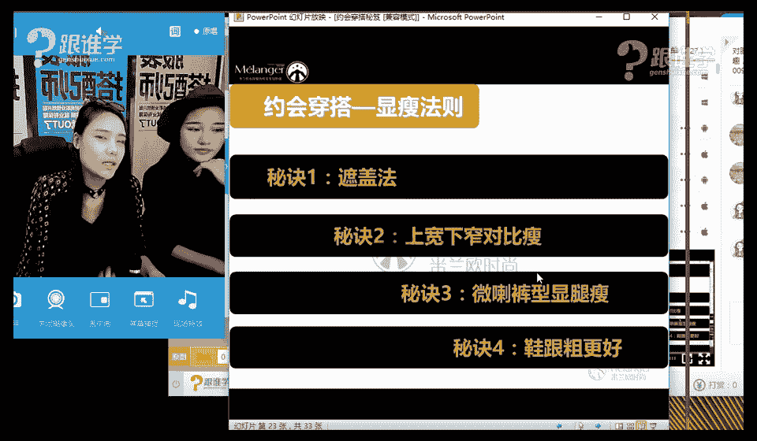
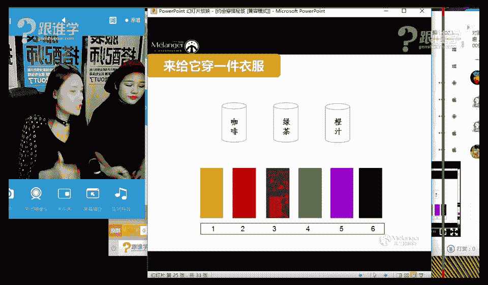
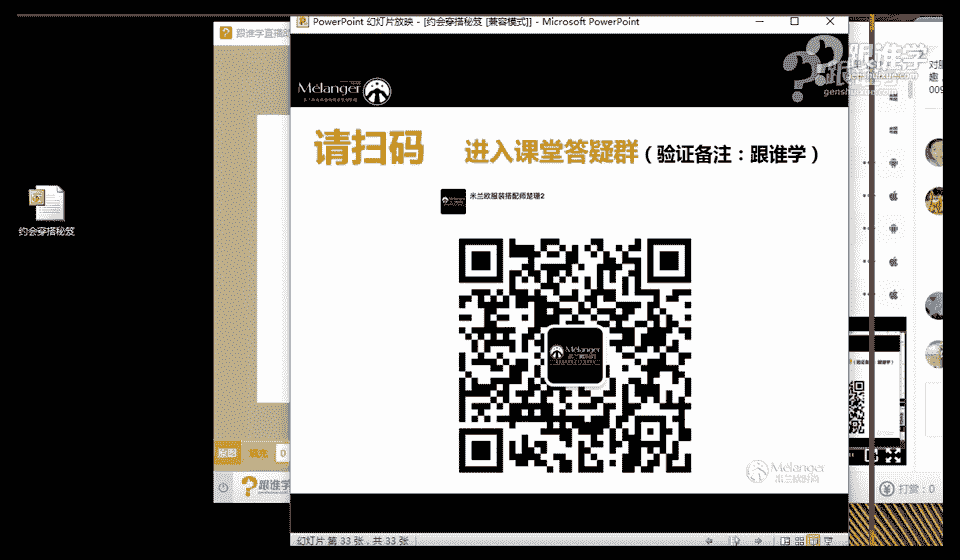

# 1、11服装《搭配秘笈之新版36计》：6约会场合的穿搭秘笈_rec

呃，大家晚上好，不好意思，我刚才看到有人说老师迟到了，我要报告是吗？不好意思，同学们啊，那今天呢老师真的是迟到了3分钟呢啊，O那稍等一下，我们现在调试一下我们的设备，马上就开始我们今天晚上的课程啦。

OK好，嗯，那现在已经可以了是吗？嗯，O好的，呃，那同学们再给大家打一次招呼啊。好，呃，那我看一下现在有多少同学在呢？呃，有听过我讲课的同学呢？或者说呃这个第一次见我的同学请打一啊。

第一次见我的同学请打一。然后呢之前听过老师讲课的话呢，可以打2，然后我们看一下咱们今天有多少新同学啊，然后呢有多少熟悉的老同学呢？我们来看一下。😊，🤧嗯。Yeah。嗯。现在还没有看到大家的这个发言啊。

OK呃，那今天呢其实跟大家这个分享的这样的一个课程叫约会穿搭秘籍。嗯，那其实在生活当中，我觉得我们很多单身男女啊，或者是说呃成年男女之后啊，但现在已经不是成年男女的事情了。

现在连小学生都已经开始约会了啊，那其实约会穿什么一致一直也是比较困扰我们的这样的一个问题。那今天呢就跟大家分享刚才这样的一个课题，稍等一下啊，老师来看一下，我们现在哎怎么没有同学跟老师打招呼呢？

在的同学们请打一好吗？来看一下有多少同学在嗯。

呃，那今天呢不只是呃我在这里跟大家授课。那今天呢我们也请到了这个一位大美女那这位大美女呢是我们的这个网红达人楠楠。那同时呢她也是这个。稍等一下啊，OK。没有声音是吗？同学们。好，我看到有人说没有声音嗯。

那。现在有了是吗？好的好的好的，不好意思，同学们啊，那可能是刚才这个设备没有调整好。嗯，谢谢大家的花花。嗯，OK嗯，我来看一下，嗯，好啊，那接下来呢我们就正式进入我们的课程了啊。

我看到刚才这个因为设备的问题啊，不好意思，同学们好啊，那首先呢刚才有说啊，这个第一次见到老师的同学，然后也没有人回应，难道你们都见过老师吗？嗯，那接下来呢我还是来自我介绍一下啊，OK。🤧嗯哼。嗯。

那呃我叫姚思瑜，那大家可以叫杨老师，或者是资雨老师。那同时呢我是米莱欧国际时尚的高级讲师。那也为一些品牌艺人啊，包括这些秀场做这样的一个整体视觉的搭配以及策划。

那同时呢呃也是一些呃也也合作了一些这个艺人为他们做这样的一个整体造型。嗯，好，我刚才看到啊，现在有人这个回复一了啊，好，唯美代价在是吗？好的，谢谢。嗯，那今天呢啊不多做不多做自我介绍了啊。

如果要是听过老师讲课的人，应该也比较熟悉我的画风了啊。OK那今天呢我刚才跟大家讲，我们说今天请到了一位这个特别漂亮的美女啊。楠楠，那这位楠楠呢她是做网红达人的，同时呢她也是一位平面模特。

那现在呢让我们以热烈的掌声。要请。我们的楠楠小姐出来，那大家应该把你们的画画刷起来好不好？O啊，唯美在下说是第一次听课是吗？好的，没关系。嗯，那楠楠okK。😊，啊。是不是楠楠特别漂亮？

那老师坐在这都觉得有点不好意思了哈，这个美女坐在旁边感觉今天不太一样。好，那楠楠可以跟大家打个招呼。hello大家好，嗯，好O那同学们可以听得到声音吗？楠楠的声音清晰吗？嗯，如果大家听得清晰的话呢。

请打一。然后呢，我们这个就近视的正式的跟大家来分享我们今天的课程了。嗯，OK是的，嗯那呃对我们楠楠呢同时也为很多的这样的一个品牌啊，然后包括秀场也会参与一些走秀，那包括一些拍摄，嗯，加微信。

这是什么情况啊，我们一上来就加微信。好啊，那呃其实我们说到这个今天的课题啊，我们就今天呢楠楠呢会跟老师一起来跟大家分享今天的这样的一个课程，包括在我们的课程中。😊，今天呢楠楠也会为我们变身啊。

然后呢变身约会达人，本来是网红达人啊，现在变身约会达人。好啊，那今天呢我们说的是关于约会的这样一个主题。楠楠有没有男朋友是接在单身状态，现在这么漂亮还单身，这不合理呀？是不是好啊，那楠楠说她还单身。

那是不是应该一直是这个呃既然是单身的话，我觉得应该是一直有人约约排队约会吧，也没有如果偶尔也会约会吧。嗯，O他有点他有点害羞啊。同学们好，那我们说到约会这件事情的话呢，其实应该会面临很多的穿衣问题。

对吧？对对你平时的话在这个约会的时候，有没有这个在穿衣方面有很多困困惑的，特别有人或人家会啊约会，上午或者是前一天前一天告诉我，然后第二。😊，二天出门之前，我还在想我出门穿什么合适，嗯，然后很很苦恼。

然后我想要不要出去买一件，然后穿穿穿出去。O就会这样想。好嗯，那同学们，你们呢你们有这样的情况吗？呃，有没有这样的一个问题，就是在约会的时候啊，或者是说临时这个这个有重要场合的时候。

出门总是挑不到合适的衣服，然后呢或者说总是踩着点，比如说早晨起床的时候可能也会早起半个小时，但是还是踩着点去上班是吗？对对对，好像很多人都有这样的一个问题啊。好啊，那既然说到这个约会，嗯。

唯美大家说每天试几套才出去。这是很多女生的这样的一个问题啊，那我就其实男生也是一样，男生的话他们出门约会的时候也会做一些特特别有一点，其实我之前有一个朋友还跟我讲。

他说他每次出门的时候约会的时候都要在家练几个俯卧撑。然后称一下为什么那个线条练体。对对对对，把肌肉啊线条啊，然后练出来啊，然后赶紧穿上衣服，然后这样看起来好像就很n的样子这种感觉。啊。

那其实那不管是男生还是女生在出门约会的时候，好像对于这个问题都有注意啊，O因为第一次约会嘛，第一次见面给人家要留一个好的印象。嗯，对的，是的好啊，那这个关于约会的这样的一个问题。

其实真的有很多的呃话题啊，那其实约会穿什么也是我们特别关心的这样一个问题。因为约会的因为我们的女生的衣服真的太多了，甚至有可能一打开衣柜，衣服都往外爆了。对对这样的感觉啊O好，那约会的话穿什么？

然后呢接下来给大家来分享一个小视频给大家来看一下啊，那有请我们的这个朱教老师来帮我们播放一下这个视频。嗯，好，😊。

啊，那我看今天这个同学好像不是特别的活跃啊。同学们那个如果今天我们的嗯现在可以播放视频了吗？好，稍等一下。😊，可能稍微网络有一点点卡是吗？嗯，那大家觉得这个呃看了前面之后，我不知道大家卡太卡了是吗？

不知道大家有没有这个看到这样的一个流畅的呃，其中的一个环节啊。那这个女生呢，他当时是呃因为这个这位男性朋友约了他之后呢，她就特别的兴奋。然后呢就在那狂试衣服，我觉得这样的一个状态。

其实真的挺像我们的嗯OK挺像我兼职的状，他们特别苦恼。然后就就真的就不想出门了，干脆就很后悔答应别人出门。好啊，那不知道咱们这个教室里有没有这样的同学。我觉得这样的这这种情况。

我们可能会因为这个我们所说的这个嗯这个找不到衣服穿而苦恼。但是不出门好像还是那个比较少啊。OK好啊，那接下来呢我们来看一下。那刚才通过这个视频想告诉大家是这个给大家分享的这样的。

一个我们约会的这样的一个状态啊。那其实我们说当约会的时候呢，呃我们其实很多时候都会考虑到男生的这样的一个审美。然后呢为男生的这样的一个呃喜好去着装，应该这么说。那我想这个其实我们不管是男生还是女生。

我相信男生应该也会考虑女生的这样的一个个人喜好的那可能他们穿衣服的时候也会比较注意一点。那你觉得女生会比较不喜欢什么样的男生，那大家其实也可以在屏幕上去打一下。

你们觉得啊你们或者说咱们教室里有多少女生呢？同学们。先有教室里有多少女生是女生的打一是女生的话，可以打一。然后呢，我们看一下对教室里有多少女生，然后男生的话呢可以打2。然后呢，我们看一下这个男女的比例。

好，那如果说是女生的话，不喜欢男生穿什么。那那对于这个问题，如果是我啊我不太喜欢可以离近一点啊，我不太喜欢男生穿的，像那个。汪峰的那种类型吧，就是机车的感觉，然后穿靴子，然后皮夹克或者是太酷的感觉。

对对对，就那种类型吧。嗯，我看到女生的话是这个唯美代价，男生是黑夜虽常，但请别用来遗忘，这个名字很有意境啊，这是男生是吧？好，那唯美代价，灿然同学，你们是女生是吗？然后那你们比较不喜欢女生穿什么呢？

那其实楠楠同学刚才说他不喜欢这个女生穿这个皮衣皮裤，就是那种太太酷的这种感觉，就是汪峰的那种感觉，啊，对对对，OK大概了解，那其实我们说女生不只是呃，这个这个楠楠喜欢的这种是就个不喜欢的这种啊。

是是一一部分的，我相信可能也会有人不喜欢男生穿成那个样子的感觉，其实我觉得可能是因为紧身皮裤的原因。对，看起来就是有点难受啊。OK嗯，唯美大家这个答案说不喜欢穿西装的男生。

喜欢穿休闲一点的啊好okK那我觉得这个这个这个喜好还是我比较少遇到的啊。对，好，那我们来看一下。女生不喜欢男生穿什么，这是我听到一个特别我之前有跟其他同学呃这个分享过这个问题啊。

那有同学就说老师我特别不喜欢那种穿着那种黑T恤，然后那种T恤还很花，全身都是花，然后呢身上是左青龙右白虎，而且而且那个T恤啊，还穿的特别低胸的那种感觉。

就是说就是他们就是说女生不太喜欢那种看起来有一点那种黑社会气质的这种感觉啊，然后呃老师说的也当然不喜欢。也不喜欢穿皮裤的那种，然后也不喜欢穿这这这种感觉的嘛，就是这种领的V领V领。

然后呢就是还露了这个一条龙是吧？这种感觉。OK好，这个。不知道这个有没有中大家的这样的一个这个我们所说的不喜欢的雷区啊，就是那个我们所说的这叫什么哈伦，这个有点叫哈伦的吊裆裤是吗？对啊，这种裤型的话。

其实呃特别特别显矮。对啊，今天楠楠还跟我分享了一个这样的一个话题呢，今天大分享今天早晨出门，然后看到一个男生个子目测1。7米左右吧。然后穿了一个哈伦裤，就是这种图儿这个专这个这个图片。

然后呢她又穿了一个长的风衣，就把她的身高比例拉成那个上面7下面三的那种嗯那种比例。所以这个不太适合她嗯穿出来也不是很美观啊O那其实楠楠同学说的这个问题的话呢，说这个男生目测只有1。7米啊。对。

其实老师跟楠楠的身高都已经达到1。7米了。然后因为呢。呃，我们是在南方，在广州啊，我们的校区是在广州。那其实广东的男生本来身高普遍身高多是高对，然后呢呃这个男生还穿了一个吊裆裤。

然后呢就是目测感觉是上七下三的感觉，就腿这么短的感觉啊，O当然不是攻击这一类的男生，而是我们说女生可能不太喜欢这一类的男生O好，这种穿着的这种这种感觉，那包括还有这种我们所说的穿着夹脚拖鞋。

就夸夸跨的出门了哈，这种男生的话呢给人感对对对，有一种不修边幅的感觉啊，O好，继续你看这个是比较齐这个呃我对于我小的时候我觉得印象很深刻的这样的一个对吧？就是呀要什么贵重的东西都会放在腰腰部。

然后不不容易丢失。但是这个很影响形象是吧？对然后特别是呃这个还还有一种情况就是带着这种钥匙。然后还把那个裤子穿到那个就基本上衬衫塞进去，然后裤子拉的特别高，就是都都拉到肚子那儿，然后肚子又很大。

然后基本上缺点全部暴露在的对对，这种着装也是女生其实不是特别喜欢的那包括其实现在很多男性的话呢，呃身材走走型还蛮厉害的，就是啤酒肚啊等等。那因为这个裤子他们这个这个我们所说的太低的话，他可能会掉。

所以他们就会穿到拉到肚子上，拉到肚子很高的地方。那然后其实这样看起来的话，给人感觉真的就像怀孕了一样的感觉。OK好，那就是我们说女生不喜欢的男生的穿着。那包括最后一种，这个是戳中了我的想问楠楠的微博。

这个唯美大家一直要男生微博的关注，谢谢你啊。OK好，等一下客后再说这个事啊，好，那呃其实我们说这这这个是比较能嗯对于我来说我是。接受不了的这样的一个类型啊，不知道其他其他同学你们能不能接受这种情况。

就是指甲留的特别长，我就觉得他可以去练长可以去练九阴白骨照的感觉了。这这个我看起来就是心理上很不舒服的感觉。OK好，这是我们所说的女生不喜欢男生穿什么？

那我相信刚才在这个呃咱们教室里的同学也也开始男生肯定开始吐槽了，说竟说我们女见的那就说我们男生的这个缺点了。你以为我们对你们没有意见吗？那我们来看一下，其实男生啊也也有这个不喜欢女生的某种状态啊。

但是刚才我们都说了，这个女生不喜欢男生的某一种穿法，那女生有没有比较喜欢哪一种男生的穿法呢？比如说我们图片当中的这种是不是你喜欢的。我第一眼就就很喜欢这种穿着，就干净利落。

但是刚才有一位同学说不喜欢穿西装的，就是唯美代驾同学，他应该不喜欢那种成熟的大叔型，他喜欢那种校园里的那种比较活泼的那种小小小男孩吗？OK刚才不知道是是唯美代驾同学说不喜欢穿西装的男生嘛？

你看我觉得这个穿西装的男生，你也可以考虑一下啊。对OK好，哎，唯美大价是是太呆了是吗？嗯，好，那那这个这个好像这个我们是比较喜欢这一类的菜啊。那你你会喜欢这种吗？太正装了。

那这种呢啊那其实图一和图二的话是呃对两种不太一样的感觉。其实这种是我们所说的这种欧美的男性，就是看起来有点大输了这种感觉啊，然后呢就很绅士的这种感觉，有有结实肌肉男的感觉啊，O好，这一位的话呢。

其实两位都是名模然后这一位的话呢就是对大家都认识的啊，霍建华和胡歌，那当时他们为芭莎拍这一组图片的时候，不知道这个秒杀了多少万千的女性啊，然后这个霍建华一结婚之后，有多少女生心都碎了。O好。

这是我们所说的女生可能会喜欢的两种类型啊，那当然还有更多啊，O好，那女男生不喜欢女生穿什么。其实这个我们相对来说，发言权好像就少一点发言权就少一点。对，应该是男生来回答你在你们心中。

你们不喜欢哪女生美做哪些。对，其实如果咱们这有男生的话呢，可以打字啊。刚才我看到有男生的啊。那其实呃在咱们在这个现在大家呈现的这个课件当中的图片呢，是我们也已经吊眼过啊，男生不喜欢女生的这样的一个状态。

大家可以看一下，第一个就是他们不喜欢女生化的特别特别浓烈的妆容啊，比如说那种画着黑唇了然后呢画着那种就是颜色特别深的那种深红色啊，也就是我们所说经常会说姨妈色这个颜色。

那其实呃这个我记得之前有一位这个男生说老师我总觉得他们涂了那种口红，我就觉得他们像中毒了的感觉。对，那种口红的颜色特别深啊，男男人也很很少能接受的了这种这种妆容。

对这种妆容他可能给人感觉太过虚太过于个性了啊，O这个黑夜非常说是的，不太喜欢太浓的妆。O好，那包括呢其实呃男生还不太喜欢。这个女生约会的时候穿的太过于暴露性感啊，太过于暴露的这种感觉。

那包括呢他们不太喜欢女生涂黑色的指甲油，我觉得好像对于指甲这件事情，很多人都会关心啊。我是我是觉得刚才那个男生的那个那么长的指甲，我是接受不了。然后不喜欢女人涂涂黑色指甲油是吧？

我我那个我这个之前看过一篇文章，说男生不喜欢女生这个呃涂哪种颜色的指甲油，就是他其实基本上除了裸色以外，每一种颜色，他们都不喜欢真的吗？是的。

我不知道咱们现在的教室里的同学有多少是不喜欢那个女生涂指甲油了。但是我看那一篇那个调研的时候是男生基本上就是很多颜色都不喜欢，说只能接受女生涂那种裸色的指甲油。嗯，OK好，那这是男生不喜欢的。

那包括男生还不特别不喜欢女生穿这种防水台特别。特别高的那种高跟鞋。OK好，那这是我们所说男生不喜欢的女生的穿着状态。那其实黑夜虽长，但请别用来遗忘这位同学，我想问一下你，你的名字真的太长了啊。

你比较喜欢女生穿什么样的感觉的嗯。你比较喜欢女生穿哪种感觉的？其实女生跟你约会，你希望她穿的那什么样子的状态，然后来见你他说我希望你穿穿成男男女士这样的男的女女神这样的啊好，那其实我们之前也做过调研了。

男生的话其实他会比较喜欢这种呃第一，你如果身材很好的话，你可以穿修身一点的服装，但是不能够不能够太过于那种性感和紧身的这种感觉。对，其实这种是属于有一点点轻熟女的这样的一个状态。啊。

然后比较修身的这种着装，那感觉还好吧，适合就行。你也太随意了。第二求不高吗？对，真的要求不高。OK第二种的话就是看起来很有气质感的这种的话，高演员对这种看起来就是很清新的。然后气质的这种感觉。

OK还有一类的就是什么呢？萌妹子特别萌的那种。我之前有一个呃呃嗯这个这个朋友，他应该说是其实还是比较成功的这样的一个男士，看起来还挺挺大叔的那种感觉啊，大叔的这个位。对，是的。

大叔真的就喜欢萌妹子的感觉。他就说他就喜欢这种特别特别特别特别萌的这样的一个感觉的。他喜欢的不管是这个呃他说他前任几任，他的前任女友们都是这种萌萌哒的感觉。好吧，我觉得我们这样就已经没有机会了。

没有机会了O好，那这是我们所说的男生和女生不喜欢什么样的感觉。那包括男生和女生都喜欢什么样的感觉。我不知道咱们教室里的同学有没有抽中你们的这样的一个喜欢的点，或者说你们的不喜欢的这样的一个雷区啊。好。

那这是我们这个简单的跟大家做这样的一个分享和互动。那接下来我们来看一下，那如果哎你今天要去约会了，去的是一个西餐厅。那我想问一下，楠楠，如果你去西餐厅，您会穿什么？我会穿的就是小小小晚礼服吧。

就是小的小晚礼服好像相对来说有一点点正式了啊，那其实就是一件连衣裙 one piece就可以了是吧？啊，OK好，那这是我们所说的去西餐厅的这样的一个着装。好，那我想问一下大家。

你们觉得去西餐厅穿成这样怎么样呢？楠楠你觉得怎么样？我觉得会过于性感吧。嗯，好，其实呃那大家觉得怎么样呢？如果我们教室里的同学，你们觉得这样穿是可以的话呢，你们打一。如果你们觉得这样穿不是特别好的话呢。

请打2来快快速的判断一下啊，O好。呃，这个黑夜虽长，你觉得啊对你你不太喜欢这样的感觉呀。这样，其实我觉得应该也有男生喜欢这样的。O你不喜欢这样的，是吗？好，那其实我们说场按照场合来说的话啊。

这样的着装好像是有一点点太过于性感啊，它的性感来源于哪里呢？第一大面积的露肤，就是这种斜背斜肩呢，还后它的然后是短的嗯，O膝盖膝盖以上的那种短对，非常短的短裙。

那包括这个服装的呃这个我们我们所说的这件衣服的面料啊，它是这种蕾丝的这种感觉，特别的女人味和性感，人感觉也透视的感觉。透视的感觉是吧？好，那我觉得这件衣服可能会更加适合出现在夜场当中就酒吧的感觉啊。

要去拍一下那样那个感觉。OK就是我们所说的呃这个第一套。😊，那大家觉得好像哎有同学说觉得不是特别好。那么再来看一下第二套，你们觉得这一套怎么样呢？啊，楠楠你觉得这一套可以吗？嗯。

这个吧我还是勉强可以接受。嗯，那看来你心里住了一个汉字。对对对。为什么呢？你会发现刚才我们所说的男生比较喜欢的女生的这样的一个状态，好像从色彩到款式上面给人感觉都是特别亮的清的。对对对。

很浅的这样的一个感觉，色彩还是比较清浅的。然后呢这种款式是比较淑女的这样的一个感觉但是你发现这一套的服装，我不知道黑夜，你喜不喜欢这一套啊，第一套你不喜欢这种是不是你的菜呢啊。

那我觉得这一套的话好像呃其实按照我们正常人的角度来讲的话，其实觉得哇很帅呀，很好看啊？怎么不适合呢？其实我们说男生的话其实好像不是特别喜欢太过于强悍的女生就是看起来太过于强势的女生。

就觉得你这是来吃饭的吗？是来跟我约会的吗？你这是要去打架的感觉吧啊，然后这种墨镜一戴，然后皮革，然后一身都是黑的黑色的酷酷的这样的个感觉。哇，突然发现我们俩人今天好像女巫啊，从镜从视频里看啊，那。

这个楠楠是全黑对，全黑。所以的话呢在这个视频当中看不到她的服装的这样的一个质感。那呃帽子这个颜色还能凸显一点。那我的这个颜色还稍微好一点啊。

就还是可以看得到一部分的这样的一个色彩的那其实我们两人今天的着装的话，你们觉得适不适合约会呢？同学们。你们觉得适合的话呢，请打一。你们觉得不适合的话呢，请打2嗯，OK好。

那其实我们说这个刚才的这样的一个图片当中呢。这两套其实都不是特别适合我们所说的这样的一个约会的这样的一个感觉。为什么呢？第一个太过于性感了，第二个太过于帅气的感觉，所以呢都不是对太过于硬朗和帅气了。

都不是特别好啊。那这样的一个感觉都不是特别好。OK那这是我们所说的西餐厅的这样的一个着装，那不是特别好的这样的一个感觉，我们来看一下比较符合的这样的一个西餐厅的穿搭的这样的一个感觉。哎。

那我们来看一下第一套，那呃你楠楠，你觉得这一套的话怎么样？这件可以的，嗯呃因为它那个颜色啊比较清浅，然后小淑女。然后。嗯啊这一套的话呢。我们觉得都还可以是吧？因为这种粉粉嫩嫩的颜色的话呢都还可以啊。

然后这一套呢啊不是不是啊，我稍等一下啊，因为我们这儿有有一个东西。好，我要拿一个东西给大家，等一下可以示范一下啊。OK好啊，那这是我们所说的这个第一套比较适合我们所说的这样的一个着装约会的感觉。

那第二套呢，我们来看一下。大家觉得这一套怎么样呢？给大家呃10秒钟的这样的一个感这个这个这个回答。那第一个你们觉得适合还是不适合，或者说你们喜欢还是不喜欢这两套当中，你们更喜欢哪一套呢？第一套呢。

还是第二套呢？大家来选一下你们更喜欢哪一个呢？啊，喜欢这一第一套。哦。黑夜说比较喜欢第一套是吗？OK好啊，那我们来看一下为什么呢？因为第一套它给我们的感觉其实是有一点点这种这个大家认识嘛，这个是华妃哦。

适合华妃那其实我们在这个电视剧里的时候，看华妃，他感人感觉好像气势凌人一样啊。但是在这种这个我们所说的他穿上这种粉粉嫩嫩的颜色之后，然后其实看起来还是很淑女的啊，然后还是很温婉的感觉。

对我们所以说服装的色彩其实是有很重要很重要的一个关系啊。OK好，我们来看一下第三套这样的一个感觉的话，其实我觉得是很适合约会。然后刚才我记得有同学说啊，给人感觉是比较约会的时候要穿的这种有一点点休闲感。

不要太过于正式的这样的一个感觉。那其实西餐厅我们所说的这样的一个场合的话，他是相对来说有一点点小正式感的对对他会在西餐的用餐过程当中其实是还是比较要。注重于礼仪这件事情的。

所以男生的话呢也要穿的相对来说不能不要太过于休闲。其实在西方的话，对于西餐厅进餐这件事情，大家都是非常非常的呃注重于礼仪。比如说我们在吃西餐的时候呢，这个女主人没有这个进入房间的时候。

其他宾客是不能进入房间的。女主人没有坐在凳子上，这个对其他宾客也不可以那包括女主人没有拿起餐桌上的这个桌布的话呢，其他的客人也不可以啊，那这是我们所说的这样的一个礼仪的这样的一个问题啊，OK好。

那我么来接下来看一下，那刚才我们说这个西餐厅，这是西餐厅的对这样的一个场合。那我们来看一下，在这个我们所说的游乐场当中的话呢，那大家觉得呃游乐场的话我们应该穿什么呢？稍等一下，同学们啊。

太过于强势了是吗？啊，okK好。礼仪休闲。OK好的，我刚才看于红同学说，注重于礼仪和文雅。然后这个呃约这个游乐场的同学这个这个我们说到游乐场这个问题啊，那有有同学说啊，老师前三套。最适合稍等一下啊。

同学们，我们来我来调整一下我们的这个屏幕啊。🤧嗯。😊，因为这个跟大家互动的时候，这个视频看起来不是特别清楚。我要跟大家来这个调整一下嗯。简单一点的。好，稍等一下，同学们。简单舒适一点的是吗？

OK好啊，游乐场最好穿裤子啊，有同学说游乐场最好穿裤子是吗？女生最好是穿裤子，为什么呢？这样方便运动吗？因为裙子会会不方便啊，容易走过好OK好，刚才那个运动休闲的感觉是吗？好。

那我们来看一下这个我们所说的游乐场当中应该穿什么感觉啊？好，那么大家大家觉得首先呃刚才楠楠说了啊，这个游乐场游游乐场的话不是特别适合穿裙子？那其实在游乐场当中还不是特别穿，适合穿高跟鞋。

对因为穿高跟鞋的话，给人感觉呃，太过于好像你是来玩的吗？啊，然后就像像去街拍的一样啊，OK好，那这穿高跟鞋不是特别好啊，有同学说no好，那我们来看一下啊，那大家觉得这这一套怎么样呢？😊，休闲鞋。嗯。

于红说要穿休闲鞋是的，非常好啊。那其实我们所说的在这个呃这个因为游乐的游乐场嘛，那大家都是一个属于比较嗨的这样状态，各种玩哪，然后这种这个游乐设备啊，这种啊，那穿了穿高跟鞋。

包括你穿太淑女的这样的一个感觉都不是特别好啊，O好，那包括这种大家觉得怎么样？大家来看第二第二个夜店风，陈某说夜店风，钟永雄钟永雄同学说不行啊，不好O那不好是吗？那为什么？因为这个太过于二次元了，对吧？

其实这种风格他有点叫二次元，他更贴近于我们所说的这个日本的这样的一个着装打扮。对啊，日本人其实还喜欢这样的一个近段时间比较流行这种。嗯，是的，那但是的话其实呃我觉得男生还钟永雄同学说很二好O好那这个二。

二的问题我们再再这这个这个是这个是另外一种考虑的方法了啊。好，那我们来看一下，那这种大家觉得怎么样呢？😊，男生喜欢这种的话，男生啊男生不喜欢这种的话，其实男生不是特别喜欢啊。

okK那我们来看一下这一套大家觉得怎么样？第三套。大家觉得这一套怎么样呢？啊，因为这一套的话，其实它太过于我们所说的这种有豹纹啦啊太过于其实有一点点性感。因为呃它的这种性感不是来源于他的裙子的款式。

它的这种性感其实是来源于他这个图案孙悟空豹纹好，拿根金箍咒就可以去那个西天取经的感觉了是吗？为什么要取悦于男性天朝妹子说啊，那其实我们今天讲的是约会的主题嘛？那约会的话。

我们其实还是要注意这这个不是取悦的问题，要让双方都感觉是一种舒服的状态，对吧？写说不因为这个这是基本的礼仪。OK好，嗯约会要投其所好。陈某说好，那这三套其实都不是特别适合我们所说的游乐场的这样一个着装。

因为高跟鞋啊、二次元呀、野性啊这样的一个着装的话呢，其实是他第一它不太适。适合这个行走不方便。那你穿裙子肯定是不方便的。第二的话是因为太过于二次元啊，男生的话这个可能不太能接受。

那第三套的话是太过于野性的这样一个感觉。嗯，不适合游乐场。那有大家觉得这个比较这个我们所说的符合场合的着装是哪一种？好，我们来看一下这一套，大家觉得可以吗？啊，第一套那其实呃有的同学说，哎。

老师你不是说不能穿裙子吗？可以，那有同学都说可以，因为我们说这条裙子的话，它裙长其实相对夜很长啊。因为这条裙子的话，其实它是相对来说是比较长的，而且它的面料是比较舒适的。有一定的这种弹性的这种感觉。

那其实即使是去去做一些呃比较对都还可以对，是还是可以接受的啊，那这样的一个感觉的话其实还是可以的啊。那刚才呢跟大家分享了我们所说的嗯，男生喜欢的或者女生喜欢的这种着装打扮啊。

那包括呢夜店和游乐场的这样的一个着装。那其实我们今天请到楠楠同学过来呢，最主要的还是要给大家来做一个这样的一个变身环节啊，想想看楠楠同学给大家来做这样的一个演练呢。

那因为我们今天其实都是讲到的一个场合的一个关系啊，那我们今天也请楠楠给我们做的这样这这几道展示呢也是。😊，呃，符合于场合的这样的一个感觉。那我先不跟大家讲。那等一下让楠楠同学，然后呢出来之后啊。

我们大家来猜一下，你们觉得是哪一种场合的这样的一个感觉呢？O的那我先去变装，然后等会儿再见了。OK好，那呃我们楠楠先欢送我们的楠楠同学去给我们变装啊，那我们先看一下，等一下楠楠同学回来之后是什么样子吗？

啊，很期待是吧？啊，ok啊，那呃刚才说到我们所说的这样的一个呃符合游乐场的这样的一个着装的感觉。那我们来看一下，这是第一套，那这是第二套啊，那第二套的话呢，其实它是一个这种这种短裤。

然后呢加这种海魂条纹衫，然后呢加这样的一个蓝色的这样的一个长外套。那这种大家觉得怎么样？可以啊喜欢OK好，那这样的一个着。装呢那包括他这样的一个运动鞋啊、运动帽啊。

然后给人感觉都是特别的休闲的这样的一个感觉，对吗？嗯，好看是吗？陈某说胖子怎么办？嗯，很好好，那等一下呢就跟大家来分享胖子应该怎么穿啊，那既然刚才其实有同学说到了，嗯，其实在这一套这一套打这一套着装呢。

我们所说的这样一这一套着装，其实它是属于有一点点个性的这样的一个比例。因为我们说。人在穿衣服的时候，什么样的是符合我们所说的这样的一个标准的比例呢？就是传统的比例。其实就是我们所说的套装的那个比例。

就是传统的。比如说西装西裤，它的长度，那包括半裙它的长度在哪个位置，同学们半裙的位置，大家觉得基本上的标准是在哪儿呢？半裙的位置。🤧嗯。😊，呃，我们平时看到的套装，它的半裙的位置都是对。

是在膝盖上下左右，对吗？上下位置啊，上下两公分的位置。所以说呢呃如果你选择的裙装是在膝盖的位置的时候，它给人感觉就会相对来说是比较保守的，比较传统的这样的一个感觉的比例。

那如果那裤装呢同学们西裤它是在什么位置呢？西裤是在什么位置呢？我看到我们楠楠同学已经啊已经这个换好了一件这样的一个黄色的这个这个这个这个连衣裙。那我们现在就请楠楠同学过来了啊。好，那楠楠同学的发型呢。

刚才已经快速的做了这样的一个变换啊。OK我们来看一下。嗯，好，这个楠楠同学呃这一套呢，大家有这我们可以先把这个楠楠同学的耳环先摘掉啊。对我们换一个给跟这个衣服相符合的一个好。

等一下呢呃我们先这个先把它的这个感觉来，这是刚才楠楠同学的这样的一个。饰品啊，我们来看一下楠楠同学刚才是长是什么样的头发，大家记得吗？素可杨钰莹是吗？好，那其实呢呃楠楠同学他现在整个人都亮了好多，是吗？

那其实我们看到刚才后面有很多的衣服，然后给今天呢都是给给我们这个同学们来做便装的啊，那我们现在让楠同学楠楠同学先来站起来来展现一下我们这件长裙啊，那其实这件衣服的话呢啊还是比较普通的啊，我们来看一下。

先把衣杆推过去一下。😊，楠楠同学说来我们先请呃在这儿往前一点。对好，那大家可以看一下啊，这条长裙呢它其实就是一个棉麻质地的黄色的这样的一个裙装？那现在呢它其实就是一件基本款的普通的这样的一个裙装。

那刚才楠同同楠楠同学呢，他其实本来是长发的呃，呃，为什么他要做这样的一个编发呢？同学们。弄头发弄头发怎么那么快？好，那等一下呢我们再来看一下啊，他的这样了一个头发。

其实就是这种快速的做了一个三股的编发啊，有琼鸟片的感觉了，显可爱啊。好，还差一点点饰品，然后适合西餐餐厅。好，那刚才同学们一看看了这一套着装之后呢，都觉得嗯显得挺可爱的这样的一个感觉。

而是不是从女巫变成那个我们所说的甜美girl了这样的一个感觉。好，那刚才有同学说缺少一点饰品。那我们接下来呢就给楠楠同学来添加饰品啊。好，那我首先呢给大家给给男男同学添加的是这样的一个耳环。😊，那。

大家可以看一下，有点五角星的，有点这种木质的这样的一个感觉的，有点可爱感，很温婉啊，发型正式一点，还差一点视频。好，编发编发更凸显女人味。好，那同学们，那因为这套服装还没有整体打造好。

那你们现在看还是觉得哎好像不知道到底是什么样的场合。那我们接下来看一下啊，okK好。我给楠楠同学先添加这个耳环啊。Oh。然后呢，接下来呢我们来戴上这个帽子啊，那这这顶帽子呢叫罐罐帽啊，适合看电影哈。

有同学说适合看电影是吗？哈，我们来看一下嗯。来的同学可以往后一点。对啊，那接下来呢我们来看一下这是什么。同学们，你们可以看一下一个比较可爱的这样的一个蝴蝶结，然后我要用在哪里呢？用在这个位置。OK好啊。

那既然有了这个我们所说的这个呃黄色和。天蓝色的这样一个配色。对，那大家现在可以看一下，我拿了一串这样的一个珠子啊，那这串珠子的话也都是以这种天蓝色呀，然后这种浅浅粉色呀去配色的啊。楠楠同学要去郊游了。

好，那我们接下来再来看一下啊。Yes。好，那我们现在这个饰品类的啊都已经添加完了。那我觉得呢它其实这件衣服还可以再层次感丰富一点啊，那我们呢现在请楠楠同学去旁边呢这个穿上一件小外套啊。

然后呢顺便可以把这个鞋子换一下和裤子换一下啊刚才呢同学说哇，楠楠怎么这么神速啊，那是因为他只穿了这个裙装，然后还没有换裤装，我们让楠楠同学呢把整体的这样的一个一套换了之后，然后我来给大家展示一下啊。

穿上呃高跟鞋，然后呢呃这个把这个这个黑色的长裤换掉啊。OK好嗯。刚才有同学大概的说，哎，这一套的话其实很适合他刚才穿的是呃大家好，这个大家好好好奇说是西服小外套吗？啊，等一下再给你们揭晓啊。

等一下楠楠同学出来了之后，你们就知道了。那他现在因为里面穿了一条黑色的牛仔裤。那我们现在让楠楠同学换一下鞋子。然后呢，我们整体来看一下啊，呃，有一个草编的小包。对，等一下呢。

我们可以给楠楠同学也拿一下啊。OK好，那刚是要混搭吗？天朝妹子都已经听课听了很多啊，听我们的这样的一个课程听了很多都已经知道呃，我们很多的这样一个搭配了啊，但是呢其实今天我们不做混搭。

那楠楠同学这一套呢，其实它是比较这种我们所说的属于统一的这样的一个风格。因为我刚才所有选择的单品都是比较这种我们所说的有点这种踏青啊，田园哪，然后这种度假的这样的一个感觉。

给人感觉是很清新的那呃淡黄色的和什么颜色搭配，其实淡黄色的话呢，😊，在我们所说，如果要是在夏天穿着的话呢，它可以穿的比较这种粉呃这种偏清新的感觉一些。那他经常百搭色的话，就是可以跟白色去搭配米色去搭配。

那包括呃这是我们所说的这个保守的这样的一个搭配方法。如果想要做的撞色一点的话，那那就可以跟这种浅蓝色呢、浅粉色呀啊等等都可以去搭配啊。那楠楠同学又很神素的回来了。

那我们来看一下这个楠楠同学啊把这个我们所说的外套穿上了之后呢。他是什么样的一个感觉呢？你们是不是要赶紧刷一下小花花，欢迎一下我们楠楠同学。OK好啊，那大家现在可以看一下撞色。好，来，同学们。

那我们可以这个让楠楠同学往后站啊，但看稍等一下啊，不影响视觉啊，让我们男同学充分的给大家来展示一下。那现在可以看得到呃，没有花花是吧？没关系好，那现在可以看得到楠楠同学的整个魔鬼的这个身材了吧。啊。

那因为楠楠同学我刚才跟大家讲了，他本身就是做模特的啊，那本身的自身的条件都已经非常非常好了啊，没有。😊，那呃我们说这个鞋子，那包括它的包包呢，其实都是这种有一点点清新的感觉。

那这一套呢其实更加适合我们所说的。刚才有同学说适合户外的感觉是吗？啊，然后田园的这样的一个感觉。有同学说软萌软萌的OK好，那这是我们所说的第一套的这样的一个单品。

那其实我们接下来还有两套要给大家来展示一下，那现在呢我们又请楠楠同学去换装了，谢谢等会OK好的，嗯，那其实这套呢是属于我们所说的比较甜美的这样的一个感觉，是吗？有同学说。啊。

有同学说这个感觉是比较甜美系的和田园的感觉啊。包包叫什么名字啊？包包的话，它其实这个包包的话，它就是属于度假感的这样的一个编织的这样的一个包包啊。OK上面的话呢它是一个小衫啊，是一个针织小衫。

刚才有同学说搭配针织衫。是的哈，是一个针织小衫。OK那这是我们所说的第一套。那大家觉得适合哪个场合呢？现在大家可以在这个我们所说的屏幕上去打一下，你们觉得这种感觉的服装，它比较适合哪种感觉啊。

比较适合哪个场合？是是针织小衫。户外郊游度假okK游玩嗯。OK非常好啊，同学们，那其实大多数同学约会是的，约会约会的话，这种感觉其实是比较适合我们所说的度假呀，然后踏青啊、郊游啊啊等等这样的一个感觉。

嗯，好。可以郊游。那我看到大家的这样的一个答案了。在阳光下的场合，这个回这个答案很浪漫啊。OK好，那其实去电影院的话呢，这种着装的话呢，其实它更加是比较户外的感觉啊。嗯，OK好。

那我们继续回到我们刚才始的主题上。那刚才这个呃天朝妹子说，老师刚才西装的这个长度你还没有说呢？哈，那接下来给大家来说一下西装的长度呢，普通的这样的一个传统的这样的一个这个位置的话。

它是在脚踝的这样的一个位置啊，脚踝。那所以说为什么说这一套呢。所以说这一套呢它是看起来是比较呃有一点小个性的原因。那是因为它的裤子的长度是非常的短的，它是打破我们所说的这样的一个传统比例。

所以它看起来是有一点点个性的那我们说衣服的长度，它基本上是在腰间的这个位置。那所以它的衣服的长衣服长度变长了，裤子变短了，所以它就是我们所说的打破人体呃着装的这样的一个服装比例。

所以看起来会有一点点小个性。那包括我们所说的衣服的长度，它本来正常的西装外套的长度是在哪个位置呢？它是在臀部的这样的一个胯部的这样的一个位置左右。那这个这个我们所说的外这个衣服上装的长度都已经到膝盖了。

所以它看起来一定是非常个性的。有同学说发型为什么是辫子。因为刚才那样的一个着装的话，它是比较适合这种我们所说的有一点点这种呃这种辫子的话，它给人感觉有一点点清新和甜美的感觉。

而且呢你是这个刚才有同学说显摆纯情，于红同学这个答案是比较犀利的啊。那其实这种单侧变的话，它是有一点点我们清纯的感觉，有点甜美的感觉啊。OK好，嗯，那这是我们所说的这个刚才在着装上的长度的一个问题。

那下面呢我们又请楠楠同学回来啦。OK好。😊，那呃楠楠同学呢，她现在穿的是一件粉红色的修身的这样的一个连衣裙啊。那现在呢其实只是基本的这样的一个打底。那我们现在来看一下要上一件重量级的服装了啊。

那我们来看一下给楠楠同学。对我在这边商量好。好，那给呃给大家来看一下啊。😊，哦，O好，等一下楠楠同学穿上了之后再给大家看啊，不是外套哦。嗯。我这件衣服因为特别的大气，特别的重量感。

所以呢这件衣服穿起来很费时。来好，楠楠同学已经穿好了啊，那我们来看一下啊来。纱裙层次感呃，OK我们来看一下啊，这条裙子的话呢，因为它特别的夸张。啊这同学说晚宴的感觉是有同学说伴娘的感觉。

那等一下我们来看一下啊，它整体的这样的一个造型打造了之后是什么样的感觉。有同学呃陈某同学说长卷发长卷发的话会不会太过于没有个性了呢？啊，我们来看一下，那我们现在要把他这个头发呢？盘起来。嗯。

OK有同学说盘发是吗？可以去宴会。好，那我们来看一下啊。Yeah。呃，楠楠同学都蹲着了啊，我们可以坐一下来。好，现场给大家来变声了哈，耳环也可以取掉。等一下我们要换一个耳环OK。简单的给他扎一个丸子头。

那当然如果是出席这种重要的场合的时候呢，呃头发还是要盘的这种我们所说的相对的来来说要整齐一些的啊。这个没有两没有没有这个没有两下子的话，真的还是还还做不了老师。我发现随时都要能够上手。

OK那因为今天的这样的一个着装呢，它变变得套数是比较多的。所以呢我们的这样的一个整体造型，为了让大家感觉更好啊。然后呢所以整体的话从头到脚都会给大家做一个这样的变身。OK好，这样的一个辫子头哦。

丸子头大概就是这样了啊那可能扎的不是特别规整。但是呃这个楠楠同学还是比较适合这样的一个丸子头的，还是比较清新甜美可爱的啊。好，那我们继续来看一下。那下面呢我来给他加一对耳环。啊。

那这个耳环其实是有一点点小个性的这样的一个耳环。那来好我自己。好，那这是我们这个耳环的视频减龄了是吗？嗯，OK好。我们继续啊继续加饰频。那同学们你们会发现。

其实饰品它在我们所说的着装当中它有很非常非常的重要。应该说因为呃我们说大众跟时尚的明星的这样的一个差别在于那里，就是在于我们所说的饰品啊。楠楠同学有典雅的气质啊，那耳环一上去了，真的有一种典雅的感觉啊。

好，继续那可以请我们的助教老师帮我拿一下皮衣。对，那其实我们说这一套衣服的话，它如果这个出席这样的一个晚宴的话，会太过于我们所说的有点太过于甜美和可爱了。那现在其实走红毯的话，都需要什么呢？

这种有一点点气场的感觉啊。那我们来看一下嗯加上这样的一件皮衣的话，大家觉得怎么样呢？啊，OK好，那这件皮衣的话呢，它其实是有一点点这种呃黑它啊，那男的同学可以走近一点，它有一点点奢华的小做工啊。

它有这种这种我们所说的金丝链条啊等等啊，然后有范儿是吧？那接下来我们再来看一下啊，戴上墨镜来。🤧嗯。在。对，然后呢有同学说嗯加一个手包吧，来。来看一下这个手吧啊，给大家看一下好。

那其实他这一套是不是就可以去出出席我们所说的这样的一个晚礼啊，或者说走这个晚宴或者说走红毯了，就直接可以啊。那其实他身上这件衣服还可以换成老师的，现在身上穿的这件衣服啊。

那整个人的话都非常的我们所说的比较有范儿的感觉。那大家可以看一下啊，好，有同学说哇塞变高贵了，变美丽了。那因为人家身材在这儿啊，衣装马对我们所说的人靠衣装马靠鞍，就是在这儿了啊。O那准备去赌场啊。

这个去赌场的话，这个真的有点太大气了啊。好，那这是我们所说的第二套着装。那现在呢我们再请楠楠同学啊，帮我们换第三套服装。那刚才有同学说了好，谢谢楠楠同学等会儿再见好，楠楠同学说这一套啊，同学们说。

哈同学们说这一套是比较适合这种晚宴的感觉，是吗？嗯，好，那所以说的话呢呃这个着这个人靠衣装马靠鞍这句话，其实小的时候是不能理解的哈。现在的话呢就是呃这个自从老师做了这一行之后。

就觉得呃我有一双我有一双神奇的手就是可以一个把一个普通的路人打造的非常的出彩。当然楠楠同学他本身就已经很出彩了啊。OK对，楠楠同学本身就已经很有范儿了。那刚才有同学说老师人胖的话呢。

我们回到我们这样主题上来讲啊，人胖的话应该怎么去穿？那我们来看一下啊，那呃我们所说的身材好，就像楠楠同学这样的啊，穿什么都好看，是不是啊？那我们来看一下。😊，如果你的身材是这种的话，那你要怎么去穿呢？

啊，那比如说腿粗的人其实是有很多的这样的一个问题的啊。就比如说在夏天的时候不敢穿短裤啊啊，然后腿粗的不敢穿紧身这种牛仔裤啊，或者说紧身的窄脚裤啊，这样的一个情况的话。

其实我们所说的腿粗的人都要尽量去回避啊。因为你本身自己腿粗的话，你要回避什么呢？把自己的缺点暴露出来。你要你要做的是什么呢？隐藏缺点，然后放大你的优点啊。OK好，刚才有同学说去晚宴是不是要穿的很亮是的。

非常这个去晚宴的话一定要穿的非常的呃，这个相对来说要低一，它要这种有一有一点点华丽感啊。因为我们说晚宴晚宴，晚上的话，基本上光线都会比较暗。为什么要用很多带有亮钻的东西，华丽的东西。因为这种东西的话。

它会有这种呃视觉的聚焦感啊。OK好，那我们刚才说缺点的话，应该要掩盖。那我想问一下咱们教室里的同学，你们有没有自己腿比较粗的问题？那刚才我们说身材好的人穿什么都好看，身材不好的人啊，这个就很头痛了啊。

OK有艾克艾克里里说有是吗？脸胖啊，有同学说啊。有腿好粗。好，那呃腿粗是吧？那接下来呢老师就来给你们这个呃解密腿粗怎么去搭配啊，那我们现在楠楠同学又来了。楠楠同学呃都是肉是吧？大腿特别细，小腿不细。好。

那我们等一下楠看呃，首先呢先请楠楠同学出来。然后呢。我们来看一下啊，这一套大家觉得。啊，楠男同学已经换好了啊，同学们呃，其实这一套的话，很呃我相信在夏天的时候。

有很多女生呢会有这样的一件这种我们所说的吊带裙。啊在冬天的时候，其实不用把它收起来啊，为什么呢？对，因为可以什么呢？搭配一件我们所说的这种高领毛衫呢，或者说一件白衬衫呢都可以再穿啊。

那冬天的时候其实不一定是要把连衣裙收起来的。冬天的时候呢，反而你把这种裙装穿起来，它再去做这样的一个混搭效果的话，会非常漂亮啊。OK好，那这是我们所说的呃这个白衬衫搭配这一套服装。那其实这一套的话呢。

我们其实还可以有亮点的啊，亮点在于哪里呢？我们可以继续加饰品啊，那楠楠同学可以把这个呃耳环取掉。然后呢，我们来加一加一个这个叫choca啊，か？好，可以可以放紧一点。好，OK好。

可以请我们的跳我自己来啊ok。好，那这是呃今年特别流行的这样的一个我们所说的颈链。OK好，那接下来呢啊有同学说嗯这一次这一套上次看过了啊，看过的话呢，因为我们上次讲的搭配跟这次讲的搭配是不太一样的啊。

那我们主要讲的这一次是场合。那大家还觉得这一套是适合哪个场合穿穿的呢？嗯，上次我们可能讲的是搭配的原理。这一次的话我们要把它拿到场合上来给大家分享。你们觉得这一套它比较适合什么场合？来。

接着呢我给楠楠同学配一顶牛仔帽啊，我们来看一下。好嗯。适合什么约会逛街聚会。OK好，让我们楠楠同学来给大家好好的展示一下啊。那其实这一套嗯O哇，这个楠楠同学身材太好了，真的怎么穿都好看啊，O好。

那同学们说适合约会聚会逛街，那其实他因为穿的是高跟鞋，那如果他穿平底鞋的话，我觉得可能会更适合逛街，对吗？欢坏啊，那约会聚会都非常好。我觉得这一套啊，因为他本身呢嗯散步穿着高跟鞋，散步可能有点累吧。好。

那看电影也是可以的啊。好啊，适合被约会。好，那楠楠同学你现在可以穿着这一套去约会？会好，那楠楠同学今天呢帮我们展示了三套，是不是同学们你们要这个可以没关系，你们如果没花的话也没关系。

你们现在可以统一的来刷一个表情，然后让楠楠同学看到大家对他的。热情好不好嗯。😊，好，你们统一刷一个什么表情，就期待那个表情吗？就是有点涩涩的那个表情啊，眼睛冒星星的那个表情。O谢谢你们在刷。O好。

让我们这个呃这个非常以热烈的掌声。然后呢欢送我们的男楠同学先去换衣服啊，然后呢他等一下会继续回来。OK好，拜嗯先让男楠同学去换衣服。好，那也谢谢大家给男男同学这样的一个呃鼓励啊，O谢谢好。

那这是这三套服装呢，男男同学通过三套服装给大家来展示了。你看一个女人她是有无数种可能的啊，百变的这样的一个造型。那第一套呢它是去这个我们所说的田园的这种感觉。第二套呢它是晚宴的这样的一个感觉。

第三套呢它是这种呃有点约会呀，然后逛街呀聚聚会啊，然后看电影都可以。那景链怎么用。那景链的话，因为他是今年特别。😊，特别流行的这样一个单品，它可以跟很多服装去搭配的。

比如说老师今天也是带着这样一个景面的感觉，只是景链它也有很多的风格。那包括色彩，你要跟服饰怎么去搭配，它都是有这个我们所说的学问的。嗯，OK。好，脖子短的能用吗？如果你是脖子短的呢，第一。

你要把你的这个颈链的宽度变窄。比如说老师的这样的一个这个宽度就太宽了。第二个的话，你的颜色可以什么呢？变浅变浅色嗯。今天收到一条颈链啊，恭喜是老师送的吗？是的，你是不是要那个也要送老师礼物呢？

老师送了你一条颈链。OK好，那这是刚才嗯。😊，哇，我看大家的问题好多呀，都刷屏了，老师真的是回答不过来了啊。那问题的话留到我们课后啊，留到我们课后。OK好，那我继续来给大家分享课程啊。

我们的课程还没有结束呢。刚才呢我们说啊讲到这个腿粗的这样的一个问题，对吗？那刚才有很多同学说，嗯，我们这个这个有有很多同学都说是腿粗好，那我们来看一下腿粗怎么去搭配啊。那首先呢给大家传授一个搭配口诀啊。

遮盖搭配最合宜，上宽下窄对比瘦深色裤装收缩好微喇廓形，显腿细啊，好，老师不做代购也不做淘宝啊，老师有没有网店卖视频。有但是呢老师在这在这个上面没办法给你推荐啊，因为老师也不记得不记得那个店名叫什么名字。

OK你直接在网上去搜索就可以了。好，男生不适合戴颈链的，男生可以戴项链，这样的颈链。好像有一点点太过于呃女性化了啊。OK好，那我们接下来再来回到腿粗的问题上。我们来看一下。好，第一个，那叫遮盖法。

其实刚才我们说这个呃当一个人他的有缺点，特别明显的时候，你就不要拼命的在强化你的缺点了。这个时候你要做的是掩盖你的缺点，也就是说遮盖他啊，干脆就把他遮住吧，比如说范冰冰同学们。

你们有见过范冰冰她的特别胖的这样的一个位置吗？其实范冰冰的大腿和他的手臂都很粗的，但是我们的印象当中永远都是觉得范爷好美啊，然后范爷的衣品为什么那么好啊，那是因为范爷她永远都是什么呢？

把他最粗的位置盖住了。比如说他平时穿的所有的服装，基本上都是什么呢？到膝盖的位置他永远露的都是他小腿的这样的一个位置。那包括手臂也是一样的，他永远露的都是他的小臂位置，因为他的。手臂很粗。

那包括他穿晚礼的时候，他有很多的晚礼服都是遮住他的这样的一个上面这个手臂的位置啊。所以说呢啊当你这个哪个地方是你的缺点的时候，你就可以第一个方法去遮盖它。那大家可以看一下，比如说腿粗的人。

你可以穿这样的一个什么呢？直筒裙到这种所说的小腿的这样的一个位置。OK那第二种阔腿裤。因为我们说唉这个嗯腿特别粗的人啊，你们穿那种紧身裤的时候呢，就不是特别好啊，因为你本身腿就特别粗，然后呢。

你的上面特别粗，下面特别细，然后就形成了一个什么呢？萝卜的形状啊。所以说呢小这个大腿很粗的人，就尽量不要穿这种紧身的窄脚裤，那包括短裤都不是特别好。那我刚才我看到楠楠同学已经换完衣服了。

我们再请楠楠同学回到我们的座位上来，然后继续跟大家来。啊，来分享。OK好，楠楠同学的话又见面了。这个这个这个满头都是汗啊，我看着都有点心疼了。好，那呃腿这个腿腿粗的人啊，其实是真的有点痛苦了。

其实老师腿也有点粗，我觉得所以我都穿阔腿裤。同学们你们看一下啊，我都不穿那种什么紧身裤啊什么的啊，来给大家展示一下，我的裤子的话呢也是特别那大家可以看一下啊。😊，好，啊，都是直筒啊，都是阔腿裤。

okK好，那楠楠同学的腿就特别细啊。好嗯。那这是我们所说的第一条叫遮盖法。第二条叫上宽下窄对比瘦。什么意思呢？同学们，当你的这个腿特别粗粗的时候呢，你就可以穿上身比较宽松的服装啊。

或者说比如说冬天的时候呢，你可以穿那种呃紧身裤打底裤，但是呢你上身可以穿比较宽松的，然后呢，你的腿对比的看起来就会比较瘦了。比如说其实道理很简单了，如果呃为什么结婚的时候会找伴娘呢？对显得新娘更漂亮。

no，为什么应该说那个结婚的时候，为什么要找伴娘找没有那么好看的伴娘对，找伴娘一般都要找那种看起来比新娘啊，稍微那个啥一点的哈，青色一点的啊，为什么？那是因为如果你的光芒都遮住新盖住新娘了。

那那就有点失败了啊这个。伴娘当的。所以那我们说这个这个这就是我们所说的对比法。那包括如果要是你的先生。特别的man，你啊这个这个又高又壮哈，然后呢你看你本身身高就不是很高，然后呢特别娇小。

你们俩如果单独看的话其实还好，但是一对比的话呢，就会显得什么呢？一个特别高一个特别矮。最萌身高差对最萌身高差，所以这就是我们所说的叫什么呢？对比法啊O嗯，这是呃穿下窄对比说，我们来看一下啊。

例如说你的腿特别粗的时候，你就可以穿这样的什么呢？大衣啊，宽松的廓形的大衣，然后对比你的腿就比较细啊，老师把潜规则给说出来了。不好意思啊，如果同学们你们要去当伴娘的话呢，现在就注意点啊。

有可能就是意思新娘就会觉得嗯你没有我长得好看，所以你哥过来当伴娘嘛，就是这个意思啊。O啊O好，那这是我们所说的第一条。那第二条，那杨幂这这这件衣服饥肠露客，然后就是挺火。是爆款来的对吗？

然后今年特别流行，是它上面就是飞行员夹克做的很夸张的这个阔鞋。对对嗯，O好，呃，看来我们男楠同学是非常非常关注时尚的啊，果然是模特啊，所以说的话呢，那呃这个要时时刻的关注我们所说的流行。

那今年其实是特别流行这样的一个飞行员夹克的，而且是大廓型的，就是特别特别大，就是能把你当成那种有点像装麻袋的意思了哈，O好，那这是我们所说的上宽下窄对比瘦。那呃杨幂很瘦是的嗯，好。

那这是我们所说的第二条那第一条和第二条大家记住了吗？啊，好，那第三条呢就是微喇裤型显腿瘦。什么意思呢？就是比如说啊老师穿直筒裤的话，其实是上面跟下面都一样粗了，就是你看不出来我的腿有多粗。

但是喇叭裤的话，它是上面比较紧，下面比较宽松。但是这种喇叭裤。它也是有对比的法则在的，因为下面的喇叭特别大，所以它对比你了什么呢？上面的腿也会细啊，所以说的话呢今年特别流行喇叭袖，对不对？

如果你的手臂很粗，那你就穿一个喇叭袖，那也是对比的显得你的手臂比较这种比如但但是老师这个看不清楚啊，比较大一点喇叭袖要大一点的啊，O那喇叭裤其实也是一样的道理，就是什么呢？下面要大一点啊。

那上面的话它就会对比的，你的腿看起来没有那么粗，嗯，好，这是我们所说的秘诀三微喇裤型，显腿瘦啊。O好，第四条就是粗跟鞋更好，同学们，为什么呢？啊，如果你的你的这个小腿粗的话呢？我建议穿粗跟粗跟鞋。

今年其实小腿粗的人就服了。对对对对，而什今年特别流行粗跟的鞋。因为对今年特别流行那种粗跟哪方跟哪这种鞋第一穿起来很舒。第二的话，它还会让你的小腿显得更细哦。因为我们说特别细。

比如说这种这种像指这种所手手指一样的那种那种跟的话，它会对比的你的什么呢？显得你的腿更粗，就像一个萝卜一样啊，就像小萝卜一样。所以说的话呢啊如果你的腿比较这个小腿比较粗的话，穿粗跟鞋会更好。OK好。

上面喇叭，下面也喇叭吗？小金同学说上面喇叭下面喇叭那叫直筒。上面细，下面粗才叫喇叭，喇叭的形状，知道吧？就是上面窄，下面宽就像漏斗一样哦。O小金同学，这个问题太可爱了，我都忍不住笑场了啊。好。

那这是我们所说的第三条啊，然后呢呃今天给大家讲了四条这样的我们所说的这个小腿的显瘦的秘诀啊，还记不记得呢？第一条叫遮盖法。第二条叫上宽下窄对比瘦，第三条叫微喇裤型，显腿细，第四条叫粗跟鞋更好。

上衣是喇叭，裤子也喇叭啊，好吧，你说清楚嘛，上衣是喇叭，裤子也喇叭。老师的这个袖，你说的是老师吗？老师的这个袖子其实是在手嗯不是属于在这个这我们所说的手肘的位置开始变宽的啊。

我的这个位置呢是在手踝的这个位置变宽的，所以不是那么明显的喇叭。但是我下装穿。😊。

是直筒裤啊，同学啊OK好，这是我们所说的腿粗的这样的一个显瘦的这样的一个法则，对吧？啊，那我们来看一下整体的这样的一个约会的穿搭技巧。那今天呢刚才包括男男同学的这样一个穿搭示范。

包括我们说男生女生喜欢什么样的一个着装感觉的这样一个示范。其实呃在约会的场合当中呢，我们尽量不要穿的太过于帅，太过于酷啊，当然男生可以这样穿，这这这样会给人有一种距离感，毕竟如果是嗯刚见面约会的话。

如果你们不是很熟的话，嗯，穿的很酷的话，给给人感觉有距离感不好接触。嗯，像比如说老师这样的基本上10个人有9个人见了之后，都说老师很高冷，看起来其实老师是非常非常有亲和力的对吗？

你们觉得呢那其实我们所说的呃如果你要是一天到晚穿黑色的话，那呃第一你可能真的是很喜欢。

黑色啊，第二的话，那你有可能是觉得你自己太胖了。那第三，有可能这种情况的话，我觉得一定是男生，为什么呢？耐脏。男生觉得哇这个黑色的袜子可以穿一两个月都不用洗是吧？

我记得见过最夸张的就是那种把袜子穿的都成一个袜脚的形状了。那种真真的反过来穿正过来穿啊，这是我们所说的这个黑色啊，黑色的话呢，它不太适合我们所说的这样的一个在约会的场合当中穿，所以在约会的时候呢。

穿的清浅一点的色彩，它给人感觉会更加哎整个人看起来会比较的积极向上活泼啊啊，那这是我们所说在色彩上的感觉。那在这样的一个呃我们所说的这个场合上呢，你的这个着装要根据场合。比如说哎去参加晚宴。

有可能第一次约会的时候就去其实在一个晚宴当中约遇见的啊O那就把你的你们的一见钟情的这样的一个场地，变成了我们所说的约会场合吧。😊，OK那呃比如说有郊游的时候。

那刚才我们所说楠楠的这一套感觉就比较适合踏青啊、郊游啊、烧烤啊O度假啊这样的一个感觉。那第二套的话就是晚宴。那第三套的话，其实就比较我们所说的可以聚会也可以用。啊。

朋友看电影对看电影也可以都是有点淑女的感觉。那其实他每一套的感觉都是偏淑女的，然后比较偏女人的这样的一个感觉。那其实在呃材质上的话也尽量选择这种所说的轻盈的感觉，不要太过于什么呢？

太过于厚重了呃厚重和挺阔的这样的一个感觉都会给人感觉太过于这种有压迫感隆重，对，太过于隆重。O这是我们说呃服装的话呢也要选择相对来说比较合体的这样的一个感觉啊。

有同学说呃刚才有老同学们提了好多好多这样的一个问题啊。因为老师这个都都要要跟大家这个这个在授。所以有的时候都没有看到。那等一下在我们课后再给大家来这个分享我们的这样的一个答疑的这样的一个问题啊。

那呃这是我们所说的约会场合的这样一个着装的技巧啊。那同学们接下来呢给你们做一个小小的这样的一个呃这个我们所说的心理测试啊，不是心理测试，应该说其实是非常简单的一道。

生活中如果你们把你们自己当成是一个设计师的话啊，比如说咖啡啊，绿茶橙汁这三个都是饮料，对吧？啊，那这三个饮料现在还没有包装色，没有包装的颜色，那同学们你们给咖啡绿茶和橙汁选择什么样的包装色呢？

就是它的瓶装的颜色，你们给他选择什么颜色，123456，好，先回答咖啡。陈某说咖啡选第三个是吗？好，我们先来第一个啊，咖啡选择哪一个？341是吧？有同学说阿瑞同学说341好，哎，好多同学回答341呢啊。

回答341的同学我明白了啊，就是说呃咖啡绿茶和橙汁，选择三41，也就是说咖啡色绿色和橙汁是吗？嗯，OK好，有同学说选择匹配匹配色是吧？好呃，那看来大家都都都知道这个我们所说的，哎，如果要是咖啡色的话。

我们就会选择咖啡色包装绿茶的话呢，也会选择绿色的橙汁的话，也会选择橙色的。我想问为什么？同学们，为什么呢？😊，为什么你们会想到哎，咖啡就应该用咖啡色，绿茶就应该用绿色，橙汁就应该用橙色适合。

除了这一点呢，除了啊，那其实呃更多的比如说你买了一瓶橙汁，你发现它的包装是紫色的，我觉得喝起来是不是有一种叫中毒的感觉，肯定觉得是蛮错。对，比如说哎雅的。对，比如说你喝咖啡，你买了一瓶绿色的包装。

你可能觉得这个喝的不是咖啡啊。对对对，所以说这就是哎刚才有同学说匹配法啊，其实这就是我们所说的匹配的感觉，这样的一个在其实在心理学上真的有一个叫匹配原则。比如说有朋友送了你一个花瓶。

那我相信两天之后你的这个花瓶里一定会插上一束鲜花，那比如说有同学送了你一个有朋友送了你一个鸟笼，那我相信你这个鸟笼没有几天一定会放一只鸟，那这就是为什么我们所说的匹配原则。

会觉得你会觉得哎这个东西就应该放一个什么东西进去。那其实我们人也是一样的。包括刚才给大家做这样的一个小小的这样的一个我们所说的游戏啊，那呃我们说咖啡的话，它你会选择用咖啡色来匹配它？

绿色你会选择用绿色来匹配它橙色你会选择用橙色来匹配它，那我们人穿衣服是不是也是一样的呢？你会发现咖啡色它就表现的是咖啡的本质，绿色它表现的就是绿茶的本质，对吗？橙汁啊橙色它表现的就是橙汁的本质。

它们的包装就已经表现了这个产品的本质。那我想问大家，人跟服装的关系，如果你的服装是一个你的外在包装的话，那是不是它也是一种我们所说的啊？外在的包装要表现你人的这样的一个本质呢？应该是这样的。嗯，好。

那同学们你们有做到。我们所说的哎，人你的人跟你的外在的服装的这样的一个本质的匹配吗？对肤色性可定要搭，没有是吗？好，我看到有同学说没有，为什么呢？为什么我们不懂呢？啊。

其实我们说其实这就是我们所说的一个人的这个呃外在的形象跟她内心的这样的一个相匹配对相匹配。其实有的时候啊气质啊，我穿的别人以为我老1岁，好吧啊，为什么我们不知道或者说不懂的穿搭。

其实呢是跟我们从小的教育有关系的对呃，我们国家的话其实是没有这样的一个相关的教育的对对，为什么国外的很多女性，比如说韩国日本欧美，他们的穿衣品味那么好，包括他们的美感，为什么那么好？

那是因为他们从小就开始学习这种什么插花呀、美学呀、化妆啊、服装搭配，他们从小就可以接受这样的一个教育。那其实你比如说。日本很小的女生就开始自己学着化妆啊，那韩国和女性的话呢。

他们如果你如果要是不好好保养自己的身材，比如说你的身材那么好，那我觉得他们在韩国是买不着衣服的。你会发现我们的尺码是不是都是均码约束的那种。对，其实韩国很多服装，你会发现都是均码。

啊啊那所以说他们这些人对于自我形象管理，从我们说懂事之后培的对，从懂事之后就开始培养，并且他们会把这件事情作为一辈子的事情来做这样的一个管理啊，自我形象的管理。那么国人的话，为什么我们没有。

那是因为我们从小到大从学们意识，不是嗯并不是说没有这种意识，应该说我们有这么的意识，但是被家长打压了。比如说小的时候上学那个就比如那个我们我们的校服啊或者什么的，就是全部都只是以那种很很宽松的感觉。

对大大的那种从来没有修饰身体的那种哈好，其实我我记得我小的时候啊，我我只要稍微打扮一点。我妈就会说臭美什么呢？就是说好好学习，老师也是这样说的。某某同学不能那么爱美，就是说你好现在就是好好读书是吧？

把你的重心放在学习上。对对对，所以就导致了我们很多同学。我发现就是我们干了很多大事儿，从小到大啊，可能都是呃这个读了大学，然后呢学习成绩也特好，然后呢就结婚了，结完婚就生孩子了啊。

当然也包括约会这件事情已经做了啊，那就是结婚生子读书事业这件事情我们都做了。但是我们依然不会打扮自己。对，因为但是其实打扮自己的话，他是一个非常重要一件事情。对，是的，其实我们说一个人的形象的话呢。

呃他对于现代人来说的话，已经算是我们这样的一个呃在社交过程当中的一个重要的环节呃，对，非常重要的环节，而且我已经形成这样的一个心理。就是我看到对方的这样的一个形象很好的时候。

心里不自觉的就会觉得嗯好很好不错，对他有好感的这样的一个感觉。啊，那所以说的话呢，我们大家同学们你们要考虑一下啊，为什么我们自己的外在的服装不能表达我们自己内心的本质呢？有的同学会这样说。

老师我觉得我特其实我们线下是有课程的啊。我们线下很多同学第一天来的时候，他会这样说，老师我觉得我自己呃很没有自信，所以我来学习了啊，在人物班的时候，那有同学说是这样说，老师我觉得我自己满腹的才华。

但是为什么没有伯乐来发现我有同学说老师我觉得我自己内心特别美，但是为什么我还没有男朋友或者说没有女朋友，那都是因为很多苦恼是吧？对，因为你们的外在还没有什么呢？表达出你们的内在美啊。

所以说的话呢同学们啊那现在呢就有这样的一个机会。在你们从小到大没有学呃这个这个让你们得到这样一个学习机会啊，那因为我们从我们说了从小到大没有接触过这样的一个美。学的相关教育。

所以呢我们米兰欧在线上现在呢就给大家来开放了这样的1个VIP的专业的课程的这样的一个设置啊。那今天呢是我们最后一天的免费的公开课了。同学们啊，有同学说国情所致，什么？我穿衣服能表现我的本质。

就是受臭美的本质啊，非常好啊。那今天呢是我们最后一天的这样的一个免费的公开课。那我们在呃嗯13号呢就开始我们的，明天也就是说明天我们就开始了我们专业的这样的一个课程。那这样的一个课程。

我相信也是呃弥补了你们在大学当中没有学习到的课程啊，那因为我们这样一个课程的话，是主要针对于呃我们要了解自己，我们才能够知道你适合哪种着装的感觉，或者说你能够自如的应对各种场合。因为我们说从小到大。

我们可能有满腹才华，但是。你的这一向才华当中一定缺少某一种就是了解你自己的这样的一个。比如说呃你是什么样的脸型。现在如果有同学能够马上打出来，你们知道你们自己什么样脸型的话呢。

我相信是非常少的而且你打出来的有可能是错误的啊，对，这是我们所说你不了解你自己的脸型。那有同陈某说我是圆脸哈，到时候你可以拍个照片给老师看一下，你是不是圆脸啊，经常有同学这个半夜的时候。

还把头发弄得特别干净。老师你给我看一下什么脸型，半夜一两点钟特吓人好，那神秘脸型，这个我不了解这个是什么脸型。好，那这是神秘脸型，你是外星人好，那这是我们所说的脸型。那包括呢你自己是什么样的体型。

你不了解你自己的脸型，不了解你自己的外在的气质，这个是非常重要的。因为你不了解你自己的气质的话，你穿衣服的风格，很多时候都是选择错误的啊，那比如说明天的课程当中，我们就会讲到你的气质。和你的身材啊。

怎么去结合，怎么去跟服装的风格去结合。那包括你在应对各种场合的时候，你为什么总是把握不精准？那是因为你的衣橱的服装比例是否能够符合你现在的生活习惯呢？啊，你的生活方式是怎么样的。比如说你是运动比较多。

那你一大堆这样的一个晚宴服，那你肯定就找不到你运动穿的衣服了，对不对？O这我只是夸张一点给大家举例啊，那的确会有很多人有场合不清晰的概念，那我们在这样的一个专业课程当中都会给大家讲到场合，比如说配饰。

比如说肤色，那老师今天给很同学们展示了很多配饰，对吗？配饰的搭配。那包括楠楠同学今天在变装的时候，也有很多配饰，那这都是我们的这样的一个专业课程当中涉及到的啊，那同学们好。

那我们看呃在我们所说的专业课程当中呢，呃我们有包含。很多的这样的一个课程内容。比如说脸型与眼眼镜的搭配啊，比如说这样的一个配饰片啊，鞋子的搭配技巧，比如说场合，比如说呃肤色那等等。

这个呢都会涵盖第一衣橱第二身材第三肤色。第四，脸型，那包括配饰包括场合，最后我们会综合的把这些东西来给大家来讲到，哎，你整个人在做整体的形象设计的时候，自我形象打造的时候，你们要注意哪些问题啊。

这是我们所说的这样的一个专业的课程当中的啊，那呃如果要是有同学说自己是脸圆脸梨型身材御姐气质。OK那你对自己的了解就是正确吗？啊，对你的这种了解是否正确。如果正确的话，那你是否啊能拿捏的准。

你在穿衣服的单品选择选择呢啊，那我相信小金同学既然来到我们这样的一个课程课堂当中，那我就。

觉得你应该还是对于服装搭配这件事情存在一定的这样的一些困惑，或者说还是不懂得搭配的那我们在专业的课程当中呢，会跟大家来讲到很多的这样一个理论。OK好嗯。那我们继续来看一下啊。

那在我们的这样的一个呃明天的这样的一个课程当中呢，呃你现在只需要399块钱就能听到现在的这样的一个课程了啊。那同学们我们原价是2980的那其实我们在线上的这样的一个课程的话，基本上都是白送给大家了。

因为399399的话，你听十六节的这样的一个课程，一节课只用25块钱。那399，你只能买一件大衣啊，在冬天的时候只能买一件大衣。那所以说同学们你们自己要想好这样的一个价值是否是值得的啊。

那呃在我们的这样的一个专业课程当中呢，我们还会给大家做这样的呃互动。那比如说同学们你们可以上麦来上麦来跟老师来交流啊，你们有什么样的一个疑问。那所以在课堂当中呢。

会更多跟大家跟同学们来互动这样的一个问题。对我们今天在12点的话呢，就会恢复我们的原价。今天是最后一天了啊，明天我们就要进行我们。

这样一个授课了。OK好，那同学们刚才我看到有很多同学有很多的疑问。那因为老师的这样的一个课程时间的关系呢，已经呃9点37分了。那我们的课程时间基本呃基本上已经结束了。那同学们。

你们现在呢打开你们的手机啊，可以呢扫二维码。对啊，你们打开你们的微信啊，OK。是的，啊，扫二维码。来，同学们打开你们的微信，微信上有一个加，应该我相信很多同学都知道吧啊，然后打开扫一扫啊。

然后呢早就报了是吧？中有同学同学早就报了哈，扫了这个二维码之后呢，有一个米兰欧服装搭配师楚山这样的一个号码。那同学们你们扫进去之后呢，会进到一个答疑群里。老师在十0分钟之后呢，会进到答疑群。

跟大家来一一解答。你们刚才的这样的一个问题啊。小金同学说怎么用自己的手机扫这个码呢？啊，那小金同学你可以加我们刚才屏幕上发的这样的一个二维码。

米兰欧2009这样的一个呃这样的一个微信号进入到我们的这样的一个答疑答疑解答群当中。那十分钟之后呢，老师会在群当中跟大家来进行解答。嗯，陈某同学说老师帮我看一下脸型。如。你要让老师帮你看脸型呢。

你要把头发全都全都梳的特别光滑啊，那你全都梳的特别光滑。然后呢拍一张照片发到我们的答疑群里。同学们啊，对，发到答疑群里。然后老师会跟你们一一的解答OK好，那今天的这样的一个课程呢。

我们的呃楠楠同学也很辛苦啊，一直在这里陪伴着我们。那呃接下来呢同学们你们现在呢可以扫了二维码之后呢，到我们的官方网上给老师好评。要好评。因为呃我们的这样一个好评的话。

其实也决定了我们的这样的一个课程的这个前后的顺序。那如果要是往前面一点的话，那那同学们你们以后会更加方便的能够进入到我们的课程当中。嗯。好呃，丑啥丑，这个名字很可爱啊。

那包括这个头像我也我也觉得很可爱啊。好，谢谢谢谢O啊，其实那个能让大家有所收获。我们的辛苦就没有白费啊。OK好，谢谢同学们，嗯，给好评，谢谢。好啊，那同学们现在的话可以进入我们的这个答疑群里去。

老师在10分钟之后，也就是大概呃9点50分左右会进到群里跟大家进行一一的解答。那同学们，你们现在扫码进去我们的课堂的进去我们的呃答疑群里就可以了。OK好，拜拜，同学们，楠楠同学拜拜O拜拜。😊，好。😊。

被到了。清楚。对。

