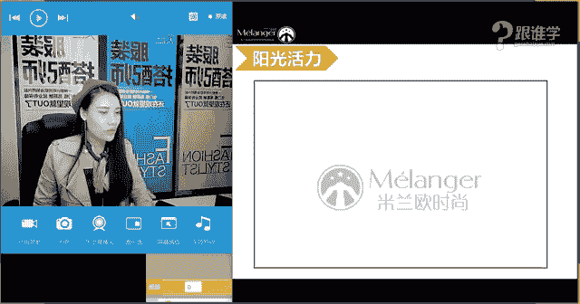
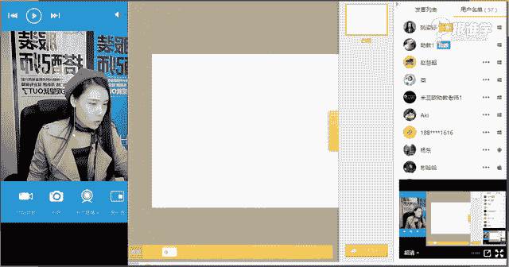
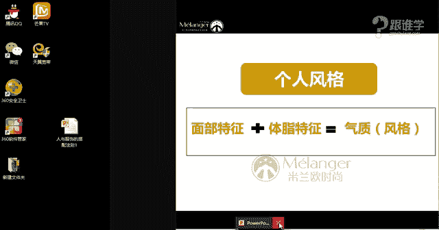
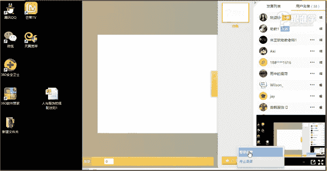

# 1、11服装《搭配秘笈之新版36计》：7人与服饰的搭配法则_rec

等下我们先来调制一下我们的设备。同学们嗯。现在可以听得到我的声音吗？啊，测试一下，如果可以听得到的同学呢话，请打一。嗯，ok。好的，呃，那接下来呢我们来看一下今天有呃多少男同学，然后呢有多少女同学。

然后嗯好，我现在看到大家已经在打一，然后回复我都可以听得到，是吗？OK啊，好，那接下来呢我想再问一下大家。我们今天教室里有多少男同学。然后呢，有多少女同学。如果是男同学的话，请打一女同学的话，请打2。

し。🤧嗯。男同学打一，女同学打2。OK好，那我看到呃还是女同学居多啊，那当然的话也有男生。那为什么老师要呃在这里跟大家来做这样的一个我们所说的呃，这让大家来来出来啊。然后为什么？

因为我们在授课的过程当中会有一些侧重点的一些知识点。哎，如果男同学可能不是特别多的话，那可能啊当然老师也会讲啊，如果要是女同学更多的话，那比如说今天教室里都是都是女同学。

那可能会更关心女生的这样的一个问题是吗？OK好，那今天呢是我们专业课的第一天，那很开心在我们的这样的一个专业的课程当中呢，跟大家见面了。O那我们在专业的课程当中呢，呃废话不多说哈。

那我相信有很多同学其实是已经听过我的这样的一个课程的那嗯。如果要是听过我老师讲课的，请打一好吗？我们来看一下啊，如果要是没有听过我讲课的呢，我要来自我介绍一下啊。O好嗯，那首先呢我还是来自我介绍一下。

那之后呢在我因为这样的一个专业课程当中，我会跟大家做这样的很多的课程的分享。那呃今天做了介绍之后呢，以后就呃尽量少去介绍了啊，因为我们的专业专业班的同学啊，都在教室里都已经认识老师了。

O那今天呢正式的做这样的一个自我介绍。那我叫姚姿宇，大家可以叫我资宇老师啊，那我是米兰欧国际时尚教育的高级讲师。那我们米兰欧呢同时他是线上和线下的话，都是有学院的啊。

OK那首先呢我在这里做这样的一个自我介绍的话，呃，跟大家呃这样的一个简短的认识。那才更多的就呃不太多的讲了啊。那直接进入到我们今天的这样的一个课程当中。嗯，那今天呢其实呃给大家分享的是认识自己。风格篇。

那很多在我们之呃之前呃1589541同学说没有声音是吗？如果没有声音的话呢，你可能要出去，然后再进来啊，看一下有没有声音。那其他同学的话应该是可以听得到的，是吗？

OK那嗯在我们的这样的一个免费公开课的时候呢，呃之前一直跟大家分享说我们要了解自己。那在这样的一个课程，我们在入门零基础入门班的这样的一个课程当中呢，跟大家分享的更多呃更多的是让大家了解自己。

因为我昨天的课堂当中也跟大家分享了，我们说我们从小到大一直在学习。但是我们从呃从小学从幼儿园到大学都没有学过一门专门去教我们如何这个搭呃穿衣搭配的，包括认识我们自己的这样的一个外在的特征。

然后挖掘我们内在的需求的这样一个课程。那其实我们在做人物造型啊，不管老师平时是在给一些明星艺人也好。那明星艺人当然是其实是有他们自己的这样的一个个人标签的。例如说有一些明星艺人的话。

他们本身他们的外形就决定了他们在演绎当中啊，在他们的这样的一个时尚圈娱乐圈娱乐圈当中要做哪一种定位。那但是在生活当中的话，其实我们更多人的话是没有太多的标签。那可能我们可以根据自己的喜好去穿衣。

那可以扩充很多的这样的一个着装风格。但是在生活当中的话，我发现其实不管老师身边的朋友也好，还是来学校学校学习的同学也好，有很多的同学来到课堂当中的时候都会问都会说这样的一句话。

我觉得老师我想要做百变的这样的一个呃造型啊，那因为在生活当中的话呢，他们可能经常只穿一种着装风格。那所以他们来到这儿最大的诉求，就是想要拓展自己的更多的着装风格。那我想问一下，咱们今天教室的同学们。

你们有没有这样的一个我们所说的呃这样的一个诉求呢？啊，想要这个多一些着装风格，不是只是每天穿某一种啊感觉的。比如说天天穿连衣裙。嗯，然后天天穿裤装，那男生可能就是天天穿休闲装。

那不知道自己还有哪些变化啊。那我想问一下咱们教室里的同学，你们有没有这样的一个情况呢？如果有的话，请打一好吗？好，那对于我们专业的这样的一个呃课程的话是有回放的啊，康庄同学呃。

专业班的同学的话是有回放的啊，O啊，那我看到其实还是有同学有这样的一个困惑是吗？好，那今天呢或者说我们入门班的这样的一个课程当中，我们更多的是让呃大家来认识自己。那今天呢跟大家分享的是风格篇。

什么意思呢？其实每一个人的话呢，我们经常在呃这个生活当中，我们会发现哎呃好像自己身边有这个朋友，他们有的时候穿衣服，你觉得挺好看的啊，有的时候穿的又觉得嗯好像一般般那明星也是一样。

你有的时候觉得他们的衣品挺好。的，但是过两天他出席活动的时候，会觉得他穿的啊就也也就那个样子啊，好像跟路人一样。那其实是因为什么原因呢？那跟他们的这样的一个个人的气质与他的着装风格有很大的关系。

那今天呢其实我们更多的就是让大家来了解自己了解你自己的这样的一个外在的气质。那包括呢你适合穿哪种感觉的服装啊，那这都是我们今天的课程当中的，要跟大家去啊，这个分享的课程。OK好嗯。

现在看不到我们的图片吗？啊，看得到PPT吗？如果可以看得到的话呢，呃看不到的同学请出去教室，然后再进来啊，OK好，那今天呢跟大家分享的是人与服饰的搭配法则。接下来我们来看一下啊。

刚才说到我们说有的人这个衣品时好时坏的这样的一个状况。那我们来看一下明星当中唐嫣啊，唐嫣的话，他给我们的印象，大家觉得。是什么样的那你们现在可以快速的在公屏上去打那唐嫣的话。

其实他现在是非常非常当红的这样的一个呃明星艺人啊。那他其实给我们更多的感觉。对，有一种艾米说的甜美的感觉，可爱的感觉，清新的感觉。那其实他在演很多电视剧的时候演的都是萌萌的软软的这种感觉，萌妹子是吗？

那他其实在生活当中很多造型也是这样的一个感觉，就是呃比比如说这种呃修身了可爱的清新的连衣裙这种风格啊，那有呃比如说在这个我们这个他当时是演了一部电视剧叫什么何以笙箫默，对吗？啊。

那这几部剧应该是他演的那这就是他当时剧中的造型。那其实他的着装风格当中有很多都是一些比较甜美可爱的感觉。那这一类型的风格的话，大家觉得适不适合她呢？如果适合的话，你们请打一啊，让我看一下。

你们觉得不适合的话，请打2。那我。来看一下啊，最后一张图片。那相比左边和右边这两张图片的话，你们会觉得哇原来一个人有的时候可以美成这样啊。但是虽然这个脸还是很美。

你会觉得这一套服装风格跟他的本人的气质不是特别的普匹配，那是为什么呢？因为这套服装的话呢，不好意思，同学们他是相对来说太过于前卫感。而这两套的话，其实他是相对比较这种浓说清新感，年轻感可爱的感觉。

所以说一个人的话呢，他的气质有的时候是会决定他的着装风格的但是在明星啊或者说明星艺人演艺圈当中，他们的这样一个变化性会更多。为什么呢？因为明星啊演员他们本身就有一种所说的演员演员他就有一种什么呢？

能变成另外一个人这样的一个。本领啊，这种本领是我们生活当中很多人是不具备的那比如说很多明星他在这个做了造型之后，然后他们的这样的一个眼神也会随之或者他整个人的情绪，也会随着这样的一个感觉去变化。

那他就可以去演绎某一种着装风格。但是在生活当中好像我们这个大众们啊，是做不到这一点呢？那所以就是说同学们你们要首先认识你们自己，你们身上具备哪些气质啊，OK好，那其实唐嫣的话呢，他才一啊他一。72米。

有的人会说哎老师我觉得呃比如说身高比较娇小的人，可能会更加适合那种甜美可爱的着装风格。但是啊我们说唐嫣他1。72米，其实身高已经不矮了啊，老师也一。7米呢啊，他比老师还高啊，那所以说的话呢。

他的这样的一个身高，如果按照我们正常的领。来讲的话，是不是他可以穿一些非常大气的服装呢？非常夸张的这样的一些服装呢？但是他其实穿那种太过于前卫夸张大气的这样的一个服装的话，反而没有穿他这种清新的哦。

甜美可爱年轻感的这样的一个着装风格更加适合他。OK那我们接下来看，那既然我们说有这种身高比较高的人，但是他可以穿这种可爱甜美的这样的一个着装风格。那么其实也就有我们所说的身高比较矮的。

但是他又可以驾驭一些非常大气的服装。那比如说宁静大家来猜一下，你们觉得宁静她的身高有多少。同学们，你们知道宁静的身高有多少吗？嗯OK好，我们来看一下宁静她的本人的气质，因为特别的大气啊。那啊有同学说1。

6。是的啊，她没有1。7啊。那有同学说一。7，我们看她的脸或者看她的这样的一个着装风格，我们会觉得她好像很高啊，很很这个高挑的感觉。因为她的气场非常的强大啊。

那其实的话她的身高啊将就呃这个身高好像就是1。6米左右，绝对是没有一。7米的那为什么她就可以驾驭这种比较大气和夸张，或者说相对来说呃比较这种呃有气派感的这样的服装呢？我记得在这个她在出演偶像来了啊。

这个女神，她是在里面被邀请的一位女神，那每次她出场的时候，她会穿一些阔腿裤啊，然后非常夸张的这种皮草。那这样的一个着装感觉，她都可以驾驭。嗯，那其实这是因为跟他的个人的气质有关系的那相反，他穿一些。

比如说这种可爱清新的啊，然后小碎花的这种感觉的话，反而让他我们所说的这种气质被埋没了。那同学们这个时候你们就要考考虑一下，你们平时的着装风格是否能够匹配你的这样的一个气质呢。嗯，O好。

那通过这样的两个明星的分析呢，让大家来了解到我们这样的一个概念。那今天呢我们会跟大家从三个维度去分析你们的这样的一个啊认识自己。然后呢找到自己的这样的一个呃着装风格的这样的一个定位。

OK那第一个板块的话呢，是人的气质。第二个板块是服装风格。那第三个板块呢是人与服装风格。那也就是说其实我们说人其实是有天生的气质的那风格服装他也其实也有服装风格的那例如说同学们，你们现在可以来分析一下。

或者是你们现在。可以在屏幕上去敲打一下，你们认为老师啊，就是我姿语老师我的身上有什么样的气质，你们可以想象一下啊，用一些形容词来形容一下我们啊，形容一下我啊，现在可以在屏幕上快速的去打啊。没关系。

你们不管讲的好的坏的，我都接受啊O好，微微同学说中性帅气。嗯，2479同学说浪漫气质。嗯，然后军旅啊有同学说军旅军旅女人味干练的啊，啊还有人形容老师是恬静的呢。好啊，时尚的女神的气质的。O好。

那我看到大家的这样的一个呃这个这个答案了啊，那有很多同学都会形容说我是这种比较干练的帅气的。那我想问大家，你们觉得啊我们说其实一个人的气质，他有我们所说的直的感觉和。曲的感觉。

也就是说这种柔软的这种感觉和硬朗的感觉，你们觉得我是属于硬朗的感觉，还是柔美的感觉呢？啊，如果你们觉得我是硬朗的，请打一柔美的请打2嗯。柔呃硬朗的请打一，柔美的请打2。OK好，我看到其实啊有同学回答2。

但是呢大部分的人回答一啊，还有一个回答三的，怎么了？老师变成人妖了是吧？好嗯，那其实呢呃大部分的人打的是一。那有的同学呢打的是2，那其实现在大家对于这个概念还不是特别的清晰啊，那我简单的来测试一下。

看下看一下大家对于看人的这样的一个感觉上到不到位啊。O好，那等一下呢我会教大家来看一个人的气质是怎么看的啊，那通过刚才其实很多的形容词。那你们会发现有很多人会说哎我是比较这个中性的帅气的硬朗的干练呢。

那这些词语其实都是比较偏直线感的那当然也有同学说老师是女人味的啊，甜美的那其实你们会觉得我是这种中性帅气的感觉更多啊，比如说有一种叫萌妹子哈，软妹子，还有一种叫女汉子，其实呢老师就是属于那种叫女。😊。

汉子型的那女汉子的话，它其实就是更偏向于我们所说的直的感觉，就是硬朗的感觉。而萌妹子她就更偏向于娶的感觉。OK好，那这是我们所说的人的气质，那服装风格的话呢，其实我们也分很多种。

例如说老师今天穿了这样的一个风衣，他其实就有一个风格在的啊，那它其实是什么呢？军装风。那，刚才有同学说军旅其实的确风衣他以前就是我们所说的军人的这样的一个服装。

那呃巴urberry的风衣呢其实非常的有名，那也是因为在二战时期的时候呢，它为什么呢？军人提供这样的一个服装。OK这是我们所说的服装的风格啊，那比如说还有一些学院风啊。

包括这种中国蝉的文艺风啊那等等服装风格有很多种。所以说人人跟服装风格，可以什么呢？进行一个匹配。O好，那今天呢我们的课程呢，就跟大家分享这三个板块，那接下来我们来看一下，首先是人的气质？O好，女生片啊。

刚才我为什么问大家，我们有多少女生有多少男生啊，那女生片的话，我们接下来来看一下啊，男生也不要着急，你们可以好好的来看一下，哎女生有多少类型啊。当然我们讲的这是一部分。

你们可以看一下你们喜欢哪一种类型的女生啊，一果找女朋友的话，可以按照这个标准去找的。OK好，那我们来看一下人的气质当中，比如说有这种甜美可爱的感觉，对吗？好，那比如说赵丽颖，她就是一个这样的。

我们经常会叫她包子，是不是包子脸啊那。其实他的感觉就是给人感觉是有点那种可爱的甜美的感觉。好，那同学们你们现在可能还会有其他的答案，你们可以现在在屏幕上去答，你们觉得赵丽颖身上她有什么样的一个气质？

快速的来敲打一下这个我们所说的嗯。好，陈淀同学脸打了四个帅，你是觉得赵丽颖很帅是吗？好，那看一下其他同学有没有其他答案。嗯，可爱甜美仙气天真幼稚清新单纯。好，还有没有？可爱。嗯，好，我发现了啊。

那我们大多数同学的话来形容赵丽颖的时候，都是都会觉得她是比较可爱的甜美的气质，对吗？所以说那是不是一个人她身上本身就自带了一种属性啊。

每个人她其实身上都会有一种属性的那呃再有一些呃这样的一个呃服装搭配的系统当中，她会给人来定位。例如说赵丽颖这样的一个风格呢？就她的这样身上的这样的一个气质。啊，那他们可能会给她定位叫少女型风格。

那少女型风格的话，在这样的呃本身呃另外的一些学习系统当中，他们会强调说少女型的人，她可能会。更加的适合穿一些呃蓬蓬袖啊，然后这种呃小娃娃领啊，然后呢包括这种蓬蓬裙啊，很可爱的这样的一些感觉的服装。

当然长相很可爱甜美的人，她本身穿这种服装风格一定是好看的。但是这会造成很多人他会觉得啊那我是不是就不能穿帅气的了，那我是不是就不能穿这种女人味的了，那我是不是就不能穿很个性的了，那其实这都是错误的观念。

或者说大家被束缚到那个观念当中了，一个人她的气质是非常年轻的可爱的甜美的那说明他可以驾驭很多的年轻的着装风格，并不代表哎我们说帅气的或者是这种呃这种运动风，他都是属于我们所说年轻感的啊。

他是显年轻的这样的一个感觉。所以说一个人如果他长得可爱的甜美的他其实也可以驾驭我们所说的有一点点小帅气的感觉。那都是在什么样。那个基础上呢，他又会有一些共同的元素。例如说我想要长相特别甜美可爱的人。

我想要穿的帅气一点，我可不可以穿一个呃这种呃高腰的A字摆裙，但是我穿一个飞行员夹克衫，然后戴一副墨镜啊，然后带一个抽ca，就是特别流今年特别流行的那种啊狗链啊，然后呢呃这个穿一双马丁靴。

那戴一戴一个像老师这样的一个贝雷帽。那其实他整身的感觉是集帅气和甜美可爱为一体的那所以说呢其实并不是说哎有的同学我相信可能我们这里有同学是有学习过其他的这样的一个系统的。

你会认为啊或者说很多同学会认为少女可爱的人，她就适合穿可爱的，他不能穿其他的着装风格了。那在这里呢老师要在这里打破你们原有的这样的一个观念。因为我们说一个人他是多变的一个人他的内心需求。

也是很多的那例如说着装风格，它其实有很多种。那呃比如说一个人他会根据一个他的这样的一个生长的环境啊，包括他的这样的一个周边环境的变化，或者说他的工作环境的变化。他周围的人事物对他的这样的一个影响。

他的内心的着装喜好也会变化。那我们在这个自我形象造型的时候，其实要结合你自己的内心需求，以及你的外在条件来去做一个着装的选择。那这样你才能把衣服穿出你的神韵OK好。

这是我们所说的可爱甜美的这样的一个气质的人啊，那我们接下来哎大家可以看一下他的气质特点是不是给人感觉清新活泼灵动傻白甜啊，OK好，那我们接下来看接下来看一下是不是还有人是属于这一种类型的优雅清新的感觉。

比如说高圆圆。那我相信现在我们屏幕面前有很。很多人都非常喜欢高圆圆，对吗？那同学们你们现在可以来答一下，你们认为高圆圆她是什么样的一个气质呢？嗯，O同学们快速的来。气质啊就是气质是吗？嗯。

还有没有其他的答案，优雅知性气质O。2479同学嗯。嗯，我看到用电话号码的同学，我就想到了一件事儿。嗯，前一段时间我们这个线下的有呃线以前是听了线上的课程，然后来我们线下来学习。嗯。

这个离我的办公区还很远的时候，他就看到我了，说哇，那是资宇老师吗？跟我们另外一个那个呃我们的这个教学部的这样的一个班主任说哇，那是朱资宇老师吗？然后走到我面前来来说了一句话，老师我是5267。

然后我当时就愣了，我说5267是谁呀？啊，那真是用电话号码，因为在网上他的网名就叫5267啊。OK好，那我看到大家的这样的一个答案了，说有人说呃这个是仙气范呃，这个高圆圆，他很仙很温婉啊，很优雅。

很知性，很典型，非常干净，女人味大气。那包括有一个特别的词语啊，有人说高圆圆很冷啊，那呃刘玲同学觉得高圆圆很冷是吗？给人可能是这张照片，你感觉他有点高冷吧。啊，那在平时的这样的一个感觉的话。

它其实还是比较典雅知性女人味的。它是属于一种我们所说的传统审美。所以很有很多人其实都非常喜欢高圆圆。那所以说她在平时的着装当中，那我们来看一下是不是根据她这样的一个气质特点去打造的呢？例如说高圆圆。

她的穿着，是不是平时给人感觉都是非常的知性的，然后温婉的女人的，然后同时是有一定有有些品味感和时尚感的那经常有很多同学啊，我一问到哎，你喜欢哪个明星或者你有有有没有喜欢的明星的着装风格啊。

那你可以跟我分享一下，我看一下你比较喜欢哪种着装风格。很多同学会说我喜欢高圆圆。那高圆圆的这样的一个着装风格的话，她其实一直走的都是简约啊，然后比较知性气质感觉的嗯，OK好。

这是我们所说的人的气质有这种优雅和。清新的感觉的啊，那好，那除了优雅清新的，还有这种什么呢？美艳浪漫的那我们来看一下啊，那是不是张雨绮，她给我们的感觉是比较浓郁的女人味儿。

她跟赵丽颖跟高圆圆她身上的气质又会不一样啊，那艾瑞同学说性感啊，那对，包括她有一种我们所说的大气的这样的一个感觉啊，O那是不是高圆圆她呃sorry这个张雨绮。

她在这个呃美人鱼是这个这个呃这个电影当中饰演了这样非常什么呢？霸气的非常性感的这样的一个女性呢？那所以说一个人呢如果她的气质是不能驾驭这样的一个角色的话呢，周星驰是不会找她来出演这样的一个角色的。

对不对啊？所以说一个人她是有有什么呢？天生她有这样的一个自我的气质在的啊。O好，身材好。那一说到这个这个这个美女阿瑞很兴奋。身材好好，我们来看一下，那也有什么呢？有非常女人的，有非常可爱的。

有非常文艺的那同时是不是也有非常帅气和硬朗的？比如说李宇春。我们经常叫什么？叫李宇春叫什么呢？春哥，那说明他身上的这样的一个气质特点是非常明显的。嗯，3105同学说帅是的，李宇春的感觉就是非常的帅气。

那所以他平时走的一些着装风格是什么样的感觉。大家可以看一下他的气质特点呈现出来的是非常个性的非常独立的，非常干练的，所以他在着装当中，他一直走的是他的呃个人标签，其实他就是有个人标签了。

他的个人标签的话给人感觉都是比较帅气的这样的一个感觉啊，那呃在我们所说的这样的一个着装风格当中吗啊，那我看到阿瑞说少年型，那我相信阿瑞同学的话应该是有学习过其他的这样的一个理论系统，是吗？啊。

那李宇春的话呢，他就是属于呃在那个系统当中，大家就会说他是属于少年型的是吧？啊，那少年型他的这样的一个典型的着装风格。那在呃很多人他会说啊他他的就是他就适合穿中性和硬朗和帅气的。但是。并不是这个样子。

你会发现在近两年当中呃，吕宇春她的这样的一个着装风格已经慢慢的在开始发生细微的变化。比如说他开始穿一些深V的这样的一些大礼服啊，那他经常会穿一些蕾丝的透视的这样的一个面料，雪纺的柔软的面料。对。

越来越有女人范O好，那我们接下来看一下，那我们说人有这么多的这样的一个气质。那是不是我们的服这个每个人都有这样的一个个人特点。那同学们你们要好好的来分析一下，你们自己是属于哪一种气质呢？啊，O好。

那接下来我们来看一下服装风格。那服装风格当中，我们来首先来看一下这种年轻可爱的这样的一个着装风格。年轻可爱的着装风格当中呢，其实他有我们所说的叫尚书风，尚书风指的是什么呢？18岁到25岁之间啊，这些。

女性喜欢穿的这样的一个着装风格。例如说啊比较可爱的这样的一个A字裙。那包括可能会用一些啊，那像图片当中大家可以看到色彩会用的非常的清浅啊，然后呢他们的着装的这个服装风格呃就是这种娃娃领啊。

然后小蝴蝶结呀啊，那等等这种可爱的元素，嗯，包括蕾丝啊啊粉嫩的色彩和款式等等啊。男生篇的话，在我们下面就会有了会超同学不要着急啊，等一下我们讲完女生片的话，男生就会开始讲了。好，那我们来看一下。

那这个年轻可爱当中，除了有少书风，还有叫学院风。那学院风的话呢，大家可以看一下，比如说这种非常典型的这种菱格纹，就是我们所说的在学院风当中会经常使用到的啊，它经常会出现在这种啊袜子当中啊，裙摆当中啊。

包括什么针织外套当中。那这种。学院风的话，它给人感觉就是非常什么年轻的感觉，来自于我们说欧美的这样的一个学院的啊，就其实就是他们学生的校服，然后演变而来的这样的一个着装风格啊，对啊，阿K说英伦风。是的。

学院风的话，也是属于英伦风当中的一种风格啊，那呃我们说这个着装风格，它有很多种，在这里呢给大家举例的年轻可爱的风格只是其中的一部分啊，因为我们今天不是主讲这样的一个问题。我们主要是讲人啊，ok好。

那主呃服装风格当中年轻可爱的，还有田园风。那比如说这种非常清新的，经常会用到一些棉麻面料的这样的一个款式。但是啊同学们不管是尚书风学院风还是田园风。你会发现他们有一个共同的特点。

他们给人感觉都是非常的年轻化啊，那。他们的裙子的长度可能也不会特别的长。比如说它一般都会在什么呢？膝盖上面的这样的一个位置，因为越短的这样的一个服装，它会给人感觉越年轻啊，okK好啊。

那这是我们所说的服装风格当中啊，属于这种可爱的着装风格当中就有分很多种了啊，那老师只是举例三个，那其实还有很多的服装风格，也是属于可爱的感觉的啊，比如说森女风，刚才有同学说了啊。

比如说还有一些这种呃叫呃嗯日本的有一个有一种着装风格，叫原素风啊，经常呢它也会运用到一些年轻的这样的一个着装风格当中。O好，那这个上年轻可爱的风格以外呢，还有这种干练的这样的一个着装风格。

那大家可以看一下，比如说简约风啊，那它的这样的一个服装款式的话，相对来说设计的。你会发现啊这种剪裁都是比较硬朗的感觉。与以这种直线感为主，什么是直线感呢？例如说这样的一个呃西装啊，这种中性风。

它就给人感觉是直的感觉。而裙装它给我们的感觉更多是曲的感觉啊。那例如说简约风，它给人感觉这个服装当中都是没有太多的这样的一个设计的这个复杂的这样的一个元素。

它可能就是简简单单的这样的一个呃竖线条的这样的一个设计。OK那还有什么呢？机车风，那机车风的话，它整身给人感觉都是非常的利落的感觉啊。OK那这是我们所说的干练利落当中的一部分的服装风格啊。

O接下来我们来看成熟浪漫啊，成熟浪漫风格当中呢有民族风啊，你会发现同学们，你们来看一下可爱的这样的一个着装风格和成熟浪漫的着装风格，它们有什么样的一个区别性呢？在。裙子的选择上，它的裙长度会什么呢？

裙子的长度会更加的长。那也就是说啊成熟浪漫的一些女性呢，她们基本上都会选择一些在膝盖以下的这样的一个裙装。那或者是说想要表现成熟和浪漫的时候，你就可以选择一些膝盖以下的裙装。

她给我们感觉是会更加成熟感的啊，那成熟浪漫当中呢，她有民族风，有淑女风，那包括性感风啊，那这些都会给我们感觉有一些成熟O好，那这是我们所说的这样的一个服装风格啊。

那刚才给大家分析了人的气质和服装的这样的一个风格。那接下来我们来看一下人与服装的风格，怎么应该去结合呢？那刚才呢我们分析的都是女生的啊，男生不要着急。那等一下呢我们就会分析男生OK那。

首先呢我们要在什么呢？人与服装风格当中，刚才是简单的让大家来认识啊，了解人原来是有气质的那服装风格它其实也有分类的那接下来我们要做的就是什么呢？你要学会自我诊断，自我诊断的第一步，首先是什么呢？

我们要了解自己的这一张脸，为什么因为我们在人与人的这样的一个接触过程当中，我们永远看对方的时候都是看对方的上面的这样的一个三角区域啊，上面三角区域，这是我们的视觉重心。

那所以说一个人的脸的这样的一个气质的话，那同学们你们现在要学会了解自己。那包括你自己的脸型是什么样的那脸型它直接会影响到你的视频的选择。例如说老师今天选择的耳环啊，帽子包括我的丝巾啊，都是什么呢？

跟我的脸型是有相关的那比如说我现在戴的这样的一个耳。耳环我选择的是特别长的，为什么呢？我为什么不选择特别短的这样的一个耳环呢？同学们有没有人能跟我分析一下呢？啊那嗯老师三角区是指三角区指的。

其实就是我们这个胸部以上的这样的一个视觉的这样的一个重心。啊，这个叫视觉重心啊，三角区OK啊，脸型的问题。有同学说对比平衡啊，脸型偏长，添加女人们。好的啊，那我大家呃我大概看到大家的答案了啊。

为什么我会选择这种特别长的耳环。等以后呃我们在接下来的授课当中，嗯，杨晓秋同学非常回答对了然后这个呃胡老师学校啊，化妆学校胡老师也回答对了。是的，我的这个作用为的就是什么呢？拉长我的脸型啊。

因为我的脸型的话呢，它是属于有一点点这样的一个骨骼骨骼感的。大家可以看到啊。那所以说呢我选择的耳环基本上都是属于拉长型的他为了修饰我的脸型。那我们在后面的这样的一个眼镜与脸型的这样的一个搭配当中呢。

会跟大家分享更多的这样的一个脸型的问题啊，包括饰品的问题。OK好啊那。这是我们所说的，我们要了解自己的脸型的重要性啊。那接下来我们来看一下，那首先我们来看一下一个人啊。

那他他是有给别人第一印象的那比如说刚才我有跟大家沟通，我说同学们，你们见到过，你们觉得我是什么样的一个气质，我是什么样的一个感觉。也就是说你看到一个人的时候，你会对他有一个感官印象。

比如说有的人他给人感觉就是特别直的。有的人给人感觉就是特别曲的，就是特别柔美的感觉。那大家觉得王菲，她给人的感觉是比较这种我们所说的直的，还是曲的感觉呢？同学们。你们觉得是直的，请打一，觉得是取的。

请打2OK，我看到很多同学都已经开始回答了。嗯，非常好啊，呃，老师发一的都是美女，不是女美女的是什么？没看清楚呢？同学啊，同学们刷屏刷的太快了啊？OK非常好，同学们那你们觉得王菲都是比较直的感觉。

对不对？那你们感觉对了感觉对了，恭喜你们，那这是我们所说的人她是有感官的印象的？你会发现那她的直线感是怎么来的呢？为什么我们就觉得她很直吗？啊？等一下我们会来跟大家分析好好。

那接下来我来跟呃分这个问一下大家，你们觉得林依晨她是取的还是直的。😊，取的请打一直的请打2啊，有同学开始打二了是吧？O好嗯。😊，OK啊，那我看到同学们的答案了，非常好，同学们啊。

你们现在慢慢已经有感觉了啊。那其实啊也有同学答二，不知道可能大家都晕了是吧？那其实呢呃我现在来跟大家讲一下，王妃他给我们的感觉是直的，而林一晨他给我们感觉是曲的啊，你会发现为什么呢？

王菲他的脸的这样的一个骨骼感，会非常的清晰，而林一晨，你会发现他的脸是这种什么呢？圆圆的，非常圆润的感觉，你会发现同学们啊呃肉肉的圆圆的啊，那我跟大家来分享一下，你会看到修佛的人，比如说这个啊修佛的人。

他们的这个这这些大师们，你会发现他们越修，然后整个人就会越圆润，对吗？比如说弥勒佛，我们看弥勒佛是非常慈祥的这样的一个感觉，对吗？他是这个所以说这个他们的。给给我们的感觉是更加取得，更加的有亲和力的。

而学道教的人，我们经常现在是不是会辟谷啊？辟谷的话，人会变得这种我们所说的会有排毒作用啊，会变瘦啊啊，那你会发现嗯辟谷的话其实它就是来自于道家。而道家的人，你会发现他们都是什么呢？

骨骼感特别明显啊骨骼感特别明显。比如说颧骨啊很突出啊，你看整个人的脸型的骨骼感就特别明显。那刚才有同学问说，老师只看脸脸型吗？五官有影响吗？等一下老师就来给你分析这个问题啊。

那这是我们所说到的一个人的脸的这样的一个问题。那等一下我们会跟大家来分析哪些脸型是属于比较偏直的感觉，哪些脸型是比较偏曲的感觉啊，OK好，那这是我们所说的，现在对大家对于这一点理解了吗？

也就是说我们在生活当中我们看到有些人他是比较偏直的，而有些人他会比较偏曲的那例如说那刚才有同学说五官会有影响吗？五官当中有一个点，就是眼神。同学们，你会发现老师的眼神的话，他是比较的呃。

有很多同学第一眼见到老师的时候，就会说老师我觉得你特别高冷那是为什么呢？因为有的人呢特别是偏直线感的人，他给人感觉是非常的硬朗的啊，然后呢眼神也是比较犀利的，包括对刚才于红同学说非说的非常好啊，犀利。

是直线感的人的眼神他给人感觉会非常的犀利，然后有力度比较坚定的感觉啊曲线感的人，比如说大家可以看一下王菲的眼神啊，跟这个林依晨的眼神他是有区别性的。林依晨他给人感觉是非常什么呢？哎，这种很很这种亲和呀。

然后呢毫无攻击力的。你会觉得他们两个人掉到水里的话，我觉得你们肯定第一时间都会去救林依晨啊，然后你们会觉得王菲的话让他在水里扑通一下吧，可能他自己能扑腾上来啊，那就是说。

有的人他给人感觉是非常想要保护有这种保护欲的那这种这类型的人基本上他们都是非常偏曲线感的。而有一类型的人，你会觉得他很man，很汉子，很这个这个就是我们所说的这个女汉子的话。

那这类型的人基本上他都会有直的感觉在OK好，那这是我们所说的啊这个一个人的直和曲啊，那从我们所说感觉上来讲的话，都会有这样的一个感觉。那接下来呢我们来教大家来分析一个人的脸型。

哪些脸型它是属于比较偏直线感的哪些脸型是比较偏曲线感的好，那我们在脸型当中呢有分为标准型和非标准型。那非标准型的脸型呢啊，我们基本上很多人其实都是属于非标准型的脸型了。

那标准型的脸型是什么样的人才会有的呢？啊，基本上女明星整过容的啊都会有什么呢？有这样的一个。标准的脸型。那比如说椭圆形脸，我们会觉得椭圆形脸啊，为什么很多明星喜欢去把自己整成椭圆形脸呢？

因为我们大家会觉得椭圆形脸的脸型是非常的上镜的，而且是好看的，你会发现韩国的女明星为什么都长得那么像，那是因为他们都把脸整成了椭圆形。那包括我们说一个人的五官，其实它也是有标准的。比如说三庭五眼啊。

三庭是指什么呢？上庭中庭和下庭，五眼的话是指我们眼睛可以在脸的宽度测量5个眼睛的这样的一个啊这个这个宽度啊，叫三庭五眼是标准的。所以他们在整容的时候呢，比如说你的鼻子的高度，你的眼睛的宽度。

那你的下巴的这样的一个线条感，轮廓感其实都是有标准的。所以她整完之后都特别像都感觉像一个人，那是因为他们有一个模子在那啊。OK那这是我们所说的。标准型的脸型，椭圆形脸，那包括倒三角形脸。

比如说范冰冰就是一个倒三角形脸，它的下巴是不是特别尖？椭圆形脸的话，它是这种非常圆润的这样的一个脸型啊，那倒三角形脸，它给我们感觉的话，就是什么上面比较宽，下面特别尖啊。

这是我们所说的标准型O那非标准型当中呢有分为正三角形脸啊，长形脸，包括方形脸和菱形脸，那包括椭呃圆形脸好，那同学们我现在想问大家，你们现在看到这些脸型当中，你们觉得哪一些脸型是属于给人感觉比较直的啊。

那哪一些脸型给人感觉是偏曲线感的啊，同学你们啊比如说啊，有刚才有同学开始问了。老师我照了镜子，不知道自己是什么脸，不要着急，等一下老师就会跟你们讲到这个问题啊。好，那同学们啊，那现在先回答老。

是这个问题。比如说正三角形脸、长形脸、方形脸、菱形脸和圆形脸。那包括倒三角形脸啊、椭圆形脸，你们觉得哪些脸型是比较偏直线型的脸型？有同学说一和三那哪些脸型是比较偏曲线的，哪些脸型是比较偏直线的？

你们现在可以在屏幕上去打啊OK。好呃。😊，咱们这个这位同学说方形脸，长形脸，菱形脸是直的脸型。OK好，那其他同学还有不同的答案吗？二和五是比较偏曲线型的OK好。

那呃在这里呢大家首先都已经把标准型的脸呃标标准型的脸型排除在外了啊。因为被刚才老师没有问大家啊，那其实椭圆形脸，那现在大家听好了啊。椭圆形脸和圆形脸，包括正三角形脸，这三种脸型都是属于。

这个我们所说的呃这个曲型曲线感的脸型啊，为什么呢？因为你大家会发现。包括长形脸啊，它的这样的一个呃我们所说的这个脸型的圆润感，它给人感觉是这种圆滑的线条，它没有特别的棱角感。

那正三角形脸其实也被我们称为叫梨形脸。梨形脸，很多人你会发现它的这样它这个位置是特别圆润的感觉，它跟方形脸是有区别性的啊，O那大家可以啊我现在再重复一遍，同学们，椭圆形脸啊，长形脸，包括梨形脸。

也就是我们所说的正三角形脸，包括圆形脸，它给我们的感觉是比较偏曲线感的那刚才有同学问了，说，老师，那倒三角形脸它属于什么脸型呢？等一下再给你们揭绍啊，那属于比较直线感的脸型。那方形脸，包括长方形脸。

那我们在这个上面没有啊写上去。那还有一种脸型叫长方形脸，它是属于复合型的脸型。比较长，然后呢比较这个位置是有一点点方的感觉。那其实老师就是属于长方形脸啊，那包括菱形脸这个脸型同学们。

他们都是属于直线感的脸型。为什么呢？你会发现这三种脸型它给人感觉都会有什么呢？这种棱角的感觉，骨骼是有棱角感的啊，那包括这个呃那最后来跟大家揭晓到三角形脸是属于什么呢？只取在中间的啊，只取在中间。

不整容可以换脸型吗？啊，那这个是比较难做到的，除非是什么呢？你呃老师直接一点说啊，你可能要再轮回一次啊，可能换一个这个椭圆形脸，那呃有棱角的比较好看。那有同学呢其实我们亚洲人的审美它是比较偏椭圆形脸的。

不要伤心啊，那呃这个我们亚洲人是比较椭这个审美是偏椭圆形脸的那其实欧美他们的审美的话，他们会认为方形脸，长方形脸特别好看，就是这种有棱角感的，这种脸型会比较好看一点。那。呃，在我们脸型上来说的话呢。

那刚才老师跟大家分享了直线感的脸型有长方形脸、方形脸和菱形脸。那椭圆形脸包括圆形脸，包括长形脸，包括梨形脸都是属于偏曲线感的脸型。那到三角形脸型呢它是属于中间的状态。那这几种脸型呢？啊。

当然还要我们说到底是直，那你这个人到底是直还是曲，还要结合一个人的人的眼神整体去看的啊，O那有同学说圆形圆脸伤心路过啊。那圆脸，那刚才已经有同学提问了，说老师，那我到底怎么去判断自己的脸型呢？啊。

不要着急，来，下面老师就要跟大家来介绍你们如何去判断自己的脸型。首先你们要把自己所有的头发啊，都拿起来，老师给你们做一下示范啊，好，把所有的头发，那那那老师牺牲太大了，真的是脸这么大。看啊上镜的时候啊。

把这这个呃把所有的头发都拿起来之后，拍一张相片，从正面拍，一定是什么呢？不能这种什么斜45度啊，然后低着这样这样拍呀，那个脸型都是不标准的。首先你们要把自己所有的头发都拿起来啊。

然后呢你不管是男生还是女生，你们弄个发箍也好啊，还是扎起来也好，那首先你们要把所有的脸型啊，拍下来之后，而且一定是正面的那开始干什么呢？从这个两个我们所说的额骨的这样额角的位置，同学们啊，然后画线。啊。

然后呢呃颧骨最宽的位置画一条线，包括你的下颌骨最宽的位置画一条线。那为了什么呢？为了让你知道你自己到底是什么脸型啊，那同学们我们来看一下。拿杨幂的脸型作为一个案例啊，我们来看一下杨幂，她画完之后。

她的脸型是什么样的一个脸型。同学们啊，你会发现，那当然老师这个这个圆画的不是特别圆啊，但是从这个脸型当中，我们会这个形状当中，我们会发现它是属于椭圆形脸。同学们啊，它是属于椭圆形脸。那这个就是方法啊。

你们下面的话呢，自己下去把自己的头发全都弄干净。然后呢啊然后自己在自己的照片上面去画一个形状啊，你比较接近于哪一个形状，就是我们以上当中的这些脸型当中的，哪一个形状，那么你就是属于哪一种脸型啊。

比如说如果你是下面比较宽，上面特别窄，那你可能就是正三角形脸。如果你的脸特别长，那你有可能就是长形脸啊，那你的脸是特别方的。比如说老师这个位置啊，同学们。我们来看一下老师的这个你们要注意观察啊。

呃椭圆形脸的人呢，他是没有这个颌骨的。而这种我们所说的脸型比较偏直线感的人，他是有这个颌骨的啊，下颌骨这个位置。好，那有同学说那三条区域怎么去算。那三条区域的话是这样分，从你的两个什么呢？

额角的这样的一个位置，同学们来看一下啊，这个位置开始画一条线啊，然后在颧骨最宽的位置画一条线，然后在你的下颌骨啊，也就是说你的脸最宽的这个位置画一条线，那这三条线画完之后，你再用一个什么呢？

一条一个线条把你的脸型连起来啊，你会发现或者说说你直接把你的这个你先不画这个线，你先用这个把自己的脸试着去连一下线。那你会发现你可能会更靠近于哪一种脸型。那首先这是我们解决了我。所说的这样的一个。

你要自我诊断自己是什么样的一个脸型。如果你是比较偏直线感的，再加上你的眼神给人的感觉是非常的坚定的、犀利的和利落的那我相信你的这个感觉气质都是偏直线感的而如果你的脸型偏曲线感，你的眼神又是非常柔和呀。

很无害呀。那你的这样的一个气质是更加偏我们所说的曲线感OK好，那同学说有同学说老师我的额头下巴兜尖这算什么脸型啊，那你的这个颧骨宽吗？如果你颧骨宽的话，有可能你是菱形脸啊，OK好。

那接下来呢给大家来看两张照片，那这个面部特征，这个被我们称为叫面部特征。我们来看一下，同学们现在来告诉我啊，眼脸直眼神曲的好凌乱啊，那肯定是有这样的一个情况的啊。

有的人的话他是这种这种我们所说的复合型的那你要看你整个人。人的感觉是偏直线感还是偏曲线感的就可以了啊，不用那么纠结。OK你可以让你身边的人给你评价一下，你觉得我是偏直线感还是偏曲线感。

你是偏柔美的还是偏硬朗的那这样就能区分开了啊。OK好，那我们来看一下同学们来告诉我，左边跟右边，你们觉得哪个是直的，哪个是曲的啊，左边是直的，请打一。啊，左边是取的，你们觉得呃左边是取的，请打2。嗯。

OK好，大家都觉得是直的是吗？为什么同学们是不是现在可以看得出来了，你会发现他的什么颧骨啊，包括这个下颌骨啊，他的脸都给人感觉是比较有什么骨骼分明的感觉，对吗？

而曲线感你会发现哎颧骨这个位苹果肌特别饱满，然后这个这个我们所说的脸的这个下巴呀，包括这个位置都是非常圆润的感觉。所以说啊那曲线感的人呢，他会给人感觉更加的有亲和力。直线感的人。

他给人感觉会更加的有距离感啊。O好，那刚才其实就有同学说老师那整不整容的话，能不能改变成样的一个人的感觉。那我们来看一下同学们啊，一个人他本身是直线感的对吗？你们觉得。

是不是左边的这个人给人感觉会会更加的直，包括我们所说的脸型到眼神啊，当然一个人的眼神，他其实也会呃根据你的这样的一个呃我们所说的成长的这样的一个关系啊，环境的影响精历可能都会有所变化啊。

那大家可以看一下左边的这个脸型，同一个人，你会发现这个更硬，这个更加的柔美啊，那脸型其实对一个人是有影响的那包括一个人的我们所说的眼神也会有影响啊，很明显，左边的非常直，右边的非常曲啊。

那OK我们接下来来看一下那。好神奇啊，有同学说好神奇。那同学们，那接下来呢为了让大家更好的来这样的一个呃分辨啊，那分我们现在呢有请到我们学校的一位这个助教老师啊，来跟大家来看一下，让大家来分析一下。

你们觉得它是直线感的还是曲线感。我们助教老师可以过来顺便把凳子也搬过来。是的，嗯。OK好。😊，那我们来看一下。嗯，好。原一是谁？好想知道OK好，那同学同学们，那我们来看一下啊。

首先呢我们这个助教老师可以这个自我介绍一下啊，跟大家认识一下。😊，嗨大家好，我是米莱欧国际时尚教育的助教老师林红OK好，那我们这个林红啊呃林红呢呃助教老师呢，他平时给我们感觉就很文静。这个他一上来。

你这一上来同学们都开始打取取取OK好，那接下来我先你们别着急呀，先分析脸型对不对？好，okK我们来看一下啊，我先把林红同学的这个头发弄起来啊，给大家来看一下。😊，嗯，灵红呃。同学呢。

你可以再往镜头前面做一连。对。然后呢，让大家更更明显的去看到。好啊，那同学们，你们在这个呃想要认识自己脸型的时候，也要把头发都弄的这样的一个非常干净的一个状态啊。好了，同学们，你们现在来看一下呃。

同学们，你们觉得。林红同学是直的还是曲的，你们觉得他是什么脸型呢？我们来看一下。你们觉得他是什么脸型？😊，好，我来看一遍啊。好，椭圆形是吧？有同学说椭圆形啊，那其实呃曲的有同学说方的好，那我们来看一下。

那同学们给你们看一下最明显的一个效果是什么啊？有很多同学说椭圆形。那其实凌同同学的话呢，它是偏椭圆形脸的啊。那啊然后也有同学说嗯曲线感。好，我来给大家看一下直线型脸跟曲线型脸有一个非常明显的一个特点啊。

那椭圆形脸，包括这种我们所说的曲线感的脸型，它在这个位置啊，看不太出来很明显的骨骼。来，我们来看一下啊。好，同学们，你看你会发现哎，林红老师，他的这个下颌骨位置没有特别明显。

而你们来看一下我的这个下颌骨的位置啊，我现在是看不到镜头的同学们，你们来看一下我的这个位置发现会成1个90度的这样的一个呃转角的这样的一个关系了。OK好，那我们可以穿过来了啊。而椭圆形脸的话呢。

包括这种圆润的脸型，他会没有这个下颌骨，所以说直线型人的脸型，他看起来会比较直。那同学们你们现在可以看一下啊，那包括眼神的感觉，整个人的气质的感觉，你们会觉得如果我跟他两个人同时掉水里了。

你们愿意救谁啊，从心理上来说啊，你们就会觉得谁会让你们更加的有这种保护欲啊，是一还是2。好，芳芳同学说他嗯。你太狠心了啊，OK陈淀同学说都救吧。轻心说2啊，好，大多数同学的话呢，我这有一个特别坏的。

你果然挺坏的啊，这名字叫坏坏，然后说两个都不救。好吧，你太狠心了，看着我们两个人这个很无助在水里扑腾是吧？好啊，那大多数同学呢呃还是这个第一时间反就说嗯，救救我们的林红这个老师是吧？好。

那O那我我就这样吧，应该没办法，长得太这个汉子了。你看看呃，幸好我会游泳。我要是不会游泳的话，我都被你们给气死了啊。好O啊老师能自救，我真的是真的是能自救啊。因为老师会游泳。OK好。

那这是我们的这个林红老师，那谢谢我们林红老师，同学们嗯。😊，拜拜拜啊，OK好，那接下来呢啊还有两位同学。为了让大家能够更好的分辨。那我们还请到了两位呃我们的男士啊，那男士同学你们不要着急了哈。

那有请我们的男士也过来啊。好，那我们说呃这个首先呢先给大家来看一位这个直线感的一位老师。那我们这位老师呢也是我们米兰欧时尚教育的线下老师，在我们的这样的一课堂当中，他经常会授课。

但是呢啊他在线上的话没有给大家来授课。那以后的话呢，可能大家也会会有机会看到我们这位特别帅的这样的一个老师啊。O好，请我们的这个梁老师来上场了。OK。😊，好，掌声鼓掌是吧？好，那我们请梁老师来坐一下啊。

OK好。😊，嗯，hello大家好，OK啊，是不是很帅呀？女同学们呃怎么都不那个什么都都不说啊。对对，咱们这儿没花啊，我发现了跟谁学的这个课堂是没有花的。以往的话呢，有的时候我们梁老师这个一上场的话啊。

那鲜花真的是满平的是吧？嗯，O好，那同学们呃你们会发现呃，刚才这个我们所说的脸型当中是不是有分直得和取的。那包括有的人呢是脸型是比较圆润感的那有的人的脸型是比较偏这种骨骼感的。好。

你们现在来分析一下我们的梁老师。这个在这斗手指呢？好，你们来分析一下我们梁老师，你们觉得他是比较偏直线感的，还是偏曲线感的？莫名想到韩活火是吧？那说明我们的梁老师也要马上火了。O啊，风格像韩活火。

但比活火帅哇。😊，收到了很高的评价啊。OK好，那同学们非常好啊。那我看到大多数同学都打的是直线感。那看来你们对分析脸型有一定的感觉了，是吧？那我们来看一下啊，直的嗯很帅呢。好啊。

清新同学这都看出来说眼神偏曲，来让我们我们梁老师可以看一下镜头来，犀利的瞪他们一眼，好啊，那呃那我们其实看一下梁老师的脸型啊，是不是来我让让我们梁老师测一下，给大家看一下这个骨骼感。

是不是那其实都是好ok谢谢梁老师，他的骨骼也是特别的明显。那包括我们两个人其实都会有这种棱角感，但是你会发现刚才的林红老师呢，他是没有这样的一个感觉的。然后包括他的脸也是偏椭圆形的。

你会发现我们两人脸型啊，都会有点这种直线感的感觉啊，都会有立体感眼神直眼啊。😊，廓行子眼神曲轮廓直眼神曲OK好，那同学们非常好啊，我发现都有同学已经学会总结了啊。好。

那这是我们所说的直线型的这样的一个典型的男生啊，那所以说有虎牙呀，我的天哪，你们怎么观察的这么仔细啊。好那这是男生啊，那其实男生跟女生分析也是一样的啊。那OK好。

那我们现在呢就有请到我们另外的一位助教老师啊。那啊O好，摘下来眼镜呢啊，那梁老师可以先不用走。然后我们让我们的助教老师呃，也坐在这里跟大家来看一下啊，OK好。😊，请我们的琪琪老师。

hello大家好今天好像来请坐。嗯，哇，今天我们的教室好热闹呀？因为是第一天上课，我请到了这么多老师来来给大家分析啊，好，萌萌的牙，萌萌哒。好，那同学们现在不要光看帅哥了，发现你们真的这个男老师一来。

你们都满屏的在这刷啊，阳光的大男孩啊。O好，谢谢好O那同学们现在呢我们来分析一下，说正事啊，我们来看一下啊，有同学已经开始回答了。取的好，那我们来分析一下我们琪琪老师的这样的一个脸型。

是不是就是偏这种他他的脸就是给人感觉非常的圆润，左边时尚右边阳光。哇塞，看来老师很幸福哈。对，是的，好，嗯，酒窝帅哥。好，那我们看琪琪老师的脸型，给人感觉都是比较偏圆润感。那。😊，呃。

梁老师可以正对着大家一下，你们两人这样做一下啊。那我们看一下镜头，同学们，你们发现了没有？偏曲线感的人，他的整个人都会感觉更给人感觉会更加的柔和啊。然后偏直线感的人的话，他的脸就会非常立体。好。

那我现在要问大家一个问题，你们觉得他们两个人老了，他们两个人老了之后，你们觉得谁更帅啊，我要问大家这样的一个问题啊，好残酷的问题。好残酷的问题，你们觉得这个脸会更帅，还是觉得这个脸更帅？好，不用伤心。

你看有人支持你说曲线型的脸脸更帅，这个老的更帅啊，有人说圆脸老的更帅。嗯，好，值得取的。OK好，有人说梁老师。那大家的答案都不一样。那你们两个人觉得呢？老师们我是我是老师，我知道答。😊，好梁老师说。

我知道我我知道答案啊，那呃下面就来揭揭秘一下残酷的现实啊，琪琪老师好好保养吧，现在开始保养，为什么呢？因为曲线型的人的脸型，他给人感觉特别圆润，等老了的时候，我要告诉你特别残酷的现实。

你的脸部的线条就会往下掉。肉肉就会往下垂。那这个为什么老了之后会更帅呢？因为他的骨骼特别的立体，他会支撑了他的那个脸部轮廓不会那么下垂啊，O好，那这就是我们所说的直线型的脸嗯脸型的男生啊。

然后曲线型的感觉的男生好，那今天呢非常感谢两位老师啊，然后我们琪琪老师的话还一直加班在这里，为了跟大家来做这样的一个呃这个让大家来看啊，然后来练习。OK好，谢谢你们两位OK好，谢谢。

那下来拜拜我们的老师先休息。OK。😊，好嗯，好。😊，这个美男都走了是吧？你们就开始开始哭了，是不是？OK好，嗯，那这就是我们所说的直线型的脸跟曲线型的脸啊，那同学们现在我们也看了哎男生呢也看了。

女生的也看了。那我不知道你们现在对于脸型的这样的一个感觉啊，大概有没有这样的一个呃印象了啊，因有很多很多同学呢呃说感觉有点难判不准，这个非常正常。因为大家现在是从一个从无到有的这样的一个状态啊。

不管是任何的这样的一个知识理论系统，如果要是很简单的话，老师干嘛还坐在这儿给你们讲呢，对不对？啊？所以说肯定是有一定难度的东西，我们才会拿到专业的这样的一个课堂当中来跟大家来分享啊，OK好。

今天正好看见别人发了一张对比照十年的时间。老师说的好对，啊，真的是直线型不显老OK好嗯。😊，圆脸说还活下去吗？又难搭还怕老，那所以说你要多花点钱在脸上啊。O啊那这是不要伤心。

圆脸型它给人感觉有一个优点就是什么呢？特别什么呢？呃，显年轻，就是他是种有娃娃脸的那圆脸型的人，他其实是娃娃脸，他会显得年轻，但是只是老了之后，那个脸部的线条会下垂而已。你只要花钱把它立体了就行了啊。

拉个皮什么的？O现在的美容技术那么发达，对不对？O好，那同学们接下来我们再回到我们的课堂当中，面部特征比较偏直和偏曲的，这是我们所说的啊，女生的这样的一个分析，那男生其实也是一样的道理啊。好。

接下来我们来看一下，除了我们所说的一个人，那我们在打造的时候不能只看脸，对不对？虽然这是一个颜值的社会。那我们在穿衣服的时候，其实要结合我们的身材去穿服装的啊，穿服。😊。

OK那刚才我们分析了一个人的脸直还是曲。那如果你是直线型的人的话，那你可能会更加适合穿直线感的服装啊。OK好，那我们回到这个同学们先回来啊，不要再沉浸在这个刚才那两位帅哥身上了啊。好。

有同学说老师的脸型是直线型了？是的，所以老师经常会穿直线感的服装。同学们了解了吗？嗯，好，那我们接下来看一下直线感的人，他可能会更加适合穿直线型的服装，而曲线感的人。

他相对来说会更加的适合穿曲线感的服装。那有同学会说老师直线感是什么样的？曲线感是什么样的呢？那直线感的服装呢基本上会给人感觉比较硬朗的感觉。例如说啊你会觉得裤装是比较硬朗的，还是裙装会更硬朗呢？

同学们你们觉得裤装硬朗还是裙装硬朗。裤装给我们感觉会更干练，更帅气，所以它会更给人感觉更硬朗。那裙装给我们感觉是会更加柔美的感觉，对吗？啊，所以说它可能会更加呃更加的这种女人味儿那包括那从同一条裙子。

我们从裙子当中，那有同学说老师，那我是直线型人，我就我是曲线型人，我永远都不能穿裙子了吗？当然不是，那裙子当中它也有分这种直线感和曲线感的。例如说我要问大家，你们觉得那种飘逸的雪纺的这种面料的长裙啊。

这种半裙啊，飘逸的雪纺面料的半裙和那种就是看起来很仙气的和那种非常这种漆皮的硬朗的这样的一个皮质感的裙装，你们觉得哪一个会给人感觉更硬啊，肯定是皮的给人感觉会更硬朗，对不对？啊，O好。

跟面料当然也有关系。嗯，O这是我们所说的。直线和曲线啊，那其实我们说服装它是一门很大的学问。那我们在这样的一个入门课程当中跟大家分享的更多的是关于我们人啊我们人你了解你自己的体型，了解自己的脸型啊。

了解你们自己的气质，包括你们的肚子大呀，体型啊，肚这个腿粗啊，怎么去解决这样的一个问题。那我们其实是有专门的单专门去讲单品的配饰的啊，那包括服装的这样的一个风格的啊。

O这是在我们其他的这样的一个课程当中的这样的一个板块O好，那我们现在说到体脂的这样的一个特征。那体脂的话呢，其实一个人的话，它的身材，它会有脂肪的这样的一个饱满和相对来说比较平的。

比较消瘦的这样的一个感觉。例如说现在大家看到的这样的一个玛丽玛丽莲梦露和赫本。你们觉得同学们现在开始回答我，你们觉得哪一个人更加的曲哪一个人更加的直。玛丽莲梦露和赫本。

他们两人都是50年代的这样的一个呃非常经典的这样的一个人物啊。OK好，同学们开始呃，这个左边曲啊，一曲二指非常好。同学们啊都是曲啊。有同学说都是曲。好，我们说从体止特征上来讲，他们两人是有差别性的。

比如说玛丽莲梦露，它是什么呢？它以什么。出名啊啊它非常的性感，对吗？他非常的性感，所以它给我们感觉它是体质比较丰满的啊，体质是比较丰满的。而赫本他给我们感觉是更加直线感的，更加的直。

所以说体质是有差异性的啊。对，一个是非常性感，一个是非常优雅的哈。接下来我们来看一下一个是非常丰满，一个是非常纤薄。所以他们是有直和曲的这样的一个直分的O好，那同学们你们要学会自己判断他自己。

你们是比较偏直线感的还是比较偏曲线感的呃，比较曲线感的人，他一般相对来说是比较丰满的，比较直线感的人，他看起来是比较纤薄的啊。O接下来我们来看一下，那我们刚才了解了我们所说的一个人，他的面部的特征。

那包括一个人他的体质的这样一个特征是直线还是曲线啊，是丰满还是纤薄。那这个时候我们要做什么呢？我们要把人和。这个什么呢？这个服装开始相对结合了啊，那我们要先看一下你的脸是什么样的，身体是什么样的。

你适合的着装风格是什么样的。接下来我们来看一下。ok好，呃，同学们，这位我不知道大家认不认识啊，那他是贝克汉姆维多利亚啊，O那维多利亚的话呢，我相信呃如果要是对时尚稍微了解的一些朋友呢。

应该是对他认识的啊。那我想问大家，你们觉得维多利亚的脸是直得还是取的，直得打一取的打2。我们现在说他的是面部特征直得打一取的打2O。好，那同学们都回答的是值对吗？好，嗯，ok。

OK那大家都在回答是一啊好，那接下来我们再回同学们再回答第二个问题，你们觉得他的身材体质特征是直的还是曲的，直的打一曲的打2。身体的体质特征，直的打一取的打2OK好，非常好。同学们好，有一位同学打了2。

那大多数同学都打一。好，那同学们既然他的脸是直的，身体是直的那他的服装风格应该穿直的还是曲的？同学们，现在你们开始打，你们觉得衣服是适合穿直的还是曲的，okK直的打一取的打2。嗯。好，嗯，好。

那我看到大家的答案了啊。那接下来我们来看一下同学们，一个人他的面部特征比较偏硬朗的感觉。那他比较偏直的感觉。那他的体质特征是比较纤薄的，比较直的感觉。那他适合的服装风格就是比较什么呢？硬朗感偏直线感的。

所以同学们你会发现维多利亚他穿的很多服装都是直线感的裤装啊，裙装啊，他都是穿的非常的极简和中性感。他不会穿像澳黛利的这个玛丽莲梦露穿的那么多这种这种很暴露很性感的这样一着装风格。

你也看不到他非他经常会穿那种很仙气的很柔美的那种女神的长裙，她非常少这样的一些造型。他基本上穿的都是非常什么呢？干练利落简约中性帅气的这样的一个。特点的服装就是偏直线感的服装。

那我们说偏直线感和硬朗感的服装当中，其实它有很多服装风格的。比如说老师今天穿的这种叫军旅风。那比如说叫中性风，比如说机车风啊，比如说雅痞风，这一些呢偏中性感的服装。

偏硬朗的直线条的服装都会比较适合这种我所说面部特征，身体特征偏直线感的O好啊，378要说让男人没有保护欲了？好吧，这就哦那个那这位同学，你你说的这个问题，我就想到了，老师为什么现在还没有男朋友。

因为老师太直了是吗？好那直得可以穿甜美的吗？啊？小秋同学说直的可以穿甜美的服装风格吗？好，那我们现在再来解答一下小邱同学这个问题。那直线型人他是非常适合穿直线。性感的服装，这是毫无疑问的啊。

那如果他要你你硬要让他穿那种蓬蓬裙啊，然后小碎花呀，然后那种扎着那种什么可爱的丸子头啊，这种着装感觉不会特别的适合它，但是它的甜美可以在什么样的基础上呢？我们说服装的话，它有分这种我们所说的形色制的啊。

例如说它可以穿一些甜美的色彩但是它可以在服装的廓形上依然选择这种非常简约的啊，然后简这种这种直线感的这样一些呃这个风格。那例如说它可以穿粉色的飞行员夹克，粉色的大衣啊，就是非常有气场的这种大衣。

然后呃粉色搭配黑色啊，配色之间，它也它也会我们说色彩的配色，它也会影响到一个人，它是偏甜美的还是偏帅气的。比如说你天天穿粉色，那你一定给人感觉是非常甜。美的，但是如果你天天穿黑色啊，灰色白色。

那你给人感觉是太过于什么呢？冷漠啊，或者说你不会搭配衣服，你不知道适合呃不不知道这个其他的色彩该怎么搭配啊，OK。那我们说甜美感它是可以通过不同的手段啊，这种这个这个展现出来的啊。O小邱同学。

所以说长得帅的人直的人，他依然可以尝试一些呃我们所说的这种可爱的年轻的风格。但是他不能太过于离自己的这样的一个着装风格太远。例如说刚才我给大家形容的那种我们所说的这种唉这种什么泡泡袖啊，小蝴蝶结呀。

小圆领啊啊，小碎花呀，这种维多利亚穿起来啊，可能没有那么有味道啊。O那是不是还是脸说的算啊，脸跟身材要结合啊，脸跟身材要结合，老师再强调一遍，脸跟身材要结合啊。

O那比如说那接下来我就来跟大家分享其他的情况。那有同学是直线型的那也有同学是曲线感的不要着急，慢慢来OK好好，那同学们，你们现在告诉我啊，米兰达可儿，他的面部特征是偏。曲线感的还是偏直线感的？好。

米兰达可儿，它给它的面部特征是偏直线感还是曲线感的，曲的请打一直的请打2。取的请打一值的请打2。嗯，ok好。嗯，有同学认为他是二是吗？好的啊，那有的同学认为他是二，有的大多数同学认为他是一是吗？好。

那我现来现在来跟大家分享一下啊，那米兰达可儿米兰达可儿的话，大家可能现在看到的是他这个地方有一点点肉肉是吗？那其实我要告诉大家的是，他的这个地方是他的啊，他的脸好方是吗？

其实他的脸整个看大家可以去看一下啊，他的脸的话是比较圆润的感觉，其实他的脸是有一点点我们所说的甜美的可爱的圆脸的感觉。你会给你你会觉得他的感觉是呃有一点可爱的感觉。那他不戴这种墨镜的时候。

大家可以去看他的近照，他的脸给人感觉是非常的圆润的和可爱的感觉啊，OK好，那所以说他的脸其实是偏曲线感的同学们他的脸是偏曲线感的那同学们我现在想问大家，你会觉得他的身材。体质特征是偏曲线感还是直线感呢？

曲线感请打一直线感情打2。曲线感情打一直线感情打2啊，OK好。嗯，我看见大大家的答案了，依然啊为什么他着装这么干练，这就是我等一下要跟大家分享的啊。O好啊，那这是他的这样的一个我们所说的啊。

其实米兰达可儿的话，他是什么呢？曲线的身材。那就是说其实他是曲线感的身材的同学们啊，就是有体质的这样一个特征，他是做模特的啊，你会发现欧美的人很多时候呢，他们经常会穿这种修身的服装，为什么呢？

因为很多欧美的人的体质特征其实都是比较偏曲线感的都是比较偏丰满的。那么如果很丰满的这样的一些人，同学们不要着急啊，现在有很多同学学说啊，都不知道怎么选择衣服了啊，很正常，你们肯定会有这样一个过程的啊。

O好，那如果一个人他的身材体这个特征的话呢，他是偏这种很曲的很丰满的那我要告诉大家是你们在穿衣服的时候，一定要收腰。一定要收腰。为什么呢？胸部很丰满的人，如果你穿不收腰的服装，它给人感觉会什么呢？

特别显胖啊，那这从另外一点来分析，所以就是说当你收腰的时候，你的裙装啊，你的服装给人感觉是不是会更加的有女人味。同学们啊给人感觉会更加的有有女人味儿。所以说啊他其实嗯好，有同学说他的脸是直的。

他上脸上有肉那他那那就是取的吗？啊，其实他大家可以去看一下他的正面，我们说一个人的脸的这个面部的特征，他要结合一个人的脸和气质的啊，眼神的那所以说他其实整个人的感觉，那大家现在可以给他读一下词。

比如说你们觉得他是什么样的感觉。其实他摘掉墨镜的时候，整个人站在你面前的时候，他给人感觉是更加的什么这种呃有圆润感，有这种甜美感，有可爱感。米兰达可儿啊？O好，有同学说胖子。都是曲的吗？OK好。

那等一下再来跟大家回答这个问题。在我们这个嗯课堂最后呢，我会跟大家来这个针对性的去解答啊，会给大家提问时间的。O好，那这是我们所说的，他的身他的面部特征其实是曲的，他的身材的体质也是偏曲的。

那么他的着装风格可以穿什么样的呢？同学们也就是说他的着装风格可以穿柔美感的？ok刚才有同学说，那老师为什么他穿的那么干练。那我想问同学们，一个人柔美的时候，他就不能干练了吗？好，那其实同学们。

你们来看一下，你们觉得米兰达可儿和维多利亚啊，从这两个人刚才的着装感觉上来讲，你们觉得谁更柔美，什谁更干练，是米兰达可儿柔美的话，请打一啊，如果你们觉得维多利亚这个柔美的话，请打2。嗯。🤢，是的。

所以说呢两个人他是大家现在来对比一下，你们就有感觉了啊。O所以说一个人偏直线感的话和偏曲线感它是不同的，穿衣的感觉也不同。那呃有同学说那老师我我就想穿直线感的服装不行啊？啊，如果你穿直线感的服装。

不是说不行啊，也不是老师现在限定你，你就不能穿直线感的服装，而是哪种服装更加的能够体现你的气质啊，我们说的这这一点啊啊，那包括其实那米兰达可儿，他能不能穿直线感的服装呢？啊，当然也可以只是他可以什么呢？

选择比如说我们说可以加一条腰带呀啊，让他的腰线塑造出来呀啊，那加这个我们所说的这个收身一点呢，他都会有女人味一些啊。O好，那这是我们所说的这个呃直线感和曲线感的这样的一个纯直线和纯曲线。那好。

接下来我们来看一下同学们。好，有人会说了，老师，我的脸是偏直的，身材是偏曲的那有没有这样的人呢？那我们来看一下啊，比如说瑞han娜啊，那她其实就是一个什么呢？脸偏直线感，身材偏曲线感的。同学们。

你会发现你来这个瑞han娜她的这个身材体质的话呢，是非常丰满的啊，那她的脸其实给人感觉是很直线感的。你们可以去看她的近照啊，近照。那所以当他你会发现同学们为什么看左边和右边。

我来给大家做一个这样的一个分歧。从左边她穿的是纯曲线感的服装。那比如说她的裙装是特别收腰和柔美的。她的发型也做的这种大波浪的，给我们感觉都是特别有女人味的。但是我想问同学们。

你们觉得她这样的一个着装好看吗？OK你们觉得好看请打一不好看的话，请打2。我想问一下大家。你们觉得这一套着装好看，请打一不好看，请打2O好，很多同学都会说不好看。O好，那我们现在来看一下。

那因为瑞han娜她的脸是直的，身材是曲的。当他穿从头到脚都是曲线感的服装的时候，你会发现不好看，对吗？O那接下来我们来看一下啊，我先把后面的这两张图片去掉。那你会发现同学们什么问题呢？

这一套是纯曲线感的，从发型啊，到他的这个身材的服装都是纯曲线感的那这一套是什么呢？纯直线感的同学们，你们有没有发现发型是短发啊，特别干练的感觉，服装的牛仔裤装运动感都是偏直线感的。O好，一套是纯曲线感。

一套是纯直线感，但是同学们他有没有更好的选择呢？那。他的脸是直的身材是曲的时候，他往两个极端的方向去打扮，其实都不是特别好看。嗯，OK好，听老师呃，有同学说嗯听到这儿就豁然开朗了，非常好。

那就是我们说做什么事情都不要着急啊，老师会慢慢的给你们分析好，那同学们接下来看一下当蕊哈呢他穿的这一套服装当中啊其实图二挺好的啊，阿K同学说其实图二挺好的那其实我们并不是说这一套很难看啊。

我们说当他往直线感啊纯直线和纯曲线的时候去塑造的时候，那其实没有那么完美，他是不是有可以更完美的方向。同学们来看一下啊，那这一套是不是给我们的感觉会更加的什么呢？我们所说的既有直线感，又有曲线感啊。

图三上身了。是的，那它其实就可以运用混搭的感觉。因为它的身材是偏曲线感的。同学们就是它的体质是非常丰满的。所以我刚才给大家强调体质丰满的人，一定要穿收腰效果的服装啊。

但是你如果所有的服装都太过于女性女性化的时候，好像也不是那么适合它，那它就完全可以做什么呢？直和曲的混搭。比如说它的下装是曲线感，上身的西装是直线感。那这就是我们所说的。

在服装风格上面会有一个混搭的效果，上身是西装，下身是裙装，西装是以前是男人的单品，所以它给人感觉会更加的直。那所以说这种直曲的结合是不是让他看起来会更好呢？同学们OK好啊，那接下来我们再来看一个啊啊。

有同学都扯到性格上去了。那我们现在先讲的只是外在的这样的一个问题。同学们，我们说一个人的话，他其实在塑造的时候，当然会有内心的喜好问题啊。那但是这个是要结合你自己的内心喜好。如果你的外在全都是直线感的。

但是你内心特别想要曲线感，那是为什么呢？同学们你因为人都想要自己没有的东西。比如说老师老师他是老师的个性呢，包括我这个人呢，那我在着装方面，我可能特别适合一些大气的，然后呢比较帅气的中性和硬朗的。

所以我的内心会有一种需诉求，就是我想要小女人一点，想要可爱一点，想要萌一点，那这就是我的内心诉求，那人就是这个样子，你往往自己没有的，你欠缺的，你就会想要啊，这是我们所说的内心喜好。所以说我的内衣呀啊。

我在这里可以直接的告诉大家，我的睡衣呀啊，包括大家现在看不到的一些我家庭用品，用的都是非常可。爱的粉嫩的这样的一个感觉啊。OK好，得不到得不到的，永远在骚动。我突然想唱这首歌了哈。OK好。

那同学们这就是我们所说的值啊回到我们课堂当上来讲啊，那刚才有同学这个讲到说内心诉求。那我刚才跟大家分享一下，其实我们人是有内心诉求的。但是我们今天在课堂上讲的是这样的一个我们所说的外在的这样的一个特点。

OK好，那汲取我们回到课堂当中来，是不是同学们从左边两套它是极值呃汲取和极值的，而右边这两套都是直取做混搭的那他是不是给我们的感觉什么呢？会更加的适合瑞哈呢，而这种有这种感觉的话。

比如说他把这种腰线露出来。然后呢，这种穿着这种呃这种运动的内衣，然后搭配这样的帅气的这样的一个牛仔外套，给我们感觉既性感又什么呢？帅气。所以这就是我们所说瑞哈呢会比较适合的这样的一个着装风格。😊。

所以说一个人如果你的面部特点是偏直的，然后体质特点是偏丰满的感觉。那么你在服装的风格上选择要选择硬朗的加什么呢？柔美的去结合。OK好，同学们现在大家讲到这儿，大家理解了吗？这个概念好。

那刚才我们讲了三个，第一个是纯曲线感，第二个是哦sorry，第一个是纯直的啊，比如说维多利亚的，第二个是纯曲的，比如说这个呃米兰达可儿的。而瑞han娜她是什么呢？脸特别直，身材比较曲的这样的一个感觉。

对吗？那我们在服装风格上就要结合硬朗和柔美。那是不是有第四种人，脸是特别曲的，身材是特别直的呢？OK好，那接下来我们来看一下。高圆媛啊，它就是什么呢？脸是比较柔美的。

但是她的身材的体质是不是比较偏什么呢？比较偏曲呃偏直的呢？同学们，其实我们亚洲人有很多人都是这样的一些特点。那包括其实现在有很多的网红明星，他们都会把自己的脸整成曲线感的，而她们的身材他们要求什么呢？

越瘦越好，对不对？所以为什么她们要塑造这样的一个状态呢？因为这个样子最百搭，同学们啊，这个现在大家能够了解了吗？啊，O为什么有很多女明星，她们要把自己塑造成这种形象，脸特别曲，身材特别直。

那是因为他们在着装风格上驾驭的范围会更加的广。比如说高圆圆她既可以穿这种，我们所说有点小清新啦，然后有一种这种呃简约的文艺感的女人味儿有点小俏皮的知性的等等这样。一个着装风格。

大家会发现他好像驾驭哪些风格都不会特别难看。那是因为他的身材和他的脸的这样的一个结合。在驾驭服装风格上来讲的话，是比较领域是比较宽的。比如说他可以帅气。也可以女人OK好，那有同学说。

如果脸是直曲结合的呢？啊，你说的是脸型的直取结合吗？那其实基本上很多人的话呢，他一定会是偏直线感或者是偏曲线感。当然有的人也是偏中间状态，如果你是脸是偏中间状态的那你驾驭服装的风格能力也会比较强。

就是说如果你不是特别直，也不是特别曲，比如说老是这样特别直，那我肯定就特别适合一些军旅风中性风帅气风简约风，那有的人她特别曲，那他一定会比较适合一些柔美的着装风格。那当然有的同学说了。

我的脸和这个呃脸是直取结合的中间状态。那你既可以驾驭硬朗的感觉，又可以驾驭柔美的感觉。OK好啊，那这是我们所说的在女生当中然。这个脸的直曲呀，包括身材的这样的一个执和曲，包括人的脸和身材的结合。

那最后到你的服装风格的定位啊，这是我们所说的女生，那接下来我们来讲男生篇了啊，那今天的这样的一个课程呢，一定会拖堂的。因为今天的知识量太大了啊。那同学们好嗯。

那同学们啊接下来我们来看一下男生的这样的一个篇幅啊，那为了让大家能够更清晰的去给自己找到一个定位的话，所以老师在这里讲的非常的详细啊，OK好，嗯终于理解老师说过，我的风格可以很多遍。真OK好。

那接下来我们来看男生，男生也是一样的啊，那刚我相信我们现在我看一下咱们现在教室里有多少男生，是如果是男生的话，请打一嗯。好，男生的话请打一啊。好，我的曲脸是曲的，身材是曲的，不知道怎么直啊。

现在老师没太理解这个意思啊。好，那我现在看到了啊，有很多男男男生男同学。好，那我们接下来来看一下男生的这样的一个气质啊，好，接下来们来看一下帅气阳光情，是不是有很多这个男生他是属于这这一类感觉的。

非常帅气和阳光。比如说现在这个鹿晗呢啊，然后这个包括呃张艺兴啊，然后其实最近挺多小鲜肉的啊，老师这个因为平时太忙了，也没有什么时间看电视。所以对于对于这个男明星的小鲜肉的了解也只有这么多啊。

那那一定是有，那我相信可能现在咱们教室里的同学，对于这些明星艺人啊，年轻的男性朋友们啊，男性的那个明星啊可能还比老师了解的多啊。那但是现在老师给大家举个例子，就是这种帅气阳光的，你们会给他什么。

一些什么样的一个形容词呢？比如说阳光的、俊秀的、活力的、开朗的、亲和的那男生的话，他其实也有分很多的气质。那啊井柏然哈O那接下来我们来看一下邻家暖男啊，是不是有这个我们经常看韩剧的时候，里面有很多暖男。

我们经常会说韩国的女男明星都是暖男的形象，对不对？啊欧美的很多这个我们所说男明星有很多都是硬汉型的啊，或者比较比较那个这个我们所说的呃有点这种大叔型的啊，那其实在这个男明星当中的话，比如说靳东啊。

他就是这种我们所说的有点这个老干部的这种感觉啊，那包括这个呃经常穿雅痞风格的那个呃吴秀波啊，他是不是都有点这种大叔的感觉，成熟的男人的味道啊？那他们这种我们所说韩国的男明星呢。

其实他们就是属于这种年轻的这种暖男的花美男的这样的一个形象。OK。好，那他们的气质也会有很多特点，比如说给人感觉也是非常的什么呢？斯文的和蔼的。OK好，那我们接下来来看一下。

那是不是还有这种叫什么个性高冷的？比如说谢霆锋谢霆锋他给我们感觉是什么呢？有一定我们所说的高傲的这样的一个感觉，然后非常个性的感觉啊，那包括啊这个孙红雷孙红雷他外表看起来特别的man和硬汉。

那我记得当时这个呃呃前一段时间网上还爆了一个新闻，说因为这个孙红雷他在演某一句电视剧的时候，说了一句什么话啊，然后就是那句话好像就是很很有义气感的。然后当时有一个男生因为看了这部电视剧的时候。

他就觉得嗯孙红雷这句话有道理啊，然后就做了某一件坏事儿，然后后来就坐牢了，坐了牢之后呢，等他这个做蹲了几几这个几年监狱出来的时候，发现孙红雷在上那个呃极限挑战吧，好像这。这个真人秀。

然后他在里面特别的萌，他的性格就是跟他的外表有一种反差感，性格就是有点那种很俏皮的那种小坏坏的感觉啊。然后呢，他的这个长相又是永远都酷酷的这样的一个感觉。他经常会演黑社会老大，对不对？那他的外形。

所以经常会定位这种铁血呀硬汉啊这种感觉啊，那就算他他演这个经常会演黑社会啊，他如果要是演警察的话，那也一定是演的卧底啊。所以说啊有的人呢啊有的人呢他就是这种这种所谓外表气质的话。

他是有不同的这样的一个感觉的那现在我们教室里的男同学，你们可以给自己来定位一下啊，或者让你们身边的同朋友啊，然后或者让你们的女朋友啊啊然后呢给你们来读一些形容词，那让他们来给你看一下你的气质是哪一种啊。

那你可能就会非常适合某一种着装风格啊，OK好啊，那接下来我们来看一下啊。这个人的气质，那它有分这么多种。那男生的服装风格其实也有很多种啊。有很多男生会说。

老师我觉得男生好像的服装着装变化相对来说特别少啊。的确男生跟女生比的话，我们的女生的着装风格当然是很多的啊。那这个每一年的服装消费的板块都是我们女生做的这样的一个贡献。那包括双双十一的时候啊。

天猫不知道刷到了多少男生的卡啊。好，那男生的着装风格虽然没有女生的变化多。但是啊现在的话其实也有很多的着装风格，也可以充分的去表达我们的自我个性。那我们来看一下服装风格。

比如说有这种绅士儒雅的这样的一个感觉啊，比如说英伦风。那英伦风的话，那其实是我们所说的英国的这样的一个非常的这种有这种礼仪的，然后绅士的，然后这种端庄的严谨的这样的一个着装风格，它基本上经。

常会用到西装啊啊然后这种这种这个衬衫啊啊包括这样的西裤啊去搭配这样的一个感觉。那其实现在有一种风格叫雅痞风。那等一下，接下来我们来看一下啊，就是无袖波这样的一个风格。其实他就是运用很多正装的。

很多人现在特别喜欢雅痞风，为什么呢？因为我们很发现呃，我记得在昨天的课程当中，好像有同学说呃，我不喜欢这个太过于穿的太过于什么这种正儿八经的啊，穿的太正装的西装的这样的一些单品。

因为他觉得这样的话呃太过于拘谨感。那其实男生也是一样的道理。有很多男生他不是特别喜欢那种天天打扮的特别的这种这种正儿八经的这种感觉啊，好像正人君子，然后呢。

其实他们喜欢有一种身上有种痞痞的坏坏的这样的一个感觉。那雅痞风啊啊，对尼克大叔就是非常典型的雅痞风啊，那我们说雅痞风，他到底是什么样的一个风。格呢其实用四个字来形容叫亦装一邪。什么意思呢？

亦装一鞋的亦装就是它可以很端庄。它会运用一些我们所说的呃一些正装当中的单品。例如说西装，那比如说大家现在看到的呃无袖波穿的西装，然后什么呢？马甲衬衫，但是他会搭配什么呢？能够展现自我个性的一些单品。

比如说他会搭配一些什么呢？休闲的这种呃这种这种有点阔腿的这种宽腿的裤子啊，然后包括有一些他们会搭配这种破洞牛仔啊，刚才有同学说，那包括他们有的时候会搭配一些这种非常有色彩感的配饰，比如说袜子啊。

羊痞风当中会经常运用一些彩色的这样的一个呃色彩感的配饰，比如说袜子啊领带呀啊，然后领巾啊啊，包括他们还会带爵士帽啊，还会带这种墨镜，然后包括一些饰品的装饰。

所以说他们这个雅痞风格就是运用一些正装的一些单品来加上一些什么呢？自我的这样一些个性的单品组合到一起。就是我们所说的易鞋鞋，就是指我们所说的谐星的鞋啊，那它就时候既可以诙这个我们所说很正的感觉。

又可以有一点点痞痞的坏坏的。也就是说雅痞其实它就是我们所说的什么呢？有文化水平的痞子O好，那这是我们所说的绅士儒雅的风格啊，那接下来我们来看一下帅气炫酷。帅气炫酷的话。

其实在呃很多的这个男生的话看了这些图片就会说老师我觉得这个有点夸张啊，比如说嘻哈风，嘻哈风的话，其实它是来源于我们所说的黑人这种黑pop的这种文化。那它经常会有一些街头的一些元素。

比如说会运用这种嘻哈帽啊啊，然后这种金属链啊，然后包括这种字母啊的图案的服装，很宽松的这样一些廓形啊啊，那包括其实。有很多呃这个年轻的男生他还是喜欢这种着装风格的，只是他们不喜欢太过于夸张啊。

但是他们可能会戴一挺这种什么的嘻哈的这样种帽子。那这种感觉其实就会让人显得年轻化啊，那包括这种机车风啊，搭配皮衣，然后简约的这样一些牛仔裤啊，白衬衫啊等等。那比如说朋克风。

那这一类型的朋这个服装的话都会给人感觉是非常的这种年轻帅气的这样的一个感觉。OK好，那接下来我们来看一下阳光活力啊，呃，卡宾不是被称为女童。所以什么？因为我现在这个这个呃。

呃，稍等一下啊，同学们嗯，我来看一下你们的这个问，你们的这这个这个答案啊。好。

那现在打开PPT给大家看。嗯，那其实啊我们说到阳光活力的这样的一个问题啊，那我们来看一下那阳光活力的男生呢，他有哪些的着装风格，比如说时尚运动风啊，那包括学院风。好。

那我想问咱们现在有多呃这个这两种风格当中有没有人比较喜欢学院风的啊？呃，3781同学说老师男生留长发适合什么？阿K就喜欢学院风吗？好，其实女生的学院风很多人都能接受。但是有很多男生他们接受不了学院风。

我记得有一次我再给一个呃艺人，他们做这样的一个呃选秀活动的时候，然后呢，有一组图案的造型就是学院风。那当时呢我一把学院风的这个服装风格放上去之后，他们都疯了。说老师天哪我不要穿成这个样子。

说也太太但太作了吧。就是我说挺好的呀，真让你们重回了学生时代呀啊，那其实学院风他穿起来的话，就会给人感觉非常的哎，好像回到学生的这样的一个感觉啊。O那这是我们所说的男生的着装风格，他也有很这么多啊。

那接下来我们来看一下小孩的感觉啊。那呃的确有一种比较年轻和稚嫩感啊。那好，那我么来看一下男生的人与服装风格怎么去结合。那首先还是啊我们要认识自己那。😊。

说从感官印象上来讲的话呢，嗯比如说黄磊，那大家会觉得他是什么样的感觉？你们会觉得他是这种比较有亲和力的，还是比较帅的呃，这种比较酷的，然后比较冷漠的这样的比较硬朗的感觉呢？啊，暖男是吗？嗯。

亲和力OK好，那黄磊的话呢一直是以这种好丈夫好先生好爸爸的这样的一个形象。所以你会发现他经常是什么？他就是这种我们所说的暖男的感觉啊，大家也会叫他叫黄小厨啊，那他的脸大家来看一下。

你们觉得他的脸是直线感的，还是曲线感的呢？同学们。啊，直线感呢还是曲线感呢？嗯，O好，曲线感的话请打2，直线感的话请答一。嗯，好。那有同学说呃，曲线感好，有一个同学说方脸。

其实呃黄小呃黄小厨黄磊呢他的这样的一个脸型其实不是方形脸哦，他的脸是这种我们所说的圆润的感觉啊，他给我们的感觉其实是更加偏曲线感的同学们啊，那接下来我们来看一下这个给我们感觉是什么样的？偏直线感。

那其实我们所说的感官印象。那有同学说啊怎么接受不了。黄小厨是偏曲线感的呢？其实黄磊的话，他给我们的感觉是更加的有亲和力的而不是那种更加的这种我们所说的有距离感的对吗？直线感的人。

他给我们感觉是有距离感的。这就是为什么很多人见到我第一面的时候，就会说老师我觉得你很高傲，或者说老师我觉得你很有距离感，不敢跟你说话。那这就是因为直线感的人，他给人感觉，他是有距离感的。而曲线感的人。

他给人感觉是有亲和感，你会觉得哎如果你。你迷路了，你会去问每一个人路，比如说你想去问路，你会问一还是2同学们，你会去问一还是2。如果你迷路了。O好，那我肯定是问一，我看了这个我都觉得我不敢靠近他。

那是因为它是有一定的距离感的啊，我们说直线感的人他是有距离感的OK好，那这是我们所说的感官印象啊，那接下来我们来看一下男生的脸型，同学们跟女生的脸型是一样的啊，这样的一个判断。

所以呢在这里呢老师就不一一的跟大家来分解了。那基本上呢我再来跟大家重复一遍直线感的脸型脸型的话呢，他比如说有方形脸啊，长方形脸啊，菱形脸。那曲线感的脸型的话呢，它有圆形脸椭圆形脸和梨形脸。

那这些脸型的话给我们感觉都是比较圆润的啊，那中间的脸型就是我们说心型脸那这这个。男生当中好像很少有心型脸啊，如果你要是心型脸的话，那你可能给人的感觉都是一般啊，就有点这种偏女性化了啊。心型脸的脸型的话。

比如说我记得前一段时间我还看到一个就是整容整的特别严重的一个男生啊，大家就像他蛇形蛇精脸的那个男生，他的那个脸整的就是什么？特别的这种。曲线感，你会发现韩国很多男明星，他们的脸型其实都是通过整形的。

他们的脸都是给人感觉更加的圆润的。也就是说他们给人感觉会更加的柔啊柔的感觉。所以说我们经常叫他们叫花美男嘛。但是同学们你会发现我们中国人对于男性的审美其实是不一样的。我们会认为男生中国的男人的审美。

我们会觉得方形脸是最好看，对吗？我们会认为方形脸的男生会比较的什么呢？有硬朗的这样的帅气的感觉。阳刚的感觉。对，是的，嗯小仙同学说阳刚是的，啊，我们会比较欣赏这种非常阳刚有气魄的男性啊，O好。

那这是我们所说的脸型当中，那同学们你们可以自我去对照一下啊。O那我们来看一下面部特征当中，现在大家来告诉我，你们觉得哪一个人给我们的感觉是偏直的。哪个人给我们。感觉是偏曲的呢啊。OK好。

第一个刘德华他是偏直的。第二个周润发，他是偏曲的。OK非常好。同学们啊，对，刘德华他大家会发现他的骨骼感特别清晰啊。那呃周润发大家可以看一下他的脸特别的圆润啊。

那包括他现在啊那同学们你们会发现周润发现在有一点年纪了，他已经开始这个老了啊那我其实本人还是挺喜欢周润发的啊，但是我现在看到他那张脸真的有点难过，因为他的脸的这个圆更加圆润了。

他现在老了之后脸更加的圆润了，大家可以去观察一下啊，然后呢那个面部的那个就就就就有一点这种这种松懈感了啊，那大家可以看一下O好这个三七八小同学说方脸男生的母亲肯定是方脸，这是什么逻辑啊？啊。

我们说这个这个这个不一定的啊，当然是这个这个父母是有遗传基因。也不一定是指遗传于母亲，对吗？有可能也遗传父亲。OK好，我们来看一下。那呃在这个我们所说的硬朗和直的这样的一个呃这个硬朗和柔和的感觉的话。

那就说明了你们的什么面部特征是直的还是曲的感觉？OK好，那我们来看一下值是我们所说的面部特征，那体质特征的话，男生跟女生不一样，为什么这么说呢？我们说女生的判断标准是体质丰满和纤薄。

那比如说你是特么什么前凸后翘，然后胸部很丰满啊，然后体质很丰满。那那是男生没有啊，对不对？那男生怎么去分辨一个人的体质的特征呢？其实男生他也会有我们所说的直和曲的感觉啊啊，那在体质方面。

比如说呃这位郭德纲同学们，你们觉得他是直的还是曲的呢？现在来回答我直的请打一取的请打2。嗯，直的请打一取的请打2啊可以说圆的OK啊啊，的确它是比较圆润的感觉。所以说郭德纲啊。

郭老师那其实我本人也是比较喜欢听他的响声的啊，那他给我们的感觉其实是比较偏曲线感的啊，刚才这个有同学我刚才看到了啊，小仙同学说一曲二直三超值好，怎么感觉有一种这个去超市这个买东西的感觉特别超值啊。

O那接下来啊慢慢的听老师给你们分析啊，那你会发现一个人他特别圆润的时候，身材他就会偏什么呢？曲线感。如果让郭德纲啊穿那种特别硬朗的挺阔的那种风衣大衣，你会发现不好看，为什么呢？

因为特别这个特别丰满的人啊，有一定胖的这样的，有一些胖的。😊，人的话呢，他如果穿那种我们所说的特别挺括的服装，他会显得更壮更胖。所以说胖的人他不一定他要穿什么呢？合体的服装。

面料相对来说有垂坠感的服装啊？OK好，那这是我们所说体质偏曲的，特别曲的人啊，就是偏嗯丰满的人，他这种类型是偏曲的。那我们来看一下，刚才有同学说呃，何炅也是偏超值。好，那我想问一下大家，呃。

当一个人他特别瘦的时候，就是瘦的那种几乎就像猪竿一样的。比如说何老师，你会觉得他很阳刚吗？你会觉得他特别man吗？你会觉得他很有行走的荷尔蒙的这种气质吗？OK好，不会是不是同学们。

所以说如果一个人他特别的纤薄的时候，他这个时候跟女生不一样了？如果他特别纤薄的时候，你会觉得他不是。很阳刚，那其实它给人感觉是比较偏曲线感的同学们啊，它给人感觉是秀气的啊，有同学说他们需要健身啊，是的。

我也觉得他们是需要健身的啊，那所以说呢那中间的这一位啊其实是什么呢？他是比较偏直线感的，而郭德纲老师他是偏圆润感，所以他给我们感觉是曲线感。而何琼老师他是特别纤薄，所以他给我们感觉其实也是曲线感。

而这种身材比较偏中间的这种感觉，或者说稍微健身了之后的那种肌肉男，他们给人感觉都是比较偏直线感的啊，男生跟女生的评判标准不一样。男生的评判标准。

他从他的身材的这样的一个我们所说的这种呃健壮感上来讲的话呢，一定是什么比较这种壮硕的有肌肉感的，比较硬朗的阳刚的这样的一个体型给我们感觉是更加直的。而如果太过于圆润的和纤薄的，给我们感觉是更加曲的。

OK好，那同学们这就是我们所说的男生的这样的一个着装风格。那刚才有同学他也会觉得哎老师那男生跟这个脸呢跟身体啊要怎么去结合呢？那。其实我们说一般男生的着装风格他没有太过于曲线感的，对不对？

如果一个男生他穿的特别曲线的那比如说很紧身啊，很柔软很贴身的话，那是不是给人感觉会很sexy，那会让人大家觉得怀疑你的性取向的问题，对不对？

所以说一般男性我们在穿衣的方面呢都会向往比较偏阳光的帅气的直线感的服装，对不对？所以说对于这三种体型来说，那偏曲的这样的一个体型，偏薄的啊，然后偏丰润偏圆润的这样的一个体型，老师给的建议就是去健身吧啊。

等你们健了身之后，你们的身材回到正常情情况下呢，你们相对来说可以驾驭很多的服装风格啊，那当然从我们气质方面，那就是我们所说的体质的特征。那男生的话呢如果从气质方面来讲的话，那比如说这种还量老。呃。

不是sorry啊，何炅老师这样的比较这种年轻感的这样的一些脸啊，看起来他是非常年轻感。比如说他现在已经40岁了都但是他看起来依然很年轻。那么他就特别适合穿着一些比较什么呢？

这种阳光的活力的时尚的这样的一些着装风格啊，那比如说我们刚才举例吴秀波啊，包括靳东这样的一些男明星，他们的着装的话，他会有你会他发现他们身上有一种成熟男人的韵味儿。

所以他们相对来说穿着一些比较儒雅的这样的一些服装风格，会更加适合他们的气质。啊有一些男性的话呢，比如说这个呃个性类的。比如说这种谢霆锋啊，那他可能会更加适合穿一些比较时尚和前卫的这样的一些着装风格。

可能带有一些我们所说的这种特别的设计感的服装风格都会很适合他啊，那这是我们所说的男生。的气质啊，跟他的这样的一个服装风格的去结合。好，那同学们。

那这就是我们所说的人的这样的一个面部的特点和身材的这样的一个体质特征去结合起来之后，就形成了我们整个人的这样的一个气质。好，那我们现在来看一下大同学们啊个人风格等于什么呢？

面部特征加体质特征就等于你的气质，那也就是说你个人的这样的一个特别的这样的一个风格啊，O好，那今天呢跟大家分享的这样的一个课程呢？就是啊首先我们今天第一堂课没干别的就是认识我们自己啊。

首先是认识我们自己。那包括我们的脸型啊，包括我们的体质啊，这些特点。那在我们之后的课程当中呢，我们会跟大家分享更多的关于一些局部的问题和体型的问题。体质和体型它是两个概念。体型的话。

我们讲到的更多是与你的。服装怎么去搭配啊，你的体型应该怎么去调整啊，那包括你的这样的一个局部的问题，比如说你肩宽哪、肚子大呀、腿粗啊啊，应该怎么去着装。那包括你的肤色的问题。

那包括一些配饰的这样的一个问题啊，那包括衣橱的这样的一个问题。那我们是比较呃全面的，从头到脚从整体的这样的一个细节，让大家来认识到自己。那今天呢我跟大家讲的这样的一个课程呢，是我们说入门的零基础片。

让大家更多的是了解自己和认识自己，让自己去发现你们自己之前不知道的一些什么呢？你的个人的特质。O好，那刚才有同学说老师是不是中国的每个区域的人都有着明显特征都不同。

当然了啊那比如说呃其实我们说国家与国家之间有不同的肤色啊，然后呢呃比如说欧美哈，比如说亚洲，比如说黑种人，我们肤色是不同的那我们中国。的区域也会有所不同。比如说南方和北方北方的人会更高大。

你会发现北方卖这种呃这种这种大衣啊，然后呢这种长大廓型的服装都特别好卖。但是在南方的话相对来说没有那么好。因为南方的话呃普遍身高相对来说比较的这种娇小娇小。

所以说的话那种大廓型的服装相对来说没有那么的好卖啊，那每个区域的话，比如说我们说这个重庆的妹子啊它就特别有特点，肤白貌美，然后身材娇小玲珑啊。

那但呃我们说广东的这个这个呃长相广东人的这样的一些面部的特点也是比较有有特点的，颧国都特别高啊，然后特别瘦。那这是我们所说每个区域的人长得也会不太一样啊，OK好。

那同学这个问题我不知道有没有跟大家分给跟您这个讲清楚啊。好，那现在呢我们到了那今天呢给大家分享的就是再给大家总结一下。啊，今天给大家分享的是我们个人的这样的一个脸型啊。那同学们你们自己这个下去之后。

也可以对着镜子，那包括可以自己拍照，分析一下自己的脸型是什么脸型。那包括你的个人气质是偏直线感还是曲线感的。

你的面部的感觉是偏直线感和曲线感的那在分析你自己的体质特点是偏直线感还是曲线感的那最后你就可以得到一个结论，你是适合穿直线感的服装，硬朗感觉的服装，还是适合穿柔和的柔美感觉的服装。

你是适合穿阳光的还是适合穿成熟的有魅力的这样的一个着装风格呢？那这是我们所说的男生和女生都要去做这样的一个分析。同学们啊，那呃接下来呢我们有15分钟的这样的一个解答的环节。那同学们。

你们现在可以开始问问题。那我现在一个一个来回答。那现在是10点钟，我回答15分钟的这样一个问题，好吗？那我们让大家现在。啊，刚才我看到有有同学第一个同学贺立坤同学啊。

国母脸型和体脂是属于直的还是曲的那同学们，你们现在可以想象一下，国母的脸是什么样的感觉呢？是直线感还是曲线感。你觉得国母是给人硬朗的，硬朗的高冷的感觉，还是亲和的感觉？先说她这张脸，曲线感的，对吗？啊。

她的身材的体脂也是曲线感的嗯。所以说国母她经常穿的衣服其实都是合体的啊，而且她穿衣服经常穿的是裙装，她不会穿特别多的裤装。因为我们说裙装给人感觉会更加的女人和柔美啊。

OK而且他的着装风格其实是中西结合的，基上是。嗯。呃，378同呃3781说胖子都娶吗？胖一点的女生，相对来说，因为她的身材的体质在那摆着，相对来说是比较曲的啊。

相对来说是比较曲的OK每一个胖子瘦了之后都是一个美女OK。嗯。嗯，好呃，青新同学说老师，你今天的装扮能跟我们分享一下吗？有什么风格在里面？OK好，呃，那我现在先来跟大家分享一下我的着装风格。

那我今天的这一套着装风格呢，其实我是做了这样的一个呃。里面呢我穿的是一件背心儿啊，我就不站起来给大家看了啊。那呃外套呢我穿的是一件军呃这个burberry的这样的一个风衣。

那我的帽子呢其实戴的是这样的一个这种有一点这贝雷的这样的一个感觉啊。这个帽子那其实他这样的感这呃这个耳环呢和丝巾它其实是比较有女人味的元素。而风衣它给人感觉是比较硬朗的。

包括呃这个贝雷帽其实我们说贝雷帽以前是军帽啊，军帽军人的帽子。那这两个元素其实它是一个而耳环跟丝巾它是一个元素，就是女人的元素，其实我做了一个混搭，我平时的着装风格都是在做混搭。

基本就是呃基本上都是这种硬朗的跟柔美的去结合啊，要不然我怕这个呃怕同学们会觉得我太凶了啊，完全没有女人味。O好呃服妇同学说。帽子会不会热，还好啊还好okK好。😊，值的人喜欢穿裙装应该穿哪一类裙子呢？

那其实呃裙子的话呢，我建议啊你还是要结合你的着装风格去选择。我刚才老师给大家讲到的是人应该穿就是人与服装的这样的一个结合的话，我们讲的是你的直线型和曲线型的这样的一个状态啊，怎么去结合直线感和曲线感。

而着装风格，比如说服装风格的话呢，那是另外一个板块了，那其实跟单品跟我们所说的，你选择的搭配的形色制都有很大的关系的啊，那如果你是一个直去哎，我刚才看那个同学。嗯，是直线感的啊，是曲线感的人还是直线？

稍等一下啊，同学我们来看一下这个答问题啊，直的人喜欢穿裙装应该选择哪类型的裙子啊？ok好，我再来回答一下这位同学的问题。直的人的话，你其实是可以穿裙装的啊。O只是你穿你穿的裙装的话呢，呃稍等一下啊。

同学们。

只是你穿的裙装的话，比如说啊你可以你穿的那个简约一点的裙子就可以。比如说刚才那个呃有一定的这种嗯面料的挺括感啊，比如说呃这种皮革的牛仔的啊，有挺括感的。

而且的话你不一定非得要穿那种特别这种这种我们所说的特别硬朗的裙装，你是可以。比如说下面搭蓬蓬的纱纱的裙子，上身搭一件皮衣或者是西装外套，就像瑞哈娜那样的一个搭配方法。其实它给人感觉既硬朗又有女人味在。

嗯，OK好啊，我再来接我同学们我一个一个来回答啊，我按着顺序来回答嗯。直线型脸型适合什么样的发型啊？郝立坤同学这样的一个问题，说直线型脸型适合什么样的发型。那如果你是一个直线感的脸型。

也要看你是什么脸型啊。同学，那比如说如果你是方形脸啊，那你的这个我们所说的呃发型呢，你可以在做头发的时候要拉高你的头部的这样的一个就如果你是方形脸啊，就是那种正正方方的那种方形脸。

那你的头部的这样头顶位置，适当的要做蓬松一点，就是拉长你的脸型，而你的这个我们所说的这个下颌骨的位置要用什么头发来修饰。比如说现在同学们，你们来看一下老师的脸型啊，老师本来是这种方形脸，对不对？

我这样的话，你们看得到是方形脸，对不对？我先把头发弄起来，你看很方。但是如果我把头发这样去。进行这样的一个修饰和遮盖的话，你会发现我变成什么脸型了，椭圆形脸，对吗？啊。

然后这样的话看起来就会感觉是比较柔和的感觉。所以说啊那方形脸的话呢？而且在选择发型的刘刘海方面一定要注意，不要选择齐刘海，一定要选择斜刘海。嗯，OK好，那我们接下来来看一下下一个问题啊。

嗯方形脸适合戴什么样的帽子呢？小秋同学说的方形脸的话呢，在选择戴帽子的时候呢，尽量不要选择让你的脸显得更方的帽子。比如说老师现在选择这样的一个帽子啊，那同学们来可以看一下。

如果我选择这个帽子的戴法给你们看一下啊，如果你是这样戴啊，就是有的人他会这样戴啊，就是呃反正这这个有一种比如说那种爵士帽啊，我们现在老师戴着有点喜感啊，那种爵士帽，包括那种很多棒球帽，有的人他会这样戴。

你这样戴帽子的时候，会让你的脸显得更短。那所以这种帽子一定要斜着戴他会制造一个线条感，让你的这个脸型，这种有这种纵向延伸的效果啊。那这个会在我们的配饰课上会给给大家去讲到更多啊，O好，丝巾经常不会打。

那我建议你可以在网上去这个找一些丝巾的教程啊，O老师上身瘦，下身胖是什么体质嗯。好，燕子同学说，我是上身瘦下身胖。那你的其实这个是更嗯这你的应该这个体型来讲，你有可能是A字型的体型。

那整体的话我还要还是要看你本人的这样一个体型。因为如果你只是说上身瘦下身胖，我还是不太能知道你到底是140斤还是150斤还是120斤的上身瘦和下身胖呢？啊，OK好，嗯，我接下来继续再来看一下。

面部和体质都是取的，但性格和职业都比较直，是怎么着装呢？啊？我看到黄杰兰律师同学呢？那我看到你这个名字，我都已经知道你应该是一个律师是吗？哇，我突然觉得我自己好聪明。O给大家开个玩笑。那呃说明什么呢？

其实你的这个职业是属于叫严肃职场。职场当中，我们是有分严肃职场和这种呃时尚职场的那你的这个严肃职场呢，你在着装上啊相对来说要严谨一些。那你的面部和体质都是取的。那我建议你在选择着装的时候呢。

尽量选择一些收腰的简约的服装款式就可以了啊。并不是说你一定要选择那种呃你是曲线感的，你一定要穿的特别的仙儿啊，然后很柔美啊，很雪纺啊，纱质啊，材质呃纱质的飘逸的这样的一些服装去上班。

而是让你在着装的时候，你可以选择就是我们说在休闲的服装风格当中，你可能很适合穿那种柔。的感觉啊，就是那种有有这种所说柔美感的服装风格。但是如果你在这个我们说职场当中的话，还是需要干练的感觉。

那你还是可以选择一些简约的。然后这种直线的这样的一些服装。因为在职场当中，你一定要穿直线感。如果你天天穿曲线感的话，你会很容易被人欺负的啊后曲线感的服装它给人感觉就太过于柔美了，不够干练的感觉。嗯。

OK好呃，三庭五眼的上庭比较短，额头比较窄，不够饱满，可以通过什么搭配来改善呢？啊，这个的话你说的是关于脸型的这样的一个问题，对吗？如果你的额头比较窄的话呢，你再选择我不知道你是上庭啊比较短是吗？好。

那你的额头不够饱满的话呢，其实如果你这个这个发际线啊，不是很靠后的话呢，我建议你可以在这个呃做这样的一个刘海啊，纵向延伸的这样去修饰一下你的脸型那。あ？嗯，选择这种嗯因为你额头短的话，你额头窄的话。

就说明你的脸型一定会偏短啊。那你的发型的话呢，我再建议你在头顶根部的位置做蓬松，你的这个我们说头顶蓬松的话，你的脸型会有这样的一个纵向延伸的感觉。而且刘海的话，千万不要留齐齐刘海。

齐刘海会让你的脸型显得更短啊，一定要留斜刘海。那包括耳环和配饰的这样的一个选择的话呢，那比如说你可能会更加适合选择那种比较偏长一点的耳环，不要带那种偏短的那领型的选择也一样。

要选择这种微型领或者是拉长呃，这种我们所说脸型的这样的一些领型。那比如说老师现在呃想象一下啊，如果我今天穿了一个这样的一个领型。比如说高领啊，或者是小领子，你会发现我这块就交通堵塞的感觉。

如果你的脸又短，那你的这样的一个衣服是。修饰不到你的脸型。所以我们要把什么呢？领子要穿的稍微深一点啊，这样的话你那包括如果我把领巾取了，你会发现我的这个位置会更加的什么呢？通畅的感觉。会更加有延伸感啊。

OK好，那这是我们所说的脸型问题啊，那我接下来看下面一个答案呃，下面一个问题啊。嗯。老师，直线型的人适合染发吗？嗯，不管是直线型的还是曲线型的，都可以染头发哈。OK脸脸脸呃圆脸偏方属于直线感较小。

穿直还是曲或者是混合的服装。嗯。其实呃如果你的脸是偏圆脸啊，身材属于直线感的，比较娇小的感觉。那首先从你的这个圆脸来分析，我觉得你可能看起来是有一点可爱的感觉，你的身材又很娇小。

那可能你相对来说驾驭一些比较年轻的可爱的活泼的这样一些服装感觉都会比较适合你啊，那你是可以做混搭的混合的服装，其实每个人都可以做的啊OK。老师个性比较喜欢直的，但身材是曲的，要怎么穿呢？啊。

个性比较直的，身材是曲的，没关系呀，你就可以直曲结合呀啊，直取结合。比如说瑞han娜那样穿的，其实这是你所你所说的，你个性是比较直的，就是你个你的内心的需求。而你内心诉求你是比较喜欢穿直线感的服装。

你可以做混搭啊。如果身材很曲的人，我要跟身材很曲的人说一句话啊，一定要收腰，收腰非常有关键啊。如果你你外面可以穿直线感的服装，但里面一定要收腰。OK好。老师太瘦的人该穿什么样的裤子才会显得不会太瘦呢？

那我建议你穿阔腿裤，嗯，不要穿这种这种紧身裤。OK好呃，阳光明媚同学说，老师脸型是长方形，太阳穴比较窄，适合什么样的发型呢？那你的发型适合往两边蓬松，因为你的脸型第一特别长，你适合纵横向拉宽你的脸型啊。

你的发型发量往两边加宽的话，你的脸型就看起来往什么呢？不会特别长，它会往纵向走，那包括你太阳穴比较窄，一要适合在太阳穴的这样的一个头发做蓬松。嗯。

O老师很多人包括我自己拍照都发现左右两边脸有一边会更好看，是怎么回事呢？那其实我们说这个这个是特别专业的问题哈。那这个问题已经不是服装搭配的问题了。那有的人的话的确是某一个角度会比较好看。

老师也是一个样子啊，我老师是习惯拍照的话，是拍这个角度。所以你看我基本上这个对。视频的话，我也是这个角度对你们，是不是我是觉得这个角度我比较好看。

那这个这个是属于我所说的一个人的这样的一个比例的问题了啊，个人比例问题啊，那这个老师的话呢，这个要问问整容医生，O那你是不是要把这白脸整的更好看一点？嗯，好嗯。

有同学说老师方脸是不是不适合穿高领的方脸其实是可以穿高领的啊，那只是你穿了领子的颜色要偏浅会更好。如果穿我们说方脸的话，穿这种拉伸的，我说或者是低领的圆领的深V领的深优领的这样领型会更好。

但是冬天的话怎么办呢？我们不能露着脖子，对不对？那我们可以穿一些裸色的或者浅色的接近于肤色的这样的一些服装嗯。OK呃，一切随风同学说，男装中显直线感的单品有哪些？

其实呃一切随风同学一般男装都是偏直线感的服装啊，我们说曲线感的服装的话，嗯，比如说这种裙装啊啊，然后这种很收腰的这样的一连衣裙啊，那他都是属于或者很柔美的这样的一些花朵呀，他都是属于偏曲线感的。

而男装当中，你会发现很少有这样曲线感的服装。比如说有的时候我们会看一些男生他穿花衬衫，我们会说穿花衬衫的男人叫什么呢？很骚气，对吗？那所以说穿花的男生他看起来就会有一种柔美的感觉。

但是那基本上很多男生在选择衬衫的时候都会选择纯色的或者说格子的这样的一些单品。那我要告诉呃男生的话，一切以直线感的图案，那包括这样的一个直线感的服装，他都是比较偏直的感觉啊。O那面料如果是那种透视的。

然后很柔软的。然后是丝绸的蕾丝的那种一定是曲线感的服装了哈。okK好。燕子同学说，脸菱形的直的，胸小屁股大，腿粗110斤，身材直还是去，怎么着装？哇，这个问题真的好，那我来回答嗯，燕子同学这个问题啊。

那首先因为老师是看不到你的这样的一个身材。所以我只能根据你这样的一个描述给你局部的这样的一些问题和建议啊，脸你是菱形感的，你是比较偏直的啊，然后身材的话呢。是偏直的还是偏曲的啊，胸部比较小，屁股比较大。

腿比较粗，那说明什么呢？说明你的你的手臂粗不粗。如果你的整体啊，我们说体脂丰满的话呢，也是要结合其他部位的。比如说你整体的体质都是比较丰满的，就是比较丰这个胳膊也粗，腿也粗，腰也粗，屁股也大。

那这种人就一定是属于比较偏曲线感的嗯，O脸型比较偏直线感，身材是比较偏曲线感。那我建议你在着装的时候要直曲结合。那比如说你的身材一定要穿合体的服装，不要穿那种特别宽松的衣服，那样会更显得胖嗯。OK好呃。

那我现在回答最后一个问题啊。那呃郝丽坤同学的呃问题说方脸适合直发还是卷发呢？啊，其实方脸的话呢呃可以这个这个去做直发，也可以做卷发，没有说方脸一定只能做直发，只能做卷发。那需要注意的问题是什么呢？

因为老师看不到你这个人不知道你的个人气质是什么样的。那比如说老师的是一个方脸，但是我的这个方脸的话，其实我这个人看起来是比较硬朗的，对吗？那我在做这个头发的时候呢，我可以做直发也可以做卷发。

但是我做的卷发不会特别的卷，就是不是卷那种弧卷的那种弧度不会特别的那种卷，因为那种卷的话太过于圆润感，它会跟你的脸型有一个其实相反的感觉。那我基本上在做卷发的话，做那种比较随意的，然后那种慵懒的。

或者说微度的那种弧线感。那种的话就。特别适合呃脸比较偏这种我所说的直线感的，不要特别卷，太卷的话，你就是什么呢？一个电视机，然后加了很多的这个这个这个我们所说的脸型，看起来就像电视机啊。

你的头发卷了夹了很多卷，那种就有一种特别滑稽的感觉啊，明白没有？OK好。😊，另一位同学说我看起来是比较温柔的，如果你看起来比较温柔的话呢，那你可以啊去适当的做一些卷发啊，但是我还是建议不要做太卷的卷发。

太卷的卷发的话呢，看起来不会太好看。嗯，OK好呃，好的，那同学们今天呢因为这个呃课程的知识量太大了啊，因为又分了男生片和女生片，今天呢也是第一天跟大家见面。啊，为了能够让大家更好的学习到知识。

或者说能够更好的去呃理解老师这样的一个这个呃授课内容。因为我们说呃这种视频之间的这样一个上课的话呢，就不会说像面对面这样去上课，他会我直接指一件东西给你看你就了解了。

所以需要老师大量的去做这样的一个呃语言上的一个解释啊。OK好，我不知道今天呢呃有多少同学对于这样的一个课程啊，不知道有没有让你们有所收获啊。好的好呃，那让你。能有所收获就好啊，我也这个这个很开很开心。

因为呢呃我们这个课程嗯，免费的课程到现在这样的这个收费课程已经有一段时间了啊，那也很开心，所有的同学进入到我们这样的一个线上的课堂当中来。嗯，那其实我们对于很多，那基本上因为线上课堂的话。

有很多都是由子语老师啊，也就是由我来跟大家来做这样的一个分享。那希望呢呃今后呢跟同学们能够有更多的这样的一个互动。那其实包括之后呢可能我们也会做这样的一个连麦的这样的一个活动。

让老让同学们可以跟老师来对话。然后呢可以讲一下你们的这样的一个着装困惑啊。OK好，谢谢啊谢谢同学们的这样的一个呃关心。OK好，那今天呢我们的课程就到这里了啊。

那同学们今天呢老师为大家分享呢呃两个多小时啊，那希望你们有所收获。那今天的课程就到这里了。拜拜啊，那当然还要给好评啊，因为好评不能忘了这件事情非常。😊，重要。好的，谢谢同学们，拜拜嗯。😊，F。

