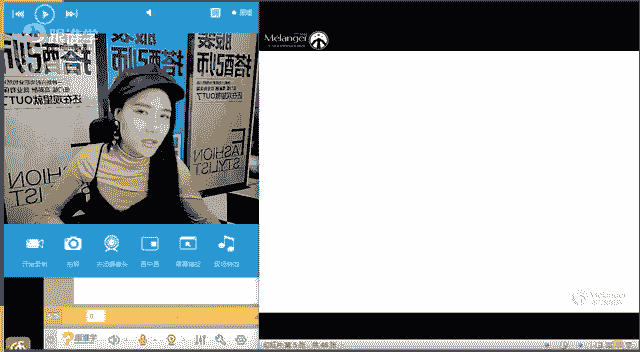
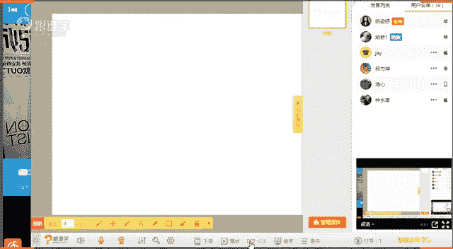

# 1、11服装《搭配秘笈之新版36计》：8衣橱规划_rec

🎼属于我们。🎼未来的诗篇。🎼载这温暖。😊，🎼的房间。🎼我于是没。🎼发现。🎼相聚其实就是一种缘。😊，🎼过值得纪念。🎼带着温暖。🎼人的房间。😊，🎼我们。🎼我想。🎼三天。🎼一切。😊。

🎼在。😊。

不关系。🤧嗯。OK呃，大家晚上好，可以听得到我声音吗？如果可以听得到的话，请打一嗯。如果可以听得到的同学，请给我一个回应，然后请在屏屏幕上打一，然后嗯O好嗯。看到很多熟悉的面孔啊，卓晓仙同学。

然后其他的好像清星唐曾婷。呃，这中间几位的同这几位同学还没还之前没有太多的印象啊。那我想问一下，咱们现在在教室里的同学，有多少人是第一次听咱们的VIP课的，因为之前其实已经上了一节VIP课。🤧啊。

如果是第一次听的话，请打2。第一次听VIP课的话，请打2。第个。没有吗？好啊，那如果大家都是第一第都已经是听过的啊，有是吧？1860思雨秀荣同学都是听第一次听咱们的VIP课。那好嗯。😊，呃。

有同学说第N次听了哈好呃，那如果大家有听了我们这个之前的那大多数大多数同学还是已经听过我们第一堂的VIP的课程了，对吗？那我们第一堂的VIP课程是认识自己的篇幅当中就风格篇，那呃三是什么意思呢？

如果我想问一下大家，你们听完第一次课程之后，有没有对自己做分析呢？有没有给自己做分析和诊断，有没有像老师一样在PPT上把自己的脸分析一下，你是什么脸型，你的这个呃感觉是偏直线感还是偏曲线感。

你的气质是什么样的，那包括你的身材是直的还是曲的？那么你适合的服装风格是直的还是曲的，有没有做这个同学们有没有自己分析，如果你们没有自己做分析的话呢，我就要那个呃就就就这个就要就就要骂你们了啊。因为。

呃，你们听了课之后不给自己做分析的话是没有用的。如果有的话，有有给自己做分析的同学，请打一，没有做这没有做分析的同学请打2。嗯，我看一下你们敢不敢打2。身材值身材直脸是取的是吧？啊，然后微微同学做了。

啊，都都不敢出来露脸了。那做了之后，然后对对于自己大概的现在的一个穿衣的直许和风格，大概有感觉了吗？啊，然后你们现在其实嗯老师在手机上听打字就不能听呃，就不能打字吗？在手机上听课打字就不能听。啊。

这个青青同学老师现在没有用手老师没有用手机呃这个操作过，所以这个还不太清楚哈。然后无果张老师给骗判断的。分析了是吧，然后无果找老师给老找老师给判断呃，是这样的。如果呢同学们，你们要是想找老师判断。

第一嗯，我要先让你们这个把这刚才我说的所有的步骤全都清晰化。第一，你是什么脸型。第二，你的眼神是偏什么呢？偏亲和的这种呃我们所说的迷离的柔和的这种感觉还是比较坚定的和心理的感觉，这是第二点。

第一是脸型判断。第二是我们眼神的这样的一个感觉，直和曲的感觉。那第三就是你的身材的直合曲，就是你的体质的丰满和纤薄的这样的一个感觉。啊第四就是你的气质读词。啊，然后呢我才能清晰你整个人的这样的一个感觉。

啊，包括你们可能甚至要把相片，然后做这样的一个这个这个呃呃旁边放相片，然后放上你所有的这篇文字和信息，我才能帮你去分。要不然老师的话是不能凭空想象，哎，你是长什么样子的，哎，你是长着可爱的脸。

还是这种成熟的脸，老师是想象不出来的啊。OK好呃，那如果要是对于这个板块的话，大家还有很多这样的一个疑问的话呢，可以在我们的这样的一个课后之后呢，可以在屏幕上去打。老师会给你们在这呃在这里做解答啊。

OK好。你们现在这样一条一条打的话，老师看不清楚啊，你也也不能跟你分析，因为我不知道你长什么样子，一定是要有你们的相片加你们的所有的这样的一个分析啊。O好，那这是关于前一节课认识自己的风格篇。

那那个篇幅如果你们把自己的所有的这些条件全都清晰了。刚才我给大家讲到的这几点，你们都清晰了。那么你们应该大概有点感觉了啊，刚才我看到有同学说好像有点感觉了啊，那所以这就是一个过程。

首先呢这是你们认识自己的第一步。那今天我们讲到的是什么呢？认识自己衣橱篇，衣橱篇对于我们来说重不重要。同学们，你们觉得衣橱重不重要啊，可以这个大家可以发表自己的建议啊，你们觉得重要的话呢。

请打一不重要的话呢，请打2，没关系，你们如果真的觉得不重要也没关系是吧？那老师现在来给你们剖析一下衣橱到底重不重要这个问题啊，O好。嗯大多数同学都觉得这个还是挺重要的是吧？啊，这个名字很特别。

不知道取什么鬼名字。这位同学OK好啊，那接下来呢我们来看一下今天的课程呢讲到的就是30天的衣橱规划。那30天其实就是一个月，对不对？一个月的话是几个星期呢？四个星期，那我们在这节课的话。

会拿一个星期作为案例来给大家剖析我们的衣橱你应该怎么去搭配啊，OK好，那接下来我们先来看一下，那我相信很多人认为重要的同学那我刚才看到还还没有看到觉得不重要的，对吗？那你们认为重要的原因在于哪里？

首先我想问一下大家第一个问题，你的衣橱你清晰有多少单品呢？有没有人清晰的清晰的请打一不清晰的请打2，你清不清晰你自己的衣橱当中有哪些单品？好，我说清晰的打一不清晰的请打2。

然后有一个同学说一个垃圾堆一样快爆的衣橱。O好，思雨同学是比较清晰的。其他同学都不是特别清晰是吗？好，那刚才包括那位同学说呃一个自己的衣橱都快要爆掉的这样的一个状态。那说明什么问题呢？

你你如果你的衣橱是这样的一个状态的话，那我要告诉你这位同学，你一定搭配搭配不好服装，为什么等一下我慢慢给你解析这个问题啊，你如果不知道你自己衣橱当中有哪些单品的话，说明你对你的衣橱整理都做不到。

我们说整理和管理是有区别性的，整理只是在做什么呢？把衣服做规划，从呃这个我们所说的上装下装做一个分区啊，然后颜色做一个分区分区，秋冬装做一个分区，这叫整理，你只是把它整理整齐，把它分类挂放，这叫整理。

管理指的是什么呢？管理是指的你的呃整个人的形象都要通过你衣橱当中的服装去决定的啊，所以说衣橱在对于我们来说是特别特别重要的啊。有同学说一脸蒙圈，你蒙圈的是什么问题呢？嗯，好，我们先来看第一点。

那大家对于这个我们所说的衣橱都不啊，那你蒙圈的是你不了解自己衣橱当中有哪些单品是吗？啊，好，那刚才呃我们说到有的人衣橱快要爆炸，那说明你肯定是不了解的。第二点，你能不能快速的找到你需要的单品。

例如说我今天要去参加一个呃什么重要的场合那么明天我要去面试啊，后天我要去参加一个婚礼呀啊，到年底了婚礼也特别多，那年会也很年会也有是吧？呃，重要的场合也比较多，你能不能快速的找到你需要的单品啊。

如果你们可以的话呢，请打一，不可以的话，请打啊。我看一下咱们有多少同学对于衣橱的话是有规划性的啊。如果可以的话，请打。一不可以的话，请打2。嗯，思雨同学看来对衣橱是非常非常有规划性的。

我看他每次的答案都是比较就是他了解自己的是哪些单品啊，他也能够快速找到自己的单品。那我来分析一下思雨同学的衣橱。那如果思雨同学可以做到这。产品那他一定对自己的艺术有所规整，也就是说他会有一个规。

这种呃毛衣类有可能是挂放在一起的上装的衬衣类衬衣类有可能是挂在一起的。当然他有可能不会挂那么细致啊。我是举个例子给大家来讲一下，有可能他是上装区所有的东西都摆的很整齐，就是外套和外套挂在一起的。

那比如说裤子他可能不会采用挂放的方式，他有可能会全都叠在一起，牛仔裤跟牛仔裤去叠啊，然后休闲裤跟休闲裤去叠打底裤和打底裤一块去摆放。那我不知道我跟呃思雨思雨同学是这样的一个问题吗？啊，思雨同学说是的。

老师我喜欢收拾衣橱，老师猜对了，那这就是为什么呢？从以上两点，我从这两个问题当中就能剖及到你们的衣橱问题。因为如果可以做到这一点的话，那是因为你一定要对于你自己的衣橱有一个规划性的。O好啊，裤子是叠的。

是的，因为老师也是这样做的啊O好，那第三点，衣橱缺少哪些单品，你们了解吗？你们知不知道自己的衣橱缺少哪些单品好。如果知道的话，请打一，不知道的话，请打2。我看一下思雨同学对这个答案知不知道。😊，好。😊。

嗯，不知道的请打二知道的请打一。大多数同学好像啊现在还没有答案呢，我看到两个三个啊出来了。嗯，好，大多数同学是不知道的对吗？思雨同学知不知道，我就特别想看思雨同学的答案。好呃，微薇同学知道是吗？嗯。

OK感觉什么都不缺，却什么都想买，那是因为女人的衣橱永远都觉得少那么一件衣服。好呃，思雨同学对于这点迷茫了是吧？好，那我来给大家解析一下，如果你不知道自己衣橱缺少哪些单品的话呢，那是因为。对于衣橱的话。

你是没有什么呢？你没有明确的这样的一个规划的那等一下我们今天的课程当中都会跟大家去剖析，你如何去做规划啊。如果你们按照老师给到你们的这样一个方法的话，你的这个衣橱一定是一定有规律性的。

我如果你可以长期三个月一个季度保持这样的一个呃这样的一个规律去走的话呢，我相信一年之后你的衣橱一定是非常什么呢？有规划，而且你能够应对各种场合的啊，O好，这是我们所说的衣橱缺少哪些单品啊。好。

最后一点就是是否能满足场合需求。那以上你们三点都不知道的话，我相信你们第四天肯定也不知道了啊，不用问了。好，那接下来我们来看一下，那我们怎么去解决这些问题，既然你们有这样的一个问题，对吗？好。

那我相信刚才有同学说，衣橱都要爆掉了，你们可能是这样的状态，找衣服找半天找不到啊，那这个衣橱有点小，但是已经挂了很多东西啊，那有没有同学衣橱是这样的，有没有我看一下有的话请打一。

あ？而说。那了还敢站出来呢啊，好。并没有机会。很规整，包括。相信你。你的上。装的色彩哪个去搭配，其实一眼就可以看不清晰了啊。而如果你是这样的状态，那我真的看不到，老师都没办法哈。老师虽然搭配很厉害。

但是我都看不清楚，哎，到底应在怎么去搭配，所以第一步你们要做的是什么呢？你们要把你所有的衣服近期要穿到的所有的衣服全都挂出来，一定要用衣架挂出来。然后下装呢你可以做什么呢？别放式，但是你一定要清晰。

或者说像呃这个衣橱一样这样去挂放的话，那你会很清晰的一眼看到上装的色彩跟下装的色彩。首先能不能能不能搭配。其次你再看一下款式能不能搭配啊，那再决定看但当然首先这前提都是你需要出席哪个场合。

这个是最重要的。明确场合，然后你再去什么呢？拿单品去组合OK好，看不到了吗？今天有点卡是吗？现在还卡吗？还现在还卡吗？同学们如果卡的话呢，请打一。如果不卡的话呢，请打2。如果特别卡的话呢。

那我让可以了是吗？好，我们再来测试一下啊，再测试一下，现在还卡不卡，如果卡的话，请打一，如果卡哦，不卡了是吧？嗯，OK好好好，嗯，那刚才大家听到哪个地方觉得卡了，刚才听到哪个地方卡了。

然后后面就听不清楚的，我再跟大家说一遍。听到哪个地方说呃我那个我这边就卡了。在在我们所说的这个衣橱管理啊，它首先要什么呢？你要做做到衣橱整理，你要把上下装换图以后是吗？啊，这张这张图片以后是吧？好。

那嗯那我再再来给大家讲一遍啊，那如果你的上装跟下装成这样整。是很清晰和。自己的场合之后啊明确场合之后，你的上装什么颜色跟下装。什么呢？款式是否可以搭配啊，所以。哦，那那个呃大家稍等一下，我请我。

你还是设会问题，好吧，稍等一下。嗯，okK。给大家操作一下。好，那我先暂停一下我先暂停一下同学们。我现在关掉麦克风了，他能听得到我说话吗？哦。房这上么广系。摄音都关了。小区县我。看能忘了吗？关了啊。

就是我我把它放小了。对，像是那种官方账课嘛，你现在也有那么一点点是吧？有一点点，因为白天刚上课没有，因为这个是VIP课啊，所以跟销状态会相。对。现在他们听不到我说话吧，我就关了麦克风了。那个最好。

什么都没有。Yeah。

OK现在可以大家可以听得到了吗？如果可以听得到的话，请在屏幕上打一可以了是吧？好了好了好的，嗯，O啊，不好意思，同学们，那因为刚才这个我们的网络问题，然后呢，刚才请我们的技术老师帮我们解决了啊。

应该接下来的课程就没有太大的问题了。那如果要是课程当中，如果还有这样的一个设备问题的话，大家听不到的话，啊，请及时给老师反馈，好吧，嗯，O那我们继续刚才我们讲到我们所说的衣橱啊，这个这几大问题当中。

那我相信大家都有这样的困惑。那接下来呢我们来给大家解这个解解答这样的一个困惑啊，或者说怎么去实现我们的衣橱能够做到这样的一个完全的啊从场合到这样的一些这个呃搭配当中，我们都能做好啊。那刚才我们说到这个。

衣橱的这个左和左左右的这两张图片。那刚才一直每次说到这儿的时候都卡是吗？每次你们都没听到，是不是好啊，那我再给大家来讲一遍啊，那在这个环节呢，我刚才讲到，我说我们说衣橱，如果你可以这样整齐的挂放的话。

它可以有效的解决我们搭配的这样的一个问题。为什么？因为我们很清晰，我们近期这这里面应该挂的是你近期要穿的服装，你会很清晰的了解你要出席什么场合的时候，你可以看到上装跟下装啊，从色彩到面料到款式。

你都可以看得到。所以你会很清晰的能够快速的拿到单品啊？如果要是你的衣服成这样的一个状态。我相信啊你找你你可能找找衣服都要找大概找半个小时啊。OK好，那接下来我们来看一下，我们具体要用哪些方法啊。

那怎么去检测我们的这样的一个衣橱是否合格。好，第一衣橱大考验。今天我们要给大家讲到的两个板块啊。第一。一个是衣橱大考验，第二个叫玩转搭配。好，那接下来我们来看一下衣橱大考呃衣橱大考验。

首先呢我们分为四步检出呃检视自己的衣橱的时候，那第一步是什么呢？上下装的比例。第二步，场合分类与服装比例。第三步，色彩的比例，衣橱色彩的比例。第四步，衣橱款式是否多元化。好，大家现在只看这四步骤的时候。

你们能不能这个了解，就是或者你们能不能这个呃清晰的明确。哎，老师说的这四步是什么问题呢？能不能了解。如果了解的话呢，请打一，如果不了解的话呢，哎不太懂某一个点的话，请打2。

看一下大家对于这个东西有没有概念啊，一私塾呃私语嗯，微微不了解是吗？好，嗯，好像大家从字面上去看，哎，都了解。但是呃其中的我们说某比如说上下装比例。那这个比例应该是什么样子的啊，怎么叫这种上下装比例。

那包括场合分类与服装比例应该是什么样的啊，又黑屏了吗？啊，其他同学有看到我们的屏幕是黑的吗？好了，是吗？好的，啊，O可以，谢谢啊，谢谢大家的这样的一个反馈。好，那我们来看一下啊，第一步上下装比例。

那很多同学都有的同学是了解的，但是有的同学也不了解，对吗？那我们来看一下上下装比例讲的是什么啊，那我们说你的服装的数量合理吗？我们来看一下，那在生活当中，我们很多人啊偏爱某一种风格的时候。

他会在某一种单品特别多。例如说有的人他特别喜欢。穿连衣裙，那么他可能衣服衣橱当中10件啊有5件都是连衣裙，然后其他的那个类别呢它是哎各一件呀，各两件啊，这样那有有没有这样的情况？我想问一下。

咱们今天教室里有没有这样的同学，就比如说你某一类的单品特别多？如果有的话呢，请在老师回应一下，有的话请打一啊。啊，那我们说这个的话会影响到什么问题呢？就是说你的这样的一个单品的重复率也会特别多啊。

那包括你的衣服的比例可能也不会特别合适。那我们刚才说的这个这个可能是所有的服装比例。但是我们接接下啊上装多是吗？好，那上装多啊，你多多跟下装是什么样的比例才是正确的呢？我们来看一下啊。

有同学就说我牛仔裤比较多啊，ok好，如果你牛仔裤多啊，包括有人说打底裤多好，那你们某一些单品会特别多的话，那你们的这个服装搭配上会存在一些问题。特别是下装多于上装的同学啊，有人说裙子多，有人说毛衣多啊。

我现在要强调一点，如果你下装的比例多于你的上装比例的同学，你们在搭配上风就这个这个呃套数上实现，就会相对来说比较少啊，为什么呢？来呃有同学说裤子基本都是黑色铅笔裤，牛仔裤，就两条呃，就两条。好。

那么来看一下为什么啊，我们说上装要比下装要多这个观念啊，这个观点？那我举个例子很简单啊？同学们，如果我们说人的视觉重心是在哪儿？你们觉得是在上装还是在下装？同学们人的视觉中心是在上装还是下装。上对。

是的啊，我们见人与人见面的时候，我们说你好看的是哪呀，看的是对方的上半身，对不对？我们看他的眼睛，看着他的脸啊，你别管看哪儿，反正就是看上半身，我不可能盯着他的脚说，哎，你好，那所以说的话呢。

我们在三对三角区啊，三角区，所以说我们上人的注意力永远都是集中在上半身，例如说啊有同学说我打底裤特别多，那我就举个例子吧啊，你打底裤特别多。那比如说我今天啊我穿黑色打底裤，但是我今天穿的是黄色上衣。

对吧？同学们，我明天还穿这条黑色打底裤，但是呢我换一条我换一件牛仔外套啊，我第三天还穿这条打底裤，但是我换了一个什么呢？风衣啊，你会发现你会觉得我三天都在换衣服，有没有？同学们啊，现在卡不卡？

艾丽同学说卡。卡了，现在卡吗？同学们。好，没卡啊。那刚才我我刚才呃说的这一点，我说如果啊如果我三天只换上装，不换下装，但是你们三天会觉得我都在换衣服，这一点大家同意吗？啊？如果同意的话。

你们请打一啊因为什么呢？我因为我们说了视觉中心都在上半身，对不对啊？但是反过来我你每天就穿一件衣服，你我每天都穿这件上衣，然后来给大家上课，就是比如说我第一节课，第二节课，第三节课都穿这件上衣。

同学们肯定会在想，这老师怎么是什么情况啊啊，怎么三天都不换衣服啊，或者说甚至你会觉得我比如说我们的课程可能会连续呃这个两个星期上三节课是吧？啊，那同学们会觉得哇老师怎么两个星期都没换过衣服啊。

因为这这三次上课都穿的同一件衣服啊，有同学说我老公就这样，每天只换什么？只换上装还是只换下装啊啊，那因为这个老师的这个屏幕呃，把那个字打上啊，只换上装是吧？啊，你老公真聪明，裤子永远不换是吧？好啊。

那所以说的话呢，我们上装一定要多于下装，那上装的比例和下装的比例要是怎么样分配才合理呢？我们来看一下啊，那上装的比例和下装的比例一般是3比1啊，或者是4比1或者是5比1，就是3比1到5比1之间。

这个比例都是可以的啊，都是可以的那如果你的上装比如说你上装有99件啊，你下装只有一件，那你可能只能搭出来9999套。但是如果你的上装有70件，你的下装有30件，那我们的这样的一个无限的可能性了啊。

同学们那你就可以搭几百套都有可能啊，同学们理解吗？所以说的话呢。原来思雨老公早知道这个这这个知识知识点了是吗？啊，早早早知道这个道理了是吗？好嗯，那嗯所以说这就是我们所说的比较比较什么呢？

比较正确的上装和下装的比例。那同学们，你们现在可以想一下，你的上装比例跟你的下装比例是否合适。如果你的上装比例太少，下装比例多的话，那你搭配的话，变化性一定会会是非常少的。所以啊从这个老师讲完课之后。

你们回去自己去算一下你现在的上下装比例，比如说这个季节当中你的上装上装比例和下装比例是否合理。这个上装的话是包括比如说打底呀、内搭呀、外套啊、夹克呀等等啊，上下装大家应该会区分吧啊。

O我在这里就不多说了哈。好，这是第第一点，我们说上下装比例。第二点的话是场合分类与服装比例。场合分类和服装比例的话，其实有很多同学，很多同学是搞不清楚的是什么什么情况啊。那我们来看一下。

例如说我在这里给她举一个例子啊，我们说呃有一位女士哈叫有一位王女士啊，是银行职员，那她今年是28岁，身高1。63米，体重50斤啊，相对来说是不是还挺标准的啊，那她的场合一般都是上班休闲运动运动和晚宴。

那其实我相信咱们大多数同学也都是这样的是吗？啊，上班呢、休闲啊、运动啊、晚宴啊这几种。那有可能有的同学连晚宴都没有啊，是不是有这样的同学。有没有啊？那呃可能大多数人都是上班休闲运动，对吧？这几种场合。

或者说中国对于场合概念很多人是不清晰的。他甚日上班的时候穿的是休闲的啊，然后这个这个运动的时候穿的也是休闲的。也就是说我们所说的男生一套运动装打遍所有的休闲场合。然后一套西装穿遍所有的商务场合。

这是我们所说的中国男士的这样的一个穿衣的这样的一个现状啊，然后女士的话其实相对来说还比较好一点啊。那呃有同学说过，偶尔有晚宴啊，有人说没有晚宴的场合。那有同学说闺蜜小聚约会。嗯，是的。

那这都是我们所说的我们的这些呃聚会的这样的一些呃，这个其实他说的约会小聚。那这种的话如果是相对来说有点隆重度的这种小聚的话，那你是需要有一些晚礼服的啊，OK好，那正常的话，女士啊穿衣。

一些这种连衣裙稍微正式一点的连衣裙就可以出席很多场合了啊。因为我们在中国的话，其实这种晚宴的场合相对来说是比较少的。嗯，okK好，接下来我们来看一下王女士她的衣橱的服装比例应该是什么样的啊。

不会搭配休闲装。曾婷同学说不会搭配休闲装是吧？好，那是因为休闲装的这样的一个单品文化，你可能不太了解啊。O好，那同学们，你们现在可以带入感一下啊，就是你们自己把你们想象成这个王女士，你们比如说曾婷啊。

比如说这个微微啊啊，你们现在把自己想象成是王女士，你们的场合分类有哪些？比如说你职业职业服，对吗？职业服他包含了办公室，啊，我们在办公室上班这种情况。然后我们可能会去约见客户，然后呢。

包括有可能很多大学生刚刚毕业，他可能会面临什么？面试这样的一些问场合。那所以说在职业服当中，我们可能还会分一些分类出来啊，那当然呃大家自己去自行分类啊，你们自己去想象你在哪个板块当中去多。

比如说有的人他可能天天就做办公室。那他就是准备办公室的服装就可以了啊。那第二个板块的话是休闲服。休闲服，比如说我们说在家做做做家务啊，然后呢逛街逛超市啊，比总总然总然呃那个这个怎么说呢？啊。

总之你的这样的一些场合相对来说是比较休闲状态，比较这个着装的话，相对来说是舒适度一些的啊。那第三的话是聚会服。那聚会服当中就包括了晚宴啊啊派对呀，包括酒会呀，那这些的话呢也会分大礼服和小礼服。

那基本上其实我们穿小礼服就够了。大礼服的话，除非是特别隆重的场合。有很多女生的话，可能一辈子只穿过一次大礼服是什么时候呢？有没有概念？有没有人能能回答啊，结婚的时候有可能他就穿一次晚礼服。

就是结婚的时候，平时的话可能没有太多这样的一些场合啊。嗯，有同学都会比如容容私语哈，那包括。不好意思，同学们哈，因为这个今天白天也讲了几个小时课，所以嗓子有一点哑啊。不好意思好，那这是我们所说的聚会啊。

那我们还有什么呢？运动服啊，运动服。那比如说瑜伽呀，其实现在健身是不是特别热火啊，比如说这种瑜伽跑步、爬山啊，这种服装。那最后我们来看一下正式场合啊，也就是我们所说的，其实包括婚礼呀啊。

然后包括很多人他不会把这个场合划分出来啊，那其实在国外的话，晚宴派对酒会，它跟婚礼的服装穿的是绝对不一样的啊，OK嗯。呃。旁边背个水杯喝点水。好，呃，没有，那个同学们，这个老师应是应该的啊。

老师有背水杯啊，有背水杯。等一下呢这个呃会会喝水的。好，谢谢谢谢你们。嗯，好，那我们来看一下呃，这是我们所说的衣橱的服装呢，你的场合先要划分出来。那同学们，你们自己要先划分一下，你们自己的场合啊。

你们要根据职业装啊，休闲装啊，聚聚会装啊，运动啊等等，把它划分出来之后，然后呢你们要根据你们自己的这样的一些场合分类，比如说你经常的状态都是在上班。那你的是不是上班的这个服装比例就要多一些。

那你的运动特别少。那你的运动装可能都占的比例特别特别小啊，那例如说有的人特别爱什么呢？爱去这种夜店啊啊派对啊、聚会呀，那他可能女生啊啊，那她的小礼服可能相对来就会就相对来说可能会比较多。多。

那比如说在这个比例当中，这个是王女士的这样的一个衣橱比例，她的是她的职业，她的职业服的比例占50%，休闲服的比例占20%。然后聚会服的比例占10%，运动10%正式场合10%。

啊例如说我现在说我刚才说的这样的一个情况啊，比如说这个有这个女生特别爱靠夜店，特别爱出去玩啊，那她的可能是职业装占50%，休闲服占50%。啊？包括她的这种什么聚会服占20%啊，刚才我说错了啊，20%。

不好意思啊，休闲服占20%，然后聚会服有可能会占到20%的比例啊，她几乎不运动，那你可能运动装都不用准备了，是不是啊，那这是我们所说的，你们要对于自己的个人的场合做一个分类。

然后你们会去划分你们的服装占比。那其实我们。🤧说这个衣橱的这样的一个占比跟一个人的什么呢？生活，现在的生活的这样的一个方式也有关系，或者说他现在的在处于哪个人生阶段的经历也有关系。例如说有很多同学。

他现在是大学生，那他的衣服的比例，哪个板块占的比较多，同学们，你们告诉我是职业装还是休闲装，还是聚问装还是运动装啊，如果这个人是大学生，他们在哪个板块占的比较多。O好，是的，蓉蓉说是聚会装啊。

那如果是大学生，大学生的话，他一定是在休闲装的比例占比比较多。他职业装的比例可能会非常非常啊少，而且是几乎是没有的，应该说是没有的，因为他现在不涉及到要什么呢工作，所以说他这个板块的服装是不多的啊。

那同学们你们要自己根据你们自己的现在情况啊，有人可能是家庭主妇对吗？啊，全职太太，有的人他可能就不需要穿职业装，那你们的服装比例要去做分类O在这里的话，我就不多说了啊。

同学们你们自己去画一个表格把自己的服装做这样的一个分类啊，把自己这样的一个工这个场合做分类。然后你们在画出你们的服装比例是多少啊，例如说你们要怎么去规划，比如说你某一个板块的这个服装是占比比较少的。

那么你是不是就要去增加那个板块的服装呢？啊，OK好。嗯，全部夏天大学都是一堆T，一堆T，就是大学生的话都是一堆T恤是吗？好啊，那呃我们在这里给大家总结一下啊，衣橱的服装比例与场合比例占比是相同的啊。

刚才我们所说的是对应的。你哪个场合多，你的哪个版块的服装就要比较多啊，O好，这是我们刚才讲到的第二点啊，那第三点，我们来看一下衣橱的色彩比例。好，那呃经经常有同学们会问我老师呃我应该穿哪些颜色好看。

或者说我应该买哪些颜色啊，那我现在要给大家来来这个嗯讲到这一点，这一点是比较核心的。为什么呢？呃，你首先其实你要买这件衣服的色，你要买什么色彩的服装要取决于你现在的衣橱当中的服装。

也就是说你现在买的这件彩色的衣服能不能跟你衣橱当。当中的一些单品去组合。你买一件衣服，彩色的衣服回来，你可能要买一大堆鱼之相配的服装。那你买这一件衣服，你的成本就非常大了，对不对？

那你现在要对于你现有的服装的色彩比例做规划。比如说你现在彩色比较多，那么你现在急需买的就是。呃，这种无彩色的单品，如果你的无彩色单品比较多，那么你现在增加的就是什么呢？有彩色的单品OK好。

大部分人是一堆黑。是的啊，我们很多人的话基本上都是一堆黑色的那这个时候你们就要考虑你们穿一堆黑的话，你们个个都穿黑色，大街上满街都是黑色。嗯，是有有有区别性吗？所以说如果你想要搭配的亮眼的话。

那你肯定是需要有一些有彩色的服装啊。OK好，那这是我们所说的色彩。那我们来看一下啊，你的衣橱是黑白世界还是彩虹天堂。有的人真的一打开衣橱，真的就是一道彩虹，就是红橙黄绿青蓝紫都一样啊，都是的。

而且呢有很多很多人。不好意思，学习完一些色彩理论啊，就是很多同学他学习了一些色彩理论，他就会觉得哇，我开启了开启了一个新的世界。哇，原来我不知道以前色彩可以这样穿，这样搭配这么好看啊。

那他可能就会把自己穿成什么呢？跟一个调色盘一样，就是一身从头到脚可能他会穿五六个颜色，那这个时候你要想一下，大家，同学们，你们也想一下，如果你一身穿那么多色彩的时候，你的这个人。看起来一定是没有质感的。

也就是说你这种服装搭配看起来是没有质感的。所以说我们说如果你的衣橱全都是彩色的，是不可以的。如果你的衣橱全都是无彩色的也是不可以的。因为你的衣橱当中全是无彩色的话，那说明你的这个人看起来没有太多情感。

我们说色彩它是有什么呢？色彩它是有情感的。比如说黄色它给人感觉就是非常热情开放呃，不是不是open的意思啊，是比较热情的这样的一个感觉啊，然后呢这种黄色它给人感觉的话，会。嗯，看起来也比较年轻，有活力。

包括橙色的色彩也是一样的。它给人感觉非常要有亲和感。你会发现呃，我记得嗯平安保险同学们平安保险的人穿的工装是橘色的。为什么？因为呃橙色的色相，它给人感觉是非常的有亲和力的，就说是没有距离感的。

那如果啊这个保险人员业务人员，当然现在这个房地产人员他们为了让自己看起来很专业，他们会穿黑色套装。但是如果真正的做销售的和做业务的，我建议你们要多穿橙色。为什么因为这个色相看起来会没有距离感。

如果你天天穿黑色的话呢，除非是你到了一定的这样的一个我们所说的这个地位了啊，你的在职场当中有一定地位的话，那你穿衣服，黑色是比较压场的啊？O或者你去谈判的时候，你肯定会穿黑色。

但是如果你是做这种行政人员呢，然后想要有亲和感的这样的一些人员的话，你们要穿这种呃橙色。色呀，然后这种这种色彩会让人看起来有亲和感。OK好，那如果很多人穿一天全都是穿五彩色。

那么我觉得你们你们就特别适合走一个风格，叫性冷淡风。那这个性冷淡风大家听过吧，就是特别极简，特别是没有就是很很很没有这种什么表情啊，然后整个人都是很冷漠的样子啊，五彩色给人感觉，就是这样的一些情感啊。

好。🤧嗯好，我看了很多同学有好多这样的好多问题啊，我来看一下啊，同学们嗯。我的大衣是五颜六色的OK那如果你的大衣是五颜六色的话，那你的内搭基本上要全都备什么呢？深色系的。比如说黑色，比如说深蓝色。

比如说深咖啡色，比如说这种色彩呃，饱和度要非常低的这种色彩啊。O好，有同学说呃，我是黑白灰，还有牛仔啊，我好像是冷色调嗯，我冷漠抑郁内向，好了，怎么感觉你这这这这有点像那个心里很很很压抑的感觉呢？啊。

好呃，橘色是幸福的色彩。有同学说老师选色彩是不是要根据自己的肤色进行去选择呢？嗯。等一下再给你们回答这个问题啊。好，如果呃那我在这里总结一下。同学们，如果全都是有彩色的话，你们的着装看起来会没有质感。

那所以你这个时候需要买无彩色的颜色来搭配。如果你的衣服现在全都是无彩色的，你们需要买有彩色的来组合搭配。例如说有的人他在冬秋冬装的时候全都是那种无彩色的衣服。那我建议你可以第一买这种鲜艳色的内搭，第二。

你可以买一些彩色的丝巾啊饰品啊等等啊。然后呃有同刚才有同学说老师是不是色彩要根据一个人的肤色去搭配。那我在这里要告诉大家的是如果你的皮肤是相对来说比较白皙的那你很多的服装色彩都可以驾驭。

不用去这个不用去这这个这个这个纠结这个问题。如果你的肤色是特别暗黄和黑色的话，那我们在后面的课程当中会给大家讲到这样样一个这样的一个版块啊，所以不用着急，OK好嗯。好。

那刚才我们说到这个彩色和无彩色的这样的一个衣橱现状。那你们要根据什么呢？如你的衣橱的这样的一个现状进行去挑选啊服装。那例如说正确的衣橱的色彩比例啊。

那我们来看一下正确的衣橱的色彩比例是基础色占70%到80%，鲜艳色占30%到20%啊，同学们，那所以说你们现在好好检这个看一下，如果你们的衣橱当中是油彩色是70%，80%。

那这个叫什么基础色是20%30%，那你就要什么呢？多去添置基础色了啊，O好，那这一点的话，大家现在清晰明确了吗？关于衣橱色彩的比例啊，你们现在自己去回去之后要什么呢？呃。

根据你现在的衣橱色彩比例去进行调整啊，好，有同学说嗯正常范围之内，恭喜你。好啊，那其他同。同学呢我看一下。其他同学呢，你们对于这样的一个你们的服装的色彩比例是多还是少呢？如果是多的。

你们如果属于正常范围的，请打一，不属于正常范围的，请打2。老师喝口水啊。🤧嗯嗯。嗯。好。😊，看大多数同学都打一是吧？啊，还也是也是有同学是不符合这个比例的，是吧？好，嗯，那如果你们要是符合这个比例。

老师今天穿的是五彩色吧，很时尚。老师今天穿的是黄色的。唉，同学们啊，我今天穿的是黄色的，你看到没有？黄色的，然后带一点金丝。然后呢穿的是黑色的内搭啊，那这个睡衣款的裙子啊。好啊。

接下来不要不要深究老师穿啥啊。来，我们继续来看一下啊。第四点，衣橱品类是否多元化啊，这一点是非常非常重要的啊。那同学们们来看一下，呃，刚才有同学说了，我牛仔裤特别特别多，是不是啊。

也有同学说我打底裤特别多好，那你们是不是每天都在穿同一条裤子呢？例如说有同学是这样的，我之前有一个朋友跟我这个他他跟我说，老师我一下买了这个有个同学啊，他说老师我一下买了5条打底呃，黑色的裤子啊。

我说你为什么要买5条黑色裤子呢？他说你看我这5条裤子其实是不一样的呀？在细节上，比如说我这条裤子上有一个金色拉链，那个裤子上有一个金色纽扣，我就笑了，我说对于我来说，它只是一条黑色打底裤，为什么呢？

一会跟我们说，如果你的裤子的款式不是特别差异不是特别大的话，比如。说你全都是各种牛仔裤啊，颜色也还特别相似。那我基本上就是认为你天天都在穿一条裤子啊，有很多同学他就会觉得哎我我就我有很多牛仔裤。

但是我自己觉得我的牛仔裤有很多的很大的这样的一个款式差异化。其实在别别人看来，那就是一条裤子OK好，那我们来看一下，所以说这种品类它太过于单一，所以正确的这样的一个夏装的品类应该是什么样的呢？

我们以女士为例啊，男士的话呢，因为相对来说是比较单一的，的确它是除了裤子还是裤子，对吗？男士它是没有裙子的啊。好。好想做他的生意，牛仔裤可以连带那么高。是的，的确是有这样的情况。他不是牛仔裤。

他是黑色打底裤，他他他买了5条啊。啊好，我们来看一下夏装啊，夏装的话呢呃例如说我拿这个我们女性来举例啊，你们的夏装比例应该是什么样的，大家可以看一下啊。第一，你们的半裙要有不同的半裙。

比如说鱼尾裙比如说这种铅笔裙，但是材质是什么呢？不一样的。比如说你可以这个这两条裙子其实是有点像的，但是款式上有没有区差差别性。同学们从色彩上啊从这种面料上它有很大的差异化。

例如说这个它是那种金色的反光的材质，而这个是哑光的，然后呢，它在裙摆上稍微也会有一些变化，对不对？那很明显我就可以看得到这两条裙子感觉是不一样。比如说这条裙子我完全可以穿到什么呢？一些这种派对呀。

聚会呀，晚上我出去的时候就可以什么呢？这种裙装。😊，🤧让你会穿看起来是比较有闪光感的，容易聚焦。因为这种这种亮片的材质。而这条裙子的话可能更加适合我们白天去约会呀啊就样这样去穿着啊。

那所以我说这是我们所说的裙装，它也会有不同的感觉啊，那包括这种我们说有点这种波西米亚的这样的一个半裙，它是偏长的这样的裙装。所以你要有什么呢？有短裙啊，有这种这种长裙，半裙当中都会分为短裙和长裙，对吗？

啊，那我们再来看一下裤子，裤子的品类会更多了啊，那例如说呃这种这种紧身的打底裤。那例如说这种阔腿裤，例如说喇叭裤，例如说牛仔裤，啊，那我现在想问一下咱们教室里的女同学们，你们的夏装的服装比例。

有没有做到这么丰富。如果有的话，请打一啊，如果没有的话呢，请打2看一下。嗯嗯。好，蓉蓉星辰水儿啊，然后呃芳芳思雨嗯，好，一半一半啊，我看到有的有一些同学是有这么丰富的。有些同学是没有的，是吗？好。

如果要是你们是本身的单品，已经这么丰富了。那恭喜你们同学们，裙装很少是吗？如果裙装少的话，那你给人感觉一定是中性化的，如果你是一个女生那为什么呢？因为我们说裤装它给人感觉会更加的偏男性化啊。

因为裤子本来就是男人穿的啊，我们把男人的单品就拿拿来穿了啊，那呃所以说的话呢，如果你的裤装太多，你给人感觉一定会中性化，女人味缺少一点，所以你们要你要多去买呃，女人的裙装穿啊，没有小脚裤，其余的都有啊。

微微说它不适合小脚裤，所以没有小脚裤。好啊，我的都是连衣裙康汝康庄同学是吧？啊，都是。连衣裙，那你可以给人感觉一定是特别淑女，你每天都穿连衣裙嘛啊对不对？啊？你给人感觉一定是非常淑女的。

而且你的风格印象一定是很淑女。啊，好，我的都是A，我是A型身材，裙装多，但是很多人说我很女人，呵呵啊，A加说很多人说你很女人，那除非是一种情况，你的脸长得特别的女人。啊。

如果像我这个样子哈同学们就是我长得其实是有点硬朗的。如果我剪短发的话，我会特别中性。那如果我剪了短发，我还天天穿裤子，那我别人一定会说我是个T。好，大家理解吧。啊，好，不用说太明白哈。

接下来我们来看一下，每次买了鱼尾裙都很少穿，为什么呢？因为鱼尾裙它给人感觉特别的性感和女人啊，好，鱼尾裙不好搭配，其实很好搭配的啊，好，那接下来我们来看一下，所以说品类多元化。

夏装你就要做到这样的品类和品类多元化。那如果没有做到的同学，你们要好好去检释一下自己的玉厨。男生的话呢，你们呢就是就去考虑什么呢？你要你要必备的一个，第一是第一是牛仔裤，第二是休闲裤，第三是西裤对吗？

嗯，O好，鱼尾裙对臀部的要求比较高，穿齐臀裤老师只能给你这个塑身内衣，它具备这样的效果。あ？好，鱼尾裙会不会拉低比例，视线下移？嗯，你要买一些高腰的一点的鱼尾裙。呃，如果你的臀部的臀线是比较低的呢。

那你穿这种鱼尾裙可能相对来说就没那么好看啊，鱼尾裙对于臀部还是有要求的。好啊，那我们刚才说到这个衣橱当中的呃简式衣橱的四个步骤啊，第一个是什么呢？🤧有没有同学还记得的，比如说第一点就是上下装比例。

那我们正确的上下装比例是3比14比1和5比1。第二个是什么呢？衣橱的这个嗯呃老师都有点晕乎了啊，衣橱的这样的一个呃场合的比例跟你的服装的这样的一个比例，是不是嗯好，那我们来看一下。

那这是我们所说的啊场景是吗？啊，场合场合和你的服装的这样的一个比例啊那刚才我们我们讲了四点呢是吧？啊刚才这一点讲到的是什么呢？呃，这个单品是否是多元化的啊，对，还有中间一个衣橱对，第三点。

小仙同学说的衣橱的色彩比例。那呃这个衣橱的色彩比例的话，我们要做到什么呢？三啊，七啊，比三是什么呢？基础色是七，鲜艳色是三啊，或者是说基础色是8鲜艳。🤧测试二都可以啊好啊。

那刚才品最后一点是品类多元化啊。好，刚才有同学说衣橱清单里怎么没有皮衣呢？那我要说的是皮衣啊大家看有没有看到第五点外套与夹克，其实皮衣是属于夹克当中的一个类别啊，夹克它又包含了很多类别。

那老师没有在这里一一的给大家去列。例如说夹克当中，它包含了什么呢？呃，飞行员夹克是不是棒球员夹棒球夹克是不是皮衣啊，包括那种香奈儿的那种短短的上装，它也是叫夹克。那其实这些都是夹克啊，好。

那其实呃西装跟夹克的区别在于哪里？同学们，有很多人对于这个分不清楚啊？西装的话是在什么呢？我们的西装的长度一定是我们的虎口处，而短于这样的一个长度的话呢，它一般都是夹克啊，短于这个长度。夹克。好。

那我们女生的这样的一个艺术清单的话呢，那包括了内衣啊，有同学说老师这个还用列上去吗？这是肯定的啊。好，那大家在审视你的艺术清单的时候，你们要明确是什么呢？比如说你在检视这些艺术清单的时候。

你要看一下你这些衣服当中有没有很多年都没有穿过的啊，然后第二个这是第一点，有没有很多年没有穿过的。如果很多年没有穿过，我建议你把它什么呢？打包啊，然后送给贫困衫体可以啊。然后第二点，你的这些。

比如说内衣啊、T恤啊、衬衫啊，有没有破洞啊，有没有变形，那比如说T恤特别容易变形，对不对？啊，衬衫特别容易染色那内衣就不用说了，有很多容易变形的呀，破洞的呀，拉丝的呀，老师就不再一一列举了啊。

那这些的话呢，你们在检视的时候，你们要看。你这些衣服是否还能够使用。OK好，外套啊、夹克啊、风衣啊等等啊。这些的话，你们都要一一去审视一下。那比如说呃例如说这个适合你的短裤这一点，这一点的话非常重要。

为什么在女性身上的话，其实我们有很多女生的腿型，不是那么适合穿短裤的。例如说你是O型腿，还是X腿型，那还是OX腿型，那呃腿型它会决定了你穿短裤的这样的一个长短啊，穿穿裤子的这样的一个问题。

那包括穿裙装的这样的一个长短的问题。好，所以我在这里写的是适合你的短裤，包括如果你的腿很粗啊，那刚才有的同学说小短腿，如果你的腿特别粗的话，你也不是特别适合穿短裤。O好，这是我们所说的女生的清单。

我在这里就不一一的跟大家去列举了啊。那包括我下面写到的一些什么呢？腰带、帽子、包包。挂类、围巾、茄子，这些都是我们要必备的。为什么我说要必备呢？因为呃从穿衣角度上来讲，当然他们不是刚需的对吗？

有同学说啊，鞋子肯定是刚需的。有同学说老师我没有必要戴帽子吧。哎，那个包包也可以不用拿，但是从我们所说的现代人美的角度上，或者说我们现代人对于这种风格呀，然后自我个性品味都想要的同时。

那你一定是少不了这些东西的。比如说帽子。它会增添你的时尚感。比如说这种这种耳环项链，那些配饰我都没有写在这里了啊。那我写的都是大大分量感的一些视频。那包括腰带，其实腰带很重要，它可以在我们在夏天的时候。

很多裙装啊，然后包括冬天很多大衣呀，然后都可以运用到腰带，它可以塑造很多的这样的一个让你时尚感的这样的一些元素啊，那包括袜子其实今年特别特别流行袜子，而且袜子的话，它可以什么呢？提亮你整套的搭配。

只要你能够接受这种搭配方法。那有很多人是接受不了凉鞋穿袜子的，但是今年特别流行凉鞋穿袜子啊，那其实袜类的话呢，如果你搭配的好，会非常出彩啊，那包括围巾不用说了，对不对？我们每个人都会买围巾。

不管是这种保暖的需求，还是从每个角度上去讲啊，O这是我们所说的女生的。那我们来看一下男生。啊，男生的话，我们看一下T恤衬衫，然后V领套头衫，包括外套与夹克、风衣、马甲啊，领带、西装、休闲装。有同学说嗯。

我是包控斜控帽供帽控，那你这个单品，你这个饰品还挺丰富的嘛，是吧？啊，OK那你的衣橱，你的衣帽间要做大一点呀，万一你你那那个什么衣帽间太小的话，都摆不下你这些饰品了啊。好。

这是我们所说的女生的衣橱清单和男生的衣橱清单啊，那接下来呢我们来给大家看一下十大经典款。嗯，好，衣橱当中的十大经典款女士的那我相信刚才呃我们在这个呃呃之前的这样的一个公开课上给大家分享过十大经典款的这样的一个单品啊。

那我们在这里跟大家分享的话，那给大家来讲解一下。我们说比如说啊我们这些衣橱的经典款，同学们都会说，老师这些款式我都有啊。好，那那老师我这款式都有，你跟我讲，我都知道了啊。

那其实我要跟大家讲的是这些款式你虽然都有，但是你了不了解你适合哪一种。例如说小西装当中它就会有分什么呢？双排扣和单排扣。好，那如果肚子大的人，你们觉得适合双排扣还是单排扣。同学们双排扣请打一。

单排扣请打2。如果你们觉得肚肚子大的人适合双排扣还是单排扣，双排请打一，单排请打2。好像好多好好好多都要买是吗？啊，有同学说是单排，有什么同学说是双排是吧？好啊，那我们来看一下啊。

其实肚子大的人要穿单排扣卓小贤同学说肚子大不扣也不是扣上也不是好，那我要给大家说的是单排呃，肚子大的人要穿单排扣，不要穿双排扣，因为双排扣它是有两颗扣子，大家可以看一下啊，有两颗扣子。

这两颗扣子它形成了一个横线，也就是说横向的这样的一个扩张的感觉啊，所以如果你是肚子大的人啊，你就不要买双排扣的服装来穿，你要买单排扣的服装来穿啊，那例如说每个人的体型不同，这是我跟大家举例局部对吗？啊。

肚子大的人，例如说如果你的体型不同。比如说你是X体型，那。你在选择小西装的时候，你可能要选择收腰款的小西装，会更加适合你。如果你是H体型的，那么你就可以选择这种H版型的西装啊，或者是说收腰版型的西装。

你都可以穿啊，那就是我们所说的体型的问题。那体型的问题的话，我们接下来在第三节课啊，认识自己当中第三篇就是体型篇啊，那我们会给大家去分享体型如何去穿服呃穿衣服啊，你们怎么去判断自己是什么体型。好啊。

这是我们所说的衣橱十大经典款。那这十大经典馆呢，大家可以啊依然还是要把它给这个保留，就是你们可以自己记下来。这些款式你们都有没有啊。如果没有的话呢，这些款式其实是非常好穿和好搭的一些单品？

我建议大家都去采购一些啊，那去采购一些。比如说你这衣西装颜色不一定不一定是非常是这个颜色的，你可以买的更基础？那它可能更百搭？那比如说bu布berry的这个风衣，为什么叫经典了，你穿十年都不过时啊。

那包括这种基础的这样的一些款式的皮衣也是一样的？你穿5年穿十年都不过时啊？O这是我们所说的这个衣橱的十大经典款啊，蓉蓉同学说我不适合穿西装，为什么你不适合穿西装呢。好啊，那看呃就根据个人而说啊。

个人而而言，来，我们再来看一下男士的十大经典款啊。其实男士的十大经典款跟女士的话，其实也都基本呢有相同的啊。比如说中性色的西装套装啊，然后呢夹克包括风衣，那男士的话还会有一个V领套头衫啊。

那这种V领套头衫在我们所说休闲呢，还是正式啊，商务都可以穿到，所以它也比较百搭啊，那包括T恤，那包括衬衫，皮衣，深色休身牛仔裤，男士的牛仔裤一定不要买的特别宽松啊。因为你们不是穿阔腿裤啊。

你们不是穿女士的阔腿裤，你们要穿那种呃这个很宽松的那种裤子的时候，穿不好，会非常难看啊。O好，那这是我们所说的这个男士的经典单品啊，包括中性色的领带，最后是正装皮鞋。那正装鞋的话。

我建议大家要多去什么呢？比如说皮鞋呀，比如说乐福鞋呀啊这些鞋子的话呢，大家都可以去备啊背备一些。那这是我们所说的男士的这样的一个经典衣橱和女士的经典衣橱。嗯，好，有同学说呃，我不适合穿西装。

因为我是圆脸啊，我的妈呀，我的妈呀，老师要感叹了哈，我的口头禅都出来了，我的口头禅就是我的妈呀，那为什么？那有同学说我是圆脸，我就不适合穿西装，这个观念是错误的，我要打破你们的观念。为什么你是圆脸。

你就不能穿西装呢。是谁跟你说的这个理论呢？啊，好，其实我们说不管你是圆脸方脸，长方形脸，你都有适合的西装，只是西装的领型和款式啊，有要求而已啊。比如说你可能是圆脸。

你觉得你自己我不知道你存在的问题是什么啊，你觉得你自己是圆脸太过于可爱了。然后西装给人感觉太过于硬朗啊，所以你觉得不适合吗？那如果是这个观念的话，那你是错误的啊，我要告诉你蓉蓉同学。嗯，好啊。

那那那其实有同学说我也是圆脸，有好多西装是的，其实你不管是什么脸型，你都可以穿不同品类的单品。啊，柔柔说我不适合穿硬朗的那西装并不一定所有的西装都是硬朗的。有一些西装他会把它做的什么呢？那种。

面料是很柔软的啊，然后包括衣服的棱角感都是很曲线感的。比如说很多西装它是尖领的对吗？那有一些西装它是圆领的啊，那其实是可以穿的啊，不要被这个我我我不知道蓉蓉同学之前是听了什么理论啊。

那呃老师不是说其他的理论不好。但是你这样的一个观点已经是错误的啊。好，接下来我们不在这个问题上多多做纠结了啊，我们来看一下搭配啊，有同学说呃什么样的皮衣是基础款。那我给大家来讲一下基础款是什么意思。

基础款讲的就是它没有过多的这样的一些流行元素和过多的一些设计，就是他相看起来就特别基本。比如说老师身上穿的这件打底衫，就是基本款，就是它没有什么设计，就是很简单的一件打底衫啊，那皮衣也是一样的道理。

如果那我来给大家来举个例子啊。嗯，比如说这件皮衣，这件皮衣它的款式就特别的简约，没有特别多的装饰。那有很多皮衣，比如说今年它特别流行那种圆环，大家知不知道就是那种圆环，我之前见到一件皮衣上面有很多个环。

它在那个皮衣上面设计了很多个这种圆环。那这种圆环的话，它就是属于有流行元素的就今年特别流行，包括今年特别流行，在皮衣上面刺绣。那这种都叫什么呢？流行款，它都不属于基本款。

因为流行的这个东西它是2016年流行的，可能明年会再流行一年，但是2018年就不一定会流行的啊，那这种单品的话，它是你穿五年它还是依然是经典和基本款式的啊，OK好。曾婷说有件基本款皮衣啊。

那你就很好了啊，不用买皮衣了啊。O好，那我们来看一下，这是我们所说的第一个板块叫什么呢？我们要检视自己的衣橱，你们要通过是以上几步，从色彩从款式啊，从从第一从上下装比例。第二。

从我们所说的场合的比例跟你的服装比例做结合。第三，从色彩的比例。第四，检查自己的服装的单品是否是多元化的，从这四点去反推你现在的衣橱比例是否是正确的。O同学们啊，这一点给大家讲清楚了没有？

不知道大家有没有理解，如果理解的话呢，请在公屏上给我打一个一。如果不理解的同学呢，等一下可以在我们的这样的一个呃这个答疑环节，我来给大家去解疑啊。如果理解的话，请打一。嗯，O好。好，嗯。

我看大家都打一是吗？那大家对于这个板块都理解了是吗？嗯，康庄同学说不理解好，那康庄同学，你对于哪一个板块不理解啊，或者说哪一点不理解，那你可以等一下在屏幕上去打啊，可以跟老师来提问。

那我建议是在后面的解呃这个答疑环节去解答。因为现在老师再继续讲我们下面的课程好吗？嗯，怎么解释反推是吧？好，那等一下呢我再来给大家总结这个问题好不好啊，等一下我来给大家再重新哦把整个板块讲完了之后啊。

我们再来反推这个问题，其实就是什么呢？我说的反推意思就是说你这个什么呢？你解释完自己的衣橱当中，你再来总结，你不就知道自己的这样的一个衣橱的这样的一个比例了吗？你哪个比例少的话。

你就买哪个服装的比例理解吗？嗯，O好，那这是我们所说的简视衣橱。那第二点我们来说搭配啊搭配问题。好，那我们拿一周的这样的一个搭配啊，一周的场合搭配来给大家做这样的一个呃案例。

例如说很多人他是这个就是我们在一周当中分为了职场，然后派对包括休闲这三个板块，对吗？啊，基本上我们的一周的工这个这个行程基本上就是这样的啊，那从一周当中我们先看一下职场，职场的话基本上都是周一到周五。

第二的话我们说派对基本上都是在假日或者是工作需要，有很多人他会因为工作需要去这种应酬啊，或者参加某一个派对呀，啊，那就是我们所说第二个派对的搭配。第三个就是休闲搭配，休闲搭配的话。

就是我们自由着装的这样的一个状态。也就是说你想怎么去穿啊，就怎么去穿。但是你只需需要根据这个休闲的场合去搭配就可以了啊，比如说我去度假啊。比如说我去这个买菜啊，你不可能你买个菜。

你穿着这个这种什么这种运动装啊，就是纯运动装去吧。啊，你去健身的话，你不可能穿着度假服去吧啊，OK这个是我们所说的一周场合搭配。那我么来看一下第一个职场的搭配啊。好，职场搭配当中呢。

我们接下来呢我来给大家讲这样的这个这个是什么意思啊？步骤一，首先呢同学们，你们先要把自己职场的就是制服类的服装全都拎出来啊，制服类的服装，什么叫制服类的，就是这种叫制式服装，比如说它是带有职场元素的啊。

比如说小西装啊，然后这种马甲直线感的马甲简约的款式，比如说这种基础的小衫啊，小衫，就是那种套头小衫，比如说这种风衣啊，然后衬衣，包括呢子大衣，包括基本的打底毛衫，包括连衣裙，这个连衣裙是比较什么呢？

简约的线条的款式啊，它是这种我们所说的叫制制式服装，也就是我们所说的有什么呢？职业性质的这样的一些服装全都拎出来啊。那这是你的上装。接下来我们来看一下夏装，夏装当中呢我们有分半裙，然后裤装。

然后呢这种短裤啊和阔腿裤。那其实在职场当中的话呢，如严肃就是我们所说特别严肃的。比如说银行啊啊这种硬性要求的话呢，他们可能就不能穿短裤。那有一些职场相对来说没有那么严谨的话呢，他们还可以。

但是基本上啊我们还是穿这种长裤最好啊，OK好，那我想问大家一个问题，你们觉得在我们说这种真正的职场当中的话，你觉得女生穿裤子正式还是穿裙子正式你们觉得穿裤装正式还是穿穿裙装正式女生。🤧嗯嗯嗯。好。

你们觉得裤子什么？好，有人打裤子，有人打裙子。嗯。好，我来给大家解答啊。那裤装和裙装的话呢，裙装竟然有了一个来了短裙，短裙你要短到哪，短到迷你吗？迷你短裙就不行啊啊。好，我们说在职场当中的话。

女性的着装一定是什么呢？裙装比裤装要正式。女性的着装，裙装比裤装要正式。O好，理解了吗？同学们，男人穿裤装是比较正式的啊，女人的话穿裙装是比较正式的啊，O好，这是大家的误区啊。

有很多人会这样认为分不清楚了，这很正常。那我在这里跟大家来解答一下。那首先我们说了步骤一，你要把你所有的制式服装，也就是说它适合在职场当中出现的单体全都拎出来，拎出来之后。

你会发现比如说你像老师这样去挂放，你放在你的衣橱当中，或者说你有一个干，或者你有把这个所有的床啊不是。把所有的床要把所有的衣服铺在床上啊，然后你就很明显的能看能看到上装跟下装。

上装跟下装上装跟下装的这样怎么去搭配。例如说你们怎么去搭配呢？比如说啊我看到这样的一个上衣，我可以跟什么下装搭配，我是不是可以跟这条裙子搭配啊，那我这个上衣是不是也可以跟裙子搭配。

风衣是不是也可以跟裙子搭配，比如说我里面穿小衫，外面穿风衣，下面就可以穿什么呢？下面就可以穿半裙啊，那例如说这件裙子是不是可以跟衬衫搭配，这件裙子还可以跟这件呢子大衣搭配，还可以跟这个上衣搭配。

你会发现哇，很清晰明了。那包括什么呢？连衣裙当然单穿就可以了，对不对？那包括这条裤子，这条裤子它是裸色的，它有可能会跟某一些单品在搭配的时候，色彩太过于顺，不是特别好看。例如说它跟什么风衣。

这种色彩太过于这种统一感了。那它看起来就没有那么好看。包括这件驼呃驼色的呢子大衣也没有那么好看，但是它是不是可以跟这种马甲搭配呢？跟这种黑色上衣搭配，跟这件蓝色衬衣是不是也可以搭配。

跟这件黑色的毛衫是不是也可以搭配好。那这就是我们所说的同学们，你们要把所有的上装跟下装全都什么呢？拿出来，才能够清晰的去明了。从上装到下装哪个能跟哪个搭。现在这一点大家理解了没有？第一点。

现在大家理解了没有？如果理解的话，请打一。呃，现在老师教的方法，你们一定要去这样做，你们如果不这样做的话呢，就比如说你还是把你的衣服全都折成呃一件一件的，那我要告诉你，你还是搭配不好，你们要搭配的时候。

大工程，把所有的什么呢？一周比如说你星期天你把你这一周的衣服全都那个什么呢？一周需要那个你先把你所有的带有职业场合的服装全都拿出来。然后你这这一这一周的衣服你就挨着搭配就可以了。星期一穿什么。

星期二穿什么，星期三穿什么？O好，那接下来我们来看一下啊。刚才我们讲的是女生啊，男同学着急了没有？我们来看一下男生的这样的一个搭配更简单。男生的一条裤子可以穿遍他所有的上装。我们来看一下啊。

这条灰色的裤子我们给大大家可以看一下，它可以搭配西装、马甲、风衣、衬衫，机心领毛衣，然后呢，什么黑色打底毛衣包括什么呢？夹克，所有的都可以跟这条裤子去搭配。所以你首先要把你所有的什么呢？

上装全都拿出来啊，就一条裤子可以省好多钱。是的，当你把所有的服装全都拿出来的时候，你在搭配的时候会特别的清晰啊，O好，同学们，那这是我们所说的男装跟女装，你首先要把所有的制式服装全都拿出来。

然后一一的去搭配，这一点非常重要啊，这是步骤一好，步骤二，我们来看一下。例如说我们今天在搭配你今天在搭配的时候，你就以外套。あ。来想你的你的为出发点。你在想，哎，比如说我我这个上装你要变化，对不对啊？

你如果上装不变化的话，别人看不出来你穿衣服了，那你肯定是以上装来搭配。比如说你星期一穿夹克，星期二穿西装，星期三穿大衣，星期四穿风衣，星期五穿连衣裙。好，连衣裙你不用搭配了，对吧？

从星期一到星期四你是不是先要把所有的外套全都拿出来，你把所有的外套拿出来之后，你才能根据你的外套去搭配什么呢？内搭和下装，比如说啊星期一我要穿夹克，那我里面就要想什么搭配小衫哪，然后加加半裙。

然后西装加背心加阔腿裤，大衣加衬衫加西裤，风衣加毛衫加牛仔裤。好，这个是文字，先让大家有个概念，我们来看一下啊，呃，正装西裤搭休闲夹克可以吗？看你的职场是什么样的。看你的职场是什么样的。

如果你是商务谈判啊，肯定就没有那么合适。那呃这种这种就是特别正式的，就不太合适。特别正式的，一定要穿这种西装。如果相对来说比较休闲，那可以，那是O的。工程师是可以的啊。O好，6511同学嗯加减乘除是吗？

你这个是加减乘等于好，那你这个头像挺有一些的，等一下我们在今天的课程当中也会运用的到。嗯，好，那我们接下来来看啊，同学们，那刚才是什么呢？刚才是文字形式，让大家有个概念，那接下来我们来看一下。

如果以外套为例，那我是不是星期一是夹克皮衣星期二是风衣，星期三是西装，星期四是大衣，星期五是连衣裙。好，我们来看一下，那你的外套先拿出来之后，你是不是要根据你的外套搭什么呢？内搭和夏装，内搭和夏装。

内搭和夏装，内搭和夏装。前提是你要先而且你的所有的内搭都不会重复。同学们，那这些基础。都在于什么呢？在于在于你的品类要丰富。同学们，你的品类一定要丰富，所以你才能搭配搭配出来这么这么多这种感觉的。

其实我相信这些东西你们都有。例如说这种毛衫有没有肯定会有，对不对？例如说衬衫谁还没有个10件8件的哈。例如说牛仔裤。那那刚才有同学说我就是牛仔裤多，是不是啊，那只是在于你们这些品类嗯，又卡了。好。

其他同学听的卡吗？曾婷同学说卡了，其他同学听的卡吗？啊，O好，那曾婷同学如果你这边是卡的话，那你可能就要出去，然后再进来啊，再进来，那就卡呃，就就就okK了。好啊。🤧那这是我们所说的步骤2啊。

那同学们这一点，你们现在清晰了没有？步骤一先把所有的知式服装拿出来。步骤二想好你今天要根据什么去搭配。例如说我要根据我的外套去搭配，那我就要什么呢？跟一一搭配我的内搭和家装，内搭和夏装内搭和夏装啊。

同学们这是我们所说的一周的职场搭配，职场搭配啊，好，那这是我们所说的这个。一周定位法，当你一周已经做完了，你做四周就没有问题了，哪怕你什么呢？第二周你再重复穿什么呢？这个风呃。

这个夹克风衣、西装大衣也没人发现啊，你就你就搭配好这5套衣服，你就一个月按照这个顺序穿就可以了。好同学们理解了没有？理解没有？这一点大家理解没有？所以你们只需要做一一次功夫。

比如说你抽一天时间搭配一个星期的服装，那么你就可以穿一个月啊，OK好。其他同学呢只有钟永雄同学理解了，其他同学都没理解呀啊，如果理解的话，请打一。同学们如果没有理解的话，请打2啊。好，嗯，好，O啊。

那在这里好的，那啊我看到了啊，大家都理解了是吧？好，那么在这里要看一下啊，职场搭配当中，我们要注意的事项。那给大家来总结一下。在职场当中，我们说不管是男生还是女生，你都是无性别的区分的这样的一个概念。

那所以都是一些什么制约行为，不能太过于随意。所以你的服装一定是要什么呢回避薄露透啊，这在在职场当中回避薄露透。那包括什么呢？款式一定要庄重感回避特别休闲的款式。例如说有一些西装或者大衣。

它的肩线是什么落肩款。那我要跟大家说的是落肩的服装一定是没有说那种有清晰的肩线的，就是那种装袖的那种服装来的正式。那今年其实这两年特别。流行那种落肩款的，比如说到这个地方它没有明显的肩线。

那种款式给人感觉会很休闲化啊，那种感觉休闲化。所以在这一点的话，细节的选择上大家要注意好，那第这个我们第这个第四点就是说鞋跟不要超过5厘米。在时尚职场就是我们所说相对来说比较呃这种什么。

明星啊、艺人啊、传媒公司啊、服装啊，跟服装相关的这种职场很时尚的一些职场的话，他可以穿的相对来说比较时尚一点，可能能穿稍高一点。正常的我相信大家现在这些职场啊，职场呢，你们穿5厘米左右的就够了啊。

这是我们所说的职场的高跟鞋高度，那呃这些是男女通用的啊，除了高跟鞋，这一条的话是不通用，其他的都是通用的啊。O好，那我来看一下第五条面料要比较精致感，挺括感和高级感。那最后呢要回避稚嫩的颜色和休闲色。

稚嫩色是什么意思呢？就比如说粉色啊，然后粉这种天蓝色啊，然后这些颜色哈都太过于显得年轻化和稚嫩感，就会让你看起来没有威严。所以说的话在职场当中，我们一定要注重选择一些无性别的色彩。

比如说黑色啊、白色啊、灰色呀，然后低饱和度的一些色彩啊。O好啊，有同学说粉色的和玫红色玫红色的是。非常好啊。是的嗯。OK这是我们所说的职场搭配。那第二点叫派对搭配。那派对搭配当中呢，我们在国内的话。

或者说或者说我们呃这个中国呢，其实对于这个概念没有特别的明朗和清晰化。那我们很多人就其其实准备一件连衣裙就够了，对吗？那但是连衣裙的话，其实我们说也有分这种隆重感的和简约感的。比如说隆重感的。

大家可以看一下，你们来你们看完之后，你们觉得隆重感跟简约感的区别性在于哪里。同学们，你们现在可以来抢答案啊。隆重感跟简约感的区别性在于哪里？这定是。我喝水的声音你们能听到吗？🤧好，同学们说材质嗯。

款式隆重感太花哨，色彩啊，隆重感的华丽。嗯，O非常好。你们已经替我总结了。O好，那我再再再给大家来总结一下啊，对，是的，从廓形上从面料上从款式上啊，其实虽然都是裙装它还是有一些什么？

从这种感觉上还是有曲差性的。我们来看一下啊，是的啊，那从隆重感上来讲的话，它的色彩一般都是什么呢？可以使用一些夸张的一些色彩。比如说这种红色呀、黄色呀，然后到那种金属色呀，闪亮色呀，那而且从工艺上来讲。

它一定是什么呢？这种奢华感。比如说它还会带有这种亮片亮钻羽毛这种重工的装饰啊，这种对水钻啊，甚至用。水钻这种重工装饰。那比如说从图案上来讲，它会运用很多什么呢？那种大花型啊啊。

或者说一些夸张的这种款这种这种图案。那这是我们所说的这种这种图案的这样的一个区别性。那从款式上来讲的话，它其实可以使用一些大廓型的，相对来说有一些这种夸张元素的比如说这种不对称的设计。

比如说这种很对很鱼尾很贴身的这种感觉啊，包括这种有一点点小夸张的裙摆，那这都是我们所说的隆重感的裙装的这样的一个设计啊，那简约的其实大家都已经很清晰了啊，可以看得出来。

从色彩上从这种做这种款式上从图案上它看起来都会非常的简约。比如说这种连衣裙黑白色的这样的一些条纹。那这种这种连衣裙其实很多场合都可以通用了啊。例如说小黑裙对不对？我们说小黑裙每个人女人都。

要有一条小黑裙，因为小黑裙的话它是场合是比较百搭的。啊，各种场合都是可以通用的。OK那这是我们所说的派对的搭配，隆重感跟简约感。因为呢其实我们说太我们这儿没有太多的这样的一个什么大礼服啊啊。

这种的话就会跟大家去分享的大礼服的话，其实它也会分很多种。那从这些款式上来讲的话，那其实呃比如说这种这种A字摆的裙装啊，它上身是无袖的，下身是A字摆的，然后有一些这个服装的话呢，它上身是什么呢？

有泡泡袖的，然后呢下身相对来说也是比较夸张的那这种裙装它适合哪些体型了啊，那包括这种裙装它又适合哪些体型的，其实都这个服装呢都是跟我们体型相关的啊，跟我们的体态细节也相关。

那比如说这种无袖的那你胳膊很粗的话，你就不太适合穿，对吗？啊，那如果手臂很粗的，它可能会适合穿这种袖子的但是如果这个人腰很粗，它就不能穿啊。那。这是我们所说的裙装跟你的身材要做什么结合。那在身材的话。

我们在后面会讲到身材片。所以大家不用着急。那你们到时候讲完身材之后，你们再来看这些裙装，哎，你们适合哪一种。比如说我现在给大家举个例子。

那比如说这种很有线条感的这种裙装一定是比较适合我们所说的这种X体型的啊，这种叫X沙漏型体型的，就这种收腰放摆的，它很适合X体型。那比如说这种呃这种我们所说的H体型的人。

那他可能就会更加适合这种H版型就没有那么明显腰线的啊，或者是说这种呃这这种所说H型特别适合的那比如说有的人他特别肩窄臀部特别宽。那他可能就不太适合穿哪一种吗？这种他就不太适合。因为这种它本身肩就窄。

在肩部这个位置还没有过多的装饰，下下面这个部分又膨胀，那他就会重复他的体。让他会显得肩更窄，臀更宽啊。okK好，这是我们所说的跟体型去结合啊。OK。好呃，蓉忍说我的皮肤是。不是冷色的白。

穿黑色显得更暗啊。你的意思是说你皮肤挺白的是吗？但是你穿黑色的话会显得暗啊，我不太理解啊。好，那刚才呢我刚才已经跟大家分享了，我们说隆重感的连衣裙，它有哪些元素。比如说连隆重感的连衣裙。第一。

你的皮肤露皮肤的面积越大。那代表你的隆重感越什么呢？强啊，比如说大面积的低胸啊、露背设计啊，夸张透视啊这些啊，第二，重工设计，比如说有很多亮片钉珠镶钻羽毛啊，包括服装的色彩。

它会艳丽的耀眼的和醒目和夸张的。嗯，好，这是我们所说的隆重感的连衣裙的呃其中的几点。那下面还有啊我们来看一下啊，服装图案大而夸张，包括廓形，比如说过短的过长的廓形扩大。

特别大的这种都是属于隆重感连衣裙的元素啊那。简约的连衣裙我就不用跟大家一一的分析了吧啊，从这个图案款式，它相对来说都会比隆重感要简单啊。然后这种看起来没有那么繁琐。就是这样的我们所说的简约的款式了啊。

O好，这我们所说的派对的这样的一个搭配。那我们看一下派对搭配当中呢，他需要注意的事项。呃，有很多人他会对于派对的这样的一个性质把控的不好，导致他们穿衣服的这样的一个这个把握尺度把握的不好。

那比如说我现在给大家举例啊，那举办的地点，第一种情况，大剧院或者是画廊，那很多人他在穿衣服的时候会什么呢？穿的过于隆重，然后呢裸这种暴露的程度太高。为什么呢？大剧院和画廊的话。

我们说其实他是比较有艺术性的东西。有很多人他可能去画廊的话可能就是去看看画展，对吗？有的人他会觉得啊这是一个好像很重要的场合，他会穿的过于正直。那其实看画廊的话，相对来说还。是可以穿的文艺一点的。

不用那么的正式啊。O好，那我们说第二点的话就是举办地点是高级酒店昂贵的餐厅。那常见的错误是什么呢？太过于商务于是项目工作人员，特别是男士啊，一定要注意。如果你们穿不好的话。

就跟那个什么呢 waiter一样的，就跟那个服务生是一样的，弄不好的话，你走在路上，别人就抓紧过来。哎，服务员你们给我拿个什么什么什么啊，所以男士的话一定要注意，那不要穿的太过于像工作人员啊。

女士的话其实相对来说还好啊。O好，第三个举办地点，酒店私人会所，包括仓库啊，呃，糖糖同学那看回放的话，可以找老师的，去找你们的这个这个咱们这个老师啊，那他可以给你这个回放的。好。

那我们的VIP学员都是可以看回放的。一年时间全年啊。好，那我看一下第三酒吧私人会。所包括仓库，那常见的错误太过于正式完全与现场格格不入啊。那第四，高级酒店时尚餐厅画廊过于暴露和性感。

其实这个跟这个有点像了啊。嗯，好，我们助教老老师说了，在APPT呃APP里面，我的回放和下载里面就可以看得到啊。那糖糖同学包括其他的同学，如果想去看回放的话呢。

就找到我们呃就按照我们的这个助教老师的这个方法啊，去操作就可以了。好，那这是以上呢就是我们所说的派对搭配的这样的一个注意事项啊，那派对的话呢，当然有些人可能不会去参与。

但是这也是我们把它放到一周的穿搭当中啊设置的一个环节。那派对派派对的礼服选择，其实跟我们的体型有很大的关系。那这一点的话呢，大家到时候学习完了之后呢啊，你们就可以这个我们明天就会讲到这个体型的问题。

那大家可以来看一下，哎，你到底适合哪个款式的裙装。嗯，O好，第三个休闲大。搭配那休闲搭配的话，其实相对来说呃，我们很多人对于这个板块都是比较欠缺的那我在这里给大家举的例子呢。

其实更多的是关于我们所说的一些元素或者是些单品。那呃这个搭配它其实不是我们所说的一天啊一个小时能讲清楚的事情。我们说单品的选择拿捏会非常重要。单品的文化和它的风格它也很重要。

如果你例如说呃有一些单品它买来它就是带有这种民族感元素的那比如说那种麂皮的那种流苏的那种马甲。那它很明显就带什么呢？我们所说的波西米亚元素啊，西皮式元素啊，那这种感觉的话，那肯定就是什么呢？

那这种风格它一定是偏往波西米亚麂皮的这种感觉去营造的那例如说运动，那现在大家可以看到的运动啊。

啊，那大家现在看到运动，比如说哪些元素有运动感呢？大家现在可以看一下，它全身其实很多都有运动感，对不对？啊？比如说这种什么呢阿迪达斯，其实很明显，阿迪达斯就是做运动的，对不对？好，谢谢同学们啊。

呃谢谢同学们啊，我这个这个呃等一下讲完课之后再喝水啊。好，那么来看一下阿迪达斯，它就是做运动的。那我们来看一下运动鞋运动单品，运动很多人啊，那我想问一下大家，你们能不能分得清楚运动单品它有哪些元素。

你们现在可以在屏幕上打。你们觉得哪些单品，它是属于有运动感的，或者哪些元素，它是属于有运动感的，比如说我给大家举个例子啊，那种带呃螺旋纹的那种那种那种弹性的针织啊啊，就是比如说棒球衫上它有那种螺旋纹。

或者是那种袖口，它有那种螺旋纹那种它都是属于有运动感的。那你们来举例一下条纹宽松材质棉。好啊，那比如说我给大家来举例，透气的面料，嗯，纯棉的舒适的宽松的弹性的。好。

那其实呃纯棉的有的时候它是可能代表休闲，它不一定是运动。那运动比如说它有哪些元素呢？太空棉啊，然后包括我刚才说的那种螺旋纹的那种弹性啊啊，那包括这种什么呢？

运动这种那大家现在可以看到到这种条纹状的这种这种裤装啊，它是有运动元素的啊，包括那种呃。字母很明，就是字母其实它就是非常典型的运动啊，字母它就是非常典型的运动啊。有同学说侧骨织带啊，网格非常好啊。

那这些呢大家都是啊大家刚才举例说的这些也非常好。那这些其实都带有运动感，但是条纹星辰水儿，这位同学条纹不一定是运动，条纹的话，它其实是海魂衫，条纹它是可以搭军装的那你看同学们。

你们就是因为对于单品的不了解，所以你们在搭配的时候就拿捏不准确，风格的导向就不准确。其实我们说所有的搭配它搭配，它最终都是导向于风格，比如说这个条纹我要怎么搭配呢？条纹我可以搭什么呢？

我里面穿一个条纹衫，外面我穿一个飞行员夹克，然后带一副复古墨镜，然后我穿一个穿一条短呃短裤，然后呢穿一条穿一双马丁靴，再带一顶贝雷帽，那这就是很明显的什么呢？这个杀手不太冷里面的那。个小女孩的形象。

那这个形象其实就是我们所说的军旅风格。明白，同学们啊，那如果你全身都带有运动元素，比如说阿迪达斯的字母，比如说这种运动鞋，比如说刚才大家举例的这种透气面料，那你这种感觉一定是带有运动感的啊。

那这是我们所说的运动那大家如果对于运动单品能够拿捏的好的话，那你们在搭配运动的时候啊，比如说运动这种混搭呀啊，你们就知道怎么去搭配了。比如说现在其实他们现在穿的其实都是有运动感的一些单品。

那比如说这个面料。这个面料它就是这我们所说的透气的这种面料，有点太空棉的这种感觉，它就有运动元素。那包括这一套搭配当中，它有什么呢？运动鞋的元素，对吗？同学们，那这套搭配当中它会有很多字母呀。

然后混搭了很多这种，其实这套有点叫这种呃这种街头的这样的一个感觉啊。那所以说这些它们都带有运动元素。那这是我们所说的运动跟休闲的混搭。这个风格叫休闲运动啊，ok好。

那这是我们所说的休闲搭配当中的运动感觉，那我们再来看一套啊，休闲搭配当中，它会它还会有什么大量的牛仔。也就是说单宁，那我们来看一下牛仔它太百搭了啊，它有很多很多种搭配方法。

那我相信大家其实在生活当中穿的最多的，也都是牛仔。那牛仔的话呢，我不给大家去讲太多了。比如说你看这种上下装的单品的牛仔搭配啊，包括这种。牛仔裤搭配这种什么呢？军旅的那同学们从军旅从哪儿来的？

这个就是属于什么呢？叫迷彩图案。这种迷彩图案它就是军旅风。明白吧？同学们，所以这一套的话它是什么呢？军旅跟休闲的这样的一个混搭啊。那如果这个人他的他穿的这双靴子其实不是特别明显。他如果靴子穿到这儿啊。

然后头顶再带一带一顶军帽。那他这一套军装风就特别明显了。他现在这种感觉其实休闲风是比较明显的。军装风是次之啊，它虽然是混搭，但是休闲主打，然后军装呃这个是属于属于复的感觉，就是我们说一个主风格啊。

一个副风格啊，那这个我们说休闲他占的面积特别大啊。ok好，那接下来我们来看一下这种是什么呢？它有点职业职业的感觉，跟这种什么呢？这种牛仔去做的混搭。

其实他这一套就是有点偏这种呃既有这种中性的又有运动元素，其实他这一套的感觉的话，也是运用了什么呢？叫中性混搭运动风。啊，同学们这一套它是中性混搭的运动风。好，那接下来我们来看一下最后一套男生的啊。

男生我们经常会说牛仔它给人感觉很休闲，对吗？但是你看呃我们男同学有多少男同学的话出来打个一。对对。嗯。🤢，好。😊，我相信百分之呃，咱们这儿应该是90%的男生都不会这样去搭配，对不对？

但是我觉得呃这样搭配也挺好看的，除了这个人的脸长得不太好看以外啊，那我想请咱们的女同学站出来。女同学，你们觉得这一套搭配怎么样？如果你们觉得好看的话，请打一，觉得不好看的话，请打2没关系啊。

这个都是开放式的。大家觉得好看，你们就觉得就打一不好看的话，你们就打2啊。好嗯，阿瑞同学特别无辜的眼神啊，张敏同学说觉得不太好看是吧？嗯，O那大多数的同学觉得还是挺好看的，是吗？啊，好。

那他下面是休闲西裤吗？是的啊，是的啊，那呃英同学说还好啊，那其实在我们国内的话，我觉得会很少有人用牛仔搭配马甲搭配西装。是吗？啊，很多人说不太习惯，是的，那是因为我们国人的穿衣习惯。

我们为什么总是穿不明白衣服？因为我们穿的都是西式服装，我们穿的不是我们中国传统的服装，我们中国传统的服装是什么呢？是唐装啊，是那种是那种特别宽的袖子，是那种拖地的服装。那我们这个那个而且是旗袍。

但是现在旗袍的话，它只作为社交去穿着了。你看你看彭妈妈她平时没事，他会穿西装会穿旗袍吗？它不会它只有正式场合，他才会穿旗袍。那包括其实我们现在旗袍，它还是一种社交的服装，它不属于休闲的服装了啊。

那所以说我们总是穿衣服穿不明白，因为我们穿的是别人国家的东西。然后呢，其实这些单品它都是有历史文化的，但是我们不了解这些历史文化，所以我们穿衣服搭配出来的不好看啊OK好啊。

那呃有同学说他那个这个不太习惯。是的啊，我们经常会这个。不太习惯某一种着装风格，那是因为我们的这个呃看的比较少，所以我们可能不太习惯。比如说呃。在3年前，我记得流行阔腿裤的时候，七分阔腿裤的时候。

有有我的朋友就跟我说过一句话，他说残暴他骂的是脏话，同学们不要介意啊，他说啊我觉得那个阔腿裤真他妈的丑老师学的还不太像啊，他说我觉得那个阔腿阔腿裤真的很难看。他说我是打死都不会去穿的。

但是啊他穿的挺热乎的。现在啊，他穿的那种阔腿裤的话呢，他买了各种长途的这各种长腿长度的阔阔腿裤都有去穿，所以说一开始我们可能审美是不太习惯的。但是呢慢慢的当流行的时候，你会发现哎，好像挺好看的。

你慢慢的就接受了。那包括这种搭配的话，如果你身边有一个男生你可能觉得不太习惯。那两个三个4个你会觉得习惯了啊。OK好，这是我们所说的。啊，刚才给大家讲到的是牛仔风。

那接下来我们看一下休闲搭配当中机车风啊。机车风的话呢，其实机车皮衣刚才我又给大家介绍基础款的机车皮衣是哪一种？比如说这种和这种都叫基础款，这种就是什么呢？流行款，为什么它带有很明显的流行元素。

比如说这种刺绣，它就是属于这种什么呢？叫流行款的机车皮衣，这种机车皮衣，你再放两年之后，你再去看它它就已经什么呢？过时了，所以说这种是比较经典的啊，来看一下最后一个也是女士的啊。

那杨幂穿的这一件的机车皮衣相对来说就是比较基本的这种款式，那机车皮衣的话，它其实我建议不管是男生女生都要去买啊，都要去买一件来穿。为什么呢？女生穿这个皮衣的话，它会非常帅气，男生穿的话也会更帅气哈。

因为这本身就是凸显男士比较什么呢？比较man呢，比较这种健状啊，这种男性化的单品，穿上去之后会更加好看。🤧啊，那啊基础款穿出来没有时尚感，基础款是的确有这样的问题，它是比较百搭的。

但是它的出彩的程度会没有时流行款要高啊。刚才我其实跟大家讲了，我说流行款它虽然容易过时，但是它特别容易出彩。基本款它不容易过时，但是相对来说没有那么出彩啊，但是它就是经典呀，就是百搭呀。

但是我建议同学们你们应该怎么去穿呢？买基础款的单品买流行款的配饰。例如说它穿的这样的一个基车的皮衣，那我可以搭配一个什么呢？比如说白色的T恤，然后搭配一个今年特别流行的那种chocachoca。

就是那种狗链然后呢我再搭配一些今年特别流行的那种什么那种呃嗯帽子呀啊贝雷帽，然后配一副那种金丝边眼运眼镜就有点像那种所说的这个呃酷泣秀场的那种这种酷泣少女的感觉啊。那其实就是完全靠配饰。来什么呢？

强化这套的服装的风格啊，明白没有？所以说同学们啊，你们怎么知道今年流行什么呀？6个同学说怎么知道今年流行什么？你要多关注多关注流行和时尚啊啊，O好，那在接下来的课程当中，我们会跟大家分享一些流行的啊。

O好，那这是我们所说的休闲搭配当中的机车。那我们来看一下休闲搭配当中它还会有棉麻。那我们来看一下棉麻的话，我相信应该很少有同学呃男士的话会比较少穿。但是其实棉麻风的话呢，穿的好的话呢，还是很好看的啊。

但是棉麻风一般都会我们说棉麻穿出来给人感觉是特别的休闲和舒适，包括它有这种度假感。那比如说这种搭配穿棉麻，然后带这种巴拿巴拿马帽啊，它看起来就会特别的休闲感和舒适感。就像在度假一样啊。

OK这是我们所说的，嗯，都看秀场，星辰水而说都看秀场。是的，多看街拍，多看秀场啊，都会有这种我们所说的时尚的这种信息的啊，棉麻文艺感也有。是的，棉麻的话还会有文艺感。比如说这个郭碧婷。

她在饰演小时代当中，是不是她就是特别文艺的那种感觉。那她经常会穿到一个品牌的服装叫盐语言的盐这个品牌。那大家可以去看一下啊，基本上都是棉麻的感觉嗯。好，那以上呢我们就是给大家介绍了几种什么呢？

休闲风格当中的搭配，里面有这种牛仔呀、棉麻呀，然后包括机车呀啊，包括运动啊，这些都是属于休闲的感觉。那在这个我们所说的，在第二个板块这个搭配的这样的一个板块当中，我们是以一周的这样的一个搭配。

比如说5天是什么呢？职场搭配，然后呢呃有一个是呃咱们然后再有一个派对的搭配啊，然后再是什么呢？休闲的搭配。那同学们你们可以能在一个月当中花一天的时间把你一周需要穿的衣服，把它全都拎出来啊，全都拎出来。

然后搭配好，那你在什么呢？第一周第二周第三周第四周轮流着穿就可以了。那男生如果觉得特别费事的话呢，你让你的女朋友啊，让你的那个老婆啊或者让你你自己啊，然后你一周一个月搭一次就可以了。我们女生的话。

可能两个两这个一个月大两。两次你可能这个重复两两周来穿啊，那这个其实就是特别简单的，然后很方便的方法。以后你再出题任何场合的时候，你就不会什么呢？这个这个去错手，就是什么措手不及呀。

经常会找到衣服穿呢等等问题。所有的这样的一些，我们说呃想要5分钟出门，那你就必须要什么提前做好规划啊，O这其实跟你们的衣橱的品类色彩单品都有关系。所以今天的课程只要教教给大家的这样什么。

你回去先自己检视衣橱，发现自己少什么，该添置什么，就把它添置全了啊，添置全了之后呢，你们再去做衣橱的搭配规划O好，嗯，那最后呢给大家讲到是什么呢？这个叫有一个叫有个小秘诀叫衣橱的加减乘除。

那我们来看一下什么意思？加法就是什么呢？穿衣做加法，一件衣服必须和三件衣服搭。这就是刚才我所说的，你们买一件有彩色的服装啊，你如果要是需要什么呢？比如说你的这个这种衣橱当中没有跟他搭配的服装。

你可能要买很多件羽之来搭配，那你就会浪费很多钱。比如说你花这件你买这件衣服，你可能只花了300块钱啊或者200块钱，但是你要买很多跟他搭配的东西，你有可能你这预算就增长到1000块钱了。

那所以说买一件什么呢？可以跟三件搭配的服装，你才把它买回去。比如说你想一下这件衣服跟你的衣橱当中的衣服有没有关联性。你的这件衣服能不能跟你衣橱当中的服装去搭配和组合。如果可以的话，而且是三件以上。

你就可以考虑买回家啊，这是加法，那减法，买衣做减法什么意思呢？不能和衣橱里的三件衣服搭配的衣服就不要买其实就是这个意思啊，第三个乘法，跨季衣服做乘法，例如说你买一件这种打底衫。

同学们我可以穿三季春冬和什么。啊，秋我都可以穿。那例如说有的T恤它也是可以的，可以穿什么呢？这种夏天春天和秋天啊，早这种我们所说的早秋哦早晚春然后呢，夏天和早秋你都可以穿，你能你能够跨越三季的服装。

比如说外套啊，比如说外套的话，你可以穿秋季呀，然后这种冬季呀，然后这种秋季呀啊，那如果你的这件衣服可以做到这种夏季的话，买回家啊，最后是什么呢？除法就是你要买一件很贵的衣服的时候，如果你拿捏不定的时候。

你要自己做除法，什么意思？我给大家举了一个例子，例如说你买的这件衣服是1000块钱。那你除以它你一年的使用的什么呢？次数，然后再除以你大约可以穿多少年，你就等于什么呢？平均的投资额。

例如说我买了一件大衣，1000块钱。我一。年可以穿20次，我一个冬天穿2次，不为不为过吧，是吧？啊，一个冬季的话，还有好几个月呢，我穿20次也不为过。那么我买一件基本款的这这个大衣。

这个大衣我可以穿5年，而且是不过时的那种款式啊。那我就等于每一次我穿这件衣服，其实只花了10块钱。啊，这个好计算吧，其实这个次数已经很少了。那有的时候其实我们一年可以穿一件大衣，穿N多次的对吗？啊。

甚至有的一件大衣可以穿十年都不为过，只要你买一件经典款大衣，或者是你买特别贵的衣服的时候，你就可以用这个方法来计算一下。你觉得哎你买这件衣服是否值得啊。

这就是我们所说的加减乘除衣橱当中的加减乘除O那今天呢给大家讲到的这个两个板块啊，第一个板块就是什么呢？就是我们所说的简式衣橱，第二个板块就是我们所说的搭配啊，那这两个板块当中呢。

如果他现在大家有不理解的问题，可以在我们的屏幕上去答了啊，那我现在可以跟大家来解答。那最后呢给大家送一个我们的观点啊，我个人的观点。我们说其实我们穿衣服的时候是穿出什么呢？自我甚至灵魂的延伸。

你的衣橱能够反映你的生活有多宽广啊，其实一个人的衣橱，他可以反映很多很多问题的哈。如果要是交男朋友的话呢，女生你们先可以去他们家里看一下这个男生的衣橱，你就一目了然了哈，就知道这个男生的品味如何。

他的生活品质如何，对于他他在他有爱不爱干净啊，本肯这些问题都可以从中去去解答，或者说你可以从他的衣服当中，你了解他经常出席哪些场合。嗯，O好，不说太多秘密了啊，等一下我们男同学会开始恨我了。好。

那这是我们所说的这个今天的这样的一个呃在衣橱当中的这样的一个板块。好，同学们。啊，那对于这个问题的话，那同学你们，你们在衣橱板块的话，还有没有疑问呢？或者说之前的这样的一些呃这个这个课程有没有疑问呢？

如果你们现在有问题的话呢，给大家10分钟，也就是我们10点钟的话呢，呃这个给给大家10分钟的时间。嗯，交往看衣橱。是的，好呃，同学说老师怎么加您的微信呢啊，同学如果你有问题的话呢。

可以在这个呃公屏上去打，或者说你在咱们的VIP群里啊，老师会进VIP呃老师会在VIP群里给大家解答的。或者说我们的助教老师啊，会把呃会把你的问题传达给我，然后我也会帮你解答。嗯。好，我刚才说想问一下啊。

有同学说老师冬天的时候。呃，内外装的比例哦，好，刚才刚才给大家讲了上下装的比例是吧？其实内外内外装的比例的话，那我们在冬天的时候，我们外套不会买特别多，对不对？那当然是内搭，你可能选择性会多一些啊。呃。

例如说在北方啊，我不知道你我我不知道咱们这位同学是在北方还是南方，南方跟北方还不太一样。如果在南方的话呢，你可能选择外套啊，然后要要要款式要多一点，但是如果你要是在北方的话，你选择内搭还多一点啊。

我个人的感觉为什么呢？在北方的时候呢，其实我们一进房间，我们基本上都会把外套脱了。有很多地方它是有暖气的，就是我们基本上只会穿内搭啊，在在房间里面。

那这个时候你更多展示的是你的外你的你的现在的这样的一个状态，对不对？啊，也可以用一句话来概括。如果你展示你的内搭的这样的一个情况比较多的时候，你就。选择内搭的比较多。如果你展示你外在比较多的时候。

你外套的空间时间比较多的时候，你就选择什么呢？外搭比较多。啊，能理解吗？同学们嗯，北方冬天特崩溃，北方不是很热吗？北方都有地暖啊。好，那我继续回答下一位同学问题，老师，你教我们色彩吗？色彩的板块呢。

我们在这个板块当中不会教大家特别多。因为我们这个板块是属于叫入门级啊，入门班，也就是说大家进来我们这个班的话，会对于自我有一个认知，就是比如说你了解你自己什么大概是什么风格呀，你的体型啊，你的脸型。

你的气质。然后你的呃这个腿粗啊，这个胳膊粗啊，是肚大呀，怎么去解决这些问题啊，那呃色彩的板块的话，我们之后呢可能会开一个专门讲色彩片的那比如说单品片，我们也会有专门的单品片，包括配饰片。啊。

我们都会其他的板块啊，会有其他的板块。OK好，嗯，蓉蓉同学说呃，我想深入学习可以的呀。如果你想深入学习的话，你可以再跟我们老师咨询其他的板块。比如说我们下一个开的就叫单品篇。

那在单品片当中我会给大家去讲到，比如说呃一一件单品，它的历史文化是什么样的，它可以怎么搭配。那大家现在如果大家学了单品片之后，就会对于很多单品的话，会有一些概念啊。就是你拎件你拎到这件单品的时候。

你知道哦这件单品原来呃可以怎么怎么搭啊，OK好。为什么有很多大牌啊？有有同学我继续回答同学的问题啊，星水雪儿呃，星辰水儿说，为什么有些大牌是同色系搭配呢？因为这两年特别流行同色系搭配。那同色系搭配的话。

因为比如说一身黄色啊，一身红色一身绿色，这样大面积的色彩出现的时候，有很多人他是接受不了的。这样的同色系搭配方法啊。呃，如果你可以接受你其实这个是没关系的。但是如果比如说老师就有一套红色的。

从里到外不是红色，我之前有穿过的，就是里面马甲是红色，然后呃这个外套是红色，其实还有一条红色的裤子，只是我自己穿出来，我觉得那一套太红了，看起来啊有点太扎眼了。所以我不愿意那样穿，我就把它拆分了去穿。

我上身穿红色下身穿黑色啊。那如果你想要这个不太醒目的话，我建议拆套去穿啊，O。好，女性职业装有什么样的款式？嗯，好，我先来回答莹同学这位呃这位同学的问题。女性职业装有什么样的款式？

从款式上我先来给大家来列举一下啊，那女生的女性的职业装当中有西装，有衬衫，有半裙，有西裤，有夹克，有马甲，有风衣，有小衫，还有连衣裙。O好，有这么多的啊，这些东西你可以去搭配，相互组合和搭配。

还有阔腿裤啊，还有阔腿裤O好呃老师您说的经典款的衣服怎么选颜色，经典款的一一般经典款的服装，在嗯呃设计上要简约，在色彩上也基本上要接近于什么呢？基础色，比如说黑白灰呀，然后呃一系列比较饱和度低的颜色啊。

这些颜色呢它不会有太太多的色彩情感，它就可以跟其他的色彩去搭配。比如说黑色为什么百搭？那是因为它可以。跟任何的色彩去搭配。那基础款为什么经典款为什么要经典和打百搭呢？因为它可以做到什么呢？

这种十年20年不过时啊，理解吗？这个概念啊，经典啊经典款为什么这个要要这种就个我们说经典，那是因为它可以百搭啊，OK好。好，肤色脸型在哪里可以测的？肤色的话。

我们这里没有专门去给给大家教到测肤色这样的一个板块啊，没有的。嗯，呃，脸型的话在哪里可以测脸型的话在我们上一节课上有讲6511同学上一节课呃，上一节课第一节课上有讲到啊，就是我们怎么去分辨自己的脸型。

嗯，OK。咖啡色的短咖咖啡色的呢短裤上衣如何搭配啊？呃，于红同学，你可以选择米色的上衣。咖啡色配米色是非常好看的，包括配橙色，嗯，这三个色系组合起来会非常漂亮。OK红色羊毛A字裙上衣如何搭配。

可以配黑色哎，红色羊毛A字裙，这个是红色羊毛A字裙啊，是的，可以配黑色的上衣。嗯，好，老师我们平时应该如何做笔记呢？因为以后工作原因想好好学习。嗯，那你就根据老师讲课的时候，一些知识点去记嘛。

O或者说你在看回放的时候，你去总结老师老师每次在上课和呃课中和课后的时候都会给大家去总结知识点。啊，我不知道有没有同学发现这个问题啊。每次我都会给大家去总结知识点。那你们就在这个时候可以记下来啊。

OK羽绒服怎么穿怎么穿才会更时尚，感觉穿不好，就会很臃肿和很俗气。好嗯，好，羽绒服的话呢，比如说我们平时搭配羽绒服的话，我们基本上都会怎么搭配羽绒服，它给人感觉本身它就会很臃肿。

那其实我们要可以选择叫层叠穿的方式，比如说有很多人穿羽绒服的时候，它里面就是穿了一个什么呢毛衫啊，然后加一个羽绒服，加个牛仔裤就没了，对吧？那其实我们可以再穿羽绒服的时候，比如说我可以穿一件毛衫。

然后再加一件卫衣，然后再加一件羽绒服，短版的短款的羽绒服。那或者说我可以穿什么呢？里面穿卫衣，外面穿一个牛仔外套，然后再穿一件羽绒服，这样的叠穿方法，它看起来层次感会比较丰富。然后你再加上一些配饰。

比如说刚才我给大家举的例子，你里面先穿一个卫衣，再穿一件蓝色的牛仔，再穿一件羽绒服，然后你再带一个棒球帽。你这个的时候搭配你就肯定会时尚很多。🤧啊，叠穿的方法OK好呃。好，灰色阔腿裤搭配什么外套？

蓉蓉同学灰色的我阔腿裤的话，其实它比较百搭，它可以搭配很多外套，黑色的米色的呃，黑，就是相对来说它跟任何色彩都可以搭配啊。老师服装店组货可以按这个比例吗？服装店燕子同学服装店的组合的比例啊。

或者说服装店组货它的结构是不一样的。当然呃上下中啊其实服装店组合它要求的叫兼容性。它不它首先是什么？你所有这一盘货都要很兼容，就是它可以相互去组合嗯。燕子同学，我不知道你你是在你是呃自己开店的是吗？

其实我们线下有专门教呃线下的课程，有专门教大家去学习如何组货，如何组一盘好的货。那这样一个课程，其实我们在线上是不讲的啊。OK好，老师，我皮肤又晃又黄又暗，怎么穿？呃，康庄同学。

我们在之后的课程会专门讲到这个篇幅的啊，O好，呃，个子不高，又喜欢穿长款外套怎么办呢？嗯，呃呃1616同学，如果你个子不高的话，喜欢穿长款外套。我建议你上身的呃里面内搭的比例一定要什么呢？短啊。

然后下装要什么呢？从例如说我给大家举个例子啊，可能不太好形容。呃，你的长款外套是多长呢？比如说你是到小腿呃，到膝盖还是到这种呃小腿位置，还是到脚踝位置啊，如果你的上身呃你的外套是特别长的，你的上装要短。

你的下装，比如说我现在今天穿的不是连衣裙，我穿的是呃上装和裤装，那你的上装一定要短，你的裤装要高腰裙装也要高腰，然后呢它会增加增呃拉长你的腿部的线条，从而看起来让你的比例会比较好。

当你的比例看起来比较好的时候，你的身高看起来就会比较好呃，身材看起来就会比较好了。其实我们说有时候我们穿衣服不是胖瘦的问题。有的时候是比例的问题，上下比例问题。比如说最简单的一句话就是叫打造高腰线。

打造高腰线是小个子的女生，非常好用的一个手法OK嗯。Yes。嗯嗯嗯呃那你就可以什么呢？如果你要是觉得这种方式比较麻烦，你可以什么呢？系一条腰带腰带打造高腰线。嗯，O好嗯，这是呃黑屏了吗？

曾平同学总是会说卡了或者黑屏。那曾平同学你可能要出去教室外面再进来。因为这是我们所说的呃你的网络可能有问题，那如果大家其他同学没有这样的一个问题的话，可能你这边的网络有问题。好，那呃10点02分了，嗯。

如果大家这个呃在今天呢我们的课程就到这里。如果大家有问题的话，可以在我们的VIP的群里啊，那我们的这个我们的呃呃助教老师会把大家的问题，然后跟老师会分享，那我也会再跟大家再去分享。嗯。

不知道今天的课程有没有让大家有所收获呢？啊，那如果今天的课程的话呢，呃能够带给大家我们所说的一点收获的话呢，那我在这里的分享啊，就非常的有价值了啊。那你们来到我们今天的这样的一个专业的呃VIP课程啊。

有也有你们的价值了。那其实我们是希望每一次我们的专业课程都能绕过都能够让大家带走一些知识嗯，回去O好呃，应该的同学们，谢谢好啊，那你们先回去啊，这一次的话呢，呃回去之后先把衣橱全都解释一下规整一下。

然后呢，你是应该舍弃还是应该添置啊，这都是同学们你们的这样的一个问题啊。那在我们下一次课程当中呢，我会来问到你们的啊，O好，那今天的课程就到这里啊。同学们拜拜啊，谢谢同学们，嗯，谢谢老师会喝水的啊。

O拜拜。啊。对呀。果然是嗓子。你应该随时口袋里带着金嗓头话。一。嗯。7。