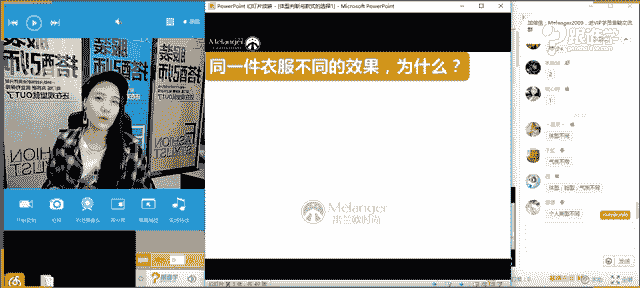

# 1、11服装《搭配秘笈之新版36计》：9体型判断与款式选择_rec

🎼Wem个。🎼哎呦哎呦。🎼哎。🎼个。🎼为他。Here we go。🎼Oh。🎼あ。🎼啦啦。🎼Can't wait to smoke them。🎼后 pack like猫包。

🎼Blow it in your face， Blow it in your face， blowlow it in you， blowlow it in your face。

🎼I can't wait to review work faster than you can say for us。🎼Tearing up the gravel。

 watching one gravel。 Now it's a party。😊，🎼Can't wait to cast my。🎼为就我。😊，🎼그在 got刻을 city 되。😊，🎼再也这份来头。

🎼you拼。🎼me up and。🎼made around the see。🎼That can be。🎼We are can。🎼or around the sea。🎼哎呦哎。🎼We草开。🎼没有。

🎼We smoke。🎼呦。🎼We错。🎼Cant wait to place for。🎼T burns like a blue。Spin it in your face。

 Sp it in your face， play it in your play it in your face。🎼Can't wait to get you sugar。

🎼So then you couldn't try。🎼You can try to hate it， You can try to fake it。 What baby I you say。

🎼But like you。🎼AndB mirror。🎼Go。🎼Weや。🎼没人让你 see。😊，🎼明 without。🎼。🎼。

hello，大家晚上好，嗯，可以听得到我的声音吗？同学们如果可以听得到的话，请回复一啊。然后我知道大家可以听得到我的声音嗯。好的，谢谢艾丽张敏同学。嗯，有声音是吧？钟永雄同学。好的，嗯，好嗯。

O谢谢大家。嗯。那今天呢呃我看到好多这个咱们刚才在群里提问的一些同学是吗？包括夏荷呀，然后还有这个呃刚才有一位同学形象管家这位同学是吗？嗯，好呃，那其实今天晚上有在我们这个答疑群里面的时候呢。

有一个女生，嗯，他说老师你还记得我吗？我叫发光的甜心，不知道甜心同学有没有在啊，那因为他之前是其实在我们他已经报过我们这样的一个VIP的课程。那这一次的话又报了这样一个班啊。

那很开心看到你这个甜心同学好，那今天晚上的课程呢，我们嗯8185没改名是吧？嗯，好的，嗯，好呃，那今天呢咱们这样的一个课程是关于体型的课程。那其实今。😊，天晚上在我们的答疑群当中呢。

有同学就已经提问到这个问题了，说老师我是梨形身材，然后问怎么应该穿怎么穿衣服呢？咱们这位同学在不在呢？嗯，因为我刚才在群里的话，呃就没有回答这位同学的问题。

我说因为今天晚上我们的课程呢就会讲到体型的判断于这样的一个选款。所以呢呃可以关注我们今天晚上的这样的一个课程。那今天晚上我们课程呢也会结合PPT呀，可能会去讲解的话，更加清晰。

那就没有在群里给这位同学解答。那不知道这位同学有没有到啊。好，呃，那今天我想看一下，咱们现在群里有多少男同学多少女同学呢，同学们啊，男同学的话呢，请打一女同学的话，请打2嗯，举手。好，男同学请打一。

女同学请打2。好，星辰啊，看来好像还是女生居多啊。好的，嗯，不过没关系，因为我今天的这样一个课程的话，其实还是涉及到男女的体型的这样的一个判断。男同学呢也不要着急，我们在先把女同学讲完了啊。

因为我们的女同学特别多。那呃女同学也可以讲这个讲到男生同学的这个板块的时候，女同学也好好可以好好听一下。因为呢呃这是你们之后的这个呃，比如说你可以给男朋友啊给你的老公，然后呢可以帮他们这个测量一下体型。

那今天呢我拿到了这样的一个道具可以给大家看一下。于妹妹同学是不是也在我们之前的这个课程当中学习过呢，这个名字也很熟悉哈。好，来同学们。😊，家里都有没有这样的一个皮纸？好。

那今天我们课堂当中呢判断体型这个呃这件事情就交给我们这个皮尺了啊，我相信应该每位同学家里都有是吗？啊，那其实应该是有很多同学以前对于自己的体型好像有了解过，说老师我觉得我自己是呃梨形啊或者是T形啊。

或者说O型啊，我想问一下，咱们现在有没有同学对自己体型是比较了解的。有自己了解自己体型的吗？如果了解的话，请打一啊。如果不了解的话，请打2。🤧嗯嗯嗯。🤧有有了有了解的是吧？好的啊，有人说我是X体型啊。

好像还有同有很多同学了解自己是吗？好，那我想我想要告诉大家的是，今天我在线上的时候，其实我们呃呃在线下老师今天上课上的有点晕乎了哈。我们在线下的这个学院当中，我也在上这一堂课。

今天一天讲的都是体型的课程。那今其实在开课之前也是有很多同学说，老师我知道我自己的体型啊，那我们在测量的过程当中会发现，很多同学会说老师好像我测量的结果跟我以前认知的不太一样。我以前觉得我好像肩很宽。

我以前觉得我好像臀部很宽，但是好像今天测量出来的结果跟我预想的是不同的。好，那今天呢我教给大家这样的一个方法之后，我相信你们回去测量之后，跟你们以往的认知也不太一样啊。

那我们今天就开始今天的这样的一个课堂。OK。😊，好，小X啊，有人说自己是小X体型。好，那呃大家应该都对我已经认识了啊。在这里呢我就不过多的自我介绍。那我是资雨老师啊。

也是米兰欧线这个国际教育的时尚讲呃高级讲师啊，同时也是我们现在线上呢VIP的课程。那现在呃也也有我在跟大家来授课。ok接下来呢我们来看一下认识自己体型篇。那之前呢我们前两堂课章课当中啊。

第一天我们讲到了认识自己我们的风格篇。第二天我们讲到了衣橱篇。那接下来呢我们来看一下我们的体型的判断啊，好，在生活当中我想问大家是不是有这样的疑惑，就是我们经常会看到一些我们所说的买家秀跟卖家秀。

为什么又会有这样的一个效果。同学们，本来我们觉得这件衣服挺好看的？自己晚上回去穿的时候，好像不是那么回事，或者说你身边的朋友买了一件特别漂亮的衣服。然后。😊，后哎，你也买了一件同款。

但是好像觉得有的人可能穿的你你你可能穿的会比你的朋友穿的还好看。但是有的时候可能就没有你的闺蜜穿的好看啊，或者没有你的兄弟穿的好看，其实为什么呢？同学们有没有人可以告诉我，你们可以发表一下你们的意见。

你们觉得这是为什么？为什么呃同一件衣服但是有不同的效果呢？嗯。来，我们先来看一下啊，同学们你们可以打字，然后呢老师继续啊，体型不同。好，清晨同学说，今天我们讲体型。那老师说的肯定是体型的问题，对不对？

好，气质不同非常好啊，我想看到的就是不同的答案好，体型气质脸型OK微微回答的特别全面啊，个人类型不同，那大家都回答对了啊，其实跟这个都相关。比如说一个人的气质，比如说一个人的体型，那么我想告诉大家的是。

其实体型为什么我们在一开始的时候就给大家在一开始的课程当中就给大家讲到了我们所说的脸型体型，那是因为我们在人物造型当中，其实一个人他在做造型的时候，就根据一个人的什么呢？我们的脸和我们的身体去做造型的。

而我们买衣服的时候，其实就是根据我们的体型去买衣服的。如果你不了解你自自己的体型。那么你一出手的时候买衣服的时候，你有可能就错了。例如。😊。

我今天在课堂当中，在我们线呃线下的课堂当中，我们学校有很多同学他的身材条件其实特别好。就是我们所说的那种X体型。等一下我给大家讲到的时候，大家就知道了这种体型，胸部臀部特别的丰满，腰特别的细。

那大家可以听一下，这种体型一定是看起来什么呢？非常很很很好的这种身材，但是因为他穿的衣服呢完全凸显不出来他的身材的优势。那是为什么呢？因为他没有选对款式啊。

那我们今天就要给大家来解答你的体型应该选择什么样的款式。那我们说同一件衣服不同的效果，那我们来看一下啊，是不是我们可能想象当中哎自己穿上是这样的效果，但是没有想到你可能穿上是这样的效果啊，OK好。

这是给大家这个娱乐一下啊，这也是网上的买家秀跟卖家秀的这样的一个差别啊，非常可爱。这个萌娃啊，那这个是又帅又酷型的，这个是呆萌呆萌的。OK好，那也就是说什么问题呢？刚才我问到大家了啊。

有同学说跟我们的体型跟我们的脸型有不同。那其实我们对于我们自己了解的真的是少之又少啊，同学们，我今天在给我们这个呃学校的这个学生讲课的时候，我就说今天呢我想我相信呃大家对自己会有一个不同以往的认知。

因为我们活了2420多年30多年都不认识自己的这样的一个体型啊，那今天呢你们会从头到脚的了解自己啊，你的这样的一个，比如说我们今天呃在线下的课程，我们会只给大家分享到体型的判断与款式的选择。

那我们在线下的课程当中，我们会了解的更多。比如说呃什么是九头身啊，你的头的比例跟你身体的比例啊，那包括呢不好意思，同学们，包括你的这样的一个身体的黄金比例是怎么样的啊。那呃今天给大家分享的是体型的课程。

那我们在线下它分享的是比较多的。所以上了一天，那因为时间的有限，所以也不能给大家分享那么多的课程啊。那其实很多同学我相信你们站在镜子面前有99。9%的人哼。站在镜子面前的时候，我们看着自己的时候。

你会呃发出什么样的感叹？我想问女同学，不管是男生还是女生，你们都可以这个这个想象一下，你们自己站在镜子面前的时候说的第一句话是什么话？哈蓉蓉同学，谢谢啊，你们会说什么？同学们蓉蓉同学说嗯，太美了。好。

有没有其他的同学胖好，其他同学呢？你们站在镜子面前的时候会有什么样的感叹。😊，要健身了。好啊，其实大部分的人美基本上我们中国的女性站在镜子面前的时候都会说一句话啊，天哪，我怎么这么胖呢？哎呀。

我脸上怎么长了这么多痘痘啊啊，要么就是我的脸怎么这么大呀啊，我的腰怎么这么粗啊，基本上没有人会直接啊就是比如说我换了一件衣服之后，站在镜子面前，我不会说我太美了。哇，我怎么那么漂亮。

基本上很少会有人这样说，蓉蓉刚才说嗯太美了，我觉得蓉蓉蓉蓉，如果你是真的在生活当中也可以做得到的。我相信你是非常自信的一个女生。那要么就是你长得真的是很美啊，那基本上即使是范冰冰啊。

我们大家都认为她非常漂亮，但是她也有缺点，我相信她站在镜子面前的时候，也会挑自己的刺啊，那所以说人其实是什么呢？有这种追求完美的心态，而且永远都觉得自己身上有很多缺点。那今天的这堂课。

我们要教给大家的是。😊，发现自己的优点。我们说在在人物造型的时候，其实最重要的就是四个字叫扬长避短啊。那呃有的人呢他会认为哎我的肩很宽，我的臀很胖。其实有可能你认为的很多年的观念都是错误的啊。

那你觉得自己肩宽，你觉得自己的屁股大，那有可能都是自己错误的那今天呢我们量完之后，那大概你们大家就知道你自己的体型到底是什么样的吧啊，好。来，我们来看一下啊，同款不同身材的着装一同，那是这是同一件衣服。

我想问大家，哎，同学们，你们现在可以来发表一下你们的建议。对于这些体型当中，你们喜欢哪种体型？12123456，你们喜欢哪种体型。Yeah。咱们这个呃男同学，你们可以先回答一下啊。

不管是男同学女同学都回答吧啊，因为刚才没有跟大家说。好，有同学说12A123好，21212123，怎么感觉跟喊喊那个什么似的？好呃，大不多数同学都是123是吗？好，形象管家同学你好嗯。

那今天咱们在这个VIP呃这个答疑群当中嗯。😊，紫色啊他喜欢紫色，然后是这个呃4号是吧？好，为什么呢？形象管家，你为什么喜欢这一个呢？其他同学我看到了答案，基本上都是一23，对吗？啊，没有这个这个456。

只有咱们这个形象管家这位同学选择了4。好呃，我想告诉大家的是，我想说的是啊，基本上选择二的同学，我来猜一下，可能很有可能都是男生啊，选择一的和三的和四的啊，就这四比较少。

选择一和三的大部分都是男生为什么站在我们说男生的审美角度上啊，阿麦同学说是女生是吧？哎，那阿麦同学，你为什么喜欢这个2号的体型呢？😊，在我们线下做很多调研的时候啊，基本上选二的都是男生好，为什么呢？哦。

那咱们线上的女生我发现包容度还是很强的啊，还都选了2。那说明咱们这个这个这个咱们教室里的同学你们还是都什么呢？向往这种丰满型的身材是吧？好。

喜欢胸部比较丰满的O那其实我们说123这三个体型其实相对来说都是比较什么呢？啊，这个有优势的啊，那从456来讲的话，咱们刚才形象管家说这个呢它比较线条分明比较有女人味儿。而这个呢它是O型体型。

这个是什么大A型就是太胖了，所以很少有我们说不管是男生还是女生都不怎么喜欢，对吗？那123我们来看一下一和三被我们称为叫平衡型身材，它的肩跟他的臀是相等的那一呢它是X体型，就是我们所说的沙漏型X体型啊。

😊，像沙漏的形状一样。那第三个呢，它就被我们称为叫H体型，也被我们称为叫瘦长型的这种身材啊，就是竹干型。那他的身材曲线一加呃肩呢啊腰啊，臀哪全都是相等的那第二种体型呢啊阿迈说感觉自己是X。

但又不知道自己是测的正确，所以喜欢2，哎，这个不太理解你的点在哪啊？好，我们说为什么喜欢第二个其实就是因为他胸部特别丰满，直白一点讲，对不对？啊，O好。

那我们说T型这个其实就被我们称为叫T型身材就是肩部特别宽，然后臀部相对来说比较窄，这种体型它其实在生活当中的话呢，看起来有点壮，这种体型的女生啊有点这种所说的汉子的感觉为什么呢？

因为T型身材在男士的体型当中，我们认为是最美的啊，最漂亮的体型。因为这种身。材他会有一种阳刚之气啊，我们会觉得这种体型的话，男生嗯很帅，很很很阳刚，很man的感觉，很有安全感。

而女生你长了一副男人的身材，你就太强壮了，是不是啊，女人我们还是以柔美为美啊，OK好，那这就是我们所说的同一个什么呢？款式不同身材的人，她穿着会有不同的感觉。那刚才给大家来简单的做了一个小调查。

你们喜欢的体型，那当然其实还是比较什么呢？相对来说还是比较好打造的身材。那这种体型呢，它其实都是属于特别胖的啊，那在生活当中其实特别胖的体型还是比较少的。

但是这刚才123这种身材当中有一种体型不是特别好打造，就是大家你们喜欢的这种体型啊，接下来我们来解答一下啊，为什么这种体型不好啊，不好打造OK啊，我们首先来呢一个一个体型来，我们从什么呢？

来从我们所说的体型分类当中，女士的。😊，体型我们分为了X体型，H体型T和A。刚才你们选的那种胸部特别丰满的就是这种身材啊，那第一种就是什么呢？X体型身材第三种就是H体型身材。

而这种身材呢就是刚才我们的那个第四种这种身材呢，其实嗯婆婆特别喜欢，为什么呢？看起来比较什么呢？容易生痒。那这种体型其实在我们亚洲相对来说35岁以上的女性吧啊，还是比较多的，就是因为什么呢？结了婚啊。

生了孩子啊，身材稍微有点这种经常做办公室啊啊，这种情况比较多的话，那容易什么呢？脂肪堆积在这种在这个臀部的部位啊，那还有一种情况呢，其实是因为骨架天生就是这样的，肩本来就很窄，臀部本来就很宽。

那有的人天生骨架是这样的啊，那所以说有两种情况的啊，那接下来呢我们一一的来看一下嗯。从我们这样一个体型测量的角度当当呃来讲呢，我们今天呢也给大家请到了模特啊来教给大家这样的一个体型的这样的一个测量。

那有请我们的这个呃这个技术助理老师，麻烦把我们的模特请过来。那首先呢我先来给大家讲一下我们所说的这个四维测量法啊，是同学们我想问你们平时在测量的时候都是怎么测量体型的？

刚才是不是有同学是说自己了解自己的体型的。我想问大家，你们是怎么测量的呢？我看到第一款臀围和胸围宽比肩窄啊。好呃，同学们，你们平时在自己你们了解到自己的体型，你们是怎么得出来这个结论的啊。

可以刚才回答这个刚才回答了解自己体型的同学，你们可以举手啊，先神说肉眼观察，好，肉眼观察啊，然后还有一个说目测，你们觉得你们自己的眼睛是X攻击呀，还目测出来呢？嗯，还有没有呢？就是肉眼观察和目测，对吧？

好啊，那我们来看一下，我们说其实女性自我体型测量灯啊，有同学是测量的是吗？微微同学是专专门的测量过了是吗？OK好，啊，那我首先呢先给大家来讲一下我们的这样的一个体型测量方法。那我们呢首先是从四个维度啊。

第一是肩围，第二是胸围，第三是腰围，第四是臀围，那我们肩围胸围腰围和臀围的测量方法呢，是围绕一一圈来测量。那我们今天有请到的模特，身材非常棒。而且呢非常漂亮。那你们是不是要准备好你们的这个呃掌声鲜花啊。

来开始刷屏吧？同学们啊，为了我知道咱们这儿没有鲜花是吧？那你们就可以用刷一来表示我们的这个模对我们的模特的欢迎啊，然后呢我们的模特已经到了。那大家呢嗯。看同学们已经开始在这个这个欢呼我们的这个模特了。

我们今天这一位模特呢有一个特别傲娇的名字叫南公主啊，南公主呢是是是是成都人。然后呢，咱们这儿有没有成都的同学？班咱们教室里有没有成都的同学？😊，那现在呢啊老师不不卖罐子了，就有请到我们的男同学。

然后可以要出来给大家见面啊，我们男同学真的非常非常漂亮。来有请我们的男同学。hello啊，同学们有没有看到啊，那我们下面有请我们男同学简单的跟大家来介绍一下自己吧。嗯，这是我们第男同学第一次过来做模特。

有点傻，就是不知道到底发生了什么情况呢？呃，因为其实他是我们线下的这样的一个课程的同学。那我说今天有课程，然后呢邀邀请到一位模特。然后男同学说我来啊好，那我们首先呢请男同学给大家来介绍一下。😊。

hello大家好，我叫男公主。对我来自成都。啊，来到这边呢很高兴和大家见面，然后很开心来做那个模特O好，男公主呢呃身高多高，162啊，162。然后呢今天呃我们在体型测量的时候。

我发这这一段时间因为我们都在上课，我发现男公主身材特别好啊，大家可以自带自自自己旋转一下，给大家来看一下啊，身材非常棒，为什么呢？为你你的保养方法是什么？就每天健身呢嗯运动两个小时。对哇。

真的是我我因为老师真的很难坚持下来。所以说身材好是有原因的。同学们啊，身材好是有原因的。所以对是的，她的身材真的非常棒，那就是因为长期坚持。接下来呢我们就来看一下这个完美身材的女生。

她的体型到底是什么样的啊。那我现在呢。😊，来教给大家这样的一个方法啊。OK首先呢第一步，我们首先呢什么呢？要呃我要告诉大家呢，就是我们这个体型测量的时候呢，第一步是量我们的肩围，第二是胸围，第三是腰围。

第四是臀围啊，那在肩围的这样的一个方法上呢，我们首先是通过我们的这个我们所说的肩部啊，它的这个外边缘就是手臂的外边缘，有一个蘑菇点。那在肩胛骨旁边呢，其实有一个凹陷处，凹陷处呢旁边有一个叫这个蘑菇点。

那我们看一下男公主今天穿的背心吗？里面啊，对，那可以这个给大家展示一下。对对对，是的。来有纹身不介意，没关系啊，男同学很酷啊，脱掉。好好好，可以，男同学先把外套脱掉啊，然后给大家展示一下。

身材真的非常棒，我都羡慕嫉妒恨死了。OK好，那我们我们站起来来给大家来这个演示一下啊。好。😊，我这样说话大家可以听得到吗？如果可以听得到的话，请打一。因为我现在要站起来给大家来演示。如果可以听得到的话。

请打一。同学们O好，那接下来我来看一下，那首先男同学可以站过来啊，没关系，不用害羞，男同学有点害羞啊。好，那首先呢我们从这边来看吧。同学们来看一下，我们可以离近一点，离电脑近一点啊。呃。

这个我们所说的这个手臂的这个外面这个肩胛骨啊，这个肩胛骨地方有一个凹陷处，同学们可以看得到吧。凹陷处这往上摸，你们现在可以摸自己了啊，你们可以摸一下，这个地方有一个叫蘑菇点的位置蘑菇点。

那我们在测量的时候呢，就是从这个蘑菇点测量到另另外一个蘑菇点，然后旋转一圈，那下面呢我来展示方法给大家来看一下啊。O好来。啊，我们站在这边。对。来往前站一点就可以。好，谢谢。

那同学们从这一个蘑菇点在测量的时候呢，要双手垂直啊，然后呢要这个双腿并拢，抬头挺胸。因为你驼背的话，你测量的方法的话呢，测量上有可能就会有误差啊OK。从这个蘑菇点测量到另外一个蘑菇点嗯。然后旋转一圈。

然后我们得到了一个数据是89厘米。okK同学们，你们现在可以在屏幕上打一下，因为我怕老老师等一下忘记了啊，89厘米。嗯，好，是第二点呢？我们现在来测了胸围啊如果教室里有男同学的话，你们不要太污了啊。

自己这个来我要教给大家的一个方法就是什么呢？胸围的话是女生在测量的时候是B不BP点。也就是说乳高点啊，胸部的最高点。我们来给大家来展示一下89啊，是谁打的86啊。好。81厘米同学81厘米，你们可以在对。

可以在这个我们的助教老师已经打出来肩围89，胸围81厘米。O好，第三点非常关键了。同学们第三点的话是让你的手肘来，男同学可以这个对手肘这样的一个夹起啊，然后你的肘部对准你的腰部的最最这个对齐的位置。

其实就是你腰最细的这样的一个位置，我们可以侧面给给同学们展示一下，嗯，就是你腰部最细的位置。那如果有同学呢自己说老师我找不着我自己这个肘肘部跟腰对齐的位置，我觉得不是我最细的位置的话，那么你可以什么呢？

测量你的呃摸一下你的肋骨，最后一根肋骨的那个位置，其实就是你腰最细的位置。那接下来我们来看一下男同学的腰有多细啊。好，嗯。64厘米64厘米啊，助教老师帮忙记一下，64厘米嗯。好。

这是我们所说的腰围的测量方法。那最后呢就是臀围的测量方法了啊。那臀围的测量方法呢也也是一样，是量什么呢？臀部最翘的这样的一个位置。那我现在来给大家来展示一下啊，男公组可以侧着对O嗯，双腿并拢。

双腿一定要并拢啊，这个的话对你的臀部会有影响。你臀围好。来。😊，你坚持坚坚持健身多长时间了？嗯，多吧啊，所以身材这么好啊啊，OK。90厘米，臀围90厘米啊，那男同学的身材非常非常的标准啊。

这个身材真的太棒了。是我见过的这个这个女生当中啊，我们同学当中的身材是最好的一位了啊。好，刚才已经有同学打出来这个答案了啊。那男同学呢帮我们展示了女生的测量方法。那下面呢我简单的其实跟大家来讲一下。

男生的测量方法，其实除了不用量胸围以外，男生没有胸围，对吗？所以不用量胸围，那有一个位置啊，就是这个我们所说的腹部男生他的量腹部的这样的一个方式跟女生不太一样。他需要量的是什么呢？肚子最大的位置。

就是肚子最大的这样的一个位置，最高点量一圈啊，有同学说臀围从什么位置量起臀围是量你的臀部最。高点围绕一圈，那理解吗？好。🤧我来给大家看一下啊。🤧好啊。

那我们男同学呢就帮我们刚才已经这个给大家来展示了我们这样的一个体型的测量方法。那接下来呢是不是要让我们这个呃同学们，你们是不是要给这个男同学一点鼓励啊？我们要谢谢男同学，谢谢啊？OK好啊。

男同学可以这个先嗯OK好。😊，🤧那接下来呢我来继续给大家嗯，谢谢。好的，那因为大家其实是线上的呃同学啊，那我们男同学的话其实是线下的OK好好。😊，刚才有同学已经测量出来了男同学的这样的一个体型了，是吗？

好，他的肩围是89，胸围是多少呢？同学们。我来看一下啊，我来翻一下咱们这个聊天记录。呃，肩围89，胸围81，腰围64，臀围90厘米。好，这个数据的话呢，大家记好啊，我来我来粘贴复制一下啊。

等一下老师要要教给大家这个算测这个算的方法。🤧好，我们继续。谢谢嗯，谢谢于红同学呃，帮我把这个数字已经记下来了。那接下来我们来看一下嗯。😊，え。这是我们所说的体型测量方法。好。

那关于这一点大家都理解了吗？如果可以呃，如果理解了啊，也都知道怎么去测量的话，同学们请打一。如果有不清楚的话呢，可以在我们这样的一个肩部的点不好找，是吗嗯。兼顾的点的话，相对来说呢。

其其实呃如果这个比较瘦的同学其实是比较明显的啊。那我在下一次的课程当中呢，会帮大家来展示一下。其实老师的呃这个这个这个蘑菇点会比较明显啊，我来给大家展示一下，稍微啊，那或者是我现在给大家来展示一下吧。

这个突然在镜头面前有点这个这个有点不好意思啊，来，同学们看一下，呃有同学呢他的这个这个如果是比较胖的同学，他可能会比较难找。那如果对蘑菇点，如果比较瘦的同学他会特别的明显。

那呃其实例如说我的这个其实大家现在看不太清楚啊，但是我站近一点给大家来看一下啊。呃，也就是说我们肩膀最外边缘的时候呢，你去摸有一个凹陷的地方。同学们，然后呢，你顺着这个凹陷的点往上摸，就有一个蘑菇点。

这个点你按下去的时候，它就是一个凸起的点啊，就是一个凸起的点。我们在量的时候呢，就是量这个从这个凸起的点，量到另外一个凸起的点，理解了吗？同学们。呃，量一圈啊量一圈，从这个量到这边的一个绕一圈。

是一呃我们所说的肩围嘛，其实量的是肩的围度，而不是量的肩的宽度嗯。🤧。OK好老师近看好萌，再萌一下你们。好OK好，嗯，那这就是我们所说的这个。😊，好呃，方法掌握了没有？同学们啊。

别别管老师好看不好看了啊，赶紧的嗯。对，如果有同学说就是骨头尖对，有点那个意思啊，就是那个肩肩胛骨外上部位和肩关节相接触这个这个呢太嗯，好，大概就是这个意思啊，大家能理解就可以了。

那这就是我们所说的这个嗯测量的方法。好，如果现在大家理解的话呢，请打一不理解的同学，你们现在还可以提出疑问啊。😊，理解了吗？嗯，好的，那肩的话呢就是量我们这个我们所说的肩围啊，胸的话是乳高点啊。

也就是BB点。那腰围呢就是我们手肘夹起的部位，跟我们什么呢？腰部对齐的这个位置，就是我们基本上是我们腰最细的位置，如果有同学觉得啊这个位置不是你腰部最细的位置。那么你去摸你的肋骨的最后一根啊。

那这个位置一定是你的腰部最细的位置。为什么呢？很多人有没有听过这样的一个想呃，有没有听过这样的一个说法，说，为了让他的腰显得瘦去拆了两根肋骨啊，比如说李纹啊，到底是真的还是假的，咱们不知道啊。

因为李纹他的体型的话，就是这个腰特别细。然后呢，胸部跟臀部相对来说很丰满，对不对？那有很多同有很多人有这样的一个传言，就是说他拆了两根肋骨，那为什么他要拆肋骨，其实也就是说肋骨它决定了什么呢？

你腰部的什么呢？宽度。啊，所以说呢肋骨是最呃最后一根就是你腰最细的这样的一个位置。OK这是我们所说的腰部。那臀部呢就是什么呢？你的臀部最翘的位置。在测量的时候，首先请同学们一定要注意站立什么呢？

抬头挺胸啊，双手的在你的腿部的两侧啊，就是你裤峰的那个位置啊啊，一定不能驼背，因为你驼背测量的方法啊，测量的数据它可能会有所误差啊，一定什么呢？双腿并拢O这是我们所说的测量的方法。嗯，好，男性的话呢。

除了不用量胸围以外啊，在腹围的这个位置就是量肚子最大的位置啊，那接下来我们来看一下体型啊，体型我们看一下X体型。那刚才我说到的呃里纹。那包括呢我们所说的这个玛丽莲梦露啊，他们其实都是属于X体型的为什么？

我们会觉得梦露很有女人味儿，那是因为梦露的身材的曲线非常的明显，就是它非常具有女性的这样的一个曲线美。腰肢特别纤细啊，胸部特别丰满啊，臀部也特别丰满。那在20世纪我们说1910年以前，维多利亚时期。

很多西方的贵妇们她们会穿一种塑身内衣，紧身胸衣。那这种紧身胸衣呢，它可以达到什么样的效果呢？就是让你的腰特别特别细。然后呢，胸部很丰满，臀部也很丰满。那在那个时候妇女们这些贵妇们，虽然她很非常漂亮啊。

但是其实她们也很痛苦。为了达到这样的一个细腰，他们要常年穿这样的一个紧身的胸衣，而且这种紧身胸衣是特制的啊，非常的硬啊。那那在他们在穿着的时候，其实有很多人的呃这个我们所说的五脏内内内腑都已经变形了。

因为受到挤压的问题啊，他们的平均寿命也不会特别长，基本上可能就50多岁啊，因为有很多的疾病的会引发一些疾病O这是我们所说的这种这种紧身胸衣，它就会把人的身材变成X体型，就特别特别的性感啊。O好，那。

这是我们所说的X体型，它具有女人味儿。那它的这个数据应该如何呃这个计算出来呢？比如说肩围等于胸围等于臀围，腰围比以上三个小20厘米。那下面我们来举个例子，同学们，如果一个人他的肩胸臀是90厘米。

那我要问大家，他的腰围应该在多少厘米，他才可以达成X体型，同学们。嗯，来现在开始抢答了啊。好，同学说70。好，是70以上呢，还是70以下呢？好，3781同学回答正确，其他同学也回答正确了啊。

只是大家不知道说这个数据的范围。对，70以下，比如说刚才我们的什么呢？来，我把这个数据打上来啊。嗯，刚才咱们那个呃男公主她的体型，同学们还记得吗？我们的助教老师麻烦把男公主的体型发出来一下啊。

那其他同学如果有知道的话，可以帮忙发出来一下。我们来计算一下男公主的体型是什么体型呢嗯。好，嗯，898164，谢谢。OK谢谢。嗯，89、81、6490。

那我们首先来计算一下他的肩跟他的臀围89和90是相等的对吗？那他也就是说是平衡型的身材，对不对？那他就排除了他已经是平衡型身材了，肩跟臀臀是相等的啊，那他的胸围没有我们所说的肩围和臀围相等，对吗？

其实基本上亚洲人啊，都达不到，我们所说的肩胸臀是相等的啊，所以我们在这个计算数据的时候呢，大家不用担心啊，有同学说老师我的胸围达不到，那其实基本上大多数的亚洲人都达不到啊。

那所以说我们在这个计量计算数据的时候，我们首先看一下肩跟臀只差了1厘米啊，那他的腰跟他的臀差了多。同学们，你们快速算一下。啊，差了多少厘米？对てて。26厘米。是的，宇和同学说26厘米。是的啊。

那如他已经什么呢？达到了我们所说的20厘米以上，对吗？同学们20厘米以上，所以它是一个X体型。那刚才我们的男公主就是X体型。理解了吗？同学们啊，O好，这就是我们所说的X体型的计算方法。

也就是说很多同学刚才有同学已经问了，说就腰围一定要比另外三个小是三个都包含在里面吗？那没关系，肩围跟臀围是相等的，胸围不相等没有关系，你的腰围要达到什么呢？20厘米以上，也就是比如说刚才的那个数据。

男公主它就是26厘米了，它已经超过了20厘米。那也就是说它就是什么呢？X体型。O胸围。腰围不是小于20吗？🤧啊，阿K同学这个问题老师没听懂啊。O好，我刚才已经跟大家重重申了啊，我现在再举啊。

肩围比臀围小了4厘米是吗？啊，那这个嗯同学们不要着急啊，慢慢来，等老师把体型讲完了之后，你们再这个自己计算好不好？好，那我们继继续接着来，我们来看一下X体型。那如果有同学你们是X体型的话。

那我们来看一下X体型的优缺点啊。O那X体型呢，它的优点是女性化线条比较明显。那腰身比较细，而且比较看起来是比较性感的。刚才已经跟大家讲过了啊。那它的缺点就是什么呢？胸部太大，穿衣显得胖。

那我想问一下咱们教室里有没有胸部比较丰满的。然后对于这个这一点是比较苦恼的。如果有的话，请打一。如果你们不好意思的话，也没关系啊，有没有。啊，胸部然后觉得自己胸部太丰满了，不管你是不是X体型啊。

你就会你就觉得自己胸部太丰满了，穿衣服有的时候特别显胖，有没有这样的情况？如果有的话，请打一。好，没有同学勇敢站出来好，那我们就继续啊。那今天其实在线下的课程当中的话。

有就有很多同学都是这样的说老师我觉得我自己胸部太丰丰太丰满了啊，穿衣服的时候真的是不好穿衣服，比如说穿那种T恤啊，人家穿特别好看，我们穿的时候就觉就就就就觉得啊很胖显的啊，那这其实是很正常的。

比如说X体型的话呢，如果啊你这个胸部又很丰满，基本上其实我们国内和这个我们亚洲人是比较少，胸部能跟肩围和臀围是达成一致的那基本上有很多胸围是能达成一致的那种同学呢，他的这个相对来说是比较丰满的。

他穿衣服的时候就会要需要收腰款式一定要收腰。比如说他穿X廓形的服装就很好看。那么我们说X体型他的优势是什么呢？就是他的腰特别细。所以你在穿服装的时候要打造你的。😊，优点，那就是什么呢？

把你的腰线塑造出来。也就是说这种收腰放白的款式会特别的适合X体型。那如果你胸部很丰满的话，也一定要穿这种款式，一定要收腰。例如说有很多裙子，它是直版型的对吗？

那还有一种款式是收腰款式的那么你就选择这种收腰的款式，比如说大衣也有很多是收腰的和S版型的那这种同学一定要选择收腰款式的同学。收腰款式的服装OK好，嗯嗯，等于20也算X体型。夏河同学等于20也算X体型。

O好，我们接下来看一下同学们，刚才听到我这个讲的了吗？X体型的话，如果你是这种型，这种身材，你在穿衣服的时候凸显你的优势，你的优势是什么呢？女性化线条很明显。那么你就把什么呢？

把自己穿成女性化线条明显的这种状态就可以了啊，塑造自己的优势，穿收腰的这种裙装会更加适合你啊。O接下来我们来看一下同学们告诉我哪种款式会更加适合X体型，一还是2。一还是2。好嗯。

大多数同学都回答了一对吗？那这种款式是不是像我刚才所说的呃，我们所说的叫什么呢？收腰了，对不对？例如说这种裙子叫H款式的啊，H版型呢？那这种裙装它就是不收腰的。而我们在平时穿衣服的时候。

比如说现在这种衬衫扎到什么呢？裙装里面是不是也可以收腰效果啊，包括扎到裤装里面也是形成了这种收腰效果。包括如果是这种裙装我是不是扎一条腰带它也可以收腰了，所以说X体型最重要的就是收腰啊，收腰O好。

你们我们接下来来看一下，是不是这种就形成了X廓形，而这种就是我们所说的长方形巨型啊，或者说这种这种就是不收腰的这样的一个款式。那所以X体型它会更加适合穿这边的这样的一个款式。O好，我们继续来看。

那在这两件衣服当中。要更加适合X体型，同学们一还是2。🤧嗯。嗯。😊，二是吗？嗯，ok。是的，嗯，同学们都回答对了啊，同学们OK谢谢同学们。是的，那二会比较好。那有同学会问到了老师。

那是不是X体型的人天天都要穿收腰的款式，就不能穿不收腰的款式了呢？嗯，有没有同学有这样的疑问的。我相有很多很多女生，特别是她自己真的是X体型的人，她会很纠结，天哪，我天天都要穿这么女人吗？

我就不能穿一下这种这种不修身的服装吗？啊，O好，我们来看一下啊，怎么去打造这种你不想收身的时候啊，这种效果，那我们来看一下，左边跟右边同学们告诉我，哪一个款式会更加适合X体型。😊，3781同学说。

老师嗯X体型胸都很大吗？啊，刚才老师已经解答过了，亚洲人基本上胸围都达不到肩围跟臀围相等。所以很多X体型的胸围并不是特别大啊OK好，很多同学都说右边对吗？好，那我想问大家。

是不是这种服装它也是不是就我们所说的，如果一个人啊它是X体型，那是不是它就不可以穿那种什么X版型啊，当然可以它的前提是什么呢？内搭它可以选择这种收腰的款式。

例如说你看现在冬天是不是啊我们都喜欢穿叠穿的这样一个方法，里面一层外面一层，那有很多同学就会穿穿成这样啊，就里面宽松的，外面宽松了。那嗯这种体型。那它就这种搭配方法就不太适合X体型。

那这种搭配方法就会更加适合X体型。就以说。它里面是收腰的，外面是宽松的，是一样可以的啊。O好，这就是我们所说的X体型，它在选择款式上需要注意的问题，他尽量要选择收腰的款式，为什么呢？

因为不收腰的款式会让它显得太胖。如果好刚才有同学提问了，说老师那X体型一定是胸大的吗？如果你是一个胸平的X体体型，那我要告诉你非常好，恭喜你啊，你的体型非常非常的百搭，你穿很多的服装都可以。

比如说X版型的，比如说这种不收腰的款式，比如说收腰放百的，你都可以穿。我说清楚了吗？同学们啊给大家解答清楚了吗？不知道好，那这是我们所说的这样的一个X体型的。

比如说模特秀场基本上很多模特都是这种X体型的，而且是胸平的。自己好，有同学说老师那胸是多平才叫平呢？啊，那这个是要有衡量标准的是吧？没有衡量标准，只是什么呢？你的胸围看起来相对来说没有那么丰满。

那你自己感觉不到吗？就是你自己感觉不出来，你到底是这个胸丰满还是不还是不胸不丰满吗？OK好，有同学说快盆壁了啊，那你一定是平胸。好啊，那这是我们所说的这样的一个X体型的选择款式。

那这一点我大家有没有啊清楚了吗？我有没有跟大家讲清讲清楚这个X体型的穿衣的方法与选款，如果大家清晰了话呢，请打一好吗？嗯，好的，嗯，心血星辰。如果其他同学清晰的话，请打一啊，不不清晰的话。

你们在后面的这样一个课程当中，可以跟大家来进行跟老师来提问好。那那接下来呢嗯小邱同学说刚进来课时有点懵，谁让你们早点来呢？嗯，好，等一下我去看回放吧。嗯，那接下来我们就来看一下啊。

下面一种体型OK那么来看一下H体型。H体型，大家来看一下肩围等于胸围等于臀围啊，他也被称为叫平衡型身材，肩臀一定是相等的啊，那我们所说呃这个当然包括胸围啊，胸围其实也还是一样的道理。

但是基本上我们亚洲人胸围都达不到跟肩围和臀围相等啊。O好，腰围离以上三个小20厘米以内，那还是以刚才我们这样的一个呃举例来说明数据来说明，比如说一个人他的肩胸臀是90，那他的腰围是多少，他才是H体型呢？

同学们。😊，他的腰围是多少？它可以是H体型呢？嗯，有和同学说70以上有没有一个范围值？我想问大家有没有范围值70以上到多少之间呢？我们的肩胸臀是90厘米，嗯，腰围比以上三个小20厘米以内。是的，非常好。

70到90厘米，为什么呢？因为如果你大于90厘米了，那么你有可能就什么呢？是那种肚子大的体型了，就是我们所说的有点像苹果型的体型了，那你就不是什么呢？不是我们所说的H体型了。好，那在这一点呢？有可在。

啊，有很多同学他会这样的，比如说他就差了一厘米或者差了2厘米，就到什么呢？它是介于H还和X之间的啊，就是差了一两厘米。比如说有的人他的呃那大家现在听清楚啊，他的肩是90，胸是90，臀也是90。

但是他的腰是71厘米，或者是72厘米。那我想问大家，你们觉得这种体型是属于哪种体型呢？同学们这种体型它是属于哪种体型？非常好？同学们嗯形象管家，包括韩夏，包括呃这个呃韩夏同学。

他们两个人同学回答回答正确啊。蓉蓉同学说H好，那我要告诉大家是它是接近于X体型的。为什么呢？其实我们在测量过程当中肯定会有一两厘米的误差，咱们还不容许别人有一两厘米的误差吗？而且其实它已经什么呢？

接近于20的时候就已经说明他的腰是很细的了，所以它其实是可以给到X体型的啊，那我们说是如果你是这种这种73啦，7475，那你可能这个体型就相对来说是比较什么呢？腰跟臀的线条已经没有那么大的差距了。

所以你看起来就什么呢？接近于H体型了。OK这是我们所说的H体型的计算方法，这一点跟大家讲清楚了吗？嗯，好，我们。下来看一下。H体型它的优点就是什么呢？身材匀称，它的缺点就是腰身比较粗，胸部比较平。

线条不够女性化，为什么不够女性化？因为我们说一个女人，你胖胖哪都不行，就是不能胖腰啊，胖哪儿都行呢，就是不能胖腰，为什么你胖腰的话，你走路也没有那种女人的那种什么摇摆呀，风姿卓越的那种女性化的感觉了。

就是你腰一胖了啊，就看起来女人味就没有那么浓了。比如说现在其实有很多阿姨呀，她们的腰是不是就特别胖？你看上去觉得她有点好像壮壮的那种感觉？那所以说呢如果是我们所说的H体型，如果你是瘦H体型。

那么你还有救。如果你是胖H体型，那你就是特别特别难穿衣服的体型了。同学们啊O如果胸围臀围肩围98，腰围80呢？差18厘米不是吗？是不是啊韩夏同学差18厘米，其实接近于我们所说的X体型，理解吗？

接近于我们所说的X体型，它还是它的肩，它的腰和臀之间还是有差距的啊，还是可以形成差距的。OK好，那这是我们所说的H体型。那H体型，如果那我们现在给大家讲到了所有的调整的方法啊。

就是我们现在我教给大家的所有的选款，包括调整的方法，都是基于你是一个相对来说比较瘦的这样的一个体型。当然有同学说老师，那什么样是叫瘦呢，就是相对来说比较正常的体型。如果你是特别胖的，200斤的大胖子。

你还按照老师这个方法去穿衣服的话，那么。这个方法就不行了啊，基于150斤以上所有的女性或者170斤啊，150斤以上的女性，他相对来说应该是比较胖的了吧。啊。

如果你是超过这样的一个体重的这样的一个体型的话，那我要告诉你的是同学你穿衣服合体就好了，不要要求太多啊。因为如果特别胖的人的话呢，如果你的腰还不细，那么你穿衣服的话，相对来说一定要求不管你是胖啊。

你不管是150还是200斤，你就要求合体准儿没错。因为如果你很胖的时候，你再想要要求，比如说我要穿一些什么蓬蓬裙哪，泡泡袖啊，那你看起来就像一个球一样了，就知道吧啊，所以说那老师没有任何攻击。

如果咱们现在教室里有真的有200斤的同学或者150斤的同学啊，老师没有去攻击任何同学啊，只是。啊，告诉你，如果你的体型这么胖的话，那你需要收腰合呃，要需要合体就好了啊。有同学说老师。

我怎么没听懂我是94、86、69、91啊，94。🤧稍等一下啊。🤧好，阿迈同学说，老师我没听懂，那你的这样的一个数据，现在是你现在打上来这个数据吗？如果是94、93、75、95这样的体型的话呢。

那你就是X体型。如果你是94、86、69、91，我们来看一下是什么体型你的臀围跟你的呃呃腰围差了多少呢？你的臀围跟你的腰围差了多少呢？你来计算一下这个数字，69跟91差了多少？谁说是H体型的？

拉出去粘啊。好，我们来看一下这个数据，94、86、6991一样是X体型，怎么是H体型呢？于红同学啊，你说的是哪个是是这啊，你说的是蓉蓉同学吗？啊，你说蓉蓉同学也不对啊，反正阿曼啊这个诺同学的这个体型啊。

诺同学的话，他这个体型是X体型啊，那96867292这个体型的话呢，也是X体型OK好，体型也是X体型啊，体型我现在就解答到这里啊，我现在不回答其他同学的体型的问题了，我现在要好好讲课了。

如果再给你们解答体型问题的话，讲不完课了，今天就啊ok好，我们继续啊回到H体型上来讲，我们说H体型的话，是他的腰部什么呢？不够纤细，所以如果你是一个瘦H体型的话呢，你应该怎么去打造？😊，完美的体型呢？

我们说所有非标准的体型，我要问大家一个问题，我们所有非标准的体型就是X体型被我们称为叫标准体型。那非标准体型，比如说H体型T体型和A体型，我们要怎么调整它才能让我们看起来比较完美呢？

同学们回答我这个问题。O。形象管家说，往X靠拢，其他同学呢，你们觉得吗？你们同意这个观点吗？🤧okK好的，非常好。是的，所有非标准的体型都是往标准体型X去塑造。所以如果H体型他想要往X体型去塑造的话。

他应该怎么穿衣服？同学们，他们应该怎么穿衣服？韩夏同学说收腰放百非常好，棒棒哒。啊，给你一个赞啊。是的，如果你是H体型的话，你是瘦H体型，相对来说比较正常的XH体型。那么你在选择服装的时候。

是要收腰放百的，明白啊，收腰放百。那如果你是特别胖的H体型就不能用这个方法了，你就收腰就好了，就不要放摆了。理解了吗？OK好，那我们接下来来看一下H体型，它应该选择什么样的款式。好，同学们告诉我。

你们觉得这两件哪个适合H体型一还是2。一还是2。🤧。麻烦我们的技术老师帮我把水杯拿过来一下好吗？谢谢。因为我刚才忘记带进来了，谢谢同学们，谢谢同学们啊嗯。好，有同学回答一，有同学回答2，谢谢谢谢。好嗯。

😊，OK好啊，那同学们来看一下，那呃老师给你们设计了一个套，你们就跳进去了，你们就掉进去了。我会我问你们一还是二，你们就有人选择了是吧？其实我要告诉你们的是一和二都可以啊，为什么呢？为什么呢？

一和二都可以。其实H体型的呃H型的体型它其实穿这种收腰放白的它会比较凸显女人味儿，他穿这种H版型的，它会比较帅气，所以这两种它都可以驾驭，而且H体型大家忘记了吗？H体型的胸是比较平的。

所以他穿这两种体型呃，服装版款式的服装都好看。我们说H版型的服装要给什么样的体型穿？你如果胸特别丰满的，是穿不了H体型的啊。H体型为什么大家会觉得这种男朋友崩啊，然后H版型帅帅的酷酷的。

因为身材比较纤薄，然后呢穿起来就感觉是比较帅，比较酷的。如果你身材很丰满，你穿起来就会太过于什么呢？臃肿，然后有女人。太过女女性化啊，就那种帅的感觉就出不来了。OK好，呃，比如说李宇春。好，呃。

因为不胖，所以可以收腰。是的啊是的啊，OK好，这一点大家能理解吗？H体型它可以穿收腰放白的，也可以穿H版型的。前提是你是一个比较瘦的H版型，理解吗？老师喝口水啊，同学们，这一点大家理解吗？如果理解的话。

请打一。🤧OK好好O那这一点大家同都理解了，理解了，我们就继续下一个知识点。O好，那这两件其实都是可以的啊。那接下来大家看一下这两件你们觉得怎么样呢？可以吗？这两个可以吗？😊，如果可以的话呢，请打一啊。

如果你们有不同意见的话，请答2嗯。这一件是不是H版型的这一件就是收腰放有点收腰的款式的对吗？所以这两件其实都是可以的啊。O好，这两件是都可以的啊。那接下来我们来看一下那嗯这是我们所说的H体型。

那T体型这就是我们所说的第三种叫非平衡性的体型。也就是说她肩跟臀其实是不相等的。你会发现H体型和X体型，它的肩围跟臀臀围都是一样的，它只是腰围在做变化而T型跟A型，它就是什么呢？肩跟臀是不平衡的啊。

那T型身材呢它是肩围大于臀围5厘米以上，肩围大于臀围5厘米以上。大家看一下这个模特的体型就是这个样子的，肩特别宽，臀特别窄，所以这种女性的话其实比较吃亏啊，为什么呢？因为她上半身看起来比较。

撞就是你会发现这种女生吗？比如说呃叫什么呢？游泳的那个就就是那个表情包，我都已经使出洪荒之力了。那个叫傅园慧是吗？啊，傅园会的话，你会发现所有的游泳的选手他们的肩都会特别的宽。

因为他们长期的就在做游泳的动作，所以他们肩特别宽啊。然后呢所有游泳运动员，你会发现他们都是T型身材，T型身材的人呢比较吃亏的是什么呢？就是你可能你可能只有120斤啊，但是你一上称一上称啊。

你看起来有120斤，但是你上称可能只有100斤，所以这是我们所说T型身材，因为他看起来太过于壮硕了，所以相对来说是比较吃亏的。那如果你是T型体型的话，那同学们我要问大家怎么去调整T型体型。

他怎么去往X体型去调整呢？T型体型怎么去往X体型去调整啊？有没有同学能够回答这个问题的？あああ。🤧。嗯。好，有同学说裙部可以多装饰裙撑阿K同学这个这个这个这个这个答案。好，裙撑我理解你说的意思啊。好。

缩上身扩下身扩下身，阿迈同学回答的非常好。下身穿宽大的上身颜色深，下身颜色浅非常好，同学们啊，你们都太聪明了。哈，老师一点，你们都清楚了是吧？好，有同学说肩部简洁。O那这现在我来读一下啊。

第一位同学说臀部多做装饰。第二位同学说收缩上半身扩大下半身啊，第三位同学说，下身穿宽大的。最后有同学说上身的颜色深，下身的颜色浅。那有同学说肩部简洁。O好。

从这几点我们来分析是不是可以理解成我们说服装它其实是有型色质行指是什么款式，对吗？那也就是说T形身材的人，他可以穿什么样的款式，肩部比较简洁线条的。例如说这种削肩的款式，其实那种削肩款式的。

包括肩部比较宽的人，他特别适合穿大V领和大U领拉伸它什么呢？这个肩制造纵向线条延长这个位置就会让你整个人看起来会比较什么呢？比如说老师今天穿的是个小圆领，对不对？会显得什么呢？脸特别大啊，脖子也比较短。

那我如果往下一点就会显得这个地方好像看起来会更加的通畅感一点。那所以其实如果肩比较宽的人，他尽量不要穿这种小圆领啊，那种一字领就不要穿这叫横向扩张，所以他要穿纵向拉伸的服装，制造竖线条。

让他看起来会更窄。啊，那这是我们所所说的，从这样的一个款式上的选择。那他尽量要回避一些什么呢？垫肩哪、泡泡袖啊、一字领啊这一类型的都不特别适合啊，那这是我们所说的，从款式上来讲，那有同学说插肩袖适合吗？

插肩袖是可以的啊，那从款式上来讲是这样的。从色彩上来讲，我们说一套整体搭配当中，比如说我现在穿的这一套大家觉得适合T型体型的人穿吗？对对。好，同学们，你们觉得适合T形体型的人穿吗？我上身穿的是格子衬衫。

下身穿的是一条PU的这种这种光泽感漆皮感的包裙。有同学说可以，有同学说不适合不适合的原因是在哪哪里呢？在整套搭配当中，我想问大家的是你们第一眼看到的是哪一个色块，我的上半身还是下半身？嗯。好，嗯。

格子显得宽okK好，其实从上半身和下半身的角度上来讲的话呢，基本上啊你们应该看到的，从色彩上来讲，我们只讲色彩啊，从色彩上来讲的话，你们看到的一定是上半身。所以说对焦点上移了。

那就是我们所说的梯型身材它的缺点在于哪里在于肩部太宽的问题。所以我们就不要让别人再注意到我们肩部特别宽了，明白吗？所以我们要收缩上半身啊，然后把焦点放到下半身去，而我今天这样穿的方法其实是错误的。

不适合梯形体型的人。因为我们的焦点大家一眼就能看到我上身啊格子很花，里面的内搭也很花，而且这个地方还做了很多的配饰等等。那所以那这是我们所说的梯形身材，它需要回避的问题，不要让别人的焦点注意在上半身。

这是我们所说从色彩上来讲，它选择。什么呢？收缩的颜色要比它选择膨胀的颜色要好。比如说我现在穿的颜色是比较偏亮色和浅色的，那么就不太适合我们所说的T型身材。那T型身材它要穿收敛色收缩的色彩。

就是看上去比较什么呢？第一，它看上去是有这种呃这种呃可能是深色的会比较好。那另外的话呢，从我们所说的冷暖色调上来讲，它冷色的会比较好，都会有收缩感啊，这是我们所说的，从色彩上来讲，啊。

那从刚才我们说形色材质上来讲，材质是不是有这种光泽感和这种哑光感的啊，比如说这种我身上的这条皮裙，其实它就是叫光泽感的那是不是有有的有的裙子它是哑光，我上面的面料是哑光感的对吗？啊。

那我们说从材质上来讲的话，它尽量不要选择那种太过于有光泽感的面料。因为。光泽感面料会让我们一眼就看到。而哑光的话，它其实是不吸睛的，就是不不引人注意的。

O这是我们所说的从材质啊、面料啊、面料啊、色彩呀、款式上来讲，那我们接下来来看一下图片啊，那T型身材它的优点是哪儿呢？第一显高，第二，腰短腿长，第三，胸围丰满。第四啊没有第四了哈。

那其实我们所说的刚才在我们一开篇的时候，大家还有印象吗？一排身材当中，大家都很多人选择了第二个大家认为那个是胸部特别丰满，其实那个是肩比较宽的那所以说什么呢？T型身材的人很有可能他胸部是比较丰满的啊。

那这是我们所说的优点，缺点上来讲的话，上身显得太过于壮硕，就太man了。第二就是臀部较窄，因为肩宽了，臀一对比就显得窄了。第三点，线条不够女性化。因为你是接近于男性身材的体型，怎么能女性化呢啊，O。

这是我们所说的T型身材的优缺点。那接下来我们来看一下。好，同学们。那第一点啊，这两张图片大家很明显可以看得出来，为什么这个会比这个适合，有没有同学能帮我解答一下呢？为什么这个领子会比这个领子更加适合呢？

同学们。Yeah。同学们，你们这个先回答一下，老师去找一下这个遥控器，我要把空调关一下，有点冷啊。好。哎。好。嗯，纵向拉伸。纵向收缩肩部，大V领。好的，非常好。同学们。好啊。

那我们说在左边跟右边的这两张图片当中，这个就是我们所说的叫什么呢？U领V领它是有纵向什么呢？拉伸的效果，就是我们看上去会觉得它这个地方显得什么呢，而且线条特别的简洁，线条很简洁，所以它是有拉伸效果的。

而这个它是什么呢？横向扩张的一字领，今年是不是特别流行一字领，所以这种款式如果是梯形身材的人就特别不适合啊，那我刚才看到很多同学都回答对了。嗯，老师那边还需要开两风啊，多少度啊？啊，老师在广州然后呢。

大家可以看一下，我穿的是就是穿了一个T恤，然后一个衬衫，还穿的是裙子。今天啊呀包括这两天其实很热，所以都开了空调啊，O好。啊，那因为那个给他一字领适合X体型身材吗？一字领的话。

如果你丰胸部比较丰满的不太适合。如果你胸部比较平的比较适合。大家可以想象一下，如果一个人他胸很丰满，他还穿着一字领的话就会显得这个地方是不是特别的壮啊，太丰满，所以也不好看ok好嗯第一图的话。

如果是手胖的话，不适合嘛。是的，如果你手臂特别粗的话，当然不太适合。ok啊，这是我们所说的啊，这两种这个领子的形状，那我们来看一下啊。那第二种同学们。是不是现在有一种穿衣方法，比如说刚才那种现在冬天了。

是不是有同学说老师太冷了，冬天我们应该怎么穿？比如说我们可以穿一件这样的深色打底，那么我们穿一个这样的裙子，是不是一样可以形成我们所说的纵向拉伸的这样的一个效果啊，那它也可以给到T形身材的人去穿着啊。

而且它上面的色彩是比较什么呢？收缩的，下面的色彩是比较鲜艳的，我们的注意力也会往下走啊，O这是我们所说的法则一V领比一字领会更好啊，在我们所说的T型身材当中，O啊，胸大会不会不好看呢？

胸部呢嗯会不会好看，胸大会不会好看呢？嗯，你说的是上一张图片是吗？这张图片是吗？当然啊如果这呃。这张图片的话，其实我觉得见仁见智男性肯定会觉得嗯胸丰满一点穿这个好看。

那女性可能会觉得哎胸平一点穿这个好看。其实呃呃我觉得胸丰满或者胸不平的话呢，都是我们自己个人审美，或者是你你你的这个你周边的朋友啊，当然我们从这个周边的人来讲的，这个角度上肯定会觉得啊你这样穿的话。

会会觉得你太过于丰满了。而且我们国内很多人会比较保守，觉得这样穿有点过啊。那呃如果你自己是可以接受了。你周边的人也可以接受的话，那就没关系。那如果胸平的人穿这一套的话。

基本上其实就会有暴露的这样的一个效果了，就没什么感觉了啊，里面再穿一个look卡就没感觉了啊。OK好，那我们继续。好，那我想问大家，你们觉得哪一套会更加适合梯型体型的呢？这两套当中哪一套适合T型体型呢？

嗯。好，一还是2一还是2okK好，第二套是吗嗯？为什么第二套适合？因为第二套的？第一，它的上身色彩是收缩色啊，比较深重的颜色。第二，它的肩部的线条特别的简单，对吗？这种削尖的款式。

其实特别适合我们所说的梯形体型。那第三，他运用了色彩的，我们所说的这种叫什么呢？焦点转移法，在下半身运用了很这种鲜艳的颜色，而且它是有什么呢？有花色的色彩，所以说啊那从我们图片上来分析。

这一套是不是就相反。第一，它用的是浅色。第二，它的这个还有图案，对不对？我们说上下的这个纯色更加适合什么呢？给到上半身用，而它用这个方法是相反的。你会发现这个人他可能不是T型身材。同学们。

这个人他可能不是T型身材，但是你会发现他这么一穿，你都觉得他好像有点像T的感觉了。有没有同学们有没有发现他因为他肩部有一点点小这种。小小垫肩，然后上身很膨胀，下身很收缩，感觉就有点像T型。

那即使它不是T型身材，它看起来都有点T型。所以这种服装穿起来的感觉一定是比较帅气的，比较男性化的感觉。如果你想要给人感觉帅气，男性化，那么你就可以这样穿啊。那即使你是什么，我们不管你是T型啊。

S体型啊还是X体型啊，还是A体型。如果你想要这种感觉的话，那你就可以借借鉴这种方法。但是我们还是要建议大家，你要根据自己的体型去穿着。OK好。🤧好，所以说呢那在我们的T形的体型当中啊。

在上身用纯色会更好。下身你可以选择一些有图案的啊醒目的这样的一些色彩，都会比较好。OK这是我们所说的第二点。那我们来看一下这一点，同学们有没有什么什么嗯有没有同学能告诉我这两套运用了什么样的一个法则。

同学们，你们来打字啊，我来我。😊，找到空调了，我看着空调要过滤器了。好。有同学说嗯康庄同学说色彩收缩。好，色彩收缩是一方面，还有其他的问题。好，我来给大家解答。什么意思呢？

其实这一套当中你会发现它的面料用的感觉不一样，上面是哑光的，下面是有光泽感的啊，包括这一套其实也是一样的。上面是光泽感，下面是哑光的，上面是鲜艳的，下面是深色的，上面是有花纹的，下面是素色的。

而这一套服装当中，它是上面深色，下面是什么呢？鲜艳色，上面哑光，下面膨胀啊，那这两套当中哪一套会更加适合T型身材呢？同学们。这两套哪一套会更加适合T型身材呢？OK非常好啊，谢谢同学们，嗯。

左边是的那接着就是我们所说的什么呢？面料它会有什么呢？膨胀感，所以这种有光泽感的面料，它会带来一定的膨胀感，它会更加适合给什么呢？你想要引人别引到别人注意的点。例如说你觉得你自己的这个脖子很漂亮。

你就会带很多不灵不灵的项链，对不对啊？你认为自己的手很漂亮，你可以带很多的配饰。那你认为你自己的腿很漂亮，你会在什么呢？腿上做很多的这样的一个装饰或者是穿短裤，那这都是我们所说的。

你想要吸引别人看哪个点，你就可以在某一个地方做重点装饰，而我们在做这样的一个人体造型也是一样的，调整体型也是一样的。你想要别人不要注意你哪个点，你就不要在那个地方做文章。所以啊我们说这样的一个方。

其实可以运用到给七型身材上半身简洁啊，然后不要让别人看到，不要用夸张的元素，不要用这种吸引别人注意力的这样的一些元素。那让别人去看到你的下半身啊，OK这就是我们所说的嗯，面料不一样。

怎么搭配起来不会怪啊，3781同学说，面料不一样，怎么搭配起来会不一样。好呃，不会不怪。那我想告诉3781同学是，那其实我们在造型当中，我们经常会运用到不一样的面料来搭配服装。

因为这样会引起会对我们的视觉有冲击力。也就是说它可以制造出来层次感，从而让你整身服装看起来会比较的时尚，会比较有动感。如果你只只用一种面料去搭配服装的话，它看起来一定是比较传统的。OK好。

那呃二位同学说搭配适合呃一搭配适合个子不高的X体型吗？老师可以的啊，一是可以的。它这种高腰线是可以给到X体型穿的。OK好，那这是我们所说的T形身材的搭配方法和选择的款式。O好。

那我再给大家来总结一下T型身材呢，它是肩部比较壮。所以呢它需要回避在肩部的位置做重点的装饰。例如说鲜艳的色彩啊，夸张的配饰啊，包括这种什么呢？肩部这种有泡泡袖啊，飞飞袖啊，垫肩啊等等，包括什么呢？

夸张的项链尽量不要在这个位置去做重点装饰。那包括呢我们在色这个这个呃面料上尽量选择一些哑光的色彩。这是我们所说的T形身材的这样的一个搭配。好，同学们，那刚才我说的那些需要回避的元素，你就可以。

运用到下半身当中去。好，T形身材的这样的一个问题，我给大家解答清楚了吗？如果大家啊都清楚的话，请打一。嗯，好，这是我们所说的T型身材。那接下来我们来看一下A型身材。那A型身材呢，其实它就是肩围。

它跟T型身材是相反的啊，肩围大于啊肩围小于臀围5厘米，其实也就什么意思呢？臀围大于肩围5厘米，下半身比上半身宽5厘米。而T型是上半身比下半身宽5厘米。okK好，嗯，刚才说T型能带项链吗？T型身材的话呢。

如果你的体型是过于夸张，这种特别宽的话呢？我们尽量选择线条比较简约的一些纵向领型的这样的一个服装。那尽量不要带太过夸张的项链。但是如果你的下。半身的亮感，也就说你下半身的装式感很强烈啊。

那你上半身带一点小小的这样的耳环哪，项链啊都没有关系。因为我们第一视觉感会在你的下半身而你的上身穿的是比较简洁的这种颜色呀啊素，比如说这种深色呃收收缩色，然后款式又特别简约。

那么你带一点这种精致的这种耳环项链其实也是可以的啊，不要带过于夸张的就可以了。OK好，那接下来呢我们来看一下A体型啊，7726同学现在老师不做体型解答了。

那你们等一下根据老师刚才讲课的这样的一个体型计算方法自己去计算啊，自己去计算。因为你们如果自己学习的还不还自己不计算的话，那你们学习有什么意义呢？啊，OK好。🤧呃，梯形法则二讲的是什么？梯形法则二。

等一下下河同学去看回播好不好？啊，老师现在就不往前翻了。那我们继续来讲A体型。那我们来看一下肩围小雨，臀围5厘米以上。好，我们来看一下哦，sorry啊。我们来看一下A型体型。

我刚才说了A型体型是婆婆最喜欢的体型啊，婆婆特别喜欢什么样的体型呢？我就是这种特别呃这种这种身材又有线条的，然后臀部又很宽的，就觉得这种身材是比较能够生儿子的啊，能够生男孩的，所以婆婆特别喜欢这种体型。

那严东同学说，不知道怎么量体型，等一下去看我们的回播视频，好吧啊，那接下来我们来看一下A体型的这样的一个身材的优劣是优点是什么呢？上身比较瘦，腰部比较细，肩部比较窄啊，她的缺点是腿比较粗壮，臀部比较宽。

那A型体型，身材其实穿旗袍会非常漂亮。而且A型体型它是特别藏肉的这种体型，就是你看上去觉得她好像哎呃这个很瘦很纤弱，其实她的肉都藏在下半身了，她就跟其相反，这她的身材你就是你看她感觉好像唉只有100斤。

其实没准儿一上称真的有120130，这也难，这这也说不准啊，有很有可能是这样的一个情况。A型体型呢，因为它的身材的这样的一个肩部很削弱，臀部跟腰部它有曲线感曲线感，所以他们穿旗袍会很好看。

我们说为什么他穿旗袍好看。因为呃我们说旗袍的话，它是需要一些什么长得娇小的人穿还长得特别高壮的，西方人穿好看呢，肯定是我们东方人穿着会更加的有韵味，对吗？因为我们说这个旗袍它是一种内敛呢。

比较有韵味的呀，比较雅韵的这样的一个单品，而很多西方人特别爱穿旗袍，但是他们一穿就感觉变了味道啊，就感觉人高马大的那种感觉，一穿，就觉得本身旗袍的那种韵味已经被撑没了啊。OK这是我们所说的啊。

据说范冰冰的下半身很胖，的确是这样的啊。好，那这是我们所说的A型体型的优缺点啊。那同学们，你们可以这个自己去测量一下到底自己是哪种体型，是不是A型呢？啊，有可能是的。好，那我想问大家的是A型体型。

其实刚才我给大家讲到了T型体型的这样的一个方法。其实T型的方法就反过来运用到A型身上就可以了。那现在我想问大家，你们觉得这两张图片当中哪一个更加适合给A型体型？嗯，谢谢陈念同学老师准备呃含糖是吧？

谢谢啊。O我其实有准备啊，有准备。好的，嗯，呃，大家都觉得一比较适合是吗？非常好，同学们，为什么呢？刚才我们说的T型不适合一字领，对不对？那A型，因为它肩特别窄，所以它穿这种一字领会非常的漂亮。

这种一字领它是有横向扩张的这样的一个原理，它可以让你的肩看起来比较宽。那第二，它的色彩也是比较什么呢？轻浅的比较亮的色彩，所以我们第一眼会看到它的什么呢？肩部，它的A型身材的缺点在于哪里？

臀部是比较宽的，所以它穿这种黑色的什么深色的可以去什么呢？收缩它下半身的这样的一个呃感觉。那包括我们第一眼从视觉上看到的肯定是上半身，也就是说我们会注意到它的优势，不会注注意到它的劣势。OK好。

这是我们所说为什么它适合。A型体型。那我们来看一下为什么这一套不适合给到A型体型呢？因为本身A型体型的人肩就很窄，臀就很宽。那这件衣服它其实是重复了A型体型的身材。也就是说他可以让他的肩变得太更窄啊。

他让他的肩变得特别窄，然后臀变得相对来说比较宽。如果这个人他的臀部不是特别宽的话，那这个地方其实是遮盖的住他的缺点了，但是上半身依然是修饰不了他的肩部的位置的。因为他肩部特别窄。

这种削肩会让一个人显得更窄，所以他就他的裙装完全没有弥补他的身材劣势，反而加强了他的身材劣势，所以这一套服装不会特别的适合他啊。好，那这一点啊这两个都可以呀，也不能老是穿黑色的呀。康庄同学啊。

我刚才已经解答过了。不知道有没有解答清楚呢？当然不是更更这个当然不能天天穿黑色。对，是的，是这样的。但是因为上半身这个设计不是特别适合给AO好，我们继续我们来看一下，那这个什么呢？那大家可以看一下。

是不是就成一个A型的体这个形状了啊？好，那所以说呢加宽肩部的款式会更好。嗯，我这样的身材还买了一条白色的裤子呢？一次也没穿。O好，不知道你是什么身材呢？康庄同学啊，老师不太清楚呢？好。

那这是我们所说的第一条加宽肩部，那是不是也就可以说A型身材的人，他可以穿一字领，可以穿泡泡袖，可以穿飞袖，可以穿垫肩，可以穿带有肩章的这种东西，可以带夸张的项链和饰品，是不是呢？同学们啊。

那它在上半身是不是可以穿一些鲜艳的颜色，可以穿一些花色，可以穿一些。膨胀样的面料，比如说光泽感的，或者是说这种太空棉的质感，那它的下半身就尽量简约和收缩就好了。OK好，那在这两套服装当中。

我要问大家哪一套会更加适合给A体型呢？嗯。好，嗯，二瑞同学说二，那阿麦、包括雨和星辰啊，美宜田蓉蓉。嗯，O非常好。同学们是的，那第二套，那它会更加的适合给什么呢？A体型。

比如说你看都是这种我们说红色跟这种这种呃深的颜色去配色，对吧？这个是配深蓝色，这个是配黑色，那我们说因为红色它是特别的特别什么呢？波长特别长，第一眼就能看到这样的一个色彩。

红橙黄绿青蓝紫为什么红排到前面。其实红橙黄绿青蓝紫它的排序就是根据我们能够看到这个色彩的这样的前后的顺序去排的。也就是说红色它的波长是特别最长的，它第一眼能够让我们看到的啊，而橙色是排第二的。

所以它是这样这个这个色彩是有这样排的啊。那从我们穿衣上用色来讲的话，一样的道理。如果你穿这种色彩的话，那肯定是比穿这种色彩要。什么呢？吸精，也就是说第一眼就能注意到这个问题。

那也就是说上半身可以穿膨胀色，包括什么这种鲜艳色，包括可以穿膨胀感的面料。其实上半身它有点天鹅绒的这种感觉的面料啊，那它这套是不是下半身就运用了这种所以说相反了。所以那上半身比较窄，它还穿黑色去收缩。

那就不是特别好。而这一套运用的原理就会更加适合给A体型。那大家来看一下，那上装亮色会比较好，给到A体型来穿的话，嗯二0喇叭裤吗？是直筒裤应该是直筒裤这一条啊，那A体型的人也比较适合穿这种直筒裤。

因为呢他们的臀部比较宽。如果你穿那种窄腿就是紧身的裤子，其实不是特别的好。A体型的人呢穿裙装啊，这种裙装或者这种阔腿裤相对来说会更加的适合给到他们。OK好，这是我们所说的A型的在选择上装款式上的问题。

那接下来我们来看一下，那除了这两种方法，刚才有同学说，老师那就天天要穿黑色吗？并不是一定非要穿黑色，它其实可以穿鲜艳的颜色，对不对？那这种方法叫什么方法呢？大家觉得这两套可以给到A体型穿吗？同学们。

你们觉得这两套可以给到AT评出吗？嗯。可以是吗？为什么？都可以。好，那刚才这个上面是不是有我们刚才所说的一些方法，比如说夸张的这种色彩的配色，就是鲜艳的配色关系啊，然后呢有图案的，对不对啊。

上身都是亮色。好。刚才大家回答的都是上身都是亮色。其实你们没有回答到关键点。这一条原则叫遮盖法啊，一个上衣吸睛，一个上衣大ok好，其隆龙说上衣大，其实就是有一点点相关了啊，其实这两个原理都叫遮盖法。

A型体型的人是不是臀部比较宽，那我就穿长一点的衣服把它盖住不就好了吗？啊，所以这个叫遮盖法。O好，这是我们所说的A型体型的几个方法啊，第一个是什么方法呢？同学们还记得吗？啊。🤧第一个还记得吗？什么方法？

嗯肩部比较适合什么呢？夸张的一些装饰，是不是可以加加宽肩部。那第二个叫什么呢？上衣的色彩可以选择亮色，第三个叫遮盖法OK好，这是我们所说的A型体型的这样的一个在选款的这样的一个方法。

那以上呢我们已经把什么呢？X体型，然后A体型T体型X体型，这四种体型的判断方法，以及选择款式的这个方法跟大家分享了，这是我们女士的这样的一个呃体型，包括它的款式选择。那接下来我们来看一下男生啊。

男性其实跟女性的它的方法是很相似的啊，很相似。那但是男士它多了一个O型体型。那接下来我们来看一下男士是没有X体型的啊，因为男士是没有胸的，所以他们没有X体型的男士。分为了TH和O。那接下来我们来看一下。

我们说T型的话是我们所认为什么呢？男生当中比较漂亮的体型。那么男士的话它的体型啊要达到梯型的话，它跟女生是不一样的，它是肩围要大于臀围10厘米以上才可以被称为什么呢？才可以被称为T的体型啊。

那这是我们所说的T型。那同学们男同学在不在呢？男同学们出来冒个泡吧。啊，如果你们是这个什么呢？啊在测量的过程当中，其实跟女生是一样的啊，从这个蘑菇点量到另外一个蘑菇点绕一圈。嗯，好。

那这是我们所说的T型体型的男生的数据。那我们来看一下男生的梯型体型的优势和劣势。那优点是什么呢？男性化线条明显，显得比较健壮，缺点是过于强势。那例如说其实很多健身房的男生啊，我们看上去就会觉得他有点。

撞了，对不对啊？那其实他是因为练的太厉害了，他们肩特别明显啊，所以看起来有点太过于强势。OK那我们说T型体型，因为它既然是我们所说的优势的话，那我们是不是就可以把它什么呢？原封不动的塑造出来啊。

就像我们所说的X体型，那它线条是它的优势，它就可以选择收腰的款式，那T型体型也是一样的道理。其实T型体型的话，你我们认为这种体型是美的，那么你也可以去塑造这种体型。那我们来看一下啊，好。

同学们你们觉得这两件款式适合T型体型吗？或者是哪一个会比较适合T型体型，那你们认为。一还是2。OK嗯，荣文同学说2其他同学呢对于男士的体型不太这个了解是吗？😊，严冬同学选择了一是吧？好，那我们来看一下。

为什么二会更加适合呢？其实是二比较适合。因为从服装的款式上来讲，大家可以看一下它穿着的效果。第一个是什么呢？松松垮垮的比较宽松的，完全没有把它的体型优势塑造出来。而第二个这样的一个款式的搭配效果。

它就让它的T型体型看起来会比较明显。所以呢第二套会更加的适合给T型体型的人穿，相对来说要修身一些。是的，3781同学非常好。嗯。okK好，显示不出身体。那这一套大家觉得适合给体型体型吗嗯。

🤧阿麦同学肩1088121臀98。那我们其他同学来可以呃，可以给我们的阿麦同学来解答一下他是什么体型呢？嗯。And。阿迈同学是不是梯形，它大了10厘米？是的，嗯，好，同学们说这一套感觉不太好。

你为什么呢？因为它太过于宽松，对不对啊，塑造不出来我们所说的梯形体型的这样的一个优势。OK好的啊，那这一套呢大家觉得怎么样？梯型体型可以吗？同学们。你们觉得这套怎么样？😡，嗯。😊，军大衣可以是吗？嗯。

不好，有同学说不好好，我们来看一下啊。来T型体型这一套是可以的，为什么呢？因为它领子的这个位置加宽了它肩部的这样的一个线条的款式。其实这一套是可以的。同学们啊，那这种大翻领的话。

它其实是会加宽你的T型的这样的一个肩部的线条啊，大家说看着不太好啊，那其实是因为这个模特穿着不太好是吧？好，下次的话老师就把这张图片给换掉了啊，换一个你们看起来比较好看的，比较顺眼的。

但是这个原理是没错的啊，原理是没错的哈，说看着它不不怎么强壮好，你们是选择你们是根据这个人觉得它不太适合这件衣服了啊。好，那其实从我们专业的这样的一个专业的理论角度上来讲，这种翻领其实是可以给到什么呢？

T型体型的人去穿。😊，啊，那这个原理大家都理解了吧。好。😊，本来宽又加宽呀啊，那我们说了T型体型的人，他这种体型是比较什么呢？男生就是以这种强壮为美，所以他是可以加宽的啊。O好。

嗯来我们来看一下第二种体型，H体型啊，H体型它是什么呢？肩围等于臀围，那这种体型我小一点声同学们你们可以听得到吗？啊，因为老师喊的有点累了啊，好，那如果呃肩围等于臀围。

所以呢这种体型他看起来比如说他没有肩部的这样的一个强壮的这样的一个线条支撑，是不是他相对来说会比较儒雅一些，看起来就看起来会比较纤弱感一点那这种体型的人呢？那同学们你们觉得他们应该穿什么样的衣服好看呢？

那我们来看一下H体型呢？他的优点是D显高啊，第二的话身材比较匀称。那他的缺点是什么呢？男性化线条不够明显。啊然后呢腰哦腹部跟臀部是比较扁平的。大家可以看一下这个模特，她的这样的一个身材特点。

其实就是有点巨型的这样的一个感觉啊，巨型身材的这样一个感觉，长方形的这样的一个身材。所以说如果是H体型的话呢，她在选择服装上他要怎么选择呢？同学们你们觉得。这两套服装可以给S体型的人穿吗？你们觉得。

或者是你们觉得哪个更加适合给H体型的人穿呢？嗯，好嗯，蓉蓉同学我发现特别聪明，都可以，为什么呢？好，那其他同学都说回答的是二是吗？回答二都没有错的。同学们，为什么？因为H体型的肩部不是特别明显。

所以他可以选择这种什么呢？肩部线条夸张的啊，然后呢这个让他的这样的一个男性线条更加的明显，所以是可以给到二也可以穿。那H体型的这样的一个版型，其实也可以给到H体型的人穿。

其实就像我们所说的H体型的女性的选择的原理是一样的啊。那也就是说H体型的人他可以穿这种不收腰的，也可以穿这种什么呢？相对来说有肩部线条的，扩大他肩部线条的这样的一个款式。OK这是我们所说的H体型。好。

那同学们看一下这三件大衣有什么不同呢？这三件大衣，他的领型以及他穿着。的方式都不太一样啊，老师，我儿子肩膀窄屁股大怎么转？你儿子多大呢？康壮同学啊，好。体型它的这个这个如果还没有发发育这个完成的话。

18岁啊，但是上衣颜色太深会不会不合适啊？肩膀窄。对，是的，如果它肩膀窄的话，上衣颜色可以呃亮一些。okK好，我们我们来看一下123这三个款式，我们来看一下它首先大家觉得适不适合给S体型。123。好。

周永雄同学说123可以是吗？于永同学说12蓉蓉说一可以。好，那其实这三件衣服都可以给到H版型的人穿。第一，它是什么呢？H体型的人，他其实可以穿H版型的。第二，他的领子的宽度可以让他什么呢？

加宽他的肩部线条，所以可以给到H体型的人穿，让他显得更壮一些。那第三种就是他没有穿进去这样的一个方式，其实呢会让他显得什么呢？更加的有气场，其实也可以给到H体型的人穿。

如果那咱们教室里如果你们不是H不是T型身材的同学呢，其实就可以借鉴这样的一些方法，它是比较简单和快速的能够让你提升男人的阳刚之气的啊。那其实我们会建议H体型的人去做一下健身。O好。

这是我们所说的这三种穿着的方式，包括领子选择的细节问题啊。那它都是可以给到H体型的OK接下来我们看一下这一件大家觉得适合吗？这件适合给H体型的人穿吗？这件其实啊也可以给到H体型的人穿啊。对，同学们好。

这是我们所说的H体型。那接下来我们来看一下O型体型的人，O型体型是什么样的呢？就是你的腹围大于你的臀围。那么你就是O型体型的，其实在我们国内很多男性特别是35岁以上的男性，我相信他肚子都有点发福。

对不对？我们经常会说中年发福，其实肚子就开始变大了。那这种男性的话，我们应该怎么去选择服装呢？啊，我们先来看一下O型体型，他的这样的一个身材越是啊，康庄说最丑了这种体型。

那么来看一下那O型体型他的腿优点是只有在腿上了啊，腿比较细好，缺点是什么呢？胸背厚实啊，腰部突出颈部短而粗，第四显老，你会发现啊，天哪，这种体型的人，怎么感觉就像形容一个小老头的感觉呢啊。

所以说男性如果咱们教室里，你们如果是O型体型的女生这个男生啊，赶紧去健身啊，因为这种体型它真的是比较显老的啊。好，我们来看一下，那同学们。如果是O型体型的人，我们应该怎么选择服装？

现在我先不告诉大家方法，你们先想象一下啊，你们觉得这两套服装哪一套服装会更加适合给O型体型的人穿？也就是说肚子大的人嗯。为什么呢？好，同学们都回答2，对吗？啊，那因为刚才我给大家讲到了。

我们说色彩它是不是其实有膨胀感啊。翻拍扣的没懂，没懂。好，那我们来看一下啊，为什么第二套。因为我们所说的从色彩的搭配角度上来讲，这一套是里浅外深，第这一套是里深外浅，对吗？所以肚子大的人。

他比较适合里面收缩外面浅色。那我们的第一视觉感会停留在外面，而不而不会停留在它肚子的位置，对吗？同学们，所以说如果肚子大的人，请穿这一套搭配色彩的方法。OK个子不高的O型，可以穿右边的大衣款式吗？啊。

个子不高的是可以的啊，因为这种你你这个要选择这种款式相对来说比较简约的，不要选择那种太过于繁琐的那第二，你一定要选择什么呢？呃，相对来说裤裤腰的那个线条不要太低。而且呢记住这些细节，比如说卷裤脚啊。

上衣的长度不要太长。那拉高我们下半身的腿部线条你就会显得高了。OK好，这是我们所说的啊，拉长或者是拉高一个人的身材的方法。那我们说从选择服装的款式上来讲，O型身材的人更加适合什么呢？

里面身外面浅的色彩OK好，继续我们来看一下啊。那这一套大家觉得适合给O型体型的人穿吗？肚子大的人能穿这一套吗？嗯，OK为什么不适合？因为有夸张的图案在肚子上，对不对？我们一眼就可以看得到啊。

肚子原来这么大呀啊，所以说对图案太过于突出了。所以说肚子大的人，第一，他在穿衣服的色彩上搭配里外搭配搭配的角度上来讲，里面可以搭配深色，外面可以搭配浅色。那从我们所说花色的选择上。

你这个上身尽量要选择这个简约的色彩为主。那不要有太多的花在肚子的这样的一个位置啊，那例如说我要给大家举个例子，比如说这套服装当中，它是什么呢？上面是有花纹的，比如说它是上面是白色的这样的一个花纹。

下面是黑色的那我想问大家，你们觉得这套衣服，他们可不这套服装它可不可以穿。这套衣服它可不可以穿上身黑色下身啊上身浅色，下身黑色。比如说在袖子以上是浅色的，袖子以下是黑色的，可以，为什么呢？

因为它有收缩作用，那我们注意力就在他肩部这个位置，他的肚子被收缩了啊，所以其实他可以这样穿的啊，那这种色彩是可以的。O这是我们所说的肚子大的人，那另外有一点，那我要告诉大家的是什么呢？

比如说我们说西装当中他有单排扣和双排扣，对不对？同学们，那我想问大家，双排扣更加适合肚子大的还是单排扣会会更加适合肚子大的人，好，同学们都说单排扣是的，嗯，非常好。是不是我之前跟大家分享过这一点。

那肚子大的人呢，他不适合穿双排扣的，因为双排扣它会什么呢？横向扩张，它会让人看起来会更显胖。okK好，那我们来看一下这三套服装当中，我要问大家，你们觉得哪一套会更加适合给肚子大的人呢？

最左边第一套对不对？OK好，为什么？你看虽然这个人站在最后面，但是我们会发现你看这张图片的时候，同学们你们可以闭眼啊，你们一睁开眼的时候，你第一眼看到的就是这个人为什么呢？因为他肚子的什么呢？

格纹特别的明显。所以如果一个人肚子大的话谨慎啊，选择这种格纹的那你会发现这一套看起来肚子是最显小的哈，这一套它可能没什么肚子，但是看起来都挺明显的。OK这就是我们所说的O型在选择什么呢？

服装这个款式上需要注意的这样的一个问题。看二也还好。是的，第二套也还好，只有第三套看起来会更明显，就是肚子大的人不太适合这一套跟这一套其实还好，但是这两套比的话，还是这一套看起来会更加的适合给什么呢？

肚子大的人，他更加具有收缩效果。OK好。😊，那这是我们所说的啊O型体型的这样的一个选择服装的这样的一个款式啊。那今天呢给大家分享的知识呢有两个大的板块啊，第一个是女性的体型分类，XHT和A。

那第二个是体型分类当中，男生的有TH和O。那给大家来总结一下，那比如说我们说在这个女性的体型当中呢，X是标准型体型。所以有其他非标准型体型，我们在塑造和选款的时候都是往什么呢？X体型去打造。

所以X体型它是没有腰的。我们在选择服装的时候呢，尽量塑造腰线出来，选择收腰放摆的款式。而T型身材它是肩宽臀窄，而A型身材是肩窄和臀宽。所以我们在往X体型去塑造的时候，你就什么呢？

加大它某一个缺失的板块就可以了。比如说T型它就是肩窄呃肩宽臀窄。那么我们往X体型去塑造的时候，我们就加大下半身的量感。而A型就是加大上半身的量感。那么这几种体型往X体型塑造的时候呢？

这是我们所说的这个方法，那X体型型他就是完美端吗？他也并不是很完美。他最完美的体型其实叫胸型的X体型，如果这个人他胸部相对来说是比较丰满的X体型，那么他穿衣服的时候，其实也是需要考虑什么问题呢？

就是一定要收腰修身的款式为主，这样呢更加适合给X体型OK好，这是我们所说的女士。那男士当中呢我们分为了T型H型和O型。那T型呢被我们称为标准的男士的体型。那。

H体型呢它其实相对来说是比较儒雅的这样的一个体型状态。那么他想要往阳刚的呃有男人味的这样的T型体型的去塑造的时候，他可以穿在肩部，比如说圈穿垫肩款，带肩章的领子比较宽大的都可以制造出来。

什么肩部比较委这种强壮的这种感觉。那这是我们所说的H体型。那O型呢就是肚子比较大，它的腹围大于它的臀围。那这种体型呢在选择服装的时候呢，注意它的里外搭配的时候呢，里面选择深色的。

外面选择浅色的那里面尽量选择纯色的，不要带有图案的在肚子位置尽量选择回臂，带有图案的那第第三啊O型体型的人呢，肚子大的，它可以穿单排扣皮装。那这就是以上就是我们所有关于体型的。选款问题。

那体型的计算方法以及判断方法。那我们在以上的课程当中，一开始的时候都教给大家了。如果后面进到我们教室的同学，你们没有看到测量方法，请找我们的班主任老师去要我们的回放的录播，那大家可以去看一下方法。

OK好，以上呢就是我们今天的这样的一个课程的理论知识。下面呢给大家10分钟的这样的一个解答疑问的环节。如果大家现在有疑问的话呢，可以提出okK我看到第一个问题，现在是9点54分。

那我会给大家解答到10点14分这样的一个时间，那呃严冬的话说我是大X体型怎么办？那你要选择收腰款式。也就说合体的款式，比较适合你。严东同学。X非平胸的话是要瘦胸吗？阿K同学，你这个你是又开始调皮了吗？

嗯，那并不是说X体型非平胸，你是不是就相对来说是标准的X体型？那如果你是标准的X体型，穿衣服的时候要记住收腰修身为主？OK好。呃，其他同学呢X体型适合收腰放摆还是适合收腰包臀款裙子？

阿瑞同学X体型它就选择收腰的款式就可以。只不管它是包身修臀的还是放摆的，其实都可以，只是不要选择摆特别大的那一种，就是你打破了你原有的体型的那种状态，可能看起来也不会特别好。当然。

其实它不会特别的挑衣服啊，除了胸部问题以外，OK好嗯。X平胸。X平胸，但是大腿胖啊，大腿粗的问题，我们在接下来的课程当中会跟大家分享。8185同学。嗯，好，这个问题的话呢。

在下面的课程当中会跟大家去解答的嗯，女性也有O型体型的，女性也有，就是其实就是肚子大的那刚才O型体型。那如果女性啊是肚子大的，就参考男性的那个方法就可以用了。理解了吗？嗯。X体型裤子穿哪种款式的。

穿收腰呃，穿修身的就可以了。收腰的修身的款式就可以了。其实它选择裤子的款式还好，你的腿不是特别粗的话呢，你就选择比如说这种你只需要啊我们说的这个X体型，它的关键点就在于收腰。

所以对你裤子的选择没有太大的影响。OK好，A型平胸。嗯，所以呢T型。老师腰没有小2十，小十算不算X体型，不算小时是H体型。嗯，老师体型会随岁月时间发生变化吗？不再是之前的体型了，那其实体型的话。

我们说肩跟胯的这样的一个呃宽度的话呢，其实从我们所说的这样的一个呃骨骼的发育的状态上来讲，它是属于平衡性的那我们基本上其实一个人一生下来，他的骨骼是不会改变的啊，除了O型体型的话，它是肚子变大，对不对？

那包括A型体型，它会生了孩子长期堆积的这样的一个脂肪，有可能会让你的臀部变宽啊，那如果是不是骨骼问题的话，基本上没有太大的变化嗯。🤧对对。🤧嗯嗯。好，A型平胸怎么整？那你的意思是想要丰满胸部吗？

那你就穿有褶皱感的啊，在胸部有设计的服装款式就可以了。OK好，X体型肩相对来说比较宽的，适合哪些服装。如果你是X体型的话，那你就不存在我们所说的肩宽，肩宽的话是T型体型人啊，月明同学好，老师我的女性。

我的朋友女性是T型，但脸型直较瘦，要怎么穿衣服？你的朋友的话是T型身材，对吗？那你在选择服装款式的话呢，回顾我们之前的今天的课程，老师在这里就不多讲了。体型比较直，比较瘦，选择直线款式的服装啊。

可能会更加适合okK好，男生要突出T型，男生上身也可以穿浅色来增加肩部的是的，男生上身也可以穿浅色来。增加上半身的这样的一个膨胀感。OKH型臀部比较丰满，怎么办？是吗嗯？臀部比较丰满的体型吗？

你想说的是这个选择衣服的款式的问题吗？嗯嗯，臀部比较丰满的话，第一你可以选择裙装啊，选择裙装去遮盖。第二，你可以选择在裤装的选择上，尽量不要选择我们所说的这个这个窄脚裤，紧身裤okK。好嗯。

X体型肚子大的话就变O型，那怎么穿呢？阿迈同学呃，你是呃替你替谁提问这个问题，X体型肚子大的话就变O型，那怎么穿？那也就是说O型的话，你要参照男士的O型体型去穿着就可以了，好吧。A型是不是不适合小脚裤。

会更显得臀部宽，更加适合直筒裤。是的，刚才在课程当中我跟大家解答过了嗯。女的一样，参考男性的那个方法是通用的，理解吗？肚子不要做什么了，太多的装饰啊，然后呢在选择服装的时候。

可以搭配里面深外面浅的这样的一个搭配原则啊，然后肚子比较大的话呢，尽量呢不要选择一些夸张的，在肚子比较有褶这个还有服装款式不要选择很多褶皱啊，在肚子这个位置，吸引别人的这样一个注意力。嗯。

而且选择合体的服装，最好。嗯。好。😊，嗯。康庄同学说A型怎么穿？A型就参照我们的这样的一个呃男女性的体型就可以了。啊。你想那我想说的是，如果呃康庄同学你儿子是A型的话，你想让他往T型去塑造，是不是？

那你上半身就要膨胀？好嗯。🤧嗯。那其实我们在23号呢，周五的，也就是周五的下午6点钟会在我们的VIP的群里面会有答疑的这样的一个环节。同学们啊，如果今天的同学呢，包括后面有来看回放的同学。

如果你们有疑问，包括大家现在如果有疑问，那也可以在我们的这样的一个呃周五的下午6点钟啊，周五的下午6点钟VIP的答疑群当中。

老师会在里面待半个小时30分钟给大家来解答今天的这样的一个还有以往的之前的课程的这样的一个疑问。啊最重要的是解答我们本次课程的疑问。以后我们每一天啊。

在每一次啊开课之前呢都会给大家来解答这样的一个课程疑问。好。🤧嗯嗯嗯。好的，好呃，雨，那我再回答呃，最后一个同学说，雨和同学说A型穿阔腿裤会不会显得下半身更宽啊？你的上半身可以选择浅色的啊。

下半身选择深色的黑色的阔腿裤，上半身选择浅色的就可以了。好吧，嗯，那今天的课程呢呃已经进行了2个小时。好，那今天呢呃解答环节就到这里了。好吧，啊，因为老师白天要上6个小时的课，然后晚上上两个小时的课。

所以嗓子是有点辛苦。那我们今天的课程就到这里。在我们下呃下周五23号下午6点钟VIP答疑群当中，我会等大家那会给大家来一一解答，有30分钟的时间。那今天的课程就到这里了。同学们拜拜，嗯，拜拜。

谢谢同学们，谢谢拜拜。