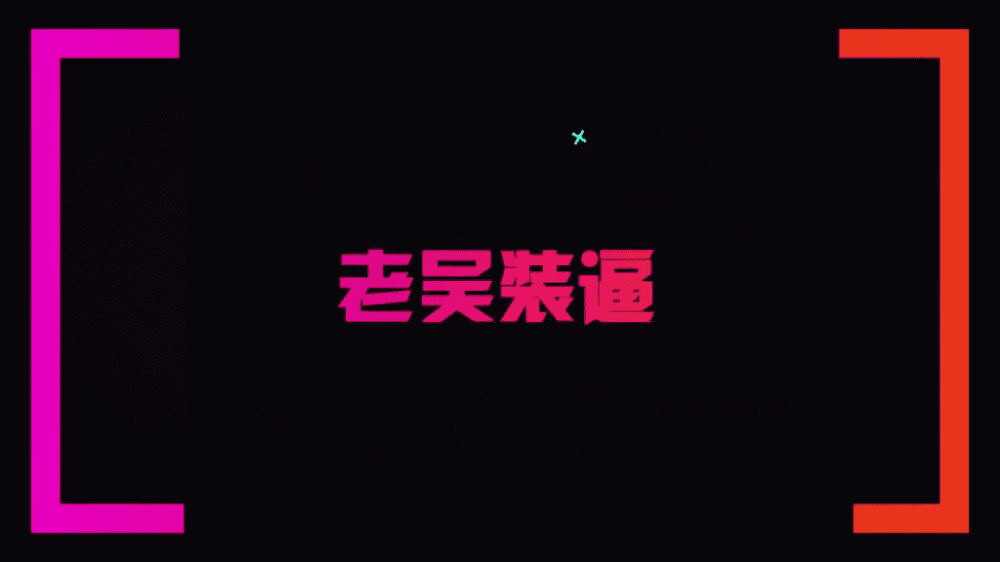

# 1、13老吴《装逼课》：2.如何利用纯色背景拍照

。🎼BaBB。

好，那么我们除了在那些自然固定的场景里面去去那个拍照装逼之外呢，我们也还可以在这种就是纯色的背景是吧？那一般来说像老吴的话呢，我在这些纯色的背景呢，我会怎么去拍呢？

一般来说比如说像这些因为它是有它的一个logo。那么我们尽量的不要去把这个logo给拍拍的那么的。完整，因为这样会显得好像你是在帮着这个品牌打广告。那一般来说我们就是找找一个角落。比如说像现在这个环境。

你们可以看到视频里面，我的我的背景是都是黑色的啊，刚好今天我又穿了白白色。那么这样子就会很鲜明的一个对比。好，那么我们还是会请到我们的工作人员来做一个路人哈。比如说。好。

那我我们今天有请我们的重量级嘉宾啊。你过来就说比如说像像饺子哥是我们的一个路人，那么我就会跟路人沟通，说那个我先帮你拍嗯，是吧？那那那我就装作非常开心的样子，对吧？对是吧？对。

对你就比如说像这样我我会让你站这个位置。😊，然后呢，你就随意挣着。接着我们可以看到就是说。我们的一个构图方式啊，我们有看到。不知道摆的这种pose还是这样子，所以是这这个太你对对这就随随性一点。

然后我们可以看到。😊，是吧我们可以看到来，我们可以看到这些照片。😊，这照片出来出来的一个效果就是非常的什么呢？你早说嘛，你早说我就洗个头再出来，穿身衣服出来。

没有那么呃那么一般来说就是我们的人呢大概就是这么一个比例就比较OK了。😊，这个比例是OK，那我就照着这个给你拍一张啊。对，你知后我就会这路人就会帮你也拍一张。啊。对对对，就这样路能帮我拍。

那么现在就是你就变成路人。好，那么。😊，那等那等会等，你就帮我多拍几张，好吧。嗯，等就像我们就刚刚的为什么要拍正方形的呢？😊，因为正方形的一个拍照呢是这样子的，是网红的一个比较常用的一个构图方式。

因为我们有个软件叫instagram是吧？是国外的一个社交软件。那么它的图片大部分都是以正方形的为主。所以所以正方形的照片呢会更加的有逼格，而且它比较容易去去拍，就是你只需要知道哦人的比例多少，然后呢。

怎么去拍，然后。拍的稳一点是吧？如果等会也会考，你看一下我拍的这个好不好。好，那么我们也看到。😊，啊，饺师哥的拍摄果然还是很牛逼的，是吧？😊，那么你可以看到，首先我们拍照有几个还有两个要点。

就是说你无论是在室外还是室内拍，你一定要知道这个水平线很重要啊。这个我跟你们讲一下，就是说我们看到后面有一条水平线。对不对？那如果像还有一些打树的话呢，你一定要什么呢？它是一个平行的。你千万不能拍歪了。

比如说比如说有些人他会可能会拍拍歪了，对不对？😡，他可能会拍成这种情况，对不对？那歪了呢就会显得不好看。从视觉的效果来看就会差很多。好，那当然如果路人帮你拍歪了没关系。你可以自己去进行一个调整。

那么这个在修图里面我会跟大家去讲好吧，那么基本来说这个人的这个。😊，🎼比例是比较OK的，然后鞋子千万不要被截被截掉了，这样不太好是吧？一定像我们你看这张就挺好的。😊，但是这张有个什么不好的点呢？

就是人太大了。人可以再小一点点，这样子会显得这个空间感会更更足，对不对？然后这个比例就挺好的，就是有留白，是不是鞋子跟那个照片的底部，然有一些留白。那这样子的话呢是比较O的。

然后这张照片就是人能再小一点点就好了，好吧。啊，你像这些照片是的这些这些都是挺好的。是不是？那么好了，那么还有一个问题就是有些人大会觉得哎拍出来人不高怎么办？没关系。

我们可以用修图的软件里面的增高功能去进行拉高。老婆就是这么增高的，好吧，那基本来说在黑在纯色的背景拍照就是就是这样子啊，人人的比例大概就这么大，就你们可以去看那些网红的照片，基本就是这样子。那么。😊。

在这些纯色背景呢就是要发挥自己。因为它它是一个纯色背景。那么就像我们平时模特在摄影棚里面拍照是一个道理的，就说他需要自己去发挥。所以你的在在这些地方的展示呢就显得更加的重要，就怎么展示有个这样造型。

就刚刚的pos我已经讲pos呢，我刚刚在上一部分已经教给大家了。就说你一定要去不要害羞啊，拍照一定要干嘛呢？一定要不要脸。😊，就说你你在一些地方拍照呢，你不要想着外人是怎么去看待你的。你你想的一个。

你就只要有一个思路，就是我要赶紧的把照片拍好。啊，不然的话你总是会在意别人的眼光的话呢，你拍出来照片就会是不自然的那还有一个怎么样去拍出一些自然的照片，就说明明你是在装逼，然后呢。

你还要给人家一种无形装逼的感觉，那怎么办呢？就是让路人疯狂的拍，然后呢，你不要想着有人在拍你。明白吗？就是这个很重要，就是说。你不要。想着镜头在拍，你拍出来会怎么样，反正你就在镜头前面。

你就可以随便摆是吧？是不是你就可以多种你就可以尝试不同的pose啊po我刚已经教给大家了，就你可以尝试不同的一些pose，然后去去摆，然后呢，然后再从拍出来的几十张照片里面去挑一张。

比较好的最好的就OK了。就老吴平时也是这样子的，就你们别看老吴的照照片都是哇，很精美，对不对？但其实上呢很多照片都是拍了什么呢？拍了七八十张。明白了吧？因为每个人的拍摄的水平不一样，那。

一般来说你在一个好的场景，你想拍出一张好的照片呢，你可以先拍个十几二十张，然后先看一下。看看这个场景是不是真的适合拍，然后。哪些地方不足的话呢，你再进行一个修正，然后呢重新再调整再拍，然后拍好为止。

好吧，那这个就是说我们关于在这些街头的一些纯色的背景，怎么样去拍照。那当然呢还有一种很牛逼的拍摄方法呢？是怎么拍的呢？这个是老吴最新的一个研究，就说。你们可以看到老屋有一张在澳洲的，就是在。

路边的一张照片，那你没有看到那张照片，我是很随性的侧脸，然后好像在走路，对不对？那这种又怎么拍呢？🎼今天呢我就交给大家，比如说来我们还是需要找到路人。好，我是路。对对，然后呢。我觉得让路人什么呢？

一般来说我都是这种照片会找朋友拍了，就是我我是你朋友。对，然后呢我们换正长方形的构图，然后怎么拍呢？比如说比如说我等会儿。我等会是要干嘛呢？要跳出去，我不是我让要这样走过去。😡，然后你就跟着我走。

然后呢，水平线帮我拍水平线拍。对对对，我就拍这个以这个为背景，你你就跟着我走这样子拍，然后我就你你拿远一点点，我一直按就按着嘛。比如说比如说我我你来做模特，好吧好好，那么好。

那你先站在这里如果你站在这里好，那么我们可以先把图构好是吧？😊，就先把图过好，然后呢，你就我就说OK你走慢一点，走慢一点，好吧，走慢一点。😊，啊，你走的太快了。让我有一种走太空步的感觉。就是你可以看到。

😊，这种照片我觉得是适合在一些背景环境不错的地方，然后呢更拍出那个人在走动的那种感觉。明白好，我已经知道来，我来试一下。好，你来试一下这种照片比较难拍，但是拍出来照片会很OK。好吧。

那么你可以选择插插的裤带或者什么的，好吧，准备好了没有？准备好了好，然后呢，我就我们沟通好之后呢，我们就可以开始派了，然后呢。是吧。好，我给你拍了78张。对，怎么样啊，拍了78张是吧？

就这个只是说我给大家的一个新的一些拍摄的一个思路。就说我我自己你们可以去看我的照片里面，就会有一张是这种的。就说比如说你有些时候在一些呃比较好的一些漂亮的地方，然后你看到哎这个环境很漂亮。

那你不一定说非要什么呢，站着不动是吧？就很多时候我们拍照都是站着不动的，那么你也可以尝试什么呢？把人动起来，然后呢，摄像机就跟着你的人来动，然后。然后这样子去去去去拍去拍这个照片。

那么这样拍的照片就是会比较有动感的那当然这个这种装逼的难度系数呢就会比较高，但是装出来的逼是非常的自然。那么今天的户外的第二部分呢，我就跟大家分享到这里。如果大家还有什么其他的问题呢？

就是可以欢迎咨询我们。🎼那接下来这部分呢。🎼我就给大家讲一下。🎼如果有正脸的话，要怎么去修？🎼那像那天呢我帮饺子也拍了一些正面的图片，对不对？我们给他拍了很多张图片。

那么我已经会把把一张选好的图片给标了爱心。🎼好，那么标了爱心之后呢，我们来看一下原图是这个样子。🎼好，那么这张照片我们怎么样去修呢？🎼首先有一个很神奇的软件叫做美图秀秀，对不对？

🎼那当然了你用美妆相机也是可以的。那一般来说呢，我个人是喜欢先用美妆相机。为什么美妆相机它有一个高级美妆的功能？🎼能够很好的去先把五官给修饰好。🎼那当然他有一个不好的，就是什么呢？

他会改变这张图片的一个。🎼颜色。啊，那么我看到。🎼是不是？我们可以看到。🎼看到它的美颜效果一佳。🎼你看饺饺子的脸马上就瘦了。🎼对不对？🎼对不对？那么。もう上がな。🎼他的照片。

因为他这个转线就是一美颜之后，它整个色调都会变的，从黄会变得有点。🎼那如果你不想说那个影响这个照片的基调呢，有美图秀秀修脸也是可以的。🎼啊，那么。🎼它这个软件有什么好处。

就是它有一个它的粉底功能也是挺好的，看到没？🎼我们可以随意的去调整这个。红色。🎼好，那比如说我选的这个肤色做了。🎼那有些时候呢很多人拍照的时候，嘴唇是泛白的，对不对？

那么你用这个里面的这个唇彩功能也是很好的。我们可以看到。他嘴唇就会从。🎼从白色变得有点粉粉的。🎼对不对？那当然呢你不能调的太重，那太重的颜色呢就会。🎼这成这样子。🎼是不是就很诡异？

🎼所以呢我们要调一个比较正常的颜色。🎼然后把参数调低。🎼这样子就有点淡淡的。🎼淡淡的血色。🎼对不对？🎼好，调完之后呢还有一个很神奇的功能，叫做五官立体这个功能。这个呢也是非常的好用的。

就有些时候你的硬你的硬糖。🎼你的三根是吧，还有你的苹果肌这些地方比较暗沉的说呢。🎼你可以用这个五官秘体的功能去，它会突出这几个。🎼几个部位的亮度，这样子会显得脸更加的立体。🎼那有些人的眉毛呢。

你的眉毛比较稀疏，对不对？那怎么办呢？就用这个眉毛的功能。🎼然后你在里面选择跟自己的眉形一样了。🎼从们有上到。🎼这张图。🎼没加眉型的时候，他这边的。🎼是有点稀疏的那加了之后呢。🎼他两天就很多。🎼对不对？

然后当然参数也不能太高，因为参数太高，就会给人家知道了哦，你修了图。还换了一个比较。像个那。那么像眼影眼线这些就不需要去动它了。基本来说就是这样子。那么点完之后，我们可以看到对比图。

🎼是不是它的颜色就变得脸色变得比较白。🎼像眉毛这些地方。🎼就是更加的清晰关什么的。🎼脸型也开始变得更加的。🎼V字脸好，那么这个时候呢如果你的要求比较高，你还可以用什么呢？美图秀秀。🎼啊。

那么在美图秀秀的人像美容这里面呢，我们就可以打开刚刚的那张照片。🎼那美图秀秀也有个很牛逼的功能，叫做什么呢？面部重塑功能，这功能也是我特别喜欢的那怎么重塑法呢？你看。看到没有？看到没有？

🎼比如说你的脸比较大，拍出会比较大，那你就用这个脸框这个功能相当于拉。看到没有？马上就变成了。🎼V字脸是不是？但你也不能修的太过，你稍微调一点点就可以了。是。稍微调一点点就可以了。刚有人说下班。

🎼因为你脸瘦了，所以下巴也要相应的。🎼调整一点点，是不是？🎼那眼睛如果你的眼睛太小，你就用大小功能。啊进行一个放大。明白吗？鼻子皮颈肌我们就一般不要去动它，因为。动的太多，会显得很夸张。好是。🎼好。

那么有些时候呢我们脸部的这个识别呢，它识别不了的话呢，就需要你用手动的功能去去处理。好那手动功能很简单是吧？你调整一个范围，那一般来说用它原来的那个就可以了，然后你就可以。🎼比如说你想受下巴。

你就在下巴的外围摁一下，往里推动是吧？从你可看到。脖子太粗了，想要收一下。你往里面推就可以了。是不是？我看一下对比，所以脸就是。明白了吗？好，那如果有些时候呢你的头发有些地方太突出呢。

你也可以用这个瘦脸的功能进行修饰。是不是比如说头顶墙要高一点点。就稍微往上提。对吧那这样子你就可以发现。你明白了吗？更加的利。一地方都边。搜一下。🎼这将子有点帅气了，对吧？🎼。

那如果有些时你的嘴型不好看呢，你也可以用这个瘦脸的功能进行调整。🎼把嘴角上扬。🎼这样子会你看看到没有？这的看起来都更加的有亲和力。🎼好吧，那当然有些说你的眼睛放大功能也是很好用的啊。

很多女生都会拿这个功能去放大她的胸部。那么一般来说我们可以去放大眼睛，对不对？你就点选择放大的一个范围，要对准眼珠子。这样子一放。他的眼睛就变大了。是不是很有神，对吗？好，那有些人他有黑眼圈怎么办？

他这里有个去除黑眼圈的功能，点一下之后呢。点击自动。一般的他一眼捐就少。看到没？好，那如果他没办法自动识别呢，你就用手动的去划一下。发黑眼圈就会变小了。🎼好，那么基本来说这张照片的五官呢都已经修完了。

对不对？🎼就马上年轻了很多岁。反正这时候有些人都说我的腿太短了，怎么办？🎼它这里又有个增高的功能，点一下之后呢。🎼把这个范围拉到这里。🎼拉到腿，千万不要拉到鞋子。🎼就这样的鞋子会很奇怪。

一般来说就是在裆部到。🎼小腿这个范围。选择好之后呢。稍微的我用一拉。🎼是吧。🎼然后呢，你就会发现。🎼看到没有？🎼腿马上就变长了。🎼是是腿马上就变长。🎼看到没有？腿马上就变。🎼是吧，你看纵横肌肉。🎼很小。

🎼对不对？啊基本来说点。🎼就修完了，身高呢也调整完了。那这个时候呢就保存就可以了。🎼保存了之后呢。🎼我们就会再用这个。幸。🎼去进行一个加滤进啊。对不对？去家里去。首先这个滤镜是可以的。没看到。

比如说我用这个滤镜。那么。因为这道滤镜它的好处就是很凸显他那个。🎼衣服。啊，然后呢。还是那句老话。🎼你的滤镜效果不要太重。先做调。先左调之后呢。但是还是刚刚那样子。🎼还有这些。🎼多啊。🎼亮度啊。

🎼调一下，因为你看亮度加了之后，它背景墙也有那种渐变的效果。🎼调一点点。🎼对比度呢也调一点。🎼结构呢也调一点点。🎼然后这张呢这个不需要动它。🎼把度呢调一点点，为什么呢？因为。

🎼因为这张照片的脸它比较白是吧？还有这个背景墙。🎼浅黑色的，所以需要加一点。🎼再把钢量剪一点点就好。🎼我再减掉一点光影。好，那么大家可以看到图片的差距就出来了。给大家看一下。你看。给你们看一下。

给你们看一下凶旺的图片。🎼就很清晰，衣服细节都很很分明，然后整个背景也是很干净。🎼对不对？对这。🎼这样子马上就变成了一个男神，而且整个图片也没有说那种很大的一个。🎼很大的一个修图的一个痕迹。

🎼那基本来说呢就是这样子。那当然呢我们也有另外一个软件可以给大家推荐的，就是这个叫snap c的。🎼那么这个软件打开之后呢。🎼你可意干嘛呢？🎼点击刚刚的没有加滤镜的一个图片。🎼然后直接就用它的工具。

🎼的调整图片是不是？然后你。🎼看井。🎼按紧这个图片之后呢，你个上下拉。🎼那么你看这些参数呢跟ins是基本是一样的。🎼是吧都是亮度对比，饱和氛围、高光阴影和色条基本就是这么一些功能。

🎼那么这个软件有些时候呢，你有些时候你拍的照片本来就已经很不错了，你也不一定说非要去加滤镜，你只需要用这个参数是吧？🎼我给你们演示一下，纸条参数也是OK的。🎼特比如像我调调亮度。🎼大家对。

🎼薄度调一点点。🎼它给大家带这种氛围的功能。🎼麦克为前一年。🎼高空级一点。🎼需。算。🎼对比。🎼这个图片也是OK的。🎼是刚点到一个自动调整那个。🎼朋友。🎼都收是可以的。🎼好。

那么我主要给大家讲一下这个软件的一些比较好用的工具。🎼第一个就是这个调整图片是它的一个调整参数。它这一个图片呢可以可以剪查。🎼就是你也可以把它给。🎼调整成长方形。🎼还有什么工作区？

🎼它还有一个功能就很强大。我觉得这个。い部这个功能。🎼这是全部功能你是怎么回事呢？比如说你选了之后呢。🎼你点一下它顶一下脸。🎼他这个时候呢，你两个手。我重新看一下。等一下之。先先把图放的差不多。

点工具局部。🎼你看然后呢。🎼点一下点你发现有个量出来，对不对？🎼那么这个链这个是怎么回事呢？它这个这个是可以扫面小面积的去调整图片的细致。你同样的点一把。这个。圈圈放在脸部。然后呢，你可以。

上下上下的移动，你可以只调你看你可以只调脸部的亮度。对不对？那么这个范围就是可以用手去扩大两个手。是不是？明白了吗？那说你个一条整个脸。我嚟噶。整个脸就很白了。他这可以局部的去调。那么你也可以调。

如果有些图片你修出来脸很红很黑，很黄哎，很黄。🎼那么你就可以减掉照片的饱和度。就捡单一部分。🎼那么你应该加强这个脸部的。🎼纹理对不对？🎼那么你会发现。是吧。🎼嗯。🎼脸部也是有变化。🎼好吧。

那那么这个就是这个软件。🎼可以比较好用的功能，还有这个画笔的功能。这画笔是怎么回事呢？🎼比如说你点了画笔之后呢。🎼还有加光减光，曝光色温饱和度。那么这个是什么回事呢？那个。🎼瞅说你脸。🎼脸很苍白。

你就可以。🎼调整那个饱和度。看到没有？脸就开始。也就开始有颜色了。明白了吗？那如果你想要苍苍白一点，你就减毛和度。🎼这一抹是吧，图片就变成黑白了。🎼啊他你用橡皮擦来抹一下。又回来原点。

🎼所以呢这个画笔的功能也是很好用的。如果你的脸太暗了，你就可以调加框自己抹一下。🎼啊稍微的抹一下，你会有发现脸也亮了。🎼对不对？🎼懂了吗？🎼好，那么这个就是step C的一些比较好用的功能。

但当然还有这个局部的功能，也是很。🎼除了局，当然呢还有另外一个功能，有个要镜头膜的功能。🎼这个镜头模功能就跟ins的那个。🎼虚化的是一是你看。🎼这差不多的。🎼个调那个。🎼那个条膜层分在缩小的光圈。

🎼我先把光圈调好。🎼然后呢模糊程度一加。🎼你就发现周围的周边的东西就。ほだ。🎼好吧，这个是这个软件比较好用的一些功能。当然还有一些更高难度的东西呢，是在一些高级课程里面会讲解。

🎼所以基本你们能够很好的去利用这些功能之后呢，你就能够去修出一些很好看的照片。🎼好，那这一部分呢我就讲到这里了，谢谢大家。如何添加浪鸡教育微信公众号？

🎼在添加朋友里点击公众号。

🎼在搜索框里输入浪迹教育。🎼点击浪迹教育。🎼点击关注。

