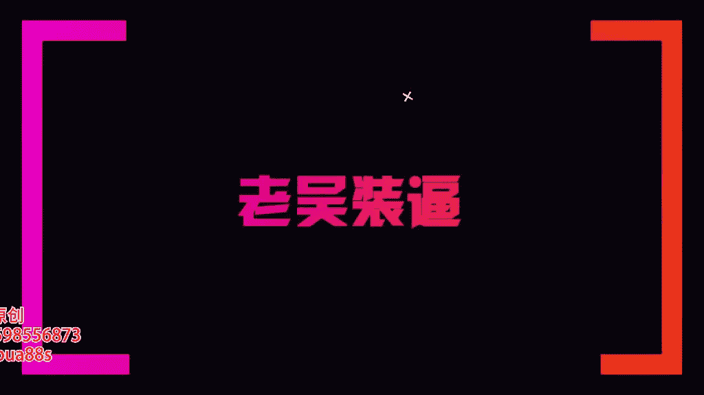

# 1、13老吴《装逼课》：4.咖啡厅装逼指南

🎼，🎼BaB别的。

大家好，欢迎来到我们的一个咖啡厅的一个拍摄的一个部分啊，那一般来一般来说呢，就是说每一个咖啡厅都会有它的一个特色跟装修。那我们去到一个全新的场所之后呢，我们首先要干嘛？就是先把它的整一个大环境给看一下。

好吧，那么因为你你需要去看这个环境，你才知道你等会的一个照片要怎么样去拍拍摄。因为每个餐厅每个咖啡厅都会有它独特的一些布置跟装修。所跟别的。🎼呃，咖啡厅是不一样的，所以我们要把这些特质给凸选出来。

才显得这张照片是独一无二的。好，那么首先像我来到这个咖啡厅之后呢，我就会先先四处观望一下。那么我我在之前有讲过我们。🎼在那个拍照呢有两个很重要的环节，一个是光，一个是构图，对不对？

那这构图就取决于我们要去选择什么样的背景。光的话呢就要看这个咖啡厅，它的哪一个地方的灯光是比较好的。好，那首先呢我们我们跟着镜头走过来。就像我们来到这个咖啡厅呢，首先它入口它是有一个樱花。

它是因为这个花太高，不适合拍照。那我们在往这里面走的时候呢，我就会看到了，就是有些咖啡厅它是会有一些靠窗的位置。那靠窗的位置呢，也是比较有情调的。而且有些时候有一些灯阳光打下来是非常适合拍照的。好。

那么像我的话，我就看到了现在有一个书柜。🎼对不对，在我们的这边呢会有一个有一个书架，那么这个书架呢跟我们的咖啡是属于那个比较搭配的啊，那当然我们可以看到像右边这种背景墙都是挺好的。但是为什么呢？

我要选择在这里呢，是因为那边的椅子你那边的椅子会比较单调，并不能拍出那种效果，所以呢我一般都会选择我们就可以选择在这个位置来进行拍摄，明白了吗？就是你看这有个么很好的背景，然后这里的灯光也非常的充足。

是不是？那么好了，那么我们选择好环境之后呢哈，这个坐下。对不对？他选诺行情之后呢。🎼我们就可以坐下，然后就开始我们今天的这个咖啡厅之旅。好的，因为节省时间的关系呢，我们就先点了一杯摩卡的咖啡，对不对？

那一般来说呢，咖啡厅一些比较好的咖啡厅呢，它的咖啡师傅都是比较不错的。那么经常会在上面去拉一些提花，对不对？好，那么我们会看到因因为每个咖啡师傅都是不一样的。那么这杯咖啡它是只是简单的打了一些奶泡。

我觉得打的并不是特别好，但有些咖啡厅打的很好。好，那么。🎼它有一些有颜色的糖果。那么这样子的一杯咖啡呢，是不是看上去就是它的杯子本来也有一些花纹。🎼有一些，然后呢再加上它的一些提花。

这样子会显得这杯咖啡呢是逼格比较高的。好，那。那我们在咖啡厅呢要怎么样去去装逼呢？比如说像。像我们。一般来说你不会说只是点一杯咖啡，你还会点一些甜品，对不对？那么可能会点个小蛋糕，那么点个小蛋糕之后呢。

我们就可以干嘛呢？放杯咖啡，放个放点蛋糕啊，放这边呢再放多，它可能一些咖啡厅它会有一些装饰啊，小花瓶啊什么的。那么这样子。有三个角落的一个。东西进行呈现一个三角形的一个。构图。

那么这个时候呢我们这样子是吧从这个角度去拍就会很好看，明白了吗？而且有些因为每个咖啡厅它的桌子跟布置都不一样。有些桌子我如果你想要逼格高一点的，我的建议是去那些宿舍。我建议是去去一些素舍的。

桌子的一个咖啡厅，特别是白色的。因为白色的背景的话呢，它拍摄出来的效果会特别的干净，而且逼格也会特别的高。好，那像我们在咖啡厅呢。拍照我的建议还是干嘛？你要么就是跟朋友，要么就是跟妹子出去喝咖啡。

然后让别人帮你拍。那一般来说都是从正面。找个人帮你从正面这样子拍过来，那也可以什么呢？侧面拍都行，没有哪个角度就是绝对好的。它具体取决于什么呢？你的背景，还有你的一个构图。🎼好吧。

那么接下来呢我就要有请我们的一个工作人员来帮我们来帮我拍几张，然后我来给大家讲解一下。比如说我先请工作人员，好吧，我只是给大举个例子。你你过来做一下，然后你充当我的一个角色。好，那我们工作人员就来了。

好，那么比如像咖啡，然后里是有这这里是会有一些吃的，对不对？好，那一般怎么去拍摄呢？你们可以注意看看我好，那一般来说呢，你可以看到。是不是？我们还是用我们的一个正方形的一个构图，然后呢。All。So。

你这个书架做背景，然后呢。你这样子去拍一张照。那么人的比例呢还是差不多两个格子的。两个格子的一个空间就好了。啊，那么你也可以尝试什么呢？可以打横的去拍是吧？是不是有很多的拍摄的角度啊，那比如说像。

最好把这些挪开是吧？把一些拍摄的时候，一定要把一些杂物给挪开。好吧，那么你可想像那些长方形的。是你也可以尝试从侧面去拍。对。好。好吧，你应该注下很偷文水平。那么我要看出是不是。

这可以看出来拍摄的一个照片。对不对？你可以多拍几张。就是这种构图的感觉都很好，你看后面有书架，也有绿叶，对不对？好吧，那这个时候呢我就会好来来帮我拍一下。那么你可以看一下我刚给你拍的一些啊，是吧？

它还可以了。是不是？OK那么你也帮我拍一下。🎼好，那轮到别人帮你拍的时候呢，我我告诉大家有有几个拍照的一个方法。就说如果你对镜头是有一些紧张的感觉的话呢，你可以干嘛看手机，对吧？

你可以你可以在看手机是吧？这个离有点距离，他这边看手机。几个。我确实在看手机啊，然后他就帮我拍，那么你也可以喝咖啡，就是就可以把喝咖啡端起来，然后。拿到大概。这个位置明白了吗？他这个位置。

然后你就很随性的坐着。是不是很随意的做的。千万不要出现这种坐姿，明白吗？或者是。这样子都不太好啊，我们要自然一点啊，轻松是吧？微微有点往后躺，然后拿着那个咖啡。真是。

一般来说就是两个两个手指握住这个把柄。明白吗？两个手指在外面，这个姿势会比较好看一点。然后大拇指这样握着这个背角。然后这样子去拍。I just。你可以让朋友不断的，然后呢就是。从拿咖啡的时候。

你就是从这个时候开始拍是吧？好，这以这个要剪掉啊。🎼好，就这样子拿上来是吧？拿上来拍照。然后你也可以选择看着咖啡啊。看着咖啡，也也选择拿着之后看着镜头。是不是？都都是不同的感觉。明白了吗？

那你那你也可以是吧？有很多的拍摄，你也可以。呢佢真啊。有点神秘，对，放在嘴巴盖着嘴巴，然后有点神秘的感觉，是吧？你也可以投看头看侧面。啊，都行啊，也可以往这边做。明白了吗？对不对。

我们拍摄的手法知势是无穷无尽的。懂了吗？然后呢，反正关键有一点就是一定要怎么自然。明白吗？好吧，那么我们可以看一下刚刚的照片。我看到刚刚走。所我们会看到刚刚拍的照片里面有一些还是可以的。是不是？

🎼你看他就就大概人是占了两格的一个位置。Can you。都感で。然后你看你看这些都是一些比较好的图片。是不是这个是认真的在喝咖啡。明白了吗？이。잘。是吧那像那像玩手机呢就会拍出另外一种感觉。

好大家可以看一下，每一种感觉都是都是不一样的。好吧，那基本来说呢咖啡厅的姿势我觉得就这么多了。因为其他的我会感觉有一些做作或者什么的，反正大家拍拍照的时候呢，千万不要干嘛。Yeah。

千万不要出现那种很严肃很拘谨的感觉。你就想着我就是在喝咖啡，我只是把这个喝咖啡的这个过程呢给记录下来。然后呢，再从众多张照片里面去找出一张自然的。哎，那就好了。所以基本来说我们咖啡咖啡就是这样子。

明白了吗？呃记得这个拿咖啡的手势，然后还有就是你的人的表现就特别的重要啊，然后背景要选好，基本来说做到这几个点之候呢。你就可以拍出很好的照片。那当然呢你的着装也很重要啊，是吧？对穿的很破，去拍照也不行。

所以这个服装这一块呢也要搭配好，好吧，那基本来说。你的人的表现加上一身还不错，看的衣服是吧？佳上。🎼加上优雅的一个肢体，然后再这样一个好的背景啊，那么一张好的有逼格的照片就可以这么的拍摄出来。

然后再加上我们后期神奇的修图方法，马上可让你这张图片的逼格大增。那这个就是我们在咖啡厅的一个装逼的一个指南啊，也是我经常会会用到的一个方法，大家可以去看我的一些朋友圈，你就会发现了我的很多照片呢，是吧？

要么就是拿着咖啡，要么就是很随随性的坐着。那么。🎼这些都是我们在咖啡厅的一些拍摄的手法。好吧，那么这一部分呢我就讲解到这里，谢谢大家。如何添加浪鸡教育微信公众号。

🎼在添加朋友里点击公众号。

🎼在搜索框里输入浪迹教育。🎼点击浪迹教育。

🎼点击关注。