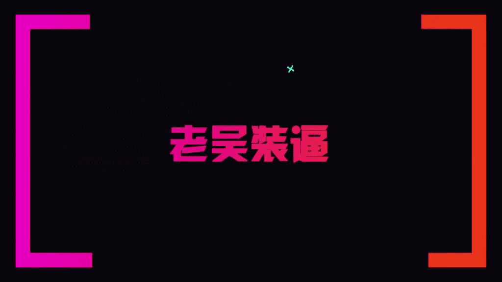

# 1、13老吴《装逼课》：5.酒店装逼指南

🎼Yeah。🎼给by的。🎼Yeah。

好，各位兄弟，大家大家好。那么欢迎来到我们的老吴装逼课酒店装逼部分啊，为了给大家录这节课呢，我们花了800块钱专门去开了这么一个酒店的公寓。好，那么我们废话不多说，那很多兄弟呢他都有这样一些个问题。

就说哎，那我平时去去住酒店出差是吧？去外面旅游。那我住在酒店里怎么样去装逼。好，那么首先在教大家装逼之前呢，我要先跟大家讲几个非常重要的点。就是说我看到很多兄弟呢会在酒店里面去拍那个。拍一些。

🎼怎么拿着苹果电脑努力工作啊，那种类型的照片。其实我觉得那些都太过于刻意了。因为你要想象一下，就说一般来说你出去出差都是什么，自己一个人住酒店，对不对？那如果你的照片是别人帮你拍的话呢？

那这个时候别人会怎么想，这个男的是跟谁去开房，对不对？如果你叫一个男的去帮你拍照片，暧昧子都会觉得你你是不是搞基，对不对？那如果你跟他说不是男的拍，那他就会觉得这就是女的拍，那女的跟男的同时都在酒店里。

那这个你就很难去解释了。所以一般来说呢，像老吴的所有的一些在酒店里面的图片呢，我都是什么，都是自己拍自己。🎼明白吗？这样会显得出你是自己一个人住酒店的。🎼好，那么一般来说酒店呢最好用的就是什么？

它的一个就是那个浴室。那么像。🎼大部分的比较好一点的酒店呢，它都是会有一个很大的一个镜子，对吧？那抹抹的话之前是怎么样去装逼呢？我就会干嘛呢？我就会穿上这个酒店的浴袍好。那在一些大的酒店。

它的浴袍上面都会有一些它的一些logo。🎼明白了吗？这就是装逼的一个重点。就比如说。🎼像一些狮子头啊，或者是其他其他的一些什么标志，那好了。🎼那比如说像我们站在这个。🎼在浴室里是吧？那拍这种浴袍的照片。

我觉得是比较。🎼OK的那好，那么你们能看到我穿浴袍，那如果有的兄弟他的身材比较好，或者是说他的照片想要拍的什么呢？比较骚气，或者是有钓鱼的那种性质呢。那么你可以干嘛呢？把浴袍再解开一点点，明白吗？

露出一些。🎼更多的肉对吧？当然你也不能够漏的太多，这样子会显得很暴露，很色情，明白了吗？就你可以稍微有一点点。🎼弄开这样子就会有什么呢？🎼还有那种诱惑的效果。好，那么那么我们来了。🎼像一般来说呢。

我们在酒店拍这些浴室的照片呢都是什么？用正方形构图，对吧？然后呢，我就会什么呢？站在镜子前面。是不是？🎼然后呢，还是。那么你也该打谁的牌？然后呢，可以什么呢？可以露出半边自己的脸。明白了吗？

🎼也可以不要露露脸都行。很多种白色的方法。好，那么你可以看到拍出来的照片。是不是？是不是明白了吗？这总是露出。半边脸的。还有这种是吧，露出上半部分脸的。是吧。这种是比较正规的构图。好。

那么我们可以看到是不是这些构图空间感我都有跟你们讲的，就说你不能够拍的人太大了。是吧人差不多。🎼这样子的比例就可以了。然后水平线是不是要稳，这种呢是45度是吧？这是另外一种构渡的方法。那一般来说。

你看这样的一张照片，然后如果你这里有一个。🎼高级酒店的一个标志的话呢，那这个B就装的非常的非非常的自然，明白吗？🎼所以呢这个就是酒店怎么样去装逼的一种方法。

🎼那这个也是我最常见的那你们可以看到老吴有一些健身的一些照片，那么也是反正对着镜子拍照的，基本老吴都是用这样子的。🎼一种方式去拍，明白了吗？一般来说，如果你不是一个拍照很厉害的人。

你就乖乖的先先拍这种视频抛稳的那等到后面呢，你你想去做一些尝试，对吧？你就可以调整自己的头是吧？手机这样子去旋转去拍。那么你无论怎么旋转，怎么怎么弄呢？你的人的比例就是这样子。好，记住这个。🎼比例啊。

然后呢你就多加模板跟训练就好了。然后记得在拍照的时候，记得把酒店的那些灯都打开，这样子拍出来的照片呢。🎼才容易去去修图，是吧不然的话拍出来很阴暗，好吧，大家可以看到。再给大家看一下。

🎼这照面都是还不错的。🎼懂了吧？🎼好吧，这是对着浴室拍照的。好，那么有些人他说我我在我在房间里面要怎么去拍呢？那一般来说。🎼如果你有一些如果你有一些。🎼住了一些酒店，它的一个外景很不错的。

那么你也可以选择什么？通过就是。🎼发一张浴袍照片啊，再发一些。🎼再拍一张那个。穿井的。🎼对不对？然后可拍出那种很漂亮的感觉。那有些时候呢有些玻璃会反光，对不对？那么我在教你们的方法，就是把手机直接贴到。

🎼贴到玻璃上面去拍是吧？稍微你给往下扬。🎼对不对？这样子就没有那种反光的一个效果。好吧，这个也是一个小技能。那么你就可以通过组合组合酒店外面的风景啊，再加一张自己在酒店的一个浴室里面的照片。

🎼都OK那又或者是你不想不想那个拍你自己的话呢，又想证明你在这个酒店住呢，你就可以把你比如说像我的是吧，自己的一些平时穿过展示面的衣服是吧？🎼把它放在床上，是不是？然后呢。🎼啊，拍拍一张舒适的船是吧？

🎼我会看到就是这种很看似很随意的一个效果，然后把你自己的物件。🎼拍拍在这个画面里面是吧？这样子别人就知道哦，你是来这个酒店住的啊，那当然来说你也可以，然后你在发朋友圈的时候呢。

你可以就直接就定位这个酒店。那大家都懂的。那如果有一些很牛逼的酒店，你其实不用定定位，大家也看得出来，就是一些比较有鲜明的一些标识的酒店。好吧，那。🎼那我跟大家讲，就是说那有的人他可能比如说跟朋友啊。

一群人一起出去旅游的，哎，那就OK那那一般。🎼一般像床上拍的话呢。🎼就是拍的很随性啊，比如说整个人爬下去啊是吧？这种类型的都可以。那一般来说老吴就是什么呢？就是大部分都是对着镜子拍，因为这样子危险的。

就自己一个人住是吧？然后在在有些时候，比如像一些酒店，他有一些房间有一些很漂亮的。🎼的一些局部呢，你也可以把这些东西都记录记录下来。🎼你把然的组合成一个朋友圈。

这样子的话人家会觉得你哎还蛮有这种生活品质的。🎼明白了吗？好，那酒店的这一部分呢，我就讲了这么多啊，大家一定要记得千万。不要去搞了。🎼穿的像什么西装革履的，然后弄了两台苹果电脑或者什么的。🎼就那里做的。

然还要搞个红酒是吧？然后是别人拍的这样子就会特别的傻。🎼那如果有的人他说我喜欢在房间喝红酒，OK你你就可以什么呢？🎼比是说。🎼比如说你是看书或者是比如说你是在酒店看书，或者是在喝红酒，那么或者是在办公。

你就可以把把电脑放在桌上，然后呢放一杯红酒在这里，是不是？然后呢？🎼用正方形故障拍一张，记录你的生活也是OK的。🎼所以我觉得我们要干嘛呢？要善于的去利用一些道具啊，这个因人义，你也不。如果你不喜欢看书。

你就不要说非要买本书，然后带去酒店那里装逼。🎼懂了吗？那那我的话，我自己是像在飞机上啊或者什么的，我会看书。那有些时候比如说像我是做那种商务舱，头等舱，我会把书放在架子上面。🎼明白了吗？

那个搭配一杯橙汁，然后这样子拍一张，人家就知道了哦，你是坐什么仓位的飞机，那你在酒店同样也是这样子的。🎼比如说。🎼你你想。🎼你你其实比如像我啊，不在告诉他一个装装逼的一个职能。

比如说像这个酒店窗外的美景很漂亮，那么你可以拿自己的一个物件，是不是？然后呢其实。🎼说是做在拍物件，但其实上是什么呢？🎼你们可以看一下，是不是其实在凸显。🎼凸显外面的一个环境。🎼懂了吗？

这样子的逼格也是非常的非常的高的。好吧，那呃酒店的部分呢我就讲这么多。那下面呢我还会给大家带来其他的一些场景的一些装笔指南。🎼好的，欢迎大家来到那个老吴装逼客的。🎼修图的第二部分就是关于酒店的一个修图。

🎼好，那么大家可以看到我当时是拍了这么好几张图片，对不对？这些都在视频里面有给大家呈现了。好，那么我来教大家怎么样去修修这么一张。在浴室里的图片，好吧。首先我还是习惯性的用这个ins。然后呢。

打开那张照片，是不是然后就下一步。🎼那么你看这个时候真的滤镜加了之后，这个逼格就立马立马上来了。🎼好，那同样的一个方法，先滤镜一个一个走，是不是？那我觉得这个滤镜很很干净。🎼就是。

🎼那么当然这个滤镜也是可以。🎼是。🎼好，那我们可以尝试不同的滤镜给它修一下。🎼那么你看像这100录音效果太重。🎼我们就稳了。🎼我们这边去调一些。🎼60就不是整个照片亮了很多，干净了很多。

🎼那大家也看不出有什么修图的痕迹。🎼然后呢，锐度为加。都一家。亮度一加。对比度稍微加一点。节后也加一点点。🎼为什么加结构呢？就是让它的这个细节会更加的完善。系。🎼我喜欢冷一点的，就浅浅一点暖色调。

🎼这张老的我也想捡一点。🎼高亮呢也可以减一点点，这样子的话张照片就修完了。🎼是不是其实一张图片修出来是非常的简的。看到没？🎼好了，我再给大家尝试一下不同的其他滤体的那个感觉。🎼那换另外一个滤镜来修啊？

同样的一看滤镜效果很重。🎼先把滤镜效果给。🎼调低。🎼好，调低了之后呢。🎼那度加。🎼加我之。🎼加加亮度啊，有些照片太亮了，以要去剪。🎼我们先加一点这点。🎼对应加一点。🎼最后加一点。🎼把色调稍微减一下。

🎼把后头稍微提。🎼高冷级一点点。🎼看到没有？就是立马就。你看原图是这样子。🎼一休完立马就有网红的感觉。朋友大家可以看到两张图片。🎼不不同的一种感觉，但是呢都是很好看的。🎼所以记得要学会去调这些参数。

还要选好滤镜是非常的关键的。🎼好，那那我们那天呢也在。🎼视频里面说了是吧，不一定非要拍自己。那么。🎼比如说像像我拿本书这样子去拍照。🎼就是拍拍我的衣服放在床上。🎼就是拍窗外的景。那这些呢怎么去修呢？

我也教给大家，比如说我们先修这张。可以。我们可以调好一个滤镜。我在能填个更嘛。滤定效果。力度啊有些照片它比较模糊，你可以调到100。没没没关系的。亮度呢可以加一点点。你看本来照片是有点萌萌萌的感觉。

🎼后给加一点对比度。萌的感觉就会没了。结构呢也稍微加一点点。🎼那有些时候这些参数呢，你发现加减都没有什么特别大的帮助呢，你就不要去动它。饱和度加一点。他的照片就很暖。大家看到原图是有点暗沉的。加了冰。

加了一些土著，它的质感就马上出来了。嗯。另外的像这张。这个图是吧。🎼拿着自己的物件书籍或者什么的。拍一下。🎼那么在我。你看很多第二个滤镜就很好看的。🎼这个滤镜也不错。🎼所以呢我们选好滤镜之后呢。

还是那样老规矩。滤镜千条。🎼调授的锐锐度是吧？🎼带不住，那个捡更加同钱的本书。就是不一定有什么都要加量。🎼有些是稍微调暗一点的颜色很好看。🎼那如果你想用这种磨砂的感觉，你就减对比度。明白了吧？

调再浅一点点。🎼好，那么你就会以看到原图。30欢と是不下。对不对？😔，好的给大家快速的演示一下。这滤镜都很好看。这衣服颜色满的那漂亮。就这个逼逼格就特别的高，你才调了一点点东西。可以。🎼Oh。🎼掉调。

그지。大家都可以看到了。🎼这张图片就修完了，这是原图。🎼加了滤精粥。🎼你看到没？枕头杯子啊，这些马上都换分。🎼对不对？这样子就可以把你的。🎼一个。🎼自己的随身的物件给凸显出来。那这样子你就算人不用入境。

别人也知道哦，你是。🎼住在这个酒店的。🎼好吧，那这个就是酒店部分的一些修图。🎼如何添加浪迹教育微信公众号？😊。

🎼在添加朋友里点击公众号。🎼在搜索框里输入浪迹教育。🎼点击浪迹教育。🎼点击关注。

