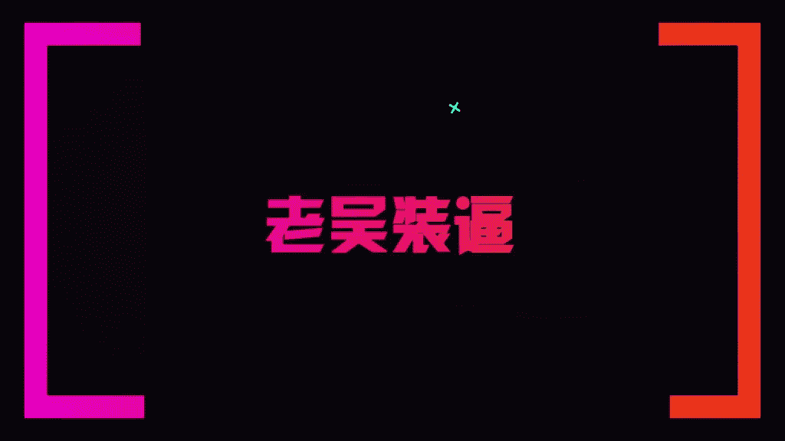

# 1、13老吴《装逼课》：6.西餐厅装逼指南

Yeah。🎼Ba baby。

🎼大家好，欢迎来到我们的老吴装逼客之西餐装逼指南。好，那么今天呢我们就有有请到我们的重量级嘉宾饺子一起来参与这一期的一个拍摄。我也来学习一下，怎么样装逼啊，吃顿饭。好，那么一般来说呢。

我们在西餐厅吃饭呢，就说比如像今天找好这个场地是吧？背景，但是有很多很colourful的东西，那么我今天又刚好穿了一件特别特别花的衣服，那我的经议呢是去西餐厅吃饭呢。

一般来说不要穿的太太花那那我就那那我很随意啊，你这样O你这样对你这种O但那我的话呢，你看你们可以看一下，如果我现在是穿着这样子去拍照啊，是会显得很花。对老吴，你不要穿那么贵的衣服所以呢我就。😊。

🎼所以呢你有些时候呢干嘛呢？穿的简洁一点吧，像这样子白色的。🎼这样子就会在画面里面就会干净很多，而且衣服会抢镜。🎼好，那今天呢我们都点了什么呢？一般我们去吃西餐呢都是有什么呢？像我们的这个浓汤，对不对？

啊，有可能还有我们最常见的就是什么呢？我们的牛排对不对？披萨啊呃，披萨对不对？那像我的话呢。🎼一般来说，如果你跟一个了解，或者跟妹子，你可能会点个三个菜啊，又或者是说。🎼又或者是说你们会一人点一个牛排。

对对，然后每个人都是一份怎么喝个汤，然再吃对，吃个牛排，吃个牛排，对不对？还可能有喝个红酒什么的那今天我们就没有那个红酒，等等下一次呢，我们再给大家讲一下怎么用喝红酒装逼哎，对，喝红酒装逼。

怎么在酒庄里面装逼。好，那般来说，像我们。🎼这么多的菜，那如果你摆成一条直线呢，其实是很难去拍的。🎼一般来说我们都是懒，一般来说我们都是要穿插白。🎼因为它的不因为他这个的话，它的板盘太大了。

不好不好操作，错了。对对对。啊，那比如说我我只为了我一个人装逼的话，我是这样子摆。好来，注意看啊。🎼把它先放在你的这个碟子上面。对，然后这是你的牛排，这个披萨我觉得有点丑。🎼来把这个肉放在中间。

🎼等一下啊。🎼我靠，你看你你这样下去显得很丰盛的感觉啊，是不是老吴你这样有一种帝王的感觉？🎼看到没有？啊，你看然后呢你看到我不会什么呢？不会说把这些挨在一起。嗯，我们不同的，如果有多个彩的话呢。

一定要什么呢？间隔开，明白吗？然后你看而且我会干嘛呢？专门摆到这个汤的一个中间，看到没有？然后构图啊，那么这样子就会变成一个刚刚我在那个我在那个什么咖啡厅里有说到，就说说点甜品。

然后可能他有那些桌子会有一些什么小鲜花啊什么的，就可以配件给摆在这里，那么呈现一个三角形的一个联动的这么一个构图啊，那么你可以看到。🎼是吧那像一般来说呢，我们汤勺都是在右边。🎼对不对？

汤勺跟刀只能会在右右边，叉子是在左边。🎼对不对？啊，然后呢你可以看到一般来说，如果那些比较正式的西餐，它是有一个桌布的嗯是吧？桌布或者是有一个什么东西可以给你垫着这些餐具的，对对不对？

我这有啊你看我这个很潇洒说下来好，那一般来说这个就是一个你看看到没有？我就摆了这么一个构图，汤牛排还有可能有一个什么其他的一个菜。好，那么这样子就构成了一张很完整的图片。好。

那这个时候呢我们就会打开我们的相机。好，那你看我是怎么拍的。因为他这一个呢。🎼图片比较丰盛，所以呢我们可以选择用长方形的一个拍摄是吧？然后再给大家一个拍摄一个心得。

就是在拍照的时候一定要检查你的摄像头有没有模糊或者是指纹。因为这样子拍出来的照片会很脏，所以一般来说我都会干嘛呢。你可以看到就是有一些。🎼啊，指纹啊，所以这个时候呢擦掉，要把这个指纹呢擦一下啊。

这个是拍照的小细节，很细节是吧？擦好之后呢，你可看到你面很很干净啊，好，那么来了，我们就开始拍照。那边来说，西餐它都是一个比较正式的。所以我觉得拍那种比较稳的风格会比较好。好，那比如说像這样子。

我就可以这样子来一张。啊，因为汤汁在左间。是吧你看。🎼我常拍的这一张啊，对，给大家看一下嘛？好，大家可以看一下，就是这种很自然对，很自然的感觉，很自然，而且水平线很稳。🎼可以看到吗？

就是我有一个问题就话，就是你的这个焦距是一般是聚在什么地方，聚在实物上面啊，肯定是聚在实物上面。🎼那当然有些时候呢有些时候如果是餐厅它的一个灯光，还有实际情况不同呢，我们可以利用这个就是对着图片之后呢。

它有一个太阳是吧？这个是苹果有的，就可以自己啊可以调光线啊，调调这个亮度。所以你聚到哪里，并不是重点，重点是你的一个构图。是吧。那么像我们看这样拍的一张是吧？🎼那我再拍一张比较近的。啊。

对你给观众看一下嘛，是不是？🎼然大家可以看一下，那么你也可以尝试。刚刚我是这个角度，我这种角度是有点像30度拍摄，那么你也要换到4045度拍摄。But。看了吗。你看45度拍摄就会更加的。🎼不一样的感觉。

嗯，对不对？我觉得45度拍摄的会比较。我我经常会拍的时候，我会从上方，我会从上方90度去拍。对，这个也是一种拍照的方法。🎼那么那个靠。🎼好，那么你如果你是站起来拍能力的，你看我的手机一定要水平嗯。

明白了吗？然后呢有些时候。🎼它餐厅它会有一些灯光，如果你站起来拍，它灯光会影响到它会有影子。对，那么我就干嘛呢？你看到没？我会后撤，我会后撤看到没？我是后撤的啊，要要避免这个阴影。

所以呢像这个餐厅都没有呢，我就可以这样子拍。那你们可看到我的水，啊大家可以看到，你看。🎼对，大家给大家看一下，哎哇，这个很这个很棒啊，这个B装就装的非常这个B装的也非常的啊，装的非常的到位，对不对？

到位啊，所再P一下，再P一下。但是你要跟大家讲一下，就是这个构图一般是怎么构，就是还是像刚才那种三角形。对对对对对对对对对，那如果你只是只是有一个的话，你就。😊，对角线构图明白吗？如果只是有两个菜。

这个对角线重点是什么？重点是。🎼我觉得哈我个人感觉就是其实这种菜看起来要好要感觉要丰富，不是就是美观一点，对，要美观一点啊。你比如说这个黑白，还有这个颜就颜色上的差异，嗯，要么就要很统一。

要么就是它是能够互补的对，还有一种就是这个本身的这个牛排看起来要不low。🎼对吧怎么样去判断呢这种牛排low不low。好，那么这肉也是一个非常好的问题啊。就是说一般来说我们去西餐厅吃饭，就是说。

🎼点牛排要很讲究，一般来说好的牛肉呢都是吃五成熟。那甚至有些人他会吃三成熟，但是你丝毫不会吃出来那种很血腥的感觉。嗯，因为我自己本身是吃过，而且我也去吃过一些米其林三星。

然后我就发现了一般牛肉都是在五成熟以下。🎼一般不好的牛肉才要做到七八成熟，因为因为牛肉它本身它是有那个鲜鲜的东西在里面。对，那如果这个肉很新鲜，我们就要吃到它那种鲜味，然后又不腥的话呢，就要好的牛肉。

🎼就不能是吃那种冷藏的。好，那么讲到这里，我就跟大家说一下，就是说如果你想要去拍这种西餐装逼呢，你也不要去那种太过于便宜的。当然太贵呢，我也就便宜的那种像。🎼那种我们不要说品牌牛排连锁店啊。

对对对那种大概30多3848。对对对，8就不要去这种地方去拍这个扒为什么？因因为因为你无论是点五点五成熟，七七成熟八成熟有九成熟对吧？做错来都一样的，都是一样的，都是十成熟嘛，对都是十成熟。

因为我我以前我也跟大家一样，都是去吃过这些普通的餐厅的牛排，那么我就会发现的它那个五成熟呢，就是那个肉啊很难吃啊，很难吃。所以呢他都会跟你推荐说，哎，我们这里是适合吃七成熟的。

那么你就要知道了这个餐厅的牛排并不好吃。🎼好吃的牛排都是做五成熟或者三成。然后。根据根据价位来判断是吧？🎼呃，对，可要根据他这个品牌我觉得我们要西要西餐装个逼对吧？我们应该去什么价位的比较合适。

我觉得一份牛排在。🎼看分量有些餐厅比如说像他两个牛排都这么小是吧？2块，这样小小的就100多和牛也不是哦我说和牛太贵了，一般都是像一些可能肉就这么多，然后100多块钱，我觉得这种就是OK的了啊。

我也不推荐你说去吃两个就要三四百，那种就太贵了。其实我感觉哈西餐厅也不用点很多，对吧？其实你就稍微点一份相对比较精精致一点的，有个主菜嘛，有个主菜，有个主菜拍摄11桌也没用啊，你拍不完。对对对，拍不完。

因为一般来说如果你像现在我们点了四个菜，你非要把全部拍进去了，就会显得画面很杂乱。我还有一个问题啊，老王你我一般啊像这么贵的餐厅对吧？我一般呢我自己一个人去吃，我是舍不得的是对吧我一般都是请妹子去吃。

对吧？但是呢我如果说跟妹子在一起的是。🎼那我要怎么样集中拍这个照的好了，不好意思啊。好，这个时候呢我就教你们一个很好的方法，怎么说呢？一般来说妹子。一般来说，妹子愿意跟你去吃西餐，他都会打板什么？

🎼你打扮的比较漂亮一点，打扮的很漂亮，对不对？好，那么这个时候呢，你就可以跟他说了，哎，我今天看你打扮的这么漂亮，我来帮你拍个照呗。然后这个时候你就可以拿出你的牛逼的这个装逼的方法先帮妹子装逼。

拍你先帮妹子拍个好看的照片给他看，他说哇好好看，对不对？他就很开心，这个时候呢你就可以说哎，你也帮我拍一下啊，你也帮我拍一照啊，这个时候显得很自然，这很自然的，都不尴尬。其实跟妹子吃稍微贵呀。

餐厅就其实两个人他都想拍照。对只是说谁先说出所以呢你就先帮他拍，说出他的心里话，那这个时候呢你再让妹子帮你拍，就很顺理成章了。那是有这个妹子不愿意帮你拍不走心，你下次就可以不用跟他出来。😊，明白吗。

你下次就可以换另外一个妹子了。😊，🎼对，好，那么妹子那那如果是让妹子帮你装逼，那就是什么呢？一般妹子都是坐在对面，对不对？这时候呢我们就可以请到我们的一个工作人员来帮我们拍一个明哥哎。🎼你看那一般像拍。

🎼拍这个呢不是打竖的，就像刚刚我们在拍咖啡一样啊，我们都是如果你是要逼格比较高，我们都是用正方形的一个构图。那么那么拍这个西餐呢可以怎么装逼呢？比如说你是喝汤，是不是喝汤是吧什么。还有我跟大家讲一下。

千万手不要靠上来，原来我这么是错的啊，这是是我背须不要打直啊，背背要打直，你你可以稍微有一点点微微弯，但是不能够这样子啊，这样子就显得很很猥琐。对，那么你坐的太直，又会给人家感觉太过很拘谨。

所以呢稍微坐直之后呢，稍微你看坐直之后呢，稍微弯，但是呢我的气气是挺的看到没有？我整个人感觉我他妈这么怪歪的对不对？我的整个人都是比较舒展的好，那么你就可以可以喝汤，对不对？

那那你可以开始看到我的装逼的地方。😊，🎼你看把汤勺放进去，看着这碗汤一张，然后舀一点汤上来两张。看到的嘴里三餐着。🎼你看是吧？喝个汤就可以有三三张不同的一个姿势，明白了吗？明白了吗？

你看这些芝士都很自然啊，不是我刚把汤来放进去要咬。😊，🎼再咬，然后呢咬起来一张是吧？然后放到嘴里。🎼三寨很自然哈很自然的装逼，对不对？😊，好，那么。那么这个是汤的一个装逼的一个方法，对吧？

那我们把把汤先拿开。接下来呢我来给大家讲一下，就说。吃牛排要怎么装逼哈。🎼那一般来说呢比较正这个可以先不用拍了，就等一下再拍。好，那么一般来说呢吃牛排又是怎么装逼呢？

就是说一般来说呢好的就是正宗的牛排都不会去用太多的酱料啊。我跟大家说一下，就是我发现那些好的牛排是不需要拿那些酱汁的，为什么要拿酱汁，就是因为这个东西本身并不是很好，所以它需要有一些东西来提味。

所以好的牛它基本都是。🎼牛，然后呢你不要去理这些酱子，而是什么呢？这是又是一个很装逼的一个方法，就是一般都是黑胡椒，还有海盐。那么它这里是没有海盐，它是有细盐。那么。如果是那种份的牛排。

那么你就可以干嘛呢？因为因为它这一份是等于说是适合几个人吃的。嗯，那一般来说比如举个例子。🎼比如说我现在这份。这个。如果这个东西可能有些菜有些配菜是吧？拿我给来他。演示一下，这个格好像放在一块。

我不会放你这儿了，我会放我这照。好，多呛一般来说加点配菜哈，我也加点配菜。😊，不か。就这个这个颜色哎呀，我操怎么掉这个绿色的看起来好一些哈，不要有绿色，一般都是什么呢？就是这这有绿色，然后再来一个番茄。

明白了吗？我再来一个番茄，好把，番茄放，我这还有呢，我这这个小番茄也有。🎼是啊，老温哎，老温，你看我这个我这个有没有种叫米其林餐餐厅的感觉？看没有你你的你看还是很不行。好，大家可以看到我们的区别了啊。

就他摆摆的是不够的不够哈。你看我的是什么呢？我会把牛排稍微打斜。😊，主要你那个牛排，你那块比我这块长得要好一点，不不不，我觉得还版装逼比较厉害的。对我的装逼，我这个脏哎。

我还要擦一个都还要你看一般来说都是什么。😊，Ying。看到没有？看到没有？你看我会去去隔开。🎼隔开这些东西，你明白吗？看到没有这样子的摆设就是比较的舒展，老你的这个贵族礼仪哈啊比较舒展。

然后呢然后呢像我们一般来说，比如说我们一个碟子，然后有个牛排，那一般我们都会干嘛呢？拿起我们的黑胡椒是吧？然后呢，先不要直接在牛肉上面去去去转一般都是什么呢？我都直接他么我了放在后面转。

这个就一看就是搂了，新手，这个逼格对新手不会那那装逼是怎么装的？都是把胡椒是吧？😊，🎼他这样子左右旋转明白吗？啊，你跟妹子约会的时候啊，你就默默的在旁边装逼哈。对，一格一下就合适。

你们可以注意看视频里面的我们是吧？这样子默默的转一下转一点出来之后呢，啊，默认这个也是粗演，一般来说比较正规的西餐厅它都是粗演，然后呢就也是这样子那这个是需要打开的。对，然后没办法。

今天这个节目经费有限啊，它节目经费有限。好吧，那么一般来说就是啊是吧？撒点盐对跟黑胡椒拌在一起，然后呢，你们会看到啊这个拿刀叉也很重要啊，你啥子不行，左手。😊，左手拿叉，右手拿刀是吧？然后呢。

你跟妹子吃饭的时候，刀不要朝着他，不要朝着他说话，刀非要哎，那个那个你帮我拍个照的，他就很奇怪，就很奇怪，叫什么？对，一般来说我们刀都是什么？所以看我的两个手是这样子的。😊，🎼看到没？

这个姿士姿士很重要，看到没有？这样子。🎼你看你拿的感觉就不对是吧？就是我们是这样子，我操你是贵族礼仪啊，我他妈的是这个平民礼仪啊，是不是这个你不要这样朝汕啊，是这样子的啊，明白了吗？

明白了白然后我们的手都不是挂在上面的，手悬在半空。对你看到吗这这个时候拍照，你你可以看从从相机从从视频里面你可以看到我们就是这样子的，就不是外就low了，就low了。

打折所以你看到我们都是打折的一个打折，然后微弯，对吧？然后呢。😊，🎼手是不要贴桌子的，嗯，明白了吗？那这个时候呢，你看到准备拍照了。🎼你看到没有？我们这个时候可可以拍一张照了。😊。

🎼我切的时候可以来一张，很认真的在吃牛排是吧？那么你也可以在切的时候呢，稍微看一下镜头。如果你想正脸示人的话，是不是一般来说我们都是这样子吃。Com。而且而且还有一个就是说我们在搓牛排的时候。

千万不要切太大块哦，我切的是你切的太大块了。😊，🎼会这种粗人，你知道？被切的太大块，你等会入嘴要咬很久啊，而且会不雅不雅观，很优雅。对，所以你们会有看到你看大家注意看啊，这个时候你就可以拍照了。

所以这个姿势可以拍照，你看整个人都很舒展。😊，对不对？是，然后呢你就可以切一小块，看到没有？我们在切的时候。😊，你看发出声音也不行。🎼那我感觉我。🎼感觉我我我有点笨拙你看到没？我们在切的时候啊。

是尽量优雅的切。那如果这个肉很硬呢，你就干嘛呢？要用阴力去切牛。😊，都用阴力去切你感你的内力嘛，就是内力就是看到没有？我现在。😡，因为你这样子话会有声音，嗯，明白吗？千万不要发出这种不要发出这种声音啊。

😡，不要发出这种声音，很不雅。是吧好，那么一般来说你看像我们切这个牛排，你看。切了很小块之后，你看。🎼切了小块之后呢，再用这个牛肉去去点这个盐跟黑胡椒。然后你看我你看。🎼如果我是很小口的话。

你看我的嘴巴。看到没有？🎼你看我下跟我们这种粗的粗人不一样的。😊，🎼我就说你跟妹子在吃西餐的时候，你就可以，你看看到没有？这块还有点偏袒。嗯，但是呢我们都是这样子。🎼优雅的放到嘴里。然后慢慢的。

慢慢的咀嚼，不要发生任种。哦哦对，就没又又出什么了，我我喝点水啊。😊，什焦很好吧。🎼这个就是我们吃呃吃西餐的一些一些比较容易注重的细节。当然还有很多呃贵族礼仪的东西呢，就不会在这里去给大家呈现啊。

那么基本来说就毕竟老吴也是专门从英国学了这个皇家历史。是吧回来的是吧？所以你就大家只要知道就是说哦这个配菜怎么去摆，然后吃吃牛排的时候怎么去拍照，一般都是比较好的就是。🎼切切牛排的时拍张，还是比较自然。

然后呢。那你也可以拍一张什么呢？你也可以拍一张，是把肉切起来之后。是是，要放到嘴里的。🎼是不是是不是要拍一张可以要放到嘴里的，这个肉不能切太大。对你也不能这样子。也不能这样放，这样很恶心。

一定是插的这是朝下的啊。对，然后这样子放，那么你就可以干嘛呢？因为你已经切完了肉了，你那个右手给以放低一点点，然后左手抬高，明白吗？这个时候看个镜头。对不对？🎼我今天又学了很多哈，老婆对啊。

然后这样子看镜头也可以拍是吧？那这是牛排的一个装逼的一个方法，就比较自然的无形的装逼，明白了吗？我相信大家应该都应该都学会了，好吧，那一般吃完之后呃一般都是放放左右两边，好吧？不就是你平时如果不吃。

就是这样子。啊，还有一些我就不能在这里教了，就反正就是基本的话呢，大家能够做到我刚说的那几点，妹子就会觉得你已经哇。这个男人的一个礼仪，还有这个礼貌，这种逼格这格就起来了哈。对你你其实你会发现。

其实我这些都是做的很自然。😊，🎼又有经过训练，所以呢你你在平时吃西餐的时候，你也去下意识的去去记得这一些之后呢，你就会发现你。🎼你这种无形的装逼才是比较厉害的对了，然后你去炫耀你有多少财富更重要。

对你千万不要就是什么呢？放一大堆吃的，然后就就就就在这里玩手机就很奇怪，是吧？玩手机的场合也也有些，因为一般吃西餐的都是。🎼都是比较端庄跟优雅的，你不要那里玩手机了，是吧？也不要这个时候也不要哇。

你看为什么我在喝咖啡的时候，我就会说可以盖一下嘴巴什么，但是你吃西餐，你盖个嘴巴就会很奇怪。😊，明白了吗？就是不同场合，你的拍摄的pos是不一样的。收到。好吧，那么基本吃西餐就就这么的B就这么多了。

就希望大家可以学到东西啊。那么具体的话我们可以看一下刚刚拍摄的一些照片啊。😊，Hello。这些这些是剧照啊，嗯，这是我。嗯打概给。啊，他都是拍了两个人的对。然这些也可以拍。

就是其实有些时我觉得这种照片是挺好的对。啊，就说我们拍照千万不要每次都是很冷酷。有的时候你面带笑容，然后或者是让朋友随意的拍死，是不是这种照片就会很有意思。你看我的这个手势，对啊。

你看我这个好像在这个练功一样。对对，这张照片我就觉得很有意模仿你，你知道吧？我在模仿你的贵族礼仪，你知道吧？对，然后这个时候你在就是很好玩，对不对？就是说有些时候拍跟朋友拍摄。

不一定就是说两个人非要正式的看的要轻松一点啊，对，轻松一点，比较生活化是吧？因为。😊，看看。这个照片真候很好玩，对这个文章你可以发我对，很优雅的创意他你在鄙视我很优雅。😊，嗯。今天我又学到很多哈。好。

那我我也可以帮你装一张逼是吧？好，那我现在过来这边给你装一张逼，因为刚刚拍的就是两个人。😊，啊，那一般来说。🎼需要一个贵族贵族一般的表情，没有你那个不是。😊，你要看到啊。我刚说了，不要看镜头了。

🎼你你记得我刚刚怎么说的吗？切肉切肉对，切肉好来好来来来，等一下啊，稍等。😊，🎼我们哥看到他切我一张，然后把肉拿起来来一张。把肉拿起来。不哪哪人也要抬起头来。然后把这个放到筷子放到嘴里。等一下啊。🎼好。

我们可以看到拍照照片逼格是非常的高是吧？哇塞，我定可以啊，给众人看一下啊，你看这些你看明明就是很刻意的在拍照，但是就可以拍出这种就拍出了18世纪英国贵就贵族的看到没有？

你你你看你经过我的他经过我的指示时候，你看你的手，他的手也没有去贴桌子。对不对？而且很很认真的，真的是在切切牛排，所以这张图片拍出来就。🎼非常的生活化，大家可以记住这种感觉。对，是不是好啊。

相信学了很多就是学了很多谢谢老好，那基本来说，那因为这些图的修图方法就跟其实修。我在之前已经讲过了，其实修图无非就是。🎼调好滤镜，调好参数就可以了。更重要的是拍明白？因为如果你本身就很装逼。

🎼是不是有些人他拍照很装逼，很不自然，那么他怎么修，还是才是装逼。那我们呢如果拍的很自然之后呢，你只只需要把照片去所以调的很舒服之后，就展示面的核心在于怎么去拍。对前期怎么去。🎼对吧对对对对。

就是你的准备工作要做。如果如果我没有跟你讲，不能这样子，嗯，明白？就是你会有很多细节是就是你怎么修图都弥补不了的对，因为就你这个人就是low，对你的用餐礼仪他妈插死又拿反了是吧？然后他妈举起来都不行。

🎼对，还差就是可能很多人会有一些很奇怪的pose对吧？对对，或者是什么拿反了，对是不是像我最爱过的人持续的。😊，🎼或者你把手拷上去，是不是你这样怎么很多人他就是直接贴着拍了，就怎么拍，怎么修都是low。

明白，所以所以所以这个前期的准备工作是很重要的。所以说拍出了这种很逼格非常高的照片，他在微微次的修图是吧？🎼如果你的脸也要修，然后呢修了之后就加滤镜，它基本上涂出来之后。🎼比如说像像你。

像我们刚刚这组朋友圈呢，就可以怎么样去组持呢？比如说。🎼你看来一张这个吃的是吧？然后再来一张再来一张那个。🎼很优雅的装逼，是不是？那这两张照片就可以拿去发朋友圈了。原来如此。啊，明白了吗？

这就是老吴把位的核心啊P图把位P图把位拍照把位好吧啊，那基本基本来说就这样子的。因为我相信这个干货是非常的多的，大家可以通过这一节呢，就学到很多的东西。那么其他的什么吃中餐哎。

又有不同的对那个拍出来的这个课技课程当中的路。对我会们更新到好，然后希望就是兄弟们可以就是装出更好的逼是吧？😊，好，那么基本基本就这样子了，谢谢大家。😊，🎼如何添加浪迹教育微信公众号？

🎼在添加朋友里点击公众号。

🎼在搜索框里输入浪迹教育。🎼点击浪迹教育。

🎼点击关注。