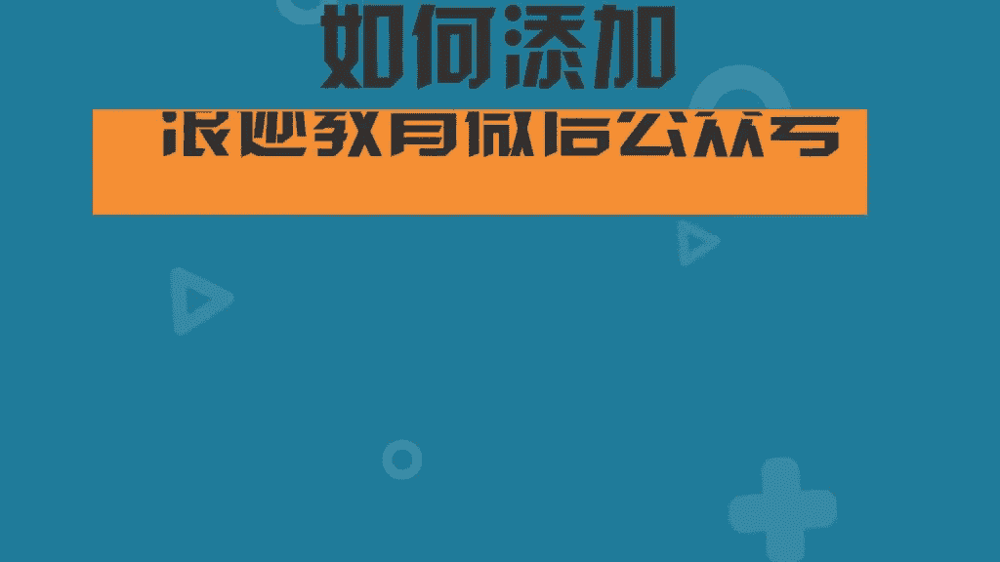

# 1、13老吴《装逼课》：7.如何拍摄预选

🎼Yeah。🎼BaB滴。

大家好，欢迎来到老吴装逼客之如何拍摄预选的环节。那么我们经常会跟一些女生出去约会，对不对？那么像我们经常会跟女生去一个场景，就是什么？就是我们的咖啡厅。好，那么一般来说呢去到咖啡厅呢。

我们并不会说就直接的跟妹子这样并排的坐，一般都是坐在对面嘛，对坐对不对？好，那么当我们跟妹子坐在对面呢，开始我们愉快的约会之后呢，大概在40分钟到一个小时之后呢，我觉得是一个非常适合拍照的一个时间。

那么这个时候通常我我就会说哎你今天打扮的这么漂亮。我想跟你合个影啊，留念一下，你就随便找一个就是理由就可以了。然后就可以把妹子呢邀请过来你的旁边坐下，然后呢，就以这个他今天很漂亮，很想跟他拍一个合影。

作为一个留念。对吧为为由，然后呢就开始我们今年的一个预选。好，那么。像我们跟妹子一样并排的坐在一起之后呢，就开始我们的拍照的一个环节了。那拍预选呢我给大家有几个建议。第一个就是说。

如果你不想这个预选伤害太多的妹子呢，你跟妹子的一个距离呢就要有所控制，是吧？这个距离会决定了这张照片的一个暧昧的程度。好，那如果如果如果这个妹子呢是一个你想制造一个很暧昧的一个。Oh。氛围的话呢。

你就会会跟他你你贴过来一点点，就可能就可能我们就会接近这种脸贴到脸的这种这种感觉，明白吗？那如果像像你只想拍个预选，然后不想给人家感觉你们之间的关系啊，好像是那种特别亲密的话呢。

你可以这样子找找这个服务员拍照，就让别人帮忙对让别人在对面这样拍，然后两个人坐的这种距离是吧？啊，这这个距离，我觉得是一个比较什么呢？比较安全的距离。😊，🎼不会太远，对，不会太远，也不会太近。对对对。

然后就跟朋友一样这种感觉，对不对？就说你现在这样做着，我这样做着，大家可以从镜头里面看。🎼看到没有？就是我们就像那种朋友一样，就是好朋友的那样。啊，对对对，这种感觉。然后呢，如果你如果旁边的是个美女。

那对于在朋友圈里面，你突然有个美女出现了，别的妹子她就会干嘛呢？她会觉得哦你身边的妹子质量还是很高的。那么这样子的话呢，她如果觉得她没有她好看，她就不会在你的面前特别的装逼，对吧？

因为有的妹子她就会觉得哦，我自己就很漂亮，我自己就就。😊，哎他会端着，那他如果看到你有其他的妹子的合影呢。而且是好看的话呢，他就会干嘛呢？他就不会装逼了，明白了吗？好。

那么刚刚说的这个是一个比较安全的距离。好，那么就让别人帮忙拍照。那如果呢你你想再进一步呢，就干嘛呢？就拿起我们的手机。拿起我们手机，然后跟妹子拍合照呢，有一个很重要的点。你想如果你想跟妹子合照呢。

一定要用什么呢？用我们的有带有美颜效果的。😊，软件是吧？比如说像美颜相机，还有激萌，还有无他无他就是这种拍出来的照片就自然的已经。修饰过的这么一种软件，因为妹子她是很介意什么呢？

很介意别人的手机里有他的丑照。对，所以说来不好看的那。对，所以呢我们一定要用这种什么带有这种修饰功能的软件来拍，那妹子就会很乐意的去去跟你拍自拍了。好，那么拍自拍呢，又有很多的讲究了。

如果你是左脸比较好看。😊，你就要让什么呢？让妹子坐在你的右边。对。😊，Yeah。那如果你是右脸比较好看呢，你就让妹子坐在你的左边。因为一般来说男生的手会比女生的长一些。所以呢。因为自拍不能够太近。

太近的话就会拍得出脸很大。所以呢一般都是男的来拍，好吧，那么我们拿起我们的相机之后呢，你可以看到我们就开始我们的自拍。好，那如果你想比安全距离再更高一点呢，你可以让妹子什么呢？稍微坐过来一点点。

好像我们刚刚好好，大家可以看到这个距离啊哈，给个特写。那么我觉得这个距离是OK的。😊，明白了吗？就是比刚刚并排做的的暧昧程度会再加高一点点。对，但是这个距离也不也不会给人家感觉，就是什么。

就你们俩是什么特别亲啊，对男女朋友或者是正在发展中的关系就比较好解释，你明白吗？好，大家可以记住这种感觉，这个是比较安全的，好吧。那这种呢就是我觉得自拍自拍里面是这个距离是OK的。

就千万不要脸贴脸或者身体贴身体，明白吗？你可以看到我们是有点前后错落的在在坐着，是错开的，是错开是没有挨在一起的。这样子别的妹子她就不会吃很大的醋。因为我们本来拍育前就是一个。

就是要让妹子吃醋的这么一个效果。那。这样子我们是没有呃靠在一起的。然后脸距里其实是可以解释的。就是如果对问你的话，就说这个不是女朋友啊，确实啊对不对？因为女朋友的话就会出现什么情况呢？

我再给大家演示一下，就那种比较很亲密很亲密的那种呢？就会出现什么手就要干嘛呢？😊，就要搭在他的肩上，明白吗？明白吗？就是而且你看到没有？我们的距离是会把就如果你要拍那种很亲密的照片。

你就可以把搭的妹子肩把它搂过来一些，然后这样子去拍，就是你问你的手可以干嘛的？😊，搭妹子的肩是吧？然后让他把头靠过来一点，然后你也把头靠过去是吧？就是你们可以看到这样子。

我们现在在镜头里面的这个距离是比较近的。所以这种的暧昧的这个纯度会程度会更高一点，而且我的手是是吧，会搭着他或者有一些可以搂着她的腰，那你有一些还甚至可以让妹子挽着你的手，对妹子挽着你的手了。

你可以挽着那就不一样了，这样的话就很亲密，这样明白了吗？这样子一看就特别的亲密，那这种照片发出去就会很危险，是吧？我是不建议大家拍这种的，所以呢大家要么就是让别人拍，对。

要么就是拍刚刚那种比较安全的距离就是有前后，对吧？因为妹子她都希望他拍出来的脸蛋是比较小的，所以他愿意在后面哎，他容意躲在后面，所以你要主动一点是吧？明白了吗？像我刚刚拍的照片，你看到没有？我是先前倾。

然后妹子可以躲在你身后，然后从这个角度拍过来。😊。

然后这张照片就OK了。那这算你么？如果你们有点点一些甜品。因为你们有点一些甜品的话呢，是吧？你就可以拍就是。拍平品，然后跟咖啡，然后呢来一张从上往下拍或者45度这样拍过去的一个照片。

然后再加上一张咖啡厅的一个比较环境图。那么这样子等等登三张照片啊，餐厅环境图，然后呢你们吃的喝的，然后再来一个合影。那么这个就是你的朋友圈的一个生活记录了。好，那么发育选呢我还有一个建议。

就是说这个配吻呢，一定要什么呢？不能太暧昧。明白吗？因为你如果如果没有去说什么，很容易对他误会。对，但是要但是一定要要说一点什么，都一定要说一点什么，让别人觉得哦，你们是只是朋友好像好朋友那种。懂了吗？

好，那当然如果这个妹子是你很喜欢想要打的妹子呢，如果你发那些评文说哦，这个不是女朋友什么的之类的呢，就会很危险。就是因为他看到了他会觉得你不喜欢我，对，或者是你只是把我当成好朋友，那这种就很尴尬了。

所以呢你要发育选一定要干嘛呢？😊，一定要把妹子给屏蔽掉。🎼那万一这个女生她自己她她她有知道你拍的时候，她她说为什么没有看到你发对。是这样子的。就说你一定首先要保证这个妹子没有共有。对，很难保障对就。

不是，可以，就说第一这我我讲几个方式嘛，第一个就是要确认没有控油是吧？然后呢。你可以挑什么呢？挑那种深夜时分。就是挑那种就是挑他没有看微信的时间去发。对不对？也也可以什么呢？花200。🎼你可以干嘛？

锁一个不锁，不是这样子的，你可以把妹子呢标到一个分组里面啊，然后就发给他看，就是一样的照片，但是不一样的不一样的配文，不一样的配文，一个一个只有他看得到。对，这个配文是他看得到的。

然后另外一个把它屏蔽掉。对，另外一个把它屏蔽掉。然后在下面备注。备注说那个哎这个不是女朋友或者什么之类的，这只是好朋友是吧？刚从国外回来是这个逼格就要要起来哈。对，这个逼格就不一样了。好吧。

这个是我我给大家分享的一些方法，好吧，那么呃预选的这一部分呢，我就讲了这么多。好，谢谢大家。😊，🎼如何添加浪迹教育微信公众号？

🎼在添加朋友里点击公众号。🎼在搜索框里输入浪迹教育。🎼点击浪迹教育。🎼点击关注。

