# 1、14男士个人形象班第二期（中级版）VIP课程：第10节、单品搭配技巧

🎼亲爱的同学们，大家晚上好，欢迎大家来到OS男士班的课程。我是本节课的主讲老师舒阳。🎼那今天我们要学习的呢是我们服装单品的理想搭配。在生活中我们有各式各样的单品。

那今天呢我们就来讲讲这些单品的常规的搭配方法。

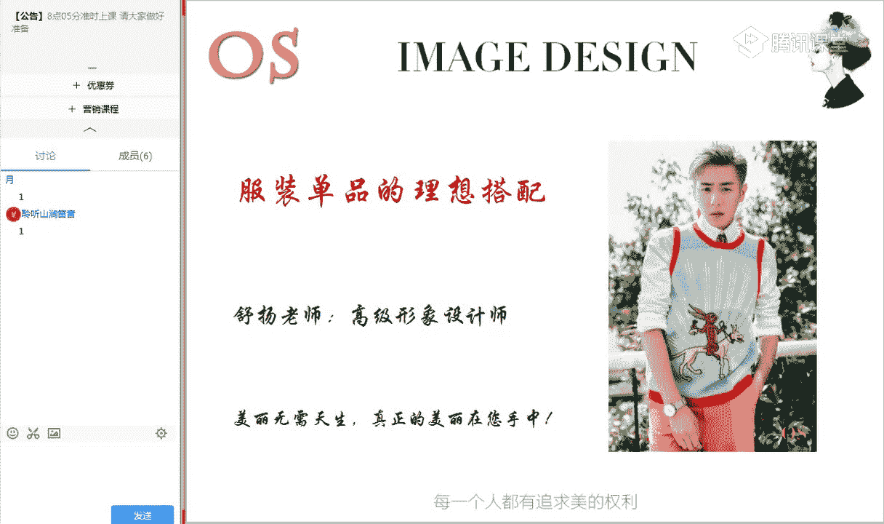

好，还是先看到我们本节课学习的一个重点啊。🎼本节课呢我们会讲到服饰啊，服装内的这样的一些各类的单品，服装的一些理想搭配。那么对于大家的一个要求呢，就是熟指我们搭配这样的一些单品搭配的技巧和选择。

以及要懂得去避免什么。那再结合我们之前所讲的这样的一些体型啊，包括我们这样的一些呃配饰啊等等啊，把它融合到一起。

谁。🎼好，我们先从我们的内搭说起啊，先从我们这样的一个背心。那背心的话呢，在夏季我们男士也是常备的这样的一个单品。因为它比较的清透，对不对？唉，轻薄透气啊，我们出街也好，包括呢各位同学去到海边。

或者说去去到哪些地方去度假的话呢，都是非常不错的。包括喜欢健身的同学，我们也会发现哎一定会买这样的一个背心作为健身的这样的一个服装，对不对？那款式上面呢，我们可在选择上可以去选择一些黑白灰裙纯色啊。

最保险。那当然像这样的一些黑白灰的背心的话呢，我们之前在讲到衬衫的时候，我有说过，对不对？它可以起到很好的这样的一个修饰的作用啊，我相信大家应该认真听课同学都有印象。之前我讲到衬衫的时候。

除了我们有这样的一个。🎼领子的一个衬，对不对？同样我也强调了，我们在选择衬衫的时候，内搭尽量选择同色系的这样的一个背心，来避免这样的一些尴尬。🎼那除了选择我们的黑白灰啊，常规的这样的一些款式以外呢。

像印花的啊，几何的卡通的字母标语的都是非常合适的那还有就是在这里呢要强调一个细节，就是你除非是在健身房，我们都知道。🎼健身必备的这样的一些T恤的话，属于我们运动单品的背心。

它一定是属于这样的一些相对来说紧身一点的。也有。当然不排除宽松的。但是我们在平时生活中去穿着的像一些休闲场合，对不对？哎，我们运动休闲也好，或者是这样的一些度假休闲等等。

那我们希望啊老师希望大家在选择背心的时候呢，尽量去选择哦避免选择我们这样的一些紧身的款式，以我们适当宽松的为主。

🎼那还有呢就是我们在选择背心的时候呢，在我们单穿的时候啊，记住是单穿的时候呢，尽量选择搭配短裤，协调度会更高，也会更加的帅气。🎼我们可以看到这里啊，搭配短裤是最佳的。

你会发现呢去搭配我们这样的一些其他裤型的。如果是长裤的话，理想性都不是特别的高啊。因为搭配短裤的话呢，更能够去凸显我们这样的一个休闲的感觉。

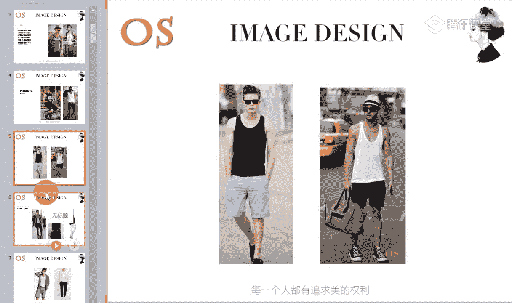

🎼除了我们夏装可以去搭配短裤以外呢，如果说有些同学你想要去搭配长裤的时候，哎，我们也可以在上半部分呢做一些改变。比如说像背心，我们在单穿的时候，对不对？哎，我们还可以去作为内搭啊，还可以除了单穿。

我们还可以作为内搭。比如说呢上衣我们可以去选择搭配马甲、衬衫、夹克、针织衫都是可以的。像我们这样的一些马甲款式的休闲款式的马甲也好，针织款式的都是可以的那包括我们也可以跟我们这样的一些针织类的单品啊。

夹克类的运动休闲的夹克也好，或者是说我们这样的一些牛仔夹克T恤啊，都是可以的。

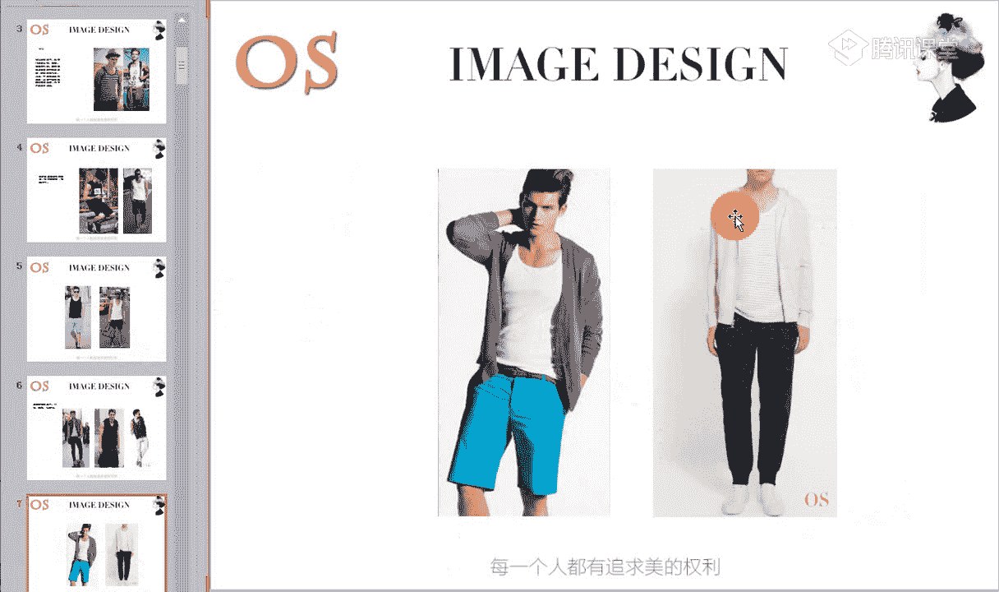

🎼啊，跟我们这样的一些衬衫啊都是可以的。这个时候你会发现再去搭配我们的长裤的时候呢，就不会啊那么的别扭了。

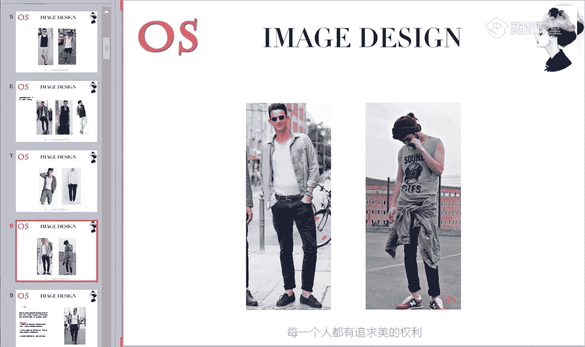

🎼天。🎼好，这是我们在选择这样的一个马甲类的单品的时候呢，搭配上面要注意的。🎼下一个呢我们就看到T恤啊，T恤。那它当然是跟我们的这样的一个马呃，背心是有区别的哦，背心有区别。

它是有袖子的那其实呢T恤据说是男人看起来最好模样，也就是穿着我们T恤搭配这样的一个牛仔裤。那T恤配牛仔裤呢给人一种简单啊，但是不失帅气的感觉，可以去凸显我们男人的魅力，对不对？

但是我们也会发现像我们男士最经典的裤型这样的一个锥形裤去搭配T恤也是同样好看的。而且作为我们呃如果说有一些男士个子不高的话呢，我们在选择这样的一个锥形裤的时候，其实你不仅你如果喜欢穿T恤的话。

在这样的一些休闲场合，我们也可以去跟它做搭配，对不对？唉，把它放到我们这样的一个裤子中间，不会说。🎼就是丢失掉我们这样的一个男人的整体的雄性魅力，对不对？同样的话，我们可以看到非常的帅气的同时。

又拉长了我们下半身的一个比例。在你的身高上一定是会会加分的那但是呢也有一个注意的一个点。就是呢我们如果说在选择这样的一个T恤的时候，你想要选择把T恤放出来的时候，我们要记住啊。

长度一定在穿搭的时候要注意一下长度试穿的时候，不要盖住你整个臀部啊。不然的话你一旦挑选一条一件过长的T恤，盖过你的臀部的话，就容易造成哎短腿的这样的一个危险的状况。🎼那第二个呢就是我们在选择T恤的时候。

也注意一下长度啊，可以参照你的上臂，不要超过上臂啊，长短的一半较为适宜，最能够去凸显这样的一个雄性感。当然哦，如果有各位男士想要选择五分袖也是可以的这是因为它的袖型的一个不同。

但是我们在选择这样的一个短袖T恤的时候，一定要注意这样的一个尺寸的把握。🎼好，第三个呢就是为了保证穿着的一个舒适度，避免过于紧身啊。过于紧身，不是说让大家去选择一些过于宽松的。我们都知道，哎。

之前老师在讲第三节体型课程的时候，我有说过个子不高的唉，比较偏瘦的这样的一些体型，对不对？或者说个子高的偏瘦的体型，我们都不要去选择一些紧身的或者是过于宽松的款式，你可以选择像图中这位男士适当一点宽松。

唉，同样又比较的跟你的自身合体的话，是最为合宜的。

🎼那接下来呢我们来跟大家说一说几种百搭的色彩啊。第一个呢就是我们的白色，纯白色的T恤是我们的基础款啊，也是最所有同学在衣橱中应该都要有必备的。因为你会发现它跟我们这样的一些经典的牛仔蓝搭配非常的好看。

对不对？百看不厌。那作为内搭的话呢，也没有比白色的T恤更好的一个选择。比如说从我们的牛仔外套到我们的机车夹克，包括从我们的这样的一些休闲款式的西服到风衣等等啊，一件白色的T恤。

你可以完成几乎所有外套的一个搭配工作，完完全全是没有任何的副作用的。这是属于老师强烈给大家安利的一款白色的T恤，包括在接下来的课程中，你会发现这样的一个白T恤，不仅像老师刚才所说到的。

从牛仔外套到你的机车夹克，从西服到风衣都OK以外，你会发现它甚至在。🎼我们的穿搭中还能够起到配饰的效果让。🎼一会儿呢会跟大家来强调啊，这是首先这个我们要知道白色是一个绝对我们每一位男士在衣橱中都要有的。

🎼因为它可以跟任何的裤型做搭配啊，可以跟任何的裤型做搭配。🎼我们看到图中短裤也好，对不对？包括今年哦在时尚圈刮风刮的最大的这样的一些阔腿裤，宽松的直筒裤等等，都可以跟它做搭配。

而且的话你即使把它放出来也好，唉，放到裤子里面来凸显你的身高也好，都OK哦，全部都是OK的。🎼第二个呢就是我们的灰色的T恤啊，中性色的灰色T恤呢同样适合大多数人去穿着，而且呢它们会让你看起来更有男人味。

因为我们的灰色T恤在视觉上可以产生更多阴影的一个效果，有利于呢去凸显你的完美身材曲线。但是有一点大家一定要注意啊。如果你容易出汗的话呢，穿灰色会很明显啊。因为你一旦像我们的嘎吱窝，对不对？

一旦像一些浅相对来说啊浅淡一点的灰色的话，你一旦出了汗的话，我们就会发现特别特别的明显。所以这个时候呢在炎热的夏季，各位男士如果要选择这样的一个灰色的T恤，我们就备好这样的一个易害哦。🎼啊，遗憾的走珠。

我不知道大家能不能理解啊，有没有不理解的同学可以跟老师扣个一。🎼那嗯如果是有不理解的啊，你可以记住老师所说的这几个关键词，易憾的走珠啊，它是属于啊你可以百度一下，包括淘宝里面也很很也有很多啊，可能。

🎼有些同学会想到啊会不会效果不太好呢？其实OK的，没有任何问题啊，遗憾的啊，遗憾两个字大家都知道是不是走珠啊，走动的走嗯，珠是我们珠宝的珠。🎼老师打在公台上啊。🎼因为我这边电脑反应有点慢。🎼好。

给看录播的同学也看一下啊这个。🎼墨契亚。🎼或者还有这种喷雾啊，易憾的喷雾也可以哦，喷到我们的背上。然后我们的嘎吱窝可以呢有很好的一个抑制的一个效果啊，防止避免出现这样的一个尴尬。

🎼第三个呢就是我们这样的一个黑色，黑色是我们所有绅士习惯选择的颜色。我不知道我们在场的喜欢这样的一些穿黑色同学的呃，穿黑色T恤同学有没有哦，有的同学可以跟老师扣个一，其实他们看起来非常的百搭，对不对？

你会发现它跟任何的颜色都可以搭配在一起哦，我们五彩色里面的黑白，对不对？呃，白色灰色，那包括像我们的油彩色里面甚至很多一些复杂的这样的一些服装，你也可以做搭配。

像我们有一些男士喜欢去穿这样的一些花衬衫的哦，我们衬衫里面也可以搭配T恤，对不对？你也会发现黑色跟它搭配起来也非常的合适哦，非常的百搭。但是呢像这样的一个黑色，它同样也会有显瘦的一个效果。哦。

我们去穿在夏季啊，在炎热的夏季去穿黑色，会给人感觉不够清爽，尤其是我们有一些男士整身去穿黑色的时候，整身去穿黑色的时候，难免会给人。🎼这样的一个感觉。所以老师建议你们在选择黑色的T恤的时候呢。

我们在夏季做搭配的时候，可以去做一些减法。🎼做一些减法。比如说夏装我们可以试试浅色或者是这样的一些有意思的印花哦，棉质的这样的一些裤装都是O的，非常好的搭配。或者是说如果你整身要选择黑色的时候呢。

我们一定要记住啊，在夏天整身去穿黑色的时候，还有包括在秋冬季节，如果我们也喜欢整身穿黑色的同学，你们一定要注重好材质之间的不同。就像我们可以看到图中，其实这个也是一个黑色，对不对？全身黑。

但是好在有一个点呢，它的鞋子是一个非常大的一个亮点，是我们金色。那另外的话呢它还有加上这样的一些配饰的点缀，看到没有啊，包括它手里的包包也是一个非常亮色的一个点缀。所以说呢在给你整身穿黑色的时候。

你一定要记住去运用到这样的一些配饰啊，我们之前所讲到的选择你的风格所适合的这样的一些配饰，跟你的T恤搭配起来。另外的话呢，我们还可以利用材质的一个不同。🎼加上配饰的不同，再加再加上我们材质的一个不同。

就会更加凸显我们整身的一个层次。不然的话呢，你的T恤如果是纯色的，没有任何的logo，或者是说我们这样的一些图案的话，那你还不加上我们这样的一些配饰。你的整身来说哦，你的整身就会显得非常的沉闷。

而且没有任何的层次啊，更谈不上时尚二字了。但是如果说我们这两者都顾及到之后，我们所出现的效果，就会像我们图右中啊这位男士一样的。🎼简单清爽，对不对？简单清爽的同时，哎又不乏这样的一个时尚感。

那还有呢就是我们可以最好就是像我们图案一样，选择一些浅淡的颜色去与之做搭配。🎼这就是。🎼第四个就是我们的海军蓝啊，海军蓝也是一个非常聪明的一个选择，因为它跟黑色会有点相似。

所以说呢唉但是它相较于我们的黑色来说会更加凸显一点轻松的感觉。因为它的明度来说没有我们的黑色低，对不对？那在搭配下装的时候，也会更加的简单。我们还是呢把它去跟一些稍微浅色的牛仔裤。

或者是我们米色系的这样的一些棉麻裤去做搭配都是OK的。我们可以看到这一这一张照片哦。🎼那另外呢我们就是要跟大家来说一说啊，看到图中我们这两。🎼搭配。那其实今年的条纹异常的火爆哦。

适合呢去表现我们这样的一个休闲风格啊。那如果说在生活在我们的这各个风格中，我们男士的各个风格中，你是适合去表现这样的一些休闲风格感的。比如说像我们的自然风格，对不对？唉。

那包括像我们的阳光前卫风格也是可以的那我们可以呢在平时的生活中买T恤的时候，你可以多去买这样的一些条纹T恤哦。🎼我们会发现在这样的一个夏季呃，搭配上这样的一个条纹T恤，清爽休闲，对不对？

缔造清清爽休闲的一个感觉。那另外就是T恤呢，我们在做搭配的时候，除了老师刚才所讲到的，你会发现跟这样的我说过啊，T恤跟任何复杂的一些裤装都可以做搭配，所以说不用纠结啊，要跟哪些裤子去做搭配。

你就选择你的风格中，还有包括你的身材体型中最适合的裤装就OK了。那像我之前有讲到过的，如果个子不高的，少去穿这样的一个短裤，对不对？因为它会在你的腿部形成这样的一个分割。

🎼根据自己的风格啊，根据自己的体型去选择合适自己的裤型，与之做搭配。那另外呢就是外套上面我们可以去搭配马甲、衬衫、夹克、西装、针织衫啊，包括我所刚才强讲强调的这样一些裤装，对不对？

看到接下来这样的一些图片，比如说在职业场合中啊，我们可以把裤子稍微换一下，没关系。呃，可以去跟这样的一些休闲类的西装做搭配啊，T恤呢作为内搭，那像我们最适合去表达严谨感的这样的一些古典风格，你也O的。

都是没有任何问题的。因为呃我们休闲西装的话，已经给你因为它有这样的一个领子啊，它已经给你带来了这样的一个职业感。所以说即使内搭上我们选择T恤也是OK的。虽然说你不是最适合单穿的。

你要知道古典风格去穿单穿这样的一些圆领T恤，它所呃出来的效果不是最理想的，它还是适合选择一些带领子的。

但是加上外套的话呢，我们就不同了。包括我们各种这样的一些夹克类啊，夹克类的服装。衬衫夹克啊，然后各式各样的一些裤型OK都是OK的。🎼那我之前有说到哦，白色除了我说到它百搭。

可以跟任何的夹克啊等等去做搭配服装做搭配，对不对？那还有就是我说它其实可以起到一个配饰的一个效果，为什么会起到一个配饰的效果呢？我们有些同学可能啊没办法想就是喜欢去带这样的一些项链哪等等的。

或者是说我们这样的一些服装啊，难免在秋春秋季节的时候不太好去缔造这样的一些层次感，对不对？啊，我们因为天气的一些问题哦？那其实这个时候T恤在其中就起到了非常大的一个作用？我们不要去小看它哦。

千万不要去小看它？因为很多一些呃搭配上面，细节是最能够去提高层次感和品质感的。就像我之前劝大家一定要多去用一些配饰，也是这样的一些原因。包括大家可以看到啊随意随性中，对不对？一件针织衫。

我们内搭选择这样的一些白色。🎼的T恤露出一个小白边，其实跟你的鞋子的一个白色鞋子起到呼应的同时，哎又给你的整身打造了一些小层次，对不对？包括我们在选择这样的一些薄款的针织衫的时候，你的内搭哦。

像我们这样的一些畸型领的针织衫。也就是说我们的V型领，你也同样可以里面去选择这样的一些圆领的小T恤，外面去选择我们这样的一个西装，那整身中像这一套穿到一般职业场合是完全没有任何问题的。

还有就是我说过整身去穿黑色的时候，总是会给人感觉沉闷的一个印象，对不对？那像我们这一身搭配中，大家会发现全身都是黑色，但是我又会发现整身来说会有一定的层次，对不对？就是因为这样的一些小镂空的一些设计。

然后透出我们的白色的一个T恤，所以也能够缔造整身的一个加强整身的一个层次。🎼这个就是我们白色T恤啊，不仅是在呃百搭上面起到了非常大的一个作用，而且它也是有一些小的一些心机的。所以说各位男士。

如果说你的衣橱中很少有运用到这样的一些白色T恤的话，我们可以去必备一些啊，你会发现这样的一些白这样的一件白色T恤，一年四季可以去穿。夏天的时候我们可以单穿，对不对？啊？春秋季节的时候。

我们可以跟我们这样的一些针织衫，跟我们这样的一些。🎼夹克去做搭配。那么在冬季的时候，你会发现它作为我们的秋衣去穿着，然后你们外面去搭我们的毛衣，然后在外面我们去搭羽绒服啊，去搭我们这样的一些大衣等等。

都是OK的。🎼那另外说到我们的T恤的话呢，在这里我们都知道T恤有我们圆领和V领，甚至有一些T恤V领的话呢，它是有扣子的，对不对？有扣子的V领T恤的话，它叫亨亨立领啊，亨利亨立领。

那这个都是我们经典的这样的一个领型。通常来说呢呃他们都能够很好的满足大多数男士的一个穿着。V领T恤可以让我们的脖子线条自然的伸长，有拉长你的身高和瘦身的一个效果，还可以完美的衬托男士胸前的一个线条哦。

那除了我们这样的一个V领，可以拉长我们圆润和宽大的一个领型，但是瘦长脸型的男士就要避免了。如果说我们各位有同学是长脸型的脸比较窄的，对不对？我们就少去穿这样的一个深V领的。

因为它容易让你的脸型看起来更长。但是而且还有就是呢如果你的胸部啊，一一般有一些同。🎼同学整个来说比较的瘦，对不对？比较单薄的话呢，我们也少穿这样的一些V领。因为如果说你的胸部不是非常的丰满，对不对？

有这样的一个胸肌，或者说肩膀不够宽阔的话呢，圆领其实更适合你，它可以让你看起来不会那么的瘦弱，哎，可以去平衡你脖子过长或者是较为瘦长的一个领脸型哦。🎼那还有一个点呢。

就是我们在场的同学一定有这样的一些属于O型体型的，或者上半身偏胖的对不对？那我们在选择T恤的时候呢，尽量选择polo衫啊，因为这种polo衫的话呢，它本身材质来说就比较的硬挺，更能够有显瘦的一个效果。

而且这种polo衫的话呢，也更适合一般男士在一般职业场合去选择。所以说在一般的职业场合中，我们多去穿着polo衫。而且呢像这样的一件polo衫，除了在一般职业场合，它非常的适用以外哦。

像我们这样的一些休闲场合也是同样可以的，对不对？我搭配这样的一些休闲的下半身的服装的时候，马上就能够塑造我们整身的一个休闲感。但是如果说我的下半身选择一些长裤啊，相对来说稳重一点的裤型的时候。

又非常的适合我们的职业，对不对？

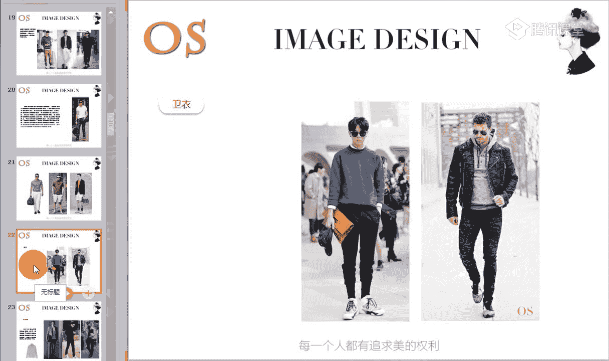

🎼啊，这个就是我们这样的一个T恤啊，T恤的内容会有点多。我不知道大家还有没有什么没听懂的，需要老师再次重复的。🎼啊，如果说没有的话呢，快速跟老师扣个一或者刷的鲜花啊。哎，记住我们四种百搭的一个颜色。

以及我们白色T恤。唉，他为什么说在整个老师在讲解T恤的时候，我会重点去强调这一点。还有就是各位男士不要觉得我们把T恤塞到裤子里面凉的表现。我们可以看到这张图片。

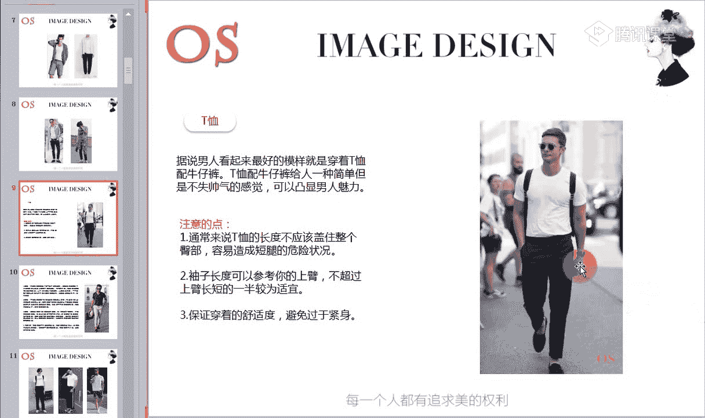

🎼你们觉得娘吗？对不对？非常的帅气哦，而且的话又能够塑造你的好身材，好比例。🎼好，第二个呃接下来哦接下来一个知质呢就是我们的卫衣啊。卫衣的话呢在这里我不做多的一些强调。因为其实呃在搭配卫衣的时候。

我们选择外套的话，同样是可以去跟一些夹克啊、大衣啊等等啊，都是可以去做搭配的。甚至呢像我们一些风衣，对不对？我们也可以去跟卫衣做搭配啊。卫衣还可以跟风衣做搭配，没有任何问题啊。🎼那内搭的话呢。

其实内搭我们可以去选择T恤，也可以去选择衬衫，都是OK的那下半身的裤装的话，我希望大家尽量选择休闲款式的，选择休闲款式的衬衫。你所呃裤装啊，休闲款式的裤装，你所适合的这样的一些裤型啊。

包括像我们这样的一些带有运动休闲感的裤子OK啊，包括我们这样的一些典型的休闲的牛仔裤啊，各各类的裤型都是可以的都是可以的。

🎼好，下面呢我们说到针织类的。针织类呢首先从我们的高领毛衣说起啊，卫衣的选择不用老师去强调了。🎼应该不用老师强调了吧，我根据自身的风格去选择合适的质感，对不对？但是有一款毛衣的话呢。

是其实每一个风格都非常非常的适合啊，就是我们这样的一个薄款的薄款的针织衫啊，就如图中所示啊，我们可以看到这里。🎼这种非常贴身的薄款的针织衫啊，那至于这其他厚的，我就不多多说了啊。

我首先呢我们跟大家说一说这样的一个薄款的。其实像这种薄款的针织衫的话呢，第一个它非常的贴合，对不对？贴合的话呢，它是有一定的品质感的，它的品质感不同于我们某一些其他的高领毛衣。比如说像粗棒针织的。

你可能会带来粗糙感啊，很难去凸显品质化。但是像这样的一款毛衣的话，你会发现无论是休闲场合也好，还是我们的职业场合也好，它都非常的适用啊。🎼呃，老师脖子短就不适合高领毛衣了，是吧？对对对啊。

如果脖子短的同学肯定是不适合高领毛衣的。🎼还有包括如果说太胖的同学啊，我们也不要穿高领啊，选择V领的选择V领的。🎼好，我们看到这里啊，我说过它的场合运用率非常的广泛。比如说在职业场合中。

我们可以跟这样的一些套装做搭配，对不对啊？一般的职业场合中可以跟套装大做搭配。那像休闲场合中呢，我会发现跟任何的夹克类的也是OK的啊，同样也是OK的。包括的话呢甚至如果说天气还。🎼OK的时候啊。

不是特别特别冷的时候，我们也可以呢选择这样的一个薄款的羊绒材质的这样的一个针织衫，对不对？去搭配大衣都是可以的那如果说有些同学特别喜爱这种轻薄的这样的一个羊毛羊绒的针织衫的话。

你也其实可以里面选择一个背心款式的这样的一个保暖内衣啊。同样呢温度的同时又不失这样的一个帅气啊，温度的同时又不失不失帅气，这是一个小方法。所以说我们可以选择背心款式的保暖内衣。

然后外面去穿这样的一个薄款的针织衫，然后在外面我们去选择这样的一些厚重感的一些大衣啊，都是OK的。因为有些同学可能不太喜欢穿这样的一些太厚的太厚的这样的一些嗯。

🎼粗粗就是这样的一个粗糙感比较大的这样的一些高领。但是我要建议一些北方的同学啊，因为北方的话室内都有暖气，那其实保暖内衣的话呢，我们就要慎重了。🎼北方的同学其实你就可以内搭选择这样的一个薄款的高领毛衣。

然后外面选择这样的一个夹克，对不对？在外面套一个大衣就可以了。啊，采用这样的一个层搭的一个方法啊，是非常的帅气，而且也非常的时尚。🎼那另外呢其实总结一下所有的高领毛衣的话呢，我们都可以搭配西装啊，呃。

除非是那种粗棒针织的啊，粗棒针织的肯定是不行的，粗棒针织肯定是要去搭一搭一些大衣的啊。但是一般厚重的，我们都是可以去搭啊西装啊、夹克啊都是OK的。🎼那除了这种经典的一些穿法以外呢。

还有就是像这样的一个薄款的毛衣，我们也会发现高领的毛衣加上中间层，然后再加上这样的一些西装外套或者一些其他的夹克外套。🎼都是可以的。如果你够大胆的话，我们可以看到其实这种非常有质感的一个体现，对不对？

非常的帅气啊，非常有质感的一种体现。🎼所以说这个针织的薄款的针织毛衣的话，除了女士以外，我们男士也是一样的，非常的适用啊。如果说天气刚刚有一点转凉，对不对？我又不喜欢穿这样的一些厚重的外套的时候。

其实我就可以像图中啊图一和图二，类似于这样的一些搭配。🎼那另外呢就是我们的圆领和V领的毛衣啊，圆领和V领的毛衣内搭可以去选择衬衫T恤做搭配啊。外套的话就是同上啊。

跟我们这样的一个高领毛衣的搭配外套的一个选择都是一样的那裤子的话还是一致的啊，选择你所适合的，选择适合的裤型。如果说你要选择我们这样的一个。🎼高领的毛衣对不对？高领的毛衣去搭配我们的衬衫。唉。

外面我能不能还选择阔腿的裤子呢？也是可以的。只要你的风格适合，也是没有任何问题的。🎼一般男士来说，常用的裤型就是我们这样的一个直筒裤，对不对？和我们的锥形裤。🎼好，毛衣第二个呃第三个知识点啊。

就是我们的开襟毛衣，就是我们开襟毛衣的话呢，同样也是一样的。跟我们的衬衫或者说T恤做搭配啊。我所说到的是适合的，包括呢我们要根据自己的风格去进行选择。之前我在讲毛衣类的时候。

我就有说到什么样的风格适合法式领，对不对？什么样的风格适合去选择这样的一些V领等等。我们古典风格啊，包括我们的这样的一些前卫风格，在选择上面要注意什么，这个我就不做多的一个强调。

所以说每个知识点其实都非常重要。然后我们要综合去运用。如果有同学不记得的同学啊记得及时去观看录播，或者说把你的笔记看清楚。同样是可以跟我们的衬衫或者说T恤做搭配的。

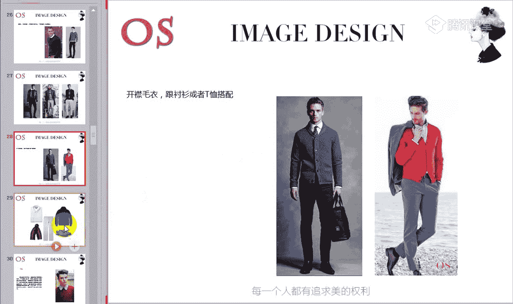

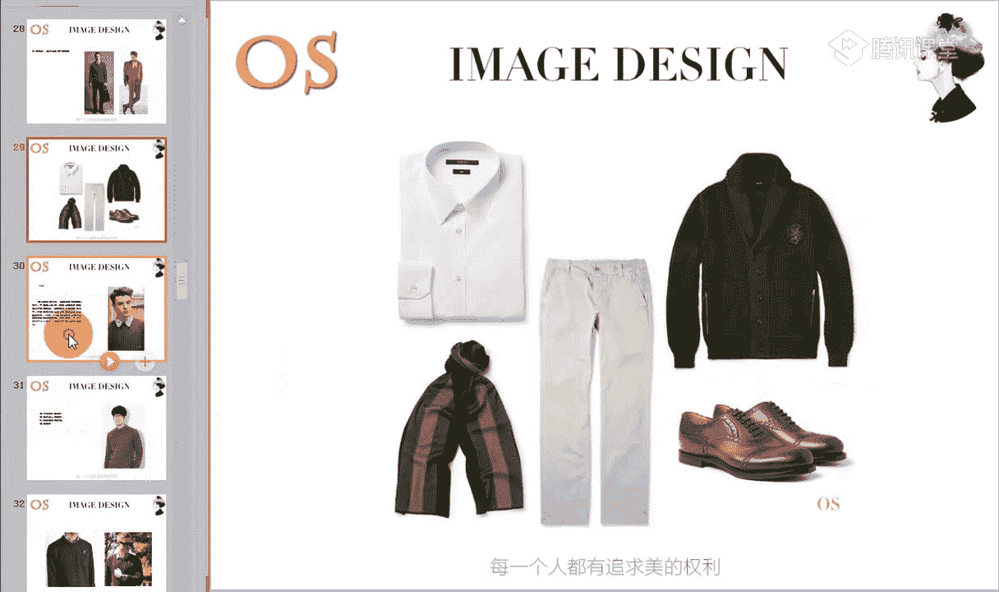

🎼好，下一个呢就说一说我们的衬衫啊。关于衬衫的领型的话呢，我相信大家都已经有非常清楚的一个概念了啊，知道什么样的一个风格，该选择什么样的一个领型啊，包括什么样的衬衫是属于休闲款式，衬衫。

什么样的衬衫是属于我们正式的衬衫，对不对？那看似单调的一个衬衫呢？其实它只要微微的去调一下领型扣子和下摆等小地方的话呢，也能让我们整体穿搭呢散发出不同的味道。所以说老师呢先讲一讲我们衬衫这样的一些细节。

那比如说我们可以把整个扣子全部都扣起来，对不对？那把这样的一个领子呢露出来，露出来的时候，你会感觉非常的斯文，有这样的一个学院风格，对不对？那像一些风格较小的同学。

我们就可以采用这样的一个方法去进行穿搭。🎼那包括呢打开1到2颗扣子的话呢，拉出我们哦唉把扣子打开，再把领子拉出来的时候，我们又会发现呢能够呈现呈现这样的一个随性的感觉啊，又会有不一样的一个感觉。

I'm never。那还有呢还有一种就是将我们的衬衫扣子全部扣起来，并把我们的领子收入到我们的毛衣内。哦，你会发现唉利落的同时又比较的优雅啊，相对来说会有一定的成熟感哦。

所以说你会发现这种穿搭可能更趋向于这样的一个量感小的一些同学，对不对？那如果说我比较成熟一点的话，我是不是就可以最好是把我们的领子藏进去，对不对？优雅大方哦，🎼哪怕说我可以把扣子解开。

1到2颗都是OK的。所以说这个就是我们领子上的一些小区别。大家可以在平时的穿搭上面呢注意一下。🎼我说过，除了我们可以去选择这样的一些圆领毛衣的话，也可以去选择卫衣，都都是可以的，选择卫衣也是可以的啊。

🎼那还有一个点呢，就是我们很多我们很多毛衣的话，也有这样的一些花色的，对不对？那包括衬衫的话，休闲款式衬衫也是会有很多一些花色或者说格纹条纹。我们在跟这样的一些卫衣也好，像图二的话是跟卫衣做搭配哦。

还是跟我们的毛衣做搭配的时候都要注意。毛衣如果说是花色的时候，我们衬衫就要选择素色，反之啊如果衬衫是花色的时候呢，我们的毛衣或者说卫衣就选择素色。🎼那包括夏夏季的时候啊，夏季的时候。

我们除了多选择这样的一些在职业场合中，多选择polo衫以外，对不对？唉，或者说在休闲场合中，我们可以多选择圆领的一些T恤以外呢，我们也可以多选择衬衫啊，而且像衬衫的话也是一个百搭款。

它跟任何的裤型都可以驾驭在一起。比如说像背带裤呃，打造俏皮时尚的感觉。那像我们这样的一些带有一点锥形裤的呃，直筒裤的都是可以的。啊，再加上我们这样的一些帽子啊、眼镜啊等等啊，腰带的一些配饰的一些点缀。

让你的整体形象更加的生动自然。

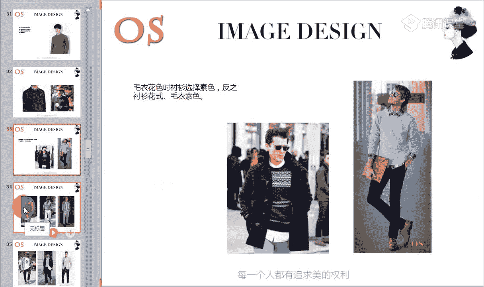

哦，这个是跟我们这样的一些西装类的做搭配的时候。还有包括呢我们这样的一些夹克类哦，而且的话呢其实像衬衫的话也可以。🎼选择像我们图三这样的一些搭配方法，内搭T恤哦，中间层选择衬衫，然后外面再加一个夹克。

其实。🎼整体来说层次有时候为什么有同学会觉得呃在夏在夏季的时候，我们穿衣服很难去打造层次感，对不对？是因为你的配饰没用好。那第二个就是你为什么会觉得在秋冬季节的时候，你会觉得哎我去进行混搭呀。

或者说我去多穿一点，我就很难够去穿出这样的一个韵味。其实就是因为哦我们在秋冬季节的时候穿的多，所以说它的层次会非常的明显。而在夏季的时候，我们就是一件上装，一件下装，所以说这种感觉很难出来。

那在夏天的时候，我们就多选择配饰了。🎼今天呢说到我们的衬衫哦，之前老师在讲衬衫的时候呢，讲的最多的是关于休闲和我们呃正式类的衬衫以及领型上的一些区别。那其实今年除了我们这些常规的衬衫啊。

照样火热以外呢啊包括还有一些条纹啊等等，对不对？那其实像古巴领啊，这个我们叫叫古巴领，可能有一些同学也会说到睡衣风，对不对？有点睡衣风的感觉。那其实它的学名是古巴领的衬衫啊，古巴领衬衫也是异常的火热。

不管是女装类的也也好，男装类的也好，都是可以的那其实呢各位喜欢这样的一些衬衫的同学，各个风格啊，你可以根据你风格所适合的这样的一些色彩，这样的一些材质或者是图案来进行调整。基本上像这样的一个领子的话。

我们呃一般很多同学都非常的适合都非常适合，只是说可能在材质上面有一些区别。就比如说像古典型，它要去。🎼凸显这样的一个硬挺感，对不对？那我们就不能选择一些太过于柔软的那像我们这样的一些浪漫风格的。

要去表现华贵感华丽感，对不对？是不是我们就选择一些重磅真丝的，更能去凸显这种哦意境。所以能不能理解啊，理解同学跟老师扣个一。那包括像一些前卫风格的。我们要选择一些明亮的色彩，对不对？

跳动的这样的一些图案。🎼也就是说，其实领子这种衬衫领子基本上是大家都可以去适合。但是因为这种衬衫你会发现在材质和图案和色彩上面它有非常大的一些区别。所以说各位根据自己的风格去做一些调整啊。

理解同学可以快速跟老师扣个一。🎼With。🎼好，如果是哪个知识点不能理解的啊？关于古巴岭对于每个风格的一些选择上的要注意的一些点。如果有不理解的同学，可以跟老师把问题提在公台上啊。

能理解的同学快速跟老师扣个一或者刷的鲜花。不。🎼根据自己的风格啊，在材质和色彩以及图案上去做一些演变啊。就比如说我们看到这这一件衬衫是不是可以给到浪漫风格，对不对？

但是这件衬衫是不是可以给到我们呃阳光前卫风格的人去穿着？🎼啊，包括我们还可以看到呃类似于这些的啊，自然风格可不可以穿这一件呢？没有任何问题，对不对？I make a proud。

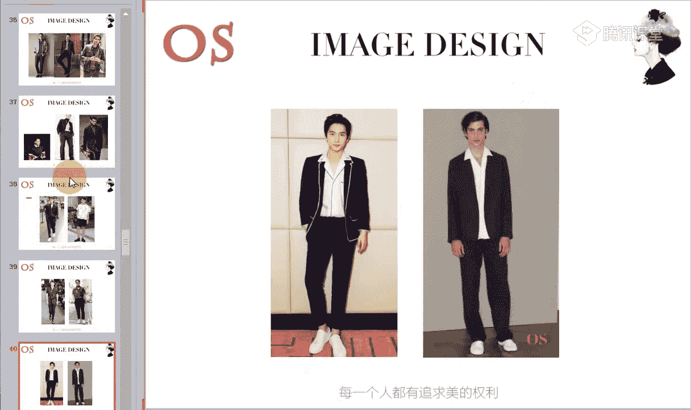

🎼适合的场合一定是休闲场合啊，一定是适合休闲场合。ラいで。🎼是的哦是的啊，接下来我说接下来我再跟大家来说一下这样的一个古巴领的一个搭配啊。首先我们知道该怎么样去选择这类型的衬衫了。那另外的话呢。

其实我不知道有没有同学看过嗯爱月之城了，看过爱月之城这部电影，看过没有？看过同学可以跟老师扣个一。🎼或者刷有鲜花啊，如果不方便的话。🎼一部电影啊，哎月月同学没看过是吧？没有没有看过的。

我们可以呢利用课后的时间把这部电影看一看，其实挺好看的。🎼那老师为什么要讲他呢？就是我们里面的男主角啊，高司令啊，高司令他在爱乐之城里面呢，基本上出镜率最高的就是我们这样的一个古巴岭的衬衫。

而且呢它最常规的一个搭配方法呢，就是在里面会搭配我们的T恤。之前我们都知道老师在讲衬衫的时候说过，内搭T恤是防止这样的一些尴尬，对不对？但是你会发现呢，因为它这样的一个领子啊，它是一个V型领的领子。

它所以说它一定会把我们的圆领T恤露出来。反而这种露出来呢又有别样的一个感觉。大家可以看一下，它其实里面全部大部分全部穿的都是古巴领的衬衫，然后内搭T恤。所以说各位型男们我们也可以采用这样的一个方法。

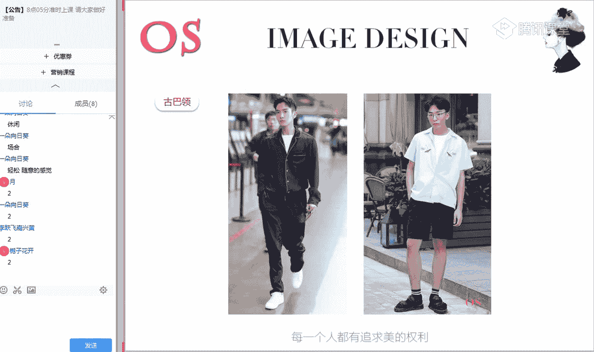

We are high。🎼那第二个呢就是我们的裤装啊，像这样的一件衬衫的话呢，跟你的短裤ok啊，包括我们这样的一些直筒裤啊，锥字型的裤型都是可以的那像我们有同学适合穿这样的一些阔腿裤的，也是OK的啊。

外面的话呢我们可以去套休闲款式的西装，没有任何问题啊，外套，休闲款式的西装，或者是套这样的一些有典型睡衣风感觉的一些外套都是可以的。那如果说天气。🎼再变凉一点，再冷一点。我们还可以采用第一个内搭T恤。

对不对？外面呢选择我们的古巴领衬衫，然后外套选择风衣类的都是可以的。唉，两种领子的一个层叠，没有任何问题啊，你你不用担心说我要不要把领子藏进去，没关系。不管是我们在搭配这样的一些有领子的西装也好。

还是搭配有领子的这样的一些风衣啊，外套大衣也好，都可以把这样一的领子拿出来。不用把它藏里面啊。

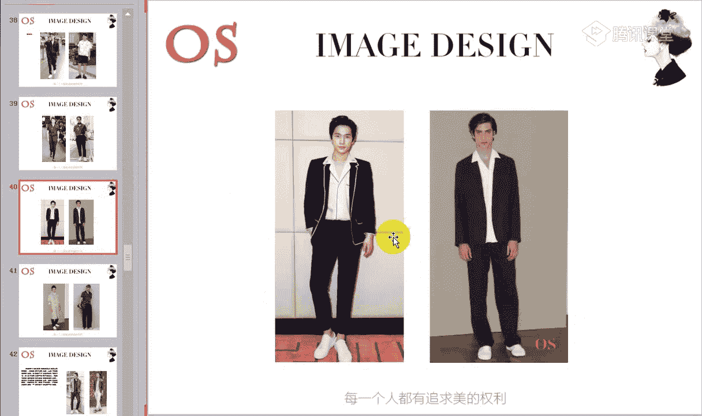

We are。🎼好，这个就是我们古巴领的衬衫啊。在搭配上面，因为今年非常流行啊，各位女士啊，我们在场今天听课的女士也非常的多。你们其实在生活中也可以根据自己的风格去多选择这样的一些衬衫。

这样的一件衬衫啊，会比我们普通款式的衬衫会更有新意。呃。在夏季的时候呢，你就会发现更加凉爽。而且本身像女士的话适当的去留呃展示我们这样的一个V型区域也是非常有必要的。

🎼那下一个呢就是我们男士的衬衫到底是该塞进去还是放出来的一个问题。相信很多同学已经清楚了。因为我们之前在讲衬衫的时候，我说过怎么样去辨别这件衬衫是适合放进去的，还是说它适合呢把它啊放出来的，对不对？

是看它这样的一个摆度，那你可以看到像这样的一些平摆的，对不对？下摆是平的，一般都是我们休闲风格的一个衬衫。那像这类型衬衫的话呢，我们一定是适合把它放出来的那除了呢如果你要把它塞进去的话呢。

我们就塞一边就好了。也就是说放一边塞一边，那像上一节课的时候，我们给大家看到了这个这样的一个腰带，对不对？它就典型的在选择衬衫的时候塞一边放一边也是可以的，也是O的。但是如果说你都要把它放出来的时候。

我们在选择上面就注意一下长度，因为毕竟我们国内哦我们中国人身高都不是特别高，对不对？平均身高不是很高。那我们在选择这样的一个休闲款式的衬衫的时候呢，尽量在穿到身上。🎼之后它所停留的一个位置。

一定是在你裤子拉链中间的一个部位，就是最合适的，不要去超过这样的一个部位啊。因为如果你超过这样一个部位的话，就会显得啊你的腿很短。你的腿短了，你的个子就一定会显矮。

🎼这就是我们休闲款式衬衫在选择上面要注意的啊啊，然然后大家也可以多看一下老师这样的一些搭配图，记住这种搭配的感觉。如果你喜欢的话，你的风格所适合，对不对？我们也可以去采用这样的一些搭配手法。

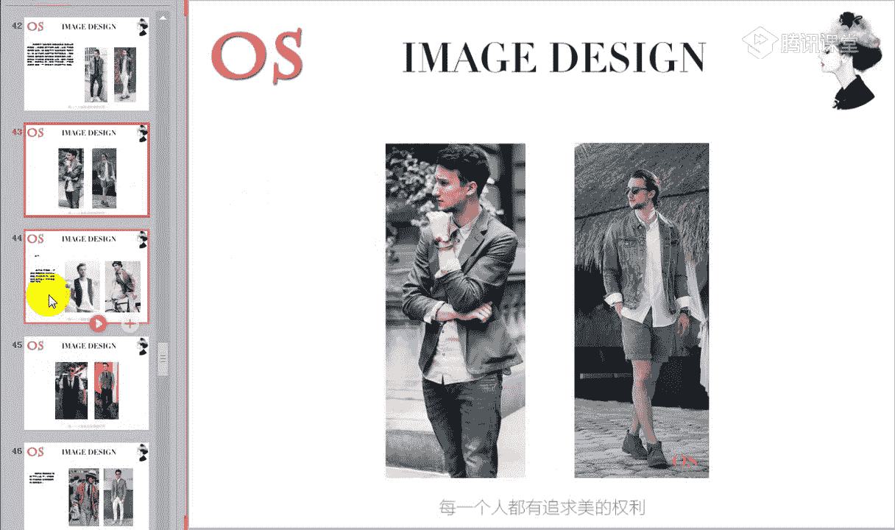

🎼好，接下来呢我们就来说到马甲这一类的单品啊。大家已经清楚了什么样的风格最适合穿马甲啊。那如果说我们在场的有适合穿马甲的同学啊，适合穿哪一类马甲，我们也要懂得去进行分别了，对不对？那马甲非常的简单啊。

在整体的着装中呢，它能够去起到画龙点睛的一个作用。因为毕毕竟啊它不会说多占我们的地方。那同样的话呢，它也不不说它能够起到多么强的一个保暖的效果。像我们这样的一些休闲款式的呃，比较薄的。

但是它可以起到呃T就是凸显你的一个层次，所以说像一些超短款的一些马甲的话，小个子男生是你的一个非常好的一个搭配，就像我们内搭如果长了，对不对？但是马甲比较的短。

其实它也是能够起到一个强调你的腰线的一个位置的一个作用。🎼所以说像马甲呢可以去跟我们的像休闲款式的，可以跟T恤做搭配啊。那稍微正式一点的，我们肯定是跟衬衫。🎼还有就是我们在这样一些春秋季节啊。

刚入冬的时候，或者是刚入冬的时候呢，我们也可以在整体服饰内选择搭一个小马甲啊，时尚的同时还能够起到强调装饰的一个作用。但如果有些同学他不太适合穿马甲的时候，比如说你不适合我主要是强调什么。

强调你单穿的时候不适合。但如果说你在跟一些你其他所适合的一些服装做搭配的时候，像我们图一和图二，类似于这样的一些装扮，你也是可以去穿的，没有任何问题啊，不是说你不适合了，你就真的以后都不用买了。

只是说我们在穿搭上面注意一些技巧。🎼那像我们这样的一些层叠的穿搭方法呢，是最能够体现我们搭配功力的那在衬衫和西装外面去套一个这样的一个羽绒的马甲，对不对？也是可以的。像这样的一些混搭风啊。

🎼包括我们穿上毛衣的时候，你总是会觉得你的唉身体对不对？身体部位不够保暖啊。那这个时候我们也可以采用去选择这样的一些羽绒的背心，配上我们的毛线帽，唉，搭配上我们的针织围巾，让你有型的同时也会更加的保暖。

还有就是我们的毛衣在做搭配的时候呢，一定要注意啊，我们可以去采用跟马甲同色系啊，这样的话呢会让你整体看上去更具有这样的一个品质感。同时呢也能够去凸显你的时髦。

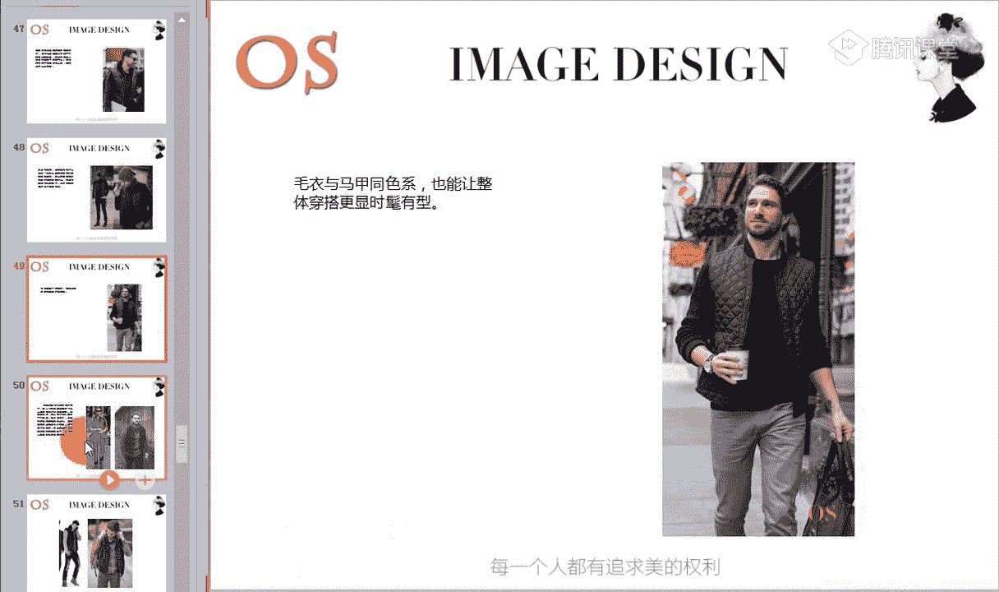

那接下来呢我们要说到一个点，就是其实像我们的马甲也好，包括我们在跟衬衫做搭配的时候，对不对？或者说跟我们的毛衣做搭配的时候呢，都要注意一个点啊，还是要注意这样的一个色彩方面要注意的一个点。

那像我们的这样的一些羽绒背心穿搭示范中，我们会发现像国外的一些达人们都会去采用英伦气息十足的格纹衬衫跟它做搭配，非常好，能够体现我们的英英伦感。那如果你觉得冷的话呢。

我们可以在衬衫呃外套上面呢再穿上一件卫衣都是可以的，对不对？在衬衫外面穿上一件卫衣。然后卫衣呢。再加上这样的一个羽绒服啊，所以说保暖系数。非常非常的厉害啊。🎼那另外呢我就是要强调一个点。

就是跟格纹去做搭配的时候，我们尽量去选择纯色系的或者是深色系的羽绒马甲，以免给人太过杂乱的视觉感受啊。那其他的这样的一些马甲也是一样的。如果说你的颜色太复杂的时候，其实就显得不会那么的有型，对不对？

但是我们可以看到右图中我们的颜色稍微简单一点，纯色调一点，就要显得比我们左图中更具有这样的一个质感。🎼好，这个就是我们的马甲，马甲在搭配上面的一些方式方法，以及我们在选择上面要注意的一些知识点。🎼啊。

接下来我们说到的呢就是我们的夹克类啊，夹克类其实不用老师多介绍了。因为很多同学都知道自己该选择什么样的一些夹克了。同样搭配的时候呢，我们在上面已经讲到很多了，对不对？上面搭配中提到很多。比如说T恤。

我又提到了夹克。那包括我们的衬衫，我也提到了夹克。那还有呢像我们一些其他的一些配饰呃，背心啊，都有。所以说呢在这里呢老师不做一些细节上的一些分析。大家可以来看一看啊。

像我们有一些图片呢都是2018年春夏时装周的这样的一些品牌的走秀，我们可以看一看啊。

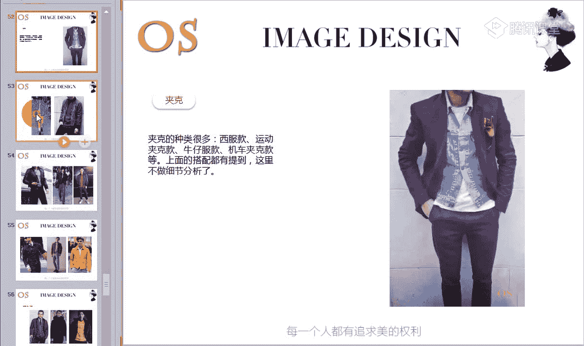

感受一下。🎼其实夹克你只要选择适合你的风格的，然后呢选择这样的一些搭配上面啊，选根据你的体型上面做一些修饰的话，然后再按照老师刚才所说到的这样的一些常规的啊，我说到的是常规的这样的一些搭配手法的话。

其实都能够很快去缔造这种品质感。🎼而且呢也能够去，因为不要小看这样的一些简单的配手，像简单的。🎼单品的话组合在一起，其实也能够去凸显我们的品质的同时，步乏之时尚，对不对？🎼不用想到去挑选一些过于复杂的。

其实很多款式的话。🎼越简单的越经典，而且也会越好搭。🎼关键是呢这件服装它适不适合你，因为每个人都是有独特自己的风格的，所以按照自己的风格去选择衣服，然后呢再采用老师刚才所说到的这样的一些常规的手法啊。

根据自己的体型去进行一些修饰我们的色彩的这样的一些剂型。基本上啊你的形象的一个改变都是非常大的。🎼好，第二个呃接下来就是我们的羽绒服和棉服啊。羽绒服和棉服的话呢，我们也不做多的介绍。

基本上就是按照老师刚才所讲到的这样的一些内搭的一些服装，对不对？比如说我要选择毛衣的话，我就看我选择什么样的一些毛衣，对不对啊，适合你的毛衣。然后呢，如果说你是选择这样的一些圆领，圆领的针织衫的时候。

或者是我们这样的一些开衫的针织衫的时候，不要再像以前一样，我们就完完全全穿一个秋衣，然后呢，就套上我们的圆领，或者是套上我们这样的一个开衫哦，然后呢再套上我们的羽绒服和棉服，这么的简单。

你还是要懂得去做一些文章，对不对？不管你是呃选择我们的羽绒服呃，去搭配我们这样的一些针织衫，是我们的高领也好，还是我们的圆领啊，普通的低领的圆领也好，还是我们这样的一些开衫也好，你都可以呢。

比如说像开衫和圆领，我们就可以内搭衬衫或者内搭T恤，对不对？那包括像这样的一些高领的时候，我是不是在这里露出一点白色的小。🎼边会更有这样的一个质感呢。一定是的。

🎼所以说还是不要小看刚才老师所强强调的这样一个白色的T恤啊。🎼じち。🎼好有同学说到很难找到色型制都适合自己的，不难哦，一点都不难。其实不难。只是说唉你不能说完全找不到是找得到的，一定是找得到的。

只是可能说你会发现哎呀，这件衣服真好看，哎呀，材质啊、款式啊都太适合我了，色彩不适合，对不对？但是如果是男生的话，色彩不适合没关系，色彩不适合没关系。我说过男士最正式的就是他的风格和他的场合。

你把风格穿穿对了，你把场合穿对了。你的体型按照老师所说的要求去做好了，发型选择对了，即使色彩不符合你没有任何关系啊。因为男士的色彩是排在最后的。🎼但是女生的话，我们也有一个小方法，我们可以化妆，对不对？

可以进行化妆来提升自己的一个驾驭度。但是你不能说太过于夸张了。比如说色彩上面，如果它的纯度呃，它的明度不符合你，但是它至少冷暖要符合你。还有包括她的冷暖不符合你，至少它的明度和纯度要符合你。

🎼你不可能111个都不占哦，一个都不占，也不可能。😡，🎼好，下一个我们说到风衣啊，风衣应该是很多男士非常喜爱的一件单品啊，因为它是我们冬入春秋入冬时节上班族防风御寒的服装，对不对？

那跟我们的风衣搭配的服装呢，以时尚正装为主。但是T恤还有包括像一些休闲款式的服装，我们也是可以偶尔出现的那根根据风衣去适合搭正装这一说我就不做多的强调了。之前我们在讲到正装搭配的时候，我已经说过了。

对不对？说过了。🎼大家可以看到，这两款都是我们今年2018年的流行趋势的一些风衣哦，大家可以看一下。🎼还有包括这个也是一样的那同样的话呢，我们内搭，其实像因为风衣它不是非常厚的一件单品啊。

它不是属于像我们大衣类的，很厚重，你会发现它是比较的轻薄的，它同时材质上面有又有一定的厚度和硬挺度，对不对？所以在内搭上面呢，你别千万别跟老师去搭配一些粗糙款式的内搭，不要去跟粗糙款式内搭。

你要采用跟质感相协调的。因为我之前在讲围巾的时候就有说过，如果你是一个非常平整硬挺的一个面料，有质感的面料，你就不要去搭配粗棒针织的围巾，对不对？那其实像这样的一个风衣也是一样的。

虽然说风衣可以去跟我们。🎼这样的一些针织衫做搭配。但是请你选择的针织类的单品，一定是要有这样这种平整和质感的，理解吗？理解同学跟老师扣个一样，这是一个非常重要的一个知识点啊。大家可以看到图中啊。

像我们这样的一些男模，其实它里面都是采用了T恤，或者是说我们这样的一个针织衫，对不对？但是针织衫一定是细的同时，它是有一定的品质感的。它是呃在整个材质来说，属于我们这样的一个精致的一个范畴啊。

🎼包括里面你也可以去搭配白呃圆领T恤。🎼这是我们的。🎼风衣类在搭配的时候要注意的，因为你跟我们的正装就不用去考虑了，因为正装它本身就是品质感非常的硬挺，对不对？所以说跟它是一定合适的。

但是像一些休闲类的一些单品的时候啊，我们就一定要去选择一些整体来说材质上面啊。🎼符合我们标准的。

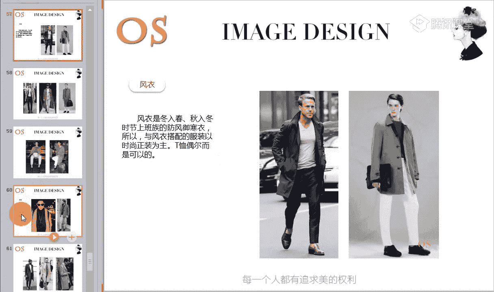

🎼这是风衣这样的一个知识点啊，男生一定要注重品质感跟款式。是的啊，我们的一朵向日葵说的非常非常的棒。是的，品质对于你们来说非常非常重要。🎼所以说你会发现男生其实他不会说呃服装像像女生一样。

色彩上面有多么多的一些变化，对不对？或者多么丰富。但是你会发现它主要就是在一些材质上面和我们的款质上面会形成的变化会比较的多。🎼你今慢。🎼那个？🎼好，那接下来呢我们说到大衣啊。

大衣类的话呢其实也不用老是多做多的一些介绍了。我们之前在讲毛衣和T恤类的啊，包括卫衣类的时候，我就多说了，你大衣你可以跟毛衣类的，对不对啊，T恤。🎼T恤还有包括呢我们可以跟一些正式款式的大衣的话。

可以跟正式款式的西装做搭配。🎼啊，根据自己的风格啊，根据自己的风格去进行选择，根据自己的身材啊的胖瘦高矮呢去选择合适的款式和材质。🎼那在整堂课程中呢，我们还有最后一个知识点，就是我们的阔腿裤啊。

其他裤子我就不做多的介绍了。像我们的锥形裤啊、直筒裤啊啊其他的这样的一些裤子。我们老师就不做多的介绍。我重点来说一下阔腿裤。因为像今年的话呢阔腿裤也是非常非常流行。包括我要跟大家说一下。

2018年阔腿裤照样流行啊。因为我们可以看到接下来这样的一些图片啊，都是我们2018年米兰时装周的一些街拍，以及我们2018年的一些流行趋势的。也就是说我们各大品牌所发布的男装的一些款式，都会出现。

🎼疯狂的哦非常多的出现这样的一个阔腿裤。呃，所以说适合穿阔腿裤的同学，我们可以去选择这样的一个裤型。但是呢在此强调，如果你的风格适合你的身材体型不适合的话，不要去穿。

大家觉得阔腿裤适不适合个子不高的人穿呢？觉得适合吗？🎼一定是不适合的，对不对？因为我们之前在第三节课讲体型的时候，我就讲到了试错，说到过服装的廓型，什么样的廓型是显瘦的，显高的。

什么样的廓型是显胖显矮的。那我们可以看到阔腿裤它一定是属于这样的一个外放的裤型。所以说不高的同学即使你的风格适合，你也不要去穿。但如果说各位男士，你们风格又适合了你的个子也高了，对不对？也是也是高的。

你们其实可以多去选择这样的一些阔腿裤。因为它也是非常的百搭，可以跟我们西装类的单品做搭配，那还可以去跟我们这样一个针织衫。其实我特别喜欢我个人来说特别喜欢第二套啊，这种庸庸散散的宽松款式的一个毛衣。

其实你会发现跟这样的一个阔腿裤搭配在一起，效果也是非常理想的啊，个子高同学一定能穿出这种整体的一个感觉。

🎼那还有就像我们这样的一些风衣，也可以去驾驭，对不对？以及呢像我们这样的一些夹克类的，同样可以跟他去做搭配。所以说你会发现宽松配宽松也会有不一样的感觉。那么唉稍微合体的上身搭配宽松的下装也是非常不错的。

当然啊这个一定是适合个子高的同学。🎼包括我们这样的一些五分裤啊，五分裤，其实五分裤不仅仅男生啊，今年和明年都很流行。其实女生也是一样的。我不知道大家经常我们在场的女生也比较多，去逛街的时候。

你有没有看到女士的阔腿的五分裤也非常的多，对不对？其实也能也非常合适啊，也非常好看。所以说像男生也是一样的。那如果个子高的同学，我们根本就不用惧怕五分裤，对于我们的一个影响。所以说我在挑选五分裤的时候。

以前我们经常选择一些直筒款式的，稍微合体一点的款式的。那么今年我们要选择五分裤的话，就去选择这样的一些阔腿款式的。同样的跟任何的一些运动夹克呀，啊，包括跟我们的衬衫呢。

跟我们的衬衫去做搭配T恤做搭配都是可以的。

🎼还有呢就是我们prada今年哦，今年2018年的春夏时装周的话，它也出了这样的一个连体裤。🎼出了这样一个连体裤啊，所以说各位男士如果说你们喜欢的啊，你们喜欢的也可以去选择这样的一个连体裤。对。

五分裤一定是会显矮的，五分裤绝对是会显矮的。

🎼像这样的一个呃五分阔腿裤的话，我自己哦老师个人来说是我已经买了好几条了，因为我觉得特别好穿，特别舒服宽松，对不对？但是呢唉又同样有这样的一个休闲的感觉。

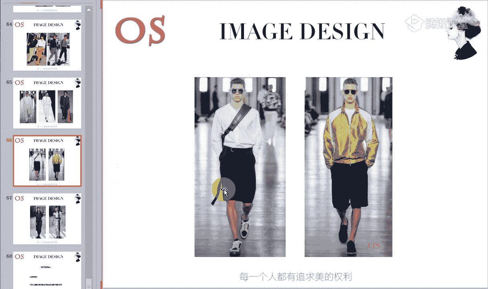

🎼对，连体裤肯定是不好穿的啊，但是嗯会有这样的一个工装的效果。🎼工装的效果可能有一些男士喜欢的话，你们也可以去尝试啊。因为这是我们prada所出的这样的一些款式。🎼还是一样的。其实连体裤的选择的话呢。

我们也可以结合自己的色彩哦，结合自己的色彩。呃，我说的色彩是你的风格的色彩啊，结合你的这样的一个色彩，结合你的这样的一些款式，对不对？我们可以去参照一些夹克类的。因为你像很多连体裤的话。

它上半身一定是有点形似，我们某一些夹克，比如说有这样的一些高尔夫夹克类的上半身，也有我们哦飞行员夹克式的上半身，或者是说我们这样的一些艾森豪威尔式的这样的一个上半身，对不对？

根据自己所适合的夹克类的去选择。

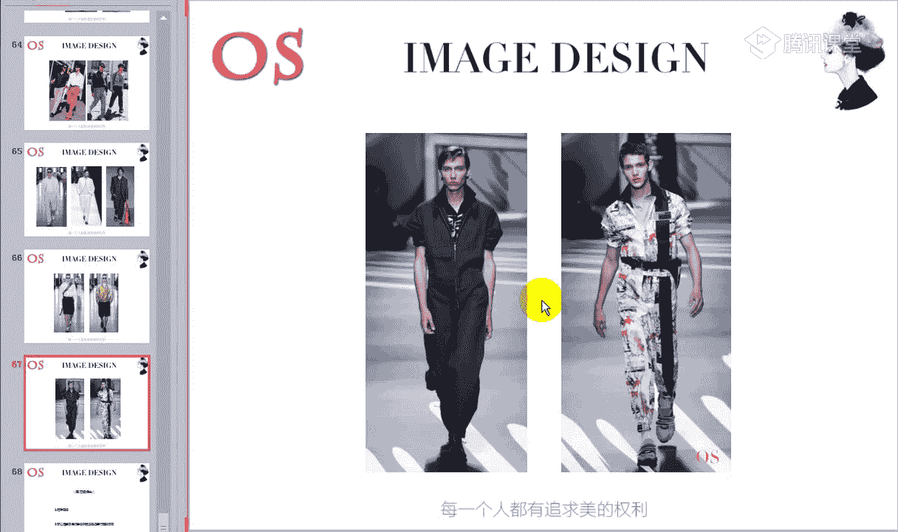

🎼当然哦，臀部大的同学肯定是不适合穿连体裤的。🎼我也非常有这样的一个休闲的感觉哦，而且很前卫，很时尚。🎼而，这个就是我们在这里呢所强调的这样的一些裤装啊，其他的裤装的搭配呢，其实在上方我都有说到了。

那像我们这样的一些基础款式的搭配的手法啊，大家都明白的同学可以快速跟老师扣个一。🎼选择好自己合适的了。我说的自己合适是包含你的体型，包含你的风格，包含你的场合。选择好自己合适的。

然后呢再去按照老师今天在课堂上讲到的这样的一些小细节，对不对？讲到的这样的一些细节上面的，以及呢常规的一些搭配手法，我们呢先慢慢的从常规走起，从常规的手法，然后我们多去看这样的一些时装周啊。

多去看这样的一些流行的杂志，对不对？时尚的杂志，以及我们时尚的网站，其实当你越来越对自己的风格，越来越明确的时候，然后我们再去看这样的一些穿搭的时候，你会立马的找到这样的一个感觉。

比如说我们看到这套衣服的时候，你就会想到哎我作为一个古典风格的，我能不能这样穿，绝对没有任何问题，对不对？哎，我作为自然风格的，我可不可以这样穿，绝对没有任何问题。那我是不是在明天上班的时候。

或者说哎这样跟朋友出去喝咖啡的时候，我也可以采用这样的一个搭配手法，所以说就是这样的一个感。

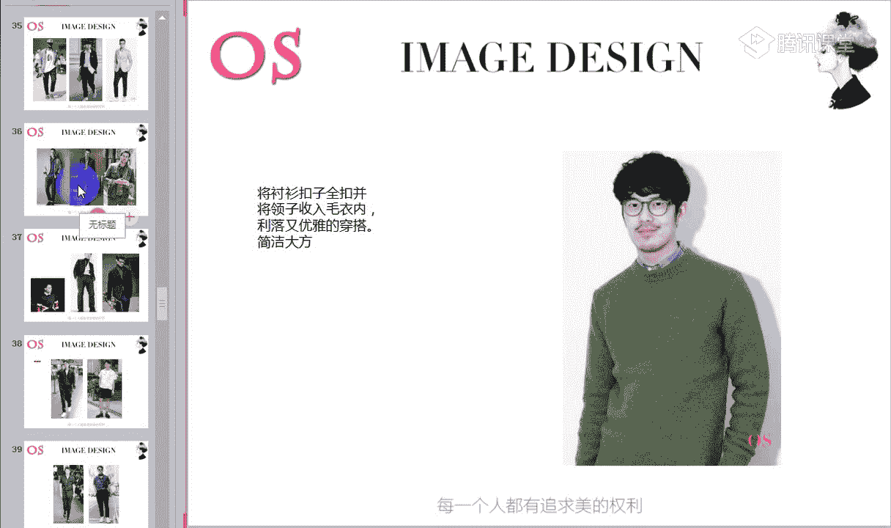

🎼就要多去找这种感觉。🎼好，老师，我看到1个18年春夏的一个秀啊，还有男装的一个超短裤，就是西装结合运动啊。有有有，而且还有那种糖果系列的，还有男装的糖果系列的，也挺吓人的。

🎼可能他针对的人群会不一样哦，可能有针对的人群。因为有一些男士的话，他就喜欢这样去装扮自己，所以说这也是要看个人的一个喜爱。🎼好，如果大家都没有任何问题呢，我们就看到今天的一个作业啊，作业就是做好笔记。

然后呢就是根据自己呢所适合的服装单品进行搭配演练啊。你的衣橱中如果有适合你的这样的一些单品，我们现在就可以按照这样的一些常规的方法搭配组合起来。或者说我们也可以找找一些相对应的你适合的一些单品，对不对？

唉，发图片也是可以的。我在这里呢要重点表扬一下我们的呃日月光滑哦，大家也可以看一下他在群里面交的作业，他其实对于风格的把控啊，对于这样的一个整体单品的一个。🎼把控度非常非常的高，做的非常非常好。

所以说其实就是对于这种。🎼知识点的一个理解，然后我们多去寻找这样的一个图片。你交上来的时候，老师能够更直观看出你哪些地方是有问题的。🎼大家可以去看一看他的作业啊。

他的作业是嗯他的模特是一个秋季型的自然风格的啊。然后你们可以根据我们作业的主题，然后去看他找的这样的一些图片啊，做的都非常非常的标准。🎼好，如果大家都没有任何问题，我们就下课了啊。关于今天的知识。

还有包括笔记啊，还有没有任何问题的？🎼没有问题的话，我们就下课了。🎼然后呢，作业一定要及时的上传上来哦，因为你上传的作业的同时，是对于你自己这样的一个提升，也是让老师更加呃能够明确的看到你的一些变化啊。

能够看出你有哪些地方是做的非常好的。而且有人还有哪些地方是需要去改正的。🎼好，如果大家都没有任何问题，我们就下课了啊。再次感谢大家的一个聆听和陪伴啊，这里是OS男士班的课程，我们下一节课呢再见。

