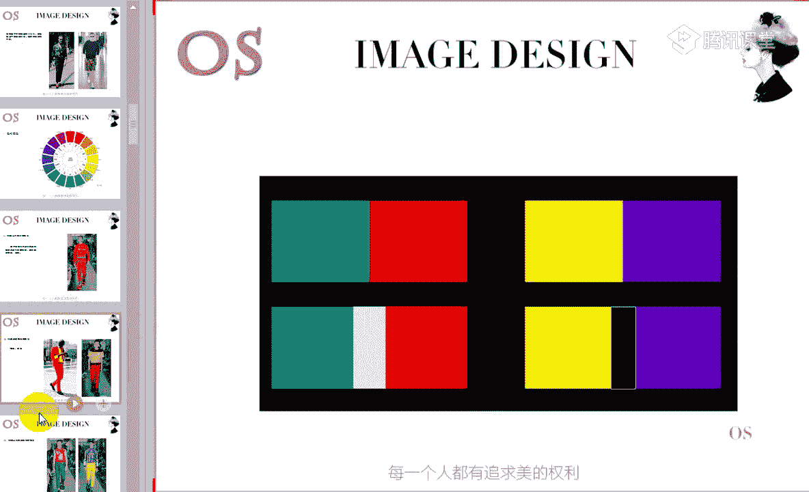
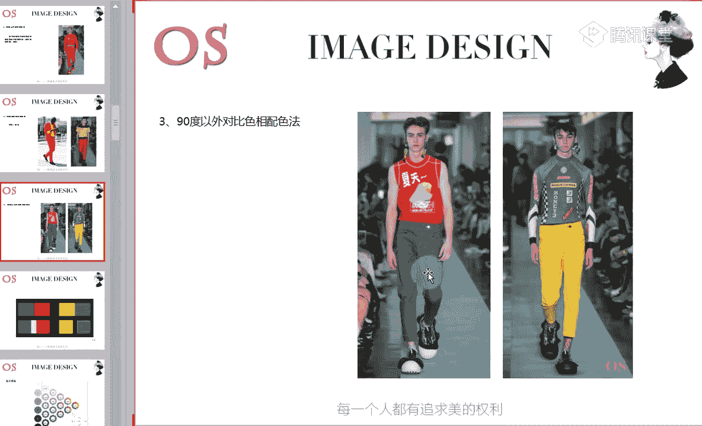
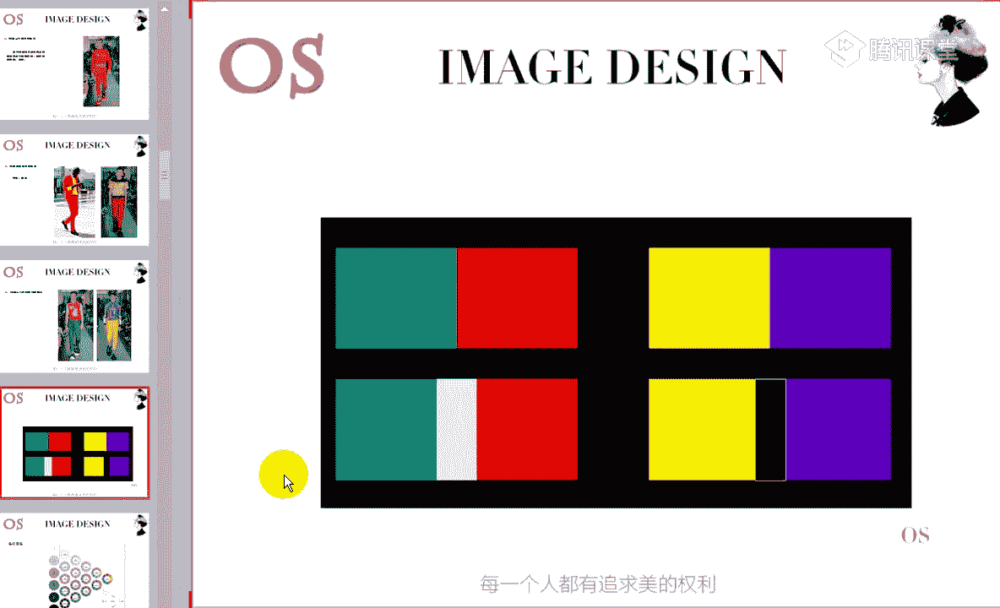
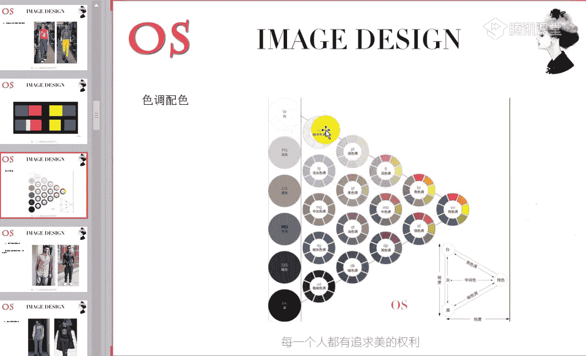
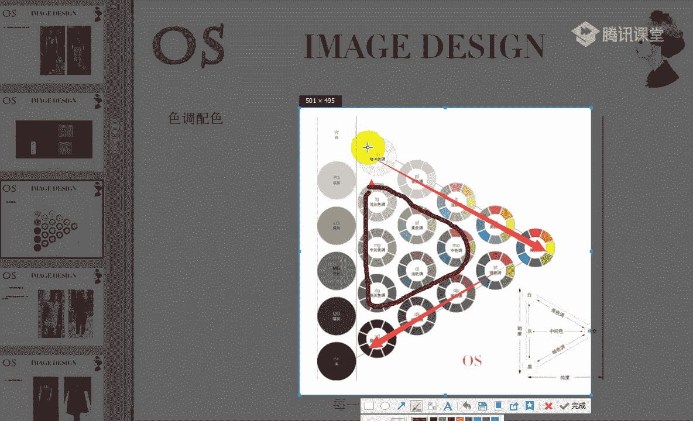

# 1、14男士个人形象班第二期（中级版）VIP课程：第11节、服装配色原则

好，欢迎大家来到我们OS男士班的课程。我是本节课的主讲老师舒阳。那今天呢我们要讲解的知识呢是关于我们服装配色的技巧。第十一节课。其实服装配色的技巧，我们在色彩美学班已经说的非常全面了。

如果说有认真的一直在听课的，对不对？呃，包括我们有把色彩美学班的课程补上的同学，对于这样的一个知识一定不陌生。那今天的课程呢主要是复习和强调一些配色上面要注意的一些细节。

服装色彩搭配其实非常非常的简单哦，因为呢为什么说它简单？其实无非就是我们可以看到这张图片。看到这样的一个公式啊，服装色彩配色的话搭配其实就是色相配色和色调配色。其实就就是这两个方面啊。

那接下来呢我们首先还是看到今天的这样的一个知识重点。第一个就是服装配色角色的理解。第二个呢就是我们服装配色的技巧。那对于大家的一个要求呢，就是掌握服装配色的规律，非常非常的简单，不要觉得色彩配色难哦。

特别特别的简单。因为我们一会儿把整个课程上上完之后呢，老师会跟大家稍微做一个总结，你们就会觉得其实只要是适合自己的，我们掌握了自己，然后再掌握这样的一个色彩的话，色彩搭配是相当相当简单的。好。

我们先从我们刚才所讲到的这样的一个色相配色和色调配色来讲解啊。其实色彩搭配的一个基础呢，它的一个概念和目的啊，就是两种或者是两种以上的颜色的搭配，我们就叫做配色，对不对？

两种或者两两种以上的颜色我们都叫做配色。那配色呢是为了达到更好的视觉的效果和我们约定的一个目的。也就是说我们要看我们自己想要表达什么。然后你就可以来进行这样的一个搭配。那我们色相配色的一个概念呢。

我们一一来看，为什么说其实在整个形象设计中，我们掌握了色相配色和色调配色之后，其实色彩的一个掌握，我们就占据了一个绝大部分的一个优势啊。首先呢大家可以先把这样的1个CCS色像环保留一下哦。

这是我们个人形象，专业的形象顾问所运用到的。如果大家需要的话呢，老师到时候一会儿发到群里面，或者是说啊如果是用电脑的同学，我们也会也非常的方便啊。我们现在就是听直播的同学。

我们现在发到这样的一个公告栏里面啊，大家也可以自己呢打开下载。下课了之后，老师会把这样的1个CCS色像环放到我们的群里面去，大家可以呢下载下来，这是我们最专业的啊一个色像环。

那包括每一个色彩的名称以及呃它的这样的一个英文字母的缩缩写，还有包括它所在的位置，我希望大家都能够记清楚啊，这是我们第一个。那以色相为基础的配色呢，我们就叫做色相配色。所以说什么是色相配色。

就是以我们的色相为基础的配色，就叫做色相配色。它以色相环呢为基础来进行这样的一个思考。在色相环上相邻的色之间进行配色。我们会发现，比如说红色跟这样的一个橙色去做搭配。红色跟我们的橙色做搭配。

鞋子是橙色的服装是红色的，对不对？那相邻的这两个颜色做搭配的话呢，会给我们带来稳定而统一的感觉。你不会说在视觉上会显得非常的跳跃，或者是显得极度的不和谐，对不对？在整体来说感觉上是稳定的。

那如果说我们用远距离的颜色来进行搭配呢，可以达到一定的一个对比。比如说像我们色相环中这样的一个蓝色和我们的橙色去做对比，它会带来视觉的一个冲击啊。还有包括像红色和绿色做搭配的话，大家也明白，对不对？

也能够明白，这就是会带来这样的一个对比感。那我们一个知识一个知识来跟大家讲解啊。首先呢什么是色相配色，以及呢色相配色，我们是分为90度以内和90度左右，以及呢90度以外的这样的一个配色法。

首先我们来看到就是90度以内的色相配色法，它概念就是在你的色相环上相靠近的色彩来进行服装的配色，整体效果会有稳定温馨的感觉。所以说如果我们在做搭配的时候，你是想要运用到色相去做搭配的话啊，要清听清楚啊。

前提条件是色相，而不是色调。我不知道还有没有同学分不清色相和色调的啊。有没有，如果有的话呢，可以跟老师扣个2。色相和色调不是一个概念哦。好，没有的话，老师就接着讲了啊，色相配色，这是前提条件。

我们首先先讲色相配色，90度以内的，也就是说我们看到这样的一个色相环中，所有90度以内的角，这两个颜色之间我们都是。叫做呢。类似或者是相同的啊，都是叫做类似或者相同的。稍等啊，老师截个图给大家看一下。

好，这个是我们这样的1个90度，对不对？1个90度。所以说当红色碰到我们的橙红色，或者是碰到橙色橙黄，它都是属于90度以内的。所以说这两个颜色呢，它会带来和谐统一的视觉感受。那同样的。

当我们的红色碰到了蓝色呃，紫蓝色或者说紫红色，对不对？它同样也能够带来这样的一个感觉。那哪怕我们拿一个绿色，哎，跟我们这样的一个黄色来做。搭配的话啊，比如说黄绿色不是橙黄啊，是黄绿。

那它同样也会带来类似呃稳定的这个概念能理解的同学可以跟老师扣个一啊。这也就是说90度以内的两个颜色，我色相啊，色相环中90度以内的两个颜色，我们带来的感觉呢都是。会表现出这样的一个稳定、统一和谐。

有没有不明白的哦，有没有不明白的？色相环中啊，我们以我们这样的一个专业的CCS环啊。那在色相环中，如果是90度左右的两个色彩进行搭配的话呢，则会给我们带来活泼动感的视觉感受。

我们可以看到同样是红色去搭配我们的橙色和我们这样的一个红色跟黄色去做对比。在视觉上有没有会发现，其实红色和黄色搭配在一起，它要比我们红色跟我们的橙色做搭配的时候，它更具有这样的一个活泼，对不对？

所以说这两个颜色90度左右的两个颜色，我们去进行搭配的时候，就会带来这样的一些。丰富活泼动感的一个效果。那如果说你的色彩剂型，或者说你的风格适合去表现活泼动感的一面的时候，你就可以去采用，对不对？

采用这样的一个色相，90度左右的一个色相配色方法。那同样也要记住啊，所以说当不适合的同学去驾驭这样的一组配色的时候，是绝对不会好看到哪里去的，就会造成这件衣服会过于的抢你的人。

那我们就肯定多去选择呢类似的会更好。呃，在强调90度以外对比配色的时候呢，在这里老师跟大家说一下啊，如果是90度左右的色相配色，你想要去呃减弱一点的话啊，减弱这样的一个活泼动感的话。

你可以呢改变一下面积啊，把两者之间的面积进行一下改变。它会有减弱的一个效果。那第三个呢就是90度以外的对比色相的一个配色方法，它其实表现的是对立的这样的一个色彩情感。

所以呢你会发现当我们90度以外的两个颜色进行碰撞的时候，哪怕是180度，对不对？或者是说呢唉我们其他的这样的一个角度，它都会产生这种夸张与众不同戏剧化的一个效果。这个就是我们色彩哦。

所以说当你去采用这样的一个色相环中90度以外的对比色相去进行配色的时候呢，请记住。第一个我们要去改变好面积，因为面积不进行改变的时候，你就会产生整体来说啊，对于你的身材，对于你的身高，都会有一定的影响。

而且的话呢这也是不高级的一种搭配手法，所以说我们一定要做好面积比啊，要掌握好面积比，包括我们在色彩里面有主色辅助色辅助色，对不对？一会儿老师都会去讲到。那第二个呢就是一定要去采用这样的一个隔离啊。

如果说你觉得我改变面积还不够，或者是说我因为这两件衣服其实它的面积差不太多，我怎么样让它们更加和谐呢，你也可以去采用黑白两色去进行隔离，或者是其他的一些颜色去隔离。

两者之间的这样的一个对比冲击的一个力度。

好，这个就是我们在讲到哦这样的一个搭配方法时，色相配色的一个概念，色相配色的一个概念以及它的一个方法啊，有没有问题啊？没有问题的同学快速跟老师刷的鲜花或者扣个一。色相配色的概念和它的方法。

以及要注意的一些事项有没有问题，没有问题的话呢，跟老师快速扣个一。你要知道啊90度以内和90度以外，还有包括呢90度左右，它会在整体上带来什么样的一个视觉效果。那第二个呢，我们就讲到色调配色。

因为无灰无外敷色相哦，这样的一个色彩配色的话呢就是色相和色调。那色调呢其实我们可以看到这样的一个色调图。还是可以在听直播的同学呢，我们发到公台上，你们可以直接点开保存就可以了啊，效果是不会影响的。

那这样的一个色调图呢也是我们专业的形象顾问所运用到的这样的一个色调图。你会发现呢不同的色彩剂型，它会从这样的一个色调图中选用不同的用色，对不对？会选用不同的用色。

那因为其实呢色调图的形成就是因为啊我们的油彩色搭配我们的五彩色而来的。可以看到我们这几张色调图中啊，纯色调图中的纯色调呢是我们这样的一个不掺杂任何黑白灰这样的一些五彩色的有彩色的颜色。

但是因为呢我们可以看到在整个色调图中，我们是分为明清色调，浊色调和暗青色调啊，明清两个字是明白的明清楚的青。那暗青呢就是啊黑暗的暗清楚的青，浊呢就是三点水浊色啊，这个应该都没有任何问题。

🎼所有加白的油彩色呢都是归纳到我们这样的一个明清色调的。就比如说我们可以看到哦，对啊，我们向日葵同学非常棒啊，他已经把这样的一个文字挡在公台上了。

那像我们图中哦这一块老师。拿我们的箭头画出来的这一块色调的话呢，都属于我们的明清色调啊，这个都属于明清色调，这是属于明清色调。那这一块呢都是属于我们的暗青色调，因为它是加黑的哦。

这几个色调都是加了黑的那中间。好，中间这一块呢。都是属于我们的着色调，因为加了灰啊，加了灰。当然因为加灰的比例不同，所以说它的纯度和明度都是不一样的。啊，这个就是我们的色调图啊。

色调图主为主要是由我们的明清色调、暗青色调和浊色调组成的啊，以我们的五彩色和油彩色这样的一个比重不同。在色调图中呢，我们这样的一些配色也是非常非常有意思的啊，非常有意思的。色调图中要记住啊。

在这张色调图中呢横向代表的是纯度的关系啊，高纯度、中纯度、低纯度。而我们的纵向所表述的呢是明度的一个关系啊，这里老师都有去标注。

高明度的色彩，中明度的色彩和低明度的色彩哦，这个就是我们这样的一个色调图，简单的跟大家稍微介绍了一下嗯。嗯，对对对啊，是这样的啊，是这样的。所以说大家可以看到，其实这里还是非常清楚的。

有这样的一些浅色调啊，亮色调。其实对于专业的形象顾问来说呢，像呃什么样的英文字母啊，表示哪样的一个色调，而且以及色调的一个位置都是需要去记清楚的，一定要明白啊，你要清楚的知道着色调和柔色调它在哪个位置。

以及呢他所表述的。因为很多书里面呢，他都会用我们的英文缩写去代替这样的一个色调。那以色调配色的一个概念来说呢，以色调为基础的配色，我们就叫做色调配色啊。我们不是以我们的色相来进行配色。

刚才所讲到的是以色相来配色，对不对？我没有去运用到一些其他加入了黑白灰的一些颜色。而且而我是在整个这样的一个纯色调里面，它的角度的不同来进行配色的，这叫色相配色。

而我们的色调配色呢就是以色调为基础的配色，就叫做色调配色。在色调图中相邻的色调之间来进行配色，你会发现得到的是统一的效果。那如果说我用远距离的两个颜色来进行搭配的话呢，可以达到对比的效果。

就比如说我从极暗色调里面抽一个红色，和我这样的一个呃淡色调里面抽一个红色，或者说极暗色调里面抽一个红色，你会发现同样是红色系，但是它们之间的这样的一个明度，是会有。这样的一个对比的就像黑和白，对不对？

它会有形成这样的一个对比感。所以说这个就是色调里面的一个对比。那同样的我们的色调配色啊，统一的同一啊同一色调配色法。如果说有的同学会发现你的剂型的不同，你所运用的配色的啊手法也不一样。

比如说像同一色调配色法，就非常的适合我们这样的一些啊下季型的同学，对不对？一会儿的在下一节课我们会讲到色彩剂型啊，这些都会跟大家所讲到的。首先这个点不用去记。

我们只要记住同一色调的配色法的一个概念和方法。那同一色调配色呢就是表达的是这样的一个类似色调的一个情感，非常的和谐统一。也就是说在同一个色调里面，我们选择啊一个颜色来进行搭配啊，选择两个颜色来进行搭配。

比如说像我们图中。是不是唉，这个就是我们这样的一个淡色调里面的红色和我们这样的一个蓝色来进行搭配的哦，淡色调里面的。好，包括我们这个也是一样的啊，这个也是一样的。

也就是说同一个色调里面去选择两个颜颜色去做搭配，会带来这样的一个和谐的感觉。你会发现红色和蓝色在色相环中它是呈现90度的，对不对？它会呈现这样的1个90度，那90度的话呢。

我们都知道90度左右会带来活泼动感。但是我们从图中来看，你会发现它会没有这样的一个跳动感啊，它相对来说是和谐统一的。这是我们色调同一个色调的一个配色方法所带来的一个视觉效果。

那第二个呢就是类似的色调配色法。那类似的配色手法呢，它指的是在同一个啊，在在相邻的两个色调啊搭配啊，相邻的两个色调来做搭配。比如说柔色调，它的旁边是极淡色调以及浅灰色调，还有柔色调，还有我们的淡色啊。

浅色调，对不对？还有我们的浅色调，那这四个色调呢，跟它都是相邻的关系。而我们可以从这样的一个色调图里面任意选取一个颜色，和它周围的任意一个色调里面的一个颜色去做搭配啊，不是同一个调子啊。

不是在同一个调子里面，我们是相邻的调子里面两个调子里面来进行搭配，它可以是相同或者是不同的色相，你可以选择相同的色相，就比如说像老师所选的就是相同的，同样都是蓝色系，但是它们的纯度。和明度是不一样的。

对不对？哎，包括我们这一身也是一样的，明度和纯度是不一样的那这种搭配呢是类似色调的配色，表达的是类似的色调情感，会凸显类似的效果。那当然我们在色调里面呢也有对比的色调搭配方法，那它指的是中间隔一个调子。

那中间隔一个调子呢，你会发现如果是这两个颜色，它之间只隔了一个调子，它会产生这种类似偏对比的感觉。但如果说你隔了两个或者是两个以上的话呢，它就会形成对比的一个效果了。大家可以来看一下哦。

我们可以看到这样的一个里面的一个紫色和它这条裤子的蓝色。可以回答一下老师啊，你觉得蓝色和紫色啊，内搭的紫色啊，他们谁的纯度要高一点，谁的纯度高是紫色还是蓝色，觉得是紫色的，可以跟老师扣个一啊。

觉得是蓝色的，可以跟老师扣个2。图一啊图一的紫色和蓝色。这两个颜色可能因为紫色的面积不是很大，但是我们也能够清楚的看出来啊，对色彩要敏感一点。紫色和蓝色大家觉得是紫色的纯度高还是蓝色的纯度高啊？

如果觉得是紫色的，可以跟老师扣个一，觉得是蓝色的呢，跟老师扣个2，哎，不是指它的鞋子的紫色，是指它内搭哦。内搭的纸。我们的益达同学说到蓝色啊，嗯，月月同学说到了紫色。揭晓一下正确答案啊。

正确答案其实就是我们的紫色非常的明显啊，非常的明显，特别的明显。所以啊所以跟大家说一下，如果说对于明度和纯度，还有同学没办法快速的去进行分辨的，一定要把色彩美学班的这样的一个属性的知识呢。

再好好温固一下，再好好温固一下啊。紫色明显哦要纯度要高啊，不是蓝色的纯度高哦。我说的是图一啊，紫色明显纯度是要高的，而我们的蓝色你会发现它是加了灰的，而且它的整个色调来说要发浊一点。

我们的紫色会更加的相对来说要鲜艳一点，相对来说要鲜艳一点。所以说呢我们紫色你会发现它的调子和我们的蓝色调子它并不是隔的太远，并不是隔的太远，它可能中间就是隔了一个调子。

所以说这一身产生的效果会类似偏对比。但是我们也可以看到图中这样的一个。蓝色和我们黄色，他们两者之间的色调的一个对比感受就要明显很多，能够达到这样的一个对比感哦，包括我们的第三张图片也是一样的。

所以说中间间隔一个调子的距离呢会产生类似偏对比的效果。那中间间隔两个或者三个调子的距离呢，会有对比的效果。而且通过这张图片，我用我不知道大家有没有发现蓝色和我们这样的一个黄色。

其实它的关系是有这样的一个对比关系的，对不对？它是有对比关系的，蓝色和我们的黄色是有对比关系的。但是我们可以看到一个点就是当他们两者之间的调子发生改变的时候，他们对比的关系会减弱对比的关系会减弱。

对不对？啊，所以说呢当你想要去运用色相环中对比的色彩来进行搭配的时候，除了你可以按照老师所说到的去改变面积去采用隔离色以外，你还可以改变色彩的调子啊，这一个知识点听清楚的，听明白的，跟老师扣个一。

听明白了没有哦，还有呢就是对我们去调和嘛。还有一个点就是我们在采用配色的时候啊，在采用这样的一个配色的时候，大家记住，就是如果它的色调离得非常远的话呢，请你们尽量呢色相要近一点。色调离得很远的话。

我们色相近一点，因为这样的话会更来更快的带来这样的一个质感哦，会更加形成这样的一个质感。这是我们第二第二句话，要记住啊，色调远及色相近。有没有不理解这句话的，老师稍微解释了一下，还有没有不理解。

如果不理解，可以跟老师扣个2。就是我们在采用色调配色的时候，你尽量呢色调远，色调如果离得非常远，我们请呢让他们的调子挨的呃一要让他们的色相挨的近一点。好，有没有问题啊？都没有问题的话呢。

可以快速跟老师刷朵鲜花啊。然后我刚才强调的这句话一定要记清楚啊，非常的受用。好，我们的月月同学还有问题，对不对？好，再解释一下啊，就是你在采用呢色彩色调去进行搭配的时候，我们都知道对比的色调对不对？

对比的色调就是比如说隔了两个甚至两个以上的话，会形成这样的一个对比的效果。那如果说你想让这样的一个对比效果更加的和谐。也就是说搭配出来的整体的色彩上面更具有这样一个品质感的话啊。

如果你是采用极淡色调去跟这样的一个深色调做搭配的时候，你会发现其实这两个淡调子它是距离非常远的，对不对？距离非常远的那我们就尽量呢去采用相邻的色相去进行搭配。就比如说我选用极色调里面的红色。

跟我们这样的一个深色调里面的黄色来做搭配。因为黄和红它是挨着的，对不对啊，以及我们这样的一个橙色等等。就不要选择呢太远的不要选择太远的。当然啊，如果是说你注重好了面积啊等等的时候也是可以的。

但是有一有时候我们会发现这两件服装的时候没办法去改变面积的时候呢，你就要注意在方面要多去啊留意一下。好，我们月月还有还有没有问题啊，能不能理解？就一般的话我们都知道对比的色彩的话。

我们采用面积一定是都可以解决的，对不对？好，那我们接着来看啊，那这是我们总结的啊，跟大家总结的。其实这样的一个配色就是色相配色和色调配色。那我们来具体来在复习一下我们美学班所讲到的一些知识。

我知道像这样的一些知识，我们美学班其实都有去介绍到啊，我们看到第一个就是我们配色的角色问题。那跟我们的小说和电视剧是一样的。有举呃有这样的一个主角和配角，对不对？那服装配色呢也有角色之分。

在我们进行服装配色的时候呢，只要做到各种色彩，就和呃这样的一个主次分明层次清晰，我们才能够搭配出完美的色彩效果，充分的去展现的服装和人自然社会的一个完美和谐。就比如说我们可以看到啊，首先要清楚。

我们在做配色的时候，不管你是做色调配色，还是我们这样的一个啊色相配色，我们都是要分清这样的一个主次的。比如说主。主要色主要色的一个概念呢，它是指的是服装配色中占据着主要面积的一种，或者是两种啊。

主要色它是可能有一种或者是两种的这样的一个颜色，主要色呢决定了你服装配色的整体风格和印象。那服装穿着穿搭的同这样的一个者呢，它配这样的一个角色可以让我们整体来充满这样的一个活力啊。

主要色呢也决定了你服装色彩的一个整体风格。比如说我们可以看到这两张图片，老师跟大家稍微分分析一下啊呃，这两个人呢一个是靳东，对不对？一个是我们的许味周啊，呃，最近也是在时尚圈应该还是蛮火的。

经常去参加一些这样的一个时装周啊，发布会等等。那我们先先看到许魏洲这一身哦，他这一身主要的颜色是哪个颜色？回答一下老师啊，他这一身主要的颜色是哪个颜色？也就是说，在整个服装配色中，它占据着主要面积的。

也就是说它的面积会比较大的，对不对？是哪个颜色？好，蓝色对不对？是的啊？我们这样的一个深蓝色。那其实深蓝色我们来回想一下，我们之前在讲场合的时候，我说过在严肃的职业场合。

我们可以去选择深呃深蓝色藏蓝色啊和我们的黑色对不对？所以说深蓝色本身就会给人稳重成熟的感觉。那再加入我们这样的一个白色的休闲单品，整体呢会使我们整体层次分明的同时，又会凸显这样的一个休闲优雅大气感。

对不对？你会感觉它整一身这样的一个配色，加上它服装的款式和材质，给人的感觉是这种休闲优雅大气的感觉。但是我们来看到图二呃，图二图一啊，我们来看到图一，先因为先讲了我们这样的一个图二，先讲了我们的许位周。

接下来我们再来看到靳中呃，靳东对不对？靳东这样的一个主要色呢是我们这样的一个丹宁蓝色，对不对？我们牛仔蓝。那它同样也是黑呃，它同样也是我们这样的一个蓝白的一个搭配啊，以我们的丹棱蓝为主色。

跟我们许魏洲带来的感觉是不一样的。大家有没有来看一下，老师刚才用到了优雅，用到了大气，用到了休闲来形容我们的许魏洲。但是我们来看到靳东啊，我们忽略掉裤脚翻边的呃，忽略掉这一个点。

我们可以看到整身这样的一个配色，以及呢它的一个服装的一个整体带来的感觉。是不一样的，对不对？我们看许魏洲是优雅。是休闲。但是我们来看进东的时候，你会觉得它是休闲加轻松的感觉。能不能理解啊。

理解老师的同学可以跟老师扣个一。所以说这个就是呢主要色决定了你服装色彩的一个整体的一个风格。那包括如果还有不理解的呢，我们接下来再来看啊，像这个呢是我们的华晨宇，对不对？

华晨宇呢整身搭配中是我们这样的一个灰蓝白的一个配色啊，因为有鞋子，有灰色，有我们这样的一个蓝色，那灰蓝呢是占据着主要的一个色彩的，显得我们整个来说人来说是非常的个性清爽，对不对？哦。

是很清爽的这样的一个色彩。那品本身呢是具备个性且时髦时尚感的，像这样的一些破洞啊，哎，包括我们这样的一些帽子啊等等。所以说整体带带给别人的感觉呢，就是清爽个性的感觉。那我们有可以看到图案。

图案的话呢是我们韩国的一个明星叫安仔贤啊，应该老师没记错的话。那其实老师之前有讲过白色的西装啊，白色西装非常适合浪漫风格的人去穿。那我们这样的一件米色米白色的一个西装的话呢。

同样它也不乏这样的一个中性的感觉，得体大方的黑白色系的一个搭配，加上它服装款式这样的一个V领的设计，以及呢小花朵的一个胸针，对不对？一个领针。

那为我们整体造型呢是起到了一个非常好的一个画龙点睛的一个作用的。所以说整体的感觉这样的一个色彩的一个组合，带给你的是性感精致绅士的一个感觉，对不对？所以说这个就是我们刚才老师所说到的这样一个概念啊。

我用了几个例子来跟大家呢做这样的一个解释。我希望大家都能够理解，还有没有不理解的。啊，如果没有不理解，老师接着讲了，有不理解的同学可以快速跟老师扣个2。这个就是为什么说主要色呢？

它决定了你服装色彩的一个整体风格。所以说各位同学，你是什么样的一个风格？哎，你想带来什么样的一个感觉，你在色彩上面就要去考虑一下啊，就要考虑一下，这是一个依据，这是你的依据。好。

我们一定呢要掌握这样的一个主色辅助色，以及我们点缀色的一个用法。主色呢是占据你全身色彩面积最多的颜色，占全身面积的60%以上。那在夏季的时候，哎，如果我们怎么样去判断这样的一个颜色是主色啊。

就比如说像一些大衣啊啊，像我们的这样一些裤子啊，裙子啊，它其实都是属于我们的主色。在夏季的时候，当然啊在我们的秋冬季节，像一些套装啊、风衣啊、大衣啊，因为它所在你整身中所呈现的面积是占据着60%以上的。

所以说这样的一个色彩呢，我们都称之为主色，称之为主色。那除了有主色以外呢，我们当然也会有辅助色，对不对啊，也会有这样的一个辅助色。好，辅助色呢跟你的主色是搭配的一个是跟主色搭配的一个颜色。

它占全身面积的40%左右啊。它们通常呢是单件的上衣外套，或者是我们的衬衫、背心等等。那我们可以看到图一啊，图一这一张照片主色的话肯定是我们的裤子了，对不对？黑色，因为穿在你整身来说。

面积最大的就是这条裤子了。那当然它的辅助色是哪一件呢？也就是我们这样的一件背心了。那像我们这一身的话呢，它的主色就是它这件套装，对不对？这样的一个套装，西装套装，辅助色呢，也就是它内搭的一个衬衫哦。

内搭的一个衬衫，这是我们辅助色和呃主色。一个认知。如果有同学还认不了的，可以在公台上提出来。没有的话呢，我们就接着往下讲。有没有？所以说要记住啊，主色和辅助色的一个面积比。如果说这两个颜色是不一致的。

对不对？唉，这两件单品的颜色是不一致的，应该这样说啊，所以说占据60的是我们的主色，那占据40%左右的就是辅助色，就是辅助色。所以说在做色彩搭配的时候，你再选择在穿衣服的时候。

你要控制好色彩之间的一个面积比。第三个呢就是我们的点缀色，其实点缀色它就相当于我们的配饰啊，我们在讲到配饰搭配的时候，我说过配饰在整体服装中会起到画龙点睛的一个作用，对不对？它非常的重要啊。

它能够凸显你整个搭配的一个层次。那其实点缀色也是一样的，它也同样可以起到画龙点睛的一个作用，它同样能够去缔造你这样的一个层次感。那点缀色呢它指的是色彩组合中占据面积比较小的啊，甚至不到15%啊。

百不到15%。所以非常非常的小，但是视觉效果呢是比较醒目的颜色啊，不要觉得什么只要这样的一个色彩，它的面积小，它就是点缀色，但是它还要具备色彩上面醒目，要具备啊这样的一个纯度啊，要具备醒目的一个效果。

甚至的话呢我们在整个服装中有这样的一个图案，对不对？那它图案的整体的设计上面也要足够的醒目，它能达到点缀的一个效果。那。一般情况下呢，点缀色也经常出现在服饰的配件设计和我们面料的花色设计中。

比如说我们买一件黑色的衣服，对不对？黑色衣服有这样的一些金属扣，它的扣子是用金属来作为扣子的那金属扣其实就是在整个服装中起到了一个点缀，因为它非常的醒目独目。

那包括我们暗暗的花底上面唉有点缀这样的一些色彩鲜艳的一些点，那它同样也是属于这样的一个点缀。而我们的点缀色的运用的话呢，你要记住整个服装配色中，它不能有过多的亮点，它的亮点只能有一个啊。

如果说你的领带是红色的，对不对？像我们的吴亦凡一样，然后你的腰带呢又是一个明度啊，又又是一个纯度特别特别高的绿色啊，或者是说特别高的一些其他颜色的话，那其实这两个颜色它会就没有任何的一个主次了啊，就。

没有一个视觉焦点了。所以说在运用点缀色的时候，你要记住的就是呢你只能有一个焦点。那你既然有了这一个焦点之后呢，你就不能出现其他的一些焦点。那同样你的衣服本身的话，色彩的调子也要稍微的暗淡一点。

才能起到一个点缀的一个效果，才能去凸显这样的一个点缀色。啊，所以呢点缀色一般就是指的是啊我们在运用这样的一个点缀的话呢，就是腰带啊啊领带啊、丝巾啊、鞋子啊，包啊、饰品啊等等。

都会起到画龙点睛的一个作用啊，它占据的面积就是5%到15%。那包括像我们整身中如果有些同学买了一件衬衫，唉，你会发现衬衫中有这样的一些图案，对不对？或者是它的袖子上面出现了一些亮点的时候。

而本身这件衬衫，它一定它的衣身一定是色彩比较暗淡的。它的色彩一定是比较暗淡的。这个时候才能够凸显这样的一些亮点。那当然我们在做搭配的时候呢，你可以你如果说你要凸显你这一身你这件衣服的图案的话。

你的其他的一些单品的话，我们就要做弱化。不然的话呢，就会没有这样的一个主次啊。这是我们点缀色的一个用法。所以说你可以看到整身中做搭配的时候，它的鞋子会非常突兀啊，这是因为它的整身色彩来说比较的低调。

它不是属于纯度高的颜色，所以说才能把这双鞋子呢凸显出来。那包括像我们这一身也是一样的。你会发现露出来一个小领子的衬衫在视觉上非常的有吸引力，对不对？它成会呈形成一个焦点。

那也是因为它其他的这样的一些单品的衬托下，才把它这样一个焦点凸显出来的。所以大家在运用点缀色的时候呢，一定要注意啊，注意老师刚才所说到的。好，关于点缀色的运用方法还有没有问题？所以呢各位男士啊。

如果说你有一件鲜艳的衬衫，你有一件鲜艳的衬衫，你又发现你自己并不是呃并不想太大面积的去显露的时候，你可以把它作为点缀，对不对？出现啊，我把面积控制好。或者是说我今天买了一双鞋子，特别颜色特别漂亮。

我就想凸显这双鞋子。那其实我整身其他的服装配色的话呢，就要做弱化，我就不要去选择一些过于鲜艳的颜色来跟它去抢了。那还有一个呢，就是我们服装配色中也会运用的非常多的，也是非常能够去凸显你功底的。

就是我们的呼应色哦，在配色中添加重复的配呃呼应色，会只使你的整个色彩呢，上下或者说左右会呼应，整体呢配色融为一体。那其实呢呼应色用的最多的就是当我们有一件单品特别特别花哨的时候。

那像这样的一些花色的单品去做搭配的时候，我们都会记住的，就是去搭配素色的，对不对？这个是没有任何问题的。所以说各位男士一旦你遇上了一些复杂的图案，或者说复杂的色彩的这样的一些单品的时候呢，你可以去搭配。

低调的素色啊，没有任何。纯度啊，没有不是说没有任何纯度啊，是我们这样的一些简单的啊低调的纯净的一些色彩去跟它做搭配，会形成和谐统一的视觉感受？那除了这样的一个搭配以外呢，可能有些同学想要去成做一些混搭。

对不对？想要展现自己的一个搭配功底。那我们其实也可以呢寻找单品之间的相关性，寻找单品之间的相关性啊？你会发现像我们图一这一身整身搭配中，鞋子它是不是一个亮点，是一个亮点，对不对？

那它的衬是不是非常的花哨，是非常的花哨，也非常的唉醒目。为什么说在整身搭配中，你又会觉得不会太多，哎，它的视觉焦点虽然说有两个，但是又感觉整体来说非常的和谐呢？就是因为它会采用这样的一个相关性。

因为它的衬衫中是会有红色相的，是有这样的一个红色相的。说即使我们的鞋子是一个红色，你会发现这两个颜色啊，这两个单品组合在一起，会带来和谐的视觉效果。当然，如果说我们把单品呃换成蓝色的时候。

你就会发现有点抢了，就会有点抢了，会有点不舒服啊。唉，这个能理解吗？有没有问题啊，能理解同学跟老师说的鲜花。所以说我们要知道当复杂的色彩之间做搭配的时候，我想要去缔造不同。哎。

我想要增加整体的层次和时尚度的时候呢，我可以去寻找单品之间的相关性啊，这其实就是呼应，对不对？因为鞋子跟它的衣服中的红色形成的这样的一个呼应的效果。还有呢我们这样的一个黑色啊。

也起到了非常好的一个隔离啊，起到了一个非常好的隔离。那还有呢就是有同学可能会觉得一种不够，我要搭三种，对不对？那其实你要搭三种也可以。那你还要注意什么呢？就要注意到明暗和主次的一个关系啊。

除了你采用这样的一个呼应啊，从中去采用呼应法以外，我能不能不去采用呼应呢？也可以可以去采用不不跟它去做呼应，没有任何问题，但是呢就一定要有主次和明暗，也就是说我要控制好两两个单品之间的面积和它的明暗。

那这个色彩量的话呢，我们的另外一件单品就一定要暗一点。那这个时候即使两者之间没有任何的共性，或者说图案也好，色彩也好，都没有任何的共性的话，但是它做到了主次和明暗同样也是顺眼的。也就是说。

切勿每一种色调都非常的明亮啊，切勿每一种色彩调子，或者是说我们这样的一件单品都是非常明亮的那肯定是不行的。这个理解了吗？所以说我们在讲，其实在讲这样的一个呼应的时候，老师有说到复杂的配色时候。

要注意的啊，要注意的几个小技巧，理解同学快速跟老师刷的鲜花。稍微跟大家总结一下啊，就是。我们可以去采用这样的一个呼应法，对不对？采用呼应法，也可以呢在呼应的同时呢用到一个黑白色来进行隔离啊。

也会缔造这样的一个和谐。那第二个呢就是你如果是说老师我想用花色去搭配花色，可不可以啊？他们的图案没有共性关系。他们的色彩也没有共性关系。我我也我也也可不可以用这两个单品做搭配呢，也可以。

但是你要首先保证呢这两个单品，它即使是花色的情况下啊，它要有这样的一个明暗啊，不能说两件单品都非常的鲜艳，或者说都非常的耀眼啊，也要保证呢这两件单品它的面积比是有一个主和有一个次的。好。

我们月月同学还没明白哦，能理解吗？我再次重复了一遍啊。所以说这是我们在讲呼应色的时候呢，开了一个额外的一个点啊。因为我们讲呼应的色的时候，一般呼应色运用到最多的就是当一些花色的单品，我们做搭配的时候。

我们可以去哦采用呼应的方法，对不对？我们再挑选裤子。比如说我有一件花色衬衫。我再挑选鞋子和裤子的时候，我可以从这样的一个花色的衬衫里面呢挑选任意一个颜色作为以下的一个单品，这是最简单的一个方法。

那同样当这样的一些花色的单品的时候呢，我们可以还可以去采用素色去进行搭配，对不对？比如说黑白灰或者说其他这样的一些呃简单的纯色调呃，纯色的这样的一些色彩，那另外就是我们可能有的同学非常喜欢花色的。

像一些男士。喜欢花色的话呢，你两件花色的单品要做搭配的话，我们就要注意好主次和明暗的一个关系。好，点缀色多配一个的话，呃，色调要一样是吗？哦，不是啊，我说到点缀色一定是只有一个焦点的。

不能形成过多的焦点哦。这个跟我们的点缀没有关系了啊，这个没有跟点缀没有关系了。我刚才所讲到的是点缀色的一个用法。也就是说你要运用这样的一个点缀法配色的话呢，你的整身中只能是有一个焦点。

那这一个焦点怎么样去衬托呢？你的其他的一个单品就一定要色彩低调一点啊，不要太耀眼，不然的话你就衬托不出这样的一个单品，对不对？就比如说你看到吴亦凡整身搭配中，这条领非常的抢眼，是因为它的衬衫和它的外套。

它的纯度并不高，对不对？它的纯度是一个低纯度的一个蓝和哦以及我们明度啊，一个高一个低的一个明度的蓝色，所以说才能够把这条红色领带凸显出来，才能够凸显出来。呃，还有没有问题啊，还有没有问题？好。

没有问题的话呢，我就再接下来讲了啊。我们月还有没有问题不理解的？呃，呼应色多一个白没关系啊，呼应色我说到的是什么呢？就是当你有一件花色的单品的时候，你在运用其他在选择其他单品的时候。

你可以采用呼应的配色手法。也就是说从这样的一件单品中任意抽出一个颜色与之来做呼应。就比如说你像这条裤子中，这条黑色裤子，其实就是跟它衬衫里面的黑色在呼应，对不对？

这双鞋子也是跟它衬衫里面的这个红色的花朵在做呼应，这个其实就是一种呼应的配色手法，那即使你可以看到好，红色是一个非常耀眼的颜色。那这种花色的话，它本身就比较的独目，但是这两个颜色组合在一起，对不对？

也是非常和谐的这就是我们呼应配色的一个手法啊，它能够让你整体配色呢融为一体。那还有就是呢呃我因为这样说强调到这样的一个呼应的手法，对不对？啊，包括你像我们可以看到这一声啊，再跟大家说一下。

像它的袖子跟它的鞋子其实就是一个呼应。那它鞋子中的一个绿色，这是一个绿色，它的边是一个绿色的，其实就跟它这条裤子中的绿色系也是在做呼应，对不对？所以说也会非常的舒服，能让它整体呢融为到一体。

这个就是我们的呼应法。那我们由这样的一个呼应法呢来说一说，就是说有有些同学非常喜欢这样的一些花色的服装，对不对？花色服装，我能不能拿一条哦花色的服装和另外一条花色的服装来做搭配呢，可以没有任何问题。

哪怕说这两个花色之间没有任何色彩的共通性啊，没有任何的图案的共通性，我们也可以做搭配，是因为我们要掌握好这样的一个明暗和主次的关系，只要你把明暗和主次关系，掌握好了这两种颜。色是可以去做搭配的。

但是千万不要说两个颜色都非常的亮，对不对？这样的一件花色单品是亮的。唉，我们夏装的花色单品也是亮的那它就没有明暗之间的关系了，它都是亮色的话，那谁都在抢，就肯定很难去缔造和谐感哦。

好老呃男士搭配中不能超过几个亮点呢？其实就要看你是主要的一个配色的用意是什么了啊。关于亮点这个问题，要看你主要的配色的用意，也就是说我之前强调的，如果你是要凸显某一件单品的话。

那你的亮点就以这样的一个单品为主就好了。就一个亮点就好了。但如果是说呢哎我想去进行这样的一些混搭，对不对？我想进行混搭，我想让我的形象，因为我是这样的一个前卫风格，我可以去尝试，那我们在做搭配的时候。

你有一个有两个都是可以的。但是这两个亮点是要和谐啊，它要和谐。就是我刚才以我们的点缀色和呼应色，你这就看你怎么样去进行划分了。好，所以其实我们通过色彩的一些亮点也可以看出来，配饰配饰也是非常重要的。

对不对？哎，也就是说其实身上的衣服不一定是绝对的主角。有时候我们可以让这样的一个配饰来说话，对不对？哎，我让帽子啊，让耳环那要项链啊、包包啊等等，可以多去运用一下。

我就想凸显我整身我的亮点就是在这样的一个包上面或者什么都是可以的。好，接下来呢我要强调一个点，就是我们很多同学其实蛮喜欢穿同色的，对不对？同种同一种颜色上下去做搭配。比如说像我们图中啊。

这个都是同一个色彩。那其实同一个色彩做搭配的时候呢，我希望大家一定要注意好工艺和材质以及我们啊跟配饰色彩的这样的一个结合，色彩小亮点啊，点缀色的一个结合，所以说你可以看到有时候我们很多男生啊。

如果去穿一些同色系的时候，材质相当的情况下，会显得常的沉闷，对不对？我们可以看到整身这三位男士。材质是类似的这种感觉啊，没有这样的一个对比感，材质之间没有对比感的话，会显得非常的沉闷啊。

那我们就更谈不上这样的一些层次啊，也更不可能去体现这样的一个时尚了。所以说呢当你可以看到，我们也可以看到这一身其实它的裤子和它的外套是同一个材质。但是为什么说你会觉得这这一身的同一个材质做搭配。

和我们下面这三张图片，同一个材质做搭配，它的层次感会更加鲜明呢？就是因为它的工艺的不同。因为你可以看到它整身搭配中有这样的一些皮带，对不对？它会有腰带的设计，能够缔造这种层次感。

还有包括它衣服上会有一些口袋和和和一些扣子的设计等等。这都是一些工艺。所以说因为这些工艺感的增加，能够凸显整身搭配的从层次，明白吗？所以说同色搭配的时候，你要么就是服装中它本身。具备这种工艺感。

比如说有口袋呀等等啊，这都是属于工艺，或者是说哎我有一些铆钉哪等等，理解吗？这是工艺的意思啊，理解的同学可以跟老师扣个一，不理解的话扣2。好，各位男士就记住了啊，我们在选择同色搭配的时候。

一定要注意工艺呃，两两种颜色。如果因为很多男士特别喜欢呃一个色彩穿到身上，一一种色彩穿到身上。这个时候我们就要做一些小细节的变化，让你更加出品。那第二个呢就是我说到的材质。我们可以看到图二的话呢。

两个颜色一模一样啊。但是呢图二的上衣，它的材质应该是属于我们这样的一个呃应该是那种光泽棉的那种感觉啊。而我们的下半身的这样的一个裤子的话呢，它可能是我们精纺的这样的一些羊绒啊等等。

或者是精纺的这样的一些涤纶材质的。所以说两个材质之间的光泽感会形成不一样。你可你可以你可以看到裤子，它的光泽感是要强于我们这样的一件上衣的。所以说因为材质的不同，不同，它能够呃带来这种视觉上的一个对比。

会带来材质之间的一个对。来形成它的层次。但是如果说你的材质类似的话，比如说我是哑光泽的两个材质碰撞到一起，你看就很难去凸显这种层次了。就很难凸显层次啊，然后我看到了这个手机哦呃。

这个点稍微跟大家提一下啊，提一下，就是各位男士呢不要把手机放到我们的裤子里面，尤其是穿一些紧一点的裤子，或者是说我们嗯比如说有一些西裤类的，对不对？你放一个手机的话就很明显，非常不好看。

我看到这张图片就稍微跟大家提一下。继续回到这里啊，所以这个就是我们的材质的不同。所以当同色系啊同一个色彩去进行搭配一模一样的色彩做搭配的时候呢，你们一定要注意材质的不同啊，要么就是工艺的不同。

你要么就是材质的不同。然后呢我们再结合这样的一些配饰啊，哎，我们也可以利用配饰呢来起到这样的一个层次啊，都是可以的。你可以看到图案的话，如果把这样的一件小领巾拿走的话，那整个中整个形象也是沉闷的。

但是因为这样的有一个饰品的增加，也是凸显了它的这样的一个生动，对不对？凸显了一个整体形象的一个生动感。所以这个就是我们配饰的一个作用啊，再次的去强调这三个点三个点。好，这个点有没有问题啊？

有没有不理解的？好，记住这句话啊记住这句话。所以说同色系做搭配的时候呢，我们注意工艺，注意材质，注意我们的配饰的一个结合。那另外呢就是还教给大家一个方法，就是鲜艳的色彩啊。

如果有些男士你本身适合去穿这样的一些鲜艳的颜色的时候呢，我们做搭配的时候可以去采用啊在色相环中纯度明度越高的色相呢，它越有朝气和活力，对不对？它能够凸显你这种活力感呃，放钱包也不可以嘛。

当然不要最好是不要在身上去放东西，因为会影响你整身的这样的一个形象，呃，会影响你的服装的型。我我说的是会影响服装的整体的型啊，款型。所以说其实男士有一个手拿包也是可以的。

手拿包这个时候就起到了这种作用啊。大家可以看到，当我们的衣服里面不放任何的手呃手表啊哦，不不放这样的一些钱包啊，手机的时候，哎，我其实提个包，这个形象不是更好嘛。对，但是如果说我拿个包。

然后我的手机挎在这里面，其实哎呦我本来觉得你穿这条裤子还挺好看的。但是因为这样的一个手机的影响就破坏了这条裤子的形，破坏了这条裤子在你身上的一个款型。好，回到这里哦。

那色彩哦色彩的这样的一个鲜艳呢色彩的这样的一个鲜艳的色彩，它本身有有很多同学是适合的，对不对？而且它本身也可以带来这样的一些朝气和活力。那当你呢不想花空心思去想怎么样去配色的时候。

你也可以大胆的去采用黑白灰哦，你可以看到黑白灰这几个颜色跟任何的颜色搭配在一起，都非常的好看。这也是我们一个万用的色彩啊，万能的一个色彩。那另外呢就是跟大家说到哦，因为讲到色彩的。

所以说鞋子的颜色和裤子的颜色相似呢，它会有显腿长的一个效果。我们在场的男士如果个子不高的，你们就尽量做到鞋子和我们的裤子的颜色一致。你可以看到，哪怕我们把裤腿挽起来。但是我的鞋子和裤子的颜色一致的时候。

我也会不自觉的把我的脚部的这样的一个脚踝等等，啊，看成我们的这样的一个小腿，对不对？可以缔造呢我们整个的一个腿部的线条拉长你的下半身的一个长度，从而在视觉上会显高。

那我们也可以看到图一这位男士其实个子非常的高。但是因为鞋子它选择了一个高帮的鞋子，那加上裤子和鞋子的颜色又形成了分这样的一个鲜明的一个对比，对不对？会形成分割。所以说在视觉上我就会不自觉的把他的脚。

把他的鞋子都划分成他的脚，而他的裤子就是他的腿，对不对？他的裤子就是他的腿，所以说他腿就会看上去非常非常的短短，对不对？所以呢个子矮的同学不要去选择高帮鞋。

也从也不要去选择鞋子和颜和裤子的颜色呢差距太大啊，太过于明显。这是我们就配色而言呢，说到的一个点。那我们可以看到这张图片啊，其实这就是接下来跟大家稍微总结一下，我们在呃上课的时候呢，说到了几大部分知识。

对不对？第一个就是我说到的色相配色和我们的色调配色。其实色彩搭配无非就是色相配色和色调配色，那包括在色相配色和色调会配色的时候呢，我们第一个要注意好面积比，对不对？注意好面积比。

同样呢要懂得去运用一些啊配色的一些手法，让它呢来打造和谐感，而且的话呢记住这句话，记住这一句话啊，当你知道了你的用色范围，然后呢，再按照我们色彩搭配的这样的一些技巧，根据你的场合和环境，对不对？

场合环境。哎，以及你想要达到的效果来进行组合就一定错不了，就一定错不了这样的一个色彩就一定错不了。所以说你只要掌握好了我们刚才所说到的。这样的一些知识。然后再结合你的环境啊，关于环境的用色的话。

其实大家应该都没有任何问题，对不对？我说过在职业场合中啊，什么样的一些职业场合，我们要表达什么？其实在虽然说我们以的你以主要的一个款式为主。但是其中我也说到了色彩。比如说我说在严肃的职业场合。

我们最好运用到黑色和我们的藏蓝色来表达这样的一个严肃严谨的感觉。那在我们的休闲啊，在我们这样的一个一般职业场合不能够出现过多的鲜艳色，对不对？大面积的鲜艳色，不然就会显得不稳重。所以说这个就是环境。

对不对？这就是环境，我们要考虑到环境的一个因素啊，来选择色彩，然后呢，再根据你想要达到的一个效果。那比如说我今天呢搭配的过程中，我今天是出去逛街，而我知道我适合什么样的一个用色范围。

我也知道啊环境要表达什么，对不对？啊，我想要去打造这样的一个休闲风舒适感，清爽感。我是不是就可以去选择。到这样的一些能够在视觉上带来休闲啊轻松清爽感觉的一些色彩。那如果说我在整个场合中啊。

我今天要去参加一个时尚的party，对不对？或者说我们这样的一个去跟同事一起去唱K啊，是我们KTV的这样的一个环境。那我们可以呢去打造活泼动感，对不对？那我这个时候我就可以去选择一些啊纯度高的颜色。

对不对？来做搭配，所以这个就是说呢根据你想要达到的效果，你想要去给你整身中带来给别人带来什么样的一个视觉感受，你就去怎怎么样去进行配色，所以就是说明确配色的要求，是做任何色彩搭配的依据。

比如说你自己是什么样的风格啊，是什么样的一个风格和色彩进型，这个也就是你的要求，对不对？以及我要去参加什么样的一个场合，这也是你的要求，以及我要表达出出什么样的一个视觉感受，这也同样是你的要求。

所以说明确配色的要求是做任何配色的基啊，依据这句话都能够理解的同学跟老师快速的刷朵鲜花，或者扣个一。好了，这个就是我们今天呢所有的一个知识啊，今天是所有这是我们所有的知识啊。如果大家对于某个知识点。

还需要老师再讲解一下的话呢，可以打在公台上啊。如果说没有的话呢，我们就看到今天的一个作业。今天的作业呢就是第一个我们要做好笔记啊，把笔记做好。那第二个呢就是任选三种配色技巧呢。

对于你自己的服装来进行配色啊，你适合的或者是你想要达到什么样效果。哎，你都可以任选啊，你也可以选择我们的色相配色，对不对？或者色调配色，或者是说我们这样的一些嗯点缀法呀啊以及我们的复呼应法呀等等。

都是可以的。根据啊还是要考虑到你的这样的一个风格啊，考虑到你的风格和你的色彩剂型。然后呢。看服装的款式啊，来考虑整等等。看你想要表达什么，这个是不限的啊，这个是不限的。好，如果大家都没有任何问题哦。

老师就要下课了啊，有没有问题？所以说今天我们整堂课回顾一下的话呢，你会发现其实色彩配色也就这么回事，对不对？我只要掌握好了这样的一些类似啊等等啊。我知道我自己适合什么之后，哎。

我也清楚的明白了这样的一个主色和辅助色之后，其实色彩搭配是非常简单的，很简单啊。一句话，其实老师就是刚才那一句话，就是对于色彩搭配的整个的一个概括，这就是一个整个的一个概括。好，如果大家都没有问题。

我们就下课了。再次感谢大家的一个聆听和陪伴。嗯，我们就下课了，拜拜。

