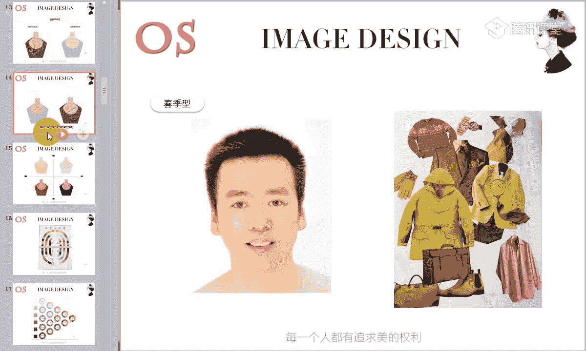
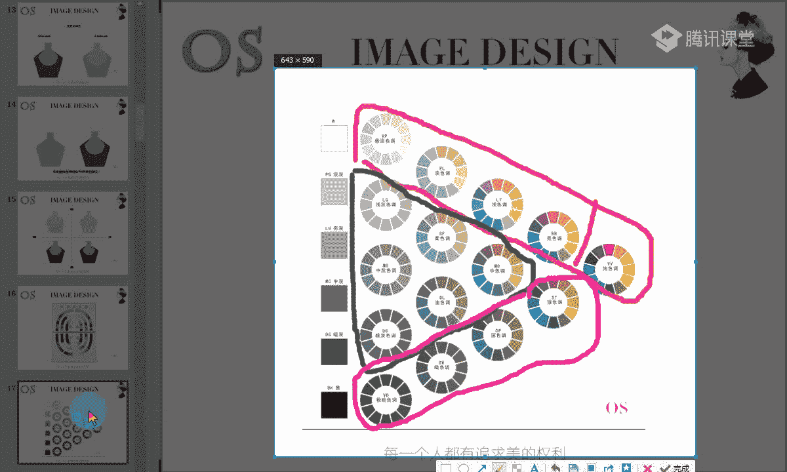
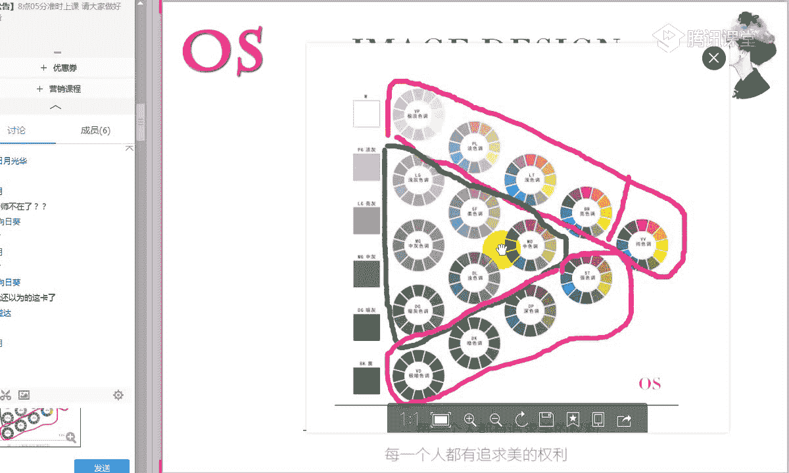
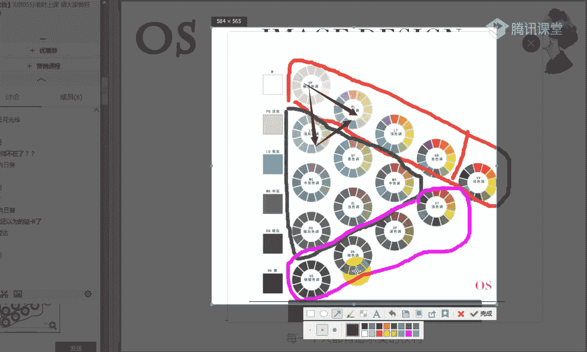

# 1、14男士个人形象班第二期（中级版）VIP课程：第12节、色彩季型分析

大家晚上好，欢迎大家来到OS男士班的课程。我是本节课的主讲老师舒阳。那今天呢是我们男士班的第十二节。今天的课程呢我们要讲的是色彩剂型的分析。上一节课我们学习了色彩搭配的技巧。

其中呢老师有说到对比类似的这样的一些配色手法，对不对？那今天这堂课呢我们也会就色彩剂型的不同呢，给大家来推荐合适的这样的一个配色。所以说。

还有同学没有掌握我们上一节课所说到的这样的一些色相和我们色调配色概念的同学。那我们下课的时讲一定要把这样的一节课再仔细的听一听。因为像我们所说到的这样的一个色彩进型呢，有的同学就是非常适合去凸显色相感。

而有的同学呢他就比较适合呢哎去弱化。也就是说他去做色调配色会更适合。好了，我们先看到呢本节课的学习重点。本节课学习重点呢是第一个我们各技型用色的特征。第二个呢就是色彩配色的规律啊，掌握自己。

目前这样的一个进行的色彩配色的规律。那么对于大家的一个要求呢，就是掌握好自身用色的范围，以及你自己服装配色的这样的一个规律。那首先跟大家呢简单的介绍一下四G色彩理论和它的一个由来哦。

我们现在呢都是用的这样的一个四季色彩的理论。那四G色彩理论呢是当今国际时尚界十分热门的一个话题，她是在20世纪啊70年代，20世纪7070年代，由我们色彩第一夫人，也就是说美国的卡诺尔杰克逊女士发明的。

然后呢，迅速的在这样的一个欧美。风靡，最后是由我们日本的佐藤太子把它引入到日本，然后并且呢研制成了适合亚洲人颜色的一个体系。所以说大家在看这样的一个运用我们这样的一个四季色彩的理论。

在判断别人进行的时候，千万别去找欧美人做例子啊。因为我们现在所适用的是亚洲人，明白吗？明白同学可以跟老师扣个一啊。所以说不要找到一个唉男士的欧美男士的一个面部非常清晰的一个高清图。

然后你去判断它是春季型还是夏季型还是这样的一个秋季型，要知道我们目前所对应的这样的一个理论是进行改良的。他目前是适合亚洲人的，而不是说适合欧美人哦，不是说亚洲人和欧美人都是同等。适合的。

那包括呢在1998年的时候，由我们于希曼女士把这样的一个4G理论的色彩呢引入到中国，并针对于中国人的肤色的特征呢，也进行了相应的一个改造。那四季色彩理论呢给我们其实带来了非常巨大的一个影响哦。

同时的话它也为各行各业的色彩应用技术方面呢。🎼做到了巨大的一个进步。现在的话其实像这样的一个色彩机型，包括风格的话，在国内来说它还是算一个发展期。虽然说从1998年就引入到中国了，嗯。

慢慢慢慢目前到2017年的话，其实你会发现还有很多嗯人他并没有听过这样的一些形象设计，对不对？所以说他目前还是在一个发展阶段。啊，这个就是我们这样的一个4G最色彩的理论。大家要记住是谁是哦发明的。

对不对？谁发明的，谁把它带入到日本，然后又由谁把它引入到中国进行了这样的一个改造。🎼好，我们接下来呢看到这张图啊，其实人和万事万物都是一样的，它也是有颜色的。因此呢它同样具有色彩的三属性特征啊。

那我们在场的同学应该色彩三属性的概念都没有任何问题了。那我们通常都会把它形容成比如说看到一个人，你会觉得她的头发是乌黑的，对不对？她的皮肤是白皙的，或者说暗红色的这样的一个嘴唇等等。

我们会有这样的一些形容词。虽然在通常的认识中呢，中国人或者是说我们的亚洲人都被认为是黄皮肤黑头发，对不对？但事实上呢，你只要稍稍留意一下周围的人，你就会发现没有两个人的肤色。

眼睛毛发的颜色是完完全全一致的那我们可以看到图中，哎都是亚洲人都是我们这样的一个中国人的一个女士啊，就是用女士的这张图片比较清晰跟大家来看，你会发现瞳孔颜色有黑的，对不对？有灰黑色的。

🎼同样有这样的一个琥珀色棕色系，那包括皮肤也是一样的，它会有不同的红润度，它也会有不同的这样的一个色泽。包括的这样的一个清透感和它的密实，也就是说皮肤偏厚，我们称之为密食嘛，它也是不一样的，对不对？

还有包括我们这样的一个发色，都好像看似亚洲人都是黑头发，但是有的头发就非常的乌黑。那有的同学呢头发就会发现有点偏灰棕色系列，对不对？有的就偏棕色系，这个就是因为我们每个人啊。🎼每个人都是不一样的。

他其实都是不一样的。不可能说一个人会发现没有两个人的皮肤、眼睛或者毛发颜色是完完全全一致的。而且科学证明人体的这样的一个体色是受我们以下啊这几个因素所决定的。第一个呢就是我们会受到血红色素啊，血红素。

第二个呢就是核黄素核黄素其实就是胡萝卜素啊，一样的名称。老师说的核黄素就是核是嗯木字旁应该用什么呢？核武器吗。🎼核武器那个核啊核黄黄就是黄色的黄核黄素，也称之为胡萝卜素。那还有呢就是我们的黑色素。

由这三大色素呢综合的一个影响而显现出来的。也就是说你会发现非洲人，他的黑色素占据着比重大。而我们的西方人会发现他的血红色素比重大。而我们的亚洲人可能哎。🎼整体来说，胡萝卜色素会多一点。

会所以说就有这样的一个黑白哦黄种人。🎼那包括在国内来说，针对于我们的亚洲人，也就是说我们的呃中国人来说，如果有的同学你会发现唉他的皮肤。🎼偏白皙，对不对？其实也就是说它的血红色素含量会大一点。

它就会有这样的一个粉色的倾倾向。而有的同学的话呢，他的胡萝卜色素含量的多一点，它就会有这样的一个黄色倾向。所以说不要说哎我的皮肤黑，你其实不是黑，你只是偏黄啊，只是黄而已。

所以说这个就是我们含胡萝卜色素多之后呢，会导致你的皮肤往黄色倾向。那如果说你的血红色素和你的胡萝卜色素，它的比重是适中的，适中的，你就会形成这样的一个自然色的一个倾向。🎼这是我们皮肤的一个倾向啊。

那三种色素呢都是受我们遗传基因的一个影响。因此啊没有说呃没有这样的一个基因病变或者是人为改变的话呢，人体色基本呈现终身不变的一个特征。正状情正常的一个情况下呢，它就会像我们每个人的血型，唉。

像我们每个人的指纹一样，伴随每个人一生，即使说你的脸上有了瑕疵啊，随着年龄的增长，你长了一些皱纹，或者说逐渐的衰老等等。那一个人的人体色也不会有属性的改变，明白吗？明白同学快速跟老师扣个一啊。

那我们其实一直有听课同学啊，从一第一节课之前，我们就有已经报名学习的同学，那对于自己的色彩畸形和风格，我们在之前都有做一个初步的一个诊断，对不对？知道自己的一个用色范围和风格。

那其实本节课其实就是告诉大家呢？为什么说每个人它会有这样的一个色彩畸形，它是有哪些因素。而。决定的这是我们前半部分的一个原因。🎼好，这个就是我们的皮肤的一个倾向问题啊。而且呢色彩畸形是绝对不会改变的。

除非说唉你要做手术，或者说这样的一些基因突变。那还有呢就是呃在人体色中啊，我要跟大家说到，在人体色中呢，你会发现头发的颜色我们可以进行调染，对不对？还有包括像我们的嘴唇的颜色。

眉毛的颜色可以任意的去进行描画，或者是呃纹染，甚至的话呢我们的瞳孔色，现在也可以去用到有色的这样的一些隐形的眼镜来进行改变。但是只有我们的肤色相对是稳定的，只有肤色是相对稳定的。

而且的话肤色在人体中它的比例是最大的。所以说我们在看这个人它到底是什么样的一个色彩剂型的时候呢，我们会以皮肤来作为研究人体色的主要对象。而我们的毛发，还有包括我们的瞳孔色以及你的嘴唇颜色等等。

这是一个辅助的啊，主要是看。🎼看你的肤色。🎼那包括老师在第一节课的时候呢，就讲了色彩的三属性，对不对？对于皮肤的一个影响。那接下来呢我们还是进行这样的一个回顾啊。

让大家意识到这样的一个色彩对于我们皮肤的一个影响。🎼在色彩里面呢，我们有冷暖之分啊，那当然我们刚才说到了人体的皮肤，它也是有三属性的。所以说它同样有冷暖之分。我们会发现呢唉暖色型的皮肤呢。

它是偏向于啊这样的一个珊瑚红，它会带有一种珊瑚红，而且的话呢它整体是不会泛青色的。当然我们这个的话，这些诊断方面的内容在高级班都会去讲到，所以说老师只是大概的去跟大家所做一个提醒。那像冷肤色的话呢。

不是说啊暖肤色的同学就白，或者说暖肤色同学就黄而冷肤色同学就白或者是怎么样啊，其实这个是要根据色彩剂型来进行划分的那冷肤色的话呢，它整体不管你是冬季型也好，还是我们的夏季型也好，只要你是冷肤色。

你的皮肤是会有这样的一个泛青的感觉啊，会我通过你的皮肤能够看到这种泛青。但是暖肤色的话呢，我是看不到青色的，而且的。🎼话我能从你的皮肤中透露非常呃自然的这样的一个红润感。那同样的啊，因为我们的。

眼睛啊它会有这样的一个。🎼角度的一个问题啊，也就是说其实眼睛如果盯一个事物盯的时间比较长之后呢，它会跟这样的一个事物形成反差啊，它会反方向走。比如说我看这样的一个呃红色。这个红色的话呢。

如果它是一个冷色的红。我看久了之后呢，我的眼睛就会往暖色的红去倾向。所以说这个时候为什么我们在诊断的时候会运用到一些色布，其实就是看它怎么样去进行这样的一个平衡。🎼通过这样的一个色部呢。

我们也会发现当你的肤色是暖肤色的情况下，遇到了冷暖不同的色部的时候，它会呈现不一样的质感，对不对？我们可以从图中去看到，其实暖肤色的同学呢在跟我们冷肤色的同学来做对比的话，它的驾驭度是偏高的。

所以说即使你可以看到图中。🎼当冷暖肤色的同学遇到了冷色相的这样的一个色彩的时候，你会发现两者之间的区别并不是特别的明显，对不对？但是我们可以看到，当冷肤色的同学遇到了冷暖2块色布。

🎼之后我们在视觉上的一个感受是大大不同的。🎼是不是我们可以通过这张照片啊，和我们这张图片啊，图一和图二去做对比，你可以明显的感受到图二皮肤的厚实感，能够感受到的同学可以跟老师扣个一啊。

厚实就是这种密实的感觉。我们用专业词语会说到，唉，你这个皮肤比较的密实。其实密实就是指的比较的厚，比较的实瓷实的这种感觉啊。🎼能够感受到同学的，可以跟老师扣个一啊。我们可以拿图一和图二去做对比。

你有没有感觉到图二就像唉。打了一层比较厚的粉一样，感觉这个皮肤是不透气的。感觉皮肤是如果是用电脑的同学，应该都能够看清楚啊。嗯，手机可能会有点困难。没关系，我们课后的时候也可以找老师把这两张图片拿走啊。

或者说现在老师。🎼我不知道我们月同学能不能点开啊，你们可以也可以用手机同学可以去进行一个对比。🎼用电脑同学一定是会看的比较清楚的。所以说这个的话你能够感受这样的一个厚实。包括我们自己在穿衣服的时候。

如果是冷色肤色的同学啊，诊断完之后发现你自己是冷色肤色，你也可以去尝试一下暖色相的这样的一个色彩。你会感受到你的皮肤的不清不透气啊，有这种不清透的感觉。🎼但是我们可以看到。

当呃冷肤色暖肤色去触碰我们冷色相的色彩的时候，它其实也会显得皮肤有点暗黄而已，对不对？但是整体来说它不会说像我们的冷肤色那么的明显啊，是在视觉上它的驾驭度是要高于我们的冷肤色的。

如果说对于暖肤色的同学打一点点粉底的话，它其实去驾驭一个冷色相也是OK的。但是当然我们去穿自己所适合的颜色会更好。因为会让你的皮肤呢更有这样的一个质感更通透。好，这个就是我们这样的一个冷暖的一个对比。

冷暖的对比。接下来呢我们就看到。🎼明度，色彩里面有明度哦，有高明度、中明度、低明度。那同样的皮肤里面也是有这样的一个高中低明度的一个皮肤。那你的皮肤的明度呢决定了你对于色彩明的一个选择。

如果你是高明度的肤色，就比如说像我们一会儿会讲到的这样的一些哦夏季型的同学，或者是说像我们这样的一些春季型的同学，它的明度都相算相对来说算高一点的哦。当然它会有一个中高或者是高的一个划分而已。

那还有呢就比如说像我们这样的一个冬季型的同学，以及像我们秋季同学呢，它可能就会更加适合低明度的肤色。那你是什么样的一个明度，我们就选择什么样色彩。当你去触碰一些你不适合的色彩的时候。

比如说我作为一个低明度的肤色，我选择了中偏高明度的这样的一个色彩的时候，你会发现显得你的皮肤不仅是厚，对不对？厚的。🎼同时也会显得啊黑，这也就是为什么有些男士会发现自己皮肤很黑啊。

可能你会想到去用一些化妆的手法或者说护肤品来进行调整。但是其实最快的一个方法呢就是我们可以去用到色彩啊，色彩它是具有很大的一个修饰作用的那同样。🎼当低明度的哦肤色碰到了高明度，会有这样的一个区别以外呢。

我们皮肤还有这样的一个。🎼纯度之分对不对？同样的一个道理，高纯度的肤色，比如说像春季型的，冬季型的，它都是属于高纯度的一个肤色。所以说它可以去穿高纯度的色彩。但是像夏季型和秋季型的。

它的皮肤的纯度并不高。所以我们要去选择呢低纯度的色彩。当然纯度是低的，但是明度的高低呢，我们就要进行这样的一个区别和划分了。🎼好，这个是高纯度的皮肤，在不同的纯度的一个蓝色项下面，不同的视觉感受啊。

🎼所以说好的色彩它会让你的皮肤更加的通透啊，自然。而且的话呢它会呈现非常非常啊好看自然的一个红润感。同样它也会起到一个很好的一个修饰作用，就像打了一层非常薄，非常透的一个粉底一样。

但如果说不适合你的色彩，它会导致你的毛孔的问题，会非常的明显的同时，也会显得你的皮肤的呼吸是不顺畅的，我们都知道女生啊一般化妆来说，它都会要求我打完粉底之后，我有这样的一个薄透的感觉自然的感觉，对不对？

就像没化一样，但是同样又调整了我的肤色，那其实像色彩用好的话，就跟我们打了一层薄薄的粉底一样，它会有一个很好的一个调整。它会帮你来调整你的肤色来修饰你的瑕疵，像一些痘印啊。

还有包括像我们这样的一些斑点呢，它会都会有一个很好的调整。🎼啊，这个就是我们的色彩机型呢，春夏秋冬啊这样的一个十字象限图。大家可以看一下，也是个十字。🎼轻啊重左边是暖，右边是冷。

所以说根据我们视觉平衡的一个原理啊，当服饰色跟你的人体具有共同属性的时候呢，它是易于调和的，它会产生这样的一个和谐美感。那根据自己的这样的一个冷暖轻重艳拙这些关键词来搭配组合。

那呈现一定的是这样的一个规律性的。就像我们可以看到这是轻的暖的这样的一个色彩，大家看到这样的一个色彩的时候啊，包括我们也可以看到这里。好，这样的一个这是相反的。老师要说一下啊。

这个四季色彩用色范围呢跟我们这样的一个图是相反的。也就是说哎，这个是春，对不对？这里是春春的话呢，它所对应的就是清和暖啊，它是淡的，明度偏高的色彩和我们这样的一个暖色相。

那包括夏呢它所对应的也同样是这样的一个明度偏高的色彩，但是它是一个冷色相，而且它的纯度并不高。🎼所以说它是一个轻的，我们都知道浅色调会有带来这样的一个清淡的感觉，对不对？而我们深色调。

也就是说明度低的色彩呢会带来这样的一个重哦，稳重的感觉。同样的一个道理啊，这就是我们可以看到这张图片。那老师要问一下大家啊，大家看到春季型的用色范围的时候，这些色彩给你什么样的联想。

🎼春季型的色彩给大家什么样的联想，可以快速回答一下老师啊。这个的话呢在我们色彩基础课程的时候，就已经跟大家说到色彩一个联想应该都有说到。我们来看一下春季型的色彩的一个用色范围。

大家会用到什么样的一些形容词。这些色彩给你什么样的一个感觉？好，我们的月同学非常快速的说到活力青春，阳光明快啊，非常非常好啊。其他同学也要赶紧跟老师互动起来啊。所以说对，情轻浅生机勃勃。

所以像当我们看到这样的一个春季型的用色的时候呢，给我们的感觉就是年轻的、活泼的、健康的、朝气的、时尚的，对不对？所以说。你要记住这种色彩给你的这样的一些关键词，给你的这样的一个感觉。那我们再看到夏季型。

夏季情又给大家什么样的一个感觉？🎼春季型给我们的感觉是年轻对不对？活泼，唉，感觉非常的健康，生机勃勃，对不对？朝气，哎，同样也具有这样的时尚感，因为它的纯度还比较高。

我们会发现在时尚界像这样的一些纯度高的色彩，特别能够带来这样种前卫时尚的感觉。就像我们呃新锐前卫风格。老师会说到要多去运用一些纯呃纯度高的一些色彩，它可以它有这样的一个驾驭度，对不对？

那我们可以看到夏季型，有同学说到了嗯冷冷的呃，宁静的呃淡雅的宁静淡雅朦胧。那夏季型会给给我们的感觉就是比较的清新，对不对？清新的同时呢，又比较的柔和啊，这也是为什么大家还会觉得有点淡雅。

其实就是柔和的这种感觉。那同样这样的一些色彩呢也能够带给我们知性感啊，儒雅的感觉。🎼潇洒的感觉，这是我们的夏季型。🎼对哦，这个时候呢我们再来回顾一下我们的秋季型啊，秋季型的用色。

先我们来看一下这些色彩带给我们的心理联想。然后呢，老师会一个一个就我们每个色彩进行跟大家来重点分析啊，以及它的配色的要求和它用色的一些要求。🎼好，我们向日葵同学说到了浓郁嗯，华贵。还有没有不同的答案哦？

🎼好，丰收，我们一想到秋天就想到了丰收哦。🎼好，其实呢像秋季型呢，老师跟大家稍微总结一下啊，我们根据老师所说到这样的一些词语，我们来看一看。对，稳重非常非常棒啊。其实你像这样的一些色彩。

因为它的纯度不高，对不对？它是偏低纯度的，而且它的明度也不是属于高明度的一个范围。所以说在整个色彩中会给我们带来亲切的同时又会有这样的一个随性随意的感觉，同样的这样的一个色彩，你有没有觉得非常的老实。

所以说有这种敦实的感觉，成熟稳重啊，这些色彩能够带给我们成熟稳重啊，因为丰收就已经成熟了，对不对？稳重，那包括像冬季型也是一样的。因为冬季型呢它的纯度。🎼它是有这样的一个纯度的一个驾驭度的。

所以说它可以适合去选择一些纯度高的色彩。包括我们可以看到这些色彩都能够带来鲜艳的一些感觉，对不对？当然它也非常适合去选择黑白配色哦。那另外的话呢，像所以说这样的一些色彩给我们会有这样的一个鲜明纯正。

🎼庄重对不对？也很庄重，很理性，同样也带给我们大气的感觉。这就是呢四季色彩用色范围中给我们不同的视觉效果。对于这样的一个视觉效果，大家都能不能理解啊，理解同学快速跟老师扣个一。🎼好。

我们就接下来呢每一个机型，一个机型来重点跟大家来分析了啊。前面呢我们也知道色彩的机型的一个由来，以及呢啊它的判断标准，对不对？🎼首先我们看到春季型啊，那我们这位男士呢是春季型的一个典型的代表哦。

这是春季型的一个典型代表。我们可以来观察一下哦。🎼首先呢我们从一些局部来看，比如说它的发色啊，发色发色大家看是什么样的一个色彩的一个发色啊，看一下。🎼是不是我们棕色系列的啊。

头发不是属于我们这种乌黑啊靓丽的感觉，它是有点发棕色的。所以说春季型呢它会有一个特征是它的。🎼色系会有点棕色系列，但是当然不排除灰哦，就是棕黑的这种感觉。所以呢还是强调那一个点。

皮肤是研究我们人体色的主要的一个研究对象啊。其他的话我们是作为辅助的，不要以其他这样的一些瞳孔色，或者是说我们这样的一些发色来判断这个人的皮肤的冷暖啊，来判断皮肤的一个冷暖。

🎼但是呢在这里啊老师要稍微的跟大家来说一下啊，说一下你们呢也可以嗯简单的来记一下。像我们皮肤呢，它主要是对应的色相啊。🎼哦，不好意思啊，我们刚才我刚才不小心把这样的一个话筒关了，我们重新来说一次啊。

来说一次。是不是我老师刚才跳到春季行就你们就没有听到声音了，对不对？🎼好，我们来说到春季型啊，来说到春季型。因为刚才我们已经简单的介绍了这样的一个色彩的由来，还有包括呢我们皮肤的一个判断标准，对不对？

它是怎么样去来判得出我们色彩剂型的，是因为我们的皮肤，我们的这样的一些发色等等啊。呃，是老师不小心没有把这个话筒好像是关了。刚才。🎼好，这个是我们春季型呢典型的一个男士的一个代表啊。

它是最为就标准的春季型。当然不排除春季型的男士，它有的男士可能是属于高纯度的用色，但是有的男士呢可能是属于中高纯度的。🎼以及就像我们的明度也是一样的，有的春季型它的明度可能偏高一点。

它可能达到呢啊高明度啊。那有的春季型可能它是中高明度，这个能不能理解啊，理解同学跟老师扣个一。但是老师在这里所。🎼放的图片呢是我们比较标准的啊标准的非常非常典型的一个春季型的一个代表。

当然会有一有些春季型的男士，他会有细微的一些差异啊。🎼好，我们可以看到这位男士的一些局部啊，比如说他的发色对不对？发色呢是有点棕色系列的哦，是棕色系列的。但是像我们春季情有一些男士的话呢。

他可能他的发色会有点棕黑，或者是他也不排除有这样的一个灰黑的可能。所以大家要知道啊，还是回到刚才所说到的这样一个点，皮肤是。🎼研究人体色的一个主要对象。也就是说大家可以接下来呢。

如果是以后要学顾问班的同学可以认真记一下，就是你的皮肤对应着色相，皮肤是对应色相的。比如说我看这个人的皮肤的冷暖，还有包括啊等等。所以说皮肤呢对应着我们的色相，而眼睛呢对应着我们的明度啊。

眼睛对应着这个人的明度。那包括毛发，他是对应着纯度的一个关系啊，对应着纯度。这个在高级班哦我们等学到诊断的时候，其实就一下子就通了。只是说我们在呃看这样的一个目测的时候，可以去看到他的皮肤。

看到他的发色和他的这样的一个眼睛所对应的一个点。而且我们春季型呢是我们春夏秋冬四个类型中纯度最高的，而且它有这样的一个轻盈啊，有稳偏轻盈。一般男士啊不要觉得男士老师唉，你说春季型有轻盈的感觉。

而冬季型是稳重的，不是。不要觉得啊，所以说所有的男士他的神态哦只要轻盈的，你都把它划分到我们的春季型，或者是说你觉得这样的一个春季型男士，他的神态是有一点偏稳重的，你就觉得他不是春季型，不要这样去想啊。

因为嗯男士他本来就跟女生是有女士是有区别的。因为男士他的神态再柔和，它也是具有男性的力度的那同样的道理，男性的神态再轻盈，他同样也是具有沉稳性的啊，而且男士的毛发呢大多都是偏深色。大多都是偏深色的。好。

我们来继续观察，就是说到了这样的一个发色，由发色呢，我们说了几个点。那同样呢我们来看到眼睛，那眼睛整个呈现这样的一个棕色，对不对？它的眼白呢也是呃越呈现这样的一个湖蓝色的。这是我们春季型的眼白。

它会有点越呈略微的呈现这样的一个湖蓝色。那眼神呢也是较为明亮的啊，我们能够感到眼眼珠的这样的一个亮度，它的皮肤我们可以看到。🎼这是它的一个皮肤啊。

那我们可以看到其他的这样的一个色彩剂型去来做对比皮肤的这样的一个质感，以及呢白皙的一个程度。那其实春季型它的皮肤是较为白皙的，脸颊的话呢也会出现这种啊自然的珊瑚粉色和桃粉色的这样的一个红润感。

🎼我们可以看到这张图片啊，这张我们是至少是看不到这样的一个青色的哦，我看不到他脸他脸色是泛青的那我们可以看到这样的一个夏季型啊，这就是夏季型跟我们春季型的同学的皮肤的状态来做一下对比。

所以说春季型呢给人的感觉啊，整体啊整体印象中呢，它的毛发色和肤色间呢是有一定的对比感的，而且整体的感觉也是有年轻的，有朝气的，有生动的感觉。所以我们在选择服装颜色的时候呢。

也要选择一些浅淡明亮生动活泼的一些暖基调的色彩，暖基调色彩。比如说像我们春季型呢非常适合去除了运用一些暖色基调。

也就是说所有啊黄底调的颜色都是非常适合它的那还有呢就是我们昨天呃我们上一节课应该说上一节课有说到这样的一个色调图。

色道图呢如果还有不清楚同学呢，老师简单来画一下哦。之前我们老师有说到什么是明清色调，对不对？哦，我们把这个除外啊。所有加白的色彩哦所有加白的色彩呢都是明清色调哦，所有加白的色彩都是明清色调。

那我们所有加了灰的颜色，也就是说我们图中哦这样的一个三角区域，所有加了灰的都是我们的着色调。那所有呢加黑的颜色。我们再用一个其他的颜色。所有加黑的颜色呢。都是我们的暗青色调哦，这是明清暗青和浊色。

这对于这样的一个三个色调，大家还有没有什么不清楚的啊，有没有不清楚的，没有不清楚同学。

应该是没有不清楚的啊，有有不清楚的，可以跟老师扣2，老师再讲解一下。🎼好，这个是我们这样的一个色调图啊，而春季型的用色呢最适合呢是采用这样的一个明清色调里面你所适合的颜色。

明清色调里面你所适合的颜色哦啊，我们月月同学不清楚明清着色调和暗青的一个概念，对不对？也就是说我们的色调图里面啊，我们色我们的色相环中。是不掺杂任何的黑白灰的，对不对？我们色相环是一个纯色调。

🎼那但是在色调图中为什么会有这样的一些同样都是有彩色？但是为什么说有不同纯度和明度的一个蓝，或者说有不同纯度的一个红，对不对？就是因为他们加黑加灰加白的不同。所以说在这样的这是我们这样的一个色调图啊。

这是一个非常非常专业的一个色调图。那所有色彩里面加白的颜色，我们可以看到这样的一些浅色调，亮色调啊，淡色调及淡色调都是因为加了白，所以说这样的一些色彩的纯度也好，明度也好，逐渐发生了一些改变，对不对？

这个都是属于明清色调啊，明白的明清楚的青，这是明清色调，这四个色调都是明清色调，那我们可以看到中间啊这样的一些比较发脏发浊的色彩啊，你也觉得这些颜色它的清晰度并不是特别高，有点非常灰蒙蒙的这种感觉。

因为它加了黑色。所以说它会有这种发脏发浊的感觉。那我们春季啊我们。这就是属于这样的一个着色调，是因为它加了灰啊，浊三点水，一个虫子的浊。🎼那同样的哦，在我们纯色调里面，因为加黑的不同啊。

有的我们可以看到这样的一个强色调，它是加了可能在色调图，在这样的一个色相环中调入了适当的黑色，也就是说它的鲜艳度还是可以的。但是呢你会发现鲜艳度跟纯色度来做对比，它还是有点发暗的，对不对？发暗的。

所以呢加黑的逐渐的比重越来越大。我们可以看到这些油彩色，它的色彩也逐渐发生着这样的一个改变。但是整个来说它是有清楚感的，它不会说像浊色调，哎，它没有这样的一个明显的色相感，它同样还是有色相感的。

这个呢就是我们这样的一个暗青色调哦，暗青色调。那我们春季型的同学呢是非常适合明清色和浊色。

呃，我会建议啊，我们我会建议我们春季型的同学呢可以多采用。🎼我用这个吧。🎼哦，这样的一个三角区域的一个色彩还是蛮适合我们春季型的同学去进行选择的。当然啊，春季型的话呢。

你可以根据呃也就是说你的着色调里面，你最好是去选择一些浅灰色调的一个着色调，可以去选择适当的浅灰色调。🎼那正式场合的话呢，唉像我们正式场合的话呢，可以去选择一些。比如说啊极暗色调可以哦，正式场合的话。

我说过男士场合是排在首位的。所以说在正式场合，即使说我的一个我是夏季型，我不适合暗青色调。但是你在正式场合。

你可以去采用这样的一个极暗色调里面的色彩来和我们DK哦和我们DK这样的一个色调图里面的色彩呢来进行调搭配啊。来进行搭配，这个有没有问题啊？这个没有问题的话，可以跟老师扣个一啊。有问题的话可以扣个2。

🎼哦，我这是在强调啊，出生进行的人，如果是在正式场合的话呢，你们可以采用VD和DK这两个色调图里的颜色啊来进行服装的选择和搭配。

有没有问题哦，没有问题的话，跟老师扣一。🎼其他同学啊快速的啊快速的有问题可以提出来啊，没有问题，快速跟老师扣个一要记住啊，要记住。第一个。

我们春春季型的人是适合暖色基调的那它的一个用色范围是在明清色和着色之间哦。当然着色着色的话呢，尽量去选择浅灰色调的一些着色要好一点。那另外的话呢，就是我们如果在正式场合的话。

可以去采用极暗色调和暗色调里的色彩来进行正式场合用色的一些穿搭啊。如果要用到这样的一个油彩色的话。🎼同样的，我们的春季型的同学呢是适合去做对比配色的啊，是适合去做这样的一个对比清晰的一个搭配效果的。

🎼那接下来我们可以看到，这都是春季型的一些油彩色中用色的一些范围啊。我们可以看到啊拿几张照片跟大家来进行这样的一个感受啊。这个也就是说在正治场合，我们可以采用极暗色调里面的色彩，对不对？🎼同样啊。

春季型的人是一定要突出色相感的。你可以看到，我们不管是在穿黄色也好啊，还是穿橙色也好，还是说穿我们的绿色也好。唉，我都是能够快速的去进行这样的一个辨别的。🎼快速的辨别这样的一个色彩。

但是你会发现呢有些色彩它的颜色就偏向于柔和，它的色彩是偏向于柔和的，偏向于发着的，不清晰的色相感会不清晰。但是我们春季型一定要凸显这样的一个清晰感哦。

包括我们在上一期说到春季型的人适合去表达突出色相感的话，还有一些同学在课后的时候是摸不清什么概念的那现在在场的同学能不能理解。🎼春季型的同学要突出色相感和有的同学要突出色调感的一个区别。

能理解的同学跟老师刷朵鲜花。🎼有没有不理解的啊，能理解的同学跟老师快速刷朵鲜花或者扣个一啊。如果不理解的话呢，扣个2。春季型的同学要表达这样的一个色相感啊，我们快点啊，要快一点。🎼我们清不清楚色调图啊。

我们上一节课讲到服装配色的时候，我有说到过，其实服装配色就是色相配色和色调配色。那证明我们春季型的人，他其实蛮适合色相来进行配色的。🎼也就是说它适合去突出色相感，你可以看到它的用色都是非常清晰的。

红是红黄是黄，橙是橙好，蓝是蓝的这种感觉。但是我们可以看到夏季型，唉，你会发现它的颜色就变淡了，色彩的清晰度并不是那么高。也就是说它的色相感并不是那么那么的清楚，所以它的色调感就要强一点。

这就是色调感要强一点。🎼暖色基调的那它的一个用色范围是在明清色和着色之间哦，当然着色着色的话呢，尽量去选择浅灰色调的一些着色要好一点。那另外的话呢，就是我们如果在正式场合的话。

可以去采用及暗色调和暗色调里的色彩来进行正式场合用色的一些穿搭啊。如果要用到这样的一个油彩色的话。🎼同样的，我们的春季型的同学呢是适合去做对比配色的哦，是适合去做这样的一个对比清晰的一个搭配效果的。

🎼那接下来我们可以看到，这都是春季型的一些油彩色中用色的一些范围啊。我们可以看到啊拿几张照片跟大家来进行这样的一个感受啊。这个也就是说在正治场合，我们可以采用极暗色调里面的色彩，对不对？🎼同样啊。

春季型的人是一定要突出色相感的。你可以看到，我们不管是在穿黄色也好啊，还是穿橙色也好，还是说穿我们的绿色也好。唉，我都是能够快速的去进行这样的一个辨别的。🎼快速的辨别这样的一个色彩。

但是你会发现呢有些色彩它的颜色就偏向于柔和，它的色彩是偏向于柔和的，偏向于发着的，不清晰的色相感会不清晰。但是我们春季型一定要凸显这样的一个清晰感啊。

包括我们在上一期说到春季型的人适合去表达突出色相感的话，还有一些同学在课后的时候是摸不清什么概念的那现在在场的同学能不能理解。🎼春季型的同学要突出色相感和有的同学要突出色调感的一个区别。

能理解的同学跟老师刷的鲜花。🎼有没有不理解的啊，能理解的同学跟老师快速刷朵鲜花或者扣个一啊。如果不理解的话呢，扣个2。春季型的同学要表达这样的一个色相感啊，我们快点啊，要快一点。🎼我们清不清楚色调图啊。

我们上一节课讲到服装配色的时候，我有说到过，其实服装配色就是色相配色和色调配色。那证明我们春季型的人，他其实蛮适合色相来进行配色的。🎼也就是说它适合去突出色相感，你可以看到它的用色都是非常清晰的。

红是红黄是黄，橙是橙好，蓝是蓝的这种感觉。但是我们可以看到夏季型，唉，你会发现它的颜色就变淡了，色彩的清晰度并不是那么高，也就是说它的色相感并不是那么那么的清楚，所以它的色调感就要强一点。

这就是色调感要强一点。理解了吗？好，可以了啊，可以了，我们就继续啊。🎼好，我们继续啊来继续，这就是我们春季型要突出色相感，是非常适合的那另外呢就是我们春季行呢可以大用大量的去用一些白色。

还有包括我们的驼色，还有包括我们的暗灰色啊，这些基础色来作为基础色，非常适合我们。🎼驼色啊，比如说你像西西装啊，或者是呃我们这样的一些外衣啊，外套啊，我们可以去选择一些驼色。呃，看到这张图片啊。

也就是说这种驼色的感觉啊，驼色的感觉。还有就是白色，白色的话呢可以跟我们一些其他颜色来进行搭配和组合。所以说白色呢也可以作为基础色。🎼呃，去必备一些。另外呢就是我们的暗灰色。呃，像暗灰色的话。

如果我们在一些职业场合，唉，我们要去运用到这样的一些西服的时候呢，我们也可以去运用到暗暗灰色职业场合啊，一般的职业场合不是正式的职业场合。那正式场合我们还是要去用色彩来表达这样的一个稳重感。🎼好。

就我们春季型呢老师跟大家总结一下搭配的一个特征啊，就是在商务场合呢，我们可以呃使用暗青色哦，暗青色中的这样的1个VD和DK色调，对不对？哎，但是呢在搭配的时候要尽量清晰对比。就比如说我既然选择了。

🎼VD色调里面的这样的一个藏蓝色。那我的衬衫呢就可以去采用白色。因为白色和藏蓝之间，你会发现它的搭配效果是非常清晰的。就像我们的黑色跟白色做搭配，会形成这样的一个对比，对不对？清晰的一个对比。

同样啊这也是一个清晰的一个对比。那这个时候我们作为春季型的，就千万别说唉我搭一个呃稍微色彩纯度啊，低一点的蓝色偏深一点的蓝色作为衬衫去跟我们这样的一个藏蓝色的外套去做搭配。

那这个时候我们就会发现这种清晰对比就不会明显。而我们我们春季型式要去表达凸显出这样的一个对比感的那另外的话呢，就是如果我们的场合允许的话呢，可以适当的去点缀一些鲜艳颜色啊，在我们的商务场合中。

如果这样的一个商务场合是允许的话，你可以适当的去点缀我们的鲜艳色，比如说像领带，比如说口袋金等等啊，适当的是没有任何问题的。🎼那另外呢就是我们春季行在非严肃的职业场合，可以使用大面积的浅淡的色彩。

大面积的浅淡的颜色在非严肃的职业场合可以大胆的去进行选择和尝试。🎼啊，就刚才所说到的知识啊，再次强调适合明显的去搭配出有色相感的配色啊，搭配出色相感的配色。就比如说我们可以看到图中这一套对不对？唉。

黄色明不明显，非常的明显。那裤子是一个绿色也非常的清晰。那同样的它里面的衬衫是一个蓝色，那整个搭配来说，色相感是非常非常清晰的。所以它适合去表达这样的一个清晰的色相感。另外。

我们春季型的人千万不要去选择一些呃整体。🎼搭配上效果凸显这样的一些成就，或者说暗拙的这样的一些色彩。所以说它在选择着色调理的时候，千万不要去触碰老师鼠标位置上的这几个色彩调子啊。

这些色彩调子它可千万千万碰不得。🎼好，这个是我们的春季型啊，它的用色的一些特征，它的用色特征搭配的一些特征。有没有问题？没有问题的话，老师就接着来讲下一个啊。同样我们讲到这样的一个暖色啊。

下一个呢我们说到秋季型的男士，因为都是暖色系啊，我们所以说就顺着来。🎼首先我们可以看一下春季型和秋季型之间的一个对比啊，这也是一个典型的秋季型的一个人物的一个代表。🎼那整体来说呢。

它的发色是不是会发现比较的浓重啊，棕色同样有点发棕的感觉，但是它是比较浓重的那另外就是他的眼球呢也会呈现一个暗棕的。🎼可以看一下啊，这是我们典型代表的一个春季型的一个眼球色和我们秋季型的一个眼球色。

暗棕色。🎼嗯，同样眼白它也是略微的呈现这样的一个湖蓝色，眼神来说较为的沉稳，跟我们的春季型来做对比的话，相对来说更加沉稳。对，也就是说我们有同学说到一个显年轻，一个显成熟。

那还有呢我们就可以看到皮肤同样都是暖色相，对不对？但是皮肤的质感是不一样的。你会发现春季型呢，我们的皮肤相对来说还细腻一点。🎼细腻白皙对不对？但是秋季型的话呢，它会有密实。

也就是老师刚才所说到的一个厚重密实哦，匀整。有点泛这样的一个橙黄色啊，脸颊的话呢也不容易出现红润啊这样的一个恒晕感。🎼整体给人的话呢呃真有尤其是他的这样的一个眼神呢。

所以说非常的沉稳成熟稳重的一个感觉啊。当然因为他的皮肤带来沉稳稳重的整体感觉，对不对？包括它的这样一个眼球和发色。所以我们在选择服装用色的时候呢，也要选择一些浓郁浑厚的这样的一些暖色相的一些色彩。

🎼春季型呢它是属于这样的一些鲜艳的活泼的，对不对？但是我们秋季型的话呢就要浓郁一点。🎼很厚一点啊，所以呢我们这是它的一个皮肤的一个状态。🎼皮肤的一个状态啊，也就是说我们秋季型的话呢，这是一个典型。

像有的秋季型它的皮肤偏密实，它的神态是沉稳的，它的毛发是偏深的，对不对？而有的秋季型的话呢，它的皮肤相对来说柔和一点。但是它的神态也同样会有浓郁，毛发，毛发浓重的一个感觉。

那包括还有呢我们像还有个秋季型它可能会是属于皮肤比较的厚重，还非常的密实，神态也浓郁深深沉，但是整个。🎼皮肤的底调它也是一个暖暖色的一个底调。好，其实这个就是我们刚才所说到的。🎼男模特不好看。

但是这是我们的典型代表我们看皮肤，不要看人家长得帅不帅啊。那刚才我说到呢春季型呢适合去表达这样的一个色相感，对不对？而我们的秋季型呢，它其实是适合去突出色调感啊，突出色调感来呈现这样的一个色相。

但是呢大家要记住啊，其实像很多男士的话呢，它都非常的适合去选择用到呃色调配色。因为这是我们的亚洲人，我们亚洲人不同于西方人哦，驾驭度没有那么高。所以说呢像色相配色的话呢。

其实很多我们的这样的一个呃中国人，亚洲人都不太适合啊，最适合的就是色调配色。只是说我们在进行色调配色的时候，我们都知道有对比的色调，对不对？哎有这样种清晰感强的色调。那我们就可以从色调图中呢。

去找这样的一些色相感强的，或者是说呢我不适合去突出色相感的话，我就从色调图里面去找这样的一些呃浑浊一。🎼点的啊深沉一点的色彩。🎼所以我们春季型呢是非常适合去用到暖色基调。

还有包括呢适合去采用着色和暗青色来进行搭配的。也就是说在这样的一个色调途中，我们的春季型啊，秋呃秋季型的同学啊，可以用到我们色相环中啊，这样的一些偏稳重一点的这样的一些着色调。

也就是说在这样的一个区域内。

🎼哦，这样的一个区域里面的一些用色都是蛮适合它的啊，一些暖色暖色这个区域里面的一些暖色。

好，大家可以看一下，我们同样都是暖色，但是呢色彩剂型的不同。这样的一些配色啊，服装的整体配色的一个感觉。🎼发着的同时，对不对？唉，有同样也会有一些暗青色。

但是你会发现呢暗青色它也同样能够带来这样的一个稳重的感觉。那还有呢就是我们在做搭配的时候呢，适合去选择一些类似的搭配效果，或者是说呢我们去选择中对比也是可以的。在色调我们可以去采用色调配色。

去采用这样的一些弱对比中对比，或者是说我们的类似的一个配色，都是非常适合我们的秋季型。那另外呢就是秋季型的男士在领带的颜色上，我们可以去选择一些深色的一个领带。

可以去选择稍微偏稳重一点的深色调的一些领带。那棕色系列呢跟我们的五彩色搭配起来，会非常非常凸显我们。🎼秋季型的贵气感。所以说秋季型的男士，我们可以多去采用拿我们的棕色系列跟我们的五彩色系列来做搭配。

能够去凸显你的贵气。🎼好，我刚才说到了啊，我们秋季行式可以去选择一些适当暗青色的那商务场合呢，我们还是以暗青色和明青色的搭配为主，以暗青色和明青色搭配为主。那浓重的场合中呢。

我们可以适当的去点缀一些中高纯度的颜色。比如说像深色调里面的色彩，没有任何问题。那包括在一些非严肃的场合中，比如说你的一般职业场合，或者是你的这样的一些时尚休闲场合。

那我们就采用我们自己最适合的大面积的去选择。🎼发着的色彩哦，着色调。🎼进行搭配，千万千万要记住的就是回避一些明显鲜艳的一些色彩。你不适合哦太鲜艳的色彩，你是绝对穿不了的。🎼啊。

刚才我们可所看到的都是我们典型的一些秋季型啊，全套搭配中，秋季型的男士都是可以适合的，都可都是可以去穿搭的。🎼好，接下来我们看到第三个色彩机型，就是我们的夏季型啊。夏季型男士呢是一个冷色底调的啊。

冷色底调的。🎼那你会发现夏季型的人整体的毛发色，还有包括他的皮肤啊，皮肤我们来可以进行一下观察。你会发现呢它的发色来说是属于这样的一个黑，对不对？也就刚才跟我们这样的一个暖色底调的人来做对比的话。

她的发色会有呈现这样的一个黑和黑灰的感觉。甚至有一些夏季型的话呢，它也是深棕色的啊，它也有发色是深棕色的这样的一个夏季，那眼球颜色的话呢，整个来说它会泛有这样的一个棕色，呈现这样的一个玫瑰棕。

眼白呢它不像我们的这样的一个春季和秋季是湖蓝白，对不对？唉，湖蓝色的这种，它是属于这样的一个柔白色，而且眼神的话呢也能够带来稳重和柔和啊。也就是说其实像我们女士中夏季型或者或者是说其他这样的一个啊季型。

它可能会带来这样的一个柔和感。但是因为男生是男生啊，所以说再柔。的这样的一个眼伸，他也同样会有稳重的感觉。🎼皮肤的话呢是会有点泛青色，可能我们电脑都分辨率的问题啊，包括我们拍摄的一个问题啊。

所以说可能很多同学是感受不到一个泛青的一个感觉。包括如果说夏季型，我们在场有同学是属于夏季型的，你们可以去观察一下，它的皮肤是有这样的一个泛青的一个米白色哦。

🎼或者是唉我们也会发现他的眼脸色呢会有一点淡淡的粉色红润啊，也也有一定的粉色红润。但是你还是能够感受到皮肤里面所透出来的一个清啊啊，有吃出就想，没事啊，没关系。🎼所以我们可以看到夏季型的整体感觉的话呢。

是给人比较的温和亲切的感觉，对不对？所以因为它这种长相比较的柔和，比较的温和，比较亲切。那我们在选择色彩上也不能去选择一些力度大的。所以我们要去选择一些清新浅淡啊，恬静安详的一些冷色。基调的一个色彩裙。

🎼哦，在这里要强调一个知识点啊，大家记清楚。因为我说过男士的色彩，它其实是排在我们的呃场合和风格之后的，对不对？所以说当我们有一些夏季型的同学，你想要去选择一些暖色的时候呢，你就一定要选择挺阔一些。啊。

而且的话呢你要去增加光泽感。颜色呢要深呃就是颜色我们可以去选择浅的，要比深的好。所以说夏季型的同学你要去挑战冷暖色的话，你可以去选择一些挺阔一些的，还有包括呢尽量去选择浅淡的暖色要比选择深的暖色好。

因为毕竟我们如果选暖色的话，选择浅淡一点暖色，我们至少明度是一致的啊，纯度也是一致的，而只是说它的冷暖调子不一样。但如果我去选择深色调的暖色的话，那这个时候你会发现。🎼明度不一样。

而且冷暖的调子也是不一样的。🎼夏季型的男生啊，我们在做搭配的时候呢，在商务场合可以去啊适当啊就是适合去选择一些严谨的色彩啊，还是在商务场合我们可以选择严谨。但是搭配的时候呢，要色相尽量有类似的关系。

就比如说我是夏季型的人，我可以去选择藏蓝色的衣服，对不对？我在这样的一个严肃职业场合去穿。但是我里面的呃颜色的话，如果说是场合允许啊，不一定非要白衬衫的话呢，我们去搭配一个蓝色衬衫会更好。

也就是说我们去采用同色相不同的调子来进行搭配。🎼去产生类似的感觉啊，也就是说色相一定是要尽量类似的色相同一个色相，不同的调子是OK的这但是我们色相一定要类似或者说一致。那第二个呢就是我们在搭配的时候呢。

也可以尽量去使用明青色啊，尽量是使用明青色。我们可以去选择。比如说啊极蛋色调里面的这样的一个蓝色。都是OK的。🎼那包括在非严肃的职业场合的话呢，我们就适合去大量的采用清浅这样的一个着色啊。

也就是说在这样的一个色调图中，唉，像这样的一些着色，非常适合我们夏季型的同学去选择。🎼好，老师鼠标的位置啊。🎼我就不画了。🎼浅淡的着色啊，以及可以适当的去加入这样的一个呃。🎼明清色调里面的浅淡的色彩。

夏季型的同学穿这种唉脏发脏的颜色，然后浅淡的发脏的颜色穿的非常非常的好看。🎼那在休闲场合的话，我们可以适当的去点缀到一些高明度的鲜艳色啊，适当的去点缀高明度的鲜艳色是可以的。但是在休闲场合。

请尽量使用着色调发脏的颜色，或者说适当去采用明清色调里面的颜色也是OK的。🎼大家可以看到哦，整体的感觉是有一点浑浊的哦，脏脏的感觉。所以说像着色调带来的就是这种感觉。🎼不要去穿一些太过于沉稳的色彩哦。

不适合不适合穿沉稳的色彩。🎼所以说其实就是大家刚才呢记住我们每个色彩给我们的这样的一个视觉印象，对不对？再结合我们。🎼每个剂型的一些特征。然后我们来看看用色的范围以及搭配出来的一个效果。

所以大家就能够更加理解自己这样的一个色彩剂型。我在选择用色的时候要注意的那同样的话，我们的夏季型的同学也不要去采用色相配色哦，不要去采用色相配色，不适合去突出色相感，它也是适合去突出色调感的。

秋季型和夏季型的同学都适合去突出色调感哦，它不适合去选择一些色相过于鲜明的，过于明显的这样的一些颜色。但是春季型和冬季型的同学都是非常适合用色相感的一些色彩。🎼比去表现色调感会更加的合适。

所以说我们接下来就看到我们的。🎼冬季型的男士啊冬季型的男士。🎼整体的话呢头发是非常非常隆重的啊，头发是非常浓重的，浓重的发色，而且一定是乌黑的隆重的发色。那还有呢就是它的皮肤皮肤的话呢。

我们能够感受到这种密实的厚程度，对不对？我们可以刚才跟同样都是冷色相的夏季型，夏季型的皮肤，你会发现它会更加透一点，薄一点，清透一点。但是呢我们冬季型的同学皮肤就要有这种厚重感，它会更加的密实啊。

密密的密啊。🎼实在的实逆史。那第二个呢就是它会有一点点暗暗的黄褐色啊，当然呢也不排除有的夏季型它是发青的黄白色，它皮肤可能并不黄，也并不黑，它甚至皮肤还有点白，但是它是厚的同时它是发这种发青的黄色。

而且脸颊的话呢夏季啊我们冬季型的同学是很难出现这样的一个红润感的。因为它的皮肤比较的厚。所以说这种红润感是很难透出来的。🎼而且夏季型的人，因为它的整体给人的感觉呢是这种个性非常的分明啊，与众不同啊。

你会发现，由于他的皮肤跟他的呃头发会形成鲜明的一个对比，对不对？有一个对比感。所以说整体给人感觉也比较的分明，与众不同。那我们在选择服装用色的时候呢，也多要大胆一点，强烈一点。而且它适合纯正的一些色彩。

饱和度高的一些冷基调的色彩，还有包括去选择冷基调的饱和度高的色彩，去跟我们的五彩色做搭配，也是非常非常适合的。🎼啊，这个是它的一个用色哦，用色范围。🎼适合去采用冷色基调。

而且的话呢非常适合暗青色和部分的明青色啊，以及呢深的艳色。你会发现有些颜色非常的鲜艳，但是它的颜色的纯度是偏深啊，明度是偏深的。所以说适合暗青色和稍微呢去驾驭一些明青色也是可以的。

它可以拿暗青色调去跟明青色调做搭配啊，我们都知道色调两个色调之间如果隔了2到3个调子，它会形成这种色调的一个对比，对不对？所以说我们的冬季型的同学呢可以采用明青色和暗青色来进行配色，还有以及呢深一啊。

深的艳色非常非常适合啊，就比如说深色调里面的。我们继续啊。🎼那它跟我们的春季型的同学也是一样的，适合去对比清晰的一个搭配效果，表达对比清晰的搭配效果。那在用色的这样的一个规律上呢，我们以青色为主。

就不管你是明清色调还是暗青色调，我们都以青色为主。那黑色和蓝色呢非常的正，我们去选择黑蓝的一个正色也是非常适合它的，适合去选择一些光泽感啊，比如说有图案的呀等等啊，这样的一些服装。🎼在超商务场合的话呢。

就不用多说了，对不对？我们可以去大胆的运用这样的一个清晰的青色来做搭配。比如说白色的衬衫搭配呢暗青色调里面的西装，及暗色调里面的西装配色。那在非严肃的职业场合的话呢，我们就以点缀饱和的鲜艳色啊。

就是适当的去点缀一些饱和度高的鲜艳色就可以了。非严肃的职业场合。也就是说一般的职业场合，我们可以适当的去进行点缀。那另外呢在一些你最佳去凸显自己的一些个性的一些职业场啊，这样的一些场合中呢。

我们就可以大胆的去使用一些五彩色和你所适合的一些用色范围中，大胆的去进行搭配。🎼另外呢就我们哦冬季型的同学，我要强调的一个点，就是你不要去搭配出浑浊的色彩印象啊。我们可以感受到这是我们冬季型整个配色啊。

全身中配色的这样的一些色彩调子，你会不会觉得整个色彩来说都是非常清晰的哦，也就这个稍微弱了一点，其实这个会更好，这个还有点模糊，可以感受到嘛？都同样都是蓝色系，而有的蓝色就非常的纯正。🎼哦，非常的清晰。

而有的蓝色它会有这样的一个模糊感。能理解的同学跟老师扣个一。🎼这也就是说，为什么我们冬季型的同学要回避搭配出浑浊的色彩印象，我们就拿这两张图片来举例子，同样都是蓝色。

有的蓝色它是非常非常清晰的清晰的色相感，而有的蓝色它是浑浊的。啊，都能够明白哦，所以说这个就是我们冬季型和呃春季型的同学都要同样都要注意的，回避搭配出浑浊的色彩印象。🎼哦，关于我们的这样的一个服装用色。

大家还有没有任何问题啊？如果没有任何问题呢，快速跟老师扣个一。然后呢，我们就这样的一个色彩进行呢哦再次跟大家总结一个几个小的细点啊。就比如说像冬季型的话，如果有男士是冬季型的，你想要去染头发。

染头发的话呢，我们其实如果你的头发本身黑，你不想染是最好的，黑色非常的适合我们啊。那另的话呢我们也可以去染这样的一些呃，比如说像去年非常流行的奶奶灰，对吧？🎼灰色它也可以染的很好看啊。

当然可以染个稍微深一点的灰色，因为它有这样一个驾驭度。那另外呢就是像我们的葡萄籽，也就是说呃有点发酒红色啊这样的一些色彩。🎼葡萄紫紫红色系都是非常适合的。包括我们春冬季型的同学在用一些配饰的时候呢。

比如说亮的银色啊，我们之前在讲到发色和我们配饰的时候，我就有说过，对不对？亮的银色，还有包括像钻石类的一些饰品。如果是喜欢戴眼镜的同学，我们可以采用的亮银的边框或者是黑色边框的眼镜。🎼啊。

老师如果在讲解的过程中，有同学没有听清楚，你就及时跟老师扣个2，我就重复一下啊，这是我们的冬季型。🎼冬季型的发色和我们的饰品色哦再次的做一个强调。啊，如果没有问题的话呢，我们看到夏季型。

那夏季型的同学呢适合的发发色的话呢，唉比如说像我们这样的一个酒红色，还有紫红色的调子都可以啊。男色男士如果要染发的话，我们可以去染紫红色或者酒红色。同样的话，如果你的风格来说，你的风格驾驭度还挺高的话。

你也可以去染灰色，也可以去染灰色。🎼因为你本身就穿灰色穿就非常的好看嘛。🎼好，适合呢我们可以多去选择一些铂金的或者是白银的这样的一些材质的钻石类的饰品都可以哦。铂金的、白银的、钻石类的。

🎼包括喜欢戴眼镜的同学呢，我们可以去选择银质的金属边框，或者是冷灰色的这样的一些呃树脂宽的眼镜都是可以冷灰色啊，冷调子的灰色。🎼冬季型适合黑框眼镜，对不对？我们夏季型呢也如果是在职业场合，严肃职业场合。

你当然还是采用黑框哦，夏季型。但是你黑框可以选择细边的。但如果说你是在这样的一些休闲的时尚呃个性场合的话呢，我们就最好选择冷灰的竖脂框的眼镜，或者是说在职业场合，你除了选择你如果喜欢啊不喜欢黑边的话。

你也可以选择金属边框的。🎼精致一点的黑框也可以在职业场合出现。🎼好，没有问题的话，我们就接着来讲下一个啊。下一个就是回到秋季型。秋季型呢在染发的话呢，像这样的一些棕色呀、铜色呀，或者是呃金红色的调子啊。

这样的一些发红的颜色，对不对？发软的色彩都非常的适合。那包括饰品的话就不用多说了，肯定是比如说像金色啊，对不吧？唉，或者是金与银镶嵌的这样的一些饰品都可以金色和银色镶嵌的视频也可以。

那适合呢去佩戴这样的一些深棕色的金色边框，或者是树脂边框的眼镜啊，深棕色的金色边框或者是深棕色的这样的一个树脂边框的眼镜。好，春季型呢在染发的时候呢，像棕黄色的调子都适合啊，棕棕黄色调的都可以。

棕黄色调都非常适合它啊，能够带来这样的一些年轻感。所以说你可以看到有很多呃春季型的男士去染这样的一些发黄的一些色彩，它能够染的非常的个性好看，也是因为它本身就适合啊。所以说棕黄色调子的都可以去染。

那另外呢饰品上面我们可以去选择亮黄金类的啊，有光泽感的，非常呃这样的一个亮度非常高的这样的一些黄金类的，或者是呃泛黄的铂金啊，你像铂金的话有属于这种。银泛银色系的对不对？

那也有泛这种黄的铂金类的饰品都可以。🎼那在佩戴眼镜的时候呢，我们可以去采用金丝边啊，浅棕或者是浅橙的眼镜啊，浅棕浅橙的眼镜。🎼金丝边的浅棕色或者是浅橙色的眼镜边都可以。🎼啊。

这个就是我们所有的色彩机型类型的同学在选择用色上面要注意的啊，还有没有任何问题？如果没有任何问题的话呢，我们就看到本节课的作业啊，作业第一个就是做好笔记。

那第二个呢就是对自己的服装进行合适自己的色彩的配色。N neverever been。To。We should get on a plan。La。🎼好。

如果大家对于本节课的所有知识点都没有任何疑问的话呢，老师就要下课了啊。然后呢，我在课程过程中所有一些重点强调的重复去强调的一些知识，你们一定要记清楚啊，一定要记清楚。比如说谁适合色相配色。

谁去呃适合去表达这样的一个色相感，谁适合去表达色调感啊，以及呢这种色彩所带给我们的一些视觉，对不对？清晰和浑浊的感觉，你们一定要分清楚。好，如果大家都没有任何问题，我们就下课了啊。

再次感谢大家的聆听和陪伴。有任何问题都可以私底下呢咨询老师，然后作业一定要记得及时的去交哦。

