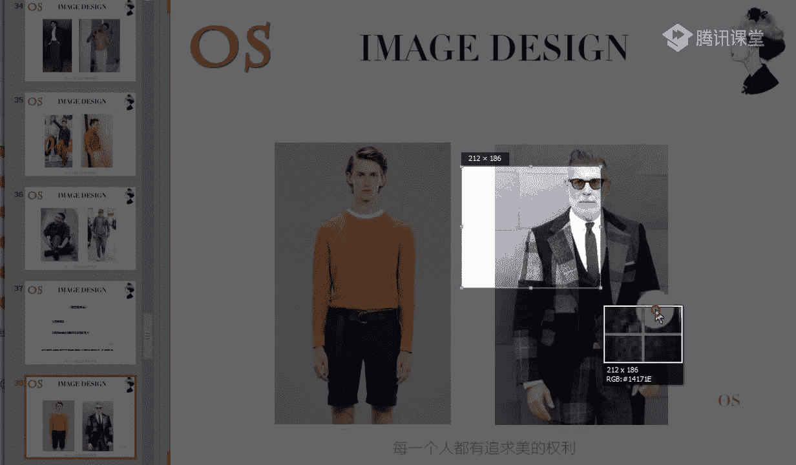
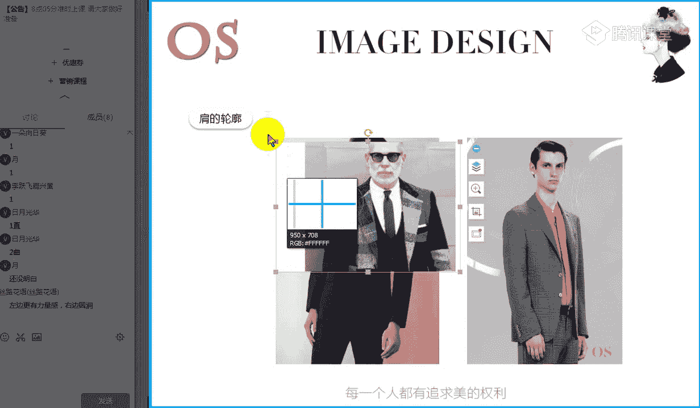
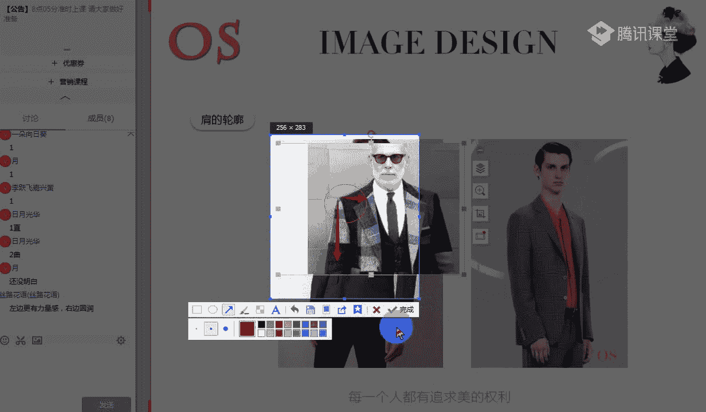
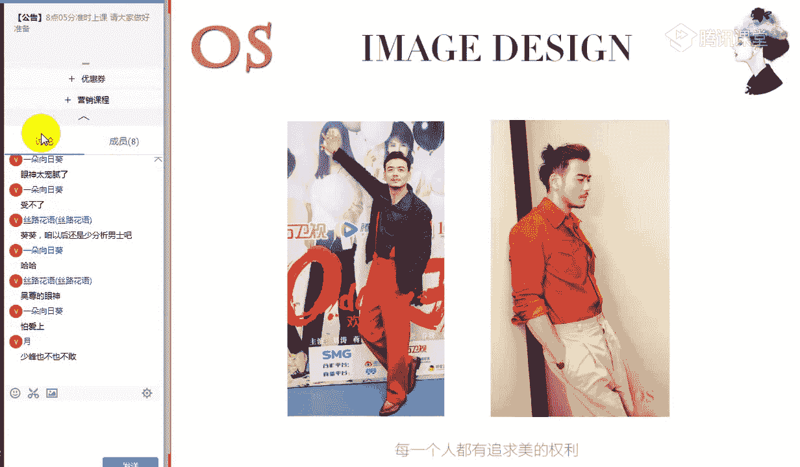

# 1、14男士个人形象班第二期（中级版）VIP课程：第13节、款式风格认知

🎼好，大家晚上好，欢迎大家来到OS男士班的课程，我是本节课的主讲老师舒阳。🎼那今天呢要学习的是我们服装风格的认知啊，之前的男士课程中我们有讲到款型的风格，对不对？

那今天呢我们重点以我们不同的这样的一个风格来跟大家呢解释。🎼告诉大家怎么样认知我们服装的风格。根据每个人的个性气质，还有包括就是我们这样的一个神态，对不对？🎼体态，你的性格等等。

对每个人的气呃气质的氛围特征呢，我们会进行这样的一个综合观察和汇总，将我们男士分为6个基本服饰风格类型，由我们的戏剧型自然型、古典型浪漫型、新锐前卫型和我们的阳光前卫风格。那人有不同的风格。

这是我们这样的一个款型，对不对？是我们这样的一个款型。那与我们男性关系最紧密的，是每天跟你息息相关的服装，还有包括我们的事物等这样的一些装扮元素。那接下来呢我们就将对这些装扮元素的型啊，看到没有？

这是我们的型特征进行这样的一个分析。这也是我们本节课的一个重点风格，我们知道了，接下来呢我们就要梳理一下服装风格的认知和整体要达到的这样的一个效果。🎼那么本节课对于大家的一个要求呢。

就是在对具体服饰进行判断的时候啊，这个是一定要去掌握的。我能够看到这件衣服之后，我能明白它的材质，它的款式，它的这样的一个整体的廓形所对应的，对不对？但是呢你所对应的同时。

你不要你不是我不是要大家只考虑它是什么样的风格，而是哪些风格我们可以用。也就是说大家的思维呢要更加开阔一点，搭配的时候才能更加灵活啊，明白吗？明白同学可以跟老师刷的鲜花或者扣个一啊。

包括都准备好的同学也可以把鲜花和啊我们的衣呢可以刷起来哦。这是对于大家的一个要求。对于本节课的重点，我们虽然是对于型特征的一个综合分析，掌握我们各个风格，对于服饰的一个要求。

但是呢我不希望大家在进行学习完之后，我看到这件衣服，我只考虑它是什么样的风格，而是说这件衣服。🎼会给到哪些风格的人去穿。因为很多服装设计出发的时候，它不可能是针对于某一个单纯的某一个风格来进行设计的。

一定是有很多风格我们都可以进行尝试的。所以说大家要把自己的思路啊要更加开阔一点。好，如果都没有任何问题的话呢，我们就进入本节课的重点知识了啊。🎼首先呢我们要看到的就是风格它是什么啊。

我们不用去纠结我们人的风格啊，因为人的风格的一个诊断啊等等的一个判断量感。我们这样的一个。🎼直取等等都是在我们的高级班会讲到的。而我们今天中级班的。因为你们的风格，老师在说到哦听第一节课的时候。

你有不知道你的风格的，就要赶紧找到老师来进行诊断，对不对？当然诊断我们也是要花时间的。所以说诊断完之后，你就基本上是知道自己的风格了。那这个时候我的风格我知道了，我可能在选择服装的时候还不是特别的清楚。

对不对？那今天这节课呢就是帮大家来梳理的。告诉大家在平时的穿搭过程中，我掌握了这样的一些款型上的一些小要求。哎，什么样的一些材质或者说什么样的一些款式，适合什么样的风格。

那具体的我整个风格要搭配出什么样的一个视觉感受的话，是我们本节课的一个重点。🎼所以说本节课的风格是什么？是以我们的服装来说的啊，不要到时候不要在上课的过程中问老师，哎，我们的古典风格。

它的长相上面是什么样的，对不对？哎，他怎么样去进行判断的？这个是在高中高级板块会讲到的啊，中级板块以我们的服装为主。那风格它是什么呢？我们可以看到图中两张图片啊，都是我们卧室的一角。那卧室的一角呢。

我们以这样的一个床为一个代表。🎼看到图一哦回答一下老师，我们图一给大家什么样的视觉感受啊，你可以用到什么样的一些形容词来形容我们这个卧室的整体氛围，哦，快速的回答老师啊。图一啊图一好，有同学说到了温馨。

哦，温暖啊暖。可爱。🎼是的啊，那我们也可以来观察一下图案啊，图案又给你什么样的一个视觉感受。🎼嗯，图案啊，我们现在看一下图案哦，有同学说到柔和。🎼有同学说到了比较的清淡啊，温馨对等等啊。

所以说你会发现图一和图二同样都是卧室，但是给我们的感觉是不一样的。你像图一，你会感觉到这样的一个温暖的感觉，或者是说可爱的这样一个氛围，对不对？但是呢图一。

我们可以看到图一给人的感觉可能更趋向于这种清新。对啊，休闲简洁化的，而且的话呢会有一点感觉给我们感觉有这种唉自然的一种风格，对不对？更趋向于自然化。所以说呢这就是两种不同的装修风格。

给我们带来的不同的视觉。那其实这两个床啊，这两个床或者说这两个卧室，他们的风格是一致的嘛，是不是一致的，觉得一致同学跟老师扣个一，觉得不一致的，跟老师扣个2。🎼这两个卧室啊，他们的装修风格是一致的嘛。

哦觉得是一个元素，或者说是一种风格的，跟老师扣1啊，觉得不是的，快速跟老师扣2。🎼好，基本上呢现在跟老师积极互动的同学都觉得这两个卧室的风格是不一样的，对不对？所以说风格它是什么呢？

风格它指的就是某一类事物之间的共性特征。那我们可以看到这两个卧室，它们有共性特征吗？不管是从它的。🎼床的这样的一个款式来说，还是从床的这样的一个色彩。

或者是说我们床的整个的一个床面的一个材呃这样的一个材质，对不对？他们都是不一致的。所以说这两种因为不一致的元素而给他们带来了不同的风格，所以风格是指某一类事物之间的共性特征。所以说你是自然风格的男士。

我们就要选择自然风格的服饰。那如果说你是古典风格的男士，我们就要选择古典风格的服饰，因为两者之间达到共性特征的时候，我们才能搭配出舒服的感觉。但如果说两者之间的关系，它不是一个共性特征的时候。

你就会发现有时候像有些同学可能会发现朋友的家里啊，或者是说哎我们这样的一些同事的家里，两种不同的风格搭配在一起，有的可能很和谐。因为它可能有注重到这样的一个共性关系，对不对？

比如说我们有一些美式风格跟我们的日式风格有一。🎼点因素也可以衔接在一起。但是像有的风格，我们就完全没办法去进行衔接。比如说欧式的去跟我们这种自然的木质的，对不对？哎。

这种原木风格你搭配在一起可能会有点很怪异。所以说当我们。🎼事物之间的共性特征啊共性特征有的时候我们才能达到整体和谐的一个作用。而且这种特征呢必须是要占主导地位的一个特征。

故此呢我们又将这种特征称为事物的主导因素啊，主导因素，这是我们风格是什么，以及呢我们包括就像有一些同学，如果哎我是这样的一个自然风格的。只要我的主导因素是偏向于自然的。

即使我在某一个区域加入一些其他风格，也没有任何的关系啊。🎼这个没有任何问题的话呢，可以快速跟老师客个一咬。关于我们风格是什么，以及呢怎么样在穿衣服上面适当的去进行调整。老师刚才所说到了。

所以说就拿装修和我们有一些男士穿衣服为例子。有些装修它是两种不同的风格在一起，但是你会觉得很和谐。因为我们大部分的主体风格，它占住了主主导的一个因素。所以说有一些风格的一些辅助。

只要他们还有一定的共性的话，也是OK的。🎼这有没有问题啊？没有任何问题的话，老师接着来讲啊。那风格构成的要素呢就是我们的形色制。因为我刚才说到风格是什么的时候，就已经跟大家来解释了。

为什么说两个卧室它会有不同的视觉感受，对不对？是因为他们的形。🎼色质啊都是不一致的，所以才能带来这种整体的感觉。而我们这样的一个形色质的话呢。🎼啊，形色制的一个整体的印象特征啊。

也就是说我们的风格的一个整体印象特征是由我们的量感轮廓形态来奠定的。我们不同的风格你的量感是不一样的。不同的风格，你的轮廓之间的一个直取也是有细微的差别的。

那么不同的风格在形态的一个整体的一个动静上面也是有差异的。就比如说戏剧风格对不对？唉，跟我们这样的一个浪漫风格来比。虽然说它们量感都是偏大的，但是戏剧风格它是偏直的，它是偏直的，而我们的浪漫风格呢。

它是偏曲的啊，它是偏曲的。那接下来呢我们就一个一个跟大家来说一说我们风格啊，整体的型特征的一个综合分析。先从我们的量感来看起，老师会教大家呢怎么样去辨别这件服装的量感啊，当然。🎼在说到量感之前呢。

我们简单的来介绍一下量感是什么啊。量感呢在人物中我们指的是唉这个人长得年轻还是长得成熟，对不对？那同样呢其实服装你也会发现，会给我们带来年轻的效果，也会给我们带来成熟的一个效果。

那包括除了服装会带来年轻和成熟以外，它也同样会有这样的一个轻重大小、粗细宽窄厚薄，对不对？等等这样的一个综合值，所以说量感的感受呢。

往往是受我们物体的颜色、材质、体积等因素综合的影响而产生的视觉这样的一个效果，而不是真正意义上的一个体量尺度啊，我们可以从各个方面来体会量感啊，体会这样的一个量感小量感中唉量感大。

我们比如说看到这件服装。🎼看到这样的一件服装哦，我说过服装会有年轻和成熟，也会有年轻成熟。那其实为什么会服装会带给我们年轻和成熟的感觉？是因为由它这样的一个颜色，由它的材质。

由它的体积等等这样的一些宽窄啊，厚薄啊等等因素综合影响而产生的一个细觉呃，这样的一个视觉效果。所以我们可以看到图中，不管是我们这样的一件衬衫也好，还是我们这样的一件小薄的针织衫也好。

还是我们这样的一件外套也好，整体来说都能够带给我们小量感啊，它的量感是偏小的。🎼所以这个时候大家可以先观察一下哦，我们做对比的时候，你会发现的更加的仔细。🎼我们来做一个对比。🎼记住这样的一个衬衫啊。

记住我们这样的一个针织衫，也记住我们这样的一件外套啊，这是我们小量感的服装，量感是偏小的服装。那我们再来看看量感大的服装。同样是衬衫，对不对？哎，同样是我们这样的一个针织衫，也同样是我们这样的一件外套。

好，感受到这样的一个区别的啊，感受到一个区别的同学可以快速跟老师扣个一。🎼所以说量感的大和中和小的一个判断啊，主要是由它的材质，由它的色彩，由它的款式等等一些因素所带来的。

🎼记住我们视觉上的这样的一个感受啊，这个是我们的小量感的，对不对？小量感的一些服装。所以说像我们小量感的风格，比如说前卫风格的一些男士，那我们在选择服装的时候，你要一定要选择小量感的。

因为你的量感不单单是由你的面部带来的，跟你的身材体型也是有关系的。所以说小量感的同学，我们就选择啊这条裤子除外啊，我们不要看这条裤子，就看上装就好了。🎼就要去穿这种能够带给你年轻的视觉感受的一些服装。

量感偏小的服装。那当然我长得成熟的话呢，我就不要再去穿这样的一些小量感了。因为你我们要知道啊风格，也就是说你的里面跟你人面部的量感和谐，非常非常重要。一旦你是一个大量感的同学。

你穿着了这种小量感的服装的时候，就会形成服装跟你的面部的一个不和谐。那这个时候我们就很难去凸显自己的个人气质凸显自己的个人风格，把你自己的优势去凸显出来。🎼而，这是我们的大和小去做对比。

那接下来呢我们可以看到中量感的。比如说像古典风格，它就是一个居中的风格，对不对？一会儿我分析各个风格的时候呢，还会去讲到啊，还会去讲到我们各个风格的一个直取。It takes。🎼中哦中偏大一点点哦。

古典风格有的会中偏大一点。那包括像有一些前卫风格的，比如说新锐前卫风格，它也有这种中偏大一点的，不一定哦不一定唉前卫风格都是小的，它只是说唉有这种哦有这种中偏小的。老师刚才说错了，像前卫风格的话呢。

有的是中偏小的。不一定都是小的。有中到小的这样的一个区别。🎼而这个就是我们中量感的啊重量感的服装，包括我们可以拿这样的一件毛衣去做对比，对不对？唉，根据它的形色质啊，整体带来的一个感觉。🎼款式等等哦。

和我们这样的一个重量感的衣服来做对比，你会感觉它的整体量感是要比它偏小的，但是又要大于我们这样的一件针织衫。🎼所以说啊量感呢男装的量感呢可以主要从我们这样的一个领型的大小，服装的面料的质地来感受。

还有包括就是我们服装的一个合体紧凑或者宽松程度来进行这样的一个体会。就比如说像我们可以看到短款的啊，比较合体的，会带来这样的一个小量感的感觉。但是我们可以看到稍微偏长一点的宽松版本的，对不对？

或者是唉过多的一些设计的，它能够带来这种大量感的一个体会啊，这是我们刚才老师跟大家稍微做了一个小的总结。另外的话呢也再次的强调一下，刚才有说到领子的一个大小，对不对？

我再次跟大家稍微强调一下领量感大的领型，你会发现领子开的特别的低，而且呢领面也比较的宽，对不对？但是量感小的领型的话呢，当然这是不同的两个领型啊，我们先做一个稍微小的一个对比啊。

拿后我们中间这个和我们大的来做对比。🎼量感小的领型的话呢，领口开的比较浅。如果是一个小量感的领型的话，甚至领口开的比我们这个中间型的还要小哦，一定是要比它还要小的。领口开的比较浅。

而且的话呢领面也非常非常的窄。🎼那如果说是介于小和大之间的，就比如说像我们图中图二，对不对？这样的一个里面的话呢，就是中间型的。就是怎么样去根据自己的风格啊，量感的大和小去选择你合适的里面。

选择你合适的里面。🎼还是那句话，里面的和谐，里面和你面部的和谐非常非常的重要啊，里面和你面部的和谐是非常非常重要的。各位男士。🎼那还有呢整体呃服装的一个整体量感的话，我们除了领型的宽大，面料的厚实。

包括硬挺的服装的量感呢是比较大的。如果说这样的一件服装，你会发现它的里面很宽大，它的面料非常厚实，包括很硬挺的话，这是这件服装的量感一定是偏大的那还有就如果说这样的一件衣服外形上面比较紧凑，对不对？唉。

包括袖型也好，领型假小的一些服装，它的另量感一定是偏小的。也许这两件衣服的厚度是一致的。但是因为它们里面的一个区别，还有包括整体服装廓形的一个区别，可能会带来整体不一样的年轻和成熟。

🎼包括我们的毛衣也是一样的啊。所以说看这样的一件毛衣，它到底适不适合你我们就来进行这样的一个判断，是这件毛衣的整体的哦感觉，对不对？不管是材质也好，还是色彩也好，还是它的款型也好啊。

等等这样的一些其他因素，它给带带给你的这样的一个视觉感受。你觉得它是偏年轻化的那一定是属于这种唉小量感的同学去穿的那有的衣服你会发现它又适当的合身，但是合身的同时呢。

它的面料的薄厚也是适中的而且的话它整体的领型的一个大小，对不对？袖型啊等等。你会觉得呢给到里面啊年轻的人又感觉成熟了一点，那给到像一些戏剧风格，大量感的人又稍微感觉唉紧了一点，对不对？紧了一点。

束缚了一点，那其实像类似于我们图案的话，就是属于中量感的一些男士所适合的那像图三整个大的廓形厚实的面料，对不对？刚才所说到的厚实的面料比较厚实的。🎼给宽大的这种宽松款。

一定是给到大量感的一些风格去穿着的。小量感的话，你去穿就会显得你会被套在这件衣服里面。🎼啊，这个就是我们服装的这样的一个量感啊，整体的一个判断。关于服装的哦服装的款式上的整体的量感啊，款式上的亮感。

还有没有什么问题？🎼没有任何问题的话呢，可以跟老师快速的刷抖鲜花啊，有问题的提出来。🎼有没有问题？还有包括大家在看图案的量感的时候呢，其实我们在可以回顾到围巾啊，回回顾到我们的围巾的图案。

比如说你会发现有的图案的话呢非常的大。🎼呃，非常的大夸张，对不对？那它一定是量感大的那有的图案的话呢，你会发现它对比比较小柔和可爱的这样的一些图案，它一定是弱的哦。🎼呃，领面和领型要一致吗？

是我说的一致，不是说你的脸大小一致哦，而是说你的量感，你的脸部的量感跟你领型的量感要一致要一致，明白吗？🎼所以说如果你是一个小量感的。

我们就要选择唉这样的一个领型开的比较浅的领面的宽度比较窄的这样的一个领型。但如果说我是戏剧风格的我是一个大量感的男士，对不对？那我们再选择领型的时候呢，就一定要选择开的比较的深，哎，领口开的比较的深。

领面要宽大的。而，不是说我的脸有多大，我的这样的一个整体就要选择多大，而是说你要跟你的风格的量感，服装的量感，跟你的风格要协调。🎼啊，接着呢我们说完了服装的话呢，也来跟大家说一说我们的配饰啊。

说一下配饰。比如说像包包啊、鞋子，因为这个也是我们经常常用的。其实各位男士啊，你们在挑选这样的一些配饰的时候，除了要跟我们的场合一致以外呢，你也可以着重一下你的风格来进行这样的一个参考啊。🎼好。

有同学说到怎么样通过哪几点确定服装量感啊，可以通过我们的领子，通过我们服装的整体啊，通过你服装的一个整体，通过领子以外，你也可以通过整体，对不对？

就是我刚才所说到的面料啊哦这样的一些款式啊啊面料和款式啊，还有包括我们的图案的量感啊，图案的量感等等来进行这样的一个确认。🎼是的哦，是的，没错嗯。🎼我们的丝路花语用型色置说明的非常也非常棒哦。对。

可以的，没问题。🎼还有没有任何问题哦？没有的话呢，我们就讲到这样的一个配饰。因为量感我说过啊，其实除了就是再再次来说一下啊，就是除了我们在选择场合的时候呢，根据自己的场合来选择一些配饰的包包啊等等以外。

我们也可以考虑到我们自己的风格，就是比如说我们可以从量感来下手，对不对？我们今天刚才第一部分讲的就是量感。所以说我们先来看包包的量感。🎼其他我们不来看啊，那像一些比较大的对不对？款式比较大的。

而且呢能够带来成熟的这样的一个感觉的话，或者说唉这样的一些夸张的或者是醒目的等等这样的一些状态，那其实都是属于我们量感大的，就像我们戏剧风格，在选择鞋子的时候，我会说到要夸张，要醒目，对不对？要摩登。

唉，因为它会有这样的一个整体的一个成熟感也会有这样一个量感。那像包包也是一样的。我们可以选择一些大的啊，从大的或者是从我们这样一个材质，对不对？哎，从我们这样的一个整体的一个状态上来判断它的成熟和年轻。

那其实这个包呢就是两个一个对比，一个是年轻的量感小的包啊，和一个量感大的包都是我们酷奇的这个牌子啊，都是guci的品牌，但是你可以看到它针对的人群是不一样的。它可以在不同的场合。

或者是针对不同的风格来进行调整。那包括你像我们左图的话，它是一个小量感的包，对不对？🎼整体的话呢，你会觉得它不是很夸张，而且它也比较的小巧啊比较的小巧。🎼那鞋子的话呢，我们还是拿这个豆豆鞋来举例子啊。

所以说豆豆鞋也是一样的。我们可以来观察一下，然后呢观察这两双鞋子的一个区别的时候呢，找到记住这种区别的感受。🎼同样都是类似的款式啊，你可以看到类似的一个款式都是豆豆鞋。

但是年轻和成熟的概念是不一不一样的，对不对？为什么会有成熟和年轻的一个区别？就是因为虽然是一个材质，但是你会发现他们的款式和色彩上面还是有一定的区别的，尤其是款式上面，唉这种厚度的感觉。

或者说这种精致的感觉等等。🎼好，这个呢是我们量感啊，关于量感方面，大家还有没有任何问题？🎼如果没有任何问题的话呢，可以快速跟老师扣个一啊。如果量感方面，不管是我们的事物也好，还是服装方面。

你还有一些疑虑的，没有听懂的。🎼可以在公台上打出来哦。🎼好，跟大家稍微总结一下啊，量感的判断的话呢，主要可以从它的款式，对不对？从它的款式唉，从从它的这样的一个颜色，从它的材质体积等等啊。

这样的一些因素而产生的一些细就是视觉上的一个感受。它不是说真正的一个尺寸。可能这两件衬衫是一样大小的，一样的，真真的是一样的一个大小。但是因为他们的花色，或者说因为它们这样的一个领型的不同，对不对？

因为它们这样的一个花朵的大小的不同，带来的量感也是不一样的。🎼好，这个就一位同学跟老师扣1啊，其他同学呢有没有问题，有问题的大胆提啊，没有问题的话呢，我们就直接讲下一个知识点了。🎼这个就是我们的量感哦。

🎼好，接着呢我们来看到的是我们这样的一个执和曲啊，直和曲。那其实呢像直取啊，男士的直取呢在于搭配的数量的多少比例啊哎。🎼其实跟我们女性啊表现女人度的跟我们女性是不同的那元素的一个调控是非常非常重要的。

包括男士在看它的直取的时候，我们因为男装它不像一些女装，它不像女装，我们可能唉会有这样的一些非常掐腰的一些设计啊等等。所以说呢男士在判断这样的一个整体的轮廓的时候呢，其实我们很多基本上很多男士的服装。

它都是偏直的，基本上都是偏直的，都是一种直的一个状态，对不对？大多都是直的，只能说大多啊，但也有相对柔和的一些线条来表现曲线感的设计。就比如说像我们这样的一些自然肩啊，等等。一定的曲度的一些衣片啊。

还有包括像我们男生有一些衬衫，它会也也会有这样的一些花边花边脸的一些设计，对不对？但男装的轮廓啊，主要呢还是体现在肩型及我们整体的这样的一个外形上面，轮廓的直。

🎼和取也不能像我们女装那样有剪裁方式来决定，而是要依据我们服装整体及服装的面料质体，还有包括图案来进行判断的。因此呢对男装款式的轮廓的分析的话，我们主要就从我们以下的这样的一个肩的轮廓领形的。

还有包括面料的图案的等等几个角度来跟大家分享这样的一个值和取。🎼因为大多数男士是一致的那我们可以看到图中两张肩部啊，都是我们的西装款式的服装。那两张肩部的一个对比看出了区别的同学可以跟老师扣个一。

🎼有看出区别的，可以快速跟老师扣个一。🎼看肩部啊，看我们两位男士的一个肩部，有看出区别的同学可以跟老师扣个一啊。🎼哎，我们日月光滑说到了一是直的，非常快速的说到。🎼没有错啊。

所以说直取的感受呢是以我们肩部线条与袖子的外形外观的这样的一个线条，及它们之间形成的角角度来进行判断的。接近90度夹角的，就为我们这样的一个直线型。那如果说像我们的西装也好，还有包括一些其他服装款式。

对不对？肩型自然圆润的线条柔和的就为我们这样的一个曲线型。🎼啊，稍微截个图啊，给大家稍微看一下。🎼所以说呢我们要去看这样的一个肩部啊，看这样的一个肩部的一个夹角。🎼接近90度的夹角就为我们直线形啊。

接近90度的那有的袖子的话呢，你会发现啊有的这样的一个肩型呢非常的圆润，比较的柔和，那它就是曲线型。但如果说你大有的同学觉得这张照片还不够明显的，我们可以看到呢，有一张啊。

🎼可以看到这样的一个肩部。

两者之间的一个对比啊。🎼这个会非常的明显啊，这件西装会非常的明显。啊，我们的月月同学呃，有没有问题？

🎼能理解了吗？也就是说这样的一个夹角啊，是1个90度的。絶た？

🎼是的啊，我们苏路花语有一个总结，说到左边的会更有力度感，那右边的会偏向于圆润啊，其他同学有没有问题啊？关于这样的一个知识点。🎼你可以拿这样的一个两个肩型啊，你可以比如说像我们的右图，对不对？

右图和左图啊，你如果我们有同学可能非常的迷惑，还看不懂的，你可以拿这一张图片的肩部和这一张图片的肩部来观察。我说过直线型的肩部，它是有这样的一个成为有一个接近90度夹角的一个视觉感受的。🎼是直线型的。

但是有的我们可以看到，有的西装也好，包括有一些哦比较硬挺的一些外套也好，你会发现它这样的一个肩线是非常柔和的，它是有弧度感的，看到没有？它是会呈现。

这样的一个曲线状态。🎼但是有的的话呢，你会觉得你会看出来它是呈现这样的一个值。🎼有的是曲，有的是直，所以说曲线肩部自然圆润的，它是包裹着你的这样的一个顺着你的肩部线条下来的，非常圆润的啊。

线条比较柔和的，就是曲线型的肩型。所以说像我们浪漫风格，它就是一个曲线型的，对不对？可以它在选择西装的时候呢，你就可以去选择曲线型的对对啊，我说的，你你也可以理解为圆啊。

你也可以理解为圆也是可以的那包括像我们的戏剧风格，它是它虽然是整体来说偏直一点，但是它直取都是可以去进行驾驭的，对不对？那像它去选择一些呃柔和的，也是可以的。

🎼好，这里有没有问题啊？没有问题的话呢，我们就接着讲下一个啊。🎼那男装里面的领子啊，我们接着讲到领子的轮廓哦，男装领的外轮廓的话呢只有特定的一些样式，有明显的直取感以外。

其实大多从线条的硬朗与柔和程度来体会的话啊，是有一点点小困难的。所以说像男士的领子很多，比如说像衬衫啊，我们只会发现小圆领，对不对？它是一个曲线型的那其实大部分的衬衫领。

它都是直线型的那包括像我们有一些衬衫，它也是有花边设计的。🎼不不排除啊不排除有这种花边设计的那还有呢就是我们也可以看到之前老师在讲到毛衣的时候，对不对？在讲到毛衣的时候，我也说过，像这种法式领。

非常适合浪漫风格。因为它的领子是呈现这样的一个曲线感的。也就是说哎我们也可以称之为青国领啊，有点轻果领的类似感。🎼所以说这个呢我们这一部分就不做正式的一个介绍了啊。大家有一个意识就知道了。

我们一般判断直取非常的简单啊，领子的直取像我们这种有弧度的，对不对？不是呈现这样的一个直线型和假哦这样的一个尖锐的一个角度的那一定是曲线型的领子，更适合我们曲线风格的人去尝试。

或者是直取都适合的去穿都是OK的。当然不适合啊，因为曲线风格是没办法去表达这样的一个力度感的。而男士在我们的正式场合一定是要表达男士的一个正式感。所以说这样的一些领型都不适合出现在正式场合。な十？

而这个就是我们的领子的轮廓的一个判断啊，领子的轮廓判断。🎼接下来呢我们说到下面一个轮廓，就是说到我们的面料啊，说到我们的面料。因为除了我们刚才所说到的肩的轮廓、领子轮廓呢，还有我们的面料的一个轮廓。

那面料的轮廓呢，男性的服装的剪裁它都较为多是直线型的一个剪裁，对不对？刚才我们在讲到轮廓的时候，我就有跟大家讲到，但是服装的面料质地是影响我们男士服装在整体轮廓的一个曲主要的一个因素。

所以说服装面料硬挺的不易起皱的，你会感受到这样的一个直线感，因为它会带来硬朗的感觉，对不对？但是有一些服装面料的话，你会感受到这样的一些光滑哦，之前我们在讲到体型的时候，我有说到过材质的一个收缩。

对不对？那像有一些唉光滑的，或者是说呢它有这样的一个光泽度的，它其实也会带来这样的一个曲线感，对不对？也会带来一个曲线感。有一有一定光滑的柔软的，都是会有曲线感的。

🎼视觉效果就像我们图中图一和图二同样两两款西装，但是面料的。🎼硬软的不同就会有直取的区别。所以说曲线感的面料的话呢，光滑的柔软的，它会带来曲线感。但是面料如果是硬挺的，不容易起皱的，就会有直线感。

🎼第四个呢我们就来说说服装图案的呃直取感。刚才说到图案其实有量感大和小，对不对？那其实图案呢它也是有直和曲的啊，它也是有直和取的。

比如说像图案呈现这样的一个条纹或者是方格等有棱角的几何图形的图案的时候呢，它是有直线感的。但是这样的一个图案，如果是说比如说呈现一些圆点或者是花朵的柔和的一些流线线条的话，哎。

流线型的这样的一些图案的话，它就会呈现这样的一个曲线感。所以说图案的量感很好判断以外，其实图案的直取也是非常好判断的。🎼这个应该大家都没有任何问题啊。因为我们之前在讲领带的时候，也有就这样的一个图案。

各个风格跟大家来进行分析。🎼那另外呢就是我们的这样的一些事物，对不对？我们拿鞋子来举例子，其实事物的值和曲也是按照事物的外轮廓线条的这样的一个直取。哎，事物的这样的一个材质来决定的。

我刚才说到材质硬挺的，它会有直线感，对不对？唉，材质柔软的会有曲线感，所以说鞋子也是一样的。比如说像鞋方正的就会有这样的一个硬质感，对不对？唉，装饰造型为直线条的。

我们可以看到整个这是同一个牌子的鞋子啊，同一个牌子的鞋子，但是呢我们可以看到整个设计来说，不管是剪裁也好，对不对？都是呈现这样的一个直线的，所以说它就会带来直线感。但是如果说鞋型比如说是圆润的，唉。

质地是柔软的，造整体的装饰造型和图案或者是说有这样的一些曲线条纹来点缀的话，它都会带来曲线感，都会带来曲线感。🎼包括手表也是一样的哦，圆盘的手表它一定是会有曲线感的那像我们这种四四方方的手表的话。

它就会有直线感。🎼根据我们的事物的这个外轮廓来判断值和区啊，事物的外轮廓。🎼啊，哲取方面大家有没有任何问题啊？没有任何问题的话呢，我们讲就讲到第三部分啊。因为我们这一期的话呢，我会就这样的一个形态。

还是跟大家稍微解释一下。虽然说我们男士在服装上面，它不同于我们的女士。🎼来看这样的一个动和镜，对不对？因为像女士很多服装的话，它会有一些花边哪等等等等啊，很多一些小设计，它能带来这样一种唉动态感。🎼哦。

以及呢我们简洁的服装款式会带来静态感。但是我们男装的话跟女装还是会有区别的哦。🎼轮廓的直取有没有问题啊？没有问题的话，跟老师快速刷朵鲜花。🎼哦，鞋子鞋子怎么了？🎼鞋子我们可以根据外轮廓啊。

根据鞋子的外轮廓，还有包括它的这样的一些剪裁，对不对？你可以看到这这双皮鞋，它整体都是这种直线条的剪裁啊，还有包括它的整个鞋头你会发现它的鞋头是个平的，而这个鞋头是个圆润的那还有呢就是我们根据材质啊。

就刚才我们跟西装的一个分析是一样的。有些西装的话呢，它是柔软的，对不对？唉，柔软的。那有些西装是硬挺的，包括鞋子也是一样的，像这种硬挺的鞋子它一定会带来直线感。而这种软一点的，看似软一点的，对不对？

柔一点的，它一定是会带来曲线感。🎼有没有任何问题啊？我再次强调了，还是刚才其实鞋子的判断跟我们的服装判断是一致的。你可以把服装的判断套用过来。我刚才所讲到的领子啊，这样一个肩对不对？一个肩和领子。

它其实都是根据这样的一个轮廓线条来定直取的。所以说鞋子也是根据轮廓线条来定直取。那包括我又说到的服装的材质，它也能够带来直取的不同视觉感受。所以说鞋子的材质也是同样能带来整体不同啊。这样的一个直取。

有没有问题啊？没有问题的话，跟老师扣个一。🎼还有包括就是有的鞋子的话，它可能会有一些花朵类的啊，你就像有一些浪漫风格的话，它可能有一些暗花等等。啊这双鞋子它的材质也一定可能会是柔软的。

不可能说在印制的材质上面去出现哦这样的一些暗花，对不对？除非说像我们的镂空异纹鞋。你像镂空译纹鞋，我会说到浪漫风格穿非常好看。就是因为它这种图案的话，它会有曲线感。所以说适合我们曲线风格去穿。好。

关于我们的形态的动静的话呢，像我们女士中啊，我们可能会说到唉这样的一些花朵比较的多，比较的杂，比较乱，或者说这样的一个图案啊，颜色冲击度非常的大，对不对？它都会带来动感。那比如说比较的安静的啊。

比较的这样的一些规则的等等，它会带来。🎼这种静态感。但是我们男装的话哦，大家要说到要要记住啊，形态的动静不在于数量的多少。形态的动静啊，服装的一个动静不在于就是数量的一个多少。而在于元素之间搭配效果。

看上去是类似还是反差。这句话呢，大家可以先记住。然后一会儿呢，老师会跟大家来分析，为什么说。男装的动静主要去考虑它就是它元素之间搭配的效果，看上去是类似的，还是我们这样的一个反差的。因为它不同于女士啊。

像女士的话呢，我们可能哎光泽度的一些材质，它会带来这种曲线感啊，就是这种动态感，对不对？而这种哑光的会会带来静态感。当然男士的话。有光泽的和静态的，它一定也会哦有呃哑光的，它一定会有动静之分啊。

就像我们这样的一件衬衫，有一定有光泽度的，它一定会形成一种动态感。但是像这种哑光的，它也会形成静态感。但是呢我们不要以这种材质为主。🎼不要以材质为主，不要陷进去。

而是我们要观察一下元素之间搭配效果看上去是类似还是反差，看上去是类似还是反差。就比如说我们可以看到这两套衣服，我们不用去对比两套衣服啊的感受。而是说你把它的上装和它的下装来进行这样的一个对比。

上装和进行和下装来进行对比，你会发现当它这种材质是类似的关系的时候，对不对？而且色彩的调子，它的冲击度不强的时候，能够带来类似的感觉。但是我们可以看到，如果图案之间有反差，那再加上很多这样的一些呃。

色彩或者是说这样的一些色块的风格就会带来动态感。🎼啊，老师重新讲一下，是不是哦，我说到形态的动静啊，不在于数量的多和少啊，不要去看哎，这个图案非常的多，图案非常的多，对不对？

或者是说这些衣服哎穿搭到身上非常的多。哎，我们就是这种动态的。不要这样去看啊，不要去看它的数量，而是要在于元素之间就是两个单品之间，或者是哎两个图案之间这样的一些元素之间的搭配，看上去是类似还是反差。

还是反差的不同，明白吗？能理解能理解吗？哦，听懂了这句话的，就是记好了这句话的，或者说记好这句话的同学，可以跟老师扣个一。🎼那我刚才拿这两张图片浅淡的跟大家来进行了一个分析，就是我们可以看到图一哎。

材质其实是类似的，对不对？都是这种棉麻的感觉。所以而且它的色彩调子不是形成非常大的一个反差，它会带来这种类似的感觉。但是图二的话呢，因为两者之间可以说是三者。因为我们可以看到中间还有一个。

🎼图案的一个间隔，对不对？也就是说图案和图案之间它会有很大的一个反差。即使说色彩调子是类似的一个情况下，我们也很难达到类似的一个效果。🎼好，包括我们可以看到这几张也是一样的啊，这些服装都是偏动态的。

为什么它会给我们带来动态的感觉？就是因为图案和图案之间的反差，对不对？图案和图案之间的反差，还有包括唉这样的一些事物，或者说这样的一些配饰。我们这样的一些配饰之间啊，配饰之间跟它的服装之间的一个反差。

它都会带来动态的感觉。🎼这边是左边是静啊，右边是动，但是这两张都是动态的。因为我们静态可能都很好判断，对不对？你就像我们这套衣服也是静态的，因为材质之间和色彩之间会达到类似的感觉。但是呢我们可以看到。

🎼哦，这几张即使材质是一致的时候，但是图案还有包括我们这样的一些设计的不同，对不对？会带来反差。🎼会带来这样的一个反差。所以说我们就会把它归为动态的，能理解吗？哦，理解同学跟老师扣个一。

所以说主要去观察这种。🎼元素之间啊，两个元素或者三个元素之间的搭配效果看上去是类似还是反差的不同。所以说男装跟女装还是有区别啊。只要是你觉得这种反差非常的大。比如说我们可以看到图啊，对不对？

这种包包它是五彩，而且还有很多流苏，对不对？还有很多流苏，那跟我们这种底带。🎼服装的一个底调的这样的一个呃像奶牛，对不对？它是很有很大的一个反差的，两种元素之间是不同的，会两种元素的不同。

一定是会带来非常大的一个反差。所以说这个就是偏动的对。像这一套也是一样的，对不对？我们可以看到色彩和。🎼包括包包啊等等这样的一些元素之间的一些反差。哎，图案。🎼图案的一些不同啊。

我们其实可以像这件衣服啊，这件衣衣服它这件外套如果把它这2块左边2块口袋啊，然后呢再把它里面的这样的一件粉色的衣服的。🎼里面的这样的一个logo也去掉的话，其实这这件衣服把包包啊等等啊。

帽子啊等等都拿掉的时候，这件衣服你给到一些静态风格的人能不能穿呢，一定可以穿。但是因为这件服装的设计上面，你会发现它增加了非常多的一些口袋。而且口袋上的图案跟它底调的图案也是不一致的。

就一定会形成这种反差感，所以它就一定会带来动态的视觉感受。🎼对啊，对啊，所以没错啊所以没错，这个还有没有问题啊？没有问题的同学快速的跟老师刷朵鲜花或者扣个一啊。除了刚才跟老师刷鲜花的三位同学。

其他同学还有没有问题能理解吗？🎼所以说呢就我们的量感哦，动静直取跟大家来总结一下，就是哦。🎼脸呢是一个人的气质，对不对？年龄呢是一个人的品味，身体的话是他们的载体啊，所以说量感跟大小无关。

跟事物本身表现给我们的这样的一个意识有关，对不对？是年轻的意识啊，还是成熟的意识，就是我们大人的意识，大人的成熟的意识。那包括形态的动静呢，它不在于数量的多少。

而在于元素之间搭配效果看上去是类似还是反差。像我刚才举的这个例子，对不对？很多这样的一些小图案，但是还是可以带来静态感。但如果说加上我们左边两边的，还有包括它这样的一些搭配之后，就一定会带来动态感。

带来这种反差。那包括直取的话呢，哎也是一样的，对不对？我们要根据整体的服装的材质，争据根据服装的款式来判断它的这样的一个值和取。没有声音了吗？😡，其他同学能听到声音吗？呃，我在啊我在啊。

能听到声音的同学跟老师扣个一样，有声音是不是？有声音哦，应该是一直有声音哦，我没有关哦。好，你这边可以嗯。可以看一下哦。🎼可以检查一下，我们这边哦，助教老师也没在好了是吧？好了，我们就继续啊继续。

因为我刚才就是跟大家稍微总结了一下，就是跟把我们刚才的这样的一个量感，还有包括形态的动静直取等等，跟大家说了一下。刚才都有讲到的，刚才总结的都有讲到的。🎼好。

我们就开始呢各个风格呢跟大家来带着大家来领略一下，我们来看一下哦。那关于各个风格的一些代表人物的话，其实也不用老是多说。因为我们只要一讲到关于风格的这样的一些课程的时候，我一定会去取名，对不对？点名。

说到一些，比如说啊像我们的小包总啊，还有包括像我们这样的一些呃李勇啊等等啊，都是我们戏剧风格的。因为戏剧风格的人给人的感觉是硬朗的，线条是分明的，它的存在感非常的强，而且五官的话呢也是夸张，比较立体的。

对不对？浓眉大眼，靓感强。啊，我这里还有一张小包总照片啊，大可以看一下。🎼这种感觉存在感非常非常的强。所以说呢因为你的量感，你的这样的一个量感是大的，因为你的存在感强，量感强，对不对？嗯。

所以说服装上面我们也要选择大量感啊。🎼戏剧型的风格是适合大量感的，所以说他要有大人的意识啊，要有大人的意识，要有成熟的意识。那另外的话呢，整体其实戏剧型的人，他的长相的话，他是偏直的，他是偏直的。

但是呢他因为他的一个五官的立体度啊等等。🎼他的驾驭度直取都是适合的适合的。而且他在穿衣服的时候呢，一定要穿出动态感。🎼也就是说他穿衣服适合穿出反差感。我们可以看到，可能有些同学比如说像古典风格。

我非常适合拿白衬衫配西装。那裤子的话呢，我绝对不适合穿这种穿这种跟我的上半身的风格反差这么大的，对不对？或者说款式吧，我们说款式吧，或者说色彩上面哦，和我们图案上面反差太大的，它穿不了，他穿不了。

但是我们戏剧型，你可以看到，即使这样的一个混搭，他也会穿的非常的好看，能把它的气质把它的这样的一个整体的量感等等凸显出来。🎼这也是反差大的，对不对？元素单品和单品之间是没有共性关系的。

单品和单品之间会形成这样的一个反差啊，所以说它就适合去表表现这种反差感，元素的反差。也就是说动态的这个大家记一下哦，记好的同学可以跟老师扣个一啊。如果还需要老师重复的话呢，可以扣个2。

🎼所以说我们可以看到它的服装的一些呃这样的一些配饰啊，服饰的话呢也会整体的话呢，摩登对不对？哎，有这样的一个舞台表演感的时尚的一些服装，它适合穿一些时尚的服装，或者说夸张的宽松的大领口，对不对？

枪脖头的双排扣啊，西装外套等等。这个我都有讲过的啊，关于图案上面在领带上面都有讲过。所以说大家就记住，因为我们已经懂得怎么样去辨别量感啊，轮廓和直取了。所以大家把戏剧风格的量感直取轮廓啊。

记清楚就可以了。啊，直取和我们的动静啊。记清楚就可以了。记好的同学可以给老师扣个一啊，跟大家再说一下戏剧型风格的话呢。🎼量感是大的啊，至少是中偏大啊，因为有小戏剧风格，男士里面也会有小戏剧。

可能他就驾驭度会小一点，它不能穿太过于宽松的，可能是因为它的体型啊等等会决定，对不对？所以说中偏大，他还是要穿出大人的意识。那另外的话呢它的风格是偏直的。但是因为它五官的元素，所以说直取都是适合的。

另外的话就是动，它一定是偏动的，一定是动态的，它要穿出元素的反差。当我们元素的反差穿不来，穿不出来的时候，大家可以来欣赏一下。🎼就是这种效果。🎼当元素的反差穿不出来的时候，就是这种效果。

因为他们两个元素之间是没有任何太大的反差的。🎼所以我们可以看一下啊，是这种状态哦，我们显得这个更有气场啊，更符合他的长相呢，还是我们这种状态的。🎼呃，这种状态的对不对？穿出这种层次，穿出反差的更适合它。

🎼好，同学说到这样穿很猥琐啊。是的啊，所以说它不适合穿成穿成类似的感觉，它不适合穿成类似的感觉，他要穿出反差。🎼好，接下来呢我们就说到自然风格啊，自然风格。🎼像我们的。🎼陆毅呀啊胡歌呀啊等等啊。

这些都是自然风格的那自然风格的话呢，它的量感是没有戏剧风格大的啊，它的量感是没有戏剧风格大的。它是一个中偏大啊，他是他绝对是中偏大啊，比较标准的，中偏大。因为你会发现这种人的长相。

他不像我们的戏剧风格那么的五官那么的立体，他相对来说会有一定的柔和感，对不对？而且呢五官面部跟五官的啊，这个整体的感觉它不会过于的分明。有的人面部和五官。

也就是说他的五官的立体度会跟他的面部形成这样的一个反差。但是我们自然风格的话呢，他的面部跟他的五官啊，他的面部和五官，它是相对来说比较柔和的，是相嵌在里面的，他不会很立体。🎼所以说神态的话呢比较的随意。

比较轻松。那我们在选择服装的时候啊，因为我说到第一个量感是中偏大的，所以说我们还是要去穿一些中偏大量感的。比如说像一些宽松的啊，厚一点的，稍微厚一点的一些材质啊等等。那还有呢就是它是哦它是偏直的。

它是偏直的，它是偏直的，也就是说它是一个中间型，它绝对不适合去驾驭一些曲线型的啊，曲线型的元素。🎼那动静呢它就是要穿出类似感，也就是说它是中偏近的，它是中偏径的，他穿衣服要穿出类似感。

那刚才我跟大家所说到的唉这样的一些。🎼小包总对不对？他穿错的衣服给到自然风格去穿就没有任何问题。因为这都是类似的感觉。但是自然风格你要想穿出这种反差感，你是不适合的。因为你的风格是偏近的啊，中偏近。

🎼中镜风格好要穿出类似感。哎，就像这个哦穿出这种类似的感觉。图案啊图案穿出类似感觉。🎼刚才服装的这样的一个自然风格的服装的整体感觉啊，大家要记住啊，要记住这种感觉，是不是会感受到宽松，对不对啊。

随意潇洒啊，运动感强的，或者是很休闲的纯质啊纯朴质感的天然的一个肌理感的这种感觉，对不对？自然的面料，自然的啊花纹哪格纹啊几何纹哪，朴实大方啊等等。这个就是这种这些服装都能够给我们带来的。

所以说自然风格就要去穿这种感觉的。🎼接下来呢我们就看到古典啊古典风格。古典风格的长相的话呢，像比如说白岩森哪啊杜淳哪等等啊，这些都是古典风格的。🎼那古典风格它们的一些面部线条是适中的，五官非常的端正。

有些风格，比如说像自然风格，它可能五官比较分散。但是呢古典风格它是紧凑的同时，但是跟它面部的大小又是非常非常的适中的，所以说很匀称啊，长得非常的匀称，面部的整体呢，它又会有这样的一个成熟，有一个严谨。

有一定的一个距离感。所以说整体来说，古典型的人长得还是蛮精致的啊，还是蛮精致的那因为这样的一个特征的话呢，我们在选择服装的时候也是一样的。

要去找到这种精致合体的服装唉挺括的面料匀称的规则排列的一些图案呀等等精致大小的。所以说它对于款式对于材质都是会有非常高的一些要求。那像我们的古典风格的话呢，它一定是重量感的啊，它一定是重量感的。

当然有这种大古典也有大古典。因为有。🎼我的男士的话呢，就比如说像张嘉译，张嘉译的话呢就是一个典型的大古典。大家可以去把它啊跟我们这样的一些，比如说呃老师想一个。🎼呃，陈道明哦。

大家可以把他和陈道明做一下对比。虽然说他们的五官都比较的不算紧凑吧，跟他的面部的一个适中度非常的好，但是呢有的他的量感就要大一点，有的量感就偏小一点啊，这都是由他们的面部的五官以及他们的体型所带来的。

所以说呢古典风格的话是中到大量啊，中到大或者是就是中或者是中偏大。🎼那服饰的这样的一个轮廓的话呢，不用多说一定是偏直的啊，它们是偏直的。🎼那在穿衣服的时候呢，你可以穿出一定的反差感，一定的反差感啊。

也就是穿中适中。也就是说动和镜的话，我们适中就好了，不能够穿出太过于类似。但是呢也要适当的去表现适中。就比如说我们可以你会发现他去穿白衬衫啊，搭配黑西装很好看。所以说像这两个色调的话。

他们带来的感觉是适中的，不是说非常大的一个反差。这个有没有任何问题哦？关于补点。的动和近是适中的，就是我们穿出一定的反差就好了。这个有没有问题？没有问题的话可以跟老师扣个一啊。

动静方面穿出一定的反差就好了。不要说真的像唉很多元素，对不对？我上衣呢是这样的一个波点的，唉，我下面的裤子呢又是一条大红色的裤子，就像我们刚才啊这种适合穿反叉的，对不对？这种就显得太乱了。

因为它还是要穿出精致感，所以说它适当的去表达呢这样的一个。反差就可以了。哦，刚才举了个例子哦，能听能明白吗？就是如果你像我们这一套衣服还是会给人感觉不够精致。🎼不够精致，不够合体，对不对？不够合合体。

唉，但是我们古典风格你可以看到它很多衣服的话呢，它对于服装的一个要求是要有高级感的，挺括细腻的面料，精致合体的服装，而且呢要搭配出匀称的感觉均匀的感觉，这都是因为它的长相的一个问题。

但如果说你对一个古典风格的同学哦。大家可以看到这里。王凯哦，看到这张照片，看到王凯，大家觉得这一套搭配好看吗？觉得好看的同学可以给老师扣个一啊。🎼他是古典型的男士啊，它是古典型的男士，我觉得不好看的。

可以跟老师扣个2。🎼他就是我们古典型的男士啊，包括你可以看到他早期去演那个丑女无敌的时候，哎，他穿的衣服也是不适合他的。因为古典风格对于材质是有很大的一个要求的。所以当你穿着你不适合的服装时候。

你就很难去凸显你的帅气，很难去凸显你的这样的一个整体的气质啊等等你的呃把你的个性所展现出来。所以像这套衣服的话呢，也是不能够带来这种视觉效果的，对不对？他也会形成呃比如说像材质之间啊。

还有包括你可以看到这条牛仔裤它有没有反差感，它一定是有反差感的。牛这条牛仔裤是一定有反差感的。🎼这个有没有问题？对于这条牛仔裤有反差感，我们可以看到很多破洞啊，很多这样的一些补丁。

所以说给这条裤子会带来反差感，对不对？啊，我们的李跃飞同学能不能理解？🎼这条裤子当然说这条裤子是一定会有这种反差感的。🎼跟他这种可以也可以看看出来啊，也可以跟他来看啊。

看这条裤子跟他的面部来说是有这种反差的，对不对啊，因为它面部你可以看到非常的标致啊，长相上面如果这张图片不清楚的话，我们可以看到下面一张。五官上面对不对？🎼三庭五眼跟面部的大小非常的适中，所以说很精致。

那如果你穿着一些过于反差大的一些服装的时候，跟你的面部就一定会形成不协调，适度的去表达反差就好了。🎼哪怕说我们唉这两种材质之间会有一定的反差都没有关系啊，一定的反差是没有关系的。

你可以看到一定的反差和反差太大的话呢。是不一样的，对不对？还是能够凸显你的帅气和你的精致。🎼包括我刚才拿我们这样的一件衣服，举例子啊，就是这样的一个道理。你你可以想象一下，王凯如果穿上一个波点的西装啊。

穿上穿一条红裤子的话。这种反差和他穿了一件波点的西装，搭配黑色的裤子。🎼搭配黑色的裤子，谁的反差会更大哦，谁的反差会更大，一定是搭配红色裤子，反差会更大。但是我们搭配这种精致一点的波点去搭配黑裤子。

虽然说波点之间和你的底色会有一定的反差，但是反差只是细微的，它只是一定的。它不会说因为你这种再加上红色的裤子带来的反差会越来越大，对不对？🎼就拿我们的波点西装去搭配红色裤子和波点西装，搭配黑黑色裤子。

来举例子啊，这个例子的话很好理解很好理解。🎼是的，会感觉到不是一个人，而且的话呢本身古典风格也要去凸显自己的精致感。所以说你如果太过于邋遢，对不对？胡子也不刮等等的话，再加上你穿衣服也不不精致的话。

你穿一些前卫的，或者说穿一些唉这种破洞的呀等等啊，自然肌理的，你一定很难去凸显你的这样一的整体。包括大家可以看到他上一次去出就是新的电影叫什么名字啊。🎼嫌疑嫌疑人的现身。

我不知道有没有同学也是看过这部电影的，好像是叫嫌鱼嫌疑人的现身，对不对？看过可以跟老师扣个一。🎼其中是两个男主角，他是一个，然后还有就是那个台湾的那个男主角。如果没有看过，大家也可以去搜一下哦。

可以去搜一下。你会发现他们两个人穿衣风格是完完全全不一致的。也就是说王凯在里面，他一定会穿着一些西装啊，或者说大衣也非常的精致，包括他们两个人有一场戏是去爬山。我们都知道登山服啊，好像看似是一致的。

但是实际上也是有差别的。哦，他的登山服一定是简洁的精致的，品质感也是上乘的，所以说能够衬托他的一个气质。但是那个。🎼另外一个这个男二号还是男一号的话呢，因为他的风格跟他是不一致的。

所以说他的登山服的话就相对来说就要粗糙一点。🎼好，这个是我们的古典风格啊。关于古典风格还有没有问题，一定的反差就好了，一定的反差就好了。就是说其实我们也可以驾驭一些有趣的图案。

但是有趣的图案不适合哦对比太强或者冲击力度太大。好，接着我们来说下一个啊，如果大家没问题的话呢，我们看到下一个下一个呢就是我们的浪漫风格啊，浪漫风格的。🎼浪漫风格的话呢，我们比如说像陈坤对不对？

还有包括我们的梁朝伟啊等等，这是浪漫风格的浪漫风格的人的长相上面，你会发现他长得比较的柔和的同时，他会有一定的呃中性啊不硬汉的这样的印象，他的五官线条是柔和的，轮廓也不是那种很硬朗啊，像我们山东硬汉啊。

或者说这样的一个硬汉的形象。那还有呢他的眼神是比较柔和的，你会发现他的眼睛里面是含着水润的，比如说像我们的呃金城武啊不费翔啊，比如说像费翔啊，还有包括像我们这样的一些梁朝伟啊，你就看他的眼神。

他都是含着这样的一个柔和性感的，对不对？所以说呢像浪漫风格的。因因为他们这样的一个型的特征。我们在选择服装的时候呢，也要适当的去表达这样的一个光泽感哎，细腻的感觉。所以说像光泽感的面料啊。

细腻的面料都非常的适合他，还有包括呢华丽的面料啊，不是古典型啊，梁朝。它是浪漫风格的啊。🎼所以说它要去表达，因为它这它是一个感性的风格。所以说我们在服装上面唉可以选择做工华美的服装。

华丽的光泽感的细腻的面料，包括图案上面呢去选择曲线感的图案啊，当然因为它的整体的量感方面，还是要去凸显华丽醒目夸张啊。它因为它是一个大量感的啊，中偏大量感的一个风格，中偏大量感风格，那另外的话呢。

它的直取，也就是说它的轮廓的要求呢是要曲线型的，要曲线型的。所以说从领子也好，如果领子你能做到，你就选择曲线型的。如果说领子我们做不到，我们就从材质下手。比如说我们可以选择光泽的材质，对不对？

或者说选择柔软的材质来打造整体的曲线感。🎼来打造曲线感。🎼好，另外呢就是我们这样的一个动和镜啊，它是动的。所以说它一定要在穿衣服上面呢去体现反差，要体现反差。而反差的话呢，我们可以从光泽下手，对不对？

可以从光泽下手。🎼啊，这个是我们的一个浪漫型的风格啊。那另外的话呢就是嗯男士里面其实也有大浪漫和小浪漫的之分啊，也有大浪漫和小浪漫的之分。比如说呃大浪漫的话呢，我们在廓形和材质和气度上面，对不对？

要去凸显。那小浪漫的话呢，我们可以从唉小的这样的一些曲线啊呃性感啊、细媚态方面，对不对？好，老师这边的话呢，我们呃不做。嗯。🎼王力宏的话呢，他可能会辅助哦辅助一点浪漫风格。因为我没有太仔细的去观察过他。

🎼嗯，现在回忆一下他的长相的话，可能他的主风格应该不是浪漫啊，他的主风格应该不是浪漫。🎼好，我们看到浪漫啊，接着来看到浪漫啊，这是我们的量感的中啊偏大啊中大中大量感啊，中大量感不用系偏大啊。

就系中大量感就好了。然后呢，它是曲的，它是动的啊，这个系好了没有？所以说穿衣服要去表达反差感啊，要去体现反差感。最好的话呢我们就看到下一个啊。🎼有没有问题啊？没有问题的话呢，我们就看下一个。🎼对。

我们课后的时候可以来分析一下哦。课后的时候我们来观察一下，可以找一些他的照片来观察一下。然后我们首先还是看到这里啊，先回的先把我们今天这样的一个呃剩下两个风格我们先看完啊，新锐前卫风格啊。

🎼回到新锐前卫风格。那新锐前卫风格的话呢，就比如说像我们的呃陈冠希呀、谢霆锋啊等等啊，都是新锐前卫风格。他们的长相方面呢会有一定的呃线条会有分明清晰的感觉，而且五官也是个性立体的。

只是说他们的身材比较的匀称，骨骨感啊，小骨架，他会有小骨架，包括他们的脸型也是一样的，是一个小骨架。虽然说五官是清晰的，但是不会像我们这样的一个戏剧风格，对不对？哎，像我们这样一个戏剧风格。

它会带来这么大的一个立体感。所以说我们在选择服装的时候呢，也是一样的。虽然说它长得非常的有个性，它会有立体感，所以但是它的量感是偏小的啊，它是一个小量感。中偏小量感的一个风格。

🎼那我们在选择服装款式上面呢，还有包括量感上面就不能跟戏剧风格一样。我们要选择跟戏剧风格是相反的。戏剧风格要选择大，我们就要选择小，我们就要选择小。🎼那另外呢就是它的直啊，它的直，它还是一个偏直的风格。

只是说呢直线元素多来控制曲线元素，以我们的理性思维来传递。它只适合用直来控制曲。就比如说我们会说到一些面料，它有光泽感的面料，会带来一定的曲线感，对不对？会带来一定的曲线感，或者说它会带来这种。

同样也会带来动态动态的感觉，对不对？🎼但是我们可以选择直线的款式或者是面料上面是光泽的，没有任何问题。这个就是我刚才所说到的直线元素多，你可以控制好曲线棉元素的时候，那当然它穿是没有任何问题的。

但是它绝对不适合去穿一些曲线型的花纹哪等等啊，大面积的出现在他的身上是不可以的。🎼好，它的形态的话呢，也就是它的动静啊，它是动的，它要穿出反差感，它一定要穿出这种个性啊，别具一格。🎼对比分明。

时尚感强的图案等等啊，唉比较流行的一些面料啊，比如说像皮夹克呀，或者是说唉这种光泽感非常明显的等等，造型独特的一些饰品都是非常适合它的。好，记住它的量感哦，值和取和动静，把这个记住。

🎼最后一个风格呢是我们的阳光前卫风格，何炅对不对？林志玲啊，林志颖等等啊，阿牛啊等等，这个都是阳光前卫风格的。阳光前卫跟我们的新锐前卫的一个区别，就是阳光前卫呢它的面部线条哦是明朗的，五官是偏小的。

比例呢是个性化的，但是呢它会没有长不会像我们新锐前卫型长得那么的尖锐感啊，新锐前卫型会有尖锐感。对，阳鹿晗也算啊，对，鹿晗也算。🎼新锐前卫风格它会有尖锐的感觉。

但是我们阳光前卫它的面部会更加的偏向于平和一点。你可以拿何炅去跟陈冠希做对比，对不对？你会发现陈冠希长得他会有这种距离感，他会很个性。但是何炅的话呢，可能就像一个阳光大男孩一样啊，包括鹿晗也是一样的。

相对来说平和一点，不会长相上面因为五官的立体而带来这种距离感。🎼所以呢它的量感是小的啊，它是一个小量感的。所以说他穿衣服你会发现唉穿一些学生气的呀。比如说像何炅唉，带个小系个小小细的领带，对不对？

穿个小衬衫啊，一个小锥字裤挺好看的啊，这种学生感觉的，它适合穿成学生气。那包括直取的话呢，其实他们是偏曲的，他们是偏曲的啊，他们是偏曲的。🎼所以我们可以去选择一些呃有一点光泽感的一些材质啊。

或者是这种稍微呢来带能够带来这种年轻的曲线感的。🎼比较新型的一些流行面料。🎼利落的小领口啊。🎼时尚感强的图案等等啊，可爱的一些图案等等，可以适当的去表现曲线感。

🎼因为我们说到它的长相是相对来说柔和一点的，所以说个性的同时，我们可以用曲线来表达这种感性。🎼动静的话呢是中偏近哦，所以穿衣服还是要穿出类似的感觉，不适合去穿出反差哦，太过于强的反差。

前卫风格新锐前卫风格适合穿出反差，但是它还是要穿出类似。🎼好，以上就是我们六大风格，关于量感啊，直取动静的一个分析，都记清楚，同学可以跟老师扣个1要。所以说当你懂得去辨别服装的量感啊，轮廓和形态的时候。

那对于你自己风格在选择服装上面一定是没有任何问题的。刚才最后一部分只是跟大家做一个小的总结啊和归纳。🎼还有呢就是因为我们也是风也算是男士班哦，在风格最最后讲的一节课了。所以男士呢其实像古典风格的人。

你如果一定要选择牛仔裤啊。虽然说古典风格是不适合穿牛仔裤的。但如果说你一定要选择牛仔裤的话呢，你就千万不要选择像王凯啊等等那种类似的。还有包括像我们途中这一种是不太适合的。

你要还有包括像我们图一的话其实也不适合为什么呢？它会有很多明兜明线的设计，对不对？明线的设计就一定会带来休闲轻松的感觉，所以你要穿牛仔裤的话呢，第一个材质上面一定要硬挺。第二个呢就是色泽上面要平整。

🎼哦，而且的话呢不可以有明线的设计。有些牛仔裤你会发现它的线和它的服装的色彩啊，也就它裤子的色彩是一个色，很难去看出区别，对不对？但有的牛仔裤呢，虽然色彩上面是一致的。

但是它的线和它的就是这种裁剪明线和它的色彩会形成一些反差，所以就一定会带来这种。🎼休闲感明白吗？明白同学跟老师扣个6啊，或者扣个2，扣个2吧。这个能理解Q2，所以说。😡，🎼古典风格人，你要选择牛仔裤。

你一定要有一个基础啊，你一定要基础，不可以有明兜明线的设计。🎼而且材质呢一定要精致立体哦，而且色彩上面是要一致的平整的。好，如果大家都没有任何问题，我们就呃看到作业啊。作业的话呢就是做好笔记。

以及搭配出自己适合的着装，或者是你提供图片也是可以的啊。你觉得这件衣服你的风格非常适合啊，不管是从量感呀、直取啊，动静啊，这件衣服都是非常适合你的，你也可以标注起来，可能很难一套衣服都非常适合，对不对？

那你如果说觉得唉这条裤子非常适合我的风格，你就可以说裤子非常适合你等等啊。🎼多找一些图片，多看一些图片，培养一下自己对于服装行色制的认知。好，作业都记好的话呢，我们就可以下课了啊。

再次感谢大家的聆听和陪伴啊，这里是我们的男士课程。🎼有没有问题啊？没有问题，老师就下课了啊，直接下课了。🎼有问题的话可以赶紧扣个一。🎼真快哦，也已经也有这个看看哦。🎼9点半了，差不多9点半了。好的啊。

我们。🎼思路花语的话呢啊王力宏的照片提供了啊，大家现在有在学习嗯，我们高级班的同学也可以来跟着一起来分析一下啊，我们可以跟着一起分析一下，先来看一看观察一下。好，我们可以来观察一下啊。

先来嗯还有没有其他照片啊？还有没有其他照片？🎼啊，细致肯定是没有达到的啊，我们可以来先从量感上面来判断一下啊，量感。🎼好，其实像戏剧型的面部的特征的话哦，我先跟大家说一下戏剧风格，我们一个一个排除吧。

戏剧风格它的面部的特征呢是五官大，而且很饱满，非常的清晰啊。大家觉得可以来看一下啊，有没有达到。🎼对，肯定是修过的。所以说我们只能做一个大概的这样的一个参考。🎼所以判断风格的话，我们首先看量感啊。

看五官比例是否是均衡的。如果说它的五官比例是均衡的。🎼它就是中量感啊，它要么呢就是紧凑的，要么就是紧凑的，或者说局部分散的，就是小量感。有的人长得非常的紧紧凑，或者说局部非常的分散。

它会有带来这种小量感的感觉。但五官在脸上长得比较饱满，均匀的展开的话呢，是大量的。但是我们可以看到它其实还是比较长得比较的饱满的，而且它是有一点分散的，对不对？有一点分散的。🎼它不像我们的一些前卫风格。

那么的紧凑。🎼所以说量感其实我们可以把它分到中偏大里面去啊，先把它分到中偏大里面去。这个的话对于它的量感中偏大，大家有没有什么疑问啊？没有的话，可以跟老师扣个一。好，有同学说到诶，会不会是自然风格呢？

🎼那自然风格的话，你其实可以看一下它的面五官跟我们皮肤的痕迹感哦，跟它的痕迹感。你觉得它的五官跟痕迹感的反差大不大哦？包括我们也可以再来欣赏一下戏剧风格的感觉啊。🎼很难找到一个静态的。先看这个。🎼是的。

它一定是中偏大的，所以说我们可以来进行这样的一个排除，看它是呃自然呢还是浪漫呢？还有包括我们说到的戏剧，对不对？这都是我们中篇大的风格。🎼好，量感上面我们稍微放一边啊，放一边来看看它的形态啊。

也就是哈哈的一个值和曲的问题。值和取的问题。🎼那其实呢唉骨骼有立体感，对不对？还有包括整体的线条的一个走向，还有包括清晰。像神态的话呢，我们可以看到直取的一个神态啊，直取的一个呃动呃。

像在我们是说到形态是动和静啊，老师有点。混乱了啊混乱了。🎼好，包括我们可以看到哦它的五官的一个立体度啊，五官线条的一个走向，也就是说它的一个清晰。对哦，有同学说到了比较柔和。🎼柔和啊。那另外的话呢。

还有就是我们看到看一下，看看他的一个值和曲。你像神态感性的人，从他的眼中，你们可以看到滋润就是滋润水，对不对？哎，生活的一些情绪啊等等。但是理性的这样的一个。🎼人的话呢眼神中是非常的简单的。

而曲线呢你会感觉他的眼神中他会有表达比较的丰富，有这样的一个张力，哎，能够透出唉华贵啊、性感啊迷人的感觉。那我们可以看到王力宏的眼神中能不能透出这种性感。🎼华贵迷人，表达非常的丰富啊。听到。我带的威。

对我们有同学被他被他迷住了啊，被他迷住了。🎼其实你们如果说有时候我们在判断这样的一个直取量感，还有包括的时候，我们也可以看一些典型的代表，对不对？我说过浪漫风格的，比如说像费翔啊。

🎼方忠信啊、唐国强啊、毛泽东啊、梁朝伟啊、冯绍峰啊，还有包括像张国荣啊等等陈坤啊。🎼呃，张学友啊、毛宁啊，他都是这种。🎼浪漫型的，包括像吴尊的话，他也是浪漫风格。那像自然风格的话呢，陈奕迅啊、黄立行啊。

🎼对不对？这些都是自然风格的。量感一定是中偏大的哦，然后呢动静的话呢，可能它会更趋向于。🎼我们可以看到它的动静啊，动静的话呢，大家觉得它的动是觉得是动的，跟老师扣一啊，觉得是静的，跟老师扣个2。

我们先来看它动静。🎼觉得是动的还是可以跟老师扣个一啊，觉得是静的。A going。好，有同学说到一半一半哦。你其实可以，我们呃老师把这一张照片复制吧，复制的话可能会更好。🎼其实这张照片会更好一点。

因为有一些照片它修偏。🎼好，陈坤一定是动的哦，陈坤是一定是动的，因为他是一个嗯典型的一个浪漫风格。🎼其实王力宏的动静它是居中的啊，它是居中的，不会有明显的动态感啊。🎼就比如说你像我们典型的动和静的，呃。

比如说黄宗泽，可能有的同学认识，对不对？还有包括像他是一个静态的，但是黄宗泽的长相上面，大家如果现在有方便的，可以把黄宗泽的照片发出来哦。🎼我们可以看一下，很多同学可能会初步看到他的时候。

会怀疑他是一个动态的长相啊，但是他是静态的，它是一个假前卫，真自然。但是像我们比如说吴彦祖，他就是动态的，因为它是一个风格。🎼对哦，它是假的前卫。🎼其实我们王力宏还是偏直的，它不属于完完全全是静的。

🎼大家可以看一下。🎼对不对？可能会乍一眼，会看上去有点怀疑它是不是一个前卫风格，五官的一个立体度。但是其实我们来看一下它的一个动和镜啊。🎼骨骼的立体感，五官线条的一个走向，包括我们的三。

🎼比如说清晰等等清晰度。🎼对它是自然的哦。所以说其实你拿这一张和我们的陈坤来比，谁更柔和，非常非常的明显。🎼他和陈坤来做对比，到底是陈坤五官上面更柔和，还是他要相相相对来说硬朗一点？

🎼这个动和镜大家分析一下没有问题，对不对？好，我们到时候再来看一下它的一个值和曲啊，值和曲就是我刚才所说到的一个柔和点。🎼对长对，陈坤要柔和一点。

所以说这个时候我们如果有同学当我们在判断还有一些纠结的时候，我们可以拿到一些人物风格的一些典型代表来进行这样的一个观察。所以说王力宏嗯，我我也会给他自然，他去走自然风格会更适合更好。🎼哦。

包括如果是中级班的同学，我们不用去纠结啊。如果是男士班同学，我们不用纠结说哎，怎么样判断他的值合群。因为刚才我们跟老师积极在讨论的一些同学都是我们高级班的。

所以说他们现在已经接触到了来进行判断的时候就会更加好理解啊，会更加好理解。对，是的。🎼其实像浪漫风格的眼神呢，你会感觉到它的一个特征真的是非常水润的。🎼不是说我们的眼睛有光啊，里面有光泽感啊。

有一定的那种哎感觉好像一定的水润感，我们就把它判断成浪漫风格。而是你要去看它整体，对不对？你像这这一双眼睛也是有光泽的，也是有一定的水润的。但是它就你没办法给你带来非常柔和的感觉。但有的人的眼神。

它可能你看到的光泽它只是比较的清淡啊，清亮的这种感觉。🎼这样放电啊。对，是的，就是浪漫风格的人看你一眼，你就感觉受不了了啊，它是自带这样的一个电力的。

🎼所以说我们其实看眼神呢也是要透过现象来看它的本质啊，不要被它的一些稍微有的一些光泽啊，或者说唉这样的一些水水润润的感觉就迷惑了，不要被它这样的一些光泽水润迷惑。我们要去看它的整体啊。

是不是能够凸显这种柔和的。啊，中性的感觉。还有没有任何问题啊？包括其实我觉得我个人来说，老师个人来说最受不了的就是比如说你去看冯绍峰的眼神，然后包括你去看景呃，叫什么来着？钟汉良对不对？钟汉良的眼神。

还有包括像梁朝伟的眼神。他们的电力度都是非常非常大的。对啊，包括吴尊的眼神。对。🎼看你一眼，你就已经融化了啊，所以说跟浪漫风格的男士约会还是要注意啊，很容易被吸引。因为他的眼神的杀伤力是很大的。🎼好。

我们还有没有任何问题啊？如果没有任何问题的话，我们就下课了。或者是我呃老师先把我们这样的一个录屏。

先关了啊。🎼先把录屏关了。