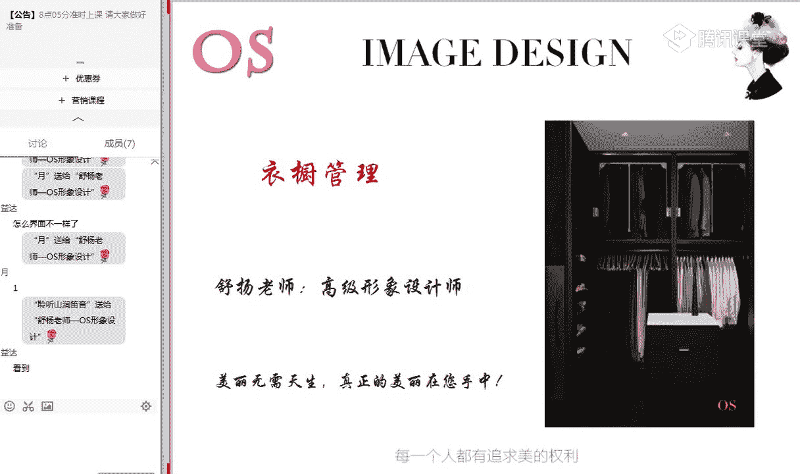
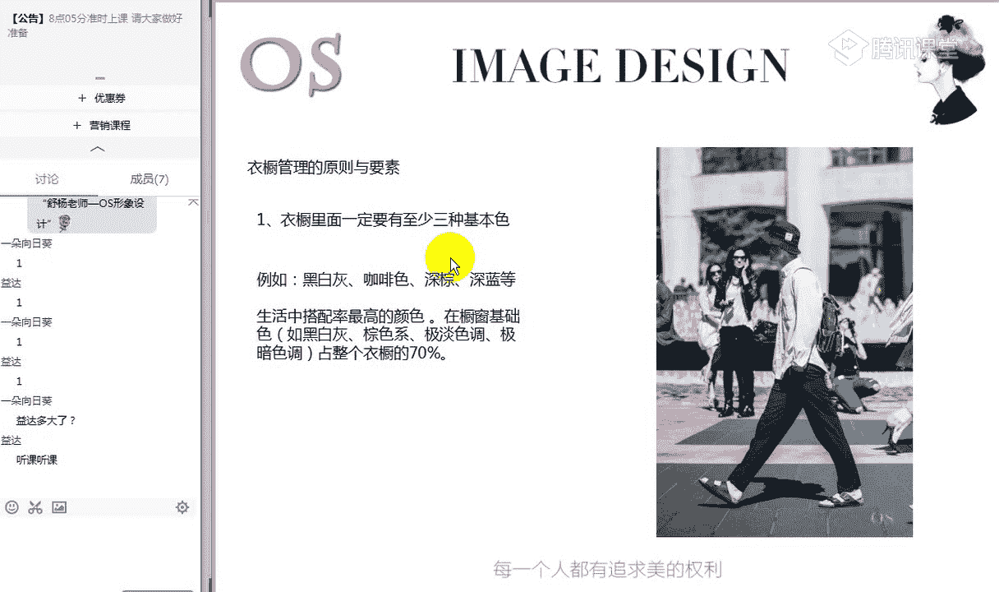
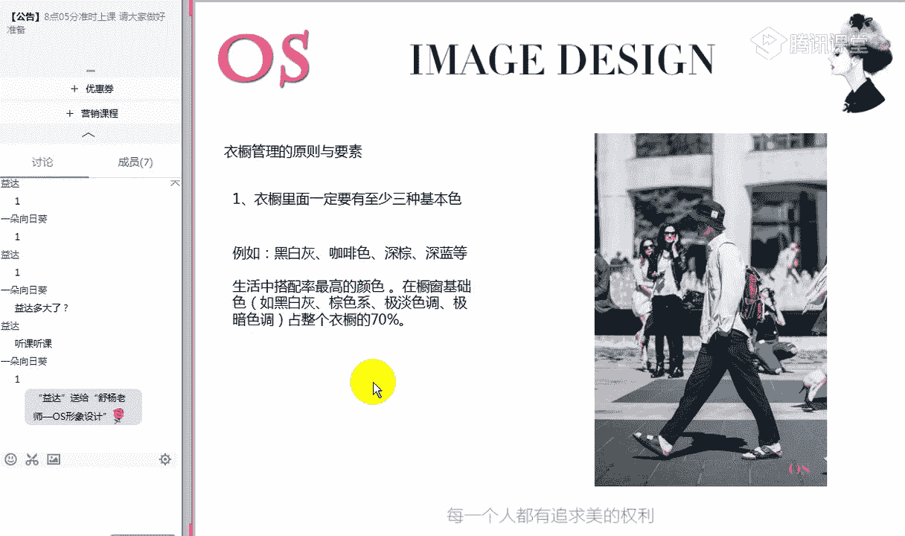
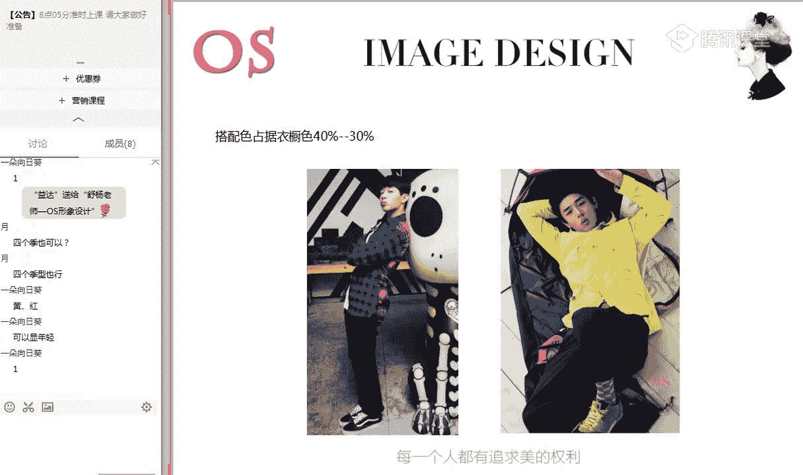
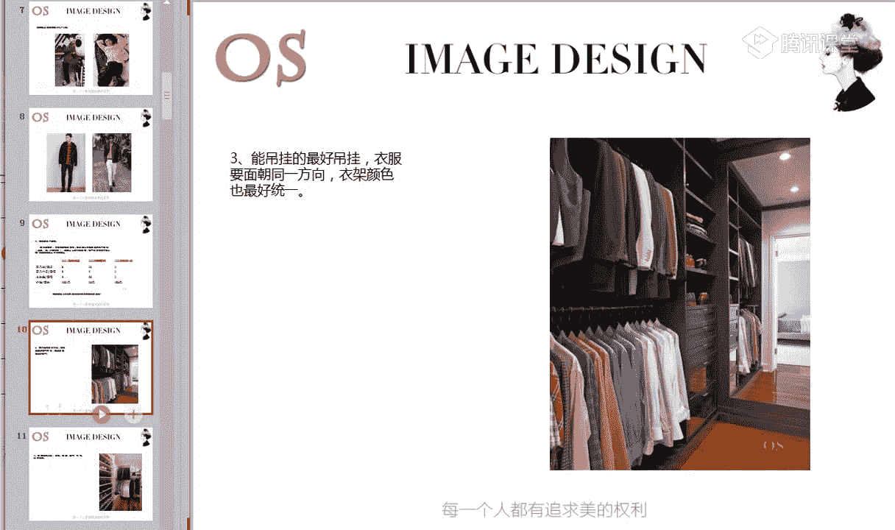
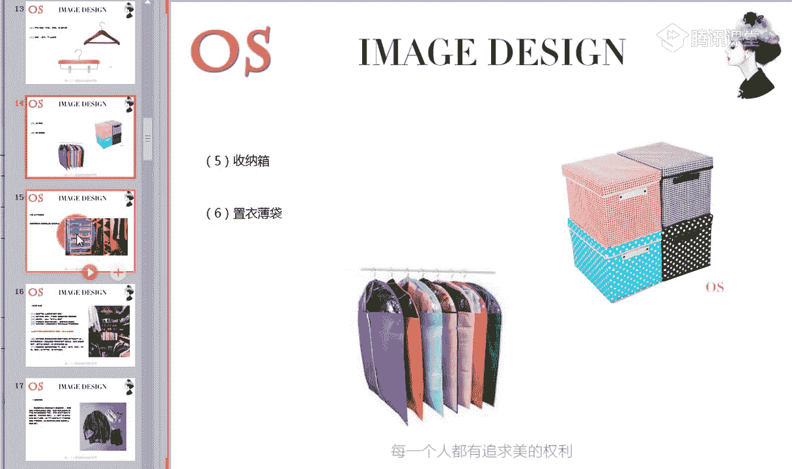
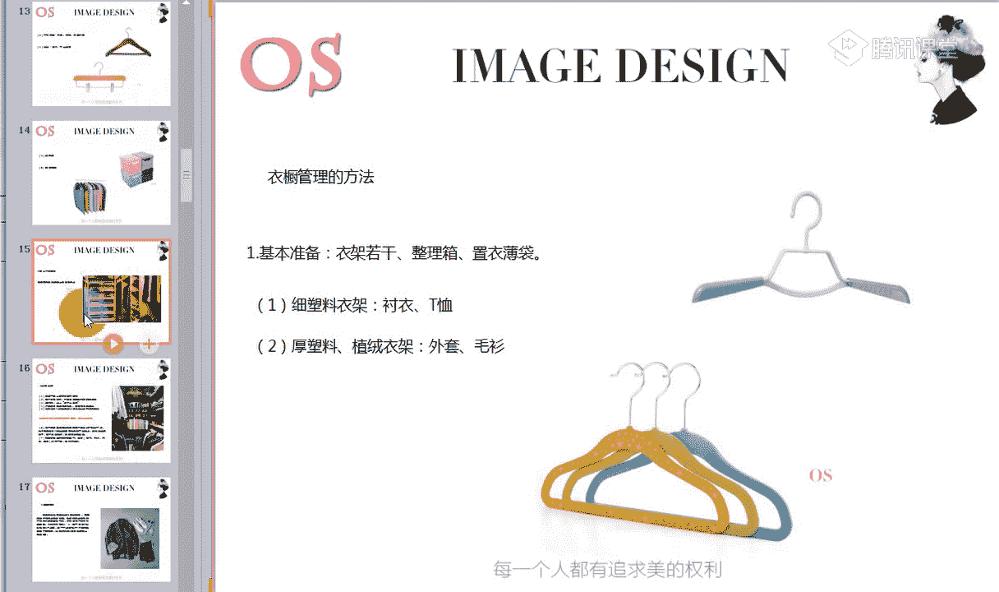
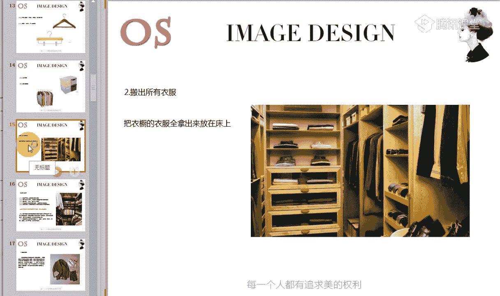
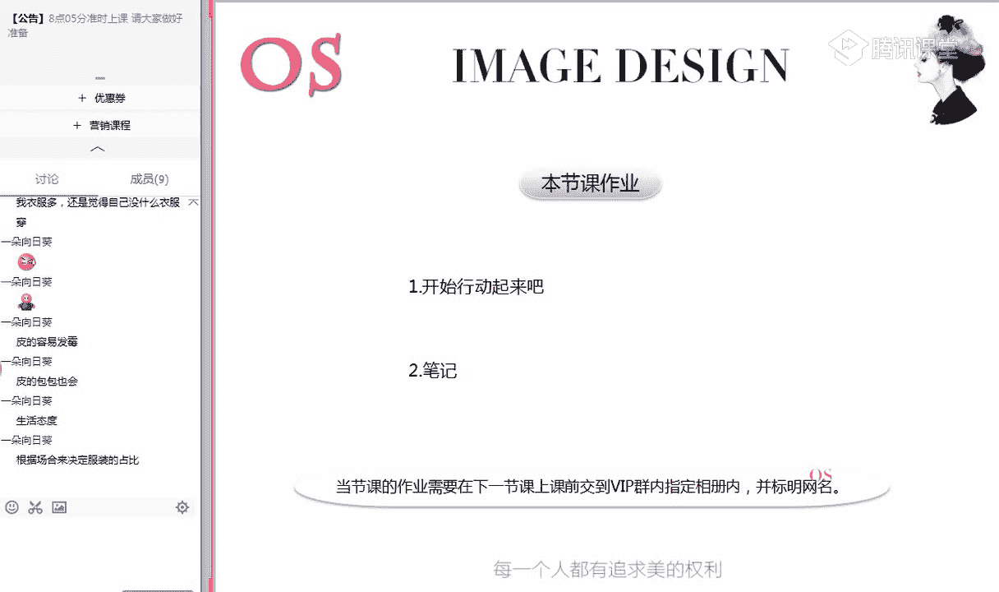
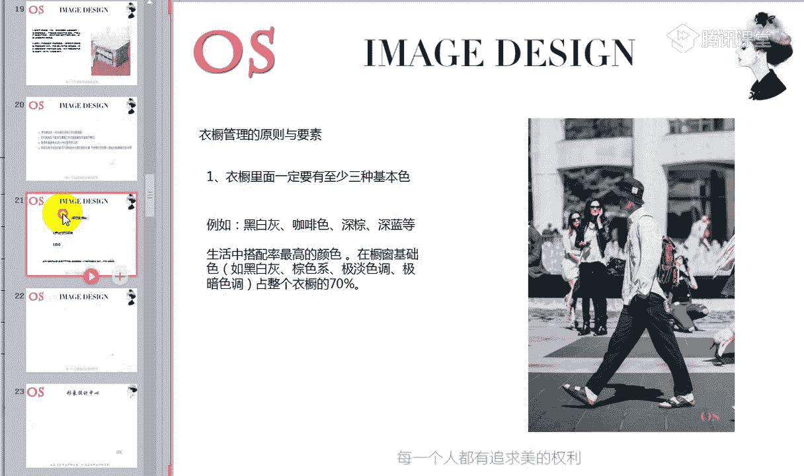

# 1、14男士个人形象班第二期（中级版）VIP课程：第14节、衣橱管理

欢迎大家来到OS男士班的课程。我是本节课的主讲老师舒阳。那今天呢是要学习我们男士课程的第十四节衣橱的管理。通过这样的一个系统的学习，大家呢对发型和我们的体型修饰，包括我们服装的一些常规的搭配方法。

对不对？场合的着装分类，以及我们配饰的选择搭配，包括我们自身的色彩风格都有了认识和掌握。那同时呢我们通过这样的一个系统的学习之后，也会发现自己很多的单品的缺失，和自己衣橱中不适合自己的单品。

所以说今天我们呢要好好来学习衣橱管理，掌握衣橱中的原理要素。

这也是我们本节课的学习重点啊，掌握我们衣橱的原则和要素。同时呢要学会管理自己衣橱的这样的一些方法，懂得去收纳整理我们的。服装。好，如果说都准备好的同学呢，可以快速跟老师刷朵鲜花或者扣个1啊。

我们就开始今天的课程，进入我们第一个部分衣橱管理的原则和我们的要素。

好，看到我们衣橱管理原则和要素。第一个部分。在这里呢我们要说明衣橱里面呢一定要有至少三种基本色啊，什么是基本色呢？例于我们的黑白灰，包括我们的咖啡色、深蓝色等等啊，生活中搭配率最高的颜色。

那包括我们现在回顾一下自己的衣橱，拥有这样的一些基础色。刚才老师所说到的这种，包括我们的棕色系啊，及淡色调里面的及暗色调里面这样的一些色彩的同学呢，可以跟老师扣个一呀。

就是我的衣橱里面至少有三种类似的这样的一个基本色同学，可以跟老师扣个一。那如果说像你的衣橱中。黑白灰、棕色系或者是极暗色调、极暗色调等等哦，它的占据你衣橱70%的同学也可以跟老师扣个2哦。哎。

目前只有一位同学衣橱中70%，或者说我至少有这三种基本色的，只有一位哦，只有一位同学，那其实呢我们作为这因为我们向日葵同学还是女士啊，对不对？是女士啊，易达是男士，那很好啊。

如果说男士你的衣橱中有至少这三种颜色。同时呢你下一步要做到的就是要让他呢占据你衣橱的70%。可能这个时候就有同学会好奇了，哎，我的衣橱中70%都是老师所说到的这样的一些。基本色对不对？

都是这样的一些基础色，基本色。那跟我们的色彩剂型会不会冲突呢？各四季型都这样吗？如果我是春季型也好，我是冬季型也好，我是不是都是要这样呢？都是要把这样的一个基本色占据70%呢？没错啊，记住是的。

都是这样的基本色呢必须要占据你衣橱70%，为什么说它跟你的色彩剂型是不冲突的。第一个老师之前说过，男士最重要的是场合。而这样的基础在各场合中都是适用的。你会发现以上所说到的这样的一些基础色。

我们从中去挑选，你会发现它各个场合都是适用的，对不对？而且同时它是非常好搭配的，会发现可任意的去进行组合，只要注意表达的效果和环境就可以了。只要注重表达的效果和环境，它可以任意的去进行这样的一个组合。

第二个呢就是这样的一个基础色，你仔细的去看，你会发现呢四季型用色它其实都包含了。比如说老师举个例子，春季型，我们之前有说到过春春季型的一个用色范围，对不对？用白色用它棕用棕色系都是可以的。

包括它也可以挑选挑选极淡色调里面这样的一些暖色为基础色，都是没有任何问题的。所以说你会发现这样的一个基本色，在你的衣橱中占据70%，它是不冲突的。那包括我们冬季型的同学可以去择黑色和白色。

可以去选择极暗色调里面的有颜色作为你的配色，对不对？这个能不能理解啊，理解同学可以跟老师扣个一，这个回复一下大家，我怕大家有这样的一个疑问啊。

就是我如果衣橱中老师之既然说到了70%要占据这样的一个基本色，会不会跟我的色彩进行冲突。我用了两个方面去跟大家做了一个解释啊，还有没有什么疑问，如果有疑问的话呢，老师再次的呃说明一下，可以跟老师扣个2。

没有疑问的同学扣个一或者刷朵鲜花。

就是这样的一个道理啊，刚才是举了一个春和冬，对不对？我们其他色彩进型的，就是以此去类推呃类推。因为呢基本色非常的好搭配，可以跟我们甚至跟我们一些搭配色在一起都是非常好看的。我们可以看到。

这都是属于刚才以上所说到的这样的一个基本款，对不对？基本色。

那另外的话呢，我们也会发到现唉这一套中和这一套中，它们有两个颜色非常的耀眼，就是啊对四个机型都是可以的啊，不冲突不冲突。不冲突，因为我说到男士很多有很多重要的一些场合啊，会有很多一些呃很多场合的话。

这样的一些基本色在各个场合中它都是适用的。一会儿的话我们还会讲到搭配色，同时我也会说明啊，会说明一个缘由。对，两个一个是黄色，一个红色，非常的耀眼，对不对？但是呢？我们由这样的一个搭配，也可以看出来。

这就叫做红和黄啊，会发现它的色彩的鲜艳度非常高。所以说这个是称之为我们这样的一个搭配色。在衣橱中呢，你70%都是刚才所说到的这样的一个基本色。

那剩下的呢你的搭配色这样的一些鲜艳颜色呢占据你衣橱的40%到30%就可以了。所以说搭配色指的就是呢这样的一些鲜艳的颜色啊，有一句话说的好，万绿丛中一点红动人青色不需多，对不对？

其实就说明了鲜艳的色在运用上要有原则。鲜艳的颜色是是不是非常的耀眼。我们会发现鲜艳的颜色非常的耀眼。就像我们可以看到，当它跟基本色去做搭配的时候，它在丛中是非常耀眼的，对不对？由于它的柚目性极强了。

强调的是鲜艳之美和点缀之美。所以说呢各位男士在搭配的时候一定要导入正确。根据场合去导入，搭配好了，有艺术感，会形成这样的一个焦点，同时的话你会发现跟你的整体搭配中它是有秩序的。哎。

它是独目的独目的同时又会表达一个秩序感。但是如果说你导入的错误的话啊，或者是呃你的色彩没有搭配好你这样一个鲜艳色过多的去导入。

或者说搭配上面没有去讲究我们刚呃上一节课上上节课所说到的这样一个搭配技巧的时候，就会显得非常的俗气，而且的话呢也不合时宜。所以说休闲场合中可以根据搭配技巧和自己的用色范围来选择。

但是职业中只要百5%到30%就可以了。你的职业场合啊。当然职业场合是分。轻重的。如果说你的职业场合是这样的一个时尚场合，对不对？我们可以多一点啊，甚至如果说是一般职业场合，我们也可以多一点。

但是如果是严肃职业场合的话，那你就看看了，对不对？所以说就是职业场合中在5%到30%就可以了。从中这一点呢，我们也可以看出，搭配色运律运用率也不是很高，也不是很高。男士呢随着工作的日益的稳定。

所处的场合跟职业有关的，占据生活中的大部分，对不对？很多男士我可能下了班之后，我虽然说去吃饭，但是我可能吃饭的内容是要跟工作有关系的。所以说看似这样一个场合是休闲场合，但是我们所谈的内容是跟工作有关的。

所以说还是跟工作有关，对不对？还是属于我们的职业场合，男士随着工作的日益稳定啊，一定是所处的场合都大部分是跟职业有关的。占据着你生活中的大部分。所以衣橱中的搭配色呢在30%到40%就可以了。

当然也不能没有啊也不能没有。因为我说到了鲜艳的颜色啊，跟你的这样的一个基本色搭配在一起，能够制造这样一个层次的同时。哎，独木的同时，它同样也能够带来这样一个秩序感，让你显得更有品质和艺术。

这个就是我们这样的一个比重的问题啊。那我要问一下大家，对于我们衣橱色彩的占据的比重，还有没有什么疑问啊？如果是说啊如果是说呢有疑问的，可以提出来。另外的话呢，当然我指的这样的一个搭配色。

你要根据你自己的这样的一个用色范围来选择。那像我们有一些同学，如果你也想选择搭配色啊，这样的一些鲜艳的颜色，可是你不适合的话呢，我们可以放到下装啊，放到下半身来穿着。比如说像鞋子，比如说像腰带啊。

比如说像我们这样的一个包包或者是我们的裤子去选择一些鲜艳的颜色是没有任何问题的。有没有任何问题啊？没有问题的话，跟老师扣个一。大家可以看到啊。

当鲜艳的颜色跟你的基础色搭配在一起的时候是非常有这种品质感的，会很有质感。但是搭配不好的话呢，就容易出错。所以大家要看一看自己的衣橱中啊，我还有哪些颜色。如果说你的衣橱中都是一些基本色的话呢。

我们在下一次购物的时候，其实就要适当的去添置这样的一些搭配色了。那如果我们有的男士你的衣橱中啊搭配色占据着主要的这样的一个服装色的话呢，我们在下次购物的时候，就要以我们基础色为主。

好，如果其他同学都没有任何问题，老师就接着往下讲了啊，这是第一个我们要知道的衣橱的配色的比例。第二个呢就是要跟大家说明衣服一斤不易多。我也会发现有一些男士呢也喜欢买衣服，但是呢会买很多啊，看似不贵的。

但是买很多的话，其实你会发现啊价值也是很高的，对不对啊？衣服呢你越常穿，你买它就买的越值的。包括现在我们可以看到老师举的这样的一个例子啊，三件衣服，以及加上我们的这样的一个配饰。我们来算一算。

你看一看他每次你穿它的时候花了多少钱。其实答案可能会出乎你的意料。包括我们在场的同学也可以回顾一下你自己的衣柜中的这样的一些三件单品，对不对？我们来做一个比较。比如说我们在秋冬季节的时候。

可能或者是说在这样一个春秋对我买了一件外套啊，这件外外套呢花了900块钱。好贵呀，感觉很贵，对不对？包括我们还有一看到的配饰嗯，配饰的话呢，400块钱的配饰也是很贵的。但是我们要看它的利用率啊。

看它利用率。那有时候呢我们在夏天买衣服的时候，一件T恤，100多块钱啊，80块钱，90块钱也不心疼，就这样买回来了。但是我们来算一算这样的一个三件单品，你看他穿几次，拿我们这样的一件外套啊。

春夏的一个外套，你可以穿几个月呢，可能也就穿三个月，一年中我们穿三个月。那这样的一个400块钱的配饰，一般配饰的话，你会发现它的搭配率是非常高的。比如说像女生的耳环，包括像男生的腰带，对不对？

我可以跟任意的这样的一些裤子只要是和谐的，我可以做组合。所以说这样的一件配饰的话，我们基本上呢每个月啊可以。每年可以穿可以搭配4个月，可以搭配4个月，甚至可以更多。像男生的腰带的话，对不对？

这是每个月和我们每月穿多少次啊，我们做一个小的计算。那包括我们可能买了一件衬衫，买了一件T恤，非常的便宜，100多块钱也不心疼就买回来了。但是呢买回来之后你会发现如果这件T恤，这件衬衫你只穿了一次。

或者说你只能穿一个月的话，那它的价值。就等于是你穿这一次就花了150。但是我们可以看到配饰看似比150的衬衫要贵。但是因为我们御用率比较的高，所以说则得出来你每次用它的时候，你等于只花了10块钱。

而且这个价值是逐渐的往后去推的，对不对？可能这件150的衣服我就扔了，我再也不穿了，我不喜欢了。但是这一件如果我喜欢的话，适合我的话，我就会用的很久，而且我可以跟很多的服装去进行这样一个搭配。

包括900块钱的外套也是一样的，也是一样的。从这样的一个算法来看，我们会发现900块钱的衣服要比我们150块钱的衬衫，它的运用率要高，对不对？这一次这一件我们可能穿一次就扔了。

但是这一这一件我们穿了9次，所以说每次穿它就花100块钱，而且我还穿了个9次，所以说大家会觉得150的衣服比900块钱的衣服便宜嘛，不会了，对不对？我每次这一。次我就穿了150啊。

这一次呢我只穿了100块钱。所以说我们在买衣服的时候，各位男士随着年龄的增长，我们之前也说到过不同年龄段的一个着装，对不对？随着年龄的增长，我们要去追求一些品质感。不是说像我们刚大学或者说在高中的时候。

我们对于材质的要求啊，等等。是没有任何概念的。但是随着你步入到了这样的一个职业场合。你在穿衣服的时候，就一定要注重好这样的一个精致感，不是说一定要到了30多岁，我才能注重精致感。只要你步入到了职业场合。

精致感是每位男士都要有这样的一个意识的。呃，男生都很少鲜艳领呃，也不是啊，男生鲜艳的颜色也很多。你像夏天啊衬衫哪、T恤啊，包括外套其实也有的一样的啊，只是可能我们平时关注男士会少一点。

看看一些欧美的一些时尚博主，你会发现他们穿都是穿一些极淡色调，或者是说极暗的色调，或者是我们这样的一些黑白灰，对不对啊，但是其实男装里面鲜艳的颜色还是很多的。好，从这样的一个例子啊，老师也是告诉大家呢。

我们在选购衣服的时候，不要盲目的去追求多啊。我会发现我自己衣服不够穿了，然后呢，我就啊花1000块钱买个两三套。那其实你不如把这1000块钱呢买一套，甚至两套，一定是要更划算的啊。

因为它能够凸显你的品质。而且它的运用率一定在你的意识中它是运用的比较高的这是我们各位男士啊，希望你要知道的。一旦你步入到职业场合的时候，你都要注重好品质感。不是说一定要等到我长到30岁的时候。

我才去意识到品质对于我的一个重要性。

好，第三个呢就是我们要知道的能吊挂的最好吊挂啊。衣服呢要面朝同一个方向，衣架的颜色也最好统一让自己呢精致起来，从细节上面做起。其实你的衣服的挂的一个啊方式，包括我们的衣架。

其实他也能够让你呢带来这样的一个对于服装来说更加喜爱的一个感觉，对不对？所以这是第三部分就是能够吊挂的衣服，我们尽量要吊挂，尤其像我们很多一些衬衫哪哦，还有包括像T恤，你会发现你洗完的时候。

如果你把它唉扯一扯，他可能晾干之后会更加的整齐一点，对不对？那这个时候你如果又放到了衣柜里面可能就容易产生这样的一个叠印啊。如果有些男生他不爱去烫的。像男生的话呢，衬衫，还有包括像T恤如果讲究一点的话。

其实你在上身之前呢，最好是拿熨斗呢，稍微熨一下啊。我不知道我们在场的同学。有没有就是会经常去烫衣服的啊，这样的一个习惯要保持。那如果说呢不喜欢烫衣服的同学，你们也要形成这样的一个意识。

因为像很多衣服它烫一下和不烫品质的体现是不一样的。呃，没买熨熨斗是吗？哦，熨烫机是吧？买一个哦，其实有有家包括嗯如果是经常出差的同学，你们也可以买一个便携式的，买一个便携式的也非常方便啊。

可能就是六七十块钱，然后呢。但是你要装那个便携式的，可能就是要装矿泉水啊。你如果装自来水的话，它容易形成这种水垢，水垢之后就容易堵塞。可能它用的时间就不会很长。但如果是你买便携式的。

你装的是这种呃矿泉水的话呢，基本上一个熨斗可以用好几年，你像我之前我应该是55年前买的一个便携式的，就为了放到箱子里面好便携啊，好携带。我当时买的时候是50多块钱，然后用到现在还特别好。

基本上的话它的力度也是很大的啊，这个的话要讲究一点啊，就是我们可以形成这种意识。我衣服晾好了，对不对？如果不是送去干洗的，我是这样的一个机洗的，或者说手洗的。我收起来之后，我可以熨一下。

然后放到衣柜里面。那我下次穿的时候直接就可以套上身了，也能够让我们啊更加的显这样的一个精神。呃，下次介绍一下熨斗是吗？哦，我找一找吧我找一找，然后下课之后我找一找，然后发到群里面吧。

但是我那个链接肯定是没在了哦，56年前买的，在淘宝上我可以找一个类似的，嗯，大家可以考虑用一下便携式的。如果说喜欢呃旅游的同学，对不对？有时候你会发现我把衣服放到箱子里面哦。

作为做那种真空的或者是怎么样，就压的没形了。然后呢拿出来穿，又觉得像酸菜一样，对不对？那这个时候有一个便携式的熨斗就方便很多了。好，这是我们的第三部分啊，能吊挂的就最好吊挂衣服呢要面朝同一个方向衣架啊。

衣架在选的时候颜色最好是统一的。嗯，哪怕说你没办法做到全部整个衣统一的话，我至少露出啊我们每一个面都是统一的。做一个调整，这样会看起来更加舒服，显得我们的衣柜更加的精致整齐。

第四部分呢就是我们在。挂的时候要按衣服的长短啊，我们可以看到按衣服的长短深浅厚薄季节分风格场合来进行挂制啊。如果说我们像男生有些男生衣服多的。你可以呢把你的职业场合所运用的服装呢放到一面，对不对？

挂在一起。那这个时候我今天是要去上班的话，我就直接在职业场合的一个选择中去寻找服装，可以节约我的一些时间，省得翻来翻去，对不对？那如果说我今天是去约会的，或者说哎去跟朋友逛街的。

我就可以在我的休闲区域中去寻找这样的一件衣服。因为像风格的话呢，基本上哦大部分同学应该都能够去做到固定啊，随着时间的一个增长，我们在选购衣服的时候。

一定都是按照自己的风格去进行选择的那第二个呢就是我们可以按照长短去进行分类，或者说按照我们这样的一个季节来进行分类。像有的衣服的话，可能买回来我们可以穿三个季节，就比如说像男士的衬衫，对不对啊？

我们春天能穿，秋天能穿啊，夏天还能穿，甚至的话呢像有时候冬天我们可以搭配毛衣，还能够去穿啊，一件衣服可以穿四季也有的。所以你们可以按照场合按照这样的一个呃长短厚薄来进行划分。

好，这个就是我们第一部分啊，衣橱的管理原则和要素啊，管理的原则和要素。大家还有没有什么问题啊？一会儿的话呢，我们把所有的知识点讲完之后，我还要跟大家介绍几个呃不同的人群的衣橱的分类啊。

一会儿讲完之后再进行跟大家一个总结。这一部分没有任何问题的话呢，可以跟老师刷朵鲜花。我们看到第二部分。呃，夹克对夹克其实也可以嗯。夹克你要是说穿三个季节也真的是可以的。好，衣橱管理的一个方法啊。

首先我们就要准备好呢衣架对不对？准备好衣架若干，还有包括我们的整理箱啊，制衣薄带，这个都是我们要准备的一个基本要求。那第一个呢就是我们在选择衣架的时候呢，其实也可以分一些类啊。

我们如果说都去选择一些这样的一些木质的，其实成本会有点大，对不对？我们可以根据服装的薄厚，根据服装的这样一个类别来进行划分。第一个你可以准备这样一个细塑料的衣架啊。

细的塑料衣架用它呢在我们的夏季的时候哦，或者说挂我们的衬衣挂T恤都是可以的。像有些T恤，有些男士如果你勤快的，你发现你洗完之后不是很平整，对不对？我要进行这样一个烫，烫完之后。

我们就可以拿衣架挂在我们的柜子里面啊。而且在挂的过程中，我希望大家还要注意一个细节，就是我们会发现有一些衣架，它容易把你的T恤的这样一个肩头啊支起来，对不对？支起来就会非常很很尴尬。

所以说我们在烫的过程中啊，熨烫的过程中，你可以在那个部分压一下啊，让它压一下，然后它就会回回到那个平整的一个状态。第二个呢就是我们的厚的这样的一个塑料啊，厚的也就是说比较宽的啊比较宽一点的。

不是说这样的一个宽度啊，而是唉这样的一个宽度啊，看老师鼠标的一个走向，这样的一个宽度，厚的塑料，或者是我们啊这样的一个绒质的衣架，用来挂我们的春秋的外套，或者是我们的毛衫啊，我们这样的一些毛衫。

用它来挂。因为它的有一定的厚度，所以说它对你的衣服的肩部呢，还有包括它的承受能力啊都比较的强，用它来挂这类型的单品是没有任何问题的。第三个就是我们的木质衣架啊，木质衣架的话呢。

其实是我个人来说觉得最好的，不仅是挂T恤也好，还是啊挂我们这样的一件毛衫。因为它能够它的这样的一个保护度是最佳的。如果有些同学会觉得哦唉太麻烦了，或者说太厚了，我们就在挂一些其他外套时候。

就让让我们呃用我们刚才所说到的这两种。那在但是在挂大衣或者说挂风衣的时候，或者很多一些厚重的外套的时候，请你一定要采用这类型的衣架哦，它的承重力，包括它能够保护你的肩型。

保护保护你的衣服的这样的一个整体的款型。这是我们第三类。第四类呢就是我们的裤架啊，裤架的话是像我们男士的裤子啊，女士的半身裙啊，都可以用这样的一个裤架。因为男生的裤子很多，如果是像一些职业场合。

比如说像西装裤，它都是有散道的，对不对？我们中间那条线都是有散道的那如果说你把它呃没有折好，或者是说你刚好熨好了，你送到干洗店拿回来的时候，那我们其实有一个这样一个架子，能够更好的保护它的型啊。

能够有一个定型的一个作用。拿起来也是非常省省事的啊。我们想要去套裤的时候，也非常省事，这是我们的裤架。准备好这类型的裤架。第五个呢就是我们的收纳箱啊，有一些服装我们可能要柜子装不下了。

但是呢我又还是适合我的，我不扔的话，我就可以放到那个收纳箱里面。所以说收纳箱也是要必备的，可以呢保护好我们的衣服。第六个呢就是我们的制疑薄带啊，像我们有一些厚重的外套，你的柜子如果柜门经常开的话。

我们也容易上到一些灰尘，对不对？所以这个质疑的薄带呢，它不仅去挑选一些稍微透气性好一点的。因为服装它也是需要呼吸的，我们不要从干洗垫啊，从干洗店呢把这样的一个衣服拿回来之后啊。

如果说有一些外套送去干洗的话，它干洗店很多这样的一些。就是袋子啊，就套在衣服外面袋子，它其实透气性非常差。然后我们不能够很好的去保护好这样一个衣服。所以说你可以换成这一薄带，相对来说透气性会加一点。

服装它也是哦需要去进行呼吸的，它也是需要去进行呼吸的，更能够保护好它，而且有防尘防潮的作用。对哦，有一种抽空的抽空的那个就是属于压缩的啊，它能够节省空间，可以节省空间。像有时候呃出差呀。

箱子想拿个小箱子，但是呢衣服又多的话，我们就可以采用这种抽空的，对不对？但是抽完空之后，我们肯定穿的时候是需要去熨烫的。

好，这是我们把这样的一个基础款啊，基础的。

衣架都准备好了之后呢，我们就开始进行第二步啊。所以各位同学要知道你们学完这堂课之后，我们可以利用星期天的时间啊，把这样的一些东西备好之后呢，我们来整理一下自己的衣橱，看看自己衣橱中有哪些缺失的。

以及呢我们来好好搭配一番。那第二个呢就是我们把所有的衣服都搬出来。你可以把衣服全部都搬到你放到你的床上啊，全部把你衣橱里面所有的衣服，然后放到床上之后，我们开始呢一步一步整理。

第一步呢就是我们要做好分类的处理。啊，从我们把衣橱中所有的衣橱衣服都翻出来之后，你会发现有些衣服甚至超过了一年，你都没有穿过它，对不对？会有这样的。而你把它拿出来，放到一边。

那第二个呢就是有些衣服你也会发现不太合理的身材了，不适合你自己的剂型和款式。因为我们通过前两节课程以及对于自己色彩的用色，还有包括我的风格这样的一个量感。

直取和动静有了非常呃深的理解，对不对？那这个时候我们来辨别一下自己的衣橱中是不是有不适合自己风格的衣服。那如果说这件衣服的色彩和风格都不适合你的话，你也同样把它挑出来放到一边。第三个呢就是过时了的哦。

肯定我们很多同学衣橱中有一些过时的，你让你已经感觉这件衣服我不可能再穿了，因为穿不出去了。那像这件衣服的话呢，我们也把它放到一边，第四个呢就是不适合你目前工作性质，或者是我们生活情形的衣服啊。

不适合你这样的一些场合的工作性质的。可能你在买这件衣服的时候呢，你只是一个职业职场小白，对不对？但是我现在目前到了这样的一个管理层了，我肯定就不适合我目前工作的性质了啊，这样的一个社会地位了。

或者就是说我的工作已经换了，我之前是做什么的，我现在做什么了，那这件衣服也不适合我了，像这样的一件衣服，你也同样把它挑出来。第五个呢就是有一些衣服，你仔细去观察，你会发现有一些无法弥补的瑕疵。

或者是没有办法去进行及时清理的这样的一些污痕的服装，也可能让你没办法穿出去了，对不对？那这个时候也把它挑到一边，这是我们这五大类的服装，大家要。送进行这样的一个筛选。筛选之后呢。

我们就开始可以处理掉了啊。有些你觉得可以放到闲鱼上去卖的，你也可以把它卖了，对不对啊？你觉得卖不出去了，你就可以捐了啊。我们像我们有一些小区都有这样的一些回收站，对不对？衣物回收站。

你就可以往那里面扔都是可以的。这就是一个处理啊，处理完之后，那这个时候我们看到我们床上还剩下的这样的一些衣服，就开始把。把能把不能跟其他衣服单品的一些单件同啊归一组挂到一边列个清单。

然后把他们的按轻重缓急排列在一起。因为当然啊这一步的话呢，我们可以把它放到最后最后去运用啊，所以说先放到这里，老师不讲我们第六步啊，我们看到第七步看到第七步，把自己适合的衣服呢按照季节场合归为一组。

按秩序呢先挂好挂好的同时，你也可以在挂之前呢做这样的一个搭配，或者是说你把你所适合的啊，把这样的一些衣服全部都挂好，包括我们第六部分的啊，就是只要是床上剩下的都适合你的。

你都可以现在呢就是按照季节去进行挂，或者就说你都可以把它先挂到我们的衣柜里面，或者你也可以不挂放到床的一边，我们直接呢进行第四部分的重组搭配。啊，这个时候我们就会运用到一些单品搭配的技巧。

以及我们服装的常规的搭配，对不对？常规常规的这样个搭配。你可以试试呢重组不同的上衣和裤装啊，各个款式的上衣搭配不同外套，或者说其他的这样一个饰品，也许哎你就会有惊喜的发现。比如说你能够做到一对三。

对不对？哎，集一条裤子呢分别搭配三件上衣，或者说一件上衣呢跟三种不同的基本色下装呢进行搭配。如果你只有三套衣服的话，你会发现你可以搭配出9套。那在搭配的过程中呢，大家也可以进行拍照，可以进行拍照哦。

像专业的形象顾问的话呢呃去给别的顾客啊，给别的顾客在线下做这样的一个衣橱整理的时候，因为顾客他肯定不会像我们大家学过这样一个系统的学习，懂得哎我的用色，懂得这样的一些色彩知识，懂得搭配的知识，对不对？

他都是没有概念的。你不可能说跟他归纳之后之后呢，哎把他所适合的留下来之后，你就拍拍屁股走人了。那这个时候。衣橱管理师啊一定会给他做这样的一个陈组搭配，搭配之后呢，拍照，把照片全部拍好之后发给他哦。

告诉你备注好这一张照片，这套衣服，你可以在什么样的场合去穿着啊，以及呢我所搭配的这样的一些配饰，都给你搭配好之后拍照，就像这样的到就像这样的一张照片一样，拍好之后全部都发给你。那包括搭配完之后。

你会发现剩下来可能他还有一些衣服没有合适的单品做搭配的那我们就会写一个清单告诉他，你接下来买衣服的时候要买什么什么什么什么哦，可能他还是不会去选择，对不对？那这个时候他就会运用到陪同导购师了啊。

他就会找你预约陪同导购啊，其实就是呃这样的一个过程啊，其实衣橱管理师跟我们第十二节课所讲到的这样的一些知识，其实是差不多的，就是这样一个意思。这是我们的这样的一个重组搭配啊。所以说重组搭配完之后呢。

你就会发现有一些单品是没办法做搭配的，对不对啊？没做没办法做搭配搭配的这样的一些单品呢，我们可以挂在另外一个柜子里面，然后呢你可以对它进行一下这样的一个搭配构想。哎。

比如说这件衣服我应该选择一条什么样的裤子啊，跟它做搭配。啊我们可以呢拿一个本子，拿一个笔呢把它记下来放到你的身上啊，放到你的包里面啊，等到下次逛街的时候呢，你就可以有目的性的购买了啊。

防止呢再买到一些不适合自己的，或者说哎浪费这样的一个啊时间和金钱啊。哦，对哦，买衣服买经典款，像很多经典款的话呢，都是可以穿很久的。比如说像衬衫，对不对？锥形裤啊等等，这都是经典款哦。好。

这个就是我们这样的一个重组搭配啊，重组搭配。那包括我们在进行啊这样的一个搭配的过程中，包括我们来回顾一下自己的衣橱啊。其实在我们的形象顾问啊，专业的服装啊，专业的这样一个衣橱整理师啊。

我们在整理服装呃服务项目的时候，会发现顾客大概就是分为这几类。第一类呢就是爆满型的衣橱。第二类呢就是精简型的衣橱，第三类就是混乱型的衣橱。我不知道大家哦，目前在听课的同学都是属于哪几类。重复一下啊。

一般都是分为这三大类，一类就是爆满型的啊。第二类呢就是精简型的，第三类就是啊混乱型的，什么都有啊，什么都有。那老师呢一个一个给大家来进行这样的一个建议啊，给大家一个建议啊，我们向日葵同学呢是爆满型的啊。

我们月月可能就是精简型的，没有太多的一些款式，对不对？就是一些非常简单的啊基本的。如果说呢是我们第一类，比如说哦如果是我们这样的一个爆满型的衣橱啊，爆满型衣橱的话呢。

老师给你的建议就是呃暂时不宜再添置衣物啊。

不宜再添之一物。我们将现在的衣服呢进行刚才我所说到的这样的一个分类处理，要进行这样一个分类处理。根据你不同的场合呢需求来进行分类的搭配啊，建议最好是分两次。因为爆满型的话可能一次真的是做不到啊。

可能要做两次搭配，甚至或者就是说你一天啊可能就干这点事情了。那第三个呢就是像这类型的衣橱的话，我们要淘汰5分之2左右的，不适合的服饰，你至少要淘汰出5分之2。

这是我们第一类爆满型的那还有一种就是我们刚才所说到的这样一个精简型的衣橱，对不对？那精简型的衣橱。对现有的衣服、饰品进行我们刚才所说到的这样的一个分类处理之后。淘汰就是扔啊，淘汰其实就是扔。

进行分类处理之后呢，我们就开始进行搭配啊，把你现有的衣服开始做一个搭配。搭配的时候你就会发现哇塞，我这也没有，我那也没有啊，要么我就包不够，要么我鞋不够，或者说这件衣服的色彩也不适合我哦，不太很好。

对不对？还有包括裤子啊等等。啊，这个时候你在做搭配的时候，你就会发现你缺什么，像精简型的衣橱。做完分类，做完处理之后做完搭配之后，你就会发现你是有一些变化的。那这个时候我们就要添置开始要添置衣服了。

那添置衣服的话呢，我们从色彩和款式上就要有所变化。因为我会发现很多精简型衣橱的同学呢，基本上色彩和款式是没有太多变化的，都是类似的，都是类似的。所以我们在添置衣服的时候，要在色彩和款式上要有所变化。

不是让你再去添置这样的一些类似的衣服了啊。而且的话像这类型的顾客的话呢，也是通常比较保守的。包括我们这样这样一些同学都是比较保守的那我们在保守的同时，你要一定给自己的脑子中强加一些思想观念。

就是我要增加有色彩的，我要增多增加这样的一些流行元素的，所适合我的一些流行元素的，我要多去增加。包括像这类型的可能连一些配饰也很少。所以说包括在服装配饰上面，我们都要去做一些相对应的精啊增加。

当然增加的速度我们可以慢慢来哦，你一下子来肯定是太太过多的花这样的一个钱了。所以说我们可以慢慢来进行这样一个改变。但是你要杜绝你再买跟你衣橱中类似的这样的一些服装了。好。

第三类就是我们刚才所说到的混乱型的衣橱，对不对？那混乱型的衣橱在整理的时候呢，你将你不适合的服装，你要坚决的淘汰掉，你可千万别心疼，你要把你自己所有不适合的，一定要心狠一点哦，把它全部都扔掉。对哦。

捐出去，那淘汰的分量的话呢，大概在你衣柜里面的3分之1，你要把你3分之1左右都要淘汰。我们刚才所说到呃这样的一个爆满型的是5分之2左右，对不对？但是呢混乱型的，你要淘汰3分之1。在一段时间内的话呢。

你在买衣服的时候，我希望你要慎重去考虑，或者是说你要及时的去呃咨询老师买衣服的时候咨询老师。就比如说哎这件衣服所适不适合我呀。哎，老师你看这件衣服适不适合我风格啊，适不是我色彩迹象。

为什么我会说一定要去呃找一个老师来问呢，就是因为混乱型的人啊，他没有这种概念，你知道吗？不像爆满型，可能爆满型，它爆满的衣服多是多，但是他都可能是他喜欢的，或者说哎比较类似的。

但是混乱型的就是什么都有啊，什么都有，可能前卫风格的也有啊，戏剧风格的也有，就是各种。那这个时候呢，你买衣服的时候是容易冲动的。而且的话你是没有这样的一个规矩性的。所以啊像这类型的。

如果是我们以后有现在不是有形象顾问嘛，我们在场的对不对？如果你有碰到这类型的混乱型的衣橱的顾客的话呢，你要给他的建议，也就是说你需要在形象顾问的陪同下理性的添置衣服。那如果是我们这样的一些男士班的同学。

对不对？我们就要在老师的啊建议下呢来添置衣服，暂时呢不建议大家呢单独去购买服饰，我怕你们又买错了啊。然后呢，从此在这样的一个胡同里面再也走不出来。而且像这类型的人群的话呢。

我们也要平时在私底下多下点功夫啊，多看一看自己所适合的风格和色彩机型，然后呢多理解你场合的一个着装啊，你要把你的思想观念啊，就是怎么说呢？开始走正道啊。

你不要再开始左右去进行这样一个偏啊左右的一个摇晃了，你要开始往正道上走了啊，我们用正道还是打上引号啊。要提升自己的审美啊，要提升啊我们这样的一个意识，这是对于混乱型的同学的一个建议。好。

以上呢就是我们这样的一个三类人群啊，大家还有没有什么疑问？嗯，都听明白了吗？听明白的话可以跟老师扣个一。啊，我的一一人一件没了啊，不至于哦慢慢添置哦，慢慢添置，根据自己的风格来进行添置啊。

色彩机型你所适合的，还有包括我们的场合。好，接下来呢就是我们这样的一个收纳哦。那挂衣服的时候呢，千万别用铁丝质的衣架啊，因为它这个时候会容易破坏我们衣服的形状，对不对？使我们的衣服起皱。

还有包括就是我刚才所所说的容易让我们的肩头呢凸起来啊，容易让肩头凸起来。所以说其实常规的就是最好是像用让用呃用我们这样的一些塑料的衣架，或者说木质的会更好。啊，都是这样的啊，都是这样的。

你就包括像老师个人来说吧，我也会觉得我没什么衣服穿。其实呃衣服大部分也是适合我的风格的，或者是说哎四海之情的也有。但是啊女人就就是这样的啊，喜欢买衣服的人就是这样的，永远都会觉得自己没衣服穿。

可以理解啊可以理解。但是你又会发现呢，你可能呃某一天出门的时候一搭一搭，你就会发现哎，我这衣服还挺多的哦，我还可以这样搭，我可以这样搭，我可以这样搭啊，又会自己又会把自己呢去否定。好。

我们来接下来看到这样的一个收纳啊，具体。那第一个呢千万不要把针织衫和毛衣呢挂起来，而要把它们叠起来存放。但是我可以说不是绝对的哦，不是绝对的。如果你说你是这样的一个木质的衣架。

或者是说你是宽的这样的一个塑料衣架的话，像有一些毛衣嗯，比如说像粗棒针织的，对不对？它本身来说它是有一定的硬挺度的像这样的一些毛衣，你把它挂起来也是O的，不会说对于服装的型有太大的一个影响。

但是呢像有一些毛衣是这种非常嗯细腻的，对不对？或者是垂感非常强的那其实你挂起来的时候就容易啊，导致它变形，那我们最好呢是把它叠起来进行存放。那第二个呢就是腰带啊，男士的腰带呢。

我们可以呢唉如果说你们家里面，我们包括我们有一些男士，你们家里面做柜子的时候，你也可以像我们参照一下途中啊这样的一个方式方法。因为也适当的要去准备一些类似于这样的一个抽屉啊。

可以放我们的领带可以放我们的皮带，对不对？可以放我们的袜子啊，内裤啊等等啊，这是一个非常好的一个方法。那另外的话呢，你如果说没有这种衣我在做衣柜的时候没有考虑到这一方面，对不对？

我们也可以呢唉准备一些挂钩啊，也有这种挂钩，我们可以把腰带或者是说呢啊围巾啊，包括我们。皮啊领带呀等等的，可以放到这样的一个挂钩上面。饰品进行这样的一个分类存放啊，会让你更加的方便。你搭配完之后。

服装穿好了，这个时候你可能就是要搭配配饰了。我直接呢走到配饰区域，对不对？我这个时候随手就可以呢照着镜子开始进行组合了，不用说东找西找去翻来覆去的。第三个就是要经常用擦呃，经常的要经常去擦鞋子啊。

不穿的鞋子要用到鞋盒存放。但是不穿的鞋子你用鞋盒存放的时候，我希望大家先进行一下处理。呃？如果说是皮鞋的话呢，我们做完处理之后，上点啊皮油对不对？鞋油鞋油之后去存放，省得它到时候发霉哦，因为像南方的话。

鞋子很容易发霉。哦，北方可能还好一点，北方可能还好一点。那另外就是还有就是下雨天之后啊，下雨天鞋子可能有时候像有一些皮鞋，对不对？泡水了，会。泡到这样一个雨水。所以说回家之后。

你第一件事情也是要先把它擦拭干净。因为雨雪对鞋子呢它是有损害的，尤其是我们这样的一些真皮鞋啊，这个时候我们就一定要赶紧回到家之后呢，拿这样的一些抹布，或者是说我们的纸巾，把水呢吸干净啊，擦拭干净。

然后再把它放到我们的鞋柜里面。是的啊，皮的都是容易发霉的。所以说鞋子要经常去进行保养啊。各位男士鞋子其实鞋子非常的重要啊，很多女生的话，我是老师是以一个女士的角度来说啊，像我个人的话。

我去出门嗯见一些异性的时候，我也会看完他整个医生的时候，我可能会看到他的鞋子。我们都知道啊都知道，其实鞋子能够代表一个人的品味，对不对？那同样的话呢，鞋子的一个干净整齐的话，也能够去看出他的一种态度。

我不知道大家能不能认可啊，认可老师这样的一个说法。所以说各位男士呢在鞋子上面我们还是要啊加强一下。像有时候其实鞋子经常穿，它会起皱，就是一个很常很常见的一个状态。但是不要皱的同时。

我还看到非常多的一些呃白的呀，脏的呀，这种感觉。好，鞋子要不穿的，用鞋盒存放，然后呢经常来进行整理啊，老师盒子打错了。刚才整算了，就这样吧啊，大家知道就行了。哦，不是好了，我们看到第四个啊。

第四个呢就是衣橱中的睡衣，还有包括我们的T恤，还有包括家居服呢，可以叠起来收纳啊，叠起来收纳。如果说是没地方的话，我们也可以去准备这样的一个收纳盒啊，收纳盒这个时候就起到了一个作用了。

但是呃需要注意的就是呢下叠起的衣服最好不要太多啊，你不要去超过6件以上，否则的话它会压坏到我们下层的衣服还会呃造成取的时候的一个麻烦，对不对？我可能一抽，然后整个我刚叠好的衣服全部都散了。

我又要花时间去叠，所以说呢不要勒呃勒的太高啊，我们就放几件就好了，平放就好了。好，第五个就是收纳的小件衣服呢，要善于用收纳工具啊，衣橱专用的多层收纳盒我们可以用来收纳袜子。包括我刚才说到的。

如果你的衣柜衣橱啊，你的衣柜没有这样的一些小抽屉，对不对？你的柜子，没有这种专业的小抽屉的话，我们也可以买这样一的收纳盒。因为有很多小的小的收纳盒，它是有方格的那这样的一些方格的话。

我们就可以收纳啊内衣内裤等这样的一些小物件啊，包括的话我们也可以去放一些呃领带呀等等。或者是说呢我们直接就把这样的一个挂钩安在你的衣橱的门板内侧，用它来挂领带，挂我们的皮带都是可以的。

都是没有任何问题的。看起来非常从外观上我们看起来是非常整整洁的。好，这个就是我们所说到的收纳啊，五个要素要注意的五个要素，收纳中的5个要素。那我们接下来就看到最后一个就是我们做了一个总结啊。

看到这四句话啊，加减乘除啊，对于我们衣橱的一个影响。穿衣服的时候呢，我们要做加法。一件衣服你必须要和三件衣服做搭配啊，我们穿衣服的时候要绞尽脑汁做加法，甚至你也可以呢把三件衣服改成服饰也是可以的。

视频也可以包含。减法它指的就是买衣服的时候呢，我们要做减法。你在看这件衣服的时候，如果不能跟你的衣橱里的三件衣服做搭配的时候，你们就不要买。因为我们刚才算到了这样个运用率，对不对？运用率啊。

如果说这件衣服你发现它不适合运用率不高，那钱花花出去了，结果你的衣柜里面衣服还搭不了，我又得再去买衣服，对不对？那当然如果是说啊这件衣服非常适合你的风格和你的场合的话呢，你不要犹豫，可以买啊。

到时候我们慢慢再进行添置。但是如果是说你觉得还好啊，像类似的我也有啊，包括你就不要去跟你的衣。又不能跟你衣橱中的三件衣服做搭配的话，我们就不要去买了。好，下一个就是乘法。跨计的衣服呢，我们做乘法。

同一件衣服，我们会发现它可以穿三季，对不对？所以在买一些跨季的服装的时候呢，你在买的过程中可以去考虑一下啊，可以考虑一下。而且的话你目前现在拥有的跨季的衣服，你也要懂得去进行这样的一个乘法啊，T恤。

这件T恤我也要想方设法让它可以穿到三个季节啊，这样的一件衬衫想方设法，让它穿到3季，这就是我们搭配上所说到的跨季衣服做乘法。那下面一个就是除法，对不对？购买价格不菲的衣服的时候呢。

我们可以用来用除法来计算下衣服的价值。也就是说唉我们这件衣服的一个原始价格去算上我们的使用次数，以及我可以穿多少年，对不对？这样一个年限啊，来看看我每次穿它花了多少钱。如果你觉得这个价格是OK的那你就。

可以把这件衣服买下来。但如果说你发现价格是不ok的那我们呢就要慎重了啊。在购买价值不菲的衣服的时候，像男士在衣橱中我们肯定还是要有几件这样的一个精品，对不对？有几件精品。没关系啊，精品是要有的。

但是在买精品的时候，你一定要算一算它能跟你哪些衣服做搭配，以及你的利用率啊，能够穿多久以及这样的一个啊场合呀等等，你都要把它考虑到进去。好，这个就是我们的加减乘除的一个公式啊，这样的一个公式。

大家可以记一下。好，如果没有任何问题的话呢，我们就可以看到今天的这样的一个作业了啊。衣橱的整理我们基本上都说的差不多了。还有没有什么问题。如果没有问题的话呢，我们就直接看到作业。好。

作业其实就是大家要开始行动啊，要开始行动。因为你如果不把你的衣橱整理好的话，你在买衣服的时候，可能你是有一个盲区的。你可能会懂得我要按照我现在目前的适用的这样的一个场合以及我的风格去买。

但是你可能很难发现你的衣橱中是不是有类似的单品，或者是说这样的一件单品的一个能不能跟我衣橱中其他的一些服装做搭配，对不对？所以在买的过程中，我们最好是先把自己的衣橱做完整理之后呢。

我们可以利用休息天的时间呢来进行选购你所适合的服装。这样的话呢，你会发现这件衣服买回来的价值会更高哦。好，另外的话呢我就跟大家说一个说一个嗯小事啊，如果大家觉得唉。嗯。还有时间的啊，还有时间。

到时候下课的话呢，可以把我们的男士班做一个评价啊，可以做一个评价。因为我发现现在男士班好像没有评价，对不对啊？有有空的同学可以抽抽空的给男士班。课堂啊，那里做一个评价。对啊。

可以根据场合来决定服装的占比。对根据场合。其实我刚才所说到的这样的一个色彩，对不对？我说到70%以基础色为主。其实你也会发现这样一个基础色，在场合，在一些职业场合也好，还是一般的职业场合。

还是我们的休闲场合中，它的运用率也是蛮高的哦，那我们男士的话，随着年龄的增长，你会发现大部分的一些场合都是跟你的职业有关系的你可能在生活中，所以说你以这样的一个色彩为主。

是没有任何问题的那还有包括就是我们刚接下来说到的款式，像上我们的向日葵同学所说到的，对不对？啊，也就是说你在选购款式的时候，你也要按照自己的场合来进行这样的一个比重。哦，每一个场合中，我们适合什么样的。

我们作为风格来说，适合什么样的服装老师都已经跟大家做介绍了，对不对？那这个时候你就根据你的场合，如果你是一般职业场合的。我们在职业场合中选衣服的时候，就以一般职业场合的衣服。

为主。那如果是说老师我在这样的一个场合中，哎，我的这样一个工作环境中，对于我的服装的要求并不是太高。那我在选衣服的时候呢，第一个我注重好色彩。第二个呢，我在细节上面进行一些处理之后。

你就可以以我们的呃这样的一些休闲场合的衣服为主，对不对？以休闲场合为主。然后呢，百分之三四十是职业场合的衣服为辅助。好，有没有问题啊？作业都记清楚了啊，都记清楚。然后呢呃考试的时间我们另行通知啊。

然后这段时间我希望大家快把作业要补上来的，要赶紧补啊。

尤其是我们要学习高级班的同学啊。好，如果大家都没有任何问题呢，我们就可以下课了啊。嗯可以下课了。然后记得有时间的同学可以把男士班的评价写一下，好吗？啊，进我们这样的一个腾讯课堂啊，进腾讯课堂。

然后写评价。好了，再次感谢大家的一个陪伴和聆听啊。我们今天的课程呢就到这里。

