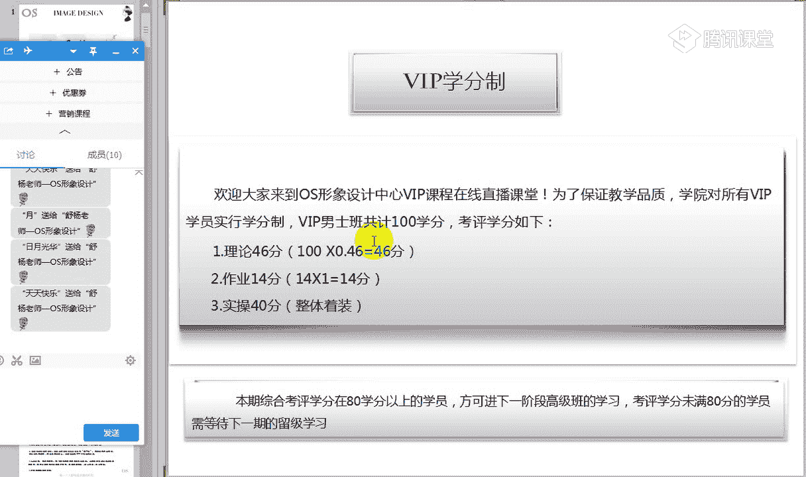
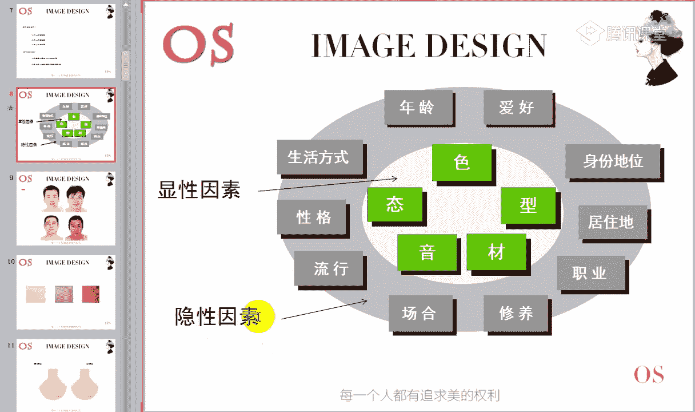
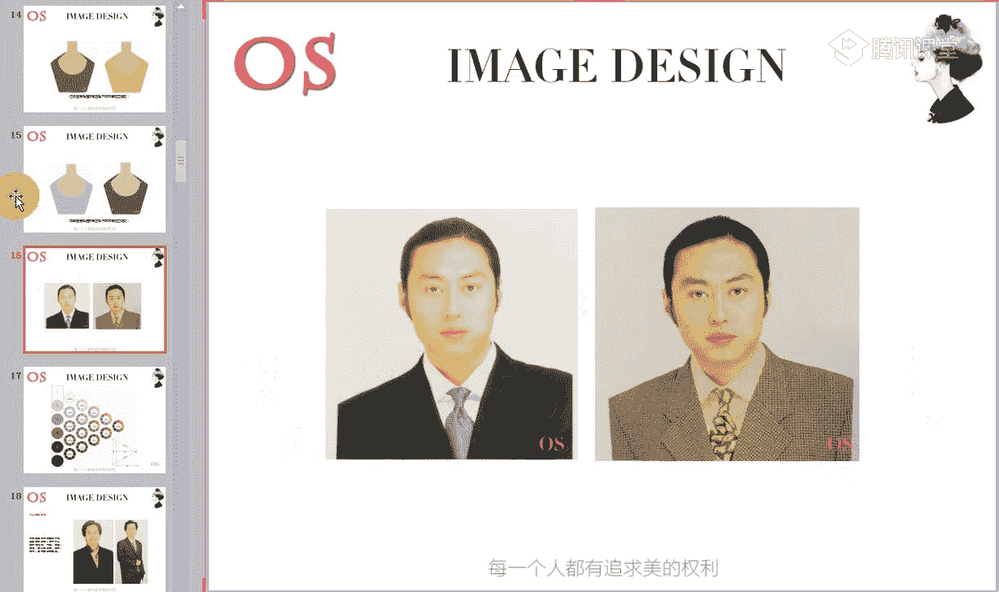
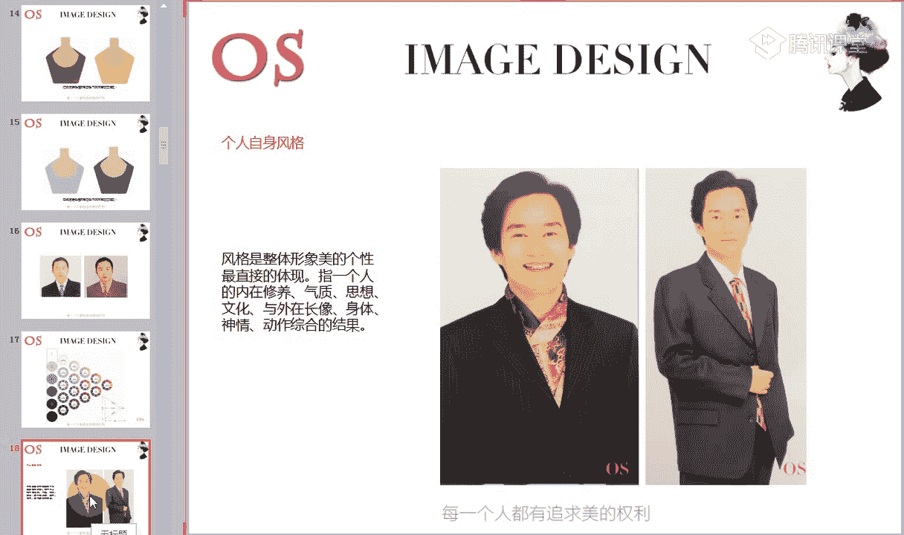
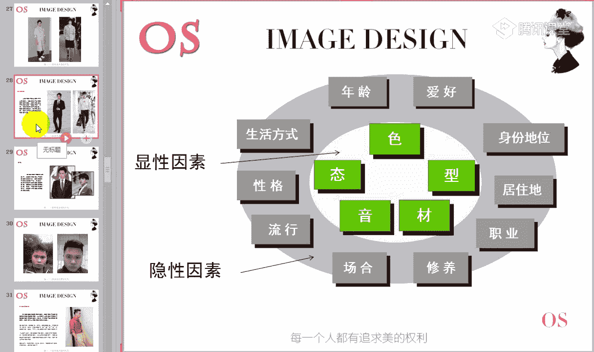
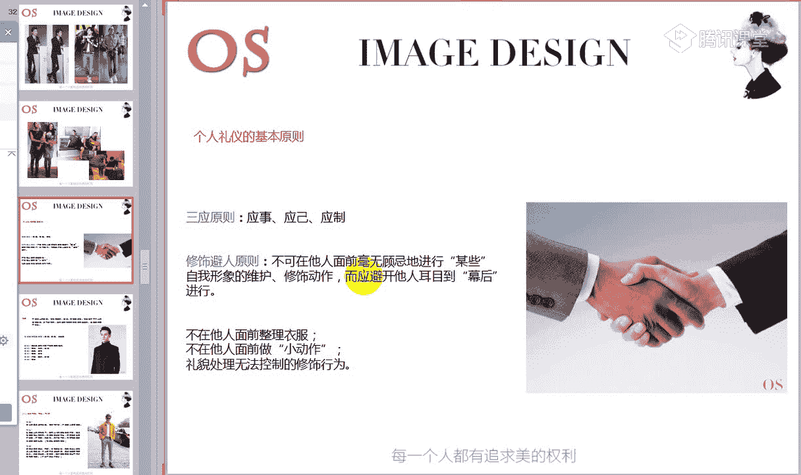
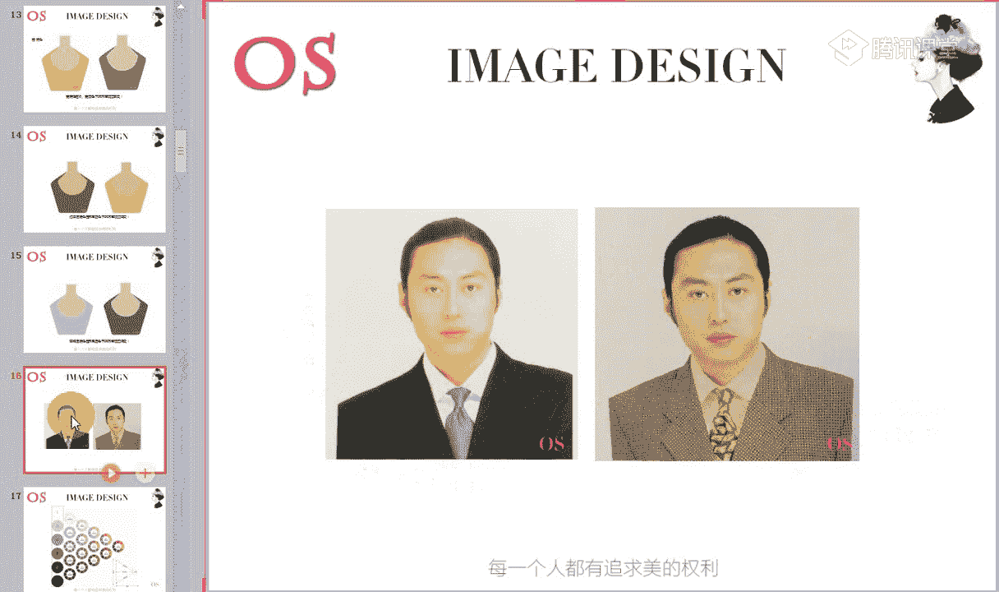

# 1、14男士个人形象班第二期（中级版）VIP课程：第1节、个人形象的价值

🎼男士课程的开学典礼，也同样是我们的第一节课啊。哎，我们简短的呢可以做一个这样的一个欢迎仪式。那也是感谢大家的一个到来，也希望大家在往后的这样一个课程中都像对待第一节课一样积极认真。

那首先呢我们可以做一个相互的一个了解啊，认识一下。大家把各自的这样的一个名字，还有包括我们哪来自哪一个城市呢？打在公台上，哎做一个简单的这样的一个认识和自我介绍。老师先来哦。那大家好，我叫舒阳。

来自长沙啊，我们大家可以快速的呢做一个简短的一个自我介绍，让大家都相互的认识一下。那如果说以后到了你这样的一个城市呢，我们也是同学可以相互的哎来见见一见面哪，或者说了解一下都是非常不错的。好。

我们的呃叶同学说，小林啊来自贵阳嗯。🎼没关系啊，如果说觉得唉说自己的实际名字不太好的，说网名也是可以的，没有任何关系。嗯，啊，来自刘少奇故乡林想哦，也是我们的湖南的。好，大家快速的做一个自我介绍。

我们大家都认识一下。好，我们真的是来自五湖四海的同学哦，来自五湖四海的那说完我们这样的一个简单的一个自我介绍呢哦在这里呢大家还可以想一下下一个问题啊。因为下一个问题呢老师要问一下大家哦，唉。

为什么来报名学习我们这样的一个男士课程哦，大家把这样的一个问题的答案呢，可以呢再次打在公台上，为什么来学习我们这样的一个男士课程？那在说明这样的一个问题的时候呢，老师也是再次的欢迎大家的一个到来啊。

我们这样的一个简单的一个开学典礼。🎼好，做完了简单的一个自我介绍啊。嗯有同学说到了这样的一个喜欢，因为喜欢这样的一个课程。然后有同学说可以让自己变得更好。没错哦，还有没有其他的哦这样的一个想法？

🎼那我们在各抒己见的时候呢，也可以看到接下来呢这一张图片哦，稍等老师呢把。这张图片放给大家看一下。🎼好，这是一个公式这是一个公式。那看到这样的一个公式呢，大家有什么样的一些感想啊，你可以在脑子里想一想。

看到这样的一个公式，有什么样的一感想。那其实你会发现这是一个人生战略问题与人生质量的一个关系。也就是说这个公式，它透露着这样的一个战略。可能大家会觉得老师用战略这个词，是不是会太夸张了。

或者是说哦空乏了一点，对不对？但是事实上呢任何人在一生中你都面临着成长发展的这样的一个战略问题。啊，我们可以来回顾一下我们自己的这样的一个历史。你会发现很多时候我们自己都在做着人生的一些重大的选择。

比如说当初拼命的去考大学也好，还有包括到了去选择这样的一个非常慎重的去选择结婚的对象也好。还有包括有同学可能哦慎之又慎的去跳槽去转职等等。🎼无数次的这样一个战略性的选择，构成了你现在的这样的一个人生。

所以说。🎼哎，我们对应一下这三个词。🎼是否影响着我们的人生，你们可以来回顾一下，来想一想。首先我们可以看到第一个词呢是关于我们这样的一个体力的问题，对不对？

关关于到我们这样的一个体力的问题那这一点其实非常的容易明白哦。因为我们都知道一个多病的身体是无法确保人身的这样的一个质量的那还有第二个词，我们可以看到是智力。🎼一生中智力资源的积累的一个薄厚呢。

它同样也关乎着我们人的这样的一个能力的结构，进而也决定了我们自己在社会中可以换取的这样的一个回报。那第三个就是很多同学容易忽略的，就是我们这样一个形象力啊。我们一个人能够把自己的健康状态。

还有把我们的这样一个内在能力的结构，精准的啊，从我们的外在上表述出来，真的就直接关乎你的资源总值，在社会上的这样一个评估的结果，我们人的体力不支的时候会有感觉，对不对？

那同样同同样的我们会抛弃一切来维护我们的健康啊，有效的去管理，当然比如说喜欢健身的同学，甚至我们经常去健身的话，也会得到这样的一个回报。那当我们的智力。能力达不到某种要求的时候，我们也会有感觉。

我们会感到恐惧。甚至我们会通过这样的一些课程来进行管理，对不对？哎，知识管理和能力结构的一些管理的概念，也同样有很多同学会意识到。比如说像我们有一些课程。

对于总裁的一些培训啊等等的这样的一些课程来进行回报。那当然当我们一个人的形象的资源缺乏的时候，其实是很多同学往往不容易去进行察觉的，也不容易去引起我们这样的一个重视。

更不容易呢寻找有效的方法来控制和管理。所以说这也是我们人力资源的一个缺口啊，重大的缺口。所以无论你是大人物也好还是小人物也好，外在形象，都会和我们个人的命运事业密切相关。

所以说我希望大家呢一定要把形象问题呢重视起来。因为他既决定的能机遇好运。对于你光顾的频率，也决定了你对人生质量的一个。取舍大家明白吗？所以说这样的一个公式其实是非常非非常有意思的。唉。

公式理解啊同学呢可以快速跟老师刷朵鲜花哦。🎼好，既然我们想要去改变这样的一个形象，对不对？想要改变我们的个人形象。那接下来老师呢就跟大家介绍一下我们男士班的课程以及学习的方式方法。

首先呢我们先看到这样的一个课程啊，首先先看到课程。这是我们男士班的一个课程的一个安排。那第一节课的安排呢，主要就是给大家来讲解一下形象都包含哪些因素。那这些因素对于我们整体形象的一个影响。

给大家做一个全面的一个疏导。🎼那接下来的课程中，我们会发现有发型有体型等等，一直到我们的这样的一个衣橱，从头到尾，对不对？唉，也就是说我们接下来的课程中都会以第一节课跟大家分析的这些因素呢。

从头到尾详细的去讲解。那同样我们VIP课程呢也是学分制的。在这里大家要一定要记住这样的一个学分制的一个概念。那共计呢100学分，那这个学分从哪里挣呢？我们要知道从哪里挣啊。

第一个呢就是我们从我们这样的一个考试，从我们这样的一个作业。哎，从我们的实操作业中呢来证男士班总共我们看到有十四节课程，对不对？有十四节课程。每节课老师结束之后呢，都会布置相关的作业。

那有的课程的作业呢是我们理论和实操的一个结合，理论也就是说这样的一个呃作业理论作业其实指的就是我们的笔记，对不对？理论和实操的一个结合。课程结课之后呢，考评大家要清楚啊，考评在80分以上的同学。

我们科方可进入下一个阶段的一个学习。因为在场很多同学都是学习高级班的，对不对？所以说你的考分必须达到80分以上，你才可以进入到高级班的一个学习。那同样如果说我们只是针对于个人形象改变的一个同学。

你们的学分没有满80分的话呢。🎼没办法啊，我们要留到下一集继续学习啊。对于这样的一个考分的概念，大家还有没有什么问题啊？其实理论就是说我们在整个课程结束之后，老师会出这样的一个试卷。

那试卷呢我们都是以100分来计算。但是我会以100分来乘以0。46啊，所以说总这里只是占46分。还有呢就是从我们平时的作业来。我们每一节课结束之后，老师都会布置作业，所以大家一定要按时的去交作业。

每交一节课我们会得一分。那另外的话呢，通过我们的实操哦，这样的一个作业，也是判断你得分的一个关键。对于我们分数的这样的一个学分的概念，没有任何疑问的同学呢再次跟老师刷个鲜花。

🎼好，另外老师也教授大家一些正确的学习方法啊。其实呢学习时我们一定要集中这样的一个精力，养成良好的学习习惯。那同样呢这样的一个好习惯也是节省我们学习和时间来提高我们学习效率的一个最为基础的一个方法。

第一个就是大家一定要记好笔记，我们都知道好记心不如烂笔头，对不对？所以说把笔记做好的话呢，其实在整个学习的过程中，你会有这样的一个巩固和加强。那另外的话呢，因为每一节课知识点也是非常的多，对不对？

有时候会比较复杂。所以说在记笔记的时候呢，大家可以抓住重点来记啊，等到我们课后的时候呢，利用我们这样的一个录播视频，把我们的笔记呢进行这样的一个整理，使之更加的全面有调理啊，这是第一个记笔记。

那第二个呢就是我们笔记整理好了，做好做完了，那同样也要去抽时间来巩固和复习。这样的话呢，我们在脑子中才会有这样一个加强。🎼同样这样的一个复习也来源于我们的实操。大家要知道。

其实形象设计它最重要的就是实操性。所以说呢我们笔记做好了，同样在实操的这样一个巩固上面，我们也要去加强啊，你穿的多了，试穿的多了，总结的多了，你就会越来越有这样的一个体会。

那第三个就是我们要学会独立解决问题的一个习惯。当我们遇到困难的时候，先尽量自己先试一试。包括的话呢，其实我们去试的过程中，也是在强化第二个步骤啊，也是在强化第二个步骤。

🎼第四个呢就是我们要学会去观察和思索的习惯。我们平时啊不管是呃我们男同学也好，也会喜欢去购物，对不对？也会喜欢在网上也好，线下也好。那我们再去选购服装的时候，其实你也可以去养成发现问题，提出问题。

解决问题的一个习惯。因为在往后的课程中，老师会跟大家呢来分析我们服装的款式，来分析这样的一个服装是什么样的一个风格。所以说在平时的购物的过程中，你拿到这件衣服的时候，你也可以来发现问题和提出问题。

你想一下，唉，这件衣服它到底适合适不适合我穿。那如果他不适合我穿，它又适合哪些风格的人去穿。那如果说他要想适合我穿的话，这件衣服，我应该做一些哪一些的一些变化，对不对？所以说这个就是发现问题，提出问题。

解决问题。所以大家在观察我们这样的一个服装的时候呢，多去进行总结。像我们高级班的同学，你们学到诊断的时候。🎼你也要学会去进行观察。我们要看这个人的面部的一个状态。哎，我来试着去进行哦提出问题，解决问题。

大家明白吗？哦，这个就是我们这样的一个四大点。那另外呢就是一个我们养成主动学习的一个习惯。这就是我们正确的一个学习方法。所以说这个方法我们掌握了其实在往后的课程中，我们就会轻松很多。

而且你对知识点的一个理解性也会有非常大的一个突破啊。🎼这是我们正确的学习方法，包括老师也举例子跟大家说明了哦，都民办同学能快速跟老师扣个一啊，能够确保自己可以做到的民办同学跟老师扣个一。

🎼所以说综上所述呢，只要大家按照老师的要求和方法来进行学习，我们每个人每节课都会发现自己的一个变化哦。好了，接下来呢我们就正式进入今天的一个核心知识，准备好的同学呢快速的跟老师刷一朵鲜花。🎼好。

简单的一个开学典礼哦，还有包括我们要知道的一些课程中的一些知识呢，老师就简单跟大家说完了，我们就进入今天的一个重点。那今天的知识呢是讲到个人形象的一个认知，对不对？

首先呢我们要知道本节课它学习的一个重点。那重点呢是分为啊三大板块。第一个就是个人形象的一个概念。其实这样的一个概念呢，老师之前在课程在开学的时候就跟大家做一个简单的一个分析啊。

那第二个呢就是我们个人形象的要素啊，第三个呢就是我们个人仪容仪表的一个问题。那本节课对于大家的一个要求，就是第一个你要能够清晰的表述你个人形象的一个要素。第二个呢你要熟记我们个人仪容仪表所包含的内容。

这是我们本节课学习的重点和我们要学习的对于大家的一个要求啊。

那在整个板块中哦，在整个的这样的一个形象板块中，我们受很多因素影响。大家可以看到有显性因素中包含我们的这样的一些体型啊，服装的材质，还有包括我们的声音啊等等的。我们的这样的一些色彩。

这都是我们的显性因素，对不对？首先我们看到这样的显性因素。那显性因素呢都包含哪些呢？接下来老师跟大家一一的剖细啊，这张图片代表的是我们整体的形象都跟哪些方面有关系，一定要关注到显性因素和我们的隐性因素。

接着我们先来说这样的一个显性因素啊，因为显性因素是直观的去进行这样一个表述的。第一个是我们这样的一个色彩，第一个是色彩哦。衣服有色彩，我们的人同样也是有色彩的。因为它受我们这样的一个发色。

我们可以看到四位男士发色都不一致，对不对？还有包括我们的瞳孔色，我们的唇色，我们的肤色来影响。虽然我。

🎼都是东方人，也就是说亚洲人，但因为每个人这些因素的影响，所以在此呢我们男士主要是分为四大机型。也就是说我们的春夏秋冬剂型的不同，决定了我们服装色彩。🎼选择的这样的一个不同。而看我们到底是什么剂型的。

主要决定因素就是我们这样的一个皮肤哦。因为皮肤占据的面积是最大的那相信大家在生活中观察一下我们身边的同事和家人，你也会发现有的人皮肤白，有的人黄，有的人黑，有的人皮肤薄，有的人皮肤比较的厚，对不对？

🎼因为我们皮肤中含有这样的一些胡萝卜色素，以及我们这样的一些血红色素，还有我们的黑色素的这样的一个影响。所以说血红色素含的比重比较多的，它会有粉色的倾向。

我们可以看到这四位男士是不是能感觉到春季型的男士，他是属于这样的一个瓷白粉粉的感觉，对不对？粉白的这样的一个粉色倾向，能不能感觉到跟我们其他三位男士做一下对比哦，来观察一下。

观察明白的同学呢跟老师扣个一。这是我们会有一个粉色的倾向啊，也就是说偏粉一点，我们会有这样一个红润感，白中会带有这样一个。红润感，但是有的男生你会发现它是惨白的。

他甚至看不到这样的一些哦红润粉色这样的一些倾向，对不对？🎼那还有除了我们哦水红色素含量多的，会有这样的一个粉色倾向以外呢，胡萝卜素含量多的，它会有我们的黄色倾向哦，其实我们亚洲人没有什么黑哦。

其实就是黄的这样的一个概念和自然倾向的一个概念。所以说它的胡萝卜色素含的比较多的，它会有黄色倾向，但是当我们哦因为黑色素含重比较多的是指的是非洲人，对不对？所以说我们不说黑色素哦。

而我们胡萝卜色素含的比较多的，它会有。🎼黄色的一个倾向。但如果说它的血红素和胡萝卜素适中的就会有自然的倾向，就会有自然倾向。就比如说像我们的春季型的人也好，夏季型的人也好。

还有包括呢唉我们这样的一些冬季型啊，不同的这样一个冬季型的一个概念。🎼所以说这个就是我们自然色倾向和黄色倾向以及粉色倾向哦。那由此呢，我们一定要根据自己的皮肤的倾向呢来选择适合自己的用色。

也就是说你的色彩。说到色彩大家都知道哦，在色彩里面，我们色彩是有冷暖纯度、明度的。这个概念还有没有不清楚的，还有没有不清楚的，都清楚同学跟老师扣个一哦。都清楚同学跟老师扣个一。🎼啊有同学会觉得不太清楚。

不太明显的话，我们可以看这三张皮肤，看看这三张皮肤也是一样的概念的。因为我们电脑可能会存在分辨率的问题哦。🎼都清楚。🎼色彩三属性的同学跟老师扣个一啊。如果说还有不清楚的同学呢，也可以跟老师扣个2。

那这些扣2的同学呢，老师在往后的课程中呢会重点的来关注一下你哦，会重点来关注一下你。向阳湾。🎼啊，我们一定要利用啊。如果说对于色彩三属性，也就是说我不明白色彩的冷暖，不明白色彩的纯度啊。

还有包括我们的明度这样的一些色相概念。三属性的同学，你们一定要利用课后的时间把它补回来哦。因为这个都是我们色彩美学班的一个基础哦，这样的一个基础也是非常非常的重要。所以说我们的风同学啊。

老师会重点关注你啊，色彩有三属性，那皮肤同样也有三属性，同样也有这样的一个三属性。🎼我们看到这张图片啊，之前老师说了，色彩有冷暖，那皮肤也是有冷暖的。所以说我们在上课之前呢。

大家一定要懂得自己是什么样的一个皮肤的冷暖啊，纯度和明度。那我们可以看到皮肤有这样的一个冷暖。你是冷肤色的同学呢，我们就要选择冷色啊，就要选择冷色调的这样的一个服装。一旦你作为一个冷肤色的皮肤。

你选择了暖色调的这样的一个服装颜色的时候，我们会发现两者之间的一个变化啊，一个对比是非常大的。大家来观察一下啊，从我们其实我们可以看到在电脑上我们都会有这么明显的一个差异。

放到现实生活中这样的一个差异性是非常非常大的。大家可以看看一下，来观察，首先自己来做一个观察图一和图二来做对比，同样都是暖冷色哦，这都是冷色的一个皮肤，我们可以看到。🎼同样都是冷色的皮肤。

但是我们可以看到，当冷色的皮肤哦，这个没有错啊，老师截图给大家看了哦。🎼这样的一个冷色的皮肤，当我们一旦触碰到暖色调的服装的时候，大家来观察一下我们的脖子的一个变化啊，唉，快速的来把这样的一个变化。

🎼打在公台上，你们有观察到什么？老师给大家一个提议啊，可能有同学会感觉到有一点点偏皮肤会偏暗，也就是说偏黑一点，对不对？我们所说的暗其实就是黑，那还有什么样的一个变化呢？🎼还有没有其他变化没有？🎼好。

大家都看不出来吗？都看不出来吗？啊，有同学会说到往前非常棒哦，这也是一个变化。对。🎼好，那如果说大家觉得只看到了老师所说的这样的一个暗，或者是说哎往前不在水平线下的话呢。

我们其实也可以看到一个小的一个细节。我不知道大家有没有感觉到两张图片去做对比的话，图二的皮肤要显得比图一要显得厚。🎼哦，看出来了没有哦，我们有没有感觉到图二要显得比涂一厚。因为我们都知道。

其实就像打粉底的时候，女生在打粉底的时候，我们想要打出这样的一个质感啊，薄透感。也就是说我要让我的皮肤有这样的一个透感透亮感。但是我们可以看到图二的这样的一个整个皮肤跟我们涂一去做对比的话。

其实它的透感是比较弱的，对不对？也就是说像。🎼今天呃刮了沙尘暴一样啊，整个天气来说呢啊天空来说蒙了一层灰一样，有这样的一个视觉感受。所以说。

🎼肤色对于我们在选择服装颜色上面的这样的一个一致性是非常非常重要的。也就是说你选择好了颜色，不仅让你的皮肤会更加的有这样的一个哦亮感以外呢，它也会让你的皮肤更加的薄透啊，会有这样的一个空气。

也就是说不会那么的深沉暗沉。那还有包括有同学说到的不再一致也是一样的对，我们会发现当我们的皮肤跟服装颜色一致的时候，两个人是在一条水平线下的，对不对？但是当如果一旦不一致的时候，就会有一个往前面走。

一个往后面退。同样呢当冷肤色的同学来挑战我们暖呃冷色相的这样的一个色彩的时候，也是一样的。我们整体的服装的一个滞透感一定是偏弱的这是我们这样的一个肤色的冷暖，那肤色除了有冷暖以外呢，我们还有明度。

对不对？哎，所以说有时候我们在选择服装的时候，为什么说会显得皮肤暗沉。啊，没有这样的一个。光泽其实跟你在选择衣服明度上出错，也同样有这样一个非常大的关系。我们可以看到。

当低明度的肤色在不同颜色下的一个不同视觉感受，会发现哎当低明度的皮肤一旦穿上了中高明度的色彩的时候，会显得非常的黑，对不对？所以说有时候我们男生黑啊，不一定是啊跟我们选皮肤本身有关系。

可能跟你选错了服装的色彩也是有关系的。所以说大家呢一定要按照哎自己的整体的皮肤的一个剂型来选择自己所适合的色彩啊，色彩选择对了，我们才能够把服装把整体的这样的一个面部的一个状态凸显出来。

那包括大家可以看到我们这一位男士啊，老师鼠标的这一位男士，大家可以来观察一下。你你们来观察一下他的发色，来观察一下他的皮肤的厚和薄。然后回答一下老师啊，你们觉得他的发色是轻呢还是重？哦。

先回答第一个问题，看我们第四位男士啊，因为这是一个非常清楚的一个面部图。第四位男士，他的发色大家觉得是重还是轻，觉得是重的同学跟老师扣1啊，觉得是轻的同学可以跟老师扣2哦，大部分同学都说是重，对不对？

好，这是我们第一个问题。那第二个问题大家再来观察一下，那他你们觉得他的皮肤到底是厚还是薄，觉得厚的同学跟老师扣一，觉得他的皮肤的整个质感是薄的，跟老师扣2。

也就是说其实我们会发现有的人皮肤啊在我们整体的这样的一个形象顾问课程中，我们会说唉这个人的皮肤厚实啊，这个人的皮肤比较薄啊。其实这个就是我们的哦厚实密实密食的概念，其实就是指的厚啊。

我们会发现有的人皮肤就比较厚。厚厚的，但有的人的皮肤就比较薄哦，角质层比较薄，或者说容易容易怎么样的，是不是？所以说我们来观察一下哦，唉，大部分同学也说是比较的厚啊。

我们其他同学一定要积极的跟着老师的这样的一个思想去走啊。我们今天的课程其实虽然说不会有很多重要的一个知识点。但是这是一个整体的一个梳理，让大家意识到我们整体形象的一个概念。just。对啊。

我们可以看到它的皮肤，它的这样的一个发色是浓重的，皮肤是厚的。所以说在色彩上呢，我们也要根据它这样的一个特点选择跟它一致的色彩。那色彩用清淡的，绝对是不行的，对不对？大家会发现唉我们的皮肤整体来说。

还有包括发色来说，它不是属于清淡的，而它是属于浓重的，对不对？是属于浓重的。所以说我们可以看到这样的一个釉涂啊，釉涂釉涂整体的色彩调子来说，你们能不能感受到色彩的重，能不能感受到色彩的强烈。

能不能感受到色彩的一个饱和，能的同学扣1，不能的同学跟老师扣2，而我们可以看到左图中它是用到了一些黑色，本身就是一个强烈的色彩，对不对？本身就是一个强烈的一个色彩。

而且非常的这样的一个对比性是大胆的黑白去相对比。而且我们可以看到领带的一个颜色啊，所以说所以说大家要知道，唉，我们色彩基础班重不重要呢？非常重要。所以如果大家有会有同学感受不到，哎。

我这个色彩到底是清还是淡整体的这样的一个感觉的，其实就是你们色彩课程还没有打牢哦。因为我们在色彩班会说到这样的一个联想，会说到色彩和色彩的关系。所以说大家基础呢一定要打好。

这个就是我们这样的一个色彩的一个用色跟皮肤的一个关系，这是我们第一个知识点。那第二个呢就是我们。

在整个个人形象中的一个要素中，还关乎到我们这样的一个风格哦，就是我们的风格服装有风格。就比如说我们可以看到这张图片。

可以看到这张图片，当我们看到这样的一个图片的衬衫，看到图片的外套的时候，看到图片衬衫和外套的时候，给你们什么样的视觉感受呢？也就是说这样的一个衬衫，这样的一个材质的外套，这样一个剪裁的外套等等哦。

色彩的一个外套，这样一个颜色的一个外套，给你们什么样的一个视觉感受。哦，我们之前为什么来说哦，为什么来说风格它由我们的形色制构成，对不对？所以说我们就来观察这件衣服的色彩，这件衣服的材质。

这件衣服的款式。那我们来观察这一组图片中的外套和衬衫，给你们什么样的一个视觉感受啊，我们来想一想观察一下，可以给一些形容词啊，可以给一些形容词。那另外的话呢，唉有同学说到自然温和哦。

还有没有什么不同的答案。好，老师给大家一些提示啊，你来根着老师所说的这样的一些关键词来看一看是不是这样一个感觉。我们可以看到，从这样一个图片中结合它的形色质来观察，唉。

整体服装的外套和衬衫给我们的感觉是比较华丽的，而且它是有光泽感的，是不是有华贵华丽感。那同样的话呢它的面料也是非常细腻的哦，这是非常细腻的。但我们来对照一下这一组图片的服装，我们又看到了什么样的感觉呢？

很有同学我们来对照一下，就会发现这组的服装整体来说会有淳朴的这样的一个质感会随意哦，会宽松，甚至的话呢整体感觉要粗糙一点，对不对？唉，天然一点的这样一个肌理，明白吗？哦。

通过老师刚才所说的这样的一个形容词啊，大家能理解同学跟老师快速扣个一。也就是说我们两组图片去做对比这样一个服装。第一组你会觉得非常的华贵，对不对？华丽哎，比较的细腻，面料会有光泽感。

但是第二组的这样的一个服装的整体的形色质啊，结合来说，风格整体趋向于这样的一个粗糙感的，会有天然的这样一个质朴随性啊，随意宽松，对不对？所以说服装有风格啊，服装有不同的这样的一个视觉。

我而我们人也是一样的。你会发现有的人呢他长的哦，就比如说我们还是看到这张图片哦，冬季型的这样的一个男士，你会发现有的人哦长得就比较的粗犷大气，线条分明，对不对？硬朗夸张的这样的一个五官。

而且呢五官也比较的立体，但是呢我们也会发现有的人呢他长得就会柔和一些，是不是就会柔和很多？🎼所以说长得比较的柔和，五官轮廓的话呢也不够的硬朗啊，硬直，也没有这样的一个硬汉的印象。

大家可以看到这一位男士和我们刚才啊这位男士来做对比的话，一定是它要显得更加的硬汉一点，对不对？所以服装风格的选择，要结合我们自身的长相体型，你是柔和的人，我们在选择衣服上面呢，也要相对来说柔和一点啊。

感性元素要多一点。那如果你长得整体的神态上面是这样的一个随性轻松不造作的这样的一个视觉感受的话呢，我们衣服也不要去选择一些过于严谨板正的。我们可以看到两套西装来做对比哦，一套就比较随性一点啊。

因为它是整个呈现这样的一个H型宽松的一个状态，对不对？而第二套的话呢，比较的板正啊，修身一点，非常的严谨给人的感觉对不对？

所以说这是我们的一个普通人拿西装造型来做例子。那同样我们拿现在哦比较火的我们欢乐颂，可能有同学看到了那里面的一个小包总的话呢，也是让很多一些女性的话非常的喜爱哦。那我们可以看到她。

整体的长相大家觉得他是属于老师刚才所说的前者还是后者，就是他是属于长得比较的柔和呢，还是你们会觉得他整体线条要硬朗一点，立体一点哦，觉得是硬朗立体一点的同学跟老师扣1哦，觉得他的长相是偏向于柔和。

不硬朗啊，没有这样一个硬汉形象的同学可以跟老师扣2哦。好，有同学说到了硬朗啊，有同学说他长得比较柔和，你们要仔细的来观察一下他整体的一个感觉啊。长相上面，尤其你们可以呢拿我们那部戏啊。

拿那部戏再去观察一下。所以说你们看他的五官的整体的一个表现。唉，他是长得比较柔和啊，云淡风轻，他是长得比较云淡风轻呢啊，我们可以看到这位男士哦，就相对来说要柔和很多。他的五官不是那么的立体，对不对？

不是那么的立体。而我们这位小包总的话，整体的感觉会硬朗很多，对不对？五官也要立体很多。也就是说整体。上是属于这种粗犷粗犷大气的。大家可以看一下它影视剧中的一些造型啊。那。

🎼我们来拿这样的一个牛仔服来举例子啊，因为他的风格老师可以直接跟大家说哦，他的风格呢是属于我们这样的一个戏剧型的男士，属于典型的戏剧型男士。那我们戏剧型的男士能不能选择牛仔呢。

其实各个风格人都可以去选择牛仔。但是在选择牛仔上我们一定要按照自己的风格，也就是说你的长相来做决定。那我们可以看到同样是两套服装的牛仔哦，同样是两牛仔，但是整体的感觉是不一样的。大家来观察一下右图啊。

右图给你的感觉怎么样，🎼有没有同学快速来回答一下哦，右图给你什么样的一些感觉哦？🎼那如果说有大家想不到任何形容词的，你们也可以呢先来观察一下哦。唉，看一看这件服装的款式。

看一看服装的这样的一个整体的呃色彩啊，看一看我们服装的一个材质啊。哎，我们思路画语同学说到拖沓啊，有同学说到年轻，整体的服装材质款式上偏年轻化啊。那其实我们说到它的长相是比较硬朗的，对不对？

轮廓线条分明，有这样的一个存在感。而我们来对比右图中这一套服装的时候，整体的线条也好，你会发现。🎼戏剧风格本本身在选择服装线条上，它就要明朗化，因为它长得就是明朗化的。

所以说我们服装的线条上也要对应明朗化。但是我们会发现整体服装的这样的一个线条上面它是弱化的，它不是说一是一22，对不对？这样的剪裁非常的分明。那所以说整体的线条色彩，我们会发现色彩的饱和度也并不是很高。

对不对？唉，是弱化的。所以说我们在选择一些线条上面明朗的啊，色彩上面重点来说，这也是一套牛仔啊，只是外套不是啊，外套不是我们可以看到呃内搭全部都是牛仔哦。🎼所以说当我们选择合适自己的牛仔之后呢。

整体的视觉上面就会不一样。我们可以看到这一套来说，你还会看到哦他落就是这种邋遢的这样的形象吗？不会对不对？我们会发现啊跟我们人和衣服，这就是一个和谐，非常这就是一个重要点。

所以说整个视觉感受也是不一样的啊，这个就显得错了很多哦，是不是？但是这个就显得要更加符合他的一个气质。所以说服装选择对了的话呢，我们整个的这样的一个气质就出来了，不是说我们要搭配的有多么洋气。

我们就时尚，而是要选择对自己的形色质啊，选择适合自己的这样的一个风格，因为本身风格，对于男士来说呢也是非常非常重要的啊，这样的一个知识点，大家明白吗？明白同学跟老师扣个一啊。那当然在往后的课程中。

我们会有重点跟大家分析到我们的男士风格中如何去选择我们的对应的服装。🎼风格。所以在这里只是跟大家去做一个强调，我们要知道我们要长成什么样子，我们就要穿成什么样子。但是一旦你的长相跟你的服装不符合的时候。

你的形象当然就出不来。好，刚才说了啊，我们服装选择要根据皮肤和风格来选择，但是也不能忽略掉我们这样的一个身。🎼体型哦，不是所有人都是我们标准的这样的一个体型。所以说我们势必要懂得扬长避短。

而扬长避短最大的帮手呢就是我们的衣服，就是我们这样的一个衣服。我们要懂得去利用服装的这样的一些款式，利用服装的色彩，利用服装的材质，利用服装的图案呢去进行这样的一个填充。

比如说男士体型中最标准的是我们的T型身材。而我们大部分同学可能都没办法做到。

🎼达到这样的一个完美的一个T型身材。势必我们就可以利用服装的这样的一些款式。比如说有口袋的一些设计来填充我们的胸肌，对不对？哎，来加强我们的肩部的一个宽度等等。

那还有我们可以利用图案都是一样的一个道理啊，利用色彩，利用我们的这样一个材质，懂得去进行提中，填充它，懂得去利用服饰呢去进行这样的一个修饰。🎼好，结合我们这样的一个色彩剂型和风格啊，体型去选择服装。

把它们综合在一起啊。所以说在选择服装的形色制的时候，我们不仅要考虑到个人的风格和色彩剂型。同样呢也要考虑到我们的体型。所以说在体型那一节课的时候呢，老师都会告诉大家，怎么样去懂得利用扬长避短。

怎么样利用我们服饰的这样的一个试错，来达到修饰的一个作用。🎼除了我们这样的一个体型啊，我们要懂得去利用修饰以外呢，我们的配饰也是非常非常重要的，配饰非常重要。因为配饰呢在我们整体的。🎼服装搭配中啊。

它是起到了一个画龙点睛的一个作用。当然，配饰的选择我们也要根据自己的风格去结合。也就是说。🎼不管是包包也好，鞋子也好，还是我们这样的一个嗯。🎼配饰也就是说我们的这样一个胸针也好。

我们也要根据我们的风格来说啊，我们要根据风格的一个存在来说，你的存在感强。哎，你的存在感是你的整体风格是个性的。我们当然选择配饰上面也要趋向趋向于这样的一些个性化。但是如果你的整体的面部的长相是弱化的。

那我们在选择配饰上面也要相对应的去跟它哦相协调。所以说配饰它在整体中绝对对于我们各位男士来说是非常重要的，因为好的一个配饰。因为毕竟啊其实总而言之，我们男士的一些款式不是特别的复杂，不像女生一样啊。

有各种的一些款式和设计感。那我们要想出品的时候呢，就一定要大胆的去利用配饰啊，配饰它也是尤其是在这样的一个夏季，增加我们整体服装层次感，时尚度的一个关键因素啊。🎼这是我们的一个关键因素。🎼好。

配饰说完了。那其实再影这个我们刚才所说的啊，以上所说的色彩也好，服装风格也好，体型也好，配饰也好，这个都是我们的这样一个显性因素，对不对？显性因素中，我们有这样的一个非常重要的一个四大板块。

那除了四大板块以外呢，我们还要不能够忽略到什么？就是我们这样的一个发型，非常非常重要的一个知识点。🎼适合自己的发型，除了跟我们这样的一个脸型有关系以外，还和我们的气质风格也是有关系的。也就是说。

我们要知道唉所以风格的一个影响。老师一定是会跟大家强调最佳的。比如说我们在选择发型的时候，我们还可以去根据我们的场合，服装风格不同来进行一些替换哦，接下来我们可以看到这样的一张图片啊，就是我们。🎼啊。

上一期男士班同学所交的一个作业。比如说我们在讲到方脸型的时候，我们明天的呃下一节课程应该说是下一节课程啊。下一节课程呢我们就会说到脸型，对不对？老师在讲解脸型的时候呢。

一定会教大家怎么样去分辨自己的脸型。同样不同的脸型，我们应该怎么样去选择发型，还有包括一些配饰。那不同的这样的一个脸型，就比如说我们的方脸型的男士，我们其实有很多的一些发型可以去选择。

但是不代表呢每一款都适合你啊，因为我们的风格不同。所以呢。我们。🎼会根据大家的一个风格来进行调整。老师一定会强调，唉，作为方脸型的男士，如果你是什么样的一个风格，我们应该去选择哪一款发型会更加的合适。

所以大家也可以通过这位同学的一个实操作业可以看出来哦。我希望大家在这一期的学习中呢，真的是要把我们的实操这一块完善好。因为实操的好处是什么，就是让大家直观的去看到你自己的变化。

让你更加理解这堂课的一个知识点，对于你的这样的一个知识点。那同样哪怕就是说我们的实操作业，找到发型师之后剪的不太满意，对不对？或者是说剪差了，你通过交这样的作业，老师在评价你的作业的时候呢。

也能够看出你的不足，及时的去指出，我们可以及时的去做调整，大家明白了吗？啊，明白同学快速跟老师刷朵鲜画，这也就是我们实操作业的一个重要性。🎼所以在接下来的一个课程中，老师只要布置了我们的实操作业的。

我希望大家都能够去把它完善好。因为你就像我们这位同学啊，这是在上一期男士班表现非常不错的一位呃男同学。因为他真的在前期的课程中啊都有去完善这样的一个实操。我们会发现啊发型真的可以称之为我们的第二张脸啊。

因为你及时做好改变，适合自己的发型就会不一样。那再结合我们的服装的风格的一个变化，搭配的一个变化，就会更加有这样的一个整体的一个形象了。嗯，女生怎么办啊？女生也是一样的，在女士课程中。

我们同样是会实操去结合啊。那另外的话呢呃如果是作为高级班的女士啊，老师给你们一个建议。就是高级班在学习男士课程的时候呢，你们可以找一个模特。找一个模特，可以是自己的家人，或者说是我们的同事，对不对？

然后把他的照片呢提供给老师哦，按照我们的要求去进行诊断。也就是说该填的资料要填，该怎么样按照我们的这样的一个效果来提供照片的，要按照老师所说的去提供照片，然后发给老师整个打包之后发给老师。

老师会帮你做诊断，对不对？诊断完了之后呢，我们就开始进行这样一个实操啊，我们作为高级班同学啊，第一次来学习男士课程的了解了吗？了解同学跟老师扣个一。

所以说你们可以在生活中找到一个对应的模特来进行实操的一个改变。这样的话呢，你们对于男士课程，对于我们各位男士的一个形象的一个突变，来说也会更加的一个理解。所以说我们呃月同学啊就记得跟老师提供一个模特啊。

我会帮大家去免费做这样的一个诊断的。好了，这是我们的一个实操的一个结合。所以说在这里再次的去做这样的一个强调，实操作业非常的重要啊非常非常的重要。🎼那接下来呢我们呃说完了这样的一个显性，对不对？

显性的这样的一个五大板块。那另外的话我们也要知道呢，我们的隐性因素。那隐性因素主要是由我们的流行元素，还有包括你的性格，你的生活方式，你的年龄，你的爱好，你的身份地位，你的居住地，你的职业你的修养。

你的场合来决定的。所以说在做整体形象的一个塑造的时候呢，不仅要考虑到显性因素，我们也要关注到这样的一些隐性因素，把两者之间做结合的去进行这样的一个塑造，而在隐性因素中。

我们最重要的一个知识点就是我们的场合。啊，每个人在生活中都会有场合。比如说在工作中，我们不同的这样的一个工作环境，也对应着我们工作的一个性质，对不对？

也就是说有的同学可能是在这样的一个严谨的一个工作场合中。有的同学可能在时尚工作场合中。那有的同学可能就是一般的这样的一个职业场合，对不对？那除了。🎼我们的职业以外，可能我们还有这样的一些约会啊。

跟朋友去看电影啊等等啊，这都是我们这样的一个场合。所以说TBO场合着装的一个常识，它其实就是指的我们从三个点去出发，要考虑到时间啊，要考虑到地点，要考虑到这样的一个场所。这里老师呢不做多的一个解释啊。

大家可以通过文字呢有一个了解，对不对？也就是说我们晚上和白天，那你如果说去参加婚礼的时候，如果是中午的时间和我们晚上时间，还有在着装上对于大家的一个要求肯定是不一样的那包括我们去看这样的一些。

🎼比如说看这样的一些演出，对不对？同样也是一样的。如果说是呃这样的一些。🎼比较正规的一些社交的话啊，我们肯定在时间上对于大家礼服上的一个要求也会不一样。包括老师在往后的场合着装中呢。

也会详细的跟大家讲讲解到。Yeah。🎼好，另外呢就是我们的这样的一个地点啊，因为室内和室外的不同。那另外还有包括我们的这样的一个场所环境背景。也就是说你到底是去听音乐会啊，还是说我去看电影啊啊。

还是说哎我去做这样的一个大型的演讲啊，这就是我们场所的一个不同。所以说呢我们男生啊场合着装的意识，一定要加强，不能说老师我没有那么多的场合，我其实就是每天就是工作啊，我其实就要打扮好。

我穿我工作中该怎么穿就好了。其实不是的，你会回顾一下你自己一定是有很多场合的那包括还有同学也不要觉得啊我没有这样的一些严肃的场合，我只有休闲的场合，这是不会存在的。因为我们比如说参加婚礼。

是不是你的场合呢？也是我们这样的一个场合，所以说当我们参加严肃的这样的一个场合中，我们穿着上面也要严肃起来。但如果说我们参加的是这样的一些休闲的娱乐的这样的一个场合，对不对？

所以说我们在选择服装中也可以休闲起来。🎼场合的不同呢，我们在选择服装上是不一样的。🎼大家明白吗？哦，这个是场合的不同，在选择服装上面是不一样的。而且男士的话场合是排在非常非常重要的一个位置。

比你们根据自己的皮肤选择颜色还要重要哦。所以说场合和风格这样的一个选择是我们男士最先要考虑到的。跟大家再次强调一下，重要性哦。🎼所以说严谨的场合，着装严肃，对不对？唉，休闲娱乐轻松的场合呢。

我们着装相对应也休闲随意起来。那外在的形象美了帅了。🎼但是行为不美，大家觉得完美吗？哦，我们外在的形象帅了美了。但是行为不美的话，大家觉得完美吗？我们可以看到这样的一个图片哦。🎼所以说。

🎼站姿坐姿我们都是非常非常重要的，我们的举手投足也是非常重要的。所以接下来老师要跟大家讲的第三个点就是我们的礼仪礼节的一个问题。我们要懂得去进行这样的一个修饰，懂得去进行修饰。🎼好。

我们可以看到个人礼仪的一个基本的一个原则。三应原则的话，老师不做多的一个介绍，应试应急应制非常的一个简单。其实我们从字面意识就会有一个理解。那在这里呢我们要强调一个就是修饰必人的一个原则。

我会发现很多一些男士可能我们自己来回顾一下自己。有时候吃着饭的时候，因为比如说今天穿的服装，我们是穿着衬衫搭配西装的时候，或者说衬衫搭配我们休闲裤的时候，如果这样的衬衫我们系到裤子里面。

难免会因为呃坐下的一些原因，会导致服装不够整不够整齐，对不对？所以说站起来的时候，可能有些男士呢就会随意的唉会顺势做一些修饰的一个动作。比如说把衣服放到裤子里等等。

🎼但是这个绝对是对于我们形象哦不太有利的。所以说大家一定要记住，在做这样的一些整理的时候呢，我们一定要避开他人的耳目，到幕后去进行。也就是说不在他人面前去整理我们的衣服，也不要在他人面前去做一些小动作。

比如说你扣扣这里，扣扣那里，对不对？哎，我们要礼貌的去处理这样的一些修饰行为，一定要去进行一个控制。因为整体的这样的一个形象，可能就会因为你这样的一些小细节的破坏，给别人不太好的这样的一个视觉印象。

一会儿老师会跟大家讲到第一印象的一些重要性的。这是我们第一个大家要知道的，在礼仪方面，我们要懂得修饰病人的原则。第二个呢就是我们可以看到这样的一个仪容，对不对？仪容美其实基本的要素就是貌美、发美。

肌肤美哦，同样的我们要做好这样的一个清洁的工作，一定要做好清洁的工作。因为面部是交往时，第一会注意到一个地方。那所以呢。

🎼眼睛也好，耳朵也好，鼻子也好，嘴巴也好，颈部也好，整体的这样一个清洁是非常非常重要的。我们接着呢一一来说，第一个呢就是一定要坚持呢洗澡洗头洗脸。那其实说到洗澡的话，可能很多同学都能做到啊。

每天夏天夏天的时候每天去洗澡，不用老师多说，但洗头的时候呢，同样有一大部分男士可能也能够去做到啊，洗澡时候顺便洗头，因为男士的头发都比较短。那还有一个点呢，如果你们经常洗头的这些都能够注意的。

我要跟大家强调一个细节方面的，就是我们头皮屑的问题。我不知道大家有没有遇到过，或者是说哎我们在场的同学有没有在生活中跟别人近驻近距离接触的时候哦，我不是说谈恋爱或者是怎么样啊，只要是靠近的时候接触时候。

你有没有发现，有时候当对方如果穿着的服装是黑色的时候，你会发现他的肩头特别容易出现头皮屑。啊，发现的同学可以跟老师扣个。🎼医药。那另外可能有的同学是比较明显，就直接我可能不掉到衣服上。

我甚至不仅仅掉到衣服上，我还甚至在我们头发上面都会看到，这对不对？😡，🎼所以说男士啊也要关注到这一块，因为尤其是很多男士特别喜欢去穿一些浅啊深色调的衣服的时候，一旦有这样的一个头皮屑的一个问题的时候。

我们就会发现全部都会落到这里。当你和对方近距离接去的时候，你就会看到这样的一些细节。可能本身你整个人服装搭配也好了，穿的也符合自己的气质了，发型也做的非常好，哎，你的整体的面貌，你的皮肤的状态都非常好。

但是如果有这样的一个小细节的一个出错。其实你整个好的印象，它会因为你这样一个头皮屑的问题，一定是会扣分的。所以说在整体的整个一天的工作中，我们可能难免会去挠一挠头皮，对不对？

那你挠的时候可能就会掉下头皮屑。那这个时候注意啊，一定要注意好头皮屑的一个问题。所以我们出门的时候，或者是说唉马上要去见对方或者说见客户的时候，你要观察一下你的肩部的这样的一个整体的一个细节问题。

🎼那第三个呢就是我们的洗脸啊，作为男士来说，本身呢油脂分泌就比较的旺盛了。所以呢不管你是在室内工作也好，还是在室外，对不对？室内的话，我们有电脑的辐射。那室外的话呢，我们有这样的一些空气的污染哦。

会有这样的一些灰尘污垢。所以说大家呢每天都要记得用洗面奶去清洗。这个的话，因为女生肯定是不会做多的一个强调的，尤其是男士啊，男士其实洗面奶的一个清洁也是非常做非常非常重要的。

因为它毕竟清洁的力度会比较大。同样的话呢，你们做好清洁之后，护肤产品也是必不可少的。不要觉得哦抹水抹乳液抹霜都是女生的事情，跟我们男生没关系哦。其实男生重不重要呢，也非常非常的重要哦。

所以说啊好的皮肤状态一定也是会给你去进行加分的。所以说不要觉得我们去抹这个抹那个或者是说做面膜唉，就是不够。爷们的一种表现啊，这个是一个基础的一个护肤哦，这是一个基础的。

所以说大家一定要记得洗脸完了之后，我们还是要做一些简单的一些护哦，护理，也是清洁工作做好了。我们要做好护理工作。🎼那第二个呢就是这样的一个去除分泌物的一个问题啊，眼角鼻孔。

那这个也是有时候很容易去忽视的。可能早上起来的时候，我们能够去进行检查，但是一天的工作下来哦，我们就会发现呢难免眼睛的一些干涩的一些问题，对不对？也会产生这样的一些分泌物。

所以说大家呢要及时的去进行清理啊，清除，没事的时候，其实在身边放一个小镜子也挺好的。我们可以呢来观察一下我们的仪表问题，对不对？仪容问题。🎼好，一容问题呢。第三个知识点呢就是我们这样的一个剃须的问题啊。

剃须的话呢要跟大家讲解一下。如果是宗教习惯的话，我们除外。但是如果是作为在职业场合的商务人士，也就是我们各位男士，不建议你们去留胡须啊，就是留这样的一个胡子，除非说你是搞什么艺术的那无所谓。

但是你作为商务型的人员的话，我们千万不要去留胡须。因为这个会在整体的交际场合中会显得不太整洁，不太清洁。所以说呢我们除了要剃好胡须以外呢，还有老师要跟大家说到啊，说到这样一个。🎼剃完胡须。

我们同样也要检查一下我们的鼻毛啊。因为在人际交往中，我们有时候偶尔一两根鼻毛黑乎乎的外露的话，也是会破坏它。🎼别人对你这样的一个看法的。所以说记得每天早上出门的时候呢，你刮好胡子的同时，你要检查一下哦。

因为你整个形象好了，但是因为这样的一个细节的一个破坏。🎼得不偿失，对不对？所以说细节还是非常非常重要的，再次的去进行这样一个强调。鼻毛的一个问题。因为男生的话这一块是一定要加强的那说到我们的剃须。

也说到了我们这样的一个鼻毛。在这里呢我要跟大家强调下一个重点，就是我们的眉毛，就是我们的这样一个眉毛。在场的男士一次也没有修过眉毛的，可以跟老师扣个一啊。也就是说你从小到大从来没有去修过眉毛的同学。

可以跟老师扣个一。

🎼那可能有同学不修的话呢，是第一个我没有这样的一个意识。第二个就是我作为一名男生，我为什么要修眉毛，对不对？那不是女生的一个专利嘛？但是你要知道，当我们的眉毛很多人啊如果说你的眉毛比较的呃旺盛的。

是不是长得非常好的。我们会发现，有时候因为眉毛它不容易成型啊，它不是天生就是会有每个人天生都有一个好的眉形，所以说因为这样的一些杂乱的眉毛的话，会给人一些邋遢的印象，就像理发一样。

我们男生会定期的去进行理发。那同样眉毛其实也要定期的去进行这样的一个修剪。我们会发现当把这样的一个杂乱的眉毛进行一下修剪之后，会变得不一样。所以说各位男士可以拿自己做一下实验啊。

其实这个实验一定是会成功的。我们男生的话呢一般都是去修剪一些建眉，对不对？也就是说像我们一把刀一样的这样一个健眉。🎼眉毛修好了，其实给你的整个的面部的清晰度，它是一定会加分的，一定是会加分的。

会让你整个人感觉都会不一样。五官都要变立体很多。所以说呢各位男士今天的课程学完之后，虽然说我们没有太多的实操作业，对不对？但是这样的一个眉形的话，我希望大家注意一下哦，可以去找一个化妆店啊。

花5块钱进行一下修理，选择一款适合自己的眉形，绝对让你变帅很多。因为你会发现男士啊男士化妆来说，无外敷就是画这样的一个粉底，也就是说还有这样的一个眉毛。

所以说也足够证明呢我们眉毛对于我们男士来说的一个影响，不像女生，因为女生化妆可能我们不仅呢要打粉底要要画眉毛，要画眼影，要画眼线啊，还要涂腮红，还有这样一个嘴唇的一些修饰。但男士没有那么多的步骤。

对不对？我们可能就是简简单单的一个粉底和眉毛，所以说粉底和眉毛来说，尤其。是眉毛它的一个比重是非常大的那除了我们有同学自然而然天生的眉毛旺盛的条件好的以外呢，也有那种条件不好的。就像我们。

男明星里面有这样的一个里程，对不对？我们可以看到。🎼无没有眉毛的，甚至就是说还有的男士的话，眉毛会比较淡的那我们可以看到，当你的眉毛比较淡的时候，给人的整体的感觉是怎么样的？是不是会发现没有太多的精神。

没有太太多精神，而且的话呢也不够硬朗，对不对？五官也不够立体。因为我们都知道立体的五官鼻子眉毛眼睛都是非常非常重要的，对不对？都是非常非常重要的。然后我们把这样的一个眉形进行加强之后，哎。

眉毛的清晰度提高之后，其实人也会变得帅气很多哦，结合你的发型在结合你的这样的一个皮肤的质感啊。所以说为什么让大家去做这样的一个护理，皮肤的护理？因为你的皮肤质感好了，一定是会给你整体加分的。🎼好。

长脸型适合剑眉吗哦。我们男士的话，长脸型的同学可以把眉头稍微压低一点啊。如果说你的额头是比较窄的，你可以把眉头稍微压低一点去修这样的箭眉啊，基本上大部分男士呢都是去选择这样的一个剑眉，大家可以看到哦。

除非说哎我们如果长相来说比较尖锐一点的，像我们这样的一些新锐前卫风格的。比如说陈伟霆，对不对？我们的眉形可以就修的呢稍微的再细致一点啊，尖锐一点都是可以的。但是大部分男士修建眉都是没有任何问题的。

因为本身最适合男士的眉毛就是我们的剑眉哦。🎼好，这个就是我们这样的一个眉毛。所以老师跟大家强调，如果眉形好的同学，你们就把眉毛呢。🎼做好清理，对不对？做好定期的一个修剪。那如果说眉毛比较淡的同学。

其实你们去学会画眉毛也是有非常大的一个帮助的，会让你更加有精气神啊。理解同学呢再次跟老师呢扣个一。🎼不要觉得化妆啊不要觉得化妆对于男士来说呃是娘的一个表现。因为化妆其实就是修饰啊，美化自己的一个手段。

服装我们做好了，为什么不把面部这一块补足呢？对不对？唉，把这样的一个面部这一块补足。🎼那好，接着我们就看到第四个。第四个就是要保持我们手部的一个卫生啊。哎，我们要记得勤洗手，对不对？同样的话呢。

在这样的一个手部卫生来说呢呃男生长一双好手也是很非常加分的。还有就是呢指甲的一个问题，这是重点啊，这是第四个步骤的一个重点。所以有一些男士如果个别男士喜欢去留指甲的。

或者是说我想要在啊我们的小拇指上去留的。我希望大家在今天这堂课之后呢，都把指甲剪掉啊。我们的长度哎像我们的图片中这样的一个长度是最好的。千万呢指甲的长度不要去超过我们手指指。🎼间的这样的一个长度啊。

不然的话呢我们可以作为这样的一个工作啊，来说，在工作场合中，你手一伸出来，或者说你签字的过程中，让对方一眼就看到你的一些手指甲过长。那或者说你某一个手指甲过长。那给人的感觉一定是不太好的。

也会让人会觉得啊不讲卫生的一个印象，对不对？所以说手指甲，我们要剪到这样的一个合适的长度最为异要。那第五个呢就是我们这样的一个口腔的一个卫生。基本上每天刷牙的话，大家可能都能够做到哦，早晚去进行刷牙。

那同样的话呢，其实每次吃完饭的时候，我希望大家能够去做一个观察。有时候我们可能难免会因为这样的一个菜叶子啊，或者是说这样的一个呃辣椒片哪，对不对？哎，没有注意到。

结果你一张口让对方发现了你上一餐吃的是什么。所以说呢我们吃完饭之后，其实照一照镜子，看看自己的口腔啊，整体的一个清洁度啊，可以呢拿水呢去漱一下口也是不错的。另外的话还有就是呢如果你。要跟呢要记住啊。

如果说你们要跟别人去近距离的去接触的时候，谈话也好啊，恋爱也好，对不对？我们就要记住呢少吃生蒜啊，这样的一些带刺激性的一个气味。那如果你吃的话呢，你也要及时的做好清理的工作啊，唉。

防止到时候你跟别人交谈的时候，让人意一下子就闻到了唉不太好。那可能对方跟你聊天的过程中，他就会躲躲闪闪，甚至多话呢，他就不想跟你去接触，对不对？

所以说这个就是我们这样的第五个最后一个也是非常重要的一个我们的口腔的这样的一个卫生。好，关于我们的理仪容仪表啊，大家还有没有什么问题啊？我们这样的一个仪容仪表上面还有没有问题，没有任何问题的同学呢。

快速跟老师扣个一啊。所以说其实今天这堂课在仪容仪表上面，我们要做到的这样的一个实操，就是第一个眉毛的一个修理，对不对？这个就不用老师说了啊，自己不懂修的，或者说哎如果有对方的有另一半的另一半会修的。

也可以找另一半帮你修一下啊。如果说自己不会的，另一半也不会的，或者说我就是一个单身的，对不对？我们可以去找到这样的一个专业的化妆店啊，找专业的化妆师去跟你进行修理。那包括眉毛的这样的一个发法呃。

这样的话呢，我们也可以通过网络的视频，或者说你们直接请教老师都是可以的。我们去加强。那还有呢就是我们的手的指甲的这样的一个问题，大家一定要做好这样的一个及时的清理啊。其实这个就是我们。

相当于一个石头作哑，如果有留指甲的同学，一定要去进行这样的一个剪掉啊，清理掉。那其实总而言之呢，你们的整体形象是你们使用最频繁的这样的一个武器啊，整体形象其实。是我们使用最频繁的一个武器。

有人就曾经说过，我们可以看到这样的一张表格。永远都没有第二次机会去改变一个人的第一印象。所以说良好的形象的话，甚至比你的文凭更重要啊，比我们的文凭会更重要。所以印象分的第一印象分的一个高低。

大部分取决于我们这样的一个外表。也就是说你的服装，你的个人面貌，你的体型，你的发型，你的声音，你的手势，你的姿势，你的动作啊，这个就是属于我们的行为外表就是仪容仪表的一个问题。

所以我们今天以上所说的知识点，其实就是我们这样的一个第一印象中55%到38%的一个概括，对不对？当你的形象美和你的啊也当当你的形式美和你的内在美越接近的时候，你的个人的价值体现就会越接近于最大化。

其实就回到我们刚才所说的这样的一个公式。大家可以来想想老师说的这一句话。当你的形式美和你的内在美啊，你的内在美接近最大化的时候，接近最大化的时候，最接近的时候，你的个人的价值体现就越接近于最大化。

你的发展也就会越好，对不对？所以说你的形象关乎了你的一切的一个价值啊，写形象呢决定了我们的价值。一个良好的形象，可以给你带来更多的机会。而且当我们的形象好了，你的形象力强呢，也可以激发你。因为形象好。

你一定会听到赞美和夸奖，你会更加的自信，对不对？那还有包括呢内心的心理会影响到我们这种心理暗示，可以激发我们这样的一个生命活力。也就是说你会更加自信，这就是我们的一个心理，你的心理会影响到我们。

而且这种心理暗示，可以激发我们这样的一个生命的活力。这样对于我们的工作，对于我们的感情都是非常非常有帮助的啊，都是非常有帮助的。以上呢其实就是老师今天跟大家所概括的这样的一个三大点。待会三大点。

所以第一部分老师跟大家讲解的就是我们形象概念的一个重要性。第二个呢第二部分老师讲解就是我们外在形象体现都包含了哪些因素，对不对？我们的风格，我们的色彩等等。第三部分呢。

老师跟大家讲解了仪容仪表的一个修饰问题。关于今天的这样的一个课程。大家还有没有什么疑问哦，有疑问的同学。🎼把问题提出来，没有任何疑问的同学呢，跟老师扣个一啊。

这是我们这样的一个整体的一个本节课的一个重点。🎼好，没有疑问的同学快速跟老师扣个一啊。有问题的同学呢，还有哪个知识点不太明白的啊，可以把问题呢打在公台上啊。其实整体就是跟大家来做一个梳理，告诉大家呢。

我们这样的一个形象力它都受哪些因素影响。而我们形象力可以帮助到我们什么？呃，肌肤和材质是不是？好，其实说到肌肤和材质，可能就是我们的色彩和风格哦。色彩和风格的话呢，其实就是跟大家讲解一下，哎。

我们要根据自己的色彩，我们的皮肤的状态来选择服装，那其实在选择服装的时候，第一个我们首先要知道就是你的色彩剂型，对不对？所以说在场的同学如果还有不清楚自己的色彩剂型和风格的同学啊，男士啊男士啊。

各位男士，如果还有不清楚自己色彩剂型和风格同学呢，一定要找到老师及时的找老师来做诊断啊，在课后的时候找老师来做诊断。因为只有你了解了这样的一个色彩，你的皮肤的一个状态，对不对？我到底是皮肤是冷还是暖。

哎，我是明度是高还是低，纯度是高还是低，我们才能够对应去选择跟自己皮肤相对应的一个色彩。所以说呢你是高纯度的皮肤，我们就要选择高纯度的色彩。但如果说你是高纯的皮肤，你选择了。🎼低纯度的色彩的时候。

我们就会发现皮肤的状态是有非常大的一个区别的。就拿我们这样的一张图片来说，虽然不清楚，但我们也会发现，哎当我们去选择一些相对来说柔弱化的这样的一些色彩，对不对？浅轻的一些色彩的时候。

和我们去选择一些浓重的色彩的时候，是完全是不一样的。也就是说我作为这样的一个浓重的皮肤厚重的皮肤，我就应该驾驭厚重的色彩，但一旦我驾入了一些浅淡的哦，感觉轻飘飘的色彩的时候，其实也会把我整个人去弱化。

明白吗？哦，这是第一个就是我们的色彩，那除了色彩以外呢，还有就是我们这样的一个风格，对不对？风格的选择一定是要结合你的面部的五官和你的体型来进行这样的一个判断的。你是长得粗犷的，对不对？

你长得是粗犷的硬朗的，线条明朗的。我们就要相对应的去选择粗犷的线条明朗的大气的这样的一些服装。那如果说你长的是随性。

🎼性的哦比较柔和一点，随性一点的对不对？那我们在选择服装上面也要柔和随性一点，你就不要穿的过于的板正。因为你长得不是那种板板正正，对不对？哎，长得不是这种。🎼唉，比较的我们可以说到像古典风格吧。

古典风格男士呢，你就会发现他长得非常的板正啊，就感觉一是12是2，就鼻子是鼻子，眼睛是眼睛啊，非常的有这样的一个视觉感受。但是像自然风格的人他就是比较柔和的一个长相。唉，整体来说。

五官相对来说是比较的大的，对不对？也就是说比较外放的，而不是说紧凑的，而且整个脸型和五官来说是相对比来说是相和谐的那这个时候我们在选择服装上面同样比较跟自己的五官来协调啊。

这个就是我们简单跟大家先梳理一下，在我们整体形象中这样的一个因素啊，外在因素，我们受哪些因素影响。而这些因素我们一定要去掌握去理解。然后按照这样的一个条件去进行选择。

那包括当然啊如果我们呃山间笛音同学还有任何问题的话呢，没关系。你不用。🎼说透彻的了解到，哎，我是春季型的同学，我应该怎么样去选择啊。我们在往后的课程中啊，也就是说在往后课程中。

我们一定会结合色彩剂型来进行分析。老师会告诉大家，哎，作为这样的一个色彩剂型，我们应该选择什么样的一些用色。那你作为这样的一个风格，我们应该怎么样选择自己相对应的服装款式。那当然在诊断的时候。

老师会做一个简单的一个讲解，对不对？所以说这个就是我们说到的这样的一个色彩和风格哦，哎，我们这位同学还有没有什么问题？其实就是做一个简单的一个概括。第一节课就是让大家对于形象有一个认知，有一个了解。

知道形象都包含哪些因素。🎼好，如果说各位同学都没有任何问题的话呢，我们就看到今天的一个作业啊。其实大家在上课之前，老师就问大家为什么想要学习我们这样的男士课程，对不对？我们有很多同学回答老师。

想要改变自己等等啊，因为美啊等等的。所以说大家一定要知道，在整个学习过程中不忘初衷，方得始终啊。这句话我希望大家谨记在心啊，保持这样的一个积极度啊，保持这样的一个热情度。

那第二个呢就是我希望大家呢在提交本节课作业的时候，其实就是一个非常简单的给自己定一个学习规划啊，给自己呢一个改变形象的一个学习规划啊，可以呢简简单单的跟老师来分享一下。那当然这样的一个分享的话。

放到了相册里面，其实也是让大家呢及时的来提醒大家啊，及时来提醒大家唉，为什么说我们要改变形象。那我们改变形象的话呢，有什么样的一个规划，把规划先做好了，我们再来付诸这样的。

行动啊实实践。🎼好，这个就是我们这样的一个作业啊。关于作业，大家还有没有什么问题啊？关于作业还有有还有没有问题啊？如果说没有任何问题的，包括呢对于本节课的这样的一个知识，大家都理解的。

再次跟老师刷一朵鲜花。好，在往后的课程中呢，我们就开始一个知识点，一个知识点跟大家来梳理了啊。所以说从头到尾哦，也就是说从发型到鞋子呢，老师都会跟大家讲解到甚至我们的这样一个衣橱的管理。所以先了解自己。

先了解我们的形象的一个概念，然后我们就逐一的出发。再次跟大家做一个强调，如果还有不懂色彩剂型和风格同学一定要赶紧做诊断。因为就像我们在学发型课的时候，老师一定会讲到什么样的风格，该选择什么样的发型。

我一定会提醒大家的。🎼好了，感谢大家的一个聆听和陪伴啊。我们今天第一节课的知识点呢就到这里了啊，第一节课就结束了。那如果在课后时间中啊，大家有任何问题的话，都可以及时找到老师啊，我会帮大家来指正的。😊。

🎼好了，我们就下课了。😊。

