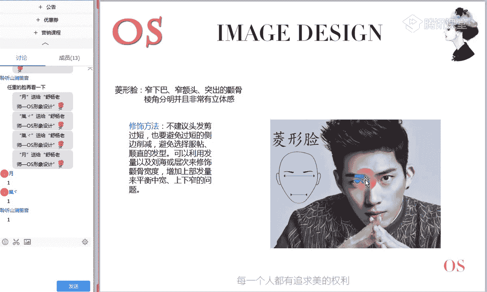
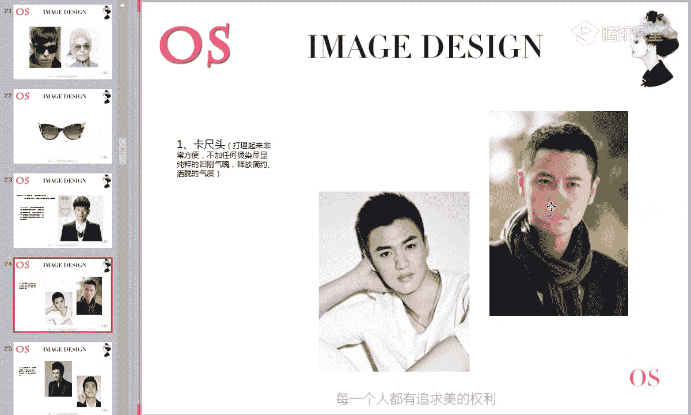
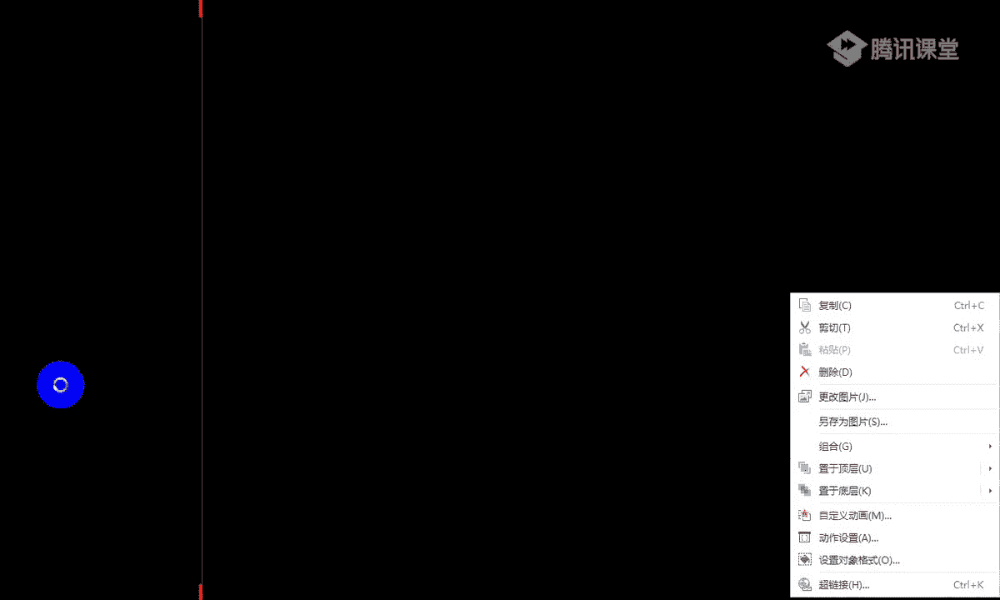

# 1、14男士个人形象班第二期（中级版）VIP课程：第2节、发型设计

好，亲爱的同学们，大家晚上好，欢迎大家来到OS男士班的课程。我是本节课的主讲讲老师舒阳。🎼那今天呢我们要讲的是我们发型板块的这样的一个知识啊。大家想想看，这辈子你能够允许在自己头上摆弄来摆弄去的人。

只有两个人，哪两个人呢？一位就是我们的发型师，另一位就是我们自己，对不对？那如果说发型搞不明白的话，罪魁祸首。我们也只能从这两位中去找。因此必须要明确自己跟这两位之间的关系。那为自己打理发型的模式。

应该是什么呢？应该是先自己，然后在我们的发型师，然后呢再自己其实意思就是说，你首先要找到适合自己的发型，自己了解什么适合自己是很重要的。

这样你才能够向发型师清晰明确的表述你的想法来保证你最终能有个满意的发型。然而找一个好的发型师再去呢进行这样的一个修饰。在自己的意思。🎼其实就是向你的发型师学习，如何打理你的常用发型。

掌握这样的一个方式方法、技巧、知识。也就是说知道自己哦这样的一些适合自己发质的这样的一些保养方法，每个人的发质都是不同的，找到适合自己的发质的一个保养方法，可以在很大程度上呢完美你的形象。

那这个就是我们今天这堂课程的一个意义。好，接下来呢进入我们今天的这样的一个知识点，准备好了的同学呢就快速的跟老师刷一朵鲜花。好，关于今天这样的一个课程啊。如果说我们各位男士呢有时间的话。

可以呢把家里有小镜子，可以准备一个镜子。因为我们在听课的过程中呢，可以呃看着镜子中的自己来进行这样的一个辨别，那同样的话呢，如果说唉没有小镜子的话哦，我们也可以用手机的这样的一个照相的一个功能，对不对？

我们来观察一下自己这样的一个脸型啊，因为我们会结合这样的一个每一个脸型去具体去分析，然后告诉大家这个脸型，我们应该怎么样去选择发型，所以说今天的知识呢，我们是一个一个来讲的那本节课学习的一个重点呢。

就是分为三个板块。第一个呢就是我们不同脸型的一个发型哦，先辨别自己的脸型，然后找对适合自己的这样一个发型。第二个呢就是我们不同脸型，再选择眼镜上的这样的一个哦，到底适合什么样的一个款式啊。

因为虽然说眼镜是属于我们配饰类的。因为今天会讲到我们这样的面部知识。而眼镜的选择跟你的脸型是非常非常有关系的。同样。这样的话呢跟你的场合也是有关系。第三个我们就会讲到肤色对发色的这样的一个选择。

我相信啊，我们在场有一部分同学应该是蛮喜欢染发的，对不对？如果说有喜欢染发的同学，也可以跟老师扣个一啊。那我们在染发的过程中呢，一定是要根据你的肤色，也就是说你的色彩进行来进行选择和决定。哎。

你的是冷肤色，还是说你是暖肤色，对不对？我们要去进行这样一个调整。所以这是我们本节课的三大重点。那么本节课对于大家的一个要求呢，就是掌握好自己的一个发型的一个选择和规律，也就是还有呢掌握好自己对于眼镜。

还有包括我们的发色的选择，这是我们本节课对于大家的一个要求。好，首先再分析我们各脸型。🎼之前呢大家一定要了解这样的一个面部知识，什么样的一个面部知识呢？哎。

因为这样的一个面部知识关乎到我们脸型的这样的一个判断。所以说首先我们要了解三庭五眼的一个概念啊。所以大家接下来呢要认真的听我们近视呢哦正式来进入今天的这样的一个知识点了。

第一个呢就是我们三庭是指的是什么？也就是说其实根据我们面部美学的标准呢，我们是分为这样的一个标准的三庭五眼的。而三庭的判断方法呢，是根据我们面部的这样的一个纵向线条。也就是说。

🎼从你的发际线到你的下巴细尖，是我们整个面部的一个长度，对不对？是我们脸长。那我们三庭呢其实概念就是把我们的纵向线条平均的分成三等份。正常也就是包括是标准的这样的一个三庭的话。

它的三等份是一定是一致的呃。位置在哪里呢？首先三庭的概念是上中下哦，上庭中庭和下庭上庭的位置，在发际线和我们眉头，也就是说你的这样一个眉心，从你的发际线到你的眉心是属于你的上庭，中庭的位置呢是眉心。

也就是说你的眉头到你鼻翼下缘是属于我们这样的一个中庭，而下庭它指的是从鼻翼下缘，也就是说我们唉这一条线啊，这条红横线，老师鼠标的位置。

然后一直到你的下巴间呢是属于我们的下庭标准的三庭它的三庭应该都是一致的。也就是说可能我在进行这样的一个测量的时候，我可以拿我的拇指和食指去进行比对。哎，我比对一下。

看我的发际线和我呃到我这样的一个眉头和眉心的一个距离，大概是多长。然后我顺势的移下来，然后再来测量。眉心到鼻翼下缘的一个长度。🎼然后再两笔一下圆到我们下巴间的这样的一个长度。

如果说这样的一个三个长度都是一致的话呢，就恭喜你。你的三庭是属于我们标准的一个三庭啊。而可能有一部分同学会在中庭或者说上庭或者是说下庭上会出现这样的一些。不一致哦，可能有的同学上庭会比较长。

有的同学可能上庭比较窄，而中庭和下庭会比较的长哦。那关于三庭的这样的一个位置和概念都理解同学呢快速跟老师刷一朵鲜花哦。如果还有不明白的，现在可以在公台上提出来，还有没有同学是不理解什么是三庭的。🎼好。

在理解三庭的位置的同时呢，也要对自己的三庭进行一下判断哦，看一看自己是否三庭是一致的。好。如果是说我的三庭某一个上庭也好，中庭也好，还是下庭也好，如果有不标准的话呢，我要在心里面记下来。

因为一会儿呢在重点分析我们各个脸型的时候呢，哎这是我们一个判断的一个依据。🎼好，其他同学啊如果有问题的，要大胆提出来啊。没有问题的话呢，老师就接着往下面讲了啊，要积极跟老师互动起来。

那第二个呢就是我们说到这样的一个五眼。五眼呢其实就是根据我们自身的眼睛的一个距离为标准。你自身的眼睛的一个距离呢，是从你的眼头到你的眼尾哦从眼头到眼尾是你一只眼睛的一个距离。

而五眼其实概念就是把我们的面部平视前方平视前方哦，这样的一个横向线条中呢，我们平均的分成五等份哦，一只眼睛，两只眼睛，三只眼睛平均分成五等份。如果你能够恰巧平视前方的时候。

你的眼睛哦五眼的一个距离是一致的。能够标准的容纳5只眼睛的话呢，证明你的五眼是标准的，有时候我们会出现什么样一个差错呢，就是在我们第一只也就是老师鼠标啊，算第一只，哎。

我们这一只眼睛呢就算我们的第五只眼睛啊，最右侧的。眼睛算我们第五只眼睛可能会在第一只和第五只眼睛中呢出现不一致。可能有的同学就会发现我的太阳穴会有点凹，我的颧骨会有点突出。

从而呢会显得我们第一只和第五只眼睛并不是那么饱满。也就是说第一只眼睛和第五只眼睛呢相对来说比较的窄。所以说唉如果你的第一只眼睛和第五只眼睛相对来说窄的话呢，你的五眼就是存在这样的一个缺陷的啊。

不属于我们标准的五眼，明白吗？啊，这是我们三庭五眼的一个概念啊，快速的跟大家进行这样的一个分析。所以说呢大家来对照一下自己来看一看自己的太阳穴是否是饱满的，是不是我们平视镜子啊，不要去侧着去进行测量。

而是平视前方就可以了，把你的头呢摆正啊，面部呢冲着镜子，然后来观察一下自己第一只和第五只眼睛是否真的能够容纳你自己一只眼睛的一个距离哦。好，关于我们的三庭和五眼，大家还有没有什么问题啊。

没有任何问题的话呢，再次跟老师刷朵鲜花。好，稍等哦。🎼好，说完了我们的三庭五眼。接下来呢我们就先了解我们爹M妈给了我们一张什么样的脸。常见的脸型呢是分为这样的一个7种啊。

我们一种一种来了解大家结合老师对于各脸型的这样的一个分析，结合对于各脸型的一个分析，然后呢相对应的找到自己所适合的脸型哦。嗯，没有什么。好，刚才啊因为我们这边把。大家的这样的一个公台的讨论也录进去。

而这边的。老师这边不太好移啊，所以说不小心点到了。嗯，好，我们接着来讲啊。🎼接下来呢重点的分析我们常见的7种脸型。首先从我们最标准的，也就是说我们男性中最完美的脸型呃，椭圆形脸来开始啊。

其实椭圆形的脸呢又称之为我们的鹅蛋脸，但大家一定不要把我们之前在生活中经常来形容脸型的一个关键词呢？来形容我们的椭圆形的脸是什么样的关键词呢？就是我们经常会说到瓜子脸，对不对？

瓜子脸它不等同于椭圆形的脸，不等同于鹅蛋脸啊，大家一定要记住，瓜子脸是瓜子脸，而我们的椭圆形的脸，也就是鹅蛋脸是鹅蛋脸，这个两这两种是不同的脸型啊，而这种椭圆形的脸呢是因为它比较的标准，对不对？

而且它的三庭五眼也是标准的。如果说我们在场的同学中你的三庭五眼是标准的，而且你整个脸型啊，我们可以看到整个脸型的外轮廓，整个脸型的外轮廓线条是匀称柔和的。我们来看一下啊，整个线条的一个。

🎼流畅度以及它的匀称度，还有包括它是相对来说是柔和的。就像我们这样的一个鹅蛋一样啊，大家应该大部分同学都是见过鹅蛋的，或者是说我们也称之为呃利用其他的鸡蛋来形容也是可以的。

大家对于鹅蛋脸的外轮廓有没有什么不理解的地方啊。如果说有不理解的，可以快速跟老师呢扣个一。🎼为什么说让大家不要把鹅蛋脸和我们的这样的一个瓜子的脸也称之为我们的心形脸去搞混淆啊。

这也是称之为我们这样一个倒三角的脸。我在这里首先先跟大家梳理一下心型脸和鹅蛋脸的一个概念，不要把两者之间搞混淆哦。心型脸的话，它是。宽的额头对不对？他的额头会比较的宽，那包括呢他的下巴是比较尖的。

而且你会发现整个面部线条来说并没有我们的鹅蛋脸那么的柔和啊，那么的圆润。但是我们的鹅蛋脸的话，我们可以看到，唉，像我们的权志龙也好，还有包括呢像我们的马天宇也好。

这个都是我们标准的鹅蛋型的脸型的一个男明星的一个代表，大家可以看到整个面部的一个线条相对应的来跟我们的心型脸的一个面部的线条来做对比，尤其是下巴这一块，大家能理解吗？啊，理解同学呢跟老师扣个一。

这个就是怎么样去辨别他的脸型中到底是鹅蛋脸还是我们的心形脸。因为有的同学会发现唉心形脸很多也有三庭五眼比较标准的，对不对？但是呢我们要去从整个面部的一个外轮廓来进行分别哦。

我会发现你会我们来看到椭圆形的脸，整个腮帮的位置，它是相。相对来说饱满，而且线条是呈现这样的一个非常好的一个弧度的，对不对？但是我们的心型脸的话呢，唉它感觉你会感觉它是有一个角度的，而且它会过肩。啊。

只有两位同学跟老师扣1啊，还有没有什么不明白的那如果说对于心型脸和鹅蛋脸的一个整个面部的一个外轮廓，还有不理解的同学呢，现在把问题提在公台上。如果没有的话，快速跟老师扣1啊，我们接着来讲重点啊。

讲重点来讲我们鹅蛋脸的一些修饰。以及他在选择发型上面的一些调整。好，鹅蛋脸的话呢，它也是因为它三庭五眼比较标准，所以说它基本上是符合我们面部的这样的一个美学标准的。它是一个非常非常完美的脸型。

所以说如果我们在场的各位男士，你拥有一张鹅蛋脸的话，那真的是太好了。因为你会发现好多发型基本上都是适合的。而且能够达到很和谐的一个效果。所以说呢我们可以看到，即使你想要留刘海OK没有任何问题，对不对？

嗯，就拿我们这位男明星啊，马天宇来做参考对象。那包括你想去进行侧分也是可以的，侧分后梳同样没有任何问题，还有包括呢你想大胆的尝试中分也好，板寸也好等等啊，都是没有任何问题的。也就是说因为你的脸型。

你的三庭五眼的一个优势。所以说任何发型你都可以去进行这样的一个驾驭。好，关于我们这样的一个椭圆形的脸，在选择发型上呢，老师就不做多的说了啊。我们记住一个重点，就是因为它是最标准的脸型。

所以说呢你只要记住怎么样去辨别鹅蛋脸，哎，知道自己是否是鹅蛋脸。如果你是的话，你可以随着你自己的爱好呢，去尽情的哎在你的头上做文章。那同样呢接下来呢说完这样的一个发型啊。

我们就来看看鹅蛋型的脸在选择眼镜的时候，它有什么样的一些要求，其实也是一样的，跟发型的这样一个腾等的道理，你也可以尽情的去凹造型，整体来说呢，椭圆形的眼镜框会最适合你。

当然啊你也可以去选择一些稍微偏方一点的，或者是说呢哎比较圆一点的都是可以的，整体来说全部都OK因为脸型的优势在这里啊，关于鹅蛋型的脸，大家还有没有什么疑问啊，因为鹅蛋型的脸呢是一个非常有优势的脸型。

所以呢具体发型上的一些修饰。老师就不做。多的一个介绍了。还有没有什么问题啊？如果没有任何问题呢，快速再次跟老师刷朵鲜花啊，不管是近视眼镜也好，还是我们的墨镜也好，可以根据自己的爱好，随心所欲的。

尽情的去凹造型，包括发型也是一样的。哦，说完了我们的椭圆形的脸呢，顺势就来说一下心型脸。因为大家都知道了，椭圆形的脸和心形脸的这样的一个辨别方法。也就是说心形脸也等同于我们的倒三角脸型哦。

等同于倒三角脸型。那他的特点呢就是我们的额头会比较的宽，你就像范冰冰哦，女生里面对不对？那男生里面其实陈伟霆也是一个标准的心型脸哦，额头会比较的宽，比较的瘪一点。但是他的一个。特点就是下巴会比较的窄。

比较尖啊，我们可以看到从我们这样的一个面部的。外轮廓线条图也好，还是拿到我们真人来说，都是一样的。所以说这是我们的心形脸的一个特征。那如果说哎刚才早一点进课堂的，听到老师说到了鹅单脸和心形脸。

应该是对于心形脸和鹅单脸的一个区别是没有任何问题的。下巴是尖的，额头是宽的啊，它也没有什么太阳穴不饱满呀，或者是说颧骨突的一个问题，它整体来说就是上半身会偏宽啊，上半部分偏宽。

而下半部分比较的瘦比较的尖啊，窄尖。那在修饰的时候呢，我们不要去选择一些过短的发型。如果你选择一些太短的发型的话，我们在视觉上都会集中到上面，对不对？集中到上面。所以说呢我们可以尽量在选择发型的时候呢。

留一定的长度啊，可以去选择刘海。同样如果你不想要刘海也是OK的。但是你不想要刘海，要刘海的话呢，我们就一定要注意到整体的一个饱满度。所以说第一个呢推荐我们。

🎼这样的一个新型脸的第一款发型呢就是旁分的油头哦，大家可以看到，即使是旁分的油头的话呢，我们整体的发量是不能够少的啊，整体的发量是不能够少的。也就是说上面可以选择长一点的，上半部分的发量要长一点。

但是侧边和我们的后面呢尽量让理发师给你剪短哦，这是非常适合我们的一些型男的整体的一个发型。如果说哎你是在这样的一些正式的职业场合，那你可以去挑选类似于这样的一款发型。那如果说你的年纪偏小。哎。

老师我的正我的工作场合没有那么的严谨，我也不想要去选择这样的一个油头的话呢，我们可以来选择带刘海的这样的一个发型。但是在选择带刘海的发型的时候呢，大家一定要记得哦。

因为带刘海的发型你一定会保证两侧的这样的一个长度，对不对？而两侧的长度长了，而头顶的长度又长的时候，而你的刘海不够长，就会导致呢。🎼像我们刚才一开始所说的。

会导致把整个视觉都放在我们的面部的一个上半部分。所以呢在选择带刘海的发型的时候，我们心型脸的同学一定要选择长一点的刘海。其实这个就是在发型里面起到非常好的这样的一个遮盖的一个效果，起到遮挡的一个效果。

明白吗？啊，关于我们这两款发型上的一个选择，大家还有没有什么疑问啊？没有疑问，同学呢跟老师扣个一。🎼那除了我们要知道该选择什么样的一个发型。同样的话，各位同学在听课的过程中也要懂得去进行辨表。

你要看你自己是否是新型脸，我们一个一个来进行排出。所以说你首先要明白你的三庭五眼的一个缺优缺点，对不对？然后呢，我们再来看整个面部的这样的一个外轮廓。好，所以说新青脸的话呢，我们给大家推荐两款发型。

第一个就是成熟一点的旁风油头。那第二个呢就是我们唉阳光一点哦，青春一点的这样的一个带刘海的造型。但是在选择刘海的时候呢，你一定要跟理发师讲清楚啊，刘海的长度一定要够长。

那还有呢就是这样的一些带刘海的发型的话，很难去剪出层次感。所以说其实呢在选择发型师的时候，你也要跟它交涉清楚，让它给你做造型的时候，一定要把你的层次啊，哎。

也就是说你的长短不一的这样的一个层次感呢营造出来。我们可以看到这样的一款长刘海的造型，你能够清楚的感受到整体发型的这样一个纹理，以及整体发型的这样的一个层次，对不对？长短不一的一个视觉感受。

因为长短不一的时候，有这样一个层次，才能够去营造整体发型的一个生气啊和空气感。不然的话就非常的死，而且也会非常的贴。

好，这个是我们的心型脸在选择发型上面这两款发型。那接下来呢我们说到眼镜啊，说到心型脸在选择眼镜的一个挑选。因为它的额头比较的宽偏扁，对不对？所以而且它的下巴又比较的尖，整个呈现这样的一个三角形啊。

倒的三角形，所以我们在选择眼镜的时候呢，一定要给你的面部形成纵向线条。因为它上半部分是往横向线条去进行拉伸的。所以说我们在佩戴眼镜的时候呢，眼镜框的整体的走向，要是纵向的。

有没有不明白纵向线条的一个概念的，全部都明白同学跟老师刷的鲜花，所以说这个就是为什么说心型脸的同学在选择眼镜的时候要选择纵向线条。我们可以看到，就像我们如图中这样的一副眼镜啊，它的整体的视觉的宽度。

还有包括它的一个长度，对不对？哎，我们可以看到它整体来说是往纵向线条在拉长拉伸的。而不是说像我们有一些眼睛框呢啊是属于横向走的。也就是说它会比较的偏宽偏长，明白吗？还有没有什么不理解的？

如果不理解同学可以跟老师扣个2，老师再详细的介绍一下。😡，都清楚同学快速跟老师刷的鲜花。🎼要选择这样的一个纵向线条的眼镜，是为了去弥补它的宽扁的额头哦，也就是说上半部分宽扁的这样的一个问题。

所以说在佩戴眼镜的时候呢，我们要尽量去选择这样的一些往纵向线条去走的啊，而且的话避免我们的眼镜框上面有一些装饰啊，不要去选择有装饰的。我们会发现有一些眼镜。🎼啊，老师大概的呢画一下哦。

有一些眼镜你会发现呢它会在我们这样的一个上角度这里会有一些设计感，对不对？唉，它会有一些设计感。也就是说。上半部分会偏宽，往横向去走，而下半部分会比较窄。

但是因为我们的心型脸本身它的整体脸型就是上宽下窄。所以说像这类型的眼镜，我们绝对不要去碰啊，绝对不要去碰，避免上半部分有任何的装饰细节。好，我们再来看一下哦，再来看一下。

这个都是我们整体的心型脸适合的去选择一些椭圆形的，或者是说呢哎选择我们这样的一些哦圆形眼镜也是OK的。但是千万不要过圆啊，不要过圆，椭圆形是最佳的那包括我们在选择墨镜也是一样的。墨镜的挑选选择上面呢。

我们也要是往纵向线条去进行发展的。好，这个就是我们心星脸呢在选择眼镜。不管是近视眼镜也好，还是我们这样的一些墨镜也好，都要以椭圆形以及呢整体线条往纵向线条去进行发展，不要去选择一些椭圆的款式。

但是椭圆的款式是往横向去走的，是不适合心型脸的。这是我们两个重点哦，再选择眼镜上面，心形脸的两个重点，大家一定要记清楚。我不知道我们在场的同学有没有是心型脸的。如果说唉判断完自己是符合心型脸的同学。

也可以跟老师扣个1啊。那如果对于新型脸呢，大家都没有任何疑问的话呢，再次跟老师刷朵鲜花。关于发型上的选择和调整，以及在选择眼睛上面的两个重点的知识点，大家都记清楚了，都没有疑问的，快速跟老师刷朵鲜花。

好，一定要对自我去进行一个判断，别到时候老师7个脸型都说完了，然后我还蒙着还蒙着，我不知道我自己是什么样的一个脸型啊。好，接下来呢我们就看到长脸型哦，长脸型呢它的一个特征就是高的前额，额头会比较宽。

但当然不是绝对的哦。因为有的长脸型的同学呢，它是额头偏窄，而中庭和下庭会比较长，中庭和下庭比较长，这是我们长脸型，那同样还有的长脸型是什么呢？老师我作为这样的一个脸型来说，我的三庭是标准的。

也就是说我的上庭中庭下庭的距离是一致的。但是整体来说呢，我的脸比较的窄比较的长啊，那你也是属于长脸型，也就是说不是绝对的说长脸型的三庭不标准，也有三标准的这样的一个三庭，但是呢它整体的特征。

除了额头高也好，或者是说中庭下庭长也好，或者说三庭都比较长也好。它还有一个特征就是脸比较的窄啊，这是我们长脸型的第二个特征。记住啊记住啊，所以说你当你看到对方或者是说你看你自己。

你发现你整个脸比较的瘦啊比较的窄。但是在视觉上又很长的时候呢啊你不用犹豫，我们一定是把这样的一个脸型划分到我们的长脸型里面。那在做造型的时候呢，我们就一定要懂得去运用刘海和发型的厚度来进行修饰啊。

那包括老师在讲脸型的判断的时候，大家有任何问题，一定要记得及时提出来。而老师找的这样的一个首张页面的这样的一个图片，都是我们典型的长脸型代表，比如说像这位拓普，对不对？

最近的话也是他的新闻闹得会沸沸扬扬的。除了拓扑以外呢，还有包括我们的胡歌，他其实也是属于长脸型，也是属于长脸型。好，我们接着来看呢，怎么样去利用刘海和发型的厚度来进行修饰。

第一个呢就是我们可以去选择这样的一些纹理感啊，蓬松感强的这样的一些参差的刘海来进行修饰。长脸型同学千万别去留一些哦过期的这样的一些刘海。我们要去选择参差不齐的。有这样的一些空气感碎发感的这样的一个刘海。

因为加上刘海的话，其实可以在视觉上呢立马显脸小的作用。因为我们把额头进行了修饰，不仅修饰了你的上庭，还修饰了你的中庭的一部分，对不对？所以说我们可以去利用刘海显脸小，尤其的话呢。

在这里老师要强调一个重点，就是如果你作为一个长脸型，而你的身高哦，你的身高不是非常高的话，这样只适合年轻人吧，啊，我们有很多款发型啊，不要着急。🎼如果你的身材比较的瘦啊。

我们就不适合呢过于一些厚重的哦长的这样的一个发型。也就是说，如果你作为一个长脸型，你的身材比较高，你可以视觉上选择像我们图一，类似于这样的一些偏长一点的，厚重一点的。但如果说你的身材版比较的小的话。

我们就尽量要选择一些短的啊，尽量选择一些短的，包括像鬓角，我们要修的短一点，要让自己整体向上去走，整体向上走。这是第一个就是制造纹理感啊，纹理感参差感哦，整体的一个。刘海。那还有呢就是我们要知道的。

为什么说这样的一个参差非常的重要？也就是说老师所说的这样的一个层次。你就像很多长的一些刘海，当你的整体发型师没有跟你剪出这样的一个层次感的时候，我们就会发现非常贴合你的头，对不对？

所以就整体来说会显得比较的死板。但如果说你剪出一些层次的时候呢，我们就会立马不一样啊，所以在这里再次的强调长脸型在选择刘海的时候。

层次对于我们啊这位男士来说也是非常重要的那第二个呢就是我们除了去选择一些长一点的刘海啊，两侧偏长一点的发型以外呢，我们还可以去选择朋克飞机头啊，朋克飞机头。而这款发型的话。

我们也可以随着自己的造型来进行改变。如果说比如说我在这样的一些休闲场合，我可以把刘海放下来，对不对？把刘海放下来的话呢，非常的温暖阳光，对不对？那我把刘海梳上去的时候呢。🎼就比较的有气质，有个性哦。

会更适合这样的一些职业场合。相对来说一些年轻一点。比如说30岁左右的这样的一些男士也好，或者说20岁左右的这样的一些男士也好，我们都可以去选择这样的一些朋克飞机头。但这里要强调一个就是鬓角的地方啊。

我们要留的短一点。然后刘海的部位呢，我们要留的长一点，刘海要留的长一点哦，鬓角要留的短一点。就是我们在选择朋克飞机头的时候，跟其他的一些朋克飞机头的一个区别。因为有的朋克飞机头的话呢。

它跟我们这样的一个长脸型，在选择朋克飞机头的时候，要求是不一样的。要记住，长脸型选择朋克飞机头，我们要选择并角略短，刘海处略长的这样的一款造型。🎼好，唉，有同学说到头发向上梳会不会显得头更长吗？哦。

我会讲到下一个知识点哦，会讲到的那关于有同学说到的这样的一个适合年轻人，我们也可以，如果年纪比较长一点的，我们可以去选择旁分的油头，那其实像不管选择飞机头向上梳也好，还是说我们选择旁分油头也好。

我相信一定有同学有点好奇，就是我本身脸就长，那你再给我的发型往上梳了，会不会显得我的脸会更长呢？啊，有这样的一些疑问的同学可以跟老师扣个一啊，有疑问是非常好的，也就是说我们发现了这样的一个问题，对不对？

也就是说我们在上课的过程中，我们在思考。那在这里呢老师跟大家分析一下，其实这就是一个反平衡的一个效果。因为我说到了长脸型的发型，我们一定要注重好两侧以及头顶的这样的一个长度，对不对？

两侧和头顶的一个长度。当我们的长度够饱满的时候，其实在视觉上反而会。显衬的你的脸会偏短，大家能理解吗？如果说我们的长脸型长脸型的同学去留一个板寸，其实在视觉上我看到的大部分是你的这样的一个面部的。

也就是说从你的发际线到你的下巴间这样的一个面部的长度。但如果说我去留旁分油头也好，还是留这样的一个飞机朋磕头也好，我再增加我脸部长度的同时，其实它会反衬出你的脸的这样的一个面积，理解了吗？

反平衡的一个效果啊，也就是说反平衡。好，理解同学呢跟老师扣个1啊，所以说不用去担心长脸型的同学会因为这样的一个油头，导致我们视觉上会显得脸长不会啊。因为我们注重好了头顶的整体的一个发亮。

所以说呢在视觉上其实会映衬出我们的脸会没有那么的长，不会说显得那么的长，包括我们可以看到胡歌作为一个长脸型的同学也好，还是说哎我们的拓谱啊。还是我们的拓扑，哎，你去选择后梳的发型也好。

其实会比我们反而去留一些类似于这样的一些发型，在视觉上会更好。我们可以来对比一下，我们可以看到这款发型其实会显得自己的脸很长，我们能够感受出来，对不对？但是我们去进行后梳这样的一些杯头。

还有包括呢哎我们像朋克头上上抓也好，其实就是一个反平衡的那个效果。因为当你头顶的发量够的时候，其实反而映衬出你的脸部的这样的一个长度，相对来说会偏窄一点。会偏短一点哦，所以说不用担心这样的一个问题。

🎼好了，这个就是我们三款这样的一个造型啊，三款造型。第一个就是我们的刘海啊，刘海和穿衣服一样，理解，没有连贯性啊，也可以哦。好，我们看到这里啊，第一个就是我们制造纹理感，对不对？

然后第二个呢就是我们去选择朋克飞弃头。那第三个呢就是选择油头。那说到油头的话呢，其实你会发现除了哦等老师把整个课程讲完之后，你会发现除了我们的长脸型，适合旁风油头以外呢，还有其他的。

比如说像我们的方形脸，也是适合旁风油头的。在这里呢老师跟大家强调一下呃，各位同学一定要记住哦，古典型和浪漫型的男士，对于旁风油头来说是一个首选。也就是说如果你适合你作为这样的一个脸型，你适合油头的。

而你的风格又是古典型和浪漫型的，你就选择油头造型非常非常适合你。因为你就像浪漫风格，它是要表现光泽感的浪漫风格的人，在选择服装的时候都要选择一些有光泽感的。在第一节课老师有举浪漫风格的服装给大家看哦。

那还有古典型的话，我们要去表达自己的严谨度哦，这样的一个整体的。🎼气场，所以说油头无非也是去增加你的整体的严谨和气场的一个非常好的一个选择。大家理解吗？所以说如果你的造型中适合蓬风油头。

而你的风格又是古典型和浪漫型的话，我们首选首选。🎼啊，这个就是我们长脸型在选择发型上面啊所适合的。接下来呢我们就来说一说眼镜啊，接下来就说一下眼镜。眼镜的话呢。

我们可以看到这是长脸型的男士在选择宽边眼镜和窄边眼镜的一个对比。我们可以从图片中明显的感受出来啊。当我们选择窄的时候，其实无意无意中会显得你的中庭和下庭的部分啊，所显露的面积会更大。

所以说在视觉上呢就会显得脸会更加的长。所以长脸型的同学在选择眼镜也好，墨镜也好，我们都要去选择一些相对来说宽一点的大一点的眼镜框，唉，对于你的下半部分呢来进行遮挡。🎼这是我们第一个。

那第二个呢就是要避免这样的一些异形镜框啊。因为异形镜框的话，我们可以看到它的组上面对不对？左边和右边的一个角度呢，它是上扬的，所以说它会显得你的中庭会更加的长。有时候长脸型的同学啊。

可能我们脸比较窄的同时，为什么在视觉上会显得脸非常的长，也是因为你的三庭部分不标准而带来的。所以说我们不要去再去制造这样的一些中庭过长，下庭过长的一个视觉印象。而我们去戴一些异形眼镜的话。

无无疑中啊就会显得你的中庭会更加的长。所以呢异形的这样的一个眼镜框是不适合哦不适合我们长脸型的，而长脸型同学戴墨镜的时候也是一样的。你可以去选择这样的一些框边的，稍微偏方一点的也好。

或者是说稍微偏圆一点的也好，都是OK的。也就是说眼镜框一定要够大，一定要够大哦。好，这个就是我们长脸型在选择。发型还有包括眼镜上面要注意的两大知识。大家还有没有什么不理解的啊？

现在一定要对自己去做一个自我的判断，要观察一下自己是什么样的一个脸型哦。然后充分的去理解自己在选择发型上我要选择哪一款，以及呢我要在选择眼镜的时候选择哪种类型的，还有没有任何问题啊？没有任何问题。

同学呢再次跟老师刷的鲜花。你问。在这。🎼好，接下来呢我们就说到方形脸啊，方形脸的特征是下面比较宽，对不对？下颚的部分会比较的宽大，而且呢整个脸型来说，外轮廓我们可以看到整个面部的外轮廓。

它的棱角是过于分明的。就像比如说它的腮帮的位置会有一个角度会有一个槟榔角，所以说它的棱角整体来说是比较分明的。比如说像张杰呀，还有包括我们的人重啊，这个都是属于我们的方脸型都是属于方脸型。

第一个就是下颚比较宽大，我们可以看到下巴的部分会比较的宽大腮帮的位置，不仅宽大的同时呢，它是有角度的。我们有的人有的同学他的整体的。下半部分它比较的圆润，但是方形脸的话。

它的下半部分是有这样的一个角度的，大家能理解吗？理解同学跟老师扣个一啊，所以说是有这样的一个直角，或者是说我们会有一个哦更大一点的，对不对？这样的一个角度。看到老师鼠标的一个位置。

所以说大家千万不要再去把方形脸和我们的圆形脸呢搞混淆哦。圆形脸的同学他的脸也是比较的宽，比较的大，对不对？但是呢它没有棱棱角角，不会像我们的方形脸，棱角过于分明，而我们方形脸，它是棱角过于方明的。

我们比如说在看到圆形脸的一个面部的一个特征。整个面部来说，我们可以看到王祖蓝也好，还有包括我们的张大大也好，哎，包括我们这样的一个男二号叫老师突然不记得他的一个名字了，他也是属于这样的一个圆形脸啊。

整个面部下方的位置，他是比较圆润的线条啊，大的同时，他的线条是柔和圆润的。但是我们方形脸呢。大家要知道方形脸的同学是比较宽，它是有这样的一个棱角的啊，整体像就像我们所说的这样的一个国字脸啊。

所以大家不要把方形脸和我们的圆形脸搞混淆。但是有时候我们会发现啊有一部分方形脸和我们的圆形脸同学呢，它并不是那么的分明，对不对？就是比如说它是一个结合的脸型，它没有我们标准的方形脸这么的棱角分明。

但是它也不会像我们的圆形脸啊，一条来说相对比较的圆润，比较的柔和。🎼好，这个是我们的方形脸啊，首先要明白你是否是方形脸，而且方形脸的话，它没有不存在。比如说太阳穴不饱满呀。

或者是说颧骨高的这样的一个问题啊，整体线条来说就像一个四四方方的一个视觉感受啊，四四方方的一个视觉感受。所以说呢我们没有无眼不标准的一个问题啊，记住啊。

方形脸不存在呃太阳穴凹或者是说哎颧骨突出的一个问题，它整体线条是饱满的，整体线条是饱满的。而后我们这样的一个方形脸的男士的话呢，长相上就比较的阳刚，是不是我们可以看到人正也是长相就是一种比较正派的啊。

阳刚之气。所以说我们在选择发型的时候呢，可以去选择一些利落的短发，不要选择一些过长，或者是说你去采用真中分等这样的一些过于厚重的发型。另外的话呢我们可以把鬓角的地方剪短一点啊，如果说你加了鬓角的话。

我们会发现鬓角它也是有。厚度的对不对？它会显得你的脸会更宽。所以说我们把鬓角剪短的话呢，可以缩小脸的这样的一个视觉的一个宽度。🎼那我们就具体看呢它所适合的这样的一个脸型啊。

第一个呢就是我们可以去选择卡尺头啊，像我们方形脸的同学剪这样的一个卡尺头，也就是说俗称的板寸是非常非常OK的啊，打理起来也是最方便的。如果说我作为一个方形脸啊，我对于发型来说没有太多的一些要求的话。

我想简单一点啊，又能够凸显我整体的一个气质的话，那你就选择卡尺头，这是最容易的啊，最容易的。🎼好，第二个呢就是我们可以选择头顶上抓哦，为什么说要头顶来上抓呢？唉。

其实头顶上抓是来增加我们脸部的一个视觉的一个长度，增加脸部视觉的一个长度。那第二个呢就是我们侧后，也就是说侧面和后面的头发一定要剪短，有一些上抓的头发啊，就比如说我们菱形脸在选择上抓发型的时候。

我们两侧的头发要厚一点。因为它本身额头的部分就不够饱满，对不对？但是我们方形脸的同学额头已经很饱满了，它没有任何的一些缺陷问题。比如说太阳穴凹的一些问题。

所以说呢我们不要再去利用头发的厚度来加强你脸脸部的这样的一个宽度，所以侧后一定要把它修短，上面可以来上抓哦，而且方形脸的同学我是不建议留刘海的。因为你留了刘海的话会反而衬着你的脸会更方。

而且也会显你的脸短，理解吗？哦，所以说不要去留刘海啊，有时候刘海一留起来就不够洋气了，就会有点土。而且会显得你的脸会更加方，这是我们方形脸第二个发型要选择的，可以选择头顶上抓，但是两边和后面一定要剪短。

那第三个呢就是油头哦，这样的一个侧后。油头非常适合我们。当然你在选择油头的时候，我们可以看到长脸型选择油头呢，我们两侧还要一定要有一个这样的一个饱满度，有要有一个长度和厚度，对不对？但是方形脸。

在选择油头的时候，我们就一定要记住呢，把侧面同样要剪短，头顶留长就可以了。啊，我们利用这样的一个发型去搭配正装的话，非常的帅气啊。所以说如果你是一个方形脸，你是古典风格，那这款发型就再适合你不过了。

🎼好，这个是我们方形脸呢在挑选发型上的这三种最佳的一个选择。大家还有没有什么疑问啊？有疑问的话可以提出来啊。然后要记得去观察自己啊，我们在场的如果是方形脸的同学呢，从这三款发型中你可以任意去采取。

但是如果说你是方形脸，而且你还是我们的古典或者说浪漫风格的话呢，你最好是选择第三款，会更加增加你的整体的气质。好了，我们就接下来呢看到我们所适合的这样的一个眼镜啊。唉。

我们可能有很多同学之前有了解过的话呢，就有听到过，包括很多书上所说的，就是哎我们要反着去进行选择，跟脸型去反着去选择。比如说你的脸比较的方，我们就选择适合圆的，对不对？如果我的脸比较圆呢。

我就适合去戴方的，其实道理是对的。但是在这里我要强调一个呢，就是一定要注意不能矫往过正。什么是矫往过正的。就是如果你哦太去选择这样的一个太注方和圆的这样的一个比重的话呢，我们会发现因为你戴的过圆的话。

会反而显得你的脸会更方，反而会衬托的你的脸会更方，你的眼睛会更圆，对不对？所以说我们适当就好了。所以方脸型的同学呢，你在挑选眼镜的时候，你不要去挑选方的，你也不要挑选过圆的。

我们去选择一些整体呈扁圆状态的。比如说像椭圆形的。或者是说方中带一点圆的这样的一些眼镜框，都是非常适合我们的。因为我们整个线条来说呃比较的直，对不对？所以说我们在选择眼镜的时候呢。

去选择一些柔和一点的线条来中和整个面部的外轮廓。那另外的话呢就是我们方形脸的同学呢？不管你是戴近视眼镜也好，还是说戴我们的墨镜也好，你可以多去选择金属。镜框的，因为金属镜框的话，没有我们这样的一些。

普通镜框的这么的生硬哦，所以说它会更加的。相对来说比较的薄，会更符合你这样的一个脸型。🎼那包括在戴一些这样的一个近视眼镜的时候，我们可以去选择一些半宽的这样一个眼镜框啊，比较的适合。

但是这种半宽的眼镜框的话非常的挑人呢。所以说大家在选择这样的一个半框的眼镜框的时候呢，最好是去实体实体店去进行试戴啊，千万不要在网上去选购。好，墨镜的选择也是同等的道理。好。

大家关于方脸型还有没有什么疑问啊，有没有疑问？没有任何疑问的话呢，再次跟老师刷朵鲜花。🎼好，刚才说的是我们的方形脸啊，接下来呢我们就来说一下圆脸，圆脸型和方形脸一定要懂得去进行区分啊。

因为圆脸型它的整个面部外轮廓来说是没有任何角度的，没有任何的突出线条，或者是说任何的凹感哦。比如说我们太阳穴不够饱满的问题，它都没有啊。方形脸也是一样的。但是方形脸是有角度的，它是有突出的线条。

就比如说唉腮帮的位置，对不对？它是会有一个呃棱棱角角的一个视觉感受。但是我们圆形脸的话，整体线条来说是柔和的哦，是圆的偏圆的一个状态。所以呢圆形脸的人不管是男生也好，女生也好，给人的感觉就是比较亲切。

而且呢非常的显小啊，有这样的一个呆板的印象。所以呢我们因为这样的一个。🎼自身因素的问题在选择发型的时候呢，我们就要设计的稍微老成一点，或者设计的稍微呢个性一点啊，尤其是在工作场合。

如果你给人的视觉印象比较的。🎼幼稚的话，我们就会感觉这个人不太可靠，对不对？所以说在职业场合中，作为圆型点的男士呢，我们一定要去塑造老陈的一个视觉印象。那在发型上面呢，首先我们就要注意呢头顶的发亮。

🎼其实把头顶的发量拉长一点呢，也是来去显你的长度。因为你跟长脸型同学不一样，你是偏宽，而且你还比较的短和圆，对不对？所以说你利用发量呢可以去拉长。因为毕竟你的面部的整体面积只有这么大。

而长脸型的同学面积比较长。而我们选择长一点的刘海，可以去反平衡。所以说圆形脸的同学同样头顶的发量也要够长来增加你整个面部的视觉长度。而且的话呢这样的一个长的面呃，长的这样的一个刘海高度的话。

还能够显高哦，一定是可以去显高的。不要去选择一些太短的发型。比如说我作为一个圆脸型，哎，我把整个发型选择一个板寸啊等等，那是不适合我们的。所以第一个呢我们可以去选择这样的一些上抓的机关发型啊。

利用发型来拉长你的脸型，那侧后方呢我们也可以剪得短一点啊，上。🎼抓这样的一个激光发型。🎼第二个呢就是我们可以去挑选刘海。但是刘海的话呢一定要进行这样的一个侧分啊，最好是进行侧分。

而且刘海的话要剪出纹理感啊，剪出层次感。而且我们会发现像这样的一些带刘海的发型的话，其实蛮适合一些偏年轻一点的男士。比如说我作为一名男士来说，我有职业场合，我有休闲场合，而在休闲场合中呢。

我穿的就是比较的随性，对不对？比较的暖男大男孩的这样的一个感觉。而我在职业场合中，我要穿着比较的正式职业。所以说像这样的一个刘海的发型的话，我们也可以随着我们的心情和服装呢来进行改变。

如果我在休闲场合中也好，我在相亲的这样的一个场合啊，跟朋友看电影啊等等。那我可以把刘海放下来，对不对？但是当然把刘海放下的同时呢，我也要注意头顶的这样的一个发亮的高度啊，以及头顶的一个层次。

那如果说我在这样的一个上班场合，我穿着的服装唉，比较的正式的。时候我就可以把刘海呢捋上去，对不对？就会显得自己更加的干练。嗯，有这样的一个。整体来说哦会有这样的一个严谨感。🎼也不乏这样的一个时尚度。

🎼요즘 내 시간은널 향해해서만。ら待って。🎼啊，这个就是我们圆脸型的同学呢，在选择发型上面啊，不管你要刘海也好，不要刘海也好，整体来说你头顶的发量是不能少的，头顶的发量是一定不能够少的。気が始ま。

🎼那第二个重点就是我们的眼镜了。啊，我刚才说到了圆脸型的人要选择偏方，对不对？方脸型同学要选择偏圆啊，还是一个道理，不能矫往过正。所以说圆脸型同学呢，我们不是说越方越好，对不对？

所以说我们相对来说呢啊方偏方一点就O了，不要去选择太圆的，圆的肯定是不适合我们的会显得我们的脸会更圆更大。而我们整体的线条已经偏向于柔和了。

所以说呢我们就最好去选择一些有角度的这样的一个镜架来修饰你这样的一个脸型的一个线条突出我们的纵向感。所以我们可以去选择这样的一些偏方一点的眼镜，包括墨镜也是一样的。不管是近视眼镜也好。

还是我们的墨镜我们都要注意呢，不要去选择一些过宽的啊，什么是过宽的呢？就是我们这样的一个纵向线条过于宽的。我们可以看到有的墨镜就比较的窄。就比如说看到。🎼这三款对不对？有的墨镜比较的窄。

而有的墨镜呢就比较的宽啊。刚才我说到了这样的一个星星点，那星星脸戴眼镜的时候就要带一些宽一点的纵向线条突出的。所以呢。🎼圆形点的同学在选择眼镜的时候，一定要去选择一些偏点窄类型的这样的一些墨镜。

或者是说呢我们的近视眼镜。🎼整体的线条是要偏方的啊要偏方的。好，大家关于我们的圆形点呢，在选择发型和眼镜上面，大家还有没有什么疑问啊？如果没有任何疑问的话呢，再次跟老师刷了鲜花，有问题记得提哦。

然后千万啊再次强调，千万别到了课后之后，还不知道自己是什么样的一个脸型。情的。なし？🎼Beautiful day。好，接下来呢我们就看到这样的一个菱形脸哦，菱形脸的特征其实也非常的好辨别。

因为我们刚才知道了三庭五眼，对不对？而，五眼呢是最容易去看出这样的一个脸型的一个差异的。也就是说有的同学你会发现他的两眼的这样的一个间距哦，大概的一个距离。而当我们第一只眼睛和第五只眼睛的时候。

你就会发现哎有点窄。就比如说看我们的颈柏然，其实也是一个道理，对不对？我们可以看到哎。侧边这只眼睛，其实我们会发现他的太阳穴是偏凹的，而且他的颧骨是有点突出的。所以说井柏然也是属于我们这样的一个菱形脸。

另外的话呢，我们还有一个韩国明星，他也是属于我们这样的一个菱形脸啊，这个是叫李忠硕，对不对？

林心莲的特征呢就是。下巴比较的窄，肩，额头呢也比较的窄，我们可以看到额头不够饱满，偏窄。那同样的话太阳穴有点凹，颧骨会有点突出哦，所以大家可以来参照一下自己是否是符合菱形脸的这样的一个标准啊。

整体来说就是额头偏窄，不够饱满。而我的太阳穴又有点凹，也就是说我的五只眼睛是不均衡的。五只眼睛的一个排放是不均衡的。第一只眼睛和第五只眼睛可能相对来说比较的窄，而我的颧骨又有点突出。

整体的面部来说呢会有很多的一些棱角啊，这里一个角度内的一个角度会有很多的这样的一些角度，对不对？呃，同样的话，连体脸来说也是非常有立体感的，这是我们的菱形脸的一个判断啊，关于菱形脸的判断。

大家有没有问题，没有问题的同学跟老师扣个一。男生和女生其实都是一样的，额头窄，太阳穴凹，颧骨会有点突出，同样下巴会比较的瘦，比较的尖。没有问题的同学跟老师扣个一哦，这是我们的菱形脸。下巴会比较尖。

颧骨会有点突出哦，额头会比较的窄。只有一位同学没我的扣1啊，其他同学呢对于菱形脸的一个判断啊，有问题的同学赶紧要提出来。好，我们接着来说修饰方法哦。然后呢菱形脸的同学，因为你的额头比较的窄，对不对？

你的整体的额头不够饱满，因为你的额头不够饱满的话，其实还有一个问题就是会显得你的头会比较的尖，头会比较尖。所以在选择发型上面，我们不要剪得过短，一定要注意不要过短。另外的话呢不仅是头顶上面我们不要过短。

而且的话两侧的发型也不要去削的过短，剪的过短。因为我们如果剪的过短的话呢，就会显得你的额头会更加的窄，对不对？额头会更加窄。另外的话就是不要去选择一些服帖，顺直的发型。

包括景柏然有一次在参加我们的一个电影节啊，好像是国外的一个电影节的时候，他就选择一个长的直发，而且还是中分，所以就会显得它的整个面部的这样一个缺陷，全部都暴露出来了。尽量不要去选择一些顺直的发型。

可以利用发量以及刘海的一个层次呢来修饰我们。颧骨的一个宽度，唉，让它上半部分显宽的时候呢，能来中和我们中间比较宽的一个问题啊。因为明显脸的一个特征就是。

我们可以看到这里啊，上面比较的窄，对不对？而中间会比较的宽，下面也比较的窄。所以说我们当。在选择发型的时候，把两侧整个这样的一个头顶的发型选择饱满一点的话呢。

就可以跟它的中部宽的一个问题来进行很好的平衡来中和它。

所以第一个呢就是我们可以去选择这样的一个细上抓的机关发型。还上抓机关发型，我们在讲到方脸型的时候呢，它是适合两侧要剪短的，对不对？但是我们菱形脸，在选择上抓的发型的时候，两侧一定要留长一点。

不要剪得过短，这是第一个啊，他在选择上抓机关发型跟其他脸型再选择上抓机关发型的一个区别。所以你在选择这一款发型的时候，你跟理发师沟通的时候，一定要把老师刚才所说到这样的一些细节全部要讲清楚。

那第二个呢就是我们可以去进行用刘海来进行呢遮挡，对不对？来进行遮挡。所以说长边的刘海哦，而且这整个这一款发型的话，它的含范也是非常的足的，而且很好打理呃，打前提条件的话呢，我们就一定要注意到厚度适中。

让理发师给你把厚度剪出适中，同样要剪出这样的一个层次感。哦，因为这样的一个长边刘海，无疑是对于你修饰你的额头窄的问题啊，头顶偏尖的一个问题最好的一个方法。那第二个呢就是我们菱形脸，它的主要缺陷是在两边。

所以说你要是想留中分也是可以的。呃，男生留中分啊。好的这样的一个五官的话，留中分也是非常好看的。所以我们可以去选择这样的一个中分的刘海。菱形脸呢，因为它比较的窄。而我们所以说发型的厚度适度饱满就可以了。

注意好头顶和两侧，尤其是这样的一个两侧的一个饱满度，另外的话呢，像这样的一个中分造型的话，我们可以看到，对于这一块不够饱满的问题也进行了很好的一个填充，对不对？也进行了很好的一个填充。

所以不用担心我们去留中分，会不会把我这样的一个问题暴露出来，没有关系啊，非常适合我们菱形脸。那另外呢就是我们还可以去选择一些呃边分的刘海，我们可以去给我们的发型进行编分。如果你不喜欢中分。

我能不能编分呢？可以，但是呢同样跟我们在选择上抓发型一个道理，也就是说发量少的一边呢，我们不要剪的过短，你还是要留的长一点啊，而且这一款发型的话特别显得自己也比较稳重啊，有一个轻熟男。

如果说唉年纪在不到30岁的，我们又不想我们的风格又偏小的，对不对？风格量感偏小的，我们也可以来选择这样的一个编分的刘海啊，类似于我们途中这一款造型。🎼好，如果说你想要成熟一点的话呢。

我们也可以去选择侧分后梳啊，还是选择侧分。那侧分的话呢，我们这一块的饱满度还是要准备好啊，要一定要达到。那另外呢就是我们可以把头发呢唉梳后面把整个的面部露出来，OK没有任何问题。

因为你注重好两侧头发的一个饱满度，不能够贴涂头皮O可了啊，这是我们菱形脸的啊五大发型的一个选择。因为其实它的脸呢相对来说是比较小的。所以在选择发型上它有很多的一些优势。

🎼唯一的缺点就是额头不够饱满的一个问题。所以我们在选择发型的时候呢，就可以按照老师所说的一个重点，一定要修饰好两侧的一个发亮感，修饰好。其他问题的话，我们可以呢进行慢慢的一个修改。

那另外呢就是我们菱形脸，因为哦你的脸比较的小，而且的话你有非常多的一些线条，对不对？所以我们在选择眼镜的时候呢，要去选择一些流向流线型的这样的一个眼镜框来进行这样的一个综合。

来弥补你的一些过尖过短的一个问题。所以菱形脸同学呢，我们可以来选择一些圆形，或者是说椭圆形的一些眼镜。🎼来进行修饰，因为不要再去选择方了，因为你的脸已经有很多的一些棱棱角角了。

所以说我们就不要再去选择一些偏方的眼镜框啊，我们要去反而选择一些相对来说柔和一点的线条。比如说像图中这样的一些圆形啊，椭圆形都是可以的，墨镜也是一样的，我们去选择椭圆形的圆形的。

但是呢不管是近视眼镜也好，还是我们的墨镜也好，我们千万不要去选择一些厚框架的啊，避免框架太厚重的，就是我们第二个要注意一个重点。因为你本身脸是偏小的，而且呢我们不会说像其他，比如说圆脸型啊。

或者是说我们的方形脸，我们的脸还是有一定的量感的，而菱形脸，它整体来说脸是偏小的。所以说呢我们就不要再去选择一些太大的眼镜框，因为太大的眼镜框架在你的脸上的话，显得太过于突兀了，不不太符合。

所以说我们尽量选择呢跟你的脸型来说。🎼相对来说量感相同的。🎼啊，这是我们的菱形脸啊，关于菱形脸的辨别以及发型和眼镜的选择，大家还有没有疑问啊？没有疑问的同学呢再次跟老师刷朵鲜花哦，有问题要记得提出来哦。

课堂上课的过程中有问题及时提出来，不懂的。🎼好，接下来我们说到下一个重点，就是我们三角形的脸油字脸啊。说到油字脸，其实油字脸型在我们77种脸型来说相对来说是比较偏少的。

所以说我们很难找到一些呃明星明星肯定是很少有这种油字脸的这样的一些例子。所以我们拿到一位同学的照片呢跟大家来重点分析。因为这是一个非常典型的一个油字型的脸。

而我们很多同学很难去辨别油字型的脸和我们的方形脸，或者是说和我们这样的一个圆形脸的一个辨别方法，对不对？很难去进行区分。那我们接着以这样的一个实际图呢来进行观察，所以说你们一定要观察细致点。

不要再把油字型的脸和我们的圆形脸，或者说方形脸呢去进行混淆。其实它的一个特征，我们可以看到老师标注了一个油，对不对？其实很简单就是上面窄，下面宽，所以它的下巴部分和我们腮帮的部分呢非常的宽大啊。

甚至油的油字型。🎼它是有棱角的那有的游字型的话呢，它可能偏向于这样的一个圆和方的一个中和。那还有就是它的额头会不够的饱满，额头会偏窄，额头偏窄。还有一个问题，就是它的太阳穴会比较的凹。

大家可以看看到这个图中啊，我们可以看到一只眼睛的一个距离。而它第一只和第五只眼睛相对来说是比较窄的，明白吗？明白同学刚好扣个一啊。🎼这一个知识点能理解吗？我们可以看到。🎼有没有问题啊？

没有问题的同学跟老师扣个一哦，我们可以拿这样的一个方形脸跟大家来分享。你看你可以看到方形脸，它是从它哪怕就是说它的额角偏窄一点，对不对？这是一个额角的部分，对不对？额角偏短一点，偏窄一点。

但是它也不会有太阳穴不饱满的一个问题。它的太阳穴一定是饱满的，而我们的油字型的脸它会有额头窄的一个问题，同时它的太阳穴是偏凹的。🎼太阳穴是偏凹的。

所以说我们可以拿这一张照片和我们呃这一张照片去进行对比的话。🎼老师稍微截个图啊，稍等一下。

🎼好，又卡住了。好了，可以了。

🎼好，今天我们这个这台电脑反应有点慢。🎼哦，能能复制就复制哦，不能复制就我们就算了。所以说大家仔细来观察一下这张照片的太阳穴啊，这是一个重点。所以在判断油字型的脸和我们方形脸的一个区别的时候呢。

我们就要懂得哦去进行这样的一个。🎼懂得去进行这样的一个理解哦。他的额头是虽然有的方形脸，额头偏窄，对不对？偏窄，但是它的太阳穴整体来说是饱满的，也没有颧骨突出的一个问题。但是菱形脸的话。

它虽然说不存呃油字型的脸不存在颧骨突出，但是他的太阳穴是凹的，而且额头整体来说是偏窄的。而我们在选择发型的上面呢，也要选择一些稍长一点的发型。也就是说我们可以去利用上半部分的发型来进行修饰。

那如果说有发量不足的，我们可以去选择假发啊。如果说你需要发型的，我们可以选择假发，或者说我们去选择帽子都是可以的。就像我们男明星里面纱意，它其实不是存在脸型的一个问题。它是属于也是上半部分呃。

发量比较少。所以说它的很多头发，你会发现他有时候有头发，有时候没有头发，其实就是我们有这样的一个半半边的这样的一个就是一半的这样的一个假发啊。🎼所以在选择发型上面呢。

我们要注意好两侧以及头发头顶的这样的一个发亮感啊。不管是你去选择上抓也好，还是去流行啊，选择我们这样的一个侧分也好，都是O的。我们可以去参照我们方脸型和我们菱形脸，再选择发型上面的一个中和。

🎼方形脸和菱形脸的一个中号，因为菱形脸也同样有这样的一个上半部分窄的一个问题，对不对？好，大家关于我们的油字型的脸，在选择发型上面还有什么疑问没有啊。如果没有疑问的同学呢，跟老师快速刷抖鲜花。好。

另外的话呢，我们的。🎼油字型的脸在选择眼镜的时候呢，参照啊参照我们这样的一个方形脸啊，参照方形脸去进行选择。可以去选择椭圆形的。如果说最好的方法就是选择椭圆形的眼镜，选择椭圆形眼镜。然后呢。

眼镜框不要选择太过于厚重啊，我们可以去选择一些金属眼镜框，选择金属眼镜框会非常的适合你们。好，这个就是我们各个脸型要常见的这样的一个七大脸型的一个分析。那在场的同学都清楚自己是什么样的一个脸型了吗？哦。

清楚了的也明白自己要去进行调整的，往哪一块发型去进行选择的同学呢？跟老师扣个一。🎼好，如果说有同学在听录播的话哦，要听录播的同学，如果你对于你的脸型在判断上面还有任何问题的话。

你首先先进行自我的一个判断。你给老师几个标准。也就是说我可能估计我自己是一个方脸，或者说我估计我自己是一个圆脸。然后呢，到时候老师再来给你做一个诊断啊，告诉你你到底是什么样一个脸型。

所以首先先自我进行这样的一个诊断。好，都清楚自己是什么样的一个脸型的吗？啊，最新的录播我们会在这样的一个直播课堂里面就会有录播，它会录播，会把录播上传上去的。🎼啊，没有如果没有问题的话。

因为我们今天大部分都是高级班的同学啊，所以说如果呃男士偏少的话，或者说各位男士啊在听录录播的过程中有任何问题，先对我自己进行一个判断。然后先了解自己是属于什么样的一个发型，对不对？唉。

先了解自己是属于什么样的脸型，然后呢，你可以给老师几个选择，我会给你做一个诊断，告诉你具体应该怎么样去选择。那还有就是呢我们刚才说到的这样的一个眼镜。那在这里老师强调一下不同场合搭配眼镜的一个原则。

也就是说正式场合中，我们在选择眼镜的时候呢，我们去佩戴一些镜价较小的眼镜架比较小比较精致的。🎼款式比较精致眼镜，因为它能够去凸显你的典雅，以及呢方又方便我们去做事情，对不对？方便我们做事情啊。

比较的显得我们比较的稳重呃正式那如果说呢你是在这样的一些休闲场合，你就比如说像聚会啊，或者是怎么样的。只要是这样的一些时尚休闲场合，我们就可以随心所欲的去选择。你去选择一些稍微宽一点的呃。

粗一点的这样的眼镜框，只要是适合你的，你自己喜欢的都是可以的。但是你在我们职业场合中呢，我们在选择眼镜的时候就要选择一些细一点的，精致一点的。因为合适的眼镜的话，能够增加你脸部的一个活力啊。

能够塑造出更好的造型。而且它对于你面部的一个修饰也是有一定的帮助的这是我们的一个眼镜啊，老师跟大家强调的一个点。那接下来呢说完了我们的发型，说完了我们的眼镜，我们接着呢就说到第三个就是我们的发色。

🎼男士季型中呢分为春夏秋冬哦，而我们的春季型和我们的秋季型的男士，是属于我们暖色的肤色，属于暖色调的，属于暖色的肤色，而我们的夏季型和我们的冬季型的男士是属于冷色的肤色，对不对？

所以说第一个作为是夏季型和冬季型。也就是说你是冷色肤色的同学呢，你要去你要是想去染发的话，想要染发的话呢，我们可以去选择酒红色，或者是选择这样的一个交叉色。也就是说我们的褐色，也称之为深棕色哦。

偏深一点的这样的一个棕色。🎼还有包括我们这样的一个闷青亚麻色也是可以的。深闷青亚麻色。但是深闷青亚麻色也好，还有包括我们这样的一些交茶色也好，它有时候时间长的话，它会掉色，对不对？

那掉着掉着它就会偏暖了。所以说大家要知道，你如果要染这样的一个深棕色，或者说你要染这样的一个深闷青亚麻色的话呢，你就要定期去进行漂染，定期去进行染，不能说我一个发色可以保持很久，不可能的。

因为它洗着洗着就会掉，这是我们冷色肤色所推荐的。第一个就是酒红色，第二个就是交茶色，也就是我们的褐色。第三个就是深闷青亚麻色都是非常非常适合冷肤色同学去选择的。那暖肤色同学在选择。

发色上面我们就驾驭度就高很多了。就比如说像我们这样的一些棕色系啊，浅一点的棕也好，呃，相对来说明度居中的这样的一些棕色也好，还是说我们这样的一个亚麻色，浅的亚麻色都是非常适合我们的。对，跟女士是一样的。

如果是女士，你要染发其实也是一样的一个道理。暖肤色的同学是。春季型和秋季型的，各位同学要记住啊，暖色肤色的话就推荐棕色系列或者说亚麻色。但是冷肤色的话呢，我们可能就要比暖肤色同学在染发的时候呢。

有一点点小纠结要注意的。所以说这是我们最适合的。And你。好，关于发色的一个选择，大家还有没有什么疑问啊？🎼啊，如果没有任何疑问的话呢，再次跟老师刷一朵鲜花啊，这是我们整个今天这堂课的三个知识点哦。

没有任何疑问的同学跟老师刷一朵鲜花。其实跟大家总结一下，其实我们在选择脸型判断出来脸型之后再选择发型的时候，就是两个啊。第一个就是衬托法。我们利用两侧的头发，头顶的部分来改变你整个面部的一个轮廓。

对不对？改变嫩面部的轮廓。第二个呢就是遮盖法。如果你多了的地方，我们可以利用我们这样的一些发型来进行修饰，利用我们的刘海也好，利用我们两侧的头发呢来进行遮盖掩盖啊。所以说整体来说就是一个衬托。

一个呢遮盖。🎼发型是我们整个个人形象设计中非常重要的一个知识点，但是它也是我们的第二张脸。要记住发型对于我们男士也好，女士也好，都是非常非常重要的。为什么说他是我们的第二张脸呢。

因为它毕竟是连离我们面部最近的一个地方，就像我们呃女生会戴耳钉一样，戴耳环一样，而男生戴眼镜也好，选择发型也好，都是一样的。我们可以利用这样的一个第二张脸来修饰我们的脸型，对不对？哎。

可以来凸显你的品味，可以来增加你的身高来，包括像我们有一些同学，如果说你的整体身高不是很高的一些男士比较瘦小的。我们比如说像前卫风格的，我们在选择发型上面就可以去选择一些上抓的发型。

还有可以根据你的场合，你这样的一个穿搭风格的不同来进行改变。就像老师在刚才讲圆脸型发型的一个选择中，我们就拿一个同学来选择一款发。🎼上抓，还有包括把刘海放下来。🎼这样的一个区别，对不对？

🎼所以说它可以根据你的场合的不同呢，我们风格选择服装风格的不同来进行这样的一个调整。🎼好，发型不好呢，老师要告诉大家哦，发型不好的话，你的人也漂亮不到哪里去。因为头发它本身是非常软的，是一个软的东西。

你把它做成什么样子，它就会帮你演示成什么样的一个风景。如果说你想泛懒啊，我不想做它了，或者是说啊我。🎼不做它，你还想让他帮你去进行添色的话，那他是绝对万万做不到的。一句话就是你可以跟你的头发去玩懒惰。

但是他绝对会把你跟你呢去玩这样的一个真理。你不去打理它，它就会把你衬托的非常的糟糕。而你进行这样的一个打理之后，选择适合了，它就会让你呢更加哦发光发亮。🎼啊。

这个就是我们整个这样的一个本节课的所有知识点啊。大家对于本节课所有知识点还有没有任何问题，没有任何问题的同学呢，快速跟老师扣个一。🎼好，短头发的话更好凹造型哦。嗯，其实长发也好，短发也好。

都是非常不错的。看你怎么样去进行打理了。就像老师一开始就说到了啊，一开始就跟大家交代了，你一定要明确一定要明确你打理发型的一个模式。什么样的一个模式呢？就是你应该先自己在发型师在自己。

意思就是说你自己首先要找到适合自己的发型啊，自己了解什么适合自己是很重要的。因为你了解了之后，你才能向发型师清晰明确的去表述你的想法，来保证你最终能有一个满意的发型。如果你不能表述清楚的时候。

你会发现你发师他给你剪出来的效果，跟你想象的是完全不一样的。所以老师在讲我们每一个脸型在修饰发型的，在选择发型上面，一些修饰技巧上面，我一定会重点跟大家去强调，因为你的这样的一个不足。所以你哪里要增宽。

或者说你哪里要减弱。这第一个就是先要了解自己，你能够方便跟发型师去进行沟通啊，能够去。🎼在发型师那里能够得到非常好的一个效果。那还有就是呢我们要记住。第二个是我们要找到一个发型师，再找到一个发型师。

所以说呢一定要找一个好的发型师来进行修饰，沟通好了发型师基础条件好了，我们才能够在这样的一个前半部分呢，达到一个很好的一个效果。那发型剪好了，剪完了回去之后，你会发现大部分时间都是自己打理，对不对？

我不可能每天都跑理发店，所以说在自己的意思就是要向你的发型师，你的发型师在跟你剪的时候，在跟你抓的时候，在跟你打理的时候，你就要向他去讨教这样的一个方法。

让跟你的发型师去学习如何打理你的这样一个常用发型，掌握这样的一个方式方法啊，掌握这样一个技巧。所以说你每天去进行打理的时候，你就会轻松很多啊。不管是呃女生里面的长发和短发哦，还是男生。

我们再选择这样的发型到理是一样的，就是先自己在理发师，然后再自己。🎼呃，发现用夹板夹头发呃，一天头发就会显得很油啊哦，会有这样的一个问题啊。因为我们会加热这样的一个头发嘛。

所以说会刺激我们头皮的一个分泌啊，油脂的一个分泌。那另外就是我们还是要懂得去跟我们的理发师去讨教一些头发的保养方法。因为理发师他是专门针对这一块的，肯定要比老师更了解对于发质的这样的一些保养啊等等。

🎼好，大家对于课程中还有没有问题啊？只有一位同学跟老师扣一了啊，其他同学如果没有任何问题的话呢，快速跟老师扣个一。然后呢我们就来看一下今天的一个作业啊，今天的作业非常的简单。

第一个呢就是我我们抄写班训一次，然后就是实操。实操的话呢，就是如果你的发量够的话，你知道了你自己的这样的一个头呃脸型，对不对？然后呢，选择一款你适合的发型来进行打理。但如果说哎我的发量不够。

我可以相对应的找到一张符合自己脸型和风格的这样的一个发型，哎，提交上来都是一样的。也就是说你的发量够的话，你能够去及时改变的，你就要做到及时去改变啊。因为我们这样的一个吸收是最大的。

那如果说你的发量不够的，我们没办法马上去进行实操的，我们其实就可以去提供一张照片啊，根据自己所适合的。🎼脸型。🎼适合脸型的这样一个发型来提交上来。那第三个就是做好笔记。🎼好，我们要要进行下一次升班的。

还有包括我们男士班的同学呢，一定要记得及时去提交作业啊。你就像今天的课程啊，昨天上一节课程我们只有三位同学在交作业，那我不知道还有其他同学在干嘛啊。如果说赶不上直播的，你在听录播课程的。

你也要及时把作业呢上上传上来哦，尤其是在往后课程中，你会发现作业对你的帮助是非常大的。作业有任何问题，我们其实作业是最能够反映你的吸收能力的。而你的作业如果提交不合格的话。

老师可以直接的指出你还有哪些问题，对不对？我们可以及时的去进行修改。啊，暖肤色适合什么样的一个发色啊？哎，在这里再强调一下，就是适合我们的棕色系，适合我们这样的一些浅的亚麻色都是非常适合的。

像一般的亚麻色都是比较适合我们的暖色的。而我们冷色肤色要选择亚麻色，你就一定要选选择深闷青亚麻色啊，我们可以看到整个发色来说它是偏冷基调的。而这样的一款亚麻色的肤色，发色的话，它是偏暖的。

所以说大部分的一些亚麻色，它是偏暖的，对不对？所以我们冷肤色同学可以去选择深闷青，而暖肤色同学，你们在选择发色上的价驭度是非常高的，棕色系列也好，亚麻色也好，甚至还有一些其他的哦。

更加时尚一点的发色都是可以的，但是冷肤色可能就要受一些局限了。好，这个是我们的作业啊，一定要在老师下一节课上上课之前呢，把作业提交上来哦，提交上来。如果大家没有任何问题，我们就下课了。好了。

再次感谢大家的一个聆听和陪伴。我们今天的课程呢就到这里。😊。

