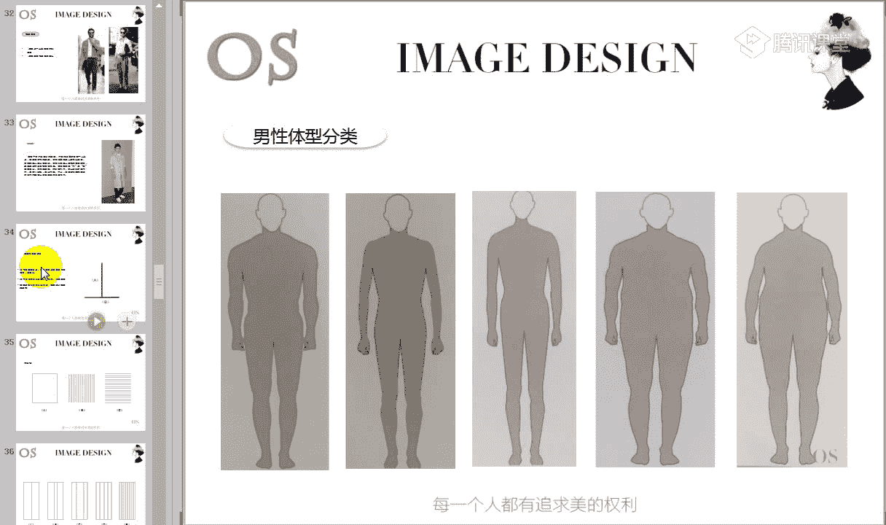
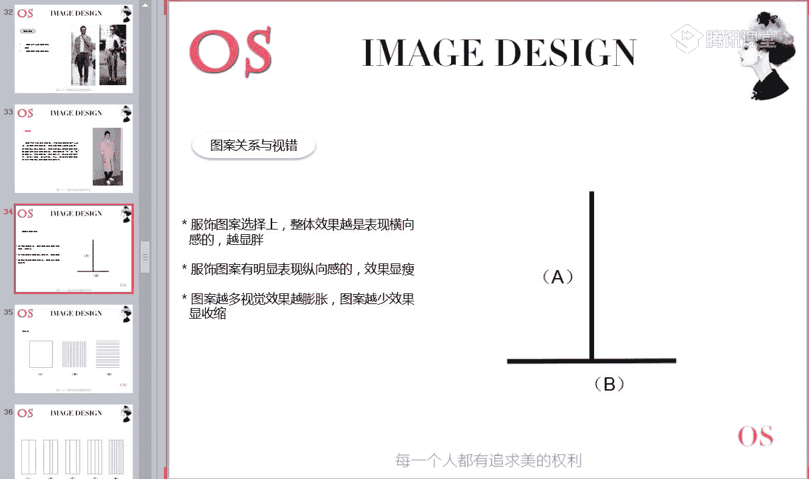
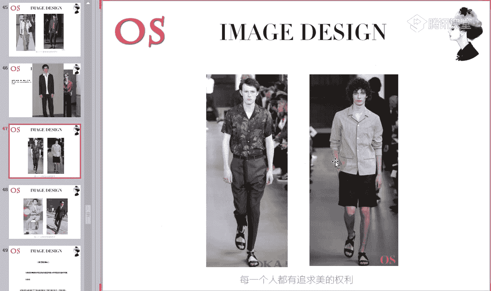
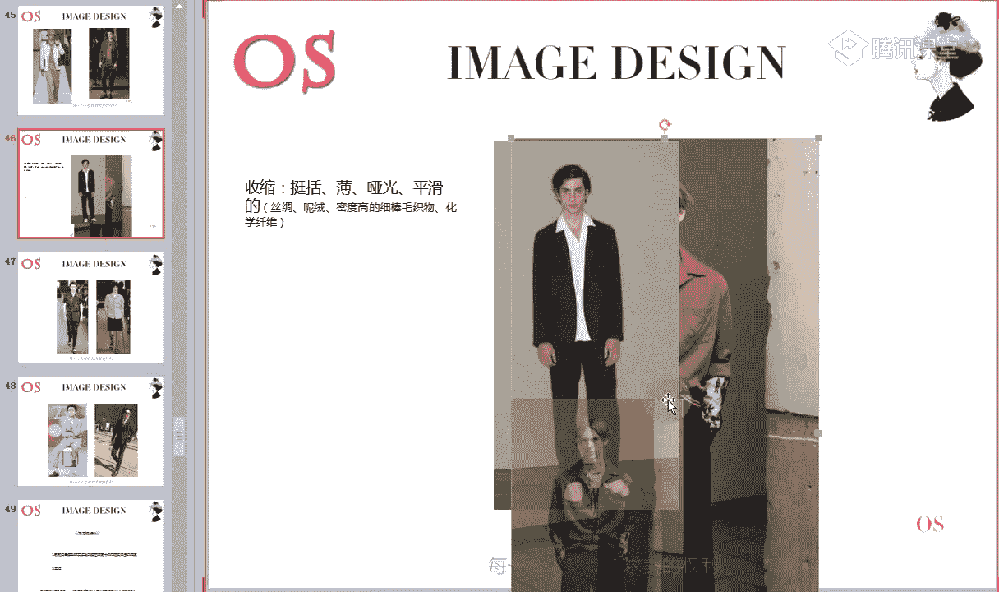
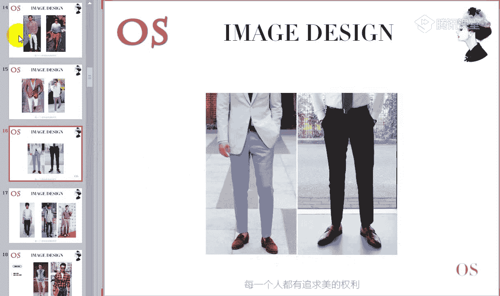
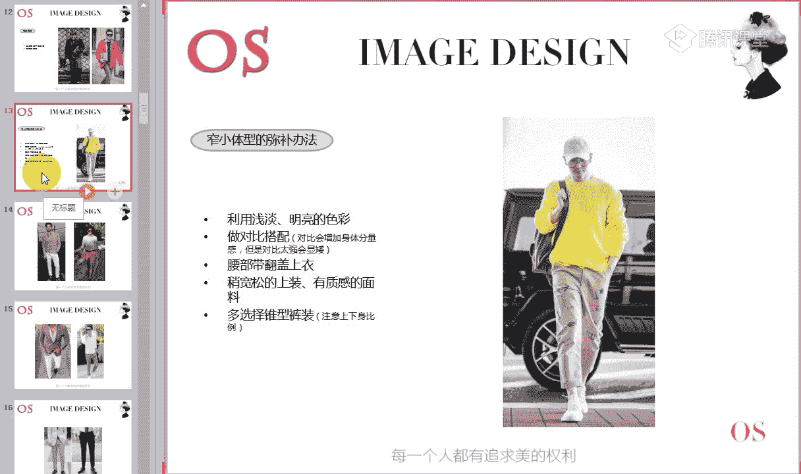
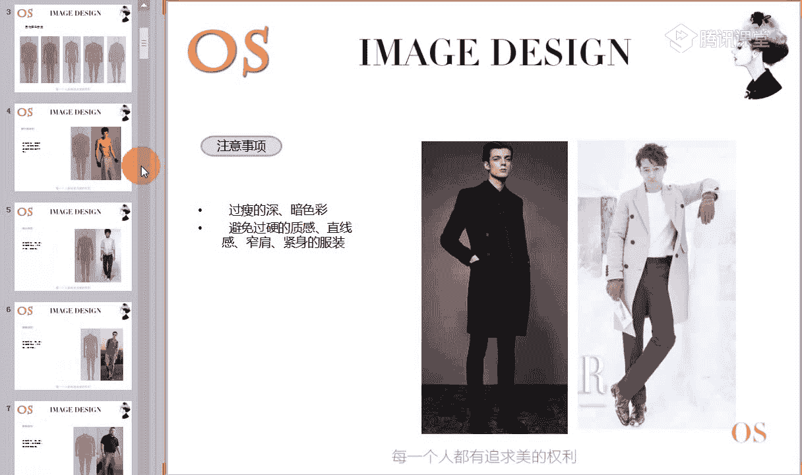
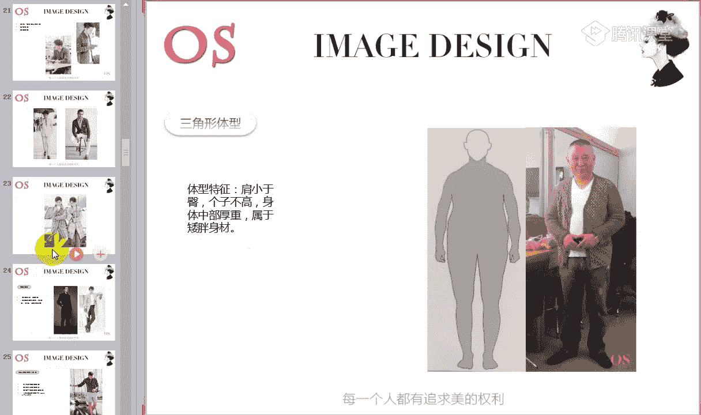
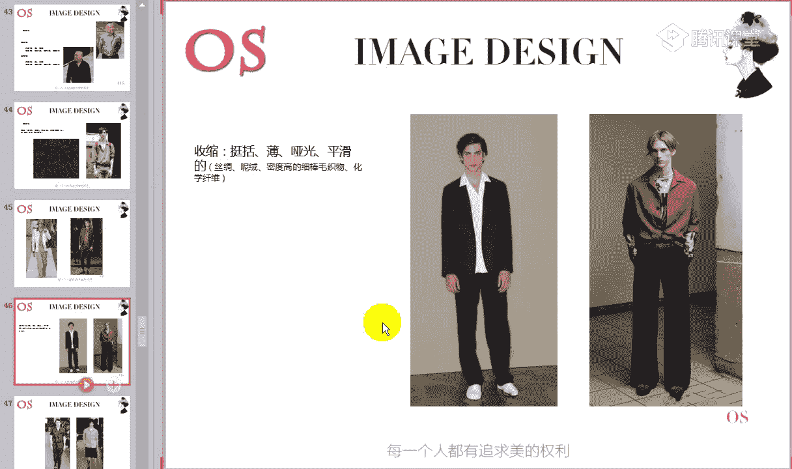
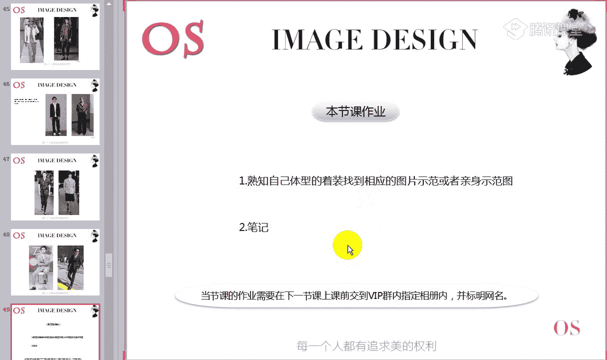

# 1、14男士个人形象班第二期（中级版）VIP课程：第3节、体型修饰

🎼好，亲爱的同学们，大家晚上好，欢迎大家来到我们OS男士课程的VIP。那今天呢是我们男士班的第三节。🎼上一节课呢我们学习了这样的一个发型。这一课呢我们来了解一下我们这样的一个体型。

对于体型基本上合乎我们标准的男士来说，我们只要依据我们在第一节课所说到的这样的一些色彩风格规律来穿衣服，选择衣服就可以了。但是在生活中标准体型的人毕竟不是那么多。对于体型不那么标准的男士来说。

我们则需要通过一些手段来进行调整，使我们的体型接近标准体型的一个视觉感受。所以说呢我们在正式上课之前，首先来看一下我们今天的学习重点啊，如果大家都做好准备的同学呢快速跟老师刷朵鲜花啊。

我们今天的课程呢开始的稍微迟一点点。好，看看我们今天学习的重点是什么啊。哎，重点。第一个呢就是我们要懂得男士的体型分为哪些类别，怎么样去进行判断。第二个呢。

就是我们各个体型应该怎么样去利用服装饰品来进行调整。第三个呢，就是我们今天所要说到的这样一个重点服装的试错。🎼在学习体型认知和修饰之前呢，我们首先来了解一下我们服装的试错。因为在修饰我们体型的时候。

其实都是依照这样的一个标准。所以说呢我们先来学习这样的一个试错的知识。等我们把试错的知识掌握好了，再来分辨我们各个体型，以及呢各个体型的。

🎼怎么样去利用我们的服装来进行修饰。那么大家就清楚很多啊。好，所以说我们今天进进入了我们第一个知识重点就是我们的试错。所以在老师讲试错的过程中，大家如果说有任何问题一定要及时的在公台上提出来。

🎼好，那在生活中呢有非常多的一些奇妙的现象，不同的服装我们会发现穿到一个人身上效果会有很大的一个差异。也就是说，有的时候我们会发现这件服装能够让我们显得非常的胖。哎。

有的时候又会发现这件服装显得比较的瘦，对不对？哎，包括的话色彩的一些影响呀，还有包括我们图案上的一些影养啊，还有包括我们服装材质方面的一些影响。其实呢哎我们会发现服装它其实有这样的一个矫正的一个作用。

所以说掌握好试错觉得这样的一个原理，对于我们服饰形象设计呢有非常重要的一个指导作用。也就是说利用我们这样的一个试错，对于我们的体型来进行修饰。🎼第一个我们要说到的就是图案关系和试错。

那大家呢首先要把这三句话呢进行这样的一个记啊笔记。首先要把这三句话记清楚。其实服饰图案呢，我们首先从图案着手，因为图案上的这样的一个关系，它跟我们的试错也有同样的一个原理。🎼服饰图案选择上。

如果说整体的效果越是表现横向感的就会越显胖。而我们也会发现显胖其实它也会有显矮的一个作用。就像我们显瘦，它会有显高。所以说当我们的服饰图案有明显表现纵向感的时候，它的效果就会显瘦显高。

就像我们图中AB2条线啊，我们大家可以来看一下啊，在视觉上你会觉得是A比较的长呢，还是B比较的长。🎼AB2条线啊，在视觉上我们来观察一下这个图片。🎼然后快速的呢把答案打在公台公台上啊。

那你觉得是A线比较的长，还是我们这。底线比较长啊。利用大家的一个视觉来进行判断。🎼好，有同学说到的是A啊，非常棒啊。没错，其实呢A和B两条线的长度是一致的。但是呢因为我们的线条是往纵向型去拓展的。

所以在效果上会显瘦显长。而如果说我们是往横向去进行拓展的时候呢，它就会显矮显胖啊，这是我们试错的第一个原因是我们的图案。那包括大家可以看到啊我们这样的一个其他的一些图案拿条纹来举例子。

可能在我们平时的生活中，哎，我们一直会误解这样的一个横条纹。觉得横条纹，它不管是在什么样的一个情况下，它都是会显胖的，对不对？而我们的竖条纹永远是最安全的那像今年夏天的话，本身图案类别中。

竖条纹是一个非常非常火热的啊，所以说各位男士在夏天，如果说尤其像我们这样的一些自然风格的，你可以多去选择竖条纹非常的适合我们。因为本身自然风格就适合穿条纹拿格子啊等等的那竖条纹非常的火爆。但是。

根据我们身材体型中呢，我们要懂得去进行分别，去选择出自己最适合的那包括我们从ABC3张图片来看，它们的面积，它们的长宽一致的情况下，在视觉上我们进行观察一下，会不会发现C显得要更瘦更长一点哦。

发现的同学呢跟老师刷朵鲜花。也就是说我们去跟A图和跟我们这样的一个B图去做对比的时候，C一定是要显得比A和B更长更高，也就是说更瘦，对不对？哦，发现的同学呢可以跟老师刷个鲜花。如果有同学分辨不出来的话。

我还看不出来的时候呢，教给大家一个方法，不要离的屏幕太近。我们可以呢离我们屏幕稍微远一点。然后有时候我们如果专注去看一张图片的时候，是很难把A和B尽收眼底的。所以说我们可以考虑把我们的眼睛稍微眯一点。

一起去看。这个时候呢，把三张图片都放在你的眼睛里。我们形成这样的一个对比，那效果就会非常明显很多，就会直觉非常直观的看出来C要更加的显瘦显长，明白了吗？哦？唉，看出来同学快速跟老师刷的鲜花啊。

现在只有两位同学看出来了，其他同学呢对于横条纹和竖条纹，我们去进行做对比的时候，也就是说B和C去做对比的时候，还有没有疑问。为什么说C会显得长，没有看出来的同学哦，还有没有如果有的话呢。

可以跟老师扣个一，没有的，快速跟老师在公台上刷的鲜花试一下。🎼好，如果觉得不明显的同学啊，老师给你的一个方法，就是我们可以离的屏幕稍微远一点，然后眼睛微眯的去进行对比。为眼睛稍微眯起来。

我们去进行这样的一个对比。你会发现C和AB做对比的时候，它在视觉上是要比它显长的。🎼所以呢有我们这样的一个对比，其实要跟大家讲解的是什么呢？就是告诉大家，不是所有的横条纹，它都是会显胖显瘦的哦。

或者是说呃不是所有的竖条纹，它都是显瘦的。我们要记住，当我们横条纹过于密集的时候呢，其实它反而会显瘦，反而会显瘦啊。所以说当我们的横条纹如果不是那么密集。也就是说不是那么细的时候，我们比较宽的时候。

比如说像我们这样的一件宽的条纹衫和我们接下来所看到的唉，这样的一件条纹衫来做对比。也就是说密集和不密集的一个区别。甚至还有的一些条纹的话，它会更加的密集，对不对？当它的效果越发密集的时候。

其实它在视觉上会更加的显瘦哦。所以说有一部分同学如果说你想要挑战横条纹的话，我们就选择密集的横条纹。那么竖条纹，当然也不是绝对的。不是说所有的竖条纹我们都不能够去穿，因为它会显胖。🎼显矮。

但是我们可以看到，当我们非常多的这样的一个竖条纹的图案来做对比的时候，如果竖条纹它不多，也就是说它不密集的时候，和它密集的时候去进行做对比的时候，你会发现是不是一要比A和B显得宽一点。🎼好。

还是可以采用老师刚才所说的方法啊，我们离屏幕不要太近，稍微远一点，然后眼睛微眯的这样的时候才能把ABCD3张图片啊，4张图片，5张图片全部都收到眼底，然后去进行这样的一个对比。

🎼会发现AB要显得窄那么一点，要瘦那么一点，但是一是往横向去发展的。🎼好，如果大家有同学还有疑问的话，我们也可以看到像这样的一些衬衫，对不对？当竖条纹非常密集的时候，会发现显得整个人来说是比较。

🎼饱满的对不对？我不说胖吧，就说比较饱满，而显得整个上半身是往我们横向去进行扩展的，比较的魁梧，对不对啊？有没有问题，没有问题的同学快速跟老师扣个一啊。所以说呢。🎼条纹密集的时候，它一定是会显胖的哦。

哪怕是我们这样的一些稍微隐藏一点的。当它密集的时候，它都会有这样的一个效果。如果说服装的款款式在外放一点的时候呢，它的显胖效果会愈发的明显。所以说当我们有一些男生，如果上半身的体量感不足的时候。

我们就可以去采用这样的一些密集的竖条纹穿到自己身上，而不密集的竖条纹呢，我们就尽量呢少穿，而不密集的竖条纹我们可以去选择一些上半身啊比较胖的同学。如果你想要选择竖条纹的话，我们就可以选择不密集的。

这个其实也是像我们刚才那个知识点的一个总结。也就是说呃整体的效果如果横向感表现的非常强的时候，其实你会发现密集的竖条纹，其实它也是在表现这样的一个横向感，而不是说在表现这样的一个纵向感。

反而是不密集的竖条纹，它才是在表现纵向感，而密集的竖条纹是表现。🎼横向感的。所以说当我们的是图案表现这样的一个横向感的时候呢，它就会显胖啊。当然显胖的同时就会显矮。那同样的。

如果说我们的图案它有描明显的去表现这样表现这样的一个纵向感的话呢，它的效果就会显瘦。那这是我们的这样的一些条纹。那包括拿到其他图案也是一样的。在对其他图案来进行分别，它到底是有膨胀还是收缩的话呢。

我们就看它的一个密集程度。也就是说当我们一些其他图案如果非常的杂非常的乱，或者是说它很有规则感的时候，那我们这样的一件图案的服装，它一定是会显胖的。也就是说它会有膨胀的效果。

但是如果说我们的图案非常的少啊，非常的少，而且呢它的排列是没有规则感的，不仅仅是少，不仅仅是简单，而且图案和图案之间是没。有规则了，就比如说我可能。因为老师这里刚好有一张图片，比如说我们可以看到这里。

唉，我可能在上半部分有一张图案，对不对？但是我在衣服下半部分也有一张图案，而我们的图案哦，如果图案还小一点哦，如果比我们图中啊，下面这个图案比图中的这个服装的图案再小那么一点。

也就是说它的排列是不规则的。而且相对来说也比较的简单和单调。那么这样的一件图案的话呢，它一定是会显瘦的，它不会具有这样的一个膨胀的作用。但如果说你的图案非常的大。哎，你的色彩还非常的饱满。

或者是说你的图案和图案之间它是有规矩的，左一个右一个左一个右一个啊，有这样的一个规矩的一个排列，或者非常的复杂的时候，就如图中我们这样的一些花衬衫，它的图案和图案之间是复杂的，是有膨胀效果的。

所以说它会导致呢在视觉上形成显胖的一个效果。哎，对于这样的一个图案膨胀和收缩，还有没有不理解的，理解的同学跟老师扣个一，都明白同学呢快速的哦。跟呃如果说都明白了，理解的，跟老师扣个一。

如果还有任何问题呢，可以在公台上提出来。这是图案的一个试错啊，也就是图案试错。如果还有没有掌握的同学快速的把问题提在公台上啊，都明白同学呢跟老师扣个一。所以说记住我们刚开始跟大家所看到的这三句话。

其实今天在讲这样的一个图案的时候，不管我是在逐一的跟大家分析横条纹还是竖条纹，其实就是告诉大家看这样的一个图案的整体的效果表现。它如果是有横向感的，就像密集的横条纹啊，它是有纵向感的，对不对？

所以说当横条纹呈现这样的一个密集的时候，你会发现它会显高。也就是他在往纵向排列，但是横条纹不密集的时候，它是往横向去进行发展的。所以说它一定会显胖。而竖条纹，当它密集去进行排列的时候。

它反而是往我们的横向去进行拓展的。只有它在不密集的情况下呢，它才是往纵向去进行表现的那包括我们其他的格子也好，还是我们其他的一些花。🎼会图案或者说哎我们这样的一些几何图案都是一样的一个道理。

如果它的图案越多，视觉效果越膨胀，图案越少，效果会越显收缩，这是一个重点哦，只有两位同学跟老师扣一吗？其他同学呢？🎼好，都明白，同学快速扣1啊，要赶紧的啊。如果说有问题的话，提在公屏上，没有问题。

老师就直接跳过了啊，我们就开始讲下一个知识点了。

好，这个就是我们图案的这样的一个试错啊。首先呢先了解图案的试错。因为我们在接下来在分析体型的时候，一定是会哦结合我们这样一个体型来进行运用的。

一定是会结合体型运用的那接下来说完了图案之间的一个试错之后呢，其实我们服装款式，它也是会形成这样的一个试错的。也就是说我们看到这样的一个两句话，第一句话就是服装廓形越流畅，越垂直的时候。

视觉效果会越显瘦会显高。但当时我们当然我们服装廓形如果越外放的时候，视觉效果会越显矮显胖，可能有一部分同学就有点懵了，对不对？可能会发现唉老师你说的流畅，垂直和外放是什么样的一个概念呢？会有点懵。

对不对？那老师简单跟大家来做一个讲解。首先我们要理解垂直流畅和外放的一个区别。其实它指的是什么呢？指的就是我们整个服装的一个外。轮廓指的是我们服装的这样的一个廓形。

你会发现有的服装它整体来说穿到身上也好，拿在手里也好，它整个线条是垂直的。🎼是流畅的，对不对？但是我们也会发现，而有的服装就是同样一个人哦，而有的服装我们拿在手里之后呢。

它的整个廓形它会有一点呈现欧版的一个状态。也就是说它会比较的宽松，因为这样的一个过于宽松的。🎼款式而导致服装的整个版型趋向这样的一个外放感哦，还有包括就是我们这样的一个图片来做对比。

那我们接下来呢看到下一张图片也是一样的。就比如说像陈坤，还有包括我们的金世家在穿这两套衣服的时候，整体的服装廓形是宽松的。也就是说他的整个线条也是呈现这样的一个欧版的状态，对不对？它不是流畅垂直。

不是合体的，而是呈现这样的一个外放啊欧版的这样的一个感觉。而我们进行一下替换的时候，你会发现唉，像这样的一些服装款式，这也是陈坤，这个是金世嘉同样两个人，对不对？我们把服装的版型进行替换。

选择一些合体的，唉，整个线条是流畅的，不啰嗦的，我们就会发现他在整个视觉上是不是就要比我们去选择一些外放的版型在视觉上会更显高。那么像陈坤他的官方身高是1。76米，而我们的金世嘉可能。🎼大家想象不到。

我们看这样的一张图片的时候，大家觉得像多高，你猜一下它的身高啊，大家觉得看这张照片，觉得他多高。其实你会发现看这张照片也不会觉得他有多矮。可能有一部分同学会猜测他应该也有1。7多，对不对啊？

我们可以大胆的猜一下哦。🎼啊，你们来猜一下，快速的回答老师啊。🎼我说了啊，陈坤的官方身高是1。76米，这个是1。76米。但是我们也可以看到，从这张照片中，我并不能感受到他有1。76米，对不对？

而我们这个金世嘉呢也是一个演员啊，他的官方身高有同学说到唉，这张照片看起来像1。65米啊，还有没有其他不同的答案啊，大家可以来用视觉上多去发现，多去观察。那其实呢揭晓一下正确的答案啊。

大家也可以看到这一张照片是不是觉得他个子非常的高，觉得还不错，对不对？但是其实他真实的身高是有1。89米啊，他真实的身高有1。89米，好像是有1。89米，所以大家可以想象一下，1。89米的人。

当把服装款式选择错误的时候，我们会直接导致自己看上去只有1。7多，对不对？只有1。7多。所以当我们1。7多的同学再把服装款式选择错的时候，我们看上去就只有1。7米了，甚至只有1。6米多一点。

所以呢我们选择对了，唉，我会。🎼觉得陈坤应该有1。78米甚至有1。8米的这样的一个即视感，对不对？这个就是我们服装廓形和试错的一个原理。所以呢如果你想要显高，想要显瘦，我们就选择廓形流畅垂直合体的啊。

线条不啰嗦的，没有那么多的一些复杂的设计，包括我们在选择裤子的时候，你会发现有的裤子它不仅仅是版型大，它可能还有很多一些口袋呀哦，在我们大腿的两侧，小腿的两侧会有很多口袋呀等等的。

那其实这个版型也是在往横向发展的，对不对？也是在往横向发展，其实它也是在外放，也是在宽松，所以说我们去选择一些相对来说简洁的合体垂直流畅的就会显高显瘦。而你选择一些过于啰嗦的，而整个廓形是外放的。

它就会显然显胖啊，这是我们第二个知识点就是服装廓形和试错。那其实大家就是要掌握好流畅垂直和外放的一个概念，掌握好。🎼同学跟老师扣个一。因为我们之前在呃有男同学啊，有男士跟老师说，哎，老师。

我听了录播课程试错的那个你说的快放和垂直流动是什么意思啊？我不明白。所以说现在我重点跟大家来分析一下哦，还有没有不明白的，都明白，都理解，同学快速跟老师扣个一。

🎼这个就是我们怎么样去看服装的这样的一个版型啊，这是服装的整体的一个版型。🎼好，接下来我们就来看到呢色的试错啊。色试错在这里呢老师不做多的一个强调，因为我相信大部分同学已经上到男士班的。

正正儿八经在学男士课程的。你们的色彩美学班是一定过了关的。如果说你的色彩美学班还没有过关的同学，希望你们抽课后的时间，要抓紧去复习去进行学习。我们不耽误其他的这样的一些过关同学的时间。

所以说不要再问老师什么是五彩色，什么是有彩色啊，这个就不要去问了啊，所以呢我们先。🎼有同学不明白无彩色和有彩色概念的同学，你们去美学班赶紧复习。那我们接着往下面讲色是错呢。

其实我们不仅仅服装材质有这样的一个膨胀和收缩啊，服装款式有膨胀和收缩。那包括我们的图案有膨胀和收缩。那其实色彩它也是有膨胀和收缩的。所以说在这里呢大家就记住，我们要懂得什么样的色彩，它是有膨胀的效果。

而什么样的色彩它是有收缩的效果。膨胀色包含哪些呢？我们分为五彩色和油彩色，在五彩色里面你想要达到膨胀的话，我们就选择白色选择浅灰色，而有彩色里面呢，我们去选择一些高明度的高纯度的暖色相的色彩。

它都是有膨胀的效果。反之我们在五彩色里面去选择黑色深灰色、有彩色里面选择低明度、低纯度、冷色相。🎼的色彩呢它是具有收缩效果的。就像我们郭德纲，对不对？他在穿同样是两件重磅丝真丝的这样的一个衬衫的时候。

你会发现去选择一些明度啊，纯度高的色彩和选择一些。🎼五彩色里面的黑色来做对比。你会发现在视觉上，黑色的肩膀也好，还有包括黑色的这样的一个腹部也好，都要比我们高纯度的这样的一件色彩的服装要显瘦很多。

对不对？其实就是腾等道理。同样服装材质都是属于平整的啊，有这样的一个光滑的，有这样的一个光泽感的一个材质。但是因为色彩的不同。在视觉上所呈现的效果也是不一样的。这个就是我们的色的试错。

其实没有太多的一个重点啊，哎，没有太多的一个重点的一个色彩知识，其实就是告诉大家，首先我们要分辨出来，懂得什么是无彩色和有彩色，懂得什么是高明度、低明度啊，什么是高纯度、低纯度、冷暖这样的一个调子。

然后呢，我们就记住把这样的老师写在。🎼我们课件上的这样的一句话哦，膨胀色包含哪些？收缩色包含哪些呢？记下来。🎼好，都记下来的同学呢跟老师扣个一啊，都记下来的同学跟老师扣个一。🎼好，大家如果都记下来。

老师就接着往下面讲了啊。如果说还要等一等的，你可以快速跟老师呢扣个2啊，然后老师再等你几秒钟。🎼好，接着我们就说到我们的质是错啊，也就是我们今天呢在试错里面最后的一个知识点啊，材质的一个问题。

我们都知道服装是有我们的图案有色彩，有款式，有我们的材质所构成的，对不对？所以说呢材质的是错觉也是非常非常重要的。同样在材质里面我们有膨胀的材质，也有收缩的材质。那其实呢不用去呃强调到底什么样的材质。

它会显胖，什么样的材质会显瘦，其实就是让大家去根据老师打在我们屏幕上面的这几个关键词来进行观察。那比如说我们可以看到图一也好，还有图二也好，你从图二这件衬衫上面，你能不能感受到柔软。

能不能感受到这样的一个肌理感啊，我们不说有光泽，不说厚重。因为这是一件薄的衣服。但是你至少能不能从这件服装中读到类似于这样的一个感受，就是柔软。🎼相对比吧，对不对？还有包括就是肌理感强。

其实肌理感是什么意思呢？也就是说这样的一件服装，它的一个表面横竖交错，凹凸不平。就像我们这样的一些粗棒针织的毛衣，还有包括像我们这样的一些皮草等等。还有包括我们有的一些麻料。

也就是说我们在夏天最喜欢穿一些麻质的服装。那其实像麻质类型的哦材质的话，它也是肌理感很强的，因为它不是非常平整的，能理解吗？理解同学快速跟老师刷的鲜花。🎼是有一定的粗糙感的。

你也可以把肌理感呢理解成粗糙感。因为你会发现有些服装的材质就非常的平整，非常的有光泽度，很平滑，对不对？就像类似于我们在讲测试错的时候，像它这样的一件衬衫，非常的平整，它不会有粗糙感。

但是有一些服装的材质的话，它就是有粗糙感。所以说就像我们这样的一件衬衫，哎，就像我们这样的一些针织衫，就像我们有的一些皮草一样啊，毛制品一样，它会有这样的一个粗糙感。

粗糙感也就是说这样的一个天然天然的肌理感。

🎼啊，呢子大衣呢呢子大衣如果说是属于那种不太平整的哦，不太平整的话，它也是有肌理感的对，因为而且有一些不太平整的呢子大衣的话，它也会有厚重感。所以说它也是符合我们的膨胀材质的。但是有一部分呢子大衣。

如果说就像呃我们的织法非常精密的啊，非常有这样的一个。🎼挺阔度的，而且面料上非常平整的那它其实就不属于我们这样的一个膨胀的材质了。它相对来说呢就符合我们的收缩的这样一个材质。

所以说呢这是我们这样的一个膨胀的材质啊。首先我们看一下膨胀材质，包括大家可以看到，可能有同学看不清楚啊，老师把图片呢放大一点。🎼好，包括我们可以看到这样的一件外套，对不对？它同样有没有这样的一个厚感。

你能不能感觉到它的这样一个厚度，你同样不仅感觉到厚度的同时，你也会发现它的整体的服装的表面材质来说，它不是属于硬挺的，也不是属于平滑的。而且它有一点相对来说唉符合我们这样的一个柔软。

或者是说符合我们这样的一个麻质感。看出来同学跟老师扣个一啊，看出来的同学看出跟老师扣个一。那包括我们可以看到这一套西装也是一样的。🎼哦，这套西装也是一样的，我们会发现唉其实它还是有一定一定的硬挺度。

但是它的肌理感太强了啊，但是它的肌理感太强了，它是有这样的一个厚度的对，有厚重感。而且它同样啊它同样呢也是会有这样的一个肌理感，它不仅有一个厚重感，它还有一个肌理感啊，它有这样的一个肌理感。

有一个粗糙的感觉，对不对？有一定的粗糙感。所以说我们在判断这样的一件衣服，它到底是收缩呢，还是有膨胀的效果。我们就通过老师刚才所说到的这样的一些关键词啊来进行呢判断来进行判断啊。

🎼好，这个就是我们这样的一个膨胀啊，接下来呢我们就来看到收缩。收缩呢其实就是几个也是同样4个，一个就是挺括，一个就是薄。然后呢就是哑光啊，哑光其实就是有的服装我们会发现它是有光泽感的。就比如说像皮衣。

对不对？或者是说像我们某一些打底裤，你穿到身上的时候，你也会发现它的这样的一个凸起面，你穿到腿上的时候，你的腿的这样一个凸面的话，它是有一定的光泽感的，对不对？而有的衣服它都是哑光的。

你是没有任何光泽的，而且不仅呢还有就是我们有这样的一个平滑感平整感。那包括我们从图中的唉整体的这套服装来说，你是不是能够清楚的感受到它如果说不够硬挺的话，它一定是挺。🎼它一定是薄的，而且它是平滑平整的。

有这样的一个哑光的，对不对？还有包括呢我们看到下面也是一样的。🎼像这样的一件衬衫，它的一个好处就是它薄它够薄，而且它也相对来说比较的平滑，对不对？平整，而裤子也是一样的，平整平滑。

那包括我们这一样的一件。

🎼衬衫也是同样的，它是有一定的挺括感的，而且它相对来说也比较的硬挺啊，同样它也是弱光泽的。🎼但是呢我们也可以来看到靳东啊两套西装的一个对比。所以说大家可以看到同样的两套西装，其实按道理来说。

西装的整体的感觉它相对都是比较的硬挺的。但是我们也要去观察一下整体西装的视觉的一个感受。那包括我们可以看图一和图二。大家觉得这两套西装，哪一套西装会更加显瘦啊，是图一的，跟扣一啊，觉得是图二的同学呢？

可以跟老师扣个2，这两套西装你们觉得哪一套会更加的显瘦啊。🎼好，嗯，我们。🎼几几的同学都在跟老师扣2哦，那说扣2的同学呢，你们也会发现为什么会觉得图一给你的感觉没有图二那么的显瘦啊，快速的回答一下老师。

🎼啊，为什么会觉得图一会没有图二那么的显瘦？🎼好，看大家有有没有把今天的一些知识真正学到哦。有同学说到有光泽感。🎼还有没有其他不同的同啊答案？唉，我们日月光刚说的颜色非常棒。嗯，好。

然后漫长日子说到膨胀有纹理感，非常非常好啊。其实图衣是没有光泽感的，这个这件衣服是哑光的啊，是哑光的，不属于光泽感的啊一类。🎼它主要是第一个在颜色上面，我们会发现浅灰色是有膨胀效果的。

还有就是我们会发现整体的服装的这样的一个面料上，它是有一定的纹理感的，有一定的粗糙感的，对不对？会有纹理感，会有粗糙感。而我们图案的话相对来说平整很多，精细很多。

所以说这个就是我们要快速的根据我们这样的一件服装，唉，放到你的面前，你通过它的材质，你通过款式，你通过服装的廓形，你通过图案快速的分辨出它到底是显瘦还是显胖，它到底适合什么样的人去选择，明白了吗？啊。

这个就是我们今天。第一个知识点所说到的视觉的一个错误啊。🎼视觉错误。哎，每一个人的话呢，关于这样的一个视觉知识，大家还有没有不懂的地方啊？如果没有不懂的地方的话呢，快速跟老师刷一朵鲜花哦。

试作方面都理解同学快速跟老师刷朵鲜花。好，哪一个知识点需要老师再重点的跟大家呃总结一下的，也可以把答案快速的。

🎼I just pay no way。あた。🎼好，简单跟大家稍微的总结一下第一个知识点啊。其实因为我们每个人的眼睛呢，它都像一架照相机，非常非常的客观。而我们要明白的，通过服饰把它引导向好发展。

所以说故意造成视觉看错，让视觉系统呢乖乖的上当啊，如果说你不去进行这样的一个呃塑造，也就是说你如果不去了解你自身的优势，劣势，你随意的去穿视觉上就可不管这一套，它只知道呢非常公正的去看啊。

当然公正要打上引号啊，因为你要采用技巧就不一样了。所以说你可以运用我们今天所说的第一部分知识这样的一个技巧哎，用应用到我们自己的身上，就一定会有非常好的一个效果啊，它就会被你呢骗得乖乖的上当。🎼好。

再讲第一步知识点的时候，第一部分知识点的时候，老师有说到标准的身材，对不对？啊，我们有介绍到标准的一个身材，那么什么是标准的身材呢？男性的标准身材其实就是达到标准的身高，也就是达到平均身高。

然后呢匀称适中啊，你的体型上匀称适中。那第二个呢就是你的胸围啊，要记住是胸围啊，胸围比你的臀围略微的宽一点啊，胸围比你的臀围略微的宽一点。🎼然后再次呢就是整个体型来说呈现这样的一个倒三角的视觉感。

🎼那大家一定非常非常的好奇，我们标准的身体型对不对？我们标准的体型老师有说到达到平均的一个身高，那么标准的身高是多少？大家来猜一下哦，男士标准的身高，你们给他们定多少？🎼The trick。

🎼大家可以积极的发表，你觉得标准是多少，把你理解的，你觉得男生在什么样的一个身高上，他是符合标准的，而且也符合平均的。好有同学说到1。75米对，1。75米。🎼好，包括老师自己也在网上有搜啊。

搜我们中国的一个平均的身高啊。那但是呢中国平均身高的一个数值让我非常的惊讶啊，男士的平均身高是1。67点几，我觉得太矮了。所以呢我也想到如果说是不是在1。75米会更好呢。但是呃我会发现其实综合来说。

全球来说呢，其实身的身高如果我们把它定到1。78会更好。大家觉得呢啊如果说1。75米的话，我们会发现如果。🎼体型上面啊不是很达标的时候，我们其实也会在视觉上有点显矮。所以说男士的话综合来说。

按照数学的一个黄金分割就是1。78米。🎼就是1。78米。所以说如果唉老师刚才所说的，你都符合你就是标准的一个身材。如果你的胸围比你的臀围略宽，而你的整体的身材呈现这样的一个倒德三角。

那同样你的身材整个来说是非常匀称的，而且你的身高在1。78米左右，对不对？那其实你就是一个标准的男士的一个体型。我们再选择服装的时候呢，可以按照掌握的色彩和风格来进行选择啊，来进行选择。

来凸显你自己的形象就可以了。那至于其他体型弥补的方法，就是通过我们的服饰的色彩款式分割线啊，面料、材质、图案等因素，对体型呢来进行修正，让我们的体型看上去接近我们标准型的一个视觉感受。

也就是说我们今天所讲的第一部分知识，试错啊。那接下来我们就开始了解我们男士的各个体型，以及我们这样的一个修饰方。在男士体型中呢，我们综综合呢分为这样的一个五大类。🎼综合分为五大类啊。

第一个呢就是我们这样的一个倒三角体型啊。老师呢一个一个跟大家分析。首先我们先来辨别各个体型，辨别完了之后呢，我们来进行这样的一个体型的修饰啊。首先说到我们的倒三角体型。那如果说哎我们倒三角的一个体型。

刚才老师有讲到哦，我们标准的倒三角是我们的胸围比我们的臀围略微宽一点。而且你整个身材是相对来说比较匀称的。但是如果你也是倒三角体型，而你的肩膀过宽，跟你的臀围去做对比，对不对？显得你整个过宽。

就像我们的彭于晏类似于图片中，你会发现上半身和下半身去做对比，是有一点不太协调的。因为上半身会显得非常的健壮，而下半身又显得有点瘦，对不对？啊，也就是说过宽的肩部会显得不太平衡。

那如果说你是属于这样的一个偏夸张一点，倒三角体型的话呢，我们在修。🎼这方面唉重点来进行这样的一个观察。首先这是我们的倒三角体型的一个判断啊一个特征。大家还有没有什么问题啊？

如果说对于倒三角体型还有问题的同学快速把答案啊，把问题提在公台上啊，总结下就是特征至第一个肩宽于我们的臀。🎼而我们整个上半身会显得非常的健壮哦，肩膀会过于宽。

而导致你的整个身材来说会显得有那么一点不太平衡。🎼好，接下来我们就来看怎么样去进行修饰啊。那倒三角的一个体体型的一个弥补方法呢。就第一个，既然你的上半身已经非常夸张了，对不对？所以说我们就免不了。

要利用到我们的色彩的一个试错。上半身的色彩呢，我们可以选择简单一点的，选择一些收缩色啊，至于收缩色的话，老师就不再不多说啊，就比如说我们可以去选择这样的一些收缩色，而下半身的话呢。

我们可以去选择一些相对来说膨胀一点的色彩来进行调整。也就是说上半身收缩，下半身膨胀，那么这样的话呢，我们上下就会起到一个非常好的一个平衡。那第二个我们就说到了脖子周围可以用艳色。很有同学很好奇。

为什么脖子周围可以去用艳色呢？就是其实艳色呢在视觉上你会发现它非常的独目，对不对？非常的吸引我们的眼球，也就其实利用艳色就跟我们女生。🎼去穿一些深V的领型是一样的。

把别人的视觉呢集中到我们这样的一个中间部位。也就是说我想让你看的地方，你就看过来，我不想让你看到我整个上半身整个外轮廓过于的宽，对不对？我不想让你看到，那我就利用这样的一个艳色把你的视觉来进行转移。

明白吗？所以这样的一些胖的同学也是同样的一个道理啊，不仅我们上半身胖的同学，我们也可以在脖子周围去选择一些艳色啊，带小方巾也好，或者是说有一些领子，有一些服装的领子。

它本身就是艳色和我们的收缩色去进行拼接的，对不对？🎼这个就是我们第二个脖子周围的一个艳色的一个作用。那我刚才说到了。😡，🎼到三角体型上半部分因为过于的宽，而下半部分会偏瘦，对不对？而会比较显得单薄。

那同样其实我们也要懂得去弥补一下腰部啊，也就是说其实腰部它同样也会显得过于的单薄。因为跟它的上半部分已经形成了这样的一个不平衡。所以说我们在选择外套的时候呢。

可以多去选择在腰部带一些带盖的这样的一件上衣啊，一个翻兜的上衣，其实它就是起到一个很好的一个填充啊，起到了一个膨胀的一个效果。那还有就是我们腰部以下的服饰啊，一定要丰富起来。不管你是色彩也好。

还是图案也好，就像我们的密集的竖条纹，对不对？哎，我们纯度高的色彩，或者是说我们服装的款式可以去选择一些稍微外放的款式，哎，包括我们也可以利用我们服装的这样的一个款式的一些设计。比如说带一些。

🎼口袋的也就是说像这样的一些口袋的话，也是存在一个横向拓展的，对不对？而我们凡是横向走的。🎼一些服装它都会有膨胀的一个效果嘛。所以这个就是我们刚才说到的这样的一个色彩的一个呃，在整个服装的一个试错上。

利用到我们体型的一个修饰方面啊，这就是我们倒三角所弥补的四大方法。第一个就是上半身的色彩，我们尽量选择简单的收缩色。脖子周围你可以采用一些艳色，来起到视觉的一个集中，从而忽略掉你的整个身材的一个外轮廓。

那第三个就是我们在腹部这里腰部这里要记得利用我们带一些翻盖的这样的一些上衣来进行修饰，下半部分呢尽量选择收缩色啊，尽量选择简单的收缩色呃，膨胀色啊。老说错了。🎼下半部分呢我们尽量服饰丰富一点。

不管是款式也好，还是色彩也好，还是我们的图案也好，还是材质也好，都可以采用我们膨胀的这样的一些形色质。🎼好，这个是我们的一个修饰弥补方法。在这里呢我也要强调一个重点。也就是说我们作为倒三角体型的。

如果健身见的比较多的，一般都会形成这样的倒三角体型会显得非常的夸张哦。所以说我们也要注意一些视项。第一个呢就是上身的色彩不要过强啊，不然的话呢我们都知道色彩是有膨胀的嘛。

那第二个呢就是我们少去选择一些宽翻领的，我们可以去选择带领子的哦，但是领子不要选择太大。如果说像我们比图中还要大的话，其实会非常的夸张。因为本身你作为一个倒三角体型，你的胸肌就已经很发达了。

你的身体的整个宽度还有厚度是非常足的，对不对？所以说我们再去采用这样的一些大的翻领的话，无意中就是增加你的肩部的宽度，我们都知道大的翻领，它其实是往横向扩展的。

所以说在视觉上它一定会对于你的肩部有一个横向的哦。🎼这样的一个拉伸，那同样大的翻领它也是有厚度的，所以说它也会增加你整个上半身胸部和肩部的这样一个厚重感。所以我们要注意避免宽的翻领，明白了吗？

这个就是我们倒三角体型的一些修饰弥补方法，还有包括呢要注意的事项，没有任何问题的同学呢快速跟老师刷的鲜花。🎼好，包括大家要懂得进行自己的一个辨别啊，对于自己的体型要开始进行辨别了啊。

如果你是属于老师刚才所说到的。🎼肩过于的宽，而且胸肌还蛮发达的，对不对？显得整个上半身很健壮，就像我们的彭于晏啊，图中右图都是典型的代表人物啊。哎，还有包括呢过宽的肩部会显得跟你的下半部分。

你的上半部分胸部以上会显得跟你的下半部分形成极度的不平衡啊，有点在视觉上形成这样的一个夸张的话，我们就是倒三角体型。那第二个呢就是我们的窄小体型啊，其实窄小体型典型的代表人物，你像合炅啊。

还有包括呃阿牛啊，我不知道大家认不认识啊，像他们都是属于窄小体型，也就是说他的特征就是第一个肩膀的维度啊，腰的维度，因为我们男生不像女生啊，腰很细，或者说臀围和肩部偏宽啊。

男生其实他的腰和他的臀基本上是差不多的哦，基本上是差不多的。所以说我们会发现腰肩臀的宽度相似。你可以拿尺子进行测量一下。如果他们。🎼两之间的区别不是太大的话啊。

基本上你是符合第一个特征的那第二个呢就是我们的个子不高，可能你的个子，也就是说凡是你的身高在1。75米以下的，你偏瘦的同学，你都可以把自己归到呢窄小体型中哦。也就是说还有包括有的同学呢甚至肩非常的窄。

这是我们窄小体型的一个特征呢？可以选择紧身的衣服嘛，是窄小体型还是我们这样的一个倒三角体型啊。是哪一个？🎼好，我先说啊，先说我们窄小体型，窄小体型绝对是不可以穿紧身衣服的哦，不可以选择紧身的服装。

🎼那我们倒三角的体型的话呢，我不建议选择太紧身的。因为你选择紧身的话，无形中啊，我们都知道紧身的款式作为胖的也好，作为瘦的也好，它会让胖的显得更胖，会让瘦的显得更加的瘦啊。所以说。

🎼紧身的服装是适合这样的一些适中的。也就是说如果我们在场的男士，你是属于老师刚才所所说的，唉，偏向于标准的倒三角体型。也就是说你的胸围比你的臀围稍微宽那么一点，而且你整个身材非常的匀称。

你的身高达到了1。78米左右的话呢，我们可以去选择稍微紧身的服装是可以的。也就是说最标准的体型，你可以选择紧身，但是其他体型我是不建议的啊，尤其像我们这样的一个偏夸张一点的倒三角体型。🎼啊。

这个就是我们窄小体型的一个特征啊，肩腰臀宽度相似，个子不高，个子在1。75米以下的，你偏瘦的都可以把自己归到窄小体型。那还有就是呢我们的肩过窄啊，这是我们窄小体型的一个特征。

那接下来我们来看看一看怎么样去进行修饰啊。第一个呢就是我们要利用色彩，对不对？哎，浅淡的明亮的色彩，我们都知道纯度高的明度高的色彩，它是有膨胀效果的。所以说呢我们既然窄小既然过瘦。

所以说我们在视觉上就一定要形成这样的一个视觉的膨胀，而膨胀的话呢，我们可以在色彩上去运用到哎浅淡的明亮的色彩穿到上半身哦，可以多去选择浅淡明亮的色彩，穿到适上半身。

或者是说我们也可以采用一些明度高的色彩穿到下半身啊，来进行这样的一个选择，多去选择。🎼膨胀的色彩。那第二个呢就是我们要做对比的搭配。可能有同学会觉得对比搭配会不会把我显得矮呢？当然哦。

强对比一定在视觉上会显矮。所以在这里老师标注了一句话啊，对比会增加身体的分量感。同样呢它会在视觉上有一个膨胀。就像我们把鲜艳的颜色穿到上半身它会有一个膨胀，其实它的膨胀不仅仅是从横向去进行膨胀。

而且它在纵向型也是会有一定的膨胀的。所以说呢我们在做对比的时候不要选择强对比，稍微偏弱一点的对比是OK的，是非常适合窄小体型的。🎼好，那当然窄小体型的话，因为你是过瘦的。

所以说我们腰部也要进行这样的一个填充啊，去选择一些带翻盖的上衣。带翻盖的上衣啊，比如说像我们这类型的带一些口袋的明兜的设计，对不对？还有包括呢我们啊在色调上面也好啊，我们在色相上面有一定的一个对比。

我们蓝色和我们的红色啊，唉，它是有一定的小对比的。但是呢我们在色调上面稍微进行这样的一个变化，它同样其实也是一个在调子上面做了一个对比，对不对？因为它们这样的一个淡的蓝色和这样的一个红色的话。

它其实两个。🎼色彩之间的调子还是隔到了2到3个调子的，所以说它也可以你也可以用色调的一个对比来穿造自己身上。如果觉得哎老师我不太适合选择一些过量的色彩的话，我们也可以去采用调子做对比。

🎼那还有就是我们要懂得哦，当然啊当然要结合剂型，当然是要结合剂型的。所以说呃在选择服装的时候，我们一定要结合色彩进型，结合体型，然后结合我们的风格啊取他们中间的一个交集，理解吗？取交集就好了。

就比如说哎如果我是夏季型的我的身材比较瘦，那我也可以去选择一些冷色调，然后呢浅淡的一些色彩穿到自己身上，对不对？啊，比如说哎我是冬季型的，我又比较的瘦小的话，我也可以去选择一些纯度高的色彩嘛。

那懂同样我还是选择冷色相，没有任何问题啊。所以说根据自己的色彩进型来进行这样的一个选择。🎼要综合起来，一定要综合，不能说我只顾色彩，我不顾体型了，或者说我只顾体型，我不顾色彩了，取他们中间的一个交集。

🎼好，第四个就是我们稍宽松的上装啊，有质感的面料。我们个子矮的同学窄小体型的同学不要去选择一些过于宽松，或者说过于紧身，我们选择适当宽松的就可以了。就比如说可以看到为什么要说让大家选择适当宽松呢。

我们可以看到何炅这一套和我们另外一套去做对比，同样都是牛仔裤配衬衫。而图一呢我们会发现整体来说裤子也好啊，衬衫也好，会显得过于的宽松，穿到你自己身上，它是有非常多的一个富余空间的，对不对？

但是如果我们一旦去选择一些相对贴合你的身材。但是在贴合的同时，它又有一定的宽松度。大家可以看到像我们啊邓伦同学这一套也是一样的，也非常适合窄小体型的同学去选择。也就是说比较合体。

然后呢有又有适当的一个宽松度，千万不要去选择过于宽松啊，因为你会发现过于宽松的。服装就会显得你非常的拖沓，也会在视觉上会显矮。就是老师刚才跟大家所说到的服装的一个廓形，明白吗？服装廓形越外放。

我们在视觉上会显得非常的膨胀啊，会显胖。但是如果说服装廓形是趋向于合体的流畅的垂直的那我们就会显。就会显瘦一点，对不对？但是在显瘦的同时，我们也会发现它其实如果你适度的去进行表达的话。

它会比你去选择宽松的款式会更好。🎼因为你选择过于宽松的，会显得你又矮哦，会显你矮。所以说我们宽松的款式会显矮，就尽量要选择合体的款式来达到显高。

这是我们第二个就是在服装款式上面利用我们款式的是错觉来进行修饰啊，质感的面料呢是可以让你的身板，更加挺直。比如我们去选择一些过于软的过于柔软的这样的一些没有精致感的面料要好很多啊。

所以说我会建议我们窄小体型的同学，在服装的材质上面稍微下一点功夫，尽量去选择一些稍微有质感的面料，它能够让你的身板更加在视觉上显得显得要挺拔很多。第五个呢就是我们在裤子上面呢可以多去选择锥形裤型。

当然要注意上下身的一个比例啊。最好是上衣个窄小体型的同学选择上半身的服装都要选择短款，不要选择长款，选择短款的上衣，然后呢去搭配我们的锥形裤啊，这个就是我们的锥形裤。🎼锥形裤的特征就是我们的上半部分呢。

唉在我们的臀部，它是有一定的贴合度的，是贴合着你的这个整个的一个胯部臀部。而到我们的大腿部分，它又有一定的适度的一个宽松，对不对？它又会有适当的宽松。但是随随着你的腿部线条越往下走。

我们的裤型呢也会逐渐啊收缩。这个就是我们这样的一个锥形裤的一个版型啊，而锥形裤要比任何的其他的一个裤型，不管是五分裤也好，还是我们的直筒裤也好，还是我们的这样的一个紧身裤也好，还是阔腿裤也好啊。

它在视觉上显高上面会更适合是最佳的。然后你再搭配一个尖头皮鞋的话呢，我们会发现效果会更好，比我们稍微平一点的头和尖头去做对比，尖头皮鞋会效觉效果会更好。🎼这个就是我们窄小体型呢，在选择服装的时候。

利用我们整体的试错来进行这样的一个弥补的一个方法。

🎼大家可以看到这个都是属于老师刚才所说到的一个合体的一个概念啊。然后我们可以去选择相对来说材质上面有一定的肌理感的，有一定的膨胀度的这样的一些服装的材质。

然后再加上我们有质感的这样的一个整体的服装的材质，加我们的廓形。那其实在视觉上对于你的身材体型的一个修饰，帮助作用是非常大的那同样的我们也要注意一些事项。第一个呢就是深色的衣服。我们都知道深色是收缩色。

所以说少穿深色哦，个子偏小的同学啊，窄小体型的同学，避免穿深色。啊，还有一个第二个就是老师刚才所说的紧身的服装，不要去选择一些紧身的服装。

我们可以多在呃材质上面多在图案上面多在色彩上面呢去利用刚才所说到的这样的一个试错。好，关于窄小题型的一个修饰和注意事项以及辨别方法，大家还有没有什么问题？没有问题，同学呢再次跟老师刷朵鲜花。🎼好。

说完了我们的窄小体型呢，接着我们就来看到瘦高体型啊，其实瘦高体型非常好理解。那也就是说个子非常的高了啊，一般可能都是1。78米以上了，1。78米以上的，然后呢又非常的瘦啊。

所以说你会发现你的瘦高体型跟我们的窄小体型最大的一个区别就是你同样很瘦，你同样身材非常的单薄，但是你就是个子非常的高。而且呢你整个身材体型可能有点呈现这样的一个H线条，对不对？

你不是一个倒三角的一个体型，而是呈现这样的H型的一个线条，而且呢非常的高啊，非常的瘦啊，肩腰臀宽度是差不多的，身高一定是达到1。78米以上甚至1。8米以上的。🎼这是属于我们这样的一个瘦高体型啊。

也就是说呃1。78米以上的，我们都称之为瘦高体型。如果它非常的单薄的，非常瘦的，它的整个身材不呈现这样的一个倒三角的话，我们就按照瘦高体型呢来进行修饰。那我们接着来来看一下我们的瘦高体型啊。

🎼第一个还就是还是我们这样的一个色彩。所以说利用浅淡的倾向的这样的一个色彩穿到自己身上，采用浅淡的色彩来起到膨胀的效果，对不对？第二个就是我们还是可以做对比搭配，但是在做对比搭配的时候呢。

就不像我们个子矮的同学那么的有局限性了，个子矮的同学我说过不要去做强对比。因为有可能你一旦用力过度的时候，就会形成矮的这样的一个视觉印象，但是高个子的话呢，因为我们本身身高有优势。

所以说我们不用去哦顾虑到这么多，因为对比配色的话，它在视觉上是有膨胀效果的。所以我们可以去采用对比的搭配，采用对比的搭配。那第三个呢就是我们去选择一些宽松的款式，选择宽松的款式来增来显胖啊。

不让自己那么的单薄，对不对？还有就是我们可以去选择一些横向条线条的横向线条，比如说我们选择条纹的服装，或者说选择。🎼我们横条纹也好，竖条纹也好，我们就可以去选择一些显胖的。

比如说选择一些密集的竖条纹穿到自己的身上，选择一些不密集的横条纹穿到自己的身上，对不对？所以说这都是我们这样的一些瘦高体型。而且呢我们在选择服装的时候，可以多去利用这样的一些款式。

比如说我们在选购衬衫的时候，我们可以多去选择带一些明兜的这样的一个设计的衬衫啊，除非是你严肃职业场合，我们另外再说。但是在休闲职业场合的话啊，或者说在一些休闲场合，我们可以多去选择这样的一些明兜啊。

其实就跟老师刚才所说到的这样的一些倒三角体型和窄小体型，利用我们的明兜的一个设计来增加腰部的一个宽度厚度一样的道理。所以说瘦高体型呢，我们要在视觉上营造这样的一个倒三角的一个感觉，对不对？

所以说上半身我们可以多去做文章，像肩章啊，或者说我们这样的一些口袋呀，再结合我们这样的一个膨胀样的。😊，材质啊再结合我们宽松的一些款式，然后再结合我们的色彩图案来达到视觉上面的一个膨胀，明白了吗？

🎼这是我们这样的一个啊瘦高体型。第三个就是我们适合宽松横向线条肌理感强的这样一个上衣啊，利用我们刚才所说到的试错啊，明兜的设计，对不对？多去采用明兜设计。不管你是内搭也好，还是外套也好，多选择明兜的。

尤其是上半身哦，多选择明兜的一个设计。那另外就是在我们秋冬季节的时候呢，我们这样的一个身材体型的同学，因为你有身高的优势，所以你不担心膨胀会导致你显矮啊，那么呢我们可以多去选择一些粗棒的毛衣，对不对？

就像我们胡歌身上所穿的这样的一个粗暴的毛衣，或者是说呢我们在选择西装的时候，也可以多去选择这样的一些肌理感强的啊，膨胀的这样的一个材质的西装。那还有就是我们可以多选择这样的一些相对来说。

我们都知道西装平平整的硬挺的，它是有收缩的那我们既然会因为这样一个材质。🎼我倒。🎼导致我们收缩，对不对？因为一般西装的款式也是非常合体的，它同样款式也是符合我们收缩的一个标准。

那么我们在色彩上面就反着来，我们去选择膨胀的这样一个色彩，选择浅色的西装哦，比我们选择深色的西装会更适合。那么包括在秋冬季节选择外套也是同样的。我们在图案上面在材质上面多去选择有膨胀效果的。

🎼这是我们瘦高体型啊，在进行身材体型的一个弥补方法上面，对于服装的一个选择。同样呢要注意的一个事项，就是第一个过瘦的深暗色彩啊，因为这是有收缩效果，我们可以看到当瘦高体型的人。

如果你再去穿一些收缩色的话，嗯，你就跟一个竹竿一样的了。所以说我们不要去选择过深过暗的色彩。第二个呢就是我们要避免过硬的质感，对不对？因为当我们的质感过硬的时候，其实会导致怎么样呢？啊，有同学有拍到啊。

🎼也就是说材质如果够过硬的话，我们会发现呢它没有这样的一个膨胀的一个效果啊，没有膨胀效果，而且也会显得我们整个身材来说过于的死板。所以我不要去选择一些过硬的直线感的呃，窄肩的紧身的服装。

这是老师在后面所强调的注意的这样的一个事项。那关于我们瘦高体型，大家还有没有什么问题啊，判断方法弥补方法，还有包括注意事项，没有任何问题，同学再次跟老师刷朵鲜花。

🎼好，下一个我们就来说到肥胖体型啊。其实肥胖体型呢就是整体来说肩腰臀非常的圆润。就像我们说女视身材里面有O型身材，对不对？也就是说它的肩围，它的腰围它的臀围是差不多的那同样它差不多的同时。

它的身体是厚的，是胖的，而且有一定的敦实感啊，也就是说一般胖的同学我们都称之为肥胖体型，但是要在这里呢跟大家进行一个区别，就是我们肥胖体型呢还有一个区别，就是有一个三角形的一个体型。

三角体型它有个特征是什么呢？也就是说它的上半部分还好，它主要的这样的一个厚重感，在我们的腰部，在我们的臀部在我们的大腿部啊，但是我们肥胖体型是整个身材都是胖的，它从肩开始到我们的胸部到我们的腰部。

哎到我们的臀部大腿部它都是胖的，所以大家要懂得去进行区别啊。首先先跟大家打。打个预防针，所以肥胖体型呢就是第一个腰臀肩。🎼非常的圆润，整个身材很厚实很厚正，而且呢站在你面前就有一定的蹲实感。

就像我们图中这位男士一样的啊。所以说我们接下来看看肥胖体型在该怎么样去选择服装啊。同样还是从我们的视觉错误上面下手。啊。第一个呢就是我们要注意多去选择一些收缩色的色彩，收缩色的色彩。

🎼比如说明度低的对不对啊，纯度低的这样的一些色彩，冷色相。🎼还有包括五彩色里面的黑色深灰色多穿，多去穿这些衣服，根据你自己的色彩的一个用色范围，选择这样的一些收缩色。那第二个呢就是我们身体部分的颜色。

一定要偏深。也就是说你的四肢你可以适当的去选择一些亮一点的颜色啊，你的小腿呀，你的这样的一个胳膊呀，你可以去选择一些亮色。但是你整个身躯的一个中间部位，一定要选择偏深的色彩。

那还有就是我们在做色彩搭配的时候呢，尽量采用统一搭配和渐变搭配啊，关于统一搭配和渐变搭配，老师在后面的色彩搭配中还会去讲到，也就是说我们可以采用同一个色相不同的色彩的调子，或者说不同的这样的一个明度来。

纯度来进行这样一个配套。就像我们图中这一位男士，同样都是蓝色系。那其实像这一套衣服就是采用了这样的一个渐变的一个搭配手法。因为渐变搭配的话。🎼在视觉上它是有一定的收缩作用的，是有一定收缩作用的。

所以说建议我们各位男士，如果你是肥胖体型，我们不要把一些亮色或者说这样的一些对比的配色呢穿到自己身上，尽量采用同一配色或者说渐变配色。那第二个呢就是我们刚才所说到的哦。🎼倒三角的体型，对不对？

我们可以在。🎼脖子周围采用一些鲜艳的颜色。那其实呢我们肥胖体型你也可以在脖子周围采用一点鲜艳的颜色，因为鲜艳颜色在视觉上是有一定的收缩作用的嘛，所以说我们可以采用是这样的一个鲜艳颜色。

那如果你不适合纯度太高的颜色的话呢，我们也可以采用V领。也就是说像这样的一些竖式的配饰啊，也就是纵向线条的一个配饰。🎼就像我们今年非常流行的这样的一个呃衬衫领子了，有点像睡衣风的，对不对？哎。

这样的一个衬衫领我们可以去采用选择这样的一些V领的衬衫穿到自己的身上。因为我们都知道V领的话，它在视觉上有一个集中的作用。而且像这样的一个V领的话，它也会形成一些纵向线条。当纵向线条不密集的时候。

我们在视觉上是会显瘦的。所以说呢非常适合我们上半身胖的同学，也就是说我们这样的一些肥胖体型的同学多去选择一些V型的领子。那包括你在选择T恤的时候，你也多去选择V型的。🎼这样的一个领子的T恤。

或者是说你就选择这样的一些材质，相对来说硬挺一点的，对不对？普通的圆领的棉质T恤，我们会发现比较的柔软。但是像这样的一些哦整体的材质的一个质感度好的，像我们这样的一些全全棉的一个材质。

比如说像呃某一些品牌的polo衫。你会发现整体来说是比较硬挺的，它不会那么的柔软啊，那么的贴合。所以说呢像这类型的T恤也适合我们各位肥胖的男士在夏季去穿衬衫在选择的时候要注意一个点。

因为你的身材量感太大了。所以说衬衫的领子，我们也要选择大一点的，不要去选择小衬衫领啊，要尽量选择大一点领子的衬衫。🎼那这就是我们这样的一些整体的一个图片的一个感觉啊，选择收缩的色彩。

然后材质上面去选择一些相对来说硬挺一点的啊，选择硬挺一点材质要比你去选择软的柔软的这样的一些收缩材质要好很多。那包括你在选择一些休闲类的单品的时候，也同样一一样的。你拿到这件单品的时候。

你去看它的整体的服装材质。如果它像图中所展示的啊。当然款式它不是最佳的，我们来看材质，也就是说像这样的一些休闲单品。如果整体材质它的硬挺度，它的垂感度非常好的话，这都是非常适合我们哦肥胖体型的同学去选。

🎼那第二个就是我们要注意的这样的一个事项，尽量的要避免上身的色彩过强过亮，图案太过丰富。这个就不用老师强调了啊，这就是我们刚才所说到的这样的一个试错，对不对？🎼可以小面积的出现到领口啊，再次强调。

那第二个呢就是避免与肩部相对应的横线或者是腰部宽松的款式。所以说像这类型的肥胖体型，我们就不适合去选择一些明兜设计的服装啊。因为我们上半身已经分量赶够了，就不要再去跟它添色了啊。🎼啊。

这个就是我们肥胖体型的一个修饰方法，以及要注意的事项。大家还有没有不明白的啊，全部都明白的同学呢再次给老师刷的鲜花。🎼所以说当我们把试错，老师刚才所说到的这样的一个色彩图案材质，款式掌握了之后。

你会发现你拿到任何身材体型的话，你都会懂得如何去进行修饰啊，所以刚才我所讲的第一部部分知识就是一个非常大的一个重点。啊，接下来就是我们最后一个身材体型就是我们三角形的一个体型。

也就是说整个身材是呈现一个三角的。也就是说它的肩部是比较窄的啊，肩和臀来做对比，肩是偏窄的，我们可以看到途中所展示的，对不对？它的所有的一个厚重度呢都在腰部腹部和我们这样的一个大腿部臀部啊。

但是它的胸部呀，还有包括他的一个肩部呢都是啊相对于它的身体的中部来说是偏窄偏瘦的。而且的话整体来说，三角形的体型，它的个子也不是特别的高啊，属于我们这样一个矮胖的身材，这是我们三角形体型的一个特征。

那在修饰方法上呢，我们也同。🎼要注意啊，怎么样去进行利用。第一个呢就是上身的色彩。既然它上身比较的单薄，对不对？所以说我们上半身就可以做一些强调做一些强烈啊这样的一个色彩，一个强烈的一些色彩运用到上面。

不管是领带也好，或者说我哪怕一个小的一个披肩，对不对？都是可以的那下半身的色彩呢，我们就一定要去做淡化啊，下半身选择收缩色。那第二个呢就是面料的平整或者说垂直，也就是说整整个面料上面我们选择收缩的面料。

然后呢，服装款式上面我们一定要选择垂直的服装流畅的这样的一个服装款式啊，这是我们要强调的那包括上半身如果你是适合这样的一些纯度高的色彩。你上半身可以多去选择纯度高的颜色，但是整体的服装材质上面呢。

我还是要建议你们啊尽量注意一下，还是以我们平整为主。因为我们都知道平整的。

🎼收缩的材质和收缩的款式，它在视觉上是可以显高的，对不对？因为我们矮胖体型的话，它还是有一点占的这样一个矮的成分在这里下半身是一定要选择收缩色的那包括呢在图案上面也是一样的。

我们可以去多选择一些膨胀的图案穿到自己的上半身啊，尤其是肩部这一块，胸部这一块，那还有可以利用围巾啊，在我们的秋冬季节，围巾可以填充你肩部宽度不够的问题。我们可以在肩部啊。

在我们这样一个脖子周围呢围一个大的一个围巾来跟你的身体的中部来进行这样的一个平衡。🎼那我们要注意的一个事项，就是第一要避免上下半身色彩对比过强啊，这是跟我们刚才所说到的这样的一个肥胖体型一样的一个道理。

不要去选择一些强对比的配色，穿到自己的身上。第二个呢就是不要去选择一些柔软的面料，还有包括唉口袋部分在我们这样的一个身体中部的，对不对？包括我们这样的一件外套，我放到这里来讲。

也是因为它的面料是能够让大家直接看出这样的一个柔软感的，明白吗？哦，所以说像这样的一些柔软的面料，不管是上半身也好，下半身也好，我们都不要去穿哦，都不要去穿。🎼啊。

这个就是我们呃作为肥胖体型的同学要注意的。还有就是我们的垂感的面料啊，因为垂感的面料会导致太贴合你的整个身材，会太贴合你的身材。所以说像垂感的面料，我们也尽量避免尽量选择一些硬挺的哦。

然后有质感这样的一个服装的材质穿到自己的身上。好，这个就是我们。🎼三角体型在选择服装上面要注意的以及我们的一个修饰方法。大家还有没有任何问题？关于我们这样的一个体型的一个修饰啊，关于这样的体型修饰。

还有没有任何问题？🎼好，以上呢就是我们所有的体型的一个辨别以及修饰和注意事项。如果没有任何问题，同学呢快速跟老师刷一朵鲜花，还有哪一个体型需要老师再次的重点强调一下的，可以跟老师呢把问题提出来啊。

是哪一个体型。🎼是我们的肥胖体型，还是到三角体型，还是我们的瘦高体型，还是我们的窄小体型啊，还是我们这样的一个三角体型。没有问题的同学快速给老师刷朵鲜花啊。

🎼今天本节课的三个重点，男士体型的分类，男士服装与体型的一个配套。哎，我们服装的一个试错，三个方面都掌握的同学快速跟老师刷朵鲜花，以及呢本节课对于大家的一个要求，就是熟知我们男士体型的特征分类。

还有包括我们的着装技巧，能够给自己的体型完美的去进行处理的同学哦，我都掌握了，没有任何问题的，都要快速跟老师刷朵鲜花。其实你会发现人长成什么样子并不重要，对不对？重要的是什么呢？

重要的是你要控制人们的视线，让他只看你想让别人看的那些地方，所以说试错非常非常的重要啊。好，老师休闲场合也不能穿柔软的服装吗？当然啊，不管是休闲场合还是正式场合，我们都不要穿柔软。

因为呃我们穿衣服不仅是给自己看的，也是给周围人，对不对？留下一个很好的一个印象。所以说在休闲场合中，我们不仅在正式场合要选择硬挺的面料。那么包括在休闲场合，你在选择一些服装的款式和材质的时候。

你也要选择硬挺的啊，你可以像我们途中像这一套服装。其实虽然它的材质哦，它的这样的一个服装款式可能有一定的不太符合我们的标准，对不对？但是它整体来说你是能够透过这样的一件服装的材质。

能够读到老师刚才所说到的平整哑光啊，硬挺，对不对？有一定的这样的一个挺括度。🎼啊，在家里可以吗？哦，在家里当然可以，你要是在家里穿家居服，那是无所谓的啊。但是你一旦跟外界接触的时候。

就要注意服装的整体的材质啊，跟你自己的一个协调。🎼好，既然大家都没有任何问题呢，我们就看到今天的一个作业啊。作业其实就是对于男士来说啊，我们各位男士男同学，你们就一定要做好亲身的一个示范图。

如果你现在没办法去买衣服，对不对？或者是说呢我们各位高级班的同学没办法给自己的模特去进行这样一个衣服的塑造。我们也要根据他的体型，根据我们自身的体型，找对相对应的图片啊，上传上来啊，老师要检查的。

也就是说，通过我们找图片加深自己的视觉印象。所以说大家。😡，🎼找了解到自己是什么体型的时候，你在选择图片的时候，你一定要综合考虑到我们这样一个试错。老师所今天所讲到的这样的一个图试错。

你的轮廓服装廓形试错，你的材质试错，你的色彩试错，这个都是需要我们综合去考虑的。也就是说这件衣服符合不符合标准，我们要综合考虑。就像我们在选择西装的时候，对不对？我们要考虑到色彩。

考虑到服装面料的一个挺括度，哎，考虑到我们服装的一个廓形，这是要综合去进行判断的。所以大家在交作业的时候呢，一定要图片啊都要完完全全全部都符合。你不要说找一张图片唉。

🎼服装款型符合了，服装材质符合了，但是色彩不符。🎼啊，这是我们这样的一个实操作业啊。第二个就是把笔记做好，笔记做好啊，加深自己的印象，及时去复习。1。🎼他宝 on。I must。好。

大家把作业都记清楚啊。嗯，然后我们今天这堂课呢就到这里了。如果呃大家课后还有任何问题呢，可以到时候找老师啊，然后提问题。如果你对于你的身材方面，还有一些纠结的地方，你也可以把问题呢单独跟老师提出来。

我看到会帮大家解答的。In the track。🎼好了，我们就下课了，再次感谢大家的一个聆听和陪伴啊。一定要把笔记做好啊，多去找一些图片。因为你在观察图片的时候，其实也是尤其是你如果找一些比较时尚的。

对不对？比较哎符合我们这样的一个流行趋势的一个图片的时候，其实也是在增加你的整体的美美感哦，多去翻杂志，多去翻图片，哎，多去逛逛街，多去吸收这样的一些服装的整体的形色质。

对于你以后再给自己塑造形象的一个帮助，是非常非常大的。

好了，我们就下课了。

