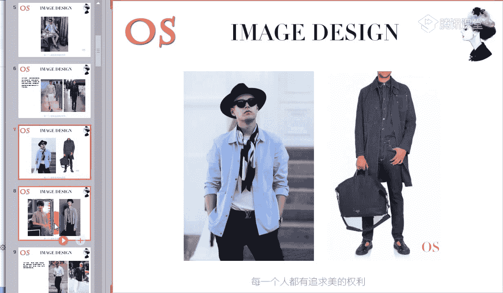
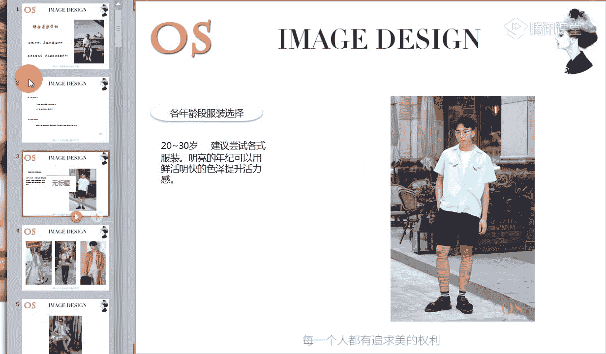
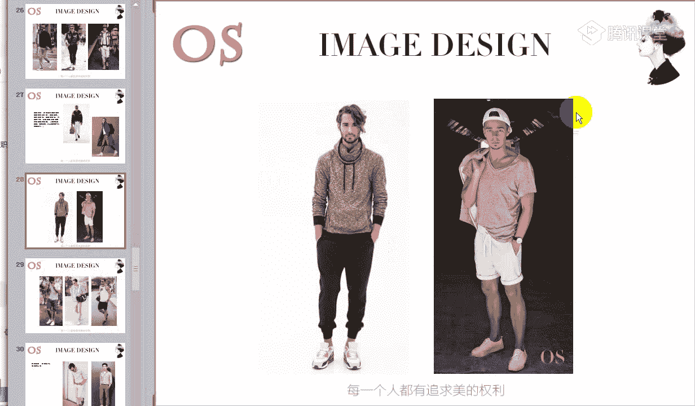
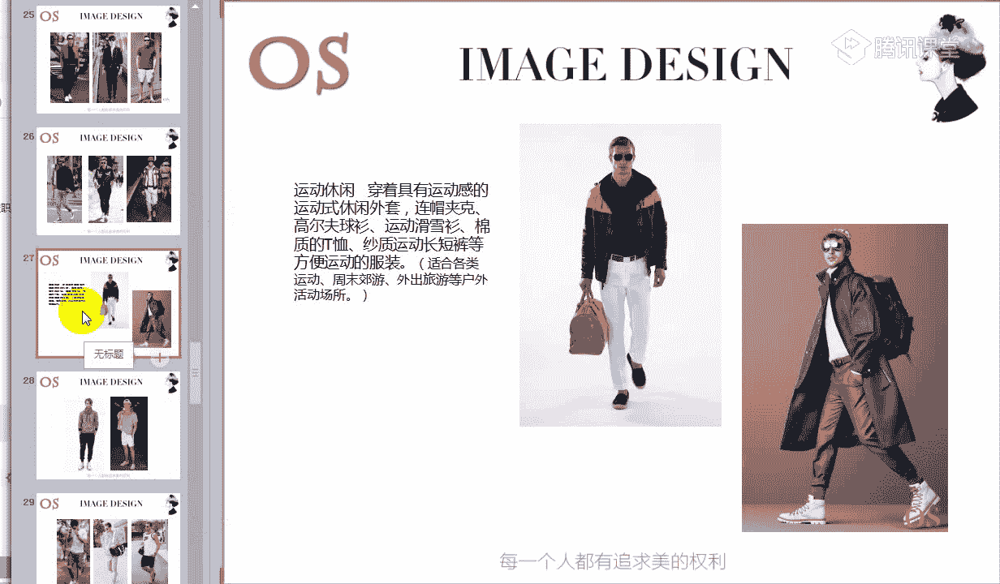
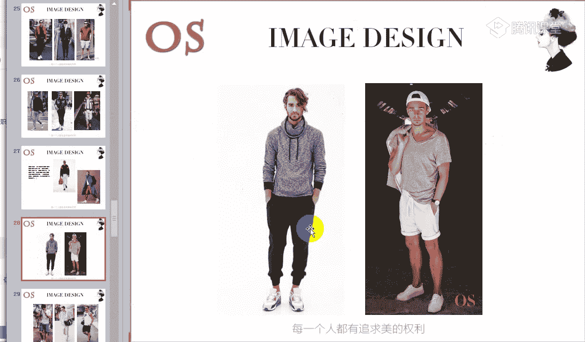
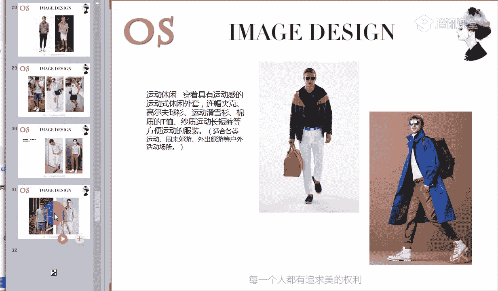
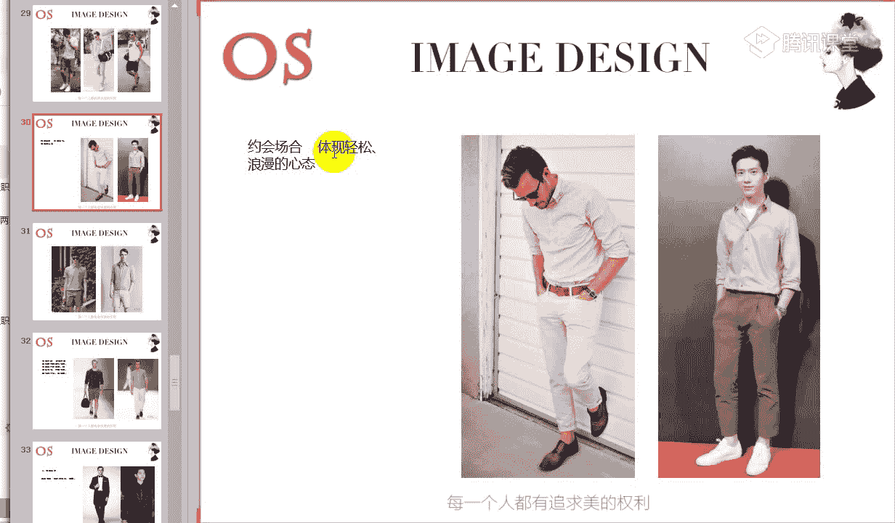
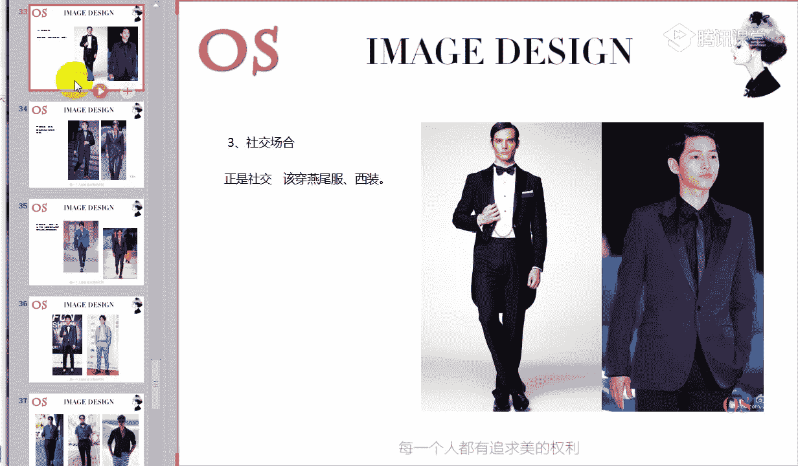
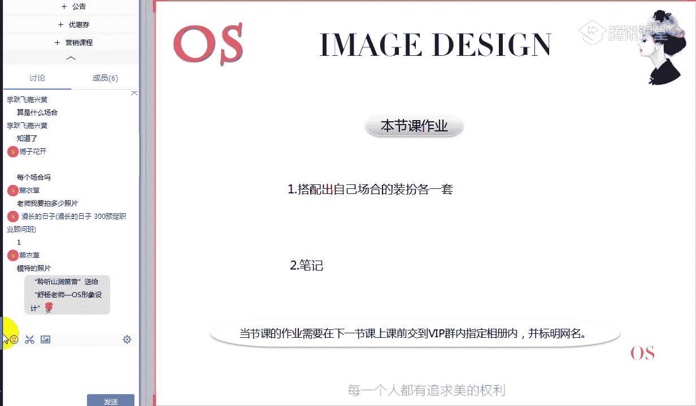

# 1、14男士个人形象班第二期（中级版）VIP课程：第4节、场合着装常识

🎼好的，亲爱的同学们，大家晚上好，欢迎大家来到我们OS男士课程。那我是本节课的主讲老师舒阳。🎼上一节课呢我们学习了体型，在体型修饰问题上，我们知道了色彩、材质、图案、款式对于我们体型的这样的一个影响。

那掌握这些后，我们还要根据场合的不同，选择不同的颜色进行色彩搭配，根据场合的不同，选择不同的材质、图案、款式等等来进行调整。所以说接下来呢我们先首先先看到本节课的重点知识。

🎼好，本节课学习重点。第一个呢就是我们要掌握不同年龄段服装的选择。第二个呢会讲到不同场合的服装特点，这是我们本节课的两大重点。那对于大家的一个要求，就是学习完之后，我能够清楚在这样的一个年龄段。

我应该怎么样在自己色彩和服装的这样的一个风格上的一个基础来选择服装以及呢不同的场合，我们应该怎么样去进行调整。🎼好，先进入我们各个年龄段的这样的一个知识。

首先呢老师在讲接下来各年龄段服装选择这样的一个知识的时候呢，我要强调一个重表，希望大家一定要听清楚。🎼各个年龄段装扮上的所有技巧，还有包括我们的关键词啊，包括老师写在屏幕上面的这样的一些关键词。

都是建立在我们个人整体色彩和风格体型之上的。明白吗？明白同学跟老师扣个一。🎼老师接下来再讲解我们各个年龄段服装的一个选择，一定是建立在我们个人整体的这样的一个色彩剂型和风格。

以及体型之上的理解同学给老师扣个一啊。啊，如果说有同学不太了解的哦，不能够去理解老师这句话的，也可以跟老师在公台上扣个2。🎼有没有是不了解的哦？如果了解的同学快速跟老师在公台上扣个一。🎼不了解的扣2哦。

还有。🎼要速度啊，赶紧速度跟上。🎼有同学了解了，也有同学呢是不了解啊，那么其他同学能不能理解老师说的这句话啊，要快速的。那简单的跟大家解释一下，因为我们都知道在上学习这样的一个男士课程中之前。

我们首先是了解了自己的色彩剂型，也了解了自己的这样的一个风格。当当然在第三节课我们也了解了自身的一个体型，对不对？而我们的色彩也好，我们的风格也好，我们这样的一个体型也好。

其实它跟我们的行色制是非常有关系的。而接下来老师在讲解这样的一个各年龄段服装的选择的时候，其实同样他也会提到行色制的这样的一个要求，包括我们的一些呃流行元素等等。所以说大家要知道我们的基础是不能够变的。

也就是说我不能够因为我这样的一个年龄段，在处在这样一个年纪。所以说我甚至可以去选择一些非常纯度高的色彩。也就是我们在选择色彩的时候，一定要结合到自己的个人用色这样的一个范围来进行了划分。理解了吗？哦。

包括我们李跃飞同学啊，能不能理解，理解的话跟老师扣个一。所以说比如说举个例子，接下来我们说到各年龄段服装的一个选择，会涉及到啊不同的年龄段。首先呢是20到30岁这样的一个年纪，对不对？

所以说在这样的一个年纪的话，我们可以看到屏幕上老师所提醒的，就是建议在这样一个年纪，我们可以去尝试各式各样的服装，包括明亮的年纪，我们可以用一些色彩上鲜活明快的颜色来提升你整个活力。

那我们都知道鲜活明快的色彩，它是什么样的一个范围呢？是不是指明度高，或者是说我们这样的一些纯度高的色彩，对不对？因为像我们浅淡的色彩才能带来明快鲜活的感觉。

所以说我们在选择这样的一些鲜活明快的色彩的前提呢，一定是要在你的用色范围内。它的明度高或者是说纯度高的色彩理解了吗？啊，理解的同学再次跟老师刷个鲜花，所以说就是这个意思啊。

一开始老师跟大家强调的就是各个年龄段装扮上的所有技巧，关键词都是建立在我们个人整体色彩风格体型之上的。哦，不是说我们想怎么样去穿，就完完全全按照各个年龄段去进行装扮，而是我们要。🎼万变不离其尊哦。

一定要去关注到你自身的体型，你的色彩剂型，你的风格。然后在这个上面我们去做文章。好，第一个就非常的简单。20到30岁，我们采用了多去选择一些鲜活明快的色彩哦。包括我们如果是夏季型的。

我们就选择冷色调里面，你自己的用色范围中这样的一些浅淡的色彩，包括我们的冬季型的男士。如果你在这样一个年纪的话，虽然说我们适合去穿一些暗青色调，对不对？

但是我们也要多去采用一些暗青色调里面呢鲜明的这样的一些色彩，纯度高的一些色彩。大面积的去穿穿出来。因为在这样的一个年纪，我们就穿的呢鲜活一点。这是我们第一个。

那包括呢在材质上面的这样的一个选择以及图案上的选择呢，你可以完完全全按照你自身的风格，按照你这样的一个体型来做啊划分。

这是我们第一个就是20到30岁这样的一个年龄段。接下来呢就是我们30到40。如果说有处于这样一个年龄段的男士，或者说我们即将进入到这样一个年龄段的男士，你会发现这个年龄段。

它其实对于服装的材质是有一定的要求的。因为毕竟我们已经进入了这样的一个职场状态，甚至像很多一些男士在这样的一个年龄段，他是已经达到了这样的一个管理层，对不对？甚至呃有的同学非常发展的非常好的。

我们都已经是哦高级管理层的这样的一个位置了。所以说在穿着上面呢，第一个我们要去凸显自己的职业感。因为在这样的一个年龄段，如果说我们大部分时间啊有工作的男士，对不对？我们大部分的时间都会投入到工作中。

所以在挑选服装的时候呢，我们也要多以这样的一个职业感为主。那第二个呢就是精致感啊，精致其实第一个穿对自己的风格，你就能够凸显你的精致，那第二个我。🎼我们第三个所看到的就是品质感。

所以说到了这样的一个年纪，我们就不会说再像20到30岁这个年龄段，我们可以穿好一点的材质，也可以穿稍微差一点的材质啊，到了这样的一个年龄段的话，我们对于材质的要求是有一定的这样的一个标准的。

不是说啊随随便便100多块钱的裤子，我们也能够去穿出品质感不一定哦。所以说我们对于服装的这样的一个品质是一定要注意的。在这样一的年龄段。🎼那另外虽然说我们表现了职业感，表现了精致感。

也表现了这样的一个品质感，也不能忽略掉我们的流行元素。不是说要把自己穿的特别的成熟，特别的老气。那当然我们可以随着这样的一个每一年的流行趋势呢唉相辅助的去进行增加。就比如说流行印花的衬衫，对不对？

那我们也可以去选择印花的衬衫。但是呢整个衬衫的材质上面，我们可以去选择这样的一个品质感好一点的当然，衬衫的图案也要跟你的自身的体型和你的风格所结合，这是第一个。

那包括呢我们也可以去多加入一些尖锐的哦流行的一些元素，比如说像拉链哪，或者说我们像这样的一些休闲场合中所穿到的一些铆钉的一些增加呀，或者是说我们这样的一些名的扣子啊等等，都是可以的。

也就是说一定要把握好这样的一个度休闲场合哦和我们这样的一个职业场合中，职业场合中，我们可以可以哦。穿的非常的稳重，我们以正装为主。但是在休闲场合中，我们一定要把握好志气和成熟间这样的一个平衡。

🎼就比如说我们可以看到这张照片其实是非常非常好的一个典型的一个代表。我们知道西装一般给人的印象就是比较的呃死板的，没有什么太多的一些特点，对不对？但是我们会发现加上这样的一个拉链的一个设计。

马上就增加了它的这样的一个前卫哦感，也增加它的这样一个时尚度，也增加了整个的这样一个服装的层次感。所以说这个就是在成熟和稚气中找到这样的一个平衡的一个方式的一个典型服装的一个代表。

那另外呢还有就是我们包括到了这个年龄段要强调的一个品质感，其实我拿牛仔服装来举例子，我们可以看到有的牛仔服在第一节课老师就已经把这样例子跟大家说明白了，对不对？有的牛仔服装。

它很难去凸显这样的一个品质感。但是我们会发现有一些牛仔套装的话，它的品质感是非常强的。就像我们这样的一些不带任何的抛光材质的哦，抛光这样的一个技巧的，就会。更能够凸显你的这样的一个稳重职业。所以说。

🎼这也就是拿我们的牛仔裤也好啊，我们的牛仔外套也好，或者是牛仔衬衫也好，来举这样的一个例子。所以说我们要去懂得看这样的一件衣服，其实品质感、精致感都能够从我们的服装的形色质去凸显的。哦，什么是抛光？

我老师说的，就是比如说像有的牛仔裤，它会有白一块的地方，对不对？我们就是进行了这样的一个抛光的技巧的一个处理了。

🎼所以说你可以看到就是有的衣服，我们可以看到老师举几个例子，让你们大家呢观察一下。🎼你会发现有的一些衣服穿到身上就是非常的休闲随性，对不对？唉，没有太多的这样的一个精致和品质感。

但是有的衣服你就会发现唉非常的能够去凸显，其实都是因为我们的形色质的不同所带来的那再到了这样的一个年龄段的话，再次的要跟大家强调啊精致和品质是不能忽视的。包括我们在选择T恤的时候。

包括我们在选择这样的一些呃。

polo衫的时候等等，都是非非常非常要注意的，能理解吗？啊？理解同学跟老师扣个一。不是说到了这个年龄段，我们在进行休闲装扮的时候就不能够洋气。我们可以很洋气。

可以去增加你所适合的你的整体风格中所适合的这样的一些服装款式。但是我们要知道，在挑选服装材质的时候，一定要注重好整体的品质感。好，对于这样的一个品质感的一个追求，大家有什么问题没有啊。如果有问题的呢。

快速的在公台上提出来。如果没有任何问题呢，跟老师扣个一。包括大家也可以看到，我们拿30到40岁这样的一个年龄段的服装去跟我们刚才所看到的20到30岁这样的一个年龄段的服装去进行对比的话。

其实你们能够看出来哪一个会更加的高级，对不对？能够去凸显这样的一个高级感。不一定是因为这件衣服的呃贵或者说便宜所带来的啊？我们都知道你像明星一件衣服也不便宜，对不对？跟我们这件衣服的价格可能都差不多。

但是有的衣服它就是能够去凸显这样的一个品质感啊，有的衣服就会更加趋向于这样的一个年轻的呃随性感。

好，有没有问题啊？如果没有任何问题的，快速跟老师刷朵鲜花啊。大家在上课的过程中不要开小差哦，要认真的听课，有任何问题赶紧提。🎼记住我们这个前提条件啊，然后接下来呢就说到40到50岁这样的一个年龄段啊。

40到50岁的话呢，我们要追求的是简单经典。所以说在这样的一个年龄段的话，其实我们不需要在造型上多么的去花心思，而是我们要去追求一些小细节。所以说第一个我们可以看到的，除了经典和简单以外呢。

我们做工要上乘。可能啊比我们在30到40岁，我们对于品质的一个追求会更厉害啊。因为到了这样的一个年龄段的话，你们会发现。🎼你们会发现，其实随着年龄的增长呃，会给人松弛甚至垮塌的这样的一个印象啊。

因为我们人都是会老的，对不对？所以说呢我们需要去追求这样的一个服装的整体的材质，也就是说上乘的材质，它给你的整个身形会达到这样的一个塑形的一个效果。那第二个就是我们在这样的一个年龄段，如果你有实力的。

我们可以去追求品牌。包括我们在场的顾问，如果你在以后的职业人生活中啊，人生中遇到的这样的一些高端的客户，在在这样的一个年龄段的话，我们是一定要去追求品牌的呃，对于他们来说。

品牌肯定是比我们一般的这样的一些呃服装要好很多。那还有就是非常重要的一个点，就是有焦点的设计，体现我们这样的一个情调。其实为什么说有焦点的设计呢。

其实像我们在休闲场合中一定要去增加这样的一些有焦点的设计。比如说我们可以看到像口袋金。🎼或者是说我今天在搭配这样的一套西装的时候，我可能把我们的领带的颜色进行一下变换，对不对？

选择一些纯度高的色彩来凸显我整个这样的一个焦点，也能够去体现我的情调。那还有呢就是在休闲场合中，我们一定要注意的就是我们可以除了在职业场合中，我们利用领口袋襟，或者说啊我们这样的一个领带以外。

或者说我们这样的一些手编呢袖扣啊等等。其实在休闲场合中，我们也可以运用到这样的一个丝巾，或者说我们这样的一个口袋襟啊，包括在这样的一个年龄段的男士，我们选择外套的时候，可能会选择一些休闲款式的西装。

对不对？那其实不仅仅除了正式西装，我们可以搭配这样的一个口袋襟以外，其实休闲款式的西装，我们也是可以去搭配口袋金的让我们这样一个口袋巾呢，在整体服装搭配中起到一个焦点。大家也可以看到焦点重不重要呢。

其实非常的重要。我们拿。🎼这两个年轻的小伙子来举例子啊，一个是同样都是上半身全部都是白色和白色做搭配，对不对？但我们会发现，如果全白的情况下，没有任何的焦点，就会显得非常的单调。

但是我们会发现如果说增加一个小的一个细节，小的一个亮点，那整体的服装感觉就会不一样，对不对？而且也能够更加凸显这样的一个情调感啊，一定是左一比我们的右二啊，要显得情调感强很多了。

那还有呢就是在这样的一个年龄段的话，我一定要跟大家增加呃强调一个重点，就是在这样一个年龄段的男士，我们是一定要多选择带领子的服装啊。不管是你休闲的外套也好，还是我们这样的一些正式场合的，我就不做多说了。

那包括我们如果说内搭是圆领的，我们的外套也一定要选择哦这样的一个带领子的，要么就是你在夏天的时候，我们单穿的时候就多去选择带领子的这样的一个T恤。为什么呢？因为我刚才所说到的，就是随着年龄的增长。

我们整体的身形会有这样的一个垮塌，甚至松弛的这样一个感觉，对不对？而我们的领子，它会增加我们整体的刚毅感来凸显我们的精气神，会给你的整体身形的，制造这样一个有骨气啊，有深骨的这样一个感觉。

包括我们去选择这样的一些有品牌的哦，品牌效应的服装也好，还是做工上乘的这样的一些材质也好等等啊，还有包括剪裁也好，其实都是在突。显我们的深骨哦。🎼理解吗？啊，这个就是老师跟大家强调的。

40到50岁要注意简单经典，做工上乘，追求品质。那还有就是呢利用细节去凸显我们的情调，来凸显我们整体服装的一个焦点，来体现你的生活品质。🎼这是我们的一个例子。所以说到了这个年纪的男士。

我们可以多在呃我们的这样的一些项链啊，或者是我们的口袋巾啊，我们的丝巾上面，包括我们的袖扣啊等等啊，鞋子都可以多下一点功夫。好，接下来就是我们50到60岁这样一个年龄段啊。如果说还在工作状态的话呢。

我们就在经典里面加入舒适。就比如说我们。🎼在工作场合中，在职业场合中，我们势必要去表达我们的严谨的一个感觉，对不对？包括一会儿老师会讲到不同场合的一个着装啊，我们可能会选择到西装。

那其实在这样的一个年龄段的话，比如说随着年龄的增长。我们身材的一个变化，可以去选择一些大版型的西装，或者是说休闲感比较明显的这样的一些西装可以的。

但是我们会发现西装中它其实还是能够去凸显我们整体的这样的一个经典以及工作的状态的。所以这个就是等于是我们把西装的材质，把西装的款式增大之后，它能够在经典里面去凸显我们这样一个舒适感。

那包括我们也可以跟西装做搭配的时候，唉加一点这样的一些羊毛衫啊，或者是说增加我们这样的一个扣子和我们的。🎼领带的一个配合，对不对？一般可能我们在选择西装的时候，可能会系领带。那到了这样一个年龄段的话。

其实我们也可以把领带拿掉啊。甚至的话我们也可以看到，其实这个都是呃在正式中加入舒适感，在经典中加入舒适感，或者就是说我们如果已经退休了，我们就以自身的风格，然后结合舒适为主。如果你是前卫风格的。

我们可以去选择前卫风格的服装。但是在选择这样的一个服装的时候呢，我们也要注意整体服装的版型，你不要穿的过于小气啊，我们还是要注重好这样的一个舒适。🎼啊，这个就是我们五六十岁这个年龄段啊。

如果是分为两个阶段的，一个是你还在工作状态，一个是你已经退休了。退休的话就是以自己的风格，然后加入舒适，非常非常的简单。那还有呢就是随着年龄的再次的增增长啊，在这里提一下。

可能我们有70到80岁这样一个年龄段了。那其实在选择服装中呢，我们就以舒适为主。那任然后在色彩上面要跟大家强调一点，就是多去选择一些浅淡的色彩。因为年龄段增长了，你再穿深色的话呢。

你的这样的一个整体的气色hold不住，所以说我们要多去选择一些浅淡的色彩穿到自己的身上来凸显你的气色。好，这个就是我们整个年龄段，快速跟大家呢。🎼做一个介绍。其实回到刚才老师一开始所说到的一个主题。

就是一定要在自己的个人色彩机型和风格以及体型上面呢去做适当的变化，不要以自己以我们这样一个各年龄段的所要求的为主。当然是以这个为为辅啊，当然是以这个为辅。

🎼所以就比如说我如果是举个例子，如果说我是古典风格的，对不对？我到了40到50岁这样的一个年龄段，我同样穿衣服还是要穿出这样一个精致上乘的感觉。那只是说我还是要在整体的装扮中呢制造一些焦点。

所以说大家要懂得去进行呢替换。🎼好，关于不同年龄段的话，大家还有什么问题啊？有没有问题？没有任何问题的话，快速跟老师刷朵鲜花。接下来我们就看到重点。接下来第二个重点就是我们的场合着装。🎼好。

TPO的穿着原则呢指的就是我们服饰穿着的时间场合和我们的地点。那其实时间非常好理解啊。因为服饰需要跟我们自然界的四季来进行变化，对不对？我们有春夏秋冬，我们有这样的一个昼夜。那第二个呢。

我们所说到的地点，其实就是指的服饰，需要跟我们社会环境相适应。比如说你是在乡村哦，你是在哦这样的一个郊区，还是说你在城市，哎，你是在国内还是在国外，你是在室内还是室外啊，这就是你的这样的一个地点。

啊场合指的是什么呢？场合就是指我们服饰需要跟周围的这样的一个环境气氛相协调。你是在开会，还是在哦谈判，还是在跟别人呢举办这样的一个宴会参加宴会，还是说在约会，在看电影等等。这个就是我们这样的一个场合。

现在的社会的话，其实我们作为每一个男士都能够体现哦，都能够。🎼体会到个人形象，对于你事业等各方面的一个巨大影响。包括尤其是我们如果搭配的不是非常的恰当的话，或者说不合时宜的话，也会给人不太好的第一视觉。

对不对？这这个之前老师有讲到过。那包括我们可以看到接下来呢重点跟大家来分析我们在人生活中都会碰到哪些场合。那对于这样的一些场合中，我们应该怎么样去穿衣搭配。第一个就是职业场合。那当然职业场合中呢。

我们也是有划分的。我们分为呢严肃职业场合分为我们一般的职业场合也同样分为我们这样的一个时尚休闲场合。🎼第一个就是我们严肃职业场合。那包括我们大家都知道，在严肃的工作这样的一个职场上，工作状态下。

非常非常的要去凸显我们的坚定，要去凸显我们的严肃，要去凸显我们这样的一个严谨。所以说其实通过这样的一个场合，我们都知道对于场合的着装，其实就是跟我们的行色制息息相关的，对不对？

所以说提到坚定严肃严谨的话，大家会想到哪些颜色啊，快速的在公台上呢把你想到的颜色给老师打出来哦。说到严肃严谨坚定啊，这样的一个整体。🎼理性的感觉，大家觉得什么样的颜色会符合？🎼好。

有同学说到了黑色嗯可以扩大面积啊，可以用。比如说我们可以直接说到这样的一些呃明度啊，纯度的这样的一个范围都是可以的。好，白色和蓝色，还有同学说到。🎼职业场合的这样的一个严肃。

职业场合的一个氛围是非常严肃的，而且它是快节奏，它是要理性的理性的，对不对？甚至的话我们还要去表达自己的严格强硬感啊。所以大家要想一下，白色能不能去表达强硬感，能不能去表现这样的一个针锋相对的感觉。

🎼所以说呢哎不能，对不对？所以说我们在选择在这样的一个严肃职业场合中，我们各位同学可以根据自己老师所说到的这样的一个用色范围中，你这样的一些稳重的偏稳重的色彩为主。也就是说我们可以多去选择比如说黑色呀。

或者说有些同学，比如说像我们的秋季型的同学啊，或者说春季型同学，我们也适合这样的一个冷呃暖色，对不对？我们也可以去选择深棕色。包括我们有同学说到的啊，还有就是呢有同学所提到的这样的一些。🎼冷色型的。

我们比如说藏青色对藏青色都是可以的。是的，所以说呢这是我们对于色彩的一个选择。第二就是在整体服装上面，我们一定是要选择套装啊，都是要成套的去穿着，以正式的西装为主，以正式西装为主。🎼这是第二个。

那第三个还有就是我们在搭配鞋子上面也要注意。一会儿呢接下来的知识中老师会讲到我们的鞋子，我们会发现皮鞋有很多种的划分。但是在这里大家先要记住，就是在正式的严肃职业场合中，我们千万不要选择镂空花纹的鞋子。

而要选择我们这样的一个光面的哦。

这是第二个。那还有第三个就是。搭配正装势必我们要选择领带，对不对？我们要选择领带，所以说呢领带也要尽量选择适合的颜色，也要以我们稍微偏稳重的色彩为主啊，不要去选择一些纯度太高，或者说明度太高的色彩啊。

还是以稳重为主。那包括在我们的秋冬季节，天气暖了啊，冷了之后呢，我们可以在外面去套上这样的一个正式感比较强的简洁的一个正式西装的一个加长版的一个大衣，或者是说呢少一些设计的这样的一个风衣。

我们会发现有些风衣的话，它的休闲感是非常强的。就比如说像我们这一件啊，你会发现袖子它会有这样一个拼色的感觉，对不对？但是有的风衣的话，我们会发现非常的简洁啊，很少选择这样一个越简洁的越好。

可以在正式职业场合中去选择去搭配。呃，不要袖扣，不是说不要袖扣，是在选择这样的一个袖扣的时候，我们要以稳重的袖扣为主啊，简洁的袖扣为主，不要去选择一些有。设计感的或者是说色彩比较跳跃的这样的一些袖扣。

那包括我们在夏季的时候呢，也建议各位男士呢，我们可以去搭配衬衫哦，衬衫搭配。西呃领带，然后呢搭配好我们的西装裤就可以了。外套我们可以拿下好。在夏季的时候，当然一般的话。

可能如果真的有这么严肃的职业场合的话，我们在室内一定是有空调的，对不对？也可以把西装成套的去穿着，是没有任何问题的。

好，这个是我们的严肃职业场合中哦，在选择色彩以及在选择我们整体的服装上面，以套装为主啊，正式的套装为主，不要去拆套穿哦。🎼西装套装千万不要拆套穿，要成套的去穿着。然后呢。

色彩上面尽量以我们的深色哦稳重来凸显稳重感。皮鞋不要选择镂空花纹的领带的色彩跟西装的颜色呢最好是类似。🎼好，第二个就是我们的普通的职业场合，一般的职业场合。如果说大家呢目前来说哦。

我们严肃的职业场合指的是什么？就比如说正式的会议，对不对？还有包括像我们这样的一个谈判，还有包括像老师刚才所说到的出访演讲啊，商务会议等等，这些都是属于严肃的职业场合，包括如果你目前我们。🎼在座的学员。

你有属于在这在这样的一个企业中，你属于中层管理或者说高层管理啊，这样一个管理者的话，其实你的职业状态也是属于严肃的职业场合，我们在穿着上面呢也要趋向这样的一个方面去进行发展，选择服装。

那第二个就是一般职业场合可能针对的是我们一般的比较偏哦小一点的管理层，或者是说一般的普通员工，那还有包括这个都是属于我们的一般职业场合，还有一种就是什么呢？有一些公司可能对于服装是没有任何要求的。

对于员工的着装。那其实这个都是属于一般职业场合。在这样的一个场合中呢，我们在选择服装的时候，不要去突出自己的个性啊，不是说我是前卫风格，我在选择服装上面，我就要唉比如说前前卫一点的个性一点的图案。

或者是说呢哎我这样的一些有光泽的材质等等。不要以凸显个性为主。而我们要在整体装扮中呢。🎼体现我们整体的这样的一个平和感。那色彩在一般职业场合中，我们多去选择着色啊，多去选择着色，以着色为主。

然后呢再结合你的用色中这样的一些浅淡，或者是说啊深色调的颜色为辅助，一起去进行搭配。🎼对于一般职业场合的男士的话呢，我们上半身一定是要去凸显正式感的，下半身去凸显休闲感。

但是休闲感不等于大家可以去穿牛仔裤啊。也就说在这样的一个场合中呢，我们可以多去选择这样的一些休闲裤啊，或者是说我们这样的一些锥字型的西装裤都是可以的。🎼但是上半身的话，我们一定要去凸显正式感。

而正式感我们最不能忽略的就是有领子的服装。所以大家可以看到哦，不管你是单穿衬衫也好，还是去挑选我们的T恤也好，我们都要选择带领子的。不要去选择没有领子的设计的这样的一些服装。那包括在秋冬季节的话呢。

我们去选择休闲感强的西装外套，还是说去选择类似于这样的一些夹克，我们都要知道夹克的设计简洁明了，才能够去凸显你的职业感，千万不要去选择一些过度设计的，或者是说有一些过多的一些名兜啊哦。

或者是说这样的一些拉链啊等等过多的。这个都是不符合职业场合的穿衣。我们要以简洁简单、正式为主啊。可以穿穿着有休闲感，倾向的西装，休闲感倾向的西装。

🎼好，这是我们一般职业场合。大家可以呢接下来看看我们图片中啊所带来的这样的一个感觉。大家可以看到一般职业场合中，我们跟我们的正式职业场合中的一些穿衣是不是要弱化了很多？

🎼会带来一定的休闲感。但是在休闲感的前提下，它还是以我们的正式为主的，还是要去凸显我们的正式。所以包括在这样的一个场合中呢，我们还是可以去搭配领带和衬衫。

但是领带的颜色以及我们衬衫的颜色呢就不需要那么的稳重了啊，可以去挑选你的用色范围中最佳的一些色彩来穿着。当然，不要去选择一些纯度高的纯度高的色彩还是不适合在一般职业场合中出现的。🎼因为太过于个性了啊。

这是我们这样的一个一般职业场合。接下来呢我们讲到时尚职业场合。时尚职业场合指的是比如说我们的这样的一些形象设计师啊，或者是说我们的这样的一些造型师、化妆师等等啊，编辑、时尚编辑、服装编辑等等。

这个都是属于时尚行业的那如果我们现在从事这样的一个职业的话，我们都是属于时尚职业。时尚职业来说，在选择服装的时候，其实就是根据你完美的去结合你的用色，结合你的身材底型，结合你的风格去穿着。

可以大胆的去穿着。但是大胆的前提下呢，我们还是要去表达一定的职业感，要表达一定的职业感。所以说我们可以去多增加一些自己所适合的元素，色彩也好，或者是说我们这样的一些小方巾。

或者是说哎我们这样的一些口袋金等等啊，都是可以适当的去进行增加的。但是呢。🎼要整体来说，我们还是要去凸显一定的职业感，不能完完全全放飞自我。就像完全在这样的一个休闲场合中。

我们穿一些过度休闲哦造型的服饰。🎼啊，这个是我们这样的一个职业哦，时尚职业。大家会发现时尚职业跟我们的一般职场和我们的严肃职业场合来说，它对于色彩的要求就要高了很多，对不对？

我们不不一定完全要穿一些稳重的色彩，或者是说唉简单平和的色彩，我们也可以去穿一些亮色，这个是完全可以的啊，这个就是我们不同的职业场合中的一个穿搭。对于我们三个职业场合的一个穿搭，大家还有没有什么问题。

🎼有没有问题啊？一定要快速的等着懂得去进行辨表。一会儿老师再讲完。🎼所有的场合的时候，我会出几个图片来考一下大家哦，没有任何问题同学能快速跟老师扣个一。然后在我们职谈到职业场合中。

老师要跟大家强调一个重点就是。🎼如果我们跟客户是在咖啡厅会面，但是我们所交涉的内容是跟我们的工作有关的。这个也属于我们的职业场合，只是它只是算我们的半职业场合。那对于这样的一个场合的。

虽然它的场合氛围是开放的友好的，可以允许我们穿一些时尚感的西装啊，衬衫领带，我们也可以时髦一些。包括我们去选择便装式的西装也是可以的。但是不要以为在咖啡厅跟你的客户会面啊，因为他不是在工作中。

不是在公司，所以说我们就把它定定为这样的一个休闲场合。这不是属于休闲场合，这还是属于半职业场合。因为你所谈的内容还是跟工作有关的。所以说我们势必还是要去凸显自己的整体的文感。🎼好。

第二个呢我们就说到休闲场合啊。首先呢我们来说到的就是都市休闲啊，我们可以看到休闲场合中呢，老师写了一句话，就是突出自己的个性。所以说到了这样的一个场合的话呢，你们在选择服装的时候。

就完完全全按照自己的三个要素来穿着你的体型，你的风格，你的色彩进行来穿着，不用去有任何的顾忌啊，把你最适合的都穿到这样的一个场合。而且作为都市休闲的话呢，我们会发现都市所处的环境啊。

是有这样的一个都市文化的。比如说看电影逛商场。所以说我们在整体穿搭上也要去穿出这样的一个时尚感，穿出一定的啊尖锐的这样一个都市的文化。所以呢这个是我们一定要注意的一个重点啊，包括我们可以根据自己的爱好。

哎自己的风格去进行特定的一个选择。你适合选择花色的衬衫，我们就可以多去把这样的一些花色衬衫穿到自己的身上。唉，你适合。去选择一些大廓型的服装来凸显这样一个休闲感，对不对？

我们就可以多去选择这样的一些休闲感强的服装。总而言之呢，就是你适合什么，你就穿什么，包括在往后的课程中，老师会讲到不同的风格的一个穿搭。所以说其实就是在这样一个场合中，我们完完全全按照自己的风格。

按照自己的体型修饰啊，按照自己的用色去穿着就可以了。不用去有任何的一个顾忌，而且在整体装扮中，我们一定要去凸显自己的时尚感，不要去做一些弱化啊，不要去选择。

比如说把我们类似于在运动休闲场合所穿的服装穿到了都市休闲中啊，这是有一个划分的。

包括的话在色彩搭配上，我们我们也可以多去增加今年的一些流行色，跟你自己所相适合的色彩穿到自己的身上，充分的去表现自己独有的个性，这是最佳的时效啊，这是我们的休闲场合。要记住休闲。

🎼都市休闲场合是指的是我们这样的一些购物娱乐活动等等哦，它不包含约会哦，不要把约会也定奠定到我们的都市休闲啊，这个不属于这样的一个范围。好，那刚才老师苏说到了。

🎼千万不要把类似于这样的一些运动款式的服装呢，穿到了我们的都市休闲场合。因为运动休闲它有特定的这样的一个服装。我们在运动休闲，比如说去踏青啊，运动或者说周末郊游、外出旅游等户外的这样的一些活动场所。

比如说哎在户外烧烤啊等等。这个都是属于运动休闲场合，那我们在选择服装的时候呢，要在舒适的前提下哦，方便我们的运动，对不对？所以说呢我们可以去选择类似于这样的一些。

色彩纯度高的颜色。因为我们在户外，你大家会发现很多户外品牌的话，它所采用的色彩大多都是以这样的一些纯度高的色彩为主的那还有呢就是我们可以看到像连帽的夹克呀，运动款式的。

像高尔夫夹克或者是说我们这样的一些棒球夹克等等啊，它都是非常能够去凸显我们整体的运动休闲哦，包括我们可以看到像类似于这样的几身搭配啊，都是属于运动休闲场合穿着的。所以大家一定要记住。

像类似于这样的一些服装，你会发现像左图第一套对不对？第一套服装，你觉得它有完完全全去凸显整体的时尚嘛？并不能去凸显两个时尚的一个概念，对不对？凸显我们都市的一个前卫感，反而的话比较的平比较的淡。

所以说整体的服饰来说也是比较舒适的，反而适合我们在运动户外的时候呢去选择。呃，我今天又逛街，又要去公园，要换两套衣服吗哦。如果说你是去逛街的话，你去公园是干嘛？你去公园应该就是坐在那里，对不对？

不可能说我们要去怎么样去运动吧。如果你是去公园跑步的话，那肯定你要换衣服了，我们不可能穿着逛街的衣服去进行跑步啊，这是一定的。但如果说你只是休闲娱乐的话，你去公园，只是休闲娱乐的话。

我们就可以逛完街之后直接去公园，不用去换衣服，老师只是说的指的是这样的一个前提条件。当然如果你是去公园跑步或者是散步的话，我们当然穿的服装穿的鞋子也要舒适感强一点，能理解吗？啊，理解同学跟老师扣个一。

因为你会发现在都市前中，我们可能穿的一些鞋子，它并不是特别好。特别舒适。比如说我们去爬山，我们不可能说唉穿着一个凉鞋去进行爬山，对不对？但是在都市休闲中，我们可以去穿一些非常有个性的。

或者是说呢唉比较瘦比较尖的这样的一些鞋型。但是在运动休闲中，我们去选择的服装也好，我们的鞋子也好，应该是非常方便我们进行这样的一个攀爬，或者说行走的。

所以说在运动休闲中啊，我们以舒适为主啊，以舒适再加上这样的一个运动啊，方便。来凸显我们的明朗活泼啊，这样的一个朝气活力的感觉，健康的一个动感。这是我们的运动休闲。接下来我说到一个重点。

就是我们的约会场合，一定要记住，约会场合不等同于我们都市休闲啊，它还是有一个细段的一个划分的。因为我们会发现，如果在都市都市休闲中，我们可能要穿的非常非常的个性，对不对？哎，非常的这样的一个前卫啊。

最符合自己的一个状态。但是大家也会发现像这样的一些服装中，你会发现有一点点这样的一个灰感，就是比较的冷。而我们去进行约会的时候，大家觉得要去展现自己的哪一面啊。

大家觉得在约会场合中是要去凸显自己的个性呢。

还是要去表现自己的轻松浪漫的约会心态啊，大家觉得是要凸显自己个性的同学跟老师扣个一，觉得是要凸显我们轻松的氛围。然后呢浪漫的整个的一个心态的跟老师扣个2。🎼呃，要浪漫，对不对？

所以说我们在都市休闲中要去凸显自己的个性。那里我们会发现个性最感最强的像我们的戏剧风格，像我们的这样一个前卫风格都非服装上面都非常的有个性，对不对？那我们如果说在约会场合去穿着一些呃破洞的款式。

或者说有一些铆钉的设计，或者说这里啊一块那里一块的话，其实你会发现像这类型的一些服装就会给人一定的一个距离感。而我们在这样的一个约会场合中一定是要给人轻松平和，还有包括整体来说啊浪漫的氛围。

所以说呢这是我们约会场合中在选择服装中一定要注意的各位男士啊。所以我们在选择色彩的时候呢，可以选择自己用色范围中，这样的一些柔和的色彩啊，带有一点点灰调子的，或者说这样的一些浅淡的颜色。

非常适合在约会场合中去穿着。🎼所以就是选择大家色彩群里面最能够体现相应氛围的色彩。我们会发现看到这样的一个色彩的时候，你都能够去联想到老师所跟大家讲调的体现轻松浪漫的一个心态，对不对？

这也就是说色彩的联想，这是我们素色彩的一个基础课。所以说你就选择你的用色范围中能够去凸显这样的一个心态的服装的用色彩，而不要去选择一些过深的，或者是说在设计上面过于呢强烈的这样的一些款式啊。

理解同学跟老师扣个一啊，这是我们约会场合中要怎么样去表达。

选择自己的色彩群里面。🎼最能够体现类似于这样的一个氛围的颜色。🎼好，我们最后一个休闲场合呢就是居家休闲啊。居家休闲的话其实就是不出门的意思啊，就是在家里面啊，你可能呃要打扫卫生啊。

或者说你就在家里面躺着呀等等的啊。其实这就是我们居家休闲。那你这个场合中呢，我们所穿的衣服，就是宽松的样式啊，然后符合我们这样的一个环境的。比如说套头的毛衫呢，手边的毛衣啊。

宽松的衬衫啊、睡袍啊、睡衣啊等等啊，这个就是我们居家休闲的一个整体的服装的款式和要求。好，以上呢就是我们各个休闲场合中要注意的四大休闲场合。第一个就是我们的。🎼都市休闲。第二个呢就是我们的运动休闲。

第三个呢就是我们这样的一个约会场合。约会休闲中应该要注意的啊。第四个就是居家休闲。关于休闲场合中的着装问题，还有没有疑问的啊，没有任何疑问的，再次跟老师刷朵鲜花，大家不要千万不要忽略掉场合的一个问题啊。

场合的着装是非常非常重要的，包括之前在上前就有同学说到，哎，老师我其实就是一个普通的工程师，我没有那么多的场合，我不需要要注意那么多。其实你们要知道，像老师接下来跟。🎼整堂课程中跟大家所说到这些场合。

你一定都是会碰到的，对不对？你一定都是要碰到的。如果说你想让你的形象更加好的话，场合的着装意识一定要有啊一定要有。

好，接下来呢我们看就看到社交场合。当然社交场合它也是有这样的一个分类的。第一个呢就是我们的正式社交哦，正式的社交要穿什么呢？要穿我们的燕尾服，要穿我们的西装啊，所以说它是有特定的。

而且像这样的一个正式社交场合，他给你发请柬的时候，他一定会注明啊，我们要选择吸烟装，我们要选择燕尾服等等啊，这一定是会注明的。包括在我们第五节课，第六节课我们会讲到这样的一个正式场合的礼服的一个选择。

这是会讲到的。所以先大家先记好正式社交的话呢，他在邀请你的时候一定会注明啊，男士要选择什么样的一个服装，女士会选择什么样的服装。🎼あ。🎼第二就是一般社交啊，可能就是我们一些普通的酒会，不是那么严谨啊。

严肃的一些酒会，或者是说我们这样的一些音乐会啊等等啊，这个这都是属于我们的一般社交。那在整体服装上面呢选择合体的西装。在西装上面呢，我们要适当的去增加光泽感啊。大家可以看到，像左图啊。

右图中这一套西装我们是能够去看到光泽感的。甚至还有的西装的话，它的光泽感会更强。也也就是说光泽感的增加，它能够凸显我们的华丽感华贵感。大家能明白吗？像这样的一些酒会啊等等的这些都是属于一般社交。

所以我们要在整体选择西装上面呢选择合体的。然后面料上面去选择一些有光泽感的西装。当然啊这些场合不一定我们到时候会碰到，但是一定要清楚。啊，自然风格也要选择光泽吗？当然哦自然风格也要选择光泽。

所以说在这样的一个场合中呢。在社交场合中，我们就不要有任何的左顾右盼的这样的一个想法了啊。🎼我们要以场合为主，这个时候以这样的一个场合为主。就像我们可以看到哦严肃职业场合，看到严肃职业场合。

老师说到了要穿成套的服装，对不对？而且整个整个西装来说，我们要去选择一些上乘的精致的合体的。但是你也会发现有一些风格来说，他其实穿西装并不好看，就比如说像自然风格的人，你让他穿一整套西装，他其实一般。

而穿整套西装穿的最好看的就是古典风格，但是也不是说我们其他风格，在这样的一个场合中就能够去放弃，对不对？我们还是要穿着这样的一个严谨感，经典的款式，成套的去穿着。所以大家能理解吗啊。

理解同学给老师扣个一。所以男士场合我们是排在首位的男士的场合非常非常重要啊，大于我们的风格。🎼也就是说，如果要给男士做一个排序的话，我们会发现呢场合排在第一位，其次是风格，再然后是色彩。

就像我们可以看到，在职业场合中，我们要去穿黑色的套装。但是黑色穿的最好看的只有冬季型的风格，对不对？冬季型的风格穿黑色穿的最好看，其他风格穿黑色都是不适合的，但是没办法，场合的需要，所有色彩进型的人。

在这样的一个场合中，你都必须要穿着西装，穿着这样的一个黑色的套装，所以男士啊场合是排在首位的这也就是再次跟大家敲一个警钟啊，不要觉得场合不重要，场合非常非常的重要。对于我们每个男士来说，场合完了之后。

我们再考虑风格。风格完了之后，我们再考虑色彩，这是一个排序。好，关于这样的一个知识点，大家有没有问题啊，都能够理解同学跟老师扣个一。所以说在休闲场合的时候，在这样的一个都市休闲场合中。

我们才能完完完全全的去释放自己，才能完完全全按照自己的这样的一个特性去进行穿着。🎼万里不。好，第三个就是属于我们的时尚社交啊。时尚社交的话可能就是比如说如果作为顾问来说，在圈里面会有这样的一些酒会啊。

那对于我们这样的一个顾问啊，或者说造型师啊、化妆师啊，或者说其他的这样的一些行业的编辑啊，时尚编辑，我们也会发现有很多这样的一些酒会。那这个不属于一般社交啊，这是属于我们的时尚社交。

因为场合整个圈子来说，我们是作为时尚行业的而且呢是一个这样一个大型的酒会，所以也划分到时尚社交中，包括像明星明星去参加呃某一些的这样的一些社交活动的话。

如果它是跟我们某一些服装有关系的那都是属于时尚社交场合，或者说跟我们这样的一些啊影片啊等等有关系的，对不对？所以说在这样的一个场合中呢，我们穿着上要大胆要突出自己的个性。🎼要突出自己的这样的一个个性啊。

所以说你也可以穿成套的西装，但是你会发现西装上面我们可以多去选择一些图案啊，更加夸张一点的，或者说面料的整体的光泽感以及鞋子的这样的一些个性，对不对？你都可以非常非常大胆的去进行这样的一个挑选。

🎼来凸显自己的个性啊，这是我们的时尚社交啊。关于时尚社交的话，大家还有没有什么不理解的？🎼所以你会发现在我们的正式社交中，我们没有太多的变化，就以我们的这样的一个礼服为主，对不对？但是在一般社交中呢。

我们可能会要弱化一点啊，就穿合体的西装。对，选择合体的一个西装。但是呢西装上面我们可以在色彩在面料的光泽上面去做一些小的变化。但是时尚社交的话，我们会更加大胆。嗯，但整体要以西装为主。是的。

因为它也是属于非常正式的这样的一个场合。所以说男士一旦遇到正式的场合，我们都要去穿穿着西装，一定是都要穿着西装的。

🎼好，这个就是我们的时尚社交场合中，穿搭方面要注意的啊，穿搭方面注意的那接下来呢考一下大家啊，我们来看到图一这样的一张照片，这样的一张图片。大家觉得整套服装中给到哪个场合去穿着？

🎼可以给到哪个场合去穿着啊，快速的把答案打在公台上啊。图一首先先看图一。好，有同学说到休闲啊，你可以要要写明白啊，是都市休闲还是哪个休闲啊？都市休闲嗯。一般职业场合对不对？好，非常棒啊非常棒。

所以说大家要快速的根据我们的整体服装的搭配和形色质能来进行一个判断。这套衣服呢确确实实可以给到我们的都市休闲，也可以给到我们的一般职业场合中去穿着啊，完全没有任何问题。啊，接下来我们可以看到第二套。

🎼第二套服装啊第二套服装给到哪哪几个场合的人去穿着。哦，都市休闲嗯。还有没有其他不同的答案？😡，🎼好，我们的萱衣草合漫长日子非常快速说到时尚职业场合啊，非常非常好。是的，像我们第二套衣服呢。

可以给到时尚职业场合。因为它毕竟这样的一件衬衫啊，它是有很强的一个设计感的。另外的话它的领型也能够去增加我们男性的一定的一个正式感，对不对？所以也可以把它刮刮到我们的划分到我们的职业场合啊。

所以说时尚的职业场合以及我们的都市休闲中都可以去穿这套衣服。那我们可以看到第三套第三套大家觉得。可以给到哪个场合的人去穿着。🎼哦，户外休闲场合哦，娱乐场所。🎼游泳是吧？对，户外休闲场合。

所以说刚才跟老师积极的在回答了，证明你们能够快速的呃对于服装整体所凸显的形色质能有一个非常快速的一个认知。没错啊，所以说第一套我们可以给到呢一般职业以及我们的都市休闲都是可以去穿的。

第二套同样我们可以给到都市休闲，给到我们的时尚职业场合。第三套呢把它划分到户外休闲，把它划分到户外休闲啊，这个就是我们这样的一个场合的一个着装。那大家对于场合着装中，所有的知识点都能够理解吗？

都能够理解同学快速跟老师扣个一。🎼所以呢其实如果有同学对于都市休闲啊，对于我们这样的一个休闲场合中，还有任何问题，或者是说对于我们整体休这样的一个职业场合啊，对于场合的一个着装，还有任何问题的。

你们首先第一个把老师所说到的这样的一些关键性的词语。一定要记下来，加深这样一个印象。第二个呢就是多去看图片啊，多去翻杂志。🎼快速的看到这样的一个男模特的一个整套搭配之后，我能够快速的去分辨出来，唉。

他这套衣服到底可以给哪些人去穿着啊，这个就是来练我们的眼力健啊，可以多去保存一下，多去看一下这样的一个图片。包括呢因为如果说是在线下的话，老师布置作业一定是会让你们买很多的一个杂志。然后呢。

根据杂志上的这样的一些男士的着装，让大家剪下来之后分类，让大家剪下来分类。所以说这样的一个方法，其实对于大家呃快速的来分辨我们场合着装，怎么样去。给自己的场合着装做搭配是有很大的一个帮助的。🎼好。

如果大家对于场合的着装还还没有任何问题的话呢，我们接下来看到作业哦，作业其实就是搭配出自己各个场合的装扮一套，你可以去。🎼按照你自己目前衣柜中的这样的一个服装来进行搭配。

你也可以呢在我们的网上或者是说你买好杂志之后，把杂志上的这样的一些模特的服装呢剪下来，拍照上传都是可以的那第二个呢就是把我们的笔记做好。

还有没有什么问题哦？有没有问题？😡。

🎼作业啊作业有没有问题？如果作业没有任何问题的同学呢，我们就可以下课了啊。🎼好，一定要记住啊，年龄段的装扮是在你的个人的色彩、机型和风格以及身材体型上面去做一些变化的那还有呢就是场合。

场合是在男士中非常非常重要的一个点。🎼一定是场合对于男士来排在首位的，其次是考虑我们的风格。呃，找谁啊，找一个模特，你可以找一个模特，你可以找你身边的朋友啊，男士。找一个特定的模特啊，其实。

🎼对我知道哦，我们知道是女的，因为我们在场很多是高级顾问课程的同学，所以在学男士课程中呢，我们首先要找一个固定的模特。因为接下来呢我们还会讲到很多这样的一些实操的作业。🎼好，有时候一天要辗转几个场合。

有什么好的方法？嗯，没有什么好的方法，就是把各个场合的衣服备上一套啊，这是最最快速的。你就像道为什么说呃有一些明星出席一些活动，或者说他要去有很一天要赶好几个场合的时候。

他的箱子里面一定会备很多好几套服装，对不对？因为场合的不同，对于服装的要求也是不一样的。是的啊，想要美就要付出代价。然后呢。🎼呃，高级班的同学一定要记住啊，要找一个固定的模特。

因为现在你们有一个模特之后，会更加的有这样的一个怎么说呢？有一个重点啊，不会说那么的盲目啊，我不会说这里等老师以后呢讲到我们这样的一个服装的时候，你就越来越懵，到底给谁穿呢？如果你有一个模特之后。

你现在根据他的色彩机型和风格以及体型跟他做。🎼做改变的时候，你的受益会更大哦。🎼好，我是卖服装的那如果说你是卖服装的，你的职业就属于时尚职业场合啊，你穿衣服上面就一定要个性一点啊，要个性一点。

🎼时尚啊时尚职业场合哦，因为卖服装是你的职业，对不对？但是因为跟我们的服装有关系的，我说了啊，跟服装有关的啊，跟我们的化妆跟我们的造型，跟我们这样的一些整体啊，时尚行业有关系的，都是属于时尚职业场合。

啊，如果大家对于我们的作业，还有对于我们本堂课程的内容啊，没有任何问题呢，我们就下课了。还有没有问题啊？没有问题的，在场同学可以快速跟老师刷朵鲜花啊，或者扣个一，我们就下课了。呃，模特的照片啊。

还有包括模特的诊档诊断表格，找老师啊，找老师来领取。🎼找老师来领取表格之后，我会要你们按照我的要求来提供照片，然后老师会帮你们做诊断，告诉你们这位男模特，她到底是什么风格，是什么样的一个啊色彩剂型。

🎼然后往后的课程中，我们就以它为参照标准来进行修饰。好，大家如果没问题的话，我们就下课了。

今天的课程就到这里。