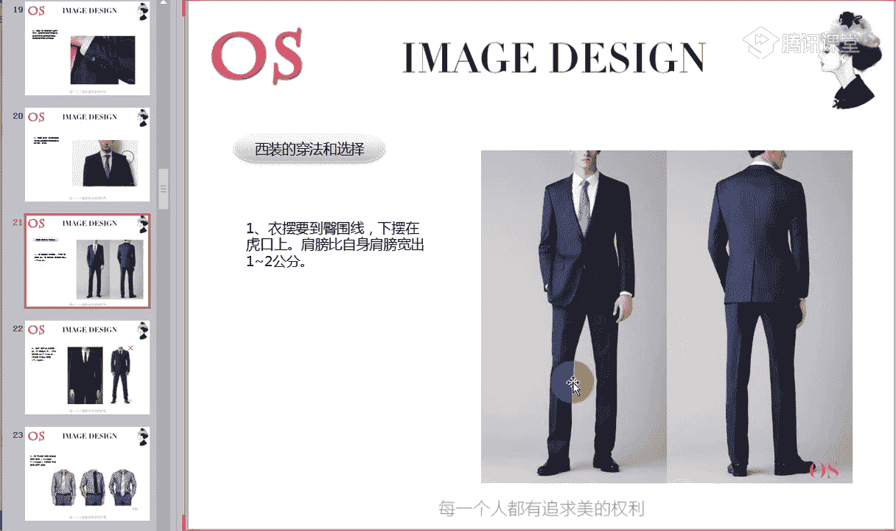
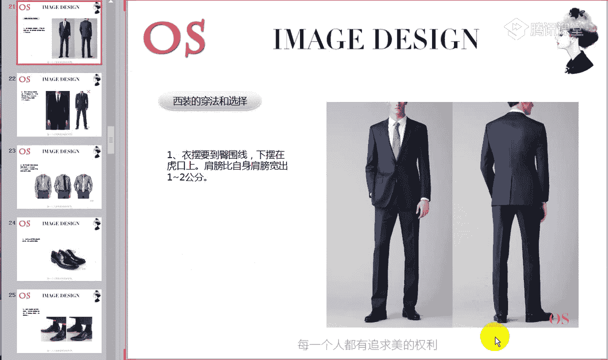
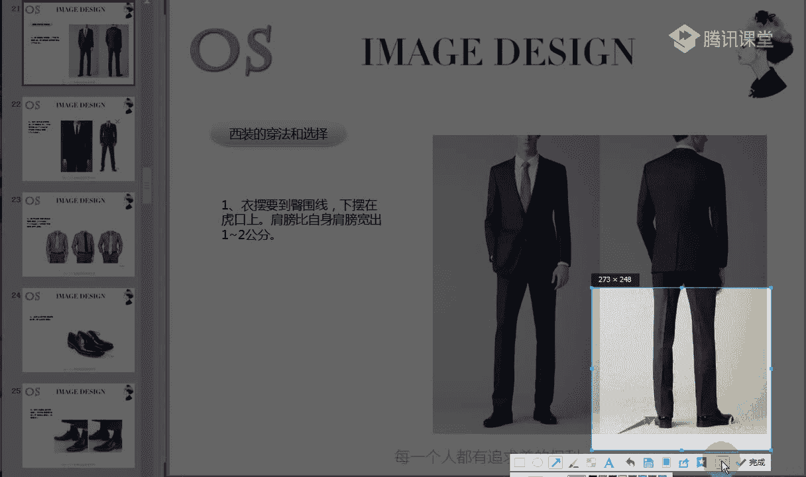

# 1、14男士个人形象班第二期（中级版）VIP课程：第5节、正装的着装原则（一）

亲爱的同学们，大家晚上好，欢迎大家来到OS男士班的课程。我是本节课的主讲老师舒阳。那今天呢我们要跟大家分享的知识呢是第五节正装正装的着装原则。上一节课呢我们学了场合。各场合中呢我们有这样的一个职业场合。

职业场合中必定就会涉及到我们的西装，对不对？而且呢昨天的上一节课程啊，应该是说上一节课程，我们的有一位同学只有一位同学交了作业啊，老师去检查了，是我们的日月光滑做的非常非常棒啊，基本上是没有任何的差错。

所以说呢像这样的一个作业的一个提交，对自己的收获是非常非常大的。希望呃听录播的同学呢要赶紧把作业补上来。好，在职业场合中，我们会涉及到西装，西装的样式又非常的丰富啊，有经典的传统式样。

也有随着时尚演化出来的各更多的这样的一些样式。但万变不离其宗。在廓形上呢，我们基本上就可以分为Y型H型X型三大类哦，Y型，我们也可以称之为T型。那接下来呢我们就正式进入今天的这样的一个课程。

准备好的同学呢，快速跟老师刷了鲜花。好，首先我们看到本节课学习的重点。第一个呢就是我们要首先要认知西装的种类，也就是老师跟大家所说到的这样的一些T型X型，还有包括我们的H型等等啊。

我们要懂得去进行划分辨别。那第二个呢就是我们都知道西装上面有很多一些装饰物啊，比如说我们的袖扣啊扣子，袖子上的一些扣子，包括我们这样的一些扣眼哪，还有包括我们这样的一些翻兜啊等等啊。

这样的一些西装的装饰物，它主要是用来做什么的。我们也要知道，第三个呢就是我们西装的正确的穿法和选择。这是我们本节课学习的三个重点。那么本节课对于大家的一个要求呢，就是第一个要理解西装的种类以及它的特点。

还有要清楚自己在选择西装的这样的一个正确的穿法。🎼在正式跟大家分析西装的种类之前呢，首先要教大家认识几个领型啊。如果是我们现在在学习顾问课程的同学，就知道我们在顾问课程中给风格做诊断。

必定涉及到我们很多的这样的一些领形工具，对不对？而西装呢它同样也有很多这样的一些不同的领型。第一个呢就是我们图中所示的枪脖领啊，这是叫我们的枪伯领，我们会发现枪脖领的特征呢，它的一个脚是非常非常尖锐的。

看到老师鼠标的位置啊，非常的尖锐。这是我们这样的一个枪伯领它的冲击力啊要比我们的平脖领比我们的轻薄领哦更强。我们会发现平脖领相对来说，如果我们要去辨别它的值和曲，平驳领就要居中，对不对？

但是枪脖领它是一个特别明显的一个直线条的。而我们的轻薄领呢它就要偏曲一点，能明白吗？啊，这个是我。🎼我们的枪脖领，这个是我们的平脖领。所以说有同学如果没办法去进行辨别，不懂得去看的话。

我们就要看这样的一个领形的一个区别啊。主要是老师鼠条鼠标鼠标的位置啊，鼠标的位置这样的一个领形的一个区别啊，明白的同学呢跟老师扣个一。🎼青果领的话不做多说啊，青果领非常非常的好划分。

主要就是要清楚的明白枪薄领和苹果领的不同。因为一会儿呢我们讲到这样的一个各个领型的时候哦，各个西装的款式的时候呢，因为不同的西装款式，他们的领型也是会有一些小差别的。好，现在只有两位同学跟老师扣1啊。

其他同学呢？😡，有没有问题啊？没有问题的话，快速跟老师扣个一。如果还不懂得辨别的话呢。我们可以看到这一张照片啊。给大家看一下。啊，这也是我们的枪伯领，看到没有？领型的一个尖锐度啊。

我们要看它的一个尖锐度。🎼好，如果没有问题呢，我们就开始今天的一个正式的一个重点知识。第一个呢就是我们所说到的西装的种类啊，西装在上课之前，老师就跟大家说到了，西装大致可以分为三大类，对不对？啊。

Y型也就是我们的T型以及我们的H型以及我们的X型身材啊，X型的这样的一个西装。第一个呢就是我们的欧式西装啊，欧式西装呢它的廓型就是我们俗称的这样的一个T型的非常的干净。

而且它整个是突出我们肩部的一个设计感，会有收腰啊，它的的特征是肩部的设计感非常的突出。第二个呢就是它是收腰的，收腰收腰的同时呢它也是收臀的。我们可以看到腰和臀宽度基本上是一致的，对不对？

传统的话呢就是我们图中所试的这样的一个双排扣啊，最传统最典型的，就是双排扣的那它的领。🎼领型呢大家要记住，欧式西装的领型一般都是我们这样的一个枪脖领啊，包括我们这件黑色西装。如果各位同学电脑分辨率高的。

我们也能够清楚的看到这样的一个领型的一个特征啊，一个尖锐度，也就是双排扣枪脖领，而且欧式西装的话最能够去凸显我们的男人味，它整个的量感也是非常大的那我们也知道西装的话在后面有开叉的，对不对？有单开叉。

有双开叉，甚至还有没有开叉的。而我们这样的一个欧式西装呢，基本上就是后面开叉或者是无开叉的一个设计啊。🎼那做欧式西装的这样的一个对，非常的大气。这是我们的欧式西装的一个特点特征。关于特点和特征。

大家一定要记住这样一个概念，也就是说它整个廓型会呈现这样的一个T字状。唉，肩膀非常的突出啊，整个的设计感，而腰部是收的，臀同样的道理，它的臀部也是收的，这是它两个特点啊，一个特点，这是它一个特点。

那第二个就是我们要注意到这样的一个双排扣。当然啊不排除有一些改良的欧式西装，它是单单排扣的。但是我们也要整个去注意腰部和臀部的整体的这样的一个量感以及它的廓形。🎼那第三个呢就是它的枪伯领。

这个是不容去进行改变的啊，这是我们的欧式西装的一个特点。那么欧式西装呢非常适合一些身体高大的，就是身材高大一些的人。还有包括我们一些量感大的，也就是说男士风格，我们都知道，一会儿在呃接下来课程中。

我们讲到风格的时候，会跟大家说到哪些风格是大量感，哪些风格是小量感。那么像一些大量感的风格的男士的话，或者说偏大一点的，我们都是蛮适合这样的一个欧式西装的，因为欧式西装它整体来说它的量感是偏大的。

🎼还有就是如果有一些男士，他的腹部比较大，但是他大的很匀称的话比较均匀啊，只是有一点点突出的话，我们也可以啊也可以。还有包括一些呃臀部比较大的，我们同样都是哦都是可以的。🎼哎，戏适合戏剧风格的。是的啊。

啊这个是我们的一个适合人群。我们从身材角度来说。那还有就是我们造型角度来说，我们也可以知道第一个欧式西装，因为它非常的大气，对不对？所以说它非常适合一些高端的，或者是我们目前的职业属于高层管理层的人。

也可以多去再选择西装的时候，我们可以多去选择这样的一个欧式西装啊。因为它的雄性感非常非常的强。那但是如果说哎我们个人的特征，雄性感比较弱的话，我们就少穿这样的一个欧式西装。

这是我们欧式西装的特点以及适合人群，还有包括从我们的造型角度来说，它所适合的这样一个人群。大家对于这三个点有没有任何问题，没有问题同学呢快速跟老师扣个一啊，这是我们欧式西装的特点以及它所适合的人群。

大家记清楚了没啊，记清楚的，快速跟老师扣个一。🎼好，第二个呢就是我们的英式西装，也是俗称为我们的X型，对不对？廓形是呈X型的一个状态。为什么说它是呈X型的？第一个它当然还是有肩部的一个力量感的。

因为西装男士的西装它都是会凸显一些我们的肩部。但是它在凸显肩部的同时呢，它是收腰放臀的款式。我们可以看到欧式西装它整个廓形就呈现我们的下半部分，从我们的腰部到我们的臀部是呈现这样的一个H型的，对不对？

但是我们的英式西装它会有一点往我们的A型啊，我们从腰部到我们的臀部会呈现这样的一个A型状态，也就是整个廓形唉有点像我们的X型啊，所以说它是收腰放臀的，跟我们的欧式不同啊。

它整个来说也是非常的贴合你的身体哦，有束缚的束束腰的整个束型的这样的一个视觉感受。而且后摆的话呢一般是以双开叉或者。🎼是单开叉，这是它的后摆的一个特征。🎼好，以上就是我们英式西装的一个特点啊。

要懂得去把英式西装和我们的T恤啊，就是欧欧式西装呢进行这样的一个划分。那还有呢就是它所适合的人群，我们可以看到，其实整个来说英式西装的量感啊，它的这样的一个大气程度并没有我们欧式西装这么的有力道。

对不对？🎼所以说它的量感会相对来说小一点。那适合一些呢身材均匀儒雅一点的男士，或者是说呢唉比较长相上面比较收敛一点的啊。我们有的人就比如说戏剧风格，它长得非常的大气，整个来说是往前面冲的。

但是有的人就比较儒雅，对不对？唉，比较内敛，所以这是我们的西装所适合的这样的人群，那么因为它的量感并没有我们这样的一个欧式西装的量感大。所以说在针对于造型角度上来讲呢，适合这样的一些中层人士。

还有包括我们机关单位的话都可以选择这样的一个英式西装。🎼整个要注意它的一个轮廓，还有呢它的领它的领子一般以我们的平薄领单排扣为主哦，以我们的平薄领单排扣为主。🎼好，这个就是我们的英式西装啊。

关于英式西装的特点以及适合的人群都记清楚，同学跟老师扣个一。啊，有没有问题啊？有问题的要赶紧提啊。🎼或者是哪一个知识点没有记清楚，需要老师再重点说一下的啊，也可以把答案呢啊把问题提在公台上啊。

然后呢要记住哦，适合古典风格的人，我们一会儿会讲到他适合什么样的人去选择啊。然后呢，还有就是各位同学一定要做好笔记啊，一定要做好笔记。包括你像老师会讲到特点，我会写到公台上。但是关于适合的人群呢。

大家一定要把这样的一个。🎼关键词一定要记清楚。🎼好，第三个就是我们的美式西装，也俗称为我们的H型款式的西装啊，流畅的H型，或者是说呢休闲的O型。所以说你会发现美式西装跟我们的欧式西装。

英式西装去做对比来说，它的休闲感会强一点，对不对？而且它的整个廓形来说要显得更加的松弛一点。所以说像这类型的西装呢，我们内搭可以去选择搭配毛衣，而且呢H型的西装其实比较适合敞开去穿，比较适合敞开去穿啊。

而且后面的话一般都是我们的单开叉啊，胖的人瘦的人都适合单开这个点的话呢，就是我们在选择西装的时候，如果我是偏胖的，或者是我是比较瘦的过瘦的。我们在选择西装都适合去选择单开叉的款式。🎼而且美式西装的话呢。

一般以两粒扣为主哦，为居多，两粒扣居多。那像这类型的西装的话，比较适合一些年纪偏长一点的男士啊，因为我们都知道男士到了一定的年纪，我们可能整个身体的状态哦，会呈现这样的一个发福的状态，对不对？

所以说呢我们可以在选择西装的时候呢，选择这样的一个美式西装，或者是说呢我们在这样的一个一般职业场合中啊，我们也可以去选择美式西装穿到自己的身上，能明白吗？啊，这个就是我们三大基础的一个西装。

有没有任何问题？没有问题，同学能快速跟老师扣个一。🎼这是一个基础。但是我们也会发现，唉，随着我们这样的一个时尚的推移，对不对？很多西装我们都进行了这样的一些改良。所以说呢就像我们的美式西装。

你会发现很多西装作为亚洲人来说。🎼去穿英式也好，穿我们的标准的欧式西装也好，还是穿我们最典型的这样的一个美式西装也好。因为我们个子可能跟西方人来做对比，大部分的男士会偏向于哦小小只一点，对不对？

瘦一点矮一点。所以说呢我们在这样的一个基础上也有改良的款式。就比如说像我们的日式改良版西装哦，俗称呢窄版的H型西装啊，凸显中性化。🎼显得人的身体线条呢非常流畅，非常适合我们东方男性去选择。

如果说有一些东方男性，我的个子偏小一点的，我们可以去选择改良版的日式西装，它是小版的H型的一个西装。🎼所以说怎么样去看这样的一个西装是日式改良版。第一个呢。

它比它其实跟我们H型的标准的美式西装基本上概念是一致的。只是我们可以看从廓形来说，它更加显得窄那么一点，更加修身一点。哦，这是我们的日式改良版啊，那除了日式改良版，我们也会发现在韩剧里面。

你会发现很多一些韩剧的呃男士会选择这样的一些精致短款的西装，对不对？那其实这是韩式西装，但是它也是我们X型西装的一个精巧版啊，精短修身收腰，以一粒扣或者是双排扣为主。所以说。

有一部分男士也蛮适合这样的一个韩式西装的，因为它比较的精巧哦，更能够去凸显我们的身高。因为一般如果说你身高不高的，你的体型偏瘦小的，我们根本就没办法去驾驭这样的一个标准的英式西装。但是我们也会发现。

英式西装从廓形来说，非常适合我们这样的一些偏瘦体型的男士，对不对？所以说我们可以去选择这样的一个韩式西装，它是精巧版的。也就是说我们X型身西装的这样的一个缩小版。好，这个就是我们两大改良版的一个西装啊。

在我们的美式西装和我们的英式西装的一个基础上，我们做了一些改变。好，对于这样的一个改良版的西装，大家还有没有什么问题啊？没有任何问题的同学呢，快速跟老师刷的鲜花。好，这个时候呢老师要问大家一个问题啊。

我们。在这堂课的上半部分，老师跟大家介绍了呢我们的欧式西装，标准的欧式西装，标准的英式西装，以及呢标准的美式西装，还有改良版的日式西装，以及我们韩式西装。那大家把这五大西装进行一个排序的话。

大家觉得判断西装的量感。我们从廓形来看，谁是排在首位啊，依次给老师一个顺序。好，我们来判断西装的量感啊，来判断西装的量感。大家觉得从我们这五大西装来说，谁的顺谁的顺序最大啊。

然后我们依次进行这样的一个排比哦。我们可以从廓形上看量感，从我们的领领型上去看大小。有没有同学快速的回答一下老师啊，其实在上课之在上这样的一个西装种类课程之前呢。

我们就已经在说到了欧式西装的这个整体的量感，对不对？嗯，好，我们的一朵向日葵说到呃梯形标准的梯形。🎼西装，然后是我们的美式，然后是改良版的日式，然后是我们标准的这样的一个音式。好，TH哦。好，赶紧啊。

要积极的回答老师啊。这样的话，对于我们的学习的印象。会更深。好，老师呢公布一下正确答案，希望大家要记清楚。因为呢到了顾问课程也好，还有包括我们后续的这样的一个风格课程也好，其实都是非常重要的一个知识点。

这个知识点一定要记清楚。从量感从我们整体的廓形来看的话，我们把西装进行一个排序的话啊，量感最大的就是我们的欧式西装，其次呢就是我们的美式西装，美式西装标准的美式西装，然后呢是我们改良版的日式。

虽然说它的版型进行了改良，但是整个廓形来说还是非常大气的。所以说这个排在我们第三啊，最小最小的当然就是我们的英式西装了啊，呃最小的是我们改良版的韩式西装。

也就是说排在日式改良版西装后面的是我们的英式西装，然后再到我们的韩式西装，明白了吗？好，我们的月同学有没有问题啊？不要觉得X型的西装，它是排在第二位的。我们要看整体的西装的廓形来来说。

美式西装它会更加的。放松，而且它的整个廓形是要比它更加大气的。我们会发现整个英式西装来说，它还是比较收腰放臀的，比较束缚我们的身体的。所以说这是我们的廓形啊，整个的一个廓形来看。好，有没有问题啊？

这个是要一定要记清楚啊，一定要记清楚。然后呢，跟大家说一下，如果说我们是从事时尚行业的，要去选择西装的话，我们可以多去选择双排扣的西装，更具有这样的一个时尚感。啊。如果说你是从事时尚行业的。

适合去选择双排扣。🎼那如果说我们要去判断这样的一个西装，它到底是呈现呃感性的西装。就比如说像浪漫风格的人，我们就适合去穿现穿一些感性元素多一点的西装，对不对？我们可以通过色彩材质来看啊，比如说有。

🎼柔和一点的材呃，色彩。比如说材质上面更具有这样的一个光泽感的，对不对？它都是趋向于感性化的一个西装。🎼好，在这里呢希望大家把本子笔记好。接下来老师呢说一个非常重要的一个知识点，然后大家一定要记清楚。

第一个呢就是我们戏剧风格，我们都知道男士有五大风格，对不对？我们划分到大的是五大风格。当然。🎼当然哦我们要记清楚了。第一个就是我们的戏剧风格。戏剧风格呢最适合去选择欧式西装，记好了哦。

戏剧风格适合欧式西装哦，赶紧记啊。🎼好，接下来呢我们就说到自然风格。自然风格的人呢适合去选择美式美式西装。如果说我是年轻一点的自然风格的话呢，我们可以去选择浴室改良版的西装。

🎼而且自然风格如果在一般职业场合中，我们去选择这样的一个西装的话，其实它在西装里面去穿着T恤是非常非常好看的。因为它适合去表达休闲元素，对不对？而而且他在选择西装的时候也可以去拆套穿。当然是分场合的啊。

我说的是一般职业场合可以去拆套穿，或者说在休闲场合中，你也可以去拆套穿，但是在我们的严肃职业场合是不可以的，任何风格都不可以去拆套穿着的。🎼好，这个是我们的自然风格啊。接下来呢我们说到浪漫风格。

浪漫风格在选择西装的时候，第一个我们要以苹果领为主啊，因为毕竟呢浪漫风格在男士来说，它是呈现一个如果说是直中曲的话，它来说是偏曲的。所以说我们不适合去选择一些过于尖锐的这样一个领型。

那么浪漫风格的人在选择西装的时候呢，多以这样的一个苹果领的西装为主。🎼第二个呢就是我们在选择面料的时候，一定要选择上乘的面料啊，浪漫风格对于面料上是有要求的。如果说是浪漫风格，在夏天的时候。

我们一定要整套去穿着西装，或者是哎我作为浪漫风格的人，我在夏天举办婚礼的话，我们可以多去选择白色的西装啊。因为浪漫风格穿白色西装非常非常合适。在正式场合中，浪漫风格可以多去挑选白色的西装。🎼好。

接下来就是我们的古典风格啊。古典风格呢适合我们的英式的西装啊，这样的一个英式西装，以及呢我们欧式西装也是可以适当去穿的。但是在选择欧式西装的时候，一定要选择合体的合体的欧式西装。还有就是总而言之呢。

它对于做工对于材质来说是非常非常有要求的，要有精致啊。整个服装的式样的话，我们最好是选择传统的式样，不要去做多过多的一些设计，或者说唉过多的这样的一些面料上的一些变化等等。

就是要选择最经典最传统的样式是最适合古典风格的，给人的话有这样的一个贵气感。而且呢我们古典风格在选择整体西装的时候，都要以剪裁合体为主啊。不管你是选择英式西装也好。

还是去选择我们呃合体的欧式风格的西装也可以也也好。我们都要选择剪裁合体。而且在搭配西装的时候呢，我们可以多去选择这样的一个三件套啊，一去选择三件套。也就是说衬衫啊，加上我们的一个小马甲。

然后再加上我们的西装，其实它去选择这样一个标准传统的三件套，要比我们单穿啊，比如说单穿这样的一个衬衫搭配西装要好看很多。这是我们的古典风格。🎼好，最后一个呢就是我们的前卫风格。

前卫风格呢适合去选择窄版的欧式英式日式都是比较适合它的啊。如果说我作为前卫风格，我的身材体型比较高大的话呢，我可以去选择英式西装。但是总体来说呢，我们不要去选择标准的欧式西装。在选择欧式西装的时候。

我们还是要做一个窄版，做一个稍微的一个。🎼弱化啊就不要去选择标准的啊，这么的传统的样式，我们稍微做一点剪裁，让它更加的合体一点，窄一点。🎼那第二个呢就是因为我们的前卫风格是毕竟它是属于前卫时尚类型的。

对不对？所以说我们适合去选择呢枪薄领。但是呢我们也会发现有的西装领型就很宽，对不对？而有的西装它的领型就里面就比较的窄，里面就比较窄，有的西装领面就比较宽。那作为我们这样的一个最小的。

🎼量感最小的前卫风格的话，我们在选择领面的时候，一定要选择小枪脖领头的，不要去选择标准非常宽大的这样的一个枪脖领头哦。我们要选择小一点的，一定要选择小一点的。还有呢就是我们在选择西装的时候呢。

多去选择这样的一些多粒扣的呃，更能够去凸显我们的整体的层次和时尚感。🎼小的领口合体收身啊，这个就是以上就是我们五大风格，在选择西装上最适合的都记清楚了没？记清楚同学快速跟老师刷的鲜花。

我们接着讲下一个知识点。好，这是我们的正式西装啊，自然自然风格还没有听清楚是吗？好，老师再次强调，第一个就是英式呃美式西装，非常适合美式西装。然后呢，就是如果是年轻的自然风格的话。

我们可以去选择日式的啊，选择我们的日式改良版。やそって。🎼而且自然风格人在选择西装的时候，它非常适合里面去搭T恤啊，因为我们都知道内搭T恤的话会减弱整个西装的正式度啊。

因为本身自然风格就非常适合穿一些休闲元素的啊。所以这个呢我们适合去在西服里面穿一些T恤，拆拆套去穿着，适合拆套穿着，这是在一般的场合中，我们可以拆套穿着。但是如果是正式场合，一定是要成套去穿的。尽量。

🎼好，那老师接着就来讲一下我们的休闲西装。因为正式的西装啊，正式场合所穿着的西装我们已经介绍完了。好，首先我们要懂得去辨别休闲西装。那休闲西装的款式有很多。

主要呢我们怎么样去辨别它的西装到底是不是休闲呢？第一个就是一般休闲西装它都有明兜的设计。我们可以看到图一，对不对？有明兜，包括我们的图案，而且它的色彩的一个冲击度也是非常非常强的哦。

这是我们这样的一个明兜有明线感，有的线我们会发现有的西装的话，从肩部到我们的腰部都很有很多一些明线的这样的一个裁剪，对不对？所以这个是我们休闲西装的一个特征，有明兜设计，有明线感的一个设计。

而且休闲西装的话，它的根功能性是很强的。我们在穿着正式西装的时候，不可能在这样的一个口袋里放多非常多的一些杂物，对不对？因为会影响我们整体西装的一个美感，而且呢会影响它的这样一个廓形。然后在穿着。

休闲西装的时候呢，我们会发现休闲西装有很多一些口袋的一些装饰啊，所以说呢它也不忌讳在我们西装里面放一些物品。🎼这是我们休闲西装的一个特征。那第二个呢就是休闲西装材质来说。

你也会发现它很多材质是比较柔软的，它没有太多的一些哦型。不像我们的正式的这样一些场合，穿着的西装，它的型，它的整个剪裁的一个立立裁的一个程度，对不对？都是非常非常标准和精致的。

但是呢我们休闲西装更呈现这样的一个放松的一个状态，包括休闲西装的话，你也会发现有很多的一些设计感，包括袖子也好，还是我们这样的一个呃领面和我们衣身的一个色彩的一个拼接也好，唉。

包括我们整体西装的这样的一个。🎼脚口对不对？我们的裤口的这样的一个设计，还有包括整个廓形来说，它都是偏向于这样的一个精短的啊，这样的一个偏向于休闲化的这样一个款式。包括有的西装的话呢。

你会发现它很有非常明显的一个设计感，它会跟我们的一些夹克进行一个拼接，对不对？就像我们图一啊，典型的西装的一个衣身，但是袖子的话，我们是采用的夹克的这样的一个袖型。包括的话像这样的一些休闲西装。

如果你会发现它没有明兜，也没有明显的设计。那如果说它的图案来说偏向于这样的一个休闲状态。这件西装也呈现于我们这样的一个休，也划分到我们休闲西装。🎼像我们的格子的，还有包括呢在我们袖子上有一些设计感的。

或者是说唉口袋的这样的一些跟衣身色彩的一些拼接等等啊，这个都是属于我们的休闲西装。对于休闲西装和我们正式西装的划分，应该都没任何问题了吧。好，没有任何问题的话呢，我们就跟老师刷的鲜花。

这是我们的第一部分啊。关于西装的种类。西装的种类呢就跟大家分享完了。那第二个呢我们就进入到西装的这样的一个装饰。好，第二个进入到西装的一个装饰啊。那么西装的装饰呢，我们会发现在西装的左边对不对？

我们如果说自己穿西装的话，在左边都会有一个以扣眼。可能很多同学不知道这个扣眼是干嘛的啊，这是叫我们的插花眼，这叫我们的插花眼，也就是说西装领子左侧会有一个扣眼。现在呢以前我们是在欧洲早期的一个设纪中呢。

他是去插花的，去插花的。那现在的话我们可能会去选择插一些徽章啊，徽章。包括的话呢，像我们有一些公司的话，他的员工都是有徽章的，对不对？所以说我们就会把徽章带到这样的一个位置。🎼这个是我们的插花眼哦。

这叫插花眼。🎼那第二个呢就是我们也会发现在西装的左侧有一个口袋啊，有一个口袋，很多同学都不知道口袋是干嘛的。它其实呢唉主要是这样的一个作用，就是用于在社交场合哦去用的。比如说去擦一擦眼镜啊等等啊。

这是我们口袋巾的一个作用，放到我们的西装的左侧口袋里面。而且其实跟大家说一下呢，我们也会发现老师之前在前两节课程的时候，我们有讲到西装。而且呢我也跟大家说到了，一定要多利用我们西装这样的一个口袋啊。

左侧的一个口袋。你会发现你加上一个口袋金的一个点缀，会让你整个西装来说它会层次感更加明显，更加生动，对不对？时尚度也会有一个提升。所以说呢各位男士不要去忽略掉我们这样一个口袋，以为它可有可无啊。

其实你加上你适合的这样的一些色彩去做一些点缀，其实非常非常的好。那如果说是在正式场合中。🎼我们在西装的左侧口袋里面一定是要放白色的这样的一个口袋金。🎼叠法的话也是非常非常的简单啊。

大家可以看到老师在右图中给大家泼了一个非常简单的，其实就是对折。那还有就是我们也可以把它呢呃对折成三角，然后再对折，然后放到我们的这样的一个左侧都是可以的。🎼好，第三个呢就是我们的袖口袋啊。

袖口呃袖口扣西装的袖子上的这样的一个扣子。🎼很多同学呢会觉得唉这个扣子挺有意思，是不是它起到一个。🎼服饰的一个美感，一个装饰啊。之前呢它确确实实哦我们现在可能就是起到这样的一个服装的一个美感。

起到一个装饰作用。但是在拿破仑军队的时候呢，他们主要是用来呢防磨的，就是防止呢我们这样的一个袖子会损坏啊，用我们的扣子呢来进行这样的一个中和。所以说呢这是来防止衣服的一个磨损的一个作用。

这是我们的袖口克扣啊，呃，白色的手巾。对在正式场合呢，我们要选择白色的口袋金啊，但是其他的一些场合就无所谓了。好，第四个就是我们这样的一个西装的垫肩啊，垫肩的主要作用就是让西装的肩部处看上去平整好看啊。

其实我们都知道男性的肩膀本身就非常非常的重要，对不对？男性的肩膀，我们可以去凸显我们的这样的一个肩硬，凸显我们整个的这样的一个深骨。所以说呢西装的垫肩它其实就是起到了这样的一个帮助的一个作用。

所以西装的垫肩主要就是让我们的肩部看上去更加的平整好看。它有很多男士的话，如果你的肩膀是呈现这样的一些溜肩状态的。我们在选择服装的时候呢，也可以多去选择有垫肩的款式。不管你是选择我们这样的一个大衣也好。

多去选择带垫肩的，会让你的肩部看上去更加平整好看，有力度感。🎼好，这四个呢就是我们西装的这样的一个装装饰啊，装饰。好，关于这样的一个西装的装饰都系好的同学跟老师快速的刷朵鲜花啊，都记清楚了。

同学快速跟老师刷的鲜花。🎼好，接下来我们就看到本节课的第三个重点，这是非常非常重要的一个板块啊，非常重要啊，我们要懂得怎么样去穿正确的一个穿法。很多同学在选择西装的时候呢，可能就是感觉唉合体就可以了。

唉，感觉差不多就可以了。但是其实你会发现正确的西装在穿法上面，我们是一定有它的一个刻度的。🎼好，接下来我们就具体问题呢来进行具体的一个分析啊。西装的穿法和选择。第一个就是我们要懂得怎么样去选择西装哦。

上半身的这样的一个西装的一个长度。怎么样去挑选呢？第一个就是我们要看。🎼一00呢一定要到你的臀围线哦，一00要到你的臀围线哦，就是你的臀围线的一个。🎼位置怎么样去看你的臀围线的一个位置呢？

也就是说你穿上这样的一件西装啊，你穿上西装之后，你的手臂自然的下垂，手臂自然下垂，就像我们图一这位男士一样，你的虎口啊，有没有同学不清楚虎口是哪个位置的啊。不清楚同学跟老师扣个2。

🎼就是我不知道虎口指的是哪个位置，有没有不清楚的啊，没有不清楚，老师接着往下讲了。😡，🎼虎口很简单哦。

如果后面有听录播的同学不清楚的话呢，老师还是给你拿个箭头标注一下哦。🎼好，老师箭头所指的位置就是我们的虎口，也就是说你的食指和你的大拇指中间的位置啊，衔接的这样的一个位置，称之为虎口。

好，这个是我们的虎口。下摆一定是。🎼衣服的下摆一定是在虎口，也就是说你的虎口的这样的一个角度跟你的西装是平行的，理解了吗？理解的同学跟老师扣个一。🎼这是我们怎么样去挑选西装的长度？

所以说如图中模特所示所示，这件衣服的西装的西装的这样这个长度跟它来说是非常非常合适它的。我们可以看到西装的下摆跟它的虎口是平行的。所以我们呢再挑选西装的第一个条件就是我把西装穿好了，然后扣好。

🎼手臂自然下垂，然后看你的虎口跟你的西装是否平行。那我们也有会发现，有的西装可能就会比你的整个来说要长很多，对不对？比你的虎口要长很多的也有。那这是第一个在挑选上。那还有呢就是袖子。

我们要知道袖子什么样的一个长度是合适的。袖子在手上部的一个骨骼上就不能再长了哦。我们在挑选西装的袖子的时候，其实怎什么样的一个骨骼呢？我们可以看到自己的手啊，现在大家把自己的手拿拿出来。

然后呢我们把手呢捏一个拳头啊，然后手背朝上啊，手背朝上捏一个拳头。然后你会看到你的手腕的部分呢，外侧，你的手的外侧有一个凸起的骨骼，手的外侧手腕的部位会有一个凸起的骨骼，看到了没有啊？

看到同学跟老师呢刷的鲜花。那也就是说呢我们的西装的袖子的长度呢？刚好在你手上部骨骼上面就可以了。刚好在你手上部骨骼就可以了啊。好，老师这里刚好有张图片哦，给大家指一下。好，明白了吗？呃。

现在只有一位同学跟老师扣1啊，快速的啊。🎼手你其实你你可以看到你手背朝上的时候，手的外部啊，外部的手腕会有一个外侧会有一个骨骼是凸起的，对不对？也就是说，让你的西装袖子的长度刚好在你的骨骼上面就可以了。

不要去超过你的骨骼。哦，在你骨骼中间部位上面就OK。好，这个是没问题的啊，这是没有问题的。包括大家一定要把笔记系好，防止能忘，不能再长了啊，这是不能再长了。

那还有呢就是我们要看自己的肩膀是否跟这样一个西装合适呢，就是你的肩膀比西装，我们穿上这样的一个西装之后，西装的肩围肩膀这样的一个宽度比你自身肩宽度宽出1到2公分就可以了，不能再宽，或者是说不能太窄。

也就是说比你自身的肩膀宽出1到2公分。🎼好，了跟大家强调一个点啊，我们在试这样一套西装的时候，扣子是一定要扣好的啊，都要把扣子扣好。我在看到看这样一个西装的肩膀跟我合适与否，唉。

看这样一个西装的袖子是否长度合适，以及呢我们整个衣身的长度是否合适，都是要把扣子扣好的。好，这个就是整个我们在选择西装上面啊，西装上面啊要注意的。这是第一个啊第一个。那还有呢就是我们要说到衬衫了啊。

说到衬衫。所以大家可以看到这是一张比较近的一张图片，对不对？呃，尺寸大不影响啊，不管我们胖的人，我们就选择尺寸大的，但是我们也不代表医生就要长，不代表袖子就要长，明白吗？

所以说胖的人瘦的人好都是一样的概念不变啊，这个概念是不变的。而袖子在我们的骨骼上部啊，包括我们可以看到这张图片的一个对比。如果说你的袖子太长的话，我们会发现整个人显得不太精神，对不对？

而我们的袖子的长度，如果刚好在你的外骨骼这样的一个上面的话，是非常非常合适的，而且会显得你整个人比较的精干。那第二个呢就是我们的衬衫的袖子，其实不是说衬衫的袖子一定要比你的西装的袖子短啊。

我们要知道衬衫的袖子怎么样去把控呢？同样的道理，我们把这件衬衫穿好了，扣子扣好了之后，我套上这样的一个西装。而然后衬衫的袖子露出1到1。5公分就如图所示，我们可以看到这位男士的衬衫其实刚好露出了一公分。

非常非常好啊，不能超过1。5公分了，不然就会显得过于的突兀了啊。所以说衬衫的袖子露出1到1。5公分。然后呢就是要注意到我们衬衫的领子啊，领子高出你西装1到1。5公分就可以了。也就是说从后面去看。

我们在挑选的时候，把衬衫穿好，把西装扣好之后，我正后方。衬衫的领子高出我正后方，衬西装的领子1到1。5公分。好，这是我第二个哦，大家要记清楚。第二个。好，第三个呢就是我们领带的长度啊。

领带的长度要根据自身的身高来选择。因为其实像我们正规的领带的话，它的公分长度都是不一样的啊，有的偏短，有的偏长，所以说身高高的同学呢，我们就要选择长一点的。比如说可以选择145公分的，对不对？

而身高比较矮小的呢，我们就可以去选择133啊，甚至可能现在可能出了更短的，也有可能啊，这是我们这样的一个领带的长度一定要根据自身的身高来进行选择。那其实在打领带的时候呢，告诉大家一个位置啊。

就是我们都知道领带有两头，是不是我们把那个宝剑头的一啊，我们把。🎼领带的一头呢放在胸部的上位。也就是说你在打领带的时候呢，把一头放在胸部的上位，一般可能就是把我们短的那个哦不是保健头的这一端啊。

就是我们比较窄的短的那一端呢，放到胸部的上位，胸部的这样的一个上位，然后呢把另一端呢放在你的膝盖上面啊。那其实如果是这样的一个长度的一个把控的话，基本上打完之后，你会发现哎领带的位置。

就刚好在你腰带的上面啊，千万呢在打领带的过程中，不要打到你的腹部哦上面，或者是说呢打到你的腰带下方啊，我们一定最好的长度就是刚好在你领带的上方，而且你按照老师刚才所说的一端放在胸部的上位啊。

一端呢放在膝盖上面啊，我们去进行打，没有任何问题，打出来的一个位置可能刚好就是在你的膝盖的一个呃在你腰带的一个面啊，这是我们第三个。🎼好，包括我们可以看到我们的鞋子啊。

之前老师说到了在我们场合着装的时候，唉，严肃的职业场合。我说过要选择横截面的一字鞋子，或者是没有横截面的都可以，但是绝对不能够选择镂空一纹鞋，对不对？

而我们图中所示的这双鞋子就是我们典型的啊一字面的皮鞋，以系带的为主。然后呢可以有横截面，但是也有的鞋子的话，它是没有横截面的，也可以，就是我们都是整个是非常光滑的，没有任何的设计感。

要么呢你要一定要增加一点啊设计的话，你就只能选择这样的一个横截面啊，再跟正装做搭配的鞋子，一定是第一个是系带的款式。系带的款式。第二个呢就是可以有横截面或者没有横截面都是可以的。

但是绝对不要跟我去选择什么镂空异纹鞋哦。🎼这是我们最正式的皮鞋，男士里面最正式的皮鞋。🎼好，图中也是这样的一个有横截面的皮屑。🎼好，第五个呢就是我们裤子的长度啊，裤子的长度把控非常非常重要。

因为你会发现如果说唉你的裤子的长度过长的时候，我们可以看到图中这几位男士啊，你们觉得整体来说给你们什么样的感觉？🎼可以用一些形容词来形容一下。裤子的长度非常重要。我们在挑选正式的西装的时候。

那我们可以看到嗯。🎼裤子如果过长的时候。🎼会有什么样的一个状态啊？有同学说到拖沓。对。🎼显得很拖沓，而且不精神啊。而且的话呢如果说唉男生个子再矮一点的话，我们在穿正装的时候。

你再选择这样的一些裤裤子过长。其实从正装我们也可以看到一些平时休闲场合中选择的裤子也是同样的一个道理。如果裤子太长的话，你堆积在鞋面上其实会显得非常的拖沓。第二个对，会显矮。

不不会显得这个人非常的精神啊。所以呢我们势必呢要进行一下改变。大家也可以看到脱沓的裤子，包括我们的黄轩在选择脱沓的西装过长的这样的一个西装裤，和我们长度刚好的时候，它的一个对比，对不对？

所以男士在选择西装裤子的时候呢，我们穿好鞋子把裤子穿好之后，唉，它的长度到鞋帮的位置就是最好的。包括我们可以看到这张照片啊，那大家应该都能够非常清楚的看到。

刚好。裤子的长度在你鞋帮的位置，对不对？在你鞋子后跟哦后部帮面的这样的一个中间，或者是中间稍微偏上一点长度都是非常非常合适的。好，要记住这张图片，整个西装给你的感觉。

这个是我们的裤子的一个长度。那还有呢就是我们在选择正式西装的时候，袜子的挑选也是非常重要的。袜子的颜色一定是要比你西装裤子的颜色要深的，一定是要比你西装裤子颜色深的。

比如说我选择藏蓝色的西装我就选择黑色的袜子，那黑色西装我们就挑选黑色的袜子哦，千万不要去选择一双非常浅淡浅色的袜子，比如说啊黑色的成套的西装，我搭配一双白袜子啊，那绝对不合适。

而且呢袜子的长度我们也要注意，各位男士在挑选袜子的时候，不要选择太短的袜子哦。因为我们都知道裤子的长度刚好在斜方的位置，对不对？不是说非常的长，所以说我们穿穿上穿上之后坐下来势必呢你的裤腿就会往上走。

那如果说你的袜子太短的时候，我们会发现露出你的皮肤哦，非常非常的尴尬。但是我们如果说。袜子选的够长的时候就不会有这样的一个尴尬的事情发生了，对不对？而且显得你整个人还非常的得体啊，精炼精干。呃。

白色的西装就可以选择白色的袜子吧。哦，第一个呢我们都知道在正式场合中哦，夏天的这样一个正式场合，我们比如说像刚才老师说到的浪漫风格的，我们可以去选择白色的这样的一个成套服装，对不对？

那如果说你是选择这样的一个白色的西装的话，我不建议呢完完全全选择白色的袜子，我们可以选择其他稍微中性色调的这样的一个颜色的袜子也是可以的。所以今一定要记住老师说的啊，袜子一定要比西装的颜色深，能理解吗？

所以说我们可以去选择一些中性，比如说我可以选择灰色的袜子，那也要比我们去搭配白色的袜子更好。因为黑色的西裤，西装裤的话没办法了，你不可能有比黑色更深的颜色了。好，这个是我们第五个知识啊。

包括大家也可以看一组照片，对不对？黄轩裤子过长和刚好的这样的一个长度啊，休闲西裤可以配小白鞋当然是可以的啊。还有包括我们可以看到你在搭配休闲的这样的一个休闲裤的时候，我们也要注意长度。

你会发现长度选择刚刚好的时候，其实非常非常的合适，就不会有这样的一个拖沓的感觉。那包括在选择啊正式的这样一个礼服也好，还是说我们在选择哦我们的西装啊，也是一样的。我们都要注意好这样的一个长度。

长度的把控非常重要。你要么就选择九分的。你如果要选择长裤的话，我们最好的裤子的长度就是在你鞋帮的位置，也就是说在你鞋帮面的上半部分，中间或者中间偏上，或者干脆呢你就跟你的鞋帮平行都是可以的哦。

这个是我们的裤子的一个长度。好，第六个知识呢就是我们西装裤子的一个嗓道的问题啊。这个列这个字是一个多音字。赏啊，我们念上。好，有嗓道的，我们有同学可能知道想道是什么意思啊？

想道就是我们很多西装库中会有这样中间的一条道路哦，能理解吗？理解同学跟老师扣个1啊，就是中间的这一根线。

很多西装裤都是有的，标准的西装裤都是一定是有的。唉，就是老师可以看到这样的一个中间线，对不对？一条线啊，看看到的同学快速跟老师扣个一啊，这个就是称之为我们的嗓道。

🎼那呢其实我们在挑选这样的一些裤子的时候，不仅西装裤有嗓道，而且像有一些休闲裤，它也是有嗓道的，对不对？有嗓道的裤子呢，不管你是西装裤也好，还是我们这样的一些休闲版的啊西装裤。

我们都是适合胖的同学去穿的那其实如果你太瘦的话，我们就不要去选择这样的一些带嗓道的裤子。因为其实嗓道就有点像我们之前在讲到是错觉的时候，我们说到的这样的一个条纹，对不对？当我们的条纹不密集的时候。

它会有显瘦的一个效果。所以你本来就太瘦的话，我们就不要去选择带嗓道的裤子，而我们胖的同学非常适合去选择这样的一些有嗓道设计的。当然我们在选选穿着这样的一些嗓道有嗓道的裤子的时候呢。

一定要把你屁股后面的熨平了啊。因为很多裤子的话，他连后面都给你带上了，所以说我们在穿的时候，一定要把后面这一块熨平了。🎼把后面的裤线啊一定要熨熨掉。好，这个就是我们在选择西装的穿法哦。

正确的一个穿法和选择6个特征，有没有问题，没有任何问题的，快速跟老师刷一朵鲜花。🎼好，大家也可以把这张图片截下来啊，这是我们在选择西装的时候呢，可以去搭配的一些鞋子。🎼其实男士来说，搭配西装的话。

要么就黑色的鞋子，要么就是棕色系的，对不对？除非说你是呃偏休闲一点的这样的一个场合的话呢，呃我们在穿搭西装的时候可以搭配一些浅蓝色呀，或者说呃这样的一些雾霾蓝，以及我们的白色都是可以的。🎼好。

把这张图片呢我们记下来之后，老师就要考一下大家哦。根据我们今天整堂课程的一个知识啊，稍微的能考一下大家。第一个呢就是我们看到左边这套西装，大家觉得这一套西装适合什么样的？🎼是什么样的一个范围的西装啊？

也就是说你觉得它是。🎼适合正式场合去穿着呢，还是适合我们休闲场合。也就是说它是偏向于正式版的西装，还是偏向于休闲版的西装。如果觉得是正式版的西装同学跟老师扣个一，觉得是休闲版的西装，老师扣个2哦。

图一哦图一。好，非常非常棒啊非常棒。第一个我们可以看到第一个它的整个的图案，对不对？条纹的话也非常的明显哦，明显的这样一个条纹。而且呢我们可以看到。🎼上半身的话。

它的扣子是有很多这样的一些偏休闲化的一个装饰扣的啊，所以说回答二的同学啊，积极回答二的同学非常棒。那我们在课后的话呢，也可以多去找一些西装的图片呢，让自己快速的做一些辨别啊，练练自己的眼力见。

那第二个图片呢，我们可以看到啊，老师呢放大一点给大家来看啊，因为我们要观察到一些细节啊。第二个问题呢是什么呢？就是让大家来看一看我们杨洋这一套西装，大家觉得是什么版哦，是我们的欧式西装呢。

还是美式西装呢？还是我们这样的一个。🎼英式西装。🎼是欧式西装还是美式西装，还是英式西装，你们快速的打一个手手个字就可以了，要么就打个O，要么打个一呃音，要么打个呢美。🎼好，非常非常快速的啊。

有同学三个同学快速的回答了。所以其他同学如果你还是懵的的话呢，第一个我们可以看到整个西装的版型，它虽然肩部的这样一个整体的廓形非常好，但是它也绝对不是属于我们的T型啊，也就是说不属于我们的欧式西装。

因为我们要看到一个特点是什么呢？它的收腰，而且它的臀部是放的。我说过英式西装的腰和臀积分几乎是一致的，它是呈现这样的一个H型的呃，T字啊，也就下半部分是呈现这样一个H型。

那我们也可以看到图中是收腰稍微有点臀部是放的，对不对？那第二个呢就是我们可以看到领子。🎼它这个领子是一个平薄领啊，它不是枪薄领。所以说大家要多关注西装的一些细节，我们可以快速的去进行辨别。

那还有就是我们可以看到正确的西装穿对了的话，裤子的长度一定要把控好啊，裤子的长度非常非常的重要。才不会有拖沓的感觉。🎼啊，这是它的一个设计。因为像这一套西装的话，它不是完完全全属于这种严谨版的西装。

它适当的带一个明兜啊，这样的一个口袋盖的一个设计没有任何问题啊。🎼好了呃，基本上我们刚才有同学积续跟老师在配合，再回答问题的同学呢，我们非常非常棒啊，证明呢本节课的一些知识点。

你们重要的都有进行这样的一个吸收。那在课后的话呢，我们也要多去找类似于这样的一些西装，多去进行观察，多去进行呢辨别。对，不要觉得西装它的肩蛮宽的。所以说为什么我把这张图片给大家看。

就是让大家多去注意一些小细节，你要记住美式西装和欧式西装的呃英式西装和欧式西装的整体的一个区别。当你把他们两的特点掌握的话，其实你会发现。🎼很好分辨，对不对？🎼呃，可以说一下不同西装给人的感觉吗？

其实老师在说到我们欧式英式美式的时候，跟大家总结不同风格，应该选择什么样的。其实就是跟大家在做一个介绍。包括我们在顾问课程，还有包括在后面的这样的一个风格课程中，我都会讲到不同的风格，它的一个印象特征。

所以说到时候你们结合这样一个印象特征之后，你会更理解老师所说的这样的一个概念。🎼好了，这个就是我们今天所有的这样课程啊，大家还有没有什么疑问啊？回到刚才那个问题啊，老师呃有同学说到肩蛮宽，对不对？

不要觉得肩不宽的，我们就都把它划分到T形的这样的一个T形的款式。你要知道，第一个我们要看领型啊，领面有枪脖领有平薄领，对不对？而我们欧式西装，它的里面都是枪脖领的。因为它更加的大气，有这样的一个呃。

时尚的一个冲击力度。那第二个呢就是我们要看整体的腰部和臀部的这样的一个范围。🎼好了，我们就看到本节课的这样的一个作业啊。作业的话呢就是找出自己适合的西装图片。如果是我们呃顾问班同学呢。

就找出你模特所适合的这样一个西装的一个图片啊，因为我我已经跟大家诊断了，对不对？所以说按照自己的风格来进行。🎼辨别啊，按照自己的体型呢进行一些细当的一个调整。第二个呢就是把笔记做清楚啊。

一定要把笔记做清楚。那如果说是我们男士班同学呢，把自己的合适的西装快速的找出来，然后上传作业。要积极的交作业啊，因为在作业中，你才能发现老师才能快速的发现的问题，才能指正你的错误。好。

关于本节课的内容还有没有什么问题啊？没有任何问题，同学呢快速跟老师刷朵鲜花。如果说对于本节课的作业，或者是说哪一个知识点还需要老师重点讲一下的。嗯，现在可以呢赶紧提问啊。好，如果没有问题的话呢。

老师就下课了，感谢大家一个聆听和陪伴。我们今天的课程呢就到就到这里。😊。

