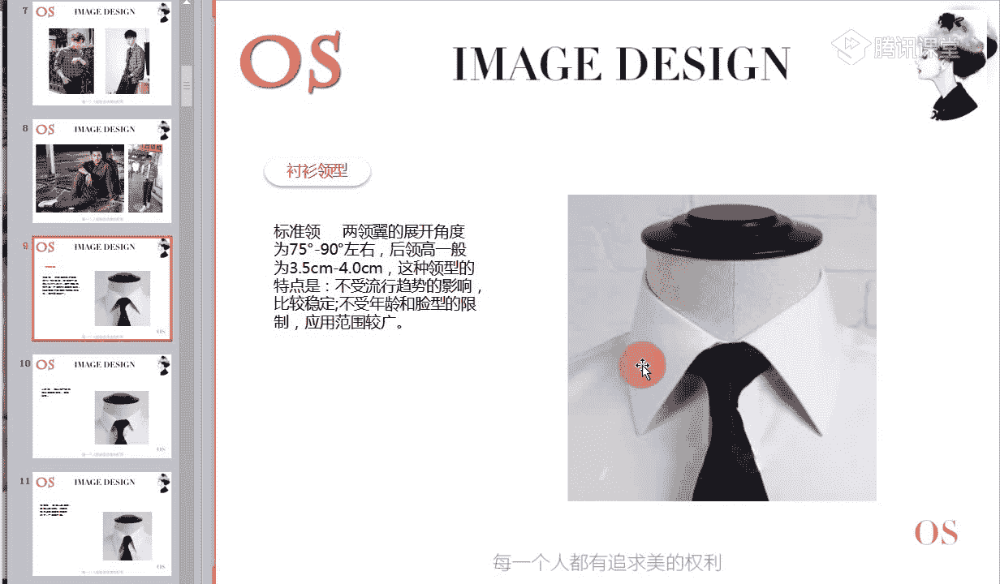
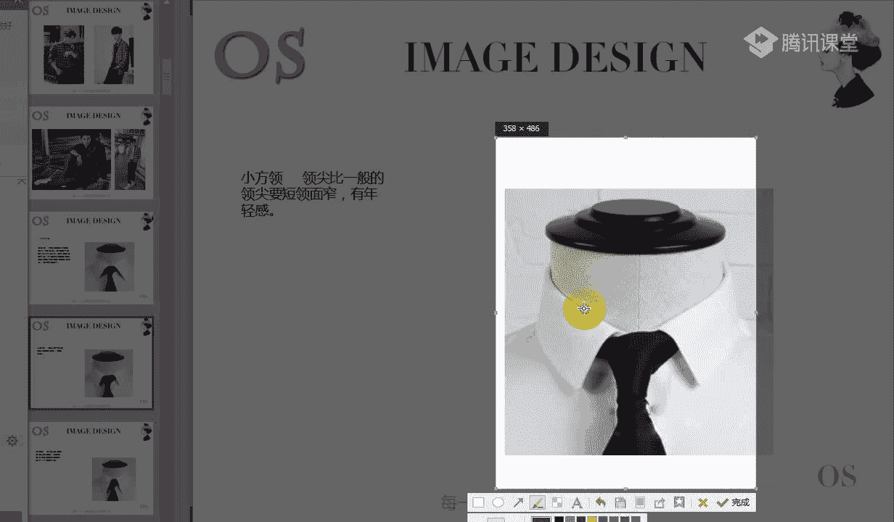
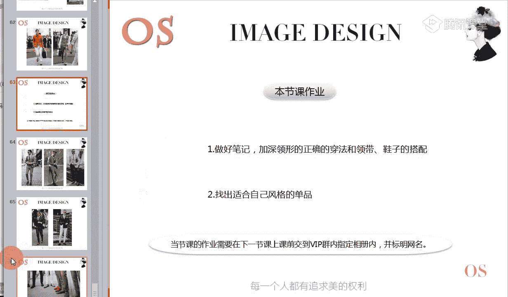

# 1、14男士个人形象班第二期（中级版）VIP课程：第6节、正装的着装原则（二）

好，大家晚上好，欢迎大家来到我们OS男士班的课程。我是本节课的主讲老师舒阳。那大家做好准备的同学呢，再次跟老师刷朵鲜花，我们就开始今天的一个课程了。好，今天我们继续学习我们的正装的着装原则。第二个板块。

以及呢我们鞋类的这样的一个划分。🎼好，还是进入我们本节课的一个学习重点三部分。第一个呢就是我们男士衬衫领型的分类。大家通过第一部分的学习之后，一定要熟知自己的衬衫以及领型啊，领型是非常非常重要的。

在第一部分。第二个呢就是我们男士领带的图案分类，以及呢我们领结这样的一些造型跟我们风格之间的这样一个关系。好，第三部分呢就是我们男士的鞋类的一个分类。那么本节课对于大家的一个要求呢。

就是我们一定要熟知自己。以上这类型单品风格所适合的。好，首先先进入我们这样的一个衬衫哦。男士衬衫的话，它其实具有悠久的这样的一个历史，而且它的种类非常非常的多。无论是你正规的场合。

还是跟你呃西服去做搭配，还是我们在呃度假的时候穿着休闲的这样的一个服装去做搭配。处处都离不开我们的衬衫。任何的场合我们可以穿呃各种这样的一个衬衫，如何的去穿，给人的印象，也当然是截然不同的。

所以说我们要了解衬衫的质地，了解衬衫的这样的一个样式，以及它的场合的一个要求，与我们领带的这样的一些搭配方法，是我们现代男性必须要知道的一个基本的一个常识。那包括衬衫呢。

我们可以分为内穿外穿或者是配饰等这样的一个用途。按照款式，我们衬衫大致呢分为这样的一个礼服衬衫，也就是说运用于我们这样一个社交衬衫场合的。第二个呢就是我们普通款式的衬衫。第三个呢就是我们休闲类的衬衫。

首先我们要懂得去怎么样去进行辨别。第一个呢就是我们的社交衬衫啊，社交衬衫呢主要是跟我们的礼服做搭配的哦，老断线啊，其他同学有没有这样一个问题哦。社交衬衫主要是跟我们礼服做搭配的，大家一定要记清楚啊。

不是跟我们一般这样的一些严肃职业场合所穿着的正式的西装去做搭配，而是跟我们一般这样的一些晨礼服呀，或者是说唉我们这样的一些吸烟装啊等等去做搭配的。往后我们在介绍服装的时候还会讲到这样的一些礼服。

所以说大家先记住社交衬衫，它的配套。第二个呢就是社交衬衫怎么样去判断呢？第一个它是有前胸径的啊，我们可以看到前面有一块比较偏厚的，有一点设计感的这样的一个胸衬，对不对？

它是有一个一定的胸衬的那还有呢就是它的下摆啊，大家看到这张图片。它的下摆呢是呈这样的一个圆弧状的下摆是呈上圆弧状的，然后有这样的一个胸衬的设计。🎼另外的话呢，社交衬衫一般都是双层的袖口。

而且我们要知道男士配饰里面有这样的一个袖口钉，对不对？唉，袖口钉袖口钉的搭配主要是跟我们这样的一个双层袖衬衫去双层袖口的衬衫去做搭配的。所以说呢一般的社交衬衫它都是双层的袖口啊。

双层的袖口不像我们普通的衬衫是单面的。大家可以看到这是单面的，但是呢礼服衬衫是双层的，它是有厚度的啊，双层的。🎼而且下摆是呈这样的一个圆版圆弧状啊，明白同学跟老师扣个一。因为呢一定要记住下摆的一个概念。

你会发现一般衬衫来说，圆下摆呈现这样的一个圆摆状的话，它一般都是放到裤子里面的。你会发现像这类型的衬衫，它的长度是非常长的。不像我们某一些休闲类的衬衫。哎，它的下摆的话。

我们可以看到是呈现这样的一个平水平一条直线，对不对？是呈现这样一个平平线状的，而不是说是一个圆摆型的，所以像这类型衬衫的话，我们不可能把它完完全全塞到裤子里面。因为你塞到裤子里之后。

你可能坐下来起身的时候，哎，你的衣服就乱了，对不对？我们还要去整理非常的麻烦。所以像这类型的衬衫的话呢，它都是放到外面单穿的，一般不会呢放到裤子里面。

除非说哎对于某一些身高条件不是特别理想的一些同学的话呢，我们也可以适当的去塞那么一个角啊，让它呢。🎼制造我们整体身材的一个比例。所以大家要记住啊，首先我们要记住这样一个概念，圆弧装圆摆的一个下摆。

它主要是用于放到裤子里面比较的方便。🎼因为衬衫会偏长而，这个就是我们这样的一个社交衬衫啊，这是属于我们的社交衬衫跟礼服去做搭配的。接下来呢我们说到了还有属于我们这样的一个普通衬衫，也就是商务商务衬衫。

对不对？商务衬衫的一个特点呢，就是第一素色或者是单色它的底调呢有这样的一些细条纹或者是小格子。但是我们会发现细条纹和小格子呢并不是非常的明显，是偏浅偏淡的啊，然后呢左侧会有一个口袋的一个设计。

那这类型的衬衫的话呢，一般我们都是跟我们的一些西装啊，或者是在职业场合去选择去穿搭。🎼非常好判断，一般都是素色、单色的细条纹或者是小格子。它不会说像我们的休闲衬衫哦，格纹那么的明显。

格纹条纹那么的明显啊，它是有一定的严谨度的，有正式度的。🎼那包括领型的话呢，我们也会发现一般都是像这类型的直角或者是尖角啊，比较尖的，或者是说我们这样的一些大的八字领，我们都知道八字怎么写，对不对？

有的领子我们也称之为这样的一个温纱领啊，有的是这样的一个八字领，或者有的是小八字领啊，左胸上呢都有一个小口袋，这是我们商务衬衫的一个特点，这个非常好辨别啊。

🎼下一个呢就是我们所说到的这样的一个休闲休闲衬衫的话呢，它的花色非常的多啊。像我们有这样的一些格纹条纹都是非常啊常见的那包括还有一些像我们这样的一些嗯花卉图案的，也是有的，有刺绣的，对不对？

那包括的话甚至有一些这样的一些休闲衬衫，它都是有明线，就跟我们休闲的这样的一些款式的西装一样，它会有明线啊等等。还有包括一些口袋呀，这样的一些细节，突出这样整体的一个细节设计，变化非常的丰富。

而且整体的衣身的话也是比较宽松的那你像我们图中像类似于这样的一些款式的话呢，都是偏休闲的这类型的一些单品的衬衫。🎼啊，这个就是我们三大类衬衫的一个分别啊。首先先分别我们三大类衬衫啊。

对于三大类衬三大类衬衫分别的同学没有任何问题的话呢，快速跟老师刷朵鲜花或者扣个一都是可以的。接下来我们就讲到领型了，因为领型的话呢就跟我们的风格有关系了。🎼好，包括大家在挑选休闲衬衫的时候。

一定要注意啊，休闲衬衫100一般都是呢平的啊，都是100下面呢都是平的，一般都是平的。或者大部分呢哎它这样的一些平的话呢，一般大部分都是适合放在裤子外面去穿的啊。要么呢你如果说要挑选休闲衬衫。

要塞到裤子里面的话呢，我们最好是选择这样的一个圆摆状。因为它的长度够啊，不会说哎一一站起来一坐下来带来不必要的一个麻烦，对不对？那第二个呢就是。🎼我们或者就是可以稍微的塞进去一点点。

如果说你类似于穿这样的一个平头平的底摆的话呢，啊你觉得我想要让我的身高营造出更高一点，对不对？我们可以把这样一个扣起来之后，把衣摆稍微的塞一点点是没有任何问题的。或者是说哎我塞一边。

另外一边不塞都是可以。🎼好，接下来我们就说到呢衬衫的领型啊，衬衫男士衬衫的领型分类呢并不像我们想象中的那么的单调啊，以为就一个常见的一个领脸型。那了解以下常见的领型的话呢，可以更好的选择适合自己的衬衫。

所以所以说第一个呢，我们首先来了解标准领。我们会发现很多衬衫，它的领型都是会有一些小的差别的。所以说第一个首先要知道我们最标准的一个领型，就是我们的标准领，那它的领两领翼的展开的一个角度啊，这个是角度。

老师稍微简单的呢，跟大家画一下。

好，这个是它的一个角度啊，是它的一个角度。

展开的角度呢一般在75度到90度左右哦，后领，也就是说它后方的这样的一个领高呢，一般在3。5厘米到4厘米的样子啊，也就是说它后方的这样一个领面的一个高度。那这种领型的特点是它不会受流行趋势的一个影响。

比较的稳定，也不会受年龄或者是脸型的限制，用应用的范围是非常广泛的，就是我们的标准领，大家快点记哦。抓住进重点哦，先抓住重点，快速的记。🎼那包括它的领肩的长度的话，一般是个9厘米的样子啊，也就是说。

你可以看到。这一条线一般是9厘米。

一般是9厘米。啊，如果说有同学呢是老师在讲隐形的时候，你还没有记清楚，你可以跟老师扣个2，我就稍微停一下。🎼好，第二个呢就是小方领。首先我们先把所有的领型进行一个辨别。

然后我们再根据不同的风格呢进行一个划分。🎼第二个呢就是小方领啊，领肩呢领肩呢比一般的领肩要短啊，领面啊，这个就是叫领面啊。所以说有同学如果看到某一些关键词不能理解的像我们这一块就是叫领面哦，领面。

🎼里面的话呢要窄，比较的窄，有年轻感。我们可以感觉到啊整个的一个量感来说哦，大和小，对不对？小方领要小很多，面积要小很多，所以说它带来的量感也是偏小的。所以说有年轻感，适合一些年轻的男士。

或者说风格较小的一些男士，这是我们的小方领的特点。🎼好，第三个呢是我们的扣脚领啊，美国人最喜欢的也是我们美国人发明的。你会发现美国人他特别喜欢一些休闲类的，包括西服也是一样的，对不对？

美式西装典型的这样的一个H款式非常的宽松啊，休闲啊，比较的舒适。那包括呢我们也可以看到扣脚领的话，它也能够带来整体的一个休闲感。因为它主要是在我们的领面上面去做文章。

我们可以看到在领尖的位置呢有一个扣子。所以说像这样的一些有扣子的领子的话呢，它的严谨度是不够的啊。一般呢你会发现在很多一些休闲衬衫里面，我们经常会看到领子上面带一些扣子啊，领子上面会带一些扣子。

所以说它一般都会出现在跟休闲类的单品做搭配。🎼正式场合一定是不要去穿啊扣脚领的衬衫的，休闲场合可以大面积的去穿着。🎼好，第四个就是我们的宽脚领啊，我又称之为温纱领。老师刚才有说到，对不对？

我们男士的衬衫的话啊，有很多普通衬衫里面有这样的一个大八字领和小八字领，其实老师指的就是大八字领指的就是宽脚领啊，又称一字领啊，又称温纱领。因为像这类型的领子的话，如果你要佩戴我们的领带。

领带结一定是打温纱结，你会发现温纱节非常的厚，非常的大哦。这是它的一个特征。那包括呢领翼的夹角。也就是说唉脚与脚之间的话，它的一个夹角在120度到180度之间啊，佩戴宽大的领结会更显得有我们的个性。

在意大利的话，备受年轻人的崇上啊，后领的高度大概是在3。6厘米到3。9厘米为宜。这个是我们的宽脚领。🎼下一个呢我们说到了中针孔领哦，针孔领，又叫呢夹洞领啊，也就是说在两边领子的中央呢。

我们各开一个小洞啊，打领带的时候，我们用来穿洞加以固定啊，来固定我们的领领带啊，不让它呢左右来来回的去跑。所以说呢像这样的一个针孔领的这样的一根啊装饰的话，它是起到了一个较强的一个固定的作用。

同时呢它也有装饰性，适合去搭配正穿着，不适合呢做休闲装穿着啊，它不适合在休闲场合出现。🎼也就是说它这一根啊小棍子起到的就是来调领带的作用啊，让领带能搁在这根领针上面哦。🎼有潘领啊。

也就是其实它跟我们的针孔领的话呢，有相似的作用。它其实就是在左右啊有一个定有一个这样的一个潘儿，对不对？那这个潘儿其实它也是呢起到固定的一个作用。

包括我们的领带呢还是放到我们打在我们这样的一个潘的上面啊，进一步呢哎让我们整个领带调起来。🎼而这种领子的话，你会发现整个夹角是偏偏窄的。所以说你要细领结的话，我们就是系一个普通的领结就可以了。

不要太大哦。如果你的领结太大的话，我们肯定就不太合适。它跟我们的这样的一个温纱领是有区别的。🎼好，下一个就是我们的尖角领哦，尖角领领翼展开的角度呢非常的小。你可以看一下哦。

不要把尖角领跟我们的标准领哦弄混淆，千万不要把它弄混淆了啊。还有包括我们我们看到这是我们的标准领，要看到它的整个的领翼的展开的一个角度。然后呢，我们再来看到这样的一个。🎼这样的一个尖角领。

领翼展开的角度呢是比较小的，一般是小于90度，小于90度，挺直的领尖呢给人以修长的感觉。圆角领。看到图片啊，我们的圆角非常非常好辨别，因为大部分的。领尖的话我们都会感受到它的这样的一个直角度，对不对？

尖锐度。但是呢我们这样的一个圆角领呢，它是有呈现这样的一个圆弧状的哦。领根据领尖的大小和展开的角度不同呢，圆弧的样式也不同。我们可以看到图一和图二，它的整个的一个样式是有一定差别的。

而且我们的圆角领的话是一种非常古典的领型，不适合上班具有历史性。因为我们会发现像有弧圆弧状，整个来说是比较的弱化的。所以说跟我们在职业场合中要去表达这样的一个严谨哦，表达我们男士的这样的一个尖锐度不同。

所以说它适合在休闲场合啊，包括呢适合我们一些根据呢大小风格的大小来调整我们的里面都是没有任何问题的。好，下一个就是我们的异形领啊。异形领的话呢，这样的领子可以看到图中啊，这个都是属于我们的异形领。

也就是说呢领口立起来啊，垂直这样的一个竖竖起来的前领尖呢是向外翻折的，有点像我们的鸟的羽翼啊，因此而得名啊。所以说像这类型的领。领子的话呢，我们千万不要去跟领带做搭配啊，一定是搭配领结。

一定是搭配领结的。而且这样的一个异形领的话呢，一般都是作为呢礼服衬衫常见的领型。也就是说我们刚才所说到的社交衬衫，常见的领型都是属于这样的一个异形领。下一个就是我们的立领啊，具有我们中国特色的领型。

由我们的唐装呢演变而来的，温文而雅。那领子呢只有下领，没有上领，可能有同学就有点疑惑了啊，什么是上领，什么是下领。还有包括老师你说到下领，没有叠门是什么意思啊，我们可以看到这张图片啊。

找一张呢相对清晰一点的。

我们可以看到内侧啊，老师用箭头表示。其实下领呢就是指的唉我们这样的一个里面，而我们的上领呢就是指的这一块的里面。哦，能理解吗？理解同学跟老师扣个一。下领哦下领和上领的一个概念。

理解同学跟老师扣个一啊，所以说我们可以看到它只有下领，它只有内侧的这一块领子，而它没有任何的翻领，对不对啊？有同学扣了个2，不明白是不是那老师再次的来说一说一次啊，再次来说一次。

这个一面指的是内侧的这一面，指的是下领，而我们外翻的这一面呢，指的是上领，能明白吗？所以说像我们这样的一个真中式的领型的话呢，它是只有下领，没有上领。

理解了没有？只有下领，没有上领嗯，能理解了。那还有呢关于叠门呢，我们可以看到很多衬衫的话，这两这是一我们可以叫他这是第一个门，对不对？

看到老师箭头的地方，这是一个门，然后这是一个门。我们可以看到当它扣在一起的时候，它的门它的两面是叠在一起的。如果把它们两面扣在一起的时候是叠在一起的。但是呢一般像我们这样的一个小立领的话，立领衬衫的话。

我们两个领子是分开的，它不会叠合到一起。所以说下领是没有叠门的。那这类型的衬衫的话呢，是不适合跟我们的正式西装去做搭配的，不适合跟你正式的西装去做搭配。如果说你要跟休闲类的西装做搭配，也不是不可以啊。

我们可以去进行这样的一个呃小一小一点点的混搭是没有任何问题的。是休闲款中呢，最具有代表性的一个设计。所以说各位适合立领的男士我们可以在职业场合中去穿立领衬衫，绝对没有任何问题。

一般的职业场合中穿立领衬衫是没有任何问题的。

最后一个领型呢就是我们的牧师领啊，我们都知道，像我们呃如果是其他的一个宗教的，我们有牧师的，对不对？我们可以看到他的衣服呢领子是白色的啊，我们的衣身呢是黑色的，应该大家都有印象，对不对？

而我们所以说像这类型的牧师领的衬衫的一个演变呢，也是来源于我们基督教这样的一个神父，牧师穿着的这样的一件衣服而而由来的，一般我们会发现啊领子呢一般都是白色的啊，袖口呢它同样也是白色啊，袖口也是白色。

那衣身的话呢是其他的颜色。那除除了以前呢我们是这样的一个白色的领子。那现在呢也已经越来越发展成其他的一些颜色了。比如说我们有的领子可能是一些其他的鲜艳颜色，或者是说也有是可能是黑色等等，对不对？

但是衣身呢啊是另外的一些颜色，也有，所以说我们又称之为异色领啊，领子的颜色。跟你衣身的颜色是不一致的。🎼像这类型的衬衫的领子，我们都叫做慕慕狮领啊，或者是异色领。而关于我们这几大衬衫的特点。

大家都记清楚的同学呢，快速跟老师刷个鲜花或者扣个一。🎼你就是我。好，接下来呢我们由各个不同的风格啊，老师已经把我们各个风格所适合的领型呢标注在这里。然后呢，大家要截图的，赶紧截图，要记得快速的记下来。

🎼好，老师呃，如果说其他同学对于商务啊商务的这样的一个衬衫没有任何疑问的，我我把这张图片呢发发到公台上了，大家可以点一下，然后你们先抄好不好？想要抄的，赶紧抄。然后呢，我再次的重复一遍啊。

商务商务的衬衫特点。🎼商务衬衫的特点呢是素色的啊，素色的一般都是像类似于图中这样的一些素色，比较偏稳重的一些色彩，对不对？那第二个呢就是它如果呃有一定的小小图案的话呢。

它也是单色的一些细条纹或者是小格子，而且整个来说呢还比较的淡不明显，它还是能够去体现我们这样的一个正式感的那另外呢就是它的左侧是有口袋的啊，可以跟我们这样的一个职业场合中所适合的这样的一些西装去穿着。

或者是在职业场合中去单穿，都是OK的。🎼这是我们的商务衬衫哦，商务的衬衫没有太多的设计感，非常的简单简洁哦。左边有一个小口袋，素色的。🎼或者是会搭配一些小细条纹，小格纹比较的浅淡的嗯。

🎼然后但是休闲衬衫的话，我们会发现嗯整个来说明兜啊、明线哪，唉，包括我们比较有一些设计感的一些呃流苏也有的，对不对？还有包括一些这样的一些小须须，包括我们可以看到很多一些这样的一些休闲衬衫的话。

它在下摆它会有这样的一个做旧啊，做一些流苏的一些款式，也是有的。会有很多的一些变化啊。好，这个是我们的各个。各个风格的男士啊所适合的领型。所以说我们首先已经清楚了自己的风格，对不对？

那今天呢我们也学习了这样的一个领型，也懂得怎么样去辨别了。所以大家呢在购买衬衫的时候呢，完完全全按照自己的风格来进行选择。因为你要知道风格，对于我们里面的影响也是非常非常重要的。

就像我刚才所说到的这样的一个小方领，对不对？我们可以看到整个领子来说比较的短比较的窄，所以说有年轻感。那如果说你作为一个戏剧风格，或者是说哎你作为一个我们这样的一个呃浪漫风格的也好。

或者是我们自然风格的同学也好，如果你去穿小方领肯定会显得特别的小气，会显得你的面部非常的突出，跟你的五官是不相协调的。所以说我们在选择领型的时候呢，一定要去跟自己的啊这样的一个整个来进行协调。好。

记好的同学呢快速跟老师扣个一。🎼好，在这里呢我要跟大家说一下啊，我们可以看到呃这两这一位男士我们同样是穿同一款衬衫，对不对？搭配同样的针织衫，这样的一个整体的视觉，也同样是扣一颗扣子。

但我们可以看到图一和图二的差距就是里面上的这样的一个变化哦。所以呢我不用问大家，我相信很多同学都会觉得图一图二会更加舒服，对不对？下方的这张图片会更加舒服。

更能够唉给我们带来整体的这样的一个干净清爽严谨的一个感觉。而图一的话呢，上边上边的这张图片的话，会给人感觉太过于呃放松了。而且的话呢也太过于不整洁了，对不对？所以说想要领子更有型的话呢，领撑是一个关键。

我们男士啊其实是有一个小工具的。包括各位男士你去选购你一些较为正式一点的这样的一些商务衬衫的话，你都会发现它会有一个这样的一个小的一个设计。可能有同学很好奇，这个设计是干嘛用的。这个设计其实就是。

来放我们这样的一个领撑的，放领撑的啊，如图中所示啊，我们可以把领撑呢哎塞到这样的一个小线条里面，对不对？小线条里面，然后呢，根据自己的这样的一个角度进行呢这样的一个根据自己的领型啊进行这样的一个处理。

你会发现你的领子会立马有型很多。所以说男人的肩部哦，整体的肩部的塑造感本身就是非常非常重要的。这个我不再做强调了，在场合中老师已经说过了。🎼那第二个呢就是在夏天我们男生穿着衬衫的时候呢。

我还是希望你们穿一个小背心啊。我相信各位在场的女士啊，应该有遇到过我们各位一部分的一些男生，对不对？在我们这样的一个职业场合也好，还是说在休闲场合，我们穿着衬衫的时候，尤其是选择一些高织棉啊。

本身高织棉的衬衫它就比较的贵。因为它高脂棉的倍数越高的话，它的价格会越高。而且呢它也会越纤薄越透气啊，这是我们高织棉的一个特征，但是她同样也会有一个不太理想的一个。作用就是它会导致因为它的一个越薄越透。

会让你的整个的这样的一个胸部，对不对？还有包括我们有时候出汗呀等等，其实会造成一些不必要的尴尬。我不知道有没有同学之前在生活中有看到过，对不对？观察到过。所以说男士不管你是在职业场合也好。

还是在我们的休闲场合也好，我建议你们呢在衬衫的里面还是穿一个小背心。第一个呢，防止我们胸前的一不小心的一个肌突，对不对？哎，这样的一个或者是过于衬衫过薄的情况下过于的透啊。

这也是非常尴尬的那第二个呢就是其实它还有吸汗的作用，哎，防止呢在夏炎热的夏天的话呢，哎我们整个衬衫全部都汗湿了，也是非常非常尴尬的那第二个呢就是我们在选择这样的一个小背心的时候，可以呃选择类似的色彩。

或者选择白色，你是浅色的衬衫，我们就选择白色，或者说浅灰色等等啊，这样的一些浅。🎼色的衬衫呢来打底或者是同色系的这样的一个T恤来打底都是非常有必要的。啊，这个就是我们这样的一个第一部分啊。

关于我们的衬衫。🎼第二部分呢，我们说到领带啊，说到领带，领带呢它具有这样的一个装饰功能，它的形式也是多种多样的，而且呢它能够满足我们男性装扮需求的服饰。🎼整体的这样的一个服饰品质，对不对？

也是让我们整个男装它能够产生变化的一个重要因素。我们会发现其实它就像呃起到了一个点缀的一个效果。像我们女生夏天穿裙子，然后背个包包你可能起到了一个非常强的一个装饰作用。

那其实男男士在我们整个男生的一个正装里面，它也是起到一个很强的一个装饰作用的。而且现在领带的话呢，除了我们非常经典的一个保健头型以外，我们还有这样一个平头啊，也有这样一个平头。

你们可以根据自己的爱好去进行选择。其实像宝健头平头，我们都是可以去进行选择的那还有呢就是宽度的话呢，我们会发现领带的宽度现在有8公分的，对不对？甚至的话呢，还有比8公分更窄的啊，像我们这样的一个。

🎼平头的平头的很多都可能是四五公分的，也很有很多很常见。但是像这样的一些过细的领带的话，它的整个的一个严谨度肯定是要稍微弱一点的，稍微弱一点的。那还有呢就是我们的领带的长度大概是在133到145公分。

选择的时候要考虑到你的身高体积和个子。这个在昨天的课程中老师已经说到了。接下来呢我们就来看看领带它的图案的类型啊，我们首先因为这样的一个类型的话呢，它关注到我们不同的风格。

在选择上面以及呢我们不同的场合跟我们领带的图案也是非常非常有关系的。🎼好，接下来呢大家要抓紧时间要做好笔记啊。唉，类型图案分别有哪些呢？第一个就是我们的小纹均匀啊，图中所示的就是我们的小纹均匀。

你们一定要根据老师形容的关键词，把关键词进记清楚，然后观察图片是不是这样的一个感觉。第一个图案一定是小号的啊，而且它的领带呢也不是非常的宽，它的领带也是偏小一点的啊。

我们可以看到领面来说不是哦典型的这样的一个十多公分的这样一个宽度，对不对？小号的，而且它的图案的排列的话也是非常的紧密。🎼紧密啊，能够感受到整个的一个紧密感，对不对？紧凑感。

以及呢它会体现我们严谨的状态。当然啊像我们这样的一个浅色的亮一一亮一点的颜色，我们不说，但是我们可以看到左边整条领带来说，它是不是能够给你带来严谨的这样的一个感觉。也就是说，如果在正式场合中。

像我们这样的一些。举个例子啊，像我们这样的一个严肃的职业场合，正式上班，是不是可以去搭配类别类似于这样的一些图案的领带哦，能理解吗？啊，这是我们的小文均匀，适合正式上班，正式的职业场合。

🎼小号的哦紧密的，它会带来严谨的状态。🎼如果有同学呢老师在讲解每一个类别的时候，有没有听清楚的，或者说还不能理解的，记得及时跟老师扣个2，老师会重复啊。那我们呢接着往下面讲，因为今天的课程还蛮多的内容。

第二个呢就是我们的小文件格，小文件格。看到图中所示哦。看到图中所示。🎼同样它的图案的话呢也是小号的，图案也是小号的，而且呢图案和图案之间它是有一定的分散感的。我们可以看到图案啊，这是不同的一个图案。

对不对？图案和图案之间是有一定的风散感的。但是呢图与图之间它又是有紧凑度的。哦，适合我们上班去穿啊，像一般的职业场合，我们可以去搭配这样的一个小文件格。🎼小文间隔小号的图案与图案之间呢，它会形成分散感。

🎼唉，适合我们上班场合去穿着选择。🎼好，第三个是我们的大纹均匀啊，名称叫大文均匀。那当然它的图案是大号的，它的图案大号，而且图案的话呢，一般是跟你的拇指盖相似的一个大小。哎，我们叫大纹。

跟你拇指盖相似的一个大小的话，我们称之为大纹。那还有呢它就它的一个整体排列还是有紧密感的，还是有紧密感的。我们可以看到图中啊整个的一个紧密感。那正式度的话呢，跟我们图案本身是有关系的。

我们可以看到像这类型的图案的话，我们能不能放到职业场合去选择，觉得可以的同学跟老师扣个一啊，觉得如果说觉得不可以的，跟老师扣个2。我们看到图中啊，我们老师所找的这一张大纹均匀的领带。

大家觉得能不能放到职业场合中去佩戴，觉得可以的，跟老师扣个一。好有同学说到不可以啊。🎼职业场合的话，我不一定指的是严肃的职业场合哦。🎼有同学说到不知啊，可能是我们刚来听这一节课的。

🎼我们可以看到整个图案来说，如果大家学到学到我们风格的图案的一个辨别的时候，你们会快速的会进行这样的一个分辨。那首先呢先记住这种感觉。🎼你会觉得图案很跳跃吗？我们可以看到图案的动和静来说。

大家觉得是偏动的还是偏近的？看到这样的一个图案啊，大家觉得是偏动的还是偏近的？有同学说到了动。😡，好，有没有不同的答案啊？嗯，有同学说到了镜啊，所以说我们可以看到整体来说你会觉得它是抽象的吗？

是有这种跳跳动感的吗？还是你觉得它比较的平和一点，哎，还是图案还是蛮安静的。是不是它其实整个来说是偏近的啊，然后跟大家说到啊是偏近的，是要平和一点。对，要平和，它不是那种啊色彩也好。

图案的这样的一个造型也好啊，过于的跳动，对不对？或者是过于的这样的一个整体来说啊，非常的有力度感。所以说像这类型的大纹均匀的话，老师说到啊，可以去根据你的图案来决定啊。

也就是说正式度的话跟本身的图案有关系，相对稳定，它其实是相对比较的稳重的。所以说适合一般的职业场合。当然我不排除在我们的严肃职业场合去佩戴大文均匀，你也可以。但是我们就要选择更加安静严谨的一点的图案。

好，这个是我们的大纹均匀哦。好，接下来呢说到我们的协调文，非常好辨别啊。协调文。哎，图中所类似类似的就是这样的一个协调文。那它适合呢一些谈判的职业场合，比如说像律师啊等等啊，你们都可以去进行佩戴。

或者说跟别人去呃谈合同啊，谈判呢，我们也可以佩戴这样的一个。🎼领带以及呢一般职业场合的男性，我们要选择领带的时候呢，也可以去选择啊。它的整个的严谨度和正式度要比我们刚才所说到的小纹均匀啊要轻很多。

所以说大家可以看到像这样的一个斜条纹啊，来说的话，它还要更加偏向休闲一点，对不对？偏向休闲这种感觉一点。好，这个是我们的协调文啊，适合谈判职业场合或者是一般的场合。好，无图案的啊。

没有任何的其他的一些图案的一些点缀啊，它主要的特色就是在色彩上面。🎼色的一个特点，不适合严肃的职业场合，也不适合呃不适合我们一般职业场合可以适当的去选择。我们把颜色稍微呃弱化一点。

那还有呢就是像这类型的光泽感强的。然后色彩比较明艳一点的颜色的话呢，我们适合在社交上面去选择社交上面去选择色彩明艳一点的那一般的职业场合的话呢，我们可以去把颜色稍微的减弱一点点。

或者是说我整身来呃作为时尚职业场合的同学的话，你也可以去选择一些色彩程度高的，没有任何问题。严肃职业场合，我们可以用运用到这样一个无图案的领带呢来起到点缀的一个作用。但是在严肃职业场合是不建议出现的。

🎼因为它所有的特点都是在色彩上面啊，它是在色彩上面做文章。好，接下来就是我们的自然图案啊。自然图案这里呢老师要重点跟大家说一下，你们要看到图中这两款领带给你们的视觉感受啊，感受一下。

你们感受一下图案的给你们带来的一个感觉，还有包括色与这样的一个图案跟领带之间整体给你们的感觉啊。现在心里面呢看一看想一想，然后呢，接着来听老师说，你没有你们有没有发现整个领带来说有这种浊的感觉。

我们都知道在色彩里面我们有明清色调，暗青色调以及着色调，对不对？着色调的话呢是加了灰的感觉。所以说色彩之间呢会有这样的一个脏脏的感觉哦，发着不清晰的这样的一个视觉感受。而我们这样的一个自然图案的话呢。

它恰巧也有这样的一个感受。所以说整个领带来说，它会带来浊的感觉，显得不是那么的清晰。🎼显得不是那么的清晰，而且的话呢像这类型的自然图案的话呢，年龄感大的人更适合去进行选择。🎼好。

这个自然图案有没有什么问题哦？有没有任何问题？没有任何问题，同学呢跟老师扣个一。因为就上一期我们所交的作业啊，上一期男士班在这堂课讲到自然图案，大家在进行呃找这类型图片的时候，有出错率是蛮高的。

所以说我希望大家记住老师图片中给你带来的视觉的印象。然后呢，结合老师刚才所说的，带来浑浊的这样的一个感觉，对不对？显得不是很清晰，而且的话呢也有一点年龄感。🎼好，接下来就是我们的曲线图案的领带啊。

曲线图案的话呢非常容易啊，就是在领带上面我们有这样的一些图案，而且图案是曲线型的啊，是我们这样的一些有弧度的曲线感非常强的呃。它这类型的领带的话呢，你会发现它减弱的男男性的这样的一个理性。

显得男士呢唉有这样的一个感性化，对不对？适合呢我们各位男士参加婚礼的时候，我们可以去选择这类型的领带，或者是说呢浪漫风格的人，我们在这样的一些时尚职业场合，以及我们的休闲场合中。

我们如果要选择正装的话啊，我们可以去搭配这类型的领带。好，最后一个呢就是我们的前卫图案啊，也就是说图案非常的有个性，图案非常的有个性。而且的话呢整个领带给你的感觉也是有年轻化的，对不对？年轻化啊，阳光。

🎼肩就是这样一个欣锐个性的感觉。所以说呢时尚行业的男士，我们可以多去选择前卫图案的领带。好，关于我们这样的一个领带啊，大家还有没有什么？不了解的呃，全部都了解领带的这样的一个划分的同学跟老师快速扣个一。

那关于领带的大技法的话呢，大家可以去百度啊。而且如果说哎有同学不会的话，我们可以把这张图片截下来，这是一个非常简单的一个截的一个打法。🎼好，接下来呢我们就把这一块快速的系好啊。戏剧型再选择领带的图案。

以及我们各个风格在选择领带图案中所适合的。🎼刚才我们就领带哦，就领带的这样的一个类别呢，我们进行了场合的一个划分。接下来呢大家把风格各风格再选择领带图案上面，先把它记清楚。

系好的同学呢快速跟我们的鲜花啊，我们接下来讲到下一个就是我们的领结了啊。说既然说到了领带，就不不得不说一下我们的领结。那当然呢把这样的一个感觉哦也快速的浏览一遍。因为到时候我们对应来讲领结的时候。

其实也会简单很多，能够快速的找到这样的一个感觉。除了领带的话，我们领结的使用率也是很高的。我们到时候来看看不同的风格，再选选择领结上面的这样的一个不同。好，都记好的同学快速跟老师刷的鲜花或者扣个1啊。

我们快一点啊。🎼好，再给大家一分钟的时间啊，我们快一点加快速度。记好的同学呢可以跟老师刷的鲜花或者扣个一。🎼好，我们接下来看到领结啊。首先呢我们看到戏剧风格的啊，看到戏剧风格的领结所适合的领结。

然后呢大家来观察一下，因为领结的话，我们最大的分别无非就是呢领结的大和小，以及呢领结的图案，对不对？以及我们领结的这样的一些上面的一些装饰物，所以说大家先记住我们每一个风格。

老师所找的这样的一个对应的图片，你根据它的图案哦，跟它根据它的一些装饰细节呢，唉，理解某一些关键词。那首先我们可以看到戏剧风格的这样的一个领结，大家可以有同学啊可以方便的哦，由于我们有同学是用手机的。

可能不不太方便打字，对不对？那如果说方便同学可以快速的呢。🎼跟老师把你看到我们领结的图案给你带来的这样的一个视觉的印象呢，可以跟老师来分享一下，用一些关键词啊，关键的形容词来描述。

🎼好有同学比较活觉得活跃。嗯，有的同学说到花嗯。🎼跳动的啊非常非常棒啊。如果观察到跳动活跃的话是非常棒的。因为我本身戏剧风格的话，它就是有力度感的，而且它是偏动的，它是一个动态的风格。

所以说他在选择图案的时候，一定是要有动态感的对，还有包括我们有同学说到的一个华丽，对不对？其实你说到的华丽，无非就是醒目摩摩登的夸张的大气的，对不对？图案是不是非常的大气，也有一一定的夸张感啊。

有这样的一个强烈的一个冲击度，对不对？所以说我们戏剧风格，在选择领结的时候呢，也就是老师刚才跟大家看到的这样的一些关键词，也其实跟大家做了一点的一个一部分的一个总结，对不对？🎼清晰的啊，颜色重啊。

对不对？清晰的颜色的重，我们一定要选择一些清晰的夸张一点的啊，摩登大气醒目的装饰感一定要非常的强。这是我们的戏剧风格，在选择领结上面图案上面要注意的。那接下来呢我们可以看到浪漫风格。好。

浪漫风格又给你们什么样的一些。关键词我们可以来进行一些描述。我们可以看到，其实有些领结它同样都是有一些花卉图案的，但是呃不同的花卉图案的话给人的感觉是不一样的。🎼有同学说到的华丽嗯，非常非常棒啊。

这是一个非常关键的形容词来描述我们浪漫风格，一个非常关键的一个缓形容词。所以说浪漫风格的话，它也是一个非常量感，非常大的风格。所以说在整体我们选择领结上面还是要往大气一点的去走。

成熟大气是有一定有必要的。这个跟我们戏剧风格是相通的。第二个呢就是它要比我们戏剧风格更加的去凸显华丽感啊，有这样的一个华丽感，对不对？以及呢它会有这样的一个性感的感觉。就是我们可能会发现整个领结来说。

哎如果说戏剧风格它要偏理性的话，你会发现浪漫风格啊。戏剧风格如果偏理性的话，浪漫风格会更有这样的一些感性元元素，对不对？所以说呢它同样是成熟华丽性感大气，以及呢夸张的这样的一个视觉感受。🎼好。

第三个呢就看到我们昕锐前卫啊，这同样也是一个偏动的风格，也是偏动的风格。我们可以看到昕锐前卫和我们的浪漫风格啊，他们俩都是偏动的这样的一个风格。在男士里面。那其实整体来说呢。

你会发现它好像看似跟我们的浪漫风格有一定的共通点，但是它整体的领结给我们的视觉感受要显得要小气那么一点，对不对？它不会说像如像我们的戏剧风格，像我们的浪漫风格那么的大气。它会更加的偏小气一点。

同样的话呢也有这样的一个年轻的感觉啊，年轻个性时尚标新立异的这样的一个视觉印象。会有一定的尖锐感啊，我们这样的一个锐利感。其实像这样的一个领结啊，看到图片中这样一个领结。如果说在它的图案上。

我们可以看到图案是一个骷髅头。其实像这样的一个骷髅头并不太适合浪漫风格。如果图案进行一些改变的话呢，其实我们这样一个领结给到浪漫风格也是OK的，没有任何问题。🎼那包括我们也可以看到这里啊。

同样都是豹纹图案，但是呢唉跟我们戏剧风格的豹纹它是有差别的，它是一定有一定的差别的，显得要小一些，年轻一点，对不对？显得年轻一点，个性一点，但不会说像我们的戏剧风格这么的夸张大气。🎼好。

接下就是我们这样的一个阳光前卫啊。以也就是说，其实在前卫风格里面呢，老师在我们男士课程中我是划分为两个风格，一个是新锐前卫，一个阳光前卫。那他们俩的一个区别就是新锐前前卫的话会更加的有这样的一个时尚感。

对不对？哎，会更加的标新立异，会有这样一个锐利感，有锐利尖锐的这样的一个感觉。那阳光前卫呢，他相对来说要平和一点。同样他也是年轻的，他也是个性的，他也是调皮的，他也是时尚可爱的。

也就是说新锐前卫我们的代表人物，比如说像陈冠希，对不对？但是阳光前卫的代表人物是何炅，我们可以来对比一下，他们两个的长相，你是不是会发现。🎼我们的陈冠希，他的长相会更加的尖锐一点。

也就是说他会更个性一点，长得对不对？而我们的何炅的话呢，他会长得更加平和一点，长相五官上的一个立体度会偏向于平和，能理解同学跟老师扣个一样。所以说根据长相的不同呢。哎。

我们在选择这样的一个领结图案的时候呢，也要做一些区别。🎼那么呢阳光前卫型呢，我们可以去选择年轻的啊这样的一些个性的调皮的时尚的可爱一点的元素。🎼其实大家可以看到。

领结上面一定是能够感受到年轻和成熟的这样的一个区别的，对不对？🎼好，接下来就是我们最后一个呢就是我们自然风格啊，自然风格呢是我还是个人还是特别喜欢的。我觉得因为呃休闲场合它的运用率是非常非常合适的。

非常高的那其实像我们这样的一个图片的话，大家也会发现整体来说，其实它就跟我们这样的一个时尚风格，对不对？前卫风格的人士做对比，你会发现它弱化了很多。它会弱化会更加的给人感觉比较亲切啊。

随意是不是比较有这样的一个。🎼朴实大方的感觉。所以说呢自然图自然风格人本来也适合一些花纹啊、格子啊这样的一些几何图案，所以它适合这样的一些天然去雕饰的。它不要我们不合去选择一些人工痕迹太强的。

就比如说像领结，像这类型的这样的一些贴钻哪，或者是说哎我们加一些过多的一些人工的一些装饰细节的话，它的人工痕迹会很强，对不对？它有些风格它就适合人工痕迹强的。但是恰巧我们自然风格的话呢。

它不适合它适合这样的一些随性潇洒宽松的纯朴的这样的一个质感的，整体的一个领结，不适合去强调我们的手呃这样的一个工艺感，不适合强调了，适合选择一些天然去挑去雕饰的。🎼所以说这是我们自然风格。

在选择脸型上的一个特征啊。所以我们可以看到各个风格各有各的这样的一个特点。那接下来呢老师就考一考大家啊，我们看完了领带，看完了领结，我们来考一下大家，看到图一和图二。首先呢回答一下老师。

大家觉得图一这一款。领带。首先回答一下老师，大家觉得图一这一款领带适合什么样的场合去选择？好，快速的啊快速的回到。图一这一款领带适合什么样的一个场合去选择？好，有同学选择了严谨的一个工作场合。呃。

有同学说到了商务。好，我要回答一下啊，其实像图一的话呢，我们放到一般职业场合会更加的合适啊。一般场场合因为你会发现图案和图案之间是有分离感的。🎼能理解吗？图案和图案之间是有一定的分离感的。

所以说它不能够足以去表达这样的一个严谨度，它会有一定的分散感。所以放到一般的职业场合去进行佩戴会更适合。那第二个问题呢，就是图一的领带，大家觉得给到哪些风格的人去选择会非常的合适。好。

可以根据我们刚才所看到的这样的一个各个领哦，我刚才还漏了一个哦，老师好像刚才漏了一个我们的古典风格啊。🎼啊，可能是我们刚呃刚才老师在做课件的时候，调哦，这里我们可以看到有一个古典风格，古典风格啊。

再次跟大家来说一下，强调一下，如果有同学。🎼觉得古典风格有问题的，我们可以看到古典风格的话，图案和图案之间，包括整体的领结上面，是不是成熟稳重端庄严谨，而且有精致感。所以说它是非常的这样的一个踏实的。

🎼传统的啊精致的、高级的。不是说像我们一些其他风格，它有一定的跳跃性，对不对？它是能够去体现这样的整体的一个严谨感的这是我们的古典风格的一个领结啊。🎼好有同学是给到了自然，哎。

也有同学给到的古典非常非常棒啊。首先跟大家说一下图一的这样一款领带的话呢，我们可以给到自然型的人去选择OK给到古典也是OK的。嗯，所以说回答老师的同学都是非常非常棒的。

证明我们对于风格有了一个初步的了解。那等到我们再去选学习，我们各个风格的呃服装上的一些特点的时候，会更加的轻松。那第二款领结的话呢，大家觉得给到哪些风格的人合适。🎼第二款领结给到哪些风格的人合适啊。

可以是多项选择了啊。好，我们的A同学说到阳光前卫，非常快速的回到了阳光前卫啊，还有没有其他风格？唉，有同学说到的古典哦，你要想一想是不是古典可以哦。🎼所以说要观察整个领结的色彩以及它的材质。

这也是我们需要观察的啊，还有包括图案。🎼好，在这里呢老师要给我们的N同学一朵鲜花哦，非常非常的棒，回答的非常的好。因为呢答对了。所以说图案的话呢，我们可以给到阳光前卫以及我们的自然风格都是可以的。

而有同学回答了古典啊，大家可以看到古典，它给你的印象特征跟我们这一款来做对比的话，是不是在材质上面以及图案上面。🎼不够能够去体现这样的一个正统传统，以及呢唉。🎼高级感精致感，你觉得整个领结非常的精致吗？

我们可以跟我们的典型的古典风格的领结领结来做对比的话，是不是这样的会更加的有精致感啊，材质的这样的一个精致感也好，包括图案的一个均匀，规则感也好啊。图我们古典型概选的图案的话，一定是要有规则感的。

它不适合一些分离，太过于啊我们这样的一些抽象的呀，或者是说唉太过于休闲类的，它是不适合的。🎼那包括有同学说到了浪漫啊，浪漫是要有华丽的，对不对？我刚才都让大家去观察了这样的一个形容词。

浪漫的形容词是大气华丽，对不对？华丽，有这样的一个感性元素的那我们也可以看到图案的话，你能够感受到华丽这个关键词吗？能不能所以说大家要记住每样的一个风格，在选择领结上面，它的一些关键词。

其实对于我们在判断服装风格以及物品的风格的时候，是一个非常非常有帮助作用的。所以不要去小看这样的一个视觉给我们造成的这样的一个感受。记住这种感觉非常非常重要。为什么老师在上课的过程中会找很多的一些图片。

其实就是让大家要大量的去记住这样的一个感觉。好，关于我们第二部分的领带和领结，大家都明白，同学呢快速跟老师扣个一啊，有没有问题？没有问题的话，我们接着讲下一个知识点。🎼好，下一个知识点呢。

我们说到了鞋类哦，因为既然讲到正装的时候呢，我们就一定离不开我们的小皮鞋，对不对？而男士的皮鞋的样式呢也不少，基本上呢分为正式的与休闲的两个方向，正装类的皮鞋的话呢，你会发现它的皮质非常的精良。

记住老师接下来讲的一些关键词啊，跟正式西装做搭配的皮鞋的话，第一个皮质精良。第二个呢，硬挺。第三个呢有光泽感啊，光泽感好的。那休闲类的话呢也有一些光泽的皮质。

也是有一些光泽类的皮质的那包括也有一些其他各种质地的。比如说像帆布的呀，像反毛皮的呀等等。主要追求的是舒适的感觉，对不对？休闲类的皮鞋的话主要追追求的是啊这样的一个舒适感觉。

那关于我们一些呃配饰的一些单品的话呢，鞋类我们就在本堂课征呢课课中间跟大家去讲解。我们会发现其实男士的鞋子的话分为正式。🎼和休闲。而且呢不管是正式还是休闲以外呢。

我们各种鞋子都是由这样的一些各种鞋类进行啊演变而来的那运动鞋的话我们就不说了啊，运动鞋就肯定不在这里面说了啊，没必要去做这样的一个强调。🎼那首先呢我们来辨别一下我们各个鞋类的一个名称，牛津译纹鞋啊。

然后我们可以看到在鞋子的表面会有一个这样的一个译纹啊，像我们的羽翼一样的展开了这样的译纹。这是属于啊这类的鞋子呢，我们叫做牛津译文译文鞋，叫做牛津译文鞋。🎼而，这型这类型的鞋子的话呢。

我们可以根据呢肯定是在正式场合啊，正式的这样一个场合我们是不能够去穿的啊。正式场合是不能穿的。如果是说你是这样的一些啊时尚社交场合，我们可以去进行尝试啊，没有任何问题，时尚社交可以出现。

或者是说呢我们在休闲场合也可以去选择啊。因为尤其是有一类别的一些休闲场合，像这样的一些牛津一文鞋的话，我们都有这样的一个改版，对不对？鞋底啊，会增加这样的一个休闲度等等。好，第二个呢就是我们的镂花鞋。

镂花鞋呢我们可以看到跟我们的牛津译纹鞋来说，它的华贵度华丽度要大气很多，对不对？可以看到鞋子的表面啊。🎼我们可以看到这是楼花啊，非常多的一些蒸。花花孔的这样的一些设计啊，那它呢也是适合社交。

也就是说去跟我们这样的一些礼服去做搭配。男士的礼服做搭配。🎼当然哦我们在这样的一般的有一些男士的话呢，我们在一些休闲场合，你也会发现像休闲场合类的一些单品的皮鞋的话，也有楼花鞋。

但是它不会说像我们典型的社交类的楼花鞋，这么的华丽，这么的严谨啊，这么的有这样的一个。🎼正式感它可能会更加偏向于休闲化。好，第三个就是我们的横少。之前我们在讲男士正装第一部分的时候。

我们有说到去跟正装做搭配的，一定是哦我们系带的鞋子。那系带鞋类呢我们就有这样的一个横式鞋哦，有中间有一条杠的，我们叫做横式鞋。也叫做一字拼皮鞋。🎼一字拼。跟我们的正式西装做搭配。

也就是说说在严肃的职业场合中，或者是说我们在呃这样的一个职业场合中可以去选择我们的横式鞋，跟我们的西装做搭配。第四个就是我们的梦客鞋啊，梦客鞋的话呢，它其实就是有扣带的啊，采用的是我们的英式风格。

当然像这样的一个扣带的话呢，有这样的单扣带的，对不对？也有双扣带的，我们都叫做梦克鞋啊，接下来给大家看一下啊。能够清楚的看到这个双扣带吧，大家应该能够清楚看到图一啊图一这位男士。🎼唉。

包括我们这位男士啊，以及我们图一和图二这两位男士都是采用的梦克写。🎼梦客鞋的话呢，其实如果说你不是正式的这样的一个场合的话呢，你穿着这样的一个套装，你是可以搭配梦客鞋的，没有问题啊，没有任何问题。

但是在我们的正式严肃的职业场合的话，我希望你们还是要选择我们的一字拼皮鞋。因为它的装饰感还是稍微偏强了一点啊，它的严谨度不是。🎼不会比我们的横式鞋那么的强，所以说横式鞋的严谨度要比它强很多。

还是适合在严肃职业场合中选择它。但如果是说我们在呃一般的这样的一个职业场合，或者说本身场合中没有那么的严谨的话，我们可以去选择搭配梦客鞋，跟我们的正装做搭配是没有任何问题的。啊。

接下来就是我们这样的一个乐福鞋啊，那包括我们呃还有包括像我们很多一些品牌，我们也叫做豆豆鞋啊等等啊，这个都是属于我们洛福鞋的一种。那其实洛福鞋在女装中呢，我们又叫做盖鞋。啊。过去呢在贵族里面呢。

贵族里面穿的拖鞋，就是这种鞋类哦，这是在贵族里面作为拖鞋去穿的，叫做洛夫鞋。那包括现在你会发现，不管是男士的呃有光泽感的皮鞋也好，还是我们这样的一些豆豆鞋啊，反毛的鞋子啊。

它都是采用了我们洛夫鞋的一个演变，对不对？典型的这样的一个典演变过程，哎，有加了一些很多设计。那传统的是类似于这样的一个装饰的那现在的话呢也加了非常多的一些设计啊，这个都是我们的洛夫鞋。🎼好。

一般的职业场合中，休闲场合中我们都可以选择。那下一个呢就是我们的素面鞋啊，也称之为懒人鞋。因为一脚蹬嘛，我们一脚就可以蹬进去啊，也不用系带，也没有任何太多的一些呃装饰，素面的啊。

它的鞋的表面都是没有任何装饰的这样的一个素面鞋。🎼欧式风格哦，典型的欧式风格。那包括我们可以看到，像有一些皮鞋的话，它也是典型的我们的素面鞋的一个演变啊，它会加一定的装饰风格，这都是我们啊。而且的话呢。

鞋子的一个底偏厚的话，它一定是会带来这样的一个整体的休闲感的。🎼啊，这个就是我们的鞋子啊，那运动鞋就不做多说了。我们可以看到，其实很多的不管是休闲场合出现的鞋子也好，还是正式场合的一些鞋型也好。

其实它都会由我们这几类鞋型去进行一些演变，对不对？那接下来呢我们就来看看不同的鞋风格在选择鞋子上面它有哪些区别啊。所以说各个风格的配饰啊，这样的一个鞋类，我们就在本堂课跟大家讲清楚，大家一定要记住。😊。

🎼好，首先呢是我们的戏剧风格。其实我们回到刚才戏剧风格在选择领结上的一个整体的感觉，我们再把这种感觉带到鞋子上面，其实是相同的。大家来观察一下鞋子是不是也会有大气摩登夸张。🎼对不对？

大气摩登夸张整体的这样一个感觉。🎼所以说像戏剧风的人不仅是在选择鞋子，那包括在选择我们的衣上面，整体也是唉大气的摩登的，它是有这样的一个哦宽松度夸张度的，对不对？🎼啊有一定的成熟度啊。

它的量感因为它是最大的啊，量感是最大的。大家一定要记住啊，我们这种鞋子的感觉。摩登的夸张的对不对？大气醒目的。有现代感哦。🎼好，接下来呢我们看到自然型啊，因为它也是一个大的风格啊。但是自然型的话呢。

其实我刚才说到了，在选择领结的时候，我们同样是天然去雕饰，对不对？其实鞋子的话呢恰巧也要制造这样的一个感觉，它的造型呢它适合选择一些造型，简单大方的皮质呢天然。

它不会说像我们的戏剧风格哎要去增加一些工艺感，对不对？要增加一些人工的痕迹。但是恰巧的话呢，我们自然风格就不适合去添加人工的和呃这样的一个痕迹。所以说像一些皮质天然的柔软舒适的鞋类都是非常适合它们的。

就如图中所示，我们可以看到跟我们的戏剧风格去做对比的话，它要弱了很多，要轻了很多，对不对？但是它同样也是啊有这样的一个量感的。鞋子还是有一定的量感的。🎼那包括的话呢，我跟大家说一个小知识啊。

看到我们图中的这一款鞋子。🎼好，看到图中这一款鞋子啊，大家要跟着老师的鼠标走啊。看到图中这一款，还有包括我们这一款。🎼啊，以及我们浪漫风格的这一款，跟着老师鼠标走啊，以及呢我们古典风格的这一款。

一定要看清楚了啊。🎼以及我们新锐前卫风格的这一款啊，都看到了啊，都看到了。这是其实就是一个牌子，这是一个牌子啊。所以说其实不同的品牌呢，它会它其实针对的人群也是不一样的。所以大家当我们懂得每一个风格。

它的一个特征之后，我们去选择自己就可以了啊，每个品牌其实它都会不不会说固定一个风格。而像这样的一个品牌的话，可能有同学会好奇，这到底是一个什么样的一个牌子啊，我们可以呢简单的知道一下。

这个鞋这个品牌的鞋子，其实在我们整个这样的一个。🎼嗯，全球来说是非常非常有知名度的。它是一个法国的品牌，叫做呃博洛提博鲁提哦。🎼好老师把英文呢写在我们的工牌上面。我老师电脑这边有点反应有点慢啊。哦。

是这样的一个品牌哦，叫做呃翻译过来就是博鲁提呃鲁。大伯的博哦，鲁豫的鲁提呢就是我们这样的一个手提包啊，这样的一个提薄鲁提。那这个牌子的话呢，它的它主要是做鞋子的，它主要是做鞋子的。🎼好。

汉字也打在我们公台上了啊，他主要是做鞋子的，它的鞋子的话呢可以堪称是艺术品啊，为什么会这么说呢？因为它号称一双鞋子可以穿20年，那当然鞋子的价格也是非常非常昂贵的。

一般的话呢定制的鞋子是需要半年才可以拿到呃，全部都是手工的。🎼在鞋类是堪称艺术品，艺术品哦，一双鞋也是非常非常贵，可以穿20年。号称啊主要是做鞋类品牌出家。非常的有名气啊，这个品牌。

🎼那所以呢我们回到这里啊，回到这里，简单跟大家说了一下，其实每个品牌它都会针对的人群会不一样，对不对？所以大家要懂得去辨别这样的一个视觉感受。好，我们说完了戏剧风格，说完了自然风格。

那包括我们也可以看到自然风格在穿衣服上面的整体的这样一个感觉。像这几套衣服的话，我们给到典型的自然风格的人去穿，都是没有任何问题的那包括我们也可以看到鞋子是不是简单大方，那同样也有一定的大气度，对不对？

天然去挑饰的这样这种感觉，有比较偏弱化。你可以看到像我们图一哦，像我们这类型的鞋子的话，整体的摩登感就要比我们图哦图中自然风格的一个摩登感就要强很多，对不对？自然风格它不适合展现摩登感。

它是适合去选择这样的一些弱化的。听。🎼造型简洁大方哦，皮质天然。好，接着我们看到浪漫风格的鞋类啊，浪漫风格。我们刚才说到了这样的一个。配饰对不对？看说到了它这样的一个领结。那其实呢你我们说到了华丽。

说到了性感，说到大气和夸张。所以说你可以看到它的鞋子的话还是有一定的夸张度的，有一定的大气度。但是它同样也会去营造这样的一个感性感。也就是说我们这样的一个性感的感觉，对不对？细腻的。

所以说它适合选择一些细腻的面料，适合选择呃去体现鞋子呢去体现这样的一个光泽光泽感，华丽醒目夸张都是蛮适合它的。🎼而整体来说呢，它在选择鞋鞋子的时候呢，它可以多去选择一些造型上面圆润一点的啊。

呈现这样一个曲线感，不适合去选择一些过于啊人棱方方的。我们可以去选择一些圆润的一个头，多一点装饰性的，唉，增加一些小碎小小的这样的一些小设计可以。🎼拼皮的呀，包括像我们这样的一些拼皮呀。

或者是小孔的一些装饰啊，像我们浪漫风格去穿这样的一些牛津异纹鞋都是非常非常好看的啊，皮质呢柔软一点的鞋子都是蛮适合它的。因为它是一个比较偏啊感性的这样的一个风格，对不对？所以说我们整个的材质。

也多去选择一些柔软，它不像我们的戏剧风格，我们可以去选择硬挺的啊，有硬度的。但是我们浪漫风格的话呢，适合这样的一个柔软。哦，包括大家可以看到整个的一些西西装，对不对？还有包括整个服装的一个感觉。

也是能够去凸显我们这样的一些感性元素的。不会说像我们的一些戏剧风格，或者说自然风格那么的理性，对不对？唉，包括搭配我们这样的一些小丝巾啊，唉放到我们这样的一个西装里面，都是可以去凸显你的理性感。呃。

凸显我们的感性啊凸显我们的感性。增加我们的性感度。好，接着看到我们的古典风格啊，古典风格的话呢，我说到了他这样的一个稳重端庄严谨精致，对不对？所以说我们在选择鞋子的时候也是要皮质精良的。

一定要选择皮质精良的，而且做工一定要选择上乘的。其实古典风格是个非常花花钱的一个新呃一个风格花钱哦，非常非常花钱。因为他们对材质有要求，不像自然风格，我什么麻呀。

或者是说一些呃没有这样的一些精致感的材质，我能都能够穿出很好看。但是古典风格就是一定是要做工上乘，品品质精良啊，样式的话经典的一些样式，它不适合去增加一些过多的设计感啊，它不适合去展现设计感。

就是传统的式样，经典的，最适合他们。好，那包括我们在搭配正装的时候也是一样的，要去选择这样的一些精良的质地精良的，对不对？做工上乘的有品质感的一些套装。然后呢搭配这类型，做工精致简洁大方的。样式的皮鞋。

好，接下来我们说到呢新锐前卫风格啊，新锐前卫风格，因为它有一定的锐利感，对不对啊？锐历感这样的一个尖锐啊，锐利感。那另外的话呢，它也是有个性的时尚的标新立异的年轻的。所以说我们其实在选择鞋子类的呢。

也要去选择类似于这样的一个感觉的鞋子啊。比如说呢像我们有光泽感强的这类型的鞋子，对不对？光泽感强的那还有包括造型独特的啊，有一定的设计感，造型特别有独特的。你像这个类型的鞋子的话。

如果它的光泽感没有这么的强。其实像我们自然风格也可以选择。但是因为它的光泽感太强了。所以说它是有一定的尖锐度的。而我们自然风格适合天然去雕饰，对不对？这样的一些天然的皮质。

所以说呢像这样的一个人工痕迹就太明显了，自然风格还是少穿。但如果说皮鞋的品质，我们这样的一个材质，光泽感弱化的话，唉，整个质地我们偏向于柔软一点的话，其实自然风格。这双鞋子也可以去穿。这要理解哦理解。

像这些都是标新立异的，特别有个性的啊，同样也是有一定的年轻化的。那包括我们的服装也是一样的。也要带来这种视觉印象。好，最后一个呢就是我们的阳光前卫型。我们记到了。

记住了阳威阳光前卫型和我们的新锐前卫型的一个划分，对不对？它的整体来说比新锐前卫型要弱化，但是它又是一个年轻的一个风格，所以说它要体现这样的一些个性的同时也要体现时尚度，同样也要体现可爱的一面。

调皮的一面。所以说我们在选择鞋子的时候呢，可以去选择一些各种流行的款式啊，造型的话，我们增加一定的独特度。但是我们要再要明白独特的同时，我们要一定要稍微的低调一点，不能说像我们的新锐前卫型。

这么的有冲击力，对不对？这么有冲击感啊，这么的一个锐利。那我们阳光前卫的话就要类敛一点。因为像一个大男孩嘛，对不对？很好接触，因为你的性格要比它要平和很多啊，这就是从长相上面我们不说性格。

从长相上面我们长的要比它平和一点好接触一点。所以说我们在选择鞋子的时候，也同样在选择个性化可爱的同时，流行的款式，造型独特的同时呢，我们。也要稍微弱化一点，也要同样也要注意到装饰感啊。

装饰感强的也是蛮适合。我们还是要一定要有一定的装饰感。好，那包括图中的话呢，也是我们典型的一些服装，跟我们的鞋子做配套的时候，这种感觉，对不对？鞋类也好，服装也好，像阳光前卫风格。

我们都可以像类似于途中这样的一些衣服都是可以去穿的。好，这个就是我们各个风格在选择鞋子上面要找到的这样一个感觉啊。大家都明白的同学呢再次跟老师刷朵鲜花或者是扣个一，还有没有什么问题？

🎼那如果说呢对这种感觉还拉拿捏不稳的同学啊，可以首先把老师的课件呢再呃这样的一个课程再次听一遍，然后我们上网能多去找一些图片，多去找这种感觉。那包括我们可以看到图中这几双鞋子。

大家觉得给给到哪些风格的人可以去穿。整体来说哦，你们可以来选一选，我们就看到图中嗯从我们这一双开始吧，往下哦，从老师鼠标这四双，大家觉得给到哪些风格的人可以去穿。给到哪些风格人可以去穿哦。

快速的回到老师。好，薰衣草同学说到自然非常非常棒啊。对，是的，自然嗯，还可以给到谁穿呢？其实还可以还有一个风格其实也可以哦，也可以适当的去选择是哪一个，有没有想到？啊，如果没有想到同学呢呃古典哦。

有同学说到了古典。🎼唉，我们薰草同学再次说到了浪漫非常非常棒啊。是的啊，浪漫风格也可以啊。因为我说到浪漫风格适合选择一些皮质柔软的，对不对？它有一些感性元素的，而恰巧的话，我们可以看到整个来说呃。

鞋子的量感还是很大气的呃，是符合一个大的风格。那如果说是作为阳光风格同学，我们就要弱化一点。这个鞋子对他们来说还是太过于夸张了一点的，太大气了点，我们还要选择稍微再精致一点，再小巧一点。

🎼所以说像我们的浪漫风格，自然风格都可以选择。那像图中这一边的话，你可以给到古典，对不对？还有包括你给到哦某一部分的我们的阳光前卫风格，或者说我们这样的一个呃新锐前卫在职业场合去穿都是可以的。啊。

这是我们这样的一个鞋子啊，这是我们的鞋子。那所以说像整套服装，你像这一套服装，我们可不可以给到呃像自然风格，把领带稍微。🎼排斥出去，我们自然风格是不是也可以去穿，绝对没有任何问题，对不对？

还有包括我们可以看到这个领带都是属于我们典型的条纹啊。这样的刚才所说到的一个条纹，不在这里多说了。好，以上呢就是我们本节课的这样的一个内容啊，大家如果都没有任何问题呢。

我们就看到作业作业的话呢就是做好笔笔记，然后呢加深领型的一个正确的穿法和领带鞋子的一个搭配啊，跟你风格所有相关的。然后呢找出适合自己的一个风格单品。也就是说把你适合的啊这样的一个领型的话。

我就不让大家找了啊。领型不用大家找了，你可以呢找出你所适合的这样的一个领结图案的一个领结，你找出适合的领结就可以了。然后呢找出你所适合的鞋子就可以了哦。你可以根据你自己的啊，根据你自己的一个需求去寻找。

如果说你觉得我正式场合老师我不需要找，我能够知道，那我们就找一些休闲类的一些鞋装，所适合自己的就。可以了。好有同学有问题啊，不要赶紧提问。哦，收到了啊收到了老师收到，但是我们做诊断的话呢。

需要3天3到4天的时间才能哦把那个结果发给你哦。🎼需要3到4天，所以说耐心一点。然后还有没有做诊断的同学一定要抓紧啊，不然的话我们课程都都上到一大半了。然后呢，你是什么样的风格，你还不清楚。

那其实你就会越来越模糊，对不对？我们根据自己的风格呢去呃跟着老师的课程来走的话，你会更加的清晰。那你在选购衣服的时候才不会出错，才能让你的人和一合二为一。好，大家如果都没有任何问题，老师就下课了。

记住作业啊。其实我让大家实操的部分找出自己适合的风格单品，就是你找一个你适合的领结啊，你适合的领结，你找出你适合的这样的一个鞋子就可以了。对啊，只用找这个就可以了啊，这些我就不让大家找了。

🎼因为这是关乎到我们的场合的一个问题啊，记住啊记住就行了啊，而且领子的话也非常的简单。是的啊，只找领结和我们的鞋就可以了。🎼不要小看找图片，不要觉得找图片很麻烦啊。你像我们之前的话呢呃老师在上课的时候。

我做的最多的就是剪杂志啊，我我会买很多一本很多本杂志。然后呢，我会把杂志里面的耳环哪，把杂志里面的手表啊，把杂志里面的项链哪等等啊，服装啊，我全部都剪下来。然后呢，我自己会有一个小本子啊。

自然风格的浪漫风格的古典风格的，我都会呢划分。然后我把这些它适合的单品啊，服装，我都把它贴到一块。其实就是对于自己在辨别风格上面啊，是一个非常好的一个培训的过程一个作用啊。好了。

今天的课程呢我们就到这里啊，记住呢一定要把作业及时的上交。然后啊然后要跟大家说一下，就是你们在上传这样的一个实操作业的时候，请你们标注好，一定要标注好。就比如说我是什么样的风格，我是什么样的一个体型。

我是什么样的一个色彩剂型。因为老师做完诊断之后，我不可能每个人都记得非常的清楚。所以说我希望你们在教我们的笔记的时候，在交笔记的时候，在下面一定要备注好我的风格和色彩剂型。在这一个点呢。

我们的日月光华同学做的非常非常好。大家可以去看一下他上一节课交的作业，他就有教他就有去讲明啊。所以说老师在批P我们这样的一个图片的时候就会简单很多。什么样的一个杂志啊？像我们的一些家人哪。

或者是沃格蜗格，还有包括像我们的一些时尚世界什么。哎，就是我们在报刊报刊亭啊，报刊亭有很多很多。🎼唉，像瑞吉啊等等啊，这样的一些杂志，时尚的一些杂志。🎼你们不用去买呃，不用去买什么，就是当月的。

因为当月的贵，你可以找那个报刊亭老板问，哎，有没有上一期的，或者说上上期的这样的一些卖不出去的杂志啊，你可以呢回收就是简单很多。🎼对，或者就是说在微信公众号里面找啊也可以。

或者说在我们的一些时尚网站里面都是可以的。好，大家还有没有什么问题啊？没有问题的同学老师就下课了啊。记得啊在交作业的时候呢，在你的呃笔记后面一定要备注好每一堂课备注好这个模特的。

或者是你自己的这样的一个风格色彩进型和体型啊。好了，我们今天的课程就到这里啊，再次感谢大家的一个聆听和陪伴。😊。

我们就下课了。