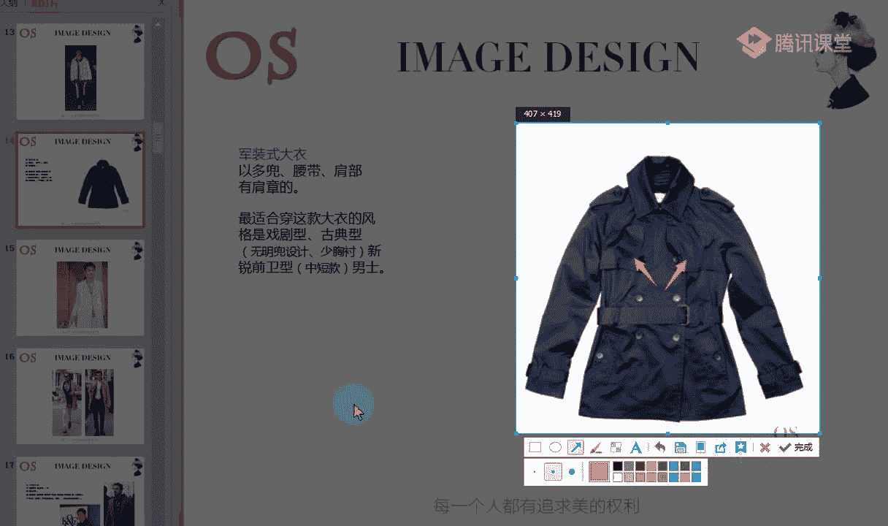
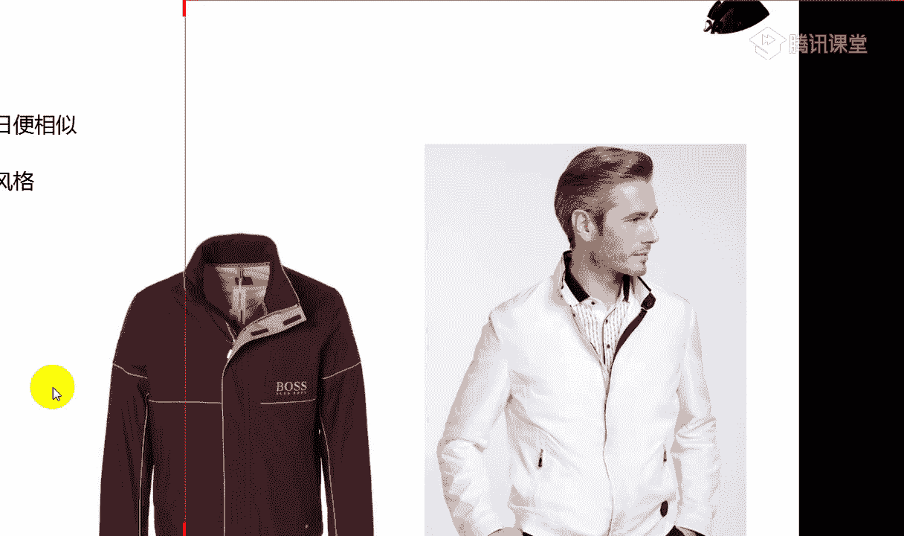
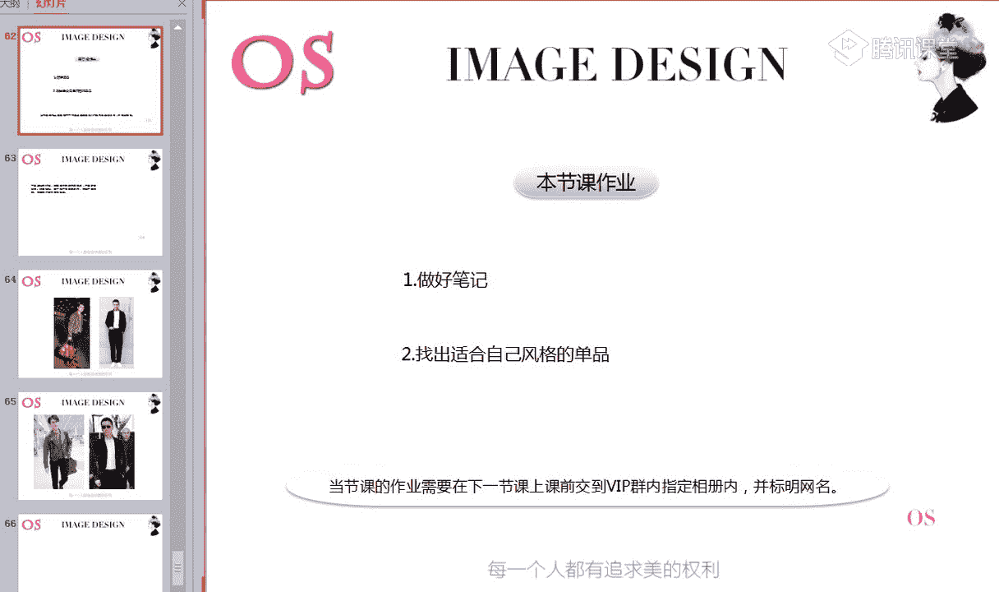

# 1、14男士个人形象班第二期（中级版）VIP课程：第7节、服装风格认知

大家晚上好，欢迎大家来到我们OS男士班的课程。我是本节课的主讲老师舒阳。🎼好，今天呢我们要上的是男士的第七节服装款式的认知。服装款式的认知呢是我们男装的基础。也就是说。

老师在本节课所讲的内容呢都是我们男士服装款式的一个基础。那么我们之前学习了场合，对不对？对于不同的场合，我们应该如何装扮，有了认知。通过这种认知，我们对于服装的型啊。在这里老师指的型呢不是呃服装的形式。

这样的一个款式的型，而是整的指的是整个我们的这样的一个体型那样的一个型。🎼对于我们的服装型呢有了了解和基本的一个分辨。那鉴于这样的一个基础，我们今天呢来看看我们这些基础的男装。

以及跟我们自身的风格的一个关系。那当然本节课大家也可以当做是对各男士风格服饰辨别的初步了解啊，我们等到上这样的一个男士服装风格的时候，还会就这样的一个细致的问题详细的分析，对不对？

但是在这节课呢我们也会涉及到男士的风格。所以说就当是一个初步的一个了解。首先先了解一下我们基础的一个男装。🎼好，接下来呢我们看到本节课学习的一个重点。第一个呢就是我们男士外套款式的分类。

第二个呢就是我们男士毛衣的分类。第三个呢就是我们男士裤装的分类。那么本节课对于大家的要求呢，就是熟知我们服装款式的分类，以及我们自身的这样的一个选择。🎼首先呢进入我们这样的一个礼服篇啊。说到外套的话呢。

还是要跟大家谈一谈礼服。可能我们有很多一些男士啊没有这样的一个场合，对不对？但是呢不代表我们以后就不会有，或者是说呢我们这样的一些形象顾问以后在从事这样的一个行业的时候，不代表碰不到。

就像我们男士在去受到一些场合的一个邀约的时候，如果有勤柬的情况下，我们会发现，尤其像国外他这样的一个情节一定会标注，哎，我们对于男士也好，对于女士你着装的一个要求。那第一个呢我们就来看到这样一个礼服啊。

最正式的一个礼服最大气的一个礼服，就是我们的燕尾服。那其实燕尾服呢非常的好辨别。而且燕尾服是我们男性夜间，也就是说晚上6点以后用的第一个盛装，这是他最正式在晚上6点以后用的最正式的一个啊这样的一个礼服。

那还有呢就是我们燕尾服的一个辨别，初步的进行一个了解啊，它的后镜啊，也就是说它的后摆呢有点形似我们。🎼的燕尾而得名，那一般呢都是黑色或者是我们深蓝色的这样的一个毛料啊，一般是我们这样的一个金纺的羊毛。

🎼毛料裤子和我们的上衣呢是一个色呃，是同色的那还有呢就是我们的裤侧，大家可以看到我们这张图片啊，看到这张图片，它的裤侧后面有一根这样的一个断面的调试。我不知道大家都能不能清楚的看到啊。

看到的同学可以跟老师扣个一。如果有同学是看不清楚的啊，老师就把这样的一个图片呢调大一点，再给大家看一下，有没有看到这样的一个侧边啊，有一根我们的一个断面，一个装饰，老师鼠标的一个位置。

🎼如果是有同学看不到的话，可以跟老师扣个一或者呃扣个2啊，可以扣个2。那如果都看到的，要么就刷一朵鲜花，要么就扣个一啊，都看明白没啊。我们裤子的这样的一个侧边有一个断面的调试。🎼啊，如果是每条都有吗？

只要是我们的燕尾服啊，跟燕尾，因为燕尾服它是成套的，它是成套的。所以说呢它的侧它的裤子的侧面一定是会有这样的一个断面的调试啊。如果说有同学没看到，对不对？没看到的话，老师就把这样的一张图片呢调大一点啊。

稍微调大一点，看到没有？有没有问题？好，能够看清楚啊，我们的日月光华能不能看清楚？有一个侧面哦，在侧面有一个断料。🎼好，这是它的一个要素。那还有呢就是我们一般跟这样的一个燕尾服啊，没有什么，为什么要有。

因为它正规的最正式的这样的一个燕尾服，它的裤子侧边一定是有缎面的啊。因为像我们女士的这样的一些套装也是一样的，对不对？成套的，同料的，它同样男士的话，它也是这样的一个成套的哦。

那还有呢就是要记住我们跟燕尾服在做搭配的时候呢，衬衫一定是要选择白色的，而且要选择E领哦，不要再问老师什么是E领了啊，我们在讲衬衫的时候已经讲过了唉。🎼配搭配E领哦，搭配一领的衬衫，然后呢。

领结最好是要搭配白色。🎼一会儿老师会说到什么样的一个礼服可以搭配黑色，但是燕尾服做搭配的时候，最正规的一个穿法是搭配白色的领结。🎼那当然啊我们的衬衫一定是有U型胸胸衬的。因为我说过啊。

我们大部分的这样的一个标准的呃一领的衬衫，它是一定在前面有一个胸襟的，对不对？🎼那还有呢就是呃我们在搭配可以去内搭，可以去选择有马甲，可以选择马甲。🎼就是我们的背心。对，就是我们的背心啊，可以选择马甲。

就是要么呢你就选择白色的马甲，你千万不要选择灰色或者说其他颜色，要么呢就跟你的这样的一个外套的颜色同色。比如说你是呃我们这样的一个深蓝色的。🎼套装对不对？那我们就我们的这样的一个马甲的话。

可以选择深蓝色。但如果说你是黑色的话呢，我们马甲就选择黑色。那或者说你也可以选择其他颜色，那其他颜色呢只能是我们的白色，在老师这里都标注了啊。🎼还有呢就是我们的口袋金啊，口袋巾一定是配白色的。

因为我说过最正式的哦，口袋金最正式的色彩就是白色，对不对？啊，我们的鞋子呢是搭配我们的牛津译纹鞋，那袜子一定是选择黑色的袜子。我说过啊，袜子的颜色一定是要比裤子的颜色深的。所以说当你是黑色套装的时候。

我们只能搭配黑色啊，搭配黑色袜子，这是我们这样的一个燕尾服。那还有呢就是燕尾服它适合什么样的一些场合呢？适合的场合是我们晚间6点以后最正式的场隆重的场合，盛大的这样的一些场合。比如说国家级的庆典。

或者是我们这样的一些婚礼，或者是我们古典交际舞比赛啊，大型的音乐会，这个都是要去穿着这样的一个服装的。包括如果对于舞蹈有了解的一些同学，你也会发现在交际舞中，你会发现男士一般都是穿着燕尾服，对不对？好。

这个是我们的燕尾符啊，这里要记清楚啊，大家一定要记清楚。所以把它记下来。好，有没有问题啊？有没有同学有问题？没有问题的话呢，老师就接着往下讲啊。如果都记清楚的话。🎼好，记住啊。

一定要记住搭配什么样的鞋子啊，漆皮的牛津鞋，而且鞋子的话光泽度越高越好啊，一定要适当带有光泽度。🎼好，第二个呢就是我们还是说到6点以后的礼服啊，还是6点以后的礼服。6点以后的礼服。

除了我们的燕尾服以外呢，还有就是我们的吸烟装啊，又它还有一个名称呢，就是塔诗多礼服，塔士多礼服。它的领子呢大家可以看到这是青果领。之前我在讲西装的时候也跟大家介绍过这样的一个领子，对不对？青果领啊。

它的领子是青果领。那另外呢就是领子的材质呢，一般是我们这样的一个丝娟的材质。大家也可以看到，从我们这张图片中，领子的材质和我们的衣身的材质，它是有区别的，对不对？🎼好，颜色呢也是都以我们的黑色为主。

回避藏蓝色吸烟装不可能出现藏蓝色，也就是说正规的吸烟装一定是黑色的。而且它的扣子呢一般是一粒扣为主啊，不可以有明兜的设计。

我们可以看到它的衣身这里啊应该大家都能够清楚看到是没有像我们普通的这样的一些西装，它有翻兜，对不对？还有一个翻盖啊，我们可以看到它是隐藏着的。可以观察一下哦，大家。好，以及呢我们这样的一个整体的外轮廓。

以及我们的下摆。大家可以看到下摆它是一个圆弧状的啊，一个圆摆的设计。🎼原版的设计，我们会发现有一些正式的西装的话，它一定是呈现这样的一个直角的，对不对？但是我们西烟装的话一般是呈现原版的设计。

里面的话同样搭配我们的一领衬衫，加我们的领结好，加我们的腰封。如果有同学不明白什么是腰封的话，可以看到这个就是腰封。啊，老师鼠标的。位置啊腰封。🎼呃，没有口袋。是的啊，它是它即使我们会发现。

即因为它这个是不可能形成口袋的。嗯，所以说它是一个即使有口袋的话，它也是一个暗兜。大家可以看到口袋是一条线，对不对？就是一条线，一个暗兜，不会有明兜啊，不会有明兜的设计。🎼哦，要跟大家强调一点呢。

就是我们在跟西安装穿搭的时候，除了搭配我们的E领衬衫以外，也可以去搭配传统的衬衫。就比如说哎我们这样的一些最简单的，对不对？最我们正式的这样的一些衬衫啊，去跟领带做选择，可以跟领带去做搭配。

这是没有任何问题的。但是你也可以去选择领结搭配我们的E领衬衫。因为领结的话，一定是跟一领衬衫去做配套的那同样的话，我们如果要选选择领结，选择领带的话呢，尽量选择黑色的。哦，尽量选择黑色的。

当然如果是你想要搭其他的颜色，如果你觉得场合可以适当的去进行一些调整的话，对于我们的领带领结的颜色，我们也可以搭配呢暗色调里面深色。也就是说比如说像我们的极暗色调哦，像我们的暗色调都是可以的。

这样的一些偏深的色彩。好，接下来呢我要跟大家强调一个啊，这个也是我们典型的塔士多礼服啊。好，跟大家强调一个点呢，就是它适合的场合啊，6点以后不用多说了，时间是6点以后。

那么呢我们这样的一些地点呢是宴会大厅或者说剧院等正式的一个场合。啊，我们的这样的一个时间就是6点以后地点，对不对？还有包括呢我们所参加的这样的一个活动，就是正式的宴会，或者是说舞会啊。

我们的戏就是关于一些戏剧，或者是授奖仪式，我们去颁奖，你会发现像我们呃男明星在参加一些电影节授奖仪式的时候，他也一定是穿最为正式的这样的一些传统式的礼服，对不对？

或者是我们这样的一些基基尾酒会都会穿塔士多礼服，这是我们场合中所适合的。好，在这里我要强调一个点，还要强调一个点呢，就是嗯我们。里面呢可以去搭配马甲啊，里面可以去搭配马甲。还有就是呢要跟大家说一下。

不管你是在呃穿我们如果你是在穿我们这样的一个立E领的衬衫的时候呢，我们都知道E领的衬衫它是一定有双层袖口的，对不对？所以说你既然穿了双层袖口的衬衫，你就一定要佩戴我们的袖扣，啊，男士是有袖扣的哦。

你像很多一些品牌，它都有推出袖扣。🎼如果有同学不知道袖扣是什么的话呢，你可以百度一下哦。你老师这里没有准备，我们在配置的时候会跟大家简单说一下。鞋子还是选择我们系带的哦，要选选择系带的皮皮鞋。

有花纹感的这样的一些异纹鞋，镂空鞋都是可以的。因为呃我们传统的译纹鞋镂花鞋呢，它都是适合这样的一些正式场合去穿着，搭配我们的礼服去穿着的，能够去塑造这样的一个浓重感。好。

接下来我们就说到白天6点以前的这样的一个礼服啊。第一个呢就是我们的大礼服。🎼这是在白天呢最为正式的礼服啊，领型呢是我们的枪柏领枪脖领前一片和我们的后衣片呢是连接在一起的。

你会发现燕尾服它的前衣片和后一片是分开的。大家可以看到是有一个明显的分割线，对不对？啊，不是衔接在一起，非常柔和的一个线条走过去的。但是我们可以看到我们的大礼服呢，它是连接在一起的。大家可以看到哦。

前一片和后一片是连接在一起的一粒扣子搭配我们一领的衬衫，哦，搭配领结搭配我们的腰封都是可以，但是传统的衬衫呢，我们可以去领带马甲也是比较常用的。你也可以里面像我们这样的一个网子一样啊，里面搭传统的衬衫。

然后搭配领带，搭配我们的这样的一个马甲都是OK的那裤子呢般都是深灰色。🎼裤子的颜色一般都是深灰色，而且呢是有柳柳条纹的。我们可以看到是有一些条纹的。包括大家可以看到这张图片，哎，图中我们这样的一些男士。

对不对？他所穿着的大礼服，同样裤子的话也是有柳条纹的。条纹的啊。好，颜色的话呢，我们可以适当的变化，以五彩色为基础的去进行变化哦，上衣黑色下衣深灰色呢是目前国际穿着最高的。啊。

就像我们在选选择呢塔士多礼服的时候，如果是白天的这样的一些社交场合中，你去选择塔式多礼服。那我们春季夏季可以变换着颜色，也可以啊，春季夏季呢我们可以变换一些颜色。因为你就像塔士多礼服吸烟装的话。

你也会发现有这样的一些白色的款式，对不对？那你如果是春夏季节的话，你可以去进行变化啊。好，接下来我们看到大礼服所适合的场合，日间各种正式的场合以及较正式又没有对穿着有明确要求的场合。我说过。

像有一些场合的话呢，他邀请你他一定是会在请柬上注明你要选择什么样的一个服装。那如果说这个场合，比如说是拜访哦，午餐，对不对？你就像我们像日本，如果说街访哪些国家的领导人的时候呢。

他也可能有一些哦领导人会去穿着这样的一些大礼服，对不对？还有包括午餐会啊、茶会啊、游园会啊、婚丧典礼等。我们都是可以去穿着这样的一个大礼服的。いち。好，最后一个男士的礼服呢是我们的晨礼服。

同样也是6点以后的礼服啊，它也是属于白天小规模聚聚会的这样的一个衣服。那你会发现它有点介于普通西装和晚礼服之间啊，有点形似我们普通的西装双排扣或者是像我们途中这样的一个单排扣。

领型的话呢和我们的燕尾服的领型是相同的，同样是我们这样的一个枪薄领啊，有轻国领或者是我们的践行领，也就是说践行领其实就是我们俗称的这样的一个平薄领啊，也有轻国领或者是践行领的。呃因为它比较的普通啊。

叫我们的普通的这样的一个西服来说，它又有一定的华丽感。所以说呢也逐渐成为了现代社交场合，主要的一个礼服。那包括老师推荐一下呢我们男士中国男士在聚会的时候。

如果说你一定要选择一款比我们普通的西装较为正式的来代替。我们的礼服的话呢，我们可以在西装上去选择一些窄版的英式欧式西装。那同样的话在面料上我们进行一些调整，要选择有光泽感的是可以的。

就像老师之前在说到场合的时候，对不对？我说到在社交场合，一般的社交场合的话，我们可以去选择一般的西装，但是西装的话，一定要增加光泽感啊，这个有没有任何问题，没有问题的话呢。

跟老师快速的刷朵鲜花或者扣个一。所以说大家在选择简阅礼服的时候，如果要选择一套西装代替礼服的话，一般都是单排一粒扣或者是两粒扣哦。单排的一粒扣或者是两粒扣。然后呢可以搭配三件套式的枪脖领。

选择枪脖领的领型啊这样的一个衣服的话呢，它会更加的正式一点。那可以出现在我们这样的一些一般的社交场合来增加我们的光泽度。这是我们代替哦代替礼服。也就是说代替礼服的一般西装必须要是窄版的音式。

或者是我们的欧式西装。同样的话，面料上要去体现光泽度啊。好关于我们礼服这一块，大家还有没有什么问题？如果没有任何问题的话呢，快速跟老师稍的先画啊，哪一个知识点还需要老师强调的，可以把知识点呢画出来。

🎼要记住啊，一定要记住我们每个礼服的特点，以及它所出现的所适用的这样的一个场合，以及在搭配的时候呢，我们应该要做哪些调整。🎼啊，我们礼服就说到这里啊，大家如果都没有任何问题的话呢，老师就接着往下讲了。

🎼接下来呢我们就具体来分析一下我们服装款式的一个认知，来说一说我们这样的一个基础。🎼首先呢是我们这样的一个大衣啊，大衣的话呢从我们的正式大衣开始，其实正式大衣很好去进行辨别。

你会发现它整个来说就是我们西装的加长版啊，就是我们西装的一个加长版，对不对？🎼好，那像我们这样的一个正式的大衣的话呢，在做搭配的时候，一定是跟我们啊有一部分男士。

如果说我们是属于这样的一个正式职业场合的话，里面去穿搭我们穿搭我们这样的一个正式西装的时候啊，我们天气冷的时候，我们可以外面去套这样的一个正式的大衣，对不对？

不影响我们整个对于你的形象和这样的一个场合的一个表达。所以这是我们这样的一个正式大衣，你会发现没有任何的设计，而且颜色的话呢也比较的沉稳。同样的话呢，整个款式。

你就把它看成是我们放大版的加长版的这样的一个西装就可以了。但是呢我们也可以看到，要在这里要强调一下，像我们传统式的啊，像传统的最为基础的这样的一个正式的大衣，一定是适合古典风格的人去穿的。

之前老师有说过，古典风格的男士穿西装是所有风格穿的最好看的古典型的男士穿西装，穿正装，是所有风格的男士穿的最好。🎼看的。所以说像这样的一件正式的大衣，给我们古典风格的人穿，再合适不过了。

但是呢我们也可以看到，既然正式的西装是我们的加长版，对不对？服装有量感，我们个人的风格也有量感。在我们的男士风格中量感为大的，就是我们的戏剧风格以及我们这样的一些呃浪漫风格。

还有我们的自然风格也是偏大的那古典风格呢是居中的那其他的这样的一些前卫风格，我们是偏小量感的。所以说前卫风格的男士，我们肯定是不适合去穿这样的一个正式的大衣的那其他的这样的一些大风格的男士。

如果说你想要去穿这一款正式的大衣的话呢，我们可以在色彩以及领子上做一些调整。就像我们图中图二，你会发现款式来说也是比较传统的，对不对？它最为。🎼相对来说比我们传统的西装呃。

这样的一个正式的大衣较为有一个区别的话，无非就是颜色和它的领子。所以说如果你是戏剧风格，或者是我们的自然风格。听清楚了，老师这里没有讲到浪漫哦。如果说你是自然风格或者说戏剧风格。

你想在这样的一个职业场合中，我属于这样一个严肃职业场合，我想要选择一款严谨一点的大衣，对不对？我们就可以选择适当的领子上面去增加这样的一个宽度啊，领型上较为大气，理解吗？理解同学跟老师说我一样，这一点。

🎼所以说古典风格的话呢，我们可以在领子上不做变化，你就不要选择这种大领子了哦，不适合你。因为你的量感没有达到这么大，对不对？所以说我们像这样的一些传统较为传统式的正式大衣。领子里面扩大哦。

增加这样的一个量感之后呢，你给到戏剧，给到自然也是OK的。🎼灵活的去运用啊，但是最传统的可以看到图中啊，哎我们这一套最为传统的话呢，一定是给到古典是最合适的。古典型的男士穿传统式的正式大衣是最为合适的。

但如果说其他风格的话，我们改变一下领型啊，自然和戏剧的话，可以改变一下领型的大和小。🎼自然和戏剧哦自然和戏剧。Whatち？🎼好，刚才是说到了我们的正式大衣。那同样呢我们还有一些非常休闲类的一些大衣。

对不对？休闲大衣休闲类的大衣呢第一款呢就是我们列装式的大衣。列装式的大衣怎么样去辨别的，你会发现它的典型的一个特点，就是多兜啊，能够制造这样的一个宽松随性休闲感。

那最适合穿这款大衣的风格呢是自然型和戏剧男士啊，因为呢这款列装式的大衣，既然说到大衣哦，那肯定就不是指的是夹克，所以说它整个服装的款式对不对？整个服装的大气度一定是哦偏大的。

所以说适合我们这样的一些大气的风格去穿着，像自然型和戏剧型。因为它这样的一些多兜，而且呢它能够去增加我们这样一个大气随性的感觉。所以说这两个人适合去穿劣装式的大衣，包括我们也会发现像今年哦有一些品牌。

2018年的春。🎼时装周现在也在紧锣密鼓的在举办着，对不对？你会发现很多一些品牌，包括很多一些衣服的设计的话，它都是基于我们最基础的这样的一个男装的基础上去进行设计的。所以说你看到这样的一件大衣，唉。

这样的一件长款的外套，你觉得它算不算我们的列装式的基础上，算不算我们列装式的大衣。觉得算的同学可以跟老师扣个1啊？好，觉得算的同学可以跟老师扣个一啊。如果说对于这件衣服还有疑问的，也可以跟老师扣个2。

🎼最 no。🎼呃，所以这个就是属于我们列装式的大衣啊，一定要记住大衣两个字哦，不是指的是夹克。所以说戏剧风格以及自然风格的人可以去穿啊，因为浪漫风格肯定不适合浪漫风格要表现自己的华丽度，对不对？

之前我们有讲过浪漫风格的一个特点啊，有说过的。🎼好，接下来呢我们就来说到我们的军装式的大衣啊。那其实就是我们传统式的这样的一些风衣。很多同学可能非常喜欢的它的特点呢就是多兜，而且呢它会有腰带，对不对？

唉，肩部的话有肩章的设计。那最适合穿这样的一款哦大衣的风格的话，是我们的戏剧型，还有包括我们的古典型，以及我们的新锐前卫型的男士都是非常适合的。但是呢要在这里强调一下，如果你是古典型的男士。

我们就要多选择无名兜设计，少胸衬的胸衬指的是哪里呢？

如果有同学有疑问的哦，老师给你们指出来。这个就是我们的胸称哦，这个是我们的胸称。🎼两片啊胸部的两片指的是胸衬。所以说如果是呃我们这样的一个古典型，我们就最好这样的一件军装式的大衣，它没有胸衬是最好的。

或者就是你只要有一面有就可以了，千万不要太多这样的一个胸衬，因为太多的胸衬一定是会去呃增加整个服装的。🎼休闲感对不对？而我们的古典风格本身它就适合这样的一些传统呃正版的严谨的这样的一个服装款式。

所以说不能够去增加过多的一些休闲的元素。那还有呢就是我们。🎼如果服装的兜哦这样的一些口袋太过于明朗的话，同样也是这样的一个同等的原理。所以呢古典风格无名都设计少凶衬。那还有就是胸新锐前卫风格的男士。

你如们如果要选择军装式的大衣的话，我们就尽量选择哦中短短款，中短款，就像我们图中这个其实就有点偏中短款了，不要选择一些太长的哦。因为我们的本身你的量感就不太够。所以说服装的款式我们也要做减弱化。

🎼那包括你像古典风格的话，其实穿这种呃，如果说小胸衬的，然后不明兜的也是非常非常好看的那包括我们可以看到这位男士啊。

这大家应该都认识王凯像这样的一件风衣也是基于我们的军装式的大衣的一个基础上而演变而来的，对不对？所以说你去选择一些没有任何一些设计的，而且无名兜无心无胸衬的这样的一些大衣风衣的话，是不是好看很多。

如果大家觉得有疑问的，没关系，到时候我们在讲到风格的时候呢，还会举很多他的例子跟大家去做对比。你会发现穿着精致，对于古典风格有多么的重要。或者是我们现在有些同学你们也可以呢到时候搜一搜他以前的一些造型。

你去对比一下，你去看他穿的呃有品质精致感的一些衣服和他穿着比较随性或者说这样的一些破洞的牛仔裤啊啊，以及呢我们在穿西装的时候，如果他这件西装有非常多的一些设计啊，有我们这样的。🎼一些呃胸针也好。

或者是我们这样的一些胸贴也好啊，都不太适合它。大家可以看到，这个就是我们古典型的一个典型的代表。所以说在穿衣服上面呢，我们要注意的。🎼好，这个就是我们军装式的大衣啊，军装式的大衣。

那像burberry的话，最这款大衣是做的最好的，对不对？好，下一款呢就是马术式的大衣啊，它就是由我们这样的一个传统的马术服呢而演变而来的啊，这是我们传统的马术服。

你会发现它就是在领子上面去增加一些设计。所以呢像马术式的大衣也是一样的，它的所有装饰性呢都是上衣，带来年轻感。🎼大家可以看到啊，不管是这样的一件大衣也好，还是我们右图中这件大衣也好。

它都是在领子上面去做一些文章的，而且有一个拼色，对不对？🎼就像我们传统式的这样的一件码术服啊，它会有一个拼色。所以说呢这样的一件大衣的话呢，我们可以给到浪漫风格，还有包括像我们的古典风格哦。

唉古典型的年龄小的这样的一些男士的话呢，个子不高的男士呢，我们同样要注意的一个点，就是选择这样的一件大衣的话，我们就尽量要选择不要太长。你就像郭富城的话，它本身个子不高。他如果穿这样的一件马术式大衣。

他也不会选择太长的款式。然后我们要选择稍微短一点的面料上面呢选择相对来说柔软一点的，但是也不能够缺乏这样的一个呃精致度啊。🎼好，下一个就是我们的荷兰式大衣啊，最后最后的一款大衣啊。

最后一款大衣跟大家说一下。那这个大衣的话非常好辨别。第一个呢它是呢子为材料的，对不对？以呢子为材料，领子呢就是我们这样的一个帽子，呃，用我们的牛角呢做扣子，用牛角做扣子。所以说这件大衣的话。

你会发现很能够去凸显我们的休闲感，对不对？所以说适合我们这样的一个自然型的男士，或者是阳光前卫型的男士都可以。那阳光前卫型的男士，如果你要选择荷兰式大衣的话呢，就要选择短小的版本。

不要选择太大或者是太长的。因为你的量感支撑不起来，所以你要选择荷兰式的大衣，我们就要选择精短版的。🎼那其他元素不变啊，只是说在我们服装的廓形和长度上面进行调整。🎼还有呢就是要跟大家说一下。

就是我们这样的一些常镜常见的这样的一些外套。其实这样的一件外套我们也会呃说它是短款的这样的一个大衣。像这样的一些短款的大衣的话呢，最适合我们新锐前卫和浪漫型的男士去选择。我们在秋冬季节的时候呢。

可以多去穿这样的一些短款的大衣。🎼啊，以上呢就是我们这样的一些服装外套上面啊，大衣的基础款大衣的基础款。🎼大家还有没有什么问题？那其实像我们很多其他的一些男士的外套的话。

其实都是在我们这样的一个基础上做一些演变，做一些改变的。🎼先把基础款认清楚，然后呢找到我们不同的风格所对应这样的一些款式的一个区别啊，找到我们通过图片上给我们的视觉印象的一个不同啊。

把这样的一个感觉一定要记清楚。因为到了我们服装风格的认知的时候，对于你的帮助是非常大的。🎼关于我们的大衣的款式，大家还有没有什么问题？哦，如果说没有任何问题的话呢，跟老师快速的刷的鲜花或者扣个一啊。

都记清楚的。把这样的一些关键词全部都记清楚的同学快速跟老师扣个一。有问题一定要提啊。你如果说哪一个点还没有记清楚的，或者有疑问的啊。🎼我们今天的单品内容也比较的多啊，大家要积极一点，快速一点。好。

接下来我们就说到夹克类哦，夹克的基础款。🎼其实夹克的话呢，它有一个共通的特点，就是衣片短，对不对？它不像我们的大衣啊，衣身衣片长，然后呢袖子也长。那夹克的话呢，它是衣片短，袖子长。

而且呢它能够塑造整体的一个休闲感。首先要跟大家说到的就是我们的双色棒球夹克啊，有一有运动的款式。那像我们图中呢这个就是我们双色棒球夹克。好，里面的材质都一样的啊，是运动装棉质的。🎼双色哦。

也就是说它的袖子和衣身的话会有一个拼色。但是现在的话，像这样的一些棒球夹克，你也会发现啊，衣身和袖子一个颜色的也有，对不对？也有。🎼好，像这样的一个传统式的双色棒球夹克的话呢，我们可以给到新锐前卫风格。

包括我们的古典型啊。古典型风格的话呢，我们就要选择精良的款式啊，要选择精良的，就像我们可以看到图一和图二去做对比的话，你会发现图一整体的质感要比我们的图二显得更有品质感，对不对？

这个就是因为我们这个服装的形色质所带来的啊，要叫我们这样的一个图案的休闲感做对比的话，你会发现图一会更加的合体啊，精致材质的这样的一个硬挺度等等。所以说古典型的人。

如果你要选择我们这一款双色棒球夹克的话呢，你就要选择精良的啊，质地和款式上整体的剪裁设计上面一定要选择精致品质精良的。那还有就是我们的戏剧自然型啊。如果说你是属于年轻的戏剧和自然风格。

我们也可以选择这样的一款棒棒球夹克，还有包括我们的阳光前卫型，基本上呢我们除了浪漫。风格以外呢，其他风格都可以进行尝试。🎼像这样的一些棒球啊，棒球。那包括你像我们现在的话唉非常时尚的这样的一些棒球夹克。

都是由他的这样的一些基础上去进行改改良的，对不对？包括我们在材质上去进行一些变化呀等等。🎼好，第二个就是我们的商务日变装呃，商务日变装的话，如图中所示啊，它的颜色一定是深的。

因为呢商务日变装大家要清楚商务日变装用于什么样的一个场合呢，它一定是用于我们男士的一般职业场合。也就是说，如果一般职业场合的一些男士，你不想穿着我们这样的一些西装类的，对不对？

我们在选择夹克类上的上面呢，我们可以去选择这样的一个商务日变装。还有包括我们有一些男士出差的时候，啊，我们要知道出差同样也是跟你的场这样的一个职业场合有关系的。

所以说我们势必也要营造这样的一个稳重职业的形象。我们可以去依靠商务日变装，对不对？带来休闲舒适的感觉的同时，又不时我们这样的一个庄重度。哦，所以这个是我们的商务日变装的一个用途。

还有呢它的特点就是颜色深材质的话一定是有硬挺度的。我们可以看到图中。这个都是我们典型的商务日边装，要记住这种感觉。那最适合穿这款夹克的风格呢是戏剧型啊。戏剧型如果在职业场合，我们可以穿着商务日边装。

还有包括我们的浪漫型以及古典型的男士都是最为适合的。🎼那另外的话呢，商务日变装它同样也有浅色调的，而且这样的一些浅色的呃形似商务意日变装的款式的话呢，其实又称之为我们的高尔夫夹克。

你会发现跟我们高尔夫打高尔夫球的这样的一些服装的话极为的相似啊。像颜色浅的款式呢，它会跟我们的商务日变装有形似的这样有相似的这样一个效果。就像我们图中啊。

🎼那最适合穿这款夹克的风格呢是自然和古典型的男士。我要跟大家强调一下，像我们右图中，其实你会发现比我们的左左图中的整体的啊日变装的感觉更为相似，对不对？较左边会右边相对来说会更像我们的商务日变装。

那如果说是自然型的男士，或者说古典型的男士。你们在职业场合中想要去尝试这样的一些浅色的高尔夫夹克的话，没有过多的这样的一些商标啊啊，我们明线呢明兜的这样的一些设计的话，我们在职业场合中也是可以去穿的。

因为它有领子，它同样能够去塑造我们这样一个职业感。

🎼好，接下来呢就是我们艾森豪威尔夹克啊，商务日变装好像年纪大的穿哦，不要有这样的一个认为啊，不要有这样一个认为。我们也有年轻版的，一定是会有年轻版的。

所以说我只是找到这样的一个传统式的跟大家来找这样的一个感觉。🎼而且的话我们可以在细节上做一些调整，但是呢颜色深啊，我们不要有过多的一些啰嗦的，是不对？不会有明兜啊。

还有包括我们过于明朗的这样的一些线条等等材质硬挺的话，这是我们典型的商务日变装啊。其实像一些呃年轻一点的男士，20多岁的，能不能穿商务日变装呢，也可以我们在款式上面进行这样的一个收缩，对不对？

进行这样的一个窄版。那另外的话呢，在整体服装的材质上是一样的。我们同样也能够去穿出符合自己年龄的这样的一个整体的质感。🎼而且我有强调啊，我有强调，我说到唉我们的自然和古典风格。

如果说你是在一般的职业场合的话，我们还是可以去选择一些相对来说浅淡的颜色是没有任何问题的。因为你的服装的材质和你的款式有帮助到你。即使说在色彩上面，我们去选择一些较为浅淡的颜色也是OK的。

你也可以来凸显你的年轻感，对不对？🎼好，第二个第接下来呢就是我们的艾森豪威尔夹克啊，它呢又称之为我们美国的陆军夹克啊，由它的基础上而进行这样的一个演变的那它最明显的一个特点呢就是明兜啊。

它有明兜的一个设计。那同样夹克一定是衣身短，对不对？袖子长，最适合穿这种夹克的风格呢是戏剧型新锐前卫熊型，还有包括古典型啊。古典型要选择精良的版本，我在这里不做强调了啊。

大家已经有个有这样的一个明确的感受了。还有就是自然风格，还有包括我们的阳光前卫风格，除了浪漫风格的以外，其他风格基本上都是可以去穿的。但是古典风格，我们一定要做一些调整，要选择一些材质上面啊。

整个的细节上面设计上精良一点，不要有过多的一些啰嗦。那就像我们的一些传统的牛仔服也好，还有包括我们这样的一些呃非常有特色的这样的一些夹克，对不对？其实它都是艾森豪威尔夹克的一个演变，有明。都的设计啊。

好，包括像我们这一个靳东的这款外套也是一样的。其实这个都是。艾森豪威尔夹克的一个前身，对不对？他的艾森艾森豪威尔夹克作为前身啊，然后而演变的。所以大家可以看到，嗯，等我们再通过这样的一个。

风格的一个认知之后，再来观察这一节课，你会能够清楚的明白为什么老师说到啊我们的浪漫风格不适合，而其他的风格我们也我们可以去穿，而我们的古典风格要去选择一些精良的感觉。好，明都啊精良。明兜哦。

这是他的一个名兜的设计。任何材质的都有这样的一个夹克，而且它一定都会有这样的一个明兜。整体的款式。好，接下来呢我们就说到飞行式夹克。那在去年的时候呢，我们飞行式夹克是非常非常火爆的，对不对？

整体的材质的话，它会营造这样的一个金属和皮革。那现在的话你会发现像飞行式的夹克，它可能不是金属或者是皮革，它一定呃在整个的面料上面，它是有一定的光泽感的，它是一定会有一定的光泽感。

那最适合穿这类型的夹克的风格呢，是我们这样的一些前卫风格。不管你是新锐前卫，还是阳光前卫。为什么说其他风格不适合呢古典型，你会发现它的整体的品质感并不是那么的强。啊。

你就像我们这个都是属于我们这样的一些飞行式夹克，不要把它称之为我们的棒球夹克，这跟我们的棒球夹克是有区别的。能理解吗？理解同学跟耳扣个一呀。🎼因为我们的飞行式夹克的话，你会发现它非常的精短。

非常的精短啊。它的衣身非常的精短。就像我们有一些女士的话，我不知道我们在场，因为可能女士比较多，我们在去年也会发现飞行员夹克非常非常的火热。那一般都是这样的一些精短款式啊。而我们的棒球夹克的话。

她的衣身一定是稍微要偏长一点的，衣身是要偏长一点的。🎼他不会说像我们这样的一个棒球夹呃，像我们的飞行式夹克来说呃，上半身显得非常的宽，显得非常的壮实。而我们到了下半部分的话呢呃向窄和短去进行发展。

而我们的棒球夹克整个医生来说，它的上半部分和下半部分基本上是差不多的。🎼好，回到刚才那个点啊，为什么说我们的古典风格来不适合去穿？是因为它不够良，对不对？因为它会有很多这样的一些设计。

还有包括古典风格本身就不适合一些光泽感太强的面料，光泽感太强的一些面料。还有包括像我们这样的一些呃带来天然的一些肌理感的这样的一些设计也好，那为什么说到戏剧风格和我们的自然风格不适合呢。

因为它的衣身太短了，它太精短了。而我们本身是一个大量感的人。所以说如果去穿这样的一些短小的版式的话，也不太适合我们跟我们这样的一个量感不协调。那还有就是我们的浪漫风格，它不适合，是因为它不够华丽啊。

我们浪漫风格之前老师说到的它的一个关键词就是大气啊，华丽成熟，而我们这件衣服大家可以看到它符不符合华丽大气成熟这样的一些关键的形容呢，不符合，对不对？所以说最适合穿这样的一些飞行式夹克的男生的话呢。

就是我们。🎼新锐前卫型和阳光前卫型。如果我们在场呢有新锐前卫风格或者是阳光前卫风格男士，我们在选择外套的时候呢，可以多往这方面去进行靠齐。🎼好，接下来就是我们的海军式夹克啊。

海军式夹克它主要就是在肩部和领子进行装饰啊，主要是在我们的领子和我们的肩部呢会有这样的一些装饰啊，大家也要懂得去把它和艾森豪ve尔夹克去进行辨别。那最适合穿这款夹克的风格呢？是浪漫风格和戏剧型。

以及我们这样的一些自然型的男士啊，大家为什么说适合我们的浪漫风格的。这一款大家可以看到啊，如果是因为它有这样的一些领子，而且它的领子的话，会呈现这样的一些圆弧状。所以说它的领子里面是相对来说比较柔和的。

就像我们这一款大家都能够看清楚啊，这就是我们传统式的呃，就是不算是传统式啊，应该也算是改良后的这样的一个。🎼非常经典的海军式的这样一个夹克。所以说领子上它会有一些毛毛边，而且整个领型的话比较柔和。

柔和的领子一定是非常适合浪漫风格的。而且的话啊我们这样的一些毛边的领子也能够增加我们的华丽度，对不对？能够增加这样的一件服装的雍容度。那还有呢就是因为它会有这样的一些口袋的设计。

所以说像我们自然风格的人一定是适合的，而且肩章这样的一些设计啊，能够凸显我们的休闲感，包括我们的戏剧风格。那其他风格不适合是因为它整个的啊服装的量感来说还是偏大的，所以说给到量感大的人会更好。

古典型不适合的话，老师就不用多说了。因为会有很多的一些口袋，对不对？啊，会显得非常的啰嗦，不够。🎼正式，而且的话呢也不够稳重啊。🎼很难去凸显这样的一个精品感哦。🎼像我们这种夹克都是我们。

🎼海军式夹克的一个演变。🎼他老师说了哦，古典风格不适合哦，古典风格一定是不适合的。那接下来呢我们就看到连帽式的夹克啊，也就是说帽子是连着的，它的领子就是帽子，对不对？🎼啊，像我们这种途中哦，那穿这种。

🎼连帽式夹克的呢适合阳光前卫和自然型哦，自然型的男士。那包括像我们的胡歌，也是典型的自然风格的一些男一个男士。你像你看他穿这样的一个连帽式夹克非常的好看，对不对？🎼凸显年轻的同时。

又能够去凸显它独特的这样的一个风格的气质感。🎼好，最后最后呢我们来看到一个较为哦有点正式一点的，但是它又称之为夹克，就是我们不要把它称之为西装哦。这个是我们的伊顿式夹克。伊顿式夹克的话呢。

它就是类似于短小的西装，它会类似于短小西装，结构设计呢有点像我们的学生装啊，类似我们很多一些传统这样的一些贵族学院的这样的一些男士，对不对？它的校服一定都是我们这样的一些伊顿式夹克，有点像我们的小西装。

显年轻显活力。所以说像这样的一些夹克的话，我们顾名思义肯定是给到我们这样的一些啊。身高不算特别高的。然后呢唉在整体上面，我们又想要去穿一些类似于西装款式的一个夹克的，我们都可以选择这一款。あの。🎼好。

最后一个就是我们的运动式夹克，这个就不做多说了，一般都是运动品牌所推出的我们的夹克类别，对不对？啊？最适合穿这一款服装的话呢，就是我们自然型自然型的男士，对于它的材质来说是没有任何要求的。

所以说像这样的一些能够在进行拼接，甚至材质上面，我们呃舒适感的天然一点的，对不对？棉哪等等的，这个就是最适合自然风格的人去穿，那其他风格穿起来并不是特别好看啊。好，以上就是我们的夹克类的啊，夹克类别。

大家还有没有什么问题啊？没有问题的话呢，老师就接着来讲我们下一个了。🎼夹克类的记清楚啊。然后对于每一款夹克，为什么它适合这类型的风格去穿。我们如果有同学有疑问的，你也可以暂时把疑问放下来。没关系。

因为可能我们在进行风格的一个量感直取和动静，包括图案等等的一些辨别之后，你会更加理解，为什么老师把有一些服装，我们归到哦一些传就是在这样的一个传统式的一个基础上哦，会归到这几类。

当然如果说我们把服装进行一些调整以后，不一定说呃只有这几个风格可以去穿，不一定的，一会儿老师会跟大家为什么说不一定哦，我会考一下大家，然后你们会更加理解。🎼好，接下来我们说到毛衣啊。

毛衣的话呢我们大致分为呢呃两大类。一个呢就是渔夫市啊。渔夫市呢就是因为它是沿海的一些城市，所以说我们的图案是非常丰富的，很休闲感。你会发现渔这样的一些有图案设计的啊，都称之为我们渔夫式的毛衣。好。

那包括这样的一些款式，它也是。画到我们渔夫市的啊，也是画到鱼夫市的。也就是说它在织的时候，它会有一些小设计啊，有一些图案非常的丰富，有特点。那像这一款毛衣的话呢，我们适合自然风格，包括浪漫风格啊。

还有包括戏剧风格都可以去穿。啊浪漫型的人在选择的时候呢，一定要薄，面料软啊，不要选择像我们图中这一款过于的。感觉上啊在材质上面织的要厚了，然后带太硬挺的话也不适合我们浪漫型的话去选择一些软一点的。

薄一点的会更加适合你。啊，就像我们可以看到看到这两张同样都是毛衣，对不对？但是呢左图中你能够感受同样都是两件毛衣，你都能够感受它的厚度，能够感受它的厚度，对不对？但是呢我们可以感受一下面料的柔软度。

你会发现左边是不是要看上去要比右边显得要柔软一点。好，看出来的同学可以跟老师扣个一啊，是不是感觉左边要比右边显得要柔软？好，我们的月同学哦快速的跟老师扣个一啊，非常棒哦，大家练一练啊。

能够要从视觉上啊去感受到这样的一个区别。🎼所以说要表达的就是这个意思。😡，好，这是我们的浪漫风格。那戏剧型的男士在选择这样的一个渔夫式的毛衣的时候呢，我们就要选择宽松大的啊，不要选择一些呃太贴合的。

太紧的那就像我们图中图一和图二去做对比的话，你会发现图一显得非常的大气，而且要显得宽松一点，要比我们的图一，对不对？所以说像图一我们可以给到戏剧风格，要比呃我们去给到一些其他风格会更合适。

那么像图二的话呢，我们可以给到浪自然风格，可以给到自然风格的人去穿。那后我们图一的话，可以给到我们的戏剧风格。好，因为自然风格的话，它叫我们的戏剧风格，它的量感是要偏小的。

所以说我们在款式上面不用哦一定要追求有多大哦，有多大的一些款式。🎼好，接下来呢就是我们的斯堪迪娜维亚式毛衣啊，这是我们北部部落的一个民族。那整体它所有的设计都是在我们的肩部啊。

以及围绕着它会有一个围绕感，像这类型的，都是我们这类型的毛衣。那这类型毛衣的话呢给到戏剧型的男士去穿着。因为它会有这样的一个整体的民族感啊，而且呢会有一些异域感，对不对？有异域风情。

所以说我们自然风格是最好少穿的。因为你没有这样的一个驾驭度，你没办法去传统式的自然风格是没办法驾驭我们这样的一些异域的款式，就像我们女士，对不对？女士的话。

你也会发现有这样的一个异域风格的一个女士异域自然风格，那异域自然风格要比我们传就是比较传统的自然风格，在选择图案上面要更加的夸张一点，大气一点，甚至的话我们可以在色彩上面去形成对比。

但是我们传统性的自然风格就没办法，所以说像这样的一个毛衣。🎼的话呢给到戏剧风格，男生是最合适不过的，因为它的驾驭度它可以去唉驾驭这样的一些多姿的这样的一些图案。🎼夸张的也好，大气的也好，对不对？啊？

有这样的一个都市感的也好。好，这个就是我们传统的两个毛衣啊，两个毛衣的一个特点，以及在风格上要选择的要注意的那还有呢就是接下来我们介绍一下开衫。开衫的话呢，像我们开衫的种类也很多，对不对？哦。

我们记住啊记住各风格，在选择开衫上的一个特点。像我们古典型的话呢，我们就要选择质地挺实的。我们可以看到两种质地来做对比的话啊，我们图一要比图二显得更加的精良，对不对？精细，所以说古典型。

在选择开衫的时候呢，我们选择质地精挺实的那浪漫型的人，如果你选择开衫的话呢，我们就要选择质地柔软的，柔软这个概念我就不再多做强调了。那如果说我们是自然风格的话呢，我们可以选择这样的一些厚实粗糙的。

厚实粗糙的啊，如果说我们是阳光前卫风格的话呢，我们可以去选择图案丰富一点的款式修身啊。因为图。🎼阳光前卫风格的话，它毕竟啊量感不是很大，对不对？所以说款式上面我们也尽量选择修身的材质的话呢。

你可以去选择。我不知道大家有没有见过有一些毛衣的话，它会有这样的一些光泽度的材质的一个混织。🎼如果有有明白了明白老师这个感觉的同学，可以跟老师扣个一啊，就是你有一些毛衣，它是有一定的光泽度的。

它因为它加入了一些其他一些光泽感的，或者说这样的一些材质在里面啊。所以说它有这样的一个闪光光泽感，能理解的同学可以跟老师刷的鲜花或者扣个一啊。所以说如果是阳光前卫风格的人，你们在选择毛衣的时候。

不仅仅是在选择开衫啊，还是说你选择一些套头的毛衣都是一样的。你可以多去选择呢材质闪光硬挺一点的啊。有一定的光泽感的材质是非常适合阳光前卫型的男士去穿着的。🎼好。

大家可以看看到老师没有去讲到我们这样的一个呃新锐前卫风格啊。昕锐前卫风格你在选择毛衣的时候呢，尽量选择V领的。不管你在选择套头的毛衣，还是选择开衫啊，开衫式的毛衣呢，你都要多选择这样的一些尖锐的领子啊。

选择V领，因为领型的这样的一个。🎼V领的话呢也能够带来我们的尖锐感，对不对？能够带来我们的尖锐感。所以说这是我们前卫风格。在选择毛衣的时候一定要注意的。不管是新锐前卫也好，还是阳光前卫也好。

我们多去选择V领的毛衣。那还有呢就是像我们的阳光前卫，你在选择开衫的时候呢，我们也可以多去选择有这样的一些扣子，对不对？有一些扣子能够去增加我们这样的一些呃休闲可爱的感觉。

或者是说呢我们哦整个服装来说，它会有这样的一些明明扣，对不对？哎，明线这样的一些设计啊这样的一些。🎼整体的休闲设计。但是在整体服装的款式上面，我们又选择这样的一些精短版的。

🎼好，其实我们的毛衣呢，除了刚才老师所说到的这样的一些渔夫式啊等等。我们还有一个法医式的啊。唉，法式的。其实法医式的毛衣的话呢，我们可以看到，其实它就是在领子上做一些变化。啊。

我们可以看到这样的一些领子啊，大家都能够清楚的看到吧。唉，呈现这样的一个圆弧状，对不对？线条非常柔和的，这个都是我们的法式领的毛衣。那像这样的一些法式哦领型为主的毛衣的话呢。

我们浪漫风格的男士可以多去选择。也就是说浪漫风格的男士，哎，你在选择毛衣的时候，你可以多去选择。不管是开衫也好，还是我们套头式的毛衣，你都可以多选择这样的一个法式领的。安详。

🎼接下来老师要强调的一个个就是新锐前卫型的新锐前卫型在选择毛衣的时候呢，我们要选择图案和色彩表现明显的。🎼图案非常的有个性，对不对？非常有个性，非常有意思哦。那同样的话呢。

色彩上面我们也要有足够的冲击力啊，色彩上面也有要要有足够的冲击力。像类似于我们图中这样的一些款式的话呢，给到新锐前卫风格去穿都是非常非常合适的。🎼啊，这就是我们的毛衣的款式。

以及呢各个风格在选择毛衣上面我们要注意的一些特点。🎼好，要强调一下啊，老师没有标注的，你就像我们的法医式的，对不对？哎，我们这样的一些呃渔夫式的这样的一个毛衣的话，古典风格人少穿啊。

因为它会有太多的一些设计了，它会增加休闲感。所以说我们要去哦让自己整身中制造严谨度的话，我们在选择毛衣的时候，尽量少设计哦，尽量少设计，要选择精良的。🎼好，接下来我们就说到马甲马甲的话呢。

像这样的一些正式款式的途中啊，像我们正式款式的马甲，古典型的风格的人穿非常非常的好看。那同样的话呢，像戏剧型的浪漫型的风格也是非常适合的。你们呃在我们的初初春的呃这样的一个初夏的一个季节，对不对？

或者说春天或者说刚入秋的时候，初秋的时候，我们在选择搭配的时候，你都可以用T恤去搭配我们的马甲，或者说用这样的一些衬衫搭配马甲都是非常适合这三大类的风格去穿着的那如果说我们的休闲款式的马甲。

我们如果说在整个的服装上面，对不对？唉，去增加一些小的设计，然后按照我们不同的风格来去凸显一下的话，其实像一些其他风格的人也可以去穿。就像我们自然风格，休闲款式的，它穿非常的非常的好看，对不对？

如果说在材质上面哎我们自然风格它本身就适合这样的一些天然的肌理感，对不对？适合一些粗糙感。所以说像这样的一些粗糙感的毛衣，自然风格也可以去穿。那如果说我是这样的一些前卫风格。哎，我去增加。

就像我们是一个传统式的啊，传统式的这样的一些阳光前卫，大家可以看到领结，对不对？领结的话，像一些小格子啊，然后呢能够制造可爱的大男孩的这样的一些呃又有一定的时尚度的这样的一些图案和款式的话。

那你给到阳光前卫同样它也是可以去穿的。所以大家要懂得去灵活的运用啊。在这里老师只是在基础上面跟大家说，像正式款式的，一定是古典型和戏剧型和浪漫型穿最好看。但是像休闲款式的话呢，我们其他风格要去穿的话。

就依照自己风格的这样的一些材质的特点来进行调整款式的特点来进行调整。🎼啊，不要告诉老师，你不懂得去辨别正式的，就像我们去跟正装做搭配的这样的一些正式款式的马甲，对不对？唉，这都是我们传统式的正式的。

比较正式的这样的一个马甲。那像这些就是它有一些小细节，对不对？有不管是材质也好，还是呃明兜的设计，还是我们整个款式上做一些改变之后，那其他风格的话，按照自己的特点去进行调整。🎼好。

以上就是我们所有的上衣哦，男士的服装款式认知的一个基础的上衣。那接下来呢我们就看到裤子，看到我们的裤子类别。🎼首先呢推荐的就是锥形裤。锥形裤呢是男士最正式的裤型，最正式的裤型是锥形裤啊。

锥形裤的话它的特点就是唉我们的臀部会比较的贴合。然后在我们的大腿部分呢，它会有一定的适余的空间，对不对？那随着我们。🎼腿部的线条逐渐往下，他的呃腿腿口呢会逐渐的收缩啊，他的裤腿会逐渐的收缩。

这是我们的锥形裤啊，他不懂同用哈伦裤，所以男士各风格基本上都是适合的。但是戏剧型的人呢尽量少选，因为它的整体的大气度不太够。所以戏剧型的人你可以去穿，但是尽量少穿啊，你不是最适合的。

🎼而且像这样的一个锥形裤的话，尤其像我们一些腿就是腿腿比较短的一些男士啊，个子不高的多去穿这种裤子啊，然后呢去选择一个尖头的鞋子，你去做搭配啊，能够去增加你的下半身的整体的长度啊。

让你的个子会显得更高一点。🎼好，这个是我们的锥形裤啊，锥形裤让自己整身中制造严谨度的话，我们在选择毛衣的时候尽量少设计啊，尽量少设计，要选择精良的。🎼好，接下来我们就说到马甲马甲的话呢。

像这样的一些正式款式的途中啊，像我们正式款式的马甲，古典型的风格的人穿非常非常的好看。那同样的话呢，像戏剧型的浪漫型的风格也是非常适合的。你们呃在我们的初初春的呃这样的一个初夏的一个季节，对不对？

或者说春天或者说刚入秋的时候，初秋的时候，我们在选择搭配的时候，你都可以用T恤去搭配我们的马甲，或者说用这样的一些衬衫搭配马甲都是非常适合这三大类的风格去穿着的那如果说我们的休闲款式的马甲。

我们如果说在整个的服装上面对不对？唉，去增加一些小的设计。然后按照我们不同的风格来去凸显一下的话，其实像一些其他风格的人也可以去穿。就像我们自然风格休闲款式的，他穿非常的非常的好看，对不对？

如果说在材质上面哎我们自然风格它本身就适合这样的一些天然的肌理感，对不对？适合一些粗糙感。所以说像这样的一些粗糙感的毛衣，自然风格也可以去穿。那如果说我是这样的一些前卫风格。哎，我去增加。

就像我们是一个传统式的啊，传统式的这样的一些阳光前卫，大家可以看到领结，对不对？领结的话，像一些小格子啊，然后呢能够制造可爱的大男孩的这样的一些呃又有一定的时尚度的这样的一些图案和款式的话。

那你给到阳光前卫同样它也是可以去穿的。所以大家要懂得去灵活的运用啊。在这里老师只是在基础上面跟大家说，像正式款式的，一定是古典型和戏剧型和浪漫型穿最好看。但是像休闲款式的话呢，我们其他风格要去穿的话。

就依照自己风格的这样的一些材质的特点来进行调整。款式的特点来进行调整。🎼啊，不要告诉老师，你不懂得去辨别正式的，就像我们去跟正装做搭配的这样的一些正式款式的马甲，对不对？唉，这都是我们传统式的正式的。

比较正式的这样的一个马甲。那像这些就是它有一些小细节，对不对？有不管是材质也好，还是呃明兜的设计，还是我们整个款式上做一些改变之后，那其他风格的话，按照自己的特点去进行调整。🎼好。

以上就是我们所有的上衣哦，男士的服装款式认知的一个基础的上衣。那接下来呢我们就看到裤子，看到我们的裤子类别。🎼首先呢推荐的就是锥形裤。锥形裤呢是男士最正式的裤型，最正式的裤型是锥形裤啊。

锥形裤的话它的特点就是唉我们的臀部会比较的贴合。然后在我们的大腿部分呢，它会有一定的适余的空间，对不对？那随着我们。🎼腿部的线条逐渐往下，他的呃腿腿口呢会逐渐的收缩啊，他的裤腿会逐渐的收缩。

这是我们的锥形裤啊，他不懂同用哈伦裤，所以男士各风格基本上都是适合的。但是戏剧型的人呢尽量少选，因为它的整体的大气度不太够。所以戏剧型的人你可以去穿，但是尽量少穿啊，你不是最适合的。

🎼而且像这样的一个锥形裤的话，尤其像我们一些腿就是腿腿比较短的一些男士啊，个子不高的多去穿这种裤子啊，然后呢去选择一个尖头的鞋子，你去做搭配啊，能够去增加你的下半身的整体的长度啊。

让你的个子会显得更高一点。好，这个是我们的锥形裤啊，锥形裤。🎼图中的这些都是锥形裤，包括锥形裤的话呃，材质做一些改变，像牛仔裤类也有这样的一些锥形的款式，对不对？🎼好，接下来就是喇叭裤啊。

不要觉得我们男士没有喇叭裤啊，男士同样有喇叭裤。而且的话呢有一些男士穿喇叭裤还穿的特别的好看啊，像我们的戏剧风格，包括我们浪漫风格，穿喇叭裤穿的特别特别的好看啊。像图中这种裤型的话，唉。

在我们的小腿附近啊，整个的裤裤腿逐渐变大。像这样的一个喇叭裤的话，那戏剧风格在选择喇叭裤的时候呢，你就尽量选择一些相对来说合体啊，你不要去选择过于的曲的哦。因为本身浪漫风格。

它就是在所有风格里面是一个感性的风格。所以说它能够去驾驭这样的一些相对来说感性的一些元素。🎼包括为什么老师要说到戏剧风格哦，它不适合呢？古典我我没有注明的，就是这样的一个古典风格，不适合啊。

喇叭裤古典风格绝对不要去穿哦。😡，🎼好，我之前有说到戏剧风格呢它尽量少穿啊，就是锥形裤，每个风格都适合。但是戏剧型的风格要少穿。其实大家就就就是我们这样的一个原理。大家可以看到图中啊。

这是我们的陈柏林啊，是我们男士风格里面呢典型的戏剧风格的一个代表，大家可以看到三套这样的一个西装穿到它身上的时候，大家有没有会发现我们就不说右图了啊，最右边这张图片，你可以看图一和图二做对比。

是不是会发现图二的整个裤型和图一的这样的一个裤型跟它做对比的时候，会发现图二的裤型整体的分量感跟它的人物面部的一个整体的五官会更加的协调。而我们图一你在穿这样的一个锥形裤的时候。

其实会显得它的面部啊量感过大。也就是说这这套衣服，它有点偏小。🎼看出来同学可以跟老师扣个一啊。也就是说图二的话，你会发现整体的服装的整个的款型量感跟它的五官是平行的，不会显得它的头部很突出，对不对？

但是图一的话，你会发现唉会显得对，有同学说到头重脚轻，对，就会有这样的一个感觉，显得会。🎼下面会比较的瘦，比较的小，跟它的上半部分不太协调。所以这个也是为什么说到呃我们这样的一个锥字型的裤型呢？

戏剧型的人稍微的少去穿着啊，少去穿着。🎼那还有就是老师为什么把图三放到这里呢？其实图三的裤型上面，我们要做一些调整会更加好。那如果说图三的裤型上面我们做一些调整，其实它也是非常适合的。

因为整体的服装的量感，跟它是合适的。所以说呢戏剧风格去穿喇叭裤，你要穿着一些合体一点的那另外就是我们今年男士的阔腿裤也是非常非常的火热。啊，有一些男士的话，其实可以去穿，包括我们可以看到小包总哦。

大家有没有看过欢乐颂啊，在刚开始的第一集还是第二集，我们小包总有穿一条阔腿裤，应该也算有一点喇叭裤的那种式样，白色的上半身是光着膀子的，你会发现虽然裤子很大，对不对？但是跟他整个人非常的协调，很好看。

而以像阔腿裤的话呢，建议我们的戏剧型的以及自然风格的。还有自然风格，你可以选身材整个魁梧一点的，你可以去穿。因为如果你的个子不是特别高的话。我们像阔腿裤还是少去进行尝试。因为它毕竟是一个外放的廓形嘛。

我们在讲段服装的试错的时候说过，对不对？会显得个子矮。所以说呢像我们的戏剧型和个子高的前卫风格去驾驭阔腿裤都是OK的，非常非常好看啊，非常有意思。🎼过的。能够穿出不一样的一个感觉。🎼们早这个这。不や。

🎼My way。🎼好，接下来就是我们的直筒裤啊，基本上我们男士的六大风格呢都是适合。但是新味前卫风格和阳光前卫风格在选择上呢尽量选择合体一点的直筒裤哦，不要选择太过于宽松，尽量合体一点的直筒裤。

🎼know。🎼对 you。fish。直筒裤就是你的大腿啊，你的小腿啊，你的腿部中间基本上是一样的，对不对？基本上一样，它跟锥形裤不一样啊，锥形裤是逐渐往下缩。🎼好，这是我们的五分裤啊。

五分裤呢是男士最正式的短裤。因为男士的短裤的话，你也会发现有好多是在大腿中中部的，对不对？也有在膝盖哦附近的那像我们这样的一个五分裤的话，基本上是各位男士都可以去穿。但是呢个子不高的男士。

我是尽量建议你们少去穿五分裤啊。因为呢像五分裤，他会给我们制造这样的一个横截面，给你的腿部制造中间的一个横截面，所以说会显得你的腿会短，个子就一定会被它拉下去。所以说个子矮的同学在夏季不要穿五分裤。

其他风格的男士都可以去穿。🎼好，另外就是我们的工装哦，工装裤。🎼工装裤的话呢又名我们的抽褶裤，就是有一些工装裤，它很有很多一些褶子，对不对？一些压褶的一些设计。

那还有呢就是现在很多工装裤它也非非常多的一些口袋啊，能够去凸显休闲感。所以呢像这样的一个。🎼适合抽褶裤，也就是工装裤的一些风格的话呢，比如说像自然风格可以多去穿。还有包括呢就是我们的一些前卫风格的男士。

你也可以适当的去穿着。比如说我们可以选择一些稍微短一点的，对不对？唉，然后呢合体一点的这样的一些工装裤去穿着都是可以的。在这的。其他风格就不要尝试了啊，像古典哪、戏剧啊、浪漫。

我们就不要去穿这样的一些工装裤了。好，接下来我们就说到翻边裤啊。因为有一些裤子的话呢，它本身就自带翻边的功效啊，我们可以看到图二对不对？看的最清楚了。

因为它可能内侧的这样的一个布面和我们的外侧的这样的一个布面的颜色和图案都是不一致的。好像很多牛仔裤，也有这样的一些翻边的牛仔裤。但是翻边裤有一个什么样的一个弊端呢？它能凸显休闲的同时。

他也能够让你的腿显短。而如果说像这样的一些传统式的，是最适合自然风格以及戏剧型的男士的。那其他的风格的话呢，不建议去穿啊，不建议去穿。还有就是你如果说像我们有一些前卫风格的人，你想要去穿的话。

你也要考虑到自身的一个条件。就是你是不是个子能够达到。如果你的个子不高的话呢，我不建议去多穿这样的一些翻边裤，或者是说把我们本身这这样的一条锥字型的裤子呢，我进行这样的一些翻边。

大家也可以看到像途中是不是会显得这样的一个图中这样的一个男士的腿非常的。的短。会显得我们男士的腿很短哦，包括大家可以看到，跟我们如果说跟我们这样的一些传统式的九分裤去做对比。

或者说我不把我不把裤子的这样的一个边翻起来，对不对？还要显得我这样的一个腿要线条好一点，或者是说我直接选择这样的一些九分裤，不翻呃这样的一个直筒裤，不翻边的，都要比我们翻边的裤子，要显得我们的腿长。

因为像这样的一些翻边的设计的话，它其实就是给你的呃脚踝的附近会制造非常多的一些横截面。就像我们个子矮的一些同学，我说到你千万不要让你的裤子选择太长，或者说啊因为太长而堆积在你的脚踝的附近。

因为你在进行堆积的时候，其实这样的一些堆积的褶皱，它就是相当于我们这样的一个横截面，会显得你的腿。🎼进行这样的一些分割啊。所以说翻边裤所有的男士个子不高的，腿比较短的，你一定要慎重，它能够凸显休闲。

但是它也能够去暴露你的问题。那还有就是我们说到男士也是有七分裤的，对不对？像我们图中这样的一个七分裤，古典型的男士可千万不要穿七分裤啊，不适合我们。非常非常的难看。大家可以把这位男模特。

你要是换成王凯的脸，你们可以想象一下。这得多有这得多难看啊，所以说它它不够的正实，而且它不够带来严谨度啊，跟我们的面面部的五官是不相协调的。因为七分裤非常的休闲。那还有就是这个就是我们的运动裤了。

这个就不做多的介绍了啊，大家都能够辨别什么是运动裤啊，在什么样的一个场合去穿啊，不同的风格，我们在什么样的一个场合去穿，以及呢在选择上面做哪些细节上的一些调整啊。根据啊我们的裤型。

因为像运动裤也有这样的一些锥字版型的，也有直筒版型的，对不对？我们根据自己的风格可以做一些调整。那接下来我要强调一个特点啊，根据我们的裤子，古典型浪漫型新锐前卫风格的男士，在选择裤边的时候。

要选择左都左图中这样的一个单边缝合的。🎼看到没有啊？这是单边缝合的，但是我们会发现有的裤子是双边缝合缝合的，看到没有？有的裤子是双边缝合的。所以说如果你是古典型浪漫型新锐前卫风格。

我们在选择裤边的时候就要注意，尽量选择单边缝合的，不要选择双边缝合的，明白吗？明白同学给老师扣个一。好，这个就是我们的裤子啊，接下来呢我要考一考大家啊。首先呢我们看到图一。好，看到图一这样的一件款式啊。

图一这样的一件款式。也就是说这件衣服啊，我们靳东的这件衣服回答一下老师他的原型是哪件夹克，也就是说他是在哪件夹克上面我们去做的文章。有没有同学？🎼快速的啊快速的回答一下老师图一这样的一件夹克。

它是在哪件服装的原型啊，它是哪件服装的原型，原它的原型是什么啊？它的原型是什么？🎼好有同学说到飞行员夹克啊，大家要观察到我们这样的一个领子。好，给大家看一下飞行员夹克哦。还有同学说到了海军哦。

这是我们飞行员夹克老师刚才所说到的。那也有同学说到了海军。🎼我我我记得我有强调过啊，像海军系的一些夹克的话，它非常多的一个特点就是它在领子上面做文章。

而且它领子绝对不是我们刚才所看到的这样的一个款式的领子。🎼所以说呢老师回答一下各位同学啊，而它的原型其实就是在我们艾森豪威尔夹克啊，原型就是艾森豪威尔夹克，它会有明兜的设计。而且你要看它的领子啊。

里面的这样的一个整体的感觉。只是像我们后面有一些改良版，对不对？都会有一些改良版。🎼所以说像这样的一件夹克的话呢，唉我之前有说到艾森豪berry夹克绝对是不适合浪漫风格的人去穿的。

所以你也可以看到像这样的一些这样的一件衣服。这样的一件衣服啊，大家可以看到这里这样的一件衣服的话呢，浪漫风格它要表达的是大气，要表达的是我们的华丽，要表达我们的成熟，对不对？而且它还适合有光泽感的面料。

那这款夹克他都做到了吗？没有，对不对？这款夹克并没有都有做到大气华丽成熟，还有包括我们的光泽感，它是没有的。而我们看到第二张图片啊，但是我们看到第二张图片，也就是说胡歌的这件夹克。

🎼这件夹克的话可能有很多同学已经猜到了，因为老师之前有说到它是他其实它的前身就是我们的棒球夹克，对不对？而演变而来的那回顾我们的棒球夹克，老师问大家适合我们的浪漫风格吗？觉得适合的打一。

觉得适合不适合的打2啊，我们传统式的传统式的棒球夹克，大家觉得现在让你们回忆一下。🎼传统式的棒球夹克适不适合我们浪漫风格的人去穿，觉得适合的跟老师扣一，觉得不适合的扣2。

🎼我不是问你们刚才那件衣服适不适合浪漫风格去穿，而是说传统式的棒球夹克，它适不适合浪漫风格的人去穿。我刚才有强调啊，浪漫风格的人要表达大气华丽成熟，而且要适合有光泽感的。而。

我们有一部分有一个同学还跟老师扣个一了啊，那其他同学呢扣的是2，非常棒啊，我们。棒球夹克已经跟大家做好记录了，做好记录的。我说到传统的双色棒球夹克绝对是不适合我们浪漫风格的人去穿的，对不对？

因为浪漫风格要表达的特点跟他所表述出来的特点是不一样的。但是我们可以看到这样的一件衣服啊，但是看到这样的一件衣服。🎼你会发现它的整个的版型是有点靠我们的棒球夹克，包括它的领子啊。

大家可以看到它的领子等等。但是的话呢。🎼大家觉得这样的一件衣服哦，看到这件衣服的时候，再联想一下我们浪漫风格的着装特点。大家觉得这件外套可不可行，觉得可行的跟老师扣一，觉得不可行的跟老师扣2。

现在就问你们这一件衣服，浪漫风格的人穿可不可行？记住哦，联想老师刚才所表述的浪漫风格的着装特点。大家觉得这件衣服如果给到浪漫风格的人可不可行？🎼好，我们的月说可以。嗯，其他同学呢？

🎼所以啊有包括我刚才回答一下，有同学说唉这件夹克他看不太出来是艾森豪威尔夹克，对不对？所以说你们要把这种感觉记住，看到没有？这种感觉记住它的领子的特点，整个衣服的款型记住。

因为这是最传统的那其实现在很多设计师的话都会在传统上面去做一些文装做一些演变啊。🎼好，我们两位同学都说可以啊，其他同学哦唉我们三位同学都说可以，恭喜你们回答的正确。是的，没错。

所以说今天跟大家分享男装的一个基础。而在基础上做文章，是我们服装设计师的事情，对不对？而怎么去看这件衣服，唉，他到底适不适合自己，是我们自己对服装的一个认知度。所以说希望大家呢不要把我们的知识点学死了。

要充分的理解服装的型特征，以及呢充分理解自己所适合的服装的一个特点和要点，灵活的去运用，明白吗？明白同学快速跟老师说的鲜花或者扣个1啊。所以我刚才说到传统式的双色棒球夹克，它不适合浪漫风格的人去穿着。

但是如果说我们在材质上面做一些变化的时候，唉，你会发现这件衣服，浪漫风格的人同样可以去穿。所以呢现在的服装啊设计非常非常的多，而且呢。🎼款式上我们也会做一些小的改动。那，材质上面再做一些变化的时候。

其实大家可以灵活的去进行运用运用。但是你一定要记住你自己风格，在选择服装上的一些要点，以及这件服装，它带给你的视觉的感觉啊。现在只有一位同学明白了，其他同学还有没有什么疑问啊。🎼啊。

如果说有疑问的可以提出来啊，没有疑问的同学快速给老师刷朵鲜花。那包括像整堂课的话呢，如果大家呃在学习学习完服装风格的时候，你学完了再把这节课听一遍，你会更加理解老师记住老师所说的。

所以说我希望大家在听完我们呃服装风格应该是在十二节还是十三节，对不对？啊，听完那一节课的时候呢，希望大家再把第七节课服装款式的认知呢，再来回顾一下，你会有更深层次的一个理解。

因为很多同学可能现在对于自己的服装风格是有点懵的啊，我对于我自己在选择材质和款式上面，虽然老师在做诊断的时候表述的很清楚。但是可能很多同学还不够了解啊，这样的一些量感啊，动静啊，直取等等。

所以说当我们学完这样的一个服装风格之后，再回顾这堂课啊，你的消化能力会更加强。🎼啊，这个就是我们今天呢所有的这样的一个内容啊。那今天的作业呢也就是做好笔记，然后找出你适合的风格的一个单品。

把你自己适合的风格的单品呢可以搭配一下，然后呢发给老师都是可以的。🎼或者说我就直接选一套服装啊，选一套服装。唉说这样的一件衣服，我作为什么样的一个风格，我可以去穿哦，作为这样的一个色彩进型和风格。

我可以去穿。🎼而且男士的话其实风格是最重要的。呃，如果说这件衣服的款式和材质都符合，如果色彩不符合的话，你也可以标明出来。你说唉色彩变成什么样的一个颜色会更好啊，都可以的哦，没有任何关系。

不一定非要找到色彩材质款式都是完全符合的。啊，这个就是我们的作业啊。😡，好，大家对于本节课还有没有什么问题啊，没有问题呢，我们就下课了。🎼啊，今天我们的相册这边出了一点状况啊。

所以说呢作业上一节课作业老师还没有检查，等到明天我会及时的去批阅的啊。因为群相册打不开。然后呢，还有就是听录过的同学一定要记住，在交作业的过程中，交到指定的纯相册，我们现在是2017年6月3期的课程。

所以大家把每一节课的作业，交到指定的作业里面啊。如果你交到群相册，老师没有看到，我就没有记啊，没有记录的，所以说大家一定要交到指定的相册里面。好的，那我们本节课呢就下课了。

