# 1、14男士个人形象班第二期（中级版）VIP课程：第8节、配饰的搭配技巧（一）

🎼亲爱的同学们，大家晚上好，欢迎大家来到我们OS男士班的课程。我是本节课的主讲老师舒阳。🎼那今天呢是我们男士的第八节会讲到配饰的搭配和选择啊，饰物的分类的话呢，基本都是以我们的材质功能应用的方向为基础。

首先呢我们要明白配饰的重要性，对不对？第一，配饰呢可以演饰我们的缺点。所谓的点缀作用，其实就是把人们的视线呢管起来，这个我们在第三节讲体型的时候，就有跟大家分享过这样的一个试错，对不对？

那第二个呢就是配饰在我们整体形象中起到了画龙点睛的一个作用，服饰搭配好了，衣服选择对了，但如果说有一些细节，我们没有管好你的形象也不能够称得上完美，对不对？接下来呢我们就来看看这些配饰搭配与选择的方法。

🎼好，我们看到本节课的学习重点。第一个呢就是我们要学会围巾的分类和跟我们自身风格的这样的一个关系。以及呢我们帽子在呃。🎼分类的过程中，以及在搭配上面要注意的。还有包括我们不同的风格。

在选择手表以及不同的场合，在选择手表上面要注意的这是我们本节课学习的一个重点。那么本节课对于大家的一个要求呢，就是熟知我们配饰搭配的分类以及我们这样的一个选择。🎼所以大家可以看到啊。

每一套服装我们搭配衣服穿好了的时候，如果再加上这样的一些眼镜也好，或者是说我们这样的一些呃帽子，或者是我们这样的一些手手表的一些点缀，让你的整体形象会更加的完整。🎼好。

先来看看我们围巾的这样的一个戏法啊，大家呢给大家一些呃老师给大家找了一些这样的一些常用的戏法。然后呢，大家可以保存下来。当然啊我们还有很多我们平时呢利用这样的一些时间呢，也可以进行嗦罗一下啊。

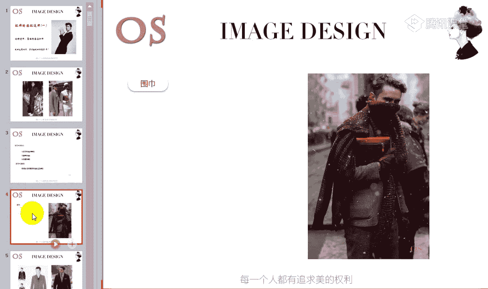

🎼好，我们快速的来看一看我们这样的一些围巾的系法。然后呢，有一些同学你们可以截图的都可以截图。另外的话，其实像有一些网站上，像类似于这种呃戏法的图片，我们也有，我只是找了几个比较常用的常用的好搭配的。

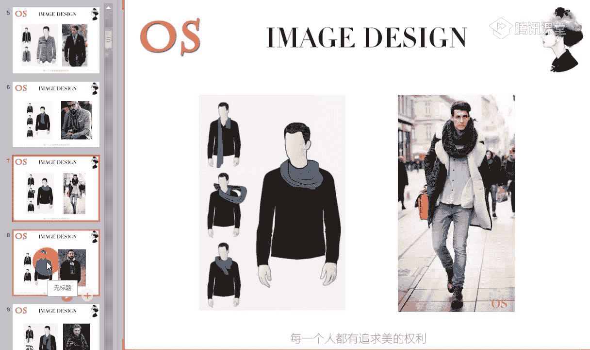

🎼啊，这个的话呢就是我们如果你的围巾非常长的话呢，我们可以绕几圈，然后做一个这样的一个松松散散的一个结，对不对，一个非常简单的一个结。那也可以呢。如果说你的围巾的长度还OK的话。

你也可以像我们右图中这位模特一样哦唉。🎼就直接我们进入到最后一步，打一个结就可以了。🎼的し？🎼啊，这就是我们呃围巾所常用的一些戏法啊，大家有没有什么问题啊？没有问题的同学呢可以快速跟老师扣个一啊。

包括啊我们也保存好了，或者是说哎我O没问题啊，我们就快速跟老师扣个一。然后我们就接着来讲讲我们各个不同的风格，再选择围巾上面要注意的一些知识点。

🎼哦，都记录好了的同学哦，有没有问题？现在只有我们的月跟老师在公台上打了个一啊，其他同学呢？

🎼还需不需要老师再重新放一遍，或者说不需要的话，快速跟老师扣1啊。我们今天的课程内容也是非常多的。

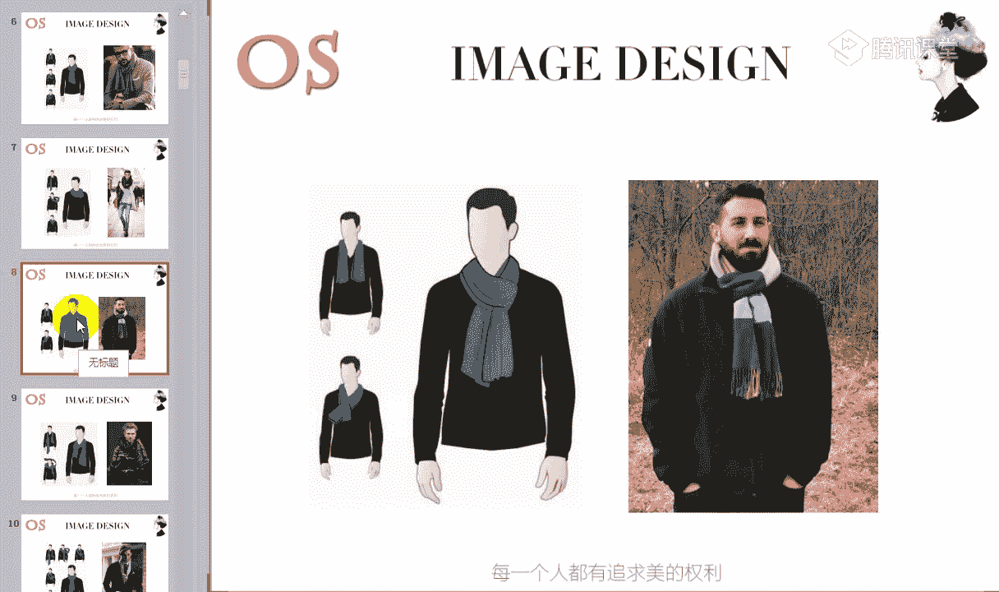

好，其他同学的话呢，我们这样的一个课程在进行过程中啊，如果说有任何问题可以在公台上提出来。如果说没有任何问题呢，记得哎老师所说到的一些知识点，没有问题的话呢，要快速跟老师扣1啊。

我们不要耽误其他同学的一些时间。

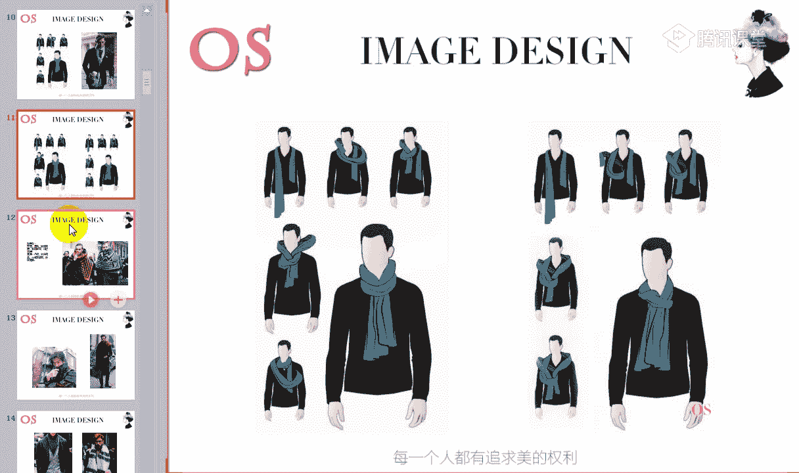

🎼好了，我们就直接呢来说到我们接下来的这样的一个知识啊。如果说呃其他同学还没有反应的话呢，啊老师就直接先进入到这里，我们就不说了啊。🎼啊，接下来我们就看到不同的风格。

在选择围巾以及材质图案上的这样的一个区别。第一个呢就是我们戏剧型的风格。那说到戏剧风格的话呢，老师肯定就是要唉来说一说他的一些代表人物啊，那像这样的一些代表人物呢，都以我们的明星为例子。

可能有很多同学会知道，对不对？我们可以知道的同学呢，你可以把他的这样的一个形象呢映入到你的脑子中啊。第一个就比如说像我们的甄子丹，还有包括像我们的周韵周润发，还有包括我们的陈凯歌、姜文呢。

还有包括我们的呃黄秋生啊，齐秦、李勇啊任达华等等啊，这些都是我们这样的一些戏剧风格的对呃，以及像我们这样的一个陈柏林啊，最近的话花儿与少年，是不是哎这个综艺节目相信如果说追综艺节目的同学也知道啊。

我们这样的一个陈柏林陈柏林呢他也是属于我们这样的一个戏剧风格。那其实你看到。🎼戏剧风格这些人物的这样的一些呃感觉，你们觉得他的整体的视觉感受，你会用到哪些形容词来形容啊。

就比如说像我们这样的一个陈柏林也好，或者是说我们有同学说到的周润发对哎，包括我们的齐秦啊、任达华、张震啊等等。姜文哪、黄秋生大觉他的长相上有什么样的一个特点。🎼啊，觉得他们的五官上面啊。

长相上面有什么样的一些特点啊，可以呢快速的在公牌上呢跟老师说出来啊，我们的一朵向日葵非常棒，说到大气啊，就觉得他们的五官长得非常的大气，对不对？整体的形象比较的高大啊，量感大。

那还有呢就是你也会发现老师说到的这样的一个大气，以及他们的五官的立体度也是非常高的对，就像我们栀子花花开说到的这样的一个立体。五官的夸张大气的同时，他又有立体。而且的话呢。

你会发现这些人还有个共同的特点。你像呃我们的黄秋生也好，哎，包括我们这样的一些姜纹哪，唉，包括我们的这样的一些甄子干啊等等。他们是有一个特点，就是浓眉大眼，对不对？浓眉大眼量感强。

所以呢我们在选择这样的一些呃服饰的时候啊，像这样的一些配饰围巾的时候呢，我们同样也要跟他的五官的这样的一个长相呢相协和啊，相协调。🎼所以说戏剧型的人，如果你要选择围巾的话呢。

我们一定要注意多去选择这样的一些材质上面皮毛的。哎，我们这样的一些。所以说戏剧风格去穿皮草和我们的浪漫风格，穿皮草穿的最好，其他风格可能驾驭驾驭皮草来说，没有其他啊没有他们这么强烈。

所以说呢我们可以在选择围巾的时候选择一些皮毛材质的，对不对？或者是说呢选择光泽感强的对啊，光泽感强的也是可以的。像我们在选择围巾的时候，如果这条围巾的光泽感，大家可以看到哦，不要有同学在怀疑说，哎。

老师什么是光泽感，我们之前在讲到是错，讲到材质的时候，我就说到过光泽强的就是。🎼和我们这样的一个哑光的对不对啊？有光泽感的和哑光的。所以说我们在选择围巾的时候呢，你可以多去选择有光泽感的这样的一些材质。

另外的话呢也可以去选择相对来说这样的一些粗仿毛线的，或者是说图案上呢去选择类似于这种几何的唉，大型的花朵，对不对？大面积的大气的这样的一些花朵，以及呢我们人物等醒目的啊。如果说我们围巾上有一个人物。

但是这个人物非常的有意思，非常大气，非常醒目，也是可以的啊。图案中呢一定要分明啊，醒目分明的这样的一些图案。

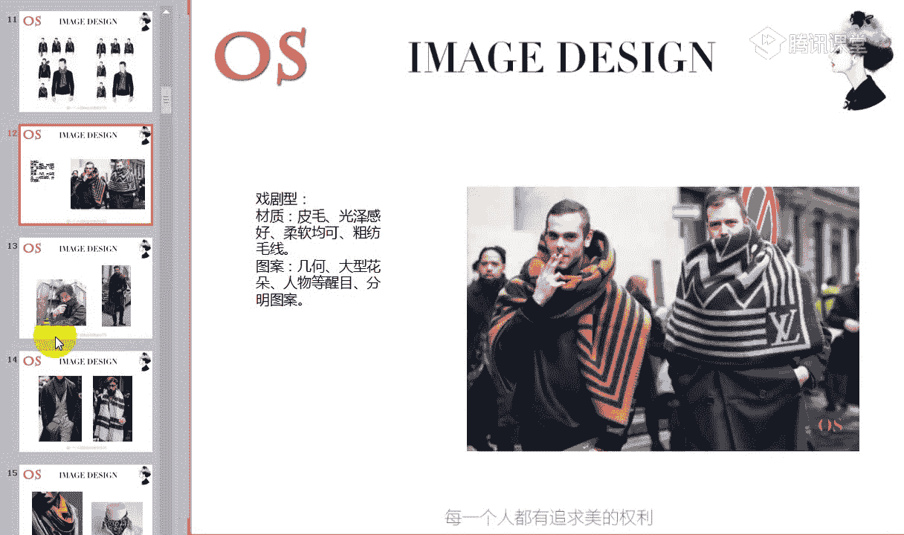

🎼大家可以看到整体围巾的这样的一个亮感啊。所以说在人物中呢，我们的量感指的是成熟和年轻。那在物体上，它的量感其实就是大和小。也就是说这样的一个面积厚和薄的一个问题，对不对？厚薄以及呢面积的大和小。

所以说我们可以看到老师所找的这样的一些适合戏剧风格的围巾哦，它一定是有这样的一些共同的特点。🎼别。🎼所以说你看到这样的一些围巾，你会想到唉成熟，对不对？大气啊，夸张醒目，或者是说哎有这种强烈的感觉。

大气夸张。好，这个就是我们戏剧风格，在选择围巾上面要注意的所适合的。🎼所以说在场的如果是戏剧型的男士啊，我们在秋冬季节，或者是说我们在的一些夏季，你如果喜欢一些小方巾的话。

我们在选择图案上面也要注意啊也要注意。🎼好，第二个呢就是我们自然型的啊，自然风格的话呢也是属于一个量感偏大的风格。啊。那我们接着来说一下他的一些代表人物。包括像我们韩国的一位明星裴永俊，对不对？裴永俊。

他其实也是典型的一个自然风格的。还有包括我们现在的这样的一些呃阿杜啊啊，以及我们的陈奕迅啊，还有包括我们的黄奕行啊、黄祖明啊啊，黎明啊，还有像我们这样的一个嗯老师想一下他叫什么名字啊。黄宗泽啊。

香港的一个明星，对不对？对？还有包括陆易是的啊，这个呢都是属于我们自然风格的一个男士，你可以想象一下，老师刚才所提到的名字中的这些人物，跟我刚才所说到的这样的一些戏剧型风格的人物去做对比。

有没有感觉到唉整体五官的大气度和整体的这样的一个量感啊，教之戏教就我们这样的一个自然风格来说。🎼是不是会发现像陆毅、任贤齐对不对？哎，像我们的裴永俊等等啊。

跟刚才老师所说到的这样的一些姜文哪、黄秋生哪哦任达华呀等等，是不是会感觉到五官的立体度要相对他们来说柔和一点？还有包括呢就是整体的这样的一个五官的大气度啊，是不是会发现自然风格的要弱一点哦。

有这样的一个感觉，同学可以跟老师快速扣个一哦。🎼就比如说我们现在拿这样的一个裴永俊的长相，对不对？跟我们陈柏林的长相去做对比，是不是会觉得他没有陈柏林立体感这么强。

而且的五官你会觉得陈柏林的五官是非常非常分明的，对不对？但是我们的呃自然风格的人呢会相知于我们这样的一个戏剧风格，它更偏向于呃柔和一点，面部的话呢棱角不会过于的分明，对不对？有一种柔和感。

相对来说会有一种柔和感。所以说呢。🎼这是我们长相上面的这样的一个特点啊，所以我们在选择围巾上面也要相同。第一个呢就是我们去选择一些弱化的材质，比如说天然的这样的一些材质啊。麻也好，唉，粗的毛呢也好。

都是可以的。而且的话呢自然风格人不适合去选择一些有光泽感的这样的一些围巾啊，光泽感材质的这样的一些围巾，它更适合呢哎无强烈光泽感的这样的一些面料，质地上比较天然的啊，比如说它穿麻质的。

或者是说穿我们这样的一些棉质啊，以及呢唉去穿我们这样的一些粗毛呢等等啊，去带我们这样的一些粗棒针织的这样的一些围巾都是非常好看的啊。因为它适合质地天然的，它是天然去雕饰的这样的一个风格。

那另外呢就是图案上面我们可以去选择一些民族的啊，或者是说它去选择方格纹的这样的一些。🎼围巾哦，条纹的围巾或者是植物的这样的一些纹样，自然风格的泼墨的几何的都是非常非常适合它的。🎼我们可以看一下哦。

整体围巾的这样的一个感觉。🎼爱。🎼质地可以选择稍微呃粗糙一点的哦，唉淡一点的。🎼多选择格纹和条纹啊，非常适合我们。🎼不要去选择存在感太强的这样的一些围巾啊，它不适合不适合。

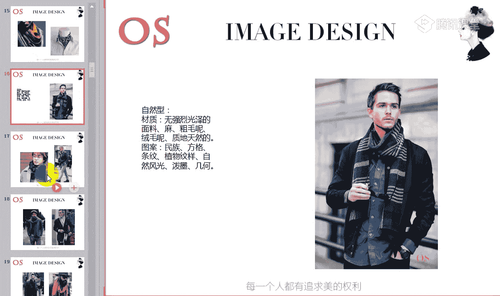

🎼就是跟我们戏剧风格的人去做对比。🎼啊，像老师所找的这种图中的，你会发现，不管是服装也好，还是我们的围巾相搭配也好。其实像这些衣服也好啊，都是非常适合我们自然风格的人。🎼因为之前老师说过。

它适合穿这样的一些休闲类的西装，对不对？而且呢最好是拆套去穿着。🎼适合去表现这样的一些休闲感哦。🎼好，接下来呢我们就说到浪漫风格啊，浪漫风格呢也是一个大量感的风格啊，而且呢浪漫风格的这样的一些代表人物。

你会发现他们有一个共同的一个特点，就是眼神啊，你看他们的眼神，你会感觉到被他们融化，就比如说像我们的钟汉良，对不对？唉，包括像我们的啊这样的一些费翔焦恩俊，我不知道有没有同学认识啊，还有包括像方中信啊。

你去看方中信的眼睛也是一样的。还有包括哎像我们的郭强啊、张国荣啊、冯绍峰啊、梁朝伟啊，这些都是我们呃这样的一些浪漫风格，比如说像陈坤哪等等。你会发现他们最大的一些特点。

都是眼睛呢他是含着这样的一些水润感的啊，嗯有些风格的人去看眼神，看眼睛，你会觉得嗯感觉没什么太多的湿润感，或者是说呢哎感觉就是典型的这样的一个直男，对不对？但是我们浪漫风格的话呢，你会看他的眼睛。

你会觉得。🎼我马上要被他眼睛的水呢所融化了哦，是有这样的一个水润感的。所以说浪漫风格的人眼睛是特别特别湿润的，有这种感觉哦。哎，因为他们是一个感性的风格，所以说呢因为他们的长相上面对不对？

🎼刚才老师说了，长相上面呢有这样的一些特点啊，眼神上的一些特点。而且的话呢他们的五官来说也比较的柔和啊，轮廓的话不会那么的硬直，不会说有硬汉的这样的一些形象，对不对啊，没有硬汉的这样形象。

就像我们的成龙大哥，虽然说他一直是拍一些这样的一些呃动作片，对不对？但是你也会发现他整体的感觉不会说像我们的张震，或者是说像我们某一些的一些武打明星啊，那么的硬去塑造这样的一些硬汉的形象。

他整体来说会有这样的一个啊柔和感，对不对？唉，柔和感，对眼神很性感。我们有同学说到，是的。🎼所以说眼睛是呃眼神是柔和性感的，而且成呃身材也比较的成熟饱满哦。所以说这是他们长相上面的一些特征。

那另外的话呢，所以因为它长相上面有这样的一些特征。我们在选择它所适合的围巾上面也是一样的。我们要去给人相对来说柔和的，对不对？唉，这样的一些感性性感的感觉。

所以呢在材质上面建议我们浪漫风格的人多去选择真丝的材质，就比如说像我们图一哦，真丝面料的，或者是说呢我们去选择丝棉的也可以，因为丝棉面料的话，它也相对来说比较的平整，而且的话它有这样的一个柔软感。

另外呢我们也可以去选择精纺毛呢面料的，或者是这样的一些羊绒光泽感强啊柔软而华丽的这样的一些面料。图案上面呢可以选择波纹或者是花朵以及我们曲线图案。之前在学围。🎼呃，这样的一个领带的时候。

我们就说到曲线图案是非常适合浪漫风格的，对不对？好，我们接下来呢可以看到它所适合的这样的一些围巾的例子啊。🎼像我们图中啊右图中像这样的一些柔软的，唉，比较金纺的。

🎼针织面料的是不是毛呢面料的、丝棉面料的都是可以的。

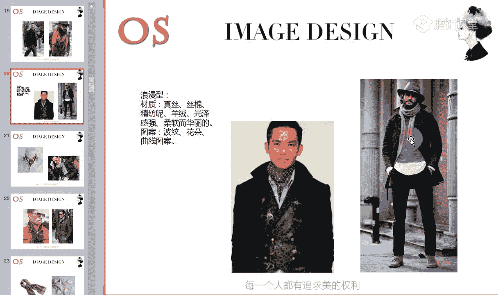

🎼好，我们可以看到真丝材质的哦，都可以去选择这样的一些曲线的波点图案啊，包括的话我们可以看到这条围巾也是一样的，它是一个金纺的羊绒围巾，但是围巾上面呢它也会有这样的一些小曲线的图案作为点缀。

所以说你会发现这条围巾中透露着这种感性元素，对不对？非常的柔和，非常的柔和啊，偏向于这样的一个中性感。🎼啊，这个都是图案啊，图案。🎼对啊，有同学说到高哦有贵气感，品质感。是的啊。

他们的长相是他们有这样的一个贵族的气息啊。而且的话所以他们在选择围巾上面要去凸显品质感。那我们可以看到像这样的一些精纺的啊，羊绒材材质的这样的一个围巾的话，因为它的面料质地来说啊，品质也是非常非常的强。

所以呢非常适合我们这类风格的人去做选择。五千？🎼好，老师在讲解的过程中啊，如果大家有任何问题都可以提问的啊，都是可以提问的。

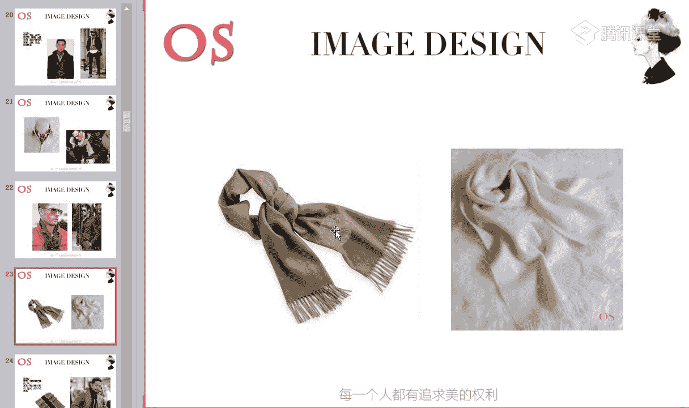

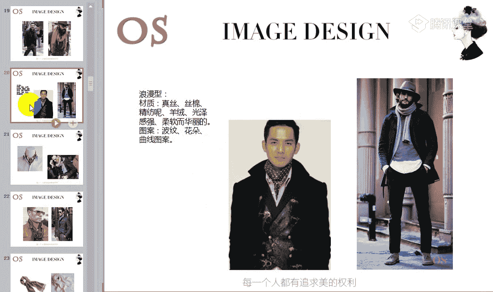

🎼好，浪漫风格也是很花钱的一个风格吧。对哦，其实浪漫风格也是比较花钱的，因为他们对于服装的整体的材质也是有要求的，他要去体现这样的一些华丽感，对不对？品质感。🎼好，接下来我们就说到古典风格啊。

古典型的那其实古典型的人呢呃老师个人来说我是非常喜欢古典风格。因为我非常喜欢这种长相上呃五官端正的这样的一个这类人群。所以说你像比如说我们的胡锦涛，对不对？陈道明，还有包括白岩松、康辉呃。

像我们央视台很多一些主持人都是古典风格的那包括像吴秀波呀啊杜淳哪、李又斌啊，还有包括我们的张嘉译啊，张嘉译是一个大古典啊，量感要比其他的古典型的风呃风格的人要大。

你像他们的特是长相上五官是比较端正的正派的呃，正派的这样的一个长相。而且呢。🎼你会发现整体的面部啊有成熟，而且有距离感，它会有它因为它会带来这样的一个严谨的感觉啊，身材也比较的板正。

所以说呢因为他们的五官端正精致。那我们在选择围巾的时候，也要去顾及到这一点。所以说在材质上面选择上面呢，我们也要去呃凸显这样的一个严谨精致的感觉。

所以呢可以多去选择挺括的精纺毛料或者是我们这样的一些哦丝制品都是可以的。所以我们可以看到，包括在图案上面图中我们可以看到这样的一些图案，非常的规矩。而且排列是哦这样的一个严谨的一个状态，对不对？

所以说在选择图案的时候呢，要选择这样的一些规则，排列的条纹哦，格纹点的几何图案，一定要知道规则，对于他们来说很重要。我们可以看到哦。比如说像一些其他风格。🎼老师给大家看一个哦，看一个其他风格的。

比如说他们如果选择条纹也好，选择我们啊这样的一些围巾也好，他可以去选择这样的一些复杂的，对不对？哎，图案和图案之间没有任何的关系啊，不形成这样的一个规则感的。

或者是说我们去选择这样的一些抽象的图案呀等等啊，这些其他风格都可以去做选择。但是呢我们的古典风格的人是绝对不能去进行这类型的尝试的。我们要规规矩矩的去进行选择。所以呢要排列规则的条纹和格纹。

或者是我们点的集合图案，集何图案也要是排列规则的，不可以说哎这里呢两个啊这里有三个啊，这里有4个，绝对是不可以的。🎼好，有同学说到挺括的毛料会不会不舒服？不会。

大家可以看到刚才老师给大家看到浪漫风格的这样的一些精纺的精纺的羊绒围巾啊。你会发现它的面料是有挺括感的，而且呢料子非常的柔软，一点都不会不舒服。

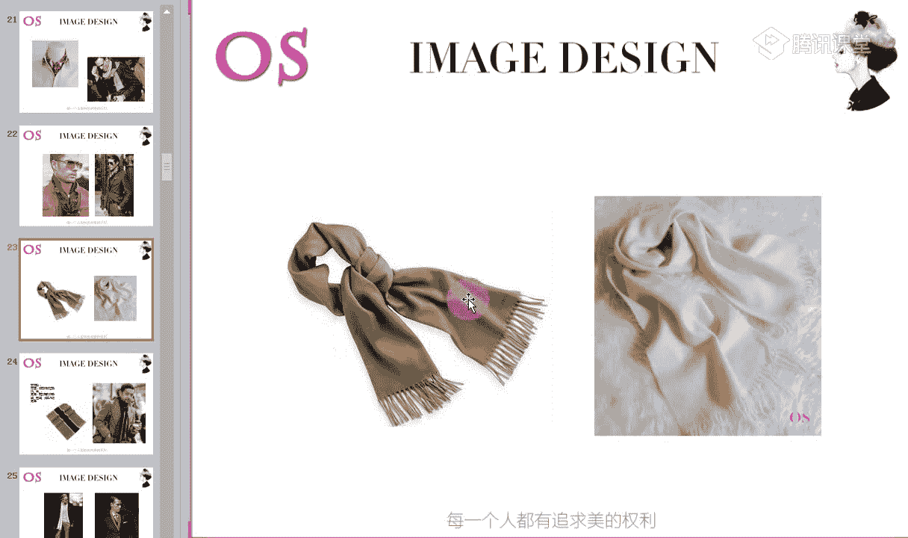

🎼所以说我们古典型的人去选择这类型的金纺的羊绒、围金都是可以的。大家可以看到哦，都是可以的。🎼好，包括我们可以去选择这样的一些真丝的。但是呢我会发现浪漫风格，你可以去选择这样的一些曲线图案，对不对？

但是古典风格的话呢，我们一定要选择直线图案的，而且图案和图案之间一定是要有规则排列的。

🎼好，刚才就是我们这样的一个古典风格啊，古典风格。好，接下来呢我们就说到下一个风格，就是我们的新锐前卫风格，这是属于我们前卫风格中的一种，对不对嗯？🎼巾就很好。对，丝巾可以的啊，没有任何问题。

🎼重磅真丝的哦，要去追求品质和精致感哦，古典型也是要追求精致和品质感。🎼好，我们看到呢这个接下来是我们新锐前卫风格，是一个小的风格。那他的一些代表人物的话呢，你可以看到陈冠希对不对？唉，他的整体的长相。

还有包括像我们。🎼朴树啊，吴奇隆像我们的谢霆风、于文乐、陈小春啊，言承旭这些都是属于我们的新锐前卫风格。他们的五官上面呢你会发现线条还是挺分明的，对不对？线条很分明啊，五官的清晰度也是非常高。

五官的个性也非常长得非常有个性，而且还有一定的立体度啊，这个是我们的新锐前卫风格的一个特点，但是它跟我们的这样的一个戏剧风格来比，就是他的五官上面要比我们的戏剧风格更显得精致一点，他不会说像戏剧风格。

戏剧风格同样是五官线条分明清晰，对不对？立体度高，但是呢它是偏向于这样的一个大的啊，五官整体的量感是偏大的，但是我们新锐前卫风格呢，它虽然长相上有个性，也有清晰度，也有立体度。

但是它的五官的啊量感要偏小，这是我们新锐前卫风格的，五官上面人体的这样的一个体型上的一些特征啊，长相上面的一些特征。🎼所以呢因为他的长相上面啊给人这样的一些个性化的一个长相。你像陈冠希长得多有个性啊。

包括我们的陈小春啊等等。所以呢唉有这样的一个个性酷的感觉。那我们在选择服装上面也要去选择风格，与众不同的，对不对？那包括在选择围巾上面一样的一个道理。我们可以多去选择这样的一些闪光的硬挺的画纤哦。

这样的一些材质，闪光的硬挺的，或者是说呢我们也在图案上可以去追求这样的一些不规则的条纹呢，你可以看到这张图片中，虽然说没有变得去展开，对不对？像这样的一些小丝巾的条纹的话，我们是不规则的。

不形成这样的一个规矩感。那另外的话呢，包括选择格纹的时候，我们也选择一些不规则的怪异的个性抽象的，这些都是比较适合我们新锐前卫风格。

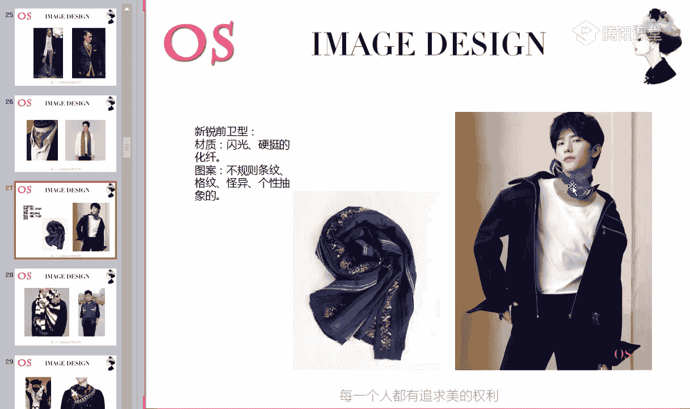

🎼包括你像整套服装都可以给到欣锐前卫风格的人去穿啊这一套。🎼包括我们韩国的这个呃组合里面的队长GD，对不对？🎼哦，它也是属于我们的新锐前卫风格。你会发现他穿衣服特别的有个性。与众不同，引领潮流啊。

🎼这条围巾的话呢，我们如果说款式上面再小一点会更好。在这里只是跟大家看一下图案的感觉。🎼是不是会感觉到图案呃整体围巾上给你带来的感觉会有这样的一个呃尖锐感，是不是会有一点尖锐感？对，陈伟霆也是哦。

会有锐利的感觉哦，锐利锐利的感觉，对不对？🎼尖锐的锐啊啊厉害的厉啊，有哦不是厉厉害的厉啊，应该是。🎼呃，有力的力。🎼有这样的一个锐丽的感觉，而且年轻对不对？也感觉到图案整个围巾带给我们的年轻感。

🎼时尚感。🎼哦，另外一个呢就是我们的阳光前卫型的男士啊，阳光前卫也是属于我们前卫风格的一种。只是说它相较于我们的新锐前卫的话呢，它的五官长相上面更偏向于柔和一点。同样的话，他的五官也是比较紧凑的。

而且呢比较小巧的。比如说像阿牛，对不对？何炅，还有包括我们的苏有朋、杜文泽、林俊杰、林志颖等等啊。他长相上面不会说像我们的陈冠希，对，像陈冠希或者说吴奇伦这么的有锐丽化啊，这样的一个尖锐感。

它变更偏向于柔和一点。对有我们同学有说到大男孩的感觉。是的，所以呢我们在选择材质上面呢可以多去选择这样的一些毛类的，或者是闪光硬挺的材质也是比较适合他的。也就是说我们在选择围巾的时候，它有一定的闪光。

也也就是说有一定的光泽度。但是材质拥有一顶一定的挺括度都是非常适合我们阳光前卫风格的那图案上面呢，我们尽可能的去选择一些。🎼个性化或者可爱的这样的一些几何图形抽象的这样的一些图案啊。哎。

比如说像我们这样的一些有趣的波点，对不对？能够带来大男孩的这种感觉的。年轻的感觉啊年轻的感觉。🎼阳光。🎼它也是属于我们这样的一个时尚的。🎼风格啊，所以说同样的我们如果用它用来形容它的这样的一些单品。

就是还是要有年轻化的啊，要个性的，要有这样的调皮时尚的嗯，可爱的这样的一些元素。

🎼我のせ。啊，这个就是我们各个风格的同学在选择围巾上面要注意的啊，大家有没有什么问题啊，没有任何问题呢？快速跟老师刷朵鲜花或者扣个一。我们就看到呢接下来围巾搭配上面我们要注意哪些。🎼好。

接下来就是我们的围巾的选择方法啊，以及我们在场合中这样的一些搭配的技巧。🎼有没有问题啊？没有问题的同学可以快速跟老师刷点鲜花或者扣个一啊。🎼好，第一个呢就是我们在穿正式的西装的时候，对不对？

如果说在这样的一些正式严谨的场合，在秋冬季节我们可能会运用到围巾啊，在选择上面呢，或者是说像这样的一些场合中啊，这样的一些跟正装做搭配的。如果你不想运用到领结或者说不想运用到我们这样的一些领带的话呢。

我们也可以啊利用丝巾来代替它啊。比如说我们在穿正式西装的时候去选择一些真丝或者是精纺毛料材质的围巾都是非常适合的真丝的材质，一定你要知道，在选择真丝材质的时候，你在这样的一个正式的场合。

跟正式的西装做搭配。那么图案一定要严谨一点啊。图案一定要严谨一。图案的严谨度呢，你可以参照老师所说到的领带的这样的一些图案啊，领带的一些图案。

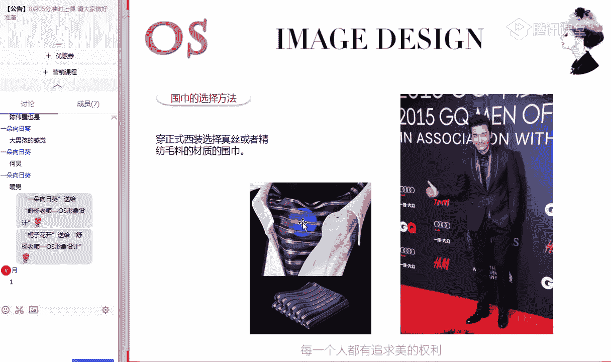

🎼The难。🎼那另外呢其实像我们这样的一些精纺的啊羊绒围巾啊，毛呢啊这样的一个精纺的羊绒围巾的话呢，也可以跟我们这样的一些正式的西装做搭配，或者是说呢跟我们呃在一般职业场合中，你要穿西装的话。

你也可以去选择类似于这样的一些围巾来跟它做搭配啊。你如果不喜欢真丝的话，你像我们这样的一些真丝自然风格选择起来就并不是特别理想，对不对？所以我们不妨去选择这样的一个羊绒的啊，精纺的羊绒会更好。

🎼好，第二个呢就是。🎼在我们的休闲场合中啊，那搭配我们的针织衫、休闲西装啊，夹克、大衣等休闲服装时呢，我们就可以选择针织的毛线的啊，这样的一些针织毛线的或者是羊绒的棉麻等休闲感强的围巾。

就像我们刚才所看到的这样的一些很多部分啊，出现在我们直呃出现在我们这样的一些跟休闲单品做搭配的时候啊，像这类型的都是可以去做搭配的。但是呢要跟大家说到一个点，我们可以看到右图中啊。

唉这位男士的围巾和它的西装的材质，你们能不能感受到肌理感。🎼能不能感受到肌理感啊？这个之前我们在第三节课也说到过面料上面说到过啊这样的一个肌理感，能不能感受到两件单品的肌理感。也就是说材质本身来说。

它的表面是横竖交错的，对不对？凹凸不平的，还有这样的一个天然的粗糙感。🎼好，我们能不能感受到啊两位同学跟老师扣一了啊，其他同学呢呃如果看不太出来的，也可以在公台上提问啊提问。🎼好。

为什么老师要在这里问大家能不能感受到这样的一个肌理感哦？那我们接下来可以看到下一张图片。也就是说我们可以看到这条围巾，我们同样能够感受到它的粗糙和肌理感，对不对？但是这件西装的材质。

它是不是属于我们肌理感强的材质呢？🎼大家觉得这件西装它符不符合我们肌理感强的材质？🎼是不是它的面料更对对比来说，它是属于这样的一个硬挺的，对不对啊？平整平滑的这样的一个面面料，对不对？

所以说你会发现如果说像我们穿着这样的一些平整平滑的西装，正式西装的这样一个面料。你去跟我们粗仿啊粗棒针织的一个围巾，或者是肌理感强的一些围巾做搭配的时候，它会显得有一点突兀啊。

会导致围巾会显得非常的突兀，一个前进一个后退，对不对？因为我们都知道材质也是有收缩和这样的一个膨胀的。所以而这样的一些肌理感强的面料，它是有膨胀效果的那我们可以看到，而我们平整的硬挺的面料。

它是有后退的一个效果。所以说在整张图片中就会显得整个形象来说，围巾那一块会显得非常的突兀。那在这里呢老师也是告诉大家啊，跟。🎼我们正式的材质好的这样的一些品质好的单品做搭配的时候，请你们尽量选择真丝。

或者是我们这样的一些质地好的羊绒围巾，不要去选择一些肌理感太强或者是啊偏向于这样的一些粗糙感的这样的一些材质，不适合啊，能理解吗？理解同学快速跟老师扣个一或者刷的鲜花啊，包括我们可以看到。

如果是这样的一些粗糙感强的围巾去搭配我们粗糙的一点的这样的一个外套的时候，它两者之间就会显显得非常的和谐，对不对？但如果说一旦触碰到了这样类型的服装的时候，我们就会显得有点突兀啊。

这是这样的一个搭配上面，我们要注意的那其实除了我们注意好服装的材质以外呢，在休闲场合中，其他任意的这样的一些单品啊，不管是我们这样的一些大衣也好，还是我们这一类型的一些夹克。

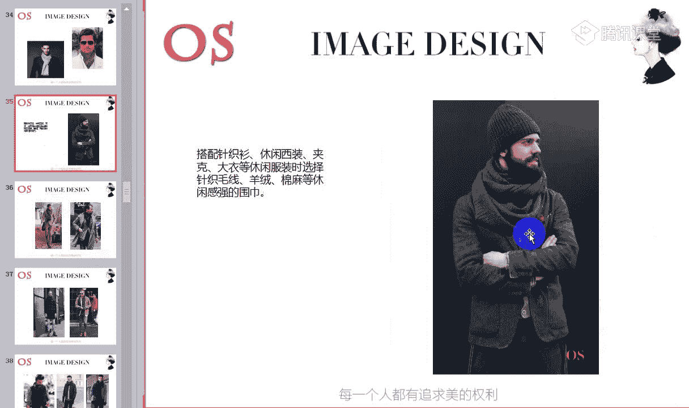

🎼休闲感强的一些背心啊，这样的一些夹克等等，我们都是可以随心所欲的去进行选择。没关系。🎼秋冬季节的话，多去运用围巾哦，因为它更能够去制造我们整体的层层次感，对不对？我们都知道，哎，在秋冬季节。

我们如果把服装进行叠穿的话，会凸显我们的时尚度。那其实如果说我们的服装的层次感很难去缔造的时候，其实你利用围巾也是可以去增加这样的一个层次的。🎼那在这里呢老师还要提一下，就是我们这样的一个小方巾。

可能有些男士觉得小方巾是不是太娘了一点。但是在夏季的时候，如果说你的配饰比较少的话，其实小方巾对于一些前卫风格的一些男士，或者是说像我们这样的一些浪漫风格的男士呢，都可以多去运用，非常适合。🎼啊。

其他风格我们就少选择了啊。老师刚才所说到的前卫风格和浪漫风格，你们可以去进行这样的一些尝试，尤其是前卫风格的。🎼Gス。🎼能够起到画龙点睛的作用。啊，这个就是我们以上呢就是我们这样的一个围巾啊。关于围巾。

大家都没有任何问题了。OK了啊，我能够懂得自进行自己的风格的一个分辨的围巾的。我也知道在我们休闲场合和正式场合中在选择围巾的时候要注意哪些的，快速跟老师刷朵鲜花或者扣个一。🎼好，接着我们呢就说到帽子啊。

以我们常用的帽子为基准。🎼好，第一个呢就是我们的卡车帽呃，卡车帽呢其实又称之为我们的棒球帽啊，棒球帽。🎼最喜欢浪漫风格，非常好，其浪漫风格的男士也是有独特的自己的一个魅力的。好。

我们这样的一个卡车帽呢又称之为棒球帽啊。所以说像我们途中可以看到图中就是类似于这样的一个款式，类似于这样一个款式。那这类型的帽子的话呢，一般都是大部分跟我们的休闲装去做搭配，对不对？哎，在夏天的时候。

我们可以呢简单的T恤搭配牛仔裤的时候啊，可以配上这样的一个帽子。那如果说在春秋季节呢，我们外加一个夹克，对不对？哎，你适合的这样一个夹克呢，也可以跟这类型的帽子呢去做搭配哦，穿出这样的一个休闲感。

那么帽子呢我们也会发现像这类型的帽子会有一些图案，对不对？哎，我们比如说有的帽子是有字母的那其实呢唉你也可以把这样的一个图案啊。如果说你的帽子是有图案的注意。你在跟T恤做搭配的时候呢。

图案的一个协调度要注意一下啊，图案的协调度一定要注意。🎼或者就是说呢你的帽子如果有图案的那我们整身的服装的这样的一些图案就减弱。那如果说帽子没有图案的，我们的服装就可以增加这样的一些图案感呃，图案感。

那衣服的色彩如果非常的鲜艳的话呢，我们帽子上的图案也可以相对鲜艳一些，形成这样的一个呼应，对不对？那像这类型的帽子的话呢，我们在选择的时候，当然要注重好脸型，同样也要跟风格所协调。

首先呢老师跟大家说一下风格，适合这类型哦，帽子的风格呢有我们的自然风格和前卫风格。因为它能够带到修休闲感。同样帽子的整体的量感来说，它也不是算特别特别大的。所以呢像这类型的适合去穿这样的一些休闲感的啊。

比较精致一点的服装的呢像自然风格和前卫风格可以去选择。那另外就是呢像我们这样的一些方脸型的同学尽量呢少去穿，啊，选择这样一个帽子，因为你的脸若太过于方的话。🎼唉。

这种帽子其实它会显得你的头部分呢太过于窄，显得会不极度的不像不协调。这是我们的脸型中要注意的一个点。🎼就是圆脸型的同学也是啊，圆脸型的同学也少戴啊，少去选择，少去戴。

🎼呃，包括像我们的吴亦凡，对不对？是一个前卫风格，大家可以看到，这是前卫风格，在选择帽子上面它也是非常适合的。脸比较精致的话，一般任何帽型都可以去选择，只是要根据自己的风格来进行一下调整。🎼好。

下一个呢就是我们的棒球平沿帽啊。大家要知道我们跟这类型的卡车帽和棒球帽呢，棒球平沿帽是有一定的区别的。它的这样的一个帽檐呢是平的。看到没有啊。而这类型帽子其实对于脸型和风格的要求非常非常高啊。

像这类型的帽子的话呢，我是推荐前卫风格的人去选择其他风格的人，最好少去少去。🎼少去选择啊，其他风格少去选择。🎼同样也是跟我们休闲类的单品去做搭配的。🎼还是一样的哦，圆脸风格和方脸的话呢。

少去戴这样的一个帽子。🎼呃，下一个呢就是我们的平顶帽和我们的也叫也叫做军帽，它的顶是比较平的那这种帽子的话呢，它会我会感觉它介于正式和休闲中间的一种帽子，它可以跟我们的衬衫做搭配。

也可以跟我们这样的一些T恤牛仔裤做搭配，对不对？能够搭配出休闲的这样的一些皮衣呃，也是OK的，属于这样的一些百搭的风格。🎼那像这类型的帽子的话呢，适合我们男士风格。

有这样的一些年轻的自然型古典型和前卫风格都可以去进行选择。那只是说呢如果你是方脸啊，我们尽量少去戴，还是一样的啊，方脸和圆脸的话呢尽量少碰这样的一个帽子。🎼be的 best。

🎼Can be the guitar。🎼know你确实。🎼一个我。🎼加公。

🎼你太快。🎼好，接下来是我们的画家帽，也称之为八角帽啊。还有包括有同学说到贝雷帽哦，都是指的这种帽子。那这种帽子呢就有点属于略略高端一点。一般人呢不是说能驾驭我们哦都可以驾驭。

或者有些同学会发现这种帽子并不是哦我想驾驭的帽子，那这种帽子呢一定要选择行政的，否则哦塌塌的，完全就没有感觉了。大家可以看到，如果说形不是特别好特别软塌塌的，就很难去制造整体的这样的一个形象了啊。

而且的话显得也不太适合我们一些男性。

🎼好，这种帽子在做搭配的时候呢，我们可以去跟西装做搭配哦，可以穿这样的一些休闲的正装。还有包括呢我们也可以啊选择白色的衬衫哦，搭配我们休闲西装外套，选择这样的一款帽子。

就如我们刚才在第一部分就跟大家看到的。🎼对不对？衬衫去搭配休闲的西装，然后选择一款贝雷帽，这样的一个八角帽。🎼好，包括我们英伦的这样的一个风格的话，你去跟我们的西风衣搭配也是可以的。

或者是我们在我们这样的一些春秋季节，可以选择衬衫，跟我们这样的一个呃背心，对不对？针织毛毛线衫去做搭配都是可以。🎼主要就是要往英伦的方向去走啊，不要去选择牛仔T恤的风格，因为会不好看。

而且的话一定是会考虑到一个驾驭度的问题。那像这类型的帽子的话呢，我们所适合的男士风格，有戏剧型啊，浪漫型、自然型、古典型的男士都是可以的。但是要注意啊，如果你是古典风格的话呢，我们要选择材质要金仿的。

以及我们浪漫风格也是一样的。要选择金仿一点的。古典的话呢就是型一定要好，要选择正的型。🎼你像这顶帽子，你如果给到我们浪漫风格也是非常合适的。🎼脸型上面呢就是其他一般的话，大部分的脸型呢我们都可以去选择。

因为我们的方脸和圆脸的话呢，考虑到我们脸比较的短，对不对？而且像方脸型的话呢，脸比较的方，所以说我们去选择这样的一些巴拉呃巴拿马帽子会更好。像这些帽子的话呢，我们尽量少去选择。

因为你本身脸部的长度就没有任何的优势。

包括我们的油字型的脸也是一样的哦，油字型的脸。

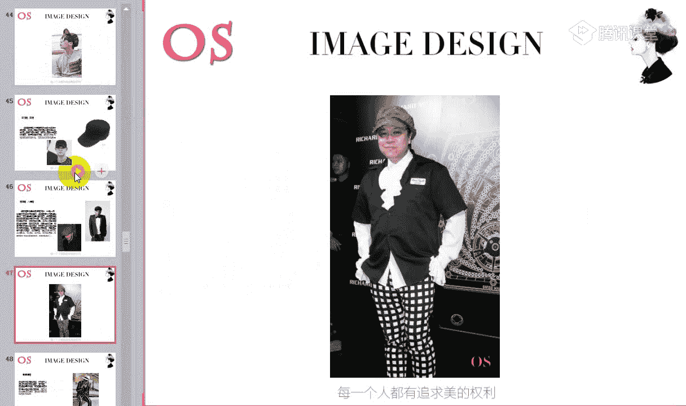

🎼好，我们就看到巴拉嗯巴拿马帽子哦，然后最经典的就是搭配我们的西装。因为它这顶帽子呢也是属于我们正式的帽帽子啊，也是属于在正式场合可以运用的帽子。那包括可以看到这里看到这张哦，这是最经典的，最为正式的。

🎼I don't think so。🎼因为它的帽檐比较的宽啊，像我们正式的帽檐呃，正式的巴拿马呃巴拿马帽子呢，它的帽檐是比较的宽的。所以说像对于我们这样的一些脸比较大的，像圆脸啊，方脸。

它起到很好的一个修饰作用。但是也可以看到，其实老师呢把很多这样的一些圆顶帽都归纳到我们巴拿马呃帽子里面。大家可以看到，这个就是我们的圆顶帽，对不对？也是属于我们礼帽的一种。对，也是属属于礼帽一种。

但是作为方脸型的同学就不要选择平的啊。因为平顶会你的本身下半部分对不对？下颚的部分就是方的。那如果你的头顶又是一个方的那整那整个来说你就是一个四四方方的。

🎼Me。🎼好，这是刚才跟大家所说到的是这样的一个正式的，对不对？那我们像这样的一些正式的巴拉马帽呢，我们可以去跟衬衫，跟我们的搭配正式的西装，对不对？任何风格都是可以去进行尝试的。因为这顶帽子的话。

它的选择权啊会大很多。所以说任何风格我们都可以进行尝试。只是说呢根据风格的量感的大和小，我们来做一些细微的调整。你作为一些量感偏小的，我们就可以选择相对来说帽型上面啊精致小巧一点的那如果说你的风格大的。

你的脸也比较大的，我们就可以选择大一点的。🎼I need to know。 I'm bad my。🎼那这顶帽子的话呢，其实也可以跟我们休闲类的单品做搭配啊，只是说唉我们。🎼比如说像这样的一些云圆顶帽。

对不对？或者是帽子的材质，款式啊，偏休闲的。因为有一定的设计感的，我们都可以跟休闲类的单品搭配。那跟西装搭配的时候呢，就比如说像我们图中这种套式啊，正式的这样的一些西装，或者是说唉套装类的西装的话呢。

我们再选择这类型的帽子，就一定要选择相对来说传统一点的，不要选择太小巧的哦。那夏季的话呢，男士这类型的帽子，我们可以多去选择棕色的，或者是说像我们这样的一些棕色系的，或者说像我们的白色的。

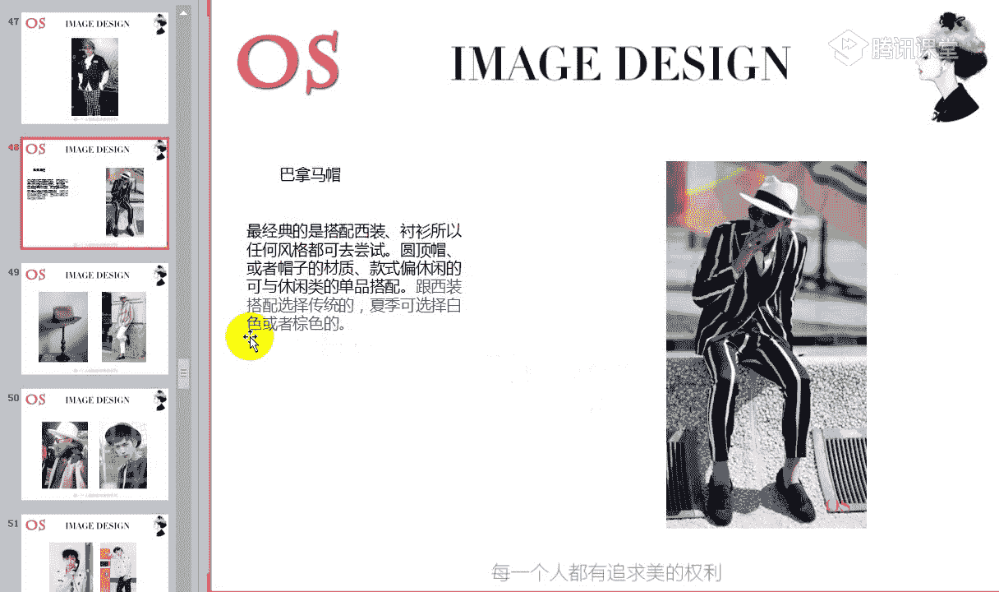

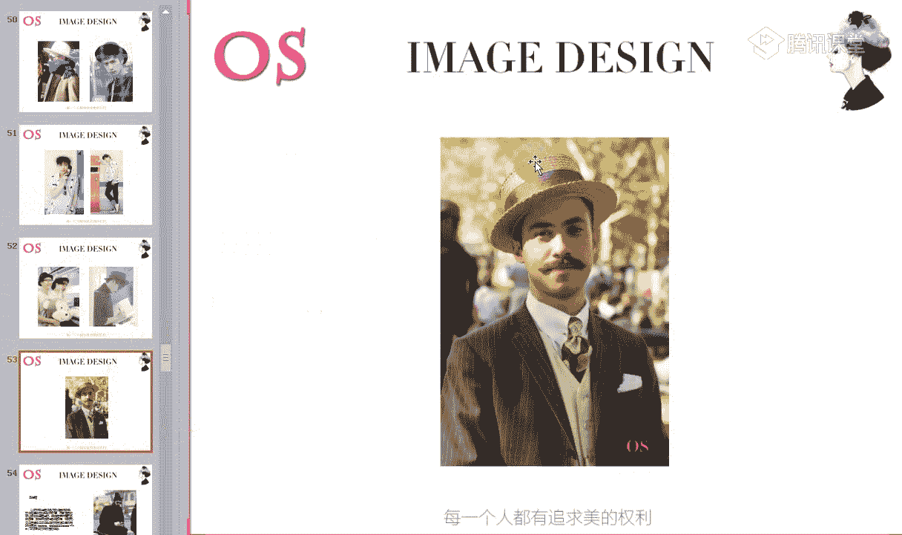

那大家可以看到，像类似于这样的一些礼貌，对不对？进行一些改良之后，跟我们的休闲类的单品都是可以做搭配的。🎼There's one thing to be taught。

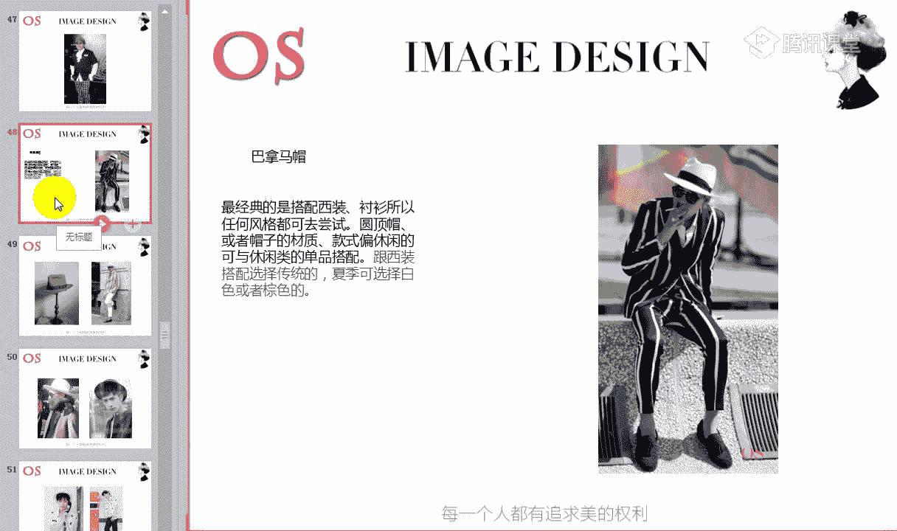

🎼I made to。🎼好，下面我们就看到毛线帽啊，毛线帽的话呢，以前的毛线帽是冬天最保暖的一个装备，对不对？但是它现在也成为我们时尚的一个标志了。不管是冬夏啊都可以带着毛线帽出街啊，这类型也很常见。

对不对？尤其像我们一些明星。那这种帽子的样式呢多种多样搭配的衣服也是多种多样的百搭的款式，只要在选择的时候呢，注意色彩和材质跟自己风格的协调度啊，自己材质，就像我们毛线帽里面有这样的一些精致一点的。

对不对？也有粗棒针织的。那如果是你是古典型的和浪漫风格的，我们能不能选择粗棒针织的，绝对不可以，对不对？或者说图案特别的乱杂乱的也不行。所以呢其实就是色彩和材质要跟自己的风格，一定要形成协调度。

我们可以去参照一下围巾啊材质和图案的这样的一个选择。

🎼长脸型的人少少选择啊，长脸型的人不要选择这类型的帽子。大家可以看到它跟任何的单品都可以做搭配哦，尤其是休闲类的。🎼M。🎼啊，这个就是我们这样的一个帽子啊，关于帽子上面大家还有没有什么问题啊，没有问题。

我们就讲到下一个了啊。帽子只是跟大家稍微的提代一下啊。其实各位男士的话呢，也不要忽略掉帽子的这样的一个佩戴啊。同样的话跟我们的围巾是一样的，帮你增加色彩的，整体形象中增加这样的一个色彩。

Its called the we are the。🎼好，下面我们说到一个重点就是手表。我们都知道男士的鞋子，男士的手表是非常非常重要的对，因为很少有男生会戴帽子，但是呢这样的一个配饰也是非常重要的。

所以老师在这里还是要务必要提醒大家哦。呃，如果是说你的脸型有优势的，对不对？我们其实可以多去选购一些帽子。我不知道我们在场有没有帽子控啊，很好的。🎼你就像女生一顶好的帽子吧，你要是没洗头的时候呢。

我们可以。🎼起到一个修饰的作用，对不对？那如果说呢服装搭配好了，如果再加加上一顶帽子的一个呃提亮的话也会更加完美，对不对？好，接下来我们就看到手表啊，手表非常的重要。With。

🎼首先呢我们来进行这样的一个手表的一个基础的一个辨别啊。我们首先看到这里。🎼表盘如果说越厚啊唉就越显得有这样的一个运动感啊。就是我们要有同学如果不清楚表盘啊，也就是说这样的一个表的一个盘度，哎。

它的厚度它的厚度不是呃直径啊，不是指直径啊，是指它的厚度啊，上下的一个厚度。🎼如果说表盘越厚，会越显得运动感和朴实平和的感觉。那如果说像我们有一些男士的表盘，唉，它非常的薄的话，非常薄的话呢。

它能够带来尖锐感。就像我们哦这样的一个新锐前卫风格，对不对？我说它的长相，还有包括他在选择单品的时候呢，要带来这样的一个锐利的感觉。所以说呃其实从这样的一个说法上，大家也知道，如果我是一个前卫风格。

我是不是就要选择表盘薄一点的，对不对？来凸显我的锐利尖锐感。🎼好，我们这是我们表盘啊，手表上面要注意的一些特点。那第一个呢就是我们可以看到第一个表盘，如果说没有精确的数字的一个刻度，我们可以看到。

🎼图中这样样的一款手表，对不对？它是没有任何的精确的精确的这样的一个数字的一个刻度的。不管是我们的啊阿拉伯数字也好，还是我们啊这样的一些古罗马数字也好，它这都是没有的，没有任何的精确的一个刻度。

像这类型的手表的呢，它会带来很经典啊，有这样的一个严谨的感觉。所以说像在职业场合中，我们可以多去选择。因为唉要塑造我们严谨的这样一个职业形象，可以选择类似于这样的一个手表。🎼好。

第二个呢就是我们阿拉伯阿拉伯数字的一个表盘啊。阿拉伯数字的表盘的话呢，它的装饰效果比较的突出，所以说会带来轻松的感觉，运动的感觉。那我们也可以看到刚才这2块手表去做对比的话。

是不是我们这一款要显得轻松一点啊，氛围没有这么的严谨，对不对？🎼那手表除了我们无精确刻度的，还有包括除了我们的阿拉伯数字表盘以外呢，我们还有这样的一个古罗马数字表盘哦，对不对？这个是古罗马数字。🎼哦。

古鲁马数字表盘的话呢，它特别的显得年轻和现代，它有这样的一个视觉感受啊，显得年轻和现代。这是我们常见的这样的一个三款手表的一个特征。所以说呢大家可以看到，如果就场合来划分的话呢。

我们可以把哦表盘没有精确数字刻度的划分到我们的正式场合去进行选择啊。就像男士的手表就跟我们女生的包一样的，可以多不按照不同的场合呢去。🎼备一点啊，这个是不要一块表，然后不同的场合都带。

因为绝对一块表没办法做到什么样的场合都适合。🎼那第二个呢就是如果说你是在这样的一些休闲场合，对不对？我们就可以去选择阿拉伯数字，或者是说呢哎选择古罗马数字都是可以的。🎼好了。

接下来我们就来看看我们不同的风格，在选择手表上面要注意哪些。🎼来 the。🎼好，第一个呢就是我们戏剧型佩戴的一个手表啊。戏剧型的话呢不用老是再强调它的特征了。我们刚才都已经说过了，对不对？🎼大气夸张。

对不对？所以说我们在选择手表的时候呢，我们要选择表盘。🎼厚的哦表盘厚一点的大的这样的一些天然动物皮革的表带，是非常适合我们的戏剧型的人去进行佩戴。🎼好，浪漫型的同学的话呢。

他有这样的一个感性啊感性性感的感觉，对不对？所以说我们在选择这样的一些手表的时候呢，可以参照刚才所说到的这样的一些表盘无金刻刻度的，以及我们的阿拉伯数字的，还有包括我们的古罗马数字。

那其实呢像这样的一个现代的感觉。古罗马数字非常的适合我们的浪漫风格，所以说浪漫风格的人，如果你要选择表盘上的这样的一些刻度的话呢，我们可以去选择古罗马数字的。哎。

另外的话呢我们如果说这一块表没有办法做到，全部都是黄金的，对不对？因为黄金的话，金色它能够带来这样的一个感性感哦。哎，所以说呢我们也可以去选择周边是黄色的金边。🎼或者就是直接你带金表啊。

所有风格中带金表来说，只有浪漫风格带的最好看。🎼好，接下来就是我们的自然形，在佩戴手表上面要注意的啊。自然型的风格的量感它是适呃中偏大的。所以说我们在表盘的厚度上呢选择适中就好了。

那另外的话呢唉材质上面我们尽量选择皮革材质的呃，多去选择这样的一些阿拉伯数字，或者是说呢能够带来轻松的休闲的感觉的这样的一些手表都是非常适合自然风格的。🎼About it。

 just be good got。あ中。🎼好，接下来就是我们的古典风格啊。古典风格呢在选择手表上面尽量选择无明确数字刻度的，因为无明确数字刻度可以带来严谨的感觉，对不对？哎，规矩严谨的感觉。

所以说我们在选择手表上面也同样的去选择这样的一些无明确数字刻度的那第二个呢就是我们也可以选择古罗马刻度的呃，会显得年轻。如果说是你是一个年轻的古典型的话呢，我们可以去选择古罗马数字。

那如果说唉你想在休闲场合去运用的话，我们可以去选择阿拉伯数字刻度的来显休闲。🎼古典风格的话呢，我们尽量去选择金属啊金属表带。🎼呃，皮的表带要比链条的表带显年轻嘛，没有这样的一个说法啊。

没有任何没有这样的一个说法。🎼你也可以看到，就比如说像我们这一。🎼这样的一个皮革的对不对？和我们这样的一个金属的不一定，我们的金属的会比我们的呃这样的一个皮革的显老气啊不一定的。

大家可以看到你像这一块表，还有包括像我们前卫风格的。🎼唉，类似于这样的一些金属表带的。🎼好了，我们看到新锐前卫风格哦。那因为它的整体的风格来说就是有这样的一个尖锐感，对不对？

所以说我们在选择呃表盘上面呢尽量选择偏薄的，而且它不太适合带皮带的这样的一个表带。如果说你一定要选择带皮带的一个表带的话呢，我们可以看到，要么你就整体的感觉上个性一点。

而且的话最好是把表盘换成这样的一个棱棱角角的。比如说像这样的一些四四方方的，它更能够去凸显我们的锐利感，它大家可以做一个对比啊，你可以看到右图中，对不对？左图中这样的一个四四方方的，唉。

能够去带来尖锐感的这样的一个表盘，和我们右图中偏。🎼哦，圆弧状的对不对？圆形的椭圆形的啊，这样的一个表盘来说，是不是会发现左图中更能够凸显我们尖锐的锐利的感觉，能不能感受到？🎼所以就是这样一个道理啊。

如果你要带皮带的话呢，我们就一定要选择这样的一些呃个性的。🎼呃个性的尖锐的这样的一些有时尚度的这样的一些表带，或者是说呢把表盘像这一块手表的话，如果把表盘换成四四方方的会更好，会更加好。啊。

如果是这种状态的话，其实你给到阳光前卫风格也是OK的。🎼好，另外就是我们的阳光前卫型在佩戴手表上面哦，阳光前卫型的话呢啊就是带一些个性有趣的手表。那我们可以看到图中这样的一些手表是不是非常的个性。

对不对？但是个性的同时又有这样的一些童趣感啊，有意思。🎼啊，我说到啊这款其实给到阳光前卫都是OK的啊。但是因为它的整体的色调哦，它会更。🎼相对来说，如果把表盘换的话，会更适合新锐前卫风格。

🎼那在这里老师要说一下，我们会发现的金属呃表带的这样的一个手表，它是有呃这样的一个黄金色的，也有这样的一个银色的，对不对？那其实在选择发色的时候，我们都知道冷色肤色，我们适合选择冷色调的。

暖色肤色适合选择暖色调的那同样的一个道理。如果说你是夏季型和冬季型的男士的话呢，我们就尽量选择银色表带的那如果说你是春季型或者是秋季型的这样的一些男士的话，我们可以去选择金色表带的。

🎼还有就是其实啊呃你会发现在电影里面有一些男士，对不对？有好多的手表，其实因为手表它也是分场合的，对不对？我们再次做强调，如果是在职业场合中，我们就要去凸显职业感，对不对？那如果是在休闲场合中呢。

我们可以去凸显这样的一些休闲轻松的感觉。那同样的，如果说你是在运动场合的话呢，我们也同样有这样的一个运动款的手表啊，在穿着一些运动服装，或者是休闲夹克T恤毛衣的时候。

我们可以去佩戴这样的一个运动款的手表。啊，这个就是我们今天所说到的这类型的三类单品哦，三类单品。关于我们这这类型的三类单品，大家还有没有什么问题啊？如果没有任何问题呢，我们就看到作业啊，就看到作业。

🎼好，作业第一个要求就是希望大家做好笔记。第二个呢就是找出你自己适合的这三类配饰的单品哦，找出你自己风格中所适合的。🎼手表的笔记一定要做清楚啊，这非常非常的重要。🎼因为你像围巾啊什么的。

我们可能到时候在讲男士风格的时候，还会去强强调这样的一个感觉，对不对？还会强调这样的一些材质和图案。但是手表的话呢，这个就是我们在配饰中啊本节课非常重要的一个重点知识。

而且男士的话手表也是非常非常重要的。🎼我说过啊，配饰呢在我们的整体装扮中，它是起到画龙点睛的一个作用的。🎼服装搭配好了，衣服选对了。但如果说一些细节没有管理好的话呢。

我们还还是会缺乏缺乏这样的一个整体的完美感，对不对？所以我们加上这样的一些配饰，做到点缀的时候，你的整体形象会更加的不一样哦。🎼好，如果大家都没有任何问题呢，我们就可以下课了啊。

一定要记得及时去把自己的所适合的这三类单品的图案呢找找传之后发给老师啊。🎼还有没有交作业的同学要尽快把作业补交上来啊，尽快把作业补交上来。好了，我们今天的课程呢就到这里，再次感谢大家的一个聆听和陪伴啊。

这里是OS形象设计中心的男士课程。🎼好有同学说到老师选择一些有明显logo的皮带，不太好看吧。啊，这个我到时候会在我们这样的一个配饰啊，第二节课说到皮带的时候会讲到啊会讲到。好了，我们下课了，再见。

