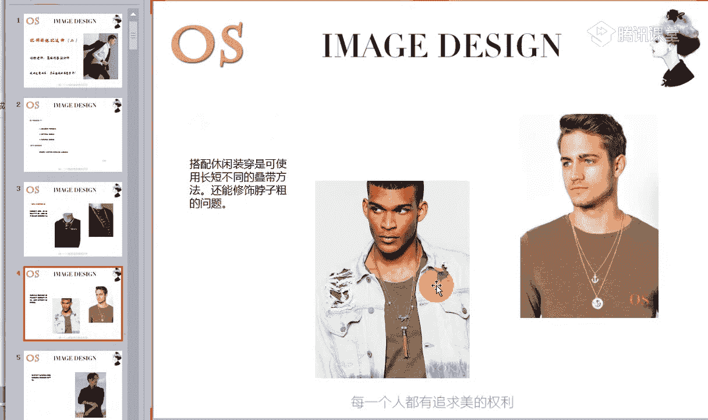
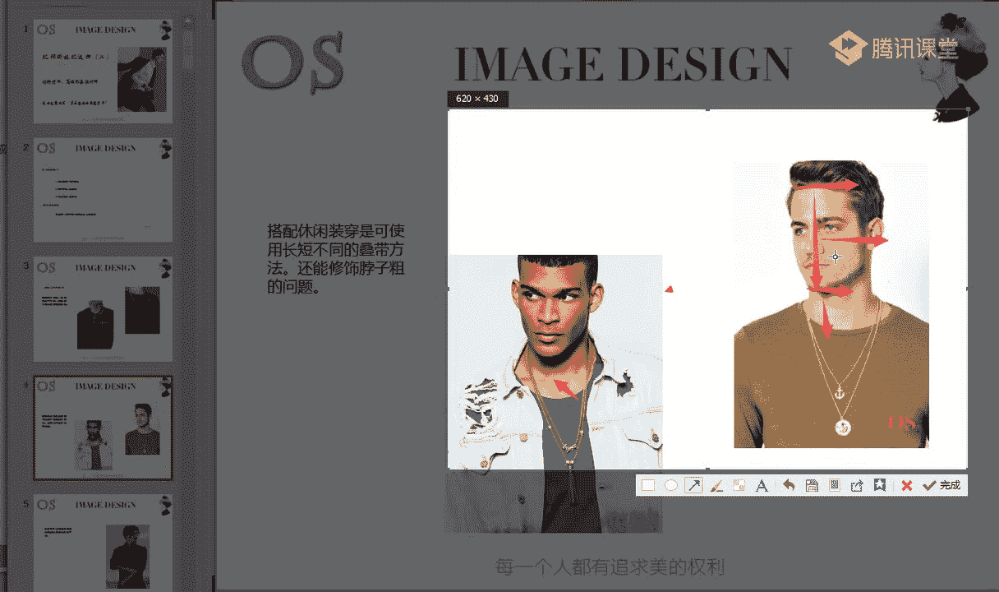
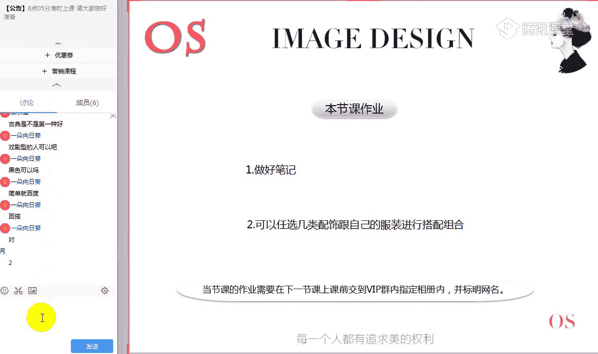

# 1、14男士个人形象班第二期（中级版）VIP课程：第9节、配饰的搭配技巧（二）

🎼好，大家晚上好，欢迎大家来到OS男士班的课程。我是本节课的主讲老师舒阳。🎼那今天呢我们继续学习我们的配饰片啊，上一节课呢我们学习了围巾、帽子、手表。那接下来呢老师考一考大家我们在场的同学。🎼好。

看到我们的图一的手表。🎼好，有同学的话呢可以快速来回答一下老师啊。图一的手表适合什么风格的男士来选择图一啊，图一的手表。🎼而我们的月月同学非常快速的跟老师回答了古典啊，非常非常棒。

证明我们上一节课这样的一个手表，对于各个风格的一个吸收，以及呢刻度上面大家都记得非常的清楚。我们月月同学。那其他同学如果是说我没有办法快速的来进行分辨的，记得课后的时间呢，多把笔记看一看啊。

有任何问题可以私底下来咨询老师。那我们第二个呢，第二第二个问题是什么呢？第二个问题就是我们图一的手表，大家觉得在什么样的一个场合适合在什么样的一个场合进行佩戴。🎼好。

第二个问题是图一的手表适合什么样的场合来进行佩戴？🎼谁。🎼还是。🎼啊，这个问题的话就关乎到我们的刻度问题了啊。🎼我们表盘的刻度问题，我不知道大家还有没有印象啊，我们都知道手表的话呢有无精刻刻度的。

对不对？精确的一个刻度的，也有我们这样的一个阿拉伯数字的，以及我们的古罗马数字的。那我要问一下这适不是属于我们无精确刻度的表盘，那它适合在什么样的一个场合佩戴，无精确刻度的手表，它能够去凸显什么。

所以说有这样的一个问题啊。哎我们一朵向日葵说到的职业场合啊，我们第一个问题就是问我们图一的手表，说到职业的非常棒啊。所以说图一的手表是可以在职业场合去进行佩戴的那第二个问。第三个问题呢。

就是我们可以看到图二的手表适合什么样的风格去进行选择。🎼好，第二个问题啊，这个问题可能不是单单一个风格啊。但是当然选择两个风格的话，其中有一个风格一定是有一个前提条件的。🎼捧着。

🎼图案的手表适合什么样风格的男士去进行选择。🎼最真心。🎼你企在这。🎼好，我们的一朵向日葵说到了自然风格啊，那还不可可不可以给到另外一个风格啊，另外一个风格他在什么样的场合去进行佩戴是可以的。🎼开不透。

🎼谁。🎼控需也觉实。🎼啊，这个问题可能会有一点点绕啊。但是我希望大家能够看到一个手表的时候，不要有一个局限性，不要有一个局限性。我们要多哎，我们要多去根据它的这样的一些细节，唉。

整体的视觉感受呢去做一些多的尝试啊。那有同学说到了古典啊，那我们要知道之前我们在讲古典风格，在佩戴手表的时候是说过，它最好是要佩戴我们的链条的，对不对？不适合去带一些皮质的。

🎼有同学说到阳光前卫啊的职业场合。其实呢像这一款手表，你会感觉到它整个的一个表盘的厚度，以及它的一个整体的轮廓度，对不对？是不是可以给到我们戏剧型，在休闲场合进行佩戴会更好呢。对啊。

所以说休前小同学说到了戏剧。是的。如果把它给到戏剧风格，在休闲场合去进行佩戴是更好的。因为阳光前卫啊，大家要知道阳光前卫是我们一个小风格，它不太适合带一些呃量感太过于大太过于成熟的。

其实它就算是在休闲场合中去表现这样的一个休闲感啊，它也适合去带。年轻化的呃，有这样的一个动感的。🎼啊，这个就是对于我们上一节课的知识呢，稍微的给大家啊做一个小小的测验。🎼那如果大家通过这样的一个小测验。

觉得自己哪方面有问题的话呢，希望大家再利用课后的时间及时去进行补充啊。那我们今天呢首先看到我们本节课学习的一个重点。第一个呢就是我们项链等配饰的一个选择。那第二个呢就是我们皮带的分类和选择。

第三个就是包包的分类和选择。本节课对于大家的一个要求呢，就是手指我们自己风格中所适合的这样的一些单品，以及呢我们在搭配上面也要注意的。🎼在讲我们第一个知识点的时候呢，我在这里要跟我们各位男士提醒一下。

我们的项链是有长度的一个选择的，对不对？唉，有长短。所以说呢我们在选择的时候呢，要根据自己的脖子的一个特殊情况来进行调整。那其实呢你的脖颈的长度，就是你面部长度的2分之1哦。我们如果是女士班学过的同学。

应该都是清楚的，对不对？🎼唉，怎么样看你的脖子到底是长还是短。

🎼我们是根据啊根据我们自己的面部的一个长度啊，你自己的面部长度呢是从你的发际线一直呢到你的哎下巴尖，是你的一个脸长，对不对？脸长。而我们正常的脖颈呢，男士里面其实也是一样的啊。

是我们等于是我们脸长的2分之1，也就是说唉从我们老师箭头的唉这个地方一直到我们的锁骨头啊，也就是我们图中可以看到这里。🎼见你陪。🎼哎，老师箭头的一个位置啊，从我们这样的一个跟颈部啊最起点。

也就是说你的头部跟你肩颈部衔接的一个地方，然后一直到我们鼠标啊，箭头的这样的一个位置，就是你脖子的一个长度。那我们正常的脖颈长度呢一定是等于你脸长的2分之1。

那这个时候可能有同学会发现我的颈部的长度可能长于我的脸长，对不对？当然在测量的时候，不要去把头抬起来啊，我们平视前方就可以了，那肯定测量的时候是需要有别人的一个帮助的。

🎼那如果说你的颈部长度长于你的脸长的话呢，证明啊长于你的脸部的2分之1要大于脸部2分之1的话呢，证明你的脖子的长度啊，就是偏长的那如果说你短于我们脸长的2分之1呢。

就证明你的脖子是偏短的偏短的那如果是刚刚好的话呢，那证明我们的脖子和我们的面部的这样的一个协调度是非常高的那我们在选择项链的长度上就不要有那么多的一些刻意性，对不对？在意性。所以说你的脖子偏短的话。

我们在选择项链的时候，尽量选择长一点的，选择长一点的啊，不要去选择比如说我们这样的一些颈链，对不对？十六的或者是十八的哎，或者是20的，我们可以去选择啊22甚至24都是可以的。

尽量选择长一点的那包括去戴我们这这些装饰性强的，我们就更加像脖子短的，我们就更加适合去戴这样的一些啊长条的一些装。

🎼是项链，对不对？这是我们这样的一个项链的长度啊，记住一定要注意的这样的一个点。那另外呢就是要跟大家说到的，就是搭配休闲装的时候呢，我们可以去进行这样的一个叠代的方法啊。

叠代的方法既能够增加你整个的这样的一个项链的层次，它还能够修饰你脖子粗的问题。因为像很多一些男士，如果脸比较小的。而我们的脖子比较粗的，你就会发现哎感觉在视觉上对不对？脸的宽度和你的脖子宽度是一致的。

其实我们势必还是要进行一下调节。那在我们整体上会更加的舒服。所以说呢也可以利用这样的一个叠代的方法来起到修饰的一个作用。🎼好，接下来呢我们就看到哦我们各个风格在饰品上的一个选择。

🎼我相相信通过前几节课的一个认知的话呢，大家对于各个风格啊，一些关键词都有了大概的这样的一个视觉印象，对不对？我们都知道戏剧风格整体给人的感觉，夸张大气摩登，对不对？哎，有这样的一个整体的一个都市感。

🎼成熟感。那包括我们在选择配饰的时候呢，不管你是选择项链也好，还是选择我们的戒指啊，我们的手链等等，其实都是一样的一个道理。哎，我们也要去选择一些醒目的，对，我们也要选择装饰感强的饰品。

这个时候你会发现它其实整体饰品上的感觉。就像我们在选择啊在上一节课在选择围巾呀等等啊，包括我们在选择鞋子上的这样的一个视觉感受是一致的啊，所以呢大家一定要记住啊。

我们可以看到我们来所看到的这些典型的一些代表，对不对？你是不是从这样的一些戒指也好，通过我们这样的一些啊项链手链，你都能够去感受到这样的一些成熟夸张大气，对不对？唉，包括的话呢我们是不是感觉饰品上面啊。

饰品上面是比较醒目的，而且呢特别的独特特别的独特，对不对？也同样是有这样的一个夸张。🎼的感觉有这样的一个夸张感。🎼啊，这个就是我们戏剧风格跟你自身呢所衔衔接的啊，所以你是什么样的一个风格。

你们一定要首先要记要清楚自己是什么样一个风格，然后呢对对应自己的风格来挑选合适的一个饰品。当你的服装选择符合你的风格了。当你的饰品再选择符合你的风格。那我们在搭配上面一定是不会容易出错的。🎼好。

记住老师说的这一句话啊，链条选择粗犷一点的，或者是吊坠呢，我们要选择摩登一点，夸张一点的吊坠啊，也是okK的。🎼第二个就说到我们另外一个偏大的风格，就是我们的自然风格啊，自然风格整体给人的感觉。

🎼我们之前有举了非常多的一些明星的例子，对不对？唉，整体感觉会感觉呢比较的亲切，长相上面比较亲切，比较的随意，对不对？唉，感觉五官上面呢相对来说有一定的柔和感，比较的随性哦，轻松不造作。

所以说我们在选择配饰上面其实也是一样的。它在选择围巾上面，我们再回顾一下哦，在选择围巾的时候，我们说过选择一些天然的质地，对不对？唉，天然造型简洁大方的舒适的这样的一些材质。

那整个围巾的感觉也是要往这个方面去靠的那包括我们在选择配饰的时候也是一样的。我们尽量选择一些造型上面简单的啊，不要有太多复杂的设计感，或者说太过于个性的这样的一些饰品，也是不太适合它的。

我们尽量呢可以稍微带有一点异国风情的饰品是可以的。也就是说多去帮他选。🎼选择一些天然质感的，或者是说唉主要以人工为主的哦，这样的一个感觉的材质会更适合它。它不适合比如说哎去凸显这样的一些机械化，对不对？

唉，过过量的去抛光，或者是展现过高的一些工艺感，这个都不是太适合它。所以说它适合去选择一些天然去雕饰的这样的一些配饰。🎼简简单单的一个银饰也好，还是说包括我们这样的一些羽毛状的，对不对？唉。

植物纹样的都是非常适合它的天然的感觉。哎，像我们这样的一些天然的皮革呀，或者编织的这样的一些呃编织的绳或者编织的我们这样的一些皮革都是可以的。包括我们可以看到戒指上的一些选择都是越简单越好。

这个就是他们两个，虽然都是偏大的风格，但是我们可以看到两者之间的一个非常大的一个区别。🎼好，我希望各位同学通过老师所找的这样的一些配饰，你一定要记住这样的一些感觉。

这就这也是为什么老师会找这么多的一些代表啊图片去给大家看，记住这种感觉啊，一定要记住。🎼而下一个就是我们的古典风格啊。古典风格呢可能很多同学都知道它是一个特别特别费钱的风格。为什么说它费钱？

是因为它对于品质，对于啊这样的一个材质要求是非常非常高的。那本身呢它长得就端正，对不对？唉，长的面部来说就比较的精致，对不对？整体来说是成熟严谨的感觉。所以说我们在选择配饰的时候呢。

同样要选择这样的一些精致，有高贵感的一个事物。但是呢因为它重点啊它的风格中的量感是居中的。也就是说它的量感是居中的。所以说虽然我们要选择精致啊，高贵感的这样的一个事物。

但是我们不是要去凸显它的雍容华贵啊，不是要去凸显它这样的一个啊像我们浪漫风格的这样的一个华贵感，它是属于啊去体现高贵感就OK了。另外的话呢，因为它本身我说到它的长相上是。🎼中规中矩的。

他不会说像自然型的人哦，五官上面在整个面部来说，它会有一点点的分散，或者是说也不会像我们戏剧风格长得那么的呃粗犷狂野，对不对？或者说像我们一些其他这样的一些小量感的一个风格，哎，长得整体的一个量感偏小。

比较精致，比较秀气，啊，它来说是一个居中的是一个居中的风格。所以说在选择配饰上面呢，我们也要去凸显这样的一个中规中矩。那同样的话唉大物事物的一个大小，我们也要去选择一些居中的啊。

所以呢选择矜贵的精致的啊，我们高贵感的这样的一个事物。🎼大小适中啊要大小适中。所以大家可以看到，哎，即使是戒指也好，还是我们的项链也好，唉，还是我们这样的一些手链。

我们都要以我们如果是它带有这样的一些图案的，对不对？如果是带有这样的一些方格方格子的那我们这样的一个方格子的排列，也是要有规则感的，不可能说唉一个大方格，然后我配上一个小方格。

然后啊一个大方格配上小方格，那绝对就不符合我们古典风格，对于配饰的这样的一个要求了。所以说我们可以看到它去跟自然风格也好，去跟我们的戏剧风格也好，它的一个对比，是不是它就显得要规则很多啊。

而且的话大小是适中的。同样的话有这样的一个精致的感觉。🎼好，第四个风格呢，我们说到浪漫风格啊，浪漫风格呢，它的本身浪漫风格的人，比如说像我们的冯绍峰，对不对？

也是我们浪漫风格的那长相上面相对来说是柔和的哦，而不是那么的硬朗，不是那么的硬朗，眼神呢是比较柔和的，而且的话呢他属于我们这样的一个华丽华贵的风格，对不对？他在穿服装的时候。

在戴佩戴围巾的时候都要选择这样的一些成熟华丽性感大气的哦，夸张的那同样的他在选择配饰的时候，我们也要多去选择这样的一些有华丽感的哦，夸张的这样的一些饰物。所以说这个时候这样的一个风格。

我们就要凸显华丽了。而且你也会发现他的配饰的话会更趋向于我们这样的一个中性化，对不对？会更趋向于中性化。没有错啊。🎼所以说他在佩戴我们的项链啊，手链也好，我们都要去选择这样的一些有华贵感的。🎼同样。

🎼事物上面带有一点中性是没有任何问题的。🎼而且像我们这样的一些配饰品牌的话，也有很多是呃符合我们浪漫风格的。不同的配饰品牌，它一定会针对于不同的人群设计出不同的一个款式啊。🎼我在失。🎼有。🎼好。

接下来我们说到这样的一个小量感的风格。第一个呢是我们的新锐前卫风格哦，典型的代表，比如说像陈冠希啊长相上面呢五官线条非常的清晰，对不对？哎，分明。那整个的五官立体度也是非常的高。

但是呢整个来说是一个小骨架。所以说我们在选择配饰上面呢，你会发现这样的一个人，因为他长得比较的年轻啊，锐利有个性，对不对？比较偏时尚化。所以说我们在选择配饰上也要去选择跟他的性格。

跟他的长相所符合的这样的一个标新立异的配饰。那像这样的一些造型怪异的时尚感强的一些饰品都是非常适合他们的。🎼好，就像我们可以看到，其实这个呃老师不太记得，我好像这个好像也是我们酷奇还是哪个品牌的。

我们可以看到戒指，其实它也是针对于我们根据不同的这样的一个风格来进行调整，对不对？🎼那整体的话呢都是要往这样的一个个性啊，个性造型怪一点。没关系，但是要整体有趋向这样一个时尚化。

当然哦它也不适合去选择一些太过于粗犷的。大家可以看到同样一款配饰，同样的一个款式，对不对？哎，我们这个就要整体来说量感要偏大。所以说同样是一款配饰，这一款更适合我们的戏剧风格。

但我们如果说前卫风格要选择这一款的话，我们就要选择稍微的小一点的，精致一点的，对不对？量感小一点的这样一个配饰。好，第二个小风格呢就是我们的阳光前卫风格啊，它长相上面要相对于我们的新锐前卫风格来说，哎。

趋向于柔和一点啊，没有那么的。🎼标新立异哦，没有那么的标新立异，他也是同样是年轻的个性的调皮的时尚的。就像一个大男孩。所以说我们在选择配饰上面呢，我们也同样要去遵循这样的一个造型时尚，独出心裁的饰品。

但是只是说我们的锐利程度就要降低了啊，锐利程度要降低。虽然说整体的大小的一个量感厚重，对不对？我们都要偏薄偏小去进行选择。但是我们不用像我们这样的一个新锐前卫风格，这么的锐锐利啊。

就是有这样的一个尖锐感。那么我们整体在选择配饰上面还是要凸显这样的一些可爱的，对不对？有趣的啊，同同样的我们要稍微偏向于柔和一点。这个就是我们这两个风格的一个区别。

我希望大家千万要把这两个风格在选择配饰上面的一个区别理解透啊。我们其实可以通过老师给大家所展示的这样的一个图片，应该我们很多同学能够。🎼去分清楚他们两者之间在选择配饰上面的一些共同点和不同点。

能够理解的同学跟老师快速扣个一。🎼好，能不能理解啊？如果说对于我们的新锐前卫风格和阳光前卫风格，在选择配饰上面，它的共同点和不同点，还有不理解的同学可以快速跟老师呢在公台上扣个2，然后把问题提出来哦。

好，我们薰衣草同学有疑问哦。然后老师再次的讲讲一遍哦。🎼好，第一个呢，我们举两个典型的代表，对不对？一个是陈冠希，一个是我们的何炅。那陈冠希呢是我们的新锐前卫风格。

那我们从他的长相上面跟我们阳光前卫风格的何炅呢？在长相上面我们进行这样的一个区别。第一个是不是会发现他们两个人的骨架都是偏小的，对不对？都是小的骨架，那五官上面呢同样都是有一定的立体度。

但是你会发现陈冠希在整体视觉上给你的感受，他会酷酷的，有这种冷酷感。而我们的何炅的话，他在长相上面是不是比他没有他这么的冷酷，对不对？哎，没有他这样的一个有距离感。

他更更趋向于这样的一个柔和柔和的大男孩的一个形象。这个点大家能够理解不？就是我们长相上面的。🎼所以说因为他们有共通点，是我们这样的一个骨架都偏小，对不对？量感都偏小。所以我们在选择配饰上面呢。

都是要选择一些相对来说量感偏小的这样的一些事物。所以说像我们的前卫风格，它就不能够去佩戴，像我们戏剧风格，这样的一些粗犷的，对不对？粗的链条哎，过于的夸张厚重的链条，这个是不太适合它的。

包括戒指也是一样的那但是呢我们两个风格来说，共同点就是我们要选择相对来说量感，对不对？就是也就是说面积哦重和轻，我们要选择这样的一些量感偏小的偏细致化的那第二个不同点就是我们的新锐前卫风格，老师说到了。

它长相上面是有距离感的它是酷酷的有这样的一个距离感哦，所以说我们在选择配饰上面也要去缔造这样的一个锐利的感觉，尖锐的感觉。🎼哦，有距离的时尚的个性的标新立异的这样的一个视觉感受啊，这样的一些配饰。

但是我们前卫风格的话，虽然说哦阳光前卫风格也是属于前卫风格也是属于量感小。但是我们在选择配饰的时候呢，像相对来说柔和一点，相对来说要柔和一点。我们可以看到，通过老师给大家看的这样的一些链条，对不对？

小链子手链啊，还有包括我们的一些小项链也好，这样的一些小手链也好，其实它是有一定的差别的。🎼所以说我们来看这条项链，它啊到底是适合我们的新锐前卫风格，还是适合我们的阳光前卫风格呢？就看它的锐利的程度啊。

能不能给你带来冷酷哦，这样的一个感觉，酷酷的对不对？标新立异的，还是说给你带来感觉，是我们可爱的时尚的。唉，有这样的一个调皮年轻化的这样的一个视觉感受。🎼好，能理解了，是不是啊？

我们其他如果有同学还不能够理解的呢，到时候可以也可以课后呢来咨询老师啊。好，这个呢就是我们这样的一个配饰。那在这里呢大家要记住啊，包括男生如果有男生是喜欢戴耳钉的话。

你们戴耳选择耳钉同样的一样的一个道理啊，就是跟你在选择项链，选择手链。🎼相同的这样的一个概念。那另外就是我们各位男生，如果说在选择T恤的时候啊，平时我们可能除了我们这样的一个时尚场合啊，职业场合。

职业场合，我们可能呢会穿到一些衬衫，对不对？那在休闲场合中，不管你是夏季在单穿我们这样的一个T恤也好，还是我们的秋冬季节可能会用T恤配我们的夹克也好，我希望各位同学把我们的这样的一些小项链呢哦，用起来。

因为你会发现去掉这一个项链和加上这样的项链，整体的搭配的一个时尚度是不一样的。所以说像这样的一些配饰，它一定能够增加你整体的品质感哦，我们都说过唉配饰在整体搭配中是起到画龙点睛的一个作用的。

你服装穿的非常适合自己了。你会发现整个有一些男生如果说不喜欢戴包包的，对不对？唉，也不喜欢戴这样的一些帽子啊等等的那我们会发现整身中没有太多的一个亮点。但如果说你加上这样的一个配饰的时候。

🎼它其实就是起到了非常好的一个画龙点睛的一个作用，给你的整身服饰中增加这样的一个小亮点，来，增加你的整体的一个品质感。🎼好，第二个知识我们就来讲到我们皮带的搭配和选择啊。

在这里呢我会重点跟大家说到我们的皮质的这样一个皮带。哦，在古代的话呢，男人的腰带以及我们腰带上的这样的一个挂物，是我们身份阶级的一个象征。而我们现代人在用皮带的时候呢，除了他的一个实用功能外呢。

也是我们男人必备的装饰物件啊，非常强的一个装饰物件，包括大家可以看一下，是不是在我们这位男星整身搭配中，其实他这样的一个皮皮带，对不对？给他增分了不少，我们可以想象一下。

如果说没有这样的一个皮带的一个点缀，其实他整身中没有太多的一个亮点，是不是因为他这样的一个皮带的一个点缀。第一个强调了一个细节的上的一个亮点。第二个呢也是跟他的另外一边的一个长一点的衣服形成了一个呼应。

对不对？而且的话呢也更加能够增加他整。深色彩上面的一个层次感，本身它只有两个颜色，一个白色，一个我们这样的一个呃藏蓝色，对不对？两个颜色而已。但是因为这样的一个配饰小的一个配饰。

所以说它的色彩上的一个层次感更加的生动了。🎼这个就是我们这样的一个配饰啊，皮带上的一个配饰，它所起到的一个非常大的一个作用啊，一定要纯金银的嘛？不一定啊不一定啊，包括我们我可以跟大家说到。

像我们这样的一款项链，之前呢我们有男生问到这是什么品牌，对不对啊？我们是这样的，这是日本的一个高桥的一个项链，它就它就全部都是纯银的纯银的，或者是说它也有一些金呢，但是它好像不是纯金的一个合成哦。

这个就是纯手工的。所以说其实在佩戴项链的时候，不一定要纯金银的，但是你要根据你自己的一个风格来定，就像我们有的风格。如果像我们自然风格的，我如果去选择这样的一些呃小皮绳，对不对？

搭配我们这样的一个项一个扣子的，可能它不一定是金也不是银，可能是一些其他的材质，我们自然风格也能够去进行选择，同样的话呢，不会说显得我们很low。但是如果说你是古典风格的，你去选择一些啊这样的。

🎼些不太纯正的一些材质，或者是说这样的一个材质的工艺性不强的话，它就会给你带来。🎼不好的一个视觉感受。所以说不一定都要纯经营的那如果说你像古典风格，你也可以选择不是纯经营的。

但是你一定要在工艺上面去取胜。你要在整个的一个品质细致化上面哦，要达到这样的一个要求。🎼好，我们来接着来讲到这样的一个腰带哦。那呃我们皮带呢作为皮制品的一个典型之作啊，那材料由我们这样的一些呃猪皮的。

对不对？唉，葛的呀，羊呃牛皮的呀，羊皮的呀，鳄鱼皮的等等都有。还有包括呢我们有一些男生可能非常喜欢去选择一些帆布材质的纤维材质的，也是O的。但是呢像我们的帆布和纤维的话呢。

更适合去搭配一些休闲款式的服装，比如说你跟你的牛仔裤做搭配，对不对？哎，T恤配牛仔裤，你选择一个帆布材质的ok没有任何问题。但是如果是说哎你去跟一些相对来说稳重一点的哦，整体的设计上面呢。

唉趋向于中规中矩，类似于我们可以看到这张图片啊，这也是我们今年2018年春夏时装都周的一个袖啊。🎼大家可以看到，那如果说我们去跟一些稍微精致一点的服装的时候呢，我就希望大家尽量去选择皮质的啊。

皮质的腰带会更好，更适合我们。🎼好，而且的话呢为什么说我们要多去选择腰带呢？因为除了老师刚才举的这样的一个例子，对不对？那还有就是包括像我们的传统西装啊，皮带来说，也是在中间起到了点睛的一个支笔。

包括我们如果各位男士在选择哦我们正装的时候，请一定要跟你的黑色皮带做搭配哦，不要去挑选一些其他的颜色了。比如说像棕色呀，或者说这样的一些浅灰色啊等等，我们最好是黑色的皮带跟我们这样的一个正装哦。

正式场合中尽量选择黑色皮带。因为我们的鞋子也一定是选择黑色的皮鞋的，对不对？所以说腰带和皮鞋之间呢可以形成这样的一个呼应。🎼这第一个。那第二个呢就是我们还要注意的就是我们这样的一个关于logo的。啊。

正装的时候我说过要跟我们的黑色腰带做搭配那同样再选择跟正装的服装做搭配的皮带的话呢，你也尽量给我选择这样的一些呃无明显logo的这样的一些穿孔啊。也就是说我们打眼扣的这样的一些扣子是最好的。

🎼那为什么说让大家去选择没有明显logo的呢？你就像我们的腰带哦，比如说有一些同学舍得了我们一根皮带好的三四千块钱，对不对？那像这样的一些三四千块钱的皮带的话，比如说像酷c奇啊。

还有包括像我们的爱马仕啊，对不对？等等。他们都有去推出这样的一个皮带。那他们在推出皮带的时候呢，大多都会以他们。🎼品牌的logo为我们这样的一个皮带扣。那我们也可以看到，通过这两张图片去进行对比。

你有没有会发现，如果我们去选择这样的一些有logo设计的皮带扣和选择这样的一些啊打眼扣式的，对不对？四四方方的最简单的这样的一些扣子。🎼啊，logo就是品牌的一个标志啊。比如说你可以看到这根皮带。

你很快可以进行分辨，是不是cci的，对不对？还有包括我们LLV的，对不对？它的腰带扣就是1个LV。这个能理解吗？我们可以看到拿两根皮带啊，两个男士的一个形象去做对比。

你是不是会发现其实这一这一张照片整体的感觉其实很容易受他这样的一个皮带扣的一个影响，对不对？会受他这样一个皮带扣的影响，而且的话呢也很难去凸显整体这位男士的一个品质感。但是我们可以看到图案。

如果我们选择这样的一个简单的打眼扣的话，其实更能够去凸显我们男士低调的这样的一个品质。🎼好，所以说啊如果说各位啊各位。🎼舍得的，因为男士皮带确确实实很重要。

如果你舍得去选购这样的一些好品牌的大品牌的那我也尽量选择不要去有这样的一个logo的。其实你像我们的芬底也好，还有包括我们的forma也好，他们尤其是formo这个品牌的话呢。

它是以这样的一个皮具出家的。所以说它的它的鞋做的很好，它的这样的一些皮具也做的还不错。那我们也可以选择还有包括像我们DV哦简简写，这个也是我们DV的这样的品牌，那其实很低调。

但是一旦明白的人一看就知道它是一个什么样的一个品牌。所以说大家如果说追求这样的一些品牌的，我们尽量呢还是低调为主，我们可以去选择类似于像这个forgama的，对不对？我通过这样的一个简单的皮带扣。

我还是能够看出它是什么样一个品牌。那包括我通过啊这样的一个。🎼典型的一个小羊皮的一个拼接，对不对？边皮，这也是我们这样的一个品牌的一个标志。我们都去选择这样的一些打眼扣。

更适合不要去选择有明显logo的，包括像啊我们的爱马仕啊、LV啊、酷奇啊等等。🎼这样的话更显质感啊。那包括我们跟正式西装的话，就更要遵循这样的一个原理了啊。跟正式西装做搭配的时候，更要遵循这样一个纹理。

那第二个呢就是我们在选择皮带的时候呢，颜色啊要跟我们的皮鞋的花色呢保持一致，这会形成这样的一个呼应啊，会形成一个呼应。🎼呃，第二种自然可以吗？哪种？🎼哦，就是这一种对不对？没有问题啊，完完全全是可以的。

自然风格是可以的，非常适合。🎼好，我们接着来讲到哦讲到休闲装。那休闲装呢在选择皮带上面同样的一样的一个道理。我还是不建议大家去选择这样的一些有明显logo的。但是呢呃怎么说呢？

我们在挑选logo的时候呢，可以根据自己的服装来定啊。如果是说你刚好别人送了，或者是说唉我就想买一根这样的一些有logo的来搭配我这样的一个休闲装，对不对？也可以。

但是我希望你们在选择这样的一些logo比较明显的皮带的时候，尽量整体服装上面呢简洁一点啊，不然的话，你可以看到，如果说你的领带，对不对？加上领带的这样的一个装饰啊，加之领带上面还有一些小的细节。

其实就会显显得非常的乱啊，会显得非常的乱。🎼呃，戏剧风格的话呢稍微弱了一点点啊，戏剧风格稍微弱了一点。🎼呃，古典风格的话呢，我们可以再严谨一点，可以再再严谨一点。像我们图一的话哦，可以再严谨一点。

会更好再精致一点。🎼好，回到这样的一个话题啊，回到我们的休闲。那其实我还是建议大家，不管你是选择像我们有一些男士可能有很多颜色的皮带，对不对？我有黑色的，我有棕色的，唉。

我有这样的一些蓝色灰色系的那我们在选择休闲装做搭配的时候，用皮带来搭配的时候，我们可以多去选择棕色，对不对？百搭。🎼棕色款的皮带的话，不管你是深棕浅棕浅棕来说，它都是一个百搭的款式。

它可以跟我们任意的一个休闲装去做搭配。那还有呢，其实如果大家觉得啊我们的棕色没有太多的一些创意。如果说我想在色彩上面进行一些变化，对不对？我们也可以去选择蓝色的哦，也同样可以去选择这样的一些蓝色的皮带。

那除了蓝色的皮带以外呢，我们还可以去选择灰色，像今年啊201现在是在正好是我们的老师突然不记得是米兰时装周，还是哪哪个时装周，2018年的春夏时装秀，对不对？我会发现在秀场上很多一些品牌。

都有去推出这样的一些呃中性调的。比如说呃乳白色，比如说我们的这样的一些深灰色，大家可以看到这张也是从那里面哦找的图深的灰色，以及像我们这样的一些浅灰色都有。

那如果各位男士你想唉更加的去符合我们这样一个流行趋势的话，我们也可以去选择灰色的这样的一个腰带。也非常非常棒。呃，戏剧型的人可以黑色黑色是你说的是在休闲场合去选择吗？休闲场合当然也可以去选择黑色哦。

没有任何问题。🎼啊，大家可以看到老师所推荐的这样的一些各个色系的皮带，你会发现它的扣子，它的皮带扣都是我们这样的一个打眼扣，对不对？非常简单简洁的这样的一些简单简洁的。所以说简单的东西就是最经典的。

我希望大家多去选择这样的一个扣子。而我们在生活中很多一些男士可能会选择我们这样的一些暗扣，对不对？哎唉，暗扣啊等等啊，像我们这样的一些滑扣啊，这个都其实不太好，尤其是这样的一些大方头的。

我相信很多同学包括我们在场的一些女性，估计你们老公之前的话，也可能买过这样的一些大方头的，对不对？唉，整个来说是平呃就是有很多设计感的这样的一个方头，那其实都不太适合我们选择最简单的是最好的。

而且最经典，而且也非常的百搭。🎼是的哦，简单就是百搭。好，这个就是我们的颜色上的选择。基本上的话呢我们注意了。各位男士呢可以去选择腰带的颜色，跟我们的鞋子颜色一致啊，可以去选择一致。

那还有呢就是我们多去选择老师刚才所说到的这样的一些色系、黑色呀、棕色呀，唉，像我们这样的一些蓝色啊，灰色系。包括如果说比如说你在穿这样的一些蓝色衬衫的时候，你就可以去选择这样的一些蓝色的腰带，对不对？

唉，选择蓝色的腰带。而且的话我们可以看到当我们的腰带跟我们的鞋子一致的时候，其实在色彩里面它就是起到一个很好的一个呼应的作用。🎼啊，这个就是我们这样的一个腰带上面要注意的啊，以及在搭配上面呢。

我们可以所采用的一些小技巧。啊。第三个呢就是我们包的一个搭配和选择。首先呢我们说到双肩包啊，我相信呃在场的有一部分同学可能还蛮喜欢选择双肩包的，因为它非常的实用。而且的话呢唉它装的也很多。

它同样也比较的好搭配功能非常的强。而且现在的一个双肩包设计起来的话，你会发现它其实把功能性和我们这样的一个时尚性呢融为了一体啊，包括我们今年的时装周上面对不对？对于下一季的一些预告。

你也会发现像推出这样的一些双肩包非常非常的多啊。男士的双肩包。那我们在选择双肩包的时候呢，其实跟于跟我们在选择场合和服装搭配上面它也是相关的。也就是说为什么说有些男士非常好奇说。

唉女生为什么那么喜欢的买包。因为。🎼不是一个包，它可以用任何的场合，不是一个包可以配任何的服装，对不对？所以说我们要根据我们这样的一个服装，根据我们的场合来进行包的一个组合。那像我们的双肩包的话呢。

它同样也是分场合的对它同样也是分场合的。所以各位男士啊，如果你们现在老师我就一个双肩包，反正我上班也背它，哎，我出去约会也背它，我出去呢呃跟朋友K歌啊等等，我也是背一个这样的一个双肩包。

那绝对是不对的啊，绝对是不对的。所以说不要怕麻烦，不要去怕浪费钱。因为我们整体。🎼形象的一个凸显是非常多的一些细节上的一个组合。🎼那第一个就是我们职场的一个双肩包啊。

如果说有各位男士在你喜欢用双肩包的那在职业场合中，我们在挑选双肩包的时候，其实跟我们职场上的一个形象是一致的。我相信大家现在应该还记得不同的场合的一个着装，对不对？对于不同的场合场合。

我们在选择服装的时候，是不是要凸显这样的一个严谨，是不是要凸显正式度。那同样包包的设计上面，我们也要去展现这样的一个严谨和正式。所以说像我们可以看到图中这样的一些适合职业场合所选择的双肩包啊。

当然在这里我要重点强调一下职业场合，我只是指一般的职业场合，我不会指我们的正式的严肃职业场合，正式严肃职业的场合绝对是不可以出现双肩包的。因为双肩包它还是带有休闲感的。所以说正式职业场合中啊。

如果说你今天穿着西装革履的，你要跟别人谈判的话，我不希望出现这样的一个双肩包哦，不希望出现双肩包。除非说你是有很多资料要放，但是你也别背在身上，对不对？我们可以手提着。🎼好，这是我们的职业双肩包。

也要凸显这样的一个中规中矩正式感职业化。所以说你可以看到整个设计来说，是不是它不会说像我们的休闲场合啊，适合的这样的一些呃前卫休闲场合所适合的这样的一些双肩包，它会有很多的一些设计。

它整体来说包包是非常立体的，同样是平整的，对不对啊，干净整洁，非常的这样的一个严肃啊。相对来说我们其他的一个双肩包来说，它能够体现这样的一个严谨感。

🎼所以大家在选择职业上面去佩戴的背的这样的一个双肩包的话，我们都要去挑选。🎼非常简单简洁规矩的双肩包。🎼我是把世机都又画上。🎼那休闲场合的双肩包呢，这个时候我们就可以呃包型上面也好，还是图案上面也好。

对不对？我们就可以有一些抽象的图案呀。哎包括呢我们有非常多的这样的一些口袋呀，以及呢明兜明线的这样的一些设计都是可以的，对不对？就像我们在挑选衬衫的时候，一样的一个道理。休闲的衬衫，我们可以有明兜。

可以有明线，对不对？同样的话呢，图案上我们可以非常的丰富。那同样的一个道理。在选择我们休闲场合中所适合佩戴的双肩包的时候呢，我们也同样遵循这样的一个道理啊，同样遵循这样一个道理。

选择这样的一些有多的一些设计的。🎼好，运动场合的双肩包就像我们途中类似于这一种哦，能非常非常能装，而且的话呢它会凸显这样的一个运动感，它会凸显这样的一个运动感。这个就话不做多的一个强调了。

我相信很多同学都能够快速分辨的。因为像我们休闲场合的双肩包，它一定是没有那么能装的，对不对？它只是放一些平常的一些小物件。那我们运动场合的双肩包，你会发现它功能性非常非常的强。比如说唉装水的口袋呀。

还有包括唉像我们去唉放一些什么垫子啊等等的。所以说这是一个功能性非常强的，适合我们爬山呀等等去背的，都是运动场合的一个双肩包。🎼好，在这里呢我要强调一个点，就是我们我说过有很多一些一般职业场合。

尤其像我们的程序员，对不对？喜欢背电脑啊等等的，我们可能都会有一个类似于这样的一个包啊，像我们上学时候背的这样的一个小书包，对不对？那其实大家可以看到，是不是会发现它在整体来说更趋向于这样的一个休闲。

更趋向于休闲，不符合我们在职业场合中所表达的一个形象，而且的话呢因为包包不够精致。我们男士在职业场合中还是要去凸显它精致的一个形象。那包包括我们在选择包的时候，在职业场合中，我希望即使你是一名程序员。

即使说你有很多的一些材料要背，你有电脑要背，我们也尽量选择我们途右啊，类似于这一种简单简洁大方的款式，精致的款式。我们比如说我们可以背这一款嘛，同样它会有电脑的一个隔层，对不对？还还而且的话它可以放。

🎼非常多的这样的一些文件啊等等，都是不会有影响的。但是我们可以看到整体包的外观上面就要比我们类似于这样的一个外观要精致很多。不一定说它比我们这一款包装的少，说不定他们装的是一样的。

但是我们为什么不去在外观上进行一些改变呢？🎼好，这个就是我们这样的一个双肩包，所以说双肩包挑的精致挑的好了。其实我们会发现男生背这样的一个双肩包也是非常非常帅气的啊，非常好看的。🎼好。

第二个就是我们的单肩包啊，单肩包的话呢跟我们的双肩包是一样的，它的种类也非常多。同样的话呢可以正式可以休闲，也是很多男士包包款式的一个首选。简单简洁呢，我们用于职业场合。

那如果说有一些装饰细节多变的话呢，有颜色的图案，我们就可以用用在休闲场合。比如说在职业场合中，我们就去佩戴这样的一些简洁的款式哦，皮质上面呢挺硬挺一点的，硬挺一点的皮质。🎼硬挺的皮质。

然后简单的这样的一个暗扣，对不对？简单的按扣。🎼那同样我们也可以看到，像这类型，如果皮质稍微软一点的，对不对？唉，加上这样的一些格纹的一些设计的，或者是说它的包带上面有一些不同的话呢。

一般在一般的职业场合中，我们各位男士也可以去选择一般的职业场合啊，不属于严肃职业场合的，我们也可以去选择我们可以看到整个来说跟我们刚才这两款去做对比，它的休闲度就要高一点，对不对？

所以说可以用于我们的一般职业场合。像这两款包，包括像我们这这两款都是可以的。但是如果说你是严肃的职业场合的话，我们尽量要配硬挺的啊，硬挺的皮质厚重的一点的皮质。然后呢四四方方的中规中矩的啊。

简洁大方的一个暗扣。🎼或者就是没有暗扣啊，没有这样的一个名暗扣是最好的。像我们图中这一款。🎼长大。🎼好，那休闲场合中呢我们就可以变化多多了啊，可以根据自己的量感，对不对？你的量感是小的。

我们就可以选择稍微小一点的那你的量感大的呢，我们就可以选择大一点的。如果说你是趋向于这样的一些像我们自然风格，哎，它本身长相上面就柔和一点。我们在选择包上面呢，也可以更趋向于这样的一个休闲化，对不对？

唉，包括你如果说是前卫风格的，我们是不是可以选择在包上面唉有这样的一些铆钉设计的啊，像这一款就是有铆钉设计的，我们能o的品牌。🎼也是我们。🎼呃，下一年的最新款。🎼像这样的一些有铆钉设计的，就会个性一点。

对不对？唉，前卫一点，这也是有铆钉的。所以说可以根据自己的风格的一些特征来挑选自己在休闲场合中选择包包的以上的一些特点。🎼可以根据自己的呃我们所说到的这样的一些围巾啊，哦。

包括我们刚才所说到的配饰这样的一些视觉感受上去跟你。🎼跟你自身来做选择。像我们这一款包，是不是我们的星锐呃，我们的前呃阳光前卫风格，对不对？是不是可以去选择？其实就是这样的一个道理啊。🎼就。🎼啊。

我们运动休闲场合的单肩包呢就是如图中，对不对？这样的。🎼哦，我们相信经常健身的同学啊，健身房所发的这样的一些包就也是典型的啊，手提包、单肩包都是典型的。我们这样的一个运动场合所适合的啊。

🎼多选用这样的一些帆布的材质。🎼第三个呢就是我们的手提包哦，手提包呢也是我们潮男们必备的一个单品，适用非常的广泛。正式场合中我们这样的一个首选。也就是说，如果我是属于正式的职业场合，比如说我是律师。

对不对？哎，我是我的，比如说我是国家的一个公务员，我们上班都是有制服的那像这都是属于正式的职业场合。那如果你要选择包的话呢，请你以我们的手提款为标准啊。

这是我们正式场合中的一个首选款颜色呢也请以黑色为主。那一般场合中呢，我们的颜色就可以丰富一点。职业场合，我们在选择手提的时候呢，一定要选择做工精致材质硬挺的。

就像跟老师刚才所说到的一个单肩包是一样的一个道理啊。而我们在职业场合啊，正式的严肃职业场合中，同样也要选择这样的一些呃。🎼做工精致的材质硬挺的，只是说严肃职业场合中，我们以黑色为主。那一般的职业场合呢。

我们可以去选择一些棕色系啊，甚至的话呢有同学选喜欢这样的一些藏蓝色啊等等，都是OK的。🎼休闲场合呢，我们的包的色彩上面哦可以丰富起来。那同样的材质的一个软度啊。

我们就可以去选择这样的一些相对来说柔软一点的呃，不要选择过于硬挺的。不像我们的职业场合中啊，去选择一些硬挺的材质，挺括的一些材质。那在休闲场合中呢，我们可以去选择相对来说柔软的。

比如说像一些麂皮材质啊哦，麂皮啊等等。🎼个家。🎼好，在这里我要强调一个啊，就是我们如果说根据我们的风格，在选择包的时候呢，呃还是一样的。如果你是休闲场合，用用手提包的话。

古典型你还是要选择这样的一些相对来说在视觉上硬挺一点的啊，还是要选的。因为你要带来这样的一个颜跟你的整体形象来说趋向于质感这样的一个包。那包括我们的前卫风格的话呢，你可以通过色彩来体现你的锐利感啊。

比如说我们纯度高的颜色，它其实就能够带来视觉的一个冲击力，对不对？就能够形成这样的一个尖锐度。所以说像前卫风格，我们也可以通过色彩上的这样的一个纯度来提升你的锐利度啊，比如说新锐前卫风格。

那包括我们的自然风格啊，像我们一些其他风格，包括像我们的浪漫风格，也可以通过我们包的华丽，对不对？去选择这样的一些能够凸显华贵感啊，华丽感的。🎼这样的一些包，带有一些中性化的包都是非常适合的。🎼好。

第四个就是我们的手拿包。说到手拿包，可能很多男生啊从来没有想过，对不对？啊？或者是我们其实现在的话手拿包的一个用用率也比越来越广泛了。很多男士的话也蛮喜欢用的那其实呢生活节奏的一个改变啊。

我们其实像男生有手机对不对？有我们的钥匙、车钥匙啊，钱包啊等等，加起来很多。以前我们可能放到裤兜里面。但是如果说像夏天呢或者说我们的衣服口袋钱的话，也会担心掉或者说不方便。那这个时候你又不想背一个包。

你觉得不管是手提包也好还是单肩包也好，太麻烦了，我又怕自己丢，对不对？那这个时候呢，其实我们也可以去准备一个手拿包啊，因为它非常的方便，他可以把你的东西都会归纳到一起。那同样的话呢。

在这里我写到了一个重点，就是我发现有很多男士在生活中为了方便的，会把这样的一些车钥匙啊，和我们的。🎼家门钥匙挂在一起，然后挂在一起呢，为了防止丢就挂在自己的裤子啊，裤带上面，对不对？哎，裤子裤扣上面。

🎼但是其实我要跟大家说，这是非常影响你的整体形象的。你哪怕抓在手里，也要比你放到你的裤扣呃这样的一个裤子扣子上面呢要好很多。所以说如果你喜欢哎挂在我们的裤子上面的话呢，你不妨去准备一个手拿包，对不对？

如果怕丢的话呢，像我们很多手拿包，它是有这样的一个小袋子的，看到没有？我们途中黑色的一个部分，其实有个小袋子，你也可以把它挽在手上，这个时候呢你就方便很多了，你也不会哎忘记啊或者是怎么样，对不对？

那如果说在办公室忘记了，它也一定是在办公室不会说随意的去丢。🎼啊，这是我们这样的一个重点啊。那另外的话呢，职业场合中我们也可以去选择手拿包啊。如果说你只是单纯的要放一些手机啊，或者说ipad啊等等的。

我们就可以去准备一个这样的一个手拿包，我们有太多的一些文件啊，或者说大型的一个电脑，对不对？我们可以去选择职业场合的一个手拿包。那同样的话呢职业场合的手拿包，我们也要选择精致一点的硬挺一点的皮革，唉。

像我们图简单简洁的款式，硬挺一点的皮革那休闲服装的话呢，我们可以任意去选择图案和色彩去进行做搭配。比如说在休闲场合我可以选择帆布的，对不对？像这样的一些帆布材质的，或者是说唉条纹哪等等啊。

或者是说呢我们也可以去选择一些非常有工艺感的这样的一些皮质。🎼那还有呢在这里要重点强调一下，不要觉得手拿包非常的娘啊，是我们女生的一个专利。那其实现在越来越多的一些型男的话呢，因为为了方便啊。

都会去必备这样的一个手拿包，是不是非常非常的方便。而且的话呢也能够对于你整体的一个形象啊，来体现这样的一个层次和时尚。🎼还有还有就是老师要跟大家总结一下，在讲到包包的时候呢。

我没有以我们每个风格在选择包包上面的一些要求来重点举例。但是呢我希望通过刚才呃上一节课，还有包括我们在讲到配饰的时候啊等等。我希望大家能够对于每一个风格在选择包包上面的一些重点要求啊，能够去进行理解啊。

有没有不理解的。如果不理解的话呢，老师就就每一个风格，在选择包上面的一个特征跟大家呢详细的来介绍一下。如果大家都能够去理解每一个风格在选择包上面的一些要求的话呢，可以快速跟老师扣个一。🎼啊。

如果说呃需要老师啊就每一个风格来跟大家总结一下的话呢，你们也可以在公台上扣个2啊。有没有哦，有没有同学？🎼好，那我就快速的跟大家来讲解一下哦。那我不不用再老师再重复每一个风格长相上面的一些特征，对不对？

那其实呢像我们戏剧风格，如果你要选择包的话，你可以根据鞋子上的要求去做选择啊，每一个风格都是一样的。我相信大家对于老师之前在介绍正装片的第二篇的时候，我有跟大家说到这样的一个单品，就是鞋子，对不对？

我说到鞋子，我就在本堂课上跟大家讲解了啊。我们下面的这样的一些单品配饰的介绍的话呢，我们就不做重点强调。那其实每一个鞋子的特征上面每一个风格，我其实都有去举例子。

🎼而我们很多包其实它都是这样的一些皮具的，对不对？所以说包的选择其实跟鞋子的选择是一致的。就比如说像我们戏剧风格，它适合去凸显啊我们的夸张摩登感，对不对？醒目感。那么我们再选择包上面再选择鞋子上面。

我们要选择摩登现代的款式。包括包包包上面的，我们有醒可以有这样这种大气醒目的装饰都是可以的，选择独特的哦，选择这样的一些独特的。🎼这是我们的戏剧风格。那么自然风格我们再回忆一下他在选择鞋子的时候。

是不是唉适合这样的一些舒适柔软的，对不对？舒适柔软的鞋子啊，比如说造型简洁大方，天然的这样的一个皮质。所以说呢我们在选择包上面也可以去选择这样的一些天然皮质的，或者是牛仔或者是帆布啊。

这样的一些布质的包，也是非常适合我们自然风格的。🎼哦，接下来我们说到古典风格啊，古典风格。我们在说到鞋子的时候，是不是说到皮质精良，做工上乘，对不对？样式经典的鞋子。那么像包包的选择上面。

我们也要参照这样的一些要求。比如说做工上乘啊，皮质精良啊，而且的话呢它适合去选择一些四四方方的啊方正的包啊，就比如说像我们这种方方正正的哎，包括的话呢，他去选择一款这样的一个手提包。

如果是选择像职业场合中运用的这样的一个公文包，对不对？皮质精良啊，硬挺的四四方方简洁的款式，也是非常适合它的。所以说它以方正的大小适中的公文包为主。它不适合去选择一些比如说图案太复杂呀。

或者说色彩形成这样的一个拼接啊啊，皮质过于的柔软啊等等啊，或者造型过于的丰富啊，这样的一些包都是不太适合它的。🎼所以说不管你是给他去选择手提包也好，公文包也哦，我们这样的一些手拿包，手提包、单肩包也好。

其实都是要遵循这样的一个原理啊。老师刚才所说到的方方正正，对不对？简洁的皮质精良的。🎼好，下一个呢我们就来说说浪漫风格啊。浪漫风格的话呢，在选择鞋子上面，我之前有说到造型圆润，对不对？

多装饰性的这样一个鞋子。比如说拼皮呀，还有包括小孔的一个装饰皮质柔软的鞋子都是非常适合它的。所以说呢我们在选择包包上面呢，我们其实可能呃不需要在包上面去选择。比如说小孔啊等等。我们不说这些。

但是只是说它在包包上面有个非常重要一个要求，就是如果是带扣子的，我们就一定要选择华丽的扣子。🎼哦，扣子上面是选择这样的一些呃华丽的，像我们这个就相对于简洁一点，对不对？更适合古典风格。

但如果说是我们的浪漫风格的话呢，我们要以华丽的扣子为主，对不对？华丽的这样的一些扣式的包哦，夸张一点啊，有质感。🎼华贵对不对？贵气的这种感觉啊，一看这个包就是挺贵的。

所以说我们浪漫风格也是一个比较费钱的风格。🎼好，最后两个呢，第一个就是我们的新锐前卫风格。星锐前卫风格在选择呃鞋子光感要强，对不对？造型独特独特，所以说在选择包上面也是一样的。

我们多去选择这样的一些光泽感强的包啊。你像我们有些包是哑光的，对不对？这样的一些哑光的。而我们的前卫风格呢，它就要选择这样的一些光泽感强的那另外的话呢，它可以去选择造型独特啊。

设计感强的造型独特的包都是非常适合它的。🎼啊，那我们的阳光前卫风格在选择包包上面呢，其实就是呃以我们的双肩包为主，还有包括我们的斜挎啊，多袋就是多多这样的一些口袋的包，对不对？多口袋的这样的一些包。

双肩的啊，它其实蛮适合背双肩包的双肩的啊，多这样的一些口袋的。因为像很多一些有口袋，再加上我们这样的一些扣子的一些装饰，它也能够去凸显我们的时尚感，对不对？好，包括呢我们皮质的话呢也多选择硬质啊。

硬一点的。因为它毕竟也是一个前卫风格啊，它还是会有一。所以说在包上面，我们通过这样的一个材质能够去凸显这样的一个哦距离感。好，包括漆皮的材质也是适合它的，它也是可以的，造型独特一点的包同样的。好了。

这个就是对于包上面的一个总结啊，对于包上面的总结，大家还有没有什么问题啊？没有问题同学呢可以快速跟老师呢扣个一。🎼有没有问题啊？那接下来呢我们说到一个小的一个章节啊。

小的一个知识点就是我们的胸针可能很多男士他不太习惯啊。唉，说什么我可能能接受我自己戴项链，对不对？戴戒指啊，戴手链，这个都是很平常的。但是可能很多一些男士的话呢呃对于我们能这样的一个胸针啊。

对于胸针来说是有一定的排斥度的。但是我希望大家不要去排斥。其实就像我们刚才看到的这张图片是一样的。🎼哦，稍等啊，我们可以看到戴了项链之后，整体的形象对不对？唉。

戴了胸针之后能够去凸显你这样的一个整体的一个视觉感受啊，层次感。所以说呢胸针其实在我们整体尤其是男士选择正装的时候也是非常非常重要的。而且呢胸针整体视觉上的材质也好，图案也好，跟我们在选择项链啊。

跟我们在选择手链的感觉是一致的。就比如说浪漫风格的要凸显这样的一个华贵感，对不对？华丽感。那么古典风格啊要去凸显这样的一个正统正派的一个感觉，对不对？唉，规矩的感觉。那么像呃我们的。

🎼戏剧风格要去凸显粗犷，对不对？粗糙的这种感觉。那同样的一个道理啊。所以说大家在挑选胸针的时候呢，根据自己的风格可以做调整。那当然是根据我们这样的一个休闲场合的服装。如果你是在正式场合中，对不对？

我们在跟正装做搭配的时候呢，还是要以正装为主啊。我说过男士场合是排在首位的，风格是排在第二位的。🎼那男士在正式场合中佩戴这样的一个胸针呢，也会更显我们的庄重感啊，会更加凸显我们这样的一个庄重感。

我们看到这张图片，这就是在正式场合中我们搭配这样的一个胸针，更显我们的庄重感。那么休闲场合中，我们加上这样的一个胸针，加上增加我们的饰品的一个点数的话呢，能够制造这样的一个层次和时尚度，唉。

凸显你的品质感。两三枚小的胸针呃错落的去进行这样的一个排列，对不对？唉，排列顿时的话你会发现整个感觉有这样的一个妙趣横生的感觉。而且的话呢让我们整体的一个形象，也会更加的鲜活。

让我们整体形象也会更加鲜活。包括我们可以看到，当我们有这样的一个小胸针的一个配饰，做点缀，和我们没有的时候，其实这就是一个非常大的一个差别，对不对？🎼包括我们的口袋金。

其实也是有时候它也相当于我们这样的一个胸针啊。🎼这就是有和没有的一个区别啊，有的感觉和没有其实是不同的。🎼哦，还有一个点就是如果我戴了口袋巾，我可不可以再增加一个胸针呢？是没有任何问题的，绝对是可以的。

🎼口袋金去搭配我们的胸针。🎼O啊，没有任何问题。🎼好，这个就是我们今天所说的整整个的一个课程的一个内容啊。大家还有没有对于本节课的一个内容，还有没有任何问题啊？如果没有任何问题的话呢，我们就回顾一下啊。

两节课的话呢，我们说到了。🎼这样的一个几大的配饰，对不对？其实配饰呢非常非常的一个重要，就不用老师再强调了。因为我们可以通过这样的一个图片中能够感受到哦，加上帽子，加上围巾，加上我们的包包，唉。

加上我们的口袋哦，这样的一个口袋巾，唉，加上我们这样的一些墨镜也好，手表也好，还有包括你的胸针也好，整个的让你的形象来说会更加的完美啊，层次感会更加的鲜明。🎼啊。

所以各位男生不要觉得自己我只要把衣服穿好了，搭配好了就可以了。呃，这样的一些小配饰我都不需要。其实跟我们的女生也是一样的。为什么女生喜欢买耳环，买项链，其实也是这样的一个原因。

因为有很多服装它是需要这样的一些配饰进行衬托的。就像我们之前有说过一个好的一个配饰，它会让你的服装更加的显档次。甚至之前我们有一有些呃有一些圈内的一些人士就会说我宁愿花啊上千。

甚至是大几百去买这样的一个配饰来衬托。哎，我这样的一个100块钱或者200块钱的衣服，也不愿意说哎花大几千去买这样的一个衣服，然后呢花小价钱去买这样的一个配饰。所以说如果你这件衣服很有档次。

但是你的配饰档次不符合你，对不对？我不是说呃质量不好或者什么，它跟你的形象是不符合的。那其实他一定会因为你会因为这样的一个配饰会拉低你整个服装的一个品质感。但如果说你的配。🎼配饰符合你了。

而且你因为这样的一个配饰的一个增加，其实你的整个形象它是一定会帮助你加分的。所以各位男士呢不要觉得我通过这样的一个学习，我把衣服买好吧，裤子买好，把鞋买好就可以了。

那像这样的一些项链啊啊手链啊、戒指啊、胸针啊、帽子啊等等，我都不需要啊，这也是我们在整体形象中非常必备的一些单品。🎼啊，如果说大家都没有任何问题呢，我们就看到本节课的一个作业啊，作业才是一样的。

做好我们的笔记。然后呢唉把我们这几类所适合你的风格的这样的一些单品啊，搭配出来。如果有同学有的，我们就可以跟自己的服装来进行组合，然后拍照啊。那还有就是呢跟大家强调的，就千万不要自己去建这样的一个相册。

每一节课之后，老师一定都会去建相册了。然后我们把作业上传到指定的相册。🎼一定要记得啊，上传到指定的相册，你是交的哪一节课的作业，你就传到哪一节课的一个相册里面。🎼好，大家还有没有什么问题啊？

没有问题的话，我们就下课了啊，再次感谢大家的一个聆听和陪伴啊，这里是我们OS男士班的课程，我们下一节课呢再见。

