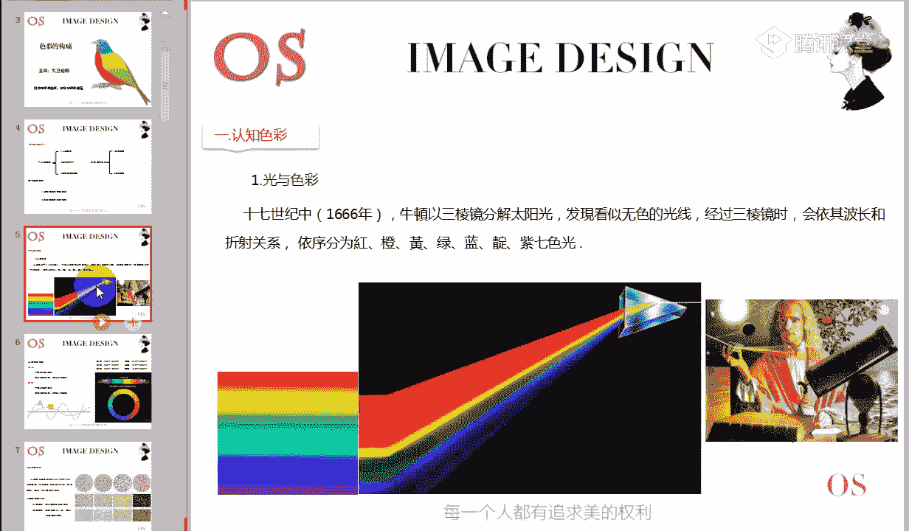
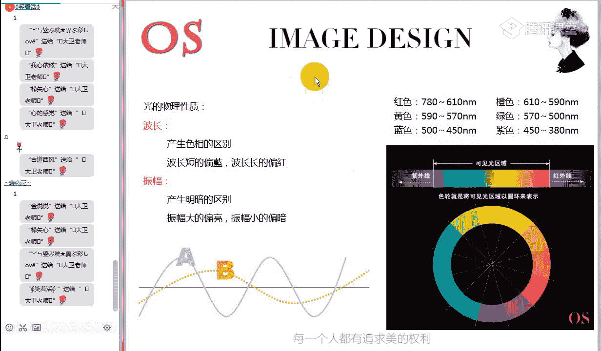
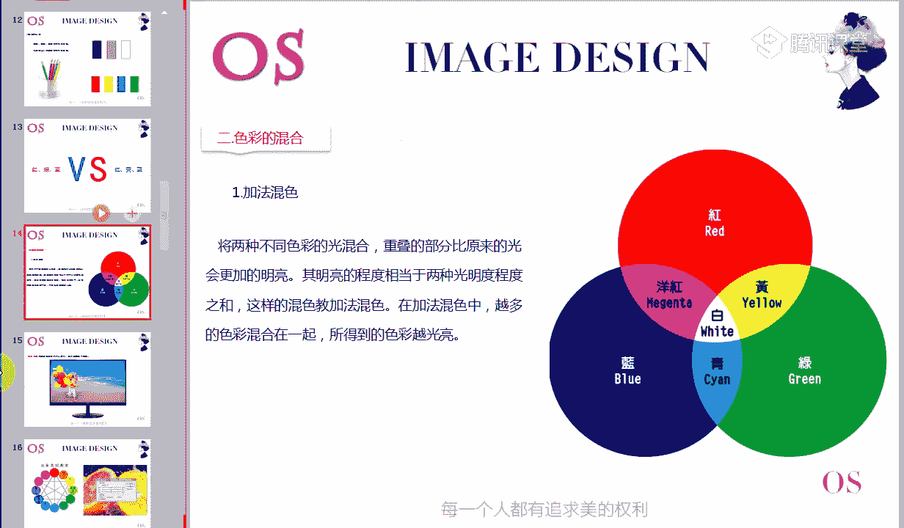
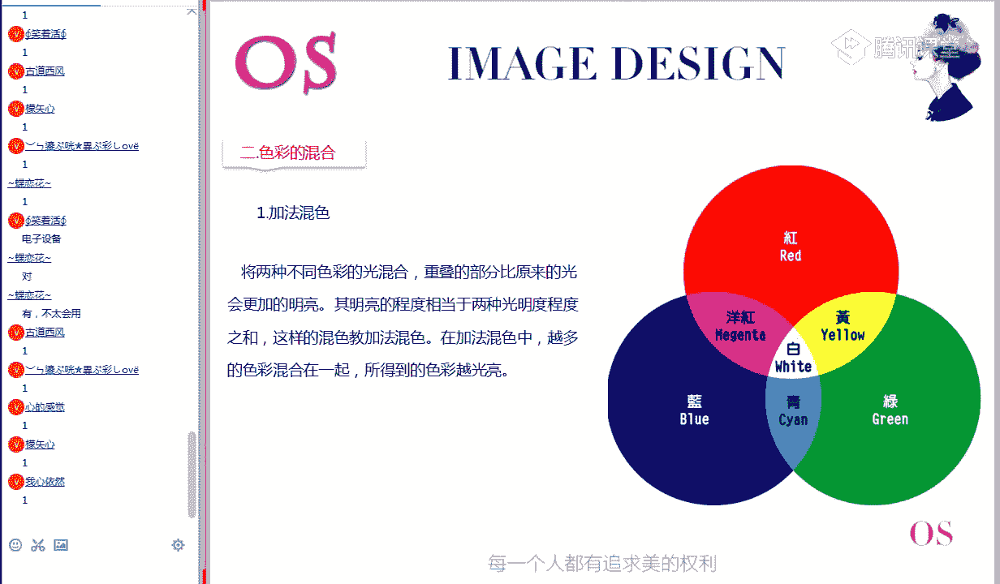
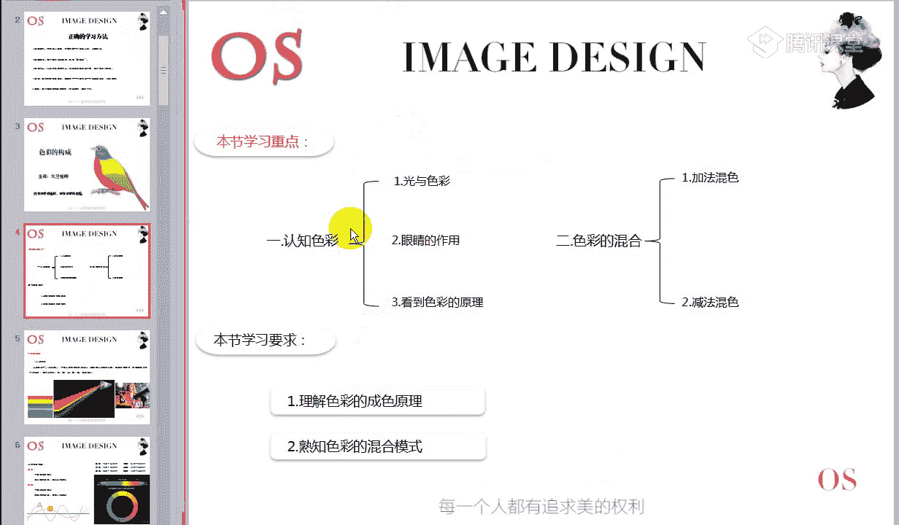
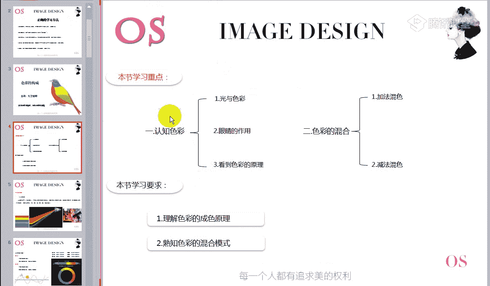
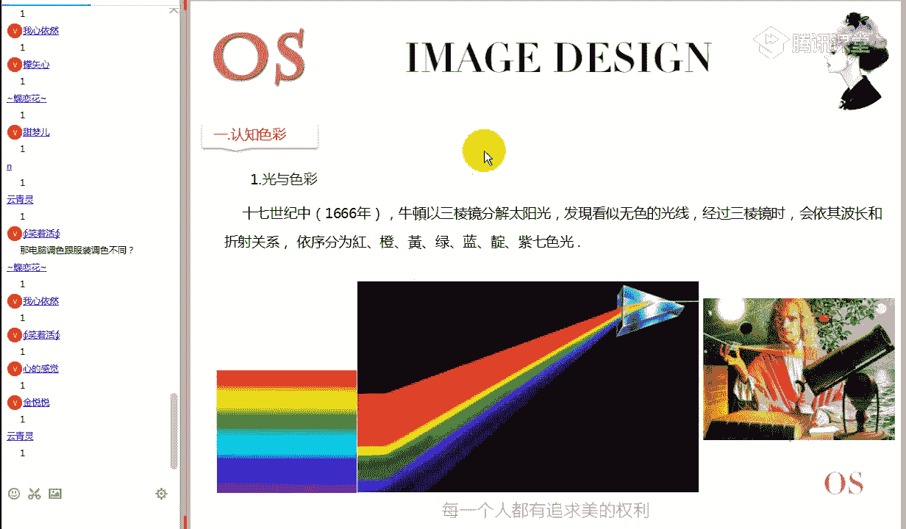
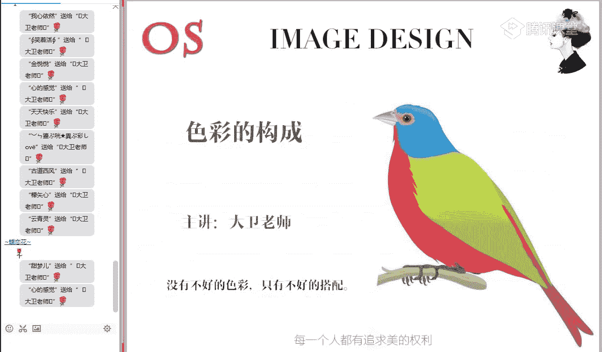

# 1、15男士形象色彩班VIP课程：第1节、色彩的构成

🎼好的，现在表示能够听到老师的声音，也能够完整的看到老师屏幕分享的同学呢，再次在公屏上给老师打一个一。好的，再次欢迎大家来到我们色彩美学班VIP课程第五期的开学典礼。好。

我看了一下今天晚上我们课堂的同学呢，新同学，本期的新同学还是比较多的。那另外呢还有很多同学的话，可能今天晚上有事啊，都请了假。那作为本节课的呃这样一个开学典礼的话呢，我们有一个这样的基本的流程。

第一步啊，我们先要做简单的这样一个自我介绍啊，我看了一下本期我们课程里面呢也有上一期啊来温习的老同学啊，我要问一下，现在在我们课堂上的同学是第一次进入到我们这样一个直播课程学期的同学。

你在公屏给老师打一，是来温习啊温习课程的同学呢，你在公屏上给老师打一个2。😊，好的啊，我们看有呃四位同学是来温习课程的，对不对？好了，那我们的新同学还是老同学呢。

接下来的环节呢都要做一个简单的自我介绍啊。我们说从这一期直播开始，大家都是同窗同学。那平时呢啊免不了这样的一些交流。同时呢我希望通过我们这样的一门课程啊，能够让更多的同学能够聚集在一起。

有共同的这样的追求跟爱好。那平时呢你也会有多了这样一个朋友啊，所以从现在开始呢，我们有一个简单的这样一个啊自我介绍的环节啊，大家就只需要在公屏上哎告诉老师。第一。😊，你来自于哪个地方？第二啊。

那你学习咱们色彩搭配的动机是什么？或者说为什么要学习色彩搭配啊，把这两项内容呢哎打在公屏上就可以了。两两两个任务。第一啊，来自于哪个地方？第二啊，为什么想要学习色彩搭配自己的目的是什么？好。

现在给大家一分钟的时间啊，各位同学都可以在公屏上呢把自己的出处包括哎你学习色彩搭配的目的呢给老师打在公屏上，也让呢我们其他同学好认识一下。🎼好，首先是我们的N同学，来自于贵州林子啊。

因为喜欢啊就是因为喜欢色彩，对不对？🎼好，我们的蒙志新同学。🎼啊，来自于贵州也是爱好啊，两位同学都是同一个地方的。🎼而我们新的感觉来自于江西，为了更好的感受美啊，出自于兴趣爱好，对不对？🎼好。

天天快乐同学来自于沈阳啊，也是平时的个人兴趣爱好。🎼他笑着活来自于江西，为了提升自己的审美。🎼啊，流光溢彩来自于重庆。🎼云清黎同学来自于重庆。🎼啊，就想学会自己如何买衣服打理自身的形象。好。

来自于我们内蒙古的同学啊，也是呢我们今天新报名的同学，古道金风同学来自于内蒙古。🎼啊，想在这个穿衣打扮这一块学得更专业，对不对？🎼好了，我们的蝶恋花同学来自于广东金月同学来自于浙江宁波。

为了更好的啊把这样一个服装搭配好。🎼好，有光异彩为了提升色彩的认知。田梦味来自于山西大同。好了，我们看一下所有的同学有没有介绍完毕啊啊，借这样一个机会啦啊，让其他的更多的同学呢都来相互哎了解认识一下啊。

我觉得我们这样一门课程真的啊网络学习，解决了很多的一些问题。比如说咱们这个唉地理上的问题，时间上的问题，大家可以看一下我们的同学有来自于啊几乎全国各地的地方。当然了啊今天到课的同学只有十几位啊。

如果说我们100多位同学都到齐的话，我相信呢在每一个地方都会有很多同学呢都是属于同一个地方来学习这门课程的同学。好，包括我们的VIP建立了这样1个VIP群的目的是什么呢？

就是希望大家平时有更多交流的这样一个平台跟哎机会。哎，平时喜欢这个东西的话呢，要把自己的东西来分享出来。我们说一个人哎你学到的知识，包括你的理解跟啊另外一个人肯定是有所差别的。散花者呢手留余香。

咱们大家把自己的一些想法呀，平时在群里面呢，哎多来分享一下，我相信呢哎咱们同样学的这样一个知识啊，可能了解到别的同学这样一些不同的想法，相信呢自己提升的速度呢也会更快一些。好。

我请易然腾同学来自于温州本职工作，在服装公司，但是呢对色彩搭配完全不懂，想扩展一下自己的工作领域。那我们说了学习色彩搭配，还是做咱们这个服装设计的，学到这门课程呢，对你来说肯定帮助是非常大的。

后面呢你会发现它的作用呢会越来越强大。好，点亮花同学是希望提高自身的审美。但是有一点是确认的。不管大家的一个啊动机是什么。总之的话呢，来学了我们这门课程之后。

一定会对你的形象能够起到一个非常好的一个作用，非常好的这样一个帮助。我们说啊在学习服装搭配的时候啊，很多同学可能对这个色彩不太了解啊，仅仅接到了一些这样的一些搭配技巧。

但是你会发现色彩这个东西用不对的话呢，即便搭配技巧对了，可能穿出来的感觉呢，也不会好。所以我们这个色彩美学班呢哎他的这样一个学习目的呢已经非常明确的在这里了。很多同学之前没有学习过色彩没有关系。

它完全是从零基础开始的。从色彩的构成到色彩的情感，各种配色技巧呢，都是从最简单由浅入深的这样一个学习的过程。所以每一位同学的话呢，你只是只要你是真心想来把它学好的。

你都可以在一期的时间之内把这样的知识呢，完全掌握好。只要一期的时间啊，六节课。😊，好，那大家可以看到这下边呢是我们啊AOS形象设计中心。咱们的校训有8个字啊。从今天开始的话。

大家在每节课的作业后面都要带上这8个字。校训分别是自律自信有爱勤奋，自律，为什么我们网络课程非常在意这个了自律啊，包括我们每每次说学完课程之后要做作业啊，有同学说我不交作业，老师没有办法。

因为呢啊咱们这个这样的培训呢，你属于这样承认的一个培训学习啊，你没有交作业的话，老师确实拿你没有办法。但是的话我们说了，如果你不按老师教给了正确方法来学习的话呢。

你可能呃同样的一些别人学完之后可能学的很好的，但是你可能呢还是很模糊啊，所以说大家一定要自觉主动的去学习。因为毕竟呢啊都是花了钱来学习的，对不对？自信、有爱勤奋。

包括我们学习这样课程的一个目的就是了增加自己的自信心，能够在穿着的时候非常有底气的把你的哎这样的配色啊，这样的装扮穿出去啊，所以说也是对内心的一个修炼。

也希望呢哎大家能够跟着老师一起把这样课程呢都学的很好啊，一定要记得把我们的8个字啊，我们的校训交在作业后面。😊，好，今天呢我们的色彩美学班VIP课程的第五期开学典礼啊，简单的这样一个课前一致啊。

到现在呢就定期结束。另外的话呢我也再强调一下，我是色彩美学班的班主任，大卫老师，大家如果在学习这门课程啊，色彩美学班这个范围之内有任何啊色彩方面的问题都可以第一时间啊QQ信息发给老师。老师看到了之后呢。

都会尽快的去恢复大家，老师不嫌麻烦，老师只是希望每位同学一期把它学好。虽然我们的课程给大家开设的有多少呢？有这样的两年的直播学习权权限啊，其实不是啊想让大家学很多期，就是有些同学可能没有时间来学。

但是我们真正希望的是什么呢？大家一期就把它学好。下一期的话呢，老师看到的呢都是新同学。😊，啊，呃，是不现现在这个点我不知道大家的一个状态还怎么样啊，现在表示自己的精神状态。

现在很棒的同学在公屏上打个先话给老师看一下。因为接下来的话呢，老师会讲一些非常重要的东西。好，那接下来的话啊，我们就要在我们这个北学班一开始的时候，或者说在我们整个OS形象设计课程啊开始的时候。

要把这个学习方法再给大家宣导一下。因为很多同学会反映老师呃我一期学完之后，我怎么感觉还是很模糊，还有好东都不会啊，包括或者说很多同学也很用功，每天学了做了作业啊，但是感觉呢学了效果不是很理想。

在这里的话呢，我们就谈到一个问题，就是什么？呃，关于咱们这个学习方法的问题，我希望这个学习方法今天给大家交流之后，在以后的其他各个班级的话，大家都能遵照这样一个模式去学习这样的一个网络课程。

第一个啊课堂交流课堂交流为什么要做这个课堂交流呢？我们是在进行这样的一个网络直播学习。老师在公屏上唯一能够看到的就是大家在公屏上打的一打的二，或者说打的鲜花啊，我能通过大家的这样一些回复。

知道大家的一个状态。积极参与互动，不懂的第一时间提出来啊，当堂解决。这跟咱们很多的一个线下学习是不一样。你可能很多同学听不懂的话呢，不大好意思提问啊，结果这个一节课上完了，你很多的疑惑啊。

我们这个网络课程没有关系啊，你不用害羞，老师看不到你，你直接把你不懂的地方，不管是什么问题，打出来就可以了。我们争取的是呢在直播课堂上直接解决问题。这也是我们为什么一直坚持做直播的一个原因。

就希望呢提高这样一个学习效率。😊，第二，课堂笔记啊，有很多同学说，老师我看视频还要做笔记吗？要做的啊，不论是线上学习还是线下学习，课堂笔记呢永远都是有价值的。但是这个笔记怎么做呢？很多同学突懒截屏啊。

不要这样去做，这实际上对你来说没有任何的帮助。那我们做笔记该怎么做呢？在我们讲的一整堂课程里面呢，肯定是内容比较多了，你就剪重点的关键词记一个啊，比如说我们在讲的这个色彩的啊橙色模式的时候啊。

你就简单的记一个，比如说哎加色模式啊，减色模式去关键词就可以了。这整个关键词一节课完了之后呢，它会形成一条哎这条主线，咱们在课后的时候呢，比如说晚上睡觉前啊，放个小电影啊啊不是放个小电影啊。

在睡觉前呢就是在你的头脑里面过一下啊，在你的头脑里面过一下想一下，根据你的这个关键词回想一下我本节课讲的是什么，晚上过过一遍之后呢，你的印象一定会非常的深刻。😊，第三个就是关于课后作业的问题啊。

我们一再强调做作业，很多同学写麻麻烦，不想去做。其实这个课后作业它真的非常的重要啊。我们经过多年的这样一个网络学习的一个研究，你会发现啊，平时做作业很认真的同学一般这个课程都学的非常的好啊。

为什么要做课后作业了？这里已经说了啊，他是为了做什么呢？你在做作业的时候，你肯定会去思考，怎么回答这个问题。如果你能很好的回答出来的话呢，说明啊咱们这个课程直播课，你学的都理解的。

如果你做作业的时候发现很困难，一定是有疑惑的。这个时候的话，一定要第一时间来找大卫老师，咱们尽快的啊把这个疑惑给他解决掉。😊，第四个是温习。因为我们这门这样一门课程呢，很多同学之前就压根没有接触过。

所以可能你一节课听完之后，不可能把所有的知识真的就啊掌握的非常好。这个时候咱们要做一下温习。哎，抽空的时候有空的时候就就来了，再温习一遍啊，看笔记，看一下是不是都明白了自己能不能说的清楚。好。

其实我们在检测一个知识，大家自己检测自己的时候呃，有没有学好了，你就是用你的方式试着把这些知识表达一下。如果你表达不清楚，都说明呢你没有理解啊，这是最简单的一个测试。我们说呃言之无闻，行而不远啊。

就说你在呃表述不清楚一个问题的时候，在你的心里面呢一定是模糊的。美学完一下一节课要和上一节课呢串联起来分析啊，我们这个知识连贯性是非常强的，一定要串联的温分析，加深呢对知识点的一个理解啊，前后串通一下。

特别是在我们整个呢哎美学班的六节课学完之后，咱们从第一节到第六节来串通一下，看整个知识点里面有没有什么内在的联系。第五点就是关于实践啊，包括我们一直在强调我们说学以致用。我们来学习这样的知识呢。

并不是说哎咱们要应试印出一个考试。包括我们说的这是一个成人教育。我们来做这样的课程呢，并不是让你去考一个什么证，它就是为了来帮你解决问题了。色彩美学班学好之后，就是解决你对色彩上的一个零基础。

这样你知道颜色是怎么搭配的。咱们男女士班学完了之后，学完之后就是为了就是为了改变你的形象的。咱们不是啊为了搞一个什么证的。所以这个实践是非常重要的，要随时把我们学完的知识呢跟生活结合起来，包括这个色彩。

我学完了之后，我去观察一下逛街的时候，我去发现一下我周围的颜色跟我所讲的知识有没有关系，明度啊，纯度啊，对不对？哎，他这个装修配色呀啊都是试着去啊拓展一下自己的一个思维。一定要记得。

只有实践才能把所学的知识呢，让它产生价值。那以上5点的话呢，就是我们对这个哎咱们整个课程学习的这样一个正确的方法，也是一个要求啊，这些的话呢，大家可以记一下。好，给大家30秒的时间。

把我们正确学习的方法记一下啊，这个大家可以截个图都是可以的啊。😊，好，以后养成习惯，在咱们美学班把这个习惯养养成之后，再学后面的课程呢就非常的简单了。好的，已经完成的同学来打个鲜话给老师看一下。好。

学习方法有没有记下来？😊，好的，那接下来的话呢，我们就正式来开始我们色彩美学班VIP课程的第一节课，就是什么呢？就是我们色彩的构成。好，这节课我说了，它是一门什么零基础开始的这样一门入门级的第一节课。

它就让你完全零基础开始来了解我们这个色彩。所以本节课呢哎它的一个逻辑性会非常的强，包括每一个知识点呢，前后的贯穿性非常强。所以大家呢啊从现在开始一定要答题实这节课你学好了，越学到后面呢就越轻松。好。

我在上课之前我要检查一下大家有没有准备工具啊，手头上已经准备好了笔和纸的同学，在公屏上给老师打一个一。啊，因为我们刚才提到要做课堂笔记，对不对？手头上已经准备好笔和纸的同学，打个一给老师看一下。好。

非常棒啊，都已经准备好了，对不对？好，接下来我们说第一节课，这是我们的一个色彩构成主标题。那接下来如何来学习这节课程，我们来看一下我们的一个课程大纲。😊，好，每节课的话我们都会标明学习重点跟学习要求。

那学习重点呢从大的板块来说，它有两个板块，第一是认知色彩。第二是了解色彩的混合模式啊，两种混合模式。学习要求，理解色彩的橙色原理。哎，我们这个颜色它是从哪来的？我们看到的色彩是从哪来的。第二。

熟知色彩的混合模式，就是我们经常会区分的红绿蓝跟红黄蓝的区别。好，先要简单有这样一个概念哦，本节课有两部分内容。好，首先我们来进入第一部分，我们来了解一下认知色彩色彩是从哪来的。

好，在这里的话呢，哎我们有一个物理的小知识要了解一下啊。知道这个物理小知识点的同学，现在打个一给老师看一下啊，就是伟大的科学家牛顿在啊1666年的时候呢，他做过这么一个实验，是什么实验呢？

他用了一个三棱镜来分解了我们的太阳光。他发现当太阳光透过三棱镜的时候，哎，他会被分解为为什么红橙黄绿青蓝紫啊，这样的七色的光带啊，红橙黄绿蓝靛子这样的七色光带。通过这样的一个试验的话呢。

我们就找到了对于色彩研究的这样一个依据。啊，物理在中学的物理上，你要知道这个实验的同学，打个一个老师看一下啊，知道的同学就非常容易理解了。有没说老师哎这个这个咱们这个物理知识啊。

跟咱们所学的这个色彩课程有什么关系？😊，好，先记住这个理论啊。白色的太阳光透过三棱镜的时候，它会被分解为七色的光带。相反，我们可以得到一个结论，就是平时我们所看到的太阳光的白光。

实际上它是有七色光带叠加在一起的一个现象。来能够理解的同学打个鲜花给老师看一下。通过这个实验，我们可以得到一个结论，我们平时所看到的太阳光白光，它实际上是七色光带叠加在一起的一个现象。

为什么是因为这样一个。科学试验依据对不对？这不是老师说的啊，一定要记住，这是伟大的科学家牛顿啊，很多年前都做过了这样的一个实验。我们通过这个得到了一个结论，就是太阳光白光。

实际上是七色光带叠加的一个现象而已。好，能够理解的同学打个千话给老师看一下啊，没有关系，要不解的话，咱们再慢慢的来分道一下啊。😊。

好，都没有问题，对不对？好，接下来我们要了解一个小常识。好，这点知识呢属于了解一部分啊，就是关于光的一个物理性质。在这里的话呢，我们会涉及到一个什么呢？这个光波的问题啊。

光波大家可以看到这一块区域呢称为可见光区域，那可见光区域是什么意思呢？就是人眼呢能够识别的这样一些颜色，有些颜色人眼是看不到的。比如说紫外线对不对？我们都知道紫外线对人体有伤害。

但是我们肉眼是识别不了的。包括红外线，红外线是用在什么？咱们很多的一些安设备啊，所以说小偷在进门的时候，它肉眼没有啊带专门的这样的一些工具的话，它可能就看不到，一旦触碰的话呢，就会报警。好。

这两个常识知道的同学打一个老师看一下紫外线和红外线的应用啊，是因为什么？我们现在所研究的色彩搭配，这些色彩都是人烟能够识别的，它称之为什么可见光谱。那咱们可见光谱呢，它的波长有一个范围，是从什么？

是从380纳米到什么780纳米之间。而在这样的一些波段范围里面呢，大家会发现红色的波长是最长的，而是紫色的波长呢是最短的。好，这个知识啊暂且了解一下就可以了。我们后面呢还会提到。啊。

我们说这个波长是产生色相的区别。波长短的呢偏蓝，波长长的偏红。好，这些知识呢大家简单了解，我们就不再细讲，讲了很多同学就说老师啊又讲物理知识，听不懂啊，你简单的了解一下咱们这个啊可见光谱的波长范围啊。

包括为什么叫可见光啊，人眼能够识别的颜色呢？就是可见光人眼看不到的呢？就是什么啊胆于380纳米，或者呢长于780纳米的这样一个波长范米的一个色光。

好，第二个还是属于咱们这样一个生物学上的一个知识，就是关于眼睛的作用。好，我们人眼的作用啊，在这里的话呢，我们先要小小的测试一下啊，第一排的数字大家先不要打出来啊，都能够识别的同学。

在公屏上给老师打一个一，识别不了的同学呢，在公屏上给老师打一个2。整理第一排的数字，自己都能够看得清楚的，公屏给老师打一。看不清楚的同学，你在公屏上给老师打一个2。啊，大家再细细看一下，不要着急啊。

我我朋有催大家，大家细细看一下。呃，真的就看不到吗？看不到很危险啊。好，再继续看一下，我们的有两位同学古道西风和我们的田梦儿，对不对？啊，其实我现在告诉大家，第一个这里写的是5。

第二个是689是这样淡淡的绿色，第三个是66，第四个是3好，其实这个图的话呢啊刚才有很多同学没有认真看，对不对？其实看的话，我觉得一般人看这个是没有问题的。他是对咱们眼睛识别能力的一个诊断啊。

我们相就在中学的时候，大家有参加过这样一个呃针对眼部色盲的一个这样的一个测试啊。如果说这一排的数字你看不清，可能对有些颜色的，咱们在视觉神经系统里面呢啊对这样一些呃色彩的感应细胞。

可能呢对有些色彩是感受不到的。好，我们说人类可以眼睛辨别的颜色的750万种以上。但是我们说的是因为什么呢？在人的眼部细胞里面会有这样的一些呃细胞，它能够什么感应到红绿蓝这样的三原色的细胞。

如果你的眼部细胞是正常的话呢，你对这些颜色都是能够识别的啊。所以第一排的数字你都看不清楚的话，可能很多同学的话，对一些红绿蓝有些色相是看不清楚啊，有这样一个可能。但是前面两位同学的话呢。

我不知道你有没有认真看啊。呃，可能有刚开始手机的屏幕比较小，看不清，也有可能啊。随后的话呢，我可以把这个图截到咱们的呃小其实咱们的VP群里面，大家可以来观察一下。😊，好了，在这里的话呢。

大家只需要简单的了解人眼为什么能够看到这些有色光啊，是因为什么？我们的眼睛里面有这些专门感受红绿蓝的这样的一些细胞，它能够感受到这些光线的一个存在啊，这也是一个物理小知识啊。

所以说你的视觉形成系统正常的话呢，唉一般的话红绿蓝这些色彩识别都是没有问题的。😊，好，那第一部分认识色彩呢，我们就给大家介绍了三部分的小知识点。关于呢哎白光它的一个叠加现象。第二就是关于波长的可见光谱。

第三个呢就是哎我们人眼的一个作用。接下来我们看一下第三部分，关于呃橙色原理。就是我们说的人看到色彩的原理，实际上呢就是橙色原理。就是我们人眼为什么能够呃看到这样的一些色彩？人眼看到色彩的话呢。

我们这里做了一个这样一个分类，它有三种形式。第一是光源色。就是将就是这个光带呀直射入到人的眼睛。第二个是透过色。比如当一个光线透过玻璃之后，它才进入到人眼，它是透过色呈现的一个状态。第三个就是表面。

当光线照到物体表面之后，反射光线进入到人眼。好，所以色彩的陈受形式呢会有这三种，就是什么光源色。透过色啊透过一个物体，然后表面色。好，第三，比如说在听到这里的时候，大家做笔记怎么做的？啊，记住关键词。

光源色透过色表面色。哎，以后在看笔记的时候，光颜色是什么色，什么意思啊？直射到人的眼睛，而透过色呢是透过物体，表面色呢是反射的一个现象。好，这个能不能理解？能够理解的同学打一个老师看一下。😊。

眼睛感知光的三种形式。分别是光源色、透过色和表面色啊，就是人眼能够看到色彩的话，必须具备这三个条件。好，在讲到这里的时候呢，我要问大家一个问题啊。呃，我们说假设一个红色的苹果，对不对？

这个红色的苹果如果在一个伸手不见五指的夜晚。这个苹果是什么颜色？好，现在我们假定在一个伸手不见五指的夜晚。原本在正常光线下呈现红色的这样一个苹果，它是什么颜色？好，大家细细分析一下。

然后把答案给老师打在公屏上。好，现在我们课堂上有一个答案说是黑色，为什么苹果在伸手不见无知的晚上，它会变成黑色了？好了，其他还有很多同学没有回答，对不对？😊，啊，把你理解的答案给老师打在公屏上。好。

通过大家回答的这个问题，我就知道大家对于这个人眼呢识别这些色彩的一个过程有没有理解。好，另外一个答案说看不见没有光，看不见。其他同学呢？如果在一个伸手不见无知的晚上。

这个红正常光线下的红色苹果它变成了什么颜色？好了，回答老师的同学，12345678910啊，还有几位同学没有回答，对不对？一定要大胆的来回答问题啊，没有关系，回答错了，老师想打也打不着，对不对？好了。

我现在告诉大家答案。实际上老师刚才所提到的这个问题已经脱离了我们研究色彩的基本条件。我们人眼能够看到颜色，必首先要有光源，对不对？在一个伸手不见五指的一晚，光源都没有。

我们再来研究这个苹果的颜色就没有意义了，对不对？我们为什么在正常光线下能够看到一个苹果颜色是红的？当光照的苹果表面，苹果表面反射的光线进入到人眼，我们才来感受到这个色彩，对不对？

而在一个身手不见无指的夜晚，根本就没有光源。这个苹果没有受到任何的光线，它也不会反射出中个光键。实际上你什么都看不到，对不对？是不是伸手不见无指的夜晚，你什么都看不到，你怎么会知道这个苹果是黑的了。

对不对？所以一定要记得，我们能够看到物体必备的条件，有光源有物体，而且至少有部分光线呢反射进入到人眼，否则你什么都看不到，也就脱离了我们研究色彩的基本条件？好，以上上面打黑色的同学现在理解没有？

现在理解的话，打个先发给老师看一下。为什么在正常光线下呈现红色的苹果，在一个伸手不见无指的晚上，咱们什么都看不到。它也不是黑色，因为什么脱离了我们研究色彩的一个基本条件，光源都没有，你肯定什么都看不到。

那你更无法确定这个苹果是什么颜色，对不对？啊，这个知识虽然简单啊，大家一定要注意啊，我们所讲的知识都可能在考试里面有可能会出现啊，美学班的考核到时候就会发现大家对这节课学的怎么样。好了。

我们本节课的第一部分小知识点呢属于垫底的啊，就是认知色彩。首先了解光与色彩。第二个是我们人眼的作用。第三个看到啊色彩必备的条件，以及呢它几个橙色的模式。好，第二部分啊。

我们就开始研究了呃这个专业化的东西了。关于色彩的混合模式，两种，一种呢是加法模混色，第二个呢是减法混色。啊，刚才在这个看到色彩的原理里面，我们有一部分还没有分析啊，就是关于光源色的问题啊。

光源色跟呃透过色表面色，这个我们还需要深入分析一下啊。呃，这个光色的话呢，之前的话我们之是有提到过很多同学不知道光颜色是什么意思啊，所光颜色是什么，是指光源本身的色彩啊，就是这个光它本身就自带的色彩。

那这个光颜色呢，我们可以分为两种，一种是什么？自然光，比如说太阳啊，都知道自然光是太阳。呃，我要问一下大家，月亮是不是自然光？月亮是不是自然光？认为是的同学打一认为不是的同学给老师打一个2。啊。

其实第一节课里面咱们这个物理知识挺多的啊。月亮是不是自然光啊，还有同学说不知道。啊，其实的话月亮不是自然光，因为月亮自己是不会发光的啊。月亮为什么我们在晚上的时候看到月亮会亮？

其实是因为什么月亮反射了光线，它本身不是光源。光源是什么？光源是太阳啊，这是一个小常识啊，大家稍微了解一下，其实月亮呢它不是光源啊。好，第二部分是人造光，那人造光就是非常常见的。

比如说这个灯光啊、烛光啊都是属于什么人造光，大家会发现哎，咱们这个白炽灯呢发出来的光是偏蓝的这种光，对不对？而我们什么呢？哎，你会发现我们这个钨斯灯，知道什么是钨斯灯的同学打一个一给老师看一下。啊。

其实现在用的比较少啊，但是很多同学应该是知道的啊，早睡莲的话呢呃这个钨丝登用的是比较多的。啊，那个钨丝灯的灯泡的话，就是咱们经常见的那个普通的钨丝，它里面装的是钨丝这个灯泡。

它发出来的光呢就是那种黄光啊，黄光它的色温比较低。而我们现在多半用的这个荧光灯的话呢，它的色温比较高，发出来的光呢就偏蓝。所以说我们再去看人的肤色的时候说要借助自然光线是为什么呢？

咱们这个灯光的色温不一样，照出在你的肤色的冷暖呢都会有偏向。如果你在这个什么咱们的荧光灯之下，你的肤色肯定是偏蓝偏冷的肤色。如果在这个钨哎这个钨丝灯下面呢，你的皮肤品肯定是偏暖的啊。

所以说在不同的色温下，人的肤色呢呈现的状态是不一样的。好，这也是个小常识啊。关于光源色，大家知道是什么意思啊，本身能够发光的物体都称之为什么光源色啊。好，第二个是透过色。透过色。我刚才说了啊。

就是当一束光线它本来有颜色，透过另外一个物体之后，它所呈现的这个状态就称之为什么？透过色。比如说光线透过哎这个橙子透过这个玻璃杯之后，我们再看到它的颜色实际上看到的什么？就是一个透过色。

第三个啊第三个表面色就比较重要了。因为这个表面色就是什么？我们来研究这个服装搭配里面必须要了解过的一个成受过程。那表面色是什么意思呢？它是指物体表面反射后所呈现出来的色彩。哎，我们现在来看一下。

大家可以看到在正常的光线照射下，这个苹果它是绿色的，这个柠檬它是黄色的，包括这个衣服也是黄色的，对不对？好，在这里的话呢，大家要来想一个问题啊，我们既然来了解色彩搭配的。我们要想一个问题。

我们刚才讲的在正常的光线照射下，就是相当于什么？在日光的照射下，对不对？日光我们刚才说了，它相当于是什么七色光带的叠加。而此刻的话呢，你看。苹果跟柠檬他们受到的什么呢？入射光带是一模一样的。

但是为什么他们呈现出来的色彩状态不一样？为什么我们看到的柠檬它是黄的？为什么我们看到的苹果它是绿的？好，给大家30秒的时间来想一下为什么为什么在同样的光线照射下，这两个水果呈现出来的色彩状态不一样。

把你的理解给老师打在公屏上。🎼青春。🎼因我爱你。🎼愛情。🎼当个里。🎼我看过爱情。好的呃，有同学说，因为它反射在人眼里的颜色不一样啊，问题就在这里，为什么他们反射出来的颜色不一样？为什么啊？

有人说是自带色好，这个自带色是什么意思呢？啊，还有没有其他同学啊，想不明白的同学给老铁盖就可以了啊。自己的呃有自己想法的同学呢，你就把你的答案打在公屏上。为什么受到了同样的光线光线照射。

这两个物品它呈现出来的颜色不一样。为什么有的衣服是绿的，有的衣服是红的，而他们受到的光线照射是一样的，这是为什么呢？😊，好，这就是我们研究的重点。我们在学习服装搭配的时候。

我们用到颜色跟这个关系非常的密切。好。我现在给大家解释一下这样一个物理的过程，大家听清楚了啊。他们在受到正常的光线照射下呈现出来的色彩状态不一样，是因为什么？

是因为他们在入射光线的一个什么吸收率跟反受率不一样。也就是说讲了，为什么为什么他们的吸收率跟反受率不一样呢？是因为什么它们的物理属性不一样。大家学过物理都知道，如果拆分开来。

这些物体都属么分子原子构成了它的组织结构，是因为苹果跟这个柠檬它内在的组织结构不同，最终就导致了它们对相同入射光带的一个吸收跟反射比例不一样。而它反射到人眼的色彩呢都是我们所看到这个物体的色彩。比如说。

当七色光带同时照射在这个柠檬上的时候啊，我们刚才说太阳光其实是七色光带，对不对？由于这个柠檬的内在组织结构，它的内在属性决定了它能够什么吸收，除了黄色之外。它只能什么吸收除了黄色之外，其他所有的光带。

而独独反射出黄光。所以我们看的这个柠檬是黄色的，理解没有？并不是它自带色，而是由它的属性决定了它能够吸收除了黄色之外，其他所有的光带。而独独反射出黄光进入到人的眼睛。所以我们看到这个柠檬呢，它是黄色的。

来，这个过程能够理解的同学打一，还没有听明白的同学给老师打一个2，你要学会自己用话来描述这样一个过程，描述清楚了，你就真的知道哎他这个陈受过程是什么样子的了。啊，还不清楚。那接下来我换一个例子啊。

改用这个苹果听清楚了，咱们一步一步来。当太阳光照射到这个苹果上的时候，我们前面不是学过这个试验吗？实际上太阳光是七色光带叠加在一起的现象，相当于七色光带同时照射在了这个苹果上。

来这个第一步能理解的同学给老师打个一，老师看一下。太阳光照射的苹果上，相当于七色光带同时照射在了这个苹果上。那我们接下来看一下发生了什么。这个苹果由于它内在的组织结构，我刚才说了啊。

分子原子构成了组织结构，它内在的属性就决定了它这种物质。什么它能够吸收除了绿色之外，其他所有的光带啊，七色光带除了绿色之外，它所有的光它都能把它吸收掉。它唯独能反射的光是什么？是绿光。

而这个绿光再次反射到了人的眼睛，所以我们看到的这个苹果是绿色的，它反射出哪种光，我们看到它的状态就是什么颜色，是我们人眼感受到了它反射出来的绿色的光带。好，现在理解没有？

现在能够理解的同学打个先话给老师看一下，要学会分解。😊，表面色的橙色过程实际上是一个反射的过程。当光照射的物体上，物体的属性决定了它会反射哪部分光。而这部部分光进入到了人人的眼睛。

就是我们感受到这个物体所呈现的色彩。比如说这件黄色的衣服，为什么我们看见它是黄的。因为它的这个材质就决定了它能够什么吸收其他所谓的光带而反射出黄光，所以我们看到它是黄的。

我要问一下大家有没有在商场发现过这样一个现象。我们在商场里面在灯光照射下所看到的服装的颜色跟我们穿出来之后，在自然光线下看到这个服装的颜色有所不同。实际上是有一些色差的，对不对？啊。

有发现过这个现象的同学打个一给老师看一下。你会发现有的时候咱们去买衣服的时候，他如果店内有这些灯光照射的情况下，你看到的服装色彩跟你穿到这样一个自然光线下是不同的。是因为什么？它受到了这个环境光的影响。

它反射出来的光带也受到了这个这个什么这些周围光线的影响。而我们现在在研究的对比的条件是什么？都是在自然光线下，正常的太阳光的照射下，这些物体所呈现的颜色呢，就是它的固有色。

那我们把物体的固有色再给大家描述一下是什么意思啊？固有色就是指什么？物体本来的颜色，就是物体本来的颜色是什么？在正常的光线照射下，它呈现出来的色彩就是它的固有色。好。

现在表面色的这个橙色原理都没有问题的同学打个先发给老师看一下，非常重要。我希望大家学完之后呢，能够用你的话来描述一下任何一个物体它的一个橙色的过程。🎼其实。🎼听说。好。

那接下来呢还有个小知识点要给大家普及一下，就是关于色彩的分类啊，我们经常会提到这个有彩系跟无彩系啊，其实这个栏分类非常的简单。呃，有彩系。它就是什么？除了黑白灰以外，所有的颜色，因为黑五彩系指的什么？

就是黑白灰，所以有五彩系呢哎有彩系就是什么？指黑，除了黑白灰以外，所有的颜色都称之为什么油彩系。啊，您说又提到刚才这个评果的问题，对不对？我们来看一下。那青苹果在晚上也是青的呀呃。

青苹果在伸手不见五指的晚上，它还是青的吗？是不是刚才我老师提到这个假设的环境，大家还没有理解？青苹果，他在晚上伸手不见无指的晚上，他还是青的吗？来认为是的同学打一，认为不是的同学给老师打2。好。

其实又回到了我们刚才研究色彩的一个基本的条件。我们刚才说的这个苹果是青的，你怎么知道它是青的？是因为当有光线照射到它的表面，它反射出的绿光进入到人的眼睛，你感受到了它是青色的，对不对？

但是如果在晚上光线都没有这个苹果，你根本就感受不到它的任何光彩，你怎么会知道它是青的了，对不对？所以在没有光线的情况下，你就不可能知道它是什么颜色，对不对？根本就看不到苹果。

所以已经脱离了我们来研究这个苹果颜色的一个必要的条件，就是什么光源。好的，现在理解没有？😊，我们所说的固有色一定是物体在正常的光线照射下，它所呈现出来的色彩。没有光线照射的话，你再谈它是什么颜色。

已及呢脱离了我们研究色彩的基本条件。是的，表面色就是物体的固有色啊，我们说表面色就是物体的固有色啊，可以简单的这样理解。因为我们所说的一个表面色或者固有色，就是指的什么？

它在正常的光线下所呈现的一个颜色。而当黄近光发生变化的时候呢，它的哎橙色表面色也会发生这样的一些变化。啊，有没有理解？是的，咱们的灯光的话是人造光，所以它跟咱们这个自然光线是有差别的。比如说钨丝灯啊。

荧光灯对不对？所以这些光线照射到任何物体上，它呈现出来固有色拉已经发生了改变。所以我们在做人的肤色诊断的时候，我们一定要求自然光线不要借助任何的灯光。好了，这一块还有没有问题？

没有问题的同学打个一给老师看一下啊，有问题的赶紧提出来。因为这个过程呢虽然说呃有点无聊，但是它很重要。咱们以后在研究啊这些颜色搭配的时候的话，你要想理解的深的话呢，这个简单的成测过程。

咱们还是有必要把它搞清楚的。而且我们有些同学的话呢，在我们这个班啊，将来有想做上哎将来自己想来做老师去培训学生的话，那讲单的这样一个过程的话呢，你还是有必要把它搞清楚。而且呢能够把这个东西搞透彻。

把它描述清楚，你才能呢把这样的知识呢，有效的传递出去。😊，那我们在灯光下看到的不叫表面色，叫表面色啊，确切的讲，其实表面色跟固有色应该不是一个概念啊。固有色它特定的这个物体在正常的光线照射下。

它所呈现出来的这样一个色彩状态。而表面色的话呢，如果环境光发生变化了，它实际上它的表面色呢也会发生变化啊，所以这个严格意义上来讲呢，在两者是分开的啊。因为一般情况下，我们说这个表面色跟固有色是一样的。

它就假定是什么？在正常的这样一个光线下。好的，现在理解没有？理解的话，打个一个老师看一下我们校的活同学。啊，你只要理解的这个固有色的一个过程啊，不管他怎么定义，你都能把这样一个关系搞清楚。好。

其实刚才还是第一部分的知识啊，一个重点知识在看到色彩的原理里面，我们要了解光源色跟。表面色它的一个橙色过程啊，光源色跟表面色光源色是本身自带色彩，而表面色呢是通过反射入到人眼的这样一个光线。好的。

接下来的话，我们进入第二部分看一下色彩的混合模式啊，这个这个跟我们前面讲的知识有一点不同的。好，首先要讲一下我们为什么要来区分色彩的模式呢？

因为大家是不是在其他很多地方我们会听到一些不同的这样的一些呃对于颜色的说法。哎，有说候这个原色是红绿蓝，哎，有时候有的地方又说这个原色是红黄蓝，对不对？好，有没有同学会玩PS的。

会玩的同学来打打个二给老师看一下。好，会一点点PS同学打个二给老师看一下。好，没有没有玩咱们那个PS的啊，你你有没有听说过这个颜色或者说红绿蓝跟红黄蓝，有的地方说原色是红绿蓝，有的地方说原色是红黄蓝。

对不对？是不是有很多同学很困惑老师啊啊，为什么咱们学的这个颜色是红黄蓝？哎，而我朋友说这个颜色是红绿蓝，那咱们这个原色到底是红绿蓝还是红黄蓝呢？接下来我们就必须要搞清楚这个问题。

既然大家已经加入了这样专业色彩班道学习，这个问题啊一定要搞清楚。究竟颜色是红绿蓝还是红黄蓝？好，待会儿我们讲完之后，希望大家对这个知识点呢都有一个明确的认知，知道这个原色到底是红绿蓝还是红黄蓝。好。

这里的话呢，我们说色彩的模式。重点讲两种，一个是加法混色。加法混色是指什么意思呢？它是指将两种不同色彩的光混合重叠的部分会比原来更加的亮。是不是刚才就跟我们讲的这个自然光的一个白光橙色的过程是一样的。

对不对？将七色光带叠加在一起的时候，它最终会呈现白光，而白光是不是就是最亮的，对不对？哎，能够理解同学打钱发给老师看一下。😊，我们刚才说了啊。白光其实就是七色光带的叠加，而白光跟其他所有的光带都要亮。

所以我们刚才研究的光原色，它的成色过程是什吗？其实是一个加法混色。那它的原色呢是红绿蓝，它研究的是光。光的一个橙色过程。所以说我们又称为红运呢，是什么？是光的三原色。也就是说。

当红色的光跟绿色的光进行叠加的时候，它会呈现黄色的状态。这个待会儿跟我们所讲的色料的三原色是有所不同的。大家一定要记得。光的三原色是红绿蓝。他们之间的绘色模式是加法混色是越加越亮。

最终呈现的白色是最亮的。也就是说打个比方，我们现在要呈现一种阳红色的色光怎么办？我要我可以什么把这个原色红色的光带跟蓝色的光带叠加，就可以呈现这样一个阳红。而我要得到一个黄色的。

我就可以把绿色的光带跟红色的光带叠加呈现一个黄色。好，其实对这个物理小实验有兴趣的同学呢，你就可以买这种啊淘宝上有卖啊，这个红色的手电筒跟这个哎蓝色的手电筒，你把两处光照在墙上相叠加。

它就会呈现这样一个阳红，它就是什么光的叠加的一个沉作过程是越加越亮。哎，这个记住的同学打一个一个老师看一下这个地方很重要，要做点笔记。光的三原色是红绿蓝，越加越亮。他研究的是。光的一个叠加。

好，那接下来我们来研究一下啊，我们说了这个加法混色红绿蓝，它的应用领域在哪些方面？比如说我们在谈到红绿蓝的时候，它一般会应用在哪些方面。这你已经明确说了啊，加法混色的原理呢。

它主要是用在什么用在计算机显示器这样的一些电子领域里面。还有很多同学都不理解的，为什么这个加法混色只能用在这些电子设备上面呢。接下来的话呢，我们把这个电脑屏幕的一个承受过程呢给大家来分析一下。好。

接下来老师要来问大家一个问题啊。哎，我们在电脑屏幕啊，在能够看到画面的时候，它必是不是必须要具备一些条件。首先要插上电源。第二，屏幕一定要是亮的。如果这个电脑坏了，黑屏的是不是我们和色彩都看不到。

对不对？来这个认可的同学打个一给老师看一下。我们能够看到这个电脑屏幕上的色彩，必须要具备两个条件。第一要有光源。第二，这个屏幕一定要能够亮，对不对？我要问一下大家，这个电脑屏幕亮了。

这个电脑屏幕为什么会亮？来回答老师。电脑屏幕为什么会亮？啊，有没有同学知道很多同学看到这么多年你的电视机，就不知道你的电视机屏幕为什么会亮，对不对？为什么会亮。😊，屏幕灰亮说明说明什么？😡，啊。

有电源啊，其实本质的原因是什么？有光源，对不对？就说明这个显示屏里面是一定有光源。光源照射它照它有光才会有光线的出现，对不对？电只是它的一个什么条件，让它能够运作，而真正的屏幕会亮是因为什么？

是因为屏幕里面有光源。所以我们现在的一个间筑的成色是光的一个成色过程，对不对？这就是为什么我们说了电子显示设备，为什么用的是光的三原色红绿蓝？因为这个电子显示设备它要运行的话，就必须要依靠电。

它必须要有光源，有光源照射才能在屏幕上呈现这样的色彩。比如说我刚才说了嘛，我们要呈现黄色，对不对？我们是不是需要我这个显像管发出这个什么红光跟什么这个绿光的叠加，它才会呈现这样一个黄色。

所以在这个电脑屏里面会有无数个这样的显像管，它会发出不同的光线进行叠加来呈现我们所需要的这样一个色彩？好，你现在有没有理解？😊，因为什么计算机，包括我们的电视机，包括我们的电脑显示器。

包括我们的单反前金液晶显示屏，包括你现在所用的手机的液晶显示屏，它的成色原理研究它的成色过程都是什么光的三原色、红绿蓝，原因是什么？这些设备都必须要依靠什么？依靠光源啊，它必须要通电。

然后有光源发出光线才能在屏幕上叠加呈现色彩，所以说加法混色、红绿蓝这三原色是用在什么？这个计算机显示器这样的一些电子领域领域里面，只有什么依靠光源色，我们才能呈现这样一个色彩状态。来。

现在能够理解的同学来打个一给老师看一下，有没有理解为什么以后知不知道了哪些地方，我们用的原色是红绿蓝。只要是在这些电子显示设备上，我们来研究色彩的话，它的光光它的原色都是什么？都是红绿蓝。😊。

好，讲到这里的时候呢，有一个拓展的知识点给大家补充一下。光的三原色待会儿跟我们讲了，色亮的三原色，它补色不一样啊，光的三原色红绿蓝，它的补色呢分别是青色、品红跟黄色。好，有同学对这个补色不太理解啊。

其实这个补色就非常的直接。它就跟一个天平的关系一样。比如说蓝色跟黄色对不对？如果在一张画面里面，哎，整个画面的话，蓝色偏多，对不对？画面很难，该怎么办？我可以给它加入一点黄，它蓝的成分就减少了。

这就相当于是什么？一个天平一样，黄的多了，蓝的就少了，蓝的多了，黄的就少了。如果一个画面偏黄的话，我给它加蓝。他的画面就没有那么黄了，对不对？还要理解这个光的三原色补色的关系啊，此消彼长的关系。

右边呢这就是我们在PS里面的一个工具，叫做色彩平衡工具啊。有没有同学玩过这个色彩平衡，有的同学打个一给老师看一下。PS软件里面有这样一个色彩平衡工具啊。

那有同学讲老师为什么在我们修图工具PS包括CD这些绘图软件用的都是光的三原色，红绿蓝。为什么同样的道理啊，只要是在你电脑屏幕里面所用的这些绘图软件，它在这个屏幕上要呈现色彩是不是也是需要也是要用到光源。

对不对？所以在PS修图里面呢，你会发现哎，它的原色是什么？红绿蓝，对不对？补色青品红黄，当我们要调色的时候，你明白这个补色的关系，你就知道怎么调了。哎，画面偏黄，我给它往蓝的调，画面偏蓝。

我给它往黄的调，就可以调整整个画面的一个色彩状态，所以这个知识的话呢，用处也是非常大的。好，现在我们把这个知识点小小的总结一下，加法红色指的就是光的原色，烟究是光的原色，它的原色是红绿蓝。

它的应用领域呢是电子显示设备，包括我们的手机、电脑、电视机。那么包括在电脑上所运行的这些所谓的CEDPS这些绘图软件，它里面调色所讲到的颜色呢也是红绿蓝。原因是这是电子显示设备，必须要依靠电源。

最终是要依靠什么光源发出光线才能在屏幕上呢呈现色彩。来这个加色莫式都理解了，同学打一个老师看一下，要记住为什么它它的颜色是红绿蓝，研究的原因是什么？我们研究的是什么光源的一个成色过程。好。

这一部分知识能理解的同学打个一给老师看一下加法混色关于红绿蓝的问题。所以说我们说原色是红绿蓝正确吗？当然正确，只是它的应用范围有限，是用在什么电子显示设备研究的是光源的橙色。

那接下来我们看另外一个橙色模式，就是减法混色。

那个减法混淆又是什么意思呢？当光照射到物体表面的时候，物体能够吸收一部分光线而反射另一部分光线。所以在减减法混色里面，你会发现色彩是越加越暗，它的原色是红色、黄色和蓝色是不是光的三原色是红绿蓝。

而我们这个减法混色指的是红黄蓝啊，三原色。那照我们这个减法混测研究的是什么东西呢？我们来看一下，我们研究一下它的应用领域，再倒过来看一下这个减法混测到底是什么。我们来看一下。减法混色啊。

我们倒着来推引一下，它是用在什么绘画、印印刷、印染、彩色、胶卷等行业，包括我们在服装搭配里面所讲的颜色都是红黄蓝。现在有没有同学可以回答一下老师，为什么我们在服装搭配里面用的不是红绿蓝。

而是用的是红黄蓝。为什么？有没有同学可以回答这个问题？我们刚才讲的光的三原色是红绿蓝，它是原色红绿蓝。但是我们在进行服装搭配的时候，我们不用红绿蓝，而要用红黄蓝，为什么？啊，有没有同学想的过来的。

想的过来的话，把答案打在公屏上啊，想不过来的同学给老师打一个2就可以了。😊，🎼我说西找听。🎼な雨で。好的，非常棒啊，已经抓住了重点，是因为什么？我们来研究服装搭配，我们研究的是衣服。

那我们这个衣服是不是光源呢？这个衣服是不是光源，肯定不是。那我们这个衣服的颜色，我们实际上研究的是什么？衣服的颜色，这个衣服的颜色我们是怎么看到的？这个衣服的颜色是怎么呈现的。

是不是表面色的一个橙色过程，对不对？那比如说我们现在看到这个衣服是红色的，对不对？它为什么是呈现红色啊？因为当光线照的这个红色的衣服，表面的时候，这个红色的衣服吸收了其他所谓的光带，而反射出了红光。

所以我们感受到这个衣服是红色的，对不对？😊，所以确切的讲红黄蓝研究的是什么？那些不能够发光的物体，靠反射才能够呈现色彩状态的物体。有没有理解？而我们在学习的服装搭品里面，这些衣服它自己能发光吗？

不能对不对？我们能够看到这些衣服的颜色是因为什么？是因为它表面能够反射光带。😊，好，现在能够理解的同学打个先发给老师看一下。为什么咱们服装搭配里面用的不是光的三原色红绿蓝？

因为光的三原色红绿蓝研究的是光原色的叠加，而我们所研究的这个衣服，它自己不是光源，它不能发光，它的橙色过程跟什么表面色的橙色过程是一样的。是不是刚才跟我们研究的苹果是一样的，对不对？苹果自己能发光吗？

不能发光。但是我们为什么能够看到这个苹果了，是因为它能反射光带，但跟衣服它的橙色原理是一一模一样的。所以它研究的是表面色的橙色过程，所以它用到的颜色呢是红黄蓝，包括这些印染也是一样的。

那大家是学过美术的都知道，我们学习水彩画的时候，颜色也是红黄蓝，为什么？因为这些颜料它自己也是不能发光的。我们看到它的颜色实际上是它什么反射出来的光带而已。好，现在理解没有？红黄蓝。它的呃原色应用领域。

来能够理解的同学，现在打个一给老师看一下，还有不啊还有不理解的同学呢，现在可以把你的疑惑给老师打在公屏上。也就是说我们现在可以给给大家来来啊小小的总结一下，关于这两种原色，为什么说它都是正确的。

我刚才说了啊，红绿蓝是光的三原色，它研究的是光源色，它所用的什么？这些电子领域里面，包括这些电视机显示器，我们在研究它上面的色彩的时候，为什么都用红绿蓝是吗？这些物体都要依靠光源。

靠光带的叠加才能呈现色彩状态，离开了电源光源，咱们就没办法看到色彩，所以研究光源色的话呢，都是红绿蓝。😊，而为什么我们在服装搭配里面所研究到这个哎颜色是红黄蓝呢？因为包括我们在学习的服装搭配。

包括我们所看到的这些所有不能发光的物体，它之我们之所以能够看到它的色彩是因为什么？是因为它反射了部分的入射光带，包括红色的衣服。我刚才举定的对不对？为什么看到它是红色的，因为七色光带同时照的这个裙子上。

由于这个裙子的特有属性决定它能够吸收除了红色之外，其他所有的光带，而独独反射出红光，所以我们感受到的这条裙子，它是红色的，对不对？我们所研究的这些衣服它能发光嘛？打个比方。

咱们室内设计用的装修用色也是红黄蓝。为什么这些物体它不能够发光啊，对不对？所以它增取的原理呢都是光的，都是什么色尿的三原色红黄蓝。好，为什么说它是碱呢？它一定是什么吸收的多，反射的少，你可以这样理解。

所以色料颜色的叠加是越加越暗啊，咱们的第二节课之后，会来布置一个作业，让大家去调制色相环。在调制的时候，你就会发现颜色色调的叠加越多，到了后面呢，它的光看上去呢明度呢就越暗。好。

现在我把这两种色彩模式再给大家总结一下。光的三原色，红绿蓝是正确的，色调的三原色，红黄蓝也是正确的。它们应用的领域不同。红绿蓝作为我们什么研究这样色彩的一种需要，它是属于一种工具。

比如说我在电脑显示屏里面，我要呈现色彩的话，必须要依靠光原色的红绿蓝去进行叠加，才能呈现这样一种色彩。而真正的色彩之间搭配是不是和谐。我们看的是红黄蓝。啊，我们研究的是红黄蓝，以原色为基础的。

它的搭配是不是和谐，红绿蓝只是要方便我们来显示色彩的一种什么呈现色彩的一种工具啊，而红黄蓝才是我们最终要得到的这样一个结果，它们之间搭配是否和谐。我们看的是红黄蓝之间它是否和谐。

比如说我在进行服装搭配的时候，我红配绿是不是好看呢？这个时候你在电脑屏幕里面，不管调什么颜色，它都遵循我们这个服装色彩搭配里面，红黄蓝的这个美学基础。但是你在电脑显示屏上要呈现这些红绿蓝的话啊。

你就必须要依靠什么光源色这个过程才能呈现这个色彩状态。一个是什么？一个是手段，一个是目的，有没有理解？两种颜色都是正确的，只是研究的对象不一样。红绿蓝研究的是光颜色能够发光的物体。

而红黄蓝研究的是什么不能够发光的物体，所以这个就非常容易区分了。来这两种色态模式都区分清楚的同学打个一给老师看一下。😊，大家在这里的话要简单的去记重点去记什么。研究对象，红绿蓝研究的是光颜色。

只要是跟光颜色有关的，它就是什么红绿蓝，而红黄蓝研究是什么？研究的是那些不能够发光的物体，研究的是物体表面色的一个成色过程。所以我们在服装搭配里面，这些衣服是不能够发光的。我们用到的颜色是什么红黄蓝。

所以以后我们在遇到这样的问题的时候呢，千万不要跟别人发生争执。如果他学PS的，他们老师肯定会告诉他，哎，我在调色里面，我用的颜色是什么？红绿蓝当然是正确的。而我们在学习服装搭配里面的时候呢。

我们用到的颜色是红黄蓝，当然也是正确的，只是大家一定要懂得色彩之间和不和谐，我讲究的是红黄蓝之间非基础的这样一个什么表面色之间的和谐关系啊，而不是呢红绿蓝，红绿蓝只是什么一种手段而已。😊，呃。

有同学听蒙了，对不对？听蒙的话，哪个地方不懂，赶紧给老师打出来啊。好，因为我看到只有四位同学在跟上了这个节奏，对不对？因为这个知识点的话呢呃这个逻辑性还是有点强啊，逻辑性有点强。

但是的话如果说你把它分清楚来分析不同的对象的话呢，就也是很简单的。一定要记得，红绿蓝跟我们刚才所讲的光颜色是有关系的，而红红蓝是跟物体的表面色有关系的。所以刚才你对这个苹果的成色原理，你理解了。

你就对这个红黄蓝的色彩模式呢也就理解了。那电脑调色服装呃，色调调色不同啊，我再说一次比如说我在这个电脑上，我要把这个衣服潮调成哪种色调的话，我要应用的工具调色原理是红绿蓝。

但是我在讲到这个服装之间搭配和不和谐的时候是依据我们这个服装哎搭配美学基础里面，红黄蓝之间的和谐关系。红绿蓝只是为了在电脑显示屏上呈现色彩的一种工具。而真正的色彩之间和不和谐。

是以我们这个红黄蓝为基础当蓝的这个美学基础。但是你在电脑显示屏上要呈现这些红绿蓝的话啊，你就必须要依靠什么光源色这个过程才能呈现这个色彩状态。一个是什么？一个是手段，一个是目的，有没有理解？

两种颜色都是正确的，只是研究的对象不一样。红绿蓝研究的是光颜色能够发光的物体，而红黄蓝研究的是什么不能够发光的物体，所以这个就非常容易区分了。来这两种色态模式都区分清楚的同学打个一个老师看一下。😊。

大家在这里的话要简单的去记重点去记什么。研究对象，红绿蓝研究的是光颜色，只要是跟光颜色有关的，它就是什么红绿蓝。而红黄蓝研究是什么？研究的是那些不能够发光的物体，研究的是物体表面色的一个橙色过程。

所以我们在服装搭配里面，这些衣服是不能够发光的。我们用到的颜色是什么？红黄蓝。所以以后我们在遇到这样的问题的时候呢，千万不要跟别人发生争执。如果他学PS的，他们老师肯定会告诉他，哎，我在调色里面。

我用的颜色是什么？红绿蓝当然是正确的。而我们在学服装搭配里面的时候呢，我们用到的颜色是红黄蓝，当然也是正确的，只是大家一定要懂得色彩之间和不和谐。

我讲究的是红黄蓝之间被基础的这样一个什么表面色之间的和谐关系啊，而不是呢红绿蓝，红绿蓝只是什么一种手段而已。😊，呃，有同学听蒙了，对不对？听蒙的话，哪个地方不懂，赶紧给老师打出来啊。好。

因为我看到只有四位同学在跟上了这个节奏，对不对？因为这个知识点的话呢呃这个逻辑性还是有点强啊，逻辑性有点强。但是的话如果说你把它分清楚来分析不同的对象的话呢，就也是很简单的。一定要记得。

红绿蓝跟我们刚才所讲的光源颜色是有关系的，而红红蓝是跟物体的表面色有关系的。所以刚才你对这个苹果的成色原理，你理解了，你就对这个红黄蓝的色彩模式呢，也就理解了。那电脑调色服装呃，色调调色不同啊。

我再说一次，比如说我在这个电脑上，我要把这个衣服潮调成哪种色调的话，我要应用的工具调色原理是红绿蓝。但是我在讲到这个服装之间搭配和不和谐的时候，是依据我们这个服装，哎搭配美学基础里面。

红黄蓝之间的和谐关系。红绿蓝只是为绕在电脑显示屏上呈现色彩的一种工具，而真正的色彩之间和不和谐，是以我们这个红黄蓝为基础的。理解了吗？因为电脑显示屏它必须要依靠光源。

所以色彩之间的橙色过程必须要靠红绿蓝去叠加，而真正色彩服装之间的色彩搭配和谐与否，取决于红褐蓝表面色的一个色彩组合，包括我们室内设计也是一样的。能够理解吗？一个是工具。

一个是是在我们真正要追求的色彩之间的和谐关系，一个是目的啊，简单的这样记的话呢，你就能够搞清楚这两种色彩模式的一个哎区别。好，现在还有没有问题啊？没有问题的话，就给老师刷一个一啊。

咱们这个色彩模式区分呢就给大家分析到这里。好，一定要记得。从今天开始的话呢，大家已经开始学习这样色彩的一个专业课程了，对这个两种色彩模式一定要区分清楚的。不要出去了之后，哎，别人一问你就傻了。哎。

你说我们老师教的是教的是红花蓝。哎，他又说我的老师教的是红绿蓝啊，这个时候就说不清楚，就很麻烦了，对不对？其实都是对的，只是什么呢？只是我们研究的领域不一样，我们研究的对象不一样。😊，好。

但是有一点大家起码要记住，我们学习服装搭配的时候所用的颜色是色料三颜色、红花蓝，这个别记错啊，记错了就丢人了。好的，我们把两部分知识给大家来回顾一下啊。哎，因为第一次来听课的同学可能不太习惯。

觉得还是有点快啊。我们开始回顾一下。第一部分基本上是了解物理知识，知道这个光的由来。那在第一个小知识点嘛，就是光与色啊，这里有一个非常牛的实验，就是伟大的科学家牛顿啊，它的一个重大发现。

他发现太阳光透过三棱镜的时候会分解为七色光带，我们由这个理论倒推出来。我们平时肉眼所看到的太阳光白光实际上是七色光带叠加的现象，大家这个一定要记清楚啊。😊。

好，然后第二部分我们对波长知识做了呃稍微的这样一个介绍。好，眼睛的作用。刚才说了人人的眼睛能够识别色彩，是因为有有什么有能够感应红绿蓝的这样的一些细胞啊，所以的话如果说你的这些细胞正常的话呢。

咱们都是可以感受到的。那么接下来第三部分就比较重要了就是。色彩的几个橙色过程，一个是光源色，一个是透过色，一个是表面色。大家这个过程你要吃意图要记清楚啊，光源直接进入到人的眼睛。

第二个后过物体进入到人的眼睛。第三个表面色的一个橙色过程。光颜色、透过色、表面色，我们的表面色花的时间是最长的。因为我们在以后学习服装搭配的时候，这些衣服的一个橙色过程都是什么？

都是表面色的一个橙色过程。所以这个东西的话我要求大家啊，特别是。将来想走上职业的同学，这个你一定要会描述啊。因为作为一个将来你想作为这样一个专业的行象顾问的话呢，你的一个思维一定要清楚。

包括你的表达能力也是非常重要的。你一定要能够清晰的描述这个色彩的一个橙色的过程。小常识就是关于有彩系跟五彩系，五彩系、黑白灰，除了五彩系之外，其他的呢都是有彩系。好，第二部分是色彩的两种模式。

刚才也是我们花了很长时间来理解这个过程的，一个是什么红绿蓝，一个是红黄蓝。那在这里的话呢，我就这里总结是你刚才再点一次红绿蓝是光的三原色，研究的领域是电子领域。红黄蓝研究的是不能够发光的物体。

研究的是表面色，在服装搭配，包括室雷设计，包括这些水彩画，它所用到的颜色呢，都是黄黄蓝。红绿蓝是方便在电脑上呈现色彩的一个工具。而红黄蓝才是我们真正要实现这种和谐搭配的一个什么色彩基础啊。

所以大家这个呢一定要分清楚。好的，对于本节课所讲的知识还有没有疑问啊？有疑问的同学抓紧时间给老师打在公屏上啊，你先一边打老师把作业介绍一下。那我们色彩美学班的第一节课色彩的构成，课后作业是这样的。

第一啊，以右图为例说明表面色的橙色过程。就是说哎这个叶子为什么会呈现绿色的，在正常的光线照射下，它为什么会呈现绿色的啊。第一题。😊，一定要认真的去描述。如果你描述不清楚，说明你对这个还没有理解。第二。

说明加法混色和减法混色模式的区别啊，分的越细越好啊，按条理来分析这两种色彩模式的区别分的越清楚，说明你理解的越透彻啊，那到后面的话呢会有很大的一个作用。那我们交作业的标准是每节课的作业。

在第二节课上课的前一天交到好VIP群官方指定相册，相册老师已经建好了，写好了是第一期第一节啊，看清楚了，交到前面的地方呢，不算啊，一定要指定相册，自己呢是不可以建相册的。

并加上校训和自己的网名加网名的话呢，方便老师识别是属于交的作业。好了，作业都清楚的同学来打个先话给老师看一下。😊，🎼好，如果对本节课的知识点还有不理解的地方啊，现在赶紧跟老师打在公屏上啊。

老师趁直播的时间给大家做完解答。🎼啊，都没有问题的同学啊，给老师刷钱花就可以了。没有问题的话，那我就把视频来给大家保存一下。😊，🎼，🎼Yeah。🎼我。对不对？其实都是对的，只是什么呢？

只是我们研究的领域不一样，我们研究的对象不一样。好，但是有一点大家起码要记住，我们学习服装搭配的时候所用的颜色是色料三颜色、红花蓝，这个别记错啊，记错了就丢人了。好的。

我们把两部分知识给大家来回顾一下啊。呃，因为第一次来听课的同学可能不太习惯，觉得还是有点快啊。我们快速回顾一下。第一部分基本上是了解物理知识，知道这个光的由来。那在第一个小知识点嘛，就是光与色啊。

这里有一个非常牛的实验，就是伟大的科学家牛顿啊，它的一个重大发现。他发现太阳光透过三棱镜的时候会分解为七色光带，我们由这个理论倒推出来，我们平时肉眼所看到的太阳光白光实际上是七色光带叠加的现象。

大家这个一定要记清楚啊。😊。

好，然后第二部分我们对波长知识做了呃稍微的这样一个介绍。好，眼睛的作用，我刚才说了，人人的眼睛能够识别色彩，是因为有有什么有能够感应红绿蓝的这样的一些细胞啊，所以的话如果说你的这些细胞正常的话呢。

咱们都是可以感受到的。那么接下来第三部分就比较重要了，就是。色彩的几个橙色过程，一个是光源色，一个是透过色，一个是表面色。大家这个过程你要吃意图要记清楚啊，光源直接进入到人的眼睛。

第二个后过物体进入到人的眼睛。第三个表面色的一个橙色过程。光颜色、透过色、表面色，我们的表面色花的时间是最长的。因为我们在以后学习服装搭配的时候，这些衣服的一个成色过程都是什么？

都是表面色的一个成色过程。所以这个东西的话，我要求大家啊，特别是将来想走上职业的同学，这个你一定要会描述啊。因为作为一个将来你想作为这样一个专业的行象顾问的话呢，你的一个思维一定要清楚。

包括你的表达能力也是非常重要的。你一定要能够清晰的描述这个色彩的一个橙色的过程。小常识就是关于有彩系跟五彩系五彩系黑白灰除了五彩系之外，其他的呢都是有彩系。好，第二部分是色彩的两种模式。

刚才也是我们花了很长时间来理解这个过程的，一个是什么红绿蓝，一个是红黄蓝。那在这里的话呢，我就这里总结心你刚才再点一次红绿蓝是光的三原色，研究的领域是电子领域。红黄蓝研究的是不能够发光的物体。

研究的是表面色在服装搭配，包括室雷设计，包括这些水彩画，它所用到的颜色呢，都是黄黄蓝。红绿蓝是方便在电脑上呈现色彩的一个工具。而红黄蓝才是我们真正要实现这种和谐搭配的一个什么色彩基础啊。

所以大家这个呢一定要分清楚。😊，好的，对于本节课所讲的知识还有没有疑问啊？有疑问的同学抓紧时间给老师打在公屏上啊，你先一边打，老师把作业介绍一下。那我们色彩美学班的第一节课色彩的构成，课后作业是这样的。

第一啊，以右图为例说明表面色的橙色过程，就是说哎这个叶子为什么会呈现绿色的，在正常的光线照射下，它为什么会呈现绿色的啊。第一题。😊，一定要认真的去描述。如果你描述不清楚，说明你对这个还没有理解。第二。

说明加法混色和减法混色模式的区别啊，分的越细越好啊，按条理来分析这两种色彩模式的区别分的越清楚，说明你理解的越透彻。好，那到后面的话呢会有很大的一个作用。那我们交作业的标准是每节课的作业。

在第二节课上课的前一天交到好VIP群官方指定相册，相册老师已经建好了，写好了是第一期第一节啊，看清楚了，交到前面的地方呢。不算啊，一定要指定相册，自己呢是不可以建相册的，并加上校训和自己的网名。

加网名的话呢，方便老师识别是属于交的作业。好了，作业都清楚的，同学来打个先发给老师看一下。😊，🎼啊，如果对本节课的知识点还有不理解的地方啊，现在赶紧跟老师打在公屏上啊，老师趁直播的时间给大家做完解答。

🎼啊，都没有问题的同学啊，给老师刷钱花就可以了。没有问题的话，那我就把视频来给大家保存一下。😊，嗯。🎼Yeah。

