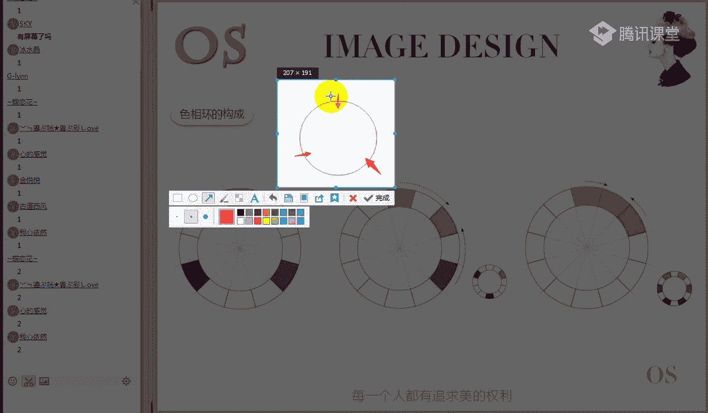
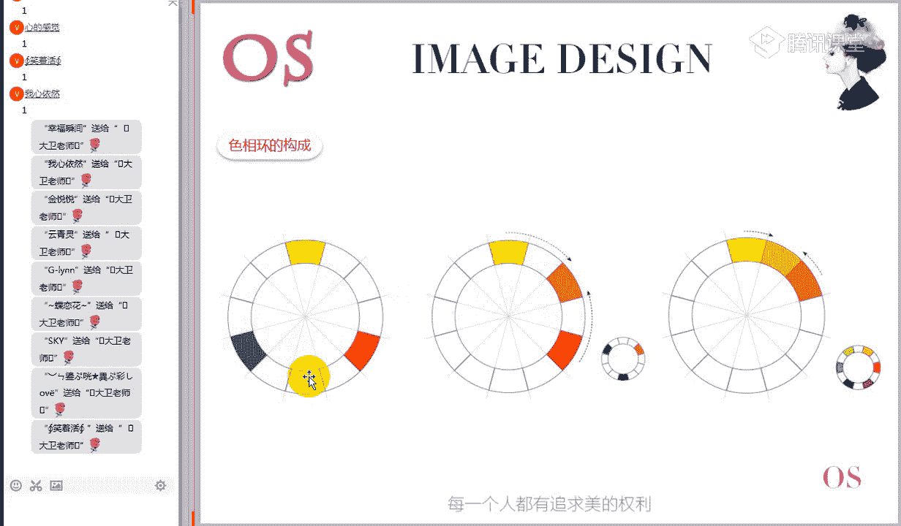

# 1、15男士形象色彩班VIP课程：第2节、色彩的特征

🎼才懂得相互拥抱，到底是为了什么？因为我刚好。好的，现在表示能够清楚的听到老师的声音，也能够完整的看到老师屏幕分享的同学在次在公屏上给老师打一个一。哎，有同学看不到屏幕，对不对？

看不到屏幕的同学可以啊重新进入一次啊。因为在咱们上咱们这个色彩美学班直播课的时候，哎，这个视频也是非常重要的，否则光听的话呢，肯定是听不明白的啊。看不到屏幕的同学检查一下你的网络或重新进入一次。好的。

再次欢迎大家来到我们OS形象设计中心色彩美剧班VIP课程的第五期的第二节课啊，色彩的特征。那这节课相对来说呢，我们上节课教的是色彩的构成，就是入门级的对色彩零基础开始了解。而这节课已经设计了相对来说啊。

是我们学习后面专业知识的必学的这样一个基础，而且的话是非常重要的知识就是关于色彩的特征。哎，我们在看到一个颜色的时候，从哪些方面去观察它的特征去描述这样一个颜色。所以本节课的知识呢是相当的重要的。好。

首先呢我们还是来看一下我们的课程大纲。那课程大纲其实啊每次给大家看大纲的目的，就是让大家在学习之前先要清楚哎，我们要学什么，然后在学习的时候呢，能够在做笔记的时候。

或者说在学习的过程当中能保持这样一个清晰的一个思路。那咱们在课后温习的时候呢，也是按照我们这个大纲来啊抓重点来温习有些知识了解部分呢，咱们就不耽搁太多的一个时间。两部分。第一部分是关于色彩的属性。

色彩的三要素，色相明度和纯度。那这一部分知识的话呢啊我一再强调非常非常重要。因为以后我们在描述一些搭配的时候，就会用一些专业术语，什么高明度、高纯度啊，高纯度低明度吧。对于我们这样专业术语的描述。

大家要快速的明白它是什么意思。那这个三要素的知识呢，就要理解的非常的透彻。第二部分是色明的分类方式，那这部分内容呢相对来说啊，作为我们这样的一个专业班的学员对这个知识呢稍做了解即可啊。

它是作为咱们这样一个呃拓展知识的了解。第三部分国际色彩体系也是的啊，有些知识呢是为我们高级班做铺垫的，先做了解啊，所以第二部分跟第三部分呢属于知识面的拓展了解部分，而核心重点呢是第一部分的知识。

学习的要求。第一点啊理解色彩的三属性关系，重中之重。第二，了解色彩的分类方式和色彩体系。那将来要我走上职业班的同学，就是将来想做形象顾问的同学呢，就是了解部分的知识呢，你最好也能够用心去学习体会好。

因为在你以后的这样的一个职业生涯上会用到这样的一些知识。好的，首先在正式讲我们这个呃色彩的属性之前，我们还需要把这样一个知识给大家再过一遍。好，对于这个色相环的一个构成。

之前就是有专门学习过的同学给老师打一啊，还没有学习过的同学在公屏上给老师打一个2。就是我们在看到一个颜色的时候，你能不能快速的识别出这个颜色里面的成分，包括我随便点一个颜色。

你知不知道这些颜色是怎么来的啊。因为这样的知识的话，有的时候在试听课上呢，哎我们也会经常提到这个知识。但是在我们VIP里面，这个是必须要求每一位学员对这个色相环的构成非常了解，而且必须要把它能够背下来。

随手能够把它默写出来。如果做不到的话呢，也就说没有达到我们这个基本的学习要求。无论是在学习服饰搭配，还是想走上职业的话，这个工具必须要掌握。啊，有部分同学学习过已经了解了，还有4位同学不知道，对不对？

我们要求VIP学员对这个知识点每一个呃。😊，都必须要过关，要能够记下来，能够默写。好的，接下来的话呢，我们会把这个四相环的构成给大家做一个详细的分析啊，十分钟解决问题啊，所以希望大家不要耽搁时间。

我们高效的来解决这个四相环的问题。再强调一下，为什么要学习色像环啊，因为我们说了人眼能够识别的颜色有多少？有700万到1000万种之多。而我们在进行服饰搭配的时候。

每个人凭你的记忆力不可能记住所有的颜色。所以我们要研究色彩，它的形成规律。而这个12色相环就是最基本的12个色相。我们掌握的这些色彩的基本色相的一个啊混合规律之后，我们再去研究其他的颜色呢。

就有了这样的一个什么参考的方向就会变得非常简单。😊，好，如果这个这个十二色像环，我相信很多同学第一次在见到他的时候都会觉得比较困难，看上去非常的复杂。如果让你记的话呢，你也会觉得无从下手，对不对？

接下来的话，我们对这个色像环给他来做一个分解的一个讲述。好，接下来的话，我们这个环节大家可能要动手。我们来看一下，在这个色相环上最原始的时候，其实只有三个颜色。

就是我们学习服装搭配里面经常会提到的三原色、红色、黄色跟蓝色。那第一节课我们已经讲到为什么服饰搭配里面用到的三原色是红黄蓝，原因是什么？我们所研究的服装它是不能够发光的。我们看到它的橙色过程。

实际上就是什么表面色的橙色过程。为什么说？😡，红黄蓝是三原色，因为什么其他所有的颜色无法混合得到这三个颜色，而红黄蓝这三个颜色可以混合得到几乎其他所有的颜色。所以我们称它为什么三原色。

那在第一个步骤里面，我们如何记住这三个颜色啊，非常的简单。现在在你的本子上画一个圆。好，不用画的太标准。知道他是什么意思就可以了。然后在你的这个圆上标图三个点。

三个点之间的位置是呈正三角形120度的关系。分别用汉字标除红黄蓝，要记住他们的关系，他们在色像环上时等距的120度的关系。

来第一步已经完成的同学在公屏上给老师打一个一啊，那我们的老同学来写出的话呢，一定要再温习一次，你每学习一次，你的印象就加深一次。而且将来我们很多同学的话，你有至于想做这样的一些讲师的话。

那这样的一个思路，一个教学的过程对你来说都是有帮助的。所以希望每位同学的话呢，呃在这你学习的时候能够培养一下自己的第二能力。😊，哎，已经完成的同学快速在公屏上给老师打一个一啊。咱们在呃VP的课程上呢。

老师都要求高一点。为什么咱们都是非常明确的要把这个板块知识学好的，所以呢对自己的要求要高一点，高效学习啊。所以说我们希望正常的课程时间呢，咱们就一个小时，把这样的课程呢可以轻松的把它学好。

而且呢学的比较透彻啊，不像咱们的试听课啊，有些知识的话，你可能来来回回的听都是模糊的。😊，接下来我们进入第二步，我们说三原色可以混合得到其他所有的颜色。

我们来看一下这三个颜色是如何混合得到其他颜色的那在第二个环节里面，我们的混合方法非常简单。我们有三原色彼此两两混合。比如说我们有基础的红色跟黄色混合，它可以得到一个橙色。😊。

所以这个橙色我们给它取了一个名字叫什么？叫做二次色，也叫什么中间的间尖色。所以一般我们用二次色来理解这个对它做定义的话呢，会比较简单一点。这个橙色大家来观察一下，我们说橙色是由红色跟黄色混合的到。

它是一个二次色。相反，就是当我们在看到一个橙色的时候，我们就会。这样去理解它这个橙色里面是有红的色相成分跟黄的色相成分的，对不对？能够理解的同学打个电话给老师看一下。

所以我们经常会看到我们在看颜色的时候，有些同学就会比较敏感，一看就能看出这个颜色里面有什么成分。原因是什么？他知道这些颜色之间混合的比例跟规格，所以一看就能看到这个颜色里面隐隐约约的色想成分。

我们在进行搭配的时候呢，你会有更多的这样一个参考。好，按照同样的混合方法，黄色跟蓝色混合可以得到一个二次色绿色，而红色跟蓝色混合呢可以得到一个二次色紫色。那接下来咱们要动手了。

是不是在第一个环节里面，我们这个色相环上只有三原色、红色、黄色跟蓝色，对不对？红色、黄色、蓝色、3原色、BC两两混合，红色跟黄色混合，得到一个橙色。黄色跟蓝色混合得到一个二次色绿色。

蓝色跟红色混合得到一个二次色紫色。是不是在第二个环节里面，我们有三原色，彼此两两混合，得到三个二字色、橙色、绿色和紫色。这样一来，我们就记住了6个色相，对不对？

好的，第二个环节已经完成的同学在公屏上给老师打一个一。而要动手标除用汉字标出位置即可。那这个在我们学完之后还是有作业有要求的。待会讲完之后，我告诉大家，是还有另外的一个作业要求。

我们一定要通过这样一个色彩美剧班学完之后，每位同学对色彩的敏感度都要提升一个档次啊，能够看到色彩之间的内在的一些联系。好，已经完成的同学在公屏上给老师打一个一，咱们一定要高效。

蓝色黄色和蓝色的二字车是什么？绿色啊，黄色跟蓝色混合得到了一个二字色绿色。所以我们在在见到绿色的时候，你要知道它不是一个原色，实际上它里面是有蓝和黄的成分的。黄色跟蓝色混可得到绿色啊。

已经绘制完成的同学在公屏上给老师打一个一。好的，经过第二个环节，是不是我们可以非常轻松的记住了三个颜色？橙绿紫对不对？三原色、红黄蓝加三个二次色，橙绿紫就得到了什么6个色相。二次色的三个颜色，是的。

也是正三角形120度的关系。你会发现他们刚刚好是加在三原色，各自正中间的位置，也是正三角形120度的关系。好，这样一来，我们已经轻松的记住了色相环的6个色相，对不对？第三个环节也非常简单。那第三个环节。

其他的6个色相是怎么得到的呢？我们是有相邻颜色的彼此混合而得到，是不是我们刚才第一个环节的原色黄色跟第二个环节的得到了什么二次色橙色黄色跟橙色混合，得到了黄橙色对不对？

有原色跟二次色混合得到的颜色称之为三次色也叫是什么复色重复的复复色啊，一般记住三次色比较容易理解黄橙色。😊，那按照这样的混合方法呢，可以得到什么黄橙黄色跟绿色混合得到黄绿，蓝色跟绿色混合得到蓝绿。

蓝色跟紫色混合得到蓝紫，紫色跟红色混合，得到红紫，紫色跟橙色混合得到红橙，又得到了6个三次色，对不对？我现在在用啊咱们这个。

描述一遍，大家现现在可以动笔来描述一遍呢，我们来看一下。在色相环上，最开始的时候只有三颜色，红黄蓝。混合方法是三颜色彼此两样混合，红色跟黄色混合，得到橙色，黄色跟蓝色混合，得到绿色。

红色跟蓝色混合得到二次色、紫色，三个二次色呈绿紫加在红黄蓝正中间。三原色加三个二次色，色相环上有了6个色相。第三步由相邻颜色混合，基础色相跟二次色相混合。那咱们这次是有什么黄色跟橙色混合，得到黄橙。

黄色跟绿色混合，得到黄绿。绿色跟蓝色混合得到蓝绿，蓝色跟紫色混合，得到蓝紫，红色跟紫色混合，得到红紫，红色跟橙色混合，得到红橙1234566个三次色，三原色加三个二次色，333加3加3等于6。

再加6等于12色像。

好的，给大家一分钟的时间啊，快速的在你的本子上来绘制十二色相的位置，并且用汉字标出来。完成的同学在公屏给老师打一啊，给大家一分钟的时间来动手画一下，只用汉字标出来就可以了，不用涂颜色。🎼到底是为了什么？

因为我可。🎼遇见。🎼不记才能。🎼风吹花。🎼Ba为。🎼不想。🎼再相遇。🎼我想我。🎼北心。🎼你笑着。🎼人海头望。🎼今天。🎼让热。🎼我。🎼唱着。🎼是。🎼我想。🎼到底是为了什么？🎼看。🎼一情。🎼风吹。🎼好的。

已经绘制完成的同学在公屏上给老师打一。🎼啊，大家抓紧时间啊，咱们这一块呢不耽搁太多的时间。🎼会记。好的，现在对它的形成过程应该都没有问题啊。现在我们在总图上快速描描述一下啊。那还没有听明白的同学。

我们来哎把思路理一下，在色相环上原始的时候就三个颜色，红黄蓝三原色，彼此两两混合，得到三个二次色成绿紫相邻颜色混合得到6个三次色、黄橙黄绿、蓝绿蓝紫、红紫、红橙3加3加6等于12色相环。

那我们对这一块的学习要求呢。第一。一定要能够背下来。第二，随手能把它默写出来。我再随便提到一个绿色，你知道它是二次色。我提到一个黄橙色，你知道它是三次色，要达到这个水准啊，这是最基本的要求。

因为我们说了。😊，学习色彩这个色相环就是一个最最基本的工具。我们在找色彩之间的关系的时候，你随时要知道这两个颜色之间它是相邻的颜色还是相对的颜色，能够快速在你脑海里面形成这些颜色之间的关系。

包括两个颜色之间色彩成分比例的多少。比如说黄色跟黄绿色相邻的颜色，对不对？那我们会明显看得出来，在黄绿色里面有大量的是什么？黄的成分，它也有蓝的成分。但是呢蓝的成分会比较少。😊，这个能不能理解。

能理解的同学打个鲜花给老师看一下，知不知道怎么看的。我们说黄绿色里面有原色像黄跟蓝的成分，黄的成分会更多一些，而蓝的成分会更少一些。为什么这个颜色明显是靠近黄色的，越相邻的颜色相同的成分就越多。

而黄绿色跟蓝色较远，它们之间混的蓝色的成分呢，就会较少。这就是是我们分析的方法。而这个的话呢，你只要是知道色相环质怎么构成的，分析起来呢？就非常的简单。😊，啊，只是简单的拓展一下啊。

这个色相环重中之重啊，很多同学学习这个东西的时候都不以为然，用的时候呢又不知道怎么用。好，这个是咱们科普的知识。另外在布置一道作业啊，是额外的作业。学习完这个色相环之后啊，咱们在最后一节课结约之前。

大家需要绘制色相环叫就是自己买水彩的颜料，只买三原色，红色、黄色和蓝色。然后自己啊这个画源就要画好一点，亲自去动手调制啊，十二色相环，这个颜色呢要调的准。那咱们这个会纳入了啊美学班结业考核里面8分啊。

六分以上是合格，六分以下不合格，不合格的，要重新去进行调制。😊，好，那么调制这个色相环有什么好处？也能够亲自动手感受到色彩之间比例的变化，色相上小小的差别。咱们以后再看服装颜色的时候，你会更敏感一些。

所以这个色相环的调制的话呢，相当于来说是我们色彩美学班啊，实操板块非常重要的一个内容啊，所以大家一定要去用心准备啊，时间还早，大家有半个月的这样一个准备时间。好的。

接下来的话我们就学习一个非常重要板块的知识，就是关于色彩的三属性啊，我们色彩的三属性也称之为什么？色彩的三要素，任何一个颜色的出现，它都同时伴随着色彩三要素的特征。所以这个知识的话。

每一位同学不能有任何的疑问，在表述色相、明众跟纯度的时候，要非常精确的非常什么精确的表述出这个色彩的一个特征。好，色彩的三要素分别是色相明度和纯度。咱们一一的来啊进行一个分解型的学习。

首先我们来看一下色相是什么意思。色相啊，我们说色彩的相貌啊，对这个色相的话，其实很多同学刚开始接触的时候感觉理解起来比较困难。包括像我们这样的知识的。有同学啊在买的一些书上。

有关于介绍色相明众纯度的解释，但实际上我估计80%以上的同学啊，不知道他描述的是什么意思，关键是什么术语化的东西太多了，对不对？那这个色相我们通俗的来理解一下是什么意思呢？通俗的理解就是指了色彩的长相。

哎，打个比方，你一看到这个色块，你知道是红色的，你一看到这个色块知道它是绿色的，为什么？因为红色长的是这样的，绿色长的是这样的，对不对？如果这个还不理解的话，我给大家举个例子。😊，打个比方。

你有两个朋友。哎，小红，还有一个朋友叫小绿，你在大街上见到小红的时候，你不会叫小绿。你在大街上见到小绿的时候，你不会叫小红。为什么？因为小红跟小绿长得不一样，一个高一个矮，一个胖，一个瘦，对不对？

一个男，一个女，对不对？是不是这个到底能不能理解？能够理解？同学打个一个老师看一下色像是什么意思，就是指。😊，色彩的长相或者叫做什么色彩的名字。这也是我们识别色彩的首要特征啊，我们在看到一个颜色的时候。

对它的第一感受就是色相。那这个不管是深红还是浅绿，你第一感觉它是什么红的还是绿的，第一就是对它色感受。所以跟我们看人是一样的。我们在看一个人的时候，第一看的是什么？它的外表它的外表是什么样子的，对不对？

所以这个色相的话呢是色彩的首要特征，一定要记得色相是什么意思啊，而且学会用自己的话来表述色相色相的这样一个啊特殊的一个属性特征。😊，好，比如说这些红的，我们说这个叶子是绿的，这个叶子是红的，对不对？

这个叶子带点层次的那对它的描述是什么？就是它的一个外观上的一个不同。😊，好，那那我们这个色像也是三要素里面比较容易理解的啊。接下来我们来看一下第二个啊，就是关于明度，明度理解起来呢有一点难度。

但是的话呃如果把自路理清楚的话，也是比较简单的。我们首先来看一下官方的解释，明度支指什么色彩的明暗程度啊，这个解释的话很多同学可能还是不理解。通俗的理解这个明度是什么意思呢？通俗的理解。

它就是指色彩颜色的深浅。我要问一下大家，深浅，颜色的深浅是什么意思？知不知道？哎，我们说这个颜色深，这个颜色的浅，你知不知道是什么意思？知道的同学在公屏上给老师打一个一，不知道的同学给老师打一个2。

明度通俗的理解就是指颜色的深浅，颜色的深浅，你知不知道是什么意思？比如在我们这个PP上，大家看到的英文字母，对不对？😊，呃，颜颜色的深浅怎么跟纯度的高低又扯到一起啊，先跟老师来一起理解明度啊。

同这位同学明显是对明度跟纯度搞不清楚啊，咱们一定要把它分开来理解。大家可以看到在老师的这个屏幕上会出现了这样的一些文字，对不对？右边这一排的文字是什么？是黑色这个啦。😊，是粉色，对不对？

我们来看一下第两个第一排的字母跟这两个字母哪个明度高一点好，或者说哪个颜色浅一点，大家来看一下这个会不会区分。是一还是2哦，大家用一二回答老师，这边是一，这边是2，哪边的颜色更浅一些？

简单的深浅一定要会区分。我们说明度通俗的理解是颜色的深浅，可是颜色的深浅你都看不出来，那就没没有办法来理解这么一个概念了。很明显这个颜色跟这个颜色相比，它要浅一些，原因是什么？它看着亮一些。

而我们背景的白色是不是跟比这个粉色还要亮，所以背景的白色明度是最高的啊。所以说对于明度的话呢，我们有一个比较简单的技法，明度比较的东西是什么？我们说深浅不太好理解，你比较亮不亮，两个颜色摆在一起。

哪个颜色更亮一些，它的明度一定就更高一些。而通常一定是什么？浅色的明度比深色要高。因为浅色看上去会更亮一些，对不对？好，民著的概念现在能理解的同学，公屏上打个一给老师看一下。😊，现在有没有理解？

那这里的话呢再补充一个小常识啊，关于明度之间的一个变化关系啊，在理解明度的时候呢，我们对黑白要有所了解。比如说呃我们看到明度最高的颜色肯定是什么？是白色，明度最低的颜色是黑色。

而加在这个黑色跟白色之间一大片区域的颜色呢，其实都称之为灰色，只是这个灰色的明度皆不一样，而灰色它是怎么来的呢？灰色它实际上就是有什么？咱们的黑色跟白色混合得到的。

当我们往白色里面不断不断加黑的过程里面，你会看看它这四个相撞的特征是么？看上去越来越暗越来越深了。当从黑色里面不断加白的里面，你会发现它的颜色越来越浅越来越亮了。所以这中间这一块是一个亮的变化。

所以灰色的话呢，它并不是指我们通常所指的灰色是指中间灰啊，就是看上去不明不暗的中间灰度。实际上灰色的范围非常大，它有偏浅的灰有偏深的这样一个灰啊。你一定要知道灰色是怎么来的。

那这是五彩系之间的一个明度变化，而我们有彩气之间的明度变化是怎么变化的呢？比如说对于同样的一个红色，它是如何变成深红色，如何是变成浅红色的那在它变深变浅的这个过程里面，发生了什么样的变化。

接下来呢我们来分析一下啊色彩明度变化的这样一个原因。大家可以看到，在我们公屏上中间这一块，它是原始色相的这些什么红色的色块。我们往右边呢依次给它滴加20%的黑。在我们不断不断加黑的过程里面。

你会发现它的颜色越来越深，由红色渐渐的变成了什么暗红色。而往左边，我们依次不断的滴加20%的白的过程里面，你会发现它的颜色会越来越浅，看上去越来越亮了。这个能看明白的同学打电话给老师看一下。

往原始色相红色里面加黑，它的颜色会变深，明度会变低，看上去会暗。而往红色里面加白的过程里面，它的颜色会越来越浅，明度越来越高。但是它整体的色相都是红色的一个色相。那通过这样的一个变化。

我们可以总结出来一个规律。就是导致同一色相明度变化的原因是什么？是因为黑白的一个混入，白色混入的越多，颜色越浅，明度就越高，而深色、黑色混入的越多，颜色越深，明度就越低，在视觉上呢就越暗。

来这个规律能够记住的同学打一个老师看一下，一定要记得颜色它在明度上变化的原因。比如说这个红色变成了浅红色，是因为什么？是因为往里面什么加了白五彩系的白，它不会影响色相的变化，但是它会导致这个颜色是什么？

明暗关系发生变化。😊，好，刚才总结的这个规律有没有记住啊？非常容易理解啊。如果这个变化的过程你能理解就可以了。因为这一点的话，你很多同学不知道颜色，哎，这个这个红色怎么会变成浅红色。

在这个过程里面发生了什么？实际上就是加了白。😊，啊，如果加了其他色相，它的色相特征就变化了，加黑白灰不会影响色相特征的变化，只会导致它的明度跟纯度发生改变。好了，这是同一色相明度变化的原因，是因为什么？

是因为这样的一个黑白的一个混弱。其实在我们这里的话呢，原始的我们说研究的原始色相是六大色相，红黄蓝。橙绿紫啊，红黄大家还记不记得红色、黄色跟蓝色是三原色，橙色、绿色跟紫色是二次色。在这六大色相里面呢。

原始的六大色相也会有这样一个明度的排序。大家会发现与黄色的明度最高，紫色的明度最低啊，这是六大色相的明度明度排序。大家可以了解一下。以黄橙色的明度居高。红绿的明度居中蓝紫的明度居低啊。

就是原始六大色相的一个明度排序，其实本质上都是一样的。我在比较有彩系的时候也是一样的。比如说我比较这个黄色跟绿色，哎，哪个明度高一点呢？很明显黄色，因为什么黄色看着比绿色亮，我在比较同一色相，哎。

这个浅红色比深红色哪个更呃明度更高啊？浅红色，因为为什么浅红色看着更亮，它比较的原则没有变，就是比较两个颜色的明度高低的时候，看的是什么？哪个颜色更亮一些。好的，明度这一块的知识有没有问题？

一是明度的概念。2、你要知道明度变化的原因。同一色相明度之间变化的原因是因为黑白灰的一个混入，不同的色相之间呢也会有明度差啊，本质上我们只需要比较哪个颜色更亮一些，它的明度呢就更高一些。

所以我们在讲到一些唉高明度的颜色的时候，它指的是什么，它你可以想到它是浅颜色，或者说你可以想到它原色相的明度比较高。比如说黄色跟橙色，它本来的原色相明度就比较高，对不对？好。

民度这一块知识没有问题的同学，赶紧给老师打个一啊，咱们就继续下一个知识点，一定要记得啊不要呃不懂装懂啊，对你来说呃是比较不划算的。我们这样一个直播学习就是希望提高学习效率。

咱们当堂把这样的疑问呢给它解决掉。大家看录播的话呢，可能很多时候就不能呃静下心来看，可能看着看着就干别的别的去了。但是直播的话呢呃咱们这个呃你自己的状态，大家明显感觉到会不一样的啊。

所以说啊所以说呢我们会定期的安排这样的直播课程的一个更新的一个学习。😊，好，接下来我们来看一下色彩三要素的第三大要素是什么？是这样的一个纯度啊？对于纯度的话，其实很多同学理解起来也比较困乱啊。

因为纯度很多地方的解说非常多，什么鲜艳度啊啊饱和度啊，纯呃这个什么呃色彩饱和度啊，彩度呀，对不对？各个地方的称呼度不一样啊，实际上我们只需要记住一个最简单的解释是什么？就是鲜艳度。

纯度通俗的理解就是指色彩的鲜艳度。但是我要问一下色彩的鲜艳度，知不知道是什么意思？来知道的同学打个先发给老师看一下鲜艳度，你能不能理解我们所说的鲜艳度是什么意思？哎，我说这个颜色好鲜艳呢。

这个鲜艳是什么意思啊？那他的色彩的表象特征上是什么样是什么样子的，他是不看上去非常的艳，对不对？啊，那这样的话很多同学还是理解不了，我们来比较这两张图片，这里要有两个色块，大家来看一下，这是一号。

这是2号，哪边给你的感觉更鲜艳一些，是一还是2？😊，这两个色块哪边给你的感觉更鲜艳一些，是一还是，是不是这个非常的直观，非常明显是左边更鲜艳一些。所以我们得出一个结果是么？左边的这个色块的。

纯度要比右边高，因为左边什么看着更鲜艳一些，对不对？所以我们在比较两个颜色，哪个颜色纯度高的时候，一定是什么更鲜艳的那个颜色纯度高，鲜不鲜艳，我觉得这个东西还是比较容易理解的啊。

记得比较颜色之间纯度高的是哪个的时候，就看哪个颜色的更鲜艳一些。啊，温析一下前面的知识，一啊一号色块跟2号色块哪个明度高的高一些，是一还是2？12两个色块哪个明度高一些，是一还是12？

为什么啊不要跟着别人一起敲一敲2。二的明度高，为什么？是不是因为R明显看着比左边亮一些，对不对？所以明度跟纯度是什么？没有这样的一个正比的关系，也没有这样一个必然的联系。不是说哎这个颜色纯度高。

它的明度就高了。哎，也不是说这个颜色纯度低，它的明度就低了。纯度你要知道，我们在提到纯度的时候，我看的就是这个色彩的饱和度，它鲜不鲜艳。而在提到明度的时候，我看的是这个色彩亮不亮的问题。

所以明度跟纯度不是一回事，很多同学在学习明度跟纯度的时候啊，把它的意思理解的一样啊，说是不是颜色哎纯度高的明度就高，不是这个概念，你看这个纯度是不是很高，但是它明度高嘛？没有这个高，这个纯度非常低。

但是呢它看上去很亮，所以它的明度要比它高。😊，好了，现在色彩的明度跟纯度的干关系搞清楚没有？能够搞清楚的同学打个屏话，给老师看一下。以后我们再提到高明度、高纯度、高纯度、低明度，你知道不是什么意思？

有些颜色它的纯度很高，但是它的明度很低啊，这样都是成都是存在的。所以说千万不要把理解为什么明度跟纯度成正比较，不存在这样一个关系。你我们在一再。比较什么纯度的时候，就看鲜艳度。我在比较明度的时候啊。

我们只看它的一个什么明暗关系，哪个更亮，哪个明度就更高一些。好了，咱们色彩的三要素呢，刚才给大家做了分布的介释啊，任何一个颜色的出现，我们都会用什么三要素来描述它。哎，色相这个这个颜色长的是什么样子的。

然后明度哎它是明它是亮的还是暗的，然后纯度它是鲜艳的还是浑浊的那另外一个只示要给大家补充一下，这是是什么原因导致了我们色彩纯度的一个变化，对于同一色相而言，要记住了，是因为什么，是因为灰色的混入。😊。

一旦一个原色相，比如说红色混入灰色之后，这个颜色看上去就就会有什么有点发灰发旧的感觉。所以我们往往看到那一些颜色可混浊的颜色，一般都是被混入了什么灰色的。对于同样一个色相，如果我们直加白直加黑。

实际上这个颜色还是比较鲜艳的，只是说什么看上去亮了一点，或者说暗了一点。但是你一旦加入了灰色，这个颜色就开始变得什么浑浊了。所以说导致色彩纯度的变化的第一个直接的原因是什么？是因为灰色的混弱。来。

这个能够理解的同学打个一给老师看一下。😊，当一个颜色直加黑白的时候，实际上这个颜色只是明暗关系变化了，实际上它还是比较鲜艳的。但是如果你一旦混成了灰色，这个颜色呢明显就开始变得灰浊，变得灰蒙蒙的感觉。

看着去有点发灰发旧的感觉，这就是同一色相，它的纯度变化的一个直接的原因。好呃，讲了这么多理论知识。接下来我们看一下大家的一个识别能力。那这里的话呢，我们采用了这样的一些淘宝上的一些图片。

我相信平时在这个淘宝上买衣服的时候啊，大家肯定会看到很多不同的服装颜色。从现在开始学到课程之后，你要学会把这样的知识呢来应用，就是通过反正自己都是道淘淘宝上买衣服的，对不对？

你顺便看一下这个衣服的明度纯度啦。哎，还有什么它的这样的一些色相关系来训练一下自己对于色彩的敏感识别能力。好，比如说在这些衬衣里面，你会发现同款的衬衣颜色非常多。

比如说我现在需要一件什么高明度高纯度的颜色找出这些啊衬衣里面，明度最高且纯度也最高的一个啊衬衣是哪一件。😊，把答案给老师打的公台一下啊，明度高，纯度也高的是哪哪哪一件？高明度高纯度的那件衣服是哪一件？

是不是还有很多同学不知道从哪儿分析的，对不对？我们说在提到颜色高明度的时候，我们首先想到的是两个方面。第一，将我们这个颜色非常的浅，混入到白色，非常多粉黛。第二，这个原色上它本身明度就比较高。

那符合这两个条件的，是不是哎其实浅色了很多，比如这个颜色对不对？这个颜色也很浅，对不对？明度高的哎，原色上黄色明度也高，对不对？所以这两个呢我们可能要在这样的一个考虑范围之内。比如说这个浅紫色，对不对？

跟什么这个黄色电两颜色明度都比较高。单一的从明从这个什么明度来说啊，这个浅明度高，这个原色像黄色本来明度就高，所以这两颜色明度都是比较高的，对不对？😊，来，这个能够理解，同学打一个老师看一下。

如果我们找高明度的颜色，很明显是浅紫色跟黄色，对不对？因为浅色加的白比较多，而黄色呢本身明度就比较高，所以高明度的颜色是这两个，对不对？但是我们说了我需要的是什么？高明度高纯度，它不但明度要高。

它纯度也要高。那这个时候我们再来筛选一下，这两个颜色里面。😊，是不是很明显黄色符合黄色是原色，所以黄色的纯度是非常高的，而这个浅紫色的紫色是一个什么二次色，而且被加入了什么大量的这样一个白色。

所以它的纯度已经非常低了。对比之下，符合这个条件，同时明度也高，纯度也高的就是这个黄色，对不对？有没有理解，或者说有没有学会这样的一个分析的方法。我们在谈到明度高的时候，你考虑到两个方面。第一。

它颜色浅。第二，要么它是原色像三原色的纯度自然是最高的，对不对？那当然纯度最高的肯定是原色的一个红色，跟这个波长有关系啊。在第一节课我们里面就讲过了，波长越长的，它的它的什么，它的纯度鲜艳度就越高。好。

所以我们需要高明度高纯的颜色，当然是黄色。好，我们现在的来换一下，我们现在需要一个。低明度、高纯度的颜色，大家看一下是哪一个。找出里面低明度、高纯度的颜色。低明度高纯度的颜色是哪一个？好的。

我看公屏上现在回音的同学不到一半，其他的同学是不是无从下手了？只要刚才我们所讲的三啊这色彩的三要素，你是理解的话，你应该可以快速的找得出来。是不是方法非常简单？我说第一名的高层呢。

是不是我首先把明度低的选在一起，然后再进行筛选，对不对？有的人说黑色，那当然黑色敏度低，但是黑色的纯度高吗？大家要记得啊，五彩系黑白灰的纯度是0，所以五彩系的纯度是最低的。

常识啊黑白灰五彩系的纯度几乎是零，任意有彩系的纯度都会比五彩系要高，所以排除黑色。但是如果说我们第一步先选出纯明度低的，就是看上去比较暗的。比如说这个颜色对不对？这一块的颜色，这个颜色。

这些颜色看上去都比较暗的，对不对？但是我们还有第二个附加条件，纯度高的，它看上去要暗，而且还要比较鲜艳的。大家再看一下是哪些颜色，于说这个颜色。这个颜色明度自然。要低，对不对？

我们现在筛选出来肯定是原色相的蓝色纯度比较高，所以这些颜色都不用不用看的。因为原色的纯度会比较高。所以我们现在锁定这两个颜色，这两个颜色里面明度低且纯度高的颜色。符合这两个条件，大家看是湖蓝还是牛仔蓝？

这两个颜色相对来说明度都比较低，但是纯度哪个会高一些？再给大家一次回答的机会。首先这个牛仔蓝这个牛仔蓝纯度还高吗？其实我们之前给大家讲了，这个牛仔蓝的颜色非常非常的暗。我要问大家一个问题。

加入黑色会不会改变色彩的纯度，认为会的同学给老师打一，认为不会的同学在公屏上给老师打一个2。在原色向蓝色里面加入灰色，会不会加入黑色，会不会它的纯度？认为会的打一，认为不会的同学给老师打2。

加入黑色会不会改变它的纯度？老师要把鲜花送给一上打一的同学，当然会。其实这个纯度是什么意思？我再给大家举个例子啊，比如说我这里有一碗什么，我这地方有一碗清水。😡，我这外清水里面无冰无论是什么。

你往里面里面加了盐还是加了糖，它都不纯的，它的纯度都降低了，对不对？所以对于一个原色相的蓝色来说，你无论是加了白到里面还是加了黑，它都不再纯了，它的纯度都降低了。我只是说对于同一色相加黑加白。

它的色相没有变，它都是蓝色的色相体系，但是它纯度实际上是降低的。事情都有一个什么量变到质变。当你在这个蓝色里面大量大量加黑，你继续加黑，这个蓝色会变成一个纯黑色，就表示它的纯度已经快降到零了。

所以这个牛仔蓝的话，它在里面加到蓝的黑色的量已经过大了，导致这个颜色的一个纯度已经非常低了，所以它的纯度也非常的低了。而这个湖蓝呢虽然加了黑明度低了，但是它还是属于一个纯度非常高的颜色。

因为它加黑的比重呢不是很多，有没有理解？所以我们在理解这个纯度的它一个变化的时候，它实际上会有一个量变。当我往一个颜色里面，比如说我往一个蓝色里面加白，不断加白。当达到一定量的时候呢。

哎这个蓝色就完全变成了白色。来现在能够理解的同学打个鲜话给老师看一下。一定要记得，对于原色相来说，不管你是加黑白灰还是加其他的东西，它的纯度都会降低。跟我刚才举的例子是一样的。我这般清水里面。

你不管加什么东西，都会导致它的纯度降低。好，现在理解了没有？我要的是低明度高纯的颜色，当然首选湖蓝色，对不对？因为首先这个牛仔蓝它明显的纯度已经非常低了，因为它的块什么接近黑色。

而黑色50黑色什么黑白灰的一个纯度什么？几乎是0，对不对？😊，啊，有没有理解跟不上的同学啊，现在可以提出质疑，因为这一块的知识相对来说还是有一些难度的啊。对我们刚刚开始学习色彩课程的同学来说。

有没有理解我刚才说的纯度变化加白加黑，它实际纯度都是降低的。只是它没有什么加灰来的那么明显，因为加了灰为什么那么明显呢？它相当于对一个颜色里面又加了糖，又加了盐，对不对？因为灰色是黑白的一个混合物。

有没有理解，现在清楚一点没有？我这碗清水里面我只加了一点盐，它的纯度降低了。但是我同时又加盐，又加糖，是不是这个这个纯度就已经非常低了。可以这样去比对的理解一下啊。而一个深蓝色相当于只加了黑。

它的纯度会低，它的变化没有同时加。灰来的这么明显。好，这个大家可以去把这个做量化来比对一下就可以理解了。好，这个咱们就不深究了。再深究的话呢，就有点感觉像是在研究咱们的科学知识了。

重点是在选择服装的时候，比如说我要高明度、高纯度、低纯度、高明度，随便列，你能够快速比较在里面找出最佳的那个颜色就可以了。第二点呢大家要掌握这样的一个方法。平时前买衣服的时候呢，学会去识别。哎。

比如说我在界定这个颜色纯度是高是低的时候，我一看这个颜色，它里面加的是这样一个什么黑白的这样一个比重。😊，对不对？一看就知道这个颜色黑色比重非常的大，所以它的纯度已经非常低了。它首先看上去就不鲜艳的。

它不鲜艳，肯定纯度就低，对不对？😊，同一色项不断加入白色或者黑色，它的纯度不。纯度会不断的变为淋巴，将当什么加到一定量的时候。比如说这个红色加白，它最后变成全白色的，是不是它的纯度就变零了，对不对？

因为什么黑白灰的纯度都是为零的，几乎为零的啊。所以说当你加黑，比如说黑加到一定量的时候，它由量变到质变。这个红色已经变成了什么全黑色，所以它的纯度呢就变为了零啊，这是从理论上来讲的。好，有没有理解？

但是一个如果如果说一个红色只加了那么一点点1点点什么一点点白，对不对？它80%的比重还是红色，所以这个颜色还是比较鲜艳的。但是如果说我加白的比重超过了百分之六七十的话，是不是这个颜色已经变得非常浅淡的。

它的纯度就不高了，对不对？它慢慢的都被白色给什么同化掉了。😊，好的，其他同学有没有理解啊？刚才这位同学提的问题非常好啊，因为这个问题你思考清楚了之后，我们以后再看颜色的时候。

你就能够快速的去分析这个颜里面的一些什么色彩成分，它的比重大概是多少。我说这个颜色加了白，它这个比重有没有超过一定的量，你要快速的来感受一下这个色彩内部的一些变化。😊，其他同学能够跟上吗？能够跟上的话。

现在在公屏上给老师打个电话啊，咱们这一点就过了啊。其实训练方法的话呢，非常简单，不是说老师一节课讲完之后，你就会了，它需要一个过程。我们说我们对于色彩的敏感度需要一个过程，平时去买衣服的时候。

你自己现在衣橱里面有衣服的时候，哎，随便拿个衣服，我来看一下这个衣服哎，纯度是高是低，明度是高是低，对不对？你经过大概啊一个月左右的训练，基本上对色彩的一个啊明度纯度的识别呢就会非常的精确。

而且呢会比较熟练，大概一看这个色彩里面大概有多少比重的一个成分，一看就知道了。但是如果不训练的话，哎，听完课你就放到一边啊，估计你对色彩在搭配的时候呢，还是不够是吗？不够灵活。😊，啊。

就是不能快速的知道这个色彩之间的一些内部的一个变化。来色彩三要素这一块还有没有疑问？没有疑问的同学，现在打个一给老师看一下啊，因为这个知识比较重要，所以花的时间比较长。好的，接下来的话呃。

我们进入下一部分啊，刚才我们看一下进入第一部分色彩的三要素，我们就啊不会比较。你抓住重点，记住口诀。明度比较的是亮不亮，哪个颜色亮，哪个明度高，纯度比较的是艳不艳，哪个颜色鲜艳，哪个颜色的纯度高。

第一部分色彩的三要复组。第二部分呢属于了解内容，老师的节奏就快一点啊。大家知道我们在学习上的一个重点重点知识的时候，你必须要搞定了解部分的知识的话呢，只是拓展知识面，咱们就快一点啊。

大家在学习的时候呢啊也要有这样的一个思维意识。那记笔记的时候，比如说这一版块的知识。有些老师说的重要的话一定要记一下啊。了解部分的知识的话，记关键词即可。😊，啊，另外我发现有些同学做的笔记啊很凌乱。

一定要正规的找一个呃一个买一个笔记本，十几块钱可以买很大的一本啊。每节课认真的做。你等到整个课程学完之后，你会发现你再来回顾笔记的之后，你的理解就不一样了。如果现在你随便找个本子写一下。

等到咱们那个课程学员，可能本子都不知道去哪儿了。那到时候你想问写呢啊，就是没有这样的一个什么没有这样一个再次提升的一个机会了。😊，第二个就是第二部分。我们说关于色明的一个分类方式啊。

它是属于这样的一个常识性的一个了解部分的内容。我们说将色彩名啊收集分类混总起来，可以区分出了300到500个这样一个色彩的名称。咱们考虑到啊色明的一种性和实用性的一个便捷性呢。在色明的分类上。

就是把色彩的这个名字的划分呢，大致分为4种。第一个就是基本色明，第二个是系统色明，第三个是固有色明，第四个是惯用色明。就是大家以后在看到一些色彩名称的时候啊，你要知道它这个名称定义是什么意思。

第一个基本证明是什么意思呢？为了表示基本色彩与其他色彩的区别，而制定的色彩专门用于最基本的色明是什么？黑白。红尘黄绿蓝紫。啊，红黄蓝橙绿紫啊，可以这样去去加上了我们的黑白灰啊，具有简单意义的独立词组。

还有一种是呢混合表现意义的词，比如说。啊，黄红。蓝绿。紫红啊，就是这样的，我们相当于什么红紫二次色相的表述啊，这些都称之为什么基本色明。所以我们1二色相反正的色相呢也是什么基本色相。第二个就是系统色明。

对于系统色明的一个定义。在基本色明的基础上啊，所以基本色明比较简单，就是基本色相，在基本色明的基础上加入一些修饰的表述方法和色相相关的修饰词，比如说泛红的啊，这个在我们以后学习色调会经常用到。哎。

我们说这个颜色什么泛蓝，它是什么冷色调，这个颜色泛黄，它是什么暖色调啊，对不对？所以说呃你要大概知道这是什么意思啊。比如说泛绿的啊，就是这个颜色里面有一些什么绿的这个底调子。啊。

或者说加入更多的一些形容词，鲜艳的泛黄的绿啊，所以说这个颜色比如说这个泛黄绿的这个颜色，而且呢比较鲜艳啊，这个大概知道它是什么意思就可以了。系统色明啊，在基本的色明上加入这样的一些修饰习词组。

第三个固有色明，那个固有色明从哪来呢？它是从古流传下来的，进入现代社会，也就成为了现代色明，也可以叫做什么被习惯用的色明。就是古往以来大家已经习惯了这么叫。啊，比如说我们会用到这样的一些。

动物啊、矿物啊、人名哪、地名呢来表示这些颜色，比如说三文鱼肉粉、银珠、胭脂、朱砂，对不对？这些的话，相信在啊有一同学学过这样一些国画的话，在里面的一些表述了。

都是会用到这样的一些学水彩的同学会能对这个会比较熟悉啊，他会用到这样的什么传统流传下来一个固有色明来表示。好，知道它的一些特点啊，运用矿物啊、人民啊、地名呢来表述这些色彩，它就称之为什么固有色明。好。

第四类就是惯用色明。惯用色明是什么意思呢？它是在无数个啊，在又在什么固有色明中，有一些经常在现代社会中使用被大多数人所知道的色明。比如驼色咖啡色啊，大家要知道是什么意思啊。

固有色明呢是千古呃从古流传下来的，而固有色这个惯用色明是什么？在这些固有色明里面被哎现代社会广泛使用了一些颜色。比如说驼色咖啡色，一般人都知道，对不对啊，所以说呃这块的知识呢大家简单的了解一下即可啊。

就是咱们色明的一个分类方式，分别是基本色明，系统色明，固有色明，惯用色明，你大概知道它是什么意思就可以了。好，第三部分也是属于常识了解部分，就是关于国际色彩体系啊。

这个呢相对来说对于啊我们这个学习美学班的同学来说呢，这个就是不用深究。但是呢作为尝试了解一下，关系国际四台体系。好，这个呢大家可以看到是什么？咱们这样一个色泥体啊。

它分别用什么三维的形式来表述了色彩的一个三要素的特征。我们刚才说了啊，任何一个颜色的出现都同时伴随着色彩的三要素，就是说这三要素之间是独立存在的，而且呢是紧密相连的啊。

所以说你看明度跟纯度跟就是我们所说的彩度，它之间啊并不是一个意思啊。刚才我们已经区分过了，相对于大家应该知道它是什么意思。😊，啊，这个常识大家也要了解一下啊，可能在以后有的地方会提到，就是关于色泥体。

国际上的话，其实上很多国家对这一块专门有研究啊，这些科学家的话呢，每个人的研究方法有所不同。比如说第一个就是美国的什么蒙塞尔色泥体啊，蒙赛尔色泥体。第二个就是奥斯特瓦尔德色泥体啊。

德国的奥斯特瓦尔德色泥体。第三个是日本色泥体。那第三个国家的话呢，对色彩这个领域里面呢都做出了非常大的这样一个贡献。😊，好，了解这个简单说理的话，咱们不研究研究起来的话，这个东西可能大家会听的头晕啊。

知道就可以了。啊，现在给大家分享咱们说国际上对于色彩的这样的一些定位标准啊。呃，对于关于明度。明度的话呢，我们说明度的标准是白色和黑色之间的一个色彩感觉。在白色和黑色两个色阶之间等距离的分为三个色阶。

并在三个色阶中继续画5个色阶。接着就是9个色，最均画为17个色阶。好，一般情况下呢，我们不用这么区分，特别是在我们学习服装搭配的时候，你大概知道这么一个范围，中明度。高明度、中明度跟什么低明度。

那中明度呢相对来说就是在原色向上稍微深一点浅一点，大概是这个范围啊，这个没有办法告诉大家，这个比重是多少。而高明度呢其实整个颜色明显是偏浅的，而低明度呢，是整个颜色明显是偏深的啊。

所以大概的话我们以后描述中明度大概是一个什么范围，并不说中明度它就是指原色相，它稍微加了少量的白跟小量的黑，这个的话呢需要通过大家去啊在生活当中用更多的经验去累积但是你要知道在国际上呢。

我们是有这样的一个明度界的一个划分。😊，第二个是关于纯度，同样的纯度也分为什么？低纯度、中纯度跟高纯度，那中纯度也是一个什么相对的概念啊，相对的概念。低纯的话就表示这个颜色纯度已经非常低了。

几乎快被什么同化掉了。高纯度呢自然是在里面加入其他的成分比较少，看上去它整体还是非常鲜艳的。就比如说我们刚才看到那个牛仔蓝，对不对？为什么我们说牛仔蓝是低纯度呢。

大家就会发现那个牛仔蓝几乎已经快被什么黑色给同化的。所以这个纯度它是一个什么相对的概念。😊，好，刚才我们说的那个牛仔男，大家还记不记得，现在明白是什么意思没有？为什么我说它是低纯度的。

为什么现在理解没有能够理解的同学打个先话给老师看一下。😊，啊，为什么我们刚才所看到那个牛仔蓝，我们界定为它为低纯度。大家比较一下是不是它黑色比重已经非常多了，它的纯度了，所以界定为啊低纯度。好。

那第二个小知识点就是关于PCCS体系的一个表示方法啊，这个东西大家可能接触不到。但是如果有接触到的话呢，你知道它是什么意思啊，其实也非常简单，它就是这样一个坐标轴。彩度呢用X字表示啊。

那这个数值之大越大呢，表示呢纯度就越高。N用来表示什么明度啊，大家可以看一下它的一个变化，越往下明度越低，对不对？越往右边纯度就拉越高。好，我们可以看一下啊，其实这个坐标轴的话呢，简单了解即可。

我们在真正的在学习服装搭配的时候，可能接触不到。只是在我们这个呃专业领域里面呢，它会用不同的方法对这些颜色做了标准的这样一个定位啊，了解即可。好，这个知识点就稍微重要一点，就是PCS体系的一个色调。好。

这个色调图的话呢，作以美学班大家先知道，因为在高级班里面，大家可能会还会要亲自去调制这样的色调图啊，相对来说，哎它比较复杂一些。但是有个小知识点大家是可以理解的。比如说这一片其域鲜艳色调。

我们就可以理解为什么原色相的色调，它非常的鲜艳。我们会发现沿着这条这条方向走的话，在这个颜色里面不断不断加白度过程，你会发现这一块的颜色称之为什么明色调、浅色调、淡色调。你会发现它只是加了一个色相。

加了这个白的话，它相对来说它颜色还是比较鲜艳的。这一块的颜色称之为什么？明清色调。而且我们下面的坐标轴，我们在这个颜色里面不断加黑的里面，你会发现它的颜色越来越暗。所以这块的颜色称为暗色调。

它的纯度相对来说也是比较高的。而这中间这一块都是什么？我们称之为什么着色调，你会发现同时加黑白之后，它的颜色整体开始变得浑浊。白色到黑色中间区这一块的灰色啊。

这个图大体上能看懂的同学打个一给老师看一下啊。至至于具体的一个用色方法，咱们在这个呃这个现在讲肯定是听不懂的。在咱们那个职业班里面呢，会专门教到这个色相环上。哎，咱们这个色调图里面的一些配色的原则。好。

大概能够看明白它的一个变化规律的同学，打个一给老师看一下。沿着上面是加白，单一的加白，沿着下面是单一的加黑，而往中间走的话呢，就是加入了黑白的混合物灰色。啊，比如说我们在高级班里面会用到一些色布啊。

会用专门不同的颜色来表述啊。比如说这些桃粉虾啊，可是我们刚才这里所标注的是什么？浅淡色调啊，我们要不同的表述，比如浅淡色调，我们课后的话还会有作列。比如说浊色调，浊色调里面一定是加了灰的，对不对？

但是我们说哎我们要的浅色调，它已经跟浊色调是有区别的，浅色调只是加的白比较多，比较亮，而浊色调呢是同时加黑加白比较浑浊。所以这个的话，大家这个色调这个东西的话，还是要稍微哎大概能够看明白是什么意思。

比如说我要需要你去找一张是吧，找一张什么灰色调的服装图片啊，再让你找一张着色调的服装图片，那灰色调的服装图片跟着色调的服装图片有什么区别的？这个你要能够看得明白。😊，好。

这个在我们后面色彩的情感还会还会有这样的一个专门的讲解。你会发现啊不同颜色，不同的颜色。比如说这些浅淡的色道，不同的颜色，它所表达出来的感觉也是不一样的啊。所以说我们在进行服装搭配的时候。

并不像大家之前没有学习过那样的简单啊，就是这个颜色黄色配绿的好不好看？实际上它能够影响到人的心情，它能够传达出不同的感觉。😊，好，稍作了解啊稍作了解。因为这个东西的话，现在研究起来还有点难。

比如说哎我们说的这个白色给别人的感觉什么？能够表现出来这种比较清洁寒冷新鲜的感觉。😊，比如说我们的浅色调带给别人感觉是什么？清澈的孩子气的喧闹的、高兴的好，那这些知识的话。

在我们在配色设计里面呢会用到的比较多。但是在服饰搭配上作用也非常大。只是现在的话呢哎大家先做这样的一个了解，后面呢还会专门的这样一个训练。😊，好，咱们了解部分的知识就给大家分享到这里啊。

这部分知识的话呢，平时有空的话呃，有有兴趣的同学可以专门研究一下，这个不要求。因为呃这些知识的话呢来说呃我们只是先做一个了解，真的要把它搞明白的话呢，现在肯定是还没有达到这个层次的。😊，好。

接下来我们这块知识呢比较简单，所以介绍的比较快啊，我们来看一下本节课的作业。😊，第一，结合右图描述服装色彩、三要素的特征。比如说那这个衣服它是什么色相，那它的明度是高是低，对不对？它的纯度是高是低。

非常明确的描述出来啊。那我这里只是提供一个案例，希望大家平时在生活当中都能够随时对你自己的衣服的这个三要素，快速的去描述，去做这样的一个训练。如果自己确定不了的颜色，记得发在交流群内。

其他的同学呢一起来探讨一下，再确定不了，老师会以亲自出马啊。但是一定要有训练啊，不能光听完课之后就抛到一边。第二个，寻找一张浅灰色调啊，寻找一张浅灰色的女装图片和一张什么着色调的女装图片啊。

这个可以去网上找。看清楚了啊，浅灰色调的女装图片和一张着色调的女装图片啊，各一张即可。好，另外我再强调一下，在我们的VIP群里面自己是不可以建相册的啊。因为大家每人建一个相册的话，老师找找作业都找不着。

而且的话我们这是第五期啊，第五期第二节课，我的相册标的很清楚。第五期第二节。😊，好，所以这节课的作业的话呢，大家一定要找对地方啊。比如说第五期第一节，你第几节课的作业一定要看清楚。这样一来的话呢。

我们在批改作业的时候呢，就能够快速找到大家作业在哪里。😊，啊，记得啊，我们这个交作业的话是有学分的啊，每交一次作业有两个学分，记得色相环的实操调制占8个学分。

然后的话咱们的理论考核呢啊会占到这样的80分的一个比重。所以大家对这块作业的话一定要认真做。老师浅灰色调和着色调可以再讲一下吗？我们来看一下这个色调图里面。大家来比较一下浅灰色调跟着色调来比较的话。

它有什么区别？你能不能看出来看得出来区别的同学给老师打在公台上，大家可以看一下这个色相环里面是浅灰色调，这个色相环呢是着色调，着色调跟浅灰色调比比较的话有何区别？好，给大家30秒的时间。

🎼能不能看得出来这个浅灰色调跟浊色调有何区别？如果这个你区分不了的话，你待会儿服装图片肯定会找错的。🎼蜡烛燃烧自己之。🎼一切无限黑。🎼不欢疑。🎼我每个。🎼都变得有意义。🎼爱你永远。🎼傻明。啊。

是不是很多同学就看不出来了，很明显，我们这个着色调的颜色比这个浅灰色调的话，它的纯度要高一些，更鲜艳一些，对不对？实际上它们属于什么？同一的一个明度阶，在同一水平线上，实际上是什么？

它们的明度明暗关系是一样的。只是什么？很明显这个着色调看上去要更鲜艳一些。为什么你会发现这个左边越是靠近灰色，它的纯度就越低，看到没有？你越是靠近左边这个坐标轴，它的纯度就越低，直到这边变成了什么全灰。

从这边到这边，我们都在不断的往这个颜色里面加灰，只是到这儿的话呢，几乎加成了全灰，越往左边，它加灰的比重就越大。所以浅灰色调的话已经是接近几乎灰色的颜色。而浊色调相对来说，较于浅灰色调呢。

它的纯度会更高一些，但是它不鲜艳。你比较一下它跟这个颜色比较是不是它很浑浊，但是它还是有彩度的。能不能理解能够理解的同学打个一给老师看一下。一定要观察这个坐标轴到了这左边的话，到了这里就纯白。

到了这里就纯黑，到了这边呢就纯灰色，越靠近这个轴的话，它的纯度呢就越低。所以明显的这个浅灰色调的啊，这个灰色调啊，灰色调啊，我刚才说的是浅灰色调，对不对？

浅灰色调明显它的纯度要比咱们什么这个着色调要低的多，而且浅灰色调的明度要比什么浊色调高。啊，没错啊，如果说是灰色调，它们是一样的啊，灰色调跟着色调的明度一样，但是浅灰色调明显看到没有？它靠近白。

所以它的明度呢要比咱们的着色调看上去要亮一些。但是这个着色调，它所在的这个阶位线上，它的纯度呢要比灰色调的这个浅灰的什么纯度要高一些啊。所以这个你能够理解的话呢，找服装图片，我相信都是没有问题的。

另外的话在我们的VIP群的有一个线相册里面专门传了一个色调图，大家有兴趣的话呢，可以下载下来研究一下。好，我们再来分习一下本节课的一个大纲内容啊。对本节课所讲的这些知识现在都没有问题的同学。

打个先发给老师看一下，尤其是第一部分色彩的三要素。好，另外还有一个额外的作业，大家要记得啊，就是咱们的这个色相环。😊，第一，要能够默写出来。第二，要能够亲手调制出来啊，有半个月的时左右的时间。

大家要准备去调制，感受一下颜色是怎么形成的。🎼好，如果对本节课所养的知识，哪些地方还有不懂的话，那就赶快给老师打在公屏上。好，单独拿出两个颜色就看不出来啊，现在肯定是做不到。但是以后的话呢。

经过训练之后，相信大家都应该可以做到。包括这个调制色量环，就是让大家尝试去对什么不同的颜色就做混合，包括不同样的一个变化，来感受色彩内部的一些联系。啊，大家还有问题的话，赶紧给老师打在公屏上啊。

因为本节课咱们这个色彩课我再强调一下啊，一定是第一节课你学的很好，很清楚之后再学第二节。而且每节课要交做作业。你如果作业做不出来，说明你那个知识点没理解，你赶紧再去分析一下啊。

作业答的不清楚的同学多半是没有理解，什么意思？作业都是检测什么，你对这个知识点有没有理解，然后第一节课需要之后，我再进入第二节课学习，千万不要这节课没学明白，又学下节课，你越学到后面你就没法学了。

因为我们这个知识由浅入深，下节课我讲这个什么色彩的一个联想与印象，色彩的一个情感调和关系，第五节课讲调和，对不对？如果到了后面这些知识，你前面的知识没学明白，后面的话呢，你基本上都是听不懂的。

所以色彩课的知识了。呃，如果说按照我们这个正常步骤来学的很简单。但是如果说你跳着学的话，你几乎就很难学。😊，色调图不用背，但是色相环必须要背色相环要随手默写出来，记在你的脑海里面。

随时知道这颜色之间的关系。哎，它们的位置在哪，他们你他们之间的比重是多少啊，这个是必须要背下来的。但是色调图不用色调图，现在大家背色调图要求高了啊，这是职业班的学员要做的事情。比如说这个色调图啊。

你上了棍班的话，你要对这个色调图的话，要有一个非常清晰在你脑海里面有这样一个印象。每一个比如说这个轻柔色调它在哪个位置，它大概的一个颜色状态，你要非常的清楚。但是在咱们的啊所于这样一个初级班里面呢。

我们不做这样的要求。😊，好，其他同学还有没有问题？没有问题的话呢，给老师刷一个鲜花。那我就把现在的视频呢来保存一下。然后明天下午的话呢，大家就可以看到咱们这节课的这样一个回放。是的。

第一节课作为入门非常非常的重要啊，我们首先得搞清楚色彩是怎么来的。我们在研究的色彩是什么东西啊，如果这个搞不清楚的话呢，很多时候你就会有这样的一个疑问。🎼6。🎼我。🎼是我。

🎼来到6。