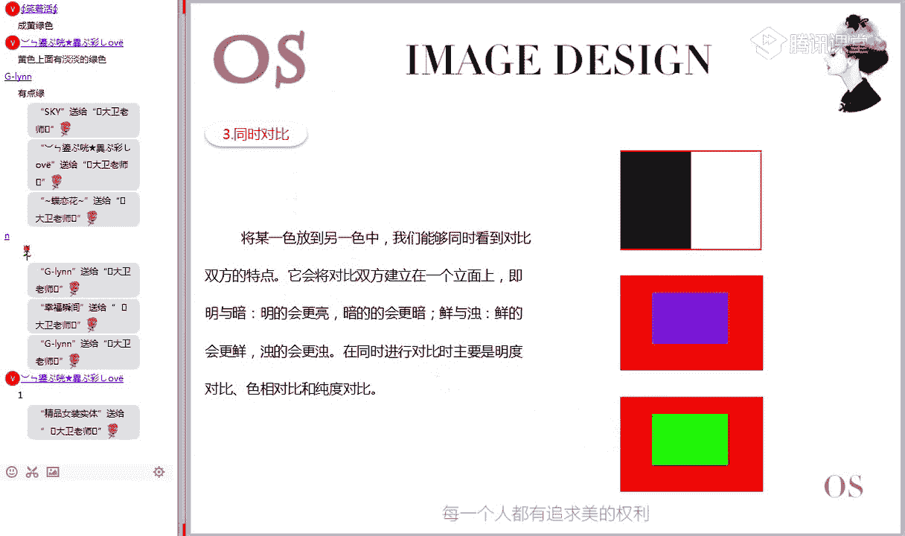
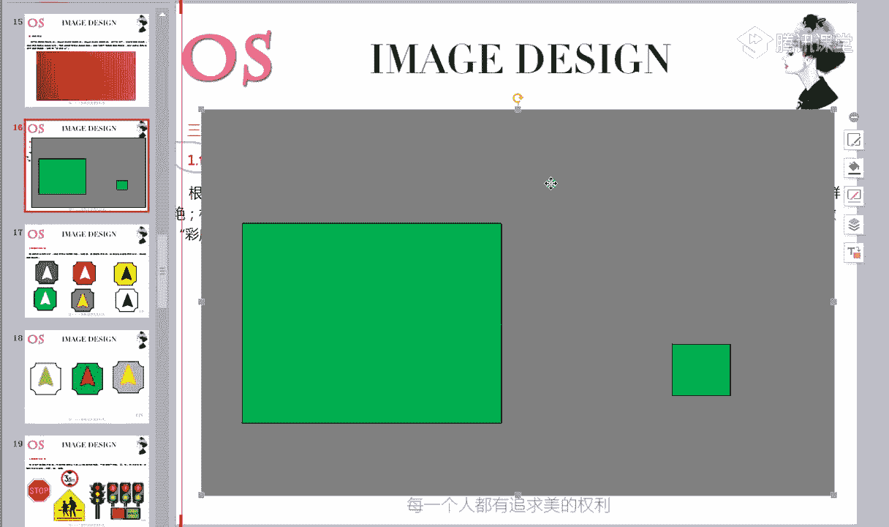
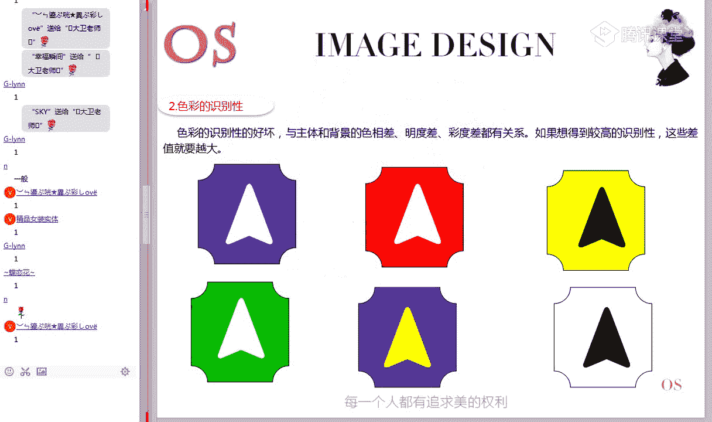
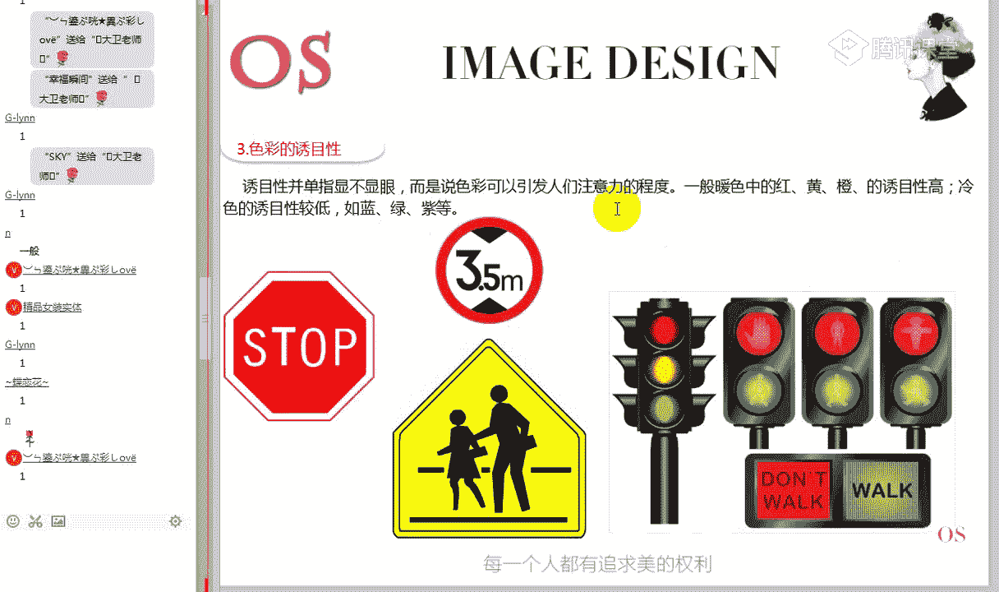

# 1、15男士形象色彩班VIP课程：第3节、色彩的心理直觉

好的，再一次欢迎大家来到我们OS形象设计中心色彩美学班VIP课程的第三节课直播课色彩的心理直觉。那这节课呢相对来说我们在前两节课垫解的基础下，这节课呃相对来说内容也比较多。而且呢有些内容都是非常重要的。

所以在学这节课的时候呢，大家一定要一定要把你的精神力集中的。因为我们的啊5节课的内容它是由浅入深的过程。所以今天晚上的课程内容呢，我希望大家都能够啊全神贯注，我们来提高这样的一个学习效率。

那另外在第一节课里面呢哎给大家讲了咱们正确的学习方法。那这个学习方法是贯穿于我们整个啊这样一个网络学习过程当中的。所以希望所有的同学呢一定要把这个学习方法铭记在心。好。

首先我们来看一下哎本节课的一个学习大纲。学习重点我们来看一下啊，有这样的三部分。第一部分就是关于色彩的对比。那这一块的内容呢是重中之重。在我们整个学习这个服装色彩搭配的板块里面。

这个色彩之间的对比关系呢非常非常的多啊，我们一定要把这些关系呢给它分清楚。在应用的时候呢，哎正确的找到色彩之间的这样一个对比关系。第二个就是关于色彩的现象。哎。

有的时候我们发现一些服装颜色在搭配的时候啊，会出现一些哎我们解释不了的这样的一些情况。用我们的配色原则解释不了的那这个时候呢，我们要了解一些在色彩搭配过程当中出现的一些什么特殊的这些现象。

比如说色阴同化现象。第三个啊色彩的感受就是比如说关于面积的一个效果。那一比如说一块红色的呃跟一块绿色在进进行搭配的时候，它们的面积大小呢也会带给我们不同的感受。啊，色彩的识别性，色彩的用目性啊。

前近色和后对色。那第三部分呢相对来说啊，包括第二部分跟第三部分内容呢啊属于偏向于这样一个了解部分啊，内容呢会稍简单一点。学习要求。第一，理解色彩的对比关系啊，再强调一下，非常的重要。第二。

了解色彩的现象和感受。好，每节课课程大纲我一再说了，在我们说的重点内容的时候啊，必须要掌握的东西的时候，我们会讲的比较慢。而且要求每位同学必须要理解了解部分人的内容呢作为拓展知识。

大家根据你自己的定位将来你想朝这个职业方向走的话，那每一个知识点对我们职业的人才来说都很重要。如果你仅仅想解决个人形要解决这个色彩搭配问题的话，那我我要求的一个重点内容，你是必须要啊把它吃透的。来。

都已经准备好的同学，现在在公屏上打个一给老师看一下，知不知道我们上课要准备什么东西。准备好的同学来打给一个老师看一下。做笔记的时候啊，我发现有同学把笔记给老师传在相册里面，笔记可以不用传。

但是做笔记要讲求方法，记关键词啊，我们说关键词可以有效的提起你这样的一个思维串联性啊。在课后咱们回放这个放电影的时候，哎可以很好的把我们所讲的内容串联起来，不要记太多啊，记关键词就可以了。啊。

准备好的同学只有4位吗？啊，我们VIP这样一个啊VIP同学的一个直播课。那咱们这个这样的一个互动性老师是有要求的啊，你就是来到直播课堂上，一定要动起来，不能偷懒。因为我们说了，你只是听到话还不如看视频。

看视频的学习效果，当然不如咱们这样一个直播学习，对不对啊，所以能听到老师声音的同学呢，一定要在公台上跟老师回应。😊，好，接下来我们就进进入第一部分啊。

我说的今天晚上重点部分的关于色彩的复杂的这些对比关系。首先我们来看一下。😊，色彩的对比是什么意思啊？在我们这样的一个呃专业课程里面呢，会涉及到非常多的这样一些知识，包括一些专业的术语。

我们要对它做一个比较深入的这样一个了解。那色彩的对比是什么意思呢？看一下我们官方的解释，色彩的对比是指呢色彩之间存在的矛盾对立及差别啊，他说矛盾对立之差别是什么意思。

比如说哎我们这个红色跟绿色这两个颜色有对比，因为什么色相不一样，对不对？是不是比如说这段衣服里面这一块的黄色跟这一块的黄色之间有对比，为什么面积上差别，对不对？色相上的差别，面积上的差差别。

纯度上的差别，明度上的差别。所以色彩之间它会在哪些地方存在差别。比如说我刚才说了啊，两个颜色色相不一样有对比。两个颜色的深浅不一样，明度有对比关系。两个颜色的纯度不一样，有纯度对比关系。

两个颜色的面积大小不一样，它有什么面积对比的关系。所以在我们所看到的这样的两个颜色之间，它多或少都会在什么？在这样一个色相明度纯度和什么面积上存在的这样一些差异性。所以我们有这样一个定论是什么？

色彩之间的对比关系是绝对的。就说我们随便哪两个颜色之间，它们或多或少都会存在这样的对比关系，或者说我们可以理解为什么色彩之间的对比是绝对的。来这个能够理解的同学打个青话给老看一下。😊。

色彩之间的对比关系是绝对的。啊，能不能理解是什么意思？我刚才给大家解说了一下，因为颜色之间在这四个方面或多或少都为什么存在的这样的一些差别。哎，大家在听课的时候，如果有如果有突然听到老师的声音。

或看不到屏幕分享的话，一定要第一时间呢给老师反馈在并啊咱们的这样一个平台上。哎，我刚才说的对比关系，大家有没有理解啊，为什么说色彩之间的对比关系是绝对的？因为什么？

色彩在这样一个色相明度纯度跟面积上都会存在着这样的一些差别。所以他们之间的对比关系呢是绝对的。😊，呃，再说一下对比。啊，还不理解对比是什么意思，对不对？我们这里笼统的说一下，对比什么。

对比就是通再通俗一点，理解对比就是差别，两个颜色之间有差别，那它们之间就有对比关系啊，那这个差别存在于哪些方面呢？比如说色相，比如说明度、纯度，对不对？色相、明度纯度，还有什么面积。好。

具体的会存在这四个方面的一些差别。所以说通俗一点理解就是两个颜色有差别，它们就有对比，而色彩之间或多或少总会存在这样的差别。所以色彩之间的对比关系呢是绝对的。好，现在现在呃理解没有？好的。

那我们有同学在想老师，我们为什么要学习这个对比关系，学习对比是为什么？我们正确的解释学习对比是为了实现和谐统一啊，这个很多同学不理解，对不对？为什么说学习对比是为了时间和谐统一呢？

我们知道我们在进行色彩搭配的时候，颜色之间会有什么会有一些颜色大面积的搭配会好看，随便搭都好看，但有些颜色之间，如果大面积的搭配乱搭配的话，就会非常的俗气，不不好看，对不对？比如说。😊。

我把这个黄色跟黄绿色，哎，桑银颜色之间大面的组合是没有问题的，怎么搭都可以都好看，对不对？但是如果拿这个黄色配紫色啊，你在大面积那搭配的话，就非常难堪。我们说黄配子丑到死，对不对？

那这个时候我怎么知道哪些颜色是可以进行大面积随意搭配的，有哪些颜色是不可以搭配的呢？这个时候我们就需要来研究色彩之间的对比关系。而往往存在存在着什么？这个在色彩搭配上有冲突的颜色是什么。

就是强对比色之间的关系。所以说我们只有非常清楚的知道这两个颜色之间具体的对比关系是强还是弱的时候，那我们在搭配的时候呢，才能采取有效的调和方式，让色彩搭配之间呢实现和谐。

所以说哎学习对比的目的是为什么是为了什么？是为了更好的实现色彩搭配之间的一个和谐关系？所以说学习对比是为了实现的是为了实现和谐。那学习对比呢？对比只是一种什么手段。我们研究色彩对比呢只是一种手段而已。

最终我们只有通过研究色彩之间的关系之后，我才知道这个颜色之间怎么进行处理呢，才能够和谐。为什么要学习对比？现在理解没有理解的同学打个一给老师看一下。为什么要学习色彩的对比关系有没有理解？好。

这个思维逻辑一定要很清楚啊。老师刚才说的啊，因为你只有清楚的知道这两个颜色之间对比关系强弱的时候，那我们在这搭配的时候呢，才能采取有效的方式。好。

这里的话呢我们就把两个关系简单的给大家解说一下关于强对比色与弱对比色的概念。那什么是强对比色？什么是弱对比色呢？之前的话呢给大家教过一个简单的方法，就是什么来分析两个颜色之间有没有相同的色相成分。

如果两个颜色之间有相同的色相成分，那么它们的对比关系呢就偏弱。如果两个颜色之间没有什么相同的色相成分，它们之间就是一种什么强对比的关系。这个这个这个能不能理解。

或者说这个记住的同学来打个先话给老师看一下，如何区分两个颜色之间是不是强对比的关系，关键是要分析两个颜色之间有没有相同的色相成分。好，那该如何分析？我们来看一下这个侧强环。

比如说我说哎这个黄色跟绿色强对比还是弱对比过的关系，认为是强的同学给老师打一，认为是弱的同学呢给老师打2，黄色和绿色。黄色和绿色是强对比的关系还是弱对比的关系？刚才我们已经告诉了大家区分的一个方法。

好了，有一半的同学回答了，还有一半的同学不敢回答，那到底是还是还是不是的，认为是强的打一，认为弱的同学给老师打一个2。是强还是弱？好，有两位同学回答强，有一位同学回答弱。

其实回答呃打一的同学会的或者说回答强对比的同学啊，咱们这个色相环的构成是在第二节课里面讲到的。那我刚才说了，分析两个颜色之间有没有相同的四养成分。那我们现在来看一下黄色和绿色之间有没有相同的四养成分。

我们都知道黄色是一个原色，红黄蓝是三原色，对不对？所以在这个黄色里面，它是只有黄色三药成分的，这个这个没有问题吧。来，这个没有问题的同学打个一给老师看一下。😊，红黄蓝三原色。

所以黄色里面只有一个色相成分，就是什么原始色像黄色，对不对？那第二个我们来看一下绿色。第二节课里面我们已经非常明确的讲过了，绿色它并不是天生的，它是有原色、黄色跟什么蓝色混合而得的。

所以这个绿色里面一定是有两个色样成分，是黄色跟蓝色的色养成分，对不对？这样一来，是不是黄色跟绿色之间都有相同的色养成分，所以它们的关系是一个什么偏弱的对比关系，对不对？来，以上两位回答强对比关系的同学。

现在理解没有？黄色跟绿色的对比关系是偏弱的。好，前面两位同学理解没有？理解的话，打个电话给老师看一下。为什么说黄色跟绿色的对比关系偏弱啊，这个是咱们在色彩美学班的同学，你这个东西一定要非常非常的清楚。

你否则到的高级班，有些色彩你根本都感受不了。比如说哎别的同学一看都知道，哎，这个蓝紫色里面有蓝色跟红色的成分，而且蓝的多红的少，你怎么看不出来呢？对不对？这个知识其实到美学班就已经讲过了，对不对？😊。

好的，那接下来的话我们再换一个颜色问一下，大家看一下黄色跟紫色好，你用你的我刚才教给大家方法来分析一下，认为黄色跟紫色的对比关系偏弱的同学给老师打一。

认为黄色跟紫色的对比关系是强的同学在公屏上给老师打一个2。好，这个对比关系强弱的话，在我们专业课里面，大家一定要每位同学都能够快速的区分黄色跟紫色是强还是弱？不要在这里猜，你要用你的一个方法来分析。

比如说啊我现在公屏上大家所有同学回答的都说黄色跟紫色是一个强对比的关系，为什么？我们要看他们的色相成分，对不对？黄色原色只有黄色，紫色它是一个二字色，虽然它是一个二字色。

但是它里面的原色只有什么红色跟蓝色，它也是没有黄色色相成分的，所以它俩之间是一个强对比的关系。对不对？所以随便拿两个颜色给你，你要快速区分的出来，他们是强弱对比关系。

一旦确定这两个颜色是一种强对比的关系的话，你要切记的就不可以大面积的搭配。搭出来一定很俗气，很很难看说黄配子丑刀死，就是因为这个原因。这两个颜色是墙壁的对比的时候就不要大面积的搭配。

那这样的颜色还有红色跟绿色、蓝色跟橙色，对不对？后面的话呢，我们在配色关系会讲到这里的话，大家首先要学会什么如何快速区分两个颜色是不是强对比关系。来这个方法，现在已经学会的同学打个鲜花给老师看一下。

学会了没有怎么区分？啊，所以说我们第二节课讲的思想环非常重要，而且的话以作为美学班的一个实操作业，大家需要调制的。以后大家会知道，你越学到后面的课程，咱们美学班的知识呢就越重要。😊，好。

这里的话呢稍微给大家跟我们这个服装搭配，包括色彩的应用方面呢，稍微呃给大家点一下。因为这个这个知识点还没讲到，但是我们要知道我们学习强弱关系的一个重要性。我们看到了在这个彩妆画面里面。

大家可以看到在这个彩妆画面里面出现的颜色有哪些。啊，看重点色能不能识别，会不会看在这个彩妆的这样的一个配色里面，它出现的色相有哪些？先要学会识别色相，黄色和紫色，对不对？那黄色和紫色是什么关系？好。

黄色和紫色，有人远已经看了。其实我们看到花蕊的黄色，眼角的这个地方黄色，这部分紫色，花片的紫色，对不对？黄色和紫色是什么关系？是强对比的关系，对不对？我们说黄色跟紫色强对比关系。

来没认可的同学打一个老师看一下。很多同学是不是听的懵听的懵的同学，你就给老师说一下，咱们缓一点没有关系啊。因为这个知识点有难度，而且很重要。好，那我们刚才是不是分析过了，黄色跟紫色是强对比关系。

我们说黄配子丑到死，对不对？那按理说黄色跟紫色是不能够搭配的。但是这里面大家看一下，这种其实这种彩妆画的也是挺好看的，它依然是黄配子，但是这种为什么还是挺好看的呢？这个我们在后面的调和关系会讲到。

实际上，针对这样的强对比关系，我们用到了什么面积调和的方式，看到没有？在眼影的应用上，它没有把黄色跟紫色各用一半，而是什么大面积的紫色，小面积的黄色点缀，大面积的花瓶是紫色花蕊小部分的黄色做点缀。

这叫什么万紫丛中一点黄。如果红色跟绿色搭配要想出彩的话，要么是万绿丛中一点红，要么是万红丛中一点绿，这实际上是用到了我们四大调和方式之一的面积调和。为什么要给大家讲第一个呢？

大家一定要记得我们本节课我们整个色彩美学班的标题是什么？没有不好的色彩，只有不好的搭配，而有些色彩搭配的不好看，是因为什么？是因为你不了解它。我们我们为什么要学习对比关系？

为什么还一定要区分色彩的强弱对比关系呢？当色彩之间的对比关系偏弱的时候，你在面积上啊可能不会出错。但是如果一旦你知道这两个颜色是强对关系的，你需要慎重的。一旦用不好，就会非常的熟气，非常难看。而相反。

如果你很好的应用他们之间的调和关系的话，就会非常的出彩。好，在这里的话呢，大家先呃不必啊研究这个配色方法怎么用，我们到第五节课调和里面会专门讲在这里的话呢。

我只是想告诉大家为什么要学习色彩之间的强弱对比关系。😊，好，比如说我们来看一下第二张图片，在这堂服饰搭配图片里面，大家看一下哪两个主要油彩气的色像能不能看出来。快速识别一下。而我们包括这样的一些图片。

在搭配的时候，实际上我们都在用到什么，都是在确定好它之间的对比关系之后进行的这样一个调和。衣服的蓝色跟帽子的橙色，对不对？那么我们这个蓝色和橙色是什么关系呢？色相环啊。

所以说我们这个色彩美学班的知识大家不能偷懒。你第一节课没学好，你第二节课有点吃力，你第二节课再学不好，你到第三节课更吃力啊。你第三节课学不好，你试试到第五节课，你基本上就是听天书啊。

所以说美学班的知识的话，它是一环扣一环啊，每节课老师一直再强调如果你错过了直播，一定要抽时间啊，把课程补上。😊，蓝色在这个地方，橙色在这个地方，蓝色是原色，橙色是二次色里面只有红黄的成分。

所以蓝色跟橙色是强对比色，对不对？所以在这套服饰里面，如果蓝色跟橙色各半的话，就俗气了它这种搭配，帽子做点缀，蓝色占主导位置。所以这种点缀的搭配法，在面积上得到了调和，心理上得到了互补。

所以成了一种什么非常出彩的搭配方式。好，我们来看一下第三套。这里面的搭配出现的油彩系主要有哪些颜色？好，看主要色，我们重点的分析一下主要侧的面积关系就可以了。会不会看基本的一些色相啊。

十二色相环基本色相是我们每一位同学必须要掌握的。而，确切的来讲，非常明显，衣服的黄色跟包包的黄绿色，包包并不是明显的绿色。这个包包明显里面黄的成分非常多，对不对？那咱们黄色跟黄绿色的对比关系是强还是弱？

是不是这个老师就不用问了，这个在分析不清楚的同学啊，这个色相环要重点研究在色相环上黄色跟黄绿色是不是相邻的颜色，而且黄绿色里面明显有大量黄的色相成分，对不对？所以这种搭配的话。

我们来看一下黄色跟黄绿色搭配，它实际上是一种弱对比色的搭配。因于说老师那这个我们会发现学过之后啊，这个色彩之间的强对比色的关系搭配的也好看，弱对比色彩之间的搭配搭配在一起呢也好看，对不对？

那我们在搭配的时候，比如说我我在穿衣服的时候，我到底采用强对比色的搭配还是弱对比色搭配呢，对不对？有没有同学想过这个问题，或者说有没有同学能够回答这个问题。我们会发现，经过老师这样的分析之后。

哎这个颜色两个是弱对比的关系，哎，我能把它搭配的很时尚，很好看。哎，这两个颜色之间是强对比的关系，我通过调和之后也可以把它搭配的好看。那我在进行搭配的时候，我究竟应该选用弱对比的搭配还是强对比的搭配呢？

😊，有没有同学想过这个问题？好，我们的横下同学听着有点懵，对不对啊，记得我估计你第一节第二节课没有补啊，一定要补上，否则的话咱们这个知识听的你就有点跟不上啊。好，其实这个只是我之前提过，根据什么来选择？

强的搭配也可以，弱的搭配也可以。其实在后面的课我先给大家稍微透露一点，取决于什么表现的感觉不同。色彩之间的对比强烈一定会有更有视觉冲击力，表现的更动感活泼的一些东西，对不对？

而色彩之间的对比偏柔偏什么偏弱的话，它表现的感觉更为柔和，整体上更为视觉上更为统一。啊，表现的感觉并偏偏向于什么？偏向于近的这种感觉。所以在搭配的时候，哎，并不是说哎强对比搭配好，弱对搭配好啊。

我就乱搭。实际上在搭配的时候，根据什么你要表情的主题啊，有同学说了。啊，跟这个肤色有关系啊，这个咱们先不谈，因为这个难度有点大。再谈的话，我们的新同学真的就要懵了啊。实际上还跟一个风格有关系。

比如说在我们的呃男女士班里面，到时候会讲到服饰风格，比如说呢这个咱们前卫型的跟古典型的用色上会有差别，跟自然型的用色上也有差别。比如说哎咱们这个前卫型的用色就可以什么对比强烈一点，特别是戏剧型的人。

甚至可以夸张一点都是没有问题的。哎，但是整个咱们古典自然型的，用色彩呢，就要偏什么偏向于平淡一点的啊。所以说这个对比关系的强弱的话呢，非常的重要。在我们这里的话。

大家只是需要知道如何去区分色彩之间的强弱对比关系就可以了啊，这些知识现在掌握不了很正常。我们后面会讲到。😊，好，我们花了很长的时间给大家来解说色彩对比的概念，以及为什么要学习色彩的对比关系。

以及如何区分色彩之间的强弱对比关系啊。对这三点内容都没有问题的同学来打个一给老师看一下。第一，色彩对比的概念。第二，为什么要学习对比的关系？第三，如何区分两个颜色之间是强对比还是弱对比的关系。

这三部分都掌握的同学来打个一给老师看一下。好，一定要记得色彩的对比关系。在我们整个色彩的搭配，不管你是学到服饰搭配还是高级板块的这样一个色彩进行技术的话，这些对比关系都是非常核心，非常重要的。

一定要非常的清楚。好，那接下来我们就具体来看几个对比关系。第一个啊复残项。好，我们知道了色彩的对比是什么意思之后，我们来看一下具体的对比现象。第一个复残项是什么意思？呃，那这个复残项的话呢。

我们用文字来给大家解释一下，呃，可能大家听不明白，比如说长时间的看一种颜色，这个色彩变会在视么膜上留下印象。时间越长，视膜对一个颜色的刺激就会逐渐变弱，会留下与知之前色彩相对应的色彩称之为大心理补色啊。

这个心理补测大家可能听不明白。接下来的话呢，我们需要呃所有的同学跟老师一起来做一个呃现场的这样一个互动游戏啊，怎么互动？待会儿老师呃会告诉大家。我们需要30秒的时间啊，待会儿老师喊开始之后。

所有的同学呢，你的眼睛要盯着这个红色的圆球啊，这个红色的球，红色的小太阳盯着这个大红点上不要动，老师数足30秒，30个数，我喊换的时候，大家的视觉了，迅速看到右边空白的地方。来，现在已经做好准备的同学。

公屏上给老师打一个一啊，一定要放下你手头的事情，只要30秒。这个环节老师不能够用嘴巴去解说，他必须要靠你来啊，跟着老师一起动起来，才能够感受到这个心理叵测是什么意思。

来表示现在准备好的同学来打个一个老颤一下啊，只需要感受一次，你就懂了。😊，啊，老师只需要30秒的时间，准备好的同学公屏上给老师打一个一。好，所有的同学都准备好啊，老师按开始的时候就注这个红点。

预备开始看着这个红点的中心那个地方，不要动，1234567891、11、12、13、14、15、16、17、18、19、20、21、22、23、24、25、26、27、28、29、30换迅速看到这边白色空白的地方。

告诉老师，你看到了什么东西。把你看到的东西打在公屏上，或者有很多同学什么都没看到啊，一定要用心做的同学，你的眼睛要瞪大了，看着这个红点，看完之后再看右边空白的地方。呃。

有的人说看到了蓝色、淡青色、淡蓝色的圈，白色的圈，看到白色圈的同学呢，你需要再看一次啊，一定要瞪大了眼睛，看着这个红点。蓝色的浅蓝色的球，白色的白色的圆哈。

还看说明两个同学的话是没有看到这个复残项的这样一个现象的啊。好，正常情况下呢，咱们瞪大了眼睛，看到一个红脸之后，会在右边看一个淡蓝色，或者说有同些说说这样的一个青色的一个圈圈啊，这样一个圈圈。

那大家所看到这样一个带颜色的浅蓝色的圈圈呢，实际上就是什么？就是我们所说的心理补涩复残相啊复残相。大家有没有想过，为什么我们看的这么一个红点，后面会这边会竟然会出现一个淡蓝色的圈圈呢？

为什么为什么不是红色的？为什么有没有同学能想明白这样一个问题，那这个复残项是如何发生的呢？好，老师要问大家一个问题啊，在我们盯着这个红点啊，长时间盯着这个红点看的时候，眼睛有没有酸痛的感觉？

有的话在公屏上给老师打一个一。啊，在在你盯着这个大红点看的时候，眼睛有没有一点点酸痛或者胀痛的感觉？有没有啊，用心看着同学多少都是有点有点，眼睛有点胀痛的感觉，对不对？那我们的眼睛为什么会有点胀痛呢？

有没有去想过？我们在第一节课里面讲了这个红色在我们油彩系里面纯度是最高的一个颜色，最能够引起视觉注意，而且对我们的视觉刺激也是最强的一个颜色。当我们长期定的这个饱和度非常高的一个颜色的时候。

我们的视觉感觉会受到这样一个压迫，所以会有这种胀痛感。而这个时候我们说了人的生理机能有非常的智能，它有一个自动调节机制，就是感当我们这个感受到这个痛苦的时候啊，它会为我们想办法来减轻这种痛苦。

那它是如何减去我们这个视觉上这样一种压迫感的呢？它为我们寻找的这个颜色跟它跟这个红色什么相对应的一个颜色来与之进行平衡，来减轻我们这些这种什么视觉痛苦。而当我们眼睛顺迅速的把眼睛移开的时候呢。

我们这个痛苦啊，还短暂的在停留了一段时间，它为我们的生理机能为我们寻找的这样一个什么平衡的色彩呢，短时间内它没有消失。所以我们在这边右右边这一块区域里面呢，看到的这个什么。

浅蓝色的圈圈就是我们的生理技能为我们寻找的这样一个补色，来减轻了我们这个视觉视觉上的受到压迫的这种痛苦。好，这个就是咱们这这样一个什么。心理补涩复残项发生的一个过程啊，也是它发生的这样一个原因。好。

有没有理解？其实这个有一点偏我们这样一个啊生物学项的这样一个来解释的这样一个现象。啊，能够理解的同学来打个情话给老师看一下。😊，复残项啊复残项是什么意思？理解没有，以及为什么会发生？啊。

有的人讲老师这个复材项有什么用啊，有什么用？实际上呢我们在呃后面的话，其实现在提到有点早了。但是大家要知道这个复材项它有什么用啊，比如说。😊，我们之前告诉大家，哎呃，冷肤色适合穿什么冷色调的服装颜色。

暖肤色适合穿暖色调的服装颜色。有没有同学知道为什么？为什么说冷色调适合穿？冷的这样的一个服装色调，软肤色适合穿暖的这样一个服装色调，知不知道根本原因是什么？来知道同学给老师打一个。

不知道同学给老师打一个2，知不知道为什么？😊，其实这个跟咱们复材项的关联性非常大。呃，这里的话没有准备图片。比如说哎咱们的一个肤色是一个软肤色，对不对？这个时候如果你的衣服是一个什么。

衣服是大面的暖色调。我们先看衣服，再看脸，是不是前后就构成了这样一个什么？副产项的一个过程，对不对？那我们大家当我们看到一个暖色调的时候，那我们的副材项会自动为我们寻找一个什么冷色调来进行平衡。

所以当我们在看到面部的时候，在我们人的面部会有一个冷色调对它去进行这样一个叠加。本来我的肤色是软肤色非常偏软的，对不对？这个时候我们的肤色经过了一个冷色调，在中间一个平衡之后。

实际上它的肤色是接近了一个什么中性的肤色。而针对我们说最漂亮的肤色是什么样的呢？它是没有明显的偏冷，也没有明显的偏软的，相当于是进行了这样一个平衡。啊，这个能不能理解，能够理解的同学打个一个老师看一下。

稍微有点难度好，列在职业班里面会给大家分析的。😊，这个副残项跟咱们这个服装搭配有什么关系？在我们看同样的道理也是一样的。在我们看到一个染色调的时候，我们的生理机能会就那的当我们离开视觉的时候。

会有这样一个冷色调的一个补色。当这个颜色叠加在我们染肤色的这样的一个皮肤上的时候呢，它进行了一个均衡，会让我们的肤色呢接近中间的一个状态。而肤色实际上在接近中间这个状态的时候呢。

皮肤状态是最佳的这样一个状态。啊，这个讲到这个肤色跟服装颜色关系的时候，有点复杂啊，但是大家现在不用着急，没有理解没有关系。你先知道这个复残相是什么意思就可以了。

来这个副残相都理解的同学来打个先话发给老师看一下。😊，啊，到后面职业班会讲到啊，对咱们这个复材项的一个应用啊。当然呢在这里的话呢，你只需要知道这个现象发生的原因就可以了。好。

接着我们很多同学啊不要一来都一来学习的时候，老师啊，这个基础的东西我有跳级学习啊。如果说你这个美学班你真的学的很扎实的话啊，你可以去跳。但是如果说这些东西你都搞不清楚的话，你跳的高级班只会拖后腿。

因为简单的一些概念你就理解不了。好，第二个。第二个是计时对比。我们刚才看到复材项，第二个是计时对比关系。什么是计时对比关系呢？就是先看一个颜色，再看另外一个颜色，它叫什么计时对比关系。好，我们来看一下。

首先大家盯着这个红色的看一会儿，然后再来看这个黄色，看一下有没有什么变化没有。盯着这个红色看20秒，迅速再来看这边的一个黄色。看我们这个黄色里面，你看这个黄色有没有什么感觉啊，这个有点抽象。

只能大家自己去做。来给大家一点时间，自己细细来观察一下。好，只有只有四位同学回答，老师有说变亮有时候浅绿有点荧光绿，有点黄绿的感觉。啊，蓝色上面有淡淡的绿色，有点绿，对不对？一定要认真去观察一下。

在我们盯住红色看过看一会儿之后啊，我们会发现这个黄色里面有淡有点泛绿的感觉，对不对？实际上我们跟大家说这个绿色是怎么来的，知不知道有点泛绿，对不对？这个绿色是怎么来的？绿色是有黄色跟蓝色叠加而得到。

也就是说我们刚才在看到这个红色过去过久了之后，它为我们寻找了一个复参项，实际上是一个蓝色，对不对？蓝色跟黄色进行叠加，所以就有点什么泛绿的感觉啊，这就是什么计时对比啊，计时对比。好。

有没有理解来理解的同学来家打个先话给老师看一下，即时对比是什么意思。先看一个颜色，再看另外一个颜色。实际上我们所看到的颜色会受到这种视觉上的一个影响啊，先知道它是什么意思就可以了。

咱们先啊不研究肤色跟服装颜色的关系啊，现在有点早了，大家可能就跟不上节奏，你先知道这个简单的概念是什么意思就可以了。😊，好，所以色彩里面的知识呢有很多很好玩的啊，你在研究到后面的之后。

你会发现这种呃这种好玩的东西会特别多，而且真的研究明白了，用在服饰搭配上呢啊你会发现服饰搭配真的也很简单。😊，第三个对比关系是同时对比，同时对比是什么意思呢？在同一时间同时看到了两个颜色。

比如说我们的衣服上装跟下装之间就是同时对比关系。好，那么在这个同时对比关系里面呢，有一个经典的就是什么明度对比啊，明度对比纯度对比跟色相对比。首先我们来看一下明度对比的关系。啊。

大家知道呃这个同时对比的概念理解了没？理解的同学打一个老师看一下，同时对比是什么意思，理解了没有？就是在同一个位面上，同一个画面里同时看到了两个颜色，它们之间的一个对比关系。好。

这里的话实际上这个是明度对比啊，这个是纯度的对比。这个是互补式的对比，我们在这里先不讲后面的话呢，我们用具体的图案来给大家分析一下。

第四个是边缘对比啊，这个的话这个边缘对比呢作为了解知识，大家了解一下即可。呃，这三组图片呢，可能这两组大家看的不明显。我们主要看中间一组，大家看一下中间这组有这个方块啊。

黑色的方块跟这个白色条纹组合的这样的一个整整体的呃这样这样一张图片，我们来看一下有没有发现什么，在中间。这些地方有没有看到一些什么东西？边缘对比对比的是什么？

黑色的方块跟白色之间的边缘有没有看到一些东西？是不是我们在中间这块区域看到的灰色，特别是焦点的这个地方有一块块的这样的一些灰色出现，对不对？而实际上这之间全部都是白色的。

白色的在它们边缘会出现这样的一些灰色。那这个过程就是因为什么边缘对比的一个同化现象的一个影响。我们会发现受到的边缘黑白的一个叠加，在中间区域会出现一些什么灰色啊，灰色，这个就是边缘对比。好。

这个作为对比现象了解知道它是什么意思就可。以后我们再看到这些东西的时候，你要知道为什么会发生这种现象，其实就是什么色彩之间的边缘对比会发生的这样一个现象。😊。

好，这个了解部分比较简单。接下来我们就看一下我们刚才所说的明度对比。好，首先的话我们来看一下。大家来看一下这两个五角星是不是一模一样的。因为是一样的同学打个一个老师看一下，我专门拖出来。

大家看一下他们这两个五角星之间的明度是不是一模一样的，对不对？都是同样的灰色的五角星，对不对？接下来我们这两个五角星分别放到这样的一个黑色的底板和白色的底板里面。好，现在我们来综合来看一下，大家看一下。

在你的视觉对比里面，我们只看中间的五角星，你感觉是左边亮一点还是右边亮一点，是一还是2？就说明显这两个五角星现在看上去他们的明暗关系已经变化了。我们来看一下是一看上去亮一点还是二，看上去亮一点。

是不是非常明显呢，感觉左边这个五角星变亮了，而右边这个变暗了，对不对？那通过这样一个对比的话，我们可以得出一个什么规律呢？当一个深颜色跟一个浅颜色发生同时对比关系的时候。

我们首先看第一个深色的背景和浅颜色的五角星放在一起的时候，结果是什么？我们浅颜色的五角星变得更亮了，对不对？也就是说，深浅对比的时候，深颜色会变得更暗，浅颜色会变得更亮。

这个能不能理解能理解同学打个千话给老师看一下。通过这个对比规律，我们可以会发现。左边变亮的原因是因为底色是深色，五角星是浅色，深浅对比，浅的变亮的，深的更暗的。按照同样的理论，我们来分析一下。

右边右边的底色是白色，白色比灰色明度高，深浅对比浅的更亮，暗的更暗。所以在白色的底景下，灰色看上去呢会更暗了。所以两边综合在对比的时候呢，哎左边的五角星明显比右边的要亮一些。这就是我们明度的对对比规律。

当一个深颜色跟浅颜色同时放在一起做对比的时候，深颜色会显得更暗，浅颜色呢会显得更亮。来这个规律接下来的同学打个一给老师看一下啊，有论学老师呃，这个民度对比关系有什么用有什么用啊？

我告诉大家同样的跟咱们学习这个人一和谐有着非常大的关系啊，比如说呃那我们一个皮肤偏黑的人。他如果想让自己。皮肤显白点，或者说如果一个人皮一个一个人的皮肤比较黑。他穿的浅亮的颜色。

他的皮肤是变白了还是变黑了。有没有同学能回答这个问题？对于一个皮肤比较黑的人，如果他穿到大面积的白色，那他的皮肤会变白还是会变黑？哎，分析一下。是不是更黑了，对不对？

其不之前我们很多同学会认为没有学习过的会什为啊，我皮肤黑，所以我要穿浅色，穿白色。因为这个白色衣服可以把我的皮肤照的白一点。实际上大家知道这个规律之后，你会发现我们的皮肤黑是因为什么？

皮肤里面的黑色素比较多，明度比较低。实际上我们的皮肤它也是一个色块，它相当于是一个深颜色，对不对？而如果你的衣服大面积的白色会怎么样？深浅对比深的更暗，白的会显得更亮，会让你的皮肤显得更加的黑，对不对？

所以皮肤黑的人呢，你想让皮肤白一点，你肯定不要去穿一些浅亮的颜色。😊，好，那我们其他没有回答的同学理解没有？理解的同学打个三八给老师看一下。所以我们所讲的知识稍微拓展一下。

就会应用到什么我们的职业领域里面啊。所以很多同学的话在学美学班的课程的时候呢啊他不用心学啊，因为这些五角星啊好简单，没什么意思啊，只想学诊断技术，你不知道你这些知识学不好。

你诊断技术里面很多简单的规律呢，你都理解不了。😊。

好，第六个我们来看一下色相啊，我们所讲的这是除了解决服装之间的关系外，更重要的一个环节是什么？解决人意和谐。因为你要知道人的皮肤也是一个色块，我们来看一下色相对比。同样的我拖出来给大家看的明白一点。

这两个五角星是不是也是一样的，对不对？😊，啊，我是同步复制了两个五角星，看一下是不是都是一样的，对不对？来认可的同学打个一个老师看一下有没有疑问。这两个五角星是一模一样的，看一下是不是。啊，不一样。好。

我现在把这个五角星呢给它剪切掉。大家看好了啊，我把这个五角星剪切掉，然后我把这个五角星再给它复制一层。😊，好。现在大家刚才看到老师这个五角星从这个复制过来的，复制过来了。

是不是一模一样的来现在现在没有疑问的同学打个一个老师看一下，这个五角星是我刚才大家看到老师操作，把这个给它复制了一层拿过来的。所以它俩绝对是一模一样的啊，没用其他颜色填充，对不对？那接下来的话啊。

可能是拿的不够远，大家看到下部分不一样，对不对？如果拿的近一点，你看是不是一样的，是不是一样的，对不对？看到没有？明度是一模一样的，对不对？😊，啊，刚才可能拿出来的不够多，大家感觉不到对不对？好。😊。

接下来我把它放入两个底色不同的这样的一个底板里面，我们来看一下现在的来比较一下。好，我们现在来看一下。这两个五角星在整体的视觉上，你感觉哪边的更亮一些？是左边这个五角星感觉更亮一些。

还是右边这个更亮一些？是不是非常明显是右边更亮一些，对不对？那为什么会发生这个现象？我们现在根据色相之间的对比规律来给大家分析下，听清楚了啊，这给它稍微有点难度。

我们知道在色彩之间呢在做这样的一些唉颜色之间叠加的时候，它有这么一个规律，是什么规律呢？两个颜色之间，当它有相同的部分的时候啊，它会被同化而有相异的部分的时候呢，它会被增强。我们来分析一下左边这个颜色。

其实跟中间的这个五角星是偏橙色的啊，橙色。大家知不知道橙色是怎么来的。周到的同学把打印打在公公牌上，橙色是怎么来的，还记不记得橙色的特征？好，这个橙色是从哪来的？我们要分析一下它的成分。

橙色是一个二字色，对不对？它实际上是有原色、红色跟黄色混合得到。所以说我们在提到橙色的时候，你要快速反应的出来这个橙色里面有红的色相成分跟什么黄的色相成分。那这样一来。

是不是我们的底色跟这个五角星有相同的色相是黄色相应的部分是红色，对不对？来这个认可的同学打一个老师看一下。我们这个橙色的五角星跟底色之间相同的成分是黄色，相应的部分是红色。好。

那根据我们色彩之间的一个对比规律，我们会知道相同的色相成分放在一起的时候会被同化减弱，而相应的部分会被增强。所以左边这个橙色五角星里面被增强的是红色的色相成分，对不对？所以它实际上色相成分是偏红的。

对不对？来，这个能理解的同学打个先发给老师看一下，左边这个五角星放在底色黄色里面，它被增强的是红色的成分，而相同的成分呢，黄色被铜化减弱了。所以这个角角星看上去整体是偏红的。

而右边这个五角星它成色跟底色相同的成分是红色，相应的部分是黄色，所以它突出的五角星里面的黄色的部分。对不对？这这第二步能理解的同学打一个老师看一下。右边的橙色五角星放在黄色里面。

同样的这个橙色里面是有红黄的，它跟底色相同的是红色，相应的部分是黄色，它突出的是黄色，对不对？那老师要问一下，红色跟黄色哪个颜色的明度高啊？老师问颜色像原色像红色跟黄色，谁的明度高，是红色还是黄色？

黄色跟黄色谁的明度高？这个还记不记得，也是第二节课里面讲到了。所以第二节课里面讲了很多核心的知识。黄色对不对？我们看底色就知道了，红色跟黄色摆在一起的时候，非常明显，黄色很亮，对不对？而左边突出的是红。

右边突出的是黄，所以同样的两个橙色的五角星在不同的底色下突出的颜色不一样，所以明度就不一样。所以在整体的视觉效果下，我们感觉是什么？右边那个星星似乎看上去亮一点，因为它突出的是黄的成分。对不对？

而相同的成分红色被减弱了。而左边呢相同的成分黄被减弱了，突出的是红，这就是为什么哎这两个五角星放在不同的底色下，右边这个看上去亮一点的这样一个原因。来这个这个能能分清楚的同学，现在打个一个老师看一下。

哎，分析这个问题的时候，逻辑思维有点强，它必须要结合我们第二节课的知识啊，色彩的一个构成。好，色相环的构成，每个颜色是怎么来的啊？所以说我我一直在强调色相环很重要。实际上在我们试听课上。

我讲色像环的时候，很多同学肯定呃因为我们有讲这个肯定不以为然。实际上学我们这个美学班VIP课的同学都知道色相环真的很重要啊，不是老师在那里瞎吹的，你必须要把它学好啊，学好了再分析这个呢，就非常的简单。

😊，啊，有人说为什么不放绿色里面？因为绿色是一个二次色啊，绿色是一个二次色，我们这里放的是什么？两个原色，这样对比更明显一些，红色跟什么黄色都是原色，知道吗？而绿色是一个二次色啊。

分析出来就没有这么直观明了了。好，我们前面讲了一个明度对比的规律啊，后面讲了一个色相的对比规规律。那第三个，我们来看一下纯度的对比规律。

好，同样的，我们再把那两个六边形给大家拿出来，拿到外面比较啊，以免大家在中间根本看不出来它们的差别。来，这两个六边形是不是一样的？来，认为是一样的同学打个一给老师看一下，看一下是不是一样的。😊。

来看一下，其实我同样的是用复制过去的啊，不是专门的做图形填充的。好，接下来的话，我们把这两个六边形放入到不同的碟色里面。哎，我们来看一下是不是发生了变化。我现在分要问的是两个多边形。

大家看一下哪边的多边形给你的感觉更鲜艳一些，哪边或者说哪边的纯度你感觉更高一高一些，是一还是2。我们来感觉一下两边的多边形是一纯度高一些，更鲜艳一些，还是二纯度更高一些，更鲜艳一些。

平离的感觉来分析一下。看综合的一个对比情况，那真的色彩更鲜艳一些，或者说感觉纯度更高一些。哎，我现在问的是纯度啊，我问的是纯度，哪个更鲜艳，些大家听清楚了啊。😊，啊，我问的是纯度。

纯度跟明度是两个不同的概念。我之前说了啊，咱们明度是看的亮不亮，而纯度看的是艳不艳。我现在是问的纯度哪个更鲜艳一些？其实非常明显，这两个刚才拿出来是一模一样的，而明显。在对比的时候。

明显左边感觉更鲜艳一些，对不对？这个蓝色感觉更鲜艳一些，是不是为什么会发生这样的现象呢？刚才我们拿出来，大家看到这两个是一模一样的，对不对？它在不同的这样底色里面明度纯度发生了变化，而左边变得更鲜艳了。

😊，我们来分析一下为什么会发生这个现象，底色左边是灰色的，对不对？而右边的底色是偏深蓝色的这样一个颜色。我要问一下灰色跟深蓝色哪个纯度高，是灰色的纯度高还是深蓝色的纯度高？哪个纯度高？是一高还是二高？

为什么你怎么你为什么说这个蓝色的纯度比灰色高了？为什么你的依据是什么？大家还记不记得老师上节课讲的知识点。😊，为什么这个深蓝色的纯度会比灰色高？为什么？刘明如还记得老师讲的知识点。

所以咱们在回答问题的时候，一定要有依据，对不对？你判断它纯度高，你判断这个蓝色给比灰色纯度高，你总得有个依据，是不是？好，非常棒鲜花送给我们的恩同学啊。为什么？因为我之前是不是讲过。

黑白灰的纯度几乎是为0，无彩系，它的纯度几乎为0，任意油彩系的纯度都会比五彩系要高啊？任意油彩系的纯度都会比它高。所以这个大家要毫不疑问的回答出来。这就是我们在回答问题的时候，包括在搭配的时候。

你能不能正确搭配，快速搭配的原因。在你的心里面有这样的一些非常正确的依据，而且你很肯定，在做的时候肯定不会犹豫，对不对啊，所以这样的问题的话，小知识点也一定要记守。我们知道了左边的纯度没有右边高。

而在对比之下，左边的纯度更更高了，右边的纯度更低了。我们可以得出一个什么规律。当一个纯度高的颜色跟一个纯度低的颜色放在一起的时候，会有一个什么结果？纯度高的颜色会显得更加的鲜艳。

纯度低的颜色会显得更加的浑浊。是不是左边的蓝色比底色的纯度要高，对不对？所以它看的更艳一些，而右边明显是什么？咱们这个颜色的，它的纯度比底色的纯度要低，所以在对比之后，它的纯度反而降低了。对不对？

来能够理解的同学打个一老给老师看一下。这个就是咱们纯度对比的规律。当两个纯度不同的色块放在一，同时放在一起做对比的时候，纯度高的在对比之下会显得更加的鲜艳，纯度低的在对比之下会显得更加的浑浊。

左边蓝色比底色的纯度高，右边蓝色比底色的纯度低。高低纯度对比，纯度低的越浑浊，纯的高的越鲜艳。所以在综合的视觉效果下，我们感觉是什么？左边这个更鲜艳一些。来，我们纯度对比的规律，大家记下没有？

接下来同学来打个先发给老师看一下，不用死记硬背。你观察我为什么在我们的PPT里面，老师的字呃会放的越来越少，我觉得放文字都是多余的。为什么？很多同学就光顾着记文字，这些文字真的有用的话。

大家买书就可以看明白的。为什么买书看不懂啊。因为很多一些现象跟过程的话呢，你没有办法去理解，是不是？如果这个图的话对比规律你看懂的话，完全不用不需要任何的文字规律你可以自己呢总结出来。😊。

那包括很多同学说老师啊，你面有没有书啊，我告诉你有书都没用。那一本书给了你，你你根本没有耐心看下去，而且很多东西的话，看文字你理解不了。所以大家的话呢呃一定要学会用自己的方式理解来做这样的一些总结。啊。

刚刚才到对不对？啊，咱们已经刚才讲了呃，明度对比，色相对比和纯度对比啊，几个对比关系。我们来看一下是7个。

好，所有同学这部分知识我们核心点的7个对比关系啊，你一定要抽时间来补一下。因为这节课对比非常非常的重要啊，这些这些知识你学不好的话，到后面学习服装搭配的话，都会有很大的一个难度。

那现在呢已经到了晚上的9点钟，所以咱们这个时间就不耽搁车啊，所以VIP课程的话，咱们啊提高效率，一次性过啊，所以大家一定要准时的到课堂。好了，我们其他同学对这几个对比关系都清楚没有？都清楚。

同学打个一给老师看一下。😊，啊，这几点你可以归纳起来，明度色相纯度对比的规律一定是一个核心中的核心啊，色彩的三要素对比规律一定要记清楚了。啊，复残项是什么意思，也要了解，即是对比，同时对比。

辨缘对比是什么意思啊，都要搞清楚。好的，接下来的话，我们属于了解部分的第二部分的知识，是关于色彩的现象啊。第二部分跟第三部分了解知识，咱们就快一点。好，色彩的现象。因为这些现象为什么要给大家介绍一下？

有很多时候的话，有些同学可能会发现这样的一些情况，解释不了啊，我们这里就给大家点过一次。好，我们来看一下左边这个笑脸跟右边这个笑脸看上去有没有什么差别，或者说大家能不能看出来一点什么。啊。

实际上我们文字有描述，因为这个稍微有点难度啊，它就是呃就是色彩表面非常非常细微的差别，需要大家认真的去观察，或者很多同学根本看不出来。啊，左浅右深，咱们现在不是感受这个，实际上还是。

受到咱们那个心理补塞的影响，有没有看到左边这个笑脸跟右边这个相比，左边这个有点发狂，有没有？有没有？有点发黄的感觉，为什么底色是紫色，它的补色是什么黄色，所以左边有点淡淡的发黄的感觉，对不对？

而中间这两个笑脸也是一样的。老师拿出来给大家看一下，很多同学可能。不拿出来怀疑老师两个笑脸是不是一是不是一样的。大家看一下是不是一样的，认为是一样的同学打个一给老师看一下。😊，好。

我们来看一下这两个笑脸是不是一样的，是不是一样的，现在看是一模一样的，放在白纸上是一样的，对不对？现在我们来换两个不同的底色，观察一下就有差别了。😊，是不是这两个相脸现在在看上去有所差别了，对不对？

有没有能能够看得出来，受受到心理叵测的影响，左边这个有点淡淡发黄的感觉，而右边有点淡淡的发紫的感觉，对不对？有没有？呃，其实发紫的话呢它有点淡淡的蓝在里面，就是不那么明显啊，不是说非常鲜艳的紫。

发黄的话就有点淡淡的发黄的味道。这个的话呢呃我们在这里不再多强调，因为这个我们说需要对色彩有有一定的敏感度啊。大家知道这个色阴现象是什么意思就可以了啊，色阴现象是什么意思就可以了。

它会受到周围环境色的影响，它的一个补色会叠加在中央中间的这个颜色上面，导致这个颜色呢看上去有点发黄。😊，啊，这个知识跟我们前面讲的副残项它是相通的啊。包括我们后面会讲到。

为什么人在穿的不同的服装颜色之后，哎，为什么说冷肤色适合什么冷色调的颜色，暖肤色适合暖色调的颜色啊，跟这些都是有关系的。大家呢在这里的话呢，先对这个色阴现象简单的了解一下就可以了。咱们不必深究。

我怕深究，一会儿大家呃就会被吓到哇，这个好难看不出来，没有关系啊，了解一下即可。😊，好，第二个是童话现象。我们要解释一下这个童话现象啊，童话现象里面呢呃有很多种啊很多种。首先第一个是色像童话。

色像童话是什么意思？我们来看一下啊。左半边呢上画的是什么？黄线，右半边上画的是蓝线啊，而我们的底色是一样的，我们会发现左边这块区域是不是有点黄绿色，对不对？有没有？而右边这块区势有点蓝绿色整个面积的。

对不对？实际上它的底色啊，绿色是一样的。而左边因为黄线的这种啊，平均的分割，会导致整个画面有点偏什么黄绿，而右边呢是蓝色啊，这种色调的一个分割，导致整个画面上有点什么偏蓝绿。

这就是什么色相同化的一个现象。好，这个这个能够理解的同学来打个一给老师看一下，能够看明白的同学打个一个老师看一下色像同话是什么意思，理解没有？好，包括我们在选择一些条纹衣服的时候。

它都会受到这些条纹的影响而导致颜色的一个变化。😊，啊，是不是非常明显？左边明显有点偏黄绿的味道，而右边明显是偏蓝绿。而实际上它底色是一模一样的啊，也就是色相同话。好，第二个就是明度童话啊。

这个明度童话的话呢，刚才咱咱们前面已经给大家看过了，在哪个环节是其实是差不多的啊，跟那个边缘童话啊，边缘童话会有一会有这样的一一定的一个相连性。我们会发现底色啊底色一样的这样的一个灰色。

左边画上黑色的线呢，整个看上去什么变暗了，而右边呢画的是什么？这样的一些白色的线，整个画面看上去了变浅了，看到没有？这个就是明度同话现象。来这个能够看明白的同学来打个电话给老师看一下，能不能看明白。😊。

明度童话现象能看明白不啊，这个不必深究，你大概能看明白这个是什么意思就可以了啊。以后知道这个是明度童话就可以了。因为咱们后面这部分知识呢，作为这样一个扩充内容，大家增加一下大家的这样一个知识面啊。

毕竟是专业课程，对不对？😊，好，第三个就是彩度童话。那彩度通话是什么意思啊？我们可以看到。啊，底色是中彩度的红色，左边画的是什么鲜艳的这种红色的线进行了一个分割，而右边画的是灰色的线进行分割。

我们可以看到的是什么？明显左边整个区域看上去更鲜艳了，而右边呢看上去呢更加的灰暗的，有没有看得出来，左边的纯度被提高了，右边的被降低了啊，这个就是彩度同化的现象。好，这个差别能不能看得出来。

左边跟右边能看得出来的同学打一个老师看一下，为什么一个是用彩路线分割，一个是用什么灰度线分割啊，这个了解就可以了，不必深究啊，不必深究。😊，怎么记摄像通话。明度童话彩度童话。好。

以上呢这个咱们这个色音现象跟童话现象啊，简单了解即可。接下来我们来看一下第三部分关于色彩的感受啊，这部分内容呢呃也相对来说也是比较重要的，就是色彩的一个面积效果。

我们会发现我们不同的颜色的色块在不同的这样一个面积背景的衬托下，会发生不同的变化。我们会发现是什么呢？在鲜艳的色调中，小面积的色彩看起来比大面积的色彩呢。更鲜艳。而相反。

在暗淡的色调中遍际越小的色彩了越暗淡，而面积大的色彩呢看上去呢越是的越加的鲜艳啊，我们看到没有？在这个整个灰色的。底色里面给大家拉大一点啊。小大家可能看不出来效果，我们来看一下，哎，这个拉的有点太大了。

好，我们来看一下，我们说在这个灰暗的色调里面面积大的颜色呢，看上去比小的颜色，看上去要。岳家的鲜艳能不能看得出来？好，这个能看出来的同学打一个老师看一下面积效果啊，面积效果。

在大面积的这种浑浊的色调里面的时候，面积大的色块看上去比小的色块看上去了，它比它要更鲜艳一些，有能不能看得出来？

好，我们现在把底色给它填充一个鲜应的颜色，我们来看一下。好，在鲜应的色调下，我们说小面积的色块比大面积的色块看上去了要越加的鲜艳。这个能不能看出来？啊，要对比才能看得出来差别啊，或者是这个红色太艳了啊。

咱们换一个稍微素一点的。好，实际上这个面积还是不够大啊，我们要说个整版的图片给大家做对比就可以了。

好，做一下纯度的一个对比关系啊。实际上在这一块的话呢呃大家先记住这个规律以后，咱们在这个。好，PPT都走位了啊。咱们以后在这个实际生物当中一定要多观察就可以了。好，一定要记住这样这样一律啊。

我们说在鲜艳的色调当中，小兵的色彩看起来比大明的色彩呢更鲜艳。而在暗淡的色调中呢，哎小面积的色彩会越暗。来这个规律接下来的同学打个一给老师看一下。啊，有没有记住这个需要记一下啊。

以后的话先记下来以后我们再去多观察，慢慢的去理解这样一个规律。

好，咱们第二个小点呢就是关于色彩的识别性。好，咱们的色彩识别性是什么意思呢？它是指就是我们这个色彩对我们视觉这样的一个呃注目性的一个强弱的关系啊，我们说要提高色彩的这种识别性可以怎么做呢？

可以提高什么色相它明度差跟什么彩度差，就是这个颜色啊，两个颜色之间反差越大，它的识别性就越强，我们可以看到这组颜色整体识别性就非常强了。为什么我们可以看到白色跟蓝色明度高低，纯度高低，强烈对比，对不对？

这组颜色黑白呢明度对比，明度对比，明度对比，纯度强烈对比，所以这整组颜色它的识别性都非常的强，我们再来看看下面这组颜色，是不是这组颜色识别性就没那么强了，对不对？你看浅绿色同都有相同的成分率。

整体上就没有那么强烈，包括这个颜色。还有这个颜色，灰色带着这种灰黄，带橙色，它整体的明度啦都是有点偏低的，对不对？比较一下两组。是不是这个非常的直观干净明了，而这个呢看着上去呢就是有一点浑浊，对不对？

所以要提高色彩这样一个识别性，我们可以通过哪种方式呢？提高它的色相差啊，提高它的色相差。那色相差大的有哪些颜色呢？就是在色相环上相隔比较远的对比比较强烈的颜色，提高明度差深浅对比。

提高彩度差纯度高低的一个反差对比啊，通过这三个方式都可以增加色彩的这样一个识别性。

好，色彩的识别性知道是什么意思的？同学打个先发给老师看一下。有同学说老师这个知识有什么用啊，你在做广告设计的时候，你会知道它有什么用啊，我们为了更能够引起别人的一个视觉注意力。那我们在做广告设计的时候。

它的底色跟它的排版颜色就要用些什么识别性强的颜色。那这些颜色有什么特征呢？它的色相反差大，明度反差大，跟彩度反差大，在服饰搭配里面呢啊也会讲到哪些颜色属于强对比色的一个搭配啊。

所以这个知识点呢啊这里只是先点到拓展一下呢，它的用处也会非常的大。我们要知道增加色彩的识别性可以通过哪几个方面去做到。😊。

好，第三个就是色彩的用目性。啊，刚才导致我们的PPT整体字体，刚才挪动的时候都有点偏差啊。好，这个色彩的用目性呢也是一个简单性的知识，了解一下。我们说一般暖色中的红黄橙色的用目性高，冷色的用目性低。

如蓝色、绿色、紫色啊，这个用目性的话呢，它是受到人的一个心理的影响。所以说咱们在这个红绿灯上，包括我们红灯停啊、黄灯哪、黄色灯表示警告啊，这些颜色就是识别性非常强的，要别人很能够引起注意的。

所以在我们的安全表标识了，跟这个红绿灯上会用到的比较多。而这个绿色作为什么通过标识啊，绿色，所以色彩的用目性大家也要简单了解一下。如果在生活当中啊，有些颜色的应用它都是有讲究的。记得红黄橙的用目性高啊。

暖色中的红黄橙用目性高，冷色的用户性比较低啊，跟它的色调的紊暖是有关系的。

好，第四部分是关于前进色和后退色。啊，这个小知识点呢稍微了解一下啊，那色彩的前进跟后退有什么样的规律呢？一般是什么啊？我们说这个软色调跟浅色调有这种前进感，而冷色调跟深色调呢有这种后退感。好。

冷暖色调感觉软的会更靠近你。深浅色调会感觉呢浅色会更靠近你啊，对你总结的是什么？暖色系的色彩是前进色，冷色系的是后褪色，明间的色彩比暗的色彩呢显得近啊，所以说这个规律的话呢，大家要记一下。

比如说呃咱咱们以后在有同学是做这个配色设计的，你会知道它的用处啊。比如说平时的话，我们说感觉这个穿暖色调的服装的人感觉离你近一些。而感觉呢穿这个冷色调的服装颜色的人呢，离你要远一些啊。

前进跟后退是什么意思，要知道。😊，总结一下浅色调啊，浅颜色、暖色调有有前进感，冷色调、深色调有什么后退感。好，这个也比较简单的啊比较简单。第五个就是关于膨胀色跟收缩色啊，这个有什么规定呢？

我们说暖色跟浅色同样体积的物体，暖色跟浅色有一定的视觉膨胀作用，而冷色跟什么？深色有什么视觉收缩的作用啊，这也是一个小知识点。来这个规律基础的同学打个鲜花给老师看一下。

膨胀侧跟收缩侧哪些颜色有这种膨胀感，哪些颜色有收缩感，记住没有？暖色调跟浅色调有一定的视觉膨胀感，而冷色调跟深色调有一定的什么视觉收缩的作用啊，这个规定要稍微记一下。啊，总之。

我们明后在学习服装搭配的时候，我们提到这个膨胀跟收涩，你要知道是什么意思。而且你要知道哪些颜色有这样的视觉膨胀系，哪些颜色呢有这样的一些视觉收缩的作用。啊，都没有睡着吧。

没有睡着的同学来打个笑脸给老师看一下啊，稍微这节课时间有点久啊，稍微有点久。好的啊，今天晚上的知识点有点多，但是很重要啊，我们稍微来回顾一下，回顾一下，大家把思路理一下啊。

顺带把自己的笔记的稍微来看一下。第一部分我们所讲的色彩的几个对比关系是重点。尤其是讲到的三要素对比规律要记住了。而且这些现象多观察。那在生活当中，平时自己穿衣服的时候多去观察啊。

逛街的时候看一下色彩之间的规律要多记。我说了我们这个美学班的知识的不是说哎老师我听你讲完这六节课就可以了。我对色彩就很厉害了啊，做不到，因为我们说了冰冻三尺非一日之寒记的。

从学老师的课程开始开始观察生活，逛街的时候，哎，平时穿衣服的时候，留意一下色彩之间的差别啊，经过一个月的训练之后，我相信你对色彩一个敏感度会比较高。但是前提是啊你不能只听课啊，不去观察生活。😊。

第二部分，色彩的现象，什么是色阴现象，什么是童话现象，了解部分。第三部分色彩的感受啊，跟实际生活应用关联性非常大。一个是色彩的面积效果。第二个是色彩的识别性。色彩的用用性。第四个是前进色跟后褪色啊。

实际上还有一个是膨胀色跟收缩色啊，这样的小知识点呢啊虽然说呃它不是最重要的，但是也怎么说呢？也是说咱们拓展知识必须要掌握的。我们在运用服装搭配的时候，你多一点知识呢比小一点的知识要好。在分析的时候呢。

有更多的这样一个参考性的意见。好，这这些今天晚上的知识都没有问题的同学来打个一个老师看一下啊，尤其是这一点啊，我们在讲到色彩的对比关系的时候，花的时间比较久啊，讲了20多分钟啊，什么是对比？

为什么要学习对比？色彩之间常绕对比关系的一个区分的方法。😊，好，今天晚上的知识还有没有不懂的地方啊？有的话现在赶快的给老师打在公屏上啊，咱们把这些疑问再解决一下。要记得啊。

大家现在就是啊尊贵的VIP学员，咱们的知识点在课堂上，你看小班这授课是几个人10个人啊，百分之百当堂给你解答。所以说啊千万不要把问题啊再带到课后来。😊，来，没有问题的同学打个一给老师看一下。

有问题的同学啊，赶紧给老师打在公屏上。什么是童话现象？好，童话现象咱们再看一下。😊。

啊，这个同化现象呢就是。简单的理解啊，就是咱们这个底色呀受到的这个分割线条的影响。就色相之间的一个干扰性啊，可以这样理解。啊，你重点是能把这个图看明白就可以了。

我们可以看到这个同样的其实底色的蓝色底调啊，绿色底调是一样的。左边用了什么黄色线来分割，所以整块区域看上去有点偏黄绿的味道。而右边的绿色底调呢我们用到什么蓝色的线能均匀的进行这样的密集的分割。好。

你会发现你会发现整个底色有点什么？偏蓝对不对？变得有点偏蓝绿色。啊，我们N同学这个同话现象，你是对色相同话不理解，还是咱们这个。啊，明度同话还是纯度纯度的一个彩度铜化现象不明显。啊。

实际上就是色彩的三要素的一个同话现象啊，它是会受到这样的一个呃明度啊、纯度啊，跟它的一个什么哎这样的一个色相的影响啊，这样一个规律呢，它属于了解部分，不必深究，知道它大概是什么意思就可以了。好。

关于程度对比，还有不理解的地方，对不对？😊，啊，我刚才说了啊，纯度对比的话呢，重点大家刚才也是观察这个图，观察的是什么？我们会发现啊相同的这样一个纯度的两个多边形放在不同的底色下对比的时候。

我们会发现呢它的彩度发生了变化。我们刚才对比的结果是什么？感觉左边这个多边形更鲜艳了，而右边这个多边形呢感觉呢它的颜色呢什么纯度比降低的原因是什么？因为底色不一样啊，左边的纯度低。

哎让多边形呢纯度反而在视觉上显得高了，而右边高纯度的底色呢，反而呢让中间的多边形呢看上去呢，哎它的纯度降低了。我们通过这个总结出来一个规律是什么？

当一个纯度高的颜色跟一个纯度低的颜色同时放在一起做对比的时候，纯度高的颜色会显得更加的鲜艳，而纯度低的颜色呢会显得更加的浑浊。所以说两个同样的呃同纯度，同纯度的多边形放在不同纯度的底色下。

最终呢它呈现出来了一个纯度现象不一样，左边的高了，右边的低了。好，现在理解没有？能够理解的同学打一个老师看一下，比如说咱们红色跟紫色对比一个红色的色块跟紫色的色块放在一起，一定是什么？

这个红色会显得更加的鲜艳，而紫色呢会显得更加的浑浊。啊，流光溢彩有没有理解？啊，好的好的。好，来，我们赶紧把本节课作业看一下，趁大家都还在。第一个如何确定色彩之间的强弱对比关系啊。

这个大家一定要在作业里面里面写明白啊，我们很多考试的内容可能都跟我们的作业有些关系的。所以大家做作业一定要用心做了啊。第二，描述色彩三要素的对比规律啊，这个就不再讲了。第三。

皮肤黑的人为什么不适合穿浅量的颜色啊，我希望大家并不是在老师说讲课的时候，你听明白的，而是什么？你能够自己非常清晰的思路分析出来这样一个原因啊，也是要锻炼一下大家的一个思维逻辑能力啊。

包括我们将来走职业班的同学啊，你的一个思维逻辑一定要非常的清楚。为什么在职业班里面，包括整个诊断技术的话，它的呃整个过程，每一个环节为什么要这么做都是非常清楚的。

所以希望大家在咱们美学班里面呢都养成这样一个思考的习惯，独立思考的习惯。虽然有些问题老师课堂说过，为什么还要布置作业，就是希望大家能够再去思考一遍，顺理的。😊。

这样的一个理解的方式呢，把它表述清楚。来，我们作业都清楚的，同学，公屏上打个一给老师看一下。😊，好了，咱本节课的知识呢就给大家分享到这里啊。如果大家呃还是有些疑惑的地方，记得回去的要回看自己的笔记啊。

回放笔记有哪些不懂的话呢，哎先不着急，自己回放笔记，自己实在思考不清楚的，不明白的同学呢，哎，可以第二天再回放视频，或或者说在群内跟其他的同学交流，来找大卫老师呢都是可以的。

关键是我们最好在下一节课开课之前把前一节课的知识呢，全部啊，有些疑问的话，全部都解决掉。我说了第五节课相对来说有点难度。😊，好，怎么交作业？你可以把作业在本子上写好之后，拍成照片。

上传到我们VIP群里的指定相册啊。我们见到有相册，本期是第五期啊，相册的标明，比如说第五期、第一节、第五期、第二节、第五期、第三节。那今天晚上的作业呢就交代了第五期、第三啊第三节课的作业里面。好。

再强调一次作业的话呢，自己建相册无效，老师是不看到，一定要交到指定相册里面。如果大家每一个人都建相册的话呢，咱们的啊群里面就会比较乱啊，所以一定要交到老师建的指定相册里面。哦。🎼好的。

我们今天的课程呢就给大家分享到这里。大家有问题的话呢，一定要及时的来找老师。好，我们把视频保存一下。🎼不下。😊，🎼对手。🎼觉得你讨厌。🎼你的一切都喜欢。🎼每天都新鲜。🎼有你阳光更灿烂，有你黑夜不配暗。

😊，🎼我是。🎼可以漫步在。

🎼夏天也。🎼陪一起开心。