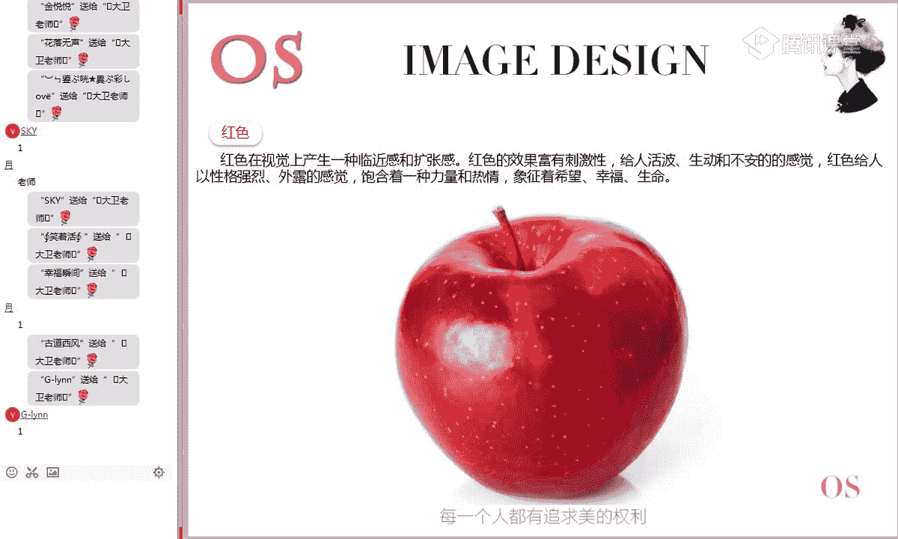
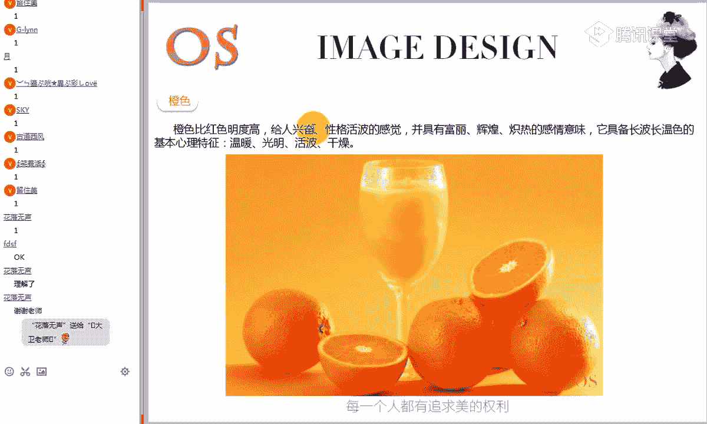
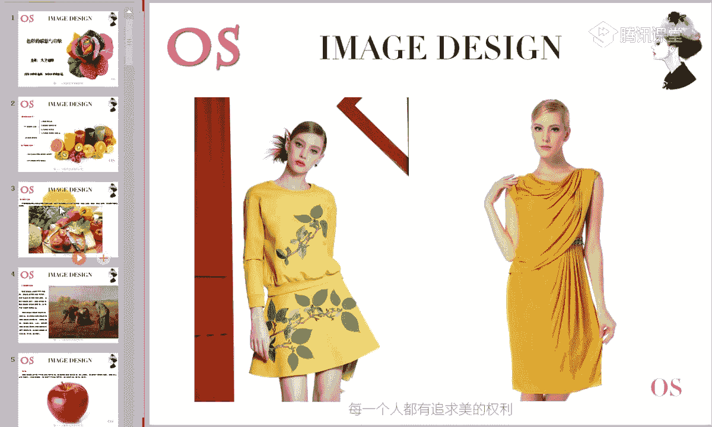
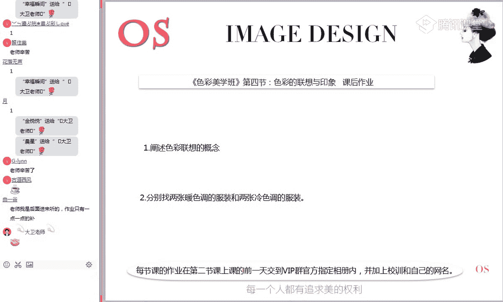

# 1、15男士形象色彩班VIP课程：第4节、色彩的联想与印象

Pleaseか。🎼自己。🎼最。好的，再次欢迎大家来到我们色彩美学班VIP课程的第四节课。色彩的联想与印象。我是本期的主讲大卫老师。那我们第一节课讲到的色彩的构成。第二节课讲到色彩的特征。

第三节课呢我们讲到了哎色彩的各种对比关系。那这节课呢我们会具体的讲到色彩的情感这方面的一个内容。所以本节课呢是我们很多同学可能在呃其他的地方很少接触过的。而且呢这个知识相对来说有点抽象。

我们要去体验每一种颜色所带给我们这种感觉的不同。所以本节课的知识呢，呃所有的同学一定要用心去感受。包括我们以后在涉及到呃每位同学可能对于色彩的这样一个敏感度啊，都跟本节课有着非常大的这样一个关系。好啊。

我看一下有没有新进的同学啊，我刚才看到我们第一次新进的同学，今天晚上应该有两位同学，对不对？好，今天晚上是第一次进入到我们这样的1个VIP直播课程。

第一次学习直播课程的同学在公屏上啊刷个笑脸来来给老师呃看一下。然后让我们其他同学认识一下啊。因为这两天我们有很多新进的同学啊。好，是第一次来学习直播课程的同学来冒个泡啊，我们的刘祝美同学。

还有我们的FDSF，对不对？好了，我们再次好，我们老同学一起来把鲜花刷起来啊，欢迎一下我们两位好新同学加入到了哎我们的VIP大军来学习。那平时的话呢，大家呃就是平时也一定要多交流啊，有遇到问题的时候呢。

呃平时在群内交流啊，我觉得收获会更大一些。除非大家比如说交流之后还是不确定的问题呢。哎老师会出面来给大家做这样的一个解答。😊，好，接下来呢我们就正式开始我们的课程啊。那首先来呃新同学可能要了解一下。

在直播学习的过程当中，大家看到我们是小班制的授课啊，百分之百啊就是在课堂上把每位同学的问题都解解决掉。那我们这个视频呢其实也是主要帮助大家温习了。所以说在直播课程上呢，我们最好是第一时间解决问题。

有不懂的话呢，一定要第一时间打在公屏上。好，接下来呢我们来看一下哦本节课的一个学习大纲。😊。

好，本节课的学习重点我们说会分为两部分。第一部分是关于色彩的心理啊，这一块的感受呢是我们对整个色彩体系的感受，包括啊什么是色彩的心理，色彩的联想的概念。第三个就是九大色系特征啊，我们所了解的九大色系呢。

其实就是红黄蓝橙绿紫、黑白灰啊，这九大色系呢是我们学习色彩的一个基本的一个奠基。第四个是九大色系的象征意义啊，第二部分就是色彩的情感。好，学习要求。第一，提升自己对色彩的联想能力。

就是当我们看到一个颜色的时候，你会想到什么东西。第二，了解色彩的情感意义。所以相对来说这节课呃是有一定的难度的。他已经要求我们对于这个美学的东西啊有更深的这样一个理解。我们在前面的课程里面呢。

只是研究了色彩的特征构成，还有它的这样一些对比关系。而本节课呢，我们已经上升到了我们对于色彩的进一步的这样的一个感受的能力。好，首先我们来看一下色彩的心理是什么意思啊。呃，大家首先来看一下。

当你在我们这里给大家提供了一张素材照片。哎，当你在看到这张画面里的是这张画面的这样一个情景的时候，呃，你会有一种什么样的感觉啊，尽可能的去呃身临处境的去感受一下这样一个场景。

当你在看到这样一幅真实的场景的时候啊，看到这么多啊颜色出现的时候，在你的心里面此刻是一种什么样的感觉，把你的感觉呢？哎，给老师打在公屏上。啊，记得在我们VIP课里面是绝对有要求的啊。

每位同学直播课的同学，你必须要参与到这样的一种互动中来。因为只有在这个过程当中，你才能高效吸收到哎我们想要学的这样的一些东西。来看到这样的一张画面的时候，你的内心是一种什么样的感受啊？没有关系。

就把你真实的感觉打在公屏上就可以了。🎼好的，我们其他同学呢好，每位同学一定要参与进来来看一下，在你看到这样的一个场景的时候，哎，你的心里面此刻到底是一种什么样的感觉？好的，我看到我们同学说。呃。

是加加的感觉，然后感觉是活力鲜艳，他会感觉很高兴。阔哎，这个扩该怎么理解了？啊，有食欲感啊，这个是有的啊，非常这么多的这些绿色绿色的蔬菜，对不对？黄瓜、西红柿。呃，颜色丰富多彩，那是什么感觉呢？

好吃舒服啊，好吃想吃新鲜呃，鲜艳，对不对？就是看到这样的一些颜色之后会非常的有食欲。但是有一点而且我们会看到这样的一些颜色之后，会感觉很舒心，很开心，对不对？有没有有没有看到这样的一些。

在我们看到这样的场景的时候，莫名的会感觉心里面呃，感觉很舒服，很开心，对不对？有的同学打个一给老师看一下。😊，我们会发现这些颜色，包括这样的一些画面会带给我们呃一种非常好的感觉。实际上的话呢。

如果大家平时在生活当中呃利用心去体验的话，你会发现当你在看到不同的颜色之后，你的心情会发生相应的变化。在你的心里面呢会产生不同的感觉。我们说不同的色彩会给人什么感官上带来不同的感受，面对不同的颜色呢。

人们会产生什么冷暖明暗、轻重强弱、远近胀缩、快慢，不同的这样的一些心理反应。那其实我们刚才这种感受呢也是一种最直观的感受，具体冷暖明暗的这种关系呢，我们后面还会讲到啊，大家在这里呢先要简单的了解一下。

哎，色彩的心理到底是什么意思。它实际上是指什么？当我们在看到一些不同的色彩的时候，会对我们的心里呢产生不同的这样的一些影响。好，接下来的话呢，我们就对色彩联想的概念做一些简单的了解啊呃我们说。

看到一个颜色的时候，会影响到我们心里面的一种感觉。而实际上是因为什么？当我们在看到一个颜色的时候，我们会对它产生一些啊不同的联想。而色彩的联想是联想又是什么意思呢？好，这里官方的解释。我们来看一下啊。

它是人脑的一种积极逻辑性与形象相互作用的，复用创造性的一个思维过程。简单的理解呢？它就是一个思维过程。那当我们在看到色彩时啊，能够联想和回忆某些与此色彩相关的事物，进而呢产生相应的情绪变化。

就像我们刚才看到这张哎这张画面一样，我们会很开心，是因为什么呢？我们由此哎产生了一些不同的想法跟感觉，从而呢让我们的情绪未知变化。😊，好，那么具体的这个色彩联想的话呢，它分为两个方向分为什么？

具体联想和抽象联想啊，这个一定要记一下啊。比如说呃我们之前在第一节课里面教给了大家网络学习的一个正确的方法啊，要做笔记该怎么记，你只需要记一个色彩的联想，然后记一个分支，具体联想和抽象联想。

记关键词就可以了。好，接下来呃我们来解释一下啊这个具体联想是什么意思。好，那么具体联想呢它是有什么看到色彩，联想到具体的事物。哎，比如我看到红色，我会想的太阳火焰，对不对？红旗呃。

这个太阳是我们看得见的，红旗我们是看得见的实物体，对不对？所以这样的一个联想过程就是什么？具体联想，而抽象两显呢，它是什么？看到色彩，联想到某种抽象的概念。比如。我们看到红色联想到温暖危险。哎。

这个温暖跟危险长得是什么样子的，看得见摸得着吗？看不见摸不着，对不对？它只是一种形容，一种感觉而已。所以说这种联想就是什么？抽象联想啊，色彩的联想抽呃，色彩的具体联想和抽象联联想是什么意思？

现在都能够理解的同学在公屏上给老师刷一朵鲜花啊，有没有理解色彩的联想两个分支是什么意思。😊，好的，这个概念一定要分清楚。我们在后面进行这样一个色彩联想训练的时候啊，你一定要知道有这样的两个分支。

具体联想和抽象联想是什么意思？来都能够理解的同学在公屏上给老师刷一朵鲜花。哎，我们明后再取到哎，具体联想抽象抽象啊，联想是什么意思啊，你知不知道？啊，再说一下具体对不对？通俗的来理解。

就是说当我们在看到一个颜色的时候，我们联想到具体的事物。那这个联想就是具体联想。比如说我们刚才说了嘛，我看到红色红色这个颜色，对不对？看到这个红色的颜色，我会想到太阳想到什么红旗红旗也是红色的，对不对？

哎，这个红旗是能看得见摸得着了这样一个实物体，对不对？所以我们这样一个联想过程就是什么具体联想。哎，同样的是看到红色。哎，但是我们联想到的什么温暖危险喜庆。哎，我们说哎这个温暖哎，它是一个实物不是。

它长的是什么样子，看得见摸摸得着吗？摸不着，所以这种这样的一些抽象的这种感觉的性的联想的，就是什么抽象联想啊，现在有没有理解？😊，好，月同学理解是什么意思？没有好，现在理解的话，给老师打个一。

老师看一下哦，OK没有问题了，对不对？好，色彩联想这一块两个概念，抽象联想和具体联想啊。😊，好，我们已经了解了色彩的心理是什么意思啊，色彩联想的一个概念，具体联想和抽象联联想。

那接下来呢我们就具体来看一下九大色系的这样一个特征啊，分别一个一个颜色，一个一个的啊色系来进行这样一个初步的了解。😊，好，首先我们来看一下红色呃，那红色能够带给我们一种什么样的感受呢？

包括我们在生活当中看到的红色。那我在服装搭配的时候，我用红色会带给别人一种什么样的感受呢？好，我们来看一下丁行的解释。红色是在视觉上产生一种宁近感啊，它的视觉上会产生一种宁近感跟什么扩张感。

红色的呃效果富有什么刺激性，给人活泼生动不安的感觉。红色给人以性格强烈，外露的感觉，饱含着一种力量和热情，象征着希望、幸福和生命啊，这里是对红色带给我们的一般普遍性这种感觉的一个描述。好。

先要记住这种感觉啊，大概的记一下。因为我们现在第一部分先对九大色系的颜色做一个初步的了解啊，九大色相红色。一定要记住关键词，临近感、扩张感富有刺激性。啊，大这里讲到这里的话呢。

有一个小知识点给大家普及一下。那红色呢大家之前在第一节课里面也学过了，它的波长是最长的，同时呢也是我们油彩系里面饱和度最高的一个颜色，也是最能最能够什么引起我们这样一个视觉注意的颜色。

因为它的刺激性会非常的强啊，小常识。

啊，比如说像这样的一些红色的衣服。呃，大家想一下，是不是在平时的生活当中，如果是在人群当中啊，有人穿了一件红色的衣服，是不是当我们再去看过去的时候，第一眼一定会注意到这个穿红色衣服的人，对不对？

是不是这样的，来认可的同学打个一给老师看一下。好，可能很多时候呃我们没有学过这样的专业知识之前，我们不知道是什么原因。为什么在一群人当中，哎，有人穿了红色，它最抢眼，因为什么？

这个红色跟它的一个性质是有关系的，它的波长是最长，它在所有的颜色里面饱和度是最高的一个颜色，纯度是最高的一个颜色，而且它带有这种刺激性，最容易引起了别人的这样一个视觉注意啊。

包括我们这个红绿灯上对这样一个红色的应用，也是有这样的一个原因。😊，好，先对红色啊第一大色相做一个出门了解。那第二个便是橙色。

好，在讲到这个橙色的时候，我要问一下啊，对这个橙色有没有同学还记得这个橙色有一个什么特点，知道的同学把答案打在公屏上。这个橙色有什么特点？还记不记得我们之前在讲的这个橙色是怎么来的？所以说老师一再强调。

我们每学到下一节课的时候，一定要把这节课的知识跟前一节课的知识串联起来。然后六节课学完之后，在你的思维里面应该有一个完整的这一套色彩体系的一个啊知识网在里面，随时呢能够进行这样的一个串动。呃。

有人说是光源色。红加黄红黄对不对啊？为什么说光原色呢？这个有点不理解啊？你这个回答确实呃跟咱们那个没有沾上边儿。其实我刚才想问的是什么？这个橙色呀，它并不是一个原色，大家都知道它是一个二字色，对不对？

它是有咱们的原色像红色跟黄色混合得到。所以单凭这一点的话，我们是不是可以得到一些信息，这个红色的色相特征呢，它一定会掺杂到一些什么红色跟黄色的这样的一些感觉，这样的一些特征在里面，对不对？有没有理解？

首先我们不看解释，我们大概就能够知道这个橙色可能具备了一些特征。它是一个二字色，它是有原色像红色跟黄色混合的道。所以在这个橙色里面肯定会夹杂到一些什么红色跟黄色的感觉在里面，这个能不能理解，能够理解。

同学打个一个老师看一下。所以当我们在看到这个橙色的时候，你会发现啊细细的观察它里面会有红的色养成分跟什么黄的四养成分，对不对？是不是我们现在都很厉害了。哎，我一看橙色，我能看出它有什么四养成分，对不对？

实际上啊学过的同学都知道，其实这个很简单，因为我知道这个橙色本来就是由什么红色跟黄色混合得到的。😊，那么橙色呢大家都知道啊，在我们这项明度排序里面，黄色的明度是最高的，对不对？

所以这个橙色是由红色跟黄色而得到，所以橙色依然是一个什么高明度的一个颜色。要记得啊，它也是一个明度比较高的颜色，那橙色比红色明度高，知道为什么吗？知道为什么的同学给老师打一个一，橙色为什么比红色明度高？

知道为什么的同学打一个一，不知道同学给老师打一个2，这个你能不能想明白为什么我们说橙色的明度会比红色的明度高，为什么？😊，来能够明白的同学打一个一，不明白的同学打一个2。

为什么说红橙色的明度比红色的明度高呢？因为什么？因为在我们的六大色系红黄蓝橙粒子里面，黄色的明度是最高的，对不对？黄色的明度比红色高。啊，老师说黄色的明度比红色高，这个能理解的同学打个一给老师看一下。

黄色的明度是不是比红色高，是不是这个有没有问题？因为什么黄色跟红色摆在一起的时候，很明显是黄色更亮一些，对不对？那既然黄色的明度比红色高。

而此刻橙色又是由什么红色跟黄色混合得到那是不是混合得到的橙色明度肯定要比红色的明度高，对不对？因为这个橙色里面是什么加入了在红里面加了黄的，加了高明度的颜色之后，肯定比它本来的呢？红色明度要高。

所以橙色的明度会比什么红色的明度要高。😊，好，上面呃两位同学花落无声和FDSF同学理解没有？现在理解没没有？为什么我们说橙色比红色的明度高，现在能不能理解？所以在第二节课里面，我讲这个色像环构成的时候。

一再强调这个色像环很重要。我们能够通过这个色像环里面得到非常多重要的信息。😊，好，你看是不是明度高，而且它纯度也高，对不对？红色是一个高纯度的颜色，黄色依然是一个高纯度的颜色。

高纯度的颜色组合纯度依然很高，它能够给人什么兴奋性格活泼的感觉，并且具有什么富丽辉煌炙热的感情意味，它具备长波长长波长是什么意思？因为红色的波长比较长。长波长温色的基本心理特征，温暖光明活泼干燥。

看到没有？这就是橙色带给我们这样的一些感觉。另外的话我在这里又一个小知识点给大家透露一下。这个橙色呀，它是一个非常特别的颜色。它是一个极暖的颜色啊，极暖的颜色，这个橙色只会是暖色调，不存在哎偏冷的沉啊。

偏暖的沉，它就是一个绝对的暖色调。

要记住啊，比如说红色会有偏冷的红，偏暖的红，蓝色有偏冷的蓝偏暖的，但是橙色就是一个极暖的一个颜色。好，来这个记下来的同学打个一给老师看一下啊，后面在我们讲的服饰用色里面会啊讲到这样的知识。

有这个颜色很特别啊，要特别讲究一下，它是一个极暖的颜色。😊，所以我们在谈到橙色的时候，它一定就是一个什么暖色调啊，毫无疑问。好，我们再来看一下橙色的女装啊，这个橙色的颜色呢，我们看一下。

其实橙色的这个颜色真的很漂亮，只是很少有人会去穿啊，因为这个颜色比较艳，很多人害怕啊，确实而讲不是害怕，很多人hold不住这个颜色啊，它是一个高纯度，相对明度比较高的颜色。

一般呢我们说这个纯正的橙色的话啊，只有这种偏近色型的人才hold得住。如果你整个人金色偏柔的话，穿的这个颜色呢肯定会显得不精神啊，所以说啊这个橙色的衣服本身是非常漂亮的。

但是呢呃能驾驭它的人呢一定要啊找到适合它这样一个肤色。😊，啊，问一下在我们课堂的同学有没有穿穿类似于这种橙色的这样一个颜色的啊，有没有用到这个橙色这个颜色的。

有用到的同学公屏上来打个鲜发给老师看一下有没有。啊，有没有同学有穿这种橙色衣服的，在你的衣橱里面有没有橙色的啊，还是有同学有的，对不对啊？其实这个颜色非常漂亮，只是在生活当中呢啊我们可能见的比较少啊。

其实穿出来真的很漂亮的一个颜色。😊，啊，一定要记住橙色的感觉啊，第二道色相橙色。那第三个便是黄色。好，大家可以看到我们这里采用的底色，对不对？你看我们这个黄色是不是跟我们这个白色感觉上去有点模糊不清。

这是为什么呢？有没有同学知道我们在上一节课里面讲到的那个识别性，还有没同学记得记得的同学打个一给老师看一下。😊，在上一节课里面，我们讲到了色彩的识别性。那如何增强两个颜色之间的识别性呢？

有没有同学记得怎么去调整，还记得的同学打个一给老师看一下。我们想要色彩的这个识别性增强，我们可以怎么做？有没有同学还记得记得的同学打个一个老串一下上一节课才学的啊。😊，啊，是不是都忘掉了？都没有记住啊。

这就是咱们学习的一个效果啊。所以说老师一问就咱们那个前一节课学的怎么样？色彩的识别性，如何增强色彩的识别性，增强什么？增强对比对不对？非常棒？我们销售活同学啊非常棒，是要增强两个颜色之间的对比关系。

那怎么去增强对比呢？通过什么啊色相明度和纯度。😊，让它的四个项之间对比加强，让它的明度、纯度对比加强，对不对？而我们这里采用的黄色跟白色。那我要问一下大家，那我们这里的一个识别性是强还是弱？

现在我们这个标题跟底色的识别性是强还是弱？回答老师就是现在我们的应用的时候了，对不对？是强还是弱？来判别一下我们这个黄色跟底色之间的关系，识别性是强还是弱。啊，非常棒。大半同学的理解都是没有问题的。

我们的岳同学你要看一下，这很明显是一个弱的关系，对不对？很明显是一个弱的关系。为什么你看到有点模糊不清，为什么这个识别关系会弱呢？因为我们讲到黄色是一个高明度的颜色，而白色是明度最高的一个颜色。

所以这两个都是高明度颜高明度的颜色，它俩之间的明度差非常小，这个对比关系非常弱。所以我们看上去这黄色跟白色配在一起，它的识别性非常弱，对不对？它是一个很弱的一个对比关系，对不对？😊，好。

现在都能够理解的同学打个先发给老师看一下。😊，啊，想打入了打错了，对不对？啊，这个没有关系啊。😊，啊，关键是我们我现在只是随便考一下大家，我们前面所学的知识啊，你懂得会去用啊。我们所讲的知识啊。

有的时候虽然是一些小的知识点嘛，但是它的作用也非常大。比如有同学的话，你将来可能要学做设计之类的，对不对？这个知识所讲的小知识点真的都非常有用的啊，只是拓展了一下。😊，好。

我们看察一下这个黄色有什么特征啊，它是一个明度非常高，而且纯度很高的颜色。那高纯度高明度颜色一般会什么带来一些积极的有刺激性的，对不对？所以说它具有快乐活泼，希望光明这样的特性。

给人以稍带点轻薄冷淡的感觉。那黄色呢又是灰黄的啊，常使人产生一种欣喜的喧闹的这样一个效果啊，它也是一个啊刺激性比较强的一个颜色，所以在红绿灯里面，哎，黄黄色也是一个重要的使用色，对不对？😊，哎。

我们再来看一下黄色的衣服，对不对？其实黄色的衣服的话呢呃我觉得其实有彩系的衣服的话，可能大家看到平时相对来说会比较少一些。这个黄色的话呢，它也有各种各样的黄色，包括我们说一个黄色，它采用不同的面料。

不同款式的裁剪带给人的感觉了，完全都不一样了，对不对？你看这种啊呃，我要问一下大家，呃，如果说现在我们课程同学，你让你看一下这两个呃衣服里面的一些呃文化元素特征，你能不能看出一点什么来？好。

随便考个大家看一下右边这件衣服。哎，这件衣服的话，你觉得它从设计上是会带有哪种文化，能不能看出来一点？好，考一下大家平时的话，对咱们这个呃学科的关注度，或者说呃这样一些美学知识啊掌握的一个情况。好。

我们来看一下右边这件衣服带给你的感觉是什么样的。哎，这个衣服的风格有没有一点感觉啊，有同学在猜了印度的好，还有没有同学有其他答案的？哎，还有很多同学是不是不知道该怎么回答。

不知道怎么回答的同学给老师打一个2啊。在我们课堂上学习的时候呢，哎知道同学你就把答案打出来，不知道同学呢呃公屏上给老师打一个2就可以了。😊，哎，有人说是雅典的古典的啊，各种。

然后还有很多同学的话就是哎反正觉得挺好看的，但是的话似乎看不出来门道，对不对啊，还是说休闲的啊，我把鲜花要送给一上回答希腊的同学啊。虽然回答希腊的同学呢，两个同学的文字都打错了。

但是我知道啊你应该还是知道一点的。希腊呢希啊不是这个希啊啊，当然也不是第二个希腊，两个希腊都不对啊。我们说古希腊文化，其实这是一种呢披挂式的啊，希腊式的风格啊，在我们女士班里面会讲到啊十八大服饰风格。

它会带有一些什么这样的一些不同国度的一些文化元素啊，所以它是这种披挂式的啊，希腊啊叫这种。😊，希腊的这种披挂式的啊，带有希腊的，大家学习过咱们这个希腊的它的一个雕塑文化会啊会雕它的雕塑会非常的好。

然后的话它有这样的一些文化元素在里面。所以从这个服饰里面呢，你会感受到哎这个那个时代的这样的一些啊文化底蕴在里面。看到没有，所以说我们这个穿衣打扮真的是一门大学文，它能从里面呢折射出很多的一些文化元素。

当然呢，我们这里只是点到为止啊，大家以后学到咱们这个呃女士班呢或者高级版块的课程，会更多的接触到关于服饰设计的这样的一些文化知识。😊，好，点到即止啊，你要记得我们在我们的美学班。

大家一定要记住我们所每节课里面所提到提到的一个一句话，没有不好的色彩，只有不好的搭配。每一个颜色登着的就是非常漂亮的。关键是呢你有没有把它用好。好，接下来我们来呃简单的了解一下下一个颜色，绿色啊。

在谈到这个绿色的时候呢，我觉得它是一个非常受大众欢迎的一个颜色。

好，为什么呢？因为绿色是一个什么稳定的能起到缓解疲劳的作用，给人以性格柔顺、温和、优美、抒情的感觉，象征着永远和平、青春新鲜。但在明度低或某种特定条件下，绿色又有消极夜，有时可营造出阴森灰暗，沉重。

悲哀的气氛啊，当然说我们这种消极的感觉呢，一般这是个是偏比较浓比较深的这个绿色。大半情况来说，这个绿色带给我们的感觉呢都是积极的，对不对？好，我们说绿色能够起到缓解疲劳的作用。

所以呢经常我们会看到在一些办公室里面呢，我们经常会多放一些植被，为了就是呢起到这样的一个啊作用。让我们平时在比较疲劳的时候能够看到一点绿色的东西呢，对眼睛起到一个缓解的作用。

而且呢这个颜色呢就是我们长期盯着看眼睛不会疲劳的一个颜色。好，包括在生活当中，大家会知道，我们经常会喜欢出去踏青，对不对？非常喜欢能够找到一片绿色的草地，绿色的小森林在里面呢放松一下。

因为人在这个环境里面呢会处于一种极度放松的状态。哎，我们非常疲劳的时候，在这种环境里面呢，你会很放松啊，对不对？啊，大家现在来感受一下。如果说哎现在哎就给你这样一个机会，现在即刻让你躺在这样一个草坪上。

你会有一种什么样的感觉啊，可以把自己的感受打在公屏上啊，我们说了今天晚上的课程呢，就是调动了大家去感受生活，感受色彩。😊，啊，你会发现学了我们色彩课之后，很多同学对生活的理解就不一样的啊。

感觉每天的生活啦都会充满活力。为什么呢？我们学会用眼睛去观察美。好，是什么感觉？很放松的？啊，如果现在就给你一个机会，让你躺在这片绿色的草坪上，你会有一种什么样的感觉？啊云说平静。啊，试着来感受一下。

没有感受过没有关系。但是现在呢在课堂上老师就给大家这样一个机会啊，你去感受一下，如果让你躺在这片绿色的草地上，你会有一种什么样的感受？很舒服很舒心。呃，这个感觉还没有打开。

其实我们说呃学习色彩的同学来说，咱们这个想象力是要。A非常的丰富的。很快的能够进入到这样一个状态。很舒服，很放松，很惬意的，对不对啊？一定要记得绿色，它带给我们的感觉是什么？

而且的话呢呃我们一会在服饰搭配里面也会讲到这个绿色它是一种友好色啊。如果说在平时的哎呃这样的一个接待工作当中啊，或者说在跟朋友见面的时候，在你的装饰品里面带一点绿色的花啦，都会带来更多的这样一种亲近感。

因为它是一个非常受欢迎的颜色。😊，好的，我们来看一下绿色的衣服哈。当然呢我们说绿色的衣服也有非常多好看的，只是我们平时的一个呃视觉范围有限而已啊。我们来观察一下这两件衣服啊，顺便考一下大家。😊，呃。

现在回答了回答老师这两件衣服，哪件衣服的纯度高是一还是2？这两件衣服，哪件衣服的纯度高是一还是2？好的，这个都没有问题啊。看来大家上节课这个纯度长么的都没有问题啊。我现在再换一个分呃。

这样一个方式来问一下这样一个问题。这两件衣服哪件衣服的明度高？啊，我们主要就看中间这一块啊，哪件衣服的明度高。中间的衣服跟他对比，哪件衣服的明度高？啊，是不是我们很多新同学的话没有学前面的知识。

可能这会儿就搞不懂了。为什么第二件衣服比第一件衣服的纯度高呢？哎，但是比较明度的时候，明显是第一件衣服的明度比第二件高，为什么对不对？很多同学就搞不清楚了。

搞不清楚的同学肯定是咱们第二节课明度跟纯度的关系还没搞清楚。因为非常明显虽属绿色，这个明显的颜色纯度要很鲜艳的一个颜色，它的纯度要高，对不对？但是从亮度上来说，明显的中间块比它要亮一些。

所以明度跟纯度不是一个概念啊，我只是随时的想去提醒一下大家，这个关系一定要搞清楚。😊，好，那么当然了，我们说这种高纯度的颜色跟低纯度的绿色，它是适合不同的人穿的，对不对？哎，有些人的话呢。

他就穿这样的纯度高的绿色，非常漂亮，很有气质。但有些人呢他就适合穿那种哎偏柔和很灰的这样一个绿色，穿在身上呢很漂亮啊。但是如果说你穿这个颜色很漂亮的话，那你穿这个颜色肯定不好看。

你穿这个很柔和的颜色很好看的话呢，你穿鲜艳的颜色肯定会拉不好看。那这个呢在我们后面的哎唉色彩机型里面课程里面啊，男女士班里面都会有提到，告诉大家不同的肤色应该如何根据自己的肤色呢去选择适合自己的颜色。

😊，好，接下来我们来看一下第五个色相，蓝色啊，红黄蓝蓝色呢也是一个原色相。那这里有给大家提到过这个蓝色呢哎也是纯度比较高的颜色。我们说原色都是纯度非常高的颜色，对不对？这个蓝色的话。

它代给我们什么样的感觉呢？它代表了广阔的天空色，同时又使联想到深不可测的海洋，可表现人的沉静冷静理智，博爱透明等性格特征，蓝色呢也是一种体现消极的收缩的内在的色彩啊，简单了解一下。啊。

我们来看一下蓝色的女装啊，当然蓝色的女装呢也是非常漂亮的。哎，我们之前给大家讲到这样一个蓝色，还记不得蓝色有什么样的特性？呃，还有没有同学记得我们在讲到色彩的膨胀跟收缩的时候，有讲到一个什么概念。

是不是我们讲过冷色调有这样的一个视觉收缩的作用，而且有这种后退感，对不对？还记不记得记得的同学打个电话给老师看一下。啊，冷色调有这样一种。视觉收缩跟后退感，暖色调有这种视觉膨胀跟前进感啊。

所以在随时随地的要把我们的知识串联起来。好，接下来我们来看一下第六大色相啊，九大色相的第六大色相紫色。来告诉老师紫色是怎么来的。好，快速的回答老师紫色是怎么来的。我们说紫色呀，它是纯度最低的色啊。

它是纯度最低的色，同时呢也是明度最低的一个颜色。啊，为什么要这样说？很多同学就不理解了，对不对？而红紫色怎么来了？是有咱们的原色像红色加蓝色得到的，对不对？它是一个二次色。

所以这个紫色里面呢模模糊糊的也带了一些红色跟蓝色的味道在里面，对不对？所以我们在看到紫色的时候，你要知道它有什么色相成分。😊，好的，现在我刚才问的是啊，我们说紫色是纯度最低，同时明度又是最低的颜色啊。

这句话大家能不能理解能够理解的同学在公屏上打一个一啊，或者说还有想不通的地方的同学的话呢，在公屏上给老师打一个2。😊，啊，是不是这句话很多同学现在就理解不了的。哎，怎么说紫色纯度是最低了。

紫色不是挺鲜艳的吗？啊，所以说我们这里所说的纯度最低是什么意思呢？相对于我们这个六大色相来说的红黄蓝橙绿紫而言，紫色的纯度是最最低的。同时明度最低呢也是相对于我们的六大色相来说，红黄蓝橙绿紫来说。

它的明度也是最低的。所以说一定要照这句话的一个适用范围，它指的是红黄蓝橙绿紫、黑白灰，我们的九大色系范围啊，不除了黑白灰之外啊，就是红黄蓝橙绿紫啊，六大色相的排序，紫色的明度最低纯度最低。😊，好。

现在有没有理解理解的同学打个一个老师看一下。😊，在六大色相里面啊，这里这句话适用于什么？六大色相的一个排序。在六大色原色相里面啊，它的什么明度最低，纯度是最低的啊，因为很简单的道理。

黑白灰的彩度几乎是0，所以黑白灰的彩度肯定要比紫色低，对不对？任意油彩漆的纯度呢都会比什么黑白灰要高。好，那么在可见光谱当中呢，紫色的光波也是最短的。如果比紫色的一个光波再短的就是什么紫外线啊。

紫外线咱们肉眼就看不到了，就不是什么可识别颜色的，对不对？眼睛对紫色的感知度最低，它可用于表现孤独高贵、奢华优雅而神秘的情感。好，一定要记住咱们紫色这个特，在原色相里面，它的纯度和明度是最低的。

相对来说纯度是比较低的一个颜色。那另外的话呢，我们这个紫色啊它也是一个表现的神秘而高贵的一个颜色。所以紫色的话很多人是驾驭不了的，一定要记得，包括大家有去拍婚纱照。

你会发现在紫色的婚纱礼服里面很多人穿紫色都不好看。因为这个颜色比较挑人，相对来说。好，但是紫色呢真的是一个非常漂亮的颜色啊，当然不否认。如果说对你的肤色来说，你能够hold住这个颜色的话。

你穿穿出来呢当然是非常漂亮的。好，要记住咱们这个紫色的特征。明度低，纯度低，表现孤独高贵，奢华优雅而神秘的情感。好，接下来我们有彩系的六大色像。红黄蓝橙绿子简单的了解过。接下来我们看一下黑白灰。好。

大家千万不要觉得这样的知识乏味啊，我们现在是在做什么呢？我们是把色彩啊，千千万万个色彩把它归纳为啊先从最基本的九大色系了解开始啊，掌握这样一个规律之后，咱们以后再学其他的颜色呢就会比较简单。

而且的话呢你很容易知道其他的颜色呢，它的这样一个混合的规律。白色啊它象征的纯洁光明，纯真，同时可表现轻快、恬静、清洁卫生，有时可用于表现单调空虚具有不可侵犯的个性。好。

这就是白色能够给我们带来一系列的这样一个感觉。总总之让大家记得它的重要特性。纯洁光明，纯真。

好，所以你会发现在我们这样的平时的着装当中啊，白色的话一般在职场上包括白衬衣啊呃黑白的一个搭配也能带给别人非常不错的这样一个感觉啊。包括在咱们这样一个婚纱礼服当中，白色的婚纱礼服永远都是什么？

最重要的一套。为什么？这个白色很适合来表现女性的这种善良跟纯真，表现的是些积地阳光美好的这样一些东西在里面。所以白色的婚纱呢永远都是咱们这个婚纱礼服当中最为重要的这样一套。好，一定要记得啊。

它很适合来表现女性的这样的一些特征。接下来我们看一下黑色啊，相信黑色的话呢大家都很熟悉，对不对？呃，没有声音了，现在表示能够听到老师声音的同学在公屏上给老师打一个一。好的，其他同学能够听到老师的声音吗？

能够听到了在公屏上给老师打一个一。😊，呃，哪位同学帮老师打一句话啊，让我们花了武声同学啊，稍微检查一下自己的一个音频设备情况。啊，帮老师打一句话，告诉我们的花落无声同学啊，检查一下自己的一个音频情况啊。

因为我们大班同学的话呢哎都可以听到老师说话了，对不对？好，那我刚才讲到了，我们说这个黑色的话呢，对我们大家来说都很熟悉。黑色能使，联联想到黑暗，黑夜寂寞局神秘，意味着悲哀、沉默、恐怖、罪恶及消亡。

还可以用于表现严肃含蓄庄重和解脱。好，总之咱们这个黑色的实际上在通常情况下会带给我们一种不好的感觉啊，会带有更多一些消极意味的感觉，包括了很多人很害怕黑夜，对不对？

黑色的话会让我们感觉到更多的一些哎比较消沉的这样一些东西。好，但是的话呢这个黑色实际上在我们的时尚搭配里面呢，它也是相对来说是一个很普遍性的一个颜色啊，搭配的好的话呢也会非常的时尚。总之在这里呢。

我们先要大体上对知道黑色能带给我们的这样一系列的一些感觉。白色黑色很简单。接下来我们看一下灰色啊，那这个灰色呢相对来说啊，我们很多同学的话可能了解的比较少。好，但是在前面一节课我们有讲到，哎。

这个灰色是怎么来的？灰色可不是天生的啊，它是由黑色和白色混合而得到。所以灰色分很多阶的这样的一个灰，哎，浅灰啊、深灰啊、中灰呀，对不对？灰色有很多，它实际上就是黑白的混合物混合的比例不一样。

我们看到的灰色的这样一个明度也是不一样的。好，我们说灰色好似黑白的混合色，自身显得毫无特点，其特点柔和、倾向性不明显。灰色啊，那这里的话呢只是一个示意图。大家知道，实际上家里装修用色的话呢。

很少有这样做的，包括家里无论是有老人或者是孩子的话，都不适合大面积灰色的去用色啊。因为这个颜色的话，后面我们可以讲到它会带给我们一些相对来说偏消沉的这样的一些感觉。

好，这里呢我们快速回下啊，快速过一下片儿，看一下哎九大色系的留给我们的第一印象。我们后面还会有详细的这样一个分析啊。我们首先看一下第一个是。红色啊，快速的形成一啊一连串的这样一个感觉啊。

红色第二个是橙色，记住它的感觉它的特征。

第三个是黄色，第四个是绿色，第五个是蓝色，第六个是紫色啊，五彩系的白色、黑色和灰色。好，九大色系呢呃，现在大家都记住没有？我们在谈到九大色相，你知不知道是哪些都记住的同学，打个一个老师看一下。

你要随口说的出来九大色相是哪些呀，怎么去记它三原色黑白灰三个二次色橙绿紫啊，三原色红黄蓝，三个二字色橙绿紫，再加上什么五彩系的黑白灰就是基本的九大色相了，对不对？😊，呃，还是没有声音啊。

这个的话一个情况我们就说自己的音频设备啊，就是咱们的。呃，就是咱们的接收音频设备有没有问题？第二个就是网络会不会卡带的一个情况。如果网卡的话呢，可能也是听不到的。啊，我们学完之后大家做了什么？

这九大色相啊，一定要提到某个颜色的时候，你要快速对它有一个感觉初步的感觉。第二个就是我们在提到九大色相的时候，你要什么能够随口说出来有哪哪些颜色？

刚才记忆的方法告诉大家的三原色、红黄蓝三个二4色橙绿紫啊，五彩系的黑白灰九大基本色相。好，那好的，接下来的话呢，我们来看一下啊，我们就开始进正式的进入到我们九大色像的这样一个联想。

对它做更深入的一个了解。我们刚才只是了初步的对九大色像，有初步的认识。接下来我们要训练一下大家对于色彩的这样一个什么感受的能力。好，一定要记得我们所讲的这些知识啊。

以后再学到服饰搭配啊这样一个板块的时候，它的用处会非常非常大，潜移默化了都会影响到你对于服饰搭配的这样一个看法。好，我们来看一下，首先的摆在手臂的还是这样一个红色。红色给人温暖、热情欢乐。

人民看来表现了火热、生命、活力与危险等信息。红色的联想啊，大家可以看到第一排夕阳火焰、雪液，五星红旗，中国结红灯笼。这一片都是什么？食物的联想，下面的炎热战争革命、热情、激情、危险恐怖都是什么抽象联想。

好，当然呢这里呢只是提供了一些文字性的参考，拓展大家的这样一个思维。那么我们现在要做的是什么呢？我希望每位同学现在都可以打开一下自己的思维。这个联想是什么概念？我给大家打个比方，哎。

比如说我想到了五星红旗，我有五星红旗，会想到可能跟我记忆有关的这样一些问题啊。每位同学可能想到都不一样。这就是什么？联想你会有这样的一个颜色联想到很很多很多很多这样的一些事物。

所以我们在看到一个颜色的时候，你的感受会不一样。😊，来，我们现在来做一个小小的一个测试啊。比如说当我们在看到红色的时候，对不对？我们会想到中国结，如果在想到中国结的时候，你会想到什么？

现在把你想到的东西给老师打在公屏上，他有没有勾出你记忆里面的某一件事或者说某些东西。好，我们给大家引导一下思路啊，我们在看到红色的时候，可能会想到很多。假设我们在看到红色的时候，我们会想到中国节。

那想到中国节的时候，你可能会想到什么东西，就一连片的把你这个思维打开。😊，啊，想到红色的时候，你可能会想到什么东西。啊，我会比如说我们再延伸一下，比如说我会想到红灯红红灯笼，对不对？想到红灯笼。

我会想到哎，哪一年的时候，哎，我第一次买了一个红灯笼，我第一次看到红灯笼，或者这个红灯笼跟什么事情有关，某个人有关，某个事情有关。一连串达来去打开你的刺维。所以当我们在看到一个颜色的时候。

你就不会单一的像呃我们现在这样看到这个红色，它就是个红色没有任何的感觉。你记得。😊，每一个颜色它都是有生命的，它都会对我们的心理会产生这样的冲击。而很多时候我们看到它没感觉，是因为什么呢？

是因为我们没有细细的去体味它，对不对？所以说我们希望本节课学习能让大家学会是怎么做呢？学会去认真深入的去理解每一个颜色让这个颜色在你的思维里面形成比较深的印象。比如说这个红色。

我会想到有同学说哎红蜡烛学些，对不对？我会想到红蜡烛，那红蜡烛这个红蜡烛，我怎么会想蜡烛，或者说我在哪个哪个庙会看过，哎，他们用的红蜡烛，比如说哎咱们这个哎结婚的时候，哎，咱们会用这个红蜡烛，对不对？

这都是你的宝贵的财富，记得这所有的联想对你来说都是宝贵的财富。😊，我相信如果你现在愿意打开你的思维去想红色有关的这些事情。你以后在看到红色的时候，你不会非常的就是怎么说呢？很陌生，这就是一个颜色。

没有任何的感觉。那在进行服饰搭配的时候，你就会有更多的灵感。哎，这个红色搭配在这里可能会带给别人什么样的感受，可能会带给别人一种什么样的感觉。我再结合到这个红色的特征。哎，它是纯度非常高的颜颜色。

有视觉冲击力的那我这个颜色用在这个地方可能会产生什么样的效果。那这个时候你在进行服装搭配的时候，我相信你的感觉会非常的有一些什么属于你自己的东西。😊，为什么要训练大家这个呢？

因为大家都知道服装搭配技巧真的很简单，哪儿都有，你看我也看你用我也用。但是你会发现真正的用到好的就是有很多人对于色彩呢有更深的理解，他会在他的思维里面对于红色呢有特别的这种感受。好，我看一下。

现在非常棒啊，大家一定已经积极的参与进来了，有有想到红对联红包包，有想到红包的，对不对？西瓜哎，红苹果红色的指甲喜报会想到地鬼啊啊，你怎么会想到厉鬼啊，有点很特别啊，但是没有关系啊啊。

可能鬼片看的比较多啊，有这样的一些场景，对不对？😊，好，有想到春晚红喜字啊，红色的对联啊，非常棒，就是这样做的很简单。其实这个其实我们这个美学课程，包括我说这个四点联想啊，呃，怎么说呢？

我没有办法像教数学一样，一加一等于22加2等于4，这样的去教你他完全就。我只起到一个什么，老师只起到一个引导的作用，让大家打开思维去对这个色彩了去更深入的去感受这个颜色。我相信的话。

如果你愿意对每一个颜色做这样的一个分析的话，你以后再看到色彩的时候，你不会很茫然。那就是一个颜色很死板。你在看到这个颜色的时候，你会发现它有生命。它出现的这个地方有它的价值跟意义。😊，好。

我这这里呢刚才只是给大家打开一个思路，大家该怎么做呢？分两个方向。😊，呃，我现在开始提问。第一，每个人只打一个红色具体联想，把你联呃红色的具体联想事物打一个在公屏上。好，给大家30秒的时间。

你看到红色联想的一个具体的事物，这上面出现过的不算啊，你自己要想一个打在公屏上。具体联想啊，现在给老师打一个在公屏上听到具体联想啊，看到红色联想到具体的食物才是具体联想啊，红苹果合格玫瑰花啊，合格。

火火龙果也合格，红丝带啊也可以。现在我们看到红色联想的具体事物，热烈不合格啊，包括前面回答的喜庆不合格。我现在说具体联想是什么？红色的具体联想樱桃可以。啊，红鞋子非常棒啊。

你会发现每个人想的东西还是挺不一样的。为什么每个人的生活原历不一样？所以说每个人学了同样的美学知识之后，哎，对于美的一个什么审视角度不一样。红旗可以合格西红柿喜字，哎，可以。😊，啊。车厘子呃，太阳对。

这都是实物体，对不对？红宝石。啊，非常棒啊非常棒啊，可以了。那接下来。😊，哎，红裙子也可以，咱们看到红色抽象的联想想一个啊，这上面出现过的不算。啊，血液也是的，对不对？抽象的联想来一个分两条思维。

这就是我们平时的话呢，我在我在这节课里面只会以红色为案例。那我希望在讲完这节课之后，其他的色相大家自己在本子上一一的把它列出来。当你能够非常清晰的对一个颜色产生两条体系的这样联想，有很多的东西的时候。

你再进行颜色配色，服饰搭配用色的时候，你不会没有感觉。因为你知道你在搭配的不是没有生命的颜色，它都是有生命的。😊，啊，喜庆了熟透了，对不对？热热烈的激情的热喜事很热喜庆刺激，对不对？非常棒。

这些东西都是什么？看不见摸不着的有红色带给我们的感受，一种什么抽象的联想啊，相信经过这样的一个练习之后啊，大家对于色彩的抽象联想，跟去体联想应该是都没有问题的，对不对？是不是会联想到很多的事情。

是不是以后是不是我们在看到红色的时候，你就不会没有感觉的。这个红色它不是一个单一的一个颜色出现在这里，它是有生命的。它这个生命不是说它本来有生命，它是跟你有关系的。因为你看到这个红色的时候。

它跟你的很多记忆是有关系的。所以在你在用这个颜色的时候，他是带着你的情感在里面的，能不能理解抽象的感觉啊，相信这个我现在给大家讲，这个可能有点不明白。在以后大家接触的色彩越多的时候了。

我相信你会有这样的一种感受，你会感觉每个颜色呢，它都是有生命的。😊，好的，现在色彩联想的训练方法都学会了没有？都学会的同学来打个先话给老师看一下。啊，因为后面还有八大色相啊。

我们不能一一的来给大家做这样的训练。但是这个方法你要掌握。包括的话我这个在作业里面虽然没有要求，但是我希望大家在私下的时间里面，一定到每个颜色都来打开这样一个思维。你要知道你做一次。

在你的思维保库里面就积累了非常多非常多这样的东西。你以后在用的时候随手拿来，你不会再看到颜色的时候，没有感觉。😊，好，那么第二个就是橙色啊橙色。橙色的话呢，我们前面分析过了，就不讲了，橙色给人兴奋。

陈修稳重，含蓄，丰富喜悦，营养华丽诱惑之感，这是非常受人欢迎的颜色。啊，那我现在在讲一个颜色的时候，大家主动的打两个两组词上去啊。比如说看到橙色，你的具体联想和抽象联想分别打一个就可以了。

快速打公屏上老师边介绍呢，大家边联想啊，我们这样一来了，可以加快这样一个进度。啊，我们这里提供的橙色联想，我们会联想到具体的数目是什么？香橙、夕阳、灯光、麦穗，对不对？好，大家打的时候要打两个啊。

具体的跟抽象的。啊，那还有我们这种出现的感觉，甜蜜哎，橙色跟甜蜜好像有关系。哎，以后我在用颜色的时候，比如说我要表现这种甜蜜的气氛的时候，我是不是可以用一点橙色，对不对？哎，温暖的感觉？

橙色是一个极暖的颜色，对不对？所以会带给我们温暖的感觉。哎，喜欢啊，这个有点抽象啊，有点出象，但是可以记一下丰收，是不是我们在丰收的季节，这些成熟的果实会带有这种橙色的韵味，对不对？看一下大家的回答。

😊，好，非常棒啊，这个节奏要快，果汁呃，橘子、火热、橙子、橙子丰收啊，不够快，说明大家平时对这个橙色呀啊了解的不太多。从回答速度上可以看得出来，大家对这个橙色呀呃它的一个感觉是怎么样的。😊。

成熟的对不对？烟花啊，这里我就不一一点到，我需要的是大家的速度啊，我通过速度就可以看得出来，大家平时这几个色彩了解多少。啊，课程上呢我们就不一一来分享到客户的话呢，大家自己要加强这方面的一个训练啊。好。

大家主动打在公屏上，我们换下一个颜色啊，看这个颜色，迅速把你的感觉打出来。好，黄色我们刚才初步的分析过。我们说这个黄色啊是最能够引发人高声叫喊的色彩，因为它纯度高，明度高，对不对啊。

非常能够引起这样的人的视觉注意，有这种与生俱来的扩张感和尖锐感啊，刺激性非常强。那我们用黄色可能会联联想的什么阳光灯光、柠檬啊，最明显的就是柠檬，对不对？然后迎春花黄金啊，黄金、黄金。

我们说古代的这样的一些什么，咱们这个黄黄家呀用的这样的一些服饰颜色都是以什么黄色为主，对不对？😊，好，包括我们说了，在古代的话，这个黄色黄马褂啊是皇帝赏给什么有功的这样的一些呃功臣的啊。

所以这个黄色是皇家专用色，你想用黄色还不行，你平民老百姓的话，你还不可以用黄色，用黄色就犯法，对不对？但是的话我们说哎，现代人是不是很幸福。哎，什么颜色你都可以使，不犯法，想用什么都可以，对不对？

所以说生活在这个时代的话呢，哎，大家应该呃非常的要感恩来到了这个时代。如果在古代的话，你想穿个鲜应的颜色都不可以，对不对？😊，光明希望快乐活泼富贵，为什么明度高，对不对？好，快速把你的感觉打在公屏上啊。

我看下看一下大家能不能跟上这样一个节奏。

哎，给大家看看一张非常漂漂亮的这样的一张画面，看到没有啊，向日葵对不对？好，顺带大家来联想一下，如果你在这片向日葵的这样一个花园里面会有一种什么样的感觉？好，给大家一次机会。

如果你现在来到这边真实的向日葵的这样一棵花园里面，会有一种什么样的感觉？😊，而会有一种什么样的心情，把你的可能会有的这个心情呢打在公屏上。啊，是不是我们在一看到这样的画面的时候。

就莫名其妙的会感觉很开心，很阳光。在你心里面所有的阴力都没有了，对不对？你感觉生活充满了希望，就莫名其妙的会很快乐，对不对？看到没有？很神奇，色彩真的会让我们的生活发生非常大的变化啊？

如果说我们能来到这片花园，你我我相信很多人可能来到这样一个地方，一定会开始欢呼起来，非常的开心，非常的兴奋，莫名其妙的，对不对？感觉生活充满了希望，对不对？有没有？😊。

打开你的心扉去感受一下这样的一种感觉。只是这样的花园可能比较少见，真的见到的话，每个每我相信每位同学到到这个地方呢都会莫名的开始了，积极起来，阳光起来，对不对？啊，黄色为主的啊，向日葵。啊。

一定要把感觉打开。接下来哎我们看一个大家非常喜欢的颜色，绿色。绿色它具有稳定平静感，色相范围相对交广，人们的视觉对于绿色表现的比较适应，应该说是相当的适应。它是一个人长期盯着看。

而不会眼睛胀痛感觉的这样一个颜色。好，不要忘了啊，我们在出现这个颜色的时候，大家第一时间把你的感觉打在公屏上，具体联想和抽象联联想啊，不要停，不要让老师提醒，这个是大家主动去做的，要快啊。只有这样的话。

你经过这样快速的去训练，你的思维才打得开，一定要是什么即时反应。😊，哎，我们官方提供的参考，这个绿色呢，我们会想到大自然树皮草地啊，具体的联想，对不对？出现的联想是什么和平啊，我是拿着橄榄枝的啊。

青春宁静安全成长啊，这总之还是一些积极阳光向上的绿色呢代表了这种一个青春期，对不对？😊，啊，安全成长的中的小树苗。好，快速啊快速，我不一一解释过。但是大家要第一时间把你的感觉。

具体联想和抽象联想打在公屏上。如果你的感觉少，说明你对这个色彩的了解太少了。私下的话，你一定要自己想办法找个本子，把这个绿色的具体联想是什么？抽象联想是什么？越多越好了写在本子上，你的思维一旦被打开了。

你在学色彩，你会发现真的非常有意思。😊，哎，看到没有？这样一片绿色的庄园，对不对啊，非常的诗意的一张画面啊。呃，是有同学连这种稻田都没有见过，对不对？在我们课堂老师要问一下。

见过这种真实的稻田的同学打一个一，没有见过的同学呢，在公屏上给老师打一个2啊。但是呢大家也不要忘记了联想啊，据迟把你的答案打在公屏上。😊，啊，是不是很多同学估计连这种真实的稻田都没见过，对不对啊？

我说的是真实的，你是在电视上网上见的，不算，你有没有真实的稻过这种麦田啊，不是麦田，是稻田啊，这是稻谷啊，很多同学可能就没见过啊。呃，其实的话呢我觉得没见过的同学是一大遗憾。平时的话呢，如果出游的话。

一定有机会来看一下真实的麦田。你要知道你每天吃的大米它是怎么长出来的。它是长在什么地方的啊，它在成长的时候是什么样子的，非常的有意思啊。我觉得生活的话呢，呃很精彩，只是很多时候呢。

我们就忽略了这些精彩而已。😊，啊，还点过这种啊真实的还去种植过，对不对啊，真的是一种非常呃，其实的话我们说经过你的劳动得到的东西了，你会更加的去爱惜它啊。比如说这个大米的话，你吃着天天买的。

你不知道它的成长过程，或者说呃如果说你亲手种植过的话，那种感觉真的是不一样的啊。总之的话呢，我希望大家哎真的以后有机会的话，你们还没有见过的话，一定要见过一次，是不是咱们吃了几十年的大米。

可能连这个大米的成长过程都没有见过，真的很可惜啊，以后出游的话，咱们天专门呢就到这种田园的地方来看一看走一走啊。我相信呢你对生命会有一种不一样的感觉。😊，啊呃，言外之词，接下来我们看下一个颜色。

要跟上节奏啊，看到这个颜色的时候，主动的赶紧把你想到的东西打在公屏上，抽象和具体的是什么？😊，呃，我们来看一下蓝色呃，蓝色呢它给人冷静宽广质感，人们用它来表现未来、高科技思维等信息啊。

比如说咱们的一些苹果专卖店，对不对？它用的蓝色跟白色的这样一个组合，因为它什么蓝色表示的这种高科技安全。来蓝色的联想，我们会想到第一项呢是蓝天，第二项呢是大海远山。

抽象的感觉呢给人的感觉平静，理智高尚深远，沉着稳重。所以说在很多职场场合里面呢，蓝色衬衣相对来说是一个比较安全的颜色。哎，大家知不知道这个地方是哪个地方啊啊，知道的同学可以打在公屏上啊啊。

不影响大家的联想过程。你要联想还没有我联想完的话，赶紧打文字。老师在问的话呢，就是回答完的同学哎，知不知道这是哪个地方拍的。😊，啊，可以猜一下啊。哎，这张照片还是老师亲自拍的。

有没有同学可以猜一下这是哪个地方。😊，啊，有一位同学猜对啊有一位同学猜对的啊。😊，啊，这是这确实是在大连啊，大连是在13年的时候啊，13年的时候拍摄的啊。啊，这是在大连啊，大连这边的。

我去的时候是3月份吧，这边的海还是挺难的，反正拍出来的话呢，就是这种很难很难的这种感觉。好，不要停不要停啊，言外之音，咱们完了。接下来我们看下一个颜色，紫色。😊，啊，去大连的话呢，要晚一点去。

别去的太早啊，我觉得这个地方还是挺冷的啊，去的时候大3月份、4月份还是挺冷的，可以晚一点去啊，应该在5月份左右吧，应该温度是很不错的。呃，是的，大连的那边的海还是非常漂亮的。哎，紫色啊。

我们要抓紧时间啊，来紫色啊，稍微聊一下就可以了。我们来看一下紫色带给你什么样的感觉。大家知道这个紫色是一个非常特别非常神秘的颜色，紫色给人神秘含蓄，祥乐，幻想，幽静高贵质感，这常用于表现什么？

悠久深奥理智、高贵、冷漠等清息啊，冷艳高贵，所以这个颜色很挑人呢。如果说相对来说气质型的人啊，气质型特征很明显的人呢，这个紫色还hold住，就是一般很多人呃就是相对来说感觉比较随意的人吧。

这个颜色他可能穿在身上真的穿不出来了，这种感觉和味道。😊，哎，紫色我们会联想到具体的食物是什么丁香花、紫藤、葡萄，哎，非常明显的具体的食物，对不对？梦幻的看到没有？神秘的优雅的高贵的啊。

这些这个抽象的联想的话，总之来说呃，可能大家第一次接触到吧，对他没有太多的感受。你先记住啊，你先记住，如果以后在用色的时候，你呃会考虑到他有些这些抽象的感觉的话呢，你一定要注意一下啊。

他可能会带来这种梦幻般的感觉啦，神秘的优雅的高贵的。比如说我们以后再看到一些绘画设计啊啊，你都可能从里面体会到了咱们这个设计师，可能他的这样的一些想法。好的，那接下来的话呢，我们看一下另外一个颜色。

白色。啊，快速的快速的白色带给你什么样的感受？我们说白色具有明亮。洁白纯粹洁净，坦诚挚意，寂静洁白的雪景，纯白色的婚纱都给人一种一尘不染的感觉，因此，必须树立纯洁形象的衣院等地的，方多使用白色。

另外它用容易什么与其他的颜色相配，是很受女性亲密的色彩。好，我们之前讲过呃，这个五彩系的黑白灰可以跟任意有彩系进行搭配啊，但是白色呢更适合来表现女性，对不对？啊，你的感觉就不要停了啊不要老师说话停了。

你就停了啊，老师讲老师的，但是你的感觉要快速的反映出来，打在公屏上。看到白色，你想到了什么呢？具体联想和出现联联想啊，两个方面至少有一个词给老师打在公屏上要快啊，我在课堂上短做训练。课后的话呢。

大家就要有一个啊系统长期的训练过程过程啊啊，为什么咱们色彩美学班的课程安排的比较缓呢？因为这个美学知识色彩知识吧，很多同学之前没有接触过。如果我们一我可以我可以这六节课一个星期就上完了？

为什么几乎要给大家上了三个星期了，就是这个知识吧，它必须要跟生活结合起来呃，它有一个慢慢的一个升华的过程啊，所以说大家平时的话呃这个实际上每节课之间时间隔得比较长，大家一定要加强训练啊。

希望这样一个美学班学完之后，每位同学都能对色彩有一个非常深的这样一个了解，包括这些配色关系。😊，好，下面一个颜色就是黑色。好，我们说黑色给人高贵时尚质感，这常用于表现重量、坚毅、男性、工业等信息。啊。

它用于表现男性工业等信息坚硬的白色给人的感觉比较浅比较柔，来表现女性，对不对？而黑色表现的坚硬多用来表现男性、工业等信息啊，这个非常大的一个区别。那么黑色我们能联想到具体的事物是什么？

黑夜墨水、绅士寂静、恐怖严肃，正义邪恶。刚才啊这都是抽象联想啊，我们说黑色的衣服就是什么具体联想，对不对？啊也如说眉对不对？具体联想芝麻黑芝麻啊，魔鬼看不见摸不着，它是抽象联想，对不对？

所以说这个黑色的联想的话呢，大家也要学会从两个方向去进行这样的一个啊拓展性的思维，快速反应啊，要记得美颜色你的理解越深，用起来呢就越顺手。好，来最后一个色相就是灰色啊。

这里呢我们这次就是灰色就一下深入的一个分析啊。我们说灰色给人频繁失落，中庸颓废阴森的感觉，看到没有？我前面为什么给大家讲过，在咱们室内装修用色的时候啊，家里有儿童的话，他的卧室不要用大面积的灰色。

会影响他的智力的正常发育啊，一定要记得啊，孩子的房间应该颜色非常鲜艳的一些颜色，它正在。成长的时候，他需要很多鲜艳的颜色去刺激他的这样一个脑细胞。所以有如果家有小孩的话。

一定要哪怕是在墙上贴一些鲜艳色彩的画都是非常好的。而且呢孩子也会非常的喜欢。😊，另外有老人的话，为什么也不适合大面积这灰色的？大家知道给人感觉失落的颓废了，对不对？人到了垂暮之年的时候。

本来就是生活的积极性不太高。如果你大愿睛用灰色的话呢，也会影响到老人的这样一个心情啊，所以说一定要注意了啊。啊，有人说那我就把发家里的颜色用的很鲜艳啊，但是如果老人的话也不太适合。

因为比特别是有一些心脏病的，太鲜艳的颜色呢，也会刺激到它啊。所以说在老人的房间里面呢，你不要大面用用一些什么呃这样的灰色，也不要什么太鲜艳的颜色，中等这种纯度颜色的就可以了啊。

所以这个呢啊在那个室内装修用色里面啊，另外在老师的空间，有一篇文章啊，专门就介绍这样的一个呃年龄用色的这样一篇文章啊，有兴趣的同学呢，可以去老师的空间看一下。好，那灰色我们会联想到什么？

具体的乌云啊、水泥啊、烟雾啊，对不对？阴天啊，抽象的频繁犹豫失落，你暗颓废，丧失信心。总之，这个灰色会带给我们更多的这些什么消沉的这种感觉啊，要你一定要记得啊，这个灰色。所以即便在服饰用色的时候呢。

也不建议大面积的全部使用灰色啊，很少人能够大面积的去能hold得住这样的一些灰色。好，那关于九大色系的一个联想呢，我们就给大家分享到这里啊啊，我说了这个作业的话呢，我不做要求啊，因为工作量比较大。

大家在业余有时间的时候啊，就把这个具体联想跟成业联想写在本上，把它给拓展开来。啊，是不是刚才这块节奏很快，很多同学就感觉很忙，对不对？好了，现在咱们可以缓一缓的啊。因为我相信经过这样的一个啊刺激之后。

每位同学的思维呢应该都会被打开的差不多了。😊，好，那接下来的知识的话呢呃灰色不是说啊是的，百搭灰黑白灰都是一样的。它跟任何颜色都可以搭啊。但是的话呢我们一般呃就是全身一身灰的这种装扮啊。

其实很多同学是hold不住的啊。你要记得搭配灰色，比灰色的围巾呢啊，灰色的单品呢都是没有问题的。😊，好，下面的知识点呢相对来说要简单一点，大家就不用手忙脚乱的啊。老师讲为主。

大家的理解呢就是啊老师讲大家在这里听理解就可以了。好，接下来我们要讲一下色彩的几种感受，应该讲就是色彩的属性感受啊。第一个就是关于冷暖啊，一定要记得在我们色彩美学班，包括在我们的形象部门班里面。

冷暖都是要重点讲的。在这里的话呢呃不要求大家对冷暖有多深的了解，起码对这些基础的常识有一个初步的了解啊。呃，我们知道色彩有冷暖之分，让人感觉到色感觉暖温暖的色彩即是软，感觉到冷的颜色呢就是冷。

这个感觉比较简单，对不对？在这里的话呢，有几个小知识点，大家要记一下啊，就是我们说呃冷暖色相跟冷暖色调的一个区别。那暖色相指的是什么？红色橙色跟黄色，冷色相指的是什么？就是蓝色的色相。

来这个记下来同学打个一给老师看一下。冷色暖色冷色指的就是蓝色这个色相，暖色就是指的红色、橙色跟黄色啊，一定要记得。好，那么另外还有一个冷暖色调是什么意思呢？暖色调是指带有黄底调的一系列的颜色。

它是指暖色调，而冷色调呢是指带有蓝底调的一系列的颜色，就是说这个颜色泛蓝，它就是冷色调，这个颜色泛黄，它就是暖色调，一系列的颜色啊，它并不是指单一一个颜色。来这个概念记下的同学打个一个老师看一下。啊。

首先两个小知识点，什么是冷暖色，什么是冷暖色调啊，这个要记住。啊，另外呢我们在这个借助这个C环，我们要简单的了解一下有些特殊的颜色。比如说绿色跟紫色啊，我们把它定位什么？中性色啊，绿色跟紫色是中性色。

它的冷暖色相是不分明的啊，特别是绿色呢，我们说它是一个强土草，哎，因为什么？它是有原色相暖色相跟冷色相的混合而得到啊，所以这个绿色它相对来说偏中性的一个颜色。哎。

比如说但是我们会看到哎这个蓝绿色呀跟黄绿色相比，看到没有？蓝绿色里面蓝的成分多，黄绿色里面黄的成分多，所以相对于。啊，这个黄绿跟蓝绿比对的话呢，哎我们这个黄绿就温暖一些，蓝绿呢就偏冷一些啊。

这个能不能感觉得出来，能感觉出来的同学打个一给老师看一下。黄绿色跟蓝绿色相对比的话，很明显是黄绿色偏暖一些啊，它是一个相对的概念。那另外还有一个特点，比如说这个绿色它是中心色吧。

比如说它跟黄绿色在一起做比对的时候啊，它感觉有点偏冷。哎，当这个绿色跟这个蓝绿色在一起做比对的时候，它有有有点什么偏暖，所以说它是一个强头草。那这个色彩的冷暖呢。

也是一个什么有相对性的一个相对性的概念啊，相对性的概念。那我们前面有提到过这个橙色另外，它就是一个极暖的颜色，你不管怎么对比，它就是一个暖色调，对不对？啊，那接下来对这个知识点呢。

我们要稍稍的给大家研究一下啊，色彩冷暖。现在刚才大家只是记了一个定义啊，实际上有一些问题我们没有解决，就是人对于色彩的这种感觉是怎么来的。好，大家现在看一下，当你看到这样的两幅画面的时候。

它带给你的感觉是软的还是冷的。啊，在我们看到这张画面的时候，他带给你的感受是温暖的还是啊清凉的、寒冷的。啊，是不是很暖和的，温暖的感觉，为什么看到了篝火，对不对啊，这张画面它就带给了你这种温暖的感觉。

我们来换一张。来，当我们在看到这张画面的时候，他带给你的感觉是冷的还是软的？是不是非常清凉的，寒冷的，对不对？啊，这个时候我们就要去思考一个问题啊，哎，为什么我们在看到这张画面的时候，我会有冷的感觉。

而我在看到这张画面的时候会有暖的感觉，为什么呢？就是我们现在要思考一个问题，人为什么对色彩会产生冷暖不同的感觉。而且我们会发现我们上面大家的感觉很统一呀，对不对？看到这张画面都是软的。

看到这张画面都是冷的。你会发现我们天生都具备感受色彩，这个冷暖的这样一个能力，对不对？但是我们要思考一下，为什么会发生这个现象。😊，好，有人说条件反射对不对？还有的同学问你知识学的挺好的啊啊。

生物学的知识学的挺好的，这个什么条件反射。那很多同学是不是想不明白。那接下来的话呢，我们把这个过程给大家解释一下，我们为什么在看到不同的色彩之后，会有冷暖不同的感觉。😊，我要问一下大家，哎。

这种真实的篝火有没有考过，考过的同学打个一给老师看一下啊，你有没有真实的感受过这种篝火，在这种篝火旁边烤过火的，真实的火焰，烤过火的同学打个一给老师看一下。我们说经历过的都是财富。

你的生活经验都是非常重要的。包括我相信刚才能够判别的同学都是有过类似的这种什么生活经验的。😊，好，除非是一个人的话，你完全被割绝的，没有任何生活经验的，你可能对色彩就不会有感觉啊。啊，那我要问一下大家。

当你在烤火的时候，我们会感受到温暖。那这个过程它发生的物理过程是什么呢？我们在烤火的时候，为什么会感到暖的感觉？为什么？因为大家都知道这个篝火在燃烧的过程当中啊，它会什么释放出温度，释放出热量，对不对？

这个温度通过空气传递到我们的生理上的时候，我们身体受到的这种温度的影响，会感觉到热，成从而呢引起了我们心理的这种温暖的感觉，这是一个什么？从我们的生理到心理的过程。😊。

来这个过程能理解的同学打个一个老师看一下。当我们在真实的一堆篝火旁边，我们为什么会有温暖的感觉？这是一个什么物理过程，因为有温度传递你到你的生理上，从而引起了你心里的感觉。而此刻这个火焰。

它的一个颜色是不是在我们的心里面也留下了这样的印象，对不对？😊，那么此刻我们现在要思考一下，此刻我们在这个电脑屏幕上看到这张画面，这张画面里面是不是没有温度传递出来，对不对？这个画面它只是一个画面。

它没有任何的温度传递出来，但是我们依然有这种温暖的感觉，这是为什么呢？是因为此刻我们的视觉在看到与类似于这样的一些颜色画面的时候，勾起了我们心里的曾经的这种感觉，温暖的感觉。

此刻我们的什么视觉变成了触觉的先导，这就是一个条件反射的过程。好，现在有没有理解人为什么会对色彩有这种冷暖不同的感觉，能够理解的同学打个鲜花给老师看一下。啊，我们真实烤火的时候。

感受到温暖是一个物理过程。而此刻看到这样张画面会有温暖感是一种什么条件反射。那跟我们看到衣服一样。所以刚才在看到这两张画面的时候，大家本能性的都感觉这种有温暖的感觉，这个呢有冷的感觉，对不对？

其实这是一种条件反射。所以每一个人的话啊都会有天生都会具备这种感受色彩冷暖的能力，只是什么呢？敏感度不一样。是不是如果说我们再去选择服装的时候，让你去选对服装冷暖色调，是不是很多同学做不到，对不对？

自己能做到的同学打一个一，做不到的同学给老师打一个2。😊，如果是让你去选择服装颜色冷暖色调啊，你感觉你自己都能选对的同学，你给老师打一个一，感觉自己做不到的同学，你给老师打一个2啊，服装颜色的冷暖色调。

你会不会看？😊，啊，真的能做到的同学，我觉得你非常厉害啊非常厉害。因为什么说看服装颜色的冷暖色调真的很有难度啊，并不上我们看的这么简单，因为这个冷暖非常的明显，对不对？

而实际上我们再去选择服装颜色的时候，有很多颜色很复杂，它的冷暖的话，判别的话呢一般至少啊是我们初次接触到色彩的同学，你基本上是识别不出来的，除非是经过专门训练的啊，因为有些颜色它的冷暖非常的模糊啊。

比如说红色吧，有红色它有偏冷的红，哎，它带着淡淡的什么蓝底调，还有一些红色是偏暖的橘红色偏暖的，对不对？所以说有些颜色的话呢，它的冷暖不分明。那这个时候的话，一定是经过专业训练的才能够识别的出来。

所以在我们美学班的同学的话呢，如果你以后啊有像这种职业的这样一个需求，将来对这方面有更高追求的话，从现在开始你要你要开始训练自己训练什么呢？对色彩的识别能力啊，咱们是有一个色本的啊。

一个小色本工具是一果是5块钱一本啊，它是里面有春夏秋冬，每个季时。😊，36个颜色，春季跟秋季是暖色相，那夏季跟冬季呢是暖色相，有兴趣的同学呢可以专门的来训练一下。当然呢。

这个是我说了是有对自己有更高追求的，想能够比如说做到对色彩快速识别的啊，有必要可以去训练一下啊，先记清楚有哪些颜色。好，色彩冷暖这块的知识还有没有问题？没有问题的同学现在打个一给老师看一下啊，重点两个。

第一个什么是冷暖色相？第二个什么是冷暖色调啊，以及人为什么对色彩会产生冷暖之分，都没有问题的同学打个一给老师看一下。😊，啊，这些知识点很重要啊，特别是色彩的紊暖。在职业班还会专门有讲。

因为这个知识很重要。好，接下来我们来看一下呃，色彩的轻重啊，这个比较容易理解啊，大家只需要简单的记一下就可以了。色彩的轻重是什么意思了？好，一般浅颜色呀会带给我们比较轻的感觉。

而深颜色呢会带给我们比较重的感觉，它是什么意思呢？它是指啊比如说同样做工的这样的一些打个比方，两件衣服，对不对？两件衬衣，一个深颜色和一个浅颜色，一般是什么浅颜色会带给我们比较轻的感觉。

而深颜色会带给我们比较沉重的感觉。这就是之前我们为什么讲过，为什么一个人很胖的时候，不建议全身穿黑色呀？😊，因为黑色虽然它有视觉收作用作用，但是它更多的会带来这种重量感，会让你感觉更重更笨重啊。

所以说一定要记得啊，不要因为胖穿一身的黑色。好，这个色彩的清晰度能不能理解是什么意思？能够理解的同学来打个一个老师看一下。😊，实际上它是一种是错觉啊，两个同样加工的物品，只是因为颜色深浅。

它带给我们的重量感不一样。实际它们的重量感是一模一样的啊。那这个知识在服饰搭配里面呢也有非常重要的一个应用。好，第二个，我们说兴奋色和冷静色，相信这个的话呢，了解过前面的色彩都应该知道是什么意思啊。

兴奋色是有什么特征呢？暖色系的高彩度的色彩都能够带给我们这种兴奋的感觉，膨胀的感觉，兴奋的感觉，对不对？而冷静色呢是冷色系的低彩度的颜色会带给我们什么呢？这种冷静的感觉。😊，啊。

这个暖色系高彩度知不知道是什么意思？还有这个冷色系低低彩度，知道是什么意思的同学打个相话给老师看一下。知不知道哪些颜色是暖色系，高彩度的颜色，哪些颜色是冷色系，低彩度的颜色，其实彩度指的是什么？

就是纯度，对不对？鲜艳的颜色偏暖色调的都是兴奋色，而这种比较浑浊的颜色，冷色的颜色都是什么这种冷静色啊，就会色彩我说了能够带给我们这种兴奋感和冷静感，对不对？包括我们课前给大家看到这个照片是什么？😊。

是不是这些都是高彩度的颜色，非常鲜艳的颜色，对不对？会带给我们的兴奋感，是不是啊？所以说你要知道这里描述的是什么意思啊。😊，好，接下来还有一个概念是华丽色跟朴素色。那这个知识点呢可能大家感觉用不上。

用不到太多。那在咱们后面所讲到的什么呢？这个服饰风格里面会用到，比如说有些风格比较带有这些华丽元素的啊，有些风格需要啊，它需要用这些朴素色的，你要知道是什么意思啊。那华丽色有什么特点？

高彩度的色彩给人以华丽气派的感觉啊，就是比较鲜艳的颜色。朴素色呢就是指什么低彩度，低彩度的颜色给人以什么朴素的感觉啊，一定要记住的啊，色彩里面的学员可多了。黄绿色就是指比较鲜艳的颜色。

而普素色呢就是一些纯度比较低的颜色啊，低纯度的颜色。来这个这个能不能理解，能够理解的同学打个先发给老师看一下华绿色跟普素色以后我们再提到黄绿色，你知不知道黄绿色有什么样的特征，它是什么纯度比较高的颜色。

对不对？那朴素色呢就是低纯度的颜色啊，所以说这些都是属于什么专用名词，以后我们再提到黄绿色普素色就不会这样解释了。所以说这些知识的话，大一定要理解是什么意思。而且呢要把它记下来。😊，啊。

最后一部分就是关于色彩的情感坐标啊，色彩的情感坐标。那我们说色彩学家呢将色彩按照什么冷暖呢轻重划分的这样一个四四象线啊，这个轻重是什么意思呢？大家以后在学习色彩进前呢会知道春夏秋冬这样排列的啊。

这里是这一块区域是春夏秋冬，上面是浅，下面是深春夏两季呢是色彩偏浅的特点。秋冬两季的偏深的特点。然后春秋两季左边这一块向间区域啊是暖色调，右边这块区域呢是冷色调啊，简单的了解一下。

这个的话呢以后在啊后面的课程里面会讲，这里呢只是大家先先知道色彩的情感坐标是什么意思啊。比如说清浅的颜色它会表达不一样的感觉，而深的颜色啊，暖色调冷色调它所表达的感觉了。

完全都是不一样的那这个呢呃呃稍微有点复杂啊，这里呢先是简单了解就可以知道色彩的情感坐标是什么意思就可以了。好，这里的话呢给大家提供了这样的小色块的参考。比如说。呃，另外的话在我们的VIP课程学完之后啊。

可以找老师来领取啊，我们会给大家提供一个专业的一个配色资料啊。那在我们的试听课上提供的配色宝典呢，就是啊质量不高，相对来说的话啊，品质也不是很高啊，所以说在学完我们美学班啊，六节课之后啊。

可以找老师这里来领取啊，我们专业版的这样一个配色资料，到时候会提给大家高清的资料。比如说啊两色三色五色怎么配色啊，这些颜色每个颜色表达什么样的感觉啊，到时候的话呢。

大家在学完之后就可以看得懂我们那个专业资料了。在这里呢先简单的了解一下啊，一定要有这样的感啊，有什么这样的意识。颜色的深浅不一样，纯度不一样。组合在一起的感觉呢也是不一样的。

我相信学过今天晚上对我们这个色系的了解，包括色彩情感的了解之后啊，我们再看颜色的感觉呢会不一样。😊，好，我们把这个思路整一下啊，内容还是稍微有点多吧。总之呃九大色系的内容相对来说。

初次接触触到的同学呢感觉呃记得内容量还是有点大啊。色彩的心理是什么意思啊？色彩联想的概念，具体联想和出现联想重中之重，九大色系的基本特征啊，以后再提到九大色系，你要知道是什么意思啊。第四。

九大色系的象征意啊，象征意。第二部分色彩的情感。好，所以本节课整体来说呢相对来说都是偏抽象的。重要的是让大家呢培养这种感觉，知道颜色是有生命的，对每一个颜色呢都会有这样的一个深刻的印象。啊。

这节课稍微上的时间有点长，可能很多同学都听的有点睡着了，对不对？第一题，阐述色彩联想的概念，解述色彩的联想是什么意思啊？记得大家在做作业的时候，我主要是看一下大家对知识的理解，包括你的一个学习的态度。

你的态度决定了结果啊。我们说呃每一个人的话呢，可能你的理解力吸收力是不一样了。但是你的态度才能真正决定你对这个课程能够学的好快。所以做作业的时候呢，我希望作业的同学都能够用心的去做。

千万不要为了完成老师的任务。如果你很忙的话，你可以晚一点交作业，但是做作业的话，一定要去用心做。它相当于老师对你所学知识的这样的一个验证，也是呢啊进一步的这样的一个加强。😊，第二。

分别找两张暖色调服装和两张啦，冷色调的服装啊，当然呢很多同学可能说老师很多复杂的颜色我识别不了，那你就找比较明显一点这种颜色。现呢对这个呢有一个初步的概念啊，你会发现我们每节课的作业其实也不多。

你只要稍微花个5分钟到10分钟的时间做这个作业也是很快的，所以也希望呢每位同学学源课程之后，一定要做作业来加深理解。那本节课另外一个额外的要求了。

就是大家一定要把九大色相的颜色写在本上抽象联想具体是什么？你啊这样一个具体联想是什么，越多越好啊，慢慢的去打开你的思维，对色彩呢有更深的了解。我说了呃色彩的这个。我们说色彩有生命，可能很多同学理解不了。

我相信的话，用心去体会的同学呢，你明天开始再看颜色的时候感觉不一样，每一个颜色它里面都蕴藏着非常多的文化跟信息。所以希望大家通过这节课的学习之后，都能对色彩的敏感呢能够上升到一个档次。好，好了。

本节课的作业都明白没有？没有问题的同学来打个一给老师看一下。那咱们本节课的知识呢就给大家分享到这里，随后呢老师把视频保存上传一下。😊，🎼Yeah。🎼对我去会。Please， please。

 my you。🎼Ba。🎼St。🎼那す。🎼He。🎼哦哦。Oh。🎼。🎼的一J。

