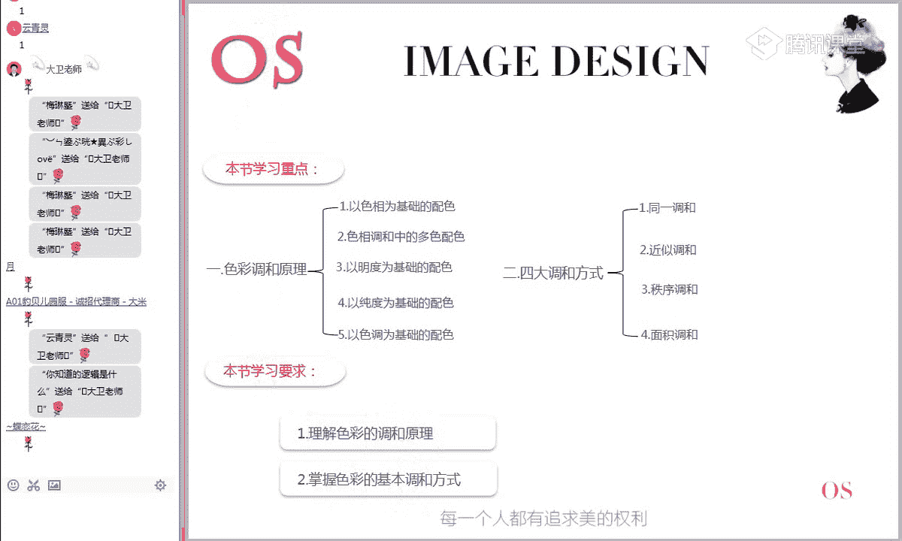
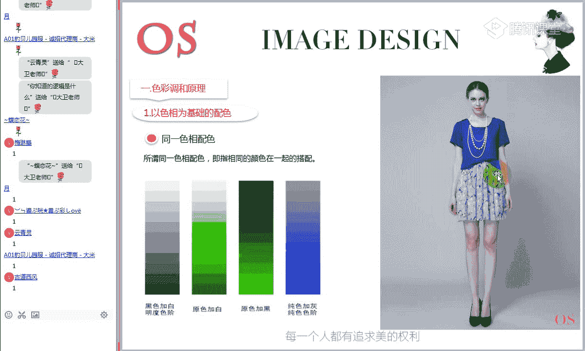
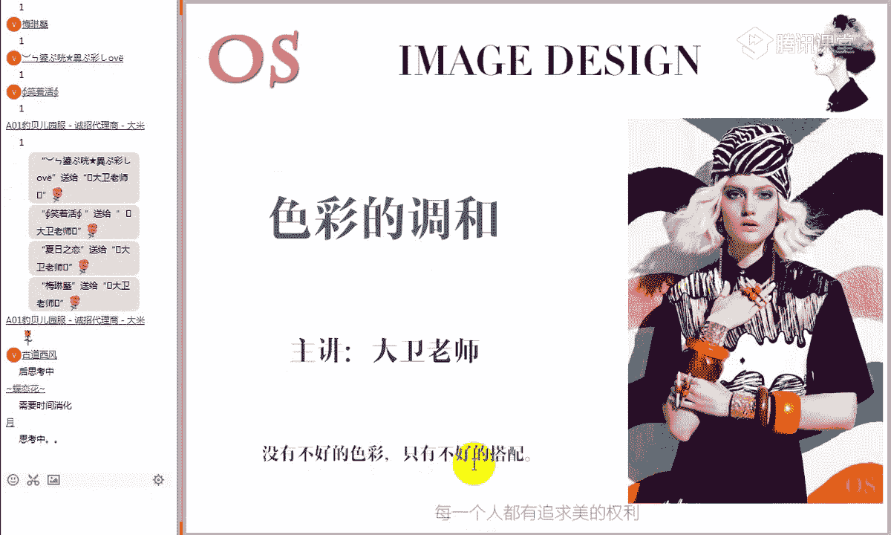
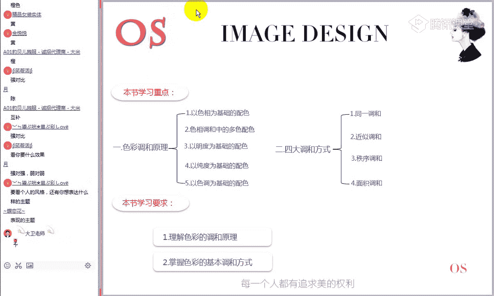
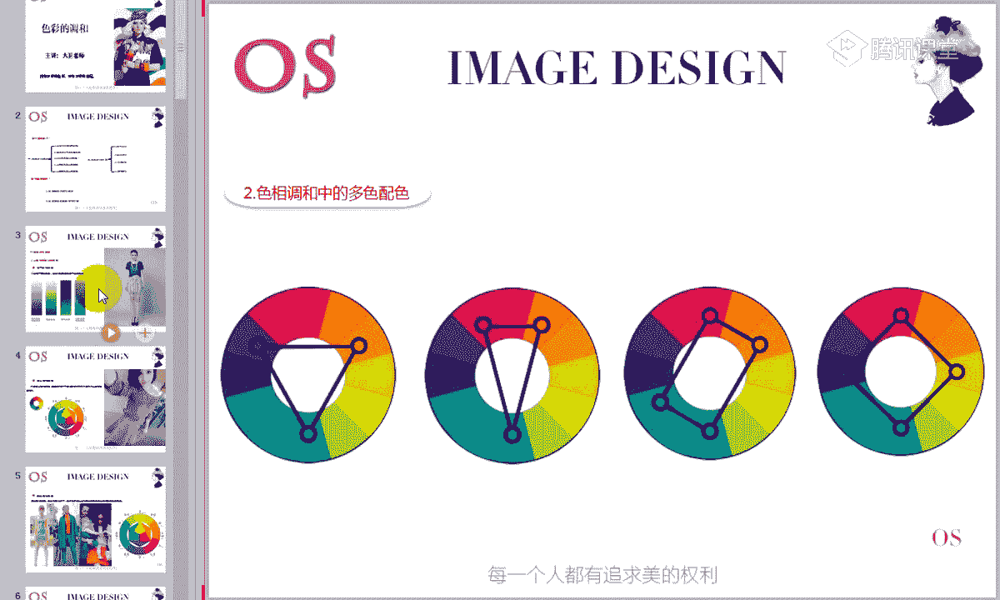
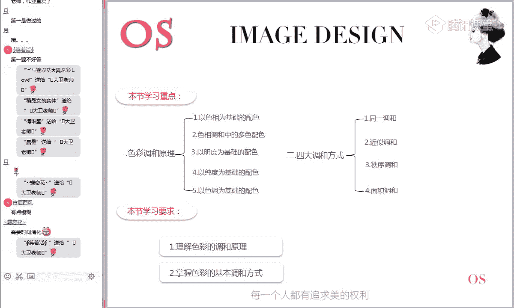

# 1、15男士形象色彩班VIP课程：第5节、色彩的调和

好的，再欢迎大家来到我们色彩美学班VIP课程的第五节课。色彩的调和，我是本期的主讲大哥老师。好，那我们之前讲过，在我们整个色彩美学班的六节课程里面，相对来说第五节课程的难度啊稍微是大一些。呃。

但是如果说前面四节课啊，你整个都学过，学的很好的话，这节课呢相对来说啊也是比较简单的。所以说呃我一再强调我们色彩美学班，它每一节课程的关联性非常强。你必须先学好第一节再学第二节。

那这节课呢呃我们讲的调和实际上已经讲到了具体的这样的一些配色技巧啊，它需要我们前面的这样一些基础知识做这样一个铺垫的。😊，好，所以这节课的知识的话呢，我希望在听课的时候啊，所有的同学都能够集中尽力。

那在我讲到有一些不懂的地方的时候呢，一定要及时的提出来。好，另外的话呢呃我看到今天晚上新进课堂的同学啊，有一位新同学是你知道的逻辑是什么？啊，好的，我们所有的老同学一起啊来欢迎一下我们的新同学啊。

今天晚上第一次来体验我们的直播学习。😊，好嘞，鲜花送给我们的新同学啊，欢迎欢迎加入我们的VIP大军。😊，好，记得平时的话呢，一定要抽时间把前面几节课程给他补上。有不懂的话呢，一定要第一时间过来找我。

好的，呃，那接下来的话呢，我们来看一下我们的本节课的一个学习大纲啊。之前在第一节课里面，我们具体讲到的学习方法啊，新同学一定要优先看一下第一节课。

好，我们来看一下本节课的学习重点和学习要求。第一部分就是关于色彩调和的原理。就是我们在进行这样的一个颜色配色的时候，它有几种方式啊，以色相为基础啊，以色调和中的哎以色调调和中的多色配色。

以明度为基础的配色，以纯度为基础的配色，以及呢以色调为基础的配色。第二个是四大啊四大调和方式。那这个呢我们之前已经强调过了，对于一些有冲突的颜色，我们可以选择不同的方式进行调和。那具体的选什么的话。

取决于呢？我们想要表达一种什么样的感觉。所以这几个调和方式啦啊也是本节课的一个学习重点。学习要求第一部分理解色彩的调和原理，要知道我们的调和是什么意思。为什么要调和啊，所以这个概念非常重要。第二个。

掌握色彩的基本调和方式啊，就是在进行具体的色彩配色的时候，我们可以采用什么样的方式去进行调整。

好，接下来的话呢，我们来就进入第一部分。色彩的调和原理啊调和原理第一大板块的知识相对来说呢，内容也比较多。它是对我们整个色彩的这样的一些配色方式做了这样的一个系统的分析。第一部分就是以色相为基础的配色。

好，那么在我们第二节课程里面呢，我们讲到了色彩的特征啊，色彩的三要素，色相明度和纯度。那我们这里呢就是第一部分以色相为基础的配色。首先第一个同一色相配色啊，关于同一色相这个概念。

我相信大家都应该很清楚啊。所谓的同一色相配色呢指相同的颜色在一起的搭配啊，相同的颜色，或者说相同的色相在一起的搭配。或者说呃理解为什么？同类色在一起的搭配啊，同类色就是有相同色相的这样一些颜色的搭配。

比如说啊大家可以看到这样的绿色，对不对？那在原色相这样一个绿色里面，我们无论是加了黑，加了白还是加了灰，这个绿色会变成什么？浅绿色啊，深绿色或者说灰绿色。但是这样的一些颜色之间呢。

它们都有一个共同点是什么？相同的绿色的色相，所以它们在一起之间呢哎一个配色呢也是没有问题的。好，这个这个能不能理解，能够理解，同学打打个一个老师看一下，这是在我们油彩色里面的这样的一个搭配。

最简单的配色就是什么同一色相配色。那这种同一色相的配色呢相对来说对比关系比较弱。😊，好的。🤧。好，那我们刚才说啊这个配色方法呢是最简单的一个同一色相配色，也是最容易理解的。它就这是什么相同的一个色相。

不同纯度明度的这样一之间的一个组合。好，比如说在我们这套搭配里面，我们可以看到上衣的颜色相对来说，哎比较深下面的哎，带到浅浅的淡蓝色，对不对？但他们之间的关系呢还是属于什么同一色相这样的一个配色关系。

好，对第一个呢相对来说比较简单啊，我们就快一点。但是大家一定要记得啊，有不懂的话，一定要提出来啊。好，第二个再进一步啊，就是相对于我们同一色相来说，对比再强一点的这样一个关系是什么？是类似色相配色。😊。

好，那么类似色相配色。首先我们要解决一个问题啊，什么是类似色？那类似色是什么？类似类似我们可以理解为什么相似，对不对？就是两个颜色比较接近比较相像的话，那它们在一起配色就属于什么类似色的配色。

那类似色大家可以看到在色相反正有一个特点，它们是什么相邻的一些颜色。因为什么相连邻的这样一些颜色之间呢，它们的相同成分会非常的多。所以在进行搭配的时候呢，同一性会比较强。😊，啊，指的是在色像环中。

相邻的两个或者两个以上的色彩呢进行这样的一个搭配。我们之前在给大家讲过啊呃就是如何区分两个颜色之间是强对比还是弱对比的关系，大家还记不记得记得的同学打个鲜话给老师看一下。是不是重要的是分析什么？好。

还记不记得我们说要分析两个颜色之间有没有相同的色相成分，对不对？你会发现相邻的颜色之间相同的成分越多，那它们的相似性越强。所以这样的一个配色关系呢呃相对来说呃跟我们那个呃同一色相的配色。

它的对比强度呢要略为强一些。因为它已经是什么出现了呃不同色相之间的组合。但是呢它们又有大量的什么这样相同的色相成分。😊，好，这是在我们这样的以色像为基础的配色的第二个关系，类似色的一个配色。好，接下来。

对比关系呢大家可以发现它的强度是在不断加强的。首先是同一色相，然后是类似色，不同的色相，然后是呢对比色相的一个配色。好，那么对比色相配色主先我们要搞清楚啊，对比色相是什么意思。好。

我们这里描述的是指南它的色相环上的一个位置比较远。但是这种描述相对来说的话，可能有的时候很难理解。那我们怎么界定呢？我们是指在这个色相环上没有相同的色相成分的一些颜色，比如说啊红色跟蓝色对不对？

红色跟黄色、三原色之间是强对比的关系啊，绝对的强度对比，为什么这三个颜色之间没有任何相同的色相成分。好，另外的话呢，我们可以研究一下一个规律。哎，在这个色相环上哪些颜色之间的关系呢还是强对比色的关系。

比如说我们看一下原色、蓝色跟原色、红色，那么加在这一块区域之间的颜色出现的色相只有两个特征，要么是红的成分，要么是蓝的成分，要么是红和蓝的共同组合的这样的一些成分，对不对？哎，这个能不能理解？😊。

加在我们蓝跟红之间这一块区域的所有颜色里面，只会有红和蓝的成分，是没有黄的成分的，对不对？这个有没有理解？第二节课我们讲过色像环的构成，能理解的同学，公屏上给老师打一个一。

加在蓝红之间这一块区域的颜色有一个特点，它里里面只可能出现蓝的成分跟红的成分，对不对？所以说黄色是不是跟这一块区域的所有颜色之间都是属于什么对比色的关系，而且是呢强对比色的关系。

能不能理解能够理解的同学打个先话给老师看一下，黄色跟这一块区域的所有颜色之间都是强对比关系。因为这块区域的颜色里面是没有黄色成分的。好，同样的方法。

我们会发现红色是不是跟加在这一块区域的所有颜色之间是强对比关系，对不对？尤其跟绿色对比最为强烈。然后蓝色呢加在红黄之间这一块区域的所有颜色也是强对比关系。好，所以说以色相为基础的配色呢。

第三类关系就是什么对比色相可以理解什么强对比色的一个配色关系。那这个时候在进行配色的时候呢，我们后面会讲到强对比色之间在配色的时候一定要进行调和。好的，我们这里呢先不讲具体的调和方式。

我们现在只是简单的认认知一下，哎，我们这样的一些唉色以什么以色相为基础的配色关系有哪些？同一色相配色，同一种色相呢，明度纯度啊，这样的一个变化。色相不变。然后再更进一步的话呢是什么相邻颜色之间的配色。

我们称之为内丝色的配色。然后啊第三部分就是属于什么对比色相，在色相反生的位置比较远，没有相同色相成分之间颜色的这样一个配色关系，它是一步一步对比加强的。好，所以说以色像为基础的配色呢。

就我们这三种方式啊，能不能理能不能理解？记住了同学打个一给老师看一下，与色像为基础的配色的关系有三类，记住没有？同一色相，类似色相和什么对比色相啊，先要认识这三种关系，我们后面会教给大家如何进行调和。

好，那么尤其在最后一种里面特别要注意的啊，我之前给大家讲过，为什么色彩之间的强对比关系在搭配的时候很容易发生冲突？因为什么？因为强对比色之间没有任何相同特点，所以在进行搭配的时候。

在视觉上呢没有视觉连贯性。我之前给大家呃打过一个比方，比如说为什么这个大红色配大绿色不好看。好，我们通过学习都知道，红色跟绿色之间没有任何相同的色相成分。在色相环上呢是一种强对比关系。

但是为什么我们说强对比色之间呢？啊，它不能进行大米的搭配，为什么不会不好看？其实之前我给大家举过一个例子，对不对？当我们把两个颜色大面积放在一起的时候，如果两个颜色之间没有啊相同的成分。

在视觉上就会很冲撞，对比就会越发的强烈。看上去呢就不协调。这个道理的话就好比两个人的之间的关系是一样的啊？打个比方，我说哎小红跟小绿，如果这是两个人的话，对不对？他们如果在一起聊天的话。

两个人没有共同的话题，是不是会出现一些冲突，对不对？打个比方，哎，小红喜欢聊一点什么？关于时尚类的话题，对不对？而这个小绿呢他喜欢聊一点什么？哎，关于军事类的话题，是不是这样的两个人在一起聊天。

会不会非常的不和谐，不愉快，对不对？那这个道理包括我们色彩之间为什么放在一起没有相同成分的颜色放在一起不和谐。那跟这个关系呢也是一样的。好，这个到你能理解的同学打个先发给老师看一下。

为什么我们一旦判定两个颜色之间是强对比色关系？😊，我们就可以确定这两个颜色不可以进行大面积的搭配，在视觉上有冲突，为什么？因为没有任何相同色项成分的颜色摆在一起，在视觉上非常的冲撞，看着不舒服。

所以大红配大绿看上去是非常难看的。好，包括这样的颜色有三组经典颜色，大家可以记住，在色相环上的180度的三组经典颜色，红色跟绿色、黄色跟紫色、蓝色跟橙色，在色相环上对比最为强烈的三种颜色。好。

但是在我们课程的一个标题里面，大家也看到了，这是我们整个色彩美学班的一个口号，叫没有不好的色彩，只有不好的搭配。是不是我们就是说强对比色之间真的就不能进行搭配了。我们再观察几张片子来分析一下。好。

我们可以看到这张图片的搭配组合。嗯，大家自己来看一下，在这套服饰里面出现的油彩系有哪些颜色啊，只回答油彩系的颜色。😊，啊，最抢眼的颜色是哪些？能不能看得出来？啊，我相信经过全面课程的学习啊。

我们已经经历了将近半个月。大家对色彩应该来说相对来说啊应该呃比较敏感的，很多颜色一眼就能识别，对不对？橙色的帽子和蓝色的衣服，对不对？那橙色和蓝色在色相环上是什么关系呢？是不是我们刚才才讲过的。

橙色在这里，蓝色在这里，对不对？在色相环上乘180度对比非常强烈的两个颜色。我们刚刚讲过，像这样的颜色在进行搭配的时候，大明积的搭配视觉上是有冲突的。但是我们会发现。这里的搭配似乎看上去还可以。

没有感觉冲撞，反而感觉呢挺时尚的，对不对？那道底在哪里呢？其实我们后面待会会会讲到啊，它在这里已经对这个有冲撞的颜色进行了调和，它以其中呢以蓝色为主色。好，我们这个成色做点缀色。

在面上拉开了两者之间的关系。所以在视觉上寻找到这种和谐感。那这种搭配不但没有不和谐，反而呢会很出彩。而且我们说在180度两边的两个颜色呢，在心理上有一定的这样一个互补色互补的作用。

所以经常对这样的一些强烈对比色的一个搭配的话呢，哎也会见到的比较多。但是啊一定要知道这个关系。如果你在搭配的时候，把这两者之间的面积啊搞成3比2或者1比1的话，在视觉上呢就会非常的难看，就会适得其反。

哎，包括红色跟绿色关系栏也是一样的。好，我们再看一组颜色，比如说黄色跟紫色，看到没有？

这件大衣看到没有？他整件大衣是黄色的，但是手中却拿了一个紫色的包包，是不是在我没有学过这个知识之前，根本就不懂哎，这个这个时尚博主他为什么这么搭，对不对？是不是现在能够看明白了。好。

现在能够看明白的同学打个一个老师看一下。😊，知不知道他为什么要进行这样的搭配了？好，我希望这个大家是真的能够理解啊。因为这样的知识理解的是什么意思呢？理解的你也要你也要敢于去尝试去这样的使用，对不对？

整个黄色在整套搭品里面占到的绝对面积，而手包这样的饰品的出现只起了一个点缀色的作用。但是如果这个黄配子各出一半的话，真的就是什么黄配子丑到死啊。所以这个的话呢，大家一定要切记。好，这里先点到极止啊。

对于强对比色，我们先认清楚它的关系，并不表示这样的颜色不能进行搭配。但是在具体搭配的时候，一定要学会运用调和方式，否则很可能呢啊出现这样一种不和谐视觉冲撞的一个现象。好的，我们以色相为基础的配色。

这几部分知识点都有没有理解？来，没有问题的同学给老师打一个一啊。有疑问的话呢，我们可以再细讲一下啊。因为呃色彩的调和原理，一般在我们认识油彩系搭配的时候呢，就这三类关系啊，同一色相类似色相对比色相啊。

这几个基本的关系。😊。

好，第二个我们来看一下色相调和中的多色配色啊，我们刚才只是认识认识关系，现在呢我们来认识几种经典的一个配色关系。首先第一个就是三角色系配色法。

就是在色相环上呈正三角形120度关系之间的三个颜色之间的一个组合，称之为什么三角色系的一个配色。好，我要问一下大家，在色相环上。😊，哪些颜色之间的关系是呈正三角形120度的关系？

有没有同学知道在我讲色相环的时候呃，一再有要求作我们的VIP学员无条件的必须要完成这个任务，把整个色相环，你要随手能够把它默写出来。而且每一个颜色在哪一个位置要非常的清楚。那在第二节课的时候。

我们已经布置了一个作业。就是大家啊一定要去准备亲手调制色相环啊，要把色相环调制。啊用心去感受一下每个颜色是怎么形成的。好，有同学说三原色对不对？三原色在色相环上呈正三角形120的关系。

另外还有三个颜色是什么？橙色、绿色跟紫色三个互补色，在色相环上也是呈正三角形120的关系。所以说在我们十二色相环上呈现这个三角色系配色关系的，有两组颜色，一组是红黄蓝，一组是呢橙绿紫。好。

但是我们说在具体的配色的时候呢，橙绿紫的组合要比红黄蓝要好啊，橙绿紫的组合要比红黄蓝要好，大家知不知道为什么？是的，三个颜色和三个二次色，对不对？有没有同学知道为什么在三角色区进行配色的时候。

陈粒子的组合要比原色红黄蓝要好，为什么知不知道？好，可以去想一下为什么同样的是这种三角色系的配色关系有两组，为什么后一组要比前一组要好？哎，已经有同学想调了，对比没那么强，对不对？

实际上我们会发现这三个二字色之间彼此都是有一些相同成分的。比如说橙色是有什么红色跟黄色，而紫色是有红色跟什么跟蓝色。所以这个紫色跟这个黄橙色之间实际上有共同的成分，红色，而这个橙色跟什么？

我们这个紫色之间有共同的成分。啊，是我们的绿色跟橙色之间有共同的成分，黄色，而绿色跟紫色之间有共同的成分，蓝色，他们彼此都有一些什么内在的联系，所以对比没有那么强，搭配起来了，看上去呢会更舒服。

如果大家以后再选择一些三角色系配色法的时候，哎，一定要记得橙绿紫的一个优先度要大于什么？咱们的红黄蓝。😊，好，接下来我要告诉大家。😊，在这个角色系配色的时候，它也要掌握一个什么面积的一个配色。

不是说这三个颜色随便搭在一起就好看了。它要注意一个什么。注意这样一个面具组合，首先是有一个主色，就是我们以三个颜色当中以任意一个颜色作为什么啊主要色。另外一个颜色呢作为辅助色，还有一个颜色呢作为点缀色。

这种搭配的方式是最佳的一个组合。逐符点啊三色配色的一个基本原则。主色呢它大概占到的面积是在50%到60%，辅助色所占到的面积呢是整套配色的30%到40%，而点缀色只占到10%到15%。好。

这个关系大家可以粗略的记一下啊，因为啊实际上在具体配色的时候呢，我们没有办法精准到这样一个百分点。只是你要知道大概它的面积比是多少。好，记着三色系进行配色的时候，一定要掌握好面积关系。

主色、辅助色、点缀色这种搭配才是最佳的组合。那如果涉及到这三个颜色在进行搭配的时候，比如说哎咱们在整套服饰搭配里面，我可以什么以一件橙色的大衣啊，配一条紫色的裤子，这个时候拿一个绿色的手包都是OK的。

但是三者之间呢一定要啊应入好这样的一个面积比例关系，否则搭配出来可能看上去呢也不是很舒服。😊，好，有没有理解？😊，记一下这个关呃，记一下这个面积关系的同学打个一个老师看一下，现在有没有理解。

如果是三角色系配色法，该怎么去使用？啊，能够跟得上的同学打个一个老师看一下啊，千万不要呃千万怎么呢？不要不懂装懂啊，这个知识非常的重要。因为在美学班里面所讲的知识在后面都会派上大的用场。😊，好。

这是一个专属称谓啊，叫做三角色系配色法点缀色啊，点缀色是什么意思？就是在三色配色里面呢，面积占到最少的一部分，它的占的面积比大概是在10%到15%。主辅点啊可以以其中任意一个颜色做主色。

另一个颜色做辅助色，还有一个颜色呢做点缀色，掌握好这个关系进行配色的话就没有问题。啊，不管是用在服饰上，还是用在我们其他的设计上，它都是相通的。不信的话大家可以用画笔啊去呃用彩笔去画一下这样的东西。

是不是经过这样一个面积组合之后，看上去会非常的舒服。好，这是咱们三角色系配色法的一个基本的原则啊。那第二个记得这都是专属称谓啊，三角色系配色法专属称谓。那第二个就是分割互补配色啊，分割互补配色。啊。

知道互补测是什么意思的同学给老师打一个一，还不知道的同学公屏上给老师打一个2，知不知道互补测是什么意思？😊，好，还有没有同学不知道互补测是什么意思的啊，知道的同学就在公屏上给老师打一个一。😊，好。

在我们的色相环上有三组经典的互补色啊，这个要非常的清楚，而且是在色相环上乘180度的关系。那这样的颜色是哪三组？我们看一下分别是黄色跟紫色啊，黄配紫啊，丑到死要记得啊，但是实际上搭配的好看会非常的出彩。

红配绿、赛狗屁啊，180度这样的颜色大家都知道，实际上配的好是一样的，还有蓝色和橙色啊，三组经典的颜色，这个一定要记清楚。😊，好，那我们这里讲到的多色配色的第二个分割互补配色是什么意思呢？记清楚了啊。

叫做分割互补配色专属称位。首先我们看一下互补色，是不是这个绿色跟红色是互补色的关系，对不对？在这个色相环上，绿色跟红色是互补色的关系。那分割互补是什么意思呢？哎。

我们此刻可以采用什么红色相邻的两个颜色去替代它，跟对面的颜色去进行组合。这样一来就构成了三色配色。但是这个配色专属称为称为什么分割互补配色，相当于把红色给它分割了一个什么红紫和什么红尘啊。

红紫红橙和绿色可以进行配色，称之为什么分割互补配色。😊，好，或者为可以采用什么绿色相邻的两个颜色，黄绿跟蓝绿跟对面的红色进行配合，也是属于什么分割互补配色啊，能不能理解分割互补配色是什么意思？

那这个是属于一个什么专属称谓的专用词？好，现在能够理解同学打一给老师看一下。那所讲的这样一个关系的话呢，以后会用到的比较多，特别是有做设计的同学，你会知道啊这样的一些专属词，说到分割互补复色配色。

你要知道它是什么意思，那在色想环上这样的互补色，实际上只有三组啊，你能快速的找到它的这样一个关系。😊，好，那么它的配色原则跟我们三角色系的一个配色法是一样的，也是什么啊？主色辅助色点绿色。

同样的出现的这三个颜色，你可以其中任意颜色做主色。另一个颜色呢做辅助色，还有一个颜色呢做点缀色啊，这个配色关系呢跟三角色系的配色关系是一样的。主辅点。好，前面两个配色关系啊相当的重要，大家要记清楚了。

后面会用到的比较多啊，三三色系的一个配色法。所以有同学说。好，身上的颜色一般不超过3个，它实际上把黑白灰带进了。如果说有彩系的三个颜色的话啊，即便是不超过三个三个颜色之间关系要搭得好。

也要遵循这样一个关系。主色辅助色和点缀色。好，我们来看一下第三个。那第三个的就是什么矩形配色。好，同样的矩形配色呢，它也是属于这样的一个专属称谓。就是在四相环上，你任意连接的四个颜色呈现一种矩形。

就称之为什么矩形配色。好，我们可以看到。而第四个就是什么正方形配色，就是在我们这个色像环上连线构成正方形的这样四个颜色，称之为什么正方形配色，它这个可以转动的啊，只要是构成的正方形。

都可以称之为正方形配色，矩形配色，正方形的配色。呃，有同学说面积也是5比4比1呃，什么是5比4比1呢？哦，你这个面积比我应该没有说过啊，我说你是指三角色系配色法吗？主辅点可不是5比4比1啊。

我刚才说的这个主侧是多少啊？主侧是50%到60%，大概这个范围啊，然后辅助测是30%到40%。点缀色是多少啊？10%到15%，相对来说的一个参考值啊，不是5541啊，不是这样的一个分配方法。好。

有没有理解其他的同学对前面的这个面积有没有理解是什么意思？它是大概的一个参考值啊，这个一定要记清楚了。呃，我看现在公屏上啊，现在大家的动静比较小，不知道大家到底有听明白啊？听明白的同学现在赶紧冒个泡。

我前面所讲的面积关系理解没有？理解的话，给老师打一个一啊，还有不懂的话，给老师打一个2，或者说具体哪个地方不懂啊，给老师打在公屏上。😊，好，我再强调一次啊，这个知识非常重要，一定要理解它是什么意思。

包括应用的一个方法。那不管你是在服装还是将来做设计用的话，它都要遵循这样的一些原则。好，我后面讲到的这样一个。好，是的，你可以去补一下前面的课啊。因为这这节课已经讲到具体的一个应用了啊。

你刚刚第一节课听这个确实难度有点大了。好，我们刚才讲到后面的一个什么矩形配色和正方形的配色。那这两个配色关系实际上在服饰搭配里面比较少。但是作为我们这样的一个专业的色彩课程的话，大家还是要知道啊。

它可能在这个设计上会有一些用到。😊，好，像这样一个配色，它的配色关系就比较复杂了。它要求什么？在整个画面里面啊，要四个颜色，以其中的一个颜色为主色调，而在整个画面里面出现的冷暖呢，它要均衡啊。

在整个画面的冷暖色调看上去要均衡。好，这是一个重点啊。四色在这样的一个矩形配色和正方形配色组合出现的时候，整个画面的这样的一个轮乱基调要均衡，否则看上去就会不舒服。好。

这个记下来的同学打个一个老师看一下。😊，啊，三角分割面积比是一样的吧啊，只要是三个颜色进行配色的时候，无论三角色系还是分割互补配色，他们在进行面积处理的时候是关系啊，参考关系是一样的啊。

主辅点它的关系是一样的。好，后面这个大家大家简单的了解一下即可啊，因为很可能后面基本上都用不到。但是你要知道，如果是矩形配色，这种正方形配色，它属于这样一个专属称谓。在他们出现的时候。

整个画面要求什么冷暖基调相平衡。

好，第三个我们刚才说第二个是以色调为基础啊，第三个就是什么呢？哎，以我们的明度为基础的配色，以明度为基础的配色。这个概念其实跟我们前面第一个讲的同一式场配色关系有点相近。

就是说它现在这个时候以明度为基础，就是已经抛开了色相的关系。比如说哎高明度配高明度、高明度配中明度、高明度配低明度，对不对？这样的一个以明度为基础的这样一个配色关系。好，那这样的一个配色关系呢会比较多。

比如说。我们对于色彩的明度啊，有一个划分分为什么高明度、中明度和低明度，你可以理解为三阶。所以明度在进行配色的时候，组合就比较多了。比如说高明度配高明度的那高明度配中明度了，对不对？各种组合。

但是对于这种组合的话呢，我们对后面给它做了这样的一个啊专属的称谓。啊，高明度配中明度、中明度配低明度则属于什么？类似明度配色，而高明度。配低明度则属于什么对比明度配色啊。

而高明度配高明度中明中中配中低配低属于什么？同明度配色啊，这个关系大家简单了解一下啊，也是比较简单的啊，相同明度的配色称为同明度配色啊，有有这样的一个明度阶的配色，相邻明度阶配色称之为什么呢？

类似明度配色。而有中间的一个明度阶差的高低明度配色称之为什么对比明度配色。啊这个这个这个概念有没有理解，还是比较简单的啊，简单了解一下即可。呃，这个能够理解的同学来打个先花给老师看一下。

以明度为基础的配色，几种配色关系，同一明度、类似明度和对比明度啊。好，那么我们这种。明度被基础的配色在具取使用的时候，跟我们的主体有什么关系呢？我们来看一下一般情况下。

我们高明度配高明度有种什么轻而淡浮动而飘逸的感觉啊，为什么这种感觉？之前我给大家讲过，浅颜色有比较轻比较柔的感觉，对不对？适合用在什么女性化妆品的设计上啊，所以你会发现设计师的话对色彩也要非常的精通。

那我在设计什么样的主体的时候，我整个色调明度是高是低也有影响，而低明度配低明度的选择什么幽暗，偏向于男性的特点啊，之前我讲过深色给我们的感觉比较沉重，比较坚硬，适合来表现男性的身上。

那高明度配低明度结果是什么？明度差大，比如像交通标识啊，我之前给大家讲过。色彩的识别性还记得的同学打个一给老师看一下，我们前面是不是讲过色彩的识别性，还记不记得？当我想要增加色彩的一个识别性的时候。

该怎么做，是不是可以增加明度差，对不对？所以你看我们高明度配低明度，这属于什么？明度差比较大，可以用在什么交通标识，对不对？啊，有同学说儿童有啊儿童有何标准，就是儿童用色，对不对？

其实儿童用色的手候呢跟女性画的东西有点像。因为我们说儿童给我们的感觉是什么？阳光的活泼的青春的，对不对？所以它在用色彩的时候，颜色也以浅啊，浅颜色为主。

而且的话呢多出现一些鲜艳的颜色要表现这种比较活泼的这种感觉。啊，那具体的在我们这个服饰搭配上的一个年龄阶段用色的时候呢，在应该在我们这个啊男女士班都会有讲不同年龄阶段。

它的一个用色的一个印象特征都会啊有详细的介绍。在这里的话呢，呃只是大家要学会告诉大家一个方法，分析主体，比如说女性对不对？女性给别人的感觉是什么？男性给别人感觉是什么？而我们的儿童呢。

我刚才说了儿童给别人感觉是活泼开的，阳光的积极的，所以它的用色上给女性用色有一些相似的地方，但也有稍有不同。比如说一定要记得儿童用色的话呢，会以鲜艳的颜色会多一些。我之前也讲过。

这跟咱们的一个心理关系是有影响的。包括在咱们儿童房间装修用色的时候，要多用一些鲜艳的色彩啊，对它的发育啊，智理的发育呢都是非常的有好处的。😊，好，第四部分是以纯度为基础的配色啊，大家引把思路理顺啊。

第三个是以明度为基础，第四个是以纯度为基础。那这个纯度呢也分为什么？高中低三个纯度跟这个明度的分分配的方法是一样的啊，所以什么同纯度的一个配色，类似纯度的配色和什么对比纯度的配色。那这个非常简单。

同一纯度配色啊，这个我觉得呃其实方法规则呢跟咱们明度的一个分分配方法是一样的啊，了解即可啊，明度差大就属于什么对比纯度的一个配色啊，这个比较容易理解。我们主要看一下。

他在这个具体的应用当中是如何应用的啊？这个这个分配的方法能不能理解？其实跟明度是一样的啊，所以这个呢咱们就不再多讲啊，不耽搁时间。同一纯度配色，类似纯度配色和对比纯度配色。

这个容易理解就是相同纯度的配色和什么有这样的一个纯度阶的，称之为类丝啊。一个纯度切的就是属属于什么咱们的一个对比纯度配色。好，接下来的话我们来看一下以色调为基础的一个配色关系。那么在色调配色呢。

我们说要0有3G同一色调配色，类似色调配色和对比色调配色。好，我们会发现其实前面所讲的知识上都有共同点，同一类似对比，对不对？好，所以这个关系定要记住啊，那同一色调配色是什么意思？我们分别来看一下。好。

在我们的色彩美学班呢，也会研究到这样的1个PCS教图，但是不做深入的研究，我们大概能看懂它是什么意思就可以了。同一色调配色是指什么？相同的色调搭配在一起，于是就形成了同一的调和色彩裙。好，这个比较简单。

比如说同一色什么是什么意思？在任意一个色相环上之内，所有的颜色它都是属于什么同一色调，比如说浅灰色调对不对？淡色调啊，回或者说这个强烈色调，只要是在这个色相环上之类。

所有的颜色之间的配色关系都是属于什么同一色调的配色。啊，我们这里刚才已经提到了，如婴儿产品的服饰、玩具，还有产房等，都有淡淡的粉色调配色。若以淡色调为主，变成了淡色调的同一色调配色啊。

其实它大家在这里呢主要理理解同一色调是什么意思了啊。在只要是在这个色调图上啊，一个色调环上的颜色之间的关系就是属于什么同一色调配色。啊，同一色调配色有没有理解是什么意思啊？非常的简单。

只要在这个色相环上的一个颜色，同一个色相环之里的颜色配色就是什么？同一色调配色。比如说哎淡色调之间的淡色调的配色。😊，啊，任意一个都是这样一个关系啊啊，能不能看懂，能看懂的同学打个一个老师看一下。😊。

同一色调就是同一个色相环绕，对不对？来，接下来我们看一下第二个啊。第二个是类似色调。那类似色的配色呢相对来说它在色像环上的关系呢跟我们刚才的同一色调之间的关系要对比要强一点，对不对？

比如说它指的是什么相邻的啊，相邻的色调环之间的一个配色。啊，可以说是明度跟饱和度是一样。是的。它的明度跟饱和度是一样，所以明度跟纯度是一样，才可以称之为什么同一色调，对不对啊？

所以说我们来看一下类似色调比较一下，你就懂了。比如说哎我还是给大家画一下吧。好，我现在以这个色相环为例啊，那跟这个色相环之间的类似色料配色是哪些？比如说它跟它对不对？好。

那么跟它相邻的这些颜色之间的关系都是属于什么？同一啊，都是属于么类似色调配色啊，它们之间有对比。但是呢唉相似的成分也比较多，称之于什么类似色调配色。啊，有没有理解是什么意思？

类似色调配色有没有理解是什么意思？啊，比如在摄项环上随便给这个环跟他哪些是关系，就是什么？其实就是一个相邻的关系。好，其实在这里的话呢，我们在美学班的话，不要求啊不要求你对色调图有太多的理解。

但是你要大概知道它是什么意思。我们说到哎，同一色调的配色是什么意思？类似色类似色调配色是什么意思啊？好，那接下来一个就是对比色调，对比色调也容易理解是什么？

在色相环上有呃这样的一个相对来说距离比较远的啊，打个比方。😊，好，我们现在以这个自然环为例，我们看一下哪些跟他的关系是属于这样的一个。比如说他跟这个对不对？中间割了一个啊，然后他跟这个他跟这个。

他跟这个他跟这个都是属于什么？都是属于这种对比色调的关系，中间割了一个色色相环。那它们之间的配色呢就属于什么对比色调配色。好，这个当然容易理解啊，对比关系就跟什么，我们的类似对比关系呢要会更强一些。啊。

知不知道是什么意思了啊，能明白的同学打个一给老师看一下啊，随便给你一个色相环。在这个色相环上，哎，还有哪些色调跟它之间是一个对比色调的关系啊，只要不是相邻的，割了一个的都是什么对比色调的一个配色关系。

😊，好，其实我们在这里的话呢，不是教给大家具体的这个该怎么配色啊，只是先把这个关系分清楚啊，把关系整清楚。好，现在我们给大家理一下啊，我们看到这个结构图理一下。好，那么第一部分就是什么？

以色相为基础的配色。以色相为基础的配色。我们就什么同一色相类似色相对比色相的配色，对不对？第二部分，色相调和中的多色配色分别是三角色系配色，分割互补配色、矩形配色和正方形配色。第三部分。

第四部分和第五部分啊，第三部分是以明度为基础的配色。在这里我们提到了一个什么同一明度类似明度和对比明度啊，对比明度就是有明度差的那不同明度的组合配色所要表现的主体也是不一样的。

第四部分是以纯度为基础的配色，同样的也有什么这样同一纯度，类似纯度和对比纯度，那对比关系不一样，表现的主体呢也是不一样的。第五部分就是以色PCCS色调图上的色调为基础的配色，同样的有同一色调配色。

就是一个色调环之类的配色。第二个就是类似色调配色，就是相邻色相环之间的配色。第三个就是什么？对比色调的配色，在色相环上有间隔的这样色相环之间的一个颜色的组合，称之为什么对比色调的配色。好了。

色彩的这些这几个配色的一个呃思路都清楚了没有？色彩调和原理分别与色相啊色相调和中的多色配色、明度、纯度、色调，这些都清都能够理解是什么意思的。同学打个一个老师看一下。好，虽然看着有点多。

其实的话它的分配规律是一样的啊，包括我们这以明度啊与纯度色调可以一样的，对不对？然后色相中的多色配色这个是一个重点啊，以色相为基础的配色三个关系啊，整理清楚了之后，其实也是很简单的。好。

这一部分知识还有没有问题？没有问题的同学来打个先发给老师看一下色彩调和原理，几种配色方式清楚了没有？其实在这里的话呢，大家不要忙于去进行服装配色。我们学习专业课就是为了把思路理顺。

能够找到分析问题的一个方法。😊，啊，先搞清楚关系啊，都没有问题的话，我们进入第二部分啊，四大调和方式分别同一调和、近似调和、秩序调和和什么面积调和。哎，前面讲的这些，大家到底听懂了没有？

我看公屏上给老师打电话的只有一个啊，其他同学是什么情况？😊，好，都没有问题的话，我们继续进入第二部分啊。好，这个把思路理顺就可以了。课后的话，因为这节课的话不要就是听完之后就不管了啊，课后的话需要消化。

就是最重要的把思路理顺啊，先把这个关系搞清楚。好，第二部分我们来看一下四大调和方式。我说了啊，这个调和方式存在的价值是什么？因为什么？因为有冲突，所以要调和。调和什么？

就是调和那些原本搭配在一起不好看的颜色。哎，经过我们的调和之后就好看到这个学完之后，你会发现就是真正的就是我们刚才所讲的这句话啊，我们课程的这个标题。😊。

没有不好的色彩，只有不好的搭配。你学好了调和之后，任意的颜色出现，你都有办法让他们搭配的一些好看。所以这个调和方式呢啊也是在我们掌握了色彩之间的一个配色关系之后啊，具体解决问题的一个核心内容。😊。

好，我说了这个调和方式调和出现的价值是什么？为什么要调和？调和是什么？是一定是因为什么有冲突，对不对？两个颜色之间有冲突才谈得上调和。如果颜色之间本来就没有冲突，那我们就谈不上呢，要用什么调和，对不对？

所以调和的出现，就是为了去解决什么有冲突的这样一些颜色之间的关系的。好，接下来的话呢，这些文字性的内容我就不介绍了，我们直接来切入主题啊，切入主题解决主要问题。四大调和方式。

第一个啊就是同一调和啊同一条和。第二个是近似调和，第三个是秩序，第四个是面积调和啊。首先我们来看一下同一调和。那同一调和是什么意思呢？我们在这里的话呢，因为同一条和的颜色涉及的比较多比较复杂。

在这里的话呢，我们可以最通俗的教给大家三个方法，就是同一黑白灰的调和。大家都知道黑白灰是五彩系，对不对？黑白灰是五彩系，它的加入不会改变色彩原有的色相特征，只会改变它的明度和纯度。打一个比方。

红色和蓝色好，大家看一下这个衣服上衣是什么颜色，下衣是什么颜色。能不能先识别一下颜色，再后我们再来分析一下它具体这样配的一个原因啊，都是两个鲜艳的颜色，上衣跟裤子分别是什么颜色？来。

我们先观察现象再来分析原因。看出来没有是红色和蓝色。如果从色相上来分析是红色和蓝色，具体描述的话就是。浅红和浅蓝色，对不对？那这个红色和蓝色是什么关系呢？实际上它上下装已经属于什么大面积的搭配。

红色跟蓝色是什么关系？红色和蓝色是什么关系？它的对比关系是强还是弱？红黄蓝是三原色，所以红蓝是绝对的一个强对比关系，对不对？按照我们前面分析所得，长对比关系是不可以进行大面积的搭配的。哎。

但是我们发现唉它这个搭配还是挺好看的，是没有问题的。为什么好看呢？为什么没有问题呢？是因为什么？这里的颜色色相特征已经发生了一些变化，它不是原有的色相大红色，这也是不是纯正的蓝色。

我们可以看到它的颜色是变浅了，对不对？红这个红色比较浅的，这个蓝色也比较浅。是我们什么？在红色和蓝色里面同时加入了白色，让它们之间有的对在的统一的白色的联系，所以在视觉上就不冲突了。这个道理非常简单。

打个比方，前面我给大家提到了小红跟小绿一样，对不对？如果这是两个人聊天不愉快，没有共同的话题怎么办？我要去寻找他们两个人都感兴趣的话题。这个聊天是不是就愉快了，对不对？那当这个两个颜色强烈对比的时候。

任意比如说红色跟绿色啊，只要是强对比的两个颜色有冲撞的时候，我只要往里面加入同样的一个成分，让它们有了同一的内在联系，视觉上就和谐了，对不对？而这里第一个用到的方法其是什么？同时加白，所以浅色配浅色。

哎，红色原原色红色配绿色不好看，但是浅红配浅绿就没有问题了。为什么他们之间经过了这样一个哎白色的调和，所以这个浅红配浅蓝呢也是没有问题的啊，这样看上去呢，就比原有的红配蓝要舒服多了。😊，好。

这个同一白调和有没有理解？啊，一个颜色为什么变浅？在我们的第二节课就讲过了，是因为什么在这个颜色里面加入了白，对不对？😊，来能够理解的同学打个一个老师看一下。啊。

所以很多同学就不懂老师老师不是说强对比则不能搭配吗？为什么这里可以搭配吗？但是你看一下它是不是原色相，它已经是什么经过调和的色彩了，对不对？😊，那同样的第二个啊。深红配深蓝统一黑的调和。

我们往强烈对比的红色跟蓝色里面同时加黑，它在明度上就会变暗。这样一来在视觉上呢也能得到调和。它的关系跟哎咱们这个红配蓝里面加白是一样的啊，包括这个你看到没有？灰红配灰绿关系也是一样的。

所以说对于两个强对比色的关系里面呢，我们可以采用什么？加入黑白灰，任意一个五彩系进行调和都是可以的，都可以在视觉上来达到这样的一个和谐的关系。好，那实际上我在这里可以给大家稍微拓展掉。

实际上这些知识是在我们的男女士班会讲的啊。比如说你看加同一白的调和，它更适合哪些人去穿。有没有同学去想过这个问题？同一白条和搭配的服装更适合哪些人去穿？好，我再问的直接一点，大家觉得他是适合皮肤白的人。

还是皮肤黑的人穿？加入同一白条和的服装，更适合皮肤偏白的人穿，皮肤偏黑的人穿。皮肤偏白的，对不对？所以说大家一定要记得的，服装的颜色经过调和之后好看的，只表示服装颜色之间和谐的。

真正的穿在人身上好不好看，还跟你的肤色有关系。如果你你的皮肤非常的黑。虽然同一白的条和服装颜色和谐来，可能穿在你的身上不好看，为什么它会让你的皮肤显得更黑，对不对？所以加入同一黑的调和。

整个暗色系的组合更适合皮肤偏黑的人来穿。😊，而加入了同一灰度的调和，除非你是柔色型的人啊，所以很多这个欧洲人呢他都是欧这种柔色型的人，他穿很灰的衣服可能穿在身上时尚。但有很多中国人。

实际上我们穿的那种很灰的衣服在身上就有一种。呃，很陈旧的感觉，时尚感就没有了。这个的话在我们后面哎在女男女士班给大家做过肤色诊断之后，大家会懂有些人的话呢也就适合穿线的颜色啊，有些人就适合穿这种呢。

比如说经过灰调和过的颜色。😊，好，这里稍微拓展了一下啊，一定要记得同一黑白灰的调和方式，只表示我能把这些冲撞的颜色经过调和了之后，让他们搭配起一起和谐。但是并不表示这个衣服穿在谁的身上都好看。

它跟你的肤色是有莫大的一个关系的。😊，好，那第二个就是近似调和啊。如果两个颜色之间，刚才我说了属于强对比色关系的话，我们可以给它加相同的成分，让它变成什么近似色的关系。所以这个近似调和的话。

我们看一下四相环。啊，我以这个思项环为例，对不对？我们说了这个二次色绿色是怎么来呢？它是由黄跟蓝混合得到，对不对？这个相当于我把这个黄色。跟这个黄绿色之间进行搭配，而这个黄绿色相当于什么？

原色像一个蓝色，在里面什么加入了大量的黄色的成分。所以它俩之间搭配属于什么一个近似调和的搭配关系，有没有理解？打个比方，也就是说我现在要把黄色跟蓝色搭配，我现在就是要用这种近似调和的方式。相当于什么啊？

我可以往这个蓝色里面大量的加黄，以至于让这个黄色跟我的蓝色之间有大量的相同成分越多越好。在进行搭配的时候呢，哎就有了这样一个同一黄色相调和的关系。或者说啊对于这样的一个黄色跟蓝色之间。

我们都可以对它进行调整，加入同一色像。好，比如说啊我们现在把这个红色上啊，红色红色加入蓝会得到成，对不对？我往这个蓝色里面加入。红，然后会得到紫，那紫时这个橙色跟紫色之间就有了这样的一种调和的关系了。

有没有理解这个金丝调和的话呢，我们现在不理解的复杂了。待会这种讲的话，大家越讲越晕。我现在只需要理解是什么呢？我们现在需要理解的就是。往同一色相里面加不同色相是什么意思？就是说如果这两个颜色之间。

我们可以加入任意一个其他相同的色样的话，它们在搭配上也能构成什么这种近似调和的关系。好，如果通俗一点理解的话呢，你就是指这个颜色之间的成分比较多的颜色，它跟咱们的统一调和呢有一定的关系。

只是说我们说近似调和它是一个什么专属称谓啊，专属称谓。好，但是在这个进行调和的时候呢，我们说加相同的成分并不是说啊越多越好。在这个时候要注意一点啊，它要有一个保持一定的距离。

比如说太过暧昧的配色的话就不会好看。就是说两个颜色之间的差别过小，那这个时候看上去就有一些模糊不清。这种配色呢也不是一个好的方法。呃，可以理解为两个颜色是有相同色相成分啊，是的是的，可以这样去理解啊。

啊，其实这里解释的也很清楚了，就是差别很小，同一成分很多，双方很接近很相似啊，近行四条和就是那两个颜色呢有更多的这样的一些相同点。好，比如说这个衣服出现了这样一个紫色跟蓝色的关系，对不对？啊。

所所以说这个近似调和的话呢，大家知道它是什么意思就可以了啊。😊，好，接下来第三个啊，因为我们会发现在我们进行服装的这样一个配色过程当中啊，有一些关系是我们没有办法解释的。

比如说我们看到这样的一些条纹搭配，对不对？又是红的，又是蓝的啊，各种鲜艳的颜色，这种配色关系我们通过面积比的话，根本都解释不清楚。但是我们会发现这种哎它的这种排列组合的话，其实还是很好看的，对不对？

其实在这里的话呢，它是属于什么。😊，赤序调和，它实际上是呃通俗的理解是一种什么形式美啊，是形式美。它会把我们一些杂乱无章的色彩经过有规律的一个排列之后，看上去的。

让他们在视觉上达到这样一种啊形式上的美感啊，就跟我们看到的彩虹一样。我们说彩虹有赤橙黄绿蓝靛子，对不对？这么多的颜色同时出现这么多鲜艳的颜色，为什么彩虹很漂亮呢？

因为它的这个彩虹的彩带是一条一条非常有规律的这样一个排列的。😊，好，再比如我们说哎哎我们在教室对不对？上中学的时候，大家都知道教室里面的桌子会非常的多。哎，这个桌子的排列的话，你看横的重的摆的非常整齐。

看着也是非常舒服的。这个道理还有一个呢，比如说当你的家里面的收拾的很整齐的时候，你回到家是不是非常的舒心，对不对？来，这个能理解的同学打个一个老师看一下，当我把家里面的东西摆放的非常整齐的时候。

看着是不是非常的舒服？😊，如果家里面放着非常的凌乱的话，你感觉上是非常的不舒服的，对不对？其实这就是一个什么简单的这个形式美啊，形式美色彩也是这样一个一样的关系。那针对这种关系的话。

我们就可以用什么我们那个持序调和的这样一个哎持序调和的方式来解决。😊，好，因为平时的话呢，我们看到这种条纹的一些鲜艳色彩的组合的话，根本是没有办法解释的。它是从形式美的这个角度来来解释的啊。

把一些色彩有规律性的进行排序。就跟什么呢？咱们一个音乐是一样的，对不对？我们说音乐的话没有这个韵律感的话，就会变成噪音，那色彩也是一样的，有规律的出现的话呢，也会啊带来这样的一个美感。好。

最后一个也就是在我们这样一个其实服饰搭配里面，包括用的最多的这样一个就是关于啊解决强对比色关系之间的一个什么面积调和啊，面积调和。这个之前也是我们讲的最多的，它可以让我们一些有冲足的颜色啦。

经过这个调和方式之后非常的出彩。那在面积调和的时候呢，大家一定要掌握好一个面积关系啊，主色点缀色这个主色占到绝对的比例。点缀色的面积是越小越好越小越好。所以往往在进行这种用色的时候呢。

我们的点缀色一般是在整个服饰搭配里面什么？以这样的一个饰品的一个啊定位出现。比如说一个耳环对不对？耳环跟服饰的颜色或者说包包、手包腰带，对不对？鞋子它相对来说占到面积都非常少。

这种反差呢啊面积反差是越大越好。好，之前我们给大家讲过一个什么？呃，我们说这个红色跟绿色的关系也是一样。我们说红色跟绿色呀呃大面积出现的时候不好看，但是万绿丛中一点红的效果呢确实又是非常的棒的一个组合。

那这个时候呢，你会发现万绿丛中一点红它已经非常清楚的说明了这个红色跟绿色组合的一个关系。那实实上我们所有这些长对比色。你在进行面积调和的时候呢，你都要掌握好这个面积比的话，一定要拉的足够的开。

那搭配出来了才会出彩。啊，其实这个调和方式的话呢，平时讲到的也比较多啊，我们在这里的话呢，只是把它给系统化之后，大家理清到思路。那我们在进行调和的时候呢，我们可以选择很多的方式，统一近思秩序和面积调和。

而且在选择具体调和方式的时候呢，大家根据你的需要，并不是说哎我调和方式多，随便用哪一个都可以。而是在具体用的时候，根据你的这样的一个哎想要表现的一个主题呢去进行这样一个哎呃最佳最适合你的这样的一个选择。

好，这个四大调和方式都记住没有？记住了记住之后啊，我们来给大稍微做一下拓展性的讲解一下。啊，那么之前的话呢，我们说这个色相环很重要啊，现在我们把这个各种的一种配色关系都给大家分析完了。

我们可以进行一些呃稍微这个拓展性的一个训练。比如说我们再去选择服装配色的时候，比如说我现在有一条呃，打个比方，我有一条蓝色的长裙，对不对？那我蓝色的长裙，此刻我需要一个手包。

大家觉得这个手包的最佳的颜色是哪个颜色。好，已经有同学回答出来了，为什么是橙色？它为什么不是红色和蓝色了，对不对？😊，对，有人说黄色它的最佳颜色是橙色，为什么不是黄色跟红色呢？其实之前我跟大家讲过。

在色相环上对比色180度之间的关系，除了它对比强烈之外，实际上它在心理上还有一定的一个什么互补的作用。在心理上有一个互补的作用，看上去会非常的舒服。所以你看蓝色的长裙是不是绝对的面积。

而橙色的手包只起到点缀的作用会非常出彩的这样的一个组合，对不对？当然了，我们说配黄色跟红色也行，它也是属于这种强对比的点缀搭配，但是效果绝对没有橙色好，因为它还有另外一层关系。

就是心理互补的这样一个关系。好，一定要记得经典的颜色有三组啊有3组。好，实际上有同学说老师这个配色的话，一定要一定要选择这个对比最强的颜色吗？我去想选择相邻的颜色可以吗？当然也可以，它并不冲撞啊。

只是说我们在去进行这样一个搭配的时候，会设计了一个概念。那我在进行一套服饰搭配的时候，这个弱对比色搭配是对的啊，强对比的关系搭配也是对的。我究竟采用强对比搭配还是弱对比搭配呢？有没有同学去想过这个问题。

就不是我们这节课讲完之后，大家会发现没有不好的色彩，只有不好的搭配。不管它字点之间关系是强还弱，我都有办法让它去进行这样的一个搭配，对不对？但是我在选择的时候，我拿什么来作为这样一的一个衡量标准。

我到底采用强对比色搭配，还是采用弱对比弱对比色这样的一个搭配组合。😊，好，给大家30秒的时间去思考一下啊，知道的同学把答案打在公屏上。😊，在进行这样一个具体配色的时候。我们的衡量标准是什么？

我到底采用强对比式的组合，还是采用弱对比的组合。那我的一个判别的标准是什么？好，有没有同学去思考过这个问题？😊，因为现在的话，我们基本上是什么掌握的这些配色技巧跟方法，但具体在用的时候，哎，你该怎么做？

啊，非常棒，已经有同学回答出来了，对不对？啊，先花送给以上几位同学。😊，需要看什么，需要看你想表达的这样一个主题，跟我们写作文文一样。你想要表达一个什么样的中心思想。那我在进行服饰搭配的时候。

我们都知道强弱对比关系的搭配表现的感觉不一样。比如说我们这个弱对比色的搭配，相邻颜色，同一色，同一什么同一色相，类似色相的一个搭配，相邻颜色的搭配，它的对比关系比较弱，让它表现出来的感觉是什么？

比较柔和的委婉的，比较安静一点的感觉，对不对？而如果说我采用这些强对比色的组合呢，它表现的出来感具有视觉冲击力的动感的活活泼的这种感觉，对不对？那这个时候你想哎，我到底要表达什么？

我我想要表达这个穿着上温就是这个很很这个什么呃温婉的这种感觉的那你采用整红一色调会更好一些。如果我要表现那种时尚感具有视觉冲击力的呢？我选用色彩组合的时候，一定要选一些对比强烈色彩一点的组合啊。

前提是这些搭配技巧都是对的。关键是在考虑选择强还弱的时候，跟你的什么要表现的这个主题有关系啊，我要表达一种什么样的感觉。那我这个主体的话，为了表现这个感觉，哪些色彩更加的适合它。

那这个时候我们就可以决定我到底采用哪一种配色方式来解决这个问题。好，有没有理解，其他同学有没有理解？我们在经过这节课的调和课程讲讲解之后，大家会发现色彩只是任意拿个颜色给你，你都可以有办法解决了。

对不对？你可以用调和嘛，有冲突，我用调和方式搭配都可以嘛。但是在具体搭配的时候，哎，是不是哎跟什么跟我们所要表达的感觉有关系，具体选择哪个搭哪哪一种配色方式。

就根据呢你想要表达的这样一种主题思想是有关系的。😊，好，这个概念有没有理解能够理解的同学，现在打个鲜花给老师看一下。😊。

啊，其实这些配色技巧还是挺简单的啊，我们基本上看一遍都是没有问题的。关键是在具体实操应用的时候啊，你应该有一个什么样的一个判别标准。

啊，都没有问题吗？看来大家的整这节课的一个吸收力还是很不错的啊。我觉得这节课相对来说呃，知识点有点多，思路一定要理顺。刚才特别后面讲的这样一个配色的主题啊，一定要记得学完我们色彩美学班的同学啊。

要记住这句话，没有不好的色彩，只有不好的搭配，之所以搭配的不好，是因为你对色彩之间的关系没有搞清楚。你对这些配色的手法没有理解透彻，所以会导致出现这样的一些问题啊。😊，好，所以本节课的一个调和的话。

一定是要积累前面四节课的知识点。因为我们在我之前跟大家说了啊。特别是在上节课我说了，我们再去看一个色彩的时候，你就不能看它是一个红色绿色，就看色相这么简单。你要能看到它的一个情感传递，它的明度是高是低。

它的纯度是高是低，对不对？它都能传达出不一样的感觉。你在使用的时候，你都要考虑到这样一些关系。比如说颜色深的浅的，它表现的什么轻重啊，柔软跟坚硬的感觉不一样。冷暖色调表现的什么样的感觉。

包括我们对时间差的一个感觉，对不对？所以这些知识一定是什么？在你在进行配色的时候，是把所有有关于色彩知识都串联起来，包括色彩的联想移运上啊，所以上节课的知识我再强调了。这个东西非常抽象。

我在进行配色的时候，这个红色联想有什么关系呢？那这个时候我就说了，它跟你在配色的时候，你的一些创作灵感有关系。你在配色的时候，不能再简简单的就是说这个色罐跟色罐之间的拼接。

它是颜色跟颜色之间的一个什么情感的一个调和。😊，好，有的人说近似调和可以举个例子出来吗？啊，在色像环上，我们还疑摄像环。😊，啊，打个比方，咱们这个黄橙色哎，黄橙色跟红橙色。在色相环绕。

其实你任意上邻颜色之间的关系都属于什么这样一个近似调和的关系啊，都可以理解为什么近似调和的关系。因为它都有相同的成分。比如说黄色跟黄绿色相同的成分，什么啊，这样的一个哎黄色。

黄绿色跟绿色呢啊里面有黄有绿，对不对？只是黄绿里面黄多绿色里面呢是哎一半黄一半一一半蓝，对不对？啊，这个的话大家就是对色相环的构成一定要非常的清楚啊。因为我们讲了其实只有三原色，对不对？三原色、红花蓝。

这些颜色的话都是混合而得到的。所以在相邻颜色之间加相，你可以理解为在相邻颜色之间呃，就是因为什么加了相同的成分，所以他们才有了这些更加啊相近的这样的一些关系。😊，好，这个金字条还有问题吗？呃。

你可以理解为加入同样的一个色相啊。我刚才讲了第一个同一条河，只理解黑白灰就可以了。然后近似条河实际上指的就是相邻颜色之间的一个组合。啊，橙色和紫色好，我们看一下。好。

实际上橙色跟紫色不属于这样一个近似调和的关系啊。因为实际上它们的之间一个对比强度也是比较强的。我们可以看到，实际上黄色跟紫色它的对比关系非常强，而橙色跟紫色橙绿紫是什么？这个成120度之间的关系。

相对来说呢，它们之间有一定的调和关系。但是对比关系更强一些啊，更强一些。但是这两个颜色我刚才说了，橙绿紫这三个颜色是可以进行搭配的啊，可以进行搭配的。因为他们之间呢确实是有内在的统一调和的一个关系。

因为我们说了这个紫色里面什么？有红色，橙色里面有红色，对不对？所以他们之间是有内在的一个联系的。他们在进行搭配的时候呢啊也是可以的。但是这种总之来说啊，这个对比关系呢略微偏强啊，比如说相对来说。

那这个橙色跟红色的组合，对不对？那这个橙色跟紫色它的对比权度要远远大于什么？橙色跟红色的这样一个组合。😊，啊，其实对于这个金丝调和的话呢，大家就是不用去把它研究的什么，就是。

就是我们说的这个分析色相的成分啊，不要去把它研究到呃具体分析色相成分的这个这个这个地步。因为这个时候在研究的时候，你可能会啊越研究的话越迷糊。你只需要记得它是什么意思，它实际上就是什么？

让在两个颜色对比强烈两个颜色之间加入同一的成分，让它们之间呢。比较接近啊，这个接近的程度不能达到什么一个暗昧的成度，就是以至于两个颜色分不清楚这样的一个呃地步就可以了。我们说暗面的配色是什么？

两个颜色之间模糊不清的状态，而什么强对比色配色之间，那他们之间的关系呢都属于这样一个近似调和的关系。😊，好，特别有一个秩序调和，大家要知道什么意思啊，它实际上也不是颜色之间的一个面积调和关系。

它是一个什么咱们这样一个形式美啊，对色彩规律性的一个排列来达到这种呢视觉上的美感。好，本节课还有没有问题，有问题的同学可以赶快给老师打出来哦。对我们前面所讲的知识啊，我们先把这个课程大纲再给大家看一下。

😊，啊，其实本节课的知识的话，基本上就是如果前面学的知识没有问题的话，本节课的知识就是把思路给大家理顺啊，把这个整个的一个呃配色的这个技巧方法，然后四大调和的方式。那这个这个这些知识的话呢呃需要理解啊。

包括之前如果说前面几节课你没学的话，这节课啊，你基本上就是完全的听不懂。好，那这里的话有两道题目，大家需要去认真的回答。第一个啊，如何判定色彩搭配是用强对比色还是用弱对比色的这样一个组合。第二个。

寻找四大基本调和方式的服装搭配搭配图片各两张好，然后把这样的一个呃作业的话，一定要认真的去做。你在做作业的过程当中，你就会去思考。然后哎经过这个作业之后，你基本上对这个知识点呢应该都是没有问题的。好。

这里的应该是啊如何确定我们是采用强对比色组合还是弱对比色组合啊？如何判定色彩搭配，用强对比色还是弱对比色啊，这个题目没有重复啊，跟咱们前面问的题目问法的方式是不一样的。大家再细细的看一下。

我们前面问的是，如何确定两个颜色之间是强对比侧关系还是弱对比侧关系，对不对？而这道题目是什么？我们在进行搭配的时候，如何判定我到底是用强对比搭配还是弱对比搭配，对不对？问法是不一样的啊。😊，好的。

作业都清楚没有啊，还有没有问题，有问题的同学可以把疑问打在公屏上啊。😊，啊，本节课在这个有一个重点就是色相调和中的多色配色，三角色及配色分割互补配色啊，那互补色配色之前大家应该都是很清楚的啊。

就是什么红红色和绿色、蓝色和橙色、黄色跟紫色。这样的三种颜色在进行配色的时候呢，一组一点的配色方式啊，也是经常会使用到的。啊，我看到了我们陈欣同学啊，应该是第一次进教室，对不对？刚才才看到。好了。

还有没有有没有疑问？有疑问的同学赶快把不懂的地方打在公屏上啊。没有疑问的话呢，咱们本节课就给大家分享到这里。因为啊这个知识我说了，它需要一个消化过程。如果大家平时在啊这些具体的知识点。

你有哪些有疑问的话，一定要第一时间来找我。😊，🎼好的，我们的古道西风同学说有点模糊，本节课对不对啊，一定要结合到我们这个课程大纲，按照这个思路来理顺啊。首先是我们这几种的一个啊配色的方式，12345。

然后的话四大调和方式其实对比一下，你就应该很清楚他们之间的这样一个关系。

