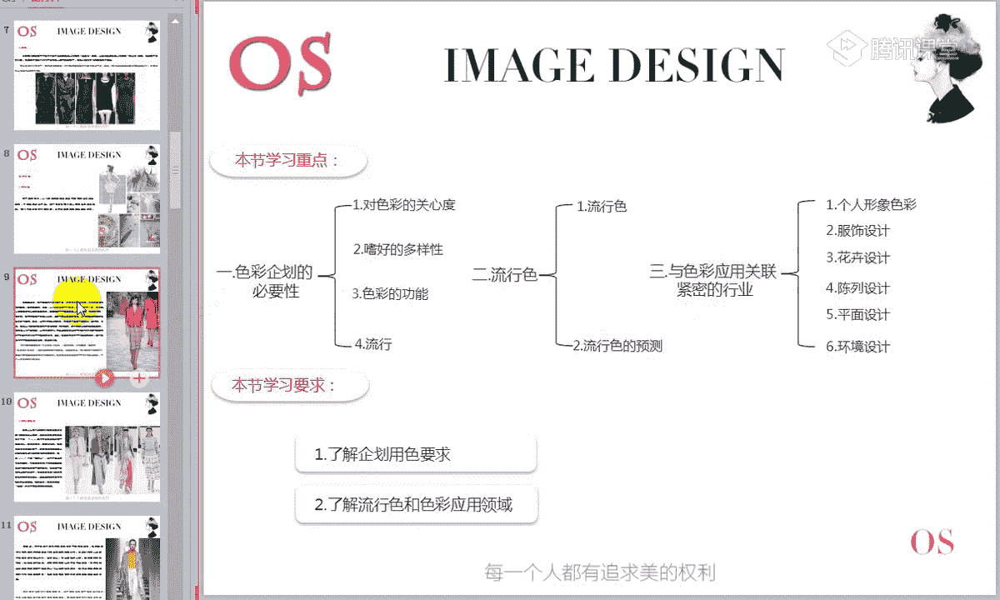
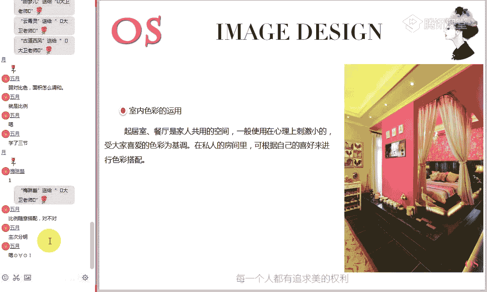
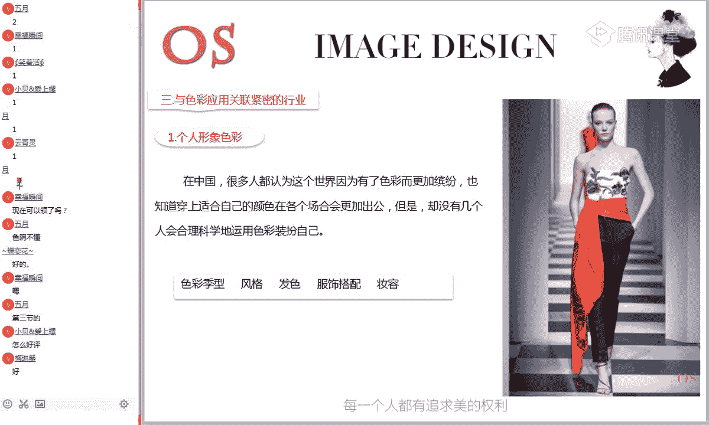

# 1、15男士形象色彩班VIP课程：第6节、色彩的应用

🎼认是。🎼还是兄。🎼我是现。好的，再次欢迎大家来到我们色彩美学班VIP课程的第六节课色彩的应用。我是本期的主讲大卫老师。那我们说了本节课是我们色彩美学班VIP课程的最后一节课。

同时这节课会重点给我们分享到色彩，它的价值，包括它的应用方向。比如说学了我们的色彩之后，你将来可能会把这些色彩用在哪些方面。那包括我们所说的我们所讲的这个色彩美学班，他对各行各业都是实用的。

另外的话呢呃即便是新同学啊，这节课你也是听得懂的。因为这节课呢重点讲应用方向，没有讲到配色技巧。😊，好，今天晚上我们是有第一次进客的新同学的，我看一下啊，好像是我们的小贝爱上楼，对不对？

还有没有其他同学是今天晚上第一次来体验直播学习的同学。好，现在可以在公屏上给老师刷一个笑脸。啊，我就看到我们小贝爱尚罗是今天刚刚报名的啊，我们还没有有没有其他同学是第一次来参加这个直播学习的啊。

还有我们的生如夏花5月同学，对不对？好，第一次来体验学习啊，一定要记得啊，我们这个直播课程呢，它是隔一段时间，现在是可能是每个季度会有这样的一星期的直播课程会做一些调整啊。

但是整体的一个课程大光啊是差不多的。所以大家在学习的时候呢，一定要根据你的情况。如果有空的话，最好来参加直播学习。好啊，我们其他的同学一起来再把鲜花刷起来啊。

欢迎以上呢我们三位新同学加入到了我们这样的一个学习大军当中。啊平时在群内呢我们的交流群是做什么的呢？第一啊大家要把作业交到群里指定相册啊，平时的话呢也在一起要多多交流。有问题的话呢。

哎比如说啊大家讨论之后解决不了的。大卫老师会出面给大家解决，单独发给大卫老师呢也是可以的。但是一定要记得不能把这个疑惑啊带到咱们的中级班或者高级班，会让我后面的老师呢哎会让老师给你讲解起来，比较吃力。

第二个会影响呢我们整体的这样一个进度。😊，好的，首先我们来看一下啊，本节课的一个课程大纲。那在学习之前我们要养成一个习惯。第一节课我们就讲了学习的时候啊，你不能跟看书一样，就是记流水账一样。

一下下从头学到尾。结果呢在你的脑海里面什么都没有。首先要有一个啊这样一个整体的一个什么大纲框架结构。😊。

好，我们来看一下呃，本节课的三部分内容。第一部分啊，其实本节课整体内内容啊多偏向于什么知识的拓展跟了解啊，知识的拓展和了解。第一部分是测色彩企划的必要性。第二部分是关于流行色的知识。第三部分就是色彩。

它应用的相关的一些领域。就是我们讲的色彩可能会用到哪些方面，它具体的价值是什么。学习要求，了解企划用色要求。第二，了解流行色和色彩应用领域啊，所以本节课整体的知识呢是用于拓展的。所以大家以了解为主。

来好了，已经做好准备的同学来打个一个老师看一下啊，记得在上直播课的时候，你经力一定要集中啊。一走时的话可能会错过很多知识。那咱们也是尽可能的不要杀回车，一杀回车的话就会比较耽搁时间，对不对？

大家呃明天就是周末了，很多同学可能就会有很多的这样的一些安排，想早点休息，对不对？所以大家的话呢在学习的时候，我们争取一个小时之内高效的来把这块知识呢给他学好。😊，好。

首先第一部分就是关于色彩启发的必要性。实际上我们就具体谈到了什么？呃，咱们这个色彩啊，在我们的现实当中，特别是在商业领域，它的一个价值。比如说过各种各样的商品呢，不同的环境空间。

他们所要的一个色彩又各不相同啊，这个大家的话应该可以理解，你会发现在不同的场所，不同的商品，它的用色呢会有一些偏向性。好，那什么是色彩企划呢？色彩企划，就是结合商品特有的环境目的性格。

在客观上指导色彩的应用，再进行实践实施的这样一个工作啊。所以在我们大型的这样的一些公司的话呢，都会有专门的这样一个色彩顾问做专业的一个用测指导。好，现在我们学习的是第一部分啊，色彩企划是什么意思？

然后关于对色彩关心度的一个调查。好，我们可以观察一下这组数据呢是我们对大众人群做了这样的一个测试啊。大家对于色彩的一个反应。你会发现不关心色彩呢只占到24。5%，关心的6。22%，非常关心的占到11。

68%啊，你会发现它已经占到了绝对的72%的啊，72%的人，就是绝大部分人都会非常的关注色彩好，我想问一下，我们课堂上的同学对色彩有没有很在意。就是平时的话啊，如果你说哎你去买一个小商品啊。

你有没有很在意它的颜色啊，特别会留意颜色的同学，你给老师打一个一啊，不太在意的同学呢，你给老师打一个2。好，平时你在生活当中的话，就是你如果去买一些小商品，比如说买一只杯子啊，或者说呃买一个什么呢？啊。

买个床单啊，买买一个这样的日用品的话，你有没有很关注它的颜色，很在意它的颜色。好，这个比例大家应该也可以看得出来，对不对？其实大半同学的话也会稍微留意一下我们所用的商品这个颜色。

你会感觉哎呃或者说我很喜欢这个颜色。所以呢在同类啊同样的一个产品或者同样一个杯子，我会去什么选择这个颜色。也就是说这个四合彩的话，实际上唉。对我们什么对我们的心理会有影响。

然后对商业上也会有很大一个很大的这样一个影响。好，接下来我们就了解一下它具体的这样一个价值。如果说在商业上，你作为这样这样一一家什么商业的一个色彩顾问的话，在用色上你可能会考虑到东西。

那我们说我们面对自己喜欢的颜色呢。呃，这个声音大家可能听到有同学听的小，对不对？好，我们来看一下是不是大家听的声音都小啊，觉得声音都小的同学打一个一，觉得这个声音大小还可以的同学来给老师打一个2。好。

设备检查非常重要。如果大家在听课的时候啊，就是听到声音有一些不正常，画面不正常，一定要第一时间提出来。好，大班同学听的声音还可以，对不对？好，那我们笑着活同学检查一下你的音频。

看你的那个声音大小的开关有没有打开。好，因为老师这里的麦呢声音是全开的啊全开的。好，可以再尝试的看一下你的音频设备啊，你的这个声呃就是调音的有没有完全打开。好，我们继续我们刚才说了啊。

我们对于色彩会有这种什么情绪性的表现。有些色彩我们看到之后会很高兴。有些色彩看到之后呢，我们会觉得不舒服，对不对？所以说在这样的一个色彩的对人的一个影响的情况下，我们跟商业就联系起来。

我们说蓝色系、绿色系、红色系等明快的颜色或者白色呢懂等呢容易被人喜欢。可是这只是人们的一般倾向，细分到个人的喜好，就未必呢有这么大的一个倾向。😊，那么这里还提到拥有相同兴趣和生活观的人，荣誉共同的。

有什么共同的喜好。例如喜欢浪漫的人，就很容易对浪漫和清热的颜色产生好感。粉色系明艳明亮的淡雅的色调，因此，在色彩企化，要确切把握对象有哪种类型倾向。好，这里谈到了一个什么像日用品啊。

厨房用品、卫生用品这些东西是不是咱们这个就是大众化的用品，对不对？大众化的用品能够理解的同学打个一个老师看一下。大众化的用品知不知道是什么意思？就是你会用这个产品。

我也会用这个产品的那对于这种大众化的产品呢，它的色彩的一个选择上都会什么喜使用一些什么大众人群都会喜欢的颜色，比如蓝色系、绿色系、红色系或者白色系，就是大众人群都比较容易喜欢的。

就是群体性偏向性这样一些颜色，它会把这个颜色用在什么？我们大众化的这个啊日用品上。😊，那么另外一方面，比如说哎我们会谈到这个服饰事物，对不对？它就会属于什么属于。个性化的一些产品。

那这个时候它在用色上会考虑到什么人群的一个偏向喜好的一些颜色。比如说哎婴儿用品对不对？女士用品、男士用品，那中老年人用品它在色彩上就会有了这样一个偏向性啊。所以说你在了解了这个知识之后。

你会知道那我们的产品它是属于呢这种大众化的日用品还是属于呢专属偏向的人群。好，这个知识有什么用呢？其实的话呢，我们之前给大家讲过，在我们呃这批学员里面有很多就是做服装生意的，对不对？那你在做。

特别是做这个服装定制的那那么你对你这个啊人群的定位就非常重要啊，就说你的人群定位是什么样的那你整个色彩的选择了，要跟你这个人人群的什么喜好性要有这样一个关联性。所以在这一块，我们说嗜好的多样性。

大家把握两个方面。第一。大众化都喜欢的颜色多用在什么大众化的这个日用品上，而这个什么属于偏属于这部属于什么各偏个人嗜好的这方面的一些物品的话呢。

它在色彩的选择上要考虑到专属人群的一些什么特别的这样一个喜好性。好，这个了解即可。因为的话我们现在可能很多同学的话呢，将来呃未必会研究这些东西。但是现在一定要知道，将来如果有机会的话啊。

你涉及到这样的一些商业用色的话，你要考虑到哎可能会有这样的一个功能。好，色彩的功能。在广告、产品外包装等，可以传递一些信息的媒体，以及在办公室、工厂等特定性的场所。我们不能只看到自己喜欢的。

而要看重色彩的功能。所以在用册的时候，在商业用册上的话呢，一定不能选择我们喜欢的，而且更重要的看重什么它的一个商业价值。那广告包装的颜色有必要使它在街头或货架上显得醒目。那这个是什么意思？

我们在前面讲到一个色彩的识别性，还有没有同学记得记得的同学打个鲜花给老师看一下。显得醒目，所以在用色上应该有什么特点？它的识别性一定要强，所以色彩之间的反差要强烈，这样才能够引起什么顾客的注意啊。

这个识别性你要知道识别性强弱，它是如何调整的。而且为了使传达的信息容易让人理解，我们必须要计划产品的配色方案啊，要通过你的配色，让别人理解你的产品。

因此我们应该灵活的应用颜色、视觉及色彩对人的眼睛心灵的作用，还要注意传达的内容及色彩给人的印象关系。好，这个知识又跟我们前面所学的知识哪个有关系，是不是色彩的联想与印象，对不对？比如说我看到红色。

我看到紫色，我会想到什么东西会给我带来一种什么样的感觉。好，列入食品外包装色彩。包装色彩越是很好的表现出美味的感觉，就越好卖啊。它这个道理是一样的。在办公室工厂学校为了提高工作和学习效率。

就要在周围使用明快的颜色，计划环境的配色方案要结合场所的目的性和人的心理特征。那这个相对来说就有些复杂了。包括我们很多的这样一些呃做这样这样一些什么环境设计的环境设计色彩形象顾问。

他的考虑的东西呢就会非常的多。不不光要考虑到美观，还要考虑到什么？这个场所里面可能出现的人对他的一个心理的一个影响。好，这部分知识呢也属于了解就可以了。

但是我们要慢慢的开始学会把我们的色彩呢跟我们的生活联系起来。好，第四个小小常识是什么？是关于流行啊，我们经常经常会谈到这个流行，大家都懂哎哎，今年流行什么颜色。哎，就今年流行什么款式。

就今年流行什么包包，什么鞋子，对不对啊，所以这个流行的话呢，大家应该听得多，但是对它这个流行可能不是很了解哎，这个流行是怎么来的。为什么会有每年会有这么多的一些哎流行东西出来啊，新的东西出来。

这个东西到底是从哪来的。待会呢我们了解过之后，你就会发现，哎，其实这些东西呢，也很简单。好，目前我们生活中产生了许多呃响遇大多数。许多什么不想与大多数人相同的差异性的现象。

以及他想要于许多数人相同的童话性现象。那么在颜色中就有什么流行色，它表现了在那个时代中被很多人应用的颜色，它多少影响了对什么色彩的价值观。流行色只表示什么？只表现了在那个时代中被很多人应用的颜色。

那特别是在流行商品中，它的影响为什么更强。流行色的动向每两个季节变化一次啊。记得啊，每两个季节变化一次。因此我们必须通过连续性信息收集分析才能够预测出准确无误的流行色。好，前面第第一部分知识呢。

有的时候大家也不必深究，大概知道它是什么意思就可以了。要有一些常识要记住。比如说呃对于色彩的一个关系度的情况，第二个啊第二个知识点其实蛮有价值的，就是色彩的一个什么呃嗜好的多样性。哎。

我们在不同的商品的选择上要考虑到我们的使用人群。第三个就是色彩的功能，就是跟我们前面实际上所讲的什么色彩的。联想与印象色彩对于人心理的影响。第四个就是关于流行色流行出现的一个原因。好，这个流行的话呢。

我们在第二部分会专门讲啊，我们来细细的了解一下这个流行是什么意思啊。关于流行色。那么在中国的古代呢，人们穿衣服的颜色是由什么皇帝颁布的法令来规定。那千千百年代呢，它是保持不变的。好。

这个常识大家应该都知道，在古代的话，比如说这个黄色只有皇家才可以使用的那平民老百姓是不一定就不能使用这些颜色啊。所以说在我们这个时代的话呢，都非常的幸运，你想使欢使用什么颜色都是可以的。

但是在使用这些颜色的时候，我们想要使用的好看，就必须要了解什么这些色彩，它的这些特征。😊，好，首先我们来分析第一个原因。流行色的由来，为什么会有流行色的出现啊，其实通俗一点的理解就是什么？

我们说呃人呢都会有一种什么喜新念旧啊，你今天看这个东西，明天看这个东西久了就会腻位好，所以说夫妻之间的关关系要经营也是一样的，对不对？如果说啊呃你整天看着你的老婆，每天就是一个样子，对不对？

今天这个装扮，明天还是这个装扮，后天还是这个装扮，久了之后就会没有了这种新鲜感。所以说来学我们客人的同学呢，特别是女性啊，不管是男士还是女士，我觉得啊都是比较幸运的。起码你懂得每天在你的这个着装上啊。

用油彩旗稍稍变化一下，其实你每天给别人的感觉呢，都会不一样。😊，这个流行色的由来呢也是有这样一个原因，是因为什么？今年这个颜色我们看了之后，时间久了之后。

这个颜色今年穿明年穿久了之后就会有什么这种厌倦感啊，就有了这种厌倦感。所以在人的心理上，他会有这样的一种需求，想要看到什么新的东西。所以我们刚才说到流行色呢，每两个季度就会有这样一个变化。😊，好。

那从这里在这里讲的时候，我们说有人说好，关于这个流行色，流行色美与不美的问题。有些说一穿这个颜色啊都过时了不好看了。其实对这个颜色本身来说呢，它并没有什么不好看的，只是相对于流行色来说，哎。

这个颜色的话呢，它有些过时就会显得什么有了美跟不美的一个区别。这个能不能理解？比如说这个去年或者前年流行的一个颜色，哎，今年的话它不再流行了，今年有了新的流行色。

而这个新旧流行色跟过去的这个流行色比较的话呢，你会感觉哎过去的你那个流行色就不怎么好看了。实际上与它色彩本身并没有多大的联系，实际上是受到什么人的心理的一个影响。好。

这个概念能不能理解能够理解的同学打个一给老师看一下。😊，以流行的眼光看色彩就时有了美与不美之分。刚才流行色出现的原因，先啊，大家要细细的你理解一下，为什么流行色彩不断的变化。因为什么人的心理的一个需求。

喜新厌旧，这是人的本能啊。所以说在我们课堂学学这个课程的同学，你一定要懂得啊，不要一套衣服给我穿个四五天都一个样啊，哪怕是两天三天都有点多，你尽可能的每天的话呢，保持一些变化。

别人在看到你的时候才不会什么看着地位对不对？尤其是女士啊，尤其是女士，其实变化的方向非常多，你有一些小视频，你每天变化一下，多准备一些，对不对？好，我如很多女士会有很多的司机，你今天换一条，明天换一条。

很简单，对不对？今天换个鞋子，明天换个包啊，这个稍微装变化一下都是可以的，千万就不要是什么，整天都是黑白灰的状态啊，这个时候你会知道啊在生活当中啊，你会比较吃亏的。😊，好。

我们这里只是简单的介绍到了我们这个流行色出现的原因。那第二个部分我们简单的了解一下就是。流行色的预测这个流行色是谁规定的？他今年必须要流行这些颜色。好，其实这些流行色的话呢。

它并不是说某些人或者说某一个国家的某些人随便说哎，今年流行这个颜色，明年流行那个颜色不是的啊，它实际上是有什么？是有全球的这些色彩专家收共同收集了一些信息，然后开这种研讨会。

最终什么经过多种的这种排列组合，然后才会得出，或者说预测咱们下一个季度会流行了一些颜色。然后这些流行色的话呢，最先会在这些时装周上，这些时装上进行发布。从而呢会波及到哎波及到很大的一块面积。

甚至呢波及到全球。我们整个对什么色彩的这种认知。所以你会发现流行色一般最先出现在哪，都是这我们这些大的品牌在它的时装展示会上出现的。随后的话就会流落到什么啊流落到民间，对不对？

流落到咱们这个大众人群当中会对这个色彩开始呢追捧，对不对？好，这里只是简单介绍一下。我们说具体它的一个研究方法的话，比如说对对呃入选色彩进行分组排列讨论。

要经过长期的反复啊磋商新的国际流行色方案才会产生。所以这个流行色的话呢，它实际上是一个国际流行色发布之后才会出现的。并不是说哎大众人群哎喜欢呃这个就是like个随便猜测出来的。

它都是有它的一个什么科学道理的。好了，关于我们流行色这一块，现在大家呃都理解它的意思没有？第一，为什么会有流行色的出现？第二，流行色是怎么来的啊，属于尝试性的了解内容。

那以后比如说别人在谈到流行色的时候，你就不会很很茫然。这个流行色是什么呢？是不是现在就明白了，对不对？😊，好，这块知识能够理解，同学来打个鲜花给老师看一下流行色，其实你理解两部分就可以了。

为什么会有流行色，它是怎么来的？第二，流行色哎，它是从哪儿冒出来的啊？😊，他是经过什么国际色彩专家联盟，经过这种讨论磋商啊，最终才发布出来的这样的一个预期的色彩色彩方案啊。好。

第二部分知识呢也偏向于了解内容，就是拓展一下大家的这个知识面。好了，第三部分现在就是我们了解的重点啊，第三部分就是与色彩应用关联紧密的这些行业，就是我们所学的色彩跟哪些行业是有关联的。

好，首先我们谈到的第一个就是个人形象色彩。那包括现在在我们课堂上的同学呢来学习我们这个色彩课程，最多的基本上都是偏向于这个方向的，是吗？就是个人形象色彩这个色彩跟我们个人形象有什么关系。哎。

那就是我们想要自己形象变得好，我不要学色彩，这个色彩跟我们个人形象之间具体的关系是什么呢？我们在这里的话呢啊我们很多同学呢还没有开始后面的课程的学习。我们先介绍一下。首先第一个。😊。

色彩剂型我们经常谈到的色彩，实际上一个人的形象好在色彩要解决两个方面的问题啊，包括很多同学在视林看软件呢我们的一个介绍。那色彩首先服饰跟服饰之间的颜色搭配的要和谐得当啊，穿在人的身上才会外观上看着好看。

其实还有一个更更高要求的层面是什么？人衣和谐，就是人的肤色跟服装颜色的和谐。我们知道实际上人的皮肤的话也是一个色块，它也会有不同的这些啊深浅哪、冷暖呢，它的一个对比度组成。所以人的肤色，它是也是有纯度。

有明度的，也是有色相特征的啊。所以它在跟肤色之间进行搭配的时候，我们就要考虑到我们的这个肤色这一块颜色跟服装之间的颜色是不是和谐的是好看的。所以就会涉及到什么，对于色彩进行的分析。

每一个人都有你的专属色彩群。那你在选择搭配的时候，不管是整体的大明的搭配还是在视频的选择上，都要考虑到你的色彩群的一个用色范围。只要是你选择了属于你的一些颜色搭配出来肯定会让什么让你显年轻的。

皮肤是光滑的，人是漂亮的。好，所以第一个方面，那色彩跟个人个人形象最大的关系呢，就是对于服饰颜色，然后服饰颜色呢跟人的肤色之间的一个和谐。第二个啊，在具体的个人形象里面，它跟风格还有一定的关系。

比如说在以后的课程里面，大家会了解到八大风格，每一个风格，它的服饰用色特点。你会知道，哎，比如说这个什么。咱们的戏剧型或者说前卫型，哎，它的用色上，它会采用一些强对比色组合，对不对？

对比比较强烈一点的颜色。哎，比如有些哎咱们这个它包括它会使到用到一些比较鲜艳的颜色，对不对？咱们自然型的，唉它用的颜色可能就不要那么艳丽的啊，也不要太过夸张的，反而呢素雅一点的颜色可能会更好一些啊。

这个在我们后面都会讲到，所以在于服饰风格上它对色彩上也会有要求。那这个穿对风格之后才能凸显出你的气质。而实际上服饰的风格知识也很多，它会包括到衣服的面料直去裁剪花纹图案等等。但是色彩的话呢。

也是它里面的一个重要的因素。而第三个，我们说在整体的这个形象里面，你会包括发型设计这一块，你会设计到什么？你的头发该染什么颜色，它实际上跟咱们这个什么色彩上有很大的一个关。就是说哎它根据你的金色的特征。

哎，暖肤色还是冷肤色，对不对？然后你整个金色的深浅，它就决定了你所染染的这个啊头发的颜色是深是浅是冷是淡，关联性呢也很强。好，然后这个服饰搭配我们实际上已经说了啊，在色彩里面两个分支。

一个是人的肤色跟服装颜色，然后是服装颜色跟服装颜色的一个和谐。第四个就是妆容啊，第五个就是妆容。那这个妆容大家都知道啊，哎在我们课堂上呃，平时化妆的同学给老师打一个一，不化妆的同学给老师打一个2。啊。

平时化妆的啊，化妆的同学应该都懂为什么这个个人形象啊，这个色彩跟妆容也有关系啊，不会化妆的同学你一定要学会化妆。因为啊不会化妆的女士呢比较吃亏。在这个时代上，你说天生的天生丽质的真的很少啊。

穿天生丽质真真的很少。咱们不是说后天靠整容，你起码学会一点简单的，哎，把眉毛修的漂亮一点，人就精神了。记得啊，在化妆里面其实价值很大的一个板块，就是就这个眉形，大家去看一下那些演员是不是眉形都特别漂亮。

人很精神，对不对？所以你起码的要学会画眉啊。简单的打个粉底，涂个口红，我觉得这个还是要会的，我们不求能浓妆艳抹，但是你应该把这个学会。它起码你在任何的场合出现的时候，就会让人看着你是么？哎，眉毛画好了。

哎，稍微打一点底，对不对？然后画个口红人看着什么？就会很精神啊，很精神，真的很精神。我不知道大家有没有看过那个化妆跟没化妆的这个对比图，你会发现你稍稍的调整一下，你照镜子就会发现啊。

自己突然一下变得好精神，年轻了很多，对不对？其实这个时候我们说这种简单的修饰的话，还是要会的，对不对？并不要求你有多高的这样一个呃专业的水准嘛，你起码这些简单的一些画法，你要会，对不对？啊。

其实化妆真的很神奇啊，大家有见过都知道啊，它可以把你的脸型画的更瘦一些啊，眼眼睛呢搞得更更有精神，而且呢眉毛一画，整个人的气质特征会发生非常大的变化。好，其实我们在这里谈的是什么呢？

化妆其实对一个每位女士你要学。但是的话你要知道在选择一些化妆品的时候，它有颜色，这个颜色的话最。😊，简单的一个是它是什么？它有冷暖色调的一个区别。所以说你在化妆选化妆品的时候。

如果说比包包括眼影啊、粉底啊这些颜色，它的冷暖深浅，你对这些基础知识没有了解，随便乱涂乱画的话，可能画出来的妆面就会什么很假，你会感觉你面部这个妆就是，就是画上去了，很假跟你的肤色差别非常大。

所以在选择化妆品这些呃简单的一些化妆的时候，它的眼影啊，粉底的选择的时候，对它色彩的深浅冷暖你都要了解。所以在个人形象里面呢，我们这个色彩其实跟妆容有非常大的联系。好的，以上所讲的这这五部分能不能听懂。

能听懂的同学打个一，就是色彩跟我们个人形象哪些方面有联系？来听明白的同学打个一个老师看一下，一定要记得，为什么我就在强调色彩斑很重要呢？这个色彩斑它就是跟盖房子打地基一样。你这个课你不学好。

你到了后面我跟你说，你学起来，你很多就是听天书一样，你就不懂那个老师讲的那个是什么意思啊。因为你看他跟色彩基行有关系，跟风格有关系，跟跟咱们那个服饰用色，妆容妆容这个哎化妆品的用色上都有关系。

你要没有色彩基础，这些东西你都搞不定，对不对啊，所以说色彩的个人形象里面的应用范围非常非常广，也是必须的。😊，好，我们说了为什么色彩会摆在第一位呢？当别人在看你的时候，他第一眼肯定是被你的色彩更吸引的。

而最后慢慢的观察到你的服饰风格，然后你的发色整体的一个装扮。所以色彩第一步必须要先先宣示什么，把色彩选正确。

好，这是第一方面的应用啊，这块讲的比较多一点。因为呢呃这个个人形象板块色彩的应用非常重要。那第二个就是服饰设计。我们说时装的色彩呢和配色会随时代的变化而变化。50年代。

银幕时尚会影响很大一部分人的着衣风格。例如罗马假日。哎，这个罗马假日还是挺有名的啊，知道的同学打一个一，不知道的同学打一个2。其实的话我们说对于我们的色彩美学啊。

包括我们整个美学的学习呢呃你会发现有些同学你可能平时啊对这个艺术方面关注的比较多的同学，你可能的一个感受能力就会强一些。啊，罗马假日啊，女主角是谁大应该知道吧？😊，女主角知道是谁的同学。

打个先发给老师看一下。学习这个美学课程，大家一定要有热情。有些重要的人的话，我们还是要去了解一下啊。女主角是谁啊？其实一看她的长相就知道，对不对？是不是跟这个跟这个人长得比较像，对不对？奥黛丽赫本啊。

大家应该知道他这个长相很有特点啊很有特点。啊，我们说那时的时尚非常自由化，因受当时时当时的流行音乐的刺激，在日常生活中的服饰都应用到了非常开放的色彩配色。而80年代后期呢，随着地球环境的危机意识增加。

生态色彩备受关注。迄今为止，这种生态时尚色仍受到关注啊，比如说咱们这个在服饰设计用色的时候啊，你一定要不能按照你光光按照什么，你自己的想法来，你还要按照当下这个时代，大家所关注一些问题跟色彩的关系。

那么在今天的时尚届配色当中呢，简单的单色配色、单色调配色，多种色彩混合配色以及呢各种各样的配色都在使用啊。就是我们在第五节课里面讲到了，哎，各种配色方式，同类类似对比色，对不对？

两色、三色、四色、五色的组合应用。好，服饰设计啊，那么对色彩的应用也非常重要。那第三个，我们了解一下关于花卉设计。花卉设计的话呢，这一块我们有啊有没有同学学过插花的，有学过的同学打个一给老师看一下。啊。

我记得有哪个学员是开这个花店的啊，记得之前给老师发过照片。好，现在我们看到同学有没有同学学过插花的啊，学过插花的同学都知道，在这个插花艺术当中啊，对于色彩的理解也非常重要。😊，好，我们简单了解一下。

我们说花在不同的季节里绽放，也给我们的生活呢增添了许多的光彩。在鲜花设计中，色彩效果是非常重要的。比如说在宴会结婚典礼中，新娘礼服上的胸花就必须考虑到她与礼服设计和礼服色彩的关系。老师呃。

这不是公开的试听课吧，找不到地方。这个是VIP课程啊。段晨同学，你进的没错，这是进了我们色彩美学班的第六节课VIP的一个直播课程。啊，现在才找的课程，对不对？

其实我们VIP上课课程链接都会在VIP群内啊，所以你只在群内找到我们的课程就可以了。而且你看我们课堂人数，如果是呃试听课的话啊，不会只有这么点人啊。我们的VIP课程的话呢，都是小班制的授课。😊，啊。

这个时候进来的话，可能前面很多知识没听到啊。我们现在在分享的是第三个板块色彩应用的领域。第三个关于花卉设计。好，我们说在花卉的一个配色过程当中，首先要找到与自己的设计想法相一致的基调色。

再次要考虑到辅助色，有必要的话可以加入一些什么强调色彩去突出重点。好，这个知识的话跟我们前面所讲的知识哪一个部分有联系。有没有同学还记得起来？花卉设计配色过程当中描述的这样的一些特征。

跟我们前面所讲的知识，哪个知识有联系？好，我看一下我们前面几节课的有没有同学认真听课哦，他讲到了一个什么基调色。辅助色。强调色。讲的实际上是什么配色关系，有没有同学可以回答？其实这个知识的话。

我们前面是讲过的，讲的是什么配色法，有没有同学记得？基调色辅助色突出重点三色配色法啊，实际上它描述的是三色配色法。在平面设计配色服装配色，包括花卉设计配色它是相通的啊，它是相通的。

它的基调色实际上主调是什么主色调，对不对？占到绝对面积的主色调，然后辅助色辅助色跟我们前面描述的是一样。重点突出的就是一个什么强调色，它实际上是描述的三色的一个配色的方法。那在花卉的啊插花艺术当中。

它的一个用色特点呢也是一样的。好的，其他同学有没有理解？对主色辅助色点缀色三色用色法在花卉设计里面也是同样的道理啊。这个常识大家要知道，比如说我们在一会看到一些花卉插花的时候。

你要一看就知道它这里色彩出现了一个原因。好，那这副这幅盆景大家看一下它的用色特点能不能看明白，自己能看明白的同学打一个一，看不明白的同学打一个2他的用色方法能不能看明白？好，自己来看一下啊。

这你看到的这盆花，它里面出现的色彩的一个用色方法，能不能看明白？实际上我说了我们学的色彩的知识，你在生活当中稍加观察一下，你就能知道它的一个用处啊，不要死死的就是呃老师讲的那个配色方法，只会死记不会用。

没有价值。你要看到真实的东西的时候学会去分析。😊，很多同学看不懂对不对？实际上非常简单，你一分析在这个花卉里面出现的颜色有哪些，先看色相，对不对？告诉我有哪些色相能不能看得出来，是不是非常明显。

如果这个都看不出来的话啊，我觉得你前面的知识都白学的啊，我们前面讲的这个配色知识都白学了，你连这个都不会看，对不对？非常简单的，很明显的红色跟绿色，对不对？那我们的红色跟绿色是什么关系呢？😊。

红色跟绿色是什么关系啊？这个回答速度有点慢。我觉得在提这样问题的时候，有同学应该快速的反应出来。如果你还反应不出来，说明你前面知识学的不深刻。红色跟绿色是什么关系？强对比色，而且还是互补色。

所以这两个一强对比色出现在配色的时候，我们该怎么办？还有没有同学记得红配绿赛狗屁大面积进行配色的时候，它的视觉上是有冲突的。所以针对这种情况，我们要用调和方式进行调和，对不对？用什么调和方式，面积调和。

对不对？你看到没有？这整个画面里面是不是绿色占到绝对面积，而红色比较少，是不是？所以在这里的话，实实上红色是越少越好，在再拿走一朵花，它会更漂亮，对不对？实际上有同学在讲老师这个花直剩一朵好吗？

为什么它是三朵，你看到没有？实际上它是有形状的，三角形有一定的稳定性啊。这个实际上在花卉设计里面，大家以后有有机会学的话，你会知道它的价值。我们现在在这里呢只谈到它的色彩上的应用。

是不是大面积的绿色为主，红色做了点缀万绿从中一点红，对不对？实际上它这个红色呢啊，占到的面积也还是比较少的。相对于绿色来说，对不对？😊，好，那其他没有回答的同学理解没有？理解的同学打个先发给老师看一下。

😊，啊，因为之前我记得有位同学是做花店的，然后插的花十盆都有8盆不好看，那个色彩滥用啊，完全没有章法啊。我相信的话呃，我们课堂的同学的话，你知道前面配色知识学的好，让你去随便插一下花的话。

你起码不会插的太离谱啊，把那个红花跟绿叶搞的一半一半，非常难看的。你索性就把红花搞多一点，绿叶搞少一点也可以，你要么就绝对把绿叶搞多一点，红花越少越好啊，千万不要呃学过美学班的同学。

你就不要再犯这种低级的错误啊。其实这个还是比较简单的。啊，其实花卉设计在花卉设计用色里面呢，它是一部分啊，真正的大家并不是说哎老师我会这个配色的，我会不会我就会插花了啊，当然差得远。

因为插花它是一门手艺，它会考虑到你的这个呃文化知识的了解。那这个花它的生长环境，它的一个由来文化因素。然后包括它在整个过程当中，它的一些造型寓意的一些什么东西啊。

它实际上相对来说呢还是一门比较高雅的这样一门艺术啊，以后大家有机会接触到的话呢，可以去学习一下，了解一下。我们这里呢只谈到哎这个色彩在我们这个花卉设计当中的一个应用。好，第四部分就是陈列设计啊。

大家都知道在这个行业里面会有一个陈列师的行业。只是目前的话呢，在中国来说啊，这个陈列师呃，很多人不知道啊，具体来讲这个陈列师实际上的话呢呃在一线城市会多一些，包括二三线城市比较少见。因因为什么？

因为目前的话呢呃有于用用到陈列师的地方都是一些比较高端的地方，它对商品的陈列相当的有要求。你可以看到在商场里面所出现的这些品牌货啊，它的陈列都非常有讲究，包括它从什么色彩到形式上。

每一个地方它的布置安排都非常有讲究的啊。这个的话大家以后了解的后，你会知道呃它的一个价值。那么陈列设计用的范围非常广，在百货公司中，各种商品都需要陈列。在展览会中所展示的新产品呢也需要陈列。

我们都知道橱窗里啊一个好的陈列设计能够吸引人的目光，这就是它的价值，陈列的好才会有吸引力，对不对？强弱对比嗯弱对比怎么搭怎么调怎么调和，弱对比不用调和啊，因为弱对比它不冲突，我为什么要调和了？

有没有理解？啊，吴月同学，咱们前面的调和那节课没有听，对不对？是不是前面一节课没有听啊，包括本节课第一次进来听课就跑到这一节了啊。那这个调和你肯定要就专门去听一下。弱对比色之间它之间有共同的色相成分。

有内在的联系，它并不冲突。所以你一般出现大面积的搭配也是没有问题的。而为什么要调和调和了？因为有冲突，而强对比色之间有冲突，所以我们要调和。你要知道调和的意思啊，就跟两个人打架一样，我要调和，为什么？

因为它俩有冲突，为什么要调和色彩呢？这两个色彩之间有冲突，而弱对比色之间它本就没有冲突，所以呢就无需调和，对不对？好，我们其他同学理解没有啊，其实这位同学提到问题很好啊啊，就是有其他很多同学的话。

可能对这个调和你理解了也不是很深刻，对不对？刚好就可以再理解一下。😊，好，我们就继续啊。呃，刚才思路稍稍打断了一下，我们说陈列的目的就是什么？吸引人的目光，吸引人的目光目的是什么？

增加购买量带来更多的商业价值啊，包括所以说现在在中国的话，你要达到一个陈列师的水准，找对的工作实际上收入是相当的高的啊，相当高的。因为这个话物以稀为贵。因为人才少，所以它的价值就高。

包括在中国形象顾问也是一样。因为什么对于十几亿的这样这样一个呃大国来说，形象顾问在中国的一个缺口，短时间内根本就是补不上的。所以现在早期学习的同学呢。

可能在一两年之后它都会给你带来你预想不到的这样的一些价值。😊，而陈列最基本的要素就是色彩搭配啊，这就是我们色彩搭配，它在陈列里面的价值。服装进行陈列的时候，必定要考虑到它的色彩。

而色彩跟色彩之间的和谐关系啊，在我们前面就讲过了。好的色彩组合能让陈列效果更加的赏心悦目啊，具体的陈列方式的话，我这里肯定跟大家讲不清楚啊。

我们在这里只需要了解什么这个色彩搭配在陈列当中也有非常重要的价值。呃，这个从理论上来说啊，咱们这个弱对比色随意搭配是可以的。但是要想搭配的出彩呢，还是要考虑到它面积上的一些调整。

比如说三个颜色出现的时候，只即便它是什么偏向于类似色的组合，在面积上拉开关系逐幅点的话，效果呢也会比较好，比你随意乱搭，可能会好一些，能够理解吗？就是我们讲的普遍性的一个三色配色法，主色辅助点缀色。

它通用的啊，你用在弱对比色上，实例上呢感觉也会非常好。但是说你不这样用搭的也也不会错，但是呢它不会很出彩，但是呢也不会错，能不能理解？是的，它主次分明的搭配，看上去呢会有层次感，韵律感。我就讲过。

跟咱们这个音乐是一样的啊。如果说没有这个一定的规则排列的这些音符的话，就是噪音。经过规律性的排列之后，它就会变成什么？哎，这样的一个乐谱，对不对？色彩也是一样的。好，陈列设计大家要知道啊。

色彩的陈列设计当中有用。那第五个就是平面设计。好，平面设计在我们课堂同学有没有做设计的同学，有的话打个一给老师看一下啊，有没有同学在学设计了。平面设计，其实这个应用范围现在真的是非常的广啊。

有做广告的呀。😊，啊，平面设计配色的有没有网页设计配置配色的？啊，你们同学玩PS的，有的同学打个一给老师看一下。好的啊，我们这些同学里面可能没有做这个的，对不对？

平面广告设计包装、平面海报、POP广告、产品包装名片、标志等这些东西在我们生日常生活当中呢都能接触到。所以它的设计美感能带给我们直接的感受，色彩搭配，看到没有？色彩搭配会影响整体的视觉效果啊。

这个就不用讲了。为什么？其实在我们前面配色已经讲过了啊。在设计的配色里面，色彩跟色彩之间的搭配比例是不是和起的，包括它情感的传递，都直接会影响到我们这这样一个什么视觉效果啊。

所以平面设计里面的色彩应用是必不可缺的。设计师的话一定要对色彩有深入的了解。好，接下来一个呃我们要了了解到一个什么关于这个。室内色彩的应用啊，这个都是室内设计用色，这个大家应都应该懂。在我们的房间里面。

包括你的家里面的装修用色，其实呃大家都知道，室内装修用色也是非常重要的。只是目前来说呃，在一些怎么说，相对来说啊比较高端一点的地方，别墅之类的，它可能在用色上呢会比较讲究啊。

但是一般在我们的大众人群当中，它的用色可能比较单一，以白色居多，对不对？但实际上房间里面的色彩用好之后啊，真的会影响非常大，但会影响到所有人的这样一个心情。

我们说起居室餐厅里面呢呃是我们家人共处的这样一个空间，一般使用在心理刺激小的，受大家喜爱的色彩为基调，看到没有？在这些公众场所，就是不管老的小的啊，男的女的，然后在这个色彩上，大家都容易接受的色彩。

作为一个公众环境的一个什么基调色。而在私人的房间里面呢，可根据自己的喜好来进行色彩搭配啊。那在这里呢可以给大家透露一点小知识啊。比如说我们说了基调色这个肯定是一样的，在公众环境里面。

就是在家里面的客厅之类的。比如说但是在儿童的房间里就可以采用什么这样的用色。因为我们说了小孩子的话，他正在智力发育期，他的房间里面一定要色彩丰富丰富一点啊，能够刺激它智力的这样一个很好的一个发育啊。

千万不要把家里的房颜颜色呢搞得太单一，特别是孩子的一个房间。😊，啊，要活泼鲜艳的色彩多用一些。而如果是在老人的房间，大家要注意了啊啊一些太过鲜艳的色彩就不大适合啊。

我们这色彩能加快人的心这样的一个什么啊血面的一个跳动，对不对？但是呢整体大面积灰的颜色也不少。因为老人到了垂暮之前，大家都懂得那个灰色有一些比较颓废的气息，对不对？

所以的话在用色的时候呢啊如果是老人的房间的话，你就可以用点偏一点什么淡淡的带点绿色的感觉，对不对啊，就是让它的感觉的话呃看到一些比较舒心，比较积极向上的这样一些颜色，但是呢又不可不能什么太过强烈。😊。

啊，这个能不能理解我刚才所分享的这一段小知识能不能理解啊，具体的我们这个家里面的一个用色该怎么用的话呢，大家可以去老师的QQ空间啊，有一篇文章专门是介绍哎，不同年龄阶段，他对色彩上的一个感受。

家里面的装修用色啊，有兴趣的同学呢可以去看一下。😊。

好，其实的话呢咱们这个卧室的一个用色啊，室内设计其实在卧室的用色上多半采用一些暖色调，它会带来什么更多这些温馨的一个感觉啊。其实我们大家平时可能看的会比较少一些啊，室内设计用色的话呢。

它各种设计会代表着各种不不同的感觉。比如说这种设计的话就偏于什么比较前卫一点的风格，对不对？它给人的感觉就会有一些标新立异的，带有这种什么呃个性的创意化的这些想法在里面，所以感觉到会比较独特。

但是呢有些人可能就接受不了。好，像这种对不对？很鲜艳的一些颜色，对不对？可能有些人也就接受不了，有些人呢就比较喜欢啊。所以在室类设计用色这一块呢，在中国它的应用领域也非常大。

做室类设计的这些设计师们啊就是。在中国的话，目前来说也是非常受追捧了，而且也是一个高薪的职业。看到没有？这种偏原木用色的啊，偏天然的这种用色设计的，对不对？所以说啊设计师的话呢。

他实际上也是一门怎么说呢？审美的学问。所以他在考虑了一些东西的时候，对色彩这一方面的一个理解的话呢，也是相当的重要的啊，像这样的一个设计就很独特，对不对？好，第六部分就是什么关于我们这个。

城市的景观色彩的应用啊，城市景观色彩其实我前面有提到过，我们这个色彩应用是什么？是大的方向的应用。大家都知道，在我们这个城市做设计的时候，包括中国目前都是的啊，可能很多年以前没有。但是现在都是有的。

特别是新城在规划的时候，专门就有这种环境形象顾问啊，叫做环境顾问，实际上对色彩这块都是有讲究的，它会让我们整个城市在建设的时候，它的用色上，哎整体的色调应该是什么样的。而不是说哎你见到房子。

你想染什么色染什么色都可以在你的外在上都是有要求，有规划的。好，其实这一点的话呢，在一些发达国家，大家可能看到的会多一些。你会看到它整体的这样的一个什么哎，街道周围的一些房子啦，色调都比较统一。

看上去非常的舒服啊。中国的目前的一些新城建设的话呢呃唉整体上已经在朝着这个方向去进展了。但是很多一些老城的话，它整个色调呢还是比较乱的。房子在建设风格上啊，各个方面呢都是没有统一规划的。

所以老城的话呢啊它是没有现在的一些新建的一些城市啊，它的规划用色漂亮。好，这个城市的景观色彩应用的话呢，可能现在大家呃细细的去观察一下就可以了。在这个在这个领域里面也是有专门的这样一个顾问的。

它是专门服务于政府的机构的。当然呢收入也是相当的高的。好，其实在谈到这一块的时候，有同学在谈到，其实我们说的色彩顾问形象顾问的话，其实称呼不一样，他的职业都是一样的。在中国的话。

然后目前的话有一定资历的啊这样的一个顾问，他的一个年收入应该都是在20万左右的，或者说是更高的。关键是看你服务的这样一个领域啊，服务于政府机构或者一些大型的公司的话，它的收入都是相当高的。因为什么？

我们说了色彩它的价值是非常大的。好的，我们刚才的话呢对我们的几部分内容快速做了一下了解啊，因为这些内容的话不像我们讲那一个配色技巧，你需要花太多的心思去理解，你只需要了解即可啊。

我们刚才讲的色彩应用的领域。第一个个人形象色彩的关系，这个重中之重，这就是我们要学习色彩的目前要解决的一个问题啊。个人形象。第二个服饰设计当中的色彩搭配。第三个花卉设计，第四个陈列设计。第五个平面设计。

第六个环境设计。好，本节课相对来说它的整个知识呢，大家就是基本上用听就可以了啊，主要是拓展一下大家的一个知识面啊，它没有太大的一个难度。好，我之前讲过了啊。哎，怎么样才能成为城市顾问啊？

这个目前在中国来说，它是有一定难度的。第一，你首先得具备对于色彩很高的一个造，就是对具备一个形象顾问或者色彩顾问的能力。第二，你得有这个渠道，就是说你有这样的人脉，那刚刚好碰到这样的机会啊。

哪个地方要搞建设，哎，他需要这样的一名顾问，刚刚好你又碰上了这样的机遇，你可能一下子可能就会对这个行业就接触到这样一个行业。所以这个的话跟咱们的一个机遇是有关系的。好，这个能不能理解？

但是前提是你必须先要有这个能力啊，所以说我们说机会是什么啊？机会是给准备好的人。很多时候当机会来的时候，你会发现你。想做，但是呢你没有这个能力，对不对？所以说大家先把这个课程呢把这些知识学的很好。

在以后的中国的话，这个市场各个方面都是需要这个色彩专业人才的啊，应用范围都是非常广的。所以包括你看我们现在的一些呃大家可以观察一下我们这些商场的一些导购员，都是没有专业水准的，对不对？

包括一些包括一些专卖店的导购员呢，他都是没有专业的色彩搭配能力的，包括整体形象指导的能力。所以说将来在这一块，中国肯定是朝这个专业方向发展的。他每个店铺都会专门配导师做什么做这个搭配的培训。

做这个形象指导的培训，会定专人来服务的。😊，啊，所以现在在学习我们课程的同学呢，你一定要早点有这个意识，不要再学习的时候啊，觉得反正就是先趣爱好，随便学一学啊。你要现在是这样想，你可能到一两年之后。

你还是学到乱七八糟的话，比如说哎在你临近的地方，有一个商场，他需要招这样的一个培训师过去了。但是你会发现到时候是什么输到用时方很少。你去了之后什么都解决不了，对不对？你现在好好学像我们这样的课程。

包括四彩美学班，你认真学一期都没有问题，包括个人形象班是一样的，认真学习的同学一期就可以搞定学完之后，你这个能力很成熟的，对不对？以后碰到这样的一个机会，你随时都可以转行。

或者说可以抓入到一个什么呃对你来说，事业新的一个起点。但是前提是你一定要把自己的什么能力要准备好。😊，好，我们来看一下本节课的一个作业啊。本节课我说了是我们色彩美学班的最后一节课。学完这节课之后。

大家就要开始从第一节课开始把你的笔记温习一遍，不要忙着看视频。有有些同学非常懒惰，有一些问题不懂的话，根本就不去思考，然后看了视频啊，就这样过去了。实际上你没有理解，你要先自己思考一下，实在是想不通了。

再看一下视频，老师是怎么解答这个问题的，或者说你直接把你的问题发来给大位老师，我会给你解释，你现在在理解上哪个地方是有问题的。一定要记得啊，色彩美学班的知识啊，要不能打任何的折扣，把它学好。😊，第一题。

色彩与个人形象的关系是什么？第二，自己学习色彩搭配的目的，以及呢以后的学习规划。好，我希望第二题大家在回答的时候用用用心的回答，不要为了完成作业，真实的把你的真实的想法写下来。好，咱们再过个。😊，好。

3三五个月之后看一下你的这个学习计划，你有没有去执行。好，本节课的作业相对来说也很简单，但是我需要大家用心的去回答。啊，另外我再强调一下啊，我们色彩美学班在考试的时候，在VIP直播教室的第一节课。

如果你要参加考试，前提是你把前面的作业都做好了，而且心里有把我这个知识学的可以了，再打开开始参加考试，否则的话，你不要点进去，每个人只有一次考试的机会，老师这里对试卷的笔试部分。

我只以后台的提交试卷的这样一个分数为准。所以说大家就是不要随便乱点。在你考虑好之后，哎，整个知识我感觉作业做的很轻松，学的没有疑问之后，你就点开参加考试。好，另外的话这个学分100分是怎么算的啊？

咱们的调制色相环会占到8个学分啊，8个学分6分以上是合格，6分以下的要重新调。然后作业六六节课每交一次作业，两个学分，然后笔试部分啊，笔试部分100分乘以0点880个分。

最后总学分加起来是在80分以上的同学算合格。那不合格的同学的话呢，你一定要平时去补课，否则到了后面的课程一定会非常的吃力。来都记下来没都记下来没有？记下来的同学现在打个一给老师看一下。

我刚才所说的美学班的一个考试要求啊，在我们的VIP群的群公告里面也有啊。😊，都清楚没有？一定要记得网络学习的话，我们说了自律性非常重要啊，自律是非常重要的。这个哎咱们说不像我们以前在上学的时候，哎呀。

哎今天没有交作业，明天让你去发展，对不对？没有老师没有办法去要求你只能靠大家的自觉性啊，包括学习的方法，我都告诉大家的那应该怎么做。你按照这样去做，一期完全可以学好。

好，这节课的内容呢实际上哎我发现大家都还在啊，应该是真的非常热心学习的，对不对？这节课的内容实际上是在我们色态美学班最简单的一节课啊，他只需要去了解就可以了。其实前六节课呢啊都还是需要我们去思考的。好。

现在还有没有同学对前面的知识有问题的？我们现在客户可以拿一点时间给大家做一下解答。对前面的知识还有没有一些疑问的，或者说还有什么想法的，现在都可以给老师打出来。好，另外的话呢，在学完课程之后啊。

大家可以到老师这里来领取呃，这个专业的一个配色资料啊，专业的平面设计的配色资料，就是呃一个色、两个色、三个色、四个、五个色，它的一些配色的指导，包括他所传达的情感。老师这里呢有高清的学习资料。😊，好。

另外的话呢也邀请大家帮一个忙啊。这对于我们这个不管是直播课程还是录播课程学员之后，记得在课程下面啊。如果觉得我们这个知识很好的话，可以呢啊或者说喜欢大卫老师的课程，可以呢给课程一个好评。😊，啊。

可以领了吗？待会儿课户找老师啊，老师这里视频要保存一下啊，记得啊，喜欢课程的同学一定要帮忙给课程一个好评。随后的话呢呃半个小时以后来找老师啊，因为一会儿的话，我需要保存视频，上传视频之后啊，上传审核。

大家随后可以先发消息给我。我以后的话，待会儿的话会一一给大家。😊，啊，怎么好评？待会儿的话，随后的话呢，我会把这个操作的方法啊发在发发在我们的VIP群里面啊。大家就是但是前提上你要先学完课程啊。

没有学完课程的同学，你就拿这个配色资料也没用，你看不懂啊。我们是针对学完色彩美学班的同学的话呢呃你再结合这个高级的配色资料，对色彩呢有更多的理解。以后有应用的话呢，都可以作为这样的一个参考。😊，好。

记得啊一定要先学完我们的课程好，学完课程的同学都可以发消息给大卫老师。然后的话我都会把这个配色资料给到大家。😊。

