# 1、16男士衣品速成穿搭指南(完结）：第10课：认识体型，扬长避短，穿出好身材！：第10课：认识体型，扬长避短，穿出好身材！

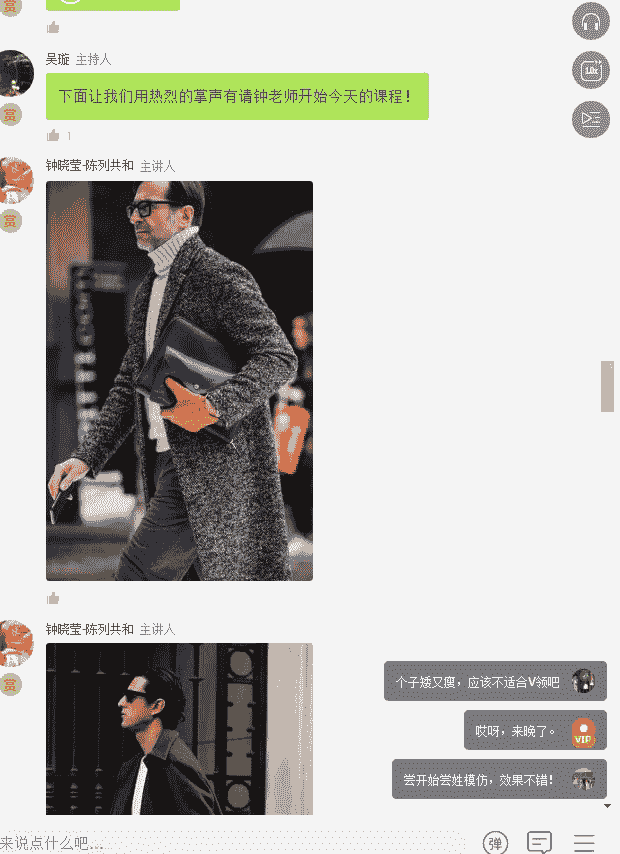

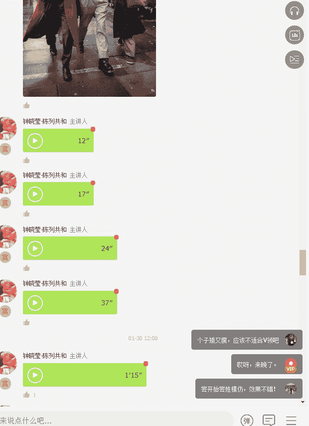

大家中午好，先给大家几张图，养养眼，心情不好的时候，看美图是最爽的，特别是又冷又饿的时候。

我们这堂课已经来到了第十堂课，明天就迎来了我们的最后一堂课。嗯，我不知道在座的同学有多少人在这堂课当中去做出了一些。呃，风格和穿着上的改变呢。如果有的，请在讨论区啊，问你什么时候听到这个话，你都告诉我。

为什么呢？因为其实我曾经说过，知识它不是力量。只有运用知识才是力量。其实知识是没有办法改变命运的。如果你不相信这个知识能改变你的命运，那么也就代表了你不会去行动。所以正如我们CEO今天所说的一句话。

他说。嗯，做任何的事情你都要去思考怎么样能够做的更好。他是这么说的，他说。做任何的事情，你都要去想尽一半一切的办法做好，要么不做，因为做好了成功的经验是可以复制和转移的。每一个成功可以让自己更成功。

当然，只要你全力以赴，哪怕失败了，这次失败的经验，也会成为你成功得什么垫脚石。其实你会发现这段话套在任何一个场景当中，无论是工作还是生活，乃至我们今天这堂课的主题是穿衣也是一样适用的。

有没有发现没有人是随随便便一出生就是有拥有特别好的衣品和衣感的。在中国，我相信是没有的，很少很少，大部分的衣品都是不断的去培养起来的。那怎么样去培养自己的衣品，怎么样能让自己变成一个在人群当中。

在朋友当中，在同事当中是一个衣品最佳的人？那你一定是经过了不断的实践的那去学习去听课，然后听完课学完知识之后去用它。用完之后再及时纠正，纠正之后再重新再来去总结和总结自己的规律。

所以其实所有的人都希望有自己的风格，但是能你记住，风格不会是中彩票，贴上掉馅饼一样的，掉下来就直接砸在你脑袋上哦，你自己就拥有一个风格，绝对不可能出现风格是需要你不断的去历练，不断的去经历。

不断的去试错，才会获得。所以刚刚给大家看到的一些欧洲人，他的穿着的一些示范吧。大家再给大家看两张年纪比较大的人。你看到这两个老头。看到这两个老头，你就有一种感觉就是。哎呀，任何时候开始应该都是不晚的。

其实任何时候任何年龄，无论年轻与否，他都可以拥有我们自己的风格。但是这个风格一定记住，它是由内而外发出的，而不是由外而内的。流行某种程度上就是。由外而内的。呃，风格是由内而外的。流行是更在意别人的看法。

而风格是更在意自己内心的表达，就是你自己对自己的评价的部分会更重更加的重要。其实讲男装课程呢没有女装课程那么的热闹，因为女装嗯女人好像天生就爱美，男人仿佛美不美，仿佛不是自己的事情。

但是其实我认为如同这堂课的主题一样，男人内外兼修，真的是美德。一个男人，无论你内在有多有才。你的外在一定要跟内在同步，你才能够成为一个具有魅力的人。你们去看很多的公众号，教你怎么泡妞的公众号。

他都会建议你去做什么。简神呢建议你去学习一些搭配的知识吧，给你一些搭配的技巧啊，然后约会的时候该怎么穿呢？等等这一切其实呢都跟塑造外形有很大的关系。因为有句话说的特别对。

就没有人愿意透过你邋遢的外表去了解你丰富而具有内涵的内在。我们今天的这个课题是讲什么呢？我们今天是讲男人的什么，男人的身材应该怎么样去。搭配才是最好的。其实大家都知道，好的身材其实都是遮出来的。

那么首先我们要穿出好身材，第一步先把自己扒光，然后刺裸的面对镜子啊，当然你自己还是要穿条裤子啊，这么冷的天别着凉了。所以要首先是面对自己的真实的体型，比如说男人的身材可能会分为几种跟女人差不多。

但是呢比女人会更少一点，一种是正三角形，一种是倒三角形，一个是H型，另外一种是O型。那如果分三种体型的话，我更愿意分为健壮体型，肥胖体型和瘦弱体型。那当然还会有一个叫中等体型，什么叫中等体型。

就是你的体型不胖不瘦，然后符合你所在国家的男人的平均身高，那你就是一个中等的，合适的体型。但是其实我们现实生活当中，大部分的人其实要么就矮一点，要么就胖一点，要么就瘦一点。啊。

很少会有啊呃当然有一种特殊人群就是健身教练，可能他们属于那种健壮体型。那其实这四种体型的男性是最多的。好，大家现在看到的这五种体型啊，首先第一个体型是什么体型？第一个体型就是非常标准的H型。

就是像一个四方长方形一样的，上下非常的匀称。这种体型呢其实是很好穿衣服的。另外一种呢就是肩部稍宽，腹部稍窄，就是我们常说的那种倒三角呃，偏向于倒三角形。但这种呢其实穿西服也是不错的那第一种男士。

你会发现他的肩部是溜肩的。第二个男士他的肩部是平肩的那第三种呢就是三角形体型，三角形体型有个特点就是肩部特别的宽，腰特别的细。这种通常会出现在运动员或者是健身教练，特别会出现在什么样的运动员呢？就是啊。

游泳运动员。好，那另外一种是倒三角形，倒三角形，这种是属于呃又不健身，然后又爱吃的这种这种人啊，肩膀呃下滑斜肩膀是个溜肩。然后呢，肚子稍稍微起。那还有最后一种人就是属于肥胖型。那我们今天就是简单讲啊。

第一种人我觉得第一种人和第二种人穿衣服都没有问题，很容易穿。最麻烦的就是倒三角正三角和肥胖型。那当然我今天也会讲到一个矮个子男生怎么样穿衣服是比较好看的。其实大家应该要去对号入座啊。

如果你身边有男士的话，可以看看他是他的身材到底是怎么样子的。然后其实搭配没有什么难的地方，难就难在。你敢不敢去了解自己。其实穿衣服无非就是从找到适合自己的颜色，到找到适合自己身材的服装。

再找到适合自己的风格，就这三样东西。然后在这个过程当中，男士的话尽量少穿花的，多穿素色，尽量少穿艳色，多穿黑白灰，其实就已经。完全没有问题。当然还有最后一堂课，就是明天我们会讲到的，你要学会场合着装。

好，第一个我们先来看看最圆的这个体型，就是微胖啊。这种胖子我们倒过来讲，我们慢慢的讲到上面去。然后第一个就是胖子该怎么穿？胖子，首先我给大家两个非常重要的建议，有素色，不要选花色。有图案不要选格子。

图案当中尽量选那种什么呃图案稍微抽象一点的，不要选择图案特别具象的。如果你选择图案特别具象的话，一般来说都会让你显得更胖。还有胖子都有个特点，胖子跟瘦子都有个特点，胖子和瘦子都不要单穿一件衣服，要叠穿。

就是你不要单穿一件T恤，你要把它怎么样进行重叠。

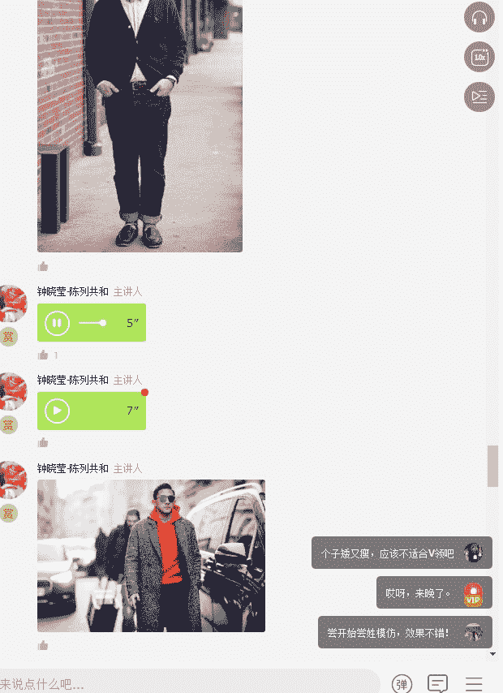

那在这里面呢，我们待会会跟胖胖子跟瘦子一起来讲，大家这样的话比较容易记忆深刻。

胖子还有一个特点，就是不要穿。

这种特别鲜艳的颜色。

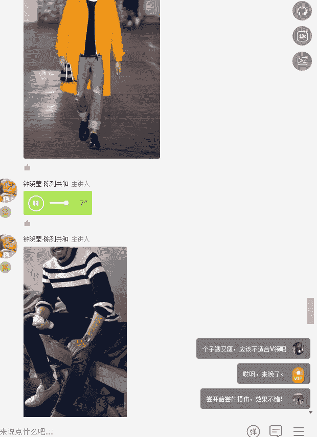

胖子也不要穿特别宽的条纹和密集的条纹。也就是说胖子要忌讳条纹和格子，特别是burary这种格子穿上去之后，它只会让它更胖。所以胖子我给的建议就是尽量的选择素色，颜色深一点，也可以穿一些浅色的。

但是呢穿浅色的时候，外面一定要套一件深色，就是你热死，你也要叠穿。

还有另外一个胖子切忌穿过于紧身的衣服，胖子其实是适合穿稍微宽松一点点的衣服啊，不要太过于贴身啊，不要太过于面料，不要选择特别软塌的面料，为什么呢？因为它会让你整个身上全部都粘出来，你的肉啊这些的。

然后你的肚子啊起伏不断。然后还有另外一个就胖子切忌穿长的啊，特别长的这种这种类型的衣服其实是特别不适合胖子的。好，那胖子之外呢，我们来讲一个瘦弱的体型。这种体型其实是呃很多大学毕业生是特别多的。

因为大学里面有水嘛，都比较瘦，但是毕业了34年之后呢，你就会发现你就会逐渐的发福。那瘦的体型穿衣服有什么样的特点呢？你们猜猜看瘦子应该怎么穿衣服啊。瘦的人瘦的人穿衣服应该怎么去穿呢？嗯。

多高算是矮个子啊，何炅啊、维嘉这种都算是矮个子啊。但是我们不以身高论英雄啊，个子矮的男人，很多时候都是伟人。就是按你城市的平均身高吧，或者按你国家的平均身高。我不知道中国男人平均身高是多少。

你们现在可以百度一下，告诉我中国男士的平均身高是一米7几。然后中国女人的平均身高应该是1。63米左右啊。可能是1。60到1。63米吧。越向北方，我想平均身高应该是越高的。好了，接下来我们要讲瘦子。

刚刚讲了胖子啊，瘦子应该怎么穿衣服，瘦瘦的体型最适合的就是叠穿里三层外三层，哪里瘦，你就哪里多套几件，利用一些配饰来转移视线，起到一种平衡的作用。比如说你上半身可以穿夹克，格子衬衣，毛衣。

双排扣外套是特别适合瘦子的。记住啊，胖子不适合穿双排扣。横格纹方格纹的上衣都适合瘦子。我刚刚是不是说胖子不要去穿格纹和条纹的衣服啊，还有另外一个低明度的衣服也适合瘦子，为什么？因为低明度。

它会显得你的身材更加的什么丰满一些。那下半身呢一定记住，不要去穿太过于紧身的裤子，要穿合身的裤子，不要紧巴巴的。因为你腿本身就行，你再紧紧的勒上去，不显得腿更瘦嘛。我认为矮个子男生最好是怎么穿啊。

去学习一下。呃，比如说像那个呃何炅啊，其实就挺会穿的。然后呃维嘉我觉得一般汪涵也挺会穿的。你去看看这些男士是怎么穿着的，其实是会有收获的。

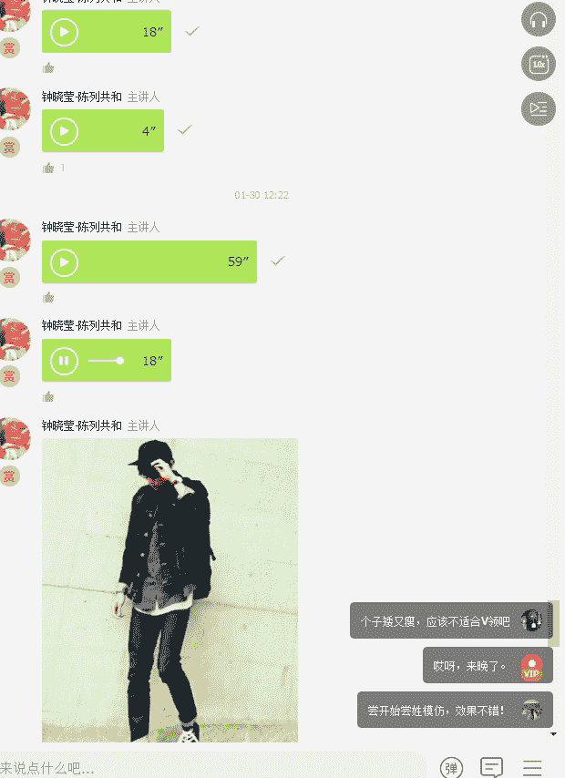

好，这种就是叠穿的穿法，大家看到了吗？就是呃不同的这个不同的男生的身材，其实他所需要的这种层次感是不同的。我们现在看到的这些全部都是叠穿的方式，这种特别适合瘦的男士。

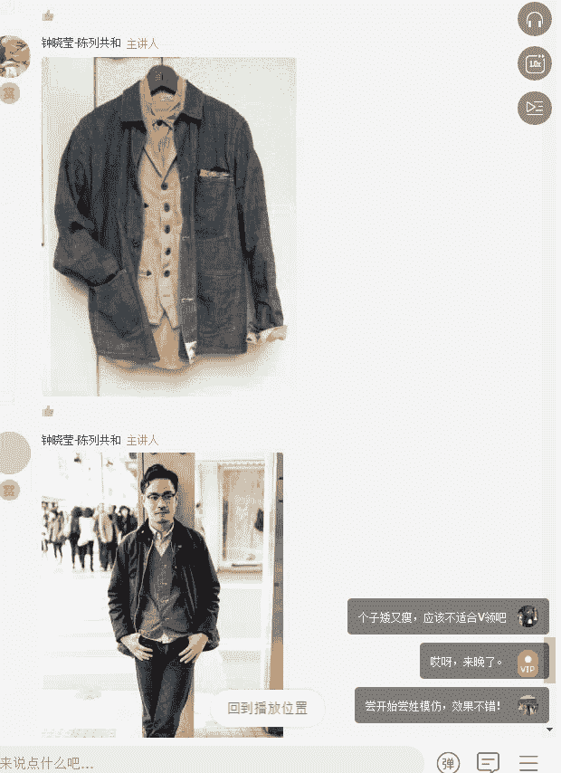

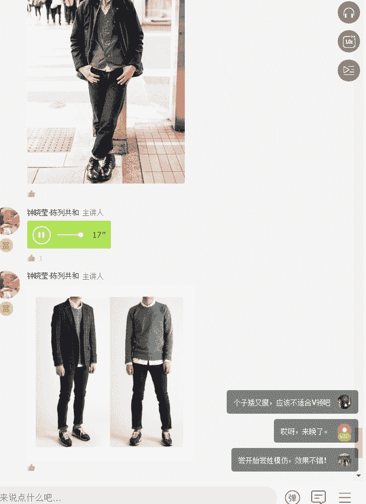

比如说你现在看到的这张图啊，都是穿绿色的这件针织衫做打底，但是穿了外套的那个就显得更加的魁梧一些哈，不穿的那个显得很邋遢。

再来这个大家有没有看到，如果你的个子又小又瘦，那么你在正式的场合的时候，你看左边的这个男士跟右边的男士同一个人换个鞋，换了那个衣服之后，外套没换，同样你看两个高度是不是不同，是不是感觉右边那个更高一点。

原因是因为他中间穿了一个明度极高的白色，再加了一个领结跟裤子相呼应。然后。裤子又跟鞋子形成了一个颜色的呼应。这个时候呢整个人显得特别的高。

矮个子镜子穿的衣服啊，不不是矮个子，就瘦瘦的人，镜子穿的衣服就是这种啊，很很瘦，然后呃穿的衣服很宽大，这种是不适合的。或者你很瘦。然后呢你穿的衣服的这个呃然后还穿条纹这都不合适。

像这种也是不适合瘦子和矮个子，也不适合胖子。

这种就是叠穿，它叠个三件，但是呢它三件是同一个色系的，大家有没有发现？

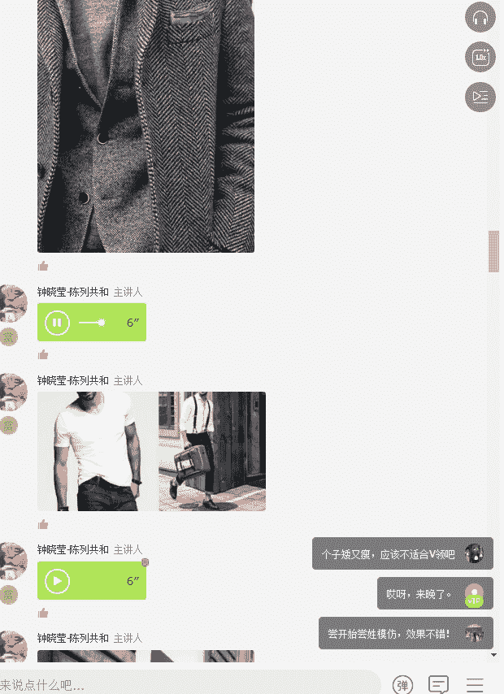

胖子和瘦子都切记用这样子的方式来穿衣好，一件事的不要。

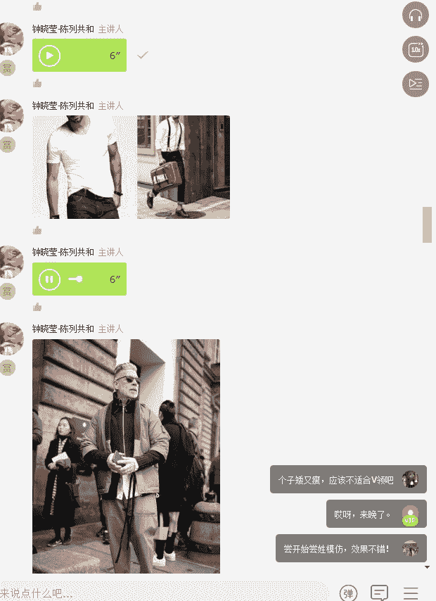

好，接下来要讲到的就是这种魁梧型啊，就是倒三角形，就是他的肩部呃，他的胸部特别大啊，这种人都有个特点，穿的不好，会显得脖子特别的粗。

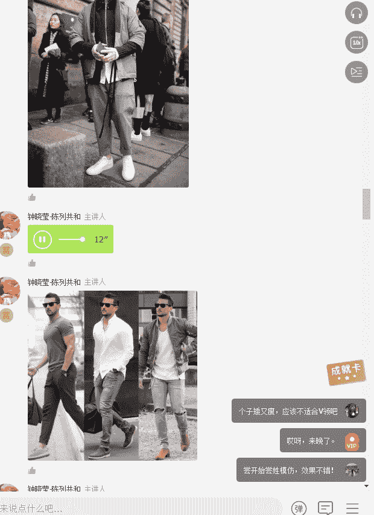

好，比如说像我们现在看到的这张图，这张图就是这个男士的胸部和肩部是比较宽大的。你看到他穿第一件，第二件和第三件哈，那从有没有发现是一件比一件瘦啊，第一件显得很魁梧，第二件瘦一点。

第三件因为他加了一件深色的外套就瘦会很多。

好，大家看到了这两个都是不适合这种倒三角形的男士穿着的。第一个高领不适合，第二个特别紧身的T恤和衬衣都不合适。但是这条裤子是合适的，为什么呢？因为它会让你整个人变得更瘦。一定记住，如果你是倒三角形身材。

千万不要去穿宽腿裤。你是H型身材，可以穿宽腿裤。哎，大家看到这两个就是比较适合的，就是他穿的T恤不紧不松，同时有领子。因为你的你的胸部和肩膀很宽，如果你穿没有领子的一圈的这种圆领T恤的话。

会显得整个人非常的什么非常的魁梧，有点呆傻，就有点那种好像四肢发达没有脑的感觉，然后另外一个呢就是穿衬衣，但衬衣一定要选择那种稍微宽松一点点，但不要特别的宽松。

就是你最起码伸进一个拳头的这样子的松度才行。

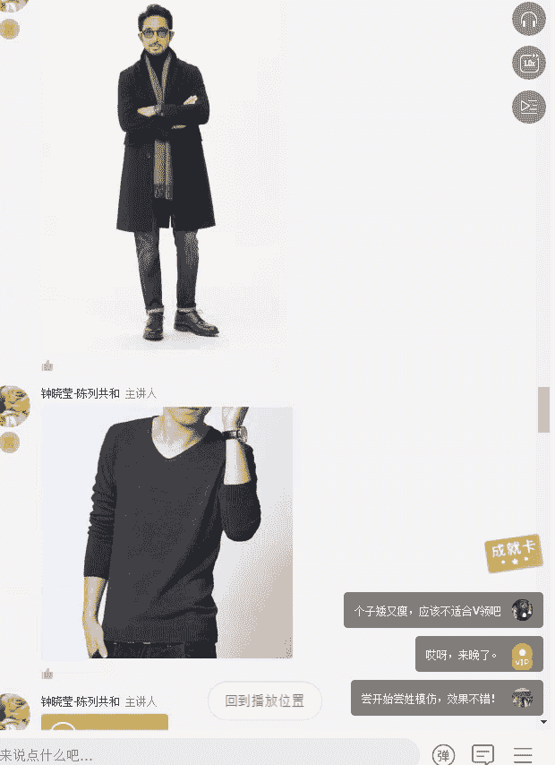

这种都是建硕型，呃，是就是这种倒三角的身材比较适合穿的。那倒三角的身材，其实按照正常，如果说你有常常健身的人来说，应该身材是比较好看的。但是我觉得男人的腰太细，其实是一般都不好看的。

这款衣服也是这种呃倒三角形的人不适合穿的，就是这种V领。或者一字领的都不适合，那高领也不适合，因为我显得脖子特别的短，要么呃你比较适合有领的T恤。

如果你想要穿呃领子高一点的那你就可以用这种圆领的针织衫来搭配这种衬衫，也可以让你的整个人变得更精神一些。

或者是加一条围巾，但是加围巾的时候不要加的太厚啊，轻轻的加一条比较简洁一点的围巾，不要加太厚的围巾。

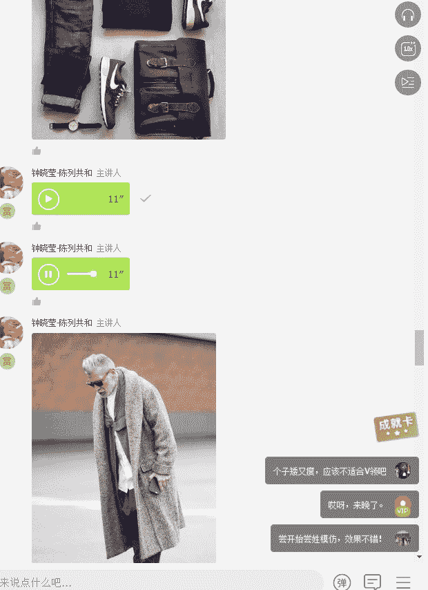

像这种都是可以的。这种围巾啊或者是这种宽松的大衣的感觉。

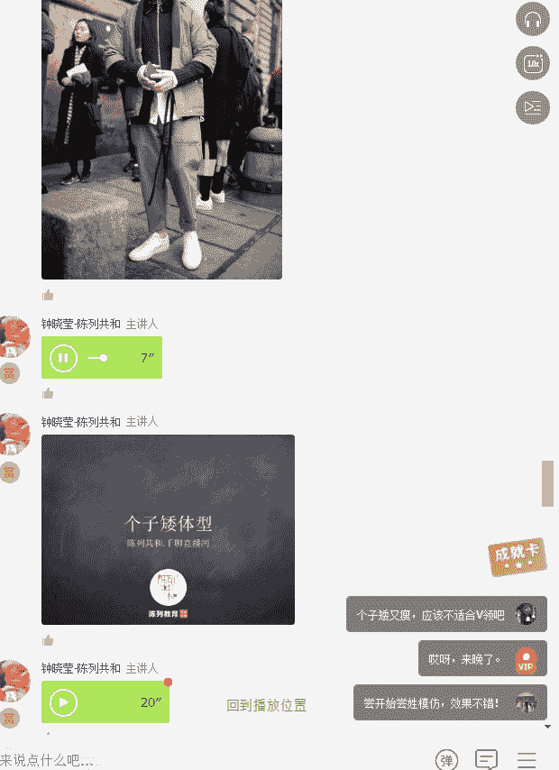

好，那么最后我们来讲一个个子矮的体型，到底应该怎么样去穿衣服？这个应该是很多男士的忧伤的地方，就是所有的男人都希望自己是一。8米，看上去是1。8米，所有的女人都希望自己看上去只有90斤。

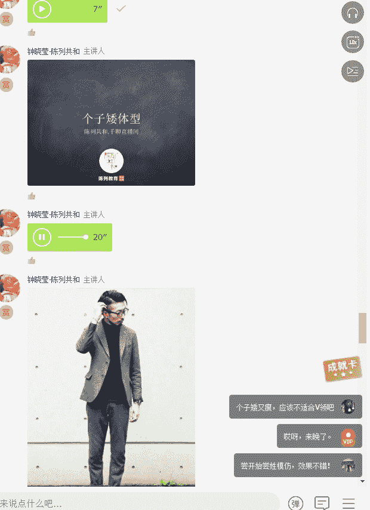

矮个子穿衣我觉得有一个特别大的一个重点。这个重点就是你的裤子要短一些，但是一定记住，不是那种九七分裤的短啊，你要穿七分裤，那最后你就你的腿也就只有七分那么短。首先我们来说矮个子不适合的衣服。第一。

不合身的大号衣服，就是那种嘻哈歌手穿的。你看嘻哈歌手虽然看起来都牛高马大的，但是往往给人感觉他好矮，特别是腿特别短，原因都是因为着装偏大的原因。第二个就低腰裤，那种哈伦裤，一般人一穿低腰裤。

身材马上就变成了64分，上身6下身4。然后第三就是穿那种下摆过长的T恤，也会让你上半身特别的短，显得腿短，没有人愿意让自己腿短吧。你在家随便怎么穿都可以。第四就七分裤。

真的你你不要以为你穿七分裤就显高啊。七分裤有时候让你的裤，让你的腿啊真的是七分那么短了，不信我给你看张图。然后第五个就是花哨的裤子，也会让人把视线从你身上往下移。

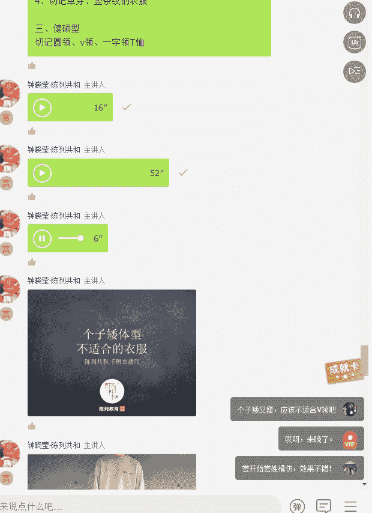

大家看到了吗？这张还有一张更明显的就是一看上去就是感觉这个腿短的惊人的。所以大家在矮个子穿衣里面，大家一定要记住这些特点。其实穿衣很简单，你记住你合适的和记住你不合适的就可以了。人生也是一样的。

你知道你想要的和知道你不想要的。其实穿衣服有时候要克制自己的欲望啊，特别是觉得自己穿什么都帅的人。像这种花裤子也是不推荐个子矮的人穿的。那么各既然我们个子矮了。

到底我们个子矮应该穿什么样的衣服是合适的呢？首先第一点，整体的视觉要往上走，视觉往上走就会拉高你的比例。

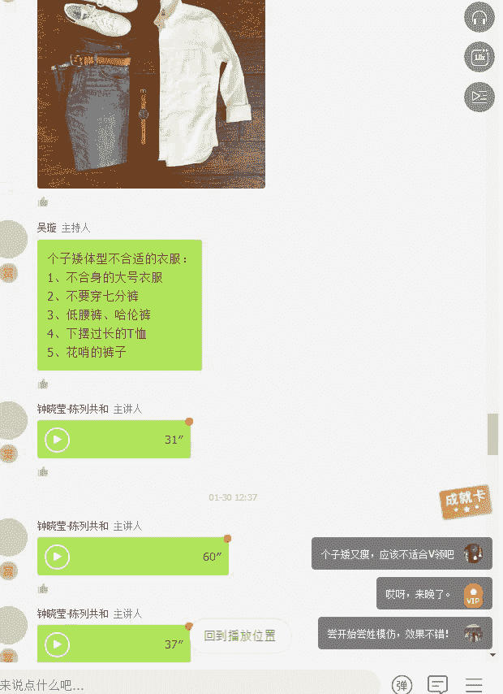

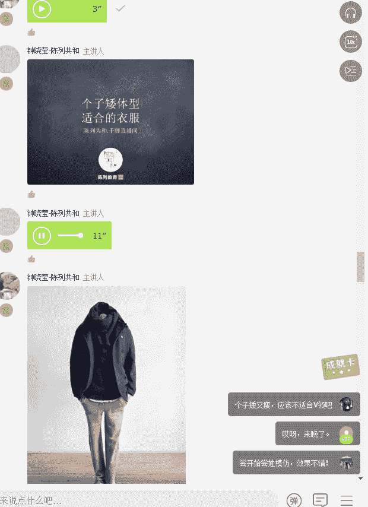

那么视觉往上走又有一个特点，就是要你可以穿高领啊，然后呢你可以穿上身颜色艳丽一点的衣服，然后呃你的衬衣可以白一点，然后你的裤子的颜色深一点。然后你的衬衣呢不要太过于紧身。

因为紧身呢会会显得你整个上半身又变得太小，然后你上衣合适就好，我一直都觉得男生不要穿太过紧身的衣服会很容易凉泡，除非你是打底的衣服，你可以紧身一点。那呃矮个子男生最推荐的单品。第一个修身款的裤子啊。

裤子是修身款，但是也不是要特别紧身的。第二个就是V领的上衣，因为纵线的纵向的线条能够拉长你的整个身形。第三，选择这种竖条纹的单品。第四，选择尺码更小的包款，你的本身就矮，你还背一个特别大的包也不合适。

第五个就是使用围巾等，或者是帽子来将你的视线的重点往上移，一定记住。然后另外一个就是使用腰带等配饰啊，比如说你可以选选用一点亮色的配饰啊，腰带都可以，或者是把衬衣的下摆放在裤子里面。

就是把前半部分塞进去，你没有发现我们现在穿衣服都是这样子的，前半部分塞进去，到后半部分还在外面，或者只塞一边，也可以显出腿很长的样子。永远记住，使用亮色。一定要集中在上半身使用量色。然后下半身使用深色。

避免使用亮色，不要穿橘色、黄色、绿色的裤子，你一定要穿深色的裤子，因为深色的裤子就会让整个人变得更瘦，更更更更往上走。如果你穿特别是个子比较矮的男生不要穿，如果当你的上呃当你的体型不是特别完美的时候。

不要去穿白裤子。然后还有显高的方法，就是裤子跟鞋子是同色的，是最显高的。

好了，以上就是我们今天对于男士的这个着装的体型的部分的讲解。然后接下来呢我有多点时间在这里面给大家回答你们的问题。

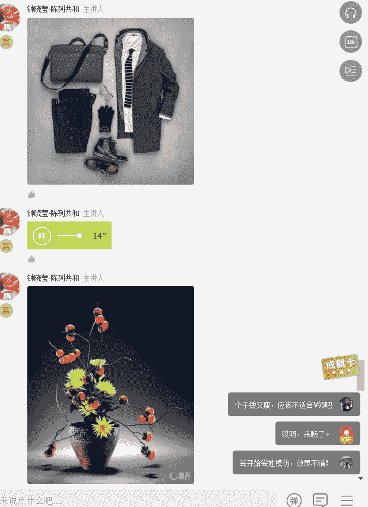

好啦，我们今天的课程到此结束，感谢老师今天精彩的分享。我们明天同一时间12点不见不散。

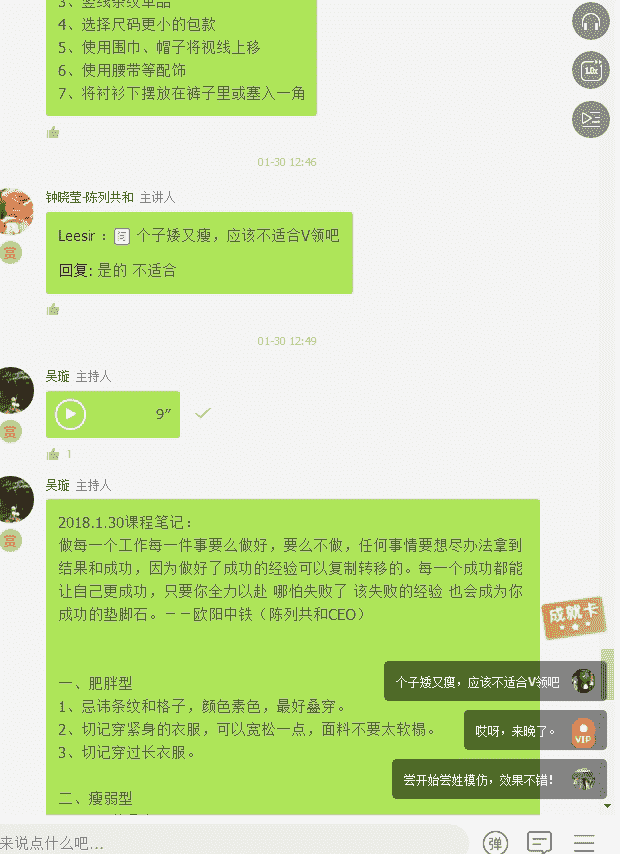

